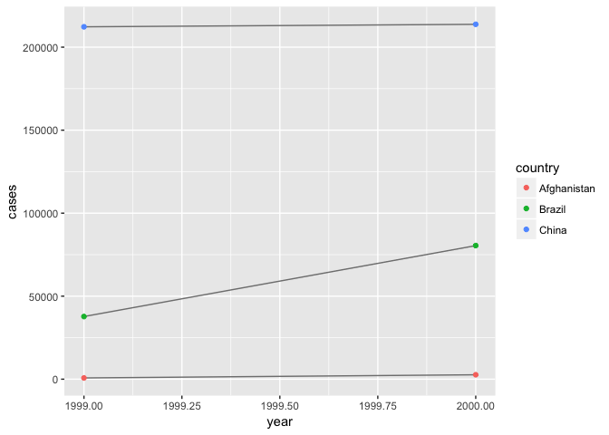
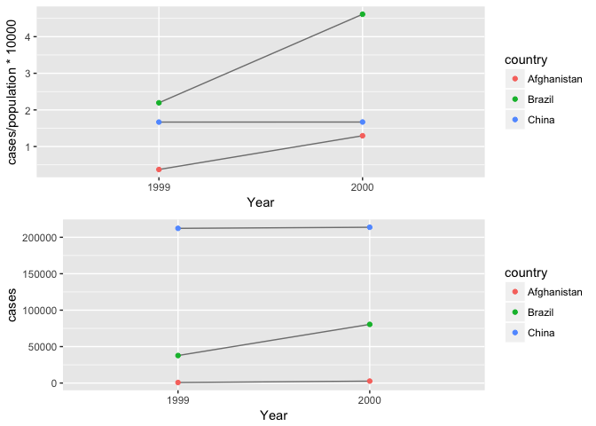

# R Notebook

```r
library(tidyverse)
```

```
## Loading tidyverse: ggplot2
## Loading tidyverse: tibble
## Loading tidyverse: tidyr
## Loading tidyverse: readr
## Loading tidyverse: purrr
## Loading tidyverse: dplyr
```

```
## Conflicts with tidy packages ----------------------------------------------
```

```
## filter(): dplyr, stats
## lag():    dplyr, stats
```

```r
library(ggplot2)
library(gridExtra)
```

```
## 
## Attaching package: 'gridExtra'
```

```
## The following object is masked from 'package:dplyr':
## 
##     combine
```
There are three interrelated rules which make a dataset tidy:
－ Each variable must have its own column.
－ Each observation must have its own row.
－ Each value must have its own cell.

Practical instructions:
- Put each dataset in a tibble.
- Put each variable in a column.


```r
table1
```

```
## # A tibble: 6 x 4
##       country  year  cases population
##         <chr> <int>  <int>      <int>
## 1 Afghanistan  1999    745   19987071
## 2 Afghanistan  2000   2666   20595360
## 3      Brazil  1999  37737  172006362
## 4      Brazil  2000  80488  174504898
## 5       China  1999 212258 1272915272
## 6       China  2000 213766 1280428583
```

```r
# Compute rate per 10,000
table1 %>% 
  mutate(rate = cases / population * 10000)
```

```
## # A tibble: 6 x 5
##       country  year  cases population     rate
##         <chr> <int>  <int>      <int>    <dbl>
## 1 Afghanistan  1999    745   19987071 0.372741
## 2 Afghanistan  2000   2666   20595360 1.294466
## 3      Brazil  1999  37737  172006362 2.193930
## 4      Brazil  2000  80488  174504898 4.612363
## 5       China  1999 212258 1272915272 1.667495
## 6       China  2000 213766 1280428583 1.669488
```

```r
# Compute cases per year
table1 %>% 
  count(year, wt = cases)
```

```
## # A tibble: 2 x 2
##    year      n
##   <int>  <int>
## 1  1999 250740
## 2  2000 296920
```

```r
# Visualise changes over time
library(ggplot2)
ggplot(table1, aes(year, cases)) + 
  geom_line(aes(group = country), colour = "grey50") + 
  geom_point(aes(colour = country))
```

<!-- -->

### Exercise P151
#### 1
Table1: Variables are in columns and observations are in rows.
Table2: Every two rows are a observation, variables cases and population are combined into two columns.
Table3: Every row is an obervation, "case" and "population" are combined into one column "rate".
Table4: Variables case and population are seperated into two tables. In each table, every row is an obeservation and variable "case"/"population" is seperated by year into two columns.

#### 2

```r
#rate = cases / population * 10000 (for every country each year)
table2
```

```
## # A tibble: 12 x 4
##        country  year       type      count
##          <chr> <int>      <chr>      <int>
##  1 Afghanistan  1999      cases        745
##  2 Afghanistan  1999 population   19987071
##  3 Afghanistan  2000      cases       2666
##  4 Afghanistan  2000 population   20595360
##  5      Brazil  1999      cases      37737
##  6      Brazil  1999 population  172006362
##  7      Brazil  2000      cases      80488
##  8      Brazil  2000 population  174504898
##  9       China  1999      cases     212258
## 10       China  1999 population 1272915272
## 11       China  2000      cases     213766
## 12       China  2000 population 1280428583
```

```r
#?rep
#rep(1999:2000,each = 3)
#rep(1999:2000, 3)
tbl2 <- tibble(
  country = rep(c("Afghanistan", "Brazil", "China"), each = 2),
  year = rep(1999:2000, 3),
  cases = filter(table2, type == "cases")[["count"]],
  population = filter(table2, type == "population")[["count"]]
) %>%
  mutate(rate = cases / population * 10000)
tbl2
```

```
## # A tibble: 6 x 5
##       country  year  cases population     rate
##         <chr> <int>  <int>      <int>    <dbl>
## 1 Afghanistan  1999    745   19987071 0.372741
## 2 Afghanistan  2000   2666   20595360 1.294466
## 3      Brazil  1999  37737  172006362 2.193930
## 4      Brazil  2000  80488  174504898 4.612363
## 5       China  1999 212258 1272915272 1.667495
## 6       China  2000 213766 1280428583 1.669488
```

```r
table4a
```

```
## # A tibble: 3 x 3
##       country `1999` `2000`
## *       <chr>  <int>  <int>
## 1 Afghanistan    745   2666
## 2      Brazil  37737  80488
## 3       China 212258 213766
```

```r
table4b
```

```
## # A tibble: 3 x 3
##       country     `1999`     `2000`
## *       <chr>      <int>      <int>
## 1 Afghanistan   19987071   20595360
## 2      Brazil  172006362  174504898
## 3       China 1272915272 1280428583
```

```r
tbl3 <- tibble(
  country = c(table4a[["country"]],table4a[["country"]]),
  year = rep(1999:2000,each = 3),
  cases = c(table4a[["1999"]],table4a[["2000"]]),
  population = c(table4b[["1999"]],table4b[["2000"]])
)%>%
  mutate(rate = cases / population * 10000)
tbl3
```

```
## # A tibble: 6 x 5
##       country  year  cases population     rate
##         <chr> <int>  <int>      <int>    <dbl>
## 1 Afghanistan  1999    745   19987071 0.372741
## 2      Brazil  1999  37737  172006362 2.193930
## 3       China  1999 212258 1272915272 1.667495
## 4 Afghanistan  2000   2666   20595360 1.294466
## 5      Brazil  2000  80488  174504898 4.612363
## 6       China  2000 213766 1280428583 1.669488
```
Table 1....

####3

```r
table2
```

```
## # A tibble: 12 x 4
##        country  year       type      count
##          <chr> <int>      <chr>      <int>
##  1 Afghanistan  1999      cases        745
##  2 Afghanistan  1999 population   19987071
##  3 Afghanistan  2000      cases       2666
##  4 Afghanistan  2000 population   20595360
##  5      Brazil  1999      cases      37737
##  6      Brazil  1999 population  172006362
##  7      Brazil  2000      cases      80488
##  8      Brazil  2000 population  174504898
##  9       China  1999      cases     212258
## 10       China  1999 population 1272915272
## 11       China  2000      cases     213766
## 12       China  2000 population 1280428583
```

```r
library(ggplot2)
ggplot(table1, aes(year, cases)) + 
  geom_line(aes(group = country), colour = "grey50") + 
  geom_point(aes(colour = country))
```

<!-- -->

```r
library(ggplot2)
table1_year <- ggplot(table1, aes(factor(year), cases / population * 10000)) + 
  geom_line(aes(group = country), colour = "grey50") + 
  geom_point(aes(colour = country)) +
  xlab("Year")

table1_rate <- ggplot(table1, aes(factor(year), cases)) + 
  geom_line(aes(group = country), colour = "grey50") + 
  geom_point(aes(colour = country)) +
  xlab("Year")
```

```r
grid.arrange(table1_year, table1_rate, ncol=1)
```

<!-- -->


```r
tbl2_ <- tibble(
  year = filter(table2, type == "cases")[["year"]],
  cases = filter(table2, type == "cases")[["count"]],
  country = filter(table2, type == "cases")[["country"]]
)
tbl2_
```

```
## # A tibble: 6 x 3
##    year  cases     country
##   <int>  <int>       <chr>
## 1  1999    745 Afghanistan
## 2  2000   2666 Afghanistan
## 3  1999  37737      Brazil
## 4  2000  80488      Brazil
## 5  1999 212258       China
## 6  2000 213766       China
```

```r
ggplot(tbl2_, aes(year, cases)) + 
  geom_line(aes(group = country), colour = "grey50") + 
  geom_point(aes(colour = country))
```

<!-- -->

###Spreading and gathering
#### Gathering
Tidying.
1. figure out what the variables and observations are. 
2. resolve one of two common problems:
- One variable might be spread across multiple columns.
- One observation might be scattered across multiple rows.

```r
table4a
```

```
## # A tibble: 3 x 3
##       country `1999` `2000`
## *       <chr>  <int>  <int>
## 1 Afghanistan    745   2666
## 2      Brazil  37737  80488
## 3       China 212258 213766
```
To tidy a dataset like this, we need to gather those columns into a new pair of variables. To describe that operation we need three parameters:

The set of columns that represent values, not variables. In this example, those are the columns 1999 and 2000.

The name of the variable whose values form the column names. I call that the key, and here it is year.

The name of the variable whose values are spread over the cells. I call that value, and here it’s the number of cases.


```r
table4a %>% 
  gather(`1999`, `2000`, key = "year", value = "cases")
```

```
## # A tibble: 6 x 3
##       country  year  cases
##         <chr> <chr>  <int>
## 1 Afghanistan  1999    745
## 2      Brazil  1999  37737
## 3       China  1999 212258
## 4 Afghanistan  2000   2666
## 5      Brazil  2000  80488
## 6       China  2000 213766
```
Note that “1999” and “2000” are non-syntactic names (because they don’t start with a letter) so we have to surround them in backticks.

```r
tidy4a <- table4a %>% 
  gather(`1999`, `2000`, key = "year", value = "cases")
tidy4b <- table4b %>% 
  gather(`1999`, `2000`, key = "year", value = "population")
left_join(tidy4a, tidy4b)
```

```
## Joining, by = c("country", "year")
```

```
## # A tibble: 6 x 4
##       country  year  cases population
##         <chr> <chr>  <int>      <int>
## 1 Afghanistan  1999    745   19987071
## 2      Brazil  1999  37737  172006362
## 3       China  1999 212258 1272915272
## 4 Afghanistan  2000   2666   20595360
## 5      Brazil  2000  80488  174504898
## 6       China  2000 213766 1280428583
```
#### Spreading

```r
table2
```

```
## # A tibble: 12 x 4
##        country  year       type      count
##          <chr> <int>      <chr>      <int>
##  1 Afghanistan  1999      cases        745
##  2 Afghanistan  1999 population   19987071
##  3 Afghanistan  2000      cases       2666
##  4 Afghanistan  2000 population   20595360
##  5      Brazil  1999      cases      37737
##  6      Brazil  1999 population  172006362
##  7      Brazil  2000      cases      80488
##  8      Brazil  2000 population  174504898
##  9       China  1999      cases     212258
## 10       China  1999 population 1272915272
## 11       China  2000      cases     213766
## 12       China  2000 population 1280428583
```
The column that contains variable names, the key column. Here, it’s type.

The column that contains values forms multiple variables, the value column. Here it’s count.

```r
spread(table2, key = type, value = count)
```

```
## # A tibble: 6 x 4
##       country  year  cases population
## *       <chr> <int>  <int>      <int>
## 1 Afghanistan  1999    745   19987071
## 2 Afghanistan  2000   2666   20595360
## 3      Brazil  1999  37737  172006362
## 4      Brazil  2000  80488  174504898
## 5       China  1999 212258 1272915272
## 6       China  2000 213766 1280428583
```
gather() makes wide tables narrower and longer; spread() makes long tables shorter and wider.

### Exercises P156
#### 1

```r
stocks <- tibble(
  year   = c(2015, 2015, 2016, 2016),
  half  = c(   1,    2,     1,    2),
  return = c(1.88, 0.59, 0.92, 0.17)
)
stocks
```

```
## # A tibble: 4 x 3
##    year  half return
##   <dbl> <dbl>  <dbl>
## 1  2015     1   1.88
## 2  2015     2   0.59
## 3  2016     1   0.92
## 4  2016     2   0.17
```

```r
stocks %>% 
  spread(year, return)
```

```
## # A tibble: 2 x 3
##    half `2015` `2016`
## * <dbl>  <dbl>  <dbl>
## 1     1   1.88   0.92
## 2     2   0.59   0.17
```

```r
stocks %>% 
  spread(year, return) %>% 
  gather("year", "return", `2015`:`2016`)
```

```
## # A tibble: 4 x 3
##    half  year return
##   <dbl> <chr>  <dbl>
## 1     1  2015   1.88
## 2     2  2015   0.59
## 3     1  2016   0.92
## 4     2  2016   0.17
```
The type of year turned into double because the year number was used as key.

```r
?spread
```

```r
stocks %>% 
  spread(year, return, convert = T) %>% 
  gather("year", "return", `2015`:`2016`, convert = T)
```

```
## # A tibble: 4 x 3
##    half  year return
##   <dbl> <int>  <dbl>
## 1     1  2015   1.88
## 2     2  2015   0.59
## 3     1  2016   0.92
## 4     2  2016   0.17
```
#### 2
Because the numbers are not surround in backticks.

#### 3

```r
people <- tribble(
  ~name,             ~key,    ~value,
  #-----------------|--------|------
  "Phillip Woods",   "age",       45,
  "Phillip Woods",   "height",   186,
  "Phillip Woods",   "age",       50,
  "Jessica Cordero", "age",       37,
  "Jessica Cordero", "height",   156
)
people
```

```
## # A tibble: 5 x 3
##              name    key value
##             <chr>  <chr> <dbl>
## 1   Phillip Woods    age    45
## 2   Phillip Woods height   186
## 3   Phillip Woods    age    50
## 4 Jessica Cordero    age    37
## 5 Jessica Cordero height   156
```

There are tow rows with same name and key.

```r
people_ <- tribble(
  ~name,             ~key,    ~value, ~observation,
  #-----------------|--------|------|--------------
  "Phillip Woods",   "age",       45,     1,
  "Phillip Woods",   "height",   186,     1,
  "Phillip Woods",   "age",       50,     2,
  "Jessica Cordero", "age",       37,     1,
  "Jessica Cordero", "height",   156,     1
)
people_
```

```
## # A tibble: 5 x 4
##              name    key value observation
##             <chr>  <chr> <dbl>       <dbl>
## 1   Phillip Woods    age    45           1
## 2   Phillip Woods height   186           1
## 3   Phillip Woods    age    50           2
## 4 Jessica Cordero    age    37           1
## 5 Jessica Cordero height   156           1
```

```r
spread(people_, key = key, value = value)
```

```
## # A tibble: 3 x 4
##              name observation   age height
## *           <chr>       <dbl> <dbl>  <dbl>
## 1 Jessica Cordero           1    37    156
## 2   Phillip Woods           1    45    186
## 3   Phillip Woods           2    50     NA
```
#### 4

```r
preg <- tribble(
  ~pregnant, ~male, ~female,
  "yes",     NA,    10,
  "no",      20,    12
)
```
Need to gather it, variables gender, pregnant and count

```r
preg %>% 
  gather(male, female, key = "gender", value = "count")
```

```
## # A tibble: 4 x 3
##   pregnant gender count
##      <chr>  <chr> <dbl>
## 1      yes   male    NA
## 2       no   male    20
## 3      yes female    10
## 4       no female    12
```

