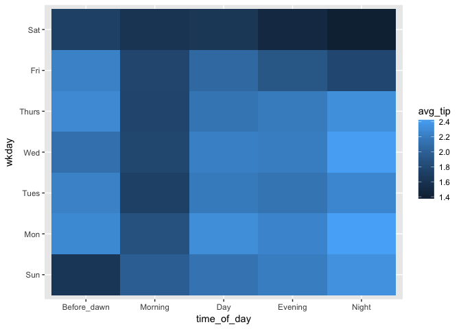

# R Notebook


```r
library(ggplot2)
library(tidyverse)
```

```
## Loading tidyverse: tibble
## Loading tidyverse: tidyr
## Loading tidyverse: readr
## Loading tidyverse: purrr
## Loading tidyverse: dplyr
```

```
## Conflicts with tidy packages ----------------------------------------------
```

```
## filter(): dplyr, stats
## lag():    dplyr, stats
```

```r
library(lubridate)
```

```
## 
## Attaching package: 'lubridate'
```

```
## The following object is masked from 'package:base':
## 
##     date
```

```r
library(stringr)
library(forcats)
```

## Chicago taxi data
https://data.cityofchicago.org/Transportation/Taxi-Trips/wrvz-psew/data 

### Data description: This is data from taxi trips reported to the city of Chicago. There are total 112860054 rows and 23 variables including information about the taxi, time, location and expenses.

### Time estimation: download for 100 seconds, 57.1MB, 194455 rows. So the time takes to download whole dataset should be about 16 hours. Size of whole data set should be about 33GB.


```r
df = read.csv("Taxi_Trips.csv")
df
```

```
##                                         Trip.ID
## 1      142266a839de6ef89b92bf3d5106417ab4f0fdbd
## 2      14223415e294934878f37e40bd0030b6a0d2492c
## 3      14223460117f944cff233ad1f660b5ecf3afb6a8
## 4      1422348a499196cb5d512fc34f0270d1f93cfc87
## 5      142249a37d7c49b6b0a5dd7fa40dfce1c17bdfa3
## 6      14223662b4949521280977159cefcf71aa6b5ada
## 7      142236fe4422d6e4c77d150475ff24527dfbf897
## 8      142683bbab7ef07cbf57c480ac06fab8127b9e13
## 9      142239247ca51033a44cb5adcc08789f8240d82b
## 10     14223a39222480b37262a43a9344508552f3c7d5
## 11     14223c2d71dfaa8b3d36224bf9ef1f131dadf5cd
## 12     14223c6514185f62b28691283b134b32c8c2f041
## 13     14223d541ff95cd3562cfd03a60adb895d5f1b24
## 14     14223e796cbed1c946349e913cf32bbd0003bd6d
## 15     142e2535156d3cf30f9f48d113c06339ac98065b
## 16     142241d2f61b087dbfce9350983f94ed34a85643
## 17     142243bf5dd70d9c61d8757995ad7f77597e0d9d
## 18     1422467cf6bcb15d20b9b684a7af230ea71dcd2f
## 19     1422479a1eae6a3a1a3c583ee07fcfe14b251304
## 20     142248a49e89678890594c23b0b378b194f54dfd
## 21     1422491efeacb8393de5e4fd494a6798f2cac422
## 22     14224e1d06d1a8a18a571a40009e33a9866d8a71
## 23     14224f41066d652a26d64c81e4b2743d5561e97a
## 24     14224f6c3344b277f78c1620eec8205d831860e0
## 25     14225b4896b3c7b423fb386d6dc153b9aa6ff67c
## 26     14302a0f264d336a774825d58cc077de180e001d
## 27     142252a79f2a276b9e6a5e4b20eea3158425113b
## 28     142253ad09ab36c2f8b34c5575a0e5d5272d9ab7
## 29     1422552f8eb38dcbda7506e5c6b4c41fcfa27ade
## 30     14225625990137444a8d8495768187fd2e8e2575
## 31     142257c67a2d52d3291dbf6e22fa5f19dd985935
## 32     14225824cb71a5f9f30ee5f283316b4a09571467
## 33     1422588c3224602a8e7d3f321bc2ef6820cfc538
## 34     1422590cfc7276697e0c74b733312aa4792d3906
## 35     14237e56bfe813881fe7e7f6d44b5a43d7ace6c5
## 36     14225aa7d371c122b7d5aa6bf70da069acf0b29c
## 37     14225aa9e2fda659b6abb4ad803240ed329f174d
## 38     14225b2f31a5463a9797970fb04151c7475308a5
## 39     14225daf94908745312a5cae837b09537d2059e0
## 40     14225f3a728e69e849b2f9c0297f793dca102a2c
## 41     142334ed12f7760ad445a25beef4f405a08ff066
## 42     1422618e94aecc52da95ab6672fcad24a9c9e060
## 43     14304ffc4361dc6a231e6bca52b3d59b1b21b739
## 44     142262b17abf1c3232746933df35c39c5f4f1413
## 45     14239b0788a0c5921637b68c51098f881ff9e096
## 46     1422645e86b70d40857c67803951c27b7f5079f7
## 47     1422655877f475ea1335fbc56416359f303e24de
## 48     1422661db11cbb869293b3db0b01ee6dd7f5686c
## 49     14226ab2f387182e121c39226e0556fd7839c5a6
## 50     14226b104d6797f2160818dda67d658fb9807b23
## 51     14226d6580280c58d18e048525e434ac3c3e7ce9
## 52     14226d8b65c1e9b15f632a4e3c1e1db47b699ba4
## 53     1435ae452fce4666f3167171ab445af129560a6e
## 54     14226e92940c66e5ff6a603467aac13c6cfaf6a9
## 55     14226ebb8f4c5e940da91f73020decb60acb62af
## 56     142271e83408230400f2968021fe3769a107200e
## 57     14227259ba86fede73d024cc808aa831b335af82
## 58     142273735443052bb89a20d14a81ff24255b3d16
## 59     142278aa9dee425e88660a74b098bec6fd24c9b1
## 60     142279d01e1097efcbb72901e91b950bd593f3b4
## 61     14227a6a18007bc08bd72e813df264562356835b
## 62     14227a844a831e3cdc6c44a9ea997d59b796085b
## 63     1422c22ef3c8c0bd5ec529db5c4453bf92d7581e
## 64     14227b447c4d84eec8ab5b143add838a9aa59c6a
## 65     14227b5cf8bd54a7ebd2598fa9cb5ec11abebb13
## 66     14227bc458e19a8eed99d4a1fbeebdd83dd98b3b
## 67     14227d4e2f1d607fba8786b59e0b0e5645857830
## 68     1437d16711f72031bcbfd1c8a2f80afdfa58dce9
## 69     14227fa484bbe57c678824f58213c0c807dde158
## 70     14228066d652538d668dc7af24bea22580d89921
## 71     1422808cd79e83f8ac4d53ced5dea70441ffb291
## 72     14228410a34650f25e4f081922145ec95723c195
## 73     142284ea4f1ad85b63ec13781de8b8c709ccfccd
## 74     1422854f6af933cf463e1f0d6a8cf9e1018e05a6
## 75     1422898ee671c39873accdb495a9c98ff4f1f04d
## 76     14228a98aaa8f6b506d3a00029a0b6e4f3ca9d00
## 77     14228d6091f76faaa82049f34b17d18a30308fe9
## 78     14228e8e816a29d0734af2ae7fc165c7ca91a7d7
## 79     14228ef7f512c80591139e13639f3fe86a5faff0
## 80     14228f4550f738c427f59f04fcc0c476d648436f
## 81     14228fccda6394cdce670080369d7610727a15e7
## 82     142290438ddfc8d6c627a50fff66ebe66fbe4e32
## 83     142290583f59e31265dbca6b31f417fac7fd2ffa
## 84     142291912645c4211f362306454a5696bac937f7
## 85     142297195e2519cab0b642539c3f9fb84501bd46
## 86     142294309590d3c77b7807fd9ddba35ae49250f7
## 87     142296f8da7b5bd2ace8aa31ab461224659706f2
## 88     14229b28478b5f0a9bf151bef72ffebe7cb12689
## 89     14229c98e6e6be363c9dbea95529c1c95fd00b9e
## 90     14229c9af34c616c428fc128c1d35b830b2f9e19
## 91     14230de5e1376b37820f2f9344409b9c5adee27b
## 92     14229daf863e9ce3fc129325142a599d9d1ae748
## 93     14229e6a9fa66a352c31db417efbc21b42085893
## 94     1422a219ca3ca9b50ecc761f6f1ea37285c3ce5e
## 95     1422a5e8158e98f4d30f1f642e36d9356bb0be6f
## 96     1422a6c51b07da680991459ff215b01772926060
## 97     1422a78c380246068cc43ad0c091b4f3afe7efb6
## 98     14230dee04eb17b050af1893de68e07c05382d82
## 99     1422a81734c2f1e291caf0b320a543f1c033430b
## 100    1422a8182b083a0400f09dedeb9fa58b59274478
## 101    1422a88a92ecb8bff5291081febee501d18f3436
## 102    1422a8f34dd284af3aed391c771ed593006bba0f
## 103    1422a92e33be0aeadd0a3803b8cc636ce190e902
## 104    1422a9e1db654f5240827846a4e86326efbd5ba6
## 105    1422a9eb545cee212257a78656c680dc7e2607b0
## 106    1422aa71c5c69fd7c12db91c491cc41944a4aaab
## 107    1422ab3756ef986f5b6abcb542bf48e3d7766689
## 108    1422abd859741301b0aee6fcc042e7681a871439
## 109    1422aed9fa10e7003814c57273232fe546eb20ee
## 110    1422b21ac142f98178e96f4a1f39468bc455e210
## 111    1422b2f454a7e2967c48804693a250ca3600fa5f
## 112    1422b47e40bb688d267c35070a54391fb7cd9e8d
## 113    1422b5c614006a89354d552bfc024e4631f122f2
## 114    1422b60a4018f77ef2fe6afd99710f51902af2ff
## 115    1422b67eda94e9850f6ac643ed32c58f599b9346
## 116    1422b78269e787c5841e9c45ee7c776b6ae41551
## 117    1422b923fc81c679e3e01c7709664082e129c58c
## 118    1422bc48d4266bb868a75d10e1d424dcdf44767d
## 119    1422becda4771815a97d5e9e94fbfb817766d11a
## 120    14230e73df59f1c92d6202365bc5e8fb03748506
## 121    1422c0755aad9cb046a825b11cb727c806ce53ba
## 122    1437de095c1c7d6f812f9a0c95f415e1e8576758
## 123    1422c213661967ad5e78a4a1a34c3c17439f51aa
## 124    1422c3b183e8b364af0cd407b6e7ff244fe37e7a
## 125    1422c4865acfa2d1824d8712346388196f9fba3f
## 126    1422c4a767126a9b9aceb6aaec8e08beb29dfc22
## 127    1423829474b9686c8ec57ece02fdf6c5bbf9d5cf
## 128    142335506dfac46dac20b98f2fe791b1c54ae465
## 129    1422c5ac3066d1af48979991d4a1b182c531f546
## 130    1422c7c5f038e127fc108e3dad177032c91fbbf6
## 131    1422c804af33a407d218eda678cfa0ece8f3883e
## 132    1422c9a74989df481dc97ad614e0ce89aefed437
## 133    142382b2bea391623a505864dd45c01e619eabfd
## 134    14233579b7e98f08fbcdc2b6a063a780fba59ad1
## 135    1422ccf4a82c63a78219f0b7b7fee96644113444
## 136    1422ce859489ebac3a708594a6644f2dfc118bb3
## 137    1422cead0c3101b105056caf7f86d8ece6cc1d0f
## 138    1422cef9f0884bf2b03374acfc6cf9555937dd3b
## 139    1422d083faa51ce0e2c859b37b49ae6223ffec95
## 140    1422d149bbd374010244259489b6370cfa210d9e
## 141    1422d20d2c9321e6a233e99331d770f7ac73d3b6
## 142    1422d282fb61ed37780339984537e979a7b1cfa7
## 143    1422d49ee4cfbff7bf7353a08a999b911ea23cab
## 144    14239388e23491914950e255cb3f95915f44c707
## 145    14233ad7f8aaa1da42662210036a2e9c84d394bd
## 146    1422d662d368f2c43952f68912b9b5eb351c4312
## 147    1422d6bcf1c87e682536d4bcd9636e5e588bc00f
## 148    1426c33d48afd406b82c539873d4633eebb93d22
## 149    1422d9da7cb5270474120c28398087c57c4368ce
## 150    1422da2abacf54ff9a79c0c6b634159533046390
## 151    1426c340ef673952ac98f26f64315f3c784f43c0
## 152    1422df2c2d9420e6aee397fa7a46ad5d46ab4183
## 153    1422dfdaf6f0907d81eab5016f8e6627331af2d7
## 154    1422e16ce764dec511d7f2056b21a02c13ce6d4b
## 155    1422e1eb4618260be881024f722922d32f1b635e
## 156    1423a57fa2052097e6cd411695a769d2d1a56506
## 157    1423ed584c70e5b3d643ad5e825b89ffd53a9b2d
## 158    1422e5c1d540ea499f9c040ffb6c2232fbf9d195
## 159    1422ea1f6a035012323d5a07e22639c684bbd490
## 160    142796c2c2289ac69f0395911d0f4658f750fdeb
## 161    1422eb3b186f5d738347fc3a726c14a3bc0ba931
## 162    1422eb813e808f0eadff0d78f9afe92ef945a397
## 163    1425b802b8e0f8ec5edbb973bdd9f0ffd6b23bd7
## 164    1422ebee1ce717f3ab34687671f4331b53bff1d4
## 165    1422ec3bd8092175821e039eb8c483353c219f44
## 166    1422ec67e7af0786ace6ed9da94211ac6721d9b6
## 167    1422edba2e57a26b7066aca5a48878a50880e5f0
## 168    1422ee80727f6f4e0ca311615b3ab3f13d3b092c
## 169    1426f5c7ea95526d2d777004b917e75b178e0b00
## 170    1422f26ca53b12bceff94aef0836d17c86799209
## 171    1422f685acd714a33c68a55d5a7b226873419ebf
## 172    1422f62de19e3992d81ef1beb6a996aad5729274
## 173    1422f6a7f4d0fdaf307109301720d61d86870f4e
## 174    1426fb8340e856527750c798b13c827115578e9f
## 175    1422f9d21adeae91f0dffc6b3f6466589038c52c
## 176    1422f9d367fb7cdf48fd4d7dda590da84635864c
## 177    142310dd7716f9c0eabcf33b64d3e2b2d74e7c3d
## 178    1422fb2634ef7a422cc29c2f3109b84f5a1721d6
## 179    1422fc7e1c581226b9e1a1e4bd436ecda5abfedc
## 180    1422fe945507c1568bc512a39ac7f2c626512b36
## 181    142300d3a49ec13096b33d09cd71de909f0252ec
## 182    1423015ceb592ef66b8633325e1a2a707523cb4f
## 183    142301974e2572924fc1279b507298aaa92363f1
## 184    14232e364990bcbce4395b1e6b0affd3c7b1f7de
## 185    14270805f40d68b0319a598a37ce15370dfc8551
## 186    142302b88a6da8cbe36c3a9d2050e85707d54db8
## 187    1423043f2493294310f395b6110a047a001bd324
## 188    1423087e6dc35fefc5b9a7c1ca01a89f68fadfd9
## 189    142309990a5609c8ce8d2185ed18082a12cc2e84
## 190    142309dcdcd197eebc8ade51f10037e2246b04db
## 191    14230a6a392ebda2db04c5376e9e5d6794d80fbe
## 192    14230c15a55cf2fc8686f45934cb71170ef8bd2e
## 193    1425b824968ab881a1713cbadcd9384fdbea358a
## 194    14231285d1bf3e2399b40b59ed9b4de48c7e2a92
## 195    142315db6c23d5c91e908545eb83ea192b975d57
## 196    14231638fb0edb7ede007e7100e1ac758b95975d
## 197    1425b85b4f5c3147aa74f76d8b51e6d4444d7896
## 198    14231751014ec47c8f35c1e932cd947e79f4fe0f
## 199    142317c13a021d1f3485fd5f5e5ce49e8bed7c6a
## 200    1423193566edc785f61cd178e412152137ff4e1c
## 201    14231977e20966027c0ae893346f395774b24660
## 202    14231a115dd75540ee82e19c1bc5cdd204bc5d44
## 203    1427a4f54b1e302ab1260744033b087224e711e1
## 204    14231a85ffbd62e2bcf0c6ae95a08ccea72ab19b
## 205    14231b4342e691e16c4471b02bfe29c66d8c2893
## 206    14231bd74788ad40a14489ef596d94081effa542
## 207    14231bdab045a761f7d89fde6ad398343bb88802
## 208    14231ca5ec7dd712f40feb851e48d497674b5949
## 209    14231e50dd790e05656dfa557814c3c0ad14f112
## 210    14231f7c607b4d967a228ab422ccf0983f55cb7d
## 211    14232057bfafb94563cb559283786e63f859521f
## 212    1423208b3712190f68d5218a4911b0f813fe3bdf
## 213    143a551c579b69ef7dae5c5a790a91298104d271
## 214    1427ae54d20369f5c914ffc65a7cd55fdb40781a
## 215    1425c1f19701c6ffe3e499a673b05b729101d1c1
## 216    1423242eceeee2dfada6ce1f0bfe6d1bbfa5a0b5
## 217    142326176e981e76d89f6b3039c24fddab98eaeb
## 218    1423294e978c3267bcf2b0c2e06dfc880624ca2e
## 219    14232b46fe43b39c1d415041c11340ed344807da
## 220    14232c80fab5ba11407ddaa93881ca397dfa3055
## 221    1425ffee9fbe4d8ff1bdabdd4209f17b72862fdd
## 222    14232db43a721b02071ed8178974401296040f36
## 223    14232dc2a69a1fce15c59b7eda6b92266eadbdce
## 224    14232eb0600f6b339b97d13b2c7322430ca9e024
## 225    14232ec122bea4f69b7740381ba908aef150c2a4
## 226    14232fcc9675e9ce64ba096bd4c7cc1d1c0698bf
## 227    1426992fbb4202f8657130436813be33ef24d73c
## 228    142330dc3152f26d0d832206349f29098c6a76b1
## 229    142330df455306657ce7f1b2fc7729fd146d7128
## 230    142331833be9a524cbbbf336d869abf45ff11162
## 231    142332f58367989217cbab07b83dc42c017a0e97
## 232    14233302d8cc05a73a8b8bce99d9203dc3f59793
## 233    1423335126b2c66d262179964411da37e53fa0b7
## 234    14233358bb913df09c1e762e7bfb1324a854b3f8
## 235    1423347228ea9c74797bbbf4b4c1b7681ef2a5fc
## 236    14233750c3a45d8c256b7cc8f45161f0ef67c13d
## 237    1423384aaf2ae2019e31d819e4a85147351b6149
## 238    14233869eec7bac7cfe5b52e620eb4e1398b7b0d
## 239    14233902597cd8c2ef1a49fe462291ade23ec4dc
## 240    14243d249ac5b16e02139e47eafb5505bff36afc
## 241    14233be562ecbcb7365a09bffd615fc4cb35ebd0
## 242    14233c89401a18cf7fa64f23913d679e07019396
## 243    14233cc6b21032f32ee69ffb390424caecfb6d11
## 244    14243f39f805debee753ce891c5a30b553308631
## 245    14233ecf1b06162bf439948d84b83f2aa5b777f9
## 246    14233ed1f25d8f83ccd490a0649ce906ee817d5d
## 247    14233f5210b4415fb9a65bc88c1b0e31510256bc
## 248    14233fa6d1ce640bc16d4420b4dbb9d372afe5ca
## 249    1423421964c8415c05d3a5fa23dd8d65c184737f
## 250    142342aa3edb832d451f284924491b99ee626976
## 251    1427b13cbc5f1993d1bcd7ecf81641125ce93b57
## 252    1423432dc05e4dc381fb2dae8dd95263ec36cc10
## 253    143a55e35724f66068a88f50e0a281d7230643e4
## 254    14234684f4a967bb13d0a8e705c5874f5ef75d76
## 255    142348ac7c3341183d598306bc54ff2ec1ea4346
## 256    14234b061fe85183d8c7b85b4636fcc2f5e2d0cc
## 257    14234d88a41188533311407f1fc6d0745bb14738
## 258    14234ea80f9c14d2614e9765cc65d5422ff04cac
## 259    14234ec02faa0c6daacace454290398b2b7d99fe
## 260    142350c3310202d21b75629b4fefd1af8ae9c572
## 261    142351062f15dedeb945f0537e4201475f0d7000
## 262    142352931357db3fdcfe8b469999cd5636ace6f8
## 263    14235430e9dac9a4f33522f0a60eab371c3dec90
## 264    142354a2d7f7520ad541bb7e7b7429a6a48de846
## 265    1423d6b1a61296cd115b37d493bfa5374ace4c29
## 266    142358cb89f41093e27a798abdcc9ce107099463
## 267    14235ab4c6d50ddefe1131c166b54e6dd7bdcb3d
## 268    14235afffdfd1fe9fa7def48a4b1aae6661648ce
## 269    14235e4fb899d6518a7dc0ee2a8857f235efc1a4
## 270    14235edbd478391a1c95467cf413bf40b8e60d77
## 271    1423660308a0c94a28f2162afec6794544853748
## 272    142362aa2fb7f70858ddef1b5bea32f38e7c71cf
## 273    14236654e5af78b6bba4f8696d1ca3dbe1f513ec
## 274    1423667d4e7c3a40171c81c55c47f4689bcc3e20
## 275    142368c8326a58e979415d764387aa4933d45fd6
## 276    1423dc6670954405196e643a878eb983239bb280
## 277    14236a742cb693906f585c448b050b232be0749b
## 278    14236b1bc907959fb181382b4d554555ceabecf8
## 279    14236d8b9ac84d4af6addcce39a17a440a1c4454
## 280    14236fd735e2da4c6197d5ee48c1de959584b1d3
## 281    142370034b34eef10d2709449351ee0deda40ab4
## 282    142370f9f079d77f440908db251d04c93c2d793b
## 283    1424664f3bb6a125b57f3c1ed410340ac01f234d
## 284    142376e675e6ade520334c9a86e28c360120854e
## 285    1423720444a2ae0681ccac9a835833354a961660
## 286    142373550dad4409633de54dc0866732fec2b8ae
## 287    1423839d14c94727df0bf0c2cc9da109e7ad1dbc
## 288    142373fca0daeb773b2481124a02c9ce95daaaa0
## 289    14237443c73a729131f79b76736bbc1f53e9bdca
## 290    142374977d9a483b88e5f3b86668c4711ba0207f
## 291    142376c6ac2527403f2f55f73c0365f9be40cfb7
## 292    142376cfdc6363c43a260b1c66a9f7843ea46723
## 293    14237799a95b3c60fda5a7e80c358c370f6f718a
## 294    142378c5ffd73fd2e0ed088b81b036eb6f061782
## 295    142378f0150c82f15552f36e6e9ca91e20049088
## 296    14237900274c9e51cc1cc0654573ba8fa9f2e804
## 297    1423791167e6b68f10b662c8c5e6f115e3f63a24
## 298    142379c895dce129342f3bd7fe47fda0aa1cbb75
## 299    14237a320a6ba58c3edfd42c6e909900952dd409
## 300    14237a70aff5617d39ffac570c8792ac74245960
## 301    142479bd9e97a6ff59ab6b6faacc1f7be8594196
## 302    14237c74a5475fddb246cdf12eb4e36854504af7
## 303    14237ca0cc3e9df14bd873214bf345719f15fe48
## 304    14237fae85bb6f676b8e76a5fe9f97a38bbc93cb
## 305    1423a773f56f07552cf3f3c02c794afde0ffc4f7
## 306    142381c8b6c312a62a98a5667f17f3c838849703
## 307    142381d4e9506ca033d3bc7f2f0b8c9764e27f1d
## 308    142381f6241abe615a7d3a5fd3ac9f3e728300cd
## 309    1423872c77915a59cb6e38078f518e9427d8e101
## 310    1423875514cae2edde5ef02130d540af4db171c9
## 311    1423876377ccebd38486db9a963cc714aa250de8
## 312    142387e57254f7fabccf5b4a594f829246e442f8
## 313    14238b1645f005366e9eb428374735f0219a8c09
## 314    14238b9928bf4d7a0ea6cce65eb1ed92b8cb2d9d
## 315    14238c2e65814e83460d6a4b4f24a7578295444a
## 316    14238c3d8eab1034e7c88e7e4d534f17d43ba7f8
## 317    1423c930533bab99bd4ae9e42217f86b72f570f6
## 318    14238d2d7bbadb272b4c8d377ed774e9132f2844
## 319    1423e7017a0861fbbedc53651d6245ef8037129c
## 320    14238e2c1eddb686cb084da02b16da867fe8a37f
## 321    14238faa3a6c78098fa26b9854c5911fa0bc75db
## 322    142390e14ada974d7e6fbedd1811491463e9895b
## 323    142392d3d8a600744385e586363fd1fd1930ed2f
## 324    142393b96011bacaa20ee26efe309ce5363a6397
## 325    1423e770fb4a8bd3c101a682dd96febc7496bf2f
## 326    1423973542d14b6624d9df465efcbc1434860e75
## 327    142398b305a521c76ba180a55664068b71373038
## 328    14239b485e5a25f5ef4faa37ef69467a1dc6ef6d
## 329    14239dba6ea219afb619e25406b60f40ce998445
## 330    14239e58e03fa331652fa5b92a9f983d38a2416f
## 331    14239e9a95df1a35211189dc68f4414a16d1f3e2
## 332    1423a02da842569fbe11ceb2d644bec89c2a78e3
## 333    1423a0858ce717d879abe279faa4e0cd895ecd56
## 334    1423c960dca8c03b4a60f46d6e876784387f8031
## 335    1423e1ee109cbb43d339fbc7be83bd602e661a0a
## 336    1423a6144987f1addbccbafe3a2d728f774d1154
## 337    1423a6ff9d316a6db0bdacefe98541dfe8598f95
## 338    1423a951a72b6b7a171588a6ab9c032a3127c266
## 339    1423aafa95c3de448a9e55eb3cae7a23412bf81c
## 340    1423ac00a256a5dbef1366a5605dcccea3f69738
## 341    143b232f8d4ca40a291daaddcc182f750534e04e
## 342    1423ac321540057c8b29926ca61c6f4378502038
## 343    1423ad71b3db0a73142d2e4983afd05d4f713be8
## 344    142812c9b4e7f877e7f4a4f5bfc60569ee735822
## 345    1423afa0df8a75222c8ab20cc3340c78c1695feb
## 346    1423b04b09418021f306a7854ed29b589731dd2f
## 347    1423b172ca6018e5439075c9a3bdaefde9acc838
## 348    1423b1e69d0e3af025b004421a8c21ea736a0731
## 349    1423b2003cf6a0ad681bc5d2bc3360d1ea056a1e
## 350    1423b244ead75643f1934299a2ce7b8b3b960dca
## 351    1423b2936ba2a45b225d9c712c03aeaf167659a7
## 352    1423b2f35cdaba8bb9a0dcbd8c4dc6bc3870a298
## 353    1423b3379d8de5866cb3ab43fff1abb562e31e12
## 354    1423b3946fddc203f979646173101e6633be7561
## 355    1423b3f362d727d53b778c081f15ee11431e362e
## 356    1423b51b674a73f9c6586b36228fdec50b1d13af
## 357    1423e223421a476037bc522786fee72c73633ebb
## 358    1423bb2a2b69dddcd4ecf2bbd8c03f6bfa1bf90e
## 359    1423bb475f8eedf005e680a2f255110e6c362e12
## 360    1423c0b2bdbe05b3860d15a78a223e5ac9d90fa8
## 361    1423bd6d79e3a44bcdda582a6d29e89c64452959
## 362    1423bdee15b7ff7d7fee9a0da0a949c8eb90c6d2
## 363    1423bdf0fbc9f2e7f0812b47a35240068d60f54e
## 364    1423be2869ffac2b715f84cdf6c18d115c5f6d89
## 365    14240aabf37895b9de9f4513624915c20e803a44
## 366    1423bebee3f91b90eae464894f4a288abeca38ba
## 367    1423bee855ad18d7a6cef863c050828a0ace3629
## 368    1426d070828fcf2b53f2655d6423ebdb678bd626
## 369    1423c34449389e3804cff4ca3771bb8c68eef730
## 370    1423c4b183cf44ef5ae8b8cdcfe2a303ff8a89e2
## 371    1423c53b0a0519e79381331c3bf5b46b9454892e
## 372    1423c69366efc0e8330bde8e43dbb853cad13de5
## 373    1423c7bc19b17a402deafa208e7b2634ff19ee66
## 374    1423ceb24e91064c33ad2da3a22cf8e1dbf42508
## 375    1423cffd63dfac51284c38f29853a3d20aa4b08a
## 376    1423d06ae6715810c6afe4016a861af95664f3a3
## 377    1423d156b9d1031317987971a1b000b1d8e17eb7
## 378    1423d29ce660f0c1d84b03f13b8bd2eead24201f
## 379    1423d4fc3f183a8ee7461dcee174760f89fe27f2
## 380    1423d702c2e0e6fa7077da692cede8663c36b29c
## 381    1423d743ff4ef24663a768727e211869124f63ea
## 382    142402e40384b2a234942ac1f8e7ac17f0e32f06
## 383    1423d9ccc54796d02e5a2aa0686df818b0890e5a
## 384    1423dc4c4d5810cff6a8a3841d1d2e75d007d023
## 385    1423de094003c427d042051aca894932c3113c71
## 386    1423de8a8292e72127dabda5e104bd00f95dbbac
## 387    1423de9cdcf618d619c9cc170250734bfb3e50f7
## 388    1423dfcc33334cd5c71d1ddfa79b62aa4685fa5a
## 389    1423e01a6b218e843fa885d203098dfad2257b0f
## 390    1423e4496a2f8a9bd5b926e4aa2dde6174d861e5
## 391    1423e5051996c20dd66bb4a1be4631cf49ac0e95
## 392    1423ed478323084b22f62623b14db8319e4a9a01
## 393    1423e866404a9a1cd0680e945734043041354708
## 394    1423e8e7afb8527b9a3021a11569f1ab5b18ea4b
## 395    1423eaa35d326781cb384c9fea8c0673bb001ee9
## 396    1423eb9d05d589bb5bfbed88c19710e88a028a5a
## 397    1423eefd8d9aa41778bfacb6a52f18eeaf2b133d
## 398    1423ef0aad21f25100ebe3c8aa0116fe6f4e51fc
## 399    14248f4ce9dfbc4d1bd84e32dab7194860033176
## 400    1423f0327c52543dcf02489440b21736b802cee0
## 401    1423f05855cc7989a78655ae7e1e03bb7dcfccf2
## 402    1423f1c3bba53502ba37a3dc96d699c72a0c8c68
## 403    1423f2c18c3741211f99471ac551f741025f057e
## 404    1423f347a547eab745139bbe299c6ae65e2c6338
## 405    1423f3c3fcd7ac0c43d7074437dc4b39f605fa18
## 406    1423f4208c45d96ebcaf030118686632f1455cf4
## 407    1423f44135092ff33cfeb6f7654fb0b796a18aca
## 408    1423f5628926220e8f3b04ccf4a764b7c0c07266
## 409    1423f6d7eeeae1b7087cdadf51f97b5bef232bad
## 410    1423f7049f19e516d1916053106b008b7b243ca4
## 411    1423f710c4697921f540738b8631b530be90e600
## 412    1424247d982ad8b0d0750ad4664e8cd1ee1134e0
## 413    1423f77abfd4478b0b755132b2b044049633df99
## 414    1423f87e104bdd37f0c98e4e713343690abc26e2
## 415    1423f92b2ed272e87b343518cefd59ece85000ed
## 416    1423fac154b2dda9eba65ef575bbd57d25de561d
## 417    1423faf6ad039ebde82d07994e2c0388a30e28d9
## 418    1423fbb77d10ce7eb7fb825431e84acb5d29d21a
## 419    142428fed974f9eab442838d011e5ea513674059
## 420    142403ec2ebb2d186de716ca8fedc36d20f93bf4
## 421    142403ef6c613f14ff6c6f83fa43fba8938cc9c6
## 422    14256668cf308973addf2a68c016e991b2a801e6
## 423    142404259c426a30bcba73448f1e551e2c3c7652
## 424    142436a935eb55441c80614ad1e01a5ced257929
## 425    142409f57cd967533c466cfaf96be4436a60ad14
## 426    14240d7deccba111247cb7a4c6480d982a1e453d
## 427    14240db55b7805b96fb96e9ddcad1b6d16a58f17
## 428    14240de2eba64801f8649e3c7c29950efe9b60a7
## 429    142417633b1088c42863b0c0b49e48faa487446e
## 430    14240f092265cfe67529be0d5db15cfb1cd420e0
## 431    1426d0b014b512ae808e72804cd94ab5c8cf3c68
## 432    1424103afa3add4907214aeb52d833bd1efa1cbd
## 433    1424104100db37a540a647f2fe3bdd6c307e8133
## 434    14241048e1c7b808d0e33ce76efff914a2954766
## 435    142411aedb32cfc7cc925df23f962ae3ad77ce50
## 436    142415075570390b0fa4120fd1abd8718575789d
## 437    1424153ad6945aca695960d243bb14910dfe1e67
## 438    14241737f4e16fb4548b69ddd2a96e4c3addfbae
## 439    1424185b835b61954addaacc76547d0e6a6e2b34
## 440    142440e2991be6e8fab6e6855c71dd074af1161a
## 441    14241a2708eb4c0e07ef99ad761fd045a4c54e75
## 442    14241a877077066305ba09c2d3694eddf33a07de
## 443    14241b7a35826cc43196d0c01f776a3c1e4d697e
## 444    14244104870527e892d6c73dbbacf3bc875e97fc
## 445    14241dcb69d568e57a6f3e1e9d736f3ba22e9741
## 446    14241de3f973a92b356347ea214979f1b1a05d1f
## 447    1424387a0d3690c8f2b84667f8f62d2b04298616
## 448    142425ee14f1454aacb310ed047f170edd9296f1
## 449    1424263ad62c9844f08657d7b10558b672cf975b
## 450    1426d36cf5351a476b90cfb87c5a85a752e1909e
## 451    142428933efa8737c01dc5d45877b480b63fffe5
## 452    142830f8799b3c81243e5f75557305b060b27831
## 453    142429e01c430c269b10fc1b852e0db4d869a6db
## 454    14242ae978622b31bf491571cf0a9711e83e64f1
## 455    14242b94e4f3391308ec354844356d1bf60faac5
## 456    14288c45eac5bb0704e1777ec551d94dd5cc917f
## 457    14242c8fb78b24023fe2303992c240064da30e72
## 458    14242dd0e601f70309f39854a60de846f1a3870e
## 459    142433b27ac2348592e0f5aad12d3d581b3dc3c0
## 460    14243649339dd91ef6cc68e441c3a91e863d1be7
## 461    14243794902002cec3ba470acc05cf4dcc1db179
## 462    1424393ee95e8979da94ed07019e2b615f2f6fc9
## 463    142476436267a6eb823c81e784a9c39be8bf52c9
## 464    1428b0b8e9761d8a523d943d8daa803817bcc65b
## 465    14243a9f2137c144ba7bb5513e2aaa7214262020
## 466    14243ba42992d2c295181b8aee62c92c29e63842
## 467    14243cecf5f1758ad35a0f55c371778af9556b30
## 468    14243e5a1a51d203b8ce602f1986681d1d9abdc4
## 469    14244030878974d3d428de5c60fbdc8a1abcba7a
## 470    142441eea2dd48733ddd4e7fe4e6e38e807a00ea
## 471    14244460b3a3a70077a2f5e707d6ca3dba308e2c
## 472    142444bd1fdbb7d8205817bfcc482e23ad3f0ebf
## 473    1424455a38e8a3c72f0788c6b67bc67bb3f3e650
## 474    14244593058dd47a685c93a937696b6f2f2469be
## 475    1424494e718fb8f64f19169a83eece4533008cde
## 476    142449c46e1dfbd8ecfd8bd2337b4fb1b3ceba9d
## 477    143b9ffcbf64226bef044cab5f5072c0fdda6f1d
## 478    14244eb9c599c0c983e4b2bfc360944e86326725
## 479    142450f4dfc7bab4fb91b8854cd72764cb677f41
## 480    1424510ac9842102c0900e0077702960d04d37f6
## 481    14245158159eeffa75821fab8a669df26f033dff
## 482    1424519543254f6c9408005ed7e00a9506336082
## 483    142451a6c491fdda933e693dff7db15126d41266
## 484    142451b7acd17a28d794684413374186668421a6
## 485    142452f436d04d363fcd5801e7923d24b2a87a0e
## 486    142453410ef57fb66b8dc8e074c980bdd91276df
## 487    1424536e9e54c04eb39373cc44fba7e2a15833c8
## 488    142454547373c192669b764ad63bca2a095ba78d
## 489    14245519dc264fea9c8563fc74ca4a070b751453
## 490    1424ceb18730122f7b1f0a29445d6d66a2ed0b3a
## 491    1424565c52e9d327536fdde3a3071099e018ebde
## 492    14245ca67289e548eca433a76fad4e491850b3d0
## 493    14245cf0692a4113de1c31729ab06920403809aa
## 494    14245d7649913c8947e4954b4d51cb1f60adaab1
## 495    14245efc0a92bb5d89799b3aed6e71a81b30db76
## 496    14245f26cbe2adba8b62939ef5f9bf4f09c7f675
## 497    142461750aa509fe7786074248395699a243f80b
## 498    142462af5370fa33c553814033a41e58ef4e13b4
## 499    1424644e547c814f0d902fe3fb7578b612eae9ce
## 500    14246566abd27b43b8adb05a8b7db81184d5ee11
## 501    14246570c8a77863a57df34ba296943030d2645f
## 502    142465bad952734672793a5beadd6ce916fb80ac
## 503    142467d9672efe35927769e47ef396ce9cb20069
## 504    142469518b3ae229759b423762b1c030b9eafa26
## 505    14246b827fba34a506b579b307e92ffbe3a385ea
## 506    14246c8a29937acd6a8cc4dcdae8b52a8e125f5b
## 507    14246d25892758d15895c746d4ccb3ab7c9acebd
## 508    14246da570a29e875de0ef0d4f2adc8316b251f4
## 509    142470975bdb27d2063103366b740affb7cfa558
## 510    14246e8123ee40c96bc7521d5dfbcfb33edf7cb7
## 511    14246f07ec5190d4a62013da78c5997ce57ded9c
## 512    14246f1368b62af38c3fd79885abb7cb97cf043e
## 513    14246ffe9233e287a70801a426aa1374b42fca1e
## 514    1424704fa6aab98a64f47f53810d0ee9ee522989
## 515    1424728f2006db3cc05befd56b661f4b90107c05
## 516    142473328d3834bd50c8278be9ecfef7382eefae
## 517    142473d9fdaecd331180c8673f706389d7862217
## 518    142476c7bc2b549037b7f7ef30e27ff438f10d5d
## 519    142477004f013893d82453c12c326c01165435b6
## 520    14247759d9954a87d9cf5bb287d46d9aa449ef73
## 521    14248039b55cc8c24c0c8d43b02cf88a0483ef5f
## 522    1424783380bd00903a06bc229c7d51e6f316e02d
## 523    14247c3fdedb055f5d9a85c667b8abec9c769928
## 524    14247c9d0729e03cff54c6620bcb3760c2684c93
## 525    14247da0e1b9ed73ff3381dc8d5a0936785bb042
## 526    1424b7e2d4604178b06f33333e38c2d3c49305f6
## 527    142482d225b295fed459ce3c35a679d5abff956d
## 528    142484ea0e6ec66cd1b8fe005d3ebd44de3c4e73
## 529    1424871ff8dcc0aa3cd4de7517e5426af191cef7
## 530    142488c032b0d947b680a12fb49349e768b13895
## 531    14248922e44a08a0743fd466268156ece4014afa
## 532    14248965f62fd458dd8447dcd19da7cc47c96ed2
## 533    14248acf906a79b1e5b9956ae347b2b2948f83e0
## 534    14248b749ed0b136aab42c84e75fb23b686869da
## 535    14248bcc926babe024bc4d4bb3e1e9d0986e2ef8
## 536    14248bf977ce375e99e553b2e22560986ed70eaa
## 537    1426ff8b0e46dfd21a53319a946ee27f58ad9788
## 538    14248e1089ee3065cbbcefd8aaaa2f9abdc8d4ae
## 539    1424a4f60b4f7127c767b9952db13b2d71ef2617
## 540    142490be9d8f911fe9751970e486938dbfb0bece
## 541    14270945bc636a57df7fd81f543ed1aa35739798
## 542    142491e5007eb93e1b68c9b273a38fab9d2bf5e4
## 543    1424924b62a8720d238d11c14a852973b6e44ea5
## 544    14249253101f74eb20ffe1f3659ddb30f9b0ac99
## 545    14249350b3b9677670cfc56f691f039ebbcc91f8
## 546    1424945fa5eaeab154f25024ad685a6d34e55a61
## 547    142495d9057099647d3577d8d50358b383367478
## 548    142495f2d49823fe9fe2e8a34f5c381625817efb
## 549    14272867f10b0cf29ca9372624112196f1715e30
## 550    142499b2e9ee18a8a23b176ff559a6b87fb1782c
## 551    14249b3b0c553fc889fd6949b7128ef468e33ddd
## 552    14249de0e20bae170ae8b492c9d631c6025214d1
## 553    14249f433c8bdd227c7d906cc45a4bfc468836ce
## 554    14274674936434e21ed628c41debb8024532ddd4
## 555    1424a005b72767f0f5f56a299b07124e1d270bb4
## 556    1424a00f088e7114c1e96ce7f3fdc0bbbb853e16
## 557    1424a02a261bdf1f77fb0161e155f2f8e70edc75
## 558    1424a26a92b3f0696d13adb8bb202f6e993303cd
## 559    1424a2d2cfa90397ad888268747f772344042452
## 560    1424a32ea8a5176465cf4689f08d092231819f58
## 561    1424a3dc14615e006254c2917241a06c8d7c39a8
## 562    1424a486c2aa44ba4c046f5d8b7d9c27cd0ca0ef
## 563    1424a631ee8f4e3a41ab02a4d8788f3ec4494037
## 564    1424a6b6877de9f06fd12a6b3cdac31de61de614
## 565    1424aa0122d7923cc7b7d49776327bb7b05de48e
## 566    1424aa8033dd06ab01d46dfbef5d3fc2944bc266
## 567    1424aaf7d79468263023911a4ab7d69cabe130a8
## 568    1424ab424c67a76be63a21a27b86c0f9cbc61486
## 569    1424af738260c93ea6fc9d435749adea2edc8490
## 570    1424b00614b139c67a1098f8658aa629bf4f9061
## 571    1424b09f0e7624e0120fd312284bbe99aca6d253
## 572    1424b31b10d6e57123460ffa5661ef3802c9b62f
## 573    1424b4108746ed6ed5ac4e77bef9d3daa6e07639
## 574    1424f7527c33f9ecee18c95615f8607362126a86
## 575    1424b446613e91a7e512b3ab3db3b6bf2dcaed65
## 576    1424b4f4e09081660374d82d1f6b6ffb266de029
## 577    1424b59deacbbeb8996779dc303b1f16bdb34bc8
## 578    1424b72834ec148fcedf38a19a163857821f0236
## 579    1424f7a506926d334097cbaaa659dc46a3c52a3a
## 580    1428cb5e31d9e156cba4042d687b3a7e4d73b91a
## 581    1424b8246ed95c11d62ee489b23cdf766a350aba
## 582    1424b8a97f135849c9d4073948f5b70582cd28e6
## 583    1424b9331a81bdfc62a29d4fc6508f4d7ed95b01
## 584    1424ba55b85d94bd70058527d2f36baf6225c395
## 585    1424bb36158fe4ce5533ddcb9b506b38dc723398
## 586    1424bf7ec67bee2c132fee83202a528ba2e8ef80
## 587    1424c0c426a140a0977747bbfab66fa6828f32de
## 588    1424c1db75be4ac8ebac455f3ee0507b81ee8bd1
## 589    1424de9ced91bd5feb54453a0290e5f33840b1a9
## 590    1424c22c9036ad080e47e21508f909e76b0f1637
## 591    1424c2f5b52d811494c6b7f64efa6efee430016b
## 592    1424c353f1b032a0362f86046061915e8f1023e9
## 593    1424c5286b221b0b6f49c11fac55ccc2fef024c6
## 594    1424deb974e423ee402e00aeede878d856a11279
## 595    1424c5be6a7a07e31d9cd3bc6f566cd3b0285d3b
## 596    1424c5dd07d426a703d9a2a172c6573bd2a3f733
## 597    1424c5e7f5f9709543558560e166c6e43eff94d2
## 598    1424c92d0a0f10a75e6a37b8e6ef18316670dc05
## 599    1424c949988e49777bda998cdb5154396d5884d3
## 600    1424c99180cb595f70d201dfca968793de61968c
## 601    142ab580e1483bd8f76ff54428330276d1243508
## 602    1424cbac58d38d5361ff2b098bc1563c8348f6a4
## 603    1424cbe0d29098500aff655aa6171d0bc751b97d
## 604    1424cc004c64df22cc150656c451e8e08bd25076
## 605    1424cc02cdb66c6fc838c4f54eed731eab2a09cf
## 606    143b3e4bcafdada469c3cf0cb095797500812e89
## 607    1424e36234a98a2e0bf1ba8edcecb622b58538c4
## 608    1424cfe43a237d1d78b811cb9699e61b8c51ded0
## 609    1424d116224fe43872768193b6186ac2628683e6
## 610    1424d325610152214e6e8a834a8671f81b26b38b
## 611    1424d381fece9018899a69655f72f3fab10feff1
## 612    143d315a6538796073f51be869b4caf0595980d1
## 613    1424d68bcc0d9e548586f5efd6e051a9565f277b
## 614    1424d6ade38ee26c6dabe7dd23903d189b34d57a
## 615    1424d7f5454306275264d837a3e149f8ebb2d83c
## 616    1424d814a775207f15108a75b21560d409169218
## 617    1424d8185e83eb1362f53e2392270cd9a94835ac
## 618    1424d93a1318d22979fc561d1b6a70eaf061f6d2
## 619    1424d94996d2f3876f2c49ad939b71240238f4ee
## 620    1424da2ce4d02753ed5401de6418221914943d6e
## 621    1424ddfa84204f67605650053206f00abcfe5563
## 622    1424de209c2d372bd2eec037e2d771bd45e10a9f
## 623    142abc27a04a9b57a9e18a5b69a943c3a2507ba5
## 624    1424e2892a17b800acf176f3c03faddfe31a2ea8
## 625    1424e2d7b364a6dcd81fc6b8708ff1768e5d9a8d
## 626    1424e5b6b37ab3fe11e6e54c17f0d5c96045cf04
## 627    1424e5e905ae553afac6fd3787310a1abd9bbe0d
## 628    1424e7e4b18a68f28a22d02908ffbd18ce2132ea
## 629    1424e86abc6130988126474bc4b4f5977c8f71d3
## 630    1424e876b70e7ca1f915221a0332ed0cc731f211
## 631    1424e8a9cf86477f51063b514c2c823e38818078
## 632    1424e8ab67b8279a4a36e376491c1605f1d83e12
## 633    1424ea1c9f8230a18127364d5dbc37bc9476dd5c
## 634    1424ed5041b31a44d38d8bc8829cb78b6b64c7c6
## 635    1424f0ce6940b4d6a5abc815c73568b780b68b97
## 636    1424f10a8fc7553555021e5f051180e309e1e977
## 637    1424f20ab4f226d1476133e2112f984cfbbb945f
## 638    1424f472931b37b390cef03fde9ee7e4f9a66469
## 639    1424f53545ade176910c22bac6f49d915ba2fb75
## 640    1424f61c1f13cfe0b85899001f4182df0d924e85
## 641    14250e62f847d0d3d88da17e0a512ef5a2ef1f02
## 642    1424f913f0dcb718780368db962ff3a1f5bfd85e
## 643    1424faaccd834fda8f8f7e4108b68ec286ae331a
## 644    1424fbd363561df042a3b0b7e4692915eb2aabd6
## 645    1424fc521123e282df482099395a13f7ab36f7b2
## 646    1424fdd88973d0c6072acd7c43b866347bdac7d4
## 647    1424fe19c07b307e7c6a64c18bcc6204a996c3e6
## 648    1424ff63bf3213fd93deaf9adf338b0596e3bce7
## 649    142500c660be36116634c3cf6418d60989b41206
## 650    142504a6c1d97421841f45e3c7a2fcd98caf6aa7
## 651    142504f2562e5ebb0555539926a0c2110e31ae46
## 652    1425304fd6dac139707dc21179579a9a43c5b791
## 653    142508188408a4b7e6b04f0b62af8b3d5576c09d
## 654    14257f12bc6273ea199d749b2be906dd1dde26db
## 655    142759a26430e29f799cd667004e18f4de4779fa
## 656    14250a56928595913a4d42e31ecbe8631f36ff76
## 657    14250ae6d1f29ff607a3140f5ef34c805ca9747c
## 658    14250c4a2e811103a523940d8e8890d6255d5aa1
## 659    142528f3451a197ca0f5d3bd00879752ff863225
## 660    14250d46b110442757c1bb88076dca2adcf9b7a0
## 661    1425825682460a35f8821aeda690e4f835c1a78c
## 662    14250fc38aaa9b79ad44b7524352452fb0c5fd58
## 663    1425100a87f73f3b2b81254eb62e532e7a70d874
## 664    142510f8047d67a482618173c829a7c36a474111
## 665    142510f8e9a3356fcbe10dd7462718f0bc9ebc18
## 666    142511b1ef780b4f3c0af98d8c4df57708f01c3f
## 667    142512bae3992404f56c5b647d25d1e23ead8930
## 668    142512e24e4b7f595cd747d3577ee57ca2d5ab65
## 669    1425154590286f764ca77de74ef7961667d82e21
## 670    1425154737f374fbcbe0dd674e4f22d064ef559b
## 671    142515e2602a6e29429c340d38ce5396b18fae11
## 672    142516dbbbad53193cb52f18a940fa42f13bf0c5
## 673    14258fdc2262686c7f2a5cc0cf3edc30a27dd660
## 674    14251cf827684484f1dd8269abd24775dfc2389e
## 675    14251d3697885a906751a03de5c7d1f6d0e016c4
## 676    14251edf493724298365fa61b2de486dd88be9cd
## 677    142520f6698d314b454d40087a61d9ddb9f4d81a
## 678    1425221ae71fbdb627955380855a00327b510941
## 679    14252c4a68433911083c89def9bcb3f7ccdbcf3d
## 680    142522b1cbe8f7caed46d952dcbff0f07c817480
## 681    1425230cd07ceeb63c2d68fb10a18e2cc3de8f2a
## 682    1425236c4cc2a83208d5f1b9c5b8efba76c95943
## 683    142523fcacfd90a6da36d109d858f38f706420bc
## 684    142524826212c6ea29e5bd16a44a0b5f0ee6d57c
## 685    1425250c297405d15d25e1c2d50e58da73b0387a
## 686    14252519c8ecd0022e31c39997daa17971defa06
## 687    1425256be47c6527f762bfb67dfc719baea1e561
## 688    142525ea58d82dad544425f719465fb72118c23b
## 689    142527bd16e3534e49de72c1d3e3853cf3ad4a7d
## 690    142528ccad752eb632e90ecce4ee45e67e1f29f0
## 691    14253e6c13a2df9be3c2b90c3c458a39fc3732f9
## 692    142529d91e4d616f6cef9dbd91e190c0ef27c943
## 693    14252bef5bac83c9c8fd7046402d5c9572faee42
## 694    14252bf34a98d8e6a56600e54804656b09e8f067
## 695    14252c63279ccebc2c03c4be5d55bff1047b8d85
## 696    14252daa29e5a34c192af9edec9c1d7030998363
## 697    14252fd95660c2aa7fbe2f7f431a89135d0ef4e5
## 698    142531b27613f1da8ed58f3daf8b01eff4e2d98b
## 699    1425322a224b4d5764659597fb12906078b74293
## 700    142534cc4026b1c680e879cde4755908644d29cb
## 701    1425353b4fe58b33d592a30ec1dad9caf15048ec
## 702    14253554fb33f42a6c9b3d742638c35dd072b492
## 703    142535ffd2009b4276c657959fb342fa35883cd7
## 704    142536fa89872f79d145920ba13556491db8244a
## 705    142537eac05339deb01b0a5a88791ed1f52461d1
## 706    14253a2aee5c3ca0213f6148f9f1e1005dc29890
## 707    14253a4602534c0b4c7b86f8901e489652792ce9
## 708    14253a9f65b1b728a3913f80febf42fcb8aefe09
## 709    14253b7d46127f43f28ec3a4f0d227a130b7716c
## 710    14253bcc801ef264a7865ecf71f592cd5b8288ca
## 711    14253bd5da5b5e9ebff023969b8446cdb3ed0d9c
## 712    14259e7e968e2e7a8676c3b4520671c46e494498
## 713    14254cdac27a89b656d473f8a1ee49b46157935d
## 714    14254cdbd0afd58bd931c19c71ec63661c69802f
## 715    14254082bd5e2f31257d947e11ec07bdfd64fa24
## 716    142541e3e32bfa70c87b0d53339cc3a5e1ce3cc1
## 717    143e8ce2f3a8a3df2c2b6656e95773492c983b19
## 718    142545de7ead454b1e20972cc014922789336203
## 719    142546d3c83d68e8f13b67e199d58e2c779486e3
## 720    14254ea04a58476ab432c083d5ff875e2c504ae6
## 721    142547c82ebe96c8e9bbb604fa052ed006db9101
## 722    14255b5a3d1c40e1c5ec5e3da34148c08a9674a5
## 723    142549b550239d805a82870b2cf8d73016428478
## 724    14254a5e9cd3b133fbdd29c9254c3180ef3897e5
## 725    14254b9e445e97ead3f9fb0c6256a95f7a7269e0
## 726    14254d3b03e43715a05ac6de185e13ae1d92f757
## 727    14254f28e1063e8a27da941f6118fcdb1714fb96
## 728    1425508a87921ce8a2702cc6b11712130e8e3273
## 729    1425511abb3d7a5b0805393005a3320ea7a3d850
## 730    14255197fbd7f0cc1ac030a4c8529cb3648ec5a8
## 731    1425528ec4127ab8a2716a351890eeac6d4789b1
## 732    142554595853873a9fa6cca7591f40f640c7225a
## 733    14255463f2c0a658d2ebe3efedbd261cb24991f3
## 734    142554edad461f4958f364b2389630517956f962
## 735    142555e2069658cf26e865887b2720e137a5d0bc
## 736    142555fb0ff8c3c877912449ffecae481cc74b1f
## 737    142556c6cfa5f6efc25aa96fe771c7a88f51c568
## 738    14256bf85f5f5003389f38c5db8cf4a85c0c9c09
## 739    14255794096a8a2196cb06ac03e136abfa40e7fb
## 740    143413b260d61e59f61ba949daff46e0f7add3ca
## 741    14255a5be43785d82788b14c676eb0b7e462bb68
## 742    14255a7c9c2973b8a4938e7e7636e928082568b4
## 743    142560e091a190cea90bca60f046672463a35fc1
## 744    14256180d03113ba3c16e285e2c070a26e418ae3
## 745    14256268354af486f7cb72a60eb7423af8ee9ebf
## 746    142563898ce255eee24acdb55327e702f8715282
## 747    142563dc9b7578d2aeedf2d66e4f1abd81f00006
## 748    142563dd05f57dd8f4ce0d82e6d845e527be8963
## 749    14256455094596d3a2e34724cfc9c39c276aaf6e
## 750    142564c5608c1dde3f3a7ff856d23598d1d0df7c
## 751    142569389247a5f7f2dfea837181ef851b80a62f
## 752    14256b967c286e7bfacbe17bb6470a9e411e127b
## 753    14256cda96e8fc6a5740be613ed41ad524b14181
## 754    14256dfc912a5705494bd0c8c0e474d50d6f4310
## 755    14256f315580f2655aac33132f46c549ecc05980
## 756    1425703535f2fa9bff300b722698157bdba3256b
## 757    142570401be330861e18d27c3c669bb540afd6ed
## 758    142573bba199a0c757b3d987c3ec982114e0ad3f
## 759    14257685be04c3d9cd239c4bf1eebc4395fe96f7
## 760    1425834311bb82b39f624218643144c43979baf9
## 761    142579cc60174bd1586fd467e9d15091dd9f85ca
## 762    14257b8c58e6743319d8e72b1f0c4e1d4a7f3dd4
## 763    14257b98b46b551b673857a4b96018e9bd22d25c
## 764    14257bd0d19a0b93fe263d3a547a9b25df8db943
## 765    14257c0e8ead585da334600cfd8703a6ba26b389
## 766    14257c6f1e6479b52cab621185cb59d49dfac194
## 767    14257cad38f86cf9c6c892072e994402e4ebc16e
## 768    14257cccf39b8336eace1a5cd8db6a3387f6230b
## 769    14257cf29aed7b6fca69669a13f305b9b4d7c6a6
## 770    14257d07c3fb67ef8c1fa1e843dde07675fce9b3
## 771    14257db98195fd47c3b5129ff11c2cdebbdfed53
## 772    14257e02a12fba4fd0fa7d97d21ba1e778052631
## 773    143e8cec9b55eb01fb16a6c3ff212b6e3f4ed609
## 774    14258206d13b0e01f7874e82a16fa8938e84b71e
## 775    14258496ba2acf1326f7a4a03e5e9feb7cce80a3
## 776    1425850205b5013e8366cd4f7b1dac617e5a7e02
## 777    142585fbde82869db46495d38d269fce1b7bec49
## 778    142587b308d3e9486a7f98f3f57748c68f994f13
## 779    1425933f79aea3548cfb51edda04fb6624675e2b
## 780    1425899e9442a70b9053db3de76de5cdc11903fd
## 781    14258cfa3f3f075887176af0d4b45bb416e81c05
## 782    142591a999b83227a5708cef6bb86ab2af63fab5
## 783    142594528e08e3f50d0ec54beb99ada45024c1bd
## 784    1425958bd703c583f6fafc6a6b8c7188abe53092
## 785    142595ea82503f7949839ea7e4208f9a35af5b33
## 786    142596ae62aa30c2750b69894803ec040e54dbb0
## 787    1425971fccf0b37bcb28d1d58cb81eb7cb554f0e
## 788    142597801cfd8974b060baecb71d73af355f79b2
## 789    142597a5c410e9fda87ace9c493e29d5dd2131ca
## 790    142597a7558b9b0898c441ac0b5bf95ddea0a6d2
## 791    142597f1cf46bf589eee311dfb3a580750c6771c
## 792    142599ab8f78e30494306ccfc16b2212bd4be5db
## 793    14259b22e2f18b3c2536616f3633e331952cd03c
## 794    14259c1a284edbce30aa7d783dfe9217cbe12cbd
## 795    14259ce826a793c01eb30183bbf60137d397b964
## 796    14259d7c129267c72d88fe1e9c8b47c091016006
## 797    14259dff73740b521447b74ece68c936760bf86d
## 798    14259f0688ca79fd77539b65063ea57d68b4b830
## 799    14259ff2e0a77aa98776f6f2bb5b25f6b1f7dcdd
## 800    1425a56f78618adaa6a82a5a9355ae23395eee9c
## 801    1425a6cdbe683cafb985473232f0b468cf0ebb3e
## 802    1425a9abf8102b8bf64e915bd5c3957816b7a73b
## 803    1425a8e325be5dde7ba5d807a914e5b932645932
## 804    1425aad4ce2d78a2fbf94301f7887b4c1f22dae5
## 805    1425ab898bb51a26464e5c92be00a19be88a1359
## 806    1425acd2041c309a29a7f1aa3ee4a38a30a7e75f
## 807    1425aceb7c2d6d2149db2e3e13ad4a0a0b95a81a
## 808    143e9c3dd72eb47717804bfaa76414a6acf1f9b9
## 809    1425adfb404a8893911ee3deb16f3f239cfa6912
## 810    1425b01990da61cfb6ba2d5494c663199341979f
## 811    1425b0c369323d4356ed2a7591757a55dada5946
## 812    1425b102c5e542c5953f2ffa2739ec61d4536db2
## 813    1425c3d79db4ba7d742eb1a47eedde77c479d018
## 814    1425b5d782570b476aef2d456f1b47b1eff4602a
## 815    1425b5f2de7340660872a31327588d4dfb752a3f
## 816    1425b979d056d6a162a73ba54914f4cc2a282666
## 817    1425b981af7da42694335f085bab6da9a995fdce
## 818    1425baf103126c452b5e370373e6f72f793e7ad3
## 819    14405efbc4957fdc7c6555de08744aa254c5f0fd
## 820    1425bbd5127f8fa0d125fddea037880e51acf93d
## 821    1425bcda14adcde540202c55ff1e8eadc2ab381c
## 822    1425bd15b227d704e99438d03b3208a1c20e7fa4
## 823    1425bd205c5590466fcba017646de99ada649aaf
## 824    1425bee4e65209e8f35fc17254e0b9dfc4c5acc7
## 825    1425bf6ff34df8a96f157a6f9e26905f3e39fcdc
## 826    1425c0c09eaeef7fa6ba7618f547717ce46c430e
## 827    14286ab02eb74251e75f98161ccc6341c0039c20
## 828    1425c5d45115f2cdd1eae7fe690a5b2ce9dd7ccd
## 829    1425c7428ba3bb0ee79e3e41adf9fc20fc72c05e
## 830    1425c867aa87aa0ee75804e4373a0640db169702
## 831    1425c8878de0a752d9e2d4270d07d9822e5bb5ab
## 832    1425c9c999b2cf38d2a2639c8110fbc322f7e25a
## 833    1425ca3e15674b83e405a044ecc89b2ea3aa258b
## 834    1425caf68c40eb274a6735d30672bd37c53e7b1d
## 835    1425ce11a42b7ddd69d0c93c33d6da69e9bd51ad
## 836    1425ce9d04fa95311b60eb740a3a5f71038ec7f5
## 837    1425cea69fb6e7aa3812c06d2f94d49b11cface6
## 838    1425cefe4fe0dce2b618193c8be26392e87ad69e
## 839    1425cff463f253af8f4683b9ad66b41c8aca839f
## 840    1425d0cae996a006600bcf0cb8dd7e05a6d31e70
## 841    1425d1033b759df09c4c3152cdce26c8e5791c50
## 842    1426188d07609e9919b5525ac395a6d65ddb8439
## 843    1425d456029be4b9cd7eb339ce861f4ffc36e0c9
## 844    1425d4fb6128e47079e72092c94b9ae9080a8d97
## 845    14263459d9bca52466fac7ebd0fa5b1bd1a3115c
## 846    1425d6b3185f6e57bdd1a2758e97b0b25d338388
## 847    142bb0ea44df1bc6d740741096c031797a27cb9c
## 848    1425d73d2e227acd48e61e43c1d6992c1b03a0fa
## 849    1425d96be9ac1aedc29c79d5b0955fc7f5032cef
## 850    1425dbdc4bb81777c4ebfbe2b51ff5a68dc4af1b
## 851    1425ddb0f15365135c9bb66d3223657243c49797
## 852    1425df81232f3c3c34cfb293883b065e34d3f367
## 853    1425e10a1ffcd3ada4b2755bf7a5c4293bf18fc7
## 854    1425e18327d32510f9f4e42ca5ea908134f30659
## 855    1425e1b83deafea5319814352511899e07ff2d65
## 856    1425e26e47280df7e6241ca39ad712176e137ef4
## 857    1425e343744560a9da51530d2368f59069bb2674
## 858    1425e407fe4060f3d6e42360757854822ba6974b
## 859    1425e40f2a3388e3a6560362cd1c2d0643491942
## 860    1425e4772dc834259c1dd2dbc2e8be8e21f2844a
## 861    1425e6423fe978d65ea00e111b4d9c36ebbaa274
## 862    1425e77d8b90cdf47982de0db0dc00ab022453a0
## 863    1425eb0c055ba2f19ba97dc69964e6c67dff7262
## 864    142649cd481fed65925f63729a443d8e9dd4b4ae
## 865    1425f0ebfebf77a08b7cf91dd1b5474c1837df57
## 866    1425f0fcbfc23dd54294fb28bfaa2e6778d914f3
## 867    1425f22e4eb753979d5bb8f30622c760b34756eb
## 868    14423b7b48d6cbd92222bf9f8e3c84f0a0757e83
## 869    1425f41344734e34f120a43d46506bf560fdc5cc
## 870    1425f5795d1a90d52c099f60ee34d43fcb476164
## 871    1425f6562f49efa2f4609471787ae51ad2ee6e0b
## 872    1425f6d8b1248737ff06409e9c757227c8488630
## 873    1425f83518b280a74176c8e96ce216c42e5c1d7e
## 874    1425f850bd5d8e51ac78b5ba2653e3e46968cc9c
## 875    1425f9abbe5631e95b166d20e90c7070bc86a302
## 876    1426520a0494c96746d9142c7535ff9a170967b2
## 877    1425fb0604391876a0d2612ac9e2298d367c5904
## 878    1425fb9f34b79d3e774945a7d29d2e50472161c5
## 879    142619de3d0bfe944fb03e571a853d6ff2ac81eb
## 880    1425fc996e7528cba6c64ae188ea8c25c330cdd4
## 881    1425fd377bda42db7ae24a9cc6b9d2fe434e7150
## 882    1425fe48218e7bbffa4880a7b4042eafa0a15665
## 883    1425fe898b3af89f1859bcd6d02335578e81fe53
## 884    142600cbb5b80b353f5c8e4b75699eda2e971992
## 885    142603640748f392064c21a916a00212b2012579
## 886    14260478f91c9916f30612dadcc89abffaa93c24
## 887    142605e2cbf483670aaf372d1824123341343d67
## 888    142605ee95f4cdbc7456ef9904e1c98389a081d8
## 889    142612df49b6fbaab7b3bd493bbce79e1e7f1ba9
## 890    14260837aad53f6937c45211785a65e60fd4941e
## 891    1426085b4665b377d4f6cc23f6b92a45455b666c
## 892    142608b5e6c0b9e83d46542f3864025864a6d31e
## 893    142608ce5e95e41ce6a8b1499a13036ddb517a26
## 894    14260fbd827e2c313d2bdc61e0824b47def65551
## 895    1426115e63fb40c682840d30bb5cf9a65c613aca
## 896    14265b051b1199d31f5e83b5feaa9d12fbfe15a8
## 897    1426118af590a64dbe86ce44e706a56f233fd2b0
## 898    1426121609eb23a10c7f7e5cb16134f78f312b62
## 899    1426126d6837708796ac351f4e7ff216b5929852
## 900    14261392e396306cb5599a4777aed776af8057dd
## 901    142613b220cf35dac2e414b387767f585f6d8bd1
## 902    142614938bf4f339ed6e326b9ba25a348d565cd1
## 903    142614e222b16892b164f80ca15e53bcb9b14183
## 904    1426172fa464ec30c650c0960ac228c5c5eb23d4
## 905    142619790cfca5aabd02ea83278fbe9bf9f6d0cd
## 906    142c83c1f104644bbae2daf790a87f17a5319813
## 907    14261a7c72b55eebfb3b725019baaf04b0b23e87
## 908    14261c010ed32addb899a0bc9e6fc5942bd4ee1e
## 909    14261cfdfb55d99a312e9a049507a0632a4ea2af
## 910    14261e8cd53a4b5b09d3379a3a4a8512330ad4bb
## 911    14261fb0a9b2f7fbc428cf75ba4bd14cacaf7714
## 912    1426228e840daf5954c51e132b7f0e49f372097d
## 913    142622cb5842d0e3bf344342db4db04450f606f4
## 914    14262359624fad4a167814ac752b13076c1045a0
## 915    142624eaaa0bdcb6d8c464db38917fdfabe0eaa4
## 916    142625c75684029bbe1da2ff681cc6fc5073682b
## 917    142628be3aeae970e429accb2df2f28f6f245393
## 918    14262912663e18dfe53ad2846b86667522eee8f2
## 919    14262bcdaf5d8bb4633d4d95ff5b0321c85ad147
## 920    14262e94cdeb2a21c829e449fa70136558383ba1
## 921    142661b1b472b41e150dce38c3ab0c7102ac7ae7
## 922    14262f811ddc9c8bb0a273b48c30d46952d45094
## 923    142c8f4f540e987bf15d237edb770dc6b04ffbcd
## 924    1426305c39d52bf08f4208149806283d054c9986
## 925    14263110a8dc24ed6c5466e08fe7aae9f257e2ca
## 926    1426317d1396e6f570b27949f7cf4d55149f3577
## 927    142632094883061b1b33e50b87f5fb912fbf6b14
## 928    14263394ab43f37488a1305d67ce6bed40debae3
## 929    14263497328b2fb792afc9d42c09d4d5fc13d461
## 930    142634be5618e7656e8e3f2f12ab2d03326f8cdd
## 931    142635159c76c8d422eeb00c8a61ed7085df7da5
## 932    14263580eee5b35146d9a568c839935a15559832
## 933    1426378b16eedd24e1b3d9db4a58a98d311e5f0f
## 934    142cac8feaddc37ce5613257f2de7bad2fff62a2
## 935    14263c94ff2beb0a6d447e88e4f7c04e28695fd8
## 936    14263dbfd8ef571503c2380bfad02f242ce80af2
## 937    14263ebe8e33952907a76937c7a515a54bce9dd1
## 938    14263efe2fcbb8f96173a79fa952522159f4646a
## 939    142640ea309bd083e1d8fd4169fd3dd6bdbbdf9e
## 940    14264313e57da42af4e2b56e33012d585e7350d8
## 941    142643320532433162802dcf373771c85e6dec58
## 942    142644f57ef34080a37b15919ff4135db3f92152
## 943    142645f6bf97f129aece05a241ae1835da4d4f70
## 944    142646a35d03f8631cd3a83d310b2d5fe7ed494d
## 945    1426489186c057712deeea27bd4ea54d70e965b5
## 946    1426494087f55819790c31dc99a1950dbb8b2933
## 947    142649453999deea18f55f6ecfad13cc3906e2d0
## 948    1426497edcf1e681a6544d1c4dfbf2233b802766
## 949    14264a20b2c3c8168895e45a1dd2addaff47f192
## 950    14264b54934c011151a2463c48ed7503785a740a
## 951    14264d7ceafd96151328323ae8c77da10cc74530
## 952    14264dd8c1b3143d9df6c4b7cea1c8ee414d1fb9
## 953    14264dfa8c9f1e3ca782298a3290f75e17981c63
## 954    14264e0de9f05df637970bc7e6be56e3617b0968
## 955    14264e44da664d373d5e68651258f54a33f1df2f
## 956    14264ec82f1f1b9142084002d0dbe37dcd893335
## 957    14264f877d6efb9da1ad4b21e7fd765e632e0792
## 958    1426501a7617b22f21ca6d3bcb49d49923d2fa73
## 959    142650222213cb53506637835826c844db5ed636
## 960    142650570d0a5e238fc0279bcf666ad06d2a26fc
## 961    1426510ead4c910771390c1f905d734e95b49c4d
## 962    142653732192ebb82521fc3592a2b43597eb6dda
## 963    1426563b67aaddc37944539f8c8c6f45f2bc1250
## 964    14265657a049892df9f3d2db444e145fb485c8f4
## 965    142656a8a42fcacb788616171ca6f0e6a92ac7a3
## 966    142656b10704565dd6863e5cc2fe8ae8cf76ced9
## 967    142656ca9070b95c2e2e3d9eaa1e55f18e16444f
## 968    1426579d2a800aace57100695bcdcc6e8d682e83
## 969    1426588d1299a91be428d356424b6c9bbf48df82
## 970    14267a82a6866271197558e8063d66743a937283
## 971    14265f92e0d1a1cb1c24dde722e6006829f25680
## 972    1426614f21f349717b6a8e9883189daf3b78b396
## 973    1426636b903a1d75784a2b93b8e70daa0ff9a7ae
## 974    142663e91371b10c0890cf8fedbce235daa4f291
## 975    142665cc531a40604d5a85220aa164577fb99bb6
## 976    1426684773665cc2777ccd07faf3fc395ad93bae
## 977    14266bc82c979cd9f12fcfc7dd30ccbabe562bb9
## 978    14266c98a28b2daf5b6eae8fd8e560253d9f8f33
## 979    14266d75dc43ce5f0cc457149601d8353a1decd8
## 980    14266d9c4fa3290be293dbedc612022a62e62653
## 981    14266ec5335fe2ce8dfbbacba97cf38be4397782
## 982    14266f5cc0512d2a9f805146df369c6c1e78f751
## 983    14266fb2858543ea4430306aec672099194607ef
## 984    1426702733af6a1b787cde7c2848adcfdad55695
## 985    142670867f5be93d6d6a71a89972a61bd256a1d8
## 986    1426712dab5e677d900f5fbb59bd3281de381fc6
## 987    142672962a1b8ed429a92613afee26deefa35395
## 988    142674d75aa67f1e973073213fc100eb92ea01d3
## 989    1426759ef4ba85a49a1fbf6ff5f8a54c16e8d8a0
## 990    142675cba4d255b6951a7ec3c4667f04d26e485c
## 991    1426761e545da9522b9d58287bfc07ba513407e5
## 992    14267654c19e2c7a24c3de2c5425df4a77d9145d
## 993    14267856a626d6618dffe941f0e5fe309d581ef3
## 994    1426787aefe13195747357d60bd1412744862183
## 995    142678f4e7f5a2db6c79bb218c9a8c8cc8e0432a
## 996    14267b90e3d4faf50c05ec35dda401b51fab58bd
## 997    14267ed169af0c1aa9f5272e20e20a18ddacd963
## 998    14267fbe3cfb5e8fe921d7e6f35945eda763c724
## 999    142681578b84e38089791070d27e3902c3f8a03c
## 1000   14286dd2cafeef34fb8d2cde7945ed5e8c91fc1c
## 1001   1426b458886b7d78be33cafbb19fa7dd2610af67
## 1002   142687c216da72649305842106a00e38606a2ee7
## 1003   142688e39b072889ca9976348e5f6f2daabd2f14
## 1004   14268989aedd378890c94221e4d6e791f5c0204b
## 1005   14268a5930b2d124b46d861ec8f9772bec3e0537
## 1006   14268bb1ef1a8d16faf0f22cd366e00aa1fd21e8
## 1007   14268fb69e97d99672831261ea2fddee08e9934f
## 1008   14269039dd6a306701dd54d99fd8ebc1b5f2d8d2
## 1009   1426910dd2edaaad4e4f99752795a1ec723a2bd8
## 1010   1426913a6210ae06816717afbf32e487dac371c4
## 1011   1426922309de537c92e2f0b78e853d7f9290d898
## 1012   14269357b4bf720159f7ceabc766f1960ce9f2d5
## 1013   142693b5a5e724935e94af0a12378412942f1c22
## 1014   1426941bb53d561855cf42c455c13bf5cd4ba2ea
## 1015   1426945d9baeb8940bb8f9be0b1dc25a95ac6ee6
## 1016   1426953271c7f008fd1bcd2b7706783066b2c693
## 1017   1426980755ce127d25d7770a22d36f5e6f102d37
## 1018   14269a5745970bd5ecd484b02e23e261c188217a
## 1019   14269c4ef96cbff45d85adcb50d67167270a62a5
## 1020   14269dafab916f961af3f2c28cde0483085800c0
## 1021   14269f85e7527779d4a6b27f5b77bf067c60e323
## 1022   1426a0063b0ac154165fb3837573102a7c6ea528
## 1023   1426a2453a8f75f739a824cbf2c727a9fc4103b0
## 1024   1426a4965fee41fd97c895256b70ed665a9639a9
## 1025   1426a845745d7dbddd9f5797c450815a1fe7067f
## 1026   1426a893ed28da5ccaf00a241a2c838fff9d6d90
## 1027   1426a9732614d585740e563d2d82ff81e58a32a8
## 1028   1426aacaec2b98d9165c9d620f39c86daacdbd7e
## 1029   1426aaf2b2dd6fd479c0ae29ea273032350bda72
## 1030   1426ab17ad2254abf651fd7de064e3ab94ceff12
## 1031   1426acfde5e6c4d4f9ebaec996664e5ea182d508
## 1032   1426aeae28855c0a6555cb728181905ba7f7d636
## 1033   1426b01edee365e5d782c3568df777d11a66bf66
## 1034   1426b06a4a7c5b9676040e720daeb1ab379f5feb
## 1035   1426b1d2b88e5b2e6bc6e66718b21fe61dc321e5
## 1036   1426b2506ab5991e9c7d73af5b7531dc20539785
## 1037   1426b27e022102ad15cc577a1265db1e263ccebc
## 1038   1426b2b4281832b3d8d87e306c2c657ff3d63091
## 1039   1426b38b7b3658d9fd17851fde49c5839779eaa9
## 1040   1426b5b84da408a53320f7b784d4eb3e051314bc
## 1041   1426b5f12f4cc37af2194b9fea6df5b48cff5600
## 1042   1426b801f00a090302c12921db87ee9a3b80c8b7
## 1043   1426b8695aaa4489ce3b84e352db077c38a8361c
## 1044   1426b964535589544103246e7948005e17f0f283
## 1045   1426bbf9932051c198fa50abd8bf9cb5fb27c051
## 1046   1426bdf808f9607914b9d9c2daab8394554e7663
## 1047   1426be3b62aff090eeb62d8601744aacb573ae83
## 1048   1426c00ee26180afd0c64895ac96ed1d9a6d1f65
## 1049   1426c31116d03136a51b9359e29478bf318b361d
## 1050   1426c4052f480e8db84e5ef2036739a17763dc4c
## 1051   1426c56c32a08bdeb28114110f26fb84df91fde5
## 1052   1426c67567b155f6fe22b6118c39147490aa1b45
## 1053   1426c7882693d73c535ac613f60c32b9d2cd9053
## 1054   1426c96d29e97f26e66a9d04ff37b6f8d3ac5921
## 1055   1426cb9c085c9a1256f7dfb67ae9cbfdef56b378
## 1056   142cb3868ec564d428b03d9088d646a5ece0f68f
## 1057   1426cd8783313c1f6abaeaacbcab7349e3aafb98
## 1058   1426ceacdfb96f91a544269832c869cb6654affb
## 1059   1426d055d67bb76c1a86242bc02daa03dd97122a
## 1060   1426d0f3c192bfe5d99bfa3ceee144fc97c61c00
## 1061   1426d19f9b2a3eab80b6c2f22f133f70c8084b89
## 1062   1426d1c3055ab22102c07788cd938ae8666e643f
## 1063   1426d27940a96314b4763d7a8e66f0356c5edfed
## 1064   1426d2b8460ab2fb5f937e149393f7eebdf2385f
## 1065   1426d3f42893e88134080743a331d6b844da3074
## 1066   1426d3f4c45a7bc41c833d528a68b4303b320705
## 1067   1426d4341c178279227cc65af184d04723f5181f
## 1068   1426d467e6cb635a83c11243af4fbf2ff94a21bc
## 1069   1426d48a44b6440dd25bc681652397e9d309e6f8
## 1070   1426d4ce68492bd98eca23af89c6b7e86e68ae7f
## 1071   1426d4f2e4a89bd0b32cf55f43fec3aa8eaa280d
## 1072   1426d52bc9e7593459e35a2db588edd0fc18ca6e
## 1073   142cdf4129551c56a9b00f9facbcde499c3d77ee
## 1074   142cdf62ee07819922eae09e6ac5ddf7b0c661c4
## 1075   1426dc5e3719e018c8c83e80eb44e239d7756102
## 1076   1426dd3d16816a62b55d3de97040ec1f79258c7a
## 1077   1426dd78e738e25e0ca9ddc02cce38a99e8c5fe4
## 1078   142d140baf6d685d1aab2633d9d871b60f70f904
## 1079   1426deb774a9a5c01a0536f0cfd0d6abf6d906be
## 1080   1426e0094b28ef71716d007068fe8703087523ea
## 1081   1426e03f1b98af129ec8c70760fc88fe30d029f9
## 1082   1426e151a897e92a3f2ac83367b2b036d269b71d
## 1083   1426e2121f7875ead88538c50bae4f74aa20317b
## 1084   1426e93aeabc7e684d05fd7e2a3eba047e898f7c
## 1085   1426e9b35855d71dccff8b5bc9cd01790ac51cd4
## 1086   1426eaa1037fcd4fa3c3efe4aff52536c6473bd9
## 1087   1426eac84156a220b47c851b1cdeb9088fce3494
## 1088   1426eb41e6f893f866d5f69fa3e9d3aeb9a3d874
## 1089   1426ebed1e3e34420ba4dd7fc13b2629a6c69191
## 1090   1426ec031b350a060ac0ccf464d9ade08d65c35b
## 1091   1426ecf50cd8cb58247509fec0a395efcca54fc4
## 1092   1426ee13e99cc2478b5da0852fa0ca2155233953
## 1093   1426eecf5918a4a21c05e718c977cf7366e72bb7
## 1094   1426f0217e1c0cc0284c5c892815e8a9a587c5ab
## 1095   1426f62b12dd47bb9dca0774930c8c48137601ca
## 1096   1426f6d8352786f74189fb152f6c05fe11033771
## 1097   1426f7ae261dfeec5b1385069f3a8df996f3121f
## 1098   1426fa4a7e195062f83db1b8ae07cedb74d789db
## 1099   1426fa606a7d439fb7e28941e66185309004fd0e
## 1100   1426fb2d93939ea454da6a180f43cacb3f2a46ef
## 1101   1426fb9ef6b40c120159e09a168c84ff7181e113
## 1102   14282351fc2470425b24421596bb56a67926abbd
## 1103   1426fe22ee301dc33800c42ea9cb5873d3fa8728
## 1104   1426fe8b275bd0380cbcba543af79b1e24973359
## 1105   1426ff7843ad43adc4df63939fc9e71369e5c059
## 1106   1427005d283162f024f59e2a0580e010230168d6
## 1107   142701a88174dfbf76da4b751f00baf430be93a1
## 1108   1427027bd16cccb91d2b3227501713cc69bfd36f
## 1109   1427056e06cb33e0d7a799d30f190f6b82ce8187
## 1110   142705a5684fdb4c7c05fee49b4d152a4bc2f07e
## 1111   14270660c2ed827a50ce55152ecc52e79994930d
## 1112   142706dc1e15d5f4b1f31c9d2e7499a5ac34d33f
## 1113   142706e6a613ed317cd2d1f3b69b6e00d1ef0795
## 1114   1427074ed77cf0b9ac83790a9c632d107df01797
## 1115   142708fa8e9ec5c09a059c8565bd04bb8228a15a
## 1116   14270a09601c16289d83f590db71d7b39f5ccadf
## 1117   14270a737b299ce71a46a8142b7cdc766ce5c756
## 1118   14270ba3d42486e96d2f72af95cdb4eb0c901b29
## 1119   14271039a65b941ec74171872106e0e268f1d201
## 1120   14271126fc421cad50344bb07205e4d9cb77e800
## 1121   1427125215d1ca4fe1b5fd3a6c18e612d41cd4d8
## 1122   1427126379330d2831c65884650816ef1f0d9eea
## 1123   142712e3072146687f3a099f2769023523cb8e51
## 1124   1427135126c3978698e72fc684ad874920eb5400
## 1125   142713d7e5aca658b1d84196f3b6a7bc576f6758
## 1126   14271532de7f18044f400a0f0119ce808a6be0c4
## 1127   142e753247df28431298f554e503d8744be44632
## 1128   14271875c40aa53f9da46bbee719beb3370e1a93
## 1129   14271b7a63bbcfec77b5aa47da7b7a2ef9a5f6c4
## 1130   14271b8e3241cab41172975aba450a956ba5bc4c
## 1131   14271bd97c3f3d601d316f38daf45b717f229663
## 1132   14271c0f7abfa6d07cb7c9fd8436cb0a15258eab
## 1133   14271c483f775f38452003eb04308382782361ed
## 1134   14271fd85c24405c14e1b700812ed6419ae33ebc
## 1135   142723172dc379cf2aec3cbccc7186447967bcec
## 1136   14272450e9d2561dd64c31cf16aed570e11ec95d
## 1137   14272528d2f570f657920769eb0bc666c89e67ac
## 1138   14272854139f4a25bf90dc13fd5cdcbe5a859b0d
## 1139   142729132d41bf1bca09375ecc1cd7b32ccd6995
## 1140   14272aee3ddc4eb35e60e333729683bfde5a494f
## 1141   14272bc6fe3e9af014b315c1ff9d7dab6709afd8
## 1142   14272d3eeeefa0b45154b9b0e63a8d3cf2caab8b
## 1143   14272d853914d68e6f824da382f02b8bbc31ca48
## 1144   14272e690ffc6fcd1a281054901f455c68bbac42
## 1145   14273038ea7ef60d9fc2c5b665ee4d215c0bce6e
## 1146   1427305b0968c21ba56a0325b5e16145236dc676
## 1147   143087c36d6f40a388641a60857141bd59440c2f
## 1148   142731b3d07f136ce6a203a9503552ae7c27506d
## 1149   142733512e68cae8fe0bd91b678d178e583d7169
## 1150   143090f58c0f337bfa717b400fddf5fac272bc23
## 1151   142733eb47cf29e91d3472cbb8884ae81d2eb73a
## 1152   14273416df4490a93e1636fd6bcd73c0951b2f84
## 1153   1427341f09842bba68bc7bd7bcc96c764bb49127
## 1154   1427347c14f4acbe37ec7fa421949853865e454a
## 1155   14275f8c9e3dbb683a4954f5a41aa64a3b7c65bc
## 1156   142734f9f8f8e90dd626d41945ec23249606f422
## 1157   142735a3a0e1ab93f9fcd03c71d31292b9898d7d
## 1158   1427362f0a2072b04fa4445d45c82d4a3b5ea691
## 1159   142736d457b7efd46d672774c3a24f030742b410
## 1160   142737f3a8940c37cf70a398295445ca2482789b
## 1161   14273a1ea49d4cbc5c31db28fddf3f0837a56d55
## 1162   1430935a08ed33612579790b065dc2d32ee642e3
## 1163   14273ba5c3954dccf2e4c37a1ea1223a3c5d163f
## 1164   14273bca770584a5f18b755307d59bd0718d54c1
## 1165   14273c0a2e6a5e59e3aa6bde1a25b9339caccee0
## 1166   14273dc7dd8fdd88207a516a34479547ff259cdd
## 1167   14273e203b5bc1bbac5a5e18cda0ef62c26124a4
## 1168   14273e375f6468ca01f42026958f4b7c166ccc6b
## 1169   142740c6f65738a3c37552a051a0cbe87664d74f
## 1170   142741aa637d470f4c1c2cc60f5d1aa8e2fa7f99
## 1171   1427424c549466ffef6ba158af2c7c9849fa15a2
## 1172   1427425d066fde059562e722e93104c45ba58cf5
## 1173   1427755bb237a2f70d88874a97f25fe6a9306445
## 1174   14274334748beb8af027345469b58510e599d802
## 1175   142745ae4995c22746f23b31aac32a4b2ba3ee49
## 1176   14274755daf9599eb7cbd3f3c8185a9f56e10981
## 1177   142747af37910c754fb98c56b38672e941db6685
## 1178   142748521d92d539e18f81d42430ac72cfb5a358
## 1179   142748983ba1d6df1bae4641a71b7c2550dbb366
## 1180   142749090f3595ee6056c5e2115d3716cc53a20b
## 1181   142749611fe392cdfba567d7da334b912aa1322b
## 1182   1427496cd4f7c366e030f7e91e82b82339f981ff
## 1183   14278316b809f84b7366a1040d9dd98f25f6b3ab
## 1184   142749ee75fcbcdd80611620dd7cb6ef0c0e611b
## 1185   14274a019fead98dd48861bb6558744998a691e2
## 1186   14274b33253964afcbb97463a9da36c34b4ced10
## 1187   14274b8152f974f42c366574febf913baf31da49
## 1188   14274ce45741101d6409435ee07ebf90a9acf1d2
## 1189   14274cec3699e1fbdbb1b7f821d8db4e6a1ab205
## 1190   14274d80304513e8e462afb37fa3c39346b91977
## 1191   14274e22c66feb7f59baa2136ee62a9b5b545e56
## 1192   14274feb504513a09792f583a10064217cdafc99
## 1193   142752b54a6d8af03cf4989d7f53ca7da3d6a2d2
## 1194   1427544e74837709af63b395c7d3fd20d169873c
## 1195   14275661030433a6a01fe378c6964bcc2d1db0e3
## 1196   1427567d19ea80d0d25c4567a5a5120d95fd3ae7
## 1197   1427568c24b17e768075be121ed2989ebb62b7d0
## 1198   14275769743898015bf12141699526a4ce3099c9
## 1199   14275b31d1059a2e6b878dbed938e69f99842a98
## 1200   14275bb75998ef18935bbf0d8c3001db2b76d4cb
## 1201   14275c3a1c53b3b41ae198e5d1ca537869b0ab54
## 1202   14275c49263eabd0333a7d2736567eb2f4631b3c
## 1203   14288169dfc1d114147ef466a9e0962e03371ee8
## 1204   14275e0c9d98f0a43a8dc2460838b3c92525f4b5
## 1205   1427604009bd5c457f21eaf3ff4b4b90690a9e08
## 1206   14278e6b8d8dfff9de3ac4acc19fbff733f7e113
## 1207   1427615302746bc6cee7f447034c3cb68d1a1958
## 1208   14276299da2c4e296ec78e349cf1de85306ff579
## 1209   142763bdff9529095b6bc0ffc7a5c913ffca5033
## 1210   142765cfb4f110a9f7550ad064eff8d853b70118
## 1211   142766074a21d2b3937029c59963092f26aefca9
## 1212   142766363a411d8800be9f83ca0bf2409a43100a
## 1213   14278e739e84636c914d8fe208fbac1331cae5fe
## 1214   14276774b9d92c5acb1c02b5649dbba27b2748d7
## 1215   142767e799c7029971f6cac312d5a2279fbb733e
## 1216   142767e84b9d499ae8a4e8f052aa718c962029eb
## 1217   14276a19f04eb910f7c35d409cc939d17439559f
## 1218   14276b40dc89edff2d9a892e6a7e31b5774e4902
## 1219   14276d6d09226c04cba74df59d5cdf8e4a7f4c76
## 1220   14276d7fc1b801f06d251eb250e16bdaa165a7d8
## 1221   14276dd3eb812359f3b017b5953332afeff260cc
## 1222   1427a462415adf3e6ad423dd79f1886097b299aa
## 1223   1428314b26a3e706909b2cdb58998789ed4b31ee
## 1224   14277418f71b072c615d9bb5e6155cf375dce0e9
## 1225   142777ab62e82f057c7bc0eb11f0b85494aa7a9f
## 1226   14277900b23d1fe86a10581755fcfcaabbbb368b
## 1227   14277a1542de0474f615cfe445cdd917be9adaa8
## 1228   14277c0f93272136510feaa1488f80a8382f48ef
## 1229   1428314b318ae57699b909803a3a27a820ecdc72
## 1230   14277f0fac4b73d7191aacd22edb91204ee435fd
## 1231   14277f193247b16d4af96cd2cc1cc9c55083b3e1
## 1232   1427814b7d761e2df58c279c2e3ba1c656092f68
## 1233   142781a8265bcd5ce629a62302752b8dc754e75f
## 1234   142782b19cfbf0936cdb520066778601901fbffe
## 1235   142783cb37ff97bf26d86b2069369324cc6833c0
## 1236   142784e0cbe0ccbbc1aecac99f242e278d4476d0
## 1237   1427854d9c0e1cc2bc51bcd9188e9af94afbbfb7
## 1238   142839d4e5d87742cb207a112182ed6b98da4a46
## 1239   14278686a85d54569d115d6b17d318d6861fb08c
## 1240   142786c7cc7c063dade20c7818b97a8fe17efde0
## 1241   142786f5284666cac1e3d7b50c857dc3372fc380
## 1242   1427875f851a9e0c594854ae886fa2849151bad7
## 1243   142789ca0e7e69ca95e62f24bd9830a2c3e23885
## 1244   14278ac399696e584acf6abd4b4923df4f8f9838
## 1245   14278ade37c1a8b9300f57fab8e455456d9274e3
## 1246   14430df5a42e0ef32df476490c767080da52c9f0
## 1247   14278d2fc687875e32efdac8b5246673c721a7d2
## 1248   14278d9363262586963b38311a763564064289cb
## 1249   142790390d62dc04cbcf7509772fafdfd85cce0b
## 1250   14279055a585278c457c7f8f61d9ae71d1117d98
## 1251   1443199dd942418697d18151dd5bd65cd7ca0605
## 1252   14279252ed61b5516217ccceece8fd21c3fbb2a1
## 1253   142792a01c690254c055d76d48c7acceb243e05c
## 1254   142792b61b45465b7b81b82d61134ee8d3fce3ca
## 1255   1444e4ab0e87acf5ad0dfb91aaaf3cdb1449dc62
## 1256   142793ce85df3795c4523bd8f162902c0c666af1
## 1257   142794da82aa3f299d9e55e99a877cd9ceec99f1
## 1258   1427952152179bc4903bf9a666197df960e21626
## 1259   142795704434c7bf8c94668d5c01d4fa1c46d97e
## 1260   142796a6a13ab8dc0a68c5a84ace489f84a5bef6
## 1261   14279882717fffe9088e48ea3935999c8e9789c7
## 1262   142798cac27bede8e785da22c9b9ca0d654132eb
## 1263   142851058fd562b4961e12553fe347797ddf0b3c
## 1264   14279a0448a5fab353ff1dd0444d58f92df5066f
## 1265   14279b76835e40cd4921c298415aa669b31bf994
## 1266   14279b93bc6d35c49310e6dc53b5e58d38a2c60f
## 1267   14279bfa59a045ec90b78ff38b01d2e63b344599
## 1268   14279c0148c0f12f264564286d4c108e491f2903
## 1269   14279c52d2b14c8813eb8791add840d0a7329565
## 1270   14279c5a58be492a12fc816b926b028926a93bbb
## 1271   1444e4c24c616630b7dfae6f20ea70d1778da28d
## 1272   142d968dea44e6bf2fb487067a2addc914a44960
## 1273   14279d37db492ff6cd7f96bc5a8399af4b19d2e3
## 1274   14279e03fe57a7d061a361d2f07cf5aea3592dde
## 1275   14279e7f42551e84990839c7b28828a77d45fcb4
## 1276   1427a233aa09821f2c7a1c6076ed10954d8281b7
## 1277   1427a2d0a7c80682fc85c8af7d0b5be027f74304
## 1278   1427a356f55fca996ec5c548b336f6d14ea114a2
## 1279   1427a3a3d92e7f5f41af48186bf768bc0ed82a4e
## 1280   1427a846267f91e71f3dd84a83f097cc70037995
## 1281   1427a9c88ddd48ae9f566d7008eb563aa6a68842
## 1282   1427aa9a7649ad50a1a22315b0482f7471542d0d
## 1283   142859a0b9b21bced2e92c15fbfa0ff94d0d75bc
## 1284   1427d43ccecd96f3223bee3c4acaf4ec4e10ea02
## 1285   1427ac22281525843ef0c94d9b7f50683a8ab640
## 1286   1427ac292d2f836026b24a242f24b6472df39046
## 1287   1427ae80cd7f106bc2a563090e917196904c3fa3
## 1288   1427af14d2a756a9f15770e30d747d536aa5004b
## 1289   1427b08c69d9b8eac93b91dddc0f67d5604aefea
## 1290   1427b1ac16473cbca8389aceef11d71c8ff4038a
## 1291   1427b2ffc7e8d0b09aaa0c0300bb758b6cae8361
## 1292   1427b3fcd3f422747a1bc692391397ab4e633586
## 1293   1427f3c8cef5ec7b553947f90adbdb43fe859ebb
## 1294   1427b44c2d4556f1c518c0ee0ab74f3f92561b0f
## 1295   1427b46422911d013e2cc71014f4cb88014774df
## 1296   1427b763776b3c7969cba5d2ed86cdedaf6c4cf8
## 1297   1427b9a8b099c264e76e6996e70dc6e505c03346
## 1298   1427ba260d91358f7dff97c56d00b93a9db6d915
## 1299   1427ba4adb3a1c6ff642d17d396cf8080aa0af33
## 1300   1427bb519a04cc7ddc44d19711ebfbe9b5cde9d2
## 1301   1427bb8c4416ea6d7013524c80af3559f8a21ae3
## 1302   1427bd03b2ef09dd1d3c9b8e15e0cc6fc4b5fc25
## 1303   1427be4604bda352bd4a75dfb895bad082fd4714
## 1304   1427c1288ab30b71387d75605f0af7e2d902530e
## 1305   1427c501d17ac288b11171497070157b00756993
## 1306   1427c6277bf2821fc572d6478e874671e8d85f2f
## 1307   1427c88cf41096e7b8390e84d825da4a86b76b53
## 1308   1427cd4629a71bca3b24c21f078092cac835745b
## 1309   1427cdfc55b0ca38a8741c346d19dff592538567
## 1310   1427cef5a63bb0a3c648ce6e4144b6579f23715a
## 1311   1427cfbeb9c4478b3d468276b6f5ca45cd3f59cb
## 1312   1427d1ccc20e846fde4f01bb5e057b20fa24c271
## 1313   1427d1d6ae25a7cbebb6866914ab209b8bc60cc6
## 1314   1427d224422fd81b07648d37334554b9880aebe9
## 1315   1427d3a42106a37d1042178380c4e943395bc99f
## 1316   1427d3e02452e548a5a657e8a6fded0c41d5c227
## 1317   1427d5fa187c4d6573eb32bdf7c54bc4d3828c09
## 1318   1427d7322d5cb8365f235408a5664cc7441aef58
## 1319   1427d760130f69808c708326e2944ab1c887850e
## 1320   1427da3ae20c3164a0b6b30588a7d6ad6ea3ef82
## 1321   1427da8328283ead4e3068ea0b87e1b2e548f71d
## 1322   1427db1b13c77ae8b3e6f54860d00a2361166097
## 1323   1427db2830de2389f51cf0ae79a391c378568539
## 1324   1427dbf47b4931d3c561bbad85cd2727230f695c
## 1325   1427dcac5fe33baac9488fde404f985d1c92c914
## 1326   1427de177e20ea23b30bb940fbb94a6af8455cab
## 1327   1427def744377986409b3f21ed5dd82a7e7196fd
## 1328   1427df9fa87932ab293e756bb95ee4f138484f75
## 1329   1427e07331b07f2feb8a63b7e9be3ef1baeeaf81
## 1330   1427e17adca833169d3c26bc299df2befa3f1118
## 1331   1427e2cf303e46ccaad7e3e1e971084fe6a8a113
## 1332   1427e30875d384cb982a1d46723ee2a7cd6717e4
## 1333   1427e37e5ddc1ee49481edb999f42c9a39d678c6
## 1334   1427e8f0743527309867609b978cb1f4c214aceb
## 1335   1427e9c3a558f8454111cc8c0c69c840148527b4
## 1336   1427e9fb8269f51ab3711700d17d7141a6050c5c
## 1337   1427ea50f74977b4de1a742ba3ddd6a6d58156e9
## 1338   1427eb0806b5908deeaaa91e15563cfb0ed38d11
## 1339   1427ed93add7f7977f6b8848e4daafb5bdef3c90
## 1340   1427f00ac8ab74632b3e271085fbcfb071363828
## 1341   1427f2dccd439678ec773f4e7d920c7ec1f25cb8
## 1342   1427f3253fa6a87d894044f3e7d88cc7b4e4b8b4
## 1343   1427f3b98f765c8733c5a7505babc4ef341171d6
## 1344   142884002f0b037c5b728b1fc25f12f388f70213
## 1345   1427f55ca923f0d8a84684f8062df8e4e173fbbd
## 1346   1427f65ab6369fea7702964ee3fdf2adb94dd2cb
## 1347   1427f6f98c6a359f0ceb07ab965b8e2c1143211d
## 1348   1427f740b347e134abe018fe351920afaa36cf10
## 1349   1427f75528740be5f1458ba20834693d75ef7384
## 1350   1427f779320eae23620abdf950b4ea1a7d242c73
## 1351   1427f9a714e9f567aa19f48079090416a5486222
## 1352   1427f9b76960393879d445fcae3eae46873650b9
## 1353   1427fa6deea6683853daafbe0cf0c01a296d34b8
## 1354   1427fa9c62fc8668057628b8b466a7b06c086d68
## 1355   1427fae3192f3d7f76123a63ed10d935b322eaf5
## 1356   1427fc6a797ac0dcc2e99b3f9daa0fc5e1fa28a7
## 1357   1427ffa7a5d36e92e259ba93724cf45563455c3f
## 1358   1428003a522440b888afdb76a7ccb7fb1634c94a
## 1359   142801339ef25565e6c3df38afe5b238fe3b8800
## 1360   14280177f7f5572fcdf2e475297b342b2de7cafb
## 1361   1428033679238c221a7270d9c1ed4dbda18d33da
## 1362   14466d2e0fd3943ea696904e18f961d3457bd880
## 1363   142803e73d47706fc8eee6853fccb4a28063fe2f
## 1364   142804a508cf754f4a9e9e0c5e4d74dfffecf44a
## 1365   14280528052d295f0a543f40f757cf593d984b9a
## 1366   14280548c71507a5618881dbf48090a099779ad1
## 1367   1428066bb7b00e47df24256a407046ff5cca08e0
## 1368   14280742b42fb64bd1c88bd7e57c3f6f45ea8c22
## 1369   1428077f4d30a0f46bc58546f5b1a335c49460d7
## 1370   142809c115d053a87ccf824878289acf43af8f19
## 1371   14280c28f53e7e0130a30494d044af4848e68cba
## 1372   14280cff0e375a4aa8e0a3057205671fc0e66544
## 1373   14280d28bd3cbbfca8755eb6d559840977a0d28a
## 1374   14280e14f3fe8547e9b645a557d9d039a5c38916
## 1375   142810f803d8961c4441a6636b1ffdf506b6675d
## 1376   14281616eaa2b0805aadee0acf3b293cda4f6b2a
## 1377   142816fa6e66b529ec3dbbb083041a9c8ec76f82
## 1378   14281813ecb3e373142d014b8b702c2ba6498547
## 1379   1428182d27d68a4c13fbba115cfab90c7e69b864
## 1380   142818ce049445a3700399f7fa54bc2c8086a644
## 1381   14281a6111dd891efe7935763d717c02ede0e91c
## 1382   14281b266245546e12a94ca8ac8d716291417bfc
## 1383   1446bac2ffd7dd646ede9cfb0667768a8d22f21e
## 1384   14281bf07802301573694e287dd008c2a79bf906
## 1385   14281bfe2f753f67904d6c3bfdb7dbd007650d51
## 1386   14292becdcfa38f9ab4ff1a9933b2ea1fbf11d68
## 1387   14281e52f2f72f044e5412f7c3f3775e128d9692
## 1388   142825d7a954c27db001ab8d20cb4be49f74b0bb
## 1389   142826fb81f103999d23a95fa6099b9bbe4ef8a1
## 1390   142827ed539b96d36505ba42dbbc1035d0e38a09
## 1391   142827f3930a3ec7d4d517e6698b03ff4a9a6f7a
## 1392   14282989ad1ea3dd150db3c8bc7718d0dc1fd925
## 1393   14282a499723a3cc437b5e1cf55dada63bb40ff9
## 1394   14282c7886ddbd346a23f54d18127a41ec6f1c20
## 1395   14282c96fc265bf69471d3e14a686e5a4a9d4ce2
## 1396   14282f7c97c6c01ade17953d808b1e54ed56648a
## 1397   14283255bc0af3bf497a1f31bda2c4e6b87b2bad
## 1398   14283287e5fa97d1cf985bbead6b3d9ce7f0c3f4
## 1399   14283328ac6014d89037c0db96d816633bd74e3f
## 1400   14283357924df513f6f07dc53c794f6d16d17753
## 1401   1428336b1a5d713af0a31fd7dc76d925c6ff4da8
## 1402   142833ba33adaaa6831619f177a72195ecfbf30a
## 1403   142833dd8706350088b56a18011f9611c9cb84ab
## 1404   14470ee5cf4e5548c7426f27ec6f8dbda17c09bd
## 1405   142834db94224cc6a382486cf5abb49eb6c7f567
## 1406   142835210eae88229bcf207a93dc2e6bbed4a9da
## 1407   14283565ed2f744b6884637e7b8b552cb140a9be
## 1408   14283566b0b58bf600ffe2354b03fa0943b8776d
## 1409   1428381a1a8c7100853b7f2444d55bb2633012ca
## 1410   142839002a0f56c3097409633dfbb46690d9ca39
## 1411   1428390471a9e373399f1516b970694518ec74f3
## 1412   14283c62cbc2ab888e2634c44527c9283688d4a5
## 1413   14283d407b21201bcd297c1b528b6015c97f8f69
## 1414   14283db2bebff5ba2d419c0b255415527db43e58
## 1415   1428404bba72353ed6f73b6775862533c0d9207f
## 1416   142841b1feb1d8b9ab82888eb1b8cd3c8acff5eb
## 1417   142844da1394954a82c42c01d688d0d679ea7d6f
## 1418   1428456ca0386db8b39782a437a96ebf2cec3d90
## 1419   142845d423184070e6998410a80465eab54129e0
## 1420   14284671572b77e04e583387d0a1fadb9965cc96
## 1421   142848557beeda297f6bddc8ba05fd0294ca6270
## 1422   1428492ce7dc1a33b158f64348bcf1a22435fc2e
## 1423   14284bd8df741b7d057ab2fc120eb0e2d4aa6396
## 1424   14284c0e919f683ced34a378cb5e408ce5491814
## 1425   14284c95b6d6bef95e6c84de371c81ea7c61af63
## 1426   142da8430dc24e0587477c1ed9ec36caba9a93ec
## 1427   14284e3a352ddf4e5f3d39d24e85fb387741d5f2
## 1428   14284e68309a3aed94fc2606abd9a8af10d8ffca
## 1429   14284f26b7cb483542b54baf986252b88ecb37a4
## 1430   1428504a6fbfdd4b2d8f2708ae19ad790405ef0a
## 1431   142dde33ac145b0d7acff443f3a4c89562f066e8
## 1432   142850978f0ded4d6c413b090d6242dc7877aa4c
## 1433   1428516d35c5fd5b318bbd43ca8569900c2dd361
## 1434   1428562663a9ebaab800e159eb46a806b5ab12c1
## 1435   142857b704491326d11674a123c3cd2b462564fd
## 1436   142858ae7e71d75f139cc7bc0670db5857137320
## 1437   1428594da3bf752fd83b7f1a41cc98f27fee7f5d
## 1438   14285b353aa3e190832563a34d298c3271ad2ffa
## 1439   14285bf606ef6f3f95e00f19f82373429c26a42d
## 1440   14285bf74f98e12866440bf508ab23ffa613e6a9
## 1441   14285ccb8e68f02bbbb2d3248cd71e039cb2ad20
## 1442   14285d789b151b7ced1c0cba75f38977d4ef225b
## 1443   14285e1d6aa0dacac2d7cf679f67a0dc8c20d059
## 1444   142e084fbad83a6953b6e643400e940725403df3
## 1445   14285e50722f6c46d520608fb96089c2ce43c7a6
## 1446   14285f4bc2a551e950f1387d3058a54fe7dfd2b8
## 1447   1428601e6b7da436f45cc6c24a86acf28d8334f9
## 1448   1428851537893d1c3c1048039ae2bf8681d084a0
## 1449   1428618ef8afaf2fadcb43d68353ba883f5f5a95
## 1450   1428665ac381a61f2d3ff0c54c399b32e6c02f9c
## 1451   14286691657876f55132b39a9353fc03dd4f92ee
## 1452   142866fe249a9de25e94aaa8122b09a60d55b3dd
## 1453   1428683c3b50a3dfc22a5e88fe734c12997838cf
## 1454   1428683f41d85ddb6e5a634abb5656ee8f35c6ba
## 1455   142867b915e7294f0b25f82919dd59517b80aadc
## 1456   142869ca3ae68f2550d554c50ba57f062573904c
## 1457   14286b12a3905e3a332c8fec11e82fa94284d09e
## 1458   14286e846a6b685ffd71eba03ba21b0e3f270e19
## 1459   142870de81a74aa5d5cdef7e9eb1233764e14e5b
## 1460   1428714d8d3f4b31812579efebf7009493625ee3
## 1461   1428715d03d11d68bc77e00a354509ba4f3801b0
## 1462   1428722540703b86a21913abfe71add88a165610
## 1463   14287273754783724b335a91b64411d9f961af2c
## 1464   14287348b4d9357cd2e761106fa4aebac13d729c
## 1465   142873c19fa6c4f182fea5364d57cf1e4bc857ba
## 1466   14287566e01dad66d8d0135d63fd9dfb97ea12dd
## 1467   142875eda6f2ced475ab5c75d158ab809d71039f
## 1468   1428dc385bb7bdd7ed14ca38eae292f4a0304269
## 1469   142877a56298789505417280e05c341acb018536
## 1470   1428793985a6607d6035b5d0ee26bde4a02b57bc
## 1471   14287af63f6c6b8c94f2726c9bf9506260ae6105
## 1472   14287bf1e5b06470ae6e4d9def4352b480e8d5f7
## 1473   14287c92748fea5aeb560e79a62adfdfd16747ce
## 1474   14287d1e179fa9e0c11b198a9adc929c9337347e
## 1475   14287f22fabd0f00bf3ae6dd0c5be2acf0230766
## 1476   1428814431a10a500d9d91ea4c69581233cca7e5
## 1477   1428815b0d62b0e29cc5742c626a083902912636
## 1478   142881690b566599ec137fe1ba5a057a00c60aed
## 1479   1428822cc4f52cd1b38155917fbf42b7e3bc5ea5
## 1480   1428833d97b2c2e77b1f9ec61a16737b3798338f
## 1481   142883ea92f43bb612546fe8346c5576328c4ad6
## 1482   14304a52582297412d4bb55b26fd528d89f743d2
## 1483   144757a15e8d5d846b73e8a9691476c3243dabd2
## 1484   1428877b532211173c2f0de43712eb2c49055432
## 1485   1428890b6e1a23bb2765e814f5bac6ab1c6019db
## 1486   142889206666e95e24902fb0885dcd5a7a58a084
## 1487   142949b80068197a05cd8057f0251cc6527d1144
## 1488   142889a5fa30a641748edc4c9b884c43ddc3f2e5
## 1489   142889a7a258fda3bfee118f2ee954eefdecdbcf
## 1490   142889da8b6c32662f161593c1ebb0d782243897
## 1491   14288a6f46d1cdf0ab2446d5538b8ca6fd85b1ec
## 1492   14288b609c10fcf945ed063c308dbe74ce2aac0d
## 1493   14288c19b106009852325ddf7c51885dcea66603
## 1494   14288dbbb3c3c5b2bcf814027ec52cdb51e15ec0
## 1495   14288fe3aef47b6ef7aec17f8c64575bb3bb97ef
## 1496   14288ff71b6ac9ebd903848216a9c01e46850b4b
## 1497   1428902e3ada068e471529d6c6f05ba27aece6f7
## 1498   14289083d9e05864192cb7c89948f53eef377c76
## 1499   14289188fb33a69352c4bb05c131f04a9af3d8aa
## 1500   14289332eebe266739297e4a9b5e87a0b212f647
## 1501   142893a813747c240efa8cb25fda64abf70107d0
## 1502   142893d4f10589ebf90e79d0720c13d02d70decd
## 1503   1430eae433672f4e7eb2d8131bab6a5bffbb4cb1
## 1504   142895e879e9991b12a93cbaddf84d73273fca92
## 1505   1428984d573a96c6ab246bd6b1657562d8cbc542
## 1506   1428986e33a870eccbebedbbe3b20dfeb51a7392
## 1507   1428988c1d00e7ee9b76dee2bac477dedb1b283b
## 1508   1428996abc3139ea88d4c2fc1bf4ffca21526628
## 1509   14289a02afa3e61a26e1199943caa95346cf7750
## 1510   14289a58c3e0fb2848c24b36d6863aefb3b7d5b3
## 1511   14289abcf49625eae7625fa0366eae1551bd53e6
## 1512   14289b4ed96e3c966c2ceb15c21f6cd4a55c29fe
## 1513   14289b7e9510333debe2f40f69bebf10dac96c78
## 1514   14289d39322536dc12252e1bee488e1b05e8358a
## 1515   14289e7468fef31149639fe73002fde1907c7663
## 1516   14289fd05d628b7416b0461726af50131ee552d6
## 1517   14289feab1c5827f87f9a3558c856ea978be9e35
## 1518   1428a61904692c229cfd26a6a7f12f7538709b2c
## 1519   1428a96dee670926896d8ac2ad849f259250e712
## 1520   1428a9b2c95b87af619859fb90c1ac42af991397
## 1521   1428ac43d9988a7e86202541460ed7804417e1be
## 1522   14476bf503f4730fd1bfc3b75ed157407757feff
## 1523   1428adb7cc8ef377453bf6d9fdc11eba6753ff67
## 1524   1428aed643741edc598309cc7f183fba5170a7ec
## 1525   1428af9e31747bb6bf4ac42a9304ddfe800b9678
## 1526   142ea5a50bedbbd076227046c67f405059f1c8ca
## 1527   1428b42706a702da6215a0f49499f01bdd371d46
## 1528   1428b447fcda364db7ac5e510bf98f2b1e39df89
## 1529   1428b4681a1a0d7a8662c89fdc2e447925a4c699
## 1530   1428b7c866a58d404be18c48de70251666810ada
## 1531   1428b8bc6b0ae050086bc3634bceccecf39d72a6
## 1532   1430eeda377ecaf15282f7064f9994d57aecc376
## 1533   1428bb04fcafeff78d9c959de8e2736a24b0d368
## 1534   1428bc19347e7d173a3b38b8d7c971302fb879cb
## 1535   1428be5039ef457ed57ee9c6bfce956350357a56
## 1536   1428beac373b6d5eb44d9076a9ee13bc9c4e9c9b
## 1537   1428bf628445e62f7fbc4cb30b823b14b65ec484
## 1538   1428c068c1b506495e3b7ed5f54f712ed3f9617a
## 1539   1428c154e4fb883a0e546ed04caa31a3eeeb0869
## 1540   1428c85043957a46245b093b261e5ad3b946b7ac
## 1541   1428c215f4870fa5760ae16c554683c30ae47f74
## 1542   1428c49ed3eb158aa8ad75d5d20f8bbc5a3d7185
## 1543   1428c64fea48f62b08e5e0772d3d173da71c838e
## 1544   1428cab8280ace0f1734e02056ae8c933dca329b
## 1545   1428ccbad1916bb8d4a38ca367a35792f8b7c49c
## 1546   1428cd3cc39e7327057c20a4defa3c9eb19e288d
## 1547   1428d0f80d1848e1100569569583cfea80adf239
## 1548   1428d2332c72c91f3e768e67b8045cf17870c743
## 1549   14479ab8c67e089c10a0baa17d30e36978d3e463
## 1550   1428d57ba780e7b5b4cf18ace87c0a4b34dc7f2d
## 1551   1428d83bd063023c4910a61b818e26d9edc79416
## 1552   1428d8b037acfb68482123cfa46aac4007f86073
## 1553   1428d8b1e1e0a456596a304996b8ec5dd38dc3b1
## 1554   1428d8d807df17c528e050195e7c85221281c88d
## 1555   1428d904decdacb29e89515f16bf48be8b39c7c9
## 1556   1428dab8c88fedd698b1e012ace5c637fa56dfc8
## 1557   1428daf4180bb8b8a327dfe60606d73147090245
## 1558   1428db537cf3c3ed9ba604b32fa11350ed0a2721
## 1559   1428dc8823e1eb87ffad99e25ee0ec9f124ab52e
## 1560   1428dceec7ceecc4fcea5c665b7b2ab63ef62f12
## 1561   1428ddb3464a092fbeb17e773f8138bd66d4ff5b
## 1562   1428e06b2acabf843c152cc8fe38709c39ed4dfd
## 1563   1428e1f551cd3862df9dffa7e971e05ee81e5eb1
## 1564   1428e242f2362f6f52d158be2f2419b5fdfd6512
## 1565   1428e5d39f306b3d981d1b76a4516c50b72d7a31
## 1566   1428e61a92a065119d4cd1a905b97ad2c8260afa
## 1567   1428e64d5db175759c8a8c1b750e37e527842fff
## 1568   1428e7854f5c5b461e7ec2553da92a01baade46b
## 1569   1428e80047ca00dfa8dd4c12deb48b872832c0ad
## 1570   1428eafd4963ee2b5c994247cbad553910881383
## 1571   1428ec4288573fa28c852c559c2e80a1b61bce62
## 1572   1428ec73d4e73e672ee2ac5850d06d282f2a42a6
## 1573   1428ec8fb933967cee1508d8f707026fc916c9fd
## 1574   1428ed7ca0ddf18159b74f3213f356d0c92ab991
## 1575   1428eda5b457d3a792ce4bb6274aed3ee0a65468
## 1576   1428f23b2004556fec70fb2fbc842800eb2791f7
## 1577   1428f241bac13538b87689d01cdbc5eb0e2e576d
## 1578   1428f26d2d56a98f9ec6387af319b32f14b88f73
## 1579   14306d9969f91f9a00e4d28bfd99b64831d9e3e2
## 1580   1428f323e52a012092eb77d084d662009fe4db3a
## 1581   1428f8fec8f714f55e6c79c9e08bbab709750cc3
## 1582   1428faf80dcff350ff612ffa4d3f8833a96d515c
## 1583   1428fb3a8f58622842b710615e5edbaad9b4d571
## 1584   1428fbc9f10800a2c9337ed589ba1509dbf784a8
## 1585   1428fcdf005c9e2ff4f08207742e0c6cce624bea
## 1586   1428ff21149068d2679e6cbb144a5c4cdd4eba58
## 1587   142900bc2b346ef1b979cbc9e2d1101d982bf448
## 1588   142901dadd57758ed9b9143e274b8b88ef0347f4
## 1589   1429026068481447d59ba06ebc581c139217439f
## 1590   14290288db64f89cffaee629bea23e52df4430e4
## 1591   142903680625cff9024434c823686a479a87221f
## 1592   142903c97d1f926f4333d347226640d0c78b4df3
## 1593   14290593224267c4441f545ecc6b29b45e74c4be
## 1594   14290660ae0f042e11ba39d7667d7ae67658550f
## 1595   142906fd11bab6e90f3ed09fc4749615eef9622e
## 1596   14290719a0cda144180e00d10d617cbdd3b7defe
## 1597   1429071f04748a77c0f1c1a555cd9bb153ea89ff
## 1598   1429081c45a87107c662f5fe6972687a98a44162
## 1599   14290969ebac6a079acf0419c7f990ed3360878f
## 1600   14290a3fa52cc184a8aa35db95b72589e305d90b
## 1601   14290ab960394ee1c78f68f3da667261ff606aa3
## 1602   14290b237f43009d540620330dc1c0a3f6d34d5d
## 1603   1447ab02881601ac9010d9ef8583147f7d105401
## 1604   14293e0ad71faace9972952b798596e6f013015b
## 1605   142953d79d70a4ce720b31802dc096141820cd61
## 1606   14291416f19848cd9fb17a57e2024951afb7d8fb
## 1607   1429153c6c5dfe106a1662d81e58d22c7bbbfe67
## 1608   1429164b83529744cc3d3811999543f1967fdc50
## 1609   142916844b9b4e1ec9ea5b07f843bdedfdf456bb
## 1610   14296eea84fe4efb9174ee2fabf2e572c43928ab
## 1611   142917aa0b0a437f8f3b0fa5663b0d37037fabe4
## 1612   142918b2891407092a1eab044d6c1ea003c5227d
## 1613   14291a469c8f54f3e66c4af6d8e8767752871107
## 1614   14291aadf3ff3a242947939e39001679ec84e5e6
## 1615   14291ab1ac8df1362a1e7c112555bb63b39bd51f
## 1616   14291bae1a2d5bcb771e50f0f266623affe3deed
## 1617   14291c50cb17dfe45a6ab29e96fee656826d18b4
## 1618   14291ce2bf82b35821d328713d78eb7b5fcde91c
## 1619   14291d2aa051819010abace163df46c5b4278bb6
## 1620   14291d36bee7d9a4d9364c9e99f99c30cd178bec
## 1621   142920f4926e660bd8683ed384f095acbd4127a8
## 1622   142921657b1c41057f633a01b428f647f6f8a741
## 1623   14292205731dc17e3f15825ac1b12829233ee5ce
## 1624   1429223537b4e707ca856f44e6ef6bb16b600598
## 1625   142922e86cf48ae231e4e40f477c5e1afca642b8
## 1626   142923081fdd8c8f45af68923b62162a5da58a3c
## 1627   1429237447751829197fc22c48c484b2d46f08b0
## 1628   1429240db5801439faf0cfedbc4ce7c55742b316
## 1629   142925efb884336bcd174062b9dce8165114b977
## 1630   14297bc33e2d553b02d9091e55b70c4624effdb9
## 1631   1429261002710e27c92bd541e85830b6d63f65c3
## 1632   1429271d7b449ff8e32a847d33dc3298abe3c7a2
## 1633   142927a2641cd56e9cf32ff96ca0e5a4055e6123
## 1634   14292a60063e9113067ffe779d63e490acb59619
## 1635   14292a8ac87d1b26a687b603425924108ff48d5c
## 1636   14292b3047a4a5c68afa1d15482cbd458e25a9dc
## 1637   14292e965f528ed19d297f4f647a024a85024ae1
## 1638   14292efc371ac431c89ab05f64eb95260c1c5c27
## 1639   14297c0961dfcb761746d47767c32656d8ba5315
## 1640   142930cd2afe2cfc392b8afb4c585fd17022219f
## 1641   142933e51348da2cbcb34fd4881aa5b5f922d486
## 1642   14293431ff80994d240fd69cd1e4839c0caa25af
## 1643   14293582ac64ae5dff6cb17cbe775e6f120129e2
## 1644   1429361047766b612b9fd5da20cc40c7e7844c2f
## 1645   1430f9900bf832324c297efc9f4933eeabde50db
## 1646   142939cf4f6ba7956b695642c3bd30c7720d7d4a
## 1647   14293a5356b273436cf1b3ac5e3d231eb5136ac2
## 1648   14293a86e6e2bcbf361a537e8f02a43b0bd99c77
## 1649   14293b336440fd5aa91d54c6237eec117982888d
## 1650   14293d8f3b4540c5c13a0228edcf59f62fc36cb1
## 1651   14293e070473486f0c67ac7d939cb5de4393f44f
## 1652   143111dde82f2c6e251ed9511c41cd9d507916f2
## 1653   14293eb42b318443668c6de3f0b347b0ffdbcc28
## 1654   14293f08dabbdae474bfca74b49ce1cdfb2a2b47
## 1655   142940822f27bf7314b67af03671530393cf327e
## 1656   142942172bb4915548b3bc72341a3e117b294f2b
## 1657   1447ba1e8fbd450dbb1d57ce5977454026b5b39a
## 1658   14294a72f21bf9d15d96416a8a07dde561ab5ff2
## 1659   14294cc51f1faff06b6b8e5f52a6f04425f47d65
## 1660   14294db75943abb5715336ed9b79ceed46c34e60
## 1661   14294e12fb45faa03af4bf6623d036a12f4ab7de
## 1662   14294e182bf5f0811c595634b37fb54d6a792ec7
## 1663   14294e2c8eecf9766ebff5cc01e8253a37680723
## 1664   14294e9aa848034dc67eccf63132eea5927e32cf
## 1665   14294f4600c45d9960d5b374c0ac54bac4ede743
## 1666   14294f864a148819341706ba146b347738ae2a78
## 1667   1429502f98d12107aae87994470acdb3ccbeecef
## 1668   142950e2324a3b10d0d59a04a8a9c213e54e2d7c
## 1669   142951f6e38f7411eca41488409597ce292853be
## 1670   142952edc9248d90544a0b4b4018e5b1b8e6578a
## 1671   1429540c3870f8cce1be10bdb18f8fdbf7c64757
## 1672   142954f0b86b51fca8a4c7e7f32baddb2861a1b1
## 1673   1429595310f58ee9a44d994442f6d242feaf502e
## 1674   1429571ace95d645ec463502a190a616c7df8351
## 1675   1429576d2cd607929f1a5dc24d6b8775cd68e3c3
## 1676   142957934fa956c2f1bf68394c3b3956029a23cf
## 1677   142957b48a1104897f2a662ba74e672e002e040d
## 1678   142957ec9b516b593601aa50ee7d8a2a8a6b63dc
## 1679   14295a147a02d9e57e10a9bc1e7ea61d47a9ce27
## 1680   14295b4075677a449fa2d37a069ad5f556bde2c5
## 1681   143114f6bf4ee1cd8fb442f2f73d22a0e604e3f4
## 1682   142961b23690edb20fc86bd0fd518dc2d3639055
## 1683   1429628169a46d4f6515d02c0513269cd5ee59d1
## 1684   1429635a57ad40b4924668ab945e50023b50db9e
## 1685   142968ab19ca45aca372edd919dca37466dfa453
## 1686   14296b2cadab07db27e798ec6f521e8e5b284ef0
## 1687   14296c5f1a8b7b979823d1a8ef3251132d63fe8a
## 1688   14296d76a6bfb081764d427efb0676474537fdda
## 1689   14296e578e468e94a469e58836ba1e765d523dc3
## 1690   14296f6ce0a9791bb2b5b4796bd823c4dcfe8ac0
## 1691   142971af58df6a079c0abf8b53239f616726f31c
## 1692   14297287635ee6d675e666650ec85157737e5f06
## 1693   142974294497e1ef0da62cee7a35e27f7867fa78
## 1694   142974bbe20b2705c4cf249cbca5d99eae155d4f
## 1695   14297519c1db52c12987e704503fb28dede4db8b
## 1696   142975c9b57ea30b6c8bcfac71422071bc757e32
## 1697   142976f4a2c8163966a566cde352fe0127bfefa6
## 1698   1429771bf9a13436a3c2fbcea51200ab5e71b4bf
## 1699   14490aaf3e4eb79addda4fb5ebd43debdb98777b
## 1700   14297b3084cffb7f558ffef65ee3a74662262f5a
## 1701   14297d45e028af25f2489cf11a1be2dbc54e48f5
## 1702   14297da4e89161e049579022db8de17fd2a200aa
## 1703   14297ded0e63e0085d6c3c7b0cbdc8f79c7ef9e7
## 1704   14297ef997939ff49b131ea5be476dffd4bda6aa
## 1705   14297efc95ed6328cc2cc4ae6bccf5b401b4f8d3
## 1706   142981b43c703677a394e0eff48c279275ccd5d2
## 1707   1429950efb7b9e40e0e6b486ca962dcc0a9e69f1
## 1708   142982b03035f0e834cc13b1681b92056524d8df
## 1709   142982cc8f164857162117329744bb388ccd4da7
## 1710   1429835f9457ed4663baaaa72840404536151b4f
## 1711   14299528f93d9825dc13385262884528073bbc86
## 1712   14298682f75d3c9e6d50c82107b65a188ba8b31c
## 1713   142986d7c495fcb403a54a34875d54c840a39b7d
## 1714   1429897267a386c1a45589c6e01a5b21116453cf
## 1715   142989e16a14b6aad0734fc413d07466a21c02dc
## 1716   14298bb61c74317021b827909492387f4036dc4f
## 1717   14298c28ea3de62cd2fca46f7f3583b11cb2d26c
## 1718   14298e626c9512bd18294fef70c27eb3905d6dd2
## 1719   14298f076f3ec62c006561163c75b891970bcecb
## 1720   14298f85be30d5e5d8dbe3c2d4b7eb92e22aae70
## 1721   1429904f972853f32d187b09a86b5a98bec2cc48
## 1722   142991ebfa39ea129954bdf6005b4c34645734c8
## 1723   142994d56432ee7885dccd18b0feb1d69a60e8dd
## 1724   1429b3aa2195d350b45ee2fa29db025c622ad06b
## 1725   142996f8013e8f9bb27aaf3f856688eacb69339a
## 1726   142998d45928f92ccc9f5018944a32c8e56340a9
## 1727   142999ec23be255c87ed7260ee3bfeb55c535ba5
## 1728   14299bb54a1ebd44901465d5e6fbfcd3302c4229
## 1729   1429a0c8a41ae12ed1a1935c79ba900be77034ce
## 1730   1429a0fde9b987ec9959c00dc97af98b63f53063
## 1731   1429a1721da5d248aa9e39233e397e5d8b814ffe
## 1732   1429dcff0910556c3a3b821c2e97a5bc5816a01c
## 1733   1429b4eddab9d217fcde91e1851ea88352a622ea
## 1734   1429a56e5f745accba989544c360476af730720f
## 1735   1429a60bfe7b0f3ddcfea47630daa873988feccf
## 1736   1429a638df63f6978f48d793370cfd62dffecd1c
## 1737   1429a7f66969e8e398adf82a5da4388da11a5e9c
## 1738   1429a8503edc63889f5af72398ae173dd6368b03
## 1739   1429f45bb6fe178ee13bb854ae73cdb88fd68176
## 1740   1429a9c356b77cbf27885fd2e5343d191f93d2c3
## 1741   1429a9e78a1d45ede93ecb76bc8787b50065c0e4
## 1742   1429abaa5f052e3c73cd1c52e3d63a254ac4d0b8
## 1743   142a072f33393f6bd5880be6f19c155fc82c7d59
## 1744   1429adf9ed0df5477e1babd492df6604177332cc
## 1745   1429aefe54bf9fdfd981434ebc70f1c56c949f51
## 1746   142a1ac25cd26203babf03cca0f77b230e286800
## 1747   1429de66d005b4c3630bf80e39473a2e8d2e07e1
## 1748   1429b0c722e4e7917e5e2e8425199b103ba80c98
## 1749   1429b0fa31243217268d9f108f909173c9d580ec
## 1750   1429b22ad9476e05fcb0b0568568eb033c0a276d
## 1751   1429de742429d4659dd8dad279879124b7f78a18
## 1752   1429b2eeaa649cd1e81334cc414f914adfab8c78
## 1753   1429b36d4572a265066b889150dc3a1f31d8f94b
## 1754   1429b45506bc7ca2b103b741183bc193fc2baf22
## 1755   1429b66fcd8f7672277d9a56964d475bfcc77830
## 1756   1429b71c7a0e8f79a30c5bb190bd1e6cb42293ad
## 1757   1429b7bd381c3b65d53ab9c9345386b1b5a84471
## 1758   1429b7ccdefc21fdfce241a5cb174e8042179759
## 1759   1429ba2f244934a711f92871c2eb13ee360da10a
## 1760   1429bafe90c2d8762d5bdb17debc8782c9aaa8e7
## 1761   1429bcca48443808aadf43c987d5efe818064a27
## 1762   1429bccdecc29109fbd2567a1decca6aa44bdd73
## 1763   1429bce2521028bf6870a4ba3d3cb43bb8441dfe
## 1764   1429bd119c507042038c2490124d094d5d00623b
## 1765   1429e44bde6f108e333ff5c822dc586365c17637
## 1766   1429bedaf7177fa81602e8ef85419ccd9fccc7d0
## 1767   1429c0199df1cc360d3fcd96f7c5146eefe21130
## 1768   1429c16747f64df28fd74a617bba78fd3401d8fc
## 1769   1429c23f63daebb1f9a947120040e2b82417ffba
## 1770   1429c2fe6afadc8a02351aacd9bbaac311eacc44
## 1771   1429c35499d64e0f136a1ca43fcb902774ec6688
## 1772   1429c355b5c9c636749f2453370e0cf36b4f7175
## 1773   1429c5f5e3fa74689da728a372502df3b87f7a65
## 1774   1429e48146f1840fd911b6697334b83202baa145
## 1775   1429cbf34fb50a49d2c3404fee5ba5145de0b661
## 1776   1429cdee923d4e3f2645240d8ee20a72b0594472
## 1777   1429ce379c8a5773ed797f2eb00855a2dea68e10
## 1778   1429d1a4b6532e61100d7ef64c5d244a2949ea07
## 1779   1429d2b8be8ef5ec95c2bfdff63573d1f34265f3
## 1780   1429d4061955379a11b5b2a6d9f01469d0866061
## 1781   1429d46f34b16e356e2fe4ff2de8b8ca3bd71d41
## 1782   1429d51a8ed81be1b0a4ebfc67fca5a97f73c0ac
## 1783   1429d575592a52f679638e691d330ee5a739ea06
## 1784   1429d820b40c907b16ee808aedc44e4cacd62d98
## 1785   1429d98515330ac7e5117a4a3bc860fd969e5543
## 1786   1429d9f5c9af2f1254cc2f56beca5db58cae24cd
## 1787   1429da7739833dd04c55d4d86c7de29d6c0aa9e2
## 1788   1429dafd56f079f558298ab9f2d0221950e56870
## 1789   1429db1f2edff442f7ce3468e4bbc08f43434af4
## 1790   1429dce034070def91cd0a7a6d4b9ffa7e81d46a
## 1791   1429ddcbcb056457898b76bd4f9cc512682c16e9
## 1792   1429de333c216d10f9383a0e1d1e2b583dba0e48
## 1793   14311efab41777702841a797f70f91e5a63a0b95
## 1794   1429e02b077edb075bd9183eee77a90cbcd8006c
## 1795   1429e0a7ed48e5f5e1aa892a3d8b41a7d8bc4b59
## 1796   1429e20bfb12478630def718d4317986f9f976be
## 1797   14326cf6eafb20d1ad1251a3ad56fa124724977f
## 1798   1429e4b653bd00b6134a566868a05319670a57d7
## 1799   1429e5afe7787713405af7b67c4296c3b06c7fa3
## 1800   1429e80447e17477e8607b842a7301d12e890a4c
## 1801   1429e8343cbeff49977a73ee644bcae55b811411
## 1802   1429e83c96e9c8970048bbc28a765c6b44f4efc3
## 1803   1429e99f8593f1e656d913f5ea07fdc0adcd4a4a
## 1804   1429ea39e357f3a62b3cd392faab5780132339e6
## 1805   1429eabfd6f4c6359b1a5bec30a38f78f22bd37b
## 1806   144979ccf6a077042097a371a5afdd6294749bd3
## 1807   1429ebade90b8879a368eb401aaffa2670851829
## 1808   1429ec23b5ae89f49fd01c6098fa11eb7613b3c8
## 1809   1429ec6988f122963d7e7f71251876d51921e47e
## 1810   1429ec9af5c78aa34455707d6fddfd97504af257
## 1811   1429ecadbf5399535599d720d90926d7db2dcaed
## 1812   1429ecb929901ec25537e65052d4868d7e288258
## 1813   1429ecbcfd46d55a28cb7bc41d8155f848372309
## 1814   142a163d33effd5c26f5360684d857ac3700c276
## 1815   14328f64f766f2feca344a648f36f2a740a50898
## 1816   1429eead7f9fbdd69dd115a9185324fc47c98de2
## 1817   1429eef7f750eb06bb9f072a22a996943ffd9dd9
## 1818   1429ef77d5bbf7a7b76da4ededfef0a0768178c3
## 1819   1429ef86d81e87af3f3fbe49a7a76059e64d7bcf
## 1820   143295268b09e2731dbc8c242fd546057ace017a
## 1821   1429f2535984ce2b4d79be42bd032cb727f71959
## 1822   1429f3127efba7ed26e40b7eee372e0cb5b26f83
## 1823   1429f3a7ca5f6d10452c2e6cb44fe989792aac2e
## 1824   1429f52ae82e26c27ff53eec82f69b1b6bf411c7
## 1825   1429f896336897b2618e43e1fcfef67dde59ed83
## 1826   142a080e6f63e8f9161352011e7b4e90835be621
## 1827   1429fc72d74bc46b520eb96cb2172d0da60b07ed
## 1828   1429fcebc510c3e43fbce47b58a9352803808f78
## 1829   1429fd09b537218788a39f45d3ee3f46eecc6a49
## 1830   1429fe90484b338b48d12f70ef0437d67c2003b7
## 1831   1429fec120ec3c020db9396389ab84495aebf3a9
## 1832   144a214876c0aaffc1c49fead12fb1b1271f8ede
## 1833   142a005e23542fa3ce410694737bee3ad07ad22c
## 1834   1431372b66a799366703160532fa308dc076349a
## 1835   142a0201bd515cb33204540f043d6ffdb31c25e2
## 1836   142a0577f43a78fa1d3450aeac99bac489462529
## 1837   142a05fa211ab5b0025077da8b58c28a25c6e044
## 1838   142a08d3d88bbdf83c7832aed893d3ea01399698
## 1839   142a0d97d764540a0acb3d1f29a3ffeffc62e8f9
## 1840   142a0ff9a97d5b8da037af6db0712c74823b5e3c
## 1841   142a104859c7248764a9ee762b946bcd4e098a93
## 1842   142a10e65747b3c248b292a9f711986fd6571203
## 1843   142a13a30228f00b18a157bfa91d319ef99f6f23
## 1844   142a1489ad9da91ff9bd1aac81ded1cce488d307
## 1845   142a15ac3a5c881dfda203bae562430d95f7796f
## 1846   142a15f009374518ae4db6f0de7ea79720e4ef8d
## 1847   142a16346f3745f3f05ca2c7014a972299f1217f
## 1848   142a177109a14104b086e0a56045e1805987caf1
## 1849   142a178989c1bb15327237cbde74a52b850768f0
## 1850   142a1873d516ac5d89087e255311c4a1fc8642a6
## 1851   142a194f300542f30fdde8d54476b7b879c21471
## 1852   142a195f34419f2fa0ddaa0fae7be1183ce4f4a1
## 1853   142a1a866296197eda93ce11933bb2225cd582a4
## 1854   142a1bf049a3034be3a9bd8de3d5cf64cc46d1e4
## 1855   142a1d0b26bc55ea900aac11d492fc9828587c32
## 1856   142a1d4b0916da7cf1ef52c54801a8c0c42c3a9b
## 1857   142a1d6c6d9cb6fabdea71572cb0daad796ba802
## 1858   142a1d81103cc68515075dd3b7855a0900975602
## 1859   142a1ef125881ab0b92cbb2652e670cb23e54c76
## 1860   142a1f039438cdc02b147069628c3d45f27b6775
## 1861   142a1f11d7afb1c2da42291bf0a3198fce8494d1
## 1862   142a206dc0c84f1f646fa1fc99d140d8bdaee126
## 1863   142a2074c81cd15701d509c3d6e0e5548810cc6f
## 1864   142a2085f240cf4e89e69e134d84d02f126b8f86
## 1865   142a20cb4b889dd21695a18d8796fa635fbfbd71
## 1866   142a213963def14c5c0f09cece490238fe76a14c
## 1867   142a224cbeed44c1641308a3b0ee4a50d5a02e8a
## 1868   142a22cc78417ef5f3e6aee5545ffc68f6e4a976
## 1869   142a251987d1bd637a23e643262f5e7bf49b234f
## 1870   142a25c95c1760c4af9bff81f766f2d6b0bba617
## 1871   142a26ebf0b989c6387fca03feae2184dcdea9ec
## 1872   142a2843f13577973f5668e83adf7ca381d053ce
## 1873   142a2a08647e915380747cb89cca98dc2eeef4b7
## 1874   142a2ab3b8c6db507448c3ce46d931a7cc522517
## 1875   142a2b1669788a3bbeadca11f99ec5aafecf12c3
## 1876   142a2bb5d7ace43dfdba8f96cd2aaeb639d8dcad
## 1877   142a2bf7144d79d3d9d224b8778db22b30ee71c1
## 1878   142a2d293afe7e5b2b9adf1d57a17b3f2f4a94ca
## 1879   142a2dd7992f77f58c2b98247bee05cc0110c31c
## 1880   14314601935efee81a8d53a9358478344ef88d39
## 1881   142a30bbf96d452f56587d4769411d8f3c032d07
## 1882   142a327d8d89135a4a27aaea28717ed1bce5d696
## 1883   142a32de3392d75bf1202e01f9a84ace4e04e3a5
## 1884   142a3336126008807819bf7b0b9ddf6379c5330f
## 1885   142a34562781352b850b7e349a42f3d5d235caa9
## 1886   142a3502473146817c0af6d1c2098442ac4425c1
## 1887   142a3573c694c3a90284722201ca445a48c17780
## 1888   142a3627b7ce754b361af0e6be32940f465307cf
## 1889   142a400dca22c14f4e002267859fba8744eec198
## 1890   142a36cf3ea0110e0b7b8b5d21e435c43e318129
## 1891   143146299bfb9ba07b39a8dfa717a55afac70889
## 1892   142a378b74d90a69acdec6f6b794f04354140dab
## 1893   142a37b0c8bfdd81d327d2ac7ac03eebff7c0602
## 1894   142a56fd566a236814b1978f5fd3374085cbff75
## 1895   142a38e3d8b192d620517a6c6389526cee102734
## 1896   142a3c765ca891f1914980b5e5dc64dec9f2e93e
## 1897   142a3c7e0b77468538e32b1dc21003d76557431a
## 1898   142a4043d4a8b6dfe02748440e36d38c92c5f968
## 1899   142a41e68e2293be6720ac671506426630647884
## 1900   142a79a5b638fe6fa153a1c4e7b00a4819be0061
## 1901   142a4358bf9d042b806fb94c5a54220a30f3f0bc
## 1902   142a4687e54b5947d7c463e9490ad706c6390a86
## 1903   142a4740d7b84e5e186e9fa084e0ffc5b156db61
## 1904   142a49175daed587d8ad19e8adda8ca6686f0170
## 1905   142a4aad322ab65c1a94785bddb4cb339c734fe0
## 1906   142a4ae7157e09f43f5b983cafdd2a47a1acfaef
## 1907   142a4af767f296a1f3b23e42b536ad473f1217ab
## 1908   142a4d61c73508837b3b14fd79fdff378f9493a6
## 1909   142a4e7cee7ce62042403859e207ed601f3a3db6
## 1910   1431467a056cb6e92b4bc1e1772c88ef2f85a8a8
## 1911   142a4fc231de9e78a491f956b9282789553e9bab
## 1912   142a50942700caedac465bf60805bd7ca5df1eb8
## 1913   142a55c4568c9110937536f5898701e395be5041
## 1914   142a560fc436c01de0cf653d10f39a75fdf199fa
## 1915   142a568702d5fc4c52d507b30e298f8f9ed668c7
## 1916   142a56e3415c99a879220f22711c85c72f60da09
## 1917   142a5860bdf27a258a4eb7516784f8444cc8104e
## 1918   142a5cc31b4a109a0e040e21324fb45bccd809e5
## 1919   142a5f0bbc2a72e7cf670c23159a0c96ece9f44a
## 1920   142a7c621fe790c713de8cb27415bde28a3b9892
## 1921   142a615b948a040cf49a2e73094ebccdb62b794e
## 1922   142a61f98bcc896e8f519bedaef68dacf6e8b832
## 1923   142a6261ef9e59ba69020d733d6f680ec51faa0b
## 1924   142a6390c37dd0646e0665719251253edfac98b0
## 1925   142a872d1164f0c6e5f8097cf0f54a398fc1d873
## 1926   142a6c3195f0e3d7ddc40a16f0860df3d35c6d65
## 1927   142a6caf20b3710ea4420a733c4854c5402b1284
## 1928   142a6d98fac5ffe6b3f2052eea5bc97d8978a27e
## 1929   142a6debff21634d92633ca32d778d904f4d94e9
## 1930   142a6e988f28c693a9eb9768aa5f5e9dbd0d8297
## 1931   142a6eb4820173a274b12c5b2c758ec0b6eba73f
## 1932   142a6f6698e5f6dfd50e165e4d72569d139547b7
## 1933   142a72e270be05601687cf78b42b0c859ccb15b7
## 1934   142a7424ec9c47c6e375ca246aecc7842bd13877
## 1935   142a744351325b1794e01cb49a594d8d05949154
## 1936   142a7515caf93d922f455597661dbe572cec1582
## 1937   142a7a20fcff4f9ade87b198429fecd65c050dc1
## 1938   142a7a95b6b458659fa08075fbb94a8513b02f00
## 1939   142a7c2323ff81674c3e9de003a61ff7371b8775
## 1940   142a7c404efb6066f390c364f1bf73c9e82974f6
## 1941   142a7c48d839a2f520226364aec92cfcddc54493
## 1942   142a7c5fbcba977802b2e9d93e03fca3348dac63
## 1943   142a7df7498438bbf459c49b4dfc3aac3826bfbe
## 1944   142a80185df623991dc155fb62b4ab58999c6c86
## 1945   142a817c11f41d52a27441fe2d4e535bcfe15a49
## 1946   142a8228fdaa326c7df4839bed255965eafb1fe9
## 1947   142a840e5cc66887f68baa823f1aa1482c0da939
## 1948   142a86e2577099ab2d9ca9ad8c960f8f916a5a23
## 1949   142a87bc0945ea3266d29e260c780e6165c33fa0
## 1950   142a87c65a030a1947678180e83216d01855c3a7
## 1951   142a888998aa7b94e9253ca09a24ecf4e50b9533
## 1952   142a88cfbc26ff6db142d61e211bbc95eafcec74
## 1953   142a89009c2fc30ba3cdda306b787f323898b883
## 1954   142a8cb4f10e202381b9b6b5bebb99a80810ab62
## 1955   142a8f0ac75b84292337e4b14a7fc476c05530a7
## 1956   142a8fba5de8290962365e9042907da1724b2e3c
## 1957   142a8fd4f716bef314dd3b0c41c9a75785b7eca6
## 1958   142a917bd9e22699fa2bfd5a8dd10737f1ad1b72
## 1959   142a91c6ee92e54b662c7b1854a029ddc790b61e
## 1960   142a91d146f97a629e6f010d314fd6ecba794d76
## 1961   142a92f393229fe1cb5e37b822d3a9f77db16c10
## 1962   142a92fcbb8df6159063952f55030d423509b0f1
## 1963   142a9310dd8c1e7fa1c38192f8ebbddc2ba220cb
## 1964   142a94102300293d1d75dad65a56fd1bf2282e79
## 1965   142a9432db37cbbd59c8d81aa30c8b4fc1d13f46
## 1966   142a9467ceeb2f798bcad8f34d59b9d008dcd7ec
## 1967   142a9637a63271aeb907587ca93df9820824f100
## 1968   142a96516b49efaeb45fd87ce8761312fea64548
## 1969   142a975c45e73383f77689833af6f438de0771e5
## 1970   142a9a44fcf2e615e869a7e8a6314830fe973838
## 1971   142a9bf55fea9b94ab9e4222037039ecb762e696
## 1972   142a9c03b6d4f531d2731ce6fa3e2eeac3c51725
## 1973   142a9c2ee65945d7f1a1bf297df6c77d98eb3e58
## 1974   142a9d575a85de897bc8d11b9c71b2c585cf0edd
## 1975   142a9eab5ac66bd7f5084f7704d2c0ab17b1531c
## 1976   142aa103f80904394cd9b7dedccb2af16f9e2c37
## 1977   142aa14cc5cf5a8ada745fb0f7030216fbba08dd
## 1978   142aa30e946a0bf1e48b6d406c727a3b37322c6c
## 1979   142aa52d4208e6c48f377ecbd575797247f288f6
## 1980   142aa7b8422e8d29a492efd969cc34ccbe4a8b9d
## 1981   142aa7dadd75cfdd0552560b6d5e3a1436306f9e
## 1982   142aacc16b5aecf64b51e45f774f95ed7f62754d
## 1983   142aad07014ab51884561d19841846856bf8937a
## 1984   142aad1f190bbb2aa39f689f7a075013f59f1413
## 1985   142aad26c10634f6ffef9701c995b85d184ee2e2
## 1986   142aad5487890d198d5398c36bcfc6ed065e5cd5
## 1987   142aae619f04ddeacaf7c4ab7e37888f17053dbb
## 1988   142aae934873a3dbafa0626bca90262cd968c93a
## 1989   142aafb8090af72abe35f5fc70f204c55da343a0
## 1990   142ab0bd17e065beb8e5787a03ec4912b8018a87
## 1991   142ab26824e382e18aa1d7f2a40aa71d6d58b231
## 1992   142ab2b03e18daad10ba783cb661957bec3f37f0
## 1993   142ad7c5a2ddfa8cf28b522a478d6e46b72a3cc1
## 1994   142ab42114f6ce5f9148b6451ee87ba5fe839f40
## 1995   142ab447832e8e312e23579b5d089305f3ac3cff
## 1996   142ab6e77b98f3fd23c843a509d1017bf2206ac7
## 1997   142ab6f15aa5f97a27c6d756749a3d3cd34f9a51
## 1998   142ab7b5d1c354b239836361c430d99990d28303
## 1999   142ab9d2d6d7cef9c39c4eb6283b0d8ab9d1a0a0
## 2000   142aba4014cc9ebf92c59778b765ebfbf130d3a1
## 2001   142abad706f9a3b373f5f234a0701eb3b2c2e6b8
## 2002   142abc97bec83c60be7b4ef9ba9dcc1e8bac6ec1
## 2003   142abe5c65e11f07d2b625d5d8577d122156e6b8
## 2004   142abe97301da5d66fc37e8832b8b269f117b509
## 2005   142abf8098b388b9ae919c5e5b9aaaae56e17f09
## 2006   142ac24ae0d8c43aa361f7d232c42ccb815227eb
## 2007   142ac49e2748df1f5e0ded85228a37bb930913b1
## 2008   142ac504e7489b33f2aeb5634be4f50e37c499a7
## 2009   142ac655e8a6d95fb38bcc0adc8cc9cc06abd479
## 2010   142adf156ebd2b798f06b9ed3570ef42693181c9
## 2011   142ac7c5d2b39f4a58b2b47dd2aa9de8e596fa9b
## 2012   142ac9362c5fd1b272d44231258f717faecdae33
## 2013   142ac937cd24ca79b6a07d1631261a70b15dc3fd
## 2014   1432bca1162b71f3a12a0d41f7fbce3e8a5efdd1
## 2015   142aca77aaee912d23b2117781206a5ceab87a2f
## 2016   142acafb30cf8ebbbb47bee71ef0bfc5145735e3
## 2017   142acb3b6f69d12efffad89f9a24089de9519359
## 2018   142acd5809cbed971f2288125a4b35117c1c25a3
## 2019   142ace016dab7b65c572c71b45574e4c15092a99
## 2020   142acf50872496cb994cca0fdeb3c5d4a00ceaae
## 2021   142ad02f2c11305387eb8388752968cd1f3ba65b
## 2022   142ad2221496f3f6f97249e0533d8a6eeadf20a2
## 2023   142ad3ed5f9a3cda4212861a023a8c590ebc7126
## 2024   142ad57e43c3f9b411f49557c42990ec429ddf4c
## 2025   142ad582e3ee82cfe922c29a8b8e078d2803dc26
## 2026   142ad610eeb97af288237b7f3c68941659d1d728
## 2027   142ad65c04d356a6e0d9995af7860826b8c00392
## 2028   142ad85fd7482924457173fda164545b9904303e
## 2029   142ad8c13566ad3baad0f216821bfb5623efab0a
## 2030   142ad8fe183a47c80d57ef2e914887ac869f61f2
## 2031   142ad91280347e955a645b1db399d89aa171f0e6
## 2032   142ad9f6461be68973ef218c5b56bcb24207cd69
## 2033   142adcddc21a023ba7ef446f95e181f5c2eec5e5
## 2034   142adcf2ed20ec141a92de505bbb82a1e5b2df3c
## 2035   142addbcf82e7747ca4bac9dae929b13d97ff0da
## 2036   142ae022e9164a9f5954f3db640f93d20df1917b
## 2037   142ae04e04be686a328c18671bf61880965b78d7
## 2038   142ae095a5df97713e1500dc946957a88c2bff42
## 2039   142afd304ef3ed149cdfc39a04a0a82ba0c711ec
## 2040   142af417281292675ebe600a5ebe12288e0c6935
## 2041   142ae1b330837e6ffb6221b318a32928b7dfa83a
## 2042   142ae3285af2c17e50f4e23135c2e6125cd39399
## 2043   142ae32991f77f841b0a7685cc9fe3980e78ccf2
## 2044   142afda6c5b9b5a2a883ee2fc312260230b08954
## 2045   142ae49233693b16ed1d08506c71ee79378b1ab0
## 2046   142ae59eaee6821ec6bf31198c913a7f00b38e11
## 2047   142ae928c159fead42e8a3ebe3031c87976ea225
## 2048   142afdb278d50d3482b8cdc80768281d6cd2b503
## 2049   142aebae6b3524a025565a2c39f2b36c9b30670a
## 2050   142aec17fa3a765252b27823cb9b3d7e2c27d439
## 2051   142aeda9a1d8322fae76defcca0095520c1409d6
## 2052   142aede523dcf51d6e158dc42c415059aeea0fb6
## 2053   142aee5cd56b85d63d63c8627bf50b39bc9f6bf8
## 2054   142af0ebf057192a25ae1d0ce398e8064b4bef15
## 2055   142af816c3ab88925881294c897cf7a3411eadde
## 2056   142af3e45fe90f1898d9be9c6dade00e81a766aa
## 2057   142af3f6110f44939a138c93c358c72fc6890f4c
## 2058   142af4c48975d8071f21481d8873a54b489866b9
## 2059   142af80bd1a5896cd0fea92dde79a45f80fa4a41
## 2060   142af9d79ce9e9beb343ea744708b82daf0d24e9
## 2061   142afc09ec3221c87fcef226be72eb6cf165728b
## 2062   142afc1c5b12721d669068cd5d4b7790739a25d6
## 2063   142afed5b6a87020dc8e761f41289d3389c0ea20
## 2064   142aff8af9ef103e3978fca0116790c0a526cef0
## 2065   142affcc283e53a456b4b370429293b3a573a5f8
## 2066   142b00ba3a5a1708dabbd99cc255345732375904
## 2067   142b0141b1de7d7b24601e11b3709908cf81d271
## 2068   142b034e504dfef5bf0ecd704e0c81c9f908d133
## 2069   142b03936fee99ac0ea918be5bf829da8cbbefd6
## 2070   142b1241c892048b96a1546a2c9bbb0d3af6c93b
## 2071   142b0526a6b823dbb81cecea1eaae72353775042
## 2072   142b0611511dfaec1b177179344dc009f71fbd28
## 2073   142b09a414ca8df006928354c5faa841a338b6a0
## 2074   142b07bfb66eb811ec998f2b08fdb8c4e3ca403c
## 2075   142b082425b76bbe3faa3b3e39c143ca9662f119
## 2076   142b0842226968bce91a21c1046664e1a360d5ef
## 2077   142b089fc50d77fb5e4b7a3a1bd12b44432006f6
## 2078   142b0ac857273a9bcb8f37bcc8a88adc7afc0ab3
## 2079   142b0b009b45eb26613b0655cd2d5342a4592ea3
## 2080   142b0b5608f58200778dd128a82a684fd3ab9894
## 2081   142b0b7f04816cf7f7b0a10029b1321a9b903af9
## 2082   142b0bf346828a7fb0006f09e03971d06f867470
## 2083   142b0ed82ad32fba9f4bd42e4842caac7bbe8ee9
## 2084   142b0f893143480b0fdb5c540c8dcb71fb779f00
## 2085   142b0feafdd711dfc9279f2c320be6e6222ddcd5
## 2086   142b12049e11579b615d609ab3ddb11e8e65eb4b
## 2087   142b14023e25ae59043d542a5ba96d1a9d37491f
## 2088   142b14c097d8680e66fe466da9518b647248c7d2
## 2089   142b153198a99712688cdf0aa4b113be70c6ab17
## 2090   142b1623e66db0b98513ed5d78eb5c6de5f4a1f7
## 2091   142b1792bb18a279dc96152ebb0451872a5b56ac
## 2092   142b18337ced3cbe991ddfecb5b772487b72295f
## 2093   142b18cb3d93083e6c4a96f293d8eb346caec405
## 2094   142b1c0e80ed89d273b44fbdcab9dc5505302418
## 2095   142b2470653ba5e0c53e519225999347406a2fdc
## 2096   142b1f730f5aca6d3bf4f92e4b5ef8933e296fe0
## 2097   142b29daf700da0d38f40fd59324edc3e6d61d2d
## 2098   142b20fa82282b8e2605e21a8ecad54584fe4ac3
## 2099   142b226528851177be9d985850eb771aefedc253
## 2100   142b2318052637c01d36650499648a8d1b7c784c
## 2101   142b233365f556b341a837d3d8f9403a7dbe4fcd
## 2102   142b466d76a2763a45a38c6864d50a0fed073451
## 2103   142b24daee77256d0f0ff3b62d9abd4bf6515ea2
## 2104   142b25cbc31e07f79c3cc91717f582652493d4cf
## 2105   142b2af7c981c1cb50d94c45a3b7dc5783a2ead2
## 2106   142b2b164379730fe7814b9eb1c9959b7589d30a
## 2107   142b372b77078a1e282d677dca6d8a73e406c33e
## 2108   142b2c2065a5717e18e87f28d7cb0970b4a4684b
## 2109   142b2c3b23fba43c3b06e46dcd5cd6592611448f
## 2110   142b2d211b168228e22a05f572049af8555060f8
## 2111   142b2ef61d378db8e8fdffad9bbad4b55fcc45b0
## 2112   142b30681cc7874d209f8d329d9056d6d9c10510
## 2113   142b3135f1d9cf6ee351544c97480b64c915729e
## 2114   142b31e3822093e89bd97dc9c93d8460c1dbc118
## 2115   142b321ecca5aa3cd4da49a9fae3e0ac9b82155a
## 2116   142b32f188c331592ded1f1335d69a4d94166100
## 2117   142b331577f2529d18478ead0cb09762ba4fa0ae
## 2118   142b33b3939b8992d85d59b9b62e6254661fc1ab
## 2119   142b33ce94c9401f1897a943faa285fdd843cf38
## 2120   142b348c37ce13d7f279394765857ae11934a561
## 2121   142b55f14089e728e2f21fc7bcd87aca8806f365
## 2122   142b37c72dc06f28fa5f0cbf14951f9da57a529c
## 2123   142b38b610a473c351da71e85dff1dfdd3d031b9
## 2124   142b39e9209df695fe2ed8436193d00841e346dd
## 2125   142b3ac49759cf5e64ac1239a76446734a7e9a5e
## 2126   142b3b4701b886c378da1decff5b297fe7f0f7dc
## 2127   142b406a27149595fbd6a828d01c689ab63047bb
## 2128   142b3bfffbc159f151f7146a8393f0010a7438f7
## 2129   142b3c9a43285eb828eb7b01039eff58696d8e88
## 2130   142b4c9baae7cdfc3feb40e81d4f3153c1a30a90
## 2131   142b40e9f2136fedc7b72ae1fcb7a248fd5ef403
## 2132   142b4195afce318b98a0ac6228941720dea4b171
## 2133   142b6629e7991591603b27c244ed8800e94c62fb
## 2134   142b477716a75d37fd5246203908553c39602159
## 2135   142b4a0f0fd94a42fb5a101ddf83ea8b379ead5b
## 2136   142b4ba93013627f471e6d1d70ca505a25d47aba
## 2137   1432c2276ba6a9c2c149c6f38f06f65923bc2fe3
## 2138   142b4e8c9192b8f8593c3a9dbd40981b40149d2f
## 2139   142b4f06b8367a3e7f4ae2117596fd1ef2ed076b
## 2140   142b4f163cf92ea9edbf44759c6ba82c698a6f9b
## 2141   142b500e059ea8221867223bb07e6057068f34b8
## 2142   142b50acd89e93321dc62d5a1419050ebea869f1
## 2143   142b5515970b907601f541da3d51de3f493c27b0
## 2144   142b56528d4736122fc72fe835b7e76b9d2a21ac
## 2145   144a94f884f65a9e1ae96b9fedb94088fee5bbbf
## 2146   142b95588845693c5205d97cb52571748e0f8da5
## 2147   142b5842851896be7b95e54a9173d800922d898b
## 2148   142b59c2a54df5f8ede997da400eafa772a8d49f
## 2149   142b59d074fc23a3b145ed1d154fc2f91ec4b72b
## 2150   14343e89a61e2be4a6184ea907a43459be2af62a
## 2151   142b5bcc5a840367441c94dd06b9f35342578dc6
## 2152   142b5bfb5b18f56ba41ad637217de27e8d7b93cb
## 2153   142b5c603caa52a109e8647822cffe9ddc8f83f8
## 2154   142b5dcd30b67ac9d294114f7f889a4fa2269922
## 2155   142b60090d23d5ab6535b7046ee806b69b5e4404
## 2156   142b60579506211c5a6cee2adc3838796dcf0e88
## 2157   142b61f21e1550cbdd77a31ea5710e2607b0c30f
## 2158   142b624d57d0af73bcb1269eaf812e27523a246a
## 2159   142b63156183468dcec0f99ddd7016483a8a3aba
## 2160   142b636635e8bb56beee0ab53cf0e542ecac2463
## 2161   142b654c45602445adcfea70242914e11c2835b2
## 2162   142b683218aa666fc1f33ae2c56ce1116732d694
## 2163   142b6578aeecf0f37ba404eef81a1c10ebcf0081
## 2164   142b66cd17d553bf42a696f9b78acdcb62d12bec
## 2165   142b677510d61dc4f9f9c804d74b5daa2dda68a4
## 2166   142b68ffcb93070076559d015e9d07d193aeedb6
## 2167   142b6c0a2f52a89ec2efcea1c3ef82d386c06971
## 2168   142b6ac02269bedf30e9ffb30ee88ecd7247e54d
## 2169   142b6afd28b1e7fa427b313948509dcfca58d7a9
## 2170   142b6bb9fa67ed8facd1f46879792c364e575cd7
## 2171   142b6d144b36d033675d0811ca9a4964d4141162
## 2172   142b6d5b46e542e5fb61cc4c50e1846ecf210312
## 2173   142b6e39f7b70a4a98a5ecaffcc2f42b3058cae5
## 2174   142b6fcb9c7581d99709430fa17ba2c4f6cc19fd
## 2175   142b920b836189431562eb3e6e9d57defaa503fd
## 2176   142b7075c5ade31e038cb07b7d9e25aa71992ddb
## 2177   142b7436c1f9b8aeb18906dc0219fbd73c1f0e9d
## 2178   142b929b08caf0310378ce2cf9880037f0b6e428
## 2179   142b745952d6554d43b99b05b2904557ace0edd8
## 2180   142b74ff176dac27297816575ab190855b1ca6b4
## 2181   142baf79488685bf76ffc9f8fe66ca6cbc1c7249
## 2182   142b7673257b2b4eef282b1408694669bfe01be4
## 2183   142b78f95ad730fadff8c3eb3caa80e443e84756
## 2184   142b7ac0ebd8c651fe0980950700a1bdaf26b048
## 2185   142b7cb1e154e2cccca8fb53c1dccaaa428580c7
## 2186   142b7d1257391ef8d1c5177cdef59e55aa20c8ef
## 2187   142c5ae915992545ff774df3a906e4f8f9d3eb87
## 2188   142b7d60f3ff564a43a0ac28e4e8f348baecd0f5
## 2189   1434c65bd146cc775c2038ec5bf6ab0792c9be58
## 2190   142b7ee4023ea757d30c5d2d87fdd18ede24fae6
## 2191   142b835cf7593825649929e756653c5f5af65905
## 2192   142b87645d8208f1f5a99bc2b223abe9c7e09430
## 2193   142b8a9d0cab899138f453cca3eeb1296d933c64
## 2194   142b8da8228bfcaf7822d45999ca0add05e76fc9
## 2195   142b8e37a16cd7d3a04600eb43a9ced5a036d674
## 2196   142b8e9f5427db398c1ffb0b244e09bf7686295e
## 2197   142c9813477830a9fcb6cc738df8631afbed64d9
## 2198   142b9035194d5f605d4100ec037d9f47d7f3179e
## 2199   1434c8a91815d0cef39e5f72efad203b17c400ae
## 2200   142b908566af089995d09707b782912662f21d9c
## 2201   142b91f592d0f2bd57f1b1623a04c4422c5417fe
## 2202   142b931dde5f0c2b42291802f1bd71558159a80f
## 2203   142b93ed72f3a99713cb5e20c5d2b993c9eccc08
## 2204   142b9a4ff7770c5c438842b4c99b8f1af1a6c90d
## 2205   142b9d2bae848f77538f8239f2799d1fd1104e25
## 2206   144b28fdc9069c103ae1edebc16c1d6c106adc62
## 2207   142b9e4071d8ff7f8bf1b4568133a8ce01832c98
## 2208   142b9f1136c37b8b50232099f286186ea19a1788
## 2209   142c98354da8acc1c457ca3c6444f42de5067fb6
## 2210   142ba9977650cda90e29d83a62d38c0c650748c6
## 2211   142ba3c90918c1b44c363a495f20999655bfea30
## 2212   142ba42c52672ed3eb14cbb8f8d5cfc62d97cd8a
## 2213   142ba6131647a7cd31305ebbe0027ba0026cb079
## 2214   142ba7a1ba6ac9669144f2a8f7e3ce1561cab8a6
## 2215   142ba7da67cba14f3efeb4358684f4c5dfa9be20
## 2216   142ccb19087b17c1676ea501dcaa90b7913630a8
## 2217   142baa4a16f937411e5297a86d861e8cbb6587fa
## 2218   142bac26c1e1e0e3adc7737258b34da85ad8ca38
## 2219   142baca42ecf7c7e17e0e5e00bfbf3998c705cd9
## 2220   142bacce76a08bcb96a58da7bd23f59b88b02a43
## 2221   142bb2186fe194d58ec20e9d6c213625ae8d3bb7
## 2222   142bf39e403dd634aa928aefee5e51b19313026f
## 2223   1434c8d057e7a165ba87da6997f06860ec6d59d2
## 2224   142bb8c6cbecc81fa316d367e98c59a10c864f9a
## 2225   142bb92feee85e1b41c98a82a283d75bd7b8696a
## 2226   142bb93fee2a9038c1d00db54bd94ed181c25542
## 2227   142bb9a74e7841c1063bf26b37d5e12b845fcc47
## 2228   142d012516606a94d7400a62292e4dc8b3a4a460
## 2229   142bba9dd5e67a52ac98d27e39211a3c3acbad9b
## 2230   142bbbd98ad326b1ef9c85114b994fe30a245702
## 2231   142bbeda77c26027f0680735a2f2ff2e2ccc4e2c
## 2232   142bbef52c0c216152ded8fd8c72d013ea2faec2
## 2233   142d58978c5609beaf2d0a59347ebfdd4abd1694
## 2234   142bbf76f162def79832d98c33b0da7a38398fe5
## 2235   1434d343cfbd32f0304797dc755a8abe2d99b16c
## 2236   142bc0cb05edd712c69a82c51ee6f4acd1ab63fb
## 2237   142bc176f645e704518092510d2a9e6b90b603e3
## 2238   142bc1e784f4d48ced12d11027eea3b03042f331
## 2239   142bc3ca06b0b05dd66c2bed167ef08fce6a6e7a
## 2240   142bc4814c2f9d9bd8d90a6c623b24a9b663e5a1
## 2241   142bc6a95f665feeceaad26aba69c73a930dd825
## 2242   142bc774aefd91410087a5b00a5b7cbfdb1c4cd3
## 2243   142bc877f03021a2b869f3a726370d9903eca32b
## 2244   142bcbffc8091ee6470f820551841c4a210baad5
## 2245   142bcc6739ea5ad9b795ddb59d5fd4a780db6862
## 2246   142bcd98214e2a177e45dc156abcd2e641a78cca
## 2247   142bcdbc342ce6911b49e8393773e089922cb06a
## 2248   142bcea3cb7b6bace3d6eab04166416b7d4a77f3
## 2249   142bcf8c6b58abf03c106ebe8214fd53894d68a2
## 2250   142bd0612f80d5fb7a95ba175dfe365af8914c56
## 2251   142bd064166197a7ff702817e1df6fccae0b917f
## 2252   142bd1da37c7bf62e73a5edc7921a082a601bd30
## 2253   142bd1e1001283489da0d8be58294c2d01210cce
## 2254   142bd1ec466f7f02493972b741eb8db6ad7dd169
## 2255   142bd3126ec2e00ac44dae2a3c78e8a2f5a4b4af
## 2256   142bd3bd6cbe2ec28e646df2e0d36a4ea8f37459
## 2257   142bd609e65f793452f7b4439bf49b4eb4c95126
## 2258   142bd7a83f894c58e0e859c39ae74ab9836a5f9d
## 2259   142bd7dde644f94d2bd90e14748c49015896e75b
## 2260   142be123087b00a0419d4cae95213e40d7c46468
## 2261   142bd9bdcd6ab08019e91c95eaf42bb7948a88bb
## 2262   142bdec83b4787ba1c5ba979aa478c1384054a82
## 2263   142bdb5c1c563310ef9fcbd1a218d1dd271b1cf7
## 2264   142be7f9280d27a3d9e5c2d6a677385917ba667a
## 2265   142bdbace1aa9431806d472f16dd7962f1dce60f
## 2266   142bdda655b875d3e7c23406eaf839e3d0d2ddb9
## 2267   142be807d8e14031aa7c0541411d1d07b940622a
## 2268   142be172ca39472604633d189ed1ac3d37a7587c
## 2269   142be21cb5cb310dcb81a99e81f41ea55b24c105
## 2270   142be22abe442a95b7fb9d2a1c46f47470d5888f
## 2271   142be22bc95fb4bcc5baa0bddf9806cd64373061
## 2272   142be3a4a04fb97560eeb51caf9ad8639ae870c4
## 2273   142be4dbb76d9cd257aaae3a4f23f06a7b364434
## 2274   142be4f874c9c85df14e0b1a9a5158f147026445
## 2275   142be50305751fdd0439ca4cec28e228f615e1b2
## 2276   142be69731e2b44d030777dd3becf0a210c5a028
## 2277   142be7255a5d411ec96884800c7a4e67264efce7
## 2278   142c00a1f5cb029c035b83a651219de2c7e8a127
## 2279   142be95413c91027ce293a3817530401f0d85f05
## 2280   142bed26e80b65dc1e0717eceb47b435d33acd1b
## 2281   142bee08022c9b33f5d45682d597af40eb85eb26
## 2282   142bf1e0653d1cc2adfb396459cd84c09ed261d4
## 2283   142bf23d68605a317049c731bfd2710d083134b9
## 2284   142bf29fe5af57f783f26a65953a61540941f71d
## 2285   142bf308ee5a92db6ff3d57706dfefcfb3cb9234
## 2286   142bf4d1764b1f54a538a8871ac81fabf6e1d993
## 2287   142bf5a2ba8f54f236dd94a875f0268387ea2ff4
## 2288   142bfae09e0642c03fe9e1b415300a6f4be89f9e
## 2289   142bfd695acdece34e718782475f204700bddc0a
## 2290   142c33180d9bd3709119cedb3511260a7ae13855
## 2291   142bfd9354b551de57da0605abc2e1472a1672be
## 2292   142bfe5d82d3cd5d1d4e042dcfbf13a35ea93ff0
## 2293   142c0187a883eefcf8f427977458871da88755fc
## 2294   142c047dfa131685417984535984962748ce5739
## 2295   142c04e91f05953fb6f2c64482095e6828b04378
## 2296   142c1ec2a8c847d6bfe5f848aad5c5badfc08314
## 2297   142c46ac359c93f37e34781586dd298c29d36f78
## 2298   142c06e878527cc1e54a4f61b874e025d62609e3
## 2299   142c0b072194354ed717fd3f26b6afa6b5283849
## 2300   142c0b16bd2428725673094140cbe995c039249f
## 2301   142c0bf37db4813633ef875f274ecfd8f6292091
## 2302   142d5a85b0e22e6176deb752b41b52d261631d2e
## 2303   142c0f421e2696dc82a43d6ceda8fd86d80e18c1
## 2304   142c1227c87c1dcf63c83dd218734cb855f1d177
## 2305   142ee2b1394bf9bfc17503bc114cb562220a53f0
## 2306   142c297b21595c2a93d8fb1aecfd1d5cd82abf99
## 2307   142c17520af9403f0aa6e983c5d9958bb93f8efe
## 2308   142c17cdc45f08527ae3dde4b5f604851bcc402c
## 2309   142c1902f1a8414da691cea8af0fa797c44145bb
## 2310   142c1a3d7e516204257144614ed47a46f2876a58
## 2311   142c1f38cbb7d41f6060bc1f26c80de97ef684a6
## 2312   142c34e81b9db0e0b82c04036d9310bfd076aaef
## 2313   142c218b693fdd5387b17c26baf14b381ee0dcfc
## 2314   142c2208c0c05c608fdcbf7f01b641ec1579f154
## 2315   142c227c77dca2dba2617327da57747465618c23
## 2316   142c22a1b7b23bd19f3d8cd3858eef5f784ef14b
## 2317   142c51b63a4c3f2d08ab153fef835115432c7fab
## 2318   142c26a7b615013735cfc6bc1a4b7231a2a001fd
## 2319   142c26d797a50adc853ae74780ee68a1a43371b5
## 2320   142c2adf3befa1a8bc162dc183c927aa5bb116d1
## 2321   142c2b067b16dc9419cab09c8a982b891c4c8fb2
## 2322   142c2cb4f594d1a13a4237d06b0675fbaa36c9f4
## 2323   142c2e8281bb126d4a7f8f7cb8208333f4863cce
## 2324   142c2fc3fd9b3ebb773fabca58095a78c1a6bb27
## 2325   142c2fc513052b335be6a37b02ed648d30e5ce6a
## 2326   142c3566cd3720f6df03a3a871a2f015af6d939b
## 2327   142c36c56ad7839fa5206fa9677ad74bbab8c0f5
## 2328   142c37552223545e90b759de81389a9041ea5930
## 2329   142c37b4f23d7a6dd854a0e33cd3442e75ceb758
## 2330   142c37ba05af053c20792b8ebe2096badc135ae1
## 2331   142eeff32eaaff88c8f815d4c8046904123771d3
## 2332   142c3c2e99508630b982dd36a01110c5f6251f14
## 2333   142c3ceaf20d0a51f55871f5582917e7739e69ad
## 2334   142c3d1a058b800de62a4c207751078dd2c9548d
## 2335   142c59b3a4ce2b2db80f1d13ca822170ba1dc2d4
## 2336   142c409ea3ba49c0d239cbbe2a7e01c6f4952527
## 2337   142c429daba12c3f5209fbe60ea2e1cd94ddbc3e
## 2338   142c449cd51a85da60ed184f8faad5d53f233c7d
## 2339   142c45b9db4385b2149ad004f7205a734eddac37
## 2340   142c469448526da6309ed6c4ff1a18c5cb6d59d0
## 2341   142c4a91d6bb774eeba5d8a078d63093a321d3b3
## 2342   142c4bb89e2e796309cc945703ef536a68ac47bc
## 2343   142c4c6d06c1d63b3e78afb54ebb02f51e7c509f
## 2344   142c4cfc3e202295dc2d02b3d33f5d4ab9e025e0
## 2345   142c51f92ed8cacc7853f1cb8e300a07d55cbb10
## 2346   142c4f13db38011914f6c792f8b8ca6be32d1338
## 2347   142c5121ba3f29477e51e84c6b96d238033fe31a
## 2348   142c5293fc765b47efb57f3b9349cf6015db5738
## 2349   142c5ac40f3b8789a32c43d464c46d0a772210b5
## 2350   142c57c82d8c97db9438484bb2ce03305bd0a759
## 2351   142c595a5397b10d1ef85814055d589181921006
## 2352   142c5a93e66ae5a62f800214d71aee1d70b87b50
## 2353   142c5e060fbec8e031d9f9027189e2cb985471db
## 2354   142c5c6e637cde51d7700aba7302b218e06e9097
## 2355   142c5e61ffab395f09cc894e7202c0fad6f97971
## 2356   142c5e864bf757aea0b62244c8f4f17cb732e70a
## 2357   142c5f6fd9fd74db6c9cb6158e9c9bf92d3fa0e3
## 2358   142c62738a733b0e4adbfbe8d05a3b24e9e6470c
## 2359   142c63853303f5aae83d2a7d834e748188a36ea4
## 2360   142c63f25a015aa49e3003001b627fba51f3f24d
## 2361   142c665d0bbd2d91f4df3f0345b11150ce21278a
## 2362   142c642faa3c8b3cf24e226b129d6a98c3482b4b
## 2363   142c643e73551ec9bdd1754e8d3b180ece9bda66
## 2364   142c6523ea5fce1892bcacc0f635740c54b28ce3
## 2365   142c65ff63530e121aa90c1dc2fb68c5868e5ee2
## 2366   142c6726ef92dc4c2b7cd805112011f68ea8e716
## 2367   142c68300efbdf0ad31de6a547e32cf4c240b015
## 2368   142c6a19822c12575b7cfaf9d8cefe34e4f4893f
## 2369   142c6a6f3c2f7751b467649077ac8da3f2e6d31b
## 2370   142f04f45ca34f49547751542efb8ba321e15def
## 2371   142c6cc429222f55c4b91fa58e8192b20821a507
## 2372   142c6d56220bddd5864a2573586b83f195113458
## 2373   142c6fdbee26fa6c688bf5ac566d8169a87c1bac
## 2374   142c7f8551aa4b62564d10dcf737f2f82792d693
## 2375   142c72d2dcc0e62369e58fcbbf0865d03ecc81f6
## 2376   142c754aa494356057cfc7fa4ba4699426643242
## 2377   142c756d0f1e5fdc60132ea7197bfff9fdd313b0
## 2378   144bb42c93ca043b2520ef8bc93fd913e4c87f19
## 2379   142c7a78a8fb10c2f6fb33a44d2d67fbd0e32335
## 2380   142c832f97c847baf40e84b036531464962690ea
## 2381   142c7c7cac027cf63102cbe3231925f1bc1b98df
## 2382   142c7e1f5977bfd330c22ebb4b416de8972a8475
## 2383   142c7f2710d90ce95bc5b4ea6fb1805c80068600
## 2384   142c80331446b1ec00a75552b5dda488203ab25b
## 2385   142c806ea1d53da2850fa634ab90da6e1e4b0df6
## 2386   142c82c067037f36764a2997cda0ebb9b1160ad4
## 2387   142c841424b0d5cce408f8c7f112f88749f59e0a
## 2388   142c8697c1acee018951f7c18f1d1411701dd880
## 2389   1434d8f260825baf674db8e57715411d20704e94
## 2390   144c933e093980f260d35baa205f1ce45386e804
## 2391   142c891a4929772a3a8ec99d2dc6ca00ed9a322d
## 2392   142c89ec346afe889e74e6d26c6c715ae1f1af43
## 2393   142c8a6652912a74b917af35398a240a0d8e5d01
## 2394   142c8ae086211a32ea57da357f72f50ad532a351
## 2395   142c8deb0f0d474707ef4af7868f7b06afb11ece
## 2396   142c914ad2dcc004e0be79604b98f177cbc2546b
## 2397   142c9794e78cd5c6f687e9f9fed93173ed2dba37
## 2398   142c97fab44946957e0a0b5855a1f6662405f698
## 2399   1434fbf0f1b4e9f10e9c2ac1119b766dd4bc4384
## 2400   142c9b3fc6530f947af70d00ac2703ad16794d30
## 2401   142c9c973f2e6b75442eabd36deb7a5d1de47b8a
## 2402   142c9f0bb95ec35920712a0671731d0b631a1534
## 2403   142ca15fa2ead9982edceb70578f5744d4aae9e6
## 2404   142ca3981000b426dcbfe30d27f6089cfc5a2321
## 2405   142f41791889bc63c26cf9f057e0eb69cd9904c9
## 2406   142cb3b12df77af78a878de22acb6f616d02e9aa
## 2407   142cad4b6baeea8571677052d460f5dbc4620cfb
## 2408   142caf14fb0ace5ad0477ad0e500b5a1c7d883e9
## 2409   142cb16967ba6736189be0b95d05c8d4aa71a2f4
## 2410   142cb1f5bb798a6819bfcaef863c5e0a8eadb2f5
## 2411   142cb2a8ac91d644a1262ce4428cf0d8ec35d363
## 2412   142cb2e4c1ea5f455b7c88581963cbe8ae6840a7
## 2413   142cb361bd5bddb10cbd06bf6ac6202dc6335998
## 2414   142cb49b8db0a66ef0ba1bf9fb7440d5d44fd8f5
## 2415   142cb5d37db38e757b0c4a6afcde9569ae13b2da
## 2416   142cba799b17569b2e295589493e9260a5ad3a8b
## 2417   142cbae44d50f797848074850ee3b6188771634f
## 2418   142cbba6e99da910a67ba9c36c32d171c779ce9b
## 2419   142cbf23ce059e1cf27cde45141dfec49ba566cd
## 2420   142cbcb77b33f30eba069d5f7669b36ede2053ea
## 2421   142cbe6529275f66abef6cf738e6db568100223d
## 2422   142cbed6d9e2532049c17f38fea8642cc74471f7
## 2423   142cbf36f07d7acb324d0624792c5485f794b2f8
## 2424   142cbf4a7d8e4b6be80a1c8c27f1f6be37f21983
## 2425   142cc18c1ac3722feef44625e17a916844ccee06
## 2426   142cc21c60688dc192e23b44f28a19bc6e69494b
## 2427   142cc294cbfdc516cd7fe06c91292b94bf65cc01
## 2428   142cc41fc9a5494cecbd50a69dd59ed3e32c054d
## 2429   142cc4553bae8bb8159cc92af460f261e4e0dc81
## 2430   142cc50b5179b5bafb5ea02dcde9554fd2094ec0
## 2431   142cc59f384d8c107a7d651e3e0bf842c2848e66
## 2432   142cc7b20333e25a1458fd3696f46faf20c54f48
## 2433   142cc7c7917349b2ec5202850f1ba52f989fcaba
## 2434   142ccece3f28008cd295a43edfdd2c9f50e3318d
## 2435   142cc89b3e41c7e315753d5e494b6a5bff76bb9c
## 2436   142cd6ca0656fb23ae70b2a48629af307f6b6255
## 2437   142ccb9d8f79ac4c80c6c75d92714d04e743d928
## 2438   144c934bf39a044fee4a5b17aa1b616a7adc61fd
## 2439   142cce2a8561124bb415aa91b561c9f7a6fc7dd4
## 2440   142cd89bbffe075860878b02a04cc1a31efdcd67
## 2441   142cd463f7f7fd58951a9710de0058e2d48e63c3
## 2442   142cd68cbf6bd7b621a616e0b33a7a89d1c28051
## 2443   142d305e37e91187671f0eafd0abd9471b11426e
## 2444   142f44b70ed975e3d1934d5ca4826af889f28271
## 2445   142cdeed7c53cfdaa4383324a735cc798bd6f8c2
## 2446   142ce13c2e49244da4d6fb0026c8d2e82a54947c
## 2447   142ce1ccc057fe759967bdcae9452fb98e5a30d5
## 2448   1435198475a42ee7e11b434007be2db59a09163e
## 2449   142ce49e1219a87989a4746af4b47ff67422fab2
## 2450   142d2c791681840063c009052b7996e8f24901b1
## 2451   142ce7c71d6576d1998dce9fb9ee3d32ac70e141
## 2452   142ce7d307781fdd4a9f531f1b057bdc4c35b434
## 2453   142d33dabdd6eb69e502c0b7c106bf439e7d9c76
## 2454   143546f74f49cdbe924576df97d168b464c2cd5a
## 2455   142cea73f126edba2078fafed0822dee3c14ecaf
## 2456   142cec5cb1b9bc4cb7b00fb1a299ac0049401dea
## 2457   142cee288742938eac5c178aed904824cf5f2d37
## 2458   142cee72b8a4d4bc3b26b04f39ccd4f856fb6cfc
## 2459   142cef436a51da241ad13e6938c3668e856462a2
## 2460   142cef8e414e13cd9984d23177e945e14b144b2d
## 2461   142cf2248586814f6c0eb807910b927989c35bff
## 2462   142cf344bef1bdd6e82dbd6cdf7f71cfeaa965ba
## 2463   142cf3758c4f08d93e099fea9517ec7cedf202ba
## 2464   142d3a5dedf91467e43c4cd6de2ca6a7f11fa2fb
## 2465   142cf4385ae047eed4b41a75036687f349ba942e
## 2466   142cf520a35a662da3328a0fca17453ff13a0058
## 2467   142cf67a1eebd0ef756c6abfb34c447af1184735
## 2468   142cf6a989262dc752a9f89dbce7a0a17d9eb4ed
## 2469   143172c09edd220df32385d54fe308d7aa7d2606
## 2470   142f69ce6961fc9a42109bdc59be1be299714e23
## 2471   142cfb6e2e839c90a96b76ef349e528424113074
## 2472   142d3eff00a8f97ba7b330e68ac9dcd3008c0a21
## 2473   142cfc5ef3d61e16497621398d9705e29163ee26
## 2474   142cfe6c77ea4aa3044dd66aa954a702dcf727e0
## 2475   142d00ffa4bed1183c8d69897e2c8b20514817e0
## 2476   142d0285eb95e3d127984d8fecaff62fb59e61a9
## 2477   142d0303035df2263fec9331ee751f1265e7e9a7
## 2478   142d0330ba90b172a5b40a223e50caee5335ce94
## 2479   142d043ede4233466b079e1698bf3853610909e1
## 2480   142d04ce8ac62a2a7f6abc11b09a0bb37931666d
## 2481   142d056186670acfc7cdc6fba15fdd66d7c74e42
## 2482   142d06f2719eb74563d5596c5040eb69176af741
## 2483   1435cace82d3730e4c0cdba72a633e509663d08e
## 2484   142d09afad39d0c15ccdf5e8d689e49169198f70
## 2485   142d0b119d111bc50c8d872c39f5b754cf6f95de
## 2486   142d0b3f4ed85e9f410afc9c76214b6eb1dd90b4
## 2487   142d0cfd78c6316cb5f1ea6e7a946044d24aa5c4
## 2488   142d782e560b21725fdd8a537b128330bf0074bb
## 2489   142d0e54c9b63e064cb9abccfbcd2ab92c462d60
## 2490   142d0e5855bcef64ba0a87d5bbd3774d727c274c
## 2491   142d0f274a90d0d7dbbf10d99503bd77322db572
## 2492   142d0f6b72e95a0246eee5d50a1bf80dbaa75c74
## 2493   142d12ab7450735ad4db8f0885e54b727a66e073
## 2494   142d12ba56e6b4c0df26c3200bad33a7baa94159
## 2495   142d12c5a21fb494c851859472a01b5b5eba5db2
## 2496   142f854afca6a92772056863104c388133d05e7b
## 2497   142d139ccdb5bcb1e49249cb89862cfeb38fe156
## 2498   142d13eb75e0ba97efdad0f9dbec01c566e928bb
## 2499   142d14916430f7963421f477b29f0134c760fd9f
## 2500   142d14e3cc0ac2146a12429c08bf8f029041e735
## 2501   142d14f6e709bdb4e717445c010e0151d25833aa
## 2502   142d178721c45f390222a18122f0da263fa64b3d
## 2503   142d190f9c5908b47d177746f7ba4874afd64023
## 2504   142d197b193fafc322498b6467bff2b9bc08d3df
## 2505   142d19dd530fa48d16cd2d81dbb02e79526d58e2
## 2506   142d19e9c9d51181a30c7ee268b55861a53d8e48
## 2507   142d1be46b9ee2233025c6db890f8bace99a9c61
## 2508   142d1d41acd42257a605b798628e87936c2bb356
## 2509   142d1d8c3220ec81d2af514b60254c4ff1d50127
## 2510   142d1e3fdaf763f455d68d57b5d520daf71325e1
## 2511   142d1e78d7c703ea4e3959c39fbf92c85342bd80
## 2512   142d1f27cf92ef85c74f2553346bff4bce401866
## 2513   142d1f95359e5526572c5e0220ae907dbb0bf254
## 2514   142d1fd21a734ef62c393a824e877fff437ede3b
## 2515   142d20b902264e5f2f1184c36aedcb5dad8d3003
## 2516   142d2189bfd7e10904b2c8394ebeedac9a20469c
## 2517   142d241331090adda877769e5db385d62f969e0d
## 2518   142d24633268435cfefa309bf4bcf382c92607ad
## 2519   142d24fdef282cb7eb85bc87dd4266a791ffc89e
## 2520   142d25445c6e62e2cd7f7bd434170458325c12cc
## 2521   142d272dff722313bd099eaa6cfe13fd671b02b8
## 2522   142d2a241685802851fbbff859d7038b8ce8fe53
## 2523   142d2cd646d825724ab2cafe1e1882267128d209
## 2524   142d2e58f3dafd01127722582482f0f2e77aba83
## 2525   142d2eb498bcb1f2c26db90840a7926bc17e974c
## 2526   142d30fb4c7f052eba5003f5e99f430719478e76
## 2527   142d327750df439b541e3aa9ee9e90af0cdf5ed5
## 2528   142d3e563bf6471d30fcb64cd532fb27b9b94709
## 2529   142d4fceed4761065e59b9c1acc17f440df90eb3
## 2530   142d33d5fde6494e9a85bb45e81b049c6f581150
## 2531   142fa176be62ac23c20ce81c944f12951175e680
## 2532   142d58a06a8b0128bf87bb0646c929d9fbf61e01
## 2533   142df57ef7a66c81f6a41a0c0a42ff8503e7a032
## 2534   142d38ad88e356bffcff34cb38e447f1220cf9ac
## 2535   14302e273f9d229ef4a8e152e7a1d46f69c4b301
## 2536   142d3a3346a39516b464be79acad879ee0b6db6a
## 2537   142d58b5275c76be302877837c5f8f46119f8350
## 2538   142d3b0e42f26b0c7c7663e61393903a1ea409c6
## 2539   142d46a9d2b984e70d9c6f2c25e58d80723e6ee5
## 2540   142d40a5d666f975401606fedb27cd21b61aaa77
## 2541   142d41264000b6f371b16b0862eb9ec6ee96a5ba
## 2542   142d4184c55bd5b7be1ff32cddb411646c57a8da
## 2543   142d5b1ccf371800e67cffb1ae2fe649f10c0d21
## 2544   142d4396cc20e0fc454ad89c8f8cfdcbc6306864
## 2545   142d4673acc35b328cd635d331ebc3ce6da2cd45
## 2546   142d484d4abb3ded49206c0ad6e328ed82374ab5
## 2547   142d48694d51eab7954532a45d8faa817090bd0b
## 2548   142d487d030e6788d506978dfaf63fa556454e03
## 2549   142d489cf99f0f11ed0d2d895e06dabd39840c4c
## 2550   142d4a40b75aed0e86913c9b0e278c956724f74c
## 2551   142d4b0748bdfab614891b2191e32e172dc4e561
## 2552   142d4dc43c57e043bd0fe365590d42c1db60eb9e
## 2553   142d5071e5cc637d21c4a7dcfa31b1b002f7b727
## 2554   142d53c086c0d00e417b6c3178576c325b2ac173
## 2555   142d54c55cf2ecec7e5ae14f064e05bf320ded6f
## 2556   142d54da42dfc52d12f7616a71d6d0a6964e4128
## 2557   142d566455c9a3df83d248afddb56d68ca6dcd89
## 2558   142d5845017e24f050f1282f8f8e4d8a82369043
## 2559   142d599aba58a93b17d73dcd677a316b07dfce35
## 2560   142d5bb01caee28eb25a181ce25e76d8b79b40af
## 2561   142d5e948c1a7060fc6171f8d552886989b53c10
## 2562   142d648ea3efc08cb861d185825a06b4f063a814
## 2563   142d671cdc3b0655aeb7d96e9a40d95634ff07f8
## 2564   142d687a43277d766708afd4494ac4a691a16062
## 2565   142d69f88f54841b6662fb009cc4207d681cf147
## 2566   142d6b97cc1be93a6d8f1b54694e9b47d498620c
## 2567   142d6c847a046a69f3afdcf6f38dd7be42b887ea
## 2568   142d6dd4383a878c736810fe20a0ef076ddb7942
## 2569   142d6ef8afad9c3b7b3fed20390f32841274a5f2
## 2570   1435ddce8997edda3c087836c3e1cd5dd0a3a846
## 2571   142d708ad56f83b7037db6f4acea19b264f4351f
## 2572   142d7106f244325de5ccf197c86a33c6739ed91e
## 2573   142d7342c33142bd2d5d2f058f17b8cae77b657b
## 2574   142d73c7de5b07b917f4444b791d041b902879a4
## 2575   1435e36027cc457ad0e3c17aa2c5e45b6db718fc
## 2576   142d83e5000336e5607cda1b1674498b41eda323
## 2577   142d75b2f94435e2cb5d44be6c7210772da5829a
## 2578   142d77f80305962f09010e187261fae542282e30
## 2579   142d79240585ea2d465905bb8829373dfc95d713
## 2580   142d7984d6e324c4f62e53fe56770bc01cf53aee
## 2581   142d7ac87c68ad19631a4870c45fe988da0598fc
## 2582   142e547c2dcd29a1fab2a0fe1bcac4a2f4b1084a
## 2583   142d8159b9137e8a39b199cc53b5969d10de589e
## 2584   142d829738dfa67f77c63f6b6ac14dc1e3647d87
## 2585   142d83be842619ad9fb2e944283a008d8ae5e787
## 2586   142d845c8dd03e3494bed90549cad08c8c6bcfd4
## 2587   142d8552448f655404cbc0d6c646152e3d4a1399
## 2588   142d858a4fa1f0d184b09d0bd25e838d774094f9
## 2589   142d85be8a99e903fcc4b3b2511b73e5f0e229e9
## 2590   142d85f82a5b6755964277c08303d0bbcee6eccf
## 2591   142d873bfae8d1cb80f9a2557e3f5f009f25010e
## 2592   142d88f8462cd9442c9407eafde8ef9268175daf
## 2593   142d893cb2e68a0aa4fdce1f74ee1e4019d41016
## 2594   142db542d5c246e62a400b4f2dba4f75d7939e30
## 2595   142d8ac98cc302366d7499a2d7366e739556363e
## 2596   142d8d5aa3bebe11aae7498f5bd1c690cc822114
## 2597   142d8fd0c051dd117dc6cde91b3d7f0d19c2988a
## 2598   142d9125729db4cadff721c587754d3c685304f8
## 2599   142dc70e6de3b192ba9c512a293d1fd25a80b38a
## 2600   142d91c5c5e7683ecd38d3111cbe063c3122e822
## 2601   142d92c325d7e30921316adb7681bf80752f3b7a
## 2602   142d92ef112b8a866f5c41c71cbd14dceac0122f
## 2603   142d94c0107184a13090f7cef76d2345a8d1991d
## 2604   142d94d06f08a4dd2aa41a7454047126854b4462
## 2605   142d9509f6df7108d930c53fb3bfad0940f805b7
## 2606   142d95f97ffd1a604bda550fe7791364378c4053
## 2607   142d9605b7bbedf576cb2a60cb27880ffe281b59
## 2608   142d962ce3d5222f8bf668018dd3d1b7b9643a0e
## 2609   142deaff9896a158cc68c14a8f5bfe37f339d48c
## 2610   142d97a5c6daacfc3bcec71b61d3530694808d34
## 2611   142d97b78726385503cca3d40adddd194dbd1b43
## 2612   143621cc4ff1c726fc85d682e81906d8dd799dc8
## 2613   142e5019d4c35bce8bad0898dbb57772a01dc8e0
## 2614   142d99f3f7c38f543eececb836ecc4c0243ff194
## 2615   142d9ad3181b93c998a40b56570f453e8184933c
## 2616   142d9b71846095fc4fc8c6171a35f98908a8827d
## 2617   14365fe0de478c89404cdf9c94d8d2ef7e8962a0
## 2618   142d9dfeebd82fc1f15564563151dc2e8b5f9ff4
## 2619   142d9e8eec97007607a97070147cf975524851ef
## 2620   142d9f1b387807360ae14ef2db554335301ae009
## 2621   142d9f8010af651b65835c10eec824748ed42443
## 2622   142da330c4ce5b22875bb11c110f4e992e3435a2
## 2623   142da496f58109ca7863ebbf5e6d817dd0ce35a6
## 2624   142da69c6474c0dca70950599d4887b621f3690a
## 2625   142da8855cb4bb58a8bd7b1ce0e25e7d7d5ee89c
## 2626   142da8f2db16cb907cf37268dba9874742159b35
## 2627   142e5c5f2fb08c2ab60f7b5dc8274d72346eaf48
## 2628   142dabe9b1a1fdef23083848b03765a42cc6527d
## 2629   142dac154ae18f6ac5f7e7a2df652f8460c5d2a6
## 2630   142dacfe729bbf42de8618418f1444ddaa0cd392
## 2631   142dad1374a0b6f17c970297fdbc9b2191ccb324
## 2632   142daf6e53c3a3079df5143a1cc5260da5d85aa9
## 2633   142db0b27da5871b1efcca7ebb861ecbe274b2c6
## 2634   14303288e8ad46e953f2d24bbcd32fccc7a6cefb
## 2635   142db308a93fb54dc56aab754db5a7f00ac3c24e
## 2636   142db488abd42273a1bf2dcf537a9354083eed49
## 2637   142db639b417fa2fd8d5c9068ff30204ac344343
## 2638   14366992fb9b2f4591086fa12dd518c8c0c0760e
## 2639   142db706073fcfbe172f6ab762a75333dd767afd
## 2640   142db719b3de91c4ffc0a24cbc37f1d68865fcd9
## 2641   142dba3a984c931b5af41b0974c70daa015c8d3d
## 2642   142dbc2a144182cc615aac543600134e0ff9e159
## 2643   142dbca8d98017ac58c0ccde3a2b574ade6fa074
## 2644   142dbce4be61ef72bd37a48b38767b867e3e2ff4
## 2645   142dffaa211bbcee218ec31b88327ce17edaaab6
## 2646   142dbf9274ed3e7449fb2c0161a74c903029f57a
## 2647   142dc1d610d6d11456c72acc36cc677d79c3c16e
## 2648   142dc2fbde2e7e692bdb9ef64f9aeea48acf1736
## 2649   142dc35ace827beff4f8aa431ab99cbfd242229d
## 2650   14368a00116bca90e1386d8f2b85ee024e6aaff6
## 2651   142dc408cbba300abfbf9cf0a20c31563fb825d2
## 2652   142dc4b1f282c26f1127158e5838031fb0e93a2a
## 2653   142dc4b9acd9a916c092d228d975295fe967284e
## 2654   142e65b12c329ac17e5ce7646e0b16f1dd169c58
## 2655   142dc5db1ee004b23d3bc36ddb8b5de5db9d4101
## 2656   142dc6aa5a1c1322e3c812c7c053f0a06bd6884c
## 2657   142dc72d5a68381345ac7258c1fd8aae5232b62e
## 2658   142dc73bfc11cf2b7ac49f779addf7603764879b
## 2659   142dc889b6c51fbfec8106250b3cf127eb3cf6ac
## 2660   142dc92cfccbdc66ce5ab381d7d9f1b10be4034e
## 2661   14368ca4272b09f597190b797b894566560252d1
## 2662   142dcaf4688ba93405cc23326c971c616e6c5ab2
## 2663   142dcbac7602c8ecc30e043deb2cd59c6590338e
## 2664   142dcc87892ea19ded28cb440096a3eb6aec0c23
## 2665   142dcef075212b41a52b28a19d1d3e7b10168ae5
## 2666   142dd1d1886a4c797dbd1dd8584474f4f7e0a787
## 2667   142dd1f6a770e89a06990f44a15ed44e2cbd86f7
## 2668   142dd1fcafb086ca07f2a02c2d818b7ed75609cf
## 2669   142dd21447aafdf7486ff60728eddf421ec1c055
## 2670   142dd237c91dbd12182b724df429c433fbb61b9c
## 2671   142dd4d7ece6d97209172c21b009ba9bb7265c49
## 2672   142dd57e443cfe172552fb95f71984b7fc217d1e
## 2673   142dd71995b77a4430d4336e326478a4318c27e7
## 2674   142dd7d2a6e475ce81f105f534d12a8b4c490f28
## 2675   142ddad48ddad623fe1ff8c1bb8f905420dd8be1
## 2676   142ddbb70ba7b747523d8f8bd96952668ac18986
## 2677   142ddcc1ef113881071ca8e5722083f4e612cb38
## 2678   142ddcd3a575119afc173642f5d11d8291bf08a4
## 2679   142ddd74dfdaab5886fc7ab97a4f79bdb86900bb
## 2680   142ddf0b53e3766f27ebd72dc0a7633754cdc238
## 2681   142de3b4b267f90151990310ee62c909aa493eaf
## 2682   142de4a6f5ab1e7e3f10ed72226411761dc1f3f8
## 2683   142de55cdf6d149a0f1223761afe60713c3d367e
## 2684   142de5f17c5054a4c5264a1f2a9a79c481b42924
## 2685   142de64727b2e598f446d03e8c63de8937353cf9
## 2686   142de75c911662a1e62ae13d0dcdab4879db4439
## 2687   142de8047307b59c9ca88e2cfb5231fed2f83334
## 2688   142de8938966b56c83083581c75076a320ff20f5
## 2689   14368cb0d7d327ac8141128f391e74bb62c8d44f
## 2690   142ded267d90dc17ba8ceb8d42f99446b9bd1623
## 2691   142deedc717fb3965505fa1b2ec1e115600ffc86
## 2692   142def0a6c48a5115e4d01859f051050a2d49851
## 2693   142df0ed63116e880b2e7157bd9491e5c5d3d923
## 2694   1436901669db0684f9f4d73d377acc660eab1713
## 2695   142df1a648c3bd35028f8fb304867481dae9c5e6
## 2696   142df1ee3cddef307044f7751a0bcfaae8b5e6de
## 2697   142e401b4535bf3046e21890c782c9da79ff1619
## 2698   142df5f5fd60e2c3da05ef3230e945ee07ff78e9
## 2699   142dfb11cbb8f7bb234d56b13be8665385a8cab4
## 2700   142e00fb2ad693f42311073add321f3fcbe82918
## 2701   142e01c875b01adcc8b99139608648b8d07c2a3d
## 2702   142e01cb8293c458f9250231704b2acbaf0665ee
## 2703   142e03310b479db1d763e62109f927fec554284e
## 2704   142e04167b5544e487dcecae228e8b52dad9ced1
## 2705   142e05f8f8b90e3995def2c46ce90ef467ca3759
## 2706   142e11532e8733213a4a89ea829edd3bd592fe91
## 2707   142e0c3ec373d191f1e740ed0e3690dd3015dfc1
## 2708   142e0cdec76fb3fbf422b9821f3379033d32587a
## 2709   142e0ce4da61745a4b6c0b6973718d597c326054
## 2710   142e51fca55a0d036335f7fd77e605640b9035cb
## 2711   142e0d0006c683d2206ef2b6485322ce5bd6bd4c
## 2712   142e0d1b8fc4ff7d155a0593d82b75e6907810f8
## 2713   142e0de7b0a3e6a4063294618c9554b754f8b1ef
## 2714   142e0e44aa2bd63ea02682991ea8994aad54500c
## 2715   142e0f26afdbfbafb7ca3a868bb4a853eb44c6bb
## 2716   142e10fa0f3ac3ded154a958b07bba9d2d35d58c
## 2717   1436a8c45a2e7087d5d9cd8b89de72d30c5b1c1f
## 2718   142e11d198c23371e16ccb962e0231438c28d065
## 2719   142e12f3ad6ca9d9bccdf05f0462134252795113
## 2720   142e133da74aa95caa7268d559af271fbb144834
## 2721   142e1374c4e83b86cb85a16a2072e4ae09d8d886
## 2722   142e14048cfee7e4b5bca54a3fe9fba194b587e3
## 2723   142e1444da3fe9368fe41df8dbadfe80de7e4586
## 2724   142e15ac17f810684df916b6a09a8496f44e2adf
## 2725   142e15ae9039424513efc5bca4a48f1c64294209
## 2726   142e15c8e42a77ed4108e2712252822e40e0ab21
## 2727   142e16f74552c0179e5f276ff57c8f62c347b6df
## 2728   142e1743bddf98cfd58383f3159b34e5c7fb3ceb
## 2729   142e19704ee06883940333e9d5bcdb88088d1a09
## 2730   142e19c971ff754e69cf5c250e2e743deb171ff0
## 2731   142e1a5f1170e609daf9adf5e816f48f9ccacc36
## 2732   142e1b3ea9e5ffc72e83ad8acee82d79e80d942a
## 2733   142e1ecdd58a9c69b9108e118e65352a30eca028
## 2734   1436b2df6a7e1ee1253788489447d0e4d802ac83
## 2735   142e248330a0468a88eeb4a6793c4ad7cec7ab4c
## 2736   142e252c57626bb828b1da6c1d4577e8c0c9332a
## 2737   142e26aad58fe6485250f33bb9473216227d9e50
## 2738   142e2793c54bc7207faa2e56fb463fbe5eef651b
## 2739   142e29fa04bc257f016c0328f77a7c40fa28b9e1
## 2740   142e2ac504e31bb041f3c51291cb61c045093dc1
## 2741   142e2c23e9173d6ade2b170b2954abba097f4ff6
## 2742   142e2c727c30056544fa0d7e570756f18a665778
## 2743   142e2d6c9b1cb2ee64a604e0f9218d20de786082
## 2744   142e2dd5fdf9548679f79a7344d3a1f0e30ec875
## 2745   142e2fb0a3d29d5e8ddbe597d75fb6f0be591654
## 2746   142e304f0343df418f5573d5d10ad495468a0deb
## 2747   142e30fdf03ffacc1dc4441ce4a719b44b942a25
## 2748   142e314175eca7fc52b1110663110b26de2fa079
## 2749   142e3198e8e529238d28cc339910f5fb5dd8325b
## 2750   142e351a3ab77bfe1e9274005c322e76c9409b1c
## 2751   142e35e340ff54615b4a828a5257ea03864e6dd2
## 2752   142e377ab028238330afbc554cb9038e85c3b7a6
## 2753   142e381eac0ca1a8dd80378b1659cc181b428827
## 2754   142e38298ca7ea88af82dcc122e003bb7a7b64ec
## 2755   142e38ec346525839bac7d016a92e32761002f12
## 2756   142e3917dcc781b922e79eb34a5ec26ae601e498
## 2757   142e3b0d8e28d03987aa51cc41df2c913dbad170
## 2758   142e3d6f92e2738d7178c8e337ae0a4bccec8ece
## 2759   142e3dc6f90c2450e0a00cf86e280ea58b3f9deb
## 2760   142e3f22744b5ae524d9ea41d483f9146b491aaa
## 2761   142e40f7297e320b3aba50c5d2b5ce367d150e3b
## 2762   142e41ac96caf76753dea9c662803b841b8e3a23
## 2763   1430391e932b5c2c559bc256b35015bdd979ef00
## 2764   142e4273beef289c0ca62e2e10d522f60898d413
## 2765   142e429617351e8dbf29b372feaec4a6c10fea43
## 2766   142e5eafd1481555f5a148739b7d4d213cb2ed09
## 2767   142e44d71c16f703e83e27e2357e7cdf14140d5a
## 2768   142e4580bad58012de255214cef3beb0aaa5fe3b
## 2769   142e487f13db35f57c64f954f116603c02541cff
## 2770   142e4a9d948f4d2b8ff75dea1c62c7bb292d0a95
## 2771   142e4d384e1fd2be945bab10815de57326733c3b
## 2772   142e5229ee06dc4c5747baac2a3189a560461dc5
## 2773   142e52c5663f90fa533aa89d76ac7f9703d459e4
## 2774   142e5490efe42a0103109c8d0c876bbbb46382e6
## 2775   142e549cafbb015b68ac851c989fd9ede7509f81
## 2776   142e56b3e355a05f5b6c492417c9828374e1227a
## 2777   142e57fe4b78ae703ba0f0c009b08b11d72b605f
## 2778   142e76be79ccb3eb89c408b7a799c31df15f2296
## 2779   142e61fe4e6cae2bf8890f4ebedbf64aa1e5cb4d
## 2780   142e66db1215b9bc8980cd2cfe9fffd9dce3cf26
## 2781   142e671c471ef5c2bd5e4eb8ec5816b7671a9914
## 2782   142e68e3b123ea2faae60f38934eda0d36bee95f
## 2783   142e6a0baca4442eb2bd527ca3de6831932914c9
## 2784   142e6ae197360a247ab688afce993f82df2a14fe
## 2785   142e81c1b9049df80dd23ca8f108f963adb669ba
## 2786   142e6d5909f3644b244d91054f3b92547e421168
## 2787   142e6e2ae42ff40e28915c3fd104a4d4bf8e3094
## 2788   142e81e071988f4be5550c290f9cbe8549596c1a
## 2789   142e7359eb868d0ec3a4d2000a41e37e2a56f7c6
## 2790   142e7419b0639c81a1eef99e3d1b05c04624542f
## 2791   142e74269b22179e52b71a19e9d6ed6d98a7568f
## 2792   142e7569780030efebe373bba48faadc98e0511f
## 2793   142e7fabadde740fab066aa3439d9a03823fbf45
## 2794   1436b2eebe58f162efbad069b96eaa8398a58024
## 2795   142e7bebc327145abdc75f30d06c26c9249f0ed7
## 2796   142e7e55c3a3b9a59a4d059daa3977b3b8d5d91b
## 2797   142e7f07a77318de286eadf7b212084020ba9354
## 2798   142e7f8be6a6dd4754db3ead36cac6ea3f555d6e
## 2799   142e7fab18df7882682d227c59d96fdeb72bde88
## 2800   142e8094ade154288476995825eb1e5212632403
## 2801   142e80e195edbbd58ec7bbf92d6b7c116c6dbdab
## 2802   142e821902f5f784d434e3e6acdd21c7ebeda8c4
## 2803   142e8287915aabe1fe6792a935906eaad67a9c93
## 2804   142e82c125e694557a06355ebb68cfd12c0b6434
## 2805   142e83f4197fcd121f65129596f09b5079cd6f23
## 2806   142e8547b86546a63e0df8d12579e05c92bf7d0c
## 2807   142e86229d31d66957f9056f4a702b592ec69da2
## 2808   142e891890891f3e5064f4efd8a5c16e5ae3ac64
## 2809   142e893b3c7801a6583756e605ad121124fdc1ef
## 2810   142e8a3b2998242c6868a1bc02b84250faa3faaf
## 2811   142e8ab35f298a36946fa1504430e251c48cf829
## 2812   142e8acebf628b310d8677894479bf9d16539300
## 2813   1436b2f697ea2f28ce73367107fc42fdf8b37980
## 2814   1430394782049ba1b36d4d3369fdd049b6e4a834
## 2815   142e924458cf8869c3bd76417883ae557790ecc5
## 2816   142e92ae79b07499dd714f3073e0fd669f0dc519
## 2817   142f1b818782e12974d8a8a64701d012176c77d1
## 2818   142e93e4a0004d9c136920f9394b80b4f7d99816
## 2819   14303c7aaf11134f510a9206a38ce971b59a6c72
## 2820   142e945e751b21ce8525229ba071ecc927d8ecdf
## 2821   142e94c62ce5442b409151d117a8dade47458e6c
## 2822   142e9552fb793501596023a164129a0080c5b31f
## 2823   142e95a453418bb486b999db54df746eee8afec4
## 2824   142e9649b23d24a0d10ddbce50f3b561934535c7
## 2825   142e9740aed19d3c7745c627c3873a52d1c4d57f
## 2826   142e9873dae58b446df61715990d0687d399d42f
## 2827   142e99cd93f4010c96c1bb57e5f16d09867a1a90
## 2828   142e99cf59a12070aea681b2c92c7932da7da843
## 2829   142e99f3a972a9cdb428c352584214fe0383edb7
## 2830   142e9b64a7422c086396eb1ab68d119da090b166
## 2831   142e9c086b373e9c74b75b07915fcae4443552d1
## 2832   142e9cd10396ec15b718f45405b7ffe57c908f48
## 2833   142ec8e8833ee608d76f98b9156063fd7028ad98
## 2834   142e9d08ba4c0966c273ffe0cf1a890e406c9b68
## 2835   142e9dad5c0eb8d731fe5762af4bc89aadc94cef
## 2836   142e9dbf0dd63def8b1bb3f6eb3177a552cf28a1
## 2837   142e9e8b9ad3f67d27e8f241043dacf6a88f82e6
## 2838   142e9f09e37e4b0ba1c5cd74fd54a12a676d2ece
## 2839   142e9f55d2a8536fe50ad3e4060452f0b8505ee2
## 2840   142ea127c28bb1a41875aee2094d428d74a21c72
## 2841   142ea51940cee049fae26ee5bf3d8a9e7fb89ce4
## 2842   142ea74971246bc094b6dcff08f4c2b6592e3511
## 2843   142ea760194cb7cc1253981d252994c33099effc
## 2844   142ea7f1c1ec9c2b4235c081a71d31f08a090421
## 2845   142ea85b205e4bcc1d15ea83a86d3f933c6f7507
## 2846   142ea8eb15058b3b20325ada7c550070fdff9b28
## 2847   142ea9615246d49fcf552b1595fe9a6ffc1a5317
## 2848   142ea99bdb12c300d206e2f37b0e698a7a546df1
## 2849   142eaac03d2f13e85aa70da18c1b6586678273e7
## 2850   142f6cdbbdb6b6f8cad8fb95d54701e9065118d4
## 2851   142eabea233e3044179bfbefaf894178677e5b76
## 2852   142eb00d3121f83153f902e22cb7b5b240e966ef
## 2853   142eb124a6ae545a65c31bcd36510440bf2140d0
## 2854   142eb23644e4da45b0e27f913c3784fa105b15c3
## 2855   142eb70d924799c8f2baf85d4dd88b9638518d46
## 2856   142eb78d9692c0adc16bb7ea1bb5a59573865c9a
## 2857   142eb793880b398e6501fadb0ddf17149a225afd
## 2858   142eb8f3bb936e9215456dd9941bf981c2ac5f7e
## 2859   142eb92b0b72dc0dd84df621fb3bff485d64ab4c
## 2860   142eb9dcfd2c0d60554aa03337f3ab16a5d1f903
## 2861   142ebe0c7c114e68130541e06699a554d2c26a8e
## 2862   142ebe938d94c22468beaad5a163d9f0374b0412
## 2863   142ec082413d0bfe8b799d2d7938818d015b0dd2
## 2864   142ec2c1806bc59db41e066c89c72c95dc45bc56
## 2865   142ec367f80d7f83517c907c1496af108cde8f79
## 2866   142ec3e294c42c25ffb0772cf12736acbf77f52f
## 2867   142f70ec220ff17e5c73ea1c519aa33c80c5bbb7
## 2868   142ec480442da2ba270edc86d93328b12676ee40
## 2869   142ec4c369f4aeb7024ed18a80b3d9adacc9e682
## 2870   142f7b33cc58f19b5f493d593c24c5484c74f57f
## 2871   142ecb3259711f2850c10e0ca05036fbb0a00083
## 2872   1436b84f9f744d7c6cd17da89d89676936948405
## 2873   142ed03e11fe062746d462a04afdef009d40989d
## 2874   142ed0bdf24e77eab25b298af8aa1c63e16822e3
## 2875   142ed2bdb2641a44f2469af29341c021278b934d
## 2876   142ed3fa9777c30ca09834eeecd953a3753f0c98
## 2877   142ed48b0af552a38cd640600904513f7fbebdca
## 2878   142ed8044d70bc85fd87cee06ecdcb088d90eaf6
## 2879   142ed8e5190b94756a83360fd2c9ab8a94b64db0
## 2880   142ed93622d4b5a098af7c3a4b2b7a4ef3951b7f
## 2881   142ed9442520bb367fa91f14cd1b82c079644131
## 2882   142edb657e6e4a08c432d0f5de1565bcbf5c8d1b
## 2883   142edf87ca218fe9f8981b8514971b3fa030480a
## 2884   142ee051451d5a4312dc62ffec29efde8da1b65b
## 2885   142ee3378855e71d8ee84361a4d6c25268c2ec38
## 2886   142ee422f838fca9df06d580f0ef237763404ba5
## 2887   142ee5b572a224a2ba95f3e4c0bf6487cdf63535
## 2888   142ee5f4fe8cd87c2e44facf10519f0bfaf840e6
## 2889   142ee64dab40e730e9f4858fd8784cae11c10662
## 2890   142ef8f03499984d72d384b8c1b733cfa5b40b97
## 2891   142ee7a755428401911ca3515dbd29120d313166
## 2892   142f06b21fbda0707786e89bb6b44939ea32fb2d
## 2893   142eeaa52ac053482a277ce1925483dd76e6f4cf
## 2894   142eeab1e1ea779c0ba12e20b6b50c80e1d4227c
## 2895   142eeb2d643630a09d86551d31cdab703ea613c4
## 2896   142eebb677f281e0dd2c9e7a75423b3994d7a6f0
## 2897   143172d8692fe7a6e26ae4e7eab69e3fd6e96920
## 2898   142eee89b01b992e4494a8651fa730807198a610
## 2899   142eef1eca904e419e4d1d83623497d8bd96d566
## 2900   142ef30d282a2aec530c49ea6db84f0755345435
## 2901   142ef4e581a0f19dee43cb4fdf68dbceff6e8ef6
## 2902   142ef524744daa8a3a65318f4cb3844ae4736463
## 2903   142ef57ebe1f12d4cb92b55c796d2d10c84f7f2b
## 2904   142ef87e3da69dc178da416966fc7afb44ed66f4
## 2905   142ef97169146cd0cfef1b03060716f568158457
## 2906   142efa93edd46abaca2d213144cd934476127630
## 2907   142efb7f5d875e6df53dca8590da36caed0250b2
## 2908   142efd075e9992f694ec1de6697569c2f46a2cab
## 2909   142f0492668bce4246e1bb918544a4fba74bfa76
## 2910   142efd95ec81b20245649f474699cb4fb6a5ebb3
## 2911   142efde5e290fd71a1cd73d0f5e4051fd2406d09
## 2912   142efe0356a857d6683642f201785034a69d64d6
## 2913   142efe07ba63074ba3c92d63de6d5eac25c5edb7
## 2914   142eff51a97d397a4ea1d1edbc8f57e80c06410e
## 2915   142eff9b7d089a3454770f63e95243663a8755d8
## 2916   142f016f27ddea77757e78ceb47bd9892ab73aab
## 2917   142f022201128010ea8d0f4f4ed2e9c8030341e1
## 2918   142f023334aceeb09415abbb32664a7d1a545502
## 2919   142f05e7091b61f3aac65fd69d3fa336c3742451
## 2920   142f06c819b5a67d48bb67005eb6fbcbe775d789
## 2921   142f073b6c5b6f4a1c71eb5511e0cea79ee7c3bc
## 2922   142f080dcbab7fd07879b8cca532853fc2dfc839
## 2923   142f08973db51572d9035f5c18e9833530afef8a
## 2924   142f08dd96d528005c268740375c83ddedf9664b
## 2925   142f0a3cdb49fd2e65c227fe2e2cbe1c3f9572fc
## 2926   142f0b579969e5df6ea59a37bb700cbc347204d0
## 2927   142f0bac6af49aaff8db2991163955743eb22d67
## 2928   142f0c391f304a78de4b0b3f42e5c8c580da5341
## 2929   142f0d53a4c9da434a42942cdf0025fd362a39d6
## 2930   142f0e1ec1dba0128d66f5ffbccafb6621dcd09f
## 2931   142f0eb321c1c8e127a677312ec48bedcb75dc58
## 2932   142f100a8967a2bf1a5e5f13a2c2abce60fdf212
## 2933   142f11a2096ad7907748a3124f783fb899b75e59
## 2934   142f12243d23f74f8f67ae40985424ca84396048
## 2935   142f1271d346ee49b932e55316d05deb9447dff6
## 2936   142f1337e8ebb74372b6e5a9c4462a54c1f33e05
## 2937   142f14caa5572ad5e5b218078429042454d635ea
## 2938   142f19e722b907f65a3ffd4598a8ac3d634e469c
## 2939   142f1a17232f135bcbffcffc86856b075ceec923
## 2940   143198a8fd5b24405b636e6b249080aa83374141
## 2941   142f1ac456a9473307b96bc131c0153e9c1b8b0a
## 2942   142f1b3fe7cdb5ee73d968b058be9107a8cea2c5
## 2943   142f1e427864a2c77205f3c76763f7ddbba4b019
## 2944   142f20211b5cb06124b219aeb7e7c3be2291d662
## 2945   142f20aa05926ea8cdce406ce377adbc10485bc9
## 2946   142f3240a1e98b05839f6f7fbf916a8e72376e23
## 2947   142f213c3ff775b27a4c584821e77e29eff5bbf2
## 2948   1437bfb3e1e530f235ca20f2ad70f108ffc95655
## 2949   142f2282d09169eadd153273bd6ecec8b6b4bc36
## 2950   1431a2d8f96829fb097ca1c63ba87a7b278ae1cc
## 2951   142f2343460f9a5e2c01968c1741e25db5fc692c
## 2952   142f90b0214f634b6b753a21f824754fd703d173
## 2953   142f27cf1c08d52ca4b33c32c28ff0f3f52cf1b4
## 2954   142f299e6e7a3d365acc4f65fa1d7eaadaa3cff9
## 2955   142f2a115619b6dd56ffe6da043c65fc3694212d
## 2956   142f2c309c259870dacb6419912788ad373ae8b0
## 2957   142f2cb3bceafe70e79c4e48c11d5ddbf6949af6
## 2958   142f2cdc9b30d308cad80134b3830e6f5ee6e8de
## 2959   142f2ea2e577eb425007b4f9af6585fa279ab593
## 2960   142f2f4b9cb056dbd85a7d598d2732583ccd25ef
## 2961   142f2ff0397f82b355e23562723de6676034325b
## 2962   142f31832c1a5022f297f59fd1d7991980184b9c
## 2963   142f31ea0fe28f7aafe18654e5b59034204f1649
## 2964   142f31f20eeb02d386f5c88a83bde60e8adf5839
## 2965   142f33df33d1ad49bda9ac82e2d9c6c37c34b148
## 2966   142f36ea9f4db46dc755cb991d7f2e42dd9b9fad
## 2967   142f36f9cedd63671592e824ca6874a6b8180be4
## 2968   142f373e125218dfe251568bf8383e3020574ca8
## 2969   142f3800d18f113f00abb053e0fd85c22e9af240
## 2970   142f3842639f0aa4e23cdf08894b158a3d66227c
## 2971   142f38ee415da08dd33c512488391bd0568dbd0e
## 2972   142f39bb42179cbd1c42c2b16a36fcecd0af3bf2
## 2973   142f3b8d40f1c690a245e79c3e7b60638d353a32
## 2974   142f3ddbaadd1969ec6c8c22aad5b783b910ca93
## 2975   142f3e0108e78a9506c12eca6459d1ef38b5df57
## 2976   142f3e45da7e4d71dee6f8b06eeeeee2b8be3e77
## 2977   142f3fb072e72aee9846d7b077bee0e88dd2ee90
## 2978   142f47118f4446b40fca67958432b9b138b38bb1
## 2979   142f447b605f2797ff587bd6950af5fc48d4f0f7
## 2980   142f448ff63bb9570cb62d99201e0962c487d558
## 2981   142f47a96473f9edd89282ef1c318a1848f23b73
## 2982   142f49b17b6783e5cb6ccbb8aed0322320034d48
## 2983   142f4a0952c0011e64207c536465137ba80239a3
## 2984   142f4b072be6af75e4ca5b26f77a20916c8786ba
## 2985   142f4b3a8e38a4c2d50793a9c5dd9363a0b4687e
## 2986   142f4bcc8a4adedc95c9198deafd41fe8f66be2a
## 2987   142f4cde0200d419e30143c4cdc37479984caa8b
## 2988   142f4f90519440b1f7606208c49ddf49a682c518
## 2989   142f54bac1ff218bef8de278801581fadd167449
## 2990   142f56ae3b0edafcabfff0b84371972427138f0c
## 2991   142f58856063abf858048fe0123f0cac6c4f476f
## 2992   142f588cd62f718cb360ba60fe34b88d356b10c8
## 2993   142f7a13a83487491fe2235cdce364943b673ee0
## 2994   142f5b7a3d1e1fedf4845283fcf9148b528a0c32
## 2995   142f5bbd910b8809ff91de2c739867ddd8114ba7
## 2996   142f5c55f97fafeeacd95e54d36b8621034bb79f
## 2997   142f5c7bf000ea728ade2b6dfe3edd3846ae34b2
## 2998   142f5f20f28412ec53087a7dd85860b24cde1148
## 2999   142f5cd72646364c5d8e46f92e4a8c1e2873307d
## 3000   142f5cf17cb47f2c57d7ba0ce875e2d3bd733503
## 3001   142f5f93ffe41aeb5a46cd3efcdad419647b7cbd
## 3002   142f60b4d81e7904b4a493cf3511a0c40f52e84d
## 3003   1431ca0f8d485d0a7c8b75f39064cc35ce4f468d
## 3004   142f65ba140bbf8a3362cd1704b74e9b0091f9ec
## 3005   142f660e2527fab95dd3085d5a7d85371811be6b
## 3006   142f698a8f4f3d853424a0aa1220f5f37027b122
## 3007   142f6b442bd7a1c27299f37e1eb90771f14e8775
## 3008   143368e697b609069d2326b07cc8f40bfe9c34b6
## 3009   142f6e66062dbb1af4c09aacd7bab5166add9fc6
## 3010   142f714ef935613e61c222f119bfae7a416745b1
## 3011   143368ee3e68660dabe4f10d88e38485eefbd636
## 3012   142fe56d5427a34f5e22077b066b8a3bad3af603
## 3013   142f72646a23c3416244c44f894c634138477c73
## 3014   142f7493568d2642cb002baeb4d005ec2c2a50e5
## 3015   142f765879e6207b6d896102947d8a8d7384b990
## 3016   142f767bc13edf585cd26f4cd6b1a0faae48c15e
## 3017   142fe8957ca74248ac1f05dd7803d5d2acc91335
## 3018   142f77ea851c089a44465b4c5193af9a8e2f72ba
## 3019   142f788d147fa524cf3043a802a7cbdbf22e2b92
## 3020   142f7891de0ef2da9af171721fe4c052c244830f
## 3021   142f79ae6e2fa01dfb525592ff6d9f51bf556758
## 3022   142f7af19238254c5ff8b4a09f2abc768f08b4a0
## 3023   14336d91c84a035288877ac2ecf830f7c87fc345
## 3024   142f7c1f013e19433b3ee56d9e878a6e1bd2c089
## 3025   142fe8bd69a3c8d9ccccdbc57226039873226a0e
## 3026   142f803cae853a4ef380bbe3ccf5c6e197b149b5
## 3027   142f80dfdbaa995f55647890af2953daf72c461d
## 3028   142ff4d2f806c56381b1905ed6317cd01c0dfcb1
## 3029   142f8416d8c51e9d312d33f4adbe204aa324d96d
## 3030   142f85b0a1ac9e6235d7dc96f152bd5ef40acf7e
## 3031   142f85e487b40664f55511f20216b15facfafea3
## 3032   142f8f76c658467c1ba2f86282e0222472d68b9d
## 3033   142f8fb5042735d6de21db881286d1cd2fd5e7d8
## 3034   142f94a4537002fc770731c3c2db3986cb0dc6f9
## 3035   142f9634c7b18f0354400965c2f7f9d8f70aac32
## 3036   142f9753b3eb136f0df19edef00870f5f0afb631
## 3037   142f9769f9706a44a28dace9274324061583c51d
## 3038   142f979ccf9b638ec0786f853f0419df34c307cd
## 3039   142f97f35ebfc2b62335e7ff5492928d0295207d
## 3040   142f98a8665bc76e105cd578d33d76260ebef3ef
## 3041   142f9a47188cf0063779f7bd40f3d1535faa7251
## 3042   142f9a5b21209bd7a87a1a462aea80b427fd77c0
## 3043   1433de268e9f6bfb175afdfb3001cc97e6a185c6
## 3044   142f9dec0a1f7350a9736d3c1823a5b1e87e913b
## 3045   142f9e7fd735f895ebfb5873c980f4b8c41edb70
## 3046   142f9f3816de903459e8824251205bece2fe7979
## 3047   142f9fd20da995b3f4106f172d6a2f6fc3701945
## 3048   142f9fe370e8dfb2fc300d24fe40b5b27dbfee94
## 3049   142fa011d86ad2c67ca971091d49953e64cf839a
## 3050   142fa11b1825c5f2a4a2b10822bf8f6a8c903255
## 3051   14300934fdc2f7fab9f65e873f7847614c9ea495
## 3052   142fa5efd3feab53ebc961a40e1731a0485929fe
## 3053   142fa6074c2d58bde223bf9ae73fb9fbb0985e98
## 3054   142fa66ebbf48f5be5f1d9971b2a043c7d924990
## 3055   14300934ff1fa26571dbad0a6fc90c5064ee372a
## 3056   142fa71bf65344c5c4255bd77cbab188142ac9da
## 3057   142fa8834c06120cdc528b1a1e35bcacdac1d943
## 3058   142faaf5bc52dc1918d4645a631906f6d1b24a01
## 3059   142facc3dd83d7805ed5a1c01c0368f747b1fdb0
## 3060   142fadab296ff0c1da059deab6a831cff026a00c
## 3061   142fae10c46ee1acfe7d259bb699b75ea793094b
## 3062   142faefedcfc5c8f7ce5eb86a21b80dd946a62f1
## 3063   142faf86443ecfc443a4c820af8ef3fe7f4ddca7
## 3064   142fb049181e1b32a952adb97dc889d93ef3792c
## 3065   142fb04ecb84e52f8881a22c422c8bf7b5b6815f
## 3066   142fb15467f49af3f8bef3a39c3c96808e1d9680
## 3067   14300e9bcadec6dc0b5e239a404474614349cbb5
## 3068   142fce360f9e8c78a171a648abaceb99b929d0e2
## 3069   142fb486432fbcd4a6f73f20a1ef2c53b3a1c0f5
## 3070   142fb71b83b837d743c849ef0cacecca1d0f7eba
## 3071   142fb71f71556cad36785bb01485dcb2d28b7b36
## 3072   142fb8703c6d3e2e93889ef2b13a7c1edfc40f9d
## 3073   142fb9e1d691b25a8034e74472d0c70d52f7460a
## 3074   142fba031500e46cefb28c4780b8089808402c00
## 3075   142fba603d46d1a38c9c131c36eb61639d9d13bd
## 3076   142fbaa6b4404acafe0c5cc3b45dad92bb12f4ce
## 3077   142fbb344e6addf1b00d36235331f4ac8c15fcdc
## 3078   142fbb67af26a7351b1e625624aaaecc752e5b5e
## 3079   142fbd337c446ac8c4dd2f1c41f6722557fbc6cd
## 3080   142fbe89bbe694ade872f78749da94eb32fbcae5
## 3081   142fbfa5e6bdbb6173b10c3a2a48ad2157e6aa76
## 3082   142fc1533e5e06fe290b634de6ec81836ed2ab58
## 3083   142fc4ea95f55c951bc70082762d32dbbf1bdbde
## 3084   142fc8710f111fa0187537d5570d41065b8094e2
## 3085   142fcc80e570237dae041b4ac067dae420ea45bf
## 3086   142fcd2773657385a59ebe2cce46c0adfb6447c9
## 3087   142fcfe08afc0b81d3cbf47468d947949d11e53d
## 3088   142fd0229e87c6eb1d17020a809ea1e9f1f62fe6
## 3089   142fd1da60ed6b6774fb314f23e47dfa8fb54436
## 3090   142fd1ec3a380cdd482bb733e48053a76987e54e
## 3091   142fd564f64b53cd175f552812f37002ed9b0fcb
## 3092   142fd65ed43bb2dc137720a60f7ec44828784770
## 3093   142fd71722117c01e677628d1bf5330c68a6c5e0
## 3094   143039a7f036b1d7f6f7daa419820f8bd74f58aa
## 3095   142fd77ad63da6f032e1be6e5f931825cf3bcd5f
## 3096   142fd7dea0da2f11f281fbac8be60803f9ccd708
## 3097   1433ef50f90fb60b0e60e6deb4def5400953e7de
## 3098   142fdfc79f76a0386c9df061a95794ac3be02e84
## 3099   142fe036765d70b495ba3e8667e6367647cc27e1
## 3100   142fe09ee450bc6f789d262dff929aa46cf749af
## 3101   142fe134de4af92681a52b06229cba03870b8c7c
## 3102   142fe1b67910303a02e5c776e4415257edd3ac2c
## 3103   142fe1df08fb140938f2bcd4dcd529dd8feb8486
## 3104   142fe2a983d98e27233d9c188a8e67b2dff5807a
## 3105   142fe4e0431024863b8c4499d01e51796f960446
## 3106   142fe54f769cd096d5ce53b8610393ddaee387ef
## 3107   142fe83df2351dfc0d4da5c4ade0891f10ff4674
## 3108   142fe9d9cbd31dc516c6e3be4038623a5dd3788b
## 3109   142fea11f4c945ed9aaae74bfd6cc0520be4d8b9
## 3110   142ff2505eb58d5667578d9fee4fbd2eab39cdab
## 3111   142fedb1956601918cd2f499fa30ab167420bce3
## 3112   142fef55bb7368e9540129f6fdfe0714e3737d06
## 3113   14302424889bcff43fb8f902411cf788bba00a5a
## 3114   142ff086673b762d4bc1bcf62b52ff37e787f52b
## 3115   142ff0aeb318e2951bc341f69adc408447200d66
## 3116   142ff55f0fd6c8b56beea97b8776f15c1f97dbe8
## 3117   142ff58b155b14b3773131f46a78663d3d815ea3
## 3118   142ff77acbd534d1481a74cc5c43242db2174234
## 3119   1436ad3884217f08c10832748d282350a307cccc
## 3120   142ff99ee0c2732e1d03716b4da3dc6e8c63fce9
## 3121   142ffa5c15f5049b39fdeb44a4f567d2d52b50b3
## 3122   142ffa7abea2c5f8be7182848737a1d9f6138cdd
## 3123   142ffaa1c228929a732e8655e0d942d7f8ecfa84
## 3124   142ffb5d7d4ff1d037c8b859b8bcbb8b966dea4a
## 3125   14300025d56ee18b48a1f33967282b380148c593
## 3126   1430009eecb0678a82652ee41e1468aac81d8f4b
## 3127   14300149e3b59fcab1e0e06d1de3652d271e5a0a
## 3128   1430018bcfa47cf610814c2b53fc5e0439dc378d
## 3129   14300197ff81e9785594893213766ce916be9df1
## 3130   1430040a349dbdf893732497d5d1fc8e12a03d9e
## 3131   143004fba6cfe1f5b82f965c5acdca350c121788
## 3132   1430064a7b85d6458c62954a23d54e661c780d78
## 3133   143039acd69f5dda2d1d4a314f09aeb1fccec3fd
## 3134   143008d9fda2728b21df96d20daefa48e8b4f7a7
## 3135   1430096a0c8806d8a6760778a33dc2ccf9792952
## 3136   14300aa508f4d69f64a545fdf1c62700ecda9576
## 3137   14300b10e7e683788573184ed45e9770e1e5a69c
## 3138   14300b90467528788c023e12e0325b1761634a95
## 3139   14300db9b2892658b34759b51f54e8a296c94312
## 3140   14300e33a18b3424bd65b068a69671a8e1edd4fc
## 3141   1430109c73f03ad8d32fa11500ef970fc1e30047
## 3142   1436b6cc004fb410d613bc73043fbbc8fb0ef31f
## 3143   143012fe0a1c55999c3a5d9e5fc5c22f2eba9268
## 3144   1430133402f30b25b35759e287eb1280e59acaad
## 3145   14301335a3fe6e696ac0c3718520c7088a430e0d
## 3146   1430143db8f5b5411f5ff8edbfbab5c133fcea81
## 3147   143014a3dfaec4a2c2d5dc95f19b9422494bec72
## 3148   143014ad6d5b31913f26413fbeffec43c2b84d18
## 3149   1430154dffbd5fea036f96cada94c334f02095b3
## 3150   143015872ee698c8c473b7c916bedac609c8e81e
## 3151   143015dfda39e90503c3b7d3e3283036ad30ff03
## 3152   143015f440ec07781ba93a20b59defda2220aac3
## 3153   143018c9bbf2489a7dcca6a9a665b72c07319697
## 3154   14301c33295485838623224137847d0ecb3e82fa
## 3155   14301cf1eefec73b0af7edc5aeacf7f668db9b78
## 3156   14301f067268d1acdfaaf59088fba93b08b8fa92
## 3157   1430202634805dc69a5d6a56165496a03fc1940d
## 3158   143021747905cfdd2ffdf5502a392dd0364d0994
## 3159   143021c298844fc772419e89059e67433dcefee6
## 3160   143022bb8d9481d31ccda45b0a9d5f6a9871aa3a
## 3161   143022ebf1107a87e483189752988b497a7da24b
## 3162   1430239360c5e0cd1c2aa5cfb42fb2d54ec938aa
## 3163   143026224ee8f146d5415f833709cb9aa4fc7ba8
## 3164   1430278755eae543961b734dc7428e6f33a85e8d
## 3165   1430296fafe8b2bd0259cd29cd12c57e2b87badf
## 3166   14302b1c7abdde1aa588f676abdce90ca2571b81
## 3167   1436bd33365ac0e5c8e90b39642d6090679cb952
## 3168   14303cb33d6c825eec40a685b3c99fb62a351e52
## 3169   14302d9657bcaf14b1b7a05c04401875b5cbb71f
## 3170   14302e812bbed892da1a8ad9239db8d603cc38aa
## 3171   1437c01adab325c2ba466965166af14661ac43e4
## 3172   143032202ac2ec3db626ada441ccd80eb9df0d49
## 3173   143033bb8f09f0f3dedd3ea7a01d65e773d60c5b
## 3174   143033c9b13141f385bee114709ee50317bb4f48
## 3175   143034d481cfb5178f6b0a77600253b8f1378f63
## 3176   1430356c7ef049eff53ef72da963e9a72920dd14
## 3177   1430358f0308a474c3bbd49ea47413c9dcbf1f9a
## 3178   143036163cc658fda99026ea2df58357a659aef1
## 3179   1436bd577fc15d30cd8a00f3d27f9985a8447f88
## 3180   143037a05bc1fe49385c9a17e021b9638131e55d
## 3181   143038055f6b2d4a1fcf4806a68a4c5d329d69d1
## 3182   143038fc4d9cd64bcf2f24d85a8a8d1ba80f438f
## 3183   1430399d4fff85b2a7877156ec5823e6057c2500
## 3184   1430759966c7c827bb5bf5b4fac9d13b206d40c1
## 3185   14303dbf17052af5ae9f65a0ccffe37415a3c13f
## 3186   14303ed8c28658b55d4173dbf596952c52e7131e
## 3187   14303fa8c2c29e947ba4b4a3bf9b1fcb5deab961
## 3188   143040e272b6d83e2c0e5fe24e643765777347f7
## 3189   143041026f674abf2359efcf57cc99cbab24194a
## 3190   143043afed14ff8bbe9982a3ec73f10936ace4ad
## 3191   143044811eb3249caa36201a4fdf8994a2236c37
## 3192   14311c28745295f06ed6a749f49dabea5d377965
## 3193   1430453fd7467410f0c99f8acad95255b407d055
## 3194   1430454597b9b41eedb566353f183b16952c6fbf
## 3195   1430466d3c6c7c3deb3500046de1e6976d20335d
## 3196   143046e1a8a56e6c7a1904ad23ad494b64716f47
## 3197   143048000802e2a1311e171a6d412e02e8371f36
## 3198   14308e905a6db9f454b1122d45144fa488ed350a
## 3199   1430759ecf4b9b55ea47cbab52d5af90a8bf4310
## 3200   14304bdd833856407cbe959ab657c85337983704
## 3201   14304d2bc2266d4ad25e55c16d3b5500ce020717
## 3202   14304d80fcd33000208b5797334a481f46b7275d
## 3203   14304d90c7dc387bc7293d0e896e3eb2445ecec4
## 3204   14304eeac4ac36421b91c46bc7db631f0cbb52c5
## 3205   14305077fbf475d435c855126b3079fef357483f
## 3206   1437c45990b1f45baeb7a9be45f8d6e3b56fd99a
## 3207   1430529467baf8a7ecbd0b1302e161b6e15dd1ba
## 3208   143053b812e8482e4847adfd0546345d75cd4a3c
## 3209   143055176d263cd355182d613a98121abd027abc
## 3210   143055ebbc96e4d7a27939c747d8e322283ca98d
## 3211   143059b32eda2ea13a220c2d08939259731e5657
## 3212   14305b504ea9d016da3948309184fb7edc9195ed
## 3213   14305cd600f97f90cd813e9a63b5ce827261386b
## 3214   1437c45a1f02a40d411f5bc495bbc99e951d5e13
## 3215   143060139b1291023e8bdfee918d0b27db87ab69
## 3216   143060973594309821bd68b93207b99fca840882
## 3217   143060d339f1eb608b774ce3097141f57b94e905
## 3218   143060d50612db97adc1bc10c46140442d0b87b0
## 3219   143060f2d54be8cb4d47aa17284111bb486837db
## 3220   14306136e5d351fa0d3eca2098b240c0be5591c0
## 3221   14306325aa155fde4bc7076fd8cf7cc45967ad0f
## 3222   143064e607d99719d565053c39bf52bf7a640b01
## 3223   143065648dbe246eb04deff6c04a563cfb704d6b
## 3224   14306567520e6af17135ac765c4a33c3f76eb96e
## 3225   14306634b2f81f1fbb91e7da901fc1fcc1728e8e
## 3226   1430663b5eda1e0fb6342ae8c033c0dea75fe9ad
## 3227   14306923a054ae8b8930fc057eaebd624ce7621d
## 3228   14306a098e9e137f23d03f037653259cec53f4a6
## 3229   14306b012475416321eadb5bdd60f47716d67e43
## 3230   14306b99cba8fa6d48ce407b3a65bf068c163bcd
## 3231   14306c424c19e2ac624021533193542259d7ea5b
## 3232   14306c865662a29082dfe8bd9fbde8c98484e20d
## 3233   1430769be6d90bc366d4f36c789ca521891f07d5
## 3234   14306f24b9e0af9d620d730713151ad6a25a48bf
## 3235   14306f8930ff324fd6cd90956d5df424a76c5cab
## 3236   143075384ae7ae17377046be1d85f17187c0b850
## 3237   143076ebf0a3e7a4b544aae0ced6aa1227813816
## 3238   143079452b20b72e1d2990f21af7ce5e310ecb8e
## 3239   14307a3605f3da1e4070a9271b7ee8e4898ccf2e
## 3240   14307a6f1270b18ea570ccad214bac45ad165cac
## 3241   14307c5c4fd9f478668ab5de13184593d814df5f
## 3242   14307ebc2f0f699b30a50e64206829bbccf58220
## 3243   14307ed06719aea9c5d88b03a196ed65aaf36f0d
## 3244   143093ab45b69b3f96d61162f4f1cfccb4912b26
## 3245   14308134ec5e63a0a2ecb31bc9d7e6c2e049c38e
## 3246   14308239864daaf281059f24d2622b3c4c3ee49e
## 3247   1430835e999bb22b7237d8b6a33fc8bd0da1540b
## 3248   1430839e61ba54088495b5e01e6cc2eead287af3
## 3249   1430a763b7a056b59073ff1e6918514e97e20ccf
## 3250   1430883e9e474ed115f15dfb01d64c35fb150bc0
## 3251   1430886c29be79d5f4682e8bc623c1821e7a6974
## 3252   14308a1bed3201cc3ac5654b8d9138ccc0f14c90
## 3253   14308b6a68c7ca08ada1dac7425e5948bdd8c5f9
## 3254   14308c7d89fe5c3198642a579ece609d3e27a162
## 3255   143143e714749e185ad9d756761eff3cb4e56f05
## 3256   14308db76052e692be4cbc4a8f356536939cf5b7
## 3257   14308f7a34ffbf74d43008f872b506889c45b9ad
## 3258   1430907e58dd76795054b36f5cedf4f389b97509
## 3259   1430930c5b14290e5772840644fd0584592ef775
## 3260   1430943fa6f78b0bfaee20e31cfcca78e84fdfa1
## 3261   14309445fd0100fb8c0a0fa773927ec449e13530
## 3262   143096b5233247447664fdd865c49ecc993e285b
## 3263   143097c5d2657741b437f6a5e0573b92c81ec16f
## 3264   1430986eda9c618ecfa0b66e2dc407829b4544cf
## 3265   143098c82716ed0bb8edb0fc4ac3a79251ca8396
## 3266   1430bf6613f617723a8157c36705e07acd88d618
## 3267   14319652586cee5986e289281c5f065b103cbab8
## 3268   1430a9bb543ae3023dd62a1c963edf4f409e0901
## 3269   1437ce3a338b8d0558813776593a380eb9136534
## 3270   1430a0342b75f0bd1e4cab9265bbab3a20001dc9
## 3271   1430a0c09bda3beb46230f196ddea06c23928103
## 3272   1431bc6a5592f26372761ea778e628b1437c521c
## 3273   1430a1927c42a0bb8e8884f47270552149af6aba
## 3274   1437d4afdc52a703e0198db7280bf394d114469c
## 3275   1430a2550c3db2282b0c2ead3a1b100e98d51b4a
## 3276   1430a26ae3c247b3bacb123cccdf650c97abe7f8
## 3277   1430a3955bc283573ee23152f63615945a3fc999
## 3278   1430a3b1e8064f599729f8f416752522beace6f4
## 3279   1430a4ea57229f9aa243e8684f3b16a813dfee02
## 3280   143101de0ddfb172d546f9ff10409eace1a53789
## 3281   1430a576d4eb5a0e4a0e95a038817b8e364a2396
## 3282   1431bc8093760ceaa611ad657d2959f902757a81
## 3283   1430a8f17c0ad62f24229cedf63e40cb2ca5df1e
## 3284   1430a9da403826e6bae4c49054630ba2e125d89a
## 3285   1430aac8579674b9216b6f24a69cd0bd4af6dbf2
## 3286   1430ab1aa547bbd8a6ea2c6c850a08f2e3453b76
## 3287   1430abdf00eff9658076704c87f57b36544d54e9
## 3288   1430ad14a7a35cbeb44a5c2f1b6eee16547e8960
## 3289   1430ad8038f3dcfddcceffc3487bd70afda5c1ef
## 3290   1430af6bcc2a1d99e959a89cd22e5684a290386f
## 3291   1430b857642d8ee3890bcda122bb1e5a87ca5b8b
## 3292   1430afb69883861056fd7cd43ebb368c324f26cb
## 3293   1430b0aa8ffe01055d4315298019525545a2b159
## 3294   1430b4593149e27fb7fd3f4c776b35e3d3e619bf
## 3295   1430b86972a9513d371923e1c00e699c25c4c52d
## 3296   1430b7b09a434d55a818328262a19e7c97d20383
## 3297   1430b8c64930fe3978354ddc0bae543ceafb77cc
## 3298   1430b974209fb59f1b1cd7ae980e2ae357b7dd79
## 3299   1430bc735ff77be3ca5b7e53c3dac2cc4c2792d5
## 3300   1430bc933727f4555c5113d50424c6e5ab1cda0d
## 3301   1430be08214baa9b5a32632790d66ab0522bbae6
## 3302   1430c744ff1e7bb5ae91f47fd48d3917b21d6832
## 3303   1430be895ad2b2d48eced1a29bb190bb4ceec965
## 3304   1430bfd7bef95235a1f928f2500175f999ed8360
## 3305   1430c0356dcfeb613e38df28e44652faa58354f2
## 3306   1430c03cf5bc8f31125e2640b4833ec91045d204
## 3307   1430c049cf2dc284ebaca82131b03d97a6b46c50
## 3308   1430c0b901955cc28e31fca4c0bc7ae5a0d3927c
## 3309   1430c1e1864faddbb780e0f9a3cdb8a2c567a358
## 3310   1430c24912f16848c6d600c7bf88442e8415429b
## 3311   1430c24d97f18041a3eedd1f7f230924ec382010
## 3312   1430c4365cf8f33c5aebcfc4ab07cdec9b436240
## 3313   1430c64a0974c0753e12c7078d5d2f4923b7cc18
## 3314   1430c89318cd80c0a27bef9345d2dd5453c26e77
## 3315   1430c9e89edca3c38e6a1bb66ed6de78668cd183
## 3316   1430ca190b0ee34802ea914b3fed6641b0ab623d
## 3317   1430ca735d842d5f3dfe8f385d09018be2973bb4
## 3318   1430caee032c7cb60e5a615f1bfc1881efef10ae
## 3319   143107c57b2fe231dbb17efb72498005b34d6d7b
## 3320   1430d16b0fe7aecf6b7ab554eaa680d39382e701
## 3321   1430d4f4cf257467df84eb3439c40a246faf8303
## 3322   1430d66535d2d5b8bc35276e574335febd940872
## 3323   1430d6f5b17a5166ac48b7f61a4856ef98241466
## 3324   1430d88b42111014ada82a67a1a931869536b081
## 3325   1430da55110d92b73453368cdddd23a6083ab272
## 3326   1430dbe1de4b0e0938a677a8d5f1c25d9188fc82
## 3327   1430dbefcadff7c3b2da0051b8e107b92e5a7a9c
## 3328   14312ebef9e326927006b0e22c2d77979ab635ac
## 3329   1431bcf437a84d3c08625f4202431a3344aa1df3
## 3330   1430e05f22f46bbf2bcb2ce776b4f42ce5392e62
## 3331   1430e282b3f5d84d3a920db68a9273a53885ef50
## 3332   1430e56f317242de9231081069b1ac28184c422c
## 3333   1430e5766d5098cfbbf30ea1481fc56ba470980a
## 3334   1430e6011b1b7c67c572dc596939b4176b146710
## 3335   1430e879dc603ac3d05f5b3aaa3a1897d54518de
## 3336   1430e91d0a5993510d3284cd1cd92728de13c517
## 3337   1430e930ad874839ab9d87c9e2427a2777a018cc
## 3338   1430e9c5fc8615c9d0b46ae75c72046ce1e4c1ea
## 3339   1430ea060fd4ddf1e919fb674e9612f53c226baf
## 3340   1430eacb69d2403d3764e225a0d85157169435b8
## 3341   1430eacf655691a2b54cb51a6b1da270bf4e7eb4
## 3342   1430ee19eba61910ee1e19c7fb6386b386e8de4f
## 3343   1430ee669745a357296e7e4a1af83dd8f111eed7
## 3344   1430eec37d9f6624a7d2476ad59d854d5a49829c
## 3345   1430f0a268583a5cd01cad102b0a10c2524c91d8
## 3346   1430f13d9a8c4a01e6ca09acb72daa00960ff338
## 3347   1430f16deb4a2d2dc289e684e63e4e473ac88344
## 3348   1430f301055588e1649d87ff4ed3b03256cefb62
## 3349   14386074918c13d4e1bac1041f11e73bdd12e99a
## 3350   1430f43587751f1ae6bb950971a4494413726c40
## 3351   1430f4e6ec6eeacf6216316517440097fea65f41
## 3352   14314fa0968fd418fd2b27e8f9fd3c7a052fedab
## 3353   14314fafafabd72d4ce8a491ca3aef93a186f3c3
## 3354   1430f9156876833abb8449df7453d8937f1084e1
## 3355   1430f9e50abdaa3c526dba3fe703df51258158c2
## 3356   1430fa375858b399f12c7e0f55c1130b869351f4
## 3357   1430fa467d10ee8a0c2b7b96256aaa74fa76c836
## 3358   1430fa5d7b62683f631949c744c463f7fbf3286c
## 3359   1430fd14b1873311099b39779c7c27cd29417c85
## 3360   1430fdc77e17995fb8221185ee9ed28aeede7c58
## 3361   1430ffb346ff6eb1ed1c214b36a802b929c3727d
## 3362   1431cf4c8d7681be1c22f268683f20488d7d0db6
## 3363   143100c5890655d1294cbf799b5d5d5ca4765112
## 3364   1431010e57786a9db89817d215830c2ac0487599
## 3365   143101793f1f4ca1a4b3ef9736643d491df34aed
## 3366   1431da69c79cf71d1cd534bcc375571aa147fbc5
## 3367   14310463dc5f31d49f121e01f5302d857e209fed
## 3368   1431053a89ee9cc5abb63190681b4dcff34c52a4
## 3369   1431072767e6eb9bbfe4e2f1718550ab014fc51b
## 3370   1431073166c92b2f13d213d1ddd031eaf7944729
## 3371   1431535a70b5a2d0af39112cf7b569ee73be0db8
## 3372   14310b93c9836ed78c84f9d23dbf06f739023a59
## 3373   14310bb5b37fa4388d9c462b75b2a6462e5cd2ef
## 3374   14310d4a0731d75c1b29839f1ba9383b7a7fa77c
## 3375   143157878ea8d6e0d8e4443fecedce7ded66f37c
## 3376   14310f614dc0c66b2feabdddca79b00d7f7a264f
## 3377   14310f8ec96904741b11577a6c64f943753018f6
## 3378   143157e0d795aa4f375d856bfe35cfd22f0a3d47
## 3379   1431132d6936f0b2405ba02e0c7f72745d47ca28
## 3380   143113bf2682691bcab5bfa3deb4b187c3647cce
## 3381   14311ae0b4ce28a725b4fb1cd1d65e12b448ffce
## 3382   14311c9ed0325b021c8133a202a052f078a26535
## 3383   14311fe8e45a16bbe3ad7e490098d8d43dccad4e
## 3384   143120b920781a0b7549fcc9c46790ffbed6f203
## 3385   1438b06c2ee3f31feceecc7f689626bc91c5147e
## 3386   143122e3fba1c24b5bf817f310d997cbf6be22e5
## 3387   143122f355b4996d27451862600e1e9af72ee79e
## 3388   1431604fe210e6629da8b7edc6b619366f258700
## 3389   14312748c54d420d0fe8b4dc4fd36c00324219cf
## 3390   143127c0c63a5f76a6fbdbab569c98210a61afd6
## 3391   1431282b87f82834c95fc42a3dfa1a6c97c0c4f7
## 3392   143128585906d899331f038d61def22487e46b52
## 3393   143129320d7344641577a7b9e9dc2daaf2618d03
## 3394   1431293d7972fd705462f94c99fa3b8915e1ee2c
## 3395   143129509a34de90d98bd178e9d057c4a8f60bdd
## 3396   143129b476c57197aea492f8302e8dc9552da010
## 3397   14313d903d9e5aec784ed8e2f15d21874367bfe9
## 3398   14312cb4c918d2e5fe8f3db5e3ea098bb2b836e4
## 3399   14312d46895d8a705959615a5d10adb7dd14e0ed
## 3400   14313049022968c9d0922203d192556c840eacaf
## 3401   143131b77819255948564560b4a2edccc8821b97
## 3402   1431339e562ae55167946685ce196a8db1476f67
## 3403   143135cd80ceca0985e5276a90bf29cb911280ec
## 3404   1431363a4700f3c339c7302d467d88986d6119bc
## 3405   14313687ea247565a5e49facc2f4109b6a2ec415
## 3406   14313bc2c2cb70077a291ec9facfb432de50cdac
## 3407   14313d6fcb8029c0f3ec1afdee0bf4cf0e8a8416
## 3408   14313e42d5c114880297e537e50dac1779a02749
## 3409   14313f6139fbff0937a92acc0c2b82bc991b01de
## 3410   1431962b55ce992f7f4b9a05405739c9c63b43ff
## 3411   14314124a98cf4bc8d2fcc48b311409a987a61b0
## 3412   143141a20be3177852b8b4864d5a133a61e466a3
## 3413   143141c6b46e45bc2a1386e798ce2b0a2d6b3fcd
## 3414   143145bdbf49a03a03634cd2c07fedd2ac8d8cb2
## 3415   143147c0e81fc0c38700e30de9fe793f86b61dc2
## 3416   1431489cfa8998afe4decbb9b5e243fa5eab1576
## 3417   14314945979087a3b69ac3bfb34daf48e5ac4e93
## 3418   143149661c858e3b11b41483152002a7acade44d
## 3419   14319fe149d18a265dd310513e05455cd059b9ca
## 3420   14314aed855fc9518b74921710ede4b67a91e9bc
## 3421   14314afb1086e8e93df89bf81890cf8a946f5298
## 3422   14314b59716acd5f44bc8eb592f1324149613ab7
## 3423   14314c7eb686c216d878c6e56a8f8135ac396d25
## 3424   14321909ffd28ece5ae37c0f51c0905a5bcd184f
## 3425   14314d4b5906250287a221799ee5c37d8be656f9
## 3426   14314d8456a5837f49d3a1d38d2c3081c862273c
## 3427   143150e6dd00f26e355a54804c358c671fd8dcaa
## 3428   1438bff849f7e4db3bcce3881378636643ab7137
## 3429   1432abed6f8e3419f1b11011063c45bc58d290f6
## 3430   143155d87df14aca3da6ee9a287d85ecb9914a80
## 3431   14315672e3eac0555d6fb53381d186a5b0465fe4
## 3432   14316ed4f4cfa3a5b5f7f7fadbda77783b14231a
## 3433   14315bb17dcf07299c3fd10243cb2a3b6153b156
## 3434   14315c33795ccdb5012818eb9c5f1e6baf668838
## 3435   14315d26c034a9c6b8ade8cef1347a67de057ff3
## 3436   14315d8b19f530296e9c40466bda050d3a037f5b
## 3437   14315db483a2a713cb836648a786d2c22f31d60a
## 3438   14315f6bfe33e95fde4b734d8d834473ef0f31d3
## 3439   1431659a05d913d747ab3c4a72a6334bef3b6abd
## 3440   1431674a7f2677f33c10efd99d8ec7d0d6aa26f3
## 3441   14316772eb7ed733da88f9c67bad4c606bd8a199
## 3442   143167ec4c4224508c26d390148ea31431bf83f6
## 3443   14316aed66e59cda61ecbfedbf4d044ffe4a5f0d
## 3444   14316babc86e21b881b7ec1fd7b75abe501316d0
## 3445   14316be4fb89ab1ecdcb35625d6ea2c0aa89f098
## 3446   14316dc0cac7cc172c414c4e43f722f2595df199
## 3447   14321e3f5e620f07334f2163de50764ace187b52
## 3448   1431705c93e57bbe95e8b555ea0b6cd9bbc8cc2e
## 3449   143171261874910c68ed2a393fea75ee75bdd299
## 3450   1432216f1fc5369dcddc159e90ec5db14af983c9
## 3451   1431f7a3d7a829da9ac6cf39e82124c9fe7963eb
## 3452   143174f8319a6c67f1a38b5930ba107ee0650107
## 3453   1431777dac3f2ebeedd185696e8bd82d69833abc
## 3454   1431788ff47f72821985c26ea9c02ce10475dfd3
## 3455   14317a27a5048df5bf7d7b2c5eecb7c029c08827
## 3456   14317a9bd2146002eb8ec448d768dea2906b3ba6
## 3457   14317b27568b3262218d6e5228e43369b584e15e
## 3458   143236f770ebf5ea4302e012a6944bbd265b393b
## 3459   14317cbc6a3b3149b4cb85db1f99040eb7a81e45
## 3460   14317da9f1bfc832571044f6c8a1106cbb631218
## 3461   14317e552b2b884103dc654218ed2ccd33c9cf9a
## 3462   143180b8460a8ef21fb9d4e50edebfa1825cf787
## 3463   143180e50474fa6415d2b951de3bc1e09205b78d
## 3464   1431815dd848f5c1f0f22d5826a630b207fe7929
## 3465   143181a949a88dae5c3aad9254352044a4779098
## 3466   143181b6e397a2f21fb4b78dd46fca50c03d7956
## 3467   143184736e92f26cfebeca8fa8188f4fdc0d1f34
## 3468   14318851278a34f6d863c699765188378f25a05f
## 3469   1431893362be17ee968d8df53a809e6a58771792
## 3470   143189a6283704b62d61edb84bfde7f314ca17c3
## 3471   143241e377f45696f3efdd080002a379a388749d
## 3472   1437d7f4e3991c036358a13907c563fd13e78e11
## 3473   14318d4aace71c204b61c24498c17e4793160441
## 3474   14318f4769937d5b99d742f2bfbd343f19b97d3d
## 3475   14318f748bf7d1acd169779289e3f27adc462c82
## 3476   143801d6a887691478a8f4094f7d0eb23c00037d
## 3477   1431927ec208c456ef24a6340e52847942daef5e
## 3478   143193d53c496dcb8cb02da8ef162aa4ead0520f
## 3479   143196a806bd0f88c3fb6ed81f54da1f0497851a
## 3480   1431971eb9c46d215f9c3d8ae34de1da07c5409e
## 3481   1431988a7973341539247096d95241911e65f7f5
## 3482   14319a64a24311c5283882ca21556767ca8ced9d
## 3483   14319a78f39dba58335556e2bee2312e11bf312d
## 3484   14319a9eab93f58f505f27d7b5eaa32186837e3b
## 3485   14319bd03bd2554269b7a2cb07e19ff31076c21e
## 3486   14319bee5a692dbd24e242ed8b05987d98cdb76d
## 3487   14319f78472d5f021a5111ac026aaac2070a72a8
## 3488   1431a3d48e7fa573e19cb073b1f54fdccfc24368
## 3489   1431a4a1cc11d81bc4ba1fbcd102ae9733b35188
## 3490   1431a4f715bd176e9da94d940be25c89563eb942
## 3491   1431a622a91bcf9b1ab177ed485237766266bbe6
## 3492   1431a7b5adbbee0e3345ff61882faf6ebec3fd29
## 3493   14323d5163093f2ff83a8ad5f73172acaad98ebe
## 3494   1431a99653a86eb7cd1a5386920dc0e22e793a42
## 3495   1431a9d555e3c63377576af206511f9ecaef05fb
## 3496   1431abd1dc20a51991dba95b0febd19ac4fd34d4
## 3497   143241e80e3facef7233d89854f3d678181a9126
## 3498   1431ceb13f26899d4e323a5a8d6a7c79aed02604
## 3499   1431ad991df60cc7dd1f82aa7a159d51aa418295
## 3500   14325530535687555328269bfc32a6e1edcccd9d
## 3501   1436e51aac24dfe047803cc8895ad8fff8e6923c
## 3502   1431cf0212ab40c45487bd3e66a8c4f66ae922ac
## 3503   1431b45cb2c87f5ef4fd3406fc1753b2b6a85518
## 3504   1431b4d9dc864aad59791e305fbce86b5c337a46
## 3505   1431b4e9f128ac1bc9e23b6e109a21a51e69a0d6
## 3506   1431b58edab04d82bdf08c89aeb0a9058c787dd6
## 3507   1431b638797c9539d00bd3f364b4b2842c4878e8
## 3508   1431d3e3f53f291af35b4b59b994e1cfe48a8f32
## 3509   1431c07ce81a369efc77a649a388352037982e9b
## 3510   1431c23d51e151de02314e25d36221795159ead3
## 3511   1431c5c4c70e1f4a34f214e358dcef5e010fa9b5
## 3512   1431c5ec473045746ce722a8d8568306a7908534
## 3513   14326e92605069381f827f23e2e0f0fb1d207a6b
## 3514   1431d42647ab4220dce1cede3dbedde9166371e3
## 3515   1431c8fada2ba37d28b52e15b527120d93924315
## 3516   1431ca04ee5bc07f436b3626e6d7f3f0cfa56102
## 3517   1431cac0b02c8fb4095a0ec6ea05dea61eab8d94
## 3518   1431cc7538423e370f40b0d9d9a17e91673984a4
## 3519   1431d1549c6dc7bd4df36698bb421e786605487e
## 3520   1431d2a1bded93fc4741b36ff6342aab89f62c9b
## 3521   1432857be23004ef773ce6ce869efeefe1dd1d2a
## 3522   1431dab9feffc3cd6a1cd90ce6decd78c3e7e78a
## 3523   1431db3aa56a8485cc1a9af3da90487f2997ca07
## 3524   14328d895bd460b9de892644337fc0b5f44e032a
## 3525   1431dbc3e6725ff088d6a69014f4555aca823fb4
## 3526   1431dbee48f15c1ccc9bb8181a308c0a7f7b25bc
## 3527   1431ddb9e61b7bb0647e03f5e24a1fb935f5b3d7
## 3528   1431e07e039bc8b775c30c86a5e261a2a850cdb2
## 3529   1431e14b90b78725df95d059bbec9f3cbd389652
## 3530   1431e1d82236a850aaa64c8a3f8df6355e9bdbc9
## 3531   1431e31de080acebe870230f86be9a597e4b2e4e
## 3532   14382738943f07e17d86741ae1aa4f234e066ba3
## 3533   1431e3cb73db61149de4c09a601c614f3a5b63ce
## 3534   1431e3cc5dac11af64b7d6bbb8e80eb3340c826b
## 3535   1431e4a2e9a8db23eb97cdf7c4b457871b1b6d4a
## 3536   1431e568158a8c9d7d51065cc4affb77ace5ed53
## 3537   1431f66b3bd516613bd6f09232d8c5e35c59ff9b
## 3538   1431e7a03799565550d9f04fc072201ed3578797
## 3539   1431ea756138e86f235b3116b73da7011a8cf7a1
## 3540   1431ebcf92a4b348648cdb63d691741b969cb237
## 3541   1431efc01c1b163ce35c6a85e7e8fdbcfd559a5d
## 3542   14325a8413fcbc839b47a87e9505482b5d91464b
## 3543   1431f759f0068434a0ce23ce881e2e36bc18024c
## 3544   1431faf2ef107f6f753ef31a3a55a8421693c2a3
## 3545   1431fb3c3be6dd260b6eb596d216e3d055b0788f
## 3546   1431fd55a921b5d393945390ad542b0e043db46b
## 3547   1431fdc283243deaed406fb95d494b980eb046c8
## 3548   1431ff3c3857397888f6d68cfb4bb5cc707f9126
## 3549   1431ff666f6e5caed6a761a210b2f7b1590c15c2
## 3550   1432034ab7307bd4ee7ba77f9377ffbcc325d84b
## 3551   143205743630a3ff997f958ded1b79d12ce968ac
## 3552   143205a98734e7add5a645383d8f847548bfc3cd
## 3553   14320b1801d625ab44c9bd37f4a8a944fd63704b
## 3554   14320c07e7e6f13a5379b08339ae9ff792088507
## 3555   14320fff668f00ae52545ee4671a3894ee9fdd3d
## 3556   143210c3bd605a447dca34afd00d2dddb1b14a8e
## 3557   1432110271aa83473da2cfe71875b6726c8ccaa9
## 3558   1432122e13f09ecd7e9389a3eccfa4e7db75be85
## 3559   1438c034292f7f1d521f6dfc227a27dee18119eb
## 3560   143214580677741f6bbc94c313bf1a2fd4d6dfab
## 3561   14321591ba9ba6980b16ef6d5e0bdd08412e938d
## 3562   143216d4f7d223c789042976b9b0cb82c13ede56
## 3563   14321827443607c06a38ab364e1ebafbd4a9cdc9
## 3564   1432198bff44c433b49035f3ba69a4bdc158641a
## 3565   14321b56d8de61a0ad5d492ab17d42efe927405d
## 3566   14321b5c1e10f5a377b12b9e2c8b4e5977ee2068
## 3567   14321bdd2498e6fc394dfc8a87e47a4881966a9c
## 3568   1432f1c20eea8218bea4094edcd74ad616a83bd3
## 3569   14321d23da93065d283860e5a34126efee918111
## 3570   14321d5d088e2006edd9fa4eeb2b373803277fff
## 3571   14321e0f7611a4003d6d4cd89dd682e08e43d8e1
## 3572   14321fa630b246ba4595402079a33d995aed277f
## 3573   14322111fc80a6119ec5efa5cf3191bda9ce3133
## 3574   1432211f778c3021abe72457ec5fdc1f25ae983d
## 3575   1432214e50960111d93e7491acb62769d73f6959
## 3576   143223fb936e72f934a263ffd547778b81a03ad0
## 3577   143224b81b790595d7cf236fc9f7b188c7200b79
## 3578   14322609398de6e2e3d68749fd07481bf2c39794
## 3579   143226d4d485e922a8f8aace1a32145c2085f7e1
## 3580   1432280111d641887ab6fe5727148d6f297747de
## 3581   1438c06cdbfccf16c9edb6608f928436c2214a2d
## 3582   143229ad562921fc157d118d5079976d19d1896b
## 3583   1432662e84621d47a30b1281a04735c964ee8597
## 3584   14322b7fc78aac8b4046eba87914f426f876443b
## 3585   14322c785151ea6c74f148cf03c0edcaa5fafa91
## 3586   14322c7aaf10ac6bc2d9d94b8deddd5fc6998189
## 3587   14328703750145b8878634a698939aab9a7f1437
## 3588   1438d0bf07ca822310149fff70c08fbe8784539c
## 3589   14322dcdf1fc0d34797703e2596e7bce0d3b3adc
## 3590   14322e7716a7149e696962749a63d842d0160fea
## 3591   14322f4f7fbea227405c66a70582854dc6168e19
## 3592   1432301d33e24a5f6ef718cec31bf68e25a62b4a
## 3593   1432303d12763ecd31f0aeba9f07da63f15c0fb2
## 3594   1432953b36cb6ec22f93ba9ff82b6e19b4624686
## 3595   14323258fc24ce5ce0999966a0c4a0ad9444154f
## 3596   14325977cc5459b5884cd52b0631646eae7d75d4
## 3597   14323429cc49699f7840baf4a4a2d77e49102416
## 3598   1432346c8a4e7f7b8849f0fc1e13df12273ef390
## 3599   14323511ab3155d1bf289d03856b7861153f6a88
## 3600   1432358a6f1064f0c3a77b5fc61905f58340d112
## 3601   143237cdfc52df627c91f12c65ad9881c05e5694
## 3602   14323872deebcfc08981fa00970e39465793d2d0
## 3603   14323a44b8d156292107c9167c364fdbb95641c1
## 3604   14323bb507b4049d0586afbfe0b4bf09f4b10b79
## 3605   14323be418d41a36549962824e4066f7cc6fd1dc
## 3606   14323c8ca45a4e8e919bd7db6091537f81fc1bde
## 3607   14323d2c16f78446521af97d4bab5475fac0c0ec
## 3608   14323df1d5721ebb781e5c1a978412882ba1ed22
## 3609   14323e585ef80c75e995718d61b4963f29778ac8
## 3610   14323f7ddcb5caed3a298ca3ad070b0bf2105f7e
## 3611   14330528f93a63eba38a64389f1b1e3c0e03a561
## 3612   143241cc001d813b221ee43b9ccf86941fb7ac80
## 3613   14324331b78406ce567fd7e23f29ed0d6bbfaf8a
## 3614   14324378b20828f9aedf0b1a0ec591db52b902de
## 3615   143243ed80904a1fad33cdab4d79cd8208d8c4b8
## 3616   143244e08b0645eb1759dabd7fef9bbfcb937a5f
## 3617   143245dda8cba6f414c1cca5c96c96f307b15675
## 3618   14324768bede3e3e464084297a7dd8856a3377c5
## 3619   143319158315b696687b440e5014f9306b808e60
## 3620   14324875482f7c685db25305246b2d32f5c4dd47
## 3621   143248d1fbc0154924166f06f5a932fb929b7d64
## 3622   14324a02a4909f49b601b81be01ea96db696245e
## 3623   14324a327f036077799d6fa28432ccb7331aebce
## 3624   14324b24bf7148fad70ac70ff5dc17145a8ab4d4
## 3625   14324ba2c987badd36ff8bedc9b637bd0aaf6437
## 3626   14324d2d0da0268ebab55ef86973f1fa4bc59431
## 3627   14324e398c35475f236dce099aef80ee4cc06ffa
## 3628   143319232641e9a0912f406af5ab16317aaa6162
## 3629   14331affbe57536f2b562ebed411022022cc8721
## 3630   14325375259437e0d1774339a73e95e57ad9c3fc
## 3631   143253c6d75fca88584715f9d78a006fe29edf53
## 3632   143255251939705f424ad250f5df4cce5446d4ff
## 3633   14331b9234434e878e7085aeeec883eb080b8fcf
## 3634   143258f5b36f1a4cb4fba347e0d44363b94f4555
## 3635   14325b51be214b8b0d15cf2efa84739449c53947
## 3636   14325c3f506f10cb69823c80199e54e735200181
## 3637   14325d140ad3d2ba5d1d787fe588e7609ffcbcfe
## 3638   14325d59e1014aeed835571ea9f07d56575c6f14
## 3639   143290e6aaaae842dc6560088cbefec66971e79b
## 3640   143260fbee08ccefda7ac1adbda39a10becc3bea
## 3641   1432625e22b257782ee91392249929a049f9151a
## 3642   1432644efa362f284eb16b272c3b86d30375347a
## 3643   14326505f45e07714b71875bd537a0232c46f17a
## 3644   14326598244e4efccb3ce8d70a722577b1711444
## 3645   143265a19dbeb63b5e6d37a8a3170dcbd23e502e
## 3646   14326837fd33aea117f63cb13cd0a242e62c6563
## 3647   1432688f425f9e3c12eb29917c80369dd7fe8923
## 3648   143268a0535d88ace09b4270d18875c858cdb97c
## 3649   14326b1205009aa8154af8c0e419c0278e3f7f37
## 3650   14326b2a3454faa0b28075e35f67e53c2af39f14
## 3651   14326dc298922490d29431b1944126b5c814acc3
## 3652   14327076803681f536bd18cfbdd8d8512a1dda43
## 3653   1432711df64d68bb2c98a908c4d77f7e0a7457fa
## 3654   143271a20be7bf20217dd855853ae49d01927a2c
## 3655   143274ef189fdf4495035d17a83181678e6aa726
## 3656   1432753cc042ad8ec196953a56208c6f591653ab
## 3657   143290ecc0f6aa8125ab643358cd26a893cc4f10
## 3658   14327ee0e7aaaec94a5603c72417594ae2774822
## 3659   14327fa18025c1ed67823231461648acfed60c7b
## 3660   143281303983301ab7bc76d9d442368734340101
## 3661   143282e992180bf011ce0e078925c1880998fb88
## 3662   143289d8b4b375bc4ac7060dc8b6af80cfb7298e
## 3663   14328bb2d7bc3067572c4eb5688ad927c5c359ee
## 3664   14328bccfc93730b7b7550c8a71ae1c3c8315f64
## 3665   14328c272d5f3c076a5aa6419ff22bc8d3540332
## 3666   143531b2992891efae7fa724305cc8e7f55300d1
## 3667   143292076f46c33a88059376d5de13283121d0c1
## 3668   143294d2daf11cffa74cf2a766dd55afeb67bee9
## 3669   1432978d660fe5beefbf8fcd5b75f30b693cf7e1
## 3670   1432994c787b2885cb5a2ef19f5a69f2cb4464ad
## 3671   14329a5711bc3d498359ae87a2f8ae9aa05b1f74
## 3672   14329b445e01af2a571c88c55dce63d27de0ef7d
## 3673   14329e740833c7416755acf15e9156a52fd6213a
## 3674   1432a022dd4c505da299086b7a3e12256436985d
## 3675   1432ad07e486294c9cfdae608c6e63f58c80ef5f
## 3676   1432a1267c7782ebcb15b04549831454b274cc25
## 3677   1432a13657fd5e3f1550277ef12c4fb196d4bd4c
## 3678   1432a1f0cda55182acebf243b5e5a990d43391a0
## 3679   14390e10e40ca505371093b01d57359acb5e2226
## 3680   1432a528a6050b6a98c1051c3327e0d521010dc5
## 3681   1432a67bf103346ac832bd03e2d7d43296c09fa8
## 3682   1432a84dd744c6b0fb6378505f404a5b33a3e282
## 3683   1432a96f484c426c608f1b04890533bb9d7991be
## 3684   1432ac1653f60555c6c26b1a97f5ac7cbfc7825e
## 3685   1432ad7fc1554a8bfa3ff369fc1486c771fcc51d
## 3686   1432adeca147ee8d503dfbb2bdbd69f010689d61
## 3687   143544887422c5b672979f47586f2730eb107b92
## 3688   1432afcef0f60d4d431ab7e84bb0b5a896d4fe11
## 3689   1432b1113da4dd51a5e1209b888d1e4a84f85ee1
## 3690   1432b1ddcc65c0f5c97f9bd24b090450b57d49c3
## 3691   1432b4c4f8e350a9b01d550641950491bd0c1894
## 3692   1432b5852530b0de4f6697397aa12a90903d36c6
## 3693   1432d67435a74a23d1372214fcd3a2649787219e
## 3694   1432b5fb43e5e86666f6c9cbecec1dc5136c1280
## 3695   1432b654ae7efc17a3ff208bb0c7f70f139bb6f9
## 3696   1432b8ebd55a0f7c7b4febfcabb50b72d4a29c55
## 3697   1432b98bb3d7b3f7462fcdf793176c3c13a48557
## 3698   1432bb9824a34e893e620efa4c1b0a91025fdc49
## 3699   1432bc035ad60aaed01320a99a045c4989a45d2e
## 3700   1432bc617f8d01a344569514521a84b106c1fa8a
## 3701   1432bdd2fcb31664bcbecb44e3c1149b84f4851e
## 3702   1432bf770c8c92e3a4fe4fe46d963c6bbaf53f86
## 3703   1432bff0b8c3c5cb58f3f42b1ffe89e53550c844
## 3704   1432c0b5a56748f860b55ee0b7f6e8db54883948
## 3705   1432c0d7a2bf99ca2cfbdafd67cdb4fcf26ece5c
## 3706   1432eb9691da2990b9906c4de1b8a268758b3f1e
## 3707   1432c465eaf3da72591b836cac0e5520680cbff5
## 3708   1432c493b4d0917043d57e4b44a64508086e85a7
## 3709   1432c5b29f9cbcac9b5c9314c95c7ae344ae38e6
## 3710   1432c652019111baae072b7a82ec4ea8f12abd22
## 3711   1432c89edf7b4ada073265e9504106f8740fa3cd
## 3712   1432c8f984b13515a0c09d8a0800299528f5d634
## 3713   143912d8a27cbbb4075f1c054fd073e1a76b966e
## 3714   1432c93dda719928d642ecd6eab1a3dcc925b368
## 3715   14357cbcbccbdc357e01531285d3278ea7e157fa
## 3716   1432c9e9a1b4704f4f2feff88f2b303c047c0462
## 3717   1432ca4a6c3ba614e83c74466e32f1005ee7a160
## 3718   14391bdab89a470be818b020576534181d2b6b22
## 3719   1435e16001063898094adc1e6aa2565d185eca7d
## 3720   1432cdc79c14bca2e58192eaa2bb31ffe55f0927
## 3721   1432ce64b45a48cb8767499a8e406ecbdddb30c2
## 3722   1432cea6e5e241b110e946e41e63c0e61d300999
## 3723   1432d024d8a6b21f24d4761cbde7403203c0c542
## 3724   1432eb9ce66719bd4443484ddf6a4f1472409614
## 3725   1432d12973672353eb18e47d2eecb9cac42d4efe
## 3726   1432d1b6de56934f994196c15f33d46a2be4c426
## 3727   1432f971d71756bd853f1b9cdb7b5fb603a2de58
## 3728   1432d3a9b90812c28e479c9cff22aa3fd46105b5
## 3729   1432d73744c7a29c60746d0ec0fada7cc64eb63d
## 3730   1432d94885d9a08541d54bae0bdd48e2fc562cc7
## 3731   1432d9eeebf6c21f2f0ce40a559178322b07d82d
## 3732   1432dcd5b32d3b58774dcfa7337ae154b806f865
## 3733   1432dd1b328301f27945124a425ab458af8e7b7b
## 3734   1432e9e7a199e08761486f158a2b7e9901643adc
## 3735   1432de0bf6a1df7d75d949b9eca33591adac97c5
## 3736   1432dee45d0ea68f27c5e92864bb7c4cc1685da7
## 3737   1432dfb0a01251ba04a8e9e2aeff12d50f78608c
## 3738   1432e00cbd9b1510b2bec5e297ba1b30019d3271
## 3739   1432e02c122d144c794dde6d85340868d98519da
## 3740   14331c1927274aa4f76a14405623f3cbd1443b8e
## 3741   1432e15b7350885dd1d10cf8a363c955d53aa69a
## 3742   1432e2aa5dcac1a306ad74d12ea5ed29f99a1638
## 3743   1432e36ae8e22c53175c18b5aca8d721f9ed57c7
## 3744   1432e36df23c0afd4e4d55d9ccb05778d37edc3a
## 3745   1432e3dcc7e68853c5bbd7cfc75fb39dcd086fb7
## 3746   1432e497f1cf25aca47ce487cb4f7c67ffda610e
## 3747   1432e4e02199657ab15c42f86a874dfce030108c
## 3748   1432e4e3d5192eae5f171c17b12fefecd8b56909
## 3749   1432e56e4b30b7f778aaf6016193896f59361d67
## 3750   1432e62f348462671fcfc4f8a8503a113ef70065
## 3751   1432e63999d06a5f57aab0f8a9b3b34e4db255db
## 3752   1432e6c8593e337d68834a54278d0b3d2a0713ff
## 3753   1432e779d075b63d50c8de22b72332716ea47f56
## 3754   1432ec0864cf671fc967c4a982270855d42d7d78
## 3755   1432ec37a8299eb18e0e16c444cee3c655d01dfb
## 3756   1432eccab476b745c77f94c11253710c5efa922e
## 3757   1432edeaa00930b8a4331b11602f5b9fd1e4b5ae
## 3758   1432eed904ac7ffa8b37f232dbfdef2a056b05bc
## 3759   1432f4c96690a5299b2900e0186afb2692986c69
## 3760   1432f10168ed4b01ad9f5924a3d83c04f8fec42e
## 3761   1432f496c24bc3e59b106910336467675337163e
## 3762   1432f811892a94f490d15032cfe1b5a8951e2963
## 3763   1432f920b7e6885e446df431a96ac1db682e23fb
## 3764   1432f9de6bf5b04bb5f0d92cf6a22c039049a995
## 3765   1432fc9bd500aa2593eb777520d7f1f1589ea78e
## 3766   1432fe9014b77d0e89f31802e2afcf05499b2d38
## 3767   1432ff466318348af09dbdd4c70d3d8f9e31d5d7
## 3768   1432ffa194425da90b1d1d0da95f3668d12002f2
## 3769   1433008f063586b43193609cbdc80767ca0b8cd9
## 3770   1433014e729b463b013e6216a3ffd8de55cdba44
## 3771   143302ab2f86100662889ada5132769abdc73926
## 3772   14330319967721bcdc87639a47e088d1f329e4ca
## 3773   14330439d9843ffeed649e914896adfed35c13ee
## 3774   1433045cc424e2f11ed2304ffeb1e1717d178e51
## 3775   1433074b02d6f205c7fa0012e1522b7d31e27c55
## 3776   14330760b1e08a7cf0edb8b7be00514b895ad44f
## 3777   143307ca236b50ed605a64cdb52480c235f4b84f
## 3778   14330902c910729e061a909eca3553aecd356f09
## 3779   14332be740a772c66ee087afd696fae07ccbbda3
## 3780   14330a15cf011ad8dc59dcf22e1364b6dc6507b6
## 3781   14330ad5864699c6f57cf951e56489839f0b7004
## 3782   14330ad96d3564e2b4bfd15f3eeca45df46a9250
## 3783   14330d452976602aed27a5f2411dd2b8c08802a7
## 3784   14330d4aa7b2ff70c1164676067a3123c8041def
## 3785   14330d5bf4d5b6e24ed576f68d2d28eeea9e04f3
## 3786   14330d99be9d2b14d23aacdc8a030ba4a03cd5c3
## 3787   14330e75d16c8a390fa10b967bde6eb2a238accb
## 3788   14330e794acf176b15f7f2c79b23057f298151f3
## 3789   143310725aa10d31171bda9d8e43a17c782f3034
## 3790   1433112c85a5ef10222dfa201d66fa73015fa001
## 3791   1433113e7fa89f6ab1b6139714681bfd80b8ee78
## 3792   14331ce9ce919a37c41489b53b50eb7a3498aac3
## 3793   1433123a9f9d1f0ec0b26d0fc65e775d69c91e56
## 3794   143312530f9d3fab2935d028103ec59ebd074fca
## 3795   14334ca5f67fc76206d1033849c25397df54bed4
## 3796   143313752a25283fe30212f89bb04d826286fad2
## 3797   1433162fc5da2b4a9ed589b6a3d89092cfa7ca61
## 3798   1439ed85e7b34ff1e9f5aabd00cdcae8304e78ee
## 3799   143317c89e2f7d17f2fe03b14d3dd9cab4b2c69f
## 3800   1433182db0d91a39c9742399b5c81d6e4257e1b1
## 3801   1433196f89bc69965c955bed9588d30ad0c65e1e
## 3802   143319d444e1457cdd14844a5886075dfb679414
## 3803   14331a18664b37e662f56035578e6051e2e24d7b
## 3804   1439f270b248f634d3deed0a01210056d76bb2d5
## 3805   14331d90a6f814697a2ded149c5a583998df28a4
## 3806   14331eb5e0d8974220a2c4e3d3683da770502d95
## 3807   14331f0ec8a35820072220380e5192ab5b08248f
## 3808   14331f4a88825d0a9312631b47135aeb575142a3
## 3809   14331f9ab9bacb3f1a203abe8426d8c0c51080d0
## 3810   1433222367916d97566915b9c8335ddc38c72fee
## 3811   143323d0eddabee3081cabc629de0f9109b73b0f
## 3812   143327ee8509c1bf4c923e2c7fc84e510fd6c989
## 3813   1433296b70ecdcb2c2617d08c44185af703ebd88
## 3814   1433298f26571a989f9a87d9f6c0822db5970f82
## 3815   14332a38a767a5ada9cdcafb45905f3a95a0a3d6
## 3816   14332bda1da397fbf0179a4d045f07d45902e467
## 3817   14332bf6b87d81a381b2c53a4d5b201611fdeab3
## 3818   14332f2009b8fa2869bd027d78c7bb60f5af4e01
## 3819   14332fba7df6917b8ee5514f60eb6751f6e2141c
## 3820   143330819c60d88a0de06e7902559a707baf6e00
## 3821   143331f9fe4fe935cd9cb92b5a4507d62b99ef09
## 3822   14333201fb4a3052bffec983a530f74ef8f95e2e
## 3823   143332b767c79048e2b816b314efcf8ab06c37f1
## 3824   143333559aecc0c575ce16b425f896203a38f4a0
## 3825   143334c60e3d91fec8c9edf7e467f76afeeefe2c
## 3826   1439f6d9c75186e179482310d6746875abc207c1
## 3827   143335e7b62455a7e81a15d432ab03f3570774f4
## 3828   1433369cc2c19013c7a65f34b9df911d15bacb1b
## 3829   143337ec50506d03c3d7065d73ea55bcb34ea993
## 3830   1433399ca9915183a01544a64e567531f8e174d5
## 3831   143339c46088ad4ae7b593cf96b25f8ee799fa6a
## 3832   14333dc8b66cfe2891d253b9d2023d3a2a67aa0f
## 3833   1433406c9a484c239ff625d9af9c928182c76019
## 3834   14334098bd3e9ac90ea2ac82e5a883a340f5c59e
## 3835   143341019dd5d0326b7097ef07a215cc586acf8e
## 3836   1433413856db1588f06b8bf7f4801f52537d4d38
## 3837   1433423e7149116d1df3af07db8e4b2a01cc50f0
## 3838   143347dbf10ffc91524cd8e2e5081d6968c9798b
## 3839   1433491cfd777bea41587a63520245e9bc9138c9
## 3840   14334a3a6bf22c80874aee47e3e8f253dc1b38dd
## 3841   14334ab6936eda5b6a5be3d5d51bf8f0ee5e4be3
## 3842   14334b019838c15ebc24c0e43c74741689ff9d73
## 3843   14334c3333c9d80a29072c941126e433518a4f3c
## 3844   14334c49a75145867d7b1d16f4b4da507f326e6f
## 3845   14334d46a22aad3d3a127d180fdf77a4d13791aa
## 3846   14334e183fecfe167f689e6e01d0312a0c30e61f
## 3847   14334f31e5e61d7a333d9d20f2b834b13f98ef51
## 3848   1433501974228bce477b7b388b580d3c2aacaefa
## 3849   14335076c914b1897f1fbd2edd51a105b0ac7e67
## 3850   1433508ffae9bbc1dfb2569f022f7d043a43abe8
## 3851   14335130977cdb1c42bc16b7c12a80cba4cab11a
## 3852   1433536409477980246ae2c1943d7ed01b737399
## 3853   143354ebf9c3553fbd24d2855008b172d92fb9fd
## 3854   143357be514701592ec74ebb938fb73377af9870
## 3855   143359a97c419e1ffc390c178e18530658e4b752
## 3856   143359e60e00de5e14c8201867f706a31df67a7c
## 3857   1439ff00c29337a25ed5548a8456f6baeb4741f4
## 3858   14335c08bb7f73db7bfa3f981c5e35859a297655
## 3859   14335c4a7a4156519dfc95ba6485b9d462cbe70b
## 3860   14335d9b560486af9fe1aa8254471a6f69e7c521
## 3861   14335f05d0654c9e0230e42f9f57b004bdf9ea20
## 3862   14336e0e5dbfa80eb0d73c6c0c9183d6981751a6
## 3863   1433610c3b3cb13bf8bbb20d570dc50b5825232a
## 3864   1433618c7b78103531dbd68f811345783d8ac2ab
## 3865   1436e54b90f7071ba50a6e090037aef6e75a1de4
## 3866   1433632492a10ea6594ac3400920215a4f87e00f
## 3867   143363a2f554bd34ee573deabe1d00cb368dca71
## 3868   1433648b80855b349ef4b0484c07e06d98b7aaff
## 3869   143367f36fddec26e974c6f65ab49c1958f868ea
## 3870   143367f71df379d5496630b3dd5166020e2787b3
## 3871   14336a15cb2aaacaba4db5efcad986b44472ecce
## 3872   14336a6583c26195bf03f83f342c0c9dd07d5995
## 3873   14336bace6bf50ac7ad38b30f02fec7a4d99ace0
## 3874   14336c01e0951c17e3be29f5ab9d010610caaf3c
## 3875   14336e661f4ae5cdec683c44721b5ccea249fd75
## 3876   1433706ce940c21b42e41d0ecd6ae34dd55da5a9
## 3877   14337093a0eeef031e537d2ef822b280be93dca9
## 3878   143b1e50b9220528b6929651719278b9b77d77bf
## 3879   1433738b87eb4ec4fad6e8affe2903cfe481ceee
## 3880   1433741c4b2469907aba3dc5144526c88f505ce9
## 3881   143375569394e1d20fd87d1696c2907c1aa06bdc
## 3882   1433755b5703918b60c9f3fc56fc3c8f265063d7
## 3883   1433756d5fdd1b83854a48fe682bc264253a05d4
## 3884   143376f66af8322b2b6c5f534d94bf4f855f3bc8
## 3885   1433787cf05dcc5c5a685963dbe823a8f8de5e91
## 3886   143b2a2ef35885d6f73c5de2fdea2e2406abd93c
## 3887   14337fa72eac96af752b5c016550f61a16e7198c
## 3888   143383f2bdb2a852174d6182a5d0359c3f6dd913
## 3889   143386408868107d9f84cfa036ce19868c162950
## 3890   143387db80205ff850238cefc5ecc914a64045c2
## 3891   143387f78083ffbc6443f4c2f53d63591b378df9
## 3892   143389c75f70d80bbeaee06db05f345de4de0360
## 3893   14338a2daec25977c2962fd66dc994dda0925999
## 3894   14338c11ef8d1b599c89b25af191bb03debe7048
## 3895   14338e123b88931ac8e165258003604a9d3a8c70
## 3896   14338ed456570beaa96fe9b5083cffd42d024620
## 3897   14338ed9a002fde4185d2f32551813c20cb7e53f
## 3898   14338f6f6b8ef2f6e2974790b9d52964eba2249b
## 3899   1433952ee72f2619b98bea7b11216d800e9795f8
## 3900   14339311713af8e9dfd0a99f308ebed4dae29b12
## 3901   1433936efbf4942ab2e0a442e097e7315edae0cf
## 3902   143393746c7fcdbd550e0e9dd64e9dd9e7cd92a3
## 3903   14339444765ee0d8c4e9555c24f569407b87dad4
## 3904   1433945a809b748a423b384d39a638f87eb5800e
## 3905   143396cf8b3935b61bf9952a1033a09e3cc8e0a1
## 3906   14339789940f27cc92426d8035fcadb672f6ffc6
## 3907   143398ad7b643b15ffdc4e996f570c1294d2933e
## 3908   143398fe6a23025483762894029bb5241967bf38
## 3909   14339b5f165b1d54156e49982cf66f7e28ade628
## 3910   14339cba9e1afe59eb94608368fa0df8bcd58ead
## 3911   14339cd4bf57a60d1beaad50b79ac6f42e45f409
## 3912   14339de45b77ad8f08cef056311c8ffd6f83a35a
## 3913   14339fffcd050753bea1a1038dd7418d5d1031dc
## 3914   1433a01a3e3c54f4f283d963e82561bbdeca3169
## 3915   1433b73c7a08f61529a17343aadc931693dca95a
## 3916   1433a1f403af3746d5f2c80cb280a3fbfe50126e
## 3917   1433a21cb47b9fded80127df2c52e5327b094a0e
## 3918   1433a271920ff38c4a1ef93a24f5a6cc995fd769
## 3919   1433a2bfb6a365616f955868456ce9c92769703b
## 3920   1433a342022601a7e5aca9d237fa290ceb5c4f90
## 3921   1433a3cac12968332147774c50df1aa29890326b
## 3922   1433a4675ad7063318d1765da67e61ceecc4a80e
## 3923   1433a5341306edfeb55d040ebf0087cbe281c075
## 3924   1433a59690b83298fa2f7d3bda43c20696835393
## 3925   1433a6244428aee95b7bd48e45b26f381cadb3cc
## 3926   1433a6be308bf8804ef427379f7426372faef8cf
## 3927   1433a6eaad12563223532aade7f96dd080f88aeb
## 3928   1433a73b55358e7806a3fe7874ef292119e3ddc3
## 3929   1433a7d9bdddd6b969be7f0d954fe217d73fd9fe
## 3930   1433a96a99c5b96e139fb00f94d2cefb60a4e8d4
## 3931   1433a9ad9b398f448625caa6030659f9031308b7
## 3932   1433aa7f964a721e789eaaf0ace430bf7184b886
## 3933   1433baeda32fbb0d803237adb3286fc1c5e46613
## 3934   1433ae897dbe6f4b972d10a2587bb5d0c3ce0436
## 3935   1433aea337c83fc7a0ebf1456ded93023744c14f
## 3936   1433aea6f73df77ccb375f1af199fb7007cf1daf
## 3937   1433c2d4503255156c83ff8d28e276b47fafa2ce
## 3938   1433b059fef5f6f20056882c3a5c8379759f184b
## 3939   1433b0b6560252cd56c0ad55db4d11289ac1303d
## 3940   1433c34ca5386f26cf2e0e8dbf179e62aaf9f10b
## 3941   1433b31d6ea9cbb090cb2609116ec1f1f0ef7eee
## 3942   1433b3c6289a1eb3f8bb2fd5b39543e45e149914
## 3943   1433b4028ca42669298c74e47bb7bbbbf445599a
## 3944   1433b436fad499b7bf2dc00a5bbefcc4e1ab3d3b
## 3945   1433b59d1aa38f48a602b491962a998df6af79c9
## 3946   1433b653d45313f2d5c18bb2be6c6485014d863e
## 3947   1433ba45c8febf6295bc6ee28abef85323adf44b
## 3948   1433bd656c70c09eb8cf6c8bea7cd6ea23fc986d
## 3949   1433c084aad4f719130aad5b653b70f0cf4a354d
## 3950   1433c20d8754f2e7a1ceb24c2a380e127d5c500c
## 3951   1433c424ba2a3ecd446ca7587cccbf6e4df8e91f
## 3952   1433c46c279eeb7bd83f0a7f556877d0b52ddae4
## 3953   1433c4b81ada91457fd70122b8de0acce1492749
## 3954   1433c9ebf3a91f2961b322b45eabba6df26f9840
## 3955   1433c841c5c9f18e54f66aa66c39c1560765cf0d
## 3956   1433c9b55d585fec02fbd330bca75c760291bfe7
## 3957   1433ca26791b5bd4c4cd5fbe60d4b454b90ee892
## 3958   1433cb929d1427a244c684f3bd66e1427f67b5bd
## 3959   1433cb96035876d891a9d7168950c93431188a88
## 3960   1433e7b1d682eaf12315697d45f2450a3dbc9c27
## 3961   1433cf783a474c01cc6000e3df49042b26ee5a2a
## 3962   1433cf9d52499a6aa18d1d3d375824deaaf3e555
## 3963   1433d1f25e3102402601520753544b3b65557d3a
## 3964   1433d2853588217590d18ecbc7de1479412172dd
## 3965   1433d2f371cf4ed59f72acbed3fc6e4fada36d72
## 3966   1433d32d7bef193aa1ca7a3c17b9c92a32b5cde9
## 3967   1433d374bce56d6e8b22242880b3c81df97adf0f
## 3968   1433d6e8e1718757236b065738289f5505d969cb
## 3969   1433d7267d09b64784fae76694832c35c5b168f8
## 3970   1433d84fceeefb609ee1f6dea782905b4f2d9cd8
## 3971   1433da79e99e1e81f8ad04c879eef2e6617cf8e1
## 3972   1433dc2958999aab292b81f9adab541947daba07
## 3973   1433dc83a7086be1216586b2eecda7bc1f4a3912
## 3974   1433dda6cdac15888aca5c77041cf10cc533b5c0
## 3975   1433e7cd6c9801a662044828c33cc48c1def060c
## 3976   1433dfe419ffdf00ada902a74f7bd0a839b82c95
## 3977   1433e0452a2eecf661fe50e03484f9b76e0d84df
## 3978   1433e06b6b63bf4f8c8bd7ad24bbd36733802792
## 3979   1433e2f1d2c06e492157a599eb8be96481a47546
## 3980   1433e4c7aa1383e858e3d32e9e0cc177b70d78ed
## 3981   1433e5a3c65414045bfb097c458b48770bcf962d
## 3982   1433e5fefcbc0bbb5da228e8dd321ff44ce975f5
## 3983   1433e8d0d0046956d0357fb645f74f0a8cccf801
## 3984   1433e94fe628acb8f76b0b68eafd7b3b2888cfd5
## 3985   1433f267fde7bb1669d0855e18463e25798795f8
## 3986   1433ecb2da09a6fc568b55ddee4e7b507f66057a
## 3987   1433ee9d78fc42ce0889029e785e57e660acc43e
## 3988   1433f032354d7e23614b9d23ffc9734fb45dfcdd
## 3989   1433f153eb3a5eb711e04b5d3ee579b6621c5905
## 3990   1433f2e195f74dd0a301c37a53562dc66e219200
## 3991   1434148078009f22ac664500b1ba8f1247dc13dd
## 3992   1433f30b93a7b285fc7173360d88c363ec39fdaf
## 3993   1433f54aef0ca2023c1106d39447bc7067cdec8a
## 3994   1433f5e6561316fba6e09195e20ae29b3d634688
## 3995   1433f93477e6d821b7cf24903a3843657b4bec29
## 3996   143b2a4d09fdcb116233515a34751431dafe8690
## 3997   1433fa2f28573e1a2c17f8060c5cb9e63ee45f62
## 3998   1433fb448b9631a520c80eba9c6b3d1f83fd56bb
## 3999   1433fcbdd07af566f964952a42c8d20c5064d207
## 4000   1433fe62193593ae2ef1a03aa89d470ee59bb403
## 4001   1433fed2e5f4125e00e6e470384eabbb02ce8f69
## 4002   1433ff25003c0ca069b46567e4f69de247f2831b
## 4003   1433ff4ab30d403c90117e5c8af4bbf8c444f2f8
## 4004   1433ffe95d5d69a21125032711acabe9f3f69d21
## 4005   1434002a1d841a19ae01765ad5128903ef9e367a
## 4006   143439d74984c08d8185da81acb95c17d7daec95
## 4007   143401af6259620b913ad4621671dbfb18d87ca5
## 4008   14340339f4143722f93adf16efce8a1a7b208e91
## 4009   14340364c85def23038560d877cdeda474835b2f
## 4010   143b348814f81eba23d94b9e414881fd802eaee4
## 4011   14340674ef06f4a2b9abb2423a4b3c24b253c5ee
## 4012   143407044c04ebb7da019b835712f0fb4872c8da
## 4013   143409d181e5072b39bcf43f3f0b78f1e5b17ed9
## 4014   14340aeffe82eb051929b5e33e3833e92d4eebc7
## 4015   14340d29e01d94252e12fad7bb6ed59df5c0d253
## 4016   14340e2f79764081706b9d7054953732068e9045
## 4017   14340f201bd918ea29b6eb60092a5eba0ace60fa
## 4018   14340f83fdafb8fe948979fdeac4c0475afb8db6
## 4019   14341005ff741648b9f4a41df4e958d808fad693
## 4020   1434105d8afe5a660be0d0d3ee44a1d8f7229363
## 4021   143413aee9e0936d4b4a75cf3eb7b0ff363de6f8
## 4022   143413f8611745c26be6307d6ec058c2122e78be
## 4023   143415801e15b59ae13915668e7545ccb57436cb
## 4024   14341798240182ab6fcf9d5bd220cdea3ee504a0
## 4025   1434191d1eac2d6040058765f74135625c07f22b
## 4026   14341a71e6ba38b44228879249e0068da999d85f
## 4027   14341b808ef6723695c8cb9ad68f7d7d34a9d6f9
## 4028   14341c6e8d29b4dfcae3e428da7bd480df73d512
## 4029   14341ca1fe3b61f06158f53ab479d12d293a3d48
## 4030   1434981c3ab1278dc7ba3d5674f43c7c554e12f9
## 4031   14341e04d6e0a5040e57786e81a3752c69dcf0b7
## 4032   14341ea0cb2a0a2d3f5a45c1b1f7e2ed38809a69
## 4033   14341f27e9ea017e815b7bd7b068ffe379a53a32
## 4034   14342005aff32e86fa34ab5e80888ede5f5928da
## 4035   1434215cc04e773fc5680fdd0e389dab6bf733e8
## 4036   1434238891b5a00f50b5deeaf552f8d19260cc28
## 4037   14342445fab8d4e584a83388c08cb2c4ff8a6eda
## 4038   143426daf20354f2078456d1764c109a76bb8fcb
## 4039   143426ee17ea4825aad5032c26d46c254f3eba31
## 4040   143427489b754f1a9faec785b36987746eff63bf
## 4041   143427ce9ffb6e675153b76c378057a0772d606d
## 4042   14342a4a5aa2fe55ec1659d69609969b4d415981
## 4043   14342a68a28656d9c29e8cab8f448c817ad0709a
## 4044   14342b019f3ce7645aa189837ccb4d3320c825e5
## 4045   14342b657f90985f88a56dab9edd83561696b555
## 4046   143718f65b652b64b21a34277ab69e1178185b86
## 4047   14342be64a3b964aa222c3126dd93c8d708cbbcc
## 4048   14342c44b00ebd11632cea94668946e9a24e20c2
## 4049   14342c50809391ac08a6a3ece58855252473a93e
## 4050   14342c6329e31c2ed1b7154aee608b3af0139f2d
## 4051   14342f0234f928caff994350004e637efab0f91a
## 4052   143430b944a13d4f962efa7386dd633168de79fe
## 4053   143431689947f57ad1690350700dad9723e1a0c6
## 4054   143432737675f45581159f70be8cd691d5732daa
## 4055   1434328aa8db7965871d68f8c51ed6a28101e46b
## 4056   143434f4d96794ac481c2a8d86b4587069a1c923
## 4057   143435150066a89166999f46f6e97ab761b7a981
## 4058   143444fb4c3a8f87e606af307eaaf8030f33b2ea
## 4059   143435fb3d9d28e5b3f726aae0b85eba88ea6b19
## 4060   143437df03209a1468057a2dd4d4344397e56b48
## 4061   14343a7898a51fdb6f86b3b27310498e1bed60fc
## 4062   14343d767e1b7532f0862a776f3e0e887acc6f95
## 4063   14343f5bdf5a747bd7be9d7cf15f1c1bf822a672
## 4064   14343fb0e0fbaee25a0c8056bf9f955f0627f17a
## 4065   14372389b6f0ec507f72aa15e1bdebf011190bbb
## 4066   143441a4e607f5a7b49bf23f28448a3d5563dc7f
## 4067   143441df8081323620159b6689253f6aab8d740f
## 4068   1434429bc996ed49426c6b318cc2677c418fe514
## 4069   1434434c43cc1ec097de692f774a989fa0f16f61
## 4070   143444cda4c3303238494023d9154c8a3fd768ec
## 4071   14344642e685b9b197b8bec21c247c4407e51d40
## 4072   14344753a5744c9e727ed6a9ae663ce1492b5acd
## 4073   1434521b3e4e863c6f0f34d74e5f29e7f468afc2
## 4074   14344bf9443a747a428fbf6baae331e6d297275e
## 4075   14344dd37ea607e0701f91a64a7cffe9cea64521
## 4076   14375d22e5611f45cd5184965760dbfbda34ed7f
## 4077   143450e7838efae9f620d0d4ce163bcd074943a5
## 4078   1434517a9868bb00481010564ef0e20f0167a051
## 4079   143452c73de95dfbce4e7768d949d9dd2bbe5a02
## 4080   14375f9fb6e75aa24055dffac33fe2e9c3a67abf
## 4081   14345348dc4857658ee57c562530e35a8130f1bc
## 4082   143454fb85c78253950b361c5844e860297ee31a
## 4083   14346d1fd80785ca69ddfc61c615fe2f5e9338b5
## 4084   14345518e955104c7db68ad67d11ed941f87e199
## 4085   1434574548934ba4d9d0a71ff0a93d8406d9f287
## 4086   14345a8c433cf2cabc48b3e8816549fa02228608
## 4087   14345afa2887bf7a648220bc724b9f2bf9e98f3e
## 4088   14345cd66606a4fdccce1ad170ee66130ec28fa7
## 4089   14345d8ad067d53e19486969a16afde0073ccada
## 4090   14345eb73ff6a43384b5deb043acfa00552ef971
## 4091   14345ec35566427a11dfc7b88c8065d6863b5ec4
## 4092   1434604b7776f34965e40df0cbd69619c50dff52
## 4093   143463ce8d91ad81354179d86a50617112515074
## 4094   143cb144483c1f9d9f2f57c93f60e16302291d34
## 4095   14346418f15e623cddbdc2a62f4e8df6fcee7c2b
## 4096   143464628c17bd2997a86e1efe635d00b79a2d2b
## 4097   143464da122b2eb34d0620773cd01ea72df16c40
## 4098   143464f28df8f58ed97f9637ee7b20da3f2acfaa
## 4099   143467a0f1ae80714f3d500a92200a26e7173a3a
## 4100   14346caddc60eec9b287738f73db37775cc7d299
## 4101   14346d93687fe11a98d962e0505d897fff221512
## 4102   14346e386b2b728996066aa473a5e0818d7aa657
## 4103   14346ec0e647d64e0c5827400cfc5faf4187d180
## 4104   14346efae95e3a4f417d2bbaece7c379c4a897f7
## 4105   14346f3edf8260c1693da0da344125d4004e6e3e
## 4106   143473040f3cb2de94471512ffd21e633fe3bd6e
## 4107   143763726063b6e74683d5f3522505de3de0baf3
## 4108   14347412860e69079138d17966075db03dff4286
## 4109   1434746a29e13fb17204e9ac3f40424bae11e652
## 4110   14347471c1b962f7ca5d257a81fd034e35a27592
## 4111   143474a70626b02e74943537e042f4b2cfe1a0a1
## 4112   1434780dbc11b8e2daaa4ed5e1c20d12b0042c8e
## 4113   143479123d5a3add9d3edef1afea78f12dd076f3
## 4114   14347ac35b7b201acaeff0e240fe0e465db3684d
## 4115   14347b8628fc9684b4309b3bb54b26a460e6eb3f
## 4116   14347c7a8a64b1aa33db166c9d9c182a78716512
## 4117   14347c8eeef3d2241465ee6aec583db1704fc6f2
## 4118   14347c948383d429750bbc37c8a45227b391ff7a
## 4119   14347ce5071efc7f13c7116d0d8eda218d87ec1e
## 4120   14347d51bef35f5fbb25b3a238216b3399eae12d
## 4121   143763a4236a96acb7c945e72d66b371fe4876a4
## 4122   14347de6adfdb12d9d717d75f16e99ae6f59998f
## 4123   143cb3f2c95860bd267943d07cd67e7261e65b36
## 4124   143484f8fa0f8b10d2041c021304cddab30a80f0
## 4125   1434859596de81202ae7867d2401af8ce4fee556
## 4126   14348652fefea1ed699a2d19b12b23a75af9f198
## 4127   143486ed3bcb683fffb69e05cf1344fcddd4cb7d
## 4128   14348757c80ff585f0e5ea14951b30ed68387dc2
## 4129   143488513c9334bb43c9a1122cfb2e7253a492d5
## 4130   14348a5400b3c6bb06b47ecbda8b7012224130a5
## 4131   14348ab096a0a873c6d995984b88ee5e28a9d0d5
## 4132   14348b8446b4cd5269b1b51318e080392cb96306
## 4133   14348c0410f296ae06d1b2c3027fac7ea05b901f
## 4134   14348cf7f3b9adfa7ea2f81f6ba23a1cf93e4ec8
## 4135   143496f1346bdb0b16c375838122fdc727cf5d23
## 4136   14348f35282d8e3eec946c8ab08318bf288b64e3
## 4137   14348f8aacee085982f8f9857664b37c4fc8a542
## 4138   143490c7c649b80a3d83f1cb9d3067020d5819d9
## 4139   143491b023ab0d95f919b3a71a778adf0ac16896
## 4140   143492fe684a05563e3b9230c92b2d1209341e84
## 4141   1434931acbcd271425e6567ba4c70be851f05efc
## 4142   143494803c569e6b6a30c5a11176251c664459f2
## 4143   1434991eb563bab1ba587238b788ee745645e4ad
## 4144   143495b99a5cac48db5eb5d598fbbe49518832de
## 4145   143495fb4d9d0fb8e7e090fbd6713c1cb7bb4af3
## 4146   14349738b446126ae8f84818d9b9c609c6352c52
## 4147   14349788e42f0bb4159656be6b43eeae32c74959
## 4148   143497910f81b92ca663407706ee005c4ce5547e
## 4149   1434981a52ed76344453c0d68333072236f5dde3
## 4150   1434984e3c86ebb3aaed2e5686a4e200c37f3d70
## 4151   143499075c6a7512a5765bb5adba93aab93c5f18
## 4152   1434998239d34b89301c1debc039c2a8dc95d70f
## 4153   14349aba4def36df9929ad2b3718a0562c76c357
## 4154   14349bd6236427ff71104bb3532aa258dbbfcc5d
## 4155   14349c8ff16b83ccfa824775202ad46072f9dc02
## 4156   14349e8cbae3e0f036cd36e3bbbaf0cb76b7cacf
## 4157   14349f29727cb9720302e0fa78c8e6e4a765a6c9
## 4158   14349fbd956ec72943d9882902cdd5fe0538a512
## 4159   14349fd755aad7c7db74646500eb6eecd34e92f3
## 4160   1434a2bb12bdaf24c743f3f517224529c1c4dd58
## 4161   1434a282a1f0e064da05373a6db7ebc7dbcd7008
## 4162   1434a41301b20dec29aabcbe185b17cd448bb7ba
## 4163   1434a52c2e93570dee8b45f4333d35f462416018
## 4164   1434a68c1c80b3738f8371cf7a5eb53bc1a203fc
## 4165   1434a6cdda1451a91912693a161c2af0dc96aaae
## 4166   1434ae728fd120b94eaba467c7d484a653709bd6
##                                                                                                                                 Taxi.ID
## 1      d6e1a9e103336c396201abe9ceb00795fcd41e14ccbf548bddc575066b1624fed9b5b8f6a4da7feaac63928742dc21554af766c0e71eef4bfa910191fe8ad001
## 2      074a32daa8f72bd629b2b9f17a5a90ce63b8e6f0aae58f83369fc1df6e464b0830de89d4455bd63a5b3921386c7cb73545814f1cc5ae2a678abb9a4007c39414
## 3      f6db72e04ae8ef4d6fd82c21bacd9599a3487e7ba5b829bda6ea839de54142e2ec85d280a49af6305aa413dce1e87b5cc097acf6650b85f16efee35a7b054a7d
## 4      bc60df3de7bf6cd1f45a520fce8e801fc316cd53515df252c2536e9b5fdd5668a23a3d793f57dd34e018cc956e5308a3a1c4fcd06b0f2071aa7efe1c666ad5ff
## 5      bedb270bce40664555c0e645a3f6c242d8f64ed541f6f56b1ecfd2d03ef229fb32cce2312110d6cb17459770dd6d9f6acbb6ca70f999ff852f59d348c3e52681
## 6      a12c883fec0aa569be9761fda97c2be806723243ab90905c8d30691d67402cdf847dc8c5ba6348f890f22be1e5d458460ae5578fc24d023e14d351b61d75d531
## 7      1158f25979ad78fd3dafc867a540ad761b65922c312e6170ccee63c3f14adea37317d3cf4e2053d2bdb1531d17670872e0411e496905ef9cb4821e0e96056139
## 8      98e44351cfedb663c6f566468052811c028cd5bee644a7c694e5ce86115f1e03547b159236fc41405b96e647a14ee0ac80338523a84d5c1a0199b130531a32b1
## 9      2dcc9bbf2034d52dc606241500dacecd8bfe62de1814503a515e42a0c9c6dbaa68edd1f5d49e940eed441f36424e3bdd434c56a2597266d2cbe460b99e20ef04
## 10     fb6743cfd14c258608e0eb1dccf5138eaf3e0561c950f1f6e589751d619aef5879d392b51bf4a5219d3425fdd0fcda3daae3ae047d9b3ad3b33861e297fadc46
## 11     b68e3db18a9768387892ec4a8a300c14583fc4d0bad5b8f6ceda7f70034ea3bb125d8da3373f921715c449362e011a64550a1d5e68a00414f7b583712ed7f7e6
## 12     15b7f4c0463be79f2a6aa1aebd8d29bd25a2c2e1c32f35b79482080147cfc5b1e95cffa2f5e8408bbf634b71362021059509c9d0bc56c51ee20aef09720c2733
## 13     9778031a3357bc586bbe6b48765130a7a9457d772aafa660915f91541938cd5b54fb7471895f542dda9a46a9627cb68c372e8cfa39a6d3a4fff957e9d86b2224
## 14     7fd4686df9203e2623a18cab7e0cc600a594edbabcb1aaaea45e1cb93e6d3c519aecded8763ccf09e3d3990d164f58cc104d0ab037b470a25ecbf6d57b05387b
## 15     6adb02556453c79096b14273579cbc9db7df43dd51e443d7c851eb1b44409f91014edba53645d741741efdf5c56f8f615fdabaca50d0d5b64300c87cc80ce144
## 16     0ccfc1f0f221ef68515db37020162334fcf99e9a7ccde2327823c9b43d09033020d1d4627af68268781594424c020042f5e95ca16acccf25aaf13281e8eefe75
## 17     5422457a4d9232e2885ccd05f2f0a29581ebe0d22bf5b46242787b735c5713c6ebe5b4721422c265ea1c83082a56ac815b63490e6f03727b6ad15e96161d3789
## 18     664a30bd4642ae849cb593c18f9bf5f3def292f714d1b2f36208980ecc1b315d84e7d895c8280037fffde0157ec2f07b5b2c346206a2f2fd0e36135bc55960fe
## 19     d997a0d4cab61cd52db2c82c78aba9a10d73bf469ff4002ceef3d85bdb629d638cbe6a8abfc6bbf6f4ad9aa0df0ff85de753094dda381afe2d4b6ab7bbe6d20e
## 20     b103a8eb64ada2139668ccbde9c39af73dcf878f25f561ba9083df7a8fca1d452c98c397a36b0cd9674dd379c941af62805958c033ace9cace6a7dbeb1094432
## 21     428eb8f45e1275c747bb0901174032d1a6ef18377ddb379f5f95cb0165c7fef5f5a5fb7232d61d7ea8590e1a66424303312fa26702331eeea8b743eb393781f7
## 22     673a6831cc0a9212083eca686538a14f8908d60c865f9b327e3ca43975799f6af78f4913200ee69b43220e7993c7101cd76374c76a89d83d67283204b9d61186
## 23     1dc970b2fae569a21c839d5a95614de9ec97ab534681f3669590fd4097c1b9d83c9226124e00dd4844e7442cf143046d30837149e64bbdd5cafa8d0fafaba7cf
## 24     0efcdf71809e8156defa99d541c76837db2ab944a62e4111f7f00b224b8c03e438f22e6a0ad3d29eae82c7257fcb94edf4fd6be2050451607bdbbceff56fa90d
## 25     ab2b9a0930835b7c79d794179c4e53c68aee771064e532492869d4fb759da482e65c241b92b74413e156f09305f8c143f079cee2fa858fc7e0df31bca72ad47a
## 26     a69c4405c2411af33a80bb6f4c566349e542284b0ef109b4b5cf7384c74ba07e58b8c37bcfbed161d351146c3581c8faf36625c60ba053cd18cde3e5b8f553fb
## 27     1f1970d8e52c7e2575aeb68eb3b6ab0e21c77b728267dffa24450b00abd3d4473e42dd936a24eeb488730f1dc608e43f69212b0e4a4c0c3f91aa0159a1e4e482
## 28     74b5fd40ec7eaff971444da67e7ad41d22c0b5189013682d9b7a1f60c97e2c789aea1361b2dcf2afef24c5210a3a18179d4136df4b5e39d1619a91727eef5c56
## 29     4477f5eda3c0c9379d7526db1b5029184a7d75a2adcad3b338b20c83f351865360b02546bc50125c663edc0ed86b206261dc50f7f002199e4d0880802c51311d
## 30     74102c0c2128df140aa219be695337041f4352aaa50cc98c29024edbcbff2522109e14582985fe99a62208957a10e872d6deab358334d79f8d9dbc01dd65730a
## 31     e61ce97d61bec30e506e2ff56ea034ad7c06cc6a0a4c0f83796c2c84af963f8f28541f8277b47b5ee5b7d00b5a57b9e4e32c58900f34f11e7185f27e2274137b
## 32     c369cfd39093ab1019c9df3ba695d949e89290a01c78c2a5d1ff198182d44fdc3cd133748f8d4d41309393fa9b6f98ee3dcb3dfbdc2b552b1e23bac0823bfbcf
## 33     972dd37a560c48d4253f1773a6f98245d83a075192605a4f821845bb2d25331880471d5e22f049db791c4ec03b50ef5f9454c1cff36e0a489b5204c3203ba557
## 34     6e6b305564917024d22c3818670644f3ac4a45fd2004904d6ccbc0be6a2b49363ba18e1ef856de9f8b0d57b5b91fc3fee7798b4328fe04956ff2e7485dfbbe41
## 35     0013da5489fe976daf4f4a7d246073ecf2caed9b12b3be70eff37b63ef9ca4102c972145ddd8537811752d51b222b4618dfbae451b966d7a3ad9afa4ec878a6e
## 36     1b106798d36c2a85aa61c47ef4a331e1c3f00d159601ce046a52f970a27afa33d21aad546fe508c49e3826c75fa7e0df6da97371d0147d3f672593bc90c8fe13
## 37     8ce4fd2f4928b03865975e708dac7e8135f51325409f7665ab66135c3f63ac75f278e3223252f1d6a1ee69335989d73393f620918d1376d50515b2da0778f9c7
## 38     bc926a3f4b4b068427b4bc0c26e4d1d5fe59aff06337689aa5f42444ffccd09d9e04c1cca5ac7e53452b56f747209813ae66f1d94848715ebc7c141c8e6db753
## 39     1e8a3b3eea65a823d2155334677f3e7280d94e93a2f12fc8ba9bed128e8b5424f04f7a3f4955eea05300d5fea91153f256fccc6c6e4b6fc32f847c59ebf7351a
## 40     6cbd8a245e6e6205c389512e3e4da001343150f128cdab1c627129d5db0eb8d8413bccd0866703b413c5c6f723ee9658c34b79acb9da2e5bde7eb3ca2ce66171
## 41     fe659851fec6b2684321a52e42b1a316dd6657ba108f61963981a795f827ab8e6c364c9a2332d9006a65f737e0c3529c01d3323e8e5f4ebffee9a2e46153e6c1
## 42     9d25482f4049d3afca44d464044306aba2ba6c6e8a865922dd88686df356b40662f240114c4ec1319d7f13cca26e8f1029ecf90e99e993995267ae4d42551cd0
## 43     da3e916799ceb50d4ca2b9a312e2742b71071540ee9e54a9ad557faa47ec8964a54bc1be265c41247f53db01c9f7800896fe136fdd24770f48d3bcca481a865d
## 44     275f3f891b8c0ba8f2958873f850d2a03993c99f5f79f66119f2aeecc34101d25ac74320cb8b8a6b2f078e6248a27100d8d0e5acdd79573e392c6479f6c557b0
## 45     94a17944c1f6a3541b61ee5b6aa5d7e173e19494e7ca97c9fb9028ee0c88063772cced2dfb5a492166a7979469ee222e5f95071bd9cba95f486d96e059e192f5
## 46     0a2412f478181908974ce4f03ac52607833c0a92f3c4ff1a6de286c06f6f7ecd95a8b870c5a7e5dba45dceb3347ab67f2c01a6e8f3463facafbf555b954242ff
## 47     2e92587d66f35bf3263894899d0b1e27359d22adaa97d248cfebcdc71db70634eeb09dbd8cb550180a2026e5818508f8a446537904a6354e12dbd55b209f2b02
## 48     eeb403fb118048716fd325cbe38eb90890a7e641e6584ef02f021e7cbcc9b11a259d762cc9409f65983835e7c3a5ad2fe7c1583db2039b54127bdc06fb807434
## 49     49285529b83aa0cda225289437d84803c9118c5fa6c0a658b0b492fed91cd3e78b6655a643a406e5bc2a714acd27ec89d91d5fbfe6ae229d5ee4862774bd0e24
## 50     650abe6b4d67899fb67b2631a830ea90b5626ec5724ad7ca29ba6a233e6bbbc5d4de5a00e8501b25d9c9b631d0089e55e03702070848c012ba7ba5e7f838430f
## 51     41d61ff0c00d7c67e80cc4d5f8edb87b445ff604aa13745f5b6c30a9483cf3eca891a7957e8b94e171a94e4d6aa59f41e13a064be66602b02ac9e0cc605ee162
## 52     e5b4b4b5c027f3feeeb7577aae080e867aae83c59113602ba56e303d5fdd32db62e0a0574156bb7c60b281368b3a381ab2e931a03ff5b62c810c2f6e107b9d96
## 53     7a88370a87fbd57993ff22e8ab9d2a5635f0a5fe98c4619b777c50fac61f5900aca389df9f4031815d44423f00553639cdcd30b3e22f2cd1e46df9be0077d785
## 54     73c53bd1d015d25541aa53570b7f1dd2227cf25b2bed0c08ea9c6099486dd35610416f2bf9937bafe3519b2fbbedd051c719c7b50af95eab8079e03ae86992af
## 55     10a3a3db038a616cf1e784ef0c6bb9dd6e3d2cfb94f50e927e704d66ceb6313a1cc7b6bf620e40eeb4082ef0447c141bef6e0c8845682a91eae882021b75bc74
## 56     92000228f17be4f549e0b09b6a1e362f0cca516b95306d0da98f6c073c3cde625f4a708972d29021a8478e3076a86dc30b1f8f6479820d9f3671c18e88016ab7
## 57     9068df481fee5a9c7852905ac35bd29287854f7965ce1c8325b06aea59d09b48f5fcc070c3b221e740612b5dc17ca2a86ef6f50164b70209d4e85f753aac08a6
## 58     46f00994cad1d27a2cb68f10b96107884cdaa40fa0cf4e139f5817b78e563f64f2d492d6c61e673ab82c02d5f60e223ecd3e6df6c6e4a270f0a110aeafd9a7d5
## 59     aa4c3beb61a579d4f214d3f92395a4f7bc7245a2cb21eb0c0ff321ec8f15faf2b61b8d8247cadc9de3fbe9d1e4645424dc3034d7255e4db9b4e6cb598ce6ca35
## 60     7840eba3f76ccb34db62fde7bca6ecdf2732f27e4ec9f29f041f8baa09d6eedf7ca55159392b6a44e4c02bf18784e3815c2f48656e4d1130d23253ad4bae2547
## 61     16a529a73f019759aa8f1b563ab8511b26a91d656591885584404613ef60bbfaeebb669ddd12afa282f8eacd3e71e048846a9a71f7097eaec4fb06803f445d29
## 62     ab1aa211802956e83d95868dc3615ca8da6c53012c9ff86b5e5dac0b305ae0d9cdaa9667165cc01b68d1a6d121d322a8c2ea3d11425ab00d42e26ba4cc99c265
## 63     29e8d268f456900acb570517c2595e965d8dc52ce347fbf17cd6f3869f29635125f3479b253bd5e507f04ea41cd49aa6835749032a0434694df92d330e816f66
## 64     8105e73e69f876853cb9f5053fed42a9769b84588fa29b5675a78a4f63ef4ea192b7cb6c93e9d2ceda36030b27b5d6a7692574b1b858d30203ae6e3cc9d3ac8a
## 65     4ddcdbfaa3447ef6507004a4c6005769aa300f06a0194cf329e75bebab996f92ba1cc12b707cd1a2c7998b317c6255fba619f59636c47b1ce423cc5ba0a2a889
## 66     638243a884e0678cfea24b4b5a2e56b91e45da5e6cdc5e39b9524e4d42e1cdcc3471daaf4226b861e767ae4a18f2a96d03879e61d1032236b3f675808ba86430
## 67     3e0ecc411309f519aa2278ee885227cde56891acadc65275baecbbafa46cb1f51434d7228508ca43e7666b6285bd4e72b4fa68a15863646d10f7ba7260c769f0
## 68     29e8d268f456900acb570517c2595e965d8dc52ce347fbf17cd6f3869f29635125f3479b253bd5e507f04ea41cd49aa6835749032a0434694df92d330e816f66
## 69     92195ba6d79380aa9da1f2db98ac05a3eff859c4151f2423be9929d90031307cd34805d162363e9aa727fa3f953ba0b1f76a0c203663b112a2b974614cc51768
## 70     724dc5fa83e1ab1ac754065354443e470c1a228934366f6686d7b2da7fadb0f4d0f5313194b55a0b97f79eb5a0ca7818030b7b5c69e8c5af7086ac0536497395
## 71     f20c9c5845dab1e51799b959d378c102763d4b31d738da7ea1f7fee763a4c830854cf6025fbe42e7c37dddab03ef2cf43bc775bdd6c5a4114d307dbf415728a5
## 72     4923b6c4d0e73f1cb052c0b7833dc1e76d9b31ad5c20c75d9280e48d1a4e8d45eadc81877953654f6169cf534c6be7e355461e7ad094b8e7d9c7cd055cfbfc72
## 73     e27f2d1a318a4f3a55ca85c4bbf97274753c493d473e21972856ba66c38f01d4a2ca65882e0cce79d51f2ddc452a8b41dc0eab281a524db023a9722ebf124e37
## 74     ef32ded438e4b619ee3c0764226668e39c11075dafc385a8201a866c12440cf5025d3b754141dccf276ce01994202ec9f2c160af14743a7d33258aa78e93cd76
## 75     4efb4a59d8c600a9d2a8d14362769bed234568a573dc5f96c47d4637f8dce59395c4293315bf7004b2aa8edbc96d28e412a94ba0d73e4789231cca8e4402751a
## 76     f45cdc74bd24c6d14e40bcc97b8a0f8f284a75dfe21ffcc1ba1476a8dc8499fb5259972281aa4be0a489ba22bd6782c61acb2f456e9d61c6c634a22e525b3bc5
## 77     f98f8c438a609dc346431c93dcd3aca6bab77b708f2fa09cf7675a37685c4749906f3941a8ab14dbde5759e92e323cef6a00a5ac5301faf8b7105c8f7ea7814d
## 78     c5413bfff1890928896ad075f97b23d6bd9fcfaaf924d46817dae93cf69a3507265e8d9754baf41a7d43cc2c882ef7a2bd25e7d810b829b977c01c198f624cae
## 79     ebfbe090fd00f049e16d14775354b06ecff75497f864ca36245436992434fad8a0e55eb22ed3972ae4a7f1e689eb54bcc4604c8e9702b5d66b6068467fb99726
## 80     94a17944c1f6a3541b61ee5b6aa5d7e173e19494e7ca97c9fb9028ee0c88063772cced2dfb5a492166a7979469ee222e5f95071bd9cba95f486d96e059e192f5
## 81     e428b282d868d83ee36a566f79e7e8926c9c3c631809ccfff8331947a6bfa70236fa72f0efffcc9f1095fb92b550881fa1e6abc51f07fe6f6c68430d0ae6d79f
## 82     d451f81829dfe45302f159d241c886ef63da44d503d8cef1426b6d26a20646c7a1b14e291923be81711af233879f4c9a575f187c8deebfeb915b3963c555eec4
## 83     6cf92a358750dd211c7d4338426b4fb1ee6178ac7cf522e559db831cab4ef9fc6c1465a933b108a0893f370d71510616105fb7929f500fff4910e611ca999163
## 84     d156d4adff01addd62b65753ce67dc8e04bdaf60f7eb14a4a557f54062e2fc83ca1ebe1bf2cd9eb7aac4a12707cb5aa3e915d9fe1e729dfb5fa5657659e11eab
## 85     2189763857bd03c5d470eb4f23d87e1a85efcc0a3a76eb93dc743292a958e08b7dd21446bccc1af1ee7b8f154c1e40bda8e245fc23a0940bec0fc49ad79360f3
## 86     3abd6b9b6ecdd7475cc4f1a906f7c40564f5c39d0e6d34faa52c6d93eca41988ba23ee718feeba2cfa60e8645549fe733b974b754923feae8d5abc4a54558720
## 87     587782f4a6d44a488963ca9bad3547a0d87a37eb61631290c34c4081ad21f2afbf280f5ac5447c0d50601c5e45ee759cb019eeef03727c9750a84b004f0cb0d0
## 88     5eae526ef6f9f042f7610f74f61aa3870d74227746050480d30c37e7ff846a911b1b8485d7dc833678ac602a0d4b66db6768ff23e5e7a7e4abfdcb1b03078365
## 89     5d611cf632e05d307c566edc006d0abc2c5b21d2d9a8b089b6dcefbd06142f1055c511d099b928175b7a4e4705f3007424e33c90312f429887714eec83ad0e24
## 90     7e2f09afb31eee73a2fca6524663b16618ceea2fd344b2afb1e8e94021200df4d1aea17327f4b2fe5b165991d9b7c785c673d26b1bf86b1dee085b8a5775a384
## 91     de5a1355e4071a8b56aed85d94aaf4072efab67bcc78ba835c3614ff48ec683d8b3baf597e2e206b83719125965b7bc7e6ababdb2677ef1fce1d1256f89bb87f
## 92     f2a42798a19d42b5c7a6a4deefd54154e55c5666576bfa1c1073d400d20e6190baa7e3c24c705b92ed1aff57dc4e71ebd0b68f81863caafe737ad7d65f42507f
## 93     7cbc46239a8278687e8c6117a85d1561b642d2a6aa2a67004abcc80d5a755f13721c074737106f06f0e2d7385c0754eb5d54443e87860e747a6241da259b9264
## 94     b6530037ac48068938ec7147410769fdefc545df44d3b9d8950685449825719c4627fcc7355d7f3ff5b3fb456ff93af36e2a27062aee3f18387f1960e13849fb
## 95     539585f311dc81a3a3476b17430e422b842975c40e12dd64b0219275b2b68f788418395ca85db96d79f785dea79613a684cae01f9164c8007fa4c4b7a69a197e
## 96     10e8a565ac8829bd9caa44f57e9831fd8b4ff374e4d6667337dc4114eb4a0356ec563e55a82e248e315ebf8e938ed4c8418dda95d5a5b409e7ce9b6139215b24
## 97     89155a85bdd747e8e741fd951e6a806a3735e987169c92b4373622d48c9114bb3cf6ac405022fecf0007eef465372360bc1be3d847ea14453d690ec43ddedb25
## 98     014a6a87df1b7d2d56199cb980bb71c16a2bcee38238b1dc0e20ff748550da8859a9ca6c03c374fdf74dd73c1604a21df43dac1650c049343625a4b226ae910d
## 99     e01e870c967429b39b2c07110796c52acfad70e96fd2b9d840d391cf6de2f86e8365030cc244f9734be521079c1f123de65946243dfa6fd52e62a9bfce0841df
## 100    1e5872d9b0a3bb2193f3225f5df964f4b0d7e32c2f1144cdc9169e70c8bb59ca0ffeefdd39dc9708f1379362db203b17daadc3abb0fd3ca5045220e5ba192070
## 101    b6dc3e934508cc47b6b7f2c79e29d812448cc31261390fed8ce7596cbd2ee640db25db90199658ac4e08b815579d1698e025510e98f230f173f32ee613dc4dca
## 102    a72e21b85e5c3a493f354d5d0b0e6b25ef8af5b02e390977ed3eebd72e83514527a4602b1d6154c5bc16f5a0eed777d40a77e91be816d52777e0c78f6183e536
## 103    9ecc2422d6b50851d4f6c6abaa7d9e841652211c9bdb6b7f7d5e1a6059fdf3128ffd7d42b0b7c74c6a5947ff374bdf0de85630e2903b237f6a0db2ddca440e91
## 104    249a3fe25c84eb83b51c0532f1e75da7adc6c82187852062daa2015c4fd4f59a0cd1854c8a443af1d590af3b1dd8461bffc9357a073fdfb369b39f0229db1b4f
## 105    0090109cb1452e88ee6894c4bfc76d85938b422572d62a86fea6a11769be1d60ee970f1e384a040a45f0cccdf7c437e4c07341b43c34f9dfc67afac9681c8fe7
## 106    0a89c89d2e743b2f137de7f7a068a45ec486cef6dba0d4c3b193dc28a31a0c91fb318379ce720f6c0be9af2bc93d148009a5011f2cbea1133077f65a8507f283
## 107    a81b8e1303d8e30de7be1ee706eab3a63f0c5746430497c6afc5409f179e884f02e7b66fdcff94ea646802f90e97a18c79ca710278a40b9ff1acfa4be8c214e0
## 108    1ab1d8e0fd730376b1bfaf30fadc2901ba10f5ea75a225f104718866a483901e41dbe4c5c40e369982fdb04f458a78451575c912919fbed6f2de6c603591dabb
## 109    335e5b94c1eb05d4b83164f78b0246b7ce44188a32d029278e4528609a9314974625ae5226e29afea9cf911f9480456e650f466f5552ef02f117496d23db1a88
## 110    b103a8eb64ada2139668ccbde9c39af73dcf878f25f561ba9083df7a8fca1d452c98c397a36b0cd9674dd379c941af62805958c033ace9cace6a7dbeb1094432
## 111    c650c6bf6a2fd6980c5cade00fc4432878c2a3dfce9c94961f296d257a1554e89d298385848a5d49e5e896caa6cb2c0239c6c81d1738b57776609191d355848a
## 112    09266a5d396a8912700524735e20451de1f8ebf47260903052d140844d0569cb30dd78c2d8437ad826703d2728d525296f93f91c17e3e6e7377e0e27bf96330e
## 113    82e948fcc1b46ce12332694c364dd6b64f00642383c2d17f24045711e4dc1b21ee74c81e56c0c550dcdd39ea5fd6d7878793161150f04a1bccacf8c5ee7d93ec
## 114    de9b124648a7618ea280b9de36c888c1880fb88248e2248f23c22eca029618525add0d4eb1f43ce1b20fb29f656a4636faec0559e72cd48a3bcdf75fbe49c6f7
## 115    de9289a1fce135051f6e9206044f8211c86a1a6acd68d49f5243daf441e5d96a7b2342a772a6742563c106008456e926f00d13cb2f78a9cf46cd31d9b520ebb2
## 116    8fc71edfe29787aaf79dc32173da56d82297269e0036ede30959a219cb55ebb731bf4052922b45b864510c6b9f6e2b7949a3173b20a05e04b7b260101f632778
## 117    3dfcca4cdd10f8e0d6a9eef6b4221629452f2a707ebfeb4bcef91a201625aec7ab93e65dcdcc6e784744a4527a03443f0e3fd8510bea73f663110b6554bd1330
## 118    d48cae652a1b1897292c32e638327292dd1a5e27bcbda5cb4ec9918f14e93545d93ae18d4e0c154a3e1a7dac55595881beaf7466c26d6c7257dc1219f461f754
## 119    b057c25b40f41f7af99923bb0c06fa5e3ea2c3157037ee1dd56d15d35782d75ce17f4e4897dca120d966b5bdc24ce304772a3e577cc503482bc3a57fc9e738a7
## 120    7677e1d56736b3d9dbca24713dd72384d1fc24e78f3b6451144ccae3ae3283238f46c5cf3685b1a0b24a6a815f8d84487373142669c37206f3c234b5752035d1
## 121    eab1f15d9ce3595b30694f79530b2a8f3426e6ab6e5763e9f70a266d8df81ad5abe0f996f991d0d83626ac7a632c3b4f1b669858ebff4ad7175db494ce81cfb6
## 122    f5c6f2d54a49024f2b226e03bbbd2b131ae23914d32cfbeb030572006757bb4455cafad29adc169b0fee22bb1bee1a682ea372f78db6ea61df32e87146477cfb
## 123    4437341f1603215f538596416903a0ec5734bf396fbe87f1435f4cb71921cc7af02f7dd2ea81e86901b49f5ace01a9fd5d81ce7024561cefbaf7137d54cb7978
## 124    ab2b9a0930835b7c79d794179c4e53c68aee771064e532492869d4fb759da482e65c241b92b74413e156f09305f8c143f079cee2fa858fc7e0df31bca72ad47a
## 125    cb9633be3a6e5de2da4a4a09811db8c453fc16d2a6e06d969a635d268cfc4f9c322075cec773e5bd7f14c213c760455c3b5140825e15bf9d0872ccaa81dca3cd
## 126    31e64df976779ba4fa36cdff7e93b2e388e9d0dda8ec697432faada41bca9c0ad8544ca1030647a462b3badaa9137f9cc9340496efecfb1065e031ae7567eb4e
## 127    4f74b7eab673b1e2e1cebd35aaff3b49d4fa6434589568044cb3cb59276faa11e75faf869be2ad1961c5707a825e08f86979cbc1f9d2790f78e3c3fbf62d1100
## 128    6182ac4e117d50e00e012ec0b691c6e8fe6d22cf72a30144bbe40bfde2e210330d6e9fbb37e18248cef006f2857d81e42c9f31d9b93cda118a02bb41aad87ccb
## 129    2b23d41faf7c760be0a7e951b6191389b88f37705e1d760796bd962480febb18fb2829487d9387ba976d54c056d64bb14e92031103cf5805e5ffc3329395dc61
## 130    20d4460cf14b455add829a5493471af654f00e70902313ffd0292a0fd91b2260b0ac807a3bc1e9100218c5168baef911c2170fb57f5d7722cba9edc99263eb70
## 131    25f40708f1de16d9858079e4e77bf3aa9d6062e0dce40dd111ccd12f3715bba1dbf75786b306be0181ecff03a01f30bfb1b0f58c7b1bcd2a574ca6abb610b553
## 132    ec84a47de06d11f386d9d4addf9edcd0211c093c4ccde510910ab0385716cc9a3b279b5b2c44fbbddbf7a846893cd0096689d03bd8c8a27ab6daa38d208f8ddc
## 133    6f9ad42c1b8aa869fe3f08f654c96e0d2f37364fb9da2dea3f367f024595038f91a51eb0f0b110bd5ff810ebdcc50f8d92c86cf49f3c9258f4930c31102d7c21
## 134    b5db0f19d98f8b1fcca97cda50345011f9040a678a994a4cacdda39d964668125f11e439be6a9ad02a936e974517658cf1e0e518aca4312e709a536f65c4f6cc
## 135    f4bc2acfbb68d505b7ca37f8553ab1fc28a2686429b55d0fab2d4d1838e1ffe2316dbf7a4cf417c3e947a62734f6b7dd91f7656ab4f9d5ed13dd8d24a8f87f89
## 136    e3a512583c77aab0f5097330d49e1401e4e1a581b0b5c5baf429234810fc6e862421fdda8210ebf983e7f305a0dd5529d2acf8c6a6ed2e2da6b5ca9fd47582b1
## 137    dd7341ff0099d3c6e4f72299b69cd3d8fccb783a22b32c643e8406f9d4a200033b1ec8e9e5ca96157385617112445301c90333f9895fd40c60187d326ad7f143
## 138    d5c183f45a01c86c3cb0457bbd209c012db32a36a29c5182ffe5d3bcf099807b52f622b5de1ab669ee93e0a6d1df8f8d0013f36900923ef470c10f7c8c8cb5e1
## 139    5a1f0431f68e535209d79115ec47c1634fa53e14af329914c69ae0c641b7bb4797303056e92a0b59744cd51f9f7c2f944f0e34afb3d0b5e97f6debb965fe79f4
## 140    d5cdfc6a6705300d797dff17522824a9581752aaa9db74bc82eb404c3729cad7d46f033bdda84f46e8f1e777bd8fb6c775e34f69f0761180145c2d528b2829b9
## 141    00f4ffdbb88c4f0d1803d2b2b35f3bf2fed11c109a80786ccf59d71eeb6decafc2381b6ca429e22770197ba9308c7469630c76abb91df07f7aedb37abb30d275
## 142    a81170c282ccac2aee954070db5b1e42554d9330d15e5d20299d9f653dcffaf13dd28c030194dfeec156c28913b1fb589b1935520f9b8ea150ab0689ab270d46
## 143    0b9152b7405a9c87621a0ce10065993f133753a744b1d8dd029368ffca49284501f91464e5e9565940d1adc2adb59e76de17090fd46ce21b8865f43530075677
## 144    f530d5b929ce74af87b4d03031ef14495b1a3e4a32c8fef8a5b917c18425d3e59a71220a011861dd3f6a0f9de2da46d8a71eac18c6a1fde9ef202c91e752a11f
## 145    fd28ab86c23b450b7ee8cdd7ca28d7ecfd34c8874e47e58647e5024daedc1f1b4d95a35c0d66432d98be762c8659a16c932494f0d8a69f827377d9e18fcf87fb
## 146    b5911695c4c37d70e6fcf7279b605bba3cc4d7cb333709b45ec41d4048137725633ebd4465684147da8ca42ffce44f80d7e9f2b893f71b07b4027be960fdce5c
## 147    dd3178fc44ea68f53afb292aadd357be23400d2a1eca3371ac49995f1148dc3d02442cedd5df3ac13012df47e9b1f4e6d4f1c10adfa3df170967d5deae702ffc
## 148    9dee0ce034c3f3acc3e593b5ca1a013eabaf71491a972b24259f7ff4e422ced3a1a657c42b48e3524e3b381c09b5eb4b0ec3f1c9f442a79dae62e848a84d67b7
## 149    89155a85bdd747e8e741fd951e6a806a3735e987169c92b4373622d48c9114bb3cf6ac405022fecf0007eef465372360bc1be3d847ea14453d690ec43ddedb25
## 150    7d28a37f6608d778912b88c333ea533c9d03494b9ed1b6340575574740adba55b2382660e937cba2bd87dd51ec8ca18cf60b8b2107fc2a6e664183338ec17e4c
## 151    bf602b9a148eea567580f14d80fde32ddab238490de363357875af9eba01372078f2cb8e1b6a3e7c9bb33b4e99ba8db781ba1d2c70c2254066020ced9d36b355
## 152    28aae32c537012df2679016ea69889f7b76700cc8da53c3fac70b8dd9f9777054823135c8e5cf0a62ec3f5aa65a826a6a1eb62b75c4744a7d0c5e93f1882ad13
## 153    b1651e2b8312db2b3d66b4a1a629d3c5bd4bcc3f3ce0dd83b5572588b00c1b2c79d0c973d0c64dcce826cb6ca4fca069f937d4584a4006bc3e07251e977d8587
## 154    6886ad17743bd14735d9bf14bda5d28d5446edaafb75e42040b952d97a7388dd0966b2c7dcbeb16f292924996ec12d13bb410c08570d524d2785594971d3270a
## 155    28d27337bea07d811235348e9b25af937d110ac08ca576e50099ad02e5d1e0ede037b6c36e983918123eeec68b1610d6851965894f42d7758ee0fb726a8e03a3
## 156    6d713653060ecdea87977f52347616222d8d43921341ec38052485a003b9122b8973f8b165bbac0cfbade63e80f0a9b03fb30a39ab4f92452214e7dc27aa29e5
## 157    0996793cf5fd9c72087b8d7fb941ba2f54c51573885d443247867321f0c57930792d767615cc5baf3e4fe9713e35833ef6e181262ae8e9a49611c03de708d3a3
## 158    b691580b05838cee5d240f08274a0d6e84897ab330f61f53b9cc62f1eb41438a13d17b477d427f31a54d1a65b3e3abf7f6d033d26858d9a1d05dd2e659450b3e
## 159    8217884d849140be7db4e89b69e120868271cb06586ac2676304e1bd84adb560b0911146001ad5d27a262d6d4f3951772a2a53c481d603c6c84eee00c4076d21
## 160    337a7fcfeb3fc67429de74bb4718f649dfe680f934bfd52829265f38dea0de2965f02f10bfdd84d2333b57be906ae1f42e4474bef05687e7726cc96a12df6599
## 161    424b0ba946e81dda7c1345698558661874bd596f325883f554d44849f464075eb5337629c549025cc69742eb2d26b0ebf455ba6b8e877c84f991e5cb29bf8830
## 162    b7ac65c02ae59d09e31fdebdc18a4780593de3157d9c9c1df0abacb453555750a373908a539fd2e975c126fb2fbc2b227f19fd0c1c7581a8c7a7ea443c88c1d3
## 163    2b5c61bf1501e1dd60c93fa25a3991a17a658b1713ad495cf2d9bb4cd8981515701688c03dd293aded6d76c37a8fb56691b22db03ea95ab3179740f4c89d7064
## 164    89dea8fe744d5636183373475f8bdbaa6e075692973f97a4f9639a256a558b89c6cb11158cdc78ef61f8e83c5cd61d4bc157f5b5b77dd42522580dd13f24e66c
## 165    f2a614067b7177265a248927841d84957287840069b56767b7ba39be9f1bd00bb09304f24e6cce631bb486116e5bd8ac66450199d9fc211214f5c3ff9b744dce
## 166    da23cb9383e3ce659712920d1633a3d73b24f85ccf7d526cdbe694982af0c8a4a81147aaec2f3efecbec75ff2261a885a9c4c1c46f3b7ebc0322bc2e83028c24
## 167    bd0ca6acf63460cedc424fd157182a9da52bd195d2b7568d290e0807075b83dbe1489e281fc106764d08348f981302fefcb1e11a40bcab0b08099f4726367fb4
## 168    6e009c7c3937a637f56145e78479abb4b8c79151a170d86659cfb2988c503e34b7c5cea93d22cd1f70a0173a48e0a49ae37d6c4ae58b9fb0df10bb2980a65c74
## 169    58c784c628cc2b0b77468e6a406acea729301abbc17a6240eed68ac3b5ce5a9378deffab5b2b940db6c83e7c9553eacd8fdb8d10593e071cefffe2b388af3bd7
## 170    7b9eae73ef207512a1690b7bc81c6bed3221d223df73913fd4f7c4d1e8cae67b80b5ead54b35dcc755b5f62a564e7ee5842c66c273b824bc1c9ac9296c5ca651
## 171    d1ea372e3cb0a58e0811b1cf8933f4dbdfb368b6983aa6e091e939fa9484013b6a6df7b6f99dbc6157ee01999a6aec85a5a315bb6b5e8da52eb40100544c69ca
## 172    7ecda99cad4dca4ac6976c5293723948e2135deac14a7f09f519c8af56fe6a4696605bc8fa19b400e75c7e06ca6a8a9e35e170c6579413e66c98a0babae6fcf9
## 173    d89e0b4692ed7b0f3fe318e6cad20445dd57db58bd3b8a7fcc1973fbb634e9e299e10072e2d0b4fcf4292ad4baff1c371a97bcb81961d27957822946b3a12bb7
## 174    d4608882ed3bbe0f460ea759edf6395e324b8d15f3b10d402bce2dbdfe12a2df747bf257f54f4fed9435f217e01973b24e892d4877eef8647e39a4a5dc15457f
## 175    d22d9c59cf15244c51bfaa145bc2fadb214a9620bca0a34e40b23536a5555f98ca6cec353cdf881e0d89b837ca0439c8010867f28bb114ba2bbf085814cadbed
## 176    d162896aa2e2b9ee5f2bf261ee3f7aff94e90146601f67b1604f6b75313397c1879cf7baf4aa01d74b6ded00031e0d865d7938467d55bd50b4617164c013bd6a
## 177    24515782c70f09819506a7724a57e77c78fea60c4dc91d5ded0c5ba8293b368b39b17e5b1ea2ea7ee81f9a4e6351a6741a2cc7c2055165a943d11113b0009509
## 178    12c7bf07d7dd9df102a356c6982655a844915506fc914cd7036f43437314a08c93961223ea8ae5b1259572d6d6b868fe4ae601d3f3b24fb83607364b3cdca063
## 179    f20e36b9f1ff6294c5aa9900f857a0200d8e4313a6f87505dad6f5c67ef80896c85041362604953da4a5891020d144d0eae70450ff8784df027fb4c7380b0605
## 180    f1e22a147bdb15246c72c3eca77f684452129a6f3203e2e1ee01ae865fb0b4009657db0c9f6f7a0f6b2f15306018a17fc888aec6b69db4a4ada752147b6dac6c
## 181    1158f25979ad78fd3dafc867a540ad761b65922c312e6170ccee63c3f14adea37317d3cf4e2053d2bdb1531d17670872e0411e496905ef9cb4821e0e96056139
## 182    008c43f04857eb09949b8ce05458d3fc8848dfd460d9253ede7b06398222b16321eeeb2749e116221296740b193ebc95e3d4cbd8cbf4dd31c8ab0318976dcbab
## 183    c650c6bf6a2fd6980c5cade00fc4432878c2a3dfce9c94961f296d257a1554e89d298385848a5d49e5e896caa6cb2c0239c6c81d1738b57776609191d355848a
## 184    8d4a87f9c4150448fa72263beee9f6166bbbb39812be81ea983c70bc9b973d64f40650751b2820249222aa26ae738b3d1d5487535204a705defd90c507ccd185
## 185    9d0fdbe34e135b2095e44e730d8b73863a96e91b698a5326806b8958ebf4d5898e1922692fcbea5b2cdda4d49aa602c7087f5dc8185e153effe110400b43daa4
## 186    9c12183e17ebd7a5cc2c044ac67d083c043da37fd663d307f4d3b2081ed05dac2f85df60d10609fb35f5aaa58a0acada1747e8bd9bed95eee6d2df475f9765e5
## 187    9e42a4450e8d275387a44b06feea709942894ee27de317e58b7808d84d5a8a3f128f59c80d2307c0eb0f520f1907e4726b26a6e708d076049cad54ee4cd2a9e4
## 188    309a3fcadd8449de254553358c8ea1d9df6305e8b4818224f3e0e0359f10a3b4c0018d63e6de47cd3499c8b3e7bfa66e32d8d016392e86be5db9dbed1443d525
## 189    a69c4405c2411af33a80bb6f4c566349e542284b0ef109b4b5cf7384c74ba07e58b8c37bcfbed161d351146c3581c8faf36625c60ba053cd18cde3e5b8f553fb
## 190    8d9a2218e0a2c8ae95ec61ac346b42b4e2fe21c484c89d40508e1c548115bec19469e802815c5429be466bf7690d2594beeb897fb37f27d86836b76c98b98cc3
## 191    6d8a9d48d863131786c9d1e2bd3aa97742ae6a0b20ff948f471f83e4a5c766ccc6b01e40ed8707b61d9b228a754014520e171df9ea86f0ecc3b54214f36800db
## 192    bc709a696db40a46144faa530198a65442402f42513ee44c63cc9bd1e83cadb1ef6d04b8d09bdbef85cf4b72236deff5644913be7e313a694821ce08545564bb
## 193    90d83b1a646ae05a1b32e9a0ee7a13e01a41d34ae8c8031f3f416e02327109884e4f55a8a6d6fc5eaa9ea6393d3a367f99d8cec474f02a2ed7c13233d91e9c9b
## 194    b753b6afd94c77370e97976c023d2729fa586998733fb91e7f28cc4e1c61df444c2640f6ad6369935a800c70372f1b986b525261d0db025290ee03fbf4474050
## 195    45a625100a49b32a60b0cf616184074b7555593e0a67d797a1c5226581219d92ae53c5815aed064256245ba05d89363f81624149acaf86a0887140267e57fafd
## 196    da1d3276790f1508333971d9f0addc39a8b98d6f4da2beb2c1dbd6b522550959a88687ef2c66aaf8f8bb17d50aed8ff16985234b74b4047bf6d1b216b4be0204
## 197    b057c25b40f41f7af99923bb0c06fa5e3ea2c3157037ee1dd56d15d35782d75ce17f4e4897dca120d966b5bdc24ce304772a3e577cc503482bc3a57fc9e738a7
## 198    164d8be5242717968b757b4c142ff426253e268154ebf44f0aab6302729095e101ee8c365415493949623e7c13170892e79e5c5de218bddb9c935e8300e05982
## 199    7cc84bda49725ba3a7d997f42d2114e7bb5d0a902d4cfa32a11e52980aa538f13a18a98f60c1da27367867595ed35a862ac8a43b1990d4f14cda14404991612d
## 200    d3a4ae3f9f4c2f343652bccead074929755fcdeacb3b55d7ed7f3d8741942e73264755981b23b789f7f9a99718f6ec1d86bd07021c06a642cf864706733ea366
## 201    f621299fa67bd8263e781be39bd954acda79ca9c95884949a24a35f09eec2160377ccf61c4a510b49b3fa6e40de8259c40d6f34611ef283976cb3b8cf8985bc0
## 202    a71b3ca5eaf2530647c68518a8c8dba369222a4c1071eb806291c56d0a16687b4b51c2ca5df6ce3ad2daf3fd8dbb2dd5be3fec5de51767e9ed93bdec74339c1b
## 203    df95586bca1e8189e8898040af9756189e6b4b10cfed4b7cf68fedc93c2a498227c143d3d570810e57243c3a509c5a81c3cf1ba2ab74f7f28b1dc9b828498949
## 204    f9dcfe1df498cddf9444a5657a740eb1141ad2c67ecce080a4dc6117a0bcb2cd4cff8797dacf4d8804af1aa291a97eb7fd5a97b926f1a66304157c9437bc9a0d
## 205    1d09fa80d9cf790cd0b6dca0c900c4ad0a989748bcd03878b889c279b4e3f820b032fa5daf3e599c36b35224f5f41c50febf94a7175c431cc0b7245ad42eb8af
## 206    3ff89528b206ec88aec09f8439e5b7676a4f112b8494ddc39c493f9b53ac7ccc63ab735881f5191862f2c5eeee7bf4c3aa85b9b6def41f9eaf5eca747520ccab
## 207    bc926a3f4b4b068427b4bc0c26e4d1d5fe59aff06337689aa5f42444ffccd09d9e04c1cca5ac7e53452b56f747209813ae66f1d94848715ebc7c141c8e6db753
## 208    9eb860ce5cb7ff8e35eaf83b4a6d5a5f97710448b10fd7b0c3daf9c3c997c7ceba798cea504c8fa1268e91c850f4180a86ed7221ac3d42c68a92b931da61132b
## 209    e29752f264ca33780c57fec51b15e51dd4dc38c64eb744098d770d8dfc8708f2241ddf46727aa14964d87b8c6e20558861787850176dfe7cad146d2dcff03a2e
## 210    839c8a07639d9477fe43f3e2b7be014a3deead1930460c23bd2b2637f8425954d15fe34466107393a708fb0a493f0e607c442b6cd875298e77eac8bb6f65df01
## 211    a3f290c5e927cfc8df3b102084c65e75d219c6f528603b6a7eb3139d19fc687534edaafc4270ac96f0c4b478832ff66f5453550fadd9bea132a6a25f820cf694
## 212    6db76715006643fd2c01bce95f1ccb0e4898c982bdd49e41f8ec43fddf585f125f2a9702ae605ba0540e02283565acb9c86a9615090f995257c7f6b41b39d925
## 213    c53c8b33059fe0391a561a8c14ac5b7210119818d0f79c87dd5b205cc0aa0d2c31eb843ac6a8954ebc6535cd6e8fffc8722f5f3a461e3c878ce0be58d4ae7ef2
## 214    335ea359197cf11f926a0186868797dec5a64b9d076aff02e55906a2c0908069c646769223345b6bcc5d8fd3d62a7728848e3869d48aba5de3b1998c9e2200a4
## 215    72cd7073f26565b4a99646e795893b87b06e8086ad9a49effef8fc1702e287dd96564c8fbabe8931849ab733eea2381365233d6ef4f8491f385ddddb758d8732
## 216    58d4ccc79681f8617d8e20a6e143bf5f6264be57a786d89881762dec4ceba6c258c65aab4aceea726b028be149064a789dd85e03e3ebb3a55a054a4f9d1829a6
## 217    324c3edb7f75fce2060dbe124e74459acab65cf8f8a882692a2aa099c27750d7a89bbd7aa406a774a94726e47d759609b9fb0edf7ea95130acb5f00a0826926a
## 218    e63a07df4e12f9a8b3f91bfcdfabebf4b012cf01b3a7ab89d1176e78e49a93463437254bed0da4a0b49638b53e75299387297f5c10b29c140dde074041223969
## 219    d2f0fdb3ee273b0e37ff15e49ea256f8dfdbf92d53fdf8834f33c205b211aad781e9bbbd34f0f76a8bb465a0c6c162031ced0bbf140f6425004bdc689ff4f6c2
## 220    bd2bb222f12bbd1e738432cafdf7d8c345799df3118510528e37b0374b345cc4b3d418d33380e62572353ea34e7d6030b4fede789434364e2edd8d5e6a217575
## 221    bc926a3f4b4b068427b4bc0c26e4d1d5fe59aff06337689aa5f42444ffccd09d9e04c1cca5ac7e53452b56f747209813ae66f1d94848715ebc7c141c8e6db753
## 222    bc926a3f4b4b068427b4bc0c26e4d1d5fe59aff06337689aa5f42444ffccd09d9e04c1cca5ac7e53452b56f747209813ae66f1d94848715ebc7c141c8e6db753
## 223    65ab5e5561c4e789088e26cb8dc841aeb6f3f95c8558d8729d58f0b7483bd8c948f88be84c8124d267f5f1c0a6f36e17761964c2ed188a6dd878341c3b85e8d3
## 224    92195ba6d79380aa9da1f2db98ac05a3eff859c4151f2423be9929d90031307cd34805d162363e9aa727fa3f953ba0b1f76a0c203663b112a2b974614cc51768
## 225    53005721a7d27285b745a682cc4e87c19e30db1370dafd0ebf99b4da87bef66899ca66846d23be6a87bb61f6dde3814c38c4a13abb92dd90df4b801111bf34f7
## 226    8eca35a570101ad24c638f1f43eecce9d0cb7843e13a75f0af0c911c3e31ddec549c4808e216bcf31634542025c1e7de2442b92d5d7d73463c4e05fd959e47b4
## 227    1baee7c96b22d91e12ab05ec4a61eca249c92181d74a7aff32f1a09571469f62d55f6266f0830a83a81d25858da9b60a3f2cedc8101499af98e7fd99276c0fa5
## 228    f9f12d79733b1fa7934f8d9bd17ca1927f3c99ded1640bbd1c77ef4f0e8a5992897a445315545bedf550405a9c5bc5a9f4b8b03c7d06a1f36050a32c9733164d
## 229    a3efed94dfe3faa8891a0b38886755a7053534030d9fe9c2ff075a8c10bd6a3577f2bbeeaa5f6f24f0e6af67bfc762739fe5fb6ba2332020303eca7ef92d4ca3
## 230    3ccc4b1ea3dbdfa334014eeebc4fb862255314ce10aeac2b29f56f150eaf70e76a96a0ffb846e22a81f9d64e9d10c1c50bc035d810920684454600d3a1ff69fb
## 231    101852f8d24207a0fbe76e94171aaa995b94a2d71e995ebdc517624d29d0ddb4b751e61f4dc345894df87cafc2cfb7893f2f79d3c745e0d80ed98b4c39845527
## 232    6cf92a358750dd211c7d4338426b4fb1ee6178ac7cf522e559db831cab4ef9fc6c1465a933b108a0893f370d71510616105fb7929f500fff4910e611ca999163
## 233    368ce5511598af2cc07efdb68067d381174fdac1d47a2837d021e647f4c8febb3d9bf330e155845b8217b9b451c29b1b9ecf5d55d4bfe6cfd5d79ffb49b1f334
## 234    39c9a1f260ac7be5e06609b127219dacc45babf6e22f5e0dbb94b36a416b04040989bf2c3ddaa6561a55fb25d3e6dbf260488478c465a35074f7190a5331c4eb
## 235    46f00994cad1d27a2cb68f10b96107884cdaa40fa0cf4e139f5817b78e563f64f2d492d6c61e673ab82c02d5f60e223ecd3e6df6c6e4a270f0a110aeafd9a7d5
## 236    eeb403fb118048716fd325cbe38eb90890a7e641e6584ef02f021e7cbcc9b11a259d762cc9409f65983835e7c3a5ad2fe7c1583db2039b54127bdc06fb807434
## 237    f990665f5daf5cb51b08defc6913d1a7e761c680a07c07cd579e363f9794d6958f1a930efa4cc8ee7cdc3807ffe357ab331ce019b69c54daef6fbe530d028016
## 238    7476a493f34aa1075570e89104cdaf3aaf5c0fd4679382fd35144804dd06bbe569ee83fdcfa4a229cf7714f419e6c7eb78247c94d6725901d5bd2484107e0567
## 239    8fc71edfe29787aaf79dc32173da56d82297269e0036ede30959a219cb55ebb731bf4052922b45b864510c6b9f6e2b7949a3173b20a05e04b7b260101f632778
## 240    a38fe89ce34d768acee9c587f5ed5c9b9aa59a4480170569a0afcd05bbc8b4a5d7abff24eb6cd22a39009ee411ba9965260ee1250324457dd764b7c6567984f2
## 241    f509c57d2f0b196f54d9b751ce2a1b6e956f378841b1e88b178bed2240a6aa347b50ef81087dff1f91efb1a52f5580848cd8467316b6eb4d02f2642814b8996e
## 242    56ec81a1f9270a3c5587231613d30ac21edd82f70a5ce9746dd78210858e2a09437fb3a9605e7cd2310cf2b1ad5a6ac8220931f6c3848ee4c1d24acdd399e38c
## 243    55af2e70fd4624a43fea70121974c54db44c8e7582ce3dd39b4bb431e168dc7d495f6b2972fa39df8c9cb02c03191dfae28570c05fbd3b2a747bbee28b809172
## 244    93d271d42bc1ea0273eac726bc07be6c715c20bdb42692e7890eb74c3f450960b5d9de0ef9601f12db85ffe61f3c1add761078c1363da9281d970d6f692a72c9
## 245    ad0ad3b00e143317e02602396f16dde8fd30faefd491d66e881187018dcbef8cb9dd58578b8fec9d59bdcac28267ff05e21d0891794b5bad5603eef67d287820
## 246    38a16603b128f86b087c0fe57145b9c55fb7464d70a620241721ae5d6cf79767469c58e6003973e84ebd3cc96748de8e40a2f8ba6ca3a69a1ef7597fa05754ed
## 247    7dfc05cef9090a017bc1e58dac32977a43a707c960fd1e0099d48e432face1df82c486bc8caca06a01a7e5774da6c0a94b966e9a86cd84b9ad0b1b55655a7006
## 248    1a0918b9bfea038d074d533672fa8d2a32a9b2628fbb345c3d672fdf5b90c1f7fabcb6eaf747dee9d88855ddcd168858f2343a9498cda1ba79d1913e981704b6
## 249    2199b1a70d767c998a0c058f4fa30fb26cda2bc567ce18bf1b9df84ffdb06dabfc344cc0e854aef77dc66cdf5e3445bb89e393ec6932c25712b1a512c27438a1
## 250    9d5707af7fd937c1c174f5a6b7ec14efed12a3c03d7e168e8b2e71af0108d8a04304d35e69cbf635884a7f822d03125fd2aa6224f41d9004543047cccbd8d37e
## 251    d1386a65b4826b912fd1b2e9167acdf0ec67fdf3d15b9793b8792e7dee01b2b90fb6ab6fe00e719c3eb577d9c0bb1a6cca736b7b491ee763dc6cdd3802e9e258
## 252    4241f559252855c582ba0e2de4f11663eb81835039b66f74fbf0b68abdb5f5cb4151cc547b6dadac9295e8ee122d0db5b7b7d765b9b08a625fa95784358b1d08
## 253    3b823c97b6350b7ba050457894c8ed25accf5f417ca2020e1ee609b2ce6b4134d64994fa19e6b2c1451d5ad134d0bf54a091c1487c4abbbdf8f9f52cc91b96b7
## 254    ec84a47de06d11f386d9d4addf9edcd0211c093c4ccde510910ab0385716cc9a3b279b5b2c44fbbddbf7a846893cd0096689d03bd8c8a27ab6daa38d208f8ddc
## 255    428eb8f45e1275c747bb0901174032d1a6ef18377ddb379f5f95cb0165c7fef5f5a5fb7232d61d7ea8590e1a66424303312fa26702331eeea8b743eb393781f7
## 256    9f9bd3e3b89aaa6dfb4fd97fe8e2d4d0fa1a2e32112786a5fb1215be1f78edf58e4a13cb459c3d2abff82a9e9a13437d685a5f60ea08f0b270e4ece7e3903033
## 257    92aa59b10af01f1beaa1a0ad435c030f2efc4107fbaeb06ada4158f6e9e67c60252e857bd5af23e65f98365b97c902a6f195685380fb91ce8465fb1ee6cca204
## 258    f2dc0cb125f6187de4f432b3c77c12e2e6d07477049dfe77b4d5b5e8c0882df155c52e9c126a38751ac646b7b23fb21fb6a2b6558e0d6d3495a2e3da6d6ef3f5
## 259    800514cef2fedac7b982b2ba503909e4d30295b46723c36c54ff17f88090bada9f62e90c7e8825fa792ebfdac83cb19e66e8b2bc21ed7e643f45b3db82b2c94f
## 260    97a398bfabaedff3382ec14a54a935a8f28355fac7788803de35e68d7556b4548edf9ba0a54350e5ea41ca124646d186345c35cd2772a9246a407618eb1d0813
## 261    dd628a01f32a2a2be255f490774eb530898c80e3abd5ba174e355c4ece13a39c86c18f8596a7d6fc9f6a4796e81dc8b84b945efa04cefe32707ea502e280dc4c
## 262    77c293089364b3b6e57866472146a042cdb4998a686b6285554bf915b1738947419d94a20de474becc56613f2b3848a3e8c1da5529c4b11a1735f5f13998e4df
## 263    098c5be0c347d832b5903f8fdf5901bea4c8ba99feb5bc08de58735fb2dcf1c499816d586e7642298b1cce9fec7f5065a34fe1e4f376025d7aaf0d7830347fe6
## 264    2af66bee3f8116940cafc155173f0c158c5dd50a6efbdac72ef3fa338a40a53ef26cfef4781c3a653b5a7d95cdec1755632cde96ec7fb44097ebe00c2b9ed7f0
## 265    9475d35df519612aec86dbbfcb872633159f538fe7d90aea0c11732d3d6674dfcbe6758dca70f9125b5add9c895dd2a996bbe3dc2a1dd6165b047f790998fddd
## 266    10b67f2f724455ae1b697ccfca253fa3eaf7da6297333f7bf9b7bb6d05b6841f64b9b61af2401e2857181d9f1899a46a19a59952123eb797d49eb543ed05c717
## 267    6adb02556453c79096b14273579cbc9db7df43dd51e443d7c851eb1b44409f91014edba53645d741741efdf5c56f8f615fdabaca50d0d5b64300c87cc80ce144
## 268    b875e9e053d893ee490e723c96773ed5f81c0a2339545f941b006167253d2bd537c68266a6c87ecda89948c234e7ae93ae51869767a4e8345492b407ab62e424
## 269    d0cf86bf92d34b655a1826a727666790817bad226691cdf7fbb2dfb6c79b9e7855b05518db2e1222608da6bc402a36797b8daf4a3f0b19abb4c98750d805766d
## 270    c5af7d40b837447125ea981dfbc033b41265ae3e44f4569035fe6a62bf1be2b53625a696c17c14f7fa829f844b9ff3653631c709723f70541549c8f5b3bc61a6
## 271    6ad5805a727e5aa27d3c226e4c88faa41f494b01215006d39233d0fadf4255020d630600a3916de9c0207fe818849db118e2670e98c5d7fae9017e777ab0b513
## 272    41cea579c57a219c9909be94379401b4623c39a23b84e4bd1d2e4d38ff0387702b420f2a865a14c4c116bf9e5cf428f76033a55e60c961e01fa7c32b683ff615
## 273    1701aeef6bf3e920b4791572e2ca620701b806d6648b623457e3f88c4a1f63865426a7943410bf2ddac4a9733784d72a87fe584e1511b7a96e6020a077e929d1
## 274    71d3b778f015d6788c66dd1b5e93ae355a1fa55e3e968c61f2f02ca245c5aad2acd4f3b6df6268a4348a57762a2fd3aa35a7758de47bc5fe4cbde723016c8620
## 275    bc60df3de7bf6cd1f45a520fce8e801fc316cd53515df252c2536e9b5fdd5668a23a3d793f57dd34e018cc956e5308a3a1c4fcd06b0f2071aa7efe1c666ad5ff
## 276    606c0afda95a807ccd4e9fbc33dd6705bc10cdb402ce013392c9c7d2adf1f566bba0ef5b31f0518f593edc179c642b98dea146592d43f4d15475156072792d8a
## 277    aa4c3beb61a579d4f214d3f92395a4f7bc7245a2cb21eb0c0ff321ec8f15faf2b61b8d8247cadc9de3fbe9d1e4645424dc3034d7255e4db9b4e6cb598ce6ca35
## 278    b88d0a7edfdb5a570c8a866cded7e41625e3bece049c35c074f4a43a22585e378eef27fe81f429546dd79f8ca5163187096e772b0f7a74e6dc1ea48668139898
## 279    09ae211e637ee26a0648e80fc833f0c709d25775b2332ff7407bca698ad34546f2b3e04169204d4ffb7758ccda299ae2c76d753046a3dfd74a4833a8f7aac9d6
## 280    759abd1e728231414de89826bfd4c886dfe2e37d3697605853dcc6901154e9f5e0e38662ed90cf51532f654e021a35a4fd85447a30f26d4aa8f38e2459e34efe
## 281    950e53229d6004631b8c055315aefe52597e457f8b335dbd404f6d96a36fa5c5a65bb8f869b4294fc418625ef4d77b8af488233c1536469edcca3655e8f9528f
## 282    2ee325e10e1eec919fc5bfc4d64ed9951cbab4fb13b3e21246475b96cd73066ce3716eee5f652b15eb2a4330bb3542c44cd805eed4ea57fad994762297a83575
## 283    e85522f2d37a6efacf8dae65b044a7df8b46d3a216946046a401df48324054e096956e75fa1ebe2164a8ffbef61a0baae086598d5c7e1159447fb1df147218f8
## 284    b9632eb791cbe59186d994429adcca3bc62c7156ce346407ee1c1fe16e1ab86daf14ad1cbe1277c750a447d2a4f03415c191bde386d6aee4a5075cb704701736
## 285    bf222229fff3d8e94f9400c1570cae94e4c68cdb61541a0e83c622fd205150e03dc7e67c7042e6e5a7d562b3d887f46ed0b5edfa6715ff4d91003fad8e28e010
## 286    07465cb4e0f3794b4d096c8cdbf8be2a7b31851db743de3d77db83c115d067fd6b8b393ca330e15f8c9d38ac42e79e606584aef27615cb426103cb67d8ca8c1f
## 287    4a6999af87938af4508e5f78d1b369286255414b57bec1587320b7cfc6388d2a538d8939aa45eebe1afac5c893a7196ffc7562c7f95507e6726a910325d30315
## 288    565d45f83a15ee7d65f7e519ebd063597b2e7e4ef6309038af538a0091ba887e72011276f3c1f3a051eb1194c6af5cff4e431e1628b6649b6092c43f7a48fcf1
## 289    ea36181fa21bd00fb42c41dd1022cb7e0e44fb2d07ed726ab70dbc28af920f910691308dad607549d29125a61cb0ea2f727bcc6051d788eb7366e0e353619276
## 290    f1726438d397c17b2f21c79e71cde5ff92877f2921eebf4bdc2f1e0300e321e1963eabf2863f7ff0e6ad0e5f8fa511352196506ecc8c68acdb6dd8edadfd6670
## 291    d7a7bb002b49257d43e0f0c00702f1182ba37f9eda065c59f7d6d8645c644bae9b6734ea9d5d035b6849da9b4fa4d5da10ef248d03d7e1fbcd302dddb964cdbf
## 292    2659a61c08f91c6efd9e7d7947a00006a7bc26aa518241786d51cb05c853cdd86fdd1adc4010867706a2daa9f0da856cb2d7a705c111d3c89e53f5499741247e
## 293    92195ba6d79380aa9da1f2db98ac05a3eff859c4151f2423be9929d90031307cd34805d162363e9aa727fa3f953ba0b1f76a0c203663b112a2b974614cc51768
## 294    633d35db42ebf33a041837576b68e98012ff612ed0203b1933c6aa3d0370cc47d8b02ff465956b42d274f651b67195ea69d489289fde6f46b3b9adf154bb8d87
## 295    8e343c320df2e6ab0a8aa873e207a6a1ea0a70c0b388c35b6bb45962b48c8b9e7cce1c59f08c6446ed96fb506c4b1f33ec7b6cb8290b063d1a260c8f473519b2
## 296    98e170cce9c232011d4d5b087bfaaf397090e330abc0f9ad1074bd447df16bd078f20b24735b3c3b57cef0745249abaecc272e603ac4ee43cd2988e65a3668dd
## 297    26689c424d89796e95dd65b0fc8ecb7ae34e3dc24a498477483b315f49de20fb5829e51d8cf9ddc99e5140a5e0ee7753c9f4b4681c81635b53780991eb2a6640
## 298    b570560af8d770793f1723cad466e491f400ab40f0347e1b92622901bc95d7269619a03f7eabce97b7f30d1db77f2df21db700b02c84114e4d52d8239c55112f
## 299    0965062b87021af07b41a0901eaf9822c579e7cb751d364f82eb6aca3d4e883b25fcfdf5183b14ecd553dd583d6b6cc35a6e70d75726d3fc48d194cce7cc77f2
## 300    7ac5d62f7babdf58d4c3d1172abff990cca8253af6ad59a8a29fcf15c89dd490a5098409b1a232ac9c36a41c1651854fdf281f98520841cf804fc56d2ba9fac3
## 301    e5a4715f2ec431f404f71c7e4d023fbfeea7ee6e53477dc9d462c41572316cbd11436152510f1f2e19885cb5673b0c0ddff19fec1fbefa0c47ff4a48ef37cde0
## 302    cfbd7f55fa135ea0d514faa2bd53482c5e1397ced1ebcb02b1efd45c84c1ac0676c4983dfbd3b953272c5d5798b1fd3c791a86276d82ace7f77663d695a07ea5
## 303    961263722c1beadafef2355412d672acac35e4054f6aaa669a3543a87e14aeed7d451145b76b77afec72deae1caddf187e86c9520c67b248caf8b755f1109780
## 304    347ea3e9f3630ab7c6c80c979ef536bceeecc8a49c745950f989ae402f624623b1546558ce6231e437d465dd363f10feeb041daed6cbd4ff33929b82d41e6245
## 305    92a2d7c966b3cb0d79bd2e2e3547e3396677f54fd6ff6c9fcdacd517e7f889ff8ae324a5a374478833417429d116b86d6409536c7cf75ebb3230aefa348d1501
## 306    e721bbad6011a0096c3d8b0b6ad61b4762e4ac3707938464452fc77cb22e28569b21054a82c6f080b4144a42b643bc644d5bd9fa25cbb61e1077371a0d2522b1
## 307    6c6bb220c0c5f895374a902ce390b95a3f928b11f7f7e5a5a44eeef8921ca0b886817b10cf54e3e25e60fe5b48770566acab12acf377db669159bb8c44ff87e2
## 308    90f7cd47b1a55a66111e1fc0a8bc317bf2866bc89280a32ddc9fbe03fe183c58f40e0e0ce681fe8f675b1537b513f1c398c93c70c676366b45eba48cf3038df1
## 309    294ae9e2f433bb460731f9199b1837de3cf88ad987a42b317534002023a9a4db6589aabb5bd0140538959513966436143f06a32f795c5167ef73c4006d7c7e75
## 310    67626fd19ea0296c57b1a5ddd9bcf19f0135c8f45da2c2e48efbd63c1667da7a71eee617fdbf810b81d92a74c21dc98f4338a4b5d4165b7809d1dcdcbf0cd042
## 311    f33240f83c2e7ac110f3c7244323d56954b79e379586212b25009ba9f2afebb95f3e0af3c4014b92e4a144cc072ac353b6f72ffaf21d7cc435fdd15bbd3c24c0
## 312    ba700f3508a7569ac18968a7fe9d87f5c930eb0d4be9b26d1a899030a4eace0ce09dea92b9633538b4827d7c93a66d44ebccc009e4df08e54501a61bb6c5af4e
## 313    a1322b6e2287841b33658ac21ce329b9020e69cbe75bf093d61883ec280797056d058f17e66ce9f5889c00240757e75820de340e7356ce0ca534d185800f6038
## 314    bb37f5cb2ce1b4315137de43b61270f3178144901a66453e444cdb03ea0ec4022db9f8d09cd613e476a4b105146477694313ca46616e5d7bbf1329fa6ae9c077
## 315    ca3d5028d9969d7cf17801048c29f6390cc259844c45917ac33717e29c481a2ebde363d1d158714234bf6d9dbae2a9837cf34faa25cef263c26087fa89458f79
## 316    7f3eadd008844fca4c6c04421f054c09caa0585ca8797bc34dacc93a6f41cbf20a854ab87b19ce1ee607107c6e16ca994e213e41dd94c226bc4d12d9bef7d2ea
## 317    b5391ae0e99ee414364df811953d46083598d0f40833981d8e6bee4e22592b0f7c39767df7b6169a91a44031d598b6486386925bac8b53b67b0a80fdfe1e2031
## 318    62fdad859a0eba45cce1e6f12dc683434d39f010fb192558684ba715412869b0becdd8cc12a7cc04ac8085dd8a664190e70a9c06581c2bfbe61bbb6497e47df7
## 319    b5911695c4c37d70e6fcf7279b605bba3cc4d7cb333709b45ec41d4048137725633ebd4465684147da8ca42ffce44f80d7e9f2b893f71b07b4027be960fdce5c
## 320    2fd056590c9a7a99233571ae9f5eea3420d83365c5ae6d4df93dc299f532a0432a23a9b8fc0c65bf5ebbffa7e333d7f670877f71fe3bc76641112d95e29ef8e0
## 321    1a01d07ed48c7b3c9d7fea0fb698e1b143e80677001201960540b5372440b2398cff51794e8cd86baa07f077cb774637534dc344dd93eeaceac630ec0197b022
## 322    0203af03b9b42f1f43acb2a6d9a633ca8983314d147309bc215c944b6d30f508fb470769e894486aac401dd595cc4737b6f7ee400615ae6ca629a4125f63c50d
## 323    549aeb2ff594ce1f30cee852f487d1af7d612516efcefc5aacca9eea5bf45e824a583946e712b623cf848c09c71be80bf228927b436beb69dbf7c4577dcca06d
## 324    d8b0fe2c3e26891d750a21af12eae713a69ba6b87d8c7e6af01c07350dd650319a96c7f5811f7f06ad89f9d1c64a26f06cdfe6e5e82106058a90c96991e8f6a3
## 325    b103a8eb64ada2139668ccbde9c39af73dcf878f25f561ba9083df7a8fca1d452c98c397a36b0cd9674dd379c941af62805958c033ace9cace6a7dbeb1094432
## 326    3b67c82e534b28c587042f6dab27152dff9f982cc7eaf321ba528fd7f87f5ac8d0e91929dfa1e84186d53e3a42b5f4ff8314db2eac53c08b9a71777084b566d5
## 327    bf602b9a148eea567580f14d80fde32ddab238490de363357875af9eba01372078f2cb8e1b6a3e7c9bb33b4e99ba8db781ba1d2c70c2254066020ced9d36b355
## 328    f509c57d2f0b196f54d9b751ce2a1b6e956f378841b1e88b178bed2240a6aa347b50ef81087dff1f91efb1a52f5580848cd8467316b6eb4d02f2642814b8996e
## 329    b0821d108c8b955273c503ff5a228893c2f3681c84fc9ef768afb0b5847b63527faada7d3c8e9120995dc87f96b8e1598363cc8cf718102d0cf32a0e3ab6cb64
## 330    a571f38b99425482899e6be7e4bc0c7573e95b86ef92ab30a442ef7e78fb2aa9d3518fe7f2bd22b692eb63a50f95df64d2e6d88059fe9eb0654f14ccc3083294
## 331    9959d6a305434212add615716160196621fe1be826d1d89ee65a3c46582a9122b374617c830d6e3cb83648f11bbe707fa9ca8345f323c3268663c5e9941a0285
## 332    51de92ac335cb746bc29acd515ddd12c9a559221895913d005418392678b572097dc781a6d5f56dc3c98d6cd958f9906bb9a3994527b24bda8d2af11d4f4ec16
## 333    0100a31447467f038f7ecd2addffc048bec8fe8cf1d8c9eafb360c6342c3c8f4aee0069d44da82207873e81ac0cee8fea124cf3cd0a95127fa0092de44ecb50b
## 334    a95cb35a93750223b6c180bb1ed70fd65e96169a4c46e9d7d2bee7c395e7272ec558b2b17e8d215bceb955def11a0114919e9acb3b67f99b82282963ec236e9d
## 335    7677e1d56736b3d9dbca24713dd72384d1fc24e78f3b6451144ccae3ae3283238f46c5cf3685b1a0b24a6a815f8d84487373142669c37206f3c234b5752035d1
## 336    becbed28652c6ab949a43c0da1477d2908136432eff7f2d4c8cf4c35f28e45887173e4a29d86c34b1a6b18a30a4affd23c109710d8dc63b1038cf7de10211da2
## 337    bdb2db6992cba03d14c51bbb46b73416ea60cce2fcfbbd072bf0caff4992ee7a19958217250b1d303bd806e63c65ff193cd8611aaeabe7b1e590eeb2771832f9
## 338    5dbc79d49f385fc3e536f3dd4e32bd7e3145e14d2c616f01159d15682eba2c9a97a1fde92c0bd12b2f55f8c53b369c8fe756c834b2810c521ca65350cbb152cc
## 339    e93472aad9e00c0a523e1a861ae897303548d713ba63d3b8019a99d519a78fa799cd5a3c5366479d1796d94cbe6552b706e4e60fac373942ee2d349b5d9a44b3
## 340    bd0884a1e186d27425b5df5ad3e6845ce8883d10b0d88ad607ad6f01049456432000032ee7de7db0b28dba9f1731dee4f0f51f0e2f4557ba838c3b34155ce1b5
## 341    ef41432a731d4324591f1de0f8ffb0121cbb1c3dade0e3bc20b40551e4a748abc2708de507181c174a5549a60eaea95b9c673356eca438d8aa74636cd3ee9228
## 342    d3a5f1452b4a1db2a547e7a0aabfe28d67c62b0e40155faf64815dcd7807ee31de2f891d4a808c6b7c1a0f2602bfe8db64a6a4941dbda0c8c23a1ab756e5dc19
## 343    464475dec9cf60d5cfc98769f6c232f022335a3622f08f9d3b2f0efba62a0deaca02ce6b1a691fbad3a57a6e0fc60f68f8237c816d6a1e7ff903eb65a345951e
## 344    5cffb97a6fd517bd5bc14f2d55ded4698066eb285e8c0234d27f2539212b3732e8c43290d848a8a381934266de9f681f38cb9c40abd39ce41a45c34321eb9eb8
## 345    1897ed17bef32c8721aaeffd8239d3e1a49222c0eb602b5d21f2dbca59b67d9ef278371f1d81404e8bea3bda49e7dcb615e3dcb5aab02a77870fd981e50db829
## 346    cbd97565b07647688fb1b4287dd06b3ad3f396ac9a5eebd134ac729aea8f77c5c5576ebfb1153f2bb4109b0d2273c9ef56d0deb5ac1151edafe04255d8d8b8be
## 347    2199b1a70d767c998a0c058f4fa30fb26cda2bc567ce18bf1b9df84ffdb06dabfc344cc0e854aef77dc66cdf5e3445bb89e393ec6932c25712b1a512c27438a1
## 348    059bda2b6b156207134204beed08bb2b9d3c3643c60e1cdac128bda987ff5e8441c9bd70cacbd174ef9e9a95d5a032353c0d59082e991ae48832166275794316
## 349    217303fffabe3219996a121f15543081bf70809529520ad1683af6613613770aad86d933a882c2f4cf1a8e2a2661542d496c462096a97cb7b6ed077cab3b7f2c
## 350    dc2ae2f64699ce7e882d42fcf596bcbfc32c892bc1723af9dc3600ac1bd390ba10c933de2f342b14ec917d291d39bff13d0826a7ea8d31205c9a4df0f04a792d
## 351    8bb584d47e0ff85f2a1826d91ced8cd9e20a7871ee6edde6734d1097c4226f85642bc979d9ce9138551e209b0dc469373be4093109cc6878f9d0559be1bf2324
## 352    be69ef54513aa30c189bdce1568f720987e4bd02fe8734b84e0f530db1ba55a9de4a05ae49526836fac4a11eed3f5c701ef63fd7dbe2fad9c5f6d09e1c07aa0b
## 353    ac3197af61ac119894f5d339834595e2d1e28f8d6609e733836f0531050ef232f1384b8bdaa9151f924c89474b785ede77db2cbb3da5a9eef82370c9079784cb
## 354    ece9701278fd334be95fbc08fa75812042ef9d3160d6d22a7a76a60a12c0a5c1f321fdd4f5dda24b5bd4f8bac7c388828a70b1235ddd5e222e75f49220685eb6
## 355    c38e6d20cbeb64e49d07ff4cd6a9f13cbaed5a336617892fb04ca0327c08da871a76a23795a57c1f2c448d72ab3140aee275afa2ba0e10d65ed32fb807105bdf
## 356    6d87bec8e3d8295048f310cb258b020205e5f45fc2ec94f5576e2d4a02d5e655102e0be3e45cd16c1f81fbaa352a6c551a3685399876319c84b75ff8deec56ec
## 357    2e9bb6bc95512aed0405c8f63b7712de3526a75eb144caf4b4917d0407f0219705acafba1b13e16822a6c7fb1678996ea565888b60fe227a5667b5c6d8c2e040
## 358    2b7e837432c46345131f9826aae2d55e2fdd4d7ebdd6a26779437fe16786673819a7bd81fe0bd29d84f0fb5c41f55d64bdd87c1d661245568ce2db7fdb101d98
## 359    178164356abfb5bfea80a94a7266c1502a656dff8bbc3c67c07cd6900d587e0bca620661e3c60b0d765643c94eae947cb7d0528261650ec99a8ec1a55a8fe1fc
## 360    395a9023e1143e800bfc686ebab1d46536a9490ced5ebca063db1bec5dbb8f8aad47d5f47ffb4d1abcd18584890256950d310d254c71678b5a7ef0ba986760db
## 361    664a30bd4642ae849cb593c18f9bf5f3def292f714d1b2f36208980ecc1b315d84e7d895c8280037fffde0157ec2f07b5b2c346206a2f2fd0e36135bc55960fe
## 362    191fd0741ff752d181e7040f03ca6025d80a0f04183be4c1f985507ded087b2ee1b9501dd9793b53b2101a7ffa8651d14fb85c90aa83f5fa91f673282c439fa3
## 363    5eaf9a5e16e69405ee1371c8f93429b52a54fc2ed2f47aab2913b6b4a459ae9585fc0ef2712f452b8f227ee78fe08cf6cf9c9ad4a89a1407a644722b36d0221c
## 364    b88d0a7edfdb5a570c8a866cded7e41625e3bece049c35c074f4a43a22585e378eef27fe81f429546dd79f8ca5163187096e772b0f7a74e6dc1ea48668139898
## 365    66e0beb5cdba833d46e74cf7d92603483d9d7237c3427dcc544df8efd8c9fe0220587f02e65540aa1fcb1abd94321b0c010dd2209dec6de9341cff570ff9b152
## 366    d88f9f3572dfe994e44934efecc09872c199c4850c807a83785c620dab7271163af3b57f04904c661b892b2115a21649ed2c50dbff4d12be43c28b3a8361ab0c
## 367    3faa8cd4b08a27471c13be24573d831fea1445947afb304492ca4fa4ece1dc6f77ba48720014dfb533809499f8bc7edf0c883d7ded17d945622cde0680c75acd
## 368    ac408ef5eb09f7c4b80aeaefb9cd324da8fb05ca08749cb23ed55015ef6a6f46f51a5b980067998be802e3bbe7cec33365daa7a93f0afa43558877699b296c2b
## 369    164d8be5242717968b757b4c142ff426253e268154ebf44f0aab6302729095e101ee8c365415493949623e7c13170892e79e5c5de218bddb9c935e8300e05982
## 370    dc99a6b7916bb2dc16f1a099e29a3caf7dd52ddc34a8770c2b55f2be55cb2dfed2e73beefde456250740f26e64c9882ef59c02edd3bef0422e2335761f4b38f8
## 371    50068925e707770446542c8ea4bb16143e6a8cc6e2ab9833c95c079d28846ae961b9b3e30bda683b95c4b3b454c68e7efe0bd44a7061cfbe7af832319aa35488
## 372    d56ede38ab1c802a8882b0fd020c5120f70999253ca8e997ad27c7b145d0fa5a2c4f8854ed8e3858d1503545b3dff6124a0d2bcbe3afc57ff8e7c9a5e48bd459
## 373    75b1e3d296956296c7f72d794c74d90ee909a200ac515949160a24d998b1b788ea714fa42278bba2564140209c6e2a6976553562ddafb9dac4a43ceac349bdad
## 374    3c814d3baedca9be4de8ddb5547c7dec404a08e148740ee0e371d1114fc63a01a587a8823b97cc9b96bf98b58764598ed1e3d763d54572c11b9feadaa3dabb85
## 375    842a88221716e5e03a7cd9bc36cdcb740750f3fdcfc7dd9d945db871e316f8c2fc8f258a47e98062c2d738b3994dbadb9ebbedf68a505ac2ad45519f2df13797
## 376    bee9782d8d7310bc1b902a8fe547baf0da4c95165bd81fa8562135699154d78cafe9b966c231126dcc9db2ef96ca27cee093190d4162697d8fc0c5a27403afe2
## 377    0737b02585acbf58cde0f9fe664d7cdaa2d67b29bf4f23c6d420cc9521f5684fa76c6c8d38827995641dde9d859a0a360b1b0221ab40bbb45f625f76ae446f51
## 378    39fcc3d9781f258789e5cb0c418225fa2e1901323ee1fe7301db7768d69935a71bbc4eeb2b72838751a9981ed5f7249967be620cefa5e6ab5a533c2da625a34a
## 379    f9f12d79733b1fa7934f8d9bd17ca1927f3c99ded1640bbd1c77ef4f0e8a5992897a445315545bedf550405a9c5bc5a9f4b8b03c7d06a1f36050a32c9733164d
## 380    340a2b2a073da248753976c9b31637b48a63d1589ae25ed60e2c80e03a72ee762253825bb5b60dbb998415aeb885eeaaa75239cc87c91cd72000db13acf413b4
## 381    249ef6f75a49feebb50f4bc68cf7ba703c4006498c63b611ad836d6a092992f1256525b0f558600df409729df3a150b30fc0823452be6f0f0d5e4ecbf871c0ca
## 382    29e8d268f456900acb570517c2595e965d8dc52ce347fbf17cd6f3869f29635125f3479b253bd5e507f04ea41cd49aa6835749032a0434694df92d330e816f66
## 383    ee33a90b67b49b811db5469c17c3f831de1d804ccf93253826d524e7f65f3980cd2d2a089bd377f8764996d6b9329df1711be046aa6df7e97dc16d172c5aba2b
## 384    a444557753916cec6d62fba3e5753ab190fabe78ce4056c12ec45f1677f334deb7ea372e7b72fee16a24b93a3c412cdad5c043a5ffca8b2801ff186dd1d19906
## 385    d775e39a1daa4f149cdc4ca4cf7aa460546f151ca2ff311abf6f4c9c333124cfc2d019b6b5a5a3b741d54f76a4ac0794f868820b0f049f66091c1a5fed1d47dd
## 386    cbd9c477ea0af6c70a307c378ce25aad65f71f2d62fffe57a042e08f0a742045fc235915e05e8b3bf35e65d6e83ece14685ab0a062ab58cd5bcf6271ff672711
## 387    d41ab2be597b82c3e6b0b0ecccf98883a84db0d9aed4f608871f0a2f09afc8af1cc61f2e1963dd196acc8721bb0db15343542f2364a52f6f4a7066c6f97af225
## 388    3eb181cbba3a89c1fb715b56d980949ab085215ee4205486e5beeb8cb8c47144493ae64b6ad14f5f019f7266557f17641f44df0bdcf5b49ec83ee75a57f3816e
## 389    ed0aa578d1d6f993916813f8bed5d2fe1ac4d098be3ba52e0adfa126e28625a4bab89b195e48237a216fd5903768665f5203add75fe2c9b74eb0d5ed64de0bdf
## 390    da3e916799ceb50d4ca2b9a312e2742b71071540ee9e54a9ad557faa47ec8964a54bc1be265c41247f53db01c9f7800896fe136fdd24770f48d3bcca481a865d
## 391    8a8499f6e991a3e9bee922bb11f3ff01dad26d1d5b365a70fd66ffe04c879fca221978ed4ea921efe6e339a58043b5360cfd07268c214771c90100b4712a215b
## 392    c0bce877cf4efcf792d9c9b72f707f66150c3225473c3674241da0a544f4644914bc59229709aa790d7b5bbd60dc77297e0f19b62f0b813d8c4e668a8d8937fd
## 393    a4cd5bd40f8f1672fc6b4cf76a25960b5836de63b9a69b035845318073dfa86097a5cb0523556b92acbaed0d136b9fb6d120545caca199b37909caa5b83733c2
## 394    4a65c34a8b9ffd4b5c1a693f6094296a97c83b39b5a38cc53b740f16e70f853a0c66f19aaf764727b9a22cafb6b0053f6dd7663b9d1dc1bd34659dbfa5d11e45
## 395    65ab5e5561c4e789088e26cb8dc841aeb6f3f95c8558d8729d58f0b7483bd8c948f88be84c8124d267f5f1c0a6f36e17761964c2ed188a6dd878341c3b85e8d3
## 396    c54481366d44d8c3011e54e798279f735ed2b51d200a76f81e6fd2f763f5e69d27da4d63c03a7186e16a5ecfda77c50ffc566372fa1a65d78ee5b3b37137e934
## 397    1c6b94041690354e12d546af933b8311d7980f368e1b52dbdc8347fb7307afbad9db54497d7c2bcb08ca9848947d559bbe53ca6f25edc7f057aa57fae5357cc6
## 398    79794b694cb37ad0215873f00a56a41fa819ac84c329f5fe7185778b711778162fb2681d9fa06e5f5b64e204ed12bd822ab923dd6174bf1d1a67627df5ecc0ee
## 399    6345c275c3196199439cb92ea044ea2b53d09bdf0678dafa13f74d8804e1de4850f966757353b8936720ff7d2df77492543bdc84a743e54ce35b7bea9364c5c7
## 400    a70033840874630ef8ad8ee73cbdc43929011360ecc78805040a6c03cff6757f3e4f58caa8f222c488ad1f165f1c3069ae252bf1226261c3ac94d25d816d720c
## 401    3ff89528b206ec88aec09f8439e5b7676a4f112b8494ddc39c493f9b53ac7ccc63ab735881f5191862f2c5eeee7bf4c3aa85b9b6def41f9eaf5eca747520ccab
## 402    509a4c582eba284472e237b50e8808d66cdaad6feb4c56d7b5c20408841d0f6dd5f41107f8bff41026ebd1da426ab93d98080eb025e3824750f09ba6198bdf4f
## 403    05001a5e70a7a8f38a2e4d2ee8a1e0fb87a20857413b4456525a783bec4ab5ae0853f90e87aa4e7fcd0be7523a4230626a76ddf4eb3800f8a81422076fa3c9c3
## 404    aefac4ce6d1a787e28b51b047402bdf876c2b3473e39c9d70f98bc199226995391f2107e85d7bf8f7b68f23ed35c7a0f927678b998e607bf4a0a229dcce40539
## 405    d38a242610110db56d50433ee978b21d989c43fd63cc9851899c2e5534f7b8d3148e258e29477f5a86577ae4013512e491cc0413e538af958eac59930d30b357
## 406    e51e2c30caec952b40b8329a68b498e18ce8a1f40fa75c71e425e9426db562ac617b0a28e1c69f5c579048f75a43a2dc066c17448ab65f5016acca10558df3ed
## 407    8e84db8f70dbd552279117817212bfd78369e3b9951883a9678351362b86ca796ea22d0e8c505d1dfba09aad68aa1ff24b2eacc62a5f55b51de419771e3313f7
## 408    92c7e4860654a8a87e459b0471572be4266569e48af141b715f489d229eda1158265ef9e72d4c1de5cbc4d6259a4366c250df212b75d619dfb321ba84d079efb
## 409    58d4ccc79681f8617d8e20a6e143bf5f6264be57a786d89881762dec4ceba6c258c65aab4aceea726b028be149064a789dd85e03e3ebb3a55a054a4f9d1829a6
## 410    4fb88a5264faf8009bff58774e2ff4ed5bcc4bb96d7c7ba2bd4ac960a999f0aa67332eb19c9cb97b0dd65119ac581eb3a39d0ad5637ad36908104f0c17ef7bb8
## 411    1b00a677be1aaca21b326e05367b0a5de449490739d2b00bf1cdf96d0e5005a580995dfa26952ae5f67d3a12b318689754029158bffe8b50ac33310b33af6a41
## 412    7a4a6162eaf27805aef407d25d5cb21fe779cd962922cb8c156b4aae78131701bb0c297da2cc32e06075aad69d2ff462fbd49bcc92974544b4ea3dfca9d5df32
## 413    26098afc7c6fc2d9e067c502b4a101289d018978ba915788b3f946d5db3e78d9b683ef49a1a02440950345c0361a4e6175536969cd31aa99193a9467be23f593
## 414    fa7cee676b85fe561c25a89e63f2df062358b64ba28656d45135375cec57fbb6f1a7c4b01de2d533196b8ba2cb41469f18922873b5325cad0be3378eb41c8296
## 415    3bc1161ce6f9b695fcc16e837c69ba0826923a59203952f269a3856e15b5642249dcd56e97be1b24a30534398125903e295eedaa9ab575340b338c9472dceb6d
## 416    08483d3e088603cd4f0090f53e8dcd241c0287bbdb445296eba30cf45554f533a5913e6a9719e8566fd2b8d68420d8913d757f74ac9d0b7048684d5d2fd0dea8
## 417    cbd9c477ea0af6c70a307c378ce25aad65f71f2d62fffe57a042e08f0a742045fc235915e05e8b3bf35e65d6e83ece14685ab0a062ab58cd5bcf6271ff672711
## 418    5e8fa091162e91db78f1256e485b80056e45352875fb82cd7f3de8fac6b54b2acea33ecd20801dfec2b7d8ee655b9fad4fd04116a3d3e50b9ca7c2e5f3172cee
## 419    69c0bac9111e332f969498758574fcd9336a4527a7336687755cdd46c813d112de1969244929eac36d06bc2435b1ff30bfc43e5c58343b98d5a0d2af3bb121bd
## 420    199cdc36e88754114b867e974f41cfb3252a6755a55d27fa0a37f02e110e92827a576632f0fd80b0f8c9a862b2456e2f99a574c0146448a3241adf55b08be576
## 421    4bc66efc0de895c4d76f5dc2d901fd6cac16f37a609aa1ea320ea1c91e3c4a93c54ecdc8486d2fb00ae6e59e4373fa7cc5cbd68ea6e6fe30a49a7309f4198efa
## 422    8c97ba8f6ab87c179de59330e994c1dcf57de41fb516d6779ec8f4e2928cb2f86403bb19fe5ef6ad2dddbddec0a5520ec654c4f6d5e58e6168cbec51244e308c
## 423    d775e39a1daa4f149cdc4ca4cf7aa460546f151ca2ff311abf6f4c9c333124cfc2d019b6b5a5a3b741d54f76a4ac0794f868820b0f049f66091c1a5fed1d47dd
## 424    f98f8c438a609dc346431c93dcd3aca6bab77b708f2fa09cf7675a37685c4749906f3941a8ab14dbde5759e92e323cef6a00a5ac5301faf8b7105c8f7ea7814d
## 425    257aa707087ab0b5072e2bdccb42a50f3314fed83d290708b388b0fca8b777d8821486eaca6645a4469bdeca8e0cbeea8159a0e1ed29aecd16edef318521a97b
## 426    df7451c41ae34d5df211c1e00487f0b91fbdd6d0e9e15692e146397dea00b22d1f2c8ce1da1fbb1bfbacf9c1e84cd11ceef5755ae6c4832e241d15ce6af2d268
## 427    f990665f5daf5cb51b08defc6913d1a7e761c680a07c07cd579e363f9794d6958f1a930efa4cc8ee7cdc3807ffe357ab331ce019b69c54daef6fbe530d028016
## 428    b103a8eb64ada2139668ccbde9c39af73dcf878f25f561ba9083df7a8fca1d452c98c397a36b0cd9674dd379c941af62805958c033ace9cace6a7dbeb1094432
## 429    fa7cee676b85fe561c25a89e63f2df062358b64ba28656d45135375cec57fbb6f1a7c4b01de2d533196b8ba2cb41469f18922873b5325cad0be3378eb41c8296
## 430    9a423881d4046f5590943c08ec5e58d59f5ebd91fe26aa9ef49ad0dfe587e3d3a78dc5e2d214e4d42120e5296ebadeb100494177de8b0fc8ef6a1b3e5290669b
## 431    9e923176b8dde7f338d9aeb93b1c45d198ddf767ac6985f4d4846132fd0b62c8a6e203bdb11b6510b558cae0dbd22eacbf3c0fd8629f3e24e2ea843237852be2
## 432    9335d40c761d4992af229681fc4e8a11a232c267d7fb8aced608dddbfff0d817e89e3c6f35e1ebb1e8407cbb842ad1146a95aa90235572de92d8f0707991a4e2
## 433    382c449a49e179aada54d185943d41afc724eae1fca80e65e3f717e8a7cafbf291d5cf71f47759a201a9425d93901647967ca3fa6043dd07a208481e00633aca
## 434    cbcb4fdc2cda5e01edde742c17c7c5f1f71f701ea9727971714dc2cf1d8156d9fccf1fc49aaede60f16a7001245266228733cd64c24dabf54dabd6417bffc8a2
## 435    597ba14fb9a565f006bfc91f1f8ff8a92dadfe86d1247cd66d7a3468da5520e21495d3601719b7278112dc4f3e65627bcfe627e6b53c7f5e53f92712ae200209
## 436    da23cb9383e3ce659712920d1633a3d73b24f85ccf7d526cdbe694982af0c8a4a81147aaec2f3efecbec75ff2261a885a9c4c1c46f3b7ebc0322bc2e83028c24
## 437    a2846fb9bb04e282990d9578eb3c4b1339f21c813b4185bb96e1dd1dba65aac87a8d88d4339ce24bcfd97d46cd7abee5b1df4ace51e71c5fd3bc5ca3f7aed500
## 438    26bd6f6f03d886ef1d71b6d387dfdf4347c22a830f7ab2bc7aa5fe0b14c791c9a552ff54474d968ef9fca054d2f06671c56db4e3ecb76965424435a00b74a284
## 439    2ee325e10e1eec919fc5bfc4d64ed9951cbab4fb13b3e21246475b96cd73066ce3716eee5f652b15eb2a4330bb3542c44cd805eed4ea57fad994762297a83575
## 440    aebf720288b80a8ee36860541db64951c696c749f1a392d312fa4d2a8cd3f95dfb0be580fda7eb63455f809a1be9b3acad19a3ca167073126d0350b50f30741a
## 441    bc926a3f4b4b068427b4bc0c26e4d1d5fe59aff06337689aa5f42444ffccd09d9e04c1cca5ac7e53452b56f747209813ae66f1d94848715ebc7c141c8e6db753
## 442    71d3b778f015d6788c66dd1b5e93ae355a1fa55e3e968c61f2f02ca245c5aad2acd4f3b6df6268a4348a57762a2fd3aa35a7758de47bc5fe4cbde723016c8620
## 443    62bdd8fc89ce522fca9aa2e834fa76753777f707925623db7295bbf9f127f7769c62e2a34d267fb6c07101ff6b51672802427e4e7812a5f5b466533910479fbe
## 444    403a09f06429a55287a4589e50d958f679af6d7f31f287d5ae720fecb091e14017f076c7aed0285b6a9cf344dfa3c90c18520becd3a8d10cd17eaf3051f3e6da
## 445    46a383b53e473df8617b6b7d016e74c1a27d68b2362f50e9eaed91265b5aac244a51fdb4728e88b1ee7aaa919d6907cd58a3c35cafd97d8faf9e477cabe1d0e8
## 446    757187b0539a5d45de2b1c4df145331b4f6150e3f882dbae66cb9e010fee63a253a4647cc08b0b220da61382a3d9b07f31f1233b3ef2bf77958ac5907766b7d7
## 447    eac1e8ed4de5b0b91a85beddcbdd819379b92da84f002cfb0b618386706ed801cff85f867b2d9c7af0e1c559b72e5d3976c0780fba7a4c466b52495440a64390
## 448    a327a815ec47517af7b98478563a9d330f9e1d1b5c1da230a7570d7c3773e490b61d0fd287fb2b58472d58cc92183ccbc925f98954a8beebd6da2f5a37422f99
## 449    2130bc5fd239a4e3b304662424fb4cc7db0ca7abf78cc548f0ca8a6cee8fc3cb2e029cbd0db9a48b47c50cbb864ec1b70fd438dde4b789123292c8f4cbcf166f
## 450    4f74b7eab673b1e2e1cebd35aaff3b49d4fa6434589568044cb3cb59276faa11e75faf869be2ad1961c5707a825e08f86979cbc1f9d2790f78e3c3fbf62d1100
## 451    cdf53c112ed6bd1710f48ad3c3f6fe3001d9539732fb243ba5e33d6193c5484b9a77ffa37e430c7deae1da85753fbcc16e37882d0103efeb75fa889c61237015
## 452    89ef5c25a11357447e27d929bb434fd12122184b1ebe5eee75b07c40c74d5b1acd52288ce10a86a0f45b024d4ff589f9d238a85f8a17b50cd78e382350ee5428
## 453    02e5bef772131f28c3d8c9c30649062ff6567c50493b9850db32fe2ed6dea44c718cb06bcb84c390d95e9cb1d9cfb331eaeae73202d2ef701ecef58698bef75b
## 454    4d2f169ecb601e50377371ac2d936989e6f3209877dcff31836a7dac9c3df350ea3b23d9c70421bcc8e8354b1eff67bfe5fbaedff9dad2ad825544353dd4ad7e
## 455    99d28f53719cc2e93e6cc242144fba05452a93a418af0bf03785988f9c56ecde43868b2bb72e18daaa71f09bf69895f5392a2fd185d734802dd11cf70bf04120
## 456    fb3f389858479709bb4657046f51814e0b0f08f025d44f9497fc9374403bf0f1ad2b64feab03ec55807817200b3708ef1c415be97c42d68eeea857b78da9420e
## 457    fd28ab86c23b450b7ee8cdd7ca28d7ecfd34c8874e47e58647e5024daedc1f1b4d95a35c0d66432d98be762c8659a16c932494f0d8a69f827377d9e18fcf87fb
## 458    7a4a6162eaf27805aef407d25d5cb21fe779cd962922cb8c156b4aae78131701bb0c297da2cc32e06075aad69d2ff462fbd49bcc92974544b4ea3dfca9d5df32
## 459    b5db0f19d98f8b1fcca97cda50345011f9040a678a994a4cacdda39d964668125f11e439be6a9ad02a936e974517658cf1e0e518aca4312e709a536f65c4f6cc
## 460    57f4e1888791b2147f4c4add8f476ac881451d6eef6dca32eacc66718f024792ba1e3451eb38bd9ece7fc89b44f394e9fea794f271a0b207873c9b10f0341f94
## 461    d38f68b40cd4c7fc4c2686543e8849d19a06ba32445738a555a00e48c5bf3030e17af05fa4d7b1df42bb9f007cabdc5745efae737a47935df7915af7a3f8b428
## 462    335e5b94c1eb05d4b83164f78b0246b7ce44188a32d029278e4528609a9314974625ae5226e29afea9cf911f9480456e650f466f5552ef02f117496d23db1a88
## 463    16f1ef77d41368023b63d38c2844966fc76d3115f493b9aa5d20f4de75050f2780ad3671c9dc0aa00d09fe73178c05264a3b1dce8e21faf8d9425d2b0a98942f
## 464    b103a8eb64ada2139668ccbde9c39af73dcf878f25f561ba9083df7a8fca1d452c98c397a36b0cd9674dd379c941af62805958c033ace9cace6a7dbeb1094432
## 465    d41ab2be597b82c3e6b0b0ecccf98883a84db0d9aed4f608871f0a2f09afc8af1cc61f2e1963dd196acc8721bb0db15343542f2364a52f6f4a7066c6f97af225
## 466    ea482d545b6c8be6c043ae018c42db1c86432d34751dbed726fb92cb5f68ba6f17779c52487b06b94a78267d828598dd5882baeb442104c658430e579a86ea2c
## 467    77b496e34fee1f04931fa20ccfdf9ac29676b5bb38324107f87dfefc6a1cab229b45a845189a2e7e61be0755a85ddff3da8b5e3102a97d8cd5ed112e28ef1c95
## 468    b2a007b1410c7208af92ef3a97b87c0af4c3e7b49c2b765a39fccd2f06b2f836ed410f8507081389b033082d814a0ee5598e1fa925facbc5c0d20e13b7bc0e5a
## 469    bda6300ce64bfe977c79eb92ade7d37b6d4e05fed81151ed831d74aad1a752d345a1ef109d9df1e18fbebb829adfdf83257d5194a6b418c1509808abf5444ad0
## 470    0c758d798a3980ff73e5f1a334db48be8aa4271db5d6cfa8ad373bfb347a446ac55c929253225ae8f378b24b9de916231a7b9abb29e8e33834a3500af7a20c7f
## 471    adef43339d1348d5d6b837d89070e7bef04c9f45761bc444528133fe76567a9811b6a6907ffa68111525a5d20a7ff48c4c2407553b792ae9bf30cb1fbc45d6a5
## 472    434fca602baa9fe4190d20b8804ad17ea43f64f8bf16cb93ea016cb95e22dfa5fb8dd2ed9b65ced5345da8c66f6019104eb1c6d2630b5d34e12e90e962e1ec8d
## 473    b24c87ca4c0f737a91884bfea7ffa458374128765621c1070dfb00f3b1b7d58a6c9af2abe8ca30e5b04ae6312d9deb2bc8fe3f17ae69eb79340fe576cd7b7c45
## 474    5f89a263d3cc108e7041ab9a1f2db7e9170aade5f2edd4d6b42aed3e1a0de2bf278ab4b8dadbcc0274cdcbf9e4cbb0e738b98d7966759258dbf0ba1e66ff9e5a
## 475    39100b69c75ca42d60b2f21cf2577c56c227ec7aae6144d5d9765b352e5094ff61ba57f4e4cc3aa3b79c566d29f2c53e26320fb52cfc8c09e5c2324e19f443bb
## 476    99b1203df31b26f1c372e57926d731514ae839dbb485f31550d6d8132420f3bc51bd4d0d0f67871bb66a02360097dd0040b364ce63b812af76d0207b796840ef
## 477    f219c2491cd2a30a788a0e4f1ce3797ef607a3ffe98ecdacb7cf14c7d1ff20c8bd102ef46b5f9cdc3a021f306a3e0bee215edafd9c1367cfba7697b15c5fa517
## 478    1b106798d36c2a85aa61c47ef4a331e1c3f00d159601ce046a52f970a27afa33d21aad546fe508c49e3826c75fa7e0df6da97371d0147d3f672593bc90c8fe13
## 479    01271057890af916c8ee4890c076e44fb6ac327a1868de0c1e09ecf6456e2fffc5c3e3239d5c24b7f5bdaea5ee8462c0ded5c0d94949295d737cb05331de8d93
## 480    d8852c04d06413e43c4d2329da6db71bdc5b41176d56dd0f6b13fffd77a46e8f74f169045bd14acc2f518e4aae3b32ede2dc0b14a6ed3ba268c850414319d35a
## 481    6ce54b25abf5719ad4c5091c70fb06e4471b33ac51204b49d59cc5dcce2c02c34b47333b77778cf5a8498e4bc84fed26aab02b86661735fba0f7edc93c76ddf7
## 482    1f2e1481c3358ba234b875b1b0ba26bb61e2f02fa4c463f859c9c9ed1af67cc338c12441cd5b9642e978ff0a8c7a1ef7b7d0289bd90c45ff4000a53f2f9e435a
## 483    5a1f0431f68e535209d79115ec47c1634fa53e14af329914c69ae0c641b7bb4797303056e92a0b59744cd51f9f7c2f944f0e34afb3d0b5e97f6debb965fe79f4
## 484    e91b356f9be7d33902fbfd4eac61b94f85ce9543b337d7df70f0159c2f4687249e132c514a75cfff5a88b721be8e8ef8d379cef9b6b899096bafbbc9c883e817
## 485    3d2a18e2f0614eb59b441c47bced80e810a54d8185e24c9c978b95af4d7534701b41f92eadda0307b1137b318554a109608d2ca9d63ddcf1cf2042a2a6b1fe61
## 486    448b79c8a993f52092f096010a133bc43c78eb926f1acccd157396646fe256d90930644a473c62837b6fa03bd82b9ebbf9b4be7c45b4139f041abfecfa08c837
## 487    268102b5c5c93024c9b7ea7629e1d5d4b04cea3388961a00901edd8e30984b050031d1f044929ef2feea52b379a45d3ee21f98b7995af88e6ccc6bbbfb44592f
## 488    f705c825446b6687d3b45d5bb04a7a29720306923943f35ba050b6b5234e5dd564b074ace9b2e6c4c91c3dc09866a05908bed9d7f027d4f34f318274d5264b65
## 489    b86a6a34f425c8fd38d958d7aea33ef8e554489bb7e26f992c7e9e72e95267950de6b965037986ad58dd80f5ae680c90e50bed23c4985192d22cb0d428ba34f1
## 490    1d09fa80d9cf790cd0b6dca0c900c4ad0a989748bcd03878b889c279b4e3f820b032fa5daf3e599c36b35224f5f41c50febf94a7175c431cc0b7245ad42eb8af
## 491    b2b9295effcd71dadf837c7801fd3b8a285f5bdefffb185bdf7c59589e280ec98c32936207f8852b96a892fe08b4febb8dc282a3f84e793c6a10dabc77671a33
## 492    fced3f4d3d4c316c3bb7232ae453d8fe847ca99d37f7f968579551cde5d514a4ec5515ea56df905a3f5118bdb5dd3ea313063e7f8352f5240bed5123b267e325
## 493    b2629f56178b931b093f3756f828e8930ee570d8013bc44ab3b6273a17cf83889d6e0b4723431c2557c8f242885f40f4efbb68e7ca875392439dddf184df3dc2
## 494    a8a9b8684caff96c19f92c3562b3570c4466610bab48114c71d842ce865195d77b38e5c5addaaac5642bc90f7cd38f67b7bcbcb9a6a939914c343b2413bb4aa7
## 495    2f08e9a6b68fb0dc28699d2bb008a3fadb5e1803575acb0c37515938fbf5989b9123f30e63c78c2b380bbfed57217e9f7752c6b9763d44e3c649fe230eefafaf
## 496    0a4bbabff2bcb1a39ec30cc24b1339df982637f0ab39cd107a07e0d2a155865b019e327918ac518b7f18386c47886d20a5aefd574f9bd9efd73a098a58c0642b
## 497    59776c7d4fffccbb5e3e57311102839eac758066b3202b8858dad387769f68985dfcdf9d189b066c6b49089ef65412dceeca975f65b8688612b88731a11c2b71
## 498    6bc975b054cd112a098b45c12b9757d29fe9abd8103cc378b4b45873e0dfa0d4182cf841ae55f6f28074dcf212edef898f1fae8f952247302a42d5cd5a65e1e3
## 499    c4baec59915ec675b2ac1151b8eaf43800ed6de7947d2a4e4fd2ac8ba3e75975be89c448455097f54b90b51b32c151e3ce2e69c402cdf6c6bc187dd6542d96f1
## 500    d2338647e5214651d82fcec853b42ca1a879adc386acb905efdb604eeb0642c9ecb568f76f139fab7f63f54e6340152df17151635d2901e068f02822d1d20562
## 501    ba9302adb15b9d3e6681d9cf3e4b6dfdf25a0a28f027b802994ff6c1b7882912c347d6bfb063d72af78d79a8b6b4eef88e109217c82a56e1f04515c7100c0ba7
## 502    664a30bd4642ae849cb593c18f9bf5f3def292f714d1b2f36208980ecc1b315d84e7d895c8280037fffde0157ec2f07b5b2c346206a2f2fd0e36135bc55960fe
## 503    9d5707af7fd937c1c174f5a6b7ec14efed12a3c03d7e168e8b2e71af0108d8a04304d35e69cbf635884a7f822d03125fd2aa6224f41d9004543047cccbd8d37e
## 504    9778031a3357bc586bbe6b48765130a7a9457d772aafa660915f91541938cd5b54fb7471895f542dda9a46a9627cb68c372e8cfa39a6d3a4fff957e9d86b2224
## 505    f57c52ac544fb55fe663b6629c3a431653f4fa63ee3c5d88b03ce205b80ac3fd391cf5c335b4a20382a31e618ccdd4ba8bf331714db225cb9c8f652e23153c58
## 506    6e009c7c3937a637f56145e78479abb4b8c79151a170d86659cfb2988c503e34b7c5cea93d22cd1f70a0173a48e0a49ae37d6c4ae58b9fb0df10bb2980a65c74
## 507    f7bcb9ff63826f85b491e1e945a6c7ae000f982f7ec23fcc9f754b78330fed4296e4a64d4ddb06c637c2cbe7bf616d91eae1fa9dbff4f952efd632d4a731e078
## 508    e01e870c967429b39b2c07110796c52acfad70e96fd2b9d840d391cf6de2f86e8365030cc244f9734be521079c1f123de65946243dfa6fd52e62a9bfce0841df
## 509    097adc7c18cc88b6697113e2c592e22f6323ff5f581b47bc85616e6cd7cefdea6c39b9ef3e01ac7c622a88185e983a7c3aa1b19c4b776c568b260ab667cd4e95
## 510    b25b4270acfce8db67cf2fd8f4baddb102e3c389c0588184a6edc14261bcb6c7207c7ad30310da5a01073d0912e361c5ba4cf17dc061766c31aae3b2f65f0b4d
## 511    c369cfd39093ab1019c9df3ba695d949e89290a01c78c2a5d1ff198182d44fdc3cd133748f8d4d41309393fa9b6f98ee3dcb3dfbdc2b552b1e23bac0823bfbcf
## 512    a7144c9b44b874ce8789204413d4c2aeaeada2053a3095b5ca5b7c860b0e4136c2286747c230056aa46981894282139e334a40b02c7ca6b800bb60b4df7893b3
## 513    9228b2701bf062ddd7acf197961ca818062cf06278550dd85b4bd77bb30e2e37f281fdfda616399be545d66fc2da280a16c52876f642007145ab71cee99dad35
## 514    335ea359197cf11f926a0186868797dec5a64b9d076aff02e55906a2c0908069c646769223345b6bcc5d8fd3d62a7728848e3869d48aba5de3b1998c9e2200a4
## 515    1cf896ef2a711602db3e95c1e4383edbc6b08501746f9acc01998aba23acf321e451a1f330bacd81980796dda6a5d9d0069b383fbc2d230235c090732a34e225
## 516    fa9618c55238419838d7f4f219ebd2460afab645fb5f9998440da0f41f5584501b7095677b23be330f397ea6e05799bd5359e024dcc7db197fa3e2709f7e0599
## 517    4d9cdfc71c7e6aa92963e1b219abb843a3b0b43548412c63b0ec87bd00094dd6a1ff177788435ede86bc583d91915bf7dc3cabd1af1a946ab71447ee02493354
## 518    2efe41563d64941f3f5f6500001b6b3dbc499715da6a6f6ff9fd883f5fce41d988fab1d166f705f20cc125dd9944df17bebe6fc970cf78790a6b13b57973f3b7
## 519    5e9387571b585fab44765a1ca7c7ddf123f6150a1dc10f44323277c56e7e108c893cd777da0c04b191dfe511b20e538f765a7d96e6c38b8f1a62bbe3859161f6
## 520    5422457a4d9232e2885ccd05f2f0a29581ebe0d22bf5b46242787b735c5713c6ebe5b4721422c265ea1c83082a56ac815b63490e6f03727b6ad15e96161d3789
## 521    4c658dc5e7ea935f4c3bb9a3071f509efac3e99c93f6a6d2a7343b0f8b3ee32bf51c061b431a1ba5f470846eb8d4d2f0cb14ba1229007580b4b1275cf15efc16
## 522    58c784c628cc2b0b77468e6a406acea729301abbc17a6240eed68ac3b5ce5a9378deffab5b2b940db6c83e7c9553eacd8fdb8d10593e071cefffe2b388af3bd7
## 523    5b0e845181646f6a7a9201c1edc9a7b0d4aa0fd14bf25513e85def4a880203df70c5056e5e65ad03a256ba8bab2739428a87b7e3e069ec11847b3278846857e7
## 524    074a32daa8f72bd629b2b9f17a5a90ce63b8e6f0aae58f83369fc1df6e464b0830de89d4455bd63a5b3921386c7cb73545814f1cc5ae2a678abb9a4007c39414
## 525    8e08799f421f71f00bb9ded6011b7e5369296773e81ad078ae697fb824355684a43c4f160084e6a69d998ac44b91602d11ce5ef89ceda6fadefa2a9bfe404c3e
## 526    5eaf9a5e16e69405ee1371c8f93429b52a54fc2ed2f47aab2913b6b4a459ae9585fc0ef2712f452b8f227ee78fe08cf6cf9c9ad4a89a1407a644722b36d0221c
## 527    9b6e04862004b0ef5fc39fc50e0c027496b142cde64251674188b67b5080581b24eab3a484d323856fc6645d9815c84616e806e5e81047e613d5967e15a7518c
## 528    e51e2c30caec952b40b8329a68b498e18ce8a1f40fa75c71e425e9426db562ac617b0a28e1c69f5c579048f75a43a2dc066c17448ab65f5016acca10558df3ed
## 529    72d5d4634a30d0b29ce61d7cd1a7ecbb92633f7311c7cd0fe2afb451e9b43266d4a40b420d89e9e2b6f732b55a60f5936850338f89704ed69f2ba2051764d9d1
## 530    f837696d781bfe4f3da410734cbfa51b47f328de974a96caa36400bd70d5549df439339bf83690271dd4ac918238935398bd164eada937a37f022f8513ae1915
## 531    01c97fc804247bbacb671a1c232a4e96016edac3f56ddb2fa33daf1912ec60fe2b1600b87411eb3cc6b2e1fda1925b66b917be2020f67a765a659449657d0637
## 532    4f479c7aa36f452360af163114013deee73f3612166a3f3ceae65da5e8723e5bc0d592668170431c0c799d0d22ae7359e0975fd0179da2f3b882234dd901ad6b
## 533    ad96e1f639eeef88c0fed109f6efe4edcee99185000c5b66be6d652ec93dba209e588a866885afef558a85b4a3094701f745540d94a902fb5967f4b2b82432a1
## 534    94bd6fed85e18fcaadc6fd954c17987267e9a146c9d97714f2d35d7d7c0104d6f97d9c4fb61cc9b95543f70f88343267c067ff211cc180b97ab01df103852408
## 535    89e413368d4d8e1d00722208f1362492020757cd4672f368a2b0326145214408e12b74ddc4ec05023a9feb486c3b2b995e12908746efc0cb3f560fc8aed6c0af
## 536    a2846fb9bb04e282990d9578eb3c4b1339f21c813b4185bb96e1dd1dba65aac87a8d88d4339ce24bcfd97d46cd7abee5b1df4ace51e71c5fd3bc5ca3f7aed500
## 537    3c5b4f29aac78c145bf09a567d547e22ab95655e4288d93bb78ac65c87a6843c6cc87c02dadd0a8652f43c3206f416b11dd7e03bb438be1c5a176902f1afb742
## 538    0100a31447467f038f7ecd2addffc048bec8fe8cf1d8c9eafb360c6342c3c8f4aee0069d44da82207873e81ac0cee8fea124cf3cd0a95127fa0092de44ecb50b
## 539    92195ba6d79380aa9da1f2db98ac05a3eff859c4151f2423be9929d90031307cd34805d162363e9aa727fa3f953ba0b1f76a0c203663b112a2b974614cc51768
## 540    79014a1d9bac0ae75f1186aca772109bee4f98041d004dd51f6a256c96372dc38ef493577dd53d99569c1980bb775632e28fe4404f393b8ad9c98d56554a2379
## 541    8a0843b9d06ee98043a6dda41468b873f6abe47cd7467695f302300b68fa382def5533faf507efb1955bf7d23b127bb617012edc83365846d16d0c9441e1dd7b
## 542    da23cb9383e3ce659712920d1633a3d73b24f85ccf7d526cdbe694982af0c8a4a81147aaec2f3efecbec75ff2261a885a9c4c1c46f3b7ebc0322bc2e83028c24
## 543    b884dd3799982951b7b1293d92a3e6e90ba3483a6fdbf28b1d813c80ff75bf6d1308919a4a9ab4a688512a63f145deb2c75cca7f80f5e5f6ac9de185fb4bd760
## 544    d89e0b4692ed7b0f3fe318e6cad20445dd57db58bd3b8a7fcc1973fbb634e9e299e10072e2d0b4fcf4292ad4baff1c371a97bcb81961d27957822946b3a12bb7
## 545    01e6dff46957e9c42a598928efa3e4e88522c1696269b429bc16324ed233018a0a17ae24c08e3a6fddac3abcf94a5d430a60d48904021c7e53db55ccce2aaeb6
## 546    10a3a3db038a616cf1e784ef0c6bb9dd6e3d2cfb94f50e927e704d66ceb6313a1cc7b6bf620e40eeb4082ef0447c141bef6e0c8845682a91eae882021b75bc74
## 547    0c8698dd0e6d968d193771b14459e0ad120684b5fb14d04152d815eedd554ebad815982eded546f25a641abc2b05630479e372a1210098ef83fe82940f942e5a
## 548    7e2f09afb31eee73a2fca6524663b16618ceea2fd344b2afb1e8e94021200df4d1aea17327f4b2fe5b165991d9b7c785c673d26b1bf86b1dee085b8a5775a384
## 549    1603781d7038dfde391d0b3edb6554cac967d8e6cb2f4059054c2a68b2a326e487b2afcd47202fab9da899faf319e3b179bb25ae832759e004e3f65e5aaa7b6f
## 550    a60869b14469c09465985ff95ed1f8573bad6aab1c70d64aca2f3a58bba355d960c022cf0d26c8e5802df757cee5838723bd574e24edca2af79b1f0c389c1dda
## 551    292863ad9d358f5a98c7f658dbfb6e2dcce346c61e228edc35c7c82e364f6bb68adbdad2261c61dcc99013837ef4dc4996cc8341ccf80fe4ed1f34fe69da790f
## 552    cbd9c477ea0af6c70a307c378ce25aad65f71f2d62fffe57a042e08f0a742045fc235915e05e8b3bf35e65d6e83ece14685ab0a062ab58cd5bcf6271ff672711
## 553    d8852c04d06413e43c4d2329da6db71bdc5b41176d56dd0f6b13fffd77a46e8f74f169045bd14acc2f518e4aae3b32ede2dc0b14a6ed3ba268c850414319d35a
## 554    10b67f2f724455ae1b697ccfca253fa3eaf7da6297333f7bf9b7bb6d05b6841f64b9b61af2401e2857181d9f1899a46a19a59952123eb797d49eb543ed05c717
## 555    0470ec1f58a08f6b8c03a72ebb7f58ba7ff10ee3c874e64ac328dd0d2ed5cda25c1c485b44db1fb07aca3d4571bf5522d5b0abe7de5e6fd22c85893e0c0024b8
## 556    4502f36854f7e220f7fcd878476836d9e0a5a3926936afbcca0e2768eb1fc77882b22cf732bd720f74233d90119e8162e7474eff5dbeea2e68c7f69cded7c3d5
## 557    b00d068cb3939b6cd5e364fe9d96bcef8252fcecb7ce425909d2f822fadb4047b1407d233afbe64fe16c637987d3e94edf91fe840a0d99a1f756b13ab0e352f3
## 558    26689c424d89796e95dd65b0fc8ecb7ae34e3dc24a498477483b315f49de20fb5829e51d8cf9ddc99e5140a5e0ee7753c9f4b4681c81635b53780991eb2a6640
## 559    597ba14fb9a565f006bfc91f1f8ff8a92dadfe86d1247cd66d7a3468da5520e21495d3601719b7278112dc4f3e65627bcfe627e6b53c7f5e53f92712ae200209
## 560    d6b9d5a286cf1bfaac886163bc3e25a1ba24cb6e332036ea16b4c35c867a26ab37bb09e376d97a86dbd1ee96c9bd40e2d82d6fa043c58648acc889e90c874e05
## 561    299ae4dd41fa248658958407b2e32c5d77397707a76c3aaee234dde761add4878ba5c0d027f7c982ebed034df663cfaf33396ad8936c9f2614fac65e87811ee3
## 562    4696b93f2b4acf482b3a4e1916b67129ddac8de7ae8f72fe6aece159d00ab10fe07b6dd538ce6e92f60a7614d7a27a927135f6f1713c04cdbbfabc23e6f52ed3
## 563    88587b1b3f46c6a3526bc22b80ea29f70a9c16a91974669ab2bd71565e0904a81e50fdb8f6edbedb657b2f89ca79a19621a072094ef50a9eed154a8028824af0
## 564    41a48c4607a84559d8760d511527018e3da952a7b33a8234bb476e04edbc3a59897c6bf50a68676f05ea3ffd1b5705d8d78e1f6926b530466299e5e15468753e
## 565    92000228f17be4f549e0b09b6a1e362f0cca516b95306d0da98f6c073c3cde625f4a708972d29021a8478e3076a86dc30b1f8f6479820d9f3671c18e88016ab7
## 566    1b0b780ad9cf231465280a61f959f94f5510fb31a185371cbc2a8ff9902b83e4964b0f8ac2f972133771c9e4a1a93c7d8e053d5a1fd152ebe20dffe87da07f47
## 567    075e6e86945bed6f219933b5e74ec0decc89a1e579d11c43b8f8a4409b3ced0d11116312cc4c4b42865e78a7fcc858a44fba22f31b0ca449ddaf402806be3fdb
## 568    148b56c4e0be7f03cac1f44bfd98d7d7cd18b9935d644a601ba74925140d7cca5e72884f5b1fd4fa5c96e57d7dc6b96d1f9f7c2d87b307501697cb31ad1c5b74
## 569    89809c65c8627c6e567d1db60e99f55b870d01fdc191b749b4750bae30729274eaddc53bd75f7c43678a64f5e9f8e6d1772c17418278aeed5096a9c689a4cbce
## 570    ebeddb1a46a678ddd6a4dd994f14cda416dc9b2adf3ed3822bad95859e616533a27c60c6a139311090c6b1c1e4a84a30a0ef79e2c7dddb3dee982e3ea40212b5
## 571    6bece81c8b02e5631185bb018734a4c6f31b1db05d14f6f1bcc86162700468c680ddcfa1be8cf4ce1819f4b9e1271e79f75901c20356eafa7bf5150f54f08862
## 572    89e413368d4d8e1d00722208f1362492020757cd4672f368a2b0326145214408e12b74ddc4ec05023a9feb486c3b2b995e12908746efc0cb3f560fc8aed6c0af
## 573    10a1a12aaa298a258ad67d07cb3ad152e721f24494442a023a5ed2f66a740a18957a4cc7a47b3826d48c350b44e194941446d8d8a0da4f951b0be9885971af68
## 574    1158f25979ad78fd3dafc867a540ad761b65922c312e6170ccee63c3f14adea37317d3cf4e2053d2bdb1531d17670872e0411e496905ef9cb4821e0e96056139
## 575    9335d40c761d4992af229681fc4e8a11a232c267d7fb8aced608dddbfff0d817e89e3c6f35e1ebb1e8407cbb842ad1146a95aa90235572de92d8f0707991a4e2
## 576    a030e6189cee598b516978caa72ad33839a0bccece8353bc7d4fe68dcf1c8cd653436d78ed9c0f33d6071c9c036a291371b5c6ea7212588c1dcfb34fc39bc02d
## 577    6121a3cdc39285a23bc0084c872dbfe925444f2329e5acf8f19f2bbb9af9ab21411e86f1ca838879deb04a22283eedf30192fb4565a4239d3164e8cd5685c7b8
## 578    ba700f3508a7569ac18968a7fe9d87f5c930eb0d4be9b26d1a899030a4eace0ce09dea92b9633538b4827d7c93a66d44ebccc009e4df08e54501a61bb6c5af4e
## 579    ec4b4f2f183bf84a4a4bd5b8df2ce0f94b98c05c06cb1a05b2bfebb3b088cecbf000aa42baf34abd196d5d93bf36ca5825866b819ae4b150c194b0025e0ed284
## 580    757187b0539a5d45de2b1c4df145331b4f6150e3f882dbae66cb9e010fee63a253a4647cc08b0b220da61382a3d9b07f31f1233b3ef2bf77958ac5907766b7d7
## 581    3094cc6f6fb0f6ffa1a796cf2726e797f05edbde1863b87c5af33271659f6d728e3cee329677246856520be243244e6c1a578ec525526ebc91ae3461e51b14d5
## 582    532eed2f2c65b9707ddcae2abe4cb3fc4335a9a42e92b31bef4f9c9fd05d5d7d3dae1e095b03b4b6a62d97ba5c110f846184296e45dc2cbffe48cb696e7da89d
## 583    bb6b240ec1c7f81d5172ba0542c877115b459bb4dda1ab05b702b13bfbade6998c07cccf0607decfff9c403e40d08a631e7b5e946a8ebdc5dc4f36e662246e58
## 584    ebeddb1a46a678ddd6a4dd994f14cda416dc9b2adf3ed3822bad95859e616533a27c60c6a139311090c6b1c1e4a84a30a0ef79e2c7dddb3dee982e3ea40212b5
## 585    ae2b1026641fe1802c5c6e0f22f718230861e60d588b0c5356604b0f27ceb519bc34f3f689e6badd3e158149f82e3b7bfc8eaabf23676ebfc42ead87c652a386
## 586    a6f9e902ebe25ebdc6cd4b711c99e17114da3351805b7c2988a964d3dc68fa14fbda663a5daf3e330d5404afc61cb2284b9053872663eecc8b67291a0419a09c
## 587    19746bb16bdf4cfc8816650883cc6b6f8a7401ceb73a61590ad17f4e3f3e09444d9d0397dd7d6180386a1d72142ce24596eb16c97ceec0dd60258750e24d4fd8
## 588    6d87bec8e3d8295048f310cb258b020205e5f45fc2ec94f5576e2d4a02d5e655102e0be3e45cd16c1f81fbaa352a6c551a3685399876319c84b75ff8deec56ec
## 589    fbada738c92df3c208db98c2e89ab945a51bfddc36fe621ff4ef2e4a74b57357f5416a410a055c153140e71ebaeb4cc60a6ec7ffc63e40ad3ab13cf6c6de11ff
## 590    c4eb7d8517b858b849d78a9708e2a0f102123f6b09bed167b236a1655fde8d950d2b4013c9b0806e26a34c869b5d5dc4eb0907bacb1fd7aaeccf9a272ebc407a
## 591    bdb2db6992cba03d14c51bbb46b73416ea60cce2fcfbbd072bf0caff4992ee7a19958217250b1d303bd806e63c65ff193cd8611aaeabe7b1e590eeb2771832f9
## 592    4818735ab27de65ab7917df1055cba6a765c2f403e47e502619f702d70d9bb614ab4fd3851aaf2652710f2c6b2e15fdf3624cd50879a4a5dcdfb7981335460ae
## 593    47eafbe6d2e3472dde05774851a204db974c8fc15824207b240ada5fff57b183a40434fad0aa02b0e8108bc02aeecdb8efaf75f045f564c404e7d8ea60b74d02
## 594    12c7bf07d7dd9df102a356c6982655a844915506fc914cd7036f43437314a08c93961223ea8ae5b1259572d6d6b868fe4ae601d3f3b24fb83607364b3cdca063
## 595    c1e1cb6dfa6fb19de3558175cd6dca3aed664f04c63fca6be35956072858d88c8977a2f088995e6d94618f4122d103530046a18ae6525b6ac6072dc76aab31ee
## 596    ed2bd50a81175152340c4eaa550dc84a97d514f5e6c5a2a532af7ff81362a90529c9a101383f52b82589e20e0e8c1d4be7d190e6baf2d0001257030c0b516ac7
## 597    2728b8bdf8bb1bb3c407f3ed7c29d2c99a1b3982e1ee279da163f536f0210f8c7f0cf5dbaadd685d59067f751a66ac8cd8fa457813452f013a5b157d6cd86a99
## 598    5a5304c2ae0c792637fde07a1822f21e8038ef9d3d96d3660063f07f3367f3ff9e2c083e1d08f354754b29df66bc2f16bb2cb5a1440929f634541ea6e9cde5f4
## 599    434fca602baa9fe4190d20b8804ad17ea43f64f8bf16cb93ea016cb95e22dfa5fb8dd2ed9b65ced5345da8c66f6019104eb1c6d2630b5d34e12e90e962e1ec8d
## 600    9217bd507a17a12809c7691935747e19a862f26265e3962367237774bdaf1c1a1f62f591615374baa55e3c32aaf6b5e1f28470c180b08d5bb9a1a87f2ea76012
## 601    b9632eb791cbe59186d994429adcca3bc62c7156ce346407ee1c1fe16e1ab86daf14ad1cbe1277c750a447d2a4f03415c191bde386d6aee4a5075cb704701736
## 602    f00d106f080740440a044de0fd1561940ac9c072959efbd41316924715f02f3f80112489e0b64dce7e3adccf57be97842ce34105b7888d99a666f38bb1227753
## 603    bc926a3f4b4b068427b4bc0c26e4d1d5fe59aff06337689aa5f42444ffccd09d9e04c1cca5ac7e53452b56f747209813ae66f1d94848715ebc7c141c8e6db753
## 604    9319dc9f0f0849adec193b1bd583aa0ee7236f824925e3da20ba3e80dfbb3cfa696ee1afa1a590f7405aeb4aa91c77225b40486b68b5acd6ae195b47cedc7b91
## 605    f1e22a147bdb15246c72c3eca77f684452129a6f3203e2e1ee01ae865fb0b4009657db0c9f6f7a0f6b2f15306018a17fc888aec6b69db4a4ada752147b6dac6c
## 606    8e343c320df2e6ab0a8aa873e207a6a1ea0a70c0b388c35b6bb45962b48c8b9e7cce1c59f08c6446ed96fb506c4b1f33ec7b6cb8290b063d1a260c8f473519b2
## 607    8e00dda715e5ab59f03f049f4faa99fcf216fd6815d927ea0135c9c54dee34cb10f790d67ff9bf2352917ddbe06a4f30f21e3a565800495da2b60c8094970266
## 608    f66cc00fbcf418ece4efe46e63f8b6110cdef904be616545d06f6dd577e761d168a3fca42f652fd229c735a8b28b3e39ee1158780ba85e3c4fd8d7d072ab10c6
## 609    35f259e52dda4ae7ef17bbcf2f61be54445372dc471929a2b9a9869998b36e16a690735937fab816442836f60e8def54a68797abc1ad18ee29720d948f93ffa1
## 610    e14b72f6ec0a3804a1a989e2e818a2b82e73ef8b3d462c437c160e0c159cd07d178ff03762cfefdc0825a77bd63ee3212358e2db10c8e5cd93c372d1edd02d65
## 611    13c0599d1bce4a6239d30c3feeba903749ab197df436dca1fd076d303bc72927f1130b4cc5000b81d016d10b8dc4f933bc2a695a726905975e9fe29705651f32
## 612    db89ec779fdfeb39aae0d08a98662f7294e50cb2dc26348cd41dcce428dc01de7ccb8540c99f8561c218b6b4d2c97d609bf2c4e6c0581593b630aaaa493e3a66
## 613    d5c821e78bf25431862f40219794e4d023679198afeb74523a73a6e4e48c53331b592025b7ddcd4bcb44dbf6b059ccb1ea82bf9dcd894789f943b13267d781ca
## 614    4bb55b69e710d1792f5fd4888001f4ff0ce34040f976f8dd0307a1b5846f9a5f8855d2ab73ede4ba5167f8101c22dba1ff68f2a6d8a402ebafca9cbab923f694
## 615    2fd056590c9a7a99233571ae9f5eea3420d83365c5ae6d4df93dc299f532a0432a23a9b8fc0c65bf5ebbffa7e333d7f670877f71fe3bc76641112d95e29ef8e0
## 616    d7ab24d23d64dea6d14647acbb9815c48f4fe6ac9b68dea385a66246c4aae4a5d7b3325db81b58bfde3c7d53321d563f6973de8dafbf90b3c68550a3f78e0593
## 617    b9b265c465aa17bb92255f1185f46d9b65bd7b84798bd7d6066139c676281be8fe651aab0f0a09c082406b4e98daa226a377a0ecf5625175eb030fe5a01ec797
## 618    aebf720288b80a8ee36860541db64951c696c749f1a392d312fa4d2a8cd3f95dfb0be580fda7eb63455f809a1be9b3acad19a3ca167073126d0350b50f30741a
## 619    f990665f5daf5cb51b08defc6913d1a7e761c680a07c07cd579e363f9794d6958f1a930efa4cc8ee7cdc3807ffe357ab331ce019b69c54daef6fbe530d028016
## 620    6361e07c667b1983277e56af40723cdd9ddaa484b3d7eec8e34e54e4456e2321299708e7a40c8fa603837e48bfb31efbf0681a00464a617d30f6d969d7c9de90
## 621    c4e37ff80fb21c3444ee60cf46fde9b56334aecb419f649dbc535af31bf8afc72cd2d37df551b71c01b9bed4333e1a6def78ab7a214977b3ee55d85247a68a90
## 622    1652b7aa113cbd2d709fedd1eedcfcf20c4c809a079a5c390d6b04395f3095bfbf84e7382297b97291efcc2111784d800f0592c203857d3c6ffc65c257a24ec1
## 623    ac631f0167353286bd820a3d29d38490cf7380d95b59d55a8e5136770c0faf611c90757ed6943a2c174e73d603d0bb20d33a4599166bf42e9e6c7c095349c956
## 624    c67bf4a279cfad1862226dfc24a15df3792180302411a7bddbe451c051c5d50a155a8d1cb12e3d5826550f28f5b41666a3e7a3e45255fefe9ffbe6705d1f7ccc
## 625    8e61a2f20a5074cc5031d0f5c87d9ee6030d8fb04390b757187f2d9910c57ccdb61a93a55c07b3e8eb4b6d3a9249a05b47d14a06843a6fffbc9388c30a0a18fd
## 626    359ed4b8910976470614fe922c8e0d5b1472b6b12a1a60bdc22573e45387398db1a7655f3802e6e48c3cd78c6c022e2c414f3f975de0e5594b3a31c7c7fa100b
## 627    c1fb0f08cac02f00e1c4de65c88f974f3ff35312e4e391fdbf0d3b8ee454ea8bdf6d08e2832c42f82f2249a7afd8c48169a0074589eec5eac392b82e6c8711ef
## 628    2182f5a35823ac9d08d861dadd787f7fc399428b1b762d461df0c02d23a27005c88ee96ca30c6a21afdb8732fad57681b4107265099c17fbbb11482e0b96cd1f
## 629    4a6999af87938af4508e5f78d1b369286255414b57bec1587320b7cfc6388d2a538d8939aa45eebe1afac5c893a7196ffc7562c7f95507e6726a910325d30315
## 630    ae7f00441db425d07c2b283c2b64eaaeed8dd4853b8ed85555f6b4c2f1a510fd8246b99bf3752e80f70c87bc76d9a0ab3e4c6406ea167a40b4115e6fb4986d11
## 631    1b7f37427aade51e0bd14e518b85e935ccc455486d3898c8368321333f18c51f600ad43b558fbc4073f94840fba1d97d76b93a51ba13305e5795b381b70dc2a9
## 632    d22d9c59cf15244c51bfaa145bc2fadb214a9620bca0a34e40b23536a5555f98ca6cec353cdf881e0d89b837ca0439c8010867f28bb114ba2bbf085814cadbed
## 633    8909e376c3d847aaa5d53ce05ccdc827aa9c7897d1d8ea92f47dfe586a24f3e2fc9d482f1e389d4b3ac6c5427220a05c3afeba0bd5c1504ebba385b08598e26b
## 634    2a33c39778ea857ada38622ea68ec72ac2a604108b717cec27b99efd3e8704189edfc34fa2455760ef8430531244ae382536fefb0b2084025288e683b79e7e16
## 635    7dacfbd51d4ccf40d5ebd402057d55f544405ac860a10431627a60a1b0d700ff6cfdb03953f9a5a0536f9e9f47c2597a0ef929f4314353b8ada644fadbcc1d54
## 636    8c97ba8f6ab87c179de59330e994c1dcf57de41fb516d6779ec8f4e2928cb2f86403bb19fe5ef6ad2dddbddec0a5520ec654c4f6d5e58e6168cbec51244e308c
## 637    bc60df3de7bf6cd1f45a520fce8e801fc316cd53515df252c2536e9b5fdd5668a23a3d793f57dd34e018cc956e5308a3a1c4fcd06b0f2071aa7efe1c666ad5ff
## 638    87a017eedd299c9b5df098aa1d777cdefaf5d93c3c5e7c39c9e65dca8ec6d1b7065cc7076dd3ba437dc9c2ed030b0a3c21ff908d1e711efe6c91bdda05f3b23e
## 639    504a1b4f538f553ab7f1df4779a1f74726ebfc7805fde90ff6bafdb73db5bcd1e3ae7b48cd19ca5a4ee2ef1925e9d1c9acf88414f76d5a7f20811bf13133fd10
## 640    509a4c582eba284472e237b50e8808d66cdaad6feb4c56d7b5c20408841d0f6dd5f41107f8bff41026ebd1da426ab93d98080eb025e3824750f09ba6198bdf4f
## 641    a83d0757369e84e2567b6d31793b04221b7087c4f99083aa0bd2edc5b8aa96186979c83eef0366885011dd1630841f55bed8cb819cb7f62d1c75dea5de3ec44d
## 642    f6db72e04ae8ef4d6fd82c21bacd9599a3487e7ba5b829bda6ea839de54142e2ec85d280a49af6305aa413dce1e87b5cc097acf6650b85f16efee35a7b054a7d
## 643    eac1e8ed4de5b0b91a85beddcbdd819379b92da84f002cfb0b618386706ed801cff85f867b2d9c7af0e1c559b72e5d3976c0780fba7a4c466b52495440a64390
## 644    c1508c534ba6bcd87f4d26f1690f4941792fb3e984a04154815564d8a3ca6157af37e296ba3a20b7db7e9a6a435e84b6624a0bbcc2f7f8b23861e6daf840af6c
## 645    9778031a3357bc586bbe6b48765130a7a9457d772aafa660915f91541938cd5b54fb7471895f542dda9a46a9627cb68c372e8cfa39a6d3a4fff957e9d86b2224
## 646    de20c9b4392f38e5aa9dffbcfc87476ee92fa2d00547a28c7510ae22c075ae38e7109f01a48e543d4ead7a7755ca28851027c7df2e05cf9a6fc8bfb88cfc3796
## 647    e3dfbf8807f36c9b93c54262b9e5f4580b45dbd443055ea215fed43fed9c246e07d5445f8f673e76ec185231cf3491480217f20b1a0ec8743f1a89cd22387c70
## 648    de48155a7fcaed9f7583fb3c991f6026685f85bafbdca86187f745c8e05642c7450054a6d45614a4b7178a84be899b727debfd50c3a6bdf6725a16eb08839fa0
## 649    b625c2cbc319431ecc66ecfffe5d585074395c6a27532e658db40d16b69f3b4969f35463cb523e32f6981e2f672a1bc6aa53be79d38b3b1e216246959fd38c10
## 650    ba425fcbccec45272990eb263a054de4c5bf8b2633c81252e1f180968e54f072b50592c1468e08e0cfdb68d6edf5825f88f3a3698643cb399f703d653b588c15
## 651    99d28f53719cc2e93e6cc242144fba05452a93a418af0bf03785988f9c56ecde43868b2bb72e18daaa71f09bf69895f5392a2fd185d734802dd11cf70bf04120
## 652    99020ac87c81bcc0dfc03f077f067b19b043041e1db61f7da2f8c60c08f549d58322eb3784a250576051ac33f2d3c856470f884fe5e1cbd699176fc46da994ad
## 653    036b8cc6d5f37747d91884dfb7fa3220836b8e556c83595522d4deb0f3354b41ffda98963d894ba5dff34c863e88986c746ea3b1838d072302c985e2b69e2807
## 654    3d9dd89a8834ee77185d4498336e2ec0bdc68a4db05cb0f0bb8bfeec249fee601267a0eceecce001811e964c04aa16bf81669e0d6191c5cebca2d3edd79f9943
## 655    d0cd60cfd2405562733ddd1ea3aba9be5ce4f20bc622c57029350c1d6e68bd1408f0916305edc1ade79275bd4022b980e22729ac9ca7f859864e8e02d6afc3f8
## 656    94a17944c1f6a3541b61ee5b6aa5d7e173e19494e7ca97c9fb9028ee0c88063772cced2dfb5a492166a7979469ee222e5f95071bd9cba95f486d96e059e192f5
## 657    8c91a71ec9d69d423b9e9d76356664ea513c485bc773a4091780c082404a76cb0d3fd1afb81c594daaece3c67d896150e21c9d1467c1703e53b2617d7856dfae
## 658    1b7f37427aade51e0bd14e518b85e935ccc455486d3898c8368321333f18c51f600ad43b558fbc4073f94840fba1d97d76b93a51ba13305e5795b381b70dc2a9
## 659    79871a444f99170269396b5e6b08b90ef1def10a76732e08a64166669dc54b7bec477a1cf72a8b877e0efe6b8b1cdef2177d5769386ffbb39eca4004078f1af9
## 660    4ea76937237d234148f31343797e28d4616f50891cb565129299236d6404d4427e7b23f376f58a84e51bf05a2755080f45c6b464037703e2efb17443357f732e
## 661    35825a4e206c696b526d1ad1a54efeea081b003b29c07e244ce14c414b487da44214bfe732afd2845ccc54b06df155b39c6533ecca394bc1af10ebe806bd9da2
## 662    7fd4686df9203e2623a18cab7e0cc600a594edbabcb1aaaea45e1cb93e6d3c519aecded8763ccf09e3d3990d164f58cc104d0ab037b470a25ecbf6d57b05387b
## 663    78d1ae230754ef2eca7aa3e828789bc4714b8a261a35d5a68ec99361a2ac78cadf9daceaf0feaf8965e9932ad127499fd270df74e1308b412a4da1ea8c0fbbfa
## 664    4b034948aceedd53262ae713f864b0364953a1852b6b24669f192cad26c5014f1af0b6c87b941abb1fa93e1abbe09f70d7f02d48e5371d2c55534b68565a3060
## 665    1aa19b3fd6dd62ff013dca96d24f6ad03aacd5ee81c751abe5eafc0a704da0473cf91d09bf007a059662c5da061377f446bfc82b46bd0c78a679fa6200a87a7b
## 666    73c788fff8c6a38a113b2a002b98894b888233f223d0342522eddec5cf3392e7405e1d5c07cc6b0689f1dfd0e62f6454ca9572a4e5df4853bc93f5620678c497
## 667    014a6a87df1b7d2d56199cb980bb71c16a2bcee38238b1dc0e20ff748550da8859a9ca6c03c374fdf74dd73c1604a21df43dac1650c049343625a4b226ae910d
## 668    a7144c9b44b874ce8789204413d4c2aeaeada2053a3095b5ca5b7c860b0e4136c2286747c230056aa46981894282139e334a40b02c7ca6b800bb60b4df7893b3
## 669    58dd35601f224bc255e2d882fee540d5cabf30cabc55cffabf629ab1cf5d01e4d9d564e3c2dda75a8d9dc469e450c12242a9ae485c165a31eb8afcb79a98947f
## 670    649173bb1b9d606e66e200b31a3dcfe8392f859df0f32ebf534d33ff58f4a97605d2f678c5e3217625b63b83ed51e00980d4ee4109a23c748426e7dd936754a8
## 671    3cbdc624a4ef03ecd064f284467041ab8077b80cceffc364a99b7b7e88088bf181b41313041db85bfb1fa82c96db22c6ec42fffbe859c677b63c811b9adbfa19
## 672    d0cd60cfd2405562733ddd1ea3aba9be5ce4f20bc622c57029350c1d6e68bd1408f0916305edc1ade79275bd4022b980e22729ac9ca7f859864e8e02d6afc3f8
## 673    39489d9162323048315876e8585402f8d67836b1c4e5cd8fe6b9190f598f88299bbc91c0f7c6d6690fbd78602657e0411c5fd7f94ab4fe7ad9211625870d98f5
## 674    bca79085da78d157007711d04c6e06f655ee5eafb1e5b654033c2f34fcea1d1fd230b48cff6ab67c598d1baa406d0689fd207404711267f2d56fdd93e3a0e6ec
## 675    1ed802e8138d030626cb7276ceadd721c743526af747acdebe53f5a582bdf6c7a467476fbf6f820918725ba3093faaef663fd9b91ddaaf0f881c1f1298aba3b0
## 676    bd54bee5660726988fc54355ab54fc7cfd5c3917d911f944e24b89fc2f4c803737abffe70492bb56ee0fe0d47fe94729011e1d377b3f49092324b817599921ad
## 677    848a1ee7cd6c9d5c24658a35523ec72ae374eef3f562bc163d62ba20af6083d6044ff6aae2b43ca8021ff2de5610dee92190e43ea660d2a9c694c0c860675b63
## 678    9d4a0cf00e9283302f40800a5da6e7017db07876ff895d9a1ad185fb4b5ba4bc7263e79e5a073a5f147b0dcf5e1f9ce28e149227dcbbea09cc0262d1304b52bc
## 679    2b001fdea56a07c9d0ab3c6508ab0f8840af1c9093d493eae5ecdc2e73c6002be0435d218f0995a2836eedf455d6c0d9ffbd0eb925ec69b63ca22f659393c627
## 680    54439f9e86489e7fe7392849f7c77a84376c4a61c1458f1c9e550470ec832a5e1f93f3ad0d0856ca3a578043ba10f7f0e3ba1ea65176b5dd70635c6a982ca40d
## 681    4241f559252855c582ba0e2de4f11663eb81835039b66f74fbf0b68abdb5f5cb4151cc547b6dadac9295e8ee122d0db5b7b7d765b9b08a625fa95784358b1d08
## 682    47ca4f095132747492a937ca57f97785cadf5af5d09be78f0f071e895b6e32115b5f6fa5dd1fb386eccf3b2f08b392afd23693fe5b3782000d2cbe6e6dea9630
## 683    c07650174c01591767d3d6fb56e3d2cd1374a2dd85c1cfcab49c78ab512a4dc98b5a3e7b863f349957a845b4c1094d516d646414393371e195164ef76f79f384
## 684    68e1a2ea570e86d7ca0402907273138fa5aede37ae81eee6d9ea2ea521e6de1969f9437f82acb05c8c23f92cecdc4003f0ba3535da6a5a249ecbe67bd436fd65
## 685    4aafe0ae7158e66dd0bcabf4f7b549e8a71e2e91b6031d8fc641358107ae79b70d542618ef66e4f30ad59d6f94c9bff1b81fdc1d93d205ec62219e0deb770479
## 686    e4bac3e9d1ff68f6a9433eb4b08e9a10aa38a800f3affbe7714a3d25f46328adc812623c410067eee02b2468ffe7a10998dcbf6dceade37fb61f47e8e9bfc112
## 687    9e923176b8dde7f338d9aeb93b1c45d198ddf767ac6985f4d4846132fd0b62c8a6e203bdb11b6510b558cae0dbd22eacbf3c0fd8629f3e24e2ea843237852be2
## 688    428eb8f45e1275c747bb0901174032d1a6ef18377ddb379f5f95cb0165c7fef5f5a5fb7232d61d7ea8590e1a66424303312fa26702331eeea8b743eb393781f7
## 689    389f01c14b097ed951468ff163ccc71ebcb99a27e523e9d77f95a210c2eef5302033dd81e9729d042345026cdb4b589a30f1e05553813a3249052e9ec657deb0
## 690    aefac4ce6d1a787e28b51b047402bdf876c2b3473e39c9d70f98bc199226995391f2107e85d7bf8f7b68f23ed35c7a0f927678b998e607bf4a0a229dcce40539
## 691    613e73cf1e52bdfb496fb3e51d8c8f140fc0b5610fc9627486473f5df6ddf07c96c200ada40ba385179e30e5d18026ef9fdbfd0d82015cf20f8897a2ccaed1b4
## 692    e97ef67203b14211263c16212219219f459bb9a4ab4f52975b1ce12722b34adab3e1571a0291e3662b2e2991fb87fcadc444044c94763f5b03c8723192ba5fd5
## 693    0cf1289b8acf557ac9673f1b9a4b544f295d83edb49af8429a57b45e0600bcfe523c7b2e8378b5b9a41550ee97cb33bc0b99ec7a73869f6e892e551bc4c2678e
## 694    0203af03b9b42f1f43acb2a6d9a633ca8983314d147309bc215c944b6d30f508fb470769e894486aac401dd595cc4737b6f7ee400615ae6ca629a4125f63c50d
## 695    be69ef54513aa30c189bdce1568f720987e4bd02fe8734b84e0f530db1ba55a9de4a05ae49526836fac4a11eed3f5c701ef63fd7dbe2fad9c5f6d09e1c07aa0b
## 696    e68b8b3efcfe61dc8c6f5b2fde0d519b20cf5b86921a44d603f00e04ea72ddf9bbd9fca52e2aaccc4feae7f07cfc0efe6b646b5357e1cf5ecfe35d4fc3100874
## 697    8eca35a570101ad24c638f1f43eecce9d0cb7843e13a75f0af0c911c3e31ddec549c4808e216bcf31634542025c1e7de2442b92d5d7d73463c4e05fd959e47b4
## 698    2a342ab47780aec1f79d04cc913ac20c099335d24571cdf1ed325dd3ae89de9b9454d6cfd6d1fde8c019aff7ba6d310befad1bd38b53262113ec9b6a8358692a
## 699    d6155dce25bd909321605d701ada803e84cb34a02e1ef5d2a2c42d49812ba41831bdbc5728f88a58875b55167a22f0c880464383ba6699e5b103a8b7cb779068
## 700    efce437d4bc2a79b12ac131e37789da8fe5e53f37d12c205d6beed3f20ff20126bf94a53a209b4e893fe8805f3ceab5ad0430f095400d88dd8c1ef247f78d782
## 701    9068df481fee5a9c7852905ac35bd29287854f7965ce1c8325b06aea59d09b48f5fcc070c3b221e740612b5dc17ca2a86ef6f50164b70209d4e85f753aac08a6
## 702    1ea1e5a78c42dc6a54d25fee07022a14e5d03cc06a597c8761bab7a2989b14d927fea95e838f81be87a7f5c09054fbc45862cbc09a47b9c9b6aebd93520e2120
## 703    6d53848553e422a75bf3ff34e5a34ee2ee25494b85b320be54195f658bb8b40ab02b3502a1bb7e912d3ff9e99395a8f629499a4b8c3778744ab143e7f818b921
## 704    ba686f87ce5ed2219223f4241c818d543200ffc0c073864e8a1c9aa6f18d4f2a9c4725f9ad3b5524b8261e76963714db57eb347d129c606401d789bf40a98ca5
## 705    50068925e707770446542c8ea4bb16143e6a8cc6e2ab9833c95c079d28846ae961b9b3e30bda683b95c4b3b454c68e7efe0bd44a7061cfbe7af832319aa35488
## 706    434fca602baa9fe4190d20b8804ad17ea43f64f8bf16cb93ea016cb95e22dfa5fb8dd2ed9b65ced5345da8c66f6019104eb1c6d2630b5d34e12e90e962e1ec8d
## 707    aa4c3beb61a579d4f214d3f92395a4f7bc7245a2cb21eb0c0ff321ec8f15faf2b61b8d8247cadc9de3fbe9d1e4645424dc3034d7255e4db9b4e6cb598ce6ca35
## 708    7dacfbd51d4ccf40d5ebd402057d55f544405ac860a10431627a60a1b0d700ff6cfdb03953f9a5a0536f9e9f47c2597a0ef929f4314353b8ada644fadbcc1d54
## 709    4ea76937237d234148f31343797e28d4616f50891cb565129299236d6404d4427e7b23f376f58a84e51bf05a2755080f45c6b464037703e2efb17443357f732e
## 710    50068925e707770446542c8ea4bb16143e6a8cc6e2ab9833c95c079d28846ae961b9b3e30bda683b95c4b3b454c68e7efe0bd44a7061cfbe7af832319aa35488
## 711    0150188f8c8e8973a198d4af0b427fca8ff48df2662d6b7900123dfc71f187ff787f8a221e8e9c9e9d46e994ff19adcd892cfeac3bb4241684680f18ab9f63bb
## 712    354fafd255c37a15b0c8f6f67d810b3e5374f54ebbadb9ba170319e9df32e3745eb1a1f99568bede724b24a963e774e43fc04f971aebba2ae60693cb834e5e98
## 713    4364d99b1f14eb6e63596a20a1a936c805239d09b4675e8165d9d0ab91ea565990be35225384dfb78f1bc75c4fd0ba36620ddf840f64f0403df3d2cc55c1258b
## 714    07d391a0f6d5ad5841713f1883b3d5dc4aed7815de5fd04439cde93f58c60a084de4980446b5e3a3cdc570ad539d948e5e6ee2f401abe3957207e60ebf803f9b
## 715    3671b00a8d3d78e49e75a0eb9796fbfa1ab2e07b89d7edbd09d6a614648be964da3b392cd8bf9200c4a56f992c0362c9f4f41fa328e6b3c4bda589bda7c90b0c
## 716    c57567148b3d81699da9148b8c42153d6eb5ebeabda9c00b6a1226352d02e2f3cf5d6f1df301bd8647d0d650094a2c4d657bd58913c89b581bfacc845bc05d10
## 717    91d35a6982a6a0287931022e745957a1d3284b0ed36b91771f28a31902b4537c1c8b4ab9babbbc4938a1af7a1dff1e4138d8b9c6db894da0889dc4c4e794b7d9
## 718    ba425fcbccec45272990eb263a054de4c5bf8b2633c81252e1f180968e54f072b50592c1468e08e0cfdb68d6edf5825f88f3a3698643cb399f703d653b588c15
## 719    503ed38e7139d2be7719998bac5ebac4fa1e7e06af9e3e39201372b1ee309d209c1bd660de4e95aefc84b72bded9e427293cd8e6e02a0a463cbda316b82ba5d2
## 720    cbd9c477ea0af6c70a307c378ce25aad65f71f2d62fffe57a042e08f0a742045fc235915e05e8b3bf35e65d6e83ece14685ab0a062ab58cd5bcf6271ff672711
## 721    ae0fb599586f950b7811c99713a56c03504a54c30c6cdee14bf91041198a008118921c2fd1736dbe5f06e5d3121df36ca4993f7c8f17d1f7fa3573d2ec960814
## 722    b2b9295effcd71dadf837c7801fd3b8a285f5bdefffb185bdf7c59589e280ec98c32936207f8852b96a892fe08b4febb8dc282a3f84e793c6a10dabc77671a33
## 723    382c449a49e179aada54d185943d41afc724eae1fca80e65e3f717e8a7cafbf291d5cf71f47759a201a9425d93901647967ca3fa6043dd07a208481e00633aca
## 724    4efb4a59d8c600a9d2a8d14362769bed234568a573dc5f96c47d4637f8dce59395c4293315bf7004b2aa8edbc96d28e412a94ba0d73e4789231cca8e4402751a
## 725    7453b5f8328429cb01acf4713de778e2b887b96115c6751e4cdf2f5454e196ec2b822da8ab900db72ce70f3f77f7d5622cd971d13fc279e2b8acb9a05a4f0cd1
## 726    f530d5b929ce74af87b4d03031ef14495b1a3e4a32c8fef8a5b917c18425d3e59a71220a011861dd3f6a0f9de2da46d8a71eac18c6a1fde9ef202c91e752a11f
## 727    9959d6a305434212add615716160196621fe1be826d1d89ee65a3c46582a9122b374617c830d6e3cb83648f11bbe707fa9ca8345f323c3268663c5e9941a0285
## 728    8f46e1c3b98d33dc946bb70a33d138c1d4414f3723aceb0621f98292f2f2ffa3ac0d5f4949828c9b035a1c4dcfe8ac47fcfb8354d7d507fab23f8699594d293e
## 729    2bda8e2c6eee0728581a0614b850f52cf79004426ff1df9e51bdd409ca8af0a71f958a92502c16889f82ce7459555e669d0c4c1659805adc4c6f04d19dcf5740
## 730    cfbd7f55fa135ea0d514faa2bd53482c5e1397ced1ebcb02b1efd45c84c1ac0676c4983dfbd3b953272c5d5798b1fd3c791a86276d82ace7f77663d695a07ea5
## 731    f64302848082bababde99463759565f5f78a94e965d2c33d99e2710df5b0ba6b3c98c6294cc0d275809974613750441759760916f995e24d7870e64c13c6fc00
## 732    842e2b1cd011fab01b6cc042f40c5941798405df1b3b02c5dafe36612149b5b4590afe2cc04e87065f521768082650e39464988fb3df02a8f73a9ef88c9ca4c0
## 733    fa62820eb95bd0b9cc1a0aaf6cf26730aee22ec578db91ebbe44ced5d0055e5d5175769bc0ab1ac129e5abab40a0be89a396cb944c06b36d754416f856df19aa
## 734    dd44f2759f7aeb03f89d7c29d03a7268d80c4e193d555f2336c1dfd8d5d99498e106a0d8b765085a6e1a39a6979e5d74cf8e5f55363983c1fccf624e757d7225
## 735    e01e870c967429b39b2c07110796c52acfad70e96fd2b9d840d391cf6de2f86e8365030cc244f9734be521079c1f123de65946243dfa6fd52e62a9bfce0841df
## 736    43aa40841edf3eb3e6112114f39cbd9cae2f45cee24f66a1a404a289ddeba1da2a110852bdf5732f97ef6ebe102869702f86dbf1ae3ae222ba342fc923141e39
## 737    12c12b431a195b67d580683d02126dd06703fc9316e46c40b50eaba38ff5057000287fb4c818d3dbdb7cd977b74a6017690e5c604cc26e89ac01133f54760eeb
## 738    2db2ec3555e44930a5d41596cb7935af41c30c30381672d3dacbddba622be2709acc6d1a40ae60e8c735765cc25983ce4a49e971b2ad6e256f413c5aefcf4606
## 739    3c0868927194b2901fad4463dea178de530dc0ed3f7888c5720390737f01deab51fa305e015456e35d4fdf033da0186c813d9ef637061e033e3598caf7e9d49d
## 740    75c57ec063f89e5065f492637f948336bf79a24eb56b797d0aee6c0aab5b3af75cc01750bb15001ce0f3ea49c7511788c7abe82eef2fc49d70f2740c36f3a9c1
## 741    1688a4fd66a2bf296c5fc15757c882171526f077a3213e2a43ca7f6c48c346502a5cf9967fe7f252275f721e95c7aebc9ed342d145e1b5dad8fe59adebb26b55
## 742    1897ed17bef32c8721aaeffd8239d3e1a49222c0eb602b5d21f2dbca59b67d9ef278371f1d81404e8bea3bda49e7dcb615e3dcb5aab02a77870fd981e50db829
## 743    008c43f04857eb09949b8ce05458d3fc8848dfd460d9253ede7b06398222b16321eeeb2749e116221296740b193ebc95e3d4cbd8cbf4dd31c8ab0318976dcbab
## 744    4778acf21d7c1aa6fcb4b646052b089a03e5b14afce918d81c366b2851765d8925014aac9ccafe31aa2a2f398da4e9c7ea7f0e471653c18eb1af115d777e2ca0
## 745    9eb860ce5cb7ff8e35eaf83b4a6d5a5f97710448b10fd7b0c3daf9c3c997c7ceba798cea504c8fa1268e91c850f4180a86ed7221ac3d42c68a92b931da61132b
## 746    46f00994cad1d27a2cb68f10b96107884cdaa40fa0cf4e139f5817b78e563f64f2d492d6c61e673ab82c02d5f60e223ecd3e6df6c6e4a270f0a110aeafd9a7d5
## 747    a980aa297bf4515938aa6f2419f5b4f6e820f826e9e859c4752ba625fa809daa2814aa706fa339aaa2b09b51d5d47d4b2d0e3477d2d8218e21aaf62388cbd28e
## 748    d4ff0d5daf9e266e7f23a9783c21fb57cd769c3933c129271943b0711093996511fa98cfad48112c2a75b7f132a247953af54a8ecfbabb54fa1ff84ebe9426b9
## 749    5f89a263d3cc108e7041ab9a1f2db7e9170aade5f2edd4d6b42aed3e1a0de2bf278ab4b8dadbcc0274cdcbf9e4cbb0e738b98d7966759258dbf0ba1e66ff9e5a
## 750    65a4d43f28aafbfdfe3ca7d67d158875a56ad6f4ec20c36485951f9b4602cbf87ad0f2339494de673d0b5cc89016e7e5cacbb5d618863ac5599dcb87e6fd919e
## 751    d8b0fe2c3e26891d750a21af12eae713a69ba6b87d8c7e6af01c07350dd650319a96c7f5811f7f06ad89f9d1c64a26f06cdfe6e5e82106058a90c96991e8f6a3
## 752    f6b445ef44b0272ef1b8275dc64262ed550abf263705e1de45653f08fe641581fddfbc16b56fad196b238c6e67551de265de73c4663b910cd82ac12a222e5c8c
## 753    b76dee6fdaaed9340ff0dcd8a02ab3dcd44485b0c729347e751389e0b5d5155855819505c3b3d396b2d12730143259d223fa3e96dc49f19a17e1d6fa9759fa09
## 754    14d334d4d5d6eb8415d5d0e700208f29bcef1731ad139642e999bf4cd30a8d59ce127f22ee33bee510b036ad11414480e52f42317f4a19b6019634e494585765
## 755    e8ea59d1cec1d7d8570ff222c98e4efb8b1ea69abcd9a03b7058b3fa05522b58e11e612f40e4e98793bafb5a7f4fa2f90d4ea88c2292291e7da83f2638fbfc7f
## 756    d997a0d4cab61cd52db2c82c78aba9a10d73bf469ff4002ceef3d85bdb629d638cbe6a8abfc6bbf6f4ad9aa0df0ff85de753094dda381afe2d4b6ab7bbe6d20e
## 757    e428b282d868d83ee36a566f79e7e8926c9c3c631809ccfff8331947a6bfa70236fa72f0efffcc9f1095fb92b550881fa1e6abc51f07fe6f6c68430d0ae6d79f
## 758    83a83c946de3f1d72d9764569c64d39eb97fc7219966be8e997e22906da3ae69451271216f3770044031d8ff58c688f501461abcad390d3322cac6a3316fcbc4
## 759    ef32ded438e4b619ee3c0764226668e39c11075dafc385a8201a866c12440cf5025d3b754141dccf276ce01994202ec9f2c160af14743a7d33258aa78e93cd76
## 760    f0480b5f57d3ad70fa66df5bafbadbb96b003471ae91ce0da67086b3187e68400e46f180f27987f86a7306da4105090e00155c2e43d88b8f0425c72572f370aa
## 761    3cf0a8ef30c60ae259efadb4c062c71991a590e106f956a253afd394a0f27f45628e5169b97d1d1c8599f6fea7fc367054d8985bfa3f1cafd91757547d6400fb
## 762    1baee7c96b22d91e12ab05ec4a61eca249c92181d74a7aff32f1a09571469f62d55f6266f0830a83a81d25858da9b60a3f2cedc8101499af98e7fd99276c0fa5
## 763    195a4d0fc8a42120eb8da00caf7ca6cd72d89d54f24794aad22306e8fade8f595c8c7cda0484df10188a63c7504a219e9bdfc1a10b33ee3e264519797a5faab9
## 764    da23cb9383e3ce659712920d1633a3d73b24f85ccf7d526cdbe694982af0c8a4a81147aaec2f3efecbec75ff2261a885a9c4c1c46f3b7ebc0322bc2e83028c24
## 765    b00d068cb3939b6cd5e364fe9d96bcef8252fcecb7ce425909d2f822fadb4047b1407d233afbe64fe16c637987d3e94edf91fe840a0d99a1f756b13ab0e352f3
## 766    b718f0a029913fdc28836e2d29391b1b05110b1690c54b9c5dcaaec07594663924fc4614ea99c5859fc00d04e1040adceed965a828a06c627b8cacb303807fbf
## 767    b68e3db18a9768387892ec4a8a300c14583fc4d0bad5b8f6ceda7f70034ea3bb125d8da3373f921715c449362e011a64550a1d5e68a00414f7b583712ed7f7e6
## 768    2f8c51760f8358b29119959a9a4864d3d320e18a642b598248ccab958908a1da90ed708a7665d4a22a6c0c986b048239e4cd8fcff79c744d5ea2713259678b6a
## 769    a9f2676ec0576e93978c2edf2d1172b744f2f80ee76b2afdec1487e82405df6e7256fef5494f9d0be90d01750139fed8badccd85ee3888c2cf089e99009aa95b
## 770    9c2ba2fb3fb193eccb0b49913a09e697a8d941d1120ad34591c4bfdd070d783b77a3cd6c1dcc0d747f6491fccb954c22ffaaf78fdfa3f0036b62e4c2260bbcfd
## 771    bca2e6eb69384cb303e917e9342168b89ae30b41b53892fc5518ef8cec3cdd937bfe58e2099f53b9fb31d5b35d077a1b19551dd8ff896568cc5edf403dd0bdd5
## 772    29f0036be86a5830f9f045527766d16967c8330b9da28e178dfacc7c17216759f3997e00ac43333ce6a3c2811dd3e0c7a08e219439a79cd1d2b19d13af9b790c
## 773    6d8a9d48d863131786c9d1e2bd3aa97742ae6a0b20ff948f471f83e4a5c766ccc6b01e40ed8707b61d9b228a754014520e171df9ea86f0ecc3b54214f36800db
## 774    d402c9f0ddb64e15ee2d2df418717bde115216dd58f753348c6a2cfa7bf698bd5aa2bab5134c6bf64fe3b518fd0f38af91afb473c511f527217a6fd355bdd449
## 775    124d3882c5d0adc22a876f6a392845233eb5b2cfb49ef11daed7467d303a8601068c346e6a67e011811608e58aa13c7b761dcbd4181a3d6aa3376c80286ab111
## 776    c4c08483d6a2054567642b62f819dffbf0b60df779cf85721da6962e378715d65659be4faf800b7f92d7e97c222b3a7d31e5db0209f0c75b937b610456f09d7e
## 777    d5a8066dabd9c66763473831bd563811bc4160935fc437dfa0d1741d9cf559fad127c6103454d03bf33155308f1b378d7ca8c169ef8c9ed52e9a0f00d4066ebc
## 778    a79085175f766b61aa2ed8e09960e466cc7c20c8539a0e5b1e5a32df4f4759b6631f085532ef6b4518b93167d5a1adf939d502d89db4f9c28b8a2718fb1e24fd
## 779    1272b2ae7413607392d197454cd072c1d0e28704c4cf989c7cbe54e51c93bdc989f7495d667a05be7bc17ccc8caeca482d2d64bc82db7e4b42b16396a5104d6c
## 780    f548a75b017ef06b9ca6620a1f19a1672a9b9c12735a23f3cb15ae60bda31d73fe75dd73652d578e47dbb9f70d9ebed320f6037a131eb1641786bdad9edbcb13
## 781    535d5dc991256eff1bd7c21202908197f2b038e0370664364a3b2c8b0a24bc8e9e6fc001b612cb29d042451fd088bbfea55693ae36d3b47f97d00989e38ec576
## 782    76448c14fb6e643ecbf7061f3d0c40f20fbe21fa5ef5ed855570ce56bd38565a365b50709cda2f93657e5fa32f216d6d1d713c06839b783bd843106cee29a628
## 783    5364b11865a277ca8adf45010941d8e0026aa24c8f6765d27cec0022ee67f8ef9c089dee33b76f9ba688d53c7aeae8ff5be8540f8cc22143a713874bcd0236f0
## 784    d46f1838adaa90a600adb08cd4dccefc43096e23448d7b77fec06377c38badf324b914d19dad3ff7f9060b140d88a0fb827f267468437e05eec86e018ea280d7
## 785    bca2e6eb69384cb303e917e9342168b89ae30b41b53892fc5518ef8cec3cdd937bfe58e2099f53b9fb31d5b35d077a1b19551dd8ff896568cc5edf403dd0bdd5
## 786    23dafd66af61ccd4162ceaeac4585aea92ad2007f5a3cc72eb1e04965a5443f93c07dff1676ea04aeac54bd2634a0501f4ae3419a974e1d2c40f7edd5a5d3a39
## 787    8f1c033d917d34e6a8f5a377eaf2f3258e1a6b411da6ca4423668d6ffa1afc1b031949ce2e8c2529ed398e82339eed94cc06c8aa1408907313888586ed6342de
## 788    18510b774cc0f2b33b472238456956ad856a6ce911ae68f7344972dc2070689c8a99e0bd78c2e776a647900385e75ca18fdb2c23a33ed8f171ec719a713c0649
## 789    ff09a8fc2770154614b9e9f8ba6de2e27492857cc0295f049c2bb2854aa6fd386ce93a1f592e7f4da94e48c1af2ee8ce2acfe4d622f5a75c5811c72c80097502
## 790    344d8b6ebecbf8432048e6f9488076438d4039e9c9f10414ef88ce53235e8c1414ba648966383af63c921cb9f36f671c12412b979f14885ea9a651d1e5bef45c
## 791    12b108bb80c27d4d81da6516cb2f07a11c610a03b254e98bbe23619c35df53d151b28f2c8e88f72145711be05f55f6ea16184bf07cab08edce09929955b288ea
## 792    3213ff0b6cae1f371c2e30a76504208fc74440a8a6574ba09c290e8f9a13ac7d206fa20157a63997f2f72955734db5bb6bba462a104f806afffb97a1c85219aa
## 793    15dd49f5b45c96f8f6dd62e5a50224a9b8abd8bc8916487249b073193d9f40addd808cb3bfdb5d03308008acaf1d2c78ec9c2279f573fe5d0e6061869c910382
## 794    ba0951d06c2db8c1623eaee9b2a34434c045baae41d5c74cbbeec27c06e9da6dd367368d2644622ae60899cc5abdefbec563ab7007b13221b298c1132e60e0ac
## 795    214fcdd082c941bd6273631b0ff3cedc4bd5307f719e731b7c2c87f3fc956631333f8deefb6093275c5e628b20d631651e835f4eb4d1387498be140030749f32
## 796    78d1ae230754ef2eca7aa3e828789bc4714b8a261a35d5a68ec99361a2ac78cadf9daceaf0feaf8965e9932ad127499fd270df74e1308b412a4da1ea8c0fbbfa
## 797    cca2d6829ec767f2a7bcd66c9981bf7b6fde2baaf672532be217e68f9a2b39405847b2a129b5840f1cbd4886cd9e24ef43a0ad58d5dcbf243103d715b46744a1
## 798    45002471b85d61e62cf602a15145d2bff912e080f50470f83557cd990c60e7f530d3ff9982e08639c4a3a84bc898120032ed1a771bb8aa8a5d3b5fdd31bb3133
## 799    af97f8e35520e11b9afbea803e78be3a641fe2b3ccea821b09e0795630600663150cc3068797a0b14746cdad71fef3b95a48b6f3ed2d95561a72d567cb0443d8
## 800    0642efa0706335c4f47ec1f5d0f84bbc4cedaeb693a0f4ccdb39c0e88bc7b266e7030d46b59e379fdac0257d144f252520e12897429ce8da7981b9752fbd6736
## 801    bba3805fd9a1681c8574057e144cf730189d1909874609e225b8ec3a421608841e2dd45981e0be61b5d8f27b5c46d9ac7f568fac2f073f3222a5ca6882ba3858
## 802    1dbc06f551e5754c68418f166af81b55e082136bca7690eb81d59fdf14abb10ba563403bfb97896ec27b64a4c883f45f01870d8e25349ffa2f295949d1ae64a3
## 803    f621299fa67bd8263e781be39bd954acda79ca9c95884949a24a35f09eec2160377ccf61c4a510b49b3fa6e40de8259c40d6f34611ef283976cb3b8cf8985bc0
## 804    6ba9ae20497fdf9110e19d54c323ec9a67d84c89916f5903eb19bbad5d65fe0f285d6807e0935de428cf03e1c8b2d0b3eaaf12ec1aeb3ec0cc7cc595e2f90b60
## 805    814ac18b3c622f620130fa2538bacdb1f27cf16f624bc09126838aae12c9c168f47da18674c7845ed35514c4c202013092e8b7d7427be42378a05c8650ec4999
## 806    f7f4a8b652b926c2a84549de2f13bfd5327b52a203470c258783c0ca73775a593ea220c84a17cc27b7eee1e0ba9e879f9aaad9ceeec03d8bdf81a9c8fd86c8d6
## 807    6cbd8a245e6e6205c389512e3e4da001343150f128cdab1c627129d5db0eb8d8413bccd0866703b413c5c6f723ee9658c34b79acb9da2e5bde7eb3ca2ce66171
## 808    bd0884a1e186d27425b5df5ad3e6845ce8883d10b0d88ad607ad6f01049456432000032ee7de7db0b28dba9f1731dee4f0f51f0e2f4557ba838c3b34155ce1b5
## 809    406a303abf7c1384fe5756ccecac7c279d18997699dd97fe4a41351be320ddaa5d269fda184b5d3dc88b32bd8f946b9241d4df8b5d0876056eed0f4f5236476a
## 810    f2a42798a19d42b5c7a6a4deefd54154e55c5666576bfa1c1073d400d20e6190baa7e3c24c705b92ed1aff57dc4e71ebd0b68f81863caafe737ad7d65f42507f
## 811    b103a8eb64ada2139668ccbde9c39af73dcf878f25f561ba9083df7a8fca1d452c98c397a36b0cd9674dd379c941af62805958c033ace9cace6a7dbeb1094432
## 812    4efb4a59d8c600a9d2a8d14362769bed234568a573dc5f96c47d4637f8dce59395c4293315bf7004b2aa8edbc96d28e412a94ba0d73e4789231cca8e4402751a
## 813    504a1b4f538f553ab7f1df4779a1f74726ebfc7805fde90ff6bafdb73db5bcd1e3ae7b48cd19ca5a4ee2ef1925e9d1c9acf88414f76d5a7f20811bf13133fd10
## 814    014a6a87df1b7d2d56199cb980bb71c16a2bcee38238b1dc0e20ff748550da8859a9ca6c03c374fdf74dd73c1604a21df43dac1650c049343625a4b226ae910d
## 815    80e91e768cf85470d7c7f2f9a87058f6eeddde89b168bdfa03521f45065a6e9c84de93feae318719ddb5b12a45919e263173a2f876c8108cd0da924d5085d819
## 816    14d334d4d5d6eb8415d5d0e700208f29bcef1731ad139642e999bf4cd30a8d59ce127f22ee33bee510b036ad11414480e52f42317f4a19b6019634e494585765
## 817    5e9387571b585fab44765a1ca7c7ddf123f6150a1dc10f44323277c56e7e108c893cd777da0c04b191dfe511b20e538f765a7d96e6c38b8f1a62bbe3859161f6
## 818    7e24249ff4078bbd7a68ecfabe47936069ecb41348175121c9615c698c9c3299d5d0f0234e0a16596c33117f1e7c4267123f1d715d2fabfbec841430973e5530
## 819    ba9302adb15b9d3e6681d9cf3e4b6dfdf25a0a28f027b802994ff6c1b7882912c347d6bfb063d72af78d79a8b6b4eef88e109217c82a56e1f04515c7100c0ba7
## 820    0a801ec32ac61474c442a4285a614aa1fc5f012a78010a1e93e1787b41c2d407411ac142c1316628f72cc4836f54b28158adb6c0e6c1aaf4f4e4a659c4f7147d
## 821    96e2479c0b0a37ca6e98a08153c2d5062d96e5d831737d524237ad82ec018579c3d39fb2f2c96bee7d73c3e61bac4657bcc4a2eacff8b3e51a492974a0c47cb1
## 822    ef32ea268835cad37378f5e7fea0606dac3f2bca80b63ae26b2f623b68538073b1441bff276be24b27d6ee2c95d0180711febfc632edfb5d80245fd12190db76
## 823    9eb860ce5cb7ff8e35eaf83b4a6d5a5f97710448b10fd7b0c3daf9c3c997c7ceba798cea504c8fa1268e91c850f4180a86ed7221ac3d42c68a92b931da61132b
## 824    abe499f666ce48c4473147cdc12c3a5265f2c00932304f4afdd36654267b131b07279ec0ec7f2cb109b6cefe68b9ca6334bbe6184a39bb09f881a825c7d6a607
## 825    78bebbc9f10ee1d2546b66b080e5f48237b32908bcfe1938c9377d6189b0eb49cbaac4f03c37edd4ca0ae6d6e975e1bb14ddbb2d286f4c8a48b8508a878993ef
## 826    2de908db9a91d7301bb807cb3befb092642bcba95935373e7a9fcedbd6e785af0519e47e074300fb12bf479988c7b389b4de530cdccdf04f56c87a674e79f12d
## 827    c4b7d4a2434871020014e186ac8489b75620cc38c41f498ea68f309ba31c19d79403abfe9434d01251b7230a33374e988a21417a91e71a7630f571e6cc4d1d89
## 828    8c513c0061e8e616e7d6f25d5fd1bbd0d5bfd90fabe8b6979e8d2e4f00365d9f3c4240e2cad918dccadad5cba2eb75877c3e0ca9838ab67044703b4228bb2c99
## 829    7d28a37f6608d778912b88c333ea533c9d03494b9ed1b6340575574740adba55b2382660e937cba2bd87dd51ec8ca18cf60b8b2107fc2a6e664183338ec17e4c
## 830    e91b356f9be7d33902fbfd4eac61b94f85ce9543b337d7df70f0159c2f4687249e132c514a75cfff5a88b721be8e8ef8d379cef9b6b899096bafbbc9c883e817
## 831    41bbe7567ceabf10d1eb4bb12ef33421a94ca4bb2dfbd4133833db62f22c2380c18e4618e961dd7d3f7c224eec1484564b2f107e728718a5282e2cdeb3d8afea
## 832    a12c883fec0aa569be9761fda97c2be806723243ab90905c8d30691d67402cdf847dc8c5ba6348f890f22be1e5d458460ae5578fc24d023e14d351b61d75d531
## 833    3d2a18e2f0614eb59b441c47bced80e810a54d8185e24c9c978b95af4d7534701b41f92eadda0307b1137b318554a109608d2ca9d63ddcf1cf2042a2a6b1fe61
## 834    c799f2e8912ad46be97ef447f995c2ceb7a16402e37ba164680d02504af7f0434164755346f5d890bbd8a55dbe527d855dd9bfeba0551b4fd41f77dfb7d2f0bc
## 835    5139c7c5e0a9e33c215f659e16b86eff71956cb0e634dd7bd174dbc823b6cda58b3ef3c098e5810a5bafec5712a40fb6ad464444c8f24acdb8d99bddd9644c6d
## 836    35f259e52dda4ae7ef17bbcf2f61be54445372dc471929a2b9a9869998b36e16a690735937fab816442836f60e8def54a68797abc1ad18ee29720d948f93ffa1
## 837    b5c4dfe366c83cef5604db1afcfbc15c8c38eeefd896b983d753e1f34c5ee9b457726f981f51742c163d2d83fb38f8a42ab0f96e635fad96ee2ec0e12d138fd8
## 838    14e17ac17b5a4d789e7e053d328c85b1f364fcf3e2ed32f5e9e400f76ff599c04b7b7e008408126f7ee2697eab0408fe870503714534550847a34c9864463323
## 839    f760c301740afe577d6c0e2f6de2cfecccf6ede158b8a3825331005da37a008716599169f4b467bc8b88e65318b5008499ad0ea4e05a7465c6bce4a1d5e70350
## 840    08483d3e088603cd4f0090f53e8dcd241c0287bbdb445296eba30cf45554f533a5913e6a9719e8566fd2b8d68420d8913d757f74ac9d0b7048684d5d2fd0dea8
## 841    139faf6d73880dc09d95788e725f40623e56ff39dfe6d32e2484fc5215488bde8a763a5b46d6cdc9bb5838416ce11fe93bc7a0c44ba55c54e09507913c36af70
## 842    02e5bef772131f28c3d8c9c30649062ff6567c50493b9850db32fe2ed6dea44c718cb06bcb84c390d95e9cb1d9cfb331eaeae73202d2ef701ecef58698bef75b
## 843    91d5288487e87c5917b813ba6f75ab1c3a9749af906a2d6b51a0e7ac2529660286c8b161f8e7f6cc840555bd20d9a06d42d6010bbca25631c6df20d41bea3b03
## 844    5d803a4525ce1747314068fd02794e1a1c112aa3bd68f260f4555f2b57b32c6f203e8bb6e3b9d4ce6fb10769e08cfab03a736b541d070f3191fc24ddfec58bd1
## 845    92a2d7c966b3cb0d79bd2e2e3547e3396677f54fd6ff6c9fcdacd517e7f889ff8ae324a5a374478833417429d116b86d6409536c7cf75ebb3230aefa348d1501
## 846    e68b8b3efcfe61dc8c6f5b2fde0d519b20cf5b86921a44d603f00e04ea72ddf9bbd9fca52e2aaccc4feae7f07cfc0efe6b646b5357e1cf5ecfe35d4fc3100874
## 847    ee0403d56ad861c2f3d4b1244497b07a47b61d3f9078de0f5c5f5c01ddcf997bd1f4d4d1e66f6a8c47f87048bf37321ab50e6d6b6e76423a09087487218e436b
## 848    b54dc19d3df07681ef496e54918ff42588f7614b8348cbafd79a8ccbd5a481076415d72e5447cb8950ed4295700ff0f3298ae4ee48f4c6d42b4f09ce6729d543
## 849    3eec027c2af8bfae9fbdf7070af4eb229d87fe60436883846f3fd76b3c9f3776de567fa97ba825bd48401ea87499613fe4271af15b238705af2485017046a17d
## 850    7f83e923d71df8812353e1ea8f491ca1cc70469fe9ed276cecb902cbba6575d2bf2f7dd18ed0759b2b64fd2bc978de12662fbb46997df8f6fb4f95cdf9b9a8f7
## 851    7b9eae73ef207512a1690b7bc81c6bed3221d223df73913fd4f7c4d1e8cae67b80b5ead54b35dcc755b5f62a564e7ee5842c66c273b824bc1c9ac9296c5ca651
## 852    26bd6f6f03d886ef1d71b6d387dfdf4347c22a830f7ab2bc7aa5fe0b14c791c9a552ff54474d968ef9fca054d2f06671c56db4e3ecb76965424435a00b74a284
## 853    51974e514cd3197e359c8f2c39ff9a759da11a71bdaff42f03568731013ca8b617fae82f1ce20fd947295724e2c633a32f57c7c1e18c7a190e7e6f119a425ca9
## 854    ab1aa211802956e83d95868dc3615ca8da6c53012c9ff86b5e5dac0b305ae0d9cdaa9667165cc01b68d1a6d121d322a8c2ea3d11425ab00d42e26ba4cc99c265
## 855    5776597bd7c33d11aa046d61ec8b9a1ce7ad86353cc498891673d5ed80671115f6b8613e93b250bf029a86e09e3fed012945cd00b8b85db6c95fd578f51aecfa
## 856    8807654a6ad3be34125d85981f32a96514536036b5ebbe4f5387725152fd315306bee7b913c1240cb1534e1033f3b7ea312dd26e99f55ac4c67ba9a59212fb53
## 857    43923290e0610181c42c05cfe333fcd97a43be6ace4732ac7b55608f87f03e653bb0a4c91d835975c0756a4e84514ec5f20e9d1870793f7adc9acb891086e11d
## 858    f00d106f080740440a044de0fd1561940ac9c072959efbd41316924715f02f3f80112489e0b64dce7e3adccf57be97842ce34105b7888d99a666f38bb1227753
## 859    3f6c87eab00b21fce1261c5fe46b29a464bf742a14ad2526984f46a49ff6d712f9e0f3599b572364993ee9feb82a9076739fce423406517c064363381a3a20bc
## 860    a9834a5dad639769226192b580fd9f21958104e28fd29363f83a970049b922e1c1c0cc6044f8dd463808f20d13eb81705886c13130710fd7520c8c3a1efd2511
## 861    919791afd283213f91fcc5678e269415af6d83f96ead16a764cd3b6d6545284c1829fb3358a5917a769a3081a1b9ae5341a0c8c0619c17ee138d8d71d2ce919c
## 862    8a52e1d68e3232bdd6fcc98e1fa3b9267f2f6337ca0019577b53e29b1af66dcd1193786a1156c83b204cd48c01e3c4664b6a66abe7cb5064469177eb5ced1a79
## 863    66e0beb5cdba833d46e74cf7d92603483d9d7237c3427dcc544df8efd8c9fe0220587f02e65540aa1fcb1abd94321b0c010dd2209dec6de9341cff570ff9b152
## 864    f8721c990e74730be9ed5199f318377dfb3aa5953af92f188690f1fce2681d12c7b027290a6034c504dae2e8e97e11b21dc1efb2a8aa32fc19d42c8b94c56ed1
## 865    fe43642f2a2fb98dc45bea2b95638dc0c15612e66f229c1785d8f6b661b66c685b36a7efc3d9db3bd98dca3b2e3cf70131a529e35771233c5512e1f6da095828
## 866    7c3fa7e9da547d8e7865cb03763098ab5fbbecc639a457b8a12443f60204acc01a7e866137da370311f8011111b22475927facb77b31e44a7da0382183f3e7ae
## 867    8238c3c3330914e1b4e1a77b8a00fd33326b71c21011dd92ddad994ce84ad62b36557f3d85dbb53a89076ef58db4bc08f6e6a7254cf5ea834f6f5e46dd82335c
## 868    4c2abceffcdab0450f97ef953c1df2023f0a53099347c827df7896d87d368ccfa13ca8d2d2bac06d6270271823f36162bcfd42ac0c1454887ad314111c6b304b
## 869    2b04a46ccd7beca299e9b773626fadfaba39bde4c63cb772d935e57eb06bcb95569e987e668ba85f8f789c72b2625d9dcd6f49261ad61564ffce2db928d54d98
## 870    4ddcdbfaa3447ef6507004a4c6005769aa300f06a0194cf329e75bebab996f92ba1cc12b707cd1a2c7998b317c6255fba619f59636c47b1ce423cc5ba0a2a889
## 871    77aff3b34413b9f32f99d9d53dcfb2d676d2641eb43054c8cc8c708aa3b459f05b621967a4ce3b3e168a835a1f6edaa4dce9c3b6ddadf4ac26517a7b8c19ccdb
## 872    d3d8a3428eecf59c41424cb2678fdd4086212fa604305546626a4b44da48b0fa4f569ca851227f7d7f7c26bc6eb7a0c602c60f8036ab427cd594593f34e54b3d
## 873    da4802fcc8e9eb10ee00b1212582430f9a6af7bc2982f9b331224f43e64349b5f0d8756535c7e03c73e5b9b1ad63e5a6280680f0d5ff80e476b237abe8bdbc66
## 874    caf7da0faf0f60ee3dbb5994dac981e5d983690700743593556cd0286c9a6818365055fc9f47d1ea055fbb7caf7f17b4aa7f57bea0e3037ae21da2628bbb0bee
## 875    58dd35601f224bc255e2d882fee540d5cabf30cabc55cffabf629ab1cf5d01e4d9d564e3c2dda75a8d9dc469e450c12242a9ae485c165a31eb8afcb79a98947f
## 876    550160aed9528dda2a2189114c07dfad446b0011c043c9e13489514af13a4847c599907e366eb48f0d1e695b96bfbddeeac03dc1a061fc5fa974ca06df5a3e0e
## 877    8e343c320df2e6ab0a8aa873e207a6a1ea0a70c0b388c35b6bb45962b48c8b9e7cce1c59f08c6446ed96fb506c4b1f33ec7b6cb8290b063d1a260c8f473519b2
## 878    e62bc3a7dfa3dd22a2b453ceef59ebdb65d3de59d72368318a19d48d9d4ae0ff4b47bea437727d9d72913875dbf816cb74375edbda074abffa4a61a32eb297e7
## 879    bee9782d8d7310bc1b902a8fe547baf0da4c95165bd81fa8562135699154d78cafe9b966c231126dcc9db2ef96ca27cee093190d4162697d8fc0c5a27403afe2
## 880    972dd37a560c48d4253f1773a6f98245d83a075192605a4f821845bb2d25331880471d5e22f049db791c4ec03b50ef5f9454c1cff36e0a489b5204c3203ba557
## 881    3c0868927194b2901fad4463dea178de530dc0ed3f7888c5720390737f01deab51fa305e015456e35d4fdf033da0186c813d9ef637061e033e3598caf7e9d49d
## 882    08dc6cf136c21a6cd3ce240a1c70b8e9dd04543ea96e92ac5a79af1774e0178b1fd834734f1f361ab95a6da432657b34c20adb20a9b8a82822ee869fb345e646
## 883    82e948fcc1b46ce12332694c364dd6b64f00642383c2d17f24045711e4dc1b21ee74c81e56c0c550dcdd39ea5fd6d7878793161150f04a1bccacf8c5ee7d93ec
## 884    cd75b71aa6d0f25dcb480bd4547ddc6df70701160b330d69637388cbc2c8761192abe3fd9801866a122495b49484c48fae0f0f6ce3ceebc982d3faeb1b203736
## 885    7added4d3f37f22fbd28e2f95972c03d79890098880768299542593d0ff21cae3e14d411134fc657ed223684fb5b1ffa249066ab410a56ef6845255f29a213ea
## 886    cf278f6c67e799170264672cf78527e136318d96aefd5ffab162492680b651feb5f54fd4e7a4bd924fc2022c08393d8e505a3aa7a2aff639969976a2a3493b92
## 887    d156d4adff01addd62b65753ce67dc8e04bdaf60f7eb14a4a557f54062e2fc83ca1ebe1bf2cd9eb7aac4a12707cb5aa3e915d9fe1e729dfb5fa5657659e11eab
## 888    686b7cb9615f32d76263b0d4a1727d5dd35c422161389e9eba1c608fd7a83e03c32fbd3b760aeb43485568f9d51f5ca03e342b79cdb3c995676bbef240482f29
## 889    014a6a87df1b7d2d56199cb980bb71c16a2bcee38238b1dc0e20ff748550da8859a9ca6c03c374fdf74dd73c1604a21df43dac1650c049343625a4b226ae910d
## 890    a3b390c4ab9a3534df072460b40a8639cf92acf56990b97cc21498a1f1bd07f2b2dd7a395b8ffec66992962e4d698580f131d274e9d2ae47c05c6fbd22fbdc9a
## 891    5e9387571b585fab44765a1ca7c7ddf123f6150a1dc10f44323277c56e7e108c893cd777da0c04b191dfe511b20e538f765a7d96e6c38b8f1a62bbe3859161f6
## 892    3c0868927194b2901fad4463dea178de530dc0ed3f7888c5720390737f01deab51fa305e015456e35d4fdf033da0186c813d9ef637061e033e3598caf7e9d49d
## 893    d2f0fdb3ee273b0e37ff15e49ea256f8dfdbf92d53fdf8834f33c205b211aad781e9bbbd34f0f76a8bb465a0c6c162031ced0bbf140f6425004bdc689ff4f6c2
## 894    3f6c87eab00b21fce1261c5fe46b29a464bf742a14ad2526984f46a49ff6d712f9e0f3599b572364993ee9feb82a9076739fce423406517c064363381a3a20bc
## 895    7f83e923d71df8812353e1ea8f491ca1cc70469fe9ed276cecb902cbba6575d2bf2f7dd18ed0759b2b64fd2bc978de12662fbb46997df8f6fb4f95cdf9b9a8f7
## 896    3706420f7dfeb1067566c08262e2d4fad0c4f54cfcfa0d3d0fc1e81e81523a8576da63b83037a065b7774b7cb31cbfc8a9ab851060aa51347f2a40990f4b888b
## 897    f990665f5daf5cb51b08defc6913d1a7e761c680a07c07cd579e363f9794d6958f1a930efa4cc8ee7cdc3807ffe357ab331ce019b69c54daef6fbe530d028016
## 898    87a017eedd299c9b5df098aa1d777cdefaf5d93c3c5e7c39c9e65dca8ec6d1b7065cc7076dd3ba437dc9c2ed030b0a3c21ff908d1e711efe6c91bdda05f3b23e
## 899    380536a3f2d4529b90f83ceaf996768aa40893c6084271ff589b6d1fd65e29ba221b7195ded1356eacf50511398d9a3b6d1ae8e4c70bc745eec7fe2e2fa3e39c
## 900    92c7e4860654a8a87e459b0471572be4266569e48af141b715f489d229eda1158265ef9e72d4c1de5cbc4d6259a4366c250df212b75d619dfb321ba84d079efb
## 901    3f6c87eab00b21fce1261c5fe46b29a464bf742a14ad2526984f46a49ff6d712f9e0f3599b572364993ee9feb82a9076739fce423406517c064363381a3a20bc
## 902    3086567957b42d112fd64e09c620ef867909c5590114df6aee46574d5c941566b517e45a437f560f2ba2962060d813d555fcad82f9ff4d319344e1c91dd68aa3
## 903    54bec2863dcd33f8976647dc4c8979f6f39cd851f6636f8230af2856ad88bc2106b6f48c7436e9e23d3ad6f1bda939c3f82136188d8711ada5f054186ae3e4a6
## 904    ddc8aae78a575720b34dfae5606c4661af86531f1f3a0d0da0fc769057a8c28262382d2eb3b8d33c2002e3faba8e6364b8eb05c41fe0e8297047f28f378990b2
## 905    99d28f53719cc2e93e6cc242144fba05452a93a418af0bf03785988f9c56ecde43868b2bb72e18daaa71f09bf69895f5392a2fd185d734802dd11cf70bf04120
## 906    f8d3b9a91df83387f39b14924f52dc76b879eb5c27ea766f4df7ccd566165347e9198dd231c555ee9924d8909efaf8d63793927945def1aa70f882380294ec5f
## 907    bc926a3f4b4b068427b4bc0c26e4d1d5fe59aff06337689aa5f42444ffccd09d9e04c1cca5ac7e53452b56f747209813ae66f1d94848715ebc7c141c8e6db753
## 908    d6134bbf04d9700befbee9982fffa9a4bb214807eef383c792858143c3bfbab36766104c5faf1197082e0f4ac37a9d1f13b6aa00747cfd244a3cef1b4ba19783
## 909    9ef76704163c39d48fb8631b411daa781a7e41877ee7778db4e0b0ec497b399500258365095b10252f9a4667b82f9a9f7b43b89ee8df6dc6c8e05425a637ec15
## 910    481a0e82921b8500cddb5694f01b742768e1731519ebb22a190a932cd7102dee05a6d30c41d3f7f4a367b259b098d23ef7fecde3e7e0d6aebe4279b45c3d685f
## 911    8d9a2218e0a2c8ae95ec61ac346b42b4e2fe21c484c89d40508e1c548115bec19469e802815c5429be466bf7690d2594beeb897fb37f27d86836b76c98b98cc3
## 912    ae0fb599586f950b7811c99713a56c03504a54c30c6cdee14bf91041198a008118921c2fd1736dbe5f06e5d3121df36ca4993f7c8f17d1f7fa3573d2ec960814
## 913    adef43339d1348d5d6b837d89070e7bef04c9f45761bc444528133fe76567a9811b6a6907ffa68111525a5d20a7ff48c4c2407553b792ae9bf30cb1fbc45d6a5
## 914    0013da5489fe976daf4f4a7d246073ecf2caed9b12b3be70eff37b63ef9ca4102c972145ddd8537811752d51b222b4618dfbae451b966d7a3ad9afa4ec878a6e
## 915    77ba79f127a895f5bd3bb2b82676e05a3412a71fc27cdbd00f7a288705875b1d193995260346cc1222bfe7b9a65fddf4f24ac0249b1aad9ac16fdfe984211740
## 916    07d391a0f6d5ad5841713f1883b3d5dc4aed7815de5fd04439cde93f58c60a084de4980446b5e3a3cdc570ad539d948e5e6ee2f401abe3957207e60ebf803f9b
## 917    41a48c4607a84559d8760d511527018e3da952a7b33a8234bb476e04edbc3a59897c6bf50a68676f05ea3ffd1b5705d8d78e1f6926b530466299e5e15468753e
## 918    ec4b4f2f183bf84a4a4bd5b8df2ce0f94b98c05c06cb1a05b2bfebb3b088cecbf000aa42baf34abd196d5d93bf36ca5825866b819ae4b150c194b0025e0ed284
## 919    178164356abfb5bfea80a94a7266c1502a656dff8bbc3c67c07cd6900d587e0bca620661e3c60b0d765643c94eae947cb7d0528261650ec99a8ec1a55a8fe1fc
## 920    2b6220eced91fb8594cc957361b60aa88d217744ec80771ab534259c7c8f8428593a9b39a90e1a2fc1883f4592778645e2b37319eb9b9739f588b4e3f9b85d67
## 921    ceb0df8bf1082e9514ba3effeda1ca304a4506ea75019dba4e5336ecc9b0ae561eb0afa4d2ee11ade9d99b1bee0d830e3e79d627a4e43fdc7b30841d04cebac7
## 922    3f7d8054c7c41782afe5526091ff0e5db98ba3652db8e855a15b760e834c6e592d9ed63c23a9924251f77cb55fa58abd6b9e9d6e3df13cb1f82c4fe62e2415f3
## 923    b80ea81be262893dbf5c3321e311e0d5a3e475239dabfe9b7adab86f76bdd6379675500b38cfd6a18b84a43e0c419b02599cae4d7c6ee549623e346c15c396be
## 924    ff9b1a735b19a21ab1a3880e05a800bfa8ff8c1f3f60e06696a76fc07ab1038f4f2b8f810056cac223052365a7cbf3ed650d01ac98eb8e215c2a9f8509e8f383
## 925    cfbd7f55fa135ea0d514faa2bd53482c5e1397ced1ebcb02b1efd45c84c1ac0676c4983dfbd3b953272c5d5798b1fd3c791a86276d82ace7f77663d695a07ea5
## 926    adef43339d1348d5d6b837d89070e7bef04c9f45761bc444528133fe76567a9811b6a6907ffa68111525a5d20a7ff48c4c2407553b792ae9bf30cb1fbc45d6a5
## 927    79196d52c7dadbc76af237acc709a75cf939ec5097d9ec3f649ec13d1f6a7695efe4f316b705ee09a43c7f45db83c5cc3e05e08bea421b9beb81f7131c988418
## 928    294ae9e2f433bb460731f9199b1837de3cf88ad987a42b317534002023a9a4db6589aabb5bd0140538959513966436143f06a32f795c5167ef73c4006d7c7e75
## 929    712d5ce61776db6be84e481833c75cae321ee8dd1e6b93bb301a2dcf4f120394477d8fdaaa22e9e0c9178b8a614979dbcff63660c1294bc096a6358e787bf417
## 930    4b78239fea5efde6a8497bf8721c5c7e90fa2ebf0ec8d8c9046bdde85b11a587801487dd8f3501854d2491c79adc98481412ee648268c19736421530e364d656
## 931    0642efa0706335c4f47ec1f5d0f84bbc4cedaeb693a0f4ccdb39c0e88bc7b266e7030d46b59e379fdac0257d144f252520e12897429ce8da7981b9752fbd6736
## 932    3086567957b42d112fd64e09c620ef867909c5590114df6aee46574d5c941566b517e45a437f560f2ba2962060d813d555fcad82f9ff4d319344e1c91dd68aa3
## 933    99b1203df31b26f1c372e57926d731514ae839dbb485f31550d6d8132420f3bc51bd4d0d0f67871bb66a02360097dd0040b364ce63b812af76d0207b796840ef
## 934    d19e58e4ad2b5e94f9324dda973fb8b14e74385e844741ae8a2d67f1c129ec86404d091f0cac1a1c2b89f99cc70b35505f8328fb95657662f69a675a4b2b8a3b
## 935    0cabbef72826456f4ae3c990831eb3e71299165d64d0fe43939030a342a295f7d021e0ce959152684d2034bee8579dc034476f7635455a6b853d97e8d6a3b7e2
## 936    aebf720288b80a8ee36860541db64951c696c749f1a392d312fa4d2a8cd3f95dfb0be580fda7eb63455f809a1be9b3acad19a3ca167073126d0350b50f30741a
## 937    38c16ffd0a28bd09ae2efe79ec398f588c0f6639e1a88cfb493bd044a36a0d314a015c1837c3d632791ec15443a25fdbc380b5a227af99b7ac00131c8f04f98f
## 938    a2f9259e36090590c13ea7f18e6b97ab179190b31f5791970b07a8a291e9a5c4441734d6d166f8749b703fc80294c9ad4b705e844f6234e6fa0be9c78da15f73
## 939    c42aeb7cf67c24b43d2373ef7ba2961770a5c79fbb1fb5c8117746c73c854d59d93430a43c26e1f34ae96f8babbae2f8e6de3412ec3424f3cef6ff1f76715bb9
## 940    64375e2b26ec87f4da6e0c3b8887d949b8e91e9072a428b4433b3dd18722c50feb3be4456f9ce897346c8ed7c7ae7c72e6646ce3b6af81f9d49490d8e4f4d855
## 941    da23cb9383e3ce659712920d1633a3d73b24f85ccf7d526cdbe694982af0c8a4a81147aaec2f3efecbec75ff2261a885a9c4c1c46f3b7ebc0322bc2e83028c24
## 942    77b165a99ac9057227005b401c5dfdb1135ff02561bf44964606ba8e21694e194fa7cb4d2a3cf3967eb5648bc50067f194546643b3be6ba74b1b7904866ea1c0
## 943    2da7a72559676f28d81edf5e68011b5a16c548ade88599156b7c03528a00cb942c69e7356e52e94582b34ebb2b81b11e6f74cbb905acbf23bbbb285a4707270c
## 944    46f00994cad1d27a2cb68f10b96107884cdaa40fa0cf4e139f5817b78e563f64f2d492d6c61e673ab82c02d5f60e223ecd3e6df6c6e4a270f0a110aeafd9a7d5
## 945    206a158d0d68182e0f475120a8ff18db98f4c16d0b51324059943c411672cfdb9de59efdac20fe0d08fe4a7e8873950ef3d6d608522c834c0061489293b7fcd4
## 946    8a8499f6e991a3e9bee922bb11f3ff01dad26d1d5b365a70fd66ffe04c879fca221978ed4ea921efe6e339a58043b5360cfd07268c214771c90100b4712a215b
## 947    4696b93f2b4acf482b3a4e1916b67129ddac8de7ae8f72fe6aece159d00ab10fe07b6dd538ce6e92f60a7614d7a27a927135f6f1713c04cdbbfabc23e6f52ed3
## 948    e51e2c30caec952b40b8329a68b498e18ce8a1f40fa75c71e425e9426db562ac617b0a28e1c69f5c579048f75a43a2dc066c17448ab65f5016acca10558df3ed
## 949    e428b282d868d83ee36a566f79e7e8926c9c3c631809ccfff8331947a6bfa70236fa72f0efffcc9f1095fb92b550881fa1e6abc51f07fe6f6c68430d0ae6d79f
## 950    b23ad801f6cd234213b43b3619e1a5b6b74c38135c7d158d2d739dc176e4fe9ca698c248b4e8c3a242664dea260d03868a6a3868c0ed4e03891d48bf4011619f
## 951    4364d99b1f14eb6e63596a20a1a936c805239d09b4675e8165d9d0ab91ea565990be35225384dfb78f1bc75c4fd0ba36620ddf840f64f0403df3d2cc55c1258b
## 952    e849bd6c8835368538c8d5c39d09996a752ac157a67975c735fa157a4731eaa4e776be7da84a7f9c7e45f0b96ece880084f5412968bb8434d1d5f50431325e63
## 953    fe36f20fd7d241b5ac4e503b62d065f98b97bd8b8dcca550da6a231b0f47b498c128342f8741948563cbe80da8dc782c33c1e2ed32b45ddf5bc6c88211e379b8
## 954    35de33aafedd36138938a296ca36d32519cf15a910dbb3e791ba0fe12032b504386619312ed11e724032c49b1251c9a358518fd849a4c8740a71093f30d2c81a
## 955    374daef85c3438787be7fa1399d4a3fc39670fa8b6b946e88d858c52475530f4fbd3e857fc38462ec82fe45a9e68ffc142c38bd6e1437bb1c5f61b259a07811e
## 956    7f9a6d676afea5d94d661cacb40cefdd6b22f62663754236d997eb86e59a7ac8238eef593c6a4f9ed765cf644a7d1e64b946c935824fb5295bc604d6f0af8bb2
## 957    31f73267a49578f7ced140a48da70a629e0f2c9be60c12a3620da758dd04abfd3a106190235a095ba0cd0e5d98502bd241d4981e574e56f5d282ca3bcfcd8dbf
## 958    950135778d48278175cc7c82f3aedb890b0c4f2bb06b113f494f5ab27b97a5b5ad13c7afacba6b3b37e70076e81ef6f8bf407270159a80368c64f9c784b95a5c
## 959    43aa40841edf3eb3e6112114f39cbd9cae2f45cee24f66a1a404a289ddeba1da2a110852bdf5732f97ef6ebe102869702f86dbf1ae3ae222ba342fc923141e39
## 960    38628169e76729f1997d73048677f82098e28b1b4d0d71cec5cd5d1599211c2d96bd3009a215b14b7b92a529406310fe2067060435853e9fcb939c8df3668353
## 961    8807654a6ad3be34125d85981f32a96514536036b5ebbe4f5387725152fd315306bee7b913c1240cb1534e1033f3b7ea312dd26e99f55ac4c67ba9a59212fb53
## 962    7b2a9f6bdfe167f0cba4514bc4a27be3539501e00539a7d6d7ead388b2c06d92e91030f0ecf09844c12297932eda77d17c49515e7314b5e26815b2023e3b24ff
## 963    fcaa473b1a8f982e6a4e0d0a1d8913c60a0ab87a1c4019819185f7301eb259dffff8e2d4edb33d07194b2aeac874513dc61977a7fa40c3b5f93702a209468205
## 964    c3fe9312c9722befcf39d581225faa3d8dfae24c783c7443d360a6ffd567782720616e61ad54176b81d68a5611199c2fa710d69cc8427bc3d9d08bd8f9bab052
## 965    03ef17c09196e048e7bacf1b64cf1cbcc8fa13f7debb3f06796826b4bc485f5073773171684f45d32b5c06033493013775627192b552ebf703c95c7459ec28ef
## 966    221166952b9901c17bf6348260fa6e2bcfe2f5491e9d13f7b37a608b99ec2dddc39a59e79b554d48b4c3bfdab97d72462c2cc59ca09f0bce671c2e57918f2eef
## 967    3264a7e324df35f13e5dc38b1b642cb738f348c8ee9ec1d1cdc73086d521007f2dbdfe9475e5745938732dd8a391524ea3daee78e66bf8dbc82e3ceed3a2c196
## 968    0c16d63294bfa9a1d6452cfaf53bd8479acb2161f88c3f49cfc760ef4964b9b717e7695b79231a7dae2dc16e9aa22d4ad0feaa49138d1b15a7607e2e9c2b3286
## 969    0795d472decbbae3fa5c12b4ad08f6873e5c19f1ae01a02cd7d7e1d1d91a83536e7bb3ea9baf959126dab3e1b5928c50764dcacc9502586aecade690e9eafee6
## 970    036b8cc6d5f37747d91884dfb7fa3220836b8e556c83595522d4deb0f3354b41ffda98963d894ba5dff34c863e88986c746ea3b1838d072302c985e2b69e2807
## 971    6b6ceb851bc1c33fcad40360a39cdd774c3269b1a1346404b9b946616548faf8bef60793b20b564b68788b066400bc12ad41c6007e0018022e5bdf45b1f087a3
## 972    1e403359447af90c4fc76d8753962dc1aae425e059a3e7a6920de4ae7e133ec1d137662f177600600e0b83eda8abb6ec4cf5614011fb64eb8268f68e7eebd3a3
## 973    e8386abb199a427997b7d2d2232ace6aaa18fdcc4871aa131020409fb51eb6ae7acda0833196988fbddd73134d5227cf01cfd81ebb2d858a24d0992fb10da5df
## 974    e047c768aea749a08b38eabccbbbecada4fc296a3dd475504225a79379e5d9700f0703712af36715320c41395dc869b46e1a5f1e740d50a4de01379ad048ec8b
## 975    335ea359197cf11f926a0186868797dec5a64b9d076aff02e55906a2c0908069c646769223345b6bcc5d8fd3d62a7728848e3869d48aba5de3b1998c9e2200a4
## 976    014a6a87df1b7d2d56199cb980bb71c16a2bcee38238b1dc0e20ff748550da8859a9ca6c03c374fdf74dd73c1604a21df43dac1650c049343625a4b226ae910d
## 977    d688e9313aeb18ae082faf7e34b5b177eb7b94066d5787ca7384214e7a4f928e7aa9028ba679e30a28af6807112d3cd0680a5aaa3c963b68634b848be032423f
## 978    9335d40c761d4992af229681fc4e8a11a232c267d7fb8aced608dddbfff0d817e89e3c6f35e1ebb1e8407cbb842ad1146a95aa90235572de92d8f0707991a4e2
## 979    2b6220eced91fb8594cc957361b60aa88d217744ec80771ab534259c7c8f8428593a9b39a90e1a2fc1883f4592778645e2b37319eb9b9739f588b4e3f9b85d67
## 980    667b6c6c56d5ae56fc1adbc8f7a40c8ed2820ba98ecef617b81044092e38f6e0f32ac1616659bafae6628e82195d5ca786d05262e53c935b1cfbdb5586f6d2f8
## 981    345f48ca4c20925c786bddb9738b13d3b026300dfbf2e8dcb49dd40c02208ab9b2b622baf2934946c8a3612039458f23c7fb25572bb68dec1c89081366279028
## 982    e9c94763d117bbbc3f0b00ec1232894582c63c86cdb181014fa76abd5de23bc88e0a117fe918ece8e5a0bfccec24f82fa8091e3264122dc690a26865fd7f6f4a
## 983    4241f559252855c582ba0e2de4f11663eb81835039b66f74fbf0b68abdb5f5cb4151cc547b6dadac9295e8ee122d0db5b7b7d765b9b08a625fa95784358b1d08
## 984    76448c14fb6e643ecbf7061f3d0c40f20fbe21fa5ef5ed855570ce56bd38565a365b50709cda2f93657e5fa32f216d6d1d713c06839b783bd843106cee29a628
## 985    b9365537031797f54f7e3c06ce06e3e22cf2bb223772cd512a8e9b9e7e23bb5545523e9a9ff1bdd317757a7f5939fb750b5ac9b26885a310d8ba1147674397e2
## 986    0bd46f4637ddcdab1350b60cb03cbd9281279a7bb4a049e0fcbb78ae1a186b49c69391b27a2e3aca69a653a28faf56aa016d62068c06e561ca33f78bb4742f1a
## 987    588626c81a5db9947eca3489b6080dd0b2894283f614b8447e04617b4574488d5cb29ed32e57b70c913594426bf286b00856d84d242796c93d8e5f2c8cd71f9d
## 988    0c2af70fa4647cb1d6f0e8fcb08ad4359c5977513d2d69713150d6be02d6c941647971d47e5d91b9bb21f9999d2f8a113d5eee71cb169c0db26fbd192cc0e962
## 989    2af912c4c88894d766911dd8670e4d686cfdc00bb00d88c672838a7f1aee5c02bed1bae0b920009162c60599e09352f6a71cf9228046538d4bd612a6a1b9b33a
## 990    2df889887daaafd8ca9517b2c47ae1a0e3ba41e4da63fb1060aa930d40e93aeb10bdba16fb53f064117468641c9734d1bb86fee89abd67d38798994326d8ea9e
## 991    d86cc058dfd5bc89d698b8767fe48fd9a0fe8ed8c3111c0a06106200eeec6c375f6d757ce44ee0b74ae6df05eea0704923017e899eb4b2db3eb02ab8a583352c
## 992    ccc4432b3e00818128797b7db207e8b7e218f99c94ddece983525d9bd0ba7bae94748030bccedcc427cb87270b17d4c856e92cbe38a586b9c8770d491b69b69f
## 993    73f6888d8d8f9808f6624377edfa1e2a0a574b06eafbc9089007bb8a5049ccbc959e495882e009ea054e9e1d5555baabdacff2e395af483810799b71faec215f
## 994    8abbb35e4243b2c590b027d424e6552a61356f54609f161ee910a3ea7435204298a60907247ed4a12c070e53455ba95d3a03424844a8bc1741806917679a7a60
## 995    9d2bc650f24375604a82a15892dfbbea47dce34e8c323631fcb5234ca762b8f2e46e0fe57b6ec34f2c2f288b1bcfcdcb426649628783e44d057240644046744c
## 996    a4cd5bd40f8f1672fc6b4cf76a25960b5836de63b9a69b035845318073dfa86097a5cb0523556b92acbaed0d136b9fb6d120545caca199b37909caa5b83733c2
## 997    e024e00823757c5bf2fd332b4588899d9554990b974cc55a2d87d2afca1b101ffa1d54d908625d0e5dd3c5b3b8ff5e2453a271b699d2c13ec4790b611826f1cb
## 998    e9c94763d117bbbc3f0b00ec1232894582c63c86cdb181014fa76abd5de23bc88e0a117fe918ece8e5a0bfccec24f82fa8091e3264122dc690a26865fd7f6f4a
## 999    bf67e131edb52c13bb44b858271380ed152ad4e0dc9cd33058194f0b118c397ceec9d8d90b9871859d33188ed06f95ccb612418355baceaf12b1b0017e5b058f
## 1000   167d3c013f976bddb747377497ca262fcffaacb0c15539673ba1b51cef4e2c4d5402b841deb362f5c151a74e9d3de9e851fdae8a2650daf31791fe0a80dfad44
## 1001   72976601b36e69825e7f4d3dcce0d5a784d0f474b36230aeeed5806b4bd6f963d33175c9d914c806ee49410ec7589bd2d05a615334f581dbf03d22e5fe0551a9
## 1002   e7ae4bfc451080c89fe471cff9f01020a66b77927f5934248a4687a9a48b506830a9d3e42c59dc85442e56dea5998d141fae61ef1305027824004d30da02e596
## 1003   c4baec59915ec675b2ac1151b8eaf43800ed6de7947d2a4e4fd2ac8ba3e75975be89c448455097f54b90b51b32c151e3ce2e69c402cdf6c6bc187dd6542d96f1
## 1004   f33240f83c2e7ac110f3c7244323d56954b79e379586212b25009ba9f2afebb95f3e0af3c4014b92e4a144cc072ac353b6f72ffaf21d7cc435fdd15bbd3c24c0
## 1005   a71b3ca5eaf2530647c68518a8c8dba369222a4c1071eb806291c56d0a16687b4b51c2ca5df6ce3ad2daf3fd8dbb2dd5be3fec5de51767e9ed93bdec74339c1b
## 1006   50b38ae7b2f638b17e713ccb59769897ec1a20989b317ee79ed376ae03ba3bb3b4d822bac4de190f5a1a1ca3c282318dbc5845739a8dcc8190f88c1b5aecf6c0
## 1007   68fe14b9fc2d53de5ac349d47f80f43fea895e201a31e31ac13301fa3db8a7fde4a33d55fa06d56a417ae24b96eddf6f4e76e5db56e0970946ded7ce199bb289
## 1008   f509c57d2f0b196f54d9b751ce2a1b6e956f378841b1e88b178bed2240a6aa347b50ef81087dff1f91efb1a52f5580848cd8467316b6eb4d02f2642814b8996e
## 1009   ca885a78545e9a44a5f365164cfbaca32fee95082b0d4fa2ba16bc1f922af64699ba9b21d89a5e47c83bf00bbcc5f7717d3ed7189224635cbb265ea955c1b76a
## 1010   d8852c04d06413e43c4d2329da6db71bdc5b41176d56dd0f6b13fffd77a46e8f74f169045bd14acc2f518e4aae3b32ede2dc0b14a6ed3ba268c850414319d35a
## 1011   19e328e9f2c78d3e634174861a25b68e4661cca381c58ffed436118c9e5dc80d285fd7297babc80e346795d919c974256fde92351aa7ed1b994edd2d31e37e8a
## 1012   f509c57d2f0b196f54d9b751ce2a1b6e956f378841b1e88b178bed2240a6aa347b50ef81087dff1f91efb1a52f5580848cd8467316b6eb4d02f2642814b8996e
## 1013   14d334d4d5d6eb8415d5d0e700208f29bcef1731ad139642e999bf4cd30a8d59ce127f22ee33bee510b036ad11414480e52f42317f4a19b6019634e494585765
## 1014   00aeef49089b36ed668920fac1119a26fb25d1b48102a4dc6bf45f047cefc5c1e87a28305bd2da49582cda238fbb08da8babca9683b416ead9e43e8bf958ce54
## 1015   037bddb97ac08fceacc015f8f769c48a79a0aaba2d374fc2f88e955e5bff1cdfd64fdaa9cb4e6f93107c9aebd0e85eebdee3c65dde99af8546db66bfd37a622a
## 1016   0eca35d7251a676852d476eef49efea7e1c9401fca030005d92d52fca64b7c7efe12abd66d4eeab1fdc37e1fba1558c3e08e5efc929ab44e9bfc459fbb274ff9
## 1017   821fbe209557c784dcfc8435cd37ca5777c46f71219dac57af753806c6e6ff3ce3f4b9aff73b0b73672a33f75f115a8b913ac86d99e4a6f26b3cfc4a6ddfb065
## 1018   e7fef14bf98a751c5a779631d3dd85d04196ca369678b48621091ba582a81b802ef50369cd5bbca33a5adf4a4929e6a37c02f83965b79908930d8b77f1c64ba3
## 1019   829068cca943239510ecaf4b37471e8d7816c49b70f7c662812af716258dcb4c37097ed7e356982466a1fd30ce2a06c5c2bd1c706887df580f51e1f62cca06b1
## 1020   347ea3e9f3630ab7c6c80c979ef536bceeecc8a49c745950f989ae402f624623b1546558ce6231e437d465dd363f10feeb041daed6cbd4ff33929b82d41e6245
## 1021   ffc2a618ad19a63fa5e9ce8b1bd68656172b2eac505f0a29b2a5a9460b7035e208d4871b529b55ec38efbb431acb50f123c39db0a8012c1c0a4a2fc20799e3ca
## 1022   1f1970d8e52c7e2575aeb68eb3b6ab0e21c77b728267dffa24450b00abd3d4473e42dd936a24eeb488730f1dc608e43f69212b0e4a4c0c3f91aa0159a1e4e482
## 1023   821fbe209557c784dcfc8435cd37ca5777c46f71219dac57af753806c6e6ff3ce3f4b9aff73b0b73672a33f75f115a8b913ac86d99e4a6f26b3cfc4a6ddfb065
## 1024   72976601b36e69825e7f4d3dcce0d5a784d0f474b36230aeeed5806b4bd6f963d33175c9d914c806ee49410ec7589bd2d05a615334f581dbf03d22e5fe0551a9
## 1025   7a387c4ea03aea6f051c2083737fa232315f8dad35cf3689b8fe913d8fb30ed9d48a9047d540bf8aaeae7d9b46e4995d6eb49edfec7a50c74ab51d508839617a
## 1026   036b8cc6d5f37747d91884dfb7fa3220836b8e556c83595522d4deb0f3354b41ffda98963d894ba5dff34c863e88986c746ea3b1838d072302c985e2b69e2807
## 1027   15b7f4c0463be79f2a6aa1aebd8d29bd25a2c2e1c32f35b79482080147cfc5b1e95cffa2f5e8408bbf634b71362021059509c9d0bc56c51ee20aef09720c2733
## 1028   8c5b237e8b27de4ba2c9d903f8df2ada08258d65eeb856b6d8c460f9e4014cd0698437b8482e626d58309bbe69ec2579ae9ba3e63c822e9929ae4751d56923ae
## 1029   79196d52c7dadbc76af237acc709a75cf939ec5097d9ec3f649ec13d1f6a7695efe4f316b705ee09a43c7f45db83c5cc3e05e08bea421b9beb81f7131c988418
## 1030   1158f25979ad78fd3dafc867a540ad761b65922c312e6170ccee63c3f14adea37317d3cf4e2053d2bdb1531d17670872e0411e496905ef9cb4821e0e96056139
## 1031   6cf92a358750dd211c7d4338426b4fb1ee6178ac7cf522e559db831cab4ef9fc6c1465a933b108a0893f370d71510616105fb7929f500fff4910e611ca999163
## 1032   5a1f0431f68e535209d79115ec47c1634fa53e14af329914c69ae0c641b7bb4797303056e92a0b59744cd51f9f7c2f944f0e34afb3d0b5e97f6debb965fe79f4
## 1033   587782f4a6d44a488963ca9bad3547a0d87a37eb61631290c34c4081ad21f2afbf280f5ac5447c0d50601c5e45ee759cb019eeef03727c9750a84b004f0cb0d0
## 1034   e8110d435a75289b7a8c3e6384bc20c6aae8e8c8ca37dc0efdcc3b288b0933931e3bd350ab111856c4e12e3093cb884a78dfe673c031245ba2873f8740b2c082
## 1035   51d13e9ec1a04be36d87a3746e0e4f8c68ca5ed59e6f7af9b137af2d622f0d6bb6a4d3534788bd879e6841ba52d9b8efd7d1771a6a416cd441d1640987b63ec3
## 1036   fd28ab86c23b450b7ee8cdd7ca28d7ecfd34c8874e47e58647e5024daedc1f1b4d95a35c0d66432d98be762c8659a16c932494f0d8a69f827377d9e18fcf87fb
## 1037   309a3fcadd8449de254553358c8ea1d9df6305e8b4818224f3e0e0359f10a3b4c0018d63e6de47cd3499c8b3e7bfa66e32d8d016392e86be5db9dbed1443d525
## 1038   204038fd83bc1b9a8e79d7b886057c98f3fd4b1cf37dfd7c545e692e35c9634a0551946938d487fd1b2a993f02ae699bf116091ffada68d3e8d7ac430cb8f219
## 1039   249a3fe25c84eb83b51c0532f1e75da7adc6c82187852062daa2015c4fd4f59a0cd1854c8a443af1d590af3b1dd8461bffc9357a073fdfb369b39f0229db1b4f
## 1040   ea482d545b6c8be6c043ae018c42db1c86432d34751dbed726fb92cb5f68ba6f17779c52487b06b94a78267d828598dd5882baeb442104c658430e579a86ea2c
## 1041   246b133e4bb92c83662e7d5c3f20075a6c5f7b743d6fdf4ba9575c846e0d92d33f64da21cc0a5e805c5fb8546cea0af8ce5a94ef1cced443ff2fc4c32ae37566
## 1042   deec7fb6d6dda64a03a96ce8878f3d668b1de0dcd0918a951afa0b423cca425dc287143e99d8c9e7084056ca877829f132fb1752b799e670aeaf422fc13b9bf8
## 1043   335e5b94c1eb05d4b83164f78b0246b7ce44188a32d029278e4528609a9314974625ae5226e29afea9cf911f9480456e650f466f5552ef02f117496d23db1a88
## 1044   e4318a8db4098de8acda060ba7fe7ef05c240a1c81de3f0e55f5afcd5c56168fb54169aa7d919e79260cd2f711a8431267da7681ffd02b670562747c71108537
## 1045   d800eb3bcceba1eae93869f9a2d6dafec8053aaabbb2493fc5a7275a893435aa479539a353fee79c053bdaa0bdf79dc1280b9c8762461d39d76bb4166c17b871
## 1046   354fafd255c37a15b0c8f6f67d810b3e5374f54ebbadb9ba170319e9df32e3745eb1a1f99568bede724b24a963e774e43fc04f971aebba2ae60693cb834e5e98
## 1047   39c9a1f260ac7be5e06609b127219dacc45babf6e22f5e0dbb94b36a416b04040989bf2c3ddaa6561a55fb25d3e6dbf260488478c465a35074f7190a5331c4eb
## 1048   0eca35d7251a676852d476eef49efea7e1c9401fca030005d92d52fca64b7c7efe12abd66d4eeab1fdc37e1fba1558c3e08e5efc929ab44e9bfc459fbb274ff9
## 1049   b00d068cb3939b6cd5e364fe9d96bcef8252fcecb7ce425909d2f822fadb4047b1407d233afbe64fe16c637987d3e94edf91fe840a0d99a1f756b13ab0e352f3
## 1050   40c2ee15a52c7c390c11a77871240593956d41a7946bb33e37f517b1ffe5cc9af4b640fa3cb331378829a69c2a714d322aa88736a3e9def79dd66b14f3616801
## 1051   a12c883fec0aa569be9761fda97c2be806723243ab90905c8d30691d67402cdf847dc8c5ba6348f890f22be1e5d458460ae5578fc24d023e14d351b61d75d531
## 1052   00b77d117dfa8fbd5ec79057aa792db228378f9af0d36eafcd89709850d353964716c67b5aa39c9909d48ecec47d28070a5bfeb00b53e38435282a6677be18ae
## 1053   d3a5f1452b4a1db2a547e7a0aabfe28d67c62b0e40155faf64815dcd7807ee31de2f891d4a808c6b7c1a0f2602bfe8db64a6a4941dbda0c8c23a1ab756e5dc19
## 1054   4502f36854f7e220f7fcd878476836d9e0a5a3926936afbcca0e2768eb1fc77882b22cf732bd720f74233d90119e8162e7474eff5dbeea2e68c7f69cded7c3d5
## 1055   9d5707af7fd937c1c174f5a6b7ec14efed12a3c03d7e168e8b2e71af0108d8a04304d35e69cbf635884a7f822d03125fd2aa6224f41d9004543047cccbd8d37e
## 1056   b24c87ca4c0f737a91884bfea7ffa458374128765621c1070dfb00f3b1b7d58a6c9af2abe8ca30e5b04ae6312d9deb2bc8fe3f17ae69eb79340fe576cd7b7c45
## 1057   f9d2caa0700bc5f3b053fec324d69a625ead26f479e9bee9ace2ce83c143c9f2181df91d31f919c9148810318d3233e4f9cac5c8e650b72fa8be7dc9761e5248
## 1058   7ae2a1d33bc951ac6e09a4a6627c39a0ae3afc3596f666e0b43bcf34d1f4534bce8fb43c3576f0e20bef287eebf65608168abe71bb721a572e9a9f2a33d3aa0c
## 1059   428eb8f45e1275c747bb0901174032d1a6ef18377ddb379f5f95cb0165c7fef5f5a5fb7232d61d7ea8590e1a66424303312fa26702331eeea8b743eb393781f7
## 1060   febd7f5ea4e368a238301762f7bfaa5f3c0d023089de0f5766ec4555a4fed6872cd26767952e82904ce1345ceac50ce4d993df95244dd47c0e458ae102ed9fbf
## 1061   84c1b73a53716992bb15f3ebdef723af162153556c14312408a3ff41dd5e13168351fee9aaf0ad1aa537540c771aafdc3f21feb227c881d906946839dcc48c37
## 1062   78d1ae230754ef2eca7aa3e828789bc4714b8a261a35d5a68ec99361a2ac78cadf9daceaf0feaf8965e9932ad127499fd270df74e1308b412a4da1ea8c0fbbfa
## 1063   65057dc10e707a18a32bc4371c5db0b828e90f9caf1068beb92d3ca9131534170d7dfc54d31871ad48ab9a1bb41465fb38047c6d351f44ab27b1f32b084b284b
## 1064   e59c700426be201a910c360104a4c262c2f7367f2bff36bef52adb26a6b7249f5891c6779252c8468d2fee4c59af7b02ce88912f553b5c5db08368decfa2e67e
## 1065   fced3f4d3d4c316c3bb7232ae453d8fe847ca99d37f7f968579551cde5d514a4ec5515ea56df905a3f5118bdb5dd3ea313063e7f8352f5240bed5123b267e325
## 1066   685f20ea39f1cf45133b08eb29c6d4531ebcf24bb2d0f1b0bf5e2eb5b5a9b564f09e3c1016d0029a7c0896977c08309a37db0790015a5a3ebdd8071f6bd51e40
## 1067   7494c64f3245e17ed415a83439f00eba37b78dbf7ddd73d9e608918a503014c3a843cac71ae739ed5de581e3e2e8ffd626808e45ce47a8340d6d3d0bbc5e30e3
## 1068   10a1a12aaa298a258ad67d07cb3ad152e721f24494442a023a5ed2f66a740a18957a4cc7a47b3826d48c350b44e194941446d8d8a0da4f951b0be9885971af68
## 1069   39c9a1f260ac7be5e06609b127219dacc45babf6e22f5e0dbb94b36a416b04040989bf2c3ddaa6561a55fb25d3e6dbf260488478c465a35074f7190a5331c4eb
## 1070   77c293089364b3b6e57866472146a042cdb4998a686b6285554bf915b1738947419d94a20de474becc56613f2b3848a3e8c1da5529c4b11a1735f5f13998e4df
## 1071   213cb87b9353531cbe1f6094a0456d586c651015cb15a5e4e1307a31abc82cb001a1648fe128e44775be12ae763caef3e468187344771118f8541e149c4548d9
## 1072   ac3197af61ac119894f5d339834595e2d1e28f8d6609e733836f0531050ef232f1384b8bdaa9151f924c89474b785ede77db2cbb3da5a9eef82370c9079784cb
## 1073   7e82ff744a04cd94d9fefa64951401723994a0cd19c83c152fd39c0479d0fc1609dbc3464c2b5084cc7fa76a9425e796fa9c8328f0d19d2d14e471875b4bc4fa
## 1074   08fff70f16a7e78108e754b1617eb84315c57b7952adeb836b9141249b70d6f9aad00e0bd166da87d77d8256f230ec513116c2c9f77b668fdb390ab7de4a2ffe
## 1075   5d803a4525ce1747314068fd02794e1a1c112aa3bd68f260f4555f2b57b32c6f203e8bb6e3b9d4ce6fb10769e08cfab03a736b541d070f3191fc24ddfec58bd1
## 1076   d77e1fd49af50352f8edfea8dd8431dc6799973a4e213c162b96b43276fc47da96ed16f70cba673fcda4234a3cdeff146825259717ddbc91c92e30f0c29c9c7a
## 1077   f9cf9cf78f6aa3000fd034b493569cffa030dfc3137c3d35c0143c1f1500298a6dfb998aa7c1330efbd27ba62202619b5248016ae00599821b78bb694508be62
## 1078   eaba3c6de5ce935b3e8e3c5e4c9f3ce3f116026145e3f4ebfeaf45ae4e2461f4f7bf522e44b89d7be078f864a7619b04e8cfde80608c6fd66322e99f2d4950d4
## 1079   71d3b778f015d6788c66dd1b5e93ae355a1fa55e3e968c61f2f02ca245c5aad2acd4f3b6df6268a4348a57762a2fd3aa35a7758de47bc5fe4cbde723016c8620
## 1080   e0af422e655872a41a0dfdf63f0731a66d1171c49d4650cb2bb23778c2819fb7d51a6b16e26e2ba671674c0c3c0e7dc19627b8017936c32c6896ef4ae80208cb
## 1081   03ff04206908aa36178e813786dcec16b837ea115409dd7e6af385f3da1018cc0787624b155fa4431865c3bf14cdb238bf6a1f41a6986743d75abb5041f515f2
## 1082   fa62820eb95bd0b9cc1a0aaf6cf26730aee22ec578db91ebbe44ced5d0055e5d5175769bc0ab1ac129e5abab40a0be89a396cb944c06b36d754416f856df19aa
## 1083   2bb06b59bdb626b7fbfb66f8a453fce2e6225e980c882f96b6e6ecb1205628d143cfc1094dfc6842372f8247bf7eb880d9998b46e525801401a2fb09e78b4ed0
## 1084   428eb8f45e1275c747bb0901174032d1a6ef18377ddb379f5f95cb0165c7fef5f5a5fb7232d61d7ea8590e1a66424303312fa26702331eeea8b743eb393781f7
## 1085   01271057890af916c8ee4890c076e44fb6ac327a1868de0c1e09ecf6456e2fffc5c3e3239d5c24b7f5bdaea5ee8462c0ded5c0d94949295d737cb05331de8d93
## 1086   f9d2caa0700bc5f3b053fec324d69a625ead26f479e9bee9ace2ce83c143c9f2181df91d31f919c9148810318d3233e4f9cac5c8e650b72fa8be7dc9761e5248
## 1087   c52371aa17a6dd092799762c903f7c4b67d720a67d23b59b4c95fabf799cd1763089c6bd04106ce5042f62ed0d4feebc5505caba57a6f720254ce82f336d70e0
## 1088   b21050ab3ad3d0972fd6378f6bf4d0251a8a7af42e6e0e136a1dd177b9f7f5b1e12314f90cf95abad247003d029f7a4684c33fd70e7d5c5b0a5e2e14d207ae4b
## 1089   26098afc7c6fc2d9e067c502b4a101289d018978ba915788b3f946d5db3e78d9b683ef49a1a02440950345c0361a4e6175536969cd31aa99193a9467be23f593
## 1090   a71b3ca5eaf2530647c68518a8c8dba369222a4c1071eb806291c56d0a16687b4b51c2ca5df6ce3ad2daf3fd8dbb2dd5be3fec5de51767e9ed93bdec74339c1b
## 1091   b2a007b1410c7208af92ef3a97b87c0af4c3e7b49c2b765a39fccd2f06b2f836ed410f8507081389b033082d814a0ee5598e1fa925facbc5c0d20e13b7bc0e5a
## 1092   e849bd6c8835368538c8d5c39d09996a752ac157a67975c735fa157a4731eaa4e776be7da84a7f9c7e45f0b96ece880084f5412968bb8434d1d5f50431325e63
## 1093   d800eb3bcceba1eae93869f9a2d6dafec8053aaabbb2493fc5a7275a893435aa479539a353fee79c053bdaa0bdf79dc1280b9c8762461d39d76bb4166c17b871
## 1094   1bb291b27cad860cc5e09ee3aea1261128edd297b00374adfcc6e40321f6310ee5b8472821d03d84ae58d1c7773410fd3c81cafd92ff2f3a1534df351322a0a5
## 1095   e2d8418fcdb061eee0a4318fba0a6a1200aaff0143feb0a74c7175a02ec7afca09f8c24de278cd0dee124d29dbfb2796407d069b90dfc13353d5d4ed02ecb0d5
## 1096   2dcc9bbf2034d52dc606241500dacecd8bfe62de1814503a515e42a0c9c6dbaa68edd1f5d49e940eed441f36424e3bdd434c56a2597266d2cbe460b99e20ef04
## 1097   42e3ec7750e4be6e56c47bcdefe5cb86ddb0d0c65bcf4d09773512b3e854ed08adeacdad835a4e92a8ca871021858984bb70a72c1dc17d22b49d2f664a6e0fd2
## 1098   246b133e4bb92c83662e7d5c3f20075a6c5f7b743d6fdf4ba9575c846e0d92d33f64da21cc0a5e805c5fb8546cea0af8ce5a94ef1cced443ff2fc4c32ae37566
## 1099   9d4a0cf00e9283302f40800a5da6e7017db07876ff895d9a1ad185fb4b5ba4bc7263e79e5a073a5f147b0dcf5e1f9ce28e149227dcbbea09cc0262d1304b52bc
## 1100   354fafd255c37a15b0c8f6f67d810b3e5374f54ebbadb9ba170319e9df32e3745eb1a1f99568bede724b24a963e774e43fc04f971aebba2ae60693cb834e5e98
## 1101   f671e12f0a626a67ff9930dfc2005507491134149a9ab8b1bdc7213a527027dc9583cfcb8e8e1223a461c7fae5ad59785316470bf26b45dd14c373ddf1357678
## 1102   cbd9c477ea0af6c70a307c378ce25aad65f71f2d62fffe57a042e08f0a742045fc235915e05e8b3bf35e65d6e83ece14685ab0a062ab58cd5bcf6271ff672711
## 1103   47ca4f095132747492a937ca57f97785cadf5af5d09be78f0f071e895b6e32115b5f6fa5dd1fb386eccf3b2f08b392afd23693fe5b3782000d2cbe6e6dea9630
## 1104   609fa4bfe241aacb61e59c5b52abcbbd467b8e71d53dd95c5a0ab4ec60b3c2b67ce00238a822bb8c1d56f72c393ecc58e60f5388cf36031ae0b0da22622bd2b9
## 1105   a38d173f3d3a362a9622b11153393dced7724f53b9c20c0a1798ffda7f9d5ab17e47d7450cefad8fc1a8a26a049c111d79ddef1f7eda0de14bebaff2043ca27d
## 1106   6bece81c8b02e5631185bb018734a4c6f31b1db05d14f6f1bcc86162700468c680ddcfa1be8cf4ce1819f4b9e1271e79f75901c20356eafa7bf5150f54f08862
## 1107   be7e1462a37397809dadade8e174ef3ccbc3073294df4a0c1786610d3fbbc2cd18543a46938764af03553b89897d23ee9f88307fd485162626822cd306c2fed5
## 1108   ba5412a204ac0bee645a854a7eb69abd3df912fbaa9857de6d297f9f153444fca1bb4f3a0c6bcb8235708bd4c9a8d31d698651520190a6941aab495b9ac5f64c
## 1109   3fb54b9070b703bd28358e704311d7fe8afb69508816544c97c992883d78682ba494be48d5fdea76cf1844cc974b0d2354841a481109920b0f7ea9632d681e14
## 1110   31af69ed89cd6d3c48818cb0ba3541db71149cc4fd3c54c3911700a8f601d4e430458b9584806beaf07cecf0550af0cbd263dda35bf02cb730f15bd0a050f1ac
## 1111   eafd27c0f4159baa8505a60207a3698501002905ae6f9acb7560cc8cae750487170e6a0c43e9018376448703487f1788b1a4eb313bdc339f3dd6f6d3a90cf19d
## 1112   d72104d59ef45d3ecb85925a234e9366c59ab32d9751d1864d113aae982243cedea580cd2f25ed5da87bc6fae3dcafe0de0d7cd43753f85632618d602842933c
## 1113   83de099ba2ef07137824fed2955fb4b6865e2a0dc77a380e3980ce38f107535180205cc261f05eb3f0331ff9c3c36b00e2d4335c30fb29e8b0e4fe6941be2ab1
## 1114   74f155c4c07dfc2abcdd853e0c41231873a9da45d5a5176d4e0b4874a1126c00634a981cf6bc592adaab5718ef891949261859ee604b68fe1b9ae1ee2e291cc1
## 1115   d6d5194c8f712167fb1c63ef4409ce18414e022c65b7e6201f08da0f077f9ccd93136497dbda4f3c03109e59dfd78b3eea2db3e015d42fad91694896cd30e7a9
## 1116   cea7a9702e82637b2250c3f993e1eab21b2674a4ccea3068c09e27006ba33e4f988e6f418663baf1f013adb57af97701ab769f08eb3f9f1e44da5f1e618a32fe
## 1117   0f186d79f4c0f1aefe7abd6c9f63be748461efc12715b65af4ffa597aa6ce84bb01962478f3464ea5ec78ac9de3a6360912a6968ccf77c387050e90afa4eb3a0
## 1118   12b108bb80c27d4d81da6516cb2f07a11c610a03b254e98bbe23619c35df53d151b28f2c8e88f72145711be05f55f6ea16184bf07cab08edce09929955b288ea
## 1119   342509ce9f04d14185cf073c4cd71ea079413a622ea3c22a6a8aec2162b920670eac52db4b62f6aae6c41eeba7ad23c1c47870562e5e7f7d2f8497adb1a3d639
## 1120   efad96a6276fbfddac14f22d63a636676c575c0a7e113cf46b004597d0546db6b72f2c19235fe8e16e466e58d565aeae1db816d6b57ba57be44218ba57fa3603
## 1121   5d611cf632e05d307c566edc006d0abc2c5b21d2d9a8b089b6dcefbd06142f1055c511d099b928175b7a4e4705f3007424e33c90312f429887714eec83ad0e24
## 1122   299ae4dd41fa248658958407b2e32c5d77397707a76c3aaee234dde761add4878ba5c0d027f7c982ebed034df663cfaf33396ad8936c9f2614fac65e87811ee3
## 1123   b625c2cbc319431ecc66ecfffe5d585074395c6a27532e658db40d16b69f3b4969f35463cb523e32f6981e2f672a1bc6aa53be79d38b3b1e216246959fd38c10
## 1124   2b96ddd6669548a38003cfad8f3e5373280257662377cb390d59c3c6ffb511cab874317a6097aa11cce1527b0e41f1c1a848c2553099a0e3e1e98c0787abb137
## 1125   ed2bd50a81175152340c4eaa550dc84a97d514f5e6c5a2a532af7ff81362a90529c9a101383f52b82589e20e0e8c1d4be7d190e6baf2d0001257030c0b516ac7
## 1126   be200602932e31e682a64d1056c8a8bcde3ce25bad4834049d2343849f67a9e0ec2173f98eaff60a509961c3ec634cf9df089d6bbca0658a90b0630ce549dddc
## 1127   7e7cfca365c663858b6a5617ea91ea0beda6deeaa0982d3c0313281c7c401ecb768b58d54aa5db0b35a4b44422885201f1351ce0b351741201c8919ca02c229b
## 1128   b86a6a34f425c8fd38d958d7aea33ef8e554489bb7e26f992c7e9e72e95267950de6b965037986ad58dd80f5ae680c90e50bed23c4985192d22cb0d428ba34f1
## 1129   19e328e9f2c78d3e634174861a25b68e4661cca381c58ffed436118c9e5dc80d285fd7297babc80e346795d919c974256fde92351aa7ed1b994edd2d31e37e8a
## 1130   a18ff33059deb00ad5d2d232ccceca2f9e42e669459d7d0ea8bb936a058d6bc97882cc32fc72dc85aa9e58e5e30d4ce05ad003cd8a16e6e9551051bed1565873
## 1131   0112325ee6a8a8be213ea46f434fb060b42dc580c978885277ab82985265592910eca82088ab159dafa6caab62cd7873dd9a08f254c2a4db2569ecb20309eab3
## 1132   7ed122481c0964a5555309bf4696e25bbf7def086d7ecb94b4910b6129501468f748621f8c51a9e0daaaa8ecca9624925356a53e2860cefdbc3caf730404d9a9
## 1133   a8107c5481ea5eed4d6fa93cd1648f3f69c6822a6fff49ffd923bb75143c36a7f99d7a4af12ec68d9a85591a64671de48d14ba70d22501698b01747effc01cb1
## 1134   31e64df976779ba4fa36cdff7e93b2e388e9d0dda8ec697432faada41bca9c0ad8544ca1030647a462b3badaa9137f9cc9340496efecfb1065e031ae7567eb4e
## 1135   d72104d59ef45d3ecb85925a234e9366c59ab32d9751d1864d113aae982243cedea580cd2f25ed5da87bc6fae3dcafe0de0d7cd43753f85632618d602842933c
## 1136   5d7636d4b116cb2074313e3aa986f60e6a2c6e9d139ee195c3b5b6b118380ec3015690da0d8ef341be6877c476c249dfb2dde878a82e61da4003738a2e37d85f
## 1137   3b823c97b6350b7ba050457894c8ed25accf5f417ca2020e1ee609b2ce6b4134d64994fa19e6b2c1451d5ad134d0bf54a091c1487c4abbbdf8f9f52cc91b96b7
## 1138   31a4b6ac88852a96ec7b5d7687957f024efb39b7ba5055f527c22a7f69958390fc783252b99f886c962df0f8209de4e323248cf7fcf014d4437cf10154d60a3f
## 1139   66e0beb5cdba833d46e74cf7d92603483d9d7237c3427dcc544df8efd8c9fe0220587f02e65540aa1fcb1abd94321b0c010dd2209dec6de9341cff570ff9b152
## 1140   9e08e94867e435f77bd41e5edd1d7ede2329c5c7633174423f8f784164600a6e3b84b14af91da9a08607c709cd613d21f7b049987bf147cd70757dd63a95dd76
## 1141   1226e3d8b86299171525b37f43403bc64e9fa3f8aa450209dd7d40a968237353b605ae9085f43da45cc896cb43a4371c3952e92bdc2ea7600c9e95fcdd297f2c
## 1142   888ae68d70813efa2665c4293ed0a5b5f82cdd3ed4b7041c447123e81ace67a6602e42b81b0f080f1f88a6c5ad8db7f666e6b44141022b85a61309b57c3a060a
## 1143   d89e0b4692ed7b0f3fe318e6cad20445dd57db58bd3b8a7fcc1973fbb634e9e299e10072e2d0b4fcf4292ad4baff1c371a97bcb81961d27957822946b3a12bb7
## 1144   5ccf3c2c12582cf4e766599fed1895eac0ece4381c8212f3c10cc499bfe91dbc3655c93c0c1b7c611448b0b2a8de327166b401747495929e191e9c289965a68d
## 1145   8d4a87f9c4150448fa72263beee9f6166bbbb39812be81ea983c70bc9b973d64f40650751b2820249222aa26ae738b3d1d5487535204a705defd90c507ccd185
## 1146   c2280976049b22e58ce53a17263114616be76981b9ac561152deb73415c9090b744fe7dc29b8b5f650749d3bc12d8fffb5c878886e7dc3c04a43ace71ead11c3
## 1147   28d27337bea07d811235348e9b25af937d110ac08ca576e50099ad02e5d1e0ede037b6c36e983918123eeec68b1610d6851965894f42d7758ee0fb726a8e03a3
## 1148   4412e22fe23d5835df461ff6f0f5de3538360cf841bebfb517369bd4c9e7d66c196ba956f4a9b463bf78beea3c85b20497d0748aab752d79ab54dd198fcba97b
## 1149   645850025e6472259ca64003f359e1645061e38fea17a5542fca0a7ae4e90b5aa74d72760a04d630457069f7d001649edf68e3260ee062ddbcfe2e9a3e121cb4
## 1150   10b67f2f724455ae1b697ccfca253fa3eaf7da6297333f7bf9b7bb6d05b6841f64b9b61af2401e2857181d9f1899a46a19a59952123eb797d49eb543ed05c717
## 1151   a149c6df861b2eff6f27491e024e37d2c3705aa5399c316c0cb9b8d414ae1cda25b22c3d3dc2d2e4ae79c05c4567446f3245aac0a65e8703aa4ec31bc505ec0e
## 1152   d69cc05e25a10864b217d3c7aff9cccce2c11e38a787c4ecc18b294a439202df7220e52b65c27cde8a5e1dd93f866ab9e210126630c957a890ce257ff594df58
## 1153   347ea3e9f3630ab7c6c80c979ef536bceeecc8a49c745950f989ae402f624623b1546558ce6231e437d465dd363f10feeb041daed6cbd4ff33929b82d41e6245
## 1154   359ed4b8910976470614fe922c8e0d5b1472b6b12a1a60bdc22573e45387398db1a7655f3802e6e48c3cd78c6c022e2c414f3f975de0e5594b3a31c7c7fa100b
## 1155   8913b0eacbe36057059c01e5ddaf77023073fbc74f3e87ffa5178e9b21cdfd6b3eef325ea5ab10d218488357cf5976600dd871be1b54156da423ffbbd892340f
## 1156   a418af5d440c9260ccfd29882c6c4ea78d7269df7d5130f03788205b60d6801babc8e1b0fccd2645c96de8d08dacd7d64b199c0899c0727236e3bb3a34b597fb
## 1157   88344f6ce69d4c2e3c6b7a8edb101e1b9bc3a444055cb1ec92dbf33a9725b30c147150ee5e1d147ab3666aae2911b556aebe7eb5d95c105300f24a6f351c0ba1
## 1158   aab8f19a3aba7dd4c6f540fdc40c1ebb43f384d479ce56c06559781c222b0b4535105861ada696d67c5532bce8ea041dcf730878d27e5598b88fa1adcb6f2a16
## 1159   a2c13e1dfe533a263a1a97ee4dad35d84fb2edc84cdba5720bb7fdc6a041ebc09cc896f7a57866a8f2695e82220758caeaa542891ba59a018b9cc536d10ab1f7
## 1160   5b54ed6a93f455a3a35cec10d5708caa67ac3dfaf6727a4f6c58c26170bbe522e8f6ea98c5bcf2e155eb3bcf886539526e66619e2a9fc898b3afad75b9ee6d98
## 1161   cf695e8265e9254ff48792b68920ddf7606ef76491804b12ef8b2727a6a27002956b15de5c9f087ffc3c2a7fecf2ed76f7654cd2f34f0fb48ba8c1f95f8bfd0f
## 1162   de62beafc2ac1523fefa56d5164a35286f03ed215f752e0b9f03787c3c248d6d5c827ae95fd7f4035de251287335819faa1a495aa1030ff1668b48b8963864af
## 1163   761789d686c96d6a313aecc3d5080955d5353b3a7f8d89255c3be3cb313f9b6bfc78404b7ac22ca681649dad9b06c29712d6350982390b762fa97b2a08fca1db
## 1164   a02e1f355041b6350e4d79a4de1e650b266f5dc1ea40d19b46e257369fe6f544413c88ed1c2d1143cd86e2347cc750ef79ad575822592b1279898dade4d26a99
## 1165   ac488e1f03251055f4b4eba3ca51de23709ac4182721e09b9becdc20dfc7057f15d9d39245cc5f6df3e7ae6ac2e14ca55da53fb1bf01022696d2e106b413af57
## 1166   31a4b6ac88852a96ec7b5d7687957f024efb39b7ba5055f527c22a7f69958390fc783252b99f886c962df0f8209de4e323248cf7fcf014d4437cf10154d60a3f
## 1167   1bf7c3533f034748659605b02f42e32c9d22e1888cd504b75c9bb5657148360ee87e9d3d606fbd945d8d165d829d46628aa677031d71f5fccdd95eee4131cc05
## 1168   c38e6d20cbeb64e49d07ff4cd6a9f13cbaed5a336617892fb04ca0327c08da871a76a23795a57c1f2c448d72ab3140aee275afa2ba0e10d65ed32fb807105bdf
## 1169   a9834a5dad639769226192b580fd9f21958104e28fd29363f83a970049b922e1c1c0cc6044f8dd463808f20d13eb81705886c13130710fd7520c8c3a1efd2511
## 1170   adef43339d1348d5d6b837d89070e7bef04c9f45761bc444528133fe76567a9811b6a6907ffa68111525a5d20a7ff48c4c2407553b792ae9bf30cb1fbc45d6a5
## 1171   4763797be9007bd61cdbcf37d8dda241a1e83b9d9325384ec6dfb580b8b590b3ac10776fdaa677606e503bf1e15422870ca83feda5877b47158bc9f14de4d762
## 1172   7f83e923d71df8812353e1ea8f491ca1cc70469fe9ed276cecb902cbba6575d2bf2f7dd18ed0759b2b64fd2bc978de12662fbb46997df8f6fb4f95cdf9b9a8f7
## 1173   82410f9c790f482c9768352a5c4c5beb3a83eb0973715514e80c0d13b6763cb25bc1e0ebc80413df266e8a2d15747d71582ce2d189d08de52796da395215817c
## 1174   dd7341ff0099d3c6e4f72299b69cd3d8fccb783a22b32c643e8406f9d4a200033b1ec8e9e5ca96157385617112445301c90333f9895fd40c60187d326ad7f143
## 1175   a928c38306b1fac4c161b7e5f8d41452f482ffab3aacbbdeac6a4062f099fa83b171716ff9baae722105383934911a006740f7f630232ce84a0e3f9e3066e268
## 1176   609fa4bfe241aacb61e59c5b52abcbbd467b8e71d53dd95c5a0ab4ec60b3c2b67ce00238a822bb8c1d56f72c393ecc58e60f5388cf36031ae0b0da22622bd2b9
## 1177   c4a2a8057d864a1a2c6fbd2248be2bcf4d966fa1a35f60664401081f4acd32a91dfefa0a9ecec0f5596a073222aeef81fd3149fab1acf05dd8f49080f96918ed
## 1178   a46f25ccb74894cc8669bdb723bccd03f3c645098fa204a5a66a6c877fecb13d5660f313d023f5b00748e936aa011a5aa939ce3a8b84d3fe9a402df0efff97ea
## 1179   664a30bd4642ae849cb593c18f9bf5f3def292f714d1b2f36208980ecc1b315d84e7d895c8280037fffde0157ec2f07b5b2c346206a2f2fd0e36135bc55960fe
## 1180   f0e4d4f0e0c9e69c3df15bdc0487859298f2c417696581bbf83334d89f2206ed2fd949abfbe0e19b050f99b2f7508258785ad543236d24c7aa8d82c4f9dfc19e
## 1181   1a3d48d555f8bf3347e6847f468425ddb012787cee1130974bee24af1f2cfa611c5d4dbd82d75224c02fa0803cb33a22db73649d78b07fd51fbf403247ce747e
## 1182   f73d5459dcae455d9d7eb464fb7689b48cf9518d3cf1b72d4dd0d737560cef5c2111703c950a5994ec272bee0629682af91c2cffe3417e8e855880a8ad5b3825
## 1183   ca0f8e57f550619d8322832ac303c30e53fe7265ca85fa3219ae9e72613901eb4be339c415c0192a1d9d827310ee07e184205063c4bdb4d3a9815becc678e5b5
## 1184   a52627dbac33ffeb5f226a01e6ac05c0dc83d2ffc4df16b36efb272f50386a1e6a9da7d92f52312ceb2af36d5545fc51d0f60013305e0a83d09dfb3986bcf1dd
## 1185   0100a31447467f038f7ecd2addffc048bec8fe8cf1d8c9eafb360c6342c3c8f4aee0069d44da82207873e81ac0cee8fea124cf3cd0a95127fa0092de44ecb50b
## 1186   51eb9c5081818ea85d83b697330fe44178c6e3031c85e616140c9e802940009437aa82cef75f4471453129c4edaa091bd93eaf3178bd2f4300f4305cbd073184
## 1187   afd6a507fd537d7c9da6b55529a57b04edc34fc486ed689c15824e2c09fabe7e62c9d962a430fd54f9f14dc6883b2b4d218cbedab487a0115ff03d052cfb972e
## 1188   c7a0a182e884af18d25c22584df83f14df5b044b900930885d55b2a2a5c0ddb23d2d3eadbb652b2e15b4167609d461a8af488b075a458d2ed19647feac570602
## 1189   91d35a6982a6a0287931022e745957a1d3284b0ed36b91771f28a31902b4537c1c8b4ab9babbbc4938a1af7a1dff1e4138d8b9c6db894da0889dc4c4e794b7d9
## 1190   9d20d7617e35a8d763ca0bbe3b47308e4bb8e368a8f3bd4dfb921e77c82d2b512cfe87167254ab4b0d33ba66e8d7a99ded164363eafd1866f1befb90e08ff64d
## 1191   98bf3bc39cc32e7f0d78188aa985e990aa10a7350a6194d12c364af06252ec6211cdcef41363173b565c24e27fda85cdabc28dc9898e06289892d5300a6f5022
## 1192   1f1970d8e52c7e2575aeb68eb3b6ab0e21c77b728267dffa24450b00abd3d4473e42dd936a24eeb488730f1dc608e43f69212b0e4a4c0c3f91aa0159a1e4e482
## 1193   3706420f7dfeb1067566c08262e2d4fad0c4f54cfcfa0d3d0fc1e81e81523a8576da63b83037a065b7774b7cb31cbfc8a9ab851060aa51347f2a40990f4b888b
## 1194   cf176d052fcb91b2d881dd619edb887d3de0f2a9bb739b7d22a9fb4293e6b08aae93ed76f3c1ab723e398aeec09df2d7937dd6b0f41b7546a0513557a8346463
## 1195   ef33e2577df8bd035aabd70fbf9549741852b60bfe55f0291e6d40d3b88cc7b6f36f4c3545dc1c7ac8484a470fd773d65d662afa809fa35ff9ddfbde42eb588d
## 1196   f737e66051ccf98c0deff45763694e27538096b21cbacb2e284954cf33ccaf8aced57355de47c4602bb7cbbd3d5fc7875f38b744e7594329a0cd70a1ae50fc2d
## 1197   97444a8054c02d326754b7bda0038739b6aed3f4a90118b470041e20838d5fa18d6ddb3416cdcdf6703109787eec7a727ef5cb20778bc28dcc3ba3790f4945b4
## 1198   2b96ddd6669548a38003cfad8f3e5373280257662377cb390d59c3c6ffb511cab874317a6097aa11cce1527b0e41f1c1a848c2553099a0e3e1e98c0787abb137
## 1199   c4b7d4a2434871020014e186ac8489b75620cc38c41f498ea68f309ba31c19d79403abfe9434d01251b7230a33374e988a21417a91e71a7630f571e6cc4d1d89
## 1200   950135778d48278175cc7c82f3aedb890b0c4f2bb06b113f494f5ab27b97a5b5ad13c7afacba6b3b37e70076e81ef6f8bf407270159a80368c64f9c784b95a5c
## 1201   83a83c946de3f1d72d9764569c64d39eb97fc7219966be8e997e22906da3ae69451271216f3770044031d8ff58c688f501461abcad390d3322cac6a3316fcbc4
## 1202   3f658658f56ebb17128237cdda9394a0fafa587d3d323217fc1d713137ad3bd83203d260e1b9e34a2f229c178b579ce8f27ccae26569f55ba6b990ed7ed04ab7
## 1203   e5c165fcc578673a02367d8d379846b48b00fbacf7f1b4210953d9cd4408436bacd151e805ff51eb38f31252d0d1427b335ae1cd4e4035f731eac14204807aae
## 1204   309a3fcadd8449de254553358c8ea1d9df6305e8b4818224f3e0e0359f10a3b4c0018d63e6de47cd3499c8b3e7bfa66e32d8d016392e86be5db9dbed1443d525
## 1205   de9b124648a7618ea280b9de36c888c1880fb88248e2248f23c22eca029618525add0d4eb1f43ce1b20fb29f656a4636faec0559e72cd48a3bcdf75fbe49c6f7
## 1206   db89ec779fdfeb39aae0d08a98662f7294e50cb2dc26348cd41dcce428dc01de7ccb8540c99f8561c218b6b4d2c97d609bf2c4e6c0581593b630aaaa493e3a66
## 1207   7b2a9f6bdfe167f0cba4514bc4a27be3539501e00539a7d6d7ead388b2c06d92e91030f0ecf09844c12297932eda77d17c49515e7314b5e26815b2023e3b24ff
## 1208   0cb4154dc955ac0eba286fff6813fadcf24258b311e4e427b5220e946b957826d4ced4db57131076dfc5d5c885356ded67d366eb60e339e9618e28daecfcf330
## 1209   667b6c6c56d5ae56fc1adbc8f7a40c8ed2820ba98ecef617b81044092e38f6e0f32ac1616659bafae6628e82195d5ca786d05262e53c935b1cfbdb5586f6d2f8
## 1210   c29d36a73f52bf9af3d34933bad30810c393c664d09b282b48cc9c2f35a9024571e2362ed09e1315d9b828ca08742db2bd9b1464990442c6cff69d64c223ebc8
## 1211   c53c8b33059fe0391a561a8c14ac5b7210119818d0f79c87dd5b205cc0aa0d2c31eb843ac6a8954ebc6535cd6e8fffc8722f5f3a461e3c878ce0be58d4ae7ef2
## 1212   4d2f169ecb601e50377371ac2d936989e6f3209877dcff31836a7dac9c3df350ea3b23d9c70421bcc8e8354b1eff67bfe5fbaedff9dad2ad825544353dd4ad7e
## 1213   29051a8f04056bb47ab86564c9fec32eb9e15e8ce6aed246c4a2880d8d0d1092c73683a69b9566af30877f77d0e37851a871102d6d77af8a6ab1e57edafc195b
## 1214   d31f81c999a017a3516da0b9a9fd96abf7e4ea8333e94a9524d388b73500763cb08902fb384917a0d5d72ec3d36b97f4e662ac4bd9a0bd457de3042e1fc27694
## 1215   854f06b417f59c7248f4ff46773ec6b9eb89b0cf962498c9ef8baf72ac3eeb29417f0230d8cc44ac5e2a85513a4ad25f29b0b08cd19c814302a43fffb3988547
## 1216   d72104d59ef45d3ecb85925a234e9366c59ab32d9751d1864d113aae982243cedea580cd2f25ed5da87bc6fae3dcafe0de0d7cd43753f85632618d602842933c
## 1217   9c12183e17ebd7a5cc2c044ac67d083c043da37fd663d307f4d3b2081ed05dac2f85df60d10609fb35f5aaa58a0acada1747e8bd9bed95eee6d2df475f9765e5
## 1218   268102b5c5c93024c9b7ea7629e1d5d4b04cea3388961a00901edd8e30984b050031d1f044929ef2feea52b379a45d3ee21f98b7995af88e6ccc6bbbfb44592f
## 1219   b1de4d4ce24ec1a8e9d0cd77d9aa3f7b340b8297297efdd98afb5bcad3228ebbfbbdf14c9f7ffdd848417e350b5f8c5150ce87e4d29f32ade6a0b565895ccc88
## 1220   ec4b4f2f183bf84a4a4bd5b8df2ce0f94b98c05c06cb1a05b2bfebb3b088cecbf000aa42baf34abd196d5d93bf36ca5825866b819ae4b150c194b0025e0ed284
## 1221   43aa40841edf3eb3e6112114f39cbd9cae2f45cee24f66a1a404a289ddeba1da2a110852bdf5732f97ef6ebe102869702f86dbf1ae3ae222ba342fc923141e39
## 1222   1cf896ef2a711602db3e95c1e4383edbc6b08501746f9acc01998aba23acf321e451a1f330bacd81980796dda6a5d9d0069b383fbc2d230235c090732a34e225
## 1223   9e42a4450e8d275387a44b06feea709942894ee27de317e58b7808d84d5a8a3f128f59c80d2307c0eb0f520f1907e4726b26a6e708d076049cad54ee4cd2a9e4
## 1224   53c712575d7763eef95e1bd0c056f1d6c55b65bc3a2161458eb806b8e5d6581a310bf1d7172a4d2ed09e4678a315fafd058a3647928f79beb42e64c498e2836a
## 1225   d451f81829dfe45302f159d241c886ef63da44d503d8cef1426b6d26a20646c7a1b14e291923be81711af233879f4c9a575f187c8deebfeb915b3963c555eec4
## 1226   b5db0f19d98f8b1fcca97cda50345011f9040a678a994a4cacdda39d964668125f11e439be6a9ad02a936e974517658cf1e0e518aca4312e709a536f65c4f6cc
## 1227   8eca35a570101ad24c638f1f43eecce9d0cb7843e13a75f0af0c911c3e31ddec549c4808e216bcf31634542025c1e7de2442b92d5d7d73463c4e05fd959e47b4
## 1228   d227267f2ecc06b906db9813671d5c14b2ca025df56515ac2b4b04392cd8c85131cbc127ed096ddb1a3390e8134e44a34c4ba6f5084bad5a54fd0dd653cb6888
## 1229   ca0f8e57f550619d8322832ac303c30e53fe7265ca85fa3219ae9e72613901eb4be339c415c0192a1d9d827310ee07e184205063c4bdb4d3a9815becc678e5b5
## 1230   f219c2491cd2a30a788a0e4f1ce3797ef607a3ffe98ecdacb7cf14c7d1ff20c8bd102ef46b5f9cdc3a021f306a3e0bee215edafd9c1367cfba7697b15c5fa517
## 1231   2e26a882f36b985703f6637f37e28cf92865c8aa3ba52e08fb7a047c1049e785da2a9cf0064188e0f2aea561155352af6303c225bada404367e625eb1889a6dd
## 1232   92c7e4860654a8a87e459b0471572be4266569e48af141b715f489d229eda1158265ef9e72d4c1de5cbc4d6259a4366c250df212b75d619dfb321ba84d079efb
## 1233   4bb55b69e710d1792f5fd4888001f4ff0ce34040f976f8dd0307a1b5846f9a5f8855d2ab73ede4ba5167f8101c22dba1ff68f2a6d8a402ebafca9cbab923f694
## 1234   4241f559252855c582ba0e2de4f11663eb81835039b66f74fbf0b68abdb5f5cb4151cc547b6dadac9295e8ee122d0db5b7b7d765b9b08a625fa95784358b1d08
## 1235   befba1ba398bd6006594b482b0861a977ccf7cad11abdc191dfd4c9d135ec7d08b4a3c1d78fd5eeaf9e9cadad7cb44af40a7f06591d8a7cc026c947d594791b6
## 1236   2ce840b44fa244ea47dfb86afff69589a13c283fa7b3caca4a0cbdaa43fad512a3c37f41f6880bbac5567d091b1b47ba135b1b2bee61a5cd88d11a9406e2228b
## 1237   f6bbd57c0f00cd84d563cbcea2d08b7cdf5530790b80eafb10baaff5a36cf957b91d091b4a92012ae235ad8b8c633b289222b18b9d78cc069079c3630c0d847e
## 1238   3faa8cd4b08a27471c13be24573d831fea1445947afb304492ca4fa4ece1dc6f77ba48720014dfb533809499f8bc7edf0c883d7ded17d945622cde0680c75acd
## 1239   a60869b14469c09465985ff95ed1f8573bad6aab1c70d64aca2f3a58bba355d960c022cf0d26c8e5802df757cee5838723bd574e24edca2af79b1f0c389c1dda
## 1240   2498c6b6436bb75acc5f8894d05e22619fb7bb26d619d9aee2bed305a4ca5254a10dcc84acc8c9599ee913d7515bf8532921abbd228244ab57699b073ff5a489
## 1241   9eb860ce5cb7ff8e35eaf83b4a6d5a5f97710448b10fd7b0c3daf9c3c997c7ceba798cea504c8fa1268e91c850f4180a86ed7221ac3d42c68a92b931da61132b
## 1242   b8eae4a8569ca411db211b6585e015c9828f025374e2832a09ea555708e794d2c662589ec6e9b59a6d273d0897f04ebe1603c0fba654f0ec5474292baab64c26
## 1243   335e5b94c1eb05d4b83164f78b0246b7ce44188a32d029278e4528609a9314974625ae5226e29afea9cf911f9480456e650f466f5552ef02f117496d23db1a88
## 1244   e27f2d1a318a4f3a55ca85c4bbf97274753c493d473e21972856ba66c38f01d4a2ca65882e0cce79d51f2ddc452a8b41dc0eab281a524db023a9722ebf124e37
## 1245   ab2b9a0930835b7c79d794179c4e53c68aee771064e532492869d4fb759da482e65c241b92b74413e156f09305f8c143f079cee2fa858fc7e0df31bca72ad47a
## 1246   83a83c946de3f1d72d9764569c64d39eb97fc7219966be8e997e22906da3ae69451271216f3770044031d8ff58c688f501461abcad390d3322cac6a3316fcbc4
## 1247   567c4d46516a4e135fc8bf6677168690e8d884a94992070effb5df68c4f80b9c82dda9d9e5678753945dc1aae829887ba8ddbe28b6da1646d8a835ce22291979
## 1248   3be6539c6e8a5c91f933c43f9460b89b2becee28637cd6cc392e5b152809beb822e4897af71c82ed37d21c02411153e20889265756e76878831467d20df375ec
## 1249   37a52879d5080b7d58000fab42a717363edb575731021839889623037fb43234822a234eca70476c214eb10931dee34f9a51a2cb6b87ac9609cf54bd0ecd2286
## 1250   6c87f1d023a9d7146ae81b6aa4648bf98cec52cceb9f0854f80a246c81d94ffae05dd954ea58f3a3e82f2bc4793dc9cd826a6c3fdd5af3640dae2c2fe06e387e
## 1251   8a8499f6e991a3e9bee922bb11f3ff01dad26d1d5b365a70fd66ffe04c879fca221978ed4ea921efe6e339a58043b5360cfd07268c214771c90100b4712a215b
## 1252   2ce840b44fa244ea47dfb86afff69589a13c283fa7b3caca4a0cbdaa43fad512a3c37f41f6880bbac5567d091b1b47ba135b1b2bee61a5cd88d11a9406e2228b
## 1253   950135778d48278175cc7c82f3aedb890b0c4f2bb06b113f494f5ab27b97a5b5ad13c7afacba6b3b37e70076e81ef6f8bf407270159a80368c64f9c784b95a5c
## 1254   62b0e1a76bc5636598048753e90fb399f67233dcee0846754e4f8267852232dd9f45dc81a703f1663bea1879a366c79973f8162ed2616bb976c934e75979c5e6
## 1255   e51e2c30caec952b40b8329a68b498e18ce8a1f40fa75c71e425e9426db562ac617b0a28e1c69f5c579048f75a43a2dc066c17448ab65f5016acca10558df3ed
## 1256   ba5412a204ac0bee645a854a7eb69abd3df912fbaa9857de6d297f9f153444fca1bb4f3a0c6bcb8235708bd4c9a8d31d698651520190a6941aab495b9ac5f64c
## 1257   3d2a18e2f0614eb59b441c47bced80e810a54d8185e24c9c978b95af4d7534701b41f92eadda0307b1137b318554a109608d2ca9d63ddcf1cf2042a2a6b1fe61
## 1258   2bda8e2c6eee0728581a0614b850f52cf79004426ff1df9e51bdd409ca8af0a71f958a92502c16889f82ce7459555e669d0c4c1659805adc4c6f04d19dcf5740
## 1259   5e48748b582fe3c16baf5ac371a27773e8aef2927f33440f59bdfc4d05656e7f88d30836a2c448abd8980269053d8c7651e8f3da01acf4321d23213ff8170f8a
## 1260   de62beafc2ac1523fefa56d5164a35286f03ed215f752e0b9f03787c3c248d6d5c827ae95fd7f4035de251287335819faa1a495aa1030ff1668b48b8963864af
## 1261   c42aeb7cf67c24b43d2373ef7ba2961770a5c79fbb1fb5c8117746c73c854d59d93430a43c26e1f34ae96f8babbae2f8e6de3412ec3424f3cef6ff1f76715bb9
## 1262   ba78cdbb54ef82daab5d8a346f0b1f326aebda724dd2e99741aee0a5e39b8ea684787b551066f1d97f1aa331aae5de7bb3a0cd5cafb4668004eb0c14de6da4ac
## 1263   12b108bb80c27d4d81da6516cb2f07a11c610a03b254e98bbe23619c35df53d151b28f2c8e88f72145711be05f55f6ea16184bf07cab08edce09929955b288ea
## 1264   57c40509cae37a0e5e536a657cdb7f8c6824314bc466a78ece1747f86565de8527721e24e67bcb4df69d763ca286b3c227c7993484b6c2c3d16def47a6d4a917
## 1265   f8724a2b8699bcdff50f2dc3b195671bccfad6b55b122bb1198ba67cef269f9b9a29498ff9aba13ff6f01a49a62a6f70dde15cbfaa8c6d7493bab950245d9595
## 1266   92000228f17be4f549e0b09b6a1e362f0cca516b95306d0da98f6c073c3cde625f4a708972d29021a8478e3076a86dc30b1f8f6479820d9f3671c18e88016ab7
## 1267   550160aed9528dda2a2189114c07dfad446b0011c043c9e13489514af13a4847c599907e366eb48f0d1e695b96bfbddeeac03dc1a061fc5fa974ca06df5a3e0e
## 1268   036b8cc6d5f37747d91884dfb7fa3220836b8e556c83595522d4deb0f3354b41ffda98963d894ba5dff34c863e88986c746ea3b1838d072302c985e2b69e2807
## 1269   623105b8ce66296acccd6731cceccad96fa4296c1600af582f6be19edc834466297aba201db243d18b37d9903379cf25acd956a1fcf4dcf0476cda356e0af54d
## 1270   fe659851fec6b2684321a52e42b1a316dd6657ba108f61963981a795f827ab8e6c364c9a2332d9006a65f737e0c3529c01d3323e8e5f4ebffee9a2e46153e6c1
## 1271   a7b2c3dec3882391e3c9d80d5215c13f90692b515eb552171df2a7b063b956348170d6797ac5ef0a79b55fa49218f9cd4d425e0f7004b03c8bcf4179ad445131
## 1272   1aa19b3fd6dd62ff013dca96d24f6ad03aacd5ee81c751abe5eafc0a704da0473cf91d09bf007a059662c5da061377f446bfc82b46bd0c78a679fa6200a87a7b
## 1273   438e0573b1202db5bdd4aef2296ce1fdb849f415d1b2674a38eb16debfbf51770f6313b33d9aad2140b046fd3c667fe433cdb986e50b3f0522a06199dd6985ca
## 1274   438e0573b1202db5bdd4aef2296ce1fdb849f415d1b2674a38eb16debfbf51770f6313b33d9aad2140b046fd3c667fe433cdb986e50b3f0522a06199dd6985ca
## 1275   c0a216e4b6cea5aefd65a6a940125df31dde6b1bdd48e5700cc027f6ec2dbea8c1cece631c2de3f17116c04e51507d431b4064028963220e62dc988de88f1131
## 1276   f9dcfe1df498cddf9444a5657a740eb1141ad2c67ecce080a4dc6117a0bcb2cd4cff8797dacf4d8804af1aa291a97eb7fd5a97b926f1a66304157c9437bc9a0d
## 1277   7f3eadd008844fca4c6c04421f054c09caa0585ca8797bc34dacc93a6f41cbf20a854ab87b19ce1ee607107c6e16ca994e213e41dd94c226bc4d12d9bef7d2ea
## 1278   99d28f53719cc2e93e6cc242144fba05452a93a418af0bf03785988f9c56ecde43868b2bb72e18daaa71f09bf69895f5392a2fd185d734802dd11cf70bf04120
## 1279   7e2f09afb31eee73a2fca6524663b16618ceea2fd344b2afb1e8e94021200df4d1aea17327f4b2fe5b165991d9b7c785c673d26b1bf86b1dee085b8a5775a384
## 1280   90d83b1a646ae05a1b32e9a0ee7a13e01a41d34ae8c8031f3f416e02327109884e4f55a8a6d6fc5eaa9ea6393d3a367f99d8cec474f02a2ed7c13233d91e9c9b
## 1281   07d391a0f6d5ad5841713f1883b3d5dc4aed7815de5fd04439cde93f58c60a084de4980446b5e3a3cdc570ad539d948e5e6ee2f401abe3957207e60ebf803f9b
## 1282   842a88221716e5e03a7cd9bc36cdcb740750f3fdcfc7dd9d945db871e316f8c2fc8f258a47e98062c2d738b3994dbadb9ebbedf68a505ac2ad45519f2df13797
## 1283   daf10822810c8e9de72a9ed7a6b691c41bfba0143a411aecf48df76169f4864d2c0dca4e14f2be4dbad14d33f83d9781754538cd949a2b6783472b59b9daca0a
## 1284   a0ac953f8cee6f14d8f2f15bf14b52de5caab289f7d599872b9cd46a4684751498486ed17b388f4d9a121e93575e8f8ea17dd9db250575d20172e2e86b64e690
## 1285   d8d5e94a62cef3146f925fe8e72510f066c6fc9dd4bff31f2b16325c7742e5f3c36402b1c576e2c5079c854ad2156ff3e032ca0f92c4d55e68fc61d77ab2b407
## 1286   56e0048f7c61d45472f35a2f2afd9b783f3ca4e2423f5d520399c9a7128887428a7ae20f8b8128644d16d116840f15f321120dea41ef88302e7cf0f254943b1e
## 1287   ca2e49fc5f32316d5c59cabe4993d8f7b27ee126bc505836ae638a3a60ddf28a06fd497610cc6647831d8104f0574bcd8cea05fa5a8bd124061bfee79df6c1f2
## 1288   e1a60020900092f9800713d5bbb78401cf9ac312c8c4af7db0eece024efc4d29ff83bddd250f2b2fb3edb6def0d2e80058567d60adfcdd4cc987aebd5372575f
## 1289   ac408ef5eb09f7c4b80aeaefb9cd324da8fb05ca08749cb23ed55015ef6a6f46f51a5b980067998be802e3bbe7cec33365daa7a93f0afa43558877699b296c2b
## 1290   335e5b94c1eb05d4b83164f78b0246b7ce44188a32d029278e4528609a9314974625ae5226e29afea9cf911f9480456e650f466f5552ef02f117496d23db1a88
## 1291   0a89c89d2e743b2f137de7f7a068a45ec486cef6dba0d4c3b193dc28a31a0c91fb318379ce720f6c0be9af2bc93d148009a5011f2cbea1133077f65a8507f283
## 1292   08dc6cf136c21a6cd3ce240a1c70b8e9dd04543ea96e92ac5a79af1774e0178b1fd834734f1f361ab95a6da432657b34c20adb20a9b8a82822ee869fb345e646
## 1293   ac631f0167353286bd820a3d29d38490cf7380d95b59d55a8e5136770c0faf611c90757ed6943a2c174e73d603d0bb20d33a4599166bf42e9e6c7c095349c956
## 1294   4ef7064ef115fcd250918ddf5b1a7c49a1cda870b90afe97c57d35d7a155cd97feba5167e3037c194a215d8dcf4759a6f2953626bb0b7b79850e2d89e84920f2
## 1295   e29752f264ca33780c57fec51b15e51dd4dc38c64eb744098d770d8dfc8708f2241ddf46727aa14964d87b8c6e20558861787850176dfe7cad146d2dcff03a2e
## 1296   65057dc10e707a18a32bc4371c5db0b828e90f9caf1068beb92d3ca9131534170d7dfc54d31871ad48ab9a1bb41465fb38047c6d351f44ab27b1f32b084b284b
## 1297   c0a216e4b6cea5aefd65a6a940125df31dde6b1bdd48e5700cc027f6ec2dbea8c1cece631c2de3f17116c04e51507d431b4064028963220e62dc988de88f1131
## 1298   e61ce97d61bec30e506e2ff56ea034ad7c06cc6a0a4c0f83796c2c84af963f8f28541f8277b47b5ee5b7d00b5a57b9e4e32c58900f34f11e7185f27e2274137b
## 1299   a3119b7b269ba190edb71e4f39b6af83f1867dd8531b83ebbaaf76997de3ba5d1eabcbed9e38b85d59080c61988ce361d5ebd2dbad0848e3d9552e8de8a384db
## 1300   69230e3638e9ea3a77076d871e92727cfeaccd6d5410eb5d4701e03cb1b20e0d872d2c89ca6addd9c4c565c3f9a8dab2946c1134b0bc83bb58dbf1e492c72833
## 1301   6fd459ffaac2670ce6a096faf040b54b265ba8e619befa0f6e0b32de3ea7396d0c9632a2b9bea05ae309bcfc2c233aab67ba594425b7760d8eacd40702fc952c
## 1302   4a65c34a8b9ffd4b5c1a693f6094296a97c83b39b5a38cc53b740f16e70f853a0c66f19aaf764727b9a22cafb6b0053f6dd7663b9d1dc1bd34659dbfa5d11e45
## 1303   f3e31a675c5b7a800c4773086740bb4aab24aea36cf04e2851224999d0001ebd53e507481538e8046dd3d0256797c0e0b492632846842a539ea8716338b6a452
## 1304   442f4c9dd3dde549a82c2dc0ef65b85e54664aa28f5b5509c49e1e0bd4236b96c06ed347ebaf4f54489b975efcbb0a9edf4b893a160849d29c95691be7b8c239
## 1305   ab3d2dce98d18bb5f9fad983e310046b28856bb25eab8b937d3987c8122a4795873ed21ed427c9f6f44e8e70aa687baaaf73895465e4d3e87eb6654b6b70f27c
## 1306   2f8c51760f8358b29119959a9a4864d3d320e18a642b598248ccab958908a1da90ed708a7665d4a22a6c0c986b048239e4cd8fcff79c744d5ea2713259678b6a
## 1307   724dc5fa83e1ab1ac754065354443e470c1a228934366f6686d7b2da7fadb0f4d0f5313194b55a0b97f79eb5a0ca7818030b7b5c69e8c5af7086ac0536497395
## 1308   e14b72f6ec0a3804a1a989e2e818a2b82e73ef8b3d462c437c160e0c159cd07d178ff03762cfefdc0825a77bd63ee3212358e2db10c8e5cd93c372d1edd02d65
## 1309   a68ae6eb359cdbc42352278a93730eded7c91af5090a44c8d23a39d47def12b1d86118fcd77f3e27a1387cdd46204e7d0e6d1cc79659d0562f906992bc5e5c32
## 1310   95e09dfd08174b9091ab348ca67f2085c1df520e5517da459b128565a90e826bdfa9c983e0e51c0cdf50915b98a7457a1ef58bcf0095103f9d12ad876469857f
## 1311   0eca35d7251a676852d476eef49efea7e1c9401fca030005d92d52fca64b7c7efe12abd66d4eeab1fdc37e1fba1558c3e08e5efc929ab44e9bfc459fbb274ff9
## 1312   c650c6bf6a2fd6980c5cade00fc4432878c2a3dfce9c94961f296d257a1554e89d298385848a5d49e5e896caa6cb2c0239c6c81d1738b57776609191d355848a
## 1313   68bae584e7920907ca81b148c9d9a3e77ef6f5b184dd4294383765c5d734f750b3349f38c53f1dd4d5ceb73668dfe02cae938cab77fd9cc0e97b596d4998a609
## 1314   3d2fd3ca9e58084a2bd76dedb908a91a342eee1910b59d2e8bd80553d247bdbd9093c6040fccdb26da85df83e6655adededfdd859611cd3596968bc1e1ff5249
## 1315   ec4b4f2f183bf84a4a4bd5b8df2ce0f94b98c05c06cb1a05b2bfebb3b088cecbf000aa42baf34abd196d5d93bf36ca5825866b819ae4b150c194b0025e0ed284
## 1316   becbed28652c6ab949a43c0da1477d2908136432eff7f2d4c8cf4c35f28e45887173e4a29d86c34b1a6b18a30a4affd23c109710d8dc63b1038cf7de10211da2
## 1317   e14b72f6ec0a3804a1a989e2e818a2b82e73ef8b3d462c437c160e0c159cd07d178ff03762cfefdc0825a77bd63ee3212358e2db10c8e5cd93c372d1edd02d65
## 1318   9c3bd53b93255b8bab3b24e7b78631212f35b33dd04e3acff679603480a512f8ce3d1a146f37a42ff00ac231f8d88018d4f48cd19fb8a08e36c544f79f3f43a5
## 1319   46a383b53e473df8617b6b7d016e74c1a27d68b2362f50e9eaed91265b5aac244a51fdb4728e88b1ee7aaa919d6907cd58a3c35cafd97d8faf9e477cabe1d0e8
## 1320   339f071e74e6cc55d8f22f96104b8552e0267460f1077532435d16479a7e51c903243ae115aa8e1ad7c22708d4c9333440e58def935df0a496585f52ca1cc124
## 1321   8e08799f421f71f00bb9ded6011b7e5369296773e81ad078ae697fb824355684a43c4f160084e6a69d998ac44b91602d11ce5ef89ceda6fadefa2a9bfe404c3e
## 1322   9c3bd53b93255b8bab3b24e7b78631212f35b33dd04e3acff679603480a512f8ce3d1a146f37a42ff00ac231f8d88018d4f48cd19fb8a08e36c544f79f3f43a5
## 1323   65ab5e5561c4e789088e26cb8dc841aeb6f3f95c8558d8729d58f0b7483bd8c948f88be84c8124d267f5f1c0a6f36e17761964c2ed188a6dd878341c3b85e8d3
## 1324   1e403359447af90c4fc76d8753962dc1aae425e059a3e7a6920de4ae7e133ec1d137662f177600600e0b83eda8abb6ec4cf5614011fb64eb8268f68e7eebd3a3
## 1325   7cbc46239a8278687e8c6117a85d1561b642d2a6aa2a67004abcc80d5a755f13721c074737106f06f0e2d7385c0754eb5d54443e87860e747a6241da259b9264
## 1326   3706420f7dfeb1067566c08262e2d4fad0c4f54cfcfa0d3d0fc1e81e81523a8576da63b83037a065b7774b7cb31cbfc8a9ab851060aa51347f2a40990f4b888b
## 1327   92aa59b10af01f1beaa1a0ad435c030f2efc4107fbaeb06ada4158f6e9e67c60252e857bd5af23e65f98365b97c902a6f195685380fb91ce8465fb1ee6cca204
## 1328   f33240f83c2e7ac110f3c7244323d56954b79e379586212b25009ba9f2afebb95f3e0af3c4014b92e4a144cc072ac353b6f72ffaf21d7cc435fdd15bbd3c24c0
## 1329   d133de68d7dfb2069cd26b91cc2e0a934b2e3d125f7ce76dcbe456015776df5e688727e0abdd8b0016cdff2072ef3f65f6e10b7694560473c0bea15f75d1d562
## 1330   0112325ee6a8a8be213ea46f434fb060b42dc580c978885277ab82985265592910eca82088ab159dafa6caab62cd7873dd9a08f254c2a4db2569ecb20309eab3
## 1331   73917860757f8394f2d6e40fbf43fc6dc2fb93312e828d8cee194b444bb0905f9a2afe249a54e864e1a1e9eaf11b5c0cf2e8e219f3bda0dd2a85d72dce33bdb3
## 1332   d552bd52346c36f10ea828d1f770cf358278f7beecf08a1fa39b068f827f96406b6cc7490b76b710f4701c5e510f7ec736d07b58ee90ffa674543be5b37f413b
## 1333   4d9cdfc71c7e6aa92963e1b219abb843a3b0b43548412c63b0ec87bd00094dd6a1ff177788435ede86bc583d91915bf7dc3cabd1af1a946ab71447ee02493354
## 1334   5f7765c52d980d9aa8ec18e22238a879028bcc404188d0386f113500e535268e98a360be84189ef8a2dcfb545886a25b20bbadd8cc4d053b09ba098e870db833
## 1335   509a4c582eba284472e237b50e8808d66cdaad6feb4c56d7b5c20408841d0f6dd5f41107f8bff41026ebd1da426ab93d98080eb025e3824750f09ba6198bdf4f
## 1336   a38d173f3d3a362a9622b11153393dced7724f53b9c20c0a1798ffda7f9d5ab17e47d7450cefad8fc1a8a26a049c111d79ddef1f7eda0de14bebaff2043ca27d
## 1337   c1a63f19576e51fe78d6c4eb99905ccc4c79c828b90e10b3f9a8e39fd76fe3a0d9ec2ba24192b63c56d860cdc9c98ee00a30db9c599cf1f91196bff5481b2d8e
## 1338   204038fd83bc1b9a8e79d7b886057c98f3fd4b1cf37dfd7c545e692e35c9634a0551946938d487fd1b2a993f02ae699bf116091ffada68d3e8d7ac430cb8f219
## 1339   015b518d184aaf0d78dd3d6f5cf138fee49b3378558362ab95d19b13b065d737951940b50d2f4523a721d103cefacfd0007dc3f0b7ef29f3d3930aca02b4bcca
## 1340   41a48c4607a84559d8760d511527018e3da952a7b33a8234bb476e04edbc3a59897c6bf50a68676f05ea3ffd1b5705d8d78e1f6926b530466299e5e15468753e
## 1341   57fa54b44d1e25d82c1de3200158c2475a894490b1c32c4b5356e694a3d15f896fc0ffebb9422cc1875ebd24a578bd9e80d7143e444d36e8ec39f08f19bad982
## 1342   851a46407c712a156d2b18a2e82702e7378942c3451ec2f6491668bcb9065ddb122a0ba0274a527801b680336cf6783451406a94ff65423f3a141f80374df956
## 1343   8306af2714046e8ea866381275be974a667d87beff6e7a8971670b5c51299a69185e65471367baa6e15eaa78d66e143295a806ebda8005948a65df77ded6e140
## 1344   41373b6944282d02b2a1054e0e28b6bd6c50d02c09e93a7b84a031804a283dc5c8917aca180d7b4871a541c3f33a88374097da3c3f73a4918d8f615a36fc84e6
## 1345   66e0beb5cdba833d46e74cf7d92603483d9d7237c3427dcc544df8efd8c9fe0220587f02e65540aa1fcb1abd94321b0c010dd2209dec6de9341cff570ff9b152
## 1346   3b084cc9045b3afc1c8bb8b5b76921d8e41c00494b15bdfc5d1d6e7a36fd63f2dd5acf5cdff5fe483a6facb786e1de836bea1a63d992f80c410c3f05ddea9106
## 1347   56ec81a1f9270a3c5587231613d30ac21edd82f70a5ce9746dd78210858e2a09437fb3a9605e7cd2310cf2b1ad5a6ac8220931f6c3848ee4c1d24acdd399e38c
## 1348   deec7fb6d6dda64a03a96ce8878f3d668b1de0dcd0918a951afa0b423cca425dc287143e99d8c9e7084056ca877829f132fb1752b799e670aeaf422fc13b9bf8
## 1349   0ed0aa5bd95971653ff5ff7a2f89637f19f083644e5358493d89e908a9e7234561db5c4f93110577df900a2cb09326ba76fd8c16573c934fe7fa7282e9ed92c3
## 1350   ee065e5c90ac23f7fdfec374dd92bad3bdc8ebbd7c573c976228fc9e7fdb21896c9c8f3e85d82644e1291bee632999882c6826ef27958c3ec77dcb24ea03a858
## 1351   99d30118c79bf4b5f037d2d26660bb2dbca0994fc503e2eb03e00d335b8560fcaa8e5e7be1489f53e79502ea9b050bc9f4e3b1e51509b89e7b01e8834e978d67
## 1352   adef43339d1348d5d6b837d89070e7bef04c9f45761bc444528133fe76567a9811b6a6907ffa68111525a5d20a7ff48c4c2407553b792ae9bf30cb1fbc45d6a5
## 1353   f7c942487c3ce86530856b5920cd4f28b0cff930a8bf7e7bf25e15d066f245d784bbedcf5a541ee0e5103226f9576b9fb6d684d5959f7a622a13d1f70012768b
## 1354   1b81e5e78bcbbadeb6bba4699674e4b98c0ed19150c23962b4b65b2d3111a6251aedeedb47ea173b425584bb2946ad0c9acf854751ca0e3673bd89fe0de28814
## 1355   1f1970d8e52c7e2575aeb68eb3b6ab0e21c77b728267dffa24450b00abd3d4473e42dd936a24eeb488730f1dc608e43f69212b0e4a4c0c3f91aa0159a1e4e482
## 1356   6161b78168fb8a51b06c3994f62522e1d21390a969e3b143fef021089396dc3e09774b53b6a6b03aba1add38e132f04d6be3218b85a959c241c0a5f2170c35dd
## 1357   e3a512583c77aab0f5097330d49e1401e4e1a581b0b5c5baf429234810fc6e862421fdda8210ebf983e7f305a0dd5529d2acf8c6a6ed2e2da6b5ca9fd47582b1
## 1358   aefac4ce6d1a787e28b51b047402bdf876c2b3473e39c9d70f98bc199226995391f2107e85d7bf8f7b68f23ed35c7a0f927678b998e607bf4a0a229dcce40539
## 1359   d227267f2ecc06b906db9813671d5c14b2ca025df56515ac2b4b04392cd8c85131cbc127ed096ddb1a3390e8134e44a34c4ba6f5084bad5a54fd0dd653cb6888
## 1360   91497415a660769fc8f14112338deaf6aa43b307f2a43cd9e5d1f25363bbac9692f94d83ff6c332da6b35ac21a9345c59cb0475b258f6090dc263aa9ccc46600
## 1361   d3a5f1452b4a1db2a547e7a0aabfe28d67c62b0e40155faf64815dcd7807ee31de2f891d4a808c6b7c1a0f2602bfe8db64a6a4941dbda0c8c23a1ab756e5dc19
## 1362   ac631f0167353286bd820a3d29d38490cf7380d95b59d55a8e5136770c0faf611c90757ed6943a2c174e73d603d0bb20d33a4599166bf42e9e6c7c095349c956
## 1363   851a46407c712a156d2b18a2e82702e7378942c3451ec2f6491668bcb9065ddb122a0ba0274a527801b680336cf6783451406a94ff65423f3a141f80374df956
## 1364   fc3a7665c204af2a3ff38e87afbbd4c13dfa17abb23fdb879e62d7b225067e702cc344828d59204bf56d21a7a7ec43dafae33e8f4ab0aa5ef971c5b35ea01422
## 1365   07465cb4e0f3794b4d096c8cdbf8be2a7b31851db743de3d77db83c115d067fd6b8b393ca330e15f8c9d38ac42e79e606584aef27615cb426103cb67d8ca8c1f
## 1366   56ebda9e81151ebf0a9cb18439158956e9b2262f4d80f3c508fefc1c443dda8cdebfd3e71c9084d3606438745735f66789a240f7a0c0e8a723a87c5fde14a92e
## 1367   7274daf07dd4da878465e03ee2f72165d7e044bcde1c2c0c6ae74a0cc1626b8f4bbf895d70b18d522bc2be82dd058ea0a35e9105b3aed6dd912916bd170981d9
## 1368   ac2f57a5ebd6a1bba336ca51434f2b0df7b5d74b56d7b34ef7a1c0bd40084213ae0bcf8b3efdf51943947fe260ffeb763ecc1d9c978a1e8d1064bdca6fcc2a12
## 1369   9ca57941161f11170d4b81a0ddfd06137c77d63241cc790547d23087134364ade7a76101cbf83d737591015e37ac2c2fe969ab7842b103b0ddb8e2d51aebed33
## 1370   a109fba2e815112c26832ff506072be742be30a295285adcd37658c6b8cef0ae72d09b67375ec15ef55bd3c3e350c826a80e7829ebfcbab25cfc6bfc5118a0fa
## 1371   a2f9259e36090590c13ea7f18e6b97ab179190b31f5791970b07a8a291e9a5c4441734d6d166f8749b703fc80294c9ad4b705e844f6234e6fa0be9c78da15f73
## 1372   f704f5f4257418a62dd824a8bd4948fbd746d67988e8fc5c6f862316c997e49736adae7ed9abc6da5390e7548286fdf779ad53d0931cd83782bf35346b234c4d
## 1373   f1ed053acb7ee562f935ec0660878752bf1e1de1aa458b7bbaf9fafe036c83bcb2b21c12864ffe6af9e5e0184cbf3f04b784cf4895bf999e701877809ac0fceb
## 1374   83509dee15087de780f4ceef090a6d37029553d45b193c918d822cb721739004e50d85a2cc2428e408c3f20ca4f149191e9ea39f99a7a340eaf26cbca654e681
## 1375   8a8499f6e991a3e9bee922bb11f3ff01dad26d1d5b365a70fd66ffe04c879fca221978ed4ea921efe6e339a58043b5360cfd07268c214771c90100b4712a215b
## 1376   e721bbad6011a0096c3d8b0b6ad61b4762e4ac3707938464452fc77cb22e28569b21054a82c6f080b4144a42b643bc644d5bd9fa25cbb61e1077371a0d2522b1
## 1377   992545c7db45dbee014f9e32b7c7b137ac5b819de97e59b9b636f799161301e2e1ae357db48ac97cc3cb9d55d6c50c976dc519b287ea916b91486c6516db11f3
## 1378   ba9302adb15b9d3e6681d9cf3e4b6dfdf25a0a28f027b802994ff6c1b7882912c347d6bfb063d72af78d79a8b6b4eef88e109217c82a56e1f04515c7100c0ba7
## 1379   6c6bb220c0c5f895374a902ce390b95a3f928b11f7f7e5a5a44eeef8921ca0b886817b10cf54e3e25e60fe5b48770566acab12acf377db669159bb8c44ff87e2
## 1380   7a9c5c79f3e8300b7b106c5c5134357517a128617fb94fc017c7044b40ca46398b5d8d18feb78f335ffc03c51be7dfc3555a6ee5f811c0f2ab1cf16f3ffb9f23
## 1381   ba9302adb15b9d3e6681d9cf3e4b6dfdf25a0a28f027b802994ff6c1b7882912c347d6bfb063d72af78d79a8b6b4eef88e109217c82a56e1f04515c7100c0ba7
## 1382   c1f533318f8480a59173a9728ea0248c0d3eb187f4b897d17505fe5947ad2b73056a8df4374fd7cc643f1e6a276b7f0c90fd1a33e22460f7df15f0f65d98797e
## 1383   57c49f7c78c6d9f4ec96944904fa946dce1d41a2d026172c4f4237b20156c323cad04eb00e5411b6377264f48f64af46a2605091cb12f771313c88b2600ee88c
## 1384   761c412c111c44c4debfc341d4ace84fa277e99c004cddaffb624c0f860444c0902f3dc7c208b0b9c7a98165cdfe53c0c5ac2560fea50a4e52aeb048b3cc6242
## 1385   da3e916799ceb50d4ca2b9a312e2742b71071540ee9e54a9ad557faa47ec8964a54bc1be265c41247f53db01c9f7800896fe136fdd24770f48d3bcca481a865d
## 1386   b0f4966a7a652995c265e8bd0611316732b732c0aeffe635440e1e9f988a3a209cf43efe14591256e35dd8e98f4008cf1b65d6598bb40e4efcc86b97b082d937
## 1387   26211b46f6f6c6987bee5e2062934ba8692bced4811d1a6861c15548cb43bce23d4ea93314a89d1925bbfa3e4963c993750868db7ad03a81a611000af0b8b089
## 1388   e53677bdbd3aee26648186ea9611a35663aab1223d8e94b89c11c93e56794672d24bce780b242b0aed3c0bf8b1f9f4023e3b0b791d8d0c4c1151bf7a8f6ad073
## 1389   d451f81829dfe45302f159d241c886ef63da44d503d8cef1426b6d26a20646c7a1b14e291923be81711af233879f4c9a575f187c8deebfeb915b3963c555eec4
## 1390   75c57ec063f89e5065f492637f948336bf79a24eb56b797d0aee6c0aab5b3af75cc01750bb15001ce0f3ea49c7511788c7abe82eef2fc49d70f2740c36f3a9c1
## 1391   f990665f5daf5cb51b08defc6913d1a7e761c680a07c07cd579e363f9794d6958f1a930efa4cc8ee7cdc3807ffe357ab331ce019b69c54daef6fbe530d028016
## 1392   429921ecfc56b164a2f4edc3531f415194394704ab4aa1a58a7565c823581c6b57aedac107ed3a041237b95e350a2ab00ccf33a5344022e508ac689d30f2133f
## 1393   71d3b778f015d6788c66dd1b5e93ae355a1fa55e3e968c61f2f02ca245c5aad2acd4f3b6df6268a4348a57762a2fd3aa35a7758de47bc5fe4cbde723016c8620
## 1394   337a7fcfeb3fc67429de74bb4718f649dfe680f934bfd52829265f38dea0de2965f02f10bfdd84d2333b57be906ae1f42e4474bef05687e7726cc96a12df6599
## 1395   008c43f04857eb09949b8ce05458d3fc8848dfd460d9253ede7b06398222b16321eeeb2749e116221296740b193ebc95e3d4cbd8cbf4dd31c8ab0318976dcbab
## 1396   76a1fbc06546e3f73c964706a0e0a8c518c6fe4e78d74024a4b7092c1573ec2ec0541ff880f336badc77d3e53b0b0125910f3af81f9b2431d943917da83f77ac
## 1397   2620e69f26db33d1c2b608f9f60664676846cac38bf9687cf8abe61f5499db709d81768838259e84790632f4c833f421d5866cde0c4d67d4fbb058f467579ca6
## 1398   d41ab2be597b82c3e6b0b0ecccf98883a84db0d9aed4f608871f0a2f09afc8af1cc61f2e1963dd196acc8721bb0db15343542f2364a52f6f4a7066c6f97af225
## 1399   6d8a9d48d863131786c9d1e2bd3aa97742ae6a0b20ff948f471f83e4a5c766ccc6b01e40ed8707b61d9b228a754014520e171df9ea86f0ecc3b54214f36800db
## 1400   ef6850b40b4a1f3af5932407bd18736b8ca8130bb98f5fb11d06c7252fab8661e1ec8c8f800d0cef118faaf47f30c6cd2c7106880e304577d12a964078ba140a
## 1401   b884dd3799982951b7b1293d92a3e6e90ba3483a6fdbf28b1d813c80ff75bf6d1308919a4a9ab4a688512a63f145deb2c75cca7f80f5e5f6ac9de185fb4bd760
## 1402   55af2e70fd4624a43fea70121974c54db44c8e7582ce3dd39b4bb431e168dc7d495f6b2972fa39df8c9cb02c03191dfae28570c05fbd3b2a747bbee28b809172
## 1403   f621299fa67bd8263e781be39bd954acda79ca9c95884949a24a35f09eec2160377ccf61c4a510b49b3fa6e40de8259c40d6f34611ef283976cb3b8cf8985bc0
## 1404   829068cca943239510ecaf4b37471e8d7816c49b70f7c662812af716258dcb4c37097ed7e356982466a1fd30ce2a06c5c2bd1c706887df580f51e1f62cca06b1
## 1405   3a44705a1a625814ca9954e947b5ed1597fe458aa989768eb58442c3dcd37bcea9ec1c8609d2a240a701b8f10c91ac0ed7ab768f2af04f1e0e126007d177aab9
## 1406   f8f44c9d76773e3c761356078d786b151d2f206685454f64f76736d54bda25d7b9b96bb2271718561132707b3d65d14afbd26f146b8e6f659013376c82989ce0
## 1407   372ab351f35537e6d7a4ae2b3cd053341e83908e13d4361f44369022ed7aee2931051861270644a107374ec79f7fe1712cf9f965284c2358f6ef35f7f02e269d
## 1408   b9ea957d37d570de9d0324d772acdb61a282aa9eac51a3d848b72c4bb2261ac24d7c2be077fa7672b4541085347a02ba7d98b8249790a1fbf541d917f71ed4e4
## 1409   a60869b14469c09465985ff95ed1f8573bad6aab1c70d64aca2f3a58bba355d960c022cf0d26c8e5802df757cee5838723bd574e24edca2af79b1f0c389c1dda
## 1410   35d3af5e507202e32aff3e6f6beef30b9d300542c9b9160dc1d213565f8f5a58f3bef13c23bb13a2f332270ea03c2d6e0b550a02ae319abb63b8d8a4989c9a3e
## 1411   ca0f8e57f550619d8322832ac303c30e53fe7265ca85fa3219ae9e72613901eb4be339c415c0192a1d9d827310ee07e184205063c4bdb4d3a9815becc678e5b5
## 1412   abb33898b8d70d22237631f6bdf0e107ae7ab74ccba2678831762e64dc3ff56666168f8107e95d74935f7e30e6d92cb880af945d9e7797e0f379c36d88311f11
## 1413   7b9d1518bd2fa74effc33bef44cccae84426f594ed1c5ba59f6c973bc97f62dc5333e400e08c1771955e605dc6d7918df94d6ad69373db2e776343b3a0568adf
## 1414   803c154120d7dbec20a6e92780e4fd276ae330a9cd31858d74856545a65cc1185fc846993a1415cbd23e8c0200bbf9ce0bda1e4a21c9e5bf1e6580005f1100bb
## 1415   e637e1afe0dab0e2d04c635335602caf1045d43e3741c21eaea2a3507318a6a054a2ed9eb0a60db6bfd31b749a6fce3994639813662c25cf663ed4614cab4ec0
## 1416   e06a6382364d8409c0ae0dfbe8ccaa3ef1b17803701654a45e93fc6c0e4b787f9a5e98da9ea8eb1dc3fce21b8fd267344ad1af04675f800e67ef03c07e7effd4
## 1417   2010a5fc0e938d0002e76efcaf8bd1a699024754d6df91d18264962d637b898b518cf57453d657168de35cf59d513a0e5232cd416848bf2d95f347ec7d3841b4
## 1418   2199b1a70d767c998a0c058f4fa30fb26cda2bc567ce18bf1b9df84ffdb06dabfc344cc0e854aef77dc66cdf5e3445bb89e393ec6932c25712b1a512c27438a1
## 1419   5815174551f5cccd52a7c96115c355b25f122366f5f3ef14c6dd4ce0ca4e4f60984a6d07d1d1e6d27af824c3f3b6028ec2b3571c969d79ac3a2063410cd17af0
## 1420   3e50c0c49e26dce4545a37cf0c09dfa8908d3f7034bd60540cf2d55545bed8a94c9e53c5dba7ad7cfb75d212134d10c4167d166a58ac1f47b42c06422558972d
## 1421   d2338647e5214651d82fcec853b42ca1a879adc386acb905efdb604eeb0642c9ecb568f76f139fab7f63f54e6340152df17151635d2901e068f02822d1d20562
## 1422   351ff2d806b78a13e546eae7d6c8f28623b3851bc68e2e6e9d2e58619eb78ab5f5d708d02ec961aaa789502c3bc7dee71a2bb63f77af0a3368bcee78d3f860c4
## 1423   af99fcafee8be1af7262261f6f29e022842070f9c5f4e7f141a8cf26b034ee5f90b50abed45d5b7c88808b49b3ace1e308506d94c6aa55bb70fbf747500072c8
## 1424   ca30b49aab641fe71294a9b03b991b968c7f3e47e1169140822a128e8a2519736f5b12b38680410ecc3a222a14cd4a610b462a88eecfe74a3084eabf8b794565
## 1425   5921ca8414f7b105e97f79694430407c9fbd34ac15c4d7ac70a8e8693a330da5730774d55d6ad996b97a9dd25418db2e57f30b29babb4f0dd289fc1400db585e
## 1426   7840eba3f76ccb34db62fde7bca6ecdf2732f27e4ec9f29f041f8baa09d6eedf7ca55159392b6a44e4c02bf18784e3815c2f48656e4d1130d23253ad4bae2547
## 1427   b5db0f19d98f8b1fcca97cda50345011f9040a678a994a4cacdda39d964668125f11e439be6a9ad02a936e974517658cf1e0e518aca4312e709a536f65c4f6cc
## 1428   6fdc2fe3f84b3ad01e52db1fb806a93a2bc69f437124f210565115e81afb8cdc14b0c4c7ad2bc6c4bd5de4dcc0e5661b39a95a3a2410cfe2ea18ebe2575fa4b4
## 1429   df95586bca1e8189e8898040af9756189e6b4b10cfed4b7cf68fedc93c2a498227c143d3d570810e57243c3a509c5a81c3cf1ba2ab74f7f28b1dc9b828498949
## 1430   6bc975b054cd112a098b45c12b9757d29fe9abd8103cc378b4b45873e0dfa0d4182cf841ae55f6f28074dcf212edef898f1fae8f952247302a42d5cd5a65e1e3
## 1431   6cf92a358750dd211c7d4338426b4fb1ee6178ac7cf522e559db831cab4ef9fc6c1465a933b108a0893f370d71510616105fb7929f500fff4910e611ca999163
## 1432   e83802884cd6609b0e4f3a8e0549c08d6fa0e0cd2a54ceefc4129b6c68c1eeab594fdd8ee6b871a41d93a3a61bca33e3a9d1a85d8780c7852b44de7fe440c710
## 1433   f32c0c8e63d4e5d4bfc7e9d57e5d0f6dcf28450850245d82d729dde7eb92a44d41187faf585ecd05b40eb253cdd48e9a1cfcb9bda17c6bc1df087f068afc144c
## 1434   8ec0da05c40087092853b27e0c074c2170767afc9a2231aed23627510e9f91cb1518828b29c193d75451482bf3ffbd3052ddf44ed23cf70cab44deae390b27d3
## 1435   ebeddb1a46a678ddd6a4dd994f14cda416dc9b2adf3ed3822bad95859e616533a27c60c6a139311090c6b1c1e4a84a30a0ef79e2c7dddb3dee982e3ea40212b5
## 1436   8e00dda715e5ab59f03f049f4faa99fcf216fd6815d927ea0135c9c54dee34cb10f790d67ff9bf2352917ddbe06a4f30f21e3a565800495da2b60c8094970266
## 1437   51974e514cd3197e359c8f2c39ff9a759da11a71bdaff42f03568731013ca8b617fae82f1ce20fd947295724e2c633a32f57c7c1e18c7a190e7e6f119a425ca9
## 1438   4477f5eda3c0c9379d7526db1b5029184a7d75a2adcad3b338b20c83f351865360b02546bc50125c663edc0ed86b206261dc50f7f002199e4d0880802c51311d
## 1439   af99fcafee8be1af7262261f6f29e022842070f9c5f4e7f141a8cf26b034ee5f90b50abed45d5b7c88808b49b3ace1e308506d94c6aa55bb70fbf747500072c8
## 1440   beb0579501b2745e10d12af72f99864d506abb7c5de1ebad3505133ac3bfb207ffff4cb70c00072aa1895c9f657b9535457108289825085a790991d82994f854
## 1441   e63a07df4e12f9a8b3f91bfcdfabebf4b012cf01b3a7ab89d1176e78e49a93463437254bed0da4a0b49638b53e75299387297f5c10b29c140dde074041223969
## 1442   6cbd8a245e6e6205c389512e3e4da001343150f128cdab1c627129d5db0eb8d8413bccd0866703b413c5c6f723ee9658c34b79acb9da2e5bde7eb3ca2ce66171
## 1443   6adb02556453c79096b14273579cbc9db7df43dd51e443d7c851eb1b44409f91014edba53645d741741efdf5c56f8f615fdabaca50d0d5b64300c87cc80ce144
## 1444   1897ed17bef32c8721aaeffd8239d3e1a49222c0eb602b5d21f2dbca59b67d9ef278371f1d81404e8bea3bda49e7dcb615e3dcb5aab02a77870fd981e50db829
## 1445   b689cccdd4fd4d537758da1055f25864f9780258416bfd156c28ddabb4aa93731122bd63a997771929835907b976b98277ee346b433fbc7c1fc5d84250a3ced5
## 1446   f312a4cf1d6766a8974535d6d7f15881f7b73c9f45296390e73f1b10584c32b81e0a90320a9fab0331222436681431d1d4a560074980c7ae5b07fa899a589ed0
## 1447   391b8a389424e813c930b912f093b37fb22a4d6920f9753837b3bce80502ef90f62fd0d8c82f7ca8f5c3367b9aba3f2c502977f8e9cfbc9742865d03903f0646
## 1448   1688a4fd66a2bf296c5fc15757c882171526f077a3213e2a43ca7f6c48c346502a5cf9967fe7f252275f721e95c7aebc9ed342d145e1b5dad8fe59adebb26b55
## 1449   3b5ccf9479decf48844e1beab2b5dba14e75c17972c396425a820a2cc8fad90f5eebf0baf03afc3b9ed00dcf95b7dad419c878866c88b8a807be61b536a7cafb
## 1450   0271f6ecec8cd1c2e0b8b3586e575f3ea9f510c9512d3ca47a3f3c9e1065683f69c1a67ad1df30c250299031fde56f1de8adc02165b84a68dc13b338dac2bc5a
## 1451   2189763857bd03c5d470eb4f23d87e1a85efcc0a3a76eb93dc743292a958e08b7dd21446bccc1af1ee7b8f154c1e40bda8e245fc23a0940bec0fc49ad79360f3
## 1452   dd8fec2148f7c001ee9feb89b6d8f27255dcd8e618102b15758581d6d06873351b8fe60d1cb55510691cbef4d01589ab2428f10589dd07f077f3033b5982d078
## 1453   add231cd28a10bad404a28e49708e6dae667fccd04ca4b2969ca0691717c4636d1cbdc88c780cd2b1664e6bc18b7225dc0f1d2967410fb0f9f1210ef6e75cbd5
## 1454   d9a3400760fd8548ebb04b0edbe621e7ae2357a72b3450681e4289affbe4c7bf67db35b1c3211af484b35842e4c7105f4a2d2e49a607ecc4fd91e3d53e7c8165
## 1455   848a1ee7cd6c9d5c24658a35523ec72ae374eef3f562bc163d62ba20af6083d6044ff6aae2b43ca8021ff2de5610dee92190e43ea660d2a9c694c0c860675b63
## 1456   1f56b52fa8331c29e2db4edc37ce8938eaaf1dd3c659ed78daccdbc804be55dbf1ba5a37dd3b4b3c2e6d485e80f443600b07df0df55a19ef0184f703fbacb534
## 1457   650abe6b4d67899fb67b2631a830ea90b5626ec5724ad7ca29ba6a233e6bbbc5d4de5a00e8501b25d9c9b631d0089e55e03702070848c012ba7ba5e7f838430f
## 1458   1f1970d8e52c7e2575aeb68eb3b6ab0e21c77b728267dffa24450b00abd3d4473e42dd936a24eeb488730f1dc608e43f69212b0e4a4c0c3f91aa0159a1e4e482
## 1459   79ed9ac0abaaf810157e54af0f923489a9560aa0310479042d1306cf7733f7567d532c47d0818bcc24f0ca37bed364cef8006e663bfa61a3e95715a50d9ea729
## 1460   d2338647e5214651d82fcec853b42ca1a879adc386acb905efdb604eeb0642c9ecb568f76f139fab7f63f54e6340152df17151635d2901e068f02822d1d20562
## 1461   f990665f5daf5cb51b08defc6913d1a7e761c680a07c07cd579e363f9794d6958f1a930efa4cc8ee7cdc3807ffe357ab331ce019b69c54daef6fbe530d028016
## 1462   97a398bfabaedff3382ec14a54a935a8f28355fac7788803de35e68d7556b4548edf9ba0a54350e5ea41ca124646d186345c35cd2772a9246a407618eb1d0813
## 1463   0a801ec32ac61474c442a4285a614aa1fc5f012a78010a1e93e1787b41c2d407411ac142c1316628f72cc4836f54b28158adb6c0e6c1aaf4f4e4a659c4f7147d
## 1464   d22d9c59cf15244c51bfaa145bc2fadb214a9620bca0a34e40b23536a5555f98ca6cec353cdf881e0d89b837ca0439c8010867f28bb114ba2bbf085814cadbed
## 1465   839c8a07639d9477fe43f3e2b7be014a3deead1930460c23bd2b2637f8425954d15fe34466107393a708fb0a493f0e607c442b6cd875298e77eac8bb6f65df01
## 1466   0f5133924600770e36865de6554b51b7d4491365470684e89d67bb5b6e5b39917360ae85ff51fe8542990d4c88e1647b4d340d7e6f86a140cf99eec68beda5bc
## 1467   7ac5d62f7babdf58d4c3d1172abff990cca8253af6ad59a8a29fcf15c89dd490a5098409b1a232ac9c36a41c1651854fdf281f98520841cf804fc56d2ba9fac3
## 1468   b44941dc5d7a01ad0eebaead110e3cc92220e30f8f9e803a789f40d7ec7273122aa6ea6e70d8f229be6346ecd069af2750c03e58221b0f27493dc2b6c69ffb79
## 1469   771de8ffd7efdaaf7f421d9fe90a13ffc6f7c5f2e2e0b3f51ec1d43b02f532ea241815c767fec66802ec9ef3dbc1124f7a3a786ea7a40796416f716c448705f4
## 1470   821fbe209557c784dcfc8435cd37ca5777c46f71219dac57af753806c6e6ff3ce3f4b9aff73b0b73672a33f75f115a8b913ac86d99e4a6f26b3cfc4a6ddfb065
## 1471   e5d537bf6ab94a125f8c2d3d42a07ea681c6c669463b71eb8e781fff77a26c81a41f114b1c2d37523621a0b9fe65eba50a6abc075f9cc3153da1053f1f47a701
## 1472   686b7cb9615f32d76263b0d4a1727d5dd35c422161389e9eba1c608fd7a83e03c32fbd3b760aeb43485568f9d51f5ca03e342b79cdb3c995676bbef240482f29
## 1473   7added4d3f37f22fbd28e2f95972c03d79890098880768299542593d0ff21cae3e14d411134fc657ed223684fb5b1ffa249066ab410a56ef6845255f29a213ea
## 1474   c4e37ff80fb21c3444ee60cf46fde9b56334aecb419f649dbc535af31bf8afc72cd2d37df551b71c01b9bed4333e1a6def78ab7a214977b3ee55d85247a68a90
## 1475   eecaba329d22b57acd34be5c5604891308b1c4d0f95f0639376e1417168573713570ae0378b16d1d0b82138b6cd9cbb94ea5e27fdc7b608bdf8999ddae84ac95
## 1476   ed8c89cc3116a23ea161e2c27145b80162794235cd6771c2d2ba8aa9643274d05e0a5ab61d4128bc5486e143ddf8d7a28f764c8628bce3d8f124d0cd30fd5c31
## 1477   f73d5459dcae455d9d7eb464fb7689b48cf9518d3cf1b72d4dd0d737560cef5c2111703c950a5994ec272bee0629682af91c2cffe3417e8e855880a8ad5b3825
## 1478   ad0ad3b00e143317e02602396f16dde8fd30faefd491d66e881187018dcbef8cb9dd58578b8fec9d59bdcac28267ff05e21d0891794b5bad5603eef67d287820
## 1479   f0480b5f57d3ad70fa66df5bafbadbb96b003471ae91ce0da67086b3187e68400e46f180f27987f86a7306da4105090e00155c2e43d88b8f0425c72572f370aa
## 1480   b76dee6fdaaed9340ff0dcd8a02ab3dcd44485b0c729347e751389e0b5d5155855819505c3b3d396b2d12730143259d223fa3e96dc49f19a17e1d6fa9759fa09
## 1481   7d69316902dc552f3de1bfa6ca880024f5c9212bd9c95fb7a27bdacc44e7b8915278484ab5dd20539dedee3e9da326b01a09a544be0f16591d85654b5bf64297
## 1482   1158f25979ad78fd3dafc867a540ad761b65922c312e6170ccee63c3f14adea37317d3cf4e2053d2bdb1531d17670872e0411e496905ef9cb4821e0e96056139
## 1483   c53c8b33059fe0391a561a8c14ac5b7210119818d0f79c87dd5b205cc0aa0d2c31eb843ac6a8954ebc6535cd6e8fffc8722f5f3a461e3c878ce0be58d4ae7ef2
## 1484   29051a8f04056bb47ab86564c9fec32eb9e15e8ce6aed246c4a2880d8d0d1092c73683a69b9566af30877f77d0e37851a871102d6d77af8a6ab1e57edafc195b
## 1485   a209f23cf74c79ff445dba952914e7a3fac1ffe04b6aaf3fe7ec39878fd19e42010c644dc9aca2c41cd79df0450dd8bda98242ef6266ef211c5956072f2c8761
## 1486   6c1e4e8e25a1b47575b359c5a0844cf23c50e540a86ecd0716fcd41f8c69995471259465f9936a4f3f80ba88d9ef7a2f9f02c40102f1c5c21b8f23f77ef48d84
## 1487   d7ab24d23d64dea6d14647acbb9815c48f4fe6ac9b68dea385a66246c4aae4a5d7b3325db81b58bfde3c7d53321d563f6973de8dafbf90b3c68550a3f78e0593
## 1488   a38d173f3d3a362a9622b11153393dced7724f53b9c20c0a1798ffda7f9d5ab17e47d7450cefad8fc1a8a26a049c111d79ddef1f7eda0de14bebaff2043ca27d
## 1489   f54b11bc86d1ab32945f60547e15cbdc14a3b017b2a0ee92fcf22f9e378c5ed919e3d8aca21c82570c0d3562f9d87efc3db6b319a8c2b7ceb722043ebdefb769
## 1490   c8a6bf06c8c876d9b39866d7bc6ebd853115316b3317168b3524870568672bb1eae86dd92c8b3c799cea1898add288008635a48b317b7023c427122da15d7aa2
## 1491   ab1aa211802956e83d95868dc3615ca8da6c53012c9ff86b5e5dac0b305ae0d9cdaa9667165cc01b68d1a6d121d322a8c2ea3d11425ab00d42e26ba4cc99c265
## 1492   4efb4a59d8c600a9d2a8d14362769bed234568a573dc5f96c47d4637f8dce59395c4293315bf7004b2aa8edbc96d28e412a94ba0d73e4789231cca8e4402751a
## 1493   059bda2b6b156207134204beed08bb2b9d3c3643c60e1cdac128bda987ff5e8441c9bd70cacbd174ef9e9a95d5a032353c0d59082e991ae48832166275794316
## 1494   5e9387571b585fab44765a1ca7c7ddf123f6150a1dc10f44323277c56e7e108c893cd777da0c04b191dfe511b20e538f765a7d96e6c38b8f1a62bbe3859161f6
## 1495   b69c8e8947666c1c94440cec483d639b29ec3866ed86e11e76362cd0ab93509561a1f91b696f8fe3333c83391be67251bb2a050150988b55e88b98cd880c9b11
## 1496   8cb57d3804b9a645b71bef175df5e86b232aed49841f6eba9b9e2e09f731e857fee85e9c2d4383c795a51b64e2e0e48721bd79f24c42aa68fb60c7821ac8bcd1
## 1497   93c1af1257907355d8dd8ae0ace64b9cc957515153bff7d13b9dd48fa5cbddeb3e312d3e925bab568f4a2aaa2934412fb99b946a12dc8c6a47863e21108e626e
## 1498   0f3f29ac05b3574275f73ea36e2e0ff7ca74e41c8e72d1d1ab6e1556b3143f83d5bfb56d6594d19d79de8bd5321b9d185c7d81200761d50259860491e66d2a41
## 1499   87654da9402b0f6ab51f1d98e7b0a1e92aab634f705fc7e55cba1e88b50d8e24aa40b1c5611695a30e0224290fb9040b45ca38d9b607fd7a345b6b9c028e4682
## 1500   37a52879d5080b7d58000fab42a717363edb575731021839889623037fb43234822a234eca70476c214eb10931dee34f9a51a2cb6b87ac9609cf54bd0ecd2286
## 1501   13c0599d1bce4a6239d30c3feeba903749ab197df436dca1fd076d303bc72927f1130b4cc5000b81d016d10b8dc4f933bc2a695a726905975e9fe29705651f32
## 1502   b25b4270acfce8db67cf2fd8f4baddb102e3c389c0588184a6edc14261bcb6c7207c7ad30310da5a01073d0912e361c5ba4cf17dc061766c31aae3b2f65f0b4d
## 1503   be69ef54513aa30c189bdce1568f720987e4bd02fe8734b84e0f530db1ba55a9de4a05ae49526836fac4a11eed3f5c701ef63fd7dbe2fad9c5f6d09e1c07aa0b
## 1504   e63a07df4e12f9a8b3f91bfcdfabebf4b012cf01b3a7ab89d1176e78e49a93463437254bed0da4a0b49638b53e75299387297f5c10b29c140dde074041223969
## 1505   1603781d7038dfde391d0b3edb6554cac967d8e6cb2f4059054c2a68b2a326e487b2afcd47202fab9da899faf319e3b179bb25ae832759e004e3f65e5aaa7b6f
## 1506   07d391a0f6d5ad5841713f1883b3d5dc4aed7815de5fd04439cde93f58c60a084de4980446b5e3a3cdc570ad539d948e5e6ee2f401abe3957207e60ebf803f9b
## 1507   ec4b4f2f183bf84a4a4bd5b8df2ce0f94b98c05c06cb1a05b2bfebb3b088cecbf000aa42baf34abd196d5d93bf36ca5825866b819ae4b150c194b0025e0ed284
## 1508   f960cae38a8f4bfdcce4f316d2b5e336758ca47f7d5227711b639c468bf97a9410788ad6a68b8f5869a8f04a3a564d5943e0d46753bbb2a735eeb4de2552147d
## 1509   aafe2cb9e0f06a82f8b995a8292190fed97bc4b41f04d324302715717b36fb8344ae543892dd932b1a4e4dc24d54b28f8a5e10de7a1a9d17fe329e282c7e478f
## 1510   dfdb89329a6bd26bb76e1d13bcac71b813d6bd3c9f34392d06a2e4d8004ad900ef81a07f584ecdb9b32487da049fc7ea6a7a8df9b6e35458ee5a6cc504a293a1
## 1511   a980aa297bf4515938aa6f2419f5b4f6e820f826e9e859c4752ba625fa809daa2814aa706fa339aaa2b09b51d5d47d4b2d0e3477d2d8218e21aaf62388cbd28e
## 1512   31f73267a49578f7ced140a48da70a629e0f2c9be60c12a3620da758dd04abfd3a106190235a095ba0cd0e5d98502bd241d4981e574e56f5d282ca3bcfcd8dbf
## 1513   5e73e09a0fbf52da4bf98de97fe01a5a30ab4ea25b61a1a1424e104c9421387731dcc34ddd758ce58c94e91cd3ebd2b1247ba4891812cd7125fe2e192be4fbb5
## 1514   715047b00f034f415b2c8b3b9e0c813c9b65024aef30ded38e626c02b81d1b3cb41f0c641fd821bd6114a20770087ba3b35a4946b09d051b74556076b70f6118
## 1515   206a158d0d68182e0f475120a8ff18db98f4c16d0b51324059943c411672cfdb9de59efdac20fe0d08fe4a7e8873950ef3d6d608522c834c0061489293b7fcd4
## 1516   9c2ba2fb3fb193eccb0b49913a09e697a8d941d1120ad34591c4bfdd070d783b77a3cd6c1dcc0d747f6491fccb954c22ffaaf78fdfa3f0036b62e4c2260bbcfd
## 1517   509a4c582eba284472e237b50e8808d66cdaad6feb4c56d7b5c20408841d0f6dd5f41107f8bff41026ebd1da426ab93d98080eb025e3824750f09ba6198bdf4f
## 1518   d1386a65b4826b912fd1b2e9167acdf0ec67fdf3d15b9793b8792e7dee01b2b90fb6ab6fe00e719c3eb577d9c0bb1a6cca736b7b491ee763dc6cdd3802e9e258
## 1519   bb4e75d3065311c33024a434640731c43fd2cf9e4482eb9e17cbf9f0ff0ed005455ffe22797df66b7467489a738e7be52c5983e16615b31c7c1d6af3ee0eb965
## 1520   f760c301740afe577d6c0e2f6de2cfecccf6ede158b8a3825331005da37a008716599169f4b467bc8b88e65318b5008499ad0ea4e05a7465c6bce4a1d5e70350
## 1521   51482afe455eeface5c7492f4dc7638fd2c3a7e10f9174d6c5fad79b8bd219e4f7b7aacedc0c08ef4421a938f411e36585d7ff519513114fac814abdcbbf63ec
## 1522   1e4ba7f6a2c79ac2220073aa7006dd757feed6b12d4a402b0c803a964fe73104cdbebf1f9062017e384c3fce45f7b118ebe2d3a85c91f2345a9ff5f88b7921a3
## 1523   2b5c61bf1501e1dd60c93fa25a3991a17a658b1713ad495cf2d9bb4cd8981515701688c03dd293aded6d76c37a8fb56691b22db03ea95ab3179740f4c89d7064
## 1524   093e9e4c05ea53bf75c51763839d5f5bd5d1785c11ee5ec5e805c14bcb833c9fbfd81ab2b7874a85cba14046e54062335b2221738a0bb0bf1ddcfe83a7efa382
## 1525   c7a0a182e884af18d25c22584df83f14df5b044b900930885d55b2a2a5c0ddb23d2d3eadbb652b2e15b4167609d461a8af488b075a458d2ed19647feac570602
## 1526   3d67e86188a8ce59d96cceb01725c48db4a5900431686f222746a9f7c838965699eb5e77cb13e32c820f734aad5cc2e73a884ba303bf77de454b7cb4a91d54ae
## 1527   081ccd1ec8ea43f5aba0cfcc53977d1fa8cc826c708a4c9c1dde7cbe488e8e55b1427c6dbb87a287c7a317fdd368a4c2d76f06e5ed93b8cafd5861a482fa782b
## 1528   5b0e845181646f6a7a9201c1edc9a7b0d4aa0fd14bf25513e85def4a880203df70c5056e5e65ad03a256ba8bab2739428a87b7e3e069ec11847b3278846857e7
## 1529   6d54d44f2f1efbae655ecdd87c179aef972a641d5cb08ada6842bb2614de30ae68e187e859904106147db52ed276392cacaef560a619afd63da5e8b1df6dd1f4
## 1530   3b823c97b6350b7ba050457894c8ed25accf5f417ca2020e1ee609b2ce6b4134d64994fa19e6b2c1451d5ad134d0bf54a091c1487c4abbbdf8f9f52cc91b96b7
## 1531   b1651e2b8312db2b3d66b4a1a629d3c5bd4bcc3f3ce0dd83b5572588b00c1b2c79d0c973d0c64dcce826cb6ca4fca069f937d4584a4006bc3e07251e977d8587
## 1532   01804877ebce33c3c9c643fbc35af02303898cdc1830d4ab824480cf7eb4b49b4444f44e62b4dba9aaf6a91c79a4ecd0ab305719569523bf0c8483325f1531a2
## 1533   1b106798d36c2a85aa61c47ef4a331e1c3f00d159601ce046a52f970a27afa33d21aad546fe508c49e3826c75fa7e0df6da97371d0147d3f672593bc90c8fe13
## 1534   1ebb39d51480e41f19c5c4d5f34457c72c9350491ebe72dc1b4e308d0e8c688c4cd100b52e586b63da28b654aee92a2e09af5588912ba736809679e25ef59edd
## 1535   de9b124648a7618ea280b9de36c888c1880fb88248e2248f23c22eca029618525add0d4eb1f43ce1b20fb29f656a4636faec0559e72cd48a3bcdf75fbe49c6f7
## 1536   bcb2b451e1ab828cd01c2a839ed46318e488933b4b7bb4792ccc21652e122cf77030a09681ba21db020f24a1745effd104d364092a22282546f8b8536c5ed13a
## 1537   266022507997a6a127fadd7e1a5d932d81b55ef77da3bdcfa9304e2ed17cd149f23eba2962a56a281047a7ed9b0ea69d931642fb33074eb447e95b9be704e02e
## 1538   bcb2b451e1ab828cd01c2a839ed46318e488933b4b7bb4792ccc21652e122cf77030a09681ba21db020f24a1745effd104d364092a22282546f8b8536c5ed13a
## 1539   d679e4c71a31b8b3e525408a9a3841f0a5ccdf3e8980cea1b4668b88d35d8aef8ebd919e3bf7eec3ec27e58f8391e209a2996539180ea93ce688b98830d1d453
## 1540   1158f25979ad78fd3dafc867a540ad761b65922c312e6170ccee63c3f14adea37317d3cf4e2053d2bdb1531d17670872e0411e496905ef9cb4821e0e96056139
## 1541   46f00994cad1d27a2cb68f10b96107884cdaa40fa0cf4e139f5817b78e563f64f2d492d6c61e673ab82c02d5f60e223ecd3e6df6c6e4a270f0a110aeafd9a7d5
## 1542   cfbd7f55fa135ea0d514faa2bd53482c5e1397ced1ebcb02b1efd45c84c1ac0676c4983dfbd3b953272c5d5798b1fd3c791a86276d82ace7f77663d695a07ea5
## 1543   72a5b1a74a84cbcdaf35d89d7a2c3fb034f70458ae148c55d072e3530048d51ea4d24426865b58f118e144694d88482ce1eae6faaf13378ecbaad4449a2585e6
## 1544   0cb4154dc955ac0eba286fff6813fadcf24258b311e4e427b5220e946b957826d4ced4db57131076dfc5d5c885356ded67d366eb60e339e9618e28daecfcf330
## 1545   92195ba6d79380aa9da1f2db98ac05a3eff859c4151f2423be9929d90031307cd34805d162363e9aa727fa3f953ba0b1f76a0c203663b112a2b974614cc51768
## 1546   614b188e189f06b9442de59922706ed61d76f08b3e86a15a936f4af32f3e66f2ebe92e75c567b185bf5f862f2d9233912d05961ef48e0aad2c7e12245d8d5522
## 1547   559ecefc084fc81d4659343a5b0c42e4422cb0565fff79db91f9b98f5f3bb6139ed8479d427516405b00ec5285783f521e11f6433ad490007943e0036f0f9f02
## 1548   7987cfe5e3b2c9869665f70fe35dbe7423e7fc5852f2d6f623d9bdcb68f3904d9cdbe629baecac68f6e78110e3c79bf7a158111fb69ec74d3e8680dbaddc0390
## 1549   081ccd1ec8ea43f5aba0cfcc53977d1fa8cc826c708a4c9c1dde7cbe488e8e55b1427c6dbb87a287c7a317fdd368a4c2d76f06e5ed93b8cafd5861a482fa782b
## 1550   f66cc00fbcf418ece4efe46e63f8b6110cdef904be616545d06f6dd577e761d168a3fca42f652fd229c735a8b28b3e39ee1158780ba85e3c4fd8d7d072ab10c6
## 1551   c22d5afdb1d06b535593c51ae1c968c9b1cdf984a587649a94e0c08d52b52613567d431db015468a8b6f36bff65d5692b8ac8d075eb0d5c33f4b7c117fc08cbd
## 1552   2df889887daaafd8ca9517b2c47ae1a0e3ba41e4da63fb1060aa930d40e93aeb10bdba16fb53f064117468641c9734d1bb86fee89abd67d38798994326d8ea9e
## 1553   ae3c901ab87a311e6b771c5dfc88592badbe933fe068ee1f810378922ac8e20bdb11928b9252adb76c3c960757b3a880eeb142d70af5746bff2142c9ddfe66cb
## 1554   63a964fff8ab241615bffb7e2467eb4a5d3f3cd0ea854191637428f094e68dbc027b6f883d507cbf46f6f26049b8a2f4a6d964a468b6c3dae1f9e754bfab6961
## 1555   19b4ae2f19dd457dced6a79a9a5feaf09ce871a00d23745f608c0aa3f7500ad8e779e2e45924dec4103668829c38acb23fddb55268e31056dd5c47f66f4a95a8
## 1556   dc73c35ed7da6203294ff072ef726a047539bcec45366857108a7200a88ada81f848f033b70dc61e9b84ace6329ab0800772651507ee9fd7285adc7c17b97e58
## 1557   56ec81a1f9270a3c5587231613d30ac21edd82f70a5ce9746dd78210858e2a09437fb3a9605e7cd2310cf2b1ad5a6ac8220931f6c3848ee4c1d24acdd399e38c
## 1558   befba1ba398bd6006594b482b0861a977ccf7cad11abdc191dfd4c9d135ec7d08b4a3c1d78fd5eeaf9e9cadad7cb44af40a7f06591d8a7cc026c947d594791b6
## 1559   5b54ed6a93f455a3a35cec10d5708caa67ac3dfaf6727a4f6c58c26170bbe522e8f6ea98c5bcf2e155eb3bcf886539526e66619e2a9fc898b3afad75b9ee6d98
## 1560   9281d0b47824a78a6c2b5073747d844d8132bacdb03f86be33c3301db74f5fd574a382daf5769e49d729f9ec0a5d8d1e4d5869bd7fc4dbfa1abc13aafc5e94a6
## 1561   b80ea81be262893dbf5c3321e311e0d5a3e475239dabfe9b7adab86f76bdd6379675500b38cfd6a18b84a43e0c419b02599cae4d7c6ee549623e346c15c396be
## 1562   f33240f83c2e7ac110f3c7244323d56954b79e379586212b25009ba9f2afebb95f3e0af3c4014b92e4a144cc072ac353b6f72ffaf21d7cc435fdd15bbd3c24c0
## 1563   ed2bd50a81175152340c4eaa550dc84a97d514f5e6c5a2a532af7ff81362a90529c9a101383f52b82589e20e0e8c1d4be7d190e6baf2d0001257030c0b516ac7
## 1564   79014a1d9bac0ae75f1186aca772109bee4f98041d004dd51f6a256c96372dc38ef493577dd53d99569c1980bb775632e28fe4404f393b8ad9c98d56554a2379
## 1565   c762c44cb50cca2e426a60cef3cde5d1eea0ed3cf90e292e4000841d01e7ed0d7fe9a345003558b46e5c1aa31f2ce5c558ee55d176224a928036faf2ad0d7099
## 1566   5d853881bf4f0ce73fc83652879af526b3cbe52d02c00898e01ccd026326725a9ad29b746b039ccf3210466409cea4dc93850ecd168db56341a920aa49840daa
## 1567   9eb860ce5cb7ff8e35eaf83b4a6d5a5f97710448b10fd7b0c3daf9c3c997c7ceba798cea504c8fa1268e91c850f4180a86ed7221ac3d42c68a92b931da61132b
## 1568   3be1d88806516b1ce4d89aa549af3a327d85bcfd3dc06dd79525a99a2f35187e0a71cbdd778d45937701c30dd3afbcfe7cab61720a1daf2062a31bb24ddf3b71
## 1569   9e5cf667238c7a5defe73fb7a7f3efbc4dc5eb91fa32bad477859f6aca6d777d4c92a04fb20ce9d81d56337a5e4d10994457cb26b248166a8e8a85738a71a4e2
## 1570   b54dc19d3df07681ef496e54918ff42588f7614b8348cbafd79a8ccbd5a481076415d72e5447cb8950ed4295700ff0f3298ae4ee48f4c6d42b4f09ce6729d543
## 1571   77aff3b34413b9f32f99d9d53dcfb2d676d2641eb43054c8cc8c708aa3b459f05b621967a4ce3b3e168a835a1f6edaa4dce9c3b6ddadf4ac26517a7b8c19ccdb
## 1572   416d1e884b202422167ae43afd00a7bbad1c508dd22e0de5423b5840338202a51638408bd65cdc7a3422e269d06aaee786670570c517163977958ce9f4682d21
## 1573   d29be1977dea099d42a304421bf3dde8586b9a01bf96a4cbff8722a9dbab1bdbfba5eebc9933d81100778f0c015cf12ad1ddbf38ce54e2d9efed55e0914330ac
## 1574   90d4e909756b3c119d4be91fa88d7cc7e20953dc4ff25a032f8dcc644d79bab9718191b76305505801c79b316b6c1b99b2831c5593dc2e6fec75e9538fcc789f
## 1575   c17582be31089967bcc79faa83fe8c0f7521a55e172fa83398c78255eeace47b45af0bbbd241d68db5b8c6e139c93c5e39be80db33402a1a37a22657c74475cf
## 1576   c98279e9a64942bce4698cd9b6383400d11a62273453b5310ec8c2fd9fc376db851c4b23f872527fdcbcaee881305f5a467da8ddebed1143f9acb7e21d9e5782
## 1577   08634bd8ce4542697a4fa8f9ed4a59340982965a2ce52e94ff21d3dcccf2066b4305bd98a8dab3e8707ae4c015d06706a7f88760e80d4b1413fa9dcfdc9aca42
## 1578   3c0868927194b2901fad4463dea178de530dc0ed3f7888c5720390737f01deab51fa305e015456e35d4fdf033da0186c813d9ef637061e033e3598caf7e9d49d
## 1579   87b4952d82d0aea4a66191246b697a81809b25ef798e3ef61c70a978c55397872ec7990c0c506c457459934ed00fde255065a7d8715f12e098b5bd81ffd8b0c2
## 1580   7f83e923d71df8812353e1ea8f491ca1cc70469fe9ed276cecb902cbba6575d2bf2f7dd18ed0759b2b64fd2bc978de12662fbb46997df8f6fb4f95cdf9b9a8f7
## 1581   71cf25528ebc98e11ac91a5d359776a91874e7f6047cb868ae2c5d30acd64e0c315f80b92816ff1a3d0a72e1cb6b4e6d11a80947d13b30a058e184e30c3fdca5
## 1582   558f4c6845ccbc167e46b1a8a516e0e122fd2f30e37cdd69ebf4fcec844b5ead26a5849a4d019890f055dc7b1ff72fc95b27e773db75ff8eb7c7f0828a5d77ee
## 1583   1f449840a00f8ff9ae6f872257982970a71b322f93fee8ccea163c3f6248e31d096fb2d005973896293fbaab729d3cf785bf9af1515bcd78ee8aea4b65e0c821
## 1584   4a59328494907b3616ce577c72ab4517986cc213000286f35cf7b17b924cbb2a33b8016b31e25d24a62ab05c74ecfe491c36bb51c8e9ef8602ee2889d5ef0027
## 1585   a418af5d440c9260ccfd29882c6c4ea78d7269df7d5130f03788205b60d6801babc8e1b0fccd2645c96de8d08dacd7d64b199c0899c0727236e3bb3a34b597fb
## 1586   753fbb094e92604e48c3de4df5ae5bbf84015e29abc519c3d679f1c676e2e820cc4c49b973f5ea8138933ad70d18032cdcb634957a460dc36a3fafdff8628c51
## 1587   95d9e36dead9d2214abf08841ee39818c053ff98e616e45896bdba7b4110caafedcd9f6f937f3563fb07a3753ee28e6993ce90ee23be9b65fe7742ecdbd1acff
## 1588   4c658dc5e7ea935f4c3bb9a3071f509efac3e99c93f6a6d2a7343b0f8b3ee32bf51c061b431a1ba5f470846eb8d4d2f0cb14ba1229007580b4b1275cf15efc16
## 1589   24b92618e8b1d13a0f6a1c79fae29f97b0ad146b5c988504951f6e65528390cb488abf88e66e6fecb54cf6996f55be971b044d2ef55d5ebb01133addb9bf1ca2
## 1590   01e6dff46957e9c42a598928efa3e4e88522c1696269b429bc16324ed233018a0a17ae24c08e3a6fddac3abcf94a5d430a60d48904021c7e53db55ccce2aaeb6
## 1591   ec84a47de06d11f386d9d4addf9edcd0211c093c4ccde510910ab0385716cc9a3b279b5b2c44fbbddbf7a846893cd0096689d03bd8c8a27ab6daa38d208f8ddc
## 1592   56e0048f7c61d45472f35a2f2afd9b783f3ca4e2423f5d520399c9a7128887428a7ae20f8b8128644d16d116840f15f321120dea41ef88302e7cf0f254943b1e
## 1593   90d4e909756b3c119d4be91fa88d7cc7e20953dc4ff25a032f8dcc644d79bab9718191b76305505801c79b316b6c1b99b2831c5593dc2e6fec75e9538fcc789f
## 1594   73f6888d8d8f9808f6624377edfa1e2a0a574b06eafbc9089007bb8a5049ccbc959e495882e009ea054e9e1d5555baabdacff2e395af483810799b71faec215f
## 1595   e2a59763803fca0c84171bf7769d196a6229863db67c41f8acdd64b45ac563743de61480d115dde25701785453913064bd35fe6824673ede2a4a0c75c7daad68
## 1596   b47c583b142d75b42882975eaab19c6cb98d82686016576cce6e305b1b99eb16aacfb9a21ff61c84873a6c3dde282756c162c538c8b69554fd8f811f3a8f60a2
## 1597   f62c79acccca6c99be8999f120e04497cbb4517f1f932b4b32605f9977667469ceebba8c0b2f0667b813daedfc3df0bc220d006c27108220ff6a2ab9fe0399e7
## 1598   03269ed82b67fcc4588faa0eb249d7a6f94d52a1e6818a23da7ff54aa6d0dc3abda71ff3d377cd6237491053b408b9f2118db21412d45ad61d0f923aabece42b
## 1599   54439f9e86489e7fe7392849f7c77a84376c4a61c1458f1c9e550470ec832a5e1f93f3ad0d0856ca3a578043ba10f7f0e3ba1ea65176b5dd70635c6a982ca40d
## 1600   e01e870c967429b39b2c07110796c52acfad70e96fd2b9d840d391cf6de2f86e8365030cc244f9734be521079c1f123de65946243dfa6fd52e62a9bfce0841df
## 1601   9959b5bb8fc9103d50f541a87ae70b42646fb8aa4eadaca8a66ec86391f4429912f5237c094c8c45048d7b1d19ff67314d2ffaedb3ba2b3b6d85ac7952f45071
## 1602   38947b1034874e090fbed3ebcb439de6ad1ee98bbb6ad7c14207e680d5468c83fe20a48f6558f567027b7bdb4a5747bb17081e3bb6fbe8cca6a86b5018466dc7
## 1603   5fcbc591653ef40e9c13064b3f546bbed4fabf421ed70e173111c53f0c144c91ddbc5da9562067e85aada81f948e314d393572b818600c4f671961408e73d414
## 1604   d2338647e5214651d82fcec853b42ca1a879adc386acb905efdb604eeb0642c9ecb568f76f139fab7f63f54e6340152df17151635d2901e068f02822d1d20562
## 1605   85117a4cfcb59957cf46c1508cefa102bcd5bc723fa0b21011c849ef34389b6ee86491079bf4ff7a755397393bd121c8417e1e3ace88db64c3644a39e02ab93c
## 1606   1158f25979ad78fd3dafc867a540ad761b65922c312e6170ccee63c3f14adea37317d3cf4e2053d2bdb1531d17670872e0411e496905ef9cb4821e0e96056139
## 1607   606c0afda95a807ccd4e9fbc33dd6705bc10cdb402ce013392c9c7d2adf1f566bba0ef5b31f0518f593edc179c642b98dea146592d43f4d15475156072792d8a
## 1608   47ca4f095132747492a937ca57f97785cadf5af5d09be78f0f071e895b6e32115b5f6fa5dd1fb386eccf3b2f08b392afd23693fe5b3782000d2cbe6e6dea9630
## 1609   2b96ddd6669548a38003cfad8f3e5373280257662377cb390d59c3c6ffb511cab874317a6097aa11cce1527b0e41f1c1a848c2553099a0e3e1e98c0787abb137
## 1610   a4b608e480d78cdf6a1bf59575fd3290f346d0f06d0663d0be50755d10e6a9c2fdbbcaf63f76e9663c9186cb878ed64c45463de47c25c4a42ba6efc71ab9c8b6
## 1611   33eb8518952dbdc8a4c6648ad8fdf65dc84fac160f3d6fee95813377ebd66095d2862f1813b774f7a048d5a9aaea55aa02a223510027ee08a37485e1b784d104
## 1612   9a26991eb0f188c6b8c8ad555d4fafbd9c3419259bfbd955a6268c59e1c1870e49037ecf205e53ea82dc3770c2f0286fa356df846369d7d3783a6dcfe726304d
## 1613   79196d52c7dadbc76af237acc709a75cf939ec5097d9ec3f649ec13d1f6a7695efe4f316b705ee09a43c7f45db83c5cc3e05e08bea421b9beb81f7131c988418
## 1614   7ebf27414a0c7b128e7925e1da56d51a8b81484f7630cfa2c871848f350a25f93bbb03ebd117d349572bdf958a3d91d61a20a8026c0a42ff426281be4999a1cd
## 1615   9136e9830a69d5db7e4eb4a53ef300f0fe3c0dd88b4854f9c0af3eaec66371e50f73bf8fca56494dc120b003f501e941d19658b3b9ea217e7129cf7f5aa083cf
## 1616   9bc3b89d49a30e5990cd30232c8caf69a5774903e9de81491a60352170bfa61314e5bdf842aa816fb92fa8daa7f16f465da67f7eb12b0f6c02da37359b20a3cb
## 1617   d5f1dac3a9dffb616015fe32b5bb45b31f24f15568712e31d847ea0a970b2a0008a62842c8718a6bc5b0afdf19e759014280173ac8d1641f66bfa408e759caca
## 1618   7106196249d9702fda7688e088502293990deeb7b10cb1cb476c0a9133aad40f715b212398b1e2fb383b694e8afb355a1dd9efb717e99e20c1abbb740f2548fe
## 1619   ad0ad3b00e143317e02602396f16dde8fd30faefd491d66e881187018dcbef8cb9dd58578b8fec9d59bdcac28267ff05e21d0891794b5bad5603eef67d287820
## 1620   0c2af70fa4647cb1d6f0e8fcb08ad4359c5977513d2d69713150d6be02d6c941647971d47e5d91b9bb21f9999d2f8a113d5eee71cb169c0db26fbd192cc0e962
## 1621   d72104d59ef45d3ecb85925a234e9366c59ab32d9751d1864d113aae982243cedea580cd2f25ed5da87bc6fae3dcafe0de0d7cd43753f85632618d602842933c
## 1622   aefac4ce6d1a787e28b51b047402bdf876c2b3473e39c9d70f98bc199226995391f2107e85d7bf8f7b68f23ed35c7a0f927678b998e607bf4a0a229dcce40539
## 1623   19746bb16bdf4cfc8816650883cc6b6f8a7401ceb73a61590ad17f4e3f3e09444d9d0397dd7d6180386a1d72142ce24596eb16c97ceec0dd60258750e24d4fd8
## 1624   77b0baaf4e271f6fadb2eaf15ab5febbf97450e2a9b47e0d55bfd80d561cf56753c4d7ff89ab0b7d9da5d6c19609d8d43132e67ebc2c2f30d77e4aa25c6bf8e1
## 1625   f55fc54d4cd33400f3960410558b28108a78da1268285021da293dd5984ea3d97ee1dd2e97eb7d5f2bd73720c68a71bb5902c92daa7969b07a3c23aae4db68f5
## 1626   1897ed17bef32c8721aaeffd8239d3e1a49222c0eb602b5d21f2dbca59b67d9ef278371f1d81404e8bea3bda49e7dcb615e3dcb5aab02a77870fd981e50db829
## 1627   83475bc1d2aba20b9ba898587da42d6ecd319ad5328a35d7686c94bfbc8aefe4ebc23c7bb92ef0e8f6773ef2483dbdc8e15df98672a81f7728c6df04cdf5aa4e
## 1628   2df889887daaafd8ca9517b2c47ae1a0e3ba41e4da63fb1060aa930d40e93aeb10bdba16fb53f064117468641c9734d1bb86fee89abd67d38798994326d8ea9e
## 1629   ea0e4bb9bcc25b69fc8d997ec8d6aab379c39b60e931ca8d1382e5a04de038e2dfe57c9c58a6af897e71a49cdd931647a1ee48e7b87c1b6349ccbaa941b2aede
## 1630   48e2c7bcd54c716ee1f431810ed2bb06c4e7855c2cf5ced26d042dff16464c8f56610840cd07c7824f03dc9efaf1c9ce0c7b7126c4bc89b4820c20a0a86a6a4b
## 1631   49c7419cb833c4208dbc10ac896577053817af7ced62ebdaee48ccd604ea46ab9fa5595b56f3966968dbba079d125bb583bdf886f605ad26bf7c5a8a547308f4
## 1632   357856697a7742c91ba1ee1f1d9d4c874c71156b1c4a37c3b3b18016d47bfdc2ba274e8250acd315926797c9fd2ae6dd7a16a703221e104f433e2b12dda7b67b
## 1633   83e107c34986e0dc90555d0497d5fd3a82d765cc654c1afb1dcf5875120d4b588cfffcc9086aa7963093c306e3c73d32f4f0b1d0283edea44fd97faab7ed2029
## 1634   2a33c39778ea857ada38622ea68ec72ac2a604108b717cec27b99efd3e8704189edfc34fa2455760ef8430531244ae382536fefb0b2084025288e683b79e7e16
## 1635   eb19a2f98fafc4470b8e6de7faad8baf1f348c85c05289c0b8022da7c33a43795b8c911cd2ff547c9a1435b64718dd7e2d3c70f5284d703743e512b9756b3edf
## 1636   5dbc79d49f385fc3e536f3dd4e32bd7e3145e14d2c616f01159d15682eba2c9a97a1fde92c0bd12b2f55f8c53b369c8fe756c834b2810c521ca65350cbb152cc
## 1637   425e202a5824f746b4995f306d3df820130162c90e81e37c628ccb4b134f6859e9beb5f044e9b9da0e445ee9d0203a7e2ba1a2b2810148681b4123292eb3b258
## 1638   b689cccdd4fd4d537758da1055f25864f9780258416bfd156c28ddabb4aa93731122bd63a997771929835907b976b98277ee346b433fbc7c1fc5d84250a3ced5
## 1639   5139c7c5e0a9e33c215f659e16b86eff71956cb0e634dd7bd174dbc823b6cda58b3ef3c098e5810a5bafec5712a40fb6ad464444c8f24acdb8d99bddd9644c6d
## 1640   7d2e7cdd59237335e96b9b1a897a5e48cb4df467e6c09242b1e9461256f36aa4f9ab9649279f19ab5c8ad32ad7eb683800a0fd566f3f4fbd48323bab81908955
## 1641   3c5b339b7effe478dbe57484799491a14048c122c3915c6c0a0fa2b1c087107f9b82bc46b8b114f3222342228bbe31ba37b9228218d4154f628c9be1fb27acea
## 1642   54261c4478178958a389e0bed288628e35fa2c34f4f54ac8fbd7166bb432f70bfef225047be552880337df3273b02e85c2cc2518808f259ae93fea49e27699bc
## 1643   0453891f929c957d231ae147f875a0569a9670fba13d4d32667c4520576c0fe60c1ab18d8938ba7dda8c81bf99fce26bad2448f4cf7280cec06cbe081f0cf78c
## 1644   cae7b41a1af6467dbadb3446672faf7eed1cf0079be5ac87ab907c1dab0a4662fa8b9d15b1f3aa0069cb3e4d016352b22461fb8400d62b965f21ad43a870ce7d
## 1645   3f3db658785ce18d0b698d7364c20f89873ede51b60f36505661432dd274a4939ebbb732691964419bd982229943cd010b216ae92667a075bd042836538c3050
## 1646   01d4efe447227b73918ec67e1cf9f29be1575b44d257b68164d79e666c77965606cd1fc5996c8fb1b39c4a7a1a87947acc37052dc8e763a43526440927b8b3c8
## 1647   3b823c97b6350b7ba050457894c8ed25accf5f417ca2020e1ee609b2ce6b4134d64994fa19e6b2c1451d5ad134d0bf54a091c1487c4abbbdf8f9f52cc91b96b7
## 1648   d7432a0e21930ae7e2a2adced1090ffe5c039f43d5e5a9beb02b2ef9deee1ce95f2710cd4b214be505d56e304c33284b2955298fb7af21b98901f6656e781c47
## 1649   7d2e7cdd59237335e96b9b1a897a5e48cb4df467e6c09242b1e9461256f36aa4f9ab9649279f19ab5c8ad32ad7eb683800a0fd566f3f4fbd48323bab81908955
## 1650   b5db0f19d98f8b1fcca97cda50345011f9040a678a994a4cacdda39d964668125f11e439be6a9ad02a936e974517658cf1e0e518aca4312e709a536f65c4f6cc
## 1651   ac631f0167353286bd820a3d29d38490cf7380d95b59d55a8e5136770c0faf611c90757ed6943a2c174e73d603d0bb20d33a4599166bf42e9e6c7c095349c956
## 1652   435806033762c190275390c7a14f6d9f50a894562b1139bed823034290b6362f5bddd0f515a9f37b65e648eff21254bc39b26ed6f7de5be2d6205d9dce1c1993
## 1653   b5c4dfe366c83cef5604db1afcfbc15c8c38eeefd896b983d753e1f34c5ee9b457726f981f51742c163d2d83fb38f8a42ab0f96e635fad96ee2ec0e12d138fd8
## 1654   71d3b778f015d6788c66dd1b5e93ae355a1fa55e3e968c61f2f02ca245c5aad2acd4f3b6df6268a4348a57762a2fd3aa35a7758de47bc5fe4cbde723016c8620
## 1655   b889c2489ef79cdbcc7d26375dc93bdb4eb77de9f7e393990343d80168ff7bd7013ccd0b3dcd6456924ba204c257a8e145403a1f0ccc3ee9ed67e253863ac35c
## 1656   f32c0c8e63d4e5d4bfc7e9d57e5d0f6dcf28450850245d82d729dde7eb92a44d41187faf585ecd05b40eb253cdd48e9a1cfcb9bda17c6bc1df087f068afc144c
## 1657   7a9c5c79f3e8300b7b106c5c5134357517a128617fb94fc017c7044b40ca46398b5d8d18feb78f335ffc03c51be7dfc3555a6ee5f811c0f2ab1cf16f3ffb9f23
## 1658   ba9302adb15b9d3e6681d9cf3e4b6dfdf25a0a28f027b802994ff6c1b7882912c347d6bfb063d72af78d79a8b6b4eef88e109217c82a56e1f04515c7100c0ba7
## 1659   bcb2b451e1ab828cd01c2a839ed46318e488933b4b7bb4792ccc21652e122cf77030a09681ba21db020f24a1745effd104d364092a22282546f8b8536c5ed13a
## 1660   0a7f305d9579ec97f30d61024a4f9bb163bb2a93ba27f8418b7954e6c16abf3e5d8121257fe99c3edba7dd2693fea26bb54bf8af9ccbff53aa15dd8adeeb2295
## 1661   1158f25979ad78fd3dafc867a540ad761b65922c312e6170ccee63c3f14adea37317d3cf4e2053d2bdb1531d17670872e0411e496905ef9cb4821e0e96056139
## 1662   2155f293be9d55aca9fe24325dfeb7d8b821ca8c29adc91e24b50920438d0d7b6d26dab3b1e66fb7f0f2d0363a2fa97003c7d186e43ce8851b50364e61bbd380
## 1663   4b521ee042b8ac4785c2740c26ae75a039961139e63b3a9cdffa28505045ad7401a600a508cb32670c86944f93ec498cab35c813b6f4b61f82c3bbbf82f002e1
## 1664   0bd46f4637ddcdab1350b60cb03cbd9281279a7bb4a049e0fcbb78ae1a186b49c69391b27a2e3aca69a653a28faf56aa016d62068c06e561ca33f78bb4742f1a
## 1665   c4083f68bf3ef30308818c821e2ca8224332d539541fbb8e136a439549104e202d672065d96b5cc7c6e63b766dea423f848901c3b9342d540ae055cd2b01afcd
## 1666   4c658dc5e7ea935f4c3bb9a3071f509efac3e99c93f6a6d2a7343b0f8b3ee32bf51c061b431a1ba5f470846eb8d4d2f0cb14ba1229007580b4b1275cf15efc16
## 1667   28e9f0f017164e11cfe344e4a8ac9d9ee441685545806c516a45c728bb7fd26db102de2e08bf0cf4aa98ab05b131472a97cb6949835319e696bd3166890aa96d
## 1668   68e1a2ea570e86d7ca0402907273138fa5aede37ae81eee6d9ea2ea521e6de1969f9437f82acb05c8c23f92cecdc4003f0ba3535da6a5a249ecbe67bd436fd65
## 1669   4a5d86af54b389e716ec1c3a1108ad10ee29d3e45381641b2d8a9e8632cf8d093e4fbc17186f04cb04276c89b034bdf24accb601d8d2a9ba5703cd2c1bd881c9
## 1670   f737a9a31b07650672910268d7cceb9c06a379c0e75070c0dc0366db8132b06ba2800c5e63c5e56f821a591fc78a92c1c60fb5f48e01aa02e62ff10d18ececd0
## 1671   02ef8f01232b1b1828f4e5e1b8e8a85cd71b67c449afafbd2dd7ab726b2bb72795fcd00a9bb2477dfa6f8a325bbfde41ae888127ecd354096a1117f5e6fd9e0d
## 1672   39c9a1f260ac7be5e06609b127219dacc45babf6e22f5e0dbb94b36a416b04040989bf2c3ddaa6561a55fb25d3e6dbf260488478c465a35074f7190a5331c4eb
## 1673   55d6e84990acb07cabb517c20a24d99671dfe3c7c05a1cad50b54f5d79f4addd19acf578bce1cde71dd5662205f6a609aa05cff3be0058b41525984f28a51ae3
## 1674   f530d5b929ce74af87b4d03031ef14495b1a3e4a32c8fef8a5b917c18425d3e59a71220a011861dd3f6a0f9de2da46d8a71eac18c6a1fde9ef202c91e752a11f
## 1675   3a02f2544f0f22617df502d1af546a9292f20da505d4498eba78528d6cb3c40ffdc85e464b7a9a4ddca11db94e46e6340ce47d718730a0156c5a95d71b7b23a4
## 1676   6fd459ffaac2670ce6a096faf040b54b265ba8e619befa0f6e0b32de3ea7396d0c9632a2b9bea05ae309bcfc2c233aab67ba594425b7760d8eacd40702fc952c
## 1677   b19719967a83a007ee886ece137e0cb4b985fcea2042792a1247a8500e96441ac128c4979df1d7fdbc0d523d6f8aeaff067bceb883a8524907c0a5bc0e5c4275
## 1678   9228b2701bf062ddd7acf197961ca818062cf06278550dd85b4bd77bb30e2e37f281fdfda616399be545d66fc2da280a16c52876f642007145ab71cee99dad35
## 1679   daf10822810c8e9de72a9ed7a6b691c41bfba0143a411aecf48df76169f4864d2c0dca4e14f2be4dbad14d33f83d9781754538cd949a2b6783472b59b9daca0a
## 1680   7eb2acea20efa3d574fd474bdb580a08d52fe64b5427b9fe7649c8207794042416e432d0af0705c068f79fc64429f966f1842d25e883408bfed15060de4acd07
## 1681   88587b1b3f46c6a3526bc22b80ea29f70a9c16a91974669ab2bd71565e0904a81e50fdb8f6edbedb657b2f89ca79a19621a072094ef50a9eed154a8028824af0
## 1682   597ba14fb9a565f006bfc91f1f8ff8a92dadfe86d1247cd66d7a3468da5520e21495d3601719b7278112dc4f3e65627bcfe627e6b53c7f5e53f92712ae200209
## 1683   5d916ffe3332153aabd712bea0d40802d30da75a76ae568108fdbb642e1dec7e2e7d446281a0bd78735f729bf292ec6aece8eabcd37667f57aaa684fcbeb3439
## 1684   872cc466b606f4d2ed89c80a6af493d137b3afe9b6ef7a9d77a43fdbfde043619f6228509871f6fc33772335fa0e0f16807e989fe04d69abea5c71fce0b5e287
## 1685   e8386abb199a427997b7d2d2232ace6aaa18fdcc4871aa131020409fb51eb6ae7acda0833196988fbddd73134d5227cf01cfd81ebb2d858a24d0992fb10da5df
## 1686   64f3cf0eb86fafb5037eaf05366824d982a851a950eba924a12c13195ec9bdcbf0cff9079abad0f52ea853bb8906d7512c3ec953fe83fb02c263f098ee30a8a4
## 1687   cbd668f068182a42da95e9c4d632d33722c82ce1f97334aec3feaac2d98a90a86a81eb9e917fcd8e58e4f4a78fb0ba7228eb2cd9fdcb4909527873ef5e4b9c5f
## 1688   e0221de3faa0a35ba67af748173a8063f4d1ba134bc69fa8bdc039426a3875a680487d0e9191b5ff24ddecfab7c955d4c94acbe4b184592937e08bc3668a707e
## 1689   e64ae81fa38a2e8716a35dfa4e316dddd2eda286f5824e561efb5d5510089add938e5fcacd330751d5d02a2693418f6d31466234ec681cfedf115e9ccda9debf
## 1690   b12a04e389f14c3aab34645a0c71db14c58e92e50c959f7fca11d1227551cb2879b2a0362538360968906e2aca612cd092d814b3ba420302e59ada5f2569076b
## 1691   32c460e855d83575742dc729f517f5dfc03891e056577a70900fc85139a7252069ece01fb665d86ed1985a1545799ec8a348ea02f080fdec59e181031eebff2c
## 1692   1d9c117a4d3e05e04e1fd27b95acf6451c3b1bffb868c1b6550c0399cbe2ac5d8adf101bab2e337c39cfdbbf46de0c36c9a541ba8b2073beec23d2ee3c0a1454
## 1693   4b521ee042b8ac4785c2740c26ae75a039961139e63b3a9cdffa28505045ad7401a600a508cb32670c86944f93ec498cab35c813b6f4b61f82c3bbbf82f002e1
## 1694   4efb4a59d8c600a9d2a8d14362769bed234568a573dc5f96c47d4637f8dce59395c4293315bf7004b2aa8edbc96d28e412a94ba0d73e4789231cca8e4402751a
## 1695   f451123ff58e8ef1ca5e64de85da57d7cf463c5ee73e6ad1301d57c9ce7a1dc958cd2c34bc424919ca74e3fc9b6ab261bc7923a725a5c3da00f9b3138e5e0c1d
## 1696   ac3197af61ac119894f5d339834595e2d1e28f8d6609e733836f0531050ef232f1384b8bdaa9151f924c89474b785ede77db2cbb3da5a9eef82370c9079784cb
## 1697   02ef8f01232b1b1828f4e5e1b8e8a85cd71b67c449afafbd2dd7ab726b2bb72795fcd00a9bb2477dfa6f8a325bbfde41ae888127ecd354096a1117f5e6fd9e0d
## 1698   c4c08483d6a2054567642b62f819dffbf0b60df779cf85721da6962e378715d65659be4faf800b7f92d7e97c222b3a7d31e5db0209f0c75b937b610456f09d7e
## 1699   77b0baaf4e271f6fadb2eaf15ab5febbf97450e2a9b47e0d55bfd80d561cf56753c4d7ff89ab0b7d9da5d6c19609d8d43132e67ebc2c2f30d77e4aa25c6bf8e1
## 1700   8909e376c3d847aaa5d53ce05ccdc827aa9c7897d1d8ea92f47dfe586a24f3e2fc9d482f1e389d4b3ac6c5427220a05c3afeba0bd5c1504ebba385b08598e26b
## 1701   715047b00f034f415b2c8b3b9e0c813c9b65024aef30ded38e626c02b81d1b3cb41f0c641fd821bd6114a20770087ba3b35a4946b09d051b74556076b70f6118
## 1702   ebcc9ba7a913bf2458b5753d5fedc3f8a66cf9448a632745d2f88db6cc972ad6b8746ab4c2c91ba793d23b9b8b4333ad5736d457df1e0887bba9a52aff3874e5
## 1703   65ab5e5561c4e789088e26cb8dc841aeb6f3f95c8558d8729d58f0b7483bd8c948f88be84c8124d267f5f1c0a6f36e17761964c2ed188a6dd878341c3b85e8d3
## 1704   7f83e923d71df8812353e1ea8f491ca1cc70469fe9ed276cecb902cbba6575d2bf2f7dd18ed0759b2b64fd2bc978de12662fbb46997df8f6fb4f95cdf9b9a8f7
## 1705   82410f9c790f482c9768352a5c4c5beb3a83eb0973715514e80c0d13b6763cb25bc1e0ebc80413df266e8a2d15747d71582ce2d189d08de52796da395215817c
## 1706   4686819f6124b6c78dfa37266df9dae85c093ba2d24844d8718f9ddaf90f6f6b09cc065477c6968f0ae22c8d516f5a63bd524558a02e967bc66e48929b2b4a26
## 1707   57dbcc9d59c0730235c8d003188f5e4a109acd35a61266d030dc13c3e38e08461dac7e9dadf1ea0d5207443b8245e1cef8eddc2c8ca49077b014be60338269c3
## 1708   b689cccdd4fd4d537758da1055f25864f9780258416bfd156c28ddabb4aa93731122bd63a997771929835907b976b98277ee346b433fbc7c1fc5d84250a3ced5
## 1709   2bda8e2c6eee0728581a0614b850f52cf79004426ff1df9e51bdd409ca8af0a71f958a92502c16889f82ce7459555e669d0c4c1659805adc4c6f04d19dcf5740
## 1710   a1b762f1aec578cc84bb53bb095eaf9dffd68e6ad0c27187418462087e8a9568a8d98ced316271f1c63b26edf81376ed74f30eb4869d06bbec089b7698205d61
## 1711   de62beafc2ac1523fefa56d5164a35286f03ed215f752e0b9f03787c3c248d6d5c827ae95fd7f4035de251287335819faa1a495aa1030ff1668b48b8963864af
## 1712   1897ed17bef32c8721aaeffd8239d3e1a49222c0eb602b5d21f2dbca59b67d9ef278371f1d81404e8bea3bda49e7dcb615e3dcb5aab02a77870fd981e50db829
## 1713   4412e22fe23d5835df461ff6f0f5de3538360cf841bebfb517369bd4c9e7d66c196ba956f4a9b463bf78beea3c85b20497d0748aab752d79ab54dd198fcba97b
## 1714   c762c44cb50cca2e426a60cef3cde5d1eea0ed3cf90e292e4000841d01e7ed0d7fe9a345003558b46e5c1aa31f2ce5c558ee55d176224a928036faf2ad0d7099
## 1715   ac631f0167353286bd820a3d29d38490cf7380d95b59d55a8e5136770c0faf611c90757ed6943a2c174e73d603d0bb20d33a4599166bf42e9e6c7c095349c956
## 1716   89809c65c8627c6e567d1db60e99f55b870d01fdc191b749b4750bae30729274eaddc53bd75f7c43678a64f5e9f8e6d1772c17418278aeed5096a9c689a4cbce
## 1717   772c6c37c90e2e7c4cd717a268019102c6d17bdeb2932ac91b50525806115186aeafb23753a81c828bec842c846ba4668a58179c0effb72551701dc198bdaa1f
## 1718   d133de68d7dfb2069cd26b91cc2e0a934b2e3d125f7ce76dcbe456015776df5e688727e0abdd8b0016cdff2072ef3f65f6e10b7694560473c0bea15f75d1d562
## 1719   73917860757f8394f2d6e40fbf43fc6dc2fb93312e828d8cee194b444bb0905f9a2afe249a54e864e1a1e9eaf11b5c0cf2e8e219f3bda0dd2a85d72dce33bdb3
## 1720   3c0868927194b2901fad4463dea178de530dc0ed3f7888c5720390737f01deab51fa305e015456e35d4fdf033da0186c813d9ef637061e033e3598caf7e9d49d
## 1721   357856697a7742c91ba1ee1f1d9d4c874c71156b1c4a37c3b3b18016d47bfdc2ba274e8250acd315926797c9fd2ae6dd7a16a703221e104f433e2b12dda7b67b
## 1722   8f1c033d917d34e6a8f5a377eaf2f3258e1a6b411da6ca4423668d6ffa1afc1b031949ce2e8c2529ed398e82339eed94cc06c8aa1408907313888586ed6342de
## 1723   d626d13b670170414f2545181bb27d3f70edad7f0bffa49ce25215d50c7513ee2bb1baa9267df8a9e0fdc0a009dc453836e047de6a196010ecb2d803a7f00c69
## 1724   761c412c111c44c4debfc341d4ace84fa277e99c004cddaffb624c0f860444c0902f3dc7c208b0b9c7a98165cdfe53c0c5ac2560fea50a4e52aeb048b3cc6242
## 1725   52cfee58bdd389e10379d8956eb4e5a57b8cf8777f8720299e97d00f6bed7ce39b10cf613332660c34862f901db90efc001f583a57776c63e4066906cbe09232
## 1726   e3ac7ea12583fa93441f6fe24c09f75baa4a4b52d2e06c37fda9c79319c1feadc81f8b0a7b744bf64e66a2a866c1fb2d6baad3ffb2f3c7e190bc9e0221de0cd2
## 1727   65057dc10e707a18a32bc4371c5db0b828e90f9caf1068beb92d3ca9131534170d7dfc54d31871ad48ab9a1bb41465fb38047c6d351f44ab27b1f32b084b284b
## 1728   6db76715006643fd2c01bce95f1ccb0e4898c982bdd49e41f8ec43fddf585f125f2a9702ae605ba0540e02283565acb9c86a9615090f995257c7f6b41b39d925
## 1729   df0730de65d455fc451fcb38dd627f877943cf490f571954b85e996f37a6e21944ed43b41cf5dce3f782b18c5577f0659b8bdb7f903ca55b2ef1610202bb25f3
## 1730   54ab53ea65bdfb30a1d764d23fa4f40261b6d8a657125abb18bb2d51deb130f318cf86d6595dd4fda9ce4ddbdfffe93384bb37326ff39d3a78da8a382a4b4d81
## 1731   19f5bebdad133b80c28db3ac7c8383dc8039cc62dccd8ec67ccbca86df88e90da2fe61aca9c7ce46f5c1b9cf6d0c28d9da3a8ddffa423479359f0d1c8d8c8517
## 1732   dae4dad9e1e0a360f1fa1aebf2aa3a0cb3f3c790f051a16d99a37c88b52207195bc25a235a74b53847654c4b4cf5738b3fb153a4f82afb974fc901bea8eddf2b
## 1733   0333478c1bcc91726a2563507e4f1f68718cbcb48aeb6d726ee3acd880be490157ebae917fc3479201c88c5f222610e0ba291fe0ec5b8658f57a834bd918ea4c
## 1734   00f4ffdbb88c4f0d1803d2b2b35f3bf2fed11c109a80786ccf59d71eeb6decafc2381b6ca429e22770197ba9308c7469630c76abb91df07f7aedb37abb30d275
## 1735   7dacfbd51d4ccf40d5ebd402057d55f544405ac860a10431627a60a1b0d700ff6cfdb03953f9a5a0536f9e9f47c2597a0ef929f4314353b8ada644fadbcc1d54
## 1736   7a9c5c79f3e8300b7b106c5c5134357517a128617fb94fc017c7044b40ca46398b5d8d18feb78f335ffc03c51be7dfc3555a6ee5f811c0f2ab1cf16f3ffb9f23
## 1737   8eca35a570101ad24c638f1f43eecce9d0cb7843e13a75f0af0c911c3e31ddec549c4808e216bcf31634542025c1e7de2442b92d5d7d73463c4e05fd959e47b4
## 1738   c19109878e8ba25e09c0e464f8972f146c9d07502de920483fdbf2ef6686a35003a397903f3c330b3ee8f14feb74f29cb8a294bd950e9af6fed94b9dbc267aae
## 1739   539585f311dc81a3a3476b17430e422b842975c40e12dd64b0219275b2b68f788418395ca85db96d79f785dea79613a684cae01f9164c8007fa4c4b7a69a197e
## 1740   5eae526ef6f9f042f7610f74f61aa3870d74227746050480d30c37e7ff846a911b1b8485d7dc833678ac602a0d4b66db6768ff23e5e7a7e4abfdcb1b03078365
## 1741   3abd6b9b6ecdd7475cc4f1a906f7c40564f5c39d0e6d34faa52c6d93eca41988ba23ee718feeba2cfa60e8645549fe733b974b754923feae8d5abc4a54558720
## 1742   919791afd283213f91fcc5678e269415af6d83f96ead16a764cd3b6d6545284c1829fb3358a5917a769a3081a1b9ae5341a0c8c0619c17ee138d8d71d2ce919c
## 1743   0795d472decbbae3fa5c12b4ad08f6873e5c19f1ae01a02cd7d7e1d1d91a83536e7bb3ea9baf959126dab3e1b5928c50764dcacc9502586aecade690e9eafee6
## 1744   f7cc14447361ed368a0904327c2be78af8e9a8582187417f6c8b1456814447131ba8de7a2d4570e72bb2a0d3b8e8cc8018151839f94d46296464f89216c99091
## 1745   d997a0d4cab61cd52db2c82c78aba9a10d73bf469ff4002ceef3d85bdb629d638cbe6a8abfc6bbf6f4ad9aa0df0ff85de753094dda381afe2d4b6ab7bbe6d20e
## 1746   19adbf30524c6579e4386e81001f72b9973a747ac9753ab9b550b90449ffc524b33162157fc50d94c39464478febefb1d2879690546f96aa439930ba9e38e88c
## 1747   f07a57e895784bd00e38847f25ebf6c1964e28f0e83cc3533ac42e3d263d1794b2c9466d4d29f6a594231d891f4de8c53a7736fabed7eb024568b0df444f457b
## 1748   31d18c12a75eaeb647e36a502a0c3e548fe4e08ed6f7f46a19c5aa1323e963e9d5d6277727d4a41f4f15077fb84bac332fd855f62f0f4013d1853e4f061b4d6a
## 1749   01c86849c3f7217277938ad1e7a86f43dd4b9316d7c0c85a0e917587c710647619aeef84fa3624b166dafb97dda9ed16100fb44bac141fee003d58d4de7c09a3
## 1750   b83acee19df9949611ca5f419d88e0460e14d4a419089afe17bc8d2fdcc421060c2eb7c512b1f9f42bf5309705b7d04929671d589f0d7523e77816235d4e66a3
## 1751   9e5cf667238c7a5defe73fb7a7f3efbc4dc5eb91fa32bad477859f6aca6d777d4c92a04fb20ce9d81d56337a5e4d10994457cb26b248166a8e8a85738a71a4e2
## 1752   da6780f1544c235ad2b71e14522482347d180a08ba4622b6c6e5e003d3edecd3c00aa0da34874e73d207677cfa93c6181e987addccb0f0b681efca2562cd17af
## 1753   a69c4405c2411af33a80bb6f4c566349e542284b0ef109b4b5cf7384c74ba07e58b8c37bcfbed161d351146c3581c8faf36625c60ba053cd18cde3e5b8f553fb
## 1754   a209f23cf74c79ff445dba952914e7a3fac1ffe04b6aaf3fe7ec39878fd19e42010c644dc9aca2c41cd79df0450dd8bda98242ef6266ef211c5956072f2c8761
## 1755   74162326fb801178a68472247fdd36ef1994bf27a590de7303eff1c2697d20b617e5cae4dd791433bfbf4c82eb08cf2134268fa506417ca2265fa05955a52663
## 1756   eab5b3c1b36c34fd68a587df811846acd2d67eb019196b7e44dffc36342a6186d30fd1887435816a585e4faaa8fedf944ba8f63e6112afefea098211fdb5f39a
## 1757   9335d40c761d4992af229681fc4e8a11a232c267d7fb8aced608dddbfff0d817e89e3c6f35e1ebb1e8407cbb842ad1146a95aa90235572de92d8f0707991a4e2
## 1758   af7c294a5ab2a7fcd6fb4b06820fe8abf65e649d8145267c2b52eff2440d6867bf6c307d4c882d3a854aa318c6c55d64193275d253badc6579e215e8abb52337
## 1759   6c7371eb968c9f935283892afa470cdd021be65b50266fd68afc59112a670452fe6ec1806133769929e52504e14df0f8a21fe1c8c6ae65c40e23d34ca67a069c
## 1760   5e0654df213cc7807c2d28a8f6b5cb7d3e40df0bdc26baf3951869026b3ee46e08173dcf61a2b7470436fea4f4e2ac9349cebc5412dd1d4923b5a1f84950547d
## 1761   ac631f0167353286bd820a3d29d38490cf7380d95b59d55a8e5136770c0faf611c90757ed6943a2c174e73d603d0bb20d33a4599166bf42e9e6c7c095349c956
## 1762   bbae1bf09ffcf8877c84520517f5b6f4c8b5a9b04744fc40d4b202a578271fc561c2d7e42a45f732aad81da6a7b7cf16e86e0ab1baebe1a4916993aea64b9f2c
## 1763   eac1e8ed4de5b0b91a85beddcbdd819379b92da84f002cfb0b618386706ed801cff85f867b2d9c7af0e1c559b72e5d3976c0780fba7a4c466b52495440a64390
## 1764   1e17dd9f6bce9b805ec3f6c6b510caa5a64e4b67e9f3b79fa7ca1781d0c7970d6b754f429a79075c22e353586076b9f2f6856e8f98b31f5022751d7eb321069b
## 1765   6121a3cdc39285a23bc0084c872dbfe925444f2329e5acf8f19f2bbb9af9ab21411e86f1ca838879deb04a22283eedf30192fb4565a4239d3164e8cd5685c7b8
## 1766   587e7ab46f2a7a7f1ad7676dcfdfa7a3174ee58118e47bdfbf3f63388f4fab4147bb22571da494a439cedd1fc9af83cc92b6be51b78efa0195584600ecd24349
## 1767   fa7cee676b85fe561c25a89e63f2df062358b64ba28656d45135375cec57fbb6f1a7c4b01de2d533196b8ba2cb41469f18922873b5325cad0be3378eb41c8296
## 1768   0b357b604907ec70f0526dd2b32d013635c8da77a0d3065c73db6e428f773be42b606ba631324926f2cb12127087fa798e3f40d6eee009a6a9528825343cf4b7
## 1769   33c03894444b8412a0066f97c9171c37dc7ce39033ebd14cdedd6fcf7ab185a019202b80d4906df750188434d54cd88b5a5b5781283476de71d7291fc582f2b6
## 1770   4a6999af87938af4508e5f78d1b369286255414b57bec1587320b7cfc6388d2a538d8939aa45eebe1afac5c893a7196ffc7562c7f95507e6726a910325d30315
## 1771   8ef1056519939d511d24008e394f83e925d2539d668a002c97c441c1d24ab86e29b31a6d8544356006c1eee49dda811760c872d4ddcbaffd55a681b17864a014
## 1772   a571f38b99425482899e6be7e4bc0c7573e95b86ef92ab30a442ef7e78fb2aa9d3518fe7f2bd22b692eb63a50f95df64d2e6d88059fe9eb0654f14ccc3083294
## 1773   0a801ec32ac61474c442a4285a614aa1fc5f012a78010a1e93e1787b41c2d407411ac142c1316628f72cc4836f54b28158adb6c0e6c1aaf4f4e4a659c4f7147d
## 1774   becbed28652c6ab949a43c0da1477d2908136432eff7f2d4c8cf4c35f28e45887173e4a29d86c34b1a6b18a30a4affd23c109710d8dc63b1038cf7de10211da2
## 1775   cb9633be3a6e5de2da4a4a09811db8c453fc16d2a6e06d969a635d268cfc4f9c322075cec773e5bd7f14c213c760455c3b5140825e15bf9d0872ccaa81dca3cd
## 1776   7a88370a87fbd57993ff22e8ab9d2a5635f0a5fe98c4619b777c50fac61f5900aca389df9f4031815d44423f00553639cdcd30b3e22f2cd1e46df9be0077d785
## 1777   35cdbe51df1c66ac035e2e3c83398c9071ed0c5520fb52200807fe0883d157cfba1e705af9afe06d8acf8d0272c6f6db1b5d5d5a18a43b47bbc0d4d9b3588b54
## 1778   00f4ffdbb88c4f0d1803d2b2b35f3bf2fed11c109a80786ccf59d71eeb6decafc2381b6ca429e22770197ba9308c7469630c76abb91df07f7aedb37abb30d275
## 1779   75b1e3d296956296c7f72d794c74d90ee909a200ac515949160a24d998b1b788ea714fa42278bba2564140209c6e2a6976553562ddafb9dac4a43ceac349bdad
## 1780   aebf720288b80a8ee36860541db64951c696c749f1a392d312fa4d2a8cd3f95dfb0be580fda7eb63455f809a1be9b3acad19a3ca167073126d0350b50f30741a
## 1781   ec84a47de06d11f386d9d4addf9edcd0211c093c4ccde510910ab0385716cc9a3b279b5b2c44fbbddbf7a846893cd0096689d03bd8c8a27ab6daa38d208f8ddc
## 1782   82e948fcc1b46ce12332694c364dd6b64f00642383c2d17f24045711e4dc1b21ee74c81e56c0c550dcdd39ea5fd6d7878793161150f04a1bccacf8c5ee7d93ec
## 1783   dd44f2759f7aeb03f89d7c29d03a7268d80c4e193d555f2336c1dfd8d5d99498e106a0d8b765085a6e1a39a6979e5d74cf8e5f55363983c1fccf624e757d7225
## 1784   4a59328494907b3616ce577c72ab4517986cc213000286f35cf7b17b924cbb2a33b8016b31e25d24a62ab05c74ecfe491c36bb51c8e9ef8602ee2889d5ef0027
## 1785   753fbb094e92604e48c3de4df5ae5bbf84015e29abc519c3d679f1c676e2e820cc4c49b973f5ea8138933ad70d18032cdcb634957a460dc36a3fafdff8628c51
## 1786   19fbaf2c91768dbdf4d25436a17f9f99da4330f1af0d662140ef2b5b9a3ccf927c5a5223760bb2595b7ec15b3f39eb5582f0a16764f7bdad02ddf2684e372209
## 1787   249a3fe25c84eb83b51c0532f1e75da7adc6c82187852062daa2015c4fd4f59a0cd1854c8a443af1d590af3b1dd8461bffc9357a073fdfb369b39f0229db1b4f
## 1788   509d0dd98b05782a63cf79ec6f81b58b941c2a8a69d25653b82b21e993379dad06e4a80de2597f52f2666dc25dcf0d309b9a561e62c9471cac4a964f50a02fdd
## 1789   abb33898b8d70d22237631f6bdf0e107ae7ab74ccba2678831762e64dc3ff56666168f8107e95d74935f7e30e6d92cb880af945d9e7797e0f379c36d88311f11
## 1790   d95b99518116b5f943d75828e78c02e668ec6add7d28baf8548752f0e6b263d92e916f0af3caf8ce99349f1b1de1045fee29f713f2634b94371781c5c83d4ba8
## 1791   650abe6b4d67899fb67b2631a830ea90b5626ec5724ad7ca29ba6a233e6bbbc5d4de5a00e8501b25d9c9b631d0089e55e03702070848c012ba7ba5e7f838430f
## 1792   ecead90fbce17cf5db4e9c322c3e9728a63c780a40c0fd3e069c0634e8835dc04e354742eb6a1dc5c1c8d2761eb7c9b3c6e37df0d62d79a3f388200270f2e053
## 1793   3c7615df1b390335d9a8cb4938f2729408b858dc8b1cef2d557436db3f3ad0fd6489cdceb8e2689fa95dd3ee7361dcca79391d6870eed4984dda711656b14d58
## 1794   8cb57d3804b9a645b71bef175df5e86b232aed49841f6eba9b9e2e09f731e857fee85e9c2d4383c795a51b64e2e0e48721bd79f24c42aa68fb60c7821ac8bcd1
## 1795   1bc0391a5e3b377e86845d25f91b73ea1b2d281a279323da8840d8b97e07708de8733e31e778da72564a185ee5c8f00aabafc36efb90a933ced852437628d881
## 1796   72acb561bc3ff52febfb74f963b7e3a637c4a5de6f13607932913e3c2386875e135d8f81a10e72bae9c8839b88ade59b6d4d45b9b549ecf401e485d9650048fb
## 1797   eab1f15d9ce3595b30694f79530b2a8f3426e6ab6e5763e9f70a266d8df81ad5abe0f996f991d0d83626ac7a632c3b4f1b669858ebff4ad7175db494ce81cfb6
## 1798   0b3f27cc5c9f21c955c57b94cce185cb77a9d7150e813fad6dded156db8dedc631dd9926edd69e89407a73b2353e976b111c200da78e5caf67ab396729e04023
## 1799   a4cd5bd40f8f1672fc6b4cf76a25960b5836de63b9a69b035845318073dfa86097a5cb0523556b92acbaed0d136b9fb6d120545caca199b37909caa5b83733c2
## 1800   af99fcafee8be1af7262261f6f29e022842070f9c5f4e7f141a8cf26b034ee5f90b50abed45d5b7c88808b49b3ace1e308506d94c6aa55bb70fbf747500072c8
## 1801   83e107c34986e0dc90555d0497d5fd3a82d765cc654c1afb1dcf5875120d4b588cfffcc9086aa7963093c306e3c73d32f4f0b1d0283edea44fd97faab7ed2029
## 1802   bfb5c2ad40103c9891e7ee4713e93ccd75e741099b7498884115f8ed4a13201f14f3f33a34a5eb231f66772204ee783613e46323926be4b819f202858d693ca5
## 1803   aefac4ce6d1a787e28b51b047402bdf876c2b3473e39c9d70f98bc199226995391f2107e85d7bf8f7b68f23ed35c7a0f927678b998e607bf4a0a229dcce40539
## 1804   bd35568579a1489a35c33133799ed5349ab8fc50b4358a6eb3254471027ab6aa6ffe613ee67648d907915263f75fa857c16fd7d6f0472b484a0678fa5e7fcfd4
## 1805   afd6a507fd537d7c9da6b55529a57b04edc34fc486ed689c15824e2c09fabe7e62c9d962a430fd54f9f14dc6883b2b4d218cbedab487a0115ff03d052cfb972e
## 1806   bd2bb222f12bbd1e738432cafdf7d8c345799df3118510528e37b0374b345cc4b3d418d33380e62572353ea34e7d6030b4fede789434364e2edd8d5e6a217575
## 1807   f538e6b729d1aaad4230e9dcd9dc2fd9a168826ddadbd67c2f79331875dc586863d73aa3169fb266dc5e5ed6cdc8687537de8071a51556146f5251d4d8e8237f
## 1808   504a1b4f538f553ab7f1df4779a1f74726ebfc7805fde90ff6bafdb73db5bcd1e3ae7b48cd19ca5a4ee2ef1925e9d1c9acf88414f76d5a7f20811bf13133fd10
## 1809   bca79085da78d157007711d04c6e06f655ee5eafb1e5b654033c2f34fcea1d1fd230b48cff6ab67c598d1baa406d0689fd207404711267f2d56fdd93e3a0e6ec
## 1810   75547b81dd77a42f2716fc42bd38ff66cdd1a0824a01839251ddb87087903e8ed444fa251519df1132bab22bb021183fad16c081800cf35664c2508f291b1949
## 1811   94a17944c1f6a3541b61ee5b6aa5d7e173e19494e7ca97c9fb9028ee0c88063772cced2dfb5a492166a7979469ee222e5f95071bd9cba95f486d96e059e192f5
## 1812   afd6a507fd537d7c9da6b55529a57b04edc34fc486ed689c15824e2c09fabe7e62c9d962a430fd54f9f14dc6883b2b4d218cbedab487a0115ff03d052cfb972e
## 1813   2af66bee3f8116940cafc155173f0c158c5dd50a6efbdac72ef3fa338a40a53ef26cfef4781c3a653b5a7d95cdec1755632cde96ec7fb44097ebe00c2b9ed7f0
## 1814   3fb54b9070b703bd28358e704311d7fe8afb69508816544c97c992883d78682ba494be48d5fdea76cf1844cc974b0d2354841a481109920b0f7ea9632d681e14
## 1815   b2a007b1410c7208af92ef3a97b87c0af4c3e7b49c2b765a39fccd2f06b2f836ed410f8507081389b033082d814a0ee5598e1fa925facbc5c0d20e13b7bc0e5a
## 1816   bee9782d8d7310bc1b902a8fe547baf0da4c95165bd81fa8562135699154d78cafe9b966c231126dcc9db2ef96ca27cee093190d4162697d8fc0c5a27403afe2
## 1817   8d4a87f9c4150448fa72263beee9f6166bbbb39812be81ea983c70bc9b973d64f40650751b2820249222aa26ae738b3d1d5487535204a705defd90c507ccd185
## 1818   df0730de65d455fc451fcb38dd627f877943cf490f571954b85e996f37a6e21944ed43b41cf5dce3f782b18c5577f0659b8bdb7f903ca55b2ef1610202bb25f3
## 1819   c53c8b33059fe0391a561a8c14ac5b7210119818d0f79c87dd5b205cc0aa0d2c31eb843ac6a8954ebc6535cd6e8fffc8722f5f3a461e3c878ce0be58d4ae7ef2
## 1820   ed0aa578d1d6f993916813f8bed5d2fe1ac4d098be3ba52e0adfa126e28625a4bab89b195e48237a216fd5903768665f5203add75fe2c9b74eb0d5ed64de0bdf
## 1821   45f37403538a1c4651bcaa58ab3c436b98f0bf7fbe060b0735447d90d6d5ceb2d6d41602229400cb98b8d3399405b6b64ad6a8b0e67cf397f0b38c2bef65963e
## 1822   6ec5e2f0fee2c2e720cf96b27cea150db81ce91feac86c96aeb029e3e50fe4bd60538e294fa1469cb9351e9919287b70f6c027e1ec2934210fb2868e54900300
## 1823   9ed3d450497cbb3cb1093ac395f7b7b2a9830718003318069dc3ec3eb577cd4c09d71c9c5eea370e4f9371b8e51df8f08e0e0b79407196c7dedfcfea700e2e6a
## 1824   eeb403fb118048716fd325cbe38eb90890a7e641e6584ef02f021e7cbcc9b11a259d762cc9409f65983835e7c3a5ad2fe7c1583db2039b54127bdc06fb807434
## 1825   35cdbe51df1c66ac035e2e3c83398c9071ed0c5520fb52200807fe0883d157cfba1e705af9afe06d8acf8d0272c6f6db1b5d5d5a18a43b47bbc0d4d9b3588b54
## 1826   13fb2379c1fd9e34f031e2adb181652f4dd8842a64704ac8b908d021128000c077aaeaecffc811554839679e695187b77907504e826fd27ac4616445d008126c
## 1827   d22d9c59cf15244c51bfaa145bc2fadb214a9620bca0a34e40b23536a5555f98ca6cec353cdf881e0d89b837ca0439c8010867f28bb114ba2bbf085814cadbed
## 1828   1158f25979ad78fd3dafc867a540ad761b65922c312e6170ccee63c3f14adea37317d3cf4e2053d2bdb1531d17670872e0411e496905ef9cb4821e0e96056139
## 1829   c08461ef71e4e0f58fc9c2148cec4f79f67db2e569625bae3196b06959564c3344d1436f8243d3784374db936289cd4838aa456644a056db5ac882b98d3a89bd
## 1830   15dd49f5b45c96f8f6dd62e5a50224a9b8abd8bc8916487249b073193d9f40addd808cb3bfdb5d03308008acaf1d2c78ec9c2279f573fe5d0e6061869c910382
## 1831   2af912c4c88894d766911dd8670e4d686cfdc00bb00d88c672838a7f1aee5c02bed1bae0b920009162c60599e09352f6a71cf9228046538d4bd612a6a1b9b33a
## 1832   b625c2cbc319431ecc66ecfffe5d585074395c6a27532e658db40d16b69f3b4969f35463cb523e32f6981e2f672a1bc6aa53be79d38b3b1e216246959fd38c10
## 1833   94a17944c1f6a3541b61ee5b6aa5d7e173e19494e7ca97c9fb9028ee0c88063772cced2dfb5a492166a7979469ee222e5f95071bd9cba95f486d96e059e192f5
## 1834   c4dbfd8b058bf88e0e91e94c1976cbc2841329300bb47dac16908e64f749ee1d6a09f900d4580ddc2d3b0c442dfb43d2e1ba670ae82d493f67d6260a523d7786
## 1835   abe499f666ce48c4473147cdc12c3a5265f2c00932304f4afdd36654267b131b07279ec0ec7f2cb109b6cefe68b9ca6334bbe6184a39bb09f881a825c7d6a607
## 1836   4f3f006c7429eab661f98b14eb802149346669e7db7120f6aed20b3d80c8b30db34c16f2f8f72de427dc00750f4bba25386903246a1364f9ca86bc1656bd1c78
## 1837   bbae1bf09ffcf8877c84520517f5b6f4c8b5a9b04744fc40d4b202a578271fc561c2d7e42a45f732aad81da6a7b7cf16e86e0ab1baebe1a4916993aea64b9f2c
## 1838   41d61ff0c00d7c67e80cc4d5f8edb87b445ff604aa13745f5b6c30a9483cf3eca891a7957e8b94e171a94e4d6aa59f41e13a064be66602b02ac9e0cc605ee162
## 1839   4f13cd80db9149e5c1bbb7ccafd856e31459c11dddbeaecb27e6cadb9d9ebb6a531cab4181404b9c664eedff7602d7b022c3f292aefcf8ab936cffb63d8c7806
## 1840   2f52112e9ca406a86b1c6fec9c879512eebb8c88a3179daf1a6335e04016cfcd9257f549f4af1bd9fd55757675a162eef5f674ae03bc232153f643b317139ab9
## 1841   35451bb5a6bc2f6a8f8c38398721394104c21e74b55f24056ad395da209fabd4262240fe348e451319f41df5763a349251cc53f67d2af076c085c443366498b6
## 1842   28d27337bea07d811235348e9b25af937d110ac08ca576e50099ad02e5d1e0ede037b6c36e983918123eeec68b1610d6851965894f42d7758ee0fb726a8e03a3
## 1843   ebc8564bfccb91db5a992c0b1968dcfdef63c676566324e4cb3ed6952be745ad5d378439fb2e5a450d597fd8619c5213c4f276cfa05d2805598d76d14bcc011b
## 1844   95c60ac8337f514b53e2cd44a083676f0abcd238bebc136a1e922638591860bf4bcc7218aa62e11d931aadb282d14d7af671268217d2c1d74911f787bb8f90f6
## 1845   79014a1d9bac0ae75f1186aca772109bee4f98041d004dd51f6a256c96372dc38ef493577dd53d99569c1980bb775632e28fe4404f393b8ad9c98d56554a2379
## 1846   45660b34deeab21b9a6db21b9b77b19eef90236c65683e908e7b59b533cb659a4edeae70e379096d447d02bfd9ad468b031a10f59e48fab6644baaa28fb91c82
## 1847   8e00dda715e5ab59f03f049f4faa99fcf216fd6815d927ea0135c9c54dee34cb10f790d67ff9bf2352917ddbe06a4f30f21e3a565800495da2b60c8094970266
## 1848   68b1dbcd1b4b3cc1b45547ae53d83546eafb067ccb651d3d1a9abedf1ee70659bd02eb7675b78f9ad4e2da4c59c3c306d812ed7516435908d2c3fdc0e73cc424
## 1849   e7b55e1f057b64f06289680c9996fccafbc47a4b0750be0cc95e0d3bb9040d85eed46003ab9698c50b6caaaec3f7906d9c94ffd18393a6ffd2a27c95f3281015
## 1850   21c5d83c2cb73035c6c4d35da452ff1714aff86f5efb32abc6317cc82f6e1e802751eb0b9718b3f84242f8c58aa3d27ab110425ae2e38781b45a5a4419949b97
## 1851   68e1a2ea570e86d7ca0402907273138fa5aede37ae81eee6d9ea2ea521e6de1969f9437f82acb05c8c23f92cecdc4003f0ba3535da6a5a249ecbe67bd436fd65
## 1852   0fdb568ec3259f133b145bbd37341939cdf524b5380df58c24948185f1ad80b63131f7d5378d1d7577b3e448b4bb18525d5eeebfb21cb7b41850b8d1e467f0ed
## 1853   fb6743cfd14c258608e0eb1dccf5138eaf3e0561c950f1f6e589751d619aef5879d392b51bf4a5219d3425fdd0fcda3daae3ae047d9b3ad3b33861e297fadc46
## 1854   43923290e0610181c42c05cfe333fcd97a43be6ace4732ac7b55608f87f03e653bb0a4c91d835975c0756a4e84514ec5f20e9d1870793f7adc9acb891086e11d
## 1855   335ea359197cf11f926a0186868797dec5a64b9d076aff02e55906a2c0908069c646769223345b6bcc5d8fd3d62a7728848e3869d48aba5de3b1998c9e2200a4
## 1856   3bbda357f5d7b4f86d15cd574862ba30dc992a696061f1d7830afc7a545715a14933014f0a4edbd7ecc77ed223d7ad1ac35917438fcf50860ba3c1386b704194
## 1857   1b7aef0344f45914e7942efad05553934fe222c880a1cb19de79fbf7c4c42213cb82f74d26f02a4ef8f42bdba220392fef9e31be732048be89111a59fedafbf4
## 1858   b9ce4a1df5c8bf18e20212f8310e1b1e72b44dff6c9157ecd9cf5174643e0983e9ee0cd67b8596b2d74f4d1571fc7108d2030bf17741a9dcaf9433e1f615176b
## 1859   1f1970d8e52c7e2575aeb68eb3b6ab0e21c77b728267dffa24450b00abd3d4473e42dd936a24eeb488730f1dc608e43f69212b0e4a4c0c3f91aa0159a1e4e482
## 1860   6fd459ffaac2670ce6a096faf040b54b265ba8e619befa0f6e0b32de3ea7396d0c9632a2b9bea05ae309bcfc2c233aab67ba594425b7760d8eacd40702fc952c
## 1861   dd44f2759f7aeb03f89d7c29d03a7268d80c4e193d555f2336c1dfd8d5d99498e106a0d8b765085a6e1a39a6979e5d74cf8e5f55363983c1fccf624e757d7225
## 1862   bc77aa4e4ea60e032d26d6ef6d8e73d49b985a2e7240c4b5bc7ab23b4593672081a11c2aeab772134b4c277cfc75848c86c4da333af362e27644107b3c9c7010
## 1863   b0632aba5a7b1be81764e02f90c401d09079c573737500eed8ba0ca981b6e9719694f810a2da94e4468042b2e9556028614f28f224d82b39b419d58a9a3623be
## 1864   74162326fb801178a68472247fdd36ef1994bf27a590de7303eff1c2697d20b617e5cae4dd791433bfbf4c82eb08cf2134268fa506417ca2265fa05955a52663
## 1865   d6134bbf04d9700befbee9982fffa9a4bb214807eef383c792858143c3bfbab36766104c5faf1197082e0f4ac37a9d1f13b6aa00747cfd244a3cef1b4ba19783
## 1866   28aae32c537012df2679016ea69889f7b76700cc8da53c3fac70b8dd9f9777054823135c8e5cf0a62ec3f5aa65a826a6a1eb62b75c4744a7d0c5e93f1882ad13
## 1867   0423a2c129f6c40cb6fa76d3c75d1ccfabf46419f5de47dbf33100112914f87c299afc751127a1ffd9616f4a3d994b6e91ffb8800513c6883972ad7c8d3fd703
## 1868   7ed756c1168d71eea63c48ff65eaa87385ccbfade8e0879b1b07b4b9c39930c4a1235cb82b625b604b9adaa9806561e9b02380b5d2af27253a755fb8675f3ffc
## 1869   f68eb3233f3e33e98e337a0442bfe5eb660e6f58de5df0bf5950f92efae803e34c430d71038e2d6a0d2472595c305e4f54be0c42f946d3971af121f08734ac08
## 1870   6dcd43a953f0c1bdfc49fe8260b9504af2cc45eefdfc2266ae6b2e6f977abe8676fd0ce732e377706422d51583eda869a841f93e70d0833eed4705f4bd5e9eb2
## 1871   8863ed94180e6dad45ef78eba904a16b55daeecedc91f400c137b9c58681f1dfd48adfbbb8d0d0ba8b631dc63897dd2b2870014f3069ff982476154b1c77a094
## 1872   609fa4bfe241aacb61e59c5b52abcbbd467b8e71d53dd95c5a0ab4ec60b3c2b67ce00238a822bb8c1d56f72c393ecc58e60f5388cf36031ae0b0da22622bd2b9
## 1873   a02e1f355041b6350e4d79a4de1e650b266f5dc1ea40d19b46e257369fe6f544413c88ed1c2d1143cd86e2347cc750ef79ad575822592b1279898dade4d26a99
## 1874   199f852b9b7f49df5426c931ac14b4e746e6f946021af3cc5a3c021f3965b6cd07193886f2ecb39be823fa33247c18b4bc662005409bc8c171330c512b8d953d
## 1875   d6c88ea34d09e1156e56559ff614a0a6a2d8389b95a257f6bc5cbbcf665ab39a0557f8b391a6933a2b5c43c3897e5f770e7d94e19e997327682e0b2846df0711
## 1876   7e8a64e5d20bff161671d9f9f6f1b4a195e3914672170abc255c54267d1056b196bc93ffd51a763d5772ebe4a000a0f56d1e76e9d60f7db72836f8894f763168
## 1877   65c1fea8547a31ab73c7934d6d4a1e0da83e6fc2dd1ee4f4cdb5fb33c5bcf1854f095a85113715ecc0b99f8748649d8888b0b7c023c3f7073608cca44b83b7e9
## 1878   340a2b2a073da248753976c9b31637b48a63d1589ae25ed60e2c80e03a72ee762253825bb5b60dbb998415aeb885eeaaa75239cc87c91cd72000db13acf413b4
## 1879   a8107c5481ea5eed4d6fa93cd1648f3f69c6822a6fff49ffd923bb75143c36a7f99d7a4af12ec68d9a85591a64671de48d14ba70d22501698b01747effc01cb1
## 1880   00f4ffdbb88c4f0d1803d2b2b35f3bf2fed11c109a80786ccf59d71eeb6decafc2381b6ca429e22770197ba9308c7469630c76abb91df07f7aedb37abb30d275
## 1881   ecead90fbce17cf5db4e9c322c3e9728a63c780a40c0fd3e069c0634e8835dc04e354742eb6a1dc5c1c8d2761eb7c9b3c6e37df0d62d79a3f388200270f2e053
## 1882   ab535303610a73e9993813b82cbf54141b94b762c610476fb877a3c0c7ef464269c874605ea06288701399892c6472b5ff8c413b28610cd094f23fb7f23ffa6d
## 1883   c53c8b33059fe0391a561a8c14ac5b7210119818d0f79c87dd5b205cc0aa0d2c31eb843ac6a8954ebc6535cd6e8fffc8722f5f3a461e3c878ce0be58d4ae7ef2
## 1884   842a88221716e5e03a7cd9bc36cdcb740750f3fdcfc7dd9d945db871e316f8c2fc8f258a47e98062c2d738b3994dbadb9ebbedf68a505ac2ad45519f2df13797
## 1885   9eb860ce5cb7ff8e35eaf83b4a6d5a5f97710448b10fd7b0c3daf9c3c997c7ceba798cea504c8fa1268e91c850f4180a86ed7221ac3d42c68a92b931da61132b
## 1886   9068df481fee5a9c7852905ac35bd29287854f7965ce1c8325b06aea59d09b48f5fcc070c3b221e740612b5dc17ca2a86ef6f50164b70209d4e85f753aac08a6
## 1887   6d53848553e422a75bf3ff34e5a34ee2ee25494b85b320be54195f658bb8b40ab02b3502a1bb7e912d3ff9e99395a8f629499a4b8c3778744ab143e7f818b921
## 1888   475e530053ff463943d5cbfd3f32428952e88ea8f22244986d90d194524db4c3c0d7e09a98b36bf9ea5602b32a313ac18fb909d35bcfd34bdffc417a79b7ad72
## 1889   9068df481fee5a9c7852905ac35bd29287854f7965ce1c8325b06aea59d09b48f5fcc070c3b221e740612b5dc17ca2a86ef6f50164b70209d4e85f753aac08a6
## 1890   5776597bd7c33d11aa046d61ec8b9a1ce7ad86353cc498891673d5ed80671115f6b8613e93b250bf029a86e09e3fed012945cd00b8b85db6c95fd578f51aecfa
## 1891   753fbb094e92604e48c3de4df5ae5bbf84015e29abc519c3d679f1c676e2e820cc4c49b973f5ea8138933ad70d18032cdcb634957a460dc36a3fafdff8628c51
## 1892   4e902eb187e3942c1da821c8aa349fc848c6ff3f71f1070d2e5f1dd3d95e06540fb92fb47a9075d3af689fec539a9701502d2c4e3656b41b2ae656461c28243b
## 1893   ebdfb00f38c617622248af90f5f2d6b5b43cd03e9254111fd71b942b6cd87a84fdf38c6e1203d3c8bee77c73fabfb2fc84f3663b1a86f4cc90acbeeabd615f27
## 1894   3a18345f19939cb2255e7297939338e25a78f4fbf02569ada2b8434ceb60821629dff8428b77759c68770972aa6b6f8ebfc1c8cc8139cdf4a809b6281220b6c4
## 1895   06388756dbbbd254abc345d0aedd83fc80d5e1c396c7b523efa93da16902e1f72dface74f20ff989ec85dacd58b77a9b8497a692fca727afbe5bf1c995e0d017
## 1896   c54481366d44d8c3011e54e798279f735ed2b51d200a76f81e6fd2f763f5e69d27da4d63c03a7186e16a5ecfda77c50ffc566372fa1a65d78ee5b3b37137e934
## 1897   fd122f0227936cc8560c2822655b59eaa8b313086289378488337ac5eec0b14fbf9d59080929fdba0dd1c4403374167957b547d115e96898edc78f200baff8c9
## 1898   2f52112e9ca406a86b1c6fec9c879512eebb8c88a3179daf1a6335e04016cfcd9257f549f4af1bd9fd55757675a162eef5f674ae03bc232153f643b317139ab9
## 1899   4a65c34a8b9ffd4b5c1a693f6094296a97c83b39b5a38cc53b740f16e70f853a0c66f19aaf764727b9a22cafb6b0053f6dd7663b9d1dc1bd34659dbfa5d11e45
## 1900   e85731d5473d99de8cde426d7e9009fbf2792ed2f45fd8b6045717b499054e74439b0f567447ef642fbb7ff55336d201857c1c4e13fcc9f220619e9485e45b70
## 1901   07465cb4e0f3794b4d096c8cdbf8be2a7b31851db743de3d77db83c115d067fd6b8b393ca330e15f8c9d38ac42e79e606584aef27615cb426103cb67d8ca8c1f
## 1902   e388c06777423baf0232cc504c117e1db74ed10374105feda40b60cc71eb028d12e413d8d233ea8bb8762532d47481de1de09c7061f3c265d83bd4d837033235
## 1903   eac1e8ed4de5b0b91a85beddcbdd819379b92da84f002cfb0b618386706ed801cff85f867b2d9c7af0e1c559b72e5d3976c0780fba7a4c466b52495440a64390
## 1904   372ab351f35537e6d7a4ae2b3cd053341e83908e13d4361f44369022ed7aee2931051861270644a107374ec79f7fe1712cf9f965284c2358f6ef35f7f02e269d
## 1905   47ca4f095132747492a937ca57f97785cadf5af5d09be78f0f071e895b6e32115b5f6fa5dd1fb386eccf3b2f08b392afd23693fe5b3782000d2cbe6e6dea9630
## 1906   c4fe8d66d53a898fa0f377a510e0fc7f47aa37f922262e7d2007957eb1561bf7b5f81b937c2a4cfcae375ffe15be0216fbdcf41a1c12371acdeb8168c406696d
## 1907   d475500b2452a20d351944809ffd6fb563eb4b9160b08a28f3141f28b7aaeaf1e5bf3d11943f0dce2d8ae896612ce402296e49ee2e65f008d56d54e6d77c4ffa
## 1908   14d334d4d5d6eb8415d5d0e700208f29bcef1731ad139642e999bf4cd30a8d59ce127f22ee33bee510b036ad11414480e52f42317f4a19b6019634e494585765
## 1909   fd28ab86c23b450b7ee8cdd7ca28d7ecfd34c8874e47e58647e5024daedc1f1b4d95a35c0d66432d98be762c8659a16c932494f0d8a69f827377d9e18fcf87fb
## 1910   f6ea1f58e87fd583890861ab62c8f06f47dd09f494e80176213469293049fbff7f78ed805edba4b977aec3ecd2c6ff4130ad4ad05caf0093103932a4bd4328b6
## 1911   d6d5194c8f712167fb1c63ef4409ce18414e022c65b7e6201f08da0f077f9ccd93136497dbda4f3c03109e59dfd78b3eea2db3e015d42fad91694896cd30e7a9
## 1912   a444557753916cec6d62fba3e5753ab190fabe78ce4056c12ec45f1677f334deb7ea372e7b72fee16a24b93a3c412cdad5c043a5ffca8b2801ff186dd1d19906
## 1913   3fb54b9070b703bd28358e704311d7fe8afb69508816544c97c992883d78682ba494be48d5fdea76cf1844cc974b0d2354841a481109920b0f7ea9632d681e14
## 1914   e06a6382364d8409c0ae0dfbe8ccaa3ef1b17803701654a45e93fc6c0e4b787f9a5e98da9ea8eb1dc3fce21b8fd267344ad1af04675f800e67ef03c07e7effd4
## 1915   9361b5b6a56dbfbc2fe33788f368753bdbf5ffd0529d48861b840e3ece2df8bd077b8ed1e0da1f06425c84e37dc9b784e3b2aeb20c843eedd1a4f7dee19eaa84
## 1916   301714b1e2abeedaf1c293e00624ad6edf1d79e362da928229d9316efec8884edf2488309a5dbdcfa0badfc2c1f4473aeec309e3688bbd0e025989c50d1958c3
## 1917   12b108bb80c27d4d81da6516cb2f07a11c610a03b254e98bbe23619c35df53d151b28f2c8e88f72145711be05f55f6ea16184bf07cab08edce09929955b288ea
## 1918   9835e5824994bc323cd0b468c62cb3babaa06761a242cd1b0a9940ad0959041869dbbc2590a837f2f34de5bbe0f53ca9d1fe4247b60cc38eeacbb3a81a03bc15
## 1919   e63a07df4e12f9a8b3f91bfcdfabebf4b012cf01b3a7ab89d1176e78e49a93463437254bed0da4a0b49638b53e75299387297f5c10b29c140dde074041223969
## 1920   6bece81c8b02e5631185bb018734a4c6f31b1db05d14f6f1bcc86162700468c680ddcfa1be8cf4ce1819f4b9e1271e79f75901c20356eafa7bf5150f54f08862
## 1921   0c1aa5b32422ba0cc2082cd87c91d95f8ec088421d886a31750a23ed2c5124880397b4c69b05cdcfb14ebc030e421232e62563888b99ea9a7e925e2e803b2632
## 1922   22e15db813dd95c6061b5693d83f7649b2607e8e92fbbdea1e996b80edb837b674e5fc03b1d55941fe47fac85ddcfeac5606655bd6b99a114adb2a82f9b19a30
## 1923   9a86f86c799638d4bded85a878587d831fa4250c83cecc4c6e67c126d6f95aaa258a205c2e1a00f98a548b05867ddee7c933318bf758e689de3cd6333fa9e818
## 1924   f3e31800d0d53c00d6b0f4e35242f868b87fc31ebc11d59b4b85847af2ee0287625c0b9e2868f749372e06e6617fcb129d4c17b0d34b4f4845d3d8b9e3c6e811
## 1925   6e8695920a3328f59fc6bfee7746d17159c2fec7708d9a260766e7f0b89549a905798ab448b16bc998d8181af1ddc70dc330059afd55038ce8a07d3ce0b6366d
## 1926   99020ac87c81bcc0dfc03f077f067b19b043041e1db61f7da2f8c60c08f549d58322eb3784a250576051ac33f2d3c856470f884fe5e1cbd699176fc46da994ad
## 1927   2568c6e490992798e9b945d3655d7f4fd56f218f3c54246f8e00de83538a886c655137f923933a2ab0222099c10532ed5821bf1e5546e750cc64e17fb394eb2b
## 1928   94bd6fed85e18fcaadc6fd954c17987267e9a146c9d97714f2d35d7d7c0104d6f97d9c4fb61cc9b95543f70f88343267c067ff211cc180b97ab01df103852408
## 1929   ecac7e5cafa5aed2b37a75e9888b0eb2a38a9ab5100c94a4170a9b9858e9cc98916c3185df7591310d5ee7387dc41d0eeee5064d40a419d3164e2718f72fe2fb
## 1930   052e17799adf15192e8d27acfbc64654581fc3c92ce0e9d3989791ac9ea6c8b0a1638f3856e27c253fa8bb6072040de3cd23df7cbd9f8bafefeb7e89d3dba11e
## 1931   f837696d781bfe4f3da410734cbfa51b47f328de974a96caa36400bd70d5549df439339bf83690271dd4ac918238935398bd164eada937a37f022f8513ae1915
## 1932   ac488e1f03251055f4b4eba3ca51de23709ac4182721e09b9becdc20dfc7057f15d9d39245cc5f6df3e7ae6ac2e14ca55da53fb1bf01022696d2e106b413af57
## 1933   16a529a73f019759aa8f1b563ab8511b26a91d656591885584404613ef60bbfaeebb669ddd12afa282f8eacd3e71e048846a9a71f7097eaec4fb06803f445d29
## 1934   b14127641a021546acb76a38801c1d4589c7e30b95d156e085617eebc15b469315bb0a6414368cad53fb5732fd8eb995fa11ab364fb3a36af5bfae8d716f8826
## 1935   0bd46f4637ddcdab1350b60cb03cbd9281279a7bb4a049e0fcbb78ae1a186b49c69391b27a2e3aca69a653a28faf56aa016d62068c06e561ca33f78bb4742f1a
## 1936   79196d52c7dadbc76af237acc709a75cf939ec5097d9ec3f649ec13d1f6a7695efe4f316b705ee09a43c7f45db83c5cc3e05e08bea421b9beb81f7131c988418
## 1937   66b1421cc24a625f3a376cc5c91cccc84ea8ef27a3d7fe3961a217f6e04310f639dc5c759169c717b89e5e244c5aebf7274905b674e4c12bc9835dda19122f47
## 1938   e7fef14bf98a751c5a779631d3dd85d04196ca369678b48621091ba582a81b802ef50369cd5bbca33a5adf4a4929e6a37c02f83965b79908930d8b77f1c64ba3
## 1939   da23cb9383e3ce659712920d1633a3d73b24f85ccf7d526cdbe694982af0c8a4a81147aaec2f3efecbec75ff2261a885a9c4c1c46f3b7ebc0322bc2e83028c24
## 1940   6cf92a358750dd211c7d4338426b4fb1ee6178ac7cf522e559db831cab4ef9fc6c1465a933b108a0893f370d71510616105fb7929f500fff4910e611ca999163
## 1941   214fcdd082c941bd6273631b0ff3cedc4bd5307f719e731b7c2c87f3fc956631333f8deefb6093275c5e628b20d631651e835f4eb4d1387498be140030749f32
## 1942   0b269137bd94b55212311226d9e1554423e12bcc16a432c8d6a1e364a116578dcad953c0e3dc15b14ecc71271f037fd5790c9a0780ad64e38ea568c8c35b0ea9
## 1943   b2b9295effcd71dadf837c7801fd3b8a285f5bdefffb185bdf7c59589e280ec98c32936207f8852b96a892fe08b4febb8dc282a3f84e793c6a10dabc77671a33
## 1944   92c063d777af4194d8021436a9bf603a9b5979ba5c3c787f6d121656e352921a3faa12877de2d2e8c5818f12d6b0c10c3dfd6800751e4cce7e32b8a65b348938
## 1945   e01e870c967429b39b2c07110796c52acfad70e96fd2b9d840d391cf6de2f86e8365030cc244f9734be521079c1f123de65946243dfa6fd52e62a9bfce0841df
## 1946   bbae1bf09ffcf8877c84520517f5b6f4c8b5a9b04744fc40d4b202a578271fc561c2d7e42a45f732aad81da6a7b7cf16e86e0ab1baebe1a4916993aea64b9f2c
## 1947   69230e3638e9ea3a77076d871e92727cfeaccd6d5410eb5d4701e03cb1b20e0d872d2c89ca6addd9c4c565c3f9a8dab2946c1134b0bc83bb58dbf1e492c72833
## 1948   a5d2e86b0266f0a9819ec2439b26e48106e1322198e469fde9e2fd1297fca9f8130542282d2d4f56dcc755ed09fd7e9f2cf22967a2d12ab43deebe0ff6dde9e0
## 1949   bc77aa4e4ea60e032d26d6ef6d8e73d49b985a2e7240c4b5bc7ab23b4593672081a11c2aeab772134b4c277cfc75848c86c4da333af362e27644107b3c9c7010
## 1950   4c658dc5e7ea935f4c3bb9a3071f509efac3e99c93f6a6d2a7343b0f8b3ee32bf51c061b431a1ba5f470846eb8d4d2f0cb14ba1229007580b4b1275cf15efc16
## 1951   b00d068cb3939b6cd5e364fe9d96bcef8252fcecb7ce425909d2f822fadb4047b1407d233afbe64fe16c637987d3e94edf91fe840a0d99a1f756b13ab0e352f3
## 1952   6a2c9d2b17c17c8c7621c7f8bd3621fde6366bcaa1111bfc74bf9eaa0fe21d6ae86d3bbbee9c0ac3bfa3866f441a02221f4600138485b570ecd18bc1a25fd0e1
## 1953   ff17670d96389440510dbf6c0dbfa442be6431b76d0d4cfa0cf7acbd600749eaa3a625c92a1c4eb20ec68e25a7c74cba7127002d45507700d5f3686dfb24ef27
## 1954   6ff21e0bab9e23cdc8e918e8c55155fa3568ad81f587fd40f0035810c24a7c77377d560885c807ff08dea0d143c1d3f5af754e3488d16c27fe6866f6a8b63b34
## 1955   ab1aa211802956e83d95868dc3615ca8da6c53012c9ff86b5e5dac0b305ae0d9cdaa9667165cc01b68d1a6d121d322a8c2ea3d11425ab00d42e26ba4cc99c265
## 1956   489e78d30b4d287ed76527efc8533b5ef45e7b6c496d92989e77260b4760212f3f42594e02db5daaa042d62b76a6575c8d4c68ed5d8277217e65588384e93871
## 1957   a928c38306b1fac4c161b7e5f8d41452f482ffab3aacbbdeac6a4062f099fa83b171716ff9baae722105383934911a006740f7f630232ce84a0e3f9e3066e268
## 1958   f158f3cc800c34692ab118681382e267af1afb516df3771db8098f290e435b385152edb7b5a92b789e795fce5e3ee6df4cc75a527c08fd350af3b7e273e7f077
## 1959   c58aa70bab19decb5077c46ae3335717f0bf219a1adb7c1a5067f78b12d94915e2058274ab4356b72925309396a77cfba36c2098b8195fe6c1b1c20fe8ba563d
## 1960   a209f23cf74c79ff445dba952914e7a3fac1ffe04b6aaf3fe7ec39878fd19e42010c644dc9aca2c41cd79df0450dd8bda98242ef6266ef211c5956072f2c8761
## 1961   ce50776a0aeb5026dacdb3f662a577648196233abc9ded7ddd15527e7b25060a15e12415b3d8b438103b7fe313799da99a5593c5eaa7896e7c3486f5326f2321
## 1962   7e2f09afb31eee73a2fca6524663b16618ceea2fd344b2afb1e8e94021200df4d1aea17327f4b2fe5b165991d9b7c785c673d26b1bf86b1dee085b8a5775a384
## 1963   67626fd19ea0296c57b1a5ddd9bcf19f0135c8f45da2c2e48efbd63c1667da7a71eee617fdbf810b81d92a74c21dc98f4338a4b5d4165b7809d1dcdcbf0cd042
## 1964   8807654a6ad3be34125d85981f32a96514536036b5ebbe4f5387725152fd315306bee7b913c1240cb1534e1033f3b7ea312dd26e99f55ac4c67ba9a59212fb53
## 1965   fcc93559d394dcb5c7540f94ce918eac0d6f37b22cfdfdcb7029838ab0a86179aed9107e30358db6b7a809e77015c307e73718b53e1b2be7c0a6fa4a5da893ef
## 1966   d326f437349f0d16e96166ee8edbd618da3c8559ed2a6df3c6475eb3dfaba35c1807942d70baa16a53710a463c28cbcc46b4612027e187c71722ba1dd2445673
## 1967   deec7fb6d6dda64a03a96ce8878f3d668b1de0dcd0918a951afa0b423cca425dc287143e99d8c9e7084056ca877829f132fb1752b799e670aeaf422fc13b9bf8
## 1968   cbcb4fdc2cda5e01edde742c17c7c5f1f71f701ea9727971714dc2cf1d8156d9fccf1fc49aaede60f16a7001245266228733cd64c24dabf54dabd6417bffc8a2
## 1969   dd410fcc323cc73da8f8c89c5734c0bdfebefca12cea4434140379c082000f1f044ac1a54bc1a628e9a6fa992a8ebad8449058ce3350f40227842ba742bdc0fb
## 1970   7f83e923d71df8812353e1ea8f491ca1cc70469fe9ed276cecb902cbba6575d2bf2f7dd18ed0759b2b64fd2bc978de12662fbb46997df8f6fb4f95cdf9b9a8f7
## 1971   d6d5194c8f712167fb1c63ef4409ce18414e022c65b7e6201f08da0f077f9ccd93136497dbda4f3c03109e59dfd78b3eea2db3e015d42fad91694896cd30e7a9
## 1972   cf278f6c67e799170264672cf78527e136318d96aefd5ffab162492680b651feb5f54fd4e7a4bd924fc2022c08393d8e505a3aa7a2aff639969976a2a3493b92
## 1973   c6006a1a63884079530d6eb197850de81e4b867fc0f96a934e639dea218078f6e476fb22a548434ef187fbfd1aa827330a6850336d2a4bd569227d0cfaf39f5d
## 1974   ccaaaf4dc9e99d67f39288d32739d7e870e321c878dd7ac7b606bbd162a5b688f09639a205fbfceea19f355674a981d268e2700cb69c55aafb2c9b1fde7a7652
## 1975   f219c2491cd2a30a788a0e4f1ce3797ef607a3ffe98ecdacb7cf14c7d1ff20c8bd102ef46b5f9cdc3a021f306a3e0bee215edafd9c1367cfba7697b15c5fa517
## 1976   cf2b17716e004a1889d704f135863bdb45966ae46968c76db4cd3d3f4cedd390d4b618a8cdffb995a4ffed6f302651ff50265aa5dd10247a11bd0b184ca0204f
## 1977   bd79ddc88074e958cab485c8201f9bbb726222b91d5ba9dd4287891f8c2304ea196c5b385fa4b3fa8878f8b4ff913b0e1536d9f29f089d18414f217e9f9c2731
## 1978   1226e3d8b86299171525b37f43403bc64e9fa3f8aa450209dd7d40a968237353b605ae9085f43da45cc896cb43a4371c3952e92bdc2ea7600c9e95fcdd297f2c
## 1979   ecead90fbce17cf5db4e9c322c3e9728a63c780a40c0fd3e069c0634e8835dc04e354742eb6a1dc5c1c8d2761eb7c9b3c6e37df0d62d79a3f388200270f2e053
## 1980   7f83e923d71df8812353e1ea8f491ca1cc70469fe9ed276cecb902cbba6575d2bf2f7dd18ed0759b2b64fd2bc978de12662fbb46997df8f6fb4f95cdf9b9a8f7
## 1981   de48155a7fcaed9f7583fb3c991f6026685f85bafbdca86187f745c8e05642c7450054a6d45614a4b7178a84be899b727debfd50c3a6bdf6725a16eb08839fa0
## 1982   d7a7bb002b49257d43e0f0c00702f1182ba37f9eda065c59f7d6d8645c644bae9b6734ea9d5d035b6849da9b4fa4d5da10ef248d03d7e1fbcd302dddb964cdbf
## 1983   d0cd60cfd2405562733ddd1ea3aba9be5ce4f20bc622c57029350c1d6e68bd1408f0916305edc1ade79275bd4022b980e22729ac9ca7f859864e8e02d6afc3f8
## 1984   e51e2c30caec952b40b8329a68b498e18ce8a1f40fa75c71e425e9426db562ac617b0a28e1c69f5c579048f75a43a2dc066c17448ab65f5016acca10558df3ed
## 1985   0cb4154dc955ac0eba286fff6813fadcf24258b311e4e427b5220e946b957826d4ced4db57131076dfc5d5c885356ded67d366eb60e339e9618e28daecfcf330
## 1986   e29752f264ca33780c57fec51b15e51dd4dc38c64eb744098d770d8dfc8708f2241ddf46727aa14964d87b8c6e20558861787850176dfe7cad146d2dcff03a2e
## 1987   7d2e7cdd59237335e96b9b1a897a5e48cb4df467e6c09242b1e9461256f36aa4f9ab9649279f19ab5c8ad32ad7eb683800a0fd566f3f4fbd48323bab81908955
## 1988   a12c883fec0aa569be9761fda97c2be806723243ab90905c8d30691d67402cdf847dc8c5ba6348f890f22be1e5d458460ae5578fc24d023e14d351b61d75d531
## 1989   fb3f389858479709bb4657046f51814e0b0f08f025d44f9497fc9374403bf0f1ad2b64feab03ec55807817200b3708ef1c415be97c42d68eeea857b78da9420e
## 1990   849930a73e61db5b1375686b06073b52e56e9d372546cf8ba4b79d7cb1943d15a0d607779670c4d5094b283b3a94db8e96a330c1169d5173e5ea182abf6595cd
## 1991   d89e0b4692ed7b0f3fe318e6cad20445dd57db58bd3b8a7fcc1973fbb634e9e299e10072e2d0b4fcf4292ad4baff1c371a97bcb81961d27957822946b3a12bb7
## 1992   26689c424d89796e95dd65b0fc8ecb7ae34e3dc24a498477483b315f49de20fb5829e51d8cf9ddc99e5140a5e0ee7753c9f4b4681c81635b53780991eb2a6640
## 1993   d38f68b40cd4c7fc4c2686543e8849d19a06ba32445738a555a00e48c5bf3030e17af05fa4d7b1df42bb9f007cabdc5745efae737a47935df7915af7a3f8b428
## 1994   ba686f87ce5ed2219223f4241c818d543200ffc0c073864e8a1c9aa6f18d4f2a9c4725f9ad3b5524b8261e76963714db57eb347d129c606401d789bf40a98ca5
## 1995   35451bb5a6bc2f6a8f8c38398721394104c21e74b55f24056ad395da209fabd4262240fe348e451319f41df5763a349251cc53f67d2af076c085c443366498b6
## 1996   12b108bb80c27d4d81da6516cb2f07a11c610a03b254e98bbe23619c35df53d151b28f2c8e88f72145711be05f55f6ea16184bf07cab08edce09929955b288ea
## 1997   7494c64f3245e17ed415a83439f00eba37b78dbf7ddd73d9e608918a503014c3a843cac71ae739ed5de581e3e2e8ffd626808e45ce47a8340d6d3d0bbc5e30e3
## 1998   d88fbc7bc71b56a99d9bb8498ae49e071a50699ba66abac8481ebb80f3ee8272f62fba0555f68528582b5570d1d7e79f8c8047009aca4125c365e300874d69cd
## 1999   c651ffad768bf632e1877056e336f2cc2e64c89310eb43efc73d384880f475cd58bb579b849ef3bff6f34e89f00e76c37000663cd742d78aa69f0ed3172f423e
## 2000   e8b60c43eaaae4c1bad2c23e45e93ad77c1e85d3a2f13d15a8ccaf2356d362920ab210c276a4cc794a29a4b7a2d38a2d095ab2554425339a57d7e2421cfeb0e6
## 2001   ef32ea268835cad37378f5e7fea0606dac3f2bca80b63ae26b2f623b68538073b1441bff276be24b27d6ee2c95d0180711febfc632edfb5d80245fd12190db76
## 2002   36dee7e88e2048dfeb8a98c9e420a1600544a8d4f21fe61b585375b4516fe088d2bf9fb4b3ada6fb7b9329c8e20361e354eeb7b0441ea3cbaf63536f0413108a
## 2003   3c0868927194b2901fad4463dea178de530dc0ed3f7888c5720390737f01deab51fa305e015456e35d4fdf033da0186c813d9ef637061e033e3598caf7e9d49d
## 2004   77aff3b34413b9f32f99d9d53dcfb2d676d2641eb43054c8cc8c708aa3b459f05b621967a4ce3b3e168a835a1f6edaa4dce9c3b6ddadf4ac26517a7b8c19ccdb
## 2005   b552ae1ce93f3ae17b07a2d173cae0ca1a232171f4c98ded1614b33d0b17a8a08a524d0fd86f2c1de9271077e985497c019f0fc5487716291629cf799a7d3b93
## 2006   b649688173599f12325db808703dd3e14653807db2fdde48f5891daa24f8cef4c1a3711ec1881eda1920a36843bff16453782d5761c2d0a434ca1e4319b9f8d8
## 2007   99a94f14a88b159da4fc114046808dec7ed18abe81ab9a42828c4b1149e5dee6f5bdbc5e05c45d72c1105e9fe85b9c84ba2dffaa44dc956b751c4fd77809f631
## 2008   2568c6e490992798e9b945d3655d7f4fd56f218f3c54246f8e00de83538a886c655137f923933a2ab0222099c10532ed5821bf1e5546e750cc64e17fb394eb2b
## 2009   347ea3e9f3630ab7c6c80c979ef536bceeecc8a49c745950f989ae402f624623b1546558ce6231e437d465dd363f10feeb041daed6cbd4ff33929b82d41e6245
## 2010   b435ca1bc185bf91e8952f666c80840f1000ccb6561d3b4ec0628742d9daf7028a4c316b86f680e7c5e275967f8fe1c6616ed5702baac3057124b33de2f0cfce
## 2011   382c449a49e179aada54d185943d41afc724eae1fca80e65e3f717e8a7cafbf291d5cf71f47759a201a9425d93901647967ca3fa6043dd07a208481e00633aca
## 2012   66b1421cc24a625f3a376cc5c91cccc84ea8ef27a3d7fe3961a217f6e04310f639dc5c759169c717b89e5e244c5aebf7274905b674e4c12bc9835dda19122f47
## 2013   01910e6c9e129a9a70ae56522b0267b1bcc7a03a93c74cabc1917d63c5577ba1ccf891cbba2c75a93a7bc11ea64e6d395424c7f96569f3ae5ab00ffc3ff5f7ac
## 2014   f760c301740afe577d6c0e2f6de2cfecccf6ede158b8a3825331005da37a008716599169f4b467bc8b88e65318b5008499ad0ea4e05a7465c6bce4a1d5e70350
## 2015   bbf01463df9f2c093157c6be2bd489f06fd080e89bdd06933e5a2c1af7c25eb783f4b8c70d7bc598b53c2b3828eefee13c4cd2edcdd77d240d42a086128c3180
## 2016   8f46e1c3b98d33dc946bb70a33d138c1d4414f3723aceb0621f98292f2f2ffa3ac0d5f4949828c9b035a1c4dcfe8ac47fcfb8354d7d507fab23f8699594d293e
## 2017   26689c424d89796e95dd65b0fc8ecb7ae34e3dc24a498477483b315f49de20fb5829e51d8cf9ddc99e5140a5e0ee7753c9f4b4681c81635b53780991eb2a6640
## 2018   8e00dda715e5ab59f03f049f4faa99fcf216fd6815d927ea0135c9c54dee34cb10f790d67ff9bf2352917ddbe06a4f30f21e3a565800495da2b60c8094970266
## 2019   48e2c7bcd54c716ee1f431810ed2bb06c4e7855c2cf5ced26d042dff16464c8f56610840cd07c7824f03dc9efaf1c9ce0c7b7126c4bc89b4820c20a0a86a6a4b
## 2020   bc590928d25a43b39c12a23b03830d05874039f7589e22594feb534d65cffcf62280f139b6a31323a9741283cc776932a4c3edc668aabd545c31d9c3397d5f39
## 2021   cb9633be3a6e5de2da4a4a09811db8c453fc16d2a6e06d969a635d268cfc4f9c322075cec773e5bd7f14c213c760455c3b5140825e15bf9d0872ccaa81dca3cd
## 2022   3c0868927194b2901fad4463dea178de530dc0ed3f7888c5720390737f01deab51fa305e015456e35d4fdf033da0186c813d9ef637061e033e3598caf7e9d49d
## 2023   f242ba88da1d273fec3ba6ea4156487adb5608cb1fc5bc748804f7fd117e2ead2140c1a08fa5ad9a084b10ee0670b353f52cbb7ea39dc26db79ca7d316609454
## 2024   0f06cf0dfe418146c9677711bd5b325df80c5b5e0c1f7186049a80303b382bc9894d4f3e567364abead2705b2c9254a76663398155d686b849c1c8ee7a54310d
## 2025   871748cf55a0d132c28d2fdb03bc9e2bb20f283ec1112069a63c7ba626b500f90cc5fbedeb479947c03ca0d95d268a97163ed078381b843506b7a38b54ff6211
## 2026   de9b124648a7618ea280b9de36c888c1880fb88248e2248f23c22eca029618525add0d4eb1f43ce1b20fb29f656a4636faec0559e72cd48a3bcdf75fbe49c6f7
## 2027   a571f38b99425482899e6be7e4bc0c7573e95b86ef92ab30a442ef7e78fb2aa9d3518fe7f2bd22b692eb63a50f95df64d2e6d88059fe9eb0654f14ccc3083294
## 2028   1a7e54ee086a9a27a3b8eb211ceb236233b7e693f53b40501d29ce8d9c5305dde268f706853e6b2132cc3b0ef3716bd467268acbc9ee052f1fa3e4ac845da86e
## 2029   d326f437349f0d16e96166ee8edbd618da3c8559ed2a6df3c6475eb3dfaba35c1807942d70baa16a53710a463c28cbcc46b4612027e187c71722ba1dd2445673
## 2030   3426e40cdb3e7962c46e0cbd0ce52af1062cb4918a983a37e5e67b7431a548f84de23830a2c756b3c4484215dee2170c02e5f6e64abc25085844853d06fff16f
## 2031   0f186d79f4c0f1aefe7abd6c9f63be748461efc12715b65af4ffa597aa6ce84bb01962478f3464ea5ec78ac9de3a6360912a6968ccf77c387050e90afa4eb3a0
## 2032   1a1189d1e9f4f676bbeaf49903912684b94453576a234f5d936dd20a4c68663576906b385222d8e26caaacefdad8a154d7dd0cda53857350c7ea755e7a51bcfc
## 2033   b71b6ac8ce80a63f080b0b1797320425c67b74af57bdd77d2567632a4c995f1e646d7b441fc74e900ad1288414a110d7056d04101347d06d91149f3800849e42
## 2034   d84748e8935bfeb5f148f1b6e94f7945f4db3ff03663095e48d060b5cd05c27c51bbcb2ddec6b395ee963ad186e2f5b91ddf3b94f1a12bdabb4688ae0d87af84
## 2035   d6e1a9e103336c396201abe9ceb00795fcd41e14ccbf548bddc575066b1624fed9b5b8f6a4da7feaac63928742dc21554af766c0e71eef4bfa910191fe8ad001
## 2036   9e923176b8dde7f338d9aeb93b1c45d198ddf767ac6985f4d4846132fd0b62c8a6e203bdb11b6510b558cae0dbd22eacbf3c0fd8629f3e24e2ea843237852be2
## 2037   204038fd83bc1b9a8e79d7b886057c98f3fd4b1cf37dfd7c545e692e35c9634a0551946938d487fd1b2a993f02ae699bf116091ffada68d3e8d7ac430cb8f219
## 2038   ff17670d96389440510dbf6c0dbfa442be6431b76d0d4cfa0cf7acbd600749eaa3a625c92a1c4eb20ec68e25a7c74cba7127002d45507700d5f3686dfb24ef27
## 2039   e721bbad6011a0096c3d8b0b6ad61b4762e4ac3707938464452fc77cb22e28569b21054a82c6f080b4144a42b643bc644d5bd9fa25cbb61e1077371a0d2522b1
## 2040   74f155c4c07dfc2abcdd853e0c41231873a9da45d5a5176d4e0b4874a1126c00634a981cf6bc592adaab5718ef891949261859ee604b68fe1b9ae1ee2e291cc1
## 2041   ecac7e5cafa5aed2b37a75e9888b0eb2a38a9ab5100c94a4170a9b9858e9cc98916c3185df7591310d5ee7387dc41d0eeee5064d40a419d3164e2718f72fe2fb
## 2042   115d5b85a52f0c66178eaa673f5b3a276e8f55b10a85f26fb7225ed7f236c347030da52ce4bb482c3c05846be44296a7e41bd16d56a79337a928e7caef7ae6cd
## 2043   c07650174c01591767d3d6fb56e3d2cd1374a2dd85c1cfcab49c78ab512a4dc98b5a3e7b863f349957a845b4c1094d516d646414393371e195164ef76f79f384
## 2044   4778acf21d7c1aa6fcb4b646052b089a03e5b14afce918d81c366b2851765d8925014aac9ccafe31aa2a2f398da4e9c7ea7f0e471653c18eb1af115d777e2ca0
## 2045   d5cdfc6a6705300d797dff17522824a9581752aaa9db74bc82eb404c3729cad7d46f033bdda84f46e8f1e777bd8fb6c775e34f69f0761180145c2d528b2829b9
## 2046   41a48c4607a84559d8760d511527018e3da952a7b33a8234bb476e04edbc3a59897c6bf50a68676f05ea3ffd1b5705d8d78e1f6926b530466299e5e15468753e
## 2047   77c83c65efeb59c426fe0a0cd6bb4d80736d22cc1d5157c484292cc41ed2235c00366aece4414d3d9983256875fd217d85f85084dc06c25afb89137b5f341a65
## 2048   9384fe43c85ea79b559e1188660e27f3a10900e16b7ae4010963deffb3595e1be634a2676bce880740b0d69ae687475d143edbe36f881795883019759123d2b8
## 2049   c1f533318f8480a59173a9728ea0248c0d3eb187f4b897d17505fe5947ad2b73056a8df4374fd7cc643f1e6a276b7f0c90fd1a33e22460f7df15f0f65d98797e
## 2050   c63cbfe61346f6da6766844ceabfbc82e7f14cc8b171ae42733f74334bb2126c3d1f93c6bb938288302c3f5a212dfd0f8d210ec4496a5057f27ec59321f7861a
## 2051   f8724a2b8699bcdff50f2dc3b195671bccfad6b55b122bb1198ba67cef269f9b9a29498ff9aba13ff6f01a49a62a6f70dde15cbfaa8c6d7493bab950245d9595
## 2052   ada4bb2fe7f772dceda756c6a614ec977b94a74d93b8e11402f06d2408cab8a3e18ca3e2852a5a213c7f2765e1dbf905fe844ab57d0229d249939921ca3742ec
## 2053   ba9302adb15b9d3e6681d9cf3e4b6dfdf25a0a28f027b802994ff6c1b7882912c347d6bfb063d72af78d79a8b6b4eef88e109217c82a56e1f04515c7100c0ba7
## 2054   261440a789baa7fb60ebd744d1f3b426ae1db0b87541787ec13715dea2f80405b2ee05f0c28a177f380a52cf18962c8c6dbbf538de19f89e5cacc0de180669d7
## 2055   3506f62ee1c70c02fe00b742679684b319d5b712182f828f14b081888056485c3bd5911f60c194bcf0fb5986bb4f04b7d169ab0fd22cb63f0906af16d431395b
## 2056   1a0918b9bfea038d074d533672fa8d2a32a9b2628fbb345c3d672fdf5b90c1f7fabcb6eaf747dee9d88855ddcd168858f2343a9498cda1ba79d1913e981704b6
## 2057   69e42e59ac0a3ab4a2e277aa345e5a5d9e62b6748e7d8aab4a314eedaadb81bab941aa36732303280bf2393d7ba72a2e5610f40e4f0490e228ffef8a987dc819
## 2058   54439f9e86489e7fe7392849f7c77a84376c4a61c1458f1c9e550470ec832a5e1f93f3ad0d0856ca3a578043ba10f7f0e3ba1ea65176b5dd70635c6a982ca40d
## 2059   a29bd1a1911d3e1c9d1493ded2b6ffc5bb87dd649440205c2a8d1df5f4af53653f30534dc85735fc279189f0a6ad37a6d2419ee863ffae4c8420de236f688c0f
## 2060   c19109878e8ba25e09c0e464f8972f146c9d07502de920483fdbf2ef6686a35003a397903f3c330b3ee8f14feb74f29cb8a294bd950e9af6fed94b9dbc267aae
## 2061   5e9387571b585fab44765a1ca7c7ddf123f6150a1dc10f44323277c56e7e108c893cd777da0c04b191dfe511b20e538f765a7d96e6c38b8f1a62bbe3859161f6
## 2062   5d803a4525ce1747314068fd02794e1a1c112aa3bd68f260f4555f2b57b32c6f203e8bb6e3b9d4ce6fb10769e08cfab03a736b541d070f3191fc24ddfec58bd1
## 2063   c1c6cbcd951b1a905b12d6941346e94f3923eafe53a185b3264438da8c06dcede0b3254d7846eb78f3599ec00b4f81bf4a3b78732524a538056ccb5b23452eb3
## 2064   faae54dec275b76c21410117883cd1421b2548bc9a54c7af1f71c8923dbc8be71cdaf68f4fcd35312162f03fd5aa67f9b288f4e445ae58f43d66c88f53085e39
## 2065   249a3fe25c84eb83b51c0532f1e75da7adc6c82187852062daa2015c4fd4f59a0cd1854c8a443af1d590af3b1dd8461bffc9357a073fdfb369b39f0229db1b4f
## 2066   6cf92a358750dd211c7d4338426b4fb1ee6178ac7cf522e559db831cab4ef9fc6c1465a933b108a0893f370d71510616105fb7929f500fff4910e611ca999163
## 2067   f990665f5daf5cb51b08defc6913d1a7e761c680a07c07cd579e363f9794d6958f1a930efa4cc8ee7cdc3807ffe357ab331ce019b69c54daef6fbe530d028016
## 2068   2bda8e2c6eee0728581a0614b850f52cf79004426ff1df9e51bdd409ca8af0a71f958a92502c16889f82ce7459555e669d0c4c1659805adc4c6f04d19dcf5740
## 2069   ef5e9c8f0da412a5961a77ad3da965c641e08eb1ddd19f54da2852ba029e6db6dd3d2725de08b8cff2437dd068005cbfa7b5c206770cd9511cd930890efbecc0
## 2070   dba6a86e74669ab2eb5130718c23bf1800b66a4ec8883609b0885a06125d663335ef4c1444d055fde0955c816e8993b72d7d4c4de4c63db6832509dc91698623
## 2071   1603781d7038dfde391d0b3edb6554cac967d8e6cb2f4059054c2a68b2a326e487b2afcd47202fab9da899faf319e3b179bb25ae832759e004e3f65e5aaa7b6f
## 2072   7579a67bd8b5681904b2a01091eb3b7439db193d0c84e674f5b4a47fe5ce6d1992890ce4fc19da6af2cce1bb010706283dd31c886abb69a9375ce406e0057c3a
## 2073   a72e21b85e5c3a493f354d5d0b0e6b25ef8af5b02e390977ed3eebd72e83514527a4602b1d6154c5bc16f5a0eed777d40a77e91be816d52777e0c78f6183e536
## 2074   2659a61c08f91c6efd9e7d7947a00006a7bc26aa518241786d51cb05c853cdd86fdd1adc4010867706a2daa9f0da856cb2d7a705c111d3c89e53f5499741247e
## 2075   e5b4b4b5c027f3feeeb7577aae080e867aae83c59113602ba56e303d5fdd32db62e0a0574156bb7c60b281368b3a381ab2e931a03ff5b62c810c2f6e107b9d96
## 2076   a72e21b85e5c3a493f354d5d0b0e6b25ef8af5b02e390977ed3eebd72e83514527a4602b1d6154c5bc16f5a0eed777d40a77e91be816d52777e0c78f6183e536
## 2077   08483d3e088603cd4f0090f53e8dcd241c0287bbdb445296eba30cf45554f533a5913e6a9719e8566fd2b8d68420d8913d757f74ac9d0b7048684d5d2fd0dea8
## 2078   f5c6f2d54a49024f2b226e03bbbd2b131ae23914d32cfbeb030572006757bb4455cafad29adc169b0fee22bb1bee1a682ea372f78db6ea61df32e87146477cfb
## 2079   5a5304c2ae0c792637fde07a1822f21e8038ef9d3d96d3660063f07f3367f3ff9e2c083e1d08f354754b29df66bc2f16bb2cb5a1440929f634541ea6e9cde5f4
## 2080   a02e1f355041b6350e4d79a4de1e650b266f5dc1ea40d19b46e257369fe6f544413c88ed1c2d1143cd86e2347cc750ef79ad575822592b1279898dade4d26a99
## 2081   5776597bd7c33d11aa046d61ec8b9a1ce7ad86353cc498891673d5ed80671115f6b8613e93b250bf029a86e09e3fed012945cd00b8b85db6c95fd578f51aecfa
## 2082   757187b0539a5d45de2b1c4df145331b4f6150e3f882dbae66cb9e010fee63a253a4647cc08b0b220da61382a3d9b07f31f1233b3ef2bf77958ac5907766b7d7
## 2083   00f4ffdbb88c4f0d1803d2b2b35f3bf2fed11c109a80786ccf59d71eeb6decafc2381b6ca429e22770197ba9308c7469630c76abb91df07f7aedb37abb30d275
## 2084   42e3ec7750e4be6e56c47bcdefe5cb86ddb0d0c65bcf4d09773512b3e854ed08adeacdad835a4e92a8ca871021858984bb70a72c1dc17d22b49d2f664a6e0fd2
## 2085   ea36181fa21bd00fb42c41dd1022cb7e0e44fb2d07ed726ab70dbc28af920f910691308dad607549d29125a61cb0ea2f727bcc6051d788eb7366e0e353619276
## 2086   2ff2aaf64117e6b941f9cac81d550a4fe4fbd62cff03ffe79da3c15c64fac4da316aa0b66f153a7cca04e5cbe036a1ad4e843112a488c8facb631cb17e0b8fad
## 2087   299ae4dd41fa248658958407b2e32c5d77397707a76c3aaee234dde761add4878ba5c0d027f7c982ebed034df663cfaf33396ad8936c9f2614fac65e87811ee3
## 2088   7f83e923d71df8812353e1ea8f491ca1cc70469fe9ed276cecb902cbba6575d2bf2f7dd18ed0759b2b64fd2bc978de12662fbb46997df8f6fb4f95cdf9b9a8f7
## 2089   bd2bb222f12bbd1e738432cafdf7d8c345799df3118510528e37b0374b345cc4b3d418d33380e62572353ea34e7d6030b4fede789434364e2edd8d5e6a217575
## 2090   08483d3e088603cd4f0090f53e8dcd241c0287bbdb445296eba30cf45554f533a5913e6a9719e8566fd2b8d68420d8913d757f74ac9d0b7048684d5d2fd0dea8
## 2091   65c1fea8547a31ab73c7934d6d4a1e0da83e6fc2dd1ee4f4cdb5fb33c5bcf1854f095a85113715ecc0b99f8748649d8888b0b7c023c3f7073608cca44b83b7e9
## 2092   ba5412a204ac0bee645a854a7eb69abd3df912fbaa9857de6d297f9f153444fca1bb4f3a0c6bcb8235708bd4c9a8d31d698651520190a6941aab495b9ac5f64c
## 2093   932bfe6bc8398ed239c1598afa71df5a2543e97c0c26687d2ab116a601b38b08737bf0c160e0d7713801fdd1491ce3fcb7639e1839d427d224dda3653a934613
## 2094   da1a4de231c9fa53f23463812544aa4af3c4de1cfc4adde9b54f7596ef8adcfe34dd9d37187c9f7f6ef19e8577729d7c57fce4b1ccc2a78fac9473438c185163
## 2095   6b6ceb851bc1c33fcad40360a39cdd774c3269b1a1346404b9b946616548faf8bef60793b20b564b68788b066400bc12ad41c6007e0018022e5bdf45b1f087a3
## 2096   16f1ef77d41368023b63d38c2844966fc76d3115f493b9aa5d20f4de75050f2780ad3671c9dc0aa00d09fe73178c05264a3b1dce8e21faf8d9425d2b0a98942f
## 2097   da1a4de231c9fa53f23463812544aa4af3c4de1cfc4adde9b54f7596ef8adcfe34dd9d37187c9f7f6ef19e8577729d7c57fce4b1ccc2a78fac9473438c185163
## 2098   3b5ccf9479decf48844e1beab2b5dba14e75c17972c396425a820a2cc8fad90f5eebf0baf03afc3b9ed00dcf95b7dad419c878866c88b8a807be61b536a7cafb
## 2099   de9b124648a7618ea280b9de36c888c1880fb88248e2248f23c22eca029618525add0d4eb1f43ce1b20fb29f656a4636faec0559e72cd48a3bcdf75fbe49c6f7
## 2100   33c03894444b8412a0066f97c9171c37dc7ce39033ebd14cdedd6fcf7ab185a019202b80d4906df750188434d54cd88b5a5b5781283476de71d7291fc582f2b6
## 2101   73b2f5adecea91eeef3900303a07f1b0519a594cffb6b01b2040b42eea6d6a8427743041781c87d20ebc0f9b3f70f0ae40837f8b95876991f4b35112c8fafb0c
## 2102   257b73da3e3f57db06a32573bc7366f482ca4b660c458464d6ec1d41e640c330f88de398e57e90638f8256ab8c4ba288bd98ae20a0efa21aed320cdecb99c752
## 2103   6acd828b5cde8b4529317e8eda5b4fb9663fa81d1143c9861f71c543a2171bc55996a63da306746ddd67b2e7d2df7b176001b4466e6beda869f31840c6edf8f0
## 2104   83a83c946de3f1d72d9764569c64d39eb97fc7219966be8e997e22906da3ae69451271216f3770044031d8ff58c688f501461abcad390d3322cac6a3316fcbc4
## 2105   8913b0eacbe36057059c01e5ddaf77023073fbc74f3e87ffa5178e9b21cdfd6b3eef325ea5ab10d218488357cf5976600dd871be1b54156da423ffbbd892340f
## 2106   7ed756c1168d71eea63c48ff65eaa87385ccbfade8e0879b1b07b4b9c39930c4a1235cb82b625b604b9adaa9806561e9b02380b5d2af27253a755fb8675f3ffc
## 2107   4c658dc5e7ea935f4c3bb9a3071f509efac3e99c93f6a6d2a7343b0f8b3ee32bf51c061b431a1ba5f470846eb8d4d2f0cb14ba1229007580b4b1275cf15efc16
## 2108   f54bef6b85e39dfaa42f73ee6b36707aeb426bd5cccdfebe357c6e7e4f6ed204090c15ebb4517180423ed0c1932f360ad815a6a8d91107fb9a01fe230d567271
## 2109   690cdb12cb73d6d6930e9e8495e2663cae7dec4102f309e07ae808bc5a9f1a8123ef8bcfc69f19ed29b2841f99b2d97cb37a06b2d66ae0de3bc1b970d819817e
## 2110   d5c183f45a01c86c3cb0457bbd209c012db32a36a29c5182ffe5d3bcf099807b52f622b5de1ab669ee93e0a6d1df8f8d0013f36900923ef470c10f7c8c8cb5e1
## 2111   1158f25979ad78fd3dafc867a540ad761b65922c312e6170ccee63c3f14adea37317d3cf4e2053d2bdb1531d17670872e0411e496905ef9cb4821e0e96056139
## 2112   f621299fa67bd8263e781be39bd954acda79ca9c95884949a24a35f09eec2160377ccf61c4a510b49b3fa6e40de8259c40d6f34611ef283976cb3b8cf8985bc0
## 2113   e6c17b694924e5c1d501b8eec2376d2d07fda5da39ccddeab760fad69ac7e105699b97368d9bf9fae86d0d3fdd13baa450eab402490332f9557f37321a93d1a0
## 2114   bdb2db6992cba03d14c51bbb46b73416ea60cce2fcfbbd072bf0caff4992ee7a19958217250b1d303bd806e63c65ff193cd8611aaeabe7b1e590eeb2771832f9
## 2115   c6adb6baeda007c313bcfac69d067e70ee3951174722107b3cef4c6335c1f87ca614665d2a6ad3ba31eeae58dce19ab8e313c1922c07c61a89e9d5b6dcf83b55
## 2116   90d83b1a646ae05a1b32e9a0ee7a13e01a41d34ae8c8031f3f416e02327109884e4f55a8a6d6fc5eaa9ea6393d3a367f99d8cec474f02a2ed7c13233d91e9c9b
## 2117   07d391a0f6d5ad5841713f1883b3d5dc4aed7815de5fd04439cde93f58c60a084de4980446b5e3a3cdc570ad539d948e5e6ee2f401abe3957207e60ebf803f9b
## 2118   c4e37ff80fb21c3444ee60cf46fde9b56334aecb419f649dbc535af31bf8afc72cd2d37df551b71c01b9bed4333e1a6def78ab7a214977b3ee55d85247a68a90
## 2119   411767ddfe72ac709e1442e69fb39ae68c97382b53bbdb21c1119751c427be211b0b1ee92d233b95b709ddde86934919ddce870afe1bfaaea9d9614a53e27d36
## 2120   f2a614067b7177265a248927841d84957287840069b56767b7ba39be9f1bd00bb09304f24e6cce631bb486116e5bd8ac66450199d9fc211214f5c3ff9b744dce
## 2121   e2a015d1094c8fd6c4de53a303f696ee7e9fada6bf37f5d0a25fbdf7c4a4368534d8b013a31d99e11f11ee54d875bc812d9b3cd0ffb3e8693d8cf075a7fbfc59
## 2122   1cccf3eccaa0c1669bf2d24625c190254f206581f7a23abb1705405f1066c6b672009d59ef6d9dcaefd2a2c2013f68d641207024a6d2e6b68bc2f518c72f805d
## 2123   5cfef538e74c1d5c6ec2a94ce6417fc3bcc0fe6dcb1ed25cc949f1b643f169859b98214af505b87fdb504896d507c13a2895f58e3a48edaec2088d6dbfbf98a5
## 2124   0cf1289b8acf557ac9673f1b9a4b544f295d83edb49af8429a57b45e0600bcfe523c7b2e8378b5b9a41550ee97cb33bc0b99ec7a73869f6e892e551bc4c2678e
## 2125   94a17944c1f6a3541b61ee5b6aa5d7e173e19494e7ca97c9fb9028ee0c88063772cced2dfb5a492166a7979469ee222e5f95071bd9cba95f486d96e059e192f5
## 2126   309a3fcadd8449de254553358c8ea1d9df6305e8b4818224f3e0e0359f10a3b4c0018d63e6de47cd3499c8b3e7bfa66e32d8d016392e86be5db9dbed1443d525
## 2127   b7ac65c02ae59d09e31fdebdc18a4780593de3157d9c9c1df0abacb453555750a373908a539fd2e975c126fb2fbc2b227f19fd0c1c7581a8c7a7ea443c88c1d3
## 2128   ca30b49aab641fe71294a9b03b991b968c7f3e47e1169140822a128e8a2519736f5b12b38680410ecc3a222a14cd4a610b462a88eecfe74a3084eabf8b794565
## 2129   b83acee19df9949611ca5f419d88e0460e14d4a419089afe17bc8d2fdcc421060c2eb7c512b1f9f42bf5309705b7d04929671d589f0d7523e77816235d4e66a3
## 2130   68bae584e7920907ca81b148c9d9a3e77ef6f5b184dd4294383765c5d734f750b3349f38c53f1dd4d5ceb73668dfe02cae938cab77fd9cc0e97b596d4998a609
## 2131   79196d52c7dadbc76af237acc709a75cf939ec5097d9ec3f649ec13d1f6a7695efe4f316b705ee09a43c7f45db83c5cc3e05e08bea421b9beb81f7131c988418
## 2132   1cf896ef2a711602db3e95c1e4383edbc6b08501746f9acc01998aba23acf321e451a1f330bacd81980796dda6a5d9d0069b383fbc2d230235c090732a34e225
## 2133   09601fa7795a372c5764eca140c8e547b4ff30ff2ac22a21c886c590ed22e951ba64ee14df87ddd9cd538b56f15aab37e062f376014b49acf739c0e17816aea1
## 2134   3f658658f56ebb17128237cdda9394a0fafa587d3d323217fc1d713137ad3bd83203d260e1b9e34a2f229c178b579ce8f27ccae26569f55ba6b990ed7ed04ab7
## 2135   b2917f6d0a6e1407152c6fa9c392d03ca840fd719c80625088cbceb20db1dfc410dbdc54ea8f7cf31ecbe8a298914a8ee353f71b06ab7bb83e5dbec2517bcf9b
## 2136   0642efa0706335c4f47ec1f5d0f84bbc4cedaeb693a0f4ccdb39c0e88bc7b266e7030d46b59e379fdac0257d144f252520e12897429ce8da7981b9752fbd6736
## 2137   cde7992ca2a3bde11bce750fa6e3bbed7aa87ea83677cd9dc9bced7210842cfccd84f5019b9c9687f1f144f9cb7b92d543adb8e430fab715e537cbb82c62cae2
## 2138   dd44fc34c754eef9524e1f608dce6eea15b6f7208d08c4dd98db260dd29fc1413df8b1c0389581242ff863874d36247bc2d6e6492d1b94978b423b0ff6afaa60
## 2139   89d3709a956862fdb886aba05b7d45d51d3a36a0a0417a14796d28c8b13101dbe960f8bae3429c478b0bc25eb35d4ac483f0326bbf232bdffa8eb9c31fdb2aa6
## 2140   3d4cd58f30aadcd9dccc8092419ad78d1d52440c76079468f697045f6e56219edbae2dd9ce290ce39c744fb92e81783f61c7769d4c2e1c5e25d79546aad3176b
## 2141   d66751b81d6e5ef4077f8b017311a75c5f8255782a478fb08849a36e7544ce7525645a68583e84d8c84a7b86d9f90beceff28d507119c92208e4c007afb6591b
## 2142   829068cca943239510ecaf4b37471e8d7816c49b70f7c662812af716258dcb4c37097ed7e356982466a1fd30ce2a06c5c2bd1c706887df580f51e1f62cca06b1
## 2143   08fff70f16a7e78108e754b1617eb84315c57b7952adeb836b9141249b70d6f9aad00e0bd166da87d77d8256f230ec513116c2c9f77b668fdb390ab7de4a2ffe
## 2144   dff2098d7e459184354e1ae35b089187d64a45ef9eb334067b3acdcc1531ac47bf98cf3f26d2779bd2403d8c3caba25260279d77cd2747a82fb6921fe0fbb6ac
## 2145   3beee2ac6f2972630c37deb940e1b66e774e22858b4acc3acc29b071976830239cba3a57bc4fa60ec4146fd5034297d1380ea214992b3a1e4b2c4a5bc4bc87d4
## 2146   96c3fa383c9adacc965af778248d6ef1b3a20ada7e623e4985796abe3c1d7830790ffca74dfbf1cc755449845f215fade690da814458bd85e4387a6470acf64f
## 2147   30aadbeb94781e6be1c5302acc6d4bfa2c40b6b06e09ebf2596b860c960527a7abf6943313cbe2f0ad0e938440ed9114287800989195427db14708a5afff096c
## 2148   93d271d42bc1ea0273eac726bc07be6c715c20bdb42692e7890eb74c3f450960b5d9de0ef9601f12db85ffe61f3c1add761078c1363da9281d970d6f692a72c9
## 2149   b5db0f19d98f8b1fcca97cda50345011f9040a678a994a4cacdda39d964668125f11e439be6a9ad02a936e974517658cf1e0e518aca4312e709a536f65c4f6cc
## 2150   e59c700426be201a910c360104a4c262c2f7367f2bff36bef52adb26a6b7249f5891c6779252c8468d2fee4c59af7b02ce88912f553b5c5db08368decfa2e67e
## 2151   1c9cf42e1ef6f2fe3e4a06353b08dc9eec2213028391d4dfa0bbdbef9c9caff871a40a0911ac6ea908ff3080a1f26026a738b408c4d2591a8ab3c13e7e07af29
## 2152   0eca35d7251a676852d476eef49efea7e1c9401fca030005d92d52fca64b7c7efe12abd66d4eeab1fdc37e1fba1558c3e08e5efc929ab44e9bfc459fbb274ff9
## 2153   6ad5805a727e5aa27d3c226e4c88faa41f494b01215006d39233d0fadf4255020d630600a3916de9c0207fe818849db118e2670e98c5d7fae9017e777ab0b513
## 2154   87867da8f769326d50dd5facc1ea7d28eceefb785d5b24e363b9c5156ba00320fd6fee0520b37cdd910c0b3f377763aa205f7ceb73f1b98f359855d8bde29a59
## 2155   df95586bca1e8189e8898040af9756189e6b4b10cfed4b7cf68fedc93c2a498227c143d3d570810e57243c3a509c5a81c3cf1ba2ab74f7f28b1dc9b828498949
## 2156   ec4b4f2f183bf84a4a4bd5b8df2ce0f94b98c05c06cb1a05b2bfebb3b088cecbf000aa42baf34abd196d5d93bf36ca5825866b819ae4b150c194b0025e0ed284
## 2157   b71b6ac8ce80a63f080b0b1797320425c67b74af57bdd77d2567632a4c995f1e646d7b441fc74e900ad1288414a110d7056d04101347d06d91149f3800849e42
## 2158   55216d2322a853d318e183c048906299da0cfbc59dd4df60d175a82b7680d09696d638c10823fbece1daba767379f85e30ebef2c501739a404860ee654209808
## 2159   ba3d352fc557396edc7443cf0ad65e8593c05a838a856aaa2c21a0d61922d0f5f9b0897d7c5648e8c6e27f5cae60ccbc415e84621473ae57d916dc78b24b5f00
## 2160   b5db0f19d98f8b1fcca97cda50345011f9040a678a994a4cacdda39d964668125f11e439be6a9ad02a936e974517658cf1e0e518aca4312e709a536f65c4f6cc
## 2161   26237ff3d238fd549dc8e5a39423857a037db504b70b0f0e2f634d448785db2d90e54f064fed6d0196a90baa4318b6cb3d0d43304e19def106e0b81d0c0c4037
## 2162   a44086df314a5d983b8f1029ac487a6c6d4bc5341b945f87417ca44e62ea22cd1992dc74b9a5d36de136018dbc41cb7fcd247ee3e3d8e47695f125d38f12cbd9
## 2163   c4baec59915ec675b2ac1151b8eaf43800ed6de7947d2a4e4fd2ac8ba3e75975be89c448455097f54b90b51b32c151e3ce2e69c402cdf6c6bc187dd6542d96f1
## 2164   5a7a34964ad3fbda860c6dbec8eabf560e85d11b7303b1a054fa7696b827cf7b6890d01dd85410fcf3e75937cc1fab2d1b160d9761b03a07f93651e5412915ff
## 2165   5a1f0431f68e535209d79115ec47c1634fa53e14af329914c69ae0c641b7bb4797303056e92a0b59744cd51f9f7c2f944f0e34afb3d0b5e97f6debb965fe79f4
## 2166   b552ae1ce93f3ae17b07a2d173cae0ca1a232171f4c98ded1614b33d0b17a8a08a524d0fd86f2c1de9271077e985497c019f0fc5487716291629cf799a7d3b93
## 2167   1f449840a00f8ff9ae6f872257982970a71b322f93fee8ccea163c3f6248e31d096fb2d005973896293fbaab729d3cf785bf9af1515bcd78ee8aea4b65e0c821
## 2168   e4318a8db4098de8acda060ba7fe7ef05c240a1c81de3f0e55f5afcd5c56168fb54169aa7d919e79260cd2f711a8431267da7681ffd02b670562747c71108537
## 2169   d22d9c59cf15244c51bfaa145bc2fadb214a9620bca0a34e40b23536a5555f98ca6cec353cdf881e0d89b837ca0439c8010867f28bb114ba2bbf085814cadbed
## 2170   0375f8101191d4db38fcffde0efa93f872ce9b58bafa08b1885bdf40c51bfb64b7022803b747267a3336df85af628f375603672f294fac5004c4f34ec7d34595
## 2171   26689c424d89796e95dd65b0fc8ecb7ae34e3dc24a498477483b315f49de20fb5829e51d8cf9ddc99e5140a5e0ee7753c9f4b4681c81635b53780991eb2a6640
## 2172   11b7c42b4edd22871e20345b6d660674e67d199e431a9e4873c22f464f87f2e2e280a1a1b2fbd335539086b58c03588302c4d42b17fcea2d9ffb0e186db5e064
## 2173   347ea3e9f3630ab7c6c80c979ef536bceeecc8a49c745950f989ae402f624623b1546558ce6231e437d465dd363f10feeb041daed6cbd4ff33929b82d41e6245
## 2174   77aa4ae8abae93adc30470a5ed1210c5e7981a090554c64f802a4b626035e108672cea338f61cb621ab14db85d039d7b1553a2e9ad66d98781848eb519eefff0
## 2175   9d6d143166386be6d08295712f43384c66affeff4a7d8286143b30e724f0ba55d291aa41676eb5552aeb7894941c7b12a6782d440aad10bead26a0f6061286f9
## 2176   7f83e923d71df8812353e1ea8f491ca1cc70469fe9ed276cecb902cbba6575d2bf2f7dd18ed0759b2b64fd2bc978de12662fbb46997df8f6fb4f95cdf9b9a8f7
## 2177   51974e514cd3197e359c8f2c39ff9a759da11a71bdaff42f03568731013ca8b617fae82f1ce20fd947295724e2c633a32f57c7c1e18c7a190e7e6f119a425ca9
## 2178   fd8d8fc9b08d23876626a5e7f8fb72e2c340d8755135a1935e667211e82ae1d51a3d6258f07bd11bc40db0d96ba44076ee9af5f757e9310016d95ca5383285f1
## 2179   124d3882c5d0adc22a876f6a392845233eb5b2cfb49ef11daed7467d303a8601068c346e6a67e011811608e58aa13c7b761dcbd4181a3d6aa3376c80286ab111
## 2180   95e09dfd08174b9091ab348ca67f2085c1df520e5517da459b128565a90e826bdfa9c983e0e51c0cdf50915b98a7457a1ef58bcf0095103f9d12ad876469857f
## 2181   4c4264f53bc23de0a1bc1150f1a490d89aaab4a8137304e175f34c486ed6e9b579d15761d9099dfb46648248c210dc3b04086478d26e151138f93be0d168f429
## 2182   4763797be9007bd61cdbcf37d8dda241a1e83b9d9325384ec6dfb580b8b590b3ac10776fdaa677606e503bf1e15422870ca83feda5877b47158bc9f14de4d762
## 2183   8e65a4849641055225d407ae6551fd46ff882fa49f134ea41aba9887d2dfe2e16fbecb449510f1a5a61658f25db655b2a0c4b5a0d977fe0e8e026cf544bcbc87
## 2184   03269ed82b67fcc4588faa0eb249d7a6f94d52a1e6818a23da7ff54aa6d0dc3abda71ff3d377cd6237491053b408b9f2118db21412d45ad61d0f923aabece42b
## 2185   996b81064eed2e1e1e8fd1fcafe6ea315cc5190ad90d8824d2cb7cbe44fef34d1fb177483ce63bae855c7a72d3e3c5e00256e8c41c29aa3caf535db878e4292f
## 2186   829068cca943239510ecaf4b37471e8d7816c49b70f7c662812af716258dcb4c37097ed7e356982466a1fd30ce2a06c5c2bd1c706887df580f51e1f62cca06b1
## 2187   a565fa0a2e21feff33d1de1a29c01d6c86cbd57a6e83b0fc630f4b37ba67bcae53f448fcb795bbaf3a3c282b4a813dea3e9a15ab6eeefcc3c3e3fa770214bbf6
## 2188   cea7a9702e82637b2250c3f993e1eab21b2674a4ccea3068c09e27006ba33e4f988e6f418663baf1f013adb57af97701ab769f08eb3f9f1e44da5f1e618a32fe
## 2189   31af69ed89cd6d3c48818cb0ba3541db71149cc4fd3c54c3911700a8f601d4e430458b9584806beaf07cecf0550af0cbd263dda35bf02cb730f15bd0a050f1ac
## 2190   646880db83de7381a22c7f6931e1ce522ecfe56d76cc77623ce598cb5059150cea2d5919188cd25d84fb1ec571292a37ba2da97ee1f3ad7529a7a3d9d16bbee0
## 2191   b2a007b1410c7208af92ef3a97b87c0af4c3e7b49c2b765a39fccd2f06b2f836ed410f8507081389b033082d814a0ee5598e1fa925facbc5c0d20e13b7bc0e5a
## 2192   2ec5c47128a98f946f5f1382680e6e48752eb935542ad1a4c677c6087f0f7cfbdb58bf0e89266831de58c84ee070dab506aae0a96ff1ce2eb9858737f172aef1
## 2193   c2f602a679cd26fd3fd117bc3964bd3501a66f67d3da6e6189fb20b1940e69df8acfbea8e207841807b006081275b064803c80e6485a7bc55702f9785052e4c9
## 2194   708100b3eb27f00e9247752cd8ec563cf9a5487074e5db4c1cce148d90af01a7e60ca8d08d8dba9c0048bf5a721261be9b5b3859c8b344cbcf6b778cdd86fa2b
## 2195   32aa143752e0ab419df8db4d44e341571c4cad6ddd151514ecd40a772be88b89052701a2f96090c9cf7a6caeabcb505b5d0bb1e781e1dd1a21ebe0f00869463b
## 2196   9778031a3357bc586bbe6b48765130a7a9457d772aafa660915f91541938cd5b54fb7471895f542dda9a46a9627cb68c372e8cfa39a6d3a4fff957e9d86b2224
## 2197   4a6999af87938af4508e5f78d1b369286255414b57bec1587320b7cfc6388d2a538d8939aa45eebe1afac5c893a7196ffc7562c7f95507e6726a910325d30315
## 2198   6adb02556453c79096b14273579cbc9db7df43dd51e443d7c851eb1b44409f91014edba53645d741741efdf5c56f8f615fdabaca50d0d5b64300c87cc80ce144
## 2199   e68b8b3efcfe61dc8c6f5b2fde0d519b20cf5b86921a44d603f00e04ea72ddf9bbd9fca52e2aaccc4feae7f07cfc0efe6b646b5357e1cf5ecfe35d4fc3100874
## 2200   1c114e5643a23a88fbb15ccfb348e3701da56499e231177fa2ab51e8309999c3c4151aae23c35ef71714d795617461da4a5ae67928973dc634075ed5add22ec7
## 2201   950e53229d6004631b8c055315aefe52597e457f8b335dbd404f6d96a36fa5c5a65bb8f869b4294fc418625ef4d77b8af488233c1536469edcca3655e8f9528f
## 2202   cdbdbc91d60876f1037c5649f72f6e11b5575c289b71f4c51664ed85e18feea47aff0c1395d96c86d6140db1298c9d349364f8be68405cc0f777e2c764e87389
## 2203   39f79f4258ca497fb652e1e8bb2a3a406dba40f3495367d0455ffbe58090d447fde5c8da19187ff78a6d20a57c0245f809d239f9b1ad047e11ab1ed601311453
## 2204   47ca4f095132747492a937ca57f97785cadf5af5d09be78f0f071e895b6e32115b5f6fa5dd1fb386eccf3b2f08b392afd23693fe5b3782000d2cbe6e6dea9630
## 2205   26098afc7c6fc2d9e067c502b4a101289d018978ba915788b3f946d5db3e78d9b683ef49a1a02440950345c0361a4e6175536969cd31aa99193a9467be23f593
## 2206   deec7fb6d6dda64a03a96ce8878f3d668b1de0dcd0918a951afa0b423cca425dc287143e99d8c9e7084056ca877829f132fb1752b799e670aeaf422fc13b9bf8
## 2207   5cfef538e74c1d5c6ec2a94ce6417fc3bcc0fe6dcb1ed25cc949f1b643f169859b98214af505b87fdb504896d507c13a2895f58e3a48edaec2088d6dbfbf98a5
## 2208   50068925e707770446542c8ea4bb16143e6a8cc6e2ab9833c95c079d28846ae961b9b3e30bda683b95c4b3b454c68e7efe0bd44a7061cfbe7af832319aa35488
## 2209   b1651e2b8312db2b3d66b4a1a629d3c5bd4bcc3f3ce0dd83b5572588b00c1b2c79d0c973d0c64dcce826cb6ca4fca069f937d4584a4006bc3e07251e977d8587
## 2210   1cccf3eccaa0c1669bf2d24625c190254f206581f7a23abb1705405f1066c6b672009d59ef6d9dcaefd2a2c2013f68d641207024a6d2e6b68bc2f518c72f805d
## 2211   26689c424d89796e95dd65b0fc8ecb7ae34e3dc24a498477483b315f49de20fb5829e51d8cf9ddc99e5140a5e0ee7753c9f4b4681c81635b53780991eb2a6640
## 2212   e97742078cda884b68731fbd074db02c2b63b6e42b50e6fc155872cdf57c21f72999776536679eba85cc934994196828b1c833665c904ba7643e811ce788dff4
## 2213   347ea3e9f3630ab7c6c80c979ef536bceeecc8a49c745950f989ae402f624623b1546558ce6231e437d465dd363f10feeb041daed6cbd4ff33929b82d41e6245
## 2214   99b1203df31b26f1c372e57926d731514ae839dbb485f31550d6d8132420f3bc51bd4d0d0f67871bb66a02360097dd0040b364ce63b812af76d0207b796840ef
## 2215   45de5828296d1dbaa9f54d65f6902f9205e9a301534788ec83451ce335045e6abeb354df8f47c09819b21ef690385b111b52387180dc9fc4890eca2988549729
## 2216   4364d99b1f14eb6e63596a20a1a936c805239d09b4675e8165d9d0ab91ea565990be35225384dfb78f1bc75c4fd0ba36620ddf840f64f0403df3d2cc55c1258b
## 2217   bd2bb222f12bbd1e738432cafdf7d8c345799df3118510528e37b0374b345cc4b3d418d33380e62572353ea34e7d6030b4fede789434364e2edd8d5e6a217575
## 2218   8306af2714046e8ea866381275be974a667d87beff6e7a8971670b5c51299a69185e65471367baa6e15eaa78d66e143295a806ebda8005948a65df77ded6e140
## 2219   06d060e514dbb6cd2f61db638904cb22c38eb2911ac922b90c359d21c10572147aa6f4d39ff3fa9107fd73d945e4f172d1071e249b7752514baad988a06d370d
## 2220   1f2e1481c3358ba234b875b1b0ba26bb61e2f02fa4c463f859c9c9ed1af67cc338c12441cd5b9642e978ff0a8c7a1ef7b7d0289bd90c45ff4000a53f2f9e435a
## 2221   b6b2eb93104dacf89623488242de9177719754aca20a2f38816a6bc66a9cf119eea3d6b0dac4a3fed2ff44e29385356a07536f8735980e40d40e5770ad821719
## 2222   b00d068cb3939b6cd5e364fe9d96bcef8252fcecb7ce425909d2f822fadb4047b1407d233afbe64fe16c637987d3e94edf91fe840a0d99a1f756b13ab0e352f3
## 2223   d89e0b4692ed7b0f3fe318e6cad20445dd57db58bd3b8a7fcc1973fbb634e9e299e10072e2d0b4fcf4292ad4baff1c371a97bcb81961d27957822946b3a12bb7
## 2224   69e42e59ac0a3ab4a2e277aa345e5a5d9e62b6748e7d8aab4a314eedaadb81bab941aa36732303280bf2393d7ba72a2e5610f40e4f0490e228ffef8a987dc819
## 2225   693780ebf926f8ccf1ef2e6351a2f59a6d3739948f1bf8139d4df7d46b4ec7d7a02a1ddc073895f03f3aa9ab452e367185dbbabe1c065e5c95bbc89e9ed478eb
## 2226   4ab7a7510c1ebcc9b2e3eaa7bdd6508dbea34da7986aca2d8478bb55d1eabf707cda06384ba05783521e50bd5c027c95e6feda8af5eb623f31aceb1c9cf7c6cf
## 2227   9373b2b4fad198be82fccbb9e25ae76f86ad61e565e4d9f4e511fbd0e44e07ee2cdfa7c0f446db9d075b2a091a343102fed664b4e5ab4f46f3a86f0448fae2b3
## 2228   d22d9c59cf15244c51bfaa145bc2fadb214a9620bca0a34e40b23536a5555f98ca6cec353cdf881e0d89b837ca0439c8010867f28bb114ba2bbf085814cadbed
## 2229   888ae68d70813efa2665c4293ed0a5b5f82cdd3ed4b7041c447123e81ace67a6602e42b81b0f080f1f88a6c5ad8db7f666e6b44141022b85a61309b57c3a060a
## 2230   f66cc00fbcf418ece4efe46e63f8b6110cdef904be616545d06f6dd577e761d168a3fca42f652fd229c735a8b28b3e39ee1158780ba85e3c4fd8d7d072ab10c6
## 2231   71d3b778f015d6788c66dd1b5e93ae355a1fa55e3e968c61f2f02ca245c5aad2acd4f3b6df6268a4348a57762a2fd3aa35a7758de47bc5fe4cbde723016c8620
## 2232   aa4c3beb61a579d4f214d3f92395a4f7bc7245a2cb21eb0c0ff321ec8f15faf2b61b8d8247cadc9de3fbe9d1e4645424dc3034d7255e4db9b4e6cb598ce6ca35
## 2233   e30325d7d21a95e76154ac70fd5f3cc84547b05fc66042dfa344f43c2f1cf486de46bdc318c9570d6a5476e3000e37acd4a390f8ba9de343608fb4298366bf2a
## 2234   164ca43b6cd736df744b37d9f537022f147be159ab5150cc02410c87082d0e2b536ad2a2f786f0eb5fdee48e68d093f4053dfca06e4ad228b35590d115726f8a
## 2235   be7e1462a37397809dadade8e174ef3ccbc3073294df4a0c1786610d3fbbc2cd18543a46938764af03553b89897d23ee9f88307fd485162626822cd306c2fed5
## 2236   f94c4f00cb96b0d23839f95adc060deea75900cf260f08ce2cd9c8c42b1883a37c0165eedfd3385794a8610049c875aa02dfb2b18d91bfbf6b9c7506e777e851
## 2237   7ba018c4d08ff2e4bd4a9dbd8ade57268be196ba9ad58273d9f0dab5b78d1292e91b1be305638309976e90d50489f712a98fba5421d8311dcf0576a4e49829d6
## 2238   633d35db42ebf33a041837576b68e98012ff612ed0203b1933c6aa3d0370cc47d8b02ff465956b42d274f651b67195ea69d489289fde6f46b3b9adf154bb8d87
## 2239   c4c7fd9594d514cfea1eded04c92e0b708fbc141d2ca3a85b94ca1d8d38d09270caf2d38913168f496c7f8cd42ec0a16a71ae5bb10bfa90153cee8ed4e0bcca9
## 2240   0d85210d7aaf5c6b3f6dc713e1da5b4aee0c89166c4d85c76ac1f232cf9e7f61a11754bffc7a8907843e69e7af9d7d3203ac2145878d6847b9bd002498ddad84
## 2241   7fd4686df9203e2623a18cab7e0cc600a594edbabcb1aaaea45e1cb93e6d3c519aecded8763ccf09e3d3990d164f58cc104d0ab037b470a25ecbf6d57b05387b
## 2242   b103a8eb64ada2139668ccbde9c39af73dcf878f25f561ba9083df7a8fca1d452c98c397a36b0cd9674dd379c941af62805958c033ace9cace6a7dbeb1094432
## 2243   2712afb746f54cb9bf648201e5fd77808d4976993418c5d8188577441ca7b34edff4bce7111be643f5e8f0b438965ddfc491f8bb76a602d2ed7fae593e23e0d8
## 2244   6b6dc04e7b06da4f1dc50dee727d9ef2d1c2df22a009b44ba04c006d6dc61a1dd90cf2bca0b3e86e383183d495d4e25681dd4dc5e65c952c9614cc1913f95767
## 2245   48e2c7bcd54c716ee1f431810ed2bb06c4e7855c2cf5ced26d042dff16464c8f56610840cd07c7824f03dc9efaf1c9ce0c7b7126c4bc89b4820c20a0a86a6a4b
## 2246   1ed802e8138d030626cb7276ceadd721c743526af747acdebe53f5a582bdf6c7a467476fbf6f820918725ba3093faaef663fd9b91ddaaf0f881c1f1298aba3b0
## 2247   08a2d72fd3f2cf622ae26003841c9a12e75d0d7d243bd17a92a041e50aff581a0adc8a098bf55bbcda3df1efb5b3e4bdb0bc1c7e7b975c11a21e1125109216ac
## 2248   ff6aa87ad2487541184808bdb9202867f5ec8ff5db6adf5a7565fd05769420e9226eba52b821be6d5eb1a6221bf441051e848cb9bf45e3d9d7afd69a12eb072b
## 2249   e85731d5473d99de8cde426d7e9009fbf2792ed2f45fd8b6045717b499054e74439b0f567447ef642fbb7ff55336d201857c1c4e13fcc9f220619e9485e45b70
## 2250   609fa4bfe241aacb61e59c5b52abcbbd467b8e71d53dd95c5a0ab4ec60b3c2b67ce00238a822bb8c1d56f72c393ecc58e60f5388cf36031ae0b0da22622bd2b9
## 2251   6c6bb220c0c5f895374a902ce390b95a3f928b11f7f7e5a5a44eeef8921ca0b886817b10cf54e3e25e60fe5b48770566acab12acf377db669159bb8c44ff87e2
## 2252   68937289d01b39259477596cbac0226455ac5c538e8e0ed8b56d47c5f84f9254ec7007f01baba20b26ab8ab9a541be393288ab6d9c5d08e24c7fc22ad243a88f
## 2253   87a017eedd299c9b5df098aa1d777cdefaf5d93c3c5e7c39c9e65dca8ec6d1b7065cc7076dd3ba437dc9c2ed030b0a3c21ff908d1e711efe6c91bdda05f3b23e
## 2254   dce99647e5a63b0cad9ecadfe8ef7284f8970f8da01212ac2c06b6741b81cad3411fab31a5557f82522075329cd477376b49b183dfaf37b0cddfc940050b686b
## 2255   bbf01463df9f2c093157c6be2bd489f06fd080e89bdd06933e5a2c1af7c25eb783f4b8c70d7bc598b53c2b3828eefee13c4cd2edcdd77d240d42a086128c3180
## 2256   b54dc19d3df07681ef496e54918ff42588f7614b8348cbafd79a8ccbd5a481076415d72e5447cb8950ed4295700ff0f3298ae4ee48f4c6d42b4f09ce6729d543
## 2257   72acb561bc3ff52febfb74f963b7e3a637c4a5de6f13607932913e3c2386875e135d8f81a10e72bae9c8839b88ade59b6d4d45b9b549ecf401e485d9650048fb
## 2258   d2e7412183332088cd57ff24413111d9e80428f27c127aa1edfafda1075a534e1de25ba29b84b2639fc3ea25a9efd6aaa4f1924200d7732ec67f66c00e0de5ff
## 2259   d5c821e78bf25431862f40219794e4d023679198afeb74523a73a6e4e48c53331b592025b7ddcd4bcb44dbf6b059ccb1ea82bf9dcd894789f943b13267d781ca
## 2260   eafd27c0f4159baa8505a60207a3698501002905ae6f9acb7560cc8cae750487170e6a0c43e9018376448703487f1788b1a4eb313bdc339f3dd6f6d3a90cf19d
## 2261   62fffc8a1c3255986a501dc1dcad8aa22be2962dfe6ce6c47205bf5867405af74ffc94b739d53abd758de65200d276db66c70298d95cafb8619513c4df207952
## 2262   0f5133924600770e36865de6554b51b7d4491365470684e89d67bb5b6e5b39917360ae85ff51fe8542990d4c88e1647b4d340d7e6f86a140cf99eec68beda5bc
## 2263   4364d99b1f14eb6e63596a20a1a936c805239d09b4675e8165d9d0ab91ea565990be35225384dfb78f1bc75c4fd0ba36620ddf840f64f0403df3d2cc55c1258b
## 2264   65a4d43f28aafbfdfe3ca7d67d158875a56ad6f4ec20c36485951f9b4602cbf87ad0f2339494de673d0b5cc89016e7e5cacbb5d618863ac5599dcb87e6fd919e
## 2265   851a46407c712a156d2b18a2e82702e7378942c3451ec2f6491668bcb9065ddb122a0ba0274a527801b680336cf6783451406a94ff65423f3a141f80374df956
## 2266   34bb9b9e6722d0974fb9231414487c99e8b6ecae91ee35fe06bda18c09a95ab26c24ded0827c4162a16f88387e309bee6d1ae109870f447579503f6ee364fa17
## 2267   ecac7e5cafa5aed2b37a75e9888b0eb2a38a9ab5100c94a4170a9b9858e9cc98916c3185df7591310d5ee7387dc41d0eeee5064d40a419d3164e2718f72fe2fb
## 2268   74c249d213cdbe6987998349b9d6e7dbed0e10bed9d3973b300143e0980e0e37f1a544a2a5985b6e1380308c3d35d05fd76c655aa0b38af086b26e2c2a82fb2f
## 2269   c5befc86757035c01e628345894b840821fbbd05f1ae61a05065535395b7579135e08e817d970ecaa6289fc502c2dac7260e5da9f2484001c462a2549670ab16
## 2270   19adbf30524c6579e4386e81001f72b9973a747ac9753ab9b550b90449ffc524b33162157fc50d94c39464478febefb1d2879690546f96aa439930ba9e38e88c
## 2271   2b5c61bf1501e1dd60c93fa25a3991a17a658b1713ad495cf2d9bb4cd8981515701688c03dd293aded6d76c37a8fb56691b22db03ea95ab3179740f4c89d7064
## 2272   e761304f5b8935b63c32d203f40302ca1bdc80f6ee01b3d3fc197261b3fdfb60f7217d0d5e4e02ab0619558916080a0668d91ef48c42758d43c08bf0c2091579
## 2273   ecead90fbce17cf5db4e9c322c3e9728a63c780a40c0fd3e069c0634e8835dc04e354742eb6a1dc5c1c8d2761eb7c9b3c6e37df0d62d79a3f388200270f2e053
## 2274   82e948fcc1b46ce12332694c364dd6b64f00642383c2d17f24045711e4dc1b21ee74c81e56c0c550dcdd39ea5fd6d7878793161150f04a1bccacf8c5ee7d93ec
## 2275   c1f533318f8480a59173a9728ea0248c0d3eb187f4b897d17505fe5947ad2b73056a8df4374fd7cc643f1e6a276b7f0c90fd1a33e22460f7df15f0f65d98797e
## 2276   3ccc4b1ea3dbdfa334014eeebc4fb862255314ce10aeac2b29f56f150eaf70e76a96a0ffb846e22a81f9d64e9d10c1c50bc035d810920684454600d3a1ff69fb
## 2277   56f1931a0c8e8a64a681c2f40dc4a512cecf7bd646f15982c76839698a77402e6d9422fbc819487fc2b6e9660ca2d45edd31e21c8d114088c2c7e1c79f681973
## 2278   f94c4f00cb96b0d23839f95adc060deea75900cf260f08ce2cd9c8c42b1883a37c0165eedfd3385794a8610049c875aa02dfb2b18d91bfbf6b9c7506e777e851
## 2279   266022507997a6a127fadd7e1a5d932d81b55ef77da3bdcfa9304e2ed17cd149f23eba2962a56a281047a7ed9b0ea69d931642fb33074eb447e95b9be704e02e
## 2280   851a46407c712a156d2b18a2e82702e7378942c3451ec2f6491668bcb9065ddb122a0ba0274a527801b680336cf6783451406a94ff65423f3a141f80374df956
## 2281   6db76715006643fd2c01bce95f1ccb0e4898c982bdd49e41f8ec43fddf585f125f2a9702ae605ba0540e02283565acb9c86a9615090f995257c7f6b41b39d925
## 2282   a6339ac0faf854f037370b311945d5e1e67b8fd7ff537d684bf60e2bb48e44e9d177d0634164819d996ac0148ff191a4a787c7a992dfea034a20a8ea72c4bc9b
## 2283   4f3f006c7429eab661f98b14eb802149346669e7db7120f6aed20b3d80c8b30db34c16f2f8f72de427dc00750f4bba25386903246a1364f9ca86bc1656bd1c78
## 2284   380536a3f2d4529b90f83ceaf996768aa40893c6084271ff589b6d1fd65e29ba221b7195ded1356eacf50511398d9a3b6d1ae8e4c70bc745eec7fe2e2fa3e39c
## 2285   4bb55b69e710d1792f5fd4888001f4ff0ce34040f976f8dd0307a1b5846f9a5f8855d2ab73ede4ba5167f8101c22dba1ff68f2a6d8a402ebafca9cbab923f694
## 2286   ba0951d06c2db8c1623eaee9b2a34434c045baae41d5c74cbbeec27c06e9da6dd367368d2644622ae60899cc5abdefbec563ab7007b13221b298c1132e60e0ac
## 2287   6d8a9d48d863131786c9d1e2bd3aa97742ae6a0b20ff948f471f83e4a5c766ccc6b01e40ed8707b61d9b228a754014520e171df9ea86f0ecc3b54214f36800db
## 2288   ad073711ad508bf48c6a8f2ff0be659b9ef66d8e433e5934aa0acf7273a1e2d695430c85d7ef80863753918421333bcb9c86363ad3e2ea3bfe4cd7374022bc9c
## 2289   fa9618c55238419838d7f4f219ebd2460afab645fb5f9998440da0f41f5584501b7095677b23be330f397ea6e05799bd5359e024dcc7db197fa3e2709f7e0599
## 2290   755cb31befdca55476f1932857fe7bd1f163907ecc575d154e305378e7be0dc5e91f8114e04babbf8eda7222d6c8256682c8e0b5469865808bdc8ed4e7947e26
## 2291   b552ae1ce93f3ae17b07a2d173cae0ca1a232171f4c98ded1614b33d0b17a8a08a524d0fd86f2c1de9271077e985497c019f0fc5487716291629cf799a7d3b93
## 2292   b5d74b92d646ed1edaff1b165977d2a4a5d068792024841ddfbe2053ac5e0484c87043887dd4ce6295814d2a362907b5ccd06d64070eb7bb20111343bd4aad1d
## 2293   e06a6382364d8409c0ae0dfbe8ccaa3ef1b17803701654a45e93fc6c0e4b787f9a5e98da9ea8eb1dc3fce21b8fd267344ad1af04675f800e67ef03c07e7effd4
## 2294   1ddba847fc4de45b48ae8fad94d4508f65725b899d5baa960de948d719f8044a2ccad212f9689d28a66d2903e35e097e919fa4c00477e3a8cf6fad8abbe38b76
## 2295   91fc0e26b37fd95a2d5af3b014b49d5a1ace82bf9303f911d8ce03edf0526f393aeaa72c45ea6bc3900eb47a880df468817c6b58c0ec12eaf21f18feab7f230a
## 2296   df0730de65d455fc451fcb38dd627f877943cf490f571954b85e996f37a6e21944ed43b41cf5dce3f782b18c5577f0659b8bdb7f903ca55b2ef1610202bb25f3
## 2297   c3ddd11fcfdecc050d52c55e4803fe0795be73d4626aaaaf362857d7e6564c8ffc88cb766846b4b88d262d6654a17f34b9f4d760bc1662f8d6d838e8cb10878b
## 2298   ef6286c290128e79ea90a363f6cddb5fd00966edeaab7fe99983d52554826f8ae780cbc3061f5c6619a6cf9d1e56db3583db60722483efa622ae97328c838b9d
## 2299   950af3418bda33a809615e29c0592a6ab8ed5f479173437b80b129e16694d099c13ac649b93c38a08e703f3bc8c11a16bf7c37ccca96824dd06c56709d6afeac
## 2300   eeb403fb118048716fd325cbe38eb90890a7e641e6584ef02f021e7cbcc9b11a259d762cc9409f65983835e7c3a5ad2fe7c1583db2039b54127bdc06fb807434
## 2301   d997a0d4cab61cd52db2c82c78aba9a10d73bf469ff4002ceef3d85bdb629d638cbe6a8abfc6bbf6f4ad9aa0df0ff85de753094dda381afe2d4b6ab7bbe6d20e
## 2302   44450ce5d7c93afb896a1645acef2f8903fdc80a3b7c2ce7d09a884c65112792ecd8a0228ceba4d443bc10e351c9b1f5b48e569628e9f0f44a2b815da6fbdab8
## 2303   6acd828b5cde8b4529317e8eda5b4fb9663fa81d1143c9861f71c543a2171bc55996a63da306746ddd67b2e7d2df7b176001b4466e6beda869f31840c6edf8f0
## 2304   ad0ad3b00e143317e02602396f16dde8fd30faefd491d66e881187018dcbef8cb9dd58578b8fec9d59bdcac28267ff05e21d0891794b5bad5603eef67d287820
## 2305   b875e9e053d893ee490e723c96773ed5f81c0a2339545f941b006167253d2bd537c68266a6c87ecda89948c234e7ae93ae51869767a4e8345492b407ab62e424
## 2306   4ea76937237d234148f31343797e28d4616f50891cb565129299236d6404d4427e7b23f376f58a84e51bf05a2755080f45c6b464037703e2efb17443357f732e
## 2307   4a59328494907b3616ce577c72ab4517986cc213000286f35cf7b17b924cbb2a33b8016b31e25d24a62ab05c74ecfe491c36bb51c8e9ef8602ee2889d5ef0027
## 2308   1ab67f67f06ece209e20c9001a487153cf1f450f8b6ebf88a1007091ce7ebedd4ea414159c61d408682730fa11dc01f76160db8c8d1223ec3eaa479ac5208f23
## 2309   874561d0f9044737ce0e222849c3eac322102eb71aa59a3fbb07c15ac5c8d70cc07527dc80b4ccf2adba246f5ebbc6d29f0399b57e3b3ffe79fa0ae0cdcc9b50
## 2310   204038fd83bc1b9a8e79d7b886057c98f3fd4b1cf37dfd7c545e692e35c9634a0551946938d487fd1b2a993f02ae699bf116091ffada68d3e8d7ac430cb8f219
## 2311   425e202a5824f746b4995f306d3df820130162c90e81e37c628ccb4b134f6859e9beb5f044e9b9da0e445ee9d0203a7e2ba1a2b2810148681b4123292eb3b258
## 2312   09bc00075c914def889167301b489074b27c9e5ddaae5ff7f6c77ed6bb34260808b38da0333fc17057c3fc58986285a634a36dc38773cd46dcfb61cbcb8280fa
## 2313   8217884d849140be7db4e89b69e120868271cb06586ac2676304e1bd84adb560b0911146001ad5d27a262d6d4f3951772a2a53c481d603c6c84eee00c4076d21
## 2314   567c4d46516a4e135fc8bf6677168690e8d884a94992070effb5df68c4f80b9c82dda9d9e5678753945dc1aae829887ba8ddbe28b6da1646d8a835ce22291979
## 2315   3a72658aa9507b78f6b168ab50848ecdaa446585688ab4c15217a2bad705caca33d0da08958900a8caa8bed80802b84565ba8ae12245505d876e63f2f02b2d00
## 2316   abb33898b8d70d22237631f6bdf0e107ae7ab74ccba2678831762e64dc3ff56666168f8107e95d74935f7e30e6d92cb880af945d9e7797e0f379c36d88311f11
## 2317   e8cbf008dae18ec626f3c9d8c0af36f837b6d0abd244a0b4a91bf02c45e753eb661bc2aa770966fbe8001dc263a2795d900ce39a920d08174287134f054e2792
## 2318   19bef16aa93abeaef9aeef99534b9a5093c0cd97cf13e14583115cd087d9520d41b03d31d65e657102cfbb9dbdd413f6a623a315aa216a07f5aa1b0689fa9cb8
## 2319   92000228f17be4f549e0b09b6a1e362f0cca516b95306d0da98f6c073c3cde625f4a708972d29021a8478e3076a86dc30b1f8f6479820d9f3671c18e88016ab7
## 2320   e5d537bf6ab94a125f8c2d3d42a07ea681c6c669463b71eb8e781fff77a26c81a41f114b1c2d37523621a0b9fe65eba50a6abc075f9cc3153da1053f1f47a701
## 2321   d84eb9fc599449340e9a37c4aeac90c89b3ec1fb0ae210d6addd78d1c843436ff38bc8e7526c119e9fb327c20b2cec07a2ee42403ab735d7d2d1d95ab63cfb05
## 2322   b951b7af9a405d88275b77b6a04970bc2085661297b5e62a397c8e1431d3e86ed4b7a2ae5f5818bfd16b8656bbbbbc830221458b697de216dccc749720884b0d
## 2323   1272b2ae7413607392d197454cd072c1d0e28704c4cf989c7cbe54e51c93bdc989f7495d667a05be7bc17ccc8caeca482d2d64bc82db7e4b42b16396a5104d6c
## 2324   d56ede38ab1c802a8882b0fd020c5120f70999253ca8e997ad27c7b145d0fa5a2c4f8854ed8e3858d1503545b3dff6124a0d2bcbe3afc57ff8e7c9a5e48bd459
## 2325   33f43a33cd31fb3180605dd8e8a1fc7be005a9848fb16e2a5e2db12acbe31c7458af3575e38046c8416f1ca087ff3f8181ce5b10a1c556d9c60676374b516b8b
## 2326   b625c2cbc319431ecc66ecfffe5d585074395c6a27532e658db40d16b69f3b4969f35463cb523e32f6981e2f672a1bc6aa53be79d38b3b1e216246959fd38c10
## 2327   b612b455dbad9c1f7408c21cf5e9bfed1f747730bbcdb5f18262403084820442443545569d173a816550cb0e113d0fd9eaf04eca11ecef09ba6dee4226e51d06
## 2328   7e24249ff4078bbd7a68ecfabe47936069ecb41348175121c9615c698c9c3299d5d0f0234e0a16596c33117f1e7c4267123f1d715d2fabfbec841430973e5530
## 2329   6fdc2fe3f84b3ad01e52db1fb806a93a2bc69f437124f210565115e81afb8cdc14b0c4c7ad2bc6c4bd5de4dcc0e5661b39a95a3a2410cfe2ea18ebe2575fa4b4
## 2330   dc8308119085efb9f3e300163e0f197176fc2791d9d6ed986dbeb2f2229827a33a7e80d818fabb2fca6ad07eb4870fabf33460646480689d917a4f896ecae498
## 2331   6f45c05aa231c9dd389ebdb65ca751cd82ef7634766017a1240d6554bf91840a924cf3cd16564a1ca643c9b1880db706d977ab5164f4b0bd030e0fff21cb3934
## 2332   ffc2a618ad19a63fa5e9ce8b1bd68656172b2eac505f0a29b2a5a9460b7035e208d4871b529b55ec38efbb431acb50f123c39db0a8012c1c0a4a2fc20799e3ca
## 2333   774c16d2c0c72290e3a9071249c0aabbc14ac4400b200873cacd798a6110bb5babc92b24b84dd27f33de4a30e6af8f554123a2834ac10c5a3fc056cd93d84259
## 2334   18510b774cc0f2b33b472238456956ad856a6ce911ae68f7344972dc2070689c8a99e0bd78c2e776a647900385e75ca18fdb2c23a33ed8f171ec719a713c0649
## 2335   c53c8b33059fe0391a561a8c14ac5b7210119818d0f79c87dd5b205cc0aa0d2c31eb843ac6a8954ebc6535cd6e8fffc8722f5f3a461e3c878ce0be58d4ae7ef2
## 2336   b23ad801f6cd234213b43b3619e1a5b6b74c38135c7d158d2d739dc176e4fe9ca698c248b4e8c3a242664dea260d03868a6a3868c0ed4e03891d48bf4011619f
## 2337   ac631f0167353286bd820a3d29d38490cf7380d95b59d55a8e5136770c0faf611c90757ed6943a2c174e73d603d0bb20d33a4599166bf42e9e6c7c095349c956
## 2338   74162326fb801178a68472247fdd36ef1994bf27a590de7303eff1c2697d20b617e5cae4dd791433bfbf4c82eb08cf2134268fa506417ca2265fa05955a52663
## 2339   85c3369c8899bd8ed86ed34cb9476e05387680743cb9f73ab31bee0d9c57bf4900b0dd0d0a00c95f305457d62184d86b5f80cf1fbcaf6867691652e19063be43
## 2340   24a472542efb2433c8f46ed2c0c08c39538e1c41c0178fb783bef6be9440ff62de0aa63209df1410335f2f1e28085feb8921b38eb7e862d7abdf691fe7cdcd7c
## 2341   d0cf86bf92d34b655a1826a727666790817bad226691cdf7fbb2dfb6c79b9e7855b05518db2e1222608da6bc402a36797b8daf4a3f0b19abb4c98750d805766d
## 2342   e51e2c30caec952b40b8329a68b498e18ce8a1f40fa75c71e425e9426db562ac617b0a28e1c69f5c579048f75a43a2dc066c17448ab65f5016acca10558df3ed
## 2343   f3e4a7887f56443a5f50669bac8c3db338a77b797facaa7675c12b04af0a00f8ba34cd52d69fad0f9638bbafbde80463db50ed8c6e5f71c46e3cec2a8dd5a973
## 2344   d72104d59ef45d3ecb85925a234e9366c59ab32d9751d1864d113aae982243cedea580cd2f25ed5da87bc6fae3dcafe0de0d7cd43753f85632618d602842933c
## 2345   dd7341ff0099d3c6e4f72299b69cd3d8fccb783a22b32c643e8406f9d4a200033b1ec8e9e5ca96157385617112445301c90333f9895fd40c60187d326ad7f143
## 2346   ac4909bd3c633d64a234d5f99705f5fd433dca9f47af5fbc3fb67012d52cfc9959700d823dc638551f595d836bb5d0e2f353797725b66825d9c947bf096b9842
## 2347   8e00dda715e5ab59f03f049f4faa99fcf216fd6815d927ea0135c9c54dee34cb10f790d67ff9bf2352917ddbe06a4f30f21e3a565800495da2b60c8094970266
## 2348   5dbc79d49f385fc3e536f3dd4e32bd7e3145e14d2c616f01159d15682eba2c9a97a1fde92c0bd12b2f55f8c53b369c8fe756c834b2810c521ca65350cbb152cc
## 2349   7e8a64e5d20bff161671d9f9f6f1b4a195e3914672170abc255c54267d1056b196bc93ffd51a763d5772ebe4a000a0f56d1e76e9d60f7db72836f8894f763168
## 2350   2e4c6dca6d9a00db6fbb4a64a9f35e622657eebd4ed00870407d07a9c08fa506e9b9da04cd9856f03635c749316d394526f206f2c00c1394cce0685a9e49e8ae
## 2351   1688a4fd66a2bf296c5fc15757c882171526f077a3213e2a43ca7f6c48c346502a5cf9967fe7f252275f721e95c7aebc9ed342d145e1b5dad8fe59adebb26b55
## 2352   908a6122f9900124027834166eb38b57bc7be1624e0a65aa532a38ccf5050e1abb2f7d450f1cbafb4b28a65a0fb6aae896a84c26c9c538592a2a531cc99b1ef1
## 2353   6b6dc04e7b06da4f1dc50dee727d9ef2d1c2df22a009b44ba04c006d6dc61a1dd90cf2bca0b3e86e383183d495d4e25681dd4dc5e65c952c9614cc1913f95767
## 2354   67d5ca2736337fa9f349db0f29887fe290c0cd8426305560537270cf160e322170787d2149cd327faf66841281ba8610c7efe0edc9dc0ca436a79be991e79fe2
## 2355   ab2b9a0930835b7c79d794179c4e53c68aee771064e532492869d4fb759da482e65c241b92b74413e156f09305f8c143f079cee2fa858fc7e0df31bca72ad47a
## 2356   ba9302adb15b9d3e6681d9cf3e4b6dfdf25a0a28f027b802994ff6c1b7882912c347d6bfb063d72af78d79a8b6b4eef88e109217c82a56e1f04515c7100c0ba7
## 2357   e5e1bb9c3329c0f9bd1f291cb9bbbb016731c148fefca85429f46a6a23eb37223db2c4c23bcefc804a1735cc2aeaf20d84363b9e68edc05c89d81bef73d80eb8
## 2358   62b0e1a76bc5636598048753e90fb399f67233dcee0846754e4f8267852232dd9f45dc81a703f1663bea1879a366c79973f8162ed2616bb976c934e75979c5e6
## 2359   d5f1dac3a9dffb616015fe32b5bb45b31f24f15568712e31d847ea0a970b2a0008a62842c8718a6bc5b0afdf19e759014280173ac8d1641f66bfa408e759caca
## 2360   1e403359447af90c4fc76d8753962dc1aae425e059a3e7a6920de4ae7e133ec1d137662f177600600e0b83eda8abb6ec4cf5614011fb64eb8268f68e7eebd3a3
## 2361   b6f1fa98c1d1a0b9cd2a326ed612277348919ff425fd27d53e7e6c027a53e44d12aa3960e413adcc56fd0829c32f6a8ff0917c97f4685067c230353225ace7c3
## 2362   3b823c97b6350b7ba050457894c8ed25accf5f417ca2020e1ee609b2ce6b4134d64994fa19e6b2c1451d5ad134d0bf54a091c1487c4abbbdf8f9f52cc91b96b7
## 2363   839c8a07639d9477fe43f3e2b7be014a3deead1930460c23bd2b2637f8425954d15fe34466107393a708fb0a493f0e607c442b6cd875298e77eac8bb6f65df01
## 2364   47eafbe6d2e3472dde05774851a204db974c8fc15824207b240ada5fff57b183a40434fad0aa02b0e8108bc02aeecdb8efaf75f045f564c404e7d8ea60b74d02
## 2365   f20c9c5845dab1e51799b959d378c102763d4b31d738da7ea1f7fee763a4c830854cf6025fbe42e7c37dddab03ef2cf43bc775bdd6c5a4114d307dbf415728a5
## 2366   35825a4e206c696b526d1ad1a54efeea081b003b29c07e244ce14c414b487da44214bfe732afd2845ccc54b06df155b39c6533ecca394bc1af10ebe806bd9da2
## 2367   1b7aef0344f45914e7942efad05553934fe222c880a1cb19de79fbf7c4c42213cb82f74d26f02a4ef8f42bdba220392fef9e31be732048be89111a59fedafbf4
## 2368   d5cdfc6a6705300d797dff17522824a9581752aaa9db74bc82eb404c3729cad7d46f033bdda84f46e8f1e777bd8fb6c775e34f69f0761180145c2d528b2829b9
## 2369   115d5b85a52f0c66178eaa673f5b3a276e8f55b10a85f26fb7225ed7f236c347030da52ce4bb482c3c05846be44296a7e41bd16d56a79337a928e7caef7ae6cd
## 2370   c8f52a1c0e95bab6140b35851d62958e15d5032e622db7ebb5df2e9e3b607a086d8f66982451a9bb9f0ef3e7577b6a45f1006880933e67f65d48844b4efb3f5b
## 2371   204038fd83bc1b9a8e79d7b886057c98f3fd4b1cf37dfd7c545e692e35c9634a0551946938d487fd1b2a993f02ae699bf116091ffada68d3e8d7ac430cb8f219
## 2372   55216d2322a853d318e183c048906299da0cfbc59dd4df60d175a82b7680d09696d638c10823fbece1daba767379f85e30ebef2c501739a404860ee654209808
## 2373   51de92ac335cb746bc29acd515ddd12c9a559221895913d005418392678b572097dc781a6d5f56dc3c98d6cd958f9906bb9a3994527b24bda8d2af11d4f4ec16
## 2374   98e170cce9c232011d4d5b087bfaaf397090e330abc0f9ad1074bd447df16bd078f20b24735b3c3b57cef0745249abaecc272e603ac4ee43cd2988e65a3668dd
## 2375   372f8083a96d9948939ad4060d2a968230d66bb02eaa91d6bac36f4d8c90e23e0211c0cdf380e467bde7ece0d4b1725aa23b5e7dbb969defe0f76131d2e896f8
## 2376   a95cb35a93750223b6c180bb1ed70fd65e96169a4c46e9d7d2bee7c395e7272ec558b2b17e8d215bceb955def11a0114919e9acb3b67f99b82282963ec236e9d
## 2377   bfcc274cb62d1056d20fa268587c51d17ac515bc0fb7af29ffdac85ab4738a125c25ed8eaaef9c93583a67aa35dd8352b1680cba1fe83ee643a1a77f034548bb
## 2378   ba5412a204ac0bee645a854a7eb69abd3df912fbaa9857de6d297f9f153444fca1bb4f3a0c6bcb8235708bd4c9a8d31d698651520190a6941aab495b9ac5f64c
## 2379   89809c65c8627c6e567d1db60e99f55b870d01fdc191b749b4750bae30729274eaddc53bd75f7c43678a64f5e9f8e6d1772c17418278aeed5096a9c689a4cbce
## 2380   ba00e9e869bec19b8a1fda607747c69673802b3a468e206af24177b03010903f9231c91fb51e4aed7d5bab4ce8d015445ef30c2e83b8a57d7438f824ce5bde84
## 2381   82bb1e2a79d631e8abfc919112fd6567a302799a14b1a143079ae4c24b2713822c7ec494ea2b73d01717e06a7e066037aaa37c1017786d6fbe39ebed17a79005
## 2382   b7f0243e180490e04d6116df13d5c269c7c34d9cb232b1903ce5af4d0d7d97f08bfc61377a5778af44d8158d92a8e214b177813c187a17578ddf46e022cbc46a
## 2383   a2846fb9bb04e282990d9578eb3c4b1339f21c813b4185bb96e1dd1dba65aac87a8d88d4339ce24bcfd97d46cd7abee5b1df4ace51e71c5fd3bc5ca3f7aed500
## 2384   1025e3aec9a251a432a6bca2bbe7a95bc032b369fd5be1a487963cbb8b8aa24de653d865540b706f311e2b0c68ab892a009e0ffb66629f8a26e837db75c516c6
## 2385   abb33898b8d70d22237631f6bdf0e107ae7ab74ccba2678831762e64dc3ff56666168f8107e95d74935f7e30e6d92cb880af945d9e7797e0f379c36d88311f11
## 2386   664a30bd4642ae849cb593c18f9bf5f3def292f714d1b2f36208980ecc1b315d84e7d895c8280037fffde0157ec2f07b5b2c346206a2f2fd0e36135bc55960fe
## 2387   a44086df314a5d983b8f1029ac487a6c6d4bc5341b945f87417ca44e62ea22cd1992dc74b9a5d36de136018dbc41cb7fcd247ee3e3d8e47695f125d38f12cbd9
## 2388   a60869b14469c09465985ff95ed1f8573bad6aab1c70d64aca2f3a58bba355d960c022cf0d26c8e5802df757cee5838723bd574e24edca2af79b1f0c389c1dda
## 2389   34bb9b9e6722d0974fb9231414487c99e8b6ecae91ee35fe06bda18c09a95ab26c24ded0827c4162a16f88387e309bee6d1ae109870f447579503f6ee364fa17
## 2390   1893783632b173559b648c83607e908a3e27711b0b078efccca2d3fa79a2b2de67b34241fdf43ead51bc36c0bcceec5039cf4a4b058c13b50b57e0c52981e47a
## 2391   78c85ff926aca8f4d4a81ee9b8bf7b3e2a24ec9570eb582b021bfb1777a29bd5ae99fbb2618e5f35a3e3ca0367f15fc891d21f52b650be2ada28f77f076f0c6a
## 2392   f760c301740afe577d6c0e2f6de2cfecccf6ede158b8a3825331005da37a008716599169f4b467bc8b88e65318b5008499ad0ea4e05a7465c6bce4a1d5e70350
## 2393   69e42e59ac0a3ab4a2e277aa345e5a5d9e62b6748e7d8aab4a314eedaadb81bab941aa36732303280bf2393d7ba72a2e5610f40e4f0490e228ffef8a987dc819
## 2394   2e4962171fa7f8ba6a8f6affdc5505f5062f39bad456d2380ed0c60c42c2a477de52ad90f2c35e80c2812732abb23b1ec81d1416a14c527dac7f1740faa7e747
## 2395   77c83c65efeb59c426fe0a0cd6bb4d80736d22cc1d5157c484292cc41ed2235c00366aece4414d3d9983256875fd217d85f85084dc06c25afb89137b5f341a65
## 2396   81092e4881f56106fae845c3ae4492f8b3c3213c33c92074805b52ebc1d357964d7766dbe8560f542415936bf66ca91e70f93c55b29af20b3c827da4b8cfb4f3
## 2397   5dbc79d49f385fc3e536f3dd4e32bd7e3145e14d2c616f01159d15682eba2c9a97a1fde92c0bd12b2f55f8c53b369c8fe756c834b2810c521ca65350cbb152cc
## 2398   a71b3ca5eaf2530647c68518a8c8dba369222a4c1071eb806291c56d0a16687b4b51c2ca5df6ce3ad2daf3fd8dbb2dd5be3fec5de51767e9ed93bdec74339c1b
## 2399   352d094bb5d9d9d2c2911ed6b22c6f7279540cf47ae536abe1f0cd2dd96520d000c0e2f16193f7fc8a39e5602be4dc2384c91cfa1678f5bdb92f6a13b020af5e
## 2400   90d83b1a646ae05a1b32e9a0ee7a13e01a41d34ae8c8031f3f416e02327109884e4f55a8a6d6fc5eaa9ea6393d3a367f99d8cec474f02a2ed7c13233d91e9c9b
## 2401   c1f533318f8480a59173a9728ea0248c0d3eb187f4b897d17505fe5947ad2b73056a8df4374fd7cc643f1e6a276b7f0c90fd1a33e22460f7df15f0f65d98797e
## 2402   aa4c3beb61a579d4f214d3f92395a4f7bc7245a2cb21eb0c0ff321ec8f15faf2b61b8d8247cadc9de3fbe9d1e4645424dc3034d7255e4db9b4e6cb598ce6ca35
## 2403   3695e88b42353a776109c76d841d8be047ebac65cde0c716f3f7b743ecec5f786ca93b61a3172bf5181fa9adbfdaa89375fb47672f9d1b1388bbbe6330d22c6a
## 2404   d326f437349f0d16e96166ee8edbd618da3c8559ed2a6df3c6475eb3dfaba35c1807942d70baa16a53710a463c28cbcc46b4612027e187c71722ba1dd2445673
## 2405   ab44501ecc8f9ff89c3550d26b04014a7f70640b0691cf9a8845d90f6f237b4591f32cb1147b79777c45a650d4b872b0cab9e0a757cae22b5ad9e364846bcac1
## 2406   8d9a2218e0a2c8ae95ec61ac346b42b4e2fe21c484c89d40508e1c548115bec19469e802815c5429be466bf7690d2594beeb897fb37f27d86836b76c98b98cc3
## 2407   2d33a620da6f3f6ea6e1a2aa7f2fbd14ba0fd82bd38d9a7110322725a7fe01e53b7521c72a08424a668558b8011380e01f9f096789bf6355c2bef84de5a6c888
## 2408   f621299fa67bd8263e781be39bd954acda79ca9c95884949a24a35f09eec2160377ccf61c4a510b49b3fa6e40de8259c40d6f34611ef283976cb3b8cf8985bc0
## 2409   00f4ffdbb88c4f0d1803d2b2b35f3bf2fed11c109a80786ccf59d71eeb6decafc2381b6ca429e22770197ba9308c7469630c76abb91df07f7aedb37abb30d275
## 2410   b6530037ac48068938ec7147410769fdefc545df44d3b9d8950685449825719c4627fcc7355d7f3ff5b3fb456ff93af36e2a27062aee3f18387f1960e13849fb
## 2411   85c3369c8899bd8ed86ed34cb9476e05387680743cb9f73ab31bee0d9c57bf4900b0dd0d0a00c95f305457d62184d86b5f80cf1fbcaf6867691652e19063be43
## 2412   0c8698dd0e6d968d193771b14459e0ad120684b5fb14d04152d815eedd554ebad815982eded546f25a641abc2b05630479e372a1210098ef83fe82940f942e5a
## 2413   377d58cce52c7df74955611340d43e2260f6f0b139aeb21b9d2074bd7d31640c2de7b3a653e4f26aa8876db4424ea209986e3a37aebf5e271b1f76ca954ac5df
## 2414   b057c25b40f41f7af99923bb0c06fa5e3ea2c3157037ee1dd56d15d35782d75ce17f4e4897dca120d966b5bdc24ce304772a3e577cc503482bc3a57fc9e738a7
## 2415   54ab53ea65bdfb30a1d764d23fa4f40261b6d8a657125abb18bb2d51deb130f318cf86d6595dd4fda9ce4ddbdfffe93384bb37326ff39d3a78da8a382a4b4d81
## 2416   4324dfe74f160fb8c591887de768a75a7f87b58c3ff790795ed710b0a9f956375c4ee257e2ab4cc2e779b0fa3fe87d740351fbaf63c8e39a8331b974ed2d1232
## 2417   bb44c202e4e69e7f744256b9d024b424db5a3c77b7f18f4af9f7807413d7acf550ecd372f3144fc15ef3e141f3c3058ed492aceed0773399dcb200e8eac87cb1
## 2418   1d9c117a4d3e05e04e1fd27b95acf6451c3b1bffb868c1b6550c0399cbe2ac5d8adf101bab2e337c39cfdbbf46de0c36c9a541ba8b2073beec23d2ee3c0a1454
## 2419   92aa59b10af01f1beaa1a0ad435c030f2efc4107fbaeb06ada4158f6e9e67c60252e857bd5af23e65f98365b97c902a6f195685380fb91ce8465fb1ee6cca204
## 2420   4b034948aceedd53262ae713f864b0364953a1852b6b24669f192cad26c5014f1af0b6c87b941abb1fa93e1abbe09f70d7f02d48e5371d2c55534b68565a3060
## 2421   f98f8c438a609dc346431c93dcd3aca6bab77b708f2fa09cf7675a37685c4749906f3941a8ab14dbde5759e92e323cef6a00a5ac5301faf8b7105c8f7ea7814d
## 2422   ccaaaf4dc9e99d67f39288d32739d7e870e321c878dd7ac7b606bbd162a5b688f09639a205fbfceea19f355674a981d268e2700cb69c55aafb2c9b1fde7a7652
## 2423   57f0550690c1b23683ac2cb67443a33e67fe570910f33f93dc09fe0c20cf86f703effa4d80c37e5d314aa46c67f3049303b73cf99d02c1aca75a65f7552267df
## 2424   35825a4e206c696b526d1ad1a54efeea081b003b29c07e244ce14c414b487da44214bfe732afd2845ccc54b06df155b39c6533ecca394bc1af10ebe806bd9da2
## 2425   3f7893613d754fc811fc50d7a858fca1c9e81bef21193b814201dffdfc4eaad2437ec600b3de608d902b900159b34f2c8c0f15489dc52a0291a70dffa8ade89c
## 2426   bf602b9a148eea567580f14d80fde32ddab238490de363357875af9eba01372078f2cb8e1b6a3e7c9bb33b4e99ba8db781ba1d2c70c2254066020ced9d36b355
## 2427   715047b00f034f415b2c8b3b9e0c813c9b65024aef30ded38e626c02b81d1b3cb41f0c641fd821bd6114a20770087ba3b35a4946b09d051b74556076b70f6118
## 2428   08483d3e088603cd4f0090f53e8dcd241c0287bbdb445296eba30cf45554f533a5913e6a9719e8566fd2b8d68420d8913d757f74ac9d0b7048684d5d2fd0dea8
## 2429   d89e0b4692ed7b0f3fe318e6cad20445dd57db58bd3b8a7fcc1973fbb634e9e299e10072e2d0b4fcf4292ad4baff1c371a97bcb81961d27957822946b3a12bb7
## 2430   3fb54b9070b703bd28358e704311d7fe8afb69508816544c97c992883d78682ba494be48d5fdea76cf1844cc974b0d2354841a481109920b0f7ea9632d681e14
## 2431   caca9fb323322140e62d842126d1ae5eae9d59d89c0a7f7e1def796effecc2afeae10a0b7601805e946387f7c9705e56b9bfa05975e4f0ee1704acc0d0b895a6
## 2432   becbed28652c6ab949a43c0da1477d2908136432eff7f2d4c8cf4c35f28e45887173e4a29d86c34b1a6b18a30a4affd23c109710d8dc63b1038cf7de10211da2
## 2433   06d060e514dbb6cd2f61db638904cb22c38eb2911ac922b90c359d21c10572147aa6f4d39ff3fa9107fd73d945e4f172d1071e249b7752514baad988a06d370d
## 2434   37a52879d5080b7d58000fab42a717363edb575731021839889623037fb43234822a234eca70476c214eb10931dee34f9a51a2cb6b87ac9609cf54bd0ecd2286
## 2435   de9289a1fce135051f6e9206044f8211c86a1a6acd68d49f5243daf441e5d96a7b2342a772a6742563c106008456e926f00d13cb2f78a9cf46cd31d9b520ebb2
## 2436   ba9302adb15b9d3e6681d9cf3e4b6dfdf25a0a28f027b802994ff6c1b7882912c347d6bfb063d72af78d79a8b6b4eef88e109217c82a56e1f04515c7100c0ba7
## 2437   e63a07df4e12f9a8b3f91bfcdfabebf4b012cf01b3a7ab89d1176e78e49a93463437254bed0da4a0b49638b53e75299387297f5c10b29c140dde074041223969
## 2438   8be7b3277d73151009fa76e22a907e038cc95a53b451844031b577559b8043794ba7636214dd84a549825611db8f77f7c8a938c30acd79f3466f8b7ab49b4506
## 2439   a327a815ec47517af7b98478563a9d330f9e1d1b5c1da230a7570d7c3773e490b61d0fd287fb2b58472d58cc92183ccbc925f98954a8beebd6da2f5a37422f99
## 2440   2b28c5925147c07cce6761560dd01e17d5fe37d95ec609a3bf2c55e822207e20075e19a3a8f324e16fbc8589e64d241428aa788b6e794083dab6747dc34d69cf
## 2441   351ff2d806b78a13e546eae7d6c8f28623b3851bc68e2e6e9d2e58619eb78ab5f5d708d02ec961aaa789502c3bc7dee71a2bb63f77af0a3368bcee78d3f860c4
## 2442   2fd056590c9a7a99233571ae9f5eea3420d83365c5ae6d4df93dc299f532a0432a23a9b8fc0c65bf5ebbffa7e333d7f670877f71fe3bc76641112d95e29ef8e0
## 2443   34dbed9e224053568cd13ea4e71c9b630b785f64b7bbd15c4b737690653f1502639a6c89b1dd6033f7142eee38afdb18c24af45c15b6a98cea8132e0cae44455
## 2444   05001a5e70a7a8f38a2e4d2ee8a1e0fb87a20857413b4456525a783bec4ab5ae0853f90e87aa4e7fcd0be7523a4230626a76ddf4eb3800f8a81422076fa3c9c3
## 2445   55af2e70fd4624a43fea70121974c54db44c8e7582ce3dd39b4bb431e168dc7d495f6b2972fa39df8c9cb02c03191dfae28570c05fbd3b2a747bbee28b809172
## 2446   ffc2a618ad19a63fa5e9ce8b1bd68656172b2eac505f0a29b2a5a9460b7035e208d4871b529b55ec38efbb431acb50f123c39db0a8012c1c0a4a2fc20799e3ca
## 2447   f42c343b2e5a642cf852ee906135b0c877481a9154453641617f6f841cf18e12034aacb687e7e5a4b735137074fc670e029007781414c678ae21f72bd4469b49
## 2448   ab6c6af3b163a7e91da08b7099bbc70f4c58dbf5e1524f4f5a2496982f13d7c6141db700cb6ce51f72b9778870492aa084d1a681da76bb29903aa2e56aa1b3ce
## 2449   f7bcb9ff63826f85b491e1e945a6c7ae000f982f7ec23fcc9f754b78330fed4296e4a64d4ddb06c637c2cbe7bf616d91eae1fa9dbff4f952efd632d4a731e078
## 2450   9d25482f4049d3afca44d464044306aba2ba6c6e8a865922dd88686df356b40662f240114c4ec1319d7f13cca26e8f1029ecf90e99e993995267ae4d42551cd0
## 2451   799fa15fea677c82e123d9033946ee5c9dbf5b33d0d2b0b73b5bd95bc34bc34aca0047d1b5b140830dedc725b943dd4229527f1ce1879eb4120f7073d09bf310
## 2452   7e24249ff4078bbd7a68ecfabe47936069ecb41348175121c9615c698c9c3299d5d0f0234e0a16596c33117f1e7c4267123f1d715d2fabfbec841430973e5530
## 2453   d227267f2ecc06b906db9813671d5c14b2ca025df56515ac2b4b04392cd8c85131cbc127ed096ddb1a3390e8134e44a34c4ba6f5084bad5a54fd0dd653cb6888
## 2454   4c8b6783201bdc422fd78043aceeea92a005af4c37bba75557fec78e817ed60d9842b167724bc63a2dcd7368b4d467b0ed2da2025f36e7749fbf3d1e42735083
## 2455   0a801ec32ac61474c442a4285a614aa1fc5f012a78010a1e93e1787b41c2d407411ac142c1316628f72cc4836f54b28158adb6c0e6c1aaf4f4e4a659c4f7147d
## 2456   b0821d108c8b955273c503ff5a228893c2f3681c84fc9ef768afb0b5847b63527faada7d3c8e9120995dc87f96b8e1598363cc8cf718102d0cf32a0e3ab6cb64
## 2457   5a1f0431f68e535209d79115ec47c1634fa53e14af329914c69ae0c641b7bb4797303056e92a0b59744cd51f9f7c2f944f0e34afb3d0b5e97f6debb965fe79f4
## 2458   5f3629a4c106c6dd56ee429207ff96b8eedbddaca8ecdfee1bd4a849b9e4e325af0e6c80c340fa7769d0e82526ac624ba18120f346497bca74d53adea22a7e93
## 2459   02f11605ad05d68d8135072d00215960282c16eb333e61933ac2cb7ca0266f4e23610592428ae2cb07d1993f4d33ae331250535fa8b8d568d1d56bc861e176a5
## 2460   55046f224fe55c857982adc1eeda0d2b083e3b1c1eab1a846a32ae00a5e9816b230f541701c71664606a6ce8a5c5a32d57170cf6b219fef58082da5587080e95
## 2461   961263722c1beadafef2355412d672acac35e4054f6aaa669a3543a87e14aeed7d451145b76b77afec72deae1caddf187e86c9520c67b248caf8b755f1109780
## 2462   7b9eae73ef207512a1690b7bc81c6bed3221d223df73913fd4f7c4d1e8cae67b80b5ead54b35dcc755b5f62a564e7ee5842c66c273b824bc1c9ac9296c5ca651
## 2463   66b1421cc24a625f3a376cc5c91cccc84ea8ef27a3d7fe3961a217f6e04310f639dc5c759169c717b89e5e244c5aebf7274905b674e4c12bc9835dda19122f47
## 2464   cca2d6829ec767f2a7bcd66c9981bf7b6fde2baaf672532be217e68f9a2b39405847b2a129b5840f1cbd4886cd9e24ef43a0ad58d5dcbf243103d715b46744a1
## 2465   ba0951d06c2db8c1623eaee9b2a34434c045baae41d5c74cbbeec27c06e9da6dd367368d2644622ae60899cc5abdefbec563ab7007b13221b298c1132e60e0ac
## 2466   3c5b4f29aac78c145bf09a567d547e22ab95655e4288d93bb78ac65c87a6843c6cc87c02dadd0a8652f43c3206f416b11dd7e03bb438be1c5a176902f1afb742
## 2467   8e84db8f70dbd552279117817212bfd78369e3b9951883a9678351362b86ca796ea22d0e8c505d1dfba09aad68aa1ff24b2eacc62a5f55b51de419771e3313f7
## 2468   cf7357bd9c2e5fb496b726fead019664b9072548364f9c76a39e3e9ce4b23950e5b031c3d87739a624df92e44e9cb0be36312e1b6f258895d9bc0f0eb9470ecc
## 2469   6d8a9d48d863131786c9d1e2bd3aa97742ae6a0b20ff948f471f83e4a5c766ccc6b01e40ed8707b61d9b228a754014520e171df9ea86f0ecc3b54214f36800db
## 2470   dd49b3d1ac07f7f5a90da9cfc87d875f75642a20dc62a1f64438e736872423d4228c1ebbb6eee908009971771cfbd240eab22f00c309d9ac13c6288ae9a78f3c
## 2471   99020ac87c81bcc0dfc03f077f067b19b043041e1db61f7da2f8c60c08f549d58322eb3784a250576051ac33f2d3c856470f884fe5e1cbd699176fc46da994ad
## 2472   090437d3da1f63e9b298bb26e11afed34b4fff7ad097469e83b5b9912103450c03060c026324c5804c9f63cfb8d1e51268ac9b1899de0f0988cab2b4d5bffdb3
## 2473   597ba14fb9a565f006bfc91f1f8ff8a92dadfe86d1247cd66d7a3468da5520e21495d3601719b7278112dc4f3e65627bcfe627e6b53c7f5e53f92712ae200209
## 2474   92aa59b10af01f1beaa1a0ad435c030f2efc4107fbaeb06ada4158f6e9e67c60252e857bd5af23e65f98365b97c902a6f195685380fb91ce8465fb1ee6cca204
## 2475   24d4c5e51d147aecbb7c4a1ad70c38dbc05c7b4485f6de4b41fee5ea270228859c19c4160b101df87b889acc5cc7ab49b5e0491676026518677d34ea81f76591
## 2476   a18f8e9bb212e2b16924b741dfe244975aec6738b6342bfb87af1932a8a0fcdb632118cfc7a2656b7616418b2a4d0ef45565338c7ec7ed1de300850b2a0c4f53
## 2477   765ebdbe7aa4eeec34d0b6bd17178a1529eb88551a1155bdf337a42e4c7614f1f62ba1f2d04cf135b17a4fceaf049d756787d8a41dafb1609ed54af7e9d36273
## 2478   fd2d4d150336dbc81f9b26fd2e2721b8652540d269298198e13101ab2abd0dbd35f721d1990d070d3ee37fc5d8ebbb623a7351454b54af74d6b3d011f12c495b
## 2479   ffc2a618ad19a63fa5e9ce8b1bd68656172b2eac505f0a29b2a5a9460b7035e208d4871b529b55ec38efbb431acb50f123c39db0a8012c1c0a4a2fc20799e3ca
## 2480   d88f9f3572dfe994e44934efecc09872c199c4850c807a83785c620dab7271163af3b57f04904c661b892b2115a21649ed2c50dbff4d12be43c28b3a8361ab0c
## 2481   da40aa16ae56a8114ef999c1f7da788dc344fdcbc1e985a94680da7f94521f7590e7fa3f6cce82edd4116fb464554fa66595fbc1a3208fe8efb03a985195a08f
## 2482   e4af2b2e69721524f8a3c3130f9a0a185666892a933040a6dbb8df75ba4a0d51c09f3db3babd9fae1cb0d6202421caf5ae8be505490e7e9fb715214349daddda
## 2483   d56ede38ab1c802a8882b0fd020c5120f70999253ca8e997ad27c7b145d0fa5a2c4f8854ed8e3858d1503545b3dff6124a0d2bcbe3afc57ff8e7c9a5e48bd459
## 2484   9096985ee1b3f6b7a4ead18ba55817ea47246650d3400ab250d6a4699c2be5273cb0df64ae931e4afa7be896c34787af402c19e10c6dbd6e7454c75be2f34ce4
## 2485   87b4952d82d0aea4a66191246b697a81809b25ef798e3ef61c70a978c55397872ec7990c0c506c457459934ed00fde255065a7d8715f12e098b5bd81ffd8b0c2
## 2486   5eae526ef6f9f042f7610f74f61aa3870d74227746050480d30c37e7ff846a911b1b8485d7dc833678ac602a0d4b66db6768ff23e5e7a7e4abfdcb1b03078365
## 2487   d4c7f498fd5cb7ea8ab75eafbc6f3a2ea8030563b1420150dcd6a4b26dc6b461abbee527686259f85d7da5fdd3ca70e98c79a0a08e4ea3826c61e8a4a42b12f6
## 2488   d997a0d4cab61cd52db2c82c78aba9a10d73bf469ff4002ceef3d85bdb629d638cbe6a8abfc6bbf6f4ad9aa0df0ff85de753094dda381afe2d4b6ab7bbe6d20e
## 2489   51390d61d9e45e8b08cd1e44524db46ce38d89236b7995176956a7825cd8d01045b1ac1b02ec8b37b67473b6a415bbcd5465eb471ea649ef7c3ef4b2b29a1e11
## 2490   53d18a0c85f3bf6b56ae7d2da5a5f3885d15ac664d5a340f9329a26ee0e38c1543e26f8b28530a9a12afd13b164baa9764a9417d96e981f041199449941ab912
## 2491   3094cc6f6fb0f6ffa1a796cf2726e797f05edbde1863b87c5af33271659f6d728e3cee329677246856520be243244e6c1a578ec525526ebc91ae3461e51b14d5
## 2492   501280246f63bb05a144c72919f7c442c3a50fd9cfc2c7268fbe9f070a84024f57f633847c53bc69a4f15fddc86cc21bd454c68a1ec66839aaacb3d46646c5b2
## 2493   e4ad81bfa91a79cf7b564caccb0f948637cee160de685a540fc2bc54a941b1455478eebedbab9873b563d78974f123b89f70348b195ff3439ab3f720de9bc78d
## 2494   851a46407c712a156d2b18a2e82702e7378942c3451ec2f6491668bcb9065ddb122a0ba0274a527801b680336cf6783451406a94ff65423f3a141f80374df956
## 2495   77b165a99ac9057227005b401c5dfdb1135ff02561bf44964606ba8e21694e194fa7cb4d2a3cf3967eb5648bc50067f194546643b3be6ba74b1b7904866ea1c0
## 2496   bda6300ce64bfe977c79eb92ade7d37b6d4e05fed81151ed831d74aad1a752d345a1ef109d9df1e18fbebb829adfdf83257d5194a6b418c1509808abf5444ad0
## 2497   dceced991ad06ec236c6f009fcf4aaeed3d5aaf38c45d27cdde63a392930d8d5ec27ec8340ed8838579729780a204a8d90c1d689f07792bea98f495e787b5e3a
## 2498   bb44c202e4e69e7f744256b9d024b424db5a3c77b7f18f4af9f7807413d7acf550ecd372f3144fc15ef3e141f3c3058ed492aceed0773399dcb200e8eac87cb1
## 2499   d6134bbf04d9700befbee9982fffa9a4bb214807eef383c792858143c3bfbab36766104c5faf1197082e0f4ac37a9d1f13b6aa00747cfd244a3cef1b4ba19783
## 2500   799fa15fea677c82e123d9033946ee5c9dbf5b33d0d2b0b73b5bd95bc34bc34aca0047d1b5b140830dedc725b943dd4229527f1ce1879eb4120f7073d09bf310
## 2501   7d27f02fbef143cc79b8f97c16c2bcd4c5aed8285960db8fb9d24aed638c932bc383a17d1f36fcf7bf96fd46030b44f2fb867c2df941ae867c33e884cdf536d3
## 2502   ecead90fbce17cf5db4e9c322c3e9728a63c780a40c0fd3e069c0634e8835dc04e354742eb6a1dc5c1c8d2761eb7c9b3c6e37df0d62d79a3f388200270f2e053
## 2503   ebfbe090fd00f049e16d14775354b06ecff75497f864ca36245436992434fad8a0e55eb22ed3972ae4a7f1e689eb54bcc4604c8e9702b5d66b6068467fb99726
## 2504   a46aedb114a720df392300b351493f1a65cd0e8f485f70aa9f75583c3322994498fc75d3edef03ceff07def05b3761fedc38268ef8bb3c5c97446bc4bbb752da
## 2505   b884dd3799982951b7b1293d92a3e6e90ba3483a6fdbf28b1d813c80ff75bf6d1308919a4a9ab4a688512a63f145deb2c75cca7f80f5e5f6ac9de185fb4bd760
## 2506   821fbe209557c784dcfc8435cd37ca5777c46f71219dac57af753806c6e6ff3ce3f4b9aff73b0b73672a33f75f115a8b913ac86d99e4a6f26b3cfc4a6ddfb065
## 2507   dafccbebfd9982f579bc8f0812c318438f1af9f9f40e902b3b1643c6e998feb8ab49dda8b36f5dd5a58d66b23ddcecd7fe66f2085a54ec4ae0a329cc658543ab
## 2508   2f52112e9ca406a86b1c6fec9c879512eebb8c88a3179daf1a6335e04016cfcd9257f549f4af1bd9fd55757675a162eef5f674ae03bc232153f643b317139ab9
## 2509   9ab0ce6770fe4a9e1b6bfde777fa943049ede27c914a4860fe0c8e1af5212555a2b8d72b1976acf459f770dffe585408ff6bab0ff0770a5a5e78049631843a76
## 2510   52cfee58bdd389e10379d8956eb4e5a57b8cf8777f8720299e97d00f6bed7ce39b10cf613332660c34862f901db90efc001f583a57776c63e4066906cbe09232
## 2511   e01e870c967429b39b2c07110796c52acfad70e96fd2b9d840d391cf6de2f86e8365030cc244f9734be521079c1f123de65946243dfa6fd52e62a9bfce0841df
## 2512   f242ba88da1d273fec3ba6ea4156487adb5608cb1fc5bc748804f7fd117e2ead2140c1a08fa5ad9a084b10ee0670b353f52cbb7ea39dc26db79ca7d316609454
## 2513   d89e0b4692ed7b0f3fe318e6cad20445dd57db58bd3b8a7fcc1973fbb634e9e299e10072e2d0b4fcf4292ad4baff1c371a97bcb81961d27957822946b3a12bb7
## 2514   be930bc29647f7ea45440018fe2450995fdee314bc82fb6f3b07b39f44af6dddbff7bf43d69dd55b0918e01b7749df81efbdd4f60f0eaadf55d992a0f376215c
## 2515   734a9df762115dd5478c4d03400c8712f440f72a6b606dd071e8653bf72c6c67faf89105ac2714c96b1f04e8abb4d0c4085157fad32670c0f1b60d0f3c27df49
## 2516   54ab53ea65bdfb30a1d764d23fa4f40261b6d8a657125abb18bb2d51deb130f318cf86d6595dd4fda9ce4ddbdfffe93384bb37326ff39d3a78da8a382a4b4d81
## 2517   cdf53c112ed6bd1710f48ad3c3f6fe3001d9539732fb243ba5e33d6193c5484b9a77ffa37e430c7deae1da85753fbcc16e37882d0103efeb75fa889c61237015
## 2518   59e1ac971265cac68229ac1e7fb8dacd4aa9d7722df16c2ffc039a515b4acacef28cb04e0edbcdf376faf44862240b2621352159d8a72a887da6f531b016a45a
## 2519   7a88370a87fbd57993ff22e8ab9d2a5635f0a5fe98c4619b777c50fac61f5900aca389df9f4031815d44423f00553639cdcd30b3e22f2cd1e46df9be0077d785
## 2520   16a529a73f019759aa8f1b563ab8511b26a91d656591885584404613ef60bbfaeebb669ddd12afa282f8eacd3e71e048846a9a71f7097eaec4fb06803f445d29
## 2521   07d391a0f6d5ad5841713f1883b3d5dc4aed7815de5fd04439cde93f58c60a084de4980446b5e3a3cdc570ad539d948e5e6ee2f401abe3957207e60ebf803f9b
## 2522   26ae60b930554c459e1f27da35b2958bc47ef65dad856e8ac361cdaea6d222f9658868faa5e4c04709001ca39b6f9a516b51880dc364c6da7ca678f1c73a7c95
## 2523   5ffab897d6aec7c42dbe4fb2ce017ad47ea52ded99ebbf8bd3eef3f6e1c34c5600e7b106e655d69d3d0c72168de71a3b8cbc44e6ed7a75150a46e42fd5a778ad
## 2524   cbd9c477ea0af6c70a307c378ce25aad65f71f2d62fffe57a042e08f0a742045fc235915e05e8b3bf35e65d6e83ece14685ab0a062ab58cd5bcf6271ff672711
## 2525   8913b0eacbe36057059c01e5ddaf77023073fbc74f3e87ffa5178e9b21cdfd6b3eef325ea5ab10d218488357cf5976600dd871be1b54156da423ffbbd892340f
## 2526   b2faa1d3e1b91bb0e84ca332617afa61667a5e8d8bc09867a441a8fba87bc8b82c0e3d0be873b2a142f0fdcc94a003101cc022009d68c05d8c0a6651b8d980fa
## 2527   e64ae81fa38a2e8716a35dfa4e316dddd2eda286f5824e561efb5d5510089add938e5fcacd330751d5d02a2693418f6d31466234ec681cfedf115e9ccda9debf
## 2528   2a561d80411ff8e0467a65786bac3a8a54ec236cf4bb51b836d4076c0cd77d7a38dc08c969c9312f88be56de1632ce4c8ef141b731573ff999ba7dd90ab4b8a8
## 2529   bfde70a411ab8a3ded0613bc68037a176a806f168f515c596af72d847e57744e86b008c46adde322edc7b6e7c9f8aadeec6e12440a70734b80d120ac699e2531
## 2530   3fc884f85502edb774458a292f930240e1c67ca4acf02ff75e52dd29adb92c700328465bcfb0b2da37c403bda90abffa79e40683142f41b868cee399a4d18244
## 2531   ebe165d719da799c454b3b386e4d51944c5f2739c92fc820be01d1e2e9f9fc54c9f2f6a9604e0e55f7dd34930442d8259799e50ad668eef63c5dcf7bfe3961bb
## 2532   faae54dec275b76c21410117883cd1421b2548bc9a54c7af1f71c8923dbc8be71cdaf68f4fcd35312162f03fd5aa67f9b288f4e445ae58f43d66c88f53085e39
## 2533   31af69ed89cd6d3c48818cb0ba3541db71149cc4fd3c54c3911700a8f601d4e430458b9584806beaf07cecf0550af0cbd263dda35bf02cb730f15bd0a050f1ac
## 2534   74f7c4780ef78cd436619dfb4369325a67eb40bfe5411bccf1d0ee6fdc5d63785d9765cc6b2249a3b45626cfe2c53ea3cd5e69af531207287ad9653e7f4f19ed
## 2535   57dbcc9d59c0730235c8d003188f5e4a109acd35a61266d030dc13c3e38e08461dac7e9dadf1ea0d5207443b8245e1cef8eddc2c8ca49077b014be60338269c3
## 2536   46f00994cad1d27a2cb68f10b96107884cdaa40fa0cf4e139f5817b78e563f64f2d492d6c61e673ab82c02d5f60e223ecd3e6df6c6e4a270f0a110aeafd9a7d5
## 2537   044aa88179fa43c628fe5a956567224cf0b1b1ad5994f3b405c0ef12f5eb8dd3ab04da2b97a3fc9d94d6a9155c4de87a5fd161f15d11af96cdef5232fd17de2f
## 2538   3d79b2c9348df1102347a433b1386e961615bbf4aa3eb1ba3708137ef5d16fc5d3db892db9639c510b035f18123f9d71ac25ef3f6b26dd4681129538b0c48f12
## 2539   80e91e768cf85470d7c7f2f9a87058f6eeddde89b168bdfa03521f45065a6e9c84de93feae318719ddb5b12a45919e263173a2f876c8108cd0da924d5085d819
## 2540   1f449840a00f8ff9ae6f872257982970a71b322f93fee8ccea163c3f6248e31d096fb2d005973896293fbaab729d3cf785bf9af1515bcd78ee8aea4b65e0c821
## 2541   adef43339d1348d5d6b837d89070e7bef04c9f45761bc444528133fe76567a9811b6a6907ffa68111525a5d20a7ff48c4c2407553b792ae9bf30cb1fbc45d6a5
## 2542   b0821d108c8b955273c503ff5a228893c2f3681c84fc9ef768afb0b5847b63527faada7d3c8e9120995dc87f96b8e1598363cc8cf718102d0cf32a0e3ab6cb64
## 2543   bfb5c2ad40103c9891e7ee4713e93ccd75e741099b7498884115f8ed4a13201f14f3f33a34a5eb231f66772204ee783613e46323926be4b819f202858d693ca5
## 2544   0c8698dd0e6d968d193771b14459e0ad120684b5fb14d04152d815eedd554ebad815982eded546f25a641abc2b05630479e372a1210098ef83fe82940f942e5a
## 2545   92000228f17be4f549e0b09b6a1e362f0cca516b95306d0da98f6c073c3cde625f4a708972d29021a8478e3076a86dc30b1f8f6479820d9f3671c18e88016ab7
## 2546   313931520176b1714e229b6e075d089a27b5e5f7741daa2d9a231d2a0ec472909a6d9dc910a476db71e7ec9b0383a9aa42da74f96788cf05a6dbfdaa89fd8136
## 2547   6edf046ae368c4133e9c6e05fef38fd91caec343f4a9fbb1d6d81b61c559f3d74bf8ef717ac6dc598d81cba0dafcecb1bb233a4bacf85e073f06378d66b76ed6
## 2548   2b7e837432c46345131f9826aae2d55e2fdd4d7ebdd6a26779437fe16786673819a7bd81fe0bd29d84f0fb5c41f55d64bdd87c1d661245568ce2db7fdb101d98
## 2549   af99fcafee8be1af7262261f6f29e022842070f9c5f4e7f141a8cf26b034ee5f90b50abed45d5b7c88808b49b3ace1e308506d94c6aa55bb70fbf747500072c8
## 2550   509a4c582eba284472e237b50e8808d66cdaad6feb4c56d7b5c20408841d0f6dd5f41107f8bff41026ebd1da426ab93d98080eb025e3824750f09ba6198bdf4f
## 2551   1fd82b25a7517794ece843e0ef53243a4f3fe07f0e5cda6b7800f4e80618d460467f11c5e45fff3fe6e550f6f2c7b686861f3994e0f18053b16bcd6b4e81bc05
## 2552   adef43339d1348d5d6b837d89070e7bef04c9f45761bc444528133fe76567a9811b6a6907ffa68111525a5d20a7ff48c4c2407553b792ae9bf30cb1fbc45d6a5
## 2553   d2338647e5214651d82fcec853b42ca1a879adc386acb905efdb604eeb0642c9ecb568f76f139fab7f63f54e6340152df17151635d2901e068f02822d1d20562
## 2554   c160d2d03b6752987f3f9d595c0df51e379335ea9d000f3ca9cd07f6c2041e64ca8b48e9d67f15b485eeb4625462219045c3e6a141e79bed9152d27480849574
## 2555   de20c9b4392f38e5aa9dffbcfc87476ee92fa2d00547a28c7510ae22c075ae38e7109f01a48e543d4ead7a7755ca28851027c7df2e05cf9a6fc8bfb88cfc3796
## 2556   69c0bac9111e332f969498758574fcd9336a4527a7336687755cdd46c813d112de1969244929eac36d06bc2435b1ff30bfc43e5c58343b98d5a0d2af3bb121bd
## 2557   35c2c1b96f7daadbac268aeff612a0160c280a2d505d990a0b19e964888d5a5da15729281badbd56f452d67302c5d75a6dabaa4362f4838680aadffcd4d78fde
## 2558   aa75d8593639f4efaf08740643b7dd6610238c6f52943dd13535e0d537cc7edadff1b160303d8360c4010b1fc958583def832d46583f319a572a71834e49f3e2
## 2559   95d9e36dead9d2214abf08841ee39818c053ff98e616e45896bdba7b4110caafedcd9f6f937f3563fb07a3753ee28e6993ce90ee23be9b65fe7742ecdbd1acff
## 2560   1d9c117a4d3e05e04e1fd27b95acf6451c3b1bffb868c1b6550c0399cbe2ac5d8adf101bab2e337c39cfdbbf46de0c36c9a541ba8b2073beec23d2ee3c0a1454
## 2561   e721bbad6011a0096c3d8b0b6ad61b4762e4ac3707938464452fc77cb22e28569b21054a82c6f080b4144a42b643bc644d5bd9fa25cbb61e1077371a0d2522b1
## 2562   0f5133924600770e36865de6554b51b7d4491365470684e89d67bb5b6e5b39917360ae85ff51fe8542990d4c88e1647b4d340d7e6f86a140cf99eec68beda5bc
## 2563   54ab53ea65bdfb30a1d764d23fa4f40261b6d8a657125abb18bb2d51deb130f318cf86d6595dd4fda9ce4ddbdfffe93384bb37326ff39d3a78da8a382a4b4d81
## 2564   ace6c704c39b54180be44056070cd226c3c9e486ea64ac7f90f6b001d346a1e5aa09096864883a642edc83818698da583325d06407073131a9d977394ee78b83
## 2565   5e8fa091162e91db78f1256e485b80056e45352875fb82cd7f3de8fac6b54b2acea33ecd20801dfec2b7d8ee655b9fad4fd04116a3d3e50b9ca7c2e5f3172cee
## 2566   e5a327265da9724a44e5c357739e2437c154a589a4215037dfe3ad1dc141173aba225ce46ebd31b61c8018a9317522b04c84f2f0bcad2c7a3460c54bccff0d9f
## 2567   9e923176b8dde7f338d9aeb93b1c45d198ddf767ac6985f4d4846132fd0b62c8a6e203bdb11b6510b558cae0dbd22eacbf3c0fd8629f3e24e2ea843237852be2
## 2568   0639daf7ae96a512de2bfe868e999eeb0fb34bdca7461091eabcb7c26e038a3a0f743001a1ed1b28109a9782257aed376c1ae5b768f98df6876a78484391d0f9
## 2569   5e48748b582fe3c16baf5ac371a27773e8aef2927f33440f59bdfc4d05656e7f88d30836a2c448abd8980269053d8c7651e8f3da01acf4321d23213ff8170f8a
## 2570   1cf5891f01df8d146b02fa087641fc8b6182f27cd5973508902b26847467c89343af6b852fbabd43d47d9551da5265a0dc188313e74f0edd7ec66a7db9de1750
## 2571   9319dc9f0f0849adec193b1bd583aa0ee7236f824925e3da20ba3e80dfbb3cfa696ee1afa1a590f7405aeb4aa91c77225b40486b68b5acd6ae195b47cedc7b91
## 2572   da23cb9383e3ce659712920d1633a3d73b24f85ccf7d526cdbe694982af0c8a4a81147aaec2f3efecbec75ff2261a885a9c4c1c46f3b7ebc0322bc2e83028c24
## 2573   fd28ab86c23b450b7ee8cdd7ca28d7ecfd34c8874e47e58647e5024daedc1f1b4d95a35c0d66432d98be762c8659a16c932494f0d8a69f827377d9e18fcf87fb
## 2574   1603781d7038dfde391d0b3edb6554cac967d8e6cb2f4059054c2a68b2a326e487b2afcd47202fab9da899faf319e3b179bb25ae832759e004e3f65e5aaa7b6f
## 2575   dee6032433df09fe8d3fd4fa958380308c902dc98f81c373a00a768c284e8061429067c13eca8aff5fc783ec5fa2af94cb1aa4b19c918087bbca176d0e2bdfc5
## 2576   8abc7af60f163d05f5202eacbab892f7b2c5d2d4b3ebba08f8dad4f6b34c3f166de2865b20c7305f46ca5035e69f60f164afe6461e6048a4e90f5b2e3d9fad7f
## 2577   ac488e1f03251055f4b4eba3ca51de23709ac4182721e09b9becdc20dfc7057f15d9d39245cc5f6df3e7ae6ac2e14ca55da53fb1bf01022696d2e106b413af57
## 2578   382ad82b29db57a3195e6a198875a56b4b79cabf249daf6176027b15947969e2a29f9b207a4a5385bb1a760e7ab66022c6f57bfde80984bc704f7577f8759ec7
## 2579   1a01d07ed48c7b3c9d7fea0fb698e1b143e80677001201960540b5372440b2398cff51794e8cd86baa07f077cb774637534dc344dd93eeaceac630ec0197b022
## 2580   d5c821e78bf25431862f40219794e4d023679198afeb74523a73a6e4e48c53331b592025b7ddcd4bcb44dbf6b059ccb1ea82bf9dcd894789f943b13267d781ca
## 2581   ecead90fbce17cf5db4e9c322c3e9728a63c780a40c0fd3e069c0634e8835dc04e354742eb6a1dc5c1c8d2761eb7c9b3c6e37df0d62d79a3f388200270f2e053
## 2582   8af866321dea9cae50902f4d2a92fe44b512f024e65e2b2e6ecdf8ea0612a47df4685a400b5b589f89cd3ce73f7aef533aeb5cf92fee49de6a45d87530f08868
## 2583   b44941dc5d7a01ad0eebaead110e3cc92220e30f8f9e803a789f40d7ec7273122aa6ea6e70d8f229be6346ecd069af2750c03e58221b0f27493dc2b6c69ffb79
## 2584   57fa54b44d1e25d82c1de3200158c2475a894490b1c32c4b5356e694a3d15f896fc0ffebb9422cc1875ebd24a578bd9e80d7143e444d36e8ec39f08f19bad982
## 2585   b103a8eb64ada2139668ccbde9c39af73dcf878f25f561ba9083df7a8fca1d452c98c397a36b0cd9674dd379c941af62805958c033ace9cace6a7dbeb1094432
## 2586   6a2c9d2b17c17c8c7621c7f8bd3621fde6366bcaa1111bfc74bf9eaa0fe21d6ae86d3bbbee9c0ac3bfa3866f441a02221f4600138485b570ecd18bc1a25fd0e1
## 2587   f690976c374146fadee7056b11930e5f4811daf899dd6c97533e7217c8930ccb4c532c03815c0ac2828e49f37bbc5b728249fbfef1ab68504c37a9b475bf2471
## 2588   c8549ac4a2842a038f2a5b91ecf894ca7cb04d60558be3dc1878baa95aeb7614775727cacfe28797dae16b233792ff6784049cd5e881a2454604a3383beb70ed
## 2589   c5af7d40b837447125ea981dfbc033b41265ae3e44f4569035fe6a62bf1be2b53625a696c17c14f7fa829f844b9ff3653631c709723f70541549c8f5b3bc61a6
## 2590   829068cca943239510ecaf4b37471e8d7816c49b70f7c662812af716258dcb4c37097ed7e356982466a1fd30ce2a06c5c2bd1c706887df580f51e1f62cca06b1
## 2591   1b106798d36c2a85aa61c47ef4a331e1c3f00d159601ce046a52f970a27afa33d21aad546fe508c49e3826c75fa7e0df6da97371d0147d3f672593bc90c8fe13
## 2592   41a48c4607a84559d8760d511527018e3da952a7b33a8234bb476e04edbc3a59897c6bf50a68676f05ea3ffd1b5705d8d78e1f6926b530466299e5e15468753e
## 2593   bdb2db6992cba03d14c51bbb46b73416ea60cce2fcfbbd072bf0caff4992ee7a19958217250b1d303bd806e63c65ff193cd8611aaeabe7b1e590eeb2771832f9
## 2594   6ac56232b10298edfb36d568c8f7e71db5a741c2f31c81985b330d81204f52dd0464af1383eacefc4d2c9b7c0bf5e38c29e8433f3e6f5401f3783be477b0fcc6
## 2595   6c6bb220c0c5f895374a902ce390b95a3f928b11f7f7e5a5a44eeef8921ca0b886817b10cf54e3e25e60fe5b48770566acab12acf377db669159bb8c44ff87e2
## 2596   821fbe209557c784dcfc8435cd37ca5777c46f71219dac57af753806c6e6ff3ce3f4b9aff73b0b73672a33f75f115a8b913ac86d99e4a6f26b3cfc4a6ddfb065
## 2597   0c1aa5b32422ba0cc2082cd87c91d95f8ec088421d886a31750a23ed2c5124880397b4c69b05cdcfb14ebc030e421232e62563888b99ea9a7e925e2e803b2632
## 2598   28e9f0f017164e11cfe344e4a8ac9d9ee441685545806c516a45c728bb7fd26db102de2e08bf0cf4aa98ab05b131472a97cb6949835319e696bd3166890aa96d
## 2599   1687b0e588cc005c6d5e62bdab7bd0ea299267dfef3067d9c34148fa5a27afa47ef3154f5701999d6da1a2cc1073aa2d16d847bc54745ed9713f426395086dd6
## 2600   b9632eb791cbe59186d994429adcca3bc62c7156ce346407ee1c1fe16e1ab86daf14ad1cbe1277c750a447d2a4f03415c191bde386d6aee4a5075cb704701736
## 2601   01271057890af916c8ee4890c076e44fb6ac327a1868de0c1e09ecf6456e2fffc5c3e3239d5c24b7f5bdaea5ee8462c0ded5c0d94949295d737cb05331de8d93
## 2602   7698f29134c0f429f821af4e89a8f769b85e376bd37b3ce1efb14fe2b62db5e906eff7f902911bb77b3fdabf090047febcae4bcd7b7cee80a4a3a0864a28e5a3
## 2603   69230e3638e9ea3a77076d871e92727cfeaccd6d5410eb5d4701e03cb1b20e0d872d2c89ca6addd9c4c565c3f9a8dab2946c1134b0bc83bb58dbf1e492c72833
## 2604   a68ae6eb359cdbc42352278a93730eded7c91af5090a44c8d23a39d47def12b1d86118fcd77f3e27a1387cdd46204e7d0e6d1cc79659d0562f906992bc5e5c32
## 2605   dd44f2759f7aeb03f89d7c29d03a7268d80c4e193d555f2336c1dfd8d5d99498e106a0d8b765085a6e1a39a6979e5d74cf8e5f55363983c1fccf624e757d7225
## 2606   097adc7c18cc88b6697113e2c592e22f6323ff5f581b47bc85616e6cd7cefdea6c39b9ef3e01ac7c622a88185e983a7c3aa1b19c4b776c568b260ab667cd4e95
## 2607   f8f7f01662762a7f517b2481ff14549a90585268c44cec1fb1e9e7608e619a1d62fb17ff781fc205043f52672cd3e43084d10f84e824a05563cb738ed35b3738
## 2608   772c6c37c90e2e7c4cd717a268019102c6d17bdeb2932ac91b50525806115186aeafb23753a81c828bec842c846ba4668a58179c0effb72551701dc198bdaa1f
## 2609   b9f877fbe7f921c96fde43f55845a1c542a1ddfcad1fcca9ccff2a9f19d8e9f120d109b179df34a1e662152b519aab64a50c834cd75f292827d72842cd2e9b32
## 2610   b00d068cb3939b6cd5e364fe9d96bcef8252fcecb7ce425909d2f822fadb4047b1407d233afbe64fe16c637987d3e94edf91fe840a0d99a1f756b13ab0e352f3
## 2611   0100a31447467f038f7ecd2addffc048bec8fe8cf1d8c9eafb360c6342c3c8f4aee0069d44da82207873e81ac0cee8fea124cf3cd0a95127fa0092de44ecb50b
## 2612   0100a31447467f038f7ecd2addffc048bec8fe8cf1d8c9eafb360c6342c3c8f4aee0069d44da82207873e81ac0cee8fea124cf3cd0a95127fa0092de44ecb50b
## 2613   0d6436587c309cd68793fd45e1ca9b82b7d076cb80abd021856cc8731bcd2a6973ec8236584cfdf6a9e4c040e3724e40b6cf1dff40875c4ae7354a517eb71360
## 2614   6f8e8391be0407bc22f2f8a9575ac4ea16febf899c79fcf779e4104f85acdd8cbc1abd445edf14755314f1444c835546355d514490f627c0961b2ff06ba9b3e6
## 2615   dfba58466b36e1bf69c591870451a474976eb1d0951919e210e6ff6412b00f4085c077a9074999b7fff0a5bc0554afc1b58e91c21543b7da586bc53dea126741
## 2616   1a0918b9bfea038d074d533672fa8d2a32a9b2628fbb345c3d672fdf5b90c1f7fabcb6eaf747dee9d88855ddcd168858f2343a9498cda1ba79d1913e981704b6
## 2617   0470ec1f58a08f6b8c03a72ebb7f58ba7ff10ee3c874e64ac328dd0d2ed5cda25c1c485b44db1fb07aca3d4571bf5522d5b0abe7de5e6fd22c85893e0c0024b8
## 2618   c42aeb7cf67c24b43d2373ef7ba2961770a5c79fbb1fb5c8117746c73c854d59d93430a43c26e1f34ae96f8babbae2f8e6de3412ec3424f3cef6ff1f76715bb9
## 2619   0d888febc2187a67daffb2a05d317e36a1739f84d1985eb80525de995fb09956427628482463f6be8ea78836471dce88e159f43d96528cc8d77949b63cfb0a08
## 2620   0c16d63294bfa9a1d6452cfaf53bd8479acb2161f88c3f49cfc760ef4964b9b717e7695b79231a7dae2dc16e9aa22d4ad0feaa49138d1b15a7607e2e9c2b3286
## 2621   5cfef538e74c1d5c6ec2a94ce6417fc3bcc0fe6dcb1ed25cc949f1b643f169859b98214af505b87fdb504896d507c13a2895f58e3a48edaec2088d6dbfbf98a5
## 2622   294ae9e2f433bb460731f9199b1837de3cf88ad987a42b317534002023a9a4db6589aabb5bd0140538959513966436143f06a32f795c5167ef73c4006d7c7e75
## 2623   65a4d43f28aafbfdfe3ca7d67d158875a56ad6f4ec20c36485951f9b4602cbf87ad0f2339494de673d0b5cc89016e7e5cacbb5d618863ac5599dcb87e6fd919e
## 2624   6e40cde8b457f0cc3f3a8dd7e9c003c5a24426433e5e51968c1fcf2e5c7765ee82f5f63ecf17ac629e98120b96387df76e22d47aba08d7e6b54bf465927f14c0
## 2625   e14b72f6ec0a3804a1a989e2e818a2b82e73ef8b3d462c437c160e0c159cd07d178ff03762cfefdc0825a77bd63ee3212358e2db10c8e5cd93c372d1edd02d65
## 2626   ff2144d94c275a637a9ab97ee3b566c22fd6a551ec3bfbc4ff864b9570e9cb271384b5d093fb7ebf13badd92a5ec8cec0776966b60eaee176bd287e64085fde7
## 2627   fbc032d9047aba1348486e8f2a4934257f9308801053a7bf8a0bccb50cd80978e416199ceb3f173c37b42fd502a075fa3a737f1c443c01b33dccc1320e48062e
## 2628   0271f6ecec8cd1c2e0b8b3586e575f3ea9f510c9512d3ca47a3f3c9e1065683f69c1a67ad1df30c250299031fde56f1de8adc02165b84a68dc13b338dac2bc5a
## 2629   6acd828b5cde8b4529317e8eda5b4fb9663fa81d1143c9861f71c543a2171bc55996a63da306746ddd67b2e7d2df7b176001b4466e6beda869f31840c6edf8f0
## 2630   1158f25979ad78fd3dafc867a540ad761b65922c312e6170ccee63c3f14adea37317d3cf4e2053d2bdb1531d17670872e0411e496905ef9cb4821e0e96056139
## 2631   a72e21b85e5c3a493f354d5d0b0e6b25ef8af5b02e390977ed3eebd72e83514527a4602b1d6154c5bc16f5a0eed777d40a77e91be816d52777e0c78f6183e536
## 2632   7ba018c4d08ff2e4bd4a9dbd8ade57268be196ba9ad58273d9f0dab5b78d1292e91b1be305638309976e90d50489f712a98fba5421d8311dcf0576a4e49829d6
## 2633   42e3ec7750e4be6e56c47bcdefe5cb86ddb0d0c65bcf4d09773512b3e854ed08adeacdad835a4e92a8ca871021858984bb70a72c1dc17d22b49d2f664a6e0fd2
## 2634   6cf92a358750dd211c7d4338426b4fb1ee6178ac7cf522e559db831cab4ef9fc6c1465a933b108a0893f370d71510616105fb7929f500fff4910e611ca999163
## 2635   ad0ad3b00e143317e02602396f16dde8fd30faefd491d66e881187018dcbef8cb9dd58578b8fec9d59bdcac28267ff05e21d0891794b5bad5603eef67d287820
## 2636   d56ede38ab1c802a8882b0fd020c5120f70999253ca8e997ad27c7b145d0fa5a2c4f8854ed8e3858d1503545b3dff6124a0d2bcbe3afc57ff8e7c9a5e48bd459
## 2637   c0bce877cf4efcf792d9c9b72f707f66150c3225473c3674241da0a544f4644914bc59229709aa790d7b5bbd60dc77297e0f19b62f0b813d8c4e668a8d8937fd
## 2638   b2faa1d3e1b91bb0e84ca332617afa61667a5e8d8bc09867a441a8fba87bc8b82c0e3d0be873b2a142f0fdcc94a003101cc022009d68c05d8c0a6651b8d980fa
## 2639   59e1ac971265cac68229ac1e7fb8dacd4aa9d7722df16c2ffc039a515b4acacef28cb04e0edbcdf376faf44862240b2621352159d8a72a887da6f531b016a45a
## 2640   13c0599d1bce4a6239d30c3feeba903749ab197df436dca1fd076d303bc72927f1130b4cc5000b81d016d10b8dc4f933bc2a695a726905975e9fe29705651f32
## 2641   b103a8eb64ada2139668ccbde9c39af73dcf878f25f561ba9083df7a8fca1d452c98c397a36b0cd9674dd379c941af62805958c033ace9cace6a7dbeb1094432
## 2642   0150188f8c8e8973a198d4af0b427fca8ff48df2662d6b7900123dfc71f187ff787f8a221e8e9c9e9d46e994ff19adcd892cfeac3bb4241684680f18ab9f63bb
## 2643   d800eb3bcceba1eae93869f9a2d6dafec8053aaabbb2493fc5a7275a893435aa479539a353fee79c053bdaa0bdf79dc1280b9c8762461d39d76bb4166c17b871
## 2644   ac631f0167353286bd820a3d29d38490cf7380d95b59d55a8e5136770c0faf611c90757ed6943a2c174e73d603d0bb20d33a4599166bf42e9e6c7c095349c956
## 2645   2a270df55fc6503a7b9bb1515ee0544f8591fa939286f4ca9c65499db6e81c97e69e7bd72f1d37e03c10e9177ec0f6a4d8ab397682c4e38ff19385f0a57f352a
## 2646   c1c6cbcd951b1a905b12d6941346e94f3923eafe53a185b3264438da8c06dcede0b3254d7846eb78f3599ec00b4f81bf4a3b78732524a538056ccb5b23452eb3
## 2647   d2e7412183332088cd57ff24413111d9e80428f27c127aa1edfafda1075a534e1de25ba29b84b2639fc3ea25a9efd6aaa4f1924200d7732ec67f66c00e0de5ff
## 2648   5b6f94c45bfe0d762897924354b656ba1fe7653f8432b8a5ede5c5bc83e7ab3b262454abb582997c2d48299cf86494d39785fed92772609843a246a0feb78d15
## 2649   da3e916799ceb50d4ca2b9a312e2742b71071540ee9e54a9ad557faa47ec8964a54bc1be265c41247f53db01c9f7800896fe136fdd24770f48d3bcca481a865d
## 2650   da23cb9383e3ce659712920d1633a3d73b24f85ccf7d526cdbe694982af0c8a4a81147aaec2f3efecbec75ff2261a885a9c4c1c46f3b7ebc0322bc2e83028c24
## 2651   178164356abfb5bfea80a94a7266c1502a656dff8bbc3c67c07cd6900d587e0bca620661e3c60b0d765643c94eae947cb7d0528261650ec99a8ec1a55a8fe1fc
## 2652   77b0baaf4e271f6fadb2eaf15ab5febbf97450e2a9b47e0d55bfd80d561cf56753c4d7ff89ab0b7d9da5d6c19609d8d43132e67ebc2c2f30d77e4aa25c6bf8e1
## 2653   829068cca943239510ecaf4b37471e8d7816c49b70f7c662812af716258dcb4c37097ed7e356982466a1fd30ce2a06c5c2bd1c706887df580f51e1f62cca06b1
## 2654   6ad5805a727e5aa27d3c226e4c88faa41f494b01215006d39233d0fadf4255020d630600a3916de9c0207fe818849db118e2670e98c5d7fae9017e777ab0b513
## 2655   e68b8b3efcfe61dc8c6f5b2fde0d519b20cf5b86921a44d603f00e04ea72ddf9bbd9fca52e2aaccc4feae7f07cfc0efe6b646b5357e1cf5ecfe35d4fc3100874
## 2656   8cba6debdffc9ce9edff91470b5609aa48a6d9613202472d6c997a6a027f867d6016a2f9d64fb9bef09f68a181786b698460af9fd1c3db6d166b565da470d350
## 2657   8de0e6d62efb41e049bcc13474cd662275376b7fbdc43540f46e86db206457523435fc39ab161757b5583ee258434c8863dbcd19b3bfa14aca6a0485da12d40e
## 2658   d19e58e4ad2b5e94f9324dda973fb8b14e74385e844741ae8a2d67f1c129ec86404d091f0cac1a1c2b89f99cc70b35505f8328fb95657662f69a675a4b2b8a3b
## 2659   961263722c1beadafef2355412d672acac35e4054f6aaa669a3543a87e14aeed7d451145b76b77afec72deae1caddf187e86c9520c67b248caf8b755f1109780
## 2660   5e8fa091162e91db78f1256e485b80056e45352875fb82cd7f3de8fac6b54b2acea33ecd20801dfec2b7d8ee655b9fad4fd04116a3d3e50b9ca7c2e5f3172cee
## 2661   372ab351f35537e6d7a4ae2b3cd053341e83908e13d4361f44369022ed7aee2931051861270644a107374ec79f7fe1712cf9f965284c2358f6ef35f7f02e269d
## 2662   ac3197af61ac119894f5d339834595e2d1e28f8d6609e733836f0531050ef232f1384b8bdaa9151f924c89474b785ede77db2cbb3da5a9eef82370c9079784cb
## 2663   643bb93d2492e6eda6e928f41ec8e1cb906c3d8bf0dbd9ce7fde2198df5f74ad6159ef5666261e8ebb11e028a0c6f237ca96cccb30ef17857338822abb5f4bf7
## 2664   0795d472decbbae3fa5c12b4ad08f6873e5c19f1ae01a02cd7d7e1d1d91a83536e7bb3ea9baf959126dab3e1b5928c50764dcacc9502586aecade690e9eafee6
## 2665   c58f1a45658ecc970adb06fa44a92751834f04db3fca0ee0eea86096c6c5182194d63df08d6b2c90d1dcc9f6aa31cd38f42f91e40f6854a73533db13fbf2a7ec
## 2666   fc662712fcee7cc17c53c79bb57f09d0a612440700aa67a2215a51830ab3eee84b881fe9ac9b4f9f062b59d4e0fcdc71bd03bb6e00619f250751f728386e24c8
## 2667   565d45f83a15ee7d65f7e519ebd063597b2e7e4ef6309038af538a0091ba887e72011276f3c1f3a051eb1194c6af5cff4e431e1628b6649b6092c43f7a48fcf1
## 2668   daf10822810c8e9de72a9ed7a6b691c41bfba0143a411aecf48df76169f4864d2c0dca4e14f2be4dbad14d33f83d9781754538cd949a2b6783472b59b9daca0a
## 2669   c1fb0f08cac02f00e1c4de65c88f974f3ff35312e4e391fdbf0d3b8ee454ea8bdf6d08e2832c42f82f2249a7afd8c48169a0074589eec5eac392b82e6c8711ef
## 2670   d22d9c59cf15244c51bfaa145bc2fadb214a9620bca0a34e40b23536a5555f98ca6cec353cdf881e0d89b837ca0439c8010867f28bb114ba2bbf085814cadbed
## 2671   6cf92a358750dd211c7d4338426b4fb1ee6178ac7cf522e559db831cab4ef9fc6c1465a933b108a0893f370d71510616105fb7929f500fff4910e611ca999163
## 2672   c4baec59915ec675b2ac1151b8eaf43800ed6de7947d2a4e4fd2ac8ba3e75975be89c448455097f54b90b51b32c151e3ce2e69c402cdf6c6bc187dd6542d96f1
## 2673   0100a31447467f038f7ecd2addffc048bec8fe8cf1d8c9eafb360c6342c3c8f4aee0069d44da82207873e81ac0cee8fea124cf3cd0a95127fa0092de44ecb50b
## 2674   5e9387571b585fab44765a1ca7c7ddf123f6150a1dc10f44323277c56e7e108c893cd777da0c04b191dfe511b20e538f765a7d96e6c38b8f1a62bbe3859161f6
## 2675   3eee13ef87de9ab889e6703bf5031d901ab1330b48c68a589eac26a58ba39f8ed015f2207f8ad837e210cbfcf7e5af76995bf04c6b71195f226714d4a214f527
## 2676   ae0fb599586f950b7811c99713a56c03504a54c30c6cdee14bf91041198a008118921c2fd1736dbe5f06e5d3121df36ca4993f7c8f17d1f7fa3573d2ec960814
## 2677   638243a884e0678cfea24b4b5a2e56b91e45da5e6cdc5e39b9524e4d42e1cdcc3471daaf4226b861e767ae4a18f2a96d03879e61d1032236b3f675808ba86430
## 2678   18cc8f12635a8251621a44661119a9d3c551d47b75a30d9f27df3ea57e6a77788049335cf4d129754b18de01ae9396b6cecdf20c9d66c90b81edfb0705ecd4bf
## 2679   bee9782d8d7310bc1b902a8fe547baf0da4c95165bd81fa8562135699154d78cafe9b966c231126dcc9db2ef96ca27cee093190d4162697d8fc0c5a27403afe2
## 2680   2fd056590c9a7a99233571ae9f5eea3420d83365c5ae6d4df93dc299f532a0432a23a9b8fc0c65bf5ebbffa7e333d7f670877f71fe3bc76641112d95e29ef8e0
## 2681   a444557753916cec6d62fba3e5753ab190fabe78ce4056c12ec45f1677f334deb7ea372e7b72fee16a24b93a3c412cdad5c043a5ffca8b2801ff186dd1d19906
## 2682   6f8e8391be0407bc22f2f8a9575ac4ea16febf899c79fcf779e4104f85acdd8cbc1abd445edf14755314f1444c835546355d514490f627c0961b2ff06ba9b3e6
## 2683   94a17944c1f6a3541b61ee5b6aa5d7e173e19494e7ca97c9fb9028ee0c88063772cced2dfb5a492166a7979469ee222e5f95071bd9cba95f486d96e059e192f5
## 2684   74c249d213cdbe6987998349b9d6e7dbed0e10bed9d3973b300143e0980e0e37f1a544a2a5985b6e1380308c3d35d05fd76c655aa0b38af086b26e2c2a82fb2f
## 2685   e93472aad9e00c0a523e1a861ae897303548d713ba63d3b8019a99d519a78fa799cd5a3c5366479d1796d94cbe6552b706e4e60fac373942ee2d349b5d9a44b3
## 2686   9228b2701bf062ddd7acf197961ca818062cf06278550dd85b4bd77bb30e2e37f281fdfda616399be545d66fc2da280a16c52876f642007145ab71cee99dad35
## 2687   467e208aa360a74a2bfcc97dccac10220d7dfbe4ea17020a7f292dbbe0a8a66af760ccc66daabe708edad93abd1e0952de7a1c3a2a0bd34d89cd81bb705f32be
## 2688   638243a884e0678cfea24b4b5a2e56b91e45da5e6cdc5e39b9524e4d42e1cdcc3471daaf4226b861e767ae4a18f2a96d03879e61d1032236b3f675808ba86430
## 2689   26689c424d89796e95dd65b0fc8ecb7ae34e3dc24a498477483b315f49de20fb5829e51d8cf9ddc99e5140a5e0ee7753c9f4b4681c81635b53780991eb2a6640
## 2690   fd28ab86c23b450b7ee8cdd7ca28d7ecfd34c8874e47e58647e5024daedc1f1b4d95a35c0d66432d98be762c8659a16c932494f0d8a69f827377d9e18fcf87fb
## 2691   799fa15fea677c82e123d9033946ee5c9dbf5b33d0d2b0b73b5bd95bc34bc34aca0047d1b5b140830dedc725b943dd4229527f1ce1879eb4120f7073d09bf310
## 2692   3f93994ef3cdb724aff369e43ae240831448bde4e0193b657e533e2dac69a98620e6de72fbb5c6d371b92c9549db06c9b2aedf819d428e8a3af4e774fdcc258b
## 2693   b689cccdd4fd4d537758da1055f25864f9780258416bfd156c28ddabb4aa93731122bd63a997771929835907b976b98277ee346b433fbc7c1fc5d84250a3ced5
## 2694   112a65e84475c4cf57643414f05b68860c47f719e07e5d02c2d726551091d045801f5d55f6d294163d87352a4e5eb67c3c5a6171422246df4874596b7c7e8722
## 2695   0f5133924600770e36865de6554b51b7d4491365470684e89d67bb5b6e5b39917360ae85ff51fe8542990d4c88e1647b4d340d7e6f86a140cf99eec68beda5bc
## 2696   aebf720288b80a8ee36860541db64951c696c749f1a392d312fa4d2a8cd3f95dfb0be580fda7eb63455f809a1be9b3acad19a3ca167073126d0350b50f30741a
## 2697   ecac7e5cafa5aed2b37a75e9888b0eb2a38a9ab5100c94a4170a9b9858e9cc98916c3185df7591310d5ee7387dc41d0eeee5064d40a419d3164e2718f72fe2fb
## 2698   57f4e1888791b2147f4c4add8f476ac881451d6eef6dca32eacc66718f024792ba1e3451eb38bd9ece7fc89b44f394e9fea794f271a0b207873c9b10f0341f94
## 2699   87a017eedd299c9b5df098aa1d777cdefaf5d93c3c5e7c39c9e65dca8ec6d1b7065cc7076dd3ba437dc9c2ed030b0a3c21ff908d1e711efe6c91bdda05f3b23e
## 2700   de48155a7fcaed9f7583fb3c991f6026685f85bafbdca86187f745c8e05642c7450054a6d45614a4b7178a84be899b727debfd50c3a6bdf6725a16eb08839fa0
## 2701   c7a0a182e884af18d25c22584df83f14df5b044b900930885d55b2a2a5c0ddb23d2d3eadbb652b2e15b4167609d461a8af488b075a458d2ed19647feac570602
## 2702   7abf21809bb043cd98a7da5af365dd60088d19d08076f0e8eb76076ca071fb1965572cae625aa743839c7a58bab11481e93ca43a6bf004b5b901a6b77f3e5af1
## 2703   f7a4dca7d46f576d207cb0d448f325fc407d8f56663cd46a0d61e62c4e2646ba3f0928ab3f6d8b1bf0632195205c8db1b8c81a316c501e2cc98e6e580b52e09f
## 2704   80c44b1590e1eee89acb21c5567c817ad2e4eb1c79e679fe08aa800876de922cf81297c2ba979bd8d50a388ecc5cd058cd953fdacbe74866bc54661f88bfffea
## 2705   c53c8b33059fe0391a561a8c14ac5b7210119818d0f79c87dd5b205cc0aa0d2c31eb843ac6a8954ebc6535cd6e8fffc8722f5f3a461e3c878ce0be58d4ae7ef2
## 2706   7ba018c4d08ff2e4bd4a9dbd8ade57268be196ba9ad58273d9f0dab5b78d1292e91b1be305638309976e90d50489f712a98fba5421d8311dcf0576a4e49829d6
## 2707   055b4768163039480891513b455bcc8acfeedde02d934f0b5ad197b09e8d2f2bdd4b0f53b9d1bd974e2ca718292247efd61f6ffeb3b5e5685ca35ddce97626c5
## 2708   8577b484af9d2958f8cdf6002ebd1cc918f1c5a54ab7d298dfc70eeb08f3ce3501398b42e7e2a0176541fcef4f7a836ba48519cb7cb6f7a90e3a8273f27ca37c
## 2709   8805a7c4a1b62d9f37808056b538d641d1cf07287204c62442f4dfb5893f164a4029ab77dbfc3e456e4c2cf1f60f3a3c81e95ee711e44a6ffffa976f8fd36a54
## 2710   2da7a72559676f28d81edf5e68011b5a16c548ade88599156b7c03528a00cb942c69e7356e52e94582b34ebb2b81b11e6f74cbb905acbf23bbbb285a4707270c
## 2711   1897ed17bef32c8721aaeffd8239d3e1a49222c0eb602b5d21f2dbca59b67d9ef278371f1d81404e8bea3bda49e7dcb615e3dcb5aab02a77870fd981e50db829
## 2712   6d0577e9fce3869a425a423ef6058feba996b49fccdcd22cab3d62a6afc21ccdde3b0282ee3b0f34039060bdf9c23fdead70ba3db2705e16abe6e14573fc05ed
## 2713   6161b78168fb8a51b06c3994f62522e1d21390a969e3b143fef021089396dc3e09774b53b6a6b03aba1add38e132f04d6be3218b85a959c241c0a5f2170c35dd
## 2714   3b27b62287e6ccacdc2be399cf52fa545d3f063743b016f01dd3495d79599570895afdc16e99407455ba9057d8990bba2fa933d4e1505833075510c560cbce19
## 2715   4d9cdfc71c7e6aa92963e1b219abb843a3b0b43548412c63b0ec87bd00094dd6a1ff177788435ede86bc583d91915bf7dc3cabd1af1a946ab71447ee02493354
## 2716   f8721c990e74730be9ed5199f318377dfb3aa5953af92f188690f1fce2681d12c7b027290a6034c504dae2e8e97e11b21dc1efb2a8aa32fc19d42c8b94c56ed1
## 2717   83a83c946de3f1d72d9764569c64d39eb97fc7219966be8e997e22906da3ae69451271216f3770044031d8ff58c688f501461abcad390d3322cac6a3316fcbc4
## 2718   4dd2c499779e1efe86d8e7484cbccafef02bac165c79e75432c83942973f090eebdb27a30f5790b06996101616588fb65e446fd54baa7344f41cacd23976a658
## 2719   1196baed4ac6d505b1570924ec0cfd186711562a12627811045d57fbbc6e9d2aa8b5cd89e0a8b0abecd9bf69011a5a43f06265221d13ffe3d602354c5595f441
## 2720   4c658dc5e7ea935f4c3bb9a3071f509efac3e99c93f6a6d2a7343b0f8b3ee32bf51c061b431a1ba5f470846eb8d4d2f0cb14ba1229007580b4b1275cf15efc16
## 2721   54044c4ce47d539663e1520272de87e38a14d38ca23a666360031dadffe5fb5b8be396c3219a60f4b5325d461a8bb9c1202e3aedb1b1b77dfbfcdb68dd8c144e
## 2722   00f4ffdbb88c4f0d1803d2b2b35f3bf2fed11c109a80786ccf59d71eeb6decafc2381b6ca429e22770197ba9308c7469630c76abb91df07f7aedb37abb30d275
## 2723   344d8b6ebecbf8432048e6f9488076438d4039e9c9f10414ef88ce53235e8c1414ba648966383af63c921cb9f36f671c12412b979f14885ea9a651d1e5bef45c
## 2724   4aafe0ae7158e66dd0bcabf4f7b549e8a71e2e91b6031d8fc641358107ae79b70d542618ef66e4f30ad59d6f94c9bff1b81fdc1d93d205ec62219e0deb770479
## 2725   d86cc058dfd5bc89d698b8767fe48fd9a0fe8ed8c3111c0a06106200eeec6c375f6d757ce44ee0b74ae6df05eea0704923017e899eb4b2db3eb02ab8a583352c
## 2726   77b165a99ac9057227005b401c5dfdb1135ff02561bf44964606ba8e21694e194fa7cb4d2a3cf3967eb5648bc50067f194546643b3be6ba74b1b7904866ea1c0
## 2727   ff2afe67ddd19f814a835c7ef66b4051b10e92ba019536dc6ef97485936b3f5f4edaea66e6fb0f878e6ab53363eaad3df60ca61034aecccb695b66c30bcf1faa
## 2728   e7ae4bfc451080c89fe471cff9f01020a66b77927f5934248a4687a9a48b506830a9d3e42c59dc85442e56dea5998d141fae61ef1305027824004d30da02e596
## 2729   07a82232d832859a7dcb1c40846bb3e21acb2c84755ef64d3cf349674bf1cf057582e21b50b2f5ac9c97e8cecd808912cff26ee1b048f47af3554a48a7e956d1
## 2730   ca1efdc5a54d76d7a66c601208036ffed786e4c3a2a24fcb9f5aac9edd389b45f76142aca1e17865be85b5ab9a303df789b1a85acafe84eebdbec79e53aff3f9
## 2731   5dbc79d49f385fc3e536f3dd4e32bd7e3145e14d2c616f01159d15682eba2c9a97a1fde92c0bd12b2f55f8c53b369c8fe756c834b2810c521ca65350cbb152cc
## 2732   849930a73e61db5b1375686b06073b52e56e9d372546cf8ba4b79d7cb1943d15a0d607779670c4d5094b283b3a94db8e96a330c1169d5173e5ea182abf6595cd
## 2733   ec4b4f2f183bf84a4a4bd5b8df2ce0f94b98c05c06cb1a05b2bfebb3b088cecbf000aa42baf34abd196d5d93bf36ca5825866b819ae4b150c194b0025e0ed284
## 2734   01804877ebce33c3c9c643fbc35af02303898cdc1830d4ab824480cf7eb4b49b4444f44e62b4dba9aaf6a91c79a4ecd0ab305719569523bf0c8483325f1531a2
## 2735   43aa40841edf3eb3e6112114f39cbd9cae2f45cee24f66a1a404a289ddeba1da2a110852bdf5732f97ef6ebe102869702f86dbf1ae3ae222ba342fc923141e39
## 2736   3ccc4b1ea3dbdfa334014eeebc4fb862255314ce10aeac2b29f56f150eaf70e76a96a0ffb846e22a81f9d64e9d10c1c50bc035d810920684454600d3a1ff69fb
## 2737   b057c25b40f41f7af99923bb0c06fa5e3ea2c3157037ee1dd56d15d35782d75ce17f4e4897dca120d966b5bdc24ce304772a3e577cc503482bc3a57fc9e738a7
## 2738   893683eb87b249386617c4bcb07ce2eb38fcfca481aa806d2a7b97d06ba76fa5f89ea018e5714543dbd293d61e6d51c4aff4e4ef399a16bf4e8985b5eb91e271
## 2739   a08e834547ed9a93687270b7e06d52f858ad3e693424945e9c6759206c0197d8ea0a523c7d1470c1492cc347fe12be6f73dc6810692b12f24f041ff29e3847cb
## 2740   c1e1cb6dfa6fb19de3558175cd6dca3aed664f04c63fca6be35956072858d88c8977a2f088995e6d94618f4122d103530046a18ae6525b6ac6072dc76aab31ee
## 2741   d3f2612efdbe780e9f6d52b42832fe4622f8b7f9ffe432bb311ae7bc3c6ad1dfa93a1a39f1115825306d7d25734d0403d21340c2568933a0f817ca1bc0ebbe58
## 2742   f2e7a69e24f5c5d84d73f993ff58efb63f7c24c84185345a3c6ba3c493e81b9de27d9c6fc6e2da09d569599efbe6c89247d132d5c9206eb049c650384e8470d6
## 2743   851a46407c712a156d2b18a2e82702e7378942c3451ec2f6491668bcb9065ddb122a0ba0274a527801b680336cf6783451406a94ff65423f3a141f80374df956
## 2744   48d462bcf24c2aadcda3fcf689d3f63fc178f23dc73bba998ff54bbbaf6db66384ed867a254bb3d8fb8b45c5e9e5d4bb3a14cead1216e9c664ad8e36c6901e2d
## 2745   950e53229d6004631b8c055315aefe52597e457f8b335dbd404f6d96a36fa5c5a65bb8f869b4294fc418625ef4d77b8af488233c1536469edcca3655e8f9528f
## 2746   38d9d0618cde52a194ab0d7c6617fcd4554809f368f1b5613bd3711c9a788aaf51bb44f70ce5beff146b1a0f3b04bfc3d56ed2e015f2abd257dce57f5ca63d75
## 2747   39c9a1f260ac7be5e06609b127219dacc45babf6e22f5e0dbb94b36a416b04040989bf2c3ddaa6561a55fb25d3e6dbf260488478c465a35074f7190a5331c4eb
## 2748   0470ec1f58a08f6b8c03a72ebb7f58ba7ff10ee3c874e64ac328dd0d2ed5cda25c1c485b44db1fb07aca3d4571bf5522d5b0abe7de5e6fd22c85893e0c0024b8
## 2749   52365201939070739772b7563c3a486ff1c8fc2612fdd72a6bc42c8ca5f2294c7ae371779a807d01b8b11a91836a88a627c48126437cc55aa77458cd653ccc2a
## 2750   b612b455dbad9c1f7408c21cf5e9bfed1f747730bbcdb5f18262403084820442443545569d173a816550cb0e113d0fd9eaf04eca11ecef09ba6dee4226e51d06
## 2751   bfde70a411ab8a3ded0613bc68037a176a806f168f515c596af72d847e57744e86b008c46adde322edc7b6e7c9f8aadeec6e12440a70734b80d120ac699e2531
## 2752   24b92618e8b1d13a0f6a1c79fae29f97b0ad146b5c988504951f6e65528390cb488abf88e66e6fecb54cf6996f55be971b044d2ef55d5ebb01133addb9bf1ca2
## 2753   c42aeb7cf67c24b43d2373ef7ba2961770a5c79fbb1fb5c8117746c73c854d59d93430a43c26e1f34ae96f8babbae2f8e6de3412ec3424f3cef6ff1f76715bb9
## 2754   354fafd255c37a15b0c8f6f67d810b3e5374f54ebbadb9ba170319e9df32e3745eb1a1f99568bede724b24a963e774e43fc04f971aebba2ae60693cb834e5e98
## 2755   d7eef6fa3c037d01489f029229fa92828f9c3416a87f09506bfd77b6952f5803199811f0588912af553642f0353a470f5c5b3a946ba1a35a740d2072d68becf3
## 2756   4686819f6124b6c78dfa37266df9dae85c093ba2d24844d8718f9ddaf90f6f6b09cc065477c6968f0ae22c8d516f5a63bd524558a02e967bc66e48929b2b4a26
## 2757   e30325d7d21a95e76154ac70fd5f3cc84547b05fc66042dfa344f43c2f1cf486de46bdc318c9570d6a5476e3000e37acd4a390f8ba9de343608fb4298366bf2a
## 2758   c07650174c01591767d3d6fb56e3d2cd1374a2dd85c1cfcab49c78ab512a4dc98b5a3e7b863f349957a845b4c1094d516d646414393371e195164ef76f79f384
## 2759   59776c7d4fffccbb5e3e57311102839eac758066b3202b8858dad387769f68985dfcdf9d189b066c6b49089ef65412dceeca975f65b8688612b88731a11c2b71
## 2760   bc60df3de7bf6cd1f45a520fce8e801fc316cd53515df252c2536e9b5fdd5668a23a3d793f57dd34e018cc956e5308a3a1c4fcd06b0f2071aa7efe1c666ad5ff
## 2761   0d055989a14e5784bba544f0e6c8c84b13145940cae756de8caf31a1648be5a43f914f5d81b1f68787ed302e147be7fb5dc58ac3dfb312a222d667c048813215
## 2762   ac3197af61ac119894f5d339834595e2d1e28f8d6609e733836f0531050ef232f1384b8bdaa9151f924c89474b785ede77db2cbb3da5a9eef82370c9079784cb
## 2763   bfcc274cb62d1056d20fa268587c51d17ac515bc0fb7af29ffdac85ab4738a125c25ed8eaaef9c93583a67aa35dd8352b1680cba1fe83ee643a1a77f034548bb
## 2764   3cee07aa4c0d78b04c608d5b241300f4367fbf3fbea00bdbe01d01853085832f5f73995922511bc16c5a4aaf8ac61a45972c93895bc194f22264b180631f8937
## 2765   d316c84be4b690f51ea89cdf1f92840b2a933f176b26c0b7badfddf5da36b3bc2790b32c70ae58866bccc863da487f38a8ea09e301a975ddc780597ffb95c6ba
## 2766   4ef7064ef115fcd250918ddf5b1a7c49a1cda870b90afe97c57d35d7a155cd97feba5167e3037c194a215d8dcf4759a6f2953626bb0b7b79850e2d89e84920f2
## 2767   ad0ad3b00e143317e02602396f16dde8fd30faefd491d66e881187018dcbef8cb9dd58578b8fec9d59bdcac28267ff05e21d0891794b5bad5603eef67d287820
## 2768   3f93994ef3cdb724aff369e43ae240831448bde4e0193b657e533e2dac69a98620e6de72fbb5c6d371b92c9549db06c9b2aedf819d428e8a3af4e774fdcc258b
## 2769   335e5b94c1eb05d4b83164f78b0246b7ce44188a32d029278e4528609a9314974625ae5226e29afea9cf911f9480456e650f466f5552ef02f117496d23db1a88
## 2770   7494c64f3245e17ed415a83439f00eba37b78dbf7ddd73d9e608918a503014c3a843cac71ae739ed5de581e3e2e8ffd626808e45ce47a8340d6d3d0bbc5e30e3
## 2771   89ef5c25a11357447e27d929bb434fd12122184b1ebe5eee75b07c40c74d5b1acd52288ce10a86a0f45b024d4ff589f9d238a85f8a17b50cd78e382350ee5428
## 2772   16f1ef77d41368023b63d38c2844966fc76d3115f493b9aa5d20f4de75050f2780ad3671c9dc0aa00d09fe73178c05264a3b1dce8e21faf8d9425d2b0a98942f
## 2773   165b546942f92504b1aecad27066d8a98d87cfd4e89337f0334ac6169a53df33135b83df29f48133f349d02a78a827aa7820aec1ffe68abcd96e5f63ff066cac
## 2774   3671b00a8d3d78e49e75a0eb9796fbfa1ab2e07b89d7edbd09d6a614648be964da3b392cd8bf9200c4a56f992c0362c9f4f41fa328e6b3c4bda589bda7c90b0c
## 2775   df2f58c4004453b90fa9582a69fd9fd2e4c5362ecf0aeeb62de3b5aa45228cd997f8dcfcaaa7ec1b24e7317097532cdd056c6043a865b541ede293aae267f35a
## 2776   cce0db1a7cfa2230c7508f8ed397670e5e82bb9f7d22b43aede2daa191ee150f9df992152deed8d0c645058054affb26d32f82a0ddd454f92fe143220a201b72
## 2777   cfdbeca64d6654c56e5d26fd0ef488f2ad64e6260228aa63d89636bed12d5915e006a0817e9b47b5727aff9a5aa38e3e6a20aedb882eed16483df26ffe802ccb
## 2778   4437341f1603215f538596416903a0ec5734bf396fbe87f1435f4cb71921cc7af02f7dd2ea81e86901b49f5ace01a9fd5d81ce7024561cefbaf7137d54cb7978
## 2779   b44941dc5d7a01ad0eebaead110e3cc92220e30f8f9e803a789f40d7ec7273122aa6ea6e70d8f229be6346ecd069af2750c03e58221b0f27493dc2b6c69ffb79
## 2780   be69ef54513aa30c189bdce1568f720987e4bd02fe8734b84e0f530db1ba55a9de4a05ae49526836fac4a11eed3f5c701ef63fd7dbe2fad9c5f6d09e1c07aa0b
## 2781   dae4dad9e1e0a360f1fa1aebf2aa3a0cb3f3c790f051a16d99a37c88b52207195bc25a235a74b53847654c4b4cf5738b3fb153a4f82afb974fc901bea8eddf2b
## 2782   effecc1cd82175a1d0bbe1def9ef38f52a9f6f437d1981337e13a053a443b6ad7c90b3c0a9b3b869913d97ddee70d23992a85fde3213d7f620ddf2f8bee1c3a5
## 2783   08dc6cf136c21a6cd3ce240a1c70b8e9dd04543ea96e92ac5a79af1774e0178b1fd834734f1f361ab95a6da432657b34c20adb20a9b8a82822ee869fb345e646
## 2784   eb19a2f98fafc4470b8e6de7faad8baf1f348c85c05289c0b8022da7c33a43795b8c911cd2ff547c9a1435b64718dd7e2d3c70f5284d703743e512b9756b3edf
## 2785   354fafd255c37a15b0c8f6f67d810b3e5374f54ebbadb9ba170319e9df32e3745eb1a1f99568bede724b24a963e774e43fc04f971aebba2ae60693cb834e5e98
## 2786   6b29392d56c7d58fe76ec1513ab5c0afc54acee011e973d9e1ff221d491c32a7a326a70b987a5dfe84d5c488a677352d944343696f9ff8c646784196615f750b
## 2787   ac488e1f03251055f4b4eba3ca51de23709ac4182721e09b9becdc20dfc7057f15d9d39245cc5f6df3e7ae6ac2e14ca55da53fb1bf01022696d2e106b413af57
## 2788   bbe1b75dc49a2f0c4ab160c1c02c6257f49deb0c3314f4c0596a1ebc88f21eef2ff330072130546a2b51c7c9f64ba2fab539687312a23ebb03544decbaad0241
## 2789   81eb4b445f847f0d44a911289983583ff8c344cbe2b1183831af12c13c5670812be5d12dffd271de90cc8b095b76750b8924f831370f5f6b633f51fc1a226591
## 2790   0500aac38cd3b9c93e714f14b61eb37c7b6d74ca267b02a1ff930a08910f1dc37c2a8abab64d3c85ea3bde6e80568933c81f085cb6fbc99a297ea833a9eb00cb
## 2791   96c3fa383c9adacc965af778248d6ef1b3a20ada7e623e4985796abe3c1d7830790ffca74dfbf1cc755449845f215fade690da814458bd85e4387a6470acf64f
## 2792   9ecc466e424ecc1a37fdc7c2bdc812970d7379e3b869e02bbadd860d9db96d24f81957e2647814f2a31d77665dfd3945d7f7f69ff6ca4f85ed750b710fc0f9f5
## 2793   87b4952d82d0aea4a66191246b697a81809b25ef798e3ef61c70a978c55397872ec7990c0c506c457459934ed00fde255065a7d8715f12e098b5bd81ffd8b0c2
## 2794   dade76fa1c7a36b5beb9e6af50e4e1592a94b6fcdcd58ee05397254c0c779e47aa6b2a8e748f8c20e307837d361b9e17d5c164bb43ddceaaec83551ede6ef4ce
## 2795   0b3896db5bcadf81707cece00c34efb7666eba65a5d5d3da05e13db4e0397476f0a04c445ceddf52183a2b50dd76e673053c21181063989a1035b18208a84ab8
## 2796   bb44c202e4e69e7f744256b9d024b424db5a3c77b7f18f4af9f7807413d7acf550ecd372f3144fc15ef3e141f3c3058ed492aceed0773399dcb200e8eac87cb1
## 2797   de20c9b4392f38e5aa9dffbcfc87476ee92fa2d00547a28c7510ae22c075ae38e7109f01a48e543d4ead7a7755ca28851027c7df2e05cf9a6fc8bfb88cfc3796
## 2798   0b357b604907ec70f0526dd2b32d013635c8da77a0d3065c73db6e428f773be42b606ba631324926f2cb12127087fa798e3f40d6eee009a6a9528825343cf4b7
## 2799   fc662712fcee7cc17c53c79bb57f09d0a612440700aa67a2215a51830ab3eee84b881fe9ac9b4f9f062b59d4e0fcdc71bd03bb6e00619f250751f728386e24c8
## 2800   90d4e909756b3c119d4be91fa88d7cc7e20953dc4ff25a032f8dcc644d79bab9718191b76305505801c79b316b6c1b99b2831c5593dc2e6fec75e9538fcc789f
## 2801   dc251eb3a37edaad00367d698281c505eb472d03a57c25d83003b29b3e679241475fb32edd18552afcf423b18b9b8b98443021fb260ce538ea7651aa74bc3d9a
## 2802   1688a4fd66a2bf296c5fc15757c882171526f077a3213e2a43ca7f6c48c346502a5cf9967fe7f252275f721e95c7aebc9ed342d145e1b5dad8fe59adebb26b55
## 2803   055b4768163039480891513b455bcc8acfeedde02d934f0b5ad197b09e8d2f2bdd4b0f53b9d1bd974e2ca718292247efd61f6ffeb3b5e5685ca35ddce97626c5
## 2804   ea482d545b6c8be6c043ae018c42db1c86432d34751dbed726fb92cb5f68ba6f17779c52487b06b94a78267d828598dd5882baeb442104c658430e579a86ea2c
## 2805   1893783632b173559b648c83607e908a3e27711b0b078efccca2d3fa79a2b2de67b34241fdf43ead51bc36c0bcceec5039cf4a4b058c13b50b57e0c52981e47a
## 2806   05001a5e70a7a8f38a2e4d2ee8a1e0fb87a20857413b4456525a783bec4ab5ae0853f90e87aa4e7fcd0be7523a4230626a76ddf4eb3800f8a81422076fa3c9c3
## 2807   1ebb39d51480e41f19c5c4d5f34457c72c9350491ebe72dc1b4e308d0e8c688c4cd100b52e586b63da28b654aee92a2e09af5588912ba736809679e25ef59edd
## 2808   4f3f006c7429eab661f98b14eb802149346669e7db7120f6aed20b3d80c8b30db34c16f2f8f72de427dc00750f4bba25386903246a1364f9ca86bc1656bd1c78
## 2809   00f4ffdbb88c4f0d1803d2b2b35f3bf2fed11c109a80786ccf59d71eeb6decafc2381b6ca429e22770197ba9308c7469630c76abb91df07f7aedb37abb30d275
## 2810   e721bbad6011a0096c3d8b0b6ad61b4762e4ac3707938464452fc77cb22e28569b21054a82c6f080b4144a42b643bc644d5bd9fa25cbb61e1077371a0d2522b1
## 2811   d7cbd5f27c888a7f458ee59078b68ec5298150a34d4f494e4f3d871e66f90a6e38ba0ee0da505c0501b3ef1b5676b11761cce13a2891d60a1926b960b1aab9f9
## 2812   00f4ffdbb88c4f0d1803d2b2b35f3bf2fed11c109a80786ccf59d71eeb6decafc2381b6ca429e22770197ba9308c7469630c76abb91df07f7aedb37abb30d275
## 2813   1158f25979ad78fd3dafc867a540ad761b65922c312e6170ccee63c3f14adea37317d3cf4e2053d2bdb1531d17670872e0411e496905ef9cb4821e0e96056139
## 2814   108949fd103aa61af6ebc5b1b6d1f9d7cc5723c2099852c2b13866448539e0ba1881b8042ead80be4be905b170b110d74fa7c702b741c27457112864eb390687
## 2815   ba106251fbb2b52177138ccbb8a1327a83c89470c240b28ff5e7fd69d037ce3364471fc062081a86123b811d24829cbc77424e33c83209fe00964b59eed1061a
## 2816   475e530053ff463943d5cbfd3f32428952e88ea8f22244986d90d194524db4c3c0d7e09a98b36bf9ea5602b32a313ac18fb909d35bcfd34bdffc417a79b7ad72
## 2817   79a7b43709940cecf9e4de5c3749dfad156ff34908ae104b122132edaf5f1dc771eae84cc877c0259d3c3aa3df9b04a03ab1bf179eb5f3447740155fadee8423
## 2818   e0bbc5ebabf1a48bc6b8dd0734576d956effcda6dd43887fdb86d018510f1ef79748423421436f2c4893f9da1b0a95302a6a12f02357fcb91a5b17703262ba17
## 2819   5b0e845181646f6a7a9201c1edc9a7b0d4aa0fd14bf25513e85def4a880203df70c5056e5e65ad03a256ba8bab2739428a87b7e3e069ec11847b3278846857e7
## 2820   b44941dc5d7a01ad0eebaead110e3cc92220e30f8f9e803a789f40d7ec7273122aa6ea6e70d8f229be6346ecd069af2750c03e58221b0f27493dc2b6c69ffb79
## 2821   d7a7bb002b49257d43e0f0c00702f1182ba37f9eda065c59f7d6d8645c644bae9b6734ea9d5d035b6849da9b4fa4d5da10ef248d03d7e1fbcd302dddb964cdbf
## 2822   35c00a8ae34d65dc8ee013019f90fd8cc7016dbf313980a109f8a51cc0328ae5ffeae5e9ccd69b3ef758594c0d4c42741eb59dc4f5a73ab996842ce8e5f2eded
## 2823   58c784c628cc2b0b77468e6a406acea729301abbc17a6240eed68ac3b5ce5a9378deffab5b2b940db6c83e7c9553eacd8fdb8d10593e071cefffe2b388af3bd7
## 2824   735f3541fe218b30cab11d38c2d019c74efe94c117340a010c2700f65973611c094b7acabbcce680bfb861ff238872c12695c651bff65129cf0eb290d49cbd27
## 2825   3cbdc624a4ef03ecd064f284467041ab8077b80cceffc364a99b7b7e88088bf181b41313041db85bfb1fa82c96db22c6ec42fffbe859c677b63c811b9adbfa19
## 2826   ef41432a731d4324591f1de0f8ffb0121cbb1c3dade0e3bc20b40551e4a748abc2708de507181c174a5549a60eaea95b9c673356eca438d8aa74636cd3ee9228
## 2827   e42e04fdf9a0e3051134941539806a37a413ddc92892876d56c4592f670729a2b0fb8b9ef20bcf4cae74fa12670b28e64f41643b3bfc3726010f58bf126b0d6b
## 2828   803f68095349208b5f15d1f03051b2fab6cc0d21a32610fe8eb8fe661acf72e61a06ba8f19671fd8d8393477b255788f6b59b8b3cb5795cd57779a333d15d444
## 2829   6b29392d56c7d58fe76ec1513ab5c0afc54acee011e973d9e1ff221d491c32a7a326a70b987a5dfe84d5c488a677352d944343696f9ff8c646784196615f750b
## 2830   848a1ee7cd6c9d5c24658a35523ec72ae374eef3f562bc163d62ba20af6083d6044ff6aae2b43ca8021ff2de5610dee92190e43ea660d2a9c694c0c860675b63
## 2831   5ceb458701f7396a4f336401b0b4ad5ff802bc4c2fa9a574af525d95a4d5fb6b1efda5e933dc5fad17be25990f9ae2816b82f6c6609e991dc2194c0618786de1
## 2832   26689c424d89796e95dd65b0fc8ecb7ae34e3dc24a498477483b315f49de20fb5829e51d8cf9ddc99e5140a5e0ee7753c9f4b4681c81635b53780991eb2a6640
## 2833   a72e21b85e5c3a493f354d5d0b0e6b25ef8af5b02e390977ed3eebd72e83514527a4602b1d6154c5bc16f5a0eed777d40a77e91be816d52777e0c78f6183e536
## 2834   1ed802e8138d030626cb7276ceadd721c743526af747acdebe53f5a582bdf6c7a467476fbf6f820918725ba3093faaef663fd9b91ddaaf0f881c1f1298aba3b0
## 2835   4c658dc5e7ea935f4c3bb9a3071f509efac3e99c93f6a6d2a7343b0f8b3ee32bf51c061b431a1ba5f470846eb8d4d2f0cb14ba1229007580b4b1275cf15efc16
## 2836   c09d698e569e05ad081c6c6c903dc8af86b75bde587f53f0fbc668d6e8bc3614f2b587a2169b63d5916653461048b1bcb1a69d2ccdf6f6bff4a97d804af232dd
## 2837   0100a31447467f038f7ecd2addffc048bec8fe8cf1d8c9eafb360c6342c3c8f4aee0069d44da82207873e81ac0cee8fea124cf3cd0a95127fa0092de44ecb50b
## 2838   5776597bd7c33d11aa046d61ec8b9a1ce7ad86353cc498891673d5ed80671115f6b8613e93b250bf029a86e09e3fed012945cd00b8b85db6c95fd578f51aecfa
## 2839   961263722c1beadafef2355412d672acac35e4054f6aaa669a3543a87e14aeed7d451145b76b77afec72deae1caddf187e86c9520c67b248caf8b755f1109780
## 2840   59cfe5aef1ecdd4418c373fe7848fb1f9defcbcfe70f17f70bf11f05711c380494e26d4f4a1b9e1c1d873a2f741318864d34f23735ee3b20f07fc10af300d66a
## 2841   09aa4f717cff4c48b0a5e99e9fb8d05c899b7c75b34a28db5493a3314712137aee21177c42677de257c4784cbd18dcb867b4fd6945962cbf0ab3b2e81dcb3092
## 2842   1701aeef6bf3e920b4791572e2ca620701b806d6648b623457e3f88c4a1f63865426a7943410bf2ddac4a9733784d72a87fe584e1511b7a96e6020a077e929d1
## 2843   63f04d77360d12a3b71ebabb82794a2cc1842a1f5a147cdfc2e32bdcb13b8b2c08024bbfad979af58aec7d7e3757798c04d31de086ad3831a02783bcd90001ee
## 2844   b1651e2b8312db2b3d66b4a1a629d3c5bd4bcc3f3ce0dd83b5572588b00c1b2c79d0c973d0c64dcce826cb6ca4fca069f937d4584a4006bc3e07251e977d8587
## 2845   0795d472decbbae3fa5c12b4ad08f6873e5c19f1ae01a02cd7d7e1d1d91a83536e7bb3ea9baf959126dab3e1b5928c50764dcacc9502586aecade690e9eafee6
## 2846   a565fa0a2e21feff33d1de1a29c01d6c86cbd57a6e83b0fc630f4b37ba67bcae53f448fcb795bbaf3a3c282b4a813dea3e9a15ab6eeefcc3c3e3fa770214bbf6
## 2847   8e47be9c3ed64f89ad1ac024b9afd2d4671c477a738843b71d0b2bbf8bc824868d361367ccfbe26a8519554a23445caeeef5dfd0c89517820e78dd185bb96692
## 2848   68fe14b9fc2d53de5ac349d47f80f43fea895e201a31e31ac13301fa3db8a7fde4a33d55fa06d56a417ae24b96eddf6f4e76e5db56e0970946ded7ce199bb289
## 2849   ac631f0167353286bd820a3d29d38490cf7380d95b59d55a8e5136770c0faf611c90757ed6943a2c174e73d603d0bb20d33a4599166bf42e9e6c7c095349c956
## 2850   edb831abf6ef9453a109946def006ac8b0fc07d04582aac616099e2c157a59e54836fd3e8e92740fe098942c22f3b17e9e494984c62ff9895d15c9ece2dbc473
## 2851   fad72c90f3e876bd026bba64daff268cad3139877041407cacf48c3127a252b975cf4a6c7fb32ae9969ef2ba191f21de7c79acfafafc599856fbadce37029291
## 2852   d3f2612efdbe780e9f6d52b42832fe4622f8b7f9ffe432bb311ae7bc3c6ad1dfa93a1a39f1115825306d7d25734d0403d21340c2568933a0f817ca1bc0ebbe58
## 2853   b7ac65c02ae59d09e31fdebdc18a4780593de3157d9c9c1df0abacb453555750a373908a539fd2e975c126fb2fbc2b227f19fd0c1c7581a8c7a7ea443c88c1d3
## 2854   ee065e5c90ac23f7fdfec374dd92bad3bdc8ebbd7c573c976228fc9e7fdb21896c9c8f3e85d82644e1291bee632999882c6826ef27958c3ec77dcb24ea03a858
## 2855   851a46407c712a156d2b18a2e82702e7378942c3451ec2f6491668bcb9065ddb122a0ba0274a527801b680336cf6783451406a94ff65423f3a141f80374df956
## 2856   ad073711ad508bf48c6a8f2ff0be659b9ef66d8e433e5934aa0acf7273a1e2d695430c85d7ef80863753918421333bcb9c86363ad3e2ea3bfe4cd7374022bc9c
## 2857   f737a9a31b07650672910268d7cceb9c06a379c0e75070c0dc0366db8132b06ba2800c5e63c5e56f821a591fc78a92c1c60fb5f48e01aa02e62ff10d18ececd0
## 2858   eac1e8ed4de5b0b91a85beddcbdd819379b92da84f002cfb0b618386706ed801cff85f867b2d9c7af0e1c559b72e5d3976c0780fba7a4c466b52495440a64390
## 2859   ca1cf54619812a9edd43a33e395b3bd8aba5243e3179eea95047ff8e2debacf9fc1e1eaf60fcb1955fa2d6d6327ebeb26e8a5c9565f19c5314da0808d59cc4c9
## 2860   75c57ec063f89e5065f492637f948336bf79a24eb56b797d0aee6c0aab5b3af75cc01750bb15001ce0f3ea49c7511788c7abe82eef2fc49d70f2740c36f3a9c1
## 2861   44c4d610e9975f12e4667a42761f382ad05400f7198ece55be8cc1615a13ef93ebf75ff55cfb820aca36b3d0cd696128fc26b20a0a6b1690607f375c0107f2cc
## 2862   f8724a2b8699bcdff50f2dc3b195671bccfad6b55b122bb1198ba67cef269f9b9a29498ff9aba13ff6f01a49a62a6f70dde15cbfaa8c6d7493bab950245d9595
## 2863   755cb31befdca55476f1932857fe7bd1f163907ecc575d154e305378e7be0dc5e91f8114e04babbf8eda7222d6c8256682c8e0b5469865808bdc8ed4e7947e26
## 2864   ad80be4157a788904b3d2f53e870659bc38556a432bb5e7f5b3a1cbcd8b9303bef4e408df74928aa948411e35a165f39e98003073bfda5a093c6e66974b7c9ce
## 2865   7fd4686df9203e2623a18cab7e0cc600a594edbabcb1aaaea45e1cb93e6d3c519aecded8763ccf09e3d3990d164f58cc104d0ab037b470a25ecbf6d57b05387b
## 2866   7b17c5d44b1b7a45e8d03c6315324fc6f960d21e550a34e3cbcc223395a7a59a765f8c5a28f61dfc540b07ba13e6a22150594ec459bbb60741662d6b4f3d5633
## 2867   3b5ccf9479decf48844e1beab2b5dba14e75c17972c396425a820a2cc8fad90f5eebf0baf03afc3b9ed00dcf95b7dad419c878866c88b8a807be61b536a7cafb
## 2868   372ab351f35537e6d7a4ae2b3cd053341e83908e13d4361f44369022ed7aee2931051861270644a107374ec79f7fe1712cf9f965284c2358f6ef35f7f02e269d
## 2869   f548a75b017ef06b9ca6620a1f19a1672a9b9c12735a23f3cb15ae60bda31d73fe75dd73652d578e47dbb9f70d9ebed320f6037a131eb1641786bdad9edbcb13
## 2870   07f2bd961ac4c9e067abf0b0e4074aec9d6507f7d0373a550e09bb82b74c91a4604057d1c02b80c9f37f12407638edea0f02551e74eea66f6a6f07efeda779ce
## 2871   098c5be0c347d832b5903f8fdf5901bea4c8ba99feb5bc08de58735fb2dcf1c499816d586e7642298b1cce9fec7f5065a34fe1e4f376025d7aaf0d7830347fe6
## 2872   e93472aad9e00c0a523e1a861ae897303548d713ba63d3b8019a99d519a78fa799cd5a3c5366479d1796d94cbe6552b706e4e60fac373942ee2d349b5d9a44b3
## 2873   be434912763dee06ecfd030f9b8cfc8ccea71f038f60a6fe4ca1e1baff42c1e378d4616467f256401168462234a4646a5a7b2c7ae071ca6cb2990d976b4d34b8
## 2874   e721bbad6011a0096c3d8b0b6ad61b4762e4ac3707938464452fc77cb22e28569b21054a82c6f080b4144a42b643bc644d5bd9fa25cbb61e1077371a0d2522b1
## 2875   2e4c6dca6d9a00db6fbb4a64a9f35e622657eebd4ed00870407d07a9c08fa506e9b9da04cd9856f03635c749316d394526f206f2c00c1394cce0685a9e49e8ae
## 2876   75b1e3d296956296c7f72d794c74d90ee909a200ac515949160a24d998b1b788ea714fa42278bba2564140209c6e2a6976553562ddafb9dac4a43ceac349bdad
## 2877   1f1970d8e52c7e2575aeb68eb3b6ab0e21c77b728267dffa24450b00abd3d4473e42dd936a24eeb488730f1dc608e43f69212b0e4a4c0c3f91aa0159a1e4e482
## 2878   e3ee66ff1542850bcbbd43b13b0fb44e3dee87ec43c5f9cbc0d3fbf36f9ed07a283e02076cd983e92315344bf48a74788c9b54042ded849068b63d1ae8934537
## 2879   b4c2e3ee35953abd1c5eb550dbc52ded6d421bad779daeddb866e440ac3e63991797732bf55bb640a964958d7d7f7d5507ad1585b00aae85fff4f286537ae5f8
## 2880   ac3197af61ac119894f5d339834595e2d1e28f8d6609e733836f0531050ef232f1384b8bdaa9151f924c89474b785ede77db2cbb3da5a9eef82370c9079784cb
## 2881   6d8a9d48d863131786c9d1e2bd3aa97742ae6a0b20ff948f471f83e4a5c766ccc6b01e40ed8707b61d9b228a754014520e171df9ea86f0ecc3b54214f36800db
## 2882   ae0fb599586f950b7811c99713a56c03504a54c30c6cdee14bf91041198a008118921c2fd1736dbe5f06e5d3121df36ca4993f7c8f17d1f7fa3573d2ec960814
## 2883   c1c6cbcd951b1a905b12d6941346e94f3923eafe53a185b3264438da8c06dcede0b3254d7846eb78f3599ec00b4f81bf4a3b78732524a538056ccb5b23452eb3
## 2884   d775e39a1daa4f149cdc4ca4cf7aa460546f151ca2ff311abf6f4c9c333124cfc2d019b6b5a5a3b741d54f76a4ac0794f868820b0f049f66091c1a5fed1d47dd
## 2885   d4608882ed3bbe0f460ea759edf6395e324b8d15f3b10d402bce2dbdfe12a2df747bf257f54f4fed9435f217e01973b24e892d4877eef8647e39a4a5dc15457f
## 2886   ffc2a618ad19a63fa5e9ce8b1bd68656172b2eac505f0a29b2a5a9460b7035e208d4871b529b55ec38efbb431acb50f123c39db0a8012c1c0a4a2fc20799e3ca
## 2887   d2602cb4eab81d9227cd17a415cec4099309d84ff8520ceda6908811ad4289f855504cf8f13b4146da252abf947b2edafcc572a7d0137d502de95bca93ef097e
## 2888   53d724d02916c04d76beef558145e8afbab8a87d5d48f9e20e84265bbd5d6f61aaa9d3fefdb82d1be8485a9a2e3d8d3df05c99375fea374ae84fd5826c838863
## 2889   da23cb9383e3ce659712920d1633a3d73b24f85ccf7d526cdbe694982af0c8a4a81147aaec2f3efecbec75ff2261a885a9c4c1c46f3b7ebc0322bc2e83028c24
## 2890   19bef16aa93abeaef9aeef99534b9a5093c0cd97cf13e14583115cd087d9520d41b03d31d65e657102cfbb9dbdd413f6a623a315aa216a07f5aa1b0689fa9cb8
## 2891   be434912763dee06ecfd030f9b8cfc8ccea71f038f60a6fe4ca1e1baff42c1e378d4616467f256401168462234a4646a5a7b2c7ae071ca6cb2990d976b4d34b8
## 2892   b5c33c47b123870895f56c87207368e3891752795531ccdf787546499910e9348c048a0c21d520952b1a6e4b4e9d7c341b6fbee4639c48326b55100092662dfd
## 2893   e5d46d852ebda23f606860eb62604ac0697ce932ff9408fea3dffd8a889b47f34280458790a211f2271e96aed2d3f33f9b5d0387d70ab70184a067530504abb0
## 2894   b58cb997d326c353234566055a0253e63d3291b0ce88b2fd096a1ff8d7f904f0f584557205d4e38eda5215dee79df2279dfc98c6c38256329546a9a02ca5623d
## 2895   f960cae38a8f4bfdcce4f316d2b5e336758ca47f7d5227711b639c468bf97a9410788ad6a68b8f5869a8f04a3a564d5943e0d46753bbb2a735eeb4de2552147d
## 2896   bd35568579a1489a35c33133799ed5349ab8fc50b4358a6eb3254471027ab6aa6ffe613ee67648d907915263f75fa857c16fd7d6f0472b484a0678fa5e7fcfd4
## 2897   0470ec1f58a08f6b8c03a72ebb7f58ba7ff10ee3c874e64ac328dd0d2ed5cda25c1c485b44db1fb07aca3d4571bf5522d5b0abe7de5e6fd22c85893e0c0024b8
## 2898   d0cd60cfd2405562733ddd1ea3aba9be5ce4f20bc622c57029350c1d6e68bd1408f0916305edc1ade79275bd4022b980e22729ac9ca7f859864e8e02d6afc3f8
## 2899   f6db72e04ae8ef4d6fd82c21bacd9599a3487e7ba5b829bda6ea839de54142e2ec85d280a49af6305aa413dce1e87b5cc097acf6650b85f16efee35a7b054a7d
## 2900   ac631f0167353286bd820a3d29d38490cf7380d95b59d55a8e5136770c0faf611c90757ed6943a2c174e73d603d0bb20d33a4599166bf42e9e6c7c095349c956
## 2901   30b16efff2994f00adffb3bce7dc46d98b42a18de5be9ea3e4ee8ebc38d59619ef20dd5485ee3c07ec5da667526bbd9a87798cfd8e946f6475e75a9dd151d453
## 2902   1c114e5643a23a88fbb15ccfb348e3701da56499e231177fa2ab51e8309999c3c4151aae23c35ef71714d795617461da4a5ae67928973dc634075ed5add22ec7
## 2903   89809c65c8627c6e567d1db60e99f55b870d01fdc191b749b4750bae30729274eaddc53bd75f7c43678a64f5e9f8e6d1772c17418278aeed5096a9c689a4cbce
## 2904   ba9302adb15b9d3e6681d9cf3e4b6dfdf25a0a28f027b802994ff6c1b7882912c347d6bfb063d72af78d79a8b6b4eef88e109217c82a56e1f04515c7100c0ba7
## 2905   b961f89bbcb76e8a426752ec85d0f1aa66fdaad2e59c35c5dccc44770d1d8afe0b0303e6721ce70cc9a13177d6b5e69383cdeae7e30f93379fe8cb5c556033d4
## 2906   6a2c9d2b17c17c8c7621c7f8bd3621fde6366bcaa1111bfc74bf9eaa0fe21d6ae86d3bbbee9c0ac3bfa3866f441a02221f4600138485b570ecd18bc1a25fd0e1
## 2907   0a801ec32ac61474c442a4285a614aa1fc5f012a78010a1e93e1787b41c2d407411ac142c1316628f72cc4836f54b28158adb6c0e6c1aaf4f4e4a659c4f7147d
## 2908   509a4c582eba284472e237b50e8808d66cdaad6feb4c56d7b5c20408841d0f6dd5f41107f8bff41026ebd1da426ab93d98080eb025e3824750f09ba6198bdf4f
## 2909   2a561d80411ff8e0467a65786bac3a8a54ec236cf4bb51b836d4076c0cd77d7a38dc08c969c9312f88be56de1632ce4c8ef141b731573ff999ba7dd90ab4b8a8
## 2910   f9dcfe1df498cddf9444a5657a740eb1141ad2c67ecce080a4dc6117a0bcb2cd4cff8797dacf4d8804af1aa291a97eb7fd5a97b926f1a66304157c9437bc9a0d
## 2911   c2f602a679cd26fd3fd117bc3964bd3501a66f67d3da6e6189fb20b1940e69df8acfbea8e207841807b006081275b064803c80e6485a7bc55702f9785052e4c9
## 2912   09fa5981c7e26333fda83e361dc043dfe136d3bd7940d29cccf81644c98653400e02b7af68fb38274addb599e107158e08360eb2909af4cabd9e951d05a55896
## 2913   ece9701278fd334be95fbc08fa75812042ef9d3160d6d22a7a76a60a12c0a5c1f321fdd4f5dda24b5bd4f8bac7c388828a70b1235ddd5e222e75f49220685eb6
## 2914   f54bef6b85e39dfaa42f73ee6b36707aeb426bd5cccdfebe357c6e7e4f6ed204090c15ebb4517180423ed0c1932f360ad815a6a8d91107fb9a01fe230d567271
## 2915   ad073711ad508bf48c6a8f2ff0be659b9ef66d8e433e5934aa0acf7273a1e2d695430c85d7ef80863753918421333bcb9c86363ad3e2ea3bfe4cd7374022bc9c
## 2916   8cb57d3804b9a645b71bef175df5e86b232aed49841f6eba9b9e2e09f731e857fee85e9c2d4383c795a51b64e2e0e48721bd79f24c42aa68fb60c7821ac8bcd1
## 2917   803f68095349208b5f15d1f03051b2fab6cc0d21a32610fe8eb8fe661acf72e61a06ba8f19671fd8d8393477b255788f6b59b8b3cb5795cd57779a333d15d444
## 2918   aa4c3beb61a579d4f214d3f92395a4f7bc7245a2cb21eb0c0ff321ec8f15faf2b61b8d8247cadc9de3fbe9d1e4645424dc3034d7255e4db9b4e6cb598ce6ca35
## 2919   3ff89528b206ec88aec09f8439e5b7676a4f112b8494ddc39c493f9b53ac7ccc63ab735881f5191862f2c5eeee7bf4c3aa85b9b6def41f9eaf5eca747520ccab
## 2920   d89e0b4692ed7b0f3fe318e6cad20445dd57db58bd3b8a7fcc1973fbb634e9e299e10072e2d0b4fcf4292ad4baff1c371a97bcb81961d27957822946b3a12bb7
## 2921   4c99e59850bba5be92daec90488e7c3c5de16bc6436a01c5d164c68c7a243cd906b205efa08634114d44f1844c1222a0e8e06cbdfbf0ca5aaa33dff7bf94215a
## 2922   b2737ae9b50bd76931b29304ff8f8d788f3eb86d91a45d95131f3004da3cd6ae4b68fd443db3dc0dba80f65da621095d3fb50731767667cdd710d01d184e8776
## 2923   6adb02556453c79096b14273579cbc9db7df43dd51e443d7c851eb1b44409f91014edba53645d741741efdf5c56f8f615fdabaca50d0d5b64300c87cc80ce144
## 2924   3c0868927194b2901fad4463dea178de530dc0ed3f7888c5720390737f01deab51fa305e015456e35d4fdf033da0186c813d9ef637061e033e3598caf7e9d49d
## 2925   4ceed9f280171cebce539cee58acec704cf2f1dca2f89e9d2358b75b3f8928f47ae9035f755e44399ce4f8db0a3258ff04eb38ab404d7e09fb203bfea91efabe
## 2926   f4bc2acfbb68d505b7ca37f8553ab1fc28a2686429b55d0fab2d4d1838e1ffe2316dbf7a4cf417c3e947a62734f6b7dd91f7656ab4f9d5ed13dd8d24a8f87f89
## 2927   5e9387571b585fab44765a1ca7c7ddf123f6150a1dc10f44323277c56e7e108c893cd777da0c04b191dfe511b20e538f765a7d96e6c38b8f1a62bbe3859161f6
## 2928   17e5ec0902050b4cb63ab2f7b82cd36b81c289767b4f4f41a2315bc80725578c0e3b14c7b21a6a1d3543744e332a7b468e3e470249fe1581aee2292fe21794cc
## 2929   c5efe71d9b292c5554527dfa1546eb7fa33c8c4b31ec21ee4c57868889698737f44e536f71c55cddc5a407e92a68b214bd137f0b3c7a15e5f76dbffe6f8e7b8e
## 2930   aafe2cb9e0f06a82f8b995a8292190fed97bc4b41f04d324302715717b36fb8344ae543892dd932b1a4e4dc24d54b28f8a5e10de7a1a9d17fe329e282c7e478f
## 2931   008dda45db57cb6daa679a86ce8c8149ddc05446d545b19f3b6e201071e93b3a0d30a0a46204415c1d145a47e256bab70c8b0aebeb37ffefc985fdfc288d38d6
## 2932   944f675554d705472fb97bc7a0eea97ae360380ca13ea8c18dc9c0159c9f500407855f6506a3db0cb74fcc8d79b00aa9819f77bc27aa278311b37061ac3a7b61
## 2933   0d85210d7aaf5c6b3f6dc713e1da5b4aee0c89166c4d85c76ac1f232cf9e7f61a11754bffc7a8907843e69e7af9d7d3203ac2145878d6847b9bd002498ddad84
## 2934   51de92ac335cb746bc29acd515ddd12c9a559221895913d005418392678b572097dc781a6d5f56dc3c98d6cd958f9906bb9a3994527b24bda8d2af11d4f4ec16
## 2935   c5efe71d9b292c5554527dfa1546eb7fa33c8c4b31ec21ee4c57868889698737f44e536f71c55cddc5a407e92a68b214bd137f0b3c7a15e5f76dbffe6f8e7b8e
## 2936   f73d5459dcae455d9d7eb464fb7689b48cf9518d3cf1b72d4dd0d737560cef5c2111703c950a5994ec272bee0629682af91c2cffe3417e8e855880a8ad5b3825
## 2937   5b0e845181646f6a7a9201c1edc9a7b0d4aa0fd14bf25513e85def4a880203df70c5056e5e65ad03a256ba8bab2739428a87b7e3e069ec11847b3278846857e7
## 2938   e868098492492a212bd60c6842821afbcbfc30aa42641df6bbc014f8dd911e858cee8b33b40f5ae41d996c838cdcbe8713fea9fb6c25de2ba485eb48179830a5
## 2939   ec64b8aa35c29131ea5d9a218704f801be0dc6138d34d24f9e2c7c7a98bde7150844bfff92023206de41b44f4c644680275020c394c96bb1131a104404d84dde
## 2940   dd7341ff0099d3c6e4f72299b69cd3d8fccb783a22b32c643e8406f9d4a200033b1ec8e9e5ca96157385617112445301c90333f9895fd40c60187d326ad7f143
## 2941   53d18a0c85f3bf6b56ae7d2da5a5f3885d15ac664d5a340f9329a26ee0e38c1543e26f8b28530a9a12afd13b164baa9764a9417d96e981f041199449941ab912
## 2942   e30325d7d21a95e76154ac70fd5f3cc84547b05fc66042dfa344f43c2f1cf486de46bdc318c9570d6a5476e3000e37acd4a390f8ba9de343608fb4298366bf2a
## 2943   41bbe7567ceabf10d1eb4bb12ef33421a94ca4bb2dfbd4133833db62f22c2380c18e4618e961dd7d3f7c224eec1484564b2f107e728718a5282e2cdeb3d8afea
## 2944   800514cef2fedac7b982b2ba503909e4d30295b46723c36c54ff17f88090bada9f62e90c7e8825fa792ebfdac83cb19e66e8b2bc21ed7e643f45b3db82b2c94f
## 2945   475e530053ff463943d5cbfd3f32428952e88ea8f22244986d90d194524db4c3c0d7e09a98b36bf9ea5602b32a313ac18fb909d35bcfd34bdffc417a79b7ad72
## 2946   a06f7353c060caf90d8166268f92d6870bd5301a52eca77d36c55bceb3fa8ce22bb82b2e8013eab3a9906a0207c3a5fecc54864e41e0e88fc20167ca3f019b25
## 2947   059bda2b6b156207134204beed08bb2b9d3c3643c60e1cdac128bda987ff5e8441c9bd70cacbd174ef9e9a95d5a032353c0d59082e991ae48832166275794316
## 2948   a55a9d71778f5c4ddefc0730c4346d8d597f127149965c879cb8adaa63fac4650263fc3617e8aaa061155534c768ab45030761b36f793ec9217db4ea60bef63f
## 2949   af99fcafee8be1af7262261f6f29e022842070f9c5f4e7f141a8cf26b034ee5f90b50abed45d5b7c88808b49b3ace1e308506d94c6aa55bb70fbf747500072c8
## 2950   851152832dda0bdfb87e592773101c42bad154423be0cd863b0af1f9296c596d14359e2c88a6c61abe2b32fab415fb6aa4297eb4dd6ae41dae2fdc4369985c13
## 2951   e94f7d00955e3d178d677a7e4dd9390fdc6bc1c468c95713e47494c85677a3d70429d584c139705717209a0186839d1c3650c9a341393c13fe26535551df1c8c
## 2952   7f3eadd008844fca4c6c04421f054c09caa0585ca8797bc34dacc93a6f41cbf20a854ab87b19ce1ee607107c6e16ca994e213e41dd94c226bc4d12d9bef7d2ea
## 2953   661d67d2e8945bb7785d4686ab9d14ee52df3e2d8fdac170f9abe68a15848926a4e004e042a12bc06f7c0120a756e2eb12c51b01ef59e527c5ae714d7e358abd
## 2954   d5a8066dabd9c66763473831bd563811bc4160935fc437dfa0d1741d9cf559fad127c6103454d03bf33155308f1b378d7ca8c169ef8c9ed52e9a0f00d4066ebc
## 2955   8746d74ae224c45a8574504870718261238cb520b112531763948f16de37629e95991d014a1db76afbc21e02fd4103c1a811b2fd22d978cfceee331156254e49
## 2956   bd35568579a1489a35c33133799ed5349ab8fc50b4358a6eb3254471027ab6aa6ffe613ee67648d907915263f75fa857c16fd7d6f0472b484a0678fa5e7fcfd4
## 2957   56e0048f7c61d45472f35a2f2afd9b783f3ca4e2423f5d520399c9a7128887428a7ae20f8b8128644d16d116840f15f321120dea41ef88302e7cf0f254943b1e
## 2958   d4955f4ba19a23f3fc284d2bbe4823ebecc2871da8239e7551535377c90e5fc4a419d82410c325255701f3ef7d5f3f3f1881e3dfa2ef80458b2aaa2dafc821b2
## 2959   1b7f37427aade51e0bd14e518b85e935ccc455486d3898c8368321333f18c51f600ad43b558fbc4073f94840fba1d97d76b93a51ba13305e5795b381b70dc2a9
## 2960   fd392b7cb9674d1c02f556bcfe211b32f36c89c36793e671ba69d3e676329abc9bb64a2b1dc30f64373f997a0f194ba5a88218ee5783df9bba3a916796a529e6
## 2961   c87cc2cd196dc244bb69afcef0ef38d346de12a2657ad7bf400e66e1e50227a6729fc5e2ff90d2d746753569c05d3b0c0dc01f9c1857ddab90e582f931245dce
## 2962   2b12885792eddd633aa0f2b54c29612633f6c3e05093e39acf39377c9bc6ba06f233e033c74bd77e17f4e49f79879e5b7d4a4002ed71ae62f4d2c31785018652
## 2963   e53677bdbd3aee26648186ea9611a35663aab1223d8e94b89c11c93e56794672d24bce780b242b0aed3c0bf8b1f9f4023e3b0b791d8d0c4c1151bf7a8f6ad073
## 2964   31f73267a49578f7ced140a48da70a629e0f2c9be60c12a3620da758dd04abfd3a106190235a095ba0cd0e5d98502bd241d4981e574e56f5d282ca3bcfcd8dbf
## 2965   8306af2714046e8ea866381275be974a667d87beff6e7a8971670b5c51299a69185e65471367baa6e15eaa78d66e143295a806ebda8005948a65df77ded6e140
## 2966   0a801ec32ac61474c442a4285a614aa1fc5f012a78010a1e93e1787b41c2d407411ac142c1316628f72cc4836f54b28158adb6c0e6c1aaf4f4e4a659c4f7147d
## 2967   1b7f37427aade51e0bd14e518b85e935ccc455486d3898c8368321333f18c51f600ad43b558fbc4073f94840fba1d97d76b93a51ba13305e5795b381b70dc2a9
## 2968   fd28ab86c23b450b7ee8cdd7ca28d7ecfd34c8874e47e58647e5024daedc1f1b4d95a35c0d66432d98be762c8659a16c932494f0d8a69f827377d9e18fcf87fb
## 2969   74c65e298adb79ea78cdb8d051248b8c259995872a89070fbd0ba81d635473a28dae3c9a938ca486816a5ce102aebdd1cd11e48a68ec481bb4c5c755255035fa
## 2970   206a158d0d68182e0f475120a8ff18db98f4c16d0b51324059943c411672cfdb9de59efdac20fe0d08fe4a7e8873950ef3d6d608522c834c0061489293b7fcd4
## 2971   82bb1e2a79d631e8abfc919112fd6567a302799a14b1a143079ae4c24b2713822c7ec494ea2b73d01717e06a7e066037aaa37c1017786d6fbe39ebed17a79005
## 2972   b9b265c465aa17bb92255f1185f46d9b65bd7b84798bd7d6066139c676281be8fe651aab0f0a09c082406b4e98daa226a377a0ecf5625175eb030fe5a01ec797
## 2973   829068cca943239510ecaf4b37471e8d7816c49b70f7c662812af716258dcb4c37097ed7e356982466a1fd30ce2a06c5c2bd1c706887df580f51e1f62cca06b1
## 2974   ec7891e07b885d3e78d79569148e70659adf9080f65ce57aa944f2a8a7cd9480968ae059d53f766053e354bab700d932589059919b7e31e8a11f64387e6815ce
## 2975   a418af5d440c9260ccfd29882c6c4ea78d7269df7d5130f03788205b60d6801babc8e1b0fccd2645c96de8d08dacd7d64b199c0899c0727236e3bb3a34b597fb
## 2976   e829f46ff837c26216299fcead9868938026c1dc0e89c0a4f3d8e202395029321d21b0efe19723fc755c18b60443e96466f740ba012010e5392a344f83efa695
## 2977   b951b7af9a405d88275b77b6a04970bc2085661297b5e62a397c8e1431d3e86ed4b7a2ae5f5818bfd16b8656bbbbbc830221458b697de216dccc749720884b0d
## 2978   9475d35df519612aec86dbbfcb872633159f538fe7d90aea0c11732d3d6674dfcbe6758dca70f9125b5add9c895dd2a996bbe3dc2a1dd6165b047f790998fddd
## 2979   1cccf3eccaa0c1669bf2d24625c190254f206581f7a23abb1705405f1066c6b672009d59ef6d9dcaefd2a2c2013f68d641207024a6d2e6b68bc2f518c72f805d
## 2980   02e1118efc46c0d7c33d9bbf3fff0f8d8857584aaf73a4ceaf54924430dcdb81399034cebb53b82df6709c6dcd69b633a1ae6ea952d02b13ea58ce46121b42e6
## 2981   1c3603e2a9aad09cc18c2a988694a125726d051b4079738794db7f4c0ae5e5beab07c3ac8bde0682945428e868533ab9a2ef14cc97c9a3d00b37c28335e609e2
## 2982   a370dc2cdfb2647a8b5f682387cac134e54044077717ca5578cc9af22793ff1852ba38a610c67e9d65b61e54e35119888964795937fa5ea4b146e1ee8e803b8d
## 2983   f54bef6b85e39dfaa42f73ee6b36707aeb426bd5cccdfebe357c6e7e4f6ed204090c15ebb4517180423ed0c1932f360ad815a6a8d91107fb9a01fe230d567271
## 2984   c2280976049b22e58ce53a17263114616be76981b9ac561152deb73415c9090b744fe7dc29b8b5f650749d3bc12d8fffb5c878886e7dc3c04a43ace71ead11c3
## 2985   7f83e923d71df8812353e1ea8f491ca1cc70469fe9ed276cecb902cbba6575d2bf2f7dd18ed0759b2b64fd2bc978de12662fbb46997df8f6fb4f95cdf9b9a8f7
## 2986   8abc7af60f163d05f5202eacbab892f7b2c5d2d4b3ebba08f8dad4f6b34c3f166de2865b20c7305f46ca5035e69f60f164afe6461e6048a4e90f5b2e3d9fad7f
## 2987   90d4e909756b3c119d4be91fa88d7cc7e20953dc4ff25a032f8dcc644d79bab9718191b76305505801c79b316b6c1b99b2831c5593dc2e6fec75e9538fcc789f
## 2988   763ae7383c3fd4eb95375759ee5d926e3309fa63656a57782b9353f91183c0ca5fbe53a103713c6ae89a95523ef83c69da0c591c42ba40502edf725d4ea4f6fb
## 2989   e61ce97d61bec30e506e2ff56ea034ad7c06cc6a0a4c0f83796c2c84af963f8f28541f8277b47b5ee5b7d00b5a57b9e4e32c58900f34f11e7185f27e2274137b
## 2990   1b7aef0344f45914e7942efad05553934fe222c880a1cb19de79fbf7c4c42213cb82f74d26f02a4ef8f42bdba220392fef9e31be732048be89111a59fedafbf4
## 2991   bfcc274cb62d1056d20fa268587c51d17ac515bc0fb7af29ffdac85ab4738a125c25ed8eaaef9c93583a67aa35dd8352b1680cba1fe83ee643a1a77f034548bb
## 2992   8a8499f6e991a3e9bee922bb11f3ff01dad26d1d5b365a70fd66ffe04c879fca221978ed4ea921efe6e339a58043b5360cfd07268c214771c90100b4712a215b
## 2993   ac3197af61ac119894f5d339834595e2d1e28f8d6609e733836f0531050ef232f1384b8bdaa9151f924c89474b785ede77db2cbb3da5a9eef82370c9079784cb
## 2994   1baee7c96b22d91e12ab05ec4a61eca249c92181d74a7aff32f1a09571469f62d55f6266f0830a83a81d25858da9b60a3f2cedc8101499af98e7fd99276c0fa5
## 2995   7ac5d62f7babdf58d4c3d1172abff990cca8253af6ad59a8a29fcf15c89dd490a5098409b1a232ac9c36a41c1651854fdf281f98520841cf804fc56d2ba9fac3
## 2996   da23cb9383e3ce659712920d1633a3d73b24f85ccf7d526cdbe694982af0c8a4a81147aaec2f3efecbec75ff2261a885a9c4c1c46f3b7ebc0322bc2e83028c24
## 2997   74c65e298adb79ea78cdb8d051248b8c259995872a89070fbd0ba81d635473a28dae3c9a938ca486816a5ce102aebdd1cd11e48a68ec481bb4c5c755255035fa
## 2998   4b78239fea5efde6a8497bf8721c5c7e90fa2ebf0ec8d8c9046bdde85b11a587801487dd8f3501854d2491c79adc98481412ee648268c19736421530e364d656
## 2999   bedb270bce40664555c0e645a3f6c242d8f64ed541f6f56b1ecfd2d03ef229fb32cce2312110d6cb17459770dd6d9f6acbb6ca70f999ff852f59d348c3e52681
## 3000   b3947461320274fc1ea81528ba6864a6bb726894fc2109ea1b68c871615d1dcb55e425bea9112d513e7986999c85c5dac6b836ed6230e6b150e6a34bb9c356f6
## 3001   b47c583b142d75b42882975eaab19c6cb98d82686016576cce6e305b1b99eb16aacfb9a21ff61c84873a6c3dde282756c162c538c8b69554fd8f811f3a8f60a2
## 3002   ff9b1a735b19a21ab1a3880e05a800bfa8ff8c1f3f60e06696a76fc07ab1038f4f2b8f810056cac223052365a7cbf3ed650d01ac98eb8e215c2a9f8509e8f383
## 3003   667b6c6c56d5ae56fc1adbc8f7a40c8ed2820ba98ecef617b81044092e38f6e0f32ac1616659bafae6628e82195d5ca786d05262e53c935b1cfbdb5586f6d2f8
## 3004   e61ce97d61bec30e506e2ff56ea034ad7c06cc6a0a4c0f83796c2c84af963f8f28541f8277b47b5ee5b7d00b5a57b9e4e32c58900f34f11e7185f27e2274137b
## 3005   2e3d5a644579e645b2f9e531459f8bc1d2c99d7312d04a6619ba199fd58f06a3f11f395dea90b0110da0ae82bbee0988cb3390b7903ba9d5c114c964a6a1b60c
## 3006   0a1581c9f000ffe623867e5a342e536829b3bae32660fe14ad774531136842f482f9831d8a906ffb93a3e72d3e0c3c66c74ae68534c7de502a3ee2d7e424c65e
## 3007   d997a0d4cab61cd52db2c82c78aba9a10d73bf469ff4002ceef3d85bdb629d638cbe6a8abfc6bbf6f4ad9aa0df0ff85de753094dda381afe2d4b6ab7bbe6d20e
## 3008   74c65e298adb79ea78cdb8d051248b8c259995872a89070fbd0ba81d635473a28dae3c9a938ca486816a5ce102aebdd1cd11e48a68ec481bb4c5c755255035fa
## 3009   372ab351f35537e6d7a4ae2b3cd053341e83908e13d4361f44369022ed7aee2931051861270644a107374ec79f7fe1712cf9f965284c2358f6ef35f7f02e269d
## 3010   ba00e9e869bec19b8a1fda607747c69673802b3a468e206af24177b03010903f9231c91fb51e4aed7d5bab4ce8d015445ef30c2e83b8a57d7438f824ce5bde84
## 3011   78bebbc9f10ee1d2546b66b080e5f48237b32908bcfe1938c9377d6189b0eb49cbaac4f03c37edd4ca0ae6d6e975e1bb14ddbb2d286f4c8a48b8508a878993ef
## 3012   e97ef67203b14211263c16212219219f459bb9a4ab4f52975b1ce12722b34adab3e1571a0291e3662b2e2991fb87fcadc444044c94763f5b03c8723192ba5fd5
## 3013   bb0f5c1220143f13ded35db05ed75af60c76f84dd79d4f89588ba39712bc6658facfaceb683e38cd64cb19dda87c284930c62ffb93f47ac9db555e105e300c65
## 3014   31a4b6ac88852a96ec7b5d7687957f024efb39b7ba5055f527c22a7f69958390fc783252b99f886c962df0f8209de4e323248cf7fcf014d4437cf10154d60a3f
## 3015   bc8dc5d4b609f4e5d6f785658527f242ccb0e2c472d3d1c1d5582ded8288c4d2edb524b227dd3f6ed75584b8f79f399bf20f02de2ce3de73e4f8d9a99ac4224f
## 3016   008c43f04857eb09949b8ce05458d3fc8848dfd460d9253ede7b06398222b16321eeeb2749e116221296740b193ebc95e3d4cbd8cbf4dd31c8ab0318976dcbab
## 3017   5463947e6f3fb5f04d7bf087b37e1925a07f598a2896d99f9450a2b87698caf0e8dedc6b8306bc84bf5d7f7b4868ea7710ebf1fc45b71621c4303793dc3e0af5
## 3018   b98f8275bad36ea096224a8fc52c7de7e75cc9b7230074f7a1f94f6b490f808dcdd269ec38088162f2cfc1a49af5150c35d7ac7f0ef582425b941736854c0ae7
## 3019   972dd37a560c48d4253f1773a6f98245d83a075192605a4f821845bb2d25331880471d5e22f049db791c4ec03b50ef5f9454c1cff36e0a489b5204c3203ba557
## 3020   54044c4ce47d539663e1520272de87e38a14d38ca23a666360031dadffe5fb5b8be396c3219a60f4b5325d461a8bb9c1202e3aedb1b1b77dfbfcdb68dd8c144e
## 3021   78bebbc9f10ee1d2546b66b080e5f48237b32908bcfe1938c9377d6189b0eb49cbaac4f03c37edd4ca0ae6d6e975e1bb14ddbb2d286f4c8a48b8508a878993ef
## 3022   2ac720a815ee33389a480014503ab50ff33b7008f55397e11b81ac22aca4288088d980b9c31097dd3224cbe6bd77af0e8edef94c80fa2c6d9a65b3954b1d154d
## 3023   7494c64f3245e17ed415a83439f00eba37b78dbf7ddd73d9e608918a503014c3a843cac71ae739ed5de581e3e2e8ffd626808e45ce47a8340d6d3d0bbc5e30e3
## 3024   f960cae38a8f4bfdcce4f316d2b5e336758ca47f7d5227711b639c468bf97a9410788ad6a68b8f5869a8f04a3a564d5943e0d46753bbb2a735eeb4de2552147d
## 3025   335c61713b446303eb964d3aa88629948d888393be601ee82b0b619cec0c7e778839471cad460d6d5aeb0195f651894beeb4b4f2f7ffa1c4dd10fd35dfb076b5
## 3026   c07650174c01591767d3d6fb56e3d2cd1374a2dd85c1cfcab49c78ab512a4dc98b5a3e7b863f349957a845b4c1094d516d646414393371e195164ef76f79f384
## 3027   ba78cdbb54ef82daab5d8a346f0b1f326aebda724dd2e99741aee0a5e39b8ea684787b551066f1d97f1aa331aae5de7bb3a0cd5cafb4668004eb0c14de6da4ac
## 3028   39f79f4258ca497fb652e1e8bb2a3a406dba40f3495367d0455ffbe58090d447fde5c8da19187ff78a6d20a57c0245f809d239f9b1ad047e11ab1ed601311453
## 3029   eab5b3c1b36c34fd68a587df811846acd2d67eb019196b7e44dffc36342a6186d30fd1887435816a585e4faaa8fedf944ba8f63e6112afefea098211fdb5f39a
## 3030   0fc133469cf36857461460c9d18080fd979092f39f8d50d60660e43285ae793830875eadb33eb235538829780e56ecce3a6b1812fe5b7ebd71485c0f68f55c20
## 3031   39fcc3d9781f258789e5cb0c418225fa2e1901323ee1fe7301db7768d69935a71bbc4eeb2b72838751a9981ed5f7249967be620cefa5e6ab5a533c2da625a34a
## 3032   30b16efff2994f00adffb3bce7dc46d98b42a18de5be9ea3e4ee8ebc38d59619ef20dd5485ee3c07ec5da667526bbd9a87798cfd8e946f6475e75a9dd151d453
## 3033   ca0f8e57f550619d8322832ac303c30e53fe7265ca85fa3219ae9e72613901eb4be339c415c0192a1d9d827310ee07e184205063c4bdb4d3a9815becc678e5b5
## 3034   89809c65c8627c6e567d1db60e99f55b870d01fdc191b749b4750bae30729274eaddc53bd75f7c43678a64f5e9f8e6d1772c17418278aeed5096a9c689a4cbce
## 3035   750481a932f9191960616c9eb1ffc8e1a225dcb0451a4a2f74f11f594c95c9453d079361b42f21ddb6b4f4759a4e45205952df55a90f37250695268f3f8dc19c
## 3036   b9f877fbe7f921c96fde43f55845a1c542a1ddfcad1fcca9ccff2a9f19d8e9f120d109b179df34a1e662152b519aab64a50c834cd75f292827d72842cd2e9b32
## 3037   e01e870c967429b39b2c07110796c52acfad70e96fd2b9d840d391cf6de2f86e8365030cc244f9734be521079c1f123de65946243dfa6fd52e62a9bfce0841df
## 3038   ac631f0167353286bd820a3d29d38490cf7380d95b59d55a8e5136770c0faf611c90757ed6943a2c174e73d603d0bb20d33a4599166bf42e9e6c7c095349c956
## 3039   3be1d88806516b1ce4d89aa549af3a327d85bcfd3dc06dd79525a99a2f35187e0a71cbdd778d45937701c30dd3afbcfe7cab61720a1daf2062a31bb24ddf3b71
## 3040   e53677bdbd3aee26648186ea9611a35663aab1223d8e94b89c11c93e56794672d24bce780b242b0aed3c0bf8b1f9f4023e3b0b791d8d0c4c1151bf7a8f6ad073
## 3041   829068cca943239510ecaf4b37471e8d7816c49b70f7c662812af716258dcb4c37097ed7e356982466a1fd30ce2a06c5c2bd1c706887df580f51e1f62cca06b1
## 3042   a3119b7b269ba190edb71e4f39b6af83f1867dd8531b83ebbaaf76997de3ba5d1eabcbed9e38b85d59080c61988ce361d5ebd2dbad0848e3d9552e8de8a384db
## 3043   c24bee1cb7d516bbf19c85a227b0642e39bf5c753e52c3ffa79dbed7bb45676fcd8c0130856fa5944a3a58a09015e94cb872b823fd7e886c46df950425e453d5
## 3044   463c9be96565a403f99b4eaf25bcca1cfe113ca403b1386c027cee5fc5aaaf50bb04f46312cea3d635a658749f0dcd17411be05174165a6b3189cee70f33d242
## 3045   9048daf4074b56fbbe2f42b8a553f7531311e758f9445326951bc9d023a490bcacb2afb0ec2734dab730f19dcdcb62e6cfcee5b3413383da45279702407cb208
## 3046   c3583153718e0d27b0b567c8f62d79a32f616fb4969d00c6564a187a9298058ebabfcdc893f3680469a800300d2bf15cecf6f0deaa472856bb9668965658fa81
## 3047   b103a8eb64ada2139668ccbde9c39af73dcf878f25f561ba9083df7a8fca1d452c98c397a36b0cd9674dd379c941af62805958c033ace9cace6a7dbeb1094432
## 3048   e54db25f18193a08f1f5754515e8c338480e04fb938ed3db5a0fccface463874280a3d496820aa02ac2c13c5238e2352f4c6cdfafbff3224043a64f366cbdaa4
## 3049   1300fb7d123f7fb4a30c2b8fa76f7bce21128fb77728b5ddb9da675954ab681af1969a9fcb7ed0bb64abb00650e0aad9feea981398b6dcf5b3d8c49c8d90573e
## 3050   f4bc2acfbb68d505b7ca37f8553ab1fc28a2686429b55d0fab2d4d1838e1ffe2316dbf7a4cf417c3e947a62734f6b7dd91f7656ab4f9d5ed13dd8d24a8f87f89
## 3051   e8cbf008dae18ec626f3c9d8c0af36f837b6d0abd244a0b4a91bf02c45e753eb661bc2aa770966fbe8001dc263a2795d900ce39a920d08174287134f054e2792
## 3052   5d916ffe3332153aabd712bea0d40802d30da75a76ae568108fdbb642e1dec7e2e7d446281a0bd78735f729bf292ec6aece8eabcd37667f57aaa684fcbeb3439
## 3053   47e5bab431bf363720c32a91172ff06e9c209674eeb47d6836da3e88e320244b3f9dd20e0c9164db1c93e7e92c6d0cda19471994ffb68c1898507450dfd072d0
## 3054   4ceed9f280171cebce539cee58acec704cf2f1dca2f89e9d2358b75b3f8928f47ae9035f755e44399ce4f8db0a3258ff04eb38ab404d7e09fb203bfea91efabe
## 3055   72a5b1a74a84cbcdaf35d89d7a2c3fb034f70458ae148c55d072e3530048d51ea4d24426865b58f118e144694d88482ce1eae6faaf13378ecbaad4449a2585e6
## 3056   78893d83a12762723e5a8ef770b3fb541e9b2cd8d4316d708a441760143a4ef1e313205a8801abec9e7a152b970f673d3f9b990c228de3a6499b933d7e9aedc9
## 3057   b951b7af9a405d88275b77b6a04970bc2085661297b5e62a397c8e1431d3e86ed4b7a2ae5f5818bfd16b8656bbbbbc830221458b697de216dccc749720884b0d
## 3058   3a4af34907634686a9444651f65638134c2a972bfc5994aa1f260e41013b6fb8065db3e1542cc38403596fea788581043b7767f2652618c7bb27dcd1b5e9a6bd
## 3059   dc251eb3a37edaad00367d698281c505eb472d03a57c25d83003b29b3e679241475fb32edd18552afcf423b18b9b8b98443021fb260ce538ea7651aa74bc3d9a
## 3060   7f3eadd008844fca4c6c04421f054c09caa0585ca8797bc34dacc93a6f41cbf20a854ab87b19ce1ee607107c6e16ca994e213e41dd94c226bc4d12d9bef7d2ea
## 3061   3be1d88806516b1ce4d89aa549af3a327d85bcfd3dc06dd79525a99a2f35187e0a71cbdd778d45937701c30dd3afbcfe7cab61720a1daf2062a31bb24ddf3b71
## 3062   b2737ae9b50bd76931b29304ff8f8d788f3eb86d91a45d95131f3004da3cd6ae4b68fd443db3dc0dba80f65da621095d3fb50731767667cdd710d01d184e8776
## 3063   52cfee58bdd389e10379d8956eb4e5a57b8cf8777f8720299e97d00f6bed7ce39b10cf613332660c34862f901db90efc001f583a57776c63e4066906cbe09232
## 3064   89ba04787326043a188629f7721bb7a1b90d7e0d024e6ca6cb9ee03570d822c4bc09e6809664db77feac7f7a7fca9572dc9cc3d8f16fb9e99241ed4153c04518
## 3065   d2f0fdb3ee273b0e37ff15e49ea256f8dfdbf92d53fdf8834f33c205b211aad781e9bbbd34f0f76a8bb465a0c6c162031ced0bbf140f6425004bdc689ff4f6c2
## 3066   6f3a7bbb6e43fc773d1e3a4804e10c839759ea413a70060cc526178005ca8db10ff3824399be315a952a59502194bab964fc56abeb412f4d65d3a8016721352b
## 3067   a9834a5dad639769226192b580fd9f21958104e28fd29363f83a970049b922e1c1c0cc6044f8dd463808f20d13eb81705886c13130710fd7520c8c3a1efd2511
## 3068   84719f4990b10424d019eec62b405cfc6fd306b892146b26308359f0cd6edf2df54f03046d03384902bf608820e7aa909cc34d911aa7a44780fd26aa5b7d7e8a
## 3069   8c91a71ec9d69d423b9e9d76356664ea513c485bc773a4091780c082404a76cb0d3fd1afb81c594daaece3c67d896150e21c9d1467c1703e53b2617d7856dfae
## 3070   43df1f84886471551da759b428112545e906f7652ee5b3426c1059a390ab1bc9f47c3de0dc58108b37143c1cef8148b4f44a3df57e17bd140e464df3fbab7482
## 3071   f54bef6b85e39dfaa42f73ee6b36707aeb426bd5cccdfebe357c6e7e4f6ed204090c15ebb4517180423ed0c1932f360ad815a6a8d91107fb9a01fe230d567271
## 3072   0737b02585acbf58cde0f9fe664d7cdaa2d67b29bf4f23c6d420cc9521f5684fa76c6c8d38827995641dde9d859a0a360b1b0221ab40bbb45f625f76ae446f51
## 3073   6d8a9d48d863131786c9d1e2bd3aa97742ae6a0b20ff948f471f83e4a5c766ccc6b01e40ed8707b61d9b228a754014520e171df9ea86f0ecc3b54214f36800db
## 3074   895a02b48212dfb3303f34466168910ffd78d24a95d442b9761834d1dbfc7cd6cde8fe33fcd01d4694ec4ca6f6e579af5582db1b8eb6ac4a198f774047893ae9
## 3075   d451f81829dfe45302f159d241c886ef63da44d503d8cef1426b6d26a20646c7a1b14e291923be81711af233879f4c9a575f187c8deebfeb915b3963c555eec4
## 3076   9b8d8c23d520102e0fbdef33829f0d0a523a0ba903e96ed15ce0553ebfb26d0263fbf4d7a046168e7af37b10b820f22208d502f1a4a9dc412526af291e1e1331
## 3077   614b188e189f06b9442de59922706ed61d76f08b3e86a15a936f4af32f3e66f2ebe92e75c567b185bf5f862f2d9233912d05961ef48e0aad2c7e12245d8d5522
## 3078   28e9f0f017164e11cfe344e4a8ac9d9ee441685545806c516a45c728bb7fd26db102de2e08bf0cf4aa98ab05b131472a97cb6949835319e696bd3166890aa96d
## 3079   555acc15b18f03ad3069b11a3f053319a74f0c5e6f9d2edb9ad3ed7d007b256d226b8c03157050195a632a04b33c7d972bff234bf6f4d76eefc55797e79c7069
## 3080   bc849a5d02a50ded42c369b8ff01e2d38ad72106f2e917d6f3d185722b2f39485cf998c6756a2d6f48cb942e66ca22a7127de1b1a6a945651e1bc04f5186be5b
## 3081   6834529dad6f57a5e4e090ebae5a902a2320ec7448e2b0b94ac80f31e8132977040760f43ad0baf7698b1491dc18ce9aaa731e99463cc40863e7676d0401a401
## 3082   294ae9e2f433bb460731f9199b1837de3cf88ad987a42b317534002023a9a4db6589aabb5bd0140538959513966436143f06a32f795c5167ef73c4006d7c7e75
## 3083   c1fb0f08cac02f00e1c4de65c88f974f3ff35312e4e391fdbf0d3b8ee454ea8bdf6d08e2832c42f82f2249a7afd8c48169a0074589eec5eac392b82e6c8711ef
## 3084   e6789e2f0a663a12a18cfcd8dddca3d19d8ac8c43cc8acabd9709d841cd522152f8f352f7b30be23dcc662349b8109d98c7e45c1490c8286f439dbacbcc3de15
## 3085   799fa15fea677c82e123d9033946ee5c9dbf5b33d0d2b0b73b5bd95bc34bc34aca0047d1b5b140830dedc725b943dd4229527f1ce1879eb4120f7073d09bf310
## 3086   3c0868927194b2901fad4463dea178de530dc0ed3f7888c5720390737f01deab51fa305e015456e35d4fdf033da0186c813d9ef637061e033e3598caf7e9d49d
## 3087   b44941dc5d7a01ad0eebaead110e3cc92220e30f8f9e803a789f40d7ec7273122aa6ea6e70d8f229be6346ecd069af2750c03e58221b0f27493dc2b6c69ffb79
## 3088   c26296b24f8bf5e5dd0751206051b0bac76a39d87ec36d21bdfb5bfc933afd6e38d7a985ba4a0242557e4a23704a19a3051d23d21b988dd81471b0a7f966a6f0
## 3089   2ac720a815ee33389a480014503ab50ff33b7008f55397e11b81ac22aca4288088d980b9c31097dd3224cbe6bd77af0e8edef94c80fa2c6d9a65b3954b1d154d
## 3090   817bce4fc90caf0de5030c9cb2b9d59aff5afadce680a0ba4f9b94c346ae3844a0346417492742ac3ab898074e31929f1e7aa90e7c778c63202df146bbd5577d
## 3091   9136e9830a69d5db7e4eb4a53ef300f0fe3c0dd88b4854f9c0af3eaec66371e50f73bf8fca56494dc120b003f501e941d19658b3b9ea217e7129cf7f5aa083cf
## 3092   aa4c3beb61a579d4f214d3f92395a4f7bc7245a2cb21eb0c0ff321ec8f15faf2b61b8d8247cadc9de3fbe9d1e4645424dc3034d7255e4db9b4e6cb598ce6ca35
## 3093   1f075315f5906824cc9566de5f650935e00f9e027a96a762ec054da18ab0df0da8545aa03f56beef36aa82c9ab4659b9e86bee6a78395a94beacdbd23d2035cb
## 3094   51974e514cd3197e359c8f2c39ff9a759da11a71bdaff42f03568731013ca8b617fae82f1ce20fd947295724e2c633a32f57c7c1e18c7a190e7e6f119a425ca9
## 3095   c5af7d40b837447125ea981dfbc033b41265ae3e44f4569035fe6a62bf1be2b53625a696c17c14f7fa829f844b9ff3653631c709723f70541549c8f5b3bc61a6
## 3096   ac4909bd3c633d64a234d5f99705f5fd433dca9f47af5fbc3fb67012d52cfc9959700d823dc638551f595d836bb5d0e2f353797725b66825d9c947bf096b9842
## 3097   0f06cf0dfe418146c9677711bd5b325df80c5b5e0c1f7186049a80303b382bc9894d4f3e567364abead2705b2c9254a76663398155d686b849c1c8ee7a54310d
## 3098   377d58cce52c7df74955611340d43e2260f6f0b139aeb21b9d2074bd7d31640c2de7b3a653e4f26aa8876db4424ea209986e3a37aebf5e271b1f76ca954ac5df
## 3099   354fafd255c37a15b0c8f6f67d810b3e5374f54ebbadb9ba170319e9df32e3745eb1a1f99568bede724b24a963e774e43fc04f971aebba2ae60693cb834e5e98
## 3100   8e84db8f70dbd552279117817212bfd78369e3b9951883a9678351362b86ca796ea22d0e8c505d1dfba09aad68aa1ff24b2eacc62a5f55b51de419771e3313f7
## 3101   45fb85f9decb793ef2508e29d25b0e869cd852fb613170bf7dc7359cba4e75c772d672da83fc77585c97a248f59404ddec811254ea4868df4c983bb173fec5da
## 3102   481a0e82921b8500cddb5694f01b742768e1731519ebb22a190a932cd7102dee05a6d30c41d3f7f4a367b259b098d23ef7fecde3e7e0d6aebe4279b45c3d685f
## 3103   9eb860ce5cb7ff8e35eaf83b4a6d5a5f97710448b10fd7b0c3daf9c3c997c7ceba798cea504c8fa1268e91c850f4180a86ed7221ac3d42c68a92b931da61132b
## 3104   2da7a72559676f28d81edf5e68011b5a16c548ade88599156b7c03528a00cb942c69e7356e52e94582b34ebb2b81b11e6f74cbb905acbf23bbbb285a4707270c
## 3105   aa2a0b78a9222ac404f31d56d4772088dd8710dfd171d1d9d3fd493790a54825c3cdaa67e6670dd4c76cd27333228b42b7802de2e243ee09ceb396ac495bebbf
## 3106   014a6a87df1b7d2d56199cb980bb71c16a2bcee38238b1dc0e20ff748550da8859a9ca6c03c374fdf74dd73c1604a21df43dac1650c049343625a4b226ae910d
## 3107   30a2ec0ae79a56492f2b7301c8084c0e7bc56b2c84b1c6af4b9dca24267a0a839b79fc7a336e2461d7596fadcbf51310b65dd65363160677a693008625af0708
## 3108   c2f602a679cd26fd3fd117bc3964bd3501a66f67d3da6e6189fb20b1940e69df8acfbea8e207841807b006081275b064803c80e6485a7bc55702f9785052e4c9
## 3109   9b6e04862004b0ef5fc39fc50e0c027496b142cde64251674188b67b5080581b24eab3a484d323856fc6645d9815c84616e806e5e81047e613d5967e15a7518c
## 3110   c2280976049b22e58ce53a17263114616be76981b9ac561152deb73415c9090b744fe7dc29b8b5f650749d3bc12d8fffb5c878886e7dc3c04a43ace71ead11c3
## 3111   0453891f929c957d231ae147f875a0569a9670fba13d4d32667c4520576c0fe60c1ab18d8938ba7dda8c81bf99fce26bad2448f4cf7280cec06cbe081f0cf78c
## 3112   26ae60b930554c459e1f27da35b2958bc47ef65dad856e8ac361cdaea6d222f9658868faa5e4c04709001ca39b6f9a516b51880dc364c6da7ca678f1c73a7c95
## 3113   cb9633be3a6e5de2da4a4a09811db8c453fc16d2a6e06d969a635d268cfc4f9c322075cec773e5bd7f14c213c760455c3b5140825e15bf9d0872ccaa81dca3cd
## 3114   d95b99518116b5f943d75828e78c02e668ec6add7d28baf8548752f0e6b263d92e916f0af3caf8ce99349f1b1de1045fee29f713f2634b94371781c5c83d4ba8
## 3115   0737b02585acbf58cde0f9fe664d7cdaa2d67b29bf4f23c6d420cc9521f5684fa76c6c8d38827995641dde9d859a0a360b1b0221ab40bbb45f625f76ae446f51
## 3116   cdc625056fbdf00c9e84eb3561107fb0858aeffb8bc195754e467abc8a9d0cfe8f46702cc0065580a8d9cab428af5d8d1054e1332d04184614a46ff6d4352a5d
## 3117   39fcc3d9781f258789e5cb0c418225fa2e1901323ee1fe7301db7768d69935a71bbc4eeb2b72838751a9981ed5f7249967be620cefa5e6ab5a533c2da625a34a
## 3118   4a59328494907b3616ce577c72ab4517986cc213000286f35cf7b17b924cbb2a33b8016b31e25d24a62ab05c74ecfe491c36bb51c8e9ef8602ee2889d5ef0027
## 3119   9b6e04862004b0ef5fc39fc50e0c027496b142cde64251674188b67b5080581b24eab3a484d323856fc6645d9815c84616e806e5e81047e613d5967e15a7518c
## 3120   9228b2701bf062ddd7acf197961ca818062cf06278550dd85b4bd77bb30e2e37f281fdfda616399be545d66fc2da280a16c52876f642007145ab71cee99dad35
## 3121   15b7f4c0463be79f2a6aa1aebd8d29bd25a2c2e1c32f35b79482080147cfc5b1e95cffa2f5e8408bbf634b71362021059509c9d0bc56c51ee20aef09720c2733
## 3122   1d71c9a7807a6c7df7e3e11383c7629d3ab54a0f43484fa103bdb8eb34666e503aa389a0dae5cd8426e58df2a323c2b912faca6c0daeafe393d85724a7cea0fe
## 3123   8bb584d47e0ff85f2a1826d91ced8cd9e20a7871ee6edde6734d1097c4226f85642bc979d9ce9138551e209b0dc469373be4093109cc6878f9d0559be1bf2324
## 3124   357856697a7742c91ba1ee1f1d9d4c874c71156b1c4a37c3b3b18016d47bfdc2ba274e8250acd315926797c9fd2ae6dd7a16a703221e104f433e2b12dda7b67b
## 3125   854f06b417f59c7248f4ff46773ec6b9eb89b0cf962498c9ef8baf72ac3eeb29417f0230d8cc44ac5e2a85513a4ad25f29b0b08cd19c814302a43fffb3988547
## 3126   4bc66efc0de895c4d76f5dc2d901fd6cac16f37a609aa1ea320ea1c91e3c4a93c54ecdc8486d2fb00ae6e59e4373fa7cc5cbd68ea6e6fe30a49a7309f4198efa
## 3127   250cc59876d132e94f7ae15e560e8a28a12bccabe2dea23650636b9d987189dcb7d7f6e8cf70809656fc760396c557f585847f10e4362d985b259da48b81af13
## 3128   587782f4a6d44a488963ca9bad3547a0d87a37eb61631290c34c4081ad21f2afbf280f5ac5447c0d50601c5e45ee759cb019eeef03727c9750a84b004f0cb0d0
## 3129   99581bb3b95a57c5b93a1e80bf29a254cd0a4635a0bc9730abf1e4353688ae22acef25d358df9e8c482cc14881b382cd9b366dfe020e5e2fbc9ec8c0e9486a1b
## 3130   bb37f5cb2ce1b4315137de43b61270f3178144901a66453e444cdb03ea0ec4022db9f8d09cd613e476a4b105146477694313ca46616e5d7bbf1329fa6ae9c077
## 3131   4644479276b6f57b3f357f9e671a21017d921cc8cbad97e2218d5ad4ef0f7f37cc19bab65ed8a2e82e5a66b0f324e81cee871a51bd148283edd4a86f742f0881
## 3132   3fb54b9070b703bd28358e704311d7fe8afb69508816544c97c992883d78682ba494be48d5fdea76cf1844cc974b0d2354841a481109920b0f7ea9632d681e14
## 3133   65ab5e5561c4e789088e26cb8dc841aeb6f3f95c8558d8729d58f0b7483bd8c948f88be84c8124d267f5f1c0a6f36e17761964c2ed188a6dd878341c3b85e8d3
## 3134   2da7a72559676f28d81edf5e68011b5a16c548ade88599156b7c03528a00cb942c69e7356e52e94582b34ebb2b81b11e6f74cbb905acbf23bbbb285a4707270c
## 3135   a12c883fec0aa569be9761fda97c2be806723243ab90905c8d30691d67402cdf847dc8c5ba6348f890f22be1e5d458460ae5578fc24d023e14d351b61d75d531
## 3136   2cad7380cbd7853be91229a2691918a0d969613131b05186cd84da368673bbc487c61ac0ef9788ad3b99a3ae59f7e570413dc0fbcf4d2c36e535dcd8f517ccd9
## 3137   ba87ebcada16aad3f40ed6699a9e67512f64ef670e277728c1d89b932d5994ff78776d99e8aaaa87202ca435980ecddcdd66c5edd4ca42b0544b3141dc1ba946
## 3138   c380f12a04a89cc0e1ec1fb024710f170f212d5211635d812d345461e686bd2e285f0a0bdc5faa02bd15ce258e2df170c4ae86627bb88535522aa7b1addcc960
## 3139   dc2ae2f64699ce7e882d42fcf596bcbfc32c892bc1723af9dc3600ac1bd390ba10c933de2f342b14ec917d291d39bff13d0826a7ea8d31205c9a4df0f04a792d
## 3140   1bf7c3533f034748659605b02f42e32c9d22e1888cd504b75c9bb5657148360ee87e9d3d606fbd945d8d165d829d46628aa677031d71f5fccdd95eee4131cc05
## 3141   28aae32c537012df2679016ea69889f7b76700cc8da53c3fac70b8dd9f9777054823135c8e5cf0a62ec3f5aa65a826a6a1eb62b75c4744a7d0c5e93f1882ad13
## 3142   3b295120b1558a64a307f977d42c37a1aa7aaee18718061d9ec37711c5587e7c1fbc04855f6eefe12b0ff1cb80824adcde4da9f640d53c148d0c71111e06241f
## 3143   f8724a2b8699bcdff50f2dc3b195671bccfad6b55b122bb1198ba67cef269f9b9a29498ff9aba13ff6f01a49a62a6f70dde15cbfaa8c6d7493bab950245d9595
## 3144   d6d809a3a5ee83b42a8236692022d4efdbc51d01138a91485e208795adf0b22254af7e173d5aa2acf133d666e83e7cb62bbfd25ecfef4bbf3341b2d2418bdfd9
## 3145   1a0918b9bfea038d074d533672fa8d2a32a9b2628fbb345c3d672fdf5b90c1f7fabcb6eaf747dee9d88855ddcd168858f2343a9498cda1ba79d1913e981704b6
## 3146   372ab351f35537e6d7a4ae2b3cd053341e83908e13d4361f44369022ed7aee2931051861270644a107374ec79f7fe1712cf9f965284c2358f6ef35f7f02e269d
## 3147   008c43f04857eb09949b8ce05458d3fc8848dfd460d9253ede7b06398222b16321eeeb2749e116221296740b193ebc95e3d4cbd8cbf4dd31c8ab0318976dcbab
## 3148   3c7615df1b390335d9a8cb4938f2729408b858dc8b1cef2d557436db3f3ad0fd6489cdceb8e2689fa95dd3ee7361dcca79391d6870eed4984dda711656b14d58
## 3149   e5d46d852ebda23f606860eb62604ac0697ce932ff9408fea3dffd8a889b47f34280458790a211f2271e96aed2d3f33f9b5d0387d70ab70184a067530504abb0
## 3150   8ce4fd2f4928b03865975e708dac7e8135f51325409f7665ab66135c3f63ac75f278e3223252f1d6a1ee69335989d73393f620918d1376d50515b2da0778f9c7
## 3151   d86cc058dfd5bc89d698b8767fe48fd9a0fe8ed8c3111c0a06106200eeec6c375f6d757ce44ee0b74ae6df05eea0704923017e899eb4b2db3eb02ab8a583352c
## 3152   37a52879d5080b7d58000fab42a717363edb575731021839889623037fb43234822a234eca70476c214eb10931dee34f9a51a2cb6b87ac9609cf54bd0ecd2286
## 3153   fad835cc49209188b39df1732b72e1869c6de00eeaebfb38011471aaf0e2599d2a23dc548e92d42660f832393bb7a43a82d8be0f37fcac8393c749da49db7951
## 3154   b103a8eb64ada2139668ccbde9c39af73dcf878f25f561ba9083df7a8fca1d452c98c397a36b0cd9674dd379c941af62805958c033ace9cace6a7dbeb1094432
## 3155   ea0e4bb9bcc25b69fc8d997ec8d6aab379c39b60e931ca8d1382e5a04de038e2dfe57c9c58a6af897e71a49cdd931647a1ee48e7b87c1b6349ccbaa941b2aede
## 3156   588626c81a5db9947eca3489b6080dd0b2894283f614b8447e04617b4574488d5cb29ed32e57b70c913594426bf286b00856d84d242796c93d8e5f2c8cd71f9d
## 3157   b3dbf491e6ef8d1b631c68e38dcb3c862c8de48a045e19e198566836afad1cc2cd61745b7253e06163af11a3779dd51c587ac2d1f33816965f8a1e2eb41221b1
## 3158   d5c821e78bf25431862f40219794e4d023679198afeb74523a73a6e4e48c53331b592025b7ddcd4bcb44dbf6b059ccb1ea82bf9dcd894789f943b13267d781ca
## 3159   2af66bee3f8116940cafc155173f0c158c5dd50a6efbdac72ef3fa338a40a53ef26cfef4781c3a653b5a7d95cdec1755632cde96ec7fb44097ebe00c2b9ed7f0
## 3160   ca30b49aab641fe71294a9b03b991b968c7f3e47e1169140822a128e8a2519736f5b12b38680410ecc3a222a14cd4a610b462a88eecfe74a3084eabf8b794565
## 3161   d602f9bb68112218c45e7826be734f26389b11ddadce448c0c7d2ac5d55885514143dbca2b51d51e8daff9a208d0809034dfaf54a7de4651ad0e3f9dce3cb453
## 3162   055b4768163039480891513b455bcc8acfeedde02d934f0b5ad197b09e8d2f2bdd4b0f53b9d1bd974e2ca718292247efd61f6ffeb3b5e5685ca35ddce97626c5
## 3163   f538e6b729d1aaad4230e9dcd9dc2fd9a168826ddadbd67c2f79331875dc586863d73aa3169fb266dc5e5ed6cdc8687537de8071a51556146f5251d4d8e8237f
## 3164   f64302848082bababde99463759565f5f78a94e965d2c33d99e2710df5b0ba6b3c98c6294cc0d275809974613750441759760916f995e24d7870e64c13c6fc00
## 3165   a46aedb114a720df392300b351493f1a65cd0e8f485f70aa9f75583c3322994498fc75d3edef03ceff07def05b3761fedc38268ef8bb3c5c97446bc4bbb752da
## 3166   950e53229d6004631b8c055315aefe52597e457f8b335dbd404f6d96a36fa5c5a65bb8f869b4294fc418625ef4d77b8af488233c1536469edcca3655e8f9528f
## 3167   0c1aa5b32422ba0cc2082cd87c91d95f8ec088421d886a31750a23ed2c5124880397b4c69b05cdcfb14ebc030e421232e62563888b99ea9a7e925e2e803b2632
## 3168   d6155dce25bd909321605d701ada803e84cb34a02e1ef5d2a2c42d49812ba41831bdbc5728f88a58875b55167a22f0c880464383ba6699e5b103a8b7cb779068
## 3169   3c6910f039dd5f2c190bf9851733d26dc7d8594abb46a96bf21026f277d798ace7ff1e24d5c78f0a6b7404039b582cbeb201d4b9b5b4b1febdd3434bf0e7d667
## 3170   6fd459ffaac2670ce6a096faf040b54b265ba8e619befa0f6e0b32de3ea7396d0c9632a2b9bea05ae309bcfc2c233aab67ba594425b7760d8eacd40702fc952c
## 3171   deec7fb6d6dda64a03a96ce8878f3d668b1de0dcd0918a951afa0b423cca425dc287143e99d8c9e7084056ca877829f132fb1752b799e670aeaf422fc13b9bf8
## 3172   41cea579c57a219c9909be94379401b4623c39a23b84e4bd1d2e4d38ff0387702b420f2a865a14c4c116bf9e5cf428f76033a55e60c961e01fa7c32b683ff615
## 3173   59e1ac971265cac68229ac1e7fb8dacd4aa9d7722df16c2ffc039a515b4acacef28cb04e0edbcdf376faf44862240b2621352159d8a72a887da6f531b016a45a
## 3174   3f6c87eab00b21fce1261c5fe46b29a464bf742a14ad2526984f46a49ff6d712f9e0f3599b572364993ee9feb82a9076739fce423406517c064363381a3a20bc
## 3175   2d8a293a93039174226fc33c4540e50f686d7afa53fcb0507311b7263c971b732c842670927afb9c0a38e8b542b218b7c71bb82cfea8496abee562fc67177400
## 3176   45660b34deeab21b9a6db21b9b77b19eef90236c65683e908e7b59b533cb659a4edeae70e379096d447d02bfd9ad468b031a10f59e48fab6644baaa28fb91c82
## 3177   85d86e614d844575634820c6e19498d1cfd59bdecc396b46a2dc53daa80b8e06f5c2d41ce357425514066522083bd3208c46749cde55c66bcfc6a39e4c6d6407
## 3178   31af69ed89cd6d3c48818cb0ba3541db71149cc4fd3c54c3911700a8f601d4e430458b9584806beaf07cecf0550af0cbd263dda35bf02cb730f15bd0a050f1ac
## 3179   354fafd255c37a15b0c8f6f67d810b3e5374f54ebbadb9ba170319e9df32e3745eb1a1f99568bede724b24a963e774e43fc04f971aebba2ae60693cb834e5e98
## 3180   be434912763dee06ecfd030f9b8cfc8ccea71f038f60a6fe4ca1e1baff42c1e378d4616467f256401168462234a4646a5a7b2c7ae071ca6cb2990d976b4d34b8
## 3181   b5db0f19d98f8b1fcca97cda50345011f9040a678a994a4cacdda39d964668125f11e439be6a9ad02a936e974517658cf1e0e518aca4312e709a536f65c4f6cc
## 3182   4efb4a59d8c600a9d2a8d14362769bed234568a573dc5f96c47d4637f8dce59395c4293315bf7004b2aa8edbc96d28e412a94ba0d73e4789231cca8e4402751a
## 3183   b9b265c465aa17bb92255f1185f46d9b65bd7b84798bd7d6066139c676281be8fe651aab0f0a09c082406b4e98daa226a377a0ecf5625175eb030fe5a01ec797
## 3184   d95b99518116b5f943d75828e78c02e668ec6add7d28baf8548752f0e6b263d92e916f0af3caf8ce99349f1b1de1045fee29f713f2634b94371781c5c83d4ba8
## 3185   3f6c87eab00b21fce1261c5fe46b29a464bf742a14ad2526984f46a49ff6d712f9e0f3599b572364993ee9feb82a9076739fce423406517c064363381a3a20bc
## 3186   3c5b4f29aac78c145bf09a567d547e22ab95655e4288d93bb78ac65c87a6843c6cc87c02dadd0a8652f43c3206f416b11dd7e03bb438be1c5a176902f1afb742
## 3187   2a33c39778ea857ada38622ea68ec72ac2a604108b717cec27b99efd3e8704189edfc34fa2455760ef8430531244ae382536fefb0b2084025288e683b79e7e16
## 3188   f960cae38a8f4bfdcce4f316d2b5e336758ca47f7d5227711b639c468bf97a9410788ad6a68b8f5869a8f04a3a564d5943e0d46753bbb2a735eeb4de2552147d
## 3189   ca1cf54619812a9edd43a33e395b3bd8aba5243e3179eea95047ff8e2debacf9fc1e1eaf60fcb1955fa2d6d6327ebeb26e8a5c9565f19c5314da0808d59cc4c9
## 3190   f990665f5daf5cb51b08defc6913d1a7e761c680a07c07cd579e363f9794d6958f1a930efa4cc8ee7cdc3807ffe357ab331ce019b69c54daef6fbe530d028016
## 3191   a444557753916cec6d62fba3e5753ab190fabe78ce4056c12ec45f1677f334deb7ea372e7b72fee16a24b93a3c412cdad5c043a5ffca8b2801ff186dd1d19906
## 3192   d3a5f1452b4a1db2a547e7a0aabfe28d67c62b0e40155faf64815dcd7807ee31de2f891d4a808c6b7c1a0f2602bfe8db64a6a4941dbda0c8c23a1ab756e5dc19
## 3193   73c788fff8c6a38a113b2a002b98894b888233f223d0342522eddec5cf3392e7405e1d5c07cc6b0689f1dfd0e62f6454ca9572a4e5df4853bc93f5620678c497
## 3194   de42f8191f3b8079c680589098c5f3f6e2d202e98f8a816726b78a20517eacd4e982bbf96a6bf1ab6f637374af7daafdf85a60e6a4be1688a1317cf85283401b
## 3195   81092e4881f56106fae845c3ae4492f8b3c3213c33c92074805b52ebc1d357964d7766dbe8560f542415936bf66ca91e70f93c55b29af20b3c827da4b8cfb4f3
## 3196   c1fb0f08cac02f00e1c4de65c88f974f3ff35312e4e391fdbf0d3b8ee454ea8bdf6d08e2832c42f82f2249a7afd8c48169a0074589eec5eac392b82e6c8711ef
## 3197   e06a6382364d8409c0ae0dfbe8ccaa3ef1b17803701654a45e93fc6c0e4b787f9a5e98da9ea8eb1dc3fce21b8fd267344ad1af04675f800e67ef03c07e7effd4
## 3198   a542ca68661f4851b5b0747e8c86a02ef79f343a9cd1af4407c7c9c1c9183656364a88b1e0527fa82769c70bc0b35b4f821b6a3dbb3a0df609780c825510f0b0
## 3199   bf602b9a148eea567580f14d80fde32ddab238490de363357875af9eba01372078f2cb8e1b6a3e7c9bb33b4e99ba8db781ba1d2c70c2254066020ced9d36b355
## 3200   a71b3ca5eaf2530647c68518a8c8dba369222a4c1071eb806291c56d0a16687b4b51c2ca5df6ce3ad2daf3fd8dbb2dd5be3fec5de51767e9ed93bdec74339c1b
## 3201   1f2e1481c3358ba234b875b1b0ba26bb61e2f02fa4c463f859c9c9ed1af67cc338c12441cd5b9642e978ff0a8c7a1ef7b7d0289bd90c45ff4000a53f2f9e435a
## 3202   de62beafc2ac1523fefa56d5164a35286f03ed215f752e0b9f03787c3c248d6d5c827ae95fd7f4035de251287335819faa1a495aa1030ff1668b48b8963864af
## 3203   fc3400648fdfb03d19a422e7872b5c684be85478fb8b895f6c44d2ebc6571bdf2670b57056980921a6aa7cf778097d308a74ced47a592ad77b4121e6ec30245c
## 3204   17115662c9dd034ea6956fc43b9be4653b7ada5ee065826939b5cf26dc744009b66ebab4b2349a9d0f1816362825e38bce366557ab71e10a8553a355a3ee549b
## 3205   3f975100bc8480070535faf96c6a9704f0e8eda4455243b0a0c7570eeadc573f74d52097fe9233d5ad5db7041e218ecc5f10b7094f29a206427ab8f74a4e87db
## 3206   0ccfc1f0f221ef68515db37020162334fcf99e9a7ccde2327823c9b43d09033020d1d4627af68268781594424c020042f5e95ca16acccf25aaf13281e8eefe75
## 3207   daf10822810c8e9de72a9ed7a6b691c41bfba0143a411aecf48df76169f4864d2c0dca4e14f2be4dbad14d33f83d9781754538cd949a2b6783472b59b9daca0a
## 3208   9335d40c761d4992af229681fc4e8a11a232c267d7fb8aced608dddbfff0d817e89e3c6f35e1ebb1e8407cbb842ad1146a95aa90235572de92d8f0707991a4e2
## 3209   0304163722b8dc5022e85cffef32025187082e7d118848ef69727894cdb371e05c339a2dd370985d15fa573768a231fdb202d2f24f10423358a645c2ce4c1bbb
## 3210   92000228f17be4f549e0b09b6a1e362f0cca516b95306d0da98f6c073c3cde625f4a708972d29021a8478e3076a86dc30b1f8f6479820d9f3671c18e88016ab7
## 3211   d0cd60cfd2405562733ddd1ea3aba9be5ce4f20bc622c57029350c1d6e68bd1408f0916305edc1ade79275bd4022b980e22729ac9ca7f859864e8e02d6afc3f8
## 3212   0500aac38cd3b9c93e714f14b61eb37c7b6d74ca267b02a1ff930a08910f1dc37c2a8abab64d3c85ea3bde6e80568933c81f085cb6fbc99a297ea833a9eb00cb
## 3213   a95cb35a93750223b6c180bb1ed70fd65e96169a4c46e9d7d2bee7c395e7272ec558b2b17e8d215bceb955def11a0114919e9acb3b67f99b82282963ec236e9d
## 3214   8e47be9c3ed64f89ad1ac024b9afd2d4671c477a738843b71d0b2bbf8bc824868d361367ccfbe26a8519554a23445caeeef5dfd0c89517820e78dd185bb96692
## 3215   2b96ddd6669548a38003cfad8f3e5373280257662377cb390d59c3c6ffb511cab874317a6097aa11cce1527b0e41f1c1a848c2553099a0e3e1e98c0787abb137
## 3216   38d9d0618cde52a194ab0d7c6617fcd4554809f368f1b5613bd3711c9a788aaf51bb44f70ce5beff146b1a0f3b04bfc3d56ed2e015f2abd257dce57f5ca63d75
## 3217   ba9e49c61931c684a8ef2338f6b5d8ba9672b679ee70cfb52426b8a64e394e2f196cebf453b68371d58be8caf526505f55f63d2fda3945faa866ffd92861c692
## 3218   25f40708f1de16d9858079e4e77bf3aa9d6062e0dce40dd111ccd12f3715bba1dbf75786b306be0181ecff03a01f30bfb1b0f58c7b1bcd2a574ca6abb610b553
## 3219   abb33898b8d70d22237631f6bdf0e107ae7ab74ccba2678831762e64dc3ff56666168f8107e95d74935f7e30e6d92cb880af945d9e7797e0f379c36d88311f11
## 3220   bb543b13edcbadb4b9c9360dd8636e771b2dc3aad693dfef0e5d69d764a0e8ac636bffa8e473924bf74482b1b54a2fdf6448b56a3a0bd360ec66ac1414772a65
## 3221   e63a07df4e12f9a8b3f91bfcdfabebf4b012cf01b3a7ab89d1176e78e49a93463437254bed0da4a0b49638b53e75299387297f5c10b29c140dde074041223969
## 3222   d72104d59ef45d3ecb85925a234e9366c59ab32d9751d1864d113aae982243cedea580cd2f25ed5da87bc6fae3dcafe0de0d7cd43753f85632618d602842933c
## 3223   fb6743cfd14c258608e0eb1dccf5138eaf3e0561c950f1f6e589751d619aef5879d392b51bf4a5219d3425fdd0fcda3daae3ae047d9b3ad3b33861e297fadc46
## 3224   01910e6c9e129a9a70ae56522b0267b1bcc7a03a93c74cabc1917d63c5577ba1ccf891cbba2c75a93a7bc11ea64e6d395424c7f96569f3ae5ab00ffc3ff5f7ac
## 3225   92c7e4860654a8a87e459b0471572be4266569e48af141b715f489d229eda1158265ef9e72d4c1de5cbc4d6259a4366c250df212b75d619dfb321ba84d079efb
## 3226   82a44a86e90ff3ed8e6e8b06bce2c86826f6a6500c2cfe34405eea212930e89201c7ee96897dc712b5cc4958fdbcbdb0310b33daff23022eac05f2441f7ed32a
## 3227   5463947e6f3fb5f04d7bf087b37e1925a07f598a2896d99f9450a2b87698caf0e8dedc6b8306bc84bf5d7f7b4868ea7710ebf1fc45b71621c4303793dc3e0af5
## 3228   335ea359197cf11f926a0186868797dec5a64b9d076aff02e55906a2c0908069c646769223345b6bcc5d8fd3d62a7728848e3869d48aba5de3b1998c9e2200a4
## 3229   6ec5e2f0fee2c2e720cf96b27cea150db81ce91feac86c96aeb029e3e50fe4bd60538e294fa1469cb9351e9919287b70f6c027e1ec2934210fb2868e54900300
## 3230   0eca35d7251a676852d476eef49efea7e1c9401fca030005d92d52fca64b7c7efe12abd66d4eeab1fdc37e1fba1558c3e08e5efc929ab44e9bfc459fbb274ff9
## 3231   c63bd17aa47319830983536770a329fb46e671b8e19b8f98953d97f602095b2edc1ca0b24b894e63301dfc48b6895b4c90f34e5b257959b9e093818f350cf971
## 3232   44c4d610e9975f12e4667a42761f382ad05400f7198ece55be8cc1615a13ef93ebf75ff55cfb820aca36b3d0cd696128fc26b20a0a6b1690607f375c0107f2cc
## 3233   0100a31447467f038f7ecd2addffc048bec8fe8cf1d8c9eafb360c6342c3c8f4aee0069d44da82207873e81ac0cee8fea124cf3cd0a95127fa0092de44ecb50b
## 3234   73a5130a88f6a96442581b5528ff334acb937a3d89bfa7b14e0f5401f242065dc77c82c84037139cc92357d07473e0fe830dc61aa223d4cb49ed457eefd9ad1e
## 3235   f2721c7874859e2db0826b73aaa9dfe1ff67c606a9fd752865b073995ea600a139fbb6ce4ce7bc07c28e1eca22c6403585e4eb0fb87ab5b405ac8c29c3796fb8
## 3236   638243a884e0678cfea24b4b5a2e56b91e45da5e6cdc5e39b9524e4d42e1cdcc3471daaf4226b861e767ae4a18f2a96d03879e61d1032236b3f675808ba86430
## 3237   8f46e1c3b98d33dc946bb70a33d138c1d4414f3723aceb0621f98292f2f2ffa3ac0d5f4949828c9b035a1c4dcfe8ac47fcfb8354d7d507fab23f8699594d293e
## 3238   21ec4ac0cf9503bdc658259e6bef00bf7bdfed29cf1c79b659a94544e4f434e7bde65b6cac2cbd606c19b5be286a9d3cb0cef3617258c332bd21a55d99b6cac3
## 3239   1bf7c3533f034748659605b02f42e32c9d22e1888cd504b75c9bb5657148360ee87e9d3d606fbd945d8d165d829d46628aa677031d71f5fccdd95eee4131cc05
## 3240   0efcdf71809e8156defa99d541c76837db2ab944a62e4111f7f00b224b8c03e438f22e6a0ad3d29eae82c7257fcb94edf4fd6be2050451607bdbbceff56fa90d
## 3241   dd410fcc323cc73da8f8c89c5734c0bdfebefca12cea4434140379c082000f1f044ac1a54bc1a628e9a6fa992a8ebad8449058ce3350f40227842ba742bdc0fb
## 3242   26098afc7c6fc2d9e067c502b4a101289d018978ba915788b3f946d5db3e78d9b683ef49a1a02440950345c0361a4e6175536969cd31aa99193a9467be23f593
## 3243   b14127641a021546acb76a38801c1d4589c7e30b95d156e085617eebc15b469315bb0a6414368cad53fb5732fd8eb995fa11ab364fb3a36af5bfae8d716f8826
## 3244   8e61957eda2e69d68b0bce4add726e0a84827e3f1ec9c9cb0c879c9feca623f74aa26949b28af9d68c95e28c81f1c33ffb01c817e95c3be913ac6b37d76f51c9
## 3245   0a801ec32ac61474c442a4285a614aa1fc5f012a78010a1e93e1787b41c2d407411ac142c1316628f72cc4836f54b28158adb6c0e6c1aaf4f4e4a659c4f7147d
## 3246   bf222229fff3d8e94f9400c1570cae94e4c68cdb61541a0e83c622fd205150e03dc7e67c7042e6e5a7d562b3d887f46ed0b5edfa6715ff4d91003fad8e28e010
## 3247   6b6dc04e7b06da4f1dc50dee727d9ef2d1c2df22a009b44ba04c006d6dc61a1dd90cf2bca0b3e86e383183d495d4e25681dd4dc5e65c952c9614cc1913f95767
## 3248   80b33c6123e5192e254b219f429bd376d02aad87b9bc2ef89095cd79a668e089e0e203e904e71875f7936c9c1c227213e737b5a666f690a815f88735e42b9691
## 3249   ebcc9ba7a913bf2458b5753d5fedc3f8a66cf9448a632745d2f88db6cc972ad6b8746ab4c2c91ba793d23b9b8b4333ad5736d457df1e0887bba9a52aff3874e5
## 3250   14d334d4d5d6eb8415d5d0e700208f29bcef1731ad139642e999bf4cd30a8d59ce127f22ee33bee510b036ad11414480e52f42317f4a19b6019634e494585765
## 3251   4502f36854f7e220f7fcd878476836d9e0a5a3926936afbcca0e2768eb1fc77882b22cf732bd720f74233d90119e8162e7474eff5dbeea2e68c7f69cded7c3d5
## 3252   e14b72f6ec0a3804a1a989e2e818a2b82e73ef8b3d462c437c160e0c159cd07d178ff03762cfefdc0825a77bd63ee3212358e2db10c8e5cd93c372d1edd02d65
## 3253   38a16603b128f86b087c0fe57145b9c55fb7464d70a620241721ae5d6cf79767469c58e6003973e84ebd3cc96748de8e40a2f8ba6ca3a69a1ef7597fa05754ed
## 3254   b6f1fa98c1d1a0b9cd2a326ed612277348919ff425fd27d53e7e6c027a53e44d12aa3960e413adcc56fd0829c32f6a8ff0917c97f4685067c230353225ace7c3
## 3255   bc709a696db40a46144faa530198a65442402f42513ee44c63cc9bd1e83cadb1ef6d04b8d09bdbef85cf4b72236deff5644913be7e313a694821ce08545564bb
## 3256   7d9884ba09acf79b028adc913c4b9d5376c0dcc28335973e93634dcf508c4ea4f558f0c2a3ceb3e2b961bbe6fe2490fda9262d8f31170243774c596b3beb1fd1
## 3257   ac66734513cb7344a5501fa22f825c940448a4041e03020923891087e95d5b23e5b045d607db3d2b56bcff7490c7f21f53774e720acca3a69da03992a277279f
## 3258   71605a9536fd8d18a34c0e4167a29582565a1363f5fb8bba8ba465ac194a55b15fc3baa0b84677617954549c560bb0b8ea843f0a9fc879169d4a4706ddbbc28b
## 3259   8ef1056519939d511d24008e394f83e925d2539d668a002c97c441c1d24ab86e29b31a6d8544356006c1eee49dda811760c872d4ddcbaffd55a681b17864a014
## 3260   dfba58466b36e1bf69c591870451a474976eb1d0951919e210e6ff6412b00f4085c077a9074999b7fff0a5bc0554afc1b58e91c21543b7da586bc53dea126741
## 3261   99ff119b3d76460510fcacacfcc36d47f72e488829dda30c71df3fe1b45a170196e18f2e9b3d963aa62bd9caf13251d56bc71f9ef9601f1156fb4fc5e150dbe9
## 3262   cfbd7f55fa135ea0d514faa2bd53482c5e1397ced1ebcb02b1efd45c84c1ac0676c4983dfbd3b953272c5d5798b1fd3c791a86276d82ace7f77663d695a07ea5
## 3263   6886ad17743bd14735d9bf14bda5d28d5446edaafb75e42040b952d97a7388dd0966b2c7dcbeb16f292924996ec12d13bb410c08570d524d2785594971d3270a
## 3264   fa7cee676b85fe561c25a89e63f2df062358b64ba28656d45135375cec57fbb6f1a7c4b01de2d533196b8ba2cb41469f18922873b5325cad0be3378eb41c8296
## 3265   38c16ffd0a28bd09ae2efe79ec398f588c0f6639e1a88cfb493bd044a36a0d314a015c1837c3d632791ec15443a25fdbc380b5a227af99b7ac00131c8f04f98f
## 3266   1e4ba7f6a2c79ac2220073aa7006dd757feed6b12d4a402b0c803a964fe73104cdbebf1f9062017e384c3fce45f7b118ebe2d3a85c91f2345a9ff5f88b7921a3
## 3267   85d86e614d844575634820c6e19498d1cfd59bdecc396b46a2dc53daa80b8e06f5c2d41ce357425514066522083bd3208c46749cde55c66bcfc6a39e4c6d6407
## 3268   e8ebe1fb12cc70947d4031ad2982bd07dee6c4a3b7d381a92b70556f0ced7d2eef3b5b88a5f8e6322f596607e57e23f9241a760dae0ad96d6c6282892ade803e
## 3269   89bbcb90e2d957aced09e606e65ba232f8b3abc7f36273db9cbf388e299bf7cf907b3983d6309f06e937fb606846c26c5d04cba11b6c085fea9906283a8d88dc
## 3270   324c3edb7f75fce2060dbe124e74459acab65cf8f8a882692a2aa099c27750d7a89bbd7aa406a774a94726e47d759609b9fb0edf7ea95130acb5f00a0826926a
## 3271   95d9e36dead9d2214abf08841ee39818c053ff98e616e45896bdba7b4110caafedcd9f6f937f3563fb07a3753ee28e6993ce90ee23be9b65fe7742ecdbd1acff
## 3272   1dc970b2fae569a21c839d5a95614de9ec97ab534681f3669590fd4097c1b9d83c9226124e00dd4844e7442cf143046d30837149e64bbdd5cafa8d0fafaba7cf
## 3273   8b24e1580f7a6021f2980d6810179410aef39088a3946e888f432adead6d76094ce8b94d4bf5b72eb341de5ee5c6980e5c66afed7eadbb6e32507ebf6206e087
## 3274   e42e04fdf9a0e3051134941539806a37a413ddc92892876d56c4592f670729a2b0fb8b9ef20bcf4cae74fa12670b28e64f41643b3bfc3726010f58bf126b0d6b
## 3275   2af66bee3f8116940cafc155173f0c158c5dd50a6efbdac72ef3fa338a40a53ef26cfef4781c3a653b5a7d95cdec1755632cde96ec7fb44097ebe00c2b9ed7f0
## 3276   ab44501ecc8f9ff89c3550d26b04014a7f70640b0691cf9a8845d90f6f237b4591f32cb1147b79777c45a650d4b872b0cab9e0a757cae22b5ad9e364846bcac1
## 3277   ba78cdbb54ef82daab5d8a346f0b1f326aebda724dd2e99741aee0a5e39b8ea684787b551066f1d97f1aa331aae5de7bb3a0cd5cafb4668004eb0c14de6da4ac
## 3278   f9f12d79733b1fa7934f8d9bd17ca1927f3c99ded1640bbd1c77ef4f0e8a5992897a445315545bedf550405a9c5bc5a9f4b8b03c7d06a1f36050a32c9733164d
## 3279   587782f4a6d44a488963ca9bad3547a0d87a37eb61631290c34c4081ad21f2afbf280f5ac5447c0d50601c5e45ee759cb019eeef03727c9750a84b004f0cb0d0
## 3280   7e24249ff4078bbd7a68ecfabe47936069ecb41348175121c9615c698c9c3299d5d0f0234e0a16596c33117f1e7c4267123f1d715d2fabfbec841430973e5530
## 3281   17f3bb4c6b2a7ea39ca7ca99e237230d83c7c4ea0f36f0d848723d62e3ae45d91e523a8496ad8f3312fb91e29873f2c8469e969599d2e3cac108f8825692c1ec
## 3282   ac631f0167353286bd820a3d29d38490cf7380d95b59d55a8e5136770c0faf611c90757ed6943a2c174e73d603d0bb20d33a4599166bf42e9e6c7c095349c956
## 3283   de48155a7fcaed9f7583fb3c991f6026685f85bafbdca86187f745c8e05642c7450054a6d45614a4b7178a84be899b727debfd50c3a6bdf6725a16eb08839fa0
## 3284   be562a9e27b1b0f1c4fb829b66a20d6865c54fcddcc1909039b49e34625e6310a060183676fb2eafb2757d8eb5cbde1c8d18b9f990047415306e49fc8a380b5d
## 3285   5b0e845181646f6a7a9201c1edc9a7b0d4aa0fd14bf25513e85def4a880203df70c5056e5e65ad03a256ba8bab2739428a87b7e3e069ec11847b3278846857e7
## 3286   9a423881d4046f5590943c08ec5e58d59f5ebd91fe26aa9ef49ad0dfe587e3d3a78dc5e2d214e4d42120e5296ebadeb100494177de8b0fc8ef6a1b3e5290669b
## 3287   aa2a0b78a9222ac404f31d56d4772088dd8710dfd171d1d9d3fd493790a54825c3cdaa67e6670dd4c76cd27333228b42b7802de2e243ee09ceb396ac495bebbf
## 3288   74c249d213cdbe6987998349b9d6e7dbed0e10bed9d3973b300143e0980e0e37f1a544a2a5985b6e1380308c3d35d05fd76c655aa0b38af086b26e2c2a82fb2f
## 3289   92c7e4860654a8a87e459b0471572be4266569e48af141b715f489d229eda1158265ef9e72d4c1de5cbc4d6259a4366c250df212b75d619dfb321ba84d079efb
## 3290   58498c177c21b95bcdfa35b0f5184e51cdf1f736a78ea634acc42fc6c6fd22f0e91066459263e2cc50b751acfa116e91d49738ed59082ea464c1df16ae56acee
## 3291   f7fd3bd09df6ed3bd54ef8e9563b9d7948d2c7663f6b9b1dd0251dab196c7219b457c3d87c20ce0f78721f5e69682f02585557036e29f1c913046df05674bcaa
## 3292   504a1b4f538f553ab7f1df4779a1f74726ebfc7805fde90ff6bafdb73db5bcd1e3ae7b48cd19ca5a4ee2ef1925e9d1c9acf88414f76d5a7f20811bf13133fd10
## 3293   715047b00f034f415b2c8b3b9e0c813c9b65024aef30ded38e626c02b81d1b3cb41f0c641fd821bd6114a20770087ba3b35a4946b09d051b74556076b70f6118
## 3294   0f5133924600770e36865de6554b51b7d4491365470684e89d67bb5b6e5b39917360ae85ff51fe8542990d4c88e1647b4d340d7e6f86a140cf99eec68beda5bc
## 3295   763ae7383c3fd4eb95375759ee5d926e3309fa63656a57782b9353f91183c0ca5fbe53a103713c6ae89a95523ef83c69da0c591c42ba40502edf725d4ea4f6fb
## 3296   a565fa0a2e21feff33d1de1a29c01d6c86cbd57a6e83b0fc630f4b37ba67bcae53f448fcb795bbaf3a3c282b4a813dea3e9a15ab6eeefcc3c3e3fa770214bbf6
## 3297   712d5ce61776db6be84e481833c75cae321ee8dd1e6b93bb301a2dcf4f120394477d8fdaaa22e9e0c9178b8a614979dbcff63660c1294bc096a6358e787bf417
## 3298   a565fa0a2e21feff33d1de1a29c01d6c86cbd57a6e83b0fc630f4b37ba67bcae53f448fcb795bbaf3a3c282b4a813dea3e9a15ab6eeefcc3c3e3fa770214bbf6
## 3299   329d9f0b72ce0fea6c2cc7ea3347924c11d98702e5cc39eacf6252038304bb019457c905f38066a2f9aa4b8732ac30ea22d8740e177a314ef7b0327ad5766cee
## 3300   0e9f2dd7b140154617d473940c36cfb7956c2cd126dfe810e9330c67070d81692147a223130489e1a1c9179ec547f966793bbe0eb17013659988c63f6e807b8d
## 3301   cd3176d8f3821a429d772260aa701bfdd7fae6ed6593ed532af7a9a0e28abd1de715fb11b665d89e5611eb80c4aaca83c30ef5aa322567cc7f653647efbf9fac
## 3302   b44941dc5d7a01ad0eebaead110e3cc92220e30f8f9e803a789f40d7ec7273122aa6ea6e70d8f229be6346ecd069af2750c03e58221b0f27493dc2b6c69ffb79
## 3303   9361b5b6a56dbfbc2fe33788f368753bdbf5ffd0529d48861b840e3ece2df8bd077b8ed1e0da1f06425c84e37dc9b784e3b2aeb20c843eedd1a4f7dee19eaa84
## 3304   4a77fb820821bb3f7c4d186e2aea83d4dff875bd81213c88e89f8a74f9afd90827b4f1684eee38030b2b54ec17f9c446b1b41fb358754f8367b0a457b96dace5
## 3305   e27f2d1a318a4f3a55ca85c4bbf97274753c493d473e21972856ba66c38f01d4a2ca65882e0cce79d51f2ddc452a8b41dc0eab281a524db023a9722ebf124e37
## 3306   92ab37c26efa3b2659e525a0a2ae31e69c84ffd7bcfef2e91e6a626aafc513d7f2750edb257d193e9cafb19b463c8e68c70dcd24840b86b6ee9a2f85d4346e71
## 3307   ae0fb599586f950b7811c99713a56c03504a54c30c6cdee14bf91041198a008118921c2fd1736dbe5f06e5d3121df36ca4993f7c8f17d1f7fa3573d2ec960814
## 3308   f760c301740afe577d6c0e2f6de2cfecccf6ede158b8a3825331005da37a008716599169f4b467bc8b88e65318b5008499ad0ea4e05a7465c6bce4a1d5e70350
## 3309   78c85ff926aca8f4d4a81ee9b8bf7b3e2a24ec9570eb582b021bfb1777a29bd5ae99fbb2618e5f35a3e3ca0367f15fc891d21f52b650be2ada28f77f076f0c6a
## 3310   ffc2a618ad19a63fa5e9ce8b1bd68656172b2eac505f0a29b2a5a9460b7035e208d4871b529b55ec38efbb431acb50f123c39db0a8012c1c0a4a2fc20799e3ca
## 3311   dae4dad9e1e0a360f1fa1aebf2aa3a0cb3f3c790f051a16d99a37c88b52207195bc25a235a74b53847654c4b4cf5738b3fb153a4f82afb974fc901bea8eddf2b
## 3312   6d0577e9fce3869a425a423ef6058feba996b49fccdcd22cab3d62a6afc21ccdde3b0282ee3b0f34039060bdf9c23fdead70ba3db2705e16abe6e14573fc05ed
## 3313   33eb8518952dbdc8a4c6648ad8fdf65dc84fac160f3d6fee95813377ebd66095d2862f1813b774f7a048d5a9aaea55aa02a223510027ee08a37485e1b784d104
## 3314   6c7371eb968c9f935283892afa470cdd021be65b50266fd68afc59112a670452fe6ec1806133769929e52504e14df0f8a21fe1c8c6ae65c40e23d34ca67a069c
## 3315   d56ede38ab1c802a8882b0fd020c5120f70999253ca8e997ad27c7b145d0fa5a2c4f8854ed8e3858d1503545b3dff6124a0d2bcbe3afc57ff8e7c9a5e48bd459
## 3316   d133de68d7dfb2069cd26b91cc2e0a934b2e3d125f7ce76dcbe456015776df5e688727e0abdd8b0016cdff2072ef3f65f6e10b7694560473c0bea15f75d1d562
## 3317   a0a66f6e978125e040111831d60457ff2551356865bd690a9febf774a9f8f3b2126a13dc0f3309a86d84d15921009289dce39a03b89b2b952f6ca1aef1d94e0a
## 3318   9c2ba2fb3fb193eccb0b49913a09e697a8d941d1120ad34591c4bfdd070d783b77a3cd6c1dcc0d747f6491fccb954c22ffaaf78fdfa3f0036b62e4c2260bbcfd
## 3319   848a1ee7cd6c9d5c24658a35523ec72ae374eef3f562bc163d62ba20af6083d6044ff6aae2b43ca8021ff2de5610dee92190e43ea660d2a9c694c0c860675b63
## 3320   51482afe455eeface5c7492f4dc7638fd2c3a7e10f9174d6c5fad79b8bd219e4f7b7aacedc0c08ef4421a938f411e36585d7ff519513114fac814abdcbbf63ec
## 3321   77c83c65efeb59c426fe0a0cd6bb4d80736d22cc1d5157c484292cc41ed2235c00366aece4414d3d9983256875fd217d85f85084dc06c25afb89137b5f341a65
## 3322   650abe6b4d67899fb67b2631a830ea90b5626ec5724ad7ca29ba6a233e6bbbc5d4de5a00e8501b25d9c9b631d0089e55e03702070848c012ba7ba5e7f838430f
## 3323   f960cae38a8f4bfdcce4f316d2b5e336758ca47f7d5227711b639c468bf97a9410788ad6a68b8f5869a8f04a3a564d5943e0d46753bbb2a735eeb4de2552147d
## 3324   5eae526ef6f9f042f7610f74f61aa3870d74227746050480d30c37e7ff846a911b1b8485d7dc833678ac602a0d4b66db6768ff23e5e7a7e4abfdcb1b03078365
## 3325   66e0beb5cdba833d46e74cf7d92603483d9d7237c3427dcc544df8efd8c9fe0220587f02e65540aa1fcb1abd94321b0c010dd2209dec6de9341cff570ff9b152
## 3326   3d7669c27314e762dad673239d0c9121560b50d633e951d45ce539e8356985dbc8c7d5556c39b82f012bffe0b4bffe7a23f93d6464c5dec19b8c1f428e10c83d
## 3327   842dc65ddbc393a50bb98ef1ec8bf6f3a437931621964adb15382657e606df952dbf742f96d4d1de579068932d690bf6e1f9cb8d9a6f5ef9fa93920187e9842e
## 3328   97444a8054c02d326754b7bda0038739b6aed3f4a90118b470041e20838d5fa18d6ddb3416cdcdf6703109787eec7a727ef5cb20778bc28dcc3ba3790f4945b4
## 3329   f45cdc74bd24c6d14e40bcc97b8a0f8f284a75dfe21ffcc1ba1476a8dc8499fb5259972281aa4be0a489ba22bd6782c61acb2f456e9d61c6c634a22e525b3bc5
## 3330   b54dc19d3df07681ef496e54918ff42588f7614b8348cbafd79a8ccbd5a481076415d72e5447cb8950ed4295700ff0f3298ae4ee48f4c6d42b4f09ce6729d543
## 3331   217303fffabe3219996a121f15543081bf70809529520ad1683af6613613770aad86d933a882c2f4cf1a8e2a2661542d496c462096a97cb7b6ed077cab3b7f2c
## 3332   5815174551f5cccd52a7c96115c355b25f122366f5f3ef14c6dd4ce0ca4e4f60984a6d07d1d1e6d27af824c3f3b6028ec2b3571c969d79ac3a2063410cd17af0
## 3333   1f601da85fba049c4ca4363c0bad4e6a96a5f72fe0beace329d0db5542b724892aa9a869def673292002803067a24c31bee67f9011dfe7a3c57ac0fe9a709722
## 3334   0795d472decbbae3fa5c12b4ad08f6873e5c19f1ae01a02cd7d7e1d1d91a83536e7bb3ea9baf959126dab3e1b5928c50764dcacc9502586aecade690e9eafee6
## 3335   395a9023e1143e800bfc686ebab1d46536a9490ced5ebca063db1bec5dbb8f8aad47d5f47ffb4d1abcd18584890256950d310d254c71678b5a7ef0ba986760db
## 3336   268102b5c5c93024c9b7ea7629e1d5d4b04cea3388961a00901edd8e30984b050031d1f044929ef2feea52b379a45d3ee21f98b7995af88e6ccc6bbbfb44592f
## 3337   cea7a9702e82637b2250c3f993e1eab21b2674a4ccea3068c09e27006ba33e4f988e6f418663baf1f013adb57af97701ab769f08eb3f9f1e44da5f1e618a32fe
## 3338   1e626c81e6a8e2a0390c68b94918313719a5e28afc35a9d103b71a0a46272864d35704f750e40075ac2451d2cc91b205cf1726d75f587ce85068ccc1454cf665
## 3339   0d85210d7aaf5c6b3f6dc713e1da5b4aee0c89166c4d85c76ac1f232cf9e7f61a11754bffc7a8907843e69e7af9d7d3203ac2145878d6847b9bd002498ddad84
## 3340   cb9633be3a6e5de2da4a4a09811db8c453fc16d2a6e06d969a635d268cfc4f9c322075cec773e5bd7f14c213c760455c3b5140825e15bf9d0872ccaa81dca3cd
## 3341   c53c8b33059fe0391a561a8c14ac5b7210119818d0f79c87dd5b205cc0aa0d2c31eb843ac6a8954ebc6535cd6e8fffc8722f5f3a461e3c878ce0be58d4ae7ef2
## 3342   a37d54010f2d80b771b321a3130ce01a9e8ce8f1e0f6e6e7abf4a6092a7ed695f0c54f4f62218cceb2427f4d8c9836b1abc3badc3be1c8fe3efc88cdc53ecefd
## 3343   a4cd5bd40f8f1672fc6b4cf76a25960b5836de63b9a69b035845318073dfa86097a5cb0523556b92acbaed0d136b9fb6d120545caca199b37909caa5b83733c2
## 3344   185565b2dfcacc95bacae0096afc6dd4bfa39d75a810e99ca11f9c231b1a378ca9015d5ef6a3cdcd14057a2208d2c2d39567851d7d493eec3e8a1152bc094605
## 3345   ad5d18325eeddccad920f14191b552a8e4a5199a75aee4e15b190415f2bf30ec44044553f944e3315d506c662d707b159dcb410992e25b5109880c841d9b2bb4
## 3346   c7d5135d02079cf986119f006e00cc8fcc1cd70e1a64d58b11ea4c951173f04e7d511d88ceef8cbb412fed80a375e11aae7a5c9cd2158710248cfa777c314e53
## 3347   dd49823dc32cc1ab686ed5873c2652d7bc1ffde6aac7ccc173d124a3a094d8e97ffe907fffd1257e2b27c17b44d352a0cd138df02ba89c3c27b7d3bc28a23a22
## 3348   21221680ca949bb8f8c0679b952f111ce5a561b7a800e87e48cda658b38a5b107e3bad9278239d6994fd0a3cb6fc599818ebf19f562d20bf9a89902f723e1f56
## 3349   5e48748b582fe3c16baf5ac371a27773e8aef2927f33440f59bdfc4d05656e7f88d30836a2c448abd8980269053d8c7651e8f3da01acf4321d23213ff8170f8a
## 3350   55216d2322a853d318e183c048906299da0cfbc59dd4df60d175a82b7680d09696d638c10823fbece1daba767379f85e30ebef2c501739a404860ee654209808
## 3351   d133de68d7dfb2069cd26b91cc2e0a934b2e3d125f7ce76dcbe456015776df5e688727e0abdd8b0016cdff2072ef3f65f6e10b7694560473c0bea15f75d1d562
## 3352   ebb32a47f3ec3f4f04a75aef8af113e6f4b8cf900bdab4cf39ac7b8b78a8a9608acf2c42bb623dcf87c7dba3633b4dd693581ab5f3576a2704623c82eb14d542
## 3353   19b4ae2f19dd457dced6a79a9a5feaf09ce871a00d23745f608c0aa3f7500ad8e779e2e45924dec4103668829c38acb23fddb55268e31056dd5c47f66f4a95a8
## 3354   178164356abfb5bfea80a94a7266c1502a656dff8bbc3c67c07cd6900d587e0bca620661e3c60b0d765643c94eae947cb7d0528261650ec99a8ec1a55a8fe1fc
## 3355   69230e3638e9ea3a77076d871e92727cfeaccd6d5410eb5d4701e03cb1b20e0d872d2c89ca6addd9c4c565c3f9a8dab2946c1134b0bc83bb58dbf1e492c72833
## 3356   1dc970b2fae569a21c839d5a95614de9ec97ab534681f3669590fd4097c1b9d83c9226124e00dd4844e7442cf143046d30837149e64bbdd5cafa8d0fafaba7cf
## 3357   757187b0539a5d45de2b1c4df145331b4f6150e3f882dbae66cb9e010fee63a253a4647cc08b0b220da61382a3d9b07f31f1233b3ef2bf77958ac5907766b7d7
## 3358   724dc5fa83e1ab1ac754065354443e470c1a228934366f6686d7b2da7fadb0f4d0f5313194b55a0b97f79eb5a0ca7818030b7b5c69e8c5af7086ac0536497395
## 3359   f1726438d397c17b2f21c79e71cde5ff92877f2921eebf4bdc2f1e0300e321e1963eabf2863f7ff0e6ad0e5f8fa511352196506ecc8c68acdb6dd8edadfd6670
## 3360   4b034948aceedd53262ae713f864b0364953a1852b6b24669f192cad26c5014f1af0b6c87b941abb1fa93e1abbe09f70d7f02d48e5371d2c55534b68565a3060
## 3361   e97742078cda884b68731fbd074db02c2b63b6e42b50e6fc155872cdf57c21f72999776536679eba85cc934994196828b1c833665c904ba7643e811ce788dff4
## 3362   b4c2e3ee35953abd1c5eb550dbc52ded6d421bad779daeddb866e440ac3e63991797732bf55bb640a964958d7d7f7d5507ad1585b00aae85fff4f286537ae5f8
## 3363   d63e333cbdd38f3b1ee5d6f93e072b784133c4447a2903e3e803dd4b40e5b5d6d2fd085a60f046e3ee059d61b7a077039ae156cc4ed991f46b58dbfd6bb60675
## 3364   d475500b2452a20d351944809ffd6fb563eb4b9160b08a28f3141f28b7aaeaf1e5bf3d11943f0dce2d8ae896612ce402296e49ee2e65f008d56d54e6d77c4ffa
## 3365   43aa40841edf3eb3e6112114f39cbd9cae2f45cee24f66a1a404a289ddeba1da2a110852bdf5732f97ef6ebe102869702f86dbf1ae3ae222ba342fc923141e39
## 3366   f7f256ad067dd0ea9223b394b4a802ccf1ede42fe18951ad6b2cad246a7f3758f7c2852bf703b0da8abbad92a2ddb2294c767530fa854ba18c71f008219afa62
## 3367   c744c8dd42c58ec6991b59f7e7fce59bee90905f8c352a1ce39f3370b3312858289c969e951e413cfcbd2719acbd046e9973dcd324b8afbe5dd1fb36f107c144
## 3368   da6f829d43ef9293b94c21a502d12c9a48b2a7d7b6a886c937ef80db9f7c8956bd61268962bccb193ed08e9398a09742cff99971c5cf63f321096a51b5c1e5a3
## 3369   d31f81c999a017a3516da0b9a9fd96abf7e4ea8333e94a9524d388b73500763cb08902fb384917a0d5d72ec3d36b97f4e662ac4bd9a0bd457de3042e1fc27694
## 3370   ed15a7429e1d6bc5199eec973eb30a63df20ac40084dad572f9f7a511bfcf57f9b5123423cf71888c6a34fd9672f48f41ad9a08fc51c6a24de214ee0767280b3
## 3371   f74ad0827c12e374132b1c89377f4432f3dd2eff19a39ed71cc4ca8cd5a5a0de7992018210dc544cd5887e4411c68bb80e8e05353fee749a01819810c76278eb
## 3372   32f1eebe57165cc17acba84eb8bb85d69a063ed0e5e15e108a68bc4548403834ab9c888ed3c3d474d10a0f95d498a5a9a0ef801331a61db60adec230c48e61b0
## 3373   c4e37ff80fb21c3444ee60cf46fde9b56334aecb419f649dbc535af31bf8afc72cd2d37df551b71c01b9bed4333e1a6def78ab7a214977b3ee55d85247a68a90
## 3374   ff2afe67ddd19f814a835c7ef66b4051b10e92ba019536dc6ef97485936b3f5f4edaea66e6fb0f878e6ab53363eaad3df60ca61034aecccb695b66c30bcf1faa
## 3375   509a4c582eba284472e237b50e8808d66cdaad6feb4c56d7b5c20408841d0f6dd5f41107f8bff41026ebd1da426ab93d98080eb025e3824750f09ba6198bdf4f
## 3376   7f83e923d71df8812353e1ea8f491ca1cc70469fe9ed276cecb902cbba6575d2bf2f7dd18ed0759b2b64fd2bc978de12662fbb46997df8f6fb4f95cdf9b9a8f7
## 3377   de62beafc2ac1523fefa56d5164a35286f03ed215f752e0b9f03787c3c248d6d5c827ae95fd7f4035de251287335819faa1a495aa1030ff1668b48b8963864af
## 3378   3beee2ac6f2972630c37deb940e1b66e774e22858b4acc3acc29b071976830239cba3a57bc4fa60ec4146fd5034297d1380ea214992b3a1e4b2c4a5bc4bc87d4
## 3379   26211b46f6f6c6987bee5e2062934ba8692bced4811d1a6861c15548cb43bce23d4ea93314a89d1925bbfa3e4963c993750868db7ad03a81a611000af0b8b089
## 3380   35c5cbfb575d472b2df6db0502e455b4e063331f3605b0e094c445f0df7b24bd98222dddf8d1b39b5eda59ef94e7587e4a8581a0ef0ed2e3319a79c7cc5022fa
## 3381   6ea30df39193e64e233482c462ec66c63e8ed60c4c7f59458aab07dd047cb683ea348d15f4354dbdb1fda2afbf2066209d9f94b2cf5d3406fae5fc546d18ee5c
## 3382   6e8695920a3328f59fc6bfee7746d17159c2fec7708d9a260766e7f0b89549a905798ab448b16bc998d8181af1ddc70dc330059afd55038ce8a07d3ce0b6366d
## 3383   c0bc00deb27bf4840629b0d6d7c43822b8783db887163ce91c4643add1fdd3aad85b1238f57500e2017ce90a2505973d227f5bf136717d6f40d966c0a74c5024
## 3384   a72e21b85e5c3a493f354d5d0b0e6b25ef8af5b02e390977ed3eebd72e83514527a4602b1d6154c5bc16f5a0eed777d40a77e91be816d52777e0c78f6183e536
## 3385   a565fa0a2e21feff33d1de1a29c01d6c86cbd57a6e83b0fc630f4b37ba67bcae53f448fcb795bbaf3a3c282b4a813dea3e9a15ab6eeefcc3c3e3fa770214bbf6
## 3386   0c758d798a3980ff73e5f1a334db48be8aa4271db5d6cfa8ad373bfb347a446ac55c929253225ae8f378b24b9de916231a7b9abb29e8e33834a3500af7a20c7f
## 3387   89612cda57630834fb854b4e42206d3478145557d975ced86550e5a178c22180820bc323dad8328041933cf582e7cd7e7c088bc25ee0ee418462d7352e3ee80e
## 3388   41bbe7567ceabf10d1eb4bb12ef33421a94ca4bb2dfbd4133833db62f22c2380c18e4618e961dd7d3f7c224eec1484564b2f107e728718a5282e2cdeb3d8afea
## 3389   12c7bf07d7dd9df102a356c6982655a844915506fc914cd7036f43437314a08c93961223ea8ae5b1259572d6d6b868fe4ae601d3f3b24fb83607364b3cdca063
## 3390   c5413bfff1890928896ad075f97b23d6bd9fcfaaf924d46817dae93cf69a3507265e8d9754baf41a7d43cc2c882ef7a2bd25e7d810b829b977c01c198f624cae
## 3391   1b81e5e78bcbbadeb6bba4699674e4b98c0ed19150c23962b4b65b2d3111a6251aedeedb47ea173b425584bb2946ad0c9acf854751ca0e3673bd89fe0de28814
## 3392   cc3d438f520d7cc65c2c1cb2c7a595e6d4f2e912ee4fc53896ec719c0ee55323fbee361878abfac40334eca25c280060bf482530098c4584444cbeb2d051a076
## 3393   f3e31800d0d53c00d6b0f4e35242f868b87fc31ebc11d59b4b85847af2ee0287625c0b9e2868f749372e06e6617fcb129d4c17b0d34b4f4845d3d8b9e3c6e811
## 3394   cf278f6c67e799170264672cf78527e136318d96aefd5ffab162492680b651feb5f54fd4e7a4bd924fc2022c08393d8e505a3aa7a2aff639969976a2a3493b92
## 3395   9319dc9f0f0849adec193b1bd583aa0ee7236f824925e3da20ba3e80dfbb3cfa696ee1afa1a590f7405aeb4aa91c77225b40486b68b5acd6ae195b47cedc7b91
## 3396   ca2e49fc5f32316d5c59cabe4993d8f7b27ee126bc505836ae638a3a60ddf28a06fd497610cc6647831d8104f0574bcd8cea05fa5a8bd124061bfee79df6c1f2
## 3397   ec4b4f2f183bf84a4a4bd5b8df2ce0f94b98c05c06cb1a05b2bfebb3b088cecbf000aa42baf34abd196d5d93bf36ca5825866b819ae4b150c194b0025e0ed284
## 3398   7df15d3da71fb3835921a128474323e51aa9daf6021b54c65781331fb60d45f1c8a6b8a96c7bef41074c08b82dfb481a2d4a80bd81386aab5093b3165ec41548
## 3399   d688e9313aeb18ae082faf7e34b5b177eb7b94066d5787ca7384214e7a4f928e7aa9028ba679e30a28af6807112d3cd0680a5aaa3c963b68634b848be032423f
## 3400   380536a3f2d4529b90f83ceaf996768aa40893c6084271ff589b6d1fd65e29ba221b7195ded1356eacf50511398d9a3b6d1ae8e4c70bc745eec7fe2e2fa3e39c
## 3401   00f4ffdbb88c4f0d1803d2b2b35f3bf2fed11c109a80786ccf59d71eeb6decafc2381b6ca429e22770197ba9308c7469630c76abb91df07f7aedb37abb30d275
## 3402   bfb5c2ad40103c9891e7ee4713e93ccd75e741099b7498884115f8ed4a13201f14f3f33a34a5eb231f66772204ee783613e46323926be4b819f202858d693ca5
## 3403   f5c6f2d54a49024f2b226e03bbbd2b131ae23914d32cfbeb030572006757bb4455cafad29adc169b0fee22bb1bee1a682ea372f78db6ea61df32e87146477cfb
## 3404   4c99e59850bba5be92daec90488e7c3c5de16bc6436a01c5d164c68c7a243cd906b205efa08634114d44f1844c1222a0e8e06cbdfbf0ca5aaa33dff7bf94215a
## 3405   12c7bf07d7dd9df102a356c6982655a844915506fc914cd7036f43437314a08c93961223ea8ae5b1259572d6d6b868fe4ae601d3f3b24fb83607364b3cdca063
## 3406   6a67a7694bb3bf0ffdc8dc51b89b95f1225d9c31946b93c0228f333eef5f5df9b3884489ba55d5e7dfc2abc1dccc0f79d857ef0530082b843efe68807ac4d577
## 3407   221166952b9901c17bf6348260fa6e2bcfe2f5491e9d13f7b37a608b99ec2dddc39a59e79b554d48b4c3bfdab97d72462c2cc59ca09f0bce671c2e57918f2eef
## 3408   1652b7aa113cbd2d709fedd1eedcfcf20c4c809a079a5c390d6b04395f3095bfbf84e7382297b97291efcc2111784d800f0592c203857d3c6ffc65c257a24ec1
## 3409   99d28f53719cc2e93e6cc242144fba05452a93a418af0bf03785988f9c56ecde43868b2bb72e18daaa71f09bf69895f5392a2fd185d734802dd11cf70bf04120
## 3410   04c44d1bf8cc741f86f8ccdee5b64b65e5a6631d743450a231aa5efbd6f3cde831cf7b983a65bd9b22563c53f4f0deca843c689ba3db19124a48e6fb05f23b61
## 3411   2a1ba4287f17983a5ae6e469efedc5eeee2e429eb6258c89a930d59d3abff845af2dd6d215cb545c61da614ec57f4e21cac2a776f777b19b245a1a95653a550e
## 3412   febd7f5ea4e368a238301762f7bfaa5f3c0d023089de0f5766ec4555a4fed6872cd26767952e82904ce1345ceac50ce4d993df95244dd47c0e458ae102ed9fbf
## 3413   de62beafc2ac1523fefa56d5164a35286f03ed215f752e0b9f03787c3c248d6d5c827ae95fd7f4035de251287335819faa1a495aa1030ff1668b48b8963864af
## 3414   824cd543b685c96396b304348384d003a83b417261900353c9d0d3b11fbb8d65ef2ec430cdc66bc6d45f214d0d763d3dd7d31464ee566669d5987815f9a1ab80
## 3415   e87c704a9b1b4c7e9036508cc65d110d38bb2f8d12414ba5531bd50501b7dd1927a62bcb6cb21337b1ba86dedac50b1a193af2c766550e9d50907f2da6dc8c9e
## 3416   2e92587d66f35bf3263894899d0b1e27359d22adaa97d248cfebcdc71db70634eeb09dbd8cb550180a2026e5818508f8a446537904a6354e12dbd55b209f2b02
## 3417   6adb02556453c79096b14273579cbc9db7df43dd51e443d7c851eb1b44409f91014edba53645d741741efdf5c56f8f615fdabaca50d0d5b64300c87cc80ce144
## 3418   0090787181662a792d7a7adbc00cf267181d2d55994971ee4278edb91a8990d3680a598f256abb9fea2f83ed738ff8c3ad6c1bba7844fa60a3c4015e8cef04fb
## 3419   5dbc79d49f385fc3e536f3dd4e32bd7e3145e14d2c616f01159d15682eba2c9a97a1fde92c0bd12b2f55f8c53b369c8fe756c834b2810c521ca65350cbb152cc
## 3420   7494c64f3245e17ed415a83439f00eba37b78dbf7ddd73d9e608918a503014c3a843cac71ae739ed5de581e3e2e8ffd626808e45ce47a8340d6d3d0bbc5e30e3
## 3421   44168d87a38ef5f1721ebe0587b37fa9189f9f15a49089914a0ac90f17bc6cb566a953c6c5437e9eda39a00f7dffaef2891e1123b381e58974c02372146cb842
## 3422   3bbda357f5d7b4f86d15cd574862ba30dc992a696061f1d7830afc7a545715a14933014f0a4edbd7ecc77ed223d7ad1ac35917438fcf50860ba3c1386b704194
## 3423   4c2abceffcdab0450f97ef953c1df2023f0a53099347c827df7896d87d368ccfa13ca8d2d2bac06d6270271823f36162bcfd42ac0c1454887ad314111c6b304b
## 3424   112a65e84475c4cf57643414f05b68860c47f719e07e5d02c2d726551091d045801f5d55f6d294163d87352a4e5eb67c3c5a6171422246df4874596b7c7e8722
## 3425   5e73e09a0fbf52da4bf98de97fe01a5a30ab4ea25b61a1a1424e104c9421387731dcc34ddd758ce58c94e91cd3ebd2b1247ba4891812cd7125fe2e192be4fbb5
## 3426   9b712d7cf59a9ce8edfac4f8c97efb2a1245f757dbb868913698acb5710441571b3acf737e170a16fcd163904550909ef770a01ff266f470e94f13662e608018
## 3427   ddcb95274e03e583f960c9322cec58b929490ec8f754af4f90c496c794e8bd6c226acb39a18056342678bf859eb85562db2e7e34f2d617ae7ae121fd8f7b074b
## 3428   451d7c5b2e7cb5e9d95308fe88262b5c32559a595b5aac5c759724d602fca61150bf5f236855e41c27b9a44968ee07baa1294f0d873cf0d955329a343fca9b97
## 3429   a7ce7201c832acd2ef0e9185ddec9646aae9952b72fe2380ce2c2a1f73499bafaefeb79b56407954708434f4c6d159525d8b035b75ba0917a6f810b8bbda0260
## 3430   354fafd255c37a15b0c8f6f67d810b3e5374f54ebbadb9ba170319e9df32e3745eb1a1f99568bede724b24a963e774e43fc04f971aebba2ae60693cb834e5e98
## 3431   8af866321dea9cae50902f4d2a92fe44b512f024e65e2b2e6ecdf8ea0612a47df4685a400b5b589f89cd3ce73f7aef533aeb5cf92fee49de6a45d87530f08868
## 3432   cb9633be3a6e5de2da4a4a09811db8c453fc16d2a6e06d969a635d268cfc4f9c322075cec773e5bd7f14c213c760455c3b5140825e15bf9d0872ccaa81dca3cd
## 3433   137bc07c659e00a2d6d6d9a5ae9e98ad49682b64fc86a67e4eab97bfd2c77e2fbf368d5d0d8381022e7f9c81f8f04dcc908f24c936bb5af501b056255f889acc
## 3434   b7f0243e180490e04d6116df13d5c269c7c34d9cb232b1903ce5af4d0d7d97f08bfc61377a5778af44d8158d92a8e214b177813c187a17578ddf46e022cbc46a
## 3435   cb8ce6a62c9c71e6f09795896fd6642dbb6be0250085fad80d9b9a68577c68a7715a3fab15b1d273e22c4a2d49940b3cad27de2b70c28d1f21e4a07473962f3f
## 3436   ba686f87ce5ed2219223f4241c818d543200ffc0c073864e8a1c9aa6f18d4f2a9c4725f9ad3b5524b8261e76963714db57eb347d129c606401d789bf40a98ca5
## 3437   1249594d6e0c09060fa37f6e8a22ec1f59786f0322fe9f18518494528920ffa36d4c48ad42478411e137fd42250fcb2590c62498f62495a0dce6d14d37631397
## 3438   75a6a6b4e014d27ba8e94667fb0c2feb9f17227df8305cc4dbc36c35235db7533c7f94ef8c7671c0d43cf46afc1c939784f8e8192105be20f2dba04e78025d6d
## 3439   0c758d798a3980ff73e5f1a334db48be8aa4271db5d6cfa8ad373bfb347a446ac55c929253225ae8f378b24b9de916231a7b9abb29e8e33834a3500af7a20c7f
## 3440   28d27337bea07d811235348e9b25af937d110ac08ca576e50099ad02e5d1e0ede037b6c36e983918123eeec68b1610d6851965894f42d7758ee0fb726a8e03a3
## 3441   b6b2eb93104dacf89623488242de9177719754aca20a2f38816a6bc66a9cf119eea3d6b0dac4a3fed2ff44e29385356a07536f8735980e40d40e5770ad821719
## 3442   3abd6b9b6ecdd7475cc4f1a906f7c40564f5c39d0e6d34faa52c6d93eca41988ba23ee718feeba2cfa60e8645549fe733b974b754923feae8d5abc4a54558720
## 3443   c22d5afdb1d06b535593c51ae1c968c9b1cdf984a587649a94e0c08d52b52613567d431db015468a8b6f36bff65d5692b8ac8d075eb0d5c33f4b7c117fc08cbd
## 3444   772c6c37c90e2e7c4cd717a268019102c6d17bdeb2932ac91b50525806115186aeafb23753a81c828bec842c846ba4668a58179c0effb72551701dc198bdaa1f
## 3445   008c43f04857eb09949b8ce05458d3fc8848dfd460d9253ede7b06398222b16321eeeb2749e116221296740b193ebc95e3d4cbd8cbf4dd31c8ab0318976dcbab
## 3446   41d61ff0c00d7c67e80cc4d5f8edb87b445ff604aa13745f5b6c30a9483cf3eca891a7957e8b94e171a94e4d6aa59f41e13a064be66602b02ac9e0cc605ee162
## 3447   0996793cf5fd9c72087b8d7fb941ba2f54c51573885d443247867321f0c57930792d767615cc5baf3e4fe9713e35833ef6e181262ae8e9a49611c03de708d3a3
## 3448   0f06cf0dfe418146c9677711bd5b325df80c5b5e0c1f7186049a80303b382bc9894d4f3e567364abead2705b2c9254a76663398155d686b849c1c8ee7a54310d
## 3449   99b1203df31b26f1c372e57926d731514ae839dbb485f31550d6d8132420f3bc51bd4d0d0f67871bb66a02360097dd0040b364ce63b812af76d0207b796840ef
## 3450   53005721a7d27285b745a682cc4e87c19e30db1370dafd0ebf99b4da87bef66899ca66846d23be6a87bb61f6dde3814c38c4a13abb92dd90df4b801111bf34f7
## 3451   e97ef67203b14211263c16212219219f459bb9a4ab4f52975b1ce12722b34adab3e1571a0291e3662b2e2991fb87fcadc444044c94763f5b03c8723192ba5fd5
## 3452   afd6a507fd537d7c9da6b55529a57b04edc34fc486ed689c15824e2c09fabe7e62c9d962a430fd54f9f14dc6883b2b4d218cbedab487a0115ff03d052cfb972e
## 3453   329d9f0b72ce0fea6c2cc7ea3347924c11d98702e5cc39eacf6252038304bb019457c905f38066a2f9aa4b8732ac30ea22d8740e177a314ef7b0327ad5766cee
## 3454   1b106798d36c2a85aa61c47ef4a331e1c3f00d159601ce046a52f970a27afa33d21aad546fe508c49e3826c75fa7e0df6da97371d0147d3f672593bc90c8fe13
## 3455   d4955f4ba19a23f3fc284d2bbe4823ebecc2871da8239e7551535377c90e5fc4a419d82410c325255701f3ef7d5f3f3f1881e3dfa2ef80458b2aaa2dafc821b2
## 3456   a72e21b85e5c3a493f354d5d0b0e6b25ef8af5b02e390977ed3eebd72e83514527a4602b1d6154c5bc16f5a0eed777d40a77e91be816d52777e0c78f6183e536
## 3457   dd3c8e60b3a9f0f0f5fd8ff77079b695be42465d424cba3142c33998d6110226903c99cedc4337f20a8a2af092606232e2268b2fa61718b8b66e77ac65b4b17a
## 3458   4e994e8f190a4a382dcd2a52771f7299b40639bd72325ec6b4ee97ee55e066efd7ec7060e448c95bb2c929175d180b0daaefcfcf377dc09b352325de3c7b0096
## 3459   e721bbad6011a0096c3d8b0b6ad61b4762e4ac3707938464452fc77cb22e28569b21054a82c6f080b4144a42b643bc644d5bd9fa25cbb61e1077371a0d2522b1
## 3460   5c6b81bc017e5958a104add3567dac050f7ab2a9e5177a5a144a1b1f6500d884a7e584b79cb7ca4b377b3e2211144cc863f28282f59eb308c4cf9c1bcc94e0aa
## 3461   626362ff84ccd38be3a82523cdebf9ef22385ac600969cf2bd31d7ac8d1b66e72c8ff41302d3b5c95357d34b6d4943e134308bff4c0e1aa9e1eabf22beda4cc1
## 3462   7e24249ff4078bbd7a68ecfabe47936069ecb41348175121c9615c698c9c3299d5d0f0234e0a16596c33117f1e7c4267123f1d715d2fabfbec841430973e5530
## 3463   d89e0b4692ed7b0f3fe318e6cad20445dd57db58bd3b8a7fcc1973fbb634e9e299e10072e2d0b4fcf4292ad4baff1c371a97bcb81961d27957822946b3a12bb7
## 3464   bbb57d3a935ecb5c620c671bf5c2bc9b0ad1a7ac1124ec452050ee3b58e917004f9a6c6e733c13f23fca3b93720be55ea517aceeafbb724f766b95581f35c1af
## 3465   dade76fa1c7a36b5beb9e6af50e4e1592a94b6fcdcd58ee05397254c0c779e47aa6b2a8e748f8c20e307837d361b9e17d5c164bb43ddceaaec83551ede6ef4ce
## 3466   848a1ee7cd6c9d5c24658a35523ec72ae374eef3f562bc163d62ba20af6083d6044ff6aae2b43ca8021ff2de5610dee92190e43ea660d2a9c694c0c860675b63
## 3467   a7757fb6744a93997834888d41a9677289de26a17a110d2d05940cd00a7ca6f1bdf460f3f9e9c85a7d8a27647ee6e5c8f5cb3ba36dc6e3f6e13355207175147b
## 3468   475e530053ff463943d5cbfd3f32428952e88ea8f22244986d90d194524db4c3c0d7e09a98b36bf9ea5602b32a313ac18fb909d35bcfd34bdffc417a79b7ad72
## 3469   31f73267a49578f7ced140a48da70a629e0f2c9be60c12a3620da758dd04abfd3a106190235a095ba0cd0e5d98502bd241d4981e574e56f5d282ca3bcfcd8dbf
## 3470   4b034948aceedd53262ae713f864b0364953a1852b6b24669f192cad26c5014f1af0b6c87b941abb1fa93e1abbe09f70d7f02d48e5371d2c55534b68565a3060
## 3471   b2faa1d3e1b91bb0e84ca332617afa61667a5e8d8bc09867a441a8fba87bc8b82c0e3d0be873b2a142f0fdcc94a003101cc022009d68c05d8c0a6651b8d980fa
## 3472   fc97535abdebf21e4e05aa6170c705dbaa0a6b3006e491c96a4c10ca55100e769efda654c9d972de52e374a4abb60d08141b179261efb0779b8973c72bb900bd
## 3473   9329ed84930ef60622b0e9bf10745816a941e22908309ba9c7ae3f43be591686c53b7823b62acdc85f71a50269a62e4440cb867fa08674480b610b66893bf1b0
## 3474   ba4c025c2891d81e224e7b11f78ccecabf44070808f20dfefda60e508dd2cbe8f57b7b52c404846fc10a4af600faa8a0c106c864329015eacf5a4665d6a539f6
## 3475   0fdb568ec3259f133b145bbd37341939cdf524b5380df58c24948185f1ad80b63131f7d5378d1d7577b3e448b4bb18525d5eeebfb21cb7b41850b8d1e467f0ed
## 3476   bc926a3f4b4b068427b4bc0c26e4d1d5fe59aff06337689aa5f42444ffccd09d9e04c1cca5ac7e53452b56f747209813ae66f1d94848715ebc7c141c8e6db753
## 3477   8909e376c3d847aaa5d53ce05ccdc827aa9c7897d1d8ea92f47dfe586a24f3e2fc9d482f1e389d4b3ac6c5427220a05c3afeba0bd5c1504ebba385b08598e26b
## 3478   9d0fdbe34e135b2095e44e730d8b73863a96e91b698a5326806b8958ebf4d5898e1922692fcbea5b2cdda4d49aa602c7087f5dc8185e153effe110400b43daa4
## 3479   f02ef9885605b0871ba76203ea96a3f9023823b93fae36deea7baa04ea66f606798ecceafca2feb5a01f6caac2467d1333764d0decbfb655a7917df646d74e16
## 3480   357856697a7742c91ba1ee1f1d9d4c874c71156b1c4a37c3b3b18016d47bfdc2ba274e8250acd315926797c9fd2ae6dd7a16a703221e104f433e2b12dda7b67b
## 3481   f312a4cf1d6766a8974535d6d7f15881f7b73c9f45296390e73f1b10584c32b81e0a90320a9fab0331222436681431d1d4a560074980c7ae5b07fa899a589ed0
## 3482   74ac6914da3c93428101977b0c312f60ddddc3827f02d4a2fc879a79abdc76e95489d03709eea9990883c3cfc50a8d42af05452f0b94963cb69fe1e457a2107b
## 3483   0eca35d7251a676852d476eef49efea7e1c9401fca030005d92d52fca64b7c7efe12abd66d4eeab1fdc37e1fba1558c3e08e5efc929ab44e9bfc459fbb274ff9
## 3484   e7fef14bf98a751c5a779631d3dd85d04196ca369678b48621091ba582a81b802ef50369cd5bbca33a5adf4a4929e6a37c02f83965b79908930d8b77f1c64ba3
## 3485   f760c301740afe577d6c0e2f6de2cfecccf6ede158b8a3825331005da37a008716599169f4b467bc8b88e65318b5008499ad0ea4e05a7465c6bce4a1d5e70350
## 3486   a2846fb9bb04e282990d9578eb3c4b1339f21c813b4185bb96e1dd1dba65aac87a8d88d4339ce24bcfd97d46cd7abee5b1df4ace51e71c5fd3bc5ca3f7aed500
## 3487   eead1e2c21b26570411277cb384d3d8d072fc6da913b0617c841cfd3f6cdf40c508395c589a56d12afd2ec4002948fdeb56cb029227274b760200d7c0e2dcb1c
## 3488   1618079df832629cb8359a649a55523ae2293f4b825500eae4060b63174415be90005b74198883eadd0922f1309d1d21e13094940ed7a5700a0fb91724e3dc63
## 3489   c3583153718e0d27b0b567c8f62d79a32f616fb4969d00c6564a187a9298058ebabfcdc893f3680469a800300d2bf15cecf6f0deaa472856bb9668965658fa81
## 3490   c49f0ddc62fe52ff6d19832b7168a6818f17d8ccb7f59a3ccd0780f33a0df1056e0055ab7f85477a0cd90c279506e0d1317a5d4a3ea959ae24eb1b25f476674d
## 3491   c3fe9312c9722befcf39d581225faa3d8dfae24c783c7443d360a6ffd567782720616e61ad54176b81d68a5611199c2fa710d69cc8427bc3d9d08bd8f9bab052
## 3492   a068914bc156d84061d45badd0ad4cd1eb8879e2be39ac6ec520b93d3ae69114e4036cf943a5098c94983bb0035baa9af39be6796a4a8545a8a4e9507d213eb6
## 3493   9778031a3357bc586bbe6b48765130a7a9457d772aafa660915f91541938cd5b54fb7471895f542dda9a46a9627cb68c372e8cfa39a6d3a4fff957e9d86b2224
## 3494   c2280976049b22e58ce53a17263114616be76981b9ac561152deb73415c9090b744fe7dc29b8b5f650749d3bc12d8fffb5c878886e7dc3c04a43ace71ead11c3
## 3495   de9b124648a7618ea280b9de36c888c1880fb88248e2248f23c22eca029618525add0d4eb1f43ce1b20fb29f656a4636faec0559e72cd48a3bcdf75fbe49c6f7
## 3496   f5d5f5caa931f68cbc6bc434ebe16a90a7fe4a6a248f026e931b9b696a4d7969ed08b736f4a9e66171e65194bb85b96b0c413a1b8bd6ddee349a7a908fac691a
## 3497   5e9387571b585fab44765a1ca7c7ddf123f6150a1dc10f44323277c56e7e108c893cd777da0c04b191dfe511b20e538f765a7d96e6c38b8f1a62bbe3859161f6
## 3498   81263a4ee152aa78ad6a97862aa0b58673fc8f471907790a956993662be06104d8c3c0014173d65b2bf891a16e3cf9ab40c595e46d8829cb7893c43e523551ba
## 3499   f7bcb9ff63826f85b491e1e945a6c7ae000f982f7ec23fcc9f754b78330fed4296e4a64d4ddb06c637c2cbe7bf616d91eae1fa9dbff4f952efd632d4a731e078
## 3500   715047b00f034f415b2c8b3b9e0c813c9b65024aef30ded38e626c02b81d1b3cb41f0c641fd821bd6114a20770087ba3b35a4946b09d051b74556076b70f6118
## 3501   1226e3d8b86299171525b37f43403bc64e9fa3f8aa450209dd7d40a968237353b605ae9085f43da45cc896cb43a4371c3952e92bdc2ea7600c9e95fcdd297f2c
## 3502   199cdc36e88754114b867e974f41cfb3252a6755a55d27fa0a37f02e110e92827a576632f0fd80b0f8c9a862b2456e2f99a574c0146448a3241adf55b08be576
## 3503   03269ed82b67fcc4588faa0eb249d7a6f94d52a1e6818a23da7ff54aa6d0dc3abda71ff3d377cd6237491053b408b9f2118db21412d45ad61d0f923aabece42b
## 3504   16f1ef77d41368023b63d38c2844966fc76d3115f493b9aa5d20f4de75050f2780ad3671c9dc0aa00d09fe73178c05264a3b1dce8e21faf8d9425d2b0a98942f
## 3505   842a88221716e5e03a7cd9bc36cdcb740750f3fdcfc7dd9d945db871e316f8c2fc8f258a47e98062c2d738b3994dbadb9ebbedf68a505ac2ad45519f2df13797
## 3506   6bc3520aa3e5055fdd502ad4db2b419e40a2579182d817a14746f40ac1a6e2fcba0d8592b2c1b58ca9e4d510871fdacb21c58f4f6172f14c54303b024ee3bd7b
## 3507   f451123ff58e8ef1ca5e64de85da57d7cf463c5ee73e6ad1301d57c9ce7a1dc958cd2c34bc424919ca74e3fc9b6ab261bc7923a725a5c3da00f9b3138e5e0c1d
## 3508   ac3197af61ac119894f5d339834595e2d1e28f8d6609e733836f0531050ef232f1384b8bdaa9151f924c89474b785ede77db2cbb3da5a9eef82370c9079784cb
## 3509   ca30b49aab641fe71294a9b03b991b968c7f3e47e1169140822a128e8a2519736f5b12b38680410ecc3a222a14cd4a610b462a88eecfe74a3084eabf8b794565
## 3510   07f2bd961ac4c9e067abf0b0e4074aec9d6507f7d0373a550e09bb82b74c91a4604057d1c02b80c9f37f12407638edea0f02551e74eea66f6a6f07efeda779ce
## 3511   f86da6500edc020c8e0fef6be42bd747e0c7316b59e32fd4069019a55dbcd7cfafd76a48da4ac3a09a16947df485c466e9d97dbab7c6ca7649b0d3deb2669a71
## 3512   a04c33152eba4001ba2c1bd2a829ba954783a129f22eea19c6602ae4b24dfc1010538efa46cc0b9900bffdfa580bae80b1ef7afc36b556cc5eccfa32a46eaf15
## 3513   c1aac0b2efe1a131a40f9761b4f5c9dcad9168b29cac427f326c08bd7ed7fc2e1045e6b0c7f5383a6d4ac89395e0ff6dba960c6076d1ab62364574f88e5ec4be
## 3514   2a7f2629f90d61d90f15bdca00c76f1aaee7eed62c7cb4a3f535b7cebe8da88a9ade48bb39caa0506b58db0eda001ce85031677aae6f7de0e41c05394a33c08d
## 3515   c53c8b33059fe0391a561a8c14ac5b7210119818d0f79c87dd5b205cc0aa0d2c31eb843ac6a8954ebc6535cd6e8fffc8722f5f3a461e3c878ce0be58d4ae7ef2
## 3516   c29d36a73f52bf9af3d34933bad30810c393c664d09b282b48cc9c2f35a9024571e2362ed09e1315d9b828ca08742db2bd9b1464990442c6cff69d64c223ebc8
## 3517   c1fb0f08cac02f00e1c4de65c88f974f3ff35312e4e391fdbf0d3b8ee454ea8bdf6d08e2832c42f82f2249a7afd8c48169a0074589eec5eac392b82e6c8711ef
## 3518   6dcd43a953f0c1bdfc49fe8260b9504af2cc45eefdfc2266ae6b2e6f977abe8676fd0ce732e377706422d51583eda869a841f93e70d0833eed4705f4bd5e9eb2
## 3519   8e08799f421f71f00bb9ded6011b7e5369296773e81ad078ae697fb824355684a43c4f160084e6a69d998ac44b91602d11ce5ef89ceda6fadefa2a9bfe404c3e
## 3520   37a52879d5080b7d58000fab42a717363edb575731021839889623037fb43234822a234eca70476c214eb10931dee34f9a51a2cb6b87ac9609cf54bd0ecd2286
## 3521   aeb280ef3be3e27e081eb6e76027615b0d40925b84d3eb1301a01293a34c41ec45fe1ff1ceeb0e769565af1573d216d5a6c8bbc260b9f8a8db9be4ef74d31c78
## 3522   451d7c5b2e7cb5e9d95308fe88262b5c32559a595b5aac5c759724d602fca61150bf5f236855e41c27b9a44968ee07baa1294f0d873cf0d955329a343fca9b97
## 3523   22afb4771955cd3fe6dd9af4e301617761ff2e13312ec5642f1dfd4bdced33dff1644c53596185cf6d021eb7513c195448e9ccff8a91a66b296f2ed236e4e53f
## 3524   c2539b589ac1ff0ad6a84447d21671a60ef30728d7507dd5957fd5387837c66c77d2249862694b406626413155879fc740b833d8999e44471bef5d273a0e0e50
## 3525   8e65a4849641055225d407ae6551fd46ff882fa49f134ea41aba9887d2dfe2e16fbecb449510f1a5a61658f25db655b2a0c4b5a0d977fe0e8e026cf544bcbc87
## 3526   f9cddfc94b0fb4a6e166258b28954e9e3e89c680bf6946580019bc37f979e6b0626bcac01381a214e1d5f163e6f3e0aff79172477c6849bced5ec2b347bffe8c
## 3527   968d7f57e07f1babc859ddc89524352f21fbcf3ebf35fe4cfe9e88152d53349870b21f3065c7ea288bf639d688a5bf3dfec464129ccd4bd44c8ea41980d73544
## 3528   fca0a720a85dda59406a7cb83b958b77c587e03c503c41e5ed31a980cefd9cd1539f661103728163bceda2fa8d29fcdf4ca639b4e2a686efb0d0f1cc497b5962
## 3529   263cdba2db13ebec63cfd4bb145b37d6edaf6ea42a1b4dac11d7996abb777dbbe7f3a6c40066cbc647a3052369ee44e6f7538f450614ff302688659cfeffe45f
## 3530   768431d476300aa4759020069a99c25201a9ce1c21e94e0ddc7be63cee1fd4061abbb9a63d248e5cb264e9fd32b81300fa9658deed7e4c6d2b5df1489e123f12
## 3531   c26be0dcb7cc401ccdb793704bbfdcd52382b372cbf8bdd8b6b620b4c780ea5b8eb72b1d51fd0095da119822a31b1719ba56700ae390fb7126b41bce87291824
## 3532   2e9bb6bc95512aed0405c8f63b7712de3526a75eb144caf4b4917d0407f0219705acafba1b13e16822a6c7fb1678996ea565888b60fe227a5667b5c6d8c2e040
## 3533   01cda9c2246fc6ea379c9b7aaa51bfa77e7bb4a7260d7fa7b31751b00f582c55195bdb4c847f95551951bc0e5c6baa2b69fd180479b098b4afc2cbdd90737a9e
## 3534   24a472542efb2433c8f46ed2c0c08c39538e1c41c0178fb783bef6be9440ff62de0aa63209df1410335f2f1e28085feb8921b38eb7e862d7abdf691fe7cdcd7c
## 3535   d215e25869e5efefc4845c5e382a21132362c14f4112cc05e230d623ba05c8c3e834a450a137ae86848dcac25e50bcc7ea0a8da227d54b5ce7a5efbcc95cd471
## 3536   41a48c4607a84559d8760d511527018e3da952a7b33a8234bb476e04edbc3a59897c6bf50a68676f05ea3ffd1b5705d8d78e1f6926b530466299e5e15468753e
## 3537   ddc8aae78a575720b34dfae5606c4661af86531f1f3a0d0da0fc769057a8c28262382d2eb3b8d33c2002e3faba8e6364b8eb05c41fe0e8297047f28f378990b2
## 3538   799fa15fea677c82e123d9033946ee5c9dbf5b33d0d2b0b73b5bd95bc34bc34aca0047d1b5b140830dedc725b943dd4229527f1ce1879eb4120f7073d09bf310
## 3539   ba87ebcada16aad3f40ed6699a9e67512f64ef670e277728c1d89b932d5994ff78776d99e8aaaa87202ca435980ecddcdd66c5edd4ca42b0544b3141dc1ba946
## 3540   7ecda99cad4dca4ac6976c5293723948e2135deac14a7f09f519c8af56fe6a4696605bc8fa19b400e75c7e06ca6a8a9e35e170c6579413e66c98a0babae6fcf9
## 3541   5e8fa091162e91db78f1256e485b80056e45352875fb82cd7f3de8fac6b54b2acea33ecd20801dfec2b7d8ee655b9fad4fd04116a3d3e50b9ca7c2e5f3172cee
## 3542   d88fbc7bc71b56a99d9bb8498ae49e071a50699ba66abac8481ebb80f3ee8272f62fba0555f68528582b5570d1d7e79f8c8047009aca4125c365e300874d69cd
## 3543   fb3f389858479709bb4657046f51814e0b0f08f025d44f9497fc9374403bf0f1ad2b64feab03ec55807817200b3708ef1c415be97c42d68eeea857b78da9420e
## 3544   78c85ff926aca8f4d4a81ee9b8bf7b3e2a24ec9570eb582b021bfb1777a29bd5ae99fbb2618e5f35a3e3ca0367f15fc891d21f52b650be2ada28f77f076f0c6a
## 3545   52c3ffa685a3b5ced3d16461deec5a0326086bee3d8f6a3699460f1c2c1dae0b239fbbb9b9cece5401785fcf9b4a378ff9675f32598bb94fb26898c1cc2289bc
## 3546   72976601b36e69825e7f4d3dcce0d5a784d0f474b36230aeeed5806b4bd6f963d33175c9d914c806ee49410ec7589bd2d05a615334f581dbf03d22e5fe0551a9
## 3547   0996793cf5fd9c72087b8d7fb941ba2f54c51573885d443247867321f0c57930792d767615cc5baf3e4fe9713e35833ef6e181262ae8e9a49611c03de708d3a3
## 3548   8f46e1c3b98d33dc946bb70a33d138c1d4414f3723aceb0621f98292f2f2ffa3ac0d5f4949828c9b035a1c4dcfe8ac47fcfb8354d7d507fab23f8699594d293e
## 3549   70c14ea31a87ed279cba47c393fa97c45f207042b69b5902cd2747f69e3e6655e15e70700578488f3cba45ff697ae9b81dd63393476374392fe8b0ab87db14a3
## 3550   3d7669c27314e762dad673239d0c9121560b50d633e951d45ce539e8356985dbc8c7d5556c39b82f012bffe0b4bffe7a23f93d6464c5dec19b8c1f428e10c83d
## 3551   3c0868927194b2901fad4463dea178de530dc0ed3f7888c5720390737f01deab51fa305e015456e35d4fdf033da0186c813d9ef637061e033e3598caf7e9d49d
## 3552   464475dec9cf60d5cfc98769f6c232f022335a3622f08f9d3b2f0efba62a0deaca02ce6b1a691fbad3a57a6e0fc60f68f8237c816d6a1e7ff903eb65a345951e
## 3553   92000228f17be4f549e0b09b6a1e362f0cca516b95306d0da98f6c073c3cde625f4a708972d29021a8478e3076a86dc30b1f8f6479820d9f3671c18e88016ab7
## 3554   ff9b1a735b19a21ab1a3880e05a800bfa8ff8c1f3f60e06696a76fc07ab1038f4f2b8f810056cac223052365a7cbf3ed650d01ac98eb8e215c2a9f8509e8f383
## 3555   72acb561bc3ff52febfb74f963b7e3a637c4a5de6f13607932913e3c2386875e135d8f81a10e72bae9c8839b88ade59b6d4d45b9b549ecf401e485d9650048fb
## 3556   0ec9cecc98d1b7918fdb2ae445accdc751565371d2493ae99a906abed4140f05e7a1bf7027341f5f9437b54c88044f07eb1493d4d55e64d78ffd2aae24b6acf9
## 3557   839c8a07639d9477fe43f3e2b7be014a3deead1930460c23bd2b2637f8425954d15fe34466107393a708fb0a493f0e607c442b6cd875298e77eac8bb6f65df01
## 3558   79794b694cb37ad0215873f00a56a41fa819ac84c329f5fe7185778b711778162fb2681d9fa06e5f5b64e204ed12bd822ab923dd6174bf1d1a67627df5ecc0ee
## 3559   ec4b4f2f183bf84a4a4bd5b8df2ce0f94b98c05c06cb1a05b2bfebb3b088cecbf000aa42baf34abd196d5d93bf36ca5825866b819ae4b150c194b0025e0ed284
## 3560   13fb2379c1fd9e34f031e2adb181652f4dd8842a64704ac8b908d021128000c077aaeaecffc811554839679e695187b77907504e826fd27ac4616445d008126c
## 3561   c157870bbd395a664de1f3e6f7868b3b89472295c4e2d6ef90c81e6bea2762da796d6a669f8f919194bce1488f550be449c2cede492eb4a1e3e0134bbda181ab
## 3562   3094cc6f6fb0f6ffa1a796cf2726e797f05edbde1863b87c5af33271659f6d728e3cee329677246856520be243244e6c1a578ec525526ebc91ae3461e51b14d5
## 3563   84b9f06220296615b559072857e332a56e5473f0e45bc2c886968f4353ddf9c9c411d60717c066814189a67e82c86ad10f93413d10009092578a8060291d62bc
## 3564   7d4d19c389039b4262c7c71b8fd6f09ed5c4002917079df830f2312cb48c390acb0942a774f056fe0d1b7b04b0d79f3b640820cd248520e114fd6698bea1d426
## 3565   f45c464c7256a43c667c723358597c241cedcaf3b6534e7c2a5c55f45f3cab10e9c09fb970a421ac1db18c0cd707d64b483dd8a6430dad62134bc3382667aa64
## 3566   9d0fdbe34e135b2095e44e730d8b73863a96e91b698a5326806b8958ebf4d5898e1922692fcbea5b2cdda4d49aa602c7087f5dc8185e153effe110400b43daa4
## 3567   1f449840a00f8ff9ae6f872257982970a71b322f93fee8ccea163c3f6248e31d096fb2d005973896293fbaab729d3cf785bf9af1515bcd78ee8aea4b65e0c821
## 3568   2a561d80411ff8e0467a65786bac3a8a54ec236cf4bb51b836d4076c0cd77d7a38dc08c969c9312f88be56de1632ce4c8ef141b731573ff999ba7dd90ab4b8a8
## 3569   ba87ebcada16aad3f40ed6699a9e67512f64ef670e277728c1d89b932d5994ff78776d99e8aaaa87202ca435980ecddcdd66c5edd4ca42b0544b3141dc1ba946
## 3570   f219c2491cd2a30a788a0e4f1ce3797ef607a3ffe98ecdacb7cf14c7d1ff20c8bd102ef46b5f9cdc3a021f306a3e0bee215edafd9c1367cfba7697b15c5fa517
## 3571   685f20ea39f1cf45133b08eb29c6d4531ebcf24bb2d0f1b0bf5e2eb5b5a9b564f09e3c1016d0029a7c0896977c08309a37db0790015a5a3ebdd8071f6bd51e40
## 3572   b649688173599f12325db808703dd3e14653807db2fdde48f5891daa24f8cef4c1a3711ec1881eda1920a36843bff16453782d5761c2d0a434ca1e4319b9f8d8
## 3573   a70033840874630ef8ad8ee73cbdc43929011360ecc78805040a6c03cff6757f3e4f58caa8f222c488ad1f165f1c3069ae252bf1226261c3ac94d25d816d720c
## 3574   50068925e707770446542c8ea4bb16143e6a8cc6e2ab9833c95c079d28846ae961b9b3e30bda683b95c4b3b454c68e7efe0bd44a7061cfbe7af832319aa35488
## 3575   c6df39b55631b17e347502b2d2faf91b740a3e5a44384b9cabe785631f3018445f42b756eac8637ce107e2b310ee5c24952882562c4a5c8415bb59cd75cca8f1
## 3576   cf278f6c67e799170264672cf78527e136318d96aefd5ffab162492680b651feb5f54fd4e7a4bd924fc2022c08393d8e505a3aa7a2aff639969976a2a3493b92
## 3577   90f7cd47b1a55a66111e1fc0a8bc317bf2866bc89280a32ddc9fbe03fe183c58f40e0e0ce681fe8f675b1537b513f1c398c93c70c676366b45eba48cf3038df1
## 3578   e82a69c98e22b4d62d4d73b617bb0168e6a19c7da33ec99e919930730e8cb293410723bb3d2a128b6e89cd529769709c478902d68b264542358922846b8b47b0
## 3579   e8b60c43eaaae4c1bad2c23e45e93ad77c1e85d3a2f13d15a8ccaf2356d362920ab210c276a4cc794a29a4b7a2d38a2d095ab2554425339a57d7e2421cfeb0e6
## 3580   372ab351f35537e6d7a4ae2b3cd053341e83908e13d4361f44369022ed7aee2931051861270644a107374ec79f7fe1712cf9f965284c2358f6ef35f7f02e269d
## 3581   e61ce97d61bec30e506e2ff56ea034ad7c06cc6a0a4c0f83796c2c84af963f8f28541f8277b47b5ee5b7d00b5a57b9e4e32c58900f34f11e7185f27e2274137b
## 3582   f86da6500edc020c8e0fef6be42bd747e0c7316b59e32fd4069019a55dbcd7cfafd76a48da4ac3a09a16947df485c466e9d97dbab7c6ca7649b0d3deb2669a71
## 3583   d38a242610110db56d50433ee978b21d989c43fd63cc9851899c2e5534f7b8d3148e258e29477f5a86577ae4013512e491cc0413e538af958eac59930d30b357
## 3584   3b5ccf9479decf48844e1beab2b5dba14e75c17972c396425a820a2cc8fad90f5eebf0baf03afc3b9ed00dcf95b7dad419c878866c88b8a807be61b536a7cafb
## 3585   ac3197af61ac119894f5d339834595e2d1e28f8d6609e733836f0531050ef232f1384b8bdaa9151f924c89474b785ede77db2cbb3da5a9eef82370c9079784cb
## 3586   4763797be9007bd61cdbcf37d8dda241a1e83b9d9325384ec6dfb580b8b590b3ac10776fdaa677606e503bf1e15422870ca83feda5877b47158bc9f14de4d762
## 3587   ac3197af61ac119894f5d339834595e2d1e28f8d6609e733836f0531050ef232f1384b8bdaa9151f924c89474b785ede77db2cbb3da5a9eef82370c9079784cb
## 3588   d6e1a9e103336c396201abe9ceb00795fcd41e14ccbf548bddc575066b1624fed9b5b8f6a4da7feaac63928742dc21554af766c0e71eef4bfa910191fe8ad001
## 3589   9335d40c761d4992af229681fc4e8a11a232c267d7fb8aced608dddbfff0d817e89e3c6f35e1ebb1e8407cbb842ad1146a95aa90235572de92d8f0707991a4e2
## 3590   92a78c8b1d09e1d7668d08f04825e490957dcdfe6448e53dcf7e6aff13e8668e8da251fac85c4ce0adaabc228aa899a368bfb9c28bfb6302a88384464dd933c6
## 3591   4a6999af87938af4508e5f78d1b369286255414b57bec1587320b7cfc6388d2a538d8939aa45eebe1afac5c893a7196ffc7562c7f95507e6726a910325d30315
## 3592   e63a07df4e12f9a8b3f91bfcdfabebf4b012cf01b3a7ab89d1176e78e49a93463437254bed0da4a0b49638b53e75299387297f5c10b29c140dde074041223969
## 3593   6c7371eb968c9f935283892afa470cdd021be65b50266fd68afc59112a670452fe6ec1806133769929e52504e14df0f8a21fe1c8c6ae65c40e23d34ca67a069c
## 3594   ab3d2dce98d18bb5f9fad983e310046b28856bb25eab8b937d3987c8122a4795873ed21ed427c9f6f44e8e70aa687baaaf73895465e4d3e87eb6654b6b70f27c
## 3595   45002471b85d61e62cf602a15145d2bff912e080f50470f83557cd990c60e7f530d3ff9982e08639c4a3a84bc898120032ed1a771bb8aa8a5d3b5fdd31bb3133
## 3596   ace613150343ec9584249a0595c0c35af8e99fad625adec983a32420c878b55b90e3d8a1432cc83f9bb06880794220afecdf30e99903b98e80f32395c77f1839
## 3597   278c40b86c1b5efffc4152d63d2778ab94cd9d106408552ba6e6aed08430c0a8a953c2149e605fa37dd9773ee922e1449ab7b334dbaffcfae08a1e71778e4a13
## 3598   0cb4154dc955ac0eba286fff6813fadcf24258b311e4e427b5220e946b957826d4ced4db57131076dfc5d5c885356ded67d366eb60e339e9618e28daecfcf330
## 3599   871748cf55a0d132c28d2fdb03bc9e2bb20f283ec1112069a63c7ba626b500f90cc5fbedeb479947c03ca0d95d268a97163ed078381b843506b7a38b54ff6211
## 3600   5ceb458701f7396a4f336401b0b4ad5ff802bc4c2fa9a574af525d95a4d5fb6b1efda5e933dc5fad17be25990f9ae2816b82f6c6609e991dc2194c0618786de1
## 3601   d2338647e5214651d82fcec853b42ca1a879adc386acb905efdb604eeb0642c9ecb568f76f139fab7f63f54e6340152df17151635d2901e068f02822d1d20562
## 3602   221166952b9901c17bf6348260fa6e2bcfe2f5491e9d13f7b37a608b99ec2dddc39a59e79b554d48b4c3bfdab97d72462c2cc59ca09f0bce671c2e57918f2eef
## 3603   ba0951d06c2db8c1623eaee9b2a34434c045baae41d5c74cbbeec27c06e9da6dd367368d2644622ae60899cc5abdefbec563ab7007b13221b298c1132e60e0ac
## 3604   98e170cce9c232011d4d5b087bfaaf397090e330abc0f9ad1074bd447df16bd078f20b24735b3c3b57cef0745249abaecc272e603ac4ee43cd2988e65a3668dd
## 3605   5185bcbcb12036942b65e858a85af89bac955ee570ce66f96169a12ddefacf057579c58ed6f8a58b47ff16ef2c577321c3d469e571ad77ea57e1ec3f7694ce80
## 3606   bc926a3f4b4b068427b4bc0c26e4d1d5fe59aff06337689aa5f42444ffccd09d9e04c1cca5ac7e53452b56f747209813ae66f1d94848715ebc7c141c8e6db753
## 3607   e92c3ba7348449708c6dfe15720964861c88ddb59633c22061ce936e056af822520554258c8d2782385e9dc6b23834ebd49ddbf7608d0ce684a11146b6c5c479
## 3608   4502f36854f7e220f7fcd878476836d9e0a5a3926936afbcca0e2768eb1fc77882b22cf732bd720f74233d90119e8162e7474eff5dbeea2e68c7f69cded7c3d5
## 3609   6121a3cdc39285a23bc0084c872dbfe925444f2329e5acf8f19f2bbb9af9ab21411e86f1ca838879deb04a22283eedf30192fb4565a4239d3164e8cd5685c7b8
## 3610   f451123ff58e8ef1ca5e64de85da57d7cf463c5ee73e6ad1301d57c9ce7a1dc958cd2c34bc424919ca74e3fc9b6ab261bc7923a725a5c3da00f9b3138e5e0c1d
## 3611   cb8ce6a62c9c71e6f09795896fd6642dbb6be0250085fad80d9b9a68577c68a7715a3fab15b1d273e22c4a2d49940b3cad27de2b70c28d1f21e4a07473962f3f
## 3612   5adbc97abe353b4ad223abfb31d0311bd30800e15f43a25687183763c7df805e43f606e68519e83d1786a0a16a4d0cc662512fd89df09e5be1e56f022208c5a3
## 3613   f86da6500edc020c8e0fef6be42bd747e0c7316b59e32fd4069019a55dbcd7cfafd76a48da4ac3a09a16947df485c466e9d97dbab7c6ca7649b0d3deb2669a71
## 3614   57dbcc9d59c0730235c8d003188f5e4a109acd35a61266d030dc13c3e38e08461dac7e9dadf1ea0d5207443b8245e1cef8eddc2c8ca49077b014be60338269c3
## 3615   f33240f83c2e7ac110f3c7244323d56954b79e379586212b25009ba9f2afebb95f3e0af3c4014b92e4a144cc072ac353b6f72ffaf21d7cc435fdd15bbd3c24c0
## 3616   6acd828b5cde8b4529317e8eda5b4fb9663fa81d1143c9861f71c543a2171bc55996a63da306746ddd67b2e7d2df7b176001b4466e6beda869f31840c6edf8f0
## 3617   ba9302adb15b9d3e6681d9cf3e4b6dfdf25a0a28f027b802994ff6c1b7882912c347d6bfb063d72af78d79a8b6b4eef88e109217c82a56e1f04515c7100c0ba7
## 3618   e97742078cda884b68731fbd074db02c2b63b6e42b50e6fc155872cdf57c21f72999776536679eba85cc934994196828b1c833665c904ba7643e811ce788dff4
## 3619   32aa143752e0ab419df8db4d44e341571c4cad6ddd151514ecd40a772be88b89052701a2f96090c9cf7a6caeabcb505b5d0bb1e781e1dd1a21ebe0f00869463b
## 3620   3524a1997de20528251b755cf6080b101c4a4ac9d3abfa4e56c4729bb083ed3d0b211953b13a0a6ab9ae274d2e8d3fefaaf8a1fa4cd0264f21c38694fbe8e9c9
## 3621   ff2144d94c275a637a9ab97ee3b566c22fd6a551ec3bfbc4ff864b9570e9cb271384b5d093fb7ebf13badd92a5ec8cec0776966b60eaee176bd287e64085fde7
## 3622   d5cdfc6a6705300d797dff17522824a9581752aaa9db74bc82eb404c3729cad7d46f033bdda84f46e8f1e777bd8fb6c775e34f69f0761180145c2d528b2829b9
## 3623   e4d62c5f130dee786b1d1515868b32e04df99df544b98efa26a48af417169342dcd9b3b98ecbffd6611e513ec4effe664a5b093d747e2d2d338185a100c6d3fc
## 3624   2ee325e10e1eec919fc5bfc4d64ed9951cbab4fb13b3e21246475b96cd73066ce3716eee5f652b15eb2a4330bb3542c44cd805eed4ea57fad994762297a83575
## 3625   2a0dffcdb837d73460febb3e3882633bba0563b966825aba9e00f379f6e4f6c04f5c2450b7a59556695564b3e310e88ae2ff3d325ab454736646e19f5d914807
## 3626   72bd7e233c30ea3ace72a2b0dc797ba6cc3165a963036ef3f0f8a4b752528407dbfcae1622ef6b9b811323a8dcac9a37ea6614ba01cc06be0f6cafdf6bdd617b
## 3627   31a4b6ac88852a96ec7b5d7687957f024efb39b7ba5055f527c22a7f69958390fc783252b99f886c962df0f8209de4e323248cf7fcf014d4437cf10154d60a3f
## 3628   6886ad17743bd14735d9bf14bda5d28d5446edaafb75e42040b952d97a7388dd0966b2c7dcbeb16f292924996ec12d13bb410c08570d524d2785594971d3270a
## 3629   c4c7fd9594d514cfea1eded04c92e0b708fbc141d2ca3a85b94ca1d8d38d09270caf2d38913168f496c7f8cd42ec0a16a71ae5bb10bfa90153cee8ed4e0bcca9
## 3630   e94f7d00955e3d178d677a7e4dd9390fdc6bc1c468c95713e47494c85677a3d70429d584c139705717209a0186839d1c3650c9a341393c13fe26535551df1c8c
## 3631   04253d27e5454923da44da2150369ac68e5c49c512b85647e4b71cf7d0654b3b1c7c68e461834143b87f6b7c1fabe05655ddee5523c220f9bcffc752cff3b0ae
## 3632   3b5ccf9479decf48844e1beab2b5dba14e75c17972c396425a820a2cc8fad90f5eebf0baf03afc3b9ed00dcf95b7dad419c878866c88b8a807be61b536a7cafb
## 3633   34c6297ec32f2611d4aa664a1add169c93c785365e1ceaecddf2da21b1e1855ff09f22bd5fd36c86f19011bf3c91d8cd55705c769459192df0ff130a00cd4c3f
## 3634   cfbe15142eaa59df36104c57e792e3e2074ed9ae747b8ad55c4ca6474c714123b58bbb211e2dcf7d53b6fd6c9df770bf30299389f6ad40662f1b197a1e23779d
## 3635   f1726438d397c17b2f21c79e71cde5ff92877f2921eebf4bdc2f1e0300e321e1963eabf2863f7ff0e6ad0e5f8fa511352196506ecc8c68acdb6dd8edadfd6670
## 3636   82e948fcc1b46ce12332694c364dd6b64f00642383c2d17f24045711e4dc1b21ee74c81e56c0c550dcdd39ea5fd6d7878793161150f04a1bccacf8c5ee7d93ec
## 3637   d3a5f1452b4a1db2a547e7a0aabfe28d67c62b0e40155faf64815dcd7807ee31de2f891d4a808c6b7c1a0f2602bfe8db64a6a4941dbda0c8c23a1ab756e5dc19
## 3638   b968bad5a2daed924a10e8ec4fb35513e060a076c575f7edf0645d2478970be1f759135fc45134f7f7114c545bb6087cd734c1af59bfc9b6de35052c99bed025
## 3639   0304163722b8dc5022e85cffef32025187082e7d118848ef69727894cdb371e05c339a2dd370985d15fa573768a231fdb202d2f24f10423358a645c2ce4c1bbb
## 3640   deec7fb6d6dda64a03a96ce8878f3d668b1de0dcd0918a951afa0b423cca425dc287143e99d8c9e7084056ca877829f132fb1752b799e670aeaf422fc13b9bf8
## 3641   64f3cf0eb86fafb5037eaf05366824d982a851a950eba924a12c13195ec9bdcbf0cff9079abad0f52ea853bb8906d7512c3ec953fe83fb02c263f098ee30a8a4
## 3642   87654da9402b0f6ab51f1d98e7b0a1e92aab634f705fc7e55cba1e88b50d8e24aa40b1c5611695a30e0224290fb9040b45ca38d9b607fd7a345b6b9c028e4682
## 3643   a72e21b85e5c3a493f354d5d0b0e6b25ef8af5b02e390977ed3eebd72e83514527a4602b1d6154c5bc16f5a0eed777d40a77e91be816d52777e0c78f6183e536
## 3644   1d09fa80d9cf790cd0b6dca0c900c4ad0a989748bcd03878b889c279b4e3f820b032fa5daf3e599c36b35224f5f41c50febf94a7175c431cc0b7245ad42eb8af
## 3645   a3119b7b269ba190edb71e4f39b6af83f1867dd8531b83ebbaaf76997de3ba5d1eabcbed9e38b85d59080c61988ce361d5ebd2dbad0848e3d9552e8de8a384db
## 3646   6e009c7c3937a637f56145e78479abb4b8c79151a170d86659cfb2988c503e34b7c5cea93d22cd1f70a0173a48e0a49ae37d6c4ae58b9fb0df10bb2980a65c74
## 3647   be69ef54513aa30c189bdce1568f720987e4bd02fe8734b84e0f530db1ba55a9de4a05ae49526836fac4a11eed3f5c701ef63fd7dbe2fad9c5f6d09e1c07aa0b
## 3648   d3f2612efdbe780e9f6d52b42832fe4622f8b7f9ffe432bb311ae7bc3c6ad1dfa93a1a39f1115825306d7d25734d0403d21340c2568933a0f817ca1bc0ebbe58
## 3649   f312a4cf1d6766a8974535d6d7f15881f7b73c9f45296390e73f1b10584c32b81e0a90320a9fab0331222436681431d1d4a560074980c7ae5b07fa899a589ed0
## 3650   188e63748dd6e23e0c2c8b9d331fd6e1b6f6dba8693e35b0d6f989ad781f35482e932488270be9a24fd90e5fb9b496050879100e99488adbdbbb32b44a772f42
## 3651   6d8a9d48d863131786c9d1e2bd3aa97742ae6a0b20ff948f471f83e4a5c766ccc6b01e40ed8707b61d9b228a754014520e171df9ea86f0ecc3b54214f36800db
## 3652   8fd790790b56a47b8d7dfae3d7fcd970da7c57f6c1d9f75b735cec945f5e13442d271539cc1acfd65c59dcf7b856e3787e8750be356de5d5643cd0156caf5a0e
## 3653   372f8083a96d9948939ad4060d2a968230d66bb02eaa91d6bac36f4d8c90e23e0211c0cdf380e467bde7ece0d4b1725aa23b5e7dbb969defe0f76131d2e896f8
## 3654   bd2bb222f12bbd1e738432cafdf7d8c345799df3118510528e37b0374b345cc4b3d418d33380e62572353ea34e7d6030b4fede789434364e2edd8d5e6a217575
## 3655   aebf720288b80a8ee36860541db64951c696c749f1a392d312fa4d2a8cd3f95dfb0be580fda7eb63455f809a1be9b3acad19a3ca167073126d0350b50f30741a
## 3656   359ed4b8910976470614fe922c8e0d5b1472b6b12a1a60bdc22573e45387398db1a7655f3802e6e48c3cd78c6c022e2c414f3f975de0e5594b3a31c7c7fa100b
## 3657   9ecc2422d6b50851d4f6c6abaa7d9e841652211c9bdb6b7f7d5e1a6059fdf3128ffd7d42b0b7c74c6a5947ff374bdf0de85630e2903b237f6a0db2ddca440e91
## 3658   f530d5b929ce74af87b4d03031ef14495b1a3e4a32c8fef8a5b917c18425d3e59a71220a011861dd3f6a0f9de2da46d8a71eac18c6a1fde9ef202c91e752a11f
## 3659   25e9bbb9704eb82311a4d4036baba6451cd27138c4d6eb6f6ebdb8dbbdb8b1a7168beeb4509d61192f9adb55c53b9024749d15445da9e429a4d11a1765084a35
## 3660   b44941dc5d7a01ad0eebaead110e3cc92220e30f8f9e803a789f40d7ec7273122aa6ea6e70d8f229be6346ecd069af2750c03e58221b0f27493dc2b6c69ffb79
## 3661   9e923176b8dde7f338d9aeb93b1c45d198ddf767ac6985f4d4846132fd0b62c8a6e203bdb11b6510b558cae0dbd22eacbf3c0fd8629f3e24e2ea843237852be2
## 3662   3094cc6f6fb0f6ffa1a796cf2726e797f05edbde1863b87c5af33271659f6d728e3cee329677246856520be243244e6c1a578ec525526ebc91ae3461e51b14d5
## 3663   4477f5eda3c0c9379d7526db1b5029184a7d75a2adcad3b338b20c83f351865360b02546bc50125c663edc0ed86b206261dc50f7f002199e4d0880802c51311d
## 3664   f219c2491cd2a30a788a0e4f1ce3797ef607a3ffe98ecdacb7cf14c7d1ff20c8bd102ef46b5f9cdc3a021f306a3e0bee215edafd9c1367cfba7697b15c5fa517
## 3665   3f6c87eab00b21fce1261c5fe46b29a464bf742a14ad2526984f46a49ff6d712f9e0f3599b572364993ee9feb82a9076739fce423406517c064363381a3a20bc
## 3666   01c97fc804247bbacb671a1c232a4e96016edac3f56ddb2fa33daf1912ec60fe2b1600b87411eb3cc6b2e1fda1925b66b917be2020f67a765a659449657d0637
## 3667   7ad316d62931be88f87baa31dde1219f5fec022c3b60c23731f4ac4c12038d0fa39bf528e737aa23fb7be23cf4f998cb095cdfeb4a38e005586c230fad59ad21
## 3668   70c14ea31a87ed279cba47c393fa97c45f207042b69b5902cd2747f69e3e6655e15e70700578488f3cba45ff697ae9b81dd63393476374392fe8b0ab87db14a3
## 3669   b6f1fa98c1d1a0b9cd2a326ed612277348919ff425fd27d53e7e6c027a53e44d12aa3960e413adcc56fd0829c32f6a8ff0917c97f4685067c230353225ace7c3
## 3670   561fbb8af15689fe33fb11b96905cfb95d11ac44700c1a476e474b9b19d4dc24fec8cbfe3df913dc2ee78f919bd0b1cb416be0bc3b0a431d4335bfae2df63278
## 3671   b689cccdd4fd4d537758da1055f25864f9780258416bfd156c28ddabb4aa93731122bd63a997771929835907b976b98277ee346b433fbc7c1fc5d84250a3ced5
## 3672   d3a5f1452b4a1db2a547e7a0aabfe28d67c62b0e40155faf64815dcd7807ee31de2f891d4a808c6b7c1a0f2602bfe8db64a6a4941dbda0c8c23a1ab756e5dc19
## 3673   884655d853cbe41e1cdf747969f0dc5b55ed2d5f76c09ae207083297c948a813b2dd57912bfb4a6f4230556ab61363257e586827846cf2a89ff35c7c3b1c08e5
## 3674   9b712d7cf59a9ce8edfac4f8c97efb2a1245f757dbb868913698acb5710441571b3acf737e170a16fcd163904550909ef770a01ff266f470e94f13662e608018
## 3675   428eb8f45e1275c747bb0901174032d1a6ef18377ddb379f5f95cb0165c7fef5f5a5fb7232d61d7ea8590e1a66424303312fa26702331eeea8b743eb393781f7
## 3676   0100a31447467f038f7ecd2addffc048bec8fe8cf1d8c9eafb360c6342c3c8f4aee0069d44da82207873e81ac0cee8fea124cf3cd0a95127fa0092de44ecb50b
## 3677   78d1ae230754ef2eca7aa3e828789bc4714b8a261a35d5a68ec99361a2ac78cadf9daceaf0feaf8965e9932ad127499fd270df74e1308b412a4da1ea8c0fbbfa
## 3678   76448c14fb6e643ecbf7061f3d0c40f20fbe21fa5ef5ed855570ce56bd38565a365b50709cda2f93657e5fa32f216d6d1d713c06839b783bd843106cee29a628
## 3679   47ca4f095132747492a937ca57f97785cadf5af5d09be78f0f071e895b6e32115b5f6fa5dd1fb386eccf3b2f08b392afd23693fe5b3782000d2cbe6e6dea9630
## 3680   a04c33152eba4001ba2c1bd2a829ba954783a129f22eea19c6602ae4b24dfc1010538efa46cc0b9900bffdfa580bae80b1ef7afc36b556cc5eccfa32a46eaf15
## 3681   c651ffad768bf632e1877056e336f2cc2e64c89310eb43efc73d384880f475cd58bb579b849ef3bff6f34e89f00e76c37000663cd742d78aa69f0ed3172f423e
## 3682   0737b02585acbf58cde0f9fe664d7cdaa2d67b29bf4f23c6d420cc9521f5684fa76c6c8d38827995641dde9d859a0a360b1b0221ab40bbb45f625f76ae446f51
## 3683   8ec0da05c40087092853b27e0c074c2170767afc9a2231aed23627510e9f91cb1518828b29c193d75451482bf3ffbd3052ddf44ed23cf70cab44deae390b27d3
## 3684   3b308476cf4b044013d90cdc4f72ec6cf3fc85f1cabfbf449161d319372ab92ab4361b3931783e5ff83bfe506b15dd57376029f8a4252172eb4b3aab4e849c77
## 3685   c09d698e569e05ad081c6c6c903dc8af86b75bde587f53f0fbc668d6e8bc3614f2b587a2169b63d5916653461048b1bcb1a69d2ccdf6f6bff4a97d804af232dd
## 3686   38947b1034874e090fbed3ebcb439de6ad1ee98bbb6ad7c14207e680d5468c83fe20a48f6558f567027b7bdb4a5747bb17081e3bb6fbe8cca6a86b5018466dc7
## 3687   1d6f9b72c2545b66d6dcddab1ceffacb16908fb8e7e8f45e0dd2d7f998963fc8391c18e55c3a3624cf38978592c874c5a211fbd1cf056da14f5e38a3ffc37aba
## 3688   41cea579c57a219c9909be94379401b4623c39a23b84e4bd1d2e4d38ff0387702b420f2a865a14c4c116bf9e5cf428f76033a55e60c961e01fa7c32b683ff615
## 3689   e5a4715f2ec431f404f71c7e4d023fbfeea7ee6e53477dc9d462c41572316cbd11436152510f1f2e19885cb5673b0c0ddff19fec1fbefa0c47ff4a48ef37cde0
## 3690   cd75b71aa6d0f25dcb480bd4547ddc6df70701160b330d69637388cbc2c8761192abe3fd9801866a122495b49484c48fae0f0f6ce3ceebc982d3faeb1b203736
## 3691   6c87f1d023a9d7146ae81b6aa4648bf98cec52cceb9f0854f80a246c81d94ffae05dd954ea58f3a3e82f2bc4793dc9cd826a6c3fdd5af3640dae2c2fe06e387e
## 3692   f704f5f4257418a62dd824a8bd4948fbd746d67988e8fc5c6f862316c997e49736adae7ed9abc6da5390e7548286fdf779ad53d0931cd83782bf35346b234c4d
## 3693   0737b02585acbf58cde0f9fe664d7cdaa2d67b29bf4f23c6d420cc9521f5684fa76c6c8d38827995641dde9d859a0a360b1b0221ab40bbb45f625f76ae446f51
## 3694   40553e8f5dd41c0616cefb9595fd14644b299062f7cf5fa70491aaf71b61cae61dafa4e096f210e2139575955eadc267db83ba02e7761ecfb6d0c18b55258179
## 3695   d4955f4ba19a23f3fc284d2bbe4823ebecc2871da8239e7551535377c90e5fc4a419d82410c325255701f3ef7d5f3f3f1881e3dfa2ef80458b2aaa2dafc821b2
## 3696   5bf49ae440beb942355b2b65b2be139d6e3ee7adcf742da80e39c352f2612cf501e30e4f3892e4d176264251738d8709ec5861d91acdbd353861f864a5847831
## 3697   fb3f389858479709bb4657046f51814e0b0f08f025d44f9497fc9374403bf0f1ad2b64feab03ec55807817200b3708ef1c415be97c42d68eeea857b78da9420e
## 3698   44c4d610e9975f12e4667a42761f382ad05400f7198ece55be8cc1615a13ef93ebf75ff55cfb820aca36b3d0cd696128fc26b20a0a6b1690607f375c0107f2cc
## 3699   30b16efff2994f00adffb3bce7dc46d98b42a18de5be9ea3e4ee8ebc38d59619ef20dd5485ee3c07ec5da667526bbd9a87798cfd8e946f6475e75a9dd151d453
## 3700   763ae7383c3fd4eb95375759ee5d926e3309fa63656a57782b9353f91183c0ca5fbe53a103713c6ae89a95523ef83c69da0c591c42ba40502edf725d4ea4f6fb
## 3701   3ff89528b206ec88aec09f8439e5b7676a4f112b8494ddc39c493f9b53ac7ccc63ab735881f5191862f2c5eeee7bf4c3aa85b9b6def41f9eaf5eca747520ccab
## 3702   ad0ad3b00e143317e02602396f16dde8fd30faefd491d66e881187018dcbef8cb9dd58578b8fec9d59bdcac28267ff05e21d0891794b5bad5603eef67d287820
## 3703   72a5b1a74a84cbcdaf35d89d7a2c3fb034f70458ae148c55d072e3530048d51ea4d24426865b58f118e144694d88482ce1eae6faaf13378ecbaad4449a2585e6
## 3704   12b108bb80c27d4d81da6516cb2f07a11c610a03b254e98bbe23619c35df53d151b28f2c8e88f72145711be05f55f6ea16184bf07cab08edce09929955b288ea
## 3705   0fdb568ec3259f133b145bbd37341939cdf524b5380df58c24948185f1ad80b63131f7d5378d1d7577b3e448b4bb18525d5eeebfb21cb7b41850b8d1e467f0ed
## 3706   3a72658aa9507b78f6b168ab50848ecdaa446585688ab4c15217a2bad705caca33d0da08958900a8caa8bed80802b84565ba8ae12245505d876e63f2f02b2d00
## 3707   9d20d7617e35a8d763ca0bbe3b47308e4bb8e368a8f3bd4dfb921e77c82d2b512cfe87167254ab4b0d33ba66e8d7a99ded164363eafd1866f1befb90e08ff64d
## 3708   2bb06b59bdb626b7fbfb66f8a453fce2e6225e980c882f96b6e6ecb1205628d143cfc1094dfc6842372f8247bf7eb880d9998b46e525801401a2fb09e78b4ed0
## 3709   93c1af1257907355d8dd8ae0ace64b9cc957515153bff7d13b9dd48fa5cbddeb3e312d3e925bab568f4a2aaa2934412fb99b946a12dc8c6a47863e21108e626e
## 3710   921ecdd80d353e904f4006669c619a72e930718d60da714d93611019b2a9992349203dc52daaef960e7edef89c9b0b3170be08669a7517721621253cfbedae50
## 3711   73a5130a88f6a96442581b5528ff334acb937a3d89bfa7b14e0f5401f242065dc77c82c84037139cc92357d07473e0fe830dc61aa223d4cb49ed457eefd9ad1e
## 3712   a6339ac0faf854f037370b311945d5e1e67b8fd7ff537d684bf60e2bb48e44e9d177d0634164819d996ac0148ff191a4a787c7a992dfea034a20a8ea72c4bc9b
## 3713   9d0fdbe34e135b2095e44e730d8b73863a96e91b698a5326806b8958ebf4d5898e1922692fcbea5b2cdda4d49aa602c7087f5dc8185e153effe110400b43daa4
## 3714   b884dd3799982951b7b1293d92a3e6e90ba3483a6fdbf28b1d813c80ff75bf6d1308919a4a9ab4a688512a63f145deb2c75cca7f80f5e5f6ac9de185fb4bd760
## 3715   f7753ec5feb07452f927f7e42c1808f1e6c34ee6a48e8db85179310e06759c3c19de2a4e5b769430ad1de96b98f668f23414e6dede866bf68525e1f81a33cb35
## 3716   b691580b05838cee5d240f08274a0d6e84897ab330f61f53b9cc62f1eb41438a13d17b477d427f31a54d1a65b3e3abf7f6d033d26858d9a1d05dd2e659450b3e
## 3717   a46f25ccb74894cc8669bdb723bccd03f3c645098fa204a5a66a6c877fecb13d5660f313d023f5b00748e936aa011a5aa939ce3a8b84d3fe9a402df0efff97ea
## 3718   908a6122f9900124027834166eb38b57bc7be1624e0a65aa532a38ccf5050e1abb2f7d450f1cbafb4b28a65a0fb6aae896a84c26c9c538592a2a531cc99b1ef1
## 3719   75c57ec063f89e5065f492637f948336bf79a24eb56b797d0aee6c0aab5b3af75cc01750bb15001ce0f3ea49c7511788c7abe82eef2fc49d70f2740c36f3a9c1
## 3720   ba425fcbccec45272990eb263a054de4c5bf8b2633c81252e1f180968e54f072b50592c1468e08e0cfdb68d6edf5825f88f3a3698643cb399f703d653b588c15
## 3721   3abd6b9b6ecdd7475cc4f1a906f7c40564f5c39d0e6d34faa52c6d93eca41988ba23ee718feeba2cfa60e8645549fe733b974b754923feae8d5abc4a54558720
## 3722   ada989bfa41f39fc358d1087f7f3b471349704629e3e61acb7c17bea728cec9609418133c71fa017942c0d6a4fce046d3743fe36b8d247e9969bb682d89acb39
## 3723   e3d192ccc80a5591e397efa73491d9df3b206bdecd5e80dea29b840cbe46c78cd8ee6ab237b18661c5e961edbae3cacb8e39150a77cab4b1bb94e9dcb19cafd0
## 3724   8c6ee294a0e09da00928b34a8b0712406e928b55ee8677e0e2f270b1416e617821bf4c4b7af487857d30d090922ba355a68e80aadda461e1e1493f1107ad2c16
## 3725   f1ed8794238deb1c8f7c3759aa096ae20e3e769cc4c9ad6b0b5622db04a03ad19f07235a1fb70f90e0402c5d563ced420495c06f0ecb27469bc95d56af5841c8
## 3726   3c0868927194b2901fad4463dea178de530dc0ed3f7888c5720390737f01deab51fa305e015456e35d4fdf033da0186c813d9ef637061e033e3598caf7e9d49d
## 3727   d1ea372e3cb0a58e0811b1cf8933f4dbdfb368b6983aa6e091e939fa9484013b6a6df7b6f99dbc6157ee01999a6aec85a5a315bb6b5e8da52eb40100544c69ca
## 3728   ea0e4bb9bcc25b69fc8d997ec8d6aab379c39b60e931ca8d1382e5a04de038e2dfe57c9c58a6af897e71a49cdd931647a1ee48e7b87c1b6349ccbaa941b2aede
## 3729   1d6f9b72c2545b66d6dcddab1ceffacb16908fb8e7e8f45e0dd2d7f998963fc8391c18e55c3a3624cf38978592c874c5a211fbd1cf056da14f5e38a3ffc37aba
## 3730   614b188e189f06b9442de59922706ed61d76f08b3e86a15a936f4af32f3e66f2ebe92e75c567b185bf5f862f2d9233912d05961ef48e0aad2c7e12245d8d5522
## 3731   f9cddfc94b0fb4a6e166258b28954e9e3e89c680bf6946580019bc37f979e6b0626bcac01381a214e1d5f163e6f3e0aff79172477c6849bced5ec2b347bffe8c
## 3732   e62bc3a7dfa3dd22a2b453ceef59ebdb65d3de59d72368318a19d48d9d4ae0ff4b47bea437727d9d72913875dbf816cb74375edbda074abffa4a61a32eb297e7
## 3733   d3966c10c10e63be58eee01d3a6637d69f227f686ab885769480868200740ed38f6657d84b15f967e2b410b98a088e7bc13c8cf4c4cdb2d56b07b73566c901e4
## 3734   664a30bd4642ae849cb593c18f9bf5f3def292f714d1b2f36208980ecc1b315d84e7d895c8280037fffde0157ec2f07b5b2c346206a2f2fd0e36135bc55960fe
## 3735   b0c2db08b6f6bf8d19a6412bc3c5023d9810394b71d12f63dbb3237b9c6b490adbf9d36d2aba22abbcd1981275609f15e480aabc0ba116d9d627ebbfbb6862c2
## 3736   89155a85bdd747e8e741fd951e6a806a3735e987169c92b4373622d48c9114bb3cf6ac405022fecf0007eef465372360bc1be3d847ea14453d690ec43ddedb25
## 3737   c63cbfe61346f6da6766844ceabfbc82e7f14cc8b171ae42733f74334bb2126c3d1f93c6bb938288302c3f5a212dfd0f8d210ec4496a5057f27ec59321f7861a
## 3738   01271057890af916c8ee4890c076e44fb6ac327a1868de0c1e09ecf6456e2fffc5c3e3239d5c24b7f5bdaea5ee8462c0ded5c0d94949295d737cb05331de8d93
## 3739   19adbf30524c6579e4386e81001f72b9973a747ac9753ab9b550b90449ffc524b33162157fc50d94c39464478febefb1d2879690546f96aa439930ba9e38e88c
## 3740   40c2ee15a52c7c390c11a77871240593956d41a7946bb33e37f517b1ffe5cc9af4b640fa3cb331378829a69c2a714d322aa88736a3e9def79dd66b14f3616801
## 3741   0a801ec32ac61474c442a4285a614aa1fc5f012a78010a1e93e1787b41c2d407411ac142c1316628f72cc4836f54b28158adb6c0e6c1aaf4f4e4a659c4f7147d
## 3742   b7bc55fc81d94bcd4c560812169bb71aee417780c53e506e05de7ec7aff5f712fd9890105842982ccf970e99ff7c173690a53bdfbfa241bdd0e80da688e8ffbd
## 3743   3b295120b1558a64a307f977d42c37a1aa7aaee18718061d9ec37711c5587e7c1fbc04855f6eefe12b0ff1cb80824adcde4da9f640d53c148d0c71111e06241f
## 3744   1dc970b2fae569a21c839d5a95614de9ec97ab534681f3669590fd4097c1b9d83c9226124e00dd4844e7442cf143046d30837149e64bbdd5cafa8d0fafaba7cf
## 3745   0100a31447467f038f7ecd2addffc048bec8fe8cf1d8c9eafb360c6342c3c8f4aee0069d44da82207873e81ac0cee8fea124cf3cd0a95127fa0092de44ecb50b
## 3746   4a6999af87938af4508e5f78d1b369286255414b57bec1587320b7cfc6388d2a538d8939aa45eebe1afac5c893a7196ffc7562c7f95507e6726a910325d30315
## 3747   e5d537bf6ab94a125f8c2d3d42a07ea681c6c669463b71eb8e781fff77a26c81a41f114b1c2d37523621a0b9fe65eba50a6abc075f9cc3153da1053f1f47a701
## 3748   3942cf9adfdda86862c8402d8eb497d0cdbe4d9f6ceb276e77cdcd56f1c813b1d454cc34d6f3f76d1a279a1c545a42a09928affdfef013d226f4ecb76a1a9472
## 3749   4b7d4f7564151f5ed13b585419c1aea363ddf42e93bb4052d5ebba5f8d520afad2acb1e46c677f5d4442a7772e5d1a2b16b0cfa35d09b86b7c03fb544bf2f8d4
## 3750   82e948fcc1b46ce12332694c364dd6b64f00642383c2d17f24045711e4dc1b21ee74c81e56c0c550dcdd39ea5fd6d7878793161150f04a1bccacf8c5ee7d93ec
## 3751   81bc2020b8536280419b3e152ad07a0c5b9f53cbb503a0e4e2b49254d4e359759e76256dab04c95c0ed69ddb5a89ce1f45d8db67bd7fbb101f91417b4ce3d271
## 3752   08483d3e088603cd4f0090f53e8dcd241c0287bbdb445296eba30cf45554f533a5913e6a9719e8566fd2b8d68420d8913d757f74ac9d0b7048684d5d2fd0dea8
## 3753   26098afc7c6fc2d9e067c502b4a101289d018978ba915788b3f946d5db3e78d9b683ef49a1a02440950345c0361a4e6175536969cd31aa99193a9467be23f593
## 3754   e2d8418fcdb061eee0a4318fba0a6a1200aaff0143feb0a74c7175a02ec7afca09f8c24de278cd0dee124d29dbfb2796407d069b90dfc13353d5d4ed02ecb0d5
## 3755   bea60a7eb41413e1c5c6477f99e0044eb0a88f575e4cc9e4657f5244a0b6ec2ad508ce8bd3632d5a77c5c28b960f9caf62d5461e6e650f1d5429fa0bb0c814be
## 3756   b7ac65c02ae59d09e31fdebdc18a4780593de3157d9c9c1df0abacb453555750a373908a539fd2e975c126fb2fbc2b227f19fd0c1c7581a8c7a7ea443c88c1d3
## 3757   dcd0acf4ecca7a5cba7c968cebf6d643a6ca84e1867175de487a0fe92ce506b4a24b634560ca3b0dca1ceef0a91f0e81a98aaf24576f940a1e71ac6f365c5b47
## 3758   3c6910f039dd5f2c190bf9851733d26dc7d8594abb46a96bf21026f277d798ace7ff1e24d5c78f0a6b7404039b582cbeb201d4b9b5b4b1febdd3434bf0e7d667
## 3759   bd2bb222f12bbd1e738432cafdf7d8c345799df3118510528e37b0374b345cc4b3d418d33380e62572353ea34e7d6030b4fede789434364e2edd8d5e6a217575
## 3760   3c6910f039dd5f2c190bf9851733d26dc7d8594abb46a96bf21026f277d798ace7ff1e24d5c78f0a6b7404039b582cbeb201d4b9b5b4b1febdd3434bf0e7d667
## 3761   6adb02556453c79096b14273579cbc9db7df43dd51e443d7c851eb1b44409f91014edba53645d741741efdf5c56f8f615fdabaca50d0d5b64300c87cc80ce144
## 3762   d5cdfc6a6705300d797dff17522824a9581752aaa9db74bc82eb404c3729cad7d46f033bdda84f46e8f1e777bd8fb6c775e34f69f0761180145c2d528b2829b9
## 3763   7d2e7cdd59237335e96b9b1a897a5e48cb4df467e6c09242b1e9461256f36aa4f9ab9649279f19ab5c8ad32ad7eb683800a0fd566f3f4fbd48323bab81908955
## 3764   932bfe6bc8398ed239c1598afa71df5a2543e97c0c26687d2ab116a601b38b08737bf0c160e0d7713801fdd1491ce3fcb7639e1839d427d224dda3653a934613
## 3765   f9cf9cf78f6aa3000fd034b493569cffa030dfc3137c3d35c0143c1f1500298a6dfb998aa7c1330efbd27ba62202619b5248016ae00599821b78bb694508be62
## 3766   99b1203df31b26f1c372e57926d731514ae839dbb485f31550d6d8132420f3bc51bd4d0d0f67871bb66a02360097dd0040b364ce63b812af76d0207b796840ef
## 3767   e4bac3e9d1ff68f6a9433eb4b08e9a10aa38a800f3affbe7714a3d25f46328adc812623c410067eee02b2468ffe7a10998dcbf6dceade37fb61f47e8e9bfc112
## 3768   5d611cf632e05d307c566edc006d0abc2c5b21d2d9a8b089b6dcefbd06142f1055c511d099b928175b7a4e4705f3007424e33c90312f429887714eec83ad0e24
## 3769   f33240f83c2e7ac110f3c7244323d56954b79e379586212b25009ba9f2afebb95f3e0af3c4014b92e4a144cc072ac353b6f72ffaf21d7cc435fdd15bbd3c24c0
## 3770   4df2912dd50d4f329ca8bbdc29820405a25dab85dd752422ab4f51193fbccb1e163491a14d4cbb36adc4c8dfe78b8b50d2286555a61e45c8f29ea7828f9a8b90
## 3771   64375e2b26ec87f4da6e0c3b8887d949b8e91e9072a428b4433b3dd18722c50feb3be4456f9ce897346c8ed7c7ae7c72e6646ce3b6af81f9d49490d8e4f4d855
## 3772   a444557753916cec6d62fba3e5753ab190fabe78ce4056c12ec45f1677f334deb7ea372e7b72fee16a24b93a3c412cdad5c043a5ffca8b2801ff186dd1d19906
## 3773   8d9a2218e0a2c8ae95ec61ac346b42b4e2fe21c484c89d40508e1c548115bec19469e802815c5429be466bf7690d2594beeb897fb37f27d86836b76c98b98cc3
## 3774   5cfef538e74c1d5c6ec2a94ce6417fc3bcc0fe6dcb1ed25cc949f1b643f169859b98214af505b87fdb504896d507c13a2895f58e3a48edaec2088d6dbfbf98a5
## 3775   0f186d79f4c0f1aefe7abd6c9f63be748461efc12715b65af4ffa597aa6ce84bb01962478f3464ea5ec78ac9de3a6360912a6968ccf77c387050e90afa4eb3a0
## 3776   28f1447188c1301c38b39a78c88308327a4ea091dcfe9998fcd16518fe72c80298ec50c9541d99e18d7d90fd585b90b201cedd116e5cc29e13133dce79fc9cef
## 3777   87654da9402b0f6ab51f1d98e7b0a1e92aab634f705fc7e55cba1e88b50d8e24aa40b1c5611695a30e0224290fb9040b45ca38d9b607fd7a345b6b9c028e4682
## 3778   b3dbf491e6ef8d1b631c68e38dcb3c862c8de48a045e19e198566836afad1cc2cd61745b7253e06163af11a3779dd51c587ac2d1f33816965f8a1e2eb41221b1
## 3779   185565b2dfcacc95bacae0096afc6dd4bfa39d75a810e99ca11f9c231b1a378ca9015d5ef6a3cdcd14057a2208d2c2d39567851d7d493eec3e8a1152bc094605
## 3780   75c241a8b2324240c8056df32672d4fd58a20c9c7c39e7aa2495464ebe46387030a429181a29e4b9868d8bba16fd7d1bb8b3fa0fc522c63298efd8fc01a9eb16
## 3781   51a7e62c04d472ddfc2ffd14a6e19f83591a8738f6dc3ad0bb07358ba461a1e779ff5cf48fceddd851ed43306998a7e417b298507124e3c9a6b427dcefb945d6
## 3782   ff2afe67ddd19f814a835c7ef66b4051b10e92ba019536dc6ef97485936b3f5f4edaea66e6fb0f878e6ab53363eaad3df60ca61034aecccb695b66c30bcf1faa
## 3783   aebf720288b80a8ee36860541db64951c696c749f1a392d312fa4d2a8cd3f95dfb0be580fda7eb63455f809a1be9b3acad19a3ca167073126d0350b50f30741a
## 3784   d904764719c56cfb36906cb74c313be2fe666cf5b071dac821cd6f82efce5cd18c6563384bd7e670d91ae2b83d2955dabc75714bf0a9a63ed518f31d75c5d2bb
## 3785   d4608882ed3bbe0f460ea759edf6395e324b8d15f3b10d402bce2dbdfe12a2df747bf257f54f4fed9435f217e01973b24e892d4877eef8647e39a4a5dc15457f
## 3786   a444557753916cec6d62fba3e5753ab190fabe78ce4056c12ec45f1677f334deb7ea372e7b72fee16a24b93a3c412cdad5c043a5ffca8b2801ff186dd1d19906
## 3787   199cdc36e88754114b867e974f41cfb3252a6755a55d27fa0a37f02e110e92827a576632f0fd80b0f8c9a862b2456e2f99a574c0146448a3241adf55b08be576
## 3788   cb889809e26fd3df4b4b55f039812b28c5ce1965e48c604ccfc7d65c04e64a94d95f0314a55ded427c26db54e00f3e8316959754459b6997fadf41cb358b0f69
## 3789   1158f25979ad78fd3dafc867a540ad761b65922c312e6170ccee63c3f14adea37317d3cf4e2053d2bdb1531d17670872e0411e496905ef9cb4821e0e96056139
## 3790   f219c2491cd2a30a788a0e4f1ce3797ef607a3ffe98ecdacb7cf14c7d1ff20c8bd102ef46b5f9cdc3a021f306a3e0bee215edafd9c1367cfba7697b15c5fa517
## 3791   0bd46f4637ddcdab1350b60cb03cbd9281279a7bb4a049e0fcbb78ae1a186b49c69391b27a2e3aca69a653a28faf56aa016d62068c06e561ca33f78bb4742f1a
## 3792   7ec17a8416dca01eef674860959ae50b91aeecb1b417b0fd7581851cf7e8a3e84d61f95d616b364ddeb9c0a9bb44b160c5b9319390d85c16552fbc2a513dca78
## 3793   0f5133924600770e36865de6554b51b7d4491365470684e89d67bb5b6e5b39917360ae85ff51fe8542990d4c88e1647b4d340d7e6f86a140cf99eec68beda5bc
## 3794   2130bc5fd239a4e3b304662424fb4cc7db0ca7abf78cc548f0ca8a6cee8fc3cb2e029cbd0db9a48b47c50cbb864ec1b70fd438dde4b789123292c8f4cbcf166f
## 3795   c1508c534ba6bcd87f4d26f1690f4941792fb3e984a04154815564d8a3ca6157af37e296ba3a20b7db7e9a6a435e84b6624a0bbcc2f7f8b23861e6daf840af6c
## 3796   27be7315dcf6d652d2dab8434c3bae56f365d02cd8f5e69fcc2d0735dc5208c7aed3afdaaaf1c5fdea4a513b711633f3abd6670fe21ced9a536caa6b35b62b84
## 3797   c38e6d20cbeb64e49d07ff4cd6a9f13cbaed5a336617892fb04ca0327c08da871a76a23795a57c1f2c448d72ab3140aee275afa2ba0e10d65ed32fb807105bdf
## 3798   7ecda99cad4dca4ac6976c5293723948e2135deac14a7f09f519c8af56fe6a4696605bc8fa19b400e75c7e06ca6a8a9e35e170c6579413e66c98a0babae6fcf9
## 3799   28d27337bea07d811235348e9b25af937d110ac08ca576e50099ad02e5d1e0ede037b6c36e983918123eeec68b1610d6851965894f42d7758ee0fb726a8e03a3
## 3800   4686819f6124b6c78dfa37266df9dae85c093ba2d24844d8718f9ddaf90f6f6b09cc065477c6968f0ae22c8d516f5a63bd524558a02e967bc66e48929b2b4a26
## 3801   90d83b1a646ae05a1b32e9a0ee7a13e01a41d34ae8c8031f3f416e02327109884e4f55a8a6d6fc5eaa9ea6393d3a367f99d8cec474f02a2ed7c13233d91e9c9b
## 3802   1d5610c060c7b1be89641621cff72e3ade46fa0734e4078dc46e0684ffaf6cbb740d23329c839f4aa96b1e3267a34895b9b02d9e9a878c563ad1c9694bccfdd8
## 3803   f7c942487c3ce86530856b5920cd4f28b0cff930a8bf7e7bf25e15d066f245d784bbedcf5a541ee0e5103226f9576b9fb6d684d5959f7a622a13d1f70012768b
## 3804   78bebbc9f10ee1d2546b66b080e5f48237b32908bcfe1938c9377d6189b0eb49cbaac4f03c37edd4ca0ae6d6e975e1bb14ddbb2d286f4c8a48b8508a878993ef
## 3805   288061e42af8ee5bf00492a7e8e11bdcc2825e5af3a8682b7314c0a000b2cbdbe4641836eab4c598e673ba47b2ad5bf73de48cc2f31111574be5d723a8d58eea
## 3806   aafe2cb9e0f06a82f8b995a8292190fed97bc4b41f04d324302715717b36fb8344ae543892dd932b1a4e4dc24d54b28f8a5e10de7a1a9d17fe329e282c7e478f
## 3807   177e33355372f5cdbb5a2c5d0295c7576b865c622ef1ce4882c0f6a6e4ae72d24ca32e159aa0498ba2af3aed858e7c2e0b0b123d1728a573fe4132d5c02f0177
## 3808   3a72658aa9507b78f6b168ab50848ecdaa446585688ab4c15217a2bad705caca33d0da08958900a8caa8bed80802b84565ba8ae12245505d876e63f2f02b2d00
## 3809   de48155a7fcaed9f7583fb3c991f6026685f85bafbdca86187f745c8e05642c7450054a6d45614a4b7178a84be899b727debfd50c3a6bdf6725a16eb08839fa0
## 3810   295d71b2a8a59aeb5b83b8df9c99b460ee2f1962c50de7af6156b780042b25c2e9236acbfdefea3f6a76a01ee7a4dd96a7f44064079bb707b3d5408e49ecbacf
## 3811   f45cdc74bd24c6d14e40bcc97b8a0f8f284a75dfe21ffcc1ba1476a8dc8499fb5259972281aa4be0a489ba22bd6782c61acb2f456e9d61c6c634a22e525b3bc5
## 3812   72bd7e233c30ea3ace72a2b0dc797ba6cc3165a963036ef3f0f8a4b752528407dbfcae1622ef6b9b811323a8dcac9a37ea6614ba01cc06be0f6cafdf6bdd617b
## 3813   df0730de65d455fc451fcb38dd627f877943cf490f571954b85e996f37a6e21944ed43b41cf5dce3f782b18c5577f0659b8bdb7f903ca55b2ef1610202bb25f3
## 3814   cfbd7f55fa135ea0d514faa2bd53482c5e1397ced1ebcb02b1efd45c84c1ac0676c4983dfbd3b953272c5d5798b1fd3c791a86276d82ace7f77663d695a07ea5
## 3815   4437341f1603215f538596416903a0ec5734bf396fbe87f1435f4cb71921cc7af02f7dd2ea81e86901b49f5ace01a9fd5d81ce7024561cefbaf7137d54cb7978
## 3816   9959d6a305434212add615716160196621fe1be826d1d89ee65a3c46582a9122b374617c830d6e3cb83648f11bbe707fa9ca8345f323c3268663c5e9941a0285
## 3817   d2338647e5214651d82fcec853b42ca1a879adc386acb905efdb604eeb0642c9ecb568f76f139fab7f63f54e6340152df17151635d2901e068f02822d1d20562
## 3818   4923b6c4d0e73f1cb052c0b7833dc1e76d9b31ad5c20c75d9280e48d1a4e8d45eadc81877953654f6169cf534c6be7e355461e7ad094b8e7d9c7cd055cfbfc72
## 3819   f3e31a675c5b7a800c4773086740bb4aab24aea36cf04e2851224999d0001ebd53e507481538e8046dd3d0256797c0e0b492632846842a539ea8716338b6a452
## 3820   0375f8101191d4db38fcffde0efa93f872ce9b58bafa08b1885bdf40c51bfb64b7022803b747267a3336df85af628f375603672f294fac5004c4f34ec7d34595
## 3821   40c2ee15a52c7c390c11a77871240593956d41a7946bb33e37f517b1ffe5cc9af4b640fa3cb331378829a69c2a714d322aa88736a3e9def79dd66b14f3616801
## 3822   b2a007b1410c7208af92ef3a97b87c0af4c3e7b49c2b765a39fccd2f06b2f836ed410f8507081389b033082d814a0ee5598e1fa925facbc5c0d20e13b7bc0e5a
## 3823   1897ed17bef32c8721aaeffd8239d3e1a49222c0eb602b5d21f2dbca59b67d9ef278371f1d81404e8bea3bda49e7dcb615e3dcb5aab02a77870fd981e50db829
## 3824   1e2c434a11345e27099b8d295c9c8dc046e58940cfd8facba55096bcaef5cce0f63fb6730a4fa0caf36566ad56c0c5f27d62e7e31dcc614d7bc07dc9a1180e8c
## 3825   895a02b48212dfb3303f34466168910ffd78d24a95d442b9761834d1dbfc7cd6cde8fe33fcd01d4694ec4ca6f6e579af5582db1b8eb6ac4a198f774047893ae9
## 3826   e887964b93a5a77970007113029919a825fe9a684cb785ca95de9e91ea4bf2624c841237f20feb51eb7659453e39220f6624d2b7fb5afcab5848cbd7fd40f8a9
## 3827   8942c504d38b52d769ac1800e8c7dde070687626dcae14d708c2fcc98e3f7a9fd7b7501543a9203f37d49eeba4aef40729e51cc2009b154cb08a3aa2286fab16
## 3828   da23cb9383e3ce659712920d1633a3d73b24f85ccf7d526cdbe694982af0c8a4a81147aaec2f3efecbec75ff2261a885a9c4c1c46f3b7ebc0322bc2e83028c24
## 3829   8805a7c4a1b62d9f37808056b538d641d1cf07287204c62442f4dfb5893f164a4029ab77dbfc3e456e4c2cf1f60f3a3c81e95ee711e44a6ffffa976f8fd36a54
## 3830   d4c7f498fd5cb7ea8ab75eafbc6f3a2ea8030563b1420150dcd6a4b26dc6b461abbee527686259f85d7da5fdd3ca70e98c79a0a08e4ea3826c61e8a4a42b12f6
## 3831   d326f437349f0d16e96166ee8edbd618da3c8559ed2a6df3c6475eb3dfaba35c1807942d70baa16a53710a463c28cbcc46b4612027e187c71722ba1dd2445673
## 3832   88587b1b3f46c6a3526bc22b80ea29f70a9c16a91974669ab2bd71565e0904a81e50fdb8f6edbedb657b2f89ca79a19621a072094ef50a9eed154a8028824af0
## 3833   b057c25b40f41f7af99923bb0c06fa5e3ea2c3157037ee1dd56d15d35782d75ce17f4e4897dca120d966b5bdc24ce304772a3e577cc503482bc3a57fc9e738a7
## 3834   01728d23850d9be83653aa92595ad2a4308e6c5833cc21745df1edb09b7f57a4799a58cb5c86ce3cde63d1c20f33a743f8c7591fabf921f6c62138c813d4d79f
## 3835   567c4d46516a4e135fc8bf6677168690e8d884a94992070effb5df68c4f80b9c82dda9d9e5678753945dc1aae829887ba8ddbe28b6da1646d8a835ce22291979
## 3836   b56180697729644b75ef52d54179a56a0ba335f447eb7f3278de80670e5ec306aaaa19604e471fe841daf577bca51f0cdc5d06c6e3394a4da8bf1308596803d6
## 3837   8d655a5bb11a374799a257a209ee9f76ab506dba3535fc6df04cfa697a4274cfa09bdf41e9e4bf02dedd2ddf7044d32af9544749cea4422727533906dd35b391
## 3838   f64302848082bababde99463759565f5f78a94e965d2c33d99e2710df5b0ba6b3c98c6294cc0d275809974613750441759760916f995e24d7870e64c13c6fc00
## 3839   6c2706b6e0302b7ac0e10ea44c03a98c0db2151bf5d72389ffe75e01a4603103cf9f131e6c02ca98a60bd1295aecdf864de5010d2f4219807e0332b8bf1fc928
## 3840   609fa4bfe241aacb61e59c5b52abcbbd467b8e71d53dd95c5a0ab4ec60b3c2b67ce00238a822bb8c1d56f72c393ecc58e60f5388cf36031ae0b0da22622bd2b9
## 3841   137a3605d33badaf4f3ced9115d44ebd822c90ec3cedcbf47757717475210d1aaf7eab75fb7a630c4cf346fb5696444ede2039b8805962c676b0a6d0054633b8
## 3842   14844ff7646bd7bce9d09504f455e0407a042ff4490210be791ec5df97f588413a3e818d81030985a643e063a0d201620a498728bfd7c51154b822fd527e909c
## 3843   43aa40841edf3eb3e6112114f39cbd9cae2f45cee24f66a1a404a289ddeba1da2a110852bdf5732f97ef6ebe102869702f86dbf1ae3ae222ba342fc923141e39
## 3844   ee17f240eb6b7886597f783fed338d1c4c7c18e89aa41c493218d90396aa06283556cb28597d2bde6e1cb6875c36a29fdc8572e8c918b145cd358591eea51f14
## 3845   03269ed82b67fcc4588faa0eb249d7a6f94d52a1e6818a23da7ff54aa6d0dc3abda71ff3d377cd6237491053b408b9f2118db21412d45ad61d0f923aabece42b
## 3846   ca0f8e57f550619d8322832ac303c30e53fe7265ca85fa3219ae9e72613901eb4be339c415c0192a1d9d827310ee07e184205063c4bdb4d3a9815becc678e5b5
## 3847   efad96a6276fbfddac14f22d63a636676c575c0a7e113cf46b004597d0546db6b72f2c19235fe8e16e466e58d565aeae1db816d6b57ba57be44218ba57fa3603
## 3848   5b0e845181646f6a7a9201c1edc9a7b0d4aa0fd14bf25513e85def4a880203df70c5056e5e65ad03a256ba8bab2739428a87b7e3e069ec11847b3278846857e7
## 3849   799fa15fea677c82e123d9033946ee5c9dbf5b33d0d2b0b73b5bd95bc34bc34aca0047d1b5b140830dedc725b943dd4229527f1ce1879eb4120f7073d09bf310
## 3850   de20c9b4392f38e5aa9dffbcfc87476ee92fa2d00547a28c7510ae22c075ae38e7109f01a48e543d4ead7a7755ca28851027c7df2e05cf9a6fc8bfb88cfc3796
## 3851   f671e12f0a626a67ff9930dfc2005507491134149a9ab8b1bdc7213a527027dc9583cfcb8e8e1223a461c7fae5ad59785316470bf26b45dd14c373ddf1357678
## 3852   d475500b2452a20d351944809ffd6fb563eb4b9160b08a28f3141f28b7aaeaf1e5bf3d11943f0dce2d8ae896612ce402296e49ee2e65f008d56d54e6d77c4ffa
## 3853   1b7f37427aade51e0bd14e518b85e935ccc455486d3898c8368321333f18c51f600ad43b558fbc4073f94840fba1d97d76b93a51ba13305e5795b381b70dc2a9
## 3854   fca0a720a85dda59406a7cb83b958b77c587e03c503c41e5ed31a980cefd9cd1539f661103728163bceda2fa8d29fcdf4ca639b4e2a686efb0d0f1cc497b5962
## 3855   d3a5f1452b4a1db2a547e7a0aabfe28d67c62b0e40155faf64815dcd7807ee31de2f891d4a808c6b7c1a0f2602bfe8db64a6a4941dbda0c8c23a1ab756e5dc19
## 3856   f530d5b929ce74af87b4d03031ef14495b1a3e4a32c8fef8a5b917c18425d3e59a71220a011861dd3f6a0f9de2da46d8a71eac18c6a1fde9ef202c91e752a11f
## 3857   14d334d4d5d6eb8415d5d0e700208f29bcef1731ad139642e999bf4cd30a8d59ce127f22ee33bee510b036ad11414480e52f42317f4a19b6019634e494585765
## 3858   3a9b3a469a10f36ddefefc31b6929bbd53fc72bd2228dee053966fc882aa8d64c3daadab32c67be5683cf0a3511ef9a05d6825ce3b38c8d113293fda0bc9ecce
## 3859   ecead90fbce17cf5db4e9c322c3e9728a63c780a40c0fd3e069c0634e8835dc04e354742eb6a1dc5c1c8d2761eb7c9b3c6e37df0d62d79a3f388200270f2e053
## 3860   79794b694cb37ad0215873f00a56a41fa819ac84c329f5fe7185778b711778162fb2681d9fa06e5f5b64e204ed12bd822ab923dd6174bf1d1a67627df5ecc0ee
## 3861   014a6a87df1b7d2d56199cb980bb71c16a2bcee38238b1dc0e20ff748550da8859a9ca6c03c374fdf74dd73c1604a21df43dac1650c049343625a4b226ae910d
## 3862   8913b0eacbe36057059c01e5ddaf77023073fbc74f3e87ffa5178e9b21cdfd6b3eef325ea5ab10d218488357cf5976600dd871be1b54156da423ffbbd892340f
## 3863   38d9d0618cde52a194ab0d7c6617fcd4554809f368f1b5613bd3711c9a788aaf51bb44f70ce5beff146b1a0f3b04bfc3d56ed2e015f2abd257dce57f5ca63d75
## 3864   e721bbad6011a0096c3d8b0b6ad61b4762e4ac3707938464452fc77cb22e28569b21054a82c6f080b4144a42b643bc644d5bd9fa25cbb61e1077371a0d2522b1
## 3865   a4cd5bd40f8f1672fc6b4cf76a25960b5836de63b9a69b035845318073dfa86097a5cb0523556b92acbaed0d136b9fb6d120545caca199b37909caa5b83733c2
## 3866   8c6ee294a0e09da00928b34a8b0712406e928b55ee8677e0e2f270b1416e617821bf4c4b7af487857d30d090922ba355a68e80aadda461e1e1493f1107ad2c16
## 3867   ac1045ae61a5226a9216bd9641b458bd9d7e7da0680adabf38cde51c48f449b42c149b7ef2bb2c9c41b1f8ec44d7e26e6b0f34566ddffa186e2f2ceddf8842cd
## 3868   35c00a8ae34d65dc8ee013019f90fd8cc7016dbf313980a109f8a51cc0328ae5ffeae5e9ccd69b3ef758594c0d4c42741eb59dc4f5a73ab996842ce8e5f2eded
## 3869   89e413368d4d8e1d00722208f1362492020757cd4672f368a2b0326145214408e12b74ddc4ec05023a9feb486c3b2b995e12908746efc0cb3f560fc8aed6c0af
## 3870   8abbb35e4243b2c590b027d424e6552a61356f54609f161ee910a3ea7435204298a60907247ed4a12c070e53455ba95d3a03424844a8bc1741806917679a7a60
## 3871   8af866321dea9cae50902f4d2a92fe44b512f024e65e2b2e6ecdf8ea0612a47df4685a400b5b589f89cd3ce73f7aef533aeb5cf92fee49de6a45d87530f08868
## 3872   9335d40c761d4992af229681fc4e8a11a232c267d7fb8aced608dddbfff0d817e89e3c6f35e1ebb1e8407cbb842ad1146a95aa90235572de92d8f0707991a4e2
## 3873   3dfcca4cdd10f8e0d6a9eef6b4221629452f2a707ebfeb4bcef91a201625aec7ab93e65dcdcc6e784744a4527a03443f0e3fd8510bea73f663110b6554bd1330
## 3874   163f8e79aeca7f97868df124577d4ca28b126485f890e880acfd4558b4e68fd78aca03309d734e09351f943d266a5f58f0f36f2d5c82fb819b2fe84fc87f8c66
## 3875   da23cb9383e3ce659712920d1633a3d73b24f85ccf7d526cdbe694982af0c8a4a81147aaec2f3efecbec75ff2261a885a9c4c1c46f3b7ebc0322bc2e83028c24
## 3876   3671b00a8d3d78e49e75a0eb9796fbfa1ab2e07b89d7edbd09d6a614648be964da3b392cd8bf9200c4a56f992c0362c9f4f41fa328e6b3c4bda589bda7c90b0c
## 3877   b52efbfaada11a44f512a4e209c73d57e85aad0e5ac8242fd8c71604d2f1ff8b20b76c8571110389ef7b92f1b98d261d235514b089020343c967445539ac5646
## 3878   dd44fc34c754eef9524e1f608dce6eea15b6f7208d08c4dd98db260dd29fc1413df8b1c0389581242ff863874d36247bc2d6e6492d1b94978b423b0ff6afaa60
## 3879   d22d9c59cf15244c51bfaa145bc2fadb214a9620bca0a34e40b23536a5555f98ca6cec353cdf881e0d89b837ca0439c8010867f28bb114ba2bbf085814cadbed
## 3880   d7a7bb002b49257d43e0f0c00702f1182ba37f9eda065c59f7d6d8645c644bae9b6734ea9d5d035b6849da9b4fa4d5da10ef248d03d7e1fbcd302dddb964cdbf
## 3881   6bece81c8b02e5631185bb018734a4c6f31b1db05d14f6f1bcc86162700468c680ddcfa1be8cf4ce1819f4b9e1271e79f75901c20356eafa7bf5150f54f08862
## 3882   3ce4fc90cbd3376aa82949f32cbae53a84afa8e88548861f53129929875c84d2478b77340d2d9d5738cd69ad23b7a012a3cc6364084345a44d1d89bd94acda3f
## 3883   972dd37a560c48d4253f1773a6f98245d83a075192605a4f821845bb2d25331880471d5e22f049db791c4ec03b50ef5f9454c1cff36e0a489b5204c3203ba557
## 3884   dd3c8e60b3a9f0f0f5fd8ff77079b695be42465d424cba3142c33998d6110226903c99cedc4337f20a8a2af092606232e2268b2fa61718b8b66e77ac65b4b17a
## 3885   75b1e3d296956296c7f72d794c74d90ee909a200ac515949160a24d998b1b788ea714fa42278bba2564140209c6e2a6976553562ddafb9dac4a43ceac349bdad
## 3886   98bf3bc39cc32e7f0d78188aa985e990aa10a7350a6194d12c364af06252ec6211cdcef41363173b565c24e27fda85cdabc28dc9898e06289892d5300a6f5022
## 3887   2c1267cbb5667c1f61fe7807c2fd963de1ed9b17851fd3d3b4df9f1df8f7eedff1ebb08069a0da1e890787c12429efe98e46e3cb8d0f0bd68786b9477a5826bc
## 3888   ff17670d96389440510dbf6c0dbfa442be6431b76d0d4cfa0cf7acbd600749eaa3a625c92a1c4eb20ec68e25a7c74cba7127002d45507700d5f3686dfb24ef27
## 3889   9eb860ce5cb7ff8e35eaf83b4a6d5a5f97710448b10fd7b0c3daf9c3c997c7ceba798cea504c8fa1268e91c850f4180a86ed7221ac3d42c68a92b931da61132b
## 3890   2a342ab47780aec1f79d04cc913ac20c099335d24571cdf1ed325dd3ae89de9b9454d6cfd6d1fde8c019aff7ba6d310befad1bd38b53262113ec9b6a8358692a
## 3891   e829f46ff837c26216299fcead9868938026c1dc0e89c0a4f3d8e202395029321d21b0efe19723fc755c18b60443e96466f740ba012010e5392a344f83efa695
## 3892   ba00e9e869bec19b8a1fda607747c69673802b3a468e206af24177b03010903f9231c91fb51e4aed7d5bab4ce8d015445ef30c2e83b8a57d7438f824ce5bde84
## 3893   b570560af8d770793f1723cad466e491f400ab40f0347e1b92622901bc95d7269619a03f7eabce97b7f30d1db77f2df21db700b02c84114e4d52d8239c55112f
## 3894   10a1a12aaa298a258ad67d07cb3ad152e721f24494442a023a5ed2f66a740a18957a4cc7a47b3826d48c350b44e194941446d8d8a0da4f951b0be9885971af68
## 3895   1bf7c3533f034748659605b02f42e32c9d22e1888cd504b75c9bb5657148360ee87e9d3d606fbd945d8d165d829d46628aa677031d71f5fccdd95eee4131cc05
## 3896   73917860757f8394f2d6e40fbf43fc6dc2fb93312e828d8cee194b444bb0905f9a2afe249a54e864e1a1e9eaf11b5c0cf2e8e219f3bda0dd2a85d72dce33bdb3
## 3897   6c6bb220c0c5f895374a902ce390b95a3f928b11f7f7e5a5a44eeef8921ca0b886817b10cf54e3e25e60fe5b48770566acab12acf377db669159bb8c44ff87e2
## 3898   35d3af5e507202e32aff3e6f6beef30b9d300542c9b9160dc1d213565f8f5a58f3bef13c23bb13a2f332270ea03c2d6e0b550a02ae319abb63b8d8a4989c9a3e
## 3899   ed0f27fd2e6c5845a54ad7d75ac79947ed1ebb11313cc4ac2125260ea17aa25057dc144da204805ec5eda89f957f5ca3f0e6aff85420b75e01194e28278efc20
## 3900   504a1b4f538f553ab7f1df4779a1f74726ebfc7805fde90ff6bafdb73db5bcd1e3ae7b48cd19ca5a4ee2ef1925e9d1c9acf88414f76d5a7f20811bf13133fd10
## 3901   21221680ca949bb8f8c0679b952f111ce5a561b7a800e87e48cda658b38a5b107e3bad9278239d6994fd0a3cb6fc599818ebf19f562d20bf9a89902f723e1f56
## 3902   829068cca943239510ecaf4b37471e8d7816c49b70f7c662812af716258dcb4c37097ed7e356982466a1fd30ce2a06c5c2bd1c706887df580f51e1f62cca06b1
## 3903   3f93994ef3cdb724aff369e43ae240831448bde4e0193b657e533e2dac69a98620e6de72fbb5c6d371b92c9549db06c9b2aedf819d428e8a3af4e774fdcc258b
## 3904   77b0baaf4e271f6fadb2eaf15ab5febbf97450e2a9b47e0d55bfd80d561cf56753c4d7ff89ab0b7d9da5d6c19609d8d43132e67ebc2c2f30d77e4aa25c6bf8e1
## 3905   07f2bd961ac4c9e067abf0b0e4074aec9d6507f7d0373a550e09bb82b74c91a4604057d1c02b80c9f37f12407638edea0f02551e74eea66f6a6f07efeda779ce
## 3906   ba9302adb15b9d3e6681d9cf3e4b6dfdf25a0a28f027b802994ff6c1b7882912c347d6bfb063d72af78d79a8b6b4eef88e109217c82a56e1f04515c7100c0ba7
## 3907   7b885f3c3b55b58bb3785c7b6876f9d5bf3d8a3e74486b86149a6ab3c31e56101a8043e2f63b9d25144af6f68fdbbb7c10a5defaedbe5614b93941f334a1f47f
## 3908   4364d99b1f14eb6e63596a20a1a936c805239d09b4675e8165d9d0ab91ea565990be35225384dfb78f1bc75c4fd0ba36620ddf840f64f0403df3d2cc55c1258b
## 3909   f8724a2b8699bcdff50f2dc3b195671bccfad6b55b122bb1198ba67cef269f9b9a29498ff9aba13ff6f01a49a62a6f70dde15cbfaa8c6d7493bab950245d9595
## 3910   b625c2cbc319431ecc66ecfffe5d585074395c6a27532e658db40d16b69f3b4969f35463cb523e32f6981e2f672a1bc6aa53be79d38b3b1e216246959fd38c10
## 3911   b5c33c47b123870895f56c87207368e3891752795531ccdf787546499910e9348c048a0c21d520952b1a6e4b4e9d7c341b6fbee4639c48326b55100092662dfd
## 3912   32f41dbfab64ed45d31d672512bf4528d078682d839f304a3160e0ffb25e4494702809853735c525b911cb8511f46099b1de425ab86d7431a240e0b55405ef42
## 3913   5139c7c5e0a9e33c215f659e16b86eff71956cb0e634dd7bd174dbc823b6cda58b3ef3c098e5810a5bafec5712a40fb6ad464444c8f24acdb8d99bddd9644c6d
## 3914   842e2b1cd011fab01b6cc042f40c5941798405df1b3b02c5dafe36612149b5b4590afe2cc04e87065f521768082650e39464988fb3df02a8f73a9ef88c9ca4c0
## 3915   380536a3f2d4529b90f83ceaf996768aa40893c6084271ff589b6d1fd65e29ba221b7195ded1356eacf50511398d9a3b6d1ae8e4c70bc745eec7fe2e2fa3e39c
## 3916   e69f34387cbac2735861a6c0e8e785468ffa1402270fa77a93182c6f418e9c6f6c67e585399659fe7cc1dcc31213d33ece49add245a1d7838e23edfc82623fc8
## 3917   25f40708f1de16d9858079e4e77bf3aa9d6062e0dce40dd111ccd12f3715bba1dbf75786b306be0181ecff03a01f30bfb1b0f58c7b1bcd2a574ca6abb610b553
## 3918   2a270df55fc6503a7b9bb1515ee0544f8591fa939286f4ca9c65499db6e81c97e69e7bd72f1d37e03c10e9177ec0f6a4d8ab397682c4e38ff19385f0a57f352a
## 3919   5a7a34964ad3fbda860c6dbec8eabf560e85d11b7303b1a054fa7696b827cf7b6890d01dd85410fcf3e75937cc1fab2d1b160d9761b03a07f93651e5412915ff
## 3920   a6933a521ec43019d92484b3139dd5d7efd12ff2af2aaf5efa29566c6be9f3fcdfa16c808aac9a08d4da3f2eeaddee8104fc227cfd5ba9455adc7658705039b3
## 3921   24a472542efb2433c8f46ed2c0c08c39538e1c41c0178fb783bef6be9440ff62de0aa63209df1410335f2f1e28085feb8921b38eb7e862d7abdf691fe7cdcd7c
## 3922   89809c65c8627c6e567d1db60e99f55b870d01fdc191b749b4750bae30729274eaddc53bd75f7c43678a64f5e9f8e6d1772c17418278aeed5096a9c689a4cbce
## 3923   8a52e1d68e3232bdd6fcc98e1fa3b9267f2f6337ca0019577b53e29b1af66dcd1193786a1156c83b204cd48c01e3c4664b6a66abe7cb5064469177eb5ced1a79
## 3924   ab6d286c53a31735e3e52ee1a899c4b2b3ad5206c9e5d8d4b7585db0e6c957a2a0b21e5605eb615575feac592edfdeccea18b31157baa2a2a84c1243c9424c6b
## 3925   4923b6c4d0e73f1cb052c0b7833dc1e76d9b31ad5c20c75d9280e48d1a4e8d45eadc81877953654f6169cf534c6be7e355461e7ad094b8e7d9c7cd055cfbfc72
## 3926   f20e36b9f1ff6294c5aa9900f857a0200d8e4313a6f87505dad6f5c67ef80896c85041362604953da4a5891020d144d0eae70450ff8784df027fb4c7380b0605
## 3927   7b885f3c3b55b58bb3785c7b6876f9d5bf3d8a3e74486b86149a6ab3c31e56101a8043e2f63b9d25144af6f68fdbbb7c10a5defaedbe5614b93941f334a1f47f
## 3928   3b5ccf9479decf48844e1beab2b5dba14e75c17972c396425a820a2cc8fad90f5eebf0baf03afc3b9ed00dcf95b7dad419c878866c88b8a807be61b536a7cafb
## 3929   f45cdc74bd24c6d14e40bcc97b8a0f8f284a75dfe21ffcc1ba1476a8dc8499fb5259972281aa4be0a489ba22bd6782c61acb2f456e9d61c6c634a22e525b3bc5
## 3930   43aa40841edf3eb3e6112114f39cbd9cae2f45cee24f66a1a404a289ddeba1da2a110852bdf5732f97ef6ebe102869702f86dbf1ae3ae222ba342fc923141e39
## 3931   98bf3bc39cc32e7f0d78188aa985e990aa10a7350a6194d12c364af06252ec6211cdcef41363173b565c24e27fda85cdabc28dc9898e06289892d5300a6f5022
## 3932   f73d5459dcae455d9d7eb464fb7689b48cf9518d3cf1b72d4dd0d737560cef5c2111703c950a5994ec272bee0629682af91c2cffe3417e8e855880a8ad5b3825
## 3933   008c43f04857eb09949b8ce05458d3fc8848dfd460d9253ede7b06398222b16321eeeb2749e116221296740b193ebc95e3d4cbd8cbf4dd31c8ab0318976dcbab
## 3934   38ee603fb76d13b8c5ea7994d1410ec9e68810cf97d81f72325a92ab064aa0efbbe974e0d80b392ba68db02a4d8f345ef4c964734b7d8b08f054f97e0ba03fd6
## 3935   a4cd5bd40f8f1672fc6b4cf76a25960b5836de63b9a69b035845318073dfa86097a5cb0523556b92acbaed0d136b9fb6d120545caca199b37909caa5b83733c2
## 3936   464475dec9cf60d5cfc98769f6c232f022335a3622f08f9d3b2f0efba62a0deaca02ce6b1a691fbad3a57a6e0fc60f68f8237c816d6a1e7ff903eb65a345951e
## 3937   92000228f17be4f549e0b09b6a1e362f0cca516b95306d0da98f6c073c3cde625f4a708972d29021a8478e3076a86dc30b1f8f6479820d9f3671c18e88016ab7
## 3938   d3068abc56994f67ba73bdbd3610e9baf804a34c6e9e5de48b83073b1aff026ebc19574684af03013a2158a0a93910c452451dcc36daa490456bfcc601b56a22
## 3939   574ef41fab161e44173e19391f1393c4c98df4c7167ba8b5614fe1481897097f92e33faa0ae6f4e037c266f6df38458a0030051891eb57337615a87466881689
## 3940   2ee325e10e1eec919fc5bfc4d64ed9951cbab4fb13b3e21246475b96cd73066ce3716eee5f652b15eb2a4330bb3542c44cd805eed4ea57fad994762297a83575
## 3941   59d8849387ad54b5c8f1df221ed8ddf416a8ac8aa47c7df2df6c0a901c22182b904aeea04293f50c1686c8be0c5c4e79537382e92ba253d1f1b01910940a152c
## 3942   99d28f53719cc2e93e6cc242144fba05452a93a418af0bf03785988f9c56ecde43868b2bb72e18daaa71f09bf69895f5392a2fd185d734802dd11cf70bf04120
## 3943   b6cdfd45f7edf97f8d4b832af99167c40dddc28ba44f6ecb9f6c77e31c6b4f7b425ac08da01b78f124af14480ff77d4c357b0decd6d5337c74ee8d339d58d63e
## 3944   724dc5fa83e1ab1ac754065354443e470c1a228934366f6686d7b2da7fadb0f4d0f5313194b55a0b97f79eb5a0ca7818030b7b5c69e8c5af7086ac0536497395
## 3945   1baee7c96b22d91e12ab05ec4a61eca249c92181d74a7aff32f1a09571469f62d55f6266f0830a83a81d25858da9b60a3f2cedc8101499af98e7fd99276c0fa5
## 3946   f530d5b929ce74af87b4d03031ef14495b1a3e4a32c8fef8a5b917c18425d3e59a71220a011861dd3f6a0f9de2da46d8a71eac18c6a1fde9ef202c91e752a11f
## 3947   99d28f53719cc2e93e6cc242144fba05452a93a418af0bf03785988f9c56ecde43868b2bb72e18daaa71f09bf69895f5392a2fd185d734802dd11cf70bf04120
## 3948   b435ca1bc185bf91e8952f666c80840f1000ccb6561d3b4ec0628742d9daf7028a4c316b86f680e7c5e275967f8fe1c6616ed5702baac3057124b33de2f0cfce
## 3949   3264a7e324df35f13e5dc38b1b642cb738f348c8ee9ec1d1cdc73086d521007f2dbdfe9475e5745938732dd8a391524ea3daee78e66bf8dbc82e3ceed3a2c196
## 3950   e06a6382364d8409c0ae0dfbe8ccaa3ef1b17803701654a45e93fc6c0e4b787f9a5e98da9ea8eb1dc3fce21b8fd267344ad1af04675f800e67ef03c07e7effd4
## 3951   bfb5c2ad40103c9891e7ee4713e93ccd75e741099b7498884115f8ed4a13201f14f3f33a34a5eb231f66772204ee783613e46323926be4b819f202858d693ca5
## 3952   22ecef8d380cf915b03e552cf20ab108d9cc0db7c8e48b30a3db97630c98b379f169166e1b55daad127720ff28453d8fca287d8a882472fc740929734e0a22aa
## 3953   19fbaf2c91768dbdf4d25436a17f9f99da4330f1af0d662140ef2b5b9a3ccf927c5a5223760bb2595b7ec15b3f39eb5582f0a16764f7bdad02ddf2684e372209
## 3954   dce99647e5a63b0cad9ecadfe8ef7284f8970f8da01212ac2c06b6741b81cad3411fab31a5557f82522075329cd477376b49b183dfaf37b0cddfc940050b686b
## 3955   ec84a47de06d11f386d9d4addf9edcd0211c093c4ccde510910ab0385716cc9a3b279b5b2c44fbbddbf7a846893cd0096689d03bd8c8a27ab6daa38d208f8ddc
## 3956   372f8083a96d9948939ad4060d2a968230d66bb02eaa91d6bac36f4d8c90e23e0211c0cdf380e467bde7ece0d4b1725aa23b5e7dbb969defe0f76131d2e896f8
## 3957   e8ebe1fb12cc70947d4031ad2982bd07dee6c4a3b7d381a92b70556f0ced7d2eef3b5b88a5f8e6322f596607e57e23f9241a760dae0ad96d6c6282892ade803e
## 3958   0500aac38cd3b9c93e714f14b61eb37c7b6d74ca267b02a1ff930a08910f1dc37c2a8abab64d3c85ea3bde6e80568933c81f085cb6fbc99a297ea833a9eb00cb
## 3959   eead1e2c21b26570411277cb384d3d8d072fc6da913b0617c841cfd3f6cdf40c508395c589a56d12afd2ec4002948fdeb56cb029227274b760200d7c0e2dcb1c
## 3960   befba1ba398bd6006594b482b0861a977ccf7cad11abdc191dfd4c9d135ec7d08b4a3c1d78fd5eeaf9e9cadad7cb44af40a7f06591d8a7cc026c947d594791b6
## 3961   6c7371eb968c9f935283892afa470cdd021be65b50266fd68afc59112a670452fe6ec1806133769929e52504e14df0f8a21fe1c8c6ae65c40e23d34ca67a069c
## 3962   f3af8002f02eb5eea68aa4cba00200f124550bb4759054ac724120a004a60284071d87c838a0e12f8e403c3383fd4b5416739705ac06e5cd0e83ddf4e327300d
## 3963   516e828a4ee5e460c2aa30c739641b46593e686d6bd2713fccd4666884959c05c1ee0b67488345dd256f62fbf4453850d985ccef95a1799ea36b60b14ebb9672
## 3964   626cdd585f79a6edc840c5071e6ac0ba72539f065c3f50dd6b1794f62d8529b17cb130602ac7201e6b4301ad5dc91f986ddc6c57822d384f39940f503415a482
## 3965   5cfef538e74c1d5c6ec2a94ce6417fc3bcc0fe6dcb1ed25cc949f1b643f169859b98214af505b87fdb504896d507c13a2895f58e3a48edaec2088d6dbfbf98a5
## 3966   ec4b4f2f183bf84a4a4bd5b8df2ce0f94b98c05c06cb1a05b2bfebb3b088cecbf000aa42baf34abd196d5d93bf36ca5825866b819ae4b150c194b0025e0ed284
## 3967   e93472aad9e00c0a523e1a861ae897303548d713ba63d3b8019a99d519a78fa799cd5a3c5366479d1796d94cbe6552b706e4e60fac373942ee2d349b5d9a44b3
## 3968   fd28ab86c23b450b7ee8cdd7ca28d7ecfd34c8874e47e58647e5024daedc1f1b4d95a35c0d66432d98be762c8659a16c932494f0d8a69f827377d9e18fcf87fb
## 3969   53d18a0c85f3bf6b56ae7d2da5a5f3885d15ac664d5a340f9329a26ee0e38c1543e26f8b28530a9a12afd13b164baa9764a9417d96e981f041199449941ab912
## 3970   6dcd43a953f0c1bdfc49fe8260b9504af2cc45eefdfc2266ae6b2e6f977abe8676fd0ce732e377706422d51583eda869a841f93e70d0833eed4705f4bd5e9eb2
## 3971   58c784c628cc2b0b77468e6a406acea729301abbc17a6240eed68ac3b5ce5a9378deffab5b2b940db6c83e7c9553eacd8fdb8d10593e071cefffe2b388af3bd7
## 3972   da3e916799ceb50d4ca2b9a312e2742b71071540ee9e54a9ad557faa47ec8964a54bc1be265c41247f53db01c9f7800896fe136fdd24770f48d3bcca481a865d
## 3973   cf7357bd9c2e5fb496b726fead019664b9072548364f9c76a39e3e9ce4b23950e5b031c3d87739a624df92e44e9cb0be36312e1b6f258895d9bc0f0eb9470ecc
## 3974   6b29392d56c7d58fe76ec1513ab5c0afc54acee011e973d9e1ff221d491c32a7a326a70b987a5dfe84d5c488a677352d944343696f9ff8c646784196615f750b
## 3975   3b823c97b6350b7ba050457894c8ed25accf5f417ca2020e1ee609b2ce6b4134d64994fa19e6b2c1451d5ad134d0bf54a091c1487c4abbbdf8f9f52cc91b96b7
## 3976   c1508c534ba6bcd87f4d26f1690f4941792fb3e984a04154815564d8a3ca6157af37e296ba3a20b7db7e9a6a435e84b6624a0bbcc2f7f8b23861e6daf840af6c
## 3977   00f4ffdbb88c4f0d1803d2b2b35f3bf2fed11c109a80786ccf59d71eeb6decafc2381b6ca429e22770197ba9308c7469630c76abb91df07f7aedb37abb30d275
## 3978   5d916ffe3332153aabd712bea0d40802d30da75a76ae568108fdbb642e1dec7e2e7d446281a0bd78735f729bf292ec6aece8eabcd37667f57aaa684fcbeb3439
## 3979   1e403359447af90c4fc76d8753962dc1aae425e059a3e7a6920de4ae7e133ec1d137662f177600600e0b83eda8abb6ec4cf5614011fb64eb8268f68e7eebd3a3
## 3980   73917860757f8394f2d6e40fbf43fc6dc2fb93312e828d8cee194b444bb0905f9a2afe249a54e864e1a1e9eaf11b5c0cf2e8e219f3bda0dd2a85d72dce33bdb3
## 3981   a149c6df861b2eff6f27491e024e37d2c3705aa5399c316c0cb9b8d414ae1cda25b22c3d3dc2d2e4ae79c05c4567446f3245aac0a65e8703aa4ec31bc505ec0e
## 3982   2d8a293a93039174226fc33c4540e50f686d7afa53fcb0507311b7263c971b732c842670927afb9c0a38e8b542b218b7c71bb82cfea8496abee562fc67177400
## 3983   d2338647e5214651d82fcec853b42ca1a879adc386acb905efdb604eeb0642c9ecb568f76f139fab7f63f54e6340152df17151635d2901e068f02822d1d20562
## 3984   a38d173f3d3a362a9622b11153393dced7724f53b9c20c0a1798ffda7f9d5ab17e47d7450cefad8fc1a8a26a049c111d79ddef1f7eda0de14bebaff2043ca27d
## 3985   1cf5891f01df8d146b02fa087641fc8b6182f27cd5973508902b26847467c89343af6b852fbabd43d47d9551da5265a0dc188313e74f0edd7ec66a7db9de1750
## 3986   7494c64f3245e17ed415a83439f00eba37b78dbf7ddd73d9e608918a503014c3a843cac71ae739ed5de581e3e2e8ffd626808e45ce47a8340d6d3d0bbc5e30e3
## 3987   918e4b0b5ee31425b7c511d49dd73b371abdd9159c793d1dd44e6c4bbd3dc2b7768c4bbb53dfd92f134f87764c548a4bee380f7840e4dfc676e2a9d71a819a6f
## 3988   ce900074ec32492c34d3afb59767cea6abe86e1fd4fb3168f7c4b070af4ec4d8dd851815bc2840e356056a4b1f6221a5ce0b8731ac6c95daedb8941061b3b7fb
## 3989   a79085175f766b61aa2ed8e09960e466cc7c20c8539a0e5b1e5a32df4f4759b6631f085532ef6b4518b93167d5a1adf939d502d89db4f9c28b8a2718fb1e24fd
## 3990   df95586bca1e8189e8898040af9756189e6b4b10cfed4b7cf68fedc93c2a498227c143d3d570810e57243c3a509c5a81c3cf1ba2ab74f7f28b1dc9b828498949
## 3991   372ab351f35537e6d7a4ae2b3cd053341e83908e13d4361f44369022ed7aee2931051861270644a107374ec79f7fe1712cf9f965284c2358f6ef35f7f02e269d
## 3992   503ed38e7139d2be7719998bac5ebac4fa1e7e06af9e3e39201372b1ee309d209c1bd660de4e95aefc84b72bded9e427293cd8e6e02a0a463cbda316b82ba5d2
## 3993   3e50c0c49e26dce4545a37cf0c09dfa8908d3f7034bd60540cf2d55545bed8a94c9e53c5dba7ad7cfb75d212134d10c4167d166a58ac1f47b42c06422558972d
## 3994   411767ddfe72ac709e1442e69fb39ae68c97382b53bbdb21c1119751c427be211b0b1ee92d233b95b709ddde86934919ddce870afe1bfaaea9d9614a53e27d36
## 3995   9eb860ce5cb7ff8e35eaf83b4a6d5a5f97710448b10fd7b0c3daf9c3c997c7ceba798cea504c8fa1268e91c850f4180a86ed7221ac3d42c68a92b931da61132b
## 3996   345f48ca4c20925c786bddb9738b13d3b026300dfbf2e8dcb49dd40c02208ab9b2b622baf2934946c8a3612039458f23c7fb25572bb68dec1c89081366279028
## 3997   7b6db2bfb6f570dc013061147b1fbe93975a5d556c6666912aac0b5c1cfa3e8f50cffa16fa56e8e9b1b4c032d7cd6b494bc5174a4e85cd18fff68ff16091bff1
## 3998   8e00dda715e5ab59f03f049f4faa99fcf216fd6815d927ea0135c9c54dee34cb10f790d67ff9bf2352917ddbe06a4f30f21e3a565800495da2b60c8094970266
## 3999   d22d9c59cf15244c51bfaa145bc2fadb214a9620bca0a34e40b23536a5555f98ca6cec353cdf881e0d89b837ca0439c8010867f28bb114ba2bbf085814cadbed
## 4000   e14b72f6ec0a3804a1a989e2e818a2b82e73ef8b3d462c437c160e0c159cd07d178ff03762cfefdc0825a77bd63ee3212358e2db10c8e5cd93c372d1edd02d65
## 4001   5e73e09a0fbf52da4bf98de97fe01a5a30ab4ea25b61a1a1424e104c9421387731dcc34ddd758ce58c94e91cd3ebd2b1247ba4891812cd7125fe2e192be4fbb5
## 4002   191fd0741ff752d181e7040f03ca6025d80a0f04183be4c1f985507ded087b2ee1b9501dd9793b53b2101a7ffa8651d14fb85c90aa83f5fa91f673282c439fa3
## 4003   ec4b4f2f183bf84a4a4bd5b8df2ce0f94b98c05c06cb1a05b2bfebb3b088cecbf000aa42baf34abd196d5d93bf36ca5825866b819ae4b150c194b0025e0ed284
## 4004   52365201939070739772b7563c3a486ff1c8fc2612fdd72a6bc42c8ca5f2294c7ae371779a807d01b8b11a91836a88a627c48126437cc55aa77458cd653ccc2a
## 4005   9f03af7a7243ab995b3b0c11480a44dd1d62ee389899b966b19fd23686687ff3a49e299d548aadc769cb91d0495a831de0ab0668ad94d86b065404d946affde7
## 4006   77aff3b34413b9f32f99d9d53dcfb2d676d2641eb43054c8cc8c708aa3b459f05b621967a4ce3b3e168a835a1f6edaa4dce9c3b6ddadf4ac26517a7b8c19ccdb
## 4007   ebb32a47f3ec3f4f04a75aef8af113e6f4b8cf900bdab4cf39ac7b8b78a8a9608acf2c42bb623dcf87c7dba3633b4dd693581ab5f3576a2704623c82eb14d542
## 4008   e68b8b3efcfe61dc8c6f5b2fde0d519b20cf5b86921a44d603f00e04ea72ddf9bbd9fca52e2aaccc4feae7f07cfc0efe6b646b5357e1cf5ecfe35d4fc3100874
## 4009   ada989bfa41f39fc358d1087f7f3b471349704629e3e61acb7c17bea728cec9609418133c71fa017942c0d6a4fce046d3743fe36b8d247e9969bb682d89acb39
## 4010   21ec4ac0cf9503bdc658259e6bef00bf7bdfed29cf1c79b659a94544e4f434e7bde65b6cac2cbd606c19b5be286a9d3cb0cef3617258c332bd21a55d99b6cac3
## 4011   75b1e3d296956296c7f72d794c74d90ee909a200ac515949160a24d998b1b788ea714fa42278bba2564140209c6e2a6976553562ddafb9dac4a43ceac349bdad
## 4012   cb8ce6a62c9c71e6f09795896fd6642dbb6be0250085fad80d9b9a68577c68a7715a3fab15b1d273e22c4a2d49940b3cad27de2b70c28d1f21e4a07473962f3f
## 4013   803f68095349208b5f15d1f03051b2fab6cc0d21a32610fe8eb8fe661acf72e61a06ba8f19671fd8d8393477b255788f6b59b8b3cb5795cd57779a333d15d444
## 4014   ebead88b6bf658f6e5b72268d4b81f3dc918f7d49cf55f6c59f9f3bd26bb6eccd0d6dca9e909d5929d3697da2179683e9265b52a2fc1713f62776008bf06c119
## 4015   d41ab2be597b82c3e6b0b0ecccf98883a84db0d9aed4f608871f0a2f09afc8af1cc61f2e1963dd196acc8721bb0db15343542f2364a52f6f4a7066c6f97af225
## 4016   47eafbe6d2e3472dde05774851a204db974c8fc15824207b240ada5fff57b183a40434fad0aa02b0e8108bc02aeecdb8efaf75f045f564c404e7d8ea60b74d02
## 4017   dd3178fc44ea68f53afb292aadd357be23400d2a1eca3371ac49995f1148dc3d02442cedd5df3ac13012df47e9b1f4e6d4f1c10adfa3df170967d5deae702ffc
## 4018   b1ea8f622149b9047fa37d63818d11ef120580b15e4b4ccdc32928af6e1e1e40261245f2afd23d6d8c5ff85a6b6484749de584c6671ec72b84ec795440ddfcb7
## 4019   a980aa297bf4515938aa6f2419f5b4f6e820f826e9e859c4752ba625fa809daa2814aa706fa339aaa2b09b51d5d47d4b2d0e3477d2d8218e21aaf62388cbd28e
## 4020   1b7f37427aade51e0bd14e518b85e935ccc455486d3898c8368321333f18c51f600ad43b558fbc4073f94840fba1d97d76b93a51ba13305e5795b381b70dc2a9
## 4021   d326f437349f0d16e96166ee8edbd618da3c8559ed2a6df3c6475eb3dfaba35c1807942d70baa16a53710a463c28cbcc46b4612027e187c71722ba1dd2445673
## 4022   008c43f04857eb09949b8ce05458d3fc8848dfd460d9253ede7b06398222b16321eeeb2749e116221296740b193ebc95e3d4cbd8cbf4dd31c8ab0318976dcbab
## 4023   b52efbfaada11a44f512a4e209c73d57e85aad0e5ac8242fd8c71604d2f1ff8b20b76c8571110389ef7b92f1b98d261d235514b089020343c967445539ac5646
## 4024   99ff119b3d76460510fcacacfcc36d47f72e488829dda30c71df3fe1b45a170196e18f2e9b3d963aa62bd9caf13251d56bc71f9ef9601f1156fb4fc5e150dbe9
## 4025   7ecda99cad4dca4ac6976c5293723948e2135deac14a7f09f519c8af56fe6a4696605bc8fa19b400e75c7e06ca6a8a9e35e170c6579413e66c98a0babae6fcf9
## 4026   57dbcc9d59c0730235c8d003188f5e4a109acd35a61266d030dc13c3e38e08461dac7e9dadf1ea0d5207443b8245e1cef8eddc2c8ca49077b014be60338269c3
## 4027   35f259e52dda4ae7ef17bbcf2f61be54445372dc471929a2b9a9869998b36e16a690735937fab816442836f60e8def54a68797abc1ad18ee29720d948f93ffa1
## 4028   359ed4b8910976470614fe922c8e0d5b1472b6b12a1a60bdc22573e45387398db1a7655f3802e6e48c3cd78c6c022e2c414f3f975de0e5594b3a31c7c7fa100b
## 4029   e2d8418fcdb061eee0a4318fba0a6a1200aaff0143feb0a74c7175a02ec7afca09f8c24de278cd0dee124d29dbfb2796407d069b90dfc13353d5d4ed02ecb0d5
## 4030   26bd6f6f03d886ef1d71b6d387dfdf4347c22a830f7ab2bc7aa5fe0b14c791c9a552ff54474d968ef9fca054d2f06671c56db4e3ecb76965424435a00b74a284
## 4031   20d4460cf14b455add829a5493471af654f00e70902313ffd0292a0fd91b2260b0ac807a3bc1e9100218c5168baef911c2170fb57f5d7722cba9edc99263eb70
## 4032   f3af8002f02eb5eea68aa4cba00200f124550bb4759054ac724120a004a60284071d87c838a0e12f8e403c3383fd4b5416739705ac06e5cd0e83ddf4e327300d
## 4033   de8e8659ceb9eb0da842a46b60c0a5207098ac69fc23ab1d6308a50a42e719c1b9d233d3b57a3591ee5789f9cc7e22e81496194980774e8035033e0788ec2633
## 4034   f5c6f2d54a49024f2b226e03bbbd2b131ae23914d32cfbeb030572006757bb4455cafad29adc169b0fee22bb1bee1a682ea372f78db6ea61df32e87146477cfb
## 4035   5d916ffe3332153aabd712bea0d40802d30da75a76ae568108fdbb642e1dec7e2e7d446281a0bd78735f729bf292ec6aece8eabcd37667f57aaa684fcbeb3439
## 4036   9773e57a1f3dfb9756ed3a91f762cfc9abf87e054733a39270c65aec76bdc959c814e766bfd7072a6539796027551d80aaa8873242c7c08d4826ca79620f3a43
## 4037   f451123ff58e8ef1ca5e64de85da57d7cf463c5ee73e6ad1301d57c9ce7a1dc958cd2c34bc424919ca74e3fc9b6ab261bc7923a725a5c3da00f9b3138e5e0c1d
## 4038   6edf046ae368c4133e9c6e05fef38fd91caec343f4a9fbb1d6d81b61c559f3d74bf8ef717ac6dc598d81cba0dafcecb1bb233a4bacf85e073f06378d66b76ed6
## 4039   6ee732347bf781f1184aba07db589478fcfef22a1f8cc3515580e0630bf470ddf5fd8751dc6a3eccaff5ac7cd0aab2b03bf8dd3eeb7b44051c8b82d708009d08
## 4040   3b67c82e534b28c587042f6dab27152dff9f982cc7eaf321ba528fd7f87f5ac8d0e91929dfa1e84186d53e3a42b5f4ff8314db2eac53c08b9a71777084b566d5
## 4041   6f9ad42c1b8aa869fe3f08f654c96e0d2f37364fb9da2dea3f367f024595038f91a51eb0f0b110bd5ff810ebdcc50f8d92c86cf49f3c9258f4930c31102d7c21
## 4042   587e7ab46f2a7a7f1ad7676dcfdfa7a3174ee58118e47bdfbf3f63388f4fab4147bb22571da494a439cedd1fc9af83cc92b6be51b78efa0195584600ecd24349
## 4043   0cf1289b8acf557ac9673f1b9a4b544f295d83edb49af8429a57b45e0600bcfe523c7b2e8378b5b9a41550ee97cb33bc0b99ec7a73869f6e892e551bc4c2678e
## 4044   e25ca00ab009dcfe45923c2dfc79d935f335b80497a54fbbca62487610e100654564cc5a4f112c6c17da2b1deb3a400e5f6c723eaec56d9db1c1e8cfbf24b609
## 4045   6121a3cdc39285a23bc0084c872dbfe925444f2329e5acf8f19f2bbb9af9ab21411e86f1ca838879deb04a22283eedf30192fb4565a4239d3164e8cd5685c7b8
## 4046   5748962e47634d75c79a5b924192b977e5bdb6829abc994a6e8f5f1c7467faa66eb60e93dc920c5a182f6da984d09cd8c28a44dfc745a3f48955d7e272716f3f
## 4047   b103a8eb64ada2139668ccbde9c39af73dcf878f25f561ba9083df7a8fca1d452c98c397a36b0cd9674dd379c941af62805958c033ace9cace6a7dbeb1094432
## 4048   059bda2b6b156207134204beed08bb2b9d3c3643c60e1cdac128bda987ff5e8441c9bd70cacbd174ef9e9a95d5a032353c0d59082e991ae48832166275794316
## 4049   a283417dc950ea8cd44b0e0a62f4a4fba7cf7bcc63d96980362d77dafb5a7136eb610a62c8713fe6c103ddc0abc68d0743a22c664cf533a329a0652e73d1dbe2
## 4050   f7cc14447361ed368a0904327c2be78af8e9a8582187417f6c8b1456814447131ba8de7a2d4570e72bb2a0d3b8e8cc8018151839f94d46296464f89216c99091
## 4051   8ce4fd2f4928b03865975e708dac7e8135f51325409f7665ab66135c3f63ac75f278e3223252f1d6a1ee69335989d73393f620918d1376d50515b2da0778f9c7
## 4052   6d8a9d48d863131786c9d1e2bd3aa97742ae6a0b20ff948f471f83e4a5c766ccc6b01e40ed8707b61d9b228a754014520e171df9ea86f0ecc3b54214f36800db
## 4053   8306af2714046e8ea866381275be974a667d87beff6e7a8971670b5c51299a69185e65471367baa6e15eaa78d66e143295a806ebda8005948a65df77ded6e140
## 4054   5dc781523bcf2f037efa7f221ed0644f8d202f790b3df05fe22df266c71c9b5e5740af05a76f596d537b050080bd228d17f6846541fe8c1b088294445b7a2e2d
## 4055   60ee73db6313892e9fb80150895f1036b4a82eca1b886922164d2be9c2a5c3df288c1dd2717024983cb9080a847944fcd983422d4422d62f8984664b5f59941f
## 4056   af99fcafee8be1af7262261f6f29e022842070f9c5f4e7f141a8cf26b034ee5f90b50abed45d5b7c88808b49b3ace1e308506d94c6aa55bb70fbf747500072c8
## 4057   ef41432a731d4324591f1de0f8ffb0121cbb1c3dade0e3bc20b40551e4a748abc2708de507181c174a5549a60eaea95b9c673356eca438d8aa74636cd3ee9228
## 4058   b9632eb791cbe59186d994429adcca3bc62c7156ce346407ee1c1fe16e1ab86daf14ad1cbe1277c750a447d2a4f03415c191bde386d6aee4a5075cb704701736
## 4059   82410f9c790f482c9768352a5c4c5beb3a83eb0973715514e80c0d13b6763cb25bc1e0ebc80413df266e8a2d15747d71582ce2d189d08de52796da395215817c
## 4060   cb9633be3a6e5de2da4a4a09811db8c453fc16d2a6e06d969a635d268cfc4f9c322075cec773e5bd7f14c213c760455c3b5140825e15bf9d0872ccaa81dca3cd
## 4061   b2b9295effcd71dadf837c7801fd3b8a285f5bdefffb185bdf7c59589e280ec98c32936207f8852b96a892fe08b4febb8dc282a3f84e793c6a10dabc77671a33
## 4062   0b3896db5bcadf81707cece00c34efb7666eba65a5d5d3da05e13db4e0397476f0a04c445ceddf52183a2b50dd76e673053c21181063989a1035b18208a84ab8
## 4063   3d9dd89a8834ee77185d4498336e2ec0bdc68a4db05cb0f0bb8bfeec249fee601267a0eceecce001811e964c04aa16bf81669e0d6191c5cebca2d3edd79f9943
## 4064   da1a4de231c9fa53f23463812544aa4af3c4de1cfc4adde9b54f7596ef8adcfe34dd9d37187c9f7f6ef19e8577729d7c57fce4b1ccc2a78fac9473438c185163
## 4065   43759d8e4e696cd2554c415f213715f349e9e2b705df3fc0f90c7cbe4e6591ceb8928648bf670f08476a97b9294716e8e2e5b3b3f2b573ffe84f1c9f272ddd6e
## 4066   6b26c69fc065a76bc0f99aaec11cefee5b3957a2398a78d52e1d2475fb456e28c56c28dc7baf565c0a6867bb4f823c40868399c66929891e46e0fc5db50fb80c
## 4067   ecac7e5cafa5aed2b37a75e9888b0eb2a38a9ab5100c94a4170a9b9858e9cc98916c3185df7591310d5ee7387dc41d0eeee5064d40a419d3164e2718f72fe2fb
## 4068   5b6f94c45bfe0d762897924354b656ba1fe7653f8432b8a5ede5c5bc83e7ab3b262454abb582997c2d48299cf86494d39785fed92772609843a246a0feb78d15
## 4069   8217884d849140be7db4e89b69e120868271cb06586ac2676304e1bd84adb560b0911146001ad5d27a262d6d4f3951772a2a53c481d603c6c84eee00c4076d21
## 4070   b103a8eb64ada2139668ccbde9c39af73dcf878f25f561ba9083df7a8fca1d452c98c397a36b0cd9674dd379c941af62805958c033ace9cace6a7dbeb1094432
## 4071   71d3b778f015d6788c66dd1b5e93ae355a1fa55e3e968c61f2f02ca245c5aad2acd4f3b6df6268a4348a57762a2fd3aa35a7758de47bc5fe4cbde723016c8620
## 4072   e63a07df4e12f9a8b3f91bfcdfabebf4b012cf01b3a7ab89d1176e78e49a93463437254bed0da4a0b49638b53e75299387297f5c10b29c140dde074041223969
## 4073   c09d698e569e05ad081c6c6c903dc8af86b75bde587f53f0fbc668d6e8bc3614f2b587a2169b63d5916653461048b1bcb1a69d2ccdf6f6bff4a97d804af232dd
## 4074   9eb860ce5cb7ff8e35eaf83b4a6d5a5f97710448b10fd7b0c3daf9c3c997c7ceba798cea504c8fa1268e91c850f4180a86ed7221ac3d42c68a92b931da61132b
## 4075   b587d7b411523ec3634b1f20e09baf59d90c74d746c8a0da76084b01132dcf224cb8c51cb4e8366a8067d3f9ccb028bd7af846c9fd4acf16e2fd7f00395ed6a7
## 4076   c0ba8e574da561bee3b75bf51e2a6387c510de13cfca3c8d7a005a3c9285965432a9bba85bbc3a0221d9aac3545fc9bc3182b8bc7fcf75704713a5d3803d37a6
## 4077   5e48748b582fe3c16baf5ac371a27773e8aef2927f33440f59bdfc4d05656e7f88d30836a2c448abd8980269053d8c7651e8f3da01acf4321d23213ff8170f8a
## 4078   e25ca00ab009dcfe45923c2dfc79d935f335b80497a54fbbca62487610e100654564cc5a4f112c6c17da2b1deb3a400e5f6c723eaec56d9db1c1e8cfbf24b609
## 4079   73b2f5adecea91eeef3900303a07f1b0519a594cffb6b01b2040b42eea6d6a8427743041781c87d20ebc0f9b3f70f0ae40837f8b95876991f4b35112c8fafb0c
## 4080   1f1970d8e52c7e2575aeb68eb3b6ab0e21c77b728267dffa24450b00abd3d4473e42dd936a24eeb488730f1dc608e43f69212b0e4a4c0c3f91aa0159a1e4e482
## 4081   dd44f2759f7aeb03f89d7c29d03a7268d80c4e193d555f2336c1dfd8d5d99498e106a0d8b765085a6e1a39a6979e5d74cf8e5f55363983c1fccf624e757d7225
## 4082   c4a2a8057d864a1a2c6fbd2248be2bcf4d966fa1a35f60664401081f4acd32a91dfefa0a9ecec0f5596a073222aeef81fd3149fab1acf05dd8f49080f96918ed
## 4083   1acb04c857af31081be646567d63ac255fd46acef2c3f13733692d8f38ef364e77fe4d8439adcaf33d28c3f2234a4e51c43b2523e6dfcff525739e9cb6903bb6
## 4084   673a6831cc0a9212083eca686538a14f8908d60c865f9b327e3ca43975799f6af78f4913200ee69b43220e7993c7101cd76374c76a89d83d67283204b9d61186
## 4085   0cf1289b8acf557ac9673f1b9a4b544f295d83edb49af8429a57b45e0600bcfe523c7b2e8378b5b9a41550ee97cb33bc0b99ec7a73869f6e892e551bc4c2678e
## 4086   43372dc9d44df58f8cafbc9ee36c596c5c4410c5cda99296f5a212614d70a5b6790b28a216de3fd6c97a3a0cbb432d8d38ebd3168a993f148751951537290c10
## 4087   1f1970d8e52c7e2575aeb68eb3b6ab0e21c77b728267dffa24450b00abd3d4473e42dd936a24eeb488730f1dc608e43f69212b0e4a4c0c3f91aa0159a1e4e482
## 4088   c24bee1cb7d516bbf19c85a227b0642e39bf5c753e52c3ffa79dbed7bb45676fcd8c0130856fa5944a3a58a09015e94cb872b823fd7e886c46df950425e453d5
## 4089   5cfef538e74c1d5c6ec2a94ce6417fc3bcc0fe6dcb1ed25cc949f1b643f169859b98214af505b87fdb504896d507c13a2895f58e3a48edaec2088d6dbfbf98a5
## 4090   e01e870c967429b39b2c07110796c52acfad70e96fd2b9d840d391cf6de2f86e8365030cc244f9734be521079c1f123de65946243dfa6fd52e62a9bfce0841df
## 4091   609fa4bfe241aacb61e59c5b52abcbbd467b8e71d53dd95c5a0ab4ec60b3c2b67ce00238a822bb8c1d56f72c393ecc58e60f5388cf36031ae0b0da22622bd2b9
## 4092   94a17944c1f6a3541b61ee5b6aa5d7e173e19494e7ca97c9fb9028ee0c88063772cced2dfb5a492166a7979469ee222e5f95071bd9cba95f486d96e059e192f5
## 4093   30b16efff2994f00adffb3bce7dc46d98b42a18de5be9ea3e4ee8ebc38d59619ef20dd5485ee3c07ec5da667526bbd9a87798cfd8e946f6475e75a9dd151d453
## 4094   d156d4adff01addd62b65753ce67dc8e04bdaf60f7eb14a4a557f54062e2fc83ca1ebe1bf2cd9eb7aac4a12707cb5aa3e915d9fe1e729dfb5fa5657659e11eab
## 4095   74ac6914da3c93428101977b0c312f60ddddc3827f02d4a2fc879a79abdc76e95489d03709eea9990883c3cfc50a8d42af05452f0b94963cb69fe1e457a2107b
## 4096   165b546942f92504b1aecad27066d8a98d87cfd4e89337f0334ac6169a53df33135b83df29f48133f349d02a78a827aa7820aec1ffe68abcd96e5f63ff066cac
## 4097   b2a007b1410c7208af92ef3a97b87c0af4c3e7b49c2b765a39fccd2f06b2f836ed410f8507081389b033082d814a0ee5598e1fa925facbc5c0d20e13b7bc0e5a
## 4098   e1b3ecea44f9558d957d370ef239868c23125e1c6b28852ace24cd5fabe33130cdd81ca4969053cb18b650e2be25e03786c7e42e5ee868800ef8228005da4841
## 4099   5d916ffe3332153aabd712bea0d40802d30da75a76ae568108fdbb642e1dec7e2e7d446281a0bd78735f729bf292ec6aece8eabcd37667f57aaa684fcbeb3439
## 4100   3d9da170c3265c7027541b4dd1802eb22d897f005fedfa3069c7f22a02e9906887e3ef5373c9fa1fca09299d660c7ab65cf5e8c38d1e94f5fa7742a1fb11bd29
## 4101   2a270df55fc6503a7b9bb1515ee0544f8591fa939286f4ca9c65499db6e81c97e69e7bd72f1d37e03c10e9177ec0f6a4d8ab397682c4e38ff19385f0a57f352a
## 4102   294ae9e2f433bb460731f9199b1837de3cf88ad987a42b317534002023a9a4db6589aabb5bd0140538959513966436143f06a32f795c5167ef73c4006d7c7e75
## 4103   bac9df43d5a10e6645f1545702ab061747dffb1f9a62c5f7756d1071be2c48a8cd852b05205c45a7b6787c5ba6f6da521294fed10c81879d8ec07295d23adffe
## 4104   9e42a4450e8d275387a44b06feea709942894ee27de317e58b7808d84d5a8a3f128f59c80d2307c0eb0f520f1907e4726b26a6e708d076049cad54ee4cd2a9e4
## 4105   5f89a263d3cc108e7041ab9a1f2db7e9170aade5f2edd4d6b42aed3e1a0de2bf278ab4b8dadbcc0274cdcbf9e4cbb0e738b98d7966759258dbf0ba1e66ff9e5a
## 4106   3fb54b9070b703bd28358e704311d7fe8afb69508816544c97c992883d78682ba494be48d5fdea76cf1844cc974b0d2354841a481109920b0f7ea9632d681e14
## 4107   02ef8f01232b1b1828f4e5e1b8e8a85cd71b67c449afafbd2dd7ab726b2bb72795fcd00a9bb2477dfa6f8a325bbfde41ae888127ecd354096a1117f5e6fd9e0d
## 4108   e7fef14bf98a751c5a779631d3dd85d04196ca369678b48621091ba582a81b802ef50369cd5bbca33a5adf4a4929e6a37c02f83965b79908930d8b77f1c64ba3
## 4109   39489d9162323048315876e8585402f8d67836b1c4e5cd8fe6b9190f598f88299bbc91c0f7c6d6690fbd78602657e0411c5fd7f94ab4fe7ad9211625870d98f5
## 4110   0996793cf5fd9c72087b8d7fb941ba2f54c51573885d443247867321f0c57930792d767615cc5baf3e4fe9713e35833ef6e181262ae8e9a49611c03de708d3a3
## 4111   99020ac87c81bcc0dfc03f077f067b19b043041e1db61f7da2f8c60c08f549d58322eb3784a250576051ac33f2d3c856470f884fe5e1cbd699176fc46da994ad
## 4112   ba67862f32f99694751c43dd321917c087f898ffc13e64ed1ea0a300233b4ad49333c538b0fc0d3d9f99e939457cd1947ef3e57edd70f4dfeac9392715b356e6
## 4113   380536a3f2d4529b90f83ceaf996768aa40893c6084271ff589b6d1fd65e29ba221b7195ded1356eacf50511398d9a3b6d1ae8e4c70bc745eec7fe2e2fa3e39c
## 4114   74102c0c2128df140aa219be695337041f4352aaa50cc98c29024edbcbff2522109e14582985fe99a62208957a10e872d6deab358334d79f8d9dbc01dd65730a
## 4115   6bece81c8b02e5631185bb018734a4c6f31b1db05d14f6f1bcc86162700468c680ddcfa1be8cf4ce1819f4b9e1271e79f75901c20356eafa7bf5150f54f08862
## 4116   daf26343c74ba7742cf4ea2c61ffbff2209dd45f36a89170faffd57b2b00ee57748a7c11a17b9e9a70b1a2629311702775ebd71d819c3f86dffdfa2a72d15831
## 4117   e59c700426be201a910c360104a4c262c2f7367f2bff36bef52adb26a6b7249f5891c6779252c8468d2fee4c59af7b02ce88912f553b5c5db08368decfa2e67e
## 4118   509a4c582eba284472e237b50e8808d66cdaad6feb4c56d7b5c20408841d0f6dd5f41107f8bff41026ebd1da426ab93d98080eb025e3824750f09ba6198bdf4f
## 4119   e8ea59d1cec1d7d8570ff222c98e4efb8b1ea69abcd9a03b7058b3fa05522b58e11e612f40e4e98793bafb5a7f4fa2f90d4ea88c2292291e7da83f2638fbfc7f
## 4120   caca9fb323322140e62d842126d1ae5eae9d59d89c0a7f7e1def796effecc2afeae10a0b7601805e946387f7c9705e56b9bfa05975e4f0ee1704acc0d0b895a6
## 4121   e3a458804fe9298cd1ab49287e64a8a8354d9a0766f0628b77a864d7d987dfed6813002c51dbb836288e24fe7afdc33bdc5a2fba6b1d25caaf04a0a6866f3aa5
## 4122   c5af7d40b837447125ea981dfbc033b41265ae3e44f4569035fe6a62bf1be2b53625a696c17c14f7fa829f844b9ff3653631c709723f70541549c8f5b3bc61a6
## 4123   266022507997a6a127fadd7e1a5d932d81b55ef77da3bdcfa9304e2ed17cd149f23eba2962a56a281047a7ed9b0ea69d931642fb33074eb447e95b9be704e02e
## 4124   6ec5e2f0fee2c2e720cf96b27cea150db81ce91feac86c96aeb029e3e50fe4bd60538e294fa1469cb9351e9919287b70f6c027e1ec2934210fb2868e54900300
## 4125   908a6122f9900124027834166eb38b57bc7be1624e0a65aa532a38ccf5050e1abb2f7d450f1cbafb4b28a65a0fb6aae896a84c26c9c538592a2a531cc99b1ef1
## 4126   3d2fd3ca9e58084a2bd76dedb908a91a342eee1910b59d2e8bd80553d247bdbd9093c6040fccdb26da85df83e6655adededfdd859611cd3596968bc1e1ff5249
## 4127   63f04d77360d12a3b71ebabb82794a2cc1842a1f5a147cdfc2e32bdcb13b8b2c08024bbfad979af58aec7d7e3757798c04d31de086ad3831a02783bcd90001ee
## 4128   faae54dec275b76c21410117883cd1421b2548bc9a54c7af1f71c8923dbc8be71cdaf68f4fcd35312162f03fd5aa67f9b288f4e445ae58f43d66c88f53085e39
## 4129   12c7bf07d7dd9df102a356c6982655a844915506fc914cd7036f43437314a08c93961223ea8ae5b1259572d6d6b868fe4ae601d3f3b24fb83607364b3cdca063
## 4130   d77e1fd49af50352f8edfea8dd8431dc6799973a4e213c162b96b43276fc47da96ed16f70cba673fcda4234a3cdeff146825259717ddbc91c92e30f0c29c9c7a
## 4131   ef33e2577df8bd035aabd70fbf9549741852b60bfe55f0291e6d40d3b88cc7b6f36f4c3545dc1c7ac8484a470fd773d65d662afa809fa35ff9ddfbde42eb588d
## 4132   08a2d72fd3f2cf622ae26003841c9a12e75d0d7d243bd17a92a041e50aff581a0adc8a098bf55bbcda3df1efb5b3e4bdb0bc1c7e7b975c11a21e1125109216ac
## 4133   3b67c82e534b28c587042f6dab27152dff9f982cc7eaf321ba528fd7f87f5ac8d0e91929dfa1e84186d53e3a42b5f4ff8314db2eac53c08b9a71777084b566d5
## 4134   559ecefc084fc81d4659343a5b0c42e4422cb0565fff79db91f9b98f5f3bb6139ed8479d427516405b00ec5285783f521e11f6433ad490007943e0036f0f9f02
## 4135   64375e2b26ec87f4da6e0c3b8887d949b8e91e9072a428b4433b3dd18722c50feb3be4456f9ce897346c8ed7c7ae7c72e6646ce3b6af81f9d49490d8e4f4d855
## 4136   9d6d143166386be6d08295712f43384c66affeff4a7d8286143b30e724f0ba55d291aa41676eb5552aeb7894941c7b12a6782d440aad10bead26a0f6061286f9
## 4137   d0b733499e1b86b3202d4ef9c59d3902d27cc0eb3287aa3df9a67ec5ca714284f74d148a8ffe662219b5c6fa20fabf32f5a3979fa68e5a71acdbbd6e5f7e8f4a
## 4138   df95586bca1e8189e8898040af9756189e6b4b10cfed4b7cf68fedc93c2a498227c143d3d570810e57243c3a509c5a81c3cf1ba2ab74f7f28b1dc9b828498949
## 4139   b1651e2b8312db2b3d66b4a1a629d3c5bd4bcc3f3ce0dd83b5572588b00c1b2c79d0c973d0c64dcce826cb6ca4fca069f937d4584a4006bc3e07251e977d8587
## 4140   5b0e845181646f6a7a9201c1edc9a7b0d4aa0fd14bf25513e85def4a880203df70c5056e5e65ad03a256ba8bab2739428a87b7e3e069ec11847b3278846857e7
## 4141   ffa3c4f1542cd6524d4f573cf295d6e06a84aaa8a5eb3b8746f1854b0f64137156550fd565f12aaa136c16287cfe638afc730d5554b7299781aca833ecc64269
## 4142   1cf896ef2a711602db3e95c1e4383edbc6b08501746f9acc01998aba23acf321e451a1f330bacd81980796dda6a5d9d0069b383fbc2d230235c090732a34e225
## 4143   543c7d874e75964e35f4777349855449503729a8a1f75479e9f89b2290a172b65b437015baadfef0eb9094ff8d233d883625c2e789aa6dbbe94ced9df8d18fdb
## 4144   ca885a78545e9a44a5f365164cfbaca32fee95082b0d4fa2ba16bc1f922af64699ba9b21d89a5e47c83bf00bbcc5f7717d3ed7189224635cbb265ea955c1b76a
## 4145   56e0048f7c61d45472f35a2f2afd9b783f3ca4e2423f5d520399c9a7128887428a7ae20f8b8128644d16d116840f15f321120dea41ef88302e7cf0f254943b1e
## 4146   389f01c14b097ed951468ff163ccc71ebcb99a27e523e9d77f95a210c2eef5302033dd81e9729d042345026cdb4b589a30f1e05553813a3249052e9ec657deb0
## 4147   1b7f37427aade51e0bd14e518b85e935ccc455486d3898c8368321333f18c51f600ad43b558fbc4073f94840fba1d97d76b93a51ba13305e5795b381b70dc2a9
## 4148   6b7a2b54219f172fbf1327126afdfe6bde2cd390895de2290b00da7081a8863a3d2de8b27d7f33bbfb7658eb0c4bec87028a2741d23c27d5e769fa8bb0caef9f
## 4149   03269ed82b67fcc4588faa0eb249d7a6f94d52a1e6818a23da7ff54aa6d0dc3abda71ff3d377cd6237491053b408b9f2118db21412d45ad61d0f923aabece42b
## 4150   ab2b9a0930835b7c79d794179c4e53c68aee771064e532492869d4fb759da482e65c241b92b74413e156f09305f8c143f079cee2fa858fc7e0df31bca72ad47a
## 4151   ba87ebcada16aad3f40ed6699a9e67512f64ef670e277728c1d89b932d5994ff78776d99e8aaaa87202ca435980ecddcdd66c5edd4ca42b0544b3141dc1ba946
## 4152   75b1e3d296956296c7f72d794c74d90ee909a200ac515949160a24d998b1b788ea714fa42278bba2564140209c6e2a6976553562ddafb9dac4a43ceac349bdad
## 4153   574ef41fab161e44173e19391f1393c4c98df4c7167ba8b5614fe1481897097f92e33faa0ae6f4e037c266f6df38458a0030051891eb57337615a87466881689
## 4154   fc662712fcee7cc17c53c79bb57f09d0a612440700aa67a2215a51830ab3eee84b881fe9ac9b4f9f062b59d4e0fcdc71bd03bb6e00619f250751f728386e24c8
## 4155   1a177460e6af14cc710cf06f09950a86f7efce936f283303987860d290e6025832b654f1f41c7b235a79bb23b4b0c9e958d1241f8d5ee9584cbf8e36a9ef7365
## 4156   46c35a5d6b3f0ef32ca102e6260ee9a8b1fe6c7831960fd5dcbdc50d03d03dbbf82143c24bf2d3d6766387c3a5774a6c51fb1555b01d532fbea1ac8ef8ff4e0a
## 4157   25c1126afa9af8f24d1688640e109c4e2f6aa026a0638ddfb5c78a33b5fa305824b4b30e8371b7c741e91c542510a44bd8ac0621f474464199257983a680bec2
## 4158   01c97fc804247bbacb671a1c232a4e96016edac3f56ddb2fa33daf1912ec60fe2b1600b87411eb3cc6b2e1fda1925b66b917be2020f67a765a659449657d0637
## 4159   139236346ed80e18f2afde3ca0692f7992b9a50377e272104584142e0f648b83b6427c1bee91204e4a7f2c044e908bf1b4911c7ae5b7c97aa83d3bef89164253
## 4160   5e61d7ef452d7ccbf325ff879ffbf59eeb89f68ec7862383b914ba1ec3214e1267aa7d0bf5841e357fdb4f886ba2bc724f21c453fbab5fd2c7909c9915482cd8
## 4161   dfba58466b36e1bf69c591870451a474976eb1d0951919e210e6ff6412b00f4085c077a9074999b7fff0a5bc0554afc1b58e91c21543b7da586bc53dea126741
## 4162   edb831abf6ef9453a109946def006ac8b0fc07d04582aac616099e2c157a59e54836fd3e8e92740fe098942c22f3b17e9e494984c62ff9895d15c9ece2dbc473
## 4163   0996793cf5fd9c72087b8d7fb941ba2f54c51573885d443247867321f0c57930792d767615cc5baf3e4fe9713e35833ef6e181262ae8e9a49611c03de708d3a3
## 4164   f8b889afd3f4437a25595f12d8c00a1f778e3cc9e5804c92aea6ba01743594643e80af1ac35d32faa4c96d86f87f1c228e4f03b4c5c61adccf2c0a39bc7a7d54
## 4165   1b106798d36c2a85aa61c47ef4a331e1c3f00d159601ce046a52f970a27afa33d21aad546fe508c49e3826c75fa7e0df6da97371d0147d3f672593bc90c8fe13
## 4166   f22d372580a91dd7d12e47e7097cae55385ae91857e36b7905ed26e666e43afa294c97a87c9874a35a6e413bf42eab7955736ad2aa6388e43fdadd719d343796
##          Trip.Start.Timestamp     Trip.End.Timestamp Trip.Seconds
## 1      03/07/2015 06:45:00 PM 03/07/2015 06:45:00 PM            0
## 2      02/06/2013 10:30:00 AM 02/06/2013 08:45:00 AM           NA
## 3      03/21/2015 04:00:00 PM 03/21/2015 04:15:00 PM           60
## 4      04/04/2016 07:45:00 PM 04/04/2016 07:45:00 PM            0
## 5      09/04/2014 10:30:00 PM 09/04/2014 11:00:00 PM         1440
## 6      03/27/2014 08:15:00 PM 03/27/2014 08:15:00 PM            0
## 7      09/10/2014 10:30:00 PM 09/10/2014 11:00:00 PM         1140
## 8      10/09/2013 02:30:00 PM 10/09/2013 03:00:00 PM         1920
## 9      04/11/2015 05:45:00 AM 04/11/2015 05:45:00 AM            0
## 10     01/19/2013 06:45:00 PM 01/19/2013 06:45:00 PM          300
## 11     08/08/2014 11:45:00 AM 08/08/2014 12:00:00 PM          900
## 12     04/15/2014 10:30:00 AM 04/15/2014 10:30:00 AM            0
## 13     12/02/2014 09:15:00 PM 12/02/2014 09:45:00 PM         1200
## 14     11/18/2015 12:45:00 PM 11/18/2015 12:45:00 PM            0
## 15     09/15/2015 08:30:00 AM 09/15/2015 08:45:00 AM          420
## 16     10/02/2014 12:30:00 PM 10/02/2014 12:30:00 PM            0
## 17     10/04/2013 08:15:00 AM 10/04/2013 08:30:00 AM          480
## 18     02/12/2015 07:30:00 PM 02/12/2015 07:45:00 PM          180
## 19     01/31/2013 01:00:00 AM 01/31/2013 01:00:00 AM          240
## 20     10/04/2014 08:30:00 PM 10/04/2014 08:45:00 PM         1020
## 21     02/28/2014 11:15:00 PM 02/28/2014 11:15:00 PM           NA
## 22     04/15/2016 11:15:00 PM 04/15/2016 11:15:00 PM            0
## 23     06/24/2014 09:15:00 AM 06/24/2014 09:30:00 AM          420
## 24     09/29/2014 09:00:00 PM 09/29/2014 09:30:00 PM         1860
## 25     11/29/2014 10:30:00 PM 11/29/2014 10:30:00 PM            0
## 26     04/20/2015 10:45:00 AM 04/20/2015 10:45:00 AM           60
## 27     10/12/2013 07:15:00 PM 10/12/2013 07:30:00 PM         1200
## 28     03/09/2014 07:45:00 PM 03/09/2014 07:45:00 PM            0
## 29     08/13/2014 09:15:00 PM 08/13/2014 09:45:00 PM         1920
## 30     02/26/2015 09:30:00 PM 02/26/2015 09:30:00 PM            0
## 31     04/09/2014 01:30:00 AM 04/09/2014 01:30:00 AM          120
## 32     08/05/2015 06:00:00 PM 08/05/2015 06:00:00 PM            0
## 33     08/27/2014 10:00:00 PM 08/27/2014 10:00:00 PM            0
## 34     03/15/2014 08:30:00 AM 03/15/2014 08:30:00 AM            0
## 35     12/18/2014 08:30:00 PM 12/18/2014 08:30:00 PM            0
## 36     06/07/2015 03:45:00 PM 06/07/2015 04:00:00 PM          600
## 37     02/18/2014 10:15:00 PM 02/18/2014 10:30:00 PM         1200
## 38     08/20/2016 08:15:00 PM 08/20/2016 08:15:00 PM          840
## 39     01/01/2014 03:30:00 AM 01/01/2014 03:30:00 AM            0
## 40     08/14/2016 02:15:00 PM 08/14/2016 02:30:00 PM          660
## 41     04/05/2014 08:00:00 PM 04/05/2014 08:00:00 PM            0
## 42     06/19/2016 06:00:00 AM 06/19/2016 06:15:00 AM          710
## 43     10/18/2014 05:45:00 PM 10/18/2014 06:00:00 PM          720
## 44     09/11/2013 07:45:00 PM 09/11/2013 07:45:00 PM          120
## 45     10/14/2015 12:15:00 PM 10/14/2015 12:15:00 PM          420
## 46     11/23/2015 09:30:00 AM 11/23/2015 09:45:00 AM          420
## 47     01/30/2013 10:00:00 PM 01/30/2013 10:30:00 PM         1800
## 48     08/04/2014 09:45:00 AM 08/04/2014 10:00:00 AM          540
## 49     10/24/2013 06:00:00 AM 10/24/2013 06:15:00 AM          360
## 50     09/15/2015 08:45:00 AM 09/15/2015 08:45:00 AM            0
## 51     06/12/2014 11:30:00 AM 06/12/2014 11:30:00 AM            0
## 52     09/21/2015 09:15:00 AM 09/21/2015 09:45:00 AM         1680
## 53     05/19/2014 03:30:00 PM 05/19/2014 03:45:00 PM         1020
## 54     02/13/2015 03:15:00 PM 02/13/2015 03:15:00 PM            0
## 55     08/01/2016 09:30:00 PM 08/01/2016 10:00:00 PM         1620
## 56     06/18/2015 06:45:00 PM 06/18/2015 06:45:00 PM            0
## 57     04/11/2016 12:45:00 PM 04/11/2016 01:00:00 PM          540
## 58     07/16/2013 05:00:00 AM 07/16/2013 05:00:00 AM           60
## 59     11/01/2015 09:45:00 PM 11/01/2015 10:00:00 PM          600
## 60     02/22/2014 06:00:00 AM 02/22/2014 06:00:00 AM            0
## 61     01/22/2014 08:15:00 PM 01/22/2014 08:15:00 PM           NA
## 62     01/17/2015 03:00:00 AM 01/17/2015 03:00:00 AM            0
## 63     11/17/2014 02:00:00 PM 11/17/2014 02:30:00 PM         1380
## 64     02/02/2015 05:00:00 PM 02/02/2015 05:00:00 PM            0
## 65     09/25/2014 04:30:00 PM 09/25/2014 04:30:00 PM            0
## 66     06/03/2016 08:00:00 PM 06/03/2016 08:00:00 PM            0
## 67     05/14/2015 10:30:00 AM 05/14/2015 10:30:00 AM            0
## 68     10/01/2015 09:00:00 PM 10/01/2015 09:15:00 PM          360
## 69     10/28/2014 01:45:00 PM 10/28/2014 01:45:00 PM            0
## 70     06/23/2013 03:30:00 AM 06/23/2013 04:00:00 AM         2100
## 71     12/12/2015 01:00:00 PM 12/12/2015 01:00:00 PM            0
## 72     09/30/2014 07:30:00 AM 09/30/2014 07:30:00 AM          180
## 73     12/11/2015 12:15:00 AM 12/11/2015 12:30:00 AM          360
## 74     08/13/2016 11:30:00 PM 08/13/2016 11:45:00 PM          480
## 75     03/01/2013 05:00:00 PM 03/01/2013 05:30:00 PM         1260
## 76     06/30/2014 02:45:00 PM 06/30/2014 02:45:00 PM            0
## 77     03/27/2013 11:15:00 PM 03/27/2013 11:15:00 PM           NA
## 78     03/05/2014 12:45:00 PM 03/05/2014 01:00:00 PM          540
## 79     06/06/2015 08:30:00 PM 06/06/2015 08:30:00 PM            0
## 80     12/01/2014 06:45:00 PM 12/01/2014 06:45:00 PM          600
## 81     06/09/2015 09:45:00 AM 06/09/2015 09:45:00 AM            0
## 82     10/28/2015 12:15:00 PM 10/28/2015 12:15:00 PM            0
## 83     06/05/2014 08:00:00 PM 06/05/2014 08:15:00 PM          720
## 84     02/11/2014 08:30:00 AM 02/11/2014 08:30:00 AM            0
## 85     06/18/2013 01:00:00 AM 06/18/2013 01:00:00 AM            0
## 86     09/20/2014 10:15:00 PM 09/20/2014 10:30:00 PM         1080
## 87     12/23/2013 08:15:00 AM 12/23/2013 08:15:00 AM            0
## 88     07/01/2016 06:00:00 PM 07/01/2016 06:00:00 PM            0
## 89     11/03/2014 02:30:00 PM 11/03/2014 02:30:00 PM            0
## 90     05/12/2015 09:00:00 PM 05/12/2015 09:00:00 PM            0
## 91     06/03/2014 05:00:00 PM 06/03/2014 05:15:00 PM         1440
## 92     01/11/2015 12:30:00 AM 01/11/2015 12:30:00 AM            0
## 93     07/06/2015 09:30:00 AM 07/06/2015 09:30:00 AM            0
## 94     05/09/2013 08:00:00 PM 05/09/2013 08:00:00 PM           NA
## 95     09/29/2015 09:00:00 AM 09/29/2015 09:00:00 AM            0
## 96     08/24/2014 09:00:00 PM 08/24/2014 09:00:00 PM            0
## 97     09/23/2014 09:00:00 PM 09/23/2014 09:15:00 PM          420
## 98     02/25/2016 10:30:00 PM 02/25/2016 10:30:00 PM            0
## 99     04/24/2013 12:00:00 PM 04/24/2013 12:15:00 PM          840
## 100    08/08/2015 04:30:00 PM 08/08/2015 05:00:00 PM         1320
## 101    04/17/2014 06:00:00 PM 04/17/2014 06:00:00 PM            0
## 102    03/25/2014 08:15:00 AM 03/25/2014 08:30:00 AM          240
## 103    10/03/2014 08:45:00 AM 10/03/2014 08:45:00 AM            0
## 104    04/23/2015 01:00:00 PM 04/23/2015 01:30:00 PM         2100
## 105    03/15/2016 09:30:00 AM 03/15/2016 10:00:00 AM         1980
## 106    02/15/2015 04:30:00 PM 02/15/2015 04:30:00 PM          180
## 107    07/13/2016 11:15:00 AM 07/13/2016 11:15:00 AM          420
## 108    11/12/2013 09:00:00 AM 11/12/2013 09:15:00 AM          960
## 109    04/01/2015 01:45:00 PM 04/01/2015 02:00:00 PM          480
## 110    03/24/2015 12:15:00 PM 03/24/2015 12:30:00 PM          360
## 111    12/12/2013 09:15:00 PM 12/12/2013 09:45:00 PM         1680
## 112    11/26/2013 04:45:00 PM 11/26/2013 04:45:00 PM           NA
## 113    05/11/2016 11:45:00 PM 05/11/2016 11:45:00 PM            0
## 114    04/07/2015 08:15:00 PM 04/07/2015 08:30:00 PM         1140
## 115    05/09/2013 10:00:00 PM 05/09/2013 10:00:00 PM          180
## 116    06/05/2015 01:45:00 PM 06/05/2015 02:00:00 PM          360
## 117    10/22/2014 08:30:00 PM 10/22/2014 08:30:00 PM            0
## 118    06/08/2014 04:45:00 PM 06/08/2014 04:45:00 PM            0
## 119    04/22/2014 06:30:00 AM 04/22/2014 06:30:00 AM            0
## 120    10/24/2014 07:45:00 PM 10/24/2014 08:00:00 PM          840
## 121    05/22/2015 09:45:00 PM 05/22/2015 09:45:00 PM            0
## 122    05/20/2016 07:45:00 AM 05/20/2016 08:45:00 AM         3000
## 123    02/15/2014 05:15:00 PM 02/15/2014 05:15:00 PM           NA
## 124    05/18/2015 07:30:00 PM 05/18/2015 07:30:00 PM            0
## 125    05/27/2015 06:45:00 PM 05/27/2015 07:00:00 PM         1080
## 126    09/24/2015 12:00:00 PM 09/24/2015 12:00:00 PM            0
## 127    05/11/2014 12:45:00 PM 05/11/2014 12:45:00 PM            0
## 128    09/24/2014 08:30:00 AM 09/24/2014 08:30:00 AM            0
## 129    04/12/2014 01:15:00 AM 04/12/2014 01:15:00 AM            0
## 130    09/21/2013 12:00:00 AM 09/21/2013 12:00:00 AM          420
## 131    11/17/2015 12:00:00 PM 11/17/2015 12:15:00 PM          840
## 132    04/19/2014 10:45:00 PM 04/19/2014 11:00:00 PM          840
## 133    09/09/2015 10:00:00 PM 09/09/2015 10:00:00 PM            0
## 134    02/18/2016 06:15:00 AM 02/18/2016 06:30:00 AM          720
## 135    05/26/2013 12:15:00 PM 05/26/2013 12:00:00 PM           NA
## 136    05/13/2013 10:15:00 PM 05/13/2013 10:30:00 PM         1380
## 137    09/06/2015 11:30:00 AM 09/06/2015 11:45:00 AM          720
## 138    11/03/2015 07:15:00 PM 11/03/2015 07:30:00 PM          300
## 139    07/16/2013 06:45:00 PM 07/16/2013 07:00:00 PM          480
## 140    08/24/2014 08:15:00 AM 08/24/2014 08:15:00 AM          360
## 141    03/04/2015 08:45:00 AM 03/04/2015 08:45:00 AM          480
## 142    06/13/2013 07:15:00 PM 06/13/2013 07:15:00 PM            0
## 143    09/12/2013 07:00:00 AM 09/12/2013 07:00:00 AM          480
## 144    03/22/2015 01:45:00 PM 03/22/2015 01:45:00 PM          300
## 145    04/01/2016 01:15:00 PM 04/01/2016 01:15:00 PM          480
## 146    09/12/2015 04:15:00 AM 09/12/2015 04:15:00 AM          360
## 147    10/27/2014 02:00:00 PM 10/27/2014 02:15:00 PM          900
## 148    12/27/2013 06:45:00 PM 12/27/2013 06:45:00 PM            0
## 149    09/01/2013 02:15:00 AM 09/01/2013 02:15:00 AM           60
## 150    12/25/2013 02:15:00 AM 12/25/2013 02:30:00 AM          420
## 151    02/28/2013 04:45:00 AM 02/28/2013 04:45:00 AM          240
## 152    04/14/2015 07:30:00 AM 04/14/2015 07:30:00 AM          480
## 153    04/03/2015 10:00:00 PM 04/03/2015 10:00:00 PM          300
## 154    05/29/2016 08:45:00 PM 05/29/2016 09:00:00 PM          600
## 155    10/04/2013 10:30:00 PM 10/04/2013 10:30:00 PM           NA
## 156    03/18/2014 10:45:00 AM 03/18/2014 10:45:00 AM            0
## 157    02/09/2016 07:15:00 PM 02/09/2016 07:15:00 PM            0
## 158    05/12/2015 03:45:00 PM 05/12/2015 03:45:00 PM            0
## 159    05/16/2015 07:45:00 PM 05/16/2015 08:00:00 PM          840
## 160    12/17/2013 04:00:00 PM 12/17/2013 04:15:00 PM          900
## 161    08/29/2013 05:30:00 PM 08/29/2013 05:30:00 PM          300
## 162    10/01/2013 10:00:00 AM 10/01/2013 10:30:00 AM         1020
## 163    08/11/2016 07:15:00 PM 08/11/2016 07:15:00 PM            0
## 164    12/02/2015 10:30:00 AM 12/02/2015 10:30:00 AM          540
## 165    02/19/2013 11:30:00 PM 02/19/2013 11:30:00 PM           NA
## 166    11/02/2013 01:30:00 AM 11/02/2013 01:45:00 AM          420
## 167    07/09/2013 01:45:00 PM 07/09/2013 01:45:00 PM            0
## 168    03/02/2016 08:30:00 PM 03/02/2016 08:30:00 PM            0
## 169    06/05/2014 06:30:00 AM 06/05/2014 06:45:00 AM         1380
## 170    05/20/2016 09:15:00 PM 05/20/2016 09:15:00 PM            0
## 171    12/06/2013 08:00:00 PM 12/06/2013 08:00:00 PM           NA
## 172    03/06/2015 10:15:00 PM 03/06/2015 10:15:00 PM            0
## 173    06/28/2016 06:15:00 PM 06/28/2016 06:30:00 PM         1260
## 174    10/21/2015 07:45:00 PM 10/21/2015 07:45:00 PM            0
## 175    04/24/2015 12:00:00 PM 04/24/2015 12:15:00 PM          420
## 176    06/12/2015 06:45:00 PM 06/12/2015 07:00:00 PM          780
## 177    11/15/2015 02:30:00 PM 11/15/2015 03:00:00 PM         1980
## 178    10/20/2014 09:30:00 AM 10/20/2014 09:45:00 AM          900
## 179    07/17/2014 10:00:00 PM 07/17/2014 10:00:00 PM            0
## 180    02/11/2013 01:30:00 PM 02/11/2013 01:15:00 PM           NA
## 181    02/24/2013 11:00:00 AM 02/24/2013 11:15:00 AM          660
## 182    09/08/2016 12:45:00 PM 09/08/2016 12:45:00 PM          180
## 183    12/03/2015 02:00:00 PM 12/03/2015 02:15:00 PM          300
## 184    06/05/2014 01:00:00 AM 06/05/2014 01:00:00 AM            0
## 185    08/31/2015 08:00:00 PM 08/31/2015 08:00:00 PM            0
## 186    04/16/2014 10:15:00 PM 04/16/2014 10:15:00 PM            0
## 187    12/22/2013 02:30:00 AM 12/22/2013 02:30:00 AM           NA
## 188    04/27/2013 11:30:00 PM 04/27/2013 11:30:00 PM           NA
## 189    02/25/2013 10:15:00 AM 02/25/2013 10:15:00 AM          180
## 190    05/09/2015 02:15:00 PM 05/09/2015 02:15:00 PM          240
## 191    01/07/2015 10:15:00 AM 01/07/2015 10:30:00 AM          720
## 192    06/28/2014 11:30:00 PM 06/28/2014 11:45:00 PM         1140
## 193    10/07/2013 11:45:00 PM 10/07/2013 11:30:00 PM           NA
## 194    09/13/2013 02:30:00 PM 09/13/2013 02:45:00 PM          840
## 195    06/16/2016 09:45:00 PM 06/16/2016 10:00:00 PM         1140
## 196    03/06/2016 01:15:00 AM 03/06/2016 01:45:00 AM         1320
## 197    10/31/2013 10:00:00 PM 10/31/2013 09:45:00 PM           NA
## 198    02/09/2016 08:30:00 AM 02/09/2016 09:15:00 AM         2580
## 199    04/28/2014 02:00:00 PM 04/28/2014 02:00:00 PM            0
## 200    02/05/2015 10:15:00 PM 02/05/2015 10:15:00 PM            0
## 201    05/26/2016 07:45:00 AM 05/26/2016 08:30:00 AM         2040
## 202    03/21/2014 10:15:00 AM 03/21/2014 10:45:00 AM         1980
## 203    02/13/2015 09:45:00 AM 02/13/2015 09:45:00 AM          180
## 204    03/02/2016 08:15:00 PM 03/02/2016 08:15:00 PM            0
## 205    10/16/2013 04:30:00 PM 10/16/2013 04:45:00 PM          540
## 206    07/02/2015 12:00:00 AM 07/02/2015 12:15:00 AM          900
## 207    06/23/2016 08:00:00 AM 06/23/2016 08:00:00 AM          720
## 208    12/03/2015 05:15:00 PM 12/03/2015 05:15:00 PM          360
## 209    10/02/2015 10:45:00 AM 10/02/2015 10:45:00 AM            0
## 210    05/18/2016 05:45:00 PM 05/18/2016 05:45:00 PM            0
## 211    11/07/2014 07:15:00 PM 11/07/2014 07:30:00 PM          900
## 212    05/20/2014 10:45:00 PM 05/20/2014 11:00:00 PM          660
## 213    07/21/2014 11:15:00 AM 07/21/2014 11:15:00 AM          360
## 214    01/17/2013 07:30:00 PM 01/17/2013 07:45:00 PM          300
## 215    02/20/2015 10:15:00 PM 02/20/2015 10:15:00 PM            0
## 216    11/20/2015 10:45:00 AM 11/20/2015 10:45:00 AM            0
## 217    09/06/2014 09:15:00 PM 09/06/2014 09:15:00 PM          420
## 218    07/14/2014 07:00:00 PM 07/14/2014 07:00:00 PM          420
## 219    06/20/2016 04:00:00 PM 06/20/2016 04:00:00 PM            0
## 220    05/14/2014 11:45:00 AM 05/14/2014 11:45:00 AM          360
## 221    11/24/2014 11:00:00 PM 11/24/2014 11:00:00 PM            0
## 222    01/31/2015 11:00:00 PM 01/31/2015 11:15:00 PM          720
## 223    02/26/2015 11:00:00 AM 02/26/2015 11:00:00 AM          420
## 224    07/14/2015 02:30:00 PM 07/14/2015 02:30:00 PM            0
## 225    09/04/2013 08:45:00 AM 09/04/2013 09:00:00 AM          720
## 226    09/06/2013 08:00:00 AM 09/06/2013 08:15:00 AM          960
## 227    06/27/2015 11:45:00 PM 06/27/2015 11:45:00 PM            0
## 228    08/12/2013 09:45:00 AM 08/12/2013 09:45:00 AM          120
## 229    02/18/2015 06:45:00 PM 02/18/2015 06:45:00 PM            0
## 230    06/24/2013 06:45:00 AM 06/24/2013 07:30:00 AM         2160
## 231    03/25/2013 09:00:00 AM 03/25/2013 08:45:00 AM           NA
## 232    11/22/2013 08:30:00 PM 11/22/2013 08:45:00 PM          420
## 233    03/10/2016 12:00:00 AM 03/10/2016 12:15:00 AM          540
## 234    10/01/2015 03:00:00 AM 10/01/2015 03:00:00 AM            0
## 235    10/04/2013 08:30:00 AM 10/04/2013 08:30:00 AM          360
## 236    05/08/2014 07:15:00 PM 05/08/2014 08:00:00 PM         2940
## 237    06/27/2014 01:00:00 AM 06/27/2014 01:15:00 AM          420
## 238    09/07/2013 08:30:00 PM 09/07/2013 08:30:00 PM           60
## 239    02/06/2015 06:45:00 PM 02/06/2015 06:45:00 PM            0
## 240    07/21/2013 02:45:00 AM 07/21/2013 02:45:00 AM            0
## 241    12/18/2014 07:45:00 AM 12/18/2014 07:45:00 AM            0
## 242    10/19/2013 12:30:00 AM 10/19/2013 12:30:00 AM           NA
## 243    01/03/2015 01:45:00 PM 01/03/2015 02:00:00 PM          360
## 244    05/31/2013 11:00:00 AM 05/31/2013 11:00:00 AM            0
## 245    06/30/2015 06:00:00 PM 06/30/2015 06:15:00 PM         1080
## 246    09/16/2013 11:00:00 AM 09/16/2013 11:00:00 AM           NA
## 247    07/21/2015 06:45:00 PM 07/21/2015 06:45:00 PM            0
## 248    05/21/2014 05:15:00 PM 05/21/2014 05:45:00 PM         1740
## 249    04/05/2015 05:00:00 AM 04/05/2015 05:00:00 AM            0
## 250    07/15/2015 01:00:00 PM 07/15/2015 01:15:00 PM          900
## 251    01/22/2014 06:30:00 PM 01/22/2014 07:00:00 PM         1680
## 252    01/16/2015 11:00:00 AM 01/16/2015 11:00:00 AM            0
## 253    05/19/2013 01:15:00 AM 05/19/2013 01:45:00 AM         1560
## 254    10/04/2015 01:45:00 AM 10/04/2015 02:00:00 AM          360
## 255    01/14/2014 10:45:00 AM 01/14/2014 11:00:00 AM         1440
## 256    07/09/2014 04:45:00 PM 07/09/2014 04:45:00 PM            0
## 257    11/03/2014 04:00:00 PM 11/03/2014 04:00:00 PM            0
## 258    03/23/2013 03:00:00 PM 03/23/2013 03:00:00 PM            0
## 259    08/28/2013 03:30:00 PM 08/28/2013 04:15:00 PM         2640
## 260    05/11/2015 03:15:00 AM 05/11/2015 03:15:00 AM            0
## 261    01/09/2015 10:30:00 PM 01/09/2015 10:30:00 PM           60
## 262    04/10/2015 12:15:00 PM 04/10/2015 12:30:00 PM          480
## 263    09/17/2015 08:45:00 PM 09/17/2015 08:45:00 PM            0
## 264    01/09/2014 08:45:00 PM 01/09/2014 08:30:00 PM           NA
## 265    03/19/2014 05:30:00 PM 03/19/2014 05:30:00 PM            0
## 266    05/29/2015 08:00:00 AM 05/29/2015 08:00:00 AM          240
## 267    01/07/2015 11:30:00 AM 01/07/2015 11:30:00 AM          180
## 268    11/01/2013 06:00:00 AM 11/01/2013 06:15:00 AM         1440
## 269    03/19/2016 05:00:00 AM 03/19/2016 05:00:00 AM            0
## 270    06/16/2014 04:15:00 PM 06/16/2014 04:15:00 PM            0
## 271    06/27/2016 08:45:00 PM 06/27/2016 08:45:00 PM            0
## 272    02/12/2016 05:15:00 AM 02/12/2016 05:15:00 AM            0
## 273    06/04/2014 06:15:00 PM 06/04/2014 06:15:00 PM            0
## 274    07/22/2014 07:00:00 PM 07/22/2014 07:45:00 PM         2280
## 275    02/17/2015 03:00:00 PM 02/17/2015 03:00:00 PM            0
## 276    01/28/2014 10:00:00 AM 01/28/2014 10:00:00 AM          600
## 277    05/21/2015 07:30:00 PM 05/21/2015 07:30:00 PM          360
## 278    06/01/2013 10:30:00 PM 06/01/2013 10:30:00 PM          480
## 279    07/03/2014 10:00:00 PM 07/03/2014 10:00:00 PM            0
## 280    06/20/2013 09:30:00 AM 06/20/2013 09:30:00 AM            0
## 281    02/21/2013 03:00:00 PM 02/21/2013 03:45:00 PM         3240
## 282    06/02/2013 05:45:00 AM 06/02/2013 05:45:00 AM           NA
## 283    04/14/2016 10:45:00 AM 04/14/2016 10:45:00 AM            0
## 284    02/23/2016 10:30:00 PM 02/23/2016 10:30:00 PM            0
## 285    08/02/2013 02:15:00 PM 08/02/2013 02:15:00 PM           NA
## 286    10/31/2014 04:30:00 PM 10/31/2014 04:30:00 PM          540
## 287    06/04/2014 07:45:00 AM 06/04/2014 07:45:00 AM          180
## 288    08/12/2015 07:15:00 PM 08/12/2015 07:15:00 PM          120
## 289    02/29/2016 02:00:00 PM 02/29/2016 02:00:00 PM            0
## 290    07/13/2013 06:00:00 PM 07/13/2013 06:15:00 PM         1560
## 291    09/04/2015 07:30:00 AM 09/04/2015 07:45:00 AM          300
## 292    02/09/2014 02:30:00 PM 02/09/2014 02:30:00 PM            0
## 293    03/23/2015 07:15:00 PM 03/23/2015 07:15:00 PM            0
## 294    01/03/2013 06:30:00 PM 01/03/2013 06:45:00 PM          960
## 295    11/09/2014 04:00:00 PM 11/09/2014 04:30:00 PM         1800
## 296    06/01/2014 07:00:00 PM 06/01/2014 07:15:00 PM          420
## 297    05/13/2016 04:30:00 PM 05/13/2016 04:45:00 PM          420
## 298    04/27/2014 04:00:00 AM 04/27/2014 04:00:00 AM            0
## 299    08/09/2014 06:00:00 AM 08/09/2014 06:15:00 AM          420
## 300    07/29/2015 08:45:00 PM 07/29/2015 08:45:00 PM            0
## 301    10/22/2013 02:15:00 AM 10/22/2013 02:30:00 AM          900
## 302    06/09/2014 08:45:00 PM 06/09/2014 09:00:00 PM          900
## 303    01/27/2015 08:00:00 PM 01/27/2015 08:00:00 PM          240
## 304    07/06/2013 12:00:00 PM 07/06/2013 12:30:00 PM         1620
## 305    09/30/2016 10:45:00 AM 09/30/2016 10:45:00 AM            0
## 306    09/12/2014 08:15:00 PM 09/12/2014 08:30:00 PM          720
## 307    09/27/2013 09:15:00 PM 09/27/2013 09:15:00 PM           60
## 308    03/16/2016 02:15:00 PM 03/16/2016 02:15:00 PM            0
## 309    11/09/2014 10:45:00 AM 11/09/2014 11:00:00 AM          600
## 310    03/11/2014 09:15:00 AM 03/11/2014 10:00:00 AM         2280
## 311    06/12/2015 12:30:00 AM 06/12/2015 12:30:00 AM            0
## 312    03/03/2013 06:00:00 PM 03/03/2013 06:30:00 PM         1380
## 313    08/01/2013 04:45:00 PM 08/01/2013 05:00:00 PM          540
## 314    12/14/2013 11:45:00 AM 12/14/2013 12:00:00 PM          960
## 315    02/15/2015 11:45:00 AM 02/15/2015 11:45:00 AM            0
## 316    03/06/2015 06:00:00 PM 03/06/2015 06:00:00 PM            0
## 317    05/16/2013 08:00:00 PM 05/16/2013 08:15:00 PM          960
## 318    04/21/2014 05:30:00 PM 04/21/2014 05:30:00 PM            0
## 319    02/26/2015 12:00:00 PM 02/26/2015 12:00:00 PM          300
## 320    05/29/2014 09:15:00 PM 05/29/2014 09:15:00 PM            0
## 321    07/04/2013 07:15:00 PM 07/04/2013 07:15:00 PM           NA
## 322    02/03/2014 11:30:00 PM 02/03/2014 11:30:00 PM           NA
## 323    01/23/2013 12:30:00 PM 01/23/2013 12:45:00 PM          660
## 324    03/23/2016 10:45:00 AM 03/23/2016 10:45:00 AM            0
## 325    11/29/2013 11:15:00 AM 11/29/2013 11:15:00 AM          360
## 326    01/24/2014 09:15:00 AM 01/24/2014 09:15:00 AM          660
## 327    10/23/2015 06:15:00 PM 10/23/2015 06:15:00 PM            0
## 328    04/27/2016 04:00:00 PM 04/27/2016 04:00:00 PM            0
## 329    03/25/2014 08:00:00 AM 03/25/2014 08:30:00 AM         1860
## 330    03/25/2013 06:15:00 PM 03/25/2013 06:30:00 PM          540
## 331    11/25/2014 04:00:00 PM 11/25/2014 04:15:00 PM          720
## 332    04/17/2013 10:15:00 PM 04/17/2013 10:00:00 PM           NA
## 333    02/23/2016 08:30:00 PM 02/23/2016 08:45:00 PM          600
## 334    02/03/2014 12:30:00 AM 02/03/2014 12:30:00 AM            0
## 335    06/23/2014 05:00:00 PM 06/23/2014 05:15:00 PM          480
## 336    12/01/2014 07:45:00 PM 12/01/2014 07:45:00 PM            0
## 337    10/25/2014 09:00:00 PM 10/25/2014 09:00:00 PM            0
## 338    04/07/2015 03:15:00 PM 04/07/2015 03:45:00 PM         1980
## 339    07/10/2014 12:30:00 AM 07/10/2014 12:30:00 AM            0
## 340    08/16/2015 02:15:00 AM 08/16/2015 02:15:00 AM          360
## 341    06/01/2013 07:45:00 PM 06/01/2013 08:00:00 PM          600
## 342    09/09/2013 06:45:00 PM 09/09/2013 07:15:00 PM         1920
## 343    10/03/2013 08:45:00 PM 10/03/2013 08:45:00 PM           NA
## 344    10/08/2015 06:30:00 PM 10/08/2015 06:30:00 PM            0
## 345    02/17/2013 12:00:00 AM 02/17/2013 12:00:00 AM          180
## 346    02/25/2014 07:15:00 PM 02/25/2014 07:15:00 PM           NA
## 347    09/10/2015 10:00:00 AM 09/10/2015 10:00:00 AM            0
## 348    08/31/2013 09:15:00 PM 08/31/2013 09:30:00 PM          300
## 349    01/10/2015 12:30:00 AM 01/10/2015 12:45:00 AM          480
## 350    08/14/2013 11:30:00 PM 08/14/2013 11:45:00 PM          180
## 351    06/17/2013 10:15:00 AM 06/17/2013 10:30:00 AM          660
## 352    04/21/2014 10:30:00 PM 04/21/2014 10:30:00 PM            0
## 353    07/03/2014 09:45:00 PM 07/03/2014 10:00:00 PM          840
## 354    12/03/2013 10:15:00 PM 12/03/2013 10:15:00 PM            0
## 355    03/29/2014 08:45:00 PM 03/29/2014 08:45:00 PM          300
## 356    06/06/2013 08:30:00 PM 06/06/2013 08:30:00 PM           60
## 357    11/02/2015 12:15:00 PM 11/02/2015 12:45:00 PM         1920
## 358    08/24/2013 09:45:00 PM 08/24/2013 10:00:00 PM          180
## 359    09/24/2014 09:00:00 PM 09/24/2014 09:00:00 PM            0
## 360    05/22/2016 11:00:00 PM 05/22/2016 11:00:00 PM          240
## 361    06/16/2013 10:45:00 PM 06/16/2013 11:00:00 PM          600
## 362    10/29/2014 08:00:00 PM 10/29/2014 08:00:00 PM            0
## 363    03/05/2016 05:15:00 PM 03/05/2016 05:15:00 PM            0
## 364    01/11/2013 10:00:00 PM 01/11/2013 10:15:00 PM          420
## 365    11/25/2014 06:15:00 PM 11/25/2014 06:15:00 PM          720
## 366    12/16/2015 03:00:00 PM 12/16/2015 03:00:00 PM            0
## 367    06/22/2013 11:45:00 PM 06/22/2013 11:45:00 PM            0
## 368    04/16/2013 11:45:00 PM 04/16/2013 11:45:00 PM           NA
## 369    05/10/2016 09:45:00 PM 05/10/2016 10:00:00 PM         1260
## 370    12/31/2013 05:00:00 PM 12/31/2013 05:00:00 PM            0
## 371    01/22/2013 01:00:00 PM 01/22/2013 01:15:00 PM          540
## 372    12/16/2013 09:30:00 AM 12/16/2013 09:30:00 AM           NA
## 373    07/15/2016 05:45:00 PM 07/15/2016 06:15:00 PM         1020
## 374    02/24/2015 02:45:00 PM 02/24/2015 02:45:00 PM            0
## 375    03/20/2014 03:00:00 PM 03/20/2014 03:15:00 PM          780
## 376    02/25/2016 09:30:00 AM 02/25/2016 09:30:00 AM            0
## 377    02/13/2014 12:30:00 PM 02/13/2014 12:30:00 PM           NA
## 378    05/15/2013 09:45:00 AM 05/15/2013 09:45:00 AM          240
## 379    05/26/2013 08:45:00 PM 05/26/2013 08:45:00 PM          240
## 380    01/24/2014 07:45:00 PM 01/24/2014 08:00:00 PM          900
## 381    01/27/2014 05:30:00 PM 01/27/2014 05:30:00 PM           NA
## 382    02/25/2016 11:45:00 PM 02/25/2016 11:45:00 PM          600
## 383    06/14/2016 10:30:00 AM 06/14/2016 10:30:00 AM            0
## 384    08/15/2014 06:15:00 PM 08/15/2014 06:15:00 PM            0
## 385    05/13/2014 10:45:00 AM 05/13/2014 10:45:00 AM            0
## 386    06/11/2013 08:45:00 AM 06/11/2013 08:45:00 AM            0
## 387    07/11/2016 10:30:00 AM 07/11/2016 10:45:00 AM         1680
## 388    03/26/2014 02:15:00 AM 03/26/2014 02:15:00 AM            0
## 389    04/01/2013 09:00:00 PM 04/01/2013 09:15:00 PM          360
## 390    01/15/2015 04:15:00 PM 01/15/2015 04:30:00 PM          660
## 391    02/06/2014 08:15:00 PM 02/06/2014 08:30:00 PM          780
## 392    07/24/2015 05:00:00 PM 07/24/2015 05:00:00 PM          240
## 393    08/22/2015 02:15:00 AM 08/22/2015 02:15:00 AM            0
## 394    03/27/2015 08:45:00 PM 03/27/2015 08:45:00 PM            0
## 395    08/23/2014 12:45:00 PM 08/23/2014 01:15:00 PM         2160
## 396    06/21/2015 11:45:00 PM 06/21/2015 11:45:00 PM            0
## 397    11/22/2014 10:15:00 PM 11/22/2014 10:45:00 PM         1740
## 398    03/05/2016 10:00:00 PM 03/05/2016 10:15:00 PM          300
## 399    07/12/2014 11:00:00 PM 07/12/2014 11:00:00 PM            0
## 400    09/30/2015 08:15:00 PM 09/30/2015 08:15:00 PM            0
## 401    02/07/2014 08:30:00 PM 02/07/2014 08:45:00 PM          360
## 402    06/15/2013 09:30:00 PM 06/15/2013 09:45:00 PM          480
## 403    05/14/2014 09:15:00 AM 05/14/2014 09:15:00 AM            0
## 404    04/13/2015 09:15:00 AM 04/13/2015 09:15:00 AM            0
## 405    10/14/2013 11:30:00 AM 10/14/2013 10:45:00 AM           NA
## 406    06/04/2016 07:00:00 PM 06/04/2016 07:30:00 PM         1620
## 407    10/08/2015 07:45:00 PM 10/08/2015 07:45:00 PM            0
## 408    06/16/2014 12:15:00 PM 06/16/2014 12:15:00 PM            0
## 409    02/25/2015 11:00:00 PM 02/25/2015 11:00:00 PM            0
## 410    05/21/2013 01:15:00 PM 05/21/2013 01:15:00 PM           60
## 411    12/02/2014 08:45:00 PM 12/02/2014 08:45:00 PM            0
## 412    06/20/2016 07:30:00 PM 06/20/2016 07:30:00 PM            0
## 413    03/12/2016 06:30:00 PM 03/12/2016 06:30:00 PM            0
## 414    12/18/2015 08:15:00 PM 12/18/2015 08:15:00 PM            0
## 415    04/16/2014 07:00:00 PM 04/16/2014 07:00:00 PM          420
## 416    10/02/2013 05:45:00 PM 10/02/2013 06:30:00 PM         2280
## 417    10/23/2015 10:15:00 PM 10/23/2015 10:15:00 PM            0
## 418    08/07/2014 12:15:00 AM 08/07/2014 12:15:00 AM            0
## 419    11/11/2013 12:30:00 PM 11/11/2013 01:00:00 PM         2160
## 420    07/18/2016 07:00:00 AM 07/18/2016 07:00:00 AM            0
## 421    12/14/2015 04:15:00 PM 12/14/2015 04:15:00 PM            0
## 422    11/15/2013 12:00:00 PM 11/15/2013 12:15:00 PM          720
## 423    11/29/2013 10:45:00 AM 11/29/2013 10:45:00 AM            0
## 424    01/29/2015 10:15:00 AM 01/29/2015 10:15:00 AM            0
## 425    05/01/2013 01:45:00 AM 05/01/2013 01:15:00 AM           NA
## 426    02/17/2014 11:45:00 PM 02/17/2014 11:45:00 PM           NA
## 427    01/24/2015 07:45:00 AM 01/24/2015 07:45:00 AM          180
## 428    08/19/2015 11:30:00 AM 08/19/2015 11:45:00 AM          360
## 429    09/23/2013 11:00:00 AM 09/23/2013 11:00:00 AM           NA
## 430    11/14/2015 04:30:00 AM 11/14/2015 04:30:00 AM            0
## 431    07/17/2014 02:15:00 PM 07/17/2014 02:15:00 PM            0
## 432    03/13/2014 09:30:00 AM 03/13/2014 09:45:00 AM          360
## 433    12/17/2015 04:15:00 PM 12/17/2015 04:30:00 PM         1260
## 434    10/09/2015 10:30:00 AM 10/09/2015 10:45:00 AM          420
## 435    12/26/2014 02:15:00 AM 12/26/2014 02:15:00 AM          360
## 436    09/06/2013 12:30:00 PM 09/06/2013 12:45:00 PM         1140
## 437    07/05/2016 11:15:00 AM 07/05/2016 11:15:00 AM            0
## 438    10/19/2015 05:00:00 PM 10/19/2015 05:00:00 PM            0
## 439    05/15/2015 10:30:00 PM 05/15/2015 10:30:00 PM            0
## 440    02/01/2014 02:00:00 PM 02/01/2014 02:15:00 PM          240
## 441    02/23/2014 01:30:00 AM 02/23/2014 01:30:00 AM          360
## 442    07/22/2015 04:30:00 PM 07/22/2015 04:45:00 PM          360
## 443    10/06/2015 09:45:00 PM 10/06/2015 09:45:00 PM            0
## 444    04/04/2016 10:45:00 AM 04/04/2016 10:45:00 AM            0
## 445    04/25/2015 04:45:00 AM 04/25/2015 04:45:00 AM            0
## 446    10/03/2015 10:15:00 AM 10/03/2015 10:15:00 AM            0
## 447    12/17/2013 07:00:00 PM 12/17/2013 07:15:00 PM          960
## 448    09/10/2016 09:15:00 PM 09/10/2016 09:15:00 PM            0
## 449    05/18/2013 09:15:00 PM 05/18/2013 09:15:00 PM            0
## 450    05/24/2013 07:30:00 PM 05/24/2013 07:30:00 PM           NA
## 451    06/11/2013 09:30:00 PM 06/11/2013 10:00:00 PM         2520
## 452    04/01/2014 12:00:00 PM 04/01/2014 12:00:00 PM            0
## 453    01/03/2015 09:30:00 PM 01/03/2015 09:30:00 PM            0
## 454    06/27/2014 05:30:00 PM 06/27/2014 05:30:00 PM            0
## 455    12/23/2015 02:00:00 PM 12/23/2015 02:15:00 PM          960
## 456    04/29/2014 04:45:00 PM 04/29/2014 04:45:00 PM            0
## 457    03/09/2015 04:00:00 PM 03/09/2015 04:15:00 PM          960
## 458    10/12/2015 09:00:00 AM 10/12/2015 09:00:00 AM            0
## 459    03/17/2016 03:00:00 PM 03/17/2016 03:00:00 PM            0
## 460    04/05/2015 10:00:00 PM 04/05/2015 10:00:00 PM            0
## 461    06/04/2014 10:45:00 AM 06/04/2014 11:00:00 AM          420
## 462    02/24/2015 06:15:00 PM 02/24/2015 06:15:00 PM          720
## 463    08/01/2013 09:00:00 PM 08/01/2013 09:00:00 PM          300
## 464    08/27/2015 07:00:00 PM 08/27/2015 07:30:00 PM         1380
## 465    04/26/2016 08:00:00 PM 04/26/2016 08:15:00 PM          780
## 466    07/17/2013 01:45:00 AM 07/17/2013 01:30:00 AM           NA
## 467    06/19/2014 08:00:00 PM 06/19/2014 08:15:00 PM          900
## 468    12/28/2014 07:00:00 AM 12/28/2014 07:00:00 AM          480
## 469    06/24/2013 11:45:00 AM 06/24/2013 11:45:00 AM            0
## 470    08/03/2015 10:45:00 AM 08/03/2015 11:30:00 AM         2760
## 471    07/16/2015 06:30:00 AM 07/16/2015 06:30:00 AM            0
## 472    09/26/2015 09:00:00 PM 09/26/2015 09:00:00 PM            0
## 473    06/15/2014 12:00:00 PM 06/15/2014 12:00:00 PM          240
## 474    08/28/2013 10:00:00 AM 08/28/2013 10:15:00 AM          600
## 475    02/16/2015 01:30:00 PM 02/16/2015 01:30:00 PM            0
## 476    11/20/2014 11:15:00 AM 11/20/2014 11:15:00 AM            0
## 477    02/13/2013 01:45:00 PM 02/13/2013 01:45:00 PM          120
## 478    04/17/2014 03:45:00 PM 04/17/2014 04:00:00 PM          840
## 479    05/22/2014 10:30:00 AM 05/22/2014 10:30:00 AM            0
## 480    05/13/2015 08:00:00 PM 05/13/2015 08:00:00 PM            0
## 481    01/13/2014 03:00:00 PM 01/13/2014 02:30:00 PM           NA
## 482    04/25/2013 05:00:00 PM 04/25/2013 05:00:00 PM            0
## 483    06/27/2014 10:15:00 PM 06/27/2014 10:15:00 PM          300
## 484    06/30/2013 01:45:00 AM 06/30/2013 01:45:00 AM           NA
## 485    07/06/2015 12:45:00 PM 07/06/2015 01:00:00 PM          720
## 486    05/31/2016 11:00:00 AM 05/31/2016 11:00:00 AM          420
## 487    06/10/2014 04:15:00 PM 06/10/2014 04:15:00 PM            0
## 488    04/13/2014 06:00:00 AM 04/13/2014 06:00:00 AM            0
## 489    02/17/2016 12:00:00 PM 02/17/2016 12:00:00 PM            0
## 490    06/02/2014 11:00:00 AM 06/02/2014 11:00:00 AM          360
## 491    06/12/2015 10:00:00 AM 06/12/2015 10:00:00 AM            0
## 492    08/11/2015 12:45:00 PM 08/11/2015 12:45:00 PM          300
## 493    07/03/2014 06:45:00 PM 07/03/2014 06:45:00 PM            0
## 494    01/16/2013 02:15:00 PM 01/16/2013 02:15:00 PM          120
## 495    02/23/2014 04:15:00 AM 02/23/2014 04:15:00 AM            0
## 496    02/24/2015 08:00:00 PM 02/24/2015 08:00:00 PM            0
## 497    02/14/2014 09:15:00 PM 02/14/2014 09:30:00 PM          480
## 498    06/19/2014 07:30:00 AM 06/19/2014 07:30:00 AM            0
## 499    11/01/2015 03:15:00 PM 11/01/2015 03:45:00 PM         2040
## 500    01/02/2014 11:45:00 PM 01/03/2014 12:00:00 AM          780
## 501    08/05/2016 12:30:00 PM 08/05/2016 12:45:00 PM          300
## 502    12/27/2013 08:00:00 PM 12/27/2013 08:15:00 PM          240
## 503    05/15/2016 04:15:00 PM 05/15/2016 04:15:00 PM          480
## 504    09/13/2014 05:15:00 PM 09/13/2014 06:00:00 PM         2220
## 505    08/30/2013 06:30:00 PM 08/30/2013 06:30:00 PM           60
## 506    04/28/2014 02:30:00 PM 04/28/2014 02:30:00 PM            0
## 507    09/09/2013 04:00:00 PM 09/09/2013 03:45:00 PM           NA
## 508    01/07/2015 02:30:00 PM 01/07/2015 02:30:00 PM            0
## 509    01/14/2016 03:00:00 PM 01/14/2016 03:00:00 PM            0
## 510    10/26/2013 11:00:00 PM 10/26/2013 11:00:00 PM          240
## 511    04/07/2013 02:30:00 AM 04/07/2013 02:30:00 AM           NA
## 512    11/26/2015 05:30:00 PM 11/26/2015 05:45:00 PM          480
## 513    02/23/2014 12:00:00 AM 02/23/2014 12:00:00 AM            0
## 514    07/26/2015 02:15:00 AM 07/26/2015 02:30:00 AM          900
## 515    03/05/2014 05:30:00 PM 03/05/2014 06:15:00 PM         2700
## 516    06/05/2015 09:15:00 PM 06/05/2015 09:30:00 PM          300
## 517    10/22/2013 06:30:00 PM 10/22/2013 06:30:00 PM            0
## 518    08/02/2014 01:45:00 AM 08/02/2014 01:45:00 AM            0
## 519    08/11/2014 07:45:00 AM 08/11/2014 07:45:00 AM          480
## 520    03/18/2013 04:15:00 AM 03/18/2013 04:15:00 AM          780
## 521    05/13/2015 10:00:00 PM 05/13/2015 10:00:00 PM            0
## 522    04/07/2013 03:15:00 PM 04/07/2013 03:15:00 PM           60
## 523    03/19/2015 02:00:00 PM 03/19/2015 02:00:00 PM          360
## 524    06/05/2013 01:00:00 PM 06/05/2013 01:00:00 PM           NA
## 525    06/02/2016 03:30:00 PM 06/02/2016 03:30:00 PM            0
## 526    03/30/2016 07:15:00 PM 03/30/2016 07:15:00 PM            0
## 527    02/24/2013 09:00:00 PM 02/24/2013 09:30:00 PM         1620
## 528    08/01/2015 10:15:00 PM 08/01/2015 10:15:00 PM          240
## 529    07/20/2016 07:30:00 PM 07/20/2016 07:30:00 PM            0
## 530    04/22/2014 05:45:00 PM 04/22/2014 05:45:00 PM            0
## 531    03/20/2015 06:45:00 PM 03/20/2015 06:45:00 PM            0
## 532    10/21/2013 06:45:00 AM 10/21/2013 06:45:00 AM           NA
## 533    05/28/2014 01:00:00 PM 05/28/2014 01:00:00 PM          240
## 534    05/17/2015 07:30:00 PM 05/17/2015 07:30:00 PM            0
## 535    07/18/2013 09:30:00 AM 07/18/2013 09:30:00 AM          240
## 536    08/31/2014 01:00:00 PM 08/31/2014 01:00:00 PM            0
## 537    10/30/2014 01:30:00 PM 10/30/2014 01:45:00 PM          600
## 538    11/16/2013 10:15:00 AM 11/16/2013 10:15:00 AM          300
## 539    06/20/2014 10:45:00 PM 06/20/2014 10:45:00 PM            0
## 540    06/03/2014 07:45:00 PM 06/03/2014 07:45:00 PM            0
## 541    02/20/2014 07:45:00 PM 02/20/2014 08:00:00 PM         1320
## 542    07/10/2013 11:30:00 AM 07/10/2013 11:30:00 AM          720
## 543    08/25/2013 05:30:00 PM 08/25/2013 05:30:00 PM           NA
## 544    02/02/2014 05:00:00 PM 02/02/2014 05:15:00 PM          720
## 545    08/13/2014 12:15:00 PM 08/13/2014 12:15:00 PM            0
## 546    06/26/2016 01:15:00 AM 06/26/2016 01:30:00 AM          360
## 547    03/06/2016 12:30:00 PM 03/06/2016 12:30:00 PM            0
## 548    10/26/2013 02:00:00 PM 10/26/2013 01:45:00 PM           NA
## 549    03/12/2015 06:15:00 PM 03/12/2015 06:15:00 PM          240
## 550    07/29/2014 07:30:00 PM 07/29/2014 07:30:00 PM            0
## 551    05/20/2016 08:00:00 PM 05/20/2016 08:15:00 PM         1440
## 552    08/03/2015 05:30:00 PM 08/03/2015 05:30:00 PM            0
## 553    03/13/2016 06:15:00 PM 03/13/2016 06:15:00 PM            0
## 554    08/06/2015 11:30:00 AM 08/06/2015 11:45:00 AM         1200
## 555    06/18/2014 10:00:00 PM 06/18/2014 10:00:00 PM            0
## 556    04/19/2016 12:45:00 PM 04/19/2016 01:00:00 PM          180
## 557    06/10/2016 10:15:00 PM 06/10/2016 10:15:00 PM            0
## 558    09/20/2014 11:15:00 PM 09/20/2014 11:30:00 PM          660
## 559    07/14/2013 07:45:00 AM 07/14/2013 08:00:00 AM          300
## 560    05/21/2015 11:30:00 AM 05/21/2015 11:30:00 AM            0
## 561    12/12/2015 06:45:00 PM 12/12/2015 06:45:00 PM            0
## 562    05/27/2014 06:15:00 PM 05/27/2014 06:15:00 PM            0
## 563    09/23/2015 04:30:00 PM 09/23/2015 04:30:00 PM            0
## 564    07/14/2016 01:15:00 AM 07/14/2016 01:45:00 AM         1177
## 565    04/09/2014 09:00:00 PM 04/09/2014 09:00:00 PM            0
## 566    09/24/2014 08:30:00 AM 09/24/2014 08:45:00 AM         1080
## 567    06/27/2013 03:00:00 PM 06/27/2013 03:00:00 PM            0
## 568    10/03/2015 01:30:00 PM 10/03/2015 01:30:00 PM            0
## 569    09/15/2015 07:15:00 PM 09/15/2015 07:30:00 PM          660
## 570    06/01/2014 12:30:00 AM 06/01/2014 12:30:00 AM            0
## 571    08/04/2016 09:15:00 AM 08/04/2016 09:15:00 AM            0
## 572    12/23/2013 12:00:00 AM 12/23/2013 12:00:00 AM          300
## 573    05/07/2015 12:30:00 PM 05/07/2015 12:45:00 PM         1200
## 574    08/07/2016 08:45:00 AM 08/07/2016 08:45:00 AM          360
## 575    05/28/2015 01:45:00 PM 05/28/2015 02:00:00 PM          240
## 576    06/16/2015 12:00:00 AM 06/16/2015 12:00:00 AM            0
## 577    07/24/2013 01:30:00 PM 07/24/2013 01:30:00 PM           NA
## 578    01/08/2016 06:00:00 PM 01/08/2016 06:00:00 PM            0
## 579    08/09/2013 03:45:00 PM 08/09/2013 03:45:00 PM          480
## 580    03/14/2016 11:15:00 AM 03/14/2016 11:15:00 AM            0
## 581    04/01/2015 05:30:00 PM 04/01/2015 05:30:00 PM          360
## 582    11/29/2013 05:45:00 PM 11/29/2013 06:15:00 PM         1620
## 583    05/30/2016 09:00:00 AM 05/30/2016 09:00:00 AM          480
## 584    07/11/2014 12:45:00 PM 07/11/2014 12:45:00 PM            0
## 585    10/15/2015 08:45:00 PM 10/15/2015 09:00:00 PM          480
## 586    01/13/2016 09:45:00 PM 01/13/2016 09:45:00 PM            0
## 587    02/01/2013 07:30:00 PM 02/01/2013 07:45:00 PM          900
## 588    01/21/2016 04:15:00 PM 01/21/2016 04:15:00 PM            0
## 589    04/11/2016 08:15:00 AM 04/11/2016 08:15:00 AM            0
## 590    07/09/2016 04:00:00 AM 07/09/2016 04:00:00 AM          420
## 591    10/19/2015 01:00:00 AM 10/19/2015 01:00:00 AM            0
## 592    07/13/2015 06:15:00 PM 07/13/2015 06:15:00 PM            0
## 593    04/11/2015 10:00:00 PM 04/11/2015 10:00:00 PM          300
## 594    05/24/2016 09:15:00 PM 05/24/2016 09:15:00 PM          240
## 595    11/08/2015 01:00:00 AM 11/08/2015 01:15:00 AM          720
## 596    08/15/2014 07:15:00 PM 08/15/2014 07:15:00 PM          180
## 597    07/24/2015 10:00:00 AM 07/24/2015 10:15:00 AM          360
## 598    04/12/2014 05:15:00 PM 04/12/2014 05:15:00 PM            0
## 599    12/10/2013 09:00:00 AM 12/10/2013 09:00:00 AM           NA
## 600    02/21/2013 12:15:00 PM 02/21/2013 12:15:00 PM           60
## 601    04/11/2015 04:00:00 PM 04/11/2015 04:00:00 PM            0
## 602    09/24/2013 03:45:00 PM 09/24/2013 03:45:00 PM          360
## 603    12/01/2013 05:15:00 AM 12/01/2013 05:15:00 AM            0
## 604    04/06/2013 01:45:00 AM 04/06/2013 02:15:00 AM         1680
## 605    05/18/2013 11:15:00 PM 05/18/2013 11:15:00 PM           NA
## 606    08/12/2015 05:30:00 PM 08/12/2015 05:30:00 PM          480
## 607    06/29/2013 09:15:00 AM 06/29/2013 09:30:00 AM          720
## 608    04/20/2015 05:00:00 PM 04/20/2015 05:00:00 PM            0
## 609    08/04/2015 08:45:00 AM 08/04/2015 08:45:00 AM            0
## 610    06/19/2014 06:15:00 AM 06/19/2014 06:15:00 AM          480
## 611    05/24/2014 08:30:00 PM 05/24/2014 08:30:00 PM          480
## 612    04/04/2015 01:15:00 PM 04/04/2015 01:45:00 PM         1920
## 613    03/27/2014 07:45:00 PM 03/27/2014 07:45:00 PM            0
## 614    05/28/2013 01:15:00 PM 05/28/2013 01:45:00 PM         1560
## 615    05/18/2015 08:45:00 PM 05/18/2015 08:45:00 PM            0
## 616    03/29/2015 07:15:00 AM 03/29/2015 07:15:00 AM            0
## 617    02/12/2013 07:30:00 PM 02/12/2013 07:45:00 PM          900
## 618    12/03/2013 08:15:00 AM 12/03/2013 08:15:00 AM          240
## 619    08/06/2015 10:30:00 PM 08/06/2015 10:30:00 PM          480
## 620    03/24/2016 03:00:00 PM 03/24/2016 03:00:00 PM            0
## 621    12/19/2013 09:45:00 AM 12/19/2013 09:45:00 AM           NA
## 622    05/17/2015 12:45:00 AM 05/17/2015 12:45:00 AM            0
## 623    05/12/2014 05:30:00 PM 05/12/2014 05:30:00 PM            0
## 624    06/22/2016 09:30:00 PM 06/22/2016 09:30:00 PM            0
## 625    07/07/2016 06:00:00 PM 07/07/2016 06:00:00 PM            0
## 626    09/21/2016 12:00:00 PM 09/21/2016 12:00:00 PM          600
## 627    12/27/2013 08:00:00 PM 12/27/2013 08:00:00 PM          300
## 628    07/14/2015 02:00:00 AM 07/14/2015 02:00:00 AM            0
## 629    06/06/2014 07:00:00 PM 06/06/2014 07:15:00 PM          660
## 630    07/15/2013 08:00:00 PM 07/15/2013 08:30:00 PM         1860
## 631    10/02/2014 10:30:00 PM 10/02/2014 10:45:00 PM         1080
## 632    05/09/2014 12:30:00 PM 05/09/2014 01:00:00 PM         1440
## 633    04/15/2014 10:45:00 AM 04/15/2014 10:45:00 AM            0
## 634    02/04/2014 05:15:00 PM 02/04/2014 05:15:00 PM           NA
## 635    01/24/2016 01:00:00 PM 01/24/2016 01:00:00 PM            0
## 636    07/18/2014 10:30:00 PM 07/18/2014 10:30:00 PM            0
## 637    06/04/2015 05:45:00 PM 06/04/2015 05:45:00 PM            0
## 638    01/19/2016 06:45:00 PM 01/19/2016 06:45:00 PM            0
## 639    08/02/2015 02:00:00 PM 08/02/2015 02:30:00 PM         1380
## 640    03/26/2015 12:45:00 PM 03/26/2015 01:00:00 PM          900
## 641    12/16/2014 08:00:00 PM 12/16/2014 08:00:00 PM            0
## 642    04/11/2016 12:15:00 PM 04/11/2016 12:15:00 PM          360
## 643    02/22/2016 05:45:00 AM 02/22/2016 05:45:00 AM            0
## 644    05/30/2014 02:30:00 PM 05/30/2014 03:30:00 PM         3840
## 645    07/24/2016 08:45:00 PM 07/24/2016 09:00:00 PM          420
## 646    06/16/2013 11:00:00 PM 06/16/2013 11:15:00 PM          780
## 647    11/16/2014 07:15:00 PM 11/16/2014 07:15:00 PM            0
## 648    02/29/2016 09:30:00 AM 02/29/2016 09:30:00 AM            0
## 649    10/17/2015 05:45:00 PM 10/17/2015 06:00:00 PM          360
## 650    05/27/2013 08:00:00 AM 05/27/2013 08:15:00 AM         1440
## 651    08/11/2016 10:30:00 PM 08/11/2016 11:00:00 PM         1920
## 652    10/02/2013 04:00:00 PM 10/02/2013 04:00:00 PM           NA
## 653    06/10/2016 05:45:00 AM 06/10/2016 06:15:00 AM         1440
## 654    11/04/2013 06:00:00 PM 11/04/2013 06:15:00 PM          660
## 655    12/01/2013 10:00:00 PM 12/01/2013 10:15:00 PM          840
## 656    02/01/2016 12:00:00 PM 02/01/2016 12:15:00 PM          720
## 657    08/24/2015 06:15:00 PM 08/24/2015 06:30:00 PM         1020
## 658    06/09/2013 02:00:00 AM 06/09/2013 02:15:00 AM         1200
## 659    03/12/2015 02:45:00 PM 03/12/2015 02:45:00 PM            0
## 660    07/14/2014 08:00:00 PM 07/14/2014 08:00:00 PM            0
## 661    06/25/2015 06:00:00 PM 06/25/2015 06:00:00 PM            0
## 662    02/05/2015 01:15:00 PM 02/05/2015 01:15:00 PM            0
## 663    06/07/2014 10:45:00 PM 06/07/2014 11:00:00 PM         1260
## 664    06/19/2016 01:00:00 AM 06/19/2016 02:15:00 AM         4380
## 665    01/14/2015 11:45:00 AM 01/14/2015 11:45:00 AM            0
## 666    05/23/2014 07:15:00 PM 05/23/2014 07:15:00 PM            0
## 667    02/26/2016 08:45:00 AM 02/26/2016 08:45:00 AM            0
## 668    05/31/2013 03:30:00 PM 05/31/2013 04:00:00 PM         2040
## 669    06/12/2014 10:30:00 AM 06/12/2014 10:30:00 AM            0
## 670    07/17/2013 11:15:00 AM 07/17/2013 11:30:00 AM          840
## 671    09/13/2013 07:15:00 PM 09/13/2013 07:15:00 PM            0
## 672    01/18/2015 02:30:00 AM 01/18/2015 02:30:00 AM          300
## 673    09/24/2014 10:15:00 AM 09/24/2014 10:15:00 AM            0
## 674    05/25/2013 05:45:00 PM 05/25/2013 06:00:00 PM          840
## 675    06/04/2015 03:00:00 PM 06/04/2015 03:00:00 PM            0
## 676    10/28/2015 05:15:00 PM 10/28/2015 05:15:00 PM            0
## 677    08/14/2016 04:30:00 AM 08/14/2016 04:30:00 AM          360
## 678    04/28/2014 07:15:00 AM 04/28/2014 07:15:00 AM            0
## 679    05/11/2013 02:30:00 AM 05/11/2013 02:30:00 AM           NA
## 680    07/10/2016 05:45:00 PM 07/10/2016 05:45:00 PM            0
## 681    09/09/2013 11:30:00 AM 09/09/2013 11:30:00 AM           NA
## 682    12/28/2013 03:45:00 PM 12/28/2013 04:15:00 PM         1980
## 683    03/22/2013 07:00:00 PM 03/22/2013 07:00:00 PM            0
## 684    02/28/2013 10:30:00 PM 02/28/2013 10:30:00 PM           NA
## 685    05/09/2013 11:45:00 AM 05/09/2013 12:00:00 PM          420
## 686    12/06/2013 10:00:00 AM 12/06/2013 10:00:00 AM           NA
## 687    05/21/2016 07:00:00 PM 05/21/2016 07:00:00 PM            0
## 688    06/11/2014 10:00:00 AM 06/11/2014 10:00:00 AM            0
## 689    02/13/2013 06:00:00 AM 02/13/2013 06:15:00 AM          360
## 690    01/31/2014 09:15:00 AM 01/31/2014 09:15:00 AM            0
## 691    05/07/2016 02:30:00 PM 05/07/2016 02:45:00 PM          720
## 692    08/17/2014 10:00:00 PM 08/17/2014 10:15:00 PM          600
## 693    03/21/2015 09:00:00 AM 03/21/2015 09:15:00 AM          780
## 694    08/18/2014 01:00:00 PM 08/18/2014 01:00:00 PM            0
## 695    07/31/2013 07:45:00 PM 07/31/2013 07:45:00 PM           NA
## 696    03/05/2016 03:00:00 AM 03/05/2016 03:00:00 AM            0
## 697    05/09/2013 08:15:00 PM 05/09/2013 08:30:00 PM          840
## 698    11/01/2013 12:00:00 PM 11/01/2013 11:45:00 AM           NA
## 699    09/26/2014 08:45:00 PM 09/26/2014 09:00:00 PM          600
## 700    01/20/2014 01:15:00 PM 01/20/2014 01:15:00 PM           60
## 701    11/05/2015 09:45:00 PM 11/05/2015 10:15:00 PM         2100
## 702    05/17/2014 10:15:00 PM 05/17/2014 10:30:00 PM          300
## 703    04/24/2016 06:15:00 PM 04/24/2016 06:15:00 PM            0
## 704    03/15/2013 02:30:00 PM 03/15/2013 02:45:00 PM          840
## 705    05/17/2013 01:45:00 AM 05/17/2013 02:00:00 AM          300
## 706    09/26/2014 01:45:00 AM 09/26/2014 01:45:00 AM            0
## 707    01/18/2016 11:45:00 PM 01/18/2016 11:45:00 PM           60
## 708    05/22/2016 08:30:00 PM 05/22/2016 08:30:00 PM            0
## 709    12/04/2013 12:45:00 PM 12/04/2013 01:00:00 PM          780
## 710    05/10/2013 07:15:00 AM 05/10/2013 07:15:00 AM          240
## 711    03/05/2013 04:15:00 PM 03/05/2013 04:30:00 PM          540
## 712    05/16/2016 03:00:00 PM 05/16/2016 03:30:00 PM         1320
## 713    04/10/2013 08:15:00 AM 04/10/2013 09:00:00 AM         3180
## 714    09/15/2015 10:45:00 AM 09/15/2015 10:45:00 AM            0
## 715    08/14/2014 03:15:00 PM 08/14/2014 03:15:00 PM            0
## 716    12/31/2014 01:15:00 PM 12/31/2014 01:15:00 PM            0
## 717    04/22/2015 09:45:00 AM 04/22/2015 10:00:00 AM          480
## 718    04/20/2013 09:45:00 PM 04/20/2013 09:45:00 PM          300
## 719    02/17/2015 10:00:00 AM 02/17/2015 10:00:00 AM            0
## 720    09/30/2014 01:15:00 PM 09/30/2014 01:15:00 PM            0
## 721    05/26/2015 10:15:00 AM 05/26/2015 10:15:00 AM            0
## 722    10/20/2015 11:30:00 AM 10/20/2015 11:30:00 AM            0
## 723    09/16/2015 09:30:00 PM 09/16/2015 09:30:00 PM          120
## 724    11/23/2015 08:30:00 AM 11/23/2015 08:45:00 AM          720
## 725    07/22/2016 01:30:00 PM 07/22/2016 01:30:00 PM            0
## 726    01/30/2016 07:30:00 AM 01/30/2016 07:45:00 AM          480
## 727    04/24/2013 09:30:00 PM 04/24/2013 09:30:00 PM          120
## 728    02/14/2015 10:00:00 PM 02/14/2015 10:15:00 PM          660
## 729    05/11/2016 01:15:00 PM 05/11/2016 01:15:00 PM            0
## 730    05/17/2014 10:00:00 PM 05/17/2014 10:30:00 PM         1020
## 731    08/02/2014 09:00:00 AM 08/02/2014 09:00:00 AM          240
## 732    05/08/2013 11:00:00 AM 05/08/2013 11:15:00 AM          840
## 733    10/22/2013 07:45:00 PM 10/22/2013 07:45:00 PM           NA
## 734    11/08/2013 01:45:00 PM 11/08/2013 01:45:00 PM          300
## 735    06/20/2015 11:00:00 AM 06/20/2015 11:00:00 AM            0
## 736    12/08/2013 07:15:00 PM 12/08/2013 07:30:00 PM          840
## 737    09/21/2015 04:15:00 PM 09/21/2015 04:15:00 PM            0
## 738    11/24/2015 05:15:00 PM 11/24/2015 05:30:00 PM          240
## 739    08/09/2016 11:15:00 AM 08/09/2016 11:45:00 AM         1920
## 740    06/04/2015 09:15:00 AM 06/04/2015 09:15:00 AM            0
## 741    06/03/2014 08:30:00 PM 06/03/2014 08:30:00 PM            0
## 742    07/24/2015 09:30:00 AM 07/24/2015 09:45:00 AM          960
## 743    09/24/2014 06:00:00 PM 09/24/2014 06:00:00 PM          600
## 744    05/19/2015 04:15:00 PM 05/19/2015 04:15:00 PM            0
## 745    08/12/2016 06:45:00 PM 08/12/2016 07:00:00 PM          360
## 746    04/12/2013 11:15:00 PM 04/12/2013 11:30:00 PM          960
## 747    03/14/2016 08:45:00 AM 03/14/2016 08:45:00 AM          480
## 748    06/25/2015 07:15:00 PM 06/25/2015 07:15:00 PM            0
## 749    03/01/2013 10:45:00 AM 03/01/2013 11:00:00 AM          660
## 750    02/22/2013 10:15:00 AM 02/22/2013 10:30:00 AM          900
## 751    10/12/2014 01:45:00 AM 10/12/2014 01:45:00 AM            0
## 752    07/19/2014 06:45:00 AM 07/19/2014 07:00:00 AM          420
## 753    08/22/2015 03:45:00 AM 08/22/2015 03:45:00 AM            0
## 754    04/20/2015 02:00:00 PM 04/20/2015 02:30:00 PM         1800
## 755    04/15/2016 01:30:00 AM 04/15/2016 01:30:00 AM          540
## 756    01/16/2014 01:15:00 AM 01/16/2014 01:30:00 AM          300
## 757    04/05/2013 02:45:00 AM 04/05/2013 02:30:00 AM           NA
## 758    10/30/2013 05:30:00 PM 10/30/2013 05:45:00 PM          300
## 759    06/19/2016 01:00:00 PM 06/19/2016 01:30:00 PM         1080
## 760    12/08/2013 02:00:00 PM 12/08/2013 02:15:00 PM          420
## 761    01/04/2014 08:30:00 AM 01/04/2014 08:30:00 AM            0
## 762    08/21/2015 03:00:00 PM 08/21/2015 03:00:00 PM            0
## 763    01/31/2013 11:00:00 PM 01/31/2013 11:00:00 PM           60
## 764    05/12/2014 08:15:00 AM 05/12/2014 08:15:00 AM          360
## 765    01/12/2015 08:15:00 AM 01/12/2015 08:15:00 AM            0
## 766    07/08/2014 02:45:00 PM 07/08/2014 02:45:00 PM            0
## 767    11/23/2013 11:15:00 AM 11/23/2013 11:15:00 AM          360
## 768    08/02/2013 09:30:00 PM 08/02/2013 09:45:00 PM          840
## 769    04/28/2016 09:15:00 AM 04/28/2016 09:45:00 AM         1620
## 770    06/20/2016 06:30:00 PM 06/20/2016 06:45:00 PM          300
## 771    04/22/2013 07:15:00 AM 04/22/2013 08:00:00 AM         2520
## 772    07/13/2013 12:30:00 AM 07/13/2013 12:15:00 AM           NA
## 773    08/15/2014 02:15:00 PM 08/15/2014 02:30:00 PM          540
## 774    04/12/2014 02:45:00 AM 04/12/2014 02:45:00 AM            0
## 775    11/04/2014 09:45:00 AM 11/04/2014 09:45:00 AM            0
## 776    09/14/2015 05:45:00 PM 09/14/2015 05:45:00 PM            0
## 777    07/25/2016 06:30:00 PM 07/25/2016 06:30:00 PM            0
## 778    11/07/2013 08:30:00 PM 11/07/2013 08:30:00 PM          420
## 779    01/14/2013 08:00:00 AM 01/14/2013 08:15:00 AM          780
## 780    02/25/2013 05:30:00 PM 02/25/2013 06:00:00 PM         1380
## 781    04/08/2015 11:45:00 PM 04/09/2015 12:15:00 AM         1800
## 782    03/02/2013 07:30:00 AM 03/02/2013 07:30:00 AM          600
## 783    05/02/2014 09:00:00 PM 05/02/2014 09:00:00 PM            0
## 784    11/08/2013 11:15:00 PM 11/08/2013 10:45:00 PM           NA
## 785    01/31/2014 08:30:00 AM 01/31/2014 08:45:00 AM          780
## 786    05/09/2013 01:15:00 PM 05/09/2013 01:45:00 PM         2280
## 787    03/17/2016 02:00:00 PM 03/17/2016 02:15:00 PM          600
## 788    11/21/2014 08:30:00 PM 11/21/2014 08:45:00 PM          480
## 789    06/27/2014 10:15:00 PM 06/27/2014 10:15:00 PM            0
## 790    05/07/2013 10:45:00 PM 05/07/2013 11:15:00 PM         1800
## 791    08/31/2015 09:00:00 PM 08/31/2015 09:00:00 PM            0
## 792    05/23/2014 07:00:00 PM 05/23/2014 07:15:00 PM          540
## 793    02/18/2013 07:45:00 AM 02/18/2013 08:00:00 AM          480
## 794    04/29/2013 10:00:00 AM 04/29/2013 10:00:00 AM           NA
## 795    12/05/2014 07:45:00 PM 12/05/2014 07:45:00 PM            0
## 796    11/22/2013 09:15:00 PM 11/22/2013 09:30:00 PM          840
## 797    06/10/2013 09:30:00 AM 06/10/2013 09:30:00 AM           NA
## 798    02/14/2014 01:00:00 AM 02/14/2014 01:00:00 AM            0
## 799    09/14/2013 01:15:00 PM 09/14/2013 01:30:00 PM          420
## 800    08/01/2015 05:00:00 PM 08/01/2015 05:15:00 PM          960
## 801    10/06/2013 06:30:00 PM 10/06/2013 06:30:00 PM           NA
## 802    03/25/2015 08:15:00 PM 03/25/2015 08:30:00 PM          720
## 803    06/22/2015 08:45:00 AM 06/22/2015 09:00:00 AM          900
## 804    07/26/2016 05:30:00 PM 07/26/2016 05:45:00 PM         1440
## 805    07/12/2014 01:30:00 AM 07/12/2014 01:30:00 AM            0
## 806    08/22/2015 04:00:00 PM 08/22/2015 04:00:00 PM            0
## 807    08/04/2016 10:30:00 AM 08/04/2016 10:45:00 AM          660
## 808    08/03/2015 02:45:00 PM 08/03/2015 03:00:00 PM         1020
## 809    04/28/2016 09:00:00 AM 04/28/2016 09:15:00 AM         1380
## 810    06/30/2014 08:45:00 PM 06/30/2014 08:45:00 PM            0
## 811    09/30/2014 06:30:00 PM 09/30/2014 06:45:00 PM          480
## 812    11/10/2015 02:45:00 PM 11/10/2015 03:00:00 PM          720
## 813    11/21/2014 11:00:00 AM 11/21/2014 11:15:00 AM          780
## 814    07/28/2014 05:30:00 PM 07/28/2014 05:30:00 PM            0
## 815    07/15/2015 09:45:00 PM 07/15/2015 09:45:00 PM          360
## 816    12/28/2014 04:30:00 PM 12/28/2014 04:30:00 PM          360
## 817    07/24/2013 07:45:00 AM 07/24/2013 08:00:00 AM          240
## 818    03/19/2013 08:15:00 PM 03/19/2013 08:00:00 PM           NA
## 819    08/23/2014 08:45:00 PM 08/23/2014 08:45:00 PM          240
## 820    04/17/2015 09:30:00 AM 04/17/2015 09:45:00 AM          540
## 821    04/01/2014 12:45:00 PM 04/01/2014 12:45:00 PM            0
## 822    11/16/2013 05:15:00 PM 11/16/2013 05:15:00 PM          360
## 823    10/06/2013 10:00:00 AM 10/06/2013 10:15:00 AM         1260
## 824    08/21/2014 02:00:00 PM 08/21/2014 02:00:00 PM            0
## 825    06/01/2015 11:45:00 AM 06/01/2015 12:00:00 PM          540
## 826    08/17/2014 02:00:00 AM 08/17/2014 02:00:00 AM            0
## 827    12/02/2013 05:45:00 PM 12/02/2013 06:30:00 PM         2640
## 828    11/22/2014 02:45:00 PM 11/22/2014 02:45:00 PM            0
## 829    01/13/2013 02:00:00 PM 01/13/2013 02:15:00 PM          900
## 830    09/20/2013 01:00:00 AM 09/20/2013 01:15:00 AM          900
## 831    12/01/2014 06:00:00 PM 12/01/2014 06:00:00 PM            0
## 832    04/05/2016 02:45:00 PM 04/05/2016 02:45:00 PM            0
## 833    09/10/2016 08:45:00 PM 09/10/2016 09:00:00 PM         1140
## 834    09/28/2015 08:15:00 PM 09/28/2015 08:15:00 PM            0
## 835    10/16/2015 07:00:00 PM 10/16/2015 07:15:00 PM          780
## 836    04/06/2014 04:45:00 PM 04/06/2014 04:45:00 PM            0
## 837    01/28/2014 03:15:00 PM 01/28/2014 03:15:00 PM          480
## 838    02/04/2015 07:00:00 PM 02/04/2015 07:00:00 PM            0
## 839    06/13/2016 06:45:00 PM 06/13/2016 07:00:00 PM         1260
## 840    06/18/2014 12:30:00 PM 06/18/2014 12:45:00 PM          480
## 841    06/11/2015 04:45:00 AM 06/11/2015 04:45:00 AM          180
## 842    11/10/2013 04:30:00 AM 11/10/2013 04:45:00 AM          780
## 843    05/20/2013 11:45:00 AM 05/20/2013 11:45:00 AM           NA
## 844    03/28/2013 09:30:00 PM 03/28/2013 09:30:00 PM           NA
## 845    12/05/2015 08:15:00 AM 12/05/2015 08:15:00 AM            0
## 846    07/25/2014 06:00:00 PM 07/25/2014 06:00:00 PM            0
## 847    04/01/2013 07:15:00 AM 04/01/2013 07:00:00 AM           NA
## 848    10/01/2013 07:30:00 PM 10/01/2013 07:30:00 PM           NA
## 849    01/29/2013 04:15:00 PM 01/29/2013 04:15:00 PM            0
## 850    10/19/2013 07:45:00 PM 10/19/2013 07:45:00 PM          360
## 851    04/07/2014 02:15:00 PM 04/07/2014 02:15:00 PM            0
## 852    04/11/2013 05:00:00 PM 04/11/2013 05:00:00 PM            0
## 853    03/10/2013 11:00:00 AM 03/10/2013 11:00:00 AM           NA
## 854    02/17/2014 11:45:00 AM 02/17/2014 11:45:00 AM            0
## 855    09/08/2013 07:00:00 PM 09/08/2013 07:15:00 PM          480
## 856    05/29/2014 08:45:00 PM 05/29/2014 08:45:00 PM            0
## 857    10/27/2013 01:15:00 AM 10/27/2013 01:30:00 AM           60
## 858    03/05/2014 08:45:00 PM 03/05/2014 09:15:00 PM         1260
## 859    05/18/2016 05:00:00 PM 05/18/2016 05:30:00 PM         1680
## 860    04/13/2013 09:30:00 PM 04/13/2013 09:30:00 PM           NA
## 861    07/05/2015 05:00:00 AM 07/05/2015 05:00:00 AM            0
## 862    05/18/2013 11:00:00 AM 05/18/2013 11:15:00 AM          480
## 863    06/29/2013 11:15:00 PM 06/29/2013 11:30:00 PM         1200
## 864    03/09/2013 09:30:00 PM 03/09/2013 09:30:00 PM           NA
## 865    07/17/2015 11:00:00 PM 07/17/2015 11:00:00 PM            0
## 866    05/24/2013 02:45:00 PM 05/24/2013 03:30:00 PM         2340
## 867    06/26/2014 04:30:00 PM 06/26/2014 04:30:00 PM            0
## 868    07/03/2013 08:30:00 PM 07/03/2013 08:30:00 PM           60
## 869    03/08/2013 11:30:00 PM 03/08/2013 11:15:00 PM           NA
## 870    02/12/2015 09:00:00 PM 02/12/2015 09:00:00 PM            0
## 871    08/12/2015 07:15:00 PM 08/12/2015 07:30:00 PM          720
## 872    07/13/2016 08:00:00 PM 07/13/2016 08:00:00 PM          300
## 873    03/25/2016 01:15:00 PM 03/25/2016 01:15:00 PM            0
## 874    10/02/2013 12:45:00 PM 10/02/2013 12:45:00 PM          780
## 875    06/23/2014 11:00:00 AM 06/23/2014 11:00:00 AM            0
## 876    11/17/2015 06:30:00 PM 11/17/2015 06:30:00 PM            0
## 877    01/29/2015 10:30:00 PM 01/29/2015 10:30:00 PM          240
## 878    03/14/2013 04:45:00 PM 03/14/2013 04:45:00 PM          480
## 879    01/29/2016 10:30:00 AM 01/29/2016 10:30:00 AM            0
## 880    10/24/2014 11:45:00 AM 10/24/2014 11:45:00 AM            0
## 881    04/20/2014 02:00:00 PM 04/20/2014 02:15:00 PM          300
## 882    10/25/2015 04:30:00 PM 10/25/2015 05:15:00 PM         2580
## 883    05/21/2013 11:15:00 PM 05/21/2013 10:45:00 PM           NA
## 884    04/06/2016 03:00:00 PM 04/06/2016 03:00:00 PM            0
## 885    10/25/2014 02:15:00 AM 10/25/2014 02:15:00 AM            0
## 886    04/20/2013 11:45:00 PM 04/21/2013 12:00:00 AM          420
## 887    08/16/2015 01:15:00 AM 08/16/2015 01:15:00 AM            0
## 888    04/04/2013 12:00:00 AM 04/04/2013 12:00:00 AM          240
## 889    10/04/2014 02:15:00 PM 10/04/2014 02:15:00 PM            0
## 890    02/15/2015 01:00:00 AM 02/15/2015 01:00:00 AM            0
## 891    03/17/2015 06:30:00 PM 03/17/2015 06:30:00 PM          360
## 892    02/11/2014 12:00:00 PM 02/11/2014 12:00:00 PM          240
## 893    05/05/2013 02:30:00 AM 05/05/2013 02:30:00 AM           NA
## 894    11/21/2014 12:15:00 PM 11/21/2014 12:30:00 PM          780
## 895    08/16/2015 07:00:00 PM 08/16/2015 07:15:00 PM          480
## 896    12/21/2013 11:00:00 AM 12/21/2013 11:30:00 AM         1440
## 897    11/20/2015 10:45:00 AM 11/20/2015 10:45:00 AM          600
## 898    05/16/2015 03:15:00 AM 05/16/2015 03:15:00 AM            0
## 899    04/18/2013 01:00:00 AM 04/18/2013 01:00:00 AM           NA
## 900    08/07/2015 11:30:00 PM 08/07/2015 11:30:00 PM            0
## 901    07/31/2015 12:45:00 PM 07/31/2015 01:00:00 PM         1140
## 902    08/09/2016 02:45:00 PM 08/09/2016 03:00:00 PM          660
## 903    07/12/2014 12:00:00 AM 07/12/2014 12:00:00 AM            0
## 904    12/11/2015 01:30:00 AM 12/11/2015 01:30:00 AM            0
## 905    09/03/2016 02:45:00 AM 09/03/2016 03:00:00 AM          360
## 906    11/24/2013 04:15:00 AM 11/24/2013 04:15:00 AM          360
## 907    09/27/2014 11:30:00 PM 09/28/2014 12:30:00 AM         3300
## 908    02/23/2013 06:15:00 AM 02/23/2013 06:30:00 AM         1320
## 909    04/08/2013 08:15:00 PM 04/08/2013 08:15:00 PM           60
## 910    08/02/2013 06:45:00 AM 08/02/2013 07:15:00 AM         1680
## 911    10/27/2014 11:00:00 AM 10/27/2014 11:15:00 AM          840
## 912    10/18/2015 04:30:00 PM 10/18/2015 04:30:00 PM            0
## 913    08/02/2015 09:45:00 AM 08/02/2015 09:45:00 AM            0
## 914    05/10/2016 03:45:00 PM 05/10/2016 03:45:00 PM            0
## 915    11/04/2014 07:30:00 AM 11/04/2014 08:15:00 AM         2820
## 916    04/26/2014 01:45:00 PM 04/26/2014 01:45:00 PM            0
## 917    11/14/2015 10:30:00 PM 11/14/2015 10:30:00 PM          480
## 918    04/18/2014 11:00:00 AM 04/18/2014 11:00:00 AM          360
## 919    10/11/2013 12:30:00 AM 10/11/2013 12:15:00 AM           NA
## 920    01/16/2014 10:30:00 AM 01/16/2014 10:45:00 AM         1560
## 921    05/07/2013 07:30:00 PM 05/07/2013 07:15:00 PM           NA
## 922    04/05/2016 01:15:00 PM 04/05/2016 01:30:00 PM         1560
## 923    03/02/2016 10:00:00 PM 03/02/2016 10:00:00 PM            0
## 924    05/13/2014 10:15:00 AM 05/13/2014 10:15:00 AM            0
## 925    08/04/2015 04:00:00 PM 08/04/2015 04:00:00 PM            0
## 926    06/24/2013 10:00:00 PM 06/24/2013 10:30:00 PM         1800
## 927    09/19/2014 12:15:00 PM 09/19/2014 12:45:00 PM         2100
## 928    01/05/2015 07:45:00 PM 01/05/2015 08:00:00 PM          540
## 929    01/25/2014 05:00:00 PM 01/25/2014 05:00:00 PM           NA
## 930    03/12/2014 10:45:00 AM 03/12/2014 10:45:00 AM            0
## 931    04/12/2013 08:30:00 PM 04/12/2013 08:45:00 PM          360
## 932    02/11/2016 01:00:00 PM 02/11/2016 02:15:00 PM         4620
## 933    05/23/2013 01:30:00 AM 05/23/2013 01:15:00 AM           NA
## 934    09/21/2015 12:00:00 PM 09/21/2015 12:15:00 PM          480
## 935    12/28/2014 05:45:00 PM 12/28/2014 05:45:00 PM          360
## 936    11/21/2013 10:00:00 PM 11/21/2013 10:00:00 PM          300
## 937    04/12/2015 12:15:00 PM 04/12/2015 12:15:00 PM          540
## 938    07/07/2015 07:15:00 PM 07/07/2015 07:15:00 PM            0
## 939    06/05/2015 12:45:00 PM 06/05/2015 01:00:00 PM          240
## 940    03/04/2013 08:30:00 PM 03/04/2013 08:15:00 PM           NA
## 941    02/08/2016 09:00:00 PM 02/08/2016 09:15:00 PM          420
## 942    03/20/2015 07:15:00 PM 03/20/2015 07:15:00 PM            0
## 943    03/29/2014 06:00:00 PM 03/29/2014 06:00:00 PM            0
## 944    01/24/2013 06:30:00 AM 01/24/2013 06:30:00 AM          120
## 945    02/12/2013 07:15:00 PM 02/12/2013 07:15:00 PM            0
## 946    07/28/2013 12:00:00 PM 07/28/2013 12:15:00 PM          840
## 947    03/08/2014 01:45:00 AM 03/08/2014 01:45:00 AM            0
## 948    04/26/2016 05:30:00 AM 04/26/2016 05:30:00 AM          240
## 949    06/14/2014 05:15:00 PM 06/14/2014 05:15:00 PM            0
## 950    04/21/2014 03:00:00 PM 04/21/2014 03:00:00 PM            0
## 951    07/18/2014 11:30:00 PM 07/18/2014 11:30:00 PM          300
## 952    04/07/2015 02:30:00 PM 04/07/2015 02:30:00 PM            0
## 953    09/28/2013 09:00:00 PM 09/28/2013 09:30:00 PM         1500
## 954    02/13/2014 06:30:00 PM 02/13/2014 06:30:00 PM            0
## 955    02/24/2013 07:15:00 AM 02/24/2013 07:15:00 AM           60
## 956    02/04/2013 11:30:00 AM 02/04/2013 11:00:00 AM           NA
## 957    01/27/2016 07:30:00 AM 01/27/2016 07:30:00 AM          480
## 958    03/16/2013 01:00:00 AM 03/16/2013 03:00:00 AM         7200
## 959    01/26/2013 03:15:00 AM 01/26/2013 03:15:00 AM          300
## 960    01/02/2013 09:45:00 PM 01/02/2013 09:45:00 PM          420
## 961    01/06/2015 07:15:00 PM 01/06/2015 07:15:00 PM            0
## 962    09/14/2013 04:30:00 AM 09/14/2013 04:30:00 AM           NA
## 963    03/05/2013 02:30:00 PM 03/05/2013 02:30:00 PM           NA
## 964    06/17/2016 04:15:00 PM 06/17/2016 04:30:00 PM          480
## 965    01/30/2016 11:15:00 AM 01/30/2016 11:15:00 AM            0
## 966    11/18/2013 04:30:00 PM 11/18/2013 04:30:00 PM          300
## 967    08/14/2014 09:15:00 PM 08/14/2014 09:15:00 PM            0
## 968    04/12/2014 12:45:00 AM 04/12/2014 12:45:00 AM            0
## 969    05/19/2016 07:15:00 PM 05/19/2016 07:30:00 PM          300
## 970    10/25/2013 11:00:00 AM 10/25/2013 11:00:00 AM            0
## 971    04/30/2015 10:00:00 AM 04/30/2015 10:00:00 AM            0
## 972    06/24/2013 08:30:00 PM 06/24/2013 08:30:00 PM          480
## 973    03/28/2013 09:45:00 AM 03/28/2013 10:00:00 AM          720
## 974    08/09/2013 04:45:00 AM 08/09/2013 04:45:00 AM           60
## 975    03/31/2016 12:30:00 PM 03/31/2016 12:45:00 PM          420
## 976    10/15/2015 09:00:00 PM 10/15/2015 09:00:00 PM            0
## 977    03/12/2016 12:00:00 PM 03/12/2016 12:30:00 PM         2220
## 978    06/24/2014 12:30:00 PM 06/24/2014 01:00:00 PM         1740
## 979    02/09/2015 06:45:00 PM 02/09/2015 06:45:00 PM            0
## 980    06/10/2015 07:45:00 PM 06/10/2015 07:45:00 PM            0
## 981    08/19/2013 06:15:00 PM 08/19/2013 06:15:00 PM          300
## 982    05/19/2013 03:15:00 AM 05/19/2013 03:15:00 AM           NA
## 983    11/21/2013 12:00:00 AM 11/21/2013 12:00:00 AM           NA
## 984    05/20/2013 08:30:00 PM 05/20/2013 08:30:00 PM           NA
## 985    10/04/2014 10:00:00 PM 10/04/2014 10:45:00 PM         2460
## 986    11/21/2014 12:45:00 PM 11/21/2014 12:45:00 PM            0
## 987    06/15/2015 02:15:00 PM 06/15/2015 02:15:00 PM            0
## 988    12/04/2015 10:15:00 PM 12/04/2015 10:15:00 PM            0
## 989    12/08/2014 08:45:00 PM 12/08/2014 08:45:00 PM            0
## 990    02/23/2014 09:15:00 AM 02/23/2014 09:00:00 AM           NA
## 991    03/13/2014 05:45:00 PM 03/13/2014 05:45:00 PM            0
## 992    04/18/2013 02:15:00 PM 04/18/2013 02:15:00 PM           NA
## 993    03/02/2015 08:15:00 PM 03/02/2015 08:15:00 PM            0
## 994    12/26/2014 03:00:00 AM 12/26/2014 03:00:00 AM            0
## 995    05/15/2016 02:45:00 PM 05/15/2016 02:45:00 PM            0
## 996    10/19/2014 02:15:00 PM 10/19/2014 02:15:00 PM            0
## 997    03/02/2014 10:45:00 AM 03/02/2014 11:00:00 AM         1500
## 998    07/18/2014 06:15:00 PM 07/18/2014 06:15:00 PM            0
## 999    07/31/2013 08:45:00 PM 07/31/2013 08:45:00 PM            0
## 1000   05/19/2016 07:00:00 AM 05/19/2016 07:00:00 AM            0
## 1001   02/22/2016 07:15:00 PM 02/22/2016 07:15:00 PM            0
## 1002   01/17/2013 06:30:00 PM 01/17/2013 06:30:00 PM           NA
## 1003   07/19/2015 04:30:00 PM 07/19/2015 05:30:00 PM         3000
## 1004   06/14/2016 05:00:00 PM 06/14/2016 05:00:00 PM            0
## 1005   12/07/2015 03:15:00 PM 12/07/2015 03:30:00 PM          300
## 1006   03/01/2016 04:45:00 PM 03/01/2016 05:00:00 PM          240
## 1007   02/27/2013 07:00:00 PM 02/27/2013 07:15:00 PM          540
## 1008   06/06/2016 09:00:00 PM 06/06/2016 09:00:00 PM            0
## 1009   02/13/2014 11:45:00 PM 02/13/2014 11:15:00 PM           NA
## 1010   09/21/2013 12:15:00 PM 09/21/2013 12:15:00 PM           NA
## 1011   10/03/2013 10:00:00 AM 10/03/2013 10:30:00 AM         1320
## 1012   03/18/2016 08:30:00 PM 03/18/2016 08:30:00 PM            0
## 1013   07/12/2014 11:15:00 PM 07/12/2014 11:15:00 PM          240
## 1014   03/16/2013 05:15:00 PM 03/16/2013 05:00:00 PM           NA
## 1015   04/15/2014 10:15:00 PM 04/15/2014 10:15:00 PM            0
## 1016   03/20/2014 10:45:00 AM 03/20/2014 11:00:00 AM         1380
## 1017   07/25/2013 07:00:00 AM 07/25/2013 07:30:00 AM         1500
## 1018   11/28/2013 07:00:00 PM 11/28/2013 07:00:00 PM          300
## 1019   12/05/2014 09:30:00 PM 12/05/2014 09:45:00 PM          840
## 1020   05/08/2013 09:00:00 PM 05/08/2013 09:15:00 PM          480
## 1021   10/09/2013 12:30:00 AM 10/09/2013 12:30:00 AM           60
## 1022   02/09/2014 09:45:00 AM 02/09/2014 09:45:00 AM          300
## 1023   10/08/2015 08:30:00 PM 10/08/2015 08:30:00 PM            0
## 1024   07/22/2014 03:15:00 PM 07/22/2014 03:15:00 PM            0
## 1025   06/23/2014 08:45:00 AM 06/23/2014 08:45:00 AM            0
## 1026   10/21/2014 10:00:00 AM 10/22/2014 12:00:00 AM        50340
## 1027   04/24/2015 06:00:00 AM 04/24/2015 06:00:00 AM            0
## 1028   04/09/2015 04:00:00 PM 04/09/2015 04:15:00 PM          540
## 1029   04/29/2014 09:30:00 PM 04/29/2014 09:30:00 PM          240
## 1030   02/07/2013 10:30:00 AM 02/07/2013 10:30:00 AM          180
## 1031   05/01/2014 05:00:00 PM 05/01/2014 05:15:00 PM          840
## 1032   11/15/2014 01:00:00 AM 11/15/2014 01:15:00 AM          720
## 1033   01/27/2015 02:45:00 PM 01/27/2015 02:45:00 PM            0
## 1034   11/08/2013 06:00:00 PM 11/08/2013 06:00:00 PM          660
## 1035   06/18/2013 08:30:00 PM 06/18/2013 08:45:00 PM         1380
## 1036   12/04/2015 08:45:00 PM 12/04/2015 09:00:00 PM         1020
## 1037   03/16/2014 07:00:00 PM 03/16/2014 07:00:00 PM            0
## 1038   03/14/2013 01:30:00 AM 03/14/2013 03:30:00 AM         7200
## 1039   01/07/2014 01:45:00 PM 01/07/2014 02:00:00 PM          660
## 1040   09/15/2015 11:45:00 AM 09/15/2015 11:45:00 AM            0
## 1041   10/02/2015 10:45:00 AM 10/02/2015 10:45:00 AM            0
## 1042   07/16/2013 07:30:00 PM 07/16/2013 07:30:00 PM          300
## 1043   10/09/2015 06:00:00 PM 10/09/2015 06:00:00 PM          600
## 1044   02/17/2016 02:30:00 AM 02/17/2016 02:30:00 AM           60
## 1045   05/02/2013 07:15:00 AM 05/02/2013 07:15:00 AM          240
## 1046   08/11/2013 01:00:00 PM 08/11/2013 01:00:00 PM          300
## 1047   08/15/2015 01:30:00 PM 08/15/2015 01:30:00 PM            0
## 1048   07/10/2013 11:45:00 PM 07/11/2013 12:00:00 AM          480
## 1049   05/05/2016 08:45:00 PM 05/05/2016 08:45:00 PM            0
## 1050   04/27/2013 03:00:00 AM 04/27/2013 03:00:00 AM            0
## 1051   03/11/2013 10:45:00 PM 03/11/2013 10:45:00 PM          300
## 1052   05/09/2013 02:15:00 AM 05/09/2013 02:15:00 AM           NA
## 1053   06/12/2013 06:30:00 AM 06/12/2013 06:45:00 AM         1140
## 1054   11/14/2015 11:15:00 PM 11/14/2015 11:30:00 PM          300
## 1055   10/03/2014 12:30:00 PM 10/03/2014 12:30:00 PM          480
## 1056   08/06/2014 03:30:00 PM 08/06/2014 03:45:00 PM          600
## 1057   09/09/2015 10:00:00 AM 09/09/2015 10:45:00 AM         2880
## 1058   09/26/2014 08:15:00 PM 09/26/2014 08:15:00 PM            0
## 1059   03/18/2014 12:30:00 AM 03/18/2014 12:30:00 AM            0
## 1060   12/13/2015 08:00:00 AM 12/13/2015 08:15:00 AM          780
## 1061   04/28/2013 05:30:00 PM 04/28/2013 05:30:00 PM            0
## 1062   04/03/2014 10:15:00 AM 04/03/2014 10:45:00 AM         1680
## 1063   11/07/2014 01:45:00 PM 11/07/2014 01:45:00 PM            0
## 1064   09/30/2015 11:00:00 AM 09/30/2015 11:00:00 AM            0
## 1065   02/28/2016 01:00:00 PM 02/28/2016 01:15:00 PM          960
## 1066   04/07/2016 06:15:00 PM 04/07/2016 06:15:00 PM          600
## 1067   01/24/2013 12:15:00 PM 01/24/2013 01:45:00 PM         5100
## 1068   09/01/2016 02:30:00 PM 09/01/2016 03:00:00 PM         1920
## 1069   01/12/2015 01:00:00 AM 01/12/2015 01:00:00 AM            0
## 1070   04/13/2014 04:45:00 PM 04/13/2014 04:45:00 PM            0
## 1071   01/18/2014 02:15:00 AM 01/18/2014 02:00:00 AM           NA
## 1072   02/09/2014 06:15:00 PM 02/09/2014 06:45:00 PM         1860
## 1073   02/27/2015 02:00:00 AM 02/27/2015 02:00:00 AM            0
## 1074   04/14/2013 12:45:00 PM 04/14/2013 12:45:00 PM          300
## 1075   05/16/2013 07:00:00 PM 05/16/2013 07:00:00 PM           NA
## 1076   01/16/2016 07:15:00 PM 01/16/2016 07:15:00 PM            0
## 1077   02/11/2013 03:45:00 PM 02/11/2013 04:00:00 PM          420
## 1078   10/24/2013 04:15:00 PM 10/24/2013 04:15:00 PM          360
## 1079   11/03/2015 08:00:00 PM 11/03/2015 08:30:00 PM         1140
## 1080   05/16/2015 02:00:00 PM 05/16/2015 02:00:00 PM            0
## 1081   08/25/2015 01:30:00 PM 08/25/2015 01:30:00 PM          540
## 1082   06/15/2014 07:00:00 PM 06/15/2014 07:00:00 PM            0
## 1083   02/05/2013 06:00:00 AM 02/05/2013 06:00:00 AM            0
## 1084   08/20/2014 12:30:00 PM 08/20/2014 12:30:00 PM            0
## 1085   07/23/2015 05:30:00 PM 07/23/2015 05:30:00 PM            0
## 1086   04/24/2013 10:00:00 PM 04/24/2013 09:45:00 PM           NA
## 1087   12/09/2014 08:00:00 PM 12/09/2014 08:15:00 PM          360
## 1088   01/17/2013 07:15:00 AM 01/17/2013 07:30:00 AM           60
## 1089   05/03/2014 11:45:00 PM 05/03/2014 11:45:00 PM            0
## 1090   11/04/2013 09:45:00 AM 11/04/2013 10:30:00 AM         2640
## 1091   02/27/2014 11:00:00 AM 02/27/2014 11:15:00 AM          300
## 1092   04/17/2014 08:30:00 AM 04/17/2014 08:30:00 AM            0
## 1093   01/17/2013 04:45:00 PM 01/17/2013 05:15:00 PM         2160
## 1094   05/21/2013 09:00:00 AM 05/21/2013 09:15:00 AM          360
## 1095   05/15/2014 10:00:00 AM 05/15/2014 10:00:00 AM            0
## 1096   10/30/2014 12:15:00 PM 10/30/2014 12:15:00 PM            0
## 1097   08/11/2014 07:45:00 PM 08/11/2014 08:15:00 PM         1500
## 1098   04/09/2014 06:00:00 PM 04/09/2014 06:00:00 PM            0
## 1099   08/25/2014 11:30:00 PM 08/25/2014 11:30:00 PM            0
## 1100   10/19/2013 01:00:00 PM 10/19/2013 01:00:00 PM          360
## 1101   03/21/2015 01:00:00 AM 03/21/2015 01:00:00 AM            0
## 1102   06/07/2014 03:00:00 PM 06/07/2014 03:00:00 PM            0
## 1103   02/14/2014 08:30:00 PM 02/14/2014 08:30:00 PM          600
## 1104   09/05/2014 10:45:00 AM 09/05/2014 10:45:00 AM          480
## 1105   02/14/2016 01:45:00 AM 02/14/2016 02:00:00 AM          180
## 1106   05/16/2015 05:45:00 PM 05/16/2015 05:45:00 PM            0
## 1107   02/23/2013 12:00:00 PM 02/23/2013 12:00:00 PM          420
## 1108   09/15/2015 01:15:00 PM 09/15/2015 01:15:00 PM            0
## 1109   04/01/2015 10:30:00 PM 04/01/2015 10:45:00 PM          660
## 1110   02/21/2016 06:00:00 AM 02/21/2016 06:00:00 AM            0
## 1111   05/22/2014 12:00:00 PM 05/22/2014 12:00:00 PM          240
## 1112   05/27/2016 08:45:00 PM 05/27/2016 08:45:00 PM          660
## 1113   05/15/2013 09:00:00 AM 05/15/2013 09:00:00 AM           NA
## 1114   02/01/2015 04:00:00 AM 02/01/2015 04:30:00 AM         2040
## 1115   07/29/2016 07:15:00 PM 07/29/2016 07:45:00 PM         2040
## 1116   02/28/2014 10:15:00 PM 02/28/2014 10:15:00 PM          480
## 1117   03/16/2016 04:30:00 PM 03/16/2016 05:45:00 PM         4080
## 1118   05/08/2015 08:00:00 PM 05/08/2015 08:00:00 PM            0
## 1119   05/24/2015 12:30:00 AM 05/24/2015 12:45:00 AM          780
## 1120   12/11/2013 02:30:00 PM 12/11/2013 02:45:00 PM          720
## 1121   04/06/2013 04:00:00 AM 04/06/2013 03:45:00 AM           NA
## 1122   08/01/2014 01:15:00 PM 08/01/2014 01:15:00 PM            0
## 1123   08/08/2015 01:45:00 PM 08/08/2015 02:00:00 PM         1020
## 1124   01/15/2015 05:00:00 PM 01/15/2015 05:15:00 PM          780
## 1125   01/07/2013 02:00:00 PM 01/07/2013 02:15:00 PM          480
## 1126   03/22/2016 03:45:00 PM 03/22/2016 03:45:00 PM          120
## 1127   03/26/2014 07:00:00 PM 03/26/2014 07:00:00 PM            0
## 1128   04/14/2014 09:15:00 PM 04/14/2014 09:15:00 PM            0
## 1129   03/12/2016 12:00:00 AM 03/12/2016 12:00:00 AM            0
## 1130   03/18/2014 06:45:00 AM 03/18/2014 07:00:00 AM          480
## 1131   02/11/2013 03:45:00 AM 02/11/2013 03:45:00 AM           NA
## 1132   11/07/2013 10:45:00 AM 11/07/2013 10:45:00 AM            0
## 1133   05/05/2015 11:45:00 PM 05/05/2015 11:45:00 PM            0
## 1134   11/14/2015 11:15:00 AM 11/14/2015 11:15:00 AM            0
## 1135   10/30/2014 03:15:00 PM 10/30/2014 03:15:00 PM          300
## 1136   05/06/2013 02:30:00 PM 05/06/2013 02:00:00 PM           NA
## 1137   03/18/2013 09:00:00 AM 03/18/2013 09:00:00 AM          420
## 1138   12/08/2015 11:15:00 AM 12/08/2015 11:15:00 AM            0
## 1139   06/02/2016 02:30:00 PM 06/02/2016 02:30:00 PM            0
## 1140   06/18/2014 07:45:00 PM 06/18/2014 07:45:00 PM            0
## 1141   05/07/2015 11:15:00 PM 05/07/2015 11:45:00 PM         1740
## 1142   07/24/2013 06:30:00 AM 07/24/2013 06:30:00 AM            0
## 1143   02/05/2015 10:00:00 AM 02/05/2015 10:00:00 AM          360
## 1144   04/21/2014 08:45:00 AM 04/21/2014 08:45:00 AM            0
## 1145   03/01/2013 05:30:00 PM 03/01/2013 05:45:00 PM          660
## 1146   03/15/2013 04:00:00 PM 03/15/2013 04:15:00 PM          420
## 1147   09/30/2014 07:45:00 PM 09/30/2014 07:45:00 PM            0
## 1148   07/31/2014 10:00:00 PM 07/31/2014 10:00:00 PM            0
## 1149   12/22/2014 05:00:00 PM 12/22/2014 06:15:00 PM         4860
## 1150   03/30/2015 06:30:00 PM 03/30/2015 06:30:00 PM          240
## 1151   07/26/2014 04:45:00 PM 07/26/2014 05:45:00 PM         3240
## 1152   02/20/2013 10:45:00 AM 02/20/2013 10:30:00 AM           NA
## 1153   08/31/2013 11:30:00 AM 08/31/2013 11:30:00 AM          420
## 1154   02/03/2013 01:30:00 PM 02/03/2013 01:45:00 PM          540
## 1155   01/07/2014 09:15:00 PM 01/07/2014 09:15:00 PM           NA
## 1156   03/20/2015 04:15:00 PM 03/20/2015 04:15:00 PM            0
## 1157   09/30/2015 10:45:00 PM 09/30/2015 10:45:00 PM            0
## 1158   11/29/2013 08:15:00 AM 11/29/2013 08:30:00 AM          780
## 1159   02/26/2016 05:30:00 PM 02/26/2016 05:30:00 PM            0
## 1160   03/19/2013 11:00:00 PM 03/19/2013 11:00:00 PM          180
## 1161   05/10/2014 04:30:00 AM 05/10/2014 04:30:00 AM          120
## 1162   08/14/2016 04:30:00 PM 08/14/2016 04:45:00 PM         1140
## 1163   08/17/2013 01:30:00 PM 08/17/2013 01:30:00 PM          480
## 1164   04/11/2013 07:30:00 PM 04/11/2013 07:30:00 PM          480
## 1165   08/29/2014 08:30:00 PM 08/29/2014 08:30:00 PM            0
## 1166   08/04/2013 02:15:00 AM 08/04/2013 02:30:00 AM          480
## 1167   01/16/2013 12:45:00 PM 01/16/2013 01:00:00 PM          360
## 1168   10/20/2013 11:30:00 PM 10/20/2013 11:30:00 PM          240
## 1169   10/17/2013 04:00:00 PM 10/17/2013 05:00:00 PM         4260
## 1170   12/06/2014 01:15:00 AM 12/06/2014 01:15:00 AM            0
## 1171   02/20/2013 01:00:00 AM 02/20/2013 01:00:00 AM          720
## 1172   10/06/2013 08:00:00 PM 10/06/2013 08:15:00 PM         1080
## 1173   07/17/2015 08:45:00 AM 07/17/2015 08:45:00 AM            0
## 1174   02/14/2014 02:00:00 PM 02/14/2014 02:00:00 PM          420
## 1175   08/10/2016 12:30:00 AM 08/10/2016 12:30:00 AM            0
## 1176   10/11/2015 02:00:00 AM 10/11/2015 02:00:00 AM          480
## 1177   09/09/2014 10:15:00 PM 09/09/2014 10:15:00 PM          360
## 1178   08/07/2016 03:30:00 PM 08/07/2016 03:30:00 PM          240
## 1179   03/15/2013 08:30:00 AM 03/15/2013 08:45:00 AM          420
## 1180   12/08/2014 09:45:00 PM 12/08/2014 09:45:00 PM            0
## 1181   03/24/2015 12:30:00 PM 03/24/2015 12:30:00 PM            0
## 1182   06/22/2016 08:00:00 AM 06/22/2016 08:00:00 AM            0
## 1183   01/11/2013 10:00:00 PM 01/11/2013 10:00:00 PM          480
## 1184   07/02/2013 09:00:00 PM 07/02/2013 09:15:00 PM          420
## 1185   10/11/2015 08:30:00 PM 10/11/2015 08:30:00 PM          360
## 1186   06/04/2015 07:00:00 PM 06/04/2015 07:00:00 PM          600
## 1187   02/25/2013 01:15:00 PM 02/25/2013 01:15:00 PM          360
## 1188   05/29/2014 08:45:00 AM 05/29/2014 08:45:00 AM            0
## 1189   05/11/2013 11:15:00 PM 05/11/2013 11:15:00 PM            0
## 1190   10/18/2013 09:30:00 PM 10/18/2013 09:30:00 PM          240
## 1191   03/02/2016 02:45:00 PM 03/02/2016 02:45:00 PM            0
## 1192   01/19/2014 12:30:00 PM 01/19/2014 12:30:00 PM          300
## 1193   03/09/2015 12:15:00 PM 03/09/2015 12:15:00 PM            0
## 1194   06/26/2016 09:45:00 PM 06/26/2016 09:45:00 PM          360
## 1195   06/08/2015 04:45:00 PM 06/08/2015 05:00:00 PM          360
## 1196   12/11/2013 07:30:00 PM 12/11/2013 07:30:00 PM           NA
## 1197   02/06/2015 02:30:00 PM 02/06/2015 02:30:00 PM          420
## 1198   11/21/2015 04:15:00 PM 11/21/2015 04:15:00 PM          420
## 1199   05/11/2015 02:30:00 PM 05/11/2015 02:30:00 PM            0
## 1200   04/24/2014 10:00:00 AM 04/24/2014 10:00:00 AM            0
## 1201   10/26/2013 04:45:00 PM 10/26/2013 04:45:00 PM          540
## 1202   08/03/2014 01:30:00 AM 08/03/2014 01:30:00 AM            0
## 1203   08/10/2013 12:45:00 AM 08/10/2013 12:45:00 AM          480
## 1204   09/10/2013 08:30:00 PM 09/10/2013 08:15:00 PM           NA
## 1205   03/24/2016 07:30:00 PM 03/24/2016 07:45:00 PM         1020
## 1206   03/17/2014 02:45:00 PM 03/17/2014 02:45:00 PM          240
## 1207   04/20/2016 10:45:00 AM 04/20/2016 10:45:00 AM            0
## 1208   10/13/2015 09:45:00 PM 10/13/2015 09:45:00 PM            0
## 1209   06/18/2013 10:15:00 PM 06/18/2013 10:15:00 PM           NA
## 1210   05/19/2014 05:30:00 PM 05/19/2014 05:45:00 PM          540
## 1211   11/25/2014 08:00:00 AM 11/25/2014 08:15:00 AM          840
## 1212   12/06/2013 01:30:00 PM 12/06/2013 01:15:00 PM           NA
## 1213   08/17/2015 11:45:00 PM 08/17/2015 11:45:00 PM            0
## 1214   10/31/2014 07:45:00 PM 10/31/2014 08:00:00 PM         1440
## 1215   04/28/2014 12:45:00 PM 04/28/2014 12:45:00 PM            0
## 1216   04/12/2015 06:45:00 PM 04/12/2015 07:00:00 PM          420
## 1217   09/21/2015 01:45:00 AM 09/21/2015 01:45:00 AM            0
## 1218   04/26/2016 11:45:00 AM 04/26/2016 11:45:00 AM            0
## 1219   08/30/2013 10:45:00 AM 08/30/2013 10:45:00 AM            0
## 1220   01/25/2013 03:45:00 PM 01/25/2013 03:45:00 PM           60
## 1221   12/07/2013 01:00:00 AM 12/07/2013 01:15:00 AM          480
## 1222   02/20/2014 05:00:00 PM 02/20/2014 05:15:00 PM          600
## 1223   06/11/2014 05:00:00 PM 06/11/2014 05:00:00 PM            0
## 1224   12/12/2013 07:15:00 AM 12/12/2013 07:15:00 AM            0
## 1225   04/15/2015 11:00:00 AM 04/15/2015 11:00:00 AM            0
## 1226   05/23/2016 12:15:00 PM 05/23/2016 12:30:00 PM         1200
## 1227   09/20/2013 01:15:00 AM 09/20/2013 01:15:00 AM          240
## 1228   03/07/2016 04:15:00 PM 03/07/2016 04:30:00 PM          900
## 1229   10/28/2013 03:45:00 AM 10/28/2013 04:00:00 AM          360
## 1230   05/05/2014 09:00:00 AM 05/05/2014 10:00:00 AM         3120
## 1231   11/15/2014 04:45:00 AM 11/15/2014 04:45:00 AM            0
## 1232   04/30/2013 01:45:00 PM 04/30/2013 01:45:00 PM            0
## 1233   06/06/2013 04:30:00 PM 06/06/2013 04:30:00 PM          480
## 1234   03/08/2013 07:15:00 PM 03/08/2013 07:15:00 PM           NA
## 1235   07/25/2013 02:45:00 PM 07/25/2013 02:45:00 PM           NA
## 1236   08/18/2013 01:30:00 AM 08/18/2013 01:30:00 AM            0
## 1237   11/15/2013 08:15:00 AM 11/15/2013 08:15:00 AM            0
## 1238   04/11/2015 11:00:00 PM 04/11/2015 11:00:00 PM            0
## 1239   07/01/2015 09:45:00 PM 07/01/2015 09:45:00 PM            0
## 1240   04/24/2015 10:15:00 PM 04/24/2015 10:30:00 PM         1080
## 1241   10/20/2013 07:15:00 PM 10/20/2013 07:15:00 PM          300
## 1242   03/05/2015 08:45:00 AM 03/05/2015 09:00:00 AM          240
## 1243   07/20/2013 11:30:00 PM 07/20/2013 11:45:00 PM         1560
## 1244   03/24/2016 03:15:00 AM 03/24/2016 03:30:00 AM          300
## 1245   03/17/2013 06:15:00 PM 03/17/2013 08:15:00 PM         7200
## 1246   05/26/2013 12:15:00 AM 05/26/2013 12:15:00 AM          360
## 1247   05/09/2014 01:00:00 PM 05/09/2014 01:15:00 PM          600
## 1248   09/08/2016 01:00:00 PM 09/08/2016 01:15:00 PM          420
## 1249   03/21/2015 04:45:00 AM 03/21/2015 04:45:00 AM            0
## 1250   12/03/2015 01:30:00 AM 12/03/2015 01:30:00 AM            0
## 1251   04/14/2013 06:30:00 AM 04/14/2013 07:00:00 AM         1680
## 1252   10/17/2013 12:00:00 PM 10/17/2013 12:00:00 PM            0
## 1253   04/28/2014 04:30:00 AM 04/28/2014 04:30:00 AM            0
## 1254   03/12/2013 10:15:00 AM 03/12/2013 10:15:00 AM            0
## 1255   06/17/2015 11:15:00 PM 06/17/2015 11:30:00 PM          480
## 1256   08/12/2015 09:45:00 AM 08/12/2015 10:00:00 AM          180
## 1257   08/30/2015 12:15:00 AM 08/30/2015 12:30:00 AM          960
## 1258   03/09/2016 10:15:00 AM 03/09/2016 10:15:00 AM            0
## 1259   09/12/2014 02:15:00 AM 09/12/2014 02:15:00 AM            0
## 1260   09/24/2014 12:45:00 AM 09/24/2014 01:00:00 AM          300
## 1261   01/11/2016 03:30:00 PM 01/11/2016 03:45:00 PM          360
## 1262   01/31/2013 03:15:00 PM 01/31/2013 02:45:00 PM           NA
## 1263   03/20/2015 03:00:00 AM 03/20/2015 03:00:00 AM            0
## 1264   07/12/2013 07:45:00 PM 07/12/2013 07:45:00 PM            0
## 1265   08/03/2014 12:00:00 AM 08/03/2014 12:00:00 AM            0
## 1266   01/18/2016 10:30:00 PM 01/18/2016 10:30:00 PM            0
## 1267   11/23/2013 09:45:00 PM 11/23/2013 09:30:00 PM           NA
## 1268   06/04/2016 03:00:00 PM 06/04/2016 03:00:00 PM          180
## 1269   06/29/2014 09:00:00 PM 06/29/2014 09:00:00 PM          180
## 1270   05/16/2015 08:15:00 PM 05/16/2015 08:15:00 PM            0
## 1271   07/14/2016 04:00:00 PM 07/14/2016 04:15:00 PM          660
## 1272   02/27/2016 03:15:00 AM 02/27/2016 03:15:00 AM            0
## 1273   06/22/2015 08:00:00 PM 06/22/2015 08:00:00 PM            0
## 1274   08/11/2016 04:15:00 PM 08/11/2016 04:15:00 PM            0
## 1275   03/03/2013 12:45:00 PM 03/03/2013 12:45:00 PM          360
## 1276   04/15/2013 10:00:00 PM 04/15/2013 10:00:00 PM            0
## 1277   03/13/2016 10:15:00 AM 03/13/2016 10:15:00 AM            0
## 1278   07/26/2016 11:15:00 PM 07/26/2016 11:15:00 PM          300
## 1279   10/29/2015 02:15:00 PM 10/29/2015 02:15:00 PM            0
## 1280   05/27/2014 08:45:00 AM 05/27/2014 08:45:00 AM            0
## 1281   08/10/2013 05:00:00 PM 08/10/2013 05:15:00 PM         1080
## 1282   09/28/2014 03:30:00 PM 09/28/2014 03:30:00 PM          120
## 1283   07/12/2015 11:15:00 PM 07/12/2015 11:15:00 PM            0
## 1284   03/11/2013 08:45:00 AM 03/11/2013 08:30:00 AM           NA
## 1285   05/18/2016 08:45:00 PM 05/18/2016 08:45:00 PM            0
## 1286   08/23/2015 02:30:00 AM 08/23/2015 02:30:00 AM            0
## 1287   10/07/2015 10:00:00 AM 10/07/2015 10:00:00 AM            0
## 1288   03/16/2013 05:00:00 PM 03/16/2013 05:00:00 PM           60
## 1289   03/20/2014 03:30:00 PM 03/20/2014 03:30:00 PM            0
## 1290   03/01/2013 09:45:00 PM 03/01/2013 09:45:00 PM          300
## 1291   04/24/2015 01:00:00 PM 04/24/2015 01:15:00 PM          780
## 1292   09/13/2015 12:30:00 PM 09/13/2015 12:45:00 PM          360
## 1293   07/11/2015 04:00:00 PM 07/11/2015 04:15:00 PM          600
## 1294   10/05/2014 07:30:00 PM 10/05/2014 07:45:00 PM          540
## 1295   01/10/2015 02:15:00 AM 01/10/2015 02:15:00 AM            0
## 1296   04/23/2014 01:15:00 AM 04/23/2014 01:15:00 AM            0
## 1297   08/10/2014 03:45:00 PM 08/10/2014 04:15:00 PM         1980
## 1298   10/17/2013 01:15:00 PM 10/17/2013 01:15:00 PM          540
## 1299   05/03/2016 07:15:00 PM 05/03/2016 07:15:00 PM            0
## 1300   04/04/2014 02:45:00 AM 04/04/2014 02:45:00 AM          300
## 1301   10/03/2013 02:30:00 AM 10/03/2013 02:45:00 AM          780
## 1302   04/05/2013 10:15:00 AM 04/05/2013 10:00:00 AM           NA
## 1303   07/28/2013 01:15:00 PM 07/28/2013 01:45:00 PM         1020
## 1304   05/23/2014 06:45:00 PM 05/23/2014 06:45:00 PM            0
## 1305   02/19/2014 06:45:00 AM 02/19/2014 07:00:00 AM          960
## 1306   02/23/2013 07:30:00 PM 02/23/2013 07:30:00 PM          180
## 1307   01/21/2015 11:30:00 PM 01/21/2015 11:30:00 PM            0
## 1308   12/31/2014 08:15:00 AM 12/31/2014 08:15:00 AM           60
## 1309   10/29/2013 09:00:00 AM 10/29/2013 09:00:00 AM           60
## 1310   07/29/2014 02:30:00 PM 07/29/2014 02:30:00 PM            0
## 1311   06/10/2013 07:15:00 PM 06/10/2013 07:30:00 PM          840
## 1312   03/10/2015 01:45:00 AM 03/10/2015 02:00:00 AM          840
## 1313   11/12/2013 08:00:00 AM 11/12/2013 08:15:00 AM          840
## 1314   04/11/2013 08:45:00 AM 04/11/2013 08:45:00 AM          360
## 1315   10/25/2014 09:45:00 PM 10/25/2014 09:45:00 PM          480
## 1316   01/25/2016 03:45:00 PM 01/25/2016 03:45:00 PM            0
## 1317   06/18/2014 11:30:00 PM 06/18/2014 11:30:00 PM          300
## 1318   01/22/2015 06:00:00 PM 01/22/2015 06:00:00 PM            0
## 1319   01/27/2015 01:30:00 AM 01/27/2015 01:30:00 AM            0
## 1320   06/23/2016 09:00:00 AM 06/23/2016 09:00:00 AM            0
## 1321   01/25/2015 01:45:00 PM 01/25/2015 01:45:00 PM            0
## 1322   10/23/2013 09:15:00 AM 10/23/2013 09:15:00 AM          480
## 1323   06/21/2014 05:00:00 PM 06/21/2014 05:30:00 PM         1740
## 1324   03/04/2013 04:15:00 PM 03/04/2013 04:30:00 PM          720
## 1325   11/02/2014 06:15:00 PM 11/02/2014 06:30:00 PM         1440
## 1326   10/11/2015 02:00:00 AM 10/11/2015 02:00:00 AM            0
## 1327   01/11/2015 05:00:00 PM 01/11/2015 05:00:00 PM            0
## 1328   11/23/2014 03:15:00 AM 11/23/2014 03:15:00 AM            0
## 1329   03/14/2015 02:45:00 PM 03/14/2015 02:45:00 PM            0
## 1330   03/20/2015 01:30:00 PM 03/20/2015 01:30:00 PM            0
## 1331   05/16/2013 10:15:00 AM 05/16/2013 10:15:00 AM           NA
## 1332   11/29/2015 08:30:00 PM 11/29/2015 08:30:00 PM            0
## 1333   10/18/2015 02:15:00 AM 10/18/2015 02:15:00 AM            0
## 1334   09/04/2013 08:00:00 PM 09/04/2013 08:00:00 PM           60
## 1335   08/24/2014 06:30:00 AM 08/24/2014 06:45:00 AM          480
## 1336   10/23/2015 06:00:00 PM 10/23/2015 06:00:00 PM          180
## 1337   07/08/2013 08:45:00 PM 07/08/2013 08:45:00 PM          120
## 1338   05/28/2013 08:15:00 AM 05/28/2013 08:15:00 AM           NA
## 1339   03/03/2016 07:00:00 PM 03/03/2016 07:00:00 PM            0
## 1340   11/02/2015 06:30:00 PM 11/02/2015 06:30:00 PM          300
## 1341   03/17/2013 03:00:00 PM 03/17/2013 03:15:00 PM          600
## 1342   02/28/2014 09:00:00 AM 02/28/2014 09:15:00 AM         1380
## 1343   06/28/2014 10:15:00 PM 06/28/2014 10:30:00 PM          720
## 1344   02/13/2013 01:45:00 AM 02/13/2013 01:45:00 AM           60
## 1345   11/16/2015 10:45:00 PM 11/16/2015 11:00:00 PM          180
## 1346   04/27/2013 03:00:00 AM 04/27/2013 03:30:00 AM         1380
## 1347   03/17/2015 03:15:00 AM 03/17/2015 03:15:00 AM            0
## 1348   05/09/2013 03:00:00 PM 05/09/2013 03:15:00 PM         1140
## 1349   10/10/2013 11:00:00 PM 10/10/2013 11:00:00 PM           NA
## 1350   08/23/2013 12:45:00 PM 08/23/2013 01:00:00 PM         1140
## 1351   12/13/2013 09:45:00 PM 12/13/2013 09:45:00 PM            0
## 1352   04/19/2015 04:30:00 AM 04/19/2015 04:30:00 AM            0
## 1353   08/15/2014 03:15:00 PM 08/15/2014 03:45:00 PM         1440
## 1354   11/14/2015 02:45:00 PM 11/14/2015 02:45:00 PM          120
## 1355   09/14/2014 12:45:00 AM 09/14/2014 01:00:00 AM          960
## 1356   06/24/2014 02:15:00 PM 06/24/2014 02:15:00 PM            0
## 1357   11/14/2015 07:15:00 AM 11/14/2015 07:15:00 AM          420
## 1358   03/03/2013 08:45:00 AM 03/03/2013 08:30:00 AM           NA
## 1359   07/03/2016 11:30:00 PM 07/04/2016 12:00:00 AM         1440
## 1360   05/01/2015 08:00:00 PM 05/01/2015 08:00:00 PM            0
## 1361   10/17/2013 09:15:00 AM 10/17/2013 09:30:00 AM          300
## 1362   03/12/2016 11:45:00 PM 03/12/2016 11:45:00 PM          300
## 1363   08/30/2014 06:30:00 PM 08/30/2014 06:30:00 PM          300
## 1364   12/13/2013 01:15:00 AM 12/13/2013 01:30:00 AM          600
## 1365   01/20/2015 03:00:00 PM 01/20/2015 03:15:00 PM         1200
## 1366   04/15/2014 07:00:00 PM 04/15/2014 07:00:00 PM            0
## 1367   12/12/2013 05:45:00 PM 12/12/2013 05:45:00 PM            0
## 1368   03/23/2014 09:45:00 PM 03/23/2014 09:45:00 PM            0
## 1369   05/09/2013 09:30:00 AM 05/09/2013 09:30:00 AM           NA
## 1370   01/22/2015 05:30:00 PM 01/22/2015 05:30:00 PM          300
## 1371   09/07/2014 04:00:00 AM 09/07/2014 04:00:00 AM            0
## 1372   07/19/2015 03:00:00 AM 07/19/2015 03:00:00 AM            0
## 1373   08/05/2013 10:00:00 AM 08/05/2013 10:00:00 AM            0
## 1374   03/31/2014 09:00:00 PM 03/31/2014 09:00:00 PM            0
## 1375   07/12/2013 07:15:00 PM 07/12/2013 07:15:00 PM          180
## 1376   07/17/2014 02:00:00 PM 07/17/2014 02:00:00 PM            0
## 1377   05/14/2015 10:00:00 AM 05/14/2015 10:00:00 AM            0
## 1378   01/11/2014 10:45:00 AM 01/11/2014 10:45:00 AM          240
## 1379   05/22/2013 07:00:00 PM 05/22/2013 07:15:00 PM          960
## 1380   01/10/2013 09:15:00 PM 01/10/2013 09:30:00 PM          540
## 1381   06/04/2015 10:30:00 PM 06/04/2015 10:45:00 PM          240
## 1382   07/15/2016 03:45:00 PM 07/15/2016 03:45:00 PM            0
## 1383   12/14/2013 09:00:00 PM 12/14/2013 09:15:00 PM          720
## 1384   11/05/2014 05:15:00 PM 11/05/2014 05:15:00 PM            0
## 1385   02/02/2016 02:00:00 PM 02/02/2016 03:30:00 PM         4800
## 1386   06/13/2013 09:45:00 PM 06/13/2013 09:45:00 PM          120
## 1387   05/04/2014 01:45:00 AM 05/04/2014 01:45:00 AM            0
## 1388   01/09/2015 07:15:00 AM 01/09/2015 07:15:00 AM          180
## 1389   08/28/2015 10:30:00 AM 08/28/2015 10:30:00 AM            0
## 1390   10/21/2014 03:30:00 PM 10/21/2014 03:30:00 PM            0
## 1391   04/28/2014 10:00:00 PM 04/28/2014 10:15:00 PM          840
## 1392   05/18/2015 01:15:00 PM 05/18/2015 01:15:00 PM            0
## 1393   10/15/2014 02:00:00 AM 10/15/2014 02:15:00 AM          780
## 1394   03/04/2016 08:45:00 AM 03/04/2016 08:45:00 AM            0
## 1395   02/08/2016 12:30:00 PM 02/08/2016 12:45:00 PM          780
## 1396   02/24/2016 03:45:00 AM 02/24/2016 04:00:00 AM          780
## 1397   10/02/2014 12:15:00 AM 10/02/2014 12:15:00 AM            0
## 1398   07/21/2014 08:45:00 AM 07/21/2014 09:30:00 AM         3120
## 1399   02/07/2016 02:30:00 AM 02/07/2016 02:45:00 AM          240
## 1400   09/23/2014 08:00:00 PM 09/23/2014 08:00:00 PM            0
## 1401   02/27/2015 09:30:00 AM 02/27/2015 09:30:00 AM            0
## 1402   10/08/2015 04:15:00 PM 10/08/2015 04:45:00 PM         1680
## 1403   10/18/2014 10:45:00 AM 10/18/2014 11:00:00 AM          600
## 1404   06/19/2016 01:30:00 AM 06/19/2016 01:45:00 AM          960
## 1405   10/30/2015 08:30:00 PM 10/30/2015 08:30:00 PM            0
## 1406   02/06/2013 09:30:00 AM 02/06/2013 09:15:00 AM           NA
## 1407   06/27/2015 02:45:00 AM 06/27/2015 02:45:00 AM          360
## 1408   02/13/2013 10:30:00 PM 02/13/2013 10:30:00 PM            0
## 1409   08/14/2014 10:45:00 PM 08/14/2014 10:45:00 PM            0
## 1410   10/18/2013 03:00:00 AM 10/18/2013 03:00:00 AM          600
## 1411   10/03/2013 05:30:00 PM 10/03/2013 05:45:00 PM          420
## 1412   07/26/2013 12:15:00 PM 07/26/2013 12:30:00 PM          720
## 1413   05/30/2013 08:30:00 PM 05/30/2013 08:30:00 PM            0
## 1414   05/19/2014 01:45:00 PM 05/19/2014 01:45:00 PM            0
## 1415   06/12/2013 08:15:00 AM 06/12/2013 08:15:00 AM          240
## 1416   12/16/2013 10:00:00 PM 12/16/2013 10:15:00 PM          240
## 1417   02/18/2014 06:30:00 AM 02/18/2014 06:30:00 AM           NA
## 1418   11/03/2014 12:00:00 PM 11/03/2014 12:00:00 PM            0
## 1419   06/27/2015 09:15:00 PM 06/27/2015 09:30:00 PM          660
## 1420   07/09/2014 03:30:00 PM 07/09/2014 03:30:00 PM            0
## 1421   07/27/2013 09:30:00 PM 07/27/2013 09:45:00 PM          660
## 1422   05/06/2015 08:30:00 PM 05/06/2015 08:30:00 PM            0
## 1423   03/27/2014 08:15:00 PM 03/27/2014 08:30:00 PM          420
## 1424   11/04/2014 02:45:00 PM 11/04/2014 03:15:00 PM         2220
## 1425   06/20/2014 11:00:00 AM 06/20/2014 11:00:00 AM            0
## 1426   04/18/2015 07:15:00 PM 04/18/2015 07:15:00 PM            0
## 1427   09/10/2015 05:45:00 PM 09/10/2015 05:45:00 PM          360
## 1428   01/24/2013 11:15:00 PM 01/24/2013 11:30:00 PM          660
## 1429   07/17/2015 09:15:00 AM 07/17/2015 09:30:00 AM         1080
## 1430   05/10/2015 01:30:00 AM 05/10/2015 01:30:00 AM            0
## 1431   03/08/2015 12:30:00 AM 03/08/2015 12:30:00 AM          540
## 1432   08/17/2013 11:15:00 PM 08/17/2013 11:30:00 PM          960
## 1433   06/02/2014 09:45:00 AM 06/02/2014 09:45:00 AM            0
## 1434   10/30/2014 01:30:00 AM 10/30/2014 01:30:00 AM            0
## 1435   01/21/2015 02:45:00 AM 01/21/2015 02:45:00 AM            0
## 1436   12/16/2015 05:15:00 PM 12/16/2015 05:15:00 PM            0
## 1437   04/01/2016 08:30:00 PM 04/01/2016 08:30:00 PM            0
## 1438   07/01/2013 01:00:00 PM 07/01/2013 01:15:00 PM         1500
## 1439   07/05/2013 05:00:00 PM 07/05/2013 05:15:00 PM          720
## 1440   06/22/2014 12:00:00 AM 06/22/2014 12:00:00 AM            0
## 1441   08/15/2015 07:30:00 PM 08/15/2015 07:30:00 PM          480
## 1442   03/24/2016 09:45:00 PM 03/24/2016 10:00:00 PM          540
## 1443   06/04/2015 06:15:00 PM 06/04/2015 06:45:00 PM         1500
## 1444   11/20/2015 06:00:00 PM 11/20/2015 06:15:00 PM          360
## 1445   03/30/2015 10:45:00 AM 03/30/2015 10:45:00 AM          240
## 1446   03/28/2016 01:15:00 AM 03/28/2016 01:15:00 AM            0
## 1447   04/30/2013 08:45:00 AM 04/30/2013 08:30:00 AM           NA
## 1448   06/12/2016 05:00:00 AM 06/12/2016 05:00:00 AM            0
## 1449   06/12/2015 07:45:00 PM 06/12/2015 08:00:00 PM          660
## 1450   05/12/2013 05:30:00 PM 05/12/2013 06:30:00 PM         2940
## 1451   02/27/2013 07:00:00 PM 02/27/2013 06:30:00 PM           NA
## 1452   01/10/2015 10:30:00 AM 01/10/2015 10:45:00 AM          780
## 1453   06/29/2013 10:00:00 PM 06/29/2013 10:00:00 PM          420
## 1454   11/30/2013 09:30:00 AM 11/30/2013 09:45:00 AM          360
## 1455   01/01/2016 06:00:00 AM 01/01/2016 06:00:00 AM          420
## 1456   04/22/2014 02:45:00 PM 04/22/2014 02:45:00 PM            0
## 1457   08/07/2013 05:00:00 PM 08/07/2013 05:00:00 PM            0
## 1458   09/20/2013 06:30:00 PM 09/20/2013 07:15:00 PM         3000
## 1459   03/18/2014 04:15:00 AM 03/18/2014 04:15:00 AM            0
## 1460   06/06/2013 04:30:00 AM 06/06/2013 04:30:00 AM            0
## 1461   12/17/2014 02:45:00 AM 12/17/2014 02:45:00 AM          480
## 1462   09/14/2016 11:00:00 AM 09/14/2016 11:00:00 AM            0
## 1463   05/22/2015 07:30:00 PM 05/22/2015 07:30:00 PM          360
## 1464   05/17/2015 12:45:00 PM 05/17/2015 12:45:00 PM            0
## 1465   07/06/2015 02:00:00 PM 07/06/2015 02:00:00 PM            0
## 1466   01/09/2015 08:15:00 PM 01/09/2015 08:15:00 PM            0
## 1467   10/01/2015 03:00:00 PM 10/01/2015 03:00:00 PM            0
## 1468   03/18/2015 11:30:00 AM 03/18/2015 11:30:00 AM            0
## 1469   03/27/2015 01:15:00 PM 03/28/2015 12:00:00 AM        38880
## 1470   11/09/2014 06:30:00 PM 11/09/2014 06:30:00 PM            0
## 1471   10/24/2013 09:00:00 AM 10/24/2013 09:00:00 AM           NA
## 1472   02/09/2013 04:30:00 PM 02/09/2013 04:45:00 PM          900
## 1473   04/18/2015 02:15:00 AM 04/18/2015 02:15:00 AM            0
## 1474   07/22/2013 04:15:00 AM 07/22/2013 04:15:00 AM           NA
## 1475   06/04/2016 04:30:00 PM 06/04/2016 04:30:00 PM            0
## 1476   03/06/2013 09:00:00 PM 03/06/2013 09:00:00 PM          660
## 1477   05/13/2013 08:00:00 AM 05/13/2013 08:00:00 AM           NA
## 1478   01/11/2014 08:30:00 PM 01/11/2014 08:45:00 PM          840
## 1479   07/07/2014 12:30:00 PM 07/07/2014 12:30:00 PM            0
## 1480   10/02/2013 10:00:00 AM 10/02/2013 10:15:00 AM          720
## 1481   09/24/2013 02:15:00 PM 09/24/2013 02:00:00 PM           NA
## 1482   11/22/2015 10:45:00 AM 11/22/2015 11:00:00 AM          720
## 1483   07/24/2014 03:45:00 PM 07/24/2014 04:00:00 PM          360
## 1484   09/06/2014 12:45:00 AM 09/06/2014 12:45:00 AM            0
## 1485   04/08/2015 06:15:00 PM 04/08/2015 06:15:00 PM            0
## 1486   11/12/2014 12:45:00 AM 11/12/2014 12:45:00 AM            0
## 1487   09/13/2015 08:15:00 PM 09/13/2015 08:15:00 PM            0
## 1488   08/18/2015 08:45:00 PM 08/18/2015 08:45:00 PM          300
## 1489   06/28/2014 05:00:00 AM 06/28/2014 05:00:00 AM            0
## 1490   05/14/2013 01:00:00 PM 05/14/2013 12:45:00 PM           NA
## 1491   02/03/2015 01:45:00 PM 02/03/2015 01:45:00 PM            0
## 1492   04/10/2014 03:45:00 PM 04/10/2014 04:00:00 PM          840
## 1493   06/01/2016 03:00:00 PM 06/01/2016 03:00:00 PM            0
## 1494   06/05/2015 09:30:00 AM 06/05/2015 09:30:00 AM          300
## 1495   04/29/2015 08:30:00 AM 04/29/2015 08:45:00 AM          720
## 1496   03/15/2013 01:00:00 PM 03/15/2013 02:00:00 PM         3840
## 1497   11/18/2014 12:15:00 PM 11/18/2014 12:15:00 PM            0
## 1498   05/18/2013 12:00:00 AM 05/18/2013 12:00:00 AM           60
## 1499   07/27/2015 12:15:00 PM 07/27/2015 12:15:00 PM            0
## 1500   04/22/2015 06:15:00 PM 04/22/2015 06:15:00 PM            0
## 1501   07/11/2014 10:45:00 AM 07/11/2014 11:00:00 AM          480
## 1502   11/30/2013 10:15:00 PM 11/30/2013 10:45:00 PM         1320
## 1503   04/12/2015 11:45:00 PM 04/12/2015 11:45:00 PM            0
## 1504   09/06/2015 04:00:00 PM 09/06/2015 04:15:00 PM          540
## 1505   04/25/2013 08:30:00 PM 04/25/2013 08:45:00 PM         1260
## 1506   06/21/2015 01:15:00 AM 06/21/2015 01:15:00 AM            0
## 1507   11/20/2013 01:00:00 AM 11/20/2013 01:15:00 AM          600
## 1508   04/03/2014 01:30:00 PM 04/03/2014 01:30:00 PM            0
## 1509   04/18/2013 06:45:00 AM 04/18/2013 07:00:00 AM          900
## 1510   03/12/2013 12:45:00 PM 03/12/2013 12:45:00 PM          180
## 1511   05/19/2015 01:45:00 AM 05/19/2015 02:15:00 AM         1620
## 1512   04/29/2015 05:45:00 AM 04/29/2015 06:15:00 AM         1380
## 1513   06/28/2013 02:00:00 PM 06/28/2013 02:15:00 PM          600
## 1514   05/25/2016 01:45:00 PM 05/25/2016 01:45:00 PM            0
## 1515   12/23/2015 07:00:00 PM 12/23/2015 07:00:00 PM          120
## 1516   04/03/2014 04:00:00 PM 04/03/2014 04:15:00 PM          780
## 1517   07/21/2013 10:15:00 PM 07/21/2013 10:30:00 PM          360
## 1518   11/22/2014 09:45:00 AM 11/22/2014 09:45:00 AM          240
## 1519   03/12/2014 06:00:00 PM 03/12/2014 06:00:00 PM            0
## 1520   09/24/2015 08:30:00 AM 09/24/2015 08:45:00 AM          780
## 1521   01/09/2015 09:45:00 AM 01/09/2015 09:45:00 AM            0
## 1522   02/05/2013 12:15:00 PM 02/05/2013 12:15:00 PM          480
## 1523   04/03/2013 08:15:00 PM 04/03/2013 08:00:00 PM           NA
## 1524   01/08/2016 01:00:00 PM 01/08/2016 01:00:00 PM            0
## 1525   11/16/2015 09:45:00 AM 11/16/2015 09:45:00 AM            0
## 1526   10/19/2015 05:15:00 PM 10/19/2015 05:15:00 PM            0
## 1527   12/12/2014 03:00:00 PM 12/12/2014 03:00:00 PM          420
## 1528   03/24/2015 06:30:00 PM 03/24/2015 06:45:00 PM          300
## 1529   04/14/2013 03:30:00 PM 04/14/2013 03:30:00 PM          180
## 1530   05/22/2013 07:00:00 PM 05/22/2013 07:15:00 PM         1140
## 1531   01/24/2016 06:30:00 AM 01/24/2016 06:30:00 AM          300
## 1532   03/05/2016 06:00:00 AM 03/05/2016 06:15:00 AM          600
## 1533   05/06/2016 04:15:00 PM 05/06/2016 04:30:00 PM          240
## 1534   04/21/2016 02:00:00 PM 04/21/2016 02:00:00 PM            0
## 1535   02/17/2015 10:00:00 AM 02/17/2015 10:00:00 AM          600
## 1536   09/24/2015 10:30:00 AM 09/24/2015 10:30:00 AM            0
## 1537   06/23/2013 02:00:00 AM 06/23/2013 02:00:00 AM            0
## 1538   02/20/2015 04:15:00 AM 02/20/2015 04:15:00 AM            0
## 1539   08/27/2015 12:15:00 PM 08/27/2015 12:15:00 PM          540
## 1540   02/10/2016 07:00:00 AM 02/10/2016 07:00:00 AM          180
## 1541   01/11/2015 11:30:00 PM 01/11/2015 11:30:00 PM          300
## 1542   12/03/2014 05:00:00 PM 12/03/2014 06:15:00 PM         4080
## 1543   07/12/2013 12:15:00 AM 07/12/2013 12:15:00 AM          540
## 1544   11/10/2015 04:15:00 PM 11/10/2015 04:15:00 PM            0
## 1545   03/03/2013 06:15:00 PM 03/03/2013 06:15:00 PM          360
## 1546   01/24/2013 11:45:00 AM 01/24/2013 12:00:00 PM          240
## 1547   08/03/2013 03:00:00 PM 08/03/2013 03:00:00 PM            0
## 1548   06/18/2014 10:30:00 PM 06/18/2014 10:45:00 PM          720
## 1549   11/14/2014 07:30:00 AM 11/14/2014 07:45:00 AM          840
## 1550   11/22/2014 01:45:00 AM 11/22/2014 01:45:00 AM            0
## 1551   11/22/2014 09:30:00 PM 11/22/2014 09:45:00 PM          480
## 1552   07/15/2016 08:15:00 AM 07/15/2016 08:15:00 AM            0
## 1553   05/31/2013 07:15:00 PM 05/31/2013 07:00:00 PM           NA
## 1554   04/14/2016 05:30:00 PM 04/14/2016 05:30:00 PM            0
## 1555   05/18/2013 07:00:00 AM 05/18/2013 07:00:00 AM          600
## 1556   06/21/2016 06:15:00 PM 06/21/2016 06:15:00 PM            0
## 1557   04/28/2015 09:30:00 AM 04/28/2015 09:30:00 AM            0
## 1558   07/19/2015 10:30:00 PM 07/19/2015 10:30:00 PM            0
## 1559   03/07/2014 11:15:00 AM 03/07/2014 11:15:00 AM          360
## 1560   12/21/2013 05:45:00 AM 12/21/2013 05:45:00 AM            0
## 1561   02/20/2016 07:00:00 PM 02/20/2016 07:00:00 PM            0
## 1562   04/25/2013 12:30:00 PM 04/25/2013 12:30:00 PM            0
## 1563   11/08/2014 05:15:00 PM 11/08/2014 05:30:00 PM          780
## 1564   07/03/2015 12:45:00 AM 07/03/2015 12:45:00 AM            0
## 1565   05/25/2016 01:00:00 PM 05/25/2016 01:00:00 PM          180
## 1566   09/30/2015 12:00:00 PM 09/30/2015 12:00:00 PM            0
## 1567   03/27/2015 07:30:00 PM 03/27/2015 07:30:00 PM            0
## 1568   05/02/2016 02:00:00 PM 05/02/2016 02:00:00 PM            0
## 1569   06/10/2016 12:45:00 AM 06/10/2016 12:45:00 AM            0
## 1570   05/20/2014 11:00:00 AM 05/20/2014 11:15:00 AM          420
## 1571   08/15/2015 08:00:00 PM 08/15/2015 08:00:00 PM           60
## 1572   08/09/2013 11:15:00 PM 08/09/2013 11:15:00 PM          180
## 1573   09/10/2014 10:30:00 AM 09/10/2014 10:30:00 AM            0
## 1574   05/15/2014 09:15:00 AM 05/15/2014 09:15:00 AM            0
## 1575   11/01/2013 09:00:00 PM 11/01/2013 09:00:00 PM          420
## 1576   04/25/2016 04:15:00 PM 04/25/2016 04:15:00 PM          540
## 1577   06/17/2013 09:45:00 PM 06/17/2013 10:00:00 PM          300
## 1578   09/21/2013 12:00:00 PM 09/21/2013 12:15:00 PM          720
## 1579   03/15/2016 12:45:00 AM 03/15/2016 12:45:00 AM            0
## 1580   08/23/2016 07:45:00 AM 08/23/2016 07:45:00 AM          600
## 1581   07/02/2014 10:45:00 PM 07/02/2014 11:15:00 PM         1560
## 1582   11/06/2013 08:15:00 PM 11/06/2013 08:15:00 PM            0
## 1583   01/17/2014 09:00:00 AM 01/17/2014 09:00:00 AM           NA
## 1584   03/01/2014 12:15:00 PM 03/01/2014 12:45:00 PM         1680
## 1585   09/05/2014 08:30:00 AM 09/05/2014 08:45:00 AM          480
## 1586   03/12/2016 07:00:00 PM 03/12/2016 07:00:00 PM            0
## 1587   08/21/2014 10:45:00 PM 08/21/2014 11:15:00 PM         1200
## 1588   07/20/2013 12:45:00 PM 07/20/2013 12:45:00 PM           NA
## 1589   04/04/2015 03:15:00 PM 04/04/2015 03:15:00 PM            0
## 1590   07/12/2015 09:15:00 PM 07/12/2015 09:15:00 PM            0
## 1591   02/07/2016 04:15:00 AM 02/07/2016 04:30:00 AM          240
## 1592   10/20/2014 10:30:00 PM 10/20/2014 10:30:00 PM            0
## 1593   09/11/2015 04:00:00 PM 09/11/2015 04:00:00 PM            0
## 1594   08/15/2015 06:45:00 PM 08/15/2015 06:45:00 PM            0
## 1595   07/12/2014 11:45:00 PM 07/13/2014 12:00:00 AM          960
## 1596   03/10/2013 05:00:00 PM 03/10/2013 05:15:00 PM          900
## 1597   08/17/2013 04:15:00 PM 08/17/2013 04:15:00 PM           NA
## 1598   02/10/2015 09:15:00 PM 02/10/2015 09:15:00 PM            0
## 1599   09/10/2014 08:45:00 PM 09/10/2014 08:45:00 PM            0
## 1600   06/24/2014 11:15:00 PM 06/24/2014 11:15:00 PM          600
## 1601   07/12/2014 04:00:00 AM 07/12/2014 04:00:00 AM            0
## 1602   06/24/2014 05:45:00 PM 06/24/2014 06:00:00 PM          960
## 1603   03/13/2013 06:30:00 PM 03/13/2013 06:30:00 PM          240
## 1604   04/10/2014 06:00:00 AM 04/10/2014 07:15:00 AM         4680
## 1605   10/01/2014 07:15:00 PM 10/01/2014 07:15:00 PM            0
## 1606   07/21/2016 04:00:00 PM 07/21/2016 04:15:00 PM          180
## 1607   05/25/2016 09:30:00 AM 05/25/2016 10:15:00 AM         2760
## 1608   12/27/2014 11:45:00 PM 12/28/2014 12:00:00 AM          720
## 1609   06/14/2015 07:45:00 PM 06/14/2015 08:00:00 PM          240
## 1610   05/15/2013 11:30:00 PM 05/15/2013 11:30:00 PM           NA
## 1611   04/19/2014 12:15:00 AM 04/19/2014 12:15:00 AM            0
## 1612   07/29/2015 09:30:00 AM 07/29/2015 09:30:00 AM            0
## 1613   10/18/2013 08:30:00 PM 10/18/2013 09:00:00 PM         1080
## 1614   04/11/2013 09:45:00 AM 04/11/2013 09:45:00 AM          420
## 1615   05/30/2016 10:00:00 AM 05/30/2016 10:00:00 AM            0
## 1616   04/01/2016 02:15:00 AM 04/01/2016 02:15:00 AM            0
## 1617   02/03/2015 08:15:00 PM 02/03/2015 08:15:00 PM            0
## 1618   12/24/2014 12:00:00 PM 12/24/2014 12:00:00 PM            0
## 1619   03/17/2013 10:15:00 PM 03/17/2013 10:15:00 PM          720
## 1620   10/19/2015 08:15:00 AM 10/19/2015 08:15:00 AM            0
## 1621   10/20/2015 07:30:00 PM 10/20/2015 07:45:00 PM          540
## 1622   11/15/2013 06:15:00 PM 11/15/2013 06:30:00 PM          660
## 1623   01/19/2013 08:45:00 AM 01/19/2013 08:45:00 AM          420
## 1624   12/27/2014 03:45:00 PM 12/27/2014 04:00:00 PM          480
## 1625   07/03/2014 12:45:00 AM 07/03/2014 12:45:00 AM            0
## 1626   08/21/2013 02:00:00 PM 08/21/2013 02:00:00 PM          300
## 1627   03/20/2014 10:30:00 AM 03/20/2014 10:30:00 AM            0
## 1628   03/23/2014 12:45:00 AM 03/23/2014 12:45:00 AM            0
## 1629   06/28/2014 09:15:00 PM 06/28/2014 09:15:00 PM            0
## 1630   06/26/2016 04:00:00 PM 06/26/2016 04:15:00 PM          938
## 1631   06/24/2013 05:30:00 PM 06/24/2013 05:30:00 PM           NA
## 1632   11/15/2013 01:45:00 AM 11/15/2013 01:45:00 AM            0
## 1633   01/10/2016 01:30:00 PM 01/10/2016 01:30:00 PM            0
## 1634   02/06/2014 12:15:00 PM 02/06/2014 12:15:00 PM            0
## 1635   04/01/2014 12:45:00 AM 04/01/2014 12:45:00 AM            0
## 1636   11/06/2014 09:00:00 AM 11/06/2014 09:15:00 AM          720
## 1637   01/27/2016 11:00:00 AM 01/27/2016 11:00:00 AM            0
## 1638   03/28/2015 03:30:00 PM 03/28/2015 03:45:00 PM          360
## 1639   05/11/2015 06:00:00 PM 05/11/2015 06:15:00 PM          900
## 1640   04/28/2013 03:45:00 AM 04/28/2013 03:45:00 AM           NA
## 1641   11/11/2013 10:45:00 AM 11/11/2013 11:15:00 AM         1800
## 1642   07/16/2014 04:30:00 PM 07/16/2014 04:45:00 PM          660
## 1643   11/22/2015 06:15:00 PM 11/22/2015 06:15:00 PM            0
## 1644   04/24/2013 12:15:00 PM 04/24/2013 12:15:00 PM          120
## 1645   03/20/2016 08:15:00 PM 03/20/2016 08:15:00 PM          300
## 1646   05/11/2016 05:00:00 PM 05/11/2016 05:15:00 PM          360
## 1647   05/04/2013 12:00:00 PM 05/04/2013 12:15:00 PM          420
## 1648   03/13/2015 10:00:00 PM 03/13/2015 10:00:00 PM            0
## 1649   10/17/2015 11:15:00 PM 10/17/2015 11:15:00 PM            0
## 1650   07/18/2016 04:00:00 PM 07/18/2016 04:00:00 PM          240
## 1651   04/26/2014 07:15:00 PM 04/26/2014 07:30:00 PM         1080
## 1652   05/05/2014 08:15:00 PM 05/05/2014 08:15:00 PM          240
## 1653   05/06/2015 04:15:00 PM 05/06/2015 04:30:00 PM          600
## 1654   04/29/2015 05:15:00 PM 04/29/2015 05:15:00 PM          480
## 1655   12/20/2014 10:30:00 PM 12/20/2014 10:30:00 PM            0
## 1656   04/10/2015 08:45:00 AM 04/10/2015 08:45:00 AM            0
## 1657   09/01/2013 09:45:00 PM 09/01/2013 10:00:00 PM          360
## 1658   07/18/2014 12:45:00 PM 07/18/2014 12:45:00 PM          720
## 1659   03/17/2016 10:45:00 PM 03/17/2016 10:45:00 PM            0
## 1660   01/22/2014 06:15:00 AM 01/22/2014 07:00:00 AM         2700
## 1661   10/12/2013 12:30:00 PM 10/12/2013 12:45:00 PM         1080
## 1662   02/07/2013 11:45:00 PM 02/07/2013 11:45:00 PM           60
## 1663   11/10/2015 07:15:00 PM 11/10/2015 07:15:00 PM            0
## 1664   08/07/2014 10:30:00 AM 08/07/2014 10:45:00 AM          240
## 1665   03/11/2013 07:00:00 PM 03/11/2013 07:45:00 PM         2820
## 1666   03/18/2013 02:30:00 PM 03/18/2013 02:30:00 PM           NA
## 1667   11/23/2013 06:45:00 AM 11/23/2013 07:00:00 AM          360
## 1668   11/12/2014 08:30:00 PM 11/12/2014 08:30:00 PM            0
## 1669   03/03/2015 08:00:00 PM 03/03/2015 08:30:00 PM         1320
## 1670   04/15/2013 04:15:00 PM 04/15/2013 04:30:00 PM         1620
## 1671   08/02/2015 06:45:00 AM 08/02/2015 06:45:00 AM            0
## 1672   07/24/2013 09:45:00 PM 07/24/2013 09:45:00 PM           NA
## 1673   07/17/2015 07:30:00 PM 07/17/2015 07:30:00 PM            0
## 1674   06/03/2016 04:00:00 PM 06/03/2016 04:30:00 PM         1980
## 1675   03/30/2014 10:30:00 PM 03/30/2014 10:30:00 PM            0
## 1676   09/18/2016 06:45:00 PM 09/18/2016 06:45:00 PM          240
## 1677   06/26/2015 03:30:00 PM 06/26/2015 03:45:00 PM          420
## 1678   11/07/2015 02:30:00 AM 11/07/2015 02:30:00 AM            0
## 1679   05/13/2013 09:45:00 AM 05/13/2013 09:45:00 AM           NA
## 1680   07/14/2015 02:15:00 PM 07/14/2015 02:15:00 PM            0
## 1681   01/07/2015 10:30:00 AM 01/07/2015 10:30:00 AM            0
## 1682   03/06/2016 07:30:00 PM 03/06/2016 07:45:00 PM          360
## 1683   04/04/2016 10:30:00 AM 04/04/2016 10:30:00 AM            0
## 1684   06/01/2016 08:45:00 AM 06/01/2016 09:00:00 AM          780
## 1685   05/05/2016 08:30:00 AM 05/05/2016 08:30:00 AM          660
## 1686   01/08/2016 03:00:00 PM 01/08/2016 03:00:00 PM            0
## 1687   06/26/2014 12:45:00 AM 06/26/2014 01:00:00 AM          960
## 1688   12/29/2013 02:00:00 PM 12/29/2013 02:15:00 PM          660
## 1689   04/10/2016 10:45:00 PM 04/10/2016 10:45:00 PM          480
## 1690   03/26/2013 12:00:00 PM 03/26/2013 11:45:00 AM           NA
## 1691   09/29/2013 02:45:00 AM 09/29/2013 02:45:00 AM           NA
## 1692   10/03/2014 05:45:00 PM 10/03/2014 05:45:00 PM            0
## 1693   05/17/2016 03:15:00 PM 05/17/2016 03:15:00 PM            0
## 1694   03/02/2015 08:45:00 AM 03/02/2015 09:00:00 AM          900
## 1695   03/19/2013 10:30:00 PM 03/19/2013 10:30:00 PM          420
## 1696   11/29/2014 06:30:00 PM 11/29/2014 06:30:00 PM          660
## 1697   07/22/2015 09:00:00 PM 07/22/2015 09:00:00 PM            0
## 1698   08/07/2013 08:15:00 PM 08/07/2013 08:15:00 PM           NA
## 1699   11/28/2015 10:30:00 PM 11/28/2015 10:45:00 PM          600
## 1700   02/04/2016 11:45:00 PM 02/04/2016 11:45:00 PM            0
## 1701   08/09/2014 06:00:00 PM 08/09/2014 06:00:00 PM            0
## 1702   09/02/2015 01:00:00 AM 09/02/2015 01:00:00 AM            0
## 1703   10/19/2015 02:15:00 PM 10/19/2015 02:30:00 PM          900
## 1704   12/14/2013 10:15:00 AM 12/14/2013 10:30:00 AM          360
## 1705   10/19/2015 06:45:00 PM 10/19/2015 06:45:00 PM            0
## 1706   07/15/2014 12:45:00 AM 07/15/2014 01:00:00 AM          420
## 1707   07/16/2015 02:30:00 AM 07/16/2015 02:45:00 AM          300
## 1708   07/28/2015 08:00:00 AM 07/28/2015 08:15:00 AM          240
## 1709   01/31/2015 09:00:00 AM 01/31/2015 09:00:00 AM            0
## 1710   11/08/2014 12:15:00 PM 11/08/2014 12:45:00 PM         1260
## 1711   04/16/2013 05:15:00 PM 04/16/2013 05:45:00 PM         2100
## 1712   03/12/2016 08:30:00 PM 03/12/2016 08:45:00 PM          600
## 1713   06/15/2014 03:45:00 AM 06/15/2014 03:45:00 AM            0
## 1714   04/22/2016 01:15:00 PM 04/22/2016 01:30:00 PM          360
## 1715   09/22/2014 12:00:00 PM 09/22/2014 12:30:00 PM         1200
## 1716   06/15/2016 06:15:00 PM 06/15/2016 06:15:00 PM          660
## 1717   02/09/2015 04:30:00 PM 02/09/2015 04:45:00 PM          840
## 1718   03/26/2014 09:00:00 AM 03/26/2014 09:00:00 AM            0
## 1719   06/12/2014 12:45:00 PM 06/12/2014 12:45:00 PM            0
## 1720   11/10/2013 11:45:00 AM 11/10/2013 11:45:00 AM          360
## 1721   05/01/2014 06:00:00 PM 05/01/2014 06:00:00 PM            0
## 1722   05/02/2016 07:45:00 AM 05/02/2016 08:00:00 AM         1320
## 1723   02/04/2016 10:45:00 AM 02/04/2016 10:45:00 AM          420
## 1724   06/12/2016 12:15:00 AM 06/12/2016 12:15:00 AM            0
## 1725   11/24/2013 12:00:00 PM 11/24/2013 12:30:00 PM         1020
## 1726   04/19/2014 02:45:00 PM 04/19/2014 02:45:00 PM            0
## 1727   11/30/2015 06:45:00 PM 11/30/2015 06:45:00 PM            0
## 1728   05/14/2014 10:30:00 AM 05/14/2014 10:45:00 AM          360
## 1729   12/21/2013 07:45:00 PM 12/21/2013 07:45:00 PM           NA
## 1730   04/21/2016 04:15:00 PM 04/21/2016 04:15:00 PM            0
## 1731   08/20/2015 06:30:00 PM 08/20/2015 07:00:00 PM         2040
## 1732   04/15/2013 02:15:00 AM 04/15/2013 02:15:00 AM           NA
## 1733   09/02/2015 04:15:00 PM 09/02/2015 04:30:00 PM          720
## 1734   03/10/2014 09:45:00 AM 03/10/2014 10:00:00 AM          780
## 1735   03/22/2015 02:15:00 PM 03/22/2015 02:15:00 PM            0
## 1736   11/22/2013 02:30:00 PM 11/22/2013 02:30:00 PM          660
## 1737   03/06/2013 03:45:00 PM 03/06/2013 03:45:00 PM          120
## 1738   12/11/2015 04:00:00 PM 12/11/2015 04:15:00 PM          180
## 1739   01/12/2015 11:00:00 AM 01/12/2015 11:00:00 AM            0
## 1740   04/24/2014 08:15:00 PM 04/24/2014 08:15:00 PM            0
## 1741   05/30/2014 01:00:00 PM 05/30/2014 01:00:00 PM            0
## 1742   05/24/2015 10:45:00 PM 05/24/2015 10:45:00 PM            0
## 1743   11/07/2015 05:30:00 PM 11/07/2015 05:45:00 PM          480
## 1744   02/08/2015 03:15:00 AM 02/08/2015 03:15:00 AM            0
## 1745   03/22/2013 08:30:00 PM 03/22/2013 08:30:00 PM          360
## 1746   07/25/2016 01:15:00 PM 07/25/2016 01:15:00 PM            0
## 1747   02/14/2015 05:30:00 PM 02/14/2015 05:45:00 PM          300
## 1748   09/25/2015 04:15:00 PM 09/25/2015 04:15:00 PM            0
## 1749   04/03/2013 02:15:00 PM 04/03/2013 02:15:00 PM          360
## 1750   01/10/2013 10:45:00 AM 01/10/2013 10:45:00 AM           60
## 1751   12/31/2014 04:30:00 PM 12/31/2014 04:30:00 PM            0
## 1752   04/10/2014 02:00:00 AM 04/10/2014 02:00:00 AM            0
## 1753   03/04/2014 10:15:00 AM 03/04/2014 10:30:00 AM          840
## 1754   07/25/2016 02:00:00 PM 07/25/2016 02:00:00 PM            0
## 1755   08/14/2015 08:30:00 AM 08/14/2015 08:45:00 AM          900
## 1756   12/17/2013 09:00:00 PM 12/17/2013 09:00:00 PM          360
## 1757   08/21/2014 08:45:00 AM 08/21/2014 09:00:00 AM          900
## 1758   12/28/2013 11:30:00 PM 12/28/2013 11:30:00 PM           NA
## 1759   09/13/2014 12:00:00 PM 09/13/2014 12:30:00 PM         1380
## 1760   06/01/2014 12:30:00 AM 06/01/2014 12:30:00 AM            0
## 1761   09/28/2015 05:00:00 PM 09/28/2015 05:00:00 PM          840
## 1762   08/28/2015 06:30:00 PM 08/28/2015 06:30:00 PM            0
## 1763   09/21/2013 08:15:00 PM 09/21/2013 08:45:00 PM         2160
## 1764   09/09/2016 08:00:00 PM 09/09/2016 08:30:00 PM         1560
## 1765   08/12/2014 08:30:00 PM 08/12/2014 08:30:00 PM            0
## 1766   12/18/2014 11:45:00 PM 12/18/2014 11:45:00 PM            0
## 1767   09/19/2014 10:15:00 PM 09/19/2014 10:15:00 PM            0
## 1768   02/19/2013 04:45:00 PM 02/19/2013 04:45:00 PM            0
## 1769   04/07/2014 02:30:00 PM 04/07/2014 02:45:00 PM          780
## 1770   08/20/2014 07:45:00 AM 08/20/2014 08:45:00 AM         3420
## 1771   07/28/2013 03:15:00 AM 07/28/2013 03:15:00 AM          540
## 1772   04/07/2013 08:15:00 PM 04/07/2013 08:45:00 PM         1620
## 1773   07/14/2014 01:00:00 PM 07/14/2014 01:45:00 PM         2520
## 1774   06/24/2013 09:30:00 PM 06/24/2013 10:00:00 PM         1680
## 1775   10/20/2014 06:15:00 PM 10/20/2014 06:30:00 PM          720
## 1776   11/10/2013 11:15:00 AM 11/10/2013 11:15:00 AM          540
## 1777   10/05/2015 09:15:00 PM 10/05/2015 09:15:00 PM            0
## 1778   09/19/2014 03:15:00 PM 09/19/2014 03:30:00 PM          660
## 1779   02/21/2016 11:45:00 AM 02/21/2016 11:45:00 AM          600
## 1780   08/16/2016 07:15:00 PM 08/16/2016 07:30:00 PM         1500
## 1781   06/28/2014 09:45:00 PM 06/28/2014 09:45:00 PM          240
## 1782   06/21/2013 09:30:00 AM 06/21/2013 09:45:00 AM          540
## 1783   12/20/2013 11:00:00 PM 12/20/2013 11:15:00 PM          300
## 1784   08/21/2014 11:15:00 AM 08/21/2014 11:30:00 AM          480
## 1785   09/27/2013 05:00:00 PM 09/27/2013 05:30:00 PM         1080
## 1786   03/19/2013 12:30:00 PM 03/19/2013 04:45:00 PM        15840
## 1787   11/21/2015 11:30:00 PM 11/21/2015 11:45:00 PM          540
## 1788   05/03/2014 06:30:00 PM 05/03/2014 06:30:00 PM            0
## 1789   06/30/2013 02:15:00 PM 06/30/2013 02:15:00 PM          660
## 1790   01/30/2014 09:00:00 PM 01/30/2014 09:00:00 PM            0
## 1791   02/23/2015 11:00:00 AM 02/23/2015 11:00:00 AM            0
## 1792   11/03/2013 05:30:00 PM 11/03/2013 06:00:00 PM         1980
## 1793   08/12/2015 12:15:00 AM 08/12/2015 12:15:00 AM            0
## 1794   12/04/2015 01:30:00 PM 12/04/2015 01:30:00 PM            0
## 1795   08/14/2014 06:15:00 PM 08/14/2014 06:15:00 PM            0
## 1796   05/14/2014 07:15:00 PM 05/14/2014 07:15:00 PM          420
## 1797   09/22/2015 01:30:00 PM 09/22/2015 01:30:00 PM            0
## 1798   07/15/2014 08:30:00 AM 07/15/2014 08:45:00 AM           60
## 1799   08/26/2014 12:30:00 AM 08/26/2014 12:30:00 AM            0
## 1800   06/07/2016 06:45:00 PM 06/07/2016 07:00:00 PM         1200
## 1801   05/28/2013 09:15:00 PM 05/28/2013 09:15:00 PM           NA
## 1802   05/25/2014 04:30:00 PM 05/25/2014 04:30:00 PM          420
## 1803   04/15/2013 07:45:00 AM 04/15/2013 07:45:00 AM            0
## 1804   08/08/2013 05:45:00 PM 08/08/2013 05:45:00 PM            0
## 1805   05/08/2014 06:00:00 PM 05/08/2014 07:00:00 PM         3780
## 1806   03/31/2014 07:15:00 PM 03/31/2014 07:15:00 PM          300
## 1807   12/09/2015 08:15:00 PM 12/09/2015 08:30:00 PM          660
## 1808   04/05/2013 01:30:00 PM 04/05/2013 01:45:00 PM          600
## 1809   06/09/2013 10:00:00 PM 06/09/2013 10:45:00 PM         2040
## 1810   03/21/2014 12:00:00 AM 03/21/2014 12:00:00 AM            0
## 1811   02/22/2016 11:45:00 AM 02/22/2016 12:00:00 PM          720
## 1812   05/23/2014 10:15:00 PM 05/23/2014 10:30:00 PM          360
## 1813   10/30/2013 08:00:00 AM 10/30/2013 08:00:00 AM           NA
## 1814   01/24/2015 07:15:00 PM 01/24/2015 07:30:00 PM          720
## 1815   11/27/2014 01:15:00 AM 11/27/2014 01:15:00 AM          240
## 1816   09/09/2014 09:30:00 PM 09/09/2014 09:30:00 PM            0
## 1817   08/24/2013 03:15:00 AM 08/24/2013 03:15:00 AM           NA
## 1818   06/20/2014 06:00:00 PM 06/20/2014 06:00:00 PM            0
## 1819   11/27/2013 11:00:00 AM 11/27/2013 11:00:00 AM          780
## 1820   06/27/2013 12:00:00 PM 06/27/2013 12:15:00 PM         1140
## 1821   10/03/2013 12:00:00 PM 10/03/2013 12:15:00 PM          720
## 1822   08/27/2015 11:00:00 PM 08/27/2015 11:00:00 PM            0
## 1823   04/13/2015 10:30:00 AM 04/13/2015 10:30:00 AM            0
## 1824   05/11/2013 05:45:00 PM 05/11/2013 06:00:00 PM          840
## 1825   04/15/2016 08:45:00 PM 04/15/2016 08:45:00 PM            0
## 1826   04/01/2014 08:15:00 PM 04/01/2014 08:15:00 PM            0
## 1827   02/25/2014 05:15:00 PM 02/25/2014 05:30:00 PM          660
## 1828   08/03/2013 02:00:00 AM 08/03/2013 02:15:00 AM          780
## 1829   03/24/2015 08:45:00 PM 03/24/2015 08:45:00 PM          240
## 1830   02/11/2013 09:30:00 AM 02/11/2013 09:45:00 AM          720
## 1831   07/10/2015 01:00:00 AM 07/10/2015 01:00:00 AM            0
## 1832   06/25/2015 03:45:00 PM 06/25/2015 05:00:00 PM         4260
## 1833   09/27/2016 11:15:00 AM 09/27/2016 11:15:00 AM          480
## 1834   11/09/2015 04:15:00 PM 11/09/2015 04:15:00 PM            0
## 1835   10/18/2014 04:15:00 PM 10/18/2014 04:30:00 PM          540
## 1836   11/15/2013 09:30:00 AM 11/15/2013 09:00:00 AM           NA
## 1837   04/07/2016 07:15:00 PM 04/07/2016 07:15:00 PM            0
## 1838   03/23/2016 10:30:00 PM 03/23/2016 10:30:00 PM            0
## 1839   03/08/2015 10:00:00 PM 03/08/2015 10:00:00 PM            0
## 1840   03/22/2015 09:15:00 PM 03/22/2015 09:15:00 PM            0
## 1841   07/09/2014 11:15:00 AM 07/09/2014 11:15:00 AM            0
## 1842   02/08/2016 11:30:00 AM 02/08/2016 11:30:00 AM            0
## 1843   07/13/2013 06:30:00 PM 07/13/2013 07:00:00 PM         1800
## 1844   01/25/2014 03:45:00 AM 01/25/2014 04:00:00 AM          600
## 1845   06/15/2016 08:00:00 AM 06/15/2016 08:00:00 AM            0
## 1846   10/24/2013 09:00:00 AM 10/24/2013 09:00:00 AM          240
## 1847   03/01/2013 11:45:00 AM 03/01/2013 12:00:00 PM          900
## 1848   07/25/2016 03:00:00 AM 07/25/2016 03:00:00 AM            0
## 1849   04/01/2013 07:45:00 PM 04/01/2013 07:45:00 PM          240
## 1850   11/24/2013 09:30:00 AM 11/24/2013 09:30:00 AM          360
## 1851   06/12/2016 01:15:00 PM 06/12/2016 01:15:00 PM            0
## 1852   06/16/2013 01:45:00 AM 06/16/2013 02:00:00 AM          660
## 1853   02/06/2013 03:45:00 PM 02/06/2013 03:45:00 PM          360
## 1854   11/19/2013 07:45:00 PM 11/19/2013 08:00:00 PM          900
## 1855   06/20/2015 10:45:00 PM 06/20/2015 11:00:00 PM          720
## 1856   09/26/2014 07:00:00 PM 09/26/2014 07:00:00 PM            0
## 1857   06/06/2014 08:15:00 PM 06/06/2014 08:30:00 PM          960
## 1858   02/05/2013 08:30:00 PM 02/05/2013 08:45:00 PM          480
## 1859   05/03/2016 02:15:00 PM 05/03/2016 02:45:00 PM         1920
## 1860   02/12/2014 08:30:00 AM 02/12/2014 08:30:00 AM          240
## 1861   02/09/2015 04:00:00 PM 02/09/2015 04:15:00 PM          600
## 1862   02/10/2016 10:30:00 PM 02/10/2016 10:30:00 PM            0
## 1863   09/11/2013 04:15:00 PM 09/11/2013 04:15:00 PM            0
## 1864   02/25/2016 09:45:00 PM 02/25/2016 09:45:00 PM          300
## 1865   08/07/2013 03:30:00 PM 08/07/2013 03:45:00 PM          660
## 1866   06/22/2015 10:30:00 PM 06/22/2015 10:45:00 PM          300
## 1867   02/28/2013 11:15:00 AM 02/28/2013 11:15:00 AM            0
## 1868   01/11/2013 03:00:00 PM 01/11/2013 03:15:00 PM         1440
## 1869   01/31/2013 10:00:00 PM 01/31/2013 10:15:00 PM          900
## 1870   06/01/2013 03:15:00 PM 06/01/2013 03:15:00 PM          300
## 1871   02/19/2013 02:45:00 PM 02/19/2013 02:15:00 PM           NA
## 1872   07/10/2015 08:30:00 PM 07/10/2015 08:45:00 PM          240
## 1873   03/08/2013 07:00:00 PM 03/08/2013 07:30:00 PM         2100
## 1874   03/31/2016 10:45:00 AM 03/31/2016 10:45:00 AM            0
## 1875   05/22/2013 03:30:00 PM 05/22/2013 03:30:00 PM            0
## 1876   06/05/2016 03:30:00 PM 06/05/2016 03:30:00 PM            0
## 1877   02/20/2014 09:15:00 AM 02/20/2014 09:15:00 AM            0
## 1878   10/02/2013 04:00:00 PM 10/02/2013 04:00:00 PM            0
## 1879   06/29/2013 06:15:00 AM 06/29/2013 02:30:00 AM           NA
## 1880   06/13/2014 02:45:00 AM 06/13/2014 03:00:00 AM          420
## 1881   05/05/2014 08:45:00 AM 05/05/2014 08:45:00 AM          660
## 1882   10/27/2015 03:30:00 PM 10/27/2015 04:30:00 PM         3480
## 1883   03/19/2014 10:00:00 AM 03/19/2014 10:15:00 AM          540
## 1884   08/08/2014 09:00:00 AM 08/08/2014 09:00:00 AM            0
## 1885   03/27/2015 10:00:00 PM 03/27/2015 10:15:00 PM          480
## 1886   09/14/2015 03:30:00 PM 09/14/2015 03:45:00 PM          660
## 1887   06/20/2013 03:30:00 PM 06/20/2013 04:00:00 PM         1920
## 1888   01/17/2014 01:00:00 AM 01/17/2014 01:00:00 AM          240
## 1889   01/30/2015 07:15:00 PM 01/30/2015 07:45:00 PM         2400
## 1890   02/19/2014 07:45:00 AM 02/19/2014 08:00:00 AM          540
## 1891   12/28/2014 05:45:00 AM 12/28/2014 05:45:00 AM            0
## 1892   12/16/2015 12:00:00 PM 12/16/2015 12:00:00 PM            0
## 1893   01/30/2014 06:00:00 PM 01/30/2014 06:00:00 PM          180
## 1894   04/07/2014 08:00:00 AM 04/07/2014 08:30:00 AM         1680
## 1895   05/16/2014 12:15:00 PM 05/16/2014 12:15:00 PM            0
## 1896   04/25/2016 11:00:00 AM 04/25/2016 11:00:00 AM            0
## 1897   04/08/2016 09:30:00 PM 04/08/2016 09:30:00 PM            0
## 1898   04/30/2015 10:00:00 PM 04/30/2015 10:00:00 PM            0
## 1899   06/25/2015 10:45:00 PM 06/25/2015 10:45:00 PM            0
## 1900   07/14/2014 09:30:00 AM 07/14/2014 09:30:00 AM            0
## 1901   10/18/2014 09:15:00 PM 10/18/2014 09:30:00 PM          900
## 1902   02/16/2013 01:45:00 PM 02/16/2013 02:15:00 PM         1020
## 1903   01/31/2015 01:30:00 PM 01/31/2015 01:45:00 PM          180
## 1904   12/09/2013 04:00:00 PM 12/09/2013 04:15:00 PM          240
## 1905   04/15/2014 09:00:00 PM 04/15/2014 09:00:00 PM            0
## 1906   12/09/2013 02:45:00 PM 12/09/2013 02:45:00 PM            0
## 1907   08/09/2014 09:15:00 PM 08/09/2014 09:30:00 PM          480
## 1908   01/26/2016 09:15:00 PM 01/26/2016 09:30:00 PM         1020
## 1909   08/30/2014 01:00:00 AM 08/30/2014 01:15:00 AM          660
## 1910   04/25/2013 03:30:00 PM 04/25/2013 03:45:00 PM          840
## 1911   07/11/2016 05:45:00 PM 07/11/2016 06:00:00 PM         1140
## 1912   10/11/2013 12:00:00 PM 10/11/2013 12:00:00 PM           NA
## 1913   10/24/2014 06:00:00 PM 10/24/2014 06:15:00 PM          420
## 1914   01/01/2014 04:30:00 AM 01/01/2014 04:45:00 AM         1260
## 1915   04/12/2013 10:45:00 PM 04/12/2013 11:00:00 PM          960
## 1916   04/05/2016 03:30:00 PM 04/05/2016 03:45:00 PM          180
## 1917   02/24/2013 03:15:00 AM 02/24/2013 03:15:00 AM            0
## 1918   10/30/2013 04:30:00 PM 10/30/2013 04:30:00 PM           60
## 1919   04/11/2013 03:00:00 PM 04/11/2013 03:00:00 PM            0
## 1920   10/17/2015 03:45:00 PM 10/17/2015 03:45:00 PM            0
## 1921   08/27/2015 05:30:00 PM 08/27/2015 05:30:00 PM          540
## 1922   03/15/2015 06:00:00 AM 03/15/2015 06:00:00 AM            0
## 1923   07/02/2015 11:45:00 PM 07/02/2015 11:45:00 PM          180
## 1924   11/11/2013 10:00:00 PM 11/11/2013 10:30:00 PM         1260
## 1925   07/06/2015 12:15:00 PM 07/06/2015 12:15:00 PM            0
## 1926   11/09/2014 01:15:00 PM 11/09/2014 01:15:00 PM            0
## 1927   07/09/2014 03:30:00 AM 07/09/2014 03:30:00 AM            0
## 1928   01/29/2014 09:45:00 PM 01/29/2014 09:30:00 PM           NA
## 1929   05/17/2014 03:45:00 AM 05/17/2014 03:45:00 AM            0
## 1930   12/01/2013 02:15:00 AM 12/01/2013 02:15:00 AM           NA
## 1931   05/04/2015 10:30:00 PM 05/04/2015 10:30:00 PM            0
## 1932   10/13/2014 07:00:00 PM 10/13/2014 07:00:00 PM            0
## 1933   02/05/2014 02:45:00 PM 02/05/2014 02:45:00 PM            0
## 1934   04/28/2016 08:30:00 AM 04/28/2016 08:45:00 AM          420
## 1935   10/30/2014 12:30:00 PM 10/30/2014 12:45:00 PM          660
## 1936   03/14/2014 12:00:00 AM 03/14/2014 12:00:00 AM          300
## 1937   06/05/2013 11:15:00 AM 06/05/2013 11:15:00 AM          600
## 1938   08/06/2013 10:45:00 PM 08/06/2013 11:00:00 PM          180
## 1939   04/11/2013 01:30:00 PM 04/11/2013 01:45:00 PM          540
## 1940   04/06/2014 01:15:00 AM 04/06/2014 01:30:00 AM          660
## 1941   10/23/2013 08:30:00 PM 10/23/2013 08:30:00 PM           NA
## 1942   09/15/2014 11:45:00 PM 09/15/2014 11:45:00 PM            0
## 1943   03/14/2016 11:00:00 AM 03/14/2016 11:00:00 AM            0
## 1944   02/23/2013 02:15:00 PM 02/23/2013 02:30:00 PM         1140
## 1945   09/15/2013 01:00:00 AM 09/15/2013 01:15:00 AM         1380
## 1946   05/13/2013 10:45:00 PM 05/13/2013 10:45:00 PM           NA
## 1947   11/14/2014 06:45:00 AM 11/14/2014 07:00:00 AM          960
## 1948   09/11/2014 10:45:00 AM 09/11/2014 11:00:00 AM          600
## 1949   04/15/2016 11:30:00 PM 04/15/2016 11:30:00 PM            0
## 1950   05/23/2013 11:15:00 PM 05/23/2013 11:15:00 PM           NA
## 1951   10/30/2015 04:30:00 AM 10/30/2015 04:30:00 AM            0
## 1952   11/20/2013 11:30:00 AM 11/20/2013 11:30:00 AM            0
## 1953   12/15/2013 04:00:00 PM 12/15/2013 04:15:00 PM          840
## 1954   06/14/2013 07:00:00 AM 06/14/2013 07:15:00 AM          780
## 1955   05/05/2015 02:15:00 PM 05/05/2015 02:15:00 PM            0
## 1956   06/04/2016 01:30:00 PM 06/04/2016 01:30:00 PM            0
## 1957   07/09/2015 09:15:00 PM 07/09/2015 09:15:00 PM            0
## 1958   07/15/2016 07:15:00 PM 07/15/2016 07:30:00 PM         1080
## 1959   05/14/2016 01:30:00 AM 05/14/2016 01:30:00 AM            0
## 1960   03/08/2013 10:45:00 PM 03/08/2013 11:00:00 PM          480
## 1961   11/13/2014 10:45:00 PM 11/13/2014 10:45:00 PM            0
## 1962   02/15/2014 02:00:00 AM 02/15/2014 01:45:00 AM           NA
## 1963   10/20/2013 01:30:00 PM 10/20/2013 01:30:00 PM          240
## 1964   05/23/2016 01:30:00 PM 05/23/2016 01:30:00 PM            0
## 1965   04/24/2013 02:30:00 PM 04/24/2013 02:30:00 PM           NA
## 1966   11/05/2014 11:30:00 PM 11/05/2014 11:30:00 PM            0
## 1967   05/02/2013 07:45:00 PM 05/02/2013 08:00:00 PM          120
## 1968   09/16/2015 03:45:00 PM 09/16/2015 04:00:00 PM          600
## 1969   04/06/2016 01:30:00 PM 04/06/2016 01:30:00 PM          540
## 1970   01/29/2014 06:00:00 PM 01/29/2014 06:30:00 PM         1200
## 1971   07/13/2016 11:15:00 PM 07/13/2016 11:45:00 PM         1440
## 1972   04/25/2014 09:30:00 AM 04/25/2014 09:45:00 AM          480
## 1973   09/07/2014 07:15:00 PM 09/07/2014 07:15:00 PM            0
## 1974   09/12/2016 05:15:00 PM 09/12/2016 05:15:00 PM          360
## 1975   05/08/2016 04:30:00 AM 05/08/2016 04:45:00 AM         1140
## 1976   01/21/2013 08:30:00 PM 01/21/2013 08:30:00 PM          360
## 1977   04/03/2014 05:15:00 PM 04/03/2014 05:15:00 PM            0
## 1978   08/03/2015 09:45:00 AM 08/03/2015 09:45:00 AM          540
## 1979   03/21/2014 06:30:00 PM 03/21/2014 06:45:00 PM          120
## 1980   05/02/2015 10:15:00 PM 05/02/2015 10:30:00 PM          900
## 1981   01/28/2016 10:15:00 PM 01/28/2016 10:15:00 PM            0
## 1982   08/13/2013 10:45:00 AM 08/13/2013 10:45:00 AM          360
## 1983   01/09/2016 11:15:00 AM 01/09/2016 11:15:00 AM          480
## 1984   02/18/2015 06:15:00 PM 02/18/2015 06:30:00 PM          780
## 1985   04/20/2014 02:30:00 PM 04/20/2014 02:30:00 PM            0
## 1986   12/12/2014 11:45:00 PM 12/12/2014 11:45:00 PM            0
## 1987   08/12/2015 04:15:00 PM 08/12/2015 04:15:00 PM            0
## 1988   02/15/2013 09:00:00 AM 02/15/2013 09:00:00 AM           NA
## 1989   09/28/2014 02:00:00 AM 09/28/2014 02:00:00 AM            0
## 1990   06/02/2013 06:30:00 AM 06/02/2013 06:30:00 AM           NA
## 1991   04/23/2014 02:45:00 PM 04/23/2014 02:45:00 PM            0
## 1992   01/06/2013 12:45:00 AM 01/06/2013 12:45:00 AM          180
## 1993   07/06/2013 07:30:00 PM 07/06/2013 07:30:00 PM          180
## 1994   03/13/2013 11:15:00 AM 03/13/2013 11:15:00 AM          360
## 1995   06/28/2015 12:15:00 AM 06/28/2015 12:15:00 AM            0
## 1996   03/07/2013 09:15:00 PM 03/07/2013 09:30:00 PM         1320
## 1997   11/20/2013 02:15:00 PM 11/20/2013 02:15:00 PM          360
## 1998   08/13/2014 12:00:00 PM 08/13/2014 12:00:00 PM            0
## 1999   01/18/2015 06:00:00 AM 01/18/2015 06:00:00 AM            0
## 2000   11/08/2013 11:30:00 PM 11/08/2013 11:45:00 PM          480
## 2001   02/23/2013 08:45:00 PM 02/23/2013 08:45:00 PM          120
## 2002   05/10/2015 01:45:00 PM 05/10/2015 01:45:00 PM            0
## 2003   02/01/2015 02:00:00 AM 02/01/2015 02:00:00 AM          120
## 2004   08/01/2014 09:00:00 AM 08/01/2014 09:15:00 AM         1560
## 2005   02/25/2015 01:00:00 PM 02/25/2015 01:00:00 PM            0
## 2006   06/11/2014 10:00:00 AM 06/11/2014 10:30:00 AM         1380
## 2007   02/14/2014 06:30:00 PM 02/14/2014 06:30:00 PM          120
## 2008   07/23/2014 10:00:00 PM 07/23/2014 10:00:00 PM            0
## 2009   07/03/2013 03:45:00 PM 07/03/2013 04:00:00 PM         1260
## 2010   12/12/2014 12:30:00 AM 12/12/2014 12:30:00 AM            0
## 2011   04/08/2016 07:30:00 PM 04/08/2016 07:45:00 PM          300
## 2012   01/04/2014 06:30:00 PM 01/04/2014 06:30:00 PM          660
## 2013   07/22/2016 10:15:00 AM 07/22/2016 10:15:00 AM            0
## 2014   03/17/2014 11:45:00 PM 03/18/2014 12:30:00 AM         2880
## 2015   04/06/2016 09:30:00 PM 04/06/2016 09:30:00 PM            0
## 2016   04/28/2015 08:30:00 PM 04/28/2015 08:45:00 PM          840
## 2017   05/01/2014 09:45:00 PM 05/01/2014 10:00:00 PM          840
## 2018   06/09/2015 02:00:00 AM 06/09/2015 02:00:00 AM            0
## 2019   08/21/2015 08:30:00 PM 08/21/2015 08:30:00 PM            0
## 2020   07/08/2014 10:30:00 AM 07/08/2014 10:30:00 AM          240
## 2021   01/05/2014 01:15:00 AM 01/05/2014 01:45:00 AM         1500
## 2022   08/30/2014 08:45:00 AM 08/30/2014 08:45:00 AM          240
## 2023   08/17/2013 12:30:00 AM 08/17/2013 12:30:00 AM           NA
## 2024   05/20/2015 08:15:00 PM 05/20/2015 08:15:00 PM            0
## 2025   08/12/2014 02:15:00 AM 08/12/2014 02:15:00 AM            0
## 2026   04/28/2015 07:30:00 PM 04/28/2015 07:45:00 PM         1260
## 2027   09/06/2016 05:15:00 PM 09/06/2016 05:30:00 PM          840
## 2028   12/28/2014 04:00:00 PM 12/28/2014 04:30:00 PM         1080
## 2029   04/14/2013 05:00:00 AM 04/14/2013 05:00:00 AM           NA
## 2030   02/13/2014 02:45:00 PM 02/13/2014 02:45:00 PM           NA
## 2031   04/05/2016 09:00:00 AM 04/05/2016 09:15:00 AM          780
## 2032   08/31/2013 01:30:00 AM 08/31/2013 01:45:00 AM          840
## 2033   07/29/2015 09:00:00 AM 07/29/2015 09:00:00 AM            0
## 2034   11/17/2015 03:00:00 PM 11/17/2015 03:00:00 PM            0
## 2035   05/16/2015 04:30:00 PM 05/16/2015 04:30:00 PM            0
## 2036   12/30/2014 04:15:00 PM 12/30/2014 04:15:00 PM            0
## 2037   07/29/2014 04:30:00 PM 07/29/2014 04:30:00 PM            0
## 2038   06/14/2015 03:30:00 PM 06/14/2015 03:30:00 PM            0
## 2039   04/10/2014 02:30:00 PM 04/10/2014 02:30:00 PM            0
## 2040   10/17/2014 06:30:00 PM 10/17/2014 06:45:00 PM          780
## 2041   05/28/2013 04:00:00 PM 05/28/2013 04:00:00 PM           NA
## 2042   01/31/2013 03:15:00 PM 01/31/2013 03:15:00 PM          300
## 2043   05/20/2014 10:45:00 AM 05/20/2014 10:45:00 AM            0
## 2044   12/19/2014 09:15:00 AM 12/19/2014 09:15:00 AM            0
## 2045   05/16/2015 09:30:00 AM 05/16/2015 09:30:00 AM          240
## 2046   03/02/2016 06:30:00 PM 03/02/2016 06:45:00 PM          780
## 2047   10/09/2014 10:00:00 PM 10/09/2014 10:00:00 PM            0
## 2048   12/23/2014 06:45:00 AM 12/23/2014 06:45:00 AM            0
## 2049   03/30/2016 03:15:00 PM 03/30/2016 03:15:00 PM            0
## 2050   10/05/2013 04:00:00 AM 10/05/2013 03:45:00 AM           NA
## 2051   08/01/2015 01:45:00 AM 08/01/2015 01:45:00 AM            0
## 2052   12/21/2015 03:15:00 PM 12/21/2015 03:15:00 PM            0
## 2053   08/02/2016 07:15:00 PM 08/02/2016 07:15:00 PM          300
## 2054   03/03/2013 11:30:00 PM 03/03/2013 11:30:00 PM           NA
## 2055   02/07/2016 04:00:00 AM 02/07/2016 04:30:00 AM         1860
## 2056   03/15/2014 10:15:00 PM 03/15/2014 10:30:00 PM          660
## 2057   11/11/2014 04:00:00 PM 11/11/2014 04:00:00 PM            0
## 2058   04/27/2013 04:30:00 AM 04/27/2013 04:30:00 AM           NA
## 2059   08/01/2013 07:15:00 PM 08/01/2013 07:45:00 PM         1620
## 2060   05/28/2016 01:00:00 AM 05/28/2016 01:30:00 AM         1380
## 2061   02/06/2014 07:30:00 PM 02/06/2014 07:45:00 PM         1260
## 2062   04/25/2013 08:30:00 AM 04/25/2013 08:30:00 AM           NA
## 2063   05/12/2015 01:45:00 PM 05/12/2015 01:45:00 PM          360
## 2064   04/25/2016 04:30:00 PM 04/25/2016 05:15:00 PM         2640
## 2065   08/24/2014 03:15:00 AM 08/24/2014 03:15:00 AM          180
## 2066   03/26/2013 05:15:00 PM 03/26/2013 05:15:00 PM            0
## 2067   11/07/2013 05:30:00 AM 11/07/2013 06:00:00 AM         1500
## 2068   06/08/2016 10:30:00 PM 06/08/2016 10:30:00 PM            0
## 2069   06/13/2014 11:15:00 PM 06/13/2014 11:15:00 PM            0
## 2070   04/24/2015 11:15:00 PM 04/24/2015 11:15:00 PM            0
## 2071   02/02/2014 02:15:00 AM 02/02/2014 02:30:00 AM          960
## 2072   01/11/2015 04:00:00 AM 01/11/2015 04:00:00 AM            0
## 2073   10/05/2013 12:30:00 AM 10/05/2013 12:30:00 AM          180
## 2074   06/01/2014 02:00:00 PM 06/01/2014 02:15:00 PM         1620
## 2075   04/10/2016 04:15:00 PM 04/10/2016 04:15:00 PM          360
## 2076   05/31/2014 11:00:00 PM 05/31/2014 11:00:00 PM          480
## 2077   07/04/2013 04:30:00 PM 07/04/2013 04:30:00 PM          480
## 2078   10/11/2015 08:30:00 PM 10/11/2015 08:45:00 PM          660
## 2079   08/22/2014 08:00:00 PM 08/22/2014 08:00:00 PM            0
## 2080   05/04/2013 02:15:00 PM 05/04/2013 02:15:00 PM          420
## 2081   04/28/2013 08:30:00 PM 04/28/2013 08:45:00 PM          720
## 2082   05/10/2016 09:00:00 PM 05/10/2016 09:00:00 PM            0
## 2083   10/06/2014 10:45:00 PM 10/06/2014 10:45:00 PM          240
## 2084   04/05/2014 10:00:00 PM 04/05/2014 10:00:00 PM          360
## 2085   04/28/2016 12:00:00 PM 04/28/2016 12:00:00 PM            0
## 2086   01/09/2014 10:30:00 PM 01/09/2014 10:30:00 PM            0
## 2087   03/01/2015 04:00:00 AM 03/01/2015 04:00:00 AM            0
## 2088   07/20/2013 02:00:00 PM 07/20/2013 02:00:00 PM          300
## 2089   10/22/2014 09:30:00 AM 10/22/2014 09:45:00 AM          840
## 2090   01/11/2016 04:15:00 PM 01/11/2016 04:30:00 PM          420
## 2091   06/29/2013 03:00:00 PM 06/29/2013 03:00:00 PM          600
## 2092   05/01/2015 06:45:00 PM 05/01/2015 07:30:00 PM         2580
## 2093   12/23/2015 12:30:00 PM 12/23/2015 12:30:00 PM            0
## 2094   09/13/2013 11:45:00 PM 09/14/2013 12:30:00 PM        45240
## 2095   01/29/2014 08:00:00 AM 01/29/2014 08:00:00 AM            0
## 2096   05/30/2015 01:00:00 PM 05/30/2015 01:00:00 PM            0
## 2097   11/30/2015 04:00:00 PM 11/30/2015 04:00:00 PM            0
## 2098   04/23/2015 06:45:00 PM 04/23/2015 07:00:00 PM          180
## 2099   02/11/2015 07:00:00 PM 02/11/2015 07:00:00 PM          540
## 2100   12/02/2013 01:00:00 PM 12/02/2013 01:00:00 PM          120
## 2101   08/01/2014 03:30:00 AM 08/01/2014 04:00:00 AM         1440
## 2102   12/13/2013 03:15:00 PM 12/13/2013 03:45:00 PM         1200
## 2103   10/12/2015 09:15:00 PM 10/12/2015 09:15:00 PM            0
## 2104   02/02/2014 04:45:00 PM 02/02/2014 04:45:00 PM          300
## 2105   10/05/2015 10:00:00 PM 10/05/2015 10:00:00 PM            0
## 2106   01/08/2013 02:45:00 PM 01/08/2013 03:00:00 PM          540
## 2107   06/16/2014 11:15:00 PM 06/16/2014 11:15:00 PM            0
## 2108   02/21/2013 11:00:00 AM 02/21/2013 11:00:00 AM          480
## 2109   05/05/2014 07:00:00 PM 05/05/2014 07:00:00 PM            0
## 2110   11/17/2014 05:30:00 PM 11/17/2014 05:30:00 PM          240
## 2111   03/19/2013 05:45:00 PM 03/19/2013 06:45:00 PM         3420
## 2112   06/20/2016 06:45:00 AM 06/20/2016 07:00:00 AM          960
## 2113   01/09/2014 07:45:00 PM 01/09/2014 08:00:00 PM         1440
## 2114   03/08/2016 10:45:00 PM 03/08/2016 10:45:00 PM            0
## 2115   12/05/2013 12:30:00 PM 12/05/2013 12:30:00 PM           60
## 2116   07/20/2015 01:45:00 PM 07/20/2015 01:45:00 PM            0
## 2117   03/23/2016 03:30:00 PM 03/23/2016 03:30:00 PM            0
## 2118   05/13/2016 07:45:00 AM 05/13/2016 07:45:00 AM            0
## 2119   06/29/2015 06:15:00 PM 06/29/2015 06:30:00 PM          180
## 2120   04/27/2015 08:30:00 AM 04/27/2015 08:30:00 AM            0
## 2121   05/09/2013 06:15:00 PM 05/09/2013 06:15:00 PM          660
## 2122   03/21/2015 06:00:00 PM 03/21/2015 06:00:00 PM            0
## 2123   03/14/2016 06:30:00 AM 03/14/2016 06:30:00 AM          300
## 2124   03/12/2013 08:15:00 AM 03/12/2013 08:30:00 AM          240
## 2125   03/16/2013 04:00:00 AM 03/16/2013 04:15:00 AM          660
## 2126   12/22/2015 05:30:00 PM 12/22/2015 05:30:00 PM            0
## 2127   11/16/2014 02:30:00 AM 11/16/2014 02:30:00 AM            0
## 2128   10/23/2014 02:15:00 PM 10/23/2014 03:00:00 PM         2940
## 2129   01/29/2013 05:15:00 PM 01/29/2013 05:15:00 PM            0
## 2130   01/15/2015 10:15:00 PM 01/15/2015 10:15:00 PM            0
## 2131   03/08/2014 02:45:00 PM 03/08/2014 03:00:00 PM          420
## 2132   10/12/2014 05:30:00 PM 10/12/2014 05:45:00 PM         1620
## 2133   10/10/2015 11:30:00 PM 10/10/2015 11:30:00 PM            0
## 2134   04/08/2015 04:45:00 PM 04/08/2015 04:45:00 PM            0
## 2135   05/30/2016 03:30:00 PM 05/30/2016 04:15:00 PM         2280
## 2136   05/31/2013 08:45:00 PM 05/31/2013 09:00:00 PM          360
## 2137   06/27/2014 01:00:00 PM 06/27/2014 01:00:00 PM            0
## 2138   05/02/2014 11:00:00 PM 05/02/2014 11:00:00 PM            0
## 2139   07/14/2015 01:45:00 AM 07/14/2015 01:45:00 AM            0
## 2140   03/06/2015 08:00:00 PM 03/06/2015 08:00:00 PM            0
## 2141   08/19/2014 10:45:00 AM 08/19/2014 10:45:00 AM          240
## 2142   12/12/2015 12:00:00 AM 12/12/2015 12:15:00 AM          660
## 2143   04/29/2013 07:15:00 AM 04/29/2013 07:45:00 AM         1560
## 2144   03/26/2014 01:00:00 PM 03/26/2014 01:00:00 PM            0
## 2145   03/24/2013 05:30:00 PM 03/24/2013 05:30:00 PM          180
## 2146   02/16/2014 05:45:00 PM 02/16/2014 05:45:00 PM           NA
## 2147   05/12/2013 04:15:00 AM 05/12/2013 04:00:00 AM           NA
## 2148   07/26/2013 10:00:00 PM 07/26/2013 10:00:00 PM            0
## 2149   05/30/2015 09:15:00 AM 05/30/2015 09:30:00 AM          660
## 2150   05/05/2016 12:30:00 AM 05/05/2016 12:30:00 AM            0
## 2151   07/13/2016 04:15:00 PM 07/13/2016 04:15:00 PM            0
## 2152   06/15/2014 09:30:00 PM 06/15/2014 09:45:00 PM          660
## 2153   09/07/2015 10:45:00 AM 09/07/2015 10:45:00 AM            0
## 2154   07/19/2013 07:45:00 PM 07/19/2013 07:45:00 PM          360
## 2155   07/04/2015 01:15:00 AM 07/04/2015 01:15:00 AM          360
## 2156   01/28/2014 03:00:00 PM 01/28/2014 03:00:00 PM          420
## 2157   11/07/2015 02:30:00 PM 11/07/2015 02:30:00 PM            0
## 2158   12/10/2013 03:15:00 PM 12/10/2013 03:15:00 PM           NA
## 2159   05/09/2013 07:15:00 PM 05/09/2013 07:15:00 PM           NA
## 2160   04/21/2015 11:45:00 AM 04/21/2015 11:45:00 AM          180
## 2161   05/16/2015 03:45:00 PM 05/16/2015 03:45:00 PM            0
## 2162   10/29/2014 06:00:00 PM 10/29/2014 06:00:00 PM            0
## 2163   10/25/2015 11:30:00 AM 10/25/2015 11:30:00 AM          180
## 2164   03/14/2013 03:00:00 AM 03/14/2013 03:00:00 AM           NA
## 2165   02/21/2014 05:00:00 PM 02/21/2014 05:15:00 PM          420
## 2166   06/20/2015 04:45:00 PM 06/20/2015 04:45:00 PM            0
## 2167   09/18/2015 12:45:00 PM 09/18/2015 12:45:00 PM            0
## 2168   11/01/2014 09:30:00 PM 11/01/2014 10:00:00 PM         1980
## 2169   05/01/2015 05:30:00 PM 05/01/2015 06:00:00 PM         1440
## 2170   05/12/2015 12:15:00 AM 05/12/2015 12:15:00 AM            0
## 2171   01/05/2013 11:45:00 PM 01/06/2013 12:00:00 AM         1140
## 2172   04/13/2015 10:45:00 PM 04/13/2015 10:45:00 PM            0
## 2173   12/12/2013 10:00:00 AM 12/12/2013 10:15:00 AM          420
## 2174   07/29/2016 09:15:00 AM 07/29/2016 09:15:00 AM            0
## 2175   12/12/2014 06:00:00 PM 12/12/2014 06:00:00 PM            0
## 2176   05/22/2014 12:45:00 PM 05/22/2014 01:00:00 PM          480
## 2177   05/26/2015 03:15:00 PM 05/26/2015 03:15:00 PM            0
## 2178   02/06/2016 07:45:00 AM 02/06/2016 08:00:00 AM          240
## 2179   10/23/2015 06:30:00 PM 10/23/2015 06:30:00 PM            0
## 2180   05/20/2014 12:00:00 AM 05/20/2014 12:00:00 AM            0
## 2181   12/15/2014 08:30:00 PM 12/15/2014 08:30:00 PM            0
## 2182   01/13/2013 06:15:00 AM 01/13/2013 06:30:00 AM          780
## 2183   04/24/2013 04:45:00 PM 04/24/2013 04:45:00 PM           NA
## 2184   08/28/2015 10:15:00 PM 08/28/2015 10:15:00 PM            0
## 2185   03/20/2015 07:30:00 PM 03/20/2015 07:30:00 PM            0
## 2186   11/20/2014 10:45:00 PM 11/20/2014 11:00:00 PM          300
## 2187   06/25/2014 01:00:00 AM 06/25/2014 01:00:00 AM            0
## 2188   06/26/2015 07:45:00 PM 06/26/2015 07:45:00 PM            0
## 2189   10/15/2013 06:30:00 PM 10/15/2013 06:30:00 PM            0
## 2190   12/18/2013 11:30:00 PM 12/18/2013 11:30:00 PM          120
## 2191   08/31/2014 12:45:00 AM 08/31/2014 12:45:00 AM          300
## 2192   05/30/2013 07:15:00 PM 05/30/2013 07:30:00 PM          300
## 2193   07/10/2015 07:30:00 PM 07/10/2015 07:30:00 PM            0
## 2194   07/11/2015 06:45:00 PM 07/11/2015 06:45:00 PM            0
## 2195   04/20/2015 03:30:00 PM 04/20/2015 03:30:00 PM          600
## 2196   01/21/2013 09:15:00 PM 01/21/2013 09:45:00 PM         1380
## 2197   05/21/2015 08:00:00 AM 05/21/2015 08:30:00 AM         1200
## 2198   06/27/2014 11:00:00 PM 06/27/2014 11:00:00 PM          600
## 2199   12/19/2014 11:45:00 PM 12/19/2014 11:45:00 PM            0
## 2200   06/06/2014 09:00:00 PM 06/06/2014 09:00:00 PM            0
## 2201   11/09/2013 10:00:00 PM 11/09/2013 10:45:00 PM         2160
## 2202   04/24/2015 12:15:00 AM 04/24/2015 12:15:00 AM          240
## 2203   08/25/2013 07:30:00 AM 08/25/2013 07:15:00 AM           NA
## 2204   06/20/2015 08:45:00 PM 06/20/2015 08:45:00 PM            0
## 2205   09/25/2014 10:30:00 PM 09/25/2014 10:30:00 PM            0
## 2206   05/08/2013 08:15:00 AM 05/08/2013 08:30:00 AM          540
## 2207   01/12/2015 08:45:00 AM 01/12/2015 09:00:00 AM          600
## 2208   05/12/2013 12:15:00 AM 05/12/2013 12:30:00 AM          780
## 2209   07/20/2014 06:45:00 PM 07/20/2014 07:00:00 PM          480
## 2210   10/21/2013 11:30:00 AM 10/21/2013 12:00:00 PM         1380
## 2211   03/26/2013 02:00:00 PM 03/26/2013 02:15:00 PM          660
## 2212   08/01/2015 04:15:00 PM 08/01/2015 04:15:00 PM          600
## 2213   02/12/2013 06:30:00 PM 02/12/2013 06:30:00 PM          540
## 2214   04/27/2016 06:45:00 PM 04/27/2016 06:45:00 PM            0
## 2215   08/28/2013 08:30:00 PM 08/28/2013 08:30:00 PM           60
## 2216   07/27/2014 01:00:00 AM 07/27/2014 01:15:00 AM          600
## 2217   05/21/2015 08:15:00 AM 05/21/2015 09:00:00 AM         2160
## 2218   02/17/2013 02:15:00 AM 02/17/2013 02:30:00 AM          540
## 2219   03/02/2016 09:00:00 PM 03/02/2016 09:00:00 PM            0
## 2220   07/29/2015 11:00:00 PM 07/29/2015 11:00:00 PM            0
## 2221   06/13/2016 05:00:00 PM 06/13/2016 05:15:00 PM          649
## 2222   04/15/2015 09:30:00 PM 04/15/2015 09:30:00 PM            0
## 2223   03/02/2014 11:45:00 AM 03/02/2014 12:00:00 PM          480
## 2224   09/02/2015 06:30:00 PM 09/02/2015 06:30:00 PM            0
## 2225   07/09/2013 09:00:00 AM 07/09/2013 09:15:00 AM          900
## 2226   04/11/2013 08:15:00 PM 04/11/2013 08:30:00 PM          660
## 2227   05/02/2016 12:30:00 PM 05/02/2016 12:30:00 PM            0
## 2228   06/28/2014 06:45:00 PM 06/28/2014 07:00:00 PM         1020
## 2229   05/19/2014 09:45:00 AM 05/19/2014 09:45:00 AM          300
## 2230   06/19/2015 11:30:00 PM 06/19/2015 11:30:00 PM            0
## 2231   10/18/2014 12:30:00 AM 10/18/2014 12:45:00 AM          900
## 2232   01/31/2013 11:15:00 AM 01/31/2013 11:30:00 AM          840
## 2233   05/24/2014 07:15:00 PM 05/24/2014 07:15:00 PM            0
## 2234   03/15/2014 04:00:00 AM 03/15/2014 04:00:00 AM            0
## 2235   02/05/2015 10:30:00 PM 02/05/2015 10:30:00 PM            0
## 2236   05/08/2016 08:30:00 PM 05/08/2016 08:30:00 PM            0
## 2237   08/22/2014 05:45:00 PM 08/22/2014 05:45:00 PM          360
## 2238   03/18/2013 11:00:00 AM 03/18/2013 11:15:00 AM          120
## 2239   02/12/2013 01:00:00 PM 02/12/2013 12:45:00 PM           NA
## 2240   10/06/2014 02:00:00 PM 10/06/2014 02:00:00 PM          420
## 2241   10/29/2014 09:30:00 AM 10/29/2014 09:30:00 AM            0
## 2242   03/14/2014 08:30:00 AM 03/14/2014 09:00:00 AM         1380
## 2243   06/04/2013 10:45:00 PM 06/04/2013 10:30:00 PM           NA
## 2244   01/16/2016 09:45:00 PM 01/16/2016 09:45:00 PM            0
## 2245   06/06/2014 01:45:00 PM 06/06/2014 01:45:00 PM            0
## 2246   02/19/2016 08:15:00 AM 02/19/2016 08:15:00 AM            0
## 2247   11/12/2014 04:30:00 PM 11/12/2014 04:30:00 PM            0
## 2248   09/29/2016 04:00:00 PM 09/29/2016 04:00:00 PM            0
## 2249   03/01/2013 08:00:00 AM 03/01/2013 08:45:00 AM         2760
## 2250   07/10/2016 06:30:00 PM 07/10/2016 06:30:00 PM          720
## 2251   10/25/2013 10:00:00 PM 10/25/2013 10:00:00 PM          180
## 2252   08/21/2014 05:00:00 PM 08/21/2014 05:00:00 PM            0
## 2253   10/25/2013 05:30:00 PM 10/25/2013 06:45:00 PM         5280
## 2254   07/24/2013 11:15:00 AM 07/24/2013 11:15:00 AM           NA
## 2255   05/07/2013 07:15:00 PM 05/07/2013 07:15:00 PM           NA
## 2256   05/13/2014 10:00:00 AM 05/13/2014 10:15:00 AM          540
## 2257   05/14/2015 11:45:00 AM 05/14/2015 12:00:00 PM          720
## 2258   01/05/2013 07:00:00 PM 01/05/2013 07:15:00 PM          600
## 2259   08/22/2013 10:30:00 PM 08/22/2013 11:00:00 PM         1980
## 2260   01/20/2015 02:00:00 PM 01/20/2015 02:15:00 PM          600
## 2261   11/25/2015 06:45:00 PM 11/25/2015 06:45:00 PM          600
## 2262   12/18/2015 07:15:00 PM 12/18/2015 07:15:00 PM            0
## 2263   02/14/2014 12:30:00 PM 02/14/2014 01:00:00 PM         2160
## 2264   11/04/2013 06:30:00 PM 11/04/2013 06:30:00 PM            0
## 2265   05/11/2014 04:45:00 PM 05/11/2014 04:45:00 PM          540
## 2266   07/05/2014 12:00:00 PM 07/05/2014 12:00:00 PM            0
## 2267   03/26/2016 08:45:00 PM 03/26/2016 08:45:00 PM            0
## 2268   06/20/2014 09:45:00 PM 06/20/2014 09:45:00 PM            0
## 2269   06/29/2014 12:45:00 AM 06/29/2014 01:00:00 AM          720
## 2270   12/23/2015 01:45:00 PM 12/23/2015 01:45:00 PM            0
## 2271   04/28/2016 11:45:00 PM 04/28/2016 11:45:00 PM            0
## 2272   06/20/2014 11:45:00 AM 06/20/2014 11:45:00 AM          300
## 2273   02/18/2015 09:15:00 PM 02/18/2015 09:30:00 PM          840
## 2274   11/19/2014 03:15:00 PM 11/19/2014 03:15:00 PM            0
## 2275   09/01/2013 01:15:00 AM 09/01/2013 01:15:00 AM           NA
## 2276   10/13/2013 03:30:00 PM 10/13/2013 03:45:00 PM          720
## 2277   01/19/2013 01:30:00 PM 01/19/2013 01:15:00 PM           NA
## 2278   04/12/2013 11:30:00 PM 04/13/2013 12:00:00 AM         2280
## 2279   01/12/2014 04:00:00 AM 01/12/2014 04:00:00 AM           NA
## 2280   01/01/2014 01:30:00 AM 01/01/2014 01:45:00 AM          600
## 2281   08/16/2015 04:15:00 PM 08/16/2015 05:15:00 PM         3000
## 2282   04/27/2016 08:30:00 PM 04/27/2016 08:30:00 PM            0
## 2283   02/16/2014 01:15:00 PM 02/16/2014 01:00:00 PM           NA
## 2284   10/28/2015 01:15:00 PM 10/28/2015 01:15:00 PM            0
## 2285   03/07/2013 03:15:00 AM 03/07/2013 03:45:00 AM         1440
## 2286   08/01/2014 04:15:00 PM 08/01/2014 04:15:00 PM            0
## 2287   05/09/2014 10:45:00 AM 05/09/2014 10:45:00 AM          540
## 2288   10/22/2015 10:00:00 PM 10/22/2015 10:00:00 PM            0
## 2289   04/23/2016 11:15:00 AM 04/23/2016 11:15:00 AM            0
## 2290   05/05/2013 05:00:00 PM 05/05/2013 05:15:00 PM          360
## 2291   03/20/2016 02:00:00 PM 03/20/2016 02:00:00 PM            0
## 2292   06/03/2013 12:30:00 PM 06/03/2013 12:30:00 PM           NA
## 2293   04/01/2014 09:15:00 AM 04/01/2014 09:30:00 AM          900
## 2294   04/22/2014 03:30:00 AM 04/22/2014 03:30:00 AM            0
## 2295   07/24/2014 11:15:00 PM 07/24/2014 11:15:00 PM            0
## 2296   01/20/2016 01:30:00 PM 01/20/2016 01:30:00 PM            0
## 2297   05/05/2016 02:00:00 AM 05/05/2016 02:00:00 AM            0
## 2298   04/26/2015 11:15:00 AM 04/26/2015 11:15:00 AM            0
## 2299   04/01/2015 04:15:00 PM 04/01/2015 04:15:00 PM            0
## 2300   07/03/2014 10:15:00 PM 07/03/2014 10:15:00 PM            0
## 2301   01/26/2013 08:15:00 PM 01/26/2013 08:15:00 PM           60
## 2302   08/23/2013 01:30:00 PM 08/23/2013 02:00:00 PM         2580
## 2303   05/17/2013 01:15:00 PM 05/17/2013 01:15:00 PM           NA
## 2304   03/12/2015 08:45:00 PM 03/12/2015 09:00:00 PM          660
## 2305   02/08/2015 05:00:00 PM 02/08/2015 05:00:00 PM            0
## 2306   06/05/2014 05:00:00 PM 06/05/2014 05:15:00 PM          720
## 2307   09/10/2013 05:00:00 PM 09/10/2013 05:15:00 PM          240
## 2308   05/27/2013 04:30:00 PM 05/27/2013 04:45:00 PM          480
## 2309   03/16/2014 02:00:00 AM 03/16/2014 02:00:00 AM            0
## 2310   05/07/2016 08:45:00 PM 05/07/2016 08:45:00 PM            0
## 2311   05/19/2015 10:00:00 AM 05/19/2015 10:00:00 AM            0
## 2312   08/17/2013 05:45:00 PM 08/17/2013 05:45:00 PM          360
## 2313   09/29/2015 05:45:00 PM 09/29/2015 05:45:00 PM          420
## 2314   12/02/2015 11:30:00 AM 12/02/2015 11:45:00 AM          840
## 2315   02/01/2013 09:00:00 AM 02/01/2013 09:00:00 AM          360
## 2316   06/19/2015 05:45:00 PM 06/19/2015 05:45:00 PM          720
## 2317   04/29/2014 08:30:00 AM 04/29/2014 08:30:00 AM            0
## 2318   03/06/2013 11:45:00 PM 03/06/2013 11:45:00 PM           NA
## 2319   01/14/2016 02:45:00 PM 01/14/2016 02:45:00 PM            0
## 2320   02/28/2014 08:15:00 PM 02/28/2014 08:15:00 PM            0
## 2321   06/26/2014 11:45:00 PM 06/26/2014 11:45:00 PM            0
## 2322   09/07/2015 07:00:00 PM 09/07/2015 07:00:00 PM            0
## 2323   03/17/2013 11:15:00 AM 03/17/2013 11:30:00 AM          840
## 2324   02/21/2014 02:00:00 PM 02/21/2014 02:00:00 PM            0
## 2325   06/22/2014 01:15:00 AM 06/22/2014 01:15:00 AM            0
## 2326   03/20/2016 05:45:00 PM 03/20/2016 06:00:00 PM          480
## 2327   08/02/2016 06:30:00 PM 08/02/2016 06:30:00 PM            0
## 2328   10/25/2013 01:00:00 AM 10/25/2013 01:15:00 AM          420
## 2329   02/28/2013 02:30:00 PM 02/28/2013 03:00:00 PM         2160
## 2330   03/06/2013 05:45:00 PM 03/06/2013 06:00:00 PM          900
## 2331   04/21/2015 10:00:00 PM 04/21/2015 10:00:00 PM            0
## 2332   10/02/2013 07:00:00 PM 10/02/2013 07:15:00 PM          480
## 2333   04/14/2016 07:15:00 PM 04/14/2016 07:45:00 PM         1200
## 2334   03/09/2015 11:45:00 PM 03/09/2015 11:45:00 PM          240
## 2335   05/21/2014 11:00:00 AM 05/21/2014 11:15:00 AM          240
## 2336   12/04/2014 05:45:00 PM 12/04/2014 05:45:00 PM            0
## 2337   09/08/2014 07:45:00 PM 09/08/2014 08:00:00 PM          360
## 2338   12/01/2015 04:15:00 PM 12/01/2015 04:15:00 PM          180
## 2339   12/09/2013 07:15:00 PM 12/09/2013 07:15:00 PM           NA
## 2340   03/17/2015 03:00:00 PM 03/17/2015 03:00:00 PM            0
## 2341   08/06/2014 01:15:00 AM 08/06/2014 01:15:00 AM            0
## 2342   06/16/2016 08:00:00 AM 06/16/2016 08:00:00 AM            0
## 2343   01/13/2016 05:30:00 PM 01/13/2016 05:45:00 PM          540
## 2344   08/27/2015 09:30:00 AM 08/27/2015 09:45:00 AM         1560
## 2345   07/10/2013 09:15:00 PM 07/10/2013 09:15:00 PM          240
## 2346   06/05/2014 09:45:00 PM 06/05/2014 09:45:00 PM            0
## 2347   05/23/2015 03:15:00 AM 05/23/2015 03:15:00 AM            0
## 2348   08/25/2014 06:00:00 PM 08/25/2014 06:00:00 PM          300
## 2349   09/05/2015 06:00:00 PM 09/05/2015 06:00:00 PM            0
## 2350   06/13/2014 08:45:00 AM 06/13/2014 09:15:00 AM         1380
## 2351   04/10/2016 03:45:00 AM 04/10/2016 03:45:00 AM            0
## 2352   09/23/2014 05:00:00 PM 09/23/2014 05:00:00 PM            0
## 2353   10/18/2013 09:30:00 PM 10/18/2013 09:30:00 PM           NA
## 2354   08/13/2016 07:30:00 PM 08/13/2016 07:45:00 PM          600
## 2355   08/20/2014 08:45:00 PM 08/20/2014 08:45:00 PM            0
## 2356   07/20/2013 04:00:00 PM 07/20/2013 04:15:00 PM          360
## 2357   03/22/2015 12:45:00 PM 03/22/2015 12:45:00 PM            0
## 2358   09/21/2013 11:00:00 AM 09/21/2013 11:00:00 AM          300
## 2359   06/21/2014 03:00:00 AM 06/21/2014 03:00:00 AM            0
## 2360   05/26/2013 09:30:00 PM 05/26/2013 09:30:00 PM           60
## 2361   04/27/2013 05:45:00 AM 04/27/2013 06:00:00 AM          540
## 2362   02/10/2013 08:30:00 AM 02/10/2013 09:00:00 AM         1560
## 2363   12/16/2013 08:45:00 PM 12/16/2013 08:45:00 PM          300
## 2364   09/15/2016 07:00:00 PM 09/15/2016 07:15:00 PM          780
## 2365   11/19/2015 06:45:00 PM 11/19/2015 06:45:00 PM            0
## 2366   02/27/2013 10:00:00 PM 02/27/2013 10:00:00 PM           NA
## 2367   09/16/2014 10:30:00 AM 09/16/2014 10:45:00 AM          840
## 2368   09/23/2013 01:30:00 PM 09/23/2013 01:30:00 PM            0
## 2369   01/18/2013 12:45:00 AM 01/18/2013 01:00:00 AM          660
## 2370   08/01/2015 10:30:00 PM 08/01/2015 10:30:00 PM            0
## 2371   07/23/2013 10:15:00 PM 07/23/2013 10:00:00 PM           NA
## 2372   10/17/2014 08:15:00 PM 10/17/2014 08:15:00 PM            0
## 2373   12/27/2014 06:30:00 PM 12/27/2014 06:30:00 PM            0
## 2374   10/07/2013 08:15:00 AM 10/07/2013 08:15:00 AM          360
## 2375   05/19/2013 11:00:00 AM 05/19/2013 11:00:00 AM          360
## 2376   12/05/2013 10:30:00 PM 12/05/2013 10:30:00 PM           NA
## 2377   05/21/2013 02:00:00 AM 05/21/2013 02:00:00 AM           NA
## 2378   07/23/2016 11:45:00 PM 07/24/2016 12:00:00 AM          660
## 2379   10/17/2014 04:45:00 PM 10/17/2014 05:00:00 PM         1200
## 2380   09/26/2013 10:00:00 AM 09/26/2013 09:45:00 AM           NA
## 2381   07/16/2013 10:00:00 AM 07/16/2013 10:00:00 AM            0
## 2382   03/19/2015 09:45:00 PM 03/19/2015 09:45:00 PM            0
## 2383   04/04/2016 12:45:00 PM 04/04/2016 12:45:00 PM            0
## 2384   05/02/2013 10:30:00 PM 05/02/2013 10:30:00 PM           NA
## 2385   06/06/2014 01:00:00 PM 06/06/2014 01:00:00 PM          600
## 2386   01/07/2014 12:15:00 AM 01/07/2014 12:30:00 AM          780
## 2387   05/15/2013 02:15:00 PM 05/15/2013 01:30:00 PM           NA
## 2388   05/13/2015 03:45:00 PM 05/13/2015 03:45:00 PM            0
## 2389   09/14/2014 09:45:00 AM 09/14/2014 09:45:00 AM            0
## 2390   03/18/2013 02:45:00 AM 03/18/2013 02:45:00 AM          240
## 2391   01/29/2016 12:15:00 PM 01/29/2016 01:00:00 PM         2760
## 2392   05/27/2016 01:15:00 PM 05/27/2016 01:30:00 PM          900
## 2393   06/30/2016 02:45:00 PM 06/30/2016 02:45:00 PM           15
## 2394   05/05/2013 03:00:00 AM 05/05/2013 03:00:00 AM          420
## 2395   12/11/2014 10:00:00 AM 12/11/2014 10:00:00 AM            0
## 2396   05/26/2013 10:45:00 PM 05/26/2013 10:45:00 PM           NA
## 2397   11/11/2014 04:30:00 PM 11/11/2014 04:30:00 PM          300
## 2398   09/19/2014 10:00:00 PM 09/19/2014 10:30:00 PM         1680
## 2399   03/08/2014 12:30:00 AM 03/08/2014 12:30:00 AM            0
## 2400   04/11/2015 09:15:00 PM 04/11/2015 09:15:00 PM            0
## 2401   07/01/2015 08:45:00 AM 07/01/2015 08:45:00 AM            0
## 2402   08/05/2016 08:00:00 AM 08/05/2016 08:00:00 AM          180
## 2403   06/25/2013 12:45:00 AM 06/25/2013 01:00:00 AM         1140
## 2404   03/26/2015 10:00:00 PM 03/26/2015 10:00:00 PM            0
## 2405   10/30/2015 02:45:00 PM 10/30/2015 02:45:00 PM            0
## 2406   05/17/2013 06:15:00 PM 05/17/2013 06:15:00 PM           NA
## 2407   03/22/2014 09:30:00 PM 03/22/2014 09:30:00 PM            0
## 2408   04/07/2014 06:45:00 PM 04/07/2014 07:00:00 PM          660
## 2409   02/14/2015 04:15:00 PM 02/14/2015 04:45:00 PM         1380
## 2410   07/09/2013 08:15:00 PM 07/09/2013 08:30:00 PM         1200
## 2411   03/27/2015 08:00:00 PM 03/27/2015 08:00:00 PM            0
## 2412   03/24/2016 09:45:00 AM 03/24/2016 09:45:00 AM            0
## 2413   08/11/2013 05:00:00 PM 08/11/2013 05:15:00 PM          720
## 2414   03/14/2015 07:00:00 PM 03/14/2015 07:00:00 PM            0
## 2415   09/06/2014 05:15:00 PM 09/06/2014 05:15:00 PM            0
## 2416   03/28/2013 03:45:00 PM 03/28/2013 03:45:00 PM          300
## 2417   04/28/2015 01:15:00 PM 04/28/2015 01:15:00 PM            0
## 2418   12/20/2013 08:00:00 PM 12/20/2013 08:15:00 PM          480
## 2419   02/12/2015 05:00:00 PM 02/12/2015 05:00:00 PM            0
## 2420   12/11/2015 08:15:00 AM 12/11/2015 08:15:00 AM          660
## 2421   03/26/2014 02:45:00 AM 03/26/2014 02:45:00 AM            0
## 2422   07/16/2015 11:30:00 PM 07/17/2015 12:15:00 AM         2160
## 2423   01/25/2013 06:00:00 PM 01/25/2013 06:00:00 PM          420
## 2424   12/14/2014 02:00:00 AM 12/14/2014 02:00:00 AM            0
## 2425   10/08/2013 11:30:00 PM 10/08/2013 11:30:00 PM            0
## 2426   12/07/2014 12:15:00 AM 12/07/2014 12:15:00 AM            0
## 2427   10/08/2014 09:15:00 PM 10/08/2014 09:15:00 PM            0
## 2428   12/01/2014 07:15:00 PM 12/01/2014 07:15:00 PM          300
## 2429   10/18/2013 06:00:00 PM 10/18/2013 06:15:00 PM          660
## 2430   05/17/2014 12:15:00 AM 05/17/2014 12:30:00 AM          780
## 2431   06/28/2015 10:30:00 AM 06/28/2015 10:45:00 AM          780
## 2432   01/28/2016 05:45:00 PM 01/28/2016 05:45:00 PM            0
## 2433   09/22/2013 02:45:00 AM 09/22/2013 02:45:00 AM           NA
## 2434   06/21/2016 08:45:00 PM 06/21/2016 08:45:00 PM            0
## 2435   05/22/2013 08:15:00 PM 05/22/2013 08:15:00 PM          420
## 2436   05/17/2015 02:30:00 PM 05/17/2015 02:45:00 PM         1080
## 2437   06/04/2016 01:45:00 PM 06/04/2016 01:45:00 PM            0
## 2438   04/15/2015 09:45:00 AM 04/15/2015 10:00:00 AM          900
## 2439   05/13/2016 08:00:00 AM 05/13/2016 08:45:00 AM         2880
## 2440   09/04/2014 01:30:00 AM 09/04/2014 01:30:00 AM            0
## 2441   11/20/2014 02:30:00 PM 11/20/2014 02:30:00 PM            0
## 2442   05/22/2015 02:00:00 AM 05/22/2015 02:00:00 AM            0
## 2443   05/11/2013 06:45:00 AM 05/11/2013 06:45:00 AM           NA
## 2444   03/07/2016 02:00:00 PM 03/07/2016 02:00:00 PM            0
## 2445   07/25/2015 05:00:00 PM 07/25/2015 05:30:00 PM         1980
## 2446   10/15/2013 08:15:00 PM 10/15/2013 08:45:00 PM         2280
## 2447   07/21/2013 12:45:00 PM 07/21/2013 12:45:00 PM            0
## 2448   05/06/2016 07:00:00 PM 05/06/2016 07:00:00 PM            0
## 2449   07/24/2014 05:15:00 PM 07/24/2014 05:15:00 PM            0
## 2450   05/15/2015 09:30:00 AM 05/15/2015 09:30:00 AM            0
## 2451   02/15/2013 02:45:00 AM 02/15/2013 02:30:00 AM           NA
## 2452   01/28/2016 02:15:00 PM 01/28/2016 02:15:00 PM            0
## 2453   08/17/2016 11:30:00 AM 08/17/2016 11:30:00 AM          660
## 2454   02/01/2015 01:15:00 AM 02/01/2015 01:30:00 AM          360
## 2455   08/15/2014 01:15:00 AM 08/15/2014 01:15:00 AM          300
## 2456   10/18/2013 05:00:00 AM 10/18/2013 05:00:00 AM          120
## 2457   04/19/2014 09:45:00 PM 04/19/2014 10:00:00 PM          780
## 2458   05/01/2013 02:15:00 AM 05/01/2013 02:30:00 AM          240
## 2459   03/26/2016 06:45:00 PM 03/26/2016 07:00:00 PM          420
## 2460   10/20/2013 10:45:00 AM 10/20/2013 10:45:00 AM            0
## 2461   10/12/2015 11:00:00 AM 10/12/2015 11:30:00 AM         1620
## 2462   02/18/2015 11:00:00 AM 02/18/2015 11:00:00 AM            0
## 2463   10/13/2013 02:45:00 PM 10/13/2013 02:45:00 PM          180
## 2464   06/10/2013 06:45:00 PM 06/10/2013 07:30:00 PM         2100
## 2465   11/06/2014 12:30:00 PM 11/06/2014 12:30:00 PM            0
## 2466   01/27/2015 09:15:00 PM 01/27/2015 09:45:00 PM         1260
## 2467   11/16/2013 07:00:00 PM 11/16/2013 07:00:00 PM           NA
## 2468   09/13/2013 06:45:00 PM 09/13/2013 06:30:00 PM           NA
## 2469   07/04/2013 10:45:00 AM 07/04/2013 11:00:00 AM          540
## 2470   06/15/2015 09:15:00 AM 06/15/2015 09:15:00 AM            0
## 2471   09/24/2013 09:30:00 AM 09/24/2013 09:30:00 AM           NA
## 2472   07/20/2015 12:15:00 AM 07/20/2015 12:15:00 AM            0
## 2473   01/25/2013 11:45:00 PM 01/25/2013 11:45:00 PM          240
## 2474   04/21/2015 10:00:00 AM 04/21/2015 10:00:00 AM            0
## 2475   03/08/2015 04:00:00 AM 03/08/2015 04:00:00 AM            0
## 2476   05/01/2013 04:00:00 PM 05/01/2013 04:30:00 PM         1680
## 2477   06/04/2013 11:00:00 PM 06/04/2013 11:00:00 PM            0
## 2478   03/29/2014 09:45:00 PM 03/29/2014 10:00:00 PM          420
## 2479   04/20/2013 03:45:00 AM 04/20/2013 04:00:00 AM          720
## 2480   06/29/2016 07:15:00 AM 06/29/2016 07:30:00 AM           51
## 2481   08/26/2015 08:00:00 PM 08/26/2015 08:00:00 PM            0
## 2482   12/27/2014 01:45:00 AM 12/27/2014 01:45:00 AM            0
## 2483   08/24/2014 05:15:00 AM 08/24/2014 05:15:00 AM            0
## 2484   06/15/2013 08:00:00 AM 06/15/2013 08:30:00 AM         1680
## 2485   02/20/2015 09:00:00 PM 02/20/2015 09:00:00 PM            0
## 2486   05/24/2015 03:15:00 AM 05/24/2015 03:15:00 AM            0
## 2487   09/06/2015 12:15:00 PM 09/06/2015 12:15:00 PM            0
## 2488   01/27/2014 04:45:00 PM 01/27/2014 04:45:00 PM          600
## 2489   07/26/2014 04:45:00 AM 07/26/2014 04:45:00 AM            0
## 2490   09/21/2014 09:45:00 AM 09/21/2014 09:45:00 AM            0
## 2491   07/09/2015 11:45:00 PM 07/10/2015 12:00:00 AM         1200
## 2492   08/27/2016 04:00:00 AM 08/27/2016 04:00:00 AM            0
## 2493   10/10/2015 01:15:00 PM 10/10/2015 01:30:00 PM          480
## 2494   06/17/2013 06:45:00 PM 06/17/2013 07:00:00 PM          240
## 2495   12/15/2014 02:15:00 PM 12/15/2014 02:15:00 PM            0
## 2496   06/30/2016 11:00:00 PM 06/30/2016 11:00:00 PM            0
## 2497   10/28/2014 10:45:00 PM 10/28/2014 10:45:00 PM            0
## 2498   03/16/2014 07:00:00 PM 03/16/2014 07:30:00 PM         1740
## 2499   04/22/2013 05:15:00 PM 04/22/2013 05:30:00 PM          960
## 2500   05/13/2015 07:45:00 PM 05/13/2015 07:45:00 PM            0
## 2501   10/05/2014 11:15:00 PM 10/05/2014 11:15:00 PM            0
## 2502   04/13/2013 03:45:00 PM 04/13/2013 04:30:00 PM         2700
## 2503   07/17/2014 11:00:00 PM 07/17/2014 11:00:00 PM            0
## 2504   12/13/2014 11:15:00 PM 12/13/2014 11:15:00 PM            0
## 2505   07/01/2015 05:15:00 PM 07/01/2015 05:15:00 PM            0
## 2506   08/02/2014 11:15:00 AM 08/02/2014 11:15:00 AM            0
## 2507   03/09/2014 08:15:00 PM 03/09/2014 08:30:00 PM         1020
## 2508   04/28/2015 06:15:00 PM 04/28/2015 06:15:00 PM            0
## 2509   12/31/2013 11:30:00 AM 12/31/2013 11:45:00 AM          300
## 2510   08/14/2014 07:45:00 PM 08/14/2014 07:45:00 PM            0
## 2511   05/04/2015 06:15:00 PM 05/04/2015 06:30:00 PM          780
## 2512   03/17/2015 08:00:00 PM 03/17/2015 08:00:00 PM            0
## 2513   10/08/2014 09:45:00 AM 10/08/2014 09:45:00 AM          420
## 2514   07/10/2016 02:00:00 AM 07/10/2016 02:15:00 AM         1080
## 2515   04/16/2014 06:30:00 PM 04/16/2014 06:30:00 PM            0
## 2516   05/17/2016 06:45:00 PM 05/17/2016 06:45:00 PM            0
## 2517   11/19/2014 11:45:00 AM 11/19/2014 11:45:00 AM            0
## 2518   12/01/2014 09:45:00 AM 12/01/2014 09:45:00 AM          540
## 2519   11/03/2013 06:15:00 AM 11/03/2013 06:15:00 AM          360
## 2520   02/21/2016 10:00:00 AM 02/21/2016 10:00:00 AM            0
## 2521   03/24/2015 09:30:00 PM 03/24/2015 09:30:00 PM            0
## 2522   12/04/2014 11:30:00 AM 12/04/2014 11:30:00 AM            0
## 2523   04/21/2013 09:00:00 PM 04/21/2013 09:00:00 PM           NA
## 2524   05/12/2015 10:00:00 PM 05/12/2015 10:00:00 PM            0
## 2525   02/17/2013 10:00:00 PM 02/17/2013 10:00:00 PM           NA
## 2526   02/01/2016 09:30:00 PM 02/01/2016 09:30:00 PM            0
## 2527   10/11/2015 12:15:00 AM 10/11/2015 12:15:00 AM          360
## 2528   04/16/2013 08:15:00 PM 04/16/2013 08:15:00 PM           NA
## 2529   11/12/2013 03:00:00 PM 11/12/2013 03:00:00 PM            0
## 2530   10/25/2013 04:00:00 AM 10/25/2013 04:00:00 AM          120
## 2531   02/20/2016 03:15:00 AM 02/20/2016 03:30:00 AM          360
## 2532   06/29/2016 07:00:00 PM 06/29/2016 07:15:00 PM         1140
## 2533   12/16/2014 11:45:00 AM 12/16/2014 11:45:00 AM            0
## 2534   02/24/2014 10:45:00 PM 02/24/2014 10:45:00 PM            0
## 2535   03/27/2016 08:30:00 AM 03/27/2016 08:45:00 AM          300
## 2536   09/13/2013 06:15:00 PM 09/13/2013 06:15:00 PM            0
## 2537   08/26/2015 08:45:00 PM 08/26/2015 08:45:00 PM            0
## 2538   11/22/2013 01:15:00 AM 11/22/2013 01:15:00 AM          240
## 2539   03/17/2016 12:15:00 PM 03/17/2016 12:15:00 PM          780
## 2540   11/24/2015 07:00:00 PM 11/24/2015 07:00:00 PM            0
## 2541   03/07/2013 09:30:00 PM 03/07/2013 09:30:00 PM          600
## 2542   09/08/2015 02:15:00 PM 09/08/2015 02:30:00 PM          840
## 2543   05/19/2016 05:00:00 PM 05/19/2016 05:00:00 PM          540
## 2544   08/16/2015 06:45:00 PM 08/16/2015 06:45:00 PM            0
## 2545   09/14/2014 11:00:00 PM 09/14/2014 11:00:00 PM            0
## 2546   05/27/2016 02:45:00 AM 05/27/2016 02:45:00 AM            0
## 2547   03/23/2015 11:00:00 AM 03/23/2015 11:15:00 AM          960
## 2548   09/09/2013 06:30:00 PM 09/09/2013 06:45:00 PM          660
## 2549   07/30/2013 08:30:00 PM 07/30/2013 09:00:00 PM         1260
## 2550   07/12/2013 04:15:00 PM 07/12/2013 04:15:00 PM          600
## 2551   01/12/2013 02:30:00 AM 01/12/2013 02:45:00 AM           60
## 2552   06/15/2013 07:30:00 AM 06/15/2013 07:30:00 AM           NA
## 2553   05/23/2013 03:15:00 PM 05/23/2013 03:15:00 PM          120
## 2554   03/18/2014 11:30:00 PM 03/18/2014 11:30:00 PM            0
## 2555   05/07/2013 08:00:00 AM 05/07/2013 08:15:00 AM          480
## 2556   04/01/2014 08:15:00 AM 04/01/2014 08:30:00 AM          300
## 2557   07/24/2015 04:00:00 PM 07/24/2015 04:00:00 PM            0
## 2558   05/10/2014 10:30:00 PM 05/10/2014 10:30:00 PM            0
## 2559   04/13/2015 08:30:00 AM 04/13/2015 08:30:00 AM            0
## 2560   11/16/2015 11:00:00 PM 11/16/2015 11:00:00 PM            0
## 2561   01/31/2016 12:15:00 PM 01/31/2016 12:30:00 PM         1020
## 2562   03/17/2014 04:15:00 PM 03/17/2014 04:15:00 PM            0
## 2563   07/16/2014 10:00:00 PM 07/16/2014 10:00:00 PM            0
## 2564   07/21/2016 09:45:00 AM 07/21/2016 09:45:00 AM            0
## 2565   03/04/2016 11:45:00 PM 03/04/2016 11:45:00 PM            0
## 2566   03/15/2016 07:30:00 AM 03/15/2016 07:30:00 AM            0
## 2567   07/17/2014 08:45:00 AM 07/17/2014 08:45:00 AM            0
## 2568   02/04/2015 08:45:00 PM 02/04/2015 08:45:00 PM            0
## 2569   02/28/2014 08:15:00 PM 02/28/2014 08:15:00 PM            0
## 2570   10/21/2014 03:30:00 PM 10/21/2014 03:30:00 PM            0
## 2571   06/25/2013 09:00:00 PM 06/25/2013 09:00:00 PM           NA
## 2572   06/12/2013 10:15:00 PM 06/12/2013 10:15:00 PM          360
## 2573   07/04/2015 12:45:00 PM 07/04/2015 12:45:00 PM          600
## 2574   05/16/2016 04:30:00 AM 05/16/2016 04:45:00 AM          900
## 2575   07/02/2013 08:00:00 AM 07/02/2013 08:15:00 AM          360
## 2576   04/03/2013 09:30:00 AM 04/03/2013 08:45:00 AM           NA
## 2577   09/03/2013 03:15:00 PM 09/03/2013 03:15:00 PM           NA
## 2578   03/03/2013 05:15:00 PM 03/03/2013 05:30:00 PM          180
## 2579   07/31/2014 03:30:00 AM 07/31/2014 03:30:00 AM            0
## 2580   03/14/2016 09:30:00 PM 03/14/2016 09:45:00 PM          960
## 2581   10/25/2013 03:30:00 PM 10/25/2013 04:00:00 PM         1080
## 2582   06/15/2014 04:45:00 PM 06/15/2014 04:45:00 PM            0
## 2583   07/30/2015 11:00:00 AM 07/30/2015 11:00:00 AM            0
## 2584   04/20/2013 04:30:00 PM 04/20/2013 04:30:00 PM          600
## 2585   10/22/2014 09:00:00 PM 10/22/2014 09:15:00 PM          660
## 2586   07/10/2014 09:45:00 PM 07/10/2014 09:45:00 PM            0
## 2587   11/20/2014 10:15:00 AM 11/20/2014 10:15:00 AM            0
## 2588   01/05/2013 08:00:00 PM 01/05/2013 08:30:00 PM         1800
## 2589   10/06/2013 02:30:00 PM 10/06/2013 02:30:00 PM          540
## 2590   05/03/2016 07:00:00 PM 05/03/2016 07:00:00 PM           60
## 2591   02/08/2014 10:30:00 PM 02/08/2014 10:30:00 PM          360
## 2592   07/26/2014 07:15:00 PM 07/26/2014 07:30:00 PM          660
## 2593   04/19/2014 02:15:00 AM 04/19/2014 02:15:00 AM            0
## 2594   05/26/2016 09:00:00 PM 05/26/2016 09:15:00 PM          780
## 2595   10/02/2013 11:45:00 PM 10/03/2013 12:00:00 AM          240
## 2596   07/28/2013 04:00:00 AM 07/28/2013 04:00:00 AM           NA
## 2597   05/09/2015 03:00:00 PM 05/09/2015 03:15:00 PM          900
## 2598   03/20/2014 09:15:00 AM 03/20/2014 09:15:00 AM            0
## 2599   01/04/2014 03:00:00 AM 01/04/2014 03:00:00 AM            0
## 2600   10/24/2015 04:15:00 AM 10/24/2015 04:15:00 AM            0
## 2601   02/16/2016 01:30:00 PM 02/16/2016 01:30:00 PM            0
## 2602   05/14/2016 04:00:00 AM 05/14/2016 04:00:00 AM            0
## 2603   10/21/2015 07:30:00 PM 10/21/2015 07:45:00 PM         1200
## 2604   10/14/2013 09:45:00 PM 10/14/2013 09:45:00 PM            0
## 2605   03/04/2014 08:00:00 PM 03/04/2014 08:00:00 PM          240
## 2606   03/17/2015 02:15:00 PM 03/17/2015 02:15:00 PM            0
## 2607   05/23/2016 03:30:00 PM 05/23/2016 04:30:00 PM         3060
## 2608   03/18/2015 02:00:00 PM 03/18/2015 02:15:00 PM          780
## 2609   07/25/2015 11:45:00 AM 07/25/2015 12:00:00 PM          960
## 2610   04/30/2013 11:30:00 PM 04/30/2013 11:30:00 PM           NA
## 2611   08/06/2015 07:00:00 PM 08/06/2015 07:00:00 PM          300
## 2612   04/14/2016 10:15:00 AM 04/14/2016 10:30:00 AM          660
## 2613   01/03/2015 10:45:00 PM 01/03/2015 10:45:00 PM            0
## 2614   01/09/2015 06:30:00 PM 01/09/2015 06:45:00 PM          660
## 2615   01/21/2013 05:15:00 PM 01/21/2013 05:45:00 PM          960
## 2616   01/08/2014 10:30:00 PM 01/08/2014 10:45:00 PM          840
## 2617   04/06/2013 12:00:00 PM 04/06/2013 11:45:00 AM           NA
## 2618   09/26/2014 01:15:00 PM 09/26/2014 01:30:00 PM          660
## 2619   02/25/2016 09:00:00 PM 02/25/2016 09:00:00 PM            0
## 2620   08/31/2013 11:45:00 PM 08/31/2013 11:45:00 PM            0
## 2621   04/13/2015 08:15:00 PM 04/13/2015 08:30:00 PM          900
## 2622   10/23/2014 08:00:00 PM 10/23/2014 08:15:00 PM          360
## 2623   06/28/2013 12:30:00 AM 06/28/2013 12:45:00 AM          540
## 2624   04/20/2014 01:15:00 AM 04/20/2014 01:15:00 AM          720
## 2625   06/11/2015 12:00:00 PM 06/11/2015 12:00:00 PM          360
## 2626   05/03/2014 12:30:00 AM 05/03/2014 12:30:00 AM            0
## 2627   09/22/2015 03:30:00 PM 09/22/2015 04:15:00 PM         2640
## 2628   06/11/2015 08:15:00 PM 06/11/2015 08:30:00 PM         1020
## 2629   12/17/2013 08:15:00 PM 12/17/2013 08:45:00 PM         1260
## 2630   12/05/2013 09:45:00 PM 12/05/2013 10:00:00 PM          600
## 2631   12/05/2014 09:30:00 AM 12/05/2014 09:45:00 AM         1380
## 2632   12/14/2014 04:00:00 PM 12/14/2014 04:15:00 PM          300
## 2633   06/25/2014 09:15:00 AM 06/25/2014 09:15:00 AM          240
## 2634   08/28/2013 01:15:00 PM 08/28/2013 01:15:00 PM          240
## 2635   01/09/2015 04:00:00 PM 01/09/2015 04:15:00 PM          300
## 2636   05/14/2013 10:00:00 AM 05/14/2013 10:00:00 AM           NA
## 2637   11/21/2014 10:00:00 AM 11/21/2014 10:15:00 AM          720
## 2638   03/03/2015 01:30:00 PM 03/03/2015 01:30:00 PM            0
## 2639   10/30/2014 09:15:00 AM 10/30/2014 09:15:00 AM          120
## 2640   09/27/2013 09:00:00 AM 09/27/2013 09:15:00 AM          900
## 2641   11/02/2015 05:00:00 AM 11/02/2015 05:15:00 AM          600
## 2642   01/18/2013 12:15:00 PM 01/18/2013 12:30:00 PM          480
## 2643   07/09/2013 10:15:00 AM 07/09/2013 10:30:00 AM          720
## 2644   05/21/2014 11:45:00 PM 05/22/2014 12:30:00 AM         2460
## 2645   05/12/2015 11:15:00 AM 05/12/2015 11:15:00 AM            0
## 2646   07/01/2014 11:45:00 PM 07/02/2014 12:00:00 AM          300
## 2647   05/27/2013 04:45:00 PM 05/27/2013 05:00:00 PM          720
## 2648   05/18/2015 12:30:00 PM 05/18/2015 12:30:00 PM          300
## 2649   07/18/2014 06:30:00 PM 07/18/2014 06:30:00 PM          480
## 2650   04/05/2013 11:30:00 PM 04/05/2013 11:45:00 PM          660
## 2651   07/05/2013 01:45:00 PM 07/05/2013 01:45:00 PM            0
## 2652   10/11/2014 09:15:00 PM 10/11/2014 09:30:00 PM          540
## 2653   11/23/2015 07:15:00 PM 11/23/2015 07:30:00 PM         1140
## 2654   08/27/2013 02:00:00 AM 08/27/2013 02:30:00 AM         1500
## 2655   04/06/2013 10:15:00 AM 04/06/2013 10:15:00 AM           NA
## 2656   02/26/2014 04:45:00 AM 02/26/2014 05:00:00 AM          600
## 2657   09/23/2015 12:45:00 PM 09/23/2015 12:45:00 PM          420
## 2658   08/22/2015 05:30:00 PM 08/22/2015 06:00:00 PM         1440
## 2659   03/04/2015 01:00:00 PM 03/04/2015 01:00:00 PM          480
## 2660   06/17/2013 09:15:00 PM 06/17/2013 09:15:00 PM           NA
## 2661   03/19/2015 06:15:00 PM 03/19/2015 06:15:00 PM          840
## 2662   02/20/2013 01:15:00 PM 02/20/2013 01:30:00 PM         1020
## 2663   05/25/2015 09:45:00 PM 05/25/2015 10:00:00 PM          600
## 2664   09/19/2015 12:00:00 AM 09/19/2015 12:15:00 AM          720
## 2665   05/22/2013 08:00:00 AM 05/22/2013 08:00:00 AM          420
## 2666   03/04/2016 10:30:00 PM 03/04/2016 10:45:00 PM          600
## 2667   03/10/2015 08:15:00 PM 03/10/2015 08:30:00 PM          540
## 2668   05/24/2013 11:15:00 AM 05/24/2013 11:15:00 AM           NA
## 2669   10/20/2013 12:15:00 AM 10/20/2013 12:15:00 AM          480
## 2670   02/28/2015 08:00:00 PM 02/28/2015 08:15:00 PM          540
## 2671   01/14/2014 07:00:00 PM 01/14/2014 07:15:00 PM          780
## 2672   07/09/2015 12:30:00 PM 07/09/2015 01:00:00 PM         1560
## 2673   12/11/2015 06:45:00 PM 12/11/2015 07:15:00 PM         1260
## 2674   03/12/2016 09:15:00 AM 03/12/2016 09:30:00 AM          480
## 2675   10/14/2014 08:45:00 PM 10/14/2014 08:45:00 PM          480
## 2676   11/30/2015 06:15:00 PM 11/30/2015 06:15:00 PM            0
## 2677   11/09/2015 01:45:00 PM 11/09/2015 01:45:00 PM            0
## 2678   01/14/2016 06:15:00 PM 01/14/2016 07:00:00 PM         3180
## 2679   01/19/2015 05:00:00 PM 01/19/2015 05:00:00 PM            0
## 2680   05/26/2015 07:45:00 PM 05/26/2015 07:45:00 PM            0
## 2681   09/10/2015 06:00:00 PM 09/10/2015 06:00:00 PM            0
## 2682   06/28/2013 07:30:00 AM 06/28/2013 07:45:00 AM         1500
## 2683   03/05/2014 11:45:00 PM 03/06/2014 12:00:00 AM          660
## 2684   07/22/2014 09:15:00 PM 07/22/2014 09:15:00 PM            0
## 2685   12/08/2014 05:00:00 PM 12/08/2014 05:00:00 PM            0
## 2686   01/30/2014 11:30:00 AM 01/30/2014 11:30:00 AM            0
## 2687   08/05/2015 06:30:00 PM 08/05/2015 06:45:00 PM          540
## 2688   02/19/2014 10:30:00 AM 02/19/2014 10:30:00 AM            0
## 2689   04/21/2014 02:30:00 PM 04/21/2014 02:45:00 PM          420
## 2690   05/17/2015 06:45:00 AM 05/17/2015 07:00:00 AM          660
## 2691   07/18/2014 03:45:00 PM 07/18/2014 03:45:00 PM            0
## 2692   08/06/2015 10:45:00 PM 08/06/2015 10:45:00 PM          120
## 2693   11/11/2015 11:15:00 AM 11/11/2015 11:15:00 AM          540
## 2694   04/29/2015 10:30:00 PM 04/29/2015 10:30:00 PM            0
## 2695   02/20/2015 08:30:00 PM 02/20/2015 08:30:00 PM            0
## 2696   10/26/2013 10:00:00 PM 10/26/2013 10:15:00 PM          540
## 2697   04/24/2013 11:15:00 AM 04/24/2013 11:15:00 AM           NA
## 2698   04/10/2015 04:00:00 PM 04/10/2015 04:00:00 PM            0
## 2699   11/13/2014 07:00:00 PM 11/13/2014 07:00:00 PM            0
## 2700   03/11/2013 02:45:00 AM 03/11/2013 02:45:00 AM           NA
## 2701   02/21/2014 08:00:00 AM 02/21/2014 08:00:00 AM            0
## 2702   09/28/2014 02:15:00 AM 09/28/2014 02:15:00 AM            0
## 2703   07/04/2013 09:00:00 PM 07/04/2013 09:15:00 PM          180
## 2704   10/24/2014 10:30:00 PM 10/24/2014 10:30:00 PM            0
## 2705   03/08/2015 01:15:00 PM 03/08/2015 01:15:00 PM            0
## 2706   04/07/2016 08:45:00 PM 04/07/2016 09:15:00 PM         1620
## 2707   06/02/2013 01:45:00 AM 06/02/2013 01:45:00 AM           60
## 2708   03/05/2016 12:15:00 PM 03/05/2016 12:30:00 PM          660
## 2709   02/15/2016 02:30:00 PM 02/15/2016 02:30:00 PM            0
## 2710   03/21/2016 08:45:00 AM 03/21/2016 08:45:00 AM            0
## 2711   09/22/2013 03:45:00 PM 09/22/2013 04:00:00 PM          660
## 2712   05/05/2013 04:45:00 PM 05/05/2013 04:45:00 PM            0
## 2713   04/26/2014 10:15:00 AM 04/26/2014 10:15:00 AM            0
## 2714   02/22/2013 11:30:00 PM 02/22/2013 11:30:00 PM          300
## 2715   12/17/2015 12:15:00 PM 12/17/2015 12:15:00 PM            0
## 2716   07/16/2014 04:15:00 PM 07/16/2014 04:15:00 PM            0
## 2717   09/07/2013 12:00:00 PM 09/07/2013 12:15:00 PM          360
## 2718   08/17/2013 01:45:00 PM 08/17/2013 01:45:00 PM            0
## 2719   06/15/2015 12:15:00 AM 06/15/2015 12:15:00 AM            0
## 2720   10/22/2014 07:00:00 AM 10/22/2014 07:00:00 AM            0
## 2721   09/03/2014 04:15:00 PM 09/03/2014 04:15:00 PM            0
## 2722   02/26/2014 10:00:00 PM 02/26/2014 10:15:00 PM          840
## 2723   06/01/2013 11:45:00 PM 06/02/2013 12:00:00 AM          600
## 2724   06/26/2013 01:15:00 PM 06/26/2013 01:45:00 PM         1740
## 2725   11/26/2013 07:30:00 PM 11/26/2013 08:00:00 PM         1320
## 2726   11/10/2013 01:30:00 AM 11/10/2013 01:30:00 AM           NA
## 2727   03/18/2016 06:15:00 AM 03/18/2016 06:15:00 AM            0
## 2728   07/18/2016 06:30:00 PM 07/18/2016 06:30:00 PM          120
## 2729   06/11/2013 04:45:00 PM 06/11/2013 04:45:00 PM            0
## 2730   11/09/2015 07:30:00 PM 11/09/2015 07:45:00 PM          780
## 2731   11/03/2014 04:15:00 PM 11/03/2014 04:30:00 PM          240
## 2732   10/19/2013 01:45:00 PM 10/19/2013 01:45:00 PM           60
## 2733   03/16/2016 09:15:00 AM 03/16/2016 09:45:00 AM         1260
## 2734   10/06/2013 12:15:00 AM 10/06/2013 12:30:00 AM          360
## 2735   03/28/2013 07:00:00 AM 03/28/2013 07:00:00 AM          240
## 2736   09/01/2013 06:00:00 PM 09/01/2013 06:30:00 PM         1800
## 2737   05/30/2013 12:30:00 AM 05/30/2013 12:30:00 AM            0
## 2738   11/18/2013 03:45:00 PM 11/18/2013 03:45:00 PM            0
## 2739   09/01/2013 12:00:00 AM 09/01/2013 12:15:00 AM          900
## 2740   05/21/2016 07:30:00 PM 05/21/2016 07:45:00 PM          180
## 2741   09/09/2014 09:30:00 AM 09/09/2014 09:30:00 AM            0
## 2742   03/05/2015 06:00:00 PM 03/05/2015 06:00:00 PM            0
## 2743   03/30/2014 06:00:00 PM 03/30/2014 06:30:00 PM         1320
## 2744   08/19/2013 02:15:00 PM 08/19/2013 02:15:00 PM          480
## 2745   12/18/2015 06:15:00 PM 12/18/2015 06:15:00 PM            0
## 2746   02/12/2014 11:30:00 AM 02/12/2014 11:30:00 AM          300
## 2747   08/22/2015 09:00:00 AM 08/22/2015 09:00:00 AM            0
## 2748   01/07/2016 07:00:00 PM 01/07/2016 07:00:00 PM            0
## 2749   07/09/2016 10:30:00 PM 07/09/2016 10:45:00 PM          900
## 2750   11/29/2015 11:00:00 AM 11/29/2015 11:00:00 AM            0
## 2751   04/26/2013 05:00:00 PM 04/26/2013 05:00:00 PM           NA
## 2752   05/25/2014 08:30:00 PM 05/25/2014 08:30:00 PM            0
## 2753   12/13/2014 12:15:00 AM 12/13/2014 12:15:00 AM          180
## 2754   02/22/2015 06:15:00 PM 02/22/2015 06:45:00 PM         1560
## 2755   03/21/2014 08:45:00 PM 03/21/2014 08:45:00 PM            0
## 2756   12/01/2015 05:15:00 PM 12/01/2015 06:00:00 PM         2220
## 2757   01/02/2014 07:45:00 PM 01/02/2014 07:45:00 PM           NA
## 2758   07/04/2014 04:45:00 PM 07/04/2014 04:45:00 PM            0
## 2759   08/22/2013 07:30:00 AM 08/22/2013 07:45:00 AM          420
## 2760   03/28/2015 04:00:00 AM 03/28/2015 04:00:00 AM            0
## 2761   09/16/2015 08:30:00 AM 09/16/2015 08:30:00 AM          180
## 2762   10/09/2014 11:45:00 AM 10/09/2014 12:00:00 PM          120
## 2763   02/28/2013 08:45:00 PM 02/28/2013 08:45:00 PM           NA
## 2764   05/13/2013 07:00:00 AM 05/13/2013 07:15:00 AM          540
## 2765   01/09/2013 08:30:00 AM 01/09/2013 09:15:00 AM         2400
## 2766   09/05/2014 08:00:00 AM 09/05/2014 08:30:00 AM         1500
## 2767   01/05/2013 11:45:00 PM 01/05/2013 11:45:00 PM          540
## 2768   11/13/2013 06:00:00 AM 11/13/2013 06:15:00 AM         1380
## 2769   02/02/2014 12:15:00 PM 02/02/2014 12:30:00 PM         1500
## 2770   04/13/2013 08:30:00 PM 04/13/2013 08:45:00 PM          900
## 2771   03/22/2014 03:00:00 AM 03/22/2014 03:00:00 AM            0
## 2772   11/14/2014 12:15:00 PM 11/14/2014 12:15:00 PM            0
## 2773   06/18/2015 12:15:00 PM 06/18/2015 12:15:00 PM            0
## 2774   09/14/2014 10:00:00 AM 09/14/2014 10:15:00 AM          660
## 2775   05/03/2013 01:00:00 AM 05/03/2013 01:00:00 AM           NA
## 2776   07/04/2014 03:45:00 AM 07/04/2014 03:45:00 AM            0
## 2777   09/18/2015 09:30:00 PM 09/18/2015 09:30:00 PM          540
## 2778   02/04/2014 04:15:00 PM 02/04/2014 04:00:00 PM           NA
## 2779   05/06/2013 06:30:00 PM 05/06/2013 06:30:00 PM           NA
## 2780   03/16/2014 02:15:00 AM 03/16/2014 02:15:00 AM            0
## 2781   02/23/2013 10:45:00 AM 02/23/2013 11:15:00 AM         1920
## 2782   01/14/2013 07:00:00 AM 01/14/2013 07:00:00 AM          120
## 2783   12/26/2015 03:30:00 PM 12/26/2015 03:45:00 PM          420
## 2784   05/07/2015 02:00:00 PM 05/07/2015 02:00:00 PM            0
## 2785   08/04/2014 01:15:00 AM 08/04/2014 01:15:00 AM          360
## 2786   10/17/2015 04:30:00 PM 10/17/2015 04:30:00 PM          480
## 2787   10/12/2015 11:00:00 PM 10/12/2015 11:00:00 PM            0
## 2788   04/21/2013 08:00:00 AM 04/21/2013 07:30:00 AM           NA
## 2789   10/29/2014 09:45:00 AM 10/29/2014 10:15:00 AM          960
## 2790   09/30/2014 12:45:00 PM 09/30/2014 12:45:00 PM            0
## 2791   11/19/2014 10:00:00 PM 11/19/2014 10:00:00 PM            0
## 2792   03/09/2016 01:00:00 PM 03/09/2016 01:00:00 PM            0
## 2793   05/14/2015 12:30:00 PM 05/14/2015 12:30:00 PM            0
## 2794   10/18/2015 01:00:00 AM 10/18/2015 01:15:00 AM          600
## 2795   03/18/2013 08:15:00 PM 03/18/2013 08:15:00 PM          180
## 2796   11/19/2014 05:45:00 PM 11/19/2014 05:45:00 PM            0
## 2797   10/13/2013 08:30:00 PM 10/13/2013 08:45:00 PM          960
## 2798   04/25/2013 03:30:00 PM 04/25/2013 03:00:00 PM           NA
## 2799   02/22/2016 02:45:00 PM 02/22/2016 03:30:00 PM         2160
## 2800   03/05/2015 07:00:00 AM 03/05/2015 07:00:00 AM            0
## 2801   02/20/2013 09:30:00 AM 02/20/2013 10:15:00 AM         2400
## 2802   10/31/2013 12:15:00 AM 10/31/2013 12:15:00 AM           NA
## 2803   12/06/2013 05:30:00 PM 12/06/2013 05:30:00 PM          600
## 2804   06/20/2016 02:45:00 PM 06/20/2016 02:45:00 PM            0
## 2805   11/27/2013 07:45:00 PM 11/27/2013 07:45:00 PM          360
## 2806   03/08/2015 12:30:00 AM 03/08/2015 12:30:00 AM            0
## 2807   03/13/2016 07:30:00 PM 03/13/2016 07:30:00 PM            0
## 2808   10/18/2013 12:30:00 AM 10/18/2013 12:30:00 AM           NA
## 2809   07/09/2014 03:00:00 PM 07/09/2014 03:15:00 PM          720
## 2810   10/24/2014 11:15:00 AM 10/24/2014 11:15:00 AM          420
## 2811   04/13/2016 07:30:00 PM 04/13/2016 07:30:00 PM          600
## 2812   03/08/2013 09:45:00 PM 03/08/2013 10:00:00 PM          780
## 2813   04/10/2016 09:00:00 AM 04/10/2016 09:00:00 AM          300
## 2814   09/15/2014 07:30:00 PM 09/15/2014 07:30:00 PM            0
## 2815   05/27/2014 09:15:00 AM 05/27/2014 09:15:00 AM            0
## 2816   06/23/2015 01:15:00 AM 06/23/2015 01:15:00 AM            0
## 2817   05/04/2014 04:15:00 AM 05/04/2014 04:15:00 AM            0
## 2818   04/30/2014 09:30:00 AM 04/30/2014 09:30:00 AM            0
## 2819   08/28/2013 06:45:00 PM 08/28/2013 06:45:00 PM          360
## 2820   04/06/2013 12:00:00 PM 04/06/2013 12:00:00 PM           NA
## 2821   01/07/2016 11:15:00 AM 01/07/2016 11:15:00 AM          180
## 2822   03/05/2016 01:15:00 AM 03/05/2016 01:15:00 AM            0
## 2823   01/21/2014 10:30:00 PM 01/21/2014 10:30:00 PM           60
## 2824   05/05/2015 06:30:00 PM 05/05/2015 06:30:00 PM            0
## 2825   04/22/2014 01:00:00 PM 04/22/2014 01:00:00 PM            0
## 2826   05/01/2013 10:30:00 AM 05/01/2013 10:30:00 AM          300
## 2827   09/12/2015 01:00:00 PM 09/12/2015 01:00:00 PM            0
## 2828   11/10/2014 06:00:00 PM 11/10/2014 06:00:00 PM            0
## 2829   11/03/2015 06:30:00 AM 11/03/2015 07:15:00 AM         2220
## 2830   12/17/2015 02:30:00 PM 12/17/2015 02:45:00 PM          420
## 2831   08/07/2014 04:15:00 PM 08/07/2014 04:15:00 PM            0
## 2832   08/29/2014 11:45:00 PM 08/30/2014 12:00:00 AM          480
## 2833   02/24/2015 10:00:00 AM 02/24/2015 10:15:00 AM          480
## 2834   08/15/2015 01:00:00 AM 08/15/2015 01:00:00 AM            0
## 2835   04/18/2016 10:45:00 PM 04/18/2016 10:45:00 PM            0
## 2836   03/23/2016 07:45:00 PM 03/23/2016 07:45:00 PM            0
## 2837   03/26/2016 01:00:00 PM 03/26/2016 01:15:00 PM          240
## 2838   02/23/2014 04:15:00 AM 02/23/2014 04:15:00 AM          300
## 2839   11/08/2014 01:30:00 PM 11/08/2014 01:30:00 PM          480
## 2840   07/26/2016 07:15:00 AM 07/26/2016 07:15:00 AM            0
## 2841   03/28/2014 02:30:00 PM 03/28/2014 02:30:00 PM           60
## 2842   06/01/2016 07:00:00 PM 06/01/2016 07:00:00 PM            0
## 2843   03/05/2015 03:00:00 PM 03/05/2015 03:00:00 PM            0
## 2844   04/20/2014 07:30:00 PM 04/20/2014 07:30:00 PM          600
## 2845   06/15/2016 07:00:00 PM 06/15/2016 07:00:00 PM          660
## 2846   07/08/2016 07:45:00 AM 07/08/2016 07:45:00 AM            0
## 2847   11/29/2015 07:45:00 PM 11/29/2015 08:00:00 PM          420
## 2848   11/12/2014 08:45:00 PM 11/12/2014 08:45:00 PM            0
## 2849   06/22/2014 05:15:00 AM 06/22/2014 05:45:00 AM         1140
## 2850   11/07/2015 06:30:00 PM 11/07/2015 06:30:00 PM            0
## 2851   04/14/2014 01:00:00 PM 04/14/2014 01:00:00 PM            0
## 2852   06/07/2013 09:30:00 AM 06/07/2013 09:45:00 AM          780
## 2853   04/21/2016 11:15:00 AM 04/21/2016 11:15:00 AM            0
## 2854   07/06/2015 10:15:00 AM 07/06/2015 10:30:00 AM          540
## 2855   05/30/2013 09:30:00 AM 05/30/2013 09:45:00 AM          660
## 2856   06/17/2014 09:30:00 AM 06/17/2014 09:30:00 AM            0
## 2857   06/03/2015 09:00:00 AM 06/03/2015 09:30:00 AM         1200
## 2858   04/26/2015 01:45:00 PM 04/26/2015 02:00:00 PM          780
## 2859   02/14/2016 12:30:00 AM 02/14/2016 12:30:00 AM            0
## 2860   12/28/2014 10:15:00 PM 12/28/2014 10:15:00 PM            0
## 2861   01/17/2014 08:15:00 PM 01/17/2014 08:30:00 PM          600
## 2862   12/15/2015 11:30:00 AM 12/15/2015 11:30:00 AM            0
## 2863   05/07/2013 08:00:00 PM 05/07/2013 08:00:00 PM          420
## 2864   01/22/2013 08:45:00 PM 01/22/2013 08:45:00 PM            0
## 2865   02/26/2013 12:30:00 PM 02/26/2013 01:00:00 PM         1860
## 2866   09/05/2014 07:45:00 PM 09/05/2014 07:45:00 PM            0
## 2867   09/29/2015 10:30:00 AM 09/29/2015 10:30:00 AM          360
## 2868   09/07/2014 08:15:00 AM 09/07/2014 08:30:00 AM          780
## 2869   06/13/2014 10:45:00 AM 06/13/2014 10:45:00 AM            0
## 2870   04/27/2014 01:15:00 AM 04/27/2014 01:15:00 AM            0
## 2871   10/22/2015 11:30:00 AM 10/22/2015 11:30:00 AM            0
## 2872   06/14/2014 05:15:00 AM 06/14/2014 05:15:00 AM            0
## 2873   06/06/2015 01:30:00 AM 06/06/2015 01:30:00 AM            0
## 2874   08/12/2016 03:15:00 PM 08/12/2016 03:15:00 PM          360
## 2875   07/02/2014 12:30:00 PM 07/02/2014 01:00:00 PM         1920
## 2876   09/13/2016 04:30:00 PM 09/13/2016 04:45:00 PM         1080
## 2877   06/30/2015 05:30:00 PM 06/30/2015 06:45:00 PM         4500
## 2878   01/27/2013 03:45:00 AM 01/27/2013 03:45:00 AM          180
## 2879   06/20/2014 01:00:00 AM 06/20/2014 01:00:00 AM            0
## 2880   08/25/2013 11:00:00 AM 08/25/2013 11:00:00 AM          180
## 2881   05/10/2016 04:00:00 AM 05/10/2016 04:00:00 AM          120
## 2882   07/31/2014 08:15:00 AM 07/31/2014 08:15:00 AM            0
## 2883   06/30/2014 02:45:00 PM 06/30/2014 03:00:00 PM          480
## 2884   08/20/2013 07:30:00 PM 08/20/2013 07:30:00 PM            0
## 2885   04/25/2013 10:00:00 AM 04/25/2013 10:00:00 AM           60
## 2886   09/19/2013 07:00:00 AM 09/19/2013 07:00:00 AM          360
## 2887   09/20/2016 04:00:00 PM 09/20/2016 04:15:00 PM          300
## 2888   08/29/2014 07:15:00 PM 08/29/2014 07:15:00 PM            0
## 2889   01/20/2015 11:30:00 AM 01/20/2015 11:30:00 AM          240
## 2890   01/09/2015 12:45:00 PM 01/09/2015 12:45:00 PM            0
## 2891   07/30/2014 07:30:00 PM 07/30/2014 07:30:00 PM            0
## 2892   11/10/2013 12:00:00 AM 11/10/2013 12:00:00 AM          180
## 2893   04/17/2016 01:30:00 AM 04/17/2016 01:45:00 AM          540
## 2894   03/18/2014 06:45:00 PM 03/18/2014 06:45:00 PM            0
## 2895   06/21/2014 02:15:00 AM 06/21/2014 02:15:00 AM            0
## 2896   12/03/2014 09:00:00 AM 12/03/2014 09:00:00 AM            0
## 2897   08/18/2015 07:45:00 AM 08/18/2015 07:45:00 AM            0
## 2898   07/21/2013 10:15:00 PM 07/21/2013 10:15:00 PM            0
## 2899   04/25/2014 10:15:00 AM 04/25/2014 10:30:00 AM          600
## 2900   10/29/2015 10:00:00 PM 10/29/2015 10:15:00 PM          480
## 2901   05/21/2016 03:45:00 PM 05/21/2016 04:00:00 PM          600
## 2902   08/07/2014 03:30:00 PM 08/07/2014 03:30:00 PM            0
## 2903   09/21/2013 09:00:00 PM 09/21/2013 09:00:00 PM          420
## 2904   06/30/2013 02:45:00 AM 06/30/2013 03:00:00 AM          360
## 2905   04/21/2016 02:45:00 PM 04/21/2016 02:45:00 PM            0
## 2906   06/27/2015 02:45:00 AM 06/27/2015 02:45:00 AM            0
## 2907   04/09/2016 01:30:00 AM 04/09/2016 01:45:00 AM          780
## 2908   08/31/2014 07:30:00 PM 08/31/2014 07:30:00 PM          600
## 2909   08/18/2014 09:00:00 PM 08/18/2014 09:00:00 PM            0
## 2910   09/04/2013 10:30:00 AM 09/04/2013 11:00:00 AM         2520
## 2911   08/30/2013 10:00:00 PM 08/30/2013 10:00:00 PM          300
## 2912   07/24/2016 02:30:00 PM 07/24/2016 02:45:00 PM          360
## 2913   08/19/2013 08:45:00 PM 08/19/2013 09:15:00 PM         1740
## 2914   06/19/2015 12:00:00 AM 06/19/2015 12:00:00 AM            0
## 2915   02/09/2014 05:00:00 AM 02/09/2014 05:00:00 AM            0
## 2916   03/13/2013 10:45:00 PM 03/13/2013 10:45:00 PM           NA
## 2917   04/01/2014 03:45:00 PM 04/01/2014 03:45:00 PM            0
## 2918   04/22/2016 03:00:00 PM 04/22/2016 03:30:00 PM         2580
## 2919   02/22/2014 11:00:00 AM 02/22/2014 11:15:00 AM          660
## 2920   09/15/2013 11:15:00 AM 09/15/2013 11:15:00 AM          240
## 2921   03/30/2013 11:00:00 PM 03/30/2013 10:45:00 PM           NA
## 2922   08/08/2013 12:15:00 PM 08/08/2013 12:15:00 PM          360
## 2923   03/22/2015 12:45:00 AM 03/22/2015 01:00:00 AM          480
## 2924   06/09/2016 07:15:00 PM 06/09/2016 07:15:00 PM          480
## 2925   03/13/2014 08:30:00 PM 03/13/2014 08:30:00 PM            0
## 2926   01/13/2015 09:00:00 AM 01/13/2015 09:00:00 AM            0
## 2927   03/15/2013 07:45:00 AM 03/15/2013 08:00:00 AM          300
## 2928   03/07/2014 03:45:00 PM 03/07/2014 03:45:00 PM            0
## 2929   12/05/2014 09:00:00 PM 12/05/2014 09:00:00 PM            0
## 2930   04/16/2013 09:45:00 AM 04/16/2013 10:00:00 AM          600
## 2931   03/11/2014 10:15:00 AM 03/11/2014 10:15:00 AM            0
## 2932   01/23/2013 10:30:00 AM 01/23/2013 10:30:00 AM           NA
## 2933   03/04/2016 11:45:00 PM 03/05/2016 12:00:00 AM          780
## 2934   06/22/2013 10:00:00 AM 06/22/2013 10:15:00 AM          480
## 2935   09/01/2015 02:45:00 PM 09/01/2015 02:45:00 PM            0
## 2936   09/22/2013 04:45:00 AM 09/22/2013 04:45:00 AM           NA
## 2937   06/30/2014 07:00:00 PM 06/30/2014 07:15:00 PM          600
## 2938   06/09/2015 09:45:00 AM 06/09/2015 09:45:00 AM            0
## 2939   03/10/2013 12:15:00 AM 03/10/2013 12:45:00 AM         1560
## 2940   08/12/2015 07:30:00 PM 08/12/2015 07:45:00 PM          540
## 2941   07/25/2015 11:00:00 PM 07/25/2015 11:00:00 PM            0
## 2942   09/20/2015 05:45:00 AM 09/20/2015 05:45:00 AM            0
## 2943   07/07/2014 03:45:00 PM 07/07/2014 03:45:00 PM            0
## 2944   09/20/2013 07:30:00 PM 09/20/2013 07:45:00 PM          480
## 2945   06/22/2014 03:15:00 AM 06/22/2014 03:15:00 AM            0
## 2946   12/07/2013 09:00:00 PM 12/07/2013 08:45:00 PM           NA
## 2947   03/12/2016 10:00:00 PM 03/12/2016 10:15:00 PM          240
## 2948   09/25/2015 06:15:00 PM 09/25/2015 06:15:00 PM            0
## 2949   12/04/2013 05:30:00 PM 12/04/2013 05:45:00 PM         1140
## 2950   09/29/2016 12:45:00 PM 09/29/2016 12:45:00 PM          600
## 2951   04/19/2013 06:45:00 AM 04/19/2013 07:00:00 AM          300
## 2952   02/18/2014 09:00:00 AM 02/18/2014 09:00:00 AM            0
## 2953   07/26/2014 10:00:00 AM 07/26/2014 10:00:00 AM            0
## 2954   12/08/2015 01:00:00 PM 12/08/2015 01:00:00 PM            0
## 2955   01/08/2013 04:00:00 PM 01/08/2013 04:00:00 PM          420
## 2956   02/17/2016 01:45:00 PM 02/17/2016 01:45:00 PM            0
## 2957   10/08/2015 09:00:00 PM 10/08/2015 09:00:00 PM            0
## 2958   02/15/2016 01:00:00 AM 02/15/2016 01:00:00 AM            0
## 2959   09/18/2013 04:15:00 PM 09/18/2013 04:30:00 PM          660
## 2960   02/28/2014 11:45:00 AM 02/28/2014 11:45:00 AM          540
## 2961   04/18/2013 05:30:00 PM 04/18/2013 05:30:00 PM           NA
## 2962   10/29/2015 09:30:00 AM 10/29/2015 09:30:00 AM            0
## 2963   04/11/2013 08:45:00 AM 04/11/2013 09:45:00 AM         3360
## 2964   01/13/2015 07:45:00 AM 01/13/2015 08:00:00 AM          420
## 2965   02/09/2013 12:45:00 PM 02/09/2013 01:00:00 PM          240
## 2966   10/31/2015 11:30:00 PM 10/31/2015 11:45:00 PM          960
## 2967   06/26/2015 11:15:00 AM 06/26/2015 12:00:00 PM         2760
## 2968   07/22/2016 01:45:00 PM 07/22/2016 02:00:00 PM          480
## 2969   10/03/2014 02:45:00 PM 10/03/2014 02:45:00 PM            0
## 2970   11/13/2013 01:15:00 AM 11/13/2013 01:15:00 AM          540
## 2971   12/14/2013 12:00:00 AM 12/13/2013 11:30:00 PM           NA
## 2972   03/13/2013 06:45:00 PM 03/13/2013 06:45:00 PM          480
## 2973   05/25/2016 10:00:00 AM 05/25/2016 10:30:00 AM         1680
## 2974   05/29/2015 02:15:00 AM 05/29/2015 02:15:00 AM            0
## 2975   12/11/2013 03:00:00 PM 12/11/2013 03:00:00 PM            0
## 2976   07/28/2013 07:30:00 PM 07/28/2013 07:30:00 PM          420
## 2977   02/29/2016 01:45:00 PM 02/29/2016 01:45:00 PM            0
## 2978   12/10/2013 01:45:00 PM 12/10/2013 01:45:00 PM           NA
## 2979   12/22/2014 03:00:00 PM 12/22/2014 03:00:00 PM            0
## 2980   01/01/2014 03:00:00 AM 01/01/2014 02:45:00 AM           NA
## 2981   03/29/2014 07:45:00 AM 03/29/2014 07:45:00 AM            0
## 2982   03/07/2016 07:00:00 PM 03/07/2016 07:15:00 PM          300
## 2983   06/23/2014 03:00:00 PM 06/23/2014 03:00:00 PM            0
## 2984   01/11/2013 09:15:00 PM 01/11/2013 09:30:00 PM          720
## 2985   08/17/2016 04:15:00 PM 08/17/2016 04:15:00 PM          120
## 2986   10/10/2013 06:30:00 PM 10/10/2013 06:00:00 PM           NA
## 2987   05/19/2013 05:45:00 AM 05/19/2013 05:45:00 AM           NA
## 2988   11/19/2013 10:45:00 PM 11/19/2013 10:45:00 PM            0
## 2989   06/29/2013 11:00:00 AM 06/29/2013 11:00:00 AM          240
## 2990   05/25/2014 11:30:00 AM 05/25/2014 11:30:00 AM          240
## 2991   05/23/2015 01:45:00 AM 05/23/2015 01:45:00 AM            0
## 2992   08/16/2013 11:15:00 PM 08/16/2013 11:15:00 PM          180
## 2993   07/28/2016 05:30:00 PM 07/28/2016 06:00:00 PM         1260
## 2994   06/11/2016 11:00:00 PM 06/11/2016 11:00:00 PM            0
## 2995   10/22/2014 05:45:00 PM 10/22/2014 05:45:00 PM            0
## 2996   12/27/2014 07:00:00 PM 12/27/2014 07:00:00 PM          240
## 2997   05/25/2013 01:00:00 AM 05/25/2013 01:30:00 AM         1200
## 2998   08/18/2014 03:45:00 PM 08/18/2014 03:45:00 PM            0
## 2999   09/29/2014 07:30:00 PM 09/29/2014 08:15:00 PM         3000
## 3000   08/09/2013 09:30:00 PM 08/09/2013 09:30:00 PM          360
## 3001   08/21/2015 01:45:00 AM 08/21/2015 01:45:00 AM           60
## 3002   05/21/2015 09:15:00 AM 05/21/2015 09:15:00 AM            0
## 3003   02/25/2016 03:45:00 PM 02/25/2016 03:45:00 PM            0
## 3004   03/10/2014 09:30:00 PM 03/10/2014 09:45:00 PM          600
## 3005   03/22/2014 11:15:00 PM 03/22/2014 11:15:00 PM            0
## 3006   12/30/2013 05:00:00 PM 12/30/2013 05:15:00 PM          660
## 3007   04/23/2013 12:00:00 PM 04/23/2013 12:15:00 PM          480
## 3008   11/20/2014 03:15:00 PM 11/20/2014 03:15:00 PM            0
## 3009   05/18/2015 12:15:00 AM 05/18/2015 12:30:00 AM          360
## 3010   12/03/2015 02:00:00 PM 12/03/2015 02:00:00 PM            0
## 3011   07/01/2014 09:15:00 PM 07/02/2014 12:00:00 AM         9600
## 3012   05/21/2015 10:15:00 PM 05/21/2015 10:30:00 PM          780
## 3013   10/17/2014 10:45:00 AM 10/17/2014 10:45:00 AM            0
## 3014   02/04/2016 11:30:00 AM 02/04/2016 11:30:00 AM            0
## 3015   10/04/2013 12:30:00 AM 10/04/2013 12:45:00 AM         1260
## 3016   02/17/2013 05:30:00 AM 02/17/2013 05:45:00 AM          240
## 3017   06/16/2013 12:15:00 AM 06/16/2013 12:30:00 AM          240
## 3018   08/08/2014 10:45:00 AM 08/08/2014 10:45:00 AM            0
## 3019   08/19/2013 11:00:00 PM 08/19/2013 11:15:00 PM          720
## 3020   06/10/2016 10:30:00 PM 06/10/2016 10:30:00 PM            0
## 3021   09/13/2014 06:00:00 PM 09/13/2014 06:30:00 PM         1320
## 3022   03/30/2013 10:00:00 PM 03/30/2013 09:45:00 PM           NA
## 3023   07/29/2013 07:45:00 AM 07/29/2013 08:00:00 AM          660
## 3024   03/03/2014 09:45:00 PM 03/03/2014 09:45:00 PM            0
## 3025   01/26/2013 08:30:00 PM 01/26/2013 08:30:00 PM          180
## 3026   03/14/2014 08:45:00 AM 03/14/2014 08:45:00 AM            0
## 3027   09/26/2015 10:30:00 PM 09/26/2015 10:45:00 PM          480
## 3028   10/18/2015 03:00:00 AM 10/18/2015 03:00:00 AM            0
## 3029   12/27/2013 08:00:00 PM 12/27/2013 08:30:00 PM         1680
## 3030   09/04/2015 04:00:00 PM 09/04/2015 04:15:00 PM          300
## 3031   02/21/2013 07:00:00 AM 02/21/2013 07:00:00 AM          480
## 3032   07/23/2016 01:45:00 PM 07/23/2016 02:00:00 PM          900
## 3033   01/20/2015 11:30:00 AM 01/20/2015 11:30:00 AM          360
## 3034   05/24/2013 08:15:00 PM 05/24/2013 08:30:00 PM         1200
## 3035   01/28/2015 06:45:00 PM 01/28/2015 06:45:00 PM            0
## 3036   06/24/2015 10:30:00 AM 06/24/2015 11:00:00 AM         1200
## 3037   11/22/2014 04:15:00 PM 11/22/2014 04:30:00 PM          480
## 3038   12/05/2013 10:45:00 PM 12/05/2013 10:45:00 PM          600
## 3039   07/16/2014 06:30:00 PM 07/16/2014 06:30:00 PM            0
## 3040   07/27/2013 02:00:00 PM 07/27/2013 02:00:00 PM            0
## 3041   11/25/2014 09:45:00 AM 11/25/2014 10:00:00 AM          360
## 3042   10/16/2014 01:45:00 PM 10/16/2014 01:45:00 PM            0
## 3043   07/22/2013 09:30:00 AM 07/22/2013 09:30:00 AM            0
## 3044   04/29/2015 01:00:00 PM 04/29/2015 01:00:00 PM            0
## 3045   05/19/2014 01:00:00 AM 05/19/2014 01:00:00 AM            0
## 3046   08/08/2015 03:45:00 PM 08/08/2015 04:00:00 PM          360
## 3047   04/08/2015 01:00:00 PM 04/08/2015 01:15:00 PM          540
## 3048   03/14/2015 11:00:00 PM 03/14/2015 11:15:00 PM          660
## 3049   05/07/2013 11:00:00 AM 05/07/2013 11:00:00 AM           NA
## 3050   10/11/2014 03:15:00 AM 10/11/2014 03:15:00 AM            0
## 3051   03/21/2013 11:00:00 PM 03/21/2013 11:00:00 PM           NA
## 3052   04/06/2015 06:00:00 PM 04/06/2015 06:00:00 PM            0
## 3053   06/03/2015 06:45:00 AM 06/03/2015 07:00:00 AM         1080
## 3054   09/22/2013 01:00:00 PM 09/22/2013 01:00:00 PM           NA
## 3055   07/04/2014 09:00:00 PM 07/04/2014 09:00:00 PM          600
## 3056   01/08/2014 01:00:00 AM 01/08/2014 01:00:00 AM           NA
## 3057   07/05/2014 05:45:00 PM 07/05/2014 05:45:00 PM            0
## 3058   01/17/2014 02:30:00 AM 01/17/2014 02:30:00 AM          600
## 3059   05/17/2013 12:15:00 PM 05/17/2013 12:15:00 PM           NA
## 3060   06/23/2015 09:00:00 PM 06/23/2015 09:00:00 PM            0
## 3061   10/11/2014 01:30:00 AM 10/11/2014 01:30:00 AM            0
## 3062   12/30/2014 07:45:00 PM 12/30/2014 08:15:00 PM         1200
## 3063   04/22/2016 02:15:00 PM 04/22/2016 02:15:00 PM            0
## 3064   11/06/2014 11:45:00 PM 11/06/2014 11:45:00 PM            0
## 3065   01/13/2015 06:45:00 PM 01/13/2015 06:45:00 PM            0
## 3066   09/13/2013 08:45:00 AM 09/13/2013 08:45:00 AM            0
## 3067   12/06/2015 03:30:00 PM 12/06/2015 03:30:00 PM            0
## 3068   06/29/2015 12:45:00 PM 06/29/2015 12:45:00 PM            0
## 3069   03/28/2015 03:15:00 AM 03/28/2015 03:30:00 AM          540
## 3070   08/06/2015 04:45:00 AM 08/06/2015 05:00:00 AM         1320
## 3071   07/24/2014 07:15:00 PM 07/24/2014 07:15:00 PM            0
## 3072   09/29/2015 05:30:00 PM 09/29/2015 05:30:00 PM            0
## 3073   01/08/2014 10:00:00 AM 01/08/2014 10:30:00 AM         1560
## 3074   06/10/2013 06:30:00 PM 06/10/2013 06:30:00 PM          360
## 3075   05/06/2014 01:00:00 PM 05/06/2014 01:00:00 PM            0
## 3076   10/17/2014 08:45:00 PM 10/17/2014 08:45:00 PM            0
## 3077   12/14/2013 08:00:00 PM 12/14/2013 08:15:00 PM         1200
## 3078   10/19/2014 04:45:00 PM 10/19/2014 05:00:00 PM          780
## 3079   12/03/2014 11:00:00 PM 12/03/2014 11:00:00 PM            0
## 3080   05/02/2016 09:45:00 PM 05/02/2016 09:45:00 PM            0
## 3081   01/16/2013 06:00:00 PM 01/16/2013 05:45:00 PM           NA
## 3082   09/12/2013 08:30:00 PM 09/12/2013 08:30:00 PM          480
## 3083   12/09/2013 08:00:00 AM 12/09/2013 08:15:00 AM          600
## 3084   11/12/2015 05:30:00 PM 11/12/2015 05:30:00 PM            0
## 3085   03/17/2013 11:30:00 AM 03/17/2013 01:30:00 PM         7200
## 3086   11/24/2013 09:00:00 PM 11/24/2013 09:00:00 PM          240
## 3087   07/30/2014 08:15:00 PM 07/30/2014 08:15:00 PM            0
## 3088   03/15/2015 07:45:00 AM 03/15/2015 07:45:00 AM            0
## 3089   06/15/2014 03:45:00 AM 06/15/2014 03:45:00 AM            0
## 3090   07/25/2015 12:15:00 AM 07/25/2015 12:15:00 AM            0
## 3091   08/12/2013 07:30:00 PM 08/12/2013 07:45:00 PM          360
## 3092   06/08/2013 01:00:00 PM 06/08/2013 01:15:00 PM          720
## 3093   12/22/2015 10:15:00 AM 12/22/2015 10:15:00 AM            0
## 3094   02/22/2013 10:15:00 PM 02/22/2013 10:15:00 PM           NA
## 3095   09/08/2015 06:15:00 PM 09/08/2015 06:15:00 PM            0
## 3096   06/08/2013 09:00:00 AM 06/08/2013 09:30:00 AM         1800
## 3097   02/19/2013 10:30:00 AM 02/19/2013 10:15:00 AM           NA
## 3098   06/01/2016 11:45:00 AM 06/01/2016 11:45:00 AM            0
## 3099   03/02/2013 10:30:00 PM 03/02/2013 10:30:00 PM            0
## 3100   10/07/2015 03:15:00 PM 10/07/2015 03:15:00 PM            0
## 3101   03/06/2016 03:30:00 PM 03/06/2016 03:45:00 PM          480
## 3102   03/23/2013 09:15:00 PM 03/23/2013 09:30:00 PM          600
## 3103   02/17/2015 09:15:00 PM 02/17/2015 09:15:00 PM          120
## 3104   02/17/2016 10:15:00 PM 02/17/2016 10:15:00 PM            0
## 3105   10/02/2015 02:30:00 AM 10/02/2015 02:30:00 AM          420
## 3106   04/23/2016 01:15:00 PM 04/23/2016 01:15:00 PM            0
## 3107   03/18/2013 11:15:00 AM 03/18/2013 11:15:00 AM          120
## 3108   07/25/2015 09:30:00 PM 07/25/2015 09:30:00 PM            0
## 3109   03/23/2014 01:30:00 AM 03/23/2014 01:30:00 AM            0
## 3110   06/18/2013 05:30:00 PM 06/18/2013 06:00:00 PM         1080
## 3111   12/10/2013 03:15:00 AM 12/10/2013 03:15:00 AM           NA
## 3112   04/17/2016 10:30:00 AM 04/17/2016 10:30:00 AM            0
## 3113   02/22/2016 04:00:00 PM 02/22/2016 04:00:00 PM          240
## 3114   05/23/2014 02:45:00 AM 05/23/2014 02:45:00 AM            0
## 3115   01/30/2016 11:45:00 PM 01/30/2016 11:45:00 PM            0
## 3116   10/15/2015 08:45:00 AM 10/15/2015 08:45:00 AM            0
## 3117   05/04/2013 08:15:00 AM 05/04/2013 08:30:00 AM          480
## 3118   03/01/2015 10:45:00 AM 03/01/2015 11:00:00 AM         1020
## 3119   09/12/2014 08:15:00 PM 09/12/2014 08:15:00 PM            0
## 3120   08/28/2015 08:30:00 PM 08/28/2015 08:30:00 PM            0
## 3121   09/10/2013 12:15:00 PM 09/10/2013 12:15:00 PM           NA
## 3122   03/22/2014 08:15:00 AM 03/22/2014 08:15:00 AM            0
## 3123   10/01/2014 01:00:00 PM 10/01/2014 01:15:00 PM          840
## 3124   04/02/2015 10:30:00 AM 04/02/2015 10:30:00 AM            0
## 3125   03/15/2014 08:15:00 PM 03/15/2014 08:15:00 PM            0
## 3126   04/20/2014 01:30:00 AM 04/20/2014 01:30:00 AM            0
## 3127   11/12/2015 10:45:00 AM 11/12/2015 10:45:00 AM          300
## 3128   01/09/2013 05:30:00 PM 01/09/2013 05:45:00 PM           60
## 3129   03/04/2013 08:15:00 AM 03/04/2013 08:15:00 AM            0
## 3130   04/09/2014 10:15:00 PM 04/09/2014 10:15:00 PM          720
## 3131   03/14/2014 11:30:00 PM 03/14/2014 11:45:00 PM          180
## 3132   01/28/2015 05:45:00 PM 01/28/2015 05:45:00 PM          360
## 3133   01/17/2014 10:30:00 PM 01/17/2014 10:30:00 PM          600
## 3134   04/22/2016 06:15:00 PM 04/22/2016 06:15:00 PM            0
## 3135   07/11/2013 02:00:00 AM 07/10/2013 09:45:00 PM           NA
## 3136   05/28/2014 01:00:00 AM 05/28/2014 01:00:00 AM            0
## 3137   04/21/2014 07:15:00 PM 04/21/2014 07:15:00 PM          240
## 3138   12/17/2014 10:15:00 AM 12/17/2014 10:15:00 AM          180
## 3139   01/06/2016 04:00:00 PM 01/06/2016 04:00:00 PM            0
## 3140   10/11/2013 01:30:00 PM 10/11/2013 02:00:00 PM         1740
## 3141   04/25/2015 05:15:00 AM 04/25/2015 05:45:00 AM         1380
## 3142   05/08/2016 07:00:00 AM 05/08/2016 07:00:00 AM          540
## 3143   07/27/2015 08:00:00 AM 07/27/2015 08:00:00 AM            0
## 3144   06/01/2015 09:00:00 PM 06/01/2015 09:00:00 PM            0
## 3145   06/14/2014 05:00:00 AM 06/14/2014 05:00:00 AM          180
## 3146   09/10/2014 10:45:00 PM 09/10/2014 10:45:00 PM          240
## 3147   09/16/2015 10:30:00 AM 09/16/2015 10:45:00 AM          960
## 3148   08/23/2013 04:45:00 AM 08/23/2013 04:45:00 AM          480
## 3149   11/28/2015 10:15:00 PM 11/28/2015 10:30:00 PM          660
## 3150   08/13/2014 07:00:00 PM 08/13/2014 07:00:00 PM            0
## 3151   01/27/2014 06:30:00 PM 01/27/2014 06:30:00 PM           NA
## 3152   01/28/2016 12:00:00 PM 01/28/2016 12:00:00 PM            0
## 3153   09/19/2013 06:30:00 PM 09/19/2013 06:15:00 PM           NA
## 3154   07/23/2016 10:15:00 AM 07/23/2016 10:15:00 AM          420
## 3155   07/20/2013 12:15:00 AM 07/20/2013 12:15:00 AM           NA
## 3156   03/05/2015 09:45:00 AM 03/05/2015 09:45:00 AM            0
## 3157   03/03/2014 01:15:00 PM 03/03/2014 01:45:00 PM         2400
## 3158   05/07/2015 08:00:00 PM 05/07/2015 08:00:00 PM            0
## 3159   02/17/2015 08:15:00 PM 02/17/2015 08:15:00 PM            0
## 3160   02/12/2016 06:15:00 PM 02/12/2016 06:15:00 PM          240
## 3161   06/13/2016 09:30:00 AM 06/13/2016 09:45:00 AM         1080
## 3162   07/28/2013 12:00:00 PM 07/28/2013 12:15:00 PM          960
## 3163   11/27/2015 06:15:00 PM 11/27/2015 06:15:00 PM          420
## 3164   09/19/2013 03:15:00 AM 09/19/2013 03:15:00 AM          300
## 3165   09/04/2015 10:30:00 PM 09/04/2015 10:30:00 PM            0
## 3166   06/08/2013 09:45:00 PM 06/08/2013 10:00:00 PM         1080
## 3167   04/25/2015 02:30:00 PM 04/25/2015 02:30:00 PM          540
## 3168   09/10/2013 06:15:00 PM 09/10/2013 06:15:00 PM           60
## 3169   09/25/2013 05:30:00 PM 09/25/2013 05:30:00 PM          600
## 3170   09/13/2013 10:00:00 PM 09/13/2013 10:15:00 PM          900
## 3171   04/23/2013 05:15:00 AM 04/23/2013 05:15:00 AM            0
## 3172   09/19/2013 06:00:00 PM 09/19/2013 06:00:00 PM           NA
## 3173   12/10/2013 09:45:00 AM 12/10/2013 10:00:00 AM          540
## 3174   03/20/2014 04:15:00 AM 03/20/2014 04:30:00 AM          780
## 3175   08/10/2015 10:30:00 PM 08/10/2015 10:30:00 PM            0
## 3176   08/16/2014 06:15:00 PM 08/16/2014 06:15:00 PM            0
## 3177   04/15/2014 09:30:00 AM 04/15/2014 09:30:00 AM          180
## 3178   10/08/2013 12:45:00 PM 10/08/2013 12:45:00 PM           NA
## 3179   08/02/2014 04:15:00 PM 08/02/2014 04:30:00 PM          540
## 3180   05/25/2015 01:15:00 PM 05/25/2015 01:15:00 PM            0
## 3181   05/17/2015 08:00:00 AM 05/17/2015 08:00:00 AM          600
## 3182   05/12/2014 05:00:00 PM 05/12/2014 05:15:00 PM          480
## 3183   02/13/2013 09:15:00 PM 02/13/2013 09:15:00 PM          240
## 3184   04/02/2013 12:15:00 AM 04/02/2013 12:00:00 AM           NA
## 3185   05/28/2016 11:00:00 PM 05/28/2016 11:30:00 PM         1560
## 3186   01/18/2013 08:15:00 PM 01/18/2013 08:30:00 PM          540
## 3187   05/12/2016 01:45:00 PM 05/12/2016 01:45:00 PM            0
## 3188   06/08/2015 08:45:00 PM 06/08/2015 08:45:00 PM            0
## 3189   04/27/2016 11:45:00 PM 04/27/2016 11:45:00 PM            0
## 3190   06/29/2014 02:15:00 PM 06/29/2014 02:30:00 PM          300
## 3191   03/21/2015 05:15:00 PM 03/21/2015 05:15:00 PM            0
## 3192   07/07/2013 07:15:00 AM 07/07/2013 07:30:00 AM          540
## 3193   09/07/2014 05:15:00 PM 09/07/2014 05:15:00 PM            0
## 3194   07/10/2015 02:30:00 PM 07/10/2015 02:30:00 PM            0
## 3195   06/03/2015 02:00:00 PM 06/03/2015 02:00:00 PM            0
## 3196   09/30/2013 08:15:00 PM 09/30/2013 08:15:00 PM           NA
## 3197   11/04/2013 06:15:00 PM 11/04/2013 06:30:00 PM          360
## 3198   10/19/2014 12:30:00 PM 10/19/2014 12:45:00 PM          480
## 3199   08/19/2013 05:00:00 PM 08/19/2013 05:15:00 PM         1140
## 3200   03/20/2016 04:00:00 AM 03/20/2016 04:00:00 AM          480
## 3201   11/29/2013 02:00:00 PM 11/29/2013 02:15:00 PM          720
## 3202   10/07/2015 01:15:00 AM 10/07/2015 01:15:00 AM          180
## 3203   07/08/2015 08:30:00 PM 07/08/2015 09:15:00 PM         2160
## 3204   06/30/2013 12:30:00 PM 06/30/2013 12:30:00 PM          540
## 3205   06/05/2013 12:45:00 PM 06/05/2013 12:45:00 PM            0
## 3206   03/11/2015 12:45:00 PM 03/11/2015 12:45:00 PM            0
## 3207   06/09/2014 09:15:00 PM 06/09/2014 09:15:00 PM            0
## 3208   09/02/2014 01:45:00 PM 09/02/2014 01:45:00 PM          360
## 3209   05/02/2014 02:00:00 AM 05/02/2014 02:00:00 AM            0
## 3210   04/30/2015 11:45:00 PM 04/30/2015 11:45:00 PM            0
## 3211   10/10/2014 09:00:00 PM 10/10/2014 09:00:00 PM          180
## 3212   07/27/2014 12:15:00 AM 07/27/2014 12:15:00 AM            0
## 3213   04/02/2015 10:45:00 AM 04/02/2015 10:45:00 AM            0
## 3214   02/21/2016 06:00:00 PM 02/21/2016 06:15:00 PM          540
## 3215   06/18/2015 06:45:00 PM 06/18/2015 07:00:00 PM         1080
## 3216   02/29/2016 10:45:00 PM 02/29/2016 11:00:00 PM          900
## 3217   01/12/2015 12:45:00 PM 01/12/2015 01:00:00 PM          900
## 3218   09/27/2015 08:45:00 PM 09/27/2015 09:00:00 PM          540
## 3219   12/11/2013 10:30:00 AM 12/11/2013 10:30:00 AM          240
## 3220   09/04/2013 02:15:00 AM 09/04/2013 02:15:00 AM            0
## 3221   11/19/2014 03:15:00 PM 11/19/2014 04:00:00 PM         2760
## 3222   09/26/2014 06:45:00 PM 09/26/2014 07:15:00 PM         1320
## 3223   01/23/2013 07:45:00 AM 01/23/2013 08:00:00 AM          600
## 3224   01/05/2013 06:45:00 PM 01/05/2013 06:45:00 PM          480
## 3225   05/28/2015 12:15:00 AM 05/28/2015 12:15:00 AM            0
## 3226   05/01/2014 09:15:00 PM 05/01/2014 09:15:00 PM            0
## 3227   10/21/2014 08:00:00 PM 10/21/2014 08:00:00 PM            0
## 3228   05/30/2015 12:45:00 PM 05/30/2015 01:00:00 PM          480
## 3229   07/17/2013 07:00:00 AM 07/17/2013 10:30:00 AM        12960
## 3230   07/19/2013 10:30:00 AM 07/19/2013 10:30:00 AM          480
## 3231   12/24/2014 04:30:00 AM 12/24/2014 04:30:00 AM            0
## 3232   08/23/2013 08:45:00 AM 08/23/2013 09:00:00 AM          300
## 3233   05/20/2014 09:45:00 AM 05/20/2014 09:45:00 AM          780
## 3234   01/24/2015 12:15:00 AM 01/24/2015 12:15:00 AM            0
## 3235   07/17/2013 06:30:00 PM 07/17/2013 06:30:00 PM            0
## 3236   06/10/2014 01:00:00 AM 06/10/2014 01:00:00 AM            0
## 3237   07/27/2016 10:45:00 AM 07/27/2016 11:15:00 AM         1980
## 3238   05/30/2013 07:30:00 PM 05/30/2013 07:45:00 PM          960
## 3239   01/22/2015 10:30:00 AM 01/22/2015 10:30:00 AM          360
## 3240   06/24/2014 12:45:00 PM 06/24/2014 12:45:00 PM          360
## 3241   01/20/2016 05:00:00 PM 01/20/2016 05:15:00 PM          300
## 3242   02/27/2016 11:15:00 AM 02/27/2016 11:15:00 AM            0
## 3243   02/07/2013 01:15:00 PM 02/07/2013 01:30:00 PM          420
## 3244   04/26/2014 11:00:00 AM 04/26/2014 11:00:00 AM            0
## 3245   05/02/2014 11:30:00 AM 05/02/2014 11:30:00 AM          240
## 3246   03/11/2015 06:45:00 PM 03/11/2015 06:45:00 PM            0
## 3247   04/13/2013 08:30:00 PM 04/13/2013 08:30:00 PM            0
## 3248   05/17/2014 11:00:00 PM 05/17/2014 11:00:00 PM            0
## 3249   01/19/2016 09:30:00 PM 01/19/2016 09:30:00 PM            0
## 3250   04/20/2016 09:30:00 PM 04/20/2016 09:30:00 PM          300
## 3251   04/16/2014 03:15:00 PM 04/16/2014 03:30:00 PM          540
## 3252   05/13/2013 07:00:00 PM 05/13/2013 07:00:00 PM          540
## 3253   10/03/2013 08:45:00 AM 10/03/2013 08:15:00 AM           NA
## 3254   05/17/2013 06:00:00 PM 05/17/2013 06:15:00 PM          600
## 3255   08/31/2013 11:00:00 PM 08/31/2013 11:00:00 PM          300
## 3256   12/19/2013 09:15:00 AM 12/19/2013 08:15:00 AM           NA
## 3257   04/08/2015 04:30:00 PM 04/08/2015 04:30:00 PM            0
## 3258   03/28/2016 05:30:00 AM 03/28/2016 05:30:00 AM            0
## 3259   08/05/2014 09:00:00 AM 08/05/2014 09:00:00 AM            0
## 3260   06/07/2013 01:30:00 AM 06/07/2013 01:45:00 AM         1140
## 3261   05/26/2015 08:45:00 PM 05/26/2015 08:45:00 PM            0
## 3262   02/13/2014 03:30:00 PM 02/13/2014 03:30:00 PM          300
## 3263   04/21/2016 09:15:00 PM 04/21/2016 09:30:00 PM          900
## 3264   08/14/2015 12:00:00 PM 08/14/2015 12:00:00 PM            0
## 3265   12/31/2013 11:45:00 AM 12/31/2013 12:00:00 PM          780
## 3266   02/28/2013 08:45:00 AM 02/28/2013 09:00:00 AM          420
## 3267   07/11/2014 10:30:00 AM 07/11/2014 10:45:00 AM          420
## 3268   07/14/2014 10:30:00 AM 07/14/2014 10:30:00 AM            0
## 3269   08/25/2013 02:00:00 AM 08/25/2013 02:00:00 AM          180
## 3270   05/14/2013 05:30:00 PM 05/14/2013 05:30:00 PM           60
## 3271   04/03/2014 04:15:00 PM 04/03/2014 04:15:00 PM            0
## 3272   06/23/2014 11:30:00 AM 06/23/2014 11:30:00 AM          420
## 3273   09/22/2014 11:30:00 AM 09/22/2014 11:30:00 AM          540
## 3274   05/12/2013 03:30:00 AM 05/12/2013 03:15:00 AM           NA
## 3275   11/09/2013 02:00:00 AM 11/09/2013 02:15:00 AM          540
## 3276   01/28/2013 11:15:00 AM 01/28/2013 11:15:00 AM            0
## 3277   08/06/2016 12:30:00 AM 08/06/2016 12:30:00 AM            0
## 3278   07/08/2013 01:15:00 PM 07/08/2013 01:30:00 PM          420
## 3279   12/30/2014 01:30:00 PM 12/30/2014 01:45:00 PM          360
## 3280   12/17/2015 01:30:00 AM 12/17/2015 01:30:00 AM            0
## 3281   08/24/2015 09:00:00 PM 08/24/2015 09:15:00 PM         1140
## 3282   02/28/2015 12:15:00 AM 02/28/2015 12:15:00 AM          180
## 3283   08/04/2015 09:30:00 AM 08/04/2015 09:30:00 AM            0
## 3284   08/10/2013 12:30:00 AM 08/10/2013 12:30:00 AM          240
## 3285   07/26/2014 02:45:00 PM 07/26/2014 02:45:00 PM          300
## 3286   07/22/2015 09:30:00 PM 07/22/2015 09:30:00 PM            0
## 3287   07/23/2013 08:30:00 AM 07/23/2013 08:45:00 AM          660
## 3288   10/10/2015 07:00:00 PM 10/10/2015 07:00:00 PM            0
## 3289   06/13/2014 07:30:00 PM 06/13/2014 07:30:00 PM            0
## 3290   07/09/2013 08:30:00 AM 07/09/2013 08:30:00 AM            0
## 3291   07/27/2013 07:30:00 AM 07/27/2013 07:30:00 AM           NA
## 3292   02/02/2013 01:00:00 PM 02/02/2013 01:15:00 PM          480
## 3293   06/12/2016 01:15:00 AM 06/12/2016 01:15:00 AM            0
## 3294   12/10/2015 12:45:00 PM 12/10/2015 12:45:00 PM            0
## 3295   09/08/2013 02:15:00 PM 09/08/2013 02:15:00 PM            0
## 3296   08/02/2015 04:45:00 PM 08/02/2015 04:45:00 PM            0
## 3297   08/19/2014 08:00:00 PM 08/19/2014 08:00:00 PM            0
## 3298   05/31/2014 07:15:00 PM 05/31/2014 07:15:00 PM            0
## 3299   01/12/2016 10:30:00 PM 01/12/2016 10:30:00 PM          360
## 3300   11/20/2015 03:45:00 PM 11/20/2015 03:45:00 PM            0
## 3301   02/27/2016 02:30:00 AM 02/27/2016 02:30:00 AM            0
## 3302   04/03/2014 07:45:00 PM 04/03/2014 07:45:00 PM            0
## 3303   02/18/2013 06:00:00 AM 02/18/2013 06:30:00 AM         1260
## 3304   05/04/2015 10:00:00 PM 05/04/2015 10:00:00 PM            0
## 3305   11/04/2015 12:00:00 PM 11/04/2015 12:15:00 PM         1200
## 3306   11/25/2015 10:15:00 PM 11/25/2015 10:15:00 PM            0
## 3307   09/28/2015 02:30:00 PM 09/28/2015 02:30:00 PM            0
## 3308   02/13/2016 06:45:00 PM 02/13/2016 07:00:00 PM         1500
## 3309   08/25/2014 03:15:00 PM 08/25/2014 04:00:00 PM         2520
## 3310   01/19/2013 10:00:00 PM 01/19/2013 10:15:00 PM          240
## 3311   02/01/2016 04:45:00 PM 02/01/2016 04:45:00 PM            0
## 3312   05/23/2013 08:00:00 AM 05/23/2013 08:00:00 AM          420
## 3313   05/31/2013 10:15:00 AM 05/31/2013 10:00:00 AM           NA
## 3314   05/05/2015 08:00:00 AM 05/05/2015 08:15:00 AM          360
## 3315   01/03/2015 12:15:00 AM 01/03/2015 12:15:00 AM            0
## 3316   11/13/2013 01:00:00 PM 11/13/2013 01:00:00 PM           NA
## 3317   12/05/2014 11:30:00 PM 12/06/2014 12:15:00 AM         2580
## 3318   07/07/2014 04:00:00 PM 07/07/2014 04:00:00 PM          540
## 3319   05/16/2015 02:15:00 AM 05/16/2015 02:30:00 AM          360
## 3320   04/22/2015 02:15:00 AM 04/22/2015 02:15:00 AM            0
## 3321   06/17/2016 08:00:00 PM 06/17/2016 08:00:00 PM            0
## 3322   05/21/2014 11:45:00 AM 05/21/2014 11:45:00 AM            0
## 3323   10/05/2013 06:45:00 PM 10/05/2013 06:45:00 PM           NA
## 3324   10/27/2013 01:00:00 AM 10/27/2013 12:45:00 AM           NA
## 3325   08/21/2016 06:15:00 PM 08/21/2016 06:45:00 PM         2280
## 3326   04/08/2014 07:15:00 PM 04/08/2014 07:15:00 PM            0
## 3327   03/14/2014 09:45:00 AM 03/14/2014 09:45:00 AM            0
## 3328   10/29/2014 05:45:00 PM 10/29/2014 06:00:00 PM          540
## 3329   05/06/2013 11:15:00 AM 05/06/2013 11:15:00 AM           NA
## 3330   07/17/2014 11:30:00 AM 07/17/2014 11:45:00 AM           60
## 3331   04/27/2016 07:30:00 PM 04/27/2016 07:30:00 PM            0
## 3332   08/13/2016 03:15:00 PM 08/13/2016 03:45:00 PM         2340
## 3333   07/12/2014 12:15:00 PM 07/12/2014 12:15:00 PM            0
## 3334   02/01/2016 06:30:00 PM 02/01/2016 06:45:00 PM          660
## 3335   10/16/2015 08:45:00 AM 10/16/2015 09:15:00 AM         1380
## 3336   10/12/2014 03:45:00 PM 10/12/2014 03:45:00 PM            0
## 3337   06/24/2015 06:45:00 PM 06/24/2015 06:45:00 PM            0
## 3338   05/05/2013 02:30:00 AM 05/05/2013 02:30:00 AM           NA
## 3339   01/10/2016 05:00:00 AM 01/10/2016 05:00:00 AM            0
## 3340   07/12/2014 09:15:00 PM 07/12/2014 09:15:00 PM          120
## 3341   11/25/2013 09:30:00 AM 11/25/2013 09:30:00 AM          420
## 3342   08/23/2014 01:30:00 AM 08/23/2014 01:30:00 AM          420
## 3343   03/21/2015 03:00:00 AM 03/21/2015 03:00:00 AM            0
## 3344   09/16/2013 08:45:00 AM 09/16/2013 08:45:00 AM            0
## 3345   08/29/2015 01:15:00 AM 08/29/2015 01:15:00 AM          480
## 3346   11/09/2014 03:15:00 PM 11/09/2014 03:15:00 PM            0
## 3347   04/12/2015 12:15:00 AM 04/12/2015 12:15:00 AM          240
## 3348   08/11/2014 01:15:00 PM 08/11/2014 01:15:00 PM            0
## 3349   10/24/2014 06:15:00 PM 10/24/2014 06:15:00 PM            0
## 3350   02/26/2014 12:30:00 PM 02/26/2014 12:30:00 PM           NA
## 3351   06/26/2014 02:45:00 AM 06/26/2014 02:45:00 AM            0
## 3352   10/25/2015 11:00:00 PM 10/25/2015 11:00:00 PM          180
## 3353   04/04/2014 11:45:00 PM 04/05/2014 12:00:00 AM          660
## 3354   05/04/2013 01:15:00 AM 05/04/2013 01:15:00 AM           NA
## 3355   10/26/2013 11:30:00 PM 10/26/2013 11:45:00 PM          360
## 3356   11/19/2015 12:30:00 PM 11/19/2015 12:30:00 PM            0
## 3357   12/14/2013 04:00:00 AM 12/14/2013 04:00:00 AM           NA
## 3358   08/05/2013 05:00:00 PM 08/05/2013 05:00:00 PM          420
## 3359   08/28/2014 05:45:00 PM 08/28/2014 05:45:00 PM            0
## 3360   01/25/2015 08:00:00 PM 01/25/2015 08:15:00 PM          420
## 3361   04/30/2015 12:30:00 PM 04/30/2015 01:00:00 PM         2160
## 3362   07/08/2016 11:00:00 PM 07/08/2016 11:00:00 PM            0
## 3363   02/03/2014 08:00:00 AM 02/03/2014 08:00:00 AM            0
## 3364   08/25/2016 09:30:00 PM 08/25/2016 10:00:00 PM         2160
## 3365   05/04/2013 03:00:00 AM 05/04/2013 03:00:00 AM          300
## 3366   03/09/2013 09:00:00 AM 03/09/2013 09:00:00 AM           60
## 3367   08/14/2013 02:15:00 PM 08/14/2013 02:15:00 PM            0
## 3368   07/09/2016 05:15:00 AM 07/09/2016 05:15:00 AM            0
## 3369   08/23/2016 10:45:00 AM 08/23/2016 11:15:00 AM         2220
## 3370   01/21/2016 08:00:00 AM 01/21/2016 08:00:00 AM          600
## 3371   12/18/2013 08:45:00 AM 12/18/2013 08:45:00 AM          660
## 3372   05/06/2016 07:45:00 AM 05/06/2016 08:00:00 AM          240
## 3373   07/26/2013 11:30:00 PM 07/26/2013 11:30:00 PM           NA
## 3374   08/09/2013 08:45:00 PM 08/09/2013 08:45:00 PM           NA
## 3375   05/14/2014 01:30:00 PM 05/14/2014 01:45:00 PM          360
## 3376   07/30/2013 07:45:00 PM 07/30/2013 08:00:00 PM         1200
## 3377   06/06/2015 03:15:00 PM 06/06/2015 03:15:00 PM          600
## 3378   07/31/2013 08:15:00 PM 07/31/2013 08:30:00 PM          960
## 3379   08/03/2013 01:30:00 AM 08/03/2013 02:00:00 AM         1620
## 3380   06/10/2014 04:30:00 PM 06/10/2014 04:30:00 PM            0
## 3381   11/26/2014 07:45:00 AM 11/26/2014 07:45:00 AM            0
## 3382   05/17/2015 04:45:00 AM 05/17/2015 04:45:00 AM            0
## 3383   09/27/2013 03:00:00 AM 09/27/2013 03:00:00 AM          300
## 3384   06/20/2015 07:45:00 PM 06/20/2015 08:00:00 PM          660
## 3385   03/11/2013 07:45:00 PM 03/11/2013 07:45:00 PM           NA
## 3386   08/17/2014 02:15:00 PM 08/17/2014 02:45:00 PM         1860
## 3387   03/12/2016 02:00:00 AM 03/12/2016 02:00:00 AM            0
## 3388   03/24/2016 06:00:00 PM 03/24/2016 06:00:00 PM            0
## 3389   10/19/2014 03:45:00 AM 10/19/2014 03:45:00 AM          240
## 3390   06/17/2013 11:15:00 AM 06/17/2013 11:15:00 AM            0
## 3391   12/18/2015 06:30:00 PM 12/18/2015 06:45:00 PM          780
## 3392   01/15/2015 06:30:00 PM 01/15/2015 06:30:00 PM            0
## 3393   04/30/2014 07:00:00 PM 04/30/2014 07:00:00 PM            0
## 3394   04/02/2016 09:15:00 AM 04/02/2016 09:15:00 AM          300
## 3395   05/20/2015 02:00:00 PM 05/20/2015 02:00:00 PM            0
## 3396   03/23/2014 02:15:00 AM 03/23/2014 02:15:00 AM            0
## 3397   10/09/2015 08:45:00 PM 10/09/2015 09:00:00 PM          660
## 3398   06/27/2014 08:15:00 PM 06/27/2014 08:15:00 PM            0
## 3399   03/04/2015 07:45:00 AM 03/04/2015 07:45:00 AM          660
## 3400   04/26/2015 05:00:00 PM 04/26/2015 05:00:00 PM            0
## 3401   09/29/2013 04:45:00 AM 09/29/2013 04:45:00 AM          180
## 3402   05/01/2016 08:30:00 AM 05/01/2016 08:30:00 AM          360
## 3403   08/08/2016 08:45:00 PM 08/08/2016 09:00:00 PM          840
## 3404   11/27/2014 12:45:00 AM 11/27/2014 12:45:00 AM            0
## 3405   03/11/2016 10:00:00 PM 03/11/2016 10:00:00 PM          540
## 3406   03/02/2016 02:45:00 PM 03/02/2016 03:00:00 PM          660
## 3407   07/31/2013 09:15:00 PM 07/31/2013 09:15:00 PM          300
## 3408   06/17/2014 09:00:00 AM 06/17/2014 09:00:00 AM            0
## 3409   11/29/2015 03:30:00 PM 11/29/2015 03:45:00 PM          300
## 3410   07/27/2016 08:00:00 PM 07/27/2016 08:00:00 PM            0
## 3411   02/13/2013 08:45:00 AM 02/13/2013 08:45:00 AM            0
## 3412   11/09/2015 11:00:00 PM 11/09/2015 11:00:00 PM          660
## 3413   03/07/2016 05:30:00 AM 03/07/2016 05:45:00 AM          420
## 3414   05/27/2013 03:15:00 AM 05/27/2013 03:15:00 AM            0
## 3415   06/06/2013 07:45:00 AM 06/06/2013 08:00:00 AM         1140
## 3416   05/31/2013 08:00:00 AM 05/31/2013 08:00:00 AM          300
## 3417   10/08/2015 06:00:00 PM 10/08/2015 06:00:00 PM          600
## 3418   11/20/2015 11:30:00 AM 11/20/2015 12:00:00 PM         1980
## 3419   02/23/2015 06:30:00 PM 02/23/2015 06:45:00 PM          840
## 3420   07/18/2013 12:00:00 PM 07/18/2013 12:15:00 PM          660
## 3421   01/21/2014 06:45:00 PM 01/21/2014 06:45:00 PM            0
## 3422   07/04/2014 06:00:00 PM 07/04/2014 06:00:00 PM            0
## 3423   08/08/2013 09:00:00 AM 08/08/2013 09:15:00 AM          600
## 3424   10/07/2015 04:30:00 PM 10/07/2015 04:30:00 PM            0
## 3425   01/21/2013 04:30:00 PM 01/21/2013 04:45:00 PM          600
## 3426   12/18/2015 10:45:00 PM 12/18/2015 11:15:00 PM         1440
## 3427   04/10/2014 10:00:00 AM 04/10/2014 10:00:00 AM            0
## 3428   02/07/2014 08:30:00 PM 02/07/2014 08:30:00 PM            0
## 3429   05/19/2014 07:15:00 PM 05/19/2014 07:15:00 PM            0
## 3430   09/04/2016 01:00:00 AM 09/04/2016 01:15:00 AM          960
## 3431   02/06/2016 02:45:00 AM 02/06/2016 02:45:00 AM            0
## 3432   11/19/2014 09:30:00 PM 11/19/2014 09:30:00 PM          240
## 3433   09/15/2014 08:45:00 PM 09/15/2014 08:45:00 PM            0
## 3434   08/11/2015 11:00:00 AM 08/11/2015 11:00:00 AM            0
## 3435   04/21/2014 07:45:00 PM 04/21/2014 08:15:00 PM         1980
## 3436   02/12/2013 09:00:00 PM 02/12/2013 09:15:00 PM          780
## 3437   08/26/2016 01:30:00 AM 08/26/2016 01:30:00 AM            0
## 3438   06/03/2016 01:00:00 PM 06/03/2016 01:00:00 PM            0
## 3439   09/01/2015 05:30:00 PM 09/01/2015 06:00:00 PM         1260
## 3440   06/08/2016 04:15:00 PM 06/08/2016 04:15:00 PM            0
## 3441   07/09/2013 03:30:00 PM 07/09/2013 03:30:00 PM            0
## 3442   03/15/2014 03:30:00 PM 03/15/2014 03:30:00 PM          120
## 3443   03/27/2014 06:30:00 PM 03/27/2014 06:45:00 PM          600
## 3444   04/14/2015 05:00:00 PM 04/14/2015 05:45:00 PM         3000
## 3445   06/09/2015 07:45:00 PM 06/09/2015 07:45:00 PM            0
## 3446   05/03/2016 11:30:00 AM 05/03/2016 11:30:00 AM            0
## 3447   09/12/2015 10:30:00 PM 09/12/2015 10:30:00 PM            0
## 3448   06/20/2016 05:15:00 PM 06/20/2016 05:15:00 PM            0
## 3449   12/05/2014 12:15:00 PM 12/05/2014 12:15:00 PM            0
## 3450   05/19/2013 02:00:00 AM 05/19/2013 02:00:00 AM          540
## 3451   09/16/2013 08:15:00 AM 09/16/2013 08:30:00 AM          240
## 3452   02/03/2013 01:15:00 AM 02/03/2013 01:15:00 AM          180
## 3453   03/14/2016 04:45:00 PM 03/14/2016 05:00:00 PM         1080
## 3454   10/04/2015 01:45:00 PM 10/04/2015 02:15:00 PM         1680
## 3455   12/18/2013 06:00:00 PM 12/18/2013 06:00:00 PM          300
## 3456   09/29/2013 02:30:00 AM 09/29/2013 02:30:00 AM          480
## 3457   02/27/2013 02:30:00 PM 02/27/2013 02:30:00 PM          360
## 3458   09/04/2013 05:00:00 PM 09/04/2013 05:00:00 PM           NA
## 3459   09/15/2015 05:00:00 PM 09/15/2015 05:15:00 PM          540
## 3460   06/28/2015 10:00:00 PM 06/28/2015 10:30:00 PM         1140
## 3461   05/18/2014 04:15:00 AM 05/18/2014 04:15:00 AM            0
## 3462   11/16/2015 11:45:00 AM 11/16/2015 11:45:00 AM            0
## 3463   02/18/2016 08:15:00 AM 02/18/2016 08:30:00 AM          780
## 3464   09/29/2015 06:00:00 PM 09/29/2015 06:00:00 PM            0
## 3465   05/11/2016 09:15:00 PM 05/11/2016 09:30:00 PM          660
## 3466   08/24/2014 05:00:00 AM 08/24/2014 05:00:00 AM          240
## 3467   12/14/2013 05:30:00 PM 12/14/2013 06:00:00 PM         1080
## 3468   04/12/2013 06:00:00 PM 04/12/2013 06:00:00 PM           NA
## 3469   03/27/2016 11:30:00 AM 03/27/2016 12:15:00 PM         2400
## 3470   02/22/2015 10:00:00 AM 02/22/2015 10:15:00 AM          300
## 3471   12/09/2015 08:45:00 PM 12/09/2015 08:45:00 PM            0
## 3472   03/11/2014 10:30:00 PM 03/11/2014 10:30:00 PM            0
## 3473   09/06/2013 07:30:00 AM 09/06/2013 07:30:00 AM            0
## 3474   05/21/2014 08:00:00 AM 05/21/2014 08:00:00 AM            0
## 3475   11/04/2013 06:30:00 PM 11/04/2013 06:30:00 PM          480
## 3476   10/07/2015 09:15:00 PM 10/07/2015 09:30:00 PM          840
## 3477   04/23/2015 03:30:00 PM 04/23/2015 03:30:00 PM            0
## 3478   11/28/2015 02:30:00 AM 11/28/2015 02:30:00 AM            0
## 3479   05/08/2014 10:45:00 AM 05/08/2014 10:45:00 AM            0
## 3480   06/05/2015 10:00:00 AM 06/05/2015 10:00:00 AM            0
## 3481   08/27/2013 03:30:00 PM 08/27/2013 03:30:00 PM            0
## 3482   07/30/2016 05:00:00 PM 07/30/2016 05:00:00 PM            0
## 3483   01/22/2014 12:30:00 PM 01/22/2014 12:45:00 PM          780
## 3484   12/25/2013 08:15:00 PM 12/25/2013 08:45:00 PM         1260
## 3485   03/16/2016 08:45:00 PM 03/16/2016 08:45:00 PM          120
## 3486   03/02/2013 02:15:00 AM 03/02/2013 02:00:00 AM           NA
## 3487   05/01/2014 07:30:00 PM 05/01/2014 07:30:00 PM            0
## 3488   01/15/2016 01:30:00 PM 01/15/2016 01:30:00 PM          240
## 3489   04/15/2016 06:00:00 PM 04/15/2016 07:00:00 PM         3720
## 3490   06/23/2013 01:15:00 AM 06/23/2013 01:00:00 AM           NA
## 3491   01/26/2016 07:15:00 PM 01/26/2016 07:15:00 PM          600
## 3492   03/07/2015 08:45:00 PM 03/07/2015 08:45:00 PM            0
## 3493   06/15/2013 04:00:00 PM 06/15/2013 04:30:00 PM         1440
## 3494   02/14/2013 09:00:00 PM 02/14/2013 09:00:00 PM          240
## 3495   06/03/2015 06:45:00 PM 06/03/2015 07:00:00 PM          720
## 3496   04/20/2013 12:00:00 AM 04/20/2013 12:00:00 AM          120
## 3497   01/31/2015 08:00:00 PM 01/31/2015 08:15:00 PM          540
## 3498   05/29/2015 11:45:00 AM 05/29/2015 12:00:00 PM          600
## 3499   06/07/2014 08:45:00 PM 06/07/2014 08:45:00 PM            0
## 3500   08/12/2013 10:45:00 AM 08/12/2013 11:00:00 AM          360
## 3501   09/27/2015 05:15:00 PM 09/27/2015 05:15:00 PM          180
## 3502   10/16/2015 07:00:00 AM 10/16/2015 07:00:00 AM            0
## 3503   12/12/2015 01:45:00 AM 12/12/2015 01:45:00 AM            0
## 3504   02/22/2014 02:15:00 PM 02/22/2014 02:15:00 PM           NA
## 3505   10/13/2014 05:15:00 PM 10/13/2014 05:15:00 PM          120
## 3506   02/24/2013 12:45:00 AM 02/24/2013 12:45:00 AM          420
## 3507   05/20/2013 11:30:00 PM 05/21/2013 12:00:00 AM         1620
## 3508   02/26/2016 07:30:00 AM 02/26/2016 08:15:00 AM         2580
## 3509   02/04/2015 06:00:00 PM 02/04/2015 06:15:00 PM          960
## 3510   07/17/2014 10:30:00 PM 07/17/2014 10:30:00 PM            0
## 3511   12/26/2013 01:15:00 PM 12/26/2013 01:30:00 PM          300
## 3512   10/20/2013 07:30:00 PM 10/20/2013 07:30:00 PM          420
## 3513   08/01/2014 12:45:00 AM 08/01/2014 12:45:00 AM            0
## 3514   02/11/2014 10:45:00 PM 02/11/2014 10:45:00 PM           NA
## 3515   03/12/2016 04:00:00 PM 03/12/2016 04:15:00 PM          720
## 3516   12/31/2014 01:00:00 AM 12/31/2014 01:00:00 AM          180
## 3517   12/24/2013 01:45:00 AM 12/24/2013 02:00:00 AM          300
## 3518   04/08/2013 07:30:00 PM 04/08/2013 07:30:00 PM           NA
## 3519   03/14/2013 03:00:00 PM 03/14/2013 02:45:00 PM           NA
## 3520   06/11/2015 07:45:00 PM 06/11/2015 07:45:00 PM            0
## 3521   01/06/2015 10:45:00 AM 01/06/2015 10:45:00 AM            0
## 3522   04/18/2013 02:15:00 PM 04/18/2013 02:15:00 PM           NA
## 3523   06/08/2016 02:15:00 PM 06/08/2016 02:15:00 PM          151
## 3524   06/12/2016 12:30:00 AM 06/12/2016 12:30:00 AM          480
## 3525   06/20/2015 09:00:00 PM 06/20/2015 09:00:00 PM            0
## 3526   12/31/2014 11:45:00 AM 12/31/2014 11:45:00 AM            0
## 3527   11/30/2014 06:30:00 AM 11/30/2014 06:30:00 AM            0
## 3528   06/05/2013 09:00:00 PM 06/05/2013 09:00:00 PM          360
## 3529   09/17/2015 03:45:00 PM 09/17/2015 04:15:00 PM         1740
## 3530   09/24/2014 01:00:00 PM 09/24/2014 01:00:00 PM          720
## 3531   07/06/2014 02:15:00 PM 07/06/2014 03:00:00 PM         2400
## 3532   11/28/2014 10:15:00 AM 11/28/2014 10:45:00 AM         1680
## 3533   03/17/2015 05:30:00 AM 03/17/2015 05:45:00 AM          300
## 3534   10/24/2015 03:00:00 AM 10/24/2015 03:00:00 AM            0
## 3535   03/30/2016 06:45:00 AM 03/30/2016 06:45:00 AM          180
## 3536   07/02/2016 01:00:00 AM 07/02/2016 01:30:00 AM         1057
## 3537   04/13/2015 08:15:00 PM 04/13/2015 08:15:00 PM            0
## 3538   09/05/2013 06:00:00 PM 09/05/2013 06:15:00 PM          420
## 3539   05/04/2014 06:00:00 PM 05/04/2014 06:30:00 PM         1380
## 3540   02/06/2015 10:15:00 AM 02/06/2015 10:15:00 AM            0
## 3541   08/03/2015 08:00:00 PM 08/03/2015 08:00:00 PM            0
## 3542   03/25/2013 11:30:00 AM 03/25/2013 11:30:00 AM           NA
## 3543   05/28/2014 05:15:00 PM 05/28/2014 05:15:00 PM            0
## 3544   07/18/2016 05:30:00 PM 07/18/2016 05:45:00 PM          420
## 3545   08/15/2015 12:45:00 AM 08/15/2015 12:45:00 AM          240
## 3546   10/02/2014 10:45:00 AM 10/02/2014 10:45:00 AM            0
## 3547   08/28/2015 02:15:00 PM 08/28/2015 02:15:00 PM            0
## 3548   04/26/2016 01:00:00 PM 04/26/2016 01:15:00 PM          420
## 3549   12/10/2013 09:30:00 PM 12/10/2013 09:45:00 PM          900
## 3550   05/13/2014 05:30:00 PM 05/13/2014 05:30:00 PM            0
## 3551   08/07/2016 01:00:00 AM 08/07/2016 01:15:00 AM          660
## 3552   10/12/2014 08:30:00 PM 10/12/2014 08:30:00 PM            0
## 3553   10/25/2013 02:45:00 PM 10/25/2013 03:00:00 PM          420
## 3554   12/11/2014 02:30:00 AM 12/11/2014 02:30:00 AM            0
## 3555   11/15/2013 11:30:00 AM 11/15/2013 11:45:00 AM         1560
## 3556   10/18/2013 11:00:00 AM 10/18/2013 11:00:00 AM            0
## 3557   04/04/2013 07:15:00 PM 04/04/2013 07:15:00 PM           NA
## 3558   09/28/2015 01:15:00 AM 09/28/2015 01:30:00 AM          480
## 3559   07/02/2015 10:00:00 AM 07/02/2015 10:15:00 AM          660
## 3560   03/13/2013 03:00:00 AM 03/13/2013 03:00:00 AM           60
## 3561   11/13/2014 10:15:00 AM 11/13/2014 10:30:00 AM          780
## 3562   04/24/2016 03:45:00 PM 04/24/2016 03:45:00 PM          420
## 3563   09/28/2015 07:30:00 PM 09/28/2015 07:45:00 PM         1020
## 3564   04/03/2015 05:30:00 PM 04/03/2015 05:30:00 PM            0
## 3565   05/17/2013 11:45:00 AM 05/17/2013 11:45:00 AM           NA
## 3566   07/19/2016 09:00:00 PM 07/19/2016 09:00:00 PM            0
## 3567   01/06/2015 04:00:00 PM 01/06/2015 04:00:00 PM            0
## 3568   10/09/2014 04:45:00 PM 10/09/2014 04:45:00 PM            0
## 3569   07/14/2016 07:15:00 PM 07/14/2016 07:30:00 PM          720
## 3570   05/05/2015 11:45:00 AM 05/05/2015 11:45:00 AM            0
## 3571   06/17/2016 11:15:00 PM 06/17/2016 11:45:00 PM         1920
## 3572   10/03/2015 10:15:00 PM 10/03/2015 10:45:00 PM         1620
## 3573   02/11/2016 01:30:00 PM 02/11/2016 01:30:00 PM            0
## 3574   04/27/2013 08:45:00 AM 04/27/2013 09:15:00 AM         1800
## 3575   06/24/2013 08:15:00 PM 06/24/2013 08:15:00 PM          120
## 3576   04/04/2016 05:30:00 AM 04/04/2016 05:30:00 AM          180
## 3577   01/15/2014 07:15:00 PM 01/15/2014 07:15:00 PM           NA
## 3578   09/09/2015 03:30:00 PM 09/09/2015 03:30:00 PM            0
## 3579   12/16/2013 05:30:00 PM 12/16/2013 06:00:00 PM         1260
## 3580   12/19/2013 01:00:00 AM 12/19/2013 01:15:00 AM          600
## 3581   04/16/2013 09:45:00 AM 04/16/2013 10:00:00 AM          720
## 3582   10/20/2014 02:30:00 PM 10/20/2014 02:45:00 PM          360
## 3583   12/23/2013 08:00:00 AM 12/23/2013 08:00:00 AM            0
## 3584   11/21/2015 03:15:00 AM 11/21/2015 03:15:00 AM          180
## 3585   05/09/2016 04:15:00 PM 05/09/2016 04:30:00 PM          480
## 3586   05/25/2013 09:00:00 PM 05/25/2013 09:15:00 PM          660
## 3587   07/29/2015 09:30:00 AM 07/29/2015 09:45:00 AM          600
## 3588   02/27/2014 07:15:00 PM 02/27/2014 07:15:00 PM            0
## 3589   08/20/2014 08:00:00 PM 08/20/2014 08:15:00 PM          540
## 3590   03/16/2013 03:00:00 PM 03/16/2013 03:00:00 PM          780
## 3591   09/27/2015 08:15:00 PM 09/27/2015 08:15:00 PM          240
## 3592   01/10/2015 12:45:00 PM 01/10/2015 12:45:00 PM           60
## 3593   05/17/2015 06:45:00 PM 05/17/2015 07:00:00 PM          420
## 3594   03/31/2016 10:45:00 PM 03/31/2016 10:45:00 PM            0
## 3595   12/03/2015 11:30:00 PM 12/03/2015 11:30:00 PM            0
## 3596   07/26/2013 09:30:00 AM 07/26/2013 09:30:00 AM          360
## 3597   10/14/2015 06:15:00 PM 10/14/2015 06:15:00 PM            0
## 3598   03/10/2016 02:45:00 AM 03/10/2016 02:45:00 AM            0
## 3599   08/09/2013 09:45:00 PM 08/09/2013 09:45:00 PM           NA
## 3600   08/05/2014 11:45:00 AM 08/05/2014 11:45:00 AM            0
## 3601   08/05/2013 11:00:00 AM 08/05/2013 11:15:00 AM          300
## 3602   02/20/2014 05:30:00 PM 02/20/2014 05:30:00 PM          240
## 3603   02/08/2013 05:15:00 AM 02/08/2013 05:00:00 AM           NA
## 3604   03/08/2014 11:15:00 PM 03/08/2014 11:15:00 PM          300
## 3605   11/01/2013 09:15:00 PM 11/01/2013 09:15:00 PM           NA
## 3606   04/28/2014 07:00:00 PM 04/28/2014 07:00:00 PM            0
## 3607   06/30/2014 01:45:00 PM 06/30/2014 01:45:00 PM            0
## 3608   04/11/2014 08:30:00 AM 04/11/2014 09:00:00 AM         2160
## 3609   12/20/2013 08:15:00 PM 12/20/2013 08:00:00 PM           NA
## 3610   01/21/2013 07:30:00 PM 01/21/2013 07:30:00 PM          480
## 3611   04/25/2014 09:45:00 PM 04/25/2014 10:15:00 PM         1500
## 3612   05/15/2016 02:45:00 AM 05/15/2016 02:45:00 AM            0
## 3613   04/19/2015 08:00:00 PM 04/19/2015 08:30:00 PM         1500
## 3614   03/07/2016 10:00:00 PM 03/07/2016 10:00:00 PM          360
## 3615   09/02/2014 10:00:00 PM 09/02/2014 10:00:00 PM            0
## 3616   05/27/2013 05:30:00 PM 05/27/2013 05:45:00 PM           60
## 3617   10/19/2014 05:30:00 AM 10/19/2014 05:45:00 AM         1140
## 3618   09/14/2013 05:15:00 PM 09/14/2013 05:30:00 PM          540
## 3619   02/07/2013 09:00:00 PM 02/07/2013 09:00:00 PM           60
## 3620   11/16/2015 08:30:00 PM 11/16/2015 08:30:00 PM            0
## 3621   03/27/2014 05:30:00 PM 03/27/2014 05:30:00 PM            0
## 3622   06/20/2014 09:00:00 AM 06/20/2014 09:15:00 AM         1140
## 3623   10/07/2015 01:15:00 PM 10/07/2015 01:30:00 PM          600
## 3624   05/16/2013 05:45:00 PM 05/16/2013 05:45:00 PM           NA
## 3625   01/17/2013 11:45:00 PM 01/17/2013 11:45:00 PM          660
## 3626   02/19/2013 02:30:00 PM 02/19/2013 02:30:00 PM          540
## 3627   08/09/2015 07:00:00 PM 08/09/2015 07:00:00 PM            0
## 3628   05/02/2014 12:45:00 PM 05/02/2014 01:30:00 PM         2940
## 3629   03/15/2016 05:30:00 PM 03/15/2016 05:30:00 PM            0
## 3630   09/03/2013 02:30:00 PM 09/03/2013 02:30:00 PM          540
## 3631   04/30/2013 01:15:00 PM 04/30/2013 01:30:00 PM          300
## 3632   12/02/2014 09:30:00 PM 12/02/2014 09:45:00 PM          600
## 3633   07/02/2015 12:15:00 PM 07/02/2015 12:15:00 PM            0
## 3634   05/09/2013 06:15:00 AM 05/09/2013 06:30:00 AM         1020
## 3635   03/17/2016 04:00:00 AM 03/17/2016 04:00:00 AM            0
## 3636   01/16/2016 05:00:00 AM 01/16/2016 05:00:00 AM            0
## 3637   12/27/2013 02:15:00 PM 12/27/2013 02:15:00 PM          300
## 3638   07/23/2015 12:45:00 PM 07/23/2015 12:45:00 PM            0
## 3639   11/18/2013 10:15:00 AM 11/18/2013 10:15:00 AM            0
## 3640   07/17/2013 12:00:00 AM 07/17/2013 12:00:00 AM          600
## 3641   02/25/2014 09:45:00 PM 02/25/2014 09:45:00 PM            0
## 3642   11/25/2015 08:15:00 PM 11/25/2015 08:15:00 PM            0
## 3643   04/08/2015 09:30:00 PM 04/08/2015 09:45:00 PM          960
## 3644   07/12/2014 11:00:00 PM 07/12/2014 11:00:00 PM          540
## 3645   10/26/2015 06:30:00 PM 10/26/2015 06:30:00 PM            0
## 3646   03/31/2013 10:15:00 PM 03/31/2013 10:00:00 PM           NA
## 3647   02/07/2013 04:45:00 PM 02/07/2013 04:30:00 PM           NA
## 3648   10/22/2015 11:00:00 AM 10/22/2015 11:00:00 AM            0
## 3649   01/13/2014 10:00:00 AM 01/13/2014 09:45:00 AM           NA
## 3650   09/08/2014 10:15:00 AM 09/08/2014 10:15:00 AM            0
## 3651   03/22/2015 12:45:00 PM 03/22/2015 01:00:00 PM          480
## 3652   03/05/2016 01:00:00 AM 03/05/2016 01:00:00 AM            0
## 3653   03/23/2013 11:30:00 PM 03/23/2013 11:45:00 PM          780
## 3654   05/06/2015 09:15:00 AM 05/06/2015 09:30:00 AM         1260
## 3655   03/19/2014 08:00:00 AM 03/19/2014 08:15:00 AM          660
## 3656   04/17/2014 08:45:00 PM 04/17/2014 08:45:00 PM          180
## 3657   01/27/2014 02:15:00 PM 01/27/2014 02:45:00 PM         2160
## 3658   07/26/2014 06:45:00 AM 07/26/2014 07:15:00 AM          960
## 3659   09/28/2014 06:15:00 PM 09/28/2014 06:15:00 PM            0
## 3660   03/13/2014 11:00:00 AM 03/13/2014 11:00:00 AM            0
## 3661   06/26/2014 10:45:00 AM 06/26/2014 10:45:00 AM            0
## 3662   02/17/2016 12:00:00 AM 02/17/2016 12:15:00 AM         1320
## 3663   03/16/2014 03:00:00 AM 03/16/2014 03:15:00 AM          840
## 3664   01/25/2016 07:30:00 PM 01/25/2016 07:30:00 PM          480
## 3665   11/03/2014 10:45:00 AM 11/03/2014 11:00:00 AM          540
## 3666   09/09/2013 09:30:00 PM 09/09/2013 09:30:00 PM           NA
## 3667   04/30/2013 10:30:00 PM 04/30/2013 10:30:00 PM           NA
## 3668   09/11/2013 08:45:00 AM 09/11/2013 09:00:00 AM          240
## 3669   06/19/2014 08:00:00 PM 06/19/2014 08:15:00 PM          660
## 3670   02/16/2016 10:30:00 AM 02/16/2016 10:30:00 AM            0
## 3671   06/20/2014 08:30:00 AM 06/20/2014 08:45:00 AM          720
## 3672   06/23/2013 10:15:00 PM 06/23/2013 10:30:00 PM          540
## 3673   07/30/2015 12:00:00 PM 07/30/2015 12:00:00 PM            0
## 3674   11/25/2015 10:30:00 PM 11/25/2015 10:45:00 PM          540
## 3675   01/06/2015 09:30:00 PM 01/06/2015 09:30:00 PM            0
## 3676   08/22/2013 01:30:00 PM 08/22/2013 01:45:00 PM          420
## 3677   03/29/2014 02:30:00 PM 03/29/2014 02:45:00 PM          600
## 3678   02/10/2016 11:45:00 PM 02/10/2016 11:45:00 PM            0
## 3679   04/10/2015 07:30:00 PM 04/10/2015 07:30:00 PM           60
## 3680   04/29/2016 02:00:00 PM 04/29/2016 02:00:00 PM            0
## 3681   05/16/2014 03:30:00 PM 05/16/2014 03:30:00 PM            0
## 3682   11/21/2013 12:45:00 AM 11/21/2013 01:00:00 AM          300
## 3683   12/15/2013 01:30:00 PM 12/15/2013 01:30:00 PM           60
## 3684   04/03/2016 08:15:00 PM 04/03/2016 08:15:00 PM            0
## 3685   05/19/2014 05:45:00 PM 05/19/2014 05:45:00 PM            0
## 3686   05/27/2013 11:45:00 PM 05/28/2013 12:00:00 AM          900
## 3687   04/13/2015 09:45:00 AM 04/13/2015 10:00:00 AM         1320
## 3688   10/05/2014 07:45:00 PM 10/05/2014 07:45:00 PM            0
## 3689   01/21/2014 06:30:00 PM 01/21/2014 06:45:00 PM          480
## 3690   09/09/2015 05:15:00 PM 09/09/2015 05:15:00 PM            0
## 3691   03/24/2015 02:30:00 PM 03/24/2015 02:30:00 PM            0
## 3692   07/05/2016 08:30:00 AM 07/05/2016 08:30:00 AM            0
## 3693   02/24/2013 01:15:00 PM 02/24/2013 01:15:00 PM          420
## 3694   04/14/2014 03:15:00 PM 04/14/2014 03:15:00 PM            0
## 3695   03/06/2015 02:30:00 PM 03/06/2015 02:30:00 PM            0
## 3696   06/22/2014 04:00:00 AM 06/22/2014 04:00:00 AM            0
## 3697   12/10/2015 05:30:00 PM 12/10/2015 05:30:00 PM            0
## 3698   08/24/2013 11:45:00 PM 08/24/2013 11:45:00 PM          360
## 3699   03/09/2015 05:45:00 AM 03/09/2015 06:15:00 AM         1620
## 3700   04/19/2013 04:00:00 PM 04/19/2013 04:15:00 PM          120
## 3701   09/04/2015 02:30:00 PM 09/04/2015 02:45:00 PM          480
## 3702   02/16/2016 11:45:00 AM 02/16/2016 12:00:00 PM          420
## 3703   02/16/2015 08:45:00 PM 02/16/2015 08:45:00 PM          300
## 3704   11/01/2013 02:45:00 AM 11/01/2013 03:00:00 AM          600
## 3705   01/30/2014 09:30:00 AM 01/30/2014 09:30:00 AM            0
## 3706   09/24/2013 08:15:00 AM 09/24/2013 08:15:00 AM          360
## 3707   02/19/2014 06:30:00 PM 02/19/2014 06:45:00 PM          660
## 3708   03/21/2013 12:00:00 AM 03/21/2013 12:00:00 AM            0
## 3709   08/27/2015 09:45:00 PM 08/27/2015 09:45:00 PM            0
## 3710   03/16/2014 11:45:00 AM 03/16/2014 11:45:00 AM            0
## 3711   08/26/2015 06:45:00 PM 08/26/2015 06:45:00 PM            0
## 3712   02/08/2016 01:00:00 AM 02/08/2016 01:15:00 AM          120
## 3713   02/13/2014 07:15:00 PM 02/13/2014 07:15:00 PM            0
## 3714   06/22/2013 11:00:00 AM 06/22/2013 11:00:00 AM          120
## 3715   09/16/2014 09:45:00 AM 09/16/2014 09:45:00 AM            0
## 3716   07/09/2013 07:00:00 PM 07/09/2013 07:00:00 PM           60
## 3717   11/01/2015 03:45:00 PM 11/01/2015 03:45:00 PM          420
## 3718   08/18/2015 09:45:00 AM 08/18/2015 09:45:00 AM            0
## 3719   05/26/2015 08:30:00 PM 05/26/2015 08:30:00 PM            0
## 3720   02/02/2013 11:30:00 PM 02/02/2013 11:45:00 PM          540
## 3721   11/28/2015 11:30:00 PM 11/28/2015 11:30:00 PM            0
## 3722   06/27/2015 04:15:00 AM 06/27/2015 04:15:00 AM            0
## 3723   04/25/2016 07:00:00 AM 04/25/2016 07:00:00 AM            0
## 3724   07/31/2014 07:45:00 PM 07/31/2014 07:45:00 PM          240
## 3725   01/19/2015 07:00:00 PM 01/19/2015 07:15:00 PM         1560
## 3726   01/26/2014 08:45:00 PM 01/26/2014 09:00:00 PM         1560
## 3727   08/13/2013 06:30:00 PM 08/13/2013 06:45:00 PM          780
## 3728   09/01/2013 09:00:00 PM 09/01/2013 09:00:00 PM           NA
## 3729   05/15/2014 09:30:00 PM 05/15/2014 09:30:00 PM          180
## 3730   10/23/2013 11:00:00 PM 10/23/2013 11:15:00 PM          420
## 3731   11/26/2013 05:00:00 AM 11/26/2013 05:15:00 AM         1320
## 3732   01/04/2013 09:15:00 PM 01/04/2013 09:15:00 PM          300
## 3733   07/23/2014 07:30:00 AM 07/23/2014 07:45:00 AM          180
## 3734   03/19/2015 10:00:00 PM 03/19/2015 10:00:00 PM          180
## 3735   02/23/2013 12:15:00 AM 02/23/2013 12:15:00 AM            0
## 3736   03/02/2013 10:00:00 PM 03/02/2013 10:00:00 PM          300
## 3737   03/31/2016 10:30:00 PM 03/31/2016 10:30:00 PM            0
## 3738   07/07/2015 01:30:00 PM 07/07/2015 01:30:00 PM            0
## 3739   09/06/2013 04:15:00 PM 09/06/2013 04:15:00 PM           NA
## 3740   03/09/2014 03:45:00 AM 03/09/2014 03:45:00 AM            0
## 3741   10/27/2015 11:00:00 PM 10/27/2015 11:15:00 PM          840
## 3742   08/23/2014 10:15:00 PM 08/23/2014 10:30:00 PM          720
## 3743   07/24/2015 10:15:00 PM 07/24/2015 10:30:00 PM          900
## 3744   03/04/2015 05:45:00 PM 03/04/2015 05:45:00 PM            0
## 3745   08/22/2015 05:30:00 PM 08/22/2015 05:45:00 PM          360
## 3746   07/06/2014 08:15:00 PM 07/06/2014 08:15:00 PM          120
## 3747   01/22/2014 09:45:00 AM 01/22/2014 09:45:00 AM           NA
## 3748   12/29/2013 06:45:00 PM 12/29/2013 06:45:00 PM           60
## 3749   05/05/2014 09:15:00 AM 05/05/2014 09:15:00 AM           60
## 3750   07/01/2014 01:30:00 PM 07/01/2014 01:30:00 PM            0
## 3751   03/26/2013 07:30:00 PM 03/26/2013 07:15:00 PM           NA
## 3752   08/18/2014 02:15:00 PM 08/18/2014 02:30:00 PM          300
## 3753   03/30/2016 04:00:00 PM 03/30/2016 04:00:00 PM            0
## 3754   03/04/2014 10:15:00 PM 03/04/2014 10:15:00 PM           NA
## 3755   08/07/2015 03:45:00 PM 08/07/2015 03:45:00 PM            0
## 3756   06/29/2016 08:15:00 PM 06/29/2016 08:15:00 PM            0
## 3757   03/03/2013 02:00:00 PM 03/03/2013 02:00:00 PM           60
## 3758   07/23/2014 08:30:00 AM 07/23/2014 08:30:00 AM          600
## 3759   06/11/2016 05:30:00 PM 06/11/2016 05:30:00 PM          420
## 3760   06/11/2013 12:30:00 PM 06/11/2013 12:45:00 PM          720
## 3761   05/23/2015 11:15:00 PM 05/23/2015 11:30:00 PM         1080
## 3762   05/28/2014 06:45:00 AM 05/28/2014 06:45:00 AM          240
## 3763   11/25/2014 02:30:00 PM 11/25/2014 02:30:00 PM            0
## 3764   12/01/2014 07:15:00 PM 12/01/2014 07:15:00 PM            0
## 3765   01/29/2013 02:00:00 PM 01/29/2013 02:15:00 PM          780
## 3766   08/27/2015 10:15:00 AM 08/27/2015 10:15:00 AM            0
## 3767   12/14/2013 04:30:00 AM 12/14/2013 05:00:00 AM         1800
## 3768   06/06/2013 12:30:00 AM 06/06/2013 12:30:00 AM            0
## 3769   10/21/2015 05:45:00 PM 10/21/2015 05:45:00 PM            0
## 3770   06/21/2013 08:45:00 PM 06/21/2013 08:45:00 PM          240
## 3771   05/04/2014 02:30:00 PM 05/04/2014 02:30:00 PM            0
## 3772   05/15/2014 10:15:00 PM 05/15/2014 10:15:00 PM            0
## 3773   11/11/2015 03:45:00 PM 11/11/2015 04:00:00 PM          420
## 3774   04/16/2014 01:00:00 AM 04/16/2014 01:30:00 AM         1560
## 3775   03/24/2015 12:00:00 AM 03/24/2015 12:15:00 AM          900
## 3776   03/13/2014 05:45:00 PM 03/13/2014 05:45:00 PM           60
## 3777   02/04/2015 11:00:00 AM 02/04/2015 11:00:00 AM            0
## 3778   03/31/2015 05:30:00 PM 03/31/2015 05:30:00 PM          240
## 3779   07/26/2013 04:45:00 AM 07/26/2013 04:45:00 AM            0
## 3780   04/16/2013 12:30:00 PM 04/16/2013 12:30:00 PM           NA
## 3781   06/16/2015 03:30:00 AM 06/16/2015 03:30:00 AM            0
## 3782   01/10/2014 06:00:00 PM 01/10/2014 06:00:00 PM           NA
## 3783   06/01/2016 04:30:00 PM 06/01/2016 04:45:00 PM          600
## 3784   04/05/2014 06:15:00 PM 04/05/2014 06:30:00 PM          840
## 3785   04/16/2014 09:00:00 AM 04/16/2014 09:00:00 AM            0
## 3786   11/22/2013 08:15:00 PM 11/22/2013 08:15:00 PM           NA
## 3787   03/05/2013 05:30:00 PM 03/05/2013 05:30:00 PM            0
## 3788   03/20/2014 10:15:00 PM 03/20/2014 10:15:00 PM            0
## 3789   03/30/2013 10:30:00 AM 03/30/2013 10:30:00 AM          300
## 3790   05/09/2016 01:00:00 AM 05/09/2016 01:15:00 AM         1140
## 3791   05/31/2013 02:15:00 PM 05/31/2013 02:45:00 PM         2280
## 3792   03/27/2013 10:45:00 AM 03/27/2013 10:45:00 AM           NA
## 3793   08/13/2014 01:00:00 AM 08/13/2014 01:00:00 AM            0
## 3794   01/15/2013 08:30:00 PM 01/15/2013 08:45:00 PM          840
## 3795   03/18/2014 09:00:00 AM 03/18/2014 09:15:00 AM          420
## 3796   08/22/2014 02:15:00 AM 08/22/2014 02:15:00 AM            0
## 3797   10/19/2013 06:30:00 PM 10/19/2013 06:30:00 PM          120
## 3798   05/16/2013 05:30:00 PM 05/16/2013 05:30:00 PM           NA
## 3799   07/28/2016 07:30:00 PM 07/28/2016 07:30:00 PM            0
## 3800   06/25/2014 03:30:00 PM 06/25/2014 04:00:00 PM         1260
## 3801   01/19/2016 10:15:00 PM 01/19/2016 10:15:00 PM            0
## 3802   11/12/2015 11:30:00 AM 11/12/2015 12:00:00 PM         1320
## 3803   03/10/2014 08:45:00 PM 03/10/2014 09:00:00 PM          420
## 3804   06/29/2015 02:30:00 PM 06/29/2015 02:45:00 PM          540
## 3805   08/25/2016 11:15:00 PM 08/25/2016 11:15:00 PM            0
## 3806   06/22/2013 10:15:00 AM 06/22/2013 10:45:00 AM         2100
## 3807   08/10/2014 07:45:00 PM 08/10/2014 07:45:00 PM            0
## 3808   04/17/2013 12:30:00 PM 04/17/2013 12:30:00 PM          300
## 3809   04/06/2015 12:30:00 AM 04/06/2015 12:30:00 AM            0
## 3810   08/30/2014 09:30:00 AM 08/30/2014 09:30:00 AM            0
## 3811   11/03/2014 07:00:00 AM 11/03/2014 07:00:00 AM            0
## 3812   08/13/2014 07:45:00 PM 08/13/2014 07:45:00 PM            0
## 3813   04/14/2015 04:00:00 PM 04/14/2015 04:00:00 PM            0
## 3814   03/17/2014 08:30:00 AM 03/17/2014 08:30:00 AM          300
## 3815   03/22/2013 08:00:00 AM 03/22/2013 07:45:00 AM           NA
## 3816   02/10/2015 06:30:00 PM 02/10/2015 06:45:00 PM          480
## 3817   03/04/2013 04:45:00 AM 03/04/2013 04:45:00 AM           60
## 3818   03/05/2016 02:45:00 PM 03/05/2016 03:00:00 PM          540
## 3819   03/06/2015 10:45:00 AM 03/06/2015 11:00:00 AM          420
## 3820   06/18/2015 05:30:00 PM 06/18/2015 05:30:00 PM            0
## 3821   03/30/2016 09:45:00 PM 03/30/2016 09:45:00 PM            0
## 3822   08/02/2014 06:45:00 AM 08/02/2014 07:00:00 AM          960
## 3823   02/14/2015 05:45:00 PM 02/14/2015 06:00:00 PM          900
## 3824   03/21/2013 12:00:00 PM 03/21/2013 12:00:00 PM            0
## 3825   11/22/2013 08:45:00 PM 11/22/2013 09:00:00 PM         1080
## 3826   02/22/2014 06:00:00 PM 02/22/2014 06:00:00 PM          120
## 3827   12/30/2014 02:00:00 AM 12/30/2014 02:00:00 AM            0
## 3828   04/13/2013 11:15:00 PM 04/13/2013 11:15:00 PM          480
## 3829   09/16/2013 12:30:00 PM 09/16/2013 12:30:00 PM           NA
## 3830   04/24/2016 06:00:00 AM 04/24/2016 06:00:00 AM            0
## 3831   08/13/2013 07:00:00 PM 08/13/2013 06:45:00 PM           NA
## 3832   01/08/2015 12:45:00 AM 01/08/2015 12:45:00 AM            0
## 3833   08/06/2013 10:30:00 PM 08/06/2013 10:30:00 PM           NA
## 3834   01/15/2016 12:00:00 AM 01/15/2016 12:00:00 AM            0
## 3835   03/20/2015 11:00:00 AM 03/20/2015 11:15:00 AM          540
## 3836   12/11/2015 11:00:00 AM 12/11/2015 11:00:00 AM            0
## 3837   03/14/2013 11:15:00 PM 03/14/2013 11:30:00 PM          300
## 3838   03/13/2014 07:00:00 AM 03/13/2014 07:00:00 AM          360
## 3839   06/17/2014 05:30:00 AM 06/17/2014 05:45:00 AM         1140
## 3840   10/24/2014 08:00:00 PM 10/24/2014 08:15:00 PM          360
## 3841   04/28/2013 02:30:00 PM 04/28/2013 02:00:00 PM           NA
## 3842   01/27/2013 03:45:00 AM 01/27/2013 03:30:00 AM           NA
## 3843   11/01/2013 01:45:00 AM 11/01/2013 01:45:00 AM          300
## 3844   09/18/2015 03:45:00 PM 09/18/2015 03:45:00 PM            0
## 3845   10/25/2014 03:15:00 PM 10/25/2014 03:15:00 PM            0
## 3846   10/20/2015 03:45:00 PM 10/20/2015 04:00:00 PM          480
## 3847   05/10/2015 12:45:00 AM 05/10/2015 12:45:00 AM            0
## 3848   09/20/2016 11:45:00 AM 09/20/2016 12:00:00 PM          300
## 3849   05/15/2014 10:15:00 PM 05/15/2014 10:15:00 PM            0
## 3850   01/30/2013 12:45:00 PM 01/30/2013 12:45:00 PM          300
## 3851   01/16/2014 06:15:00 PM 01/16/2014 06:30:00 PM          960
## 3852   07/16/2016 01:30:00 PM 07/16/2016 02:15:00 PM         2580
## 3853   06/22/2014 02:30:00 AM 06/22/2014 02:30:00 AM          360
## 3854   10/04/2013 11:30:00 PM 10/04/2013 11:45:00 PM          540
## 3855   03/30/2013 11:15:00 PM 03/30/2013 11:15:00 PM          180
## 3856   03/07/2016 08:45:00 AM 03/07/2016 09:15:00 AM         1800
## 3857   06/14/2014 11:00:00 AM 06/14/2014 11:30:00 AM         1980
## 3858   12/18/2015 11:30:00 PM 12/18/2015 11:30:00 PM          720
## 3859   07/02/2014 03:30:00 PM 07/02/2014 03:45:00 PM          720
## 3860   03/19/2016 10:45:00 AM 03/19/2016 10:45:00 AM          780
## 3861   11/25/2015 11:00:00 PM 11/25/2015 11:00:00 PM            0
## 3862   06/14/2016 11:45:00 PM 06/14/2016 11:45:00 PM            0
## 3863   01/18/2014 02:15:00 PM 01/18/2014 02:15:00 PM          660
## 3864   06/14/2014 05:30:00 PM 06/14/2014 05:45:00 PM         1020
## 3865   10/13/2015 08:45:00 PM 10/13/2015 08:45:00 PM            0
## 3866   06/16/2014 12:00:00 AM 06/16/2014 12:00:00 AM            0
## 3867   02/05/2016 10:00:00 AM 02/05/2016 10:00:00 AM          420
## 3868   08/23/2013 04:45:00 PM 08/23/2013 05:45:00 PM         3720
## 3869   11/10/2013 04:00:00 AM 11/10/2013 04:00:00 AM          360
## 3870   02/22/2015 03:30:00 AM 02/22/2015 03:30:00 AM            0
## 3871   05/14/2013 02:45:00 PM 05/14/2013 02:45:00 PM           NA
## 3872   12/22/2013 06:00:00 PM 12/22/2013 06:15:00 PM          480
## 3873   06/04/2014 05:45:00 PM 06/04/2014 05:45:00 PM            0
## 3874   03/15/2016 03:00:00 PM 03/15/2016 03:30:00 PM         1380
## 3875   11/06/2014 11:15:00 PM 11/06/2014 11:45:00 PM         2040
## 3876   08/20/2014 10:30:00 AM 08/20/2014 11:00:00 AM         1800
## 3877   10/15/2013 01:15:00 AM 10/15/2013 01:15:00 AM          300
## 3878   06/05/2013 03:15:00 PM 06/05/2013 04:00:00 PM         2100
## 3879   05/24/2016 11:45:00 AM 05/24/2016 12:00:00 PM          420
## 3880   09/22/2013 01:15:00 PM 09/22/2013 01:15:00 PM            0
## 3881   02/01/2016 09:30:00 AM 02/01/2016 09:30:00 AM            0
## 3882   12/25/2013 10:30:00 PM 12/25/2013 10:45:00 PM          480
## 3883   10/14/2015 08:30:00 AM 10/14/2015 08:30:00 AM            0
## 3884   01/25/2013 05:30:00 PM 01/25/2013 05:45:00 PM         1020
## 3885   12/30/2014 04:45:00 PM 12/30/2014 05:45:00 PM         2820
## 3886   11/27/2013 08:00:00 PM 11/27/2013 08:00:00 PM          540
## 3887   04/12/2015 04:30:00 AM 04/12/2015 04:30:00 AM            0
## 3888   04/07/2015 07:45:00 AM 04/07/2015 07:45:00 AM            0
## 3889   10/13/2014 05:30:00 AM 10/13/2014 05:30:00 AM           60
## 3890   01/24/2016 07:45:00 PM 01/24/2016 07:45:00 PM            0
## 3891   08/04/2014 07:00:00 PM 08/04/2014 07:00:00 PM            0
## 3892   05/07/2014 07:45:00 PM 05/07/2014 07:45:00 PM            0
## 3893   06/25/2015 11:00:00 PM 06/25/2015 11:00:00 PM            0
## 3894   04/03/2014 09:15:00 PM 04/03/2014 09:15:00 PM          360
## 3895   01/18/2013 08:30:00 AM 01/18/2013 08:45:00 AM          960
## 3896   01/12/2016 04:45:00 PM 01/12/2016 04:45:00 PM            0
## 3897   01/04/2014 11:45:00 PM 01/05/2014 12:00:00 AM          600
## 3898   01/25/2014 03:15:00 AM 01/25/2014 03:15:00 AM          660
## 3899   06/16/2016 12:45:00 PM 06/16/2016 01:00:00 PM          240
## 3900   06/10/2015 12:15:00 PM 06/10/2015 12:30:00 PM          540
## 3901   02/09/2015 09:00:00 AM 02/09/2015 09:00:00 AM            0
## 3902   06/01/2015 07:15:00 PM 06/01/2015 07:30:00 PM          600
## 3903   03/08/2013 01:15:00 PM 03/08/2013 01:45:00 PM         1860
## 3904   04/20/2013 07:45:00 PM 04/20/2013 07:45:00 PM          180
## 3905   10/21/2014 07:45:00 PM 10/21/2014 07:45:00 PM            0
## 3906   08/15/2013 08:00:00 PM 08/15/2013 08:15:00 PM          960
## 3907   11/18/2013 12:45:00 PM 11/18/2013 12:45:00 PM            0
## 3908   06/13/2014 10:45:00 PM 06/13/2014 11:00:00 PM          300
## 3909   06/24/2015 08:45:00 AM 06/24/2015 08:45:00 AM            0
## 3910   12/24/2015 10:45:00 AM 12/24/2015 11:15:00 AM         1680
## 3911   08/03/2013 10:15:00 PM 08/03/2013 11:00:00 PM         3000
## 3912   03/16/2013 06:30:00 PM 03/16/2013 06:45:00 PM         1200
## 3913   09/11/2013 08:45:00 AM 09/11/2013 08:45:00 AM          360
## 3914   12/28/2014 11:15:00 AM 12/28/2014 11:15:00 AM          420
## 3915   03/07/2014 12:15:00 AM 03/07/2014 12:15:00 AM            0
## 3916   08/03/2016 04:15:00 PM 08/03/2016 04:30:00 PM          960
## 3917   10/08/2015 09:15:00 AM 10/08/2015 09:15:00 AM            0
## 3918   11/18/2013 05:15:00 PM 11/18/2013 05:15:00 PM            0
## 3919   03/08/2016 06:15:00 PM 03/08/2016 06:15:00 PM            0
## 3920   04/15/2013 02:15:00 PM 04/15/2013 02:45:00 PM         1740
## 3921   04/13/2013 10:45:00 PM 04/13/2013 10:45:00 PM            0
## 3922   06/25/2014 07:15:00 PM 06/25/2014 07:30:00 PM          960
## 3923   06/03/2014 02:45:00 PM 06/03/2014 03:00:00 PM          960
## 3924   03/27/2014 12:30:00 PM 03/27/2014 12:30:00 PM            0
## 3925   01/28/2014 04:45:00 PM 01/28/2014 04:45:00 PM          240
## 3926   05/14/2013 09:45:00 AM 05/14/2013 09:45:00 AM           NA
## 3927   09/08/2013 04:45:00 PM 09/08/2013 04:45:00 PM           60
## 3928   11/11/2015 09:30:00 PM 11/11/2015 09:45:00 PM          840
## 3929   03/08/2015 04:30:00 AM 03/08/2015 04:45:00 AM           60
## 3930   11/30/2013 07:15:00 PM 11/30/2013 07:30:00 PM          840
## 3931   05/17/2016 04:00:00 PM 05/17/2016 04:00:00 PM            0
## 3932   07/10/2014 12:00:00 AM 07/10/2014 12:00:00 AM            0
## 3933   10/31/2015 10:15:00 AM 10/31/2015 10:30:00 AM          840
## 3934   02/03/2013 12:45:00 AM 02/03/2013 01:00:00 AM          360
## 3935   08/19/2013 07:00:00 AM 08/19/2013 07:00:00 AM           NA
## 3936   12/03/2013 12:30:00 PM 12/03/2013 12:30:00 PM           NA
## 3937   01/30/2015 05:00:00 PM 01/30/2015 05:00:00 PM            0
## 3938   05/21/2016 11:45:00 AM 05/21/2016 12:00:00 PM          900
## 3939   02/19/2016 11:15:00 AM 02/19/2016 11:15:00 AM          120
## 3940   05/13/2014 06:30:00 PM 05/13/2014 06:30:00 PM            0
## 3941   03/18/2013 02:00:00 PM 03/18/2013 01:45:00 PM           NA
## 3942   04/08/2016 10:45:00 PM 04/08/2016 11:00:00 PM          780
## 3943   01/11/2013 01:30:00 PM 01/11/2013 01:30:00 PM           60
## 3944   11/20/2014 07:00:00 AM 11/20/2014 07:30:00 AM         1560
## 3945   02/25/2015 10:15:00 PM 02/25/2015 10:15:00 PM            0
## 3946   08/07/2015 08:30:00 AM 08/07/2015 08:45:00 AM          720
## 3947   01/22/2016 02:00:00 PM 01/22/2016 02:00:00 PM          360
## 3948   02/28/2016 12:00:00 PM 02/28/2016 12:00:00 PM            0
## 3949   05/12/2013 12:30:00 PM 05/12/2013 12:30:00 PM           NA
## 3950   12/22/2013 12:00:00 AM 12/22/2013 12:00:00 AM          720
## 3951   12/01/2014 03:00:00 PM 12/01/2014 03:15:00 PM          360
## 3952   02/28/2013 03:00:00 AM 02/28/2013 03:00:00 AM           NA
## 3953   08/01/2013 11:00:00 PM 08/02/2013 12:30:00 AM         5160
## 3954   07/10/2015 12:30:00 PM 07/10/2015 12:30:00 PM            0
## 3955   07/21/2015 11:45:00 AM 07/21/2015 12:00:00 PM          540
## 3956   05/13/2013 03:00:00 PM 05/13/2013 03:00:00 PM          420
## 3957   05/25/2014 10:30:00 PM 05/25/2014 10:30:00 PM            0
## 3958   01/29/2014 11:30:00 AM 01/29/2014 11:30:00 AM            0
## 3959   06/05/2015 09:15:00 AM 06/05/2015 09:45:00 AM         1860
## 3960   08/18/2014 10:15:00 PM 08/18/2014 10:15:00 PM            0
## 3961   06/08/2016 02:15:00 PM 06/08/2016 02:15:00 PM          300
## 3962   08/05/2015 08:45:00 PM 08/05/2015 08:45:00 PM            0
## 3963   04/01/2014 12:30:00 PM 04/01/2014 12:30:00 PM            0
## 3964   05/09/2013 11:45:00 AM 05/09/2013 11:45:00 AM           60
## 3965   10/11/2013 01:15:00 AM 10/11/2013 01:45:00 AM         1800
## 3966   08/29/2015 01:15:00 AM 08/29/2015 01:30:00 AM          540
## 3967   12/17/2014 08:30:00 PM 12/17/2014 08:30:00 PM            0
## 3968   07/18/2015 11:00:00 PM 07/18/2015 11:15:00 PM          780
## 3969   02/28/2013 06:00:00 AM 02/28/2013 05:45:00 AM           NA
## 3970   07/20/2013 09:45:00 AM 07/20/2013 09:45:00 AM          660
## 3971   10/02/2013 10:30:00 AM 10/02/2013 10:30:00 AM            0
## 3972   06/22/2014 08:30:00 PM 06/22/2014 08:30:00 PM          120
## 3973   07/15/2013 08:45:00 AM 07/15/2013 08:45:00 AM           NA
## 3974   03/03/2016 06:00:00 PM 03/03/2016 06:15:00 PM         1020
## 3975   03/14/2013 10:45:00 PM 03/14/2013 11:00:00 PM          780
## 3976   06/02/2015 07:45:00 AM 06/02/2015 07:45:00 AM            0
## 3977   08/23/2014 07:30:00 AM 08/23/2014 08:15:00 AM         2340
## 3978   07/18/2013 10:15:00 AM 07/18/2013 10:15:00 AM           NA
## 3979   02/23/2013 09:30:00 PM 02/23/2013 09:30:00 PM            0
## 3980   09/18/2014 12:30:00 PM 09/18/2014 12:30:00 PM            0
## 3981   06/22/2013 03:30:00 AM 06/22/2013 03:30:00 AM            0
## 3982   04/30/2015 01:15:00 PM 04/30/2015 01:15:00 PM            0
## 3983   03/09/2013 08:00:00 PM 03/09/2013 08:15:00 PM          840
## 3984   07/04/2016 06:30:00 PM 07/04/2016 06:30:00 PM          480
## 3985   11/04/2013 05:45:00 AM 11/04/2013 06:00:00 AM         1500
## 3986   04/05/2013 08:30:00 AM 04/05/2013 08:45:00 AM          840
## 3987   05/08/2014 06:00:00 PM 05/08/2014 06:00:00 PM            0
## 3988   08/10/2014 01:45:00 AM 08/10/2014 01:45:00 AM            0
## 3989   04/18/2014 10:15:00 PM 04/18/2014 10:15:00 PM            0
## 3990   03/20/2015 11:30:00 AM 03/20/2015 11:45:00 AM          300
## 3991   12/26/2013 11:30:00 AM 12/26/2013 11:45:00 AM          600
## 3992   10/30/2014 03:00:00 PM 10/30/2014 03:00:00 PM            0
## 3993   01/26/2016 09:30:00 AM 01/26/2016 09:30:00 AM            0
## 3994   05/06/2015 03:15:00 AM 05/06/2015 03:15:00 AM            0
## 3995   05/06/2015 07:00:00 PM 05/06/2015 07:15:00 PM          660
## 3996   06/30/2015 10:30:00 AM 06/30/2015 10:45:00 AM          540
## 3997   07/19/2013 11:45:00 PM 07/20/2013 12:00:00 AM          480
## 3998   02/09/2015 02:30:00 PM 02/09/2015 02:30:00 PM            0
## 3999   12/15/2015 07:45:00 AM 12/15/2015 08:00:00 AM         1020
## 4000   02/14/2015 02:45:00 PM 02/14/2015 03:00:00 PM          960
## 4001   11/15/2013 09:45:00 AM 11/15/2013 09:45:00 AM          360
## 4002   06/14/2015 11:00:00 PM 06/14/2015 11:00:00 PM            0
## 4003   07/16/2013 07:30:00 AM 07/16/2013 07:45:00 AM         1020
## 4004   02/19/2015 07:00:00 AM 02/19/2015 07:00:00 AM            0
## 4005   05/26/2014 11:15:00 PM 05/26/2014 11:15:00 PM            0
## 4006   01/12/2015 09:30:00 PM 01/12/2015 09:30:00 PM          600
## 4007   06/11/2015 04:00:00 PM 06/11/2015 04:15:00 PM         1320
## 4008   06/16/2015 12:00:00 PM 06/16/2015 12:00:00 PM            0
## 4009   05/31/2015 05:45:00 PM 05/31/2015 05:45:00 PM            0
## 4010   01/27/2013 04:00:00 AM 01/27/2013 04:15:00 AM          840
## 4011   08/26/2015 12:15:00 PM 08/26/2015 12:30:00 PM          480
## 4012   10/05/2014 02:15:00 AM 10/05/2014 02:15:00 AM          180
## 4013   05/13/2014 05:45:00 PM 05/13/2014 05:45:00 PM            0
## 4014   05/10/2013 08:15:00 PM 05/10/2013 08:15:00 PM          360
## 4015   09/04/2014 09:15:00 AM 09/04/2014 09:15:00 AM          240
## 4016   01/13/2013 01:30:00 AM 01/13/2013 01:30:00 AM          420
## 4017   03/22/2013 07:15:00 AM 03/22/2013 07:45:00 AM         1860
## 4018   09/18/2015 09:00:00 PM 09/18/2015 09:00:00 PM            0
## 4019   01/08/2016 10:00:00 PM 01/08/2016 10:15:00 PM         1020
## 4020   11/17/2013 01:45:00 AM 11/17/2013 02:00:00 AM          360
## 4021   03/16/2014 03:45:00 AM 03/16/2014 03:45:00 AM            0
## 4022   02/01/2015 08:30:00 AM 02/01/2015 08:45:00 AM          780
## 4023   10/25/2015 03:15:00 AM 10/25/2015 03:30:00 AM          480
## 4024   04/04/2016 09:45:00 AM 04/04/2016 09:45:00 AM            0
## 4025   03/03/2014 11:30:00 AM 03/03/2014 11:30:00 AM            0
## 4026   08/18/2015 05:15:00 PM 08/18/2015 05:15:00 PM            0
## 4027   07/25/2015 12:15:00 PM 07/25/2015 12:15:00 PM            0
## 4028   12/28/2013 05:15:00 PM 12/28/2013 05:30:00 PM          900
## 4029   12/08/2014 09:45:00 PM 12/08/2014 09:45:00 PM            0
## 4030   04/29/2015 09:30:00 AM 04/29/2015 09:30:00 AM            0
## 4031   08/12/2015 12:15:00 AM 08/12/2015 12:15:00 AM            0
## 4032   05/06/2014 02:45:00 PM 05/06/2014 02:45:00 PM            0
## 4033   05/05/2015 05:30:00 PM 05/05/2015 05:30:00 PM           60
## 4034   01/11/2016 07:00:00 PM 01/11/2016 07:15:00 PM          840
## 4035   06/02/2014 06:15:00 PM 06/02/2014 06:15:00 PM            0
## 4036   06/23/2013 10:45:00 PM 06/23/2013 10:45:00 PM            0
## 4037   05/14/2013 10:15:00 PM 05/14/2013 10:30:00 PM          780
## 4038   04/06/2015 06:45:00 AM 04/06/2015 07:00:00 AM          360
## 4039   10/24/2015 07:30:00 PM 10/24/2015 07:30:00 PM            0
## 4040   02/04/2013 06:45:00 AM 02/04/2013 07:15:00 AM         1260
## 4041   11/06/2015 11:30:00 PM 11/06/2015 11:30:00 PM            0
## 4042   01/21/2016 11:00:00 PM 01/21/2016 11:00:00 PM            0
## 4043   03/14/2013 10:00:00 AM 03/14/2013 10:00:00 AM          300
## 4044   02/15/2016 12:00:00 AM 02/15/2016 12:00:00 AM            0
## 4045   05/30/2015 06:30:00 PM 05/30/2015 06:30:00 PM            0
## 4046   03/17/2013 02:30:00 AM 03/17/2013 02:15:00 AM           NA
## 4047   11/15/2014 10:15:00 PM 11/15/2014 10:30:00 PM          960
## 4048   09/06/2013 08:30:00 PM 09/06/2013 08:30:00 PM          360
## 4049   09/10/2013 04:15:00 PM 09/10/2013 04:15:00 PM           60
## 4050   02/10/2015 10:00:00 PM 02/10/2015 10:00:00 PM            0
## 4051   02/21/2015 04:30:00 PM 02/21/2015 04:45:00 PM          480
## 4052   12/01/2013 01:45:00 PM 12/01/2013 01:45:00 PM          780
## 4053   09/30/2015 05:15:00 AM 09/30/2015 05:15:00 AM          360
## 4054   04/30/2015 09:15:00 PM 04/30/2015 09:15:00 PM            0
## 4055   08/16/2014 09:45:00 PM 08/16/2014 10:00:00 PM         1260
## 4056   06/23/2016 05:45:00 PM 06/23/2016 06:15:00 PM         1980
## 4057   06/01/2013 09:15:00 PM 06/01/2013 09:30:00 PM          900
## 4058   02/05/2014 07:00:00 PM 02/05/2014 07:00:00 PM            0
## 4059   04/10/2015 10:30:00 PM 04/10/2015 10:30:00 PM            0
## 4060   08/29/2014 08:45:00 PM 08/29/2014 08:45:00 PM          480
## 4061   02/13/2015 03:30:00 PM 02/13/2015 03:30:00 PM            0
## 4062   04/18/2014 11:00:00 PM 04/18/2014 11:00:00 PM            0
## 4063   03/01/2013 08:15:00 PM 03/01/2013 08:45:00 PM         2160
## 4064   06/13/2014 12:00:00 PM 06/13/2014 12:00:00 PM            0
## 4065   06/12/2013 07:15:00 PM 06/12/2013 07:45:00 PM         1440
## 4066   04/29/2014 10:00:00 AM 04/29/2014 10:00:00 AM            0
## 4067   02/21/2013 05:45:00 PM 02/21/2013 05:45:00 PM           NA
## 4068   07/16/2016 09:30:00 PM 07/16/2016 09:45:00 PM          540
## 4069   12/13/2014 07:15:00 PM 12/13/2014 07:30:00 PM         1380
## 4070   11/14/2015 02:00:00 AM 11/14/2015 02:15:00 AM          540
## 4071   05/31/2015 12:15:00 AM 05/31/2015 12:15:00 AM          360
## 4072   05/16/2016 07:15:00 PM 05/16/2016 07:15:00 PM            0
## 4073   03/20/2015 08:45:00 PM 03/20/2015 08:45:00 PM            0
## 4074   04/17/2015 08:30:00 PM 04/17/2015 08:30:00 PM          240
## 4075   09/12/2015 06:15:00 AM 09/12/2015 06:30:00 AM          720
## 4076   03/11/2015 08:00:00 PM 03/11/2015 08:00:00 PM            0
## 4077   01/25/2015 01:30:00 PM 01/25/2015 01:30:00 PM            0
## 4078   09/27/2014 03:00:00 PM 09/27/2014 03:00:00 PM            0
## 4079   07/30/2015 07:45:00 PM 07/30/2015 07:45:00 PM          480
## 4080   07/19/2013 10:30:00 AM 07/19/2013 10:30:00 AM          720
## 4081   02/06/2015 09:30:00 PM 02/06/2015 09:30:00 PM          300
## 4082   05/25/2015 07:30:00 PM 05/25/2015 07:45:00 PM          660
## 4083   10/30/2013 10:45:00 AM 10/30/2013 10:45:00 AM          360
## 4084   01/26/2015 10:30:00 PM 01/26/2015 10:30:00 PM            0
## 4085   07/08/2014 05:30:00 PM 07/08/2014 05:30:00 PM          540
## 4086   10/19/2013 02:45:00 AM 10/19/2013 03:00:00 AM          360
## 4087   05/21/2014 09:00:00 PM 05/21/2014 09:00:00 PM          480
## 4088   05/09/2014 08:00:00 AM 05/09/2014 08:00:00 AM            0
## 4089   11/09/2013 11:15:00 PM 11/09/2013 11:45:00 PM         1080
## 4090   07/16/2013 10:00:00 PM 07/16/2013 10:15:00 PM          480
## 4091   01/20/2015 08:30:00 AM 01/20/2015 08:30:00 AM          240
## 4092   07/15/2014 04:00:00 PM 07/15/2014 04:00:00 PM          180
## 4093   07/01/2015 07:15:00 AM 07/01/2015 07:30:00 AM          360
## 4094   06/25/2014 11:00:00 AM 06/25/2014 11:00:00 AM            0
## 4095   03/12/2016 01:45:00 PM 03/12/2016 01:45:00 PM            0
## 4096   03/02/2013 12:30:00 AM 03/02/2013 12:30:00 AM           NA
## 4097   12/07/2013 07:15:00 AM 12/07/2013 07:30:00 AM          780
## 4098   08/03/2013 02:30:00 AM 08/03/2013 02:30:00 AM            0
## 4099   05/02/2015 01:45:00 PM 05/02/2015 01:45:00 PM            0
## 4100   10/29/2014 06:15:00 PM 10/29/2014 06:15:00 PM          660
## 4101   07/14/2016 03:45:00 PM 07/14/2016 03:45:00 PM            6
## 4102   04/18/2014 10:00:00 PM 04/18/2014 10:15:00 PM          600
## 4103   07/08/2015 04:15:00 PM 07/08/2015 04:15:00 PM            0
## 4104   04/09/2013 02:30:00 PM 04/09/2013 02:30:00 PM           NA
## 4105   10/01/2014 09:15:00 AM 10/01/2014 09:30:00 AM          720
## 4106   06/30/2014 07:30:00 PM 06/30/2014 07:45:00 PM         1020
## 4107   10/02/2015 10:30:00 AM 10/02/2015 10:30:00 AM            0
## 4108   08/25/2015 09:00:00 AM 08/25/2015 09:00:00 AM          300
## 4109   08/22/2013 09:30:00 PM 08/22/2013 09:30:00 PM            0
## 4110   12/10/2015 04:15:00 AM 12/10/2015 04:15:00 AM            0
## 4111   06/15/2016 02:30:00 PM 06/15/2016 02:30:00 PM            0
## 4112   11/07/2014 05:15:00 PM 11/07/2014 05:15:00 PM            0
## 4113   08/15/2014 08:15:00 AM 08/15/2014 08:15:00 AM            0
## 4114   11/04/2015 03:30:00 PM 11/04/2015 03:30:00 PM            0
## 4115   11/10/2015 12:00:00 AM 11/10/2015 12:00:00 AM            0
## 4116   03/19/2014 11:45:00 PM 03/19/2014 11:45:00 PM            0
## 4117   08/22/2015 09:00:00 PM 08/22/2015 09:00:00 PM            0
## 4118   10/01/2014 04:15:00 PM 10/01/2014 04:30:00 PM         1260
## 4119   03/08/2014 09:15:00 PM 03/08/2014 09:30:00 PM          720
## 4120   02/07/2015 11:15:00 AM 02/07/2015 11:30:00 AM         1080
## 4121   09/19/2014 01:15:00 PM 09/19/2014 01:15:00 PM          540
## 4122   01/08/2015 12:15:00 PM 01/08/2015 12:15:00 PM            0
## 4123   07/02/2013 01:00:00 AM 07/02/2013 01:00:00 AM            0
## 4124   04/03/2013 01:30:00 PM 04/03/2013 01:30:00 PM           NA
## 4125   07/07/2015 01:00:00 PM 07/07/2015 01:00:00 PM            0
## 4126   02/06/2014 04:45:00 PM 02/06/2014 05:00:00 PM          420
## 4127   02/19/2015 05:15:00 PM 02/19/2015 05:15:00 PM            0
## 4128   12/08/2014 10:00:00 AM 12/08/2014 10:30:00 AM         1560
## 4129   10/26/2014 01:00:00 AM 10/26/2014 01:00:00 AM           60
## 4130   03/13/2016 01:30:00 PM 03/13/2016 01:30:00 PM            0
## 4131   05/06/2013 11:00:00 PM 05/06/2013 11:00:00 PM           NA
## 4132   05/29/2013 08:00:00 PM 05/29/2013 08:15:00 PM          480
## 4133   10/02/2013 07:00:00 AM 10/02/2013 07:00:00 AM          300
## 4134   02/19/2013 09:30:00 AM 02/19/2013 09:30:00 AM            0
## 4135   03/05/2013 11:30:00 AM 03/05/2013 11:15:00 AM           NA
## 4136   09/29/2014 11:30:00 PM 09/29/2014 11:30:00 PM            0
## 4137   03/19/2013 11:15:00 AM 03/19/2013 11:45:00 AM         1380
## 4138   03/30/2016 01:45:00 PM 03/30/2016 01:45:00 PM          360
## 4139   03/01/2015 05:30:00 AM 03/01/2015 05:30:00 AM            0
## 4140   04/20/2016 01:15:00 PM 04/20/2016 01:30:00 PM          780
## 4141   04/01/2015 09:00:00 AM 04/01/2015 09:00:00 AM            0
## 4142   06/11/2014 01:30:00 PM 06/11/2014 01:45:00 PM          420
## 4143   09/20/2013 09:30:00 PM 09/20/2013 09:30:00 PM           NA
## 4144   02/24/2013 02:30:00 PM 02/24/2013 02:15:00 PM           NA
## 4145   10/19/2015 08:15:00 PM 10/19/2015 08:15:00 PM            0
## 4146   07/13/2016 07:15:00 AM 07/13/2016 07:15:00 AM          120
## 4147   10/03/2014 07:30:00 PM 10/03/2014 07:30:00 PM          300
## 4148   04/04/2015 04:30:00 PM 04/04/2015 04:30:00 PM            0
## 4149   07/14/2015 06:15:00 PM 07/14/2015 06:15:00 PM            0
## 4150   03/27/2015 06:15:00 PM 03/27/2015 06:15:00 PM            0
## 4151   02/04/2016 01:15:00 AM 02/04/2016 01:30:00 AM         1440
## 4152   03/28/2015 04:15:00 AM 03/28/2015 04:15:00 AM            0
## 4153   08/21/2015 01:45:00 PM 08/21/2015 02:00:00 PM          780
## 4154   04/15/2013 11:15:00 AM 04/15/2013 11:30:00 AM          720
## 4155   06/07/2013 11:45:00 PM 06/07/2013 11:45:00 PM            0
## 4156   07/13/2013 11:00:00 PM 07/13/2013 11:15:00 PM          660
## 4157   11/22/2015 01:00:00 AM 11/22/2015 01:00:00 AM          180
## 4158   05/26/2013 12:15:00 AM 05/26/2013 12:15:00 AM           NA
## 4159   08/20/2013 12:45:00 PM 08/20/2013 01:00:00 PM          420
## 4160   10/22/2014 08:00:00 PM 10/22/2014 08:00:00 PM            0
## 4161   06/07/2013 03:15:00 PM 06/07/2013 04:30:00 PM         4320
## 4162   02/23/2015 04:15:00 PM 02/23/2015 04:15:00 PM            0
## 4163   10/18/2013 05:00:00 PM 10/18/2013 05:00:00 PM           NA
## 4164   06/15/2013 04:30:00 PM 06/15/2013 04:30:00 PM            0
## 4165   12/17/2014 12:15:00 PM 12/17/2014 12:15:00 PM          300
## 4166   04/27/2015 03:15:00 PM 04/27/2015 03:30:00 PM          660
##        Trip.Miles Pickup.Census.Tract Dropoff.Census.Tract
## 1            0.00                  NA                   NA
## 2            0.00                  NA                   NA
## 3            0.10                  NA                   NA
## 4            0.00                  NA                   NA
## 5            3.10                  NA                   NA
## 6            0.00                  NA                   NA
## 7           10.70                  NA                   NA
## 8            0.00                  NA                   NA
## 9            0.00                  NA                   NA
## 10           0.83                  NA                   NA
## 11           3.30                  NA                   NA
## 12           0.00                  NA                   NA
## 13           4.00                  NA                   NA
## 14           0.00                  NA                   NA
## 15           1.20                  NA                   NA
## 16           0.00                  NA                   NA
## 17           1.30                  NA                   NA
## 18           0.60                  NA                   NA
## 19           0.60                  NA                   NA
## 20           1.80                  NA                   NA
## 21           0.00                  NA                   NA
## 22           0.00                  NA                   NA
## 23           1.60                  NA                   NA
## 24          14.70                  NA                   NA
## 25           0.00                  NA                   NA
## 26           0.00                  NA                   NA
## 27           4.50                  NA                   NA
## 28           0.00                  NA                   NA
## 29          15.40                  NA                   NA
## 30           0.00                  NA                   NA
## 31           0.90                  NA                   NA
## 32           0.00                  NA                   NA
## 33           0.00                  NA                   NA
## 34           0.00                  NA                   NA
## 35           0.00                  NA                   NA
## 36           2.20                  NA                   NA
## 37           0.96                  NA                   NA
## 38           2.50                  NA                   NA
## 39           0.00                  NA                   NA
## 40           1.78                  NA                   NA
## 41           0.00                  NA                   NA
## 42          67.80                  NA                   NA
## 43           2.90                  NA                   NA
## 44           0.00                  NA                   NA
## 45           1.40                  NA                   NA
## 46           0.60                  NA                   NA
## 47          20.40                  NA                   NA
## 48           1.70                  NA                   NA
## 49           0.60                  NA                   NA
## 50           0.00                  NA                   NA
## 51           0.00                  NA                   NA
## 52          15.50                  NA                   NA
## 53           5.10                  NA                   NA
## 54           0.00                  NA                   NA
## 55          18.80                  NA                   NA
## 56           0.00                  NA                   NA
## 57           1.60                  NA                   NA
## 58           0.70                  NA                   NA
## 59           4.10                  NA                   NA
## 60           0.00                  NA                   NA
## 61           0.00                  NA                   NA
## 62           0.00                  NA                   NA
## 63           6.60                  NA                   NA
## 64           0.00                  NA                   NA
## 65           0.00                  NA                   NA
## 66           0.00                  NA                   NA
## 67           0.00                  NA                   NA
## 68           1.20                  NA                   NA
## 69           0.00                  NA                   NA
## 70           0.00                  NA                   NA
## 71           0.00                  NA                   NA
## 72           0.60                  NA                   NA
## 73           1.28                  NA                   NA
## 74           0.00                  NA                   NA
## 75           3.40                  NA                   NA
## 76           0.00                  NA                   NA
## 77           0.00                  NA                   NA
## 78           1.20                  NA                   NA
## 79           0.00                  NA                   NA
## 80           4.50                  NA                   NA
## 81           0.00                  NA                   NA
## 82           0.00                  NA                   NA
## 83           2.70                  NA                   NA
## 84           0.00                  NA                   NA
## 85           0.00                  NA                   NA
## 86           3.00                  NA                   NA
## 87           0.00                  NA                   NA
## 88           0.00                  NA                   NA
## 89           0.00                  NA                   NA
## 90           0.00                  NA                   NA
## 91           2.80                  NA                   NA
## 92           0.00                  NA                   NA
## 93           0.00                  NA                   NA
## 94           0.00                  NA                   NA
## 95           0.00                  NA                   NA
## 96           0.00                  NA                   NA
## 97           1.60                  NA                   NA
## 98           0.00                  NA                   NA
## 99           6.00                  NA                   NA
## 100          6.26                  NA                   NA
## 101          0.00                  NA                   NA
## 102          0.70                  NA                   NA
## 103          0.00                  NA                   NA
## 104         14.30                  NA                   NA
## 105         18.30                  NA                   NA
## 106          0.60                  NA                   NA
## 107          1.60                  NA                   NA
## 108          0.00                  NA                   NA
## 109          0.00                  NA                   NA
## 110          0.80                  NA                   NA
## 111         10.20                  NA                   NA
## 112          0.00                  NA                   NA
## 113          0.00                  NA                   NA
## 114          6.50                  NA                   NA
## 115          0.60                  NA                   NA
## 116          0.80                  NA                   NA
## 117          0.00                  NA                   NA
## 118          0.00                  NA                   NA
## 119          0.00                  NA                   NA
## 120          2.90                  NA                   NA
## 121          0.00                  NA                   NA
## 122         18.50                  NA                   NA
## 123          0.00                  NA                   NA
## 124          0.00                  NA                   NA
## 125          2.20                  NA                   NA
## 126          0.00                  NA                   NA
## 127          0.00                  NA                   NA
## 128          0.00                  NA                   NA
## 129          0.00                  NA                   NA
## 130          0.00                  NA                   NA
## 131          0.15                  NA                   NA
## 132          5.10                  NA                   NA
## 133          0.00                  NA                   NA
## 134          0.70                  NA                   NA
## 135          0.00                  NA                   NA
## 136         18.30                  NA                   NA
## 137          3.50                  NA                   NA
## 138          1.00                  NA                   NA
## 139          1.10                  NA                   NA
## 140          1.40                  NA                   NA
## 141          1.20                  NA                   NA
## 142          0.01                  NA                   NA
## 143          0.29                  NA                   NA
## 144          1.10                  NA                   NA
## 145          2.10                  NA                   NA
## 146          1.20                  NA                   NA
## 147          3.50                  NA                   NA
## 148          0.00                  NA                   NA
## 149          0.10                  NA                   NA
## 150          2.60                  NA                   NA
## 151          0.00                  NA                   NA
## 152          1.90                  NA                   NA
## 153          2.20                  NA                   NA
## 154          1.50                  NA                   NA
## 155          0.00                  NA                   NA
## 156          0.00                  NA                   NA
## 157          0.00                  NA                   NA
## 158          0.00                  NA                   NA
## 159          6.10                  NA                   NA
## 160          0.00                  NA                   NA
## 161          1.00                  NA                   NA
## 162          0.00                  NA                   NA
## 163          0.00                  NA                   NA
## 164          1.20                  NA                   NA
## 165          0.00                  NA                   NA
## 166          2.40                  NA                   NA
## 167          0.00                  NA                   NA
## 168          0.00                  NA                   NA
## 169          0.00                  NA                   NA
## 170          0.00                  NA                   NA
## 171          0.00                  NA                   NA
## 172          0.00                  NA                   NA
## 173          2.90                  NA                   NA
## 174          0.00                  NA                   NA
## 175          0.70                  NA                   NA
## 176          1.34                  NA                   NA
## 177         18.20                  NA                   NA
## 178          4.50                  NA                   NA
## 179          0.00                  NA                   NA
## 180          0.00                  NA                   NA
## 181          2.20                  NA                   NA
## 182          1.00                  NA                   NA
## 183          0.80                  NA                   NA
## 184          0.00                  NA                   NA
## 185          0.00                  NA                   NA
## 186          0.00                  NA                   NA
## 187          0.00                  NA                   NA
## 188          0.00                  NA                   NA
## 189          0.70                  NA                   NA
## 190          0.00                  NA                   NA
## 191          2.60                  NA                   NA
## 192          7.90                  NA                   NA
## 193          0.00                  NA                   NA
## 194          0.40                  NA                   NA
## 195          3.60                  NA                   NA
## 196          7.40                  NA                   NA
## 197          0.00                  NA                   NA
## 198         19.00                  NA                   NA
## 199          0.00                  NA                   NA
## 200          0.00                  NA                   NA
## 201         13.30                  NA                   NA
## 202          9.60                  NA                   NA
## 203          0.70                  NA                   NA
## 204          0.00                  NA                   NA
## 205          2.10                  NA                   NA
## 206          5.60                  NA                   NA
## 207          1.50                  NA                   NA
## 208          0.40                  NA                   NA
## 209          0.00                  NA                   NA
## 210          0.00                  NA                   NA
## 211          2.10                  NA                   NA
## 212          0.22                  NA                   NA
## 213          1.00                  NA                   NA
## 214          1.00                  NA                   NA
## 215          0.00                  NA                   NA
## 216          0.00                  NA                   NA
## 217          1.10                  NA                   NA
## 218          1.30                  NA                   NA
## 219          0.00                  NA                   NA
## 220          1.50                  NA                   NA
## 221         25.80                  NA                   NA
## 222          5.30                  NA                   NA
## 223          2.30                  NA                   NA
## 224          0.00                  NA                   NA
## 225          1.30                  NA                   NA
## 226          5.70                  NA                   NA
## 227          0.00                  NA                   NA
## 228          0.50                  NA                   NA
## 229          0.00                  NA                   NA
## 230         15.30                  NA                   NA
## 231          0.00                  NA                   NA
## 232          1.40                  NA                   NA
## 233          3.40                  NA                   NA
## 234          0.00                  NA                   NA
## 235          1.60                  NA                   NA
## 236         15.20                  NA                   NA
## 237          3.00                  NA                   NA
## 238          0.00                  NA                   NA
## 239          2.00                  NA                   NA
## 240          0.00                  NA                   NA
## 241          0.00                  NA                   NA
## 242          0.00                  NA                   NA
## 243          0.00                  NA                   NA
## 244          0.00                  NA                   NA
## 245          6.60                  NA                   NA
## 246          0.00                  NA                   NA
## 247          0.00                  NA                   NA
## 248          3.70                  NA                   NA
## 249          0.00                  NA                   NA
## 250          2.00                  NA                   NA
## 251          8.90                  NA                   NA
## 252          0.00                  NA                   NA
## 253          7.60                  NA                   NA
## 254          1.30                  NA                   NA
## 255          0.00                  NA                   NA
## 256          0.00                  NA                   NA
## 257          0.00                  NA                   NA
## 258          0.00                  NA                   NA
## 259         17.20                  NA                   NA
## 260          0.00                  NA                   NA
## 261          0.50         17031816100          17031816100
## 262          0.00                  NA                   NA
## 263          0.00                  NA                   NA
## 264          0.00                  NA                   NA
## 265          0.00                  NA                   NA
## 266          0.60                  NA                   NA
## 267          0.50                  NA                   NA
## 268          0.00                  NA                   NA
## 269          0.00                  NA                   NA
## 270          0.00                  NA                   NA
## 271          0.00                  NA                   NA
## 272          0.00                  NA                   NA
## 273          0.00                  NA                   NA
## 274         18.00                  NA                   NA
## 275          0.00                  NA                   NA
## 276          1.40                  NA                   NA
## 277          1.10                  NA                   NA
## 278          2.90                  NA                   NA
## 279          0.00                  NA                   NA
## 280          0.00                  NA                   NA
## 281          0.00                  NA                   NA
## 282          0.00                  NA                   NA
## 283          0.00                  NA                   NA
## 284          0.00                  NA                   NA
## 285          0.00                  NA                   NA
## 286          1.80                  NA                   NA
## 287          0.50                  NA                   NA
## 288          0.30                  NA                   NA
## 289          0.00                  NA                   NA
## 290          0.00                  NA                   NA
## 291          1.10                  NA                   NA
## 292          0.00                  NA                   NA
## 293          0.00                  NA                   NA
## 294          5.90                  NA                   NA
## 295         11.50                  NA                   NA
## 296          1.40                  NA                   NA
## 297          0.60                  NA                   NA
## 298          0.00                  NA                   NA
## 299          0.00                  NA                   NA
## 300          0.00                  NA                   NA
## 301          0.00                  NA                   NA
## 302          4.40                  NA                   NA
## 303          0.60                  NA                   NA
## 304          5.60                  NA                   NA
## 305          0.00                  NA                   NA
## 306          2.00                  NA                   NA
## 307          0.30                  NA                   NA
## 308          0.00                  NA                   NA
## 309          1.80                  NA                   NA
## 310          2.92                  NA                   NA
## 311          0.00                  NA                   NA
## 312          0.00                  NA                   NA
## 313          0.00                  NA                   NA
## 314          0.49                  NA                   NA
## 315          0.00                  NA                   NA
## 316          0.00                  NA                   NA
## 317          1.61                  NA                   NA
## 318          0.00                  NA                   NA
## 319          0.60                  NA                   NA
## 320          0.00                  NA                   NA
## 321          0.00                  NA                   NA
## 322          0.00                  NA                   NA
## 323          2.59                  NA                   NA
## 324          0.00                  NA                   NA
## 325          1.60                  NA                   NA
## 326          1.30                  NA                   NA
## 327          0.00                  NA                   NA
## 328          0.00                  NA                   NA
## 329         15.00                  NA                   NA
## 330          1.60                  NA                   NA
## 331          0.00                  NA                   NA
## 332          0.00                  NA                   NA
## 333          4.20                  NA                   NA
## 334          0.00                  NA                   NA
## 335          1.10                  NA                   NA
## 336          0.00                  NA                   NA
## 337          0.00                  NA                   NA
## 338          1.78                  NA                   NA
## 339          0.00                  NA                   NA
## 340          0.22                  NA                   NA
## 341          1.89                  NA                   NA
## 342         14.30                  NA                   NA
## 343          0.00                  NA                   NA
## 344          0.00                  NA                   NA
## 345          0.73                  NA                   NA
## 346          0.00                  NA                   NA
## 347          0.00                  NA                   NA
## 348          1.20                  NA                   NA
## 349          2.90                  NA                   NA
## 350          0.00                  NA                   NA
## 351          2.70                  NA                   NA
## 352          0.00                  NA                   NA
## 353          3.40                  NA                   NA
## 354          0.00                  NA                   NA
## 355          0.11                  NA                   NA
## 356          0.00                  NA                   NA
## 357         17.60                  NA                   NA
## 358          0.00                  NA                   NA
## 359          0.00                  NA                   NA
## 360          0.60                  NA                   NA
## 361          2.90                  NA                   NA
## 362          0.00                  NA                   NA
## 363          0.00                  NA                   NA
## 364          1.50                  NA                   NA
## 365          1.60                  NA                   NA
## 366          0.00                  NA                   NA
## 367          0.00                  NA                   NA
## 368          0.00                  NA                   NA
## 369          5.00                  NA                   NA
## 370          0.00                  NA                   NA
## 371          3.80                  NA                   NA
## 372          0.00                  NA                   NA
## 373          0.00                  NA                   NA
## 374          0.00                  NA                   NA
## 375          2.20                  NA                   NA
## 376          0.00                  NA                   NA
## 377          0.00                  NA                   NA
## 378          0.80                  NA                   NA
## 379          1.10                  NA                   NA
## 380          3.10                  NA                   NA
## 381          0.00                  NA                   NA
## 382          4.20                  NA                   NA
## 383          0.00                  NA                   NA
## 384          0.00                  NA                   NA
## 385          0.00                  NA                   NA
## 386          0.00                  NA                   NA
## 387         13.10                  NA                   NA
## 388          0.00                  NA                   NA
## 389          2.50                  NA                   NA
## 390          2.30                  NA                   NA
## 391          4.10                  NA                   NA
## 392          1.19                  NA                   NA
## 393          0.00                  NA                   NA
## 394          0.00                  NA                   NA
## 395          4.00                  NA                   NA
## 396          0.00                  NA                   NA
## 397         13.00                  NA                   NA
## 398          2.20                  NA                   NA
## 399          0.00                  NA                   NA
## 400          0.00                  NA                   NA
## 401          1.30                  NA                   NA
## 402          2.70                  NA                   NA
## 403          0.00                  NA                   NA
## 404          0.00                  NA                   NA
## 405          0.00                  NA                   NA
## 406          4.90                  NA                   NA
## 407          0.00                  NA                   NA
## 408          0.00                  NA                   NA
## 409          0.00                  NA                   NA
## 410         13.20                  NA                   NA
## 411          0.00                  NA                   NA
## 412          0.00                  NA                   NA
## 413          0.00                  NA                   NA
## 414          0.00                  NA                   NA
## 415          1.23                  NA                   NA
## 416         17.70                  NA                   NA
## 417          0.00                  NA                   NA
## 418          0.00                  NA                   NA
## 419         16.70                  NA                   NA
## 420          0.00                  NA                   NA
## 421          0.00                  NA                   NA
## 422          0.00                  NA                   NA
## 423          0.00                  NA                   NA
## 424          0.00                  NA                   NA
## 425          0.00                  NA                   NA
## 426          0.00                  NA                   NA
## 427          1.40                  NA                   NA
## 428          1.50                  NA                   NA
## 429          0.00                  NA                   NA
## 430          0.00                  NA                   NA
## 431          0.00                  NA                   NA
## 432          0.18                  NA                   NA
## 433          0.77                  NA                   NA
## 434          1.60                  NA                   NA
## 435          3.00                  NA                   NA
## 436          3.80                  NA                   NA
## 437          0.00                  NA                   NA
## 438          0.00                  NA                   NA
## 439          0.00                  NA                   NA
## 440          0.60                  NA                   NA
## 441          1.00                  NA                   NA
## 442          0.80                  NA                   NA
## 443          0.00                  NA                   NA
## 444          0.00                  NA                   NA
## 445          0.00                  NA                   NA
## 446          0.00                  NA                   NA
## 447          4.80                  NA                   NA
## 448          0.00                  NA                   NA
## 449          0.00                  NA                   NA
## 450          0.00                  NA                   NA
## 451          0.00                  NA                   NA
## 452          0.00                  NA                   NA
## 453          0.00                  NA                   NA
## 454          0.00                  NA                   NA
## 455          2.10                  NA                   NA
## 456          0.00                  NA                   NA
## 457          3.10                  NA                   NA
## 458          0.00                  NA                   NA
## 459          0.00                  NA                   NA
## 460          0.00                  NA                   NA
## 461          0.14                  NA                   NA
## 462          0.00                  NA                   NA
## 463          0.00                  NA                   NA
## 464          5.10                  NA                   NA
## 465          4.50                  NA                   NA
## 466          0.00                  NA                   NA
## 467          3.70                  NA                   NA
## 468          0.60                  NA                   NA
## 469          0.00                  NA                   NA
## 470         15.00                  NA                   NA
## 471          0.00                  NA                   NA
## 472          0.00                  NA                   NA
## 473          0.80                  NA                   NA
## 474          2.20                  NA                   NA
## 475          0.00                  NA                   NA
## 476          0.00                  NA                   NA
## 477          0.50                  NA                   NA
## 478          7.30                  NA                   NA
## 479          0.00                  NA                   NA
## 480          0.00                  NA                   NA
## 481          0.00                  NA                   NA
## 482          0.00                  NA                   NA
## 483          1.50                  NA                   NA
## 484          0.00                  NA                   NA
## 485          2.20                  NA                   NA
## 486          0.00                  NA                   NA
## 487          0.00                  NA                   NA
## 488          0.00                  NA                   NA
## 489          0.00                  NA                   NA
## 490          0.80                  NA                   NA
## 491          0.00                  NA                   NA
## 492          1.10                  NA                   NA
## 493          0.00                  NA                   NA
## 494          0.00                  NA                   NA
## 495          0.00                  NA                   NA
## 496          0.00                  NA                   NA
## 497          2.10                  NA                   NA
## 498          0.00                  NA                   NA
## 499         12.00                  NA                   NA
## 500          6.50                  NA                   NA
## 501          0.76                  NA                   NA
## 502          1.30                  NA                   NA
## 503          1.60                  NA                   NA
## 504         17.40                  NA                   NA
## 505          0.03                  NA                   NA
## 506          0.00                  NA                   NA
## 507          0.00                  NA                   NA
## 508          0.00                  NA                   NA
## 509          0.00                  NA                   NA
## 510          0.90                  NA                   NA
## 511          0.00                  NA                   NA
## 512          2.40                  NA                   NA
## 513          0.00                  NA                   NA
## 514          4.10                  NA                   NA
## 515         15.30                  NA                   NA
## 516          1.00                  NA                   NA
## 517          0.00                  NA                   NA
## 518          0.00                  NA                   NA
## 519          2.30                  NA                   NA
## 520          7.80                  NA                   NA
## 521          0.00                  NA                   NA
## 522          0.00                  NA                   NA
## 523          1.20                  NA                   NA
## 524          0.00                  NA                   NA
## 525          0.00                  NA                   NA
## 526          0.00                  NA                   NA
## 527          0.00                  NA                   NA
## 528          0.70                  NA                   NA
## 529          0.00                  NA                   NA
## 530          0.00                  NA                   NA
## 531          0.00                  NA                   NA
## 532          0.00                  NA                   NA
## 533          1.00                  NA                   NA
## 534          0.00                  NA                   NA
## 535          0.50                  NA                   NA
## 536          0.00                  NA                   NA
## 537          1.10                  NA                   NA
## 538          1.00                  NA                   NA
## 539          0.00                  NA                   NA
## 540          0.00                  NA                   NA
## 541          5.60                  NA                   NA
## 542          5.40                  NA                   NA
## 543          0.00                  NA                   NA
## 544          3.10                  NA                   NA
## 545          0.00                  NA                   NA
## 546          1.10                  NA                   NA
## 547          0.00                  NA                   NA
## 548          0.00                  NA                   NA
## 549          0.70                  NA                   NA
## 550          0.00                  NA                   NA
## 551          4.60                  NA                   NA
## 552          0.00                  NA                   NA
## 553          0.00                  NA                   NA
## 554          3.30                  NA                   NA
## 555          0.00                  NA                   NA
## 556          0.30                  NA                   NA
## 557          0.00                  NA                   NA
## 558          2.00                  NA                   NA
## 559          2.20                  NA                   NA
## 560          0.00                  NA                   NA
## 561          0.00                  NA                   NA
## 562          0.00                  NA                   NA
## 563          0.00                  NA                   NA
## 564         18.74                  NA                   NA
## 565          0.00                  NA                   NA
## 566          4.30                  NA                   NA
## 567          0.00                  NA                   NA
## 568          0.00                  NA                   NA
## 569          2.10                  NA                   NA
## 570          0.00                  NA                   NA
## 571          0.00                  NA                   NA
## 572          1.70                  NA                   NA
## 573          2.80                  NA                   NA
## 574          1.50                  NA                   NA
## 575          0.70                  NA                   NA
## 576          0.00                  NA                   NA
## 577          0.00                  NA                   NA
## 578          0.00                  NA                   NA
## 579          1.40                  NA                   NA
## 580          0.00                  NA                   NA
## 581          1.50                  NA                   NA
## 582          1.74                  NA                   NA
## 583          2.10                  NA                   NA
## 584          0.00                  NA                   NA
## 585          0.70                  NA                   NA
## 586          0.00                  NA                   NA
## 587          2.67                  NA                   NA
## 588          0.00                  NA                   NA
## 589          0.00                  NA                   NA
## 590          0.00                  NA                   NA
## 591          0.00                  NA                   NA
## 592          0.00                  NA                   NA
## 593          0.90                  NA                   NA
## 594          1.80                  NA                   NA
## 595          4.30                  NA                   NA
## 596          0.60                  NA                   NA
## 597          0.00                  NA                   NA
## 598          0.00                  NA                   NA
## 599          0.00                  NA                   NA
## 600          4.00                  NA                   NA
## 601          0.00                  NA                   NA
## 602          0.08                  NA                   NA
## 603          0.00                  NA                   NA
## 604          0.00                  NA                   NA
## 605          0.00                  NA                   NA
## 606          1.10                  NA                   NA
## 607          0.00                  NA                   NA
## 608          0.00                  NA                   NA
## 609          0.00                  NA                   NA
## 610          2.00                  NA                   NA
## 611          1.50                  NA                   NA
## 612          5.90                  NA                   NA
## 613          0.00                  NA                   NA
## 614         16.70                  NA                   NA
## 615          0.00                  NA                   NA
## 616          0.00                  NA                   NA
## 617          6.80                  NA                   NA
## 618          0.90                  NA                   NA
## 619          2.30                  NA                   NA
## 620          0.00                  NA                   NA
## 621          0.00                  NA                   NA
## 622          0.00                  NA                   NA
## 623          0.00                  NA                   NA
## 624          0.00                  NA                   NA
## 625          0.00                  NA                   NA
## 626          0.90                  NA                   NA
## 627          0.00                  NA                   NA
## 628          0.00                  NA                   NA
## 629          2.30                  NA                   NA
## 630          0.00                  NA                   NA
## 631          7.30                  NA                   NA
## 632          9.70                  NA                   NA
## 633          0.00                  NA                   NA
## 634          0.00                  NA                   NA
## 635          0.00                  NA                   NA
## 636          0.00                  NA                   NA
## 637          0.00                  NA                   NA
## 638          0.00                  NA                   NA
## 639          8.10                  NA                   NA
## 640          3.40                  NA                   NA
## 641          0.00                  NA                   NA
## 642          0.80                  NA                   NA
## 643          8.30                  NA                   NA
## 644         13.20                  NA                   NA
## 645          1.80                  NA                   NA
## 646          4.20                  NA                   NA
## 647          0.00                  NA                   NA
## 648          0.00                  NA                   NA
## 649          1.90                  NA                   NA
## 650         13.01                  NA                   NA
## 651          9.10                  NA                   NA
## 652          0.00                  NA                   NA
## 653         17.24                  NA                   NA
## 654          0.00                  NA                   NA
## 655          0.00                  NA                   NA
## 656          1.90                  NA                   NA
## 657          0.00                  NA                   NA
## 658          3.30                  NA                   NA
## 659          0.00                  NA                   NA
## 660          0.00                  NA                   NA
## 661          0.00                  NA                   NA
## 662          0.00                  NA                   NA
## 663          9.50                  NA                   NA
## 664          6.70                  NA                   NA
## 665          0.00                  NA                   NA
## 666          0.00                  NA                   NA
## 667          0.00                  NA                   NA
## 668          4.40                  NA                   NA
## 669          0.00                  NA                   NA
## 670          0.00                  NA                   NA
## 671          0.00                  NA                   NA
## 672          1.70                  NA                   NA
## 673          0.00                  NA                   NA
## 674          2.60                  NA                   NA
## 675          0.00                  NA                   NA
## 676          0.00                  NA                   NA
## 677          1.60                  NA                   NA
## 678          0.00                  NA                   NA
## 679          0.00                  NA                   NA
## 680          0.00                  NA                   NA
## 681          0.00                  NA                   NA
## 682         11.40                  NA                   NA
## 683          0.00                  NA                   NA
## 684          0.00                  NA                   NA
## 685          0.90                  NA                   NA
## 686          0.00                  NA                   NA
## 687          0.00                  NA                   NA
## 688          0.00                  NA                   NA
## 689          1.50                  NA                   NA
## 690          0.00                  NA                   NA
## 691          2.30                  NA                   NA
## 692          4.10                  NA                   NA
## 693          2.80                  NA                   NA
## 694          0.00                  NA                   NA
## 695          0.00                  NA                   NA
## 696          0.00                  NA                   NA
## 697          3.40                  NA                   NA
## 698          0.00                  NA                   NA
## 699         17.90                  NA                   NA
## 700          0.00                  NA                   NA
## 701         16.50                  NA                   NA
## 702          0.90                  NA                   NA
## 703          0.00                  NA                   NA
## 704          1.80                  NA                   NA
## 705          0.60                  NA                   NA
## 706          0.00                  NA                   NA
## 707          0.30                  NA                   NA
## 708          0.00                  NA                   NA
## 709          5.30                  NA                   NA
## 710          0.90                  NA                   NA
## 711          1.20                  NA                   NA
## 712          9.20                  NA                   NA
## 713         19.82                  NA                   NA
## 714          0.00                  NA                   NA
## 715          0.00                  NA                   NA
## 716          0.00                  NA                   NA
## 717          1.50                  NA                   NA
## 718          0.53                  NA                   NA
## 719          0.00                  NA                   NA
## 720          0.00                  NA                   NA
## 721          0.00                  NA                   NA
## 722          0.00                  NA                   NA
## 723          0.05                  NA                   NA
## 724          1.40                  NA                   NA
## 725          0.00                  NA                   NA
## 726          4.20                  NA                   NA
## 727          0.30                  NA                   NA
## 728          3.30                  NA                   NA
## 729          0.00                  NA                   NA
## 730          3.90                  NA                   NA
## 731          0.70                  NA                   NA
## 732          6.10                  NA                   NA
## 733          0.00                  NA                   NA
## 734          0.90                  NA                   NA
## 735          0.00                  NA                   NA
## 736          2.50                  NA                   NA
## 737          0.00                  NA                   NA
## 738          0.40                  NA                   NA
## 739         16.80                  NA                   NA
## 740          0.00                  NA                   NA
## 741          0.00                  NA                   NA
## 742          4.60                  NA                   NA
## 743          0.90                  NA                   NA
## 744          0.00                  NA                   NA
## 745          0.60                  NA                   NA
## 746          5.60                  NA                   NA
## 747          2.50                  NA                   NA
## 748          0.00                  NA                   NA
## 749          2.80                  NA                   NA
## 750          0.00                  NA                   NA
## 751          0.00                  NA                   NA
## 752          3.00                  NA                   NA
## 753          0.00                  NA                   NA
## 754         15.40                  NA                   NA
## 755          0.00                  NA                   NA
## 756          1.10                  NA                   NA
## 757          0.00                  NA                   NA
## 758          0.60                  NA                   NA
## 759          0.00                  NA                   NA
## 760          0.80                  NA                   NA
## 761          0.00                  NA                   NA
## 762          0.00                  NA                   NA
## 763          0.00                  NA                   NA
## 764          1.20                  NA                   NA
## 765          0.00                  NA                   NA
## 766          0.00                  NA                   NA
## 767          0.90                  NA                   NA
## 768          4.40                  NA                   NA
## 769         10.20                  NA                   NA
## 770          0.80                  NA                   NA
## 771         12.40                  NA                   NA
## 772          0.00                  NA                   NA
## 773          1.50                  NA                   NA
## 774          0.00                  NA                   NA
## 775          0.00                  NA                   NA
## 776          0.00                  NA                   NA
## 777          0.00                  NA                   NA
## 778          0.00                  NA                   NA
## 779          0.10                  NA                   NA
## 780          4.70                  NA                   NA
## 781         17.60                  NA                   NA
## 782          0.00                  NA                   NA
## 783          0.00                  NA                   NA
## 784          0.00                  NA                   NA
## 785          4.00                  NA                   NA
## 786         15.10                  NA                   NA
## 787          1.30                  NA                   NA
## 788          1.80                  NA                   NA
## 789          0.00                  NA                   NA
## 790         21.21                  NA                   NA
## 791          0.00                  NA                   NA
## 792          1.50                  NA                   NA
## 793          1.80                  NA                   NA
## 794          0.00                  NA                   NA
## 795          0.00                  NA                   NA
## 796          4.70                  NA                   NA
## 797          0.00                  NA                   NA
## 798          0.00                  NA                   NA
## 799          0.90                  NA                   NA
## 800          3.30                  NA                   NA
## 801          0.00                  NA                   NA
## 802          0.00                  NA                   NA
## 803          1.90                  NA                   NA
## 804          3.80                  NA                   NA
## 805          0.00                  NA                   NA
## 806          0.00                  NA                   NA
## 807          1.47                  NA                   NA
## 808          0.27                  NA                   NA
## 809          3.40                  NA                   NA
## 810          0.00                  NA                   NA
## 811          1.90                  NA                   NA
## 812          1.40                  NA                   NA
## 813          1.90                  NA                   NA
## 814          0.00                  NA                   NA
## 815          1.10                  NA                   NA
## 816          1.20                  NA                   NA
## 817          0.80                  NA                   NA
## 818          0.00                  NA                   NA
## 819          0.60                  NA                   NA
## 820          1.20                  NA                   NA
## 821          0.00                  NA                   NA
## 822          1.00                  NA                   NA
## 823          5.24                  NA                   NA
## 824          0.00                  NA                   NA
## 825          1.78                  NA                   NA
## 826          0.00                  NA                   NA
## 827          0.00                  NA                   NA
## 828          0.00                  NA                   NA
## 829          3.61                  NA                   NA
## 830          0.00                  NA                   NA
## 831          0.00                  NA                   NA
## 832          0.00                  NA                   NA
## 833          7.60                  NA                   NA
## 834          0.20                  NA                   NA
## 835          2.20                  NA                   NA
## 836          0.00                  NA                   NA
## 837          0.00                  NA                   NA
## 838          0.00                  NA                   NA
## 839          6.90                  NA                   NA
## 840          0.70                  NA                   NA
## 841          0.50                  NA                   NA
## 842          0.00                  NA                   NA
## 843          0.00                  NA                   NA
## 844          0.00                  NA                   NA
## 845          0.00                  NA                   NA
## 846          0.00                  NA                   NA
## 847          0.00                  NA                   NA
## 848          0.00                  NA                   NA
## 849          0.00                  NA                   NA
## 850          0.40                  NA                   NA
## 851          0.00                  NA                   NA
## 852          0.00                  NA                   NA
## 853          0.00                  NA                   NA
## 854          0.00                  NA                   NA
## 855          2.20                  NA                   NA
## 856          0.00                  NA                   NA
## 857          0.00                  NA                   NA
## 858          0.77                  NA                   NA
## 859          3.40                  NA                   NA
## 860          0.00                  NA                   NA
## 861          0.00                  NA                   NA
## 862          1.30                  NA                   NA
## 863          4.70                  NA                   NA
## 864          0.00                  NA                   NA
## 865          0.00                  NA                   NA
## 866         17.20                  NA                   NA
## 867          0.00                  NA                   NA
## 868          0.20                  NA                   NA
## 869          0.00                  NA                   NA
## 870          0.00                  NA                   NA
## 871          1.50                  NA                   NA
## 872          0.60                  NA                   NA
## 873          0.00                  NA                   NA
## 874          2.90                  NA                   NA
## 875          0.00                  NA                   NA
## 876          0.00                  NA                   NA
## 877          1.10                  NA                   NA
## 878          1.19                  NA                   NA
## 879          0.00                  NA                   NA
## 880          0.00                  NA                   NA
## 881          0.90                  NA                   NA
## 882         17.40                  NA                   NA
## 883          0.00                  NA                   NA
## 884          0.00                  NA                   NA
## 885          0.00                  NA                   NA
## 886          1.70                  NA                   NA
## 887          0.00                  NA                   NA
## 888          1.50                  NA                   NA
## 889          0.00                  NA                   NA
## 890          0.00                  NA                   NA
## 891          1.00                  NA                   NA
## 892          0.60                  NA                   NA
## 893          0.00                  NA                   NA
## 894          3.80                  NA                   NA
## 895          1.30                  NA                   NA
## 896          0.00                  NA                   NA
## 897          3.30                  NA                   NA
## 898          0.00                  NA                   NA
## 899          0.00                  NA                   NA
## 900          0.00                  NA                   NA
## 901          8.40                  NA                   NA
## 902          1.70                  NA                   NA
## 903          0.00                  NA                   NA
## 904          0.00                  NA                   NA
## 905          1.80                  NA                   NA
## 906          0.00                  NA                   NA
## 907          0.10                  NA                   NA
## 908         18.70                  NA                   NA
## 909          0.00                  NA                   NA
## 910          7.90                  NA                   NA
## 911          0.00                  NA                   NA
## 912          0.00                  NA                   NA
## 913          0.00                  NA                   NA
## 914          0.00                  NA                   NA
## 915         15.00                  NA                   NA
## 916          0.00                  NA                   NA
## 917          0.70                  NA                   NA
## 918          0.80                  NA                   NA
## 919          0.00                  NA                   NA
## 920          0.00                  NA                   NA
## 921          0.00                  NA                   NA
## 922         10.90                  NA                   NA
## 923          0.00                  NA                   NA
## 924          0.00                  NA                   NA
## 925          7.20                  NA                   NA
## 926          0.00                  NA                   NA
## 927          0.00                  NA                   NA
## 928          1.90                  NA                   NA
## 929          0.00                  NA                   NA
## 930          0.00                  NA                   NA
## 931          9.90                  NA                   NA
## 932          0.00                  NA                   NA
## 933          0.00                  NA                   NA
## 934          0.14                  NA                   NA
## 935          0.80                  NA                   NA
## 936          0.90                  NA                   NA
## 937          1.90                  NA                   NA
## 938          0.00                  NA                   NA
## 939          1.20                  NA                   NA
## 940          0.00                  NA                   NA
## 941          2.60                  NA                   NA
## 942          0.00                  NA                   NA
## 943          0.00                  NA                   NA
## 944          0.00                  NA                   NA
## 945          0.00                  NA                   NA
## 946          8.50                  NA                   NA
## 947          0.00                  NA                   NA
## 948          1.30                  NA                   NA
## 949          0.00                  NA                   NA
## 950          0.00                  NA                   NA
## 951          1.50                  NA                   NA
## 952          0.00                  NA                   NA
## 953          0.00                  NA                   NA
## 954          0.00                  NA                   NA
## 955          0.00                  NA                   NA
## 956          0.00                  NA                   NA
## 957          1.23                  NA                   NA
## 958          0.00                  NA                   NA
## 959          2.90                  NA                   NA
## 960          0.60                  NA                   NA
## 961          0.00                  NA                   NA
## 962          0.00                  NA                   NA
## 963          0.00                  NA                   NA
## 964          1.20                  NA                   NA
## 965          0.00                  NA                   NA
## 966          0.80                  NA                   NA
## 967          0.00                  NA                   NA
## 968          0.00                  NA                   NA
## 969          0.80                  NA                   NA
## 970          0.00                  NA                   NA
## 971          0.00                  NA                   NA
## 972          2.70                  NA                   NA
## 973          3.70                  NA                   NA
## 974          0.60                  NA                   NA
## 975          1.10                  NA                   NA
## 976          0.00                  NA                   NA
## 977          0.00                  NA                   NA
## 978         17.60                  NA                   NA
## 979          0.00                  NA                   NA
## 980          0.00                  NA                   NA
## 981          0.20                  NA                   NA
## 982          0.00                  NA                   NA
## 983          0.00                  NA                   NA
## 984          0.00                  NA                   NA
## 985          0.00                  NA                   NA
## 986          1.00                  NA                   NA
## 987          0.00                  NA                   NA
## 988          0.00                  NA                   NA
## 989          0.00                  NA                   NA
## 990          0.00                  NA                   NA
## 991          0.00                  NA                   NA
## 992          0.00                  NA                   NA
## 993          0.00                  NA                   NA
## 994          0.00                  NA                   NA
## 995          0.00                  NA                   NA
## 996          0.00                  NA                   NA
## 997          0.83                  NA                   NA
## 998          0.00                  NA                   NA
## 999          0.00                  NA                   NA
## 1000         0.00                  NA                   NA
## 1001         0.00                  NA                   NA
## 1002         0.00                  NA                   NA
## 1003        17.70                  NA                   NA
## 1004         0.00                  NA                   NA
## 1005         1.30                  NA                   NA
## 1006         0.00                  NA                   NA
## 1007         0.00                  NA                   NA
## 1008         0.00                  NA                   NA
## 1009         0.00                  NA                   NA
## 1010         0.00                  NA                   NA
## 1011         0.00                  NA                   NA
## 1012         0.00                  NA                   NA
## 1013         1.00                  NA                   NA
## 1014         0.00                  NA                   NA
## 1015         0.00                  NA                   NA
## 1016        17.20                  NA                   NA
## 1017         0.00                  NA                   NA
## 1018         1.70                  NA                   NA
## 1019         2.10                  NA                   NA
## 1020         1.39                  NA                   NA
## 1021         0.30                  NA                   NA
## 1022         0.80                  NA                   NA
## 1023         0.00                  NA                   NA
## 1024         0.00                  NA                   NA
## 1025         0.00                  NA                   NA
## 1026        14.21                  NA                   NA
## 1027         0.00                  NA                   NA
## 1028         2.10                  NA                   NA
## 1029         0.00                  NA                   NA
## 1030         0.50                  NA                   NA
## 1031         1.40                  NA                   NA
## 1032         3.70                  NA                   NA
## 1033         0.00                  NA                   NA
## 1034         0.00                  NA                   NA
## 1035         6.10                  NA                   NA
## 1036         2.90                  NA                   NA
## 1037         0.00                  NA                   NA
## 1038         0.00                  NA                   NA
## 1039         4.80                  NA                   NA
## 1040         0.00                  NA                   NA
## 1041         0.00                  NA                   NA
## 1042         0.80                  NA                   NA
## 1043         0.00                  NA                   NA
## 1044         0.10                  NA                   NA
## 1045         1.10                  NA                   NA
## 1046         1.10                  NA                   NA
## 1047         0.00                  NA                   NA
## 1048         1.70                  NA                   NA
## 1049         0.00                  NA                   NA
## 1050         0.00                  NA                   NA
## 1051         0.00                  NA                   NA
## 1052         0.00                  NA                   NA
## 1053         8.50                  NA                   NA
## 1054         1.10                  NA                   NA
## 1055         1.40                  NA                   NA
## 1056         1.10                  NA                   NA
## 1057        18.10                  NA          17031809400
## 1058         0.00                  NA                   NA
## 1059         0.00                  NA                   NA
## 1060         3.10                  NA                   NA
## 1061         0.00                  NA                   NA
## 1062         7.40                  NA                   NA
## 1063         0.00                  NA                   NA
## 1064         0.00                  NA                   NA
## 1065         3.60                  NA                   NA
## 1066         0.00                  NA                   NA
## 1067        10.90                  NA                   NA
## 1068        21.80                  NA                   NA
## 1069         0.00                  NA                   NA
## 1070         0.00                  NA                   NA
## 1071         0.00                  NA                   NA
## 1072        15.30                  NA                   NA
## 1073         0.00                  NA                   NA
## 1074         1.23                  NA                   NA
## 1075         0.00                  NA                   NA
## 1076         0.00                  NA                   NA
## 1077         0.59                  NA                   NA
## 1078         0.10                  NA                   NA
## 1079         3.90                  NA                   NA
## 1080         0.00                  NA                   NA
## 1081         2.60                  NA                   NA
## 1082         0.00                  NA                   NA
## 1083         0.00                  NA                   NA
## 1084         0.00                  NA                   NA
## 1085         0.00                  NA                   NA
## 1086         0.00                  NA                   NA
## 1087         0.70                  NA                   NA
## 1088         0.00                  NA                   NA
## 1089         0.00                  NA                   NA
## 1090         8.90                  NA                   NA
## 1091         1.00                  NA                   NA
## 1092         0.00                  NA                   NA
## 1093        15.60                  NA                   NA
## 1094         0.42                  NA                   NA
## 1095         0.00                  NA                   NA
## 1096         0.00                  NA                   NA
## 1097        17.70                  NA                   NA
## 1098         0.00                  NA                   NA
## 1099         0.00                  NA                   NA
## 1100         1.00                  NA                   NA
## 1101         0.00                  NA                   NA
## 1102         0.00                  NA                   NA
## 1103         1.90                  NA                   NA
## 1104         1.40                  NA                   NA
## 1105         0.80                  NA                   NA
## 1106         0.00                  NA                   NA
## 1107         0.00                  NA                   NA
## 1108         0.00                  NA                   NA
## 1109         0.00                  NA                   NA
## 1110         0.00                  NA                   NA
## 1111         0.70                  NA                   NA
## 1112         1.30                  NA                   NA
## 1113         0.00                  NA                   NA
## 1114        14.22                  NA                   NA
## 1115        13.20                  NA                   NA
## 1116         0.00                  NA                   NA
## 1117        13.70                  NA                   NA
## 1118         0.00                  NA                   NA
## 1119         2.10                  NA                   NA
## 1120         0.00                  NA                   NA
## 1121         0.00                  NA                   NA
## 1122         0.00                  NA                   NA
## 1123         2.30                  NA                   NA
## 1124         1.90                  NA                   NA
## 1125         2.20                  NA                   NA
## 1126         0.00                  NA                   NA
## 1127         0.00                  NA                   NA
## 1128         0.00                  NA                   NA
## 1129         0.00                  NA                   NA
## 1130         0.60                  NA                   NA
## 1131         0.00                  NA                   NA
## 1132         0.00                  NA                   NA
## 1133         0.00                  NA                   NA
## 1134         0.00                  NA                   NA
## 1135         0.70                  NA                   NA
## 1136         0.00                  NA                   NA
## 1137         1.10                  NA                   NA
## 1138         0.00                  NA                   NA
## 1139         1.00                  NA                   NA
## 1140         0.00                  NA                   NA
## 1141        15.90                  NA                   NA
## 1142         0.00                  NA                   NA
## 1143         0.80                  NA                   NA
## 1144         0.00                  NA                   NA
## 1145         0.00                  NA                   NA
## 1146         0.90                  NA                   NA
## 1147         0.00                  NA                   NA
## 1148         0.00                  NA                   NA
## 1149        20.20                  NA                   NA
## 1150         0.70                  NA                   NA
## 1151        15.70                  NA                   NA
## 1152         0.00                  NA                   NA
## 1153         1.08                  NA                   NA
## 1154         1.10                  NA                   NA
## 1155         0.00                  NA                   NA
## 1156         0.00                  NA                   NA
## 1157         0.00                  NA                   NA
## 1158         4.00                  NA                   NA
## 1159         0.00                  NA                   NA
## 1160         1.00                  NA                   NA
## 1161         0.80                  NA                   NA
## 1162         2.90                  NA                   NA
## 1163         1.30                  NA                   NA
## 1164         1.70                  NA                   NA
## 1165         0.00                  NA                   NA
## 1166         0.00                  NA                   NA
## 1167         1.10                  NA                   NA
## 1168         0.12                  NA                   NA
## 1169         0.00                  NA                   NA
## 1170         0.00                  NA                   NA
## 1171         3.97                  NA                   NA
## 1172         8.00                  NA                   NA
## 1173         0.00                  NA                   NA
## 1174         1.20                  NA                   NA
## 1175         0.00                  NA                   NA
## 1176         2.40                  NA                   NA
## 1177         1.80                  NA                   NA
## 1178         1.06                  NA                   NA
## 1179         0.50                  NA                   NA
## 1180         0.00                  NA                   NA
## 1181         0.00                  NA                   NA
## 1182         0.00                  NA                   NA
## 1183         2.00                  NA                   NA
## 1184         1.90                  NA                   NA
## 1185         4.70                  NA                   NA
## 1186         1.40                  NA                   NA
## 1187         1.10                  NA                   NA
## 1188         0.00                  NA                   NA
## 1189         0.00                  NA                   NA
## 1190         0.00                  NA                   NA
## 1191         0.00                  NA                   NA
## 1192         1.70                  NA                   NA
## 1193         0.00                  NA                   NA
## 1194         1.50                  NA                   NA
## 1195         1.40                  NA                   NA
## 1196         0.00                  NA                   NA
## 1197         0.80                  NA                   NA
## 1198         0.60                  NA                   NA
## 1199         0.00                  NA                   NA
## 1200         0.00                  NA                   NA
## 1201         2.10                  NA                   NA
## 1202         0.00                  NA                   NA
## 1203        26.50                  NA                   NA
## 1204         0.00                  NA                   NA
## 1205         9.10                  NA                   NA
## 1206         0.60                  NA                   NA
## 1207         0.00                  NA                   NA
## 1208         0.00                  NA                   NA
## 1209         0.00                  NA                   NA
## 1210         4.00                  NA                   NA
## 1211         1.90                  NA                   NA
## 1212         0.00                  NA                   NA
## 1213         0.00                  NA                   NA
## 1214        16.70                  NA                   NA
## 1215         0.00                  NA                   NA
## 1216         1.50                  NA                   NA
## 1217         0.00                  NA                   NA
## 1218         0.00                  NA                   NA
## 1219         0.00                  NA                   NA
## 1220         0.20                  NA                   NA
## 1221         1.60                  NA                   NA
## 1222         3.80                  NA                   NA
## 1223         0.00                  NA                   NA
## 1224         0.00                  NA                   NA
## 1225         0.00                  NA                   NA
## 1226         4.90                  NA                   NA
## 1227         0.80                  NA                   NA
## 1228         2.14                  NA                   NA
## 1229         3.10                  NA                   NA
## 1230        17.30                  NA                   NA
## 1231         0.00                  NA                   NA
## 1232         0.00                  NA                   NA
## 1233         3.00                  NA                   NA
## 1234         0.00                  NA                   NA
## 1235         0.00                  NA                   NA
## 1236         0.00                  NA                   NA
## 1237         0.00                  NA                   NA
## 1238         0.00                  NA                   NA
## 1239         0.00                  NA                   NA
## 1240         3.80                  NA                   NA
## 1241         0.73                  NA                   NA
## 1242         0.40                  NA                   NA
## 1243         0.00                  NA                   NA
## 1244         0.93                  NA                   NA
## 1245         0.00                  NA                   NA
## 1246         1.40                  NA                   NA
## 1247         1.20                  NA                   NA
## 1248         2.70                  NA                   NA
## 1249         0.00                  NA                   NA
## 1250         0.00                  NA                   NA
## 1251        12.40                  NA                   NA
## 1252         0.00                  NA                   NA
## 1253         0.00                  NA                   NA
## 1254         0.00                  NA                   NA
## 1255         4.60                  NA                   NA
## 1256         0.40                  NA                   NA
## 1257         4.70                  NA                   NA
## 1258         0.00                  NA                   NA
## 1259         0.00                  NA                   NA
## 1260         1.50                  NA                   NA
## 1261         1.50                  NA                   NA
## 1262         0.00                  NA                   NA
## 1263         0.00                  NA                   NA
## 1264         0.00                  NA                   NA
## 1265         0.00                  NA                   NA
## 1266         0.00                  NA                   NA
## 1267         0.00                  NA                   NA
## 1268         0.75                  NA                   NA
## 1269         0.60                  NA                   NA
## 1270         0.00                  NA                   NA
## 1271         1.80                  NA                   NA
## 1272         0.00                  NA                   NA
## 1273         0.00                  NA                   NA
## 1274         0.00                  NA                   NA
## 1275         3.40                  NA                   NA
## 1276         0.00                  NA                   NA
## 1277         0.00                  NA                   NA
## 1278         0.90                  NA                   NA
## 1279         0.00                  NA                   NA
## 1280         0.00                  NA                   NA
## 1281         0.00                  NA                   NA
## 1282         0.60                  NA                   NA
## 1283         0.00                  NA                   NA
## 1284         0.00                  NA                   NA
## 1285         0.00                  NA                   NA
## 1286         0.00                  NA                   NA
## 1287         0.00                  NA                   NA
## 1288         0.00                  NA                   NA
## 1289         0.00                  NA                   NA
## 1290         0.00                  NA                   NA
## 1291         3.10                  NA                   NA
## 1292         1.20                  NA                   NA
## 1293         1.70                  NA                   NA
## 1294         3.10                  NA                   NA
## 1295         0.00                  NA                   NA
## 1296         0.00                  NA                   NA
## 1297        17.70                  NA                   NA
## 1298         2.30                  NA                   NA
## 1299         0.00                  NA                   NA
## 1300         1.10                  NA                   NA
## 1301         3.30                  NA                   NA
## 1302         0.00                  NA                   NA
## 1303         5.60                  NA                   NA
## 1304         0.00                  NA                   NA
## 1305         0.00                  NA                   NA
## 1306         0.70                  NA                   NA
## 1307         0.00                  NA                   NA
## 1308         0.20                  NA                   NA
## 1309         0.00                  NA                   NA
## 1310         0.00                  NA                   NA
## 1311         4.40                  NA                   NA
## 1312         6.20                  NA                   NA
## 1313         0.00                  NA                   NA
## 1314         0.70                  NA                   NA
## 1315         1.70                  NA                   NA
## 1316         0.00                  NA                   NA
## 1317         1.30                  NA                   NA
## 1318         0.00                  NA                   NA
## 1319         0.00                  NA                   NA
## 1320         0.00                  NA                   NA
## 1321         0.00                  NA                   NA
## 1322         0.00                  NA                   NA
## 1323         9.20                  NA                   NA
## 1324         2.20                  NA                   NA
## 1325         0.00                  NA                   NA
## 1326         0.00                  NA                   NA
## 1327         0.00                  NA                   NA
## 1328         0.00                  NA                   NA
## 1329         0.00                  NA                   NA
## 1330         0.00                  NA                   NA
## 1331         0.00                  NA                   NA
## 1332         0.00                  NA                   NA
## 1333         0.00                  NA                   NA
## 1334         0.00                  NA                   NA
## 1335         3.70                  NA                   NA
## 1336         0.30                  NA                   NA
## 1337         0.00                  NA                   NA
## 1338         0.00                  NA                   NA
## 1339         0.00                  NA                   NA
## 1340         1.00                  NA                   NA
## 1341         3.38                  NA                   NA
## 1342         8.80                  NA                   NA
## 1343         5.10                  NA                   NA
## 1344         0.00                  NA                   NA
## 1345         0.60                  NA                   NA
## 1346         0.32                  NA                   NA
## 1347         0.00                  NA                   NA
## 1348         5.90                  NA                   NA
## 1349         0.00                  NA                   NA
## 1350         2.90                  NA                   NA
## 1351         0.00                  NA                   NA
## 1352         0.00                  NA                   NA
## 1353         8.00                  NA                   NA
## 1354         0.30                  NA                   NA
## 1355         7.00                  NA                   NA
## 1356         0.00                  NA                   NA
## 1357         1.40                  NA                   NA
## 1358         0.00                  NA                   NA
## 1359         9.81                  NA                   NA
## 1360         0.00                  NA                   NA
## 1361         0.80                  NA                   NA
## 1362         1.30                  NA                   NA
## 1363         1.00                  NA                   NA
## 1364         0.00                  NA                   NA
## 1365         4.60                  NA                   NA
## 1366         0.00                  NA                   NA
## 1367         0.00                  NA                   NA
## 1368         0.00                  NA                   NA
## 1369         0.00                  NA                   NA
## 1370         0.80                  NA                   NA
## 1371         0.00                  NA                   NA
## 1372         0.00                  NA                   NA
## 1373         0.00                  NA                   NA
## 1374         0.00                  NA                   NA
## 1375         1.10                  NA                   NA
## 1376         0.00                  NA                   NA
## 1377         0.00                  NA                   NA
## 1378         0.70                  NA                   NA
## 1379         5.10                  NA                   NA
## 1380         0.40                  NA                   NA
## 1381         0.60                  NA                   NA
## 1382         0.00                  NA                   NA
## 1383         6.20                  NA                   NA
## 1384         0.00                  NA                   NA
## 1385        18.70                  NA                   NA
## 1386         0.00                  NA                   NA
## 1387         0.00                  NA                   NA
## 1388         0.10                  NA                   NA
## 1389         0.00                  NA                   NA
## 1390         0.00                  NA                   NA
## 1391         5.20                  NA                   NA
## 1392         0.00                  NA                   NA
## 1393         8.20                  NA                   NA
## 1394         0.00                  NA                   NA
## 1395         2.40                  NA                   NA
## 1396         0.49                  NA                   NA
## 1397         0.00                  NA                   NA
## 1398        18.30                  NA                   NA
## 1399         0.90                  NA                   NA
## 1400         0.00                  NA                   NA
## 1401         0.00                  NA                   NA
## 1402         0.00                  NA                   NA
## 1403         1.60                  NA                   NA
## 1404         5.40                  NA                   NA
## 1405         0.00                  NA                   NA
## 1406         0.00                  NA                   NA
## 1407         0.80                  NA                   NA
## 1408         0.00                  NA                   NA
## 1409         0.00                  NA                   NA
## 1410         0.00                  NA                   NA
## 1411         1.00                  NA                   NA
## 1412         1.60                  NA                   NA
## 1413         0.00                  NA                   NA
## 1414         0.00                  NA                   NA
## 1415         0.40                  NA                   NA
## 1416         0.11                  NA                   NA
## 1417         0.00                  NA                   NA
## 1418         0.00                  NA                   NA
## 1419         1.80                  NA                   NA
## 1420         0.00                  NA                   NA
## 1421         2.40                  NA                   NA
## 1422         0.00                  NA                   NA
## 1423         1.10                  NA                   NA
## 1424        16.80                  NA                   NA
## 1425         0.00                  NA                   NA
## 1426         0.00                  NA                   NA
## 1427         0.70                  NA                   NA
## 1428         3.80                  NA                   NA
## 1429         3.30                  NA                   NA
## 1430         0.00                  NA                   NA
## 1431         2.40                  NA                   NA
## 1432         0.00                  NA                   NA
## 1433         0.00                  NA                   NA
## 1434         0.00                  NA                   NA
## 1435         0.00                  NA                   NA
## 1436         0.00                  NA                   NA
## 1437         0.00                  NA                   NA
## 1438         1.21                  NA                   NA
## 1439         1.50                  NA                   NA
## 1440         0.00                  NA                   NA
## 1441         0.90                  NA                   NA
## 1442         2.09                  NA                   NA
## 1443         6.20                  NA                   NA
## 1444         0.90                  NA                   NA
## 1445         0.80                  NA                   NA
## 1446         0.00                  NA                   NA
## 1447         0.00                  NA                   NA
## 1448         0.00                  NA                   NA
## 1449         0.00                  NA                   NA
## 1450        20.90                  NA                   NA
## 1451         0.00                  NA                   NA
## 1452         1.90                  NA                   NA
## 1453         0.70                  NA                   NA
## 1454         1.20                  NA                   NA
## 1455         1.90                  NA                   NA
## 1456         0.00                  NA                   NA
## 1457         0.00                  NA                   NA
## 1458        14.20                  NA                   NA
## 1459         0.00                  NA                   NA
## 1460         0.00                  NA                   NA
## 1461         4.40                  NA                   NA
## 1462         0.00                  NA                   NA
## 1463         1.40                  NA                   NA
## 1464         0.00                  NA                   NA
## 1465         0.00                  NA                   NA
## 1466         0.00                  NA                   NA
## 1467         0.00                  NA                   NA
## 1468         0.00                  NA                   NA
## 1469         1.78                  NA                   NA
## 1470         0.00                  NA                   NA
## 1471         0.00                  NA                   NA
## 1472         2.50                  NA                   NA
## 1473         0.00                  NA                   NA
## 1474         0.00                  NA                   NA
## 1475         0.00                  NA                   NA
## 1476         0.00                  NA                   NA
## 1477         0.00                  NA                   NA
## 1478         5.50                  NA                   NA
## 1479         0.00                  NA                   NA
## 1480         0.00                  NA                   NA
## 1481         0.00                  NA                   NA
## 1482         2.50                  NA                   NA
## 1483         0.80                  NA                   NA
## 1484         0.00                  NA                   NA
## 1485         0.00                  NA                   NA
## 1486         0.00                  NA                   NA
## 1487         0.00                  NA                   NA
## 1488         1.40                  NA                   NA
## 1489         0.00                  NA                   NA
## 1490         0.00                  NA                   NA
## 1491         0.00                  NA                   NA
## 1492         3.20                  NA                   NA
## 1493         0.00                  NA                   NA
## 1494         1.00                  NA                   NA
## 1495         1.50                  NA                   NA
## 1496         0.00                  NA                   NA
## 1497         0.00                  NA                   NA
## 1498         0.00                  NA                   NA
## 1499         0.00                  NA                   NA
## 1500         0.00                  NA                   NA
## 1501         1.80                  NA                   NA
## 1502         5.60                  NA                   NA
## 1503         0.00                  NA                   NA
## 1504         2.00                  NA                   NA
## 1505         7.10                  NA                   NA
## 1506         0.00                  NA                   NA
## 1507         2.90                  NA                   NA
## 1508         0.00                  NA                   NA
## 1509         4.01                  NA                   NA
## 1510         0.00                  NA                   NA
## 1511        15.20                  NA                   NA
## 1512        19.51                  NA                   NA
## 1513         4.50                  NA                   NA
## 1514         0.00                  NA                   NA
## 1515         0.70                  NA                   NA
## 1516         1.90                  NA                   NA
## 1517         1.70                  NA                   NA
## 1518         1.00                  NA                   NA
## 1519         0.00                  NA                   NA
## 1520         3.90                  NA                   NA
## 1521         0.00                  NA                   NA
## 1522         2.20                  NA                   NA
## 1523         0.00                  NA                   NA
## 1524         0.00                  NA                   NA
## 1525         0.00                  NA                   NA
## 1526         0.00                  NA                   NA
## 1527         1.90                  NA                   NA
## 1528         1.20                  NA                   NA
## 1529         0.56                  NA                   NA
## 1530         8.40                  NA                   NA
## 1531         2.80                  NA                   NA
## 1532         0.00                  NA                   NA
## 1533         1.00                  NA                   NA
## 1534         0.00                  NA                   NA
## 1535         1.20                  NA                   NA
## 1536         0.00                  NA                   NA
## 1537         0.00                  NA                   NA
## 1538         0.00                  NA                   NA
## 1539         0.15                  NA                   NA
## 1540         0.50                  NA                   NA
## 1541         1.90                  NA                   NA
## 1542        20.70                  NA                   NA
## 1543         1.60                  NA                   NA
## 1544         0.00                  NA                   NA
## 1545         0.00                  NA                   NA
## 1546         0.60                  NA                   NA
## 1547         0.00                  NA                   NA
## 1548         0.00                  NA                   NA
## 1549         3.50                  NA                   NA
## 1550         0.00                  NA                   NA
## 1551         2.00                  NA                   NA
## 1552         0.00                  NA                   NA
## 1553         0.00                  NA                   NA
## 1554         0.00                  NA                   NA
## 1555         2.80                  NA                   NA
## 1556         0.00                  NA                   NA
## 1557         0.00                  NA                   NA
## 1558         0.00                  NA                   NA
## 1559         1.50                  NA                   NA
## 1560         0.00                  NA                   NA
## 1561         0.00                  NA                   NA
## 1562         0.00                  NA                   NA
## 1563         2.70                  NA                   NA
## 1564         0.00                  NA                   NA
## 1565         0.30                  NA                   NA
## 1566         0.00                  NA                   NA
## 1567         0.00                  NA                   NA
## 1568         0.00                  NA                   NA
## 1569         0.00                  NA                   NA
## 1570         1.20                  NA                   NA
## 1571         0.20                  NA                   NA
## 1572         0.80                  NA                   NA
## 1573         0.00                  NA                   NA
## 1574         0.00                  NA                   NA
## 1575        14.80                  NA                   NA
## 1576         2.20                  NA                   NA
## 1577         0.26                  NA                   NA
## 1578         3.27                  NA                   NA
## 1579         0.00                  NA                   NA
## 1580         1.80                  NA                   NA
## 1581         0.00                  NA                   NA
## 1582         0.00                  NA                   NA
## 1583         0.00                  NA                   NA
## 1584         3.50                  NA                   NA
## 1585         0.80                  NA                   NA
## 1586         0.00                  NA                   NA
## 1587         0.00                  NA                   NA
## 1588         0.00                  NA                   NA
## 1589         0.00                  NA                   NA
## 1590         0.00                  NA                   NA
## 1591         0.80                  NA                   NA
## 1592         0.00                  NA                   NA
## 1593         0.00                  NA                   NA
## 1594         0.00                  NA                   NA
## 1595         3.21                  NA                   NA
## 1596         3.60                  NA                   NA
## 1597         0.00                  NA                   NA
## 1598         0.00                  NA                   NA
## 1599         0.00                  NA                   NA
## 1600         3.50                  NA                   NA
## 1601         0.00                  NA                   NA
## 1602         1.60                  NA                   NA
## 1603         1.31                  NA                   NA
## 1604        13.70                  NA                   NA
## 1605         0.00                  NA                   NA
## 1606         0.60                  NA                   NA
## 1607        18.00                  NA                   NA
## 1608         4.70                  NA                   NA
## 1609         0.80                  NA                   NA
## 1610         0.00                  NA                   NA
## 1611         0.00                  NA                   NA
## 1612         0.00                  NA                   NA
## 1613         0.00                  NA                   NA
## 1614         0.00                  NA                   NA
## 1615         0.00                  NA                   NA
## 1616         0.00                  NA                   NA
## 1617         0.00                  NA                   NA
## 1618         0.00                  NA                   NA
## 1619         5.10                  NA                   NA
## 1620         0.00                  NA                   NA
## 1621         1.30                  NA                   NA
## 1622         0.00                  NA                   NA
## 1623         1.16                  NA                   NA
## 1624         1.30                  NA                   NA
## 1625         0.00                  NA                   NA
## 1626         0.84                  NA                   NA
## 1627         0.00                  NA                   NA
## 1628         0.00                  NA                   NA
## 1629         0.00                  NA                   NA
## 1630        46.80                  NA                   NA
## 1631         0.00                  NA                   NA
## 1632         0.00                  NA                   NA
## 1633         0.00                  NA                   NA
## 1634         0.00                  NA                   NA
## 1635         0.00                  NA                   NA
## 1636         0.39                  NA                   NA
## 1637         0.00                  NA                   NA
## 1638         0.70                  NA                   NA
## 1639         0.80                  NA                   NA
## 1640         0.00                  NA                   NA
## 1641        13.80                  NA                   NA
## 1642         2.20                  NA                   NA
## 1643         0.00                  NA                   NA
## 1644         0.00                  NA                   NA
## 1645         1.50                  NA                   NA
## 1646         1.10                  NA                   NA
## 1647         1.60                  NA                   NA
## 1648         0.00                  NA                   NA
## 1649         0.00                  NA                   NA
## 1650         0.40                  NA                   NA
## 1651         3.50                  NA                   NA
## 1652         0.00                  NA                   NA
## 1653         0.00                  NA                   NA
## 1654         1.00                  NA                   NA
## 1655         0.00                  NA                   NA
## 1656         0.00                  NA                   NA
## 1657         1.20                  NA                   NA
## 1658         1.10                  NA                   NA
## 1659         0.00                  NA                   NA
## 1660        35.60                  NA                   NA
## 1661         3.70                  NA                   NA
## 1662         0.00                  NA                   NA
## 1663         0.00                  NA                   NA
## 1664         0.70                  NA                   NA
## 1665         0.00                  NA                   NA
## 1666         0.00                  NA                   NA
## 1667         0.15                  NA                   NA
## 1668         0.00                  NA                   NA
## 1669         5.70                  NA                   NA
## 1670         3.80                  NA                   NA
## 1671         0.00                  NA                   NA
## 1672         0.00                  NA                   NA
## 1673         0.00                  NA                   NA
## 1674         4.50                  NA                   NA
## 1675         0.00                  NA                   NA
## 1676         0.50                  NA                   NA
## 1677         0.91                  NA                   NA
## 1678         0.00                  NA                   NA
## 1679         0.00                  NA                   NA
## 1680         0.00                  NA                   NA
## 1681         0.00                  NA                   NA
## 1682         2.90                  NA                   NA
## 1683         0.00                  NA                   NA
## 1684         3.30                  NA                   NA
## 1685         3.30                  NA                   NA
## 1686         0.00                  NA                   NA
## 1687         0.00                  NA                   NA
## 1688         0.21                  NA                   NA
## 1689         2.90                  NA                   NA
## 1690         0.00                  NA                   NA
## 1691         0.00                  NA                   NA
## 1692         0.00                  NA                   NA
## 1693         0.00                  NA                   NA
## 1694         4.70                  NA                   NA
## 1695         1.23                  NA                   NA
## 1696         1.10                  NA                   NA
## 1697         0.00                  NA                   NA
## 1698         0.00                  NA                   NA
## 1699         1.80                  NA                   NA
## 1700         0.00                  NA                   NA
## 1701         0.00                  NA                   NA
## 1702         0.00                  NA                   NA
## 1703         6.40                  NA                   NA
## 1704         1.10                  NA                   NA
## 1705         0.00                  NA                   NA
## 1706         0.00                  NA                   NA
## 1707         0.00                  NA                   NA
## 1708         0.50                  NA                   NA
## 1709         0.00                  NA                   NA
## 1710         3.70                  NA                   NA
## 1711        13.10                  NA                   NA
## 1712         2.60                  NA                   NA
## 1713         0.00                  NA                   NA
## 1714         0.50                  NA                   NA
## 1715         2.60                  NA                   NA
## 1716         1.40                  NA                   NA
## 1717         3.40                  NA                   NA
## 1718         0.00                  NA                   NA
## 1719         0.00                  NA                   NA
## 1720         1.20                  NA                   NA
## 1721         0.00                  NA                   NA
## 1722         6.60                  NA                   NA
## 1723         2.20                  NA                   NA
## 1724         0.00                  NA                   NA
## 1725         0.00                  NA                   NA
## 1726         0.00                  NA                   NA
## 1727         0.00                  NA                   NA
## 1728         0.18                  NA                   NA
## 1729         0.00                  NA                   NA
## 1730         0.00                  NA                   NA
## 1731         7.85                  NA                   NA
## 1732         0.00                  NA                   NA
## 1733         1.80                  NA                   NA
## 1734         7.00                  NA                   NA
## 1735         0.00                  NA                   NA
## 1736         1.40                  NA                   NA
## 1737         0.00                  NA                   NA
## 1738         0.50                  NA                   NA
## 1739         0.00                  NA                   NA
## 1740         0.00                  NA                   NA
## 1741         0.10                  NA                   NA
## 1742         0.00                  NA                   NA
## 1743         0.80                  NA                   NA
## 1744         0.00                  NA                   NA
## 1745         0.80                  NA                   NA
## 1746         0.00                  NA                   NA
## 1747         1.10                  NA                   NA
## 1748         0.00                  NA                   NA
## 1749         1.50                  NA                   NA
## 1750         0.00                  NA                   NA
## 1751         0.00                  NA                   NA
## 1752         0.00                  NA                   NA
## 1753         3.70                  NA                   NA
## 1754         0.00                  NA                   NA
## 1755         4.40                  NA                   NA
## 1756         0.80                  NA                   NA
## 1757         2.70                  NA                   NA
## 1758         0.00                  NA                   NA
## 1759         2.20                  NA                   NA
## 1760         0.00                  NA                   NA
## 1761         5.20                  NA                   NA
## 1762         0.00                  NA                   NA
## 1763        17.90                  NA                   NA
## 1764        14.40                  NA                   NA
## 1765         0.00                  NA                   NA
## 1766         0.00                  NA                   NA
## 1767         0.00                  NA                   NA
## 1768         0.00                  NA                   NA
## 1769         2.70                  NA                   NA
## 1770        17.90                  NA                   NA
## 1771         0.00                  NA                   NA
## 1772        13.00                  NA                   NA
## 1773        25.70                  NA                   NA
## 1774         0.00                  NA                   NA
## 1775         1.00                  NA                   NA
## 1776         0.00                  NA                   NA
## 1777         0.00                  NA                   NA
## 1778         1.80                  NA                   NA
## 1779         0.00                  NA                   NA
## 1780         7.90                  NA                   NA
## 1781         0.70                  NA                   NA
## 1782         0.00                  NA                   NA
## 1783         1.00                  NA                   NA
## 1784         2.20                  NA                   NA
## 1785         0.00                  NA                   NA
## 1786        30.63                  NA                   NA
## 1787         5.90                  NA                   NA
## 1788         0.00                  NA                   NA
## 1789         1.30                  NA                   NA
## 1790         0.00                  NA                   NA
## 1791         0.00                  NA                   NA
## 1792        13.10                  NA                   NA
## 1793         0.00                  NA                   NA
## 1794         0.00                  NA                   NA
## 1795         0.00                  NA                   NA
## 1796         2.30                  NA                   NA
## 1797         0.00                  NA                   NA
## 1798         0.00                  NA                   NA
## 1799         0.00                  NA                   NA
## 1800         4.40                  NA                   NA
## 1801         0.00                  NA                   NA
## 1802         1.20                  NA                   NA
## 1803         0.00                  NA                   NA
## 1804         0.00                  NA                   NA
## 1805        15.60                  NA                   NA
## 1806         1.00                  NA                   NA
## 1807         0.27                  NA                   NA
## 1808         1.10                  NA                   NA
## 1809        22.10                  NA                   NA
## 1810         0.00                  NA                   NA
## 1811         1.70                  NA                   NA
## 1812         0.21                  NA                   NA
## 1813         0.00                  NA                   NA
## 1814         0.00                  NA                   NA
## 1815         1.10                  NA                   NA
## 1816         0.00                  NA                   NA
## 1817         0.00                  NA                   NA
## 1818         0.00                  NA                   NA
## 1819         7.80                  NA                   NA
## 1820         2.10                  NA                   NA
## 1821         3.40                  NA                   NA
## 1822         0.00                  NA                   NA
## 1823         0.00                  NA                   NA
## 1824         0.44                  NA                   NA
## 1825         0.00                  NA                   NA
## 1826         0.00                  NA                   NA
## 1827         2.00                  NA                   NA
## 1828         4.90                  NA                   NA
## 1829         0.60                  NA                   NA
## 1830         1.30                  NA                   NA
## 1831         0.00                  NA                   NA
## 1832        17.50                  NA                   NA
## 1833         1.10                  NA                   NA
## 1834         0.00                  NA                   NA
## 1835         2.15                  NA                   NA
## 1836         0.00                  NA                   NA
## 1837         0.00                  NA                   NA
## 1838         0.00                  NA                   NA
## 1839         0.00                  NA                   NA
## 1840         0.00                  NA                   NA
## 1841         0.00                  NA                   NA
## 1842         0.00                  NA                   NA
## 1843         0.60                  NA                   NA
## 1844         0.00                  NA                   NA
## 1845         0.00                  NA                   NA
## 1846         0.00                  NA                   NA
## 1847         0.00                  NA                   NA
## 1848         0.00                  NA                   NA
## 1849         1.10                  NA                   NA
## 1850         0.00                  NA                   NA
## 1851         0.00                  NA                   NA
## 1852         0.00                  NA                   NA
## 1853         1.18                  NA                   NA
## 1854         0.00                  NA                   NA
## 1855         1.90                  NA                   NA
## 1856         0.00                  NA                   NA
## 1857         0.10                  NA                   NA
## 1858         1.60                  NA                   NA
## 1859        17.60                  NA                   NA
## 1860         0.70                  NA                   NA
## 1861         1.80                  NA                   NA
## 1862         0.00                  NA                   NA
## 1863         0.00                  NA                   NA
## 1864         2.10                  NA                   NA
## 1865         2.40                  NA                   NA
## 1866         0.70                  NA                   NA
## 1867         0.00                  NA                   NA
## 1868        17.36                  NA                   NA
## 1869         2.70                  NA                   NA
## 1870         0.00                  NA                   NA
## 1871         0.00                  NA                   NA
## 1872         1.90                  NA                   NA
## 1873         8.80                  NA                   NA
## 1874         0.00                  NA                   NA
## 1875         0.00                  NA                   NA
## 1876         0.00                  NA                   NA
## 1877         0.00                  NA                   NA
## 1878         0.00                  NA                   NA
## 1879         0.00                  NA                   NA
## 1880         2.50                  NA                   NA
## 1881         2.50                  NA                   NA
## 1882        20.79                  NA                   NA
## 1883         1.30                  NA                   NA
## 1884         0.00                  NA                   NA
## 1885         2.70                  NA                   NA
## 1886         1.50                  NA                   NA
## 1887         0.00                  NA                   NA
## 1888         0.00                  NA                   NA
## 1889        14.70                  NA                   NA
## 1890         1.60                  NA                   NA
## 1891         0.00                  NA                   NA
## 1892         0.00                  NA                   NA
## 1893         0.50                  NA                   NA
## 1894         0.00                  NA                   NA
## 1895         0.00                  NA                   NA
## 1896         0.00                  NA                   NA
## 1897         0.00                  NA                   NA
## 1898         0.00                  NA                   NA
## 1899         0.00                  NA                   NA
## 1900         0.00                  NA                   NA
## 1901         4.30                  NA                   NA
## 1902         3.73                  NA                   NA
## 1903         1.20                  NA                   NA
## 1904         1.00                  NA                   NA
## 1905         0.00                  NA                   NA
## 1906         0.00                  NA                   NA
## 1907         1.10                  NA                   NA
## 1908         2.70                  NA                   NA
## 1909         1.60                  NA                   NA
## 1910         2.60                  NA                   NA
## 1911         3.60                  NA                   NA
## 1912         0.00                  NA                   NA
## 1913         0.00                  NA                   NA
## 1914         0.59                  NA                   NA
## 1915         7.19                  NA                   NA
## 1916         0.60                  NA                   NA
## 1917         0.00                  NA                   NA
## 1918         0.00                  NA                   NA
## 1919         0.00                  NA                   NA
## 1920         0.00                  NA                   NA
## 1921         2.00                  NA                   NA
## 1922         0.00                  NA                   NA
## 1923         0.10                  NA                   NA
## 1924         0.00                  NA                   NA
## 1925         0.00                  NA                   NA
## 1926         0.00                  NA                   NA
## 1927         0.00                  NA                   NA
## 1928         0.00                  NA                   NA
## 1929         0.00                  NA                   NA
## 1930         0.00                  NA                   NA
## 1931         0.00                  NA                   NA
## 1932         0.00                  NA                   NA
## 1933         0.00                  NA                   NA
## 1934         1.40                  NA                   NA
## 1935         1.20                  NA                   NA
## 1936         0.00                  NA                   NA
## 1937         1.60                  NA                   NA
## 1938         1.10                  NA                   NA
## 1939         1.80                  NA                   NA
## 1940         2.50                  NA                   NA
## 1941         0.00                  NA                   NA
## 1942         0.00                  NA                   NA
## 1943         0.00                  NA                   NA
## 1944         0.10                  NA                   NA
## 1945        21.10                  NA                   NA
## 1946         0.00                  NA                   NA
## 1947         6.30                  NA                   NA
## 1948         1.90                  NA                   NA
## 1949         0.00                  NA                   NA
## 1950         0.00                  NA                   NA
## 1951         0.00                  NA                   NA
## 1952         0.00                  NA                   NA
## 1953         0.00                  NA                   NA
## 1954         0.25                  NA                   NA
## 1955         0.00                  NA                   NA
## 1956         0.00                  NA                   NA
## 1957         0.00                  NA                   NA
## 1958         4.70                  NA                   NA
## 1959         0.00                  NA                   NA
## 1960         0.00                  NA                   NA
## 1961         0.00                  NA                   NA
## 1962         0.00                  NA                   NA
## 1963         0.10                  NA                   NA
## 1964         0.00                  NA                   NA
## 1965         0.00                  NA                   NA
## 1966         0.00                  NA                   NA
## 1967         0.30                  NA                   NA
## 1968         1.50                  NA                   NA
## 1969         2.00                  NA                   NA
## 1970         2.30                  NA                   NA
## 1971        14.30                  NA                   NA
## 1972         1.70                  NA                   NA
## 1973         0.00                  NA                   NA
## 1974         0.00                  NA                   NA
## 1975        10.90                  NA                   NA
## 1976         1.30                  NA                   NA
## 1977         0.00                  NA                   NA
## 1978         0.30                  NA                   NA
## 1979         0.30                  NA                   NA
## 1980         4.80                  NA                   NA
## 1981         0.00                  NA                   NA
## 1982         1.20                  NA                   NA
## 1983         2.50                  NA                   NA
## 1984         1.80                  NA                   NA
## 1985         0.00                  NA                   NA
## 1986         0.00                  NA                   NA
## 1987         0.00                  NA                   NA
## 1988         0.00                  NA                   NA
## 1989         0.00                  NA                   NA
## 1990         0.00                  NA                   NA
## 1991         3.40                  NA                   NA
## 1992         0.80                  NA                   NA
## 1993         0.07                  NA                   NA
## 1994         0.40                  NA                   NA
## 1995         0.00                  NA                   NA
## 1996         0.00                  NA                   NA
## 1997         1.90                  NA                   NA
## 1998         0.00                  NA                   NA
## 1999         0.00                  NA                   NA
## 2000         2.90                  NA                   NA
## 2001         0.60                  NA                   NA
## 2002         0.00                  NA                   NA
## 2003         0.70                  NA                   NA
## 2004        14.30                  NA                   NA
## 2005         0.00                  NA                   NA
## 2006        12.90                  NA                   NA
## 2007         0.40                  NA                   NA
## 2008         0.00                  NA                   NA
## 2009         4.46                  NA                   NA
## 2010         0.00                  NA                   NA
## 2011         0.13                  NA                   NA
## 2012         1.90                  NA                   NA
## 2013         0.00                  NA                   NA
## 2014        43.20                  NA                   NA
## 2015         0.00                  NA                   NA
## 2016         6.00                  NA                   NA
## 2017         6.00                  NA                   NA
## 2018         0.00                  NA                   NA
## 2019         0.00                  NA                   NA
## 2020         1.70                  NA                   NA
## 2021         9.90                  NA                   NA
## 2022         1.20                  NA                   NA
## 2023         0.00                  NA                   NA
## 2024         0.00                  NA                   NA
## 2025         0.00                  NA                   NA
## 2026         3.20                  NA                   NA
## 2027         0.27                  NA                   NA
## 2028         9.40                  NA                   NA
## 2029         0.00                  NA                   NA
## 2030         0.00                  NA                   NA
## 2031         3.80                  NA                   NA
## 2032         5.20                  NA                   NA
## 2033         0.00                  NA                   NA
## 2034         0.00                  NA                   NA
## 2035         0.00                  NA                   NA
## 2036         0.00                  NA                   NA
## 2037         0.00                  NA                   NA
## 2038         0.00                  NA                   NA
## 2039         0.00                  NA                   NA
## 2040         1.56                  NA                   NA
## 2041         0.00                  NA                   NA
## 2042         0.50                  NA                   NA
## 2043         0.00                  NA                   NA
## 2044         0.00                  NA                   NA
## 2045         1.30                  NA                   NA
## 2046         6.20                  NA                   NA
## 2047         0.00                  NA                   NA
## 2048         0.00                  NA                   NA
## 2049         0.00                  NA                   NA
## 2050         0.00                  NA                   NA
## 2051         0.00                  NA                   NA
## 2052         0.00                  NA                   NA
## 2053         0.94                  NA                   NA
## 2054         0.00                  NA                   NA
## 2055         0.00                  NA                   NA
## 2056         0.27                  NA                   NA
## 2057         0.00                  NA                   NA
## 2058         0.00                  NA                   NA
## 2059         0.00                  NA                   NA
## 2060         9.00                  NA                   NA
## 2061         5.40                  NA                   NA
## 2062         0.00                  NA                   NA
## 2063         0.70                  NA                   NA
## 2064        12.10                  NA                   NA
## 2065         0.60                  NA                   NA
## 2066         0.80                  NA                   NA
## 2067        21.10                  NA                   NA
## 2068         0.00                  NA                   NA
## 2069         0.00                  NA                   NA
## 2070         0.00                  NA                   NA
## 2071         6.20                  NA                   NA
## 2072         0.00                  NA                   NA
## 2073         1.00                  NA                   NA
## 2074         0.00                  NA                   NA
## 2075         1.10                  NA                   NA
## 2076         1.40                  NA                   NA
## 2077         1.60                  NA                   NA
## 2078         1.90                  NA                   NA
## 2079         0.00                  NA                   NA
## 2080         1.10                  NA                   NA
## 2081         6.00                  NA                   NA
## 2082         0.00                  NA                   NA
## 2083         0.70                  NA                   NA
## 2084         1.00                  NA                   NA
## 2085         0.00                  NA                   NA
## 2086         0.00                  NA                   NA
## 2087         0.00                  NA                   NA
## 2088         0.80                  NA                   NA
## 2089         1.40                  NA                   NA
## 2090         0.80                  NA                   NA
## 2091         0.00                  NA                   NA
## 2092        13.70                  NA                   NA
## 2093         0.00                  NA                   NA
## 2094         0.00                  NA                   NA
## 2095         0.00                  NA                   NA
## 2096         0.00                  NA                   NA
## 2097         0.00                  NA                   NA
## 2098         0.00                  NA                   NA
## 2099         1.10                  NA                   NA
## 2100         0.50                  NA                   NA
## 2101        18.30                  NA                   NA
## 2102         0.00                  NA                   NA
## 2103         0.00                  NA                   NA
## 2104         0.70                  NA                   NA
## 2105         0.00                  NA                   NA
## 2106         1.54                  NA                   NA
## 2107         0.00                  NA                   NA
## 2108         0.00                  NA                   NA
## 2109         0.00                  NA                   NA
## 2110         0.70                  NA                   NA
## 2111        18.40                  NA                   NA
## 2112         7.00                  NA                   NA
## 2113         0.00                  NA                   NA
## 2114         0.00                  NA                   NA
## 2115         0.00                  NA                   NA
## 2116         0.00                  NA                   NA
## 2117         0.00                  NA                   NA
## 2118         0.00                  NA                   NA
## 2119         0.60                  NA                   NA
## 2120         0.00                  NA                   NA
## 2121         1.90                  NA                   NA
## 2122         0.00                  NA                   NA
## 2123         1.30                  NA                   NA
## 2124         1.00                  NA                   NA
## 2125         2.40                  NA                   NA
## 2126         0.00                  NA                   NA
## 2127         0.00                  NA                   NA
## 2128        18.00                  NA                   NA
## 2129         0.00                  NA                   NA
## 2130         0.00                  NA                   NA
## 2131         0.00                  NA                   NA
## 2132        13.30                  NA                   NA
## 2133         0.00                  NA                   NA
## 2134         0.00                  NA                   NA
## 2135        17.80                  NA                   NA
## 2136         0.80                  NA                   NA
## 2137         0.00                  NA                   NA
## 2138         0.00                  NA                   NA
## 2139         0.00                  NA                   NA
## 2140         0.00                  NA                   NA
## 2141         0.60                  NA                   NA
## 2142         1.20                  NA                   NA
## 2143         8.46                  NA                   NA
## 2144         0.00                  NA                   NA
## 2145         0.80                  NA                   NA
## 2146         0.00                  NA                   NA
## 2147         0.00                  NA                   NA
## 2148         0.00                  NA                   NA
## 2149         4.30                  NA                   NA
## 2150         0.00                  NA                   NA
## 2151         0.00                  NA                   NA
## 2152         2.70                  NA                   NA
## 2153         0.00                  NA                   NA
## 2154         0.90                  NA                   NA
## 2155         1.10                  NA                   NA
## 2156         1.50                  NA                   NA
## 2157         0.00                  NA                   NA
## 2158         0.00                  NA                   NA
## 2159         0.00                  NA                   NA
## 2160         0.60                  NA                   NA
## 2161         0.00                  NA                   NA
## 2162         0.00                  NA                   NA
## 2163         3.60                  NA                   NA
## 2164         0.00                  NA                   NA
## 2165         1.10                  NA                   NA
## 2166         0.00                  NA                   NA
## 2167         0.00                  NA                   NA
## 2168         5.20                  NA                   NA
## 2169         3.80                  NA                   NA
## 2170         0.00                  NA                   NA
## 2171         6.00                  NA                   NA
## 2172         0.00                  NA                   NA
## 2173         0.60                  NA                   NA
## 2174         0.00                  NA                   NA
## 2175         0.00                  NA                   NA
## 2176         1.50                  NA                   NA
## 2177         0.00                  NA                   NA
## 2178         1.00                  NA                   NA
## 2179         0.00                  NA                   NA
## 2180         0.00                  NA                   NA
## 2181         0.00                  NA                   NA
## 2182         7.37                  NA                   NA
## 2183         0.00                  NA                   NA
## 2184         0.00                  NA                   NA
## 2185         0.00                  NA                   NA
## 2186         0.80                  NA                   NA
## 2187         0.00                  NA                   NA
## 2188         0.00                  NA                   NA
## 2189         0.00                  NA                   NA
## 2190         0.70                  NA                   NA
## 2191         1.40                  NA                   NA
## 2192         0.00                  NA                   NA
## 2193         0.00                  NA                   NA
## 2194         0.00                  NA                   NA
## 2195         0.30                  NA                   NA
## 2196        17.60                  NA                   NA
## 2197         5.90                  NA                   NA
## 2198         2.60                  NA                   NA
## 2199         0.00                  NA                   NA
## 2200         0.00                  NA                   NA
## 2201         0.00                  NA                   NA
## 2202         1.00                  NA                   NA
## 2203         0.00                  NA                   NA
## 2204         0.00                  NA                   NA
## 2205         0.00                  NA                   NA
## 2206         1.30                  NA                   NA
## 2207         0.90                  NA                   NA
## 2208         2.60                  NA                   NA
## 2209         1.20                  NA                   NA
## 2210         0.00                  NA                   NA
## 2211         1.80                  NA                   NA
## 2212         1.80                  NA                   NA
## 2213         1.36                  NA                   NA
## 2214         0.00                  NA                   NA
## 2215         0.00                  NA                   NA
## 2216         2.30                  NA                   NA
## 2217        18.30                  NA                   NA
## 2218         2.20                  NA                   NA
## 2219         0.00                  NA                   NA
## 2220         0.00                  NA                   NA
## 2221         2.55                  NA                   NA
## 2222         0.00                  NA                   NA
## 2223         2.30                  NA                   NA
## 2224         0.00                  NA                   NA
## 2225         0.00                  NA                   NA
## 2226         2.40                  NA                   NA
## 2227         0.00                  NA                   NA
## 2228         2.80                  NA                   NA
## 2229         0.70                  NA                   NA
## 2230         0.00                  NA                   NA
## 2231         5.90                  NA                   NA
## 2232         6.80                  NA                   NA
## 2233         0.00                  NA                   NA
## 2234         0.00                  NA                   NA
## 2235         0.00                  NA                   NA
## 2236         0.00                  NA                   NA
## 2237         0.90                  NA                   NA
## 2238         0.50                  NA                   NA
## 2239         0.00                  NA                   NA
## 2240         1.30                  NA                   NA
## 2241         0.00                  NA                   NA
## 2242         6.70                  NA                   NA
## 2243         0.00                  NA                   NA
## 2244         0.00                  NA                   NA
## 2245         0.00                  NA                   NA
## 2246         0.00                  NA                   NA
## 2247         0.00                  NA                   NA
## 2248         0.00                  NA                   NA
## 2249         0.00                  NA                   NA
## 2250         2.00                  NA                   NA
## 2251         0.50                  NA                   NA
## 2252         0.00                  NA                   NA
## 2253         0.00                  NA                   NA
## 2254         0.00                  NA                   NA
## 2255         0.00                  NA                   NA
## 2256         1.00                  NA                   NA
## 2257         1.70                  NA                   NA
## 2258         2.25                  NA                   NA
## 2259         0.00                  NA                   NA
## 2260         4.10                  NA                   NA
## 2261         2.10                  NA                   NA
## 2262         0.00                  NA                   NA
## 2263         8.20                  NA                   NA
## 2264         0.00                  NA                   NA
## 2265         1.40                  NA                   NA
## 2266         0.00                  NA                   NA
## 2267         0.00                  NA                   NA
## 2268         0.00                  NA                   NA
## 2269         2.30                  NA                   NA
## 2270         0.00                  NA                   NA
## 2271         0.00                  NA                   NA
## 2272         0.06                  NA                   NA
## 2273         3.90                  NA                   NA
## 2274         0.00                  NA                   NA
## 2275         0.00                  NA                   NA
## 2276         0.90                  NA                   NA
## 2277         0.00                  NA                   NA
## 2278         0.00                  NA                   NA
## 2279         0.00                  NA                   NA
## 2280         2.40                  NA                   NA
## 2281        16.80                  NA                   NA
## 2282         0.00                  NA                   NA
## 2283         0.00                  NA                   NA
## 2284         0.00                  NA                   NA
## 2285         4.40                  NA                   NA
## 2286         0.00                  NA                   NA
## 2287         2.40                  NA                   NA
## 2288         0.00                  NA                   NA
## 2289         0.00                  NA                   NA
## 2290         1.50                  NA                   NA
## 2291         0.00                  NA                   NA
## 2292         0.00                  NA                   NA
## 2293         0.18                  NA                   NA
## 2294         0.00                  NA                   NA
## 2295         0.00                  NA                   NA
## 2296         0.00                  NA                   NA
## 2297         0.00                  NA                   NA
## 2298         0.00                  NA                   NA
## 2299         0.00                  NA                   NA
## 2300         0.00                  NA                   NA
## 2301         0.10                  NA                   NA
## 2302         0.00                  NA                   NA
## 2303         0.00                  NA                   NA
## 2304         3.00                  NA                   NA
## 2305         0.00                  NA                   NA
## 2306         1.30                  NA                   NA
## 2307         0.70                  NA                   NA
## 2308         0.00                  NA                   NA
## 2309         0.00                  NA                   NA
## 2310         0.00                  NA                   NA
## 2311         0.00                  NA                   NA
## 2312         0.80                  NA                   NA
## 2313         0.90                  NA                   NA
## 2314         4.20                  NA                   NA
## 2315         1.10                  NA                   NA
## 2316         2.00                  NA                   NA
## 2317         0.00                  NA                   NA
## 2318         0.00                  NA                   NA
## 2319         0.00                  NA                   NA
## 2320         0.00                  NA                   NA
## 2321         0.00                  NA                   NA
## 2322         0.00                  NA                   NA
## 2323         3.20                  NA                   NA
## 2324         0.00                  NA                   NA
## 2325         0.00                  NA                   NA
## 2326         1.30                  NA                   NA
## 2327         0.00                  NA                   NA
## 2328         0.00                  NA                   NA
## 2329        19.10                  NA                   NA
## 2330         0.00                  NA                   NA
## 2331         0.20                  NA                   NA
## 2332         1.10                  NA                   NA
## 2333         4.40                  NA                   NA
## 2334         1.30                  NA                   NA
## 2335         0.70                  NA                   NA
## 2336         0.00                  NA                   NA
## 2337         1.00                  NA                   NA
## 2338         0.70                  NA                   NA
## 2339         0.00                  NA                   NA
## 2340         0.00                  NA                   NA
## 2341         0.00                  NA                   NA
## 2342         0.00                  NA                   NA
## 2343         1.00                  NA                   NA
## 2344         2.40                  NA                   NA
## 2345         0.80                  NA                   NA
## 2346         0.00                  NA                   NA
## 2347         0.00                  NA                   NA
## 2348         0.08                  NA                   NA
## 2349         0.00                  NA                   NA
## 2350        14.50                  NA                   NA
## 2351         0.00                  NA                   NA
## 2352         0.00                  NA                   NA
## 2353         0.00                  NA                   NA
## 2354         2.50                  NA                   NA
## 2355         0.00                  NA                   NA
## 2356         1.30                  NA                   NA
## 2357         0.00                  NA                   NA
## 2358         1.10                  NA                   NA
## 2359         0.00                  NA                   NA
## 2360         0.20                  NA                   NA
## 2361         3.20                  NA                   NA
## 2362        19.60                  NA                   NA
## 2363         0.00                  NA                   NA
## 2364         1.00                  NA                   NA
## 2365         0.00                  NA                   NA
## 2366         0.00                  NA                   NA
## 2367         0.00                  NA                   NA
## 2368         0.00                  NA                   NA
## 2369         7.50                  NA                   NA
## 2370         0.00                  NA                   NA
## 2371         0.00                  NA                   NA
## 2372         0.00                  NA                   NA
## 2373         0.00                  NA                   NA
## 2374         1.10                  NA                   NA
## 2375         1.00                  NA                   NA
## 2376         0.00                  NA                   NA
## 2377         0.00                  NA                   NA
## 2378         1.40                  NA                   NA
## 2379         2.50                  NA                   NA
## 2380         0.00                  NA                   NA
## 2381         0.00                  NA                   NA
## 2382         0.00                  NA                   NA
## 2383         0.00                  NA                   NA
## 2384         0.00                  NA                   NA
## 2385         2.00                  NA                   NA
## 2386         3.80                  NA                   NA
## 2387         0.00                  NA                   NA
## 2388         0.00                  NA                   NA
## 2389         0.00                  NA                   NA
## 2390         0.74                  NA                   NA
## 2391        20.80                  NA                   NA
## 2392         2.80                  NA                   NA
## 2393         0.00                  NA                   NA
## 2394         1.00                  NA                   NA
## 2395         0.00                  NA                   NA
## 2396         0.00                  NA                   NA
## 2397         0.06                  NA                   NA
## 2398        16.50                  NA                   NA
## 2399         0.00                  NA                   NA
## 2400         0.00                  NA                   NA
## 2401         0.00                  NA                   NA
## 2402         1.00                  NA                   NA
## 2403         0.00                  NA                   NA
## 2404         0.00                  NA                   NA
## 2405         0.00                  NA                   NA
## 2406         0.00                  NA                   NA
## 2407         0.00                  NA                   NA
## 2408         4.00                  NA                   NA
## 2409         1.90                  NA                   NA
## 2410         0.00                  NA                   NA
## 2411         0.00                  NA                   NA
## 2412         0.00                  NA                   NA
## 2413         0.00                  NA                   NA
## 2414         0.00                  NA                   NA
## 2415         0.00                  NA                   NA
## 2416         1.00                  NA                   NA
## 2417         0.00                  NA                   NA
## 2418         0.00                  NA                   NA
## 2419         0.00                  NA                   NA
## 2420         2.80                  NA                   NA
## 2421         0.00                  NA                   NA
## 2422         0.40                  NA                   NA
## 2423         0.55                  NA                   NA
## 2424         0.00                  NA                   NA
## 2425         0.00                  NA                   NA
## 2426         0.00                  NA                   NA
## 2427         0.00                  NA                   NA
## 2428         0.70                  NA                   NA
## 2429         8.20                  NA                   NA
## 2430         0.00                  NA                   NA
## 2431         2.60                  NA                   NA
## 2432         0.00                  NA                   NA
## 2433         0.00                  NA                   NA
## 2434         0.00                  NA                   NA
## 2435         1.70                  NA                   NA
## 2436         5.80                  NA                   NA
## 2437         0.40                  NA                   NA
## 2438         1.40                  NA                   NA
## 2439        11.71                  NA                   NA
## 2440         0.00                  NA                   NA
## 2441         0.00                  NA                   NA
## 2442         0.00                  NA                   NA
## 2443         0.00                  NA                   NA
## 2444         0.00                  NA                   NA
## 2445         0.00                  NA                   NA
## 2446        18.00                  NA                   NA
## 2447         0.00                  NA                   NA
## 2448         0.00                  NA                   NA
## 2449         0.00                  NA                   NA
## 2450         0.00                  NA                   NA
## 2451         0.00                  NA                   NA
## 2452         0.00                  NA                   NA
## 2453         3.38                  NA                   NA
## 2454         0.00                  NA                   NA
## 2455         1.60                  NA                   NA
## 2456         0.30                  NA                   NA
## 2457         2.90                  NA                   NA
## 2458         1.20                  NA                   NA
## 2459         1.50                  NA                   NA
## 2460         0.00                  NA                   NA
## 2461        12.80                  NA                   NA
## 2462         0.00                  NA                   NA
## 2463         0.00                  NA                   NA
## 2464         0.00                  NA                   NA
## 2465         0.00                  NA                   NA
## 2466        13.90                  NA                   NA
## 2467         0.00                  NA                   NA
## 2468         0.00                  NA                   NA
## 2469         2.40                  NA                   NA
## 2470         0.00                  NA                   NA
## 2471         0.00                  NA                   NA
## 2472         0.00                  NA                   NA
## 2473         1.30                  NA                   NA
## 2474         0.00                  NA                   NA
## 2475         0.00                  NA                   NA
## 2476        10.30                  NA                   NA
## 2477         0.00                  NA                   NA
## 2478         1.90                  NA                   NA
## 2479         3.90                  NA                   NA
## 2480         1.80                  NA                   NA
## 2481         0.00                  NA                   NA
## 2482         0.00                  NA                   NA
## 2483         0.00                  NA                   NA
## 2484        14.70                  NA                   NA
## 2485         0.00                  NA                   NA
## 2486         0.00                  NA                   NA
## 2487         0.00                  NA                   NA
## 2488         1.60                  NA                   NA
## 2489         0.00                  NA                   NA
## 2490         0.00                  NA                   NA
## 2491         7.60                  NA                   NA
## 2492         0.00                  NA                   NA
## 2493         1.30                  NA                   NA
## 2494         1.00                  NA                   NA
## 2495         0.00                  NA                   NA
## 2496         0.00                  NA                   NA
## 2497         0.00                  NA                   NA
## 2498         0.00                  NA                   NA
## 2499         4.00                  NA                   NA
## 2500         0.00                  NA                   NA
## 2501         0.00                  NA                   NA
## 2502        14.52                  NA                   NA
## 2503         0.00                  NA                   NA
## 2504         0.00                  NA                   NA
## 2505         0.00                  NA                   NA
## 2506         0.00                  NA                   NA
## 2507         0.00                  NA                   NA
## 2508         0.00                  NA                   NA
## 2509         1.20                  NA                   NA
## 2510         0.00                  NA                   NA
## 2511         2.80                  NA                   NA
## 2512         0.00                  NA                   NA
## 2513         0.90                  NA                   NA
## 2514         3.80                  NA                   NA
## 2515         0.00                  NA                   NA
## 2516         0.00                  NA                   NA
## 2517         0.00                  NA                   NA
## 2518         1.70                  NA                   NA
## 2519         1.90                  NA                   NA
## 2520         0.00                  NA                   NA
## 2521         0.00                  NA                   NA
## 2522         0.00                  NA                   NA
## 2523         0.00                  NA                   NA
## 2524         0.00                  NA                   NA
## 2525         0.00                  NA                   NA
## 2526         0.00                  NA                   NA
## 2527         1.80                  NA                   NA
## 2528         0.00                  NA                   NA
## 2529         0.00                  NA                   NA
## 2530         0.00                  NA                   NA
## 2531         2.30                  NA                   NA
## 2532         3.00                  NA                   NA
## 2533         0.00                  NA                   NA
## 2534         0.00                  NA                   NA
## 2535         0.10                  NA                   NA
## 2536         0.10                  NA                   NA
## 2537         0.00                  NA                   NA
## 2538         0.00                  NA                   NA
## 2539         1.40                  NA                   NA
## 2540         0.00                  NA                   NA
## 2541         0.00                  NA                   NA
## 2542         3.20                  NA                   NA
## 2543         1.00                  NA                   NA
## 2544         0.00                  NA                   NA
## 2545         0.00                  NA                   NA
## 2546         0.00                  NA                   NA
## 2547         2.10                  NA                   NA
## 2548         0.00                  NA                   NA
## 2549        17.50                  NA                   NA
## 2550         1.40                  NA                   NA
## 2551         0.00                  NA                   NA
## 2552         0.00                  NA                   NA
## 2553         0.20                  NA                   NA
## 2554         0.00                  NA                   NA
## 2555         1.50                  NA                   NA
## 2556         0.09                  NA                   NA
## 2557         0.00                  NA                   NA
## 2558         0.00                  NA                   NA
## 2559         0.00                  NA                   NA
## 2560         0.00                  NA                   NA
## 2561         4.10                  NA                   NA
## 2562         0.00                  NA                   NA
## 2563         0.00                  NA                   NA
## 2564         0.00                  NA                   NA
## 2565         0.00                  NA                   NA
## 2566         0.00                  NA                   NA
## 2567         0.00                  NA                   NA
## 2568         0.00                  NA                   NA
## 2569         0.00                  NA                   NA
## 2570         0.00                  NA                   NA
## 2571         0.00                  NA                   NA
## 2572         1.30                  NA                   NA
## 2573         2.00                  NA                   NA
## 2574         8.60                  NA                   NA
## 2575         1.00                  NA                   NA
## 2576         0.00                  NA                   NA
## 2577         0.00                  NA                   NA
## 2578         0.70                  NA                   NA
## 2579         0.00                  NA                   NA
## 2580         3.53                  NA                   NA
## 2581         2.40                  NA                   NA
## 2582         0.00                  NA                   NA
## 2583         0.00                  NA                   NA
## 2584         1.81                  NA                   NA
## 2585         4.50                  NA                   NA
## 2586         0.00                  NA                   NA
## 2587         0.00                  NA                   NA
## 2588        15.70                  NA                   NA
## 2589         0.00                  NA                   NA
## 2590         0.40                  NA                   NA
## 2591         1.30                  NA                   NA
## 2592         2.20                  NA                   NA
## 2593         0.00                  NA                   NA
## 2594         5.50                  NA                   NA
## 2595         1.20                  NA                   NA
## 2596         0.00                  NA                   NA
## 2597         2.70                  NA                   NA
## 2598         0.00                  NA                   NA
## 2599         0.00                  NA                   NA
## 2600         0.00                  NA                   NA
## 2601         0.00                  NA                   NA
## 2602         0.00                  NA                   NA
## 2603         6.20                  NA                   NA
## 2604         0.00                  NA                   NA
## 2605         1.20                  NA                   NA
## 2606         0.00                  NA                   NA
## 2607        17.40                  NA                   NA
## 2608         1.90                  NA                   NA
## 2609         4.50                  NA                   NA
## 2610         0.00                  NA                   NA
## 2611         0.40                  NA                   NA
## 2612         3.20                  NA                   NA
## 2613         0.00                  NA                   NA
## 2614         0.90                  NA                   NA
## 2615         4.89                  NA                   NA
## 2616         0.52                  NA                   NA
## 2617         0.00                  NA                   NA
## 2618         3.70                  NA                   NA
## 2619         0.00                  NA                   NA
## 2620         0.00                  NA                   NA
## 2621         6.40                  NA                   NA
## 2622         2.10                  NA                   NA
## 2623         0.00                  NA                   NA
## 2624         3.20                  NA                   NA
## 2625         0.80                  NA                   NA
## 2626         0.00                  NA                   NA
## 2627         1.81                  NA                   NA
## 2628         7.10                  NA                   NA
## 2629         0.00                  NA                   NA
## 2630         4.20                  NA                   NA
## 2631         6.50                  NA                   NA
## 2632         0.90                  NA                   NA
## 2633         0.90                  NA                   NA
## 2634         0.90                  NA                   NA
## 2635         0.90                  NA                   NA
## 2636         0.00                  NA                   NA
## 2637         3.42                  NA                   NA
## 2638         0.00                  NA                   NA
## 2639         0.50                  NA                   NA
## 2640         5.90                  NA                   NA
## 2641         6.30                  NA                   NA
## 2642         1.60                  NA                   NA
## 2643         2.80                  NA                   NA
## 2644        11.80                  NA                   NA
## 2645         0.00                  NA                   NA
## 2646         1.10                  NA                   NA
## 2647         4.40                  NA                   NA
## 2648         1.00                  NA                   NA
## 2649         1.20                  NA                   NA
## 2650         2.60                  NA                   NA
## 2651         0.00                  NA                   NA
## 2652         1.10                  NA                   NA
## 2653         6.10                  NA                   NA
## 2654         0.00                  NA                   NA
## 2655         0.00                  NA                   NA
## 2656         5.20                  NA                   NA
## 2657         1.10                  NA                   NA
## 2658         0.63                  NA                   NA
## 2659         0.80                  NA                   NA
## 2660         0.00                  NA                   NA
## 2661         1.90                  NA                   NA
## 2662         4.20                  NA                   NA
## 2663         2.70                  NA                   NA
## 2664         2.50                  NA                   NA
## 2665         2.80                  NA                   NA
## 2666         1.80                  NA                   NA
## 2667         2.00                  NA                   NA
## 2668         0.00                  NA                   NA
## 2669         0.00                  NA                   NA
## 2670         1.20                  NA                   NA
## 2671         5.90                  NA                   NA
## 2672        11.10                  NA                   NA
## 2673         5.20                  NA                   NA
## 2674         2.30                  NA                   NA
## 2675         0.90                  NA                   NA
## 2676         0.00                  NA                   NA
## 2677         0.00                  NA                   NA
## 2678        17.60                  NA                   NA
## 2679         0.00                  NA                   NA
## 2680         0.00                  NA                   NA
## 2681         0.00                  NA                   NA
## 2682         2.40                  NA                   NA
## 2683         1.70                  NA                   NA
## 2684         0.00                  NA                   NA
## 2685         0.00                  NA                   NA
## 2686         0.00                  NA                   NA
## 2687         1.40                  NA                   NA
## 2688         0.00                  NA                   NA
## 2689         1.40                  NA                   NA
## 2690         3.70                  NA                   NA
## 2691         0.00                  NA                   NA
## 2692         0.06                  NA                   NA
## 2693         1.70                  NA                   NA
## 2694         0.00                  NA                   NA
## 2695         0.00                  NA                   NA
## 2696         2.80                  NA                   NA
## 2697         0.00                  NA                   NA
## 2698         0.00                  NA                   NA
## 2699         0.00                  NA                   NA
## 2700         0.00                  NA                   NA
## 2701         0.00                  NA                   NA
## 2702         0.00                  NA                   NA
## 2703         0.08                  NA                   NA
## 2704         0.00                  NA                   NA
## 2705         0.00                  NA                   NA
## 2706        10.50                  NA                   NA
## 2707         0.00                  NA                   NA
## 2708         0.80                  NA                   NA
## 2709         0.00                  NA                   NA
## 2710         0.00                  NA                   NA
## 2711         1.95                  NA                   NA
## 2712         0.00                  NA                   NA
## 2713         0.00                  NA                   NA
## 2714         0.60                  NA                   NA
## 2715         0.00                  NA                   NA
## 2716         0.00                  NA                   NA
## 2717         1.20                  NA                   NA
## 2718         0.00                  NA                   NA
## 2719         0.00                  NA                   NA
## 2720         0.00                  NA                   NA
## 2721         0.00                  NA                   NA
## 2722         3.60                  NA                   NA
## 2723         2.29                  NA                   NA
## 2724        12.00                  NA                   NA
## 2725         0.00                  NA                   NA
## 2726         0.00                  NA                   NA
## 2727         0.00                  NA                   NA
## 2728         0.40                  NA                   NA
## 2729         0.00                  NA                   NA
## 2730         2.30                  NA                   NA
## 2731         0.12                  NA                   NA
## 2732         0.00                  NA                   NA
## 2733         6.00                  NA                   NA
## 2734         0.00                  NA                   NA
## 2735         1.20                  NA                   NA
## 2736        17.70                  NA                   NA
## 2737         0.00                  NA                   NA
## 2738         0.00                  NA                   NA
## 2739         0.00                  NA                   NA
## 2740         0.21                  NA                   NA
## 2741         0.00                  NA                   NA
## 2742         0.00                  NA                   NA
## 2743        29.80                  NA                   NA
## 2744         1.22                  NA                   NA
## 2745         0.00                  NA                   NA
## 2746         1.20                  NA                   NA
## 2747         0.00                  NA                   NA
## 2748         0.00                  NA                   NA
## 2749         5.40                  NA                   NA
## 2750         0.00                  NA                   NA
## 2751         0.00                  NA                   NA
## 2752         0.00                  NA                   NA
## 2753         0.60                  NA                   NA
## 2754        13.50                  NA                   NA
## 2755         0.00                  NA                   NA
## 2756         0.00                  NA                   NA
## 2757         0.00                  NA                   NA
## 2758         0.00                  NA                   NA
## 2759         1.40                  NA                   NA
## 2760         0.00                  NA                   NA
## 2761         3.60                  NA                   NA
## 2762         0.60                  NA                   NA
## 2763         0.00                  NA                   NA
## 2764         2.10                  NA                   NA
## 2765        17.90                  NA                   NA
## 2766         0.10                  NA                   NA
## 2767         4.40                  NA                   NA
## 2768         8.40                  NA                   NA
## 2769         0.00                  NA                   NA
## 2770         5.40                  NA                   NA
## 2771         0.00                  NA                   NA
## 2772         0.00                  NA                   NA
## 2773         0.00                  NA                   NA
## 2774         3.10                  NA                   NA
## 2775         0.00                  NA                   NA
## 2776         0.00                  NA                   NA
## 2777         0.00                  NA                   NA
## 2778         0.00                  NA                   NA
## 2779         0.00                  NA                   NA
## 2780         0.00                  NA                   NA
## 2781         0.00                  NA                   NA
## 2782         0.00                  NA                   NA
## 2783         1.00                  NA                   NA
## 2784         0.00                  NA                   NA
## 2785         1.90                  NA                   NA
## 2786         3.00                  NA                   NA
## 2787         0.00                  NA                   NA
## 2788         0.00                  NA                   NA
## 2789         9.80                  NA                   NA
## 2790         0.00                  NA                   NA
## 2791         0.00                  NA                   NA
## 2792         0.00                  NA                   NA
## 2793         0.00                  NA                   NA
## 2794         2.20                  NA                   NA
## 2795         1.70                  NA                   NA
## 2796         0.00                  NA                   NA
## 2797         7.40                  NA                   NA
## 2798         0.00                  NA                   NA
## 2799        17.70                  NA                   NA
## 2800         0.00                  NA                   NA
## 2801         0.00                  NA                   NA
## 2802         0.00                  NA                   NA
## 2803         0.00                  NA                   NA
## 2804         0.00                  NA                   NA
## 2805         0.90                  NA                   NA
## 2806         0.00                  NA                   NA
## 2807         0.00                  NA                   NA
## 2808         0.00                  NA                   NA
## 2809         3.40                  NA                   NA
## 2810         0.80                  NA                   NA
## 2811         2.60                  NA                   NA
## 2812         3.00                  NA                   NA
## 2813         1.20                  NA                   NA
## 2814         0.00                  NA                   NA
## 2815         0.00                  NA                   NA
## 2816         0.00                  NA                   NA
## 2817         0.00                  NA                   NA
## 2818         0.00                  NA                   NA
## 2819         1.40                  NA                   NA
## 2820         0.00                  NA                   NA
## 2821         0.70                  NA                   NA
## 2822         0.00                  NA                   NA
## 2823         0.00                  NA                   NA
## 2824         0.00                  NA                   NA
## 2825         0.00                  NA                   NA
## 2826         0.84                  NA                   NA
## 2827         0.00                  NA                   NA
## 2828         0.00                  NA                   NA
## 2829        11.80                  NA                   NA
## 2830         3.50                  NA                   NA
## 2831         0.00                  NA                   NA
## 2832         1.80                  NA                   NA
## 2833         1.20                  NA                   NA
## 2834         0.00                  NA                   NA
## 2835         0.00                  NA                   NA
## 2836         0.00                  NA                   NA
## 2837         1.30                  NA                   NA
## 2838         1.80                  NA                   NA
## 2839         0.90                  NA                   NA
## 2840         0.00                  NA                   NA
## 2841         0.00                  NA                   NA
## 2842         0.00                  NA                   NA
## 2843         0.00                  NA                   NA
## 2844         2.90                  NA                   NA
## 2845         1.50                  NA                   NA
## 2846         0.00                  NA                   NA
## 2847         1.80                  NA                   NA
## 2848         0.00                  NA                   NA
## 2849        15.80                  NA                   NA
## 2850         0.00                  NA                   NA
## 2851         0.00                  NA                   NA
## 2852         0.00                  NA                   NA
## 2853         0.00                  NA                   NA
## 2854         2.10                  NA                   NA
## 2855         1.60                  NA                   NA
## 2856         0.00                  NA                   NA
## 2857         6.30                  NA                   NA
## 2858         2.40                  NA                   NA
## 2859         0.00                  NA                   NA
## 2860         0.00                  NA                   NA
## 2861         2.20                  NA                   NA
## 2862         0.00                  NA                   NA
## 2863         1.50                  NA                   NA
## 2864         0.00                  NA                   NA
## 2865         0.00                  NA                   NA
## 2866         0.00                  NA                   NA
## 2867         0.00                  NA                   NA
## 2868         3.90                  NA                   NA
## 2869         0.00                  NA                   NA
## 2870         0.00                  NA                   NA
## 2871         0.00                  NA                   NA
## 2872         0.00                  NA                   NA
## 2873         0.00                  NA                   NA
## 2874         0.80                  NA                   NA
## 2875        11.80                  NA                   NA
## 2876         0.00                  NA                   NA
## 2877         5.00                  NA                   NA
## 2878         0.60                  NA                   NA
## 2879         0.00                  NA                   NA
## 2880         0.00                  NA                   NA
## 2881         0.30                  NA                   NA
## 2882         0.00                  NA                   NA
## 2883         2.30                  NA                   NA
## 2884         0.00                  NA                   NA
## 2885         0.00                  NA                   NA
## 2886         0.90                  NA                   NA
## 2887         1.00                  NA                   NA
## 2888         0.00                  NA                   NA
## 2889         0.60                  NA                   NA
## 2890         0.00                  NA                   NA
## 2891         0.00                  NA                   NA
## 2892         0.60                  NA                   NA
## 2893         2.70                  NA                   NA
## 2894         0.00                  NA                   NA
## 2895         0.00                  NA                   NA
## 2896         0.00                  NA                   NA
## 2897         0.00                  NA                   NA
## 2898         0.00                  NA                   NA
## 2899         2.70                  NA                   NA
## 2900         2.90                  NA                   NA
## 2901         1.30                  NA                   NA
## 2902         0.00                  NA                   NA
## 2903         1.40                  NA                   NA
## 2904         1.80                  NA                   NA
## 2905         0.00                  NA                   NA
## 2906         0.00                  NA                   NA
## 2907         3.30                  NA                   NA
## 2908         1.90                  NA                   NA
## 2909         0.00                  NA                   NA
## 2910         0.00                  NA                   NA
## 2911         0.00                  NA                   NA
## 2912         0.90                  NA                   NA
## 2913         0.00                  NA                   NA
## 2914         0.00                  NA                   NA
## 2915         0.00                  NA                   NA
## 2916         0.00                  NA                   NA
## 2917         0.00                  NA                   NA
## 2918        11.90                  NA                   NA
## 2919         2.90                  NA                   NA
## 2920         0.40                  NA                   NA
## 2921         0.00                  NA                   NA
## 2922         1.10                  NA                   NA
## 2923         1.60                  NA                   NA
## 2924         1.30                  NA                   NA
## 2925         0.00                  NA                   NA
## 2926         0.00                  NA                   NA
## 2927         0.60                  NA                   NA
## 2928         0.00                  NA                   NA
## 2929         0.00                  NA                   NA
## 2930         2.00                  NA                   NA
## 2931         0.00                  NA                   NA
## 2932         0.00                  NA                   NA
## 2933         2.80                  NA                   NA
## 2934         0.00                  NA                   NA
## 2935         0.00                  NA                   NA
## 2936         0.00                  NA                   NA
## 2937         1.20                  NA                   NA
## 2938         0.00                  NA                   NA
## 2939         8.50                  NA                   NA
## 2940         1.60                  NA                   NA
## 2941         0.00                  NA                   NA
## 2942         0.00                  NA                   NA
## 2943         0.00                  NA                   NA
## 2944         1.90                  NA                   NA
## 2945         0.00                  NA                   NA
## 2946         0.00                  NA                   NA
## 2947         0.90                  NA                   NA
## 2948         0.00                  NA                   NA
## 2949         4.10                  NA                   NA
## 2950         0.70                  NA                   NA
## 2951         1.10                  NA                   NA
## 2952         0.00                  NA                   NA
## 2953         0.06                  NA                   NA
## 2954         0.00                  NA                   NA
## 2955         1.40                  NA                   NA
## 2956         0.00                  NA                   NA
## 2957         0.00                  NA                   NA
## 2958         0.00                  NA                   NA
## 2959         1.40                  NA                   NA
## 2960         0.08                  NA                   NA
## 2961         0.00                  NA                   NA
## 2962         0.00                  NA                   NA
## 2963         9.30                  NA                   NA
## 2964         1.18                  NA                   NA
## 2965         1.00                  NA                   NA
## 2966         3.20                  NA                   NA
## 2967        20.30                  NA                   NA
## 2968         0.60                  NA                   NA
## 2969         0.00                  NA                   NA
## 2970         1.40                  NA                   NA
## 2971         0.00                  NA                   NA
## 2972         1.40                  NA                   NA
## 2973        17.70                  NA                   NA
## 2974         0.00                  NA                   NA
## 2975         0.00                  NA                   NA
## 2976         0.00                  NA                   NA
## 2977         0.00                  NA                   NA
## 2978         0.00                  NA                   NA
## 2979         0.00                  NA                   NA
## 2980         0.00                  NA                   NA
## 2981         0.00                  NA                   NA
## 2982         1.50                  NA                   NA
## 2983         0.00                  NA                   NA
## 2984         2.50                  NA                   NA
## 2985         0.60                  NA                   NA
## 2986         0.00                  NA                   NA
## 2987         0.00                  NA                   NA
## 2988         0.00                  NA                   NA
## 2989         0.46                  NA                   NA
## 2990         0.00                  NA                   NA
## 2991         0.00                  NA                   NA
## 2992         0.20                  NA                   NA
## 2993         1.40                  NA                   NA
## 2994         0.00                  NA                   NA
## 2995         0.00                  NA                   NA
## 2996         1.10                  NA                   NA
## 2997         0.00                  NA                   NA
## 2998         0.00                  NA                   NA
## 2999        19.30                  NA                   NA
## 3000         0.13                  NA                   NA
## 3001         0.03                  NA                   NA
## 3002         0.00                  NA                   NA
## 3003         0.00                  NA                   NA
## 3004         2.00                  NA                   NA
## 3005         0.00                  NA                   NA
## 3006         0.14                  NA                   NA
## 3007         1.30                  NA                   NA
## 3008         0.00                  NA                   NA
## 3009         0.70                  NA                   NA
## 3010         0.00                  NA                   NA
## 3011         0.92                  NA                   NA
## 3012         4.70                  NA                   NA
## 3013         0.00                  NA                   NA
## 3014         0.00                  NA                   NA
## 3015         0.00                  NA                   NA
## 3016         1.30                  NA                   NA
## 3017         0.00                  NA                   NA
## 3018         0.00                  NA                   NA
## 3019         0.00                  NA                   NA
## 3020         0.00                  NA                   NA
## 3021         3.57                  NA                   NA
## 3022         0.00                  NA                   NA
## 3023         3.40                  NA                   NA
## 3024         0.00                  NA                   NA
## 3025         0.50                  NA                   NA
## 3026         0.00                  NA                   NA
## 3027         3.17                  NA                   NA
## 3028         0.00                  NA                   NA
## 3029        10.50                  NA                   NA
## 3030         0.50                  NA                   NA
## 3031         2.00                  NA                   NA
## 3032         7.60                  NA                   NA
## 3033         1.60                  NA                   NA
## 3034         1.20                  NA                   NA
## 3035         0.00                  NA                   NA
## 3036         3.30                  NA                   NA
## 3037         1.40                  NA                   NA
## 3038         2.30                  NA                   NA
## 3039         0.00                  NA                   NA
## 3040         0.00                  NA                   NA
## 3041         3.10                  NA                   NA
## 3042         0.00                  NA                   NA
## 3043         0.00                  NA                   NA
## 3044         0.00                  NA                   NA
## 3045         0.00                  NA                   NA
## 3046         0.90                  NA                   NA
## 3047         1.40                  NA                   NA
## 3048         2.20                  NA                   NA
## 3049         0.00                  NA                   NA
## 3050         0.00                  NA                   NA
## 3051         0.00                  NA                   NA
## 3052         0.00                  NA                   NA
## 3053         4.40                  NA                   NA
## 3054         0.00                  NA                   NA
## 3055         3.30                  NA                   NA
## 3056         0.00                  NA                   NA
## 3057         0.00                  NA                   NA
## 3058         0.00                  NA                   NA
## 3059         0.00                  NA                   NA
## 3060         0.00                  NA                   NA
## 3061         0.00                  NA                   NA
## 3062        17.00                  NA                   NA
## 3063         0.00                  NA                   NA
## 3064         0.00                  NA                   NA
## 3065         0.00                  NA                   NA
## 3066         0.00                  NA                   NA
## 3067         0.00                  NA                   NA
## 3068         0.00                  NA                   NA
## 3069         0.00                  NA                   NA
## 3070        17.70                  NA                   NA
## 3071         0.00                  NA                   NA
## 3072         0.00                  NA                   NA
## 3073         6.40                  NA                   NA
## 3074         0.70                  NA                   NA
## 3075         0.00                  NA                   NA
## 3076         0.00                  NA                   NA
## 3077         5.90                  NA                   NA
## 3078         3.20                  NA                   NA
## 3079         0.00                  NA                   NA
## 3080         0.00                  NA                   NA
## 3081         0.00                  NA                   NA
## 3082         2.00                  NA                   NA
## 3083         0.00                  NA                   NA
## 3084         0.00                  NA                   NA
## 3085         0.00                  NA                   NA
## 3086         0.70                  NA                   NA
## 3087         0.00                  NA                   NA
## 3088         0.00                  NA                   NA
## 3089         0.00                  NA                   NA
## 3090         0.00                  NA                   NA
## 3091         0.00                  NA                   NA
## 3092         1.80                  NA                   NA
## 3093         0.00                  NA                   NA
## 3094         0.00                  NA                   NA
## 3095         0.00                  NA                   NA
## 3096         0.00                  NA                   NA
## 3097         0.00                  NA                   NA
## 3098         0.00                  NA                   NA
## 3099         0.90                  NA                   NA
## 3100         0.00                  NA                   NA
## 3101         1.30                  NA                   NA
## 3102         2.10                  NA                   NA
## 3103         0.30                  NA                   NA
## 3104         0.00                  NA                   NA
## 3105         2.50                  NA                   NA
## 3106         0.00                  NA                   NA
## 3107         0.00                  NA                   NA
## 3108         0.00                  NA                   NA
## 3109         0.00                  NA                   NA
## 3110         2.10                  NA                   NA
## 3111         0.00                  NA                   NA
## 3112         0.00                  NA                   NA
## 3113         1.00                  NA                   NA
## 3114         0.00                  NA                   NA
## 3115         0.00                  NA                   NA
## 3116         0.00                  NA                   NA
## 3117         4.50                  NA                   NA
## 3118        14.60                  NA                   NA
## 3119         0.00                  NA                   NA
## 3120         0.00                  NA                   NA
## 3121         0.00                  NA                   NA
## 3122         0.00                  NA                   NA
## 3123         5.10                  NA                   NA
## 3124         0.00                  NA                   NA
## 3125         0.00                  NA                   NA
## 3126         0.00                  NA                   NA
## 3127         2.10                  NA                   NA
## 3128         0.30                  NA                   NA
## 3129         0.00                  NA                   NA
## 3130         2.70                  NA                   NA
## 3131         1.00                  NA                   NA
## 3132         0.00                  NA                   NA
## 3133         3.00                  NA                   NA
## 3134         0.00                  NA                   NA
## 3135         0.00                  NA                   NA
## 3136         0.00                  NA                   NA
## 3137         0.40                  NA                   NA
## 3138         0.50                  NA                   NA
## 3139         0.00                  NA                   NA
## 3140        15.40                  NA                   NA
## 3141        16.80                  NA                   NA
## 3142         1.90                  NA                   NA
## 3143         0.00                  NA                   NA
## 3144         0.00                  NA                   NA
## 3145         1.20                  NA                   NA
## 3146         0.90                  NA                   NA
## 3147         0.10                  NA                   NA
## 3148         0.00                  NA                   NA
## 3149         1.70                  NA                   NA
## 3150         0.00                  NA                   NA
## 3151         0.00                  NA                   NA
## 3152         0.00                  NA                   NA
## 3153         0.00                  NA                   NA
## 3154         1.40                  NA                   NA
## 3155         0.00                  NA                   NA
## 3156         0.00                  NA                   NA
## 3157        15.80                  NA                   NA
## 3158         0.00                  NA                   NA
## 3159         0.00                  NA                   NA
## 3160         0.60                  NA                   NA
## 3161         2.60                  NA                   NA
## 3162         0.00                  NA                   NA
## 3163         0.10                  NA                   NA
## 3164         2.60                  NA                   NA
## 3165         0.00                  NA                   NA
## 3166         0.00                  NA                   NA
## 3167         2.10                  NA                   NA
## 3168         3.80                  NA                   NA
## 3169         1.30                  NA                   NA
## 3170         2.90                  NA                   NA
## 3171         0.40                  NA                   NA
## 3172         0.00                  NA                   NA
## 3173         1.30                  NA                   NA
## 3174         7.80                  NA                   NA
## 3175         0.00                  NA                   NA
## 3176         0.00                  NA                   NA
## 3177         0.10                  NA                   NA
## 3178         0.00                  NA                   NA
## 3179         1.60                  NA                   NA
## 3180         0.00                  NA                   NA
## 3181         2.60                  NA                   NA
## 3182         1.30                  NA                   NA
## 3183         0.90                  NA                   NA
## 3184         0.00                  NA                   NA
## 3185        17.90                  NA                   NA
## 3186         1.74                  NA                   NA
## 3187         0.00                  NA                   NA
## 3188         0.00                  NA                   NA
## 3189         0.00                  NA                   NA
## 3190         1.50                  NA                   NA
## 3191         0.00                  NA                   NA
## 3192         4.00                  NA                   NA
## 3193         0.00                  NA                   NA
## 3194         0.00                  NA                   NA
## 3195         0.00                  NA                   NA
## 3196         0.00                  NA                   NA
## 3197         0.12                  NA                   NA
## 3198         0.00                  NA                   NA
## 3199         0.00                  NA                   NA
## 3200         2.60                  NA                   NA
## 3201         0.00                  NA                   NA
## 3202         0.40                  NA                   NA
## 3203         1.00                  NA                   NA
## 3204         2.60                  NA                   NA
## 3205         0.00                  NA                   NA
## 3206         0.00                  NA                   NA
## 3207         0.00                  NA                   NA
## 3208         1.40                  NA                   NA
## 3209         0.00                  NA                   NA
## 3210         0.00                  NA                   NA
## 3211         0.80                  NA                   NA
## 3212         0.00                  NA                   NA
## 3213         0.00                  NA                   NA
## 3214         2.10                  NA                   NA
## 3215         6.40                  NA                   NA
## 3216         5.30                  NA                   NA
## 3217         2.00                  NA                   NA
## 3218         0.14                  NA                   NA
## 3219         0.90                  NA                   NA
## 3220         0.00                  NA                   NA
## 3221        18.60                  NA                   NA
## 3222         0.50                  NA                   NA
## 3223         1.09                  NA                   NA
## 3224         1.14                  NA                   NA
## 3225         0.00                  NA                   NA
## 3226         0.00                  NA                   NA
## 3227         0.00                  NA                   NA
## 3228         1.90                  NA                   NA
## 3229         0.00                  NA                   NA
## 3230         1.70                  NA                   NA
## 3231         0.00                  NA                   NA
## 3232         0.90                  NA                   NA
## 3233         2.80                  NA                   NA
## 3234         0.00                  NA                   NA
## 3235         0.00                  NA                   NA
## 3236         0.00                  NA                   NA
## 3237        17.70                  NA                   NA
## 3238         2.00                  NA                   NA
## 3239         1.00                  NA                   NA
## 3240         1.80                  NA                   NA
## 3241         0.70                  NA                   NA
## 3242         0.00                  NA                   NA
## 3243         2.50                  NA                   NA
## 3244         0.10                  NA                   NA
## 3245         0.90                  NA                   NA
## 3246         0.00                  NA                   NA
## 3247         0.00                  NA                   NA
## 3248         0.00                  NA                   NA
## 3249         0.00                  NA                   NA
## 3250         1.30                  NA                   NA
## 3251         1.80                  NA                   NA
## 3252         1.70                  NA                   NA
## 3253         0.00                  NA                   NA
## 3254         2.70                  NA                   NA
## 3255         1.00                  NA                   NA
## 3256         0.00                  NA                   NA
## 3257         0.00                  NA                   NA
## 3258         0.00                  NA                   NA
## 3259         0.00                  NA                   NA
## 3260        13.62                  NA                   NA
## 3261         0.00                  NA                   NA
## 3262         1.10                  NA                   NA
## 3263       540.00                  NA                   NA
## 3264         0.00                  NA                   NA
## 3265         2.50                  NA                   NA
## 3266         1.10                  NA                   NA
## 3267         0.30                  NA                   NA
## 3268         0.00                  NA                   NA
## 3269         0.50                  NA                   NA
## 3270         0.20                  NA                   NA
## 3271         0.00                  NA                   NA
## 3272         0.80                  NA                   NA
## 3273        17.10                  NA                   NA
## 3274         0.00                  NA                   NA
## 3275         0.00                  NA                   NA
## 3276         0.00                  NA                   NA
## 3277         0.00                  NA                   NA
## 3278         1.20                  NA                   NA
## 3279         1.50                  NA                   NA
## 3280         0.00                  NA                   NA
## 3281         0.00                  NA                   NA
## 3282         0.70                  NA                   NA
## 3283         0.00                  NA                   NA
## 3284         0.00                  NA                   NA
## 3285         0.50                  NA                   NA
## 3286         0.00                  NA                   NA
## 3287         2.70                  NA                   NA
## 3288         0.00                  NA                   NA
## 3289         0.00                  NA                   NA
## 3290         0.00                  NA                   NA
## 3291         0.00                  NA                   NA
## 3292         1.30                  NA                   NA
## 3293         0.00                  NA                   NA
## 3294         0.00                  NA                   NA
## 3295         0.00                  NA                   NA
## 3296         0.00                  NA                   NA
## 3297         0.00                  NA                   NA
## 3298         0.00                  NA                   NA
## 3299         1.20                  NA                   NA
## 3300         0.00                  NA                   NA
## 3301         0.00                  NA                   NA
## 3302         0.00                  NA                   NA
## 3303        18.83                  NA                   NA
## 3304         0.00                  NA                   NA
## 3305         3.94                  NA                   NA
## 3306         0.00                  NA                   NA
## 3307         0.00                  NA                   NA
## 3308         1.50                  NA                   NA
## 3309        11.30                  NA                   NA
## 3310         1.10                  NA                   NA
## 3311         0.00                  NA                   NA
## 3312         0.00                  NA                   NA
## 3313         0.00                  NA                   NA
## 3314         0.90                  NA                   NA
## 3315         0.00                  NA                   NA
## 3316         0.00                  NA                   NA
## 3317        33.80                  NA                   NA
## 3318         0.70                  NA                   NA
## 3319         1.50                  NA                   NA
## 3320         0.00                  NA                   NA
## 3321         0.00                  NA                   NA
## 3322         0.00                  NA                   NA
## 3323         0.00                  NA                   NA
## 3324         0.00                  NA                   NA
## 3325        17.10                  NA                   NA
## 3326         0.00                  NA                   NA
## 3327         0.00                  NA                   NA
## 3328         3.50                  NA                   NA
## 3329         0.00                  NA                   NA
## 3330         0.00                  NA                   NA
## 3331         0.00                  NA                   NA
## 3332        15.60                  NA                   NA
## 3333         0.00                  NA                   NA
## 3334         1.70                  NA                   NA
## 3335         4.40                  NA                   NA
## 3336         0.00                  NA                   NA
## 3337         0.00                  NA                   NA
## 3338         0.00                  NA                   NA
## 3339         0.00                  NA                   NA
## 3340         0.50                  NA                   NA
## 3341         3.20                  NA                   NA
## 3342         0.90                  NA                   NA
## 3343         0.00                  NA                   NA
## 3344         0.00                  NA                   NA
## 3345         1.75                  NA                   NA
## 3346         0.00                  NA                   NA
## 3347         1.70                  NA                   NA
## 3348         0.00                  NA                   NA
## 3349         0.00                  NA                   NA
## 3350         0.00                  NA                   NA
## 3351         0.00                  NA                   NA
## 3352         0.80                  NA                   NA
## 3353         2.70                  NA                   NA
## 3354         0.00                  NA                   NA
## 3355         1.20                  NA                   NA
## 3356        24.90                  NA                   NA
## 3357         0.00                  NA                   NA
## 3358         0.00                  NA                   NA
## 3359         0.00                  NA                   NA
## 3360         1.90                  NA                   NA
## 3361        18.80                  NA                   NA
## 3362         0.00                  NA                   NA
## 3363         0.00                  NA                   NA
## 3364        17.30                  NA                   NA
## 3365         2.30                  NA                   NA
## 3366         0.00                  NA                   NA
## 3367         0.00                  NA                   NA
## 3368         0.00                  NA                   NA
## 3369        17.70                  NA                   NA
## 3370         1.50                  NA                   NA
## 3371         1.10                  NA                   NA
## 3372         0.40                  NA                   NA
## 3373         0.00                  NA                   NA
## 3374         0.00                  NA                   NA
## 3375         1.00                  NA                   NA
## 3376        13.50                  NA                   NA
## 3377         2.30                  NA                   NA
## 3378         4.20                  NA                   NA
## 3379         0.00                  NA                   NA
## 3380         0.00                  NA                   NA
## 3381         0.00                  NA                   NA
## 3382         0.00                  NA                   NA
## 3383         0.00                  NA                   NA
## 3384         2.20                  NA                   NA
## 3385         0.00                  NA                   NA
## 3386         5.20                  NA                   NA
## 3387         0.00                  NA                   NA
## 3388         0.00                  NA                   NA
## 3389         1.80                  NA                   NA
## 3390         0.00                  NA                   NA
## 3391         3.00                  NA                   NA
## 3392         0.00                  NA                   NA
## 3393         0.00                  NA                   NA
## 3394         1.10                  NA                   NA
## 3395         0.00                  NA                   NA
## 3396         0.00                  NA                   NA
## 3397         1.90                  NA                   NA
## 3398         0.00                  NA                   NA
## 3399         0.00                  NA                   NA
## 3400         0.00                  NA                   NA
## 3401         0.90                  NA                   NA
## 3402         3.50                  NA                   NA
## 3403         3.00                  NA                   NA
## 3404         0.00                  NA                   NA
## 3405         2.50                  NA                   NA
## 3406         2.10                  NA                   NA
## 3407         0.40                  NA                   NA
## 3408         0.00                  NA                   NA
## 3409         0.60                  NA                   NA
## 3410         0.00                  NA                   NA
## 3411         0.00                  NA                   NA
## 3412         3.30                  NA                   NA
## 3413         1.40                  NA                   NA
## 3414         0.00                  NA                   NA
## 3415         2.70                  NA                   NA
## 3416         0.80                  NA                   NA
## 3417         1.50                  NA                   NA
## 3418         0.90                  NA                   NA
## 3419         0.52                  NA                   NA
## 3420         1.80                  NA                   NA
## 3421         0.00                  NA                   NA
## 3422         0.00                  NA                   NA
## 3423         3.80                  NA                   NA
## 3424         0.00                  NA                   NA
## 3425         2.70                  NA                   NA
## 3426         3.00                  NA                   NA
## 3427         0.00                  NA                   NA
## 3428         0.00                  NA                   NA
## 3429         0.00                  NA                   NA
## 3430         6.80                  NA                   NA
## 3431         0.00                  NA                   NA
## 3432         0.80                  NA                   NA
## 3433         0.00                  NA                   NA
## 3434         0.00                  NA                   NA
## 3435        13.80                  NA                   NA
## 3436         5.30                  NA                   NA
## 3437         0.00                  NA                   NA
## 3438         0.00                  NA                   NA
## 3439         6.70                  NA                   NA
## 3440         0.00                  NA                   NA
## 3441         0.00                  NA                   NA
## 3442         0.40                  NA                   NA
## 3443         1.10                  NA                   NA
## 3444        17.60                  NA                   NA
## 3445         0.00                  NA                   NA
## 3446         0.00                  NA                   NA
## 3447         0.00                  NA                   NA
## 3448         0.00                  NA                   NA
## 3449         0.00                  NA                   NA
## 3450         2.10                  NA                   NA
## 3451         6.50                  NA                   NA
## 3452         0.60                  NA                   NA
## 3453         3.50                  NA                   NA
## 3454        18.50                  NA                   NA
## 3455         0.00                  NA                   NA
## 3456         2.20                  NA                   NA
## 3457         0.15                  NA                   NA
## 3458         0.00                  NA                   NA
## 3459         0.90                  NA                   NA
## 3460        10.20                  NA                   NA
## 3461         0.00                  NA                   NA
## 3462         0.00                  NA                   NA
## 3463         1.50                  NA                   NA
## 3464         0.00                  NA                   NA
## 3465         2.80                  NA                   NA
## 3466         1.20                  NA                   NA
## 3467         0.66                  NA                   NA
## 3468         0.00                  NA                   NA
## 3469        17.23                  NA                   NA
## 3470         1.10                  NA                   NA
## 3471         0.00                  NA                   NA
## 3472         0.00                  NA                   NA
## 3473         0.00                  NA                   NA
## 3474         0.00                  NA                   NA
## 3475         0.00                  NA                   NA
## 3476         5.80                  NA                   NA
## 3477         0.00                  NA                   NA
## 3478         0.00                  NA                   NA
## 3479         0.00                  NA                   NA
## 3480         0.00                  NA                   NA
## 3481         0.00                  NA                   NA
## 3482         0.00                  NA                   NA
## 3483         2.80                  NA                   NA
## 3484         3.70                  NA                   NA
## 3485         0.40                  NA                   NA
## 3486         0.00                  NA                   NA
## 3487         0.00                  NA                   NA
## 3488         0.70                  NA                   NA
## 3489        17.40                  NA                   NA
## 3490         0.00                  NA                   NA
## 3491         2.90                  NA                   NA
## 3492         0.00                  NA                   NA
## 3493         5.70                  NA                   NA
## 3494         0.90                  NA                   NA
## 3495         2.30                  NA                   NA
## 3496         0.00                  NA                   NA
## 3497         1.60                  NA                   NA
## 3498         1.70                  NA                   NA
## 3499         0.00                  NA                   NA
## 3500         0.00                  NA                   NA
## 3501         3.20                  NA                   NA
## 3502         0.00                  NA                   NA
## 3503         0.00                  NA                   NA
## 3504         0.00                  NA                   NA
## 3505         0.50                  NA                   NA
## 3506         2.40                  NA                   NA
## 3507        12.26                  NA                   NA
## 3508        21.80                  NA                   NA
## 3509         1.90                  NA                   NA
## 3510         0.00                  NA                   NA
## 3511         0.90                  NA                   NA
## 3512         0.00                  NA                   NA
## 3513         0.00                  NA                   NA
## 3514         0.00                  NA                   NA
## 3515         1.20                  NA                   NA
## 3516         1.00                  NA                   NA
## 3517         0.00                  NA                   NA
## 3518         0.00                  NA                   NA
## 3519         0.00                  NA                   NA
## 3520         0.00                  NA                   NA
## 3521         0.00                  NA                   NA
## 3522         0.00                  NA                   NA
## 3523         0.00                  NA                   NA
## 3524         3.90                  NA                   NA
## 3525         0.00                  NA                   NA
## 3526         0.00                  NA                   NA
## 3527         0.00                  NA                   NA
## 3528         1.10                  NA                   NA
## 3529        14.80                  NA                   NA
## 3530         0.00                  NA                   NA
## 3531        29.90                  NA                   NA
## 3532        17.60                  NA                   NA
## 3533         0.00                  NA                   NA
## 3534         0.00                  NA                   NA
## 3535         0.20                  NA                   NA
## 3536        10.22                  NA                   NA
## 3537         0.00                  NA                   NA
## 3538         0.00                  NA                   NA
## 3539        17.20                  NA                   NA
## 3540         0.00                  NA                   NA
## 3541         0.00                  NA                   NA
## 3542         0.00                  NA                   NA
## 3543         0.00                  NA                   NA
## 3544         1.40                  NA                   NA
## 3545         1.40                  NA                   NA
## 3546         0.00                  NA                   NA
## 3547         0.00                  NA                   NA
## 3548         1.60                  NA                   NA
## 3549         0.56                  NA                   NA
## 3550         0.00                  NA                   NA
## 3551         2.60                  NA                   NA
## 3552         0.00                  NA                   NA
## 3553         0.00                  NA                   NA
## 3554         0.00                  NA                   NA
## 3555         1.32                  NA                   NA
## 3556         0.00                  NA                   NA
## 3557         0.00                  NA                   NA
## 3558         2.60                  NA                   NA
## 3559         1.80                  NA                   NA
## 3560         0.00                  NA                   NA
## 3561         2.60                  NA                   NA
## 3562         0.90                  NA                   NA
## 3563         0.00                  NA                   NA
## 3564         0.00                  NA                   NA
## 3565         0.00                  NA                   NA
## 3566         0.00                  NA                   NA
## 3567         0.00                  NA                   NA
## 3568         0.00                  NA                   NA
## 3569         1.60                  NA                   NA
## 3570         0.00                  NA                   NA
## 3571         0.00                  NA                   NA
## 3572         5.10                  NA                   NA
## 3573         0.00                  NA                   NA
## 3574        12.20                  NA                   NA
## 3575         0.40                  NA                   NA
## 3576         1.00                  NA                   NA
## 3577         0.00                  NA                   NA
## 3578         0.00                  NA                   NA
## 3579         2.40                  NA                   NA
## 3580         2.50                  NA                   NA
## 3581         6.96                  NA                   NA
## 3582         1.20                  NA                   NA
## 3583         0.00                  NA                   NA
## 3584         0.00                  NA                   NA
## 3585         0.80                  NA                   NA
## 3586         1.48                  NA                   NA
## 3587         1.70                  NA                   NA
## 3588         0.00                  NA                   NA
## 3589         4.20                  NA                   NA
## 3590         1.50                  NA                   NA
## 3591         0.80                  NA                   NA
## 3592         0.00                  NA                   NA
## 3593         2.30                  NA                   NA
## 3594         0.00                  NA                   NA
## 3595         0.00                  NA                   NA
## 3596         0.00                  NA                   NA
## 3597         0.00                  NA                   NA
## 3598         0.00                  NA                   NA
## 3599         0.00                  NA                   NA
## 3600         0.00                  NA                   NA
## 3601         1.10                  NA                   NA
## 3602         0.40                  NA                   NA
## 3603         0.00                  NA                   NA
## 3604         1.90                  NA                   NA
## 3605         0.00                  NA                   NA
## 3606        19.90                  NA                   NA
## 3607         0.00                  NA                   NA
## 3608         8.80                  NA                   NA
## 3609         0.00                  NA                   NA
## 3610         1.28                  NA                   NA
## 3611        18.10                  NA                   NA
## 3612         0.00                  NA                   NA
## 3613        18.40                  NA                   NA
## 3614         0.00                  NA                   NA
## 3615         0.00                  NA                   NA
## 3616         0.00                  NA                   NA
## 3617         3.50                  NA                   NA
## 3618         0.18                  NA                   NA
## 3619         0.70                  NA                   NA
## 3620         0.00                  NA                   NA
## 3621         0.00                  NA                   NA
## 3622         6.70                  NA                   NA
## 3623         1.50                  NA                   NA
## 3624         0.00                  NA                   NA
## 3625         3.32                  NA                   NA
## 3626         0.00                  NA                   NA
## 3627         0.00                  NA                   NA
## 3628         9.60                  NA                   NA
## 3629         0.00                  NA                   NA
## 3630         1.50                  NA                   NA
## 3631         0.70                  NA                   NA
## 3632         0.00                  NA                   NA
## 3633         0.00                  NA                   NA
## 3634         6.90                  NA                   NA
## 3635         0.00                  NA                   NA
## 3636         0.00                  NA                   NA
## 3637         0.80                  NA                   NA
## 3638         0.00                  NA                   NA
## 3639         0.00                  NA                   NA
## 3640         3.00                  NA                   NA
## 3641         0.00                  NA                   NA
## 3642         0.00                  NA                   NA
## 3643         5.90                  NA                   NA
## 3644         0.80                  NA                   NA
## 3645         0.00                  NA                   NA
## 3646         0.00                  NA                   NA
## 3647         0.00                  NA                   NA
## 3648         0.00                  NA                   NA
## 3649         0.00                  NA                   NA
## 3650         0.00                  NA                   NA
## 3651         1.70                  NA                   NA
## 3652         0.00                  NA                   NA
## 3653         2.80                  NA                   NA
## 3654         5.80                  NA                   NA
## 3655         1.60                  NA                   NA
## 3656         0.30                  NA                   NA
## 3657         0.00                  NA                   NA
## 3658         5.90                  NA                   NA
## 3659         0.00                  NA                   NA
## 3660         0.00                  NA                   NA
## 3661         0.00                  NA                   NA
## 3662        17.40                  NA                   NA
## 3663         0.35                  NA                   NA
## 3664         1.60                  NA                   NA
## 3665         2.80                  NA                   NA
## 3666         0.00                  NA                   NA
## 3667         0.00                  NA                   NA
## 3668         0.10                  NA                   NA
## 3669         2.10                  NA                   NA
## 3670         0.00                  NA                   NA
## 3671         1.70                  NA                   NA
## 3672         2.70                  NA                   NA
## 3673         0.00                  NA                   NA
## 3674         1.80                  NA                   NA
## 3675         0.00                  NA                   NA
## 3676         1.30                  NA                   NA
## 3677         1.90                  NA                   NA
## 3678         0.00                  NA                   NA
## 3679         0.00                  NA                   NA
## 3680         0.00                  NA                   NA
## 3681         0.00                  NA                   NA
## 3682         0.00                  NA                   NA
## 3683         0.00                  NA                   NA
## 3684         0.00                  NA                   NA
## 3685         0.00                  NA                   NA
## 3686         7.50                  NA                   NA
## 3687         6.10                  NA                   NA
## 3688         0.00                  NA                   NA
## 3689         0.90                  NA                   NA
## 3690         0.00                  NA                   NA
## 3691         0.00                  NA                   NA
## 3692         0.00                  NA                   NA
## 3693         0.00                  NA                   NA
## 3694         0.00                  NA                   NA
## 3695         0.00                  NA                   NA
## 3696         0.00                  NA                   NA
## 3697         0.00                  NA                   NA
## 3698         1.30                  NA                   NA
## 3699        16.60                  NA                   NA
## 3700         0.00                  NA                   NA
## 3701         1.10                  NA                   NA
## 3702         1.30                  NA                   NA
## 3703         1.00                  NA                   NA
## 3704         0.00                  NA                   NA
## 3705         0.00                  NA                   NA
## 3706         0.50                  NA                   NA
## 3707         1.60                  NA                   NA
## 3708         0.00                  NA                   NA
## 3709         0.00                  NA                   NA
## 3710         0.00                  NA                   NA
## 3711         0.00                  NA                   NA
## 3712         0.50                  NA                   NA
## 3713         0.00                  NA                   NA
## 3714         0.00                  NA                   NA
## 3715         0.00                  NA                   NA
## 3716         0.00                  NA                   NA
## 3717         0.75                  NA                   NA
## 3718         0.00                  NA                   NA
## 3719         0.00                  NA                   NA
## 3720         1.63                  NA                   NA
## 3721         0.00                  NA                   NA
## 3722         0.00                  NA                   NA
## 3723         0.00                  NA                   NA
## 3724         0.80                  NA                   NA
## 3725        13.50                  NA                   NA
## 3726        17.70                  NA                   NA
## 3727         0.00                  NA                   NA
## 3728         0.00                  NA                   NA
## 3729         0.90                  NA                   NA
## 3730         2.00                  NA                   NA
## 3731         0.00                  NA                   NA
## 3732         0.41                  NA                   NA
## 3733         0.07                  NA                   NA
## 3734         0.70                  NA                   NA
## 3735         0.00                  NA                   NA
## 3736         0.90                  NA                   NA
## 3737         0.00                  NA                   NA
## 3738         0.00                  NA                   NA
## 3739         0.00                  NA                   NA
## 3740         0.00                  NA                   NA
## 3741         7.70                  NA                   NA
## 3742         5.00                  NA                   NA
## 3743         7.30                  NA                   NA
## 3744         0.00                  NA                   NA
## 3745         0.60                  NA                   NA
## 3746         0.40                  NA                   NA
## 3747         0.00                  NA                   NA
## 3748         0.20                  NA                   NA
## 3749         0.00                  NA                   NA
## 3750         0.00                  NA                   NA
## 3751         0.00                  NA                   NA
## 3752         0.80                  NA                   NA
## 3753         0.00                  NA                   NA
## 3754         0.00                  NA                   NA
## 3755         0.00                  NA                   NA
## 3756         0.00                  NA                   NA
## 3757         0.00                  NA                   NA
## 3758         2.50                  NA                   NA
## 3759         1.20                  NA                   NA
## 3760         4.10                  NA                   NA
## 3761         8.20                  NA                   NA
## 3762         0.80                  NA                   NA
## 3763         0.00                  NA                   NA
## 3764         0.00                  NA                   NA
## 3765         2.38                  NA                   NA
## 3766         0.00                  NA                   NA
## 3767         0.00                  NA                   NA
## 3768         0.00                  NA                   NA
## 3769         0.00                  NA                   NA
## 3770         0.42                  NA                   NA
## 3771         0.00                  NA                   NA
## 3772         0.00                  NA                   NA
## 3773         0.00                  NA                   NA
## 3774        14.30                  NA                   NA
## 3775         5.20                  NA                   NA
## 3776         0.00                  NA                   NA
## 3777         0.00                  NA                   NA
## 3778         0.40                  NA                   NA
## 3779         0.00                  NA                   NA
## 3780         0.00                  NA                   NA
## 3781         0.00                  NA                   NA
## 3782         0.00                  NA                   NA
## 3783         1.70                  NA                   NA
## 3784         0.10                  NA                   NA
## 3785         0.00                  NA                   NA
## 3786         0.00                  NA                   NA
## 3787         0.00                  NA                   NA
## 3788         0.00                  NA                   NA
## 3789         0.80                  NA                   NA
## 3790         6.60                  NA                   NA
## 3791         6.40                  NA                   NA
## 3792         0.00                  NA                   NA
## 3793         0.00                  NA                   NA
## 3794         5.20                  NA                   NA
## 3795         2.30                  NA                   NA
## 3796         0.00                  NA                   NA
## 3797         0.06                  NA                   NA
## 3798         0.00                  NA                   NA
## 3799         0.00                  NA                   NA
## 3800         0.00                  NA                   NA
## 3801         0.00                  NA                   NA
## 3802        11.40                  NA                   NA
## 3803         0.11                  NA                   NA
## 3804         1.58                  NA                   NA
## 3805         0.00                  NA                   NA
## 3806        24.55                  NA                   NA
## 3807         0.00                  NA                   NA
## 3808         0.60                  NA                   NA
## 3809         0.00                  NA                   NA
## 3810         0.00                  NA                   NA
## 3811         0.00                  NA                   NA
## 3812         0.00                  NA                   NA
## 3813         0.00                  NA                   NA
## 3814         0.00                  NA                   NA
## 3815         0.00                  NA                   NA
## 3816         1.80                  NA                   NA
## 3817         0.70                  NA                   NA
## 3818         1.90                  NA                   NA
## 3819         1.20                  NA                   NA
## 3820         0.00                  NA                   NA
## 3821         0.00                  NA                   NA
## 3822        12.80                  NA                   NA
## 3823         1.90                  NA                   NA
## 3824         0.00                  NA                   NA
## 3825        11.00                  NA                   NA
## 3826         0.04                  NA                   NA
## 3827         0.00                  NA                   NA
## 3828         2.00                  NA                   NA
## 3829         0.00                  NA                   NA
## 3830         0.00                  NA                   NA
## 3831         0.00                  NA                   NA
## 3832         0.00                  NA                   NA
## 3833         0.00                  NA                   NA
## 3834         0.00                  NA                   NA
## 3835         1.30                  NA                   NA
## 3836         0.00                  NA                   NA
## 3837         0.00                  NA                   NA
## 3838         1.90                  NA                   NA
## 3839        12.50                  NA                   NA
## 3840         1.20                  NA                   NA
## 3841         0.00                  NA                   NA
## 3842         0.00                  NA                   NA
## 3843         1.20                  NA                   NA
## 3844         0.00                  NA                   NA
## 3845         0.00                  NA                   NA
## 3846         1.20                  NA                   NA
## 3847         0.00                  NA                   NA
## 3848         0.80                  NA                   NA
## 3849         0.00                  NA                   NA
## 3850         1.00                  NA                   NA
## 3851         0.00                  NA                   NA
## 3852        17.60                  NA                   NA
## 3853         1.10                  NA                   NA
## 3854         2.90                  NA                   NA
## 3855         1.00                  NA                   NA
## 3856        24.70                  NA                   NA
## 3857         9.10                  NA                   NA
## 3858         2.30                  NA                   NA
## 3859         5.20                  NA                   NA
## 3860         1.60                  NA                   NA
## 3861         0.00                  NA                   NA
## 3862         0.00                  NA                   NA
## 3863         1.80                  NA                   NA
## 3864         2.60                  NA                   NA
## 3865         0.00                  NA                   NA
## 3866         0.00                  NA                   NA
## 3867         0.50                  NA                   NA
## 3868         0.00                  NA                   NA
## 3869         0.80                  NA                   NA
## 3870         0.00                  NA                   NA
## 3871         0.00                  NA                   NA
## 3872         0.10                  NA                   NA
## 3873         0.00                  NA                   NA
## 3874        26.60                  NA                   NA
## 3875        22.00                  NA                   NA
## 3876        18.30                  NA                   NA
## 3877         1.20                  NA                   NA
## 3878         0.00                  NA                   NA
## 3879         1.10                  NA                   NA
## 3880         0.00                  NA                   NA
## 3881         0.00                  NA                   NA
## 3882         2.50                  NA                   NA
## 3883         0.00                  NA                   NA
## 3884         3.75                  NA                   NA
## 3885         0.00                  NA                   NA
## 3886         0.00                  NA                   NA
## 3887         0.00                  NA                   NA
## 3888         0.00                  NA                   NA
## 3889         0.00                  NA                   NA
## 3890         0.00                  NA                   NA
## 3891         0.00                  NA                   NA
## 3892         0.00                  NA                   NA
## 3893         0.00                  NA                   NA
## 3894         1.10                  NA                   NA
## 3895         2.10                  NA                   NA
## 3896         0.00                  NA                   NA
## 3897         1.80                  NA                   NA
## 3898         0.00                  NA                   NA
## 3899         0.60                  NA                   NA
## 3900         1.00                  NA                   NA
## 3901         0.00                  NA                   NA
## 3902         1.80                  NA                   NA
## 3903        18.00                  NA                   NA
## 3904         0.90                  NA                   NA
## 3905         0.00                  NA                   NA
## 3906         4.10                  NA                   NA
## 3907         0.00                  NA                   NA
## 3908         0.90                  NA                   NA
## 3909         0.00                  NA                   NA
## 3910        13.10                  NA                   NA
## 3911        18.80                  NA                   NA
## 3912        12.96                  NA                   NA
## 3913         2.00                  NA                   NA
## 3914         1.10                  NA                   NA
## 3915         0.00                  NA                   NA
## 3916         2.80                  NA                   NA
## 3917         0.01                  NA                   NA
## 3918         0.00                  NA                   NA
## 3919         0.00                  NA                   NA
## 3920        13.63                  NA                   NA
## 3921         0.00                  NA                   NA
## 3922         3.30                  NA                   NA
## 3923         2.30                  NA                   NA
## 3924         0.00                  NA                   NA
## 3925         0.50                  NA                   NA
## 3926         0.00                  NA                   NA
## 3927         0.00                  NA                   NA
## 3928         0.00                  NA                   NA
## 3929         0.00                  NA                   NA
## 3930         3.10                  NA                   NA
## 3931         0.00                  NA                   NA
## 3932         0.00                  NA                   NA
## 3933         7.20                  NA                   NA
## 3934         0.00                  NA                   NA
## 3935         0.00                  NA                   NA
## 3936         0.00                  NA                   NA
## 3937         0.00                  NA                   NA
## 3938         2.40                  NA                   NA
## 3939         0.70                  NA                   NA
## 3940         0.00                  NA                   NA
## 3941         0.00                  NA                   NA
## 3942         2.10                  NA                   NA
## 3943         0.00                  NA                   NA
## 3944         0.00                  NA                   NA
## 3945         0.00                  NA                   NA
## 3946         6.70                  NA                   NA
## 3947         0.90                  NA                   NA
## 3948         0.00                  NA                   NA
## 3949         0.00                  NA                   NA
## 3950         0.28                  NA                   NA
## 3951         2.00                  NA                   NA
## 3952         0.00                  NA                   NA
## 3953        44.23                  NA                   NA
## 3954         0.00                  NA                   NA
## 3955         1.10                  NA                   NA
## 3956         0.90                  NA                   NA
## 3957         0.00                  NA                   NA
## 3958         0.00                  NA                   NA
## 3959         0.00                  NA                   NA
## 3960         0.00                  NA                   NA
## 3961         0.40                  NA                   NA
## 3962         0.00                  NA                   NA
## 3963         0.00                  NA                   NA
## 3964         0.00                  NA                   NA
## 3965        25.80                  NA                   NA
## 3966         1.90                  NA                   NA
## 3967         0.00                  NA                   NA
## 3968         4.40                  NA                   NA
## 3969         0.00                  NA                   NA
## 3970         0.00                  NA                   NA
## 3971         0.00                  NA                   NA
## 3972         0.30                  NA                   NA
## 3973         0.00                  NA                   NA
## 3974         3.70                  NA                   NA
## 3975         5.10                  NA                   NA
## 3976         0.00                  NA                   NA
## 3977         7.00                  NA                   NA
## 3978         0.00                  NA                   NA
## 3979         0.00                  NA                   NA
## 3980         0.00                  NA                   NA
## 3981         2.80                  NA                   NA
## 3982         0.00                  NA                   NA
## 3983         0.00                  NA                   NA
## 3984         3.10                  NA                   NA
## 3985         0.00                  NA                   NA
## 3986         2.70                  NA                   NA
## 3987         0.00                  NA                   NA
## 3988         0.00                  NA                   NA
## 3989         0.00                  NA                   NA
## 3990         0.60                  NA                   NA
## 3991         1.80                  NA                   NA
## 3992         0.00                  NA                   NA
## 3993         0.00                  NA                   NA
## 3994         0.20                  NA                   NA
## 3995         1.90                  NA                   NA
## 3996         2.30                  NA                   NA
## 3997         2.50                  NA                   NA
## 3998         0.00                  NA                   NA
## 3999         3.30                  NA                   NA
## 4000         1.50                  NA                   NA
## 4001         1.40                  NA                   NA
## 4002         0.00                  NA                   NA
## 4003         5.50                  NA                   NA
## 4004         0.00                  NA                   NA
## 4005         0.00                  NA                   NA
## 4006         2.10                  NA                   NA
## 4007         2.60                  NA                   NA
## 4008         0.00                  NA                   NA
## 4009         0.00                  NA                   NA
## 4010         0.00                  NA                   NA
## 4011         0.00                  NA                   NA
## 4012         0.40                  NA                   NA
## 4013         0.00                  NA                   NA
## 4014         0.27                  NA                   NA
## 4015         1.10                  NA                   NA
## 4016         1.11                  NA                   NA
## 4017        10.20                  NA                   NA
## 4018         0.00                  NA                   NA
## 4019         3.90                  NA                   NA
## 4020         1.10                  NA                   NA
## 4021         0.00                  NA                   NA
## 4022         1.10                  NA                   NA
## 4023         3.90                  NA                   NA
## 4024         0.00                  NA                   NA
## 4025         0.00                  NA                   NA
## 4026         0.00                  NA                   NA
## 4027         0.00                  NA                   NA
## 4028         4.40                  NA                   NA
## 4029         0.00                  NA                   NA
## 4030         0.00                  NA                   NA
## 4031         0.00                  NA                   NA
## 4032         0.00                  NA                   NA
## 4033        14.00                  NA                   NA
## 4034         2.40                  NA                   NA
## 4035         0.00                  NA                   NA
## 4036         8.50                  NA                   NA
## 4037         3.11                  NA                   NA
## 4038         1.70                  NA                   NA
## 4039         0.00                  NA                   NA
## 4040         4.90                  NA                   NA
## 4041         0.00                  NA                   NA
## 4042         0.00                  NA                   NA
## 4043         1.50                  NA                   NA
## 4044         0.00                  NA                   NA
## 4045         0.00                  NA                   NA
## 4046         0.00                  NA                   NA
## 4047         4.20                  NA                   NA
## 4048         1.20                  NA                   NA
## 4049         0.00                  NA                   NA
## 4050         0.00                  NA                   NA
## 4051         1.50                  NA                   NA
## 4052         3.60                  NA                   NA
## 4053         1.80                  NA                   NA
## 4054         0.00                  NA                   NA
## 4055         5.10                  NA                   NA
## 4056        11.90                  NA                   NA
## 4057         3.43                  NA                   NA
## 4058         0.00                  NA                   NA
## 4059         0.00                  NA                   NA
## 4060         2.00                  NA                   NA
## 4061         0.00                  NA                   NA
## 4062         0.00                  NA                   NA
## 4063         0.00                  NA                   NA
## 4064         0.00                  NA                   NA
## 4065         0.00                  NA                   NA
## 4066         0.00                  NA                   NA
## 4067         0.00                  NA                   NA
## 4068         1.40                  NA                   NA
## 4069         2.30                  NA                   NA
## 4070         2.30                  NA                   NA
## 4071         0.80                  NA                   NA
## 4072         0.00                  NA                   NA
## 4073         0.00                  NA                   NA
## 4074         0.80                  NA                   NA
## 4075         4.20                  NA                   NA
## 4076         0.00                  NA                   NA
## 4077         0.00                  NA                   NA
## 4078         0.00                  NA                   NA
## 4079         1.20                  NA                   NA
## 4080         2.00                  NA                   NA
## 4081         1.10                  NA                   NA
## 4082         3.00                  NA                   NA
## 4083         1.40                  NA                   NA
## 4084         0.00                  NA                   NA
## 4085         2.10                  NA                   NA
## 4086         0.90                  NA                   NA
## 4087         1.70                  NA                   NA
## 4088         0.00                  NA                   NA
## 4089        12.60                  NA                   NA
## 4090         1.90                  NA                   NA
## 4091         0.00                  NA                   NA
## 4092         0.90                  NA                   NA
## 4093         1.30                  NA                   NA
## 4094         0.00                  NA                   NA
## 4095         0.00                  NA                   NA
## 4096         0.00                  NA                   NA
## 4097         1.00                  NA                   NA
## 4098         0.00                  NA                   NA
## 4099         0.00                  NA                   NA
## 4100         1.30                  NA                   NA
## 4101        26.00                  NA                   NA
## 4102         2.30                  NA                   NA
## 4103         0.00                  NA                   NA
## 4104         0.00                  NA                   NA
## 4105         3.40                  NA                   NA
## 4106         0.00                  NA                   NA
## 4107         0.00                  NA                   NA
## 4108         0.80                  NA                   NA
## 4109         0.00                  NA                   NA
## 4110         0.00                  NA                   NA
## 4111         0.00                  NA                   NA
## 4112         0.00                  NA                   NA
## 4113         0.00                  NA                   NA
## 4114         0.00                  NA                   NA
## 4115         0.00                  NA                   NA
## 4116         0.00                  NA                   NA
## 4117         0.00                  NA                   NA
## 4118         4.40                  NA                   NA
## 4119         3.00                  NA                   NA
## 4120         7.50                  NA                   NA
## 4121         2.50                  NA                   NA
## 4122         0.00                  NA                   NA
## 4123         0.00                  NA                   NA
## 4124         0.00                  NA                   NA
## 4125         0.00                  NA                   NA
## 4126         0.11                  NA                   NA
## 4127         0.00                  NA                   NA
## 4128         2.30                  NA                   NA
## 4129         0.30                  NA                   NA
## 4130         0.00                  NA                   NA
## 4131         0.00                  NA                   NA
## 4132         0.00                  NA                   NA
## 4133         1.10                  NA                   NA
## 4134         0.00                  NA                   NA
## 4135         0.00                  NA                   NA
## 4136         0.00                  NA                   NA
## 4137         0.00                  NA                   NA
## 4138         1.20                  NA                   NA
## 4139         0.00                  NA                   NA
## 4140         1.70                  NA                   NA
## 4141         0.00                  NA                   NA
## 4142         0.80                  NA                   NA
## 4143         0.00                  NA                   NA
## 4144         0.00                  NA                   NA
## 4145         0.00                  NA                   NA
## 4146         0.40                  NA                   NA
## 4147         0.90                  NA                   NA
## 4148         0.00                  NA                   NA
## 4149         0.00                  NA                   NA
## 4150         0.00                  NA                   NA
## 4151        16.80                  NA                   NA
## 4152         0.00                  NA                   NA
## 4153         4.30                  NA                   NA
## 4154         2.20                  NA                   NA
## 4155         0.00                  NA                   NA
## 4156         3.00                  NA                   NA
## 4157         0.00                  NA                   NA
## 4158         0.00                  NA                   NA
## 4159         0.50                  NA                   NA
## 4160         0.00                  NA                   NA
## 4161        12.73                  NA                   NA
## 4162         0.00                  NA                   NA
## 4163         0.00                  NA                   NA
## 4164         0.00                  NA                   NA
## 4165         0.80                  NA                   NA
## 4166         1.40                  NA                   NA
##        Pickup.Community.Area Dropoff.Community.Area     Fare    Tips
## 1                         NA                     NA    $9.05   $2.26
## 2                         NA                     NA    $5.60   $0.00
## 3                         NA                     NA    $3.45   $0.00
## 4                         NA                     NA    $8.50   $1.00
## 5                         NA                     NA   $13.45   $0.00
## 6                         NA                     NA    $5.85   $1.17
## 7                         NA                     NA   $23.65   $0.00
## 8                         NA                     NA   $28.05   $6.00
## 9                         NA                     NA    $8.45   $0.00
## 10                        NA                     NA    $5.25   $0.00
## 11                        NA                     NA   $10.85   $0.00
## 12                        NA                     NA    $6.05   $1.21
## 13                        NA                     NA   $12.85   $1.50
## 14                        NA                     NA    $6.45   $1.29
## 15                        NA                     NA    $6.05   $0.00
## 16                        NA                     NA   $41.05   $8.21
## 17                        NA                     NA    $6.65   $3.00
## 18                        NA                     NA    $4.84   $0.00
## 19                        NA                     NA    $4.84   $0.00
## 20                        NA                     NA    $9.85   $2.00
## 21                        NA                     NA    $9.05   $1.81
## 22                        NA                     NA    $7.75   $1.55
## 23                        NA                     NA    $7.05   $0.00
## 24                        NA                     NA   $32.25   $0.00
## 25                        NA                     NA   $38.05   $5.00
## 26                        NA                     NA    $2.45   $0.00
## 27                        NA                     NA   $13.45   $0.00
## 28                        NA                     NA   $19.00   $4.00
## 29                        NA                     NA   $32.65   $7.13
## 30                        NA                     NA   $43.65   $8.73
## 31                        NA                     NA    $5.05   $0.00
## 32                        NA                     NA   $52.25  $10.45
## 33                        NA                     NA   $37.25   $7.45
## 34                        NA                     NA   $39.25   $8.00
## 35                        NA                     NA    $7.45   $3.00
## 36                        NA                     NA    $8.05   $0.00
## 37                        NA                     NA   $21.25   $0.00
## 38                        NA                     NA   $10.50   $0.00
## 39                        NA                     NA   $35.00   $0.00
## 40                        NA                     NA    $8.75   $0.00
## 41                        NA                     NA    $6.45   $1.29
## 42                        NA                     NA   $18.75   $0.00
## 43                        NA                     NA    $9.85   $0.00
## 44                        NA                     NA    $3.85   $0.00
## 45                        NA                     NA    $6.65   $0.50
## 46                        NA                     NA    $5.45   $0.00
## 47                        NA                     NA   $41.85   $6.00
## 48                        NA                     NA    $7.65   $0.00
## 49                        NA                     NA    $6.65   $0.00
## 50                        NA                     NA   $29.85   $7.46
## 51                        NA                     NA    $6.85   $1.71
## 52                        NA                     NA   $32.04   $6.81
## 53                        NA                     NA   $14.85   $0.00
## 54                        NA                     NA    $6.05   $0.00
## 55                        NA                     NA   $46.50   $4.00
## 56                        NA                     NA   $11.45   $2.86
## 57                        NA                     NA    $8.00   $2.00
## 58                        NA                     NA    $3.65   $0.00
## 59                        NA                     NA   $11.05   $1.00
## 60                        NA                     NA   $12.75   $2.55
## 61                        NA                     NA    $6.05   $1.21
## 62                        NA                     NA   $16.15   $1.00
## 63                        NA                     NA   $17.45   $0.00
## 64                        NA                     NA   $48.00   $0.00
## 65                        NA                     NA   $39.45   $9.86
## 66                        NA                     NA   $42.75   $8.00
## 67                        NA                     NA   $10.85   $1.63
## 68                        NA                     NA    $6.05   $0.00
## 69                        NA                     NA   $37.85   $7.57
## 70                        NA                     NA   $18.45   $0.00
## 71                        NA                     NA   $10.65   $2.13
## 72                        NA                     NA    $4.05   $0.00
## 73                        NA                     NA    $6.05   $0.00
## 74                        NA                     NA    $7.50   $0.00
## 75                        NA                     NA   $12.65   $0.00
## 76                        NA                     NA    $5.05   $1.26
## 77                        NA                     NA    $5.65   $1.50
## 78                        NA                     NA    $6.85   $0.00
## 79                        NA                     NA   $10.05   $2.01
## 80                        NA                     NA   $12.05   $0.00
## 81                        NA                     NA    $7.45   $5.00
## 82                        NA                     NA   $16.35   $3.27
## 83                        NA                     NA    $9.44   $0.00
## 84                        NA                     NA    $7.45   $3.00
## 85                        NA                     NA    $5.85   $2.00
## 86                        NA                     NA   $11.05   $0.00
## 87                        NA                     NA   $45.00   $0.00
## 88                        NA                     NA   $11.00   $2.10
## 89                        NA                     NA   $39.05   $9.00
## 90                        NA                     NA   $32.45   $8.11
## 91                        NA                     NA   $13.45   $0.00
## 92                        NA                     NA    $7.15   $2.00
## 93                        NA                     NA   $11.85   $0.00
## 94                        NA                     NA   $13.25   $2.65
## 95                        NA                     NA    $5.45   $2.00
## 96                        NA                     NA    $9.45   $2.36
## 97                        NA                     NA    $6.85   $0.00
## 98                        NA                     NA   $44.25   $8.85
## 99                        NA                     NA   $15.25   $0.00
## 100                       NA                     NA   $18.05   $0.00
## 101                       NA                     NA   $34.85   $6.97
## 102                       NA                     NA    $5.05   $3.00
## 103                       NA                     NA    $5.25   $1.58
## 104                       NA                     NA   $31.65   $8.40
## 105                       NA                     NA   $46.50  $16.10
## 106                       NA                     NA    $4.65   $0.00
## 107                       NA                     NA    $7.50   $0.00
## 108                       NA                     NA   $18.85   $3.77
## 109                       NA                     NA    $6.65   $0.00
## 110                       NA                     NA    $5.45   $2.00
## 111                       NA                     NA   $28.25   $0.00
## 112                       NA                     NA    $6.65   $1.00
## 113                       NA                     NA   $53.25  $10.55
## 114                       NA                     NA   $16.25   $0.00
## 115                       NA                     NA    $4.84   $0.00
## 116                       NA                     NA    $5.45   $1.00
## 117                       NA                     NA   $36.25   $7.25
## 118                       NA                     NA   $38.25   $5.74
## 119                       NA                     NA    $5.25   $0.00
## 120                       NA                     NA   $10.45   $0.00
## 121                       NA                     NA   $16.45   $3.29
## 122                       NA                     NA   $46.00   $0.00
## 123                       NA                     NA    $8.05   $2.42
## 124                       NA                     NA   $36.65   $7.33
## 125                       NA                     NA   $10.25   $2.00
## 126                       NA                     NA    $7.25   $1.45
## 127                       NA                     NA    $9.85   $1.15
## 128                       NA                     NA    $6.65   $1.66
## 129                       NA                     NA   $13.35   $1.65
## 130                       NA                     NA    $7.05   $1.00
## 131                       NA                     NA    $8.65   $2.00
## 132                       NA                     NA   $13.45   $2.00
## 133                       NA                     NA   $24.05   $4.81
## 134                       NA                     NA    $7.50   $0.00
## 135                       NA                     NA    $5.85   $1.17
## 136                       NA                     NA   $36.65   $0.00
## 137                       NA                     NA   $10.45   $0.00
## 138                       NA                     NA    $5.85   $2.00
## 139                       NA                     NA    $6.45   $0.00
## 140                       NA                     NA    $6.85   $0.00
## 141                       NA                     NA    $6.65   $2.00
## 142                       NA                     NA    $3.65   $0.00
## 143                       NA                     NA    $9.05   $0.00
## 144                       NA                     NA    $5.85   $0.00
## 145                       NA                     NA    $8.75   $0.00
## 146                       NA                     NA    $6.45   $2.00
## 147                       NA                     NA   $10.85   $0.00
## 148                       NA                     NA    $3.25   $0.00
## 149                       NA                     NA    $3.45   $0.00
## 150                       NA                     NA    $8.65   $0.00
## 151                       NA                     NA    $0.00   $0.00
## 152                       NA                     NA    $7.25   $0.00
## 153                       NA                     NA    $6.85   $0.00
## 154                       NA                     NA    $8.00   $2.00
## 155                       NA                     NA    $7.65   $1.91
## 156                       NA                     NA   $77.00   $0.00
## 157                       NA                     NA    $7.75   $1.55
## 158                       NA                     NA    $7.45   $4.00
## 159                       NA                     NA   $14.85   $2.00
## 160                       NA                     NA   $11.05   $2.21
## 161                       NA                     NA    $4.85   $0.00
## 162                       NA                     NA   $14.65   $2.93
## 163                       NA                     NA   $46.00   $9.10
## 164                       NA                     NA    $6.85   $2.00
## 165                       NA                     NA   $19.45   $3.89
## 166                       NA                     NA    $8.44   $0.00
## 167                       NA                     NA    $8.00   $0.00
## 168                       NA                     NA    $7.25   $1.45
## 169                       NA                     NA   $30.45   $4.00
## 170                       NA                     NA   $11.25   $2.69
## 171                       NA                     NA   $14.85   $2.50
## 172                       NA                     NA   $29.85   $5.97
## 173                       NA                     NA   $13.50   $0.00
## 174                       NA                     NA    $6.65   $1.33
## 175                       NA                     NA    $5.85   $0.00
## 176                       NA                     NA    $8.45   $2.11
## 177                       NA                     NA   $37.25   $0.00
## 178                       NA                     NA   $11.45   $0.00
## 179                       NA                     NA   $29.45   $0.00
## 180                       NA                     NA    $5.65   $1.13
## 181                       NA                     NA    $9.05   $0.00
## 182                       NA                     NA    $5.50   $1.00
## 183                       NA                     NA    $4.65   $0.00
## 184                       NA                     NA   $19.85   $3.97
## 185                       NA                     NA    $8.25   $2.48
## 186                       NA                     NA    $7.45   $1.49
## 187                       NA                     NA   $11.65   $1.75
## 188                       NA                     NA   $20.25   $3.04
## 189                       NA                     NA    $4.05   $0.00
## 190                       NA                     NA    $4.85   $5.00
## 191                       NA                     NA    $9.25   $0.00
## 192                       NA                     NA   $18.45   $3.85
## 193                       NA                     NA    $7.85   $2.00
## 194                       NA                     NA   $16.65   $2.00
## 195                       NA                     NA   $13.50   $0.00
## 196                       NA                     NA   $21.50   $5.75
## 197                       NA                     NA   $31.05   $6.21
## 198                       NA                     NA   $47.75   $9.55
## 199                       NA                     NA    $6.25   $1.00
## 200                       NA                     NA   $31.05   $3.95
## 201                       NA                     NA   $36.25   $7.25
## 202                       NA                     NA   $25.25   $0.00
## 203                       NA                     NA    $4.45   $0.00
## 204                       NA                     NA   $23.50   $4.70
## 205                       NA                     NA    $8.05   $0.00
## 206                       NA                     NA   $14.45   $0.00
## 207                       NA                     NA    $8.50   $2.00
## 208                       NA                     NA    $5.65   $0.00
## 209                       NA                     NA   $10.25   $1.50
## 210                       NA                     NA    $6.75   $3.00
## 211                       NA                     NA    $9.65   $2.00
## 212                       NA                     NA    $9.25   $0.00
## 213                       NA                     NA    $5.65   $1.00
## 214                       NA                     NA    $5.65   $0.00
## 215                       NA                     NA    $3.25   $0.00
## 216                       NA                     NA    $7.85   $1.57
## 217                       NA                     NA    $6.05   $3.00
## 218                       NA                     NA    $7.05   $0.00
## 219                       NA                     NA   $11.00   $2.10
## 220                       NA                     NA    $6.45   $2.00
## 221                       NA                     NA   $49.45   $0.00
## 222                       NA                     NA   $13.45   $2.00
## 223                       NA                     NA    $7.65   $0.00
## 224                       NA                     NA   $31.55   $1.00
## 225                       NA                     NA    $8.05   $0.00
## 226                       NA                     NA   $14.65   $0.00
## 227                       NA                     NA    $8.25   $1.00
## 228                       NA                     NA    $4.25   $0.00
## 229                       NA                     NA    $3.25  $10.05
## 230                       NA                     NA   $32.45   $7.09
## 231                       NA                     NA   $10.65   $3.00
## 232                       NA                     NA    $6.85   $0.00
## 233                       NA                     NA    $9.85   $0.00
## 234                       NA                     NA   $13.65   $4.10
## 235                       NA                     NA    $6.25   $0.00
## 236                       NA                     NA   $32.65   $6.93
## 237                       NA                     NA    $8.85   $0.00
## 238                       NA                     NA    $9.65   $0.00
## 239                       NA                     NA    $7.85   $0.00
## 240                       NA                     NA    $9.65   $0.00
## 241                       NA                     NA   $14.05   $3.51
## 242                       NA                     NA    $9.65   $2.00
## 243                       NA                     NA    $5.65   $0.00
## 244                       NA                     NA    $2.25   $0.00
## 245                       NA                     NA   $16.05   $0.00
## 246                       NA                     NA    $6.95   $3.00
## 247                       NA                     NA    $3.25   $0.00
## 248                       NA                     NA   $15.05   $0.00
## 249                       NA                     NA    $5.25   $1.05
## 250                       NA                     NA    $9.44   $0.00
## 251                       NA                     NA   $24.45   $0.00
## 252                       NA                     NA    $7.25   $1.45
## 253                       NA                     NA   $19.25   $0.00
## 254                       NA                     NA    $6.45   $0.00
## 255                       NA                     NA   $34.45  $10.34
## 256                       NA                     NA   $27.85   $5.57
## 257                       NA                     NA    $6.25   $1.25
## 258                       NA                     NA    $8.85   $2.00
## 259                       NA                     NA   $35.65   $0.00
## 260                       NA                     NA   $10.15   $2.00
## 261                       NA                     NA    $3.25   $0.00
## 262                       NA                     NA    $6.25   $1.56
## 263                       NA                     NA   $18.25   $3.65
## 264                       NA                     NA    $5.65   $1.41
## 265                       NA                     NA   $40.85  $10.21
## 266                       NA                     NA    $5.05   $2.00
## 267                       NA                     NA    $4.65   $0.00
## 268                       NA                     NA   $39.05   $7.81
## 269                       NA                     NA   $20.75   $4.15
## 270                       NA                     NA   $29.25   $5.85
## 271                       NA                     NA    $6.25   $1.15
## 272                       NA                     NA   $19.25   $0.00
## 273                       NA                     NA   $44.05   $8.81
## 274                       NA                     NA   $36.65   $7.73
## 275                       NA                     NA    $5.45   $1.64
## 276                       NA                     NA    $7.45   $2.00
## 277                       NA                     NA    $5.85   $3.00
## 278                       NA                     NA    $9.44   $3.00
## 279                       NA                     NA    $6.85   $2.00
## 280                       NA                     NA    $9.85   $1.97
## 281                       NA                     NA    $0.00   $0.00
## 282                       NA                     NA   $47.45   $0.00
## 283                       NA                     NA   $12.00   $2.40
## 284                       NA                     NA   $60.00  $12.00
## 285                       NA                     NA   $12.45   $2.49
## 286                       NA                     NA    $7.05   $0.00
## 287                       NA                     NA    $4.25   $2.00
## 288                       NA                     NA    $3.85   $0.00
## 289                       NA                     NA   $38.00   $7.60
## 290                       NA                     NA   $20.05   $2.00
## 291                       NA                     NA    $5.05   $2.00
## 292                       NA                     NA   $29.00   $6.00
## 293                       NA                     NA    $8.45   $1.69
## 294                       NA                     NA   $15.05   $0.00
## 295                       NA                     NA   $25.65   $0.00
## 296                       NA                     NA    $5.85   $0.00
## 297                       NA                     NA    $6.00   $0.00
## 298                       NA                     NA   $11.65   $0.00
## 299                       NA                     NA    $7.45   $1.00
## 300                       NA                     NA    $7.65   $2.00
## 301                       NA                     NA   $12.25   $0.00
## 302                       NA                     NA   $12.25   $0.00
## 303                       NA                     NA    $5.05   $0.00
## 304                       NA                     NA   $17.65   $4.41
## 305                       NA                     NA    $8.60   $0.00
## 306                       NA                     NA    $8.65   $3.00
## 307                       NA                     NA    $3.85   $0.00
## 308                       NA                     NA   $48.50   $9.70
## 309                       NA                     NA    $8.05   $0.00
## 310                       NA                     NA   $55.65  $12.53
## 311                       NA                     NA   $57.45  $10.00
## 312                       NA                     NA    $0.00   $0.00
## 313                       NA                     NA    $7.45   $1.86
## 314                       NA                     NA   $14.65   $0.00
## 315                       NA                     NA    $8.00   $0.00
## 316                       NA                     NA   $12.45   $3.11
## 317                       NA                     NA    $9.05   $0.00
## 318                       NA                     NA    $0.10   $0.00
## 319                       NA                     NA    $5.05   $0.00
## 320                       NA                     NA    $8.25   $1.65
## 321                       NA                     NA    $5.85   $1.17
## 322                       NA                     NA    $7.85   $1.57
## 323                       NA                     NA    $9.25   $3.00
## 324                       NA                     NA    $8.25   $1.65
## 325                       NA                     NA    $6.65   $0.00
## 326                       NA                     NA    $7.85   $2.00
## 327                       NA                     NA   $42.55   $3.00
## 328                       NA                     NA    $6.50   $1.20
## 329                       NA                     NA   $42.50   $0.00
## 330                       NA                     NA    $8.25   $3.00
## 331                       NA                     NA    $6.45   $0.00
## 332                       NA                     NA   $10.15   $2.00
## 333                       NA                     NA   $13.25   $0.00
## 334                       NA                     NA    $5.65   $1.70
## 335                       NA                     NA    $6.65   $0.00
## 336                       NA                     NA   $24.45   $4.89
## 337                       NA                     NA    $5.25   $1.05
## 338                       NA                     NA   $36.45   $0.00
## 339                       NA                     NA   $12.05   $3.62
## 340                       NA                     NA    $7.45   $4.00
## 341                       NA                     NA    $7.65   $2.00
## 342                       NA                     NA   $30.45   $0.00
## 343                       NA                     NA    $8.85   $1.00
## 344                       NA                     NA    $5.05   $1.00
## 345                       NA                     NA    $4.85   $0.00
## 346                       NA                     NA    $5.45   $2.00
## 347                       NA                     NA    $4.65   $0.93
## 348                       NA                     NA    $5.85   $0.00
## 349                       NA                     NA    $9.05   $0.00
## 350                       NA                     NA    $4.25   $0.85
## 351                       NA                     NA    $9.45   $0.00
## 352                       NA                     NA   $12.05   $2.41
## 353                       NA                     NA   $10.65   $0.00
## 354                       NA                     NA    $7.85   $5.00
## 355                       NA                     NA    $5.85   $0.00
## 356                       NA                     NA   $17.75   $5.33
## 357                       NA                     NA   $35.85   $7.57
## 358                       NA                     NA    $4.05   $0.00
## 359                       NA                     NA   $33.05   $6.61
## 360                       NA                     NA    $5.00   $4.00
## 361                       NA                     NA    $9.25   $0.00
## 362                       NA                     NA   $32.25   $6.45
## 363                       NA                     NA   $11.75   $3.53
## 364                       NA                     NA    $6.85   $0.00
## 365                       NA                     NA    $8.05   $0.00
## 366                       NA                     NA    $5.25   $1.00
## 367                       NA                     NA    $8.45   $2.11
## 368                       NA                     NA    $9.85   $0.00
## 369                       NA                     NA   $16.50   $1.00
## 370                       NA                     NA   $10.25   $1.75
## 371                       NA                     NA   $10.65   $0.00
## 372                       NA                     NA    $6.65   $5.00
## 373                       NA                     NA   $11.00   $0.00
## 374                       NA                     NA    $7.00   $1.00
## 375                       NA                     NA   $10.45   $1.00
## 376                       NA                     NA   $10.50   $2.10
## 377                       NA                     NA    $7.85   $2.00
## 378                       NA                     NA    $5.05   $0.00
## 379                       NA                     NA    $5.45   $1.50
## 380                       NA                     NA   $10.25   $0.00
## 381                       NA                     NA   $20.25   $2.00
## 382                       NA                     NA   $13.75   $0.00
## 383                       NA                     NA    $8.75   $1.65
## 384                       NA                     NA   $25.85   $3.88
## 385                       NA                     NA    $5.45   $0.82
## 386                       NA                     NA    $6.75   $1.35
## 387                       NA                     NA   $33.75   $8.68
## 388                       NA                     NA   $25.25   $4.75
## 389                       NA                     NA    $8.05   $0.00
## 390                       NA                     NA    $8.65   $0.00
## 391                       NA                     NA   $11.85   $0.00
## 392                       NA                     NA    $5.85   $0.00
## 393                       NA                     NA   $15.45   $3.09
## 394                       NA                     NA    $5.85   $1.46
## 395                       NA                     NA   $18.85   $0.00
## 396                       NA                     NA   $13.65   $2.73
## 397                       NA                     NA   $28.05   $0.00
## 398                       NA                     NA    $7.05   $0.00
## 399                       NA                     NA    $9.05   $0.75
## 400                       NA                     NA   $11.45   $2.29
## 401                       NA                     NA    $6.05   $0.00
## 402                       NA                     NA    $8.85   $2.00
## 403                       NA                     NA    $6.45   $2.55
## 404                       NA                     NA    $8.45   $1.69
## 405                       NA                     NA   $42.05   $7.95
## 406                       NA                     NA   $18.00   $3.80
## 407                       NA                     NA    $8.65   $1.73
## 408                       NA                     NA   $21.85   $0.00
## 409                       NA                     NA    $6.65   $2.00
## 410                       NA                     NA   $48.00   $9.60
## 411                       NA                     NA   $54.00   $0.00
## 412                       NA                     NA    $9.50   $1.80
## 413                       NA                     NA   $11.50   $5.00
## 414                       NA                     NA    $7.25   $1.45
## 415                       NA                     NA    $6.85   $0.00
## 416                       NA                     NA   $36.25   $3.50
## 417                       NA                     NA   $39.25   $7.85
## 418                       NA                     NA   $13.85   $2.77
## 419                       NA                     NA   $35.04   $0.00
## 420                       NA                     NA   $50.25   $9.95
## 421                       NA                     NA    $5.25   $1.05
## 422                       NA                     NA    $8.45   $1.69
## 423                       NA                     NA   $28.45   $5.69
## 424                       NA                     NA   $39.85   $5.00
## 425                       NA                     NA   $24.65   $2.46
## 426                       NA                     NA    $5.45   $2.00
## 427                       NA                     NA    $4.85   $0.00
## 428                       NA                     NA    $6.25   $0.00
## 429                       NA                     NA   $11.25   $1.00
## 430                       NA                     NA   $11.85   $2.00
## 431                       NA                     NA    $5.05   $1.01
## 432                       NA                     NA    $7.05   $2.00
## 433                       NA                     NA   $18.05   $0.00
## 434                       NA                     NA    $7.25   $0.00
## 435                       NA                     NA    $8.65   $0.00
## 436                       NA                     NA   $12.65   $0.00
## 437                       NA                     NA    $7.50   $0.10
## 438                       NA                     NA   $14.25   $2.85
## 439                       NA                     NA   $35.25  $10.58
## 440                       NA                     NA    $4.65   $0.00
## 441                       NA                     NA    $6.05   $2.00
## 442                       NA                     NA    $5.65   $0.00
## 443                       NA                     NA   $49.00   $0.00
## 444                       NA                     NA   $51.50  $10.30
## 445                       NA                     NA   $30.05   $6.01
## 446                       NA                     NA   $40.25  $10.06
## 447                       NA                     NA   $13.45   $0.00
## 448                       NA                     NA    $3.25   $0.00
## 449                       NA                     NA    $3.25   $0.00
## 450                       NA                     NA   $11.25   $2.25
## 451                       NA                     NA   $37.85   $7.57
## 452                       NA                     NA    $9.65   $2.65
## 453                       NA                     NA    $6.35   $1.27
## 454                       NA                     NA    $8.05   $1.61
## 455                       NA                     NA    $9.25   $0.00
## 456                       NA                     NA   $10.65   $2.13
## 457                       NA                     NA   $11.65   $0.00
## 458                       NA                     NA   $25.45   $5.09
## 459                       NA                     NA    $3.25   $0.00
## 460                       NA                     NA    $8.25   $1.00
## 461                       NA                     NA    $6.45   $1.00
## 462                       NA                     NA   $11.05   $0.95
## 463                       NA                     NA    $5.25   $1.05
## 464                       NA                     NA   $15.45   $0.00
## 465                       NA                     NA   $14.00   $3.00
## 466                       NA                     NA   $18.25   $4.00
## 467                       NA                     NA   $11.45   $0.00
## 468                       NA                     NA    $5.05   $0.00
## 469                       NA                     NA    $7.05   $1.41
## 470                       NA                     NA   $35.25   $0.00
## 471                       NA                     NA    $6.65   $1.33
## 472                       NA                     NA    $8.45   $2.54
## 473                       NA                     NA    $5.05   $0.00
## 474                       NA                     NA    $8.05   $2.00
## 475                       NA                     NA   $11.25   $0.00
## 476                       NA                     NA   $39.25   $7.85
## 477                       NA                     NA    $4.25   $2.00
## 478                       NA                     NA   $16.85   $0.00
## 479                       NA                     NA   $41.45   $4.00
## 480                       NA                     NA    $6.85   $2.06
## 481                       NA                     NA   $19.45   $2.00
## 482                       NA                     NA   $44.65   $5.00
## 483                       NA                     NA    $6.65   $0.00
## 484                       NA                     NA    $6.85   $2.00
## 485                       NA                     NA    $8.44   $0.00
## 486                       NA                     NA    $6.00   $1.75
## 487                       NA                     NA   $33.25   $6.00
## 488                       NA                     NA   $17.45  $12.55
## 489                       NA                     NA   $12.75   $1.25
## 490                       NA                     NA    $5.45   $2.00
## 491                       NA                     NA    $6.85   $1.37
## 492                       NA                     NA    $5.05   $3.00
## 493                       NA                     NA   $15.45   $3.09
## 494                       NA                     NA   $12.45   $3.00
## 495                       NA                     NA   $10.85  $10.00
## 496                       NA                     NA   $13.65   $2.00
## 497                       NA                     NA    $7.45   $2.00
## 498                       NA                     NA   $33.05   $7.00
## 499                       NA                     NA   $37.04   $7.81
## 500                       NA                     NA   $15.25   $0.00
## 501                       NA                     NA    $5.50   $0.00
## 502                       NA                     NA    $5.85   $0.00
## 503                       NA                     NA    $7.75   $0.00
## 504                       NA                     NA   $36.25   $9.81
## 505                       NA                     NA    $3.65   $0.00
## 506                       NA                     NA   $46.65   $9.33
## 507                       NA                     NA    $8.45   $1.69
## 508                       NA                     NA    $3.25   $0.00
## 509                       NA                     NA   $12.50   $2.50
## 510                       NA                     NA    $5.45   $0.00
## 511                       NA                     NA    $4.85   $1.00
## 512                       NA                     NA    $7.05   $0.00
## 513                       NA                     NA   $16.75   $2.00
## 514                       NA                     NA   $12.25   $0.00
## 515                       NA                     NA   $34.45   $9.10
## 516                       NA                     NA    $4.85   $2.00
## 517                       NA                     NA    $8.85   $0.00
## 518                       NA                     NA   $15.25   $3.81
## 519                       NA                     NA    $7.85   $0.00
## 520                       NA                     NA   $17.64   $4.41
## 521                       NA                     NA    $6.85   $1.00
## 522                       NA                     NA   $35.45   $5.00
## 523                       NA                     NA    $6.05   $0.00
## 524                       NA                     NA   $15.00   $0.00
## 525                       NA                     NA   $12.25   $2.35
## 526                       NA                     NA   $10.25   $2.05
## 527                       NA                     NA    $0.00   $0.00
## 528                       NA                     NA    $5.25   $0.00
## 529                       NA                     NA   $10.20   $0.00
## 530                       NA                     NA    $7.05   $0.00
## 531                       NA                     NA    $6.05   $1.21
## 532                       NA                     NA   $32.85   $6.57
## 533                       NA                     NA    $5.25   $0.00
## 534                       NA                     NA   $20.65   $4.00
## 535                       NA                     NA    $4.85   $0.00
## 536                       NA                     NA   $13.25   $2.65
## 537                       NA                     NA    $6.85   $0.00
## 538                       NA                     NA    $5.25   $0.00
## 539                       NA                     NA   $15.25   $2.00
## 540                       NA                     NA   $43.45   $6.50
## 541                       NA                     NA   $15.65   $0.00
## 542                       NA                     NA   $13.45   $3.29
## 543                       NA                     NA   $39.75   $7.95
## 544                       NA                     NA    $9.65   $2.00
## 545                       NA                     NA    $6.85   $1.71
## 546                       NA                     NA    $6.25   $0.00
## 547                       NA                     NA    $7.75   $1.55
## 548                       NA                     NA    $6.25   $1.88
## 549                       NA                     NA    $3.65   $0.00
## 550                       NA                     NA   $14.85   $2.00
## 551                       NA                     NA   $16.05   $0.00
## 552                       NA                     NA    $4.85   $0.97
## 553                       NA                     NA    $6.00   $0.00
## 554                       NA                     NA   $12.25   $0.00
## 555                       NA                     NA    $7.45   $1.00
## 556                       NA                     NA    $4.50   $0.00
## 557                       NA                     NA   $20.75   $4.00
## 558                       NA                     NA    $8.65   $0.00
## 559                       NA                     NA    $0.08   $0.00
## 560                       NA                     NA    $6.05   $1.21
## 561                       NA                     NA   $11.25   $2.25
## 562                       NA                     NA   $27.65   $5.53
## 563                       NA                     NA   $13.45   $2.69
## 564                       NA                     NA   $45.50  $10.00
## 565                       NA                     NA   $13.45   $0.00
## 566                       NA                     NA   $14.05   $0.00
## 567                       NA                     NA   $30.00   $0.00
## 568                       NA                     NA    $5.05   $1.01
## 569                       NA                     NA    $8.25   $0.00
## 570                       NA                     NA   $16.05   $3.21
## 571                       NA                     NA    $9.50   $1.80
## 572                       NA                     NA    $6.85   $0.00
## 573                       NA                     NA   $11.25   $0.00
## 574                       NA                     NA    $7.25   $0.00
## 575                       NA                     NA    $5.05   $2.00
## 576                       NA                     NA    $6.45   $1.00
## 577                       NA                     NA    $7.25   $0.00
## 578                       NA                     NA    $7.25   $1.45
## 579                       NA                     NA    $6.85   $0.00
## 580                       NA                     NA   $46.75   $9.35
## 581                       NA                     NA    $6.45   $0.00
## 582                       NA                     NA   $34.85   $0.00
## 583                       NA                     NA    $8.50   $2.00
## 584                       NA                     NA    $7.75   $1.55
## 585                       NA                     NA    $6.85   $1.00
## 586                       NA                     NA   $13.25   $3.31
## 587                       NA                     NA    $9.65   $0.00
## 588                       NA                     NA    $4.75   $1.19
## 589                       NA                     NA   $10.25   $2.56
## 590                       NA                     NA   $11.75   $0.00
## 591                       NA                     NA    $5.45   $1.09
## 592                       NA                     NA    $9.45   $1.89
## 593                       NA                     NA    $5.65   $0.00
## 594                       NA                     NA    $6.05   $0.00
## 595                       NA                     NA   $12.65   $0.00
## 596                       NA                     NA    $3.85   $2.00
## 597                       NA                     NA    $6.05   $0.00
## 598                       NA                     NA   $11.55   $2.00
## 599                       NA                     NA    $6.65   $1.33
## 600                       NA                     NA    $3.25   $0.00
## 601                       NA                     NA   $57.25  $14.31
## 602                       NA                     NA    $5.45   $0.00
## 603                       NA                     NA    $3.25   $0.00
## 604                       NA                     NA   $17.25   $0.00
## 605                       NA                     NA    $6.65   $1.33
## 606                       NA                     NA    $6.25   $2.00
## 607                       NA                     NA   $11.05   $2.21
## 608                       NA                     NA   $49.05   $0.00
## 609                       NA                     NA    $6.05   $1.51
## 610                       NA                     NA    $7.65   $0.00
## 611                       NA                     NA    $7.05   $2.00
## 612                       NA                     NA   $20.05   $0.00
## 613                       NA                     NA    $5.25   $1.05
## 614                       NA                     NA   $34.25   $6.00
## 615                       NA                     NA   $36.15   $7.23
## 616                       NA                     NA   $26.05   $0.00
## 617                       NA                     NA   $16.45   $4.10
## 618                       NA                     NA    $5.45   $2.00
## 619                       NA                     NA    $7.45   $0.00
## 620                       NA                     NA   $10.75   $2.15
## 621                       NA                     NA    $9.05   $2.72
## 622                       NA                     NA    $7.65   $1.91
## 623                       NA                     NA    $3.25   $0.00
## 624                       NA                     NA   $17.50   $4.25
## 625                       NA                     NA    $8.50   $1.50
## 626                       NA                     NA    $7.00   $2.00
## 627                       NA                     NA    $5.05   $1.01
## 628                       NA                     NA    $9.05   $1.81
## 629                       NA                     NA    $8.65   $3.00
## 630                       NA                     NA   $42.00   $0.00
## 631                       NA                     NA   $17.85   $0.00
## 632                       NA                     NA   $22.25   $0.00
## 633                       NA                     NA   $44.25   $2.00
## 634                       NA                     NA    $6.25   $1.25
## 635                       NA                     NA   $28.45   $5.69
## 636                       NA                     NA    $6.35   $0.00
## 637                       NA                     NA   $11.05   $3.32
## 638                       NA                     NA   $49.00   $5.00
## 639                       NA                     NA   $20.05   $0.00
## 640                       NA                     NA   $11.25   $3.00
## 641                       NA                     NA    $6.25   $2.00
## 642                       NA                     NA    $6.00   $0.00
## 643                       NA                     NA   $22.00   $0.00
## 644                       NA                     NA   $34.85   $9.71
## 645                       NA                     NA    $7.75   $0.00
## 646                       NA                     NA   $11.65   $1.00
## 647                       NA                     NA    $7.00   $0.00
## 648                       NA                     NA   $11.75   $2.35
## 649                       NA                     NA    $7.05   $0.00
## 650                       NA                     NA   $28.65   $0.00
## 651                       NA                     NA   $26.75   $0.00
## 652                       NA                     NA   $41.25   $8.25
## 653                       NA                     NA   $42.25   $8.95
## 654                       NA                     NA    $5.65   $3.00
## 655                       NA                     NA    $2.25   $0.00
## 656                       NA                     NA    $9.50   $0.00
## 657                       NA                     NA   $10.25   $0.00
## 658                       NA                     NA   $11.85   $0.00
## 659                       NA                     NA   $18.05   $7.00
## 660                       NA                     NA    $3.25   $0.00
## 661                       NA                     NA    $7.05   $1.41
## 662                       NA                     NA   $38.25   $9.56
## 663                       NA                     NA   $21.85   $0.00
## 664                       NA                     NA   $37.75   $0.00
## 665                       NA                     NA    $8.85   $2.66
## 666                       NA                     NA    $9.85   $2.96
## 667                       NA                     NA    $6.25   $1.25
## 668                       NA                     NA   $25.65   $3.00
## 669                       NA                     NA    $4.65   $3.00
## 670                       NA                     NA   $10.05   $3.00
## 671                       NA                     NA    $8.25   $0.00
## 672                       NA                     NA    $5.85   $0.00
## 673                       NA                     NA    $9.45   $1.00
## 674                       NA                     NA    $9.85   $0.00
## 675                       NA                     NA   $38.65   $7.73
## 676                       NA                     NA    $6.45   $1.29
## 677                       NA                     NA    $7.25   $2.00
## 678                       NA                     NA   $34.05   $6.81
## 679                       NA                     NA    $6.25   $2.00
## 680                       NA                     NA   $51.75  $10.25
## 681                       NA                     NA   $31.45   $6.29
## 682                       NA                     NA   $26.45   $5.69
## 683                       NA                     NA   $27.85   $0.00
## 684                       NA                     NA   $16.65   $3.33
## 685                       NA                     NA    $5.85   $0.00
## 686                       NA                     NA    $9.65   $1.50
## 687                       NA                     NA   $13.25   $2.55
## 688                       NA                     NA   $31.85   $3.00
## 689                       NA                     NA    $6.65   $0.00
## 690                       NA                     NA    $6.05   $1.21
## 691                       NA                     NA    $9.50   $3.00
## 692                       NA                     NA   $11.85   $0.00
## 693                       NA                     NA   $10.05   $0.00
## 694                       NA                     NA   $30.85   $3.00
## 695                       NA                     NA    $8.25   $2.50
## 696                       NA                     NA    $8.25   $1.65
## 697                       NA                     NA   $10.45   $0.00
## 698                       NA                     NA   $41.85   $8.37
## 699                       NA                     NA    $9.05   $0.00
## 700                       NA                     NA    $3.45   $0.00
## 701                       NA                     NA   $35.25   $6.00
## 702                       NA                     NA    $5.45   $0.00
## 703                       NA                     NA   $48.50  $12.00
## 704                       NA                     NA    $8.85   $0.00
## 705                       NA                     NA    $5.25   $0.00
## 706                       NA                     NA   $42.05   $5.00
## 707                       NA                     NA    $3.75   $0.00
## 708                       NA                     NA   $41.05   $4.00
## 709                       NA                     NA   $13.45   $0.00
## 710                       NA                     NA    $5.05   $0.00
## 711                       NA                     NA    $6.85   $0.00
## 712                       NA                     NA   $25.00   $0.00
## 713                       NA                     NA   $43.25   $0.00
## 714                       NA                     NA    $4.65   $0.93
## 715                       NA                     NA    $3.25   $0.00
## 716                       NA                     NA   $37.85   $9.46
## 717                       NA                     NA    $5.65   $0.00
## 718                       NA                     NA    $5.05   $0.00
## 719                       NA                     NA   $38.85   $8.00
## 720                       NA                     NA   $34.85   $5.23
## 721                       NA                     NA    $5.65   $1.13
## 722                       NA                     NA   $12.25   $3.06
## 723                       NA                     NA    $4.25   $0.00
## 724                       NA                     NA    $7.85   $1.00
## 725                       NA                     NA   $46.50   $9.20
## 726                       NA                     NA   $13.25   $0.00
## 727                       NA                     NA    $4.05   $0.00
## 728                       NA                     NA   $12.65   $0.00
## 729                       NA                     NA   $12.25   $2.35
## 730                       NA                     NA   $12.05   $5.00
## 731                       NA                     NA    $4.25   $0.00
## 732                       NA                     NA   $15.05   $0.00
## 733                       NA                     NA    $8.25   $1.65
## 734                       NA                     NA    $5.85   $0.00
## 735                       NA                     NA    $3.25   $0.00
## 736                       NA                     NA    $9.25   $0.00
## 737                       NA                     NA    $5.65   $1.00
## 738                       NA                     NA    $4.84   $0.00
## 739                       NA                     NA   $43.00   $4.00
## 740                       NA                     NA    $6.05   $1.21
## 741                       NA                     NA    $8.75   $1.75
## 742                       NA                     NA   $13.85   $0.00
## 743                       NA                     NA    $7.05   $3.00
## 744                       NA                     NA   $10.55   $2.00
## 745                       NA                     NA    $5.75   $0.00
## 746                       NA                     NA   $15.05   $0.00
## 747                       NA                     NA    $7.45   $0.00
## 748                       NA                     NA    $3.25   $0.00
## 749                       NA                     NA    $9.25   $0.00
## 750                       NA                     NA   $10.45   $2.09
## 751                       NA                     NA   $10.85   $2.17
## 752                       NA                     NA    $9.05   $0.00
## 753                       NA                     NA    $9.25   $2.31
## 754                       NA                     NA   $31.65   $0.00
## 755                       NA                     NA    $5.05   $0.00
## 756                       NA                     NA    $5.65   $0.00
## 757                       NA                     NA    $6.25   $1.25
## 758                       NA                     NA    $5.05   $0.00
## 759                       NA                     NA   $21.25   $0.00
## 760                       NA                     NA    $5.85   $0.00
## 761                       NA                     NA    $6.05   $2.00
## 762                       NA                     NA    $8.85   $0.00
## 763                       NA                     NA    $5.85   $3.00
## 764                       NA                     NA    $6.25   $2.00
## 765                       NA                     NA    $5.85   $1.76
## 766                       NA                     NA   $10.45   $1.57
## 767                       NA                     NA    $5.05   $0.00
## 768                       NA                     NA   $12.05   $0.00
## 769                       NA                     NA   $31.56   $0.00
## 770                       NA                     NA    $5.75   $0.00
## 771                       NA                     NA   $34.05   $5.11
## 772                       NA                     NA   $10.25   $0.00
## 773                       NA                     NA    $7.25   $0.00
## 774                       NA                     NA   $12.65   $3.80
## 775                       NA                     NA   $12.15   $2.43
## 776                       NA                     NA    $7.05   $1.76
## 777                       NA                     NA   $16.50   $3.20
## 778                       NA                     NA    $7.65   $1.53
## 779                       NA                     NA    $8.65   $0.00
## 780                       NA                     NA   $14.85   $0.00
## 781                       NA                     NA   $34.65   $0.00
## 782                       NA                     NA    $0.00   $0.00
## 783                       NA                     NA    $8.05   $2.00
## 784                       NA                     NA   $19.35   $3.00
## 785                       NA                     NA   $11.45   $2.00
## 786                       NA                     NA   $34.45   $7.29
## 787                       NA                     NA    $7.75   $0.00
## 788                       NA                     NA    $6.65   $0.00
## 789                       NA                     NA    $8.05   $2.00
## 790                       NA                     NA   $41.85   $8.37
## 791                       NA                     NA   $43.25   $8.65
## 792                       NA                     NA    $7.45   $2.00
## 793                       NA                     NA    $7.25   $0.00
## 794                       NA                     NA   $44.25   $8.85
## 795                       NA                     NA   $14.05   $2.81
## 796                       NA                     NA   $12.85   $0.00
## 797                       NA                     NA    $5.05   $1.26
## 798                       NA                     NA    $5.65   $2.50
## 799                       NA                     NA    $6.05   $0.00
## 800                       NA                     NA   $11.25   $0.00
## 801                       NA                     NA   $14.85   $2.97
## 802                       NA                     NA    $9.85   $0.00
## 803                       NA                     NA    $9.44   $2.00
## 804                       NA                     NA   $15.50   $0.00
## 805                       NA                     NA    $7.25   $1.81
## 806                       NA                     NA   $19.05   $3.81
## 807                       NA                     NA    $8.50   $3.00
## 808                       NA                     NA   $11.25   $1.84
## 809                       NA                     NA   $14.00   $0.00
## 810                       NA                     NA    $4.45   $1.00
## 811                       NA                     NA    $7.45   $0.00
## 812                       NA                     NA    $8.05   $0.00
## 813                       NA                     NA    $8.65   $0.00
## 814                       NA                     NA    $7.25   $2.18
## 815                       NA                     NA    $5.85   $5.00
## 816                       NA                     NA    $6.25   $3.00
## 817                       NA                     NA    $5.25   $2.00
## 818                       NA                     NA   $21.65   $6.50
## 819                       NA                     NA    $5.05   $0.00
## 820                       NA                     NA    $6.85   $0.00
## 821                       NA                     NA   $18.05   $2.00
## 822                       NA                     NA    $5.05   $0.00
## 823                       NA                     NA   $15.05   $0.00
## 824                       NA                     NA    $7.85   $1.00
## 825                       NA                     NA    $7.85   $0.00
## 826                       NA                     NA    $9.85   $2.96
## 827                       NA                     NA   $36.25   $9.06
## 828                       NA                     NA    $5.25   $1.00
## 829                       NA                     NA   $11.65   $3.00
## 830                       NA                     NA   $10.85   $0.00
## 831                       NA                     NA   $39.45   $7.89
## 832                       NA                     NA    $7.00   $1.40
## 833                       NA                     NA   $21.50   $3.00
## 834                       NA                     NA    $3.65   $0.00
## 835                       NA                     NA    $9.25   $0.00
## 836                       NA                     NA    $5.25   $2.00
## 837                       NA                     NA    $6.25   $0.00
## 838                       NA                     NA   $13.45   $2.69
## 839                       NA                     NA   $21.25   $4.25
## 840                       NA                     NA    $6.05   $0.00
## 841                       NA                     NA    $4.45   $0.50
## 842                       NA                     NA   $12.65   $2.53
## 843                       NA                     NA   $42.15  $10.00
## 844                       NA                     NA    $5.85   $1.00
## 845                       NA                     NA   $54.00   $0.00
## 846                       NA                     NA    $6.45   $1.29
## 847                       NA                     NA    $5.85   $1.15
## 848                       NA                     NA   $41.65   $8.33
## 849                       NA                     NA   $40.65   $4.00
## 850                       NA                     NA    $5.25   $3.00
## 851                       NA                     NA    $6.05   $1.21
## 852                       NA                     NA    $6.05   $1.21
## 853                       NA                     NA    $7.45   $2.00
## 854                       NA                     NA   $37.25   $5.00
## 855                       NA                     NA    $7.85   $1.00
## 856                       NA                     NA   $15.45   $3.09
## 857                       NA                     NA   $10.25   $2.05
## 858                       NA                     NA   $19.45   $0.00
## 859                       NA                     NA   $16.00   $3.20
## 860                       NA                     NA    $8.45   $2.11
## 861                       NA                     NA    $6.85   $3.00
## 862                       NA                     NA    $7.05   $0.00
## 863                       NA                     NA   $13.85   $3.00
## 864                       NA                     NA   $11.85   $0.00
## 865                       NA                     NA    $6.45   $2.00
## 866                       NA                     NA   $34.85   $7.37
## 867                       NA                     NA   $36.25   $7.25
## 868                       NA                     NA    $3.85   $0.00
## 869                       NA                     NA   $15.65   $3.00
## 870                       NA                     NA    $7.85   $1.96
## 871                       NA                     NA    $8.05   $0.00
## 872                       NA                     NA    $5.25   $0.00
## 873                       NA                     NA    $8.50   $1.00
## 874                       NA                     NA    $9.25   $0.00
## 875                       NA                     NA    $5.25   $2.00
## 876                       NA                     NA   $10.65   $2.00
## 877                       NA                     NA    $5.85   $0.00
## 878                       NA                     NA    $6.45   $0.00
## 879                       NA                     NA    $7.75   $1.55
## 880                       NA                     NA   $67.95  $13.59
## 881                       NA                     NA    $5.85   $0.00
## 882                       NA                     NA   $36.25   $7.65
## 883                       NA                     NA   $16.25   $4.00
## 884                       NA                     NA   $28.75   $5.75
## 885                       NA                     NA    $3.85   $0.77
## 886                       NA                     NA    $6.65   $0.00
## 887                       NA                     NA    $6.45   $1.29
## 888                       NA                     NA    $5.85   $0.00
## 889                       NA                     NA   $10.95   $2.19
## 890                       NA                     NA    $6.45   $2.00
## 891                       NA                     NA    $6.05   $0.00
## 892                       NA                     NA    $4.84   $3.00
## 893                       NA                     NA    $7.65   $2.30
## 894                       NA                     NA   $11.65   $0.00
## 895                       NA                     NA    $7.05   $0.00
## 896                       NA                     NA   $38.65   $7.73
## 897                       NA                     NA    $9.65   $0.00
## 898                       NA                     NA   $35.05   $0.00
## 899                       NA                     NA   $12.25   $2.45
## 900                       NA                     NA    $8.05   $1.61
## 901                       NA                     NA   $19.64   $0.00
## 902                       NA                     NA    $8.50   $0.00
## 903                       NA                     NA    $7.85   $1.57
## 904                       NA                     NA    $3.25   $0.00
## 905                       NA                     NA    $7.50   $0.00
## 906                       NA                     NA    $7.15   $1.07
## 907                       NA                     NA   $20.85   $0.00
## 908                       NA                     NA   $37.04   $8.01
## 909                       NA                     NA   $12.00   $0.00
## 910                       NA                     NA   $21.85   $0.00
## 911                       NA                     NA   $10.05   $2.00
## 912                       NA                     NA    $8.45   $1.00
## 913                       NA                     NA    $4.65   $1.16
## 914                       NA                     NA   $47.00   $9.00
## 915                       NA                     NA   $29.00   $5.80
## 916                       NA                     NA   $45.75   $5.00
## 917                       NA                     NA    $6.05   $2.00
## 918                       NA                     NA    $5.85   $0.00
## 919                       NA                     NA   $10.65   $2.66
## 920                       NA                     NA   $37.05   $7.41
## 921                       NA                     NA   $11.05   $2.76
## 922                       NA                     NA   $29.75   $0.00
## 923                       NA                     NA   $21.75   $4.35
## 924                       NA                     NA    $7.85   $2.15
## 925                       NA                     NA   $15.85   $0.00
## 926                       NA                     NA   $37.45   $7.49
## 927                       NA                     NA   $37.85   $7.95
## 928                       NA                     NA    $7.85   $0.00
## 929                       NA                     NA   $30.45   $6.00
## 930                       NA                     NA    $6.85   $2.00
## 931                       NA                     NA   $22.25   $0.00
## 932                       NA                     NA    $3.25   $0.00
## 933                       NA                     NA   $20.65   $4.13
## 934                       NA                     NA    $7.05   $0.00
## 935                       NA                     NA    $5.65   $0.00
## 936                       NA                     NA    $5.45   $0.00
## 937                       NA                     NA    $7.25   $0.00
## 938                       NA                     NA   $10.05   $2.01
## 939                       NA                     NA    $5.05   $0.00
## 940                       NA                     NA   $36.85   $7.15
## 941                       NA                     NA    $9.50   $0.00
## 942                       NA                     NA   $11.85   $2.37
## 943                       NA                     NA    $6.45   $1.29
## 944                       NA                     NA $6669.05   $0.00
## 945                       NA                     NA   $32.00   $0.00
## 946                       NA                     NA   $19.25   $0.00
## 947                       NA                     NA    $6.25   $2.00
## 948                       NA                     NA    $6.00   $0.00
## 949                       NA                     NA    $8.25   $1.65
## 950                       NA                     NA   $34.55   $6.91
## 951                       NA                     NA    $6.25   $0.00
## 952                       NA                     NA   $17.05   $3.41
## 953                       NA                     NA   $21.85   $4.37
## 954                       NA                     NA    $6.00   $1.00
## 955                       NA                     NA    $6.15   $2.00
## 956                       NA                     NA   $25.65   $5.00
## 957                       NA                     NA    $7.00   $0.00
## 958                       NA                     NA    $0.00   $0.00
## 959                       NA                     NA    $8.65   $0.00
## 960                       NA                     NA    $5.65   $2.00
## 961                       NA                     NA    $5.65   $1.70
## 962                       NA                     NA    $9.45   $1.42
## 963                       NA                     NA    $9.30   $0.00
## 964                       NA                     NA    $7.00   $0.00
## 965                       NA                     NA    $7.25   $0.00
## 966                       NA                     NA    $5.25   $0.00
## 967                       NA                     NA   $11.85   $2.15
## 968                       NA                     NA    $8.85   $3.00
## 969                       NA                     NA    $5.75   $0.00
## 970                       NA                     NA    $6.65   $1.00
## 971                       NA                     NA    $4.65   $2.00
## 972                       NA                     NA    $8.65   $0.00
## 973                       NA                     NA   $10.45   $0.00
## 974                       NA                     NA    $3.25   $0.00
## 975                       NA                     NA    $6.75   $2.00
## 976                       NA                     NA   $26.05   $6.51
## 977                       NA                     NA   $25.75   $0.00
## 978                       NA                     NA   $36.45   $0.00
## 979                       NA                     NA   $18.05   $2.00
## 980                       NA                     NA    $7.45   $1.49
## 981                       NA                     NA    $7.05   $0.00
## 982                       NA                     NA    $9.65   $1.93
## 983                       NA                     NA   $11.85   $2.37
## 984                       NA                     NA    $6.85   $0.00
## 985                       NA                     NA    $0.20   $0.00
## 986                       NA                     NA    $5.05   $0.00
## 987                       NA                     NA    $6.25   $1.88
## 988                       NA                     NA    $7.95   $1.99
## 989                       NA                     NA   $17.45   $3.00
## 990                       NA                     NA   $13.25   $2.65
## 991                       NA                     NA   $43.25   $8.65
## 992                       NA                     NA    $7.45   $0.00
## 993                       NA                     NA    $5.45   $1.64
## 994                       NA                     NA   $10.85  $20.00
## 995                       NA                     NA   $49.25   $9.75
## 996                       NA                     NA    $5.75   $1.15
## 997                       NA                     NA   $19.85   $0.00
## 998                       NA                     NA    $7.65   $0.00
## 999                       NA                     NA    $3.25   $0.00
## 1000                      NA                     NA   $10.60   $0.00
## 1001                      NA                     NA   $17.50   $4.38
## 1002                      NA                     NA    $5.85   $2.00
## 1003                      NA                     NA   $51.05   $7.00
## 1004                      NA                     NA   $44.50   $8.80
## 1005                      NA                     NA    $5.85   $0.00
## 1006                      NA                     NA    $4.25   $0.00
## 1007                      NA                     NA    $6.25   $1.25
## 1008                      NA                     NA   $14.00   $2.70
## 1009                      NA                     NA   $15.65   $0.00
## 1010                      NA                     NA   $28.85   $5.77
## 1011                      NA                     NA    $4.85   $1.21
## 1012                      NA                     NA   $28.75   $7.19
## 1013                      NA                     NA    $5.45   $0.00
## 1014                      NA                     NA   $10.45   $2.00
## 1015                      NA                     NA   $38.25   $7.65
## 1016                      NA                     NA   $34.85   $9.21
## 1017                      NA                     NA   $36.05   $9.01
## 1018                      NA                     NA    $6.65   $3.00
## 1019                      NA                     NA    $9.25   $0.00
## 1020                      NA                     NA    $6.85   $3.00
## 1021                      NA                     NA    $3.85   $0.00
## 1022                      NA                     NA    $4.65   $0.00
## 1023                      NA                     NA    $7.25   $1.45
## 1024                      NA                     NA    $5.45   $1.09
## 1025                      NA                     NA    $7.45   $2.24
## 1026                      NA                     NA   $30.05   $0.00
## 1027                      NA                     NA   $30.05   $7.51
## 1028                      NA                     NA    $7.65   $0.00
## 1029                      NA                     NA    $5.05   $0.00
## 1030                      NA                     NA    $4.45   $0.00
## 1031                      NA                     NA    $8.65   $0.00
## 1032                      NA                     NA   $11.05   $2.00
## 1033                      NA                     NA   $27.00   $5.40
## 1034                      NA                     NA    $7.85   $2.36
## 1035                      NA                     NA   $16.64   $0.00
## 1036                      NA                     NA   $10.85   $0.00
## 1037                      NA                     NA    $4.65   $1.40
## 1038                      NA                     NA    $0.00   $0.00
## 1039                      NA                     NA   $12.65   $0.00
## 1040                      NA                     NA    $8.45   $1.69
## 1041                      NA                     NA    $9.25   $1.85
## 1042                      NA                     NA    $5.45   $1.00
## 1043                      NA                     NA    $7.05   $2.00
## 1044                      NA                     NA    $2.65   $0.00
## 1045                      NA                     NA    $5.65   $0.00
## 1046                      NA                     NA    $5.85   $0.00
## 1047                      NA                     NA    $6.45   $1.29
## 1048                      NA                     NA    $7.05   $0.00
## 1049                      NA                     NA    $8.50   $1.00
## 1050                      NA                     NA   $16.85   $3.37
## 1051                      NA                     NA    $0.00   $0.00
## 1052                      NA                     NA    $9.05   $2.26
## 1053                      NA                     NA   $20.25   $0.00
## 1054                      NA                     NA    $5.85   $0.00
## 1055                      NA                     NA    $7.25   $0.00
## 1056                      NA                     NA    $6.85   $0.00
## 1057                      NA                     NA   $39.65   $0.00
## 1058                      NA                     NA   $17.65   $3.53
## 1059                      NA                     NA   $20.00   $0.00
## 1060                      NA                     NA   $10.45   $0.00
## 1061                      NA                     NA    $3.25   $0.00
## 1062                      NA                     NA   $19.64   $0.00
## 1063                      NA                     NA    $9.00   $0.00
## 1064                      NA                     NA    $5.05   $1.52
## 1065                      NA                     NA   $12.05   $0.00
## 1066                      NA                     NA    $8.25   $0.00
## 1067                      NA                     NA   $44.25   $0.00
## 1068                      NA                     NA   $55.25   $0.00
## 1069                      NA                     NA   $37.45   $7.49
## 1070                      NA                     NA    $9.45   $1.89
## 1071                      NA                     NA    $6.85   $3.00
## 1072                      NA                     NA   $31.65   $8.41
## 1073                      NA                     NA    $9.05   $0.00
## 1074                      NA                     NA    $6.05   $2.00
## 1075                      NA                     NA    $8.05  $10.00
## 1076                      NA                     NA    $6.75   $1.35
## 1077                      NA                     NA    $5.45   $1.00
## 1078                      NA                     NA    $5.85   $1.00
## 1079                      NA                     NA   $13.45   $0.00
## 1080                      NA                     NA   $19.45   $4.00
## 1081                      NA                     NA   $13.45   $0.00
## 1082                      NA                     NA   $35.65   $0.00
## 1083                      NA                     NA    $3.25   $0.00
## 1084                      NA                     NA    $6.65   $2.00
## 1085                      NA                     NA   $31.65   $6.33
## 1086                      NA                     NA   $34.09   $0.00
## 1087                      NA                     NA    $5.25   $0.00
## 1088                      NA                     NA   $33.65   $2.00
## 1089                      NA                     NA   $15.85   $0.00
## 1090                      NA                     NA   $28.45   $0.00
## 1091                      NA                     NA    $5.65   $0.00
## 1092                      NA                     NA   $11.05   $2.21
## 1093                      NA                     NA   $34.45   $9.11
## 1094                      NA                     NA    $5.45   $0.00
## 1095                      NA                     NA    $4.75   $3.00
## 1096                      NA                     NA   $39.25   $7.85
## 1097                      NA                     NA   $35.85   $7.57
## 1098                      NA                     NA    $6.25   $1.56
## 1099                      NA                     NA   $13.05   $2.00
## 1100                      NA                     NA    $5.65   $0.00
## 1101                      NA                     NA   $38.85   $3.00
## 1102                      NA                     NA   $17.25   $0.00
## 1103                      NA                     NA    $7.85   $0.00
## 1104                      NA                     NA    $7.05   $0.00
## 1105                      NA                     NA    $5.25   $3.00
## 1106                      NA                     NA   $12.65   $2.53
## 1107                      NA                     NA    $0.00   $0.00
## 1108                      NA                     NA    $3.25   $0.00
## 1109                      NA                     NA   $15.25   $0.00
## 1110                      NA                     NA    $8.50   $2.55
## 1111                      NA                     NA    $5.05   $0.00
## 1112                      NA                     NA    $7.75   $2.00
## 1113                      NA                     NA    $8.65   $1.50
## 1114                      NA                     NA   $30.85   $0.00
## 1115                      NA                     NA   $35.25   $7.85
## 1116                      NA                     NA    $7.45   $1.49
## 1117                      NA                     NA   $41.85   $0.00
## 1118                      NA                     NA    $7.65   $1.53
## 1119                      NA                     NA    $8.45   $0.00
## 1120                      NA                     NA    $9.95   $2.49
## 1121                      NA                     NA   $18.05   $5.00
## 1122                      NA                     NA    $6.25   $1.25
## 1123                      NA                     NA   $10.85   $0.00
## 1124                      NA                     NA    $8.45   $2.00
## 1125                      NA                     NA    $7.45   $0.00
## 1126                      NA                     NA    $5.00   $0.00
## 1127                      NA                     NA   $33.05   $4.96
## 1128                      NA                     NA   $19.85   $3.97
## 1129                      NA                     NA    $7.00  $13.00
## 1130                      NA                     NA    $5.65   $0.00
## 1131                      NA                     NA    $5.05   $5.00
## 1132                      NA                     NA   $23.95   $0.00
## 1133                      NA                     NA    $6.65   $1.33
## 1134                      NA                     NA    $8.05   $1.61
## 1135                      NA                     NA    $5.25   $1.10
## 1136                      NA                     NA   $37.85   $7.00
## 1137                      NA                     NA    $6.25   $0.00
## 1138                      NA                     NA   $18.65   $3.73
## 1139                      NA                     NA    $5.50   $0.00
## 1140                      NA                     NA   $25.65   $5.13
## 1141                      NA                     NA   $33.05   $4.50
## 1142                      NA                     NA   $25.00   $5.00
## 1143                      NA                     NA    $5.65   $2.00
## 1144                      NA                     NA   $52.25  $10.00
## 1145                      NA                     NA    $6.65   $2.00
## 1146                      NA                     NA    $5.85   $0.00
## 1147                      NA                     NA   $25.65   $5.13
## 1148                      NA                     NA   $10.05   $0.00
## 1149                      NA                     NA   $47.25   $0.00
## 1150                      NA                     NA    $5.25   $0.00
## 1151                      NA                     NA   $35.65   $0.00
## 1152                      NA                     NA   $15.85   $3.00
## 1153                      NA                     NA    $6.05   $0.00
## 1154                      NA                     NA    $6.85   $0.00
## 1155                      NA                     NA    $6.00   $0.00
## 1156                      NA                     NA   $29.00   $4.35
## 1157                      NA                     NA    $9.25   $2.31
## 1158                      NA                     NA   $11.05   $0.00
## 1159                      NA                     NA    $7.25   $1.81
## 1160                      NA                     NA    $4.85   $0.00
## 1161                      NA                     NA    $3.85   $0.00
## 1162                      NA                     NA   $12.75   $3.00
## 1163                      NA                     NA    $6.45   $0.00
## 1164                      NA                     NA    $7.25   $0.00
## 1165                      NA                     NA    $7.05   $1.06
## 1166                      NA                     NA    $5.45   $1.09
## 1167                      NA                     NA    $6.25   $0.00
## 1168                      NA                     NA    $5.65   $0.00
## 1169                      NA                     NA   $67.45   $0.00
## 1170                      NA                     NA   $10.25   $2.56
## 1171                      NA                     NA   $11.25   $0.00
## 1172                      NA                     NA   $18.45   $3.69
## 1173                      NA                     NA   $11.45   $2.29
## 1174                      NA                     NA    $6.45   $0.00
## 1175                      NA                     NA   $14.90   $0.00
## 1176                      NA                     NA    $8.25   $0.00
## 1177                      NA                     NA    $6.45   $0.00
## 1178                      NA                     NA    $5.75   $2.00
## 1179                      NA                     NA    $5.85   $0.00
## 1180                      NA                     NA   $11.05   $3.00
## 1181                      NA                     NA   $24.05   $3.95
## 1182                      NA                     NA   $45.00   $8.90
## 1183                      NA                     NA    $7.25   $0.00
## 1184                      NA                     NA    $7.25   $2.00
## 1185                      NA                     NA   $11.85   $0.00
## 1186                      NA                     NA    $7.45   $3.00
## 1187                      NA                     NA    $6.05   $0.00
## 1188                      NA                     NA    $6.25   $1.25
## 1189                      NA                     NA    $2.25   $0.00
## 1190                      NA                     NA    $4.85   $0.00
## 1191                      NA                     NA    $5.00   $1.00
## 1192                      NA                     NA    $6.65   $0.00
## 1193                      NA                     NA    $7.05   $1.00
## 1194                      NA                     NA    $7.00   $2.00
## 1195                      NA                     NA    $6.25   $0.00
## 1196                      NA                     NA    $9.65   $1.93
## 1197                      NA                     NA    $5.85   $2.00
## 1198                      NA                     NA    $5.85   $1.00
## 1199                      NA                     NA    $9.05   $1.81
## 1200                      NA                     NA   $10.65   $0.00
## 1201                      NA                     NA    $8.05   $0.00
## 1202                      NA                     NA   $17.25   $4.31
## 1203                      NA                     NA   $52.05   $0.00
## 1204                      NA                     NA    $5.65   $1.13
## 1205                      NA                     NA   $25.75   $0.00
## 1206                      NA                     NA    $4.05   $0.00
## 1207                      NA                     NA    $8.00   $1.60
## 1208                      NA                     NA    $7.05   $1.76
## 1209                      NA                     NA   $14.45   $1.50
## 1210                      NA                     NA   $11.05   $0.00
## 1211                      NA                     NA    $9.05   $0.00
## 1212                      NA                     NA    $9.05   $2.26
## 1213                      NA                     NA    $3.85   $0.00
## 1214                      NA                     NA   $34.85   $7.57
## 1215                      NA                     NA   $37.45   $9.36
## 1216                      NA                     NA    $6.65   $0.00
## 1217                      NA                     NA    $8.25   $1.65
## 1218                      NA                     NA    $6.50   $1.20
## 1219                      NA                     NA    $5.65   $2.35
## 1220                      NA                     NA    $3.65   $0.00
## 1221                      NA                     NA    $7.05   $0.00
## 1222                      NA                     NA   $10.85   $0.00
## 1223                      NA                     NA    $4.65   $1.16
## 1224                      NA                     NA    $5.05   $0.00
## 1225                      NA                     NA   $11.25   $2.81
## 1226                      NA                     NA   $16.00   $0.00
## 1227                      NA                     NA    $5.05   $0.95
## 1228                      NA                     NA   $10.50   $0.00
## 1229                      NA                     NA    $9.05   $0.00
## 1230                      NA                     NA   $37.65   $7.93
## 1231                      NA                     NA    $9.85   $2.00
## 1232                      NA                     NA   $10.05   $2.01
## 1233                      NA                     NA    $8.85   $0.00
## 1234                      NA                     NA   $40.65  $10.16
## 1235                      NA                     NA    $5.85   $1.17
## 1236                      NA                     NA   $10.65   $2.00
## 1237                      NA                     NA    $7.85   $1.57
## 1238                      NA                     NA    $8.65   $2.16
## 1239                      NA                     NA   $18.05   $4.51
## 1240                      NA                     NA   $12.05   $0.00
## 1241                      NA                     NA    $5.05   $0.00
## 1242                      NA                     NA    $3.65   $0.00
## 1243                      NA                     NA   $15.25   $0.00
## 1244                      NA                     NA    $5.75   $3.00
## 1245                      NA                     NA    $0.00   $0.00
## 1246                      NA                     NA    $6.45   $0.00
## 1247                      NA                     NA    $7.05   $0.00
## 1248                      NA                     NA    $9.75   $0.00
## 1249                      NA                     NA   $11.65   $2.91
## 1250                      NA                     NA   $14.25   $4.28
## 1251                      NA                     NA   $27.65   $0.00
## 1252                      NA                     NA   $38.65   $6.00
## 1253                      NA                     NA   $14.85   $5.15
## 1254                      NA                     NA    $3.25   $0.00
## 1255                      NA                     NA   $11.85   $2.00
## 1256                      NA                     NA    $4.25   $5.00
## 1257                      NA                     NA   $13.05   $0.00
## 1258                      NA                     NA   $14.50   $2.90
## 1259                      NA                     NA   $19.65   $4.00
## 1260                      NA                     NA    $5.85   $0.00
## 1261                      NA                     NA    $5.85   $0.00
## 1262                      NA                     NA   $29.05   $5.00
## 1263                      NA                     NA   $13.65   $2.73
## 1264                      NA                     NA   $36.25   $0.00
## 1265                      NA                     NA   $10.25   $3.08
## 1266                      NA                     NA   $64.00   $0.00
## 1267                      NA                     NA   $14.50   $0.00
## 1268                      NA                     NA    $5.00   $1.00
## 1269                      NA                     NA    $4.25   $0.00
## 1270                      NA                     NA    $6.85   $1.37
## 1271                      NA                     NA    $8.75   $2.00
## 1272                      NA                     NA    $7.50   $1.00
## 1273                      NA                     NA    $7.45   $1.86
## 1274                      NA                     NA    $9.75   $0.00
## 1275                      NA                     NA    $9.85   $0.00
## 1276                      NA                     NA   $42.25   $8.45
## 1277                      NA                     NA   $11.25   $2.25
## 1278                      NA                     NA    $5.50   $3.00
## 1279                      NA                     NA    $4.85   $1.46
## 1280                      NA                     NA   $43.25   $9.00
## 1281                      NA                     NA   $14.45   $2.89
## 1282                      NA                     NA    $4.84   $2.00
## 1283                      NA                     NA   $10.25   $3.08
## 1284                      NA                     NA   $20.00   $0.00
## 1285                      NA                     NA   $14.25   $2.00
## 1286                      NA                     NA    $9.85   $1.97
## 1287                      NA                     NA    $4.05   $3.00
## 1288                      NA                     NA   $16.65   $4.00
## 1289                      NA                     NA    $7.25   $2.00
## 1290                      NA                     NA    $5.25   $0.00
## 1291                      NA                     NA    $9.85   $0.00
## 1292                      NA                     NA    $6.05   $0.00
## 1293                      NA                     NA    $7.65   $0.00
## 1294                      NA                     NA    $9.25   $0.00
## 1295                      NA                     NA    $6.25   $1.56
## 1296                      NA                     NA    $7.25   $0.20
## 1297                      NA                     NA   $36.65   $0.00
## 1298                      NA                     NA    $8.25   $5.00
## 1299                      NA                     NA   $53.00   $5.00
## 1300                      NA                     NA    $5.65   $0.00
## 1301                      NA                     NA   $10.85   $0.00
## 1302                      NA                     NA    $4.85   $0.97
## 1303                      NA                     NA   $16.65   $0.00
## 1304                      NA                     NA    $7.05   $2.00
## 1305                      NA                     NA   $18.05   $4.51
## 1306                      NA                     NA    $4.65   $0.00
## 1307                      NA                     NA   $13.45   $2.69
## 1308                      NA                     NA    $3.45   $0.00
## 1309                      NA                     NA   $11.25   $0.00
## 1310                      NA                     NA    $9.25   $1.39
## 1311                      NA                     NA   $11.85   $0.00
## 1312                      NA                     NA   $16.25   $0.00
## 1313                      NA                     NA   $17.85   $0.00
## 1314                      NA                     NA    $5.85   $0.00
## 1315                      NA                     NA    $7.25   $0.00
## 1316                      NA                     NA   $42.75  $10.69
## 1317                      NA                     NA    $5.85   $0.00
## 1318                      NA                     NA   $38.25   $7.65
## 1319                      NA                     NA   $35.85   $7.17
## 1320                      NA                     NA   $38.50   $7.00
## 1321                      NA                     NA   $10.65   $1.00
## 1322                      NA                     NA   $14.05   $2.11
## 1323                      NA                     NA   $24.85   $0.00
## 1324                      NA                     NA    $9.05   $0.00
## 1325                      NA                     NA   $20.00   $0.00
## 1326                      NA                     NA   $19.95   $3.99
## 1327                      NA                     NA   $10.45   $0.00
## 1328                      NA                     NA   $25.45   $5.09
## 1329                      NA                     NA    $6.45   $1.29
## 1330                      NA                     NA    $7.65   $1.53
## 1331                      NA                     NA   $12.85   $2.57
## 1332                      NA                     NA   $30.00   $0.00
## 1333                      NA                     NA   $12.05   $2.41
## 1334                      NA                     NA   $49.25   $5.75
## 1335                      NA                     NA   $10.25   $0.00
## 1336                      NA                     NA    $4.45   $0.00
## 1337                      NA                     NA    $7.00   $0.00
## 1338                      NA                     NA   $22.22   $0.00
## 1339                      NA                     NA    $7.00   $1.00
## 1340                      NA                     NA    $5.85   $2.00
## 1341                      NA                     NA   $10.25   $0.00
## 1342                      NA                     NA   $20.45   $0.00
## 1343                      NA                     NA   $13.85   $0.00
## 1344                      NA                     NA   $13.85   $2.00
## 1345                      NA                     NA    $4.84   $1.00
## 1346                      NA                     NA   $13.65   $0.00
## 1347                      NA                     NA    $9.45   $1.00
## 1348                      NA                     NA   $16.64   $0.00
## 1349                      NA                     NA   $18.25   $0.00
## 1350                      NA                     NA   $11.85   $2.00
## 1351                      NA                     NA    $3.25   $0.00
## 1352                      NA                     NA   $11.35   $2.27
## 1353                      NA                     NA   $20.05   $4.01
## 1354                      NA                     NA    $4.05   $0.00
## 1355                      NA                     NA   $17.05   $0.00
## 1356                      NA                     NA   $10.65   $0.00
## 1357                      NA                     NA    $7.05   $0.00
## 1358                      NA                     NA    $7.65   $3.00
## 1359                      NA                     NA   $26.75   $0.00
## 1360                      NA                     NA    $8.85   $2.66
## 1361                      NA                     NA    $5.45   $0.00
## 1362                      NA                     NA    $6.50   $1.00
## 1363                      NA                     NA    $5.85   $0.00
## 1364                      NA                     NA    $6.45   $2.00
## 1365                      NA                     NA   $14.65   $0.00
## 1366                      NA                     NA    $6.45   $0.97
## 1367                      NA                     NA   $40.25  $10.00
## 1368                      NA                     NA   $38.25   $0.00
## 1369                      NA                     NA    $9.65   $0.00
## 1370                      NA                     NA    $5.25   $0.00
## 1371                      NA                     NA    $7.65   $1.53
## 1372                      NA                     NA   $12.45   $3.11
## 1373                      NA                     NA    $3.25   $0.00
## 1374                      NA                     NA    $5.05   $1.01
## 1375                      NA                     NA    $5.65   $0.00
## 1376                      NA                     NA    $3.25   $0.00
## 1377                      NA                     NA   $42.05   $0.00
## 1378                      NA                     NA    $4.84   $2.00
## 1379                      NA                     NA   $14.45   $3.00
## 1380                      NA                     NA    $6.45   $0.00
## 1381                      NA                     NA    $4.84   $0.00
## 1382                      NA                     NA    $8.00   $1.88
## 1383                      NA                     NA   $16.45   $0.00
## 1384                      NA                     NA    $5.85   $1.76
## 1385                      NA                     NA   $59.25   $0.00
## 1386                      NA                     NA   $12.05   $0.00
## 1387                      NA                     NA    $6.05   $0.91
## 1388                      NA                     NA    $3.85   $0.00
## 1389                      NA                     NA    $8.65   $1.00
## 1390                      NA                     NA   $26.25   $6.56
## 1391                      NA                     NA   $13.65   $0.00
## 1392                      NA                     NA    $5.65   $3.35
## 1393                      NA                     NA   $18.25   $3.65
## 1394                      NA                     NA   $52.75  $10.55
## 1395                      NA                     NA   $10.25   $0.00
## 1396                      NA                     NA   $15.25   $0.00
## 1397                      NA                     NA   $15.65   $3.00
## 1398                      NA                     NA   $40.04  $10.51
## 1399                      NA                     NA    $5.50   $0.00
## 1400                      NA                     NA    $4.05   $1.00
## 1401                      NA                     NA    $6.45   $1.29
## 1402                      NA                     NA   $23.45   $3.00
## 1403                      NA                     NA    $7.65   $2.00
## 1404                      NA                     NA   $16.75   $0.00
## 1405                      NA                     NA   $20.00   $0.00
## 1406                      NA                     NA   $16.45   $4.55
## 1407                      NA                     NA    $5.85   $0.00
## 1408                      NA                     NA    $0.00   $0.00
## 1409                      NA                     NA    $7.25   $1.45
## 1410                      NA                     NA   $10.05   $2.51
## 1411                      NA                     NA    $5.45   $0.00
## 1412                      NA                     NA    $7.85   $0.00
## 1413                      NA                     NA   $39.25   $5.75
## 1414                      NA                     NA   $10.45   $2.09
## 1415                      NA                     NA    $4.65   $0.00
## 1416                      NA                     NA    $5.25   $0.00
## 1417                      NA                     NA   $34.65   $6.93
## 1418                      NA                     NA   $11.65   $2.33
## 1419                      NA                     NA    $8.05   $0.00
## 1420                      NA                     NA    $9.05   $2.26
## 1421                      NA                     NA    $9.25   $0.00
## 1422                      NA                     NA   $28.65   $5.73
## 1423                      NA                     NA    $6.05   $0.00
## 1424                      NA                     NA   $35.04   $7.61
## 1425                      NA                     NA    $6.25   $2.00
## 1426                      NA                     NA   $12.45   $2.00
## 1427                      NA                     NA    $5.25   $2.00
## 1428                      NA                     NA   $10.65   $2.00
## 1429                      NA                     NA   $11.45   $1.00
## 1430                      NA                     NA   $15.65   $3.13
## 1431                      NA                     NA    $8.44   $3.00
## 1432                      NA                     NA   $10.25   $0.00
## 1433                      NA                     NA   $24.85   $0.00
## 1434                      NA                     NA   $12.85   $2.57
## 1435                      NA                     NA   $15.05   $3.01
## 1436                      NA                     NA    $6.25   $1.25
## 1437                      NA                     NA   $13.25   $2.65
## 1438                      NA                     NA   $26.45   $5.49
## 1439                      NA                     NA    $8.05   $0.00
## 1440                      NA                     NA    $7.95   $1.50
## 1441                      NA                     NA    $7.85   $0.00
## 1442                      NA                     NA    $8.75   $1.00
## 1443                      NA                     NA   $17.45   $3.49
## 1444                      NA                     NA    $5.85   $0.00
## 1445                      NA                     NA    $5.05   $0.00
## 1446                      NA                     NA   $37.50  $11.25
## 1447                      NA                     NA    $4.85   $1.46
## 1448                      NA                     NA   $11.00   $2.10
## 1449                      NA                     NA    $8.65   $3.00
## 1450                      NA                     NA   $45.65   $0.00
## 1451                      NA                     NA   $18.25   $2.00
## 1452                      NA                     NA    $8.65   $0.00
## 1453                      NA                     NA    $6.05   $0.00
## 1454                      NA                     NA    $6.05   $0.00
## 1455                      NA                     NA    $7.45   $0.00
## 1456                      NA                     NA   $25.65   $5.00
## 1457                      NA                     NA    $7.25   $3.00
## 1458                      NA                     NA   $33.25   $7.05
## 1459                      NA                     NA    $0.00   $0.00
## 1460                      NA                     NA    $2.25   $0.00
## 1461                      NA                     NA   $11.65   $0.00
## 1462                      NA                     NA    $4.75   $2.00
## 1463                      NA                     NA    $6.05   $0.00
## 1464                      NA                     NA   $22.00   $0.00
## 1465                      NA                     NA    $6.65   $2.00
## 1466                      NA                     NA    $8.05   $2.01
## 1467                      NA                     NA   $10.25   $5.00
## 1468                      NA                     NA   $29.45   $8.84
## 1469                      NA                     NA    $8.85   $0.00
## 1470                      NA                     NA    $9.95   $1.99
## 1471                      NA                     NA    $8.85   $2.21
## 1472                      NA                     NA   $10.65   $0.00
## 1473                      NA                     NA   $13.25   $2.00
## 1474                      NA                     NA   $31.25   $6.25
## 1475                      NA                     NA    $8.75   $2.48
## 1476                      NA                     NA    $0.00   $0.00
## 1477                      NA                     NA    $8.05   $1.61
## 1478                      NA                     NA   $13.85   $0.00
## 1479                      NA                     NA    $3.24   $0.00
## 1480                      NA                     NA   $13.65   $3.41
## 1481                      NA                     NA   $25.05   $0.00
## 1482                      NA                     NA    $9.25   $0.00
## 1483                      NA                     NA    $5.65   $1.00
## 1484                      NA                     NA   $17.25   $2.75
## 1485                      NA                     NA   $38.85   $7.77
## 1486                      NA                     NA   $19.45   $0.00
## 1487                      NA                     NA   $10.65   $2.00
## 1488                      NA                     NA    $6.25   $1.00
## 1489                      NA                     NA   $19.65   $0.00
## 1490                      NA                     NA    $9.25   $2.00
## 1491                      NA                     NA   $13.45   $2.69
## 1492                      NA                     NA   $11.05   $0.00
## 1493                      NA                     NA    $3.25   $0.00
## 1494                      NA                     NA    $5.65   $2.00
## 1495                      NA                     NA    $8.25   $0.00
## 1496                      NA                     NA   $40.15   $8.03
## 1497                      NA                     NA   $11.45   $2.86
## 1498                      NA                     NA    $3.25   $0.00
## 1499                      NA                     NA   $53.45  $10.69
## 1500                      NA                     NA   $49.65   $9.93
## 1501                      NA                     NA    $7.25   $0.00
## 1502                      NA                     NA   $16.05   $0.00
## 1503                      NA                     NA   $38.05   $7.61
## 1504                      NA                     NA    $8.44   $0.00
## 1505                      NA                     NA   $18.85   $0.00
## 1506                      NA                     NA   $15.85   $3.17
## 1507                      NA                     NA    $9.44   $0.00
## 1508                      NA                     NA   $17.45   $3.49
## 1509                      NA                     NA   $11.65   $3.00
## 1510                      NA                     NA    $0.00   $0.00
## 1511                      NA                     NA   $33.25   $0.00
## 1512                      NA                     NA   $38.85   $8.17
## 1513                      NA                     NA   $12.25   $0.00
## 1514                      NA                     NA    $8.00   $1.50
## 1515                      NA                     NA    $3.85   $0.00
## 1516                      NA                     NA    $8.65   $0.00
## 1517                      NA                     NA    $6.85   $2.00
## 1518                      NA                     NA    $4.65   $2.00
## 1519                      NA                     NA   $13.65   $3.00
## 1520                      NA                     NA   $11.85   $3.00
## 1521                      NA                     NA    $5.65   $1.13
## 1522                      NA                     NA    $8.25   $0.00
## 1523                      NA                     NA   $33.05   $2.00
## 1524                      NA                     NA    $7.25   $2.00
## 1525                      NA                     NA   $46.35  $11.59
## 1526                      NA                     NA    $6.45   $2.00
## 1527                      NA                     NA    $7.25   $0.00
## 1528                      NA                     NA    $5.85   $2.00
## 1529                      NA                     NA    $4.45   $0.00
## 1530                      NA                     NA   $20.05   $0.00
## 1531                      NA                     NA    $7.85   $0.00
## 1532                      NA                     NA   $20.50   $0.00
## 1533                      NA                     NA    $6.00   $3.00
## 1534                      NA                     NA   $52.00  $10.40
## 1535                      NA                     NA    $7.25   $0.00
## 1536                      NA                     NA   $33.45   $6.69
## 1537                      NA                     NA   $11.05   $1.15
## 1538                      NA                     NA    $9.85   $2.96
## 1539                      NA                     NA    $7.25   $3.00
## 1540                      NA                     NA    $4.50   $0.00
## 1541                      NA                     NA    $6.25   $0.00
## 1542                      NA                     NA   $46.25   $0.00
## 1543                      NA                     NA    $7.65   $0.00
## 1544                      NA                     NA    $5.05   $0.00
## 1545                      NA                     NA    $0.00   $0.00
## 1546                      NA                     NA    $4.84   $0.00
## 1547                      NA                     NA   $38.05   $0.00
## 1548                      NA                     NA    $9.65   $0.00
## 1549                      NA                     NA   $11.45   $0.00
## 1550                      NA                     NA   $12.05   $2.41
## 1551                      NA                     NA    $7.25   $2.00
## 1552                      NA                     NA   $40.25   $7.95
## 1553                      NA                     NA    $8.65   $2.35
## 1554                      NA                     NA   $26.50   $5.30
## 1555                      NA                     NA    $9.25   $0.00
## 1556                      NA                     NA   $12.00   $2.00
## 1557                      NA                     NA   $10.05   $3.02
## 1558                      NA                     NA    $5.25   $0.00
## 1559                      NA                     NA    $5.85   $0.00
## 1560                      NA                     NA    $8.65   $2.35
## 1561                      NA                     NA   $10.50   $2.10
## 1562                      NA                     NA    $5.65   $1.13
## 1563                      NA                     NA    $9.65   $0.00
## 1564                      NA                     NA    $9.25   $1.85
## 1565                      NA                     NA    $4.25   $0.00
## 1566                      NA                     NA   $10.65   $2.13
## 1567                      NA                     NA    $3.25   $0.00
## 1568                      NA                     NA   $29.75   $5.85
## 1569                      NA                     NA   $94.25  $18.75
## 1570                      NA                     NA    $5.85   $0.00
## 1571                      NA                     NA    $3.65   $0.00
## 1572                      NA                     NA    $4.65   $0.00
## 1573                      NA                     NA   $48.75   $5.00
## 1574                      NA                     NA    $6.75   $1.35
## 1575                      NA                     NA    $6.85   $0.00
## 1576                      NA                     NA    $9.00   $0.00
## 1577                      NA                     NA    $8.05   $0.00
## 1578                      NA                     NA   $10.25   $2.00
## 1579                      NA                     NA   $12.00   $3.00
## 1580                      NA                     NA    $8.75   $0.00
## 1581                      NA                     NA   $32.45   $8.00
## 1582                      NA                     NA    $3.25   $0.00
## 1583                      NA                     NA    $7.05   $1.41
## 1584                      NA                     NA   $14.25   $0.00
## 1585                      NA                     NA    $5.65   $0.00
## 1586                      NA                     NA   $14.75   $0.00
## 1587                      NA                     NA   $26.25   $3.94
## 1588                      NA                     NA   $15.25   $3.05
## 1589                      NA                     NA    $9.85   $3.00
## 1590                      NA                     NA   $39.65   $7.00
## 1591                      NA                     NA    $5.25   $3.00
## 1592                      NA                     NA   $16.05   $4.82
## 1593                      NA                     NA    $9.65   $2.41
## 1594                      NA                     NA   $12.65   $3.16
## 1595                      NA                     NA   $11.25   $0.00
## 1596                      NA                     NA   $11.45   $0.00
## 1597                      NA                     NA   $11.05   $2.21
## 1598                      NA                     NA   $16.25   $2.00
## 1599                      NA                     NA    $6.25   $1.56
## 1600                      NA                     NA   $10.25   $0.00
## 1601                      NA                     NA   $15.75   $3.00
## 1602                      NA                     NA    $9.25   $2.00
## 1603                      NA                     NA    $5.85   $0.00
## 1604                      NA                     NA   $42.85   $0.00
## 1605                      NA                     NA    $7.00   $1.40
## 1606                      NA                     NA    $4.75   $0.00
## 1607                      NA                     NA   $45.00   $9.40
## 1608                      NA                     NA   $12.85   $0.00
## 1609                      NA                     NA    $5.05   $2.00
## 1610                      NA                     NA    $7.25   $2.00
## 1611                      NA                     NA    $6.00   $0.00
## 1612                      NA                     NA   $69.00   $0.00
## 1613                      NA                     NA   $12.85   $2.55
## 1614                      NA                     NA    $6.05   $0.00
## 1615                      NA                     NA    $6.50   $1.00
## 1616                      NA                     NA   $28.50   $5.70
## 1617                      NA                     NA   $11.65   $2.33
## 1618                      NA                     NA   $13.05  $10.00
## 1619                      NA                     NA   $13.05   $3.00
## 1620                      NA                     NA    $6.45   $1.29
## 1621                      NA                     NA    $7.05   $2.00
## 1622                      NA                     NA    $9.15   $1.83
## 1623                      NA                     NA    $6.05   $0.00
## 1624                      NA                     NA    $6.65   $2.00
## 1625                      NA                     NA   $10.70   $0.00
## 1626                      NA                     NA    $5.25   $0.00
## 1627                      NA                     NA   $38.25   $9.56
## 1628                      NA                     NA  $113.45   $0.00
## 1629                      NA                     NA    $5.45   $1.09
## 1630                      NA                     NA   $15.50   $0.00
## 1631                      NA                     NA   $24.25   $7.28
## 1632                      NA                     NA    $7.95   $1.99
## 1633                      NA                     NA    $9.50   $1.90
## 1634                      NA                     NA    $6.85   $2.06
## 1635                      NA                     NA    $8.25   $1.65
## 1636                      NA                     NA   $11.65   $0.00
## 1637                      NA                     NA    $8.00   $1.60
## 1638                      NA                     NA    $5.65   $0.00
## 1639                      NA                     NA    $8.44   $3.00
## 1640                      NA                     NA    $8.25   $1.00
## 1641                      NA                     NA   $30.85   $0.00
## 1642                      NA                     NA    $8.85   $0.00
## 1643                      NA                     NA   $39.85   $7.97
## 1644                      NA                     NA   $38.00   $7.00
## 1645                      NA                     NA    $6.75   $0.00
## 1646                      NA                     NA    $6.25   $0.00
## 1647                      NA                     NA    $7.05   $0.00
## 1648                      NA                     NA    $4.45   $3.00
## 1649                      NA                     NA    $9.05   $1.81
## 1650                      NA                     NA    $4.75   $2.00
## 1651                      NA                     NA   $11.65   $0.00
## 1652                      NA                     NA    $5.05   $3.00
## 1653                      NA                     NA    $7.45   $0.00
## 1654                      NA                     NA    $6.45   $2.00
## 1655                      NA                     NA    $7.25   $1.45
## 1656                      NA                     NA   $33.00   $0.00
## 1657                      NA                     NA    $6.05   $0.00
## 1658                      NA                     NA    $7.45   $0.00
## 1659                      NA                     NA   $12.00   $2.40
## 1660                      NA                     NA   $33.05   $0.00
## 1661                      NA                     NA   $12.65   $0.00
## 1662                      NA                     NA   $45.05   $0.00
## 1663                      NA                     NA   $12.25   $2.45
## 1664                      NA                     NA    $5.25   $0.00
## 1665                      NA                     NA   $37.05   $9.26
## 1666                      NA                     NA    $8.25   $2.06
## 1667                      NA                     NA    $6.45   $0.00
## 1668                      NA                     NA   $40.25   $8.05
## 1669                      NA                     NA   $15.45   $0.00
## 1670                      NA                     NA   $14.45   $0.00
## 1671                      NA                     NA    $6.25   $1.25
## 1672                      NA                     NA   $17.85   $3.57
## 1673                      NA                     NA   $31.65   $6.35
## 1674                      NA                     NA   $19.00   $4.10
## 1675                      NA                     NA    $6.85   $2.00
## 1676                      NA                     NA    $4.75   $0.00
## 1677                      NA                     NA    $6.25   $0.00
## 1678                      NA                     NA    $8.45   $2.00
## 1679                      NA                     NA    $8.05   $2.01
## 1680                      NA                     NA    $9.45   $2.00
## 1681                      NA                     NA    $5.85   $5.00
## 1682                      NA                     NA    $8.65   $0.00
## 1683                      NA                     NA   $11.75   $2.94
## 1684                      NA                     NA   $11.50   $0.00
## 1685                      NA                     NA   $10.45   $0.00
## 1686                      NA                     NA    $5.75   $1.15
## 1687                      NA                     NA   $19.65   $5.00
## 1688                      NA                     NA    $8.25   $0.00
## 1689                      NA                     NA   $10.50   $0.00
## 1690                      NA                     NA    $6.05   $0.00
## 1691                      NA                     NA   $10.05   $2.01
## 1692                      NA                     NA    $9.65   $2.00
## 1693                      NA                     NA    $7.25   $1.35
## 1694                      NA                     NA   $13.25   $0.00
## 1695                      NA                     NA    $6.05   $0.00
## 1696                      NA                     NA    $7.05   $0.00
## 1697                      NA                     NA    $4.45   $1.11
## 1698                      NA                     NA    $7.65   $1.53
## 1699                      NA                     NA    $7.65   $3.00
## 1700                      NA                     NA    $4.25   $0.00
## 1701                      NA                     NA   $13.35   $2.67
## 1702                      NA                     NA   $10.35   $2.07
## 1703                      NA                     NA   $17.25   $0.00
## 1704                      NA                     NA    $5.85   $0.00
## 1705                      NA                     NA    $8.05   $2.42
## 1706                      NA                     NA    $7.05   $2.00
## 1707                      NA                     NA    $5.25   $2.00
## 1708                      NA                     NA    $4.65   $0.00
## 1709                      NA                     NA   $10.25   $1.00
## 1710                      NA                     NA   $12.85   $0.00
## 1711                      NA                     NA   $30.45   $6.49
## 1712                      NA                     NA   $10.00   $3.00
## 1713                      NA                     NA   $16.05   $3.21
## 1714                      NA                     NA    $5.50   $0.00
## 1715                      NA                     NA   $11.85   $0.00
## 1716                      NA                     NA    $8.00   $0.00
## 1717                      NA                     NA   $10.65   $2.00
## 1718                      NA                     NA    $8.25   $2.06
## 1719                      NA                     NA    $6.45   $1.29
## 1720                      NA                     NA    $5.85   $0.00
## 1721                      NA                     NA   $33.45   $6.55
## 1722                      NA                     NA   $20.00   $4.00
## 1723                      NA                     NA    $8.75   $0.00
## 1724                      NA                     NA    $7.75   $1.45
## 1725                      NA                     NA   $11.25   $2.00
## 1726                      NA                     NA   $38.35  $12.00
## 1727                      NA                     NA    $8.05   $0.00
## 1728                      NA                     NA    $7.45   $0.00
## 1729                      NA                     NA   $24.25   $4.85
## 1730                      NA                     NA    $5.50   $0.00
## 1731                      NA                     NA   $21.85   $4.37
## 1732                      NA                     NA   $11.25   $3.38
## 1733                      NA                     NA    $8.65   $0.00
## 1734                      NA                     NA   $16.64   $0.00
## 1735                      NA                     NA    $8.05   $1.00
## 1736                      NA                     NA    $7.25   $0.00
## 1737                      NA                     NA   $14.77   $0.00
## 1738                      NA                     NA    $4.45   $2.00
## 1739                      NA                     NA    $8.85   $2.66
## 1740                      NA                     NA    $6.65   $1.33
## 1741                      NA                     NA    $3.45   $0.00
## 1742                      NA                     NA    $9.75   $0.00
## 1743                      NA                     NA    $6.45   $0.00
## 1744                      NA                     NA    $8.45   $2.00
## 1745                      NA                     NA    $5.65   $0.00
## 1746                      NA                     NA   $33.00   $0.00
## 1747                      NA                     NA    $5.45   $1.00
## 1748                      NA                     NA    $6.45   $3.00
## 1749                      NA                     NA    $6.25   $0.00
## 1750                      NA                     NA   $11.00   $0.00
## 1751                      NA                     NA   $42.25   $6.00
## 1752                      NA                     NA    $8.95   $2.00
## 1753                      NA                     NA   $11.25   $0.00
## 1754                      NA                     NA   $44.25  $10.94
## 1755                      NA                     NA   $13.45   $0.00
## 1756                      NA                     NA    $5.65   $2.00
## 1757                      NA                     NA   $10.25   $3.00
## 1758                      NA                     NA    $5.45   $1.55
## 1759                      NA                     NA   $12.05   $0.00
## 1760                      NA                     NA   $15.85   $3.96
## 1761                      NA                     NA   $13.25   $2.00
## 1762                      NA                     NA   $42.25   $8.45
## 1763                      NA                     NA   $37.25  $10.06
## 1764                      NA                     NA   $37.00   $5.50
## 1765                      NA                     NA    $5.75   $1.15
## 1766                      NA                     NA    $7.45   $1.49
## 1767                      NA                     NA   $11.05   $3.00
## 1768                      NA                     NA    $9.45   $0.00
## 1769                      NA                     NA    $9.65   $3.00
## 1770                      NA                     NA   $39.45   $8.29
## 1771                      NA                     NA    $7.65   $1.53
## 1772                      NA                     NA   $27.85   $5.97
## 1773                      NA                     NA   $51.65   $0.00
## 1774                      NA                     NA   $51.05   $0.00
## 1775                      NA                     NA    $7.65   $0.00
## 1776                      NA                     NA    $2.25   $0.00
## 1777                      NA                     NA   $20.05   $2.00
## 1778                      NA                     NA    $8.25   $0.00
## 1779                      NA                     NA    $9.50   $2.20
## 1780                      NA                     NA   $23.75   $0.00
## 1781                      NA                     NA    $4.84   $2.00
## 1782                      NA                     NA    $6.85   $1.37
## 1783                      NA                     NA    $5.45   $0.00
## 1784                      NA                     NA    $7.65   $0.00
## 1785                      NA                     NA   $10.85   $2.71
## 1786                      NA                     NA  $125.25   $0.00
## 1787                      NA                     NA   $14.05   $0.00
## 1788                      NA                     NA    $9.25   $2.31
## 1789                      NA                     NA    $8.05   $0.00
## 1790                      NA                     NA   $55.75   $0.00
## 1791                      NA                     NA   $38.25   $9.56
## 1792                      NA                     NA   $28.05   $6.21
## 1793                      NA                     NA    $8.05   $1.61
## 1794                      NA                     NA   $40.25   $8.05
## 1795                      NA                     NA    $7.25   $0.00
## 1796                      NA                     NA    $7.45   $0.00
## 1797                      NA                     NA   $38.85   $7.77
## 1798                      NA                     NA    $0.00   $0.00
## 1799                      NA                     NA    $7.65   $2.00
## 1800                      NA                     NA   $15.00   $0.00
## 1801                      NA                     NA   $18.25   $3.65
## 1802                      NA                     NA    $6.25   $0.00
## 1803                      NA                     NA    $9.75   $2.00
## 1804                      NA                     NA   $42.05   $8.00
## 1805                      NA                     NA   $35.65   $7.53
## 1806                      NA                     NA    $5.45   $0.00
## 1807                      NA                     NA    $9.65   $0.00
## 1808                      NA                     NA    $7.05   $0.00
## 1809                      NA                     NA   $44.85  $13.07
## 1810                      NA                     NA    $7.25   $2.75
## 1811                      NA                     NA    $9.25   $0.00
## 1812                      NA                     NA    $7.65   $0.00
## 1813                      NA                     NA    $9.05   $2.72
## 1814                      NA                     NA    $8.45   $0.00
## 1815                      NA                     NA    $5.65   $2.00
## 1816                      NA                     NA   $19.85   $3.97
## 1817                      NA                     NA   $11.25   $2.25
## 1818                      NA                     NA    $6.45   $1.61
## 1819                      NA                     NA   $17.64   $0.00
## 1820                      NA                     NA    $8.85   $0.00
## 1821                      NA                     NA   $10.05   $0.00
## 1822                      NA                     NA   $37.85   $7.57
## 1823                      NA                     NA   $38.25   $5.00
## 1824                      NA                     NA   $12.45   $2.49
## 1825                      NA                     NA   $19.00   $3.00
## 1826                      NA                     NA   $53.65   $5.00
## 1827                      NA                     NA    $8.25   $0.00
## 1828                      NA                     NA   $13.45   $0.00
## 1829                      NA                     NA    $5.05   $0.00
## 1830                      NA                     NA    $7.85   $2.00
## 1831                      NA                     NA    $7.05   $1.50
## 1832                      NA                     NA   $39.45  $10.36
## 1833                      NA                     NA    $7.00   $3.00
## 1834                      NA                     NA    $9.05   $2.00
## 1835                      NA                     NA    $8.05   $0.00
## 1836                      NA                     NA   $21.05   $4.21
## 1837                      NA                     NA    $8.75   $2.19
## 1838                      NA                     NA   $47.25   $9.45
## 1839                      NA                     NA   $10.65   $2.13
## 1840                      NA                     NA   $10.25   $2.00
## 1841                      NA                     NA    $7.45   $1.00
## 1842                      NA                     NA    $5.25   $0.00
## 1843                      NA                     NA   $25.05   $0.00
## 1844                      NA                     NA   $14.05   $4.22
## 1845                      NA                     NA    $6.75   $1.25
## 1846                      NA                     NA    $5.05   $1.26
## 1847                      NA                     NA   $10.25   $2.56
## 1848                      NA                     NA   $15.50   $3.00
## 1849                      NA                     NA    $5.85   $0.00
## 1850                      NA                     NA    $7.65   $0.00
## 1851                      NA                     NA   $12.00   $2.50
## 1852                      NA                     NA    $9.45   $0.00
## 1853                      NA                     NA    $5.85   $1.50
## 1854                      NA                     NA   $10.45   $2.09
## 1855                      NA                     NA    $8.65   $0.00
## 1856                      NA                     NA    $8.25   $2.06
## 1857                      NA                     NA   $10.65   $0.00
## 1858                      NA                     NA    $7.25   $0.00
## 1859                      NA                     NA   $43.00   $9.40
## 1860                      NA                     NA    $5.05   $0.00
## 1861                      NA                     NA    $8.05   $0.00
## 1862                      NA                     NA    $9.25   $1.85
## 1863                      NA                     NA    $5.45   $0.00
## 1864                      NA                     NA    $6.85   $0.00
## 1865                      NA                     NA    $9.05   $0.00
## 1866                      NA                     NA    $5.45   $0.00
## 1867                      NA                     NA   $11.65   $1.35
## 1868                      NA                     NA   $34.65   $7.33
## 1869                      NA                     NA    $8.65   $0.00
## 1870                      NA                     NA    $6.85   $1.71
## 1871                      NA                     NA   $44.65   $0.00
## 1872                      NA                     NA    $4.65   $0.00
## 1873                      NA                     NA   $23.45   $0.00
## 1874                      NA                     NA    $8.00   $2.00
## 1875                      NA                     NA   $18.45   $3.00
## 1876                      NA                     NA   $50.50  $10.00
## 1877                      NA                     NA   $30.45   $4.25
## 1878                      NA                     NA    $3.25   $0.00
## 1879                      NA                     NA    $7.65   $1.91
## 1880                      NA                     NA    $8.05   $0.00
## 1881                      NA                     NA    $9.25   $0.00
## 1882                      NA                     NA   $47.05   $9.81
## 1883                      NA                     NA    $6.85   $0.00
## 1884                      NA                     NA    $3.25   $0.00
## 1885                      NA                     NA    $8.65   $0.00
## 1886                      NA                     NA    $7.65   $0.00
## 1887                      NA                     NA   $30.05   $7.51
## 1888                      NA                     NA    $5.05   $1.26
## 1889                      NA                     NA   $33.85   $3.00
## 1890                      NA                     NA    $7.45   $0.00
## 1891                      NA                     NA   $40.85   $8.17
## 1892                      NA                     NA    $7.45   $3.00
## 1893                      NA                     NA    $4.65   $0.00
## 1894                      NA                     NA   $36.25   $7.00
## 1895                      NA                     NA    $6.65   $2.00
## 1896                      NA                     NA   $43.25  $10.81
## 1897                      NA                     NA   $33.00   $6.60
## 1898                      NA                     NA   $17.25   $3.45
## 1899                      NA                     NA   $15.25   $4.58
## 1900                      NA                     NA    $8.25   $1.65
## 1901                      NA                     NA   $13.05   $0.00
## 1902                      NA                     NA   $11.85   $0.00
## 1903                      NA                     NA    $6.05   $0.00
## 1904                      NA                     NA    $5.25   $0.00
## 1905                      NA                     NA    $3.25   $0.00
## 1906                      NA                     NA   $34.65   $6.00
## 1907                      NA                     NA    $6.45   $0.00
## 1908                      NA                     NA   $12.00   $0.00
## 1909                      NA                     NA    $7.85   $0.00
## 1910                      NA                     NA   $10.25   $0.00
## 1911                      NA                     NA   $14.00   $2.00
## 1912                      NA                     NA   $32.25   $6.45
## 1913                      NA                     NA    $5.45   $0.00
## 1914                      NA                     NA   $15.45   $4.94
## 1915                      NA                     NA   $17.05   $3.41
## 1916                      NA                     NA    $4.75   $2.00
## 1917                      NA                     NA    $8.75   $2.19
## 1918                      NA                     NA   $11.05   $2.00
## 1919                      NA                     NA    $3.25   $0.00
## 1920                      NA                     NA   $15.45   $2.00
## 1921                      NA                     NA    $7.05   $1.00
## 1922                      NA                     NA   $10.65   $1.00
## 1923                      NA                     NA    $4.05   $0.00
## 1924                      NA                     NA   $21.25   $5.31
## 1925                      NA                     NA   $15.45   $3.09
## 1926                      NA                     NA   $40.85   $8.17
## 1927                      NA                     NA    $6.85   $1.37
## 1928                      NA                     NA   $14.45   $2.89
## 1929                      NA                     NA    $6.75   $1.01
## 1930                      NA                     NA   $12.25   $2.45
## 1931                      NA                     NA   $11.45   $2.50
## 1932                      NA                     NA   $48.25   $9.65
## 1933                      NA                     NA    $6.25   $1.25
## 1934                      NA                     NA    $5.85   $0.00
## 1935                      NA                     NA    $7.85   $0.00
## 1936                      NA                     NA    $6.25   $0.00
## 1937                      NA                     NA    $7.65   $0.00
## 1938                      NA                     NA    $5.25   $0.00
## 1939                      NA                     NA    $7.65   $0.00
## 1940                      NA                     NA    $9.25   $0.00
## 1941                      NA                     NA   $14.45   $2.89
## 1942                      NA                     NA    $6.45   $1.00
## 1943                      NA                     NA   $12.00   $2.40
## 1944                      NA                     NA   $11.45   $3.00
## 1945                      NA                     NA   $42.05   $0.00
## 1946                      NA                     NA   $14.45   $2.89
## 1947                      NA                     NA   $15.65   $3.13
## 1948                      NA                     NA    $8.05   $0.00
## 1949                      NA                     NA    $9.75   $1.95
## 1950                      NA                     NA    $8.25   $0.00
## 1951                      NA                     NA   $18.65   $3.73
## 1952                      NA                     NA    $6.45   $0.00
## 1953                      NA                     NA   $15.25   $3.81
## 1954                      NA                     NA    $9.65   $2.00
## 1955                      NA                     NA   $10.65   $2.13
## 1956                      NA                     NA   $16.50   $2.00
## 1957                      NA                     NA   $16.65   $0.00
## 1958                      NA                     NA   $15.75   $0.00
## 1959                      NA                     NA   $41.75   $8.25
## 1960                      NA                     NA    $7.45   $1.86
## 1961                      NA                     NA   $28.25   $5.00
## 1962                      NA                     NA    $7.45   $1.49
## 1963                      NA                     NA    $5.25   $0.00
## 1964                      NA                     NA   $14.25   $3.44
## 1965                      NA                     NA    $6.05   $1.82
## 1966                      NA                     NA    $6.05   $1.21
## 1967                      NA                     NA    $4.05   $3.00
## 1968                      NA                     NA    $7.45   $0.00
## 1969                      NA                     NA    $8.50   $1.00
## 1970                      NA                     NA   $11.05   $0.00
## 1971                      NA                     NA   $36.50   $8.10
## 1972                      NA                     NA    $7.25   $2.00
## 1973                      NA                     NA   $14.65   $2.80
## 1974                      NA                     NA    $6.75   $0.00
## 1975                      NA                     NA   $28.75   $0.00
## 1976                      NA                     NA    $5.25   $0.00
## 1977                      NA                     NA   $11.05   $6.00
## 1978                      NA                     NA    $6.45   $0.00
## 1979                      NA                     NA    $4.25   $2.00
## 1980                      NA                     NA   $12.65   $2.00
## 1981                      NA                     NA   $37.50   $7.50
## 1982                      NA                     NA    $5.05   $0.00
## 1983                      NA                     NA    $7.85   $0.00
## 1984                      NA                     NA    $8.44   $2.00
## 1985                      NA                     NA   $10.05   $2.01
## 1986                      NA                     NA    $9.45   $2.36
## 1987                      NA                     NA   $30.45   $6.09
## 1988                      NA                     NA   $12.45   $2.00
## 1989                      NA                     NA    $6.45   $1.29
## 1990                      NA                     NA   $41.35   $9.00
## 1991                      NA                     NA    $9.25   $0.00
## 1992                      NA                     NA    $4.65   $0.00
## 1993                      NA                     NA    $4.85   $1.46
## 1994                      NA                     NA    $5.25   $0.00
## 1995                      NA                     NA   $17.25   $0.00
## 1996                      NA                     NA   $20.45   $0.00
## 1997                      NA                     NA    $7.45   $0.00
## 1998                      NA                     NA    $4.65   $0.93
## 1999                      NA                     NA    $5.25   $1.05
## 2000                      NA                     NA    $9.25   $0.00
## 2001                      NA                     NA    $3.45   $0.00
## 2002                      NA                     NA    $6.55   $0.00
## 2003                      NA                     NA    $4.45   $2.00
## 2004                      NA                     NA   $29.65   $0.00
## 2005                      NA                     NA   $10.65   $2.13
## 2006                      NA                     NA   $27.85   $6.27
## 2007                      NA                     NA    $4.05   $0.00
## 2008                      NA                     NA    $5.25   $1.05
## 2009                      NA                     NA   $14.05   $0.00
## 2010                      NA                     NA    $6.25   $1.88
## 2011                      NA                     NA    $6.75   $1.00
## 2012                      NA                     NA    $7.65   $0.00
## 2013                      NA                     NA   $12.25   $0.00
## 2014                      NA                     NA   $82.45  $18.00
## 2015                      NA                     NA   $38.00   $7.60
## 2016                      NA                     NA   $14.85   $3.17
## 2017                      NA                     NA   $14.85   $3.00
## 2018                      NA                     NA    $9.25   $1.85
## 2019                      NA                     NA    $6.05   $2.00
## 2020                      NA                     NA    $6.05   $0.00
## 2021                      NA                     NA   $22.45   $0.00
## 2022                      NA                     NA    $5.85   $3.00
## 2023                      NA                     NA    $4.85   $0.95
## 2024                      NA                     NA    $6.25   $0.75
## 2025                      NA                     NA    $4.25   $1.28
## 2026                      NA                     NA   $12.45   $0.00
## 2027                      NA                     NA   $10.50   $0.00
## 2028                      NA                     NA   $20.85   $0.00
## 2029                      NA                     NA   $11.05   $3.32
## 2030                      NA                     NA    $6.05   $1.21
## 2031                      NA                     NA   $11.45   $0.00
## 2032                      NA                     NA   $13.65   $0.00
## 2033                      NA                     NA    $6.05   $1.82
## 2034                      NA                     NA    $8.15   $1.85
## 2035                      NA                     NA   $25.25   $6.31
## 2036                      NA                     NA    $4.65   $1.40
## 2037                      NA                     NA    $6.65   $2.00
## 2038                      NA                     NA    $5.05   $1.01
## 2039                      NA                     NA   $37.05   $8.00
## 2040                      NA                     NA    $8.85   $0.00
## 2041                      NA                     NA    $7.45   $1.12
## 2042                      NA                     NA    $5.25   $0.00
## 2043                      NA                     NA    $8.25   $3.75
## 2044                      NA                     NA   $31.65   $7.91
## 2045                      NA                     NA    $5.85   $0.00
## 2046                      NA                     NA   $18.00   $1.00
## 2047                      NA                     NA   $38.65   $7.73
## 2048                      NA                     NA    $7.25   $2.00
## 2049                      NA                     NA    $9.50   $2.38
## 2050                      NA                     NA   $13.05   $2.61
## 2051                      NA                     NA   $15.05   $3.76
## 2052                      NA                     NA   $20.65   $2.00
## 2053                      NA                     NA    $6.00   $2.00
## 2054                      NA                     NA   $39.85   $8.15
## 2055                      NA                     NA   $29.00   $0.00
## 2056                      NA                     NA    $9.25   $0.00
## 2057                      NA                     NA   $12.25   $2.45
## 2058                      NA                     NA   $26.45   $5.29
## 2059                      NA                     NA   $14.05   $0.00
## 2060                      NA                     NA   $25.00   $0.00
## 2061                      NA                     NA   $15.65   $3.91
## 2062                      NA                     NA    $9.45   $0.01
## 2063                      NA                     NA    $5.45   $0.00
## 2064                      NA                     NA   $32.75   $7.35
## 2065                      NA                     NA    $4.45   $0.00
## 2066                      NA                     NA    $5.45   $2.00
## 2067                      NA                     NA   $44.85   $0.00
## 2068                      NA                     NA   $12.25   $2.35
## 2069                      NA                     NA   $34.05   $6.81
## 2070                      NA                     NA   $40.85   $8.17
## 2071                      NA                     NA   $16.25   $0.00
## 2072                      NA                     NA   $10.45   $2.00
## 2073                      NA                     NA    $5.25   $0.00
## 2074                      NA                     NA    $2.25   $0.00
## 2075                      NA                     NA    $6.50   $0.00
## 2076                      NA                     NA    $6.85   $0.00
## 2077                      NA                     NA    $7.25   $0.00
## 2078                      NA                     NA    $8.44   $3.00
## 2079                      NA                     NA   $41.65  $10.41
## 2080                      NA                     NA    $6.25   $0.00
## 2081                      NA                     NA   $14.45   $0.00
## 2082                      NA                     NA   $19.25   $3.75
## 2083                      NA                     NA    $5.05   $0.00
## 2084                      NA                     NA    $6.05   $0.00
## 2085                      NA                     NA    $8.00   $1.50
## 2086                      NA                     NA    $5.05   $2.00
## 2087                      NA                     NA    $8.25   $1.65
## 2088                      NA                     NA    $5.45   $2.00
## 2089                      NA                     NA    $8.25   $2.00
## 2090                      NA                     NA    $6.00   $0.00
## 2091                      NA                     NA    $9.65   $2.41
## 2092                      NA                     NA   $31.45   $5.00
## 2093                      NA                     NA   $39.00   $6.00
## 2094                      NA                     NA   $12.00   $0.00
## 2095                      NA                     NA    $7.65   $0.00
## 2096                      NA                     NA   $12.65   $2.53
## 2097                      NA                     NA   $13.45   $3.36
## 2098                      NA                     NA    $4.85   $0.00
## 2099                      NA                     NA    $6.85   $0.00
## 2100                      NA                     NA    $4.25   $0.00
## 2101                      NA                     NA   $36.65   $0.00
## 2102                      NA                     NA   $12.25   $2.65
## 2103                      NA                     NA   $37.85   $7.57
## 2104                      NA                     NA    $5.25   $3.00
## 2105                      NA                     NA    $6.45   $1.29
## 2106                      NA                     NA    $7.25   $2.00
## 2107                      NA                     NA   $12.45   $2.49
## 2108                      NA                     NA    $7.25   $1.81
## 2109                      NA                     NA   $38.25   $7.65
## 2110                      NA                     NA    $4.84   $1.00
## 2111                      NA                     NA   $40.04   $8.41
## 2112                      NA                     NA   $20.50   $4.10
## 2113                      NA                     NA   $13.65   $2.73
## 2114                      NA                     NA   $48.50   $9.70
## 2115                      NA                     NA   $10.65   $2.66
## 2116                      NA                     NA    $6.05   $1.82
## 2117                      NA                     NA    $5.50   $1.38
## 2118                      NA                     NA   $48.50  $12.00
## 2119                      NA                     NA    $4.65   $0.00
## 2120                      NA                     NA   $39.05   $7.81
## 2121                      NA                     NA    $7.85   $0.00
## 2122                      NA                     NA    $9.05   $1.81
## 2123                      NA                     NA    $6.50   $0.00
## 2124                      NA                     NA    $4.85   $0.00
## 2125                      NA                     NA    $9.05   $0.00
## 2126                      NA                     NA    $4.25   $1.00
## 2127                      NA                     NA    $6.75   $1.35
## 2128                      NA                     NA   $37.45  $10.11
## 2129                      NA                     NA   $46.65   $0.00
## 2130                      NA                     NA    $6.55   $1.31
## 2131                      NA                     NA    $7.05   $0.00
## 2132                      NA                     NA   $28.85   $0.00
## 2133                      NA                     NA    $6.75   $0.00
## 2134                      NA                     NA    $7.25   $2.18
## 2135                      NA                     NA   $45.00   $0.00
## 2136                      NA                     NA    $5.45   $0.00
## 2137                      NA                     NA    $3.25   $0.00
## 2138                      NA                     NA    $7.65   $1.15
## 2139                      NA                     NA   $28.85   $5.77
## 2140                      NA                     NA    $7.25   $1.45
## 2141                      NA                     NA    $4.84   $0.00
## 2142                      NA                     NA    $7.05   $0.00
## 2143                      NA                     NA   $20.45   $0.00
## 2144                      NA                     NA   $14.85   $0.00
## 2145                      NA                     NA    $5.25   $0.00
## 2146                      NA                     NA   $28.65   $5.73
## 2147                      NA                     NA    $4.05   $2.00
## 2148                      NA                     NA   $42.00   $0.00
## 2149                      NA                     NA   $11.85   $0.00
## 2150                      NA                     NA    $5.25   $1.19
## 2151                      NA                     NA   $11.00   $2.10
## 2152                      NA                     NA    $9.44   $0.00
## 2153                      NA                     NA   $11.25   $3.38
## 2154                      NA                     NA    $5.65   $2.00
## 2155                      NA                     NA    $5.85   $4.00
## 2156                      NA                     NA    $6.85   $0.00
## 2157                      NA                     NA   $23.05   $4.61
## 2158                      NA                     NA   $40.45   $4.00
## 2159                      NA                     NA    $7.95   $1.59
## 2160                      NA                     NA    $4.45   $0.00
## 2161                      NA                     NA   $40.00   $0.00
## 2162                      NA                     NA    $9.45   $2.84
## 2163                      NA                     NA   $10.05   $0.00
## 2164                      NA                     NA   $13.45   $4.04
## 2165                      NA                     NA    $6.45   $0.00
## 2166                      NA                     NA   $13.45   $2.69
## 2167                      NA                     NA    $9.15   $1.83
## 2168                      NA                     NA   $17.85   $0.00
## 2169                      NA                     NA   $13.05   $0.00
## 2170                      NA                     NA   $14.05   $2.11
## 2171                      NA                     NA   $16.05   $0.00
## 2172                      NA                     NA   $23.05   $4.61
## 2173                      NA                     NA    $5.85   $0.00
## 2174                      NA                     NA    $4.40   $2.00
## 2175                      NA                     NA    $6.85   $1.37
## 2176                      NA                     NA    $6.65   $0.00
## 2177                      NA                     NA    $5.65   $1.13
## 2178                      NA                     NA    $4.65   $0.00
## 2179                      NA                     NA    $9.85   $1.97
## 2180                      NA                     NA    $7.15   $1.43
## 2181                      NA                     NA    $8.00   $0.00
## 2182                      NA                     NA   $17.05   $0.00
## 2183                      NA                     NA   $41.05  $10.26
## 2184                      NA                     NA   $13.45   $2.69
## 2185                      NA                     NA   $30.85   $7.71
## 2186                      NA                     NA    $5.25   $0.00
## 2187                      NA                     NA    $5.05   $1.52
## 2188                      NA                     NA    $6.85   $2.06
## 2189                      NA                     NA    $6.15   $1.00
## 2190                      NA                     NA    $4.65   $0.00
## 2191                      NA                     NA    $6.05   $2.00
## 2192                      NA                     NA    $5.85   $0.00
## 2193                      NA                     NA   $12.25   $2.45
## 2194                      NA                     NA   $13.45   $2.69
## 2195                      NA                     NA    $5.85   $0.00
## 2196                      NA                     NA   $35.45   $7.49
## 2197                      NA                     NA   $15.65   $0.00
## 2198                      NA                     NA    $8.85   $0.00
## 2199                      NA                     NA    $6.45   $1.94
## 2200                      NA                     NA    $6.85   $1.03
## 2201                      NA                     NA   $25.15   $5.00
## 2202                      NA                     NA    $5.65   $0.00
## 2203                      NA                     NA    $8.45   $0.00
## 2204                      NA                     NA    $3.25   $0.00
## 2205                      NA                     NA   $16.05   $4.00
## 2206                      NA                     NA    $7.05   $0.00
## 2207                      NA                     NA    $6.85   $2.00
## 2208                      NA                     NA    $9.25   $0.00
## 2209                      NA                     NA    $6.05   $0.00
## 2210                      NA                     NA   $34.85   $6.97
## 2211                      NA                     NA    $8.05   $0.00
## 2212                      NA                     NA    $7.85   $2.00
## 2213                      NA                     NA    $7.05   $0.00
## 2214                      NA                     NA   $38.25   $7.55
## 2215                      NA                     NA    $7.05   $3.00
## 2216                      NA                     NA    $8.85   $0.00
## 2217                      NA                     NA   $37.25   $0.00
## 2218                      NA                     NA    $7.25   $0.00
## 2219                      NA                     NA   $29.50   $7.38
## 2220                      NA                     NA   $15.05   $3.01
## 2221                      NA                     NA   $10.00   $3.00
## 2222                      NA                     NA   $12.65   $2.53
## 2223                      NA                     NA    $8.05   $2.00
## 2224                      NA                     NA   $19.45   $3.89
## 2225                      NA                     NA   $10.65   $2.13
## 2226                      NA                     NA    $8.65   $0.00
## 2227                      NA                     NA   $51.00  $10.10
## 2228                      NA                     NA   $10.85   $2.00
## 2229                      NA                     NA    $4.65   $0.00
## 2230                      NA                     NA    $7.25   $1.45
## 2231                      NA                     NA   $15.25   $0.00
## 2232                      NA                     NA   $16.05   $0.00
## 2233                      NA                     NA   $14.55   $2.00
## 2234                      NA                     NA    $7.25   $2.18
## 2235                      NA                     NA    $9.85   $4.00
## 2236                      NA                     NA    $3.25   $0.00
## 2237                      NA                     NA    $6.05   $0.00
## 2238                      NA                     NA    $4.25   $0.00
## 2239                      NA                     NA   $15.85   $2.00
## 2240                      NA                     NA    $6.45   $1.00
## 2241                      NA                     NA    $7.85   $1.96
## 2242                      NA                     NA   $17.05   $3.41
## 2243                      NA                     NA    $6.65   $1.33
## 2244                      NA                     NA   $17.25   $4.31
## 2245                      NA                     NA   $12.75   $3.00
## 2246                      NA                     NA   $10.75   $2.15
## 2247                      NA                     NA    $6.85   $1.00
## 2248                      NA                     NA   $62.25  $15.56
## 2249                      NA                     NA   $37.95   $7.59
## 2250                      NA                     NA    $9.50   $4.00
## 2251                      NA                     NA    $4.45   $0.00
## 2252                      NA                     NA   $12.25   $1.80
## 2253                      NA                     NA   $46.15   $9.23
## 2254                      NA                     NA   $38.05   $7.00
## 2255                      NA                     NA   $14.65   $2.93
## 2256                      NA                     NA    $5.25   $0.00
## 2257                      NA                     NA    $8.45   $0.00
## 2258                      NA                     NA    $8.25   $0.00
## 2259                      NA                     NA   $28.45   $0.00
## 2260                      NA                     NA   $11.65   $0.00
## 2261                      NA                     NA    $8.05   $0.00
## 2262                      NA                     NA   $68.45  $13.69
## 2263                      NA                     NA   $24.65   $0.00
## 2264                      NA                     NA   $20.85   $4.00
## 2265                      NA                     NA    $7.05   $3.00
## 2266                      NA                     NA    $6.45   $0.97
## 2267                      NA                     NA    $8.00   $1.60
## 2268                      NA                     NA   $13.25   $1.99
## 2269                      NA                     NA    $9.45   $0.00
## 2270                      NA                     NA    $9.25   $1.85
## 2271                      NA                     NA   $13.75   $3.31
## 2272                      NA                     NA    $5.25   $0.00
## 2273                      NA                     NA   $11.65   $0.00
## 2274                      NA                     NA    $5.05   $1.01
## 2275                      NA                     NA    $6.45   $3.00
## 2276                      NA                     NA    $7.85   $0.00
## 2277                      NA                     NA   $28.05   $5.00
## 2278                      NA                     NA   $35.65   $0.00
## 2279                      NA                     NA    $7.05   $2.00
## 2280                      NA                     NA    $7.85   $0.00
## 2281                      NA                     NA   $38.25   $7.85
## 2282                      NA                     NA    $3.25   $0.00
## 2283                      NA                     NA   $14.45   $4.34
## 2284                      NA                     NA   $10.85   $3.26
## 2285                      NA                     NA   $14.85   $0.00
## 2286                      NA                     NA    $5.25   $1.31
## 2287                      NA                     NA    $8.44   $0.00
## 2288                      NA                     NA    $5.65   $1.70
## 2289                      NA                     NA    $2.25   $0.00
## 2290                      NA                     NA    $6.45   $0.00
## 2291                      NA                     NA   $19.50   $3.90
## 2292                      NA                     NA   $14.85   $0.00
## 2293                      NA                     NA    $9.25   $2.00
## 2294                      NA                     NA   $15.85   $0.00
## 2295                      NA                     NA    $7.35   $2.00
## 2296                      NA                     NA    $6.00   $1.20
## 2297                      NA                     NA   $18.25   $5.00
## 2298                      NA                     NA    $6.65   $1.33
## 2299                      NA                     NA    $6.05   $2.00
## 2300                      NA                     NA    $3.25   $0.00
## 2301                      NA                     NA    $3.45   $0.00
## 2302                      NA                     NA   $45.65   $9.13
## 2303                      NA                     NA   $10.05   $1.00
## 2304                      NA                     NA    $9.44   $2.00
## 2305                      NA                     NA    $6.05   $1.21
## 2306                      NA                     NA    $8.25   $2.00
## 2307                      NA                     NA    $5.05   $0.00
## 2308                      NA                     NA    $7.25   $0.00
## 2309                      NA                     NA    $6.25   $3.00
## 2310                      NA                     NA   $12.25   $2.94
## 2311                      NA                     NA    $9.65   $1.93
## 2312                      NA                     NA    $5.25   $0.00
## 2313                      NA                     NA    $5.85   $2.00
## 2314                      NA                     NA   $12.65   $3.00
## 2315                      NA                     NA    $6.05   $0.00
## 2316                      NA                     NA    $8.45   $2.00
## 2317                      NA                     NA    $6.05   $1.51
## 2318                      NA                     NA   $10.65   $2.00
## 2319                      NA                     NA    $5.50   $1.10
## 2320                      NA                     NA    $7.85   $1.00
## 2321                      NA                     NA   $21.45   $4.29
## 2322                      NA                     NA   $33.05   $8.26
## 2323                      NA                     NA   $10.45   $0.00
## 2324                      NA                     NA    $6.25   $1.25
## 2325                      NA                     NA    $7.85  $10.00
## 2326                      NA                     NA    $7.50   $0.00
## 2327                      NA                     NA    $8.00   $1.00
## 2328                      NA                     NA    $8.25   $2.06
## 2329                      NA                     NA   $38.85   $0.00
## 2330                      NA                     NA   $13.05   $2.00
## 2331                      NA                     NA    $3.45   $0.00
## 2332                      NA                     NA    $6.85   $0.00
## 2333                      NA                     NA   $15.75   $3.15
## 2334                      NA                     NA    $5.05   $0.00
## 2335                      NA                     NA    $5.05   $2.00
## 2336                      NA                     NA    $5.85   $1.46
## 2337                      NA                     NA    $5.85   $2.00
## 2338                      NA                     NA    $4.05   $0.00
## 2339                      NA                     NA    $6.05   $1.21
## 2340                      NA                     NA    $7.25   $1.45
## 2341                      NA                     NA   $21.65   $0.00
## 2342                      NA                     NA    $3.25   $0.00
## 2343                      NA                     NA    $7.25   $2.00
## 2344                      NA                     NA   $13.05   $0.00
## 2345                      NA                     NA    $5.05   $0.00
## 2346                      NA                     NA   $35.65   $7.13
## 2347                      NA                     NA   $12.85   $2.57
## 2348                      NA                     NA    $5.25   $0.00
## 2349                      NA                     NA   $14.75   $4.43
## 2350                      NA                     NA   $30.25   $9.45
## 2351                      NA                     NA   $12.75   $0.00
## 2352                      NA                     NA    $7.25   $1.45
## 2353                      NA                     NA    $3.85   $1.16
## 2354                      NA                     NA    $9.75   $0.00
## 2355                      NA                     NA    $8.45   $2.11
## 2356                      NA                     NA    $6.05   $0.00
## 2357                      NA                     NA   $13.05   $2.00
## 2358                      NA                     NA    $5.65   $0.00
## 2359                      NA                     NA    $5.65   $1.00
## 2360                      NA                     NA    $2.65   $0.00
## 2361                      NA                     NA    $9.85   $0.00
## 2362                      NA                     NA   $39.25   $0.00
## 2363                      NA                     NA    $5.25   $1.05
## 2364                      NA                     NA    $8.25   $0.00
## 2365                      NA                     NA   $42.85   $8.57
## 2366                      NA                     NA   $11.45   $2.29
## 2367                      NA                     NA    $8.65   $0.00
## 2368                      NA                     NA    $3.85   $1.15
## 2369                      NA                     NA   $16.85   $0.00
## 2370                      NA                     NA   $70.55  $10.00
## 2371                      NA                     NA   $14.25   $4.28
## 2372                      NA                     NA   $15.90   $0.00
## 2373                      NA                     NA    $8.45   $3.00
## 2374                      NA                     NA    $5.25   $0.00
## 2375                      NA                     NA    $6.05   $0.00
## 2376                      NA                     NA   $13.05   $2.00
## 2377                      NA                     NA    $7.65   $1.00
## 2378                      NA                     NA    $8.00   $0.00
## 2379                      NA                     NA   $11.25   $3.00
## 2380                      NA                     NA    $5.85   $1.76
## 2381                      NA                     NA   $34.85   $5.23
## 2382                      NA                     NA    $5.05   $1.00
## 2383                      NA                     NA    $6.50   $1.30
## 2384                      NA                     NA   $10.62   $0.00
## 2385                      NA                     NA    $7.85   $0.00
## 2386                      NA                     NA   $11.05   $0.00
## 2387                      NA                     NA   $39.65   $8.00
## 2388                      NA                     NA    $8.65   $0.00
## 2389                      NA                     NA    $8.85   $0.00
## 2390                      NA                     NA    $5.05   $0.00
## 2391                      NA                     NA   $53.50   $0.00
## 2392                      NA                     NA   $11.00   $0.00
## 2393                      NA                     NA    $3.25   $0.00
## 2394                      NA                     NA    $7.05   $0.00
## 2395                      NA                     NA    $6.45   $1.94
## 2396                      NA                     NA   $22.00   $2.00
## 2397                      NA                     NA    $5.05   $2.00
## 2398                      NA                     NA   $34.25   $4.00
## 2399                      NA                     NA    $9.45   $2.00
## 2400                      NA                     NA   $39.25   $7.85
## 2401                      NA                     NA    $9.05   $1.81
## 2402                      NA                     NA    $5.75   $0.00
## 2403                      NA                     NA   $15.25   $3.05
## 2404                      NA                     NA   $40.25  $12.08
## 2405                      NA                     NA    $6.15   $2.00
## 2406                      NA                     NA    $7.65   $0.00
## 2407                      NA                     NA   $50.00   $0.00
## 2408                      NA                     NA   $11.05   $0.00
## 2409                      NA                     NA   $11.45   $0.00
## 2410                      NA                     NA   $18.25   $3.65
## 2411                      NA                     NA    $6.25   $1.56
## 2412                      NA                     NA    $6.00   $1.80
## 2413                      NA                     NA    $8.25   $2.48
## 2414                      NA                     NA    $8.45   $1.69
## 2415                      NA                     NA   $10.45   $2.09
## 2416                      NA                     NA    $5.65   $0.00
## 2417                      NA                     NA   $38.05   $7.61
## 2418                      NA                     NA    $6.65   $1.66
## 2419                      NA                     NA   $34.45   $6.89
## 2420                      NA                     NA    $9.05   $0.00
## 2421                      NA                     NA   $15.25   $3.05
## 2422                      NA                     NA   $20.05   $5.00
## 2423                      NA                     NA    $5.25   $0.00
## 2424                      NA                     NA   $11.85   $2.37
## 2425                      NA                     NA   $62.00   $0.00
## 2426                      NA                     NA   $22.75   $0.00
## 2427                      NA                     NA   $35.65   $7.13
## 2428                      NA                     NA    $5.05   $0.00
## 2429                      NA                     NA   $20.05   $0.00
## 2430                      NA                     NA   $11.25   $1.83
## 2431                      NA                     NA    $7.85   $0.00
## 2432                      NA                     NA    $5.25   $1.05
## 2433                      NA                     NA   $17.05   $0.00
## 2434                      NA                     NA    $6.50   $1.20
## 2435                      NA                     NA    $7.05   $2.00
## 2436                      NA                     NA   $15.45   $0.00
## 2437                      NA                     NA    $4.25   $0.00
## 2438                      NA                     NA    $8.85   $0.00
## 2439                      NA                     NA   $33.50   $0.00
## 2440                      NA                     NA   $19.05   $3.00
## 2441                      NA                     NA    $8.65   $1.73
## 2442                      NA                     NA   $12.05   $3.01
## 2443                      NA                     NA   $27.05   $2.95
## 2444                      NA                     NA    $8.00   $1.60
## 2445                      NA                     NA   $20.05   $5.00
## 2446                      NA                     NA   $39.04   $8.41
## 2447                      NA                     NA    $3.25   $0.00
## 2448                      NA                     NA   $52.00  $10.40
## 2449                      NA                     NA   $11.05   $3.00
## 2450                      NA                     NA    $9.05   $5.00
## 2451                      NA                     NA    $6.25   $1.88
## 2452                      NA                     NA    $7.00   $1.40
## 2453                      NA                     NA   $12.00   $0.00
## 2454                      NA                     NA    $6.25   $0.00
## 2455                      NA                     NA    $6.45   $0.00
## 2456                      NA                     NA    $3.25   $0.00
## 2457                      NA                     NA   $10.45   $0.00
## 2458                      NA                     NA    $5.25   $0.00
## 2459                      NA                     NA    $5.65   $0.00
## 2460                      NA                     NA    $7.85   $2.15
## 2461                      NA                     NA   $28.65   $6.13
## 2462                      NA                     NA    $4.85   $0.97
## 2463                      NA                     NA    $4.25   $0.00
## 2464                      NA                     NA   $20.45   $3.55
## 2465                      NA                     NA    $9.05   $2.72
## 2466                      NA                     NA   $29.45   $0.00
## 2467                      NA                     NA   $11.85   $2.00
## 2468                      NA                     NA   $17.65   $7.00
## 2469                      NA                     NA    $8.44   $0.00
## 2470                      NA                     NA    $7.65   $1.53
## 2471                      NA                     NA    $6.25   $0.00
## 2472                      NA                     NA   $45.00   $0.00
## 2473                      NA                     NA    $4.85   $0.00
## 2474                      NA                     NA   $45.75   $9.15
## 2475                      NA                     NA   $15.05   $3.50
## 2476                      NA                     NA   $24.05   $0.00
## 2477                      NA                     NA   $36.45   $5.00
## 2478                      NA                     NA    $7.25   $0.00
## 2479                      NA                     NA   $11.65   $0.00
## 2480                      NA                     NA    $9.00   $3.00
## 2481                      NA                     NA    $5.85   $1.76
## 2482                      NA                     NA   $10.45   $1.55
## 2483                      NA                     NA   $25.45   $7.50
## 2484                      NA                     NA   $31.65   $0.00
## 2485                      NA                     NA    $4.45   $1.11
## 2486                      NA                     NA    $7.65   $2.00
## 2487                      NA                     NA   $39.65   $7.00
## 2488                      NA                     NA    $7.65   $2.00
## 2489                      NA                     NA   $21.05   $0.00
## 2490                      NA                     NA   $38.05   $7.61
## 2491                      NA                     NA   $18.85   $0.00
## 2492                      NA                     NA    $8.25   $4.00
## 2493                      NA                     NA    $6.65   $0.00
## 2494                      NA                     NA    $5.05   $0.00
## 2495                      NA                     NA   $21.85   $4.37
## 2496                      NA                     NA    $8.25   $1.00
## 2497                      NA                     NA    $6.05   $1.20
## 2498                      NA                     NA   $37.25   $7.45
## 2499                      NA                     NA   $11.85   $0.00
## 2500                      NA                     NA   $10.85   $2.17
## 2501                      NA                     NA    $3.25   $0.00
## 2502                      NA                     NA   $36.05   $4.00
## 2503                      NA                     NA    $7.45   $1.86
## 2504                      NA                     NA   $13.35   $2.00
## 2505                      NA                     NA    $5.25   $1.05
## 2506                      NA                     NA   $36.05   $7.21
## 2507                      NA                     NA   $17.45   $4.00
## 2508                      NA                     NA   $15.45   $3.09
## 2509                      NA                     NA    $5.45   $0.00
## 2510                      NA                     NA   $12.05   $3.62
## 2511                      NA                     NA    $9.65   $0.00
## 2512                      NA                     NA   $40.45   $8.09
## 2513                      NA                     NA    $6.05   $0.00
## 2514                      NA                     NA   $14.00   $0.00
## 2515                      NA                     NA    $9.65   $2.00
## 2516                      NA                     NA   $56.25  $16.73
## 2517                      NA                     NA   $40.85   $8.17
## 2518                      NA                     NA    $7.25   $1.00
## 2519                      NA                     NA    $6.25   $0.00
## 2520                      NA                     NA   $52.75   $0.00
## 2521                      NA                     NA    $5.45   $1.36
## 2522                      NA                     NA   $39.85   $7.97
## 2523                      NA                     NA    $7.85   $2.15
## 2524                      NA                     NA    $9.05   $2.26
## 2525                      NA                     NA    $6.35   $1.27
## 2526                      NA                     NA   $15.25   $3.05
## 2527                      NA                     NA    $6.65   $0.00
## 2528                      NA                     NA    $7.45   $1.86
## 2529                      NA                     NA    $5.85   $1.76
## 2530                      NA                     NA    $3.65   $0.00
## 2531                      NA                     NA    $7.65   $0.00
## 2532                      NA                     NA   $12.50   $2.00
## 2533                      NA                     NA    $6.65   $1.66
## 2534                      NA                     NA   $12.05   $3.00
## 2535                      NA                     NA    $9.50   $3.00
## 2536                      NA                     NA    $2.45   $0.00
## 2537                      NA                     NA   $15.05   $3.01
## 2538                      NA                     NA    $4.65   $0.00
## 2539                      NA                     NA    $8.75   $2.00
## 2540                      NA                     NA    $9.05   $1.81
## 2541                      NA                     NA    $0.00   $0.00
## 2542                      NA                     NA   $10.65   $0.00
## 2543                      NA                     NA    $7.00   $0.00
## 2544                      NA                     NA   $12.05   $2.41
## 2545                      NA                     NA   $42.25   $8.45
## 2546                      NA                     NA   $20.00   $0.00
## 2547                      NA                     NA    $8.45   $0.00
## 2548                      NA                     NA    $8.45   $0.00
## 2549                      NA                     NA   $35.04   $0.00
## 2550                      NA                     NA    $7.45   $2.00
## 2551                      NA                     NA    $8.00   $0.00
## 2552                      NA                     NA   $14.05   $0.00
## 2553                      NA                     NA    $2.85   $0.00
## 2554                      NA                     NA   $10.00   $0.00
## 2555                      NA                     NA    $7.05   $0.00
## 2556                      NA                     NA    $5.65   $1.00
## 2557                      NA                     NA   $63.55   $6.00
## 2558                      NA                     NA   $15.85   $0.00
## 2559                      NA                     NA   $35.65   $7.13
## 2560                      NA                     NA    $6.25   $1.88
## 2561                      NA                     NA   $14.50   $0.00
## 2562                      NA                     NA    $9.85   $2.00
## 2563                      NA                     NA   $11.65   $2.33
## 2564                      NA                     NA    $7.50   $1.75
## 2565                      NA                     NA    $8.75   $1.75
## 2566                      NA                     NA    $4.75   $1.43
## 2567                      NA                     NA    $7.85   $1.57
## 2568                      NA                     NA    $5.85   $1.00
## 2569                      NA                     NA   $11.65   $2.33
## 2570                      NA                     NA    $7.65   $1.53
## 2571                      NA                     NA   $39.45   $7.89
## 2572                      NA                     NA    $6.25   $0.00
## 2573                      NA                     NA    $8.44   $0.00
## 2574                      NA                     NA   $21.45   $0.00
## 2575                      NA                     NA    $5.85   $0.00
## 2576                      NA                     NA   $19.45   $2.00
## 2577                      NA                     NA   $42.65   $0.00
## 2578                      NA                     NA    $4.65   $0.00
## 2579                      NA                     NA   $39.65   $7.93
## 2580                      NA                     NA   $13.25   $0.00
## 2581                      NA                     NA   $10.85   $2.00
## 2582                      NA                     NA   $37.25   $7.45
## 2583                      NA                     NA   $19.45   $4.86
## 2584                      NA                     NA    $7.85   $0.00
## 2585                      NA                     NA   $12.05   $3.00
## 2586                      NA                     NA   $41.65   $6.00
## 2587                      NA                     NA    $4.85   $2.00
## 2588                      NA                     NA   $33.25   $6.00
## 2589                      NA                     NA    $8.85   $2.21
## 2590                      NA                     NA    $4.25   $0.00
## 2591                      NA                     NA    $6.05   $0.00
## 2592                      NA                     NA    $8.65   $0.00
## 2593                      NA                     NA   $10.85   $2.17
## 2594                      NA                     NA   $16.75   $0.00
## 2595                      NA                     NA    $5.65   $0.00
## 2596                      NA                     NA   $11.65   $2.91
## 2597                      NA                     NA    $9.45   $0.00
## 2598                      NA                     NA    $3.25   $0.00
## 2599                      NA                     NA    $3.25   $0.00
## 2600                      NA                     NA    $8.25   $1.65
## 2601                      NA                     NA    $8.25   $1.00
## 2602                      NA                     NA   $32.50   $0.00
## 2603                      NA                     NA   $15.65   $3.13
## 2604                      NA                     NA   $13.85   $2.00
## 2605                      NA                     NA    $5.65   $0.00
## 2606                      NA                     NA   $10.85   $1.00
## 2607                      NA                     NA   $44.00   $8.80
## 2608                      NA                     NA    $8.65   $0.00
## 2609                      NA                     NA   $13.05   $0.00
## 2610                      NA                     NA   $12.05   $3.01
## 2611                      NA                     NA    $4.65   $0.00
## 2612                      NA                     NA   $11.75   $3.00
## 2613                      NA                     NA    $8.05   $2.00
## 2614                      NA                     NA    $6.45   $0.00
## 2615                      NA                     NA   $13.45   $0.00
## 2616                      NA                     NA   $13.65   $0.00
## 2617                      NA                     NA   $26.85   $0.00
## 2618                      NA                     NA   $10.45   $3.00
## 2619                      NA                     NA   $37.00   $0.00
## 2620                      NA                     NA    $9.65   $5.00
## 2621                      NA                     NA   $16.05   $4.01
## 2622                      NA                     NA    $7.05   $0.00
## 2623                      NA                     NA   $10.55   $2.64
## 2624                      NA                     NA    $9.65   $0.00
## 2625                      NA                     NA    $5.65   $0.00
## 2626                      NA                     NA   $13.00   $0.00
## 2627                      NA                     NA   $37.25  $10.75
## 2628                      NA                     NA   $17.05   $3.00
## 2629                      NA                     NA   $12.45   $3.74
## 2630                      NA                     NA   $11.45   $0.00
## 2631                      NA                     NA   $17.45   $0.00
## 2632                      NA                     NA    $5.45   $0.00
## 2633                      NA                     NA    $5.25   $0.00
## 2634                      NA                     NA    $5.25   $0.00
## 2635                      NA                     NA    $5.45   $0.00
## 2636                      NA                     NA   $40.05   $6.01
## 2637                      NA                     NA   $10.65   $0.00
## 2638                      NA                     NA   $49.15   $7.00
## 2639                      NA                     NA    $4.25   $0.00
## 2640                      NA                     NA   $14.65   $2.00
## 2641                      NA                     NA   $14.85   $0.00
## 2642                      NA                     NA    $7.05   $0.00
## 2643                      NA                     NA    $9.44   $0.00
## 2644                      NA                     NA   $30.25   $0.00
## 2645                      NA                     NA    $7.45   $1.49
## 2646                      NA                     NA    $5.65   $2.00
## 2647                      NA                     NA   $11.85   $0.00
## 2648                      NA                     NA    $5.25   $2.00
## 2649                      NA                     NA    $6.65   $0.00
## 2650                      NA                     NA    $9.44   $0.00
## 2651                      NA                     NA   $13.85   $0.00
## 2652                      NA                     NA    $6.45   $0.00
## 2653                      NA                     NA   $16.25   $0.00
## 2654                      NA                     NA   $30.05   $3.95
## 2655                      NA                     NA   $39.85   $9.96
## 2656                      NA                     NA   $12.85   $2.00
## 2657                      NA                     NA    $6.45   $0.00
## 2658                      NA                     NA   $17.05   $0.00
## 2659                      NA                     NA    $6.05   $0.00
## 2660                      NA                     NA   $30.05   $7.51
## 2661                      NA                     NA    $9.25   $0.00
## 2662                      NA                     NA   $12.85   $0.00
## 2663                      NA                     NA    $9.25   $3.00
## 2664                      NA                     NA    $9.05   $0.00
## 2665                      NA                     NA    $8.65   $0.00
## 2666                      NA                     NA    $8.50   $0.00
## 2667                      NA                     NA    $8.05   $0.00
## 2668                      NA                     NA   $26.65   $6.66
## 2669                      NA                     NA    $8.05   $1.61
## 2670                      NA                     NA    $6.85   $2.00
## 2671                      NA                     NA   $14.65   $0.00
## 2672                      NA                     NA   $41.25   $8.61
## 2673                      NA                     NA   $14.65   $3.00
## 2674                      NA                     NA    $9.00   $0.00
## 2675                      NA                     NA    $6.05   $0.00
## 2676                      NA                     NA   $31.45   $7.86
## 2677                      NA                     NA   $39.45   $5.00
## 2678                      NA                     NA   $44.00   $9.60
## 2679                      NA                     NA    $8.65   $0.00
## 2680                      NA                     NA    $5.45   $1.36
## 2681                      NA                     NA    $7.05   $1.00
## 2682                      NA                     NA   $13.65   $2.73
## 2683                      NA                     NA    $7.85   $3.00
## 2684                      NA                     NA   $39.85   $7.97
## 2685                      NA                     NA    $5.85   $1.17
## 2686                      NA                     NA    $5.25   $1.31
## 2687                      NA                     NA    $7.05   $0.00
## 2688                      NA                     NA    $6.05   $1.21
## 2689                      NA                     NA    $6.45   $2.00
## 2690                      NA                     NA   $10.85   $0.00
## 2691                      NA                     NA    $5.25   $3.00
## 2692                      NA                     NA    $4.45   $0.00
## 2693                      NA                     NA    $7.45   $0.00
## 2694                      NA                     NA    $7.45   $1.00
## 2695                      NA                     NA    $8.05   $0.00
## 2696                      NA                     NA    $9.25   $0.00
## 2697                      NA                     NA   $36.45   $5.47
## 2698                      NA                     NA    $9.25   $1.85
## 2699                      NA                     NA   $11.25   $2.25
## 2700                      NA                     NA   $50.00   $0.00
## 2701                      NA                     NA    $4.65   $2.00
## 2702                      NA                     NA   $10.05   $2.01
## 2703                      NA                     NA    $5.05   $0.00
## 2704                      NA                     NA    $9.85   $0.00
## 2705                      NA                     NA    $3.25   $0.00
## 2706                      NA                     NA   $28.25   $0.00
## 2707                      NA                     NA    $3.85   $0.00
## 2708                      NA                     NA    $6.45   $0.00
## 2709                      NA                     NA   $25.50   $5.10
## 2710                      NA                     NA    $5.00   $0.00
## 2711                      NA                     NA    $8.05   $0.00
## 2712                      NA                     NA    $3.25   $0.00
## 2713                      NA                     NA    $8.45   $1.69
## 2714                      NA                     NA    $5.05   $0.00
## 2715                      NA                     NA   $34.45   $6.89
## 2716                      NA                     NA   $64.00   $0.00
## 2717                      NA                     NA    $6.25   $3.00
## 2718                      NA                     NA    $3.25   $0.00
## 2719                      NA                     NA    $7.05   $2.00
## 2720                      NA                     NA   $19.85   $3.97
## 2721                      NA                     NA    $6.85   $1.37
## 2722                      NA                     NA   $11.25   $0.00
## 2723                      NA                     NA    $8.45   $0.00
## 2724                      NA                     NA   $27.65   $2.00
## 2725                      NA                     NA   $13.05   $3.26
## 2726                      NA                     NA   $32.25   $5.00
## 2727                      NA                     NA   $45.50   $9.10
## 2728                      NA                     NA    $4.00   $0.00
## 2729                      NA                     NA    $3.25   $0.00
## 2730                      NA                     NA    $9.45   $0.00
## 2731                      NA                     NA    $5.45   $0.00
## 2732                      NA                     NA   $34.45   $0.00
## 2733                      NA                     NA   $17.75   $3.55
## 2734                      NA                     NA    $7.65   $0.00
## 2735                      NA                     NA    $5.45   $0.00
## 2736                      NA                     NA   $36.65   $0.00
## 2737                      NA                     NA    $6.85   $1.37
## 2738                      NA                     NA    $8.25   $1.24
## 2739                      NA                     NA    $9.65   $0.00
## 2740                      NA                     NA    $4.50   $2.00
## 2741                      NA                     NA    $7.05   $1.00
## 2742                      NA                     NA    $3.25   $0.00
## 2743                      NA                     NA   $56.45   $0.00
## 2744                      NA                     NA    $6.65   $0.00
## 2745                      NA                     NA   $44.55  $13.37
## 2746                      NA                     NA    $5.85   $0.00
## 2747                      NA                     NA    $5.45   $2.00
## 2748                      NA                     NA    $5.25   $1.58
## 2749                      NA                     NA   $16.50   $0.00
## 2750                      NA                     NA   $40.55   $8.11
## 2751                      NA                     NA    $9.85   $1.00
## 2752                      NA                     NA    $8.45   $2.11
## 2753                      NA                     NA    $3.85   $0.00
## 2754                      NA                     NA   $29.45   $6.49
## 2755                      NA                     NA    $8.25   $3.00
## 2756                      NA                     NA   $35.25   $9.30
## 2757                      NA                     NA    $6.55   $1.64
## 2758                      NA                     NA    $9.05   $3.00
## 2759                      NA                     NA    $6.65   $0.00
## 2760                      NA                     NA    $6.45   $1.29
## 2761                      NA                     NA  $153.80   $0.00
## 2762                      NA                     NA    $4.65   $0.00
## 2763                      NA                     NA   $10.65   $2.13
## 2764                      NA                     NA    $8.05   $0.00
## 2765                      NA                     NA   $36.85   $0.00
## 2766                      NA                     NA   $15.85   $0.00
## 2767                      NA                     NA   $12.05   $0.00
## 2768                      NA                     NA   $20.45   $0.00
## 2769                      NA                     NA   $37.45   $7.85
## 2770                      NA                     NA   $14.05   $0.00
## 2771                      NA                     NA    $5.05   $4.00
## 2772                      NA                     NA   $16.05   $3.21
## 2773                      NA                     NA   $11.65   $2.33
## 2774                      NA                     NA   $10.85   $0.00
## 2775                      NA                     NA    $5.85   $1.00
## 2776                      NA                     NA   $13.05   $3.00
## 2777                      NA                     NA   $12.65   $3.10
## 2778                      NA                     NA    $4.25   $0.00
## 2779                      NA                     NA   $21.65   $0.00
## 2780                      NA                     NA   $28.45   $0.00
## 2781                      NA                     NA    $0.00   $0.00
## 2782                      NA                     NA   $10.45   $2.55
## 2783                      NA                     NA    $5.85   $0.00
## 2784                      NA                     NA    $6.25   $1.00
## 2785                      NA                     NA    $7.25   $0.00
## 2786                      NA                     NA    $9.44   $0.00
## 2787                      NA                     NA    $5.45   $1.09
## 2788                      NA                     NA   $36.65   $7.00
## 2789                      NA                     NA   $24.45   $3.67
## 2790                      NA                     NA   $29.25   $3.50
## 2791                      NA                     NA   $24.75   $4.95
## 2792                      NA                     NA   $30.75   $6.15
## 2793                      NA                     NA   $10.65   $4.00
## 2794                      NA                     NA    $8.25   $2.00
## 2795                      NA                     NA    $6.25   $2.00
## 2796                      NA                     NA    $6.85   $3.00
## 2797                      NA                     NA   $17.64   $4.41
## 2798                      NA                     NA   $29.05   $5.00
## 2799                      NA                     NA   $44.25   $9.25
## 2800                      NA                     NA    $6.25   $1.25
## 2801                      NA                     NA   $38.25   $7.65
## 2802                      NA                     NA    $7.85   $1.55
## 2803                      NA                     NA    $7.65   $0.00
## 2804                      NA                     NA   $14.00   $2.70
## 2805                      NA                     NA    $5.85   $0.00
## 2806                      NA                     NA    $6.25   $1.25
## 2807                      NA                     NA    $9.25   $1.85
## 2808                      NA                     NA    $5.65   $4.35
## 2809                      NA                     NA   $10.65   $0.00
## 2810                      NA                     NA    $5.85   $0.00
## 2811                      NA                     NA    $8.85   $0.00
## 2812                      NA                     NA    $9.85   $3.00
## 2813                      NA                     NA    $6.25   $0.00
## 2814                      NA                     NA    $9.05   $1.81
## 2815                      NA                     NA   $21.25   $5.00
## 2816                      NA                     NA   $38.25   $7.65
## 2817                      NA                     NA   $34.55   $5.00
## 2818                      NA                     NA   $14.45   $3.55
## 2819                      NA                     NA    $6.65   $0.00
## 2820                      NA                     NA   $41.05   $6.00
## 2821                      NA                     NA    $3.85   $0.00
## 2822                      NA                     NA   $49.75   $0.00
## 2823                      NA                     NA    $8.05   $4.00
## 2824                      NA                     NA   $14.65   $2.93
## 2825                      NA                     NA   $15.65   $4.00
## 2826                      NA                     NA    $5.25   $0.00
## 2827                      NA                     NA   $12.25   $2.00
## 2828                      NA                     NA    $5.45   $1.36
## 2829                      NA                     NA   $26.05   $5.61
## 2830                      NA                     NA    $9.85   $0.00
## 2831                      NA                     NA   $10.00   $0.00
## 2832                      NA                     NA    $7.25   $2.00
## 2833                      NA                     NA    $6.85   $2.00
## 2834                      NA                     NA    $8.65   $1.73
## 2835                      NA                     NA   $65.75   $5.00
## 2836                      NA                     NA    $6.00   $1.20
## 2837                      NA                     NA    $6.75   $0.00
## 2838                      NA                     NA    $7.05   $0.00
## 2839                      NA                     NA    $6.45   $2.00
## 2840                      NA                     NA   $30.75   $5.00
## 2841                      NA                     NA    $3.25   $0.00
## 2842                      NA                     NA   $54.00   $3.00
## 2843                      NA                     NA   $45.00   $0.00
## 2844                      NA                     NA    $9.05   $0.00
## 2845                      NA                     NA    $8.25   $2.00
## 2846                      NA                     NA    $7.00   $1.00
## 2847                      NA                     NA    $7.45   $0.00
## 2848                      NA                     NA    $9.45   $1.89
## 2849                      NA                     NA   $31.85   $0.00
## 2850                      NA                     NA   $45.05   $9.01
## 2851                      NA                     NA    $6.05   $2.00
## 2852                      NA                     NA    $8.05   $1.50
## 2853                      NA                     NA   $45.00   $8.90
## 2854                      NA                     NA    $7.65   $1.00
## 2855                      NA                     NA    $7.85   $3.00
## 2856                      NA                     NA   $21.45   $2.00
## 2857                      NA                     NA   $17.65   $0.00
## 2858                      NA                     NA    $9.05   $0.00
## 2859                      NA                     NA   $15.25   $3.81
## 2860                      NA                     NA   $38.65   $6.00
## 2861                      NA                     NA    $7.65   $0.00
## 2862                      NA                     NA    $7.45   $2.00
## 2863                      NA                     NA    $6.85   $0.00
## 2864                      NA                     NA   $38.85   $3.45
## 2865                      NA                     NA   $38.05   $5.00
## 2866                      NA                     NA   $10.25   $2.56
## 2867                      NA                     NA    $5.85   $1.00
## 2868                      NA                     NA   $11.65   $2.00
## 2869                      NA                     NA    $7.25   $2.00
## 2870                      NA                     NA    $7.85   $1.96
## 2871                      NA                     NA   $37.05   $9.26
## 2872                      NA                     NA    $6.45   $1.94
## 2873                      NA                     NA    $7.25   $1.45
## 2874                      NA                     NA    $6.00   $0.00
## 2875                      NA                     NA   $28.05   $0.00
## 2876                      NA                     NA   $21.25   $0.00
## 2877                      NA                     NA   $13.45   $0.00
## 2878                      NA                     NA    $4.65   $0.00
## 2879                      NA                     NA   $48.55   $0.00
## 2880                      NA                     NA    $4.25   $0.00
## 2881                      NA                     NA    $4.25   $0.00
## 2882                      NA                     NA    $9.85   $2.96
## 2883                      NA                     NA    $8.05   $0.00
## 2884                      NA                     NA    $6.25   $1.25
## 2885                      NA                     NA    $0.00   $0.00
## 2886                      NA                     NA    $5.65   $0.00
## 2887                      NA                     NA    $6.25   $0.00
## 2888                      NA                     NA   $12.45   $4.00
## 2889                      NA                     NA    $4.65   $0.00
## 2890                      NA                     NA    $6.65   $1.33
## 2891                      NA                     NA   $26.55   $5.31
## 2892                      NA                     NA    $4.65   $2.00
## 2893                      NA                     NA    $9.75   $2.00
## 2894                      NA                     NA    $9.85   $1.15
## 2895                      NA                     NA   $10.05   $2.51
## 2896                      NA                     NA    $5.85   $1.17
## 2897                      NA                     NA    $6.25   $1.56
## 2898                      NA                     NA    $2.25   $0.00
## 2899                      NA                     NA    $8.65   $2.00
## 2900                      NA                     NA    $8.85   $3.00
## 2901                      NA                     NA    $7.75   $2.00
## 2902                      NA                     NA   $24.85   $4.97
## 2903                      NA                     NA    $6.65   $0.00
## 2904                      NA                     NA    $6.85   $2.00
## 2905                      NA                     NA  $169.00   $0.00
## 2906                      NA                     NA   $11.25   $1.00
## 2907                      NA                     NA   $11.75   $2.00
## 2908                      NA                     NA    $7.85   $0.00
## 2909                      NA                     NA   $41.05   $8.21
## 2910                      NA                     NA   $38.45   $7.69
## 2911                      NA                     NA    $5.65   $1.70
## 2912                      NA                     NA    $6.00   $0.00
## 2913                      NA                     NA   $42.65   $8.53
## 2914                      NA                     NA   $13.65   $3.41
## 2915                      NA                     NA   $12.25   $2.45
## 2916                      NA                     NA   $39.05   $7.81
## 2917                      NA                     NA   $38.05   $7.61
## 2918                      NA                     NA   $33.25   $5.00
## 2919                      NA                     NA    $9.44   $3.00
## 2920                      NA                     NA    $4.84   $0.00
## 2921                      NA                     NA    $6.45   $2.00
## 2922                      NA                     NA    $6.25   $0.00
## 2923                      NA                     NA    $7.05   $0.00
## 2924                      NA                     NA    $7.25   $2.00
## 2925                      NA                     NA   $16.65   $3.00
## 2926                      NA                     NA    $6.25   $1.88
## 2927                      NA                     NA    $5.05   $0.00
## 2928                      NA                     NA   $39.85   $7.97
## 2929                      NA                     NA    $7.05   $1.41
## 2930                      NA                     NA    $8.05   $0.00
## 2931                      NA                     NA    $8.45   $2.00
## 2932                      NA                     NA    $6.35   $2.00
## 2933                      NA                     NA   $11.00   $2.00
## 2934                      NA                     NA    $8.05   $2.01
## 2935                      NA                     NA    $6.25   $1.56
## 2936                      NA                     NA   $29.00   $7.25
## 2937                      NA                     NA    $7.05   $0.00
## 2938                      NA                     NA   $10.85   $2.17
## 2939                      NA                     NA   $24.65   $0.00
## 2940                      NA                     NA    $7.25   $2.00
## 2941                      NA                     NA   $17.65   $0.00
## 2942                      NA                     NA   $11.05   $2.21
## 2943                      NA                     NA    $5.85   $1.17
## 2944                      NA                     NA    $7.45   $0.00
## 2945                      NA                     NA    $9.65   $1.93
## 2946                      NA                     NA   $17.55   $2.00
## 2947                      NA                     NA    $5.50   $2.00
## 2948                      NA                     NA   $14.85   $4.46
## 2949                      NA                     NA   $13.05   $0.00
## 2950                      NA                     NA    $7.00   $0.00
## 2951                      NA                     NA    $5.65   $2.00
## 2952                      NA                     NA    $5.45   $1.09
## 2953                      NA                     NA    $3.45   $0.00
## 2954                      NA                     NA   $15.25   $3.81
## 2955                      NA                     NA    $6.45   $0.00
## 2956                      NA                     NA    $8.50   $1.70
## 2957                      NA                     NA   $19.05   $2.50
## 2958                      NA                     NA   $54.75  $10.95
## 2959                      NA                     NA    $7.65   $0.00
## 2960                      NA                     NA    $6.65   $0.00
## 2961                      NA                     NA   $37.85   $7.00
## 2962                      NA                     NA    $6.65   $2.00
## 2963                      NA                     NA   $86.05   $0.00
## 2964                      NA                     NA    $6.85   $0.00
## 2965                      NA                     NA    $4.85   $0.00
## 2966                      NA                     NA   $10.85   $0.00
## 2967                      NA                     NA   $43.45   $0.00
## 2968                      NA                     NA    $6.25   $0.00
## 2969                      NA                     NA    $7.05   $1.76
## 2970                      NA                     NA    $6.65   $0.00
## 2971                      NA                     NA   $11.25   $0.00
## 2972                      NA                     NA    $6.85   $0.00
## 2973                      NA                     NA   $43.50  $10.87
## 2974                      NA                     NA    $6.05   $1.21
## 2975                      NA                     NA    $2.25   $0.00
## 2976                      NA                     NA    $7.65   $1.53
## 2977                      NA                     NA    $7.25   $1.00
## 2978                      NA                     NA    $7.45   $1.49
## 2979                      NA                     NA   $11.45   $2.86
## 2980                      NA                     NA   $25.65   $5.00
## 2981                      NA                     NA    $8.85   $1.15
## 2982                      NA                     NA    $5.85   $0.00
## 2983                      NA                     NA   $40.85   $8.17
## 2984                      NA                     NA    $9.05   $0.00
## 2985                      NA                     NA    $4.50   $2.00
## 2986                      NA                     NA   $15.65   $5.00
## 2987                      NA                     NA   $10.05   $2.01
## 2988                      NA                     NA    $7.05   $2.95
## 2989                      NA                     NA    $4.45   $1.00
## 2990                      NA                     NA    $4.85   $0.00
## 2991                      NA                     NA    $8.45   $1.69
## 2992                      NA                     NA    $4.25   $0.00
## 2993                      NA                     NA   $10.75   $2.00
## 2994                      NA                     NA   $10.75   $2.05
## 2995                      NA                     NA   $37.65   $7.53
## 2996                      NA                     NA    $5.45   $0.00
## 2997                      NA                     NA   $25.45   $6.36
## 2998                      NA                     NA    $9.35   $2.00
## 2999                      NA                     NA   $42.45   $0.00
## 3000                      NA                     NA    $6.05   $2.00
## 3001                      NA                     NA    $3.85   $0.00
## 3002                      NA                     NA    $4.85   $1.21
## 3003                      NA                     NA   $46.25   $9.25
## 3004                      NA                     NA    $7.85   $0.00
## 3005                      NA                     NA   $13.25   $6.00
## 3006                      NA                     NA    $7.65   $0.00
## 3007                      NA                     NA    $6.85   $0.00
## 3008                      NA                     NA   $37.05   $7.41
## 3009                      NA                     NA    $5.45   $0.00
## 3010                      NA                     NA    $7.25   $3.00
## 3011                      NA                     NA    $6.45   $0.00
## 3012                      NA                     NA   $13.05   $0.00
## 3013                      NA                     NA   $99.45  $19.89
## 3014                      NA                     NA    $6.50   $1.00
## 3015                      NA                     NA   $17.85   $3.57
## 3016                      NA                     NA    $5.85   $2.00
## 3017                      NA                     NA    $6.15   $2.00
## 3018                      NA                     NA    $7.85   $2.00
## 3019                      NA                     NA   $13.35   $0.00
## 3020                      NA                     NA   $17.25   $4.19
## 3021                      NA                     NA   $13.45   $2.69
## 3022                      NA                     NA    $9.85   $1.97
## 3023                      NA                     NA   $10.65   $0.00
## 3024                      NA                     NA   $70.45   $7.00
## 3025                      NA                     NA    $4.45   $0.00
## 3026                      NA                     NA    $5.65   $1.00
## 3027                      NA                     NA    $9.65   $0.00
## 3028                      NA                     NA    $8.45   $1.69
## 3029                      NA                     NA   $25.05   $0.00
## 3030                      NA                     NA    $5.05   $0.00
## 3031                      NA                     NA    $7.45   $0.00
## 3032                      NA                     NA   $21.25   $4.55
## 3033                      NA                     NA    $6.05   $0.00
## 3034                      NA                     NA   $10.65   $0.00
## 3035                      NA                     NA   $40.00   $8.00
## 3036                      NA                     NA   $12.25   $3.00
## 3037                      NA                     NA    $6.65   $3.00
## 3038                      NA                     NA    $8.44   $0.00
## 3039                      NA                     NA    $8.45   $2.00
## 3040                      NA                     NA    $2.25   $0.00
## 3041                      NA                     NA    $9.05   $2.00
## 3042                      NA                     NA   $11.25   $2.25
## 3043                      NA                     NA    $5.85   $1.17
## 3044                      NA                     NA   $14.25   $1.00
## 3045                      NA                     NA   $15.65   $0.00
## 3046                      NA                     NA    $5.65   $0.00
## 3047                      NA                     NA    $7.05   $0.00
## 3048                      NA                     NA    $8.85   $3.00
## 3049                      NA                     NA   $11.85   $2.37
## 3050                      NA                     NA   $12.85   $3.21
## 3051                      NA                     NA    $7.85   $1.57
## 3052                      NA                     NA   $39.85   $6.15
## 3053                      NA                     NA   $12.85   $0.00
## 3054                      NA                     NA    $7.45   $1.49
## 3055                      NA                     NA    $9.85   $0.00
## 3056                      NA                     NA   $29.85   $5.97
## 3057                      NA                     NA   $10.45   $2.09
## 3058                      NA                     NA    $7.45   $0.00
## 3059                      NA                     NA    $6.85   $1.37
## 3060                      NA                     NA   $72.05  $14.41
## 3061                      NA                     NA   $12.85   $3.21
## 3062                      NA                     NA   $33.85   $7.17
## 3063                      NA                     NA    $8.50   $1.00
## 3064                      NA                     NA   $14.25   $3.56
## 3065                      NA                     NA   $34.65   $8.66
## 3066                      NA                     NA    $3.25   $0.00
## 3067                      NA                     NA   $32.65   $9.80
## 3068                      NA                     NA   $32.00   $6.00
## 3069                      NA                     NA    $7.85   $3.00
## 3070                      NA                     NA   $41.05   $8.61
## 3071                      NA                     NA   $17.75   $2.00
## 3072                      NA                     NA    $6.45   $1.61
## 3073                      NA                     NA   $17.64   $0.00
## 3074                      NA                     NA    $5.65   $0.00
## 3075                      NA                     NA   $11.85   $2.37
## 3076                      NA                     NA   $12.05   $2.41
## 3077                      NA                     NA   $16.85   $0.00
## 3078                      NA                     NA   $10.25   $0.00
## 3079                      NA                     NA   $17.00   $0.00
## 3080                      NA                     NA   $14.25   $1.00
## 3081                      NA                     NA    $5.25   $5.00
## 3082                      NA                     NA    $7.65   $0.00
## 3083                      NA                     NA    $8.65   $1.73
## 3084                      NA                     NA    $7.25   $1.81
## 3085                      NA                     NA    $0.00   $0.00
## 3086                      NA                     NA    $4.84   $0.00
## 3087                      NA                     NA   $10.85   $3.26
## 3088                      NA                     NA   $13.85   $3.46
## 3089                      NA                     NA   $35.55  $10.67
## 3090                      NA                     NA    $6.55   $0.00
## 3091                      NA                     NA    $5.65   $1.13
## 3092                      NA                     NA    $8.85   $2.00
## 3093                      NA                     NA   $18.05   $5.00
## 3094                      NA                     NA    $6.65   $0.00
## 3095                      NA                     NA    $6.65   $1.33
## 3096                      NA                     NA    $7.65   $1.91
## 3097                      NA                     NA   $35.05   $7.01
## 3098                      NA                     NA   $11.50   $2.20
## 3099                      NA                     NA    $4.84   $0.00
## 3100                      NA                     NA    $6.65   $1.33
## 3101                      NA                     NA    $7.00   $0.00
## 3102                      NA                     NA    $8.05   $0.00
## 3103                      NA                     NA    $4.05   $0.00
## 3104                      NA                     NA    $8.25   $2.06
## 3105                      NA                     NA    $7.65   $0.00
## 3106                      NA                     NA    $9.75   $1.85
## 3107                      NA                     NA   $36.85   $7.00
## 3108                      NA                     NA   $19.45   $3.89
## 3109                      NA                     NA    $5.25   $1.00
## 3110                      NA                     NA   $10.45   $0.00
## 3111                      NA                     NA    $3.25   $0.98
## 3112                      NA                     NA   $13.50   $2.70
## 3113                      NA                     NA    $5.75   $2.00
## 3114                      NA                     NA   $20.25   $5.06
## 3115                      NA                     NA   $11.00   $0.00
## 3116                      NA                     NA    $4.65   $0.93
## 3117                      NA                     NA   $12.05   $2.00
## 3118                      NA                     NA   $29.65   $0.00
## 3119                      NA                     NA   $10.85   $2.71
## 3120                      NA                     NA    $9.25   $1.85
## 3121                      NA                     NA   $36.05   $7.21
## 3122                      NA                     NA    $6.45   $0.00
## 3123                      NA                     NA   $14.45   $0.00
## 3124                      NA                     NA    $5.65   $1.13
## 3125                      NA                     NA   $13.65   $2.73
## 3126                      NA                     NA   $11.15   $2.23
## 3127                      NA                     NA    $6.85   $0.00
## 3128                      NA                     NA    $2.85   $0.00
## 3129                      NA                     NA   $17.25   $6.00
## 3130                      NA                     NA   $10.25   $0.00
## 3131                      NA                     NA    $4.25   $0.00
## 3132                      NA                     NA    $5.25   $0.00
## 3133                      NA                     NA    $9.25   $3.00
## 3134                      NA                     NA   $50.25  $10.05
## 3135                      NA                     NA    $8.65   $0.00
## 3136                      NA                     NA   $18.00   $0.00
## 3137                      NA                     NA    $4.45   $0.00
## 3138                      NA                     NA    $4.45   $0.00
## 3139                      NA                     NA    $6.50   $1.30
## 3140                      NA                     NA   $32.45   $5.00
## 3141                      NA                     NA   $34.04   $0.00
## 3142                      NA                     NA    $7.45   $0.00
## 3143                      NA                     NA    $7.05   $1.41
## 3144                      NA                     NA    $8.65   $0.00
## 3145                      NA                     NA    $5.45   $0.00
## 3146                      NA                     NA    $5.25   $0.00
## 3147                      NA                     NA    $8.65   $0.00
## 3148                      NA                     NA   $10.45   $0.02
## 3149                      NA                     NA    $8.25   $0.00
## 3150                      NA                     NA    $3.25   $0.00
## 3151                      NA                     NA   $23.85   $5.96
## 3152                      NA                     NA    $9.00   $1.80
## 3153                      NA                     NA   $11.25   $3.00
## 3154                      NA                     NA    $7.25   $2.00
## 3155                      NA                     NA   $41.75   $5.00
## 3156                      NA                     NA    $7.05   $2.12
## 3157                      NA                     NA   $40.05   $0.00
## 3158                      NA                     NA   $43.25   $8.65
## 3159                      NA                     NA   $10.85   $3.26
## 3160                      NA                     NA    $5.00   $0.00
## 3161                      NA                     NA   $11.75   $0.00
## 3162                      NA                     NA   $17.65   $0.00
## 3163                      NA                     NA    $6.45   $3.00
## 3164                      NA                     NA    $8.25   $0.00
## 3165                      NA                     NA    $7.25   $0.00
## 3166                      NA                     NA   $10.25   $3.08
## 3167                      NA                     NA    $7.45   $0.00
## 3168                      NA                     NA    $3.45   $0.00
## 3169                      NA                     NA    $6.65   $0.00
## 3170                      NA                     NA   $10.45   $0.00
## 3171                      NA                     NA    $3.85   $0.00
## 3172                      NA                     NA    $6.25   $1.25
## 3173                      NA                     NA    $6.65   $2.00
## 3174                      NA                     NA   $18.05   $3.61
## 3175                      NA                     NA   $20.00   $1.65
## 3176                      NA                     NA    $8.65   $1.30
## 3177                      NA                     NA    $4.05   $0.00
## 3178                      NA                     NA    $7.05   $3.00
## 3179                      NA                     NA    $7.45   $0.00
## 3180                      NA                     NA  $105.55   $0.00
## 3181                      NA                     NA    $9.05   $0.00
## 3182                      NA                     NA    $6.45   $0.00
## 3183                      NA                     NA    $5.45   $2.00
## 3184                      NA                     NA   $13.45   $3.36
## 3185                      NA                     NA   $44.00   $9.60
## 3186                      NA                     NA    $7.25   $0.00
## 3187                      NA                     NA    $6.25   $1.15
## 3188                      NA                     NA   $29.45   $5.89
## 3189                      NA                     NA   $12.50   $3.60
## 3190                      NA                     NA    $5.85   $0.00
## 3191                      NA                     NA    $9.25   $1.00
## 3192                      NA                     NA   $11.65   $0.00
## 3193                      NA                     NA   $44.75  $11.19
## 3194                      NA                     NA   $39.45   $6.00
## 3195                      NA                     NA   $11.65   $2.33
## 3196                      NA                     NA   $30.25   $5.00
## 3197                      NA                     NA    $6.05   $0.00
## 3198                      NA                     NA    $6.85   $0.00
## 3199                      NA                     NA    $7.65   $2.30
## 3200                      NA                     NA    $9.75   $0.00
## 3201                      NA                     NA    $9.85   $1.97
## 3202                      NA                     NA    $3.85   $0.00
## 3203                      NA                     NA   $35.05   $8.00
## 3204                      NA                     NA    $8.65   $0.00
## 3205                      NA                     NA   $39.05   $9.76
## 3206                      NA                     NA    $5.45   $1.09
## 3207                      NA                     NA   $12.05   $2.41
## 3208                      NA                     NA    $6.45   $0.00
## 3209                      NA                     NA   $31.85   $0.00
## 3210                      NA                     NA   $15.45   $3.09
## 3211                      NA                     NA    $4.05   $0.00
## 3212                      NA                     NA   $14.85   $2.00
## 3213                      NA                     NA    $6.65   $1.66
## 3214                      NA                     NA    $9.00   $0.00
## 3215                      NA                     NA   $16.65   $0.00
## 3216                      NA                     NA   $16.50   $0.00
## 3217                      NA                     NA    $6.65   $0.00
## 3218                      NA                     NA    $6.85   $0.00
## 3219                      NA                     NA    $5.25   $0.00
## 3220                      NA                     NA   $21.25   $4.25
## 3221                      NA                     NA   $42.45   $9.09
## 3222                      NA                     NA   $10.85   $0.00
## 3223                      NA                     NA    $6.85   $0.00
## 3224                      NA                     NA    $6.25   $0.00
## 3225                      NA                     NA   $38.65   $4.00
## 3226                      NA                     NA   $15.25   $3.00
## 3227                      NA                     NA    $7.05   $1.76
## 3228                      NA                     NA    $7.25   $0.00
## 3229                      NA                     NA   $42.05   $8.41
## 3230                      NA                     NA    $7.05   $3.00
## 3231                      NA                     NA   $18.45   $1.55
## 3232                      NA                     NA    $4.85   $0.00
## 3233                      NA                     NA   $10.05   $0.00
## 3234                      NA                     NA    $7.00   $1.00
## 3235                      NA                     NA    $4.65   $1.00
## 3236                      NA                     NA    $7.25   $2.18
## 3237                      NA                     NA   $44.50   $0.00
## 3238                      NA                     NA    $9.65   $2.00
## 3239                      NA                     NA    $5.65   $0.00
## 3240                      NA                     NA    $6.85   $0.00
## 3241                      NA                     NA    $5.50   $0.00
## 3242                      NA                     NA   $16.00   $0.00
## 3243                      NA                     NA    $7.85   $0.00
## 3244                      NA                     NA    $3.25   $0.00
## 3245                      NA                     NA    $5.25   $1.00
## 3246                      NA                     NA   $15.05   $3.01
## 3247                      NA                     NA   $10.25   $2.05
## 3248                      NA                     NA   $85.00   $0.00
## 3249                      NA                     NA    $8.00   $1.60
## 3250                      NA                     NA    $6.50   $2.00
## 3251                      NA                     NA    $7.65   $0.00
## 3252                      NA                     NA    $7.25   $0.00
## 3253                      NA                     NA   $12.65   $1.00
## 3254                      NA                     NA    $9.05   $0.00
## 3255                      NA                     NA    $5.65   $0.00
## 3256                      NA                     NA   $38.25   $7.65
## 3257                      NA                     NA    $8.75   $1.75
## 3258                      NA                     NA   $24.80   $0.00
## 3259                      NA                     NA   $32.00   $0.00
## 3260                      NA                     NA   $27.85   $0.00
## 3261                      NA                     NA   $49.45  $14.84
## 3262                      NA                     NA    $5.65   $0.00
## 3263                      NA                     NA   $16.25   $0.00
## 3264                      NA                     NA   $21.25   $4.25
## 3265                      NA                     NA   $10.05   $3.00
## 3266                      NA                     NA    $6.25   $0.00
## 3267                      NA                     NA    $7.65   $0.00
## 3268                      NA                     NA   $11.45   $0.00
## 3269                      NA                     NA    $3.45   $0.00
## 3270                      NA                     NA    $3.65   $0.00
## 3271                      NA                     NA   $14.15   $2.83
## 3272                      NA                     NA    $5.85   $0.00
## 3273                      NA                     NA    $8.85   $0.00
## 3274                      NA                     NA    $9.05   $1.81
## 3275                      NA                     NA    $9.25   $0.00
## 3276                      NA                     NA   $42.05   $0.00
## 3277                      NA                     NA    $3.25   $0.00
## 3278                      NA                     NA    $6.05   $0.00
## 3279                      NA                     NA    $6.05   $0.00
## 3280                      NA                     NA   $15.55   $3.11
## 3281                      NA                     NA   $19.85   $2.00
## 3282                      NA                     NA    $4.84   $1.00
## 3283                      NA                     NA    $9.85   $2.46
## 3284                      NA                     NA    $5.05   $0.00
## 3285                      NA                     NA    $5.25   $0.00
## 3286                      NA                     NA    $5.05   $1.01
## 3287                      NA                     NA    $9.25   $1.00
## 3288                      NA                     NA    $6.85   $2.06
## 3289                      NA                     NA    $7.75   $1.55
## 3290                      NA                     NA   $38.05   $0.00
## 3291                      NA                     NA    $9.00   $0.00
## 3292                      NA                     NA    $6.85   $0.00
## 3293                      NA                     NA   $12.50   $2.00
## 3294                      NA                     NA    $5.65   $1.41
## 3295                      NA                     NA   $13.45   $2.00
## 3296                      NA                     NA   $28.25   $5.00
## 3297                      NA                     NA   $15.85   $3.96
## 3298                      NA                     NA   $11.85   $2.96
## 3299                      NA                     NA    $6.50   $0.00
## 3300                      NA                     NA  $101.00   $0.00
## 3301                      NA                     NA   $11.25   $0.00
## 3302                      NA                     NA    $7.85   $0.00
## 3303                      NA                     NA   $37.45   $0.00
## 3304                      NA                     NA    $7.00   $0.00
## 3305                      NA                     NA   $14.25   $0.00
## 3306                      NA                     NA   $74.00   $0.00
## 3307                      NA                     NA   $36.25   $7.25
## 3308                      NA                     NA   $12.25   $0.00
## 3309                      NA                     NA   $27.25   $0.00
## 3310                      NA                     NA    $5.25   $1.00
## 3311                      NA                     NA    $8.25   $1.65
## 3312                      NA                     NA    $9.05   $2.00
## 3313                      NA                     NA   $16.35   $2.00
## 3314                      NA                     NA    $5.65   $3.00
## 3315                      NA                     NA   $17.85   $3.57
## 3316                      NA                     NA    $9.85   $1.97
## 3317                      NA                     NA   $65.05   $0.00
## 3318                      NA                     NA    $6.45   $0.00
## 3319                      NA                     NA    $6.25   $2.00
## 3320                      NA                     NA    $4.65   $2.00
## 3321                      NA                     NA   $40.25   $7.95
## 3322                      NA                     NA   $42.05   $8.41
## 3323                      NA                     NA   $11.05   $2.21
## 3324                      NA                     NA   $11.05   $2.21
## 3325                      NA                     NA   $43.00   $0.00
## 3326                      NA                     NA   $40.85   $8.17
## 3327                      NA                     NA   $75.00  $15.00
## 3328                      NA                     NA   $10.25   $5.00
## 3329                      NA                     NA    $8.65   $1.00
## 3330                      NA                     NA    $0.00   $0.00
## 3331                      NA                     NA   $47.50   $2.00
## 3332                      NA                     NA   $39.50   $8.70
## 3333                      NA                     NA    $3.25   $0.00
## 3334                      NA                     NA    $8.75   $0.00
## 3335                      NA                     NA   $14.25   $3.56
## 3336                      NA                     NA   $38.25   $9.56
## 3337                      NA                     NA    $7.45   $1.49
## 3338                      NA                     NA    $8.25   $0.00
## 3339                      NA                     NA    $3.25   $0.00
## 3340                      NA                     NA    $4.05   $0.00
## 3341                      NA                     NA    $9.05   $2.00
## 3342                      NA                     NA    $6.05   $0.00
## 3343                      NA                     NA    $6.85   $0.00
## 3344                      NA                     NA    $4.85   $1.00
## 3345                      NA                     NA    $7.65   $2.00
## 3346                      NA                     NA   $37.25   $2.75
## 3347                      NA                     NA    $6.05   $0.00
## 3348                      NA                     NA   $17.75   $3.55
## 3349                      NA                     NA   $45.45  $11.36
## 3350                      NA                     NA   $41.85   $5.00
## 3351                      NA                     NA   $25.45   $5.09
## 3352                      NA                     NA    $4.65   $2.00
## 3353                      NA                     NA    $9.05   $0.00
## 3354                      NA                     NA    $5.65   $1.13
## 3355                      NA                     NA    $6.05   $0.00
## 3356                      NA                     NA   $49.45   $5.00
## 3357                      NA                     NA   $31.85   $5.00
## 3358                      NA                     NA    $6.05   $1.21
## 3359                      NA                     NA    $7.45   $2.24
## 3360                      NA                     NA    $7.05   $0.00
## 3361                      NA                     NA   $37.65   $8.53
## 3362                      NA                     NA   $40.50  $10.00
## 3363                      NA                     NA    $6.45   $2.00
## 3364                      NA                     NA   $43.50  $11.81
## 3365                      NA                     NA    $7.25   $0.00
## 3366                      NA                     NA    $8.25   $0.00
## 3367                      NA                     NA   $48.00   $0.00
## 3368                      NA                     NA    $7.00   $2.00
## 3369                      NA                     NA   $45.25   $9.85
## 3370                      NA                     NA    $8.25   $3.00
## 3371                      NA                     NA    $7.45   $0.00
## 3372                      NA                     NA    $4.05   $0.00
## 3373                      NA                     NA    $6.45   $1.61
## 3374                      NA                     NA    $6.45   $1.29
## 3375                      NA                     NA    $5.85   $2.00
## 3376                      NA                     NA   $28.85   $0.00
## 3377                      NA                     NA    $8.25   $0.00
## 3378                      NA                     NA   $12.65   $0.00
## 3379                      NA                     NA   $21.45   $4.29
## 3380                      NA                     NA    $9.65   $2.00
## 3381                      NA                     NA   $38.25   $9.56
## 3382                      NA                     NA   $19.45   $5.84
## 3383                      NA                     NA    $6.25   $1.25
## 3384                      NA                     NA    $8.85   $0.00
## 3385                      NA                     NA    $6.85   $1.37
## 3386                      NA                     NA   $17.05   $3.41
## 3387                      NA                     NA    $7.75   $1.55
## 3388                      NA                     NA   $16.50   $4.13
## 3389                      NA                     NA    $5.85   $0.00
## 3390                      NA                     NA    $3.25   $0.00
## 3391                      NA                     NA   $10.85   $0.00
## 3392                      NA                     NA   $12.45   $2.49
## 3393                      NA                     NA    $5.05   $1.26
## 3394                      NA                     NA    $6.00   $0.00
## 3395                      NA                     NA   $10.65   $2.13
## 3396                      NA                     NA   $12.45   $1.55
## 3397                      NA                     NA    $7.65   $2.00
## 3398                      NA                     NA   $12.85   $3.21
## 3399                      NA                     NA   $11.85   $0.00
## 3400                      NA                     NA    $8.85   $0.00
## 3401                      NA                     NA    $4.84   $0.00
## 3402                      NA                     NA   $11.25   $2.00
## 3403                      NA                     NA   $11.75   $2.00
## 3404                      NA                     NA   $16.15   $2.42
## 3405                      NA                     NA    $8.45   $2.00
## 3406                      NA                     NA    $7.65   $0.00
## 3407                      NA                     NA    $5.05   $0.00
## 3408                      NA                     NA   $42.05   $8.41
## 3409                      NA                     NA    $5.05   $0.00
## 3410                      NA                     NA   $49.50   $9.90
## 3411                      NA                     NA    $3.25   $0.00
## 3412                      NA                     NA   $10.45   $0.00
## 3413                      NA                     NA    $6.25   $0.00
## 3414                      NA                     NA    $3.25   $0.00
## 3415                      NA                     NA   $11.85   $0.00
## 3416                      NA                     NA    $5.25   $0.00
## 3417                      NA                     NA    $7.45   $1.00
## 3418                      NA                     NA   $31.65   $7.10
## 3419                      NA                     NA   $13.85   $0.00
## 3420                      NA                     NA    $8.25   $0.00
## 3421                      NA                     NA    $5.65   $2.00
## 3422                      NA                     NA   $16.85   $3.37
## 3423                      NA                     NA   $10.85   $0.00
## 3424                      NA                     NA   $38.45  $10.00
## 3425                      NA                     NA    $8.85   $0.00
## 3426                      NA                     NA   $13.05   $2.00
## 3427                      NA                     NA   $44.95  $10.00
## 3428                      NA                     NA   $25.05   $0.00
## 3429                      NA                     NA    $8.95   $0.00
## 3430                      NA                     NA   $19.25   $4.81
## 3431                      NA                     NA    $7.00   $1.75
## 3432                      NA                     NA    $5.05   $0.00
## 3433                      NA                     NA    $4.85   $2.00
## 3434                      NA                     NA   $28.45   $5.69
## 3435                      NA                     NA   $29.65   $6.33
## 3436                      NA                     NA   $14.05   $1.95
## 3437                      NA                     NA   $54.00   $0.00
## 3438                      NA                     NA   $28.50   $0.00
## 3439                      NA                     NA   $17.05   $0.00
## 3440                      NA                     NA    $9.75   $1.85
## 3441                      NA                     NA    $7.05   $1.41
## 3442                      NA                     NA    $4.45   $0.00
## 3443                      NA                     NA    $7.05   $0.00
## 3444                      NA                     NA   $37.65   $7.93
## 3445                      NA                     NA    $3.25   $0.00
## 3446                      NA                     NA   $50.25   $9.95
## 3447                      NA                     NA    $5.05   $1.52
## 3448                      NA                     NA   $52.25  $10.35
## 3449                      NA                     NA   $41.65  $10.41
## 3450                      NA                     NA    $8.05   $0.00
## 3451                      NA                     NA    $4.45   $0.00
## 3452                      NA                     NA    $4.84   $0.00
## 3453                      NA                     NA   $13.50   $0.00
## 3454                      NA                     NA   $36.85   $0.00
## 3455                      NA                     NA    $5.05   $1.26
## 3456                      NA                     NA    $7.65   $0.00
## 3457                      NA                     NA    $3.45   $0.00
## 3458                      NA                     NA   $11.25   $2.25
## 3459                      NA                     NA    $6.85   $0.00
## 3460                      NA                     NA   $22.05   $5.01
## 3461                      NA                     NA   $14.75   $2.00
## 3462                      NA                     NA   $40.65  $10.16
## 3463                      NA                     NA    $9.25   $0.00
## 3464                      NA                     NA   $15.05   $3.01
## 3465                      NA                     NA   $10.75   $2.00
## 3466                      NA                     NA    $5.65   $2.00
## 3467                      NA                     NA   $16.25   $0.00
## 3468                      NA                     NA    $9.31   $0.00
## 3469                      NA                     NA   $43.75   $0.00
## 3470                      NA                     NA    $5.25   $0.00
## 3471                      NA                     NA   $39.05   $7.81
## 3472                      NA                     NA    $9.25   $2.00
## 3473                      NA                     NA   $37.65   $7.00
## 3474                      NA                     NA   $20.00   $0.00
## 3475                      NA                     NA    $6.45   $1.29
## 3476                      NA                     NA   $14.85   $0.00
## 3477                      NA                     NA   $38.45   $6.00
## 3478                      NA                     NA   $19.35   $5.81
## 3479                      NA                     NA   $12.25   $2.00
## 3480                      NA                     NA    $4.65   $2.00
## 3481                      NA                     NA   $14.45   $1.00
## 3482                      NA                     NA    $6.75   $3.25
## 3483                      NA                     NA   $10.05   $4.00
## 3484                      NA                     NA   $11.85   $4.00
## 3485                      NA                     NA    $4.25   $0.00
## 3486                      NA                     NA    $5.85   $1.76
## 3487                      NA                     NA    $5.05   $3.00
## 3488                      NA                     NA    $5.00   $0.00
## 3489                      NA                     NA   $45.00  $12.25
## 3490                      NA                     NA    $9.65   $6.00
## 3491                      NA                     NA   $10.50   $0.00
## 3492                      NA                     NA   $18.65   $3.73
## 3493                      NA                     NA   $16.85   $0.00
## 3494                      NA                     NA    $5.05   $0.00
## 3495                      NA                     NA    $9.25   $0.00
## 3496                      NA                     NA    $7.45   $3.00
## 3497                      NA                     NA    $7.05   $0.00
## 3498                      NA                     NA    $7.85   $0.00
## 3499                      NA                     NA    $4.05   $2.00
## 3500                      NA                     NA    $6.05   $2.00
## 3501                      NA                     NA    $4.65   $0.00
## 3502                      NA                     NA   $29.05   $7.26
## 3503                      NA                     NA   $37.25   $9.31
## 3504                      NA                     NA    $8.85   $2.21
## 3505                      NA                     NA    $4.65   $0.00
## 3506                      NA                     NA    $8.05   $0.00
## 3507                      NA                     NA   $26.65   $2.45
## 3508                      NA                     NA   $55.25  $15.00
## 3509                      NA                     NA    $9.44   $0.00
## 3510                      NA                     NA   $40.25   $6.00
## 3511                      NA                     NA    $5.65   $0.00
## 3512                      NA                     NA    $6.25   $0.94
## 3513                      NA                     NA    $6.85   $1.37
## 3514                      NA                     NA   $12.85   $2.57
## 3515                      NA                     NA    $7.75   $2.00
## 3516                      NA                     NA    $4.25   $0.00
## 3517                      NA                     NA    $8.25   $1.65
## 3518                      NA                     NA    $9.65   $1.93
## 3519                      NA                     NA    $9.45   $1.89
## 3520                      NA                     NA    $8.05   $2.01
## 3521                      NA                     NA   $33.25   $4.00
## 3522                      NA                     NA  $103.75  $31.13
## 3523                      NA                     NA    $3.50   $0.00
## 3524                      NA                     NA   $12.50   $0.00
## 3525                      NA                     NA    $6.05   $1.21
## 3526                      NA                     NA    $6.65   $1.33
## 3527                      NA                     NA   $41.00   $0.00
## 3528                      NA                     NA    $6.25   $0.00
## 3529                      NA                     NA   $31.45  $10.05
## 3530                      NA                     NA    $8.05   $0.00
## 3531                      NA                     NA   $57.25   $0.00
## 3532                      NA                     NA   $36.65   $9.16
## 3533                      NA                     NA   $20.00   $0.00
## 3534                      NA                     NA   $12.05   $2.41
## 3535                      NA                     NA    $3.25   $0.00
## 3536                      NA                     NA   $26.50   $4.00
## 3537                      NA                     NA   $12.45   $2.49
## 3538                      NA                     NA    $5.65   $1.13
## 3539                      NA                     NA   $34.65   $7.33
## 3540                      NA                     NA    $9.75   $1.95
## 3541                      NA                     NA    $8.25   $1.65
## 3542                      NA                     NA    $5.05   $1.52
## 3543                      NA                     NA   $39.65   $6.00
## 3544                      NA                     NA    $7.00   $0.00
## 3545                      NA                     NA    $5.25   $0.00
## 3546                      NA                     NA    $7.45  $10.00
## 3547                      NA                     NA   $14.85   $2.97
## 3548                      NA                     NA    $7.75   $2.00
## 3549                      NA                     NA   $14.45   $3.61
## 3550                      NA                     NA   $41.65   $8.33
## 3551                      NA                     NA   $10.25   $0.00
## 3552                      NA                     NA   $13.05   $2.61
## 3553                      NA                     NA    $6.05   $1.21
## 3554                      NA                     NA   $31.45   $6.29
## 3555                      NA                     NA   $29.85   $0.00
## 3556                      NA                     NA    $9.25   $3.00
## 3557                      NA                     NA   $16.45   $1.00
## 3558                      NA                     NA    $8.25   $0.00
## 3559                      NA                     NA    $8.25   $0.00
## 3560                      NA                     NA    $0.00   $0.00
## 3561                      NA                     NA    $9.65   $2.00
## 3562                      NA                     NA    $6.50   $0.00
## 3563                      NA                     NA   $11.85   $0.00
## 3564                      NA                     NA    $7.25   $3.00
## 3565                      NA                     NA    $7.05   $2.00
## 3566                      NA                     NA   $50.75   $3.75
## 3567                      NA                     NA   $38.75  $11.63
## 3568                      NA                     NA   $42.55   $8.51
## 3569                      NA                     NA    $8.50   $0.00
## 3570                      NA                     NA    $3.25   $0.00
## 3571                      NA                     NA   $31.50   $0.00
## 3572                      NA                     NA   $17.25   $4.31
## 3573                      NA                     NA    $6.25   $1.56
## 3574                      NA                     NA   $26.85   $0.00
## 3575                      NA                     NA    $3.85   $0.00
## 3576                      NA                     NA    $5.75   $2.00
## 3577                      NA                     NA   $12.05   $2.41
## 3578                      NA                     NA   $38.45   $7.69
## 3579                      NA                     NA   $11.45   $0.00
## 3580                      NA                     NA    $8.44   $0.00
## 3581                      NA                     NA   $16.25   $4.06
## 3582                      NA                     NA    $6.45   $0.00
## 3583                      NA                     NA   $10.05   $1.00
## 3584                      NA                     NA    $4.05   $0.00
## 3585                      NA                     NA    $6.50   $0.00
## 3586                      NA                     NA    $7.25   $1.00
## 3587                      NA                     NA    $7.65   $0.00
## 3588                      NA                     NA    $5.45   $1.09
## 3589                      NA                     NA   $11.25   $0.00
## 3590                      NA                     NA    $8.25   $0.00
## 3591                      NA                     NA    $5.05   $2.00
## 3592                      NA                     NA    $3.45   $0.00
## 3593                      NA                     NA    $8.05   $0.00
## 3594                      NA                     NA   $12.25   $3.06
## 3595                      NA                     NA   $51.50   $0.00
## 3596                      NA                     NA    $5.65   $2.00
## 3597                      NA                     NA   $17.85   $4.50
## 3598                      NA                     NA   $16.50   $3.00
## 3599                      NA                     NA    $6.25   $1.56
## 3600                      NA                     NA   $46.80  $12.00
## 3601                      NA                     NA    $5.85   $2.00
## 3602                      NA                     NA    $4.45   $2.00
## 3603                      NA                     NA   $34.45   $6.89
## 3604                      NA                     NA    $6.25   $0.00
## 3605                      NA                     NA    $6.45   $1.29
## 3606                      NA                     NA   $38.85   $7.77
## 3607                      NA                     NA    $4.65   $1.15
## 3608                      NA                     NA   $23.25   $0.00
## 3609                      NA                     NA    $8.05   $2.00
## 3610                      NA                     NA    $6.45   $0.00
## 3611                      NA                     NA   $36.65   $7.73
## 3612                      NA                     NA    $5.75   $1.05
## 3613                      NA                     NA   $37.25   $0.00
## 3614                      NA                     NA    $6.25   $0.00
## 3615                      NA                     NA   $28.25   $4.00
## 3616                      NA                     NA    $0.00   $0.00
## 3617                      NA                     NA   $13.45   $0.00
## 3618                      NA                     NA    $7.65   $1.53
## 3619                      NA                     NA    $3.65   $0.00
## 3620                      NA                     NA    $9.25   $1.85
## 3621                      NA                     NA    $8.50   $0.00
## 3622                      NA                     NA   $17.25   $0.00
## 3623                      NA                     NA    $7.65   $0.00
## 3624                      NA                     NA   $30.05   $3.50
## 3625                      NA                     NA   $10.05   $0.00
## 3626                      NA                     NA    $7.65   $1.91
## 3627                      NA                     NA    $6.85   $1.71
## 3628                      NA                     NA   $28.65   $0.00
## 3629                      NA                     NA   $37.00   $7.40
## 3630                      NA                     NA    $7.25   $0.00
## 3631                      NA                     NA    $5.05   $0.00
## 3632                      NA                     NA    $7.25   $0.00
## 3633                      NA                     NA   $44.00   $0.00
## 3634                      NA                     NA   $18.25   $0.00
## 3635                      NA                     NA   $14.00   $2.80
## 3636                      NA                     NA    $8.00   $2.40
## 3637                      NA                     NA    $5.05   $2.00
## 3638                      NA                     NA    $9.05   $1.80
## 3639                      NA                     NA   $18.05   $1.95
## 3640                      NA                     NA    $9.44   $0.00
## 3641                      NA                     NA   $10.05   $2.01
## 3642                      NA                     NA   $27.45   $6.86
## 3643                      NA                     NA   $15.05   $0.00
## 3644                      NA                     NA    $6.45   $2.00
## 3645                      NA                     NA    $9.75   $1.95
## 3646                      NA                     NA   $20.05   $4.01
## 3647                      NA                     NA    $8.65   $2.16
## 3648                      NA                     NA    $6.25   $1.88
## 3649                      NA                     NA    $8.85   $1.15
## 3650                      NA                     NA   $20.00   $0.00
## 3651                      NA                     NA    $7.25   $0.00
## 3652                      NA                     NA   $12.85   $2.57
## 3653                      NA                     NA    $9.25   $0.00
## 3654                      NA                     NA   $15.85   $4.80
## 3655                      NA                     NA    $7.85   $2.00
## 3656                      NA                     NA    $4.45   $0.00
## 3657                      NA                     NA   $35.45   $7.09
## 3658                      NA                     NA   $15.45   $3.09
## 3659                      NA                     NA   $24.65   $6.16
## 3660                      NA                     NA    $5.45   $1.55
## 3661                      NA                     NA   $14.65   $3.66
## 3662                      NA                     NA   $43.50   $5.00
## 3663                      NA                     NA   $11.05   $0.00
## 3664                      NA                     NA    $7.75   $2.00
## 3665                      NA                     NA    $9.25   $0.00
## 3666                      NA                     NA   $17.25  $10.00
## 3667                      NA                     NA   $13.85   $4.16
## 3668                      NA                     NA    $5.45   $1.09
## 3669                      NA                     NA    $7.65   $0.00
## 3670                      NA                     NA  $101.00   $0.00
## 3671                      NA                     NA    $8.25   $0.00
## 3672                      NA                     NA    $9.05   $0.00
## 3673                      NA                     NA   $62.00   $0.00
## 3674                      NA                     NA    $7.05   $0.00
## 3675                      NA                     NA    $9.65   $5.00
## 3676                      NA                     NA    $6.65   $0.00
## 3677                      NA                     NA    $8.05   $2.00
## 3678                      NA                     NA   $19.25   $0.00
## 3679                      NA                     NA    $3.25   $0.00
## 3680                      NA                     NA    $6.25   $1.15
## 3681                      NA                     NA    $5.85   $1.17
## 3682                      NA                     NA    $6.45   $1.29
## 3683                      NA                     NA   $35.25   $6.00
## 3684                      NA                     NA   $46.25   $4.00
## 3685                      NA                     NA   $47.85   $9.00
## 3686                      NA                     NA   $17.64   $0.00
## 3687                      NA                     NA   $27.00   $0.00
## 3688                      NA                     NA   $38.65   $1.77
## 3689                      NA                     NA    $6.25   $5.00
## 3690                      NA                     NA    $4.25   $1.06
## 3691                      NA                     NA    $7.05   $2.00
## 3692                      NA                     NA    $5.00   $0.90
## 3693                      NA                     NA    $6.25   $0.00
## 3694                      NA                     NA    $9.15   $0.00
## 3695                      NA                     NA   $29.25   $5.85
## 3696                      NA                     NA    $8.35   $0.00
## 3697                      NA                     NA    $9.15   $2.29
## 3698                      NA                     NA    $5.45   $0.00
## 3699                      NA                     NA   $33.85   $7.17
## 3700                      NA                     NA    $7.85   $0.00
## 3701                      NA                     NA    $6.45   $2.00
## 3702                      NA                     NA    $7.00   $0.00
## 3703                      NA                     NA    $5.25   $3.00
## 3704                      NA                     NA    $9.85   $0.00
## 3705                      NA                     NA   $41.05   $8.21
## 3706                      NA                     NA    $5.45   $0.00
## 3707                      NA                     NA    $7.85   $0.00
## 3708                      NA                     NA   $36.00   $0.00
## 3709                      NA                     NA    $8.25   $1.65
## 3710                      NA                     NA    $3.25   $0.00
## 3711                      NA                     NA    $7.25   $1.81
## 3712                      NA                     NA    $4.50   $0.75
## 3713                      NA                     NA    $8.85   $2.66
## 3714                      NA                     NA   $43.25   $8.65
## 3715                      NA                     NA   $44.25   $5.75
## 3716                      NA                     NA    $5.25   $0.00
## 3717                      NA                     NA    $5.85   $0.00
## 3718                      NA                     NA   $19.25   $3.85
## 3719                      NA                     NA    $5.05   $1.01
## 3720                      NA                     NA    $7.25   $0.00
## 3721                      NA                     NA    $3.25   $0.00
## 3722                      NA                     NA   $28.45   $5.69
## 3723                      NA                     NA    $7.75   $2.00
## 3724                      NA                     NA    $5.45   $0.00
## 3725                      NA                     NA   $29.05   $0.00
## 3726                      NA                     NA   $35.45   $0.00
## 3727                      NA                     NA   $12.00   $0.00
## 3728                      NA                     NA   $44.45   $8.89
## 3729                      NA                     NA    $4.65   $0.00
## 3730                      NA                     NA    $7.45   $0.00
## 3731                      NA                     NA   $31.45   $6.29
## 3732                      NA                     NA    $4.85   $2.00
## 3733                      NA                     NA    $4.65   $3.00
## 3734                      NA                     NA    $4.84   $0.00
## 3735                      NA                     NA    $7.15   $2.00
## 3736                      NA                     NA    $5.65   $0.00
## 3737                      NA                     NA   $16.75   $3.35
## 3738                      NA                     NA   $34.25   $6.85
## 3739                      NA                     NA   $34.45   $0.00
## 3740                      NA                     NA    $5.85   $1.17
## 3741                      NA                     NA   $17.45   $4.69
## 3742                      NA                     NA   $12.85   $0.00
## 3743                      NA                     NA   $18.85   $4.71
## 3744                      NA                     NA    $3.25   $0.00
## 3745                      NA                     NA    $5.45   $0.00
## 3746                      NA                     NA    $4.05   $2.00
## 3747                      NA                     NA    $5.25   $1.31
## 3748                      NA                     NA    $3.65   $1.00
## 3749                      NA                     NA    $3.25   $0.00
## 3750                      NA                     NA    $5.25   $1.05
## 3751                      NA                     NA   $13.05   $3.00
## 3752                      NA                     NA    $5.45   $0.00
## 3753                      NA                     NA   $55.00   $0.00
## 3754                      NA                     NA   $15.85   $2.00
## 3755                      NA                     NA    $7.35   $1.47
## 3756                      NA                     NA   $13.75   $2.65
## 3757                      NA                     NA   $39.05   $7.80
## 3758                      NA                     NA    $8.45   $0.00
## 3759                      NA                     NA    $6.75   $3.00
## 3760                      NA                     NA   $11.85   $0.00
## 3761                      NA                     NA   $19.05   $4.01
## 3762                      NA                     NA    $5.25   $0.00
## 3763                      NA                     NA   $27.65   $6.91
## 3764                      NA                     NA   $55.00   $0.00
## 3765                      NA                     NA    $8.65   $0.00
## 3766                      NA                     NA    $7.85   $1.50
## 3767                      NA                     NA   $17.25   $4.31
## 3768                      NA                     NA   $14.05   $0.00
## 3769                      NA                     NA    $7.25   $2.00
## 3770                      NA                     NA    $4.65   $0.00
## 3771                      NA                     NA    $5.85   $2.00
## 3772                      NA                     NA   $10.75   $1.61
## 3773                      NA                     NA    $7.05   $2.00
## 3774                      NA                     NA   $30.25   $8.06
## 3775                      NA                     NA   $14.25   $0.00
## 3776                      NA                     NA    $0.00   $0.00
## 3777                      NA                     NA    $7.45   $2.24
## 3778                      NA                     NA    $3.45   $0.00
## 3779                      NA                     NA    $6.05   $3.95
## 3780                      NA                     NA   $33.05   $8.26
## 3781                      NA                     NA   $15.05   $3.01
## 3782                      NA                     NA   $10.35   $2.00
## 3783                      NA                     NA    $8.25   $1.50
## 3784                      NA                     NA    $8.85   $0.00
## 3785                      NA                     NA    $5.25   $0.00
## 3786                      NA                     NA    $8.05   $1.21
## 3787                      NA                     NA    $0.00   $0.00
## 3788                      NA                     NA    $6.65   $2.00
## 3789                      NA                     NA    $5.45   $0.00
## 3790                      NA                     NA   $20.00   $4.20
## 3791                      NA                     NA   $20.65   $0.00
## 3792                      NA                     NA   $13.85   $3.15
## 3793                      NA                     NA    $7.15   $3.00
## 3794                      NA                     NA   $13.65   $3.00
## 3795                      NA                     NA    $8.05   $3.00
## 3796                      NA                     NA   $13.25   $2.00
## 3797                      NA                     NA    $4.45   $0.00
## 3798                      NA                     NA    $6.45   $1.29
## 3799                      NA                     NA   $15.25   $2.00
## 3800                      NA                     NA   $14.05   $2.00
## 3801                      NA                     NA   $10.00   $2.00
## 3802                      NA                     NA   $24.85   $6.71
## 3803                      NA                     NA    $6.25   $1.56
## 3804                      NA                     NA    $7.65   $2.00
## 3805                      NA                     NA    $8.75   $2.00
## 3806                      NA                     NA   $48.45   $0.00
## 3807                      NA                     NA   $10.35   $3.00
## 3808                      NA                     NA    $5.05   $2.00
## 3809                      NA                     NA   $34.25   $5.00
## 3810                      NA                     NA    $3.25   $0.00
## 3811                      NA                     NA   $35.25   $7.05
## 3812                      NA                     NA    $4.85   $2.00
## 3813                      NA                     NA   $11.95   $2.39
## 3814                      NA                     NA    $4.84   $0.00
## 3815                      NA                     NA    $6.25   $1.56
## 3816                      NA                     NA    $7.05   $0.00
## 3817                      NA                     NA    $3.65   $0.00
## 3818                      NA                     NA    $7.25   $0.00
## 3819                      NA                     NA    $5.85   $0.00
## 3820                      NA                     NA   $18.45   $5.00
## 3821                      NA                     NA   $33.75   $6.00
## 3822                      NA                     NA   $26.45   $5.69
## 3823                      NA                     NA    $9.65   $0.00
## 3824                      NA                     NA   $40.00   $0.00
## 3825                      NA                     NA   $24.65   $0.00
## 3826                      NA                     NA    $4.05   $0.00
## 3827                      NA                     NA    $5.25  $10.00
## 3828                      NA                     NA    $8.05   $0.00
## 3829                      NA                     NA   $36.65   $7.33
## 3830                      NA                     NA   $22.25   $4.35
## 3831                      NA                     NA   $85.75  $17.15
## 3832                      NA                     NA   $12.65   $2.53
## 3833                      NA                     NA   $14.05   $2.95
## 3834                      NA                     NA   $76.00   $0.00
## 3835                      NA                     NA    $6.65   $2.00
## 3836                      NA                     NA   $21.65   $4.25
## 3837                      NA                     NA    $5.25   $0.00
## 3838                      NA                     NA    $6.45   $0.00
## 3839                      NA                     NA   $26.65   $5.73
## 3840                      NA                     NA    $6.25   $0.00
## 3841                      NA                     NA   $33.15   $6.63
## 3842                      NA                     NA   $13.45   $3.00
## 3843                      NA                     NA    $5.85   $0.00
## 3844                      NA                     NA    $7.45   $2.00
## 3845                      NA                     NA    $8.75   $1.75
## 3846                      NA                     NA    $6.05   $0.00
## 3847                      NA                     NA    $6.45   $1.00
## 3848                      NA                     NA    $5.50   $0.00
## 3849                      NA                     NA    $7.05   $1.41
## 3850                      NA                     NA    $5.65   $0.00
## 3851                      NA                     NA   $10.25   $0.00
## 3852                      NA                     NA   $44.75   $0.00
## 3853                      NA                     NA    $5.85   $2.00
## 3854                      NA                     NA    $9.05   $2.00
## 3855                      NA                     NA    $5.25   $0.00
## 3856                      NA                     NA   $60.25   $5.00
## 3857                      NA                     NA   $23.25   $3.00
## 3858                      NA                     NA    $8.65   $0.00
## 3859                      NA                     NA   $13.85   $0.00
## 3860                      NA                     NA    $7.28   $0.00
## 3861                      NA                     NA    $6.45   $1.94
## 3862                      NA                     NA   $50.25   $9.95
## 3863                      NA                     NA    $8.25   $3.00
## 3864                      NA                     NA   $10.85   $2.00
## 3865                      NA                     NA    $8.65   $1.73
## 3866                      NA                     NA    $3.25   $0.00
## 3867                      NA                     NA    $5.50   $1.10
## 3868                      NA                     NA   $43.25   $5.00
## 3869                      NA                     NA    $5.65   $0.00
## 3870                      NA                     NA   $12.45   $2.00
## 3871                      NA                     NA   $29.25   $7.31
## 3872                      NA                     NA    $6.25   $0.00
## 3873                      NA                     NA   $22.00   $0.00
## 3874                      NA                     NA   $65.00   $0.00
## 3875                      NA                     NA   $44.85   $0.00
## 3876                      NA                     NA   $37.25   $0.00
## 3877                      NA                     NA    $5.05   $0.00
## 3878                      NA                     NA   $31.65   $6.33
## 3879                      NA                     NA    $6.75   $2.00
## 3880                      NA                     NA    $9.99   $0.00
## 3881                      NA                     NA    $6.00   $1.00
## 3882                      NA                     NA    $8.05   $0.00
## 3883                      NA                     NA   $13.65   $3.41
## 3884                      NA                     NA   $12.25   $0.00
## 3885                      NA                     NA   $32.45   $0.00
## 3886                      NA                     NA    $8.65   $2.16
## 3887                      NA                     NA   $92.00   $0.00
## 3888                      NA                     NA    $6.25   $1.25
## 3889                      NA                     NA    $3.45   $0.00
## 3890                      NA                     NA   $39.75   $1.00
## 3891                      NA                     NA    $8.05   $1.61
## 3892                      NA                     NA    $8.85   $1.00
## 3893                      NA                     NA   $23.05   $4.61
## 3894                      NA                     NA    $5.85   $0.00
## 3895                      NA                     NA   $10.05   $0.00
## 3896                      NA                     NA    $5.00   $1.00
## 3897                      NA                     NA    $7.65   $0.00
## 3898                      NA                     NA   $12.25   $2.45
## 3899                      NA                     NA    $5.25   $0.00
## 3900                      NA                     NA    $6.65   $0.00
## 3901                      NA                     NA    $4.85   $0.97
## 3902                      NA                     NA    $7.85   $0.00
## 3903                      NA                     NA   $36.85   $0.00
## 3904                      NA                     NA    $5.05   $0.00
## 3905                      NA                     NA   $17.25   $3.45
## 3906                      NA                     NA   $12.25   $3.00
## 3907                      NA                     NA    $8.45   $1.00
## 3908                      NA                     NA    $5.45   $0.00
## 3909                      NA                     NA    $6.65   $1.00
## 3910                      NA                     NA   $29.05   $0.00
## 3911                      NA                     NA   $41.25   $0.00
## 3912                      NA                     NA   $27.45   $0.00
## 3913                      NA                     NA    $7.45   $0.00
## 3914                      NA                     NA    $6.25   $2.00
## 3915                      NA                     NA    $9.05   $2.00
## 3916                      NA                     NA   $11.75   $0.00
## 3917                      NA                     NA    $3.45   $0.00
## 3918                      NA                     NA   $37.45   $7.49
## 3919                      NA                     NA   $12.00   $1.50
## 3920                      NA                     NA   $28.45   $0.00
## 3921                      NA                     NA   $11.05   $2.00
## 3922                      NA                     NA   $11.25   $2.20
## 3923                      NA                     NA    $9.65   $0.00
## 3924                      NA                     NA    $8.65   $2.00
## 3925                      NA                     NA    $4.84   $0.00
## 3926                      NA                     NA    $9.25   $0.00
## 3927                      NA                     NA    $5.85   $2.00
## 3928                      NA                     NA   $12.25   $2.45
## 3929                      NA                     NA    $0.00   $0.00
## 3930                      NA                     NA   $10.25   $0.00
## 3931                      NA                     NA   $11.00   $2.10
## 3932                      NA                     NA    $4.65   $0.93
## 3933                      NA                     NA   $17.25   $3.45
## 3934                      NA                     NA    $6.25   $0.00
## 3935                      NA                     NA   $38.05   $7.61
## 3936                      NA                     NA    $9.05   $2.26
## 3937                      NA                     NA    $8.25   $2.06
## 3938                      NA                     NA   $11.25   $2.00
## 3939                      NA                     NA    $3.85   $0.00
## 3940                      NA                     NA    $6.55   $1.97
## 3941                      NA                     NA   $12.00   $0.00
## 3942                      NA                     NA    $9.25   $0.00
## 3943                      NA                     NA    $5.85   $1.50
## 3944                      NA                     NA   $37.25   $7.45
## 3945                      NA                     NA    $9.45   $0.00
## 3946                      NA                     NA   $15.65   $2.00
## 3947                      NA                     NA    $6.00   $0.00
## 3948                      NA                     NA    $6.00   $1.50
## 3949                      NA                     NA   $15.25   $3.05
## 3950                      NA                     NA    $9.45   $0.00
## 3951                      NA                     NA    $7.25   $0.00
## 3952                      NA                     NA   $24.05   $1.25
## 3953                      NA                     NA   $91.85   $0.00
## 3954                      NA                     NA    $8.85   $1.77
## 3955                      NA                     NA    $6.65   $3.00
## 3956                      NA                     NA    $5.85   $0.00
## 3957                      NA                     NA    $8.55   $1.70
## 3958                      NA                     NA   $40.65   $8.13
## 3959                      NA                     NA   $24.45   $6.11
## 3960                      NA                     NA   $17.25   $3.45
## 3961                      NA                     NA    $5.00   $0.00
## 3962                      NA                     NA   $12.05   $2.41
## 3963                      NA                     NA    $9.05   $2.00
## 3964                      NA                     NA    $3.25   $0.00
## 3965                      NA                     NA   $50.45   $0.00
## 3966                      NA                     NA    $7.65   $0.00
## 3967                      NA                     NA    $8.05   $1.61
## 3968                      NA                     NA   $12.25   $2.00
## 3969                      NA                     NA   $30.25   $6.05
## 3970                      NA                     NA    $9.25   $1.85
## 3971                      NA                     NA   $10.65   $2.00
## 3972                      NA                     NA    $4.05   $0.00
## 3973                      NA                     NA   $10.25   $2.05
## 3974                      NA                     NA   $13.75   $3.05
## 3975                      NA                     NA   $13.45   $0.00
## 3976                      NA                     NA    $3.25   $0.00
## 3977                      NA                     NA   $20.85   $4.17
## 3978                      NA                     NA   $12.85   $2.57
## 3979                      NA                     NA    $2.25   $0.00
## 3980                      NA                     NA    $4.45   $1.11
## 3981                      NA                     NA    $9.05   $2.00
## 3982                      NA                     NA   $42.25   $3.00
## 3983                      NA                     NA    $2.25   $0.00
## 3984                      NA                     NA   $10.75   $3.15
## 3985                      NA                     NA   $32.25   $2.00
## 3986                      NA                     NA   $10.25   $0.00
## 3987                      NA                     NA   $39.45   $8.00
## 3988                      NA                     NA    $7.25   $1.45
## 3989                      NA                     NA    $8.25   $2.00
## 3990                      NA                     NA    $5.05   $0.00
## 3991                      NA                     NA    $7.85   $0.00
## 3992                      NA                     NA    $6.45   $2.00
## 3993                      NA                     NA   $10.00   $2.00
## 3994                      NA                     NA    $3.45   $3.00
## 3995                      NA                     NA    $8.44   $3.00
## 3996                      NA                     NA    $7.85   $0.00
## 3997                      NA                     NA    $7.85   $0.00
## 3998                      NA                     NA    $6.65   $0.55
## 3999                      NA                     NA   $11.45   $2.00
## 4000                      NA                     NA    $9.05   $0.00
## 4001                      NA                     NA    $5.65   $0.00
## 4002                      NA                     NA   $38.25   $5.00
## 4003                      NA                     NA   $15.05   $2.50
## 4004                      NA                     NA   $36.05   $3.00
## 4005                      NA                     NA   $25.45   $5.00
## 4006                      NA                     NA    $9.05   $0.00
## 4007                      NA                     NA   $11.65   $2.00
## 4008                      NA                     NA   $12.00   $0.00
## 4009                      NA                     NA   $12.45   $2.49
## 4010                      NA                     NA   $11.05   $0.00
## 4011                      NA                     NA    $7.05   $0.00
## 4012                      NA                     NA    $4.25   $2.00
## 4013                      NA                     NA    $4.25   $1.28
## 4014                      NA                     NA    $8.05   $0.00
## 4015                      NA                     NA    $5.65   $0.00
## 4016                      NA                     NA    $6.05   $0.00
## 4017                      NA                     NA   $25.45   $0.00
## 4018                      NA                     NA   $10.05   $2.51
## 4019                      NA                     NA   $13.25   $0.00
## 4020                      NA                     NA    $6.05   $0.00
## 4021                      NA                     NA   $10.25   $1.00
## 4022                      NA                     NA    $8.05   $6.00
## 4023                      NA                     NA   $11.05   $0.00
## 4024                      NA                     NA   $41.00   $8.20
## 4025                      NA                     NA    $4.65   $1.40
## 4026                      NA                     NA    $3.25   $0.00
## 4027                      NA                     NA   $12.65   $2.53
## 4028                      NA                     NA   $12.65   $3.00
## 4029                      NA                     NA    $6.25   $1.25
## 4030                      NA                     NA    $6.45   $1.61
## 4031                      NA                     NA    $8.25   $1.65
## 4032                      NA                     NA    $9.05   $1.81
## 4033                      NA                     NA   $28.65   $0.00
## 4034                      NA                     NA   $10.25   $2.00
## 4035                      NA                     NA   $46.45   $9.29
## 4036                      NA                     NA   $18.65   $0.00
## 4037                      NA                     NA   $10.45   $0.00
## 4038                      NA                     NA    $6.25   $0.00
## 4039                      NA                     NA   $10.85   $0.00
## 4040                      NA                     NA   $14.85   $0.00
## 4041                      NA                     NA    $6.65   $1.33
## 4042                      NA                     NA   $14.50   $2.90
## 4043                      NA                     NA    $5.85   $0.00
## 4044                      NA                     NA   $48.25  $12.06
## 4045                      NA                     NA    $7.55   $1.51
## 4046                      NA                     NA   $13.65   $2.00
## 4047                      NA                     NA   $13.25   $0.00
## 4048                      NA                     NA    $5.85   $2.00
## 4049                      NA                     NA   $73.00   $0.00
## 4050                      NA                     NA   $15.05   $2.00
## 4051                      NA                     NA    $7.05   $0.00
## 4052                      NA                     NA   $11.05   $0.00
## 4053                      NA                     NA    $6.65   $0.00
## 4054                      NA                     NA   $45.00   $0.00
## 4055                      NA                     NA   $15.05   $0.00
## 4056                      NA                     NA   $33.00   $7.40
## 4057                      NA                     NA   $11.85   $0.00
## 4058                      NA                     NA    $8.05   $1.61
## 4059                      NA                     NA   $11.75   $2.94
## 4060                      NA                     NA    $7.45   $1.00
## 4061                      NA                     NA   $13.45   $3.36
## 4062                      NA                     NA   $15.25   $4.00
## 4063                      NA                     NA   $24.45   $6.11
## 4064                      NA                     NA    $7.05   $1.76
## 4065                      NA                     NA   $60.00   $0.00
## 4066                      NA                     NA    $7.00   $0.00
## 4067                      NA                     NA   $13.15   $1.97
## 4068                      NA                     NA    $7.75   $0.00
## 4069                      NA                     NA   $12.25   $0.00
## 4070                      NA                     NA    $8.05   $0.00
## 4071                      NA                     NA    $5.85   $0.00
## 4072                      NA                     NA    $3.25   $0.00
## 4073                      NA                     NA    $9.65   $1.93
## 4074                      NA                     NA    $5.05   $2.00
## 4075                      NA                     NA   $12.05   $0.00
## 4076                      NA                     NA    $8.00   $0.00
## 4077                      NA                     NA   $13.25   $2.65
## 4078                      NA                     NA   $23.05   $2.00
## 4079                      NA                     NA    $6.45   $4.00
## 4080                      NA                     NA    $8.65   $0.00
## 4081                      NA                     NA    $5.65   $0.00
## 4082                      NA                     NA    $9.65   $0.00
## 4083                      NA                     NA    $6.45   $2.00
## 4084                      NA                     NA   $16.25   $3.25
## 4085                      NA                     NA    $7.45   $0.00
## 4086                      NA                     NA    $4.85   $0.00
## 4087                      NA                     NA    $7.05   $0.00
## 4088                      NA                     NA    $5.85   $1.17
## 4089                      NA                     NA   $26.45   $0.00
## 4090                      NA                     NA    $7.65   $0.00
## 4091                      NA                     NA    $5.05   $0.00
## 4092                      NA                     NA    $5.25   $0.00
## 4093                      NA                     NA    $6.05   $0.00
## 4094                      NA                     NA    $7.25   $3.00
## 4095                      NA                     NA    $7.00   $0.00
## 4096                      NA                     NA    $6.25   $1.00
## 4097                      NA                     NA    $8.25   $0.00
## 4098                      NA                     NA   $13.25   $0.00
## 4099                      NA                     NA   $18.25   $4.56
## 4100                      NA                     NA    $8.05   $1.95
## 4101                      NA                     NA   $11.50   $0.00
## 4102                      NA                     NA    $8.44   $0.00
## 4103                      NA                     NA   $20.65   $4.13
## 4104                      NA                     NA    $5.85   $1.17
## 4105                      NA                     NA   $10.65   $0.00
## 4106                      NA                     NA   $11.05   $2.20
## 4107                      NA                     NA    $7.85   $1.96
## 4108                      NA                     NA    $5.45   $0.00
## 4109                      NA                     NA   $13.25   $2.65
## 4110                      NA                     NA    $6.65   $1.66
## 4111                      NA                     NA    $6.00   $1.10
## 4112                      NA                     NA   $11.05   $2.00
## 4113                      NA                     NA   $31.85   $6.37
## 4114                      NA                     NA    $5.05   $1.01
## 4115                      NA                     NA   $52.65  $10.53
## 4116                      NA                     NA   $22.00   $0.00
## 4117                      NA                     NA    $6.85   $1.71
## 4118                      NA                     NA   $14.25   $0.00
## 4119                      NA                     NA    $9.45   $0.00
## 4120                      NA                     NA   $19.65   $0.00
## 4121                      NA                     NA    $8.25   $0.00
## 4122                      NA                     NA    $6.05   $1.82
## 4123                      NA                     NA   $23.25   $0.00
## 4124                      NA                     NA   $19.25   $3.85
## 4125                      NA                     NA    $5.45   $1.00
## 4126                      NA                     NA    $6.05   $0.00
## 4127                      NA                     NA   $39.65   $8.00
## 4128                      NA                     NA   $13.05   $0.00
## 4129                      NA                     NA    $2.85   $0.00
## 4130                      NA                     NA    $5.50   $1.10
## 4131                      NA                     NA    $7.45   $1.00
## 4132                      NA                     NA    $6.65   $4.00
## 4133                      NA                     NA    $5.65   $0.00
## 4134                      NA                     NA   $54.90   $0.00
## 4135                      NA                     NA   $13.25   $1.00
## 4136                      NA                     NA   $39.05  $11.72
## 4137                      NA                     NA   $36.25   $7.25
## 4138                      NA                     NA    $6.50   $0.00
## 4139                      NA                     NA    $2.25   $0.00
## 4140                      NA                     NA    $9.25   $2.00
## 4141                      NA                     NA   $35.00   $4.00
## 4142                      NA                     NA    $6.05   $0.00
## 4143                      NA                     NA   $19.25   $0.00
## 4144                      NA                     NA   $11.65   $3.00
## 4145                      NA                     NA    $6.65   $1.33
## 4146                      NA                     NA    $4.00   $0.00
## 4147                      NA                     NA    $5.25   $0.00
## 4148                      NA                     NA    $9.35   $2.00
## 4149                      NA                     NA    $5.25   $1.00
## 4150                      NA                     NA   $23.05   $4.50
## 4151                      NA                     NA   $41.50   $0.00
## 4152                      NA                     NA    $0.21   $0.00
## 4153                      NA                     NA   $12.05   $0.00
## 4154                      NA                     NA    $8.65   $0.00
## 4155                      NA                     NA    $6.00   $2.00
## 4156                      NA                     NA    $9.25   $0.00
## 4157                      NA                     NA    $5.05   $0.00
## 4158                      NA                     NA   $31.85   $6.37
## 4159                      NA                     NA    $6.05   $0.00
## 4160                      NA                     NA   $16.25   $3.25
## 4161                      NA                     NA   $35.25   $4.00
## 4162                      NA                     NA   $37.05   $7.41
## 4163                      NA                     NA   $24.25   $6.06
## 4164                      NA                     NA    $5.65   $1.00
## 4165                      NA                     NA    $5.25   $0.00
## 4166                      NA                     NA    $7.45   $0.00
##         Tolls   Extras Trip.Total Payment.Type
## 1       $0.00    $0.00     $11.31  Credit Card
## 2       $0.00    $0.00      $5.60  Credit Card
## 3       $0.00    $0.00      $3.45         Cash
## 4       $0.00    $0.00      $9.50  Credit Card
## 5       $0.00    $0.00     $13.45         Cash
## 6       $0.00    $0.00      $7.02  Credit Card
## 7       $0.00    $1.00     $24.65         Cash
## 8       $0.00    $2.00     $36.05  Credit Card
## 9       $0.00    $0.00      $8.45  Credit Card
## 10      $0.00    $0.00      $5.25         Cash
## 11      $0.00    $0.00     $10.85         Cash
## 12      $0.00    $0.00      $7.26  Credit Card
## 13      $0.00    $1.00     $15.35  Credit Card
## 14      $0.00    $0.00      $7.74  Credit Card
## 15      $0.00    $0.00      $6.05         Cash
## 16      $0.00    $0.00     $49.26  Credit Card
## 17      $0.00    $0.00      $9.65  Credit Card
## 18      $0.00    $1.00      $5.84         Cash
## 19      $0.00    $1.00      $5.84         Cash
## 20      $0.00    $1.00     $12.85  Credit Card
## 21      $0.00    $0.00     $10.86  Credit Card
## 22      $0.00    $0.00      $9.30  Credit Card
## 23      $0.00    $0.00      $7.05         Cash
## 24      $0.00    $2.00     $34.25         Cash
## 25      $0.00    $0.00     $43.05  Credit Card
## 26      $0.00    $3.00      $5.45         Cash
## 27      $0.00    $0.00     $13.45         Cash
## 28      $0.00    $0.00     $23.00  Credit Card
## 29      $0.00    $3.00     $42.78  Credit Card
## 30      $0.00    $0.00     $52.38  Credit Card
## 31      $0.00    $0.00      $5.05         Cash
## 32      $0.00    $0.00     $62.70  Credit Card
## 33      $0.00    $0.00     $44.70  Credit Card
## 34      $0.00    $0.00     $47.25  Credit Card
## 35      $0.00    $0.00     $10.45  Credit Card
## 36      $0.00    $0.00      $8.05         Cash
## 37      $0.00    $0.00     $21.25         Cash
## 38      $0.00    $1.50     $12.00         Cash
## 39      $0.00    $0.00     $35.00    No Charge
## 40      $0.00    $0.00      $8.75         Cash
## 41      $0.00    $0.00      $7.74  Credit Card
## 42      $0.00    $4.00     $22.75         Cash
## 43      $0.00    $1.00     $10.85         Cash
## 44      $0.00    $2.00      $5.85         Cash
## 45      $0.00    $0.00      $7.15  Credit Card
## 46      $0.00    $2.50      $7.95         Cash
## 47      $0.00    $5.00     $52.85  Credit Card
## 48      $0.00    $0.00      $7.65         Cash
## 49      $0.00    $1.00      $7.65         Cash
## 50      $0.00    $0.00     $37.31  Credit Card
## 51      $0.00    $0.00      $8.56  Credit Card
## 52      $0.00    $2.00     $40.85  Credit Card
## 53      $0.00    $0.00     $14.85         Cash
## 54      $0.00    $0.00      $6.05  Credit Card
## 55      $0.00   $11.00     $62.00  Credit Card
## 56      $0.00    $0.00     $14.31  Credit Card
## 57      $0.00    $0.00     $10.00  Credit Card
## 58      $0.00    $0.00      $3.65         Cash
## 59      $0.00    $0.00     $12.05  Credit Card
## 60      $0.00    $0.00     $15.30  Credit Card
## 61      $0.00    $0.00      $7.26  Credit Card
## 62      $0.00    $0.00     $17.15  Credit Card
## 63      $0.00    $0.00     $17.45         Cash
## 64      $0.00    $0.00     $48.00  Credit Card
## 65      $0.00    $0.00     $49.31  Credit Card
## 66      $0.00    $0.00     $50.75  Credit Card
## 67      $0.00    $0.00     $12.48  Credit Card
## 68      $0.00    $0.00      $6.05         Cash
## 69      $0.00    $0.00     $45.42  Credit Card
## 70      $0.00    $0.00     $18.45    No Charge
## 71      $0.00    $0.00     $12.78  Credit Card
## 72      $0.00    $0.00      $4.05         Cash
## 73      $0.00    $0.00      $6.05         Cash
## 74      $0.00    $2.00      $9.50         Cash
## 75      $0.00    $0.00     $12.65         Cash
## 76      $0.00    $0.00      $6.31  Credit Card
## 77      $0.00    $0.00      $7.15  Credit Card
## 78      $0.00    $0.00      $6.85         Cash
## 79      $0.00    $0.00     $12.06  Credit Card
## 80      $0.00    $0.00     $12.05         Cash
## 81      $0.00    $0.00     $12.45  Credit Card
## 82      $0.00    $0.00     $19.62  Credit Card
## 83      $0.00    $1.00     $10.44         Cash
## 84      $0.00    $0.00     $10.45  Credit Card
## 85      $0.00    $0.00      $7.85  Credit Card
## 86      $0.00    $0.00     $11.05         Cash
## 87      $0.00    $0.00     $45.00  Credit Card
## 88      $0.00    $0.00     $13.10  Credit Card
## 89      $0.00    $0.00     $48.05  Credit Card
## 90      $0.00    $0.00     $40.56  Credit Card
## 91      $0.00    $0.00     $13.45         Cash
## 92      $0.00    $0.00      $9.15  Credit Card
## 93      $0.00    $0.00     $11.85  Credit Card
## 94      $0.00    $0.00     $15.90  Credit Card
## 95      $0.00    $0.00      $7.45  Credit Card
## 96      $0.00    $0.00     $11.81  Credit Card
## 97      $0.00    $1.00      $7.85         Cash
## 98      $0.00    $0.00     $53.10  Credit Card
## 99      $0.00    $0.50     $15.75         Cash
## 100     $0.00    $1.00     $19.05         Cash
## 101     $0.00    $0.00     $41.82  Credit Card
## 102     $0.00    $0.00      $8.05  Credit Card
## 103     $0.00    $0.00      $6.83  Credit Card
## 104     $0.00    $2.00     $42.05  Credit Card
## 105     $0.00   $34.00     $96.60  Credit Card
## 106     $0.00    $0.00      $4.65         Cash
## 107     $0.00    $0.00      $7.50         Cash
## 108     $0.00    $0.00     $22.62  Credit Card
## 109     $0.00    $0.00      $6.65         Cash
## 110     $0.00    $0.00      $7.45  Credit Card
## 111     $0.00    $0.00     $28.25         Cash
## 112     $0.00    $0.00      $7.65  Credit Card
## 113     $0.00    $0.00     $63.80  Credit Card
## 114     $0.00    $0.00     $16.25         Cash
## 115     $0.00    $0.00      $4.84         Cash
## 116     $0.00    $0.00      $6.45  Credit Card
## 117     $0.00    $0.00     $43.50  Credit Card
## 118     $0.00    $0.00     $43.99  Credit Card
## 119     $0.00    $0.00      $5.25  Credit Card
## 120     $0.00    $1.00     $11.45         Cash
## 121     $0.00    $0.00     $19.74  Credit Card
## 122     $0.00    $5.00     $51.00         Cash
## 123     $0.00    $0.00     $10.47  Credit Card
## 124     $0.00    $0.00     $43.98  Credit Card
## 125     $0.00    $1.00     $13.25  Credit Card
## 126     $0.00    $0.00      $8.70  Credit Card
## 127     $0.00    $0.00     $11.00  Credit Card
## 128     $0.00    $0.00      $8.31  Credit Card
## 129     $0.00    $0.00     $15.00  Credit Card
## 130     $0.00    $0.00      $8.05  Credit Card
## 131     $0.00    $0.00     $10.65  Credit Card
## 132     $0.00    $1.50     $16.95  Credit Card
## 133     $0.00    $0.00     $28.86  Credit Card
## 134     $0.00    $0.00      $7.50         Cash
## 135     $0.00    $0.00      $7.02  Credit Card
## 136     $0.00    $2.00     $38.65         Cash
## 137     $0.00    $0.00     $10.45         Cash
## 138     $0.00    $0.00      $7.85  Credit Card
## 139     $0.00    $0.00      $6.45         Cash
## 140     $0.00    $0.00      $6.85         Cash
## 141     $0.00    $0.00      $8.65  Credit Card
## 142     $0.00    $0.00      $3.65         Cash
## 143     $0.00    $0.00      $9.05         Cash
## 144     $0.00    $0.00      $5.85         Cash
## 145     $0.00    $0.00      $8.75         Cash
## 146     $0.00    $1.50      $9.95  Credit Card
## 147     $0.00    $0.00     $10.85         Cash
## 148     $0.00    $0.00      $3.25         Cash
## 149     $0.00    $0.00      $3.45         Cash
## 150     $0.00    $1.00      $9.65         Cash
## 151     $0.00    $0.00      $0.00      Unknown
## 152     $0.00    $0.00      $7.25         Cash
## 153     $0.00    $0.00      $6.85         Cash
## 154     $0.00    $1.00     $11.50  Credit Card
## 155     $0.00    $0.00      $9.56    No Charge
## 156     $0.00    $0.00     $77.00  Credit Card
## 157     $0.00    $0.00      $9.30  Credit Card
## 158     $0.00    $0.00     $11.45  Credit Card
## 159     $0.00    $0.00     $16.85  Credit Card
## 160     $0.00    $0.00     $13.26  Credit Card
## 161     $0.00    $0.75      $5.60         Cash
## 162     $0.00    $0.00     $17.58  Credit Card
## 163     $0.00    $0.00     $55.10  Credit Card
## 164     $0.00    $0.00      $8.85  Credit Card
## 165     $0.00    $0.00     $23.34  Credit Card
## 166     $0.00    $3.00     $11.44         Cash
## 167     $0.00    $0.00      $8.00  Credit Card
## 168     $0.00    $0.00      $8.70  Credit Card
## 169     $0.00    $0.00     $34.45  Credit Card
## 170     $0.00    $0.00     $13.94  Credit Card
## 171     $0.00    $0.00     $17.35  Credit Card
## 172     $0.00    $0.00     $35.82  Credit Card
## 173     $0.00    $0.00     $13.50         Cash
## 174     $0.00    $0.00      $7.98  Credit Card
## 175     $0.00    $1.00      $6.85         Cash
## 176     $0.00    $0.00     $10.56  Credit Card
## 177     $0.00    $3.00     $40.25         Cash
## 178     $0.00    $0.00     $11.45         Cash
## 179     $0.00    $0.00     $29.45  Credit Card
## 180     $0.00    $0.00      $6.78  Credit Card
## 181     $0.00    $0.00      $9.05         Cash
## 182     $0.00    $0.00      $7.00  Credit Card
## 183     $0.00    $0.00      $4.65         Cash
## 184     $0.00    $0.00     $23.82  Credit Card
## 185     $0.00    $0.00     $10.73  Credit Card
## 186     $0.00    $0.00      $8.94  Credit Card
## 187     $0.00    $0.00     $13.40  Credit Card
## 188     $0.00    $0.00     $23.29  Credit Card
## 189     $0.00    $0.00      $4.05         Cash
## 190     $0.00    $0.00      $9.85  Credit Card
## 191     $0.00    $0.00      $9.25         Cash
## 192     $0.00    $1.00     $23.30  Credit Card
## 193     $0.00    $0.00      $9.85  Credit Card
## 194     $0.00    $0.00     $18.65  Credit Card
## 195     $0.00    $0.00     $13.50         Cash
## 196     $0.00    $1.50     $28.75  Credit Card
## 197     $0.00    $0.00     $37.26  Credit Card
## 198     $0.00    $0.00     $57.30  Credit Card
## 199     $0.00    $0.00      $7.25  Credit Card
## 200     $0.00    $0.00     $35.00  Credit Card
## 201     $0.00    $0.00     $44.00  Credit Card
## 202     $0.00    $0.00     $25.25         Cash
## 203     $0.00    $0.00      $4.45         Cash
## 204     $0.00    $0.00     $28.20  Credit Card
## 205     $0.00    $0.00      $8.05         Cash
## 206     $0.00    $0.00     $14.45         Cash
## 207     $0.00    $0.00     $11.00  Credit Card
## 208     $0.00    $1.00      $6.65         Cash
## 209     $0.00    $0.00     $11.75  Credit Card
## 210     $0.00    $0.00      $9.75  Credit Card
## 211     $0.00    $1.50     $13.15  Credit Card
## 212     $0.00    $0.00      $9.25         Cash
## 213     $0.00    $0.00      $6.65  Credit Card
## 214     $0.00    $1.00      $6.65         Cash
## 215     $0.00    $0.00      $3.25         Cash
## 216     $0.00    $0.00      $9.42  Credit Card
## 217     $0.00    $2.00     $11.05  Credit Card
## 218     $0.00    $1.00      $8.05         Cash
## 219     $0.00    $0.00     $13.10  Credit Card
## 220     $0.00    $1.00      $9.45  Credit Card
## 221     $0.00    $0.00     $49.45         Cash
## 222     $0.00    $0.00     $15.45  Credit Card
## 223     $0.00    $0.00      $7.65         Cash
## 224     $0.00    $0.00     $32.55  Credit Card
## 225     $0.00    $0.00      $8.05         Cash
## 226     $0.00    $0.00     $14.65         Cash
## 227     $0.00    $0.00      $9.25  Credit Card
## 228     $0.00    $0.00      $4.25         Cash
## 229     $0.00   $47.00     $60.30  Credit Card
## 230     $0.00    $3.00     $42.54  Credit Card
## 231     $0.00    $0.00     $13.65  Credit Card
## 232     $0.00    $1.50      $8.35         Cash
## 233     $0.00    $0.00      $9.85         Cash
## 234     $0.00    $0.00     $17.75  Credit Card
## 235     $0.00    $0.00      $6.25         Cash
## 236     $0.00    $2.00     $41.58  Credit Card
## 237     $0.00    $0.00      $8.85         Cash
## 238     $0.00    $0.00      $9.65  Credit Card
## 239     $0.00    $0.00      $7.85         Cash
## 240     $0.00    $0.00      $9.65  Credit Card
## 241     $0.00    $0.00     $17.56  Credit Card
## 242     $0.00    $0.00     $11.65  Credit Card
## 243     $0.00    $0.00      $5.65         Cash
## 244     $0.00    $0.00      $2.25         Cash
## 245     $0.00    $0.00     $16.05         Cash
## 246     $0.00    $0.00      $9.95  Credit Card
## 247     $0.00    $0.00      $3.25         Cash
## 248     $0.00    $0.00     $15.05         Cash
## 249     $0.00    $0.00      $6.30  Credit Card
## 250     $0.00    $2.00     $11.44         Cash
## 251     $0.00    $0.00     $24.45         Cash
## 252     $0.00    $0.00      $8.70  Credit Card
## 253     $0.00    $1.50     $20.75         Cash
## 254     $0.00    $2.00      $8.45         Cash
## 255     $0.00    $0.00     $44.79  Credit Card
## 256     $0.00    $0.00     $33.42  Credit Card
## 257     $0.00    $0.00      $7.50  Credit Card
## 258     $0.00    $0.00     $10.85  Credit Card
## 259     $0.00    $3.00     $38.65         Cash
## 260     $0.00    $0.00     $12.15  Credit Card
## 261     $0.00    $0.00      $3.25         Cash
## 262     $0.00    $0.00      $7.81  Credit Card
## 263     $0.00    $0.00     $21.90  Credit Card
## 264     $0.00    $0.00      $7.06  Credit Card
## 265     $0.00    $0.00     $51.06  Credit Card
## 266     $0.00    $0.00      $7.05  Credit Card
## 267     $0.00    $0.00      $4.65         Cash
## 268     $0.00    $0.00     $46.86  Credit Card
## 269     $0.00    $0.00     $24.90  Credit Card
## 270     $0.00    $0.00     $35.10  Credit Card
## 271     $0.00    $0.00      $7.40  Credit Card
## 272     $0.00    $0.00     $19.25  Credit Card
## 273     $0.00    $0.00     $52.86  Credit Card
## 274     $0.00    $2.00     $46.38  Credit Card
## 275     $0.00    $0.00      $7.09  Credit Card
## 276     $0.00    $0.00      $9.45  Credit Card
## 277     $0.00    $0.00      $8.85  Credit Card
## 278     $0.00    $1.00     $13.44  Credit Card
## 279     $0.00    $0.00      $8.85  Credit Card
## 280     $0.00    $0.00     $11.82    No Charge
## 281     $0.00    $0.00      $0.00      Unknown
## 282     $0.00    $0.00     $47.45  Credit Card
## 283     $0.00    $0.00     $14.40  Credit Card
## 284     $0.00    $0.00     $72.00  Credit Card
## 285     $0.00    $0.00     $14.94  Credit Card
## 286     $0.00    $0.00      $7.05         Cash
## 287     $0.00    $0.00      $6.25  Credit Card
## 288     $0.00    $0.00      $3.85         Cash
## 289     $0.00    $0.00     $45.60  Credit Card
## 290     $0.00    $0.00     $22.05  Credit Card
## 291     $0.00    $0.00      $7.05  Credit Card
## 292     $0.00    $0.00     $35.00  Credit Card
## 293     $0.00    $0.00     $10.14  Credit Card
## 294     $0.00    $0.00     $15.05         Cash
## 295     $0.00    $2.00     $27.65         Cash
## 296     $0.00    $0.00      $5.85         Cash
## 297     $0.00    $0.00      $6.00         Cash
## 298     $0.00    $0.00     $11.65    No Charge
## 299     $0.00    $0.00      $8.45  Credit Card
## 300     $0.00    $0.00      $9.65  Credit Card
## 301     $0.00    $0.00     $12.25         Cash
## 302     $0.00    $0.00     $12.25         Cash
## 303     $0.00    $1.00      $6.05         Cash
## 304     $0.00    $0.00     $22.06  Credit Card
## 305     $0.00    $0.00      $8.60  Credit Card
## 306     $0.00    $2.00     $13.65  Credit Card
## 307     $0.00    $0.00      $3.85         Cash
## 308     $0.00    $0.00     $58.20  Credit Card
## 309     $0.00    $1.00      $9.05         Cash
## 310     $0.00    $7.00     $75.18  Credit Card
## 311     $0.00    $0.00     $67.45  Credit Card
## 312     $0.00    $0.00      $0.00      Unknown
## 313     $0.00    $0.00      $9.31  Credit Card
## 314     $0.00    $0.00     $14.65         Cash
## 315     $0.00    $0.00      $8.00  Credit Card
## 316     $0.00    $0.00     $15.56  Credit Card
## 317     $0.00    $0.00      $9.05         Cash
## 318     $0.00    $0.00      $0.10  Credit Card
## 319     $0.00    $2.50      $7.55         Cash
## 320     $0.00    $0.00      $9.90  Credit Card
## 321     $0.00    $0.00      $7.02  Credit Card
## 322     $0.00    $0.00      $9.42  Credit Card
## 323     $0.00    $2.00     $14.25  Credit Card
## 324     $0.00    $0.00      $9.90  Credit Card
## 325     $0.00    $1.00      $7.65         Cash
## 326     $0.00    $0.00      $9.85  Credit Card
## 327     $0.00    $0.00     $45.55  Credit Card
## 328     $0.00    $0.00      $7.70  Credit Card
## 329     $0.00    $0.00     $42.50         Cash
## 330     $0.00    $1.00     $12.25  Credit Card
## 331     $0.00    $1.50      $7.95         Cash
## 332     $0.00    $0.00     $12.15  Credit Card
## 333     $0.00    $4.00     $17.25         Cash
## 334     $0.00    $0.00      $7.35  Credit Card
## 335     $0.00    $1.50      $8.15         Cash
## 336     $0.00    $0.00     $29.34  Credit Card
## 337     $0.00    $0.00      $6.30  Credit Card
## 338     $0.00    $2.00     $38.45         Cash
## 339     $0.00    $0.00     $15.67  Credit Card
## 340     $0.00    $0.00     $11.45  Credit Card
## 341     $0.00    $1.00     $10.65  Credit Card
## 342     $0.00    $2.00     $32.45         Cash
## 343     $0.00    $0.00      $9.85  Credit Card
## 344     $0.00    $0.00      $6.05  Credit Card
## 345     $0.00    $1.00      $5.85         Cash
## 346     $0.00    $0.00      $7.45  Credit Card
## 347     $0.00    $0.00      $5.58  Credit Card
## 348     $0.00    $0.00      $5.85         Cash
## 349     $0.00    $0.00      $9.05         Cash
## 350     $0.00    $0.00      $5.10  Credit Card
## 351     $0.00    $0.00      $9.45         Cash
## 352     $0.00    $0.00     $14.46  Credit Card
## 353     $0.00    $1.00     $11.65         Cash
## 354     $0.00    $0.00     $12.85  Credit Card
## 355     $0.00    $1.00      $6.85         Cash
## 356     $0.00    $0.00     $23.08  Credit Card
## 357     $0.00    $2.00     $45.42  Credit Card
## 358     $0.00    $0.00      $4.05         Cash
## 359     $0.00    $0.00     $39.66  Credit Card
## 360     $0.00    $0.00      $9.50  Credit Card
## 361     $0.00    $1.00     $10.25         Cash
## 362     $0.00    $0.00     $38.70  Credit Card
## 363     $0.00    $0.00     $15.28  Credit Card
## 364     $0.00    $1.00      $7.85         Cash
## 365     $0.00    $1.00      $9.05         Cash
## 366     $0.00    $0.00      $6.25  Credit Card
## 367     $0.00    $0.00     $10.56  Credit Card
## 368     $0.00    $0.00      $9.85  Credit Card
## 369     $0.00    $1.00     $19.00  Credit Card
## 370     $0.00    $0.00     $12.00  Credit Card
## 371     $0.00    $0.00     $10.65         Cash
## 372     $0.00    $0.00     $11.65  Credit Card
## 373     $0.00    $1.00     $12.00         Cash
## 374     $0.00    $0.00      $8.00  Credit Card
## 375     $0.00    $0.00     $11.45  Credit Card
## 376     $0.00    $0.00     $12.60  Credit Card
## 377     $0.00    $0.00      $9.85  Credit Card
## 378     $0.00    $0.00      $5.05         Cash
## 379     $0.00    $0.00      $6.95  Credit Card
## 380     $0.00    $1.00     $11.25         Cash
## 381     $0.00    $0.00     $22.25  Credit Card
## 382     $0.00    $0.00     $13.75         Cash
## 383     $0.00    $0.00     $10.40  Credit Card
## 384     $0.00    $0.00     $29.73  Credit Card
## 385     $0.00    $0.00      $6.27  Credit Card
## 386     $0.00    $0.00      $8.10  Credit Card
## 387     $0.00    $1.00     $43.93  Credit Card
## 388     $0.00    $0.00     $30.00  Credit Card
## 389     $0.00    $0.00      $8.05         Cash
## 390     $0.00    $0.00      $8.65         Cash
## 391     $0.00    $0.00     $11.85         Cash
## 392     $0.00    $0.00      $5.85         Cash
## 393     $0.00    $0.00     $18.54  Credit Card
## 394     $0.00    $0.00      $7.31  Credit Card
## 395     $0.00    $0.75     $19.60         Cash
## 396     $0.00    $0.00     $16.38  Credit Card
## 397     $0.00    $2.00     $30.05         Cash
## 398     $0.00    $0.00      $7.05         Cash
## 399     $0.00    $0.00      $9.80  Credit Card
## 400     $0.00    $0.00     $13.74  Credit Card
## 401     $0.00    $1.00      $7.05         Cash
## 402     $0.00    $1.00     $11.85  Credit Card
## 403     $0.00    $0.00      $9.00  Credit Card
## 404     $0.00    $0.00     $10.14  Credit Card
## 405     $0.00    $0.00     $50.00  Credit Card
## 406     $0.00    $1.00     $23.30  Credit Card
## 407     $0.00    $0.00     $10.38  Credit Card
## 408     $0.00    $0.00     $21.85  Credit Card
## 409     $0.00    $0.00      $8.65  Credit Card
## 410     $0.00    $0.00     $57.60  Credit Card
## 411     $0.00    $0.00     $54.00  Credit Card
## 412     $0.00    $0.00     $11.30  Credit Card
## 413     $0.00    $0.00     $16.50  Credit Card
## 414     $0.00    $0.00      $8.70  Credit Card
## 415     $0.00    $1.00      $7.85         Cash
## 416     $0.00    $2.00     $41.75  Credit Card
## 417     $0.00    $0.00     $47.10  Credit Card
## 418     $0.00    $0.00     $16.62  Credit Card
## 419     $0.00    $0.00     $35.04         Cash
## 420     $0.00    $0.00     $60.20  Credit Card
## 421     $0.00    $0.00      $6.30  Credit Card
## 422     $0.00    $0.00     $10.14  Credit Card
## 423     $0.00    $0.00     $34.14  Credit Card
## 424     $0.00    $0.00     $44.85  Credit Card
## 425     $0.00    $0.00     $27.11  Credit Card
## 426     $0.00    $0.00      $7.45  Credit Card
## 427     $0.00    $0.00      $4.85         Cash
## 428     $0.00    $0.00      $6.25         Cash
## 429     $0.00    $0.00     $12.25    No Charge
## 430     $0.00    $0.00     $13.85  Credit Card
## 431     $0.00    $0.00      $6.06  Credit Card
## 432     $0.00    $0.00      $9.05  Credit Card
## 433     $0.00    $0.00     $18.05         Cash
## 434     $0.00    $0.00      $7.25         Cash
## 435     $0.00    $0.00      $8.65         Cash
## 436     $0.00    $0.00     $12.65         Cash
## 437     $0.00    $0.00      $7.60  Credit Card
## 438     $0.00    $0.00     $17.10  Credit Card
## 439     $0.00    $0.00     $45.83  Credit Card
## 440     $0.00    $0.00      $4.65         Cash
## 441     $0.00    $1.00      $9.05  Credit Card
## 442     $0.00    $0.00      $5.65         Cash
## 443     $0.00    $0.00     $49.00  Credit Card
## 444     $0.00    $0.00     $61.80  Credit Card
## 445     $0.00    $0.00     $36.06  Credit Card
## 446     $0.00    $0.00     $50.31  Credit Card
## 447     $0.00    $0.00     $13.45         Cash
## 448     $0.00    $0.00      $3.25         Cash
## 449     $0.00    $0.00      $3.25         Cash
## 450     $0.00    $0.00     $13.50  Credit Card
## 451     $0.00    $0.00     $45.42  Credit Card
## 452     $0.00    $0.00     $12.30  Credit Card
## 453     $0.00    $0.00      $7.62  Credit Card
## 454     $0.00    $0.00      $9.66  Credit Card
## 455     $0.00    $0.00      $9.25         Cash
## 456     $0.00    $0.00     $12.78  Credit Card
## 457     $0.00    $0.00     $11.65         Cash
## 458     $0.00    $0.00     $30.54  Credit Card
## 459     $0.00    $1.50      $4.75         Cash
## 460     $0.00    $0.00      $9.25  Credit Card
## 461     $0.00    $0.00      $7.45  Credit Card
## 462     $0.00    $0.00     $12.00  Credit Card
## 463     $0.00    $0.00      $6.30  Credit Card
## 464     $0.00    $0.00     $15.45         Cash
## 465     $0.00    $0.00     $17.00  Credit Card
## 466     $0.00    $0.00     $22.25  Credit Card
## 467     $0.00    $0.00     $11.45         Cash
## 468     $0.00    $0.00      $5.05         Cash
## 469     $0.00    $0.00      $8.46  Credit Card
## 470     $0.00    $2.00     $37.25         Cash
## 471     $0.00    $0.00      $7.98  Credit Card
## 472     $0.00    $0.00     $10.99  Credit Card
## 473     $0.00    $0.00      $5.05         Cash
## 474     $0.00    $0.00     $10.05  Credit Card
## 475     $0.00    $0.00     $11.25    No Charge
## 476     $0.00    $0.00     $47.10  Credit Card
## 477     $0.00    $0.00      $6.25  Credit Card
## 478     $0.00    $1.00     $17.85         Cash
## 479     $0.00    $0.00     $45.45  Credit Card
## 480     $0.00    $0.00      $8.91  Credit Card
## 481     $0.00    $0.00     $21.45  Credit Card
## 482     $0.00    $0.00     $49.65  Credit Card
## 483     $0.00    $1.00      $7.65         Cash
## 484     $0.00    $0.00      $8.85  Credit Card
## 485     $0.00    $1.00      $9.44         Cash
## 486     $0.00    $0.00      $7.75  Credit Card
## 487     $0.00    $0.00     $39.25  Credit Card
## 488     $0.00    $0.00     $30.00  Credit Card
## 489     $0.00    $0.00     $14.00  Credit Card
## 490     $0.00    $1.00      $8.45  Credit Card
## 491     $0.00    $0.00      $8.22  Credit Card
## 492     $0.00    $0.00      $8.05  Credit Card
## 493     $0.00    $0.00     $18.54  Credit Card
## 494     $0.00    $0.00     $15.45  Credit Card
## 495     $0.00    $0.00     $20.85  Credit Card
## 496     $0.00    $0.00     $15.65  Credit Card
## 497     $0.00    $1.00     $10.45  Credit Card
## 498     $0.00    $0.00     $40.05  Credit Card
## 499     $0.00    $2.00     $46.85  Credit Card
## 500     $0.00    $2.00     $17.25         Cash
## 501     $0.00    $1.00      $6.50         Cash
## 502     $0.00    $1.00      $6.85         Cash
## 503     $0.00    $0.00      $7.75         Cash
## 504     $0.00    $3.00     $49.06  Credit Card
## 505     $0.00    $1.00      $4.65         Cash
## 506     $0.00    $0.00     $55.98  Credit Card
## 507     $0.00    $0.00     $10.14  Credit Card
## 508     $0.00    $1.00      $4.25         Cash
## 509     $0.00    $0.00     $15.00  Credit Card
## 510     $0.00    $2.50      $7.95         Cash
## 511     $0.00    $0.00      $5.85  Credit Card
## 512     $0.00    $0.00      $7.05         Cash
## 513     $0.00    $0.00     $18.75  Credit Card
## 514     $0.00    $0.00     $12.25         Cash
## 515     $0.00    $2.00     $45.55  Credit Card
## 516     $0.00    $0.00      $6.85  Credit Card
## 517     $0.00    $0.00      $8.85  Credit Card
## 518     $0.00    $0.00     $19.06  Credit Card
## 519     $0.00    $0.00      $7.85         Cash
## 520     $0.00    $0.00     $22.05  Credit Card
## 521     $0.00    $0.00      $7.85  Credit Card
## 522     $0.00    $0.00     $40.45  Credit Card
## 523     $0.00    $0.00      $6.05         Cash
## 524     $0.00    $0.00     $15.00  Credit Card
## 525     $0.00    $0.00     $14.60  Credit Card
## 526     $0.00    $0.00     $12.30  Credit Card
## 527     $0.00    $0.00      $0.00      Unknown
## 528     $0.00    $1.50      $6.75         Cash
## 529     $0.00    $0.00     $10.20  Credit Card
## 530     $0.00    $0.00      $7.05  Credit Card
## 531     $0.00    $0.00      $7.26  Credit Card
## 532     $0.00    $0.00     $39.42  Credit Card
## 533     $0.00    $0.00      $5.25         Cash
## 534     $0.00    $0.00     $24.65  Credit Card
## 535     $0.00    $0.00      $4.85         Cash
## 536     $0.00    $0.00     $15.90  Credit Card
## 537     $0.00    $0.00      $6.85         Cash
## 538     $0.00    $0.00      $5.25         Cash
## 539     $0.00    $0.00     $17.25  Credit Card
## 540     $0.00    $0.00     $49.95  Credit Card
## 541     $0.00    $1.00     $16.65         Cash
## 542     $0.00    $3.00     $19.74  Credit Card
## 543     $0.00    $0.00     $47.70  Credit Card
## 544     $0.00    $0.00     $11.65  Credit Card
## 545     $0.00    $0.00      $8.56  Credit Card
## 546     $0.00    $0.00      $6.25         Cash
## 547     $0.00    $0.00      $9.30  Credit Card
## 548     $0.00    $0.00      $8.13  Credit Card
## 549     $0.00    $0.00      $3.65         Cash
## 550     $0.00    $0.00     $16.85  Credit Card
## 551     $0.00    $0.00     $16.05         Cash
## 552     $0.00    $0.00      $5.82  Credit Card
## 553     $0.00    $0.00      $6.00  Credit Card
## 554     $0.00    $0.00     $12.25         Cash
## 555     $0.00    $0.00      $8.45  Credit Card
## 556     $0.00    $0.00      $4.50         Cash
## 557     $0.00    $0.00     $24.75  Credit Card
## 558     $0.00    $1.50     $10.15         Cash
## 559     $0.00    $0.00      $0.08         Cash
## 560     $0.00    $0.00      $7.26  Credit Card
## 561     $0.00    $0.00     $13.50  Credit Card
## 562     $0.00    $0.00     $33.18  Credit Card
## 563     $0.00    $0.00     $16.14  Credit Card
## 564     $0.00    $4.00     $60.00  Credit Card
## 565     $0.00    $0.00     $13.45  Credit Card
## 566     $0.00    $0.00     $14.05         Cash
## 567     $0.00    $0.00     $30.00  Credit Card
## 568     $0.00    $0.00      $6.06  Credit Card
## 569     $0.00    $0.00      $8.25         Cash
## 570     $0.00    $0.00     $19.26  Credit Card
## 571     $0.00    $0.00     $11.30  Credit Card
## 572     $0.00    $1.00      $7.85         Cash
## 573     $0.00    $0.00     $11.25         Cash
## 574     $0.00    $0.00      $7.25         Cash
## 575     $0.00    $0.00      $7.05  Credit Card
## 576     $0.00    $0.00      $7.45  Credit Card
## 577     $0.00    $0.00      $7.25  Credit Card
## 578     $0.00    $0.00      $8.70  Credit Card
## 579     $0.00    $0.00      $6.85         Cash
## 580     $0.00    $0.00     $56.10  Credit Card
## 581     $0.00    $1.00      $7.45         Cash
## 582     $0.00    $2.00     $36.85         Cash
## 583     $0.00    $0.00     $11.00  Credit Card
## 584     $0.00    $0.00      $9.30  Credit Card
## 585     $0.00    $0.00      $7.85  Credit Card
## 586     $0.00    $0.00     $16.56  Credit Card
## 587     $0.00    $0.00      $9.65         Cash
## 588     $0.00    $0.00      $5.94  Credit Card
## 589     $0.00    $0.00     $12.81  Credit Card
## 590     $0.00    $0.00     $11.75  Credit Card
## 591     $0.00    $0.00      $6.54  Credit Card
## 592     $0.00    $0.00     $11.34  Credit Card
## 593     $0.00    $0.00      $5.65         Cash
## 594     $0.00    $0.00      $6.05  Credit Card
## 595     $0.00    $0.00     $12.65         Cash
## 596     $0.00    $2.00      $7.85  Credit Card
## 597     $0.00    $0.00      $6.05         Cash
## 598     $0.00    $0.00     $13.55  Credit Card
## 599     $0.00    $0.00      $7.98  Credit Card
## 600     $0.00    $0.00      $3.25         Cash
## 601     $0.00    $0.00     $71.56  Credit Card
## 602     $0.00    $0.00      $5.45         Cash
## 603     $0.00    $0.00      $3.25         Cash
## 604     $0.00    $0.00     $17.25    No Charge
## 605     $0.00    $0.00      $7.98  Credit Card
## 606     $0.00    $1.00      $9.25  Credit Card
## 607     $0.00    $0.00     $13.26  Credit Card
## 608     $0.00    $0.00     $49.05  Credit Card
## 609     $0.00    $0.00      $7.56  Credit Card
## 610     $0.00    $0.00      $7.65         Cash
## 611     $0.00    $1.00     $10.05  Credit Card
## 612     $0.00    $1.00     $21.05         Cash
## 613     $0.00    $0.00      $6.30  Credit Card
## 614     $0.00    $2.00     $42.25  Credit Card
## 615     $0.00    $0.00     $43.38  Credit Card
## 616     $0.00    $0.00     $26.05  Credit Card
## 617     $0.00    $0.00     $20.55  Credit Card
## 618     $0.00    $0.00      $7.45  Credit Card
## 619     $0.00    $0.00      $7.45         Cash
## 620     $0.00    $0.00     $12.90  Credit Card
## 621     $0.00    $0.00     $11.77  Credit Card
## 622     $0.00    $0.00      $9.56  Credit Card
## 623     $0.00    $1.50      $4.75         Cash
## 624     $0.00    $0.00     $21.75  Credit Card
## 625     $0.00    $0.00     $10.00  Credit Card
## 626     $0.00    $0.00      $9.50  Credit Card
## 627     $0.00    $0.00      $6.06  Credit Card
## 628     $0.00    $0.00     $10.86  Credit Card
## 629     $0.00    $0.00     $11.65  Credit Card
## 630     $0.00    $0.00     $42.00  Credit Card
## 631     $0.00    $0.00     $17.85         Cash
## 632     $0.00    $2.00     $24.25         Cash
## 633     $0.00    $0.00     $46.25  Credit Card
## 634     $0.00    $0.00      $7.50  Credit Card
## 635     $0.00    $0.00     $34.14  Credit Card
## 636     $0.00    $0.00      $6.35  Credit Card
## 637     $0.00    $0.00     $14.37  Credit Card
## 638     $0.00    $0.00     $54.00  Credit Card
## 639     $0.00    $0.00     $20.05         Cash
## 640     $0.00    $1.00     $15.25  Credit Card
## 641     $0.00    $0.00      $8.25  Credit Card
## 642     $0.00    $0.00      $6.00         Cash
## 643     $0.00    $0.00     $22.00         Cash
## 644     $0.00    $4.00     $48.56  Credit Card
## 645     $0.00    $0.00      $7.75         Cash
## 646     $0.00    $0.00     $12.65  Credit Card
## 647     $0.00    $0.00      $7.00  Credit Card
## 648     $0.00    $0.00     $14.10  Credit Card
## 649     $0.00    $0.00      $7.05         Cash
## 650     $0.00    $2.00     $30.65         Cash
## 651     $0.00    $0.00     $26.75         Cash
## 652     $0.00    $0.00     $49.50  Credit Card
## 653     $0.00    $2.00     $53.70  Credit Card
## 654     $0.00    $0.00      $8.65  Credit Card
## 655     $0.00    $0.00      $2.25         Cash
## 656     $0.00    $0.00      $9.50         Cash
## 657     $0.00    $0.00     $10.25         Cash
## 658     $0.00    $0.00     $11.85         Cash
## 659     $0.00    $0.00     $25.05  Credit Card
## 660     $0.00    $0.00      $3.25         Cash
## 661     $0.00    $0.00      $8.46    No Charge
## 662     $0.00    $0.00     $47.81  Credit Card
## 663     $0.00    $1.00     $22.85         Cash
## 664     $0.00    $0.00     $37.75         Cash
## 665     $0.00    $0.00     $11.51  Credit Card
## 666     $0.00    $0.00     $12.81  Credit Card
## 667     $0.00    $0.00      $7.50  Credit Card
## 668     $0.00    $0.00     $28.65  Credit Card
## 669     $0.00    $0.00      $7.65  Credit Card
## 670     $0.00    $0.00     $13.05  Credit Card
## 671     $0.00    $0.00      $8.25  Credit Card
## 672     $0.00    $0.00      $5.85         Cash
## 673     $0.00    $0.00     $10.45  Credit Card
## 674     $0.00    $1.00     $10.85         Cash
## 675     $0.00    $0.00     $46.38  Credit Card
## 676     $0.00    $0.00      $7.74  Credit Card
## 677     $0.00    $0.00      $9.75  Credit Card
## 678     $0.00    $0.00     $40.86  Credit Card
## 679     $0.00    $0.00      $8.25  Credit Card
## 680     $0.00    $0.00     $62.00  Credit Card
## 681     $0.00    $0.00     $37.74  Credit Card
## 682     $0.00    $2.00     $34.14  Credit Card
## 683     $0.00    $0.00     $27.85  Credit Card
## 684     $0.00    $0.00     $19.98  Credit Card
## 685     $0.00    $0.00      $5.85         Cash
## 686     $0.00    $0.00     $11.15  Credit Card
## 687     $0.00    $0.00     $15.80  Credit Card
## 688     $0.00    $0.00     $34.85  Credit Card
## 689     $0.00    $0.00      $6.65         Cash
## 690     $0.00    $0.00      $7.26  Credit Card
## 691     $0.00    $1.00     $14.00  Credit Card
## 692     $0.00    $2.00     $13.85         Cash
## 693     $0.00    $0.00     $10.05  Credit Card
## 694     $0.00    $0.00     $33.85  Credit Card
## 695     $0.00    $0.00     $10.75  Credit Card
## 696     $0.00    $0.00      $9.90  Credit Card
## 697     $0.00    $0.00     $10.45         Cash
## 698     $0.00    $0.00     $50.22  Credit Card
## 699     $0.00    $0.00      $9.05         Cash
## 700     $0.00    $0.00      $3.45         Cash
## 701     $0.00    $2.00     $43.25  Credit Card
## 702     $0.00    $1.50      $6.95         Cash
## 703     $0.00    $0.00     $60.50  Credit Card
## 704     $0.00    $2.00     $10.85         Cash
## 705     $0.00    $2.00      $7.25         Cash
## 706     $0.00    $0.00     $47.05  Credit Card
## 707     $0.00    $0.00      $3.75         Cash
## 708     $0.00    $0.00     $45.05  Credit Card
## 709     $0.00    $0.00     $13.45         Cash
## 710     $0.00    $1.00      $6.05         Cash
## 711     $0.00    $2.00      $8.85         Cash
## 712     $0.00    $4.00     $29.00         Cash
## 713     $0.00    $1.00     $44.25         Cash
## 714     $0.00    $0.00      $5.58  Credit Card
## 715     $0.00    $1.00      $4.25         Cash
## 716     $0.00    $0.00     $47.31  Credit Card
## 717     $0.00    $0.00      $5.65         Cash
## 718     $0.00    $1.00      $6.05         Cash
## 719     $0.00    $0.00     $46.85  Credit Card
## 720     $0.00    $0.00     $40.08  Credit Card
## 721     $0.00    $0.00      $6.78  Credit Card
## 722     $0.00    $0.00     $15.31  Credit Card
## 723     $0.00    $0.00      $4.25         Cash
## 724     $0.00    $0.00      $8.85  Credit Card
## 725     $0.00    $0.00     $55.70  Credit Card
## 726     $0.00    $0.00     $13.25         Cash
## 727     $0.00    $0.00      $4.05         Cash
## 728     $0.00    $0.00     $12.65         Cash
## 729     $0.00    $0.00     $14.60  Credit Card
## 730     $0.00    $1.00     $18.05  Credit Card
## 731     $0.00    $0.00      $4.25         Cash
## 732     $0.00    $1.00     $16.05         Cash
## 733     $0.00    $0.00      $9.90  Credit Card
## 734     $0.00    $1.00      $6.85         Cash
## 735     $0.00    $1.00      $4.25         Cash
## 736     $0.00    $2.00     $11.25         Cash
## 737     $0.00    $0.00      $6.65  Credit Card
## 738     $0.00    $0.00      $4.84  Credit Card
## 739     $0.00    $0.00     $47.50  Credit Card
## 740     $0.00    $0.00      $7.26  Credit Card
## 741     $0.00    $0.00     $10.50  Credit Card
## 742     $0.00    $1.00     $14.85         Cash
## 743     $0.00    $1.00     $11.05  Credit Card
## 744     $0.00    $0.00     $12.55  Credit Card
## 745     $0.00    $0.00      $5.75         Cash
## 746     $0.00    $2.00     $17.05         Cash
## 747     $0.00    $0.75      $8.20         Cash
## 748     $0.00    $0.00      $3.25         Cash
## 749     $0.00    $0.00      $9.25         Cash
## 750     $0.00    $0.00     $12.54  Credit Card
## 751     $0.00    $0.00     $13.02  Credit Card
## 752     $0.00    $0.00      $9.05         Cash
## 753     $0.00    $0.00     $11.56  Credit Card
## 754     $0.00    $2.00     $33.65         Cash
## 755     $0.00    $0.00      $5.05         Cash
## 756     $0.00    $3.50      $9.15         Cash
## 757     $0.00    $0.00      $7.50  Credit Card
## 758     $0.00    $0.00      $5.05         Cash
## 759     $0.00    $0.00     $21.25         Cash
## 760     $0.00    $0.00      $5.85         Cash
## 761     $0.00    $0.00      $8.05  Credit Card
## 762     $0.00    $0.00      $8.85  Credit Card
## 763     $0.00    $0.00      $8.85  Credit Card
## 764     $0.00    $0.00      $8.25  Credit Card
## 765     $0.00    $0.00      $7.61  Credit Card
## 766     $0.00    $0.00     $12.02  Credit Card
## 767     $0.00    $0.00      $5.05         Cash
## 768     $0.00    $0.00     $12.05         Cash
## 769     $0.00    $0.00     $31.56         Cash
## 770     $0.00    $0.00      $5.75         Cash
## 771     $0.00    $0.00     $39.16  Credit Card
## 772     $0.00    $0.00     $10.25  Credit Card
## 773     $0.00    $1.00      $8.25         Cash
## 774     $0.00    $0.00     $16.45  Credit Card
## 775     $0.00    $0.00     $14.58  Credit Card
## 776     $0.00    $0.00      $8.81  Credit Card
## 777     $0.00    $0.00     $19.70  Credit Card
## 778     $0.00    $0.00      $9.18  Credit Card
## 779     $0.00    $0.00      $8.65         Cash
## 780     $0.00    $0.00     $14.85         Cash
## 781     $0.00    $4.50     $39.15         Cash
## 782     $0.00    $0.00      $0.00      Unknown
## 783     $0.00    $0.00     $10.05  Credit Card
## 784     $0.00    $0.00     $22.35  Credit Card
## 785     $0.00    $0.00     $13.45  Credit Card
## 786     $0.00    $2.00     $43.74  Credit Card
## 787     $0.00    $2.50     $10.25         Cash
## 788     $0.00    $3.00      $9.65         Cash
## 789     $0.00    $0.00     $10.05  Credit Card
## 790     $0.00    $0.00     $50.22  Credit Card
## 791     $0.00    $0.00     $51.90  Credit Card
## 792     $0.00    $1.00     $10.45  Credit Card
## 793     $0.00    $0.00      $7.25         Cash
## 794     $0.00    $0.00     $53.10  Credit Card
## 795     $0.00    $0.00     $16.86  Credit Card
## 796     $0.00    $0.00     $12.85         Cash
## 797     $0.00    $0.00      $6.31  Credit Card
## 798     $0.00    $0.00      $8.15  Credit Card
## 799     $0.00    $1.00      $7.05         Cash
## 800     $0.00    $1.50     $12.75         Cash
## 801     $0.00    $0.00     $17.82  Credit Card
## 802     $0.00    $0.00      $9.85         Cash
## 803     $0.00    $0.00     $11.44  Credit Card
## 804     $0.00    $0.00     $15.50         Cash
## 805     $0.00    $0.00      $9.06  Credit Card
## 806     $0.00    $0.00     $22.86  Credit Card
## 807     $0.00    $0.00     $12.00  Credit Card
## 808     $0.00    $1.00     $14.09  Credit Card
## 809     $0.00    $0.00     $14.00         Cash
## 810     $0.00    $0.00      $5.45  Credit Card
## 811     $0.00    $0.00      $7.45         Cash
## 812     $0.00    $0.00      $8.05         Cash
## 813     $0.00    $0.00      $8.65         Cash
## 814     $0.00    $0.00      $9.43  Credit Card
## 815     $0.00    $2.00     $12.85  Credit Card
## 816     $0.00    $1.00     $10.25  Credit Card
## 817     $0.00    $0.00      $7.25  Credit Card
## 818     $0.00    $0.00     $28.15  Credit Card
## 819     $0.00    $2.00      $7.05         Cash
## 820     $0.00    $0.00      $6.85         Cash
## 821     $0.00    $0.00     $20.05  Credit Card
## 822     $0.00    $0.00      $5.05         Cash
## 823     $0.00    $0.00     $15.05         Cash
## 824     $0.00    $0.00      $8.85  Credit Card
## 825     $0.00    $0.00      $7.85         Cash
## 826     $0.00    $0.00     $12.81  Credit Card
## 827     $0.00    $0.00     $45.31  Credit Card
## 828     $0.00    $0.00      $6.25  Credit Card
## 829     $0.00    $0.00     $14.65  Credit Card
## 830     $0.00    $0.00     $10.85  Credit Card
## 831     $0.00    $0.00     $47.34  Credit Card
## 832     $0.00    $0.00      $8.40  Credit Card
## 833     $0.00    $0.00     $25.00  Credit Card
## 834     $0.00    $0.50      $4.15         Cash
## 835     $0.00    $0.00      $9.25         Cash
## 836     $0.00    $0.00      $7.25  Credit Card
## 837     $0.00    $0.00      $6.25         Cash
## 838     $0.00    $0.00     $16.14  Credit Card
## 839     $0.00    $0.00     $26.00  Credit Card
## 840     $0.00    $0.00      $6.05         Cash
## 841     $0.00    $0.00      $4.95  Credit Card
## 842     $0.00    $0.00     $15.18  Credit Card
## 843     $0.00    $0.00     $52.15  Credit Card
## 844     $0.00    $0.00      $6.85  Credit Card
## 845     $0.00    $0.00     $54.00  Credit Card
## 846     $0.00    $0.00      $7.74  Credit Card
## 847     $0.00    $0.00      $7.00  Credit Card
## 848     $0.00    $0.00     $49.98  Credit Card
## 849     $0.00    $0.00     $44.65  Credit Card
## 850     $0.00    $1.00      $9.25  Credit Card
## 851     $0.00    $0.00      $7.26  Credit Card
## 852     $0.00    $0.00      $7.26  Credit Card
## 853     $0.00    $0.00      $9.45  Credit Card
## 854     $0.00    $0.00     $42.25  Credit Card
## 855     $0.00    $1.00      $9.85  Credit Card
## 856     $0.00    $0.00     $18.54  Credit Card
## 857     $0.00    $0.00     $12.30  Credit Card
## 858     $0.00    $1.00     $20.45         Cash
## 859     $0.00    $0.00     $19.70  Credit Card
## 860     $0.00    $0.00     $10.56  Credit Card
## 861     $0.00    $0.00      $9.85  Credit Card
## 862     $0.00    $1.00      $8.05         Cash
## 863     $0.00    $1.00     $17.85  Credit Card
## 864     $0.00    $0.00     $11.85  Credit Card
## 865     $0.00    $0.00      $8.45  Credit Card
## 866     $0.00    $2.00     $44.22  Credit Card
## 867     $0.00    $0.00     $43.50  Credit Card
## 868     $0.00    $0.00      $3.85         Cash
## 869     $0.00    $0.00     $18.65  Credit Card
## 870     $0.00    $0.00      $9.81  Credit Card
## 871     $0.00    $0.00      $8.05         Cash
## 872     $0.00    $1.00      $6.25         Cash
## 873     $0.00    $0.00      $9.50  Credit Card
## 874     $0.00    $0.00      $9.25         Cash
## 875     $0.00    $0.00      $7.25  Credit Card
## 876     $0.00    $0.00     $12.65  Credit Card
## 877     $0.00    $1.00      $6.85         Cash
## 878     $0.00    $0.00      $6.45         Cash
## 879     $0.00    $0.00      $9.30  Credit Card
## 880     $0.00    $0.00     $81.54  Credit Card
## 881     $0.00    $1.50      $7.35         Cash
## 882     $0.00    $2.00     $45.90  Credit Card
## 883     $0.00    $0.00     $20.25  Credit Card
## 884     $0.00    $0.00     $34.50  Credit Card
## 885     $0.00    $0.00      $4.62  Credit Card
## 886     $0.00    $0.00      $6.65         Cash
## 887     $0.00    $0.00      $7.74  Credit Card
## 888     $0.00    $0.00      $5.85         Cash
## 889     $0.00    $0.00     $13.14  Credit Card
## 890     $0.00    $0.00      $8.45  Credit Card
## 891     $0.00    $0.00      $6.05         Cash
## 892     $0.00    $0.00      $7.84  Credit Card
## 893     $0.00    $0.00      $9.95  Credit Card
## 894     $0.00    $0.00     $11.65         Cash
## 895     $0.00    $1.00      $8.05         Cash
## 896     $0.00    $0.00     $46.38  Credit Card
## 897     $0.00    $0.00      $9.65  Credit Card
## 898     $0.00    $0.00     $35.05  Credit Card
## 899     $0.00    $0.00     $14.70  Credit Card
## 900     $0.00    $0.00      $9.66  Credit Card
## 901     $0.00    $0.00     $19.64         Cash
## 902     $0.00    $1.50     $10.00         Cash
## 903     $0.00    $0.00      $9.42  Credit Card
## 904     $0.00    $0.00      $3.25  Credit Card
## 905     $0.00    $1.00      $8.50         Cash
## 906     $0.00    $0.00      $8.22  Credit Card
## 907     $0.00    $0.50     $21.35         Cash
## 908     $0.00    $3.00     $48.05  Credit Card
## 909     $0.00    $0.00     $12.00  Credit Card
## 910     $0.00    $0.00     $21.85         Cash
## 911     $0.00    $0.00     $12.05  Credit Card
## 912     $0.00    $0.00      $9.45  Credit Card
## 913     $0.00    $0.00      $5.81  Credit Card
## 914     $0.00    $0.00     $56.00  Credit Card
## 915     $0.00    $0.00     $34.80  Credit Card
## 916     $0.00    $0.00     $50.75  Credit Card
## 917     $0.00    $0.00      $8.05  Credit Card
## 918     $0.00    $0.00      $5.85         Cash
## 919     $0.00    $0.00     $13.31  Credit Card
## 920     $0.00    $0.00     $44.46  Credit Card
## 921     $0.00    $0.00     $13.81  Credit Card
## 922     $0.00    $5.00     $34.75  Credit Card
## 923     $0.00    $0.00     $26.10  Credit Card
## 924     $0.00    $0.00     $10.00  Credit Card
## 925     $0.00    $0.00     $15.85         Cash
## 926     $0.00    $0.00     $44.94  Credit Card
## 927     $0.00    $2.00     $47.80  Credit Card
## 928     $0.00    $0.00      $7.85         Cash
## 929     $0.00    $0.00     $36.45  Credit Card
## 930     $0.00    $0.00      $8.85  Credit Card
## 931     $0.00    $0.00     $22.25         Cash
## 932     $0.00    $1.00      $4.25         Cash
## 933     $0.00    $0.00     $24.78  Credit Card
## 934     $0.00    $0.00      $7.05         Cash
## 935     $0.00    $1.50      $7.15         Cash
## 936     $0.00    $0.00      $5.45         Cash
## 937     $0.00    $0.00      $7.25         Cash
## 938     $0.00    $0.00     $12.06  Credit Card
## 939     $0.00    $0.00      $5.05         Cash
## 940     $0.00    $0.00     $44.00  Credit Card
## 941     $0.00    $1.00     $10.50         Cash
## 942     $0.00    $0.00     $14.22  Credit Card
## 943     $0.00    $0.00      $7.74  Credit Card
## 944     $0.00    $0.00   $6669.05         Cash
## 945     $0.00    $0.00     $32.00  Credit Card
## 946     $0.00    $0.00     $19.25         Cash
## 947     $0.00    $0.00      $8.25  Credit Card
## 948     $0.00    $0.00      $6.00         Cash
## 949     $0.00    $0.00      $9.90  Credit Card
## 950     $0.00    $0.00     $41.46  Credit Card
## 951     $0.00    $1.00      $7.25         Cash
## 952     $0.00    $0.00     $20.46  Credit Card
## 953     $0.00    $0.00     $26.22  Credit Card
## 954     $0.00    $0.00      $7.00  Credit Card
## 955     $0.00    $0.00      $8.15  Credit Card
## 956     $0.00    $0.00     $30.65  Credit Card
## 957     $0.00    $0.00      $7.00         Cash
## 958     $0.00    $0.00      $0.00    No Charge
## 959     $0.00    $1.00      $9.65         Cash
## 960     $0.00    $2.00      $9.65  Credit Card
## 961     $0.00    $0.00      $7.35  Credit Card
## 962     $0.00    $0.00     $10.87  Credit Card
## 963     $0.00    $0.00      $9.30  Credit Card
## 964     $0.00    $1.50      $8.50         Cash
## 965     $0.00    $0.00      $7.25  Credit Card
## 966     $0.00    $0.00      $5.25         Cash
## 967     $0.00    $0.00     $14.00  Credit Card
## 968     $0.00    $0.00     $11.85  Credit Card
## 969     $0.00    $0.00      $5.75         Cash
## 970     $0.00    $0.00      $7.65  Credit Card
## 971     $0.00    $0.00      $6.65  Credit Card
## 972     $0.00    $0.00      $8.65         Cash
## 973     $0.00    $0.00     $10.45         Cash
## 974     $0.00    $0.00      $3.25         Cash
## 975     $0.00    $0.00      $8.75  Credit Card
## 976     $0.00    $0.00     $32.56  Credit Card
## 977     $0.00    $0.00     $25.75         Cash
## 978     $0.00    $2.00     $38.45         Cash
## 979     $0.00    $0.00     $20.05  Credit Card
## 980     $0.00    $0.00      $8.94  Credit Card
## 981     $0.00    $0.00      $7.05         Cash
## 982     $0.00    $0.00     $11.58  Credit Card
## 983     $0.00    $0.00     $14.22  Credit Card
## 984     $0.00    $0.00      $6.85  Credit Card
## 985     $0.00    $0.00      $0.20  Credit Card
## 986     $0.00    $0.50      $5.55        Pcard
## 987     $0.00    $0.00      $8.13  Credit Card
## 988     $0.00    $0.00      $9.94  Credit Card
## 989     $0.00    $0.00     $20.45  Credit Card
## 990     $0.00    $0.00     $15.90  Credit Card
## 991     $0.00    $0.00     $51.90  Credit Card
## 992     $0.00    $0.00      $7.45  Credit Card
## 993     $0.00    $0.00      $7.09  Credit Card
## 994     $0.00    $0.00     $30.85  Credit Card
## 995     $0.00    $0.00     $59.00  Credit Card
## 996     $0.00    $0.00      $6.90  Credit Card
## 997     $0.00    $1.50     $21.35         Cash
## 998     $0.00    $0.00      $7.65  Credit Card
## 999     $0.00    $0.00      $3.25         Cash
## 1000    $0.00    $0.00     $10.60  Credit Card
## 1001    $0.00    $0.00     $21.88  Credit Card
## 1002    $0.00    $0.00      $7.85  Credit Card
## 1003    $0.00    $2.00     $60.05  Credit Card
## 1004    $0.00    $0.00     $53.30  Credit Card
## 1005    $0.00    $1.00      $6.85         Cash
## 1006    $0.00   $61.50     $65.75         Cash
## 1007    $0.00    $0.00      $7.50         Cash
## 1008    $0.00    $0.00     $16.70  Credit Card
## 1009    $0.00    $0.00     $15.65  Credit Card
## 1010    $0.00    $0.00     $34.62  Credit Card
## 1011    $0.00    $0.00      $6.06  Credit Card
## 1012    $0.00    $0.00     $35.94  Credit Card
## 1013    $0.00    $1.00      $6.45         Cash
## 1014    $0.00    $0.00     $12.45  Credit Card
## 1015    $0.00    $0.00     $45.90  Credit Card
## 1016    $0.00    $2.00     $46.06  Credit Card
## 1017    $0.00    $0.00     $45.06  Credit Card
## 1018    $0.00    $1.00     $10.65  Credit Card
## 1019    $0.00    $0.00      $9.25  Credit Card
## 1020    $0.00    $1.00     $10.85  Credit Card
## 1021    $0.00    $1.50      $5.35         Cash
## 1022    $0.00    $0.00      $4.65         Cash
## 1023    $0.00    $0.00      $8.70  Credit Card
## 1024    $0.00    $0.00      $6.54  Credit Card
## 1025    $0.00    $0.00      $9.69  Credit Card
## 1026    $0.00    $4.00     $34.05         Cash
## 1027    $0.00    $0.00     $37.56  Credit Card
## 1028    $0.00    $0.00      $7.65         Cash
## 1029    $0.00    $1.00      $6.05         Cash
## 1030    $0.00    $0.00      $4.45         Cash
## 1031    $0.00    $0.00      $8.65         Cash
## 1032    $0.00    $1.00     $14.05  Credit Card
## 1033    $0.00    $0.00     $32.40  Credit Card
## 1034    $0.00    $0.00     $10.21  Credit Card
## 1035    $0.00    $1.00     $17.64         Cash
## 1036    $0.00    $2.50     $13.35         Cash
## 1037    $0.00    $0.00      $6.05  Credit Card
## 1038    $0.00    $0.00      $0.00    No Charge
## 1039    $0.00    $3.00     $15.65         Cash
## 1040    $0.00    $0.00     $10.14  Credit Card
## 1041    $0.00    $0.00     $11.10  Credit Card
## 1042    $0.00    $1.50      $7.95  Credit Card
## 1043    $0.00    $0.00      $9.05  Credit Card
## 1044    $0.00    $0.00      $2.65         Cash
## 1045    $0.00    $0.00      $5.65         Cash
## 1046    $0.00    $0.00      $5.85         Cash
## 1047    $0.00    $0.00      $7.74  Credit Card
## 1048    $0.00    $0.00      $7.05         Cash
## 1049    $0.00    $0.00      $9.50  Credit Card
## 1050    $0.00    $0.00     $20.22  Credit Card
## 1051    $0.00    $0.00      $0.00      Unknown
## 1052    $0.00    $0.00     $11.31    No Charge
## 1053    $0.00    $0.00     $20.25         Cash
## 1054    $0.00    $0.00      $5.85         Cash
## 1055    $0.00    $0.00      $7.25         Cash
## 1056    $0.00    $1.50      $8.35         Cash
## 1057    $0.00    $4.00     $43.65         Cash
## 1058    $0.00    $0.00     $21.18  Credit Card
## 1059    $0.00    $0.00     $20.00  Credit Card
## 1060    $0.00    $0.00     $10.45         Cash
## 1061    $0.00    $0.00      $3.25         Cash
## 1062    $0.00    $0.00     $19.64  Credit Card
## 1063    $0.00    $0.00      $9.00  Credit Card
## 1064    $0.00    $0.00      $6.57  Credit Card
## 1065    $0.00    $0.00     $12.05         Cash
## 1066    $0.00    $1.50      $9.75         Cash
## 1067    $0.00    $0.00     $44.25         Cash
## 1068    $0.00    $5.00     $60.25         Cash
## 1069    $0.00    $0.00     $44.94  Credit Card
## 1070    $0.00    $0.00     $11.34  Credit Card
## 1071    $0.00    $0.00      $9.85  Credit Card
## 1072    $0.00    $2.00     $42.06  Credit Card
## 1073    $0.00    $0.00      $9.05  Credit Card
## 1074    $0.00    $1.00      $9.05  Credit Card
## 1075    $0.00    $0.00     $18.05  Credit Card
## 1076    $0.00    $0.00      $8.10  Credit Card
## 1077    $0.00    $0.00      $6.45  Credit Card
## 1078    $0.00    $0.00      $6.85  Credit Card
## 1079    $0.00    $0.00     $13.45         Cash
## 1080    $0.00    $0.00     $23.45  Credit Card
## 1081    $0.00    $0.00     $13.45         Cash
## 1082    $0.00    $0.00     $35.65  Credit Card
## 1083    $0.00    $0.00      $3.25         Cash
## 1084    $0.00    $0.00      $8.65  Credit Card
## 1085    $0.00    $0.00     $37.98  Credit Card
## 1086    $0.00    $0.00     $34.09  Credit Card
## 1087    $0.00    $0.00      $5.25         Cash
## 1088    $0.00    $0.00     $35.65  Credit Card
## 1089    $0.00    $0.00     $15.85  Credit Card
## 1090    $0.00    $0.00     $28.45         Cash
## 1091    $0.00    $0.00      $5.65         Cash
## 1092    $0.00    $0.00     $13.26  Credit Card
## 1093    $0.00    $2.00     $45.56  Credit Card
## 1094    $0.00    $1.00      $6.45         Cash
## 1095    $0.00    $0.00      $7.75  Credit Card
## 1096    $0.00    $0.00     $47.10  Credit Card
## 1097    $0.00    $2.00     $45.42  Credit Card
## 1098    $0.00    $0.00      $7.81  Credit Card
## 1099    $0.00    $0.00     $15.05  Credit Card
## 1100    $0.00    $1.00      $6.65         Cash
## 1101    $0.00    $0.00     $41.85  Credit Card
## 1102    $0.00    $0.00     $17.25  Credit Card
## 1103    $0.00    $0.00      $7.85         Cash
## 1104    $0.00    $0.00      $7.05         Cash
## 1105    $0.00    $1.00      $9.25  Credit Card
## 1106    $0.00    $0.00     $15.18  Credit Card
## 1107    $0.00    $0.00      $0.00      Unknown
## 1108    $0.00   $11.00     $14.25         Cash
## 1109    $0.00    $0.00     $15.25         Cash
## 1110    $0.00    $0.00     $11.05  Credit Card
## 1111    $0.00    $0.00      $5.05         Cash
## 1112    $0.00    $1.00     $11.25  Credit Card
## 1113    $0.00    $0.00     $10.15  Credit Card
## 1114    $0.00    $5.00     $35.85  Credit Card
## 1115    $0.00    $4.00     $47.60  Credit Card
## 1116    $0.00    $0.00      $8.94  Credit Card
## 1117    $0.00    $0.00     $41.85  Credit Card
## 1118    $0.00    $0.00      $9.18  Credit Card
## 1119    $0.00    $0.00      $8.45         Cash
## 1120    $0.00    $0.00     $12.44  Credit Card
## 1121    $0.00    $0.00     $23.05  Credit Card
## 1122    $0.00    $0.00      $7.50  Credit Card
## 1123    $0.00    $1.00     $11.85         Cash
## 1124    $0.00    $0.00     $10.45  Credit Card
## 1125    $0.00    $0.00      $7.45         Cash
## 1126    $0.00    $0.00      $5.00         Cash
## 1127    $0.00    $0.00     $38.01  Credit Card
## 1128    $0.00    $0.00     $23.82  Credit Card
## 1129    $0.00    $0.00     $20.00  Credit Card
## 1130    $0.00    $0.00      $5.65         Cash
## 1131    $0.00    $0.00     $10.05  Credit Card
## 1132    $0.00    $0.00     $23.95  Credit Card
## 1133    $0.00    $0.00      $7.98  Credit Card
## 1134    $0.00    $0.00      $9.66  Credit Card
## 1135    $0.00    $0.00      $6.35  Credit Card
## 1136    $0.00    $0.00     $44.85  Credit Card
## 1137    $0.00    $0.00      $6.25         Cash
## 1138    $0.00    $0.00     $22.38  Credit Card
## 1139    $0.00    $1.50      $7.00        Pcard
## 1140    $0.00    $0.00     $30.78  Credit Card
## 1141    $0.00    $2.00     $39.55  Credit Card
## 1142    $0.00    $0.00     $30.00  Credit Card
## 1143    $0.00    $1.00      $8.65  Credit Card
## 1144    $0.00    $0.00     $62.25  Credit Card
## 1145    $0.00    $0.00      $8.65         Cash
## 1146    $0.00    $1.00      $6.85         Cash
## 1147    $0.00    $0.00     $30.78  Credit Card
## 1148    $0.00    $0.00     $10.05         Cash
## 1149    $0.00    $9.00     $56.25         Cash
## 1150    $0.00    $0.00      $5.25         Cash
## 1151    $0.00    $2.00     $37.65         Cash
## 1152    $0.00    $0.00     $18.85  Credit Card
## 1153    $0.00    $0.00      $6.05         Cash
## 1154    $0.00    $0.00      $6.85         Cash
## 1155    $0.00    $0.00      $6.00    No Charge
## 1156    $0.00    $0.00     $33.35  Credit Card
## 1157    $0.00    $0.00     $11.56  Credit Card
## 1158    $0.00    $0.00     $11.05         Cash
## 1159    $0.00    $0.00      $9.06  Credit Card
## 1160    $0.00    $0.00      $4.85  Credit Card
## 1161    $0.00    $0.00      $3.85         Cash
## 1162    $0.00    $0.00     $16.25  Credit Card
## 1163    $0.00    $0.00      $6.45         Cash
## 1164    $0.00    $0.00      $7.25         Cash
## 1165    $0.00    $0.00      $8.11  Credit Card
## 1166    $0.00    $0.00      $6.54    No Charge
## 1167    $0.00    $0.00      $6.25         Cash
## 1168    $0.00    $1.00      $6.65         Cash
## 1169    $0.00    $0.00     $67.45  Credit Card
## 1170    $0.00    $0.00     $12.81  Credit Card
## 1171    $0.00    $0.00     $11.25         Cash
## 1172    $0.00    $0.00     $22.14  Credit Card
## 1173    $0.00    $0.00     $13.74  Credit Card
## 1174    $0.00    $1.00      $7.45         Cash
## 1175    $0.00    $0.00     $14.90  Credit Card
## 1176    $0.00    $0.00      $8.25         Cash
## 1177    $0.00    $0.00      $6.45         Cash
## 1178    $0.00    $1.00      $9.25  Credit Card
## 1179    $0.00    $1.00      $6.85         Cash
## 1180    $0.00    $0.00     $14.05  Credit Card
## 1181    $0.00    $0.00     $28.00  Credit Card
## 1182    $0.00    $0.00     $53.90  Credit Card
## 1183    $0.00    $0.00      $7.25         Cash
## 1184    $0.00    $0.00      $9.25  Credit Card
## 1185    $0.00    $0.00     $11.85         Cash
## 1186    $0.00    $1.00     $11.45  Credit Card
## 1187    $0.00    $0.00      $6.05         Cash
## 1188    $0.00    $0.00      $7.50  Credit Card
## 1189    $0.00    $0.00      $2.25         Cash
## 1190    $0.00    $0.00      $4.85         Cash
## 1191    $0.00    $0.00      $6.00  Credit Card
## 1192    $0.00    $0.00      $6.65         Cash
## 1193    $0.00    $0.00      $8.05  Credit Card
## 1194    $0.00    $0.00      $9.50  Credit Card
## 1195    $0.00    $0.00      $6.25         Cash
## 1196    $0.00    $0.00     $11.58  Credit Card
## 1197    $0.00    $0.00      $7.85  Credit Card
## 1198    $0.00    $1.00      $7.85  Credit Card
## 1199    $0.00    $0.00     $10.86  Credit Card
## 1200    $0.00    $0.00     $10.65  Credit Card
## 1201    $0.00    $1.00      $9.05         Cash
## 1202    $0.00    $0.00     $21.56  Credit Card
## 1203    $0.00    $0.00     $52.05         Cash
## 1204    $0.00    $0.00      $6.78  Credit Card
## 1205    $0.00    $4.00     $29.75         Cash
## 1206    $0.00    $0.00      $4.05         Cash
## 1207    $0.00    $0.00      $9.60  Credit Card
## 1208    $0.00    $0.00      $8.81  Credit Card
## 1209    $0.00    $0.00     $15.95  Credit Card
## 1210    $0.00    $0.00     $11.05         Cash
## 1211    $0.00    $0.00      $9.05         Cash
## 1212    $0.00    $0.00     $11.31  Credit Card
## 1213    $0.00    $0.00      $3.85  Credit Card
## 1214    $0.00    $3.00     $45.42  Credit Card
## 1215    $0.00    $0.00     $46.81  Credit Card
## 1216    $0.00    $0.00      $6.65         Cash
## 1217    $0.00    $0.00      $9.90  Credit Card
## 1218    $0.00    $0.00      $7.70  Credit Card
## 1219    $0.00    $0.00      $8.00  Credit Card
## 1220    $0.00    $0.00      $3.65         Cash
## 1221    $0.00    $0.00      $7.05         Cash
## 1222    $0.00    $0.00     $10.85         Cash
## 1223    $0.00    $0.00      $5.81  Credit Card
## 1224    $0.00    $0.00      $5.05    No Charge
## 1225    $0.00    $0.00     $14.06  Credit Card
## 1226    $0.00    $0.00     $16.00         Cash
## 1227    $0.00    $0.00      $6.00  Credit Card
## 1228    $0.00    $0.00     $10.50         Cash
## 1229    $0.00    $0.00      $9.05         Cash
## 1230    $0.00    $2.00     $47.58  Credit Card
## 1231    $0.00    $0.00     $11.85  Credit Card
## 1232    $0.00    $0.00     $12.06  Credit Card
## 1233    $0.00    $0.75      $9.60  Credit Card
## 1234    $0.00    $0.00     $50.81  Credit Card
## 1235    $0.00    $0.00      $7.02  Credit Card
## 1236    $0.00    $0.00     $12.65  Credit Card
## 1237    $0.00    $0.00      $9.42  Credit Card
## 1238    $0.00    $0.00     $10.81  Credit Card
## 1239    $0.00    $0.00     $22.56  Credit Card
## 1240    $0.00    $0.00     $12.05         Cash
## 1241    $0.00    $0.00      $5.05         Cash
## 1242    $0.00    $0.00      $3.65         Cash
## 1243    $0.00    $1.00     $16.25         Cash
## 1244    $0.00    $1.00      $9.75  Credit Card
## 1245    $0.00    $0.00      $0.00    No Charge
## 1246    $0.00    $1.00      $7.45         Cash
## 1247    $0.00    $0.00      $7.05         Cash
## 1248    $0.00    $0.00      $9.75         Cash
## 1249    $0.00    $0.00     $14.56  Credit Card
## 1250    $0.00    $0.00     $18.53  Credit Card
## 1251    $0.00    $0.00     $27.65         Cash
## 1252    $0.00    $0.00     $44.65  Credit Card
## 1253    $0.00    $0.00     $20.00  Credit Card
## 1254    $0.00    $1.50      $4.75         Cash
## 1255    $0.00    $0.00     $13.85  Credit Card
## 1256    $0.00    $0.00      $9.25  Credit Card
## 1257    $0.00    $2.50     $15.55         Cash
## 1258    $0.00    $0.00     $17.40  Credit Card
## 1259    $0.00    $0.00     $23.65  Credit Card
## 1260    $0.00    $0.00      $5.85         Cash
## 1261    $0.00    $0.00      $5.85         Cash
## 1262    $0.00    $0.00     $34.05  Credit Card
## 1263    $0.00    $0.00     $16.38  Credit Card
## 1264    $0.00    $0.00     $36.25         Cash
## 1265    $0.00    $0.00     $13.33  Credit Card
## 1266    $0.00    $0.00     $64.00  Credit Card
## 1267    $0.00    $0.00     $14.50  Credit Card
## 1268    $0.00    $0.00      $6.50  Credit Card
## 1269    $0.00    $1.50      $5.75         Cash
## 1270    $0.00    $0.00      $8.22  Credit Card
## 1271    $0.00    $0.00     $11.25  Credit Card
## 1272    $0.00    $0.00      $8.50  Credit Card
## 1273    $0.00    $0.00      $9.31  Credit Card
## 1274    $0.00    $0.00      $9.75    No Charge
## 1275    $0.00    $0.00      $9.85         Cash
## 1276    $0.00    $0.00     $50.70  Credit Card
## 1277    $0.00    $0.00     $13.50  Credit Card
## 1278    $0.00    $0.00      $9.00  Credit Card
## 1279    $0.00    $0.00      $6.31  Credit Card
## 1280    $0.00    $0.00     $52.25  Credit Card
## 1281    $0.00    $0.00     $17.34  Credit Card
## 1282    $0.00    $1.00      $7.84  Credit Card
## 1283    $0.00    $0.00     $13.33  Credit Card
## 1284    $0.00    $0.00     $20.00  Credit Card
## 1285    $0.00    $0.00     $16.25  Credit Card
## 1286    $0.00    $0.00     $11.82  Credit Card
## 1287    $0.00    $0.00      $7.05  Credit Card
## 1288    $0.00    $0.00     $20.65  Credit Card
## 1289    $0.00    $0.00      $9.25  Credit Card
## 1290    $0.00    $0.00      $5.25         Cash
## 1291    $0.00    $0.00      $9.85         Cash
## 1292    $0.00    $0.00      $6.05         Cash
## 1293    $0.00    $1.00      $8.65         Cash
## 1294    $0.00    $1.00     $10.25         Cash
## 1295    $0.00    $0.00      $7.81  Credit Card
## 1296    $0.00    $0.00      $7.45  Credit Card
## 1297    $0.00    $3.50     $40.15         Cash
## 1298    $0.00    $0.00     $13.25  Credit Card
## 1299    $0.00    $0.00     $58.00  Credit Card
## 1300    $0.00    $0.00      $5.65         Cash
## 1301    $0.00    $1.00     $11.85         Cash
## 1302    $0.00    $0.00      $5.82  Credit Card
## 1303    $0.00    $0.00     $16.65         Cash
## 1304    $0.00    $0.00      $9.05  Credit Card
## 1305    $0.00    $0.00     $22.56  Credit Card
## 1306    $0.00    $1.00      $5.65         Cash
## 1307    $0.00    $0.00     $16.14  Credit Card
## 1308    $0.00    $0.00      $3.45         Cash
## 1309    $0.00    $0.00     $11.25  Credit Card
## 1310    $0.00    $0.00     $10.64  Credit Card
## 1311    $0.00    $0.00     $11.85         Cash
## 1312    $0.00    $0.00     $16.25  Credit Card
## 1313    $0.00    $0.00     $17.85         Cash
## 1314    $0.00    $0.00      $5.85         Cash
## 1315    $0.00    $2.00      $9.25         Cash
## 1316    $0.00    $0.00     $53.44  Credit Card
## 1317    $0.00    $0.00      $5.85         Cash
## 1318    $0.00    $0.00     $45.90  Credit Card
## 1319    $0.00    $0.00     $43.02  Credit Card
## 1320    $0.00    $0.00     $45.50  Credit Card
## 1321    $0.00    $0.00     $11.65  Credit Card
## 1322    $0.00    $0.00     $16.16  Credit Card
## 1323    $0.00    $1.50     $26.35         Cash
## 1324    $0.00    $0.00      $9.05         Cash
## 1325    $0.00    $0.00     $20.00  Credit Card
## 1326    $0.00    $0.00     $23.94  Credit Card
## 1327    $0.00    $0.00     $10.45  Credit Card
## 1328    $0.00    $0.00     $30.54  Credit Card
## 1329    $0.00    $0.00      $7.74  Credit Card
## 1330    $0.00    $0.00      $9.18  Credit Card
## 1331    $0.00    $0.00     $15.42  Credit Card
## 1332    $0.00    $0.00     $30.00  Credit Card
## 1333    $0.00    $0.00     $14.46  Credit Card
## 1334    $0.00    $0.00     $55.00  Credit Card
## 1335    $0.00    $0.00     $10.25         Cash
## 1336    $0.00    $0.00      $4.45         Cash
## 1337    $0.00    $0.00      $7.00  Credit Card
## 1338    $0.00    $0.00     $22.22         Cash
## 1339    $0.00    $0.00      $8.00  Credit Card
## 1340    $0.00    $1.00      $8.85  Credit Card
## 1341    $0.00    $0.00     $10.25         Cash
## 1342    $0.00    $0.00     $20.45         Cash
## 1343    $0.00    $3.00     $16.85         Cash
## 1344    $0.00    $0.00     $15.85  Credit Card
## 1345    $0.00    $0.00      $5.84  Credit Card
## 1346    $0.00    $1.00     $14.65         Cash
## 1347    $0.00    $0.00     $10.45  Credit Card
## 1348    $0.00    $0.00     $16.64         Cash
## 1349    $0.00    $0.00     $18.25  Credit Card
## 1350    $0.00    $0.00     $13.85  Credit Card
## 1351    $0.00    $0.00      $3.25         Cash
## 1352    $0.00    $0.00     $13.62  Credit Card
## 1353    $0.00    $0.00     $24.06  Credit Card
## 1354    $0.00    $0.00      $4.05         Cash
## 1355    $0.00    $0.00     $17.05         Cash
## 1356    $0.00    $0.00     $10.65  Credit Card
## 1357    $0.00    $1.00      $8.05         Cash
## 1358    $0.00    $0.00     $10.65  Credit Card
## 1359    $0.00    $1.00     $27.75         Cash
## 1360    $0.00    $0.00     $11.51  Credit Card
## 1361    $0.00    $0.00      $5.45         Cash
## 1362    $0.00    $1.00      $8.50  Credit Card
## 1363    $0.00    $0.00      $5.85         Cash
## 1364    $0.00    $1.00      $9.45  Credit Card
## 1365    $0.00    $2.00     $16.65         Cash
## 1366    $0.00    $0.00      $7.42  Credit Card
## 1367    $0.00    $0.00     $50.25  Credit Card
## 1368    $0.00    $0.00     $38.25  Credit Card
## 1369    $0.00    $0.00      $9.65  Credit Card
## 1370    $0.00    $0.00      $5.25         Cash
## 1371    $0.00    $0.00      $9.18  Credit Card
## 1372    $0.00    $0.00     $15.56  Credit Card
## 1373    $0.00    $0.00      $3.25         Cash
## 1374    $0.00    $0.00      $6.06  Credit Card
## 1375    $0.00    $0.00      $5.65         Cash
## 1376    $0.00    $0.00      $3.25         Cash
## 1377    $0.00    $0.00     $42.05         Cash
## 1378    $0.00    $0.00      $6.84  Credit Card
## 1379    $0.00    $0.00     $17.45  Credit Card
## 1380    $0.00    $0.00      $6.45         Cash
## 1381    $0.00    $1.00      $5.84         Cash
## 1382    $0.00    $0.00      $9.88  Credit Card
## 1383    $0.00    $2.00     $18.45         Cash
## 1384    $0.00    $0.00      $7.61  Credit Card
## 1385    $0.00    $0.00     $59.25         Cash
## 1386    $0.00    $0.00     $12.05  Credit Card
## 1387    $0.00    $0.00      $6.96  Credit Card
## 1388    $0.00    $0.00      $3.85         Cash
## 1389    $0.00    $0.00      $9.65  Credit Card
## 1390    $0.00    $0.00     $32.81  Credit Card
## 1391    $0.00    $0.00     $13.65         Cash
## 1392    $0.00    $0.00      $9.00  Credit Card
## 1393    $0.00    $0.00     $21.90  Credit Card
## 1394    $0.00    $0.00     $63.30  Credit Card
## 1395    $0.00    $1.00     $11.25         Cash
## 1396    $0.00    $0.00     $15.25         Cash
## 1397    $0.00    $0.00     $18.65  Credit Card
## 1398    $0.00    $2.00     $52.55  Credit Card
## 1399    $0.00    $0.00      $5.50         Cash
## 1400    $0.00    $0.00      $5.05  Credit Card
## 1401    $0.00    $0.00      $7.74  Credit Card
## 1402    $0.00    $0.00     $26.45  Credit Card
## 1403    $0.00    $0.00      $9.65  Credit Card
## 1404    $0.00    $1.00     $17.75         Cash
## 1405    $0.00    $0.00     $20.00  Credit Card
## 1406    $0.00    $0.00     $21.00  Credit Card
## 1407    $0.00    $3.00      $8.85         Cash
## 1408    $0.00    $0.00      $0.00         Cash
## 1409    $0.00    $0.00      $8.70  Credit Card
## 1410    $0.00    $0.00     $12.56  Credit Card
## 1411    $0.00    $0.00      $5.45         Cash
## 1412    $0.00    $0.00      $7.85         Cash
## 1413    $0.00    $0.00     $45.00  Credit Card
## 1414    $0.00    $0.00     $12.54  Credit Card
## 1415    $0.00    $0.00      $4.65         Cash
## 1416    $0.00    $1.00      $6.25         Cash
## 1417    $0.00    $0.00     $41.58  Credit Card
## 1418    $0.00    $0.00     $13.98  Credit Card
## 1419    $0.00    $1.00      $9.05         Cash
## 1420    $0.00    $0.00     $11.31  Credit Card
## 1421    $0.00    $1.50     $10.75         Cash
## 1422    $0.00    $0.00     $34.38  Credit Card
## 1423    $0.00    $0.00      $6.05         Cash
## 1424    $0.00    $3.00     $45.65  Credit Card
## 1425    $0.00    $0.00      $8.25  Credit Card
## 1426    $0.00    $0.00     $14.45  Credit Card
## 1427    $0.00    $0.00      $7.25  Credit Card
## 1428    $0.00    $0.00     $12.65  Credit Card
## 1429    $0.00    $0.00     $12.45  Credit Card
## 1430    $0.00    $0.00     $18.78  Credit Card
## 1431    $0.00    $0.00     $11.44  Credit Card
## 1432    $0.00    $1.00     $11.25         Cash
## 1433    $0.00    $0.00     $24.85  Credit Card
## 1434    $0.00    $0.00     $15.42  Credit Card
## 1435    $0.00    $0.00     $18.06  Credit Card
## 1436    $0.00    $0.00      $7.50  Credit Card
## 1437    $0.00    $0.00     $15.90  Credit Card
## 1438    $0.00    $1.00     $32.94  Credit Card
## 1439    $0.00    $0.00      $8.05         Cash
## 1440    $0.00    $0.00      $9.45  Credit Card
## 1441    $0.00    $0.00      $7.85         Cash
## 1442    $0.00    $1.00     $10.75  Credit Card
## 1443    $0.00    $0.00     $20.94  Credit Card
## 1444    $0.00    $1.00      $6.85         Cash
## 1445    $0.00    $0.50      $5.55         Cash
## 1446    $0.00    $0.00     $48.75  Credit Card
## 1447    $0.00    $0.00      $6.31  Credit Card
## 1448    $0.00    $0.00     $13.10  Credit Card
## 1449    $0.00    $1.00     $12.65  Credit Card
## 1450    $0.00    $1.00     $46.65         Cash
## 1451    $0.00    $0.00     $20.25  Credit Card
## 1452    $0.00    $0.00      $8.65         Cash
## 1453    $0.00    $1.50      $7.55         Cash
## 1454    $0.00    $1.00      $7.05         Cash
## 1455    $0.00    $1.00      $8.45         Cash
## 1456    $0.00    $0.00     $30.65  Credit Card
## 1457    $0.00    $0.00     $10.25  Credit Card
## 1458    $0.00    $2.00     $42.30  Credit Card
## 1459    $0.00    $0.00      $0.00         Cash
## 1460    $0.00    $0.00      $2.25         Cash
## 1461    $0.00    $0.00     $11.65         Cash
## 1462    $0.00    $0.00      $6.75  Credit Card
## 1463    $0.00    $1.50      $7.55  Credit Card
## 1464    $0.00    $0.00     $22.00  Credit Card
## 1465    $0.00    $0.00      $8.65  Credit Card
## 1466    $0.00    $0.00     $10.06  Credit Card
## 1467    $0.00    $0.00     $15.25  Credit Card
## 1468    $0.00    $0.00     $38.29  Credit Card
## 1469    $0.00    $0.00      $8.85         Cash
## 1470    $0.00    $0.00     $11.94  Credit Card
## 1471    $0.00    $0.00     $11.06  Credit Card
## 1472    $0.00    $0.00     $10.65         Cash
## 1473    $0.00    $0.00     $15.25  Credit Card
## 1474    $0.00    $0.00     $37.50  Credit Card
## 1475    $0.00    $0.00     $11.23  Credit Card
## 1476    $0.00    $0.00      $0.00      Unknown
## 1477    $0.00    $0.00      $9.66  Credit Card
## 1478    $0.00    $1.00     $14.85         Cash
## 1479    $0.00    $0.00      $3.24  Credit Card
## 1480    $0.00    $0.00     $17.06  Credit Card
## 1481    $0.00    $0.00     $25.05  Credit Card
## 1482    $0.00    $0.00      $9.25         Cash
## 1483    $0.00    $0.00      $6.65  Credit Card
## 1484    $0.00    $0.00     $20.00  Credit Card
## 1485    $0.00    $0.00     $46.62  Credit Card
## 1486    $0.00    $0.00     $19.45  Credit Card
## 1487    $0.00    $0.00     $12.65  Credit Card
## 1488    $0.00    $0.00      $7.25  Credit Card
## 1489    $0.00    $0.00     $19.65  Credit Card
## 1490    $0.00    $0.00     $11.25  Credit Card
## 1491    $0.00    $0.00     $16.14  Credit Card
## 1492    $0.00    $0.00     $11.05         Cash
## 1493    $0.00    $0.00      $3.25         Cash
## 1494    $0.00    $0.00      $7.65  Credit Card
## 1495    $0.00    $0.00      $8.25         Cash
## 1496    $0.00    $0.00     $48.18  Credit Card
## 1497    $0.00    $0.00     $14.31  Credit Card
## 1498    $0.00    $2.00      $5.25         Cash
## 1499    $0.00    $0.00     $64.14  Credit Card
## 1500    $0.00    $0.00     $59.58  Credit Card
## 1501    $0.00    $1.50      $8.75         Cash
## 1502    $0.00    $0.00     $16.05         Cash
## 1503    $0.00    $0.00     $45.66  Credit Card
## 1504    $0.00    $1.00      $9.44         Cash
## 1505    $0.00    $0.00     $18.85         Cash
## 1506    $0.00    $0.00     $19.02  Credit Card
## 1507    $0.00    $1.00     $10.44         Cash
## 1508    $0.00    $0.00     $20.94  Credit Card
## 1509    $0.00    $0.00     $14.65  Credit Card
## 1510    $0.00    $0.00      $0.00      Unknown
## 1511    $0.00    $0.00     $33.25         Cash
## 1512    $0.00    $2.00     $49.02  Credit Card
## 1513    $0.00    $0.00     $12.25         Cash
## 1514    $0.00    $0.00      $9.50  Credit Card
## 1515    $0.00    $0.00      $3.85         Cash
## 1516    $0.00    $1.50     $10.15         Cash
## 1517    $0.00    $0.00      $8.85  Credit Card
## 1518    $0.00    $0.00      $6.65  Credit Card
## 1519    $0.00    $0.00     $16.65  Credit Card
## 1520    $0.00    $1.50     $16.35  Credit Card
## 1521    $0.00    $0.00      $6.78  Credit Card
## 1522    $0.00    $0.00      $8.25         Cash
## 1523    $0.00    $0.00     $35.05  Credit Card
## 1524    $0.00    $0.00      $9.25  Credit Card
## 1525    $0.00    $0.00     $57.94  Credit Card
## 1526    $0.00    $0.00      $8.45  Credit Card
## 1527    $0.00    $0.00      $7.25  Credit Card
## 1528    $0.00    $0.00      $7.85  Credit Card
## 1529    $0.00    $0.00      $4.45         Cash
## 1530    $0.00    $0.00     $20.05         Cash
## 1531    $0.00    $0.25      $8.10         Cash
## 1532    $0.00    $0.00     $20.50         Cash
## 1533    $0.00    $0.00      $9.50  Credit Card
## 1534    $0.00    $0.00     $62.40  Credit Card
## 1535    $0.00    $0.00      $7.25         Cash
## 1536    $0.00    $0.00     $40.14  Credit Card
## 1537    $0.00    $0.00     $12.20  Credit Card
## 1538    $0.00    $0.00     $12.81  Credit Card
## 1539    $0.00    $1.50     $11.75  Credit Card
## 1540    $0.00    $0.00      $4.50         Cash
## 1541    $0.00    $0.00      $6.25         Cash
## 1542    $0.00    $5.00     $51.25         Cash
## 1543    $0.00    $0.00      $7.65         Cash
## 1544    $0.00    $0.00      $5.05  Credit Card
## 1545    $0.00    $0.00      $0.00      Unknown
## 1546    $0.00    $1.00      $5.84         Cash
## 1547    $0.00    $0.00     $38.05  Credit Card
## 1548    $0.00    $1.00     $10.65         Cash
## 1549    $0.00    $0.00     $11.45         Cash
## 1550    $0.00    $0.00     $14.46  Credit Card
## 1551    $0.00    $0.00      $9.25  Credit Card
## 1552    $0.00    $0.00     $48.20  Credit Card
## 1553    $0.00    $0.00     $11.00  Credit Card
## 1554    $0.00    $0.00     $31.80  Credit Card
## 1555    $0.00    $0.00      $9.25         Cash
## 1556    $0.00    $0.00     $14.00  Credit Card
## 1557    $0.00    $0.00     $13.07  Credit Card
## 1558    $0.00    $0.00      $5.25  Credit Card
## 1559    $0.00    $0.00      $5.85         Cash
## 1560    $0.00    $0.00     $11.00  Credit Card
## 1561    $0.00    $0.00     $12.60  Credit Card
## 1562    $0.00    $0.00      $6.78  Credit Card
## 1563    $0.00    $0.00      $9.65         Cash
## 1564    $0.00    $0.00     $11.10  Credit Card
## 1565    $0.00    $0.00      $4.25         Cash
## 1566    $0.00    $0.00     $12.78  Credit Card
## 1567    $0.00    $1.50      $4.75         Cash
## 1568    $0.00    $0.00     $35.60  Credit Card
## 1569    $0.00    $0.00    $113.00  Credit Card
## 1570    $0.00    $0.00      $5.85         Cash
## 1571    $0.00    $0.00      $3.65         Cash
## 1572    $0.00    $1.00      $5.65         Cash
## 1573    $0.00    $0.00     $53.75    No Charge
## 1574    $0.00    $0.00      $8.10  Credit Card
## 1575    $0.00    $1.00      $7.85         Cash
## 1576    $0.00    $0.00      $9.00  Credit Card
## 1577    $0.00    $0.00      $8.05         Cash
## 1578    $0.00    $0.00     $12.25  Credit Card
## 1579    $0.00    $0.00     $15.00  Credit Card
## 1580    $0.00    $0.00      $8.75         Cash
## 1581    $0.00    $0.00     $40.45  Credit Card
## 1582    $0.00    $0.00      $3.25         Cash
## 1583    $0.00    $0.00      $8.46  Credit Card
## 1584    $0.00    $0.00     $14.25         Cash
## 1585    $0.00    $0.00      $5.65         Cash
## 1586    $0.00    $0.00     $14.75  Credit Card
## 1587    $0.00    $0.00     $30.19  Credit Card
## 1588    $0.00    $0.00     $18.30  Credit Card
## 1589    $0.00    $0.00     $12.85  Credit Card
## 1590    $0.00    $0.00     $46.65  Credit Card
## 1591    $0.00    $0.00      $8.25  Credit Card
## 1592    $0.00    $0.00     $20.87  Credit Card
## 1593    $0.00    $0.00     $12.06  Credit Card
## 1594    $0.00    $0.00     $15.81  Credit Card
## 1595    $0.00    $1.50     $12.75         Cash
## 1596    $0.00    $0.00     $11.45         Cash
## 1597    $0.00    $0.00     $13.26  Credit Card
## 1598    $0.00    $0.00     $18.25  Credit Card
## 1599    $0.00    $0.00      $7.81  Credit Card
## 1600    $0.00    $0.00     $10.25         Cash
## 1601    $0.00    $0.00     $18.75  Credit Card
## 1602    $0.00    $1.00     $12.25  Credit Card
## 1603    $0.00    $0.00      $5.85         Cash
## 1604    $0.00    $0.00     $42.85         Cash
## 1605    $0.00    $0.00      $8.40  Credit Card
## 1606    $0.00    $0.00      $4.75         Cash
## 1607    $0.00    $2.00     $56.40  Credit Card
## 1608    $0.00    $0.00     $12.85         Cash
## 1609    $0.00    $1.00      $8.05  Credit Card
## 1610    $0.00    $0.00      $9.25  Credit Card
## 1611    $0.00    $0.00      $6.00  Credit Card
## 1612    $0.00    $0.00     $69.00         Cash
## 1613    $0.00    $0.00     $15.40  Credit Card
## 1614    $0.00    $4.00     $10.05         Cash
## 1615    $0.00    $0.00      $7.50  Credit Card
## 1616    $0.00    $0.00     $34.20  Credit Card
## 1617    $0.00    $0.00     $13.98  Credit Card
## 1618    $0.00    $0.00     $23.05  Credit Card
## 1619    $0.00    $0.00     $16.05  Credit Card
## 1620    $0.00    $0.00      $7.74  Credit Card
## 1621    $0.00    $0.00      $9.05  Credit Card
## 1622    $0.00    $0.00     $10.98  Credit Card
## 1623    $0.00    $1.00      $7.05         Cash
## 1624    $0.00    $1.50     $10.15  Credit Card
## 1625    $0.00    $0.00     $10.70  Credit Card
## 1626    $0.00    $1.00      $6.25         Cash
## 1627    $0.00    $0.00     $47.81  Credit Card
## 1628    $0.00    $0.00    $113.45    No Charge
## 1629    $0.00    $0.00      $6.54  Credit Card
## 1630    $0.00    $1.00     $16.50         Cash
## 1631    $0.00    $0.00     $31.53  Credit Card
## 1632    $0.00    $0.00      $9.94  Credit Card
## 1633    $0.00    $0.00     $11.40  Credit Card
## 1634    $0.00    $0.00      $8.91  Credit Card
## 1635    $0.00    $0.00      $9.90  Credit Card
## 1636    $0.00    $1.50     $13.15         Cash
## 1637    $0.00    $0.00      $9.60  Credit Card
## 1638    $0.00    $0.00      $5.65         Cash
## 1639    $0.00    $1.50     $12.94  Credit Card
## 1640    $0.00    $0.00      $9.25  Credit Card
## 1641    $0.00    $2.00     $32.85         Cash
## 1642    $0.00    $0.00      $8.85         Cash
## 1643    $0.00    $0.00     $47.82  Credit Card
## 1644    $0.00    $0.00     $45.00  Credit Card
## 1645    $0.00    $1.00      $7.75         Cash
## 1646    $0.00    $0.00      $6.25         Cash
## 1647    $0.00    $0.00      $7.05         Cash
## 1648    $0.00    $0.00      $7.45  Credit Card
## 1649    $0.00    $0.00     $10.86  Credit Card
## 1650    $0.00    $1.00      $8.25  Credit Card
## 1651    $0.00    $2.00     $13.65         Cash
## 1652    $0.00    $0.00      $8.05  Credit Card
## 1653    $0.00    $0.00      $7.45         Cash
## 1654    $0.00    $1.00      $9.45  Credit Card
## 1655    $0.00    $0.00      $8.70  Credit Card
## 1656    $0.00    $0.00     $33.00  Credit Card
## 1657    $0.00    $1.00      $7.05         Cash
## 1658    $0.00    $0.00      $7.45         Cash
## 1659    $0.00    $0.00     $14.40  Credit Card
## 1660    $0.00    $0.00     $33.05         Cash
## 1661    $0.00    $1.00     $13.65         Cash
## 1662    $0.00    $0.00     $45.05    No Charge
## 1663    $0.00    $0.00     $14.70  Credit Card
## 1664    $0.00    $0.00      $5.25         Cash
## 1665    $0.00    $0.00     $46.31  Credit Card
## 1666    $0.00    $0.00     $10.31  Credit Card
## 1667    $0.00    $0.00      $6.45         Cash
## 1668    $0.00    $0.00     $48.30  Credit Card
## 1669    $0.00    $0.00     $15.45         Cash
## 1670    $0.00    $0.00     $14.45         Cash
## 1671    $0.00    $0.00      $7.50  Credit Card
## 1672    $0.00    $0.00     $21.42  Credit Card
## 1673    $0.00    $0.00     $38.00  Credit Card
## 1674    $0.00    $1.50     $25.10  Credit Card
## 1675    $0.00    $0.00      $8.85  Credit Card
## 1676    $0.00    $0.00      $4.75         Cash
## 1677    $0.00    $0.00      $6.25         Cash
## 1678    $0.00    $0.00     $10.45  Credit Card
## 1679    $0.00    $0.00     $10.06  Credit Card
## 1680    $0.00    $0.00     $11.45  Credit Card
## 1681    $0.00    $0.00     $10.85  Credit Card
## 1682    $0.00    $2.00     $10.65         Cash
## 1683    $0.00    $0.00     $14.69  Credit Card
## 1684    $0.00    $0.00     $11.50         Cash
## 1685    $0.00    $0.00     $10.45         Cash
## 1686    $0.00    $0.00      $6.90  Credit Card
## 1687    $0.00    $5.00     $29.65  Credit Card
## 1688    $0.00    $1.00      $9.25         Cash
## 1689    $0.00    $0.00     $10.50         Cash
## 1690    $0.00    $0.00      $6.05  Credit Card
## 1691    $0.00    $0.00     $12.06    No Charge
## 1692    $0.00    $0.00     $11.65  Credit Card
## 1693    $0.00    $0.00      $8.60  Credit Card
## 1694    $0.00    $0.00     $13.25         Cash
## 1695    $0.00    $0.00      $6.05         Cash
## 1696    $0.00    $0.00      $7.05         Cash
## 1697    $0.00    $0.00      $5.56  Credit Card
## 1698    $0.00    $0.00      $9.18  Credit Card
## 1699    $0.00    $0.00     $10.65  Credit Card
## 1700    $0.00    $0.00      $4.25  Credit Card
## 1701    $0.00    $0.00     $16.02  Credit Card
## 1702    $0.00    $0.00     $12.42  Credit Card
## 1703    $0.00    $0.00     $17.25         Cash
## 1704    $0.00    $0.00      $5.85         Cash
## 1705    $0.00    $0.00     $10.47  Credit Card
## 1706    $0.00    $0.50      $9.55  Credit Card
## 1707    $0.00    $0.00      $7.25  Credit Card
## 1708    $0.00    $0.00      $4.65         Cash
## 1709    $0.00    $0.00     $11.25  Credit Card
## 1710    $0.00    $0.00     $12.85         Cash
## 1711    $0.00    $2.00     $38.94  Credit Card
## 1712    $0.00    $1.00     $14.00  Credit Card
## 1713    $0.00    $0.00     $19.26  Credit Card
## 1714    $0.00    $1.50      $7.00         Cash
## 1715    $0.00    $0.00     $11.85         Cash
## 1716    $0.00    $0.00      $8.00         Cash
## 1717    $0.00    $0.00     $12.65  Credit Card
## 1718    $0.00    $0.00     $10.31  Credit Card
## 1719    $0.00    $0.00      $7.74  Credit Card
## 1720    $0.00    $0.00      $5.85         Cash
## 1721    $0.00    $0.00     $40.00  Credit Card
## 1722    $0.00    $0.00     $24.00  Credit Card
## 1723    $0.00    $0.00      $8.75         Cash
## 1724    $0.00    $0.00      $9.20  Credit Card
## 1725    $0.00    $0.00     $13.25  Credit Card
## 1726    $0.00    $0.00     $50.35  Credit Card
## 1727    $0.00    $0.00      $8.05  Credit Card
## 1728    $0.00    $0.00      $7.45         Cash
## 1729    $0.00    $0.00     $29.10  Credit Card
## 1730    $0.00    $0.00      $5.50  Credit Card
## 1731    $0.00    $0.00     $26.22  Credit Card
## 1732    $0.00    $0.00     $14.63  Credit Card
## 1733    $0.00    $1.00      $9.65      Dispute
## 1734    $0.00    $0.00     $16.64         Cash
## 1735    $0.00    $0.00      $9.05  Credit Card
## 1736    $0.00    $0.00      $7.25         Cash
## 1737    $0.00    $0.00     $14.77         Cash
## 1738    $0.00    $0.00      $6.45  Credit Card
## 1739    $0.00    $0.00     $11.51  Credit Card
## 1740    $0.00    $0.00      $7.98  Credit Card
## 1741    $0.00    $0.00      $3.45         Cash
## 1742    $0.00    $0.00      $9.75  Credit Card
## 1743    $0.00    $0.00      $6.45         Cash
## 1744    $0.00    $0.00     $10.45  Credit Card
## 1745    $0.00    $1.00      $6.65         Cash
## 1746    $0.00    $0.00     $33.00  Credit Card
## 1747    $0.00    $1.00      $7.45  Credit Card
## 1748    $0.00    $0.00      $9.45  Credit Card
## 1749    $0.00    $0.00      $6.25         Cash
## 1750    $0.00    $0.00     $11.00  Credit Card
## 1751    $0.00    $0.00     $48.25  Credit Card
## 1752    $0.00    $0.00     $10.95  Credit Card
## 1753    $0.00    $0.00     $11.25         Cash
## 1754    $0.00    $0.00     $55.19  Credit Card
## 1755    $0.00    $0.00     $13.45         Cash
## 1756    $0.00    $0.00      $7.65  Credit Card
## 1757    $0.00    $0.00     $13.25  Credit Card
## 1758    $0.00    $0.00      $7.00  Credit Card
## 1759    $0.00    $0.00     $12.05         Cash
## 1760    $0.00    $0.00     $19.81  Credit Card
## 1761    $0.00    $1.00     $16.25  Credit Card
## 1762    $0.00    $0.00     $50.70  Credit Card
## 1763    $0.00    $3.00     $50.31  Credit Card
## 1764    $0.00    $4.00     $47.00  Credit Card
## 1765    $0.00    $0.00      $6.90  Credit Card
## 1766    $0.00    $0.00      $8.94  Credit Card
## 1767    $0.00    $0.00     $14.05  Credit Card
## 1768    $0.00    $0.00      $9.45  Credit Card
## 1769    $0.00    $0.00     $12.65  Credit Card
## 1770    $0.00    $2.00     $49.74  Credit Card
## 1771    $0.00    $0.00      $9.18  Credit Card
## 1772    $0.00    $2.00     $35.82  Credit Card
## 1773    $0.00    $2.00     $53.65         Cash
## 1774    $0.00    $0.00     $51.05  Credit Card
## 1775    $0.00    $0.00      $7.65         Cash
## 1776    $0.00    $0.00      $2.25         Cash
## 1777    $0.00    $0.00     $22.05  Credit Card
## 1778    $0.00    $0.00      $8.25         Cash
## 1779    $0.00    $1.50     $13.20  Credit Card
## 1780    $0.00    $0.00     $23.75         Cash
## 1781    $0.00    $1.50      $8.34  Credit Card
## 1782    $0.00    $0.00      $8.22  Credit Card
## 1783    $0.00    $1.00      $6.45         Cash
## 1784    $0.00    $0.00      $7.65         Cash
## 1785    $0.00    $0.00     $13.56  Credit Card
## 1786    $0.00    $1.00    $126.25         Cash
## 1787    $0.00    $0.00     $14.05         Cash
## 1788    $0.00    $0.00     $11.56  Credit Card
## 1789    $0.00    $2.00     $10.05         Cash
## 1790    $0.00    $0.00     $55.75  Credit Card
## 1791    $0.00    $0.00     $47.81  Credit Card
## 1792    $0.00    $3.00     $37.26  Credit Card
## 1793    $0.00    $0.00      $9.66  Credit Card
## 1794    $0.00    $0.00     $48.30  Credit Card
## 1795    $0.00    $0.00      $7.25  Credit Card
## 1796    $0.00    $0.00      $7.45         Cash
## 1797    $0.00    $0.00     $46.62  Credit Card
## 1798    $0.00    $0.00      $0.00         Cash
## 1799    $0.00    $0.00      $9.65  Credit Card
## 1800    $0.00    $0.00     $15.00         Cash
## 1801    $0.00    $0.00     $21.90  Credit Card
## 1802    $0.00    $2.50      $8.75         Cash
## 1803    $0.00    $0.00     $11.75  Credit Card
## 1804    $0.00    $0.00     $50.05  Credit Card
## 1805    $0.00    $2.00     $45.18  Credit Card
## 1806    $0.00    $1.00      $6.45         Cash
## 1807    $0.00    $0.00      $9.65         Cash
## 1808    $0.00    $0.00      $7.05         Cash
## 1809    $0.00   $20.50     $78.42  Credit Card
## 1810    $0.00    $0.00     $10.00  Credit Card
## 1811    $0.00    $1.00     $10.25  Credit Card
## 1812    $0.00    $0.50      $8.15         Cash
## 1813    $0.00    $0.00     $11.77  Credit Card
## 1814    $0.00    $0.00      $8.45         Cash
## 1815    $0.00    $2.00      $9.65  Credit Card
## 1816    $0.00    $0.00     $23.82  Credit Card
## 1817    $0.00    $0.00     $13.50  Credit Card
## 1818    $0.00    $0.00      $8.06  Credit Card
## 1819    $0.00    $1.00     $18.64         Cash
## 1820    $0.00    $0.00      $8.85         Cash
## 1821    $0.00    $0.00     $10.05         Cash
## 1822    $0.00    $0.00     $45.42  Credit Card
## 1823    $0.00    $0.00     $43.25  Credit Card
## 1824    $0.00    $0.00     $14.94  Credit Card
## 1825    $0.00    $0.00     $22.00  Credit Card
## 1826    $0.00    $0.00     $58.65  Credit Card
## 1827    $0.00    $0.00      $8.25         Cash
## 1828    $0.00    $1.50     $14.95         Cash
## 1829    $0.00    $2.00      $7.05         Cash
## 1830    $0.00    $0.00      $9.85  Credit Card
## 1831    $0.00    $0.00      $8.55  Credit Card
## 1832    $0.00    $2.00     $51.81  Credit Card
## 1833    $0.00    $0.00     $10.50  Credit Card
## 1834    $0.00    $0.00     $11.05  Credit Card
## 1835    $0.00    $1.00      $9.05         Cash
## 1836    $0.00    $0.00     $25.26  Credit Card
## 1837    $0.00    $0.00     $10.94  Credit Card
## 1838    $0.00    $0.00     $56.70  Credit Card
## 1839    $0.00    $0.00     $12.78  Credit Card
## 1840    $0.00    $0.00     $12.25  Credit Card
## 1841    $0.00    $0.00      $8.45  Credit Card
## 1842    $0.00    $0.00      $5.25         Cash
## 1843    $0.00    $2.00     $27.05         Cash
## 1844    $0.00    $0.00     $18.27  Credit Card
## 1845    $0.00    $0.00      $8.00  Credit Card
## 1846    $0.00    $0.00      $6.31  Credit Card
## 1847    $0.00    $0.00     $12.81         Cash
## 1848    $0.00    $0.00     $18.50  Credit Card
## 1849    $0.00    $0.00      $5.85         Cash
## 1850    $0.00    $1.00      $8.65         Cash
## 1851    $0.00    $0.00     $14.50  Credit Card
## 1852    $0.00    $0.00      $9.45  Credit Card
## 1853    $0.00    $0.00      $7.35  Credit Card
## 1854    $0.00    $0.00     $12.54  Credit Card
## 1855    $0.00    $0.00      $8.65         Cash
## 1856    $0.00    $0.00     $10.31  Credit Card
## 1857    $0.00    $1.00     $11.65         Cash
## 1858    $0.00    $0.00      $7.25         Cash
## 1859    $0.00    $4.00     $56.40  Credit Card
## 1860    $0.00    $1.00      $6.05         Cash
## 1861    $0.00    $0.00      $8.05         Cash
## 1862    $0.00    $0.00     $11.10  Credit Card
## 1863    $0.00    $0.00      $5.45  Credit Card
## 1864    $0.00    $0.00      $6.85         Cash
## 1865    $0.00    $2.00     $11.05         Cash
## 1866    $0.00    $0.00      $5.45  Credit Card
## 1867    $0.00    $0.00     $13.00  Credit Card
## 1868    $0.00    $2.00     $43.98  Credit Card
## 1869    $0.00    $1.00      $9.65         Cash
## 1870    $0.00    $0.00      $8.56  Credit Card
## 1871    $0.00    $0.00     $44.65  Credit Card
## 1872    $0.00    $0.00      $4.65         Cash
## 1873    $0.00    $0.00     $23.45         Cash
## 1874    $0.00    $0.00     $10.00  Credit Card
## 1875    $0.00    $0.00     $21.45  Credit Card
## 1876    $0.00    $0.00     $60.50  Credit Card
## 1877    $0.00    $0.00     $34.70  Credit Card
## 1878    $0.00    $0.00      $3.25         Cash
## 1879    $0.00    $0.00      $9.56    No Charge
## 1880    $0.00    $0.00      $8.05         Cash
## 1881    $0.00    $2.50     $11.75         Cash
## 1882    $0.00    $2.00     $58.86  Credit Card
## 1883    $0.00    $1.00      $7.85         Cash
## 1884    $0.00    $0.00      $3.25         Cash
## 1885    $0.00    $1.00      $9.65         Cash
## 1886    $0.00    $1.50      $9.15         Cash
## 1887    $0.00    $0.00     $37.56  Credit Card
## 1888    $0.00    $0.00      $6.31  Credit Card
## 1889    $0.00    $2.00     $38.85  Credit Card
## 1890    $0.00    $0.00      $7.45         Cash
## 1891    $0.00    $0.00     $49.02    No Charge
## 1892    $0.00    $0.00     $10.45  Credit Card
## 1893    $0.00    $0.00      $4.65         Cash
## 1894    $0.00    $0.00     $43.25  Credit Card
## 1895    $0.00    $0.00      $8.65  Credit Card
## 1896    $0.00    $0.00     $54.06  Credit Card
## 1897    $0.00    $0.00     $39.60  Credit Card
## 1898    $0.00    $0.00     $20.70  Credit Card
## 1899    $0.00    $0.00     $19.83  Credit Card
## 1900    $0.00    $0.00      $9.90  Credit Card
## 1901    $0.00    $2.00     $15.05         Cash
## 1902    $0.00    $1.00     $12.85         Cash
## 1903    $0.00    $0.00      $6.05         Cash
## 1904    $0.00    $0.00      $5.25         Cash
## 1905    $0.00    $0.00      $3.25         Cash
## 1906    $0.00    $0.00     $40.65  Credit Card
## 1907    $0.00    $0.00      $6.45         Cash
## 1908    $0.00    $1.00     $13.00         Cash
## 1909    $0.00    $1.50      $9.35         Cash
## 1910    $0.00    $0.00     $10.25         Cash
## 1911    $0.00    $0.00     $16.50  Credit Card
## 1912    $0.00    $0.00     $38.70  Credit Card
## 1913    $0.00    $1.50      $6.95         Cash
## 1914    $0.00    $1.00     $21.39  Credit Card
## 1915    $0.00    $0.00     $20.46  Credit Card
## 1916    $0.00    $0.00      $6.75  Credit Card
## 1917    $0.00    $0.00     $10.94  Credit Card
## 1918    $0.00    $0.00     $13.05  Credit Card
## 1919    $0.00    $0.00      $3.25         Cash
## 1920    $0.00    $0.00     $17.45  Credit Card
## 1921    $0.00    $0.00      $8.05  Credit Card
## 1922    $0.00    $0.00     $11.65  Credit Card
## 1923    $0.00    $1.00      $5.05         Cash
## 1924    $0.00    $0.00     $26.56  Credit Card
## 1925    $0.00    $0.00     $18.54  Credit Card
## 1926    $0.00    $0.00     $49.02  Credit Card
## 1927    $0.00    $0.00      $8.22  Credit Card
## 1928    $0.00    $0.00     $17.34  Credit Card
## 1929    $0.00    $0.00      $7.76  Credit Card
## 1930    $0.00    $0.00     $14.70  Credit Card
## 1931    $0.00    $0.00     $13.95  Credit Card
## 1932    $0.00    $0.00     $57.90  Credit Card
## 1933    $0.00    $0.00      $7.50  Credit Card
## 1934    $0.00    $0.00      $5.85         Cash
## 1935    $0.00    $0.00      $7.85         Cash
## 1936    $0.00    $0.00      $6.25         Cash
## 1937    $0.00    $0.00      $7.65         Cash
## 1938    $0.00    $0.00      $5.25         Cash
## 1939    $0.00    $0.00      $7.65         Cash
## 1940    $0.00    $0.00      $9.25         Cash
## 1941    $0.00    $0.00     $17.34  Credit Card
## 1942    $0.00    $0.00      $7.45  Credit Card
## 1943    $0.00    $0.00     $14.40  Credit Card
## 1944    $0.00    $0.00     $14.45  Credit Card
## 1945    $0.00    $0.00     $42.05         Cash
## 1946    $0.00    $0.00     $17.34  Credit Card
## 1947    $0.00    $0.00     $18.78  Credit Card
## 1948    $0.00    $0.00      $8.05         Cash
## 1949    $0.00    $0.00     $11.70  Credit Card
## 1950    $0.00    $0.00      $8.25    No Charge
## 1951    $0.00    $0.00     $22.38  Credit Card
## 1952    $0.00    $0.00      $6.45  Credit Card
## 1953    $0.00    $0.00     $19.06  Credit Card
## 1954    $0.00    $0.00     $11.65  Credit Card
## 1955    $0.00    $0.00     $12.78  Credit Card
## 1956    $0.00    $0.00     $18.50  Credit Card
## 1957    $0.00    $0.00     $16.65  Credit Card
## 1958    $0.00    $0.00     $15.75         Cash
## 1959    $0.00    $0.00     $50.00  Credit Card
## 1960    $0.00    $0.00      $9.31  Credit Card
## 1961    $0.00    $0.00     $33.25  Credit Card
## 1962    $0.00    $0.00      $8.94  Credit Card
## 1963    $0.00    $2.00      $7.25         Cash
## 1964    $0.00    $0.00     $17.69  Credit Card
## 1965    $0.00    $0.00      $7.87  Credit Card
## 1966    $0.00    $0.00      $7.26  Credit Card
## 1967    $0.00    $1.00      $8.05  Credit Card
## 1968    $0.00    $1.00      $8.45         Cash
## 1969    $0.00    $0.00      $9.50  Credit Card
## 1970    $0.00    $0.00     $11.05         Cash
## 1971    $0.00    $4.00     $49.10  Credit Card
## 1972    $0.00    $0.00      $9.25  Credit Card
## 1973    $0.00    $0.00     $17.45  Credit Card
## 1974    $0.00    $0.00      $6.75         Cash
## 1975    $0.00    $1.00     $29.75         Cash
## 1976    $0.00    $1.00      $6.25         Cash
## 1977    $0.00    $0.00     $17.05  Credit Card
## 1978    $0.00    $0.00      $6.45         Cash
## 1979    $0.00    $1.00      $7.25  Credit Card
## 1980    $0.00    $0.00     $14.65  Credit Card
## 1981    $0.00    $0.00     $45.00  Credit Card
## 1982    $0.00    $0.00      $5.05         Cash
## 1983    $0.00    $0.00      $7.85         Cash
## 1984    $0.00    $1.50     $11.94  Credit Card
## 1985    $0.00    $0.00     $12.06  Credit Card
## 1986    $0.00    $0.00     $11.81  Credit Card
## 1987    $0.00    $0.00     $36.54  Credit Card
## 1988    $0.00    $0.00     $14.45  Credit Card
## 1989    $0.00    $0.00      $7.74  Credit Card
## 1990    $0.00    $0.00     $50.35  Credit Card
## 1991    $0.00    $0.00      $9.25         Cash
## 1992    $0.00    $1.00      $5.65         Cash
## 1993    $0.00    $1.00      $7.31  Credit Card
## 1994    $0.00    $0.00      $5.25         Cash
## 1995    $0.00    $0.00     $17.25  Credit Card
## 1996    $0.00    $0.00     $20.45  Credit Card
## 1997    $0.00    $0.00      $7.45         Cash
## 1998    $0.00    $0.00      $5.58  Credit Card
## 1999    $0.00    $0.00      $6.30  Credit Card
## 2000    $0.00    $2.00     $11.25         Cash
## 2001    $0.00    $0.00      $3.45         Cash
## 2002    $0.00    $0.00      $6.55  Credit Card
## 2003    $0.00    $0.00      $6.45  Credit Card
## 2004    $0.00    $3.00     $32.65         Cash
## 2005    $0.00    $0.00     $12.78  Credit Card
## 2006    $0.00    $3.50     $37.62  Credit Card
## 2007    $0.00    $1.00      $5.05         Cash
## 2008    $0.00    $0.00      $6.30  Credit Card
## 2009    $0.00    $0.00     $14.05         Cash
## 2010    $0.00    $0.00      $8.13  Credit Card
## 2011    $0.00    $1.00      $8.75  Credit Card
## 2012    $0.00    $0.00      $7.65         Cash
## 2013    $0.00    $0.00     $12.25  Credit Card
## 2014    $0.00   $49.00    $149.45  Credit Card
## 2015    $0.00    $0.00     $45.60  Credit Card
## 2016    $0.00    $1.00     $19.02  Credit Card
## 2017    $0.00    $0.00     $17.85  Credit Card
## 2018    $0.00    $0.00     $11.10  Credit Card
## 2019    $0.00    $0.00      $8.05  Credit Card
## 2020    $0.00    $0.00      $6.05         Cash
## 2021    $0.00    $3.00     $25.45         Cash
## 2022    $0.00    $1.00      $9.85  Credit Card
## 2023    $0.00    $0.00      $5.80  Credit Card
## 2024    $0.00    $0.00      $7.00  Credit Card
## 2025    $0.00    $0.00      $5.53  Credit Card
## 2026    $0.00    $0.00     $12.45         Cash
## 2027    $0.00    $0.00     $10.50         Cash
## 2028    $0.00    $1.00     $21.85         Cash
## 2029    $0.00    $0.00     $14.37  Credit Card
## 2030    $0.00    $0.00      $7.26  Credit Card
## 2031    $0.00    $0.00     $11.45         Cash
## 2032    $0.00    $1.00     $14.65         Cash
## 2033    $0.00    $0.00      $7.87  Credit Card
## 2034    $0.00    $0.00     $10.00  Credit Card
## 2035    $0.00    $0.00     $31.56  Credit Card
## 2036    $0.00    $0.00      $6.05  Credit Card
## 2037    $0.00    $0.00      $8.65  Credit Card
## 2038    $0.00    $0.00      $6.06  Credit Card
## 2039    $0.00    $0.00     $45.05  Credit Card
## 2040    $0.00    $0.00      $8.85         Cash
## 2041    $0.00    $0.00      $8.57  Credit Card
## 2042    $0.00    $0.00      $5.25         Cash
## 2043    $0.00    $0.00     $12.00  Credit Card
## 2044    $0.00    $0.00     $39.56  Credit Card
## 2045    $0.00    $1.00      $6.85         Cash
## 2046    $0.00    $0.00     $19.00  Credit Card
## 2047    $0.00    $0.00     $46.38  Credit Card
## 2048    $0.00    $0.00      $9.25  Credit Card
## 2049    $0.00    $0.00     $11.88  Credit Card
## 2050    $0.00    $0.00     $15.66  Credit Card
## 2051    $0.00    $0.00     $18.81  Credit Card
## 2052    $0.00    $0.00     $22.65  Credit Card
## 2053    $0.00    $0.00      $8.50  Credit Card
## 2054    $0.00    $0.00     $48.00  Credit Card
## 2055    $0.00    $2.00     $31.00         Cash
## 2056    $0.00    $0.00      $9.25         Cash
## 2057    $0.00    $0.00     $14.70  Credit Card
## 2058    $0.00    $0.00     $31.74  Credit Card
## 2059    $0.00    $1.00     $15.05         Cash
## 2060    $0.00    $1.00     $26.00         Cash
## 2061    $0.00    $0.00     $19.56  Credit Card
## 2062    $0.00    $0.00      $9.46  Credit Card
## 2063    $0.00    $0.00      $5.45         Cash
## 2064    $0.00    $4.00     $44.10  Credit Card
## 2065    $0.00    $0.00      $4.45         Cash
## 2066    $0.00    $0.00      $7.45  Credit Card
## 2067    $0.00    $0.00     $44.85         Cash
## 2068    $0.00    $0.00     $14.60  Credit Card
## 2069    $0.00    $0.00     $40.86  Credit Card
## 2070    $0.00    $0.00     $49.02  Credit Card
## 2071    $0.00    $0.00     $16.25         Cash
## 2072    $0.00    $0.00     $12.45  Credit Card
## 2073    $0.00    $2.00      $7.25         Cash
## 2074    $0.00    $0.00      $2.25         Cash
## 2075    $0.00    $0.00      $6.50         Cash
## 2076    $0.00    $1.00      $7.85         Cash
## 2077    $0.00    $1.00      $8.25         Cash
## 2078    $0.00    $1.50     $12.94  Credit Card
## 2079    $0.00    $0.00     $52.06  Credit Card
## 2080    $0.00    $0.00      $6.25         Cash
## 2081    $0.00    $1.00     $15.45         Cash
## 2082    $0.00    $0.00     $23.00  Credit Card
## 2083    $0.00    $0.00      $5.05         Cash
## 2084    $0.00    $0.00      $6.05         Cash
## 2085    $0.00    $0.00      $9.50  Credit Card
## 2086    $0.00    $0.00      $7.05  Credit Card
## 2087    $0.00    $0.00      $9.90  Credit Card
## 2088    $0.00    $1.00      $8.45  Credit Card
## 2089    $0.00    $0.00     $10.25  Credit Card
## 2090    $0.00    $0.00      $6.00         Cash
## 2091    $0.00    $0.00     $12.06  Credit Card
## 2092    $0.00    $2.00     $38.45  Credit Card
## 2093    $0.00    $0.00     $45.00  Credit Card
## 2094    $0.00    $0.00     $12.00  Credit Card
## 2095    $0.00    $0.00      $7.65         Cash
## 2096    $0.00    $0.00     $15.18  Credit Card
## 2097    $0.00    $0.00     $16.81  Credit Card
## 2098    $0.00    $0.00      $4.85         Cash
## 2099    $0.00    $0.00      $6.85         Cash
## 2100    $0.00    $0.00      $4.25         Cash
## 2101    $0.00    $2.00     $38.65         Cash
## 2102    $0.00    $1.00     $15.90  Credit Card
## 2103    $0.00    $0.00     $45.42  Credit Card
## 2104    $0.00    $0.00      $8.25  Credit Card
## 2105    $0.00    $0.00      $7.74  Credit Card
## 2106    $0.00    $1.00     $10.25  Credit Card
## 2107    $0.00    $0.00     $14.94  Credit Card
## 2108    $0.00    $0.00      $9.06  Credit Card
## 2109    $0.00    $0.00     $45.90  Credit Card
## 2110    $0.00    $0.00      $5.84  Credit Card
## 2111    $0.00    $2.00     $50.45  Credit Card
## 2112    $0.00    $0.00     $25.10  Credit Card
## 2113    $0.00    $0.00     $16.38  Credit Card
## 2114    $0.00    $0.00     $58.20  Credit Card
## 2115    $0.00    $0.00     $13.31  Credit Card
## 2116    $0.00    $0.00      $7.87  Credit Card
## 2117    $0.00    $0.00      $6.88  Credit Card
## 2118    $0.00    $0.00     $60.50  Credit Card
## 2119    $0.00    $0.00      $4.65         Cash
## 2120    $0.00    $0.00     $46.86  Credit Card
## 2121    $0.00    $0.00      $7.85         Cash
## 2122    $0.00    $0.00     $10.86  Credit Card
## 2123    $0.00    $0.00      $6.50         Cash
## 2124    $0.00    $0.00      $4.85         Cash
## 2125    $0.00    $1.00     $10.05         Cash
## 2126    $0.00    $0.00      $5.25  Credit Card
## 2127    $0.00    $0.00      $8.10  Credit Card
## 2128    $0.00    $3.00     $50.56  Credit Card
## 2129    $0.00    $0.00     $46.65  Credit Card
## 2130    $0.00    $0.00      $7.86  Credit Card
## 2131    $0.00    $1.00      $8.05         Cash
## 2132    $0.00    $2.00     $30.85         Cash
## 2133    $0.00    $0.00      $6.75  Credit Card
## 2134    $0.00    $0.00      $9.43  Credit Card
## 2135    $0.00    $1.00     $46.00         Cash
## 2136    $0.00    $1.00      $6.45         Cash
## 2137    $0.00    $0.00      $3.25         Cash
## 2138    $0.00    $0.00      $8.80  Credit Card
## 2139    $0.00    $0.00     $34.62  Credit Card
## 2140    $0.00    $0.00      $8.70  Credit Card
## 2141    $0.00    $0.00      $4.84  Credit Card
## 2142    $0.00    $0.00      $7.05         Cash
## 2143    $0.00    $2.00     $22.45         Cash
## 2144    $0.00    $0.00     $14.85  Credit Card
## 2145    $0.00    $0.50      $5.75         Cash
## 2146    $0.00    $0.00     $34.38  Credit Card
## 2147    $0.00    $0.00      $6.05  Credit Card
## 2148    $0.00    $0.00     $42.00  Credit Card
## 2149    $0.00    $0.00     $11.85         Cash
## 2150    $0.00    $0.00      $6.44  Credit Card
## 2151    $0.00    $0.00     $13.10  Credit Card
## 2152    $0.00    $1.00     $10.44         Cash
## 2153    $0.00    $0.00     $14.63  Credit Card
## 2154    $0.00    $0.00      $7.65  Credit Card
## 2155    $0.00    $1.00     $10.85  Credit Card
## 2156    $0.00    $0.00      $6.85         Cash
## 2157    $0.00    $0.00     $27.66  Credit Card
## 2158    $0.00    $0.00     $44.45    No Charge
## 2159    $0.00    $0.00      $9.54  Credit Card
## 2160    $0.00    $0.00      $4.45         Cash
## 2161    $0.00    $0.00     $40.00  Credit Card
## 2162    $0.00    $0.00     $12.29  Credit Card
## 2163    $0.00    $0.00     $10.05         Cash
## 2164    $0.00    $0.00     $17.49  Credit Card
## 2165    $0.00    $0.00      $6.45         Cash
## 2166    $0.00    $0.00     $16.14  Credit Card
## 2167    $0.00    $0.00     $10.98  Credit Card
## 2168    $0.00    $0.00     $17.85         Cash
## 2169    $0.00    $1.50     $14.55         Cash
## 2170    $0.00    $0.00     $16.16  Credit Card
## 2171    $0.00    $0.00     $16.05         Cash
## 2172    $0.00    $0.00     $27.66  Credit Card
## 2173    $0.00    $0.00      $5.85         Cash
## 2174    $0.00    $0.00      $6.40  Credit Card
## 2175    $0.00    $0.00      $8.22  Credit Card
## 2176    $0.00    $1.00      $7.65         Cash
## 2177    $0.00    $0.00      $6.78  Credit Card
## 2178    $0.00    $0.00      $4.65         Cash
## 2179    $0.00    $0.00     $11.82  Credit Card
## 2180    $0.00    $0.00      $8.58  Credit Card
## 2181    $0.00    $0.00      $8.00  Credit Card
## 2182    $0.00    $0.00     $17.05         Cash
## 2183    $0.00    $0.00     $51.31  Credit Card
## 2184    $0.00    $0.00     $16.14  Credit Card
## 2185    $0.00    $0.00     $38.56  Credit Card
## 2186    $0.00    $0.00      $5.25         Cash
## 2187    $0.00    $0.00      $6.57  Credit Card
## 2188    $0.00    $0.00      $8.91  Credit Card
## 2189    $0.00    $0.00      $7.15  Credit Card
## 2190    $0.00    $1.50      $6.15         Cash
## 2191    $0.00    $1.00      $9.05  Credit Card
## 2192    $0.00    $0.00      $5.85  Credit Card
## 2193    $0.00    $0.00     $14.70  Credit Card
## 2194    $0.00    $0.00     $16.14  Credit Card
## 2195    $0.00    $0.00      $5.85         Cash
## 2196    $0.00    $2.00     $44.94  Credit Card
## 2197    $0.00    $0.00     $15.65         Cash
## 2198    $0.00    $1.00      $9.85         Cash
## 2199    $0.00    $0.00      $8.39  Credit Card
## 2200    $0.00    $0.00      $7.88  Credit Card
## 2201    $0.00    $0.00     $30.15  Credit Card
## 2202    $0.00    $0.00      $5.65         Cash
## 2203    $0.00    $0.00      $8.45  Credit Card
## 2204    $0.00    $0.00      $3.25         Cash
## 2205    $0.00    $0.00     $20.05  Credit Card
## 2206    $0.00    $1.00      $8.05         Cash
## 2207    $0.00    $0.00      $8.85  Credit Card
## 2208    $0.00    $2.50     $11.75         Cash
## 2209    $0.00    $1.00      $7.05         Cash
## 2210    $0.00    $0.00     $41.82    No Charge
## 2211    $0.00    $0.00      $8.05         Cash
## 2212    $0.00    $2.50     $12.35  Credit Card
## 2213    $0.00    $0.00      $7.05         Cash
## 2214    $0.00    $0.00     $45.80  Credit Card
## 2215    $0.00    $0.00     $10.05  Credit Card
## 2216    $0.00    $1.00      $9.85         Cash
## 2217    $0.00    $2.00     $39.25         Cash
## 2218    $0.00    $0.00      $7.25         Cash
## 2219    $0.00    $0.00     $36.88  Credit Card
## 2220    $0.00    $0.00     $18.06  Credit Card
## 2221    $0.00    $0.00     $13.50  Credit Card
## 2222    $0.00    $0.00     $15.18  Credit Card
## 2223    $0.00    $0.00     $10.05  Credit Card
## 2224    $0.00    $0.00     $23.34  Credit Card
## 2225    $0.00    $0.00     $12.78  Credit Card
## 2226    $0.00    $1.00      $9.65         Cash
## 2227    $0.00    $0.00     $61.10  Credit Card
## 2228    $0.00    $1.00     $13.85  Credit Card
## 2229    $0.00    $0.00      $4.65         Cash
## 2230    $0.00    $0.00      $8.70  Credit Card
## 2231    $0.00    $1.00     $16.25         Cash
## 2232    $0.00    $0.00     $16.05         Cash
## 2233    $0.00    $0.00     $16.55  Credit Card
## 2234    $0.00    $0.00      $9.43  Credit Card
## 2235    $0.00    $0.00     $13.85  Credit Card
## 2236    $0.00    $0.00      $3.25         Cash
## 2237    $0.00    $0.00      $6.05         Cash
## 2238    $0.00    $0.00      $4.25         Cash
## 2239    $0.00    $0.00     $17.85  Credit Card
## 2240    $0.00    $0.00      $7.45  Credit Card
## 2241    $0.00    $0.00      $9.81  Credit Card
## 2242    $0.00    $0.00     $20.46  Credit Card
## 2243    $0.00    $0.00      $7.98  Credit Card
## 2244    $0.00    $0.00     $21.56  Credit Card
## 2245    $0.00    $0.00     $15.75  Credit Card
## 2246    $0.00    $0.00     $12.90  Credit Card
## 2247    $0.00    $0.00      $7.85  Credit Card
## 2248    $0.00    $0.00     $77.81  Credit Card
## 2249    $0.00    $0.00     $45.54         Cash
## 2250    $0.00    $0.00     $13.50  Credit Card
## 2251    $0.00    $1.50      $5.95         Cash
## 2252    $0.00    $0.00     $14.05  Credit Card
## 2253    $0.00    $0.00     $55.38  Credit Card
## 2254    $0.00    $0.00     $45.05  Credit Card
## 2255    $0.00    $0.00     $17.58  Credit Card
## 2256    $0.00    $0.00      $5.25         Cash
## 2257    $0.00    $0.00      $8.45         Cash
## 2258    $0.00    $0.00      $8.25         Cash
## 2259    $0.00    $0.00     $28.45         Cash
## 2260    $0.00    $0.00     $11.65         Cash
## 2261    $0.00    $0.00      $8.05         Cash
## 2262    $0.00    $0.00     $82.14  Credit Card
## 2263    $0.00    $0.00     $24.65         Cash
## 2264    $0.00    $0.00     $24.85  Credit Card
## 2265    $0.00    $1.00     $11.05  Credit Card
## 2266    $0.00    $0.00      $7.42  Credit Card
## 2267    $0.00    $0.00      $9.60  Credit Card
## 2268    $0.00    $0.00     $15.24  Credit Card
## 2269    $0.00    $0.00      $9.45         Cash
## 2270    $0.00    $0.00     $11.10  Credit Card
## 2271    $0.00    $0.00     $17.06  Credit Card
## 2272    $0.00    $0.00      $5.25         Cash
## 2273    $0.00    $1.00     $12.65         Cash
## 2274    $0.00    $0.00      $6.06  Credit Card
## 2275    $0.00    $0.00      $9.45  Credit Card
## 2276    $0.00    $0.00      $7.85         Cash
## 2277    $0.00    $0.00     $33.05  Credit Card
## 2278    $0.00    $2.00     $37.65         Cash
## 2279    $0.00    $0.00      $9.05  Credit Card
## 2280    $0.00    $0.00      $7.85         Cash
## 2281    $0.00    $1.00     $47.10  Credit Card
## 2282    $0.00    $0.00      $3.25         Cash
## 2283    $0.00    $0.00     $18.79  Credit Card
## 2284    $0.00    $0.00     $14.11  Credit Card
## 2285    $0.00    $0.00     $14.85         Cash
## 2286    $0.00    $0.00      $6.56  Credit Card
## 2287    $0.00    $0.00      $8.44         Cash
## 2288    $0.00    $0.00      $7.35  Credit Card
## 2289    $0.00    $0.00      $2.25         Cash
## 2290    $0.00    $0.00      $6.45         Cash
## 2291    $0.00    $0.00     $23.40  Credit Card
## 2292    $0.00    $0.00     $14.85  Credit Card
## 2293    $0.00    $1.00     $12.25  Credit Card
## 2294    $0.00    $0.00     $15.85  Credit Card
## 2295    $0.00    $0.00      $9.35  Credit Card
## 2296    $0.00    $0.00      $7.20  Credit Card
## 2297    $0.00    $0.00     $23.25  Credit Card
## 2298    $0.00    $0.00      $7.98  Credit Card
## 2299    $0.00    $0.00      $8.05  Credit Card
## 2300    $0.00    $0.00      $3.25         Cash
## 2301    $0.00    $0.00      $3.45         Cash
## 2302    $0.00    $0.00     $54.78  Credit Card
## 2303    $0.00    $0.00     $11.05  Credit Card
## 2304    $0.00    $1.00     $12.44  Credit Card
## 2305    $0.00    $0.00      $7.26  Credit Card
## 2306    $0.00    $1.00     $11.25  Credit Card
## 2307    $0.00    $0.00      $5.05         Cash
## 2308    $0.00    $1.00      $8.25         Cash
## 2309    $0.00    $0.00      $9.25  Credit Card
## 2310    $0.00    $0.00     $15.19  Credit Card
## 2311    $0.00    $0.00     $11.58  Credit Card
## 2312    $0.00    $1.00      $6.25         Cash
## 2313    $0.00    $0.00      $7.85  Credit Card
## 2314    $0.00    $0.00     $15.65  Credit Card
## 2315    $0.00    $0.00      $6.05         Cash
## 2316    $0.00    $0.00     $10.45  Credit Card
## 2317    $0.00    $0.00      $7.56  Credit Card
## 2318    $0.00    $0.00     $12.65  Credit Card
## 2319    $0.00    $0.00      $6.60  Credit Card
## 2320    $0.00    $0.00      $8.85  Credit Card
## 2321    $0.00    $0.00     $25.74  Credit Card
## 2322    $0.00    $0.00     $41.31  Credit Card
## 2323    $0.00    $0.00     $10.45         Cash
## 2324    $0.00    $0.00      $7.50  Credit Card
## 2325    $0.00    $0.00     $17.85  Credit Card
## 2326    $0.00    $1.00      $8.50         Cash
## 2327    $0.00    $0.00      $9.00  Credit Card
## 2328    $0.00    $0.00     $10.31  Credit Card
## 2329    $0.00    $2.00     $40.85         Cash
## 2330    $0.00    $0.00     $15.05  Credit Card
## 2331    $0.00   $25.00     $28.45         Cash
## 2332    $0.00    $0.00      $6.85         Cash
## 2333    $0.00    $0.00     $18.90  Credit Card
## 2334    $0.00    $0.00      $5.05         Cash
## 2335    $0.00    $0.00      $7.05  Credit Card
## 2336    $0.00    $0.00      $7.31  Credit Card
## 2337    $0.00    $0.00      $7.85  Credit Card
## 2338    $0.00    $0.00      $4.05         Cash
## 2339    $0.00    $0.00      $7.26  Credit Card
## 2340    $0.00    $0.00      $8.70  Credit Card
## 2341    $0.00    $0.00     $21.65  Credit Card
## 2342    $0.00    $0.00      $3.25         Cash
## 2343    $0.00    $0.00      $9.25  Credit Card
## 2344    $0.00    $0.00     $13.05         Cash
## 2345    $0.00    $0.00      $5.05         Cash
## 2346    $0.00    $0.00     $42.78  Credit Card
## 2347    $0.00    $0.00     $15.42  Credit Card
## 2348    $0.00    $0.00      $5.25         Cash
## 2349    $0.00    $0.00     $19.18  Credit Card
## 2350    $0.00   $17.00     $56.70  Credit Card
## 2351    $0.00    $0.00     $12.75  Credit Card
## 2352    $0.00    $0.00      $8.70  Credit Card
## 2353    $0.00    $0.00      $5.01  Credit Card
## 2354    $0.00    $1.00     $10.75         Cash
## 2355    $0.00    $0.00     $10.56  Credit Card
## 2356    $0.00    $1.00      $7.05         Cash
## 2357    $0.00    $0.00     $15.05  Credit Card
## 2358    $0.00    $0.00      $5.65         Cash
## 2359    $0.00    $0.00      $6.65  Credit Card
## 2360    $0.00    $0.00      $2.65         Cash
## 2361    $0.00    $1.00     $10.85         Cash
## 2362    $0.00    $2.00     $41.25         Cash
## 2363    $0.00    $0.00      $6.30  Credit Card
## 2364    $0.00    $0.00      $8.25         Cash
## 2365    $0.00    $0.00     $51.42  Credit Card
## 2366    $0.00    $0.00     $13.74  Credit Card
## 2367    $0.00    $0.00      $8.65         Cash
## 2368    $0.00    $0.00      $5.00  Credit Card
## 2369    $0.00    $0.00     $16.85         Cash
## 2370    $0.00    $0.00     $80.55  Credit Card
## 2371    $0.00    $0.00     $18.53  Credit Card
## 2372    $0.00    $0.00     $15.90  Credit Card
## 2373    $0.00    $0.00     $11.45  Credit Card
## 2374    $0.00    $0.00      $5.25         Cash
## 2375    $0.00    $2.00      $8.05         Cash
## 2376    $0.00    $0.00     $15.05  Credit Card
## 2377    $0.00    $0.00      $8.65  Credit Card
## 2378    $0.00    $0.00      $8.00         Cash
## 2379    $0.00    $0.00     $14.25  Credit Card
## 2380    $0.00    $0.00      $7.61  Credit Card
## 2381    $0.00    $0.00     $40.08  Credit Card
## 2382    $0.00    $0.00      $6.05  Credit Card
## 2383    $0.00    $0.00      $7.80  Credit Card
## 2384    $0.00    $0.00     $10.62  Credit Card
## 2385    $0.00    $0.00      $7.85         Cash
## 2386    $0.00    $1.00     $12.05         Cash
## 2387    $0.00    $0.00     $47.65  Credit Card
## 2388    $0.00    $0.00      $8.65  Credit Card
## 2389    $0.00    $0.00      $8.85  Credit Card
## 2390    $0.00    $3.50      $8.55         Cash
## 2391    $0.00    $0.00     $53.50         Cash
## 2392    $0.00    $0.00     $11.00         Cash
## 2393    $0.00    $0.00      $3.25         Cash
## 2394    $0.00    $0.00      $7.05         Cash
## 2395    $0.00    $0.00      $8.39  Credit Card
## 2396    $0.00    $0.00     $24.00  Credit Card
## 2397    $0.00    $0.00      $7.05  Credit Card
## 2398    $0.00    $3.00     $41.25  Credit Card
## 2399    $0.00    $0.00     $11.45  Credit Card
## 2400    $0.00    $0.00     $47.10  Credit Card
## 2401    $0.00    $0.00     $10.86  Credit Card
## 2402    $0.00    $0.00      $5.75         Cash
## 2403    $0.00    $0.00     $18.30  Credit Card
## 2404    $0.00    $0.00     $52.33  Credit Card
## 2405    $0.00    $0.00      $8.15  Credit Card
## 2406    $0.00    $0.00      $7.65  Credit Card
## 2407    $0.00    $0.00     $50.00  Credit Card
## 2408    $0.00    $0.00     $11.05         Cash
## 2409    $0.00    $2.00     $13.45         Cash
## 2410    $0.00    $0.00     $21.90  Credit Card
## 2411    $0.00    $0.00      $7.81  Credit Card
## 2412    $0.00    $0.00      $7.80  Credit Card
## 2413    $0.00    $0.00     $10.73  Credit Card
## 2414    $0.00    $0.00     $10.14  Credit Card
## 2415    $0.00    $0.00     $12.54  Credit Card
## 2416    $0.00    $1.00      $6.65         Cash
## 2417    $0.00    $0.00     $45.66  Credit Card
## 2418    $0.00    $0.00      $8.31  Credit Card
## 2419    $0.00    $0.00     $41.34  Credit Card
## 2420    $0.00    $0.00      $9.05         Cash
## 2421    $0.00    $0.00     $18.30  Credit Card
## 2422    $0.00    $0.00     $25.05  Credit Card
## 2423    $0.00    $0.00      $5.25         Cash
## 2424    $0.00    $0.00     $14.22  Credit Card
## 2425    $0.00    $0.00     $62.00    No Charge
## 2426    $0.00    $0.00     $22.75  Credit Card
## 2427    $0.00    $0.00     $42.78  Credit Card
## 2428    $0.00    $1.00      $6.05         Cash
## 2429    $0.00    $1.00     $21.05         Cash
## 2430    $0.00    $1.00     $14.08  Credit Card
## 2431    $0.00    $0.00      $7.85         Cash
## 2432    $0.00    $0.00      $6.30  Credit Card
## 2433    $0.00    $0.00     $17.05  Credit Card
## 2434    $0.00    $0.00      $7.70  Credit Card
## 2435    $0.00    $0.00      $9.05  Credit Card
## 2436    $0.00    $0.00     $15.45         Cash
## 2437    $0.00    $0.00      $4.25         Cash
## 2438    $0.00    $0.00      $8.85         Cash
## 2439    $0.00    $0.00     $33.50         Cash
## 2440    $0.00    $0.00     $22.05  Credit Card
## 2441    $0.00    $0.00     $10.38  Credit Card
## 2442    $0.00    $0.00     $15.06  Credit Card
## 2443    $0.00    $0.00     $30.00  Credit Card
## 2444    $0.00    $0.00      $9.60  Credit Card
## 2445    $0.00    $0.00     $25.05  Credit Card
## 2446    $0.00    $3.00     $50.45  Credit Card
## 2447    $0.00    $0.00      $3.25         Cash
## 2448    $0.00    $0.00     $62.40  Credit Card
## 2449    $0.00    $0.00     $14.05  Credit Card
## 2450    $0.00    $0.00     $14.05  Credit Card
## 2451    $0.00    $0.00      $8.13  Credit Card
## 2452    $0.00    $0.00      $8.40  Credit Card
## 2453    $0.00    $0.00     $12.00         Cash
## 2454    $0.00    $0.00      $6.25         Cash
## 2455    $0.00    $2.00      $8.45         Cash
## 2456    $0.00    $0.00      $3.25         Cash
## 2457    $0.00    $0.00     $10.45         Cash
## 2458    $0.00    $0.00      $5.25         Cash
## 2459    $0.00    $0.00      $5.65         Cash
## 2460    $0.00    $0.00     $10.00  Credit Card
## 2461    $0.00    $2.00     $36.78  Credit Card
## 2462    $0.00    $0.00      $5.82  Credit Card
## 2463    $0.00    $0.00      $4.25         Cash
## 2464    $0.00    $0.00     $24.00  Credit Card
## 2465    $0.00    $0.00     $11.77  Credit Card
## 2466    $0.00    $0.00     $29.45         Cash
## 2467    $0.00    $0.00     $13.85  Credit Card
## 2468    $0.00    $0.00     $24.65    No Charge
## 2469    $0.00    $1.00      $9.44         Cash
## 2470    $0.00    $0.00      $9.18  Credit Card
## 2471    $0.00    $0.00      $6.25  Credit Card
## 2472    $0.00    $0.00     $45.00  Credit Card
## 2473    $0.00    $0.00      $4.85         Cash
## 2474    $0.00    $0.00     $54.90  Credit Card
## 2475    $0.00    $0.00     $18.55  Credit Card
## 2476    $0.00    $0.00     $24.05         Cash
## 2477    $0.00    $0.00     $41.45  Credit Card
## 2478    $0.00    $1.00      $8.25         Cash
## 2479    $0.00    $1.50     $13.15         Cash
## 2480    $0.00    $0.00     $12.50  Credit Card
## 2481    $0.00    $0.00      $7.61  Credit Card
## 2482    $0.00    $0.00     $12.00  Credit Card
## 2483    $0.00    $0.00     $32.95  Credit Card
## 2484    $0.00    $2.00     $33.65         Cash
## 2485    $0.00    $0.00      $5.56  Credit Card
## 2486    $0.00    $0.00      $9.65  Credit Card
## 2487    $0.00    $0.00     $46.65  Credit Card
## 2488    $0.00    $1.00     $10.65  Credit Card
## 2489    $0.00    $0.00     $21.05  Credit Card
## 2490    $0.00    $0.00     $45.66  Credit Card
## 2491    $0.00    $0.00     $18.85         Cash
## 2492    $0.00    $0.00     $12.25  Credit Card
## 2493    $0.00    $1.00      $7.65         Cash
## 2494    $0.00    $1.00      $6.05         Cash
## 2495    $0.00    $0.00     $26.22  Credit Card
## 2496    $0.00    $0.00      $9.25  Credit Card
## 2497    $0.00    $0.00      $7.25  Credit Card
## 2498    $0.00    $0.00     $44.70  Credit Card
## 2499    $0.00    $0.00     $11.85         Cash
## 2500    $0.00    $0.00     $13.02  Credit Card
## 2501    $0.00   $22.00     $25.25  Credit Card
## 2502    $0.00    $2.00     $42.05  Credit Card
## 2503    $0.00    $0.00      $9.31  Credit Card
## 2504    $0.00    $0.00     $15.35  Credit Card
## 2505    $0.00    $0.00      $6.30  Credit Card
## 2506    $0.00    $0.00     $43.26  Credit Card
## 2507    $0.00    $0.00     $21.45  Credit Card
## 2508    $0.00    $0.00     $18.54  Credit Card
## 2509    $0.00    $1.00      $6.45         Cash
## 2510    $0.00    $0.00     $15.67  Credit Card
## 2511    $0.00    $0.00      $9.65         Cash
## 2512    $0.00    $0.00     $48.54  Credit Card
## 2513    $0.00    $0.00      $6.05         Cash
## 2514    $0.00    $1.00     $15.00         Cash
## 2515    $0.00    $0.00     $11.65  Credit Card
## 2516    $0.00    $0.00     $72.98  Credit Card
## 2517    $0.00    $0.00     $49.02  Credit Card
## 2518    $0.00    $0.00      $8.25  Credit Card
## 2519    $0.00    $0.00      $6.25         Cash
## 2520    $0.00    $0.00     $52.75         Cash
## 2521    $0.00    $0.00      $6.81  Credit Card
## 2522    $0.00    $0.00     $47.82  Credit Card
## 2523    $0.00    $0.00     $10.00  Credit Card
## 2524    $0.00    $0.00     $11.31  Credit Card
## 2525    $0.00    $0.00      $7.62  Credit Card
## 2526    $0.00    $0.00     $18.30  Credit Card
## 2527    $0.00    $0.00      $6.65         Cash
## 2528    $0.00    $0.00      $9.31  Credit Card
## 2529    $0.00    $0.00      $7.61  Credit Card
## 2530    $0.00    $0.00      $3.65         Cash
## 2531    $0.00    $0.00      $7.65         Cash
## 2532    $0.00    $0.00     $15.00  Credit Card
## 2533    $0.00    $0.00      $8.31  Credit Card
## 2534    $0.00    $0.00     $15.05  Credit Card
## 2535    $0.00    $0.00     $12.50  Credit Card
## 2536    $0.00    $0.00      $2.45         Cash
## 2537    $0.00    $0.00     $18.06  Credit Card
## 2538    $0.00    $0.00      $4.65         Cash
## 2539    $0.00    $0.00     $10.75  Credit Card
## 2540    $0.00    $0.00     $10.86  Credit Card
## 2541    $0.00    $0.00      $0.00      Unknown
## 2542    $0.00    $1.50     $12.15         Cash
## 2543    $0.00    $0.00      $7.00         Cash
## 2544    $0.00    $0.00     $14.46  Credit Card
## 2545    $0.00    $0.00     $50.70  Credit Card
## 2546    $0.00    $0.00     $20.00  Credit Card
## 2547    $0.00    $0.00      $8.45         Cash
## 2548    $0.00    $0.00      $8.45         Cash
## 2549    $0.00    $4.00     $39.04         Cash
## 2550    $0.00    $0.00      $9.45  Credit Card
## 2551    $0.00    $0.00      $8.00  Credit Card
## 2552    $0.00    $0.00     $14.05  Credit Card
## 2553    $0.00    $1.00      $3.85         Cash
## 2554    $0.00    $0.00     $10.00  Credit Card
## 2555    $0.00    $0.00      $7.05         Cash
## 2556    $0.00    $0.00      $6.65  Credit Card
## 2557    $0.00    $0.00     $69.55  Credit Card
## 2558    $0.00    $0.00     $15.85  Credit Card
## 2559    $0.00    $0.00     $42.78  Credit Card
## 2560    $0.00    $0.00      $8.13  Credit Card
## 2561    $0.00    $0.00     $14.50         Cash
## 2562    $0.00    $0.00     $11.85  Credit Card
## 2563    $0.00    $0.00     $13.98  Credit Card
## 2564    $0.00    $0.00      $9.25  Credit Card
## 2565    $0.00    $0.00     $10.50  Credit Card
## 2566    $0.00    $0.00      $6.18  Credit Card
## 2567    $0.00    $0.00      $9.42  Credit Card
## 2568    $0.00    $0.00      $6.85  Credit Card
## 2569    $0.00    $0.00     $13.98  Credit Card
## 2570    $0.00    $0.00      $9.18  Credit Card
## 2571    $0.00    $0.00     $47.34  Credit Card
## 2572    $0.00    $0.00      $6.25         Cash
## 2573    $0.00    $0.00      $8.44         Cash
## 2574    $0.00    $0.00     $21.45         Cash
## 2575    $0.00    $0.00      $5.85         Cash
## 2576    $0.00    $0.00     $21.45  Credit Card
## 2577    $0.00    $0.00     $42.65  Credit Card
## 2578    $0.00    $2.00      $6.65         Cash
## 2579    $0.00    $0.00     $47.58  Credit Card
## 2580    $0.00    $1.00     $14.25         Cash
## 2581    $0.00    $1.00     $13.85  Credit Card
## 2582    $0.00    $0.00     $44.70  Credit Card
## 2583    $0.00    $0.00     $24.31  Credit Card
## 2584    $0.00    $0.00      $7.85         Cash
## 2585    $0.00    $1.00     $16.05  Credit Card
## 2586    $0.00    $0.00     $47.65  Credit Card
## 2587    $0.00    $0.00      $6.85  Credit Card
## 2588    $0.00    $4.00     $43.25  Credit Card
## 2589    $0.00    $0.00     $11.06  Credit Card
## 2590    $0.00    $0.00      $4.25  Credit Card
## 2591    $0.00    $1.00      $7.05  Credit Card
## 2592    $0.00    $1.00      $9.65         Cash
## 2593    $0.00    $0.00     $13.02  Credit Card
## 2594    $0.00    $1.00     $17.75         Cash
## 2595    $0.00    $0.00      $5.65         Cash
## 2596    $0.00    $0.00     $14.56  Credit Card
## 2597    $0.00    $0.00      $9.45         Cash
## 2598    $0.00    $0.00      $3.25         Cash
## 2599    $0.00    $0.00      $3.25         Cash
## 2600    $0.00    $0.00      $9.90  Credit Card
## 2601    $0.00    $0.00      $9.25  Credit Card
## 2602    $0.00    $0.00     $32.50  Credit Card
## 2603    $0.00    $0.00     $18.78  Credit Card
## 2604    $0.00    $0.00     $15.85  Credit Card
## 2605    $0.00    $0.00      $5.65         Cash
## 2606    $0.00    $0.00     $11.85  Credit Card
## 2607    $0.00    $0.00     $53.30  Credit Card
## 2608    $0.00    $1.00      $9.65         Cash
## 2609    $0.00    $1.00     $14.05         Cash
## 2610    $0.00    $0.00     $15.06    No Charge
## 2611    $0.00    $0.00      $4.65         Cash
## 2612    $0.00    $0.00     $14.75  Credit Card
## 2613    $0.00    $0.00     $10.05  Credit Card
## 2614    $0.00    $0.00      $6.45         Cash
## 2615    $0.00    $2.00     $15.45         Cash
## 2616    $0.00    $0.00     $13.65         Cash
## 2617    $0.00    $0.00     $26.85  Credit Card
## 2618    $0.00    $0.00     $13.45  Credit Card
## 2619    $0.00    $0.00     $37.00  Credit Card
## 2620    $0.00    $0.00     $14.65  Credit Card
## 2621    $0.00    $0.00     $20.06  Credit Card
## 2622    $0.00    $0.00      $7.05         Cash
## 2623    $0.00    $0.00     $13.19  Credit Card
## 2624    $0.00    $2.00     $11.65         Cash
## 2625    $0.00    $1.00      $6.65         Cash
## 2626    $0.00    $0.00     $13.00  Credit Card
## 2627    $0.00    $2.00     $50.00  Credit Card
## 2628    $0.00    $0.00     $20.05  Credit Card
## 2629    $0.00    $0.00     $16.19  Credit Card
## 2630    $0.00    $1.00     $12.45         Cash
## 2631    $0.00    $0.00     $17.45         Cash
## 2632    $0.00    $1.00      $6.45         Cash
## 2633    $0.00    $0.00      $5.25         Cash
## 2634    $0.00    $0.00      $5.25         Cash
## 2635    $0.00    $0.00      $5.45         Cash
## 2636    $0.00    $0.00     $46.06  Credit Card
## 2637    $0.00    $0.00     $10.65         Cash
## 2638    $0.00    $0.00     $56.15  Credit Card
## 2639    $0.00    $0.00      $4.25         Cash
## 2640    $0.00    $0.00     $16.65  Credit Card
## 2641    $0.00    $0.00     $14.85         Cash
## 2642    $0.00    $0.00      $7.05         Cash
## 2643    $0.00    $0.00      $9.44         Cash
## 2644    $0.00   $11.00     $41.25  Credit Card
## 2645    $0.00    $0.00      $8.94  Credit Card
## 2646    $0.00    $0.00      $7.65  Credit Card
## 2647    $0.00    $2.00     $13.85         Cash
## 2648    $0.00    $0.00      $7.25  Credit Card
## 2649    $0.00    $1.00      $7.65         Cash
## 2650    $0.00    $1.50     $10.94         Cash
## 2651    $0.00    $0.00     $13.85  Credit Card
## 2652    $0.00    $0.00      $6.45         Cash
## 2653    $0.00    $1.00     $17.25         Cash
## 2654    $0.00    $0.00     $34.00  Credit Card
## 2655    $0.00    $0.00     $49.81  Credit Card
## 2656    $0.00    $0.00     $14.85  Credit Card
## 2657    $0.00    $0.00      $6.45         Cash
## 2658    $0.00    $1.00     $18.05         Cash
## 2659    $0.00    $1.50      $7.55         Cash
## 2660    $0.00    $0.00     $37.56  Credit Card
## 2661    $0.00    $0.00      $9.25         Cash
## 2662    $0.00    $0.00     $12.85         Cash
## 2663    $0.00    $1.00     $13.25  Credit Card
## 2664    $0.00    $1.00     $10.05         Cash
## 2665    $0.00    $0.00      $8.65         Cash
## 2666    $0.00    $2.00     $10.50         Cash
## 2667    $0.00    $0.00      $8.05         Cash
## 2668    $0.00    $0.00     $33.31  Credit Card
## 2669    $0.00    $0.00      $9.66  Credit Card
## 2670    $0.00    $0.00      $8.85  Credit Card
## 2671    $0.00    $0.00     $14.65         Cash
## 2672    $0.00    $2.00     $51.86         Cash
## 2673    $0.00    $0.00     $17.65  Credit Card
## 2674    $0.00    $1.50     $10.50  Credit Card
## 2675    $0.00    $1.00      $7.05         Cash
## 2676    $0.00    $0.00     $39.31  Credit Card
## 2677    $0.00    $0.00     $44.45  Credit Card
## 2678    $0.00    $4.00     $57.60  Credit Card
## 2679    $0.00    $0.00      $8.65  Credit Card
## 2680    $0.00    $0.00      $6.81  Credit Card
## 2681    $0.00    $0.00      $8.05  Credit Card
## 2682    $0.00    $0.00     $16.38  Credit Card
## 2683    $0.00    $1.00     $11.85  Credit Card
## 2684    $0.00    $0.00     $47.82  Credit Card
## 2685    $0.00    $0.00      $7.02  Credit Card
## 2686    $0.00    $0.00      $6.56  Credit Card
## 2687    $0.00    $1.00      $8.05         Cash
## 2688    $0.00    $0.00      $7.26  Credit Card
## 2689    $0.00    $0.00      $8.45  Credit Card
## 2690    $0.00    $0.00     $10.85         Cash
## 2691    $0.00    $0.00      $8.25  Credit Card
## 2692    $0.00    $1.00      $5.45         Cash
## 2693    $0.00    $0.00      $7.45         Cash
## 2694    $0.00    $0.00      $8.45  Credit Card
## 2695    $0.00    $0.00      $8.05         Cash
## 2696    $0.00    $1.00     $10.25         Cash
## 2697    $0.00    $0.00     $41.92  Credit Card
## 2698    $0.00    $0.00     $11.10  Credit Card
## 2699    $0.00    $0.00     $13.50  Credit Card
## 2700    $0.00    $0.00     $50.00  Credit Card
## 2701    $0.00    $0.00      $6.65  Credit Card
## 2702    $0.00    $0.00     $12.06  Credit Card
## 2703    $0.00    $2.00      $7.05         Cash
## 2704    $0.00    $0.00      $9.85  Credit Card
## 2705    $0.00    $0.00      $3.25         Cash
## 2706    $0.00    $4.00     $32.25         Cash
## 2707    $0.00    $0.00      $3.85         Cash
## 2708    $0.00    $0.00      $6.45         Cash
## 2709    $0.00    $0.00     $30.60  Credit Card
## 2710    $0.00    $0.00      $5.00         Cash
## 2711    $0.00    $1.00      $9.05         Cash
## 2712    $0.00    $0.00      $3.25         Cash
## 2713    $0.00    $0.00     $10.14  Credit Card
## 2714    $0.00    $2.00      $7.05         Cash
## 2715    $0.00    $0.00     $41.34  Credit Card
## 2716    $0.00    $0.00     $64.00  Credit Card
## 2717    $0.00    $0.00      $9.25  Credit Card
## 2718    $0.00    $0.00      $3.25         Cash
## 2719    $0.00    $0.00      $9.05  Credit Card
## 2720    $0.00    $0.00     $23.82  Credit Card
## 2721    $0.00    $0.00      $8.22  Credit Card
## 2722    $0.00    $2.50     $13.75         Cash
## 2723    $0.00    $1.50      $9.95         Cash
## 2724    $0.00    $2.00     $31.65  Credit Card
## 2725    $0.00    $0.00     $16.31  Credit Card
## 2726    $0.00    $0.00     $37.25  Credit Card
## 2727    $0.00    $0.00     $54.60  Credit Card
## 2728    $0.00    $0.00      $4.00         Cash
## 2729    $0.00    $0.00      $3.25         Cash
## 2730    $0.00    $1.50     $10.95         Cash
## 2731    $0.00    $0.00      $5.45         Cash
## 2732    $0.00    $0.00     $34.45  Credit Card
## 2733    $0.00    $0.00     $21.30  Credit Card
## 2734    $0.00    $0.00      $7.65         Cash
## 2735    $0.00    $0.00      $5.45         Cash
## 2736    $0.00    $4.00     $40.65         Cash
## 2737    $0.00    $0.00      $8.22  Credit Card
## 2738    $0.00    $0.00      $9.49  Credit Card
## 2739    $0.00    $2.00     $11.65         Cash
## 2740    $0.00    $1.00      $8.00  Credit Card
## 2741    $0.00    $0.00      $8.05  Credit Card
## 2742    $0.00    $0.00      $3.25         Cash
## 2743    $0.00    $2.00     $58.45         Cash
## 2744    $0.00    $0.00      $6.65         Cash
## 2745    $0.00    $0.00     $57.92  Credit Card
## 2746    $0.00    $0.00      $5.85         Cash
## 2747    $0.00    $0.00      $7.45  Credit Card
## 2748    $0.00    $0.00      $6.83  Credit Card
## 2749    $0.00    $0.00     $16.50         Cash
## 2750    $0.00    $0.00     $48.66  Credit Card
## 2751    $0.00    $0.00     $10.85  Credit Card
## 2752    $0.00    $0.00     $10.56  Credit Card
## 2753    $0.00    $1.00      $4.85         Cash
## 2754    $0.00    $3.00     $38.94  Credit Card
## 2755    $0.00    $0.00     $11.25  Credit Card
## 2756    $0.00    $2.00     $46.55  Credit Card
## 2757    $0.00    $0.00      $8.19  Credit Card
## 2758    $0.00    $0.00     $12.05  Credit Card
## 2759    $0.00    $0.00      $6.65         Cash
## 2760    $0.00    $0.00      $7.74  Credit Card
## 2761    $0.00    $0.00    $153.80         Cash
## 2762    $0.00    $0.00      $4.65         Cash
## 2763    $0.00    $0.00     $12.78  Credit Card
## 2764    $0.00    $1.00      $9.05         Cash
## 2765    $0.00    $2.00     $38.85         Cash
## 2766    $0.00    $0.00     $15.85  Credit Card
## 2767    $0.00    $1.00     $13.05         Cash
## 2768    $0.00    $1.00     $21.45         Cash
## 2769    $0.00    $2.00     $47.30  Credit Card
## 2770    $0.00    $1.00     $15.05         Cash
## 2771    $0.00    $0.00      $9.05  Credit Card
## 2772    $0.00    $0.00     $19.26  Credit Card
## 2773    $0.00    $0.00     $13.98  Credit Card
## 2774    $0.00    $0.00     $10.85         Cash
## 2775    $0.00    $0.00      $6.85  Credit Card
## 2776    $0.00    $0.00     $16.05  Credit Card
## 2777    $0.00    $3.00     $18.75  Credit Card
## 2778    $0.00    $0.00      $4.25  Credit Card
## 2779    $0.00    $0.00     $21.65  Credit Card
## 2780    $0.00    $0.00     $28.45  Credit Card
## 2781    $0.00    $0.00      $0.00      Unknown
## 2782    $0.00    $0.00     $13.00  Credit Card
## 2783    $0.00    $1.00      $6.85         Cash
## 2784    $0.00    $0.00      $7.25  Credit Card
## 2785    $0.00    $0.00      $7.25         Cash
## 2786    $0.00    $2.00     $11.44         Cash
## 2787    $0.00    $0.00      $6.54  Credit Card
## 2788    $0.00    $0.00     $43.65  Credit Card
## 2789    $0.00    $0.00     $28.12  Credit Card
## 2790    $0.00    $0.00     $32.75  Credit Card
## 2791    $0.00    $0.00     $29.70  Credit Card
## 2792    $0.00    $0.00     $36.90  Credit Card
## 2793    $0.00    $0.00     $14.65  Credit Card
## 2794    $0.00    $1.00     $11.25  Credit Card
## 2795    $0.00    $0.00      $8.25  Credit Card
## 2796    $0.00    $0.00      $9.85  Credit Card
## 2797    $0.00    $0.00     $22.05  Credit Card
## 2798    $0.00    $0.00     $34.05  Credit Card
## 2799    $0.00    $2.00     $55.50  Credit Card
## 2800    $0.00    $0.00      $7.50    No Charge
## 2801    $0.00    $0.00     $45.90  Credit Card
## 2802    $0.00    $0.00      $9.40  Credit Card
## 2803    $0.00    $0.00      $7.65         Cash
## 2804    $0.00    $0.00     $16.70  Credit Card
## 2805    $0.00    $0.00      $5.85         Cash
## 2806    $0.00    $0.00      $7.50  Credit Card
## 2807    $0.00    $0.00     $11.10  Credit Card
## 2808    $0.00    $0.00     $10.00  Credit Card
## 2809    $0.00    $0.00     $10.65         Cash
## 2810    $0.00    $0.00      $5.85         Cash
## 2811    $0.00    $0.00      $8.85         Cash
## 2812    $0.00    $0.00     $12.85  Credit Card
## 2813    $0.00    $1.50      $7.75         Cash
## 2814    $0.00    $0.00     $10.86  Credit Card
## 2815    $0.00    $0.00     $26.25  Credit Card
## 2816    $0.00    $0.00     $45.90  Credit Card
## 2817    $0.00    $0.00     $39.55  Credit Card
## 2818    $0.00    $0.00     $18.00  Credit Card
## 2819    $0.00    $1.00      $7.65  Credit Card
## 2820    $0.00    $0.00     $47.05  Credit Card
## 2821    $0.00    $0.00      $3.85         Cash
## 2822    $0.00    $0.00     $49.75  Credit Card
## 2823    $0.00    $0.00     $12.05  Credit Card
## 2824    $0.00    $0.00     $17.58  Credit Card
## 2825    $0.00    $0.00     $19.65  Credit Card
## 2826    $0.00    $0.00      $5.25         Cash
## 2827    $0.00    $0.00     $14.25  Credit Card
## 2828    $0.00    $0.00      $6.81  Credit Card
## 2829    $0.00    $2.00     $33.66  Credit Card
## 2830    $0.00    $0.00      $9.85         Cash
## 2831    $0.00    $0.00     $10.00    No Charge
## 2832    $0.00    $0.00      $9.25  Credit Card
## 2833    $0.00    $1.00      $9.85  Credit Card
## 2834    $0.00    $0.00     $10.38  Credit Card
## 2835    $0.00    $0.00     $70.75  Credit Card
## 2836    $0.00    $0.00      $7.20  Credit Card
## 2837    $0.00    $1.00      $7.75         Cash
## 2838    $0.00    $2.00      $9.05         Cash
## 2839    $0.00    $0.00      $8.45  Credit Card
## 2840    $0.00    $0.00     $35.75  Credit Card
## 2841    $0.00    $0.00      $3.25         Cash
## 2842    $0.00    $0.00     $57.00  Credit Card
## 2843    $0.00    $0.00     $45.00  Credit Card
## 2844    $0.00    $0.00      $9.05         Cash
## 2845    $0.00    $0.00     $10.75  Credit Card
## 2846    $0.00    $0.00      $8.00  Credit Card
## 2847    $0.00    $1.00      $8.45  Credit Card
## 2848    $0.00    $0.00     $11.34  Credit Card
## 2849    $0.00    $2.00     $33.85         Cash
## 2850    $0.00    $0.00     $54.06  Credit Card
## 2851    $0.00    $0.00      $8.05  Credit Card
## 2852    $0.00    $0.00      $9.55  Credit Card
## 2853    $0.00    $0.00     $53.90  Credit Card
## 2854    $0.00    $0.00      $8.65  Credit Card
## 2855    $0.00    $0.00     $10.85  Credit Card
## 2856    $0.00    $0.00     $23.45  Credit Card
## 2857    $0.00    $0.00     $17.65         Cash
## 2858    $0.00    $0.00      $9.05         Cash
## 2859    $0.00    $0.00     $19.06  Credit Card
## 2860    $0.00    $0.00     $44.65  Credit Card
## 2861    $0.00    $0.00      $7.65         Cash
## 2862    $0.00    $0.00      $9.45  Credit Card
## 2863    $0.00    $0.00      $6.85         Cash
## 2864    $0.00    $0.00     $42.30  Credit Card
## 2865    $0.00    $0.00     $43.05  Credit Card
## 2866    $0.00    $0.00     $12.81  Credit Card
## 2867    $0.00    $0.00      $6.85  Credit Card
## 2868    $0.00    $1.50     $15.15  Credit Card
## 2869    $0.00    $0.00      $9.25  Credit Card
## 2870    $0.00    $0.00      $9.81  Credit Card
## 2871    $0.00    $0.00     $46.31  Credit Card
## 2872    $0.00    $0.00      $8.39  Credit Card
## 2873    $0.00    $0.00      $8.70  Credit Card
## 2874    $0.00    $0.00      $6.00         Cash
## 2875    $0.00    $2.00     $30.05         Cash
## 2876    $0.00    $0.00     $21.25         Cash
## 2877    $0.00    $0.00     $13.45         Cash
## 2878    $0.00    $1.00      $5.65         Cash
## 2879    $0.00    $0.00     $48.55  Credit Card
## 2880    $0.00    $0.50      $4.75         Cash
## 2881    $0.00    $0.00      $4.25         Cash
## 2882    $0.00    $0.00     $12.81  Credit Card
## 2883    $0.00    $2.00     $10.05         Cash
## 2884    $0.00    $0.00      $7.50  Credit Card
## 2885    $0.00    $0.00      $0.00         Cash
## 2886    $0.00    $0.00      $5.65         Cash
## 2887    $0.00    $0.00      $6.25         Cash
## 2888    $0.00    $0.00     $16.45  Credit Card
## 2889    $0.00    $0.00      $4.65         Cash
## 2890    $0.00    $0.00      $7.98  Credit Card
## 2891    $0.00    $0.00     $31.86  Credit Card
## 2892    $0.00    $1.50      $8.15  Credit Card
## 2893    $0.00    $0.00     $11.75  Credit Card
## 2894    $0.00    $0.00     $11.00  Credit Card
## 2895    $0.00    $0.00     $12.56  Credit Card
## 2896    $0.00    $0.00      $7.02  Credit Card
## 2897    $0.00    $0.00      $7.81  Credit Card
## 2898    $0.00    $0.00      $2.25         Cash
## 2899    $0.00    $0.00     $10.65  Credit Card
## 2900    $0.00    $0.00     $11.85  Credit Card
## 2901    $0.00    $2.00     $12.25  Credit Card
## 2902    $0.00    $0.00     $29.82  Credit Card
## 2903    $0.00    $1.00      $7.65         Cash
## 2904    $0.00    $0.00      $8.85  Credit Card
## 2905    $0.00    $0.00    $169.00  Credit Card
## 2906    $0.00    $0.00     $12.25  Credit Card
## 2907    $0.00    $0.00     $13.75  Credit Card
## 2908    $0.00    $1.00      $8.85         Cash
## 2909    $0.00    $0.00     $49.26  Credit Card
## 2910    $0.00    $0.00     $46.14    No Charge
## 2911    $0.00    $0.00      $7.35  Credit Card
## 2912    $0.00    $2.00      $8.00         Cash
## 2913    $0.00    $0.00     $51.18  Credit Card
## 2914    $0.00    $0.00     $17.06  Credit Card
## 2915    $0.00    $0.00     $14.70  Credit Card
## 2916    $0.00    $0.00     $46.86  Credit Card
## 2917    $0.00    $0.00     $45.66  Credit Card
## 2918    $0.00    $0.00     $38.25  Credit Card
## 2919    $0.00    $0.00     $12.44  Credit Card
## 2920    $0.00    $0.00      $4.84         Cash
## 2921    $0.00    $0.00      $8.45  Credit Card
## 2922    $0.00    $2.00      $8.25         Cash
## 2923    $0.00    $2.00      $9.05         Cash
## 2924    $0.00    $0.00      $9.75  Credit Card
## 2925    $0.00    $0.00     $19.65  Credit Card
## 2926    $0.00    $0.00      $8.13  Credit Card
## 2927    $0.00    $0.00      $5.05         Cash
## 2928    $0.00    $0.00     $47.82  Credit Card
## 2929    $0.00    $0.00      $8.46  Credit Card
## 2930    $0.00    $0.00      $8.05         Cash
## 2931    $0.00    $0.00     $10.45  Credit Card
## 2932    $0.00    $0.00      $8.35  Credit Card
## 2933    $0.00    $0.00     $13.00  Credit Card
## 2934    $0.00    $0.00     $10.06  Credit Card
## 2935    $0.00    $0.00      $7.81  Credit Card
## 2936    $0.00    $0.00     $36.25  Credit Card
## 2937    $0.00    $0.00      $7.05         Cash
## 2938    $0.00    $0.00     $13.02  Credit Card
## 2939    $0.00    $0.00     $24.65         Cash
## 2940    $0.00    $0.00      $9.25  Credit Card
## 2941    $0.00    $0.00     $17.65  Credit Card
## 2942    $0.00    $0.00     $13.26  Credit Card
## 2943    $0.00    $0.00      $7.02  Credit Card
## 2944    $0.00    $0.00      $7.45         Cash
## 2945    $0.00    $0.00     $11.58  Credit Card
## 2946    $0.00    $0.00     $19.55  Credit Card
## 2947    $0.00    $1.00      $8.50  Credit Card
## 2948    $0.00    $0.00     $19.31  Credit Card
## 2949    $0.00    $0.00     $13.05         Cash
## 2950    $0.00    $0.00      $7.50  Credit Card
## 2951    $0.00    $0.00      $7.65  Credit Card
## 2952    $0.00    $0.00      $6.54  Credit Card
## 2953    $0.00    $0.00      $3.45         Cash
## 2954    $0.00    $0.00     $19.06  Credit Card
## 2955    $0.00    $1.00      $7.45         Cash
## 2956    $0.00    $0.00     $10.20  Credit Card
## 2957    $0.00    $0.00     $21.55  Credit Card
## 2958    $0.00    $0.00     $65.70  Credit Card
## 2959    $0.00    $0.00      $7.65         Cash
## 2960    $0.00    $2.00      $8.65         Cash
## 2961    $0.00    $0.00     $44.85  Credit Card
## 2962    $0.00    $0.00      $8.65  Credit Card
## 2963    $0.00    $0.00     $86.05         Cash
## 2964    $0.00    $0.00      $6.85         Cash
## 2965    $0.00    $0.00      $4.85         Cash
## 2966    $0.00    $1.00     $11.85         Cash
## 2967    $0.00    $3.50     $46.95         Cash
## 2968    $0.00    $1.00      $7.25         Cash
## 2969    $0.00    $0.00      $8.81  Credit Card
## 2970    $0.00    $0.00      $6.65         Cash
## 2971    $0.00    $0.00     $11.25  Credit Card
## 2972    $0.00    $0.00      $6.85         Cash
## 2973    $0.00    $0.00     $54.87  Credit Card
## 2974    $0.00    $0.00      $7.26  Credit Card
## 2975    $0.00    $0.00      $2.25         Cash
## 2976    $0.00    $0.00      $9.18  Credit Card
## 2977    $0.00    $0.00      $8.25  Credit Card
## 2978    $0.00    $0.00      $8.94  Credit Card
## 2979    $0.00    $0.00     $14.31  Credit Card
## 2980    $0.00    $0.00     $30.65  Credit Card
## 2981    $0.00    $0.00     $10.00  Credit Card
## 2982    $0.00    $1.00      $6.85         Cash
## 2983    $0.00    $0.00     $49.02  Credit Card
## 2984    $0.00    $1.00     $10.05         Cash
## 2985    $0.00    $0.00      $7.00  Credit Card
## 2986    $0.00    $0.00     $20.65  Credit Card
## 2987    $0.00    $0.00     $12.06  Credit Card
## 2988    $0.00    $0.00     $10.00  Credit Card
## 2989    $0.00    $0.00      $5.45  Credit Card
## 2990    $0.00    $1.00      $5.85         Cash
## 2991    $0.00    $0.00     $10.14  Credit Card
## 2992    $0.00    $0.00      $4.25         Cash
## 2993    $0.00    $0.00     $13.25  Credit Card
## 2994    $0.00    $0.00     $12.80  Credit Card
## 2995    $0.00    $0.00     $45.18  Credit Card
## 2996    $0.00    $0.00      $5.45         Cash
## 2997    $0.00    $0.00     $31.81  Credit Card
## 2998    $0.00    $0.00     $11.35  Credit Card
## 2999    $0.00    $2.00     $44.45         Cash
## 3000    $0.00    $1.00      $9.05  Credit Card
## 3001    $0.00    $0.00      $3.85         Cash
## 3002    $0.00    $0.00      $6.06  Credit Card
## 3003    $0.00    $0.00     $55.50  Credit Card
## 3004    $0.00    $0.50      $8.35         Cash
## 3005    $0.00    $0.00     $19.25  Credit Card
## 3006    $0.00    $1.00      $8.65         Cash
## 3007    $0.00    $0.00      $6.85         Cash
## 3008    $0.00    $0.00     $44.46  Credit Card
## 3009    $0.00    $2.00      $7.45         Cash
## 3010    $0.00    $0.00     $10.25  Credit Card
## 3011    $0.00    $0.00      $6.45         Cash
## 3012    $0.00    $0.00     $13.05         Cash
## 3013    $0.00    $0.00    $119.34  Credit Card
## 3014    $0.00    $0.00      $7.50  Credit Card
## 3015    $0.00    $0.00     $21.42  Credit Card
## 3016    $0.00    $2.50     $10.35  Credit Card
## 3017    $0.00    $0.00      $8.15  Credit Card
## 3018    $0.00    $0.00      $9.85  Credit Card
## 3019    $0.00    $0.00     $13.35         Cash
## 3020    $0.00    $0.00     $21.44  Credit Card
## 3021    $0.00    $0.00     $16.14  Credit Card
## 3022    $0.00    $0.00     $11.82  Credit Card
## 3023    $0.00    $0.00     $10.65         Cash
## 3024    $0.00    $0.00     $77.45  Credit Card
## 3025    $0.00    $0.00      $4.45         Cash
## 3026    $0.00    $0.00      $6.65  Credit Card
## 3027    $0.00    $0.00      $9.65         Cash
## 3028    $0.00    $0.00     $10.14  Credit Card
## 3029    $0.00    $0.00     $25.05         Cash
## 3030    $0.00    $1.00      $6.05         Cash
## 3031    $0.00    $0.00      $7.45         Cash
## 3032    $0.00    $1.50     $27.80  Credit Card
## 3033    $0.00    $0.00      $6.05         Cash
## 3034    $0.00    $0.00     $10.65         Cash
## 3035    $0.00    $0.00     $48.00  Credit Card
## 3036    $0.00    $0.00     $15.25  Credit Card
## 3037    $0.00    $1.50     $11.15  Credit Card
## 3038    $0.00    $0.00      $8.44         Cash
## 3039    $0.00    $0.00     $10.45  Credit Card
## 3040    $0.00    $0.00      $2.25         Cash
## 3041    $0.00    $0.00     $11.05  Credit Card
## 3042    $0.00    $0.00     $13.50  Credit Card
## 3043    $0.00    $0.00      $7.02  Credit Card
## 3044    $0.00    $0.00     $15.25  Credit Card
## 3045    $0.00    $0.00     $15.65  Credit Card
## 3046    $0.00    $1.00      $6.65         Cash
## 3047    $0.00    $0.00      $7.05         Cash
## 3048    $0.00    $1.00     $12.85  Credit Card
## 3049    $0.00    $0.00     $14.22  Credit Card
## 3050    $0.00    $0.00     $16.06  Credit Card
## 3051    $0.00    $0.00      $9.42  Credit Card
## 3052    $0.00    $0.00     $46.00  Credit Card
## 3053    $0.00    $0.00     $12.85         Cash
## 3054    $0.00    $0.00      $8.94  Credit Card
## 3055    $0.00    $0.00      $9.85         Cash
## 3056    $0.00    $0.00     $35.82  Credit Card
## 3057    $0.00    $0.00     $12.54  Credit Card
## 3058    $0.00    $0.00      $7.45         Cash
## 3059    $0.00    $0.00      $8.22  Credit Card
## 3060    $0.00    $0.00     $86.46  Credit Card
## 3061    $0.00    $0.00     $16.06  Credit Card
## 3062    $0.00    $2.00     $43.02  Credit Card
## 3063    $0.00    $0.00      $9.50  Credit Card
## 3064    $0.00    $0.00     $17.81  Credit Card
## 3065    $0.00    $0.00     $43.31  Credit Card
## 3066    $0.00    $0.00      $3.25         Cash
## 3067    $0.00    $0.00     $42.45  Credit Card
## 3068    $0.00    $0.00     $38.00  Credit Card
## 3069    $0.00    $0.00     $10.85  Credit Card
## 3070    $0.00    $2.00     $51.66  Credit Card
## 3071    $0.00    $0.00     $19.75  Credit Card
## 3072    $0.00    $0.00      $8.06  Credit Card
## 3073    $0.00    $0.00     $17.64         Cash
## 3074    $0.00    $1.50      $7.15         Cash
## 3075    $0.00    $0.00     $14.22  Credit Card
## 3076    $0.00    $0.00     $14.46  Credit Card
## 3077    $0.00    $1.00     $17.85         Cash
## 3078    $0.00    $0.00     $10.25         Cash
## 3079    $0.00    $0.00     $17.00  Credit Card
## 3080    $0.00    $0.00     $15.25  Credit Card
## 3081    $0.00    $0.00     $10.25  Credit Card
## 3082    $0.00    $0.00      $7.65         Cash
## 3083    $0.00    $0.00     $10.38  Credit Card
## 3084    $0.00    $0.00      $9.06  Credit Card
## 3085    $0.00    $0.00      $0.00    No Charge
## 3086    $0.00    $1.50      $6.34         Cash
## 3087    $0.00    $0.00     $14.11  Credit Card
## 3088    $0.00    $0.00     $17.31  Credit Card
## 3089    $0.00    $0.00     $46.22  Credit Card
## 3090    $0.00    $0.00      $6.55  Credit Card
## 3091    $0.00    $0.00      $6.78  Credit Card
## 3092    $0.00    $0.00     $10.85  Credit Card
## 3093    $0.00    $0.00     $23.05  Credit Card
## 3094    $0.00    $0.00      $6.65  Credit Card
## 3095    $0.00    $0.00      $7.98  Credit Card
## 3096    $0.00    $0.00      $9.56  Credit Card
## 3097    $0.00    $0.00     $42.06  Credit Card
## 3098    $0.00    $0.00     $13.70  Credit Card
## 3099    $0.00    $0.00      $4.84         Cash
## 3100    $0.00    $0.00      $7.98  Credit Card
## 3101    $0.00    $0.00      $7.00         Cash
## 3102    $0.00    $1.00      $9.05         Cash
## 3103    $0.00    $1.50      $5.55         Cash
## 3104    $0.00    $0.00     $10.31  Credit Card
## 3105    $0.00    $0.00      $7.65         Cash
## 3106    $0.00    $0.00     $11.60  Credit Card
## 3107    $0.00    $0.00     $43.85  Credit Card
## 3108    $0.00    $0.00     $23.34  Credit Card
## 3109    $0.00    $0.00      $6.25  Credit Card
## 3110    $0.00    $0.00     $10.45         Cash
## 3111    $0.00    $0.00      $4.23  Credit Card
## 3112    $0.00    $0.00     $16.20  Credit Card
## 3113    $0.00    $0.00      $7.75  Credit Card
## 3114    $0.00    $0.00     $25.31  Credit Card
## 3115    $0.00    $0.00     $11.00  Credit Card
## 3116    $0.00    $0.00      $5.58  Credit Card
## 3117    $0.00    $0.00     $14.05  Credit Card
## 3118    $0.00    $2.00     $31.65         Cash
## 3119    $0.00    $0.00     $13.56  Credit Card
## 3120    $0.00    $0.00     $11.10  Credit Card
## 3121    $0.00    $0.00     $43.26  Credit Card
## 3122    $0.00    $0.00      $6.45  Credit Card
## 3123    $0.00    $1.50     $15.95         Cash
## 3124    $0.00    $0.00      $6.78  Credit Card
## 3125    $0.00    $0.00     $16.38  Credit Card
## 3126    $0.00    $0.00     $13.38  Credit Card
## 3127    $0.00    $0.00      $6.85  Credit Card
## 3128    $0.00    $0.00      $2.85         Cash
## 3129    $0.00    $0.00     $23.25  Credit Card
## 3130    $0.00    $2.00     $12.25         Cash
## 3131    $0.00    $0.00      $4.25         Cash
## 3132    $0.00    $0.00      $5.25         Cash
## 3133    $0.00    $0.00     $12.25  Credit Card
## 3134    $0.00    $0.00     $60.30  Credit Card
## 3135    $0.00    $0.00      $8.65  Credit Card
## 3136    $0.00    $0.00     $18.00  Credit Card
## 3137    $0.00    $3.00      $7.45         Cash
## 3138    $0.00    $1.00      $5.45         Cash
## 3139    $0.00    $0.00      $7.80  Credit Card
## 3140    $0.00    $2.00     $39.45  Credit Card
## 3141    $0.00    $2.00     $36.04         Cash
## 3142    $0.00    $0.00      $7.45         Cash
## 3143    $0.00    $0.00      $8.46  Credit Card
## 3144    $0.00    $0.00      $8.65  Credit Card
## 3145    $0.00    $0.00      $5.45         Cash
## 3146    $0.00    $2.00      $7.25         Cash
## 3147    $0.00    $0.00      $8.65         Cash
## 3148    $0.00    $0.00     $10.47  Credit Card
## 3149    $0.00    $2.00     $10.25         Cash
## 3150    $0.00    $1.00      $4.25         Cash
## 3151    $0.00    $0.00     $29.81  Credit Card
## 3152    $0.00    $0.00     $10.80  Credit Card
## 3153    $0.00    $0.00     $14.25  Credit Card
## 3154    $0.00    $0.00      $9.75  Credit Card
## 3155    $0.00    $0.00     $46.75  Credit Card
## 3156    $0.00    $0.00      $9.17  Credit Card
## 3157    $0.00    $0.00     $40.05         Cash
## 3158    $0.00    $0.00     $51.90  Credit Card
## 3159    $0.00    $0.00     $14.11  Credit Card
## 3160    $0.00    $0.00      $5.00         Cash
## 3161    $0.00    $1.00     $12.75         Cash
## 3162    $0.00    $0.00     $17.65         Cash
## 3163    $0.00    $1.00     $10.45  Credit Card
## 3164    $0.00    $0.00      $8.25         Cash
## 3165    $0.00    $0.00      $7.25  Credit Card
## 3166    $0.00    $0.00     $13.33  Credit Card
## 3167    $0.00    $0.00      $7.45         Cash
## 3168    $0.00    $0.00      $3.45         Cash
## 3169    $0.00    $0.00      $6.65         Cash
## 3170    $0.00    $1.00     $11.45         Cash
## 3171    $0.00    $1.00      $4.85         Cash
## 3172    $0.00    $0.00      $7.50  Credit Card
## 3173    $0.00    $1.00      $9.65  Credit Card
## 3174    $0.00    $0.00     $21.66  Credit Card
## 3175    $0.00    $0.00     $21.65  Credit Card
## 3176    $0.00    $0.00      $9.95  Credit Card
## 3177    $0.00    $0.00      $4.05         Cash
## 3178    $0.00    $0.00     $10.05  Credit Card
## 3179    $0.00    $1.50      $8.95         Cash
## 3180    $0.00    $0.00    $105.55  Credit Card
## 3181    $0.00    $0.00      $9.05         Cash
## 3182    $0.00    $0.00      $6.45         Cash
## 3183    $0.00    $0.00      $7.45  Credit Card
## 3184    $0.00    $0.00     $16.81  Credit Card
## 3185    $0.00    $4.00     $58.10  Credit Card
## 3186    $0.00    $0.00      $7.25         Cash
## 3187    $0.00    $0.00      $7.40  Credit Card
## 3188    $0.00    $0.00     $35.34  Credit Card
## 3189    $0.00    $0.00     $16.10  Credit Card
## 3190    $0.00    $0.00      $5.85         Cash
## 3191    $0.00    $0.00     $10.25  Credit Card
## 3192    $0.00    $0.00     $11.65         Cash
## 3193    $0.00    $0.00     $55.94  Credit Card
## 3194    $0.00    $0.00     $45.45  Credit Card
## 3195    $0.00    $0.00     $13.98  Credit Card
## 3196    $0.00    $0.00     $35.25  Credit Card
## 3197    $0.00    $1.00      $7.05         Cash
## 3198    $0.00    $0.00      $6.85  Credit Card
## 3199    $0.00    $0.00      $9.95  Credit Card
## 3200    $0.00    $0.00      $9.75         Cash
## 3201    $0.00    $0.00     $11.82  Credit Card
## 3202    $0.00    $0.00      $3.85         Cash
## 3203    $0.00    $5.00     $48.05  Credit Card
## 3204    $0.00    $1.00      $9.65         Cash
## 3205    $0.00    $0.00     $48.81  Credit Card
## 3206    $0.00    $0.00      $6.54  Credit Card
## 3207    $0.00    $0.00     $14.46  Credit Card
## 3208    $0.00    $0.00      $6.45         Cash
## 3209    $0.00    $0.00     $31.85  Credit Card
## 3210    $0.00    $0.00     $18.54  Credit Card
## 3211    $0.00    $0.00      $4.05         Cash
## 3212    $0.00    $0.00     $16.85  Credit Card
## 3213    $0.00    $0.00      $8.31  Credit Card
## 3214    $0.00    $1.00     $10.00         Cash
## 3215    $0.00    $2.00     $18.65         Cash
## 3216    $0.00    $1.00     $17.50         Cash
## 3217    $0.00    $0.00      $6.65         Cash
## 3218    $0.00    $2.00      $8.85         Cash
## 3219    $0.00    $0.00      $5.25         Cash
## 3220    $0.00    $0.00     $25.50  Credit Card
## 3221    $0.00    $3.00     $54.54  Credit Card
## 3222    $0.00    $0.00     $10.85         Cash
## 3223    $0.00    $0.00      $6.85         Cash
## 3224    $0.00    $1.00      $7.25         Cash
## 3225    $0.00    $0.00     $42.65  Credit Card
## 3226    $0.00    $0.00     $18.25  Credit Card
## 3227    $0.00    $0.00      $8.81  Credit Card
## 3228    $0.00    $0.00      $7.25         Cash
## 3229    $0.00    $0.00     $50.46  Credit Card
## 3230    $0.00    $0.00     $10.05  Credit Card
## 3231    $0.00    $0.00     $20.00  Credit Card
## 3232    $0.00    $0.00      $4.85         Cash
## 3233    $0.00    $0.00     $10.05         Cash
## 3234    $0.00    $0.00      $8.00  Credit Card
## 3235    $0.00    $0.00      $5.65  Credit Card
## 3236    $0.00    $0.00      $9.43  Credit Card
## 3237    $0.00    $4.00     $48.50         Cash
## 3238    $0.00    $0.00     $11.65  Credit Card
## 3239    $0.00    $0.00      $5.65         Cash
## 3240    $0.00    $0.00      $6.85         Cash
## 3241    $0.00    $0.00      $5.50         Cash
## 3242    $0.00    $0.00     $16.00  Credit Card
## 3243    $0.00    $0.00      $7.85         Cash
## 3244    $0.00    $0.00      $3.25         Cash
## 3245    $0.00    $1.00      $7.25  Credit Card
## 3246    $0.00    $0.00     $18.06  Credit Card
## 3247    $0.00    $0.00     $12.30  Credit Card
## 3248    $0.00    $0.00     $85.00    No Charge
## 3249    $0.00    $0.00      $9.60  Credit Card
## 3250    $0.00    $0.00      $8.50  Credit Card
## 3251    $0.00    $1.00      $8.65         Cash
## 3252    $0.00    $1.00      $8.25         Cash
## 3253    $0.00    $0.00     $13.65  Credit Card
## 3254    $0.00    $0.00      $9.05         Cash
## 3255    $0.00    $0.00      $5.65         Cash
## 3256    $0.00    $0.00     $45.90  Credit Card
## 3257    $0.00    $0.00     $10.50  Credit Card
## 3258    $0.00    $0.00     $24.80    No Charge
## 3259    $0.00    $0.00     $32.00  Credit Card
## 3260    $0.00    $2.00     $29.85         Cash
## 3261    $0.00    $0.00     $64.29  Credit Card
## 3262    $0.00    $0.00      $5.65         Cash
## 3263    $0.00    $0.00     $16.25         Cash
## 3264    $0.00    $0.00     $25.50  Credit Card
## 3265    $0.00    $0.00     $13.05  Credit Card
## 3266    $0.00    $0.00      $6.25         Cash
## 3267    $0.00    $0.00      $7.65         Cash
## 3268    $0.00    $0.00     $11.45  Credit Card
## 3269    $0.00    $0.00      $3.45         Cash
## 3270    $0.00    $1.00      $4.65         Cash
## 3271    $0.00    $0.00     $16.98  Credit Card
## 3272    $0.00    $0.00      $5.85         Cash
## 3273    $0.00    $0.00      $8.85         Cash
## 3274    $0.00    $0.00     $10.86    No Charge
## 3275    $0.00    $0.00      $9.25         Cash
## 3276    $0.00    $0.00     $42.05  Credit Card
## 3277    $0.00    $0.00      $3.25         Cash
## 3278    $0.00    $0.00      $6.05         Cash
## 3279    $0.00    $0.00      $6.05         Cash
## 3280    $0.00    $0.00     $18.66  Credit Card
## 3281    $0.00    $0.00     $21.85  Credit Card
## 3282    $0.00    $0.00      $5.84  Credit Card
## 3283    $0.00    $0.00     $12.31  Credit Card
## 3284    $0.00    $1.00      $6.05         Cash
## 3285    $0.00    $0.00      $5.25         Cash
## 3286    $0.00    $0.00      $6.06  Credit Card
## 3287    $0.00    $0.00     $10.25  Credit Card
## 3288    $0.00    $0.00      $8.91  Credit Card
## 3289    $0.00    $0.00      $9.30  Credit Card
## 3290    $0.00    $0.00     $38.05  Credit Card
## 3291    $0.00    $0.00      $9.00  Credit Card
## 3292    $0.00    $0.00      $6.85         Cash
## 3293    $0.00    $0.00     $14.50  Credit Card
## 3294    $0.00    $0.00      $7.06  Credit Card
## 3295    $0.00    $0.00     $15.45  Credit Card
## 3296    $0.00    $0.00     $33.25  Credit Card
## 3297    $0.00    $0.00     $19.81  Credit Card
## 3298    $0.00    $0.00     $14.81  Credit Card
## 3299    $0.00    $0.00      $6.50         Cash
## 3300    $0.00    $0.00    $101.00  Credit Card
## 3301    $0.00    $0.00     $11.25  Credit Card
## 3302    $0.00    $0.00      $7.85  Credit Card
## 3303    $0.00    $2.00     $39.45         Cash
## 3304    $0.00    $0.00      $7.00  Credit Card
## 3305    $0.00    $0.00     $14.25         Cash
## 3306    $0.00    $0.00     $74.00  Credit Card
## 3307    $0.00    $0.00     $43.50  Credit Card
## 3308    $0.00    $1.50     $13.75         Cash
## 3309    $0.00    $2.00     $29.25         Cash
## 3310    $0.00    $0.00      $6.25  Credit Card
## 3311    $0.00    $0.00      $9.90  Credit Card
## 3312    $0.00    $0.00     $11.05  Credit Card
## 3313    $0.00    $0.00     $18.35  Credit Card
## 3314    $0.00    $1.00      $9.65  Credit Card
## 3315    $0.00    $0.00     $21.42  Credit Card
## 3316    $0.00    $0.00     $11.82    No Charge
## 3317    $0.00   $30.00     $95.05  Credit Card
## 3318    $0.00    $1.00      $7.45         Cash
## 3319    $0.00    $0.00      $8.25  Credit Card
## 3320    $0.00    $0.00      $6.65  Credit Card
## 3321    $0.00    $0.00     $48.20    No Charge
## 3322    $0.00    $0.00     $50.46  Credit Card
## 3323    $0.00    $0.00     $13.26  Credit Card
## 3324    $0.00    $0.00     $13.26  Credit Card
## 3325    $0.00    $5.00     $48.00         Cash
## 3326    $0.00    $0.00     $49.02  Credit Card
## 3327    $0.00    $0.00     $90.00  Credit Card
## 3328    $0.00    $0.00     $15.25  Credit Card
## 3329    $0.00    $0.00      $9.65  Credit Card
## 3330    $0.00    $0.00      $0.00         Cash
## 3331    $0.00    $0.00     $49.50  Credit Card
## 3332    $0.00    $4.00     $52.70  Credit Card
## 3333    $0.00    $0.00      $3.25         Cash
## 3334    $0.00    $0.00      $8.75         Cash
## 3335    $0.00    $0.00     $17.81  Credit Card
## 3336    $0.00    $0.00     $47.81  Credit Card
## 3337    $0.00    $0.00      $8.94  Credit Card
## 3338    $0.00    $0.00      $8.25  Credit Card
## 3339    $0.00    $2.50      $5.75         Cash
## 3340    $0.00    $1.00      $5.05         Cash
## 3341    $0.00    $0.00     $11.05  Credit Card
## 3342    $0.00    $4.00     $10.05         Cash
## 3343    $0.00    $0.00      $6.85  Credit Card
## 3344    $0.00    $0.00      $5.85  Credit Card
## 3345    $0.00    $1.00     $10.65  Credit Card
## 3346    $0.00    $0.00     $40.00  Credit Card
## 3347    $0.00    $2.00      $8.05         Cash
## 3348    $0.00    $0.00     $21.30  Credit Card
## 3349    $0.00    $0.00     $56.81  Credit Card
## 3350    $0.00    $0.00     $46.85  Credit Card
## 3351    $0.00    $0.00     $30.54  Credit Card
## 3352    $0.00    $0.00      $6.65  Credit Card
## 3353    $0.00    $2.50     $11.55         Cash
## 3354    $0.00    $0.00      $6.78  Credit Card
## 3355    $0.00    $1.00      $7.05         Cash
## 3356    $0.00   $27.00     $81.45  Credit Card
## 3357    $0.00    $0.00     $36.85  Credit Card
## 3358    $0.00    $0.00      $7.26  Credit Card
## 3359    $0.00    $0.00      $9.69  Credit Card
## 3360    $0.00    $0.00      $7.05         Cash
## 3361    $0.00    $5.00     $51.18  Credit Card
## 3362    $0.00    $0.00     $50.50  Credit Card
## 3363    $0.00    $0.00      $8.45  Credit Card
## 3364    $0.00    $4.00     $59.81  Credit Card
## 3365    $0.00    $1.00      $8.25         Cash
## 3366    $0.00    $0.00      $8.25  Credit Card
## 3367    $0.00    $0.00     $48.00  Credit Card
## 3368    $0.00    $0.00      $9.00  Credit Card
## 3369    $0.00    $4.00     $59.60  Credit Card
## 3370    $0.00    $0.00     $11.25  Credit Card
## 3371    $0.00    $0.00      $7.45         Cash
## 3372    $0.00    $0.00      $4.05         Cash
## 3373    $0.00    $0.00      $8.06  Credit Card
## 3374    $0.00    $0.00      $7.74  Credit Card
## 3375    $0.00    $0.00      $7.85  Credit Card
## 3376    $0.00    $0.00     $28.85         Cash
## 3377    $0.00    $2.00     $10.25         Cash
## 3378    $0.00    $0.50     $13.15         Cash
## 3379    $0.00    $0.00     $25.74  Credit Card
## 3380    $0.00    $0.00     $11.65  Credit Card
## 3381    $0.00    $0.00     $47.81  Credit Card
## 3382    $0.00    $0.00     $25.29  Credit Card
## 3383    $0.00    $0.00      $7.50  Credit Card
## 3384    $0.00    $1.00      $9.85         Cash
## 3385    $0.00    $0.00      $8.22  Credit Card
## 3386    $0.00    $0.00     $20.46  Credit Card
## 3387    $0.00    $0.00      $9.30  Credit Card
## 3388    $0.00    $0.00     $20.63  Credit Card
## 3389    $0.00    $0.00      $5.85  Credit Card
## 3390    $0.00    $0.00      $3.25         Cash
## 3391    $0.00    $0.00     $10.85         Cash
## 3392    $0.00    $0.00     $14.94  Credit Card
## 3393    $0.00    $0.00      $6.31  Credit Card
## 3394    $0.00    $2.00      $8.00         Cash
## 3395    $0.00    $0.00     $12.78  Credit Card
## 3396    $0.00    $0.00     $14.00  Credit Card
## 3397    $0.00    $0.00      $9.65  Credit Card
## 3398    $0.00    $0.00     $16.06  Credit Card
## 3399    $0.00    $0.00     $11.85         Cash
## 3400    $0.00    $0.00      $8.85  Credit Card
## 3401    $0.00    $0.00      $4.84  Credit Card
## 3402    $0.00    $0.00     $13.25  Credit Card
## 3403    $0.00    $0.00     $14.25  Credit Card
## 3404    $0.00    $0.00     $18.57  Credit Card
## 3405    $0.00    $0.00     $10.45  Credit Card
## 3406    $0.00    $0.00      $7.65         Cash
## 3407    $0.00    $1.00      $6.05         Cash
## 3408    $0.00    $0.00     $50.46  Credit Card
## 3409    $0.00    $0.00      $5.05         Cash
## 3410    $0.00    $0.00     $59.40  Credit Card
## 3411    $0.00    $0.00      $3.25         Cash
## 3412    $0.00    $0.00     $10.45         Cash
## 3413    $0.00   $16.00     $22.25         Cash
## 3414    $0.00    $0.00      $3.25         Cash
## 3415    $0.00    $0.00     $11.85         Cash
## 3416    $0.00    $0.00      $5.25         Cash
## 3417    $0.00    $0.00      $8.45  Credit Card
## 3418    $0.00    $4.00     $42.75  Credit Card
## 3419    $0.00    $0.00     $13.85         Cash
## 3420    $0.00    $1.00      $9.25         Cash
## 3421    $0.00    $0.00      $7.65  Credit Card
## 3422    $0.00    $0.00     $20.22  Credit Card
## 3423    $0.00    $3.00     $13.85         Cash
## 3424    $0.00    $0.00     $48.45  Credit Card
## 3425    $0.00    $0.00      $8.85         Cash
## 3426    $0.00    $1.00     $16.05  Credit Card
## 3427    $0.00    $0.00     $54.95  Credit Card
## 3428    $0.00    $0.00     $25.05  Credit Card
## 3429    $0.00    $0.00      $8.95  Credit Card
## 3430    $0.00    $0.00     $24.56  Credit Card
## 3431    $0.00    $0.00      $8.75  Credit Card
## 3432    $0.00    $0.00      $5.05         Cash
## 3433    $0.00    $0.00      $6.85  Credit Card
## 3434    $0.00    $0.00     $34.14  Credit Card
## 3435    $0.00    $2.00     $37.98  Credit Card
## 3436    $0.00    $0.00     $16.00  Credit Card
## 3437    $0.00    $0.00     $54.00  Credit Card
## 3438    $0.00    $0.00     $28.50  Credit Card
## 3439    $0.00    $0.00     $17.05  Credit Card
## 3440    $0.00    $0.00     $11.60  Credit Card
## 3441    $0.00    $0.00      $8.46  Credit Card
## 3442    $0.00    $0.00      $4.45         Cash
## 3443    $0.00    $0.00      $7.05         Cash
## 3444    $0.00    $2.00     $47.58  Credit Card
## 3445    $0.00    $0.00      $3.25         Cash
## 3446    $0.00    $0.00     $60.20  Credit Card
## 3447    $0.00    $0.00      $6.57  Credit Card
## 3448    $0.00    $0.00     $62.60  Credit Card
## 3449    $0.00    $0.00     $52.06    No Charge
## 3450    $0.00    $1.00      $9.05         Cash
## 3451    $0.00    $0.00      $4.45  Credit Card
## 3452    $0.00    $1.50      $6.34         Cash
## 3453    $0.00    $0.00     $13.50         Cash
## 3454    $0.00    $2.00     $38.85         Cash
## 3455    $0.00    $0.00      $6.31  Credit Card
## 3456    $0.00    $1.00      $8.65         Cash
## 3457    $0.00    $0.00      $3.45         Cash
## 3458    $0.00    $0.00     $13.50  Credit Card
## 3459    $0.00    $0.00      $6.85         Cash
## 3460    $0.00    $3.00     $30.06  Credit Card
## 3461    $0.00    $0.00     $16.75  Credit Card
## 3462    $0.00    $0.00     $50.81  Credit Card
## 3463    $0.00    $0.00      $9.25         Cash
## 3464    $0.00    $0.00     $18.06  Credit Card
## 3465    $0.00    $0.00     $13.25  Credit Card
## 3466    $0.00    $0.00      $7.65  Credit Card
## 3467    $0.00    $1.50     $17.75         Cash
## 3468    $0.00    $0.00      $9.31    No Charge
## 3469    $0.00    $1.00     $44.75         Cash
## 3470    $0.00    $1.50      $6.75         Cash
## 3471    $0.00    $0.00     $46.86  Credit Card
## 3472    $0.00    $0.00     $11.25  Credit Card
## 3473    $0.00    $0.00     $44.65  Credit Card
## 3474    $0.00    $0.00     $20.00  Credit Card
## 3475    $0.00    $0.00      $7.74  Credit Card
## 3476    $0.00    $0.00     $14.85         Cash
## 3477    $0.00    $0.00     $44.45  Credit Card
## 3478    $0.00    $0.00     $25.16  Credit Card
## 3479    $0.00    $0.00     $14.25  Credit Card
## 3480    $0.00    $0.00      $6.65  Credit Card
## 3481    $0.00    $0.00     $15.45  Credit Card
## 3482    $0.00    $0.00     $10.00  Credit Card
## 3483    $0.00    $0.00     $14.05  Credit Card
## 3484    $0.00    $1.00     $16.85  Credit Card
## 3485    $0.00    $1.50      $5.75         Cash
## 3486    $0.00    $0.00      $7.61  Credit Card
## 3487    $0.00    $0.00      $8.05  Credit Card
## 3488    $0.00    $0.00      $5.00         Cash
## 3489    $0.00    $4.00     $61.25  Credit Card
## 3490    $0.00    $0.00     $15.65  Credit Card
## 3491    $0.00    $0.00     $10.50         Cash
## 3492    $0.00    $0.00     $22.38  Credit Card
## 3493    $0.00    $0.00     $16.85         Cash
## 3494    $0.00    $1.00      $6.05         Cash
## 3495    $0.00    $1.50     $10.75         Cash
## 3496    $0.00    $0.00     $10.45  Credit Card
## 3497    $0.00    $1.00      $8.05         Cash
## 3498    $0.00    $1.00      $8.85         Cash
## 3499    $0.00    $0.00      $6.05  Credit Card
## 3500    $0.00    $0.00      $8.05  Credit Card
## 3501    $0.00    $1.00      $5.65         Cash
## 3502    $0.00    $0.00     $36.31  Credit Card
## 3503    $0.00    $0.00     $46.56  Credit Card
## 3504    $0.00    $0.00     $11.06  Credit Card
## 3505    $0.00    $0.00      $4.65         Cash
## 3506    $0.00    $0.00      $8.05         Cash
## 3507    $0.00    $2.00     $31.10  Credit Card
## 3508    $0.00   $15.00     $85.25  Credit Card
## 3509    $0.00    $0.00      $9.44         Cash
## 3510    $0.00    $0.00     $46.25  Credit Card
## 3511    $0.00    $0.00      $5.65         Cash
## 3512    $0.00    $0.00      $7.19  Credit Card
## 3513    $0.00    $0.00      $8.22  Credit Card
## 3514    $0.00    $0.00     $15.42  Credit Card
## 3515    $0.00    $1.00     $10.75  Credit Card
## 3516    $0.00    $0.00      $4.25         Cash
## 3517    $0.00    $0.00      $9.90  Credit Card
## 3518    $0.00    $0.00     $11.58  Credit Card
## 3519    $0.00    $0.00     $11.34  Credit Card
## 3520    $0.00    $0.00     $10.06  Credit Card
## 3521    $0.00    $0.00     $37.25  Credit Card
## 3522    $0.00    $0.00    $134.88  Credit Card
## 3523    $0.00    $0.50      $4.50  Credit Card
## 3524    $0.00    $0.00     $12.50         Cash
## 3525    $0.00    $0.00      $7.26  Credit Card
## 3526    $0.00    $0.00      $7.98  Credit Card
## 3527    $0.00    $0.00     $41.00  Credit Card
## 3528    $0.00    $0.00      $6.25         Cash
## 3529    $0.00   $19.00     $60.50  Credit Card
## 3530    $0.00    $1.00      $9.05         Cash
## 3531    $0.00    $8.00     $65.25         Cash
## 3532    $0.00    $0.00     $45.81  Credit Card
## 3533    $0.00    $0.00     $20.00  Credit Card
## 3534    $0.00    $0.00     $14.46  Credit Card
## 3535    $0.00    $0.00      $3.25         Cash
## 3536    $0.00    $1.00     $32.00  Credit Card
## 3537    $0.00    $0.00     $14.94  Credit Card
## 3538    $0.00    $0.00      $6.78  Credit Card
## 3539    $0.00    $2.00     $43.98  Credit Card
## 3540    $0.00    $0.00     $11.70  Credit Card
## 3541    $0.00    $0.00      $9.90  Credit Card
## 3542    $0.00    $0.00      $6.57  Credit Card
## 3543    $0.00    $0.00     $45.65  Credit Card
## 3544    $0.00    $0.00      $7.00         Cash
## 3545    $0.00    $0.00      $5.25         Cash
## 3546    $0.00    $0.00     $17.45  Credit Card
## 3547    $0.00    $0.00     $17.82  Credit Card
## 3548    $0.00    $0.00      $9.75  Credit Card
## 3549    $0.00    $0.00     $18.06  Credit Card
## 3550    $0.00    $0.00     $49.98  Credit Card
## 3551    $0.00    $0.00     $10.25         Cash
## 3552    $0.00    $0.00     $15.66  Credit Card
## 3553    $0.00    $0.00      $7.26  Credit Card
## 3554    $0.00    $0.00     $37.74  Credit Card
## 3555    $0.00    $2.00     $31.85         Cash
## 3556    $0.00    $0.00     $12.25  Credit Card
## 3557    $0.00    $0.00     $17.45  Credit Card
## 3558    $0.00    $0.00      $8.25         Cash
## 3559    $0.00    $2.50     $10.75         Cash
## 3560    $0.00    $0.00      $0.00      Unknown
## 3561    $0.00    $0.00     $11.65  Credit Card
## 3562    $0.00    $1.00      $7.50         Cash
## 3563    $0.00    $0.00     $11.85  Credit Card
## 3564    $0.00    $0.00     $10.25  Credit Card
## 3565    $0.00    $0.00      $9.05  Credit Card
## 3566    $0.00    $0.00     $54.50  Credit Card
## 3567    $0.00    $0.00     $50.38  Credit Card
## 3568    $0.00    $0.00     $51.06  Credit Card
## 3569    $0.00    $1.00      $9.50         Cash
## 3570    $0.00    $0.00      $3.25         Cash
## 3571    $0.00    $0.00     $31.50         Cash
## 3572    $0.00    $0.00     $21.56  Credit Card
## 3573    $0.00    $0.00      $7.81  Credit Card
## 3574    $0.00    $2.00     $28.85         Cash
## 3575    $0.00    $0.00      $3.85         Cash
## 3576    $0.00    $0.00      $7.75  Credit Card
## 3577    $0.00    $0.00     $14.46  Credit Card
## 3578    $0.00    $0.00     $46.14  Credit Card
## 3579    $0.00    $1.00     $12.45         Cash
## 3580    $0.00    $0.00      $8.44         Cash
## 3581    $0.00    $0.00     $20.31  Credit Card
## 3582    $0.00    $0.00      $6.45         Cash
## 3583    $0.00    $0.00     $11.05  Credit Card
## 3584    $0.00    $0.00      $4.05         Cash
## 3585    $0.00    $2.00      $9.00  Credit Card
## 3586    $0.00    $0.00      $8.25  Credit Card
## 3587    $0.00    $0.00      $7.65         Cash
## 3588    $0.00    $0.00      $6.54  Credit Card
## 3589    $0.00    $1.00     $12.25         Cash
## 3590    $0.00    $1.00      $9.25         Cash
## 3591    $0.00    $0.00      $7.05  Credit Card
## 3592    $0.00    $0.00      $3.45         Cash
## 3593    $0.00    $0.00      $8.05         Cash
## 3594    $0.00    $0.00     $15.31  Credit Card
## 3595    $0.00    $0.00     $51.50  Credit Card
## 3596    $0.00    $0.00      $7.65    No Charge
## 3597    $0.00    $0.00     $22.35  Credit Card
## 3598    $0.00    $0.00     $19.50  Credit Card
## 3599    $0.00    $0.00      $7.81  Credit Card
## 3600    $0.00    $0.00     $58.80  Credit Card
## 3601    $0.00    $0.00      $7.85         Cash
## 3602    $0.00    $0.00      $6.45  Credit Card
## 3603    $0.00    $0.00     $41.34  Credit Card
## 3604    $0.00    $0.00      $6.25         Cash
## 3605    $0.00    $0.00      $7.74    No Charge
## 3606    $0.00    $0.00     $46.62  Credit Card
## 3607    $0.00    $0.00      $5.80  Credit Card
## 3608    $0.00    $0.00     $23.25         Cash
## 3609    $0.00    $0.00     $10.05  Credit Card
## 3610    $0.00    $0.00      $6.45         Cash
## 3611    $0.00    $2.00     $46.38  Credit Card
## 3612    $0.00    $0.00      $6.80  Credit Card
## 3613    $0.00   $24.00     $61.25         Cash
## 3614    $0.00    $1.00      $7.25  Credit Card
## 3615    $0.00    $0.00     $32.25  Credit Card
## 3616    $0.00    $0.00      $0.00         Cash
## 3617    $0.00    $1.00     $14.45         Cash
## 3618    $0.00    $0.00      $9.18  Credit Card
## 3619    $0.00    $0.00      $3.65         Cash
## 3620    $0.00    $0.00     $11.10  Credit Card
## 3621    $0.00    $0.00      $8.50  Credit Card
## 3622    $0.00    $0.00     $17.25         Cash
## 3623    $0.00    $1.50      $9.15         Cash
## 3624    $0.00    $0.00     $33.55  Credit Card
## 3625    $0.00    $1.00     $11.05         Cash
## 3626    $0.00    $0.00      $9.56  Credit Card
## 3627    $0.00    $0.00      $8.56  Credit Card
## 3628    $0.00    $0.00     $28.65         Cash
## 3629    $0.00    $0.00     $44.40  Credit Card
## 3630    $0.00    $0.00      $7.25         Cash
## 3631    $0.00    $0.00      $5.05         Cash
## 3632    $0.00    $1.00      $8.25         Cash
## 3633    $0.00    $0.00     $44.00  Credit Card
## 3634    $0.00    $0.00     $18.25         Cash
## 3635    $0.00    $0.00     $16.80  Credit Card
## 3636    $0.00    $0.00     $10.40  Credit Card
## 3637    $0.00    $1.00      $8.05  Credit Card
## 3638    $0.00    $0.00     $10.85  Credit Card
## 3639    $0.00    $0.00     $20.00  Credit Card
## 3640    $0.00    $1.00     $10.44         Cash
## 3641    $0.00    $0.00     $12.06  Credit Card
## 3642    $0.00    $0.00     $34.31  Credit Card
## 3643    $0.00    $0.00     $15.05         Cash
## 3644    $0.00    $1.00      $9.45  Credit Card
## 3645    $0.00    $0.00     $11.70  Credit Card
## 3646    $0.00    $0.00     $24.06  Credit Card
## 3647    $0.00    $0.00     $10.81  Credit Card
## 3648    $0.00    $0.00      $8.13  Credit Card
## 3649    $0.00    $0.00     $10.00  Credit Card
## 3650    $0.00    $0.00     $20.00  Credit Card
## 3651    $0.00    $0.00      $7.25         Cash
## 3652    $0.00    $0.00     $15.42  Credit Card
## 3653    $0.00    $1.50     $10.75         Cash
## 3654    $0.00    $0.00     $20.65  Credit Card
## 3655    $0.00    $1.00     $10.85  Credit Card
## 3656    $0.00    $0.00      $4.45         Cash
## 3657    $0.00    $0.00     $42.54  Credit Card
## 3658    $0.00    $0.00     $18.54  Credit Card
## 3659    $0.00    $0.00     $30.81  Credit Card
## 3660    $0.00    $0.00      $7.00  Credit Card
## 3661    $0.00    $0.00     $18.31  Credit Card
## 3662    $0.00    $4.00     $52.50  Credit Card
## 3663    $0.00    $0.00     $11.05         Cash
## 3664    $0.00    $0.00      $9.75  Credit Card
## 3665    $0.00    $0.00      $9.25         Cash
## 3666    $0.00    $0.00     $27.25  Credit Card
## 3667    $0.00    $0.00     $18.01  Credit Card
## 3668    $0.00    $0.00      $6.54  Credit Card
## 3669    $0.00    $0.00      $7.65         Cash
## 3670    $0.00    $0.00    $101.00         Cash
## 3671    $0.00    $1.00      $9.25         Cash
## 3672    $0.00    $0.00      $9.05         Cash
## 3673    $0.00    $0.00     $62.00  Credit Card
## 3674    $0.00    $1.00      $8.05         Cash
## 3675    $0.00    $0.00     $14.65  Credit Card
## 3676    $0.00    $1.00      $7.65         Cash
## 3677    $0.00    $0.00     $10.05  Credit Card
## 3678    $0.00    $0.00     $19.25  Credit Card
## 3679    $0.00    $0.00      $3.25         Cash
## 3680    $0.00    $0.00      $7.40  Credit Card
## 3681    $0.00    $0.00      $7.02  Credit Card
## 3682    $0.00    $0.00      $7.74  Credit Card
## 3683    $0.00    $0.00     $41.25  Credit Card
## 3684    $0.00    $0.00     $50.25  Credit Card
## 3685    $0.00    $0.00     $56.85  Credit Card
## 3686    $0.00    $0.00     $17.64         Cash
## 3687    $0.00    $0.00     $27.00         Cash
## 3688    $0.00    $0.00     $40.42  Credit Card
## 3689    $0.00    $0.00     $11.25  Credit Card
## 3690    $0.00    $0.00      $5.31  Credit Card
## 3691    $0.00    $0.00      $9.05  Credit Card
## 3692    $0.00    $0.00      $5.90  Credit Card
## 3693    $0.00    $0.00      $6.25  Credit Card
## 3694    $0.00    $0.00      $9.15  Credit Card
## 3695    $0.00    $0.00     $35.10  Credit Card
## 3696    $0.00    $0.00      $8.35  Credit Card
## 3697    $0.00    $0.00     $11.44  Credit Card
## 3698    $0.00    $0.00      $5.45         Cash
## 3699    $0.00    $2.00     $43.02  Credit Card
## 3700    $0.00    $0.00      $7.85  Credit Card
## 3701    $0.00    $0.00      $8.45  Credit Card
## 3702    $0.00    $0.00      $7.00         Cash
## 3703    $0.00    $0.00      $8.25  Credit Card
## 3704    $0.00    $0.00      $9.85  Credit Card
## 3705    $0.00    $0.00     $49.26  Credit Card
## 3706    $0.00    $0.00      $5.45         Cash
## 3707    $0.00    $0.00      $7.85         Cash
## 3708    $0.00    $0.00     $36.00  Credit Card
## 3709    $0.00    $0.00      $9.90  Credit Card
## 3710    $0.00    $0.00      $3.25         Cash
## 3711    $0.00    $0.00      $9.06  Credit Card
## 3712    $0.00    $1.00      $6.25  Credit Card
## 3713    $0.00    $0.00     $11.51  Credit Card
## 3714    $0.00    $0.00     $51.90  Credit Card
## 3715    $0.00    $0.00     $50.00  Credit Card
## 3716    $0.00    $0.00      $5.25  Credit Card
## 3717    $0.00    $1.00      $6.85         Cash
## 3718    $0.00    $0.00     $23.10  Credit Card
## 3719    $0.00    $0.00      $6.06  Credit Card
## 3720    $0.00    $1.00      $8.25         Cash
## 3721    $0.00    $3.00      $6.25         Cash
## 3722    $0.00    $0.00     $34.14  Credit Card
## 3723    $0.00    $0.00      $9.75  Credit Card
## 3724    $0.00    $2.00      $7.45         Cash
## 3725    $0.00    $3.00     $32.05         Cash
## 3726    $0.00    $2.00     $37.45         Cash
## 3727    $0.00    $0.00     $12.00         Cash
## 3728    $0.00    $0.00     $53.34  Credit Card
## 3729    $0.00    $0.00      $4.65         Cash
## 3730    $0.00    $0.00      $7.45         Cash
## 3731    $0.00    $0.00     $37.74  Credit Card
## 3732    $0.00    $0.00      $6.85  Credit Card
## 3733    $0.00    $0.00      $7.65  Credit Card
## 3734    $0.00    $2.00      $6.84         Cash
## 3735    $0.00    $0.00      $9.15  Credit Card
## 3736    $0.00    $1.00      $6.65         Cash
## 3737    $0.00    $0.00     $20.10  Credit Card
## 3738    $0.00    $0.00     $41.10  Credit Card
## 3739    $0.00    $0.00     $34.45  Credit Card
## 3740    $0.00    $0.00      $7.02  Credit Card
## 3741    $0.00    $6.00     $28.14  Credit Card
## 3742    $0.00    $1.00     $13.85         Cash
## 3743    $0.00    $0.00     $23.56  Credit Card
## 3744    $0.00    $0.00      $3.25         Cash
## 3745    $0.00    $1.00      $6.45         Cash
## 3746    $0.00    $0.00      $6.05  Credit Card
## 3747    $0.00    $0.00      $6.56  Credit Card
## 3748    $0.00    $0.00      $4.65  Credit Card
## 3749    $0.00    $0.00      $3.25         Cash
## 3750    $0.00    $0.00      $6.30  Credit Card
## 3751    $0.00    $0.00     $16.05  Credit Card
## 3752    $0.00    $0.00      $5.45         Cash
## 3753    $0.00    $0.00     $55.00  Credit Card
## 3754    $0.00    $0.00     $17.85  Credit Card
## 3755    $0.00    $0.00      $8.82  Credit Card
## 3756    $0.00    $0.00     $16.40  Credit Card
## 3757    $0.00    $0.00     $46.85  Credit Card
## 3758    $0.00    $0.00      $8.45         Cash
## 3759    $0.00    $0.00     $10.25  Credit Card
## 3760    $0.00    $0.00     $11.85         Cash
## 3761    $0.00    $1.00     $24.06  Credit Card
## 3762    $0.00    $0.00      $5.25         Cash
## 3763    $0.00    $0.00     $34.56  Credit Card
## 3764    $0.00    $0.00     $55.00  Credit Card
## 3765    $0.00    $0.00      $8.65         Cash
## 3766    $0.00    $0.00      $9.35  Credit Card
## 3767    $0.00    $0.00     $21.56  Credit Card
## 3768    $0.00    $0.00     $14.05  Credit Card
## 3769    $0.00    $0.00      $9.25  Credit Card
## 3770    $0.00    $1.00      $5.65         Cash
## 3771    $0.00    $0.00      $7.85  Credit Card
## 3772    $0.00    $0.00     $12.36  Credit Card
## 3773    $0.00    $0.00      $9.05  Credit Card
## 3774    $0.00    $2.00     $40.31  Credit Card
## 3775    $0.00    $0.00     $14.25         Cash
## 3776    $0.00    $0.00      $0.00         Cash
## 3777    $0.00    $0.00      $9.69  Credit Card
## 3778    $0.00    $0.00      $3.45         Cash
## 3779    $0.00    $0.00     $10.00  Credit Card
## 3780    $0.00    $0.00     $41.31  Credit Card
## 3781    $0.00    $0.00     $18.06  Credit Card
## 3782    $0.00    $0.00     $12.35  Credit Card
## 3783    $0.00    $0.00     $10.25  Credit Card
## 3784    $0.00    $2.50     $11.35         Cash
## 3785    $0.00    $0.00      $5.25  Credit Card
## 3786    $0.00    $0.00      $9.26  Credit Card
## 3787    $0.00    $0.00      $0.00      Unknown
## 3788    $0.00    $0.00      $8.65  Credit Card
## 3789    $0.00    $0.00      $5.45         Cash
## 3790    $0.00    $1.00     $25.70  Credit Card
## 3791    $0.00    $0.00     $20.65         Cash
## 3792    $0.00    $0.00     $17.00  Credit Card
## 3793    $0.00    $0.00     $10.15  Credit Card
## 3794    $0.00    $1.00     $17.65  Credit Card
## 3795    $0.00    $0.00     $11.05  Credit Card
## 3796    $0.00    $0.00     $15.25  Credit Card
## 3797    $0.00    $0.00      $4.45         Cash
## 3798    $0.00    $0.00      $7.74  Credit Card
## 3799    $0.00    $0.00     $17.25  Credit Card
## 3800    $0.00    $1.00     $17.05  Credit Card
## 3801    $0.00    $0.00     $12.00  Credit Card
## 3802    $0.00    $2.00     $33.56  Credit Card
## 3803    $0.00    $0.00      $7.81  Credit Card
## 3804    $0.00    $0.00      $9.65  Credit Card
## 3805    $0.00    $0.00     $10.75  Credit Card
## 3806    $0.00   $25.50     $73.95         Cash
## 3807    $0.00    $0.00     $13.35  Credit Card
## 3808    $0.00    $1.00      $8.05  Credit Card
## 3809    $0.00    $0.00     $39.25  Credit Card
## 3810    $0.00    $0.00      $3.25         Cash
## 3811    $0.00    $0.00     $42.30  Credit Card
## 3812    $0.00    $0.00      $6.85  Credit Card
## 3813    $0.00    $0.00     $14.34  Credit Card
## 3814    $0.00    $1.00      $5.84         Cash
## 3815    $0.00    $0.00      $7.81  Credit Card
## 3816    $0.00    $0.00      $7.05         Cash
## 3817    $0.00    $0.00      $3.65         Cash
## 3818    $0.00    $0.00      $7.25         Cash
## 3819    $0.00    $0.00      $5.85         Cash
## 3820    $0.00    $0.00     $23.45  Credit Card
## 3821    $0.00    $0.00     $39.75  Credit Card
## 3822    $0.00    $2.00     $34.14  Credit Card
## 3823    $0.00    $0.00      $9.65         Cash
## 3824    $0.00    $0.00     $40.00  Credit Card
## 3825    $0.00    $2.00     $26.65         Cash
## 3826    $0.00    $1.50      $5.55         Cash
## 3827    $0.00    $0.00     $15.25  Credit Card
## 3828    $0.00    $1.00      $9.05         Cash
## 3829    $0.00    $0.00     $43.98  Credit Card
## 3830    $0.00    $0.00     $26.60  Credit Card
## 3831    $0.00    $0.00    $102.90  Credit Card
## 3832    $0.00    $0.00     $15.18  Credit Card
## 3833    $0.00    $0.00     $17.00  Credit Card
## 3834    $0.00    $0.00     $76.00  Credit Card
## 3835    $0.00    $0.00      $8.65  Credit Card
## 3836    $0.00    $0.00     $25.90  Credit Card
## 3837    $0.00    $1.50      $6.75         Cash
## 3838    $0.00    $0.00      $6.45         Cash
## 3839    $0.00    $2.00     $34.38  Credit Card
## 3840    $0.00    $0.00      $6.25         Cash
## 3841    $0.00    $0.00     $39.78    No Charge
## 3842    $0.00    $0.00     $16.45  Credit Card
## 3843    $0.00    $0.00      $5.85         Cash
## 3844    $0.00    $0.00      $9.45  Credit Card
## 3845    $0.00    $0.00     $10.50  Credit Card
## 3846    $0.00    $0.00      $6.05  Credit Card
## 3847    $0.00    $0.00      $7.45  Credit Card
## 3848    $0.00    $1.00      $6.50         Cash
## 3849    $0.00    $0.00      $8.46  Credit Card
## 3850    $0.00    $1.00      $6.65         Cash
## 3851    $0.00    $0.00     $10.25         Cash
## 3852    $0.00    $5.00     $50.25  Credit Card
## 3853    $0.00    $0.00      $7.85  Credit Card
## 3854    $0.00    $0.00     $11.05  Credit Card
## 3855    $0.00    $1.00      $6.25         Cash
## 3856    $0.00   $37.00    $102.25  Credit Card
## 3857    $0.00    $0.00     $26.25  Credit Card
## 3858    $0.00    $1.00      $9.65         Cash
## 3859    $0.00    $0.00     $13.85         Cash
## 3860    $0.00    $0.00      $7.28         Cash
## 3861    $0.00    $0.00      $8.39  Credit Card
## 3862    $0.00    $0.00     $60.20  Credit Card
## 3863    $0.00    $0.00     $11.25  Credit Card
## 3864    $0.00    $0.00     $12.85  Credit Card
## 3865    $0.00    $0.00     $10.38  Credit Card
## 3866    $0.00    $2.00      $5.25         Cash
## 3867    $0.00    $0.00      $6.60  Credit Card
## 3868    $0.00    $0.00     $48.25  Credit Card
## 3869    $0.00    $1.00      $6.65         Cash
## 3870    $0.00    $0.00     $14.45  Credit Card
## 3871    $0.00    $0.00     $36.56  Credit Card
## 3872    $0.00    $0.00      $6.25         Cash
## 3873    $0.00    $0.00     $22.00  Credit Card
## 3874    $0.00   $23.50     $88.50         Cash
## 3875    $0.00    $6.00     $50.85         Cash
## 3876    $0.00    $2.00     $39.25         Cash
## 3877    $0.00    $1.00      $6.05         Cash
## 3878    $0.00    $0.00     $37.98  Credit Card
## 3879    $0.00    $0.00      $9.25  Credit Card
## 3880    $0.00    $0.00      $9.99         Cash
## 3881    $0.00    $0.00      $7.00  Credit Card
## 3882    $0.00    $0.00      $8.05         Cash
## 3883    $0.00    $0.00     $17.06  Credit Card
## 3884    $0.00    $0.00     $12.25         Cash
## 3885    $0.00    $2.00     $34.45         Cash
## 3886    $0.00    $0.00     $10.81  Credit Card
## 3887    $0.00    $0.00     $92.00  Credit Card
## 3888    $0.00    $0.00      $7.50  Credit Card
## 3889    $0.00    $0.00      $3.45         Cash
## 3890    $0.00    $0.00     $40.75  Credit Card
## 3891    $0.00    $0.00      $9.66  Credit Card
## 3892    $0.00    $0.00      $9.85  Credit Card
## 3893    $0.00    $0.00     $27.66  Credit Card
## 3894    $0.00    $1.00      $6.85         Cash
## 3895    $0.00    $0.00     $10.05         Cash
## 3896    $0.00    $0.00      $6.00  Credit Card
## 3897    $0.00    $1.00      $8.65         Cash
## 3898    $0.00    $0.00     $14.70  Credit Card
## 3899    $0.00    $0.00      $5.25         Cash
## 3900    $0.00    $1.00      $7.65         Cash
## 3901    $0.00    $0.00      $5.82  Credit Card
## 3902    $0.00    $0.00      $7.85         Cash
## 3903    $0.00    $2.00     $38.85         Cash
## 3904    $0.00    $1.00      $6.05         Cash
## 3905    $0.00    $0.00     $20.70  Credit Card
## 3906    $0.00    $1.00     $16.25  Credit Card
## 3907    $0.00    $0.00      $9.45  Credit Card
## 3908    $0.00    $1.00      $6.45         Cash
## 3909    $0.00    $0.00      $7.65  Credit Card
## 3910    $0.00    $3.00     $32.05         Cash
## 3911    $0.00    $1.50     $42.75         Cash
## 3912    $0.00    $3.00     $30.45  Credit Card
## 3913    $0.00    $2.50      $9.95         Cash
## 3914    $0.00    $0.00      $8.25  Credit Card
## 3915    $0.00    $0.00     $11.05  Credit Card
## 3916    $0.00    $0.00     $11.75         Cash
## 3917    $0.00    $1.00      $4.45         Cash
## 3918    $0.00    $0.00     $44.94  Credit Card
## 3919    $0.00    $0.00     $13.50  Credit Card
## 3920    $0.00    $3.50     $31.95         Cash
## 3921    $0.00    $0.00     $13.05  Credit Card
## 3922    $0.00    $0.00     $13.45  Credit Card
## 3923    $0.00    $0.00      $9.65         Cash
## 3924    $0.00    $0.00     $10.65  Credit Card
## 3925    $0.00    $1.00      $5.84         Cash
## 3926    $0.00    $0.00      $9.25  Credit Card
## 3927    $0.00    $0.00      $7.85  Credit Card
## 3928    $0.00    $0.00     $14.70  Credit Card
## 3929    $0.00    $0.00      $0.00         Cash
## 3930    $0.00    $2.00     $12.25         Cash
## 3931    $0.00    $0.00     $13.10  Credit Card
## 3932    $0.00    $0.00      $5.58  Credit Card
## 3933    $0.00    $0.00     $20.70  Credit Card
## 3934    $0.00    $0.00      $6.25         Cash
## 3935    $0.00    $0.00     $45.66  Credit Card
## 3936    $0.00    $0.00     $11.31  Credit Card
## 3937    $0.00    $0.00     $10.31  Credit Card
## 3938    $0.00    $1.50     $15.25  Credit Card
## 3939    $0.00    $0.00      $3.85         Cash
## 3940    $0.00    $0.00      $8.52  Credit Card
## 3941    $0.00    $0.00     $12.00  Credit Card
## 3942    $0.00    $0.00      $9.25         Cash
## 3943    $0.00    $0.00      $7.35  Credit Card
## 3944    $0.00    $0.00     $44.70  Credit Card
## 3945    $0.00    $0.00      $9.45    No Charge
## 3946    $0.00    $0.00     $17.65  Credit Card
## 3947    $0.00    $0.00      $6.00         Cash
## 3948    $0.00    $0.00      $7.50  Credit Card
## 3949    $0.00    $0.00     $18.30  Credit Card
## 3950    $0.00    $1.00     $10.45         Cash
## 3951    $0.00    $3.00     $10.25         Cash
## 3952    $0.00    $0.00     $25.30  Credit Card
## 3953    $0.00    $0.00     $91.85         Cash
## 3954    $0.00    $0.00     $10.62  Credit Card
## 3955    $0.00    $0.00      $9.65  Credit Card
## 3956    $0.00    $1.50      $7.35         Cash
## 3957    $0.00    $0.00     $10.25  Credit Card
## 3958    $0.00    $0.00     $48.78  Credit Card
## 3959    $0.00    $0.00     $30.56  Credit Card
## 3960    $0.00    $0.00     $20.70  Credit Card
## 3961    $0.00    $0.00      $5.00         Cash
## 3962    $0.00    $0.00     $14.46  Credit Card
## 3963    $0.00    $0.00     $11.05  Credit Card
## 3964    $0.00    $3.00      $6.25         Cash
## 3965    $0.00    $3.00     $53.45         Cash
## 3966    $0.00    $1.50      $9.15         Cash
## 3967    $0.00    $0.00      $9.66  Credit Card
## 3968    $0.00    $1.50     $15.75  Credit Card
## 3969    $0.00    $0.00     $36.30  Credit Card
## 3970    $0.00    $0.00     $11.10  Credit Card
## 3971    $0.00    $0.00     $12.65  Credit Card
## 3972    $0.00    $1.00      $5.05         Cash
## 3973    $0.00    $0.00     $12.30  Credit Card
## 3974    $0.00    $1.50     $18.30  Credit Card
## 3975    $0.00    $0.00     $13.45         Cash
## 3976    $0.00    $0.00      $3.25         Cash
## 3977    $0.00    $0.00     $25.02  Credit Card
## 3978    $0.00    $0.00     $15.42  Credit Card
## 3979    $0.00    $0.00      $2.25         Cash
## 3980    $0.00    $0.00      $5.56  Credit Card
## 3981    $0.00    $1.50     $12.55  Credit Card
## 3982    $0.00    $0.00     $45.25  Credit Card
## 3983    $0.00    $0.00      $2.25         Cash
## 3984    $0.00    $5.00     $19.40  Credit Card
## 3985    $0.00    $0.00     $34.25  Credit Card
## 3986    $0.00    $0.00     $10.25         Cash
## 3987    $0.00    $0.00     $47.45  Credit Card
## 3988    $0.00    $0.00      $8.70  Credit Card
## 3989    $0.00    $0.00     $10.25  Credit Card
## 3990    $0.00    $1.00      $6.05         Cash
## 3991    $0.00    $0.00      $7.85  Credit Card
## 3992    $0.00    $0.00      $8.45  Credit Card
## 3993    $0.00    $0.00     $12.00  Credit Card
## 3994    $0.00    $1.00      $7.45  Credit Card
## 3995    $0.00    $0.00     $11.44  Credit Card
## 3996    $0.00    $0.00      $7.85         Cash
## 3997    $0.00    $1.00      $8.85         Cash
## 3998    $0.00    $0.00      $7.20  Credit Card
## 3999    $0.00    $0.00     $13.45  Credit Card
## 4000    $0.00    $1.00     $10.05         Cash
## 4001    $0.00    $0.00      $5.65         Cash
## 4002    $0.00    $0.00     $43.25  Credit Card
## 4003    $0.00    $0.00     $17.55  Credit Card
## 4004    $0.00    $0.00     $39.05  Credit Card
## 4005    $0.00    $0.00     $30.45  Credit Card
## 4006    $0.00    $3.00     $12.05         Cash
## 4007    $0.00    $0.00     $13.65  Credit Card
## 4008    $0.00    $0.00     $12.00  Credit Card
## 4009    $0.00    $0.00     $14.94  Credit Card
## 4010    $0.00    $2.00     $13.05         Cash
## 4011    $0.00    $0.00      $7.05         Cash
## 4012    $0.00    $0.00      $6.25  Credit Card
## 4013    $0.00    $0.00      $5.53  Credit Card
## 4014    $0.00    $0.00      $8.05         Cash
## 4015    $0.00    $0.00      $5.65         Cash
## 4016    $0.00    $0.00      $6.05         Cash
## 4017    $0.00    $0.00     $25.45  Credit Card
## 4018    $0.00    $0.00     $12.56  Credit Card
## 4019    $0.00    $0.00     $13.25         Cash
## 4020    $0.00    $2.00      $8.05         Cash
## 4021    $0.00    $0.00     $11.25  Credit Card
## 4022    $0.00    $0.00     $14.05  Credit Card
## 4023    $0.00    $0.00     $11.05         Cash
## 4024    $0.00    $0.00     $49.20  Credit Card
## 4025    $0.00    $0.00      $6.05  Credit Card
## 4026    $0.00    $1.00      $4.25         Cash
## 4027    $0.00    $0.00     $15.18  Credit Card
## 4028    $0.00    $1.00     $16.65  Credit Card
## 4029    $0.00    $0.00      $7.50  Credit Card
## 4030    $0.00    $0.00      $8.06  Credit Card
## 4031    $0.00    $0.00      $9.90  Credit Card
## 4032    $0.00    $0.00     $10.86  Credit Card
## 4033    $0.00    $0.00     $28.65         Cash
## 4034    $0.00    $0.00     $12.25  Credit Card
## 4035    $0.00    $0.00     $55.74  Credit Card
## 4036    $0.00    $0.00     $18.65         Cash
## 4037    $0.00    $0.00     $10.45         Cash
## 4038    $0.00    $0.00      $6.25         Cash
## 4039    $0.00    $0.00     $10.85         Cash
## 4040    $0.00    $0.00     $14.85         Cash
## 4041    $0.00    $0.00      $7.98  Credit Card
## 4042    $0.00    $0.00     $17.40  Credit Card
## 4043    $0.00    $0.00      $5.85         Cash
## 4044    $0.00    $0.00     $60.31  Credit Card
## 4045    $0.00    $0.00      $9.06  Credit Card
## 4046    $0.00    $0.00     $15.65  Credit Card
## 4047    $0.00    $2.00     $15.25         Cash
## 4048    $0.00    $0.00      $7.85  Credit Card
## 4049    $0.00    $0.00     $73.00  Credit Card
## 4050    $0.00    $0.00     $17.05  Credit Card
## 4051    $0.00    $0.00      $7.05         Cash
## 4052    $0.00    $1.50     $12.55         Cash
## 4053    $0.00    $0.00      $6.65  Credit Card
## 4054    $0.00    $0.00     $45.00  Credit Card
## 4055    $0.00    $1.50     $16.55         Cash
## 4056    $0.00    $4.00     $44.40         Cash
## 4057    $0.00    $1.50     $13.35         Cash
## 4058    $0.00    $0.00      $9.66  Credit Card
## 4059    $0.00    $0.00     $14.69  Credit Card
## 4060    $0.00    $0.00      $8.45  Credit Card
## 4061    $0.00    $0.00     $16.81  Credit Card
## 4062    $0.00    $0.00     $19.25  Credit Card
## 4063    $0.00    $0.00     $30.56         Cash
## 4064    $0.00    $0.00      $8.81  Credit Card
## 4065    $0.00    $0.00     $60.00  Credit Card
## 4066    $0.00    $0.00      $7.00  Credit Card
## 4067    $0.00    $0.00     $15.12  Credit Card
## 4068    $0.00    $1.00      $8.75         Cash
## 4069    $0.00    $0.00     $12.25         Cash
## 4070    $0.00    $1.50      $9.55         Cash
## 4071    $0.00    $0.00      $5.85         Cash
## 4072    $0.00    $0.00      $3.25         Cash
## 4073    $0.00    $0.00     $11.58  Credit Card
## 4074    $0.00    $1.00      $8.05  Credit Card
## 4075    $0.00    $0.00     $12.05         Cash
## 4076    $0.00    $0.00      $8.00  Credit Card
## 4077    $0.00    $0.00     $15.90  Credit Card
## 4078    $0.00    $0.00     $25.05  Credit Card
## 4079    $0.00    $1.50     $11.95  Credit Card
## 4080    $0.00    $1.00      $9.65         Cash
## 4081    $0.00    $0.00      $5.65         Cash
## 4082    $0.00    $0.00      $9.65         Cash
## 4083    $0.00    $0.00      $8.45  Credit Card
## 4084    $0.00    $0.00     $19.50  Credit Card
## 4085    $0.00    $0.00      $7.45         Cash
## 4086    $0.00    $0.00      $4.85         Cash
## 4087    $0.00    $2.00      $9.05         Cash
## 4088    $0.00    $0.00      $7.02  Credit Card
## 4089    $0.00   $19.50     $45.95         Cash
## 4090    $0.00    $0.00      $7.65         Cash
## 4091    $0.00    $0.00      $5.05         Cash
## 4092    $0.00    $0.00      $5.25         Cash
## 4093    $0.00    $0.00      $6.05         Cash
## 4094    $0.00    $0.00     $10.25  Credit Card
## 4095    $0.00    $0.00      $7.00  Credit Card
## 4096    $0.00    $0.00      $7.25  Credit Card
## 4097    $0.00    $0.00      $8.25         Cash
## 4098    $0.00    $0.00     $13.25  Credit Card
## 4099    $0.00    $0.00     $22.81  Credit Card
## 4100    $0.00    $0.00     $10.00  Credit Card
## 4101    $0.00    $2.00     $13.50         Cash
## 4102    $0.00    $2.00     $10.44         Cash
## 4103    $0.00    $0.00     $24.78  Credit Card
## 4104    $0.00    $0.00      $7.02  Credit Card
## 4105    $0.00    $0.00     $10.65         Cash
## 4106    $0.00    $0.00     $13.25  Credit Card
## 4107    $0.00    $0.00      $9.81  Credit Card
## 4108    $0.00    $0.00      $5.45         Cash
## 4109    $0.00    $0.00     $15.90  Credit Card
## 4110    $0.00    $0.00      $8.31  Credit Card
## 4111    $0.00    $0.00      $7.10  Credit Card
## 4112    $0.00    $0.00     $13.05  Credit Card
## 4113    $0.00    $0.00     $38.22  Credit Card
## 4114    $0.00    $0.00      $6.06    No Charge
## 4115    $0.00    $0.00     $63.18  Credit Card
## 4116    $0.00    $0.00     $22.00  Credit Card
## 4117    $0.00    $0.00      $8.56  Credit Card
## 4118    $0.00    $0.00     $14.25         Cash
## 4119    $0.00    $0.00      $9.45         Cash
## 4120    $0.00    $0.00     $19.65         Cash
## 4121    $0.00    $1.00      $9.25         Cash
## 4122    $0.00    $0.00      $7.87  Credit Card
## 4123    $0.00    $0.00     $23.25  Credit Card
## 4124    $0.00    $0.00     $23.10  Credit Card
## 4125    $0.00    $0.00      $6.45  Credit Card
## 4126    $0.00    $0.00      $6.05         Cash
## 4127    $0.00    $0.00     $47.65  Credit Card
## 4128    $0.00    $0.00     $13.05         Cash
## 4129    $0.00    $0.00      $2.85         Cash
## 4130    $0.00    $0.00      $6.60  Credit Card
## 4131    $0.00    $0.00      $8.45  Credit Card
## 4132    $0.00    $0.00     $10.65  Credit Card
## 4133    $0.00    $0.00      $5.65         Cash
## 4134    $0.00    $0.00     $54.90  Credit Card
## 4135    $0.00    $0.00     $14.25  Credit Card
## 4136    $0.00    $0.00     $50.77  Credit Card
## 4137    $0.00    $0.00     $43.50    No Charge
## 4138    $0.00    $2.00      $8.50         Cash
## 4139    $0.00    $0.00      $2.25         Cash
## 4140    $0.00    $1.00     $12.25  Credit Card
## 4141    $0.00    $0.00     $39.00  Credit Card
## 4142    $0.00    $0.00      $6.05         Cash
## 4143    $0.00    $0.00     $19.25  Credit Card
## 4144    $0.00    $0.00     $14.65  Credit Card
## 4145    $0.00    $0.00      $7.98  Credit Card
## 4146    $0.00    $0.00      $4.00         Cash
## 4147    $0.00    $1.00      $6.25         Cash
## 4148    $0.00    $0.00     $11.35    No Charge
## 4149    $0.00    $0.00      $6.25  Credit Card
## 4150    $0.00    $0.00     $27.55  Credit Card
## 4151    $0.00    $0.00     $41.50         Cash
## 4152    $0.00    $0.00      $0.21         Cash
## 4153    $0.00    $0.00     $12.05         Cash
## 4154    $0.00    $0.00      $8.65         Cash
## 4155    $0.00    $0.00      $8.00  Credit Card
## 4156    $0.00    $1.00     $10.25         Cash
## 4157    $0.00    $0.00      $5.05         Cash
## 4158    $0.00    $0.00     $38.22  Credit Card
## 4159    $0.00    $0.00      $6.05         Cash
## 4160    $0.00    $0.00     $19.50  Credit Card
## 4161    $0.00    $2.00     $41.25  Credit Card
## 4162    $0.00    $0.00     $44.46  Credit Card
## 4163    $0.00    $0.00     $30.31  Credit Card
## 4164    $0.00    $0.00      $6.65  Credit Card
## 4165    $0.00    $0.00      $5.25         Cash
## 4166    $0.00    $1.00      $8.45         Cash
##                                         Company Pickup.Centroid.Latitude
## 1      Chicago Elite Cab Corp. (Chicago Carriag                       NA
## 2                    Park Ridge Taxi and Livery                       NA
## 3                                                                     NA
## 4      Chicago Elite Cab Corp. (Chicago Carriag                       NA
## 5                                                                     NA
## 6      Chicago Elite Cab Corp. (Chicago Carriag                       NA
## 7                                                                     NA
## 8                     Dispatch Taxi Affiliation                       NA
## 9      Chicago Elite Cab Corp. (Chicago Carriag                       NA
## 10                                                                    NA
## 11                                                                    NA
## 12     Chicago Elite Cab Corp. (Chicago Carriag                       NA
## 13                                                                    NA
## 14     Chicago Elite Cab Corp. (Chicago Carriag                       NA
## 15                                                                    NA
## 16     Chicago Elite Cab Corp. (Chicago Carriag                       NA
## 17                                                                    NA
## 18                                                                    NA
## 19                                                                    NA
## 20                                                                    NA
## 21     Chicago Elite Cab Corp. (Chicago Carriag                       NA
## 22     Chicago Elite Cab Corp. (Chicago Carriag                       NA
## 23                                                                    NA
## 24                                                                    NA
## 25     Chicago Elite Cab Corp. (Chicago Carriag                       NA
## 26                                                                    NA
## 27                                                                    NA
## 28                        T.A.S. - Payment Only                       NA
## 29                                                                    NA
## 30     Chicago Elite Cab Corp. (Chicago Carriag                       NA
## 31                 Chicago Medallion Management                       NA
## 32     Chicago Elite Cab Corp. (Chicago Carriag                       NA
## 33     Chicago Elite Cab Corp. (Chicago Carriag                       NA
## 34                        T.A.S. - Payment Only                       NA
## 35                        T.A.S. - Payment Only                       NA
## 36                                                                    NA
## 37                                                                    NA
## 38                                                                    NA
## 39            Blue Ribbon Taxi Association Inc.                       NA
## 40                                                                    NA
## 41     Chicago Elite Cab Corp. (Chicago Carriag                       NA
## 42                                                                    NA
## 43                                                                    NA
## 44                       4053 - Adwar H. Nikola                       NA
## 45                                                                    NA
## 46                                                                    NA
## 47                                                                    NA
## 48                                                                    NA
## 49                                                                    NA
## 50     Chicago Elite Cab Corp. (Chicago Carriag                       NA
## 51     Chicago Elite Cab Corp. (Chicago Carriag                       NA
## 52                                                                    NA
## 53                                                                    NA
## 54                        T.A.S. - Payment Only                       NA
## 55                                                                    NA
## 56     Chicago Elite Cab Corp. (Chicago Carriag                       NA
## 57                                                                    NA
## 58                                                                    NA
## 59                                                                    NA
## 60     Chicago Elite Cab Corp. (Chicago Carriag                       NA
## 61     Chicago Elite Cab Corp. (Chicago Carriag                       NA
## 62     Chicago Elite Cab Corp. (Chicago Carriag                       NA
## 63                                                                    NA
## 64     Chicago Elite Cab Corp. (Chicago Carriag                       NA
## 65     Chicago Elite Cab Corp. (Chicago Carriag                       NA
## 66     Chicago Elite Cab Corp. (Chicago Carriag                       NA
## 67                        Suburban Dispatch LLC                       NA
## 68                                                                    NA
## 69     Chicago Elite Cab Corp. (Chicago Carriag                       NA
## 70                      Chicago Elite Cab Corp.                       NA
## 71     Chicago Elite Cab Corp. (Chicago Carriag                       NA
## 72                                                                    NA
## 73                                                                    NA
## 74            Blue Ribbon Taxi Association Inc.                       NA
## 75                                                                    NA
## 76     Chicago Elite Cab Corp. (Chicago Carriag                       NA
## 77                      Chicago Elite Cab Corp.                       NA
## 78                                                                    NA
## 79     Chicago Elite Cab Corp. (Chicago Carriag                       NA
## 80                                                                    NA
## 81     Chicago Elite Cab Corp. (Chicago Carriag                       NA
## 82     Chicago Elite Cab Corp. (Chicago Carriag                       NA
## 83                                                                    NA
## 84     Chicago Elite Cab Corp. (Chicago Carriag                       NA
## 85                    Taxi Affiliation Services                       NA
## 86                                                                    NA
## 87                                                                    NA
## 88     Chicago Elite Cab Corp. (Chicago Carriag                       NA
## 89     Chicago Elite Cab Corp. (Chicago Carriag                       NA
## 90     Chicago Elite Cab Corp. (Chicago Carriag                       NA
## 91                                                                    NA
## 92                        T.A.S. - Payment Only                       NA
## 93                        T.A.S. - Payment Only                       NA
## 94                      Chicago Elite Cab Corp.                       NA
## 95     Chicago Elite Cab Corp. (Chicago Carriag                       NA
## 96     Chicago Elite Cab Corp. (Chicago Carriag                       NA
## 97                                                                    NA
## 98     Chicago Elite Cab Corp. (Chicago Carriag                       NA
## 99                                                                    NA
## 100                                                                   NA
## 101    Chicago Elite Cab Corp. (Chicago Carriag                       NA
## 102                                                                   NA
## 103    Chicago Elite Cab Corp. (Chicago Carriag                       NA
## 104                     Choice Taxi Association                       NA
## 105                                                                   NA
## 106                                                                   NA
## 107                                                                   NA
## 108    Chicago Elite Cab Corp. (Chicago Carriag                       NA
## 109                     Choice Taxi Association                       NA
## 110                                                                   NA
## 111                                                                   NA
## 112    Chicago Elite Cab Corp. (Chicago Carriag                       NA
## 113    Chicago Elite Cab Corp. (Chicago Carriag                       NA
## 114                                                                   NA
## 115                                                                   NA
## 116                                                                   NA
## 117    Chicago Elite Cab Corp. (Chicago Carriag                       NA
## 118                       T.A.S. - Payment Only                       NA
## 119    Chicago Elite Cab Corp. (Chicago Carriag                       NA
## 120                 1247 - 72807 Daniel Ayertey                       NA
## 121                       Suburban Dispatch LLC                       NA
## 122                                                                   NA
## 123    Chicago Elite Cab Corp. (Chicago Carriag                       NA
## 124    Chicago Elite Cab Corp. (Chicago Carriag                       NA
## 125                     Choice Taxi Association                       NA
## 126    Chicago Elite Cab Corp. (Chicago Carriag                       NA
## 127    Chicago Elite Cab Corp. (Chicago Carriag                       NA
## 128    Chicago Elite Cab Corp. (Chicago Carriag                       NA
## 129                       T.A.S. - Payment Only                       NA
## 130    Chicago Elite Cab Corp. (Chicago Carriag                       NA
## 131                                                                   NA
## 132                                                                   NA
## 133    Chicago Elite Cab Corp. (Chicago Carriag                       NA
## 134                                                                   NA
## 135                     Chicago Elite Cab Corp.                       NA
## 136                                                                   NA
## 137                                                                   NA
## 138                                                                   NA
## 139                                                                   NA
## 140                                                                   NA
## 141                                                                   NA
## 142                                                                   NA
## 143                                                                   NA
## 144                                                                   NA
## 145                                                                   NA
## 146                                                                   NA
## 147                                                                   NA
## 148           Blue Ribbon Taxi Association Inc.                       NA
## 149                                                                   NA
## 150                Chicago Medallion Management                       NA
## 151                     Chicago Elite Cab Corp.                       NA
## 152                                                                   NA
## 153                                                                   NA
## 154                                                                   NA
## 155    Chicago Elite Cab Corp. (Chicago Carriag                       NA
## 156                   Taxi Affiliation Services                       NA
## 157    Chicago Elite Cab Corp. (Chicago Carriag                       NA
## 158    Chicago Elite Cab Corp. (Chicago Carriag                       NA
## 159                                                                   NA
## 160    Chicago Elite Cab Corp. (Chicago Carriag                       NA
## 161                                                                   NA
## 162    Chicago Elite Cab Corp. (Chicago Carriag                       NA
## 163    Chicago Elite Cab Corp. (Chicago Carriag                       NA
## 164                                                                   NA
## 165                     Chicago Elite Cab Corp.                       NA
## 166                                                                   NA
## 167                       T.A.S. - Payment Only                       NA
## 168    Chicago Elite Cab Corp. (Chicago Carriag                       NA
## 169                       T.A.S. - Payment Only                       NA
## 170    Chicago Elite Cab Corp. (Chicago Carriag                       NA
## 171    Chicago Elite Cab Corp. (Chicago Carriag                       NA
## 172    Chicago Elite Cab Corp. (Chicago Carriag                       NA
## 173                                                                   NA
## 174    Chicago Elite Cab Corp. (Chicago Carriag                       NA
## 175                                                                   NA
## 176                                                                   NA
## 177                                                                   NA
## 178                                                                   NA
## 179                       T.A.S. - Payment Only                       NA
## 180                     Chicago Elite Cab Corp.                       NA
## 181                                                                   NA
## 182                                                                   NA
## 183                                                                   NA
## 184    Chicago Elite Cab Corp. (Chicago Carriag                       NA
## 185    Chicago Elite Cab Corp. (Chicago Carriag                       NA
## 186    Chicago Elite Cab Corp. (Chicago Carriag                       NA
## 187    Chicago Elite Cab Corp. (Chicago Carriag                       NA
## 188                     Chicago Elite Cab Corp.                       NA
## 189                                                                   NA
## 190                       T.A.S. - Payment Only                       NA
## 191                                                                   NA
## 192                    Northwest Management LLC                       NA
## 193    Chicago Elite Cab Corp. (Chicago Carriag                       NA
## 194           Blue Ribbon Taxi Association Inc.                       NA
## 195                                                                   NA
## 196                                                                   NA
## 197    Chicago Elite Cab Corp. (Chicago Carriag                       NA
## 198                                                                   NA
## 199                       T.A.S. - Payment Only                       NA
## 200                       T.A.S. - Payment Only                       NA
## 201                                                                   NA
## 202                                                                   NA
## 203                                                                   NA
## 204    Chicago Elite Cab Corp. (Chicago Carriag                       NA
## 205                                                                   NA
## 206                                                                   NA
## 207                                                                   NA
## 208                                                                   NA
## 209    Chicago Elite Cab Corp. (Chicago Carriag                       NA
## 210    Chicago Elite Cab Corp. (Chicago Carriag                       NA
## 211                                                                   NA
## 212                                                                   NA
## 213                                                                   NA
## 214                                                                   NA
## 215                   Taxi Affiliation Services                       NA
## 216    Chicago Elite Cab Corp. (Chicago Carriag                       NA
## 217                                                                   NA
## 218                                                                   NA
## 219    Chicago Elite Cab Corp. (Chicago Carriag                       NA
## 220                                                                   NA
## 221                                                                   NA
## 222                                                                   NA
## 223                                                                   NA
## 224    Chicago Elite Cab Corp. (Chicago Carriag                       NA
## 225                                                                   NA
## 226                                                                   NA
## 227    Chicago Elite Cab Corp. (Chicago Carriag                       NA
## 228                                                                   NA
## 229                   Taxi Affiliation Services                       NA
## 230                                                                   NA
## 231                   Taxi Affiliation Services                       NA
## 232                                                                   NA
## 233                                                                   NA
## 234    Chicago Elite Cab Corp. (Chicago Carriag                       NA
## 235                                                                   NA
## 236                                                                   NA
## 237                                                                   NA
## 238                   Taxi Affiliation Services                       NA
## 239                                                                   NA
## 240           Blue Ribbon Taxi Association Inc.                       NA
## 241    Chicago Elite Cab Corp. (Chicago Carriag                       NA
## 242    Chicago Elite Cab Corp. (Chicago Carriag                       NA
## 243           Blue Ribbon Taxi Association Inc.                       NA
## 244                                                                   NA
## 245                                                                   NA
## 246    Chicago Elite Cab Corp. (Chicago Carriag                       NA
## 247                                                                   NA
## 248                                                                   NA
## 249    Chicago Elite Cab Corp. (Chicago Carriag                       NA
## 250                                                                   NA
## 251                                                                   NA
## 252    Chicago Elite Cab Corp. (Chicago Carriag                       NA
## 253                                                                   NA
## 254                                                                   NA
## 255    Chicago Elite Cab Corp. (Chicago Carriag                       NA
## 256    Chicago Elite Cab Corp. (Chicago Carriag                       NA
## 257    Chicago Elite Cab Corp. (Chicago Carriag                       NA
## 258                   Taxi Affiliation Services                       NA
## 259                                                                   NA
## 260                       Suburban Dispatch LLC                       NA
## 261                                                                   NA
## 262                       T.A.S. - Payment Only                       NA
## 263    Chicago Elite Cab Corp. (Chicago Carriag                       NA
## 264    Chicago Elite Cab Corp. (Chicago Carriag                       NA
## 265    Chicago Elite Cab Corp. (Chicago Carriag                       NA
## 266                                                                   NA
## 267                                                                   NA
## 268    Chicago Elite Cab Corp. (Chicago Carriag                       NA
## 269    Chicago Elite Cab Corp. (Chicago Carriag                       NA
## 270    Chicago Elite Cab Corp. (Chicago Carriag                       NA
## 271    Chicago Elite Cab Corp. (Chicago Carriag                       NA
## 272    Chicago Elite Cab Corp. (Chicago Carriag                       NA
## 273    Chicago Elite Cab Corp. (Chicago Carriag                       NA
## 274                                                                   NA
## 275    Chicago Elite Cab Corp. (Chicago Carriag                       NA
## 276                     Choice Taxi Association                       NA
## 277                                                                   NA
## 278                                                                   NA
## 279                       T.A.S. - Payment Only                       NA
## 280                     Chicago Elite Cab Corp.                       NA
## 281                     Chicago Elite Cab Corp.                       NA
## 282                     Chicago Elite Cab Corp.                       NA
## 283    Chicago Elite Cab Corp. (Chicago Carriag                       NA
## 284    Chicago Elite Cab Corp. (Chicago Carriag                       NA
## 285                     Chicago Elite Cab Corp.                       NA
## 286                                                                   NA
## 287                                                                   NA
## 288                                                                   NA
## 289    Chicago Elite Cab Corp. (Chicago Carriag                       NA
## 290                     Chicago Elite Cab Corp.                       NA
## 291                                                                   NA
## 292                                                                   NA
## 293    Chicago Elite Cab Corp. (Chicago Carriag                       NA
## 294                                                                   NA
## 295                                                                   NA
## 296                                                                   NA
## 297                                                                   NA
## 298    Chicago Elite Cab Corp. (Chicago Carriag                       NA
## 299                       T.A.S. - Payment Only                       NA
## 300    Chicago Elite Cab Corp. (Chicago Carriag                       NA
## 301                     Choice Taxi Association                       NA
## 302                                                                   NA
## 303                                                                   NA
## 304                                                                   NA
## 305                       Suburban Dispatch LLC                       NA
## 306                                                                   NA
## 307                                                                   NA
## 308    Chicago Elite Cab Corp. (Chicago Carriag                       NA
## 309                                                                   NA
## 310                                                                   NA
## 311    Chicago Elite Cab Corp. (Chicago Carriag                       NA
## 312                     Chicago Elite Cab Corp.                       NA
## 313                     Chicago Elite Cab Corp.                       NA
## 314                                                                   NA
## 315                       Suburban Dispatch LLC                       NA
## 316    Chicago Elite Cab Corp. (Chicago Carriag                       NA
## 317                                                                   NA
## 318                  Park Ridge Taxi and Livery                       NA
## 319                                                                   NA
## 320    Chicago Elite Cab Corp. (Chicago Carriag                       NA
## 321                     Chicago Elite Cab Corp.                       NA
## 322    Chicago Elite Cab Corp. (Chicago Carriag                       NA
## 323                                                                   NA
## 324    Chicago Elite Cab Corp. (Chicago Carriag                       NA
## 325                                                                   NA
## 326                                                                   NA
## 327    Chicago Elite Cab Corp. (Chicago Carriag                       NA
## 328    Chicago Elite Cab Corp. (Chicago Carriag                       NA
## 329                                                                   NA
## 330                                                                   NA
## 331                                                                   NA
## 332                     Chicago Elite Cab Corp.                       NA
## 333                                                                   NA
## 334    Chicago Elite Cab Corp. (Chicago Carriag                       NA
## 335                       1247 - Daniel Ayertey                       NA
## 336    Chicago Elite Cab Corp. (Chicago Carriag                       NA
## 337    Chicago Elite Cab Corp. (Chicago Carriag                       NA
## 338                                                                   NA
## 339    Chicago Elite Cab Corp. (Chicago Carriag                       NA
## 340                                                                   NA
## 341                                                                   NA
## 342                                                                   NA
## 343    Chicago Elite Cab Corp. (Chicago Carriag                       NA
## 344                       Suburban Dispatch LLC                       NA
## 345                                                                   NA
## 346                   Taxi Affiliation Services                       NA
## 347    Chicago Elite Cab Corp. (Chicago Carriag                       NA
## 348                                                                   NA
## 349                                                                   NA
## 350    Chicago Elite Cab Corp. (Chicago Carriag                       NA
## 351                                                                   NA
## 352    Chicago Elite Cab Corp. (Chicago Carriag                       NA
## 353                                                                   NA
## 354    Chicago Elite Cab Corp. (Chicago Carriag                       NA
## 355                                                                   NA
## 356                     Chicago Elite Cab Corp.                       NA
## 357                                                                   NA
## 358                   Taxi Affiliation Services                       NA
## 359    Chicago Elite Cab Corp. (Chicago Carriag                       NA
## 360                                                                   NA
## 361                                                                   NA
## 362    Chicago Elite Cab Corp. (Chicago Carriag                       NA
## 363    Chicago Elite Cab Corp. (Chicago Carriag                       NA
## 364                                                                   NA
## 365                                                                   NA
## 366    Chicago Elite Cab Corp. (Chicago Carriag                       NA
## 367                     Chicago Elite Cab Corp.                       NA
## 368                   Taxi Affiliation Services                       NA
## 369                                                                   NA
## 370                   Taxi Affiliation Services                       NA
## 371                                                                   NA
## 372    Chicago Elite Cab Corp. (Chicago Carriag                       NA
## 373           Blue Ribbon Taxi Association Inc.                       NA
## 374                                                                   NA
## 375                                                                   NA
## 376    Chicago Elite Cab Corp. (Chicago Carriag                       NA
## 377    Chicago Elite Cab Corp. (Chicago Carriag                       NA
## 378                                                                   NA
## 379                                                                   NA
## 380                                                                   NA
## 381    Chicago Elite Cab Corp. (Chicago Carriag                       NA
## 382                                                                   NA
## 383    Chicago Elite Cab Corp. (Chicago Carriag                       NA
## 384    Chicago Elite Cab Corp. (Chicago Carriag                       NA
## 385                       T.A.S. - Payment Only                       NA
## 386                     Chicago Elite Cab Corp.                       NA
## 387                                                                   NA
## 388                       T.A.S. - Payment Only                       NA
## 389                                                                   NA
## 390                                                                   NA
## 391                                                                   NA
## 392                                                                   NA
## 393    Chicago Elite Cab Corp. (Chicago Carriag                       NA
## 394    Chicago Elite Cab Corp. (Chicago Carriag                       NA
## 395                                                                   NA
## 396    Chicago Elite Cab Corp. (Chicago Carriag                       NA
## 397                   Taxi Affiliation Services                       NA
## 398                                                                   NA
## 399                       T.A.S. - Payment Only                       NA
## 400    Chicago Elite Cab Corp. (Chicago Carriag                       NA
## 401                                                                   NA
## 402                                                                   NA
## 403    Chicago Elite Cab Corp. (Chicago Carriag                       NA
## 404    Chicago Elite Cab Corp. (Chicago Carriag                       NA
## 405                   Taxi Affiliation Services                       NA
## 406                                                                   NA
## 407    Chicago Elite Cab Corp. (Chicago Carriag                       NA
## 408    Chicago Elite Cab Corp. (Chicago Carriag                       NA
## 409    Chicago Elite Cab Corp. (Chicago Carriag                       NA
## 410                    Northwest Management LLC                       NA
## 411                       Suburban Dispatch LLC                       NA
## 412    Chicago Elite Cab Corp. (Chicago Carriag                       NA
## 413                       T.A.S. - Payment Only                       NA
## 414    Chicago Elite Cab Corp. (Chicago Carriag                       NA
## 415                                                                   NA
## 416                                                                   NA
## 417    Chicago Elite Cab Corp. (Chicago Carriag                       NA
## 418    Chicago Elite Cab Corp. (Chicago Carriag                       NA
## 419                                                                   NA
## 420    Chicago Elite Cab Corp. (Chicago Carriag                       NA
## 421    Chicago Elite Cab Corp. (Chicago Carriag                       NA
## 422    Chicago Elite Cab Corp. (Chicago Carriag                       NA
## 423                   Taxi Affiliation Services                       NA
## 424    Chicago Elite Cab Corp. (Chicago Carriag                       NA
## 425                   Taxi Affiliation Services                       NA
## 426    Chicago Elite Cab Corp. (Chicago Carriag                       NA
## 427                                                                   NA
## 428                                                                   NA
## 429    Chicago Elite Cab Corp. (Chicago Carriag                       NA
## 430    Chicago Elite Cab Corp. (Chicago Carriag                       NA
## 431    Chicago Elite Cab Corp. (Chicago Carriag                       NA
## 432                                                                   NA
## 433                                                                   NA
## 434                                                                   NA
## 435                                                                   NA
## 436                                                                   NA
## 437    Chicago Elite Cab Corp. (Chicago Carriag                       NA
## 438    Chicago Elite Cab Corp. (Chicago Carriag                       NA
## 439    Chicago Elite Cab Corp. (Chicago Carriag                       NA
## 440                                                                   NA
## 441                                                                   NA
## 442                                                                   NA
## 443                       Suburban Dispatch LLC                       NA
## 444    Chicago Elite Cab Corp. (Chicago Carriag                       NA
## 445    Chicago Elite Cab Corp. (Chicago Carriag                       NA
## 446    Chicago Elite Cab Corp. (Chicago Carriag                       NA
## 447                                                                   NA
## 448                                                                   NA
## 449                                                                   NA
## 450                     Chicago Elite Cab Corp.                       NA
## 451                     Chicago Elite Cab Corp.                       NA
## 452                       T.A.S. - Payment Only                       NA
## 453    Chicago Elite Cab Corp. (Chicago Carriag                       NA
## 454    Chicago Elite Cab Corp. (Chicago Carriag                       NA
## 455                                                                   NA
## 456    Chicago Elite Cab Corp. (Chicago Carriag                       NA
## 457                                                                   NA
## 458    Chicago Elite Cab Corp. (Chicago Carriag                       NA
## 459                                                                   NA
## 460    Chicago Elite Cab Corp. (Chicago Carriag                       NA
## 461                                                                   NA
## 462                     Choice Taxi Association                       NA
## 463                     Chicago Elite Cab Corp.                       NA
## 464                                                                   NA
## 465                                                                   NA
## 466                     Chicago Elite Cab Corp.                       NA
## 467                                                                   NA
## 468                                                                   NA
## 469                     Chicago Elite Cab Corp.                       NA
## 470                                                                   NA
## 471    Chicago Elite Cab Corp. (Chicago Carriag                       NA
## 472    Chicago Elite Cab Corp. (Chicago Carriag                       NA
## 473                                                                   NA
## 474                                                                   NA
## 475                   Taxi Affiliation Services                       NA
## 476    Chicago Elite Cab Corp. (Chicago Carriag                       NA
## 477                                                                   NA
## 478                                                                   NA
## 479    Chicago Elite Cab Corp. (Chicago Carriag                       NA
## 480    Chicago Elite Cab Corp. (Chicago Carriag                       NA
## 481                   Taxi Affiliation Services                       NA
## 482                     Chicago Elite Cab Corp.                       NA
## 483                                                                   NA
## 484                   Taxi Affiliation Services                       NA
## 485                                                                   NA
## 486                   Taxi Affiliation Services                       NA
## 487    Chicago Elite Cab Corp. (Chicago Carriag                       NA
## 488                       T.A.S. - Payment Only                       NA
## 489    Chicago Elite Cab Corp. (Chicago Carriag                       NA
## 490                                                                   NA
## 491    Chicago Elite Cab Corp. (Chicago Carriag                       NA
## 492                                                                   NA
## 493    Chicago Elite Cab Corp. (Chicago Carriag                       NA
## 494                   Taxi Affiliation Services                       NA
## 495                   Taxi Affiliation Services                       NA
## 496                       T.A.S. - Payment Only                       NA
## 497                                                                   NA
## 498    Chicago Elite Cab Corp. (Chicago Carriag                       NA
## 499                                                                   NA
## 500                                                                   NA
## 501                                                                   NA
## 502                                                                   NA
## 503                                                                   NA
## 504                                                                   NA
## 505                                                                   NA
## 506    Chicago Elite Cab Corp. (Chicago Carriag                       NA
## 507    Chicago Elite Cab Corp. (Chicago Carriag                       NA
## 508                                                                   NA
## 509    Chicago Elite Cab Corp. (Chicago Carriag                       NA
## 510                                                                   NA
## 511                     Chicago Elite Cab Corp.                       NA
## 512                                                                   NA
## 513    Chicago Elite Cab Corp. (Chicago Carriag                       NA
## 514                                                                   NA
## 515                     Choice Taxi Association                       NA
## 516                                                                   NA
## 517    Chicago Elite Cab Corp. (Chicago Carriag                       NA
## 518    Chicago Elite Cab Corp. (Chicago Carriag                       NA
## 519                                                                   NA
## 520                                                                   NA
## 521    Chicago Elite Cab Corp. (Chicago Carriag                       NA
## 522                   Taxi Affiliation Services                       NA
## 523                                                                   NA
## 524                  Park Ridge Taxi and Livery                       NA
## 525    Chicago Elite Cab Corp. (Chicago Carriag                       NA
## 526    Chicago Elite Cab Corp. (Chicago Carriag                       NA
## 527                     Chicago Elite Cab Corp.                       NA
## 528                                                                   NA
## 529                       Suburban Dispatch LLC                       NA
## 530                       T.A.S. - Payment Only                       NA
## 531    Chicago Elite Cab Corp. (Chicago Carriag                       NA
## 532    Chicago Elite Cab Corp. (Chicago Carriag                       NA
## 533                   Dispatch Taxi Affiliation                       NA
## 534    Chicago Elite Cab Corp. (Chicago Carriag                       NA
## 535                     Choice Taxi Association                       NA
## 536    Chicago Elite Cab Corp. (Chicago Carriag                       NA
## 537                                                                   NA
## 538                                                                   NA
## 539    Chicago Elite Cab Corp. (Chicago Carriag                       NA
## 540    Chicago Elite Cab Corp. (Chicago Carriag                       NA
## 541                                                                   NA
## 542                                                                   NA
## 543    Chicago Elite Cab Corp. (Chicago Carriag                       NA
## 544                                                                   NA
## 545    Chicago Elite Cab Corp. (Chicago Carriag                       NA
## 546                                                                   NA
## 547    Chicago Elite Cab Corp. (Chicago Carriag                       NA
## 548    Chicago Elite Cab Corp. (Chicago Carriag                       NA
## 549                                                                   NA
## 550    Chicago Elite Cab Corp. (Chicago Carriag                       NA
## 551                                                                   NA
## 552    Chicago Elite Cab Corp. (Chicago Carriag                       NA
## 553    Chicago Elite Cab Corp. (Chicago Carriag                       NA
## 554                                                                   NA
## 555    Chicago Elite Cab Corp. (Chicago Carriag                       NA
## 556                                                                   NA
## 557    Chicago Elite Cab Corp. (Chicago Carriag                       NA
## 558                                                                   NA
## 559                                                                   NA
## 560                       T.A.S. - Payment Only                       NA
## 561    Chicago Elite Cab Corp. (Chicago Carriag                       NA
## 562    Chicago Elite Cab Corp. (Chicago Carriag                       NA
## 563    Chicago Elite Cab Corp. (Chicago Carriag                       NA
## 564                                                                   NA
## 565    Chicago Elite Cab Corp. (Chicago Carriag                       NA
## 566                                                                   NA
## 567                   Taxi Affiliation Services                       NA
## 568    Chicago Elite Cab Corp. (Chicago Carriag                       NA
## 569                                                                   NA
## 570    Chicago Elite Cab Corp. (Chicago Carriag                       NA
## 571    Chicago Elite Cab Corp. (Chicago Carriag                       NA
## 572                     Choice Taxi Association                       NA
## 573                                                                   NA
## 574                                                                   NA
## 575                                                                   NA
## 576    Chicago Elite Cab Corp. (Chicago Carriag                       NA
## 577                     Chicago Elite Cab Corp.                       NA
## 578    Chicago Elite Cab Corp. (Chicago Carriag                       NA
## 579                                                                   NA
## 580    Chicago Elite Cab Corp. (Chicago Carriag                       NA
## 581                                                                   NA
## 582                                                                   NA
## 583                                                                   NA
## 584    Chicago Elite Cab Corp. (Chicago Carriag                       NA
## 585                                                                   NA
## 586                       Suburban Dispatch LLC                       NA
## 587                                                                   NA
## 588    Chicago Elite Cab Corp. (Chicago Carriag                       NA
## 589    Chicago Elite Cab Corp. (Chicago Carriag                       NA
## 590                       T.A.S. - Payment Only                       NA
## 591    Chicago Elite Cab Corp. (Chicago Carriag                       NA
## 592    Chicago Elite Cab Corp. (Chicago Carriag                       NA
## 593                Chicago Medallion Management                       NA
## 594                                                                   NA
## 595                                                                   NA
## 596                                                                   NA
## 597           Blue Ribbon Taxi Association Inc.                       NA
## 598    Chicago Elite Cab Corp. (Chicago Carriag                       NA
## 599    Chicago Elite Cab Corp. (Chicago Carriag                       NA
## 600                                                                   NA
## 601    Chicago Elite Cab Corp. (Chicago Carriag                       NA
## 602                                                                   NA
## 603                                                                   NA
## 604                     Chicago Elite Cab Corp.                       NA
## 605                     Chicago Elite Cab Corp.                       NA
## 606                                                                   NA
## 607                     Chicago Elite Cab Corp.                       NA
## 608    Chicago Elite Cab Corp. (Chicago Carriag                       NA
## 609    Chicago Elite Cab Corp. (Chicago Carriag                       NA
## 610                                                                   NA
## 611                                                                   NA
## 612                                                                   NA
## 613    Chicago Elite Cab Corp. (Chicago Carriag                       NA
## 614                                                                   NA
## 615    Chicago Elite Cab Corp. (Chicago Carriag                       NA
## 616                       Suburban Dispatch LLC                       NA
## 617                   Dispatch Taxi Affiliation                       NA
## 618                                                                   NA
## 619                                                                   NA
## 620    Chicago Elite Cab Corp. (Chicago Carriag                       NA
## 621    Chicago Elite Cab Corp. (Chicago Carriag                       NA
## 622    Chicago Elite Cab Corp. (Chicago Carriag                       NA
## 623                                                                   NA
## 624    Chicago Elite Cab Corp. (Chicago Carriag                       NA
## 625                       T.A.S. - Payment Only                       NA
## 626                                                                   NA
## 627    Chicago Elite Cab Corp. (Chicago Carriag                       NA
## 628    Chicago Elite Cab Corp. (Chicago Carriag                       NA
## 629                                                                   NA
## 630                   Taxi Affiliation Services                       NA
## 631                                                                   NA
## 632                                                                   NA
## 633    Chicago Elite Cab Corp. (Chicago Carriag                       NA
## 634    Chicago Elite Cab Corp. (Chicago Carriag                       NA
## 635                       Suburban Dispatch LLC                       NA
## 636    Chicago Elite Cab Corp. (Chicago Carriag                       NA
## 637    Chicago Elite Cab Corp. (Chicago Carriag                       NA
## 638    Chicago Elite Cab Corp. (Chicago Carriag                       NA
## 639                                                                   NA
## 640                                                                   NA
## 641                       Suburban Dispatch LLC                       NA
## 642                                                                   NA
## 643                                                                   NA
## 644                                                                   NA
## 645                                                                   NA
## 646                                                                   NA
## 647                       Suburban Dispatch LLC                       NA
## 648    Chicago Elite Cab Corp. (Chicago Carriag                       NA
## 649                                                                   NA
## 650                                                                   NA
## 651                                                                   NA
## 652    Chicago Elite Cab Corp. (Chicago Carriag                       NA
## 653                                                                   NA
## 654    Chicago Elite Cab Corp. (Chicago Carriag                       NA
## 655                                                                   NA
## 656                                                                   NA
## 657           Blue Ribbon Taxi Association Inc.                       NA
## 658                                                                   NA
## 659    Chicago Elite Cab Corp. (Chicago Carriag                       NA
## 660                                                                   NA
## 661    Chicago Elite Cab Corp. (Chicago Carriag                       NA
## 662    Chicago Elite Cab Corp. (Chicago Carriag                       NA
## 663                                                                   NA
## 664                                                                   NA
## 665    Chicago Elite Cab Corp. (Chicago Carriag                       NA
## 666    Chicago Elite Cab Corp. (Chicago Carriag                       NA
## 667    Chicago Elite Cab Corp. (Chicago Carriag                       NA
## 668                                                                   NA
## 669                       T.A.S. - Payment Only                       NA
## 670                   Taxi Affiliation Services                       NA
## 671                   Taxi Affiliation Services                       NA
## 672                                                                   NA
## 673    Chicago Elite Cab Corp. (Chicago Carriag                       NA
## 674                                                                   NA
## 675    Chicago Elite Cab Corp. (Chicago Carriag                       NA
## 676    Chicago Elite Cab Corp. (Chicago Carriag                       NA
## 677                                                                   NA
## 678    Chicago Elite Cab Corp. (Chicago Carriag                       NA
## 679                   Taxi Affiliation Services                       NA
## 680    Chicago Elite Cab Corp. (Chicago Carriag                       NA
## 681    Chicago Elite Cab Corp. (Chicago Carriag                       NA
## 682                                                                   NA
## 683                   Taxi Affiliation Services                       NA
## 684                     Chicago Elite Cab Corp.                       NA
## 685                                                                   NA
## 686    Chicago Elite Cab Corp. (Chicago Carriag                       NA
## 687    Chicago Elite Cab Corp. (Chicago Carriag                       NA
## 688    Chicago Elite Cab Corp. (Chicago Carriag                       NA
## 689                                                                   NA
## 690    Chicago Elite Cab Corp. (Chicago Carriag                       NA
## 691                                                                   NA
## 692                                                                   NA
## 693                                                                   NA
## 694    Chicago Elite Cab Corp. (Chicago Carriag                       NA
## 695                     Chicago Elite Cab Corp.                       NA
## 696    Chicago Elite Cab Corp. (Chicago Carriag                       NA
## 697                                                                   NA
## 698    Chicago Elite Cab Corp. (Chicago Carriag                       NA
## 699                                                                   NA
## 700                                                                   NA
## 701                                                                   NA
## 702                                                                   NA
## 703    Chicago Elite Cab Corp. (Chicago Carriag                       NA
## 704                                                                   NA
## 705                                                                   NA
## 706    Chicago Elite Cab Corp. (Chicago Carriag                       NA
## 707                                                                   NA
## 708                       Suburban Dispatch LLC                       NA
## 709                                                                   NA
## 710                                                                   NA
## 711                                                                   NA
## 712                                                                   NA
## 713                                                                   NA
## 714    Chicago Elite Cab Corp. (Chicago Carriag                       NA
## 715                                                                   NA
## 716    Chicago Elite Cab Corp. (Chicago Carriag                       NA
## 717                                                                   NA
## 718                                                                   NA
## 719                       T.A.S. - Payment Only                       NA
## 720    Chicago Elite Cab Corp. (Chicago Carriag                       NA
## 721    Chicago Elite Cab Corp. (Chicago Carriag                       NA
## 722    Chicago Elite Cab Corp. (Chicago Carriag                       NA
## 723                                                                   NA
## 724                                                                   NA
## 725    Chicago Elite Cab Corp. (Chicago Carriag                       NA
## 726                                                                   NA
## 727                                                                   NA
## 728                                                                   NA
## 729    Chicago Elite Cab Corp. (Chicago Carriag                       NA
## 730                                                                   NA
## 731                                                                   NA
## 732                                                                   NA
## 733    Chicago Elite Cab Corp. (Chicago Carriag                       NA
## 734                                                                   NA
## 735                                                                   NA
## 736                                                                   NA
## 737                       Suburban Dispatch LLC                       NA
## 738                                                                   NA
## 739                                                                   NA
## 740    Chicago Elite Cab Corp. (Chicago Carriag                       NA
## 741    Chicago Elite Cab Corp. (Chicago Carriag                       NA
## 742                                                                   NA
## 743                                                                   NA
## 744                       Suburban Dispatch LLC                       NA
## 745                                                                   NA
## 746                                                                   NA
## 747                                                                   NA
## 748           Blue Ribbon Taxi Association Inc.                       NA
## 749                                                                   NA
## 750                     Chicago Elite Cab Corp.                       NA
## 751    Chicago Elite Cab Corp. (Chicago Carriag                       NA
## 752                                                                   NA
## 753    Chicago Elite Cab Corp. (Chicago Carriag                       NA
## 754                                                                   NA
## 755                                                                   NA
## 756                                                                   NA
## 757                     Chicago Elite Cab Corp.                       NA
## 758                                                                   NA
## 759           Blue Ribbon Taxi Association Inc.                       NA
## 760                                                                   NA
## 761                   Taxi Affiliation Services                       NA
## 762    Chicago Elite Cab Corp. (Chicago Carriag                       NA
## 763                   Taxi Affiliation Services                       NA
## 764                                                                   NA
## 765    Chicago Elite Cab Corp. (Chicago Carriag                       NA
## 766                       T.A.S. - Payment Only                       NA
## 767                                                                   NA
## 768                                                                   NA
## 769                                                                   NA
## 770                                                                   NA
## 771                                                                   NA
## 772                   Taxi Affiliation Services                       NA
## 773                                                                   NA
## 774    Chicago Elite Cab Corp. (Chicago Carriag                       NA
## 775    Chicago Elite Cab Corp. (Chicago Carriag                       NA
## 776    Chicago Elite Cab Corp. (Chicago Carriag                       NA
## 777    Chicago Elite Cab Corp. (Chicago Carriag                       NA
## 778    Chicago Elite Cab Corp. (Chicago Carriag                       NA
## 779                    Northwest Management LLC                       NA
## 780                                                                   NA
## 781                                                                   NA
## 782                     Chicago Elite Cab Corp.                       NA
## 783                       T.A.S. - Payment Only                       NA
## 784                   Taxi Affiliation Services                       NA
## 785                                                                   NA
## 786                                                                   NA
## 787                                                                   NA
## 788                                                                   NA
## 789                       T.A.S. - Payment Only                       NA
## 790                                                                   NA
## 791    Chicago Elite Cab Corp. (Chicago Carriag                       NA
## 792                                                                   NA
## 793                     Choice Taxi Association                       NA
## 794                     Chicago Elite Cab Corp.                       NA
## 795    Chicago Elite Cab Corp. (Chicago Carriag                       NA
## 796                                                                   NA
## 797                     Chicago Elite Cab Corp.                       NA
## 798    Chicago Elite Cab Corp. (Chicago Carriag                       NA
## 799                                                                   NA
## 800                                                                   NA
## 801    Chicago Elite Cab Corp. (Chicago Carriag                       NA
## 802           Blue Ribbon Taxi Association Inc.                       NA
## 803                                                                   NA
## 804                                                                   NA
## 805    Chicago Elite Cab Corp. (Chicago Carriag                       NA
## 806    Chicago Elite Cab Corp. (Chicago Carriag                       NA
## 807                                                                   NA
## 808                                                                   NA
## 809                                                                   NA
## 810                       T.A.S. - Payment Only                       NA
## 811                                                                   NA
## 812                                                                   NA
## 813                                                                   NA
## 814    Chicago Elite Cab Corp. (Chicago Carriag                       NA
## 815                                                                   NA
## 816                                                                   NA
## 817                                                                   NA
## 818                     Chicago Elite Cab Corp.                       NA
## 819                                                                   NA
## 820                                                                   NA
## 821                       T.A.S. - Payment Only                       NA
## 822                                                                   NA
## 823                                                                   NA
## 824                       T.A.S. - Payment Only                       NA
## 825                                                                   NA
## 826    Chicago Elite Cab Corp. (Chicago Carriag                       NA
## 827    Chicago Elite Cab Corp. (Chicago Carriag                       NA
## 828                       Suburban Dispatch LLC                       NA
## 829                                                                   NA
## 830                   Taxi Affiliation Services                       NA
## 831    Chicago Elite Cab Corp. (Chicago Carriag                       NA
## 832    Chicago Elite Cab Corp. (Chicago Carriag                       NA
## 833                                                                   NA
## 834                                                                   NA
## 835                                                                   NA
## 836    Chicago Elite Cab Corp. (Chicago Carriag                       NA
## 837           Blue Ribbon Taxi Association Inc.                       NA
## 838    Chicago Elite Cab Corp. (Chicago Carriag                       NA
## 839                                                                   NA
## 840                                                                   NA
## 841                   Dispatch Taxi Affiliation                       NA
## 842    Chicago Elite Cab Corp. (Chicago Carriag                       NA
## 843                   Taxi Affiliation Services                       NA
## 844                   Taxi Affiliation Services                       NA
## 845                       Suburban Dispatch LLC                       NA
## 846    Chicago Elite Cab Corp. (Chicago Carriag                       NA
## 847                   Taxi Affiliation Services                       NA
## 848    Chicago Elite Cab Corp. (Chicago Carriag                       NA
## 849                   Taxi Affiliation Services                       NA
## 850                                                                   NA
## 851    Chicago Elite Cab Corp. (Chicago Carriag                       NA
## 852                     Chicago Elite Cab Corp.                       NA
## 853                     Chicago Elite Cab Corp.                       NA
## 854    Chicago Elite Cab Corp. (Chicago Carriag                       NA
## 855                                                                   NA
## 856    Chicago Elite Cab Corp. (Chicago Carriag                       NA
## 857    Chicago Elite Cab Corp. (Chicago Carriag                       NA
## 858                                                                   NA
## 859                                                                   NA
## 860                     Chicago Elite Cab Corp.                       NA
## 861                       Suburban Dispatch LLC                       NA
## 862                                                                   NA
## 863                                                                   NA
## 864                   Taxi Affiliation Services                       NA
## 865                       Suburban Dispatch LLC                       NA
## 866                                                                   NA
## 867    Chicago Elite Cab Corp. (Chicago Carriag                       NA
## 868                         Top Cab Affiliation                       NA
## 869                   Taxi Affiliation Services                       NA
## 870    Chicago Elite Cab Corp. (Chicago Carriag                       NA
## 871                                                                   NA
## 872                                                                   NA
## 873    Chicago Elite Cab Corp. (Chicago Carriag                       NA
## 874                                                                   NA
## 875                       T.A.S. - Payment Only                       NA
## 876                       T.A.S. - Payment Only                       NA
## 877                                                                   NA
## 878                                                                   NA
## 879    Chicago Elite Cab Corp. (Chicago Carriag                       NA
## 880    Chicago Elite Cab Corp. (Chicago Carriag                       NA
## 881                                                                   NA
## 882                                                                   NA
## 883                     Chicago Elite Cab Corp.                       NA
## 884    Chicago Elite Cab Corp. (Chicago Carriag                       NA
## 885    Chicago Elite Cab Corp. (Chicago Carriag                       NA
## 886                                                                   NA
## 887    Chicago Elite Cab Corp. (Chicago Carriag                       NA
## 888                                                                   NA
## 889    Chicago Elite Cab Corp. (Chicago Carriag                       NA
## 890                       Suburban Dispatch LLC                       NA
## 891                                                                   NA
## 892                                                                   NA
## 893                     Chicago Elite Cab Corp.                       NA
## 894                                                                   NA
## 895                                                                   NA
## 896    Chicago Elite Cab Corp. (Chicago Carriag                       NA
## 897                                                                   NA
## 898    Chicago Elite Cab Corp. (Chicago Carriag                       NA
## 899                     Chicago Elite Cab Corp.                       NA
## 900    Chicago Elite Cab Corp. (Chicago Carriag                       NA
## 901                                                                   NA
## 902                                                                   NA
## 903    Chicago Elite Cab Corp. (Chicago Carriag                       NA
## 904    Chicago Elite Cab Corp. (Chicago Carriag                       NA
## 905                                                                   NA
## 906    Chicago Elite Cab Corp. (Chicago Carriag                       NA
## 907                                                                   NA
## 908                                                                   NA
## 909                   Taxi Affiliation Services                       NA
## 910                                                                   NA
## 911                       T.A.S. - Payment Only                       NA
## 912    Chicago Elite Cab Corp. (Chicago Carriag                       NA
## 913    Chicago Elite Cab Corp. (Chicago Carriag                       NA
## 914                       T.A.S. - Payment Only                       NA
## 915                                                                   NA
## 916    Chicago Elite Cab Corp. (Chicago Carriag                       NA
## 917                                                                   NA
## 918                                                                   NA
## 919    Chicago Elite Cab Corp. (Chicago Carriag                       NA
## 920    Chicago Elite Cab Corp. (Chicago Carriag                       NA
## 921                     Chicago Elite Cab Corp.                       NA
## 922                                                                   NA
## 923    Chicago Elite Cab Corp. (Chicago Carriag                       NA
## 924    Chicago Elite Cab Corp. (Chicago Carriag                       NA
## 925                                                                   NA
## 926                     Chicago Elite Cab Corp.                       NA
## 927           Blue Ribbon Taxi Association Inc.                       NA
## 928                                                                   NA
## 929    Chicago Elite Cab Corp. (Chicago Carriag                       NA
## 930                       T.A.S. - Payment Only                       NA
## 931                                                                   NA
## 932                                                                   NA
## 933                     Chicago Elite Cab Corp.                       NA
## 934                                                                   NA
## 935                                                                   NA
## 936                                                                   NA
## 937                                                                   NA
## 938    Chicago Elite Cab Corp. (Chicago Carriag                       NA
## 939                                                                   NA
## 940                   Taxi Affiliation Services                       NA
## 941                                                                   NA
## 942    Chicago Elite Cab Corp. (Chicago Carriag                       NA
## 943    Chicago Elite Cab Corp. (Chicago Carriag                       NA
## 944                                                                   NA
## 945                                                                   NA
## 946                                                                   NA
## 947    Chicago Elite Cab Corp. (Chicago Carriag                       NA
## 948                                                                   NA
## 949    Chicago Elite Cab Corp. (Chicago Carriag                       NA
## 950    Chicago Elite Cab Corp. (Chicago Carriag                       NA
## 951                                                                   NA
## 952    Chicago Elite Cab Corp. (Chicago Carriag                       NA
## 953    Chicago Elite Cab Corp. (Chicago Carriag                       NA
## 954                   Taxi Affiliation Services                       NA
## 955                   Taxi Affiliation Services                       NA
## 956                     Chicago Elite Cab Corp.                       NA
## 957                                                                   NA
## 958                     Chicago Elite Cab Corp.                       NA
## 959                                                                   NA
## 960                                                                   NA
## 961    Chicago Elite Cab Corp. (Chicago Carriag                       NA
## 962    Chicago Elite Cab Corp. (Chicago Carriag                       NA
## 963                     Chicago Elite Cab Corp.                       NA
## 964                                                                   NA
## 965    Chicago Elite Cab Corp. (Chicago Carriag                       NA
## 966                                                                   NA
## 967    Chicago Elite Cab Corp. (Chicago Carriag                       NA
## 968                       T.A.S. - Payment Only                       NA
## 969                                                                   NA
## 970                   Taxi Affiliation Services                       NA
## 971    Chicago Elite Cab Corp. (Chicago Carriag                       NA
## 972                                                                   NA
## 973                                                                   NA
## 974                                                                   NA
## 975                                                                   NA
## 976    Chicago Elite Cab Corp. (Chicago Carriag                       NA
## 977           Blue Ribbon Taxi Association Inc.                       NA
## 978                                                                   NA
## 979    Chicago Elite Cab Corp. (Chicago Carriag                       NA
## 980    Chicago Elite Cab Corp. (Chicago Carriag                       NA
## 981                                                                   NA
## 982                     Chicago Elite Cab Corp.                       NA
## 983    Chicago Elite Cab Corp. (Chicago Carriag                       NA
## 984                     Chicago Elite Cab Corp.                       NA
## 985                       T.A.S. - Payment Only                       NA
## 986                                                                   NA
## 987    Chicago Elite Cab Corp. (Chicago Carriag                       NA
## 988    Chicago Elite Cab Corp. (Chicago Carriag                       NA
## 989    Chicago Elite Cab Corp. (Chicago Carriag                       NA
## 990    Chicago Elite Cab Corp. (Chicago Carriag                       NA
## 991    Chicago Elite Cab Corp. (Chicago Carriag                       NA
## 992                     Chicago Elite Cab Corp.                       NA
## 993    Chicago Elite Cab Corp. (Chicago Carriag                       NA
## 994    Chicago Elite Cab Corp. (Chicago Carriag                       NA
## 995    Chicago Elite Cab Corp. (Chicago Carriag                       NA
## 996    Chicago Elite Cab Corp. (Chicago Carriag                       NA
## 997                                                                   NA
## 998    Chicago Elite Cab Corp. (Chicago Carriag                       NA
## 999                                                                   NA
## 1000                      Suburban Dispatch LLC                       NA
## 1001   Chicago Elite Cab Corp. (Chicago Carriag                       NA
## 1002                  Taxi Affiliation Services                       NA
## 1003                                                                  NA
## 1004   Chicago Elite Cab Corp. (Chicago Carriag                       NA
## 1005                                                                  NA
## 1006                                                                  NA
## 1007                    Chicago Elite Cab Corp.                       NA
## 1008   Chicago Elite Cab Corp. (Chicago Carriag                       NA
## 1009                  Taxi Affiliation Services                       NA
## 1010   Chicago Elite Cab Corp. (Chicago Carriag                       NA
## 1011   Chicago Elite Cab Corp. (Chicago Carriag                       NA
## 1012   Chicago Elite Cab Corp. (Chicago Carriag                       NA
## 1013                                                                  NA
## 1014                  Taxi Affiliation Services                       NA
## 1015   Chicago Elite Cab Corp. (Chicago Carriag                       NA
## 1016                                                                  NA
## 1017                    Chicago Elite Cab Corp.                       NA
## 1018                                                                  NA
## 1019                                                                  NA
## 1020                                                                  NA
## 1021                                                                  NA
## 1022                                                                  NA
## 1023   Chicago Elite Cab Corp. (Chicago Carriag                       NA
## 1024   Chicago Elite Cab Corp. (Chicago Carriag                       NA
## 1025   Chicago Elite Cab Corp. (Chicago Carriag                       NA
## 1026                                                                  NA
## 1027   Chicago Elite Cab Corp. (Chicago Carriag                       NA
## 1028                                                                  NA
## 1029          Blue Ribbon Taxi Association Inc.                       NA
## 1030                                                                  NA
## 1031                                                                  NA
## 1032                                                                  NA
## 1033                                                                  NA
## 1034   Chicago Elite Cab Corp. (Chicago Carriag                       NA
## 1035                                                                  NA
## 1036                                                                  NA
## 1037   Chicago Elite Cab Corp. (Chicago Carriag                       NA
## 1038                    Chicago Elite Cab Corp.                       NA
## 1039                    Choice Taxi Association                       NA
## 1040   Chicago Elite Cab Corp. (Chicago Carriag                       NA
## 1041   Chicago Elite Cab Corp. (Chicago Carriag                       NA
## 1042                                                                  NA
## 1043                    Choice Taxi Association                       NA
## 1044                                                                  NA
## 1045                                                                  NA
## 1046                                                                  NA
## 1047   Chicago Elite Cab Corp. (Chicago Carriag                       NA
## 1048                                                                  NA
## 1049   Chicago Elite Cab Corp. (Chicago Carriag                       NA
## 1050                    Chicago Elite Cab Corp.                       NA
## 1051                    Chicago Elite Cab Corp.                       NA
## 1052                    Chicago Elite Cab Corp.                       NA
## 1053                                                                  NA
## 1054                                                                  NA
## 1055                                                                  NA
## 1056                                                                  NA
## 1057                  Taxi Affiliation Services                       NA
## 1058   Chicago Elite Cab Corp. (Chicago Carriag                       NA
## 1059   Chicago Elite Cab Corp. (Chicago Carriag                       NA
## 1060                                                                  NA
## 1061                                                                  NA
## 1062                                                                  NA
## 1063                      T.A.S. - Payment Only                       NA
## 1064   Chicago Elite Cab Corp. (Chicago Carriag                       NA
## 1065                                                                  NA
## 1066          Blue Ribbon Taxi Association Inc.                       NA
## 1067                                                                  NA
## 1068                                                                  NA
## 1069   Chicago Elite Cab Corp. (Chicago Carriag                       NA
## 1070                      T.A.S. - Payment Only                       NA
## 1071                  Taxi Affiliation Services                       NA
## 1072                                                                  NA
## 1073                      Suburban Dispatch LLC                       NA
## 1074                                                                  NA
## 1075                  Taxi Affiliation Services                       NA
## 1076   Chicago Elite Cab Corp. (Chicago Carriag                       NA
## 1077                                                                  NA
## 1078                                                                  NA
## 1079                                                                  NA
## 1080                      T.A.S. - Payment Only                       NA
## 1081                  Taxi Affiliation Services                       NA
## 1082   Chicago Elite Cab Corp. (Chicago Carriag                       NA
## 1083                  Taxi Affiliation Services                       NA
## 1084   Chicago Elite Cab Corp. (Chicago Carriag                       NA
## 1085   Chicago Elite Cab Corp. (Chicago Carriag                       NA
## 1086                  Taxi Affiliation Services                       NA
## 1087                                                                  NA
## 1088                  Taxi Affiliation Services                       NA
## 1089                      T.A.S. - Payment Only                       NA
## 1090                                                                  NA
## 1091                                                                  NA
## 1092   Chicago Elite Cab Corp. (Chicago Carriag                       NA
## 1093                                                                  NA
## 1094                                                                  NA
## 1095   Chicago Elite Cab Corp. (Chicago Carriag                       NA
## 1096   Chicago Elite Cab Corp. (Chicago Carriag                       NA
## 1097                                                                  NA
## 1098   Chicago Elite Cab Corp. (Chicago Carriag                       NA
## 1099   Chicago Elite Cab Corp. (Chicago Carriag                       NA
## 1100                                                                  NA
## 1101   Chicago Elite Cab Corp. (Chicago Carriag                       NA
## 1102   Chicago Elite Cab Corp. (Chicago Carriag                       NA
## 1103                                                                  NA
## 1104                    Choice Taxi Association                       NA
## 1105                                                                  NA
## 1106   Chicago Elite Cab Corp. (Chicago Carriag                       NA
## 1107                    Chicago Elite Cab Corp.                       NA
## 1108                                                                  NA
## 1109          Blue Ribbon Taxi Association Inc.                       NA
## 1110   Chicago Elite Cab Corp. (Chicago Carriag                       NA
## 1111                                                                  NA
## 1112                                                                  NA
## 1113                    Chicago Elite Cab Corp.                       NA
## 1114                                                                  NA
## 1115                                                                  NA
## 1116   Chicago Elite Cab Corp. (Chicago Carriag                       NA
## 1117                                                                  NA
## 1118   Chicago Elite Cab Corp. (Chicago Carriag                       NA
## 1119                                                                  NA
## 1120   Chicago Elite Cab Corp. (Chicago Carriag                       NA
## 1121                    Chicago Elite Cab Corp.                       NA
## 1122   Chicago Elite Cab Corp. (Chicago Carriag                       NA
## 1123                                                                  NA
## 1124                    Choice Taxi Association                       NA
## 1125                                                                  NA
## 1126          Blue Ribbon Taxi Association Inc.                       NA
## 1127                      T.A.S. - Payment Only                       NA
## 1128   Chicago Elite Cab Corp. (Chicago Carriag                       NA
## 1129   Chicago Elite Cab Corp. (Chicago Carriag                       NA
## 1130                                                                  NA
## 1131                    Chicago Elite Cab Corp.                       NA
## 1132          Blue Ribbon Taxi Association Inc.                       NA
## 1133   Chicago Elite Cab Corp. (Chicago Carriag                       NA
## 1134   Chicago Elite Cab Corp. (Chicago Carriag                       NA
## 1135                                                                  NA
## 1136                  Taxi Affiliation Services                       NA
## 1137                                                                  NA
## 1138   Chicago Elite Cab Corp. (Chicago Carriag                       NA
## 1139                                                                  NA
## 1140   Chicago Elite Cab Corp. (Chicago Carriag                       NA
## 1141                    Choice Taxi Association                       NA
## 1142                                                                  NA
## 1143                                                                  NA
## 1144                      T.A.S. - Payment Only                       NA
## 1145                    Chicago Elite Cab Corp.                       NA
## 1146                                                                  NA
## 1147   Chicago Elite Cab Corp. (Chicago Carriag                       NA
## 1148   Chicago Elite Cab Corp. (Chicago Carriag                       NA
## 1149                                                                  NA
## 1150                                                                  NA
## 1151                                                                  NA
## 1152                  Taxi Affiliation Services                       NA
## 1153                                                                  NA
## 1154                                                                  NA
## 1155   Chicago Elite Cab Corp. (Chicago Carriag                       NA
## 1156                                                                  NA
## 1157   Chicago Elite Cab Corp. (Chicago Carriag                       NA
## 1158                                                                  NA
## 1159   Chicago Elite Cab Corp. (Chicago Carriag                       NA
## 1160                                                                  NA
## 1161                                                                  NA
## 1162                                                                  NA
## 1163                                                                  NA
## 1164                                                                  NA
## 1165   Chicago Elite Cab Corp. (Chicago Carriag                       NA
## 1166                    Chicago Elite Cab Corp.                       NA
## 1167                                                                  NA
## 1168                                                                  NA
## 1169   Chicago Elite Cab Corp. (Chicago Carriag                       NA
## 1170   Chicago Elite Cab Corp. (Chicago Carriag                       NA
## 1171                                                                  NA
## 1172                                                                  NA
## 1173   Chicago Elite Cab Corp. (Chicago Carriag                       NA
## 1174                                                                  NA
## 1175   Chicago Elite Cab Corp. (Chicago Carriag                       NA
## 1176                    Choice Taxi Association                       NA
## 1177                                                                  NA
## 1178                                                                  NA
## 1179                                                                  NA
## 1180                      T.A.S. - Payment Only                       NA
## 1181   Chicago Elite Cab Corp. (Chicago Carriag                       NA
## 1182   Chicago Elite Cab Corp. (Chicago Carriag                       NA
## 1183                                                                  NA
## 1184                                                                  NA
## 1185                                                                  NA
## 1186                                                                  NA
## 1187                                                                  NA
## 1188   Chicago Elite Cab Corp. (Chicago Carriag                       NA
## 1189                                                                  NA
## 1190                   Northwest Management LLC                       NA
## 1191   Chicago Elite Cab Corp. (Chicago Carriag                       NA
## 1192                                                                  NA
## 1193   Chicago Elite Cab Corp. (Chicago Carriag                       NA
## 1194                                                                  NA
## 1195                        Top Cab Affiliation                       NA
## 1196   Chicago Elite Cab Corp. (Chicago Carriag                       NA
## 1197                                                                  NA
## 1198                    Choice Taxi Association                       NA
## 1199   Chicago Elite Cab Corp. (Chicago Carriag                       NA
## 1200   Chicago Elite Cab Corp. (Chicago Carriag                       NA
## 1201                                                                  NA
## 1202   Chicago Elite Cab Corp. (Chicago Carriag                       NA
## 1203                                                                  NA
## 1204   Chicago Elite Cab Corp. (Chicago Carriag                       NA
## 1205                                                                  NA
## 1206                                                                  NA
## 1207   Chicago Elite Cab Corp. (Chicago Carriag                       NA
## 1208   Chicago Elite Cab Corp. (Chicago Carriag                       NA
## 1209                    Chicago Elite Cab Corp.                       NA
## 1210                                                                  NA
## 1211                                                                  NA
## 1212   Chicago Elite Cab Corp. (Chicago Carriag                       NA
## 1213                      T.A.S. - Payment Only                       NA
## 1214                                                                  NA
## 1215   Chicago Elite Cab Corp. (Chicago Carriag                       NA
## 1216                                                                  NA
## 1217   Chicago Elite Cab Corp. (Chicago Carriag                       NA
## 1218   Chicago Elite Cab Corp. (Chicago Carriag                       NA
## 1219                  Taxi Affiliation Services                       NA
## 1220                                                                  NA
## 1221                                                                  NA
## 1222                    Choice Taxi Association                       NA
## 1223   Chicago Elite Cab Corp. (Chicago Carriag                       NA
## 1224                  Taxi Affiliation Services                       NA
## 1225   Chicago Elite Cab Corp. (Chicago Carriag                       NA
## 1226                                                                  NA
## 1227                                                                  NA
## 1228                                                                  NA
## 1229                                                                  NA
## 1230                                                                  NA
## 1231                      T.A.S. - Payment Only                       NA
## 1232                    Chicago Elite Cab Corp.                       NA
## 1233                                                                  NA
## 1234                    Chicago Elite Cab Corp.                       NA
## 1235                    Chicago Elite Cab Corp.                       NA
## 1236                  Taxi Affiliation Services                       NA
## 1237   Chicago Elite Cab Corp. (Chicago Carriag                       NA
## 1238   Chicago Elite Cab Corp. (Chicago Carriag                       NA
## 1239   Chicago Elite Cab Corp. (Chicago Carriag                       NA
## 1240                                                                  NA
## 1241                                                                  NA
## 1242                                                                  NA
## 1243                    Choice Taxi Association                       NA
## 1244                                                                  NA
## 1245                    Chicago Elite Cab Corp.                       NA
## 1246                                                                  NA
## 1247                                                                  NA
## 1248                                                                  NA
## 1249   Chicago Elite Cab Corp. (Chicago Carriag                       NA
## 1250   Chicago Elite Cab Corp. (Chicago Carriag                       NA
## 1251                                                                  NA
## 1252                  Taxi Affiliation Services                       NA
## 1253   Chicago Elite Cab Corp. (Chicago Carriag                       NA
## 1254                                                                  NA
## 1255                                                                  NA
## 1256                                                                  NA
## 1257                                                                  NA
## 1258   Chicago Elite Cab Corp. (Chicago Carriag                       NA
## 1259   Chicago Elite Cab Corp. (Chicago Carriag                       NA
## 1260                                                                  NA
## 1261                                                                  NA
## 1262                  Taxi Affiliation Services                       NA
## 1263   Chicago Elite Cab Corp. (Chicago Carriag                       NA
## 1264                  Taxi Affiliation Services                       NA
## 1265   Chicago Elite Cab Corp. (Chicago Carriag                       NA
## 1266   Chicago Elite Cab Corp. (Chicago Carriag                       NA
## 1267                  Taxi Affiliation Services                       NA
## 1268                                                                  NA
## 1269                                                                  NA
## 1270   Chicago Elite Cab Corp. (Chicago Carriag                       NA
## 1271                                                                  NA
## 1272   Chicago Elite Cab Corp. (Chicago Carriag                       NA
## 1273   Chicago Elite Cab Corp. (Chicago Carriag                       NA
## 1274   Chicago Elite Cab Corp. (Chicago Carriag                       NA
## 1275                                                                  NA
## 1276                    Chicago Elite Cab Corp.                       NA
## 1277   Chicago Elite Cab Corp. (Chicago Carriag                       NA
## 1278                                                                  NA
## 1279   Chicago Elite Cab Corp. (Chicago Carriag                       NA
## 1280   Chicago Elite Cab Corp. (Chicago Carriag                       NA
## 1281                    Chicago Elite Cab Corp.                       NA
## 1282                                                                  NA
## 1283   Chicago Elite Cab Corp. (Chicago Carriag                       NA
## 1284                  Taxi Affiliation Services                       NA
## 1285                      T.A.S. - Payment Only                       NA
## 1286   Chicago Elite Cab Corp. (Chicago Carriag                       NA
## 1287                      T.A.S. - Payment Only                       NA
## 1288                  Taxi Affiliation Services                       NA
## 1289                      T.A.S. - Payment Only                       NA
## 1290                    Choice Taxi Association                       NA
## 1291                                                                  NA
## 1292                                                                  NA
## 1293                                                                  NA
## 1294                    Choice Taxi Association                       NA
## 1295   Chicago Elite Cab Corp. (Chicago Carriag                       NA
## 1296                      T.A.S. - Payment Only                       NA
## 1297                                                                  NA
## 1298               Chicago Medallion Management                       NA
## 1299   Chicago Elite Cab Corp. (Chicago Carriag                       NA
## 1300                                                                  NA
## 1301                                                                  NA
## 1302                    Chicago Elite Cab Corp.                       NA
## 1303                                                                  NA
## 1304                      T.A.S. - Payment Only                       NA
## 1305   Chicago Elite Cab Corp. (Chicago Carriag                       NA
## 1306                                                                  NA
## 1307   Chicago Elite Cab Corp. (Chicago Carriag                       NA
## 1308                                                                  NA
## 1309                  Taxi Affiliation Services                       NA
## 1310                      T.A.S. - Payment Only                       NA
## 1311                                                                  NA
## 1312                                                                  NA
## 1313   Chicago Elite Cab Corp. (Chicago Carriag                       NA
## 1314                                                                  NA
## 1315                                                                  NA
## 1316   Chicago Elite Cab Corp. (Chicago Carriag                       NA
## 1317                                                                  NA
## 1318   Chicago Elite Cab Corp. (Chicago Carriag                       NA
## 1319   Chicago Elite Cab Corp. (Chicago Carriag                       NA
## 1320                      Suburban Dispatch LLC                       NA
## 1321   Chicago Elite Cab Corp. (Chicago Carriag                       NA
## 1322   Chicago Elite Cab Corp. (Chicago Carriag                       NA
## 1323                                                                  NA
## 1324                                                                  NA
## 1325                      T.A.S. - Payment Only                       NA
## 1326   Chicago Elite Cab Corp. (Chicago Carriag                       NA
## 1327   Chicago Elite Cab Corp. (Chicago Carriag                       NA
## 1328   Chicago Elite Cab Corp. (Chicago Carriag                       NA
## 1329   Chicago Elite Cab Corp. (Chicago Carriag                       NA
## 1330   Chicago Elite Cab Corp. (Chicago Carriag                       NA
## 1331                    Chicago Elite Cab Corp.                       NA
## 1332                                                                  NA
## 1333   Chicago Elite Cab Corp. (Chicago Carriag                       NA
## 1334                  Taxi Affiliation Services                       NA
## 1335                                                                  NA
## 1336                                                                  NA
## 1337                 Park Ridge Taxi and Livery                       NA
## 1338                    Chicago Elite Cab Corp.                       NA
## 1339   Chicago Elite Cab Corp. (Chicago Carriag                       NA
## 1340                                                                  NA
## 1341                                                                  NA
## 1342                                                                  NA
## 1343                                                                  NA
## 1344                  Taxi Affiliation Services                       NA
## 1345                                                                  NA
## 1346                                                                  NA
## 1347   Chicago Elite Cab Corp. (Chicago Carriag                       NA
## 1348                                                                  NA
## 1349   Chicago Elite Cab Corp. (Chicago Carriag                       NA
## 1350                                                                  NA
## 1351                  Taxi Affiliation Services                       NA
## 1352   Chicago Elite Cab Corp. (Chicago Carriag                       NA
## 1353                                                                  NA
## 1354                                                                  NA
## 1355                                                                  NA
## 1356                      T.A.S. - Payment Only                       NA
## 1357                                                                  NA
## 1358                    Chicago Elite Cab Corp.                       NA
## 1359                                                                  NA
## 1360   Chicago Elite Cab Corp. (Chicago Carriag                       NA
## 1361                                                                  NA
## 1362                                                                  NA
## 1363                                                                  NA
## 1364          Blue Ribbon Taxi Association Inc.                       NA
## 1365                                                                  NA
## 1366                      T.A.S. - Payment Only                       NA
## 1367                  Taxi Affiliation Services                       NA
## 1368                      T.A.S. - Payment Only                       NA
## 1369                    Chicago Elite Cab Corp.                       NA
## 1370                                                                  NA
## 1371   Chicago Elite Cab Corp. (Chicago Carriag                       NA
## 1372   Chicago Elite Cab Corp. (Chicago Carriag                       NA
## 1373          Blue Ribbon Taxi Association Inc.                       NA
## 1374   Chicago Elite Cab Corp. (Chicago Carriag                       NA
## 1375                                                                  NA
## 1376                                                                  NA
## 1377   Chicago Elite Cab Corp. (Chicago Carriag                       NA
## 1378                                                                  NA
## 1379                                                                  NA
## 1380                                                                  NA
## 1381                                                                  NA
## 1382   Chicago Elite Cab Corp. (Chicago Carriag                       NA
## 1383                                                                  NA
## 1384   Chicago Elite Cab Corp. (Chicago Carriag                       NA
## 1385                                                                  NA
## 1386                  Taxi Affiliation Services                       NA
## 1387   Chicago Elite Cab Corp. (Chicago Carriag                       NA
## 1388                                                                  NA
## 1389   Chicago Elite Cab Corp. (Chicago Carriag                       NA
## 1390   Chicago Elite Cab Corp. (Chicago Carriag                       NA
## 1391                                                                  NA
## 1392                      T.A.S. - Payment Only                       NA
## 1393                                                                  NA
## 1394   Chicago Elite Cab Corp. (Chicago Carriag                       NA
## 1395                                                                  NA
## 1396                                                                  NA
## 1397   Chicago Elite Cab Corp. (Chicago Carriag                       NA
## 1398                                                                  NA
## 1399                                                                  NA
## 1400                      T.A.S. - Payment Only                       NA
## 1401   Chicago Elite Cab Corp. (Chicago Carriag                       NA
## 1402          Blue Ribbon Taxi Association Inc.                       NA
## 1403                                                                  NA
## 1404                                                                  NA
## 1405                      Suburban Dispatch LLC                       NA
## 1406                  Taxi Affiliation Services                       NA
## 1407                                                                  NA
## 1408          Blue Ribbon Taxi Association Inc.                       NA
## 1409   Chicago Elite Cab Corp. (Chicago Carriag                       NA
## 1410   Chicago Elite Cab Corp. (Chicago Carriag                       NA
## 1411                                                                  NA
## 1412               Chicago Medallion Management                       NA
## 1413                  Taxi Affiliation Services                       NA
## 1414   Chicago Elite Cab Corp. (Chicago Carriag                       NA
## 1415                                                                  NA
## 1416                                                                  NA
## 1417   Chicago Elite Cab Corp. (Chicago Carriag                       NA
## 1418   Chicago Elite Cab Corp. (Chicago Carriag                       NA
## 1419                                                                  NA
## 1420   Chicago Elite Cab Corp. (Chicago Carriag                       NA
## 1421                                                                  NA
## 1422   Chicago Elite Cab Corp. (Chicago Carriag                       NA
## 1423                                                                  NA
## 1424                                                                  NA
## 1425                      T.A.S. - Payment Only                       NA
## 1426   Chicago Elite Cab Corp. (Chicago Carriag                       NA
## 1427                                                                  NA
## 1428                                                                  NA
## 1429                                                                  NA
## 1430   Chicago Elite Cab Corp. (Chicago Carriag                       NA
## 1431                                                                  NA
## 1432                  Dispatch Taxi Affiliation                       NA
## 1433                      T.A.S. - Payment Only                       NA
## 1434   Chicago Elite Cab Corp. (Chicago Carriag                       NA
## 1435   Chicago Elite Cab Corp. (Chicago Carriag                       NA
## 1436   Chicago Elite Cab Corp. (Chicago Carriag                       NA
## 1437   Chicago Elite Cab Corp. (Chicago Carriag                       NA
## 1438                                                                  NA
## 1439                                                                  NA
## 1440                      T.A.S. - Payment Only                       NA
## 1441                                                                  NA
## 1442                                                                  NA
## 1443                                                                  NA
## 1444                                                                  NA
## 1445                                                                  NA
## 1446   Chicago Elite Cab Corp. (Chicago Carriag                       NA
## 1447                    Chicago Elite Cab Corp.                       NA
## 1448   Chicago Elite Cab Corp. (Chicago Carriag                       NA
## 1449          Blue Ribbon Taxi Association Inc.                       NA
## 1450                                                                  NA
## 1451                  Taxi Affiliation Services                       NA
## 1452                                                                  NA
## 1453                   Northwest Management LLC                       NA
## 1454                                                                  NA
## 1455                                                                  NA
## 1456                      T.A.S. - Payment Only                       NA
## 1457                    Chicago Elite Cab Corp.                       NA
## 1458                                                                  NA
## 1459   Chicago Elite Cab Corp. (Chicago Carriag                       NA
## 1460                                                                  NA
## 1461                                                                  NA
## 1462                      Suburban Dispatch LLC                       NA
## 1463                                                                  NA
## 1464                                                                  NA
## 1465   Chicago Elite Cab Corp. (Chicago Carriag                       NA
## 1466   Chicago Elite Cab Corp. (Chicago Carriag                       NA
## 1467   Chicago Elite Cab Corp. (Chicago Carriag                       NA
## 1468   Chicago Elite Cab Corp. (Chicago Carriag                       NA
## 1469                                                                  NA
## 1470   Chicago Elite Cab Corp. (Chicago Carriag                       NA
## 1471   Chicago Elite Cab Corp. (Chicago Carriag                       NA
## 1472                                                                  NA
## 1473   Chicago Elite Cab Corp. (Chicago Carriag                       NA
## 1474                    Chicago Elite Cab Corp.                       NA
## 1475   Chicago Elite Cab Corp. (Chicago Carriag                       NA
## 1476                    Chicago Elite Cab Corp.                       NA
## 1477                    Chicago Elite Cab Corp.                       NA
## 1478                                                                  NA
## 1479                                                                  NA
## 1480   Chicago Elite Cab Corp. (Chicago Carriag                       NA
## 1481                  Taxi Affiliation Services                       NA
## 1482                                                                  NA
## 1483                                                                  NA
## 1484                      T.A.S. - Payment Only                       NA
## 1485   Chicago Elite Cab Corp. (Chicago Carriag                       NA
## 1486                      Suburban Dispatch LLC                       NA
## 1487                      Suburban Dispatch LLC                       NA
## 1488                                                                  NA
## 1489                      T.A.S. - Payment Only                       NA
## 1490                  Taxi Affiliation Services                       NA
## 1491   Chicago Elite Cab Corp. (Chicago Carriag                       NA
## 1492                                                                  NA
## 1493                                                                  NA
## 1494                                                                  NA
## 1495                                                                  NA
## 1496                    Chicago Elite Cab Corp.                       NA
## 1497   Chicago Elite Cab Corp. (Chicago Carriag                       NA
## 1498                                                                  NA
## 1499   Chicago Elite Cab Corp. (Chicago Carriag                       NA
## 1500   Chicago Elite Cab Corp. (Chicago Carriag                       NA
## 1501                                                                  NA
## 1502                                                                  NA
## 1503   Chicago Elite Cab Corp. (Chicago Carriag                       NA
## 1504                                                                  NA
## 1505                                                                  NA
## 1506   Chicago Elite Cab Corp. (Chicago Carriag                       NA
## 1507                                                                  NA
## 1508   Chicago Elite Cab Corp. (Chicago Carriag                       NA
## 1509                                                                  NA
## 1510                    Chicago Elite Cab Corp.                       NA
## 1511                                                                  NA
## 1512                                                                  NA
## 1513                                                                  NA
## 1514   Chicago Elite Cab Corp. (Chicago Carriag                       NA
## 1515                                                                  NA
## 1516                                                                  NA
## 1517                                                                  NA
## 1518                                                                  NA
## 1519                      T.A.S. - Payment Only                       NA
## 1520                                                                  NA
## 1521   Chicago Elite Cab Corp. (Chicago Carriag                       NA
## 1522                                                                  NA
## 1523                    Chicago Elite Cab Corp.                       NA
## 1524   Chicago Elite Cab Corp. (Chicago Carriag                       NA
## 1525   Chicago Elite Cab Corp. (Chicago Carriag                       NA
## 1526                      Suburban Dispatch LLC                       NA
## 1527                                                                  NA
## 1528                                                                  NA
## 1529                                                                  NA
## 1530                                                                  NA
## 1531                                                                  NA
## 1532                    Choice Taxi Association                       NA
## 1533                                                                  NA
## 1534   Chicago Elite Cab Corp. (Chicago Carriag                       NA
## 1535                                                                  NA
## 1536   Chicago Elite Cab Corp. (Chicago Carriag                       NA
## 1537                  Taxi Affiliation Services                       NA
## 1538   Chicago Elite Cab Corp. (Chicago Carriag                       NA
## 1539                                                                  NA
## 1540                                                                  NA
## 1541                                                                  NA
## 1542                                                                  NA
## 1543                                                                  NA
## 1544   Chicago Elite Cab Corp. (Chicago Carriag                       NA
## 1545                    Chicago Elite Cab Corp.                       NA
## 1546                                                                  NA
## 1547                  Taxi Affiliation Services                       NA
## 1548          Blue Ribbon Taxi Association Inc.                       NA
## 1549                                                                  NA
## 1550   Chicago Elite Cab Corp. (Chicago Carriag                       NA
## 1551                                                                  NA
## 1552   Chicago Elite Cab Corp. (Chicago Carriag                       NA
## 1553                  Taxi Affiliation Services                       NA
## 1554   Chicago Elite Cab Corp. (Chicago Carriag                       NA
## 1555                    Choice Taxi Association                       NA
## 1556   Chicago Elite Cab Corp. (Chicago Carriag                       NA
## 1557   Chicago Elite Cab Corp. (Chicago Carriag                       NA
## 1558   Chicago Elite Cab Corp. (Chicago Carriag                       NA
## 1559                                                                  NA
## 1560                  Taxi Affiliation Services                       NA
## 1561   Chicago Elite Cab Corp. (Chicago Carriag                       NA
## 1562                    Chicago Elite Cab Corp.                       NA
## 1563                                                                  NA
## 1564   Chicago Elite Cab Corp. (Chicago Carriag                       NA
## 1565                    Choice Taxi Association                       NA
## 1566   Chicago Elite Cab Corp. (Chicago Carriag                       NA
## 1567                                                                  NA
## 1568   Chicago Elite Cab Corp. (Chicago Carriag                       NA
## 1569   Chicago Elite Cab Corp. (Chicago Carriag                       NA
## 1570                                                                  NA
## 1571                                                                  NA
## 1572                  Dispatch Taxi Affiliation                       NA
## 1573   Chicago Elite Cab Corp. (Chicago Carriag                       NA
## 1574   Chicago Elite Cab Corp. (Chicago Carriag                       NA
## 1575                                                                  NA
## 1576                                                                  NA
## 1577                                                                  NA
## 1578                                                                  NA
## 1579   Chicago Elite Cab Corp. (Chicago Carriag                       NA
## 1580                                                                  NA
## 1581                      T.A.S. - Payment Only                       NA
## 1582                  Dispatch Taxi Affiliation                       NA
## 1583   Chicago Elite Cab Corp. (Chicago Carriag                       NA
## 1584                                                                  NA
## 1585                                                                  NA
## 1586   Chicago Elite Cab Corp. (Chicago Carriag                       NA
## 1587                      T.A.S. - Payment Only                       NA
## 1588                    Chicago Elite Cab Corp.                       NA
## 1589   Chicago Elite Cab Corp. (Chicago Carriag                       NA
## 1590   Chicago Elite Cab Corp. (Chicago Carriag                       NA
## 1591                                                                  NA
## 1592   Chicago Elite Cab Corp. (Chicago Carriag                       NA
## 1593   Chicago Elite Cab Corp. (Chicago Carriag                       NA
## 1594   Chicago Elite Cab Corp. (Chicago Carriag                       NA
## 1595                                                                  NA
## 1596                                                                  NA
## 1597   Chicago Elite Cab Corp. (Chicago Carriag                       NA
## 1598   Chicago Elite Cab Corp. (Chicago Carriag                       NA
## 1599   Chicago Elite Cab Corp. (Chicago Carriag                       NA
## 1600                                                                  NA
## 1601                      T.A.S. - Payment Only                       NA
## 1602                                                                  NA
## 1603                                                                  NA
## 1604                                                                  NA
## 1605   Chicago Elite Cab Corp. (Chicago Carriag                       NA
## 1606                                                                  NA
## 1607                    Choice Taxi Association                       NA
## 1608                                                                  NA
## 1609                    Choice Taxi Association                       NA
## 1610                  Taxi Affiliation Services                       NA
## 1611                      T.A.S. - Payment Only                       NA
## 1612                    Choice Taxi Association                       NA
## 1613          Blue Ribbon Taxi Association Inc.                       NA
## 1614                    Choice Taxi Association                       NA
## 1615   Chicago Elite Cab Corp. (Chicago Carriag                       NA
## 1616   Chicago Elite Cab Corp. (Chicago Carriag                       NA
## 1617   Chicago Elite Cab Corp. (Chicago Carriag                       NA
## 1618   Chicago Elite Cab Corp. (Chicago Carriag                       NA
## 1619                                                                  NA
## 1620   Chicago Elite Cab Corp. (Chicago Carriag                       NA
## 1621                                                                  NA
## 1622   Chicago Elite Cab Corp. (Chicago Carriag                       NA
## 1623                                                                  NA
## 1624                                                                  NA
## 1625                      T.A.S. - Payment Only                       NA
## 1626                                                                  NA
## 1627                      T.A.S. - Payment Only                       NA
## 1628   Chicago Elite Cab Corp. (Chicago Carriag                       NA
## 1629   Chicago Elite Cab Corp. (Chicago Carriag                       NA
## 1630                                                                  NA
## 1631                    Chicago Elite Cab Corp.                       NA
## 1632   Chicago Elite Cab Corp. (Chicago Carriag                       NA
## 1633   Chicago Elite Cab Corp. (Chicago Carriag                       NA
## 1634   Chicago Elite Cab Corp. (Chicago Carriag                       NA
## 1635   Chicago Elite Cab Corp. (Chicago Carriag                       NA
## 1636                                                                  NA
## 1637   Chicago Elite Cab Corp. (Chicago Carriag                       NA
## 1638                                                                  NA
## 1639                                                                  NA
## 1640                    Chicago Elite Cab Corp.                       NA
## 1641                                                                  NA
## 1642                                                                  NA
## 1643   Chicago Elite Cab Corp. (Chicago Carriag                       NA
## 1644                  Taxi Affiliation Services                       NA
## 1645                                                                  NA
## 1646                        Top Cab Affiliation                       NA
## 1647                                                                  NA
## 1648                      T.A.S. - Payment Only                       NA
## 1649   Chicago Elite Cab Corp. (Chicago Carriag                       NA
## 1650                                                                  NA
## 1651                                                                  NA
## 1652                      T.A.S. - Payment Only                       NA
## 1653          Blue Ribbon Taxi Association Inc.                       NA
## 1654                                                                  NA
## 1655   Chicago Elite Cab Corp. (Chicago Carriag                       NA
## 1656                  Taxi Affiliation Services                       NA
## 1657                                                                  NA
## 1658                                                                  NA
## 1659   Chicago Elite Cab Corp. (Chicago Carriag                       NA
## 1660                                                                  NA
## 1661                                                                  NA
## 1662                  Taxi Affiliation Services                       NA
## 1663   Chicago Elite Cab Corp. (Chicago Carriag                       NA
## 1664                                                                  NA
## 1665                    Chicago Elite Cab Corp.                       NA
## 1666                    Chicago Elite Cab Corp.                       NA
## 1667                                                                  NA
## 1668   Chicago Elite Cab Corp. (Chicago Carriag                       NA
## 1669                                                                  NA
## 1670                                                                  NA
## 1671   Chicago Elite Cab Corp. (Chicago Carriag                       NA
## 1672                    Chicago Elite Cab Corp.                       NA
## 1673                      T.A.S. - Payment Only                       NA
## 1674                                                                  NA
## 1675                      T.A.S. - Payment Only                       NA
## 1676                                                                  NA
## 1677                                                                  NA
## 1678   Chicago Elite Cab Corp. (Chicago Carriag                       NA
## 1679                    Chicago Elite Cab Corp.                       NA
## 1680   Chicago Elite Cab Corp. (Chicago Carriag                       NA
## 1681   Chicago Elite Cab Corp. (Chicago Carriag                       NA
## 1682                                                                  NA
## 1683   Chicago Elite Cab Corp. (Chicago Carriag                       NA
## 1684                                                                  NA
## 1685                                                                  NA
## 1686   Chicago Elite Cab Corp. (Chicago Carriag                       NA
## 1687                  Taxi Affiliation Services                       NA
## 1688                                                                  NA
## 1689                                                                  NA
## 1690                  Taxi Affiliation Services                       NA
## 1691   Chicago Elite Cab Corp. (Chicago Carriag                       NA
## 1692   Chicago Elite Cab Corp. (Chicago Carriag                       NA
## 1693   Chicago Elite Cab Corp. (Chicago Carriag                       NA
## 1694                                                                  NA
## 1695                                                                  NA
## 1696                                                                  NA
## 1697   Chicago Elite Cab Corp. (Chicago Carriag                       NA
## 1698                    Chicago Elite Cab Corp.                       NA
## 1699                                                                  NA
## 1700   Chicago Elite Cab Corp. (Chicago Carriag                       NA
## 1701   Chicago Elite Cab Corp. (Chicago Carriag                       NA
## 1702   Chicago Elite Cab Corp. (Chicago Carriag                       NA
## 1703                                                                  NA
## 1704                                                                  NA
## 1705   Chicago Elite Cab Corp. (Chicago Carriag                       NA
## 1706          Blue Ribbon Taxi Association Inc.                       NA
## 1707          Blue Ribbon Taxi Association Inc.                       NA
## 1708                                                                  NA
## 1709   Chicago Elite Cab Corp. (Chicago Carriag                       NA
## 1710                                                                  NA
## 1711                                                                  NA
## 1712                                                                  NA
## 1713   Chicago Elite Cab Corp. (Chicago Carriag                       NA
## 1714                    Choice Taxi Association                       NA
## 1715                                                                  NA
## 1716                                                                  NA
## 1717                                                                  NA
## 1718   Chicago Elite Cab Corp. (Chicago Carriag                       NA
## 1719   Chicago Elite Cab Corp. (Chicago Carriag                       NA
## 1720                                                                  NA
## 1721   Chicago Elite Cab Corp. (Chicago Carriag                       NA
## 1722                                                                  NA
## 1723                      KOAM Taxi Association                       NA
## 1724   Chicago Elite Cab Corp. (Chicago Carriag                       NA
## 1725   Chicago Elite Cab Corp. (Chicago Carriag                       NA
## 1726   Chicago Elite Cab Corp. (Chicago Carriag                       NA
## 1727                      T.A.S. - Payment Only                       NA
## 1728                                                                  NA
## 1729   Chicago Elite Cab Corp. (Chicago Carriag                       NA
## 1730   Chicago Elite Cab Corp. (Chicago Carriag                       NA
## 1731                                                                  NA
## 1732                    Chicago Elite Cab Corp.                       NA
## 1733                   Northwest Management LLC                       NA
## 1734                                                                  NA
## 1735                      Suburban Dispatch LLC                       NA
## 1736                                                                  NA
## 1737                                                                  NA
## 1738                                                                  NA
## 1739   Chicago Elite Cab Corp. (Chicago Carriag                       NA
## 1740   Chicago Elite Cab Corp. (Chicago Carriag                       NA
## 1741                                                                  NA
## 1742                      Suburban Dispatch LLC                       NA
## 1743                                                                  NA
## 1744                      T.A.S. - Payment Only                       NA
## 1745                                                                  NA
## 1746   Chicago Elite Cab Corp. (Chicago Carriag                       NA
## 1747                                                                  NA
## 1748                      T.A.S. - Payment Only                       NA
## 1749                                                                  NA
## 1750          Blue Ribbon Taxi Association Inc.                       NA
## 1751   Chicago Elite Cab Corp. (Chicago Carriag                       NA
## 1752                      T.A.S. - Payment Only                       NA
## 1753                                                                  NA
## 1754   Chicago Elite Cab Corp. (Chicago Carriag                       NA
## 1755                                                                  NA
## 1756               Chicago Medallion Management                       NA
## 1757                                                                  NA
## 1758                  Taxi Affiliation Services                       NA
## 1759                                                                  NA
## 1760   Chicago Elite Cab Corp. (Chicago Carriag                       NA
## 1761                                                                  NA
## 1762   Chicago Elite Cab Corp. (Chicago Carriag                       NA
## 1763                                                                  NA
## 1764                                                                  NA
## 1765   Chicago Elite Cab Corp. (Chicago Carriag                       NA
## 1766   Chicago Elite Cab Corp. (Chicago Carriag                       NA
## 1767   Chicago Elite Cab Corp. (Chicago Carriag                       NA
## 1768                  Taxi Affiliation Services                       NA
## 1769                                                                  NA
## 1770                                                                  NA
## 1771                    Chicago Elite Cab Corp.                       NA
## 1772                                                                  NA
## 1773                                                                  NA
## 1774                    Chicago Elite Cab Corp.                       NA
## 1775                    Choice Taxi Association                       NA
## 1776                                                                  NA
## 1777   Chicago Elite Cab Corp. (Chicago Carriag                       NA
## 1778                                                                  NA
## 1779          Blue Ribbon Taxi Association Inc.                       NA
## 1780                                                                  NA
## 1781                                                                  NA
## 1782                    Chicago Elite Cab Corp.                       NA
## 1783                                                                  NA
## 1784                                                                  NA
## 1785   Chicago Elite Cab Corp. (Chicago Carriag                       NA
## 1786                                                                  NA
## 1787                    Choice Taxi Association                       NA
## 1788   Chicago Elite Cab Corp. (Chicago Carriag                       NA
## 1789               Chicago Medallion Management                       NA
## 1790   Chicago Elite Cab Corp. (Chicago Carriag                       NA
## 1791   Chicago Elite Cab Corp. (Chicago Carriag                       NA
## 1792                                                                  NA
## 1793   Chicago Elite Cab Corp. (Chicago Carriag                       NA
## 1794   Chicago Elite Cab Corp. (Chicago Carriag                       NA
## 1795                      T.A.S. - Payment Only                       NA
## 1796                                                                  NA
## 1797                      Suburban Dispatch LLC                       NA
## 1798   Chicago Elite Cab Corp. (Chicago Carriag                       NA
## 1799   Chicago Elite Cab Corp. (Chicago Carriag                       NA
## 1800                                                                  NA
## 1801                    Chicago Elite Cab Corp.                       NA
## 1802                                                                  NA
## 1803                    Chicago Elite Cab Corp.                       NA
## 1804                    Chicago Elite Cab Corp.                       NA
## 1805                                                                  NA
## 1806                                                                  NA
## 1807                                                                  NA
## 1808                                                                  NA
## 1809                                                                  NA
## 1810                      T.A.S. - Payment Only                       NA
## 1811                                                                  NA
## 1812                                                                  NA
## 1813   Chicago Elite Cab Corp. (Chicago Carriag                       NA
## 1814          Blue Ribbon Taxi Association Inc.                       NA
## 1815                                                                  NA
## 1816   Chicago Elite Cab Corp. (Chicago Carriag                       NA
## 1817   Chicago Elite Cab Corp. (Chicago Carriag                       NA
## 1818   Chicago Elite Cab Corp. (Chicago Carriag                       NA
## 1819                                                                  NA
## 1820                                                                  NA
## 1821                                                                  NA
## 1822   Chicago Elite Cab Corp. (Chicago Carriag                       NA
## 1823   Chicago Elite Cab Corp. (Chicago Carriag                       NA
## 1824                                                                  NA
## 1825   Chicago Elite Cab Corp. (Chicago Carriag                       NA
## 1826   Chicago Elite Cab Corp. (Chicago Carriag                       NA
## 1827                                                                  NA
## 1828                                                                  NA
## 1829                                                                  NA
## 1830                    Choice Taxi Association                       NA
## 1831   Chicago Elite Cab Corp. (Chicago Carriag                       NA
## 1832                                                                  NA
## 1833                                                                  NA
## 1834                      T.A.S. - Payment Only                       NA
## 1835                                                                  NA
## 1836   Chicago Elite Cab Corp. (Chicago Carriag                       NA
## 1837   Chicago Elite Cab Corp. (Chicago Carriag                       NA
## 1838   Chicago Elite Cab Corp. (Chicago Carriag                       NA
## 1839   Chicago Elite Cab Corp. (Chicago Carriag                       NA
## 1840                      Suburban Dispatch LLC                       NA
## 1841   Chicago Elite Cab Corp. (Chicago Carriag                       NA
## 1842   Chicago Elite Cab Corp. (Chicago Carriag                       NA
## 1843                  Taxi Affiliation Services                       NA
## 1844   Chicago Elite Cab Corp. (Chicago Carriag                       NA
## 1845   Chicago Elite Cab Corp. (Chicago Carriag                       NA
## 1846   Chicago Elite Cab Corp. (Chicago Carriag                       NA
## 1847                    Chicago Elite Cab Corp.                       NA
## 1848                      Suburban Dispatch LLC                       NA
## 1849                                                                  NA
## 1850                    Choice Taxi Association                       NA
## 1851   Chicago Elite Cab Corp. (Chicago Carriag                       NA
## 1852                    Chicago Elite Cab Corp.                       NA
## 1853                                                                  NA
## 1854   Chicago Elite Cab Corp. (Chicago Carriag                       NA
## 1855                                                                  NA
## 1856   Chicago Elite Cab Corp. (Chicago Carriag                       NA
## 1857                  Taxi Affiliation Services                       NA
## 1858                                                                  NA
## 1859                                                                  NA
## 1860                                                                  NA
## 1861                                                                  NA
## 1862   Chicago Elite Cab Corp. (Chicago Carriag                       NA
## 1863                  Taxi Affiliation Services                       NA
## 1864                                                                  NA
## 1865                                                                  NA
## 1866                                                                  NA
## 1867                  Taxi Affiliation Services                       NA
## 1868                                                                  NA
## 1869                                                                  NA
## 1870                    Chicago Elite Cab Corp.                       NA
## 1871                  Taxi Affiliation Services                       NA
## 1872                    Choice Taxi Association                       NA
## 1873                                                                  NA
## 1874                      Suburban Dispatch LLC                       NA
## 1875                  Taxi Affiliation Services                       NA
## 1876   Chicago Elite Cab Corp. (Chicago Carriag                       NA
## 1877   Chicago Elite Cab Corp. (Chicago Carriag                       NA
## 1878                                                                  NA
## 1879                    Chicago Elite Cab Corp.                       NA
## 1880                                                                  NA
## 1881                                                                  NA
## 1882                                                                  NA
## 1883                                                                  NA
## 1884                                                                  NA
## 1885                                                                  NA
## 1886                                                                  NA
## 1887                    Chicago Elite Cab Corp.                       NA
## 1888   Chicago Elite Cab Corp. (Chicago Carriag                       NA
## 1889                                                                  NA
## 1890                                                                  NA
## 1891   Chicago Elite Cab Corp. (Chicago Carriag                       NA
## 1892                      Suburban Dispatch LLC                       NA
## 1893                    Choice Taxi Association                       NA
## 1894                      T.A.S. - Payment Only                       NA
## 1895                      T.A.S. - Payment Only                       NA
## 1896   Chicago Elite Cab Corp. (Chicago Carriag                       NA
## 1897   Chicago Elite Cab Corp. (Chicago Carriag                       NA
## 1898                      Suburban Dispatch LLC                       NA
## 1899   Chicago Elite Cab Corp. (Chicago Carriag                       NA
## 1900   Chicago Elite Cab Corp. (Chicago Carriag                       NA
## 1901                                                                  NA
## 1902                                                                  NA
## 1903                                                                  NA
## 1904                                                                  NA
## 1905                                                                  NA
## 1906                  Taxi Affiliation Services                       NA
## 1907                                                                  NA
## 1908                                                                  NA
## 1909                                                                  NA
## 1910                    Choice Taxi Association                       NA
## 1911                                                                  NA
## 1912   Chicago Elite Cab Corp. (Chicago Carriag                       NA
## 1913          Blue Ribbon Taxi Association Inc.                       NA
## 1914                                                                  NA
## 1915                                                                  NA
## 1916                                                                  NA
## 1917                    Chicago Elite Cab Corp.                       NA
## 1918                  Taxi Affiliation Services                       NA
## 1919                                                                  NA
## 1920   Chicago Elite Cab Corp. (Chicago Carriag                       NA
## 1921                                                                  NA
## 1922   Chicago Elite Cab Corp. (Chicago Carriag                       NA
## 1923                   Northwest Management LLC                       NA
## 1924   Chicago Elite Cab Corp. (Chicago Carriag                       NA
## 1925   Chicago Elite Cab Corp. (Chicago Carriag                       NA
## 1926   Chicago Elite Cab Corp. (Chicago Carriag                       NA
## 1927   Chicago Elite Cab Corp. (Chicago Carriag                       NA
## 1928   Chicago Elite Cab Corp. (Chicago Carriag                       NA
## 1929   Chicago Elite Cab Corp. (Chicago Carriag                       NA
## 1930   Chicago Elite Cab Corp. (Chicago Carriag                       NA
## 1931                      T.A.S. - Payment Only                       NA
## 1932   Chicago Elite Cab Corp. (Chicago Carriag                       NA
## 1933   Chicago Elite Cab Corp. (Chicago Carriag                       NA
## 1934                                                                  NA
## 1935                                                                  NA
## 1936          Blue Ribbon Taxi Association Inc.                       NA
## 1937                                                                  NA
## 1938                                                                  NA
## 1939                                                                  NA
## 1940                                                                  NA
## 1941   Chicago Elite Cab Corp. (Chicago Carriag                       NA
## 1942                      T.A.S. - Payment Only                       NA
## 1943   Chicago Elite Cab Corp. (Chicago Carriag                       NA
## 1944          Blue Ribbon Taxi Association Inc.                       NA
## 1945                                                                  NA
## 1946                    Chicago Elite Cab Corp.                       NA
## 1947                                                                  NA
## 1948                                                                  NA
## 1949   Chicago Elite Cab Corp. (Chicago Carriag                       NA
## 1950                    Chicago Elite Cab Corp.                       NA
## 1951   Chicago Elite Cab Corp. (Chicago Carriag                       NA
## 1952   Chicago Elite Cab Corp. (Chicago Carriag                       NA
## 1953   Chicago Elite Cab Corp. (Chicago Carriag                       NA
## 1954                                                                  NA
## 1955   Chicago Elite Cab Corp. (Chicago Carriag                       NA
## 1956   Chicago Elite Cab Corp. (Chicago Carriag                       NA
## 1957   Chicago Elite Cab Corp. (Chicago Carriag                       NA
## 1958                                                                  NA
## 1959   Chicago Elite Cab Corp. (Chicago Carriag                       NA
## 1960                    Chicago Elite Cab Corp.                       NA
## 1961                      T.A.S. - Payment Only                       NA
## 1962   Chicago Elite Cab Corp. (Chicago Carriag                       NA
## 1963                                                                  NA
## 1964   Chicago Elite Cab Corp. (Chicago Carriag                       NA
## 1965                    Chicago Elite Cab Corp.                       NA
## 1966   Chicago Elite Cab Corp. (Chicago Carriag                       NA
## 1967                                                                  NA
## 1968                                                                  NA
## 1969                                                                  NA
## 1970                                                                  NA
## 1971                                                                  NA
## 1972                                                                  NA
## 1973   Chicago Elite Cab Corp. (Chicago Carriag                       NA
## 1974          Blue Ribbon Taxi Association Inc.                       NA
## 1975                                                                  NA
## 1976                                                                  NA
## 1977                      T.A.S. - Payment Only                       NA
## 1978                    Choice Taxi Association                       NA
## 1979                                                                  NA
## 1980                                                                  NA
## 1981   Chicago Elite Cab Corp. (Chicago Carriag                       NA
## 1982                                                                  NA
## 1983                                                                  NA
## 1984                                                                  NA
## 1985   Chicago Elite Cab Corp. (Chicago Carriag                       NA
## 1986   Chicago Elite Cab Corp. (Chicago Carriag                       NA
## 1987   Chicago Elite Cab Corp. (Chicago Carriag                       NA
## 1988                    Chicago Elite Cab Corp.                       NA
## 1989   Chicago Elite Cab Corp. (Chicago Carriag                       NA
## 1990                  Taxi Affiliation Services                       NA
## 1991                                                                  NA
## 1992                                                                  NA
## 1993                                                                  NA
## 1994                                                                  NA
## 1995   Chicago Elite Cab Corp. (Chicago Carriag                       NA
## 1996                    Chicago Elite Cab Corp.                       NA
## 1997                                                                  NA
## 1998   Chicago Elite Cab Corp. (Chicago Carriag                       NA
## 1999   Chicago Elite Cab Corp. (Chicago Carriag                       NA
## 2000                                                                  NA
## 2001                                                                  NA
## 2002   Chicago Elite Cab Corp. (Chicago Carriag                       NA
## 2003                                                                  NA
## 2004                                                                  NA
## 2005   Chicago Elite Cab Corp. (Chicago Carriag                       NA
## 2006                                                                  NA
## 2007                                                                  NA
## 2008   Chicago Elite Cab Corp. (Chicago Carriag                       NA
## 2009                                                                  NA
## 2010   Chicago Elite Cab Corp. (Chicago Carriag                       NA
## 2011                                                                  NA
## 2012                                                                  NA
## 2013          Blue Ribbon Taxi Association Inc.                       NA
## 2014                                                                  NA
## 2015   Chicago Elite Cab Corp. (Chicago Carriag                       NA
## 2016                                                                  NA
## 2017                                                                  NA
## 2018   Chicago Elite Cab Corp. (Chicago Carriag                       NA
## 2019   Chicago Elite Cab Corp. (Chicago Carriag                       NA
## 2020                                                                  NA
## 2021                    Choice Taxi Association                       NA
## 2022                                                                  NA
## 2023   Chicago Elite Cab Corp. (Chicago Carriag                       NA
## 2024   Chicago Elite Cab Corp. (Chicago Carriag                       NA
## 2025   Chicago Elite Cab Corp. (Chicago Carriag                       NA
## 2026                                                                  NA
## 2027                                                                  NA
## 2028                                                                  NA
## 2029                    Chicago Elite Cab Corp.                       NA
## 2030   Chicago Elite Cab Corp. (Chicago Carriag                       NA
## 2031                                                                  NA
## 2032                                                                  NA
## 2033   Chicago Elite Cab Corp. (Chicago Carriag                       NA
## 2034                      Suburban Dispatch LLC                       NA
## 2035   Chicago Elite Cab Corp. (Chicago Carriag                       NA
## 2036   Chicago Elite Cab Corp. (Chicago Carriag                       NA
## 2037   Chicago Elite Cab Corp. (Chicago Carriag                       NA
## 2038   Chicago Elite Cab Corp. (Chicago Carriag                       NA
## 2039                      T.A.S. - Payment Only                       NA
## 2040                                                                  NA
## 2041                    Chicago Elite Cab Corp.                       NA
## 2042                                                                  NA
## 2043                      T.A.S. - Payment Only                       NA
## 2044                      Suburban Dispatch LLC                       NA
## 2045                                                                  NA
## 2046                                                                  NA
## 2047   Chicago Elite Cab Corp. (Chicago Carriag                       NA
## 2048                      Suburban Dispatch LLC                       NA
## 2049   Chicago Elite Cab Corp. (Chicago Carriag                       NA
## 2050   Chicago Elite Cab Corp. (Chicago Carriag                       NA
## 2051   Chicago Elite Cab Corp. (Chicago Carriag                       NA
## 2052   Chicago Elite Cab Corp. (Chicago Carriag                       NA
## 2053                                                                  NA
## 2054                  Taxi Affiliation Services                       NA
## 2055                  Taxi Affiliation Services                       NA
## 2056                                                                  NA
## 2057   Chicago Elite Cab Corp. (Chicago Carriag                       NA
## 2058                    Chicago Elite Cab Corp.                       NA
## 2059                   Northwest Management LLC                       NA
## 2060                                                                  NA
## 2061                                                                  NA
## 2062                  Taxi Affiliation Services                       NA
## 2063                                                                  NA
## 2064                                                                  NA
## 2065                    Choice Taxi Association                       NA
## 2066                                                                  NA
## 2067                                                                  NA
## 2068   Chicago Elite Cab Corp. (Chicago Carriag                       NA
## 2069   Chicago Elite Cab Corp. (Chicago Carriag                       NA
## 2070   Chicago Elite Cab Corp. (Chicago Carriag                       NA
## 2071                                                                  NA
## 2072                      T.A.S. - Payment Only                       NA
## 2073                                                                  NA
## 2074                                                                  NA
## 2075                                                                  NA
## 2076                                                                  NA
## 2077                                                                  NA
## 2078                                                                  NA
## 2079   Chicago Elite Cab Corp. (Chicago Carriag                       NA
## 2080                                                                  NA
## 2081                                                                  NA
## 2082   Chicago Elite Cab Corp. (Chicago Carriag                       NA
## 2083                                                                  NA
## 2084                                                                  NA
## 2085   Chicago Elite Cab Corp. (Chicago Carriag                       NA
## 2086                  Taxi Affiliation Services                       NA
## 2087   Chicago Elite Cab Corp. (Chicago Carriag                       NA
## 2088                                                                  NA
## 2089                                                                  NA
## 2090                                                                  NA
## 2091                    Chicago Elite Cab Corp.                       NA
## 2092                                                                  NA
## 2093                      Suburban Dispatch LLC                       NA
## 2094   Chicago Elite Cab Corp. (Chicago Carriag                       NA
## 2095   Chicago Elite Cab Corp. (Chicago Carriag                       NA
## 2096   Chicago Elite Cab Corp. (Chicago Carriag                       NA
## 2097   Chicago Elite Cab Corp. (Chicago Carriag                       NA
## 2098          Blue Ribbon Taxi Association Inc.                       NA
## 2099                                                                  NA
## 2100                                                                  NA
## 2101                                                                  NA
## 2102          Blue Ribbon Taxi Association Inc.                       NA
## 2103   Chicago Elite Cab Corp. (Chicago Carriag                       NA
## 2104                                                                  NA
## 2105   Chicago Elite Cab Corp. (Chicago Carriag                       NA
## 2106                                                                  NA
## 2107   Chicago Elite Cab Corp. (Chicago Carriag                       NA
## 2108                    Chicago Elite Cab Corp.                       NA
## 2109   Chicago Elite Cab Corp. (Chicago Carriag                       NA
## 2110                                                                  NA
## 2111                                                                  NA
## 2112                                                                  NA
## 2113   Chicago Elite Cab Corp. (Chicago Carriag                       NA
## 2114   Chicago Elite Cab Corp. (Chicago Carriag                       NA
## 2115                  Taxi Affiliation Services                       NA
## 2116   Chicago Elite Cab Corp. (Chicago Carriag                       NA
## 2117   Chicago Elite Cab Corp. (Chicago Carriag                       NA
## 2118   Chicago Elite Cab Corp. (Chicago Carriag                       NA
## 2119                                                                  NA
## 2120   Chicago Elite Cab Corp. (Chicago Carriag                       NA
## 2121                                                                  NA
## 2122   Chicago Elite Cab Corp. (Chicago Carriag                       NA
## 2123                                                                  NA
## 2124                                                                  NA
## 2125                                                                  NA
## 2126   Chicago Elite Cab Corp. (Chicago Carriag                       NA
## 2127   Chicago Elite Cab Corp. (Chicago Carriag                       NA
## 2128                                                                  NA
## 2129          Blue Ribbon Taxi Association Inc.                       NA
## 2130   Chicago Elite Cab Corp. (Chicago Carriag                       NA
## 2131          Blue Ribbon Taxi Association Inc.                       NA
## 2132                    Choice Taxi Association                       NA
## 2133                      Suburban Dispatch LLC                       NA
## 2134   Chicago Elite Cab Corp. (Chicago Carriag                       NA
## 2135                                                                  NA
## 2136                                                                  NA
## 2137                                                                  NA
## 2138   Chicago Elite Cab Corp. (Chicago Carriag                       NA
## 2139   Chicago Elite Cab Corp. (Chicago Carriag                       NA
## 2140   Chicago Elite Cab Corp. (Chicago Carriag                       NA
## 2141                                                                  NA
## 2142                                                                  NA
## 2143                                                                  NA
## 2144                      T.A.S. - Payment Only                       NA
## 2145                                                                  NA
## 2146   Chicago Elite Cab Corp. (Chicago Carriag                       NA
## 2147                  Taxi Affiliation Services                       NA
## 2148                                                                  NA
## 2149                                                                  NA
## 2150   Chicago Elite Cab Corp. (Chicago Carriag                       NA
## 2151   Chicago Elite Cab Corp. (Chicago Carriag                       NA
## 2152                                                                  NA
## 2153   Chicago Elite Cab Corp. (Chicago Carriag                       NA
## 2154                                                                  NA
## 2155                                                                  NA
## 2156                                                                  NA
## 2157   Chicago Elite Cab Corp. (Chicago Carriag                       NA
## 2158   Chicago Elite Cab Corp. (Chicago Carriag                       NA
## 2159                    Chicago Elite Cab Corp.                       NA
## 2160                                                                  NA
## 2161                      Suburban Dispatch LLC                       NA
## 2162   Chicago Elite Cab Corp. (Chicago Carriag                       NA
## 2163                                                                  NA
## 2164                    Chicago Elite Cab Corp.                       NA
## 2165                                                                  NA
## 2166   Chicago Elite Cab Corp. (Chicago Carriag                       NA
## 2167   Chicago Elite Cab Corp. (Chicago Carriag                       NA
## 2168                                                                  NA
## 2169                                                                  NA
## 2170                      Suburban Dispatch LLC                       NA
## 2171                                                                  NA
## 2172   Chicago Elite Cab Corp. (Chicago Carriag                       NA
## 2173                                                                  NA
## 2174                      Suburban Dispatch LLC                       NA
## 2175   Chicago Elite Cab Corp. (Chicago Carriag                       NA
## 2176                                                                  NA
## 2177   Chicago Elite Cab Corp. (Chicago Carriag                       NA
## 2178                                                                  NA
## 2179   Chicago Elite Cab Corp. (Chicago Carriag                       NA
## 2180                      T.A.S. - Payment Only                       NA
## 2181   Chicago Elite Cab Corp. (Chicago Carriag                       NA
## 2182                                                                  NA
## 2183                    Chicago Elite Cab Corp.                       NA
## 2184   Chicago Elite Cab Corp. (Chicago Carriag                       NA
## 2185                      Suburban Dispatch LLC                       NA
## 2186                                                                  NA
## 2187   Chicago Elite Cab Corp. (Chicago Carriag                       NA
## 2188   Chicago Elite Cab Corp. (Chicago Carriag                       NA
## 2189   Chicago Elite Cab Corp. (Chicago Carriag                       NA
## 2190                  Dispatch Taxi Affiliation                       NA
## 2191                                                                  NA
## 2192                  Taxi Affiliation Services                       NA
## 2193   Chicago Elite Cab Corp. (Chicago Carriag                       NA
## 2194   Chicago Elite Cab Corp. (Chicago Carriag                       NA
## 2195                                                                  NA
## 2196                                                                  NA
## 2197                                                                  NA
## 2198                                                                  NA
## 2199   Chicago Elite Cab Corp. (Chicago Carriag                       NA
## 2200                      T.A.S. - Payment Only                       NA
## 2201   Chicago Elite Cab Corp. (Chicago Carriag                       NA
## 2202                   Northwest Management LLC                       NA
## 2203   Chicago Elite Cab Corp. (Chicago Carriag                       NA
## 2204                                                                  NA
## 2205                      T.A.S. - Payment Only                       NA
## 2206                                                                  NA
## 2207                                                                  NA
## 2208                                                                  NA
## 2209                                                                  NA
## 2210   Chicago Elite Cab Corp. (Chicago Carriag                       NA
## 2211                                                                  NA
## 2212                                                                  NA
## 2213                                                                  NA
## 2214   Chicago Elite Cab Corp. (Chicago Carriag                       NA
## 2215                  Taxi Affiliation Services                       NA
## 2216                                                                  NA
## 2217                                                                  NA
## 2218                                                                  NA
## 2219   Chicago Elite Cab Corp. (Chicago Carriag                       NA
## 2220   Chicago Elite Cab Corp. (Chicago Carriag                       NA
## 2221                                                                  NA
## 2222   Chicago Elite Cab Corp. (Chicago Carriag                       NA
## 2223                                                                  NA
## 2224   Chicago Elite Cab Corp. (Chicago Carriag                       NA
## 2225                    Chicago Elite Cab Corp.                       NA
## 2226                                                                  NA
## 2227   Chicago Elite Cab Corp. (Chicago Carriag                       NA
## 2228                                                                  NA
## 2229                                                                  NA
## 2230   Chicago Elite Cab Corp. (Chicago Carriag                       NA
## 2231                                                                  NA
## 2232                                                                  NA
## 2233   Chicago Elite Cab Corp. (Chicago Carriag                       NA
## 2234   Chicago Elite Cab Corp. (Chicago Carriag                       NA
## 2235   Chicago Elite Cab Corp. (Chicago Carriag                       NA
## 2236                  Taxi Affiliation Services                       NA
## 2237                                                                  NA
## 2238                                                                  NA
## 2239                    Chicago Elite Cab Corp.                       NA
## 2240                                                                  NA
## 2241   Chicago Elite Cab Corp. (Chicago Carriag                       NA
## 2242                                                                  NA
## 2243                    Chicago Elite Cab Corp.                       NA
## 2244   Chicago Elite Cab Corp. (Chicago Carriag                       NA
## 2245   Chicago Elite Cab Corp. (Chicago Carriag                       NA
## 2246   Chicago Elite Cab Corp. (Chicago Carriag                       NA
## 2247   Chicago Elite Cab Corp. (Chicago Carriag                       NA
## 2248                      Suburban Dispatch LLC                       NA
## 2249                    Chicago Elite Cab Corp.                       NA
## 2250                    Choice Taxi Association                       NA
## 2251                                                                  NA
## 2252   Chicago Elite Cab Corp. (Chicago Carriag                       NA
## 2253   Chicago Elite Cab Corp. (Chicago Carriag                       NA
## 2254                    Chicago Elite Cab Corp.                       NA
## 2255                    Chicago Elite Cab Corp.                       NA
## 2256                                                                  NA
## 2257                                                                  NA
## 2258                                                                  NA
## 2259   Chicago Elite Cab Corp. (Chicago Carriag                       NA
## 2260                                                                  NA
## 2261                                                                  NA
## 2262   Chicago Elite Cab Corp. (Chicago Carriag                       NA
## 2263                                                                  NA
## 2264   Chicago Elite Cab Corp. (Chicago Carriag                       NA
## 2265                                                                  NA
## 2266   Chicago Elite Cab Corp. (Chicago Carriag                       NA
## 2267   Chicago Elite Cab Corp. (Chicago Carriag                       NA
## 2268   Chicago Elite Cab Corp. (Chicago Carriag                       NA
## 2269                                                                  NA
## 2270   Chicago Elite Cab Corp. (Chicago Carriag                       NA
## 2271   Chicago Elite Cab Corp. (Chicago Carriag                       NA
## 2272                                                                  NA
## 2273                                                                  NA
## 2274   Chicago Elite Cab Corp. (Chicago Carriag                       NA
## 2275   Chicago Elite Cab Corp. (Chicago Carriag                       NA
## 2276                                                                  NA
## 2277                  Taxi Affiliation Services                       NA
## 2278                  Taxi Affiliation Services                       NA
## 2279                  Taxi Affiliation Services                       NA
## 2280                                                                  NA
## 2281                                                                  NA
## 2282                                                                  NA
## 2283   Chicago Elite Cab Corp. (Chicago Carriag                       NA
## 2284   Chicago Elite Cab Corp. (Chicago Carriag                       NA
## 2285                                                                  NA
## 2286   Chicago Elite Cab Corp. (Chicago Carriag                       NA
## 2287                                                                  NA
## 2288   Chicago Elite Cab Corp. (Chicago Carriag                       NA
## 2289                                                                  NA
## 2290                                                                  NA
## 2291   Chicago Elite Cab Corp. (Chicago Carriag                       NA
## 2292                    Chicago Elite Cab Corp.                       NA
## 2293                                                                  NA
## 2294                  Taxi Affiliation Services                       NA
## 2295                      T.A.S. - Payment Only                       NA
## 2296   Chicago Elite Cab Corp. (Chicago Carriag                       NA
## 2297                      Suburban Dispatch LLC                       NA
## 2298   Chicago Elite Cab Corp. (Chicago Carriag                       NA
## 2299                      T.A.S. - Payment Only                       NA
## 2300                                                                  NA
## 2301                                                                  NA
## 2302   Chicago Elite Cab Corp. (Chicago Carriag                       NA
## 2303                    Chicago Elite Cab Corp.                       NA
## 2304                                                                  NA
## 2305   Chicago Elite Cab Corp. (Chicago Carriag                       NA
## 2306                                                                  NA
## 2307                                                                  NA
## 2308                    Choice Taxi Association                       NA
## 2309                      T.A.S. - Payment Only                       NA
## 2310   Chicago Elite Cab Corp. (Chicago Carriag                       NA
## 2311   Chicago Elite Cab Corp. (Chicago Carriag                       NA
## 2312                   Northwest Management LLC                       NA
## 2313                                                                  NA
## 2314                                                                  NA
## 2315                                                                  NA
## 2316               Chicago Medallion Management                       NA
## 2317   Chicago Elite Cab Corp. (Chicago Carriag                       NA
## 2318                    Chicago Elite Cab Corp.                       NA
## 2319   Chicago Elite Cab Corp. (Chicago Carriag                       NA
## 2320   Chicago Elite Cab Corp. (Chicago Carriag                       NA
## 2321   Chicago Elite Cab Corp. (Chicago Carriag                       NA
## 2322   Chicago Elite Cab Corp. (Chicago Carriag                       NA
## 2323                   Northwest Management LLC                       NA
## 2324   Chicago Elite Cab Corp. (Chicago Carriag                       NA
## 2325   Chicago Elite Cab Corp. (Chicago Carriag                       NA
## 2326                                                                  NA
## 2327   Chicago Elite Cab Corp. (Chicago Carriag                       NA
## 2328   Chicago Elite Cab Corp. (Chicago Carriag                       NA
## 2329                                                                  NA
## 2330                    Chicago Elite Cab Corp.                       NA
## 2331                    Choice Taxi Association                       NA
## 2332                                                                  NA
## 2333                                                                  NA
## 2334                                                                  NA
## 2335                                                                  NA
## 2336   Chicago Elite Cab Corp. (Chicago Carriag                       NA
## 2337                                                                  NA
## 2338                                                                  NA
## 2339   Chicago Elite Cab Corp. (Chicago Carriag                       NA
## 2340   Chicago Elite Cab Corp. (Chicago Carriag                       NA
## 2341   Chicago Elite Cab Corp. (Chicago Carriag                       NA
## 2342                                                                  NA
## 2343                                                                  NA
## 2344                                                                  NA
## 2345                                                                  NA
## 2346   Chicago Elite Cab Corp. (Chicago Carriag                       NA
## 2347   Chicago Elite Cab Corp. (Chicago Carriag                       NA
## 2348                                                                  NA
## 2349   Chicago Elite Cab Corp. (Chicago Carriag                       NA
## 2350                        Top Cab Affiliation                       NA
## 2351   Chicago Elite Cab Corp. (Chicago Carriag                       NA
## 2352   Chicago Elite Cab Corp. (Chicago Carriag                       NA
## 2353   Chicago Elite Cab Corp. (Chicago Carriag                       NA
## 2354                                                                  NA
## 2355   Chicago Elite Cab Corp. (Chicago Carriag                       NA
## 2356                                                                  NA
## 2357                      Suburban Dispatch LLC                       NA
## 2358                                                                  NA
## 2359   Chicago Elite Cab Corp. (Chicago Carriag                       NA
## 2360                                                                  NA
## 2361                                                                  NA
## 2362                                                                  NA
## 2363   Chicago Elite Cab Corp. (Chicago Carriag                       NA
## 2364               Chicago Medallion Management                       NA
## 2365   Chicago Elite Cab Corp. (Chicago Carriag                       NA
## 2366                    Chicago Elite Cab Corp.                       NA
## 2367                  Taxi Affiliation Services                       NA
## 2368                  Taxi Affiliation Services                       NA
## 2369                                                                  NA
## 2370   Chicago Elite Cab Corp. (Chicago Carriag                       NA
## 2371                    Chicago Elite Cab Corp.                       NA
## 2372   Chicago Elite Cab Corp. (Chicago Carriag                       NA
## 2373   Chicago Elite Cab Corp. (Chicago Carriag                       NA
## 2374                                                                  NA
## 2375                   Northwest Management LLC                       NA
## 2376   Chicago Elite Cab Corp. (Chicago Carriag                       NA
## 2377                    Chicago Elite Cab Corp.                       NA
## 2378                                                                  NA
## 2379                                                                  NA
## 2380   Chicago Elite Cab Corp. (Chicago Carriag                       NA
## 2381                  Taxi Affiliation Services                       NA
## 2382   Chicago Elite Cab Corp. (Chicago Carriag                       NA
## 2383   Chicago Elite Cab Corp. (Chicago Carriag                       NA
## 2384                    Chicago Elite Cab Corp.                       NA
## 2385               Chicago Medallion Management                       NA
## 2386                                                                  NA
## 2387                    Chicago Elite Cab Corp.                       NA
## 2388   Chicago Elite Cab Corp. (Chicago Carriag                       NA
## 2389   Chicago Elite Cab Corp. (Chicago Carriag                       NA
## 2390                                                                  NA
## 2391                                                                  NA
## 2392                                                                  NA
## 2393                                                                  NA
## 2394               Chicago Medallion Management                       NA
## 2395   Chicago Elite Cab Corp. (Chicago Carriag                       NA
## 2396                    Chicago Elite Cab Corp.                       NA
## 2397                                                                  NA
## 2398                                                                  NA
## 2399                  Taxi Affiliation Services                       NA
## 2400   Chicago Elite Cab Corp. (Chicago Carriag                       NA
## 2401   Chicago Elite Cab Corp. (Chicago Carriag                       NA
## 2402                                                                  NA
## 2403                    Chicago Elite Cab Corp.                       NA
## 2404   Chicago Elite Cab Corp. (Chicago Carriag                       NA
## 2405                      T.A.S. - Payment Only                       NA
## 2406                  Taxi Affiliation Services                       NA
## 2407                      T.A.S. - Payment Only                       NA
## 2408                                                                  NA
## 2409                                                                  NA
## 2410                    Chicago Elite Cab Corp.                       NA
## 2411   Chicago Elite Cab Corp. (Chicago Carriag                       NA
## 2412   Chicago Elite Cab Corp. (Chicago Carriag                       NA
## 2413                    Chicago Elite Cab Corp.                       NA
## 2414   Chicago Elite Cab Corp. (Chicago Carriag                       NA
## 2415   Chicago Elite Cab Corp. (Chicago Carriag                       NA
## 2416                                                                  NA
## 2417   Chicago Elite Cab Corp. (Chicago Carriag                       NA
## 2418   Chicago Elite Cab Corp. (Chicago Carriag                       NA
## 2419   Chicago Elite Cab Corp. (Chicago Carriag                       NA
## 2420                                                                  NA
## 2421   Chicago Elite Cab Corp. (Chicago Carriag                       NA
## 2422          Blue Ribbon Taxi Association Inc.                       NA
## 2423                                                                  NA
## 2424   Chicago Elite Cab Corp. (Chicago Carriag                       NA
## 2425                 Park Ridge Taxi and Livery                       NA
## 2426   Chicago Elite Cab Corp. (Chicago Carriag                       NA
## 2427   Chicago Elite Cab Corp. (Chicago Carriag                       NA
## 2428                                                                  NA
## 2429                                                                  NA
## 2430          Blue Ribbon Taxi Association Inc.                       NA
## 2431                                                                  NA
## 2432   Chicago Elite Cab Corp. (Chicago Carriag                       NA
## 2433   Chicago Elite Cab Corp. (Chicago Carriag                       NA
## 2434   Chicago Elite Cab Corp. (Chicago Carriag                       NA
## 2435                                                                  NA
## 2436                                                                  NA
## 2437                                                                  NA
## 2438                                                                  NA
## 2439                                                                  NA
## 2440   Chicago Elite Cab Corp. (Chicago Carriag                       NA
## 2441   Chicago Elite Cab Corp. (Chicago Carriag                       NA
## 2442   Chicago Elite Cab Corp. (Chicago Carriag                       NA
## 2443                  Taxi Affiliation Services                       NA
## 2444   Chicago Elite Cab Corp. (Chicago Carriag                       NA
## 2445          Blue Ribbon Taxi Association Inc.                       NA
## 2446                                                                  NA
## 2447                                                                  NA
## 2448                      Suburban Dispatch LLC                       NA
## 2449   Chicago Elite Cab Corp. (Chicago Carriag                       NA
## 2450   Chicago Elite Cab Corp. (Chicago Carriag                       NA
## 2451                    Chicago Elite Cab Corp.                       NA
## 2452   Chicago Elite Cab Corp. (Chicago Carriag                       NA
## 2453                                                                  NA
## 2454          Blue Ribbon Taxi Association Inc.                       NA
## 2455                                                                  NA
## 2456                                                                  NA
## 2457                                                                  NA
## 2458                                                                  NA
## 2459                                                                  NA
## 2460                  Taxi Affiliation Services                       NA
## 2461                                                                  NA
## 2462   Chicago Elite Cab Corp. (Chicago Carriag                       NA
## 2463                                                                  NA
## 2464                    Chicago Elite Cab Corp.                       NA
## 2465   Chicago Elite Cab Corp. (Chicago Carriag                       NA
## 2466                                                                  NA
## 2467   Chicago Elite Cab Corp. (Chicago Carriag                       NA
## 2468   Chicago Elite Cab Corp. (Chicago Carriag                       NA
## 2469                                                                  NA
## 2470   Chicago Elite Cab Corp. (Chicago Carriag                       NA
## 2471   Chicago Elite Cab Corp. (Chicago Carriag                       NA
## 2472                      Suburban Dispatch LLC                       NA
## 2473                                                                  NA
## 2474   Chicago Elite Cab Corp. (Chicago Carriag                       NA
## 2475                      T.A.S. - Payment Only                       NA
## 2476                                                                  NA
## 2477                  Taxi Affiliation Services                       NA
## 2478                                                                  NA
## 2479                                                                  NA
## 2480                                                                  NA
## 2481   Chicago Elite Cab Corp. (Chicago Carriag                       NA
## 2482                      T.A.S. - Payment Only                       NA
## 2483   Chicago Elite Cab Corp. (Chicago Carriag                       NA
## 2484                                                                  NA
## 2485   Chicago Elite Cab Corp. (Chicago Carriag                       NA
## 2486   Chicago Elite Cab Corp. (Chicago Carriag                       NA
## 2487   Chicago Elite Cab Corp. (Chicago Carriag                       NA
## 2488                                                                  NA
## 2489                  Taxi Affiliation Services                       NA
## 2490   Chicago Elite Cab Corp. (Chicago Carriag                       NA
## 2491                                                                  NA
## 2492                      Suburban Dispatch LLC                       NA
## 2493                                                                  NA
## 2494                                                                  NA
## 2495   Chicago Elite Cab Corp. (Chicago Carriag                       NA
## 2496   Chicago Elite Cab Corp. (Chicago Carriag                       NA
## 2497                      T.A.S. - Payment Only                       NA
## 2498   Chicago Elite Cab Corp. (Chicago Carriag                       NA
## 2499                                                                  NA
## 2500   Chicago Elite Cab Corp. (Chicago Carriag                       NA
## 2501                  Taxi Affiliation Services                       NA
## 2502                                                                  NA
## 2503   Chicago Elite Cab Corp. (Chicago Carriag                       NA
## 2504                      Suburban Dispatch LLC                       NA
## 2505   Chicago Elite Cab Corp. (Chicago Carriag                       NA
## 2506   Chicago Elite Cab Corp. (Chicago Carriag                       NA
## 2507                      T.A.S. - Payment Only                       NA
## 2508                      Suburban Dispatch LLC                       NA
## 2509                    Choice Taxi Association                       NA
## 2510   Chicago Elite Cab Corp. (Chicago Carriag                       NA
## 2511                                                                  NA
## 2512   Chicago Elite Cab Corp. (Chicago Carriag                       NA
## 2513                                                                  NA
## 2514                                                                  NA
## 2515                      T.A.S. - Payment Only                       NA
## 2516   Chicago Elite Cab Corp. (Chicago Carriag                       NA
## 2517   Chicago Elite Cab Corp. (Chicago Carriag                       NA
## 2518                                                                  NA
## 2519                                                                  NA
## 2520   Chicago Elite Cab Corp. (Chicago Carriag                       NA
## 2521   Chicago Elite Cab Corp. (Chicago Carriag                       NA
## 2522   Chicago Elite Cab Corp. (Chicago Carriag                       NA
## 2523                  Taxi Affiliation Services                       NA
## 2524   Chicago Elite Cab Corp. (Chicago Carriag                       NA
## 2525                    Chicago Elite Cab Corp.                       NA
## 2526   Chicago Elite Cab Corp. (Chicago Carriag                       NA
## 2527                                                                  NA
## 2528                    Chicago Elite Cab Corp.                       NA
## 2529   Chicago Elite Cab Corp. (Chicago Carriag                       NA
## 2530          Blue Ribbon Taxi Association Inc.                       NA
## 2531                                                                  NA
## 2532                                                                  NA
## 2533   Chicago Elite Cab Corp. (Chicago Carriag                       NA
## 2534   Chicago Elite Cab Corp. (Chicago Carriag                       NA
## 2535          Blue Ribbon Taxi Association Inc.                       NA
## 2536                                                                  NA
## 2537   Chicago Elite Cab Corp. (Chicago Carriag                       NA
## 2538                    Choice Taxi Association                       NA
## 2539                                                                  NA
## 2540   Chicago Elite Cab Corp. (Chicago Carriag                       NA
## 2541                    Chicago Elite Cab Corp.                       NA
## 2542                                                                  NA
## 2543                                                                  NA
## 2544   Chicago Elite Cab Corp. (Chicago Carriag                       NA
## 2545   Chicago Elite Cab Corp. (Chicago Carriag                       NA
## 2546                      Suburban Dispatch LLC                       NA
## 2547                                                                  NA
## 2548                  Taxi Affiliation Services                       NA
## 2549                                                                  NA
## 2550                                                                  NA
## 2551                  Taxi Affiliation Services                       NA
## 2552                    Chicago Elite Cab Corp.                       NA
## 2553                                                                  NA
## 2554                      T.A.S. - Payment Only                       NA
## 2555                                                                  NA
## 2556                                                                  NA
## 2557                      Suburban Dispatch LLC                       NA
## 2558                      T.A.S. - Payment Only                       NA
## 2559                      T.A.S. - Payment Only                       NA
## 2560   Chicago Elite Cab Corp. (Chicago Carriag                       NA
## 2561                                                                  NA
## 2562   Chicago Elite Cab Corp. (Chicago Carriag                       NA
## 2563   Chicago Elite Cab Corp. (Chicago Carriag                       NA
## 2564   Chicago Elite Cab Corp. (Chicago Carriag                       NA
## 2565   Chicago Elite Cab Corp. (Chicago Carriag                       NA
## 2566   Chicago Elite Cab Corp. (Chicago Carriag                       NA
## 2567   Chicago Elite Cab Corp. (Chicago Carriag                       NA
## 2568                      Suburban Dispatch LLC                       NA
## 2569   Chicago Elite Cab Corp. (Chicago Carriag                       NA
## 2570   Chicago Elite Cab Corp. (Chicago Carriag                       NA
## 2571                    Chicago Elite Cab Corp.                       NA
## 2572                                                                  NA
## 2573                                                                  NA
## 2574                                                                  NA
## 2575                                                                  NA
## 2576                  Taxi Affiliation Services                       NA
## 2577   Chicago Elite Cab Corp. (Chicago Carriag                       NA
## 2578                                                                  NA
## 2579   Chicago Elite Cab Corp. (Chicago Carriag                       NA
## 2580                                                                  NA
## 2581                                                                  NA
## 2582   Chicago Elite Cab Corp. (Chicago Carriag                       NA
## 2583   Chicago Elite Cab Corp. (Chicago Carriag                       NA
## 2584                                                                  NA
## 2585                                                                  NA
## 2586   Chicago Elite Cab Corp. (Chicago Carriag                       NA
## 2587                      T.A.S. - Payment Only                       NA
## 2588                                                                  NA
## 2589   Chicago Elite Cab Corp. (Chicago Carriag                       NA
## 2590                                                                  NA
## 2591                                                                  NA
## 2592                                                                  NA
## 2593   Chicago Elite Cab Corp. (Chicago Carriag                       NA
## 2594                                                                  NA
## 2595                                                                  NA
## 2596                    Chicago Elite Cab Corp.                       NA
## 2597                                                                  NA
## 2598                                                                  NA
## 2599                                                                  NA
## 2600   Chicago Elite Cab Corp. (Chicago Carriag                       NA
## 2601   Chicago Elite Cab Corp. (Chicago Carriag                       NA
## 2602                      Suburban Dispatch LLC                       NA
## 2603                                                                  NA
## 2604                  Taxi Affiliation Services                       NA
## 2605                                                                  NA
## 2606   Chicago Elite Cab Corp. (Chicago Carriag                       NA
## 2607                                                                  NA
## 2608                                                                  NA
## 2609                                                                  NA
## 2610                    Chicago Elite Cab Corp.                       NA
## 2611                                                                  NA
## 2612                                                                  NA
## 2613                      T.A.S. - Payment Only                       NA
## 2614                                                                  NA
## 2615                                                                  NA
## 2616                                                                  NA
## 2617                    Chicago Elite Cab Corp.                       NA
## 2618                                                                  NA
## 2619                      Suburban Dispatch LLC                       NA
## 2620                  Taxi Affiliation Services                       NA
## 2621                                                                  NA
## 2622                                                                  NA
## 2623                    Chicago Elite Cab Corp.                       NA
## 2624                                                                  NA
## 2625                                                                  NA
## 2626                      T.A.S. - Payment Only                       NA
## 2627                                                                  NA
## 2628                                                                  NA
## 2629   Chicago Elite Cab Corp. (Chicago Carriag                       NA
## 2630                                                                  NA
## 2631                                                                  NA
## 2632                                                                  NA
## 2633                                                                  NA
## 2634                                                                  NA
## 2635                                                                  NA
## 2636                    Chicago Elite Cab Corp.                       NA
## 2637                                                                  NA
## 2638   Chicago Elite Cab Corp. (Chicago Carriag                       NA
## 2639                                                                  NA
## 2640                                                                  NA
## 2641                                                                  NA
## 2642                                                                  NA
## 2643                                                                  NA
## 2644                                                                  NA
## 2645   Chicago Elite Cab Corp. (Chicago Carriag                       NA
## 2646                                                                  NA
## 2647                                                                  NA
## 2648                                                                  NA
## 2649                                                                  NA
## 2650                                                                  NA
## 2651                    Chicago Elite Cab Corp.                       NA
## 2652                                                                  NA
## 2653                                                                  NA
## 2654   Chicago Elite Cab Corp. (Chicago Carriag                       NA
## 2655                    Chicago Elite Cab Corp.                       NA
## 2656                                                                  NA
## 2657                        Top Cab Affiliation                       NA
## 2658                                                                  NA
## 2659                                                                  NA
## 2660                    Chicago Elite Cab Corp.                       NA
## 2661                                                                  NA
## 2662                                                                  NA
## 2663                                                                  NA
## 2664                                                                  NA
## 2665                  Dispatch Taxi Affiliation                       NA
## 2666                                                                  NA
## 2667                                                                  NA
## 2668                    Chicago Elite Cab Corp.                       NA
## 2669   Chicago Elite Cab Corp. (Chicago Carriag                       NA
## 2670                                                                  NA
## 2671                                                                  NA
## 2672                                                                  NA
## 2673                                                                  NA
## 2674                                                                  NA
## 2675                                                                  NA
## 2676   Chicago Elite Cab Corp. (Chicago Carriag                       NA
## 2677   Chicago Elite Cab Corp. (Chicago Carriag                       NA
## 2678                                                                  NA
## 2679   Chicago Elite Cab Corp. (Chicago Carriag                       NA
## 2680   Chicago Elite Cab Corp. (Chicago Carriag                       NA
## 2681   Chicago Elite Cab Corp. (Chicago Carriag                       NA
## 2682                                                                  NA
## 2683                                                                  NA
## 2684   Chicago Elite Cab Corp. (Chicago Carriag                       NA
## 2685   Chicago Elite Cab Corp. (Chicago Carriag                       NA
## 2686   Chicago Elite Cab Corp. (Chicago Carriag                       NA
## 2687                                                                  NA
## 2688   Chicago Elite Cab Corp. (Chicago Carriag                       NA
## 2689                                                                  NA
## 2690                                                                  NA
## 2691   Chicago Elite Cab Corp. (Chicago Carriag                       NA
## 2692                                                                  NA
## 2693                                                                  NA
## 2694                      T.A.S. - Payment Only                       NA
## 2695   Chicago Elite Cab Corp. (Chicago Carriag                       NA
## 2696                                                                  NA
## 2697                    Chicago Elite Cab Corp.                       NA
## 2698   Chicago Elite Cab Corp. (Chicago Carriag                       NA
## 2699   Chicago Elite Cab Corp. (Chicago Carriag                       NA
## 2700                    Chicago Elite Cab Corp.                       NA
## 2701   Chicago Elite Cab Corp. (Chicago Carriag                       NA
## 2702                      T.A.S. - Payment Only                       NA
## 2703                                                                  NA
## 2704                      T.A.S. - Payment Only                       NA
## 2705                                                                  NA
## 2706                                                                  NA
## 2707          Blue Ribbon Taxi Association Inc.                       NA
## 2708                                                                  NA
## 2709   Chicago Elite Cab Corp. (Chicago Carriag                       NA
## 2710   Chicago Elite Cab Corp. (Chicago Carriag                       NA
## 2711                                                                  NA
## 2712                  Dispatch Taxi Affiliation                       NA
## 2713                      T.A.S. - Payment Only                       NA
## 2714                                                                  NA
## 2715   Chicago Elite Cab Corp. (Chicago Carriag                       NA
## 2716                      T.A.S. - Payment Only                       NA
## 2717                                                                  NA
## 2718                  Taxi Affiliation Services                       NA
## 2719                      Suburban Dispatch LLC                       NA
## 2720   Chicago Elite Cab Corp. (Chicago Carriag                       NA
## 2721   Chicago Elite Cab Corp. (Chicago Carriag                       NA
## 2722                                                                  NA
## 2723                                                                  NA
## 2724                                                                  NA
## 2725   Chicago Elite Cab Corp. (Chicago Carriag                       NA
## 2726   Chicago Elite Cab Corp. (Chicago Carriag                       NA
## 2727   Chicago Elite Cab Corp. (Chicago Carriag                       NA
## 2728                                                                  NA
## 2729                                                                  NA
## 2730                                                                  NA
## 2731                                                                  NA
## 2732                  Taxi Affiliation Services                       NA
## 2733                                                                  NA
## 2734                    Choice Taxi Association                       NA
## 2735                                                                  NA
## 2736                                                                  NA
## 2737                    Chicago Elite Cab Corp.                       NA
## 2738                  Taxi Affiliation Services                       NA
## 2739                   Northwest Management LLC                       NA
## 2740                                                                  NA
## 2741   Chicago Elite Cab Corp. (Chicago Carriag                       NA
## 2742                                                                  NA
## 2743                                                                  NA
## 2744                                                                  NA
## 2745   Chicago Elite Cab Corp. (Chicago Carriag                       NA
## 2746                                                                  NA
## 2747   Chicago Elite Cab Corp. (Chicago Carriag                       NA
## 2748   Chicago Elite Cab Corp. (Chicago Carriag                       NA
## 2749                                                                  NA
## 2750   Chicago Elite Cab Corp. (Chicago Carriag                       NA
## 2751                    Chicago Elite Cab Corp.                       NA
## 2752   Chicago Elite Cab Corp. (Chicago Carriag                       NA
## 2753                                                                  NA
## 2754                                                                  NA
## 2755                      T.A.S. - Payment Only                       NA
## 2756          Blue Ribbon Taxi Association Inc.                       NA
## 2757   Chicago Elite Cab Corp. (Chicago Carriag                       NA
## 2758                      T.A.S. - Payment Only                       NA
## 2759                                                                  NA
## 2760   Chicago Elite Cab Corp. (Chicago Carriag                       NA
## 2761                                                                  NA
## 2762                                                                  NA
## 2763                    Chicago Elite Cab Corp.                       NA
## 2764                                                                  NA
## 2765                   Northwest Management LLC                       NA
## 2766                    Choice Taxi Association                       NA
## 2767                                                                  NA
## 2768                                                                  NA
## 2769                    Choice Taxi Association                       NA
## 2770                                                                  NA
## 2771                      T.A.S. - Payment Only                       NA
## 2772   Chicago Elite Cab Corp. (Chicago Carriag                       NA
## 2773   Chicago Elite Cab Corp. (Chicago Carriag                       NA
## 2774                                                                  NA
## 2775                  Taxi Affiliation Services                       NA
## 2776                      T.A.S. - Payment Only                       NA
## 2777                   Northwest Management LLC                       NA
## 2778   Chicago Elite Cab Corp. (Chicago Carriag                       NA
## 2779                    Chicago Elite Cab Corp.                       NA
## 2780   Chicago Elite Cab Corp. (Chicago Carriag                       NA
## 2781                    Chicago Elite Cab Corp.                       NA
## 2782                  Taxi Affiliation Services                       NA
## 2783                                                                  NA
## 2784   Chicago Elite Cab Corp. (Chicago Carriag                       NA
## 2785                                                                  NA
## 2786                                                                  NA
## 2787   Chicago Elite Cab Corp. (Chicago Carriag                       NA
## 2788                  Taxi Affiliation Services                       NA
## 2789                                                                  NA
## 2790   Chicago Elite Cab Corp. (Chicago Carriag                       NA
## 2791   Chicago Elite Cab Corp. (Chicago Carriag                       NA
## 2792   Chicago Elite Cab Corp. (Chicago Carriag                       NA
## 2793   Chicago Elite Cab Corp. (Chicago Carriag                       NA
## 2794                                                                  NA
## 2795                                                                  NA
## 2796   Chicago Elite Cab Corp. (Chicago Carriag                       NA
## 2797                                                                  NA
## 2798                  Taxi Affiliation Services                       NA
## 2799                                                                  NA
## 2800   Chicago Elite Cab Corp. (Chicago Carriag                       NA
## 2801                    Chicago Elite Cab Corp.                       NA
## 2802   Chicago Elite Cab Corp. (Chicago Carriag                       NA
## 2803          Blue Ribbon Taxi Association Inc.                       NA
## 2804   Chicago Elite Cab Corp. (Chicago Carriag                       NA
## 2805                                                                  NA
## 2806   Chicago Elite Cab Corp. (Chicago Carriag                       NA
## 2807   Chicago Elite Cab Corp. (Chicago Carriag                       NA
## 2808   Chicago Elite Cab Corp. (Chicago Carriag                       NA
## 2809                                                                  NA
## 2810                                                                  NA
## 2811                                                                  NA
## 2812                                                                  NA
## 2813                                                                  NA
## 2814                      T.A.S. - Payment Only                       NA
## 2815                      T.A.S. - Payment Only                       NA
## 2816   Chicago Elite Cab Corp. (Chicago Carriag                       NA
## 2817                      T.A.S. - Payment Only                       NA
## 2818                      T.A.S. - Payment Only                       NA
## 2819                                                                  NA
## 2820                    Chicago Elite Cab Corp.                       NA
## 2821                                                                  NA
## 2822   Chicago Elite Cab Corp. (Chicago Carriag                       NA
## 2823                  Taxi Affiliation Services                       NA
## 2824   Chicago Elite Cab Corp. (Chicago Carriag                       NA
## 2825                      T.A.S. - Payment Only                       NA
## 2826                                                                  NA
## 2827   Chicago Elite Cab Corp. (Chicago Carriag                       NA
## 2828   Chicago Elite Cab Corp. (Chicago Carriag                       NA
## 2829                                                                  NA
## 2830                                                                  NA
## 2831                      T.A.S. - Payment Only                       NA
## 2832                                                                  NA
## 2833                                                                  NA
## 2834   Chicago Elite Cab Corp. (Chicago Carriag                       NA
## 2835   Chicago Elite Cab Corp. (Chicago Carriag                       NA
## 2836   Chicago Elite Cab Corp. (Chicago Carriag                       NA
## 2837                                                                  NA
## 2838                                                                  NA
## 2839                                                                  NA
## 2840                      Suburban Dispatch LLC                       NA
## 2841                  Taxi Affiliation Services                       NA
## 2842   Chicago Elite Cab Corp. (Chicago Carriag                       NA
## 2843                      Suburban Dispatch LLC                       NA
## 2844                                                                  NA
## 2845                                                                  NA
## 2846   Chicago Elite Cab Corp. (Chicago Carriag                       NA
## 2847                                                                  NA
## 2848   Chicago Elite Cab Corp. (Chicago Carriag                       NA
## 2849                                                                  NA
## 2850   Chicago Elite Cab Corp. (Chicago Carriag                       NA
## 2851                      T.A.S. - Payment Only                       NA
## 2852                    Chicago Elite Cab Corp.                       NA
## 2853   Chicago Elite Cab Corp. (Chicago Carriag                       NA
## 2854                                                                  NA
## 2855                                                                  NA
## 2856   Chicago Elite Cab Corp. (Chicago Carriag                       NA
## 2857                                                                  NA
## 2858                                                                  NA
## 2859   Chicago Elite Cab Corp. (Chicago Carriag                       NA
## 2860   Chicago Elite Cab Corp. (Chicago Carriag                       NA
## 2861                                                                  NA
## 2862   Chicago Elite Cab Corp. (Chicago Carriag                       NA
## 2863                                                                  NA
## 2864                  Taxi Affiliation Services                       NA
## 2865                    Chicago Elite Cab Corp.                       NA
## 2866   Chicago Elite Cab Corp. (Chicago Carriag                       NA
## 2867          Blue Ribbon Taxi Association Inc.                       NA
## 2868                                                                  NA
## 2869                                                                  NA
## 2870   Chicago Elite Cab Corp. (Chicago Carriag                       NA
## 2871   Chicago Elite Cab Corp. (Chicago Carriag                       NA
## 2872   Chicago Elite Cab Corp. (Chicago Carriag                       NA
## 2873   Chicago Elite Cab Corp. (Chicago Carriag                       NA
## 2874                                                                  NA
## 2875                        Top Cab Affiliation                       NA
## 2876          Blue Ribbon Taxi Association Inc.                       NA
## 2877                                                                  NA
## 2878                                                                  NA
## 2879   Chicago Elite Cab Corp. (Chicago Carriag                       NA
## 2880                                                                  NA
## 2881                                                                  NA
## 2882   Chicago Elite Cab Corp. (Chicago Carriag                       NA
## 2883                                                                  NA
## 2884                  Taxi Affiliation Services                       NA
## 2885                    Chicago Elite Cab Corp.                       NA
## 2886                                                                  NA
## 2887                                                                  NA
## 2888                      T.A.S. - Payment Only                       NA
## 2889                                                                  NA
## 2890   Chicago Elite Cab Corp. (Chicago Carriag                       NA
## 2891   Chicago Elite Cab Corp. (Chicago Carriag                       NA
## 2892                                                                  NA
## 2893                                                                  NA
## 2894                      T.A.S. - Payment Only                       NA
## 2895   Chicago Elite Cab Corp. (Chicago Carriag                       NA
## 2896   Chicago Elite Cab Corp. (Chicago Carriag                       NA
## 2897   Chicago Elite Cab Corp. (Chicago Carriag                       NA
## 2898                                                                  NA
## 2899                                                                  NA
## 2900                                                                  NA
## 2901                                                                  NA
## 2902                      T.A.S. - Payment Only                       NA
## 2903                                                                  NA
## 2904                                                                  NA
## 2905                  Dispatch Taxi Affiliation                       NA
## 2906   Chicago Elite Cab Corp. (Chicago Carriag                       NA
## 2907                                                                  NA
## 2908                                                                  NA
## 2909   Chicago Elite Cab Corp. (Chicago Carriag                       NA
## 2910   Chicago Elite Cab Corp. (Chicago Carriag                       NA
## 2911   Chicago Elite Cab Corp. (Chicago Carriag                       NA
## 2912                                                                  NA
## 2913   Chicago Elite Cab Corp. (Chicago Carriag                       NA
## 2914   Chicago Elite Cab Corp. (Chicago Carriag                       NA
## 2915   Chicago Elite Cab Corp. (Chicago Carriag                       NA
## 2916                    Chicago Elite Cab Corp.                       NA
## 2917   Chicago Elite Cab Corp. (Chicago Carriag                       NA
## 2918                                                                  NA
## 2919                                                                  NA
## 2920                                                                  NA
## 2921                    Chicago Elite Cab Corp.                       NA
## 2922                                                                  NA
## 2923                                                                  NA
## 2924                                                                  NA
## 2925   Chicago Elite Cab Corp. (Chicago Carriag                       NA
## 2926   Chicago Elite Cab Corp. (Chicago Carriag                       NA
## 2927                                                                  NA
## 2928   Chicago Elite Cab Corp. (Chicago Carriag                       NA
## 2929   Chicago Elite Cab Corp. (Chicago Carriag                       NA
## 2930                                                                  NA
## 2931                      T.A.S. - Payment Only                       NA
## 2932                  Taxi Affiliation Services                       NA
## 2933                                                                  NA
## 2934                    Chicago Elite Cab Corp.                       NA
## 2935   Chicago Elite Cab Corp. (Chicago Carriag                       NA
## 2936   Chicago Elite Cab Corp. (Chicago Carriag                       NA
## 2937                                                                  NA
## 2938   Chicago Elite Cab Corp. (Chicago Carriag                       NA
## 2939                                                                  NA
## 2940                                                                  NA
## 2941   Chicago Elite Cab Corp. (Chicago Carriag                       NA
## 2942   Chicago Elite Cab Corp. (Chicago Carriag                       NA
## 2943   Chicago Elite Cab Corp. (Chicago Carriag                       NA
## 2944                                                                  NA
## 2945   Chicago Elite Cab Corp. (Chicago Carriag                       NA
## 2946                  Taxi Affiliation Services                       NA
## 2947                                                                  NA
## 2948   Chicago Elite Cab Corp. (Chicago Carriag                       NA
## 2949                                                                  NA
## 2950                                                                  NA
## 2951                                                                  NA
## 2952   Chicago Elite Cab Corp. (Chicago Carriag                       NA
## 2953                                                                  NA
## 2954   Chicago Elite Cab Corp. (Chicago Carriag                       NA
## 2955                                                                  NA
## 2956   Chicago Elite Cab Corp. (Chicago Carriag                       NA
## 2957   Chicago Elite Cab Corp. (Chicago Carriag                       NA
## 2958   Chicago Elite Cab Corp. (Chicago Carriag                       NA
## 2959                                                                  NA
## 2960                                                                  NA
## 2961                  Taxi Affiliation Services                       NA
## 2962   Chicago Elite Cab Corp. (Chicago Carriag                       NA
## 2963                                                                  NA
## 2964                                                                  NA
## 2965                                                                  NA
## 2966                                                                  NA
## 2967                                                                  NA
## 2968                                                                  NA
## 2969   Chicago Elite Cab Corp. (Chicago Carriag                       NA
## 2970                                                                  NA
## 2971                  Taxi Affiliation Services                       NA
## 2972                  Dispatch Taxi Affiliation                       NA
## 2973                                                                  NA
## 2974   Chicago Elite Cab Corp. (Chicago Carriag                       NA
## 2975                                                                  NA
## 2976                    Chicago Elite Cab Corp.                       NA
## 2977   Chicago Elite Cab Corp. (Chicago Carriag                       NA
## 2978   Chicago Elite Cab Corp. (Chicago Carriag                       NA
## 2979   Chicago Elite Cab Corp. (Chicago Carriag                       NA
## 2980                  Taxi Affiliation Services                       NA
## 2981                      T.A.S. - Payment Only                       NA
## 2982                                                                  NA
## 2983   Chicago Elite Cab Corp. (Chicago Carriag                       NA
## 2984                                                                  NA
## 2985                                                                  NA
## 2986                  Taxi Affiliation Services                       NA
## 2987                    Chicago Elite Cab Corp.                       NA
## 2988                  Taxi Affiliation Services                       NA
## 2989                                                                  NA
## 2990                  Taxi Affiliation Services                       NA
## 2991   Chicago Elite Cab Corp. (Chicago Carriag                       NA
## 2992                                                                  NA
## 2993                                                                  NA
## 2994   Chicago Elite Cab Corp. (Chicago Carriag                       NA
## 2995   Chicago Elite Cab Corp. (Chicago Carriag                       NA
## 2996                                                                  NA
## 2997                    Chicago Elite Cab Corp.                       NA
## 2998                      T.A.S. - Payment Only                       NA
## 2999                                                                  NA
## 3000                                                                  NA
## 3001                                                                  NA
## 3002   Chicago Elite Cab Corp. (Chicago Carriag                       NA
## 3003   Chicago Elite Cab Corp. (Chicago Carriag                       NA
## 3004               Chicago Medallion Management                       NA
## 3005                      T.A.S. - Payment Only                       NA
## 3006                                                                  NA
## 3007                                                                  NA
## 3008   Chicago Elite Cab Corp. (Chicago Carriag                       NA
## 3009                                                                  NA
## 3010   Chicago Elite Cab Corp. (Chicago Carriag                       NA
## 3011                                                                  NA
## 3012                                                                  NA
## 3013   Chicago Elite Cab Corp. (Chicago Carriag                       NA
## 3014   Chicago Elite Cab Corp. (Chicago Carriag                       NA
## 3015   Chicago Elite Cab Corp. (Chicago Carriag                       NA
## 3016                                                                  NA
## 3017                    Chicago Elite Cab Corp.                       NA
## 3018                      T.A.S. - Payment Only                       NA
## 3019   Chicago Elite Cab Corp. (Chicago Carriag                       NA
## 3020   Chicago Elite Cab Corp. (Chicago Carriag                       NA
## 3021                                                                  NA
## 3022                    Chicago Elite Cab Corp.                       NA
## 3023                                                                  NA
## 3024   Chicago Elite Cab Corp. (Chicago Carriag                       NA
## 3025                                                                  NA
## 3026                      T.A.S. - Payment Only                       NA
## 3027                                                                  NA
## 3028   Chicago Elite Cab Corp. (Chicago Carriag                       NA
## 3029               Chicago Medallion Management                       NA
## 3030                                                                  NA
## 3031                                                                  NA
## 3032                                                                  NA
## 3033                                                                  NA
## 3034                                                                  NA
## 3035                      Suburban Dispatch LLC                       NA
## 3036                                                                  NA
## 3037                                                                  NA
## 3038                                                                  NA
## 3039   Chicago Elite Cab Corp. (Chicago Carriag                       NA
## 3040                                                                  NA
## 3041                                                                  NA
## 3042   Chicago Elite Cab Corp. (Chicago Carriag                       NA
## 3043                    Chicago Elite Cab Corp.                       NA
## 3044   Chicago Elite Cab Corp. (Chicago Carriag                       NA
## 3045                      T.A.S. - Payment Only                       NA
## 3046                                                                  NA
## 3047                                                                  NA
## 3048                                                                  NA
## 3049                    Chicago Elite Cab Corp.                       NA
## 3050   Chicago Elite Cab Corp. (Chicago Carriag                       NA
## 3051                    Chicago Elite Cab Corp.                       NA
## 3052   Chicago Elite Cab Corp. (Chicago Carriag                       NA
## 3053                                                                  NA
## 3054   Chicago Elite Cab Corp. (Chicago Carriag                       NA
## 3055                                                                  NA
## 3056   Chicago Elite Cab Corp. (Chicago Carriag                       NA
## 3057   Chicago Elite Cab Corp. (Chicago Carriag                       NA
## 3058                   Northwest Management LLC                       NA
## 3059                    Chicago Elite Cab Corp.                       NA
## 3060   Chicago Elite Cab Corp. (Chicago Carriag                       NA
## 3061   Chicago Elite Cab Corp. (Chicago Carriag                       NA
## 3062                                                                  NA
## 3063   Chicago Elite Cab Corp. (Chicago Carriag                       NA
## 3064   Chicago Elite Cab Corp. (Chicago Carriag                       NA
## 3065   Chicago Elite Cab Corp. (Chicago Carriag                       NA
## 3066                                                                  NA
## 3067   Chicago Elite Cab Corp. (Chicago Carriag                       NA
## 3068                      Suburban Dispatch LLC                       NA
## 3069          Blue Ribbon Taxi Association Inc.                       NA
## 3070                                                                  NA
## 3071   Chicago Elite Cab Corp. (Chicago Carriag                       NA
## 3072   Chicago Elite Cab Corp. (Chicago Carriag                       NA
## 3073                                                                  NA
## 3074                                                                  NA
## 3075   Chicago Elite Cab Corp. (Chicago Carriag                       NA
## 3076   Chicago Elite Cab Corp. (Chicago Carriag                       NA
## 3077                                                                  NA
## 3078                                                                  NA
## 3079                      Suburban Dispatch LLC                       NA
## 3080   Chicago Elite Cab Corp. (Chicago Carriag                       NA
## 3081                  Taxi Affiliation Services                       NA
## 3082                                                                  NA
## 3083   Chicago Elite Cab Corp. (Chicago Carriag                       NA
## 3084   Chicago Elite Cab Corp. (Chicago Carriag                       NA
## 3085                    Chicago Elite Cab Corp.                       NA
## 3086                                                                  NA
## 3087   Chicago Elite Cab Corp. (Chicago Carriag                       NA
## 3088   Chicago Elite Cab Corp. (Chicago Carriag                       NA
## 3089   Chicago Elite Cab Corp. (Chicago Carriag                       NA
## 3090                      Suburban Dispatch LLC                       NA
## 3091   Chicago Elite Cab Corp. (Chicago Carriag                       NA
## 3092                                                                  NA
## 3093   Chicago Elite Cab Corp. (Chicago Carriag                       NA
## 3094                    Chicago Elite Cab Corp.                       NA
## 3095   Chicago Elite Cab Corp. (Chicago Carriag                       NA
## 3096                    Chicago Elite Cab Corp.                       NA
## 3097                    Chicago Elite Cab Corp.                       NA
## 3098   Chicago Elite Cab Corp. (Chicago Carriag                       NA
## 3099                                                                  NA
## 3100   Chicago Elite Cab Corp. (Chicago Carriag                       NA
## 3101                                                                  NA
## 3102                                                                  NA
## 3103                                                                  NA
## 3104   Chicago Elite Cab Corp. (Chicago Carriag                       NA
## 3105                                                                  NA
## 3106   Chicago Elite Cab Corp. (Chicago Carriag                       NA
## 3107                  Taxi Affiliation Services                       NA
## 3108   Chicago Elite Cab Corp. (Chicago Carriag                       NA
## 3109   Chicago Elite Cab Corp. (Chicago Carriag                       NA
## 3110                                                                  NA
## 3111   Chicago Elite Cab Corp. (Chicago Carriag                       NA
## 3112   Chicago Elite Cab Corp. (Chicago Carriag                       NA
## 3113                    Choice Taxi Association                       NA
## 3114   Chicago Elite Cab Corp. (Chicago Carriag                       NA
## 3115   Chicago Elite Cab Corp. (Chicago Carriag                       NA
## 3116   Chicago Elite Cab Corp. (Chicago Carriag                       NA
## 3117                                                                  NA
## 3118                                                                  NA
## 3119   Chicago Elite Cab Corp. (Chicago Carriag                       NA
## 3120   Chicago Elite Cab Corp. (Chicago Carriag                       NA
## 3121   Chicago Elite Cab Corp. (Chicago Carriag                       NA
## 3122                      T.A.S. - Payment Only                       NA
## 3123                                                                  NA
## 3124   Chicago Elite Cab Corp. (Chicago Carriag                       NA
## 3125   Chicago Elite Cab Corp. (Chicago Carriag                       NA
## 3126   Chicago Elite Cab Corp. (Chicago Carriag                       NA
## 3127                                                                  NA
## 3128                                                                  NA
## 3129                  Taxi Affiliation Services                       NA
## 3130                                                                  NA
## 3131                                                                  NA
## 3132          Blue Ribbon Taxi Association Inc.                       NA
## 3133                                                                  NA
## 3134   Chicago Elite Cab Corp. (Chicago Carriag                       NA
## 3135                    Chicago Elite Cab Corp.                       NA
## 3136   Chicago Elite Cab Corp. (Chicago Carriag                       NA
## 3137                                                                  NA
## 3138                                                                  NA
## 3139   Chicago Elite Cab Corp. (Chicago Carriag                       NA
## 3140                                                                  NA
## 3141                                                                  NA
## 3142                                                                  NA
## 3143   Chicago Elite Cab Corp. (Chicago Carriag                       NA
## 3144                      T.A.S. - Payment Only                       NA
## 3145                                                                  NA
## 3146                                                                  NA
## 3147                                                                  NA
## 3148   Chicago Elite Cab Corp. (Chicago Carriag                       NA
## 3149                                                                  NA
## 3150                                                                  NA
## 3151   Chicago Elite Cab Corp. (Chicago Carriag                       NA
## 3152   Chicago Elite Cab Corp. (Chicago Carriag                       NA
## 3153                  Taxi Affiliation Services                       NA
## 3154                                                                  NA
## 3155                    Chicago Elite Cab Corp.                       NA
## 3156   Chicago Elite Cab Corp. (Chicago Carriag                       NA
## 3157                                                                  NA
## 3158   Chicago Elite Cab Corp. (Chicago Carriag                       NA
## 3159   Chicago Elite Cab Corp. (Chicago Carriag                       NA
## 3160                                                                  NA
## 3161                    Choice Taxi Association                       NA
## 3162          Blue Ribbon Taxi Association Inc.                       NA
## 3163                                                                  NA
## 3164                                                                  NA
## 3165                      Suburban Dispatch LLC                       NA
## 3166                    Chicago Elite Cab Corp.                       NA
## 3167                                                                  NA
## 3168                                                                  NA
## 3169                                                                  NA
## 3170                                                                  NA
## 3171                                                                  NA
## 3172   Chicago Elite Cab Corp. (Chicago Carriag                       NA
## 3173                                                                  NA
## 3174                                                                  NA
## 3175                      Suburban Dispatch LLC                       NA
## 3176   Chicago Elite Cab Corp. (Chicago Carriag                       NA
## 3177                                                                  NA
## 3178   Chicago Elite Cab Corp. (Chicago Carriag                       NA
## 3179                                                                  NA
## 3180   Chicago Elite Cab Corp. (Chicago Carriag                       NA
## 3181                                                                  NA
## 3182                                                                  NA
## 3183                  Dispatch Taxi Affiliation                       NA
## 3184                    Chicago Elite Cab Corp.                       NA
## 3185                                                                  NA
## 3186                                                                  NA
## 3187   Chicago Elite Cab Corp. (Chicago Carriag                       NA
## 3188   Chicago Elite Cab Corp. (Chicago Carriag                       NA
## 3189   Chicago Elite Cab Corp. (Chicago Carriag                       NA
## 3190                                                                  NA
## 3191   Chicago Elite Cab Corp. (Chicago Carriag                       NA
## 3192                                                                  NA
## 3193   Chicago Elite Cab Corp. (Chicago Carriag                       NA
## 3194                      T.A.S. - Payment Only                       NA
## 3195   Chicago Elite Cab Corp. (Chicago Carriag                       NA
## 3196   Chicago Elite Cab Corp. (Chicago Carriag                       NA
## 3197                                                                  NA
## 3198                      T.A.S. - Payment Only                       NA
## 3199   Chicago Elite Cab Corp. (Chicago Carriag                       NA
## 3200                                                                  NA
## 3201   Chicago Elite Cab Corp. (Chicago Carriag                       NA
## 3202                                                                  NA
## 3203                  Taxi Affiliation Services                       NA
## 3204                                                                  NA
## 3205                    Chicago Elite Cab Corp.                       NA
## 3206   Chicago Elite Cab Corp. (Chicago Carriag                       NA
## 3207   Chicago Elite Cab Corp. (Chicago Carriag                       NA
## 3208                                                                  NA
## 3209                  Taxi Affiliation Services                       NA
## 3210   Chicago Elite Cab Corp. (Chicago Carriag                       NA
## 3211                                                                  NA
## 3212   Chicago Elite Cab Corp. (Chicago Carriag                       NA
## 3213   Chicago Elite Cab Corp. (Chicago Carriag                       NA
## 3214                                                                  NA
## 3215                    Choice Taxi Association                       NA
## 3216                                                                  NA
## 3217                                                                  NA
## 3218                                                                  NA
## 3219               Chicago Medallion Management                       NA
## 3220                  Taxi Affiliation Services                       NA
## 3221                                                                  NA
## 3222                                                                  NA
## 3223                                                                  NA
## 3224                                                                  NA
## 3225   Chicago Elite Cab Corp. (Chicago Carriag                       NA
## 3226                      T.A.S. - Payment Only                       NA
## 3227   Chicago Elite Cab Corp. (Chicago Carriag                       NA
## 3228                                                                  NA
## 3229                    Chicago Elite Cab Corp.                       NA
## 3230                                                                  NA
## 3231                      Suburban Dispatch LLC                       NA
## 3232                                                                  NA
## 3233                                                                  NA
## 3234   Chicago Elite Cab Corp. (Chicago Carriag                       NA
## 3235                  Taxi Affiliation Services                       NA
## 3236   Chicago Elite Cab Corp. (Chicago Carriag                       NA
## 3237                                                                  NA
## 3238                  Dispatch Taxi Affiliation                       NA
## 3239                                                                  NA
## 3240                                                                  NA
## 3241                                                                  NA
## 3242                      T.A.S. - Payment Only                       NA
## 3243                                                                  NA
## 3244                                                                  NA
## 3245                                                                  NA
## 3246   Chicago Elite Cab Corp. (Chicago Carriag                       NA
## 3247                    Chicago Elite Cab Corp.                       NA
## 3248                      T.A.S. - Payment Only                       NA
## 3249   Chicago Elite Cab Corp. (Chicago Carriag                       NA
## 3250                                                                  NA
## 3251                                                                  NA
## 3252                                                                  NA
## 3253   Chicago Elite Cab Corp. (Chicago Carriag                       NA
## 3254                                                                  NA
## 3255                   Northwest Management LLC                       NA
## 3256   Chicago Elite Cab Corp. (Chicago Carriag                       NA
## 3257   Chicago Elite Cab Corp. (Chicago Carriag                       NA
## 3258                      Suburban Dispatch LLC                       NA
## 3259   Chicago Elite Cab Corp. (Chicago Carriag                       NA
## 3260                                                                  NA
## 3261   Chicago Elite Cab Corp. (Chicago Carriag                       NA
## 3262                                                                  NA
## 3263                                                                  NA
## 3264   Chicago Elite Cab Corp. (Chicago Carriag                       NA
## 3265                                                                  NA
## 3266                                                                  NA
## 3267                                                                  NA
## 3268                      T.A.S. - Payment Only                       NA
## 3269                                                                  NA
## 3270                                                                  NA
## 3271                      T.A.S. - Payment Only                       NA
## 3272                                                                  NA
## 3273                                                                  NA
## 3274                    Chicago Elite Cab Corp.                       NA
## 3275   Chicago Elite Cab Corp. (Chicago Carriag                       NA
## 3276                  Taxi Affiliation Services                       NA
## 3277                                                                  NA
## 3278                                                                  NA
## 3279                                                                  NA
## 3280   Chicago Elite Cab Corp. (Chicago Carriag                       NA
## 3281                      T.A.S. - Payment Only                       NA
## 3282                                                                  NA
## 3283   Chicago Elite Cab Corp. (Chicago Carriag                       NA
## 3284                    Choice Taxi Association                       NA
## 3285                                                                  NA
## 3286   Chicago Elite Cab Corp. (Chicago Carriag                       NA
## 3287                                                                  NA
## 3288   Chicago Elite Cab Corp. (Chicago Carriag                       NA
## 3289   Chicago Elite Cab Corp. (Chicago Carriag                       NA
## 3290                      T.A.S. - Payment Only                       NA
## 3291                 Park Ridge Taxi and Livery                       NA
## 3292                                                                  NA
## 3293   Chicago Elite Cab Corp. (Chicago Carriag                       NA
## 3294   Chicago Elite Cab Corp. (Chicago Carriag                       NA
## 3295                  Taxi Affiliation Services                       NA
## 3296   Chicago Elite Cab Corp. (Chicago Carriag                       NA
## 3297   Chicago Elite Cab Corp. (Chicago Carriag                       NA
## 3298   Chicago Elite Cab Corp. (Chicago Carriag                       NA
## 3299                                                                  NA
## 3300                  Taxi Affiliation Services                       NA
## 3301                      Suburban Dispatch LLC                       NA
## 3302   Chicago Elite Cab Corp. (Chicago Carriag                       NA
## 3303                                                                  NA
## 3304                      T.A.S. - Payment Only                       NA
## 3305                                                                  NA
## 3306                      Suburban Dispatch LLC                       NA
## 3307   Chicago Elite Cab Corp. (Chicago Carriag                       NA
## 3308                                                                  NA
## 3309                                                                  NA
## 3310                                                                  NA
## 3311   Chicago Elite Cab Corp. (Chicago Carriag                       NA
## 3312                  Dispatch Taxi Affiliation                       NA
## 3313                  Taxi Affiliation Services                       NA
## 3314                                                                  NA
## 3315   Chicago Elite Cab Corp. (Chicago Carriag                       NA
## 3316   Chicago Elite Cab Corp. (Chicago Carriag                       NA
## 3317                                                                  NA
## 3318                                                                  NA
## 3319                                                                  NA
## 3320   Chicago Elite Cab Corp. (Chicago Carriag                       NA
## 3321   Chicago Elite Cab Corp. (Chicago Carriag                       NA
## 3322   Chicago Elite Cab Corp. (Chicago Carriag                       NA
## 3323   Chicago Elite Cab Corp. (Chicago Carriag                       NA
## 3324   Chicago Elite Cab Corp. (Chicago Carriag                       NA
## 3325                                                                  NA
## 3326   Chicago Elite Cab Corp. (Chicago Carriag                       NA
## 3327                  Dispatch Taxi Affiliation                       NA
## 3328                                                                  NA
## 3329                    Chicago Elite Cab Corp.                       NA
## 3330   Chicago Elite Cab Corp. (Chicago Carriag                       NA
## 3331   Chicago Elite Cab Corp. (Chicago Carriag                       NA
## 3332                                                                  NA
## 3333                                                                  NA
## 3334                                                                  NA
## 3335                                                                  NA
## 3336   Chicago Elite Cab Corp. (Chicago Carriag                       NA
## 3337   Chicago Elite Cab Corp. (Chicago Carriag                       NA
## 3338                  Taxi Affiliation Services                       NA
## 3339                                                                  NA
## 3340                    Choice Taxi Association                       NA
## 3341                                                                  NA
## 3342                                                                  NA
## 3343   Chicago Elite Cab Corp. (Chicago Carriag                       NA
## 3344                  Taxi Affiliation Services                       NA
## 3345                                                                  NA
## 3346                      T.A.S. - Payment Only                       NA
## 3347                                                                  NA
## 3348   Chicago Elite Cab Corp. (Chicago Carriag                       NA
## 3349   Chicago Elite Cab Corp. (Chicago Carriag                       NA
## 3350   Chicago Elite Cab Corp. (Chicago Carriag                       NA
## 3351   Chicago Elite Cab Corp. (Chicago Carriag                       NA
## 3352                                                                  NA
## 3353                    Choice Taxi Association                       NA
## 3354                    Chicago Elite Cab Corp.                       NA
## 3355                                                                  NA
## 3356                                                                  NA
## 3357   Chicago Elite Cab Corp. (Chicago Carriag                       NA
## 3358                    Chicago Elite Cab Corp.                       NA
## 3359   Chicago Elite Cab Corp. (Chicago Carriag                       NA
## 3360                                                                  NA
## 3361                                                                  NA
## 3362   Chicago Elite Cab Corp. (Chicago Carriag                       NA
## 3363                  Taxi Affiliation Services                       NA
## 3364                                                                  NA
## 3365                                                                  NA
## 3366                  Taxi Affiliation Services                       NA
## 3367                  Taxi Affiliation Services                       NA
## 3368                      Suburban Dispatch LLC                       NA
## 3369                                                                  NA
## 3370                                                                  NA
## 3371                                                                  NA
## 3372                                                                  NA
## 3373                    Chicago Elite Cab Corp.                       NA
## 3374                    Chicago Elite Cab Corp.                       NA
## 3375                                                                  NA
## 3376                                                                  NA
## 3377                                                                  NA
## 3378                                                                  NA
## 3379                    Chicago Elite Cab Corp.                       NA
## 3380                      T.A.S. - Payment Only                       NA
## 3381   Chicago Elite Cab Corp. (Chicago Carriag                       NA
## 3382   Chicago Elite Cab Corp. (Chicago Carriag                       NA
## 3383   Chicago Elite Cab Corp. (Chicago Carriag                       NA
## 3384                                                                  NA
## 3385                    Chicago Elite Cab Corp.                       NA
## 3386                                                                  NA
## 3387   Chicago Elite Cab Corp. (Chicago Carriag                       NA
## 3388   Chicago Elite Cab Corp. (Chicago Carriag                       NA
## 3389                                                                  NA
## 3390                                                                  NA
## 3391                                                                  NA
## 3392   Chicago Elite Cab Corp. (Chicago Carriag                       NA
## 3393   Chicago Elite Cab Corp. (Chicago Carriag                       NA
## 3394                                                                  NA
## 3395   Chicago Elite Cab Corp. (Chicago Carriag                       NA
## 3396                      T.A.S. - Payment Only                       NA
## 3397                                                                  NA
## 3398   Chicago Elite Cab Corp. (Chicago Carriag                       NA
## 3399          Blue Ribbon Taxi Association Inc.                       NA
## 3400   Chicago Elite Cab Corp. (Chicago Carriag                       NA
## 3401                                                                  NA
## 3402                                                                  NA
## 3403                                                                  NA
## 3404   Chicago Elite Cab Corp. (Chicago Carriag                       NA
## 3405                                                                  NA
## 3406                                                                  NA
## 3407                                                                  NA
## 3408   Chicago Elite Cab Corp. (Chicago Carriag                       NA
## 3409                                                                  NA
## 3410                      Suburban Dispatch LLC                       NA
## 3411                    Choice Taxi Association                       NA
## 3412                                                                  NA
## 3413                                                                  NA
## 3414                                                                  NA
## 3415                                                                  NA
## 3416                                                                  NA
## 3417                                                                  NA
## 3418          Blue Ribbon Taxi Association Inc.                       NA
## 3419                                                                  NA
## 3420                                                                  NA
## 3421                  Taxi Affiliation Services                       NA
## 3422   Chicago Elite Cab Corp. (Chicago Carriag                       NA
## 3423                        Top Cab Affiliation                       NA
## 3424                      T.A.S. - Payment Only                       NA
## 3425                                                                  NA
## 3426                                                                  NA
## 3427                      T.A.S. - Payment Only                       NA
## 3428   Chicago Elite Cab Corp. (Chicago Carriag                       NA
## 3429                      T.A.S. - Payment Only                       NA
## 3430                                                                  NA
## 3431   Chicago Elite Cab Corp. (Chicago Carriag                       NA
## 3432                    Choice Taxi Association                       NA
## 3433                      T.A.S. - Payment Only                       NA
## 3434   Chicago Elite Cab Corp. (Chicago Carriag                       NA
## 3435                                                                  NA
## 3436                                                                  NA
## 3437                  Taxi Affiliation Services                       NA
## 3438   Chicago Elite Cab Corp. (Chicago Carriag                       NA
## 3439                                                                  NA
## 3440   Chicago Elite Cab Corp. (Chicago Carriag                       NA
## 3441                    Chicago Elite Cab Corp.                       NA
## 3442                                                                  NA
## 3443                                                                  NA
## 3444                                                                  NA
## 3445                                                                  NA
## 3446   Chicago Elite Cab Corp. (Chicago Carriag                       NA
## 3447   Chicago Elite Cab Corp. (Chicago Carriag                       NA
## 3448   Chicago Elite Cab Corp. (Chicago Carriag                       NA
## 3449   Chicago Elite Cab Corp. (Chicago Carriag                       NA
## 3450                                                                  NA
## 3451                                                                  NA
## 3452                                                                  NA
## 3453                                                                  NA
## 3454                                                                  NA
## 3455   Chicago Elite Cab Corp. (Chicago Carriag                       NA
## 3456                                                                  NA
## 3457                                                                  NA
## 3458   Chicago Elite Cab Corp. (Chicago Carriag                       NA
## 3459                                                                  NA
## 3460                                                                  NA
## 3461                      T.A.S. - Payment Only                       NA
## 3462   Chicago Elite Cab Corp. (Chicago Carriag                       NA
## 3463                                                                  NA
## 3464                      Suburban Dispatch LLC                       NA
## 3465                                                                  NA
## 3466                                                                  NA
## 3467                                                                  NA
## 3468                    Chicago Elite Cab Corp.                       NA
## 3469                                                                  NA
## 3470                                                                  NA
## 3471   Chicago Elite Cab Corp. (Chicago Carriag                       NA
## 3472                      T.A.S. - Payment Only                       NA
## 3473                  Taxi Affiliation Services                       NA
## 3474                      T.A.S. - Payment Only                       NA
## 3475   Chicago Elite Cab Corp. (Chicago Carriag                       NA
## 3476                                                                  NA
## 3477   Chicago Elite Cab Corp. (Chicago Carriag                       NA
## 3478   Chicago Elite Cab Corp. (Chicago Carriag                       NA
## 3479                      T.A.S. - Payment Only                       NA
## 3480   Chicago Elite Cab Corp. (Chicago Carriag                       NA
## 3481   Chicago Elite Cab Corp. (Chicago Carriag                       NA
## 3482                      T.A.S. - Payment Only                       NA
## 3483                                                                  NA
## 3484                                                                  NA
## 3485                                                                  NA
## 3486                    Chicago Elite Cab Corp.                       NA
## 3487   Chicago Elite Cab Corp. (Chicago Carriag                       NA
## 3488                                                                  NA
## 3489                                                                  NA
## 3490                  Taxi Affiliation Services                       NA
## 3491                                                                  NA
## 3492   Chicago Elite Cab Corp. (Chicago Carriag                       NA
## 3493                                                                  NA
## 3494                                                                  NA
## 3495                                                                  NA
## 3496                  Taxi Affiliation Services                       NA
## 3497                                                                  NA
## 3498                                                                  NA
## 3499   Chicago Elite Cab Corp. (Chicago Carriag                       NA
## 3500                    Chicago Elite Cab Corp.                       NA
## 3501                    Choice Taxi Association                       NA
## 3502   Chicago Elite Cab Corp. (Chicago Carriag                       NA
## 3503   Chicago Elite Cab Corp. (Chicago Carriag                       NA
## 3504   Chicago Elite Cab Corp. (Chicago Carriag                       NA
## 3505                                                                  NA
## 3506                                                                  NA
## 3507                                                                  NA
## 3508                                                                  NA
## 3509                                                                  NA
## 3510   Chicago Elite Cab Corp. (Chicago Carriag                       NA
## 3511                                                                  NA
## 3512   Chicago Elite Cab Corp. (Chicago Carriag                       NA
## 3513   Chicago Elite Cab Corp. (Chicago Carriag                       NA
## 3514   Chicago Elite Cab Corp. (Chicago Carriag                       NA
## 3515                                                                  NA
## 3516                                                                  NA
## 3517   Chicago Elite Cab Corp. (Chicago Carriag                       NA
## 3518                    Chicago Elite Cab Corp.                       NA
## 3519                    Chicago Elite Cab Corp.                       NA
## 3520   Chicago Elite Cab Corp. (Chicago Carriag                       NA
## 3521                      T.A.S. - Payment Only                       NA
## 3522                    Chicago Elite Cab Corp.                       NA
## 3523                                                                  NA
## 3524                                                                  NA
## 3525   Chicago Elite Cab Corp. (Chicago Carriag                       NA
## 3526   Chicago Elite Cab Corp. (Chicago Carriag                       NA
## 3527                      Suburban Dispatch LLC                       NA
## 3528                                                                  NA
## 3529                  Taxi Affiliation Services                       NA
## 3530          Blue Ribbon Taxi Association Inc.                       NA
## 3531                                                                  NA
## 3532                                                                  NA
## 3533                      T.A.S. - Payment Only                       NA
## 3534   Chicago Elite Cab Corp. (Chicago Carriag                       NA
## 3535                                                                  NA
## 3536                                                                  NA
## 3537   Chicago Elite Cab Corp. (Chicago Carriag                       NA
## 3538   Chicago Elite Cab Corp. (Chicago Carriag                       NA
## 3539                                                                  NA
## 3540   Chicago Elite Cab Corp. (Chicago Carriag                       NA
## 3541   Chicago Elite Cab Corp. (Chicago Carriag                       NA
## 3542                    Chicago Elite Cab Corp.                       NA
## 3543   Chicago Elite Cab Corp. (Chicago Carriag                       NA
## 3544                                                                  NA
## 3545                                                                  NA
## 3546   Chicago Elite Cab Corp. (Chicago Carriag                       NA
## 3547   Chicago Elite Cab Corp. (Chicago Carriag                       NA
## 3548                                                                  NA
## 3549                                                                  NA
## 3550   Chicago Elite Cab Corp. (Chicago Carriag                       NA
## 3551                                                                  NA
## 3552   Chicago Elite Cab Corp. (Chicago Carriag                       NA
## 3553   Chicago Elite Cab Corp. (Chicago Carriag                       NA
## 3554   Chicago Elite Cab Corp. (Chicago Carriag                       NA
## 3555                                                                  NA
## 3556                  Taxi Affiliation Services                       NA
## 3557                    Chicago Elite Cab Corp.                       NA
## 3558                                                                  NA
## 3559                                                                  NA
## 3560                    Chicago Elite Cab Corp.                       NA
## 3561                   4787 - 56058 Reny Cab Co                       NA
## 3562                                                                  NA
## 3563                      T.A.S. - Payment Only                       NA
## 3564                      Suburban Dispatch LLC                       NA
## 3565                    Chicago Elite Cab Corp.                       NA
## 3566   Chicago Elite Cab Corp. (Chicago Carriag                       NA
## 3567   Chicago Elite Cab Corp. (Chicago Carriag                       NA
## 3568   Chicago Elite Cab Corp. (Chicago Carriag                       NA
## 3569                                                                  NA
## 3570                                                                  NA
## 3571          Blue Ribbon Taxi Association Inc.                       NA
## 3572                                                                  NA
## 3573   Chicago Elite Cab Corp. (Chicago Carriag                       NA
## 3574                                                                  NA
## 3575                  Dispatch Taxi Affiliation                       NA
## 3576                                                                  NA
## 3577   Chicago Elite Cab Corp. (Chicago Carriag                       NA
## 3578   Chicago Elite Cab Corp. (Chicago Carriag                       NA
## 3579                                                                  NA
## 3580                                                                  NA
## 3581                                                                  NA
## 3582                                                                  NA
## 3583                  Taxi Affiliation Services                       NA
## 3584          Blue Ribbon Taxi Association Inc.                       NA
## 3585                                                                  NA
## 3586                                                                  NA
## 3587                                                                  NA
## 3588   Chicago Elite Cab Corp. (Chicago Carriag                       NA
## 3589                                                                  NA
## 3590                                                                  NA
## 3591                                                                  NA
## 3592                                                                  NA
## 3593                                                                  NA
## 3594   Chicago Elite Cab Corp. (Chicago Carriag                       NA
## 3595   Chicago Elite Cab Corp. (Chicago Carriag                       NA
## 3596                    Chicago Elite Cab Corp.                       NA
## 3597                      Suburban Dispatch LLC                       NA
## 3598   Chicago Elite Cab Corp. (Chicago Carriag                       NA
## 3599                    Chicago Elite Cab Corp.                       NA
## 3600                      T.A.S. - Payment Only                       NA
## 3601                                                                  NA
## 3602                                                                  NA
## 3603                    Chicago Elite Cab Corp.                       NA
## 3604                                                                  NA
## 3605   Chicago Elite Cab Corp. (Chicago Carriag                       NA
## 3606                                                                  NA
## 3607   Chicago Elite Cab Corp. (Chicago Carriag                       NA
## 3608                                                                  NA
## 3609   Chicago Elite Cab Corp. (Chicago Carriag                       NA
## 3610                                                                  NA
## 3611                                                                  NA
## 3612   Chicago Elite Cab Corp. (Chicago Carriag                       NA
## 3613                                                                  NA
## 3614          Blue Ribbon Taxi Association Inc.                       NA
## 3615   Chicago Elite Cab Corp. (Chicago Carriag                       NA
## 3616                    Chicago Elite Cab Corp.                       NA
## 3617                                                                  NA
## 3618                                                                  NA
## 3619                                                                  NA
## 3620   Chicago Elite Cab Corp. (Chicago Carriag                       NA
## 3621                      T.A.S. - Payment Only                       NA
## 3622                                                                  NA
## 3623                                                                  NA
## 3624                    Chicago Elite Cab Corp.                       NA
## 3625                                                                  NA
## 3626                    Chicago Elite Cab Corp.                       NA
## 3627   Chicago Elite Cab Corp. (Chicago Carriag                       NA
## 3628                                                                  NA
## 3629   Chicago Elite Cab Corp. (Chicago Carriag                       NA
## 3630                                                                  NA
## 3631                                                                  NA
## 3632          Blue Ribbon Taxi Association Inc.                       NA
## 3633                      Suburban Dispatch LLC                       NA
## 3634                                                                  NA
## 3635   Chicago Elite Cab Corp. (Chicago Carriag                       NA
## 3636   Chicago Elite Cab Corp. (Chicago Carriag                       NA
## 3637                                                                  NA
## 3638                      T.A.S. - Payment Only                       NA
## 3639                  Taxi Affiliation Services                       NA
## 3640                                                                  NA
## 3641   Chicago Elite Cab Corp. (Chicago Carriag                       NA
## 3642   Chicago Elite Cab Corp. (Chicago Carriag                       NA
## 3643                                                                  NA
## 3644                                                                  NA
## 3645   Chicago Elite Cab Corp. (Chicago Carriag                       NA
## 3646                    Chicago Elite Cab Corp.                       NA
## 3647                    Chicago Elite Cab Corp.                       NA
## 3648   Chicago Elite Cab Corp. (Chicago Carriag                       NA
## 3649   Chicago Elite Cab Corp. (Chicago Carriag                       NA
## 3650                  Taxi Affiliation Services                       NA
## 3651                                                                  NA
## 3652   Chicago Elite Cab Corp. (Chicago Carriag                       NA
## 3653                   Northwest Management LLC                       NA
## 3654                                                                  NA
## 3655                                                                  NA
## 3656                                                                  NA
## 3657   Chicago Elite Cab Corp. (Chicago Carriag                       NA
## 3658                                                                  NA
## 3659   Chicago Elite Cab Corp. (Chicago Carriag                       NA
## 3660   Chicago Elite Cab Corp. (Chicago Carriag                       NA
## 3661   Chicago Elite Cab Corp. (Chicago Carriag                       NA
## 3662                                                                  NA
## 3663                                                                  NA
## 3664                                                                  NA
## 3665                                                                  NA
## 3666   Chicago Elite Cab Corp. (Chicago Carriag                       NA
## 3667                    Chicago Elite Cab Corp.                       NA
## 3668                                                                  NA
## 3669                                                                  NA
## 3670   Chicago Elite Cab Corp. (Chicago Carriag                       NA
## 3671                                                                  NA
## 3672                                                                  NA
## 3673                  Taxi Affiliation Services                       NA
## 3674                                                                  NA
## 3675   Chicago Elite Cab Corp. (Chicago Carriag                       NA
## 3676                                                                  NA
## 3677                                                                  NA
## 3678   Chicago Elite Cab Corp. (Chicago Carriag                       NA
## 3679                                                                  NA
## 3680   Chicago Elite Cab Corp. (Chicago Carriag                       NA
## 3681   Chicago Elite Cab Corp. (Chicago Carriag                       NA
## 3682   Chicago Elite Cab Corp. (Chicago Carriag                       NA
## 3683   Chicago Elite Cab Corp. (Chicago Carriag                       NA
## 3684   Chicago Elite Cab Corp. (Chicago Carriag                       NA
## 3685   Chicago Elite Cab Corp. (Chicago Carriag                       NA
## 3686                                                                  NA
## 3687                                                                  NA
## 3688   Chicago Elite Cab Corp. (Chicago Carriag                       NA
## 3689                    Choice Taxi Association                       NA
## 3690   Chicago Elite Cab Corp. (Chicago Carriag                       NA
## 3691   Chicago Elite Cab Corp. (Chicago Carriag                       NA
## 3692   Chicago Elite Cab Corp. (Chicago Carriag                       NA
## 3693                    Chicago Elite Cab Corp.                       NA
## 3694                      T.A.S. - Payment Only                       NA
## 3695   Chicago Elite Cab Corp. (Chicago Carriag                       NA
## 3696                      T.A.S. - Payment Only                       NA
## 3697   Chicago Elite Cab Corp. (Chicago Carriag                       NA
## 3698                                                                  NA
## 3699                                                                  NA
## 3700                  Taxi Affiliation Services                       NA
## 3701                                                                  NA
## 3702                                                                  NA
## 3703                                                                  NA
## 3704   Chicago Elite Cab Corp. (Chicago Carriag                       NA
## 3705   Chicago Elite Cab Corp. (Chicago Carriag                       NA
## 3706                                                                  NA
## 3707                   Northwest Management LLC                       NA
## 3708                  Taxi Affiliation Services                       NA
## 3709   Chicago Elite Cab Corp. (Chicago Carriag                       NA
## 3710                  Taxi Affiliation Services                       NA
## 3711   Chicago Elite Cab Corp. (Chicago Carriag                       NA
## 3712                                                                  NA
## 3713   Chicago Elite Cab Corp. (Chicago Carriag                       NA
## 3714                    Chicago Elite Cab Corp.                       NA
## 3715   Chicago Elite Cab Corp. (Chicago Carriag                       NA
## 3716                    Chicago Elite Cab Corp.                       NA
## 3717                                                                  NA
## 3718   Chicago Elite Cab Corp. (Chicago Carriag                       NA
## 3719   Chicago Elite Cab Corp. (Chicago Carriag                       NA
## 3720                                                                  NA
## 3721                                                                  NA
## 3722   Chicago Elite Cab Corp. (Chicago Carriag                       NA
## 3723                      Suburban Dispatch LLC                       NA
## 3724                                                                  NA
## 3725                                                                  NA
## 3726                                                                  NA
## 3727                    Chicago Elite Cab Corp.                       NA
## 3728   Chicago Elite Cab Corp. (Chicago Carriag                       NA
## 3729                                                                  NA
## 3730                                                                  NA
## 3731   Chicago Elite Cab Corp. (Chicago Carriag                       NA
## 3732                                                                  NA
## 3733                                                                  NA
## 3734                                                                  NA
## 3735                  Taxi Affiliation Services                       NA
## 3736                                                                  NA
## 3737   Chicago Elite Cab Corp. (Chicago Carriag                       NA
## 3738   Chicago Elite Cab Corp. (Chicago Carriag                       NA
## 3739   Chicago Elite Cab Corp. (Chicago Carriag                       NA
## 3740   Chicago Elite Cab Corp. (Chicago Carriag                       NA
## 3741                                                                  NA
## 3742                                                                  NA
## 3743                                                                  NA
## 3744                                                                  NA
## 3745                                                                  NA
## 3746                                                                  NA
## 3747   Chicago Elite Cab Corp. (Chicago Carriag                       NA
## 3748                                                                  NA
## 3749                  Taxi Affiliation Services                       NA
## 3750   Chicago Elite Cab Corp. (Chicago Carriag                       NA
## 3751                  Taxi Affiliation Services                       NA
## 3752                                                                  NA
## 3753                      T.A.S. - Payment Only                       NA
## 3754   Chicago Elite Cab Corp. (Chicago Carriag                       NA
## 3755   Chicago Elite Cab Corp. (Chicago Carriag                       NA
## 3756   Chicago Elite Cab Corp. (Chicago Carriag                       NA
## 3757                  Taxi Affiliation Services                       NA
## 3758                                                                  NA
## 3759                                                                  NA
## 3760                                                                  NA
## 3761                                                                  NA
## 3762                                                                  NA
## 3763   Chicago Elite Cab Corp. (Chicago Carriag                       NA
## 3764                      Suburban Dispatch LLC                       NA
## 3765                                                                  NA
## 3766   Chicago Elite Cab Corp. (Chicago Carriag                       NA
## 3767   Chicago Elite Cab Corp. (Chicago Carriag                       NA
## 3768                    Chicago Elite Cab Corp.                       NA
## 3769   Chicago Elite Cab Corp. (Chicago Carriag                       NA
## 3770                                                                  NA
## 3771                      T.A.S. - Payment Only                       NA
## 3772   Chicago Elite Cab Corp. (Chicago Carriag                       NA
## 3773                      T.A.S. - Payment Only                       NA
## 3774                                                                  NA
## 3775                                                                  NA
## 3776   Chicago Elite Cab Corp. (Chicago Carriag                       NA
## 3777   Chicago Elite Cab Corp. (Chicago Carriag                       NA
## 3778                                                                  NA
## 3779                  Taxi Affiliation Services                       NA
## 3780                    Chicago Elite Cab Corp.                       NA
## 3781   Chicago Elite Cab Corp. (Chicago Carriag                       NA
## 3782   Chicago Elite Cab Corp. (Chicago Carriag                       NA
## 3783                                                                  NA
## 3784                    Choice Taxi Association                       NA
## 3785   Chicago Elite Cab Corp. (Chicago Carriag                       NA
## 3786   Chicago Elite Cab Corp. (Chicago Carriag                       NA
## 3787                    Chicago Elite Cab Corp.                       NA
## 3788                      T.A.S. - Payment Only                       NA
## 3789                                                                  NA
## 3790                                                                  NA
## 3791                                                                  NA
## 3792                  Taxi Affiliation Services                       NA
## 3793   Chicago Elite Cab Corp. (Chicago Carriag                       NA
## 3794                                                                  NA
## 3795                                                                  NA
## 3796                      T.A.S. - Payment Only                       NA
## 3797                                                                  NA
## 3798                    Chicago Elite Cab Corp.                       NA
## 3799   Chicago Elite Cab Corp. (Chicago Carriag                       NA
## 3800          Blue Ribbon Taxi Association Inc.                       NA
## 3801   Chicago Elite Cab Corp. (Chicago Carriag                       NA
## 3802                                                                  NA
## 3803                                                                  NA
## 3804                                                                  NA
## 3805                      Suburban Dispatch LLC                       NA
## 3806                                                                  NA
## 3807   Chicago Elite Cab Corp. (Chicago Carriag                       NA
## 3808                                                                  NA
## 3809   Chicago Elite Cab Corp. (Chicago Carriag                       NA
## 3810                                                                  NA
## 3811   Chicago Elite Cab Corp. (Chicago Carriag                       NA
## 3812   Chicago Elite Cab Corp. (Chicago Carriag                       NA
## 3813   Chicago Elite Cab Corp. (Chicago Carriag                       NA
## 3814                                                                  NA
## 3815                    Chicago Elite Cab Corp.                       NA
## 3816                                                                  NA
## 3817                                                                  NA
## 3818                                                                  NA
## 3819                                                                  NA
## 3820                      Suburban Dispatch LLC                       NA
## 3821   Chicago Elite Cab Corp. (Chicago Carriag                       NA
## 3822                                                                  NA
## 3823                                                                  NA
## 3824                  Taxi Affiliation Services                       NA
## 3825                                                                  NA
## 3826                                                                  NA
## 3827                      T.A.S. - Payment Only                       NA
## 3828                                                                  NA
## 3829   Chicago Elite Cab Corp. (Chicago Carriag                       NA
## 3830   Chicago Elite Cab Corp. (Chicago Carriag                       NA
## 3831   Chicago Elite Cab Corp. (Chicago Carriag                       NA
## 3832   Chicago Elite Cab Corp. (Chicago Carriag                       NA
## 3833                    Chicago Elite Cab Corp.                       NA
## 3834                      Suburban Dispatch LLC                       NA
## 3835                                                                  NA
## 3836                      Suburban Dispatch LLC                       NA
## 3837                  Dispatch Taxi Affiliation                       NA
## 3838                                                                  NA
## 3839                                                                  NA
## 3840                    Choice Taxi Association                       NA
## 3841                    Chicago Elite Cab Corp.                       NA
## 3842                  Taxi Affiliation Services                       NA
## 3843                                                                  NA
## 3844                      Suburban Dispatch LLC                       NA
## 3845   Chicago Elite Cab Corp. (Chicago Carriag                       NA
## 3846                                                                  NA
## 3847   Chicago Elite Cab Corp. (Chicago Carriag                       NA
## 3848                                                                  NA
## 3849   Chicago Elite Cab Corp. (Chicago Carriag                       NA
## 3850                                                                  NA
## 3851   Chicago Elite Cab Corp. (Chicago Carriag                       NA
## 3852                                                                  NA
## 3853                                                                  NA
## 3854                                                                  NA
## 3855                                                                  NA
## 3856                                                                  NA
## 3857                                                                  NA
## 3858                                                                  NA
## 3859                                                                  NA
## 3860                                                                  NA
## 3861   Chicago Elite Cab Corp. (Chicago Carriag                       NA
## 3862   Chicago Elite Cab Corp. (Chicago Carriag                       NA
## 3863                                                                  NA
## 3864                                                                  NA
## 3865   Chicago Elite Cab Corp. (Chicago Carriag                       NA
## 3866                                                                  NA
## 3867                                                                  NA
## 3868   Chicago Elite Cab Corp. (Chicago Carriag                       NA
## 3869                    Choice Taxi Association                       NA
## 3870   Chicago Elite Cab Corp. (Chicago Carriag                       NA
## 3871                    Chicago Elite Cab Corp.                       NA
## 3872                                                                  NA
## 3873   Chicago Elite Cab Corp. (Chicago Carriag                       NA
## 3874                                                                  NA
## 3875                                                                  NA
## 3876                                                                  NA
## 3877                                                                  NA
## 3878                    Chicago Elite Cab Corp.                       NA
## 3879                                                                  NA
## 3880                                                                  NA
## 3881   Chicago Elite Cab Corp. (Chicago Carriag                       NA
## 3882                                                                  NA
## 3883   Chicago Elite Cab Corp. (Chicago Carriag                       NA
## 3884                                                                  NA
## 3885          Blue Ribbon Taxi Association Inc.                       NA
## 3886   Chicago Elite Cab Corp. (Chicago Carriag                       NA
## 3887                      T.A.S. - Payment Only                       NA
## 3888   Chicago Elite Cab Corp. (Chicago Carriag                       NA
## 3889                                                                  NA
## 3890   Chicago Elite Cab Corp. (Chicago Carriag                       NA
## 3891   Chicago Elite Cab Corp. (Chicago Carriag                       NA
## 3892   Chicago Elite Cab Corp. (Chicago Carriag                       NA
## 3893   Chicago Elite Cab Corp. (Chicago Carriag                       NA
## 3894                                                                  NA
## 3895                                                                  NA
## 3896   Chicago Elite Cab Corp. (Chicago Carriag                       NA
## 3897                                                                  NA
## 3898   Chicago Elite Cab Corp. (Chicago Carriag                       NA
## 3899                                                                  NA
## 3900                                                                  NA
## 3901   Chicago Elite Cab Corp. (Chicago Carriag                       NA
## 3902                                                                  NA
## 3903                                                                  NA
## 3904                                                                  NA
## 3905   Chicago Elite Cab Corp. (Chicago Carriag                       NA
## 3906                                                                  NA
## 3907                  Taxi Affiliation Services                       NA
## 3908                                                                  NA
## 3909   Chicago Elite Cab Corp. (Chicago Carriag                       NA
## 3910                                                                  NA
## 3911                                                                  NA
## 3912                                                                  NA
## 3913                                                                  NA
## 3914                                                                  NA
## 3915   Chicago Elite Cab Corp. (Chicago Carriag                       NA
## 3916                                                                  NA
## 3917                                                                  NA
## 3918   Chicago Elite Cab Corp. (Chicago Carriag                       NA
## 3919   Chicago Elite Cab Corp. (Chicago Carriag                       NA
## 3920                                                                  NA
## 3921                    Chicago Elite Cab Corp.                       NA
## 3922                                                                  NA
## 3923                                                                  NA
## 3924   Chicago Elite Cab Corp. (Chicago Carriag                       NA
## 3925                                                                  NA
## 3926                  Taxi Affiliation Services                       NA
## 3927                  Taxi Affiliation Services                       NA
## 3928          Blue Ribbon Taxi Association Inc.                       NA
## 3929   Chicago Elite Cab Corp. (Chicago Carriag                       NA
## 3930                                                                  NA
## 3931   Chicago Elite Cab Corp. (Chicago Carriag                       NA
## 3932   Chicago Elite Cab Corp. (Chicago Carriag                       NA
## 3933                                                                  NA
## 3934                                                                  NA
## 3935   Chicago Elite Cab Corp. (Chicago Carriag                       NA
## 3936   Chicago Elite Cab Corp. (Chicago Carriag                       NA
## 3937   Chicago Elite Cab Corp. (Chicago Carriag                       NA
## 3938                                                                  NA
## 3939                                                                  NA
## 3940   Chicago Elite Cab Corp. (Chicago Carriag                       NA
## 3941                 Park Ridge Taxi and Livery                       NA
## 3942                                                                  NA
## 3943                  Taxi Affiliation Services                       NA
## 3944   Chicago Elite Cab Corp. (Chicago Carriag                       NA
## 3945   Chicago Elite Cab Corp. (Chicago Carriag                       NA
## 3946                                                                  NA
## 3947                                                                  NA
## 3948   Chicago Elite Cab Corp. (Chicago Carriag                       NA
## 3949                    Chicago Elite Cab Corp.                       NA
## 3950                                                                  NA
## 3951                                                                  NA
## 3952                  Taxi Affiliation Services                       NA
## 3953                                                                  NA
## 3954   Chicago Elite Cab Corp. (Chicago Carriag                       NA
## 3955                                                                  NA
## 3956                   Northwest Management LLC                       NA
## 3957                      T.A.S. - Payment Only                       NA
## 3958   Chicago Elite Cab Corp. (Chicago Carriag                       NA
## 3959   Chicago Elite Cab Corp. (Chicago Carriag                       NA
## 3960   Chicago Elite Cab Corp. (Chicago Carriag                       NA
## 3961                                                                  NA
## 3962   Chicago Elite Cab Corp. (Chicago Carriag                       NA
## 3963                      T.A.S. - Payment Only                       NA
## 3964          Blue Ribbon Taxi Association Inc.                       NA
## 3965                                                                  NA
## 3966                                                                  NA
## 3967   Chicago Elite Cab Corp. (Chicago Carriag                       NA
## 3968                                                                  NA
## 3969                    Chicago Elite Cab Corp.                       NA
## 3970                    Chicago Elite Cab Corp.                       NA
## 3971                  Taxi Affiliation Services                       NA
## 3972                                                                  NA
## 3973                    Chicago Elite Cab Corp.                       NA
## 3974                                                                  NA
## 3975                                                                  NA
## 3976                                                                  NA
## 3977                                                                  NA
## 3978                    Chicago Elite Cab Corp.                       NA
## 3979                                                                  NA
## 3980   Chicago Elite Cab Corp. (Chicago Carriag                       NA
## 3981                                                                  NA
## 3982                      Suburban Dispatch LLC                       NA
## 3983                                                                  NA
## 3984                                                                  NA
## 3985   Chicago Elite Cab Corp. (Chicago Carriag                       NA
## 3986                                                                  NA
## 3987                      T.A.S. - Payment Only                       NA
## 3988   Chicago Elite Cab Corp. (Chicago Carriag                       NA
## 3989   Chicago Elite Cab Corp. (Chicago Carriag                       NA
## 3990                                                                  NA
## 3991                                                                  NA
## 3992                      T.A.S. - Payment Only                       NA
## 3993   Chicago Elite Cab Corp. (Chicago Carriag                       NA
## 3994                                                                  NA
## 3995                                                                  NA
## 3996                                                                  NA
## 3997                                                                  NA
## 3998   Chicago Elite Cab Corp. (Chicago Carriag                       NA
## 3999                                                                  NA
## 4000                                                                  NA
## 4001                                                                  NA
## 4002   Chicago Elite Cab Corp. (Chicago Carriag                       NA
## 4003                                                                  NA
## 4004                      T.A.S. - Payment Only                       NA
## 4005                      T.A.S. - Payment Only                       NA
## 4006                                                                  NA
## 4007                                                                  NA
## 4008   Chicago Elite Cab Corp. (Chicago Carriag                       NA
## 4009   Chicago Elite Cab Corp. (Chicago Carriag                       NA
## 4010                  Dispatch Taxi Affiliation                       NA
## 4011          Blue Ribbon Taxi Association Inc.                       NA
## 4012                                                                  NA
## 4013   Chicago Elite Cab Corp. (Chicago Carriag                       NA
## 4014                                                                  NA
## 4015                                                                  NA
## 4016                                                                  NA
## 4017                                                                  NA
## 4018   Chicago Elite Cab Corp. (Chicago Carriag                       NA
## 4019                                                                  NA
## 4020                                                                  NA
## 4021   Chicago Elite Cab Corp. (Chicago Carriag                       NA
## 4022                                                                  NA
## 4023                                                                  NA
## 4024   Chicago Elite Cab Corp. (Chicago Carriag                       NA
## 4025   Chicago Elite Cab Corp. (Chicago Carriag                       NA
## 4026          Blue Ribbon Taxi Association Inc.                       NA
## 4027   Chicago Elite Cab Corp. (Chicago Carriag                       NA
## 4028                                                                  NA
## 4029   Chicago Elite Cab Corp. (Chicago Carriag                       NA
## 4030   Chicago Elite Cab Corp. (Chicago Carriag                       NA
## 4031   Chicago Elite Cab Corp. (Chicago Carriag                       NA
## 4032   Chicago Elite Cab Corp. (Chicago Carriag                       NA
## 4033                                                                  NA
## 4034                                                                  NA
## 4035   Chicago Elite Cab Corp. (Chicago Carriag                       NA
## 4036                  Dispatch Taxi Affiliation                       NA
## 4037                                                                  NA
## 4038                                                                  NA
## 4039   Chicago Elite Cab Corp. (Chicago Carriag                       NA
## 4040                                                                  NA
## 4041   Chicago Elite Cab Corp. (Chicago Carriag                       NA
## 4042   Chicago Elite Cab Corp. (Chicago Carriag                       NA
## 4043                                                                  NA
## 4044   Chicago Elite Cab Corp. (Chicago Carriag                       NA
## 4045   Chicago Elite Cab Corp. (Chicago Carriag                       NA
## 4046                    Chicago Elite Cab Corp.                       NA
## 4047                                                                  NA
## 4048                                                                  NA
## 4049                  Taxi Affiliation Services                       NA
## 4050                      T.A.S. - Payment Only                       NA
## 4051                                                                  NA
## 4052                                                                  NA
## 4053                                                                  NA
## 4054                      Suburban Dispatch LLC                       NA
## 4055                                                                  NA
## 4056                                                                  NA
## 4057                                                                  NA
## 4058   Chicago Elite Cab Corp. (Chicago Carriag                       NA
## 4059   Chicago Elite Cab Corp. (Chicago Carriag                       NA
## 4060                    Choice Taxi Association                       NA
## 4061   Chicago Elite Cab Corp. (Chicago Carriag                       NA
## 4062                      T.A.S. - Payment Only                       NA
## 4063                    Chicago Elite Cab Corp.                       NA
## 4064   Chicago Elite Cab Corp. (Chicago Carriag                       NA
## 4065                  Taxi Affiliation Services                       NA
## 4066                      T.A.S. - Payment Only                       NA
## 4067                    Chicago Elite Cab Corp.                       NA
## 4068                                                                  NA
## 4069                                                                  NA
## 4070                                                                  NA
## 4071                                                                  NA
## 4072                                                                  NA
## 4073   Chicago Elite Cab Corp. (Chicago Carriag                       NA
## 4074                                                                  NA
## 4075                                                                  NA
## 4076                  Taxi Affiliation Services                       NA
## 4077   Chicago Elite Cab Corp. (Chicago Carriag                       NA
## 4078   Chicago Elite Cab Corp. (Chicago Carriag                       NA
## 4079                                                                  NA
## 4080                                                                  NA
## 4081                                                                  NA
## 4082                                                                  NA
## 4083                                                                  NA
## 4084   Chicago Elite Cab Corp. (Chicago Carriag                       NA
## 4085                                                                  NA
## 4086                                                                  NA
## 4087                                                                  NA
## 4088   Chicago Elite Cab Corp. (Chicago Carriag                       NA
## 4089                                                                  NA
## 4090                                                                  NA
## 4091                    Choice Taxi Association                       NA
## 4092                                                                  NA
## 4093                                                                  NA
## 4094   Chicago Elite Cab Corp. (Chicago Carriag                       NA
## 4095                      T.A.S. - Payment Only                       NA
## 4096                    Chicago Elite Cab Corp.                       NA
## 4097                                                                  NA
## 4098                  Taxi Affiliation Services                       NA
## 4099   Chicago Elite Cab Corp. (Chicago Carriag                       NA
## 4100                                                                  NA
## 4101                                                                  NA
## 4102                                                                  NA
## 4103   Chicago Elite Cab Corp. (Chicago Carriag                       NA
## 4104                    Chicago Elite Cab Corp.                       NA
## 4105                                                                  NA
## 4106          Blue Ribbon Taxi Association Inc.                       NA
## 4107   Chicago Elite Cab Corp. (Chicago Carriag                       NA
## 4108                                                                  NA
## 4109   Chicago Elite Cab Corp. (Chicago Carriag                       NA
## 4110   Chicago Elite Cab Corp. (Chicago Carriag                       NA
## 4111   Chicago Elite Cab Corp. (Chicago Carriag                       NA
## 4112                      T.A.S. - Payment Only                       NA
## 4113   Chicago Elite Cab Corp. (Chicago Carriag                       NA
## 4114   Chicago Elite Cab Corp. (Chicago Carriag                       NA
## 4115   Chicago Elite Cab Corp. (Chicago Carriag                       NA
## 4116                      T.A.S. - Payment Only                       NA
## 4117   Chicago Elite Cab Corp. (Chicago Carriag                       NA
## 4118                                                                  NA
## 4119                                                                  NA
## 4120                                                                  NA
## 4121                  Taxi Affiliation Services                       NA
## 4122   Chicago Elite Cab Corp. (Chicago Carriag                       NA
## 4123                  Taxi Affiliation Services                       NA
## 4124                    Chicago Elite Cab Corp.                       NA
## 4125   Chicago Elite Cab Corp. (Chicago Carriag                       NA
## 4126                                                                  NA
## 4127                      Suburban Dispatch LLC                       NA
## 4128                                                                  NA
## 4129                                                                  NA
## 4130   Chicago Elite Cab Corp. (Chicago Carriag                       NA
## 4131                  Taxi Affiliation Services                       NA
## 4132                    Chicago Elite Cab Corp.                       NA
## 4133                                                                  NA
## 4134                  Taxi Affiliation Services                       NA
## 4135                  Taxi Affiliation Services                       NA
## 4136   Chicago Elite Cab Corp. (Chicago Carriag                       NA
## 4137                    Chicago Elite Cab Corp.                       NA
## 4138                                                                  NA
## 4139                                                                  NA
## 4140                                                                  NA
## 4141                      Suburban Dispatch LLC                       NA
## 4142                    Choice Taxi Association                       NA
## 4143                  Taxi Affiliation Services                       NA
## 4144                  Taxi Affiliation Services                       NA
## 4145   Chicago Elite Cab Corp. (Chicago Carriag                       NA
## 4146                                                                  NA
## 4147                                                                  NA
## 4148                      Suburban Dispatch LLC                       NA
## 4149   Chicago Elite Cab Corp. (Chicago Carriag                       NA
## 4150   Chicago Elite Cab Corp. (Chicago Carriag                       NA
## 4151                                                                  NA
## 4152          Blue Ribbon Taxi Association Inc.                       NA
## 4153                                                                  NA
## 4154                                                                  NA
## 4155                                                                  NA
## 4156                  Dispatch Taxi Affiliation                       NA
## 4157                    Choice Taxi Association                       NA
## 4158                    Chicago Elite Cab Corp.                       NA
## 4159                  Dispatch Taxi Affiliation                       NA
## 4160   Chicago Elite Cab Corp. (Chicago Carriag                       NA
## 4161                                                                  NA
## 4162   Chicago Elite Cab Corp. (Chicago Carriag                       NA
## 4163   Chicago Elite Cab Corp. (Chicago Carriag                       NA
## 4164                  Taxi Affiliation Services                       NA
## 4165                                                                  NA
## 4166                                                                  NA
##        Pickup.Centroid.Longitude             Pickup.Centroid.Location
## 1                             NA                                     
## 2                             NA                                     
## 3                             NA                                     
## 4                             NA                                     
## 5                             NA                                     
## 6                             NA                                     
## 7                             NA                                     
## 8                             NA                                     
## 9                             NA                                     
## 10                            NA                                     
## 11                            NA                                     
## 12                            NA                                     
## 13                            NA                                     
## 14                            NA                                     
## 15                            NA                                     
## 16                            NA                                     
## 17                            NA                                     
## 18                            NA                                     
## 19                            NA                                     
## 20                            NA                                     
## 21                            NA                                     
## 22                            NA                                     
## 23                            NA                                     
## 24                            NA                                     
## 25                            NA                                     
## 26                            NA                                     
## 27                            NA                                     
## 28                            NA                                     
## 29                            NA                                     
## 30                            NA                                     
## 31                            NA                                     
## 32                            NA                                     
## 33                            NA                                     
## 34                            NA                                     
## 35                            NA                                     
## 36                            NA                                     
## 37                            NA                                     
## 38                            NA                                     
## 39                            NA                                     
## 40                            NA                                     
## 41                            NA                                     
## 42                            NA                                     
## 43                            NA                                     
## 44                            NA                                     
## 45                            NA                                     
## 46                            NA                                     
## 47                            NA                                     
## 48                            NA                                     
## 49                            NA                                     
## 50                            NA                                     
## 51                            NA                                     
## 52                            NA                                     
## 53                            NA                                     
## 54                            NA                                     
## 55                            NA                                     
## 56                            NA                                     
## 57                            NA                                     
## 58                            NA                                     
## 59                            NA                                     
## 60                            NA                                     
## 61                            NA                                     
## 62                            NA                                     
## 63                            NA                                     
## 64                            NA                                     
## 65                            NA                                     
## 66                            NA                                     
## 67                            NA                                     
## 68                            NA                                     
## 69                            NA                                     
## 70                            NA                                     
## 71                            NA                                     
## 72                            NA                                     
## 73                            NA                                     
## 74                            NA                                     
## 75                            NA                                     
## 76                            NA                                     
## 77                            NA                                     
## 78                            NA                                     
## 79                            NA                                     
## 80                            NA                                     
## 81                            NA                                     
## 82                            NA                                     
## 83                            NA                                     
## 84                            NA                                     
## 85                            NA                                     
## 86                            NA                                     
## 87                            NA                                     
## 88                            NA                                     
## 89                            NA                                     
## 90                            NA                                     
## 91                            NA                                     
## 92                            NA                                     
## 93                            NA                                     
## 94                            NA                                     
## 95                            NA                                     
## 96                            NA                                     
## 97                            NA                                     
## 98                            NA                                     
## 99                            NA                                     
## 100                           NA                                     
## 101                           NA                                     
## 102                           NA                                     
## 103                           NA                                     
## 104                           NA                                     
## 105                           NA                                     
## 106                           NA                                     
## 107                           NA                                     
## 108                           NA                                     
## 109                           NA                                     
## 110                           NA                                     
## 111                           NA                                     
## 112                           NA                                     
## 113                           NA                                     
## 114                           NA                                     
## 115                           NA                                     
## 116                           NA                                     
## 117                           NA                                     
## 118                           NA                                     
## 119                           NA                                     
## 120                           NA                                     
## 121                           NA                                     
## 122                           NA                                     
## 123                           NA                                     
## 124                           NA                                     
## 125                           NA                                     
## 126                           NA                                     
## 127                           NA                                     
## 128                           NA                                     
## 129                           NA                                     
## 130                           NA                                     
## 131                           NA                                     
## 132                           NA                                     
## 133                           NA                                     
## 134                           NA                                     
## 135                           NA                                     
## 136                           NA                                     
## 137                           NA                                     
## 138                           NA                                     
## 139                           NA                                     
## 140                           NA                                     
## 141                           NA                                     
## 142                           NA                                     
## 143                           NA                                     
## 144                           NA                                     
## 145                           NA                                     
## 146                           NA                                     
## 147                           NA                                     
## 148                           NA                                     
## 149                           NA                                     
## 150                           NA                                     
## 151                           NA                                     
## 152                           NA                                     
## 153                           NA                                     
## 154                           NA                                     
## 155                           NA                                     
## 156                           NA                                     
## 157                           NA                                     
## 158                           NA                                     
## 159                           NA                                     
## 160                           NA                                     
## 161                           NA                                     
## 162                           NA                                     
## 163                           NA                                     
## 164                           NA                                     
## 165                           NA                                     
## 166                           NA                                     
## 167                           NA                                     
## 168                           NA                                     
## 169                           NA                                     
## 170                           NA                                     
## 171                           NA                                     
## 172                           NA                                     
## 173                           NA                                     
## 174                           NA                                     
## 175                           NA                                     
## 176                           NA                                     
## 177                           NA                                     
## 178                           NA                                     
## 179                           NA                                     
## 180                           NA                                     
## 181                           NA                                     
## 182                           NA                                     
## 183                           NA                                     
## 184                           NA                                     
## 185                           NA                                     
## 186                           NA                                     
## 187                           NA                                     
## 188                           NA                                     
## 189                           NA                                     
## 190                           NA                                     
## 191                           NA                                     
## 192                           NA                                     
## 193                           NA                                     
## 194                           NA                                     
## 195                           NA                                     
## 196                           NA                                     
## 197                           NA                                     
## 198                           NA                                     
## 199                           NA                                     
## 200                           NA                                     
## 201                           NA                                     
## 202                           NA                                     
## 203                           NA                                     
## 204                           NA                                     
## 205                           NA                                     
## 206                           NA                                     
## 207                           NA                                     
## 208                           NA                                     
## 209                           NA                                     
## 210                           NA                                     
## 211                           NA                                     
## 212                           NA                                     
## 213                           NA                                     
## 214                           NA                                     
## 215                           NA                                     
## 216                           NA                                     
## 217                           NA                                     
## 218                           NA                                     
## 219                           NA                                     
## 220                           NA                                     
## 221                           NA                                     
## 222                           NA                                     
## 223                           NA                                     
## 224                           NA                                     
## 225                           NA                                     
## 226                           NA                                     
## 227                           NA                                     
## 228                           NA                                     
## 229                           NA                                     
## 230                           NA                                     
## 231                           NA                                     
## 232                           NA                                     
## 233                           NA                                     
## 234                           NA                                     
## 235                           NA                                     
## 236                           NA                                     
## 237                           NA                                     
## 238                           NA                                     
## 239                           NA                                     
## 240                           NA                                     
## 241                           NA                                     
## 242                           NA                                     
## 243                           NA                                     
## 244                           NA                                     
## 245                           NA                                     
## 246                           NA                                     
## 247                           NA                                     
## 248                           NA                                     
## 249                           NA                                     
## 250                           NA                                     
## 251                           NA                                     
## 252                           NA                                     
## 253                           NA                                     
## 254                           NA                                     
## 255                           NA                                     
## 256                           NA                                     
## 257                           NA                                     
## 258                           NA                                     
## 259                           NA                                     
## 260                           NA                                     
## 261                           NA                                     
## 262                           NA                                     
## 263                           NA                                     
## 264                           NA                                     
## 265                           NA                                     
## 266                           NA                                     
## 267                           NA                                     
## 268                           NA                                     
## 269                           NA                                     
## 270                           NA                                     
## 271                           NA                                     
## 272                           NA                                     
## 273                           NA                                     
## 274                           NA                                     
## 275                           NA                                     
## 276                           NA                                     
## 277                           NA                                     
## 278                           NA                                     
## 279                           NA                                     
## 280                           NA                                     
## 281                           NA                                     
## 282                           NA                                     
## 283                           NA                                     
## 284                           NA                                     
## 285                           NA                                     
## 286                           NA                                     
## 287                           NA                                     
## 288                           NA                                     
## 289                           NA                                     
## 290                           NA                                     
## 291                           NA                                     
## 292                           NA                                     
## 293                           NA                                     
## 294                           NA                                     
## 295                           NA                                     
## 296                           NA                                     
## 297                           NA                                     
## 298                           NA                                     
## 299                           NA                                     
## 300                           NA                                     
## 301                           NA                                     
## 302                           NA                                     
## 303                           NA                                     
## 304                           NA                                     
## 305                           NA                                     
## 306                           NA                                     
## 307                           NA                                     
## 308                           NA                                     
## 309                           NA                                     
## 310                           NA                                     
## 311                           NA                                     
## 312                           NA                                     
## 313                           NA                                     
## 314                           NA                                     
## 315                           NA                                     
## 316                           NA                                     
## 317                           NA                                     
## 318                           NA                                     
## 319                           NA                                     
## 320                           NA                                     
## 321                           NA                                     
## 322                           NA                                     
## 323                           NA                                     
## 324                           NA                                     
## 325                           NA                                     
## 326                           NA                                     
## 327                           NA                                     
## 328                           NA                                     
## 329                           NA                                     
## 330                           NA                                     
## 331                           NA                                     
## 332                           NA                                     
## 333                           NA                                     
## 334                           NA                                     
## 335                           NA                                     
## 336                           NA                                     
## 337                           NA                                     
## 338                           NA                                     
## 339                           NA                                     
## 340                           NA                                     
## 341                           NA                                     
## 342                           NA                                     
## 343                           NA                                     
## 344                           NA                                     
## 345                           NA                                     
## 346                           NA                                     
## 347                           NA                                     
## 348                           NA                                     
## 349                           NA                                     
## 350                           NA                                     
## 351                           NA                                     
## 352                           NA                                     
## 353                           NA                                     
## 354                           NA                                     
## 355                           NA                                     
## 356                           NA                                     
## 357                           NA                                     
## 358                           NA                                     
## 359                           NA                                     
## 360                           NA                                     
## 361                           NA                                     
## 362                           NA                                     
## 363                           NA                                     
## 364                           NA                                     
## 365                           NA                                     
## 366                           NA                                     
## 367                           NA                                     
## 368                           NA                                     
## 369                           NA                                     
## 370                           NA                                     
## 371                           NA                                     
## 372                           NA                                     
## 373                           NA                                     
## 374                           NA                                     
## 375                           NA                                     
## 376                           NA                                     
## 377                           NA                                     
## 378                           NA                                     
## 379                           NA                                     
## 380                           NA                                     
## 381                           NA                                     
## 382                           NA                                     
## 383                           NA                                     
## 384                           NA                                     
## 385                           NA                                     
## 386                           NA                                     
## 387                           NA                                     
## 388                           NA                                     
## 389                           NA                                     
## 390                           NA                                     
## 391                           NA                                     
## 392                           NA                                     
## 393                           NA                                     
## 394                           NA                                     
## 395                           NA                                     
## 396                           NA                                     
## 397                           NA                                     
## 398                           NA                                     
## 399                           NA                                     
## 400                           NA                                     
## 401                           NA                                     
## 402                           NA                                     
## 403                           NA                                     
## 404                           NA                                     
## 405                           NA                                     
## 406                           NA                                     
## 407                           NA                                     
## 408                           NA                                     
## 409                           NA                                     
## 410                           NA                                     
## 411                           NA                                     
## 412                           NA                                     
## 413                           NA                                     
## 414                           NA                                     
## 415                           NA                                     
## 416                           NA                                     
## 417                           NA                                     
## 418                           NA                                     
## 419                           NA                                     
## 420                           NA                                     
## 421                           NA                                     
## 422                           NA                                     
## 423                           NA                                     
## 424                           NA                                     
## 425                           NA                                     
## 426                           NA                                     
## 427                           NA                                     
## 428                           NA                                     
## 429                           NA                                     
## 430                           NA                                     
## 431                           NA                                     
## 432                           NA                                     
## 433                           NA                                     
## 434                           NA                                     
## 435                           NA                                     
## 436                           NA                                     
## 437                           NA                                     
## 438                           NA                                     
## 439                           NA                                     
## 440                           NA                                     
## 441                           NA                                     
## 442                           NA                                     
## 443                           NA                                     
## 444                           NA                                     
## 445                           NA                                     
## 446                           NA                                     
## 447                           NA                                     
## 448                           NA                                     
## 449                           NA                                     
## 450                           NA                                     
## 451                           NA                                     
## 452                           NA                                     
## 453                           NA                                     
## 454                           NA                                     
## 455                           NA                                     
## 456                           NA                                     
## 457                           NA                                     
## 458                           NA                                     
## 459                           NA                                     
## 460                           NA                                     
## 461                           NA                                     
## 462                           NA                                     
## 463                           NA                                     
## 464                           NA                                     
## 465                           NA                                     
## 466                           NA                                     
## 467                           NA                                     
## 468                           NA                                     
## 469                           NA                                     
## 470                           NA                                     
## 471                           NA                                     
## 472                           NA                                     
## 473                           NA                                     
## 474                           NA                                     
## 475                           NA                                     
## 476                           NA                                     
## 477                           NA                                     
## 478                           NA                                     
## 479                           NA                                     
## 480                           NA                                     
## 481                           NA                                     
## 482                           NA                                     
## 483                           NA                                     
## 484                           NA                                     
## 485                           NA                                     
## 486                           NA                                     
## 487                           NA                                     
## 488                           NA                                     
## 489                           NA                                     
## 490                           NA                                     
## 491                           NA                                     
## 492                           NA                                     
## 493                           NA                                     
## 494                           NA                                     
## 495                           NA                                     
## 496                           NA                                     
## 497                           NA                                     
## 498                           NA                                     
## 499                           NA                                     
## 500                           NA                                     
## 501                           NA                                     
## 502                           NA                                     
## 503                           NA                                     
## 504                           NA                                     
## 505                           NA                                     
## 506                           NA                                     
## 507                           NA                                     
## 508                           NA                                     
## 509                           NA                                     
## 510                           NA                                     
## 511                           NA                                     
## 512                           NA                                     
## 513                           NA                                     
## 514                           NA                                     
## 515                           NA                                     
## 516                           NA                                     
## 517                           NA                                     
## 518                           NA                                     
## 519                           NA                                     
## 520                           NA                                     
## 521                           NA                                     
## 522                           NA                                     
## 523                           NA                                     
## 524                           NA                                     
## 525                           NA                                     
## 526                           NA                                     
## 527                           NA                                     
## 528                           NA                                     
## 529                           NA                                     
## 530                           NA                                     
## 531                           NA                                     
## 532                           NA                                     
## 533                           NA                                     
## 534                           NA                                     
## 535                           NA                                     
## 536                           NA                                     
## 537                           NA                                     
## 538                           NA                                     
## 539                           NA                                     
## 540                           NA                                     
## 541                           NA                                     
## 542                           NA                                     
## 543                           NA                                     
## 544                           NA                                     
## 545                           NA                                     
## 546                           NA                                     
## 547                           NA                                     
## 548                           NA                                     
## 549                           NA                                     
## 550                           NA                                     
## 551                           NA                                     
## 552                           NA                                     
## 553                           NA                                     
## 554                           NA                                     
## 555                           NA                                     
## 556                           NA                                     
## 557                           NA                                     
## 558                           NA                                     
## 559                           NA                                     
## 560                           NA                                     
## 561                           NA                                     
## 562                           NA                                     
## 563                           NA                                     
## 564                           NA                                     
## 565                           NA                                     
## 566                           NA                                     
## 567                           NA                                     
## 568                           NA                                     
## 569                           NA                                     
## 570                           NA                                     
## 571                           NA                                     
## 572                           NA                                     
## 573                           NA                                     
## 574                           NA                                     
## 575                           NA                                     
## 576                           NA                                     
## 577                           NA                                     
## 578                           NA                                     
## 579                           NA                                     
## 580                           NA                                     
## 581                           NA                                     
## 582                           NA                                     
## 583                           NA                                     
## 584                           NA                                     
## 585                           NA                                     
## 586                           NA                                     
## 587                           NA                                     
## 588                           NA                                     
## 589                           NA                                     
## 590                           NA                                     
## 591                           NA                                     
## 592                           NA                                     
## 593                           NA                                     
## 594                           NA                                     
## 595                           NA                                     
## 596                           NA                                     
## 597                           NA                                     
## 598                           NA                                     
## 599                           NA                                     
## 600                           NA                                     
## 601                           NA                                     
## 602                           NA                                     
## 603                           NA                                     
## 604                           NA                                     
## 605                           NA                                     
## 606                           NA                                     
## 607                           NA                                     
## 608                           NA                                     
## 609                           NA                                     
## 610                           NA                                     
## 611                           NA                                     
## 612                           NA                                     
## 613                           NA                                     
## 614                           NA                                     
## 615                           NA                                     
## 616                           NA                                     
## 617                           NA                                     
## 618                           NA                                     
## 619                           NA                                     
## 620                           NA                                     
## 621                           NA                                     
## 622                           NA                                     
## 623                           NA                                     
## 624                           NA                                     
## 625                           NA                                     
## 626                           NA                                     
## 627                           NA                                     
## 628                           NA                                     
## 629                           NA                                     
## 630                           NA                                     
## 631                           NA                                     
## 632                           NA                                     
## 633                           NA                                     
## 634                           NA                                     
## 635                           NA                                     
## 636                           NA                                     
## 637                           NA                                     
## 638                           NA                                     
## 639                           NA                                     
## 640                           NA                                     
## 641                           NA                                     
## 642                           NA                                     
## 643                           NA                                     
## 644                           NA                                     
## 645                           NA                                     
## 646                           NA                                     
## 647                           NA                                     
## 648                           NA                                     
## 649                           NA                                     
## 650                           NA                                     
## 651                           NA                                     
## 652                           NA                                     
## 653                           NA                                     
## 654                           NA                                     
## 655                           NA                                     
## 656                           NA                                     
## 657                           NA                                     
## 658                           NA                                     
## 659                           NA                                     
## 660                           NA                                     
## 661                           NA                                     
## 662                           NA                                     
## 663                           NA                                     
## 664                           NA                                     
## 665                           NA                                     
## 666                           NA                                     
## 667                           NA                                     
## 668                           NA                                     
## 669                           NA                                     
## 670                           NA                                     
## 671                           NA                                     
## 672                           NA                                     
## 673                           NA                                     
## 674                           NA                                     
## 675                           NA                                     
## 676                           NA                                     
## 677                           NA                                     
## 678                           NA                                     
## 679                           NA                                     
## 680                           NA                                     
## 681                           NA                                     
## 682                           NA                                     
## 683                           NA                                     
## 684                           NA                                     
## 685                           NA                                     
## 686                           NA                                     
## 687                           NA                                     
## 688                           NA                                     
## 689                           NA                                     
## 690                           NA                                     
## 691                           NA                                     
## 692                           NA                                     
## 693                           NA                                     
## 694                           NA                                     
## 695                           NA                                     
## 696                           NA                                     
## 697                           NA                                     
## 698                           NA                                     
## 699                           NA                                     
## 700                           NA                                     
## 701                           NA                                     
## 702                           NA                                     
## 703                           NA                                     
## 704                           NA                                     
## 705                           NA                                     
## 706                           NA                                     
## 707                           NA                                     
## 708                           NA                                     
## 709                           NA                                     
## 710                           NA                                     
## 711                           NA                                     
## 712                           NA                                     
## 713                           NA                                     
## 714                           NA                                     
## 715                           NA                                     
## 716                           NA                                     
## 717                           NA                                     
## 718                           NA                                     
## 719                           NA                                     
## 720                           NA                                     
## 721                           NA                                     
## 722                           NA                                     
## 723                           NA                                     
## 724                           NA                                     
## 725                           NA                                     
## 726                           NA                                     
## 727                           NA                                     
## 728                           NA                                     
## 729                           NA                                     
## 730                           NA                                     
## 731                           NA                                     
## 732                           NA                                     
## 733                           NA                                     
## 734                           NA                                     
## 735                           NA                                     
## 736                           NA                                     
## 737                           NA                                     
## 738                           NA                                     
## 739                           NA                                     
## 740                           NA                                     
## 741                           NA                                     
## 742                           NA                                     
## 743                           NA                                     
## 744                           NA                                     
## 745                           NA                                     
## 746                           NA                                     
## 747                           NA                                     
## 748                           NA                                     
## 749                           NA                                     
## 750                           NA                                     
## 751                           NA                                     
## 752                           NA                                     
## 753                           NA                                     
## 754                           NA                                     
## 755                           NA                                     
## 756                           NA                                     
## 757                           NA                                     
## 758                           NA                                     
## 759                           NA                                     
## 760                           NA                                     
## 761                           NA                                     
## 762                           NA                                     
## 763                           NA                                     
## 764                           NA                                     
## 765                           NA                                     
## 766                           NA                                     
## 767                           NA                                     
## 768                           NA                                     
## 769                           NA                                     
## 770                           NA                                     
## 771                           NA                                     
## 772                           NA                                     
## 773                           NA                                     
## 774                           NA                                     
## 775                           NA                                     
## 776                           NA                                     
## 777                           NA                                     
## 778                           NA                                     
## 779                           NA                                     
## 780                           NA                                     
## 781                           NA                                     
## 782                           NA                                     
## 783                           NA                                     
## 784                           NA                                     
## 785                           NA                                     
## 786                           NA                                     
## 787                           NA                                     
## 788                           NA                                     
## 789                           NA                                     
## 790                           NA                                     
## 791                           NA                                     
## 792                           NA                                     
## 793                           NA                                     
## 794                           NA                                     
## 795                           NA                                     
## 796                           NA                                     
## 797                           NA                                     
## 798                           NA                                     
## 799                           NA                                     
## 800                           NA                                     
## 801                           NA                                     
## 802                           NA                                     
## 803                           NA                                     
## 804                           NA                                     
## 805                           NA                                     
## 806                           NA                                     
## 807                           NA                                     
## 808                           NA                                     
## 809                           NA                                     
## 810                           NA                                     
## 811                           NA                                     
## 812                           NA                                     
## 813                           NA                                     
## 814                           NA                                     
## 815                           NA                                     
## 816                           NA                                     
## 817                           NA                                     
## 818                           NA                                     
## 819                           NA                                     
## 820                           NA                                     
## 821                           NA                                     
## 822                           NA                                     
## 823                           NA                                     
## 824                           NA                                     
## 825                           NA                                     
## 826                           NA                                     
## 827                           NA                                     
## 828                           NA                                     
## 829                           NA                                     
## 830                           NA                                     
## 831                           NA                                     
## 832                           NA                                     
## 833                           NA                                     
## 834                           NA                                     
## 835                           NA                                     
## 836                           NA                                     
## 837                           NA                                     
## 838                           NA                                     
## 839                           NA                                     
## 840                           NA                                     
## 841                           NA                                     
## 842                           NA                                     
## 843                           NA                                     
## 844                           NA                                     
## 845                           NA                                     
## 846                           NA                                     
## 847                           NA                                     
## 848                           NA                                     
## 849                           NA                                     
## 850                           NA                                     
## 851                           NA                                     
## 852                           NA                                     
## 853                           NA                                     
## 854                           NA                                     
## 855                           NA                                     
## 856                           NA                                     
## 857                           NA                                     
## 858                           NA                                     
## 859                           NA                                     
## 860                           NA                                     
## 861                           NA                                     
## 862                           NA                                     
## 863                           NA                                     
## 864                           NA                                     
## 865                           NA                                     
## 866                           NA                                     
## 867                           NA                                     
## 868                           NA                                     
## 869                           NA                                     
## 870                           NA                                     
## 871                           NA                                     
## 872                           NA                                     
## 873                           NA                                     
## 874                           NA                                     
## 875                           NA                                     
## 876                           NA                                     
## 877                           NA                                     
## 878                           NA                                     
## 879                           NA                                     
## 880                           NA                                     
## 881                           NA                                     
## 882                           NA                                     
## 883                           NA                                     
## 884                           NA                                     
## 885                           NA                                     
## 886                           NA                                     
## 887                           NA                                     
## 888                           NA                                     
## 889                           NA                                     
## 890                           NA                                     
## 891                           NA                                     
## 892                           NA                                     
## 893                           NA                                     
## 894                           NA                                     
## 895                           NA                                     
## 896                           NA                                     
## 897                           NA                                     
## 898                           NA                                     
## 899                           NA                                     
## 900                           NA                                     
## 901                           NA                                     
## 902                           NA                                     
## 903                           NA                                     
## 904                           NA                                     
## 905                           NA                                     
## 906                           NA                                     
## 907                           NA                                     
## 908                           NA                                     
## 909                           NA                                     
## 910                           NA                                     
## 911                           NA                                     
## 912                           NA                                     
## 913                           NA                                     
## 914                           NA                                     
## 915                           NA                                     
## 916                           NA                                     
## 917                           NA                                     
## 918                           NA                                     
## 919                           NA                                     
## 920                           NA                                     
## 921                           NA                                     
## 922                           NA                                     
## 923                           NA                                     
## 924                           NA                                     
## 925                           NA                                     
## 926                           NA                                     
## 927                           NA                                     
## 928                           NA                                     
## 929                           NA                                     
## 930                           NA                                     
## 931                           NA                                     
## 932                           NA                                     
## 933                           NA                                     
## 934                           NA                                     
## 935                           NA                                     
## 936                           NA                                     
## 937                           NA                                     
## 938                           NA                                     
## 939                           NA                                     
## 940                           NA                                     
## 941                           NA                                     
## 942                           NA                                     
## 943                           NA                                     
## 944                           NA                                     
## 945                           NA                                     
## 946                           NA                                     
## 947                           NA                                     
## 948                           NA                                     
## 949                           NA                                     
## 950                           NA                                     
## 951                           NA                                     
## 952                           NA                                     
## 953                           NA                                     
## 954                           NA                                     
## 955                           NA                                     
## 956                           NA                                     
## 957                           NA                                     
## 958                           NA                                     
## 959                           NA                                     
## 960                           NA                                     
## 961                           NA                                     
## 962                           NA                                     
## 963                           NA                                     
## 964                           NA                                     
## 965                           NA                                     
## 966                           NA                                     
## 967                           NA                                     
## 968                           NA                                     
## 969                           NA                                     
## 970                           NA                                     
## 971                           NA                                     
## 972                           NA                                     
## 973                           NA                                     
## 974                           NA                                     
## 975                           NA                                     
## 976                           NA                                     
## 977                           NA                                     
## 978                           NA                                     
## 979                           NA                                     
## 980                           NA                                     
## 981                           NA                                     
## 982                           NA                                     
## 983                           NA                                     
## 984                           NA                                     
## 985                           NA                                     
## 986                           NA                                     
## 987                           NA                                     
## 988                           NA                                     
## 989                           NA                                     
## 990                           NA                                     
## 991                           NA                                     
## 992                           NA                                     
## 993                           NA                                     
## 994                           NA                                     
## 995                           NA                                     
## 996                           NA                                     
## 997                           NA                                     
## 998                           NA                                     
## 999                           NA                                     
## 1000                          NA                                     
## 1001                          NA                                     
## 1002                          NA                                     
## 1003                          NA                                     
## 1004                          NA                                     
## 1005                          NA                                     
## 1006                          NA                                     
## 1007                          NA                                     
## 1008                          NA                                     
## 1009                          NA                                     
## 1010                          NA                                     
## 1011                          NA                                     
## 1012                          NA                                     
## 1013                          NA                                     
## 1014                          NA                                     
## 1015                          NA                                     
## 1016                          NA                                     
## 1017                          NA                                     
## 1018                          NA                                     
## 1019                          NA                                     
## 1020                          NA                                     
## 1021                          NA                                     
## 1022                          NA                                     
## 1023                          NA                                     
## 1024                          NA                                     
## 1025                          NA                                     
## 1026                          NA                                     
## 1027                          NA                                     
## 1028                          NA                                     
## 1029                          NA                                     
## 1030                          NA                                     
## 1031                          NA                                     
## 1032                          NA                                     
## 1033                          NA                                     
## 1034                          NA                                     
## 1035                          NA                                     
## 1036                          NA                                     
## 1037                          NA                                     
## 1038                          NA                                     
## 1039                          NA                                     
## 1040                          NA                                     
## 1041                          NA                                     
## 1042                          NA                                     
## 1043                          NA                                     
## 1044                          NA                                     
## 1045                          NA                                     
## 1046                          NA                                     
## 1047                          NA                                     
## 1048                          NA                                     
## 1049                          NA                                     
## 1050                          NA                                     
## 1051                          NA                                     
## 1052                          NA                                     
## 1053                          NA                                     
## 1054                          NA                                     
## 1055                          NA                                     
## 1056                          NA                                     
## 1057                          NA                                     
## 1058                          NA                                     
## 1059                          NA                                     
## 1060                          NA                                     
## 1061                          NA                                     
## 1062                          NA                                     
## 1063                          NA                                     
## 1064                          NA                                     
## 1065                          NA                                     
## 1066                          NA                                     
## 1067                          NA                                     
## 1068                          NA                                     
## 1069                          NA                                     
## 1070                          NA                                     
## 1071                          NA                                     
## 1072                          NA                                     
## 1073                          NA                                     
## 1074                          NA                                     
## 1075                          NA                                     
## 1076                          NA                                     
## 1077                          NA                                     
## 1078                          NA                                     
## 1079                          NA                                     
## 1080                          NA                                     
## 1081                          NA                                     
## 1082                          NA                                     
## 1083                          NA                                     
## 1084                          NA                                     
## 1085                          NA                                     
## 1086                          NA                                     
## 1087                          NA                                     
## 1088                          NA                                     
## 1089                          NA                                     
## 1090                          NA                                     
## 1091                          NA                                     
## 1092                          NA                                     
## 1093                          NA                                     
## 1094                          NA                                     
## 1095                          NA                                     
## 1096                          NA                                     
## 1097                          NA                                     
## 1098                          NA                                     
## 1099                          NA                                     
## 1100                          NA                                     
## 1101                          NA                                     
## 1102                          NA                                     
## 1103                          NA                                     
## 1104                          NA                                     
## 1105                          NA                                     
## 1106                          NA                                     
## 1107                          NA                                     
## 1108                          NA                                     
## 1109                          NA                                     
## 1110                          NA                                     
## 1111                          NA                                     
## 1112                          NA                                     
## 1113                          NA                                     
## 1114                          NA                                     
## 1115                          NA                                     
## 1116                          NA                                     
## 1117                          NA                                     
## 1118                          NA                                     
## 1119                          NA                                     
## 1120                          NA                                     
## 1121                          NA                                     
## 1122                          NA                                     
## 1123                          NA                                     
## 1124                          NA                                     
## 1125                          NA                                     
## 1126                          NA                                     
## 1127                          NA                                     
## 1128                          NA                                     
## 1129                          NA                                     
## 1130                          NA                                     
## 1131                          NA                                     
## 1132                          NA                                     
## 1133                          NA                                     
## 1134                          NA                                     
## 1135                          NA                                     
## 1136                          NA                                     
## 1137                          NA                                     
## 1138                          NA                                     
## 1139                          NA                                     
## 1140                          NA                                     
## 1141                          NA                                     
## 1142                          NA                                     
## 1143                          NA                                     
## 1144                          NA                                     
## 1145                          NA                                     
## 1146                          NA                                     
## 1147                          NA                                     
## 1148                          NA                                     
## 1149                          NA                                     
## 1150                          NA                                     
## 1151                          NA                                     
## 1152                          NA                                     
## 1153                          NA                                     
## 1154                          NA                                     
## 1155                          NA                                     
## 1156                          NA                                     
## 1157                          NA                                     
## 1158                          NA                                     
## 1159                          NA                                     
## 1160                          NA                                     
## 1161                          NA                                     
## 1162                          NA                                     
## 1163                          NA                                     
## 1164                          NA                                     
## 1165                          NA                                     
## 1166                          NA                                     
## 1167                          NA                                     
## 1168                          NA                                     
## 1169                          NA                                     
## 1170                          NA                                     
## 1171                          NA                                     
## 1172                          NA                                     
## 1173                          NA                                     
## 1174                          NA                                     
## 1175                          NA                                     
## 1176                          NA                                     
## 1177                          NA                                     
## 1178                          NA                                     
## 1179                          NA                                     
## 1180                          NA                                     
## 1181                          NA                                     
## 1182                          NA                                     
## 1183                          NA                                     
## 1184                          NA                                     
## 1185                          NA                                     
## 1186                          NA                                     
## 1187                          NA                                     
## 1188                          NA                                     
## 1189                          NA                                     
## 1190                          NA                                     
## 1191                          NA                                     
## 1192                          NA                                     
## 1193                          NA                                     
## 1194                          NA                                     
## 1195                          NA                                     
## 1196                          NA                                     
## 1197                          NA                                     
## 1198                          NA                                     
## 1199                          NA                                     
## 1200                          NA                                     
## 1201                          NA                                     
## 1202                          NA                                     
## 1203                          NA                                     
## 1204                          NA                                     
## 1205                          NA                                     
## 1206                          NA                                     
## 1207                          NA                                     
## 1208                          NA                                     
## 1209                          NA                                     
## 1210                          NA                                     
## 1211                          NA                                     
## 1212                          NA                                     
## 1213                          NA                                     
## 1214                          NA                                     
## 1215                          NA                                     
## 1216                          NA                                     
## 1217                          NA                                     
## 1218                          NA                                     
## 1219                          NA                                     
## 1220                          NA                                     
## 1221                          NA                                     
## 1222                          NA                                     
## 1223                          NA                                     
## 1224                          NA                                     
## 1225                          NA                                     
## 1226                          NA                                     
## 1227                          NA                                     
## 1228                          NA                                     
## 1229                          NA                                     
## 1230                          NA                                     
## 1231                          NA                                     
## 1232                          NA                                     
## 1233                          NA                                     
## 1234                          NA                                     
## 1235                          NA                                     
## 1236                          NA                                     
## 1237                          NA                                     
## 1238                          NA                                     
## 1239                          NA                                     
## 1240                          NA                                     
## 1241                          NA                                     
## 1242                          NA                                     
## 1243                          NA                                     
## 1244                          NA                                     
## 1245                          NA                                     
## 1246                          NA                                     
## 1247                          NA                                     
## 1248                          NA                                     
## 1249                          NA                                     
## 1250                          NA                                     
## 1251                          NA                                     
## 1252                          NA                                     
## 1253                          NA                                     
## 1254                          NA                                     
## 1255                          NA                                     
## 1256                          NA                                     
## 1257                          NA                                     
## 1258                          NA                                     
## 1259                          NA                                     
## 1260                          NA                                     
## 1261                          NA                                     
## 1262                          NA                                     
## 1263                          NA                                     
## 1264                          NA                                     
## 1265                          NA                                     
## 1266                          NA                                     
## 1267                          NA                                     
## 1268                          NA                                     
## 1269                          NA                                     
## 1270                          NA                                     
## 1271                          NA                                     
## 1272                          NA                                     
## 1273                          NA                                     
## 1274                          NA                                     
## 1275                          NA                                     
## 1276                          NA                                     
## 1277                          NA                                     
## 1278                          NA                                     
## 1279                          NA                                     
## 1280                          NA                                     
## 1281                          NA                                     
## 1282                          NA                                     
## 1283                          NA                                     
## 1284                          NA                                     
## 1285                          NA                                     
## 1286                          NA                                     
## 1287                          NA                                     
## 1288                          NA                                     
## 1289                          NA                                     
## 1290                          NA                                     
## 1291                          NA                                     
## 1292                          NA                                     
## 1293                          NA                                     
## 1294                          NA                                     
## 1295                          NA                                     
## 1296                          NA                                     
## 1297                          NA                                     
## 1298                          NA                                     
## 1299                          NA                                     
## 1300                          NA                                     
## 1301                          NA                                     
## 1302                          NA                                     
## 1303                          NA                                     
## 1304                          NA                                     
## 1305                          NA                                     
## 1306                          NA                                     
## 1307                          NA                                     
## 1308                          NA                                     
## 1309                          NA                                     
## 1310                          NA                                     
## 1311                          NA                                     
## 1312                          NA                                     
## 1313                          NA                                     
## 1314                          NA                                     
## 1315                          NA                                     
## 1316                          NA                                     
## 1317                          NA                                     
## 1318                          NA                                     
## 1319                          NA                                     
## 1320                          NA                                     
## 1321                          NA                                     
## 1322                          NA                                     
## 1323                          NA                                     
## 1324                          NA                                     
## 1325                          NA                                     
## 1326                          NA                                     
## 1327                          NA                                     
## 1328                          NA                                     
## 1329                          NA                                     
## 1330                          NA                                     
## 1331                          NA                                     
## 1332                          NA                                     
## 1333                          NA                                     
## 1334                          NA                                     
## 1335                          NA                                     
## 1336                          NA                                     
## 1337                          NA                                     
## 1338                          NA                                     
## 1339                          NA                                     
## 1340                          NA                                     
## 1341                          NA                                     
## 1342                          NA                                     
## 1343                          NA                                     
## 1344                          NA                                     
## 1345                          NA                                     
## 1346                          NA                                     
## 1347                          NA                                     
## 1348                          NA                                     
## 1349                          NA                                     
## 1350                          NA                                     
## 1351                          NA                                     
## 1352                          NA                                     
## 1353                          NA                                     
## 1354                          NA                                     
## 1355                          NA                                     
## 1356                          NA                                     
## 1357                          NA                                     
## 1358                          NA                                     
## 1359                          NA                                     
## 1360                          NA                                     
## 1361                          NA                                     
## 1362                          NA                                     
## 1363                          NA                                     
## 1364                          NA                                     
## 1365                          NA                                     
## 1366                          NA                                     
## 1367                          NA                                     
## 1368                          NA                                     
## 1369                          NA                                     
## 1370                          NA                                     
## 1371                          NA                                     
## 1372                          NA                                     
## 1373                          NA                                     
## 1374                          NA                                     
## 1375                          NA                                     
## 1376                          NA                                     
## 1377                          NA                                     
## 1378                          NA                                     
## 1379                          NA                                     
## 1380                          NA                                     
## 1381                          NA                                     
## 1382                          NA                                     
## 1383                          NA                                     
## 1384                          NA                                     
## 1385                          NA                                     
## 1386                          NA                                     
## 1387                          NA                                     
## 1388                          NA                                     
## 1389                          NA                                     
## 1390                          NA                                     
## 1391                          NA                                     
## 1392                          NA                                     
## 1393                          NA                                     
## 1394                          NA                                     
## 1395                          NA                                     
## 1396                          NA                                     
## 1397                          NA                                     
## 1398                          NA                                     
## 1399                          NA                                     
## 1400                          NA                                     
## 1401                          NA                                     
## 1402                          NA                                     
## 1403                          NA                                     
## 1404                          NA                                     
## 1405                          NA                                     
## 1406                          NA                                     
## 1407                          NA                                     
## 1408                          NA                                     
## 1409                          NA                                     
## 1410                          NA                                     
## 1411                          NA                                     
## 1412                          NA                                     
## 1413                          NA                                     
## 1414                          NA                                     
## 1415                          NA                                     
## 1416                          NA                                     
## 1417                          NA                                     
## 1418                          NA                                     
## 1419                          NA                                     
## 1420                          NA                                     
## 1421                          NA                                     
## 1422                          NA                                     
## 1423                          NA                                     
## 1424                          NA                                     
## 1425                          NA                                     
## 1426                          NA                                     
## 1427                          NA                                     
## 1428                          NA                                     
## 1429                          NA                                     
## 1430                          NA                                     
## 1431                          NA                                     
## 1432                          NA                                     
## 1433                          NA                                     
## 1434                          NA                                     
## 1435                          NA                                     
## 1436                          NA                                     
## 1437                          NA                                     
## 1438                          NA                                     
## 1439                          NA                                     
## 1440                          NA                                     
## 1441                          NA                                     
## 1442                          NA                                     
## 1443                          NA                                     
## 1444                          NA                                     
## 1445                          NA                                     
## 1446                          NA                                     
## 1447                          NA                                     
## 1448                          NA                                     
## 1449                          NA                                     
## 1450                          NA                                     
## 1451                          NA                                     
## 1452                          NA                                     
## 1453                          NA                                     
## 1454                          NA                                     
## 1455                          NA                                     
## 1456                          NA                                     
## 1457                          NA                                     
## 1458                          NA                                     
## 1459                          NA                                     
## 1460                          NA                                     
## 1461                          NA                                     
## 1462                          NA                                     
## 1463                          NA                                     
## 1464                          NA                                     
## 1465                          NA                                     
## 1466                          NA                                     
## 1467                          NA                                     
## 1468                          NA                                     
## 1469                          NA                                     
## 1470                          NA                                     
## 1471                          NA                                     
## 1472                          NA                                     
## 1473                          NA                                     
## 1474                          NA                                     
## 1475                          NA                                     
## 1476                          NA                                     
## 1477                          NA                                     
## 1478                          NA                                     
## 1479                          NA                                     
## 1480                          NA                                     
## 1481                          NA                                     
## 1482                          NA                                     
## 1483                          NA                                     
## 1484                          NA                                     
## 1485                          NA                                     
## 1486                          NA                                     
## 1487                          NA                                     
## 1488                          NA                                     
## 1489                          NA                                     
## 1490                          NA                                     
## 1491                          NA                                     
## 1492                          NA                                     
## 1493                          NA                                     
## 1494                          NA                                     
## 1495                          NA                                     
## 1496                          NA                                     
## 1497                          NA                                     
## 1498                          NA                                     
## 1499                          NA                                     
## 1500                          NA                                     
## 1501                          NA                                     
## 1502                          NA                                     
## 1503                          NA                                     
## 1504                          NA                                     
## 1505                          NA                                     
## 1506                          NA                                     
## 1507                          NA                                     
## 1508                          NA                                     
## 1509                          NA                                     
## 1510                          NA                                     
## 1511                          NA                                     
## 1512                          NA                                     
## 1513                          NA                                     
## 1514                          NA                                     
## 1515                          NA                                     
## 1516                          NA                                     
## 1517                          NA                                     
## 1518                          NA                                     
## 1519                          NA                                     
## 1520                          NA                                     
## 1521                          NA                                     
## 1522                          NA                                     
## 1523                          NA                                     
## 1524                          NA                                     
## 1525                          NA                                     
## 1526                          NA                                     
## 1527                          NA                                     
## 1528                          NA                                     
## 1529                          NA                                     
## 1530                          NA                                     
## 1531                          NA                                     
## 1532                          NA                                     
## 1533                          NA                                     
## 1534                          NA                                     
## 1535                          NA                                     
## 1536                          NA                                     
## 1537                          NA                                     
## 1538                          NA                                     
## 1539                          NA                                     
## 1540                          NA                                     
## 1541                          NA                                     
## 1542                          NA                                     
## 1543                          NA                                     
## 1544                          NA                                     
## 1545                          NA                                     
## 1546                          NA                                     
## 1547                          NA                                     
## 1548                          NA                                     
## 1549                          NA                                     
## 1550                          NA                                     
## 1551                          NA                                     
## 1552                          NA                                     
## 1553                          NA                                     
## 1554                          NA                                     
## 1555                          NA                                     
## 1556                          NA                                     
## 1557                          NA                                     
## 1558                          NA                                     
## 1559                          NA                                     
## 1560                          NA                                     
## 1561                          NA                                     
## 1562                          NA                                     
## 1563                          NA                                     
## 1564                          NA                                     
## 1565                          NA                                     
## 1566                          NA                                     
## 1567                          NA                                     
## 1568                          NA                                     
## 1569                          NA                                     
## 1570                          NA                                     
## 1571                          NA                                     
## 1572                          NA                                     
## 1573                          NA                                     
## 1574                          NA                                     
## 1575                          NA                                     
## 1576                          NA                                     
## 1577                          NA                                     
## 1578                          NA                                     
## 1579                          NA                                     
## 1580                          NA                                     
## 1581                          NA                                     
## 1582                          NA                                     
## 1583                          NA                                     
## 1584                          NA                                     
## 1585                          NA                                     
## 1586                          NA                                     
## 1587                          NA                                     
## 1588                          NA                                     
## 1589                          NA                                     
## 1590                          NA                                     
## 1591                          NA                                     
## 1592                          NA                                     
## 1593                          NA                                     
## 1594                          NA                                     
## 1595                          NA                                     
## 1596                          NA                                     
## 1597                          NA                                     
## 1598                          NA                                     
## 1599                          NA                                     
## 1600                          NA                                     
## 1601                          NA                                     
## 1602                          NA                                     
## 1603                          NA                                     
## 1604                          NA                                     
## 1605                          NA                                     
## 1606                          NA                                     
## 1607                          NA                                     
## 1608                          NA                                     
## 1609                          NA                                     
## 1610                          NA                                     
## 1611                          NA                                     
## 1612                          NA                                     
## 1613                          NA                                     
## 1614                          NA                                     
## 1615                          NA                                     
## 1616                          NA                                     
## 1617                          NA                                     
## 1618                          NA                                     
## 1619                          NA                                     
## 1620                          NA                                     
## 1621                          NA                                     
## 1622                          NA                                     
## 1623                          NA                                     
## 1624                          NA                                     
## 1625                          NA                                     
## 1626                          NA                                     
## 1627                          NA                                     
## 1628                          NA                                     
## 1629                          NA                                     
## 1630                          NA                                     
## 1631                          NA                                     
## 1632                          NA                                     
## 1633                          NA                                     
## 1634                          NA                                     
## 1635                          NA                                     
## 1636                          NA                                     
## 1637                          NA                                     
## 1638                          NA                                     
## 1639                          NA                                     
## 1640                          NA                                     
## 1641                          NA                                     
## 1642                          NA                                     
## 1643                          NA                                     
## 1644                          NA                                     
## 1645                          NA                                     
## 1646                          NA                                     
## 1647                          NA                                     
## 1648                          NA                                     
## 1649                          NA                                     
## 1650                          NA                                     
## 1651                          NA                                     
## 1652                          NA                                     
## 1653                          NA                                     
## 1654                          NA                                     
## 1655                          NA                                     
## 1656                          NA                                     
## 1657                          NA                                     
## 1658                          NA                                     
## 1659                          NA                                     
## 1660                          NA                                     
## 1661                          NA                                     
## 1662                          NA                                     
## 1663                          NA                                     
## 1664                          NA                                     
## 1665                          NA                                     
## 1666                          NA                                     
## 1667                          NA                                     
## 1668                          NA                                     
## 1669                          NA                                     
## 1670                          NA                                     
## 1671                          NA                                     
## 1672                          NA                                     
## 1673                          NA                                     
## 1674                          NA                                     
## 1675                          NA                                     
## 1676                          NA                                     
## 1677                          NA                                     
## 1678                          NA                                     
## 1679                          NA                                     
## 1680                          NA                                     
## 1681                          NA                                     
## 1682                          NA                                     
## 1683                          NA                                     
## 1684                          NA                                     
## 1685                          NA                                     
## 1686                          NA                                     
## 1687                          NA                                     
## 1688                          NA                                     
## 1689                          NA                                     
## 1690                          NA                                     
## 1691                          NA                                     
## 1692                          NA                                     
## 1693                          NA                                     
## 1694                          NA                                     
## 1695                          NA                                     
## 1696                          NA                                     
## 1697                          NA                                     
## 1698                          NA                                     
## 1699                          NA                                     
## 1700                          NA                                     
## 1701                          NA                                     
## 1702                          NA                                     
## 1703                          NA                                     
## 1704                          NA                                     
## 1705                          NA                                     
## 1706                          NA                                     
## 1707                          NA                                     
## 1708                          NA                                     
## 1709                          NA                                     
## 1710                          NA                                     
## 1711                          NA                                     
## 1712                          NA                                     
## 1713                          NA                                     
## 1714                          NA                                     
## 1715                          NA                                     
## 1716                          NA                                     
## 1717                          NA                                     
## 1718                          NA                                     
## 1719                          NA                                     
## 1720                          NA                                     
## 1721                          NA                                     
## 1722                          NA                                     
## 1723                          NA                                     
## 1724                          NA                                     
## 1725                          NA                                     
## 1726                          NA                                     
## 1727                          NA                                     
## 1728                          NA                                     
## 1729                          NA                                     
## 1730                          NA                                     
## 1731                          NA                                     
## 1732                          NA                                     
## 1733                          NA                                     
## 1734                          NA                                     
## 1735                          NA                                     
## 1736                          NA                                     
## 1737                          NA                                     
## 1738                          NA                                     
## 1739                          NA                                     
## 1740                          NA                                     
## 1741                          NA                                     
## 1742                          NA                                     
## 1743                          NA                                     
## 1744                          NA                                     
## 1745                          NA                                     
## 1746                          NA                                     
## 1747                          NA                                     
## 1748                          NA                                     
## 1749                          NA                                     
## 1750                          NA                                     
## 1751                          NA                                     
## 1752                          NA                                     
## 1753                          NA                                     
## 1754                          NA                                     
## 1755                          NA                                     
## 1756                          NA                                     
## 1757                          NA                                     
## 1758                          NA                                     
## 1759                          NA                                     
## 1760                          NA                                     
## 1761                          NA                                     
## 1762                          NA                                     
## 1763                          NA                                     
## 1764                          NA                                     
## 1765                          NA                                     
## 1766                          NA                                     
## 1767                          NA                                     
## 1768                          NA                                     
## 1769                          NA                                     
## 1770                          NA                                     
## 1771                          NA                                     
## 1772                          NA                                     
## 1773                          NA                                     
## 1774                          NA                                     
## 1775                          NA                                     
## 1776                          NA                                     
## 1777                          NA                                     
## 1778                          NA                                     
## 1779                          NA                                     
## 1780                          NA                                     
## 1781                          NA                                     
## 1782                          NA                                     
## 1783                          NA                                     
## 1784                          NA                                     
## 1785                          NA                                     
## 1786                          NA                                     
## 1787                          NA                                     
## 1788                          NA                                     
## 1789                          NA                                     
## 1790                          NA                                     
## 1791                          NA                                     
## 1792                          NA                                     
## 1793                          NA                                     
## 1794                          NA                                     
## 1795                          NA                                     
## 1796                          NA                                     
## 1797                          NA                                     
## 1798                          NA                                     
## 1799                          NA                                     
## 1800                          NA                                     
## 1801                          NA                                     
## 1802                          NA                                     
## 1803                          NA                                     
## 1804                          NA                                     
## 1805                          NA                                     
## 1806                          NA                                     
## 1807                          NA                                     
## 1808                          NA                                     
## 1809                          NA                                     
## 1810                          NA                                     
## 1811                          NA                                     
## 1812                          NA                                     
## 1813                          NA                                     
## 1814                          NA                                     
## 1815                          NA                                     
## 1816                          NA                                     
## 1817                          NA                                     
## 1818                          NA                                     
## 1819                          NA                                     
## 1820                          NA                                     
## 1821                          NA                                     
## 1822                          NA                                     
## 1823                          NA                                     
## 1824                          NA                                     
## 1825                          NA                                     
## 1826                          NA                                     
## 1827                          NA                                     
## 1828                          NA                                     
## 1829                          NA                                     
## 1830                          NA                                     
## 1831                          NA                                     
## 1832                          NA                                     
## 1833                          NA                                     
## 1834                          NA                                     
## 1835                          NA                                     
## 1836                          NA                                     
## 1837                          NA                                     
## 1838                          NA                                     
## 1839                          NA                                     
## 1840                          NA                                     
## 1841                          NA                                     
## 1842                          NA                                     
## 1843                          NA                                     
## 1844                          NA                                     
## 1845                          NA                                     
## 1846                          NA                                     
## 1847                          NA                                     
## 1848                          NA                                     
## 1849                          NA                                     
## 1850                          NA                                     
## 1851                          NA                                     
## 1852                          NA                                     
## 1853                          NA                                     
## 1854                          NA                                     
## 1855                          NA                                     
## 1856                          NA                                     
## 1857                          NA                                     
## 1858                          NA                                     
## 1859                          NA                                     
## 1860                          NA                                     
## 1861                          NA                                     
## 1862                          NA                                     
## 1863                          NA                                     
## 1864                          NA                                     
## 1865                          NA                                     
## 1866                          NA                                     
## 1867                          NA                                     
## 1868                          NA                                     
## 1869                          NA                                     
## 1870                          NA                                     
## 1871                          NA                                     
## 1872                          NA                                     
## 1873                          NA                                     
## 1874                          NA                                     
## 1875                          NA                                     
## 1876                          NA                                     
## 1877                          NA                                     
## 1878                          NA                                     
## 1879                          NA                                     
## 1880                          NA                                     
## 1881                          NA                                     
## 1882                          NA                                     
## 1883                          NA                                     
## 1884                          NA                                     
## 1885                          NA                                     
## 1886                          NA                                     
## 1887                          NA                                     
## 1888                          NA                                     
## 1889                          NA                                     
## 1890                          NA                                     
## 1891                          NA                                     
## 1892                          NA                                     
## 1893                          NA                                     
## 1894                          NA                                     
## 1895                          NA                                     
## 1896                          NA                                     
## 1897                          NA                                     
## 1898                          NA                                     
## 1899                          NA                                     
## 1900                          NA                                     
## 1901                          NA                                     
## 1902                          NA                                     
## 1903                          NA                                     
## 1904                          NA                                     
## 1905                          NA                                     
## 1906                          NA                                     
## 1907                          NA                                     
## 1908                          NA                                     
## 1909                          NA                                     
## 1910                          NA                                     
## 1911                          NA                                     
## 1912                          NA                                     
## 1913                          NA                                     
## 1914                          NA                                     
## 1915                          NA                                     
## 1916                          NA                                     
## 1917                          NA                                     
## 1918                          NA                                     
## 1919                          NA                                     
## 1920                          NA                                     
## 1921                          NA                                     
## 1922                          NA                                     
## 1923                          NA                                     
## 1924                          NA                                     
## 1925                          NA                                     
## 1926                          NA                                     
## 1927                          NA                                     
## 1928                          NA                                     
## 1929                          NA                                     
## 1930                          NA                                     
## 1931                          NA                                     
## 1932                          NA                                     
## 1933                          NA                                     
## 1934                          NA                                     
## 1935                          NA                                     
## 1936                          NA                                     
## 1937                          NA                                     
## 1938                          NA                                     
## 1939                          NA                                     
## 1940                          NA                                     
## 1941                          NA                                     
## 1942                          NA                                     
## 1943                          NA                                     
## 1944                          NA                                     
## 1945                          NA                                     
## 1946                          NA                                     
## 1947                          NA                                     
## 1948                          NA                                     
## 1949                          NA                                     
## 1950                          NA                                     
## 1951                          NA                                     
## 1952                          NA                                     
## 1953                          NA                                     
## 1954                          NA                                     
## 1955                          NA                                     
## 1956                          NA                                     
## 1957                          NA                                     
## 1958                          NA                                     
## 1959                          NA                                     
## 1960                          NA                                     
## 1961                          NA                                     
## 1962                          NA                                     
## 1963                          NA                                     
## 1964                          NA                                     
## 1965                          NA                                     
## 1966                          NA                                     
## 1967                          NA                                     
## 1968                          NA                                     
## 1969                          NA                                     
## 1970                          NA                                     
## 1971                          NA                                     
## 1972                          NA                                     
## 1973                          NA                                     
## 1974                          NA                                     
## 1975                          NA                                     
## 1976                          NA                                     
## 1977                          NA                                     
## 1978                          NA                                     
## 1979                          NA                                     
## 1980                          NA                                     
## 1981                          NA                                     
## 1982                          NA                                     
## 1983                          NA                                     
## 1984                          NA                                     
## 1985                          NA                                     
## 1986                          NA                                     
## 1987                          NA                                     
## 1988                          NA                                     
## 1989                          NA                                     
## 1990                          NA                                     
## 1991                          NA                                     
## 1992                          NA                                     
## 1993                          NA                                     
## 1994                          NA                                     
## 1995                          NA                                     
## 1996                          NA                                     
## 1997                          NA                                     
## 1998                          NA                                     
## 1999                          NA                                     
## 2000                          NA                                     
## 2001                          NA                                     
## 2002                          NA                                     
## 2003                          NA                                     
## 2004                          NA                                     
## 2005                          NA                                     
## 2006                          NA                                     
## 2007                          NA                                     
## 2008                          NA                                     
## 2009                          NA                                     
## 2010                          NA                                     
## 2011                          NA                                     
## 2012                          NA                                     
## 2013                          NA                                     
## 2014                          NA                                     
## 2015                          NA                                     
## 2016                          NA                                     
## 2017                          NA                                     
## 2018                          NA                                     
## 2019                          NA                                     
## 2020                          NA                                     
## 2021                          NA                                     
## 2022                          NA                                     
## 2023                          NA                                     
## 2024                          NA                                     
## 2025                          NA                                     
## 2026                          NA                                     
## 2027                          NA                                     
## 2028                          NA                                     
## 2029                          NA                                     
## 2030                          NA                                     
## 2031                          NA                                     
## 2032                          NA                                     
## 2033                          NA                                     
## 2034                          NA                                     
## 2035                          NA                                     
## 2036                          NA                                     
## 2037                          NA                                     
## 2038                          NA                                     
## 2039                          NA                                     
## 2040                          NA                                     
## 2041                          NA                                     
## 2042                          NA                                     
## 2043                          NA                                     
## 2044                          NA                                     
## 2045                          NA                                     
## 2046                          NA                                     
## 2047                          NA                                     
## 2048                          NA                                     
## 2049                          NA                                     
## 2050                          NA                                     
## 2051                          NA                                     
## 2052                          NA                                     
## 2053                          NA                                     
## 2054                          NA                                     
## 2055                          NA                                     
## 2056                          NA                                     
## 2057                          NA                                     
## 2058                          NA                                     
## 2059                          NA                                     
## 2060                          NA                                     
## 2061                          NA                                     
## 2062                          NA                                     
## 2063                          NA                                     
## 2064                          NA                                     
## 2065                          NA                                     
## 2066                          NA                                     
## 2067                          NA                                     
## 2068                          NA                                     
## 2069                          NA                                     
## 2070                          NA                                     
## 2071                          NA                                     
## 2072                          NA                                     
## 2073                          NA                                     
## 2074                          NA                                     
## 2075                          NA                                     
## 2076                          NA                                     
## 2077                          NA                                     
## 2078                          NA                                     
## 2079                          NA                                     
## 2080                          NA                                     
## 2081                          NA                                     
## 2082                          NA                                     
## 2083                          NA                                     
## 2084                          NA                                     
## 2085                          NA                                     
## 2086                          NA                                     
## 2087                          NA                                     
## 2088                          NA                                     
## 2089                          NA                                     
## 2090                          NA                                     
## 2091                          NA                                     
## 2092                          NA                                     
## 2093                          NA                                     
## 2094                          NA                                     
## 2095                          NA                                     
## 2096                          NA                                     
## 2097                          NA                                     
## 2098                          NA                                     
## 2099                          NA                                     
## 2100                          NA                                     
## 2101                          NA                                     
## 2102                          NA                                     
## 2103                          NA                                     
## 2104                          NA                                     
## 2105                          NA                                     
## 2106                          NA                                     
## 2107                          NA                                     
## 2108                          NA                                     
## 2109                          NA                                     
## 2110                          NA                                     
## 2111                          NA                                     
## 2112                          NA                                     
## 2113                          NA                                     
## 2114                          NA                                     
## 2115                          NA                                     
## 2116                          NA                                     
## 2117                          NA                                     
## 2118                          NA                                     
## 2119                          NA                                     
## 2120                          NA                                     
## 2121                          NA                                     
## 2122                          NA                                     
## 2123                          NA                                     
## 2124                          NA                                     
## 2125                          NA                                     
## 2126                          NA                                     
## 2127                          NA                                     
## 2128                          NA                                     
## 2129                          NA                                     
## 2130                          NA                                     
## 2131                          NA                                     
## 2132                          NA                                     
## 2133                          NA                                     
## 2134                          NA                                     
## 2135                          NA                                     
## 2136                          NA                                     
## 2137                          NA                                     
## 2138                          NA                                     
## 2139                          NA                                     
## 2140                          NA                                     
## 2141                          NA                                     
## 2142                          NA                                     
## 2143                          NA                                     
## 2144                          NA                                     
## 2145                          NA                                     
## 2146                          NA                                     
## 2147                          NA                                     
## 2148                          NA                                     
## 2149                          NA                                     
## 2150                          NA                                     
## 2151                          NA                                     
## 2152                          NA                                     
## 2153                          NA                                     
## 2154                          NA                                     
## 2155                          NA                                     
## 2156                          NA                                     
## 2157                          NA                                     
## 2158                          NA                                     
## 2159                          NA                                     
## 2160                          NA                                     
## 2161                          NA                                     
## 2162                          NA                                     
## 2163                          NA                                     
## 2164                          NA                                     
## 2165                          NA                                     
## 2166                          NA                                     
## 2167                          NA                                     
## 2168                          NA                                     
## 2169                          NA                                     
## 2170                          NA                                     
## 2171                          NA                                     
## 2172                          NA                                     
## 2173                          NA                                     
## 2174                          NA                                     
## 2175                          NA                                     
## 2176                          NA                                     
## 2177                          NA                                     
## 2178                          NA                                     
## 2179                          NA                                     
## 2180                          NA                                     
## 2181                          NA                                     
## 2182                          NA                                     
## 2183                          NA                                     
## 2184                          NA                                     
## 2185                          NA                                     
## 2186                          NA                                     
## 2187                          NA                                     
## 2188                          NA                                     
## 2189                          NA                                     
## 2190                          NA                                     
## 2191                          NA                                     
## 2192                          NA                                     
## 2193                          NA                                     
## 2194                          NA                                     
## 2195                          NA                                     
## 2196                          NA                                     
## 2197                          NA                                     
## 2198                          NA                                     
## 2199                          NA                                     
## 2200                          NA                                     
## 2201                          NA                                     
## 2202                          NA                                     
## 2203                          NA                                     
## 2204                          NA                                     
## 2205                          NA                                     
## 2206                          NA                                     
## 2207                          NA                                     
## 2208                          NA                                     
## 2209                          NA                                     
## 2210                          NA                                     
## 2211                          NA                                     
## 2212                          NA                                     
## 2213                          NA                                     
## 2214                          NA                                     
## 2215                          NA                                     
## 2216                          NA                                     
## 2217                          NA                                     
## 2218                          NA                                     
## 2219                          NA                                     
## 2220                          NA                                     
## 2221                          NA                                     
## 2222                          NA                                     
## 2223                          NA                                     
## 2224                          NA                                     
## 2225                          NA                                     
## 2226                          NA                                     
## 2227                          NA                                     
## 2228                          NA                                     
## 2229                          NA                                     
## 2230                          NA                                     
## 2231                          NA                                     
## 2232                          NA                                     
## 2233                          NA                                     
## 2234                          NA                                     
## 2235                          NA                                     
## 2236                          NA                                     
## 2237                          NA                                     
## 2238                          NA                                     
## 2239                          NA                                     
## 2240                          NA                                     
## 2241                          NA                                     
## 2242                          NA                                     
## 2243                          NA                                     
## 2244                          NA                                     
## 2245                          NA                                     
## 2246                          NA                                     
## 2247                          NA                                     
## 2248                          NA                                     
## 2249                          NA                                     
## 2250                          NA                                     
## 2251                          NA                                     
## 2252                          NA                                     
## 2253                          NA                                     
## 2254                          NA                                     
## 2255                          NA                                     
## 2256                          NA                                     
## 2257                          NA                                     
## 2258                          NA                                     
## 2259                          NA                                     
## 2260                          NA                                     
## 2261                          NA                                     
## 2262                          NA                                     
## 2263                          NA                                     
## 2264                          NA                                     
## 2265                          NA                                     
## 2266                          NA                                     
## 2267                          NA                                     
## 2268                          NA                                     
## 2269                          NA                                     
## 2270                          NA                                     
## 2271                          NA                                     
## 2272                          NA                                     
## 2273                          NA                                     
## 2274                          NA                                     
## 2275                          NA                                     
## 2276                          NA                                     
## 2277                          NA                                     
## 2278                          NA                                     
## 2279                          NA                                     
## 2280                          NA                                     
## 2281                          NA                                     
## 2282                          NA                                     
## 2283                          NA                                     
## 2284                          NA                                     
## 2285                          NA                                     
## 2286                          NA                                     
## 2287                          NA                                     
## 2288                          NA                                     
## 2289                          NA                                     
## 2290                          NA                                     
## 2291                          NA                                     
## 2292                          NA                                     
## 2293                          NA                                     
## 2294                          NA                                     
## 2295                          NA                                     
## 2296                          NA                                     
## 2297                          NA                                     
## 2298                          NA                                     
## 2299                          NA                                     
## 2300                          NA                                     
## 2301                          NA                                     
## 2302                          NA                                     
## 2303                          NA                                     
## 2304                          NA                                     
## 2305                          NA                                     
## 2306                          NA                                     
## 2307                          NA                                     
## 2308                          NA                                     
## 2309                          NA                                     
## 2310                          NA                                     
## 2311                          NA                                     
## 2312                          NA                                     
## 2313                          NA                                     
## 2314                          NA                                     
## 2315                          NA                                     
## 2316                          NA                                     
## 2317                          NA                                     
## 2318                          NA                                     
## 2319                          NA                                     
## 2320                          NA                                     
## 2321                          NA                                     
## 2322                          NA                                     
## 2323                          NA                                     
## 2324                          NA                                     
## 2325                          NA                                     
## 2326                          NA                                     
## 2327                          NA                                     
## 2328                          NA                                     
## 2329                          NA                                     
## 2330                          NA                                     
## 2331                          NA                                     
## 2332                          NA                                     
## 2333                          NA                                     
## 2334                          NA                                     
## 2335                          NA                                     
## 2336                          NA                                     
## 2337                          NA                                     
## 2338                          NA                                     
## 2339                          NA                                     
## 2340                          NA                                     
## 2341                          NA                                     
## 2342                          NA                                     
## 2343                          NA                                     
## 2344                          NA                                     
## 2345                          NA                                     
## 2346                          NA                                     
## 2347                          NA                                     
## 2348                          NA                                     
## 2349                          NA                                     
## 2350                          NA                                     
## 2351                          NA                                     
## 2352                          NA                                     
## 2353                          NA                                     
## 2354                          NA                                     
## 2355                          NA                                     
## 2356                          NA                                     
## 2357                          NA                                     
## 2358                          NA                                     
## 2359                          NA                                     
## 2360                          NA                                     
## 2361                          NA                                     
## 2362                          NA                                     
## 2363                          NA                                     
## 2364                          NA                                     
## 2365                          NA                                     
## 2366                          NA                                     
## 2367                          NA                                     
## 2368                          NA                                     
## 2369                          NA                                     
## 2370                          NA                                     
## 2371                          NA                                     
## 2372                          NA                                     
## 2373                          NA                                     
## 2374                          NA                                     
## 2375                          NA                                     
## 2376                          NA                                     
## 2377                          NA                                     
## 2378                          NA                                     
## 2379                          NA                                     
## 2380                          NA                                     
## 2381                          NA                                     
## 2382                          NA                                     
## 2383                          NA                                     
## 2384                          NA                                     
## 2385                          NA                                     
## 2386                          NA                                     
## 2387                          NA                                     
## 2388                          NA                                     
## 2389                          NA                                     
## 2390                          NA                                     
## 2391                          NA                                     
## 2392                          NA                                     
## 2393                          NA                                     
## 2394                          NA                                     
## 2395                          NA                                     
## 2396                          NA                                     
## 2397                          NA                                     
## 2398                          NA                                     
## 2399                          NA                                     
## 2400                          NA                                     
## 2401                          NA                                     
## 2402                          NA                                     
## 2403                          NA                                     
## 2404                          NA                                     
## 2405                          NA                                     
## 2406                          NA                                     
## 2407                          NA                                     
## 2408                          NA                                     
## 2409                          NA                                     
## 2410                          NA                                     
## 2411                          NA                                     
## 2412                          NA                                     
## 2413                          NA                                     
## 2414                          NA                                     
## 2415                          NA                                     
## 2416                          NA                                     
## 2417                          NA                                     
## 2418                          NA                                     
## 2419                          NA                                     
## 2420                          NA                                     
## 2421                          NA                                     
## 2422                          NA                                     
## 2423                          NA                                     
## 2424                          NA                                     
## 2425                          NA                                     
## 2426                          NA                                     
## 2427                          NA                                     
## 2428                          NA                                     
## 2429                          NA                                     
## 2430                          NA                                     
## 2431                          NA                                     
## 2432                          NA                                     
## 2433                          NA                                     
## 2434                          NA                                     
## 2435                          NA                                     
## 2436                          NA                                     
## 2437                          NA                                     
## 2438                          NA                                     
## 2439                          NA                                     
## 2440                          NA                                     
## 2441                          NA                                     
## 2442                          NA                                     
## 2443                          NA                                     
## 2444                          NA                                     
## 2445                          NA                                     
## 2446                          NA                                     
## 2447                          NA                                     
## 2448                          NA                                     
## 2449                          NA                                     
## 2450                          NA                                     
## 2451                          NA                                     
## 2452                          NA                                     
## 2453                          NA                                     
## 2454                          NA                                     
## 2455                          NA                                     
## 2456                          NA                                     
## 2457                          NA                                     
## 2458                          NA                                     
## 2459                          NA                                     
## 2460                          NA                                     
## 2461                          NA                                     
## 2462                          NA                                     
## 2463                          NA                                     
## 2464                          NA                                     
## 2465                          NA                                     
## 2466                          NA                                     
## 2467                          NA                                     
## 2468                          NA                                     
## 2469                          NA                                     
## 2470                          NA                                     
## 2471                          NA                                     
## 2472                          NA                                     
## 2473                          NA                                     
## 2474                          NA                                     
## 2475                          NA                                     
## 2476                          NA                                     
## 2477                          NA                                     
## 2478                          NA                                     
## 2479                          NA                                     
## 2480                          NA                                     
## 2481                          NA                                     
## 2482                          NA                                     
## 2483                          NA                                     
## 2484                          NA                                     
## 2485                          NA                                     
## 2486                          NA                                     
## 2487                          NA                                     
## 2488                          NA                                     
## 2489                          NA                                     
## 2490                          NA                                     
## 2491                          NA                                     
## 2492                          NA                                     
## 2493                          NA                                     
## 2494                          NA                                     
## 2495                          NA                                     
## 2496                          NA                                     
## 2497                          NA                                     
## 2498                          NA                                     
## 2499                          NA                                     
## 2500                          NA                                     
## 2501                          NA                                     
## 2502                          NA                                     
## 2503                          NA                                     
## 2504                          NA                                     
## 2505                          NA                                     
## 2506                          NA                                     
## 2507                          NA                                     
## 2508                          NA                                     
## 2509                          NA                                     
## 2510                          NA                                     
## 2511                          NA                                     
## 2512                          NA                                     
## 2513                          NA                                     
## 2514                          NA                                     
## 2515                          NA                                     
## 2516                          NA                                     
## 2517                          NA                                     
## 2518                          NA                                     
## 2519                          NA                                     
## 2520                          NA                                     
## 2521                          NA                                     
## 2522                          NA                                     
## 2523                          NA                                     
## 2524                          NA                                     
## 2525                          NA                                     
## 2526                          NA                                     
## 2527                          NA                                     
## 2528                          NA                                     
## 2529                          NA                                     
## 2530                          NA                                     
## 2531                          NA                                     
## 2532                          NA                                     
## 2533                          NA                                     
## 2534                          NA                                     
## 2535                          NA                                     
## 2536                          NA                                     
## 2537                          NA                                     
## 2538                          NA                                     
## 2539                          NA                                     
## 2540                          NA                                     
## 2541                          NA                                     
## 2542                          NA                                     
## 2543                          NA                                     
## 2544                          NA                                     
## 2545                          NA                                     
## 2546                          NA                                     
## 2547                          NA                                     
## 2548                          NA                                     
## 2549                          NA                                     
## 2550                          NA                                     
## 2551                          NA                                     
## 2552                          NA                                     
## 2553                          NA                                     
## 2554                          NA                                     
## 2555                          NA                                     
## 2556                          NA                                     
## 2557                          NA                                     
## 2558                          NA                                     
## 2559                          NA                                     
## 2560                          NA                                     
## 2561                          NA                                     
## 2562                          NA                                     
## 2563                          NA                                     
## 2564                          NA                                     
## 2565                          NA                                     
## 2566                          NA                                     
## 2567                          NA                                     
## 2568                          NA                                     
## 2569                          NA                                     
## 2570                          NA                                     
## 2571                          NA                                     
## 2572                          NA                                     
## 2573                          NA                                     
## 2574                          NA                                     
## 2575                          NA                                     
## 2576                          NA                                     
## 2577                          NA                                     
## 2578                          NA                                     
## 2579                          NA                                     
## 2580                          NA                                     
## 2581                          NA                                     
## 2582                          NA                                     
## 2583                          NA                                     
## 2584                          NA                                     
## 2585                          NA                                     
## 2586                          NA                                     
## 2587                          NA                                     
## 2588                          NA                                     
## 2589                          NA                                     
## 2590                          NA                                     
## 2591                          NA                                     
## 2592                          NA                                     
## 2593                          NA                                     
## 2594                          NA                                     
## 2595                          NA                                     
## 2596                          NA                                     
## 2597                          NA                                     
## 2598                          NA                                     
## 2599                          NA                                     
## 2600                          NA                                     
## 2601                          NA                                     
## 2602                          NA                                     
## 2603                          NA                                     
## 2604                          NA                                     
## 2605                          NA                                     
## 2606                          NA                                     
## 2607                          NA                                     
## 2608                          NA                                     
## 2609                          NA                                     
## 2610                          NA                                     
## 2611                          NA                                     
## 2612                          NA                                     
## 2613                          NA                                     
## 2614                          NA                                     
## 2615                          NA                                     
## 2616                          NA                                     
## 2617                          NA                                     
## 2618                          NA                                     
## 2619                          NA                                     
## 2620                          NA                                     
## 2621                          NA                                     
## 2622                          NA                                     
## 2623                          NA                                     
## 2624                          NA                                     
## 2625                          NA                                     
## 2626                          NA                                     
## 2627                          NA                                     
## 2628                          NA                                     
## 2629                          NA                                     
## 2630                          NA                                     
## 2631                          NA                                     
## 2632                          NA                                     
## 2633                          NA                                     
## 2634                          NA                                     
## 2635                          NA                                     
## 2636                          NA                                     
## 2637                          NA                                     
## 2638                          NA                                     
## 2639                          NA                                     
## 2640                          NA                                     
## 2641                          NA                                     
## 2642                          NA                                     
## 2643                          NA                                     
## 2644                          NA                                     
## 2645                          NA                                     
## 2646                          NA                                     
## 2647                          NA                                     
## 2648                          NA                                     
## 2649                          NA                                     
## 2650                          NA                                     
## 2651                          NA                                     
## 2652                          NA                                     
## 2653                          NA                                     
## 2654                          NA                                     
## 2655                          NA                                     
## 2656                          NA                                     
## 2657                          NA                                     
## 2658                          NA                                     
## 2659                          NA                                     
## 2660                          NA                                     
## 2661                          NA                                     
## 2662                          NA                                     
## 2663                          NA                                     
## 2664                          NA                                     
## 2665                          NA                                     
## 2666                          NA                                     
## 2667                          NA                                     
## 2668                          NA                                     
## 2669                          NA                                     
## 2670                          NA                                     
## 2671                          NA                                     
## 2672                          NA                                     
## 2673                          NA                                     
## 2674                          NA                                     
## 2675                          NA                                     
## 2676                          NA                                     
## 2677                          NA                                     
## 2678                          NA                                     
## 2679                          NA                                     
## 2680                          NA                                     
## 2681                          NA                                     
## 2682                          NA                                     
## 2683                          NA                                     
## 2684                          NA                                     
## 2685                          NA                                     
## 2686                          NA                                     
## 2687                          NA                                     
## 2688                          NA                                     
## 2689                          NA                                     
## 2690                          NA                                     
## 2691                          NA                                     
## 2692                          NA                                     
## 2693                          NA                                     
## 2694                          NA                                     
## 2695                          NA                                     
## 2696                          NA                                     
## 2697                          NA                                     
## 2698                          NA                                     
## 2699                          NA                                     
## 2700                          NA                                     
## 2701                          NA                                     
## 2702                          NA                                     
## 2703                          NA                                     
## 2704                          NA                                     
## 2705                          NA                                     
## 2706                          NA                                     
## 2707                          NA                                     
## 2708                          NA                                     
## 2709                          NA                                     
## 2710                          NA                                     
## 2711                          NA                                     
## 2712                          NA                                     
## 2713                          NA                                     
## 2714                          NA                                     
## 2715                          NA                                     
## 2716                          NA                                     
## 2717                          NA                                     
## 2718                          NA                                     
## 2719                          NA                                     
## 2720                          NA                                     
## 2721                          NA                                     
## 2722                          NA                                     
## 2723                          NA                                     
## 2724                          NA                                     
## 2725                          NA                                     
## 2726                          NA                                     
## 2727                          NA                                     
## 2728                          NA                                     
## 2729                          NA                                     
## 2730                          NA                                     
## 2731                          NA                                     
## 2732                          NA                                     
## 2733                          NA                                     
## 2734                          NA                                     
## 2735                          NA                                     
## 2736                          NA                                     
## 2737                          NA                                     
## 2738                          NA                                     
## 2739                          NA                                     
## 2740                          NA                                     
## 2741                          NA                                     
## 2742                          NA                                     
## 2743                          NA                                     
## 2744                          NA                                     
## 2745                          NA                                     
## 2746                          NA                                     
## 2747                          NA                                     
## 2748                          NA                                     
## 2749                          NA                                     
## 2750                          NA                                     
## 2751                          NA                                     
## 2752                          NA                                     
## 2753                          NA                                     
## 2754                          NA                                     
## 2755                          NA                                     
## 2756                          NA                                     
## 2757                          NA                                     
## 2758                          NA                                     
## 2759                          NA                                     
## 2760                          NA                                     
## 2761                          NA                                     
## 2762                          NA                                     
## 2763                          NA                                     
## 2764                          NA                                     
## 2765                          NA                                     
## 2766                          NA                                     
## 2767                          NA                                     
## 2768                          NA                                     
## 2769                          NA                                     
## 2770                          NA                                     
## 2771                          NA                                     
## 2772                          NA                                     
## 2773                          NA                                     
## 2774                          NA                                     
## 2775                          NA                                     
## 2776                          NA                                     
## 2777                          NA                                     
## 2778                          NA                                     
## 2779                          NA                                     
## 2780                          NA                                     
## 2781                          NA                                     
## 2782                          NA                                     
## 2783                          NA                                     
## 2784                          NA                                     
## 2785                          NA                                     
## 2786                          NA                                     
## 2787                          NA                                     
## 2788                          NA                                     
## 2789                          NA                                     
## 2790                          NA                                     
## 2791                          NA                                     
## 2792                          NA                                     
## 2793                          NA                                     
## 2794                          NA                                     
## 2795                          NA                                     
## 2796                          NA                                     
## 2797                          NA                                     
## 2798                          NA                                     
## 2799                          NA                                     
## 2800                          NA                                     
## 2801                          NA                                     
## 2802                          NA                                     
## 2803                          NA                                     
## 2804                          NA                                     
## 2805                          NA                                     
## 2806                          NA                                     
## 2807                          NA                                     
## 2808                          NA                                     
## 2809                          NA                                     
## 2810                          NA                                     
## 2811                          NA                                     
## 2812                          NA                                     
## 2813                          NA                                     
## 2814                          NA                                     
## 2815                          NA                                     
## 2816                          NA                                     
## 2817                          NA                                     
## 2818                          NA                                     
## 2819                          NA                                     
## 2820                          NA                                     
## 2821                          NA                                     
## 2822                          NA                                     
## 2823                          NA                                     
## 2824                          NA                                     
## 2825                          NA                                     
## 2826                          NA                                     
## 2827                          NA                                     
## 2828                          NA                                     
## 2829                          NA                                     
## 2830                          NA                                     
## 2831                          NA                                     
## 2832                          NA                                     
## 2833                          NA                                     
## 2834                          NA                                     
## 2835                          NA                                     
## 2836                          NA                                     
## 2837                          NA                                     
## 2838                          NA                                     
## 2839                          NA                                     
## 2840                          NA                                     
## 2841                          NA                                     
## 2842                          NA                                     
## 2843                          NA                                     
## 2844                          NA                                     
## 2845                          NA                                     
## 2846                          NA                                     
## 2847                          NA                                     
## 2848                          NA                                     
## 2849                          NA                                     
## 2850                          NA                                     
## 2851                          NA                                     
## 2852                          NA                                     
## 2853                          NA                                     
## 2854                          NA                                     
## 2855                          NA                                     
## 2856                          NA                                     
## 2857                          NA                                     
## 2858                          NA                                     
## 2859                          NA                                     
## 2860                          NA                                     
## 2861                          NA                                     
## 2862                          NA                                     
## 2863                          NA                                     
## 2864                          NA                                     
## 2865                          NA                                     
## 2866                          NA                                     
## 2867                          NA                                     
## 2868                          NA                                     
## 2869                          NA                                     
## 2870                          NA                                     
## 2871                          NA                                     
## 2872                          NA                                     
## 2873                          NA                                     
## 2874                          NA                                     
## 2875                          NA                                     
## 2876                          NA                                     
## 2877                          NA                                     
## 2878                          NA                                     
## 2879                          NA                                     
## 2880                          NA                                     
## 2881                          NA                                     
## 2882                          NA                                     
## 2883                          NA                                     
## 2884                          NA                                     
## 2885                          NA                                     
## 2886                          NA                                     
## 2887                          NA                                     
## 2888                          NA                                     
## 2889                          NA                                     
## 2890                          NA                                     
## 2891                          NA                                     
## 2892                          NA                                     
## 2893                          NA                                     
## 2894                          NA                                     
## 2895                          NA                                     
## 2896                          NA                                     
## 2897                          NA                                     
## 2898                          NA                                     
## 2899                          NA                                     
## 2900                          NA                                     
## 2901                          NA                                     
## 2902                          NA                                     
## 2903                          NA                                     
## 2904                          NA                                     
## 2905                          NA                                     
## 2906                          NA                                     
## 2907                          NA                                     
## 2908                          NA                                     
## 2909                          NA                                     
## 2910                          NA                                     
## 2911                          NA                                     
## 2912                          NA                                     
## 2913                          NA                                     
## 2914                          NA                                     
## 2915                          NA                                     
## 2916                          NA                                     
## 2917                          NA                                     
## 2918                          NA                                     
## 2919                          NA                                     
## 2920                          NA                                     
## 2921                          NA                                     
## 2922                          NA                                     
## 2923                          NA                                     
## 2924                          NA                                     
## 2925                          NA                                     
## 2926                          NA                                     
## 2927                          NA                                     
## 2928                          NA                                     
## 2929                          NA                                     
## 2930                          NA                                     
## 2931                          NA                                     
## 2932                          NA                                     
## 2933                          NA                                     
## 2934                          NA                                     
## 2935                          NA                                     
## 2936                          NA                                     
## 2937                          NA                                     
## 2938                          NA                                     
## 2939                          NA                                     
## 2940                          NA                                     
## 2941                          NA                                     
## 2942                          NA                                     
## 2943                          NA                                     
## 2944                          NA                                     
## 2945                          NA                                     
## 2946                          NA                                     
## 2947                          NA                                     
## 2948                          NA                                     
## 2949                          NA                                     
## 2950                          NA                                     
## 2951                          NA                                     
## 2952                          NA                                     
## 2953                          NA                                     
## 2954                          NA                                     
## 2955                          NA                                     
## 2956                          NA                                     
## 2957                          NA                                     
## 2958                          NA                                     
## 2959                          NA                                     
## 2960                          NA                                     
## 2961                          NA                                     
## 2962                          NA                                     
## 2963                          NA                                     
## 2964                          NA                                     
## 2965                          NA                                     
## 2966                          NA                                     
## 2967                          NA                                     
## 2968                          NA                                     
## 2969                          NA                                     
## 2970                          NA                                     
## 2971                          NA                                     
## 2972                          NA                                     
## 2973                          NA                                     
## 2974                          NA                                     
## 2975                          NA                                     
## 2976                          NA                                     
## 2977                          NA                                     
## 2978                          NA                                     
## 2979                          NA                                     
## 2980                          NA                                     
## 2981                          NA                                     
## 2982                          NA                                     
## 2983                          NA                                     
## 2984                          NA                                     
## 2985                          NA                                     
## 2986                          NA                                     
## 2987                          NA                                     
## 2988                          NA                                     
## 2989                          NA                                     
## 2990                          NA                                     
## 2991                          NA                                     
## 2992                          NA                                     
## 2993                          NA                                     
## 2994                          NA                                     
## 2995                          NA                                     
## 2996                          NA                                     
## 2997                          NA                                     
## 2998                          NA                                     
## 2999                          NA                                     
## 3000                          NA                                     
## 3001                          NA                                     
## 3002                          NA                                     
## 3003                          NA                                     
## 3004                          NA                                     
## 3005                          NA                                     
## 3006                          NA                                     
## 3007                          NA                                     
## 3008                          NA                                     
## 3009                          NA                                     
## 3010                          NA                                     
## 3011                          NA                                     
## 3012                          NA                                     
## 3013                          NA                                     
## 3014                          NA                                     
## 3015                          NA                                     
## 3016                          NA                                     
## 3017                          NA                                     
## 3018                          NA                                     
## 3019                          NA                                     
## 3020                          NA                                     
## 3021                          NA                                     
## 3022                          NA                                     
## 3023                          NA                                     
## 3024                          NA                                     
## 3025                          NA                                     
## 3026                          NA                                     
## 3027                          NA                                     
## 3028                          NA                                     
## 3029                          NA                                     
## 3030                          NA                                     
## 3031                          NA                                     
## 3032                          NA                                     
## 3033                          NA                                     
## 3034                          NA                                     
## 3035                          NA                                     
## 3036                          NA                                     
## 3037                          NA                                     
## 3038                          NA                                     
## 3039                          NA                                     
## 3040                          NA                                     
## 3041                          NA                                     
## 3042                          NA                                     
## 3043                          NA                                     
## 3044                          NA                                     
## 3045                          NA                                     
## 3046                          NA                                     
## 3047                          NA                                     
## 3048                          NA                                     
## 3049                          NA                                     
## 3050                          NA                                     
## 3051                          NA                                     
## 3052                          NA                                     
## 3053                          NA                                     
## 3054                          NA                                     
## 3055                          NA                                     
## 3056                          NA                                     
## 3057                          NA                                     
## 3058                          NA                                     
## 3059                          NA                                     
## 3060                          NA                                     
## 3061                          NA                                     
## 3062                          NA                                     
## 3063                          NA                                     
## 3064                          NA                                     
## 3065                          NA                                     
## 3066                          NA                                     
## 3067                          NA                                     
## 3068                          NA                                     
## 3069                          NA                                     
## 3070                          NA                                     
## 3071                          NA                                     
## 3072                          NA                                     
## 3073                          NA                                     
## 3074                          NA                                     
## 3075                          NA                                     
## 3076                          NA                                     
## 3077                          NA                                     
## 3078                          NA                                     
## 3079                          NA                                     
## 3080                          NA                                     
## 3081                          NA                                     
## 3082                          NA                                     
## 3083                          NA                                     
## 3084                          NA                                     
## 3085                          NA                                     
## 3086                          NA                                     
## 3087                          NA                                     
## 3088                          NA                                     
## 3089                          NA                                     
## 3090                          NA                                     
## 3091                          NA                                     
## 3092                          NA                                     
## 3093                          NA                                     
## 3094                          NA                                     
## 3095                          NA                                     
## 3096                          NA                                     
## 3097                          NA                                     
## 3098                          NA                                     
## 3099                          NA                                     
## 3100                          NA                                     
## 3101                          NA                                     
## 3102                          NA                                     
## 3103                          NA                                     
## 3104                          NA                                     
## 3105                          NA                                     
## 3106                          NA                                     
## 3107                          NA                                     
## 3108                          NA                                     
## 3109                          NA                                     
## 3110                          NA                                     
## 3111                          NA                                     
## 3112                          NA                                     
## 3113                          NA                                     
## 3114                          NA                                     
## 3115                          NA                                     
## 3116                          NA                                     
## 3117                          NA                                     
## 3118                          NA                                     
## 3119                          NA                                     
## 3120                          NA                                     
## 3121                          NA                                     
## 3122                          NA                                     
## 3123                          NA                                     
## 3124                          NA                                     
## 3125                          NA                                     
## 3126                          NA                                     
## 3127                          NA                                     
## 3128                          NA                                     
## 3129                          NA                                     
## 3130                          NA                                     
## 3131                          NA                                     
## 3132                          NA                                     
## 3133                          NA                                     
## 3134                          NA                                     
## 3135                          NA                                     
## 3136                          NA                                     
## 3137                          NA                                     
## 3138                          NA                                     
## 3139                          NA                                     
## 3140                          NA                                     
## 3141                          NA                                     
## 3142                          NA                                     
## 3143                          NA                                     
## 3144                          NA                                     
## 3145                          NA                                     
## 3146                          NA                                     
## 3147                          NA                                     
## 3148                          NA                                     
## 3149                          NA                                     
## 3150                          NA                                     
## 3151                          NA                                     
## 3152                          NA                                     
## 3153                          NA                                     
## 3154                          NA                                     
## 3155                          NA                                     
## 3156                          NA                                     
## 3157                          NA                                     
## 3158                          NA                                     
## 3159                          NA                                     
## 3160                          NA                                     
## 3161                          NA                                     
## 3162                          NA                                     
## 3163                          NA                                     
## 3164                          NA                                     
## 3165                          NA                                     
## 3166                          NA                                     
## 3167                          NA                                     
## 3168                          NA                                     
## 3169                          NA                                     
## 3170                          NA                                     
## 3171                          NA                                     
## 3172                          NA                                     
## 3173                          NA                                     
## 3174                          NA                                     
## 3175                          NA                                     
## 3176                          NA                                     
## 3177                          NA                                     
## 3178                          NA                                     
## 3179                          NA                                     
## 3180                          NA                                     
## 3181                          NA                                     
## 3182                          NA                                     
## 3183                          NA                                     
## 3184                          NA                                     
## 3185                          NA                                     
## 3186                          NA                                     
## 3187                          NA                                     
## 3188                          NA                                     
## 3189                          NA                                     
## 3190                          NA                                     
## 3191                          NA                                     
## 3192                          NA                                     
## 3193                          NA                                     
## 3194                          NA                                     
## 3195                          NA                                     
## 3196                          NA                                     
## 3197                          NA                                     
## 3198                          NA                                     
## 3199                          NA                                     
## 3200                          NA                                     
## 3201                          NA                                     
## 3202                          NA                                     
## 3203                          NA                                     
## 3204                          NA                                     
## 3205                          NA                                     
## 3206                          NA                                     
## 3207                          NA                                     
## 3208                          NA                                     
## 3209                          NA                                     
## 3210                          NA                                     
## 3211                          NA                                     
## 3212                          NA                                     
## 3213                          NA                                     
## 3214                          NA                                     
## 3215                          NA                                     
## 3216                          NA                                     
## 3217                          NA                                     
## 3218                          NA                                     
## 3219                          NA                                     
## 3220                          NA                                     
## 3221                          NA                                     
## 3222                          NA                                     
## 3223                          NA                                     
## 3224                          NA                                     
## 3225                          NA                                     
## 3226                          NA                                     
## 3227                          NA                                     
## 3228                          NA                                     
## 3229                          NA                                     
## 3230                          NA                                     
## 3231                          NA                                     
## 3232                          NA                                     
## 3233                          NA                                     
## 3234                          NA                                     
## 3235                          NA                                     
## 3236                          NA                                     
## 3237                          NA                                     
## 3238                          NA                                     
## 3239                          NA                                     
## 3240                          NA                                     
## 3241                          NA                                     
## 3242                          NA                                     
## 3243                          NA                                     
## 3244                          NA                                     
## 3245                          NA                                     
## 3246                          NA                                     
## 3247                          NA                                     
## 3248                          NA                                     
## 3249                          NA                                     
## 3250                          NA                                     
## 3251                          NA                                     
## 3252                          NA                                     
## 3253                          NA                                     
## 3254                          NA                                     
## 3255                          NA                                     
## 3256                          NA                                     
## 3257                          NA                                     
## 3258                          NA                                     
## 3259                          NA                                     
## 3260                          NA                                     
## 3261                          NA                                     
## 3262                          NA                                     
## 3263                          NA                                     
## 3264                          NA                                     
## 3265                          NA                                     
## 3266                          NA                                     
## 3267                          NA                                     
## 3268                          NA                                     
## 3269                          NA                                     
## 3270                          NA                                     
## 3271                          NA                                     
## 3272                          NA                                     
## 3273                          NA                                     
## 3274                          NA                                     
## 3275                          NA                                     
## 3276                          NA                                     
## 3277                          NA                                     
## 3278                          NA                                     
## 3279                          NA                                     
## 3280                          NA                                     
## 3281                          NA                                     
## 3282                          NA                                     
## 3283                          NA                                     
## 3284                          NA                                     
## 3285                          NA                                     
## 3286                          NA                                     
## 3287                          NA                                     
## 3288                          NA                                     
## 3289                          NA                                     
## 3290                          NA                                     
## 3291                          NA                                     
## 3292                          NA                                     
## 3293                          NA                                     
## 3294                          NA                                     
## 3295                          NA                                     
## 3296                          NA                                     
## 3297                          NA                                     
## 3298                          NA                                     
## 3299                          NA                                     
## 3300                          NA                                     
## 3301                          NA                                     
## 3302                          NA                                     
## 3303                          NA                                     
## 3304                          NA                                     
## 3305                          NA                                     
## 3306                          NA                                     
## 3307                          NA                                     
## 3308                          NA                                     
## 3309                          NA                                     
## 3310                          NA                                     
## 3311                          NA                                     
## 3312                          NA                                     
## 3313                          NA                                     
## 3314                          NA                                     
## 3315                          NA                                     
## 3316                          NA                                     
## 3317                          NA                                     
## 3318                          NA                                     
## 3319                          NA                                     
## 3320                          NA                                     
## 3321                          NA                                     
## 3322                          NA                                     
## 3323                          NA                                     
## 3324                          NA                                     
## 3325                          NA                                     
## 3326                          NA                                     
## 3327                          NA                                     
## 3328                          NA                                     
## 3329                          NA                                     
## 3330                          NA                                     
## 3331                          NA                                     
## 3332                          NA                                     
## 3333                          NA                                     
## 3334                          NA                                     
## 3335                          NA                                     
## 3336                          NA                                     
## 3337                          NA                                     
## 3338                          NA                                     
## 3339                          NA                                     
## 3340                          NA                                     
## 3341                          NA                                     
## 3342                          NA                                     
## 3343                          NA                                     
## 3344                          NA                                     
## 3345                          NA                                     
## 3346                          NA                                     
## 3347                          NA                                     
## 3348                          NA                                     
## 3349                          NA                                     
## 3350                          NA                                     
## 3351                          NA                                     
## 3352                          NA                                     
## 3353                          NA                                     
## 3354                          NA                                     
## 3355                          NA                                     
## 3356                          NA                                     
## 3357                          NA                                     
## 3358                          NA                                     
## 3359                          NA                                     
## 3360                          NA                                     
## 3361                          NA                                     
## 3362                          NA                                     
## 3363                          NA                                     
## 3364                          NA                                     
## 3365                          NA                                     
## 3366                          NA                                     
## 3367                          NA                                     
## 3368                          NA                                     
## 3369                          NA                                     
## 3370                          NA                                     
## 3371                          NA                                     
## 3372                          NA                                     
## 3373                          NA                                     
## 3374                          NA                                     
## 3375                          NA                                     
## 3376                          NA                                     
## 3377                          NA                                     
## 3378                          NA                                     
## 3379                          NA                                     
## 3380                          NA                                     
## 3381                          NA                                     
## 3382                          NA                                     
## 3383                          NA                                     
## 3384                          NA                                     
## 3385                          NA                                     
## 3386                          NA                                     
## 3387                          NA                                     
## 3388                          NA                                     
## 3389                          NA                                     
## 3390                          NA                                     
## 3391                          NA                                     
## 3392                          NA                                     
## 3393                          NA                                     
## 3394                          NA                                     
## 3395                          NA                                     
## 3396                          NA                                     
## 3397                          NA                                     
## 3398                          NA                                     
## 3399                          NA                                     
## 3400                          NA                                     
## 3401                          NA                                     
## 3402                          NA                                     
## 3403                          NA                                     
## 3404                          NA                                     
## 3405                          NA                                     
## 3406                          NA                                     
## 3407                          NA                                     
## 3408                          NA                                     
## 3409                          NA                                     
## 3410                          NA                                     
## 3411                          NA                                     
## 3412                          NA                                     
## 3413                          NA                                     
## 3414                          NA                                     
## 3415                          NA                                     
## 3416                          NA                                     
## 3417                          NA                                     
## 3418                          NA                                     
## 3419                          NA                                     
## 3420                          NA                                     
## 3421                          NA                                     
## 3422                          NA                                     
## 3423                          NA                                     
## 3424                          NA                                     
## 3425                          NA                                     
## 3426                          NA                                     
## 3427                          NA                                     
## 3428                          NA                                     
## 3429                          NA                                     
## 3430                          NA                                     
## 3431                          NA                                     
## 3432                          NA                                     
## 3433                          NA                                     
## 3434                          NA                                     
## 3435                          NA                                     
## 3436                          NA                                     
## 3437                          NA                                     
## 3438                          NA                                     
## 3439                          NA                                     
## 3440                          NA                                     
## 3441                          NA                                     
## 3442                          NA                                     
## 3443                          NA                                     
## 3444                          NA                                     
## 3445                          NA                                     
## 3446                          NA                                     
## 3447                          NA                                     
## 3448                          NA                                     
## 3449                          NA                                     
## 3450                          NA                                     
## 3451                          NA                                     
## 3452                          NA                                     
## 3453                          NA                                     
## 3454                          NA                                     
## 3455                          NA                                     
## 3456                          NA                                     
## 3457                          NA                                     
## 3458                          NA                                     
## 3459                          NA                                     
## 3460                          NA                                     
## 3461                          NA                                     
## 3462                          NA                                     
## 3463                          NA                                     
## 3464                          NA                                     
## 3465                          NA                                     
## 3466                          NA                                     
## 3467                          NA                                     
## 3468                          NA                                     
## 3469                          NA                                     
## 3470                          NA                                     
## 3471                          NA                                     
## 3472                          NA                                     
## 3473                          NA                                     
## 3474                          NA                                     
## 3475                          NA                                     
## 3476                          NA                                     
## 3477                          NA                                     
## 3478                          NA                                     
## 3479                          NA                                     
## 3480                          NA                                     
## 3481                          NA                                     
## 3482                          NA                                     
## 3483                          NA                                     
## 3484                          NA                                     
## 3485                          NA                                     
## 3486                          NA                                     
## 3487                          NA                                     
## 3488                          NA                                     
## 3489                          NA                                     
## 3490                          NA                                     
## 3491                          NA                                     
## 3492                          NA                                     
## 3493                          NA                                     
## 3494                          NA                                     
## 3495                          NA                                     
## 3496                          NA                                     
## 3497                          NA                                     
## 3498                          NA                                     
## 3499                          NA                                     
## 3500                          NA                                     
## 3501                          NA                                     
## 3502                          NA                                     
## 3503                          NA                                     
## 3504                          NA                                     
## 3505                          NA                                     
## 3506                          NA                                     
## 3507                          NA                                     
## 3508                          NA                                     
## 3509                          NA                                     
## 3510                          NA                                     
## 3511                          NA                                     
## 3512                          NA                                     
## 3513                          NA                                     
## 3514                          NA                                     
## 3515                          NA                                     
## 3516                          NA                                     
## 3517                          NA                                     
## 3518                          NA                                     
## 3519                          NA                                     
## 3520                          NA                                     
## 3521                          NA                                     
## 3522                          NA                                     
## 3523                          NA                                     
## 3524                          NA                                     
## 3525                          NA                                     
## 3526                          NA                                     
## 3527                          NA                                     
## 3528                          NA                                     
## 3529                          NA                                     
## 3530                          NA                                     
## 3531                          NA                                     
## 3532                          NA                                     
## 3533                          NA                                     
## 3534                          NA                                     
## 3535                          NA                                     
## 3536                          NA                                     
## 3537                          NA                                     
## 3538                          NA                                     
## 3539                          NA                                     
## 3540                          NA                                     
## 3541                          NA                                     
## 3542                          NA                                     
## 3543                          NA                                     
## 3544                          NA                                     
## 3545                          NA                                     
## 3546                          NA                                     
## 3547                          NA                                     
## 3548                          NA                                     
## 3549                          NA                                     
## 3550                          NA                                     
## 3551                          NA                                     
## 3552                          NA                                     
## 3553                          NA                                     
## 3554                          NA                                     
## 3555                          NA                                     
## 3556                          NA                                     
## 3557                          NA                                     
## 3558                          NA                                     
## 3559                          NA                                     
## 3560                          NA                                     
## 3561                          NA                                     
## 3562                          NA                                     
## 3563                          NA                                     
## 3564                          NA                                     
## 3565                          NA                                     
## 3566                          NA                                     
## 3567                          NA                                     
## 3568                          NA                                     
## 3569                          NA                                     
## 3570                          NA                                     
## 3571                          NA                                     
## 3572                          NA                                     
## 3573                          NA                                     
## 3574                          NA                                     
## 3575                          NA                                     
## 3576                          NA                                     
## 3577                          NA                                     
## 3578                          NA                                     
## 3579                          NA                                     
## 3580                          NA                                     
## 3581                          NA                                     
## 3582                          NA                                     
## 3583                          NA                                     
## 3584                          NA                                     
## 3585                          NA                                     
## 3586                          NA                                     
## 3587                          NA                                     
## 3588                          NA                                     
## 3589                          NA                                     
## 3590                          NA                                     
## 3591                          NA                                     
## 3592                          NA                                     
## 3593                          NA                                     
## 3594                          NA                                     
## 3595                          NA                                     
## 3596                          NA                                     
## 3597                          NA                                     
## 3598                          NA                                     
## 3599                          NA                                     
## 3600                          NA                                     
## 3601                          NA                                     
## 3602                          NA                                     
## 3603                          NA                                     
## 3604                          NA                                     
## 3605                          NA                                     
## 3606                          NA                                     
## 3607                          NA                                     
## 3608                          NA                                     
## 3609                          NA                                     
## 3610                          NA                                     
## 3611                          NA                                     
## 3612                          NA                                     
## 3613                          NA                                     
## 3614                          NA                                     
## 3615                          NA                                     
## 3616                          NA                                     
## 3617                          NA                                     
## 3618                          NA                                     
## 3619                          NA                                     
## 3620                          NA                                     
## 3621                          NA                                     
## 3622                          NA                                     
## 3623                          NA                                     
## 3624                          NA                                     
## 3625                          NA                                     
## 3626                          NA                                     
## 3627                          NA                                     
## 3628                          NA                                     
## 3629                          NA                                     
## 3630                          NA                                     
## 3631                          NA                                     
## 3632                          NA                                     
## 3633                          NA                                     
## 3634                          NA                                     
## 3635                          NA                                     
## 3636                          NA                                     
## 3637                          NA                                     
## 3638                          NA                                     
## 3639                          NA                                     
## 3640                          NA                                     
## 3641                          NA                                     
## 3642                          NA                                     
## 3643                          NA                                     
## 3644                          NA                                     
## 3645                          NA                                     
## 3646                          NA                                     
## 3647                          NA                                     
## 3648                          NA                                     
## 3649                          NA                                     
## 3650                          NA                                     
## 3651                          NA                                     
## 3652                          NA                                     
## 3653                          NA                                     
## 3654                          NA                                     
## 3655                          NA                                     
## 3656                          NA                                     
## 3657                          NA                                     
## 3658                          NA                                     
## 3659                          NA                                     
## 3660                          NA                                     
## 3661                          NA                                     
## 3662                          NA                                     
## 3663                          NA                                     
## 3664                          NA                                     
## 3665                          NA                                     
## 3666                          NA                                     
## 3667                          NA                                     
## 3668                          NA                                     
## 3669                          NA                                     
## 3670                          NA                                     
## 3671                          NA                                     
## 3672                          NA                                     
## 3673                          NA                                     
## 3674                          NA                                     
## 3675                          NA                                     
## 3676                          NA                                     
## 3677                          NA                                     
## 3678                          NA                                     
## 3679                          NA                                     
## 3680                          NA                                     
## 3681                          NA                                     
## 3682                          NA                                     
## 3683                          NA                                     
## 3684                          NA                                     
## 3685                          NA                                     
## 3686                          NA                                     
## 3687                          NA                                     
## 3688                          NA                                     
## 3689                          NA                                     
## 3690                          NA                                     
## 3691                          NA                                     
## 3692                          NA                                     
## 3693                          NA                                     
## 3694                          NA                                     
## 3695                          NA                                     
## 3696                          NA                                     
## 3697                          NA                                     
## 3698                          NA                                     
## 3699                          NA                                     
## 3700                          NA                                     
## 3701                          NA                                     
## 3702                          NA                                     
## 3703                          NA                                     
## 3704                          NA                                     
## 3705                          NA                                     
## 3706                          NA                                     
## 3707                          NA                                     
## 3708                          NA                                     
## 3709                          NA                                     
## 3710                          NA                                     
## 3711                          NA                                     
## 3712                          NA                                     
## 3713                          NA                                     
## 3714                          NA                                     
## 3715                          NA                                     
## 3716                          NA                                     
## 3717                          NA                                     
## 3718                          NA                                     
## 3719                          NA                                     
## 3720                          NA                                     
## 3721                          NA                                     
## 3722                          NA                                     
## 3723                          NA                                     
## 3724                          NA                                     
## 3725                          NA                                     
## 3726                          NA                                     
## 3727                          NA                                     
## 3728                          NA                                     
## 3729                          NA                                     
## 3730                          NA                                     
## 3731                          NA                                     
## 3732                          NA                                     
## 3733                          NA                                     
## 3734                          NA                                     
## 3735                          NA                                     
## 3736                          NA                                     
## 3737                          NA                                     
## 3738                          NA                                     
## 3739                          NA                                     
## 3740                          NA                                     
## 3741                          NA                                     
## 3742                          NA                                     
## 3743                          NA                                     
## 3744                          NA                                     
## 3745                          NA                                     
## 3746                          NA                                     
## 3747                          NA                                     
## 3748                          NA                                     
## 3749                          NA                                     
## 3750                          NA                                     
## 3751                          NA                                     
## 3752                          NA                                     
## 3753                          NA                                     
## 3754                          NA                                     
## 3755                          NA                                     
## 3756                          NA                                     
## 3757                          NA                                     
## 3758                          NA                                     
## 3759                          NA                                     
## 3760                          NA                                     
## 3761                          NA                                     
## 3762                          NA                                     
## 3763                          NA                                     
## 3764                          NA                                     
## 3765                          NA                                     
## 3766                          NA                                     
## 3767                          NA                                     
## 3768                          NA                                     
## 3769                          NA                                     
## 3770                          NA                                     
## 3771                          NA                                     
## 3772                          NA                                     
## 3773                          NA                                     
## 3774                          NA                                     
## 3775                          NA                                     
## 3776                          NA                                     
## 3777                          NA                                     
## 3778                          NA                                     
## 3779                          NA                                     
## 3780                          NA                                     
## 3781                          NA                                     
## 3782                          NA                                     
## 3783                          NA                                     
## 3784                          NA                                     
## 3785                          NA                                     
## 3786                          NA                                     
## 3787                          NA                                     
## 3788                          NA                                     
## 3789                          NA                                     
## 3790                          NA                                     
## 3791                          NA                                     
## 3792                          NA                                     
## 3793                          NA                                     
## 3794                          NA                                     
## 3795                          NA                                     
## 3796                          NA                                     
## 3797                          NA                                     
## 3798                          NA                                     
## 3799                          NA                                     
## 3800                          NA                                     
## 3801                          NA                                     
## 3802                          NA                                     
## 3803                          NA                                     
## 3804                          NA                                     
## 3805                          NA                                     
## 3806                          NA                                     
## 3807                          NA                                     
## 3808                          NA                                     
## 3809                          NA                                     
## 3810                          NA                                     
## 3811                          NA                                     
## 3812                          NA                                     
## 3813                          NA                                     
## 3814                          NA                                     
## 3815                          NA                                     
## 3816                          NA                                     
## 3817                          NA                                     
## 3818                          NA                                     
## 3819                          NA                                     
## 3820                          NA                                     
## 3821                          NA                                     
## 3822                          NA                                     
## 3823                          NA                                     
## 3824                          NA                                     
## 3825                          NA                                     
## 3826                          NA                                     
## 3827                          NA                                     
## 3828                          NA                                     
## 3829                          NA                                     
## 3830                          NA                                     
## 3831                          NA                                     
## 3832                          NA                                     
## 3833                          NA                                     
## 3834                          NA                                     
## 3835                          NA                                     
## 3836                          NA                                     
## 3837                          NA                                     
## 3838                          NA                                     
## 3839                          NA                                     
## 3840                          NA                                     
## 3841                          NA                                     
## 3842                          NA                                     
## 3843                          NA                                     
## 3844                          NA                                     
## 3845                          NA                                     
## 3846                          NA                                     
## 3847                          NA                                     
## 3848                          NA                                     
## 3849                          NA                                     
## 3850                          NA                                     
## 3851                          NA                                     
## 3852                          NA                                     
## 3853                          NA                                     
## 3854                          NA                                     
## 3855                          NA                                     
## 3856                          NA                                     
## 3857                          NA                                     
## 3858                          NA                                     
## 3859                          NA                                     
## 3860                          NA                                     
## 3861                          NA                                     
## 3862                          NA                                     
## 3863                          NA                                     
## 3864                          NA                                     
## 3865                          NA                                     
## 3866                          NA                                     
## 3867                          NA                                     
## 3868                          NA                                     
## 3869                          NA                                     
## 3870                          NA                                     
## 3871                          NA                                     
## 3872                          NA                                     
## 3873                          NA                                     
## 3874                          NA                                     
## 3875                          NA                                     
## 3876                          NA                                     
## 3877                          NA                                     
## 3878                          NA                                     
## 3879                          NA                                     
## 3880                          NA                                     
## 3881                          NA                                     
## 3882                          NA                                     
## 3883                          NA                                     
## 3884                          NA                                     
## 3885                          NA                                     
## 3886                          NA                                     
## 3887                          NA                                     
## 3888                          NA                                     
## 3889                          NA                                     
## 3890                          NA                                     
## 3891                          NA                                     
## 3892                          NA                                     
## 3893                          NA                                     
## 3894                          NA                                     
## 3895                          NA                                     
## 3896                          NA                                     
## 3897                          NA                                     
## 3898                          NA                                     
## 3899                          NA                                     
## 3900                          NA                                     
## 3901                          NA                                     
## 3902                          NA                                     
## 3903                          NA                                     
## 3904                          NA                                     
## 3905                          NA                                     
## 3906                          NA                                     
## 3907                          NA                                     
## 3908                          NA                                     
## 3909                          NA                                     
## 3910                          NA                                     
## 3911                          NA                                     
## 3912                          NA                                     
## 3913                          NA                                     
## 3914                          NA                                     
## 3915                          NA                                     
## 3916                          NA                                     
## 3917                          NA                                     
## 3918                          NA                                     
## 3919                          NA                                     
## 3920                          NA                                     
## 3921                          NA                                     
## 3922                          NA                                     
## 3923                          NA                                     
## 3924                          NA                                     
## 3925                          NA                                     
## 3926                          NA                                     
## 3927                          NA                                     
## 3928                          NA                                     
## 3929                          NA                                     
## 3930                          NA                                     
## 3931                          NA                                     
## 3932                          NA                                     
## 3933                          NA                                     
## 3934                          NA                                     
## 3935                          NA                                     
## 3936                          NA                                     
## 3937                          NA                                     
## 3938                          NA                                     
## 3939                          NA                                     
## 3940                          NA                                     
## 3941                          NA                                     
## 3942                          NA                                     
## 3943                          NA                                     
## 3944                          NA                                     
## 3945                          NA                                     
## 3946                          NA                                     
## 3947                          NA                                     
## 3948                          NA                                     
## 3949                          NA                                     
## 3950                          NA                                     
## 3951                          NA                                     
## 3952                          NA                                     
## 3953                          NA                                     
## 3954                          NA                                     
## 3955                          NA                                     
## 3956                          NA                                     
## 3957                          NA                                     
## 3958                          NA                                     
## 3959                          NA                                     
## 3960                          NA                                     
## 3961                          NA                                     
## 3962                          NA                                     
## 3963                          NA                                     
## 3964                          NA                                     
## 3965                          NA                                     
## 3966                          NA                                     
## 3967                          NA                                     
## 3968                          NA                                     
## 3969                          NA                                     
## 3970                          NA                                     
## 3971                          NA                                     
## 3972                          NA                                     
## 3973                          NA                                     
## 3974                          NA                                     
## 3975                          NA                                     
## 3976                          NA                                     
## 3977                          NA                                     
## 3978                          NA                                     
## 3979                          NA                                     
## 3980                          NA                                     
## 3981                          NA                                     
## 3982                          NA                                     
## 3983                          NA                                     
## 3984                          NA                                     
## 3985                          NA                                     
## 3986                          NA                                     
## 3987                          NA                                     
## 3988                          NA                                     
## 3989                          NA                                     
## 3990                          NA                                     
## 3991                          NA                                     
## 3992                          NA                                     
## 3993                          NA                                     
## 3994                          NA                                     
## 3995                          NA                                     
## 3996                          NA                                     
## 3997                          NA                                     
## 3998                          NA                                     
## 3999                          NA                                     
## 4000                          NA                                     
## 4001                          NA                                     
## 4002                          NA                                     
## 4003                          NA                                     
## 4004                          NA                                     
## 4005                          NA                                     
## 4006                          NA                                     
## 4007                          NA                                     
## 4008                          NA                                     
## 4009                          NA                                     
## 4010                          NA                                     
## 4011                          NA                                     
## 4012                          NA                                     
## 4013                          NA                                     
## 4014                          NA                                     
## 4015                          NA                                     
## 4016                          NA                                     
## 4017                          NA                                     
## 4018                          NA                                     
## 4019                          NA                                     
## 4020                          NA                                     
## 4021                          NA                                     
## 4022                          NA                                     
## 4023                          NA                                     
## 4024                          NA                                     
## 4025                          NA                                     
## 4026                          NA                                     
## 4027                          NA                                     
## 4028                          NA                                     
## 4029                          NA                                     
## 4030                          NA                                     
## 4031                          NA                                     
## 4032                          NA                                     
## 4033                          NA                                     
## 4034                          NA                                     
## 4035                          NA                                     
## 4036                          NA                                     
## 4037                          NA                                     
## 4038                          NA                                     
## 4039                          NA                                     
## 4040                          NA                                     
## 4041                          NA                                     
## 4042                          NA                                     
## 4043                          NA                                     
## 4044                          NA                                     
## 4045                          NA                                     
## 4046                          NA                                     
## 4047                          NA                                     
## 4048                          NA                                     
## 4049                          NA                                     
## 4050                          NA                                     
## 4051                          NA                                     
## 4052                          NA                                     
## 4053                          NA                                     
## 4054                          NA                                     
## 4055                          NA                                     
## 4056                          NA                                     
## 4057                          NA                                     
## 4058                          NA                                     
## 4059                          NA                                     
## 4060                          NA                                     
## 4061                          NA                                     
## 4062                          NA                                     
## 4063                          NA                                     
## 4064                          NA                                     
## 4065                          NA                                     
## 4066                          NA                                     
## 4067                          NA                                     
## 4068                          NA                                     
## 4069                          NA                                     
## 4070                          NA                                     
## 4071                          NA                                     
## 4072                          NA                                     
## 4073                          NA                                     
## 4074                          NA                                     
## 4075                          NA                                     
## 4076                          NA                                     
## 4077                          NA                                     
## 4078                          NA                                     
## 4079                          NA                                     
## 4080                          NA                                     
## 4081                          NA                                     
## 4082                          NA                                     
## 4083                          NA                                     
## 4084                          NA                                     
## 4085                          NA                                     
## 4086                          NA                                     
## 4087                          NA                                     
## 4088                          NA                                     
## 4089                          NA                                     
## 4090                          NA                                     
## 4091                          NA                                     
## 4092                          NA                                     
## 4093                          NA                                     
## 4094                          NA                                     
## 4095                          NA                                     
## 4096                          NA                                     
## 4097                          NA                                     
## 4098                          NA                                     
## 4099                          NA                                     
## 4100                          NA                                     
## 4101                          NA                                     
## 4102                          NA                                     
## 4103                          NA                                     
## 4104                          NA                                     
## 4105                          NA                                     
## 4106                          NA                                     
## 4107                          NA                                     
## 4108                          NA                                     
## 4109                          NA                                     
## 4110                          NA                                     
## 4111                          NA                                     
## 4112                          NA                                     
## 4113                          NA                                     
## 4114                          NA                                     
## 4115                          NA                                     
## 4116                          NA                                     
## 4117                          NA                                     
## 4118                          NA                                     
## 4119                          NA                                     
## 4120                          NA                                     
## 4121                          NA                                     
## 4122                          NA                                     
## 4123                          NA                                     
## 4124                          NA                                     
## 4125                          NA                                     
## 4126                          NA                                     
## 4127                          NA                                     
## 4128                          NA                                     
## 4129                          NA                                     
## 4130                          NA                                     
## 4131                          NA                                     
## 4132                          NA                                     
## 4133                          NA                                     
## 4134                          NA                                     
## 4135                          NA                                     
## 4136                          NA                                     
## 4137                          NA                                     
## 4138                          NA                                     
## 4139                          NA                                     
## 4140                          NA                                     
## 4141                          NA                                     
## 4142                          NA                                     
## 4143                          NA                                     
## 4144                          NA                                     
## 4145                          NA                                     
## 4146                          NA                                     
## 4147                          NA                                     
## 4148                          NA                                     
## 4149                          NA                                     
## 4150                          NA                                     
## 4151                          NA                                     
## 4152                          NA                                     
## 4153                          NA                                     
## 4154                          NA                                     
## 4155                          NA                                     
## 4156                          NA                                     
## 4157                          NA                                     
## 4158                          NA                                     
## 4159                          NA                                     
## 4160                          NA                                     
## 4161                          NA                                     
## 4162                          NA                                     
## 4163                          NA                                     
## 4164                          NA                                     
## 4165                          NA                                     
## 4166                          NA                                     
##        Dropoff.Centroid.Latitude Dropoff.Centroid.Longitude
## 1                             NA                         NA
## 2                             NA                         NA
## 3                             NA                         NA
## 4                             NA                         NA
## 5                             NA                         NA
## 6                             NA                         NA
## 7                             NA                         NA
## 8                             NA                         NA
## 9                             NA                         NA
## 10                            NA                         NA
## 11                            NA                         NA
## 12                            NA                         NA
## 13                            NA                         NA
## 14                            NA                         NA
## 15                            NA                         NA
## 16                            NA                         NA
## 17                            NA                         NA
## 18                            NA                         NA
## 19                            NA                         NA
## 20                            NA                         NA
## 21                            NA                         NA
## 22                            NA                         NA
## 23                            NA                         NA
## 24                            NA                         NA
## 25                            NA                         NA
## 26                            NA                         NA
## 27                            NA                         NA
## 28                            NA                         NA
## 29                            NA                         NA
## 30                            NA                         NA
## 31                            NA                         NA
## 32                            NA                         NA
## 33                            NA                         NA
## 34                            NA                         NA
## 35                            NA                         NA
## 36                            NA                         NA
## 37                            NA                         NA
## 38                            NA                         NA
## 39                            NA                         NA
## 40                            NA                         NA
## 41                            NA                         NA
## 42                            NA                         NA
## 43                            NA                         NA
## 44                            NA                         NA
## 45                            NA                         NA
## 46                            NA                         NA
## 47                            NA                         NA
## 48                            NA                         NA
## 49                            NA                         NA
## 50                            NA                         NA
## 51                            NA                         NA
## 52                            NA                         NA
## 53                            NA                         NA
## 54                            NA                         NA
## 55                            NA                         NA
## 56                            NA                         NA
## 57                            NA                         NA
## 58                            NA                         NA
## 59                            NA                         NA
## 60                            NA                         NA
## 61                            NA                         NA
## 62                            NA                         NA
## 63                            NA                         NA
## 64                            NA                         NA
## 65                            NA                         NA
## 66                            NA                         NA
## 67                            NA                         NA
## 68                            NA                         NA
## 69                            NA                         NA
## 70                            NA                         NA
## 71                            NA                         NA
## 72                            NA                         NA
## 73                            NA                         NA
## 74                            NA                         NA
## 75                            NA                         NA
## 76                            NA                         NA
## 77                            NA                         NA
## 78                            NA                         NA
## 79                            NA                         NA
## 80                            NA                         NA
## 81                            NA                         NA
## 82                            NA                         NA
## 83                            NA                         NA
## 84                            NA                         NA
## 85                            NA                         NA
## 86                            NA                         NA
## 87                            NA                         NA
## 88                            NA                         NA
## 89                            NA                         NA
## 90                            NA                         NA
## 91                            NA                         NA
## 92                            NA                         NA
## 93                            NA                         NA
## 94                            NA                         NA
## 95                            NA                         NA
## 96                            NA                         NA
## 97                            NA                         NA
## 98                            NA                         NA
## 99                            NA                         NA
## 100                           NA                         NA
## 101                           NA                         NA
## 102                           NA                         NA
## 103                           NA                         NA
## 104                           NA                         NA
## 105                           NA                         NA
## 106                           NA                         NA
## 107                           NA                         NA
## 108                           NA                         NA
## 109                           NA                         NA
## 110                           NA                         NA
## 111                           NA                         NA
## 112                           NA                         NA
## 113                           NA                         NA
## 114                           NA                         NA
## 115                           NA                         NA
## 116                           NA                         NA
## 117                           NA                         NA
## 118                           NA                         NA
## 119                           NA                         NA
## 120                           NA                         NA
## 121                           NA                         NA
## 122                           NA                         NA
## 123                           NA                         NA
## 124                           NA                         NA
## 125                           NA                         NA
## 126                           NA                         NA
## 127                           NA                         NA
## 128                           NA                         NA
## 129                           NA                         NA
## 130                           NA                         NA
## 131                           NA                         NA
## 132                           NA                         NA
## 133                           NA                         NA
## 134                           NA                         NA
## 135                           NA                         NA
## 136                           NA                         NA
## 137                           NA                         NA
## 138                           NA                         NA
## 139                           NA                         NA
## 140                           NA                         NA
## 141                           NA                         NA
## 142                           NA                         NA
## 143                           NA                         NA
## 144                           NA                         NA
## 145                           NA                         NA
## 146                           NA                         NA
## 147                           NA                         NA
## 148                           NA                         NA
## 149                           NA                         NA
## 150                           NA                         NA
## 151                           NA                         NA
## 152                           NA                         NA
## 153                           NA                         NA
## 154                           NA                         NA
## 155                           NA                         NA
## 156                           NA                         NA
## 157                           NA                         NA
## 158                           NA                         NA
## 159                           NA                         NA
## 160                           NA                         NA
## 161                           NA                         NA
## 162                           NA                         NA
## 163                           NA                         NA
## 164                           NA                         NA
## 165                           NA                         NA
## 166                           NA                         NA
## 167                           NA                         NA
## 168                           NA                         NA
## 169                           NA                         NA
## 170                           NA                         NA
## 171                           NA                         NA
## 172                           NA                         NA
## 173                           NA                         NA
## 174                           NA                         NA
## 175                           NA                         NA
## 176                           NA                         NA
## 177                           NA                         NA
## 178                           NA                         NA
## 179                           NA                         NA
## 180                           NA                         NA
## 181                           NA                         NA
## 182                           NA                         NA
## 183                           NA                         NA
## 184                           NA                         NA
## 185                           NA                         NA
## 186                           NA                         NA
## 187                           NA                         NA
## 188                           NA                         NA
## 189                           NA                         NA
## 190                           NA                         NA
## 191                           NA                         NA
## 192                           NA                         NA
## 193                           NA                         NA
## 194                           NA                         NA
## 195                           NA                         NA
## 196                           NA                         NA
## 197                           NA                         NA
## 198                           NA                         NA
## 199                           NA                         NA
## 200                           NA                         NA
## 201                           NA                         NA
## 202                           NA                         NA
## 203                           NA                         NA
## 204                           NA                         NA
## 205                           NA                         NA
## 206                           NA                         NA
## 207                           NA                         NA
## 208                           NA                         NA
## 209                           NA                         NA
## 210                           NA                         NA
## 211                           NA                         NA
## 212                           NA                         NA
## 213                           NA                         NA
## 214                           NA                         NA
## 215                           NA                         NA
## 216                           NA                         NA
## 217                           NA                         NA
## 218                           NA                         NA
## 219                           NA                         NA
## 220                           NA                         NA
## 221                           NA                         NA
## 222                           NA                         NA
## 223                           NA                         NA
## 224                           NA                         NA
## 225                           NA                         NA
## 226                           NA                         NA
## 227                           NA                         NA
## 228                           NA                         NA
## 229                           NA                         NA
## 230                           NA                         NA
## 231                           NA                         NA
## 232                           NA                         NA
## 233                           NA                         NA
## 234                           NA                         NA
## 235                           NA                         NA
## 236                           NA                         NA
## 237                           NA                         NA
## 238                           NA                         NA
## 239                           NA                         NA
## 240                           NA                         NA
## 241                           NA                         NA
## 242                           NA                         NA
## 243                           NA                         NA
## 244                           NA                         NA
## 245                           NA                         NA
## 246                           NA                         NA
## 247                           NA                         NA
## 248                           NA                         NA
## 249                           NA                         NA
## 250                           NA                         NA
## 251                           NA                         NA
## 252                           NA                         NA
## 253                           NA                         NA
## 254                           NA                         NA
## 255                           NA                         NA
## 256                           NA                         NA
## 257                           NA                         NA
## 258                           NA                         NA
## 259                           NA                         NA
## 260                           NA                         NA
## 261                           NA                         NA
## 262                           NA                         NA
## 263                           NA                         NA
## 264                           NA                         NA
## 265                           NA                         NA
## 266                           NA                         NA
## 267                           NA                         NA
## 268                           NA                         NA
## 269                           NA                         NA
## 270                           NA                         NA
## 271                           NA                         NA
## 272                           NA                         NA
## 273                           NA                         NA
## 274                           NA                         NA
## 275                           NA                         NA
## 276                           NA                         NA
## 277                           NA                         NA
## 278                           NA                         NA
## 279                           NA                         NA
## 280                           NA                         NA
## 281                           NA                         NA
## 282                           NA                         NA
## 283                           NA                         NA
## 284                           NA                         NA
## 285                           NA                         NA
## 286                           NA                         NA
## 287                           NA                         NA
## 288                           NA                         NA
## 289                           NA                         NA
## 290                           NA                         NA
## 291                           NA                         NA
## 292                           NA                         NA
## 293                           NA                         NA
## 294                           NA                         NA
## 295                           NA                         NA
## 296                           NA                         NA
## 297                           NA                         NA
## 298                           NA                         NA
## 299                           NA                         NA
## 300                           NA                         NA
## 301                           NA                         NA
## 302                           NA                         NA
## 303                           NA                         NA
## 304                           NA                         NA
## 305                           NA                         NA
## 306                           NA                         NA
## 307                           NA                         NA
## 308                           NA                         NA
## 309                           NA                         NA
## 310                           NA                         NA
## 311                           NA                         NA
## 312                           NA                         NA
## 313                           NA                         NA
## 314                           NA                         NA
## 315                           NA                         NA
## 316                           NA                         NA
## 317                           NA                         NA
## 318                           NA                         NA
## 319                           NA                         NA
## 320                           NA                         NA
## 321                           NA                         NA
## 322                           NA                         NA
## 323                           NA                         NA
## 324                           NA                         NA
## 325                           NA                         NA
## 326                           NA                         NA
## 327                           NA                         NA
## 328                           NA                         NA
## 329                           NA                         NA
## 330                           NA                         NA
## 331                           NA                         NA
## 332                           NA                         NA
## 333                           NA                         NA
## 334                           NA                         NA
## 335                           NA                         NA
## 336                           NA                         NA
## 337                           NA                         NA
## 338                           NA                         NA
## 339                           NA                         NA
## 340                           NA                         NA
## 341                           NA                         NA
## 342                           NA                         NA
## 343                           NA                         NA
## 344                           NA                         NA
## 345                           NA                         NA
## 346                           NA                         NA
## 347                           NA                         NA
## 348                           NA                         NA
## 349                           NA                         NA
## 350                           NA                         NA
## 351                           NA                         NA
## 352                           NA                         NA
## 353                           NA                         NA
## 354                           NA                         NA
## 355                           NA                         NA
## 356                           NA                         NA
## 357                           NA                         NA
## 358                           NA                         NA
## 359                           NA                         NA
## 360                           NA                         NA
## 361                           NA                         NA
## 362                           NA                         NA
## 363                           NA                         NA
## 364                           NA                         NA
## 365                           NA                         NA
## 366                           NA                         NA
## 367                           NA                         NA
## 368                           NA                         NA
## 369                           NA                         NA
## 370                           NA                         NA
## 371                           NA                         NA
## 372                           NA                         NA
## 373                           NA                         NA
## 374                           NA                         NA
## 375                           NA                         NA
## 376                           NA                         NA
## 377                           NA                         NA
## 378                           NA                         NA
## 379                           NA                         NA
## 380                           NA                         NA
## 381                           NA                         NA
## 382                           NA                         NA
## 383                           NA                         NA
## 384                           NA                         NA
## 385                           NA                         NA
## 386                           NA                         NA
## 387                           NA                         NA
## 388                           NA                         NA
## 389                           NA                         NA
## 390                           NA                         NA
## 391                           NA                         NA
## 392                           NA                         NA
## 393                           NA                         NA
## 394                           NA                         NA
## 395                           NA                         NA
## 396                           NA                         NA
## 397                           NA                         NA
## 398                           NA                         NA
## 399                           NA                         NA
## 400                           NA                         NA
## 401                           NA                         NA
## 402                           NA                         NA
## 403                           NA                         NA
## 404                           NA                         NA
## 405                           NA                         NA
## 406                           NA                         NA
## 407                           NA                         NA
## 408                           NA                         NA
## 409                           NA                         NA
## 410                           NA                         NA
## 411                           NA                         NA
## 412                           NA                         NA
## 413                           NA                         NA
## 414                           NA                         NA
## 415                           NA                         NA
## 416                           NA                         NA
## 417                           NA                         NA
## 418                           NA                         NA
## 419                           NA                         NA
## 420                           NA                         NA
## 421                           NA                         NA
## 422                           NA                         NA
## 423                           NA                         NA
## 424                           NA                         NA
## 425                           NA                         NA
## 426                           NA                         NA
## 427                           NA                         NA
## 428                           NA                         NA
## 429                           NA                         NA
## 430                           NA                         NA
## 431                           NA                         NA
## 432                           NA                         NA
## 433                           NA                         NA
## 434                           NA                         NA
## 435                           NA                         NA
## 436                           NA                         NA
## 437                           NA                         NA
## 438                           NA                         NA
## 439                           NA                         NA
## 440                           NA                         NA
## 441                           NA                         NA
## 442                           NA                         NA
## 443                           NA                         NA
## 444                           NA                         NA
## 445                           NA                         NA
## 446                           NA                         NA
## 447                           NA                         NA
## 448                           NA                         NA
## 449                           NA                         NA
## 450                           NA                         NA
## 451                           NA                         NA
## 452                           NA                         NA
## 453                           NA                         NA
## 454                           NA                         NA
## 455                           NA                         NA
## 456                           NA                         NA
## 457                           NA                         NA
## 458                           NA                         NA
## 459                           NA                         NA
## 460                           NA                         NA
## 461                           NA                         NA
## 462                           NA                         NA
## 463                           NA                         NA
## 464                           NA                         NA
## 465                           NA                         NA
## 466                           NA                         NA
## 467                           NA                         NA
## 468                           NA                         NA
## 469                           NA                         NA
## 470                           NA                         NA
## 471                           NA                         NA
## 472                           NA                         NA
## 473                           NA                         NA
## 474                           NA                         NA
## 475                           NA                         NA
## 476                           NA                         NA
## 477                           NA                         NA
## 478                           NA                         NA
## 479                           NA                         NA
## 480                           NA                         NA
## 481                           NA                         NA
## 482                           NA                         NA
## 483                           NA                         NA
## 484                           NA                         NA
## 485                           NA                         NA
## 486                           NA                         NA
## 487                           NA                         NA
## 488                           NA                         NA
## 489                           NA                         NA
## 490                           NA                         NA
## 491                           NA                         NA
## 492                           NA                         NA
## 493                           NA                         NA
## 494                           NA                         NA
## 495                           NA                         NA
## 496                           NA                         NA
## 497                           NA                         NA
## 498                           NA                         NA
## 499                           NA                         NA
## 500                           NA                         NA
## 501                           NA                         NA
## 502                           NA                         NA
## 503                           NA                         NA
## 504                           NA                         NA
## 505                           NA                         NA
## 506                           NA                         NA
## 507                           NA                         NA
## 508                           NA                         NA
## 509                           NA                         NA
## 510                           NA                         NA
## 511                           NA                         NA
## 512                           NA                         NA
## 513                           NA                         NA
## 514                           NA                         NA
## 515                           NA                         NA
## 516                           NA                         NA
## 517                           NA                         NA
## 518                           NA                         NA
## 519                           NA                         NA
## 520                           NA                         NA
## 521                           NA                         NA
## 522                           NA                         NA
## 523                           NA                         NA
## 524                           NA                         NA
## 525                           NA                         NA
## 526                           NA                         NA
## 527                           NA                         NA
## 528                           NA                         NA
## 529                           NA                         NA
## 530                           NA                         NA
## 531                           NA                         NA
## 532                           NA                         NA
## 533                           NA                         NA
## 534                           NA                         NA
## 535                           NA                         NA
## 536                           NA                         NA
## 537                           NA                         NA
## 538                           NA                         NA
## 539                           NA                         NA
## 540                           NA                         NA
## 541                           NA                         NA
## 542                           NA                         NA
## 543                           NA                         NA
## 544                           NA                         NA
## 545                           NA                         NA
## 546                           NA                         NA
## 547                           NA                         NA
## 548                           NA                         NA
## 549                           NA                         NA
## 550                           NA                         NA
## 551                           NA                         NA
## 552                           NA                         NA
## 553                           NA                         NA
## 554                           NA                         NA
## 555                           NA                         NA
## 556                           NA                         NA
## 557                           NA                         NA
## 558                           NA                         NA
## 559                           NA                         NA
## 560                           NA                         NA
## 561                           NA                         NA
## 562                           NA                         NA
## 563                           NA                         NA
## 564                           NA                         NA
## 565                           NA                         NA
## 566                           NA                         NA
## 567                           NA                         NA
## 568                           NA                         NA
## 569                           NA                         NA
## 570                           NA                         NA
## 571                           NA                         NA
## 572                           NA                         NA
## 573                           NA                         NA
## 574                           NA                         NA
## 575                           NA                         NA
## 576                           NA                         NA
## 577                           NA                         NA
## 578                           NA                         NA
## 579                           NA                         NA
## 580                           NA                         NA
## 581                           NA                         NA
## 582                           NA                         NA
## 583                           NA                         NA
## 584                           NA                         NA
## 585                           NA                         NA
## 586                           NA                         NA
## 587                           NA                         NA
## 588                           NA                         NA
## 589                           NA                         NA
## 590                           NA                         NA
## 591                           NA                         NA
## 592                           NA                         NA
## 593                           NA                         NA
## 594                           NA                         NA
## 595                           NA                         NA
## 596                           NA                         NA
## 597                           NA                         NA
## 598                           NA                         NA
## 599                           NA                         NA
## 600                           NA                         NA
## 601                           NA                         NA
## 602                           NA                         NA
## 603                           NA                         NA
## 604                           NA                         NA
## 605                           NA                         NA
## 606                           NA                         NA
## 607                           NA                         NA
## 608                           NA                         NA
## 609                           NA                         NA
## 610                           NA                         NA
## 611                           NA                         NA
## 612                           NA                         NA
## 613                           NA                         NA
## 614                           NA                         NA
## 615                           NA                         NA
## 616                           NA                         NA
## 617                           NA                         NA
## 618                           NA                         NA
## 619                           NA                         NA
## 620                           NA                         NA
## 621                           NA                         NA
## 622                           NA                         NA
## 623                           NA                         NA
## 624                           NA                         NA
## 625                           NA                         NA
## 626                           NA                         NA
## 627                           NA                         NA
## 628                           NA                         NA
## 629                           NA                         NA
## 630                           NA                         NA
## 631                           NA                         NA
## 632                           NA                         NA
## 633                           NA                         NA
## 634                           NA                         NA
## 635                           NA                         NA
## 636                           NA                         NA
## 637                           NA                         NA
## 638                           NA                         NA
## 639                           NA                         NA
## 640                           NA                         NA
## 641                           NA                         NA
## 642                           NA                         NA
## 643                           NA                         NA
## 644                           NA                         NA
## 645                           NA                         NA
## 646                           NA                         NA
## 647                           NA                         NA
## 648                           NA                         NA
## 649                           NA                         NA
## 650                           NA                         NA
## 651                           NA                         NA
## 652                           NA                         NA
## 653                           NA                         NA
## 654                           NA                         NA
## 655                           NA                         NA
## 656                           NA                         NA
## 657                           NA                         NA
## 658                           NA                         NA
## 659                           NA                         NA
## 660                           NA                         NA
## 661                           NA                         NA
## 662                           NA                         NA
## 663                           NA                         NA
## 664                           NA                         NA
## 665                           NA                         NA
## 666                           NA                         NA
## 667                           NA                         NA
## 668                           NA                         NA
## 669                           NA                         NA
## 670                           NA                         NA
## 671                           NA                         NA
## 672                           NA                         NA
## 673                           NA                         NA
## 674                           NA                         NA
## 675                           NA                         NA
## 676                           NA                         NA
## 677                           NA                         NA
## 678                           NA                         NA
## 679                           NA                         NA
## 680                           NA                         NA
## 681                           NA                         NA
## 682                           NA                         NA
## 683                           NA                         NA
## 684                           NA                         NA
## 685                           NA                         NA
## 686                           NA                         NA
## 687                           NA                         NA
## 688                           NA                         NA
## 689                           NA                         NA
## 690                           NA                         NA
## 691                           NA                         NA
## 692                           NA                         NA
## 693                           NA                         NA
## 694                           NA                         NA
## 695                           NA                         NA
## 696                           NA                         NA
## 697                           NA                         NA
## 698                           NA                         NA
## 699                           NA                         NA
## 700                           NA                         NA
## 701                           NA                         NA
## 702                           NA                         NA
## 703                           NA                         NA
## 704                           NA                         NA
## 705                           NA                         NA
## 706                           NA                         NA
## 707                           NA                         NA
## 708                           NA                         NA
## 709                           NA                         NA
## 710                           NA                         NA
## 711                           NA                         NA
## 712                           NA                         NA
## 713                           NA                         NA
## 714                           NA                         NA
## 715                           NA                         NA
## 716                           NA                         NA
## 717                           NA                         NA
## 718                           NA                         NA
## 719                           NA                         NA
## 720                           NA                         NA
## 721                           NA                         NA
## 722                           NA                         NA
## 723                           NA                         NA
## 724                           NA                         NA
## 725                           NA                         NA
## 726                           NA                         NA
## 727                           NA                         NA
## 728                           NA                         NA
## 729                           NA                         NA
## 730                           NA                         NA
## 731                           NA                         NA
## 732                           NA                         NA
## 733                           NA                         NA
## 734                           NA                         NA
## 735                           NA                         NA
## 736                           NA                         NA
## 737                           NA                         NA
## 738                           NA                         NA
## 739                           NA                         NA
## 740                           NA                         NA
## 741                           NA                         NA
## 742                           NA                         NA
## 743                           NA                         NA
## 744                           NA                         NA
## 745                           NA                         NA
## 746                           NA                         NA
## 747                           NA                         NA
## 748                           NA                         NA
## 749                           NA                         NA
## 750                           NA                         NA
## 751                           NA                         NA
## 752                           NA                         NA
## 753                           NA                         NA
## 754                           NA                         NA
## 755                           NA                         NA
## 756                           NA                         NA
## 757                           NA                         NA
## 758                           NA                         NA
## 759                           NA                         NA
## 760                           NA                         NA
## 761                           NA                         NA
## 762                           NA                         NA
## 763                           NA                         NA
## 764                           NA                         NA
## 765                           NA                         NA
## 766                           NA                         NA
## 767                           NA                         NA
## 768                           NA                         NA
## 769                           NA                         NA
## 770                           NA                         NA
## 771                           NA                         NA
## 772                           NA                         NA
## 773                           NA                         NA
## 774                           NA                         NA
## 775                           NA                         NA
## 776                           NA                         NA
## 777                           NA                         NA
## 778                           NA                         NA
## 779                           NA                         NA
## 780                           NA                         NA
## 781                           NA                         NA
## 782                           NA                         NA
## 783                           NA                         NA
## 784                           NA                         NA
## 785                           NA                         NA
## 786                           NA                         NA
## 787                           NA                         NA
## 788                           NA                         NA
## 789                           NA                         NA
## 790                           NA                         NA
## 791                           NA                         NA
## 792                           NA                         NA
## 793                           NA                         NA
## 794                           NA                         NA
## 795                           NA                         NA
## 796                           NA                         NA
## 797                           NA                         NA
## 798                           NA                         NA
## 799                           NA                         NA
## 800                           NA                         NA
## 801                           NA                         NA
## 802                           NA                         NA
## 803                           NA                         NA
## 804                           NA                         NA
## 805                           NA                         NA
## 806                           NA                         NA
## 807                           NA                         NA
## 808                           NA                         NA
## 809                           NA                         NA
## 810                           NA                         NA
## 811                           NA                         NA
## 812                           NA                         NA
## 813                           NA                         NA
## 814                           NA                         NA
## 815                           NA                         NA
## 816                           NA                         NA
## 817                           NA                         NA
## 818                           NA                         NA
## 819                           NA                         NA
## 820                           NA                         NA
## 821                           NA                         NA
## 822                           NA                         NA
## 823                           NA                         NA
## 824                           NA                         NA
## 825                           NA                         NA
## 826                           NA                         NA
## 827                           NA                         NA
## 828                           NA                         NA
## 829                           NA                         NA
## 830                           NA                         NA
## 831                           NA                         NA
## 832                           NA                         NA
## 833                           NA                         NA
## 834                           NA                         NA
## 835                           NA                         NA
## 836                           NA                         NA
## 837                           NA                         NA
## 838                           NA                         NA
## 839                           NA                         NA
## 840                           NA                         NA
## 841                           NA                         NA
## 842                           NA                         NA
## 843                           NA                         NA
## 844                           NA                         NA
## 845                           NA                         NA
## 846                           NA                         NA
## 847                           NA                         NA
## 848                           NA                         NA
## 849                           NA                         NA
## 850                           NA                         NA
## 851                           NA                         NA
## 852                           NA                         NA
## 853                           NA                         NA
## 854                           NA                         NA
## 855                           NA                         NA
## 856                           NA                         NA
## 857                           NA                         NA
## 858                           NA                         NA
## 859                           NA                         NA
## 860                           NA                         NA
## 861                           NA                         NA
## 862                           NA                         NA
## 863                           NA                         NA
## 864                           NA                         NA
## 865                           NA                         NA
## 866                           NA                         NA
## 867                           NA                         NA
## 868                           NA                         NA
## 869                           NA                         NA
## 870                           NA                         NA
## 871                           NA                         NA
## 872                           NA                         NA
## 873                           NA                         NA
## 874                           NA                         NA
## 875                           NA                         NA
## 876                           NA                         NA
## 877                           NA                         NA
## 878                           NA                         NA
## 879                           NA                         NA
## 880                           NA                         NA
## 881                           NA                         NA
## 882                           NA                         NA
## 883                           NA                         NA
## 884                           NA                         NA
## 885                           NA                         NA
## 886                           NA                         NA
## 887                           NA                         NA
## 888                           NA                         NA
## 889                           NA                         NA
## 890                           NA                         NA
## 891                           NA                         NA
## 892                           NA                         NA
## 893                           NA                         NA
## 894                           NA                         NA
## 895                           NA                         NA
## 896                           NA                         NA
## 897                           NA                         NA
## 898                           NA                         NA
## 899                           NA                         NA
## 900                           NA                         NA
## 901                           NA                         NA
## 902                           NA                         NA
## 903                           NA                         NA
## 904                           NA                         NA
## 905                           NA                         NA
## 906                           NA                         NA
## 907                           NA                         NA
## 908                           NA                         NA
## 909                           NA                         NA
## 910                           NA                         NA
## 911                           NA                         NA
## 912                           NA                         NA
## 913                           NA                         NA
## 914                           NA                         NA
## 915                           NA                         NA
## 916                           NA                         NA
## 917                           NA                         NA
## 918                           NA                         NA
## 919                           NA                         NA
## 920                           NA                         NA
## 921                           NA                         NA
## 922                           NA                         NA
## 923                           NA                         NA
## 924                           NA                         NA
## 925                           NA                         NA
## 926                           NA                         NA
## 927                           NA                         NA
## 928                           NA                         NA
## 929                           NA                         NA
## 930                           NA                         NA
## 931                           NA                         NA
## 932                           NA                         NA
## 933                           NA                         NA
## 934                           NA                         NA
## 935                           NA                         NA
## 936                           NA                         NA
## 937                           NA                         NA
## 938                           NA                         NA
## 939                           NA                         NA
## 940                           NA                         NA
## 941                           NA                         NA
## 942                           NA                         NA
## 943                           NA                         NA
## 944                           NA                         NA
## 945                           NA                         NA
## 946                           NA                         NA
## 947                           NA                         NA
## 948                           NA                         NA
## 949                           NA                         NA
## 950                           NA                         NA
## 951                           NA                         NA
## 952                           NA                         NA
## 953                           NA                         NA
## 954                           NA                         NA
## 955                           NA                         NA
## 956                           NA                         NA
## 957                           NA                         NA
## 958                           NA                         NA
## 959                           NA                         NA
## 960                           NA                         NA
## 961                           NA                         NA
## 962                           NA                         NA
## 963                           NA                         NA
## 964                           NA                         NA
## 965                           NA                         NA
## 966                           NA                         NA
## 967                           NA                         NA
## 968                           NA                         NA
## 969                           NA                         NA
## 970                           NA                         NA
## 971                           NA                         NA
## 972                           NA                         NA
## 973                           NA                         NA
## 974                           NA                         NA
## 975                           NA                         NA
## 976                           NA                         NA
## 977                           NA                         NA
## 978                           NA                         NA
## 979                           NA                         NA
## 980                           NA                         NA
## 981                           NA                         NA
## 982                           NA                         NA
## 983                           NA                         NA
## 984                           NA                         NA
## 985                           NA                         NA
## 986                           NA                         NA
## 987                           NA                         NA
## 988                           NA                         NA
## 989                           NA                         NA
## 990                           NA                         NA
## 991                           NA                         NA
## 992                           NA                         NA
## 993                           NA                         NA
## 994                           NA                         NA
## 995                           NA                         NA
## 996                           NA                         NA
## 997                           NA                         NA
## 998                           NA                         NA
## 999                           NA                         NA
## 1000                          NA                         NA
## 1001                          NA                         NA
## 1002                          NA                         NA
## 1003                          NA                         NA
## 1004                          NA                         NA
## 1005                          NA                         NA
## 1006                          NA                         NA
## 1007                          NA                         NA
## 1008                          NA                         NA
## 1009                          NA                         NA
## 1010                          NA                         NA
## 1011                          NA                         NA
## 1012                          NA                         NA
## 1013                          NA                         NA
## 1014                          NA                         NA
## 1015                          NA                         NA
## 1016                          NA                         NA
## 1017                          NA                         NA
## 1018                          NA                         NA
## 1019                          NA                         NA
## 1020                          NA                         NA
## 1021                          NA                         NA
## 1022                          NA                         NA
## 1023                          NA                         NA
## 1024                          NA                         NA
## 1025                          NA                         NA
## 1026                          NA                         NA
## 1027                          NA                         NA
## 1028                          NA                         NA
## 1029                          NA                         NA
## 1030                          NA                         NA
## 1031                          NA                         NA
## 1032                          NA                         NA
## 1033                          NA                         NA
## 1034                          NA                         NA
## 1035                          NA                         NA
## 1036                          NA                         NA
## 1037                          NA                         NA
## 1038                          NA                         NA
## 1039                          NA                         NA
## 1040                          NA                         NA
## 1041                          NA                         NA
## 1042                          NA                         NA
## 1043                          NA                         NA
## 1044                          NA                         NA
## 1045                          NA                         NA
## 1046                          NA                         NA
## 1047                          NA                         NA
## 1048                          NA                         NA
## 1049                          NA                         NA
## 1050                          NA                         NA
## 1051                          NA                         NA
## 1052                          NA                         NA
## 1053                          NA                         NA
## 1054                          NA                         NA
## 1055                          NA                         NA
## 1056                          NA                         NA
## 1057                          NA                         NA
## 1058                          NA                         NA
## 1059                          NA                         NA
## 1060                          NA                         NA
## 1061                          NA                         NA
## 1062                          NA                         NA
## 1063                          NA                         NA
## 1064                          NA                         NA
## 1065                          NA                         NA
## 1066                          NA                         NA
## 1067                          NA                         NA
## 1068                          NA                         NA
## 1069                          NA                         NA
## 1070                          NA                         NA
## 1071                          NA                         NA
## 1072                          NA                         NA
## 1073                          NA                         NA
## 1074                          NA                         NA
## 1075                          NA                         NA
## 1076                          NA                         NA
## 1077                          NA                         NA
## 1078                          NA                         NA
## 1079                          NA                         NA
## 1080                          NA                         NA
## 1081                          NA                         NA
## 1082                          NA                         NA
## 1083                          NA                         NA
## 1084                          NA                         NA
## 1085                          NA                         NA
## 1086                          NA                         NA
## 1087                          NA                         NA
## 1088                          NA                         NA
## 1089                          NA                         NA
## 1090                          NA                         NA
## 1091                          NA                         NA
## 1092                          NA                         NA
## 1093                          NA                         NA
## 1094                          NA                         NA
## 1095                          NA                         NA
## 1096                          NA                         NA
## 1097                          NA                         NA
## 1098                          NA                         NA
## 1099                          NA                         NA
## 1100                          NA                         NA
## 1101                          NA                         NA
## 1102                          NA                         NA
## 1103                          NA                         NA
## 1104                          NA                         NA
## 1105                          NA                         NA
## 1106                          NA                         NA
## 1107                          NA                         NA
## 1108                          NA                         NA
## 1109                          NA                         NA
## 1110                          NA                         NA
## 1111                          NA                         NA
## 1112                          NA                         NA
## 1113                          NA                         NA
## 1114                          NA                         NA
## 1115                          NA                         NA
## 1116                          NA                         NA
## 1117                          NA                         NA
## 1118                          NA                         NA
## 1119                          NA                         NA
## 1120                          NA                         NA
## 1121                          NA                         NA
## 1122                          NA                         NA
## 1123                          NA                         NA
## 1124                          NA                         NA
## 1125                          NA                         NA
## 1126                          NA                         NA
## 1127                          NA                         NA
## 1128                          NA                         NA
## 1129                          NA                         NA
## 1130                          NA                         NA
## 1131                          NA                         NA
## 1132                          NA                         NA
## 1133                          NA                         NA
## 1134                          NA                         NA
## 1135                          NA                         NA
## 1136                          NA                         NA
## 1137                          NA                         NA
## 1138                          NA                         NA
## 1139                          NA                         NA
## 1140                          NA                         NA
## 1141                          NA                         NA
## 1142                          NA                         NA
## 1143                          NA                         NA
## 1144                          NA                         NA
## 1145                          NA                         NA
## 1146                          NA                         NA
## 1147                          NA                         NA
## 1148                          NA                         NA
## 1149                          NA                         NA
## 1150                          NA                         NA
## 1151                          NA                         NA
## 1152                          NA                         NA
## 1153                          NA                         NA
## 1154                          NA                         NA
## 1155                          NA                         NA
## 1156                          NA                         NA
## 1157                          NA                         NA
## 1158                          NA                         NA
## 1159                          NA                         NA
## 1160                          NA                         NA
## 1161                          NA                         NA
## 1162                          NA                         NA
## 1163                          NA                         NA
## 1164                          NA                         NA
## 1165                          NA                         NA
## 1166                          NA                         NA
## 1167                          NA                         NA
## 1168                          NA                         NA
## 1169                          NA                         NA
## 1170                          NA                         NA
## 1171                          NA                         NA
## 1172                          NA                         NA
## 1173                          NA                         NA
## 1174                          NA                         NA
## 1175                          NA                         NA
## 1176                          NA                         NA
## 1177                          NA                         NA
## 1178                          NA                         NA
## 1179                          NA                         NA
## 1180                          NA                         NA
## 1181                          NA                         NA
## 1182                          NA                         NA
## 1183                          NA                         NA
## 1184                          NA                         NA
## 1185                          NA                         NA
## 1186                          NA                         NA
## 1187                          NA                         NA
## 1188                          NA                         NA
## 1189                          NA                         NA
## 1190                          NA                         NA
## 1191                          NA                         NA
## 1192                          NA                         NA
## 1193                          NA                         NA
## 1194                          NA                         NA
## 1195                          NA                         NA
## 1196                          NA                         NA
## 1197                          NA                         NA
## 1198                          NA                         NA
## 1199                          NA                         NA
## 1200                          NA                         NA
## 1201                          NA                         NA
## 1202                          NA                         NA
## 1203                          NA                         NA
## 1204                          NA                         NA
## 1205                          NA                         NA
## 1206                          NA                         NA
## 1207                          NA                         NA
## 1208                          NA                         NA
## 1209                          NA                         NA
## 1210                          NA                         NA
## 1211                          NA                         NA
## 1212                          NA                         NA
## 1213                          NA                         NA
## 1214                          NA                         NA
## 1215                          NA                         NA
## 1216                          NA                         NA
## 1217                          NA                         NA
## 1218                          NA                         NA
## 1219                          NA                         NA
## 1220                          NA                         NA
## 1221                          NA                         NA
## 1222                          NA                         NA
## 1223                          NA                         NA
## 1224                          NA                         NA
## 1225                          NA                         NA
## 1226                          NA                         NA
## 1227                          NA                         NA
## 1228                          NA                         NA
## 1229                          NA                         NA
## 1230                          NA                         NA
## 1231                          NA                         NA
## 1232                          NA                         NA
## 1233                          NA                         NA
## 1234                          NA                         NA
## 1235                          NA                         NA
## 1236                          NA                         NA
## 1237                          NA                         NA
## 1238                          NA                         NA
## 1239                          NA                         NA
## 1240                          NA                         NA
## 1241                          NA                         NA
## 1242                          NA                         NA
## 1243                          NA                         NA
## 1244                          NA                         NA
## 1245                          NA                         NA
## 1246                          NA                         NA
## 1247                          NA                         NA
## 1248                          NA                         NA
## 1249                          NA                         NA
## 1250                          NA                         NA
## 1251                          NA                         NA
## 1252                          NA                         NA
## 1253                          NA                         NA
## 1254                          NA                         NA
## 1255                          NA                         NA
## 1256                          NA                         NA
## 1257                          NA                         NA
## 1258                          NA                         NA
## 1259                          NA                         NA
## 1260                          NA                         NA
## 1261                          NA                         NA
## 1262                          NA                         NA
## 1263                          NA                         NA
## 1264                          NA                         NA
## 1265                          NA                         NA
## 1266                          NA                         NA
## 1267                          NA                         NA
## 1268                          NA                         NA
## 1269                          NA                         NA
## 1270                          NA                         NA
## 1271                          NA                         NA
## 1272                          NA                         NA
## 1273                          NA                         NA
## 1274                          NA                         NA
## 1275                          NA                         NA
## 1276                          NA                         NA
## 1277                          NA                         NA
## 1278                          NA                         NA
## 1279                          NA                         NA
## 1280                          NA                         NA
## 1281                          NA                         NA
## 1282                          NA                         NA
## 1283                          NA                         NA
## 1284                          NA                         NA
## 1285                          NA                         NA
## 1286                          NA                         NA
## 1287                          NA                         NA
## 1288                          NA                         NA
## 1289                          NA                         NA
## 1290                          NA                         NA
## 1291                          NA                         NA
## 1292                          NA                         NA
## 1293                          NA                         NA
## 1294                          NA                         NA
## 1295                          NA                         NA
## 1296                          NA                         NA
## 1297                          NA                         NA
## 1298                          NA                         NA
## 1299                          NA                         NA
## 1300                          NA                         NA
## 1301                          NA                         NA
## 1302                          NA                         NA
## 1303                          NA                         NA
## 1304                          NA                         NA
## 1305                          NA                         NA
## 1306                          NA                         NA
## 1307                          NA                         NA
## 1308                          NA                         NA
## 1309                          NA                         NA
## 1310                          NA                         NA
## 1311                          NA                         NA
## 1312                          NA                         NA
## 1313                          NA                         NA
## 1314                          NA                         NA
## 1315                          NA                         NA
## 1316                          NA                         NA
## 1317                          NA                         NA
## 1318                          NA                         NA
## 1319                          NA                         NA
## 1320                          NA                         NA
## 1321                          NA                         NA
## 1322                          NA                         NA
## 1323                          NA                         NA
## 1324                          NA                         NA
## 1325                          NA                         NA
## 1326                          NA                         NA
## 1327                          NA                         NA
## 1328                          NA                         NA
## 1329                          NA                         NA
## 1330                          NA                         NA
## 1331                          NA                         NA
## 1332                          NA                         NA
## 1333                          NA                         NA
## 1334                          NA                         NA
## 1335                          NA                         NA
## 1336                          NA                         NA
## 1337                          NA                         NA
## 1338                          NA                         NA
## 1339                          NA                         NA
## 1340                          NA                         NA
## 1341                          NA                         NA
## 1342                          NA                         NA
## 1343                          NA                         NA
## 1344                          NA                         NA
## 1345                          NA                         NA
## 1346                          NA                         NA
## 1347                          NA                         NA
## 1348                          NA                         NA
## 1349                          NA                         NA
## 1350                          NA                         NA
## 1351                          NA                         NA
## 1352                          NA                         NA
## 1353                          NA                         NA
## 1354                          NA                         NA
## 1355                          NA                         NA
## 1356                          NA                         NA
## 1357                          NA                         NA
## 1358                          NA                         NA
## 1359                          NA                         NA
## 1360                          NA                         NA
## 1361                          NA                         NA
## 1362                          NA                         NA
## 1363                          NA                         NA
## 1364                          NA                         NA
## 1365                          NA                         NA
## 1366                          NA                         NA
## 1367                          NA                         NA
## 1368                          NA                         NA
## 1369                          NA                         NA
## 1370                          NA                         NA
## 1371                          NA                         NA
## 1372                          NA                         NA
## 1373                          NA                         NA
## 1374                          NA                         NA
## 1375                          NA                         NA
## 1376                          NA                         NA
## 1377                          NA                         NA
## 1378                          NA                         NA
## 1379                          NA                         NA
## 1380                          NA                         NA
## 1381                          NA                         NA
## 1382                          NA                         NA
## 1383                          NA                         NA
## 1384                          NA                         NA
## 1385                          NA                         NA
## 1386                          NA                         NA
## 1387                          NA                         NA
## 1388                          NA                         NA
## 1389                          NA                         NA
## 1390                          NA                         NA
## 1391                          NA                         NA
## 1392                          NA                         NA
## 1393                          NA                         NA
## 1394                          NA                         NA
## 1395                          NA                         NA
## 1396                          NA                         NA
## 1397                          NA                         NA
## 1398                          NA                         NA
## 1399                          NA                         NA
## 1400                          NA                         NA
## 1401                          NA                         NA
## 1402                          NA                         NA
## 1403                          NA                         NA
## 1404                          NA                         NA
## 1405                          NA                         NA
## 1406                          NA                         NA
## 1407                          NA                         NA
## 1408                          NA                         NA
## 1409                          NA                         NA
## 1410                          NA                         NA
## 1411                          NA                         NA
## 1412                          NA                         NA
## 1413                          NA                         NA
## 1414                          NA                         NA
## 1415                          NA                         NA
## 1416                          NA                         NA
## 1417                          NA                         NA
## 1418                          NA                         NA
## 1419                          NA                         NA
## 1420                          NA                         NA
## 1421                          NA                         NA
## 1422                          NA                         NA
## 1423                          NA                         NA
## 1424                          NA                         NA
## 1425                          NA                         NA
## 1426                          NA                         NA
## 1427                          NA                         NA
## 1428                          NA                         NA
## 1429                          NA                         NA
## 1430                          NA                         NA
## 1431                          NA                         NA
## 1432                          NA                         NA
## 1433                          NA                         NA
## 1434                          NA                         NA
## 1435                          NA                         NA
## 1436                          NA                         NA
## 1437                          NA                         NA
## 1438                          NA                         NA
## 1439                          NA                         NA
## 1440                          NA                         NA
## 1441                          NA                         NA
## 1442                          NA                         NA
## 1443                          NA                         NA
## 1444                          NA                         NA
## 1445                          NA                         NA
## 1446                          NA                         NA
## 1447                          NA                         NA
## 1448                          NA                         NA
## 1449                          NA                         NA
## 1450                          NA                         NA
## 1451                          NA                         NA
## 1452                          NA                         NA
## 1453                          NA                         NA
## 1454                          NA                         NA
## 1455                          NA                         NA
## 1456                          NA                         NA
## 1457                          NA                         NA
## 1458                          NA                         NA
## 1459                          NA                         NA
## 1460                          NA                         NA
## 1461                          NA                         NA
## 1462                          NA                         NA
## 1463                          NA                         NA
## 1464                          NA                         NA
## 1465                          NA                         NA
## 1466                          NA                         NA
## 1467                          NA                         NA
## 1468                          NA                         NA
## 1469                          NA                         NA
## 1470                          NA                         NA
## 1471                          NA                         NA
## 1472                          NA                         NA
## 1473                          NA                         NA
## 1474                          NA                         NA
## 1475                          NA                         NA
## 1476                          NA                         NA
## 1477                          NA                         NA
## 1478                          NA                         NA
## 1479                          NA                         NA
## 1480                          NA                         NA
## 1481                          NA                         NA
## 1482                          NA                         NA
## 1483                          NA                         NA
## 1484                          NA                         NA
## 1485                          NA                         NA
## 1486                          NA                         NA
## 1487                          NA                         NA
## 1488                          NA                         NA
## 1489                          NA                         NA
## 1490                          NA                         NA
## 1491                          NA                         NA
## 1492                          NA                         NA
## 1493                          NA                         NA
## 1494                          NA                         NA
## 1495                          NA                         NA
## 1496                          NA                         NA
## 1497                          NA                         NA
## 1498                          NA                         NA
## 1499                          NA                         NA
## 1500                          NA                         NA
## 1501                          NA                         NA
## 1502                          NA                         NA
## 1503                          NA                         NA
## 1504                          NA                         NA
## 1505                          NA                         NA
## 1506                          NA                         NA
## 1507                          NA                         NA
## 1508                          NA                         NA
## 1509                          NA                         NA
## 1510                          NA                         NA
## 1511                          NA                         NA
## 1512                          NA                         NA
## 1513                          NA                         NA
## 1514                          NA                         NA
## 1515                          NA                         NA
## 1516                          NA                         NA
## 1517                          NA                         NA
## 1518                          NA                         NA
## 1519                          NA                         NA
## 1520                          NA                         NA
## 1521                          NA                         NA
## 1522                          NA                         NA
## 1523                          NA                         NA
## 1524                          NA                         NA
## 1525                          NA                         NA
## 1526                          NA                         NA
## 1527                          NA                         NA
## 1528                          NA                         NA
## 1529                          NA                         NA
## 1530                          NA                         NA
## 1531                          NA                         NA
## 1532                          NA                         NA
## 1533                          NA                         NA
## 1534                          NA                         NA
## 1535                          NA                         NA
## 1536                          NA                         NA
## 1537                          NA                         NA
## 1538                          NA                         NA
## 1539                          NA                         NA
## 1540                          NA                         NA
## 1541                          NA                         NA
## 1542                          NA                         NA
## 1543                          NA                         NA
## 1544                          NA                         NA
## 1545                          NA                         NA
## 1546                          NA                         NA
## 1547                          NA                         NA
## 1548                          NA                         NA
## 1549                          NA                         NA
## 1550                          NA                         NA
## 1551                          NA                         NA
## 1552                          NA                         NA
## 1553                          NA                         NA
## 1554                          NA                         NA
## 1555                          NA                         NA
## 1556                          NA                         NA
## 1557                          NA                         NA
## 1558                          NA                         NA
## 1559                          NA                         NA
## 1560                          NA                         NA
## 1561                          NA                         NA
## 1562                          NA                         NA
## 1563                          NA                         NA
## 1564                          NA                         NA
## 1565                          NA                         NA
## 1566                          NA                         NA
## 1567                          NA                         NA
## 1568                          NA                         NA
## 1569                          NA                         NA
## 1570                          NA                         NA
## 1571                          NA                         NA
## 1572                          NA                         NA
## 1573                          NA                         NA
## 1574                          NA                         NA
## 1575                          NA                         NA
## 1576                          NA                         NA
## 1577                          NA                         NA
## 1578                          NA                         NA
## 1579                          NA                         NA
## 1580                          NA                         NA
## 1581                          NA                         NA
## 1582                          NA                         NA
## 1583                          NA                         NA
## 1584                          NA                         NA
## 1585                          NA                         NA
## 1586                          NA                         NA
## 1587                          NA                         NA
## 1588                          NA                         NA
## 1589                          NA                         NA
## 1590                          NA                         NA
## 1591                          NA                         NA
## 1592                          NA                         NA
## 1593                          NA                         NA
## 1594                          NA                         NA
## 1595                          NA                         NA
## 1596                          NA                         NA
## 1597                          NA                         NA
## 1598                          NA                         NA
## 1599                          NA                         NA
## 1600                          NA                         NA
## 1601                          NA                         NA
## 1602                          NA                         NA
## 1603                          NA                         NA
## 1604                          NA                         NA
## 1605                          NA                         NA
## 1606                          NA                         NA
## 1607                          NA                         NA
## 1608                          NA                         NA
## 1609                          NA                         NA
## 1610                          NA                         NA
## 1611                          NA                         NA
## 1612                          NA                         NA
## 1613                          NA                         NA
## 1614                          NA                         NA
## 1615                          NA                         NA
## 1616                          NA                         NA
## 1617                          NA                         NA
## 1618                          NA                         NA
## 1619                          NA                         NA
## 1620                          NA                         NA
## 1621                          NA                         NA
## 1622                          NA                         NA
## 1623                          NA                         NA
## 1624                          NA                         NA
## 1625                          NA                         NA
## 1626                          NA                         NA
## 1627                          NA                         NA
## 1628                          NA                         NA
## 1629                          NA                         NA
## 1630                          NA                         NA
## 1631                          NA                         NA
## 1632                          NA                         NA
## 1633                          NA                         NA
## 1634                          NA                         NA
## 1635                          NA                         NA
## 1636                          NA                         NA
## 1637                          NA                         NA
## 1638                          NA                         NA
## 1639                          NA                         NA
## 1640                          NA                         NA
## 1641                          NA                         NA
## 1642                          NA                         NA
## 1643                          NA                         NA
## 1644                          NA                         NA
## 1645                          NA                         NA
## 1646                          NA                         NA
## 1647                          NA                         NA
## 1648                          NA                         NA
## 1649                          NA                         NA
## 1650                          NA                         NA
## 1651                          NA                         NA
## 1652                          NA                         NA
## 1653                          NA                         NA
## 1654                          NA                         NA
## 1655                          NA                         NA
## 1656                          NA                         NA
## 1657                          NA                         NA
## 1658                          NA                         NA
## 1659                          NA                         NA
## 1660                          NA                         NA
## 1661                          NA                         NA
## 1662                          NA                         NA
## 1663                          NA                         NA
## 1664                          NA                         NA
## 1665                          NA                         NA
## 1666                          NA                         NA
## 1667                          NA                         NA
## 1668                          NA                         NA
## 1669                          NA                         NA
## 1670                          NA                         NA
## 1671                          NA                         NA
## 1672                          NA                         NA
## 1673                          NA                         NA
## 1674                          NA                         NA
## 1675                          NA                         NA
## 1676                          NA                         NA
## 1677                          NA                         NA
## 1678                          NA                         NA
## 1679                          NA                         NA
## 1680                          NA                         NA
## 1681                          NA                         NA
## 1682                          NA                         NA
## 1683                          NA                         NA
## 1684                          NA                         NA
## 1685                          NA                         NA
## 1686                          NA                         NA
## 1687                          NA                         NA
## 1688                          NA                         NA
## 1689                          NA                         NA
## 1690                          NA                         NA
## 1691                          NA                         NA
## 1692                          NA                         NA
## 1693                          NA                         NA
## 1694                          NA                         NA
## 1695                          NA                         NA
## 1696                          NA                         NA
## 1697                          NA                         NA
## 1698                          NA                         NA
## 1699                          NA                         NA
## 1700                          NA                         NA
## 1701                          NA                         NA
## 1702                          NA                         NA
## 1703                          NA                         NA
## 1704                          NA                         NA
## 1705                          NA                         NA
## 1706                          NA                         NA
## 1707                          NA                         NA
## 1708                          NA                         NA
## 1709                          NA                         NA
## 1710                          NA                         NA
## 1711                          NA                         NA
## 1712                          NA                         NA
## 1713                          NA                         NA
## 1714                          NA                         NA
## 1715                          NA                         NA
## 1716                          NA                         NA
## 1717                          NA                         NA
## 1718                          NA                         NA
## 1719                          NA                         NA
## 1720                          NA                         NA
## 1721                          NA                         NA
## 1722                          NA                         NA
## 1723                          NA                         NA
## 1724                          NA                         NA
## 1725                          NA                         NA
## 1726                          NA                         NA
## 1727                          NA                         NA
## 1728                          NA                         NA
## 1729                          NA                         NA
## 1730                          NA                         NA
## 1731                          NA                         NA
## 1732                          NA                         NA
## 1733                          NA                         NA
## 1734                          NA                         NA
## 1735                          NA                         NA
## 1736                          NA                         NA
## 1737                          NA                         NA
## 1738                          NA                         NA
## 1739                          NA                         NA
## 1740                          NA                         NA
## 1741                          NA                         NA
## 1742                          NA                         NA
## 1743                          NA                         NA
## 1744                          NA                         NA
## 1745                          NA                         NA
## 1746                          NA                         NA
## 1747                          NA                         NA
## 1748                          NA                         NA
## 1749                          NA                         NA
## 1750                          NA                         NA
## 1751                          NA                         NA
## 1752                          NA                         NA
## 1753                          NA                         NA
## 1754                          NA                         NA
## 1755                          NA                         NA
## 1756                          NA                         NA
## 1757                          NA                         NA
## 1758                          NA                         NA
## 1759                          NA                         NA
## 1760                          NA                         NA
## 1761                          NA                         NA
## 1762                          NA                         NA
## 1763                          NA                         NA
## 1764                          NA                         NA
## 1765                          NA                         NA
## 1766                          NA                         NA
## 1767                          NA                         NA
## 1768                          NA                         NA
## 1769                          NA                         NA
## 1770                          NA                         NA
## 1771                          NA                         NA
## 1772                          NA                         NA
## 1773                          NA                         NA
## 1774                          NA                         NA
## 1775                          NA                         NA
## 1776                          NA                         NA
## 1777                          NA                         NA
## 1778                          NA                         NA
## 1779                          NA                         NA
## 1780                          NA                         NA
## 1781                          NA                         NA
## 1782                          NA                         NA
## 1783                          NA                         NA
## 1784                          NA                         NA
## 1785                          NA                         NA
## 1786                          NA                         NA
## 1787                          NA                         NA
## 1788                          NA                         NA
## 1789                          NA                         NA
## 1790                          NA                         NA
## 1791                          NA                         NA
## 1792                          NA                         NA
## 1793                          NA                         NA
## 1794                          NA                         NA
## 1795                          NA                         NA
## 1796                          NA                         NA
## 1797                          NA                         NA
## 1798                          NA                         NA
## 1799                          NA                         NA
## 1800                          NA                         NA
## 1801                          NA                         NA
## 1802                          NA                         NA
## 1803                          NA                         NA
## 1804                          NA                         NA
## 1805                          NA                         NA
## 1806                          NA                         NA
## 1807                          NA                         NA
## 1808                          NA                         NA
## 1809                          NA                         NA
## 1810                          NA                         NA
## 1811                          NA                         NA
## 1812                          NA                         NA
## 1813                          NA                         NA
## 1814                          NA                         NA
## 1815                          NA                         NA
## 1816                          NA                         NA
## 1817                          NA                         NA
## 1818                          NA                         NA
## 1819                          NA                         NA
## 1820                          NA                         NA
## 1821                          NA                         NA
## 1822                          NA                         NA
## 1823                          NA                         NA
## 1824                          NA                         NA
## 1825                          NA                         NA
## 1826                          NA                         NA
## 1827                          NA                         NA
## 1828                          NA                         NA
## 1829                          NA                         NA
## 1830                          NA                         NA
## 1831                          NA                         NA
## 1832                          NA                         NA
## 1833                          NA                         NA
## 1834                          NA                         NA
## 1835                          NA                         NA
## 1836                          NA                         NA
## 1837                          NA                         NA
## 1838                          NA                         NA
## 1839                          NA                         NA
## 1840                          NA                         NA
## 1841                          NA                         NA
## 1842                          NA                         NA
## 1843                          NA                         NA
## 1844                          NA                         NA
## 1845                          NA                         NA
## 1846                          NA                         NA
## 1847                          NA                         NA
## 1848                          NA                         NA
## 1849                          NA                         NA
## 1850                          NA                         NA
## 1851                          NA                         NA
## 1852                          NA                         NA
## 1853                          NA                         NA
## 1854                          NA                         NA
## 1855                          NA                         NA
## 1856                          NA                         NA
## 1857                          NA                         NA
## 1858                          NA                         NA
## 1859                          NA                         NA
## 1860                          NA                         NA
## 1861                          NA                         NA
## 1862                          NA                         NA
## 1863                          NA                         NA
## 1864                          NA                         NA
## 1865                          NA                         NA
## 1866                          NA                         NA
## 1867                          NA                         NA
## 1868                          NA                         NA
## 1869                          NA                         NA
## 1870                          NA                         NA
## 1871                          NA                         NA
## 1872                          NA                         NA
## 1873                          NA                         NA
## 1874                          NA                         NA
## 1875                          NA                         NA
## 1876                          NA                         NA
## 1877                          NA                         NA
## 1878                          NA                         NA
## 1879                          NA                         NA
## 1880                          NA                         NA
## 1881                          NA                         NA
## 1882                          NA                         NA
## 1883                          NA                         NA
## 1884                          NA                         NA
## 1885                          NA                         NA
## 1886                          NA                         NA
## 1887                          NA                         NA
## 1888                          NA                         NA
## 1889                          NA                         NA
## 1890                          NA                         NA
## 1891                          NA                         NA
## 1892                          NA                         NA
## 1893                          NA                         NA
## 1894                          NA                         NA
## 1895                          NA                         NA
## 1896                          NA                         NA
## 1897                          NA                         NA
## 1898                          NA                         NA
## 1899                          NA                         NA
## 1900                          NA                         NA
## 1901                          NA                         NA
## 1902                          NA                         NA
## 1903                          NA                         NA
## 1904                          NA                         NA
## 1905                          NA                         NA
## 1906                          NA                         NA
## 1907                          NA                         NA
## 1908                          NA                         NA
## 1909                          NA                         NA
## 1910                          NA                         NA
## 1911                          NA                         NA
## 1912                          NA                         NA
## 1913                          NA                         NA
## 1914                          NA                         NA
## 1915                          NA                         NA
## 1916                          NA                         NA
## 1917                          NA                         NA
## 1918                          NA                         NA
## 1919                          NA                         NA
## 1920                          NA                         NA
## 1921                          NA                         NA
## 1922                          NA                         NA
## 1923                          NA                         NA
## 1924                          NA                         NA
## 1925                          NA                         NA
## 1926                          NA                         NA
## 1927                          NA                         NA
## 1928                          NA                         NA
## 1929                          NA                         NA
## 1930                          NA                         NA
## 1931                          NA                         NA
## 1932                          NA                         NA
## 1933                          NA                         NA
## 1934                          NA                         NA
## 1935                          NA                         NA
## 1936                          NA                         NA
## 1937                          NA                         NA
## 1938                          NA                         NA
## 1939                          NA                         NA
## 1940                          NA                         NA
## 1941                          NA                         NA
## 1942                          NA                         NA
## 1943                          NA                         NA
## 1944                          NA                         NA
## 1945                          NA                         NA
## 1946                          NA                         NA
## 1947                          NA                         NA
## 1948                          NA                         NA
## 1949                          NA                         NA
## 1950                          NA                         NA
## 1951                          NA                         NA
## 1952                          NA                         NA
## 1953                          NA                         NA
## 1954                          NA                         NA
## 1955                          NA                         NA
## 1956                          NA                         NA
## 1957                          NA                         NA
## 1958                          NA                         NA
## 1959                          NA                         NA
## 1960                          NA                         NA
## 1961                          NA                         NA
## 1962                          NA                         NA
## 1963                          NA                         NA
## 1964                          NA                         NA
## 1965                          NA                         NA
## 1966                          NA                         NA
## 1967                          NA                         NA
## 1968                          NA                         NA
## 1969                          NA                         NA
## 1970                          NA                         NA
## 1971                          NA                         NA
## 1972                          NA                         NA
## 1973                          NA                         NA
## 1974                          NA                         NA
## 1975                          NA                         NA
## 1976                          NA                         NA
## 1977                          NA                         NA
## 1978                          NA                         NA
## 1979                          NA                         NA
## 1980                          NA                         NA
## 1981                          NA                         NA
## 1982                          NA                         NA
## 1983                          NA                         NA
## 1984                          NA                         NA
## 1985                          NA                         NA
## 1986                          NA                         NA
## 1987                          NA                         NA
## 1988                          NA                         NA
## 1989                          NA                         NA
## 1990                          NA                         NA
## 1991                          NA                         NA
## 1992                          NA                         NA
## 1993                          NA                         NA
## 1994                          NA                         NA
## 1995                          NA                         NA
## 1996                          NA                         NA
## 1997                          NA                         NA
## 1998                          NA                         NA
## 1999                          NA                         NA
## 2000                          NA                         NA
## 2001                          NA                         NA
## 2002                          NA                         NA
## 2003                          NA                         NA
## 2004                          NA                         NA
## 2005                          NA                         NA
## 2006                          NA                         NA
## 2007                          NA                         NA
## 2008                          NA                         NA
## 2009                          NA                         NA
## 2010                          NA                         NA
## 2011                          NA                         NA
## 2012                          NA                         NA
## 2013                          NA                         NA
## 2014                          NA                         NA
## 2015                          NA                         NA
## 2016                          NA                         NA
## 2017                          NA                         NA
## 2018                          NA                         NA
## 2019                          NA                         NA
## 2020                          NA                         NA
## 2021                          NA                         NA
## 2022                          NA                         NA
## 2023                          NA                         NA
## 2024                          NA                         NA
## 2025                          NA                         NA
## 2026                          NA                         NA
## 2027                          NA                         NA
## 2028                          NA                         NA
## 2029                          NA                         NA
## 2030                          NA                         NA
## 2031                          NA                         NA
## 2032                          NA                         NA
## 2033                          NA                         NA
## 2034                          NA                         NA
## 2035                          NA                         NA
## 2036                          NA                         NA
## 2037                          NA                         NA
## 2038                          NA                         NA
## 2039                          NA                         NA
## 2040                          NA                         NA
## 2041                          NA                         NA
## 2042                          NA                         NA
## 2043                          NA                         NA
## 2044                          NA                         NA
## 2045                          NA                         NA
## 2046                          NA                         NA
## 2047                          NA                         NA
## 2048                          NA                         NA
## 2049                          NA                         NA
## 2050                          NA                         NA
## 2051                          NA                         NA
## 2052                          NA                         NA
## 2053                          NA                         NA
## 2054                          NA                         NA
## 2055                          NA                         NA
## 2056                          NA                         NA
## 2057                          NA                         NA
## 2058                          NA                         NA
## 2059                          NA                         NA
## 2060                          NA                         NA
## 2061                          NA                         NA
## 2062                          NA                         NA
## 2063                          NA                         NA
## 2064                          NA                         NA
## 2065                          NA                         NA
## 2066                          NA                         NA
## 2067                          NA                         NA
## 2068                          NA                         NA
## 2069                          NA                         NA
## 2070                          NA                         NA
## 2071                          NA                         NA
## 2072                          NA                         NA
## 2073                          NA                         NA
## 2074                          NA                         NA
## 2075                          NA                         NA
## 2076                          NA                         NA
## 2077                          NA                         NA
## 2078                          NA                         NA
## 2079                          NA                         NA
## 2080                          NA                         NA
## 2081                          NA                         NA
## 2082                          NA                         NA
## 2083                          NA                         NA
## 2084                          NA                         NA
## 2085                          NA                         NA
## 2086                          NA                         NA
## 2087                          NA                         NA
## 2088                          NA                         NA
## 2089                          NA                         NA
## 2090                          NA                         NA
## 2091                          NA                         NA
## 2092                          NA                         NA
## 2093                          NA                         NA
## 2094                          NA                         NA
## 2095                          NA                         NA
## 2096                          NA                         NA
## 2097                          NA                         NA
## 2098                          NA                         NA
## 2099                          NA                         NA
## 2100                          NA                         NA
## 2101                          NA                         NA
## 2102                          NA                         NA
## 2103                          NA                         NA
## 2104                          NA                         NA
## 2105                          NA                         NA
## 2106                          NA                         NA
## 2107                          NA                         NA
## 2108                          NA                         NA
## 2109                          NA                         NA
## 2110                          NA                         NA
## 2111                          NA                         NA
## 2112                          NA                         NA
## 2113                          NA                         NA
## 2114                          NA                         NA
## 2115                          NA                         NA
## 2116                          NA                         NA
## 2117                          NA                         NA
## 2118                          NA                         NA
## 2119                          NA                         NA
## 2120                          NA                         NA
## 2121                          NA                         NA
## 2122                          NA                         NA
## 2123                          NA                         NA
## 2124                          NA                         NA
## 2125                          NA                         NA
## 2126                          NA                         NA
## 2127                          NA                         NA
## 2128                          NA                         NA
## 2129                          NA                         NA
## 2130                          NA                         NA
## 2131                          NA                         NA
## 2132                          NA                         NA
## 2133                          NA                         NA
## 2134                          NA                         NA
## 2135                          NA                         NA
## 2136                          NA                         NA
## 2137                          NA                         NA
## 2138                          NA                         NA
## 2139                          NA                         NA
## 2140                          NA                         NA
## 2141                          NA                         NA
## 2142                          NA                         NA
## 2143                          NA                         NA
## 2144                          NA                         NA
## 2145                          NA                         NA
## 2146                          NA                         NA
## 2147                          NA                         NA
## 2148                          NA                         NA
## 2149                          NA                         NA
## 2150                          NA                         NA
## 2151                          NA                         NA
## 2152                          NA                         NA
## 2153                          NA                         NA
## 2154                          NA                         NA
## 2155                          NA                         NA
## 2156                          NA                         NA
## 2157                          NA                         NA
## 2158                          NA                         NA
## 2159                          NA                         NA
## 2160                          NA                         NA
## 2161                          NA                         NA
## 2162                          NA                         NA
## 2163                          NA                         NA
## 2164                          NA                         NA
## 2165                          NA                         NA
## 2166                          NA                         NA
## 2167                          NA                         NA
## 2168                          NA                         NA
## 2169                          NA                         NA
## 2170                          NA                         NA
## 2171                          NA                         NA
## 2172                          NA                         NA
## 2173                          NA                         NA
## 2174                          NA                         NA
## 2175                          NA                         NA
## 2176                          NA                         NA
## 2177                          NA                         NA
## 2178                          NA                         NA
## 2179                          NA                         NA
## 2180                          NA                         NA
## 2181                          NA                         NA
## 2182                          NA                         NA
## 2183                          NA                         NA
## 2184                          NA                         NA
## 2185                          NA                         NA
## 2186                          NA                         NA
## 2187                          NA                         NA
## 2188                          NA                         NA
## 2189                          NA                         NA
## 2190                          NA                         NA
## 2191                          NA                         NA
## 2192                          NA                         NA
## 2193                          NA                         NA
## 2194                          NA                         NA
## 2195                          NA                         NA
## 2196                          NA                         NA
## 2197                          NA                         NA
## 2198                          NA                         NA
## 2199                          NA                         NA
## 2200                          NA                         NA
## 2201                          NA                         NA
## 2202                          NA                         NA
## 2203                          NA                         NA
## 2204                          NA                         NA
## 2205                          NA                         NA
## 2206                          NA                         NA
## 2207                          NA                         NA
## 2208                          NA                         NA
## 2209                          NA                         NA
## 2210                          NA                         NA
## 2211                          NA                         NA
## 2212                          NA                         NA
## 2213                          NA                         NA
## 2214                          NA                         NA
## 2215                          NA                         NA
## 2216                          NA                         NA
## 2217                          NA                         NA
## 2218                          NA                         NA
## 2219                          NA                         NA
## 2220                          NA                         NA
## 2221                          NA                         NA
## 2222                          NA                         NA
## 2223                          NA                         NA
## 2224                          NA                         NA
## 2225                          NA                         NA
## 2226                          NA                         NA
## 2227                          NA                         NA
## 2228                          NA                         NA
## 2229                          NA                         NA
## 2230                          NA                         NA
## 2231                          NA                         NA
## 2232                          NA                         NA
## 2233                          NA                         NA
## 2234                          NA                         NA
## 2235                          NA                         NA
## 2236                          NA                         NA
## 2237                          NA                         NA
## 2238                          NA                         NA
## 2239                          NA                         NA
## 2240                          NA                         NA
## 2241                          NA                         NA
## 2242                          NA                         NA
## 2243                          NA                         NA
## 2244                          NA                         NA
## 2245                          NA                         NA
## 2246                          NA                         NA
## 2247                          NA                         NA
## 2248                          NA                         NA
## 2249                          NA                         NA
## 2250                          NA                         NA
## 2251                          NA                         NA
## 2252                          NA                         NA
## 2253                          NA                         NA
## 2254                          NA                         NA
## 2255                          NA                         NA
## 2256                          NA                         NA
## 2257                          NA                         NA
## 2258                          NA                         NA
## 2259                          NA                         NA
## 2260                          NA                         NA
## 2261                          NA                         NA
## 2262                          NA                         NA
## 2263                          NA                         NA
## 2264                          NA                         NA
## 2265                          NA                         NA
## 2266                          NA                         NA
## 2267                          NA                         NA
## 2268                          NA                         NA
## 2269                          NA                         NA
## 2270                          NA                         NA
## 2271                          NA                         NA
## 2272                          NA                         NA
## 2273                          NA                         NA
## 2274                          NA                         NA
## 2275                          NA                         NA
## 2276                          NA                         NA
## 2277                          NA                         NA
## 2278                          NA                         NA
## 2279                          NA                         NA
## 2280                          NA                         NA
## 2281                          NA                         NA
## 2282                          NA                         NA
## 2283                          NA                         NA
## 2284                          NA                         NA
## 2285                          NA                         NA
## 2286                          NA                         NA
## 2287                          NA                         NA
## 2288                          NA                         NA
## 2289                          NA                         NA
## 2290                          NA                         NA
## 2291                          NA                         NA
## 2292                          NA                         NA
## 2293                          NA                         NA
## 2294                          NA                         NA
## 2295                          NA                         NA
## 2296                          NA                         NA
## 2297                          NA                         NA
## 2298                          NA                         NA
## 2299                          NA                         NA
## 2300                          NA                         NA
## 2301                          NA                         NA
## 2302                          NA                         NA
## 2303                          NA                         NA
## 2304                          NA                         NA
## 2305                          NA                         NA
## 2306                          NA                         NA
## 2307                          NA                         NA
## 2308                          NA                         NA
## 2309                          NA                         NA
## 2310                          NA                         NA
## 2311                          NA                         NA
## 2312                          NA                         NA
## 2313                          NA                         NA
## 2314                          NA                         NA
## 2315                          NA                         NA
## 2316                          NA                         NA
## 2317                          NA                         NA
## 2318                          NA                         NA
## 2319                          NA                         NA
## 2320                          NA                         NA
## 2321                          NA                         NA
## 2322                          NA                         NA
## 2323                          NA                         NA
## 2324                          NA                         NA
## 2325                          NA                         NA
## 2326                          NA                         NA
## 2327                          NA                         NA
## 2328                          NA                         NA
## 2329                          NA                         NA
## 2330                          NA                         NA
## 2331                          NA                         NA
## 2332                          NA                         NA
## 2333                          NA                         NA
## 2334                          NA                         NA
## 2335                          NA                         NA
## 2336                          NA                         NA
## 2337                          NA                         NA
## 2338                          NA                         NA
## 2339                          NA                         NA
## 2340                          NA                         NA
## 2341                          NA                         NA
## 2342                          NA                         NA
## 2343                          NA                         NA
## 2344                          NA                         NA
## 2345                          NA                         NA
## 2346                          NA                         NA
## 2347                          NA                         NA
## 2348                          NA                         NA
## 2349                          NA                         NA
## 2350                          NA                         NA
## 2351                          NA                         NA
## 2352                          NA                         NA
## 2353                          NA                         NA
## 2354                          NA                         NA
## 2355                          NA                         NA
## 2356                          NA                         NA
## 2357                          NA                         NA
## 2358                          NA                         NA
## 2359                          NA                         NA
## 2360                          NA                         NA
## 2361                          NA                         NA
## 2362                          NA                         NA
## 2363                          NA                         NA
## 2364                          NA                         NA
## 2365                          NA                         NA
## 2366                          NA                         NA
## 2367                          NA                         NA
## 2368                          NA                         NA
## 2369                          NA                         NA
## 2370                          NA                         NA
## 2371                          NA                         NA
## 2372                          NA                         NA
## 2373                          NA                         NA
## 2374                          NA                         NA
## 2375                          NA                         NA
## 2376                          NA                         NA
## 2377                          NA                         NA
## 2378                          NA                         NA
## 2379                          NA                         NA
## 2380                          NA                         NA
## 2381                          NA                         NA
## 2382                          NA                         NA
## 2383                          NA                         NA
## 2384                          NA                         NA
## 2385                          NA                         NA
## 2386                          NA                         NA
## 2387                          NA                         NA
## 2388                          NA                         NA
## 2389                          NA                         NA
## 2390                          NA                         NA
## 2391                          NA                         NA
## 2392                          NA                         NA
## 2393                          NA                         NA
## 2394                          NA                         NA
## 2395                          NA                         NA
## 2396                          NA                         NA
## 2397                          NA                         NA
## 2398                          NA                         NA
## 2399                          NA                         NA
## 2400                          NA                         NA
## 2401                          NA                         NA
## 2402                          NA                         NA
## 2403                          NA                         NA
## 2404                          NA                         NA
## 2405                          NA                         NA
## 2406                          NA                         NA
## 2407                          NA                         NA
## 2408                          NA                         NA
## 2409                          NA                         NA
## 2410                          NA                         NA
## 2411                          NA                         NA
## 2412                          NA                         NA
## 2413                          NA                         NA
## 2414                          NA                         NA
## 2415                          NA                         NA
## 2416                          NA                         NA
## 2417                          NA                         NA
## 2418                          NA                         NA
## 2419                          NA                         NA
## 2420                          NA                         NA
## 2421                          NA                         NA
## 2422                          NA                         NA
## 2423                          NA                         NA
## 2424                          NA                         NA
## 2425                          NA                         NA
## 2426                          NA                         NA
## 2427                          NA                         NA
## 2428                          NA                         NA
## 2429                          NA                         NA
## 2430                          NA                         NA
## 2431                          NA                         NA
## 2432                          NA                         NA
## 2433                          NA                         NA
## 2434                          NA                         NA
## 2435                          NA                         NA
## 2436                          NA                         NA
## 2437                          NA                         NA
## 2438                          NA                         NA
## 2439                          NA                         NA
## 2440                          NA                         NA
## 2441                          NA                         NA
## 2442                          NA                         NA
## 2443                          NA                         NA
## 2444                          NA                         NA
## 2445                          NA                         NA
## 2446                          NA                         NA
## 2447                          NA                         NA
## 2448                          NA                         NA
## 2449                          NA                         NA
## 2450                          NA                         NA
## 2451                          NA                         NA
## 2452                          NA                         NA
## 2453                          NA                         NA
## 2454                          NA                         NA
## 2455                          NA                         NA
## 2456                          NA                         NA
## 2457                          NA                         NA
## 2458                          NA                         NA
## 2459                          NA                         NA
## 2460                          NA                         NA
## 2461                          NA                         NA
## 2462                          NA                         NA
## 2463                          NA                         NA
## 2464                          NA                         NA
## 2465                          NA                         NA
## 2466                          NA                         NA
## 2467                          NA                         NA
## 2468                          NA                         NA
## 2469                          NA                         NA
## 2470                          NA                         NA
## 2471                          NA                         NA
## 2472                          NA                         NA
## 2473                          NA                         NA
## 2474                          NA                         NA
## 2475                          NA                         NA
## 2476                          NA                         NA
## 2477                          NA                         NA
## 2478                          NA                         NA
## 2479                          NA                         NA
## 2480                          NA                         NA
## 2481                          NA                         NA
## 2482                          NA                         NA
## 2483                          NA                         NA
## 2484                          NA                         NA
## 2485                          NA                         NA
## 2486                          NA                         NA
## 2487                          NA                         NA
## 2488                          NA                         NA
## 2489                          NA                         NA
## 2490                          NA                         NA
## 2491                          NA                         NA
## 2492                          NA                         NA
## 2493                          NA                         NA
## 2494                          NA                         NA
## 2495                          NA                         NA
## 2496                          NA                         NA
## 2497                          NA                         NA
## 2498                          NA                         NA
## 2499                          NA                         NA
## 2500                          NA                         NA
## 2501                          NA                         NA
## 2502                          NA                         NA
## 2503                          NA                         NA
## 2504                          NA                         NA
## 2505                          NA                         NA
## 2506                          NA                         NA
## 2507                          NA                         NA
## 2508                          NA                         NA
## 2509                          NA                         NA
## 2510                          NA                         NA
## 2511                          NA                         NA
## 2512                          NA                         NA
## 2513                          NA                         NA
## 2514                          NA                         NA
## 2515                          NA                         NA
## 2516                          NA                         NA
## 2517                          NA                         NA
## 2518                          NA                         NA
## 2519                          NA                         NA
## 2520                          NA                         NA
## 2521                          NA                         NA
## 2522                          NA                         NA
## 2523                          NA                         NA
## 2524                          NA                         NA
## 2525                          NA                         NA
## 2526                          NA                         NA
## 2527                          NA                         NA
## 2528                          NA                         NA
## 2529                          NA                         NA
## 2530                          NA                         NA
## 2531                          NA                         NA
## 2532                          NA                         NA
## 2533                          NA                         NA
## 2534                          NA                         NA
## 2535                          NA                         NA
## 2536                          NA                         NA
## 2537                          NA                         NA
## 2538                          NA                         NA
## 2539                          NA                         NA
## 2540                          NA                         NA
## 2541                          NA                         NA
## 2542                          NA                         NA
## 2543                          NA                         NA
## 2544                          NA                         NA
## 2545                          NA                         NA
## 2546                          NA                         NA
## 2547                          NA                         NA
## 2548                          NA                         NA
## 2549                          NA                         NA
## 2550                          NA                         NA
## 2551                          NA                         NA
## 2552                          NA                         NA
## 2553                          NA                         NA
## 2554                          NA                         NA
## 2555                          NA                         NA
## 2556                          NA                         NA
## 2557                          NA                         NA
## 2558                          NA                         NA
## 2559                          NA                         NA
## 2560                          NA                         NA
## 2561                          NA                         NA
## 2562                          NA                         NA
## 2563                          NA                         NA
## 2564                          NA                         NA
## 2565                          NA                         NA
## 2566                          NA                         NA
## 2567                          NA                         NA
## 2568                          NA                         NA
## 2569                          NA                         NA
## 2570                          NA                         NA
## 2571                          NA                         NA
## 2572                          NA                         NA
## 2573                          NA                         NA
## 2574                          NA                         NA
## 2575                          NA                         NA
## 2576                          NA                         NA
## 2577                          NA                         NA
## 2578                          NA                         NA
## 2579                          NA                         NA
## 2580                          NA                         NA
## 2581                          NA                         NA
## 2582                          NA                         NA
## 2583                          NA                         NA
## 2584                          NA                         NA
## 2585                          NA                         NA
## 2586                          NA                         NA
## 2587                          NA                         NA
## 2588                          NA                         NA
## 2589                          NA                         NA
## 2590                          NA                         NA
## 2591                          NA                         NA
## 2592                          NA                         NA
## 2593                          NA                         NA
## 2594                          NA                         NA
## 2595                          NA                         NA
## 2596                          NA                         NA
## 2597                          NA                         NA
## 2598                          NA                         NA
## 2599                          NA                         NA
## 2600                          NA                         NA
## 2601                          NA                         NA
## 2602                          NA                         NA
## 2603                          NA                         NA
## 2604                          NA                         NA
## 2605                          NA                         NA
## 2606                          NA                         NA
## 2607                          NA                         NA
## 2608                          NA                         NA
## 2609                          NA                         NA
## 2610                          NA                         NA
## 2611                          NA                         NA
## 2612                          NA                         NA
## 2613                          NA                         NA
## 2614                          NA                         NA
## 2615                          NA                         NA
## 2616                          NA                         NA
## 2617                          NA                         NA
## 2618                          NA                         NA
## 2619                          NA                         NA
## 2620                          NA                         NA
## 2621                          NA                         NA
## 2622                          NA                         NA
## 2623                          NA                         NA
## 2624                          NA                         NA
## 2625                          NA                         NA
## 2626                          NA                         NA
## 2627                          NA                         NA
## 2628                          NA                         NA
## 2629                          NA                         NA
## 2630                          NA                         NA
## 2631                          NA                         NA
## 2632                          NA                         NA
## 2633                          NA                         NA
## 2634                          NA                         NA
## 2635                          NA                         NA
## 2636                          NA                         NA
## 2637                          NA                         NA
## 2638                          NA                         NA
## 2639                          NA                         NA
## 2640                          NA                         NA
## 2641                          NA                         NA
## 2642                          NA                         NA
## 2643                          NA                         NA
## 2644                          NA                         NA
## 2645                          NA                         NA
## 2646                          NA                         NA
## 2647                          NA                         NA
## 2648                          NA                         NA
## 2649                          NA                         NA
## 2650                          NA                         NA
## 2651                          NA                         NA
## 2652                          NA                         NA
## 2653                          NA                         NA
## 2654                          NA                         NA
## 2655                          NA                         NA
## 2656                          NA                         NA
## 2657                          NA                         NA
## 2658                          NA                         NA
## 2659                          NA                         NA
## 2660                          NA                         NA
## 2661                          NA                         NA
## 2662                          NA                         NA
## 2663                          NA                         NA
## 2664                          NA                         NA
## 2665                          NA                         NA
## 2666                          NA                         NA
## 2667                          NA                         NA
## 2668                          NA                         NA
## 2669                          NA                         NA
## 2670                          NA                         NA
## 2671                          NA                         NA
## 2672                          NA                         NA
## 2673                          NA                         NA
## 2674                          NA                         NA
## 2675                          NA                         NA
## 2676                          NA                         NA
## 2677                          NA                         NA
## 2678                          NA                         NA
## 2679                          NA                         NA
## 2680                          NA                         NA
## 2681                          NA                         NA
## 2682                          NA                         NA
## 2683                          NA                         NA
## 2684                          NA                         NA
## 2685                          NA                         NA
## 2686                          NA                         NA
## 2687                          NA                         NA
## 2688                          NA                         NA
## 2689                          NA                         NA
## 2690                          NA                         NA
## 2691                          NA                         NA
## 2692                          NA                         NA
## 2693                          NA                         NA
## 2694                          NA                         NA
## 2695                          NA                         NA
## 2696                          NA                         NA
## 2697                          NA                         NA
## 2698                          NA                         NA
## 2699                          NA                         NA
## 2700                          NA                         NA
## 2701                          NA                         NA
## 2702                          NA                         NA
## 2703                          NA                         NA
## 2704                          NA                         NA
## 2705                          NA                         NA
## 2706                          NA                         NA
## 2707                          NA                         NA
## 2708                          NA                         NA
## 2709                          NA                         NA
## 2710                          NA                         NA
## 2711                          NA                         NA
## 2712                          NA                         NA
## 2713                          NA                         NA
## 2714                          NA                         NA
## 2715                          NA                         NA
## 2716                          NA                         NA
## 2717                          NA                         NA
## 2718                          NA                         NA
## 2719                          NA                         NA
## 2720                          NA                         NA
## 2721                          NA                         NA
## 2722                          NA                         NA
## 2723                          NA                         NA
## 2724                          NA                         NA
## 2725                          NA                         NA
## 2726                          NA                         NA
## 2727                          NA                         NA
## 2728                          NA                         NA
## 2729                          NA                         NA
## 2730                          NA                         NA
## 2731                          NA                         NA
## 2732                          NA                         NA
## 2733                          NA                         NA
## 2734                          NA                         NA
## 2735                          NA                         NA
## 2736                          NA                         NA
## 2737                          NA                         NA
## 2738                          NA                         NA
## 2739                          NA                         NA
## 2740                          NA                         NA
## 2741                          NA                         NA
## 2742                          NA                         NA
## 2743                          NA                         NA
## 2744                          NA                         NA
## 2745                          NA                         NA
## 2746                          NA                         NA
## 2747                          NA                         NA
## 2748                          NA                         NA
## 2749                          NA                         NA
## 2750                          NA                         NA
## 2751                          NA                         NA
## 2752                          NA                         NA
## 2753                          NA                         NA
## 2754                          NA                         NA
## 2755                          NA                         NA
## 2756                          NA                         NA
## 2757                          NA                         NA
## 2758                          NA                         NA
## 2759                          NA                         NA
## 2760                          NA                         NA
## 2761                          NA                         NA
## 2762                          NA                         NA
## 2763                          NA                         NA
## 2764                          NA                         NA
## 2765                          NA                         NA
## 2766                          NA                         NA
## 2767                          NA                         NA
## 2768                          NA                         NA
## 2769                          NA                         NA
## 2770                          NA                         NA
## 2771                          NA                         NA
## 2772                          NA                         NA
## 2773                          NA                         NA
## 2774                          NA                         NA
## 2775                          NA                         NA
## 2776                          NA                         NA
## 2777                          NA                         NA
## 2778                          NA                         NA
## 2779                          NA                         NA
## 2780                          NA                         NA
## 2781                          NA                         NA
## 2782                          NA                         NA
## 2783                          NA                         NA
## 2784                          NA                         NA
## 2785                          NA                         NA
## 2786                          NA                         NA
## 2787                          NA                         NA
## 2788                          NA                         NA
## 2789                          NA                         NA
## 2790                          NA                         NA
## 2791                          NA                         NA
## 2792                          NA                         NA
## 2793                          NA                         NA
## 2794                          NA                         NA
## 2795                          NA                         NA
## 2796                          NA                         NA
## 2797                          NA                         NA
## 2798                          NA                         NA
## 2799                          NA                         NA
## 2800                          NA                         NA
## 2801                          NA                         NA
## 2802                          NA                         NA
## 2803                          NA                         NA
## 2804                          NA                         NA
## 2805                          NA                         NA
## 2806                          NA                         NA
## 2807                          NA                         NA
## 2808                          NA                         NA
## 2809                          NA                         NA
## 2810                          NA                         NA
## 2811                          NA                         NA
## 2812                          NA                         NA
## 2813                          NA                         NA
## 2814                          NA                         NA
## 2815                          NA                         NA
## 2816                          NA                         NA
## 2817                          NA                         NA
## 2818                          NA                         NA
## 2819                          NA                         NA
## 2820                          NA                         NA
## 2821                          NA                         NA
## 2822                          NA                         NA
## 2823                          NA                         NA
## 2824                          NA                         NA
## 2825                          NA                         NA
## 2826                          NA                         NA
## 2827                          NA                         NA
## 2828                          NA                         NA
## 2829                          NA                         NA
## 2830                          NA                         NA
## 2831                          NA                         NA
## 2832                          NA                         NA
## 2833                          NA                         NA
## 2834                          NA                         NA
## 2835                          NA                         NA
## 2836                          NA                         NA
## 2837                          NA                         NA
## 2838                          NA                         NA
## 2839                          NA                         NA
## 2840                          NA                         NA
## 2841                          NA                         NA
## 2842                          NA                         NA
## 2843                          NA                         NA
## 2844                          NA                         NA
## 2845                          NA                         NA
## 2846                          NA                         NA
## 2847                          NA                         NA
## 2848                          NA                         NA
## 2849                          NA                         NA
## 2850                          NA                         NA
## 2851                          NA                         NA
## 2852                          NA                         NA
## 2853                          NA                         NA
## 2854                          NA                         NA
## 2855                          NA                         NA
## 2856                          NA                         NA
## 2857                          NA                         NA
## 2858                          NA                         NA
## 2859                          NA                         NA
## 2860                          NA                         NA
## 2861                          NA                         NA
## 2862                          NA                         NA
## 2863                          NA                         NA
## 2864                          NA                         NA
## 2865                          NA                         NA
## 2866                          NA                         NA
## 2867                          NA                         NA
## 2868                          NA                         NA
## 2869                          NA                         NA
## 2870                          NA                         NA
## 2871                          NA                         NA
## 2872                          NA                         NA
## 2873                          NA                         NA
## 2874                          NA                         NA
## 2875                          NA                         NA
## 2876                          NA                         NA
## 2877                          NA                         NA
## 2878                          NA                         NA
## 2879                          NA                         NA
## 2880                          NA                         NA
## 2881                          NA                         NA
## 2882                          NA                         NA
## 2883                          NA                         NA
## 2884                          NA                         NA
## 2885                          NA                         NA
## 2886                          NA                         NA
## 2887                          NA                         NA
## 2888                          NA                         NA
## 2889                          NA                         NA
## 2890                          NA                         NA
## 2891                          NA                         NA
## 2892                          NA                         NA
## 2893                          NA                         NA
## 2894                          NA                         NA
## 2895                          NA                         NA
## 2896                          NA                         NA
## 2897                          NA                         NA
## 2898                          NA                         NA
## 2899                          NA                         NA
## 2900                          NA                         NA
## 2901                          NA                         NA
## 2902                          NA                         NA
## 2903                          NA                         NA
## 2904                          NA                         NA
## 2905                          NA                         NA
## 2906                          NA                         NA
## 2907                          NA                         NA
## 2908                          NA                         NA
## 2909                          NA                         NA
## 2910                          NA                         NA
## 2911                          NA                         NA
## 2912                          NA                         NA
## 2913                          NA                         NA
## 2914                          NA                         NA
## 2915                          NA                         NA
## 2916                          NA                         NA
## 2917                          NA                         NA
## 2918                          NA                         NA
## 2919                          NA                         NA
## 2920                          NA                         NA
## 2921                          NA                         NA
## 2922                          NA                         NA
## 2923                          NA                         NA
## 2924                          NA                         NA
## 2925                          NA                         NA
## 2926                          NA                         NA
## 2927                          NA                         NA
## 2928                          NA                         NA
## 2929                          NA                         NA
## 2930                          NA                         NA
## 2931                          NA                         NA
## 2932                          NA                         NA
## 2933                          NA                         NA
## 2934                          NA                         NA
## 2935                          NA                         NA
## 2936                          NA                         NA
## 2937                          NA                         NA
## 2938                          NA                         NA
## 2939                          NA                         NA
## 2940                          NA                         NA
## 2941                          NA                         NA
## 2942                          NA                         NA
## 2943                          NA                         NA
## 2944                          NA                         NA
## 2945                          NA                         NA
## 2946                          NA                         NA
## 2947                          NA                         NA
## 2948                          NA                         NA
## 2949                          NA                         NA
## 2950                          NA                         NA
## 2951                          NA                         NA
## 2952                          NA                         NA
## 2953                          NA                         NA
## 2954                          NA                         NA
## 2955                          NA                         NA
## 2956                          NA                         NA
## 2957                          NA                         NA
## 2958                          NA                         NA
## 2959                          NA                         NA
## 2960                          NA                         NA
## 2961                          NA                         NA
## 2962                          NA                         NA
## 2963                          NA                         NA
## 2964                          NA                         NA
## 2965                          NA                         NA
## 2966                          NA                         NA
## 2967                          NA                         NA
## 2968                          NA                         NA
## 2969                          NA                         NA
## 2970                          NA                         NA
## 2971                          NA                         NA
## 2972                          NA                         NA
## 2973                          NA                         NA
## 2974                          NA                         NA
## 2975                          NA                         NA
## 2976                          NA                         NA
## 2977                          NA                         NA
## 2978                          NA                         NA
## 2979                          NA                         NA
## 2980                          NA                         NA
## 2981                          NA                         NA
## 2982                          NA                         NA
## 2983                          NA                         NA
## 2984                          NA                         NA
## 2985                          NA                         NA
## 2986                          NA                         NA
## 2987                          NA                         NA
## 2988                          NA                         NA
## 2989                          NA                         NA
## 2990                          NA                         NA
## 2991                          NA                         NA
## 2992                          NA                         NA
## 2993                          NA                         NA
## 2994                          NA                         NA
## 2995                          NA                         NA
## 2996                          NA                         NA
## 2997                          NA                         NA
## 2998                          NA                         NA
## 2999                          NA                         NA
## 3000                          NA                         NA
## 3001                          NA                         NA
## 3002                          NA                         NA
## 3003                          NA                         NA
## 3004                          NA                         NA
## 3005                          NA                         NA
## 3006                          NA                         NA
## 3007                          NA                         NA
## 3008                          NA                         NA
## 3009                          NA                         NA
## 3010                          NA                         NA
## 3011                          NA                         NA
## 3012                          NA                         NA
## 3013                          NA                         NA
## 3014                          NA                         NA
## 3015                          NA                         NA
## 3016                          NA                         NA
## 3017                          NA                         NA
## 3018                          NA                         NA
## 3019                          NA                         NA
## 3020                          NA                         NA
## 3021                          NA                         NA
## 3022                          NA                         NA
## 3023                          NA                         NA
## 3024                          NA                         NA
## 3025                          NA                         NA
## 3026                          NA                         NA
## 3027                          NA                         NA
## 3028                          NA                         NA
## 3029                          NA                         NA
## 3030                          NA                         NA
## 3031                          NA                         NA
## 3032                          NA                         NA
## 3033                          NA                         NA
## 3034                          NA                         NA
## 3035                          NA                         NA
## 3036                          NA                         NA
## 3037                          NA                         NA
## 3038                          NA                         NA
## 3039                          NA                         NA
## 3040                          NA                         NA
## 3041                          NA                         NA
## 3042                          NA                         NA
## 3043                          NA                         NA
## 3044                          NA                         NA
## 3045                          NA                         NA
## 3046                          NA                         NA
## 3047                          NA                         NA
## 3048                          NA                         NA
## 3049                          NA                         NA
## 3050                          NA                         NA
## 3051                          NA                         NA
## 3052                          NA                         NA
## 3053                          NA                         NA
## 3054                          NA                         NA
## 3055                          NA                         NA
## 3056                          NA                         NA
## 3057                          NA                         NA
## 3058                          NA                         NA
## 3059                          NA                         NA
## 3060                          NA                         NA
## 3061                          NA                         NA
## 3062                          NA                         NA
## 3063                          NA                         NA
## 3064                          NA                         NA
## 3065                          NA                         NA
## 3066                          NA                         NA
## 3067                          NA                         NA
## 3068                          NA                         NA
## 3069                          NA                         NA
## 3070                          NA                         NA
## 3071                          NA                         NA
## 3072                          NA                         NA
## 3073                          NA                         NA
## 3074                          NA                         NA
## 3075                          NA                         NA
## 3076                          NA                         NA
## 3077                          NA                         NA
## 3078                          NA                         NA
## 3079                          NA                         NA
## 3080                          NA                         NA
## 3081                          NA                         NA
## 3082                          NA                         NA
## 3083                          NA                         NA
## 3084                          NA                         NA
## 3085                          NA                         NA
## 3086                          NA                         NA
## 3087                          NA                         NA
## 3088                          NA                         NA
## 3089                          NA                         NA
## 3090                          NA                         NA
## 3091                          NA                         NA
## 3092                          NA                         NA
## 3093                          NA                         NA
## 3094                          NA                         NA
## 3095                          NA                         NA
## 3096                          NA                         NA
## 3097                          NA                         NA
## 3098                          NA                         NA
## 3099                          NA                         NA
## 3100                          NA                         NA
## 3101                          NA                         NA
## 3102                          NA                         NA
## 3103                          NA                         NA
## 3104                          NA                         NA
## 3105                          NA                         NA
## 3106                          NA                         NA
## 3107                          NA                         NA
## 3108                          NA                         NA
## 3109                          NA                         NA
## 3110                          NA                         NA
## 3111                          NA                         NA
## 3112                          NA                         NA
## 3113                          NA                         NA
## 3114                          NA                         NA
## 3115                          NA                         NA
## 3116                          NA                         NA
## 3117                          NA                         NA
## 3118                          NA                         NA
## 3119                          NA                         NA
## 3120                          NA                         NA
## 3121                          NA                         NA
## 3122                          NA                         NA
## 3123                          NA                         NA
## 3124                          NA                         NA
## 3125                          NA                         NA
## 3126                          NA                         NA
## 3127                          NA                         NA
## 3128                          NA                         NA
## 3129                          NA                         NA
## 3130                          NA                         NA
## 3131                          NA                         NA
## 3132                          NA                         NA
## 3133                          NA                         NA
## 3134                          NA                         NA
## 3135                          NA                         NA
## 3136                          NA                         NA
## 3137                          NA                         NA
## 3138                          NA                         NA
## 3139                          NA                         NA
## 3140                          NA                         NA
## 3141                          NA                         NA
## 3142                          NA                         NA
## 3143                          NA                         NA
## 3144                          NA                         NA
## 3145                          NA                         NA
## 3146                          NA                         NA
## 3147                          NA                         NA
## 3148                          NA                         NA
## 3149                          NA                         NA
## 3150                          NA                         NA
## 3151                          NA                         NA
## 3152                          NA                         NA
## 3153                          NA                         NA
## 3154                          NA                         NA
## 3155                          NA                         NA
## 3156                          NA                         NA
## 3157                          NA                         NA
## 3158                          NA                         NA
## 3159                          NA                         NA
## 3160                          NA                         NA
## 3161                          NA                         NA
## 3162                          NA                         NA
## 3163                          NA                         NA
## 3164                          NA                         NA
## 3165                          NA                         NA
## 3166                          NA                         NA
## 3167                          NA                         NA
## 3168                          NA                         NA
## 3169                          NA                         NA
## 3170                          NA                         NA
## 3171                          NA                         NA
## 3172                          NA                         NA
## 3173                          NA                         NA
## 3174                          NA                         NA
## 3175                          NA                         NA
## 3176                          NA                         NA
## 3177                          NA                         NA
## 3178                          NA                         NA
## 3179                          NA                         NA
## 3180                          NA                         NA
## 3181                          NA                         NA
## 3182                          NA                         NA
## 3183                          NA                         NA
## 3184                          NA                         NA
## 3185                          NA                         NA
## 3186                          NA                         NA
## 3187                          NA                         NA
## 3188                          NA                         NA
## 3189                          NA                         NA
## 3190                          NA                         NA
## 3191                          NA                         NA
## 3192                          NA                         NA
## 3193                          NA                         NA
## 3194                          NA                         NA
## 3195                          NA                         NA
## 3196                          NA                         NA
## 3197                          NA                         NA
## 3198                          NA                         NA
## 3199                          NA                         NA
## 3200                          NA                         NA
## 3201                          NA                         NA
## 3202                          NA                         NA
## 3203                          NA                         NA
## 3204                          NA                         NA
## 3205                          NA                         NA
## 3206                          NA                         NA
## 3207                          NA                         NA
## 3208                          NA                         NA
## 3209                          NA                         NA
## 3210                          NA                         NA
## 3211                          NA                         NA
## 3212                          NA                         NA
## 3213                          NA                         NA
## 3214                          NA                         NA
## 3215                          NA                         NA
## 3216                          NA                         NA
## 3217                          NA                         NA
## 3218                          NA                         NA
## 3219                          NA                         NA
## 3220                          NA                         NA
## 3221                          NA                         NA
## 3222                          NA                         NA
## 3223                          NA                         NA
## 3224                          NA                         NA
## 3225                          NA                         NA
## 3226                          NA                         NA
## 3227                          NA                         NA
## 3228                          NA                         NA
## 3229                          NA                         NA
## 3230                          NA                         NA
## 3231                          NA                         NA
## 3232                          NA                         NA
## 3233                          NA                         NA
## 3234                          NA                         NA
## 3235                          NA                         NA
## 3236                          NA                         NA
## 3237                          NA                         NA
## 3238                          NA                         NA
## 3239                          NA                         NA
## 3240                          NA                         NA
## 3241                          NA                         NA
## 3242                          NA                         NA
## 3243                          NA                         NA
## 3244                          NA                         NA
## 3245                          NA                         NA
## 3246                          NA                         NA
## 3247                          NA                         NA
## 3248                          NA                         NA
## 3249                          NA                         NA
## 3250                          NA                         NA
## 3251                          NA                         NA
## 3252                          NA                         NA
## 3253                          NA                         NA
## 3254                          NA                         NA
## 3255                          NA                         NA
## 3256                          NA                         NA
## 3257                          NA                         NA
## 3258                          NA                         NA
## 3259                          NA                         NA
## 3260                          NA                         NA
## 3261                          NA                         NA
## 3262                          NA                         NA
## 3263                          NA                         NA
## 3264                          NA                         NA
## 3265                          NA                         NA
## 3266                          NA                         NA
## 3267                          NA                         NA
## 3268                          NA                         NA
## 3269                          NA                         NA
## 3270                          NA                         NA
## 3271                          NA                         NA
## 3272                          NA                         NA
## 3273                          NA                         NA
## 3274                          NA                         NA
## 3275                          NA                         NA
## 3276                          NA                         NA
## 3277                          NA                         NA
## 3278                          NA                         NA
## 3279                          NA                         NA
## 3280                          NA                         NA
## 3281                          NA                         NA
## 3282                          NA                         NA
## 3283                          NA                         NA
## 3284                          NA                         NA
## 3285                          NA                         NA
## 3286                          NA                         NA
## 3287                          NA                         NA
## 3288                          NA                         NA
## 3289                          NA                         NA
## 3290                          NA                         NA
## 3291                          NA                         NA
## 3292                          NA                         NA
## 3293                          NA                         NA
## 3294                          NA                         NA
## 3295                          NA                         NA
## 3296                          NA                         NA
## 3297                          NA                         NA
## 3298                          NA                         NA
## 3299                          NA                         NA
## 3300                          NA                         NA
## 3301                          NA                         NA
## 3302                          NA                         NA
## 3303                          NA                         NA
## 3304                          NA                         NA
## 3305                          NA                         NA
## 3306                          NA                         NA
## 3307                          NA                         NA
## 3308                          NA                         NA
## 3309                          NA                         NA
## 3310                          NA                         NA
## 3311                          NA                         NA
## 3312                          NA                         NA
## 3313                          NA                         NA
## 3314                          NA                         NA
## 3315                          NA                         NA
## 3316                          NA                         NA
## 3317                          NA                         NA
## 3318                          NA                         NA
## 3319                          NA                         NA
## 3320                          NA                         NA
## 3321                          NA                         NA
## 3322                          NA                         NA
## 3323                          NA                         NA
## 3324                          NA                         NA
## 3325                          NA                         NA
## 3326                          NA                         NA
## 3327                          NA                         NA
## 3328                          NA                         NA
## 3329                          NA                         NA
## 3330                          NA                         NA
## 3331                          NA                         NA
## 3332                          NA                         NA
## 3333                          NA                         NA
## 3334                          NA                         NA
## 3335                          NA                         NA
## 3336                          NA                         NA
## 3337                          NA                         NA
## 3338                          NA                         NA
## 3339                          NA                         NA
## 3340                          NA                         NA
## 3341                          NA                         NA
## 3342                          NA                         NA
## 3343                          NA                         NA
## 3344                          NA                         NA
## 3345                          NA                         NA
## 3346                          NA                         NA
## 3347                          NA                         NA
## 3348                          NA                         NA
## 3349                          NA                         NA
## 3350                          NA                         NA
## 3351                          NA                         NA
## 3352                          NA                         NA
## 3353                          NA                         NA
## 3354                          NA                         NA
## 3355                          NA                         NA
## 3356                          NA                         NA
## 3357                          NA                         NA
## 3358                          NA                         NA
## 3359                          NA                         NA
## 3360                          NA                         NA
## 3361                          NA                         NA
## 3362                          NA                         NA
## 3363                          NA                         NA
## 3364                          NA                         NA
## 3365                          NA                         NA
## 3366                          NA                         NA
## 3367                          NA                         NA
## 3368                          NA                         NA
## 3369                          NA                         NA
## 3370                          NA                         NA
## 3371                          NA                         NA
## 3372                          NA                         NA
## 3373                          NA                         NA
## 3374                          NA                         NA
## 3375                          NA                         NA
## 3376                          NA                         NA
## 3377                          NA                         NA
## 3378                          NA                         NA
## 3379                          NA                         NA
## 3380                          NA                         NA
## 3381                          NA                         NA
## 3382                          NA                         NA
## 3383                          NA                         NA
## 3384                          NA                         NA
## 3385                          NA                         NA
## 3386                          NA                         NA
## 3387                          NA                         NA
## 3388                          NA                         NA
## 3389                          NA                         NA
## 3390                          NA                         NA
## 3391                          NA                         NA
## 3392                          NA                         NA
## 3393                          NA                         NA
## 3394                          NA                         NA
## 3395                          NA                         NA
## 3396                          NA                         NA
## 3397                          NA                         NA
## 3398                          NA                         NA
## 3399                          NA                         NA
## 3400                          NA                         NA
## 3401                          NA                         NA
## 3402                          NA                         NA
## 3403                          NA                         NA
## 3404                          NA                         NA
## 3405                          NA                         NA
## 3406                          NA                         NA
## 3407                          NA                         NA
## 3408                          NA                         NA
## 3409                          NA                         NA
## 3410                          NA                         NA
## 3411                          NA                         NA
## 3412                          NA                         NA
## 3413                          NA                         NA
## 3414                          NA                         NA
## 3415                          NA                         NA
## 3416                          NA                         NA
## 3417                          NA                         NA
## 3418                          NA                         NA
## 3419                          NA                         NA
## 3420                          NA                         NA
## 3421                          NA                         NA
## 3422                          NA                         NA
## 3423                          NA                         NA
## 3424                          NA                         NA
## 3425                          NA                         NA
## 3426                          NA                         NA
## 3427                          NA                         NA
## 3428                          NA                         NA
## 3429                          NA                         NA
## 3430                          NA                         NA
## 3431                          NA                         NA
## 3432                          NA                         NA
## 3433                          NA                         NA
## 3434                          NA                         NA
## 3435                          NA                         NA
## 3436                          NA                         NA
## 3437                          NA                         NA
## 3438                          NA                         NA
## 3439                          NA                         NA
## 3440                          NA                         NA
## 3441                          NA                         NA
## 3442                          NA                         NA
## 3443                          NA                         NA
## 3444                          NA                         NA
## 3445                          NA                         NA
## 3446                          NA                         NA
## 3447                          NA                         NA
## 3448                          NA                         NA
## 3449                          NA                         NA
## 3450                          NA                         NA
## 3451                          NA                         NA
## 3452                          NA                         NA
## 3453                          NA                         NA
## 3454                          NA                         NA
## 3455                          NA                         NA
## 3456                          NA                         NA
## 3457                          NA                         NA
## 3458                          NA                         NA
## 3459                          NA                         NA
## 3460                          NA                         NA
## 3461                          NA                         NA
## 3462                          NA                         NA
## 3463                          NA                         NA
## 3464                          NA                         NA
## 3465                          NA                         NA
## 3466                          NA                         NA
## 3467                          NA                         NA
## 3468                          NA                         NA
## 3469                          NA                         NA
## 3470                          NA                         NA
## 3471                          NA                         NA
## 3472                          NA                         NA
## 3473                          NA                         NA
## 3474                          NA                         NA
## 3475                          NA                         NA
## 3476                          NA                         NA
## 3477                          NA                         NA
## 3478                          NA                         NA
## 3479                          NA                         NA
## 3480                          NA                         NA
## 3481                          NA                         NA
## 3482                          NA                         NA
## 3483                          NA                         NA
## 3484                          NA                         NA
## 3485                          NA                         NA
## 3486                          NA                         NA
## 3487                          NA                         NA
## 3488                          NA                         NA
## 3489                          NA                         NA
## 3490                          NA                         NA
## 3491                          NA                         NA
## 3492                          NA                         NA
## 3493                          NA                         NA
## 3494                          NA                         NA
## 3495                          NA                         NA
## 3496                          NA                         NA
## 3497                          NA                         NA
## 3498                          NA                         NA
## 3499                          NA                         NA
## 3500                          NA                         NA
## 3501                          NA                         NA
## 3502                          NA                         NA
## 3503                          NA                         NA
## 3504                          NA                         NA
## 3505                          NA                         NA
## 3506                          NA                         NA
## 3507                          NA                         NA
## 3508                          NA                         NA
## 3509                          NA                         NA
## 3510                          NA                         NA
## 3511                          NA                         NA
## 3512                          NA                         NA
## 3513                          NA                         NA
## 3514                          NA                         NA
## 3515                          NA                         NA
## 3516                          NA                         NA
## 3517                          NA                         NA
## 3518                          NA                         NA
## 3519                          NA                         NA
## 3520                          NA                         NA
## 3521                          NA                         NA
## 3522                          NA                         NA
## 3523                          NA                         NA
## 3524                          NA                         NA
## 3525                          NA                         NA
## 3526                          NA                         NA
## 3527                          NA                         NA
## 3528                          NA                         NA
## 3529                          NA                         NA
## 3530                          NA                         NA
## 3531                          NA                         NA
## 3532                          NA                         NA
## 3533                          NA                         NA
## 3534                          NA                         NA
## 3535                          NA                         NA
## 3536                          NA                         NA
## 3537                          NA                         NA
## 3538                          NA                         NA
## 3539                          NA                         NA
## 3540                          NA                         NA
## 3541                          NA                         NA
## 3542                          NA                         NA
## 3543                          NA                         NA
## 3544                          NA                         NA
## 3545                          NA                         NA
## 3546                          NA                         NA
## 3547                          NA                         NA
## 3548                          NA                         NA
## 3549                          NA                         NA
## 3550                          NA                         NA
## 3551                          NA                         NA
## 3552                          NA                         NA
## 3553                          NA                         NA
## 3554                          NA                         NA
## 3555                          NA                         NA
## 3556                          NA                         NA
## 3557                          NA                         NA
## 3558                          NA                         NA
## 3559                          NA                         NA
## 3560                          NA                         NA
## 3561                          NA                         NA
## 3562                          NA                         NA
## 3563                          NA                         NA
## 3564                          NA                         NA
## 3565                          NA                         NA
## 3566                          NA                         NA
## 3567                          NA                         NA
## 3568                          NA                         NA
## 3569                          NA                         NA
## 3570                          NA                         NA
## 3571                          NA                         NA
## 3572                          NA                         NA
## 3573                          NA                         NA
## 3574                          NA                         NA
## 3575                          NA                         NA
## 3576                          NA                         NA
## 3577                          NA                         NA
## 3578                          NA                         NA
## 3579                          NA                         NA
## 3580                          NA                         NA
## 3581                          NA                         NA
## 3582                          NA                         NA
## 3583                          NA                         NA
## 3584                          NA                         NA
## 3585                          NA                         NA
## 3586                          NA                         NA
## 3587                          NA                         NA
## 3588                          NA                         NA
## 3589                          NA                         NA
## 3590                          NA                         NA
## 3591                          NA                         NA
## 3592                          NA                         NA
## 3593                          NA                         NA
## 3594                          NA                         NA
## 3595                          NA                         NA
## 3596                          NA                         NA
## 3597                          NA                         NA
## 3598                          NA                         NA
## 3599                          NA                         NA
## 3600                          NA                         NA
## 3601                          NA                         NA
## 3602                          NA                         NA
## 3603                          NA                         NA
## 3604                          NA                         NA
## 3605                          NA                         NA
## 3606                          NA                         NA
## 3607                          NA                         NA
## 3608                          NA                         NA
## 3609                          NA                         NA
## 3610                          NA                         NA
## 3611                          NA                         NA
## 3612                          NA                         NA
## 3613                          NA                         NA
## 3614                          NA                         NA
## 3615                          NA                         NA
## 3616                          NA                         NA
## 3617                          NA                         NA
## 3618                          NA                         NA
## 3619                          NA                         NA
## 3620                          NA                         NA
## 3621                          NA                         NA
## 3622                          NA                         NA
## 3623                          NA                         NA
## 3624                          NA                         NA
## 3625                          NA                         NA
## 3626                          NA                         NA
## 3627                          NA                         NA
## 3628                          NA                         NA
## 3629                          NA                         NA
## 3630                          NA                         NA
## 3631                          NA                         NA
## 3632                          NA                         NA
## 3633                          NA                         NA
## 3634                          NA                         NA
## 3635                          NA                         NA
## 3636                          NA                         NA
## 3637                          NA                         NA
## 3638                          NA                         NA
## 3639                          NA                         NA
## 3640                          NA                         NA
## 3641                          NA                         NA
## 3642                          NA                         NA
## 3643                          NA                         NA
## 3644                          NA                         NA
## 3645                          NA                         NA
## 3646                          NA                         NA
## 3647                          NA                         NA
## 3648                          NA                         NA
## 3649                          NA                         NA
## 3650                          NA                         NA
## 3651                          NA                         NA
## 3652                          NA                         NA
## 3653                          NA                         NA
## 3654                          NA                         NA
## 3655                          NA                         NA
## 3656                          NA                         NA
## 3657                          NA                         NA
## 3658                          NA                         NA
## 3659                          NA                         NA
## 3660                          NA                         NA
## 3661                          NA                         NA
## 3662                          NA                         NA
## 3663                          NA                         NA
## 3664                          NA                         NA
## 3665                          NA                         NA
## 3666                          NA                         NA
## 3667                          NA                         NA
## 3668                          NA                         NA
## 3669                          NA                         NA
## 3670                          NA                         NA
## 3671                          NA                         NA
## 3672                          NA                         NA
## 3673                          NA                         NA
## 3674                          NA                         NA
## 3675                          NA                         NA
## 3676                          NA                         NA
## 3677                          NA                         NA
## 3678                          NA                         NA
## 3679                          NA                         NA
## 3680                          NA                         NA
## 3681                          NA                         NA
## 3682                          NA                         NA
## 3683                          NA                         NA
## 3684                          NA                         NA
## 3685                          NA                         NA
## 3686                          NA                         NA
## 3687                          NA                         NA
## 3688                          NA                         NA
## 3689                          NA                         NA
## 3690                          NA                         NA
## 3691                          NA                         NA
## 3692                          NA                         NA
## 3693                          NA                         NA
## 3694                          NA                         NA
## 3695                          NA                         NA
## 3696                          NA                         NA
## 3697                          NA                         NA
## 3698                          NA                         NA
## 3699                          NA                         NA
## 3700                          NA                         NA
## 3701                          NA                         NA
## 3702                          NA                         NA
## 3703                          NA                         NA
## 3704                          NA                         NA
## 3705                          NA                         NA
## 3706                          NA                         NA
## 3707                          NA                         NA
## 3708                          NA                         NA
## 3709                          NA                         NA
## 3710                          NA                         NA
## 3711                          NA                         NA
## 3712                          NA                         NA
## 3713                          NA                         NA
## 3714                          NA                         NA
## 3715                          NA                         NA
## 3716                          NA                         NA
## 3717                          NA                         NA
## 3718                          NA                         NA
## 3719                          NA                         NA
## 3720                          NA                         NA
## 3721                          NA                         NA
## 3722                          NA                         NA
## 3723                          NA                         NA
## 3724                          NA                         NA
## 3725                          NA                         NA
## 3726                          NA                         NA
## 3727                          NA                         NA
## 3728                          NA                         NA
## 3729                          NA                         NA
## 3730                          NA                         NA
## 3731                          NA                         NA
## 3732                          NA                         NA
## 3733                          NA                         NA
## 3734                          NA                         NA
## 3735                          NA                         NA
## 3736                          NA                         NA
## 3737                          NA                         NA
## 3738                          NA                         NA
## 3739                          NA                         NA
## 3740                          NA                         NA
## 3741                          NA                         NA
## 3742                          NA                         NA
## 3743                          NA                         NA
## 3744                          NA                         NA
## 3745                          NA                         NA
## 3746                          NA                         NA
## 3747                          NA                         NA
## 3748                          NA                         NA
## 3749                          NA                         NA
## 3750                          NA                         NA
## 3751                          NA                         NA
## 3752                          NA                         NA
## 3753                          NA                         NA
## 3754                          NA                         NA
## 3755                          NA                         NA
## 3756                          NA                         NA
## 3757                          NA                         NA
## 3758                          NA                         NA
## 3759                          NA                         NA
## 3760                          NA                         NA
## 3761                          NA                         NA
## 3762                          NA                         NA
## 3763                          NA                         NA
## 3764                          NA                         NA
## 3765                          NA                         NA
## 3766                          NA                         NA
## 3767                          NA                         NA
## 3768                          NA                         NA
## 3769                          NA                         NA
## 3770                          NA                         NA
## 3771                          NA                         NA
## 3772                          NA                         NA
## 3773                          NA                         NA
## 3774                          NA                         NA
## 3775                          NA                         NA
## 3776                          NA                         NA
## 3777                          NA                         NA
## 3778                          NA                         NA
## 3779                          NA                         NA
## 3780                          NA                         NA
## 3781                          NA                         NA
## 3782                          NA                         NA
## 3783                          NA                         NA
## 3784                          NA                         NA
## 3785                          NA                         NA
## 3786                          NA                         NA
## 3787                          NA                         NA
## 3788                          NA                         NA
## 3789                          NA                         NA
## 3790                          NA                         NA
## 3791                          NA                         NA
## 3792                          NA                         NA
## 3793                          NA                         NA
## 3794                          NA                         NA
## 3795                          NA                         NA
## 3796                          NA                         NA
## 3797                          NA                         NA
## 3798                          NA                         NA
## 3799                          NA                         NA
## 3800                          NA                         NA
## 3801                          NA                         NA
## 3802                          NA                         NA
## 3803                          NA                         NA
## 3804                          NA                         NA
## 3805                          NA                         NA
## 3806                          NA                         NA
## 3807                          NA                         NA
## 3808                          NA                         NA
## 3809                          NA                         NA
## 3810                          NA                         NA
## 3811                          NA                         NA
## 3812                          NA                         NA
## 3813                          NA                         NA
## 3814                          NA                         NA
## 3815                          NA                         NA
## 3816                          NA                         NA
## 3817                          NA                         NA
## 3818                          NA                         NA
## 3819                          NA                         NA
## 3820                          NA                         NA
## 3821                          NA                         NA
## 3822                          NA                         NA
## 3823                          NA                         NA
## 3824                          NA                         NA
## 3825                          NA                         NA
## 3826                          NA                         NA
## 3827                          NA                         NA
## 3828                          NA                         NA
## 3829                          NA                         NA
## 3830                          NA                         NA
## 3831                          NA                         NA
## 3832                          NA                         NA
## 3833                          NA                         NA
## 3834                          NA                         NA
## 3835                          NA                         NA
## 3836                          NA                         NA
## 3837                          NA                         NA
## 3838                          NA                         NA
## 3839                          NA                         NA
## 3840                          NA                         NA
## 3841                          NA                         NA
## 3842                          NA                         NA
## 3843                          NA                         NA
## 3844                          NA                         NA
## 3845                          NA                         NA
## 3846                          NA                         NA
## 3847                          NA                         NA
## 3848                          NA                         NA
## 3849                          NA                         NA
## 3850                          NA                         NA
## 3851                          NA                         NA
## 3852                          NA                         NA
## 3853                          NA                         NA
## 3854                          NA                         NA
## 3855                          NA                         NA
## 3856                          NA                         NA
## 3857                          NA                         NA
## 3858                          NA                         NA
## 3859                          NA                         NA
## 3860                          NA                         NA
## 3861                          NA                         NA
## 3862                          NA                         NA
## 3863                          NA                         NA
## 3864                          NA                         NA
## 3865                          NA                         NA
## 3866                          NA                         NA
## 3867                          NA                         NA
## 3868                          NA                         NA
## 3869                          NA                         NA
## 3870                          NA                         NA
## 3871                          NA                         NA
## 3872                          NA                         NA
## 3873                          NA                         NA
## 3874                          NA                         NA
## 3875                          NA                         NA
## 3876                          NA                         NA
## 3877                          NA                         NA
## 3878                          NA                         NA
## 3879                          NA                         NA
## 3880                          NA                         NA
## 3881                          NA                         NA
## 3882                          NA                         NA
## 3883                          NA                         NA
## 3884                          NA                         NA
## 3885                          NA                         NA
## 3886                          NA                         NA
## 3887                          NA                         NA
## 3888                          NA                         NA
## 3889                          NA                         NA
## 3890                          NA                         NA
## 3891                          NA                         NA
## 3892                          NA                         NA
## 3893                          NA                         NA
## 3894                          NA                         NA
## 3895                          NA                         NA
## 3896                          NA                         NA
## 3897                          NA                         NA
## 3898                          NA                         NA
## 3899                          NA                         NA
## 3900                          NA                         NA
## 3901                          NA                         NA
## 3902                          NA                         NA
## 3903                          NA                         NA
## 3904                          NA                         NA
## 3905                          NA                         NA
## 3906                          NA                         NA
## 3907                          NA                         NA
## 3908                          NA                         NA
## 3909                          NA                         NA
## 3910                          NA                         NA
## 3911                          NA                         NA
## 3912                          NA                         NA
## 3913                          NA                         NA
## 3914                          NA                         NA
## 3915                          NA                         NA
## 3916                          NA                         NA
## 3917                          NA                         NA
## 3918                          NA                         NA
## 3919                          NA                         NA
## 3920                          NA                         NA
## 3921                          NA                         NA
## 3922                          NA                         NA
## 3923                          NA                         NA
## 3924                          NA                         NA
## 3925                          NA                         NA
## 3926                          NA                         NA
## 3927                          NA                         NA
## 3928                          NA                         NA
## 3929                          NA                         NA
## 3930                          NA                         NA
## 3931                          NA                         NA
## 3932                          NA                         NA
## 3933                          NA                         NA
## 3934                          NA                         NA
## 3935                          NA                         NA
## 3936                          NA                         NA
## 3937                          NA                         NA
## 3938                          NA                         NA
## 3939                          NA                         NA
## 3940                          NA                         NA
## 3941                          NA                         NA
## 3942                          NA                         NA
## 3943                          NA                         NA
## 3944                          NA                         NA
## 3945                          NA                         NA
## 3946                          NA                         NA
## 3947                          NA                         NA
## 3948                          NA                         NA
## 3949                          NA                         NA
## 3950                          NA                         NA
## 3951                          NA                         NA
## 3952                          NA                         NA
## 3953                          NA                         NA
## 3954                          NA                         NA
## 3955                          NA                         NA
## 3956                          NA                         NA
## 3957                          NA                         NA
## 3958                          NA                         NA
## 3959                          NA                         NA
## 3960                          NA                         NA
## 3961                          NA                         NA
## 3962                          NA                         NA
## 3963                          NA                         NA
## 3964                          NA                         NA
## 3965                          NA                         NA
## 3966                          NA                         NA
## 3967                          NA                         NA
## 3968                          NA                         NA
## 3969                          NA                         NA
## 3970                          NA                         NA
## 3971                          NA                         NA
## 3972                          NA                         NA
## 3973                          NA                         NA
## 3974                          NA                         NA
## 3975                          NA                         NA
## 3976                          NA                         NA
## 3977                          NA                         NA
## 3978                          NA                         NA
## 3979                          NA                         NA
## 3980                          NA                         NA
## 3981                          NA                         NA
## 3982                          NA                         NA
## 3983                          NA                         NA
## 3984                          NA                         NA
## 3985                          NA                         NA
## 3986                          NA                         NA
## 3987                          NA                         NA
## 3988                          NA                         NA
## 3989                          NA                         NA
## 3990                          NA                         NA
## 3991                          NA                         NA
## 3992                          NA                         NA
## 3993                          NA                         NA
## 3994                          NA                         NA
## 3995                          NA                         NA
## 3996                          NA                         NA
## 3997                          NA                         NA
## 3998                          NA                         NA
## 3999                          NA                         NA
## 4000                          NA                         NA
## 4001                          NA                         NA
## 4002                          NA                         NA
## 4003                          NA                         NA
## 4004                          NA                         NA
## 4005                          NA                         NA
## 4006                          NA                         NA
## 4007                          NA                         NA
## 4008                          NA                         NA
## 4009                          NA                         NA
## 4010                          NA                         NA
## 4011                          NA                         NA
## 4012                          NA                         NA
## 4013                          NA                         NA
## 4014                          NA                         NA
## 4015                          NA                         NA
## 4016                          NA                         NA
## 4017                          NA                         NA
## 4018                          NA                         NA
## 4019                          NA                         NA
## 4020                          NA                         NA
## 4021                          NA                         NA
## 4022                          NA                         NA
## 4023                          NA                         NA
## 4024                          NA                         NA
## 4025                          NA                         NA
## 4026                          NA                         NA
## 4027                          NA                         NA
## 4028                          NA                         NA
## 4029                          NA                         NA
## 4030                          NA                         NA
## 4031                          NA                         NA
## 4032                          NA                         NA
## 4033                          NA                         NA
## 4034                          NA                         NA
## 4035                          NA                         NA
## 4036                          NA                         NA
## 4037                          NA                         NA
## 4038                          NA                         NA
## 4039                          NA                         NA
## 4040                          NA                         NA
## 4041                          NA                         NA
## 4042                          NA                         NA
## 4043                          NA                         NA
## 4044                          NA                         NA
## 4045                          NA                         NA
## 4046                          NA                         NA
## 4047                          NA                         NA
## 4048                          NA                         NA
## 4049                          NA                         NA
## 4050                          NA                         NA
## 4051                          NA                         NA
## 4052                          NA                         NA
## 4053                          NA                         NA
## 4054                          NA                         NA
## 4055                          NA                         NA
## 4056                          NA                         NA
## 4057                          NA                         NA
## 4058                          NA                         NA
## 4059                          NA                         NA
## 4060                          NA                         NA
## 4061                          NA                         NA
## 4062                          NA                         NA
## 4063                          NA                         NA
## 4064                          NA                         NA
## 4065                          NA                         NA
## 4066                          NA                         NA
## 4067                          NA                         NA
## 4068                          NA                         NA
## 4069                          NA                         NA
## 4070                          NA                         NA
## 4071                          NA                         NA
## 4072                          NA                         NA
## 4073                          NA                         NA
## 4074                          NA                         NA
## 4075                          NA                         NA
## 4076                          NA                         NA
## 4077                          NA                         NA
## 4078                          NA                         NA
## 4079                          NA                         NA
## 4080                          NA                         NA
## 4081                          NA                         NA
## 4082                          NA                         NA
## 4083                          NA                         NA
## 4084                          NA                         NA
## 4085                          NA                         NA
## 4086                          NA                         NA
## 4087                          NA                         NA
## 4088                          NA                         NA
## 4089                          NA                         NA
## 4090                          NA                         NA
## 4091                          NA                         NA
## 4092                          NA                         NA
## 4093                          NA                         NA
## 4094                          NA                         NA
## 4095                          NA                         NA
## 4096                          NA                         NA
## 4097                          NA                         NA
## 4098                          NA                         NA
## 4099                          NA                         NA
## 4100                          NA                         NA
## 4101                          NA                         NA
## 4102                          NA                         NA
## 4103                          NA                         NA
## 4104                          NA                         NA
## 4105                          NA                         NA
## 4106                          NA                         NA
## 4107                          NA                         NA
## 4108                          NA                         NA
## 4109                          NA                         NA
## 4110                          NA                         NA
## 4111                          NA                         NA
## 4112                          NA                         NA
## 4113                          NA                         NA
## 4114                          NA                         NA
## 4115                          NA                         NA
## 4116                          NA                         NA
## 4117                          NA                         NA
## 4118                          NA                         NA
## 4119                          NA                         NA
## 4120                          NA                         NA
## 4121                          NA                         NA
## 4122                          NA                         NA
## 4123                          NA                         NA
## 4124                          NA                         NA
## 4125                          NA                         NA
## 4126                          NA                         NA
## 4127                          NA                         NA
## 4128                          NA                         NA
## 4129                          NA                         NA
## 4130                          NA                         NA
## 4131                          NA                         NA
## 4132                          NA                         NA
## 4133                          NA                         NA
## 4134                          NA                         NA
## 4135                          NA                         NA
## 4136                          NA                         NA
## 4137                          NA                         NA
## 4138                          NA                         NA
## 4139                          NA                         NA
## 4140                          NA                         NA
## 4141                          NA                         NA
## 4142                          NA                         NA
## 4143                          NA                         NA
## 4144                          NA                         NA
## 4145                          NA                         NA
## 4146                          NA                         NA
## 4147                          NA                         NA
## 4148                          NA                         NA
## 4149                          NA                         NA
## 4150                          NA                         NA
## 4151                          NA                         NA
## 4152                          NA                         NA
## 4153                          NA                         NA
## 4154                          NA                         NA
## 4155                          NA                         NA
## 4156                          NA                         NA
## 4157                          NA                         NA
## 4158                          NA                         NA
## 4159                          NA                         NA
## 4160                          NA                         NA
## 4161                          NA                         NA
## 4162                          NA                         NA
## 4163                          NA                         NA
## 4164                          NA                         NA
## 4165                          NA                         NA
## 4166                          NA                         NA
##                  Dropoff.Centroid..Location Community.Areas
## 1                                                        NA
## 2                                                        NA
## 3                                                        NA
## 4                                                        NA
## 5                                                        NA
## 6                                                        NA
## 7                                                        NA
## 8                                                        NA
## 9                                                        NA
## 10                                                       NA
## 11                                                       NA
## 12                                                       NA
## 13                                                       NA
## 14                                                       NA
## 15                                                       NA
## 16                                                       NA
## 17                                                       NA
## 18                                                       NA
## 19                                                       NA
## 20                                                       NA
## 21                                                       NA
## 22                                                       NA
## 23                                                       NA
## 24                                                       NA
## 25                                                       NA
## 26                                                       NA
## 27                                                       NA
## 28                                                       NA
## 29                                                       NA
## 30                                                       NA
## 31                                                       NA
## 32                                                       NA
## 33                                                       NA
## 34                                                       NA
## 35                                                       NA
## 36                                                       NA
## 37                                                       NA
## 38                                                       NA
## 39                                                       NA
## 40                                                       NA
## 41                                                       NA
## 42                                                       NA
## 43                                                       NA
## 44                                                       NA
## 45                                                       NA
## 46                                                       NA
## 47                                                       NA
## 48                                                       NA
## 49                                                       NA
## 50                                                       NA
## 51                                                       NA
## 52                                                       NA
## 53                                                       NA
## 54                                                       NA
## 55                                                       NA
## 56                                                       NA
## 57                                                       NA
## 58                                                       NA
## 59                                                       NA
## 60                                                       NA
## 61                                                       NA
## 62                                                       NA
## 63                                                       NA
## 64                                                       NA
## 65                                                       NA
## 66                                                       NA
## 67                                                       NA
## 68                                                       NA
## 69                                                       NA
## 70                                                       NA
## 71                                                       NA
## 72                                                       NA
## 73                                                       NA
## 74                                                       NA
## 75                                                       NA
## 76                                                       NA
## 77                                                       NA
## 78                                                       NA
## 79                                                       NA
## 80                                                       NA
## 81                                                       NA
## 82                                                       NA
## 83                                                       NA
## 84                                                       NA
## 85                                                       NA
## 86                                                       NA
## 87                                                       NA
## 88                                                       NA
## 89                                                       NA
## 90                                                       NA
## 91                                                       NA
## 92                                                       NA
## 93                                                       NA
## 94                                                       NA
## 95                                                       NA
## 96                                                       NA
## 97                                                       NA
## 98                                                       NA
## 99                                                       NA
## 100                                                      NA
## 101                                                      NA
## 102                                                      NA
## 103                                                      NA
## 104                                                      NA
## 105                                                      NA
## 106                                                      NA
## 107                                                      NA
## 108                                                      NA
## 109                                                      NA
## 110                                                      NA
## 111                                                      NA
## 112                                                      NA
## 113                                                      NA
## 114                                                      NA
## 115                                                      NA
## 116                                                      NA
## 117                                                      NA
## 118                                                      NA
## 119                                                      NA
## 120                                                      NA
## 121                                                      NA
## 122                                                      NA
## 123                                                      NA
## 124                                                      NA
## 125                                                      NA
## 126                                                      NA
## 127                                                      NA
## 128                                                      NA
## 129                                                      NA
## 130                                                      NA
## 131                                                      NA
## 132                                                      NA
## 133                                                      NA
## 134                                                      NA
## 135                                                      NA
## 136                                                      NA
## 137                                                      NA
## 138                                                      NA
## 139                                                      NA
## 140                                                      NA
## 141                                                      NA
## 142                                                      NA
## 143                                                      NA
## 144                                                      NA
## 145                                                      NA
## 146                                                      NA
## 147                                                      NA
## 148                                                      NA
## 149                                                      NA
## 150                                                      NA
## 151                                                      NA
## 152                                                      NA
## 153                                                      NA
## 154                                                      NA
## 155                                                      NA
## 156                                                      NA
## 157                                                      NA
## 158                                                      NA
## 159                                                      NA
## 160                                                      NA
## 161                                                      NA
## 162                                                      NA
## 163                                                      NA
## 164                                                      NA
## 165                                                      NA
## 166                                                      NA
## 167                                                      NA
## 168                                                      NA
## 169                                                      NA
## 170                                                      NA
## 171                                                      NA
## 172                                                      NA
## 173                                                      NA
## 174                                                      NA
## 175                                                      NA
## 176                                                      NA
## 177                                                      NA
## 178                                                      NA
## 179                                                      NA
## 180                                                      NA
## 181                                                      NA
## 182                                                      NA
## 183                                                      NA
## 184                                                      NA
## 185                                                      NA
## 186                                                      NA
## 187                                                      NA
## 188                                                      NA
## 189                                                      NA
## 190                                                      NA
## 191                                                      NA
## 192                                                      NA
## 193                                                      NA
## 194                                                      NA
## 195                                                      NA
## 196                                                      NA
## 197                                                      NA
## 198                                                      NA
## 199                                                      NA
## 200                                                      NA
## 201                                                      NA
## 202                                                      NA
## 203                                                      NA
## 204                                                      NA
## 205                                                      NA
## 206                                                      NA
## 207                                                      NA
## 208                                                      NA
## 209                                                      NA
## 210                                                      NA
## 211                                                      NA
## 212                                                      NA
## 213                                                      NA
## 214                                                      NA
## 215                                                      NA
## 216                                                      NA
## 217                                                      NA
## 218                                                      NA
## 219                                                      NA
## 220                                                      NA
## 221                                                      NA
## 222                                                      NA
## 223                                                      NA
## 224                                                      NA
## 225                                                      NA
## 226                                                      NA
## 227                                                      NA
## 228                                                      NA
## 229                                                      NA
## 230                                                      NA
## 231                                                      NA
## 232                                                      NA
## 233                                                      NA
## 234                                                      NA
## 235                                                      NA
## 236                                                      NA
## 237                                                      NA
## 238                                                      NA
## 239                                                      NA
## 240                                                      NA
## 241                                                      NA
## 242                                                      NA
## 243                                                      NA
## 244                                                      NA
## 245                                                      NA
## 246                                                      NA
## 247                                                      NA
## 248                                                      NA
## 249                                                      NA
## 250                                                      NA
## 251                                                      NA
## 252                                                      NA
## 253                                                      NA
## 254                                                      NA
## 255                                                      NA
## 256                                                      NA
## 257                                                      NA
## 258                                                      NA
## 259                                                      NA
## 260                                                      NA
## 261                                                      NA
## 262                                                      NA
## 263                                                      NA
## 264                                                      NA
## 265                                                      NA
## 266                                                      NA
## 267                                                      NA
## 268                                                      NA
## 269                                                      NA
## 270                                                      NA
## 271                                                      NA
## 272                                                      NA
## 273                                                      NA
## 274                                                      NA
## 275                                                      NA
## 276                                                      NA
## 277                                                      NA
## 278                                                      NA
## 279                                                      NA
## 280                                                      NA
## 281                                                      NA
## 282                                                      NA
## 283                                                      NA
## 284                                                      NA
## 285                                                      NA
## 286                                                      NA
## 287                                                      NA
## 288                                                      NA
## 289                                                      NA
## 290                                                      NA
## 291                                                      NA
## 292                                                      NA
## 293                                                      NA
## 294                                                      NA
## 295                                                      NA
## 296                                                      NA
## 297                                                      NA
## 298                                                      NA
## 299                                                      NA
## 300                                                      NA
## 301                                                      NA
## 302                                                      NA
## 303                                                      NA
## 304                                                      NA
## 305                                                      NA
## 306                                                      NA
## 307                                                      NA
## 308                                                      NA
## 309                                                      NA
## 310                                                      NA
## 311                                                      NA
## 312                                                      NA
## 313                                                      NA
## 314                                                      NA
## 315                                                      NA
## 316                                                      NA
## 317                                                      NA
## 318                                                      NA
## 319                                                      NA
## 320                                                      NA
## 321                                                      NA
## 322                                                      NA
## 323                                                      NA
## 324                                                      NA
## 325                                                      NA
## 326                                                      NA
## 327                                                      NA
## 328                                                      NA
## 329                                                      NA
## 330                                                      NA
## 331                                                      NA
## 332                                                      NA
## 333                                                      NA
## 334                                                      NA
## 335                                                      NA
## 336                                                      NA
## 337                                                      NA
## 338                                                      NA
## 339                                                      NA
## 340                                                      NA
## 341                                                      NA
## 342                                                      NA
## 343                                                      NA
## 344                                                      NA
## 345                                                      NA
## 346                                                      NA
## 347                                                      NA
## 348                                                      NA
## 349                                                      NA
## 350                                                      NA
## 351                                                      NA
## 352                                                      NA
## 353                                                      NA
## 354                                                      NA
## 355                                                      NA
## 356                                                      NA
## 357                                                      NA
## 358                                                      NA
## 359                                                      NA
## 360                                                      NA
## 361                                                      NA
## 362                                                      NA
## 363                                                      NA
## 364                                                      NA
## 365                                                      NA
## 366                                                      NA
## 367                                                      NA
## 368                                                      NA
## 369                                                      NA
## 370                                                      NA
## 371                                                      NA
## 372                                                      NA
## 373                                                      NA
## 374                                                      NA
## 375                                                      NA
## 376                                                      NA
## 377                                                      NA
## 378                                                      NA
## 379                                                      NA
## 380                                                      NA
## 381                                                      NA
## 382                                                      NA
## 383                                                      NA
## 384                                                      NA
## 385                                                      NA
## 386                                                      NA
## 387                                                      NA
## 388                                                      NA
## 389                                                      NA
## 390                                                      NA
## 391                                                      NA
## 392                                                      NA
## 393                                                      NA
## 394                                                      NA
## 395                                                      NA
## 396                                                      NA
## 397                                                      NA
## 398                                                      NA
## 399                                                      NA
## 400                                                      NA
## 401                                                      NA
## 402                                                      NA
## 403                                                      NA
## 404                                                      NA
## 405                                                      NA
## 406                                                      NA
## 407                                                      NA
## 408                                                      NA
## 409                                                      NA
## 410                                                      NA
## 411                                                      NA
## 412                                                      NA
## 413                                                      NA
## 414                                                      NA
## 415                                                      NA
## 416                                                      NA
## 417                                                      NA
## 418                                                      NA
## 419                                                      NA
## 420                                                      NA
## 421                                                      NA
## 422                                                      NA
## 423                                                      NA
## 424                                                      NA
## 425                                                      NA
## 426                                                      NA
## 427                                                      NA
## 428                                                      NA
## 429                                                      NA
## 430                                                      NA
## 431                                                      NA
## 432                                                      NA
## 433                                                      NA
## 434                                                      NA
## 435                                                      NA
## 436                                                      NA
## 437                                                      NA
## 438                                                      NA
## 439                                                      NA
## 440                                                      NA
## 441                                                      NA
## 442                                                      NA
## 443                                                      NA
## 444                                                      NA
## 445                                                      NA
## 446                                                      NA
## 447                                                      NA
## 448                                                      NA
## 449                                                      NA
## 450                                                      NA
## 451                                                      NA
## 452                                                      NA
## 453                                                      NA
## 454                                                      NA
## 455                                                      NA
## 456                                                      NA
## 457                                                      NA
## 458                                                      NA
## 459                                                      NA
## 460                                                      NA
## 461                                                      NA
## 462                                                      NA
## 463                                                      NA
## 464                                                      NA
## 465                                                      NA
## 466                                                      NA
## 467                                                      NA
## 468                                                      NA
## 469                                                      NA
## 470                                                      NA
## 471                                                      NA
## 472                                                      NA
## 473                                                      NA
## 474                                                      NA
## 475                                                      NA
## 476                                                      NA
## 477                                                      NA
## 478                                                      NA
## 479                                                      NA
## 480                                                      NA
## 481                                                      NA
## 482                                                      NA
## 483                                                      NA
## 484                                                      NA
## 485                                                      NA
## 486                                                      NA
## 487                                                      NA
## 488                                                      NA
## 489                                                      NA
## 490                                                      NA
## 491                                                      NA
## 492                                                      NA
## 493                                                      NA
## 494                                                      NA
## 495                                                      NA
## 496                                                      NA
## 497                                                      NA
## 498                                                      NA
## 499                                                      NA
## 500                                                      NA
## 501                                                      NA
## 502                                                      NA
## 503                                                      NA
## 504                                                      NA
## 505                                                      NA
## 506                                                      NA
## 507                                                      NA
## 508                                                      NA
## 509                                                      NA
## 510                                                      NA
## 511                                                      NA
## 512                                                      NA
## 513                                                      NA
## 514                                                      NA
## 515                                                      NA
## 516                                                      NA
## 517                                                      NA
## 518                                                      NA
## 519                                                      NA
## 520                                                      NA
## 521                                                      NA
## 522                                                      NA
## 523                                                      NA
## 524                                                      NA
## 525                                                      NA
## 526                                                      NA
## 527                                                      NA
## 528                                                      NA
## 529                                                      NA
## 530                                                      NA
## 531                                                      NA
## 532                                                      NA
## 533                                                      NA
## 534                                                      NA
## 535                                                      NA
## 536                                                      NA
## 537                                                      NA
## 538                                                      NA
## 539                                                      NA
## 540                                                      NA
## 541                                                      NA
## 542                                                      NA
## 543                                                      NA
## 544                                                      NA
## 545                                                      NA
## 546                                                      NA
## 547                                                      NA
## 548                                                      NA
## 549                                                      NA
## 550                                                      NA
## 551                                                      NA
## 552                                                      NA
## 553                                                      NA
## 554                                                      NA
## 555                                                      NA
## 556                                                      NA
## 557                                                      NA
## 558                                                      NA
## 559                                                      NA
## 560                                                      NA
## 561                                                      NA
## 562                                                      NA
## 563                                                      NA
## 564                                                      NA
## 565                                                      NA
## 566                                                      NA
## 567                                                      NA
## 568                                                      NA
## 569                                                      NA
## 570                                                      NA
## 571                                                      NA
## 572                                                      NA
## 573                                                      NA
## 574                                                      NA
## 575                                                      NA
## 576                                                      NA
## 577                                                      NA
## 578                                                      NA
## 579                                                      NA
## 580                                                      NA
## 581                                                      NA
## 582                                                      NA
## 583                                                      NA
## 584                                                      NA
## 585                                                      NA
## 586                                                      NA
## 587                                                      NA
## 588                                                      NA
## 589                                                      NA
## 590                                                      NA
## 591                                                      NA
## 592                                                      NA
## 593                                                      NA
## 594                                                      NA
## 595                                                      NA
## 596                                                      NA
## 597                                                      NA
## 598                                                      NA
## 599                                                      NA
## 600                                                      NA
## 601                                                      NA
## 602                                                      NA
## 603                                                      NA
## 604                                                      NA
## 605                                                      NA
## 606                                                      NA
## 607                                                      NA
## 608                                                      NA
## 609                                                      NA
## 610                                                      NA
## 611                                                      NA
## 612                                                      NA
## 613                                                      NA
## 614                                                      NA
## 615                                                      NA
## 616                                                      NA
## 617                                                      NA
## 618                                                      NA
## 619                                                      NA
## 620                                                      NA
## 621                                                      NA
## 622                                                      NA
## 623                                                      NA
## 624                                                      NA
## 625                                                      NA
## 626                                                      NA
## 627                                                      NA
## 628                                                      NA
## 629                                                      NA
## 630                                                      NA
## 631                                                      NA
## 632                                                      NA
## 633                                                      NA
## 634                                                      NA
## 635                                                      NA
## 636                                                      NA
## 637                                                      NA
## 638                                                      NA
## 639                                                      NA
## 640                                                      NA
## 641                                                      NA
## 642                                                      NA
## 643                                                      NA
## 644                                                      NA
## 645                                                      NA
## 646                                                      NA
## 647                                                      NA
## 648                                                      NA
## 649                                                      NA
## 650                                                      NA
## 651                                                      NA
## 652                                                      NA
## 653                                                      NA
## 654                                                      NA
## 655                                                      NA
## 656                                                      NA
## 657                                                      NA
## 658                                                      NA
## 659                                                      NA
## 660                                                      NA
## 661                                                      NA
## 662                                                      NA
## 663                                                      NA
## 664                                                      NA
## 665                                                      NA
## 666                                                      NA
## 667                                                      NA
## 668                                                      NA
## 669                                                      NA
## 670                                                      NA
## 671                                                      NA
## 672                                                      NA
## 673                                                      NA
## 674                                                      NA
## 675                                                      NA
## 676                                                      NA
## 677                                                      NA
## 678                                                      NA
## 679                                                      NA
## 680                                                      NA
## 681                                                      NA
## 682                                                      NA
## 683                                                      NA
## 684                                                      NA
## 685                                                      NA
## 686                                                      NA
## 687                                                      NA
## 688                                                      NA
## 689                                                      NA
## 690                                                      NA
## 691                                                      NA
## 692                                                      NA
## 693                                                      NA
## 694                                                      NA
## 695                                                      NA
## 696                                                      NA
## 697                                                      NA
## 698                                                      NA
## 699                                                      NA
## 700                                                      NA
## 701                                                      NA
## 702                                                      NA
## 703                                                      NA
## 704                                                      NA
## 705                                                      NA
## 706                                                      NA
## 707                                                      NA
## 708                                                      NA
## 709                                                      NA
## 710                                                      NA
## 711                                                      NA
## 712                                                      NA
## 713                                                      NA
## 714                                                      NA
## 715                                                      NA
## 716                                                      NA
## 717                                                      NA
## 718                                                      NA
## 719                                                      NA
## 720                                                      NA
## 721                                                      NA
## 722                                                      NA
## 723                                                      NA
## 724                                                      NA
## 725                                                      NA
## 726                                                      NA
## 727                                                      NA
## 728                                                      NA
## 729                                                      NA
## 730                                                      NA
## 731                                                      NA
## 732                                                      NA
## 733                                                      NA
## 734                                                      NA
## 735                                                      NA
## 736                                                      NA
## 737                                                      NA
## 738                                                      NA
## 739                                                      NA
## 740                                                      NA
## 741                                                      NA
## 742                                                      NA
## 743                                                      NA
## 744                                                      NA
## 745                                                      NA
## 746                                                      NA
## 747                                                      NA
## 748                                                      NA
## 749                                                      NA
## 750                                                      NA
## 751                                                      NA
## 752                                                      NA
## 753                                                      NA
## 754                                                      NA
## 755                                                      NA
## 756                                                      NA
## 757                                                      NA
## 758                                                      NA
## 759                                                      NA
## 760                                                      NA
## 761                                                      NA
## 762                                                      NA
## 763                                                      NA
## 764                                                      NA
## 765                                                      NA
## 766                                                      NA
## 767                                                      NA
## 768                                                      NA
## 769                                                      NA
## 770                                                      NA
## 771                                                      NA
## 772                                                      NA
## 773                                                      NA
## 774                                                      NA
## 775                                                      NA
## 776                                                      NA
## 777                                                      NA
## 778                                                      NA
## 779                                                      NA
## 780                                                      NA
## 781                                                      NA
## 782                                                      NA
## 783                                                      NA
## 784                                                      NA
## 785                                                      NA
## 786                                                      NA
## 787                                                      NA
## 788                                                      NA
## 789                                                      NA
## 790                                                      NA
## 791                                                      NA
## 792                                                      NA
## 793                                                      NA
## 794                                                      NA
## 795                                                      NA
## 796                                                      NA
## 797                                                      NA
## 798                                                      NA
## 799                                                      NA
## 800                                                      NA
## 801                                                      NA
## 802                                                      NA
## 803                                                      NA
## 804                                                      NA
## 805                                                      NA
## 806                                                      NA
## 807                                                      NA
## 808                                                      NA
## 809                                                      NA
## 810                                                      NA
## 811                                                      NA
## 812                                                      NA
## 813                                                      NA
## 814                                                      NA
## 815                                                      NA
## 816                                                      NA
## 817                                                      NA
## 818                                                      NA
## 819                                                      NA
## 820                                                      NA
## 821                                                      NA
## 822                                                      NA
## 823                                                      NA
## 824                                                      NA
## 825                                                      NA
## 826                                                      NA
## 827                                                      NA
## 828                                                      NA
## 829                                                      NA
## 830                                                      NA
## 831                                                      NA
## 832                                                      NA
## 833                                                      NA
## 834                                                      NA
## 835                                                      NA
## 836                                                      NA
## 837                                                      NA
## 838                                                      NA
## 839                                                      NA
## 840                                                      NA
## 841                                                      NA
## 842                                                      NA
## 843                                                      NA
## 844                                                      NA
## 845                                                      NA
## 846                                                      NA
## 847                                                      NA
## 848                                                      NA
## 849                                                      NA
## 850                                                      NA
## 851                                                      NA
## 852                                                      NA
## 853                                                      NA
## 854                                                      NA
## 855                                                      NA
## 856                                                      NA
## 857                                                      NA
## 858                                                      NA
## 859                                                      NA
## 860                                                      NA
## 861                                                      NA
## 862                                                      NA
## 863                                                      NA
## 864                                                      NA
## 865                                                      NA
## 866                                                      NA
## 867                                                      NA
## 868                                                      NA
## 869                                                      NA
## 870                                                      NA
## 871                                                      NA
## 872                                                      NA
## 873                                                      NA
## 874                                                      NA
## 875                                                      NA
## 876                                                      NA
## 877                                                      NA
## 878                                                      NA
## 879                                                      NA
## 880                                                      NA
## 881                                                      NA
## 882                                                      NA
## 883                                                      NA
## 884                                                      NA
## 885                                                      NA
## 886                                                      NA
## 887                                                      NA
## 888                                                      NA
## 889                                                      NA
## 890                                                      NA
## 891                                                      NA
## 892                                                      NA
## 893                                                      NA
## 894                                                      NA
## 895                                                      NA
## 896                                                      NA
## 897                                                      NA
## 898                                                      NA
## 899                                                      NA
## 900                                                      NA
## 901                                                      NA
## 902                                                      NA
## 903                                                      NA
## 904                                                      NA
## 905                                                      NA
## 906                                                      NA
## 907                                                      NA
## 908                                                      NA
## 909                                                      NA
## 910                                                      NA
## 911                                                      NA
## 912                                                      NA
## 913                                                      NA
## 914                                                      NA
## 915                                                      NA
## 916                                                      NA
## 917                                                      NA
## 918                                                      NA
## 919                                                      NA
## 920                                                      NA
## 921                                                      NA
## 922                                                      NA
## 923                                                      NA
## 924                                                      NA
## 925                                                      NA
## 926                                                      NA
## 927                                                      NA
## 928                                                      NA
## 929                                                      NA
## 930                                                      NA
## 931                                                      NA
## 932                                                      NA
## 933                                                      NA
## 934                                                      NA
## 935                                                      NA
## 936                                                      NA
## 937                                                      NA
## 938                                                      NA
## 939                                                      NA
## 940                                                      NA
## 941                                                      NA
## 942                                                      NA
## 943                                                      NA
## 944                                                      NA
## 945                                                      NA
## 946                                                      NA
## 947                                                      NA
## 948                                                      NA
## 949                                                      NA
## 950                                                      NA
## 951                                                      NA
## 952                                                      NA
## 953                                                      NA
## 954                                                      NA
## 955                                                      NA
## 956                                                      NA
## 957                                                      NA
## 958                                                      NA
## 959                                                      NA
## 960                                                      NA
## 961                                                      NA
## 962                                                      NA
## 963                                                      NA
## 964                                                      NA
## 965                                                      NA
## 966                                                      NA
## 967                                                      NA
## 968                                                      NA
## 969                                                      NA
## 970                                                      NA
## 971                                                      NA
## 972                                                      NA
## 973                                                      NA
## 974                                                      NA
## 975                                                      NA
## 976                                                      NA
## 977                                                      NA
## 978                                                      NA
## 979                                                      NA
## 980                                                      NA
## 981                                                      NA
## 982                                                      NA
## 983                                                      NA
## 984                                                      NA
## 985                                                      NA
## 986                                                      NA
## 987                                                      NA
## 988                                                      NA
## 989                                                      NA
## 990                                                      NA
## 991                                                      NA
## 992                                                      NA
## 993                                                      NA
## 994                                                      NA
## 995                                                      NA
## 996                                                      NA
## 997                                                      NA
## 998                                                      NA
## 999                                                      NA
## 1000                                                     NA
## 1001                                                     NA
## 1002                                                     NA
## 1003                                                     NA
## 1004                                                     NA
## 1005                                                     NA
## 1006                                                     NA
## 1007                                                     NA
## 1008                                                     NA
## 1009                                                     NA
## 1010                                                     NA
## 1011                                                     NA
## 1012                                                     NA
## 1013                                                     NA
## 1014                                                     NA
## 1015                                                     NA
## 1016                                                     NA
## 1017                                                     NA
## 1018                                                     NA
## 1019                                                     NA
## 1020                                                     NA
## 1021                                                     NA
## 1022                                                     NA
## 1023                                                     NA
## 1024                                                     NA
## 1025                                                     NA
## 1026                                                     NA
## 1027                                                     NA
## 1028                                                     NA
## 1029                                                     NA
## 1030                                                     NA
## 1031                                                     NA
## 1032                                                     NA
## 1033                                                     NA
## 1034                                                     NA
## 1035                                                     NA
## 1036                                                     NA
## 1037                                                     NA
## 1038                                                     NA
## 1039                                                     NA
## 1040                                                     NA
## 1041                                                     NA
## 1042                                                     NA
## 1043                                                     NA
## 1044                                                     NA
## 1045                                                     NA
## 1046                                                     NA
## 1047                                                     NA
## 1048                                                     NA
## 1049                                                     NA
## 1050                                                     NA
## 1051                                                     NA
## 1052                                                     NA
## 1053                                                     NA
## 1054                                                     NA
## 1055                                                     NA
## 1056                                                     NA
## 1057                                                     NA
## 1058                                                     NA
## 1059                                                     NA
## 1060                                                     NA
## 1061                                                     NA
## 1062                                                     NA
## 1063                                                     NA
## 1064                                                     NA
## 1065                                                     NA
## 1066                                                     NA
## 1067                                                     NA
## 1068                                                     NA
## 1069                                                     NA
## 1070                                                     NA
## 1071                                                     NA
## 1072                                                     NA
## 1073                                                     NA
## 1074                                                     NA
## 1075                                                     NA
## 1076                                                     NA
## 1077                                                     NA
## 1078                                                     NA
## 1079                                                     NA
## 1080                                                     NA
## 1081                                                     NA
## 1082                                                     NA
## 1083                                                     NA
## 1084                                                     NA
## 1085                                                     NA
## 1086                                                     NA
## 1087                                                     NA
## 1088                                                     NA
## 1089                                                     NA
## 1090                                                     NA
## 1091                                                     NA
## 1092                                                     NA
## 1093                                                     NA
## 1094                                                     NA
## 1095                                                     NA
## 1096                                                     NA
## 1097                                                     NA
## 1098                                                     NA
## 1099                                                     NA
## 1100                                                     NA
## 1101                                                     NA
## 1102                                                     NA
## 1103                                                     NA
## 1104                                                     NA
## 1105                                                     NA
## 1106                                                     NA
## 1107                                                     NA
## 1108                                                     NA
## 1109                                                     NA
## 1110                                                     NA
## 1111                                                     NA
## 1112                                                     NA
## 1113                                                     NA
## 1114                                                     NA
## 1115                                                     NA
## 1116                                                     NA
## 1117                                                     NA
## 1118                                                     NA
## 1119                                                     NA
## 1120                                                     NA
## 1121                                                     NA
## 1122                                                     NA
## 1123                                                     NA
## 1124                                                     NA
## 1125                                                     NA
## 1126                                                     NA
## 1127                                                     NA
## 1128                                                     NA
## 1129                                                     NA
## 1130                                                     NA
## 1131                                                     NA
## 1132                                                     NA
## 1133                                                     NA
## 1134                                                     NA
## 1135                                                     NA
## 1136                                                     NA
## 1137                                                     NA
## 1138                                                     NA
## 1139                                                     NA
## 1140                                                     NA
## 1141                                                     NA
## 1142                                                     NA
## 1143                                                     NA
## 1144                                                     NA
## 1145                                                     NA
## 1146                                                     NA
## 1147                                                     NA
## 1148                                                     NA
## 1149                                                     NA
## 1150                                                     NA
## 1151                                                     NA
## 1152                                                     NA
## 1153                                                     NA
## 1154                                                     NA
## 1155                                                     NA
## 1156                                                     NA
## 1157                                                     NA
## 1158                                                     NA
## 1159                                                     NA
## 1160                                                     NA
## 1161                                                     NA
## 1162                                                     NA
## 1163                                                     NA
## 1164                                                     NA
## 1165                                                     NA
## 1166                                                     NA
## 1167                                                     NA
## 1168                                                     NA
## 1169                                                     NA
## 1170                                                     NA
## 1171                                                     NA
## 1172                                                     NA
## 1173                                                     NA
## 1174                                                     NA
## 1175                                                     NA
## 1176                                                     NA
## 1177                                                     NA
## 1178                                                     NA
## 1179                                                     NA
## 1180                                                     NA
## 1181                                                     NA
## 1182                                                     NA
## 1183                                                     NA
## 1184                                                     NA
## 1185                                                     NA
## 1186                                                     NA
## 1187                                                     NA
## 1188                                                     NA
## 1189                                                     NA
## 1190                                                     NA
## 1191                                                     NA
## 1192                                                     NA
## 1193                                                     NA
## 1194                                                     NA
## 1195                                                     NA
## 1196                                                     NA
## 1197                                                     NA
## 1198                                                     NA
## 1199                                                     NA
## 1200                                                     NA
## 1201                                                     NA
## 1202                                                     NA
## 1203                                                     NA
## 1204                                                     NA
## 1205                                                     NA
## 1206                                                     NA
## 1207                                                     NA
## 1208                                                     NA
## 1209                                                     NA
## 1210                                                     NA
## 1211                                                     NA
## 1212                                                     NA
## 1213                                                     NA
## 1214                                                     NA
## 1215                                                     NA
## 1216                                                     NA
## 1217                                                     NA
## 1218                                                     NA
## 1219                                                     NA
## 1220                                                     NA
## 1221                                                     NA
## 1222                                                     NA
## 1223                                                     NA
## 1224                                                     NA
## 1225                                                     NA
## 1226                                                     NA
## 1227                                                     NA
## 1228                                                     NA
## 1229                                                     NA
## 1230                                                     NA
## 1231                                                     NA
## 1232                                                     NA
## 1233                                                     NA
## 1234                                                     NA
## 1235                                                     NA
## 1236                                                     NA
## 1237                                                     NA
## 1238                                                     NA
## 1239                                                     NA
## 1240                                                     NA
## 1241                                                     NA
## 1242                                                     NA
## 1243                                                     NA
## 1244                                                     NA
## 1245                                                     NA
## 1246                                                     NA
## 1247                                                     NA
## 1248                                                     NA
## 1249                                                     NA
## 1250                                                     NA
## 1251                                                     NA
## 1252                                                     NA
## 1253                                                     NA
## 1254                                                     NA
## 1255                                                     NA
## 1256                                                     NA
## 1257                                                     NA
## 1258                                                     NA
## 1259                                                     NA
## 1260                                                     NA
## 1261                                                     NA
## 1262                                                     NA
## 1263                                                     NA
## 1264                                                     NA
## 1265                                                     NA
## 1266                                                     NA
## 1267                                                     NA
## 1268                                                     NA
## 1269                                                     NA
## 1270                                                     NA
## 1271                                                     NA
## 1272                                                     NA
## 1273                                                     NA
## 1274                                                     NA
## 1275                                                     NA
## 1276                                                     NA
## 1277                                                     NA
## 1278                                                     NA
## 1279                                                     NA
## 1280                                                     NA
## 1281                                                     NA
## 1282                                                     NA
## 1283                                                     NA
## 1284                                                     NA
## 1285                                                     NA
## 1286                                                     NA
## 1287                                                     NA
## 1288                                                     NA
## 1289                                                     NA
## 1290                                                     NA
## 1291                                                     NA
## 1292                                                     NA
## 1293                                                     NA
## 1294                                                     NA
## 1295                                                     NA
## 1296                                                     NA
## 1297                                                     NA
## 1298                                                     NA
## 1299                                                     NA
## 1300                                                     NA
## 1301                                                     NA
## 1302                                                     NA
## 1303                                                     NA
## 1304                                                     NA
## 1305                                                     NA
## 1306                                                     NA
## 1307                                                     NA
## 1308                                                     NA
## 1309                                                     NA
## 1310                                                     NA
## 1311                                                     NA
## 1312                                                     NA
## 1313                                                     NA
## 1314                                                     NA
## 1315                                                     NA
## 1316                                                     NA
## 1317                                                     NA
## 1318                                                     NA
## 1319                                                     NA
## 1320                                                     NA
## 1321                                                     NA
## 1322                                                     NA
## 1323                                                     NA
## 1324                                                     NA
## 1325                                                     NA
## 1326                                                     NA
## 1327                                                     NA
## 1328                                                     NA
## 1329                                                     NA
## 1330                                                     NA
## 1331                                                     NA
## 1332                                                     NA
## 1333                                                     NA
## 1334                                                     NA
## 1335                                                     NA
## 1336                                                     NA
## 1337                                                     NA
## 1338                                                     NA
## 1339                                                     NA
## 1340                                                     NA
## 1341                                                     NA
## 1342                                                     NA
## 1343                                                     NA
## 1344                                                     NA
## 1345                                                     NA
## 1346                                                     NA
## 1347                                                     NA
## 1348                                                     NA
## 1349                                                     NA
## 1350                                                     NA
## 1351                                                     NA
## 1352                                                     NA
## 1353                                                     NA
## 1354                                                     NA
## 1355                                                     NA
## 1356                                                     NA
## 1357                                                     NA
## 1358                                                     NA
## 1359                                                     NA
## 1360                                                     NA
## 1361                                                     NA
## 1362                                                     NA
## 1363                                                     NA
## 1364                                                     NA
## 1365                                                     NA
## 1366                                                     NA
## 1367                                                     NA
## 1368                                                     NA
## 1369                                                     NA
## 1370                                                     NA
## 1371                                                     NA
## 1372                                                     NA
## 1373                                                     NA
## 1374                                                     NA
## 1375                                                     NA
## 1376                                                     NA
## 1377                                                     NA
## 1378                                                     NA
## 1379                                                     NA
## 1380                                                     NA
## 1381                                                     NA
## 1382                                                     NA
## 1383                                                     NA
## 1384                                                     NA
## 1385                                                     NA
## 1386                                                     NA
## 1387                                                     NA
## 1388                                                     NA
## 1389                                                     NA
## 1390                                                     NA
## 1391                                                     NA
## 1392                                                     NA
## 1393                                                     NA
## 1394                                                     NA
## 1395                                                     NA
## 1396                                                     NA
## 1397                                                     NA
## 1398                                                     NA
## 1399                                                     NA
## 1400                                                     NA
## 1401                                                     NA
## 1402                                                     NA
## 1403                                                     NA
## 1404                                                     NA
## 1405                                                     NA
## 1406                                                     NA
## 1407                                                     NA
## 1408                                                     NA
## 1409                                                     NA
## 1410                                                     NA
## 1411                                                     NA
## 1412                                                     NA
## 1413                                                     NA
## 1414                                                     NA
## 1415                                                     NA
## 1416                                                     NA
## 1417                                                     NA
## 1418                                                     NA
## 1419                                                     NA
## 1420                                                     NA
## 1421                                                     NA
## 1422                                                     NA
## 1423                                                     NA
## 1424                                                     NA
## 1425                                                     NA
## 1426                                                     NA
## 1427                                                     NA
## 1428                                                     NA
## 1429                                                     NA
## 1430                                                     NA
## 1431                                                     NA
## 1432                                                     NA
## 1433                                                     NA
## 1434                                                     NA
## 1435                                                     NA
## 1436                                                     NA
## 1437                                                     NA
## 1438                                                     NA
## 1439                                                     NA
## 1440                                                     NA
## 1441                                                     NA
## 1442                                                     NA
## 1443                                                     NA
## 1444                                                     NA
## 1445                                                     NA
## 1446                                                     NA
## 1447                                                     NA
## 1448                                                     NA
## 1449                                                     NA
## 1450                                                     NA
## 1451                                                     NA
## 1452                                                     NA
## 1453                                                     NA
## 1454                                                     NA
## 1455                                                     NA
## 1456                                                     NA
## 1457                                                     NA
## 1458                                                     NA
## 1459                                                     NA
## 1460                                                     NA
## 1461                                                     NA
## 1462                                                     NA
## 1463                                                     NA
## 1464                                                     NA
## 1465                                                     NA
## 1466                                                     NA
## 1467                                                     NA
## 1468                                                     NA
## 1469                                                     NA
## 1470                                                     NA
## 1471                                                     NA
## 1472                                                     NA
## 1473                                                     NA
## 1474                                                     NA
## 1475                                                     NA
## 1476                                                     NA
## 1477                                                     NA
## 1478                                                     NA
## 1479                                                     NA
## 1480                                                     NA
## 1481                                                     NA
## 1482                                                     NA
## 1483                                                     NA
## 1484                                                     NA
## 1485                                                     NA
## 1486                                                     NA
## 1487                                                     NA
## 1488                                                     NA
## 1489                                                     NA
## 1490                                                     NA
## 1491                                                     NA
## 1492                                                     NA
## 1493                                                     NA
## 1494                                                     NA
## 1495                                                     NA
## 1496                                                     NA
## 1497                                                     NA
## 1498                                                     NA
## 1499                                                     NA
## 1500                                                     NA
## 1501                                                     NA
## 1502                                                     NA
## 1503                                                     NA
## 1504                                                     NA
## 1505                                                     NA
## 1506                                                     NA
## 1507                                                     NA
## 1508                                                     NA
## 1509                                                     NA
## 1510                                                     NA
## 1511                                                     NA
## 1512                                                     NA
## 1513                                                     NA
## 1514                                                     NA
## 1515                                                     NA
## 1516                                                     NA
## 1517                                                     NA
## 1518                                                     NA
## 1519                                                     NA
## 1520                                                     NA
## 1521                                                     NA
## 1522                                                     NA
## 1523                                                     NA
## 1524                                                     NA
## 1525                                                     NA
## 1526                                                     NA
## 1527                                                     NA
## 1528                                                     NA
## 1529                                                     NA
## 1530                                                     NA
## 1531                                                     NA
## 1532                                                     NA
## 1533                                                     NA
## 1534                                                     NA
## 1535                                                     NA
## 1536                                                     NA
## 1537                                                     NA
## 1538                                                     NA
## 1539                                                     NA
## 1540                                                     NA
## 1541                                                     NA
## 1542                                                     NA
## 1543                                                     NA
## 1544                                                     NA
## 1545                                                     NA
## 1546                                                     NA
## 1547                                                     NA
## 1548                                                     NA
## 1549                                                     NA
## 1550                                                     NA
## 1551                                                     NA
## 1552                                                     NA
## 1553                                                     NA
## 1554                                                     NA
## 1555                                                     NA
## 1556                                                     NA
## 1557                                                     NA
## 1558                                                     NA
## 1559                                                     NA
## 1560                                                     NA
## 1561                                                     NA
## 1562                                                     NA
## 1563                                                     NA
## 1564                                                     NA
## 1565                                                     NA
## 1566                                                     NA
## 1567                                                     NA
## 1568                                                     NA
## 1569                                                     NA
## 1570                                                     NA
## 1571                                                     NA
## 1572                                                     NA
## 1573                                                     NA
## 1574                                                     NA
## 1575                                                     NA
## 1576                                                     NA
## 1577                                                     NA
## 1578                                                     NA
## 1579                                                     NA
## 1580                                                     NA
## 1581                                                     NA
## 1582                                                     NA
## 1583                                                     NA
## 1584                                                     NA
## 1585                                                     NA
## 1586                                                     NA
## 1587                                                     NA
## 1588                                                     NA
## 1589                                                     NA
## 1590                                                     NA
## 1591                                                     NA
## 1592                                                     NA
## 1593                                                     NA
## 1594                                                     NA
## 1595                                                     NA
## 1596                                                     NA
## 1597                                                     NA
## 1598                                                     NA
## 1599                                                     NA
## 1600                                                     NA
## 1601                                                     NA
## 1602                                                     NA
## 1603                                                     NA
## 1604                                                     NA
## 1605                                                     NA
## 1606                                                     NA
## 1607                                                     NA
## 1608                                                     NA
## 1609                                                     NA
## 1610                                                     NA
## 1611                                                     NA
## 1612                                                     NA
## 1613                                                     NA
## 1614                                                     NA
## 1615                                                     NA
## 1616                                                     NA
## 1617                                                     NA
## 1618                                                     NA
## 1619                                                     NA
## 1620                                                     NA
## 1621                                                     NA
## 1622                                                     NA
## 1623                                                     NA
## 1624                                                     NA
## 1625                                                     NA
## 1626                                                     NA
## 1627                                                     NA
## 1628                                                     NA
## 1629                                                     NA
## 1630                                                     NA
## 1631                                                     NA
## 1632                                                     NA
## 1633                                                     NA
## 1634                                                     NA
## 1635                                                     NA
## 1636                                                     NA
## 1637                                                     NA
## 1638                                                     NA
## 1639                                                     NA
## 1640                                                     NA
## 1641                                                     NA
## 1642                                                     NA
## 1643                                                     NA
## 1644                                                     NA
## 1645                                                     NA
## 1646                                                     NA
## 1647                                                     NA
## 1648                                                     NA
## 1649                                                     NA
## 1650                                                     NA
## 1651                                                     NA
## 1652                                                     NA
## 1653                                                     NA
## 1654                                                     NA
## 1655                                                     NA
## 1656                                                     NA
## 1657                                                     NA
## 1658                                                     NA
## 1659                                                     NA
## 1660                                                     NA
## 1661                                                     NA
## 1662                                                     NA
## 1663                                                     NA
## 1664                                                     NA
## 1665                                                     NA
## 1666                                                     NA
## 1667                                                     NA
## 1668                                                     NA
## 1669                                                     NA
## 1670                                                     NA
## 1671                                                     NA
## 1672                                                     NA
## 1673                                                     NA
## 1674                                                     NA
## 1675                                                     NA
## 1676                                                     NA
## 1677                                                     NA
## 1678                                                     NA
## 1679                                                     NA
## 1680                                                     NA
## 1681                                                     NA
## 1682                                                     NA
## 1683                                                     NA
## 1684                                                     NA
## 1685                                                     NA
## 1686                                                     NA
## 1687                                                     NA
## 1688                                                     NA
## 1689                                                     NA
## 1690                                                     NA
## 1691                                                     NA
## 1692                                                     NA
## 1693                                                     NA
## 1694                                                     NA
## 1695                                                     NA
## 1696                                                     NA
## 1697                                                     NA
## 1698                                                     NA
## 1699                                                     NA
## 1700                                                     NA
## 1701                                                     NA
## 1702                                                     NA
## 1703                                                     NA
## 1704                                                     NA
## 1705                                                     NA
## 1706                                                     NA
## 1707                                                     NA
## 1708                                                     NA
## 1709                                                     NA
## 1710                                                     NA
## 1711                                                     NA
## 1712                                                     NA
## 1713                                                     NA
## 1714                                                     NA
## 1715                                                     NA
## 1716                                                     NA
## 1717                                                     NA
## 1718                                                     NA
## 1719                                                     NA
## 1720                                                     NA
## 1721                                                     NA
## 1722                                                     NA
## 1723                                                     NA
## 1724                                                     NA
## 1725                                                     NA
## 1726                                                     NA
## 1727                                                     NA
## 1728                                                     NA
## 1729                                                     NA
## 1730                                                     NA
## 1731                                                     NA
## 1732                                                     NA
## 1733                                                     NA
## 1734                                                     NA
## 1735                                                     NA
## 1736                                                     NA
## 1737                                                     NA
## 1738                                                     NA
## 1739                                                     NA
## 1740                                                     NA
## 1741                                                     NA
## 1742                                                     NA
## 1743                                                     NA
## 1744                                                     NA
## 1745                                                     NA
## 1746                                                     NA
## 1747                                                     NA
## 1748                                                     NA
## 1749                                                     NA
## 1750                                                     NA
## 1751                                                     NA
## 1752                                                     NA
## 1753                                                     NA
## 1754                                                     NA
## 1755                                                     NA
## 1756                                                     NA
## 1757                                                     NA
## 1758                                                     NA
## 1759                                                     NA
## 1760                                                     NA
## 1761                                                     NA
## 1762                                                     NA
## 1763                                                     NA
## 1764                                                     NA
## 1765                                                     NA
## 1766                                                     NA
## 1767                                                     NA
## 1768                                                     NA
## 1769                                                     NA
## 1770                                                     NA
## 1771                                                     NA
## 1772                                                     NA
## 1773                                                     NA
## 1774                                                     NA
## 1775                                                     NA
## 1776                                                     NA
## 1777                                                     NA
## 1778                                                     NA
## 1779                                                     NA
## 1780                                                     NA
## 1781                                                     NA
## 1782                                                     NA
## 1783                                                     NA
## 1784                                                     NA
## 1785                                                     NA
## 1786                                                     NA
## 1787                                                     NA
## 1788                                                     NA
## 1789                                                     NA
## 1790                                                     NA
## 1791                                                     NA
## 1792                                                     NA
## 1793                                                     NA
## 1794                                                     NA
## 1795                                                     NA
## 1796                                                     NA
## 1797                                                     NA
## 1798                                                     NA
## 1799                                                     NA
## 1800                                                     NA
## 1801                                                     NA
## 1802                                                     NA
## 1803                                                     NA
## 1804                                                     NA
## 1805                                                     NA
## 1806                                                     NA
## 1807                                                     NA
## 1808                                                     NA
## 1809                                                     NA
## 1810                                                     NA
## 1811                                                     NA
## 1812                                                     NA
## 1813                                                     NA
## 1814                                                     NA
## 1815                                                     NA
## 1816                                                     NA
## 1817                                                     NA
## 1818                                                     NA
## 1819                                                     NA
## 1820                                                     NA
## 1821                                                     NA
## 1822                                                     NA
## 1823                                                     NA
## 1824                                                     NA
## 1825                                                     NA
## 1826                                                     NA
## 1827                                                     NA
## 1828                                                     NA
## 1829                                                     NA
## 1830                                                     NA
## 1831                                                     NA
## 1832                                                     NA
## 1833                                                     NA
## 1834                                                     NA
## 1835                                                     NA
## 1836                                                     NA
## 1837                                                     NA
## 1838                                                     NA
## 1839                                                     NA
## 1840                                                     NA
## 1841                                                     NA
## 1842                                                     NA
## 1843                                                     NA
## 1844                                                     NA
## 1845                                                     NA
## 1846                                                     NA
## 1847                                                     NA
## 1848                                                     NA
## 1849                                                     NA
## 1850                                                     NA
## 1851                                                     NA
## 1852                                                     NA
## 1853                                                     NA
## 1854                                                     NA
## 1855                                                     NA
## 1856                                                     NA
## 1857                                                     NA
## 1858                                                     NA
## 1859                                                     NA
## 1860                                                     NA
## 1861                                                     NA
## 1862                                                     NA
## 1863                                                     NA
## 1864                                                     NA
## 1865                                                     NA
## 1866                                                     NA
## 1867                                                     NA
## 1868                                                     NA
## 1869                                                     NA
## 1870                                                     NA
## 1871                                                     NA
## 1872                                                     NA
## 1873                                                     NA
## 1874                                                     NA
## 1875                                                     NA
## 1876                                                     NA
## 1877                                                     NA
## 1878                                                     NA
## 1879                                                     NA
## 1880                                                     NA
## 1881                                                     NA
## 1882                                                     NA
## 1883                                                     NA
## 1884                                                     NA
## 1885                                                     NA
## 1886                                                     NA
## 1887                                                     NA
## 1888                                                     NA
## 1889                                                     NA
## 1890                                                     NA
## 1891                                                     NA
## 1892                                                     NA
## 1893                                                     NA
## 1894                                                     NA
## 1895                                                     NA
## 1896                                                     NA
## 1897                                                     NA
## 1898                                                     NA
## 1899                                                     NA
## 1900                                                     NA
## 1901                                                     NA
## 1902                                                     NA
## 1903                                                     NA
## 1904                                                     NA
## 1905                                                     NA
## 1906                                                     NA
## 1907                                                     NA
## 1908                                                     NA
## 1909                                                     NA
## 1910                                                     NA
## 1911                                                     NA
## 1912                                                     NA
## 1913                                                     NA
## 1914                                                     NA
## 1915                                                     NA
## 1916                                                     NA
## 1917                                                     NA
## 1918                                                     NA
## 1919                                                     NA
## 1920                                                     NA
## 1921                                                     NA
## 1922                                                     NA
## 1923                                                     NA
## 1924                                                     NA
## 1925                                                     NA
## 1926                                                     NA
## 1927                                                     NA
## 1928                                                     NA
## 1929                                                     NA
## 1930                                                     NA
## 1931                                                     NA
## 1932                                                     NA
## 1933                                                     NA
## 1934                                                     NA
## 1935                                                     NA
## 1936                                                     NA
## 1937                                                     NA
## 1938                                                     NA
## 1939                                                     NA
## 1940                                                     NA
## 1941                                                     NA
## 1942                                                     NA
## 1943                                                     NA
## 1944                                                     NA
## 1945                                                     NA
## 1946                                                     NA
## 1947                                                     NA
## 1948                                                     NA
## 1949                                                     NA
## 1950                                                     NA
## 1951                                                     NA
## 1952                                                     NA
## 1953                                                     NA
## 1954                                                     NA
## 1955                                                     NA
## 1956                                                     NA
## 1957                                                     NA
## 1958                                                     NA
## 1959                                                     NA
## 1960                                                     NA
## 1961                                                     NA
## 1962                                                     NA
## 1963                                                     NA
## 1964                                                     NA
## 1965                                                     NA
## 1966                                                     NA
## 1967                                                     NA
## 1968                                                     NA
## 1969                                                     NA
## 1970                                                     NA
## 1971                                                     NA
## 1972                                                     NA
## 1973                                                     NA
## 1974                                                     NA
## 1975                                                     NA
## 1976                                                     NA
## 1977                                                     NA
## 1978                                                     NA
## 1979                                                     NA
## 1980                                                     NA
## 1981                                                     NA
## 1982                                                     NA
## 1983                                                     NA
## 1984                                                     NA
## 1985                                                     NA
## 1986                                                     NA
## 1987                                                     NA
## 1988                                                     NA
## 1989                                                     NA
## 1990                                                     NA
## 1991                                                     NA
## 1992                                                     NA
## 1993                                                     NA
## 1994                                                     NA
## 1995                                                     NA
## 1996                                                     NA
## 1997                                                     NA
## 1998                                                     NA
## 1999                                                     NA
## 2000                                                     NA
## 2001                                                     NA
## 2002                                                     NA
## 2003                                                     NA
## 2004                                                     NA
## 2005                                                     NA
## 2006                                                     NA
## 2007                                                     NA
## 2008                                                     NA
## 2009                                                     NA
## 2010                                                     NA
## 2011                                                     NA
## 2012                                                     NA
## 2013                                                     NA
## 2014                                                     NA
## 2015                                                     NA
## 2016                                                     NA
## 2017                                                     NA
## 2018                                                     NA
## 2019                                                     NA
## 2020                                                     NA
## 2021                                                     NA
## 2022                                                     NA
## 2023                                                     NA
## 2024                                                     NA
## 2025                                                     NA
## 2026                                                     NA
## 2027                                                     NA
## 2028                                                     NA
## 2029                                                     NA
## 2030                                                     NA
## 2031                                                     NA
## 2032                                                     NA
## 2033                                                     NA
## 2034                                                     NA
## 2035                                                     NA
## 2036                                                     NA
## 2037                                                     NA
## 2038                                                     NA
## 2039                                                     NA
## 2040                                                     NA
## 2041                                                     NA
## 2042                                                     NA
## 2043                                                     NA
## 2044                                                     NA
## 2045                                                     NA
## 2046                                                     NA
## 2047                                                     NA
## 2048                                                     NA
## 2049                                                     NA
## 2050                                                     NA
## 2051                                                     NA
## 2052                                                     NA
## 2053                                                     NA
## 2054                                                     NA
## 2055                                                     NA
## 2056                                                     NA
## 2057                                                     NA
## 2058                                                     NA
## 2059                                                     NA
## 2060                                                     NA
## 2061                                                     NA
## 2062                                                     NA
## 2063                                                     NA
## 2064                                                     NA
## 2065                                                     NA
## 2066                                                     NA
## 2067                                                     NA
## 2068                                                     NA
## 2069                                                     NA
## 2070                                                     NA
## 2071                                                     NA
## 2072                                                     NA
## 2073                                                     NA
## 2074                                                     NA
## 2075                                                     NA
## 2076                                                     NA
## 2077                                                     NA
## 2078                                                     NA
## 2079                                                     NA
## 2080                                                     NA
## 2081                                                     NA
## 2082                                                     NA
## 2083                                                     NA
## 2084                                                     NA
## 2085                                                     NA
## 2086                                                     NA
## 2087                                                     NA
## 2088                                                     NA
## 2089                                                     NA
## 2090                                                     NA
## 2091                                                     NA
## 2092                                                     NA
## 2093                                                     NA
## 2094                                                     NA
## 2095                                                     NA
## 2096                                                     NA
## 2097                                                     NA
## 2098                                                     NA
## 2099                                                     NA
## 2100                                                     NA
## 2101                                                     NA
## 2102                                                     NA
## 2103                                                     NA
## 2104                                                     NA
## 2105                                                     NA
## 2106                                                     NA
## 2107                                                     NA
## 2108                                                     NA
## 2109                                                     NA
## 2110                                                     NA
## 2111                                                     NA
## 2112                                                     NA
## 2113                                                     NA
## 2114                                                     NA
## 2115                                                     NA
## 2116                                                     NA
## 2117                                                     NA
## 2118                                                     NA
## 2119                                                     NA
## 2120                                                     NA
## 2121                                                     NA
## 2122                                                     NA
## 2123                                                     NA
## 2124                                                     NA
## 2125                                                     NA
## 2126                                                     NA
## 2127                                                     NA
## 2128                                                     NA
## 2129                                                     NA
## 2130                                                     NA
## 2131                                                     NA
## 2132                                                     NA
## 2133                                                     NA
## 2134                                                     NA
## 2135                                                     NA
## 2136                                                     NA
## 2137                                                     NA
## 2138                                                     NA
## 2139                                                     NA
## 2140                                                     NA
## 2141                                                     NA
## 2142                                                     NA
## 2143                                                     NA
## 2144                                                     NA
## 2145                                                     NA
## 2146                                                     NA
## 2147                                                     NA
## 2148                                                     NA
## 2149                                                     NA
## 2150                                                     NA
## 2151                                                     NA
## 2152                                                     NA
## 2153                                                     NA
## 2154                                                     NA
## 2155                                                     NA
## 2156                                                     NA
## 2157                                                     NA
## 2158                                                     NA
## 2159                                                     NA
## 2160                                                     NA
## 2161                                                     NA
## 2162                                                     NA
## 2163                                                     NA
## 2164                                                     NA
## 2165                                                     NA
## 2166                                                     NA
## 2167                                                     NA
## 2168                                                     NA
## 2169                                                     NA
## 2170                                                     NA
## 2171                                                     NA
## 2172                                                     NA
## 2173                                                     NA
## 2174                                                     NA
## 2175                                                     NA
## 2176                                                     NA
## 2177                                                     NA
## 2178                                                     NA
## 2179                                                     NA
## 2180                                                     NA
## 2181                                                     NA
## 2182                                                     NA
## 2183                                                     NA
## 2184                                                     NA
## 2185                                                     NA
## 2186                                                     NA
## 2187                                                     NA
## 2188                                                     NA
## 2189                                                     NA
## 2190                                                     NA
## 2191                                                     NA
## 2192                                                     NA
## 2193                                                     NA
## 2194                                                     NA
## 2195                                                     NA
## 2196                                                     NA
## 2197                                                     NA
## 2198                                                     NA
## 2199                                                     NA
## 2200                                                     NA
## 2201                                                     NA
## 2202                                                     NA
## 2203                                                     NA
## 2204                                                     NA
## 2205                                                     NA
## 2206                                                     NA
## 2207                                                     NA
## 2208                                                     NA
## 2209                                                     NA
## 2210                                                     NA
## 2211                                                     NA
## 2212                                                     NA
## 2213                                                     NA
## 2214                                                     NA
## 2215                                                     NA
## 2216                                                     NA
## 2217                                                     NA
## 2218                                                     NA
## 2219                                                     NA
## 2220                                                     NA
## 2221                                                     NA
## 2222                                                     NA
## 2223                                                     NA
## 2224                                                     NA
## 2225                                                     NA
## 2226                                                     NA
## 2227                                                     NA
## 2228                                                     NA
## 2229                                                     NA
## 2230                                                     NA
## 2231                                                     NA
## 2232                                                     NA
## 2233                                                     NA
## 2234                                                     NA
## 2235                                                     NA
## 2236                                                     NA
## 2237                                                     NA
## 2238                                                     NA
## 2239                                                     NA
## 2240                                                     NA
## 2241                                                     NA
## 2242                                                     NA
## 2243                                                     NA
## 2244                                                     NA
## 2245                                                     NA
## 2246                                                     NA
## 2247                                                     NA
## 2248                                                     NA
## 2249                                                     NA
## 2250                                                     NA
## 2251                                                     NA
## 2252                                                     NA
## 2253                                                     NA
## 2254                                                     NA
## 2255                                                     NA
## 2256                                                     NA
## 2257                                                     NA
## 2258                                                     NA
## 2259                                                     NA
## 2260                                                     NA
## 2261                                                     NA
## 2262                                                     NA
## 2263                                                     NA
## 2264                                                     NA
## 2265                                                     NA
## 2266                                                     NA
## 2267                                                     NA
## 2268                                                     NA
## 2269                                                     NA
## 2270                                                     NA
## 2271                                                     NA
## 2272                                                     NA
## 2273                                                     NA
## 2274                                                     NA
## 2275                                                     NA
## 2276                                                     NA
## 2277                                                     NA
## 2278                                                     NA
## 2279                                                     NA
## 2280                                                     NA
## 2281                                                     NA
## 2282                                                     NA
## 2283                                                     NA
## 2284                                                     NA
## 2285                                                     NA
## 2286                                                     NA
## 2287                                                     NA
## 2288                                                     NA
## 2289                                                     NA
## 2290                                                     NA
## 2291                                                     NA
## 2292                                                     NA
## 2293                                                     NA
## 2294                                                     NA
## 2295                                                     NA
## 2296                                                     NA
## 2297                                                     NA
## 2298                                                     NA
## 2299                                                     NA
## 2300                                                     NA
## 2301                                                     NA
## 2302                                                     NA
## 2303                                                     NA
## 2304                                                     NA
## 2305                                                     NA
## 2306                                                     NA
## 2307                                                     NA
## 2308                                                     NA
## 2309                                                     NA
## 2310                                                     NA
## 2311                                                     NA
## 2312                                                     NA
## 2313                                                     NA
## 2314                                                     NA
## 2315                                                     NA
## 2316                                                     NA
## 2317                                                     NA
## 2318                                                     NA
## 2319                                                     NA
## 2320                                                     NA
## 2321                                                     NA
## 2322                                                     NA
## 2323                                                     NA
## 2324                                                     NA
## 2325                                                     NA
## 2326                                                     NA
## 2327                                                     NA
## 2328                                                     NA
## 2329                                                     NA
## 2330                                                     NA
## 2331                                                     NA
## 2332                                                     NA
## 2333                                                     NA
## 2334                                                     NA
## 2335                                                     NA
## 2336                                                     NA
## 2337                                                     NA
## 2338                                                     NA
## 2339                                                     NA
## 2340                                                     NA
## 2341                                                     NA
## 2342                                                     NA
## 2343                                                     NA
## 2344                                                     NA
## 2345                                                     NA
## 2346                                                     NA
## 2347                                                     NA
## 2348                                                     NA
## 2349                                                     NA
## 2350                                                     NA
## 2351                                                     NA
## 2352                                                     NA
## 2353                                                     NA
## 2354                                                     NA
## 2355                                                     NA
## 2356                                                     NA
## 2357                                                     NA
## 2358                                                     NA
## 2359                                                     NA
## 2360                                                     NA
## 2361                                                     NA
## 2362                                                     NA
## 2363                                                     NA
## 2364                                                     NA
## 2365                                                     NA
## 2366                                                     NA
## 2367                                                     NA
## 2368                                                     NA
## 2369                                                     NA
## 2370                                                     NA
## 2371                                                     NA
## 2372                                                     NA
## 2373                                                     NA
## 2374                                                     NA
## 2375                                                     NA
## 2376                                                     NA
## 2377                                                     NA
## 2378                                                     NA
## 2379                                                     NA
## 2380                                                     NA
## 2381                                                     NA
## 2382                                                     NA
## 2383                                                     NA
## 2384                                                     NA
## 2385                                                     NA
## 2386                                                     NA
## 2387                                                     NA
## 2388                                                     NA
## 2389                                                     NA
## 2390                                                     NA
## 2391                                                     NA
## 2392                                                     NA
## 2393                                                     NA
## 2394                                                     NA
## 2395                                                     NA
## 2396                                                     NA
## 2397                                                     NA
## 2398                                                     NA
## 2399                                                     NA
## 2400                                                     NA
## 2401                                                     NA
## 2402                                                     NA
## 2403                                                     NA
## 2404                                                     NA
## 2405                                                     NA
## 2406                                                     NA
## 2407                                                     NA
## 2408                                                     NA
## 2409                                                     NA
## 2410                                                     NA
## 2411                                                     NA
## 2412                                                     NA
## 2413                                                     NA
## 2414                                                     NA
## 2415                                                     NA
## 2416                                                     NA
## 2417                                                     NA
## 2418                                                     NA
## 2419                                                     NA
## 2420                                                     NA
## 2421                                                     NA
## 2422                                                     NA
## 2423                                                     NA
## 2424                                                     NA
## 2425                                                     NA
## 2426                                                     NA
## 2427                                                     NA
## 2428                                                     NA
## 2429                                                     NA
## 2430                                                     NA
## 2431                                                     NA
## 2432                                                     NA
## 2433                                                     NA
## 2434                                                     NA
## 2435                                                     NA
## 2436                                                     NA
## 2437                                                     NA
## 2438                                                     NA
## 2439                                                     NA
## 2440                                                     NA
## 2441                                                     NA
## 2442                                                     NA
## 2443                                                     NA
## 2444                                                     NA
## 2445                                                     NA
## 2446                                                     NA
## 2447                                                     NA
## 2448                                                     NA
## 2449                                                     NA
## 2450                                                     NA
## 2451                                                     NA
## 2452                                                     NA
## 2453                                                     NA
## 2454                                                     NA
## 2455                                                     NA
## 2456                                                     NA
## 2457                                                     NA
## 2458                                                     NA
## 2459                                                     NA
## 2460                                                     NA
## 2461                                                     NA
## 2462                                                     NA
## 2463                                                     NA
## 2464                                                     NA
## 2465                                                     NA
## 2466                                                     NA
## 2467                                                     NA
## 2468                                                     NA
## 2469                                                     NA
## 2470                                                     NA
## 2471                                                     NA
## 2472                                                     NA
## 2473                                                     NA
## 2474                                                     NA
## 2475                                                     NA
## 2476                                                     NA
## 2477                                                     NA
## 2478                                                     NA
## 2479                                                     NA
## 2480                                                     NA
## 2481                                                     NA
## 2482                                                     NA
## 2483                                                     NA
## 2484                                                     NA
## 2485                                                     NA
## 2486                                                     NA
## 2487                                                     NA
## 2488                                                     NA
## 2489                                                     NA
## 2490                                                     NA
## 2491                                                     NA
## 2492                                                     NA
## 2493                                                     NA
## 2494                                                     NA
## 2495                                                     NA
## 2496                                                     NA
## 2497                                                     NA
## 2498                                                     NA
## 2499                                                     NA
## 2500                                                     NA
## 2501                                                     NA
## 2502                                                     NA
## 2503                                                     NA
## 2504                                                     NA
## 2505                                                     NA
## 2506                                                     NA
## 2507                                                     NA
## 2508                                                     NA
## 2509                                                     NA
## 2510                                                     NA
## 2511                                                     NA
## 2512                                                     NA
## 2513                                                     NA
## 2514                                                     NA
## 2515                                                     NA
## 2516                                                     NA
## 2517                                                     NA
## 2518                                                     NA
## 2519                                                     NA
## 2520                                                     NA
## 2521                                                     NA
## 2522                                                     NA
## 2523                                                     NA
## 2524                                                     NA
## 2525                                                     NA
## 2526                                                     NA
## 2527                                                     NA
## 2528                                                     NA
## 2529                                                     NA
## 2530                                                     NA
## 2531                                                     NA
## 2532                                                     NA
## 2533                                                     NA
## 2534                                                     NA
## 2535                                                     NA
## 2536                                                     NA
## 2537                                                     NA
## 2538                                                     NA
## 2539                                                     NA
## 2540                                                     NA
## 2541                                                     NA
## 2542                                                     NA
## 2543                                                     NA
## 2544                                                     NA
## 2545                                                     NA
## 2546                                                     NA
## 2547                                                     NA
## 2548                                                     NA
## 2549                                                     NA
## 2550                                                     NA
## 2551                                                     NA
## 2552                                                     NA
## 2553                                                     NA
## 2554                                                     NA
## 2555                                                     NA
## 2556                                                     NA
## 2557                                                     NA
## 2558                                                     NA
## 2559                                                     NA
## 2560                                                     NA
## 2561                                                     NA
## 2562                                                     NA
## 2563                                                     NA
## 2564                                                     NA
## 2565                                                     NA
## 2566                                                     NA
## 2567                                                     NA
## 2568                                                     NA
## 2569                                                     NA
## 2570                                                     NA
## 2571                                                     NA
## 2572                                                     NA
## 2573                                                     NA
## 2574                                                     NA
## 2575                                                     NA
## 2576                                                     NA
## 2577                                                     NA
## 2578                                                     NA
## 2579                                                     NA
## 2580                                                     NA
## 2581                                                     NA
## 2582                                                     NA
## 2583                                                     NA
## 2584                                                     NA
## 2585                                                     NA
## 2586                                                     NA
## 2587                                                     NA
## 2588                                                     NA
## 2589                                                     NA
## 2590                                                     NA
## 2591                                                     NA
## 2592                                                     NA
## 2593                                                     NA
## 2594                                                     NA
## 2595                                                     NA
## 2596                                                     NA
## 2597                                                     NA
## 2598                                                     NA
## 2599                                                     NA
## 2600                                                     NA
## 2601                                                     NA
## 2602                                                     NA
## 2603                                                     NA
## 2604                                                     NA
## 2605                                                     NA
## 2606                                                     NA
## 2607                                                     NA
## 2608                                                     NA
## 2609                                                     NA
## 2610                                                     NA
## 2611                                                     NA
## 2612                                                     NA
## 2613                                                     NA
## 2614                                                     NA
## 2615                                                     NA
## 2616                                                     NA
## 2617                                                     NA
## 2618                                                     NA
## 2619                                                     NA
## 2620                                                     NA
## 2621                                                     NA
## 2622                                                     NA
## 2623                                                     NA
## 2624                                                     NA
## 2625                                                     NA
## 2626                                                     NA
## 2627                                                     NA
## 2628                                                     NA
## 2629                                                     NA
## 2630                                                     NA
## 2631                                                     NA
## 2632                                                     NA
## 2633                                                     NA
## 2634                                                     NA
## 2635                                                     NA
## 2636                                                     NA
## 2637                                                     NA
## 2638                                                     NA
## 2639                                                     NA
## 2640                                                     NA
## 2641                                                     NA
## 2642                                                     NA
## 2643                                                     NA
## 2644                                                     NA
## 2645                                                     NA
## 2646                                                     NA
## 2647                                                     NA
## 2648                                                     NA
## 2649                                                     NA
## 2650                                                     NA
## 2651                                                     NA
## 2652                                                     NA
## 2653                                                     NA
## 2654                                                     NA
## 2655                                                     NA
## 2656                                                     NA
## 2657                                                     NA
## 2658                                                     NA
## 2659                                                     NA
## 2660                                                     NA
## 2661                                                     NA
## 2662                                                     NA
## 2663                                                     NA
## 2664                                                     NA
## 2665                                                     NA
## 2666                                                     NA
## 2667                                                     NA
## 2668                                                     NA
## 2669                                                     NA
## 2670                                                     NA
## 2671                                                     NA
## 2672                                                     NA
## 2673                                                     NA
## 2674                                                     NA
## 2675                                                     NA
## 2676                                                     NA
## 2677                                                     NA
## 2678                                                     NA
## 2679                                                     NA
## 2680                                                     NA
## 2681                                                     NA
## 2682                                                     NA
## 2683                                                     NA
## 2684                                                     NA
## 2685                                                     NA
## 2686                                                     NA
## 2687                                                     NA
## 2688                                                     NA
## 2689                                                     NA
## 2690                                                     NA
## 2691                                                     NA
## 2692                                                     NA
## 2693                                                     NA
## 2694                                                     NA
## 2695                                                     NA
## 2696                                                     NA
## 2697                                                     NA
## 2698                                                     NA
## 2699                                                     NA
## 2700                                                     NA
## 2701                                                     NA
## 2702                                                     NA
## 2703                                                     NA
## 2704                                                     NA
## 2705                                                     NA
## 2706                                                     NA
## 2707                                                     NA
## 2708                                                     NA
## 2709                                                     NA
## 2710                                                     NA
## 2711                                                     NA
## 2712                                                     NA
## 2713                                                     NA
## 2714                                                     NA
## 2715                                                     NA
## 2716                                                     NA
## 2717                                                     NA
## 2718                                                     NA
## 2719                                                     NA
## 2720                                                     NA
## 2721                                                     NA
## 2722                                                     NA
## 2723                                                     NA
## 2724                                                     NA
## 2725                                                     NA
## 2726                                                     NA
## 2727                                                     NA
## 2728                                                     NA
## 2729                                                     NA
## 2730                                                     NA
## 2731                                                     NA
## 2732                                                     NA
## 2733                                                     NA
## 2734                                                     NA
## 2735                                                     NA
## 2736                                                     NA
## 2737                                                     NA
## 2738                                                     NA
## 2739                                                     NA
## 2740                                                     NA
## 2741                                                     NA
## 2742                                                     NA
## 2743                                                     NA
## 2744                                                     NA
## 2745                                                     NA
## 2746                                                     NA
## 2747                                                     NA
## 2748                                                     NA
## 2749                                                     NA
## 2750                                                     NA
## 2751                                                     NA
## 2752                                                     NA
## 2753                                                     NA
## 2754                                                     NA
## 2755                                                     NA
## 2756                                                     NA
## 2757                                                     NA
## 2758                                                     NA
## 2759                                                     NA
## 2760                                                     NA
## 2761                                                     NA
## 2762                                                     NA
## 2763                                                     NA
## 2764                                                     NA
## 2765                                                     NA
## 2766                                                     NA
## 2767                                                     NA
## 2768                                                     NA
## 2769                                                     NA
## 2770                                                     NA
## 2771                                                     NA
## 2772                                                     NA
## 2773                                                     NA
## 2774                                                     NA
## 2775                                                     NA
## 2776                                                     NA
## 2777                                                     NA
## 2778                                                     NA
## 2779                                                     NA
## 2780                                                     NA
## 2781                                                     NA
## 2782                                                     NA
## 2783                                                     NA
## 2784                                                     NA
## 2785                                                     NA
## 2786                                                     NA
## 2787                                                     NA
## 2788                                                     NA
## 2789                                                     NA
## 2790                                                     NA
## 2791                                                     NA
## 2792                                                     NA
## 2793                                                     NA
## 2794                                                     NA
## 2795                                                     NA
## 2796                                                     NA
## 2797                                                     NA
## 2798                                                     NA
## 2799                                                     NA
## 2800                                                     NA
## 2801                                                     NA
## 2802                                                     NA
## 2803                                                     NA
## 2804                                                     NA
## 2805                                                     NA
## 2806                                                     NA
## 2807                                                     NA
## 2808                                                     NA
## 2809                                                     NA
## 2810                                                     NA
## 2811                                                     NA
## 2812                                                     NA
## 2813                                                     NA
## 2814                                                     NA
## 2815                                                     NA
## 2816                                                     NA
## 2817                                                     NA
## 2818                                                     NA
## 2819                                                     NA
## 2820                                                     NA
## 2821                                                     NA
## 2822                                                     NA
## 2823                                                     NA
## 2824                                                     NA
## 2825                                                     NA
## 2826                                                     NA
## 2827                                                     NA
## 2828                                                     NA
## 2829                                                     NA
## 2830                                                     NA
## 2831                                                     NA
## 2832                                                     NA
## 2833                                                     NA
## 2834                                                     NA
## 2835                                                     NA
## 2836                                                     NA
## 2837                                                     NA
## 2838                                                     NA
## 2839                                                     NA
## 2840                                                     NA
## 2841                                                     NA
## 2842                                                     NA
## 2843                                                     NA
## 2844                                                     NA
## 2845                                                     NA
## 2846                                                     NA
## 2847                                                     NA
## 2848                                                     NA
## 2849                                                     NA
## 2850                                                     NA
## 2851                                                     NA
## 2852                                                     NA
## 2853                                                     NA
## 2854                                                     NA
## 2855                                                     NA
## 2856                                                     NA
## 2857                                                     NA
## 2858                                                     NA
## 2859                                                     NA
## 2860                                                     NA
## 2861                                                     NA
## 2862                                                     NA
## 2863                                                     NA
## 2864                                                     NA
## 2865                                                     NA
## 2866                                                     NA
## 2867                                                     NA
## 2868                                                     NA
## 2869                                                     NA
## 2870                                                     NA
## 2871                                                     NA
## 2872                                                     NA
## 2873                                                     NA
## 2874                                                     NA
## 2875                                                     NA
## 2876                                                     NA
## 2877                                                     NA
## 2878                                                     NA
## 2879                                                     NA
## 2880                                                     NA
## 2881                                                     NA
## 2882                                                     NA
## 2883                                                     NA
## 2884                                                     NA
## 2885                                                     NA
## 2886                                                     NA
## 2887                                                     NA
## 2888                                                     NA
## 2889                                                     NA
## 2890                                                     NA
## 2891                                                     NA
## 2892                                                     NA
## 2893                                                     NA
## 2894                                                     NA
## 2895                                                     NA
## 2896                                                     NA
## 2897                                                     NA
## 2898                                                     NA
## 2899                                                     NA
## 2900                                                     NA
## 2901                                                     NA
## 2902                                                     NA
## 2903                                                     NA
## 2904                                                     NA
## 2905                                                     NA
## 2906                                                     NA
## 2907                                                     NA
## 2908                                                     NA
## 2909                                                     NA
## 2910                                                     NA
## 2911                                                     NA
## 2912                                                     NA
## 2913                                                     NA
## 2914                                                     NA
## 2915                                                     NA
## 2916                                                     NA
## 2917                                                     NA
## 2918                                                     NA
## 2919                                                     NA
## 2920                                                     NA
## 2921                                                     NA
## 2922                                                     NA
## 2923                                                     NA
## 2924                                                     NA
## 2925                                                     NA
## 2926                                                     NA
## 2927                                                     NA
## 2928                                                     NA
## 2929                                                     NA
## 2930                                                     NA
## 2931                                                     NA
## 2932                                                     NA
## 2933                                                     NA
## 2934                                                     NA
## 2935                                                     NA
## 2936                                                     NA
## 2937                                                     NA
## 2938                                                     NA
## 2939                                                     NA
## 2940                                                     NA
## 2941                                                     NA
## 2942                                                     NA
## 2943                                                     NA
## 2944                                                     NA
## 2945                                                     NA
## 2946                                                     NA
## 2947                                                     NA
## 2948                                                     NA
## 2949                                                     NA
## 2950                                                     NA
## 2951                                                     NA
## 2952                                                     NA
## 2953                                                     NA
## 2954                                                     NA
## 2955                                                     NA
## 2956                                                     NA
## 2957                                                     NA
## 2958                                                     NA
## 2959                                                     NA
## 2960                                                     NA
## 2961                                                     NA
## 2962                                                     NA
## 2963                                                     NA
## 2964                                                     NA
## 2965                                                     NA
## 2966                                                     NA
## 2967                                                     NA
## 2968                                                     NA
## 2969                                                     NA
## 2970                                                     NA
## 2971                                                     NA
## 2972                                                     NA
## 2973                                                     NA
## 2974                                                     NA
## 2975                                                     NA
## 2976                                                     NA
## 2977                                                     NA
## 2978                                                     NA
## 2979                                                     NA
## 2980                                                     NA
## 2981                                                     NA
## 2982                                                     NA
## 2983                                                     NA
## 2984                                                     NA
## 2985                                                     NA
## 2986                                                     NA
## 2987                                                     NA
## 2988                                                     NA
## 2989                                                     NA
## 2990                                                     NA
## 2991                                                     NA
## 2992                                                     NA
## 2993                                                     NA
## 2994                                                     NA
## 2995                                                     NA
## 2996                                                     NA
## 2997                                                     NA
## 2998                                                     NA
## 2999                                                     NA
## 3000                                                     NA
## 3001                                                     NA
## 3002                                                     NA
## 3003                                                     NA
## 3004                                                     NA
## 3005                                                     NA
## 3006                                                     NA
## 3007                                                     NA
## 3008                                                     NA
## 3009                                                     NA
## 3010                                                     NA
## 3011                                                     NA
## 3012                                                     NA
## 3013                                                     NA
## 3014                                                     NA
## 3015                                                     NA
## 3016                                                     NA
## 3017                                                     NA
## 3018                                                     NA
## 3019                                                     NA
## 3020                                                     NA
## 3021                                                     NA
## 3022                                                     NA
## 3023                                                     NA
## 3024                                                     NA
## 3025                                                     NA
## 3026                                                     NA
## 3027                                                     NA
## 3028                                                     NA
## 3029                                                     NA
## 3030                                                     NA
## 3031                                                     NA
## 3032                                                     NA
## 3033                                                     NA
## 3034                                                     NA
## 3035                                                     NA
## 3036                                                     NA
## 3037                                                     NA
## 3038                                                     NA
## 3039                                                     NA
## 3040                                                     NA
## 3041                                                     NA
## 3042                                                     NA
## 3043                                                     NA
## 3044                                                     NA
## 3045                                                     NA
## 3046                                                     NA
## 3047                                                     NA
## 3048                                                     NA
## 3049                                                     NA
## 3050                                                     NA
## 3051                                                     NA
## 3052                                                     NA
## 3053                                                     NA
## 3054                                                     NA
## 3055                                                     NA
## 3056                                                     NA
## 3057                                                     NA
## 3058                                                     NA
## 3059                                                     NA
## 3060                                                     NA
## 3061                                                     NA
## 3062                                                     NA
## 3063                                                     NA
## 3064                                                     NA
## 3065                                                     NA
## 3066                                                     NA
## 3067                                                     NA
## 3068                                                     NA
## 3069                                                     NA
## 3070                                                     NA
## 3071                                                     NA
## 3072                                                     NA
## 3073                                                     NA
## 3074                                                     NA
## 3075                                                     NA
## 3076                                                     NA
## 3077                                                     NA
## 3078                                                     NA
## 3079                                                     NA
## 3080                                                     NA
## 3081                                                     NA
## 3082                                                     NA
## 3083                                                     NA
## 3084                                                     NA
## 3085                                                     NA
## 3086                                                     NA
## 3087                                                     NA
## 3088                                                     NA
## 3089                                                     NA
## 3090                                                     NA
## 3091                                                     NA
## 3092                                                     NA
## 3093                                                     NA
## 3094                                                     NA
## 3095                                                     NA
## 3096                                                     NA
## 3097                                                     NA
## 3098                                                     NA
## 3099                                                     NA
## 3100                                                     NA
## 3101                                                     NA
## 3102                                                     NA
## 3103                                                     NA
## 3104                                                     NA
## 3105                                                     NA
## 3106                                                     NA
## 3107                                                     NA
## 3108                                                     NA
## 3109                                                     NA
## 3110                                                     NA
## 3111                                                     NA
## 3112                                                     NA
## 3113                                                     NA
## 3114                                                     NA
## 3115                                                     NA
## 3116                                                     NA
## 3117                                                     NA
## 3118                                                     NA
## 3119                                                     NA
## 3120                                                     NA
## 3121                                                     NA
## 3122                                                     NA
## 3123                                                     NA
## 3124                                                     NA
## 3125                                                     NA
## 3126                                                     NA
## 3127                                                     NA
## 3128                                                     NA
## 3129                                                     NA
## 3130                                                     NA
## 3131                                                     NA
## 3132                                                     NA
## 3133                                                     NA
## 3134                                                     NA
## 3135                                                     NA
## 3136                                                     NA
## 3137                                                     NA
## 3138                                                     NA
## 3139                                                     NA
## 3140                                                     NA
## 3141                                                     NA
## 3142                                                     NA
## 3143                                                     NA
## 3144                                                     NA
## 3145                                                     NA
## 3146                                                     NA
## 3147                                                     NA
## 3148                                                     NA
## 3149                                                     NA
## 3150                                                     NA
## 3151                                                     NA
## 3152                                                     NA
## 3153                                                     NA
## 3154                                                     NA
## 3155                                                     NA
## 3156                                                     NA
## 3157                                                     NA
## 3158                                                     NA
## 3159                                                     NA
## 3160                                                     NA
## 3161                                                     NA
## 3162                                                     NA
## 3163                                                     NA
## 3164                                                     NA
## 3165                                                     NA
## 3166                                                     NA
## 3167                                                     NA
## 3168                                                     NA
## 3169                                                     NA
## 3170                                                     NA
## 3171                                                     NA
## 3172                                                     NA
## 3173                                                     NA
## 3174                                                     NA
## 3175                                                     NA
## 3176                                                     NA
## 3177                                                     NA
## 3178                                                     NA
## 3179                                                     NA
## 3180                                                     NA
## 3181                                                     NA
## 3182                                                     NA
## 3183                                                     NA
## 3184                                                     NA
## 3185                                                     NA
## 3186                                                     NA
## 3187                                                     NA
## 3188                                                     NA
## 3189                                                     NA
## 3190                                                     NA
## 3191                                                     NA
## 3192                                                     NA
## 3193                                                     NA
## 3194                                                     NA
## 3195                                                     NA
## 3196                                                     NA
## 3197                                                     NA
## 3198                                                     NA
## 3199                                                     NA
## 3200                                                     NA
## 3201                                                     NA
## 3202                                                     NA
## 3203                                                     NA
## 3204                                                     NA
## 3205                                                     NA
## 3206                                                     NA
## 3207                                                     NA
## 3208                                                     NA
## 3209                                                     NA
## 3210                                                     NA
## 3211                                                     NA
## 3212                                                     NA
## 3213                                                     NA
## 3214                                                     NA
## 3215                                                     NA
## 3216                                                     NA
## 3217                                                     NA
## 3218                                                     NA
## 3219                                                     NA
## 3220                                                     NA
## 3221                                                     NA
## 3222                                                     NA
## 3223                                                     NA
## 3224                                                     NA
## 3225                                                     NA
## 3226                                                     NA
## 3227                                                     NA
## 3228                                                     NA
## 3229                                                     NA
## 3230                                                     NA
## 3231                                                     NA
## 3232                                                     NA
## 3233                                                     NA
## 3234                                                     NA
## 3235                                                     NA
## 3236                                                     NA
## 3237                                                     NA
## 3238                                                     NA
## 3239                                                     NA
## 3240                                                     NA
## 3241                                                     NA
## 3242                                                     NA
## 3243                                                     NA
## 3244                                                     NA
## 3245                                                     NA
## 3246                                                     NA
## 3247                                                     NA
## 3248                                                     NA
## 3249                                                     NA
## 3250                                                     NA
## 3251                                                     NA
## 3252                                                     NA
## 3253                                                     NA
## 3254                                                     NA
## 3255                                                     NA
## 3256                                                     NA
## 3257                                                     NA
## 3258                                                     NA
## 3259                                                     NA
## 3260                                                     NA
## 3261                                                     NA
## 3262                                                     NA
## 3263                                                     NA
## 3264                                                     NA
## 3265                                                     NA
## 3266                                                     NA
## 3267                                                     NA
## 3268                                                     NA
## 3269                                                     NA
## 3270                                                     NA
## 3271                                                     NA
## 3272                                                     NA
## 3273                                                     NA
## 3274                                                     NA
## 3275                                                     NA
## 3276                                                     NA
## 3277                                                     NA
## 3278                                                     NA
## 3279                                                     NA
## 3280                                                     NA
## 3281                                                     NA
## 3282                                                     NA
## 3283                                                     NA
## 3284                                                     NA
## 3285                                                     NA
## 3286                                                     NA
## 3287                                                     NA
## 3288                                                     NA
## 3289                                                     NA
## 3290                                                     NA
## 3291                                                     NA
## 3292                                                     NA
## 3293                                                     NA
## 3294                                                     NA
## 3295                                                     NA
## 3296                                                     NA
## 3297                                                     NA
## 3298                                                     NA
## 3299                                                     NA
## 3300                                                     NA
## 3301                                                     NA
## 3302                                                     NA
## 3303                                                     NA
## 3304                                                     NA
## 3305                                                     NA
## 3306                                                     NA
## 3307                                                     NA
## 3308                                                     NA
## 3309                                                     NA
## 3310                                                     NA
## 3311                                                     NA
## 3312                                                     NA
## 3313                                                     NA
## 3314                                                     NA
## 3315                                                     NA
## 3316                                                     NA
## 3317                                                     NA
## 3318                                                     NA
## 3319                                                     NA
## 3320                                                     NA
## 3321                                                     NA
## 3322                                                     NA
## 3323                                                     NA
## 3324                                                     NA
## 3325                                                     NA
## 3326                                                     NA
## 3327                                                     NA
## 3328                                                     NA
## 3329                                                     NA
## 3330                                                     NA
## 3331                                                     NA
## 3332                                                     NA
## 3333                                                     NA
## 3334                                                     NA
## 3335                                                     NA
## 3336                                                     NA
## 3337                                                     NA
## 3338                                                     NA
## 3339                                                     NA
## 3340                                                     NA
## 3341                                                     NA
## 3342                                                     NA
## 3343                                                     NA
## 3344                                                     NA
## 3345                                                     NA
## 3346                                                     NA
## 3347                                                     NA
## 3348                                                     NA
## 3349                                                     NA
## 3350                                                     NA
## 3351                                                     NA
## 3352                                                     NA
## 3353                                                     NA
## 3354                                                     NA
## 3355                                                     NA
## 3356                                                     NA
## 3357                                                     NA
## 3358                                                     NA
## 3359                                                     NA
## 3360                                                     NA
## 3361                                                     NA
## 3362                                                     NA
## 3363                                                     NA
## 3364                                                     NA
## 3365                                                     NA
## 3366                                                     NA
## 3367                                                     NA
## 3368                                                     NA
## 3369                                                     NA
## 3370                                                     NA
## 3371                                                     NA
## 3372                                                     NA
## 3373                                                     NA
## 3374                                                     NA
## 3375                                                     NA
## 3376                                                     NA
## 3377                                                     NA
## 3378                                                     NA
## 3379                                                     NA
## 3380                                                     NA
## 3381                                                     NA
## 3382                                                     NA
## 3383                                                     NA
## 3384                                                     NA
## 3385                                                     NA
## 3386                                                     NA
## 3387                                                     NA
## 3388                                                     NA
## 3389                                                     NA
## 3390                                                     NA
## 3391                                                     NA
## 3392                                                     NA
## 3393                                                     NA
## 3394                                                     NA
## 3395                                                     NA
## 3396                                                     NA
## 3397                                                     NA
## 3398                                                     NA
## 3399                                                     NA
## 3400                                                     NA
## 3401                                                     NA
## 3402                                                     NA
## 3403                                                     NA
## 3404                                                     NA
## 3405                                                     NA
## 3406                                                     NA
## 3407                                                     NA
## 3408                                                     NA
## 3409                                                     NA
## 3410                                                     NA
## 3411                                                     NA
## 3412                                                     NA
## 3413                                                     NA
## 3414                                                     NA
## 3415                                                     NA
## 3416                                                     NA
## 3417                                                     NA
## 3418                                                     NA
## 3419                                                     NA
## 3420                                                     NA
## 3421                                                     NA
## 3422                                                     NA
## 3423                                                     NA
## 3424                                                     NA
## 3425                                                     NA
## 3426                                                     NA
## 3427                                                     NA
## 3428                                                     NA
## 3429                                                     NA
## 3430                                                     NA
## 3431                                                     NA
## 3432                                                     NA
## 3433                                                     NA
## 3434                                                     NA
## 3435                                                     NA
## 3436                                                     NA
## 3437                                                     NA
## 3438                                                     NA
## 3439                                                     NA
## 3440                                                     NA
## 3441                                                     NA
## 3442                                                     NA
## 3443                                                     NA
## 3444                                                     NA
## 3445                                                     NA
## 3446                                                     NA
## 3447                                                     NA
## 3448                                                     NA
## 3449                                                     NA
## 3450                                                     NA
## 3451                                                     NA
## 3452                                                     NA
## 3453                                                     NA
## 3454                                                     NA
## 3455                                                     NA
## 3456                                                     NA
## 3457                                                     NA
## 3458                                                     NA
## 3459                                                     NA
## 3460                                                     NA
## 3461                                                     NA
## 3462                                                     NA
## 3463                                                     NA
## 3464                                                     NA
## 3465                                                     NA
## 3466                                                     NA
## 3467                                                     NA
## 3468                                                     NA
## 3469                                                     NA
## 3470                                                     NA
## 3471                                                     NA
## 3472                                                     NA
## 3473                                                     NA
## 3474                                                     NA
## 3475                                                     NA
## 3476                                                     NA
## 3477                                                     NA
## 3478                                                     NA
## 3479                                                     NA
## 3480                                                     NA
## 3481                                                     NA
## 3482                                                     NA
## 3483                                                     NA
## 3484                                                     NA
## 3485                                                     NA
## 3486                                                     NA
## 3487                                                     NA
## 3488                                                     NA
## 3489                                                     NA
## 3490                                                     NA
## 3491                                                     NA
## 3492                                                     NA
## 3493                                                     NA
## 3494                                                     NA
## 3495                                                     NA
## 3496                                                     NA
## 3497                                                     NA
## 3498                                                     NA
## 3499                                                     NA
## 3500                                                     NA
## 3501                                                     NA
## 3502                                                     NA
## 3503                                                     NA
## 3504                                                     NA
## 3505                                                     NA
## 3506                                                     NA
## 3507                                                     NA
## 3508                                                     NA
## 3509                                                     NA
## 3510                                                     NA
## 3511                                                     NA
## 3512                                                     NA
## 3513                                                     NA
## 3514                                                     NA
## 3515                                                     NA
## 3516                                                     NA
## 3517                                                     NA
## 3518                                                     NA
## 3519                                                     NA
## 3520                                                     NA
## 3521                                                     NA
## 3522                                                     NA
## 3523                                                     NA
## 3524                                                     NA
## 3525                                                     NA
## 3526                                                     NA
## 3527                                                     NA
## 3528                                                     NA
## 3529                                                     NA
## 3530                                                     NA
## 3531                                                     NA
## 3532                                                     NA
## 3533                                                     NA
## 3534                                                     NA
## 3535                                                     NA
## 3536                                                     NA
## 3537                                                     NA
## 3538                                                     NA
## 3539                                                     NA
## 3540                                                     NA
## 3541                                                     NA
## 3542                                                     NA
## 3543                                                     NA
## 3544                                                     NA
## 3545                                                     NA
## 3546                                                     NA
## 3547                                                     NA
## 3548                                                     NA
## 3549                                                     NA
## 3550                                                     NA
## 3551                                                     NA
## 3552                                                     NA
## 3553                                                     NA
## 3554                                                     NA
## 3555                                                     NA
## 3556                                                     NA
## 3557                                                     NA
## 3558                                                     NA
## 3559                                                     NA
## 3560                                                     NA
## 3561                                                     NA
## 3562                                                     NA
## 3563                                                     NA
## 3564                                                     NA
## 3565                                                     NA
## 3566                                                     NA
## 3567                                                     NA
## 3568                                                     NA
## 3569                                                     NA
## 3570                                                     NA
## 3571                                                     NA
## 3572                                                     NA
## 3573                                                     NA
## 3574                                                     NA
## 3575                                                     NA
## 3576                                                     NA
## 3577                                                     NA
## 3578                                                     NA
## 3579                                                     NA
## 3580                                                     NA
## 3581                                                     NA
## 3582                                                     NA
## 3583                                                     NA
## 3584                                                     NA
## 3585                                                     NA
## 3586                                                     NA
## 3587                                                     NA
## 3588                                                     NA
## 3589                                                     NA
## 3590                                                     NA
## 3591                                                     NA
## 3592                                                     NA
## 3593                                                     NA
## 3594                                                     NA
## 3595                                                     NA
## 3596                                                     NA
## 3597                                                     NA
## 3598                                                     NA
## 3599                                                     NA
## 3600                                                     NA
## 3601                                                     NA
## 3602                                                     NA
## 3603                                                     NA
## 3604                                                     NA
## 3605                                                     NA
## 3606                                                     NA
## 3607                                                     NA
## 3608                                                     NA
## 3609                                                     NA
## 3610                                                     NA
## 3611                                                     NA
## 3612                                                     NA
## 3613                                                     NA
## 3614                                                     NA
## 3615                                                     NA
## 3616                                                     NA
## 3617                                                     NA
## 3618                                                     NA
## 3619                                                     NA
## 3620                                                     NA
## 3621                                                     NA
## 3622                                                     NA
## 3623                                                     NA
## 3624                                                     NA
## 3625                                                     NA
## 3626                                                     NA
## 3627                                                     NA
## 3628                                                     NA
## 3629                                                     NA
## 3630                                                     NA
## 3631                                                     NA
## 3632                                                     NA
## 3633                                                     NA
## 3634                                                     NA
## 3635                                                     NA
## 3636                                                     NA
## 3637                                                     NA
## 3638                                                     NA
## 3639                                                     NA
## 3640                                                     NA
## 3641                                                     NA
## 3642                                                     NA
## 3643                                                     NA
## 3644                                                     NA
## 3645                                                     NA
## 3646                                                     NA
## 3647                                                     NA
## 3648                                                     NA
## 3649                                                     NA
## 3650                                                     NA
## 3651                                                     NA
## 3652                                                     NA
## 3653                                                     NA
## 3654                                                     NA
## 3655                                                     NA
## 3656                                                     NA
## 3657                                                     NA
## 3658                                                     NA
## 3659                                                     NA
## 3660                                                     NA
## 3661                                                     NA
## 3662                                                     NA
## 3663                                                     NA
## 3664                                                     NA
## 3665                                                     NA
## 3666                                                     NA
## 3667                                                     NA
## 3668                                                     NA
## 3669                                                     NA
## 3670                                                     NA
## 3671                                                     NA
## 3672                                                     NA
## 3673                                                     NA
## 3674                                                     NA
## 3675                                                     NA
## 3676                                                     NA
## 3677                                                     NA
## 3678                                                     NA
## 3679                                                     NA
## 3680                                                     NA
## 3681                                                     NA
## 3682                                                     NA
## 3683                                                     NA
## 3684                                                     NA
## 3685                                                     NA
## 3686                                                     NA
## 3687                                                     NA
## 3688                                                     NA
## 3689                                                     NA
## 3690                                                     NA
## 3691                                                     NA
## 3692                                                     NA
## 3693                                                     NA
## 3694                                                     NA
## 3695                                                     NA
## 3696                                                     NA
## 3697                                                     NA
## 3698                                                     NA
## 3699                                                     NA
## 3700                                                     NA
## 3701                                                     NA
## 3702                                                     NA
## 3703                                                     NA
## 3704                                                     NA
## 3705                                                     NA
## 3706                                                     NA
## 3707                                                     NA
## 3708                                                     NA
## 3709                                                     NA
## 3710                                                     NA
## 3711                                                     NA
## 3712                                                     NA
## 3713                                                     NA
## 3714                                                     NA
## 3715                                                     NA
## 3716                                                     NA
## 3717                                                     NA
## 3718                                                     NA
## 3719                                                     NA
## 3720                                                     NA
## 3721                                                     NA
## 3722                                                     NA
## 3723                                                     NA
## 3724                                                     NA
## 3725                                                     NA
## 3726                                                     NA
## 3727                                                     NA
## 3728                                                     NA
## 3729                                                     NA
## 3730                                                     NA
## 3731                                                     NA
## 3732                                                     NA
## 3733                                                     NA
## 3734                                                     NA
## 3735                                                     NA
## 3736                                                     NA
## 3737                                                     NA
## 3738                                                     NA
## 3739                                                     NA
## 3740                                                     NA
## 3741                                                     NA
## 3742                                                     NA
## 3743                                                     NA
## 3744                                                     NA
## 3745                                                     NA
## 3746                                                     NA
## 3747                                                     NA
## 3748                                                     NA
## 3749                                                     NA
## 3750                                                     NA
## 3751                                                     NA
## 3752                                                     NA
## 3753                                                     NA
## 3754                                                     NA
## 3755                                                     NA
## 3756                                                     NA
## 3757                                                     NA
## 3758                                                     NA
## 3759                                                     NA
## 3760                                                     NA
## 3761                                                     NA
## 3762                                                     NA
## 3763                                                     NA
## 3764                                                     NA
## 3765                                                     NA
## 3766                                                     NA
## 3767                                                     NA
## 3768                                                     NA
## 3769                                                     NA
## 3770                                                     NA
## 3771                                                     NA
## 3772                                                     NA
## 3773                                                     NA
## 3774                                                     NA
## 3775                                                     NA
## 3776                                                     NA
## 3777                                                     NA
## 3778                                                     NA
## 3779                                                     NA
## 3780                                                     NA
## 3781                                                     NA
## 3782                                                     NA
## 3783                                                     NA
## 3784                                                     NA
## 3785                                                     NA
## 3786                                                     NA
## 3787                                                     NA
## 3788                                                     NA
## 3789                                                     NA
## 3790                                                     NA
## 3791                                                     NA
## 3792                                                     NA
## 3793                                                     NA
## 3794                                                     NA
## 3795                                                     NA
## 3796                                                     NA
## 3797                                                     NA
## 3798                                                     NA
## 3799                                                     NA
## 3800                                                     NA
## 3801                                                     NA
## 3802                                                     NA
## 3803                                                     NA
## 3804                                                     NA
## 3805                                                     NA
## 3806                                                     NA
## 3807                                                     NA
## 3808                                                     NA
## 3809                                                     NA
## 3810                                                     NA
## 3811                                                     NA
## 3812                                                     NA
## 3813                                                     NA
## 3814                                                     NA
## 3815                                                     NA
## 3816                                                     NA
## 3817                                                     NA
## 3818                                                     NA
## 3819                                                     NA
## 3820                                                     NA
## 3821                                                     NA
## 3822                                                     NA
## 3823                                                     NA
## 3824                                                     NA
## 3825                                                     NA
## 3826                                                     NA
## 3827                                                     NA
## 3828                                                     NA
## 3829                                                     NA
## 3830                                                     NA
## 3831                                                     NA
## 3832                                                     NA
## 3833                                                     NA
## 3834                                                     NA
## 3835                                                     NA
## 3836                                                     NA
## 3837                                                     NA
## 3838                                                     NA
## 3839                                                     NA
## 3840                                                     NA
## 3841                                                     NA
## 3842                                                     NA
## 3843                                                     NA
## 3844                                                     NA
## 3845                                                     NA
## 3846                                                     NA
## 3847                                                     NA
## 3848                                                     NA
## 3849                                                     NA
## 3850                                                     NA
## 3851                                                     NA
## 3852                                                     NA
## 3853                                                     NA
## 3854                                                     NA
## 3855                                                     NA
## 3856                                                     NA
## 3857                                                     NA
## 3858                                                     NA
## 3859                                                     NA
## 3860                                                     NA
## 3861                                                     NA
## 3862                                                     NA
## 3863                                                     NA
## 3864                                                     NA
## 3865                                                     NA
## 3866                                                     NA
## 3867                                                     NA
## 3868                                                     NA
## 3869                                                     NA
## 3870                                                     NA
## 3871                                                     NA
## 3872                                                     NA
## 3873                                                     NA
## 3874                                                     NA
## 3875                                                     NA
## 3876                                                     NA
## 3877                                                     NA
## 3878                                                     NA
## 3879                                                     NA
## 3880                                                     NA
## 3881                                                     NA
## 3882                                                     NA
## 3883                                                     NA
## 3884                                                     NA
## 3885                                                     NA
## 3886                                                     NA
## 3887                                                     NA
## 3888                                                     NA
## 3889                                                     NA
## 3890                                                     NA
## 3891                                                     NA
## 3892                                                     NA
## 3893                                                     NA
## 3894                                                     NA
## 3895                                                     NA
## 3896                                                     NA
## 3897                                                     NA
## 3898                                                     NA
## 3899                                                     NA
## 3900                                                     NA
## 3901                                                     NA
## 3902                                                     NA
## 3903                                                     NA
## 3904                                                     NA
## 3905                                                     NA
## 3906                                                     NA
## 3907                                                     NA
## 3908                                                     NA
## 3909                                                     NA
## 3910                                                     NA
## 3911                                                     NA
## 3912                                                     NA
## 3913                                                     NA
## 3914                                                     NA
## 3915                                                     NA
## 3916                                                     NA
## 3917                                                     NA
## 3918                                                     NA
## 3919                                                     NA
## 3920                                                     NA
## 3921                                                     NA
## 3922                                                     NA
## 3923                                                     NA
## 3924                                                     NA
## 3925                                                     NA
## 3926                                                     NA
## 3927                                                     NA
## 3928                                                     NA
## 3929                                                     NA
## 3930                                                     NA
## 3931                                                     NA
## 3932                                                     NA
## 3933                                                     NA
## 3934                                                     NA
## 3935                                                     NA
## 3936                                                     NA
## 3937                                                     NA
## 3938                                                     NA
## 3939                                                     NA
## 3940                                                     NA
## 3941                                                     NA
## 3942                                                     NA
## 3943                                                     NA
## 3944                                                     NA
## 3945                                                     NA
## 3946                                                     NA
## 3947                                                     NA
## 3948                                                     NA
## 3949                                                     NA
## 3950                                                     NA
## 3951                                                     NA
## 3952                                                     NA
## 3953                                                     NA
## 3954                                                     NA
## 3955                                                     NA
## 3956                                                     NA
## 3957                                                     NA
## 3958                                                     NA
## 3959                                                     NA
## 3960                                                     NA
## 3961                                                     NA
## 3962                                                     NA
## 3963                                                     NA
## 3964                                                     NA
## 3965                                                     NA
## 3966                                                     NA
## 3967                                                     NA
## 3968                                                     NA
## 3969                                                     NA
## 3970                                                     NA
## 3971                                                     NA
## 3972                                                     NA
## 3973                                                     NA
## 3974                                                     NA
## 3975                                                     NA
## 3976                                                     NA
## 3977                                                     NA
## 3978                                                     NA
## 3979                                                     NA
## 3980                                                     NA
## 3981                                                     NA
## 3982                                                     NA
## 3983                                                     NA
## 3984                                                     NA
## 3985                                                     NA
## 3986                                                     NA
## 3987                                                     NA
## 3988                                                     NA
## 3989                                                     NA
## 3990                                                     NA
## 3991                                                     NA
## 3992                                                     NA
## 3993                                                     NA
## 3994                                                     NA
## 3995                                                     NA
## 3996                                                     NA
## 3997                                                     NA
## 3998                                                     NA
## 3999                                                     NA
## 4000                                                     NA
## 4001                                                     NA
## 4002                                                     NA
## 4003                                                     NA
## 4004                                                     NA
## 4005                                                     NA
## 4006                                                     NA
## 4007                                                     NA
## 4008                                                     NA
## 4009                                                     NA
## 4010                                                     NA
## 4011                                                     NA
## 4012                                                     NA
## 4013                                                     NA
## 4014                                                     NA
## 4015                                                     NA
## 4016                                                     NA
## 4017                                                     NA
## 4018                                                     NA
## 4019                                                     NA
## 4020                                                     NA
## 4021                                                     NA
## 4022                                                     NA
## 4023                                                     NA
## 4024                                                     NA
## 4025                                                     NA
## 4026                                                     NA
## 4027                                                     NA
## 4028                                                     NA
## 4029                                                     NA
## 4030                                                     NA
## 4031                                                     NA
## 4032                                                     NA
## 4033                                                     NA
## 4034                                                     NA
## 4035                                                     NA
## 4036                                                     NA
## 4037                                                     NA
## 4038                                                     NA
## 4039                                                     NA
## 4040                                                     NA
## 4041                                                     NA
## 4042                                                     NA
## 4043                                                     NA
## 4044                                                     NA
## 4045                                                     NA
## 4046                                                     NA
## 4047                                                     NA
## 4048                                                     NA
## 4049                                                     NA
## 4050                                                     NA
## 4051                                                     NA
## 4052                                                     NA
## 4053                                                     NA
## 4054                                                     NA
## 4055                                                     NA
## 4056                                                     NA
## 4057                                                     NA
## 4058                                                     NA
## 4059                                                     NA
## 4060                                                     NA
## 4061                                                     NA
## 4062                                                     NA
## 4063                                                     NA
## 4064                                                     NA
## 4065                                                     NA
## 4066                                                     NA
## 4067                                                     NA
## 4068                                                     NA
## 4069                                                     NA
## 4070                                                     NA
## 4071                                                     NA
## 4072                                                     NA
## 4073                                                     NA
## 4074                                                     NA
## 4075                                                     NA
## 4076                                                     NA
## 4077                                                     NA
## 4078                                                     NA
## 4079                                                     NA
## 4080                                                     NA
## 4081                                                     NA
## 4082                                                     NA
## 4083                                                     NA
## 4084                                                     NA
## 4085                                                     NA
## 4086                                                     NA
## 4087                                                     NA
## 4088                                                     NA
## 4089                                                     NA
## 4090                                                     NA
## 4091                                                     NA
## 4092                                                     NA
## 4093                                                     NA
## 4094                                                     NA
## 4095                                                     NA
## 4096                                                     NA
## 4097                                                     NA
## 4098                                                     NA
## 4099                                                     NA
## 4100                                                     NA
## 4101                                                     NA
## 4102                                                     NA
## 4103                                                     NA
## 4104                                                     NA
## 4105                                                     NA
## 4106                                                     NA
## 4107                                                     NA
## 4108                                                     NA
## 4109                                                     NA
## 4110                                                     NA
## 4111                                                     NA
## 4112                                                     NA
## 4113                                                     NA
## 4114                                                     NA
## 4115                                                     NA
## 4116                                                     NA
## 4117                                                     NA
## 4118                                                     NA
## 4119                                                     NA
## 4120                                                     NA
## 4121                                                     NA
## 4122                                                     NA
## 4123                                                     NA
## 4124                                                     NA
## 4125                                                     NA
## 4126                                                     NA
## 4127                                                     NA
## 4128                                                     NA
## 4129                                                     NA
## 4130                                                     NA
## 4131                                                     NA
## 4132                                                     NA
## 4133                                                     NA
## 4134                                                     NA
## 4135                                                     NA
## 4136                                                     NA
## 4137                                                     NA
## 4138                                                     NA
## 4139                                                     NA
## 4140                                                     NA
## 4141                                                     NA
## 4142                                                     NA
## 4143                                                     NA
## 4144                                                     NA
## 4145                                                     NA
## 4146                                                     NA
## 4147                                                     NA
## 4148                                                     NA
## 4149                                                     NA
## 4150                                                     NA
## 4151                                                     NA
## 4152                                                     NA
## 4153                                                     NA
## 4154                                                     NA
## 4155                                                     NA
## 4156                                                     NA
## 4157                                                     NA
## 4158                                                     NA
## 4159                                                     NA
## 4160                                                     NA
## 4161                                                     NA
## 4162                                                     NA
## 4163                                                     NA
## 4164                                                     NA
## 4165                                                     NA
## 4166                                                     NA
##  [ reached getOption("max.print") -- omitted 190289 rows ]
```

## Analysis
### 6. After you have data, Make table with day of the week in the column name, Length of a trip in vertical (you will have to cut it, to let say 5 intervals), and average tip in cells 

###6a. Be carefull - if you apply cut blindly, using intervals, outliers (if present) can make this cutting useless. You need to see how many records there are in every group.

- Clean variable "Tips"

```r
df$Tips <- str_replace_all(df$Tips, "\\$", "") %>%
  as.numeric()
```

- Get three variables

```r
table_tips <- df %>% 
  select(Trip.Start.Timestamp, Trip.End.Timestamp, Tips) %>%
  mutate(Start_date = mdy_hms(Trip.Start.Timestamp))  %>%
  mutate(wkday = wday(Start_date, label = TRUE)) %>%
  separate(Start_date, c("st_date","st_time"), sep = " ") %>%
  separate(st_time, c("st_hr","st_min","st_sc"), sep = ":") %>%
  mutate(End_date = mdy_hms(Trip.End.Timestamp))  %>%
  separate(End_date, c("ed_date","ed_time"), sep = " ") %>%
  separate(ed_time, c("ed_hr","ed_min","ed_sc"), sep = ":") %>%
  mutate(hr = as.numeric(ed_hr) - as.numeric(st_hr)) %>%
  mutate(min = as.numeric(ed_min) - as.numeric(st_min)) %>%
  filter(hr>0) %>%
  mutate(Duration = hr*60 + min) %>%
  select(wkday,Duration,Tips) 
```

```
## Warning in as.POSIXlt.POSIXct(x, tz): unknown timezone 'default/America/
## New_York'
```

```r
  table_tips 
```

```
##       wkday Duration  Tips
## 1     Thurs       30  0.00
## 2       Wed       30  0.00
## 3       Wed       30  6.00
## 4       Fri       15  0.00
## 5       Sun       15  0.00
## 6       Sat       15  0.00
## 7       Mon       15  0.00
## 8       Mon       30  4.00
## 9       Mon       15  2.00
## 10      Sun       15  1.00
## 11      Sun       30  0.00
## 12      Wed       15  0.00
## 13      Sat       30  0.00
## 14     Tues       30 16.10
## 15      Wed       15  0.00
## 16      Fri       15  1.00
## 17      Fri       15  0.00
## 18      Fri       60  0.00
## 19      Wed       15  2.00
## 20      Sat       15  2.00
## 21     Tues       15  0.00
## 22      Sun       15  2.00
## 23      Sat       15  2.00
## 24      Fri       15  2.11
## 25      Sun       30  0.00
## 26    Thurs       15  0.00
## 27     Tues       45  9.55
## 28    Thurs       45  7.25
## 29     Tues       15  0.00
## 30      Wed       15  0.00
## 31      Mon       45  7.09
## 32    Thurs       45  6.93
## 33      Sat       15  0.00
## 34      Wed       30  0.00
## 35      Sun       15  0.00
## 36     Tues       15 10.34
## 37      Wed       45  0.00
## 38      Mon       15  0.00
## 39      Sun       15  0.00
## 40     Tues       45 12.53
## 41    Thurs       15  1.86
## 42      Sat       15  0.00
## 43      Sat       15  2.00
## 44      Mon       30  0.00
## 45    Thurs       15  0.00
## 46      Sat       15  0.00
## 47      Sun       15  0.00
## 48     Tues       15  1.00
## 49      Fri       30  0.00
## 50      Fri       15  0.00
## 51      Sat       30  0.00
## 52      Wed       45  3.50
## 53      Mon       30  0.00
## 54     Tues       30  7.57
## 55      Wed       15  1.00
## 56      Mon       45  0.00
## 57    Thurs       15  0.00
## 58      Mon       15  0.00
## 59      Sat       45  9.81
## 60      Wed       45  9.10
## 61    Thurs       15  0.00
## 62     Tues       15  0.00
## 63      Sun       15  0.00
## 64    Thurs       15  2.00
## 65      Fri       30  0.00
## 66    Thurs       15  1.00
## 67      Sat       30  0.00
## 68      Fri       30  0.00
## 69    Thurs       15  3.00
## 70      Fri       60  9.71
## 71      Sun       15  0.00
## 72      Sat       15  0.00
## 73    Thurs       30  0.00
## 74      Fri       30  8.95
## 75      Sat       15  0.00
## 76      Sun       75  0.00
## 77      Fri       30  3.00
## 78      Sat       15  0.00
## 79      Sat       30  5.69
## 80    Thurs       15  0.00
## 81      Fri       15  0.00
## 82    Thurs       30  6.00
## 83      Fri       15  0.00
## 84      Wed       15  0.00
## 85      Wed       45  0.00
## 86      Wed       15  0.00
## 87      Fri       15  0.00
## 88      Fri       15  0.00
## 89      Sat       15  0.00
## 90      Mon       45  5.11
## 91      Mon       30  0.00
## 92     Tues       30  8.37
## 93      Mon       15  0.00
## 94      Mon       15  2.00
## 95      Mon       15  1.84
## 96     Tues       15  0.00
## 97      Wed       15  2.00
## 98      Mon       15  0.00
## 99      Mon       45  9.06
## 100     Sat       15  3.00
## 101     Mon       15  4.25
## 102     Wed       30  0.00
## 103     Fri       45  7.37
## 104     Sun       45  7.65
## 105     Fri       15  0.00
## 106    Tues       15  0.00
## 107     Sat       15  0.00
## 108     Fri       30  0.00
## 109    Tues       45  5.80
## 110     Mon       15  0.00
## 111   Thurs       75  0.00
## 112     Fri       15  0.00
## 113     Sat      120  0.00
## 114   Thurs       15  0.00
## 115    Tues       30  0.00
## 116     Sun       15  0.00
## 117     Sun       60  7.00
## 118    Tues       15  0.00
## 119   Thurs       15  9.21
## 120     Fri       15  0.00
## 121   Thurs      120  0.00
## 122    Tues       15  0.00
## 123   Thurs       90  0.00
## 124   Thurs       30  0.00
## 125     Mon       15  1.00
## 126     Mon       45  0.00
## 127   Thurs       30  9.11
## 128     Mon       30  7.57
## 129     Sun       15  3.00
## 130     Wed       75  0.00
## 131     Sat       15  0.00
## 132    Tues       15  0.00
## 133     Mon       75  0.00
## 134     Sat       60  0.00
## 135     Wed       15  0.00
## 136   Thurs       60  0.00
## 137     Mon       15  0.00
## 138     Fri       15  7.57
## 139     Sun       15  0.00
## 140     Mon       15  0.00
## 141     Mon       60  7.93
## 142   Thurs       15  0.00
## 143     Sun      120  0.00
## 144     Sun       30  0.00
## 145     Wed       15  5.00
## 146     Wed       15  0.00
## 147     Sun       30  0.00
## 148     Wed       15  4.51
## 149    Tues       15  0.00
## 150     Mon       15  1.00
## 151     Fri       15  2.00
## 152     Sun       15  0.00
## 153    Tues       90  0.00
## 154     Wed       15  0.00
## 155     Mon       45 10.51
## 156     Sat       15  2.00
## 157    Tues       30  7.61
## 158   Thurs       15  1.00
## 159     Fri       15  3.00
## 160     Sun       60  0.00
## 161     Fri       45  7.05
## 162     Sun       15  0.00
## 163   Thurs       15  1.00
## 164   Thurs       15  0.00
## 165     Fri       60  8.03
## 166     Fri       15  0.00
## 167   Thurs       15  3.00
## 168    Tues       30  0.00
## 169     Wed       30  8.17
## 170     Wed       75  0.00
## 171   Thurs       15  0.00
## 172     Mon       15  0.00
## 173     Wed       30  8.00
## 174   Thurs       30  3.94
## 175    Tues       15  2.00
## 176   Thurs       75  0.00
## 177     Wed       45  9.40
## 178     Sun       15  2.00
## 179     Fri       30  2.55
## 180     Sat       15  2.00
## 181     Mon       30  0.00
## 182     Sun       15  0.00
## 183     Wed       45  0.00
## 184     Sat       15  0.00
## 185     Wed       15  0.00
## 186   Thurs       15  5.00
## 187     Mon       15  0.00
## 188    Tues       15  2.00
## 189     Mon       15  4.00
## 190   Thurs       30  4.37
## 191     Mon       15  0.00
## 192   Thurs       15  3.00
## 193     Wed       60  8.29
## 194     Mon       30  0.00
## 195    Tues      255  0.00
## 196     Sun       30  6.21
## 197    Tues       15  0.00
## 198   Thurs       60  7.53
## 199     Mon       15  0.00
## 200     Sat       15  2.49
## 201   Thurs       75 10.36
## 202     Sat       30  0.00
## 203     Sat       15  4.22
## 204     Fri       15  2.56
## 205     Sun       15  0.00
## 206    Tues       15  2.09
## 207     Sat       15  0.00
## 208     Fri       15  0.00
## 209    Tues       60  9.81
## 210   Thurs       30  7.51
## 211     Wed       15  0.00
## 212     Sat       30  0.00
## 213     Mon       15  2.00
## 214     Fri       15  3.41
## 215    Tues       15  0.00
## 216     Fri       15  3.13
## 217   Thurs       15  0.00
## 218     Fri       15  1.86
## 219   Thurs       15  3.00
## 220     Wed       15  0.00
## 221     Wed       15  0.00
## 222   Thurs       15  3.00
## 223     Mon       45  7.35
## 224   Thurs       30  0.00
## 225     Fri       45  5.00
## 226   Thurs       15  0.00
## 227     Fri       30  0.00
## 228    Tues       15  2.00
## 229    Tues       60  8.41
## 230     Mon       15  4.10
## 231   Thurs       15  2.73
## 232   Thurs       45 10.11
## 233     Sat       15  0.00
## 234     Mon       45  0.00
## 235     Fri       15  0.00
## 236     Sat       30  0.00
## 237     Fri       30  0.00
## 238   Thurs       15  0.00
## 239     Sat       15  0.00
## 240   Thurs       15  0.00
## 241     Mon       15  2.00
## 242     Sun       15  0.00
## 243     Mon       30  6.97
## 244   Thurs       45  0.00
## 245     Sun       15  2.00
## 246     Sat       15  2.00
## 247     Fri       30  3.41
## 248     Fri       75  9.23
## 249   Thurs       15  0.00
## 250   Thurs       30  0.00
## 251     Fri       30  0.00
## 252     Sun       15  0.00
## 253     Sun       60  7.85
## 254     Fri       30  9.13
## 255   Thurs       15  2.00
## 256     Sun       15  0.00
## 257   Thurs       30  0.00
## 258     Wed       15  2.00
## 259     Mon       15  2.00
## 260     Fri       30  9.45
## 261     Sat       15  0.00
## 262     Sun       30  0.00
## 263     Fri       15  0.00
## 264     Fri       15  3.00
## 265     Fri       45  0.00
## 266    Tues       15  3.05
## 267     Mon       15  0.00
## 268     Wed       15  0.00
## 269     Sat       15  0.00
## 270     Sat       15  0.00
## 271     Mon       45  3.55
## 272   Thurs       15  0.00
## 273     Sat       15  0.00
## 274     Sat       15  0.00
## 275     Mon       15  0.00
## 276     Sat       45  4.00
## 277    Tues       30  0.00
## 278     Fri       30  2.00
## 279     Mon       60  8.80
## 280     Sat       15  0.00
## 281    Tues       45 10.75
## 282   Thurs       15  0.00
## 283     Mon       15  0.00
## 284     Wed       15  2.00
## 285     Sat       30  0.00
## 286     Mon       15  3.00
## 287   Thurs       30  8.61
## 288     Fri       30  3.00
## 289   Thurs       45  9.60
## 290     Sun       15  0.00
## 291   Thurs       30  0.00
## 292     Sun       15  0.00
## 293    Tues       30  3.26
## 294    Tues       45  9.30
## 295   Thurs       15  0.00
## 296     Wed       45  0.00
## 297     Sat       30  0.00
## 298     Wed       30  3.67
## 299     Mon       45  9.25
## 300     Wed       45  7.65
## 301     Fri       15  3.00
## 302    Tues       45  5.61
## 303     Sun       15  0.00
## 304     Sun       15  0.00
## 305    Tues       30  5.00
## 306     Wed       30  0.00
## 307    Tues       75  0.00
## 308     Mon       15  0.00
## 309     Sat       15  2.00
## 310     Sun       15  2.00
## 311     Wed       30  7.69
## 312     Mon       30  8.53
## 313     Sun       15  0.00
## 314     Fri       15  0.00
## 315    Tues       15  0.00
## 316     Fri       15  2.00
## 317   Thurs       60  0.00
## 318    Tues       15  0.00
## 319     Sat       15  0.00
## 320     Fri       45  0.00
## 321     Fri       15  0.00
## 322     Sat     1410  0.00
## 323   Thurs       30  2.00
## 324     Mon       45  0.00
## 325     Mon       15  0.00
## 326     Sat       15  4.55
## 327     Wed       30  3.00
## 328    Tues       15  2.00
## 329     Sat       15  0.00
## 330     Wed       15  0.00
## 331    Tues       30  7.17
## 332   Thurs       15  8.61
## 333     Sun       15  0.00
## 334     Sun      120  0.00
## 335    Tues       30  0.00
## 336     Sun       15  0.00
## 337   Thurs     1185  0.00
## 338     Fri       30  5.00
## 339     Sat       15  3.08
## 340    Tues       15  2.00
## 341     Wed       45  8.00
## 342   Thurs       15  0.00
## 343     Mon       15  0.00
## 344     Mon       15  0.00
## 345     Sun       15  0.00
## 346     Wed       45  9.09
## 347     Fri       30  0.00
## 348     Wed       15  0.00
## 349     Sat       15  0.00
## 350     Wed      210  8.41
## 351     Fri       15  0.00
## 352     Wed       30  0.00
## 353    Tues       15  3.00
## 354   Thurs       15  0.00
## 355     Sat       15  0.00
## 356     Mon       45  0.00
## 357     Wed       15  5.00
## 358     Fri       30  3.56
## 359   Thurs       30  8.53
## 360   Thurs       30 11.81
## 361    Tues       30  9.85
## 362     Fri       15  0.00
## 363    Tues       15  0.00
## 364     Sat       30  4.29
## 365     Sat       15  0.00
## 366     Fri       15  2.00
## 367     Mon       15  2.00
## 368     Wed       15  0.00
## 369   Thurs       15  0.00
## 370     Fri       30  7.10
## 371     Fri       30  2.00
## 372     Mon       30  6.33
## 373    Tues       30  0.00
## 374     Mon       15  0.00
## 375     Sun       30  0.00
## 376     Sat       30  0.00
## 377     Sun       45  0.00
## 378     Fri       60 12.25
## 379     Wed       15  0.00
## 380     Fri       15  0.00
## 381     Mon       15  2.00
## 382     Fri       45 15.00
## 383    Tues       15  1.65
## 384   Thurs       30 10.05
## 385     Sun       45  0.00
## 386     Fri       15  1.21
## 387     Sat       30  0.00
## 388     Mon       30  0.00
## 389    Tues       15  4.06
## 390     Sun       15  0.00
## 391     Fri       30  0.00
## 392     Fri       30  7.73
## 393     Fri       45  0.00
## 394     Sun       15  0.00
## 395     Sat       30  3.09
## 396     Mon       15  0.00
## 397     Wed       15  1.09
## 398   Thurs       15  1.29
## 399     Mon       15  0.00
## 400     Mon       30  7.17
## 401    Tues       15  0.00
## 402     Fri       15  0.00
## 403     Sun       15  0.00
## 404     Sat       30  4.31
## 405     Wed       15  2.00
## 406     Wed       30  2.00
## 407   Thurs       30  6.71
## 408     Mon       15  1.56
## 409     Sat       15  0.00
## 410     Fri       15  0.00
## 411     Sat       15  5.69
## 412     Sat       15  0.00
## 413     Fri       15  0.00
## 414    Tues       15  0.00
## 415    Tues       15  0.00
## 416     Sat       45  0.00
## 417     Mon       30  5.00
## 418     Fri       60  5.00
## 419     Wed       30  0.00
## 420     Wed       45  6.33
## 421    Tues       15  2.00
## 422    Tues       60  0.00
## 423   Thurs       15  0.00
## 424     Fri       15  0.00
## 425   Thurs       30  0.00
## 426     Sat       45  0.00
## 427    Tues       15  0.00
## 428     Sun       15  0.00
## 429     Sat       15  2.00
## 430     Fri       15  0.00
## 431    Tues       15  3.00
## 432   Thurs       15  0.00
## 433     Sat       45  4.17
## 434     Mon       15  2.00
## 435    Tues       15  2.00
## 436     Sat       15  0.00
## 437     Sun       15  0.00
## 438     Mon       15  0.00
## 439     Mon       30  0.00
## 440     Sat       15  0.00
## 441   Thurs       30  7.40
## 442     Sat       15  0.00
## 443   Thurs       15  0.00
## 444     Fri       15  0.00
## 445    Tues       15  0.00
## 446     Fri       75  4.00
## 447     Fri       15  0.00
## 448     Wed       15  0.00
## 449     Wed       15  1.35
## 450     Sun       15  0.00
## 451     Sun       45  4.00
## 452     Fri       45  0.00
## 453     Fri       15  0.00
## 454     Wed       45  5.00
## 455     Mon      120  0.00
## 456    Tues       15  0.00
## 457     Fri       15  0.00
## 458     Wed       30  4.95
## 459     Sat       15  0.00
## 460    Tues       15  0.00
## 461     Sat       15  0.00
## 462    Tues       45  8.17
## 463     Fri       15  0.00
## 464     Fri       30  3.65
## 465     Sun       15  3.00
## 466     Mon       45  8.25
## 467     Mon       15  0.00
## 468   Thurs       15  1.29
## 469   Thurs       45  5.00
## 470     Sat       30  0.00
## 471     Sun       15  0.00
## 472     Sat       15  1.25
## 473     Sat       15  0.00
## 474     Sun       15  0.00
## 475     Sun       60  0.00
## 476     Sun       15  0.00
## 477   Thurs       15  0.00
## 478     Sat       60  0.00
## 479   Thurs       15  0.00
## 480     Sun       15  0.00
## 481     Sat       15  0.00
## 482     Sun       15  0.00
## 483     Sun       15  3.00
## 484   Thurs       45  8.05
## 485    Tues       30  0.00
## 486     Wed       15  3.20
## 487   Thurs       30  5.35
## 488     Wed       30  0.00
## 489     Mon       15  0.00
## 490   Thurs       15  0.00
## 491     Fri       30  7.00
## 492     Fri       15  0.00
## 493     Fri       30  0.00
## 494     Fri       15  0.00
## 495     Sun       15  0.00
## 496    Tues       30  7.49
## 497     Sat       30  0.00
## 498     Sun       30  0.00
## 499   Thurs       45  9.96
## 500   Thurs       30  7.37
## 501   Thurs       75 18.00
## 502     Sun       45  0.00
## 503     Fri       60  0.00
## 504     Wed       15  0.00
## 505    Tues       30  9.95
## 506     Mon       15  2.35
## 507     Sat       15  0.00
## 508     Wed       15  7.30
## 509     Fri       15  1.41
## 510    Tues       30  8.49
## 511     Sat       15  0.00
## 512     Wed       30  4.00
## 513     Fri       30  7.89
## 514     Wed       45  4.89
## 515     Wed       15  0.00
## 516     Mon       45  0.00
## 517     Wed       30  4.21
## 518   Thurs       45  0.00
## 519     Wed       45  0.00
## 520   Thurs       15  4.00
## 521     Wed       15  0.00
## 522     Wed       45  0.00
## 523     Wed       15  2.00
## 524     Sun       30  7.71
## 525     Sun       15  3.69
## 526    Tues       15  0.00
## 527     Wed       15  2.00
## 528     Mon       15  0.00
## 529     Wed       15  0.00
## 530     Mon       45  0.00
## 531     Sat       15  0.00
## 532    Tues       15  9.15
## 533     Fri       15  2.00
## 534     Mon       15  0.00
## 535    Tues       15  0.00
## 536   Thurs       15  0.00
## 537    Tues       15  0.00
## 538     Sat       15  0.00
## 539     Fri       15  2.00
## 540     Fri       15  1.00
## 541     Sun       15  0.00
## 542     Sun       30  0.00
## 543    Tues       15  1.00
## 544   Thurs       90  8.69
## 545     Mon       30  7.93
## 546     Mon       15  0.00
## 547     Wed       60  7.05
## 548     Fri       30  0.00
## 549     Wed       30  5.45
## 550     Wed       15  0.00
## 551     Sun       15  2.13
## 552     Sat       15  0.00
## 553   Thurs       15  2.00
## 554     Sun       45  0.00
## 555     Sun       45  9.55
## 556     Sat       15  0.00
## 557     Wed       15  0.00
## 558     Sun       15  2.00
## 559    Tues       15  0.00
## 560     Wed       15  0.00
## 561    Tues       60  9.25
## 562     Wed       45  7.56
## 563     Fri       30  6.89
## 564     Sat       30  0.00
## 565    Tues       15  0.00
## 566     Mon       15  0.00
## 567     Sun       45  0.00
## 568     Sat       45  7.05
## 569     Sun       90  0.00
## 570    Tues       45  0.00
## 571    Tues       15  0.00
## 572    Tues       45  8.00
## 573     Sat       15  0.00
## 574     Mon       15  0.00
## 575    Tues       15  2.00
## 576     Mon       45  7.41
## 577     Sun       15  2.00
## 578    Tues       15  0.00
## 579     Wed       15  0.00
## 580     Fri       15  2.00
## 581   Thurs       15  2.00
## 582    Tues       30  0.00
## 583    Tues       45  0.00
## 584     Wed       15  0.00
## 585     Mon       30  0.00
## 586     Sun       45  4.51
## 587     Mon       15  0.00
## 588     Sat       15  0.00
## 589     Sun       15  0.00
## 590     Fri      120  0.00
## 591    Tues       45  0.00
## 592     Sat       30  0.00
## 593   Thurs       45  7.00
## 594     Mon       15  0.00
## 595     Wed       15  0.00
## 596     Fri       15  2.00
## 597     Fri       15  0.00
## 598     Mon       15  3.00
## 599    Tues       15  0.00
## 600     Sun       15  0.00
## 601     Sun       15  0.00
## 602     Fri       30  0.00
## 603     Sun       45  9.30
## 604     Mon       15  3.44
## 605     Mon       15  0.00
## 606     Wed       15  1.53
## 607   Thurs       45  0.00
## 608     Sun       15  3.00
## 609   Thurs       15  0.00
## 610     Sun       15  0.00
## 611     Mon       15  1.55
## 612     Mon       30  4.12
## 613     Wed       15  0.00
## 614     Fri       15  0.00
## 615     Wed       15  2.00
## 616     Sat       15  0.00
## 617     Fri       30  3.10
## 618     Wed       15  1.50
## 619     Wed       15  0.00
## 620     Fri       45  4.61
## 621     Sat       15  1.13
## 622     Mon       30  7.00
## 623     Sat       15  1.13
## 624   Thurs       15  1.00
## 625     Fri       15  0.00
## 626     Wed       30  0.00
## 627     Fri       30  2.00
## 628    Tues       15  2.00
## 629    Tues       15  0.00
## 630     Wed       45  0.00
## 631     Wed       15  3.00
## 632   Thurs       15  1.60
## 633   Thurs       60  0.00
## 634   Thurs       30  0.00
## 635   Thurs       15  0.00
## 636    Tues       30  0.00
## 637     Wed       45  8.56
## 638     Wed       15  0.00
## 639    Tues       15  0.00
## 640     Fri       15  2.00
## 641     Fri       15  0.00
## 642     Sat       60  0.00
## 643    Tues       15  0.00
## 644     Fri       30  0.00
## 645     Sun       15  0.00
## 646     Sun       30  0.00
## 647     Sat       45  0.00
## 648     Sat       15  0.00
## 649   Thurs       15  0.00
## 650     Sat       15  2.00
## 651     Sun       15  0.00
## 652     Sun       30  0.00
## 653     Wed       15  0.00
## 654     Fri       15  2.00
## 655     Wed       30  4.85
## 656   Thurs       15  2.00
## 657     Sat       15  0.00
## 658     Sat       30  0.00
## 659     Fri       30  0.00
## 660     Fri       15  0.00
## 661     Mon       15  0.00
## 662     Fri       15  5.00
## 663   Thurs       45  5.00
## 664     Sun       15  0.00
## 665     Sat       60  7.00
## 666     Sat       30  0.00
## 667   Thurs       45  0.00
## 668     Mon       15  2.00
## 669     Mon       15  0.00
## 670     Sun       30  7.77
## 671     Fri       15  2.00
## 672     Wed       30  8.07
## 673     Mon       15  0.00
## 674     Sun       30  0.00
## 675   Thurs       30  0.00
## 676     Sat       45  8.05
## 677     Sun       15  0.00
## 678     Sun       15  1.55
## 679     Sat       75  0.00
## 680    Tues       15  0.00
## 681     Sun       15  2.00
## 682     Sun       15  2.00
## 683    Tues       15  0.00
## 684     Sat       15  0.00
## 685   Thurs       15  0.00
## 686     Wed       15  2.00
## 687     Sun       15  2.00
## 688     Wed       30  7.49
## 689     Fri       75  0.00
## 690     Sat       15  0.00
## 691     Wed       15  2.06
## 692    Tues       75 13.34
## 693     Sun       15  2.00
## 694    Tues       45  0.00
## 695   Thurs       15  2.00
## 696     Sun       15  0.00
## 697    Tues       45  7.69
## 698     Sat       45  4.00
## 699     Mon       15  3.90
## 700   Thurs      120  0.00
## 701     Mon       30  0.00
## 702     Wed       15  0.00
## 703     Wed       15  0.00
## 704   Thurs       30  0.00
## 705     Wed       15  3.21
## 706     Sun       30  8.76
## 707     Fri       75  0.00
## 708     Sat       45  0.00
## 709     Fri       15  0.00
## 710     Sun       15  2.00
## 711     Sun       15  2.00
## 712     Fri       45  4.25
## 713     Wed       15  2.00
## 714     Sun       15  8.26
## 715    Tues       30  9.51
## 716   Thurs       15  0.00
## 717   Thurs       15  3.00
## 718     Sun       45  0.00
## 719     Sat       30  6.68
## 720   Thurs       30  2.85
## 721     Fri       30  5.00
## 722     Sat       15  0.00
## 723    Tues       15  0.00
## 724     Mon       30  7.00
## 725     Sun       15  2.00
## 726     Mon       15  0.00
## 727     Sun       15  7.61
## 728     Sat       15  0.00
## 729     Sat       15  0.00
## 730    Tues       15  0.00
## 731     Fri       30  3.00
## 732    Tues       15  0.00
## 733     Fri       30  6.01
## 734     Sun       45  0.00
## 735     Fri       45  0.00
## 736     Mon       30  8.05
## 737    Tues       30  0.00
## 738    Tues       15  0.00
## 739     Fri       15  0.00
## 740    Tues       30 18.00
## 741     Sun       15  0.00
## 742     Sat       15  0.00
## 743     Wed       15  4.50
## 744     Fri       30  2.74
## 745     Wed       15  0.00
## 746     Sat       15  0.00
## 747     Fri       30  0.00
## 748     Sun       45  9.10
## 749     Sat       15  0.00
## 750     Mon       15  0.00
## 751     Sat       15  2.00
## 752     Fri       30  0.00
## 753    Tues      120  0.00
## 754     Mon       45  8.13
## 755   Thurs       15  0.00
## 756   Thurs       15  1.00
## 757     Sat       15  0.00
## 758     Sat       15  0.00
## 759    Tues       15  0.00
## 760    Tues       15  2.00
## 761     Fri       15  0.00
## 762     Fri       15  3.37
## 763     Sun       30  0.00
## 764    Tues       45  0.00
## 765     Sat       15  0.00
## 766     Sat      105  0.00
## 767     Sun       15  0.00
## 768     Fri       30  6.53
## 769     Wed       15  2.00
## 770    Tues       15  1.94
## 771     Wed       30  0.00
## 772    Tues       30  0.00
## 773    Tues       30  0.00
## 774     Wed       15  0.00
## 775   Thurs       60 16.36
## 776     Wed       15  0.00
## 777   Thurs       45  4.55
## 778    Tues       15  0.00
## 779     Mon       30 11.61
## 780     Fri       15  2.00
## 781     Sun       15  0.00
## 782    Tues       15  0.00
## 783     Wed       75  9.52
## 784     Sun       45  6.53
## 785     Sun       15  0.00
## 786   Thurs       15  0.00
## 787     Mon       60  8.45
## 788    Tues       30  0.00
## 789     Mon       15  0.00
## 790    Tues       15  0.00
## 791   Thurs       15  0.00
## 792     Mon       15  1.99
## 793     Fri       30  5.00
## 794     Fri       30  5.00
## 795    Tues       15  2.00
## 796   Thurs       60  8.37
## 797   Thurs       15  0.00
## 798     Fri       15  0.00
## 799   Thurs       15  0.00
## 800     Wed       15  0.00
## 801     Sat       45  5.40
## 802    Tues       15  0.00
## 803     Sun       30  0.00
## 804     Mon       15  0.00
## 805     Fri       15  2.00
## 806     Wed       15  0.00
## 807     Mon       75  9.73
## 808     Fri       15  0.00
## 809     Sat       15  0.00
## 810     Wed       45  8.13
## 811     Sun       15  2.69
## 812     Fri       30  0.00
## 813     Fri       15  2.00
## 814     Wed       15  0.00
## 815   Thurs       15  0.00
## 816    Tues       15  2.00
## 817   Thurs       45  8.91
## 818   Thurs       30  0.00
## 819     Sun       15  3.00
## 820     Sat       15  0.00
## 821   Thurs       30  0.00
## 822    Tues       15  0.00
## 823    Tues       30  3.36
## 824     Sat       15  4.81
## 825     Wed       15  0.00
## 826   Thurs       15  0.00
## 827   Thurs       15  0.00
## 828     Sun       30  0.00
## 829     Sat       45  0.00
## 830     Sat       15  0.00
## 831    Tues       45 10.11
## 832     Sat       75  5.00
## 833     Sun       15  0.00
## 834   Thurs       30  2.80
## 835     Mon       30  0.00
## 836     Wed       60  0.00
## 837     Mon       15  0.00
## 838     Sat       30  0.00
## 839     Fri      120  0.00
## 840     Sat       30  3.00
## 841   Thurs       30  0.00
## 842     Sun       15  0.00
## 843    Tues       30  0.00
## 844     Sun       60  0.00
## 845     Fri       15  0.00
## 846     Fri       15  0.00
## 847     Wed       30  3.57
## 848     Wed       45  8.20
## 849     Wed       15  0.00
## 850    Tues       15  1.75
## 851     Wed       15  3.13
## 852     Mon       30  3.00
## 853     Mon       45  8.09
## 854     Fri       15  1.75
## 855     Wed       30  0.00
## 856     Sat       15  2.10
## 857     Wed       15  3.40
## 858     Fri       15  1.00
## 859     Mon       15  2.00
## 860   Thurs       45 12.00
## 861     Fri       15  0.00
## 862     Mon       30  7.00
## 863     Wed       15  0.00
## 864     Mon       15  0.00
## 865   Thurs       15  0.00
## 866   Thurs       15  3.00
## 867     Sun       30  0.00
## 868   Thurs       15  0.00
## 869     Sat       15  0.00
## 870     Sat       30  0.00
## 871     Sat       15  1.00
## 872     Wed       15  0.00
## 873     Wed       15  0.00
## 874     Fri       15  7.00
## 875     Mon       45  8.05
## 876     Wed       15  0.00
## 877     Wed       60  5.00
## 878    Tues       60  7.93
## 879     Wed       45  0.00
## 880     Fri       45  9.05
## 881     Wed       15  2.00
## 882     Wed       30  7.75
## 883     Sun     1425  3.89
## 884     Sat       15  0.00
## 885     Mon       30  4.00
## 886     Sun       15  0.00
## 887     Sat       15  0.00
## 888     Mon       45 12.86
## 889     Sat       15  2.00
## 890     Mon       45  5.93
## 891   Thurs       45  0.00
## 892    Tues       15  0.00
## 893     Wed       15  0.00
## 894     Sat       15  0.00
## 895     Mon       15  0.00
## 896     Fri       15  0.00
## 897     Fri       15  1.73
## 898     Sun       30  0.00
## 899     Sat       30  0.00
## 900     Wed       45  7.55
## 901     Sun       15  0.00
## 902     Fri       30  0.00
## 903     Wed       45  0.00
## 904     Mon       15  0.00
## 905     Wed       90 10.00
## 906     Wed       15  0.00
## 907     Wed       15  2.00
## 908     Fri       15  0.00
## 909     Sat       30  5.61
## 910   Thurs       15  0.00
## 911    Tues       15  1.00
## 912   Thurs       30  0.00
## 913     Wed       15  0.00
## 914     Wed       30  7.65
## 915    Tues       30  7.61
## 916    Tues       30  3.96
## 917     Fri       15  3.05
## 918   Thurs       15  0.00
## 919     Wed       30  5.77
## 920     Mon       45  7.85
## 921     Mon       30  8.11
## 922     Mon       15  0.00
## 923   Thurs       60  0.00
## 924     Wed       15  3.00
## 925   Thurs       30  2.00
## 926     Sat       30 10.68
## 927     Sat       60  0.00
## 928     Fri       30  0.00
## 929     Sun       15  2.65
## 930     Wed       15  3.85
## 931     Mon       15  0.00
## 932    Tues       15  0.00
## 933     Sat       45  6.61
## 934   Thurs       15  2.00
## 935     Wed       45  0.00
## 936     Mon       90  0.00
## 937     Mon       15  0.00
## 938     Wed       30  6.61
## 939     Mon       15  1.55
## 940     Wed       15  0.00
## 941     Sat       15  0.00
## 942   Thurs       60  6.01
## 943     Wed       15  0.00
## 944     Sun       15  0.00
## 945     Wed       15  1.00
## 946     Sat       30  0.00
## 947     Mon       30  0.00
## 948     Wed       15  0.00
## 949   Thurs       30  8.00
## 950     Fri       15  0.00
## 951     Sun       15  1.00
## 952     Wed       30  0.00
## 953     Mon       15  0.00
## 954    Tues       30  8.49
## 955    Tues       15  2.00
## 956     Wed       15  1.00
## 957    Tues       90 11.11
## 958     Mon       15  0.00
## 959   Thurs       60  0.00
## 960   Thurs       15  0.00
## 961    Tues       15  1.60
## 962     Mon       15  0.00
## 963     Mon       15  0.00
## 964   Thurs       15  0.00
## 965     Sat       15  0.00
## 966     Sun       30  6.05
## 967     Sun       75  0.00
## 968    Tues       15  3.32
## 969     Wed       30  0.00
## 970     Fri       45  6.73
## 971   Thurs       30 10.51
## 972     Sat       60  0.00
## 973     Fri       15  0.00
## 974     Fri       15  0.00
## 975    Tues       15  0.00
## 976     Mon       15  2.95
## 977     Mon       15  0.00
## 978     Fri       60  5.00
## 979     Sat       15  2.00
## 980     Sun       15  0.00
## 981     Fri       15  0.00
## 982     Sat       15  0.00
## 983     Mon       60 11.09
## 984   Thurs       15  0.00
## 985    Tues       15  0.00
## 986     Sun       30  5.17
## 987     Sun       15  0.00
## 988   Thurs       30  3.86
## 989    Tues       45  0.00
## 990    Tues      120  0.00
## 991     Sat       30  0.00
## 992     Wed       15  2.61
## 993     Fri       15  3.00
## 994    Tues      150  0.00
## 995     Fri       45  8.29
## 996     Sat       30  0.00
## 997   Thurs       30  3.29
## 998   Thurs       15  2.00
## 999     Mon       30  4.50
## 1000    Wed       60  0.00
## 1001    Wed       15  0.00
## 1002    Sat       45  9.80
## 1003    Sun       15  1.00
## 1004    Mon       15  7.33
## 1005    Fri       15  0.00
## 1006    Sun       15  5.15
## 1007    Sun       30  0.00
## 1008  Thurs       30  0.00
## 1009    Sun       30  5.85
## 1010    Fri       15  5.00
## 1011  Thurs       15  0.00
## 1012    Fri       30  0.00
## 1013    Wed       15  0.00
## 1014    Sun       15  0.00
## 1015   Tues       45  0.00
## 1016    Wed       30 20.00
## 1017    Fri       15  0.00
## 1018    Fri       15  0.00
## 1019    Fri       15  2.00
## 1020    Sun       30  0.00
## 1021    Wed       45  7.25
## 1022    Mon       75  0.00
## 1023   Tues       30  0.00
## 1024    Sat       15  0.00
## 1025    Fri       75  8.09
## 1026    Wed       15  0.00
## 1027  Thurs       45 10.00
## 1028    Sun       15  3.00
## 1029  Thurs       75  9.09
## 1030    Fri       15  2.00
## 1031    Mon       15  0.00
## 1032    Fri       15  0.00
## 1033  Thurs       60  0.00
## 1034   Tues       15  0.00
## 1035    Mon       45  7.89
## 1036  Thurs       45  4.57
## 1037    Sun       15  4.05
## 1038    Fri       30  7.61
## 1039    Sun       90  0.00
## 1040  Thurs       45  0.00
## 1041    Sat       90  0.00
## 1042  Thurs       45  9.80
## 1043    Sun       15  0.00
## 1044    Wed       15  0.00
## 1045    Fri       30  8.00
## 1046    Wed       30  9.50
## 1047    Mon       15  0.00
## 1048  Thurs       60  0.00
## 1049    Sat       15  0.00
## 1050   Tues       60  0.00
## 1051    Sun       15  0.00
## 1052    Wed       60  1.86
## 1053    Mon       60  1.29
## 1054    Sun       15  2.57
## 1055   Tues       15  1.55
## 1056    Mon       15  0.00
## 1057    Mon       15  0.00
## 1058    Fri       60  9.96
## 1059   Tues       15  0.00
## 1060    Sat       15  0.00
## 1061    Sat       30  0.00
## 1062   Tues       15  3.33
## 1063    Fri      270  0.00
## 1064    Wed       30  0.00
## 1065  Thurs       30  3.19
## 1066  Thurs       30  0.00
## 1067   Tues      120  0.00
## 1068    Wed       45  0.00
## 1069    Wed       75 13.12
## 1070    Mon       30  0.00
## 1071    Fri       15  0.00
## 1072    Fri       45  0.00
## 1073    Fri       15  2.01
## 1074    Fri       15  0.00
## 1075    Mon       15  1.00
## 1076   Tues       15  0.00
## 1077    Mon       60  0.00
## 1078    Sun       15  0.00
## 1079  Thurs       30  6.56
## 1080    Sat       15  0.00
## 1081    Sat       15  0.00
## 1082  Thurs       15  0.00
## 1083    Fri       45  0.00
## 1084  Thurs       15  0.00
## 1085    Wed       15  0.00
## 1086    Mon       15  0.00
## 1087    Sat       45  7.95
## 1088    Fri       30  0.00
## 1089  Thurs       15  0.00
## 1090    Sun       30  6.49
## 1091    Sat       30  9.11
## 1092   Tues       30  0.00
## 1093    Sun       30  0.00
## 1094  Thurs       45  9.71
## 1095    Sat       15  0.00
## 1096   Tues       30  4.39
## 1097    Wed       15  0.00
## 1098    Wed       15  2.00
## 1099    Mon       45 12.15
## 1100    Fri       15  0.00
## 1101    Fri       15  2.00
## 1102    Mon       30  0.00
## 1103  Thurs       15  0.00
## 1104    Sat       15  2.00
## 1105    Sun       15  3.00
## 1106  Thurs       15  2.00
## 1107    Sat       30  0.00
## 1108   Tues       45  0.00
## 1109   Tues       15  0.00
## 1110    Sun       30  8.16
## 1111   Tues       15  0.00
## 1112    Mon       30  0.00
## 1113    Wed       30  0.00
## 1114    Sat       15  0.00
## 1115    Wed       15  0.00
## 1116    Mon       15  0.00
## 1117   Tues       75  8.29
## 1118    Mon       15  0.00
## 1119    Sun       15  2.00
## 1120    Sat       15  2.00
## 1121    Fri       15  2.00
## 1122   Tues       30  6.77
## 1123   Tues       15  1.76
## 1124   Tues       15  0.00
## 1125   Tues       15  0.00
## 1126  Thurs       30  0.00
## 1127    Wed       30  0.00
## 1128    Wed       30  0.00
## 1129   Tues       15  3.57
## 1130    Mon       15  3.00
## 1131    Fri       45  0.00
## 1132    Sat       15  0.00
## 1133    Fri       30  0.00
## 1134    Sat       15  0.00
## 1135    Wed       30  0.00
## 1136   Tues       15  0.00
## 1137   Tues       15  2.54
## 1138    Mon       15  0.00
## 1139    Mon       30  0.00
## 1140   Tues       15  0.00
## 1141  Thurs       15  0.00
## 1142  Thurs       30  0.00
## 1143    Sun       30  0.00
## 1144    Sat       30  4.00
## 1145    Sun       15  3.00
## 1146    Mon       15  3.00
## 1147    Wed       45  8.31
## 1148    Fri       30  0.00
## 1149    Wed       15  0.00
## 1150    Sun       15  3.45
## 1151    Fri       45  9.25
## 1152    Wed       15  9.56
## 1153    Mon       30  3.00
## 1154    Fri       15  0.00
## 1155    Fri       15  0.00
## 1156    Sun       30  0.00
## 1157    Sat       30  0.00
## 1158  Thurs       30  4.88
## 1159    Mon       30  5.65
## 1160  Thurs       45  9.51
## 1161    Fri       15  1.00
## 1162  Thurs       15  0.00
## 1163    Sun       15 10.13
## 1164    Wed       60  9.90
## 1165    Wed       90  9.33
## 1166    Sat       30  5.00
## 1167    Sat       15  0.00
## 1168    Mon       15  2.65
## 1169   Tues       15  0.00
## 1170   Tues       30  7.37
## 1171   Tues       60  0.00
## 1172    Wed       30  0.00
## 1173    Fri       30  0.00
## 1174    Fri       30  0.00
## 1175    Wed       30  0.00
## 1176    Mon       15  0.00
## 1177    Mon       15  0.00
## 1178  Thurs       30  7.85
## 1179    Sun       15  0.00
## 1180  Thurs       30  0.00
## 1181    Mon       15  0.00
## 1182    Fri       45  0.00
## 1183    Sat       15  2.00
## 1184    Wed       30  0.00
## 1185  Thurs       60  0.00
## 1186    Mon       30  0.00
## 1187    Sat       15  0.00
## 1188  Thurs       15  2.00
## 1189    Fri       45  7.90
## 1190    Sun       15  0.00
## 1191    Sun       45  0.00
## 1192    Sun       15  0.00
## 1193   Tues       75  8.25
## 1194    Sat       60  0.00
## 1195    Mon       15  0.00
## 1196   Tues       15  0.00
## 1197    Mon       15  0.00
## 1198    Sun       60  6.85
## 1199    Sat       15  0.00
## 1200    Mon       60 10.45
## 1201    Wed       15  2.00
## 1202  Thurs       15  2.00
## 1203   Tues       15  0.00
## 1204    Wed       15  0.00
## 1205    Fri       30 10.00
## 1206    Sun       45  0.00
## 1207    Sat       15  0.00
## 1208    Mon       30  3.55
## 1209    Wed       15  0.00
## 1210    Sun       45  0.00
## 1211   Tues       30  0.00
## 1212    Mon       30  5.41
## 1213    Wed       15  0.00
## 1214  Thurs       30  2.00
## 1215    Sat       15  0.00
## 1216    Mon       15  3.60
## 1217    Wed       15  0.00
## 1218    Mon       30  9.55
## 1219    Mon       15  2.00
## 1220   Tues       15  0.00
## 1221   Tues       30  5.00
## 1222    Wed       45  5.00
## 1223    Mon       30  0.10
## 1224    Sat       15  0.00
## 1225    Sun       15  0.00
## 1226    Sun       60  0.00
## 1227    Fri       30  0.00
## 1228    Sat       15  0.00
## 1229    Wed       45  0.00
## 1230    Sat       15  0.00
## 1231    Sun       60  0.00
## 1232  Thurs       15  0.00
## 1233    Wed       30  0.00
## 1234    Fri       15  0.00
## 1235    Fri       15  0.00
## 1236    Fri       30  6.25
## 1237    Mon       30  0.00
## 1238  Thurs       60  0.00
## 1239    Sat       15  0.00
## 1240    Wed       15  1.53
## 1241    Sat       30  0.00
## 1242    Sun       15  0.00
## 1243    Wed       15  0.00
## 1244    Sun       15  0.00
## 1245  Thurs       15  2.41
## 1246   Tues       15  3.00
## 1247    Mon       15  0.00
## 1248    Mon       30  7.80
## 1249   Tues       15  0.00
## 1250   Tues       15  0.00
## 1251    Sat       45  3.00
## 1252    Sat       30  6.21
## 1253    Sat       15  0.00
## 1254    Fri       15  0.00
## 1255  Thurs       45  6.00
## 1256  Thurs       15  4.00
## 1257    Wed       15  0.00
## 1258    Sun       30  0.00
## 1259  Thurs       15  0.00
## 1260    Sat       15  3.45
## 1261    Fri       15  0.00
## 1262  Thurs       15  2.00
## 1263    Mon       45  7.65
## 1264    Sun       15  0.00
## 1265   Tues       15  0.00
## 1266    Sun       45  0.00
## 1267    Sat       15  3.00
## 1268    Mon       45  0.00
## 1269    Sun       15  3.00
## 1270    Sun       30  0.00
## 1271    Fri       90  8.73
## 1272    Sun       15  0.00
## 1273    Wed       45  0.00
## 1274   Tues       30  8.40
## 1275    Fri       75  0.00
## 1276    Sun       30  7.65
## 1277    Sat       30  1.00
## 1278    Sun       15  0.00
## 1279    Sun       15  0.00
## 1280    Fri       15  0.00
## 1281    Fri       15  0.00
## 1282    Sat       15  0.00
## 1283   Tues       15  0.00
## 1284    Fri       60 12.60
## 1285    Wed       60  7.37
## 1286   Tues      135  7.45
## 1287  Thurs      180  0.00
## 1288    Wed       15  0.00
## 1289    Wed       15  2.00
## 1290    Fri       30  0.00
## 1291    Fri       15  0.00
## 1292    Sat       15  0.00
## 1293   Tues       60  0.00
## 1294   Tues       15  0.00
## 1295    Sat       15  0.00
## 1296    Sat       30  0.00
## 1297   Tues       15  3.00
## 1298  Thurs       30  0.00
## 1299   Tues       15  0.00
## 1300   Tues       30  5.69
## 1301  Thurs       30  0.00
## 1302    Fri       15  0.00
## 1303    Wed      105  0.00
## 1304    Fri       30  0.00
## 1305    Wed       15  0.00
## 1306    Mon       15  2.85
## 1307  Thurs       60  0.00
## 1308    Fri       15  0.00
## 1309    Wed       15  0.00
## 1310    Sat       30  7.09
## 1311    Wed       15  0.00
## 1312    Fri       15  0.00
## 1313    Fri       15  0.00
## 1314    Mon       30  0.00
## 1315    Mon       30  0.00
## 1316    Sun       15  0.00
## 1317   Tues       30 15.40
## 1318   Tues       15  0.00
## 1319  Thurs       75  0.00
## 1320    Sat       15  0.00
## 1321    Fri       30  0.00
## 1322    Fri       15  0.00
## 1323    Sat       15  0.00
## 1324    Fri       15  0.00
## 1325    Fri       15  3.09
## 1326    Wed       45  2.00
## 1327    Fri       15  0.00
## 1328    Mon       15  0.00
## 1329    Fri       15  5.00
## 1330    Mon       30  7.89
## 1331   Tues       15  0.00
## 1332    Fri       15  2.06
## 1333    Fri       30  4.99
## 1334    Sun       15  0.00
## 1335    Fri       30  0.00
## 1336  Thurs       60  0.00
## 1337    Sun       30  0.00
## 1338    Fri      105 11.33
## 1339    Wed       30  0.00
## 1340    Sun       15  0.00
## 1341    Fri       45  0.00
## 1342  Thurs       30  6.70
## 1343    Sun       15  0.00
## 1344  Thurs       30  0.00
## 1345    Sat       15  0.00
## 1346    Sun       45  0.00
## 1347    Mon       30  0.00
## 1348    Wed       15  6.56
## 1349    Wed       45  5.00
## 1350   Tues       15  0.00
## 1351    Mon       45  0.00
## 1352    Sat       30  0.00
## 1353    Sat       15  0.00
## 1354  Thurs       15  0.00
## 1355  Thurs       60  0.00
## 1356   Tues       30  0.00
## 1357  Thurs       15  0.00
## 1358    Sat       15  0.00
## 1359  Thurs       30  3.29
## 1360    Fri       15  0.00
## 1361  Thurs       30  0.00
## 1362    Sat       45  7.93
## 1363    Mon       30  7.57
## 1364  Thurs       45  8.90
## 1365    Sat       15  0.00
## 1366   Tues       30  0.00
## 1367    Wed       15  0.00
## 1368    Fri       30  0.00
## 1369    Sat       15  0.00
## 1370    Sat       15  0.00
## 1371  Thurs       15  0.00
## 1372    Sun       15  2.00
## 1373    Mon       30  0.00
## 1374    Wed       15  2.10
## 1375    Fri       30  5.25
## 1376    Mon       45  7.73
## 1377    Sat       30  0.00
## 1378    Fri       15  0.00
## 1379    Wed       15  2.00
## 1380    Sun       30  0.00
## 1381    Fri       15  0.00
## 1382    Sat       15  0.00
## 1383    Fri       60  6.00
## 1384   Tues       15  0.00
## 1385  Thurs       30  2.00
## 1386    Fri       45  0.00
## 1387    Fri       15  2.00
## 1388    Mon       15  0.00
## 1389  Thurs       30  4.89
## 1390    Wed       60  7.21
## 1391    Mon       30  4.30
## 1392    Sun       15  2.45
## 1393    Fri       15  0.00
## 1394    Sun       15  0.00
## 1395   Tues       15  0.00
## 1396    Fri       15  0.00
## 1397    Fri       45  5.00
## 1398    Fri       15  0.00
## 1399    Fri       30  0.00
## 1400   Tues       15  2.01
## 1401    Fri       15  0.00
## 1402    Sat       45  8.00
## 1403    Sun       15  0.00
## 1404  Thurs       15  3.00
## 1405    Fri       90 10.00
## 1406    Sun       60  0.00
## 1407   Tues       15  2.50
## 1408    Sat       15  2.00
## 1409  Thurs       15  0.00
## 1410    Sat       15  3.33
## 1411    Mon       15  0.00
## 1412  Thurs       15  0.00
## 1413    Wed       15  0.00
## 1414    Fri       15  0.00
## 1415    Sat       30  0.00
## 1416   Tues       15  0.00
## 1417    Sat     1425  1.15
## 1418    Fri       45  0.00
## 1419  Thurs       15  1.21
## 1420    Sun       15  0.00
## 1421    Sat       15  1.81
## 1422    Sun       15  2.00
## 1423    Wed       45 56.00
## 1424    Wed       30  0.00
## 1425    Sun       15  2.00
## 1426    Sat       15  0.00
## 1427    Sun       15  0.00
## 1428  Thurs       15  0.00
## 1429    Mon       30  8.00
## 1430   Tues       15  0.00
## 1431    Mon       60  6.65
## 1432    Sat       15  2.57
## 1433    Wed       30  0.00
## 1434  Thurs       60  0.00
## 1435    Fri       15  1.55
## 1436   Tues       15  1.50
## 1437  Thurs       45 10.00
## 1438    Wed       60  0.00
## 1439   Tues       15  3.00
## 1440    Fri       15  0.00
## 1441  Thurs       15  0.00
## 1442   Tues       15  1.14
## 1443    Wed       15  0.00
## 1444    Fri       15  0.00
## 1445    Sat       30 20.00
## 1446    Sat       15  0.00
## 1447    Mon       15  5.99
## 1448   Tues       15  2.00
## 1449    Sat       30  6.97
## 1450  Thurs       60  3.01
## 1451    Wed       30  0.00
## 1452    Wed       30  0.00
## 1453   Tues       30  0.00
## 1454    Sun       30  6.49
## 1455    Mon      120  0.00
## 1456    Mon       15  0.00
## 1457    Mon       45  0.00
## 1458    Fri       15  2.00
## 1459   Tues       15  0.00
## 1460    Fri       30  9.09
## 1461    Fri       45  0.00
## 1462  Thurs       15  0.00
## 1463    Wed       15  0.00
## 1464  Thurs       30  0.00
## 1465    Fri       30  7.30
## 1466  Thurs       60  0.00
## 1467    Wed       30  2.00
## 1468  Thurs       75  5.00
## 1469    Fri       30  4.80
## 1470    Mon       15  0.00
## 1471  Thurs       15  0.00
## 1472    Fri       15  3.01
## 1473  Thurs       15  2.00
## 1474  Thurs       15  0.00
## 1475   Tues       15  0.00
## 1476  Thurs       45  7.09
## 1477    Wed       45  4.00
## 1478    Mon       60  0.00
## 1479    Fri       15  0.00
## 1480   Tues       15  0.00
## 1481   Tues       15  2.00
## 1482    Sun       15  3.00
## 1483    Mon       30  0.00
## 1484    Sat       30  0.00
## 1485    Fri       15  2.01
## 1486    Fri       15  0.00
## 1487    Sat      270  0.00
## 1488    Sun       15  2.00
## 1489    Mon       30  0.00
## 1490    Wed       15  0.00
## 1491    Wed       15  0.00
## 1492    Mon       30  7.29
## 1493  Thurs       15  0.00
## 1494    Sat       15  3.00
## 1495    Mon       30  0.00
## 1496    Wed       30  8.20
## 1497   Tues       30  0.00
## 1498    Sun       45  0.00
## 1499    Mon       30  0.00
## 1500    Fri       15  1.00
## 1501    Fri      120  0.00
## 1502  Thurs       15  0.00
## 1503   Tues       15  2.00
## 1504    Mon       60  0.00
## 1505    Mon       15  0.00
## 1506   Tues       60  8.33
## 1507    Wed       30  0.00
## 1508    Mon       30  0.00
## 1509    Mon       30  7.89
## 1510    Sun       60  0.00
## 1511    Mon       15  0.00
## 1512    Fri       15  3.00
## 1513    Sun       45  6.01
## 1514  Thurs       45  0.00
## 1515    Sat       15  2.00
## 1516  Thurs       60  9.53
## 1517    Sat       15  0.00
## 1518    Sun       30  8.09
## 1519    Sat       15  0.00
## 1520  Thurs       30  2.24
## 1521  Thurs       30  0.00
## 1522   Tues       15  0.00
## 1523    Wed       60  0.00
## 1524   Tues       15  0.00
## 1525    Fri       60  0.00
## 1526    Wed       30  0.00
## 1527    Fri       30  2.00
## 1528  Thurs       30  0.00
## 1529   Tues       15  0.00
## 1530    Mon       30  0.00
## 1531    Wed       15  0.00
## 1532    Sat       15  0.00
## 1533    Sat       15  3.05
## 1534    Wed       15  2.00
## 1535   Tues       15  0.00
## 1536  Thurs       30  0.00
## 1537    Mon       15  0.00
## 1538    Mon       30  6.00
## 1539    Mon     1425  0.00
## 1540   Tues       30  0.00
## 1541    Sun       15  0.00
## 1542    Wed       45  4.00
## 1543  Thurs       15  0.00
## 1544    Wed       15  0.00
## 1545    Mon       15  0.00
## 1546    Fri       75  0.00
## 1547    Fri       30  0.00
## 1548    Wed       15  0.00
## 1549    Fri       45  6.40
## 1550  Thurs       15  2.00
## 1551    Sun       45  9.00
## 1552  Thurs       15  3.00
## 1553    Mon       15  6.67
## 1554    Wed       45  8.73
## 1555    Mon       15  0.00
## 1556  Thurs       15  0.00
## 1557    Sun       15  0.00
## 1558   Tues       15  0.00
## 1559    Sat       15  3.49
## 1560    Mon       15  0.00
## 1561    Fri       15  0.00
## 1562    Sun       30  0.00
## 1563    Mon       15  0.00
## 1564    Wed       15  4.94
## 1565    Sun       15  0.00
## 1566  Thurs       30  5.71
## 1567  Thurs       15  2.50
## 1568    Sun       15  0.00
## 1569    Mon       15  0.00
## 1570   Tues       60  0.00
## 1571    Wed       30  9.35
## 1572    Fri       30  0.00
## 1573    Sat       15  2.00
## 1574  Thurs       15  1.05
## 1575    Mon       15  0.00
## 1576    Sat       15  0.00
## 1577    Fri       15  3.00
## 1578    Sun       15  6.29
## 1579    Sun       15  2.00
## 1580    Wed       60  9.90
## 1581    Wed       15  0.00
## 1582   Tues       30  0.00
## 1583  Thurs       15  0.00
## 1584  Thurs       45  0.00
## 1585   Tues       15  0.00
## 1586    Mon       15  0.00
## 1587   Tues       30  6.17
## 1588  Thurs       15  1.00
## 1589    Mon       15  5.09
## 1590   Tues       15  0.00
## 1591   Tues       15  0.00
## 1592    Sat       30  4.24
## 1593    Sat     1425  2.00
## 1594    Sun       30  6.11
## 1595    Mon       15  5.36
## 1596    Fri       15  0.00
## 1597  Thurs       45 10.00
## 1598  Thurs       15  0.00
## 1599    Sat       45  0.00
## 1600    Fri       30  8.31
## 1601    Wed       15  0.00
## 1602  Thurs       45  0.00
## 1603    Wed       30  0.00
## 1604   Tues       15  0.00
## 1605    Mon       15  2.00
## 1606  Thurs       15  3.00
## 1607    Sun       15  0.00
## 1608   Tues       30  0.00
## 1609  Thurs       15  0.00
## 1610    Fri      120  0.00
## 1611    Sat       15  0.00
## 1612    Sun       15  0.00
## 1613    Sun       30  0.00
## 1614    Sun       15  1.50
## 1615  Thurs       30  7.50
## 1616    Sun       15  2.00
## 1617   Tues       30  4.00
## 1618    Sun       15  0.00
## 1619    Wed       15  2.00
## 1620   Tues       15  0.00
## 1621    Wed       75  0.00
## 1622   Tues       30  4.00
## 1623    Sat       15  0.00
## 1624   Tues       15  0.00
## 1625    Sat       15  0.00
## 1626    Fri       15  2.00
## 1627    Wed       30  0.00
## 1628  Thurs       45  1.61
## 1629  Thurs       60  0.00
## 1630    Wed       15  3.85
## 1631    Wed       15  0.00
## 1632    Sun       30  5.00
## 1633   Tues       15  0.00
## 1634    Fri       30  0.00
## 1635    Mon       45  8.31
## 1636    Mon       15  3.50
## 1637   Tues       60  8.49
## 1638    Sun       45  0.00
## 1639    Mon       60  8.37
## 1640    Fri       15  0.00
## 1641    Fri       15  2.00
## 1642    Sat       15  1.75
## 1643    Sun       15  0.00
## 1644    Mon       45  8.05
## 1645   Tues       15  0.00
## 1646  Thurs       30 10.16
## 1647   Tues       15  0.00
## 1648   Tues       75  0.00
## 1649   Tues       15  0.00
## 1650    Fri       15  0.00
## 1651    Sat       30  0.00
## 1652    Mon       45  3.94
## 1653    Fri       15  0.00
## 1654    Sun       30  0.00
## 1655    Sat       30  0.00
## 1656    Sat       45  0.00
## 1657   Tues       15  2.85
## 1658    Sun       45  7.41
## 1659   Tues       45  9.60
## 1660    Fri       30  0.00
## 1661    Mon       30  0.00
## 1662    Sat       15  2.00
## 1663  Thurs       15  2.00
## 1664    Sat       30  7.61
## 1665    Wed       30 18.50
## 1666    Fri       30  0.00
## 1667    Fri       15  0.00
## 1668    Wed      120  0.00
## 1669    Fri       75  8.33
## 1670   Tues       30  3.89
## 1671    Wed       15  0.00
## 1672    Wed       30  0.00
## 1673    Mon       30  0.00
## 1674    Wed       45 10.91
## 1675    Sun       15  0.00
## 1676  Thurs       15  0.00
## 1677   Tues       15  1.17
## 1678    Wed       45  5.00
## 1679    Sun       15  1.61
## 1680    Mon       15  4.00
## 1681    Fri       15  3.60
## 1682    Sun       15  3.17
## 1683    Fri       15  2.00
## 1684    Sat       30  0.00
## 1685  Thurs       30  0.00
## 1686    Fri       15  0.00
## 1687   Tues       60  3.75
## 1688    Sat       15  2.00
## 1689    Sat       30  3.97
## 1690   Tues       60  8.61
## 1691    Wed       15  0.00
## 1692    Sun       15  2.77
## 1693    Wed       45  6.00
## 1694    Sun       30  0.00
## 1695    Sat       30  0.00
## 1696  Thurs       30  0.00
## 1697    Sun       15  3.90
## 1698    Fri       45  0.00
## 1699    Sat       15  2.00
## 1700    Sat       30  0.00
## 1701    Fri       60  9.96
## 1702    Sat       15  0.00
## 1703    Fri       30  0.00
## 1704    Wed       15  0.00
## 1705    Mon       30  0.00
## 1706    Sat       15  1.65
## 1707  Thurs       45 12.00
## 1708    Wed       45  0.00
## 1709    Fri       15  0.00
## 1710   Tues       15  0.00
## 1711   Tues       15  3.30
## 1712    Wed       30  0.00
## 1713    Sat       15  0.00
## 1714  Thurs       15  0.00
## 1715  Thurs       15  0.00
## 1716    Fri       15  0.00
## 1717  Thurs       15  0.00
## 1718    Mon       30  9.50
## 1719   Tues       15  5.00
## 1720    Wed       15  0.00
## 1721    Sun       45  0.00
## 1722   Tues       15  0.00
## 1723    Sun       30  7.41
## 1724   Tues       15  0.00
## 1725    Wed       15  2.50
## 1726    Fri       45  0.00
## 1727    Sat       30  0.00
## 1728    Wed       15  0.00
## 1729    Sat       15  0.00
## 1730    Fri       15  0.00
## 1731   Tues       15  9.21
## 1732    Sun       15  0.00
## 1733    Wed       75  8.49
## 1734  Thurs       15  2.00
## 1735    Mon       60  9.85
## 1736  Thurs       45 75.00
## 1737    Sat       15  1.70
## 1738    Wed       15  0.00
## 1739   Tues       15  0.00
## 1740   Tues       45  0.00
## 1741    Sat       15  0.00
## 1742    Wed       30 12.20
## 1743   Tues       45  0.00
## 1744    Sun       15  1.00
## 1745    Wed      120  0.00
## 1746    Fri       15  0.00
## 1747    Wed       30  5.00
## 1748    Mon       45  0.00
## 1749    Fri      165  3.26
## 1750   Tues       45  0.00
## 1751    Sun       15  2.25
## 1752   Tues       15  0.00
## 1753  Thurs       60  6.57
## 1754  Thurs       15  0.00
## 1755    Fri       30  4.50
## 1756    Wed       60  8.13
## 1757    Fri       15  0.00
## 1758  Thurs       15  0.00
## 1759    Fri       75 11.56
## 1760    Wed       15  0.00
## 1761  Thurs       30  0.00
## 1762    Mon       45  0.00
## 1763    Wed       15  0.00
## 1764    Fri       15  2.00
## 1765    Fri      135  0.00
## 1766  Thurs       45  8.35
## 1767   Tues     1425  2.30
## 1768    Sat       30  0.00
## 1769    Wed       15  0.00
## 1770    Sun       15  0.00
## 1771    Fri       15  0.00
## 1772  Thurs       15  0.00
## 1773    Wed       45  8.21
## 1774  Thurs       45  7.97
## 1775    Sat       15  0.00
## 1776   Tues       30  0.00
## 1777    Wed       45  6.75
## 1778    Wed       15  2.00
## 1779  Thurs       15  0.00
## 1780    Sun       15  4.00
## 1781    Wed       45  0.00
## 1782    Wed       15  0.00
## 1783    Sun       15  3.17
## 1784    Wed       30  7.73
## 1785    Fri       30  5.81
## 1786    Wed       15  0.00
## 1787  Thurs       30  1.00
## 1788  Thurs       15  0.00
## 1789   Tues       60  0.00
## 1790    Sun       60  7.29
## 1791    Fri       15  0.00
## 1792    Sat       15  2.73
## 1793   Tues       45  0.00
## 1794    Mon       15  1.50
## 1795  Thurs       30  4.00
## 1796  Thurs       15  0.00
## 1797    Fri       90  0.00
## 1798  Thurs       30  3.25
## 1799    Sat       15  1.93
## 1800    Fri       30  0.00
## 1801    Wed       15  1.00
## 1802    Wed       45  2.00
## 1803    Mon       30  6.43
## 1804    Fri       30  3.85
## 1805    Sun       45 11.16
## 1806  Thurs       15  0.00
## 1807    Fri       15  0.00
## 1808    Sun       15  0.00
## 1809    Sun       15  0.00
## 1810    Wed       15  2.00
## 1811    Mon       15  0.00
## 1812    Sat       15  2.00
## 1813   Tues       30  0.00
## 1814    Sat       15  0.00
## 1815    Sun       45  8.52
## 1816    Sun       15  3.20
## 1817  Thurs       75  3.00
## 1818    Fri       15  0.00
## 1819   Tues       15  0.00
## 1820    Mon       45  0.00
## 1821    Sun       30  0.00
## 1822   Tues       15  0.00
## 1823    Wed       60  7.40
## 1824    Mon       30  3.25
## 1825   Tues       15  2.00
## 1826  Thurs       15  0.00
## 1827    Sat       45  0.00
## 1828   Tues       60 10.00
## 1829    Sat       15  4.80
## 1830    Mon       45  8.96
## 1831    Sun       15  0.00
## 1832    Sat       15  0.00
## 1833    Fri       15  0.00
## 1834    Wed       15  0.00
## 1835    Mon       15  3.00
## 1836    Fri       45  6.15
## 1837  Thurs       15  0.00
## 1838    Fri       30  5.00
## 1839   Tues       15  0.00
## 1840  Thurs       30  3.01
## 1841    Sat       15  0.00
## 1842    Sun       15  0.00
## 1843    Sat       15  3.00
## 1844    Fri       45  0.00
## 1845    Wed       30  3.00
## 1846   Tues       15  0.00
## 1847    Sun       15  4.37
## 1848    Sun       15  0.00
## 1849    Fri       45  8.15
## 1850    Sun       45  0.00
## 1851  Thurs       15  0.00
## 1852    Wed       60  0.00
## 1853    Fri       45  0.00
## 1854    Wed       75  5.39
## 1855    Mon       45  6.00
## 1856    Wed       15  0.00
## 1857    Sat       15  0.00
## 1858    Mon       15  0.00
## 1859    Mon       60  0.00
## 1860    Mon       45  5.00
## 1861    Mon       15  0.00
## 1862  Thurs       60  8.66
## 1863    Mon       15  2.00
## 1864  Thurs       15  0.00
## 1865    Sun       30  0.00
## 1866  Thurs       30  8.00
## 1867    Sun       60 11.50
## 1868    Wed       15  0.00
## 1869  Thurs       30  0.00
## 1870   Tues       15  0.00
## 1871   Tues       15  0.00
## 1872    Wed       15  3.89
## 1873    Sat       15  0.00
## 1874  Thurs       15  0.00
## 1875    Mon       45  0.00
## 1876  Thurs       60  8.20
## 1877    Fri       30  0.00
## 1878   Tues       30  9.75
## 1879    Sat       45  0.00
## 1880    Wed       15  2.00
## 1881  Thurs       45  6.55
## 1882  Thurs       15  3.00
## 1883    Mon       15  0.00
## 1884   Tues       15  0.00
## 1885   Tues       15  0.00
## 1886  Thurs       60  8.41
## 1887    Sat      165  0.00
## 1888    Wed       30 10.00
## 1889    Wed       15  4.00
## 1890    Mon       30  0.00
## 1891    Wed       15  0.00
## 1892  Thurs       15  0.00
## 1893    Mon       15  0.00
## 1894  Thurs       30  4.05
## 1895  Thurs       15  0.00
## 1896    Sat       30  7.31
## 1897    Mon       60  0.00
## 1898   Tues       15  0.00
## 1899    Sun       15  0.00
## 1900    Wed       45  0.00
## 1901    Sat       30  2.61
## 1902    Sun       45  8.80
## 1903    Wed       15  2.00
## 1904    Fri       30  7.00
## 1905    Mon       15  3.00
## 1906  Thurs       30  4.17
## 1907  Thurs       30  3.00
## 1908   Tues       15  3.00
## 1909    Sun       30  5.62
## 1910   Tues       45  2.00
## 1911   Tues       45  9.70
## 1912    Sat       15  3.00
## 1913    Fri       15  2.00
## 1914    Wed       30  0.00
## 1915    Fri       15  0.00
## 1916    Mon      240  0.00
## 1917    Mon       30  0.00
## 1918    Mon       15  3.06
## 1919    Sun       15  0.00
## 1920    Fri       15  0.00
## 1921    Sun       15  5.00
## 1922  Thurs       15  0.00
## 1923    Sun       15  0.00
## 1924    Fri       75  0.00
## 1925  Thurs       15  2.00
## 1926   Tues       30  0.00
## 1927    Wed       15  2.00
## 1928    Mon       15  7.65
## 1929  Thurs       75  5.00
## 1930    Sun       15  2.76
## 1931    Sun       15  0.00
## 1932    Sun       15  2.00
## 1933   Tues       15  0.00
## 1934    Mon       15  0.00
## 1935    Sun       30  7.64
## 1936    Sun       30  4.97
## 1937  Thurs       30  0.00
## 1938    Mon       15  1.50
## 1939   Tues       15  7.21
## 1940    Sun       15  3.00
## 1941    Fri       30  0.00
## 1942  Thurs       30 10.11
## 1943  Thurs       15  0.00
## 1944    Sat       15  0.00
## 1945    Fri       45  0.00
## 1946    Mon       15  0.00
## 1947  Thurs       15  2.00
## 1948    Wed       15  0.00
## 1949    Sun       75  0.00
## 1950  Thurs       15  3.00
## 1951   Tues       15  2.00
## 1952    Fri       30  5.89
## 1953    Fri       45 10.25
## 1954    Wed       30  0.00
## 1955    Fri       60  0.00
## 1956    Sun       15  0.00
## 1957    Fri       45  0.00
## 1958    Mon       45  8.51
## 1959  Thurs       15  0.00
## 1960    Fri       15  0.00
## 1961    Sun       30  4.16
## 1962    Mon       15  0.00
## 1963    Sat       30  6.25
## 1964  Thurs       15  0.00
## 1965    Wed       30  2.00
## 1966   Tues       15  2.00
## 1967  Thurs       15  1.25
## 1968    Sat       15  0.00
## 1969    Fri       15  0.00
## 1970    Fri       15  3.00
## 1971   Tues       15  0.00
## 1972    Fri       15  2.00
## 1973    Wed       15  0.00
## 1974    Sat       15  0.00
## 1975    Fri       45  0.00
## 1976    Mon       30  4.35
## 1977    Sat       60  0.00
## 1978    Sat       15  0.00
## 1979    Wed       30  5.05
## 1980   Tues       45  8.85
## 1981  Thurs       30  9.71
## 1982    Fri       30  3.00
## 1983    Sun       15  0.00
## 1984    Sat       45  6.93
## 1985    Fri       15  0.00
## 1986    Fri       45  3.00
## 1987  Thurs       15  0.00
## 1988    Sun       45  7.30
## 1989    Sat       15  2.00
## 1990  Thurs       15  0.00
## 1991    Sat       15  0.00
## 1992    Fri       60  9.76
## 1993   Tues       15  0.00
## 1994    Fri       15  0.00
## 1995    Fri       15  0.00
## 1996    Sat       15  0.00
## 1997    Wed       60 20.00
## 1998    Fri       15  2.00
## 1999    Mon       30  0.00
## 2000    Fri       15  2.00
## 2001    Wed       30  6.25
## 2002    Fri       60  0.00
## 2003    Fri       15 22.00
## 2004    Fri       45  0.00
## 2005    Fri       30  0.00
## 2006  Thurs       60  0.00
## 2007    Fri       30  2.96
## 2008    Sun       30  6.60
## 2009    Wed       15  0.00
## 2010    Sun       30  0.00
## 2011  Thurs       45  0.00
## 2012    Sat       30  7.00
## 2013    Wed       15  0.00
## 2014    Fri       15  0.00
## 2015   Tues       15  2.00
## 2016    Sun       45  0.00
## 2017    Wed       30  3.00
## 2018    Sat       15  0.00
## 2019  Thurs       15  0.00
## 2020    Sat       15  0.00
## 2021    Wed       15  4.00
## 2022    Sat       15  2.00
## 2023    Mon       15  1.00
## 2024    Fri       15  0.00
## 2025    Wed       15  0.00
## 2026    Mon       15  0.00
## 2027   Tues       15  2.00
## 2028    Fri       45 10.00
## 2029    Fri       30  0.00
## 2030    Sat       30  3.00
## 2031    Fri       15  0.00
## 2032   Tues       15  0.00
## 2033    Fri       45  0.00
## 2034    Wed       15  0.00
## 2035   Tues       15  0.00
## 2036    Mon       30  9.40
## 2037    Wed       30  8.00
## 2038   Tues       15  2.00
## 2039    Wed       30  0.00
## 2040    Sun       15  4.71
## 2041   Tues       15  2.66
## 2042    Wed       15  0.00
## 2043    Sat       15  0.00
## 2044   Tues       15  4.00
## 2045    Wed       15  0.00
## 2046    Wed       45  7.45
## 2047    Mon       15  0.00
## 2048    Sat       15  0.00
## 2049  Thurs       15 10.00
## 2050    Fri       30  0.00
## 2051    Sun       15  0.00
## 2052    Wed       15  0.00
## 2053    Fri       15  0.00
## 2054    Fri       15  0.00
## 2055  Thurs       45  7.61
## 2056    Wed       45  0.00
## 2057  Thurs       15  1.17
## 2058   Tues       30  3.65
## 2059   Tues      120  0.00
## 2060    Sun       45  0.00
## 2061   Tues       15  0.00
## 2062    Sun      180  0.00
## 2063   Tues       15  1.61
## 2064    Mon       15  0.00
## 2065  Thurs       15  3.33
## 2066    Wed       15  1.00
## 2067    Fri       60  0.00
## 2068    Wed       45  1.71
## 2069    Sat       15  6.57
## 2070  Thurs       45  0.00
## 2071    Sun       15  0.00
## 2072    Fri       30  0.00
## 2073    Sat       15  0.00
## 2074    Sat       45  0.00
## 2075  Thurs       30  0.00
## 2076    Wed       60  8.37
## 2077    Fri       30  6.37
## 2078    Fri       30  3.77
## 2079  Thurs       60  0.00
## 2080    Sun       60  8.05
## 2081    Wed       45  9.10
## 2082    Sat       15  0.00
## 2083    Sat       15  2.17
## 2084    Sat       30  6.41
## 2085    Fri       15  2.36
## 2086    Mon       15  0.00
## 2087   Tues       15  0.00
## 2088    Sun       15  5.00
## 2089    Mon       30  7.17
## 2090   Tues       15  0.00
## 2091    Mon       30  0.00
## 2092    Wed       45  0.00
## 2093  Thurs       15  0.00
## 2094    Sat       30  0.00
## 2095    Sat       15  0.00
## 2096  Thurs       30  0.00
## 2097    Sun       30  3.00
## 2098    Mon       15  0.00
## 2099    Sun       15  2.00
## 2100    Wed       15  7.85
## 2101    Sun       30  0.00
## 2102    Wed       15  0.00
## 2103    Wed       30  0.00
## 2104    Fri       30  0.00
## 2105    Mon       15  0.00
## 2106    Sat       30  2.71
## 2107   Tues      120  0.00
## 2108    Mon       15  0.00
## 2109    Sat       30  0.00
## 2110    Fri       60  0.00
## 2111    Mon       15  0.00
## 2112    Fri       15  2.00
## 2113    Mon       15  0.00
## 2114    Fri       60  0.00
## 2115  Thurs       30  5.17
## 2116    Sat       30  0.00
## 2117    Sat       15  0.00
## 2118    Sun       15  2.00
## 2119    Sat       15  1.77
## 2120    Sun       15  3.20
## 2121    Fri       45  8.13
## 2122   Tues       45  7.17
## 2123    Mon       15  0.00
## 2124    Wed       15  0.00
## 2125   Tues       60  0.00
## 2126   Tues       30  7.69
## 2127  Thurs       30  0.00
## 2128    Fri       15  2.00
## 2129   Tues       15  0.00
## 2130    Sat       45 10.05
## 2131    Wed       15  0.00
## 2132   Tues      120  0.00
## 2133    Sat       15  0.00
## 2134    Wed       30  0.00
## 2135  Thurs     1140  2.25
## 2136    Mon       15  0.00
## 2137    Sun       15  2.00
## 2138   Tues       45  6.95
## 2139   Tues       15  0.00
## 2140    Wed       15  0.00
## 2141  Thurs      120  0.00
## 2142    Sun       45  0.00
## 2143   Tues       30  7.77
## 2144    Mon       45  6.33
## 2145    Mon       30  0.00
## 2146  Thurs       15  0.00
## 2147  Thurs       45  0.00
## 2148    Wed       15  1.18
## 2149   Tues       15  0.00
## 2150    Sun      105  0.00
## 2151  Thurs       30  0.00
## 2152    Fri       30  0.00
## 2153    Sat       30  0.00
## 2154    Mon       45  8.01
## 2155  Thurs       15  0.00
## 2156   Tues       30  7.65
## 2157   Tues       15  0.00
## 2158  Thurs     1185  1.00
## 2159    Wed       15  0.00
## 2160    Wed       45  3.00
## 2161    Sat       15  0.00
## 2162    Sun       45  8.00
## 2163    Sun       15  0.00
## 2164    Sat       30  0.00
## 2165    Wed       15  0.00
## 2166    Fri       30  0.00
## 2167    Sat       15  6.55
## 2168  Thurs       15  0.00
## 2169    Wed      225  0.00
## 2170    Fri       15  2.00
## 2171    Fri       45  4.10
## 2172  Thurs       15  3.00
## 2173   Tues       15  0.00
## 2174    Sun       30  7.65
## 2175    Fri       45  8.00
## 2176   Tues       15  0.00
## 2177   Tues       15  0.00
## 2178   Tues       15  3.00
## 2179   Tues       15  0.00
## 2180    Sat       30  0.00
## 2181    Sun       15  2.15
## 2182    Sun       30  0.00
## 2183   Tues       60 11.87
## 2184  Thurs       60  7.93
## 2185    Sun       30  0.00
## 2186   Tues       30  0.00
## 2187    Wed       45 10.01
## 2188   Tues       15  1.00
## 2189   Tues       30  7.49
## 2190  Thurs       15  2.00
## 2191    Sat       75  6.09
## 2192  Thurs       15  0.00
## 2193    Sun       30  0.00
## 2194    Mon       30  6.65
## 2195    Sat       60  0.00
## 2196    Fri       45  0.00
## 2197    Sun       15  2.85
## 2198    Wed       15  0.00
## 2199   Tues       15  0.00
## 2200    Wed       60  2.00
## 2201    Sun       15  0.00
## 2202    Wed       45  0.00
## 2203    Wed       15  2.00
## 2204   Tues       15  2.00
## 2205    Wed       15  0.00
## 2206    Wed       45  5.00
## 2207    Fri       15  0.00
## 2208    Sat       15  0.00
## 2209    Sat       15  0.00
## 2210    Fri       15  0.00
## 2211    Mon       60  0.00
## 2212    Sat       30  0.00
## 2213    Sun       15  0.00
## 2214    Sat       15  0.00
## 2215    Fri       15  2.00
## 2216    Fri       15  1.00
## 2217    Sun       15  0.00
## 2218    Wed       15  0.00
## 2219    Sat       15  0.00
## 2220  Thurs       15  0.00
## 2221  Thurs       15  2.00
## 2222    Sun       15  0.00
## 2223    Mon       15  0.00
## 2224   Tues       60  7.00
## 2225    Sat       15  2.00
## 2226  Thurs       15  2.00
## 2227    Sat       30  0.00
## 2228    Fri       30  0.00
## 2229    Mon       30 11.12
## 2230   Tues       15  2.00
## 2231    Mon       15  1.00
## 2232    Mon       60  0.00
## 2233    Fri       30  1.00
## 2234    Sat       15  0.00
## 2235    Fri      105  0.00
## 2236    Fri       30  0.00
## 2237  Thurs       75 10.00
## 2238  Thurs       15  3.00
## 2239  Thurs       30  5.00
## 2240    Sun       15  2.00
## 2241    Fri       15  0.00
## 2242    Mon       30  0.00
## 2243  Thurs       30  3.81
## 2244    Fri       30  7.41
## 2245    Wed       15  0.00
## 2246  Thurs       15  0.00
## 2247    Wed       15  1.00
## 2248  Thurs       15  3.05
## 2249  Thurs       15  2.00
## 2250    Wed       15  2.00
## 2251   Tues       15  3.00
## 2252    Wed       15  1.00
## 2253    Fri       15  3.00
## 2254    Fri       45  7.33
## 2255    Sun       15  2.80
## 2256    Fri       15  2.00
## 2257    Wed       30  2.14
## 2258    Sat       15  0.00
## 2259    Sun       15  3.81
## 2260    Wed       30  6.00
## 2261    Sun       45  0.00
## 2262    Sun       45  8.40
## 2263    Fri       30  4.49
## 2264  Thurs      105  0.00
## 2265    Fri       60  9.05
## 2266    Sat       30  0.00
## 2267    Mon       15  0.00
## 2268    Sun       15  2.35
## 2269    Sat       15  2.00
## 2270    Fri       15  0.00
## 2271    Sun       15  0.00
## 2272    Wed       45  0.00
## 2273    Sat       45  0.00
## 2274   Tues       15  0.00
## 2275   Tues       15  3.69
## 2276    Sat       15  3.26
## 2277    Sun       60  0.00
## 2278   Tues       30  5.00
## 2279    Sat       15  0.00
## 2280    Mon       45  0.00
## 2281    Wed       30  0.00
## 2282    Sun       15  0.00
## 2283  Thurs       60  0.00
## 2284    Wed       15  0.00
## 2285   Tues       15  3.81
## 2286  Thurs       30  6.85
## 2287    Fri       15  0.00
## 2288    Mon       30  0.00
## 2289    Wed       15  2.00
## 2290    Mon       15  2.00
## 2291    Sat       30  0.00
## 2292    Sun       30  7.00
## 2293    Mon       15  2.00
## 2294    Sat      120  0.00
## 2295    Sun       15  0.00
## 2296  Thurs       15  0.00
## 2297    Sat       30  2.00
## 2298   Tues       45  7.65
## 2299    Wed       15  0.00
## 2300    Fri       30  0.00
## 2301    Sun       30  0.00
## 2302   Tues       30  0.00
## 2303    Mon       15  0.00
## 2304    Sat       15  0.00
## 2305    Wed       15  0.00
## 2306  Thurs       15  0.00
## 2307    Sat       15  2.00
## 2308  Thurs       15  1.57
## 2309    Sun       30  7.57
## 2310    Sat       45  7.51
## 2311    Mon       15  0.00
## 2312   Tues       15  3.00
## 2313    Fri       15  2.65
## 2314    Wed       45  3.00
## 2315    Sun       15  0.00
## 2316    Mon       30  0.00
## 2317    Wed       30  0.00
## 2318   Tues       15  0.00
## 2319    Wed       15  0.00
## 2320    Fri       45  9.70
## 2321    Sun       15  0.00
## 2322    Fri       15  0.00
## 2323    Sun       15  2.00
## 2324    Mon       45  0.00
## 2325  Thurs       15  0.00
## 2326    Wed       15  0.00
## 2327    Fri       15  0.00
## 2328   Tues       15  0.00
## 2329  Thurs       75  0.00
## 2330    Sat       15  0.00
## 2331  Thurs       60  9.51
## 2332    Fri       45  0.00
## 2333    Sun       15  0.00
## 2334    Mon       45  7.81
## 2335    Wed       15  3.33
## 2336  Thurs       45  0.00
## 2337    Mon       15  0.00
## 2338    Fri       15  0.00
## 2339    Sat       15  2.00
## 2340  Thurs       15  2.00
## 2341    Fri       30  9.26
## 2342   Tues       45  7.57
## 2343    Sun       90  1.71
## 2344    Wed       15  0.00
## 2345    Sat       15  2.00
## 2346    Sun       30  0.00
## 2347    Sun       45 10.15
## 2348  Thurs       15  0.00
## 2349    Mon       15  0.00
## 2350  Thurs       15  0.00
## 2351    Wed       15  3.01
## 2352    Sat       60  2.80
## 2353  Thurs       15  1.16
## 2354    Sat       15  3.00
## 2355    Sun       15  2.00
## 2356    Wed       30  0.00
## 2357    Mon       45  8.20
## 2358    Fri       15  2.00
## 2359  Thurs       30  7.50
## 2360    Mon       30  0.00
## 2361   Tues       15  0.00
## 2362    Sat       15  3.00
## 2363    Fri       30  0.00
## 2364    Fri       15  0.00
## 2365    Mon      120  0.00
## 2366  Thurs       15  8.16
## 2367    Mon       30  0.00
## 2368    Fri       15  0.00
## 2369    Fri       15  3.00
## 2370    Fri       15  0.00
## 2371  Thurs       15  0.00
## 2372    Mon       30  9.91
## 2373    Sun       15  0.00
## 2374  Thurs       30  1.00
## 2375    Mon       15  0.00
## 2376    Sat       15  0.00
## 2377   Tues       45  9.55
## 2378    Wed       45  5.00
## 2379    Mon       15  0.00
## 2380  Thurs       15  0.00
## 2381   Tues       15  0.00
## 2382    Mon       15  0.00
## 2383    Fri       15  2.00
## 2384   Tues       15  0.00
## 2385    Sun      120  0.00
## 2386  Thurs       45  0.00
## 2387  Thurs       15  2.00
## 2388  Thurs       30  2.00
## 2389    Wed       45  4.00
## 2390   Tues       45 10.10
## 2391    Sat       45  0.00
## 2392    Sat      120  0.00
## 2393    Fri       30  9.06
## 2394    Mon       45  0.00
## 2395    Sat       15  2.00
## 2396    Sat       15  0.00
## 2397    Wed       30  0.00
## 2398    Mon       15  0.00
## 2399    Wed       30  8.33
## 2400    Sat       15  0.00
## 2401  Thurs       30  9.66
## 2402    Sat       30  5.81
## 2403   Tues       15  0.00
## 2404    Fri       60  8.97
## 2405    Fri       45  0.00
## 2406    Wed       15  1.56
## 2407  Thurs       15  0.00
## 2408    Fri       15  0.00
## 2409   Tues       15  0.00
## 2410  Thurs       15  0.00
## 2411    Fri       15  2.00
## 2412    Wed       15  0.00
## 2413    Wed       60  0.00
## 2414   Tues       15  1.50
## 2415    Wed       30  1.00
## 2416  Thurs       15  0.00
## 2417   Tues       15  0.00
## 2418    Fri       45 19.15
## 2419   Tues       15  0.00
## 2420   Tues       15  0.00
## 2421    Mon       30  6.33
## 2422    Fri       15  1.00
## 2423   Tues       45  0.00
## 2424   Tues       15  0.00
## 2425    Sat       15  2.00
## 2426    Fri      120  0.00
## 2427    Fri       15  1.31
## 2428    Sat       15  7.57
## 2429    Sun       15  0.00
## 2430    Fri       30  2.45
## 2431    Fri       60  0.00
## 2432    Fri       15  0.00
## 2433    Mon       45  7.60
## 2434    Wed       15  0.00
## 2435    Sun       30  9.96
## 2436  Thurs     1425  1.29
## 2437    Wed       15  0.00
## 2438  Thurs       45 11.00
## 2439    Wed       60  0.00
## 2440  Thurs       15  0.00
## 2441  Thurs       60  8.09
## 2442  Thurs       30  3.00
## 2443    Sun       15  0.00
## 2444  Thurs       15  0.00
## 2445    Fri       15  2.50
## 2446  Thurs       30  6.49
## 2447  Thurs       15  0.00
## 2448    Fri       30  9.56
## 2449    Mon       15  0.00
## 2450    Mon       30  4.37
## 2451    Fri       15  1.73
## 2452    Wed       15  0.00
## 2453  Thurs       15  0.00
## 2454    Sat       30  0.00
## 2455  Thurs       45  0.00
## 2456    Sat       75  0.00
## 2457  Thurs       15  0.00
## 2458    Sat       15  0.00
## 2459   Tues       15  0.00
## 2460    Sun       30  0.00
## 2461  Thurs       15  2.00
## 2462    Sat       15  0.00
## 2463    Fri       15  0.00
## 2464  Thurs       15  0.00
## 2465    Fri       45  0.00
## 2466   Tues       30  3.65
## 2467    Mon       15  0.00
## 2468   Tues       45  7.15
## 2469    Fri       30  7.93
## 2470    Wed       15  0.00
## 2471    Wed       15  0.00
## 2472  Thurs       30  0.00
## 2473    Wed       15  0.00
## 2474    Sat       30  0.00
## 2475    Mon       15  2.40
## 2476    Wed       30  7.45
## 2477    Wed       15  0.00
## 2478    Sun       15  3.65
## 2479    Fri       60  0.00
## 2480    Sun       30 11.75
## 2481    Sun       30  7.33
## 2482  Thurs       30  0.00
## 2483    Sun      105  0.00
## 2484    Fri       15  1.00
## 2485    Sat       15  0.00
## 2486   Tues       15  1.00
## 2487    Fri       15  1.00
## 2488    Wed       30  7.75
## 2489    Sat       15  2.20
## 2490    Wed       30  3.86
## 2491  Thurs       15  2.00
## 2492  Thurs       30  0.00
## 2493    Wed       15  3.00
## 2494    Fri       15  0.00
## 2495    Fri       15  0.00
## 2496    Wed       60  8.05
## 2497    Sat       15  0.00
## 2498  Thurs       15  0.00
## 2499   Tues       15  0.00
## 2500    Mon       15 12.90
## 2501    Sat       15  0.00
## 2502    Fri       30  0.00
## 2503  Thurs       30  3.00
## 2504    Sat       45  0.00
## 2505  Thurs       15  0.00
## 2506   Tues       15  0.00
## 2507   Tues       15  0.00
## 2508    Fri       75 15.45
## 2509    Fri       30  0.00
## 2510    Fri       30  7.60
## 2511  Thurs       30  0.00
## 2512   Tues       15  0.00
## 2513    Wed       15  0.00
## 2514    Fri       45  7.89
## 2515    Sat       30  5.97
## 2516    Wed       15  0.00
## 2517   Tues       15  0.00
## 2518    Wed       45 10.00
## 2519  Thurs       30  7.41
## 2520    Fri       15  0.00
## 2521    Wed       15  2.00
## 2522    Mon       15  1.00
## 2523  Thurs       15  0.00
## 2524  Thurs       15  0.00
## 2525    Sat       15  3.00
## 2526    Wed       15  0.00
## 2527    Mon       15  0.00
## 2528    Sat       90  0.00
## 2529    Fri       30  5.05
## 2530    Sun       30  0.00
## 2531    Wed       15  2.00
## 2532    Fri       15  0.00
## 2533   Tues       15  0.00
## 2534    Sun      120  0.00
## 2535    Mon       15  2.00
## 2536    Fri       15  2.77
## 2537    Fri       15  2.00
## 2538   Tues       15  0.00
## 2539    Mon       60  7.85
## 2540    Sat       45 15.05
## 2541    Fri       15  0.00
## 2542    Fri       15  0.00
## 2543    Sun       15  2.00
## 2544    Sat       15  2.00
## 2545    Wed       15  0.00
## 2546    Sat       15  0.00
## 2547    Mon       30  0.00
## 2548    Mon       30  0.00
## 2549    Fri       15  1.00
## 2550    Sun       15  0.00
## 2551   Tues       15  0.00
## 2552    Wed       15  0.00
## 2553    Sun       15  0.00
## 2554  Thurs      120  0.00
## 2555    Fri       15  0.00
## 2556  Thurs       15  2.00
## 2557    Fri       30  0.00
## 2558  Thurs       15  2.73
## 2559    Fri       30  5.00
## 2560    Mon       45 10.46
## 2561   Tues       15  2.00
## 2562   Tues       30  7.21
## 2563    Sat       30  0.00
## 2564    Fri       15  4.95
## 2565    Sun       15  0.00
## 2566    Sat       30  0.00
## 2567    Sun       30  0.00
## 2568   Tues       15  2.00
## 2569    Wed       15  0.00
## 2570   Tues       60  8.65
## 2571    Mon       30  0.00
## 2572    Mon       45 14.21
## 2573  Thurs       30  8.25
## 2574    Wed       15  0.00
## 2575    Sun       45 10.00
## 2576    Wed       30  1.50
## 2577   Tues       15  1.17
## 2578  Thurs       30  9.80
## 2579    Wed       15  0.00
## 2580    Mon       75 13.06
## 2581    Fri       75  0.00
## 2582    Mon       30  0.00
## 2583    Wed       15  0.00
## 2584  Thurs       15  0.00
## 2585    Sat       30  9.20
## 2586    Sat       15  0.00
## 2587    Fri       30 11.24
## 2588   Tues       15  0.00
## 2589  Thurs       30  0.00
## 2590    Fri       45  5.00
## 2591  Thurs       15  0.00
## 2592    Sat       30  2.15
## 2593    Wed       15  2.00
## 2594    Fri       15  0.00
## 2595    Mon       60 10.25
## 2596    Fri       15  2.00
## 2597    Fri       15  0.00
## 2598    Fri       15  0.00
## 2599    Fri       15  1.28
## 2600  Thurs       15  5.85
## 2601    Wed       30  6.05
## 2602  Thurs       15  2.00
## 2603    Fri       15  0.00
## 2604   Tues       30  0.00
## 2605    Sun       45  0.00
## 2606  Thurs       30  0.00
## 2607    Mon       45  7.73
## 2608    Sat       30  0.00
## 2609    Mon       45  0.00
## 2610    Wed       15  1.00
## 2611    Sat       15  0.00
## 2612    Fri       30  0.00
## 2613    Fri       30  0.00
## 2614  Thurs       15  2.00
## 2615    Wed       30  0.00
## 2616    Mon       15  0.00
## 2617    Sun       15  0.00
## 2618    Wed       30 10.00
## 2619    Fri       60  8.02
## 2620  Thurs       45  9.51
## 2621  Thurs       15  0.00
## 2622    Wed      120  0.00
## 2623    Wed       15  2.00
## 2624  Thurs       15  1.95
## 2625    Sun       30  5.95
## 2626    Fri       15  0.00
## 2627    Wed       30  0.00
## 2628   Tues       30  2.17
## 2629    Fri       15  0.00
## 2630    Fri       15  0.00
## 2631    Mon       15  1.15
## 2632  Thurs       45  0.00
## 2633   Tues       15  2.00
## 2634    Sat       15  3.00
## 2635    Wed       30  0.00
## 2636    Sat       30  4.15
## 2637    Sat       15  3.01
## 2638  Thurs       45  0.00
## 2639    Sat       45 11.00
## 2640    Fri       15  2.89
## 2641    Fri       45  0.00
## 2642    Mon       45  8.85
## 2643    Mon       15  2.00
## 2644    Sun       45  0.00
## 2645  Thurs       15  0.00
## 2646    Fri       15  0.00
## 2647   Tues       30  0.00
## 2648  Thurs       15  2.00
## 2649    Fri       15  0.00
## 2650    Mon      120  0.00
## 2651    Mon       15  2.00
## 2652  Thurs       15  0.00
## 2653    Sat       60  2.01
## 2654    Fri       15  2.00
## 2655    Sat       30  0.00
## 2656    Wed       15  2.00
## 2657    Sun       15  3.75
## 2658    Wed       15  4.25
## 2659    Fri       15  0.00
## 2660    Sat       15  0.00
## 2661    Mon       60  0.00
## 2662    Fri       45  8.09
## 2663    Sat       30  0.00
## 2664    Fri       45  7.29
## 2665   Tues       60  0.00
## 2666    Mon       30  7.79
## 2667    Mon       30  0.00
## 2668   Tues       15  0.00
## 2669    Wed       30  0.00
## 2670   Tues       60  8.00
## 2671    Sun       60  0.00
## 2672    Sat       15  0.00
## 2673    Fri       45  5.97
## 2674    Wed       15  0.00
## 2675   Tues       15  0.00
## 2676   Tues       30  3.00
## 2677    Wed       30  6.81
## 2678  Thurs       15  0.00
## 2679    Sun       15  0.00
## 2680   Tues       45  0.00
## 2681    Mon       15  0.00
## 2682   Tues       15  5.00
## 2683    Mon       15  0.00
## 2684    Sat       15  3.63
## 2685    Mon       45  8.31
## 2686   Tues       15  0.00
## 2687    Wed       30 12.23
## 2688  Thurs       15  0.00
## 2689    Fri       30  5.00
## 2690    Sun       15  0.00
## 2691    Fri       15  0.00
## 2692   Tues       30  6.35
## 2693   Tues       15  0.00
## 2694   Tues       15  1.00
## 2695    Sun       30  0.00
## 2696    Sun       30  0.00
## 2697  Thurs       15  0.00
## 2698  Thurs       45  7.21
## 2699    Sun       15  0.00
## 2700  Thurs       30  2.00
## 2701    Fri       45  0.00
## 2702    Sun       15  2.00
## 2703    Wed       30  0.00
## 2704    Sun       30  0.00
## 2705   Tues       15  1.00
## 2706    Fri       15  0.00
## 2707    Wed       45  0.00
## 2708    Fri       60  0.00
## 2709    Mon       15  0.00
## 2710    Fri       30  0.00
## 2711  Thurs       15  3.00
## 2712    Sun       45  7.31
## 2713    Fri       15  0.00
## 2714    Sat       30  4.85
## 2715  Thurs       15  2.05
## 2716  Thurs       60  0.00
## 2717    Mon       15  6.46
## 2718  Thurs       30  0.00
## 2719  Thurs       15  1.00
## 2720    Sun       15  0.00
## 2721    Sat       30  0.00
## 2722    Fri       75 10.15
## 2723    Mon       45 10.00
## 2724    Fri       15  0.00
## 2725    Wed       30  5.00
## 2726    Fri       60  0.00
## 2727   Tues       15  0.00
## 2728   Tues       30  5.68
## 2729    Wed       45  0.00
## 2730    Mon       30  7.21
## 2731    Fri       30  1.65
## 2732  Thurs       15  2.00
## 2733    Fri       60  0.00
## 2734   Tues       45  0.00
## 2735    Mon       45  0.00
## 2736    Sat       15  0.00
## 2737    Fri       15  3.00
## 2738    Fri      120  0.00
## 2739    Fri       15  0.00
## 2740   Tues       30  0.00
## 2741    Sun       30  0.00
## 2742   Tues       45  0.00
## 2743    Sat       60  0.00
## 2744    Sat       15  0.00
## 2745    Wed       60 12.68
## 2746    Mon       60  5.00
## 2747    Sat       15  0.00
## 2748    Mon       60  0.00
## 2749   Tues       15  0.00
## 2750    Wed       15  0.00
## 2751    Fri       15  3.00
## 2752    Sat       15  0.00
## 2753    Mon      240  0.00
## 2754    Wed       15  1.00
## 2755    Sat       15  2.00
## 2756    Sat       30  0.00
## 2757    Wed       15  1.00
## 2758    Sun       15  1.00
## 2759    Fri       30  0.00
## 2760   Tues       45  0.00
## 2761  Thurs       15  0.00
## 2762  Thurs       15  1.00
## 2763    Sat       15  0.00
## 2764   Tues       15  0.00
## 2765   Tues       30  4.71
## 2766    Sun       15  0.00
## 2767    Sun       30  0.00
## 2768    Sat       30  0.00
## 2769    Wed       15  0.00
## 2770    Sat      120  0.00
## 2771    Sat       30  0.00
## 2772    Fri       15  0.00
## 2773    Fri       15  0.00
## 2774    Sun       60  0.00
## 2775    Mon       30  5.97
## 2776    Sat       15  2.45
## 2777   Tues       15  1.71
## 2778    Mon       15  0.00
## 2779    Wed       45  0.00
## 2780    Sun       15  0.00
## 2781   Tues       15  0.00
## 2782   Tues       45  0.00
## 2783    Mon       60  9.45
## 2784    Sun       15  5.05
## 2785   Tues       15  0.00
## 2786    Sun       15  1.00
## 2787    Fri       15  2.00
## 2788   Tues       15  0.00
## 2789   Tues       30  6.00
## 2790    Fri       15  4.00
## 2791   Tues       15  0.00
## 2792    Fri       15  0.00
## 2793    Sat       15  0.00
## 2794    Fri       15  0.00
## 2795   Tues       30  0.00
## 2796    Sun       30  0.00
## 2797    Fri       30  0.00
## 2798    Wed       30  0.00
## 2799    Mon       15  2.00
## 2800    Mon       30  1.49
## 2801    Sat       15  5.75
## 2802    Sun       30  0.00
## 2803    Fri       15  0.00
## 2804    Sun       15  0.00
## 2805    Mon       30  0.00
## 2806    Fri       15  0.00
## 2807    Fri       15  3.00
## 2808   Tues       15  0.00
## 2809    Sat       15  0.00
## 2810    Wed       15  0.00
## 2811  Thurs       15  0.00
## 2812   Tues       30  0.00
## 2813   Tues       15  1.00
## 2814    Fri       30  3.00
## 2815    Fri       30  0.00
## 2816   Tues       15  0.00
## 2817  Thurs       30  8.55
## 2818    Sun       15  0.00
## 2819  Thurs       15  0.00
## 2820    Sat      120  0.00
## 2821    Fri       15  2.00
## 2822    Mon       15  0.00
## 2823    Sat       45  0.00
## 2824  Thurs       30  0.00
## 2825    Fri       15  0.00
## 2826  Thurs      120  0.00
## 2827    Sat       15  0.00
## 2828    Mon       15  0.00
## 2829  Thurs       60  0.00
## 2830    Sun       15  0.00
## 2831    Wed       45  0.00
## 2832    Sat       15  0.00
## 2833  Thurs       15  0.00
## 2834    Mon       30  0.00
## 2835    Mon       15  3.57
## 2836    Mon       45  9.56
## 2837    Fri       45  9.45
## 2838  Thurs       75  0.00
## 2839    Sun       30  8.21
## 2840  Thurs       30  0.00
## 2841  Thurs      120  0.00
## 2842    Fri       30  3.00
## 2843    Wed       15  0.00
## 2844    Sun       15  0.00
## 2845    Fri       15  0.00
## 2846  Thurs       15  0.00
## 2847    Sat       45  8.85
## 2848   Tues       15  0.00
## 2849    Sat       30  5.77
## 2850    Wed       15  2.00
## 2851    Wed       30  3.17
## 2852    Wed       75 12.00
## 2853    Sat       15  2.00
## 2854    Sat       60  0.00
## 2855    Mon       15  0.00
## 2856    Mon       15  0.00
## 2857    Fri       45 18.69
## 2858    Wed       30  2.00
## 2859    Fri       15  0.00
## 2860   Tues       30  0.00
## 2861    Mon       30  0.00
## 2862  Thurs       15  2.51
## 2863    Wed       30  0.00
## 2864    Sun       30  0.00
## 2865    Sat       15  3.00
## 2866    Fri       15  0.00
## 2867    Fri       15  2.09
## 2868    Wed       30  4.00
## 2869  Thurs       75  8.49
## 2870   Tues       15  0.00
## 2871    Mon       15  2.00
## 2872    Mon       15  1.33
## 2873  Thurs       15  0.00
## 2874   Tues       45  6.00
## 2875  Thurs       15  0.00
## 2876  Thurs       15  1.00
## 2877    Wed       15  0.00
## 2878    Mon       15  0.00
## 2879  Thurs       30  0.00
## 2880   Tues       15  0.00
## 2881  Thurs       30  0.00
## 2882  Thurs       15  0.00
## 2883    Sun       15  0.00
## 2884   Tues       15  4.00
## 2885  Thurs       75  8.90
## 2886    Sat       30  6.00
## 2887    Sun       15  0.00
## 2888    Mon       30  0.00
## 2889  Thurs       45  8.13
## 2890    Fri       60  0.00
## 2891   Tues       15  0.00
## 2892    Mon       15  0.00
## 2893    Wed       15  0.00
## 2894    Sun       30  8.86
## 2895    Wed       15  0.00
## 2896    Sat       60  0.00
## 2897    Sun       15  0.00
## 2898    Fri       45  5.00
## 2899    Sat       15  0.00
## 2900    Wed       30  7.81
## 2901    Sat       15  2.00
## 2902  Thurs       15  0.00
## 2903    Sat       15  0.00
## 2904    Fri       45  9.00
## 2905    Fri       30  8.00
## 2906    Mon       15  2.09
## 2907    Sun       15  0.00
## 2908    Fri       60  4.00
## 2909   Tues       45  8.09
## 2910    Sat       15  0.00
## 2911    Fri       30  0.00
## 2912    Wed       60  0.00
## 2913  Thurs       15  0.00
## 2914    Wed       45  0.00
## 2915    Mon       15  0.00
## 2916    Fri       15  0.00
## 2917    Mon       75  5.00
## 2918    Sat       30  5.91
## 2919   Tues       30  0.00
## 2920    Sat       15  2.00
## 2921   Tues       15  0.00
## 2922    Mon       15  0.00
## 2923    Mon       15  1.00
## 2924    Sat       30  0.00
## 2925    Mon       45  5.00
## 2926  Thurs       45  7.73
## 2927    Fri       45  0.00
## 2928    Mon       30  9.46
## 2929    Wed      120  0.00
## 2930   Tues       30  0.00
## 2931  Thurs       15  0.00
## 2932    Mon       45 10.65
## 2933    Sat       15  0.00
## 2934    Wed       15  0.00
## 2935    Mon       30  8.25
## 2936    Sat       15  0.00
## 2937    Sat       30  0.00
## 2938    Sat       15  0.00
## 2939   Tues       60 10.65
## 2940    Mon       30  0.00
## 2941    Fri       15  0.00
## 2942    Wed       15  0.00
## 2943    Sat       15  0.00
## 2944    Mon       30  0.00
## 2945    Sat       15  0.00
## 2946    Sat       15  0.00
## 2947    Sun       15  2.61
## 2948    Sun       15  0.00
## 2949   Tues       15  2.00
## 2950    Mon       30  7.00
## 2951    Mon       30  5.05
## 2952    Sun       30  3.74
## 2953    Fri       15  0.00
## 2954  Thurs       15  0.00
## 2955    Wed       30  0.00
## 2956    Sat       15  0.00
## 2957    Mon       75  0.00
## 2958    Sun       15  0.00
## 2959    Wed       30  0.00
## 2960   Tues       60 22.05
## 2961    Sun       15  3.17
## 2962    Mon       15  0.00
## 2963  Thurs       15  0.00
## 2964    Sun       45  7.81
## 2965   Tues       15  0.00
## 2966    Wed       15  2.51
## 2967    Wed       15 15.70
## 2968   Tues       15  0.00
## 2969    Sat       15  0.00
## 2970    Fri       15  2.00
## 2971    Fri       15  0.00
## 2972    Mon       15  1.45
## 2973    Wed       75  0.00
## 2974    Fri       15  0.00
## 2975    Fri       15  0.00
## 2976    Wed       15  0.00
## 2977    Sun       15  0.00
## 2978    Wed       15  0.00
## 2979    Fri       15  0.00
## 2980    Sun       60 18.16
## 2981    Sun       15  2.00
## 2982    Fri       15  2.00
## 2983    Sun       30  2.00
## 2984    Wed       15  0.00
## 2985    Sat       45  0.00
## 2986    Fri       15  0.00
## 2987    Mon      105  0.00
## 2988    Fri       15  4.50
## 2989    Mon       15  3.40
## 2990   Tues       15  0.00
## 2991    Sat       30  8.50
## 2992    Fri       15  0.00
## 2993    Mon       60  0.00
## 2994  Thurs       15  0.00
## 2995   Tues       15  0.00
## 2996    Mon       15  0.00
## 2997    Sun       45  0.00
## 2998    Fri       15  3.41
## 2999  Thurs       15  0.00
## 3000    Wed       15  1.89
## 3001   Tues       30  0.00
## 3002    Sat       15  0.00
## 3003    Mon       30  0.00
## 3004    Sat       45  0.00
## 3005    Sat       45  0.00
## 3006    Fri       15  3.00
## 3007    Sat       30  2.49
## 3008    Mon       75  9.13
## 3009    Wed       15  0.00
## 3010    Wed       15  0.00
## 3011    Fri      135 12.37
## 3012    Wed       15  0.00
## 3013    Mon       45  0.00
## 3014    Mon       60  0.00
## 3015    Sat       15  0.00
## 3016    Mon       15  1.00
## 3017    Sat       15  2.09
## 3018    Mon       15  0.00
## 3019    Wed       15  0.00
## 3020    Wed       15  0.00
## 3021  Thurs       15  0.00
## 3022    Sun       30  0.00
## 3023    Mon       15  0.00
## 3024    Mon       30  6.93
## 3025    Mon       45  5.00
## 3026    Wed       15  0.00
## 3027    Mon       30  5.00
## 3028    Wed       75 10.51
## 3029    Sun       45  0.00
## 3030    Sun       15  0.00
## 3031    Wed       15  0.00
## 3032    Wed       30  3.29
## 3033   Tues       60  7.36
## 3034  Thurs       15  0.00
## 3035    Fri       15  0.00
## 3036    Fri       30  0.00
## 3037    Wed       45 10.41
## 3038  Thurs       30  5.29
## 3039  Thurs       15  1.57
## 3040   Tues       30  0.00
## 3041    Mon      120  0.00
## 3042    Sat       15  0.00
## 3043    Sun       30  6.41
## 3044    Sun       30  6.41
## 3045  Thurs       15  3.33
## 3046    Mon       30  6.50
## 3047   Tues       15  0.00
## 3048    Mon       30  5.00
## 3049    Fri       15  0.00
## 3050    Sun       30  0.00
## 3051    Fri       45  0.00
## 3052  Thurs       15  0.00
## 3053   Tues       15  2.49
## 3054    Mon       15  0.00
## 3055   Tues       15  0.00
## 3056    Sun       15  3.00
## 3057   Tues       15  3.26
## 3058    Mon       60  7.29
## 3059    Sat       30  0.00
## 3060    Wed       15  1.89
## 3061    Sun       15  0.00
## 3062    Wed       15  0.00
## 3063    Wed       15  3.05
## 3064    Mon       15  1.25
## 3065   Tues       15  2.26
## 3066    Sat       90  0.00
## 3067    Fri       30  0.00
## 3068  Thurs       15  0.00
## 3069    Fri       15  3.00
## 3070    Sun       15  0.00
## 3071   Tues       15  0.00
## 3072  Thurs       30  0.00
## 3073    Sun       30  7.61
## 3074    Fri       15  2.54
## 3075    Wed       15  2.00
## 3076    Sun       30  9.05
## 3077    Wed       15  0.00
## 3078  Thurs       15  2.00
## 3079    Fri       30  0.00
## 3080    Sat       15  4.00
## 3081    Sat       15  0.00
## 3082    Sat       15  0.00
## 3083    Fri       15  3.49
## 3084    Mon       15  0.00
## 3085  Thurs       15  0.00
## 3086    Fri     1425  3.00
## 3087    Mon       15  0.00
## 3088  Thurs       90  4.00
## 3089    Mon       15  0.00
## 3090   Tues       45  7.95
## 3091   Tues       15  2.00
## 3092    Fri       15  0.00
## 3093   Tues       15  0.00
## 3094    Wed       15  3.00
## 3095   Tues       15  0.00
## 3096    Wed       15  1.00
## 3097    Fri       15  3.33
## 3098    Sun       15  0.00
## 3099    Fri       15  0.00
## 3100    Sat       15  3.00
## 3101  Thurs       15  0.00
## 3102    Mon       60  3.00
## 3103    Fri       75  0.00
## 3104    Sun       45  0.00
## 3105  Thurs       60  0.00
## 3106    Sun       30  0.00
## 3107    Sat       15  3.00
## 3108    Fri       45 10.00
## 3109    Sun       30  5.73
## 3110    Sat       15  2.00
## 3111   Tues       15  0.00
## 3112    Mon       45  0.00
## 3113    Mon       30  0.00
## 3114    Fri       30  8.66
## 3115    Fri       15  2.00
## 3116  Thurs       30  5.00
## 3117    Sun       15  0.00
## 3118   Tues       15  0.00
## 3119    Mon       60  9.55
## 3120    Sun       15  0.00
## 3121    Wed       45  9.45
## 3122   Tues       30  5.61
## 3123    Fri      105  0.00
## 3124   Tues       15  4.37
## 3125    Fri       15  0.00
## 3126    Sat       15  2.00
## 3127    Sun       15  0.00
## 3128   Tues       15  0.00
## 3129    Mon       45 11.11
## 3130   Tues       15  4.19
## 3131    Sun       15  0.00
## 3132    Fri       15  0.00
## 3133    Wed       45  8.29
## 3134    Fri       15  2.00
## 3135    Sat       15  0.00
## 3136   Tues       15  2.15
## 3137   Tues       45  1.09
## 3138    Fri       15  2.00
## 3139    Sat       30  0.00
## 3140    Wed       15  0.00
## 3141  Thurs       15  2.00
## 3142   Tues       30  0.00
## 3143    Sat       15  3.76
## 3144    Sat       45  0.00
## 3145   Tues       15  0.00
## 3146    Fri       45  0.00
## 3147    Sun       30  0.00
## 3148    Mon       30  0.00
## 3149    Fri       30  6.21
## 3150    Fri       15  0.00
## 3151    Fri       15  2.45
## 3152    Mon       30  7.00
## 3153    Fri       30  6.00
## 3154    Wed       15  0.00
## 3155    Sun       15  1.50
## 3156    Sun       30  0.00
## 3157    Sun       30  3.07
## 3158    Sun       15  0.00
## 3159   Tues       15  0.00
## 3160    Fri       45  8.86
## 3161    Sun       30  0.00
## 3162    Mon       15  0.00
## 3163   Tues       45  0.00
## 3164    Mon       15  0.00
## 3165    Sat       30  1.00
## 3166    Fri       15  2.49
## 3167    Fri       15  2.65
## 3168    Sun       15  5.00
## 3169  Thurs       60  6.65
## 3170   Tues       30  0.00
## 3171   Tues       60 11.60
## 3172   Tues       60  4.00
## 3173    Wed       30  4.00
## 3174    Wed       15  0.00
## 3175    Fri       60  6.65
## 3176    Sat       30  2.00
## 3177   Tues       60  0.00
## 3178    Fri       45  0.00
## 3179  Thurs      210  0.00
## 3180    Fri       15  0.00
## 3181    Sun       15  0.00
## 3182    Sun       15  2.00
## 3183   Tues       45  0.00
## 3184   Tues       15  0.00
## 3185    Sun       15  0.00
## 3186    Mon       30  0.00
## 3187    Fri       45  0.00
## 3188    Fri       30  9.56
## 3189    Sat       15  2.00
## 3190    Sun       15  0.00
## 3191    Sun       15  0.00
## 3192  Thurs       15  2.00
## 3193  Thurs      120  0.00
## 3194  Thurs       15  1.00
## 3195    Sat       15  2.00
## 3196    Wed       15  0.00
## 3197    Fri       15  0.00
## 3198    Wed       15  0.00
## 3199    Mon       15  0.00
## 3200    Mon       15  0.00
## 3201  Thurs       15  0.00
## 3202    Fri       15  0.00
## 3203    Fri       15  2.00
## 3204   Tues       45  6.25
## 3205  Thurs       15  0.00
## 3206    Fri       45  0.00
## 3207    Sun       45  0.00
## 3208    Wed       30  0.00
## 3209    Mon       15  0.00
## 3210   Tues       60  7.00
## 3211  Thurs       15  4.49
## 3212    Fri       30  0.00
## 3213    Wed       30  7.65
## 3214   Tues       45  8.05
## 3215  Thurs       45  0.00
## 3216   Tues       45  8.09
## 3217  Thurs       30  0.00
## 3218    Fri       45  3.29
## 3219   Tues       15  0.00
## 3220    Sun       30  0.00
## 3221    Sat       30  3.45
## 3222   Tues       15  1.50
## 3223    Sat       15  0.00
## 3224    Wed       15  0.00
## 3225    Fri       15  0.00
## 3226    Fri       30  0.00
## 3227    Wed       15  0.00
## 3228    Fri       45  8.01
## 3229  Thurs       30  5.71
## 3230    Sun       15  0.00
## 3231    Fri       30  7.45
## 3232   Tues       15  2.00
## 3233   Tues       30  0.00
## 3234    Wed       15  0.00
## 3235    Sun       60  0.00
## 3236    Sat       15  0.00
## 3237    Mon       30  0.00
## 3238    Mon       15  0.00
## 3239   Tues       15  0.00
## 3240    Sat       15  0.00
## 3241    Fri       30  3.00
## 3242  Thurs       60  0.00
## 3243    Fri       30  8.01
## 3244    Sun       45  2.16
## 3245   Tues       60  0.00
## 3246    Sat       15  0.00
## 3247    Fri       60  0.00
## 3248    Fri       60 11.00
## 3249   Tues       45  7.81
## 3250  Thurs       15  0.00
## 3251    Fri       15  2.00
## 3252    Sat       30  3.51
## 3253    Wed       15  9.15
## 3254    Sun       15  5.00
## 3255   Tues       15  0.00
## 3256    Mon       30  3.00
## 3257    Fri       30  5.65
## 3258    Fri       15  0.00
## 3259    Fri       15  0.00
## 3260  Thurs       30  0.00
## 3261    Sat       15  0.00
## 3262    Sun       30  3.45
## 3263    Sun       15  0.00
## 3264  Thurs       15  0.00
## 3265  Thurs       15  2.00
## 3266    Sun       30  0.00
## 3267  Thurs       15  2.00
## 3268    Sat       30  5.36
## 3269    Sun       15  0.00
## 3270    Fri       30  8.17
## 3271    Fri       45 16.67
## 3272  Thurs       30  7.61
## 3273    Wed       30 10.06
## 3274    Fri       15  0.00
## 3275    Sat       15  2.00
## 3276    Sat       15  2.51
## 3277    Sun       15  0.00
## 3278    Mon       30  0.00
## 3279   Tues       30  3.05
## 3280    Fri       15  0.00
## 3281   Tues       15  2.00
## 3282    Mon       30  5.69
## 3283  Thurs       45  7.13
## 3284  Thurs       15  0.00
## 3285   Tues       60  8.65
## 3286   Tues       15  3.01
## 3287    Sat       15  0.00
## 3288    Wed       15  5.29
## 3289    Sun       15  0.00
## 3290    Sun       15  0.00
## 3291    Sat       15  0.00
## 3292   Tues       15  1.75
## 3293    Sat       30  6.60
## 3294  Thurs       30  0.00
## 3295    Fri       15  0.00
## 3296    Sun       15  0.00
## 3297    Fri       60  0.00
## 3298  Thurs       30  0.00
## 3299   Tues       15  0.00
## 3300    Wed       30  0.00
## 3301    Mon       15  0.00
## 3302    Sun       15  0.00
## 3303    Sat       30  3.25
## 3304    Mon      120  0.00
## 3305    Sun       15  0.00
## 3306    Sat       15  4.53
## 3307    Wed       45  0.00
## 3308    Sat       15  0.00
## 3309    Mon       15  0.00
## 3310    Mon       45 12.25
## 3311    Sun       15  0.00
## 3312    Sun       15  0.00
## 3313    Mon       60  4.00
## 3314    Sat       15  0.00
## 3315  Thurs       90  0.00
## 3316    Sun       60  8.13
## 3317    Sat       15  0.00
## 3318    Sat       15  0.00
## 3319  Thurs       15  0.00
## 3320    Sun       15  0.00
## 3321   Tues       30 10.41
## 3322    Sat       15  2.00
## 3323    Sat       30  8.61
## 3324    Wed       15  0.00
## 3325    Wed       30  4.81
## 3326    Fri       15  0.00
## 3327    Sun       15  2.37
## 3328    Wed       15  3.00
## 3329   Tues       75  0.00
## 3330    Mon       15  0.00
## 3331    Sun       15  0.00
## 3332    Mon       75  0.00
## 3333   Tues       15  0.95
## 3334    Mon       60  6.50
## 3335    Fri       15  0.00
## 3336    Sun       15  3.00
## 3337    Sun       30  8.45
## 3338   Tues       30  8.00
## 3339    Fri       15  3.00
## 3340    Wed       15  0.00
## 3341    Wed       30  0.00
## 3342    Mon       45  7.77
## 3343    Fri      240  0.00
## 3344    Mon       30  0.00
## 3345   Tues       45  4.40
## 3346    Wed       15  0.00
## 3347  Thurs       45  5.00
## 3348    Sun       15  0.00
## 3349   Tues       15  0.00
## 3350    Mon       30  7.50
## 3351   Tues       30 12.69
## 3352  Thurs       15  0.00
## 3353    Sun       15  0.00
## 3354    Fri       30  5.00
## 3355    Fri       45  7.77
## 3356    Mon       15  1.00
## 3357    Sat       15  0.00
## 3358    Fri       45 14.81
## 3359    Mon      135  0.00
## 3360    Fri       60 11.90
## 3361    Fri       30  0.00
## 3362  Thurs       15  0.00
## 3363    Sun       15  0.00
## 3364    Sat       15  0.00
## 3365    Sat       15  3.00
## 3366    Fri       15  0.00
## 3367    Fri       30  0.00
## 3368    Mon       30  0.00
## 3369    Sat       15  0.00
## 3370    Sun       15  0.00
## 3371    Sun       30  0.00
## 3372    Mon       30  0.00
## 3373  Thurs       75  6.05
## 3374    Mon       90  0.00
## 3375    Mon       15  0.00
## 3376    Mon       30  0.00
## 3377    Sat       60  5.41
## 3378    Sat       30  8.01
## 3379    Sat       15  0.00
## 3380    Fri       15  0.00
## 3381    Sat       15  0.00
## 3382    Mon       30  8.76
## 3383    Mon       45  0.00
## 3384    Sun       15  2.75
## 3385    Fri       15  2.00
## 3386   Tues       60  0.00
## 3387    Sun       15  0.00
## 3388  Thurs       30  0.00
## 3389    Sat       15  0.00
## 3390    Fri       30  0.00
## 3391    Sun       15  0.00
## 3392    Fri       15  3.37
## 3393    Fri       30  0.00
## 3394   Tues       15  0.00
## 3395    Wed       30  0.00
## 3396    Sun       30  3.19
## 3397  Thurs       15  0.00
## 3398    Sun       15  0.00
## 3399    Fri       15  0.00
## 3400    Wed       15  0.00
## 3401    Sat       15  0.00
## 3402    Wed       60  0.00
## 3403    Sat       30  0.00
## 3404    Mon       15  0.00
## 3405    Mon       30  0.00
## 3406    Fri       30  0.00
## 3407    Fri       15  0.00
## 3408    Mon       15  0.00
## 3409   Tues      120  0.00
## 3410    Sat       15  0.00
## 3411    Mon       30  0.00
## 3412    Fri       15  0.00
## 3413   Tues      285  0.00
## 3414    Wed       30  1.50
## 3415    Mon       15  2.00
## 3416  Thurs       15  0.00
## 3417    Sun       15  0.00
## 3418    Fri       30 19.75
## 3419   Tues       60  0.00
## 3420    Fri       30  0.00
## 3421  Thurs       30  8.33
## 3422  Thurs       15  2.00
## 3423    Sat       15  2.00
## 3424    Wed       15  2.00
## 3425   Tues       15  0.00
## 3426    Sun       15  0.00
## 3427  Thurs       15  2.00
## 3428    Sun       15  0.00
## 3429    Wed       45  0.00
## 3430    Fri       15  0.00
## 3431    Sat       15  0.00
## 3432  Thurs       60  0.00
## 3433    Sat       15  5.00
## 3434    Mon       30  9.75
## 3435   Tues       15  0.00
## 3436  Thurs       30  6.15
## 3437    Wed       75  8.65
## 3438    Fri       30  9.55
## 3439    Wed       45  4.00
## 3440    Sat       15  2.00
## 3441    Wed       75 14.56
## 3442    Mon       15  0.00
## 3443    Sun       30  0.00
## 3444    Mon       15  3.00
## 3445  Thurs       15  0.00
## 3446    Sun       30  0.00
## 3447    Sat       30  1.01
## 3448    Sun       30  0.00
## 3449    Wed       45  0.00
## 3450    Fri       15  0.00
## 3451    Wed       15  0.00
## 3452    Sun       45  5.96
## 3453    Sun       15  1.50
## 3454    Wed       15  0.00
## 3455  Thurs       30  0.00
## 3456    Sat       15  0.00
## 3457    Sat       30  0.00
## 3458    Mon       30  8.00
## 3459    Sun       15  3.00
## 3460    Sat       15  0.00
## 3461  Thurs       30  0.00
## 3462    Fri       15  0.00
## 3463   Tues       15  0.00
## 3464    Sun       15  1.00
## 3465  Thurs       45  0.00
## 3466   Tues       15  0.00
## 3467    Sat       30  0.00
## 3468    Mon       15  0.00
## 3469    Wed       30  6.00
## 3470    Fri       15  0.00
## 3471    Fri       60  8.77
## 3472    Wed       15  7.41
## 3473  Thurs       45  7.50
## 3474   Tues       30  0.00
## 3475  Thurs       30  7.85
## 3476  Thurs       15  2.00
## 3477    Mon       30  0.00
## 3478  Thurs       30  7.93
## 3479    Wed       75  8.69
## 3480  Thurs       30  0.00
## 3481    Mon       15  0.00
## 3482    Mon       15  2.00
## 3483    Sun       30  1.00
## 3484    Sat       30  0.00
## 3485   Tues       30  8.11
## 3486    Mon       45  0.00
## 3487    Sat       15  0.00
## 3488    Sat       30  0.00
## 3489    Fri       45  0.00
## 3490   Tues       15  3.00
## 3491    Sun       15  0.00
## 3492    Mon       15  0.00
## 3493    Mon       15  0.00
## 3494    Mon       15  0.00
## 3495    Mon       15  0.00
## 3496    Mon       15  0.00
## 3497   Tues       15  0.00
## 3498    Sat       15  3.00
## 3499    Wed       30  0.00
## 3500    Mon       45  7.77
## 3501    Fri       15  2.00
## 3502    Fri       15  0.00
## 3503    Wed       15  0.00
## 3504    Sun       15  7.91
## 3505    Fri       45  0.00
## 3506    Mon       15  0.00
## 3507    Sun       30  0.00
## 3508    Fri       15  2.00
## 3509    Mon       30  2.00
## 3510    Sat       15  5.77
## 3511    Mon       15  0.00
## 3512    Wed       45 10.00
## 3513    Mon       15  0.00
## 3514   Tues       15  0.00
## 3515    Sat       45 10.33
## 3516   Tues       15  1.75
## 3517    Fri       15  3.00
## 3518   Tues       15  2.00
## 3519    Fri       60  0.00
## 3520    Sun       15  0.00
## 3521   Tues       30  7.25
## 3522    Wed       30  0.00
## 3523    Sat       30  0.00
## 3524    Sun       30  0.00
## 3525    Sun       15  2.00
## 3526    Sun       60  0.00
## 3527    Fri       15  0.00
## 3528    Mon       30  0.00
## 3529   Tues       60  0.00
## 3530    Wed       30  0.00
## 3531  Thurs       15  1.90
## 3532    Mon       15  0.00
## 3533  Thurs       30  4.09
## 3534   Tues       15  0.00
## 3535    Fri       60  0.00
## 3536    Mon       30  2.91
## 3537    Fri       15  0.00
## 3538    Sun       15  0.00
## 3539    Sun       15  2.91
## 3540    Fri       15  0.00
## 3541  Thurs       15  0.00
## 3542   Tues       45  0.00
## 3543    Sat       15  1.75
## 3544    Wed       30  0.00
## 3545    Fri       60  0.00
## 3546    Fri       15  0.00
## 3547    Mon       30  0.00
## 3548    Wed       15  6.86
## 3549    Wed      120  0.00
## 3550  Thurs       45  0.00
## 3551    Wed       30  0.00
## 3552  Thurs       60 10.40
## 3553    Sat      120  0.00
## 3554    Mon       15  0.00
## 3555    Sat       15  0.00
## 3556    Mon       15  0.00
## 3557  Thurs       15  3.00
## 3558    Sat       30  0.00
## 3559    Sun       30  0.00
## 3560    Wed       60 10.35
## 3561   Tues       60  0.00
## 3562    Mon       45  5.81
## 3563   Tues       30  8.01
## 3564   Tues       15  0.00
## 3565  Thurs       15  0.00
## 3566  Thurs       90  0.00
## 3567    Sat       45  0.00
## 3568    Fri       15  0.00
## 3569    Sat       30  4.00
## 3570    Fri       15  0.00
## 3571    Fri       45  0.00
## 3572    Sat       15  1.60
## 3573    Wed       30  0.00
## 3574    Mon       30  0.15
## 3575    Mon       15  4.05
## 3576  Thurs       15  0.00
## 3577    Sat       30  6.97
## 3578    Wed       15  2.49
## 3579    Mon       15  1.17
## 3580    Sat       15  0.00
## 3581  Thurs       45 10.21
## 3582    Sun       30  0.00
## 3583   Tues       60  8.57
## 3584    Fri       30  7.20
## 3585  Thurs       45  8.61
## 3586    Sun       30  0.00
## 3587    Fri       15  0.00
## 3588    Mon       15  1.16
## 3589    Wed       30  0.00
## 3590    Sun       15  0.00
## 3591    Mon       30  6.81
## 3592    Sat       30  0.00
## 3593   Tues       15  0.00
## 3594   Tues       30 12.85
## 3595    Wed       15  0.00
## 3596    Sat       30  2.13
## 3597    Mon       60  8.49
## 3598    Mon       15  0.00
## 3599    Sat       15  0.00
## 3600   Tues       15  0.00
## 3601    Sat       30  0.00
## 3602    Fri      120  0.00
## 3603    Wed       45  0.00
## 3604    Wed       15  1.50
## 3605   Tues       15  0.00
## 3606    Wed       45  0.00
## 3607    Wed       15  0.00
## 3608  Thurs       15  0.00
## 3609    Mon       15  0.00
## 3610  Thurs       30  3.00
## 3611    Sat       30  0.00
## 3612   Tues       60  0.00
## 3613    Mon       15  0.00
## 3614    Wed       15  1.00
## 3615    Wed       30  8.00
## 3616   Tues       15  0.00
## 3617    Fri       15  0.00
## 3618   Tues       15  0.00
## 3619    Sat       15  0.00
## 3620    Sat       45  7.41
## 3621    Mon       45  0.00
## 3622  Thurs       30  0.00
## 3623   Tues      120  0.00
## 3624  Thurs       45  7.35
## 3625    Wed       15  0.00
## 3626    Fri       15  0.00
## 3627    Sun       15  0.00
## 3628  Thurs       15  3.09
## 3629    Sat       45  8.17
## 3630    Sun       30  4.00
## 3631    Sat       15  0.00
## 3632    Fri       15  0.00
## 3633    Wed       15  2.00
## 3634    Wed       30  9.60
## 3635    Wed      120  0.00
## 3636    Wed       45  0.00
## 3637    Fri       15  0.00
## 3638    Fri       15  0.00
## 3639    Sun       30  0.00
## 3640    Wed       60  0.00
## 3641    Sun       15  0.00
## 3642    Fri       60  0.00
## 3643    Fri       30  7.95
## 3644    Sun       15  0.00
## 3645    Sun       15  0.00
## 3646    Mon       15  0.00
## 3647    Sat       15  0.00
## 3648    Fri       45  0.00
## 3649    Fri       60  0.00
## 3650    Sun       15  0.00
## 3651    Wed       30  2.00
## 3652   Tues       15  0.00
## 3653  Thurs       60  7.41
## 3654    Sun       15  0.00
## 3655  Thurs       15  0.00
## 3656    Fri       30  8.20
## 3657    Sat       15  2.00
## 3658    Fri       75  0.00
## 3659    Sun       15  0.00
## 3660    Fri       30  0.00
## 3661    Mon       30 10.00
## 3662    Sat       15  0.00
## 3663    Sat     1170  2.00
## 3664    Sun       15  4.09
## 3665    Sun       15  0.00
## 3666    Fri       45  0.00
## 3667    Sat       30  5.00
## 3668    Sat       30  0.00
## 3669    Wed       30  0.00
## 3670    Wed       75 25.00
## 3671    Fri       15  3.00
## 3672    Wed       45 10.31
## 3673    Mon       15  0.00
## 3674    Fri       15  2.00
## 3675    Sat       15  0.00
## 3676    Sat       15  2.00
## 3677  Thurs       15  0.00
## 3678  Thurs       15  0.00
## 3679    Mon       30  2.75
## 3680  Thurs       15  3.25
## 3681    Sat       15  0.00
## 3682    Sun       30  8.00
## 3683  Thurs       15  0.00
## 3684    Sun       15  0.00
## 3685    Sat       15  0.00
## 3686    Mon       15  3.93
## 3687    Wed       75  9.30
## 3688    Fri       15  3.45
## 3689    Fri       15  0.00
## 3690    Sat       15  0.00
## 3691  Thurs      120  0.00
## 3692    Wed       60  6.13
## 3693    Sun       45  0.00
## 3694    Wed       15  0.00
## 3695    Fri       30  0.00
## 3696   Tues       15  3.00
## 3697  Thurs       15  0.00
## 3698  Thurs       15  0.00
## 3699    Mon       30  3.00
## 3700  Thurs       15  0.00
## 3701    Fri       15  3.00
## 3702    Sun       30  0.00
## 3703    Fri       15  0.00
## 3704    Fri       15  2.00
## 3705    Sat       15  0.00
## 3706    Sat       15  2.00
## 3707    Fri       15  8.00
## 3708    Mon       15  0.00
## 3709    Sat       15  0.00
## 3710    Fri       60  0.00
## 3711    Wed       30  7.49
## 3712    Mon       15  2.00
## 3713  Thurs       15  0.00
## 3714    Fri       60  7.85
## 3715    Wed       15  0.00
## 3716    Wed       30  0.00
## 3717  Thurs       15  4.41
## 3718    Sat       15  0.00
## 3719    Sun       30  0.00
## 3720    Wed       45  0.00
## 3721    Fri       30  0.00
## 3722  Thurs       15  2.17
## 3723   Tues       15  3.00
## 3724    Mon       30  3.50
## 3725    Mon       15  0.00
## 3726    Fri       15  0.00
## 3727   Tues       15  0.00
## 3728    Sat     1425  0.00
## 3729    Sun       15  0.00
## 3730    Sat       15  0.00
## 3731    Sun       15  0.00
## 3732    Fri       30  0.00
## 3733    Fri       15  0.00
## 3734    Mon       15  0.00
## 3735    Sat       15  0.00
## 3736   Tues       30  6.17
## 3737    Sat       15  0.00
## 3738    Sun       45  0.00
## 3739   Tues       60  0.00
## 3740    Fri       30  3.49
## 3741    Fri       15  0.00
## 3742    Fri       15  0.00
## 3743    Sat       15  0.00
## 3744  Thurs       15  2.00
## 3745    Wed       15  1.41
## 3746    Sat       30  0.00
## 3747    Sat      570  2.21
## 3748    Sun       45  0.00
## 3749    Fri       15  0.00
## 3750  Thurs       45  0.00
## 3751    Mon       15  1.35
## 3752    Wed       15  2.00
## 3753    Wed       45  8.81
## 3754    Fri       15  0.00
## 3755    Sat       45  7.76
## 3756    Sun       15  0.00
## 3757    Sun       15  0.00
## 3758    Mon       15  0.00
## 3759    Wed       75  8.00
## 3760    Mon       30  5.12
## 3761    Mon       15  0.00
## 3762  Thurs       15  1.00
## 3763    Sat       30  8.10
## 3764  Thurs       30  7.50
## 3765    Fri       60  0.00
## 3766    Fri       45  2.61
## 3767    Fri       15  0.00
## 3768    Fri       30  0.00
## 3769    Sun       15  2.00
## 3770    Sat       15  0.00
## 3771   Tues       15  0.00
## 3772  Thurs       30  0.00
## 3773   Tues       30  9.75
## 3774    Sat      120  0.00
## 3775    Fri       15  2.00
## 3776    Mon       30  3.77
## 3777    Fri       15  0.00
## 3778  Thurs       15  2.00
## 3779    Mon       30  4.00
## 3780    Mon       45  0.00
## 3781   Tues       75  7.00
## 3782    Sat       30  0.00
## 3783    Wed       60  9.21
## 3784   Tues       60  9.25
## 3785    Mon       30  9.30
## 3786  Thurs       15  0.00
## 3787  Thurs       15  6.65
## 3788    Sat       15  0.00
## 3789    Fri       30  5.00
## 3790    Fri       30  0.00
## 3791    Fri       15  2.00
## 3792  Thurs       30  0.00
## 3793    Sun       15  0.00
## 3794   Tues       15  0.00
## 3795    Sat       45  0.00
## 3796    Fri       15  0.00
## 3797    Wed       30  0.00
## 3798    Wed       15  0.00
## 3799   Tues       30  0.00
## 3800    Wed       15  2.00
## 3801    Wed       15  0.00
## 3802    Wed       30  0.00
## 3803    Sun       15  0.00
## 3804    Fri       75  0.00
## 3805   Tues       30  3.00
## 3806    Sat       15  0.00
## 3807  Thurs       15  0.00
## 3808    Mon       15  0.00
## 3809    Fri       30  5.77
## 3810    Fri       45  8.40
## 3811    Fri       15  0.00
## 3812    Fri       60  0.00
## 3813    Mon       15  6.00
## 3814    Fri       15  0.00
## 3815   Tues       45  7.81
## 3816    Fri       15  0.00
## 3817   Tues       45  7.93
## 3818    Mon       45  8.51
## 3819  Thurs       30  6.00
## 3820    Fri       15  1.00
## 3821  Thurs       30  0.00
## 3822    Sun       15  1.00
## 3823  Thurs       45  0.00
## 3824    Wed       45  0.00
## 3825  Thurs       15  0.00
## 3826  Thurs       45  7.29
## 3827   Tues       15  2.45
## 3828    Sat       15  0.00
## 3829   Tues       30  7.51
## 3830    Sat       30 13.12
## 3831    Sat       15  0.00
## 3832    Sun       15  2.71
## 3833    Mon      150  8.03
## 3834   Tues       15  1.33
## 3835    Wed       15  0.00
## 3836    Mon       15  0.00
## 3837    Mon       30  0.00
## 3838    Sat       15  0.00
## 3839    Wed       15  0.00
## 3840    Sun       30  0.00
## 3841   Tues       45 11.27
## 3842  Thurs       30  0.00
## 3843    Mon       30  9.35
## 3844    Sat       15  0.00
## 3845   Tues       30  6.00
## 3846    Mon       60  5.00
## 3847  Thurs       30  5.00
## 3848   Tues      120  0.00
## 3849    Fri       30  0.00
## 3850  Thurs       15  0.00
## 3851    Fri       15  3.21
## 3852    Sun       45  0.00
## 3853    Mon       15  0.00
## 3854    Wed       15  0.00
## 3855    Sat       45  0.00
## 3856    Mon       15  0.00
## 3857    Mon       30  0.00
## 3858    Sun       75  0.00
## 3859    Sat       15  0.00
## 3860  Thurs       15  2.00
## 3861    Sat       30  4.55
## 3862    Wed       15  0.00
## 3863    Wed       15  0.00
## 3864  Thurs       30  8.90
## 3865  Thurs       15  0.00
## 3866    Wed       15  0.00
## 3867    Sun       15  0.00
## 3868    Mon       15  0.00
## 3869    Fri       45  0.00
## 3870    Wed       15  0.00
## 3871    Fri       15  0.00
## 3872   Tues       15  0.00
## 3873    Mon       45  8.26
## 3874    Fri       15  0.00
## 3875  Thurs       15  0.00
## 3876    Fri       15  0.00
## 3877  Thurs       45  7.41
## 3878    Sun       15  0.00
## 3879    Sat       30  4.88
## 3880    Mon       30 10.01
## 3881    Sat       45  8.29
## 3882    Sun       45  9.27
## 3883    Sat       15  0.00
## 3884   Tues       30  1.82
## 3885    Fri       30  0.00
## 3886    Sat       30  0.00
## 3887    Wed       30  7.89
## 3888   Tues       75  7.93
## 3889    Mon       75  3.00
## 3890    Fri       60  0.00
## 3891    Sun       15  2.00
## 3892  Thurs       45  0.00
## 3893   Tues       30  0.00
## 3894    Sun       15  5.00
## 3895   Tues       30  2.93
## 3896  Thurs       30  0.00
## 3897    Sun       60  0.00
## 3898    Mon       45  0.00
## 3899    Wed       15  2.00
## 3900   Tues       15  0.00
## 3901    Sun       30  0.00
## 3902    Mon       60  8.05
## 3903    Mon      120  0.00
## 3904  Thurs       15  0.00
## 3905    Fri       15  3.00
## 3906    Sun       45  0.00
## 3907    Sun       15  0.00
## 3908    Wed       15  0.00
## 3909    Fri       15  0.00
## 3910  Thurs       60  7.53
## 3911   Tues       15  5.40
## 3912    Sun       30  0.00
## 3913    Sun       45  0.00
## 3914    Wed       60  0.00
## 3915    Fri       15  2.05
## 3916   Tues       60  0.00
## 3917    Sun       15  2.00
## 3918    Sun       15  0.00
## 3919    Wed       15  2.41
## 3920    Sat       15  5.65
## 3921    Sun       15  0.00
## 3922    Sat       30  0.00
## 3923    Wed       30  0.00
## 3924    Fri       30  4.17
## 3925    Fri       15  0.00
## 3926   Tues       30  0.00
## 3927    Sun       75  0.00
## 3928    Fri       15  0.00
## 3929    Sat       60  0.00
## 3930    Wed       45  0.00
## 3931    Mon       15  0.00
## 3932    Fri       45  0.00
## 3933    Sun       15  0.00
## 3934    Sat       30  3.17
## 3935   Tues       15  0.00
## 3936    Sun       30  0.00
## 3937    Mon       15  0.00
## 3938    Sat       30  0.00
## 3939    Sun       15  3.00
## 3940    Fri       30  7.33
## 3941    Mon       15  1.76
## 3942    Fri       30  9.13
## 3943    Wed       60  4.89
## 3944    Wed       30  0.00
## 3945    Fri       15  0.00
## 3946  Thurs       15  0.00
## 3947    Fri       60  8.89
## 3948    Sat       15  2.33
## 3949   Tues       30  8.09
## 3950    Sat       45  0.00
## 3951    Sat       15  1.11
## 3952    Wed       30  0.00
## 3953    Wed       15  2.00
## 3954    Sat       15  0.00
## 3955  Thurs       30  5.69
## 3956   Tues       30  0.00
## 3957    Wed       30 11.54
## 3958    Wed       15  0.00
## 3959    Mon       15  3.00
## 3960    Mon       15  0.00
## 3961    Mon       15  2.00
## 3962    Fri       15  0.00
## 3963   Tues       45  7.65
## 3964    Fri       15  2.65
## 3965    Fri       15  0.00
## 3966    Mon       15  0.00
## 3967    Mon       15  0.00
## 3968    Fri       15  3.00
## 3969  Thurs       15  0.00
## 3970    Sat       15  1.75
## 3971    Sat       30  0.00
## 3972    Mon       15  3.00
## 3973    Sat       30  0.00
## 3974    Sat       15  0.00
## 3975    Fri       15  1.00
## 3976    Sun       15  2.75
## 3977    Fri       15  0.00
## 3978    Sat       15  0.00
## 3979   Tues       45  0.00
## 3980    Sat       15  0.00
## 3981    Fri       45  6.77
## 3982    Sat       30  0.00
## 3983    Sun       15  0.00
## 3984  Thurs       15  3.00
## 3985    Sun       15  0.00
## 3986    Wed       30  3.28
## 3987    Fri       15  0.00
## 3988  Thurs       45  7.37
## 3989   Tues       15  0.00
## 3990    Fri       15  3.00
## 3991   Tues       30  3.85
## 3992    Mon       30  7.85
## 3993    Wed       15  5.75
## 3994  Thurs       30  8.70
## 3995    Sat       30  7.01
## 3996    Mon       30  0.00
## 3997   Tues       30  4.91
## 3998    Wed       15  0.00
## 3999   Tues       30  0.00
## 4000    Wed       15  0.00
## 4001    Sat       30  7.85
## 4002    Fri       15  1.33
## 4003   Tues       30  4.96
## 4004   Tues       45  0.00
## 4005   Tues       45  0.00
## 4006    Sat       15  0.00
## 4007    Wed       30  0.00
## 4008    Mon       15  0.00
## 4009    Mon       30  0.00
## 4010    Fri      150  0.00
## 4011    Mon       45  8.01
## 4012    Fri       15  0.00
## 4013    Wed       15  2.00
## 4014    Mon       60  7.00
## 4015    Fri       15  0.00
## 4016    Sun       45  7.69
## 4017    Wed       30  4.82
## 4018  Thurs       15  0.00
## 4019    Wed       15  0.00
## 4020    Wed       45  8.31
## 4021    Sat       15  0.00
## 4022    Fri       45  0.00
## 4023    Wed       60 10.05
## 4024    Sat       30  8.10
## 4025  Thurs       15  4.80
## 4026  Thurs       45  0.00
## 4027    Fri       30  0.00
## 4028    Sun       15  0.00
## 4029    Sat       45  0.00
## 4030    Mon       15  0.00
## 4031    Fri       15  0.00
## 4032    Sun       15  3.00
## 4033    Sun       15  0.00
## 4034    Fri       15  0.00
## 4035   Tues       15  3.00
## 4036   Tues       15  0.00
## 4037    Mon       15  0.00
## 4038    Mon       30  0.00
## 4039    Fri       30  0.00
## 4040    Sat       15  0.00
## 4041    Wed       30  0.00
## 4042    Wed       15  0.00
## 4043  Thurs       15  0.00
## 4044    Mon       30 10.00
## 4045    Wed       15  0.00
## 4046  Thurs       30  7.29
## 4047    Wed       15  0.00
## 4048    Sun       15  2.00
## 4049    Mon       60  8.17
## 4050  Thurs       15  0.00
## 4051    Fri       30  0.00
## 4052    Sun       15  0.00
## 4053  Thurs       15  0.00
## 4054    Wed       15  0.00
## 4055   Tues       15  0.00
## 4056    Wed       15  0.00
## 4057    Wed       30  0.00
## 4058    Sat       30  0.00
## 4059    Wed       45 12.50
## 4060    Mon       15  0.00
## 4061    Fri       15  0.00
## 4062    Sat      120  0.00
## 4063    Mon       30  7.53
## 4064    Sun       15  0.00
## 4065  Thurs       30  0.00
## 4066   Tues       15  0.00
## 4067    Wed       15  0.00
## 4068    Sun      105  0.00
## 4069   Tues       15  0.00
## 4070    Sat       30  3.50
## 4071    Sun       15  0.00
## 4072    Mon       30  7.97
## 4073    Mon       30  5.00
## 4074    Fri       15  0.00
## 4075    Wed       75  8.90
## 4076    Mon       30  9.55
## 4077    Wed       60 10.00
## 4078    Fri       30  3.67
## 4079   Tues       45  5.60
## 4080    Sat       60  0.00
## 4081    Sat       15  0.00
## 4082   Tues       45  9.50
## 4083    Fri       15  0.00
## 4084   Tues       15  0.00
## 4085   Tues       15  0.00
## 4086    Mon       15  0.00
## 4087    Mon       30  4.01
## 4088    Sun       15  0.00
## 4089    Mon       45  7.00
## 4090    Wed       15  3.00
## 4091    Sun       30  8.00
## 4092    Fri       15  3.00
## 4093    Mon       15  0.00
## 4094    Wed       15  3.00
## 4095    Sun       30  5.53
## 4096   Tues       60  0.00
## 4097    Wed       15  0.00
## 4098  Thurs       30  0.00
## 4099    Sat       30  0.00
## 4100    Sat       45 10.10
## 4101   Tues       15  0.00
## 4102  Thurs       15  0.00
## 4103  Thurs       15  0.00
## 4104    Sun       30  0.00
## 4105    Mon       45  7.65
## 4106    Fri       15  0.00
## 4107    Wed       15  2.00
## 4108    Mon       30  2.00
## 4109    Fri       30  0.00
## 4110    Sat       45  0.00
## 4111    Sun       15  0.00
## 4112    Wed       30 10.09
## 4113    Sat       15  0.00
## 4114    Wed       30  9.51
## 4115    Sat       15  2.00
## 4116    Fri       15  1.85
## 4117    Mon       30  0.00
## 4118    Fri       30  4.00
## 4119   Tues       45  0.00
## 4120    Wed       30  8.73
## 4121    Wed       15  0.00
## 4122  Thurs       15  1.00
## 4123    Wed       15  2.13
## 4124    Fri       15  8.89
## 4125   Tues       15  0.00
## 4126   Tues       15  0.00
## 4127    Mon       60 15.03
## 4128   Tues       30  3.00
## 4129    Wed       15  2.50
## 4130  Thurs       45  0.00
## 4131  Thurs       15  0.00
## 4132    Mon       15  1.25
## 4133    Sat       15  2.00
## 4134    Wed       60  0.00
## 4135    Sun       15  0.00
## 4136   Tues       60  6.00
## 4137    Wed       30  7.01
## 4138    Mon       45  4.00
## 4139    Wed       15  0.00
## 4140   Tues       45 12.40
## 4141    Mon       15  2.25
## 4142    Sat       30  6.49
## 4143    Fri       15  0.00
## 4144    Wed       30  0.00
## 4145    Wed       15  2.18
## 4146   Tues       15  0.00
## 4147    Fri       15  0.00
## 4148    Fri       45  0.00
## 4149    Sat       30  9.66
## 4150    Sun       15  0.00
## 4151   Tues       15  3.00
## 4152    Wed       45  6.25
## 4153  Thurs       15  0.00
## 4154    Fri       15  0.00
## 4155    Mon       15  0.00
## 4156    Fri       15  0.00
## 4157   Tues       15  0.00
## 4158    Sat       45  0.00
## 4159    Fri       15  0.00
## 4160  Thurs       30 12.69
## 4161   Tues       15  0.00
## 4162    Sat       30  0.00
## 4163    Mon       45  0.00
## 4164  Thurs       15  1.00
## 4165    Sat       15  0.00
## 4166    Fri       45  5.00
## 4167  Thurs       30  0.00
## 4168    Sun       15  1.50
## 4169    Wed       15  0.00
## 4170    Wed       60  8.29
## 4171    Fri       15  4.00
## 4172    Mon       30  0.00
## 4173    Sat       45  0.00
## 4174  Thurs       15  0.00
## 4175  Thurs       60  0.00
## 4176    Wed       15  2.00
## 4177  Thurs       15  0.00
## 4178    Fri       60  9.17
## 4179    Wed       15  0.00
## 4180    Wed       15  0.00
## 4181    Fri       45 19.01
## 4182    Fri       15  0.00
## 4183    Fri       15  1.45
## 4184    Sun       45  9.96
## 4185    Fri       15  0.00
## 4186   Tues       15  3.00
## 4187    Sat       30  0.00
## 4188    Sun       30  7.49
## 4189    Sun       45  0.00
## 4190  Thurs       15  0.00
## 4191    Wed       15  0.00
## 4192    Mon       15  2.00
## 4193    Mon       15  0.00
## 4194   Tues       15  0.00
## 4195    Fri       45  8.56
## 4196    Sat       15  0.00
## 4197  Thurs       15  0.00
## 4198    Wed     1425 11.45
## 4199    Wed       75  0.00
## 4200    Sat       15  0.00
## 4201    Mon       15  0.00
## 4202    Sun       15  0.00
## 4203    Mon       60  0.00
## 4204    Mon       15  1.13
## 4205    Wed       15  0.00
## 4206    Sat       15  0.00
## 4207    Sat       15  1.17
## 4208  Thurs       30  0.00
## 4209    Sat       15  0.00
## 4210  Thurs       15  1.00
## 4211    Wed       30  0.00
## 4212    Sun       15  1.00
## 4213   Tues      120  0.00
## 4214    Sat       15  1.50
## 4215   Tues       15  0.00
## 4216    Fri       15  0.00
## 4217    Mon       45  7.00
## 4218    Sat       15  2.65
## 4219    Sun       15  2.72
## 4220    Sun       15  2.00
## 4221    Sat       15  0.00
## 4222   Tues       45  5.00
## 4223    Fri       30  0.00
## 4224    Mon       15  0.00
## 4225    Mon       15  6.17
## 4226    Wed       45  9.88
## 4227    Sun       45  0.00
## 4228    Sun       15  0.00
## 4229    Fri       45  0.00
## 4230    Wed       15  0.00
## 4231    Sat       90  0.00
## 4232    Fri       30  7.61
## 4233    Sun       15  0.00
## 4234    Sat       15  0.00
## 4235   Tues       15  0.00
## 4236   Tues       45  0.00
## 4237   Tues       15  0.00
## 4238    Wed       90  0.00
## 4239   Tues       15  3.00
## 4240   Tues       75  0.00
## 4241    Sat       15  3.00
## 4242    Sat       45  2.25
## 4243    Wed       15  0.00
## 4244    Wed       15  7.57
## 4245    Fri       45  5.00
## 4246    Mon       15  2.00
## 4247    Sat       30  0.00
## 4248    Sat       15  0.00
## 4249    Sun       30  0.00
## 4250   Tues       15  0.00
## 4251    Mon       45  9.05
## 4252  Thurs       15  0.00
## 4253  Thurs       30  1.00
## 4254   Tues       15  0.00
## 4255   Tues       15  2.00
## 4256    Mon       30  0.00
## 4257    Fri       45  8.01
## 4258   Tues       30  0.00
## 4259   Tues       30  6.05
## 4260    Fri       60  7.97
## 4261  Thurs       45  0.00
## 4262    Sun       60 10.65
## 4263    Sun       15  0.00
## 4264  Thurs       30  0.00
## 4265    Fri       45  0.00
## 4266    Sun       15  0.00
## 4267    Sat       15  0.00
## 4268    Fri       45  5.00
## 4269    Fri       30  0.00
## 4270    Sun       15  1.91
## 4271    Sat       60  7.97
## 4272    Fri       45  0.00
## 4273   Tues       15  0.00
## 4274    Fri       15  0.00
## 4275    Sat       15  0.00
## 4276  Thurs       30  3.45
## 4277    Sat       15  3.41
## 4278   Tues       75  0.00
## 4279    Wed       15  0.00
## 4280    Mon       15  2.80
## 4281    Fri       15  0.00
## 4282    Mon       45  6.41
## 4283    Sun     1425  0.00
## 4284    Mon       30  0.00
## 4285    Wed       45  0.00
## 4286  Thurs       15  0.00
## 4287   Tues       30  0.00
## 4288    Mon       15  0.00
## 4289   Tues       30  0.00
## 4290  Thurs       45  8.37
## 4291    Wed       15  3.00
## 4292    Wed       15  0.00
## 4293    Sat       15  0.00
## 4294    Mon       15  1.93
## 4295   Tues      105  0.00
## 4296    Fri       15  4.20
## 4297    Mon       30  7.30
## 4298    Fri       45  1.46
## 4299    Sat       15  2.85
## 4300  Thurs       15  0.00
## 4301    Wed       15  2.00
## 4302    Mon       15  0.00
## 4303    Sat       15  0.00
## 4304   Tues       30  0.00
## 4305  Thurs       45  0.00
## 4306    Sun       45  0.00
## 4307    Mon       30  0.00
## 4308    Sat       15  0.00
## 4309   Tues       15  2.00
## 4310    Fri       15  1.00
## 4311    Fri       15  0.00
## 4312  Thurs       30  0.00
## 4313   Tues       75  0.00
## 4314    Sun       30  0.00
## 4315    Sat       30  0.00
## 4316   Tues       15  0.00
## 4317    Sat       15  3.00
## 4318    Fri       15  0.00
## 4319    Sat       15  0.00
## 4320    Sat       15  4.00
## 4321    Sat       30  3.37
## 4322  Thurs       15  0.00
## 4323   Tues       15  0.00
## 4324  Thurs       60  8.02
## 4325    Sun       15  0.00
## 4326    Sun       15  0.00
## 4327    Wed       15  5.00
## 4328    Wed       15  1.29
## 4329    Fri       15  1.00
## 4330    Mon       15  0.00
## 4331    Wed       15  0.00
## 4332  Thurs       60  9.20
## 4333    Wed       30  8.00
## 4334   Tues       15  2.00
## 4335  Thurs       15  0.00
## 4336    Fri       30  7.73
## 4337    Fri       15  0.00
## 4338    Sat       15  0.00
## 4339    Sat       15  0.00
## 4340   Tues       15  0.00
## 4341   Tues       30  5.00
## 4342    Sun       15  4.00
## 4343    Sat       30  0.00
## 4344   Tues       30  8.84
## 4345    Fri       15  0.00
## 4346    Mon       30  0.00
## 4347  Thurs       30  8.60
## 4348    Mon       30  5.55
## 4349    Sat       15  1.00
## 4350    Mon       15  0.00
## 4351    Fri       30  0.00
## 4352    Mon       15  0.00
## 4353    Fri       30  0.00
## 4354  Thurs       30  8.81
## 4355    Mon       75  0.00
## 4356    Wed       15  0.00
## 4357    Sun       30  2.00
## 4358    Mon       15  0.00
## 4359  Thurs       15  0.00
## 4360    Sun       30  0.00
## 4361    Fri       75  0.00
## 4362    Sat       15  0.00
## 4363   Tues       15  0.00
## 4364    Mon       15  0.00
## 4365  Thurs       60  9.25
## 4366    Sat       60  0.00
## 4367    Wed       15  0.00
## 4368    Sun       45  8.29
## 4369    Wed       15  0.00
## 4370    Sat       15  0.00
## 4371  Thurs       30  0.00
## 4372    Fri      120  0.00
## 4373    Sun       30  0.00
## 4374  Thurs       15  1.76
## 4375    Sat       15  0.00
## 4376    Sun       30  0.00
## 4377    Wed       60  0.00
## 4378  Thurs       60  6.89
## 4379  Thurs       15  0.00
## 4380  Thurs       15  0.00
## 4381    Wed       15  2.00
## 4382   Tues       15  0.00
## 4383    Sat       15  0.00
## 4384   Tues       15  0.00
## 4385   Tues       15  0.00
## 4386   Tues       30  3.45
## 4387   Tues       45  7.81
## 4388  Thurs       30  4.05
## 4389   Tues       15  0.00
## 4390   Tues       30  7.57
## 4391  Thurs       60 13.60
## 4392    Mon       30  0.00
## 4393    Fri       15  2.00
## 4394    Sun       45  7.15
## 4395   Tues       15  0.00
## 4396    Sun       45  2.76
## 4397    Mon       15  3.00
## 4398    Fri       15  0.00
## 4399  Thurs       60  7.89
## 4400    Sun       15  0.00
## 4401  Thurs       15  2.00
## 4402    Fri       15  0.00
## 4403    Wed       15  0.00
## 4404    Mon       15  0.00
## 4405    Mon       15  3.00
## 4406    Wed       15  0.00
## 4407    Sun       15  0.00
## 4408    Sat       60  0.00
## 4409   Tues      195  3.00
## 4410    Fri       15  4.49
## 4411    Sat       15  0.00
## 4412    Wed       75  0.00
## 4413    Fri       30  0.00
## 4414    Mon       15  2.00
## 4415    Sat       15  0.00
## 4416    Mon       60  0.00
## 4417    Wed       60  7.80
## 4418    Mon       30  0.00
## 4419    Sun       30  0.00
## 4420  Thurs       15  0.00
## 4421    Wed       15  0.00
## 4422   Tues       15  0.00
## 4423    Sun       15  0.00
## 4424    Sat       15  0.00
## 4425    Sat       15  1.00
## 4426   Tues       15  2.00
## 4427    Fri       30  0.00
## 4428    Mon       15  0.00
## 4429  Thurs       30  0.00
## 4430  Thurs       15  0.00
## 4431    Sun       45  9.55
## 4432    Mon       15  3.00
## 4433    Wed       15  0.00
## 4434    Wed       15  0.00
## 4435    Wed       30  3.57
## 4436   Tues       15  2.00
## 4437    Mon       15  4.00
## 4438   Tues       30  6.73
## 4439    Sun       15  0.00
## 4440    Sat       60  0.00
## 4441    Fri       45  0.00
## 4442    Fri       15  0.00
## 4443    Wed       60  0.00
## 4444    Fri       15  0.00
## 4445    Mon       60  5.00
## 4446    Fri       30  8.00
## 4447    Wed       60  0.00
## 4448  Thurs       30  0.00
## 4449    Fri      120  0.00
## 4450    Sun       30  5.00
## 4451    Wed       60  8.13
## 4452    Mon       45  4.00
## 4453    Fri       30  0.00
## 4454    Fri       15  0.00
## 4455   Tues       15  0.00
## 4456    Wed       30 15.00
## 4457    Sat       15  4.28
## 4458    Wed       30  3.00
## 4459    Wed       15  0.00
## 4460    Sat       15  0.00
## 4461   Tues       30  7.85
## 4462    Sat       15  0.00
## 4463    Sun       15  0.00
## 4464   Tues       30  6.89
## 4465    Fri       30  0.00
## 4466  Thurs       45  9.51
## 4467    Sun       15  0.00
## 4468    Sun       15  2.00
## 4469    Sat       15  0.00
## 4470  Thurs       15  0.00
## 4471    Mon       60  0.00
## 4472    Sat       15  0.00
## 4473  Thurs       30  0.00
## 4474    Sat       30  0.00
## 4475    Fri       15  0.00
## 4476    Sat       15  0.00
## 4477   Tues       15  0.00
## 4478    Wed       15  1.93
## 4479    Sun       30 10.01
## 4480    Sun       60  0.00
## 4481    Sun      120  0.00
## 4482    Wed       15  0.00
## 4483   Tues       15  0.00
## 4484    Mon       15  0.00
## 4485   Tues       15  0.00
## 4486   Tues       45  0.00
## 4487   Tues       15  2.00
## 4488    Fri       30  5.81
## 4489    Fri       45  0.00
## 4490   Tues       45  0.00
## 4491    Fri       45  6.65
## 4492    Sun       15  2.00
## 4493    Wed       15  2.00
## 4494    Wed       15  2.00
## 4495    Wed       15  3.53
## 4496    Sun       15  0.00
## 4497    Sun       30  0.00
## 4498  Thurs       45 11.68
## 4499    Fri       30  2.00
## 4500    Sat       15  0.00
## 4501  Thurs       45  0.00
## 4502    Wed       15  0.00
## 4503  Thurs       15  0.00
## 4504    Sat       15  2.10
## 4505   Tues       45  8.01
## 4506    Fri       15  0.00
## 4507    Wed       15  0.00
## 4508    Wed       15  0.00
## 4509   Tues       15  5.00
## 4510    Fri       90  0.00
## 4511    Mon       30  4.00
## 4512    Sat       15  0.00
## 4513    Mon       15  2.00
## 4514    Sat       60  0.00
## 4515   Tues       15  3.00
## 4516    Sat       15  0.00
## 4517    Fri       15  0.00
## 4518    Fri       15  0.00
## 4519   Tues       30  0.00
## 4520  Thurs       15  5.70
## 4521    Mon       75 11.85
## 4522    Fri       30  0.00
## 4523    Sat       15  3.00
## 4524    Fri       15  3.05
## 4525    Sat       15  0.00
## 4526    Mon       15  2.00
## 4527    Mon       15  0.00
## 4528    Fri       30  3.00
## 4529  Thurs       15  0.00
## 4530    Wed      150  0.00
## 4531    Mon       15  0.00
## 4532    Sun       15  0.00
## 4533   Tues       15  1.00
## 4534    Sun       15  3.00
## 4535  Thurs       15  2.00
## 4536    Fri       30  0.00
## 4537  Thurs       45  0.00
## 4538    Wed       30  0.00
## 4539    Sat       15  1.00
## 4540    Sun       15  0.00
## 4541    Fri      165  0.00
## 4542    Fri       15  2.17
## 4543    Mon       15  2.00
## 4544    Wed       15  0.00
## 4545    Mon       30  6.29
## 4546    Mon       15  0.00
## 4547   Tues       30  0.00
## 4548    Sat       45  0.00
## 4549    Mon       15  0.00
## 4550  Thurs       15  0.00
## 4551    Sat       15  3.76
## 4552    Mon       15  2.00
## 4553    Sun       15  0.00
## 4554    Fri       45  0.00
## 4555    Sat       15  0.00
## 4556    Sat       15  0.00
## 4557   Tues       30  0.00
## 4558    Wed       15  2.41
## 4559    Mon       45  0.00
## 4560   Tues       15  6.13
## 4561    Wed       15  0.00
## 4562    Fri       30  0.00
## 4563    Sat       45  0.00
## 4564    Fri       90  0.00
## 4565    Fri       45  0.00
## 4566   Tues       15  0.00
## 4567   Tues       15  0.00
## 4568    Mon       45  0.00
## 4569    Mon       15  0.00
## 4570  Thurs       15  0.00
## 4571    Wed       45  0.00
## 4572    Sun       15  0.00
## 4573  Thurs       15  3.00
## 4574    Mon       15  0.00
## 4575    Fri       60  7.00
## 4576   Tues       15  0.00
## 4577   Tues       15  0.00
## 4578    Sun       30  0.00
## 4579    Mon       90  0.00
## 4580  Thurs       60  9.26
## 4581    Sun       15  0.00
## 4582    Sat       15  0.00
## 4583    Fri       60  9.75
## 4584    Mon       30  7.49
## 4585    Fri       15  0.00
## 4586  Thurs       15  2.81
## 4587    Sun       30  7.69
## 4588    Sat       15  2.00
## 4589   Tues       45  5.65
## 4590    Fri       30  3.00
## 4591   Tues       15  0.00
## 4592    Wed       30  0.00
## 4593  Thurs       30  0.00
## 4594    Sat       30  6.41
## 4595    Fri       60 12.26
## 4596  Thurs       60  0.00
## 4597  Thurs       60  8.17
## 4598   Tues       15  0.00
## 4599  Thurs     1185  3.49
## 4600    Sat       45  0.00
## 4601  Thurs       30  0.00
## 4602    Sat       15  0.00
## 4603    Sun       30  7.00
## 4604    Mon       15  0.00
## 4605    Sat       15  5.35
## 4606    Sun       45  8.81
## 4607    Sat       30  0.00
## 4608    Sat       15  0.00
## 4609  Thurs       15  0.00
## 4610   Tues       15  0.00
## 4611    Mon       15  0.00
## 4612    Mon       30  4.77
## 4613   Tues       15  2.00
## 4614    Sun       15  0.00
## 4615    Sat       30  0.00
## 4616  Thurs       30  4.79
## 4617    Fri       45  0.00
## 4618    Mon       30  2.00
## 4619   Tues       15  0.00
## 4620    Wed       15  0.00
## 4621  Thurs       45  8.75
## 4622    Fri       45  0.00
## 4623    Sun       15  0.00
## 4624   Tues       30  0.00
## 4625    Wed       30  3.50
## 4626    Wed       60  0.00
## 4627    Sat       15  0.00
## 4628    Sat       15  0.00
## 4629    Sat       15  2.00
## 4630    Wed       15  1.00
## 4631    Sat       15  2.41
## 4632    Wed       15  0.00
## 4633    Sat       30  3.49
## 4634    Fri       15  3.00
## 4635   Tues       30 10.00
## 4636   Tues       15  0.00
## 4637    Wed       30  4.30
## 4638    Sat       15  0.00
## 4639    Sat       15  0.00
## 4640    Wed       15  0.00
## 4641    Sun       15  0.00
## 4642    Wed       60  0.00
## 4643   Tues       15  0.00
## 4644   Tues       45  0.00
## 4645    Sat       15  0.00
## 4646    Mon       45  0.00
## 4647    Wed       15  0.00
## 4648    Sat       30  0.00
## 4649   Tues       30  0.00
## 4650    Sun       30  0.00
## 4651    Sun       15  0.00
## 4652  Thurs       15  0.00
## 4653    Fri       15  0.00
## 4654    Mon       15  0.00
## 4655    Mon       15  0.00
## 4656    Sun       30  0.00
## 4657   Tues       30  6.37
## 4658    Fri       15  0.00
## 4659    Mon       45 11.16
## 4660    Mon       15  0.00
## 4661  Thurs       60  7.79
## 4662   Tues       30  0.00
## 4663    Sat       15  0.00
## 4664    Fri       15  0.00
## 4665    Fri       15  0.00
## 4666    Sun       45  8.61
## 4667    Sat       30  0.00
## 4668    Fri       15  0.00
## 4669    Fri       30  7.77
## 4670  Thurs       15  0.00
## 4671    Mon       15  1.00
## 4672    Sun       30  0.00
## 4673   Tues       15  0.00
## 4674    Sat       30  0.00
## 4675    Fri      120  0.00
## 4676    Sun       15  0.00
## 4677   Tues       15  0.00
## 4678    Sat       30  2.00
## 4679    Fri       60  0.00
## 4680    Sun       60  7.13
## 4681   Tues      300  0.00
## 4682    Fri       15  0.00
## 4683   Tues       15  0.00
## 4684    Mon       15  2.00
## 4685   Tues       15  3.00
## 4686    Sat       30  0.00
## 4687    Sun       15  2.69
## 4688    Sat       15  0.00
## 4689    Sat       15  0.00
## 4690    Sat       45  0.00
## 4691    Fri       15  0.00
## 4692    Sat       15  1.00
## 4693    Fri       15  2.00
## 4694  Thurs       15  0.00
## 4695    Sat       15  1.00
## 4696    Sun       30  5.49
## 4697    Wed       15  2.00
## 4698    Mon       15  0.00
## 4699    Sat       45  7.17
## 4700    Sun       15  0.00
## 4701    Fri       45  7.80
## 4702    Sun       30  0.00
## 4703  Thurs       15  0.00
## 4704    Wed       60 12.68
## 4705  Thurs       15  0.00
## 4706    Mon       15  0.00
## 4707    Wed       30  0.00
## 4708   Tues       15  0.00
## 4709    Wed       15  0.00
## 4710  Thurs       30  0.00
## 4711    Fri       15  0.00
## 4712    Mon       30  0.00
## 4713    Sun       15  0.00
## 4714    Wed       45  8.35
## 4715    Fri       30  5.62
## 4716    Wed       15  0.00
## 4717    Fri       15  0.00
## 4718    Fri       30  0.00
## 4719    Sun       15  0.00
## 4720  Thurs       60  7.45
## 4721  Thurs       30  5.00
## 4722    Sat       15  0.00
## 4723   Tues       30  7.15
## 4724  Thurs       15  0.00
## 4725    Mon       30  6.93
## 4726   Tues      120 25.50
## 4727   Tues       15  0.00
## 4728    Fri       15  0.00
## 4729  Thurs       15  0.00
## 4730    Wed       15  0.00
## 4731    Sun       15  0.00
## 4732    Fri       15  0.00
## 4733    Mon       30  2.00
## 4734  Thurs       15  0.00
## 4735    Sat       15  2.00
## 4736    Mon       60 11.15
## 4737  Thurs       15  0.00
## 4738    Sun       15  0.00
## 4739    Fri       15  0.00
## 4740    Wed       60  0.00
## 4741   Tues       15  0.00
## 4742    Fri       15  5.00
## 4743   Tues       15  1.00
## 4744    Fri       30  3.50
## 4745  Thurs       30  4.00
## 4746   Tues       45  0.00
## 4747    Sun       30  5.00
## 4748  Thurs       30  8.25
## 4749    Fri       45  0.00
## 4750    Sun       15  0.00
## 4751    Mon       15  0.00
## 4752    Mon       15  0.00
## 4753    Wed       30  5.27
## 4754    Mon       30  0.00
## 4755  Thurs       15  0.00
## 4756    Fri       15  0.00
## 4757    Mon       15  0.00
## 4758  Thurs       15  0.00
## 4759   Tues       30  7.89
## 4760    Sat       15  0.00
## 4761    Wed       15  0.00
## 4762    Mon       30  2.59
## 4763    Sun       15  0.00
## 4764    Sat       15  0.00
## 4765  Thurs       15  0.00
## 4766  Thurs       15  5.00
## 4767   Tues       15  0.00
## 4768   Tues       15  2.45
## 4769    Sat       30  3.35
## 4770    Fri       90  8.00
## 4771    Wed       30  6.00
## 4772  Thurs       15  1.11
## 4773    Fri       15  3.50
## 4774    Sun       15  0.00
## 4775    Sun       15  0.00
## 4776    Fri       30  0.00
## 4777  Thurs       15  0.00
## 4778    Sat       15  3.00
## 4779  Thurs       30  8.61
## 4780    Wed       15  4.00
## 4781    Fri       15  0.00
## 4782    Mon       15  2.00
## 4783    Sat       15  0.00
## 4784    Sat       15  0.00
## 4785    Fri       15  2.00
## 4786    Fri       30  0.00
## 4787  Thurs       60  5.11
## 4788    Wed       15  3.14
## 4789    Fri       15  1.17
## 4790  Thurs       30  2.00
## 4791    Mon       15  0.00
## 4792   Tues       15  0.00
## 4793  Thurs       15  0.00
## 4794  Thurs       60  0.00
## 4795  Thurs       15  0.00
## 4796    Sun       30  4.00
## 4797    Sun       15  0.00
## 4798    Wed       30  0.00
## 4799  Thurs       45  0.00
## 4800    Mon       75  0.00
## 4801    Fri       45  0.00
## 4802    Sat       15  0.00
## 4803    Sat     1425  1.00
## 4804   Tues       45  7.17
## 4805    Fri       15  2.00
## 4806    Sun       30  3.76
## 4807    Fri       15  3.36
## 4808  Thurs       15  0.00
## 4809   Tues       30  0.00
## 4810    Wed       15  2.00
## 4811    Fri       15  0.00
## 4812  Thurs       15  3.00
## 4813  Thurs       30  7.50
## 4814    Sat       15  2.00
## 4815   Tues       30  0.00
## 4816  Thurs       15  2.50
## 4817    Mon       15  0.00
## 4818    Sun       30  0.00
## 4819    Fri       45  0.00
## 4820    Fri       30  0.00
## 4821    Mon       15  0.00
## 4822   Tues       30  6.99
## 4823  Thurs       15  0.00
## 4824    Wed       15  0.00
## 4825  Thurs       15  0.00
## 4826    Fri       45  7.17
## 4827   Tues       15  1.49
## 4828    Fri       45  3.73
## 4829  Thurs       30  6.77
## 4830    Mon       30  0.00
## 4831    Fri      120  0.00
## 4832    Mon       15  0.00
## 4833    Sun       45  0.00
## 4834    Sun       15 10.76
## 4835  Thurs       75  7.00
## 4836    Wed       15  0.00
## 4837    Fri       60  0.00
## 4838    Sun       60  0.00
## 4839   Tues       15  3.00
## 4840    Wed       30  2.00
## 4841    Fri       15  0.00
## 4842    Fri       30  5.00
## 4843  Thurs       45  0.00
## 4844   Tues       15  0.00
## 4845  Thurs       60  0.00
## 4846    Fri       15  2.30
## 4847    Wed       30  4.22
## 4848    Fri       60  7.00
## 4849    Fri       15  0.00
## 4850    Wed       90  0.00
## 4851   Tues       15  2.00
## 4852    Fri       15  2.00
## 4853    Mon       15  0.00
## 4854    Mon       15  0.00
## 4855    Fri       15  0.00
## 4856  Thurs       60  0.00
## 4857    Wed       15  3.76
## 4858    Fri       75  0.00
## 4859  Thurs       45  0.00
## 4860   Tues       45  7.00
## 4861    Sun       15  7.61
## 4862    Fri       15  0.00
## 4863    Fri       15  2.85
## 4864    Wed       15  0.00
## 4865    Wed       15  8.06
## 4866    Wed       45  0.00
## 4867   Tues       45  6.21
## 4868    Sun       15  5.77
## 4869    Sun       30  9.50
## 4870    Fri       15  2.00
## 4871    Sun       15  0.00
## 4872    Fri       30  6.53
## 4873    Wed       45  5.76
## 4874  Thurs       45  0.00
## 4875    Sun       45  7.77
## 4876  Thurs       30  8.09
## 4877  Thurs       15  0.00
## 4878    Sun       30  6.00
## 4879    Fri       15  2.00
## 4880    Sat       15  0.00
## 4881    Sun       45  0.00
## 4882    Wed       15  2.00
## 4883    Mon       45  6.00
## 4884   Tues       15  0.00
## 4885   Tues       15  0.00
## 4886    Fri       15  0.00
## 4887    Sun       15  2.00
## 4888   Tues       30  0.00
## 4889    Fri       15  0.00
## 4890   Tues       15  2.00
## 4891  Thurs       15  0.00
## 4892    Fri       15 10.06
## 4893    Sun       30  1.65
## 4894    Sat       15  0.00
## 4895  Thurs       15  2.00
## 4896  Thurs       15  0.00
## 4897    Wed       30  5.85
## 4898    Sun       15  3.49
## 4899    Wed       15  0.00
## 4900   Tues       15  0.00
## 4901    Sun      180  0.00
## 4902   Tues       15  0.00
## 4903    Sat       15  2.36
## 4904   Tues       15  2.75
## 4905    Wed       15  0.00
## 4906    Fri       30  3.73
## 4907    Sun       15  0.00
## 4908   Tues       90  8.59
## 4909   Tues       30  7.89
## 4910  Thurs       15  1.00
## 4911    Wed       75  0.00
## 4912    Fri       15  0.00
## 4913    Sun       15  0.00
## 4914    Sun       15  1.84
## 4915    Mon       60  0.00
## 4916    Sat       45  0.00
## 4917    Fri       30  5.00
## 4918    Sat       15  0.00
## 4919    Fri       15  0.00
## 4920    Fri       15  0.00
## 4921    Sat       45  0.00
## 4922  Thurs       15  0.00
## 4923    Fri       30  0.00
## 4924    Mon       30  0.00
## 4925    Mon       15  2.00
## 4926    Mon       15  7.57
## 4927  Thurs       15  0.00
## 4928    Sun       15  0.00
## 4929  Thurs       30  0.00
## 4930    Sat       15  2.00
## 4931  Thurs       15  1.09
## 4932    Fri       15  0.00
## 4933  Thurs       15  0.00
## 4934    Fri       15  0.00
## 4935    Mon       30  8.00
## 4936   Tues       15  0.00
## 4937    Wed       75  0.00
## 4938    Fri       75  0.00
## 4939    Wed       60  8.05
## 4940    Fri       15  0.00
## 4941    Mon       15  0.00
## 4942   Tues       15  3.61
## 4943   Tues       15  2.00
## 4944   Tues       15  2.00
## 4945    Wed       30  2.00
## 4946    Wed       45  8.37
## 4947  Thurs       45  0.00
## 4948    Fri       15  0.00
## 4949    Mon       15  0.00
## 4950    Mon       15  0.00
## 4951    Sat       15  3.09
## 4952    Wed       15  0.00
## 4953    Sun       30  4.97
## 4954   Tues       30  7.33
## 4955  Thurs       15  3.00
## 4956    Mon       15  0.00
## 4957    Sun       60  0.00
## 4958    Mon       15  1.00
## 4959    Fri       30  0.00
## 4960    Sat       15  2.00
## 4961  Thurs       15  0.00
## 4962    Wed       15  0.00
## 4963    Fri       30  7.37
## 4964    Sat       15  2.08
## 4965    Fri       15  0.00
## 4966    Sun       15  0.00
## 4967    Wed       15  0.00
## 4968    Wed       45  0.00
## 4969    Wed       15  0.00
## 4970  Thurs       30  0.00
## 4971    Sat      300  0.00
## 4972    Sun       15  0.00
## 4973  Thurs       15  4.00
## 4974    Sat       30 13.17
## 4975   Tues       15  2.00
## 4976    Fri       15  0.00
## 4977    Sat       45  9.76
## 4978    Wed       30  7.45
## 4979    Mon       15  0.00
## 4980    Wed       45  0.00
## 4981  Thurs       30  8.16
## 4982    Wed       15  0.00
## 4983    Sat       15  0.00
## 4984    Fri       15  0.00
## 4985    Wed       15  3.00
## 4986    Mon       30  0.00
## 4987  Thurs       30  6.56
## 4988    Sat       30  0.00
## 4989    Wed       30  0.00
## 4990    Fri       15  0.00
## 4991    Mon       30  8.13
## 4992    Sun       45  9.80
## 4993   Tues       30  0.00
## 4994    Mon       45  0.00
## 4995    Fri       45  0.00
## 4996   Tues       15  1.00
## 4997  Thurs       30  7.66
## 4998    Sun       15  0.00
## 4999    Sun       30  4.69
## 5000    Mon       30  0.00
## 5001  Thurs       15  0.00
## 5002    Sat       15  0.00
## 5003    Sat       30  2.09
## 5004    Fri       15  2.00
## 5005    Mon       15  3.37
## 5006    Sun       15  0.00
## 5007    Fri       45  7.09
## 5008    Mon       30  6.06
## 5009   Tues       30  0.00
## 5010    Mon       15  0.00
## 5011    Wed       15  2.00
## 5012    Sat       15  1.84
## 5013   Tues       60 10.00
## 5014    Mon       15  0.00
## 5015  Thurs       15  0.00
## 5016  Thurs       15  3.00
## 5017    Wed       15  0.00
## 5018   Tues       30  7.61
## 5019    Mon       45  7.85
## 5020    Mon       15  0.00
## 5021    Mon       45  5.00
## 5022    Mon       30  0.00
## 5023  Thurs       30  0.00
## 5024  Thurs       15  2.00
## 5025    Wed       60  7.69
## 5026  Thurs       15  3.85
## 5027    Sat       15  0.00
## 5028    Wed       75  9.61
## 5029    Fri       15  3.00
## 5030    Sat       15  3.45
## 5031    Sun       15  0.00
## 5032  Thurs       15  2.00
## 5033  Thurs       15  2.69
## 5034    Mon       15  2.37
## 5035   Tues       60  8.41
## 5036    Wed       15  2.00
## 5037    Wed       45  5.65
## 5038  Thurs       15  0.00
## 5039    Sun       15  0.00
## 5040  Thurs       30  7.40
## 5041    Fri       30  6.49
## 5042   Tues       15  0.00
## 5043    Wed       15  2.00
## 5044    Fri       30  8.17
## 5045  Thurs       15  0.00
## 5046    Wed       15  0.00
## 5047    Mon       30  0.00
## 5048    Mon       15  0.00
## 5049    Mon       60  8.69
## 5050    Fri       45 13.00
## 5051    Fri       15  2.85
## 5052    Sat       15  0.00
## 5053    Sun       15  0.00
## 5054    Wed       15  0.00
## 5055    Wed       30  3.93
## 5056    Fri       15  0.00
## 5057    Mon       30  7.21
## 5058    Fri       30  0.00
## 5059    Wed       45  5.00
## 5060    Mon       30  0.00
## 5061  Thurs       30  0.00
## 5062    Fri       45  0.00
## 5063    Wed       15  4.05
## 5064    Mon       60  9.91
## 5065   Tues      135  0.00
## 5066  Thurs       30  0.00
## 5067    Wed      195  0.00
## 5068    Fri       15  0.00
## 5069    Sun       15  0.00
## 5070    Mon       15  0.00
## 5071  Thurs       15  2.00
## 5072    Wed       30 15.00
## 5073    Wed       75  0.00
## 5074    Sat       45  0.00
## 5075  Thurs       15  0.00
## 5076    Sun       15  0.00
## 5077  Thurs       15  0.00
## 5078  Thurs       15  0.00
## 5079    Mon       30  0.00
## 5080    Fri       60  8.01
## 5081    Mon       15  0.00
## 5082    Wed       30  0.00
## 5083    Sat       15  0.00
## 5084    Mon       30  0.00
## 5085   Tues       30  0.00
## 5086    Wed       30  3.00
## 5087    Sat       30  8.11
## 5088    Wed       15  0.00
## 5089  Thurs       30  3.50
## 5090  Thurs       30  0.00
## 5091    Wed       15  1.00
## 5092    Fri       30  2.00
## 5093    Wed       30  8.13
## 5094    Mon       15  0.00
## 5095  Thurs       15  0.00
## 5096    Sat       15  3.00
## 5097    Fri       15  0.00
## 5098    Sun       15  0.00
## 5099    Fri       30  8.01
## 5100  Thurs       15  0.00
## 5101    Sun       15  0.00
## 5102    Mon       45  5.00
## 5103   Tues      135  0.00
## 5104  Thurs       15  0.00
## 5105    Fri       45  0.00
## 5106   Tues       15  0.00
## 5107    Mon       15  0.00
## 5108    Sat       15  0.00
## 5109   Tues       30  3.95
## 5110    Fri       30  0.00
## 5111    Fri       15  0.00
## 5112  Thurs       15  0.00
## 5113  Thurs       60 10.00
## 5114    Wed       15  1.00
## 5115    Fri       15  3.00
## 5116    Mon       30  4.00
## 5117  Thurs       45  2.00
## 5118    Fri       15  2.00
## 5119  Thurs       15  4.00
## 5120    Sun       15  0.00
## 5121    Wed       15  0.00
## 5122    Mon       30  0.00
## 5123    Wed       45  7.89
## 5124    Fri       15  0.00
## 5125  Thurs       15  0.00
## 5126    Sat       15  0.00
## 5127    Wed       15  0.00
## 5128    Sat       15  3.00
## 5129    Sat       15  0.00
## 5130    Sun       15  7.71
## 5131    Fri       30  2.69
## 5132    Fri       15  0.00
## 5133    Wed       60  0.00
## 5134    Sat       30  1.75
## 5135    Fri       15  0.00
## 5136    Fri       15  2.00
## 5137    Mon       30  4.00
## 5138    Fri       45  7.85
## 5139    Mon       15  6.00
## 5140  Thurs       15  3.00
## 5141  Thurs       90  0.00
## 5142    Sun       15  0.00
## 5143   Tues       15  0.00
## 5144    Mon       15  0.00
## 5145    Mon       15  0.00
## 5146    Wed       30 11.38
## 5147  Thurs       30  0.00
## 5148    Fri       15  0.00
## 5149    Wed       60  5.00
## 5150    Wed      105  0.00
## 5151    Fri       30  0.00
## 5152  Thurs       30  0.00
## 5153   Tues       15  0.00
## 5154  Thurs       30  3.85
## 5155  Thurs       75  5.00
## 5156  Thurs       15  2.01
## 5157    Mon       15  0.00
## 5158   Tues       15  0.00
## 5159    Fri       30  0.00
## 5160  Thurs       30  3.00
## 5161  Thurs       15  2.00
## 5162    Fri       45  0.00
## 5163    Fri       15  0.00
## 5164    Mon       15  0.00
## 5165    Mon       30  7.69
## 5166    Mon       15  0.00
## 5167  Thurs       45 10.16
## 5168   Tues       30  0.00
## 5169  Thurs       15  0.00
## 5170    Wed       15  0.00
## 5171    Sun       15  2.00
## 5172   Tues       30  0.00
## 5173    Wed       15  3.00
## 5174    Sun       15  9.10
## 5175    Fri       15  2.00
## 5176    Wed       15  0.00
## 5177    Wed       15  9.05
## 5178  Thurs       60  9.86
## 5179   Tues       45 11.61
## 5180    Wed       15  0.00
## 5181    Sun       15  0.00
## 5182    Fri       15  0.00
## 5183    Sun       15  7.93
## 5184    Wed       30  0.00
## 5185   Tues       75  9.05
## 5186    Fri       30  2.00
## 5187    Fri       15  2.00
## 5188    Fri       15  0.00
## 5189   Tues       15  2.00
## 5190   Tues       45  7.25
## 5191    Fri       15  0.00
## 5192    Fri       30  4.60
## 5193  Thurs       45  8.30
## 5194    Fri       15  0.00
## 5195    Fri       60  8.73
## 5196    Wed       30  1.00
## 5197    Sat      120  0.00
## 5198    Mon       15  0.00
## 5199    Sun       15  2.00
## 5200    Fri       30  7.57
## 5201   Tues       30 15.50
## 5202   Tues       45  8.57
## 5203    Sat       15  0.00
## 5204    Sun       15  0.00
## 5205  Thurs       15  0.00
## 5206    Sun       30  5.31
## 5207    Sat       15  0.00
## 5208    Sat       15  0.00
## 5209    Sun       45  0.00
## 5210    Fri       45  0.00
## 5211    Sun       30  9.41
## 5212    Mon       15  0.00
## 5213    Fri       15  2.29
## 5214    Sun       30 26.90
## 5215    Fri       45  0.00
## 5216    Sat       30  0.00
## 5217  Thurs       15  0.00
## 5218   Tues       15  0.00
## 5219    Wed       15  0.00
## 5220    Fri       15  2.00
## 5221  Thurs       60  8.37
## 5222  Thurs       15  0.00
## 5223   Tues       30  0.00
## 5224  Thurs       60  8.57
## 5225    Sun       15  0.00
## 5226    Sun       15  0.00
## 5227    Fri       15  0.00
## 5228    Sun       15  0.00
## 5229   Tues       15  0.00
## 5230    Sun       15  0.00
## 5231    Wed       30  7.81
## 5232    Wed       15  0.00
## 5233  Thurs      120  0.00
## 5234    Sun       15  2.00
## 5235    Sat       15  4.33
## 5236    Wed       15  0.00
## 5237    Sun       30  9.80
## 5238    Wed       45  8.29
## 5239    Fri       15  0.00
## 5240    Fri       90  0.00
## 5241   Tues       60  0.00
## 5242    Sun       15  0.00
## 5243    Sun       15  0.00
## 5244  Thurs       15  3.00
## 5245    Fri       15  1.00
## 5246  Thurs       60  0.00
## 5247    Mon       15  0.00
## 5248    Sun       15  0.00
## 5249    Sun       15  0.00
## 5250    Sun       15  3.00
## 5251    Sun       45  0.00
## 5252    Sun       15  3.05
## 5253   Tues       15  3.35
## 5254   Tues       45 10.01
## 5255    Mon      120  0.00
## 5256    Fri       15  2.00
## 5257    Sun       45  6.07
## 5258    Wed       15  0.00
## 5259  Thurs       15  0.00
## 5260    Sat       15  0.00
## 5261  Thurs       30  6.00
## 5262   Tues       15  0.00
## 5263    Wed       45  4.00
## 5264    Sun       15  0.00
## 5265    Fri       15  0.00
## 5266    Sat       15  0.00
## 5267    Sat       30  8.00
## 5268    Mon       15  2.57
## 5269    Sat       45  0.00
## 5270   Tues       15  0.00
## 5271   Tues       60  8.00
## 5272    Sat      120  0.00
## 5273    Wed       30  4.29
## 5274  Thurs       30  8.41
## 5275   Tues       15  3.00
## 5276    Mon       15  0.00
## 5277    Sat       15  0.00
## 5278    Wed       30  0.00
## 5279    Wed       15  0.00
## 5280  Thurs       30  8.01
## 5281    Mon       30 10.69
## 5282    Fri       30  0.00
## 5283    Fri       15  0.00
## 5284    Mon       30  9.65
## 5285   Tues       15  0.00
## 5286  Thurs      135  0.00
## 5287   Tues       30  0.00
## 5288    Sun       45  0.00
## 5289    Sun       15  3.45
## 5290    Sat       15  0.00
## 5291    Sun       30  0.00
## 5292    Wed       30  0.00
## 5293    Mon       15  0.00
## 5294    Sun       15  0.00
## 5295    Wed       15  0.00
## 5296    Sun       15  0.00
## 5297   Tues       45  0.00
## 5298    Fri       60  7.17
## 5299    Fri       30 10.31
## 5300    Sun       15  2.00
## 5301    Wed       15  0.00
## 5302    Mon       15  0.00
## 5303    Fri       45  7.33
## 5304    Fri       30  5.53
## 5305    Fri       15  0.00
## 5306    Sun       45  5.00
## 5307  Thurs       30 10.66
## 5308    Sun       45  0.00
## 5309    Mon       60  0.00
## 5310  Thurs       60  0.00
## 5311    Sat       15  2.85
## 5312    Fri       15  0.00
## 5313    Sat       15  0.00
## 5314   Tues       60  8.13
## 5315    Mon       30  0.00
## 5316    Fri       60 10.61
## 5317    Sat       15  0.00
## 5318   Tues       45  8.25
## 5319    Fri       45  5.89
## 5320  Thurs       45  9.93
## 5321    Sun       30  0.00
## 5322  Thurs       15  0.00
## 5323   Tues       15  0.00
## 5324    Fri       15  0.00
## 5325    Wed       15  2.00
## 5326    Mon      120  0.00
## 5327    Fri       45  0.00
## 5328    Fri       30  4.00
## 5329    Fri       30  6.77
## 5330  Thurs       15  0.00
## 5331    Sun       15  3.00
## 5332    Fri       15  2.06
## 5333   Tues      120  0.00
## 5334    Sat       45  7.00
## 5335    Mon       45  3.00
## 5336    Mon       15  0.00
## 5337    Fri       60  3.00
## 5338  Thurs       15  0.00
## 5339    Sat       30  0.00
## 5340    Sat       30  0.00
## 5341   Tues       15  0.00
## 5342    Fri       15  2.00
## 5343    Wed      165  1.01
## 5344    Sat       45  0.00
## 5345    Fri       15  2.00
## 5346    Fri       15  0.00
## 5347    Mon       15  1.35
## 5348    Sun       45  0.00
## 5349    Fri       45  5.00
## 5350    Sat       15  0.00
## 5351  Thurs       30  0.00
## 5352    Wed       15  6.00
## 5353    Wed       30  0.00
## 5354    Sat       45  0.00
## 5355    Fri       15  2.00
## 5356    Fri       15  0.00
## 5357   Tues       15  0.00
## 5358   Tues       45  0.00
## 5359    Wed       30  0.00
## 5360    Sat       15  0.00
## 5361    Mon       30  0.00
## 5362    Mon       30  4.00
## 5363    Mon       15  0.00
## 5364    Sat     1425  3.57
## 5365    Sat       15  0.00
## 5366    Sun       15  0.00
## 5367    Sun       15  0.00
## 5368    Wed       45  0.00
## 5369    Fri       15  0.00
## 5370    Sat       15  0.00
## 5371  Thurs       15  0.00
## 5372    Wed       30  6.01
## 5373    Fri       30  5.36
## 5374    Fri       60  0.00
## 5375    Sat       15  0.00
## 5376    Mon       30  5.93
## 5377    Wed       30  0.00
## 5378    Mon       15  0.00
## 5379    Mon       45 11.78
## 5380    Fri       15  0.00
## 5381    Sat       15  3.00
## 5382    Wed       30  4.16
## 5383    Fri       15  1.50
## 5384    Wed       30  0.00
## 5385    Fri       45 10.06
## 5386    Fri       15  3.69
## 5387    Mon       15  0.00
## 5388  Thurs       45  0.00
## 5389    Wed       60  7.81
## 5390    Mon       15  0.00
## 5391    Sun       15  0.00
## 5392  Thurs       30  9.20
## 5393    Fri       15  0.00
## 5394    Wed       30  0.00
## 5395  Thurs       15  0.00
## 5396  Thurs       15  1.89
## 5397  Thurs       30  0.00
## 5398    Sat       45  0.00
## 5399    Sat       15  0.00
## 5400   Tues       15  0.00
## 5401   Tues       15  0.00
## 5402    Wed       30  5.50
## 5403    Fri       15  0.00
## 5404    Wed       15  0.00
## 5405    Fri       15  0.00
## 5406    Sat       15  2.00
## 5407   Tues       15  0.00
## 5408    Sat       15  0.00
## 5409    Sun       15  0.00
## 5410    Mon       15  0.00
## 5411    Sat       15  0.00
## 5412    Mon       30  8.77
## 5413    Mon       45  7.77
## 5414  Thurs      135  0.00
## 5415    Fri       60  0.00
## 5416    Fri      165  8.57
## 5417  Thurs       15  3.00
## 5418    Mon       45  5.00
## 5419   Tues       15  0.00
## 5420    Fri       45  0.00
## 5421    Wed       15  7.61
## 5422   Tues       30  0.00
## 5423    Mon       45  5.00
## 5424    Mon       15  0.00
## 5425    Sun       15  1.00
## 5426    Sat       15  2.00
## 5427   Tues       15  0.00
## 5428   Tues       45  0.00
## 5429  Thurs       15  0.00
## 5430   Tues       15  2.45
## 5431  Thurs       15  0.00
## 5432    Fri       15  0.00
## 5433  Thurs       90  7.00
## 5434    Sat       30  0.00
## 5435    Fri       30  7.00
## 5436    Wed       15  0.00
## 5437    Fri       30  0.00
## 5438   Tues       15  0.00
## 5439    Sat       30  0.00
## 5440    Wed       15  0.00
## 5441    Wed       30  0.00
## 5442   Tues       15  0.00
## 5443    Sat       15  0.00
## 5444    Wed       15  1.00
## 5445    Sat       15  0.00
## 5446    Fri       15  0.00
## 5447   Tues       15  3.00
## 5448    Fri       60  0.00
## 5449  Thurs       75  9.02
## 5450    Sun       15  3.00
## 5451    Sat       15  0.00
## 5452   Tues       15  1.00
## 5453    Sun       15  2.00
## 5454    Fri       30  0.00
## 5455    Sat       15  5.00
## 5456    Sat       15  0.00
## 5457    Fri       30  0.00
## 5458  Thurs       30  0.00
## 5459    Mon       30  0.00
## 5460    Wed       15  0.00
## 5461    Wed       30  3.01
## 5462    Fri       15  0.00
## 5463    Fri       15  0.00
## 5464    Sun       45  9.85
## 5465    Mon       45 10.00
## 5466   Tues       15  2.00
## 5467   Tues       15  0.00
## 5468    Sun       15  0.00
## 5469  Thurs       60  9.21
## 5470    Wed       30  5.89
## 5471    Mon       30  0.00
## 5472    Sat       30  0.00
## 5473    Mon       75  0.00
## 5474    Sun       15  1.33
## 5475  Thurs       15  3.85
## 5476    Wed       30  7.61
## 5477   Tues       15  0.00
## 5478    Fri       45  0.00
## 5479  Thurs      765  0.00
## 5480    Sun       15  0.00
## 5481    Mon       45  7.97
## 5482  Thurs       30  0.00
## 5483    Wed       30  2.97
## 5484    Wed       30  6.45
## 5485    Sat       15  0.00
## 5486    Wed       15  0.00
## 5487    Sat       15  0.00
## 5488    Sat       30  0.00
## 5489    Sun       15  0.00
## 5490    Fri       15  0.00
## 5491    Sat       45  2.00
## 5492    Wed       30  8.61
## 5493   Tues       30  0.00
## 5494    Wed       15  2.25
## 5495    Mon       15  0.00
## 5496    Mon       30  0.00
## 5497  Thurs       45  7.93
## 5498    Mon       75  9.00
## 5499    Sat       45  6.41
## 5500    Wed       15  0.00
## 5501    Mon       15  0.00
## 5502    Sun       15  3.00
## 5503    Mon       15  0.00
## 5504    Mon       15  5.00
## 5505    Sat       15  0.00
## 5506    Sun       15  0.00
## 5507    Sun       15  0.00
## 5508    Mon       60  0.00
## 5509    Sun       30  7.65
## 5510    Sat       30  0.00
## 5511    Fri       15  0.00
## 5512  Thurs       30  0.00
## 5513  Thurs       15  0.00
## 5514    Sat       15  3.00
## 5515   Tues       15  0.00
## 5516    Wed       60  8.70
## 5517    Sun     1395  0.00
## 5518    Wed       30  3.94
## 5519    Wed       15  0.00
## 5520  Thurs       15  0.00
## 5521  Thurs       15  3.69
## 5522  Thurs       15  0.00
## 5523  Thurs       30  2.00
## 5524    Wed       60 11.46
## 5525    Sat       15  2.00
## 5526    Fri       15  0.00
## 5527    Sat       15  0.00
## 5528    Sat       15  0.00
## 5529   Tues       15  2.00
## 5530    Sun       45  8.75
## 5531   Tues       15  0.00
## 5532    Fri       15  0.00
## 5533    Fri       45  8.13
## 5534    Fri       30  7.69
## 5535    Sat       45 10.41
## 5536  Thurs       30 20.00
## 5537    Fri       15  0.00
## 5538    Sun       30  0.00
## 5539    Wed       15  2.00
## 5540    Sat       15  0.00
## 5541   Tues       45  2.96
## 5542   Tues       15  0.00
## 5543    Wed       30  0.00
## 5544   Tues       15  0.00
## 5545    Wed       30  7.05
## 5546    Sat       15  0.00
## 5547    Wed       45  6.09
## 5548    Sat       30  0.00
## 5549    Mon       15  0.00
## 5550    Fri       15  0.00
## 5551    Sun       45  0.00
## 5552   Tues       15  0.00
## 5553    Wed       15  4.00
## 5554    Wed       15  0.00
## 5555  Thurs       15  0.00
## 5556  Thurs       15  1.59
## 5557    Mon      120  0.00
## 5558    Wed       15  0.00
## 5559    Sat       15  0.00
## 5560    Sat       15  1.81
## 5561   Tues       15  3.56
## 5562    Sat       15  0.00
## 5563    Mon       15  3.05
## 5564    Sun       30  0.00
## 5565    Wed       45  0.00
## 5566  Thurs       15  0.00
## 5567    Wed       15  2.00
## 5568   Tues       15  0.00
## 5569    Sat       30  0.00
## 5570    Fri       15  2.26
## 5571    Sun       15  0.00
## 5572   Tues       30  0.00
## 5573    Sun       60 18.21
## 5574    Mon      120  0.00
## 5575    Mon       15  0.00
## 5576   Tues       15  1.25
## 5577    Wed       60  0.00
## 5578    Sun       15  0.00
## 5579    Sun       15  0.00
## 5580    Wed       30 10.16
## 5581    Fri       15  3.00
## 5582  Thurs       15  0.00
## 5583    Sun       30  7.25
## 5584  Thurs       15  0.00
## 5585    Sat       15  2.95
## 5586    Sat       15  0.00
## 5587    Wed       15  2.00
## 5588    Sat       15  0.00
## 5589    Sun       15  0.00
## 5590    Wed       15  0.00
## 5591    Wed       30  0.00
## 5592    Wed       45  0.00
## 5593    Sun       15  0.00
## 5594    Wed       15  0.00
## 5595    Wed       15  1.76
## 5596   Tues      120  0.00
## 5597    Sat       15  0.00
## 5598    Sun       15  0.00
## 5599    Wed       15  3.00
## 5600  Thurs       15  5.93
## 5601    Sat       60 10.25
## 5602    Sat       15  0.00
## 5603    Sat      120  0.00
## 5604  Thurs       45  7.71
## 5605    Fri       15  2.00
## 5606  Thurs       30  0.00
## 5607    Mon       15  3.00
## 5608   Tues       15  2.00
## 5609    Fri       15 10.00
## 5610    Wed       15  0.00
## 5611  Thurs       30  0.00
## 5612    Sat       15  0.00
## 5613   Tues       15  0.00
## 5614    Sat       15  2.00
## 5615  Thurs       45  6.04
## 5616   Tues       60  0.00
## 5617    Sat       45  9.20
## 5618    Sat       15  0.00
## 5619   Tues       15  0.00
## 5620    Fri       15  0.00
## 5621    Fri       15  4.25
## 5622  Thurs       60  0.00
## 5623    Sat       15  0.00
## 5624   Tues       15  0.00
## 5625   Tues       15  4.00
## 5626    Wed       60  0.00
## 5627    Wed       30  0.00
## 5628    Wed       30  3.00
## 5629    Sat       30  0.00
## 5630    Wed       15  3.00
## 5631    Sun       30  0.00
## 5632    Mon       15  0.00
## 5633  Thurs       30  0.00
## 5634    Mon       30  2.00
## 5635    Sun       15  0.00
## 5636    Sat       15  1.93
## 5637    Wed       30  8.47
## 5638  Thurs       15  0.00
## 5639    Wed       60  0.00
## 5640   Tues       15  0.00
## 5641    Mon       45  6.61
## 5642   Tues       15  0.00
## 5643    Fri       15  0.00
## 5644    Sun     1395  3.00
## 5645    Sun       15  0.00
## 5646    Wed       15  0.00
## 5647    Sun       15  5.17
## 5648    Wed       15  0.00
## 5649    Sat       30  0.00
## 5650    Sat       15  0.00
## 5651  Thurs       30  0.00
## 5652    Fri       30  1.50
## 5653  Thurs       15  0.00
## 5654    Sun       15  0.00
## 5655    Sat       15  2.00
## 5656    Sat       30  3.09
## 5657    Fri       30  0.00
## 5658    Sun       30  7.06
## 5659    Fri       30  0.00
## 5660    Sat       30  0.00
## 5661    Sat       15  0.00
## 5662    Fri       15  1.00
## 5663    Fri       30 11.85
## 5664  Thurs       15  0.00
## 5665    Wed       45  0.00
## 5666    Fri       30  0.00
## 5667    Sat       15  0.00
## 5668  Thurs       30  0.00
## 5669    Wed       15  0.00
## 5670  Thurs       30  5.85
## 5671  Thurs       15  0.00
## 5672   Tues       15  0.00
## 5673    Sun       30  7.73
## 5674  Thurs       15  2.00
## 5675    Mon       45 10.21
## 5676    Mon       15  0.00
## 5677    Sat       45  0.00
## 5678    Fri       15  0.00
## 5679    Sun       45  7.01
## 5680  Thurs       15  0.00
## 5681    Fri       15  0.00
## 5682    Wed       30  7.73
## 5683    Sun     1425  0.00
## 5684    Sun       15  3.00
## 5685    Fri       90  9.61
## 5686   Tues       45  0.00
## 5687    Sat       15  2.00
## 5688    Sun       45  0.00
## 5689   Tues       30  4.72
## 5690    Fri       15  3.00
## 5691    Sat       30  3.00
## 5692    Sun       15  0.00
## 5693    Mon       15  0.00
## 5694    Wed       60  0.00
## 5695    Fri       15  0.00
## 5696    Mon       15  2.00
## 5697    Mon      105  0.00
## 5698    Wed       15  0.00
## 5699    Fri       30  3.41
## 5700    Sat       15  0.00
## 5701    Mon       15  0.00
## 5702    Sun      120  0.00
## 5703    Sun       15  0.00
## 5704    Sat       15  0.00
## 5705   Tues       45  8.35
## 5706  Thurs       45  0.00
## 5707    Mon       30  0.00
## 5708    Sat       45  0.00
## 5709   Tues       30  0.00
## 5710    Wed       15  2.00
## 5711    Mon       15  0.00
## 5712    Sat       30  0.00
## 5713   Tues       60  6.52
## 5714  Thurs       15  2.69
## 5715    Sat       30  0.00
## 5716   Tues       45  0.00
## 5717    Fri       15  0.00
## 5718    Wed       15  0.00
## 5719  Thurs       15  0.00
## 5720    Wed       15  3.00
## 5721    Sat       15  0.00
## 5722    Sat       30  2.78
## 5723    Fri       30  0.00
## 5724   Tues       15  0.00
## 5725    Wed       15  2.17
## 5726   Tues       15  0.00
## 5727   Tues       45 10.11
## 5728    Wed       15  0.00
## 5729    Fri       30  0.00
## 5730    Fri       15  0.00
## 5731    Sun       30  6.81
## 5732    Sat       15  0.00
## 5733    Wed       45 11.50
## 5734  Thurs       15  3.00
## 5735    Fri       15  0.00
## 5736    Mon       15  0.00
## 5737    Fri       45  8.01
## 5738  Thurs       15  0.00
## 5739  Thurs       30  2.00
## 5740    Sat       15  2.00
## 5741   Tues       45  8.33
## 5742    Wed       15  0.00
## 5743    Sat       15  3.00
## 5744    Sat       15  0.00
## 5745    Sat       15  2.00
## 5746    Sat       30  0.00
## 5747    Sat       15  0.00
## 5748    Sun       90  0.00
## 5749    Sat       30  0.00
## 5750    Fri       30  0.00
## 5751    Sat       30  3.00
## 5752  Thurs       30  8.56
## 5753   Tues       15  0.00
## 5754    Sat       15  0.00
## 5755    Fri       30  0.00
## 5756  Thurs      120  0.00
## 5757    Fri       15  1.69
## 5758  Thurs       15  0.00
## 5759   Tues       15  0.00
## 5760    Mon       30  7.57
## 5761    Sun       15  0.00
## 5762    Fri       15  3.00
## 5763    Fri      105  0.00
## 5764    Wed       15  0.00
## 5765    Sat       15  0.00
## 5766    Mon       15  3.00
## 5767  Thurs       15  3.00
## 5768    Wed       15  0.00
## 5769  Thurs       15  1.00
## 5770    Mon       30  6.35
## 5771  Thurs       30  7.57
## 5772    Sun       15  3.46
## 5773    Sat       15  0.00
## 5774    Sat       15  0.00
## 5775    Wed       30 10.00
## 5776    Wed       45  0.00
## 5777    Mon       30  7.97
## 5778  Thurs       90 11.45
## 5779    Mon       30  0.00
## 5780  Thurs       15  0.00
## 5781  Thurs       45 12.18
## 5782  Thurs       15  2.00
## 5783    Sat       15  0.00
## 5784    Fri       15  2.00
## 5785   Tues       15  0.00
## 5786    Sat      165  0.00
## 5787    Sat       30  0.00
## 5788    Wed       15  2.00
## 5789  Thurs       15  0.00
## 5790   Tues       15  0.00
## 5791  Thurs       45  0.00
## 5792    Mon       30  0.00
## 5793    Sun       15  0.00
## 5794   Tues      105  0.00
## 5795    Fri      120  0.00
## 5796   Tues       75  1.17
## 5797    Wed       15  0.00
## 5798  Thurs       30  7.50
## 5799    Wed       45  2.00
## 5800  Thurs       15  0.00
## 5801    Sun       30  0.00
## 5802    Sat       15  0.00
## 5803    Mon       15  0.00
## 5804   Tues       15  2.00
## 5805    Wed       30  3.69
## 5806    Wed       15  0.00
## 5807    Sat       60  0.00
## 5808    Wed       15  0.00
## 5809    Mon       15  0.00
## 5810  Thurs       15  3.00
## 5811  Thurs       15  0.00
## 5812    Wed       60  5.00
## 5813   Tues       45  5.30
## 5814    Fri       15  0.00
## 5815    Fri       15  0.00
## 5816    Sun       30  9.05
## 5817   Tues       45  9.50
## 5818    Fri       60  0.00
## 5819    Sat       15  0.00
## 5820    Mon       15  0.00
## 5821    Wed       15  2.00
## 5822    Mon       15  2.00
## 5823    Mon       15  2.00
## 5824    Sat       15  1.88
## 5825    Sat       30  2.00
## 5826  Thurs       15  0.00
## 5827    Mon       15  0.00
## 5828    Sat       45  0.00
## 5829    Fri       30  6.00
## 5830    Mon       15  0.00
## 5831    Wed       30  0.00
## 5832  Thurs       15  2.00
## 5833    Sun       30  8.35
## 5834    Fri       15  0.00
## 5835    Sun       45 10.16
## 5836   Tues       15  2.00
## 5837    Sun       15  3.07
## 5838  Thurs       30  5.53
## 5839   Tues       60  4.00
## 5840   Tues       45  7.69
## 5841   Tues       30  0.00
## 5842    Wed       30  8.09
## 5843    Sun       30  5.00
## 5844   Tues       15  0.00
## 5845    Mon       30  7.81
## 5846    Fri       15  2.00
## 5847    Sun       15  0.00
## 5848    Fri       60 15.00
## 5849    Sun       15  0.00
## 5850   Tues       45  5.00
## 5851  Thurs       15  0.00
## 5852    Sat       15  0.00
## 5853    Mon       30  0.00
## 5854    Mon       45  7.01
## 5855    Sat       45  2.00
## 5856    Sat       15  3.00
## 5857    Sat       45  0.00
## 5858    Wed       15  0.00
## 5859   Tues       45  6.37
## 5860    Sun       15  0.00
## 5861    Sat       45  0.00
## 5862  Thurs       15  2.00
## 5863    Sun       30  4.10
## 5864    Sat       30  0.00
## 5865    Sat       15  1.71
## 5866    Sat       30  0.00
## 5867    Sat       30  8.91
## 5868    Fri       15  2.91
## 5869   Tues       15  1.20
## 5870  Thurs       15  2.89
## 5871  Thurs       15  0.00
## 5872    Fri       30  2.31
## 5873    Sun       15  0.00
## 5874    Sat       15  0.00
## 5875    Wed       15  1.49
## 5876    Fri       15  0.00
## 5877  Thurs       30  6.09
## 5878    Wed       45  7.65
## 5879    Fri       15  0.00
## 5880  Thurs       60 10.30
## 5881    Sat       30  0.00
## 5882    Mon      120  0.00
## 5883   Tues       75  5.00
## 5884    Mon       15  2.00
## 5885   Tues       30  2.00
## 5886    Mon       15  0.00
## 5887    Sat       60  8.97
## 5888    Fri       15  0.00
## 5889    Sun       15  0.00
## 5890    Sun       15  0.00
## 5891    Fri       30  3.05
## 5892    Fri       15  0.00
## 5893   Tues       60  0.00
## 5894    Wed       15  3.50
## 5895  Thurs       15  0.00
## 5896  Thurs       60 14.40
## 5897    Sun       15  0.00
## 5898    Fri       30  0.00
## 5899  Thurs       30  7.09
## 5900    Wed       45  5.00
## 5901    Sat       15  0.00
## 5902    Mon       15  0.00
## 5903  Thurs       15  3.00
## 5904    Wed       15  2.00
## 5905    Mon       15  0.00
## 5906    Wed       45  0.00
## 5907    Mon       15  0.00
## 5908    Fri       15  0.00
## 5909    Sat       15  0.00
## 5910    Mon       30  0.00
## 5911    Wed       15  0.00
## 5912    Wed       75 10.25
## 5913    Mon       15  2.26
## 5914  Thurs       15  0.00
## 5915    Sat       15  0.00
## 5916    Sat       30 30.00
## 5917   Tues       15  1.00
## 5918    Sun       30  6.00
## 5919    Sun       15  2.00
## 5920    Wed       60  9.20
## 5921  Thurs       15  0.00
## 5922    Fri       15  0.00
## 5923   Tues       30  0.00
## 5924    Fri       15  0.00
## 5925  Thurs       15  2.00
## 5926    Fri       15  0.00
## 5927    Fri       15  0.00
## 5928    Fri       30  0.00
## 5929    Sun       15  0.00
## 5930    Sat       15  3.00
## 5931    Fri       45  7.00
## 5932   Tues       15  0.00
## 5933    Sat       45  0.00
## 5934    Wed       60 10.36
## 5935  Thurs       30  0.00
## 5936   Tues       15  0.00
## 5937    Sun       15  0.00
## 5938  Thurs       30  5.80
## 5939    Sun       15  0.00
## 5940    Sun       15  0.00
## 5941    Mon       15  0.00
## 5942   Tues       30  7.85
## 5943    Sat       15  0.00
## 5944   Tues       30  0.00
## 5945    Mon       30 10.00
## 5946    Fri       15  2.00
## 5947    Mon       90  0.00
## 5948    Sun       30  0.00
## 5949    Sun       15  2.55
## 5950    Sun       15  0.00
## 5951    Wed       15  0.00
## 5952    Sun       30  7.25
## 5953    Fri       30  0.00
## 5954    Sun       30  6.65
## 5955    Wed       30  9.31
## 5956    Fri       30  0.00
## 5957    Mon       30  9.68
## 5958    Fri       15  0.00
## 5959    Mon       30  7.25
## 5960    Sat       15  0.00
## 5961  Thurs       30  2.00
## 5962   Tues       30  0.00
## 5963    Sun       60  0.00
## 5964    Wed       15  0.00
## 5965   Tues       15  0.00
## 5966   Tues       45  0.00
## 5967  Thurs       30  2.23
## 5968    Mon       30  0.00
## 5969    Fri       90  6.00
## 5970    Sun       30  7.25
## 5971    Sat       15  0.00
## 5972    Wed       15  3.00
## 5973  Thurs       45  7.21
## 5974    Fri       15  0.00
## 5975    Sun       15  0.00
## 5976    Wed       30  5.00
## 5977   Tues       30  3.41
## 5978   Tues      120  0.00
## 5979    Mon       15  3.70
## 5980    Mon       15  0.00
## 5981    Sun       15  0.00
## 5982  Thurs       75 21.25
## 5983   Tues       15  0.00
## 5984   Tues       30  0.00
## 5985   Tues       15  4.97
## 5986   Tues      120  0.00
## 5987    Wed       15  0.00
## 5988    Fri       15  0.00
## 5989   Tues       15  2.00
## 5990    Wed       30  0.00
## 5991    Sun       15  0.00
## 5992    Sat       15  2.80
## 5993    Sat       15  0.00
## 5994    Sat       15  0.00
## 5995    Fri       45  2.51
## 5996  Thurs       15  0.00
## 5997    Fri       15  0.00
## 5998    Mon       60  5.75
## 5999    Mon       15  0.00
## 6000    Sat       15  0.00
## 6001    Fri       15  0.00
## 6002    Sun       30  0.00
## 6003    Fri       15  2.00
## 6004  Thurs       15  0.00
## 6005    Mon       15  0.00
## 6006   Tues       30  0.00
## 6007   Tues       15  0.00
## 6008    Mon       30  0.00
## 6009   Tues       30  0.00
## 6010    Fri       15  0.00
## 6011    Sun       15  3.00
## 6012   Tues       30  6.00
## 6013   Tues       15  0.00
## 6014    Mon       15  0.00
## 6015    Sun      120  7.45
## 6016    Wed      120  0.00
## 6017    Sat       15  0.00
## 6018    Mon       15  0.00
## 6019  Thurs       45  0.00
## 6020  Thurs       15  0.00
## 6021   Tues       15  0.00
## 6022    Fri       15  0.00
## 6023    Mon       30  0.00
## 6024  Thurs       30  4.17
## 6025    Sat       15  0.00
## 6026    Sun       30  7.53
## 6027    Sat      105  0.00
## 6028    Sat       30  0.00
## 6029    Mon       45  7.00
## 6030    Wed       15  0.00
## 6031    Sat       15  0.00
## 6032    Wed       15  3.00
## 6033    Sat      120  0.00
## 6034  Thurs       15  5.93
## 6035  Thurs       45 13.71
## 6036   Tues       15  0.00
## 6037    Fri       30  3.29
## 6038   Tues       15  0.00
## 6039    Fri       30  0.00
## 6040   Tues       15  0.00
## 6041    Mon       15  0.00
## 6042    Sat       30  0.00
## 6043  Thurs       15  1.49
## 6044    Mon       15  0.00
## 6045    Wed       15  3.01
## 6046  Thurs       15  0.00
## 6047    Wed       15  0.00
## 6048    Mon       15  0.00
## 6049  Thurs       30  0.00
## 6050    Sat       15  7.85
## 6051    Sat       30  0.00
## 6052   Tues       30  6.00
## 6053    Sun       15  4.45
## 6054    Fri       15  5.00
## 6055  Thurs       15  0.00
## 6056   Tues       15  0.00
## 6057  Thurs       15  3.41
## 6058    Fri       15  0.00
## 6059  Thurs       30  0.00
## 6060    Sun       15  0.00
## 6061  Thurs       45  5.65
## 6062   Tues       15  0.00
## 6063  Thurs       15  0.00
## 6064    Fri       15  0.00
## 6065    Wed       15  0.00
## 6066    Fri       30  2.55
## 6067  Thurs       30  0.00
## 6068   Tues       15  0.00
## 6069    Sat       15  2.00
## 6070    Mon       60  0.00
## 6071   Tues       60  4.00
## 6072    Fri       15  0.00
## 6073  Thurs       45  7.93
## 6074   Tues       30  0.00
## 6075  Thurs       60  7.81
## 6076  Thurs       30  0.00
## 6077    Fri       15  3.00
## 6078    Sun       15  5.00
## 6079  Thurs       30  2.46
## 6080  Thurs       30  0.00
## 6081    Sun       15  2.53
## 6082  Thurs       15  0.00
## 6083    Fri       30  0.00
## 6084  Thurs       30  0.00
## 6085    Sun       15  0.00
## 6086    Fri       15  0.00
## 6087    Wed       15  0.00
## 6088    Wed       15  3.00
## 6089    Wed       15  0.00
## 6090   Tues       15  2.00
## 6091    Sat     1410  5.00
## 6092    Sun       15  0.00
## 6093    Sun       30  0.00
## 6094    Sun       15  0.00
## 6095   Tues       15  2.93
## 6096    Sun       30  0.00
## 6097    Wed       30  9.71
## 6098    Fri       15  0.00
## 6099    Wed       30  9.91
## 6100    Fri       15  0.00
## 6101    Wed       15  0.00
## 6102    Wed       15  0.00
## 6103    Sat       15  0.00
## 6104  Thurs       15  0.00
## 6105    Sun       30  5.68
## 6106    Wed       30  5.00
## 6107  Thurs       15  0.00
## 6108    Fri       15  0.00
## 6109    Sun       15  3.51
## 6110  Thurs       30  0.00
## 6111    Fri      120  0.00
## 6112    Sun       15  0.00
## 6113    Sat       15  0.00
## 6114  Thurs      480  0.00
## 6115   Tues       15  0.00
## 6116    Mon       15  3.49
## 6117    Mon       60  0.00
## 6118    Fri       15  0.00
## 6119    Sun       15  2.00
## 6120    Sat       15  0.00
## 6121    Mon       45  0.00
## 6122    Sun       30  5.51
## 6123    Wed       60  0.00
## 6124  Thurs       30  0.00
## 6125  Thurs       45  0.00
## 6126  Thurs       15  0.00
## 6127  Thurs       30  5.96
## 6128   Tues       30  0.00
## 6129    Fri       75  0.00
## 6130  Thurs       15  0.00
## 6131   Tues       15  0.00
## 6132    Sun       15  3.00
## 6133    Fri      120  0.00
## 6134    Wed       15  0.00
## 6135   Tues       15  0.00
## 6136    Sat       30  0.00
## 6137    Wed       15  0.00
## 6138    Sun       15  0.00
## 6139    Wed       75  8.65
## 6140    Sun       15  0.00
## 6141  Thurs       15  2.00
## 6142   Tues       45  0.00
## 6143    Wed       45  5.41
## 6144    Wed       30  0.00
## 6145    Sat       15  0.00
## 6146    Mon       15  0.00
## 6147    Sat       45  7.00
## 6148    Fri       15  0.00
## 6149    Wed       15  3.00
## 6150    Sat       15  0.00
## 6151    Wed       45  0.00
## 6152    Sun       45  0.00
## 6153  Thurs       60  0.00
## 6154    Sun       15  0.00
## 6155    Mon       45 12.25
## 6156    Fri       15  0.00
## 6157    Sat       30  2.32
## 6158  Thurs       15  0.00
## 6159    Fri       15  1.20
## 6160   Tues       15  0.00
## 6161    Mon       30  8.75
## 6162    Sun       15  0.00
## 6163   Tues       60  0.00
## 6164    Sun       45  0.00
## 6165    Fri       15  0.00
## 6166    Fri      120  0.00
## 6167    Sat       15  0.00
## 6168  Thurs       15  3.21
## 6169  Thurs       15  0.00
## 6170    Sun       60  5.00
## 6171    Sun       30  2.20
## 6172    Sun       15  1.00
## 6173  Thurs       45  0.00
## 6174    Mon       15  0.00
## 6175  Thurs       15  0.00
## 6176    Sun       30  5.00
## 6177    Fri       30  2.85
## 6178    Mon       15  0.00
## 6179   Tues       30  2.97
## 6180   Tues       30  7.50
## 6181    Sat       15  1.42
## 6182    Fri       15  1.50
## 6183    Mon       15  3.85
## 6184    Fri       15  0.00
## 6185    Fri       30  5.29
## 6186  Thurs       15  0.00
## 6187   Tues       45  0.00
## 6188    Sat       15  0.00
## 6189    Fri       45  0.00
## 6190    Fri       60 10.00
## 6191    Sun     1425  1.25
## 6192    Fri       45  9.30
## 6193   Tues       15  0.00
## 6194    Sun       15  6.61
## 6195    Sat       15  2.00
## 6196    Mon       15  3.00
## 6197    Sun       45  0.00
## 6198   Tues       30  2.81
## 6199  Thurs       30  0.00
## 6200    Sat       15  0.00
## 6201    Sun       15  6.90
## 6202    Fri       45  9.80
## 6203    Sat       30  0.00
## 6204    Fri       15  3.00
## 6205    Sat       15  0.00
## 6206    Wed       15  2.00
## 6207    Wed       15  0.00
## 6208    Sat       15  0.00
## 6209    Sat       30  0.00
## 6210  Thurs       30  8.13
## 6211  Thurs       15  0.00
## 6212    Mon       15  4.06
## 6213    Sat       15  4.00
## 6214    Wed       30  0.00
## 6215    Mon       15  0.00
## 6216    Mon      120  0.00
## 6217  Thurs       45  7.96
## 6218    Wed       30  0.00
## 6219    Sat       30  4.85
## 6220    Fri       15  0.00
## 6221   Tues       60  0.00
## 6222    Sun       15  2.40
## 6223  Thurs       45  0.00
## 6224    Sun       15  0.00
## 6225    Wed       30  4.13
## 6226    Wed       15  0.00
## 6227    Fri       15  0.00
## 6228   Tues       30  0.00
## 6229    Sat       30  8.05
## 6230    Wed       15  0.00
## 6231    Mon       15  2.00
## 6232   Tues       15  0.00
## 6233    Sun       15  0.00
## 6234    Wed       15  1.50
## 6235   Tues       30  0.00
## 6236    Sun       15  1.50
## 6237    Sat       45  0.00
## 6238    Fri       15  0.00
## 6239    Sat       30  6.50
## 6240    Sat       15  0.00
## 6241    Mon       15  0.00
## 6242    Sun       30  7.53
## 6243    Sat       30  4.40
## 6244    Wed       15  0.00
## 6245    Fri       30  5.41
## 6246  Thurs       30  0.00
## 6247    Sun       15  2.77
## 6248   Tues       15  0.00
## 6249    Mon       15  0.00
## 6250    Sat       15  0.00
## 6251    Sat       15  0.00
## 6252  Thurs       15  0.00
## 6253    Fri       15  1.00
## 6254    Mon       30  7.69
## 6255    Fri       15  0.00
## 6256    Mon       45 10.00
## 6257    Mon       30  0.00
## 6258    Sat       15  0.00
## 6259    Wed       30  3.09
## 6260    Sat       30  0.00
## 6261    Wed       15  3.00
## 6262    Sun       30  0.00
## 6263  Thurs     1395  6.00
## 6264    Mon       15  0.00
## 6265    Wed       15  0.00
## 6266    Mon       30  7.99
## 6267  Thurs       45  7.17
## 6268    Wed       45  7.00
## 6269    Mon       15  0.00
## 6270    Mon       30  0.00
## 6271    Wed       15  0.00
## 6272    Sat       15  2.00
## 6273   Tues       75  0.00
## 6274   Tues       30  2.15
## 6275    Fri       15  0.00
## 6276  Thurs       75  9.05
## 6277    Sat       30  9.66
## 6278    Sun       15  0.00
## 6279    Mon       45  0.00
## 6280    Sat       15  1.61
## 6281   Tues       60  0.00
## 6282    Wed       15  3.00
## 6283    Fri       15  0.00
## 6284    Wed       15  5.41
## 6285    Sun       60  2.00
## 6286    Fri       15  0.00
## 6287    Fri       60  0.00
## 6288  Thurs       30  0.00
## 6289   Tues       15  0.00
## 6290   Tues       45  9.41
## 6291    Sat       45 10.65
## 6292    Fri       15  2.00
## 6293   Tues       30  9.70
## 6294    Sun       15  0.00
## 6295    Fri       15  0.00
## 6296    Sat       15  0.00
## 6297    Sat       15  0.00
## 6298    Sat       15  0.00
## 6299    Mon       90  0.00
## 6300    Mon       15  0.00
## 6301   Tues       45  0.00
## 6302    Fri       30  4.00
## 6303    Sat       15  0.00
## 6304    Wed       45  0.00
## 6305    Sat       30  0.00
## 6306  Thurs      105 10.49
## 6307    Wed       45  7.93
## 6308   Tues       15  2.00
## 6309    Fri       15  2.00
## 6310    Sun       30  0.00
## 6311    Fri       15  0.00
## 6312  Thurs       15  3.00
## 6313    Fri       45  6.00
## 6314  Thurs       60  8.09
## 6315    Wed      120  0.00
## 6316    Mon       15  0.00
## 6317    Fri       45  7.65
## 6318  Thurs       15  0.00
## 6319   Tues       15  0.00
## 6320    Sat       15  0.00
## 6321    Fri       45  8.61
## 6322    Sat       15  0.00
## 6323    Wed       75 10.20
## 6324    Wed       15  0.00
## 6325    Sat       15  0.00
## 6326    Mon       15  0.00
## 6327    Wed       30  7.25
## 6328  Thurs       15  0.00
## 6329    Mon       30  0.00
## 6330    Fri       15  2.00
## 6331    Wed       60  8.09
## 6332    Mon       15  0.00
## 6333    Wed       45  8.33
## 6334    Mon       75 22.10
## 6335   Tues       15  1.45
## 6336   Tues       60  0.00
## 6337    Wed       45  4.00
## 6338    Sun       30  0.00
## 6339  Thurs       30  0.00
## 6340    Sun       30  0.00
## 6341    Wed       15  1.99
## 6342    Mon       15  0.00
## 6343  Thurs       15  2.00
## 6344  Thurs       75  0.00
## 6345  Thurs       45 10.21
## 6346    Wed       15  0.00
## 6347    Fri       15  0.00
## 6348  Thurs       45  7.00
## 6349    Sat       60  0.00
## 6350    Sun       30  0.00
## 6351    Sat       15  0.00
## 6352   Tues       15  2.65
## 6353    Mon       15  0.00
## 6354    Wed       30  2.00
## 6355    Mon       45  0.00
## 6356    Sun       15  0.00
## 6357    Fri       15  0.00
## 6358    Sat       45  0.00
## 6359    Fri       75  0.00
## 6360    Fri       30  3.00
## 6361    Mon       15  2.00
## 6362   Tues       45  3.50
## 6363    Sat       90 10.93
## 6364  Thurs       30  2.95
## 6365    Sat       15  0.00
## 6366    Fri       15  0.00
## 6367    Sat       15  0.00
## 6368    Sat       15  0.00
## 6369  Thurs       15  3.26
## 6370    Mon       45  0.00
## 6371  Thurs       15  2.00
## 6372   Tues       15  0.00
## 6373    Sat       15  4.97
## 6374    Sun       15  0.00
## 6375    Sun       15  0.00
## 6376    Wed       15  3.80
## 6377    Sun       15  3.11
## 6378  Thurs       15  0.00
## 6379    Wed       15  2.00
## 6380  Thurs       15  0.00
## 6381    Wed       15  0.00
## 6382    Sun       15  0.00
## 6383  Thurs       45 10.40
## 6384    Sat       30  0.00
## 6385   Tues       30  6.17
## 6386   Tues       15  1.55
## 6387  Thurs       15  0.00
## 6388    Sun       30  0.00
## 6389    Fri       15  4.60
## 6390   Tues       15  2.00
## 6391  Thurs       15  0.00
## 6392    Fri       15  1.00
## 6393    Wed       30  5.41
## 6394    Wed       15  0.00
## 6395    Sat       30  7.81
## 6396    Sun       15  0.00
## 6397  Thurs       15  0.00
## 6398    Sun       30  0.00
## 6399   Tues       60  0.00
## 6400    Sun       15  0.00
## 6401   Tues       15  0.00
## 6402    Mon       30  0.00
## 6403   Tues       45  0.00
## 6404  Thurs       75  5.00
## 6405   Tues       30  0.00
## 6406    Sat       15  0.00
## 6407  Thurs       15  0.00
## 6408   Tues       30  0.00
## 6409  Thurs       15  3.00
## 6410  Thurs       15  4.00
## 6411    Fri       15  0.00
## 6412    Mon       60  0.00
## 6413    Mon       30  8.00
## 6414  Thurs       15  2.00
## 6415    Sun       30  3.85
## 6416    Wed       15  2.00
## 6417  Thurs       15  0.00
## 6418  Thurs       15 10.05
## 6419  Thurs       15  2.60
## 6420  Thurs       15  0.00
## 6421    Sun       15  2.00
## 6422   Tues       15  3.00
## 6423    Mon       15  0.00
## 6424    Wed       15  2.00
## 6425    Sat       15  3.00
## 6426  Thurs       45  0.00
## 6427    Sat       15  0.00
## 6428    Mon       30  5.00
## 6429    Sun       15  0.00
## 6430   Tues       45 10.05
## 6431    Wed       15  2.00
## 6432    Fri       15  0.00
## 6433   Tues       15  0.00
## 6434    Fri       15  0.00
## 6435    Wed       30  0.00
## 6436    Wed       30  8.00
## 6437    Sat       15  2.00
## 6438  Thurs       15  1.00
## 6439    Wed       30  0.00
## 6440  Thurs       15  0.00
## 6441    Sat       30  0.00
## 6442  Thurs       60  9.05
## 6443    Sat       15  2.00
## 6444    Sat       45  6.70
## 6445    Fri       15  3.00
## 6446    Fri       15  0.00
## 6447    Sat       30  7.81
## 6448   Tues       15  0.00
## 6449    Mon       15  0.00
## 6450    Sun       15  0.00
## 6451    Wed       15  2.00
## 6452  Thurs       15  0.00
## 6453  Thurs       15  0.00
## 6454    Sun       15  0.00
## 6455   Tues       15  0.00
## 6456    Fri       15  0.00
## 6457  Thurs       90  0.00
## 6458    Sun       45  6.46
## 6459    Fri       15  4.00
## 6460   Tues       45  1.55
## 6461    Sat       15  3.00
## 6462   Tues       15  0.00
## 6463    Sat       15  3.00
## 6464    Sat       15  1.00
## 6465    Fri       15  0.00
## 6466  Thurs       30  0.00
## 6467  Thurs       15  1.00
## 6468    Sat       30  0.00
## 6469    Fri       15 10.00
## 6470    Mon       15  4.00
## 6471   Tues       15  1.00
## 6472  Thurs       15  0.00
## 6473    Sat       60  4.37
## 6474    Wed       30  0.00
## 6475  Thurs       75  9.05
## 6476    Sat       45  0.00
## 6477    Sat       15  0.00
## 6478    Sun       30  0.00
## 6479    Mon       30  8.00
## 6480    Mon       45  0.00
## 6481    Sun       30  0.00
## 6482    Fri       15  0.00
## 6483  Thurs       15  0.00
## 6484    Wed       15  2.00
## 6485    Wed       60  8.13
## 6486    Sat       30  0.00
## 6487    Wed       15  0.00
## 6488    Mon       15  0.00
## 6489    Wed       45  0.00
## 6490    Sun       15  2.00
## 6491    Wed       15  0.00
## 6492    Wed       15  0.50
## 6493    Sat       30  5.00
## 6494    Sun       15  0.00
## 6495    Wed       15  0.00
## 6496    Wed       30  0.00
## 6497    Wed       15  0.00
## 6498  Thurs       45  0.00
## 6499    Mon       30  0.00
## 6500    Mon       30  0.00
## 6501    Mon       15  1.00
## 6502   Tues       30  0.00
## 6503   Tues       15  1.50
## 6504    Sun      225  0.00
## 6505    Sat       15  0.00
## 6506  Thurs       30  0.00
## 6507    Wed       30  0.00
## 6508    Fri       15  0.00
## 6509    Mon       15  0.00
## 6510   Tues       30  9.00
## 6511    Wed       15  0.00
## 6512    Wed       15  0.00
## 6513    Fri       30  2.61
## 6514    Wed       15  2.00
## 6515    Mon       15  2.00
## 6516    Sun       30  0.00
## 6517  Thurs       15  0.00
## 6518    Wed       60  7.75
## 6519    Sun       15  0.00
## 6520    Wed       30  0.00
## 6521    Sun       30  0.00
## 6522    Sat       15  0.00
## 6523    Wed       45  5.00
## 6524    Mon       30  0.00
## 6525    Fri       15  0.00
## 6526    Fri       45  7.65
## 6527    Sat       15  1.55
## 6528    Mon       30  0.00
## 6529   Tues       30  5.70
## 6530    Sat       15  0.00
## 6531    Fri       15  0.00
## 6532    Sat       15  0.00
## 6533    Sun       30  5.00
## 6534    Wed       15  0.00
## 6535  Thurs       15  2.00
## 6536    Mon       45  7.61
## 6537    Sat       15  0.00
## 6538  Thurs      120  0.00
## 6539   Tues       15  0.00
## 6540    Sat       15  0.00
## 6541  Thurs       15  0.00
## 6542   Tues       45  6.00
## 6543    Sun       15  0.00
## 6544  Thurs       30 12.00
## 6545    Wed       15  0.00
## 6546    Fri       15  2.00
## 6547    Mon       30  0.00
## 6548  Thurs       30  7.01
## 6549   Tues       15  0.00
## 6550    Mon       15  0.00
## 6551    Mon       30  0.00
## 6552   Tues       15  2.13
## 6553   Tues       30  0.00
## 6554   Tues       45  3.81
## 6555    Sun       30  0.00
## 6556   Tues       45  0.00
## 6557    Sun       15  0.00
## 6558   Tues       15  0.00
## 6559   Tues       60  8.35
## 6560   Tues       15  0.00
## 6561    Mon       15  0.00
## 6562    Sun       45  9.50
## 6563    Sat       30  4.00
## 6564    Fri       15  0.00
## 6565    Wed       30  0.00
## 6566   Tues       15  2.00
## 6567    Fri       75  0.00
## 6568    Wed       30  0.00
## 6569   Tues       15  0.00
## 6570    Sat       15  0.00
## 6571  Thurs       45  5.00
## 6572   Tues       30  3.87
## 6573    Wed       30  6.01
## 6574    Mon       30  0.00
## 6575  Thurs       60  5.00
## 6576    Sat       15  0.00
## 6577  Thurs       30  0.00
## 6578    Fri       15  0.00
## 6579    Wed       15  3.45
## 6580    Mon       15  0.00
## 6581    Wed       30  0.00
## 6582   Tues       15  5.00
## 6583    Wed       45  0.00
## 6584   Tues       30  0.00
## 6585    Wed       15  2.00
## 6586    Sat       60  0.00
## 6587    Fri       15  0.00
## 6588  Thurs       15  8.37
## 6589    Fri       60  2.88
## 6590    Sat       15  0.00
## 6591    Fri       15  0.00
## 6592    Mon       30  0.00
## 6593    Wed       45  0.00
## 6594    Fri       15  0.00
## 6595   Tues       30  4.00
## 6596    Wed       45  9.96
## 6597    Sun       15  0.00
## 6598    Fri       15  0.00
## 6599    Wed       15  0.00
## 6600    Wed       15  2.00
## 6601    Sun       15  0.00
## 6602    Wed       15  2.00
## 6603    Wed       30  9.26
## 6604    Mon       15  0.00
## 6605    Sun       15  0.00
## 6606    Fri       30  0.00
## 6607  Thurs       45  0.00
## 6608    Wed       15  4.85
## 6609    Mon       15  2.00
## 6610    Wed       45  0.00
## 6611  Thurs       75  8.35
## 6612    Mon       15  0.00
## 6613    Wed       15  0.00
## 6614    Mon       30  8.05
## 6615   Tues       15  0.00
## 6616   Tues       30 10.81
## 6617    Sat       30  0.00
## 6618    Sat       15  0.00
## 6619    Wed       30  7.45
## 6620    Sat       15  0.00
## 6621    Sat       15  0.00
## 6622   Tues       15  6.25
## 6623   Tues       15  0.00
## 6624  Thurs       15  4.06
## 6625    Sat       15  2.00
## 6626   Tues       15  0.00
## 6627    Mon       15  0.00
## 6628    Sun       30  2.00
## 6629  Thurs       45  6.57
## 6630   Tues       15  0.95
## 6631  Thurs       15  0.00
## 6632    Sat       30  0.00
## 6633    Sat       30  7.66
## 6634    Fri       15  0.00
## 6635    Sat       15  0.00
## 6636   Tues       15  2.00
## 6637  Thurs       15  0.00
## 6638    Sat       15  1.00
## 6639    Wed       30  0.00
## 6640    Sat       45  7.17
## 6641  Thurs       15  0.00
## 6642    Mon       60 11.61
## 6643    Sat       15  2.13
## 6644  Thurs       15  2.00
## 6645    Sun      120  0.00
## 6646    Sun       15  2.00
## 6647   Tues       15  2.00
## 6648    Sat       30  0.00
## 6649    Sun       45  0.00
## 6650  Thurs       15  8.61
## 6651    Sat       15  0.00
## 6652  Thurs       15  1.26
## 6653    Mon       15  0.00
## 6654  Thurs       15  2.00
## 6655    Sat       30  0.00
## 6656    Wed       30  3.97
## 6657    Mon      210  0.00
## 6658  Thurs       15  0.00
## 6659  Thurs       60  0.00
## 6660  Thurs       15  0.00
## 6661    Wed       15  4.20
## 6662    Sun       30  3.00
## 6663   Tues       15  4.00
## 6664    Sun       45  7.65
## 6665  Thurs       15  0.00
## 6666    Sun       15  0.00
## 6667  Thurs       45 10.69
## 6668    Sat       15  0.00
## 6669    Mon       30  0.00
## 6670    Sat       15  3.00
## 6671    Sun       30  0.00
## 6672    Mon       15  0.00
## 6673    Mon       15  0.00
## 6674    Wed       15  0.00
## 6675    Mon       30  0.00
## 6676    Fri       60  0.00
## 6677    Fri       60 11.81
## 6678    Fri       60  8.33
## 6679   Tues       15  0.00
## 6680    Mon       15  2.00
## 6681   Tues       30  2.00
## 6682    Sun       15  0.00
## 6683   Tues       15  0.00
## 6684    Fri       45  0.00
## 6685    Mon       15  0.00
## 6686    Fri       15  2.00
## 6687    Wed       30  0.00
## 6688    Fri       30  0.00
## 6689   Tues       30  7.51
## 6690   Tues       30  0.00
## 6691    Fri       15  1.00
## 6692    Sun       15  0.00
## 6693    Fri       15  0.00
## 6694   Tues       60 16.75
## 6695    Sun       15  0.00
## 6696  Thurs       15  0.00
## 6697    Wed       15  1.09
## 6698    Mon       15  0.00
## 6699    Mon       15  2.61
## 6700    Mon       30  0.00
## 6701    Sun       15  2.21
## 6702    Sun       45  0.00
## 6703    Fri       45  0.00
## 6704    Sat       15  0.00
## 6705  Thurs       30  9.90
## 6706  Thurs       15  0.00
## 6707  Thurs       15  2.00
## 6708  Thurs       15  0.00
## 6709  Thurs       15  2.00
## 6710    Sat       15  2.00
## 6711    Fri       30 12.36
## 6712    Wed       15  0.00
## 6713    Fri       15  0.00
## 6714    Sat       15  0.00
## 6715    Fri       45 12.56
## 6716    Sat       45  0.00
## 6717    Sat       15  0.00
## 6718   Tues       15  0.00
## 6719    Sat       15  2.61
## 6720    Sun     1410 10.00
## 6721    Sat       15  0.00
## 6722  Thurs       60  0.00
## 6723    Mon       15  0.00
## 6724    Fri       15  0.00
## 6725    Mon       15  2.60
## 6726    Sun       15  1.31
## 6727   Tues       30  0.00
## 6728  Thurs       15  0.00
## 6729   Tues       60  7.21
## 6730    Wed       15  0.00
## 6731    Sat       45  8.25
## 6732   Tues       15  0.00
## 6733  Thurs       15  0.00
## 6734  Thurs       15  3.93
## 6735  Thurs       15  0.00
## 6736   Tues       15  0.00
## 6737    Sat       30  0.00
## 6738    Wed      120  0.00
## 6739    Fri       30  5.36
## 6740    Fri       15  0.00
## 6741    Wed       15  0.00
## 6742    Fri       15  3.05
## 6743    Sat       30  7.50
## 6744    Fri       60  0.00
## 6745  Thurs       15  0.00
## 6746    Sun       15  4.00
## 6747    Wed       15  7.05
## 6748    Fri       15  0.00
## 6749    Sat       30  4.06
## 6750    Sun       15  1.25
## 6751  Thurs       15  1.50
## 6752  Thurs       15  3.00
## 6753    Mon       30  7.41
## 6754    Sun       30  0.00
## 6755    Fri       15  0.00
## 6756    Fri       45  0.00
## 6757    Fri       15  0.00
## 6758    Sun       15  0.00
## 6759  Thurs       30  0.00
## 6760  Thurs       15  0.00
## 6761    Mon       30  8.33
## 6762    Fri       15  0.00
## 6763    Wed       30  7.65
## 6764    Mon       30  0.00
## 6765    Sat       30  0.00
## 6766    Sun       15  0.00
## 6767    Fri       30  4.81
## 6768    Sat       30  0.00
## 6769    Sun       15  0.00
## 6770    Mon       30  0.00
## 6771    Mon       30  0.00
## 6772    Sat       45  0.00
## 6773    Fri       15  0.00
## 6774   Tues       30  0.00
## 6775    Wed       15  1.93
## 6776  Thurs       30  0.00
## 6777    Fri       15  0.00
## 6778    Sat       60  0.00
## 6779   Tues       15  0.00
## 6780   Tues       15  0.00
## 6781  Thurs       75  6.00
## 6782    Sun       15  2.05
## 6783  Thurs       15  0.00
## 6784    Fri       15  0.00
## 6785  Thurs       45  7.21
## 6786    Wed       30  0.00
## 6787    Sat       15  0.00
## 6788    Sun       15  1.78
## 6789    Sat       15  0.00
## 6790    Sun       30  0.00
## 6791  Thurs       30  6.69
## 6792  Thurs       60  0.00
## 6793   Tues       45  0.00
## 6794    Mon       45  0.00
## 6795  Thurs       60 11.30
## 6796    Mon       15  0.00
## 6797    Wed       45  0.00
## 6798    Sun       45  8.45
## 6799    Mon       15  0.00
## 6800    Mon       30  0.00
## 6801  Thurs       15  0.00
## 6802    Mon       30  0.00
## 6803    Wed       15  0.00
## 6804    Sat       15  0.00
## 6805   Tues       45  0.00
## 6806    Sat       15  3.13
## 6807    Wed       15  0.00
## 6808    Sun       15  0.00
## 6809    Mon       45  0.00
## 6810    Sun       15  0.00
## 6811    Sat       15  0.00
## 6812    Fri       15  2.00
## 6813    Fri       15  0.00
## 6814    Sun       15  0.00
## 6815  Thurs       15  0.00
## 6816    Sat       30  0.00
## 6817   Tues       15  1.65
## 6818  Thurs       45  0.00
## 6819    Wed       15  0.00
## 6820  Thurs       15  3.51
## 6821  Thurs       45  0.00
## 6822    Sun       15  5.50
## 6823    Sat       30  0.00
## 6824    Sat       15  0.00
## 6825    Wed       45  0.00
## 6826    Sat       15  0.00
## 6827    Mon       15  3.00
## 6828  Thurs       45 14.56
## 6829    Fri       15  4.62
## 6830    Sat       15  0.00
## 6831  Thurs     1230  9.91
## 6832    Sun       15  0.00
## 6833    Mon       30  3.15
## 6834    Sun       75 12.18
## 6835    Fri       15  0.00
## 6836  Thurs       30  0.00
## 6837    Wed       15  2.00
## 6838    Wed       60  8.25
## 6839  Thurs       15  0.00
## 6840    Sun       15  0.00
## 6841    Mon       15  2.48
## 6842    Sun       30  0.00
## 6843    Sat       15  0.00
## 6844    Mon       15  2.00
## 6845    Sat       15  1.75
## 6846    Mon       30  6.41
## 6847   Tues       60  0.00
## 6848    Mon       45  0.00
## 6849    Sun       15  0.00
## 6850    Wed       30  0.00
## 6851    Mon       30  0.00
## 6852    Fri       45  5.00
## 6853  Thurs       15  0.00
## 6854    Sat       30  0.00
## 6855    Sat       15  2.00
## 6856    Sat       15  0.00
## 6857    Mon       45  0.00
## 6858    Fri       30  0.00
## 6859    Sun       30  5.00
## 6860    Sun       45  0.00
## 6861    Sat       15  0.00
## 6862    Sun       15  0.00
## 6863    Wed       30  6.00
## 6864  Thurs       45  0.00
## 6865    Sun       15  0.00
## 6866   Tues       15  2.00
## 6867    Mon       45  6.69
## 6868    Mon       45  0.00
## 6869    Sun       15  2.07
## 6870    Sat       30  9.71
## 6871    Sat      120  0.00
## 6872  Thurs       45  7.17
## 6873    Fri       15  2.00
## 6874    Wed       30  0.00
## 6875    Wed       15  2.00
## 6876    Sun       15  5.10
## 6877    Fri       30  0.00
## 6878    Mon       15  0.00
## 6879   Tues       15  2.20
## 6880   Tues       15  0.00
## 6881    Fri       30  0.00
## 6882    Fri       30  7.17
## 6883    Sat       15  6.09
## 6884    Wed       30  6.57
## 6885   Tues       15  0.00
## 6886    Mon       45  0.00
## 6887   Tues       45  7.65
## 6888  Thurs       15  3.00
## 6889    Wed       30  3.00
## 6890  Thurs       15  0.00
## 6891    Wed       15  2.00
## 6892  Thurs       15  0.00
## 6893    Sat       15  0.00
## 6894    Sat       15  0.00
## 6895    Fri       15  3.00
## 6896  Thurs       45  8.49
## 6897    Wed       30 12.00
## 6898    Fri       15  2.00
## 6899    Fri       15  0.00
## 6900    Wed       15  0.00
## 6901    Mon       15  0.00
## 6902    Sun       30  0.00
## 6903    Sun       30  0.00
## 6904   Tues       15  0.00
## 6905    Fri       15  0.00
## 6906    Sun       15  0.00
## 6907   Tues       30  0.00
## 6908  Thurs       15  0.00
## 6909  Thurs       30  0.00
## 6910   Tues       15  2.00
## 6911    Sat       90  0.00
## 6912   Tues       15  0.00
## 6913    Mon       15  0.00
## 6914    Sun       15  2.00
## 6915    Mon       30  6.10
## 6916   Tues       30  6.53
## 6917    Sat       15  0.00
## 6918    Sun       45  1.35
## 6919    Fri      120  0.00
## 6920    Sat       30  0.00
## 6921    Mon       30  0.00
## 6922    Sat       15  0.00
## 6923    Fri       15  0.00
## 6924   Tues       45  5.00
## 6925    Wed       15  3.00
## 6926    Sun       60  0.00
## 6927  Thurs       15  2.00
## 6928    Sat       45  0.00
## 6929    Sat       15  0.00
## 6930   Tues       15  0.00
## 6931    Mon       15  3.50
## 6932  Thurs       15  0.00
## 6933    Sat       15  2.89
## 6934  Thurs       60  8.00
## 6935    Fri       15  0.00
## 6936    Sat       15  2.99
## 6937  Thurs       15  0.00
## 6938    Sat       15  2.00
## 6939    Fri       15  0.00
## 6940    Sat       15  0.00
## 6941   Tues       60  6.00
## 6942    Sat       15  0.00
## 6943   Tues       15  1.25
## 6944    Mon       75  8.45
## 6945    Wed       15  0.00
## 6946    Fri       15  0.00
## 6947  Thurs       15  0.00
## 6948    Mon       45  9.56
## 6949    Sat       15  2.70
## 6950    Mon       15  0.00
## 6951  Thurs       45  4.00
## 6952    Wed       15  0.00
## 6953    Wed       15  0.00
## 6954    Fri       15  2.00
## 6955    Wed       30  5.81
## 6956    Mon       75  0.00
## 6957  Thurs       30  0.00
## 6958    Fri       30  0.00
## 6959    Fri       30 12.03
## 6960    Sat       15  0.00
## 6961   Tues       15  0.00
## 6962    Sat       15  0.00
## 6963  Thurs       15  0.00
## 6964    Fri       15  0.00
## 6965    Sat       15  0.00
## 6966  Thurs       15  0.00
## 6967  Thurs       30  2.00
## 6968    Sun       15  0.00
## 6969    Mon      240  0.00
## 6970  Thurs       15  2.00
## 6971  Thurs       15  0.00
## 6972  Thurs       15  0.00
## 6973    Fri       30  3.13
## 6974    Sat       15  0.00
## 6975  Thurs       15  0.00
## 6976    Sun       15  2.00
## 6977  Thurs       15  0.00
## 6978    Sun       30  0.00
## 6979    Fri       30  0.00
## 6980  Thurs       45  0.00
## 6981   Tues       15  3.00
## 6982    Sun       15  0.00
## 6983  Thurs       15  0.00
## 6984    Wed       15  0.00
## 6985   Tues       45  7.15
## 6986    Mon       15  2.00
## 6987    Mon       45  8.15
## 6988    Mon       15  0.00
## 6989    Fri       30  0.00
## 6990    Sun       15  0.00
## 6991    Wed       30  3.17
## 6992    Sat       15  3.00
## 6993    Wed       15  0.00
## 6994    Sat       15  0.00
## 6995    Fri       15  2.00
## 6996    Fri       30  0.00
## 6997    Wed       30  4.55
## 6998    Sun       15  0.00
## 6999   Tues       15  0.00
## 7000    Wed       15  2.00
## 7001  Thurs       30  3.00
## 7002    Sat       15  0.00
## 7003    Wed       15  0.00
## 7004    Fri       15  3.73
## 7005    Sat       15  2.00
## 7006  Thurs       45  9.26
## 7007    Fri       30  0.00
## 7008   Tues       15  0.00
## 7009    Mon       45  5.00
## 7010  Thurs       30  0.00
## 7011    Sun       30  0.00
## 7012    Sat       15  3.00
## 7013    Fri       60 10.79
## 7014    Mon       15  0.00
## 7015    Wed       45  0.00
## 7016  Thurs       15  0.00
## 7017    Wed       15  0.00
## 7018    Sat       15  0.00
## 7019    Wed       15  0.00
## 7020    Wed       15  5.00
## 7021    Mon       75 10.00
## 7022    Wed       15  0.00
## 7023    Fri       60  6.97
## 7024   Tues       15  0.00
## 7025    Sat       30  3.03
## 7026   Tues       15  0.00
## 7027  Thurs       15  0.00
## 7028    Mon      165  0.00
## 7029  Thurs       15  0.00
## 7030   Tues       15  1.88
## 7031    Wed       15  0.00
## 7032    Sun       15  0.00
## 7033    Fri      120  0.00
## 7034    Sun       30  8.37
## 7035   Tues       15  0.00
## 7036    Sun       15  0.00
## 7037   Tues       15  2.00
## 7038    Fri       15  2.00
## 7039    Wed      120  0.00
## 7040    Sun       15  0.00
## 7041   Tues       60 10.20
## 7042    Wed       45  6.91
## 7043    Sat       15  0.00
## 7044    Mon       45  0.00
## 7045  Thurs       30  0.00
## 7046  Thurs       45  7.37
## 7047    Mon       30  0.00
## 7048    Sun       15  0.00
## 7049    Mon       15  2.00
## 7050    Sun       15  0.00
## 7051  Thurs       30  0.00
## 7052    Fri     1425  2.15
## 7053    Sat       15  0.00
## 7054   Tues       15  3.00
## 7055  Thurs       15  0.00
## 7056    Sat       15  0.00
## 7057    Fri       75  0.00
## 7058    Mon       30  0.00
## 7059    Fri       30  3.00
## 7060   Tues       15  0.00
## 7061    Mon      120  0.00
## 7062    Sat       15  0.00
## 7063    Fri       15  0.00
## 7064    Wed       15  0.00
## 7065    Mon       45  0.00
## 7066    Sat       15  0.00
## 7067    Fri       15  2.00
## 7068    Fri       30  5.00
## 7069  Thurs       15  2.01
## 7070    Fri       15  0.00
## 7071  Thurs       15  2.21
## 7072    Sun       45  0.00
## 7073    Wed       60  0.00
## 7074  Thurs       15 10.46
## 7075    Wed       30  4.05
## 7076    Sat       15  2.00
## 7077    Sun       15  3.36
## 7078    Fri       30  0.00
## 7079    Fri       15  2.00
## 7080    Wed       45 25.40
## 7081  Thurs       15  3.00
## 7082    Sat       15  3.41
## 7083    Mon       15  0.00
## 7084    Sun       15  3.61
## 7085    Fri       45  0.00
## 7086    Sat       15  0.00
## 7087    Wed       30  3.97
## 7088    Wed      120  0.00
## 7089    Mon       30  7.45
## 7090   Tues       15  0.00
## 7091    Sat       15  0.00
## 7092  Thurs       60  0.00
## 7093    Wed       15  2.00
## 7094   Tues       15  2.00
## 7095    Sat       60  0.00
## 7096    Fri       15  0.00
## 7097    Sun       15  0.00
## 7098  Thurs       15  2.00
## 7099    Sun       15  0.00
## 7100    Sun       60  0.00
## 7101   Tues       15  2.00
## 7102    Sat       15  0.00
## 7103    Fri       15  2.00
## 7104    Sun       30  0.00
## 7105    Fri       15  0.00
## 7106    Sat       30  8.46
## 7107   Tues       15  0.00
## 7108   Tues       15  0.00
## 7109    Fri       45  0.00
## 7110    Wed       75 10.00
## 7111  Thurs       30 12.59
## 7112    Sat       15  0.00
## 7113    Wed       15  0.00
## 7114   Tues       15  0.00
## 7115  Thurs       30  3.61
## 7116   Tues       15  0.00
## 7117    Fri       15  0.00
## 7118    Wed       15  0.00
## 7119    Mon       15 11.45
## 7120   Tues      105  0.00
## 7121   Tues       30  3.97
## 7122    Sat       15  2.00
## 7123    Sun       30  6.00
## 7124    Sun       15  0.00
## 7125    Wed       15  3.00
## 7126   Tues       15  2.00
## 7127    Fri       30  0.00
## 7128    Wed       15  1.45
## 7129   Tues       15  0.00
## 7130    Fri       15  0.00
## 7131    Sun       15  2.00
## 7132    Fri       60  9.45
## 7133   Tues       30 10.91
## 7134    Fri       15  0.00
## 7135    Wed       30  0.00
## 7136    Mon       60  0.00
## 7137    Wed       30  0.00
## 7138    Fri       15  0.00
## 7139    Mon       90  0.00
## 7140    Mon       15  0.00
## 7141    Wed       15  0.00
## 7142    Fri       45  0.00
## 7143    Wed       15  1.85
## 7144   Tues       45  0.00
## 7145    Wed       45  7.85
## 7146    Sat       30  0.00
## 7147    Wed       30  7.57
## 7148    Mon       15  0.00
## 7149    Mon       15  0.00
## 7150  Thurs       30  0.00
## 7151    Wed       15  0.00
## 7152    Sun       15  0.00
## 7153   Tues       15  0.00
## 7154    Mon       15  0.00
## 7155    Sat       15  0.00
## 7156    Sat       30  0.00
## 7157   Tues       30  8.77
## 7158    Sun       30  2.00
## 7159    Sat       15  0.00
## 7160  Thurs       30  0.00
## 7161    Sun       15  0.00
## 7162    Fri       30  0.00
## 7163    Sun       30  0.00
## 7164    Mon       15  2.00
## 7165    Wed       30  6.89
## 7166    Fri       15  2.95
## 7167  Thurs       15  2.00
## 7168    Wed       15  1.25
## 7169    Fri       90  0.00
## 7170    Fri       15  0.00
## 7171    Fri       15  3.46
## 7172    Wed       30  3.97
## 7173    Sat       30  2.00
## 7174    Mon       15  2.00
## 7175   Tues       15  1.13
## 7176    Fri       90  0.00
## 7177    Wed       30  6.40
## 7178    Fri       30  0.00
## 7179   Tues       15  2.63
## 7180    Fri       15  3.00
## 7181  Thurs       30  6.31
## 7182    Fri       45  0.00
## 7183    Mon       15  2.00
## 7184    Wed       30  5.00
## 7185   Tues       15  0.00
## 7186    Sun       15  0.00
## 7187   Tues       15  0.00
## 7188  Thurs       15  0.00
## 7189    Sat       15  3.00
## 7190    Fri       15  0.00
## 7191  Thurs       45  5.11
## 7192    Sat       15  0.00
## 7193    Sat       30  1.50
## 7194    Sun       45  3.55
## 7195  Thurs       60  8.50
## 7196    Sun       15  3.05
## 7197    Mon       15  0.00
## 7198    Sat       30  0.00
## 7199    Mon       15  2.00
## 7200    Sat       15  0.00
## 7201    Sun       60  9.75
## 7202   Tues       15  8.00
## 7203   Tues       15  0.00
## 7204    Mon       15  2.45
## 7205    Mon       45  0.00
## 7206  Thurs       45  7.61
## 7207   Tues       15  0.00
## 7208    Sun       45 15.00
## 7209   Tues       30  6.56
## 7210    Sun       30  0.00
## 7211   Tues       15  3.00
## 7212    Sat       15  0.00
## 7213    Fri       15  4.64
## 7214    Fri       15  2.81
## 7215    Sun       15  2.00
## 7216    Sat       15  2.20
## 7217    Sun       30  4.15
## 7218    Sun       30  0.00
## 7219   Tues       15  0.00
## 7220   Tues       30 10.01
## 7221    Fri       15  0.00
## 7222    Wed       15  0.00
## 7223  Thurs       30  0.00
## 7224    Mon       15  0.00
## 7225    Wed       30  0.00
## 7226    Sat       30 10.00
## 7227    Sun       30  0.00
## 7228  Thurs       15  2.00
## 7229    Sun       60  0.00
## 7230    Sat       15  0.00
## 7231    Fri       15  0.00
## 7232  Thurs       15  0.00
## 7233    Mon       30  0.00
## 7234    Sat       15  0.00
## 7235    Fri       15  5.18
## 7236   Tues       15  0.00
## 7237    Mon       15  0.00
## 7238    Mon       15  0.00
## 7239    Mon       30  0.00
## 7240  Thurs       15  0.00
## 7241    Wed       15  1.49
## 7242  Thurs       45  7.09
## 7243    Sun       15  0.00
## 7244    Sat       15  2.00
## 7245    Wed       90  0.00
## 7246    Sun       60  9.20
## 7247    Wed       15  0.00
## 7248    Wed       15  0.00
## 7249    Mon       45  6.34
## 7250    Fri       15  0.00
## 7251    Sun       15  0.00
## 7252  Thurs       30  0.00
## 7253  Thurs       30  0.00
## 7254    Fri       15  0.00
## 7255   Tues       15  0.00
## 7256  Thurs       45  0.00
## 7257   Tues       15  4.45
## 7258  Thurs       15  0.00
## 7259  Thurs       45  7.69
## 7260   Tues       30  0.00
## 7261    Fri       15  4.49
## 7262    Sat       15  0.00
## 7263    Sat       30  0.00
## 7264   Tues       15  0.00
## 7265    Fri       15  0.00
## 7266    Wed       30  8.01
## 7267  Thurs       15  3.00
## 7268  Thurs       30  0.00
## 7269    Mon       45  0.00
## 7270    Sat       30  3.51
## 7271    Fri       30 16.00
## 7272    Wed       45  9.69
## 7273    Sun       15  0.00
## 7274  Thurs       90  7.00
## 7275   Tues      120  0.00
## 7276    Mon       15  0.00
## 7277    Mon       30  7.93
## 7278    Fri       45  0.00
## 7279    Wed       15  0.00
## 7280    Sat       15  0.00
## 7281    Sun       15  2.00
## 7282  Thurs       15  0.00
## 7283    Mon       15  1.29
## 7284  Thurs       45 10.31
## 7285  Thurs       30  0.00
## 7286    Sat       15  0.00
## 7287   Tues       30  6.00
## 7288    Sat       15  0.00
## 7289    Wed       15  2.13
## 7290   Tues       15  2.00
## 7291   Tues       15  0.00
## 7292   Tues     1425  1.71
## 7293    Mon       30  7.69
## 7294    Wed       15  0.00
## 7295    Sun       15  1.00
## 7296    Wed       15  2.00
## 7297    Mon       30  2.21
## 7298    Fri       30  0.00
## 7299    Wed       15  0.00
## 7300  Thurs       15  1.35
## 7301    Wed       45  9.85
## 7302   Tues       15  0.00
## 7303    Sun       45  6.61
## 7304    Sat       15  2.00
## 7305    Fri       15  0.00
## 7306    Wed       30 11.84
## 7307  Thurs       60  9.80
## 7308    Fri       15  1.00
## 7309    Wed       15  2.60
## 7310  Thurs       15  0.00
## 7311    Mon       15  0.00
## 7312    Mon       45  0.00
## 7313    Sun      105  5.00
## 7314    Mon       30  0.00
## 7315    Fri       60 10.16
## 7316   Tues       60  2.56
## 7317    Sun       15  0.00
## 7318  Thurs       60  0.00
## 7319    Fri       45  0.00
## 7320    Sat       90  0.00
## 7321   Tues      120  0.00
## 7322  Thurs       15  0.00
## 7323    Fri       30  9.95
## 7324    Mon       15  3.00
## 7325    Sat       15  0.00
## 7326  Thurs       60  8.00
## 7327    Wed       15  1.85
## 7328    Wed       30  2.00
## 7329  Thurs       15  4.38
## 7330    Wed       15  0.00
## 7331   Tues       15  0.00
## 7332    Sat       30  0.00
## 7333    Fri       45  6.41
## 7334  Thurs       30  7.81
## 7335    Fri       30  0.00
## 7336    Fri       15  3.01
## 7337   Tues       15  0.00
## 7338  Thurs       15  0.00
## 7339   Tues       15  0.00
## 7340  Thurs       30  2.00
## 7341  Thurs       60  8.29
## 7342   Tues       15  0.00
## 7343   Tues       45  6.00
## 7344    Fri       15  0.00
## 7345    Sat       15  0.00
## 7346   Tues       15  1.65
## 7347    Fri       60  0.00
## 7348    Wed       15  0.00
## 7349    Sat       15  0.00
## 7350   Tues       15  0.00
## 7351    Fri       15  0.00
## 7352    Mon       15  0.00
## 7353    Sat       15  0.00
## 7354    Fri       15  0.00
## 7355    Sat       15  0.00
## 7356    Sat       15  0.00
## 7357  Thurs       15  0.00
## 7358  Thurs       30  4.45
## 7359    Sun       15  0.00
## 7360    Wed       45  8.09
## 7361   Tues       30  8.00
## 7362    Fri       90  9.00
## 7363    Fri       15  1.25
## 7364   Tues       15  0.00
## 7365    Sun       15  3.00
## 7366    Wed       30  8.25
## 7367   Tues       15  2.00
## 7368    Wed       30  5.00
## 7369    Sun       15  3.00
## 7370    Mon       15  0.00
## 7371   Tues       15  2.00
## 7372    Mon       15  0.00
## 7373    Fri       30  7.85
## 7374    Sat       45  0.00
## 7375   Tues       15  0.00
## 7376    Wed       30  8.66
## 7377    Sun       75  0.00
## 7378  Thurs       15  2.00
## 7379    Wed       30  4.41
## 7380  Thurs       15  0.00
## 7381    Wed       15  4.57
## 7382    Wed       30  0.00
## 7383    Sat       30  0.00
## 7384  Thurs       30  0.00
## 7385  Thurs       15  0.00
## 7386   Tues       15  0.00
## 7387   Tues       15  2.00
## 7388    Wed       15  0.00
## 7389  Thurs       15  0.00
## 7390   Tues       45  5.53
## 7391    Wed       15  0.00
## 7392   Tues       30  0.00
## 7393   Tues       15  2.00
## 7394    Sat       15  3.36
## 7395   Tues       15  3.01
## 7396   Tues       45  0.00
## 7397  Thurs       15  4.20
## 7398    Fri       15  0.00
## 7399  Thurs       15  4.70
## 7400   Tues       15  0.00
## 7401  Thurs       15  0.00
## 7402    Fri       15  0.00
## 7403    Sat       15  1.00
## 7404    Wed       60  0.00
## 7405  Thurs       15  0.00
## 7406    Wed       45  0.00
## 7407  Thurs       15  0.00
## 7408    Wed       15  0.00
## 7409    Wed       15  0.00
## 7410    Mon       15  3.00
## 7411    Sun       45  0.00
## 7412    Mon       45  0.00
## 7413  Thurs       45  8.41
## 7414    Wed       15  0.00
## 7415   Tues       15  0.00
## 7416   Tues       15  0.00
## 7417    Sun     1425  2.49
## 7418    Sat       15  0.00
## 7419    Sun       15  2.00
## 7420    Sat       15  0.00
## 7421    Mon       60  8.20
## 7422    Fri       15  2.00
## 7423    Fri       45  0.00
## 7424    Sat       15  0.00
## 7425  Thurs       15  0.00
## 7426    Fri       45  0.00
## 7427    Mon       30  0.00
## 7428    Sat       15  0.00
## 7429    Wed       45  7.73
## 7430   Tues       60  8.00
## 7431    Fri       15  0.00
## 7432    Wed       45  0.00
## 7433   Tues       30  0.00
## 7434    Wed      180  0.00
## 7435    Wed       15  0.00
## 7436   Tues       30  0.00
## 7437    Fri       30  0.00
## 7438    Mon       60  0.00
## 7439    Sat       15  0.00
## 7440    Fri       60  9.30
## 7441    Mon       60 10.11
## 7442    Sun       15  2.00
## 7443    Mon       30  5.00
## 7444    Mon       15  4.65
## 7445  Thurs       30  0.00
## 7446    Mon       15  2.00
## 7447    Wed       60  0.00
## 7448    Sat       45  0.00
## 7449   Tues       75  0.00
## 7450    Sun       15  2.00
## 7451    Wed       15  3.00
## 7452   Tues       15  0.00
## 7453    Sun       15  2.00
## 7454  Thurs       15  3.45
## 7455    Sun       15  0.00
## 7456   Tues       60  8.05
## 7457    Sat       15  0.00
## 7458    Mon       45  7.57
## 7459   Tues       15  0.00
## 7460    Wed       15  2.00
## 7461    Fri       30  0.00
## 7462  Thurs       15  0.00
## 7463  Thurs       60  2.25
## 7464  Thurs       15  2.00
## 7465    Wed       15  0.00
## 7466    Mon       15  2.00
## 7467    Sat       45  0.00
## 7468    Sat       15  0.00
## 7469    Wed       30  0.00
## 7470    Sat       15  0.00
## 7471    Mon       15  0.00
## 7472   Tues       15  0.00
## 7473  Thurs       15  0.00
## 7474    Fri       45  5.00
## 7475    Fri       30  0.00
## 7476    Fri       15  0.00
## 7477    Fri       30  0.00
## 7478    Sun       30  5.00
## 7479    Mon       15  0.00
## 7480    Sun       45  0.00
## 7481   Tues       45  0.00
## 7482   Tues       15  3.00
## 7483    Sun       15  0.00
## 7484    Fri       15  0.00
## 7485    Fri       15  0.00
## 7486    Wed       30  0.00
## 7487    Sun       30  7.29
## 7488   Tues       15  0.00
## 7489    Sat       15  0.00
## 7490    Sat       30  0.00
## 7491    Sun       15  0.00
## 7492    Fri       15  0.00
## 7493   Tues       15  0.00
## 7494    Sat       15  3.10
## 7495    Fri       15  0.00
## 7496    Fri       15  0.00
## 7497    Wed       60  0.00
## 7498    Mon       30  0.00
## 7499   Tues       15  0.00
## 7500   Tues       15  0.00
## 7501    Sun       15  0.00
## 7502  Thurs       30  0.00
## 7503  Thurs       30  0.00
## 7504    Sun       15  0.00
## 7505   Tues       15  0.00
## 7506    Sat       15  0.00
## 7507    Fri       15  0.00
## 7508    Fri       15  0.00
## 7509    Mon       15  1.17
## 7510    Sun       45  5.00
## 7511  Thurs       30  0.00
## 7512    Sat       15  4.55
## 7513    Sat       15  0.00
## 7514    Mon       15  1.65
## 7515    Sat       30  4.46
## 7516    Sat       15  0.00
## 7517   Tues       15  0.00
## 7518  Thurs       15  0.00
## 7519  Thurs       15  0.00
## 7520    Fri       15  0.00
## 7521   Tues       15  0.00
## 7522    Wed       15  0.00
## 7523    Fri       15  0.00
## 7524   Tues       45  0.00
## 7525    Sat       30  6.97
## 7526    Fri       15  4.00
## 7527  Thurs       30 10.76
## 7528    Wed       30  0.00
## 7529    Sun       30  0.00
## 7530    Sat       15  0.00
## 7531    Wed       15  0.00
## 7532    Fri       45 10.00
## 7533    Fri       15  1.00
## 7534    Wed       15  0.00
## 7535    Fri       15  0.00
## 7536   Tues       15  0.00
## 7537    Mon       15  0.00
## 7538   Tues       45  9.15
## 7539    Sun       15  0.00
## 7540    Mon       75  2.30
## 7541    Sat       30  4.00
## 7542  Thurs       15  3.00
## 7543  Thurs       15  2.00
## 7544    Fri       15  0.00
## 7545    Sun       15  2.00
## 7546   Tues       15  2.00
## 7547  Thurs       30  3.19
## 7548   Tues       15  0.00
## 7549    Sun       45  8.39
## 7550  Thurs       15  0.00
## 7551    Sun       30  7.76
## 7552    Mon       15  0.00
## 7553    Fri       30  3.00
## 7554    Sun       45  7.61
## 7555    Sat       15  0.00
## 7556  Thurs       15  0.00
## 7557   Tues       15  0.00
## 7558    Fri       15  0.00
## 7559    Sat       15  1.37
## 7560   Tues       15  2.00
## 7561   Tues       30  0.00
## 7562    Fri       15  0.00
## 7563    Sun       15  3.40
## 7564    Mon       45  0.00
## 7565    Wed       15  0.00
## 7566    Fri       15  0.00
## 7567   Tues       15  2.00
## 7568   Tues       15  0.00
## 7569    Wed       75  0.00
## 7570    Fri       15  0.00
## 7571  Thurs       15  0.00
## 7572    Wed       30  3.49
## 7573    Sun       15  0.00
## 7574    Sat       15  0.00
## 7575    Sun       15  0.00
## 7576    Fri       30  0.00
## 7577    Wed       45  8.01
## 7578   Tues       30  0.00
## 7579   Tues       15  0.00
## 7580    Wed       30  7.85
## 7581    Mon       30  9.66
## 7582  Thurs       15  2.00
## 7583    Wed       15  0.00
## 7584    Wed       15  3.00
## 7585    Mon       30  0.00
## 7586   Tues       15  0.00
## 7587  Thurs       15  1.00
## 7588    Wed       15  0.00
## 7589  Thurs       45  5.95
## 7590   Tues       15  0.00
## 7591    Sat       15  0.00
## 7592    Wed       15  0.00
## 7593   Tues       30  2.50
## 7594    Sat       30  0.00
## 7595    Fri       15  0.00
## 7596   Tues       15  0.00
## 7597  Thurs       30  0.00
## 7598  Thurs       60  9.00
## 7599   Tues       30  0.00
## 7600  Thurs       45  0.00
## 7601    Sat       30  0.00
## 7602    Wed       30  0.00
## 7603    Fri       15  1.00
## 7604   Tues       15  0.00
## 7605    Sat       15  0.00
## 7606    Mon       30  0.00
## 7607    Mon       15  0.00
## 7608    Fri       30  7.73
## 7609    Fri       15  0.00
## 7610    Sun       45  7.61
## 7611   Tues       15  3.00
## 7612    Mon       15  0.00
## 7613    Wed       15  0.00
## 7614    Sat       60  2.00
## 7615    Fri       15  0.00
## 7616    Wed       15  2.00
## 7617   Tues       15  0.00
## 7618    Wed       45  0.00
## 7619  Thurs       15  0.00
## 7620    Mon       30  0.00
## 7621    Sat       15  0.00
## 7622   Tues       15  0.00
## 7623  Thurs       15  0.00
## 7624    Sat     1425  3.00
## 7625   Tues       15  0.00
## 7626    Fri       15  0.00
## 7627    Mon       30  8.00
## 7628    Sat       15  2.00
## 7629   Tues       75  0.00
## 7630    Fri       15  0.00
## 7631  Thurs       30 20.00
## 7632    Fri       30  3.61
## 7633  Thurs       15  0.00
## 7634  Thurs       15  2.00
## 7635    Sun       15  1.73
## 7636   Tues       15  0.00
## 7637    Sat       15  0.00
## 7638  Thurs       15  0.00
## 7639    Fri      150  0.00
## 7640    Mon       15  0.00
## 7641   Tues       30  0.00
## 7642   Tues       45  0.00
## 7643    Fri       15  2.00
## 7644    Sat       15  3.40
## 7645    Wed       30  7.77
## 7646  Thurs       45 13.11
## 7647    Sat       15  3.00
## 7648  Thurs       15  7.36
## 7649    Wed       30  0.00
## 7650    Wed       15  1.00
## 7651    Sun       45  0.00
## 7652    Wed       15  0.00
## 7653   Tues       15  3.00
## 7654   Tues       15  0.00
## 7655    Mon      120  0.00
## 7656  Thurs       30  0.00
## 7657    Wed       30  7.57
## 7658    Mon       60  6.00
## 7659    Wed       30  0.00
## 7660    Wed       15  0.00
## 7661    Mon       15  0.00
## 7662    Mon       15  0.00
## 7663    Sat       15  0.00
## 7664    Mon       15  0.00
## 7665    Sat       60  0.00
## 7666    Wed       45  0.00
## 7667    Mon       15  3.00
## 7668    Wed      120  0.00
## 7669   Tues       60  8.13
## 7670    Sun       15  5.87
## 7671    Sat       15  0.00
## 7672    Mon       60  0.00
## 7673    Sat       15  0.00
## 7674    Mon       15  0.00
## 7675   Tues       15  0.00
## 7676    Fri       15  0.00
## 7677  Thurs       15  0.00
## 7678  Thurs       15  0.00
## 7679    Sat       30  2.15
## 7680   Tues       15  0.00
## 7681    Wed       15  0.00
## 7682    Mon       45  0.00
## 7683    Wed       15  0.00
## 7684    Sat       15  0.00
## 7685    Fri       15  2.00
## 7686    Mon       15  3.00
## 7687    Mon       15  0.00
## 7688    Sun       15  0.00
## 7689    Sat       15  0.00
## 7690    Sat       15  0.00
## 7691    Wed       30  8.75
## 7692    Wed       15  0.00
## 7693   Tues       30  0.00
## 7694    Wed       15  3.00
## 7695    Sun       15  0.00
## 7696    Fri       15  0.00
## 7697    Fri       15  3.00
## 7698    Mon       45 18.50
## 7699   Tues       15  0.00
## 7700    Fri       15  0.00
## 7701    Wed       15  6.45
## 7702    Wed       15  0.00
## 7703    Fri       30  0.00
## 7704    Sun       15  0.00
## 7705    Fri       30  0.00
## 7706   Tues      105  0.00
## 7707   Tues       45  0.00
## 7708    Wed       15  2.00
## 7709    Sat       15  0.00
## 7710  Thurs       15  0.00
## 7711  Thurs       15  2.00
## 7712  Thurs       60  9.09
## 7713    Mon       15  0.00
## 7714   Tues       30  1.81
## 7715    Fri       30  0.00
## 7716    Sun       45  4.00
## 7717    Sun       15  0.00
## 7718    Sun       15  0.00
## 7719    Mon       30  4.20
## 7720    Fri       15  0.00
## 7721    Sat       15  0.00
## 7722    Fri       15  2.00
## 7723    Mon       15  2.89
## 7724  Thurs       75 12.56
## 7725    Sun       15  1.53
## 7726   Tues       60  0.00
## 7727    Mon       75  0.00
## 7728    Fri       15  0.00
## 7729  Thurs       15  0.00
## 7730    Mon       15  0.00
## 7731    Fri      120  0.00
## 7732  Thurs       30  4.76
## 7733    Wed       15  2.00
## 7734   Tues       15  0.00
## 7735   Tues       15  0.00
## 7736    Fri       15  0.00
## 7737    Sun       15  0.00
## 7738  Thurs       15  0.00
## 7739  Thurs       30  0.00
## 7740    Wed       15  0.00
## 7741    Fri       15  0.00
## 7742    Wed       15  2.00
## 7743    Mon       15  2.06
## 7744    Mon       15  5.01
## 7745   Tues       15  1.00
## 7746    Mon       30  0.00
## 7747    Sat       75  0.00
## 7748    Sat       30  0.00
## 7749   Tues       15  2.00
## 7750    Fri       45  7.17
## 7751    Fri       15 12.00
## 7752  Thurs       15  0.00
## 7753  Thurs       15  0.00
## 7754    Sun       30  0.00
## 7755    Wed      135  1.85
## 7756    Sun       30  0.00
## 7757    Wed       75  0.00
## 7758    Mon       15  0.00
## 7759   Tues       30  0.00
## 7760    Fri       15  1.00
## 7761   Tues       15  0.00
## 7762  Thurs       30  0.00
## 7763    Wed       15  0.00
## 7764    Mon       60  0.00
## 7765  Thurs       15  2.00
## 7766    Fri       15  0.00
## 7767    Sun       15  2.00
## 7768    Sat       30  7.05
## 7769  Thurs       30  0.00
## 7770    Sun       45  9.75
## 7771  Thurs       15  0.00
## 7772    Sun       15  0.00
## 7773    Sun       15  2.00
## 7774    Sat       15  0.00
## 7775    Mon       15  0.00
## 7776    Mon       60  8.41
## 7777   Tues       15  0.00
## 7778    Sun       15  0.41
## 7779    Fri       15  0.00
## 7780  Thurs       15  0.00
## 7781    Sat       45  0.00
## 7782    Mon       30  0.00
## 7783    Sat       30  0.00
## 7784  Thurs       30  2.00
## 7785    Sat       15  0.00
## 7786    Fri       15  0.00
## 7787    Fri      120  0.00
## 7788   Tues       15  0.00
## 7789    Sat       15  3.00
## 7790    Mon       30  0.00
## 7791    Wed       15  1.00
## 7792    Fri       15  0.00
## 7793    Wed       45  5.00
## 7794    Sun       15  0.00
## 7795    Wed       15  3.00
## 7796    Sat       30  0.00
## 7797   Tues       30  5.00
## 7798    Sat       15  1.00
## 7799   Tues       15  0.00
## 7800    Sat       15  0.00
## 7801    Fri       15  2.00
## 7802    Wed       15  2.00
## 7803    Sun       15  0.00
## 7804    Sat       15  0.00
## 7805    Wed       15  0.00
## 7806    Fri       30  4.65
## 7807    Sat       15  0.00
## 7808    Sat       15  0.00
## 7809    Mon       15  0.00
## 7810    Sat       15  0.00
## 7811   Tues       15  0.00
## 7812    Wed       45  5.41
## 7813    Sun       30  0.00
## 7814   Tues       15  0.00
## 7815    Sat       30  0.15
## 7816    Mon       45  0.00
## 7817  Thurs       15  0.00
## 7818    Sun       15  2.00
## 7819    Fri       15  1.41
## 7820    Fri       30  4.00
## 7821    Mon       60  8.00
## 7822    Fri       45  0.00
## 7823  Thurs       15  0.00
## 7824    Sat       30 14.01
## 7825    Wed       15  0.00
## 7826    Wed       30  0.00
## 7827    Sat       15  0.00
## 7828   Tues       15  0.00
## 7829  Thurs       15  0.00
## 7830    Sun       30  0.00
## 7831  Thurs       45  0.20
## 7832    Fri       60  0.00
## 7833    Wed       45  0.00
## 7834    Fri       15  0.00
## 7835  Thurs       45 10.73
## 7836    Mon       30  9.81
## 7837  Thurs       60  0.00
## 7838   Tues       30  0.00
## 7839    Wed       15  1.41
## 7840    Wed       45  0.00
## 7841    Mon       15  2.00
## 7842    Fri       15  0.00
## 7843    Sat       30  0.00
## 7844    Sat       15  0.00
## 7845  Thurs       45  6.21
## 7846   Tues       15  0.00
## 7847    Mon       15  0.00
## 7848    Sun       15  0.00
## 7849    Fri       15  3.00
## 7850    Wed       30  0.00
## 7851    Wed       60  0.00
## 7852    Sat       60  9.33
## 7853    Mon       15  2.00
## 7854    Fri       15  0.00
## 7855    Sun       15  0.00
## 7856  Thurs       15  0.00
## 7857   Tues       60  0.00
## 7858    Fri       15  0.00
## 7859  Thurs       45  0.00
## 7860    Wed       60  0.00
## 7861    Wed       30  6.69
## 7862    Wed       15  3.00
## 7863   Tues       15  3.61
## 7864    Fri       15  2.00
## 7865   Tues       30  0.00
## 7866   Tues       15  2.00
## 7867    Fri       30  0.00
## 7868    Mon       15  2.00
## 7869    Mon       30  7.49
## 7870    Wed       15  0.00
## 7871    Sun       30  6.45
## 7872    Fri       30  8.69
## 7873    Sat       15  0.00
## 7874    Sun       60  0.00
## 7875    Mon       15  2.00
## 7876  Thurs       15  0.00
## 7877    Mon       30  8.51
## 7878   Tues       30  0.00
## 7879  Thurs       15  0.00
## 7880    Wed       15  2.00
## 7881    Fri       15  2.00
## 7882    Wed       15  2.00
## 7883    Sun       15  0.00
## 7884   Tues       30  3.00
## 7885    Sat       15  0.00
## 7886  Thurs       30  0.00
## 7887    Sat       15  0.00
## 7888  Thurs       75 10.05
## 7889    Fri       45  0.00
## 7890    Fri       30  5.11
## 7891   Tues       30  7.53
## 7892  Thurs       30  2.00
## 7893    Wed       15  0.00
## 7894    Mon       15  0.00
## 7895    Sat       30  0.00
## 7896  Thurs       30  3.61
## 7897    Mon       15  3.00
## 7898   Tues       15  0.00
## 7899   Tues       30  7.33
## 7900    Fri       15  0.00
## 7901    Wed       60  0.00
## 7902  Thurs       15  0.00
## 7903   Tues       15  0.00
## 7904   Tues       60  8.97
## 7905   Tues       15  0.00
## 7906   Tues       30  0.00
## 7907    Fri       15  0.00
## 7908    Wed       45  0.00
## 7909    Mon       60  0.00
## 7910  Thurs       15  0.00
## 7911    Sun       15  0.00
## 7912    Wed       15  3.00
## 7913  Thurs       30  0.00
## 7914    Wed       15  2.06
## 7915    Fri       15  2.50
## 7916   Tues       60  0.00
## 7917   Tues      120  0.00
## 7918    Fri       30  8.05
## 7919    Sat       15  0.00
## 7920    Mon       15  0.00
## 7921  Thurs       45  0.00
## 7922   Tues       30  0.00
## 7923    Sat       15  0.00
## 7924    Mon       15  0.00
## 7925    Fri       45  0.00
## 7926    Sat       15  3.77
## 7927    Mon       15  0.00
## 7928    Sat       15  7.35
## 7929  Thurs       15  0.00
## 7930    Sun       15  0.00
## 7931    Sun       15  2.00
## 7932   Tues       60  8.45
## 7933    Sun       45  0.00
## 7934    Wed       45  1.29
## 7935    Wed       15  0.00
## 7936    Mon       45  0.00
## 7937    Sun       15  0.00
## 7938   Tues       15  0.00
## 7939    Mon       15  0.00
## 7940    Mon       15  2.00
## 7941    Sun       15  1.00
## 7942    Fri       15  5.00
## 7943    Wed       15  0.00
## 7944   Tues       15  0.00
## 7945    Mon       15  0.00
## 7946    Sun       15  3.00
## 7947    Fri       15  0.00
## 7948    Fri       15  0.00
## 7949    Fri       15  0.00
## 7950    Wed       45  0.00
## 7951    Wed       15  2.00
## 7952   Tues       15  0.00
## 7953  Thurs       15  0.00
## 7954   Tues       60  3.00
## 7955    Fri       15  1.50
## 7956    Sat       15  0.00
## 7957  Thurs       15  0.00
## 7958  Thurs       45  5.41
## 7959    Fri       15  0.00
## 7960    Sat       15  2.29
## 7961    Mon       15  0.00
## 7962    Mon       30  0.00
## 7963   Tues       15  0.00
## 7964    Mon       45  8.57
## 7965    Sun       15  2.00
## 7966  Thurs       60  0.00
## 7967    Fri       60  7.81
## 7968   Tues       30  0.00
## 7969   Tues       15  0.00
## 7970    Wed       45  3.00
## 7971    Sat       15  0.00
## 7972    Fri       15  0.00
## 7973    Sat       15  3.00
## 7974    Mon       30  0.00
## 7975   Tues       15  0.00
## 7976    Fri       60  0.00
## 7977    Sat       15  1.00
## 7978  Thurs       15  2.00
## 7979  Thurs      480  0.00
## 7980    Fri       15  0.00
## 7981    Sun       45  7.85
## 7982    Wed       15  3.00
## 7983    Sat       15  1.00
## 7984    Sun       15  0.00
## 7985    Fri       15  0.89
## 7986    Wed       15  0.00
## 7987    Mon       30  0.00
## 7988    Fri       15  0.00
## 7989    Mon       30  0.00
## 7990    Sun       15  3.57
## 7991   Tues       15  2.00
## 7992    Mon       15  2.00
## 7993    Fri       15  0.00
## 7994    Fri       15  0.00
## 7995    Fri       30  7.69
## 7996    Sun       30  7.61
## 7997   Tues       60  0.00
## 7998    Sat      120  0.00
## 7999   Tues       15  0.00
## 8000    Wed       15  2.00
## 8001    Sun       15  2.00
## 8002    Sat       15  0.00
## 8003    Fri       30  9.51
## 8004    Mon       30 10.00
## 8005    Sat       15  1.00
## 8006    Sat       30  2.63
## 8007    Sat       15  4.00
## 8008   Tues       45  0.00
## 8009  Thurs      120  0.00
## 8010    Wed       30  9.50
## 8011    Mon       15  2.00
## 8012    Mon       60  0.00
## 8013  Thurs       15  0.00
## 8014    Fri       30  2.00
## 8015    Sat       30  0.00
## 8016   Tues       30  0.00
## 8017   Tues       15  0.00
## 8018    Mon       15  0.00
## 8019   Tues       15  0.00
## 8020    Wed       15  0.00
## 8021    Mon       60  0.00
## 8022    Wed       15  3.00
## 8023    Mon      105  0.00
## 8024    Sat       75  0.00
## 8025    Fri       15  2.00
## 8026    Sat       45  2.33
## 8027   Tues       15  0.00
## 8028  Thurs       45  0.00
## 8029    Mon       60  0.00
## 8030    Mon       15  0.00
## 8031    Sun       15  4.95
## 8032  Thurs       75  8.77
## 8033    Wed       60 11.37
## 8034    Fri       15  1.50
## 8035    Sat       15  0.00
## 8036   Tues       15  0.00
## 8037    Fri       15  1.86
## 8038    Mon       15  0.00
## 8039  Thurs       15  3.70
## 8040    Sun       15  0.00
## 8041    Wed       15  0.00
## 8042    Mon       15  0.00
## 8043   Tues       30  4.28
## 8044    Sun       15  0.00
## 8045    Wed       15  0.00
## 8046    Fri       15  0.00
## 8047    Sat       45  0.00
## 8048   Tues       30  0.00
## 8049    Sat       15  4.00
## 8050    Mon       15  0.00
## 8051   Tues       30  6.66
## 8052  Thurs       15  3.00
## 8053    Sat       15  2.61
## 8054    Sat       30  8.00
## 8055    Mon       15  0.00
## 8056   Tues       30  0.00
## 8057   Tues       60  0.00
## 8058  Thurs       30  0.00
## 8059    Sun       30  0.00
## 8060    Sun       15  1.00
## 8061    Mon       30  0.00
## 8062    Fri       30  7.69
## 8063    Fri       15  3.00
## 8064    Mon       45  0.00
## 8065    Sun       15  0.00
## 8066    Wed       15  0.00
## 8067    Fri       15  0.00
## 8068  Thurs       30  0.00
## 8069   Tues       30  0.00
## 8070    Mon       15  0.00
## 8071    Fri       15  0.00
## 8072   Tues       15  0.00
## 8073    Wed       15  3.00
## 8074   Tues       45  6.65
## 8075    Sat       15  5.05
## 8076    Fri       30  0.00
## 8077   Tues       30  3.89
## 8078    Sun       45 19.93
## 8079   Tues       15  0.00
## 8080    Wed       30  6.93
## 8081    Mon       30  0.00
## 8082    Mon       15  6.73
## 8083   Tues       15  0.00
## 8084   Tues       30  0.00
## 8085    Fri       15  0.00
## 8086   Tues      120  0.00
## 8087    Fri       15  2.00
## 8088    Mon       30  8.25
## 8089    Sat       30  7.00
## 8090    Fri       15  0.00
## 8091    Fri       30  0.00
## 8092    Wed       15  2.00
## 8093    Fri       60  3.00
## 8094    Sun       60  6.88
## 8095    Sun       30  7.97
## 8096    Wed       15  4.17
## 8097    Sun       15  3.00
## 8098    Fri       15  0.00
## 8099  Thurs       30  2.00
## 8100   Tues       30  5.89
## 8101   Tues       45  0.00
## 8102    Sun       30  0.00
## 8103    Sat       15  0.00
## 8104    Wed       30  0.00
## 8105    Mon       15  0.00
## 8106    Fri       15  2.57
## 8107    Fri       15  0.00
## 8108   Tues       30  6.69
## 8109    Mon       45  6.13
## 8110   Tues       15  0.00
## 8111   Tues      120  0.00
## 8112    Fri       15  0.00
## 8113  Thurs       15  0.00
## 8114    Wed       15  0.00
## 8115    Sun       15  0.00
## 8116    Sat       15  0.00
## 8117    Sun       30 15.37
## 8118    Sat       15  2.00
## 8119    Sun       15  3.00
## 8120  Thurs       45  0.00
## 8121    Wed       30  9.60
## 8122    Mon       15  0.00
## 8123  Thurs       15  0.00
## 8124    Sat       15  0.00
## 8125    Wed       30  0.00
## 8126    Mon       15  0.00
## 8127    Sun       15  0.00
## 8128    Wed       15  0.00
## 8129    Mon     1425  1.21
## 8130   Tues       15  3.05
## 8131   Tues       15  3.00
## 8132    Sat       15  0.00
## 8133  Thurs       15  0.00
## 8134    Sun       15  0.00
## 8135    Fri       30  5.71
## 8136   Tues       15  2.00
## 8137  Thurs       30  0.00
## 8138    Wed       15  2.00
## 8139    Sat       30  0.00
## 8140    Wed       30  0.00
## 8141   Tues       30  9.75
## 8142    Fri       15  0.00
## 8143    Mon       60  0.00
## 8144    Fri       45  2.00
## 8145    Sun       15  0.00
## 8146    Wed      120  0.00
## 8147    Sat       15  0.00
## 8148    Fri       30  0.00
## 8149    Sun       15  0.00
## 8150  Thurs       30  2.00
## 8151    Fri       45  0.00
## 8152  Thurs       15  0.00
## 8153    Wed       15  0.00
## 8154    Wed       60  0.00
## 8155   Tues       15  2.00
## 8156   Tues       60  0.00
## 8157    Fri       15  0.00
## 8158    Wed       75  9.41
## 8159    Wed       75  9.75
## 8160    Wed       45  9.00
## 8161    Sun       15  0.00
## 8162  Thurs       45  0.00
## 8163   Tues       15  0.00
## 8164    Wed       15  5.00
## 8165    Fri       30  8.00
## 8166   Tues       15  0.00
## 8167    Fri       15  1.61
## 8168  Thurs     1215  1.00
## 8169   Tues       15  0.00
## 8170    Wed       30  0.00
## 8171  Thurs       15  0.00
## 8172    Wed       15  0.00
## 8173    Wed       15  2.00
## 8174    Sun       15  0.00
## 8175    Mon       15  3.69
## 8176   Tues       15  0.00
## 8177    Fri       15  2.00
## 8178   Tues       15  0.00
## 8179    Mon       15  0.00
## 8180  Thurs       15  3.00
## 8181    Wed       45  9.76
## 8182    Fri       60  6.00
## 8183    Sat       45 10.25
## 8184    Mon       15  2.00
## 8185   Tues       60  0.00
## 8186    Fri       30  8.01
## 8187    Sat       15  2.06
## 8188    Sat       15  0.00
## 8189    Wed       30  0.00
## 8190    Sun       15  0.00
## 8191  Thurs       15  0.00
## 8192    Sat       15  3.00
## 8193    Fri       45  6.53
## 8194  Thurs       15  0.00
## 8195    Mon       15  0.00
## 8196    Mon       15  1.00
## 8197    Mon       45  0.00
## 8198  Thurs       45  7.45
## 8199   Tues       30  0.00
## 8200   Tues       30  0.00
## 8201    Wed       15  0.00
## 8202    Mon      240  0.00
## 8203    Sat       15  0.00
## 8204    Mon       15  0.00
## 8205   Tues       30  4.51
## 8206    Wed       60  9.60
## 8207    Wed       30  9.93
## 8208    Mon       30  0.00
## 8209    Wed       15  0.00
## 8210    Sat       30  3.37
## 8211    Wed       15  0.00
## 8212    Sun       15  0.00
## 8213  Thurs       15  0.00
## 8214   Tues       15  0.00
## 8215    Mon       15  2.00
## 8216    Fri       30  2.17
## 8217    Mon       45 12.00
## 8218    Wed       30  2.00
## 8219    Fri      105  9.50
## 8220    Sat       30  0.00
## 8221    Fri       15  0.00
## 8222    Sat       45  0.00
## 8223   Tues       30  0.00
## 8224  Thurs       45 11.06
## 8225    Wed       30  1.55
## 8226   Tues       15  0.00
## 8227    Wed       15  2.00
## 8228   Tues       30  8.09
## 8229    Sun       60  8.45
## 8230  Thurs       45  8.90
## 8231    Mon       45  5.29
## 8232    Fri       30  8.35
## 8233  Thurs       15  0.00
## 8234    Sat       15  0.00
## 8235    Sat       30  0.00
## 8236    Mon       30  8.13
## 8237    Wed       45  0.00
## 8238    Mon       15  0.00
## 8239   Tues       45  7.85
## 8240  Thurs       15  0.00
## 8241    Wed       90  0.00
## 8242    Fri       15  0.00
## 8243    Fri       15  0.00
## 8244    Mon       30  0.00
## 8245    Sat       15  0.00
## 8246    Sun       30  0.00
## 8247    Sun       15  0.00
## 8248  Thurs       15  2.00
## 8249  Thurs       15  4.16
## 8250   Tues       30  0.00
## 8251    Wed       30  0.00
## 8252    Mon       15  0.00
## 8253   Tues       45  0.00
## 8254   Tues       15  0.00
## 8255    Sun       15  2.00
## 8256   Tues       15  2.00
## 8257   Tues       15  0.00
## 8258    Wed       15  0.00
## 8259   Tues       15  0.00
## 8260   Tues       30 20.00
## 8261    Wed       90  8.69
## 8262    Wed       30  3.00
## 8263    Fri       45  0.00
## 8264    Sun       15  8.65
## 8265  Thurs       30  7.55
## 8266    Fri       15  4.61
## 8267    Fri       15  0.00
## 8268  Thurs       15  0.00
## 8269    Sat       30  0.00
## 8270  Thurs       15  3.00
## 8271    Sun       15  0.00
## 8272    Mon       15  0.00
## 8273    Mon       15  0.00
## 8274    Sun       30 12.15
## 8275   Tues       30  4.05
## 8276    Sat       15  0.00
## 8277  Thurs       30  0.00
## 8278    Mon       30  9.00
## 8279  Thurs       75  0.00
## 8280  Thurs       15  0.00
## 8281    Sun       45  7.65
## 8282    Wed      120  1.97
## 8283    Fri       30  3.00
## 8284    Sat       30  2.00
## 8285    Fri       15  0.00
## 8286  Thurs       15  0.00
## 8287    Sat       15  0.00
## 8288  Thurs       30  0.00
## 8289  Thurs       60  8.09
## 8290    Sun       15  0.00
## 8291    Sun       15  7.81
## 8292    Wed       15  0.00
## 8293   Tues       15  0.00
## 8294    Wed       15  0.00
## 8295    Sun       15  0.00
## 8296    Fri       60  2.00
## 8297    Fri       30  0.00
## 8298    Fri       75  1.81
## 8299    Fri       15  0.00
## 8300   Tues       15  2.33
## 8301    Sat       30  2.00
## 8302    Mon       30  0.00
## 8303    Wed       15  1.00
## 8304    Sun       15  0.00
## 8305    Wed       15  0.00
## 8306    Fri       15  2.00
## 8307    Sun       60  0.00
## 8308   Tues       15  2.00
## 8309    Sun       15  2.00
## 8310    Fri       30  0.00
## 8311  Thurs       75 11.11
## 8312    Fri       15  0.00
## 8313    Fri       60  8.05
## 8314    Sat       15  2.00
## 8315    Mon       15  0.00
## 8316    Sat       15  2.00
## 8317   Tues       45  0.00
## 8318    Sat       15  0.00
## 8319    Wed       15  0.00
## 8320  Thurs       15  3.00
## 8321    Sat       15  2.00
## 8322    Wed       30  0.00
## 8323    Sat       30  4.97
## 8324    Mon       30  0.00
## 8325    Sat       15  0.00
## 8326    Mon       15  0.00
## 8327    Fri       45  0.00
## 8328    Sat       15  5.33
## 8329    Wed       30  0.00
## 8330    Mon       30  0.00
## 8331    Sun       30  3.53
## 8332    Mon       15  0.00
## 8333    Wed       15  0.00
## 8334    Wed       45  0.00
## 8335   Tues       15  0.00
## 8336    Sun       45  5.41
## 8337    Sun       15  0.00
## 8338    Fri       15  2.81
## 8339    Sat       15  0.00
## 8340    Wed       30  0.00
## 8341  Thurs       15  0.00
## 8342  Thurs       75  0.00
## 8343    Fri       45  7.73
## 8344    Sun       15  0.00
## 8345   Tues       75 13.91
## 8346    Sun       15  2.00
## 8347    Wed       15  0.00
## 8348    Sun      120  0.00
## 8349  Thurs      105  0.00
## 8350    Sun       30  6.53
## 8351  Thurs       15  0.00
## 8352    Mon       15  0.00
## 8353    Mon       30  6.00
## 8354    Wed       15  0.00
## 8355  Thurs       30  7.05
## 8356    Sun       30  0.00
## 8357    Sun       45  0.00
## 8358  Thurs       30  0.00
## 8359    Sun       15  0.00
## 8360    Sat       15  0.00
## 8361    Mon      195  8.05
## 8362    Mon       15  2.00
## 8363   Tues       15  0.00
## 8364    Sun       15  0.00
## 8365    Sat       15  0.00
## 8366    Fri       30  0.00
## 8367    Fri       15  3.44
## 8368    Mon       30  4.00
## 8369   Tues       15  1.35
## 8370   Tues       30  0.00
## 8371  Thurs       15  0.00
## 8372    Fri       45  8.26
## 8373   Tues       30  0.00
## 8374    Wed       15  0.00
## 8375    Sun       15  2.00
## 8376    Mon       15  2.00
## 8377    Sat       45  6.69
## 8378    Fri       90  0.00
## 8379    Mon       45  0.00
## 8380    Mon       30  7.00
## 8381    Wed       30  0.00
## 8382    Wed       15 11.87
## 8383    Mon       60  6.00
## 8384   Tues       60  0.00
## 8385    Wed       45 11.87
## 8386    Mon       15  0.00
## 8387    Fri       30  5.00
## 8388    Sun       15  3.66
## 8389    Fri       15  0.00
## 8390    Wed       15  1.80
## 8391    Wed       30  2.00
## 8392    Sun       15  0.00
## 8393  Thurs       30  8.61
## 8394    Sun       15  3.00
## 8395    Mon       45  0.00
## 8396    Sat       60  2.21
## 8397  Thurs       45  0.00
## 8398  Thurs       60 10.05
## 8399    Mon       30  6.37
## 8400    Sat       15  2.00
## 8401  Thurs       15  2.00
## 8402    Sun       60  0.00
## 8403    Fri       60  0.00
## 8404    Sat       15  0.00
## 8405    Fri       45  0.00
## 8406    Wed       30  2.73
## 8407    Sat       15  0.00
## 8408    Fri       15  3.00
## 8409    Fri       30  3.64
## 8410    Sun       30  0.00
## 8411    Sat       15  2.00
## 8412    Wed       15  0.00
## 8413  Thurs       15  0.00
## 8414  Thurs       30  6.53
## 8415    Sat      120  0.00
## 8416    Mon       15  5.00
## 8417  Thurs       15  0.00
## 8418  Thurs       15  0.00
## 8419    Sat       45  0.00
## 8420    Fri       15  0.00
## 8421    Fri       75  8.33
## 8422   Tues       45  8.33
## 8423    Sat       60 11.31
## 8424   Tues       30  4.40
## 8425    Sat       15  0.00
## 8426    Mon       30  5.73
## 8427    Fri       45  2.45
## 8428    Sat       30  0.00
## 8429  Thurs       30  4.00
## 8430  Thurs       15  2.00
## 8431  Thurs       15  0.00
## 8432  Thurs       45  9.00
## 8433    Sun       15  0.00
## 8434    Mon       15  0.00
## 8435    Wed       15  0.00
## 8436  Thurs     1410  0.00
## 8437  Thurs       15  0.00
## 8438    Mon       45 10.00
## 8439  Thurs       15  0.00
## 8440    Wed       15  0.00
## 8441    Mon       45  0.00
## 8442  Thurs       75 10.50
## 8443    Mon       30  5.97
## 8444    Sat       15  3.59
## 8445    Mon       15  0.00
## 8446    Mon       15  0.00
## 8447    Fri       15  0.00
## 8448    Sun       30  0.00
## 8449    Wed       15  0.00
## 8450  Thurs       15  0.00
## 8451    Sun       15  0.00
## 8452    Wed       30  0.00
## 8453  Thurs       15  0.00
## 8454    Sat       30  0.00
## 8455    Wed       15  0.00
## 8456    Fri       45  8.40
## 8457    Sun       45  0.00
## 8458    Mon       30  1.00
## 8459  Thurs       60  8.00
## 8460   Tues       45  7.49
## 8461    Sun       45  0.00
## 8462    Sun       15  0.00
## 8463    Wed       60  8.65
## 8464   Tues       15 11.75
## 8465  Thurs       45  7.56
## 8466    Sun       15  3.00
## 8467    Sun       30  5.29
## 8468    Mon       15  0.00
## 8469  Thurs       15  0.00
## 8470    Wed       15  0.00
## 8471    Wed       15  0.00
## 8472    Mon       15  2.00
## 8473   Tues       75 10.61
## 8474    Mon       45  5.00
## 8475    Sat       15  0.00
## 8476    Sat       30  5.65
## 8477    Fri       45  7.00
## 8478    Fri       15  3.16
## 8479    Mon       45  7.10
## 8480  Thurs       15  0.00
## 8481    Mon       15  2.53
## 8482    Mon       15  0.00
## 8483    Mon       15  6.11
## 8484  Thurs       75  0.00
## 8485    Sat       60  7.65
## 8486    Wed       30  0.00
## 8487  Thurs       15  1.93
## 8488    Sun       15  2.00
## 8489   Tues       15  0.00
## 8490    Fri       15  0.00
## 8491   Tues       15  2.00
## 8492   Tues       15  1.00
## 8493    Sat       15  2.00
## 8494    Wed       30  5.95
## 8495    Sat       15  0.55
## 8496    Mon       30  0.00
## 8497  Thurs       15  0.00
## 8498    Sun       15  0.00
## 8499    Wed       30  0.00
## 8500    Sun       15  0.00
## 8501    Fri       30  4.73
## 8502    Mon       30  2.00
## 8503   Tues       15  0.00
## 8504   Tues       60  0.00
## 8505    Fri       15  0.00
## 8506    Sat       15  2.00
## 8507    Fri       15  0.00
## 8508   Tues       15  0.00
## 8509    Mon       30  0.00
## 8510    Sun       30  0.03
## 8511   Tues       15  2.00
## 8512    Fri       30  0.00
## 8513    Fri       15  2.00
## 8514    Fri       45  6.93
## 8515    Sat       30  0.00
## 8516    Wed       15  0.00
## 8517    Fri       15  0.00
## 8518    Sat       15  0.00
## 8519    Fri       75  8.25
## 8520   Tues       15  1.31
## 8521    Wed       30  3.05
## 8522  Thurs       15  0.00
## 8523   Tues       15  2.00
## 8524    Sat       30  0.00
## 8525    Fri       15  0.00
## 8526    Fri       90 10.00
## 8527    Sat       30  0.00
## 8528    Fri       15  0.00
## 8529    Mon       15  3.00
## 8530    Mon       45  7.40
## 8531    Sun       15  0.00
## 8532    Sun       30  0.00
## 8533    Fri       15  0.00
## 8534    Fri       15  0.00
## 8535  Thurs       60  8.01
## 8536    Mon       45  0.00
## 8537    Fri       15  0.00
## 8538    Sat       60  0.00
## 8539    Sun       15  2.00
## 8540    Fri       30  0.00
## 8541    Sat       15  0.00
## 8542  Thurs       15  1.00
## 8543    Mon       15  0.00
## 8544    Fri       15  0.00
## 8545    Wed       60  0.00
## 8546    Sat       15  0.00
## 8547  Thurs       75  0.00
## 8548  Thurs       15  1.00
## 8549    Sun       15  3.25
## 8550    Mon       30  0.00
## 8551    Wed       45  0.00
## 8552   Tues       45  0.00
## 8553   Tues       15  0.00
## 8554    Sun       15  0.00
## 8555    Fri       45  0.00
## 8556    Mon       90 15.00
## 8557   Tues       15  1.00
## 8558    Fri       15  3.00
## 8559   Tues       15  2.00
## 8560    Mon       15  0.00
## 8561    Fri       60 15.00
## 8562    Sun       45  8.00
## 8563    Sun       45  6.77
## 8564   Tues       45  8.17
## 8565    Sun       60  9.33
## 8566    Sat       15  0.00
## 8567   Tues       30  3.00
## 8568    Sat       90  0.00
## 8569    Mon       30  5.81
## 8570  Thurs       45 12.34
## 8571    Sat       15  0.00
## 8572    Mon       30  0.00
## 8573    Wed       30  0.00
## 8574    Sun       15  2.00
## 8575   Tues       30  9.60
## 8576    Sat       15  0.00
## 8577  Thurs       15  2.00
## 8578    Wed       15  0.00
## 8579    Mon       15  0.00
## 8580   Tues       30  7.69
## 8581    Mon       45  8.20
## 8582  Thurs       15  2.00
## 8583    Fri       15  2.00
## 8584   Tues       30  7.25
## 8585  Thurs       15  0.00
## 8586  Thurs       30  8.35
## 8587    Sun       15  0.00
## 8588    Wed       45  0.00
## 8589    Sat      120  0.00
## 8590    Fri       15  0.00
## 8591    Sat       15  0.00
## 8592    Wed       30  0.00
## 8593    Wed       45  0.00
## 8594  Thurs       30  0.00
## 8595    Sun       30 10.00
## 8596    Sat       15  0.00
## 8597    Wed       15  0.00
## 8598   Tues       30  0.00
## 8599    Fri       15  0.00
## 8600    Fri       15  2.00
## 8601    Fri       45  0.00
## 8602   Tues       30  0.00
## 8603    Sun       45  0.00
## 8604    Fri       15  0.00
## 8605   Tues       15  0.00
## 8606   Tues       15  2.00
## 8607    Wed       15  0.00
## 8608  Thurs       30  0.00
## 8609   Tues       15  0.00
## 8610    Wed       60  7.20
## 8611    Sat       30  4.10
## 8612    Fri       15  0.00
## 8613  Thurs       30  4.00
## 8614   Tues       15  0.00
## 8615  Thurs       15  2.00
## 8616  Thurs       15  0.00
## 8617    Sat       15  2.83
## 8618    Mon       15  0.00
## 8619    Mon       30  0.00
## 8620    Sun       45  0.00
## 8621    Sun       45  5.00
## 8622    Wed       30  4.37
## 8623   Tues       60  7.25
## 8624    Fri       30  6.90
## 8625    Fri       30  3.35
## 8626    Sat       15  0.00
## 8627    Sun       15  0.00
## 8628    Sat       15  0.00
## 8629    Wed       15  2.21
## 8630   Tues       30  0.00
## 8631  Thurs       45  0.00
## 8632   Tues       15  0.00
## 8633    Sun       60  0.00
## 8634    Mon       30  7.13
## 8635    Fri       60  0.00
## 8636    Fri       30  0.00
## 8637   Tues       45  7.81
## 8638    Wed       45  0.00
## 8639  Thurs       15  1.73
## 8640    Wed       45  0.00
## 8641    Wed       15  2.00
## 8642   Tues       15  0.00
## 8643    Fri       15  0.00
## 8644  Thurs       45  0.00
## 8645    Mon       15  2.00
## 8646  Thurs       60  5.08
## 8647  Thurs       45  5.00
## 8648    Mon       15  0.00
## 8649    Fri       15  0.00
## 8650    Wed       15  0.00
## 8651    Sun       30  0.00
## 8652  Thurs       15  3.00
## 8653  Thurs       30  8.69
## 8654    Wed       30  7.37
## 8655   Tues       75  0.00
## 8656    Sun       15  0.00
## 8657    Wed       15  2.00
## 8658    Fri       15  0.00
## 8659   Tues       15  0.00
## 8660    Mon       15  0.00
## 8661    Mon       15  0.00
## 8662    Fri       30  0.00
## 8663    Mon       45  7.10
## 8664    Sun       30  0.00
## 8665   Tues       60  8.01
## 8666   Tues       30  0.00
## 8667    Sat       90  0.00
## 8668    Fri       45  5.41
## 8669   Tues       15  0.00
## 8670  Thurs       15  2.97
## 8671   Tues       30  6.41
## 8672    Wed       60  0.00
## 8673    Fri       30  2.20
## 8674    Fri       30  0.00
## 8675   Tues       60  8.13
## 8676  Thurs       15  0.00
## 8677    Sat       45  0.00
## 8678    Sat       15  1.42
## 8679    Sat       15  1.00
## 8680    Sun       15  0.00
## 8681    Fri       15  0.00
## 8682    Fri       15  0.00
## 8683    Mon       30  5.50
## 8684    Sun       15  2.00
## 8685    Wed       15  0.00
## 8686    Mon       30  8.00
## 8687    Fri       15  0.00
## 8688  Thurs      105  0.00
## 8689  Thurs       60  8.17
## 8690   Tues       45  0.00
## 8691   Tues       15  4.61
## 8692    Sun       45  0.00
## 8693  Thurs       30  3.00
## 8694    Sat       15  2.00
## 8695    Fri       45  0.00
## 8696  Thurs       30  0.00
## 8697    Wed       15  0.00
## 8698    Wed       45  6.93
## 8699    Sat       15  3.00
## 8700  Thurs       15  0.00
## 8701  Thurs       15  2.00
## 8702   Tues       15  0.00
## 8703  Thurs       15  2.00
## 8704    Fri       15  0.00
## 8705    Mon       60 10.05
## 8706    Mon       30  5.65
## 8707    Fri       30  6.45
## 8708    Sat       15  0.00
## 8709    Mon       15  0.00
## 8710    Mon       30  0.00
## 8711    Fri       15  0.00
## 8712    Sun       45  0.00
## 8713    Sat       15  3.00
## 8714    Mon       30  5.00
## 8715   Tues       30  4.18
## 8716    Sat     1425  0.00
## 8717    Sat       15  0.00
## 8718   Tues       15  0.00
## 8719    Sun       15  0.00
## 8720   Tues       15  0.00
## 8721   Tues       30  6.49
## 8722  Thurs       45  0.00
## 8723    Fri       75  0.00
## 8724   Tues       15  0.00
## 8725  Thurs       30  0.00
## 8726    Fri       15  5.59
## 8727  Thurs       15  2.17
## 8728  Thurs       30  0.00
## 8729    Wed      180  0.00
## 8730    Sat       15  3.00
## 8731    Fri       15  0.00
## 8732    Sat       15  0.00
## 8733  Thurs       15  0.00
## 8734    Fri       15  0.00
## 8735  Thurs       15  0.00
## 8736    Sat       15  3.00
## 8737    Sat       15  0.00
## 8738    Sat       15  0.00
## 8739   Tues       30  7.61
## 8740    Wed       15  0.00
## 8741   Tues       15  2.00
## 8742    Fri       15  1.50
## 8743    Wed       15 10.00
## 8744    Mon       60  0.00
## 8745  Thurs       15  0.00
## 8746    Mon       15  1.87
## 8747    Sun       15  0.00
## 8748  Thurs       75  8.81
## 8749    Wed       45  9.60
## 8750    Mon       30  6.17
## 8751   Tues       15  0.00
## 8752  Thurs       15  3.00
## 8753    Sun       15  0.00
## 8754   Tues       30 15.00
## 8755    Sat       15  0.00
## 8756   Tues       45  7.89
## 8757   Tues       75  0.00
## 8758    Fri       45  0.00
## 8759    Fri       30  5.00
## 8760    Sun       45  0.00
## 8761    Mon       30  6.00
## 8762  Thurs       30  6.56
## 8763    Fri       15  0.00
## 8764    Wed       30  6.61
## 8765    Sat       30  0.00
## 8766    Wed       15  0.00
## 8767    Fri       15  0.00
## 8768  Thurs       30  0.00
## 8769    Mon       30  0.00
## 8770    Wed       15  0.00
## 8771    Fri       30  2.00
## 8772    Sat       15  0.00
## 8773  Thurs       15  3.00
## 8774    Sun       15  0.00
## 8775    Sun       30  0.00
## 8776    Wed       90 11.00
## 8777    Fri       15  0.00
## 8778    Sun       15  0.00
## 8779   Tues       15  0.00
## 8780    Sun       30  0.00
## 8781    Wed       15  0.00
## 8782    Sat       15  2.00
## 8783   Tues       30  0.00
## 8784   Tues       15  2.80
## 8785    Mon       15  0.00
## 8786    Wed       15  0.00
## 8787    Sun       15  0.00
## 8788    Mon       60  0.00
## 8789    Fri       75  8.65
## 8790    Wed       30  3.50
## 8791    Fri       15  3.00
## 8792  Thurs       30  0.00
## 8793    Wed       15  0.00
## 8794    Sat       30  0.00
## 8795    Mon       15  0.00
## 8796    Sat       15  0.00
## 8797    Fri       30  0.00
## 8798    Wed       60  6.04
## 8799  Thurs       15  2.00
## 8800    Sun       15  0.00
## 8801    Wed       15  3.00
## 8802   Tues       60 10.26
## 8803    Mon       15  1.88
## 8804  Thurs       15  0.00
## 8805    Mon       45  5.00
## 8806    Mon       45 10.56
## 8807  Thurs       30  2.00
## 8808  Thurs       15  2.75
## 8809    Fri       75  9.45
## 8810   Tues       15  3.10
## 8811  Thurs       15  0.00
## 8812    Fri       30  8.31
## 8813  Thurs       30  0.00
## 8814    Mon       15  0.00
## 8815  Thurs       15  0.00
## 8816    Sun       15  0.00
## 8817    Mon       15  3.00
## 8818    Fri       15  2.00
## 8819    Sat       15  2.65
## 8820    Wed       15  0.00
## 8821    Sun       15  0.00
## 8822   Tues       45  9.05
## 8823    Wed       15  0.00
## 8824    Fri       15  2.06
## 8825    Wed       15  0.00
## 8826    Mon       15  3.00
## 8827   Tues       15  0.00
## 8828    Mon       15  0.00
## 8829    Mon       30  0.00
## 8830    Wed       45  6.21
## 8831    Fri       15  3.00
## 8832    Sun       60  0.00
## 8833    Fri       15  0.00
## 8834    Sun       30  3.00
## 8835    Wed       60  9.15
## 8836    Fri       15  0.00
## 8837  Thurs       15  0.00
## 8838    Wed       60  0.00
## 8839    Fri       45  0.00
## 8840    Sat       15  0.00
## 8841  Thurs       15  0.00
## 8842    Sat       15  0.00
## 8843    Sat       15  2.00
## 8844    Sat       15  0.00
## 8845    Sat       15  0.00
## 8846    Sat       15  0.00
## 8847    Fri      180  0.00
## 8848    Sun       15  0.00
## 8849    Fri       60 11.25
## 8850    Wed       30  0.00
## 8851  Thurs       45  7.01
## 8852   Tues       15  0.00
## 8853    Sun       60  0.00
## 8854    Wed       15  0.00
## 8855    Mon       15  0.00
## 8856    Sat       15  0.00
## 8857    Wed       30  0.00
## 8858    Sun       15  0.00
## 8859    Sun       30  0.00
## 8860    Mon       60  7.00
## 8861    Fri       15  0.00
## 8862    Mon       30  0.00
## 8863    Mon       30  0.00
## 8864    Sat       30  0.00
## 8865    Fri       60 12.00
## 8866    Fri       15  0.00
## 8867  Thurs       15  0.00
## 8868  Thurs       15  1.77
## 8869   Tues       15  0.00
## 8870    Sat       15  0.00
## 8871    Fri       30  2.00
## 8872   Tues       15  2.00
## 8873    Sun       15  2.97
## 8874    Mon       15  0.00
## 8875    Wed       15  2.00
## 8876  Thurs       75  0.00
## 8877    Fri       15  0.00
## 8878    Sat       15  0.00
## 8879    Sun       15  0.00
## 8880   Tues       15  0.00
## 8881    Sun       15  0.00
## 8882  Thurs       15  0.00
## 8883    Sat       15  0.00
## 8884  Thurs       15  0.00
## 8885    Sat       30  0.00
## 8886  Thurs       45  5.95
## 8887    Sat       15  0.00
## 8888   Tues       45 15.70
## 8889   Tues       15  0.00
## 8890    Fri       45  0.00
## 8891    Sat       15  2.00
## 8892  Thurs       15  2.00
## 8893   Tues       15  0.00
## 8894    Sun       45  0.00
## 8895  Thurs      105  0.00
## 8896    Sat      120  0.00
## 8897   Tues       15  4.10
## 8898    Mon       30  7.65
## 8899    Sun       30  6.41
## 8900    Wed       15  0.00
## 8901   Tues       30  5.00
## 8902    Fri       15  0.00
## 8903    Fri       45  5.31
## 8904    Mon       30  0.00
## 8905    Sat       45  0.00
## 8906  Thurs       15  0.00
## 8907  Thurs       15  6.71
## 8908    Mon       15  0.00
## 8909    Sun       15  0.00
## 8910    Mon       15  0.00
## 8911    Fri       30  0.00
## 8912    Wed       15  0.00
## 8913    Mon       30  5.00
## 8914  Thurs       45  0.00
## 8915  Thurs       15  0.00
## 8916   Tues       75  0.00
## 8917    Mon       75  0.00
## 8918    Wed       15  2.00
## 8919    Fri       60  7.00
## 8920    Sun       15  0.00
## 8921  Thurs       60  7.21
## 8922  Thurs       30  0.00
## 8923    Mon       15  0.00
## 8924    Wed       30  5.10
## 8925    Sat       30  0.00
## 8926  Thurs       15  0.00
## 8927    Mon       30  0.00
## 8928    Fri       15  0.00
## 8929    Sat       30  9.01
## 8930   Tues       45  0.00
## 8931  Thurs       45  0.00
## 8932  Thurs       15  0.00
## 8933   Tues       30  6.13
## 8934    Fri       15  0.00
## 8935    Sun       60  0.00
## 8936    Mon       15  0.00
## 8937  Thurs       15  0.00
## 8938    Sat       15  0.00
## 8939    Mon       30  7.81
## 8940   Tues       15  0.00
## 8941    Wed       30  0.00
## 8942  Thurs       60  7.20
## 8943    Wed       15  0.00
## 8944   Tues       15  2.00
## 8945    Sun       15  4.40
## 8946    Sun       45  0.00
## 8947    Sun       45 16.75
## 8948  Thurs       15  2.36
## 8949   Tues       15  2.00
## 8950    Fri       15  0.00
## 8951    Sun       30  0.00
## 8952   Tues       15  0.00
## 8953  Thurs       15  2.00
## 8954    Wed       15  0.00
## 8955    Wed       15  0.00
## 8956   Tues       15  0.00
## 8957    Fri       15  0.00
## 8958   Tues       15  0.00
## 8959    Sun       15  0.00
## 8960    Fri       15  0.00
## 8961    Mon       15  0.00
## 8962    Mon       15  0.00
## 8963    Wed       15  0.00
## 8964  Thurs       60  9.40
## 8965  Thurs       60  5.00
## 8966    Sat       15  0.00
## 8967    Fri     1425  2.51
## 8968    Sat       15  0.00
## 8969   Tues       30 10.00
## 8970    Mon       15  0.00
## 8971    Sun       60  0.00
## 8972    Fri       15  1.50
## 8973    Wed       15  2.00
## 8974    Mon       45  0.00
## 8975    Fri       45  0.00
## 8976    Fri       15  3.38
## 8977  Thurs       30  0.00
## 8978  Thurs       15  0.00
## 8979    Sat       45  8.86
## 8980    Sun       15  0.00
## 8981    Wed       30  0.00
## 8982    Wed       30  0.00
## 8983    Wed       60  0.00
## 8984   Tues       45 15.80
## 8985    Mon       30  0.00
## 8986    Sun       30  0.00
## 8987   Tues       30  0.00
## 8988    Sat       15  2.00
## 8989    Fri       30  7.69
## 8990    Sun       15  0.00
## 8991    Sat       15  0.00
## 8992   Tues       15  0.00
## 8993    Mon       15  0.00
## 8994    Wed       30  0.00
## 8995    Fri       15  0.00
## 8996    Sat       15  0.00
## 8997  Thurs       15  0.00
## 8998    Wed       15  0.00
## 8999    Sat       15  0.00
## 9000   Tues      120  0.00
## 9001    Sun     1425  1.45
## 9002    Sun       30  4.49
## 9003    Sat       15  0.00
## 9004    Fri       30  0.00
## 9005    Fri       45  8.13
## 9006    Fri       15  0.00
## 9007    Sun       15  0.00
## 9008    Mon       30  7.77
## 9009    Mon       15  0.00
## 9010    Mon       15  0.00
## 9011    Mon       15  2.00
## 9012    Sun       15  0.00
## 9013  Thurs       45  6.00
## 9014  Thurs       60  6.00
## 9015    Mon       15  0.00
## 9016    Fri       30  7.73
## 9017    Wed       15  0.00
## 9018  Thurs       90  0.00
## 9019   Tues       45 10.25
## 9020    Sat       30  6.05
## 9021    Wed       45  6.41
## 9022    Fri       15  0.00
## 9023    Mon       60  5.00
## 9024    Mon       15  0.00
## 9025   Tues       30  0.00
## 9026    Wed       45  7.17
## 9027    Sat       30  0.00
## 9028    Mon       15  0.00
## 9029    Fri       15  0.00
## 9030    Fri       30  4.11
## 9031  Thurs       30  4.00
## 9032   Tues       15  0.00
## 9033  Thurs       15  0.00
## 9034    Wed       60  2.00
## 9035    Wed       15  0.00
## 9036  Thurs       30  8.36
## 9037   Tues       15  1.50
## 9038  Thurs       15  0.00
## 9039    Wed       15  2.00
## 9040    Fri       15  0.00
## 9041    Mon       15  0.00
## 9042   Tues       15  0.00
## 9043  Thurs       60  7.10
## 9044  Thurs       15  1.00
## 9045  Thurs       45 15.50
## 9046    Fri       15  0.00
## 9047    Mon       15  3.05
## 9048   Tues       45  0.00
## 9049  Thurs       45  5.92
## 9050    Mon       15  2.00
## 9051    Mon       15  0.00
## 9052  Thurs       60  7.90
## 9053    Sat       30  3.00
## 9054    Wed       15  0.00
## 9055    Sat       30  7.09
## 9056  Thurs       15  2.29
## 9057    Wed       15  0.00
## 9058    Wed       30  0.00
## 9059    Mon       45  0.00
## 9060    Sat       15  0.00
## 9061    Sun       15  0.00
## 9062    Sat       15  2.00
## 9063    Mon       60  0.00
## 9064   Tues       15  0.00
## 9065    Fri       15  2.00
## 9066  Thurs       15  0.00
## 9067    Mon       30  7.25
## 9068    Sun       60  8.13
## 9069    Sat       15  2.00
## 9070   Tues       60  0.00
## 9071    Mon       45  0.00
## 9072   Tues       15  0.00
## 9073    Sun       15  3.00
## 9074    Sat       30  8.00
## 9075  Thurs       30  0.00
## 9076   Tues       15  0.00
## 9077    Fri       15  3.25
## 9078    Wed       15  0.00
## 9079  Thurs       30  0.00
## 9080   Tues       45  0.00
## 9081  Thurs       15  0.00
## 9082    Sun       30  0.00
## 9083  Thurs       45  0.00
## 9084   Tues       15  0.00
## 9085    Sat       30  8.54
## 9086    Mon       15  0.00
## 9087    Fri       15  0.00
## 9088    Sun       15  0.00
## 9089    Fri       15  2.00
## 9090    Wed       15  0.00
## 9091    Wed       15  0.00
## 9092    Wed       15  0.00
## 9093   Tues       15  1.00
## 9094   Tues       15  0.00
## 9095  Thurs       15  0.00
## 9096    Wed       30  0.00
## 9097    Mon       15  2.00
## 9098    Sat       15  2.85
## 9099    Wed       30  0.00
## 9100    Fri       15  0.00
## 9101    Sat       15  0.00
## 9102    Wed       30  5.00
## 9103    Mon       15  0.00
## 9104    Fri       15  0.00
## 9105   Tues       15  2.01
## 9106    Sun       15  0.00
## 9107    Fri       45  0.00
## 9108    Mon       45  8.09
## 9109    Fri       45  0.00
## 9110    Sun       45  8.09
## 9111    Wed       15  2.00
## 9112  Thurs       15  4.65
## 9113    Sat       30  0.00
## 9114    Sat       15  2.00
## 9115    Mon       15  0.00
## 9116    Fri       15  0.00
## 9117    Fri       15  3.05
## 9118    Mon       60  0.00
## 9119    Sun       30  0.00
## 9120    Wed       45  0.00
## 9121    Wed       15  0.00
## 9122    Fri       30  0.00
## 9123    Sat       60  0.00
## 9124  Thurs       15  0.00
## 9125  Thurs       60  0.00
## 9126    Fri       15  0.00
## 9127    Sun       60 21.65
## 9128    Sun       15  1.14
## 9129    Sat       30  0.00
## 9130   Tues       30  0.00
## 9131    Fri      120  0.00
## 9132   Tues       15  1.76
## 9133    Wed       30  0.00
## 9134   Tues       45  6.89
## 9135   Tues       15  0.00
## 9136   Tues       75  0.00
## 9137    Fri       30  0.00
## 9138    Fri       15  2.00
## 9139    Sat       15  0.00
## 9140    Mon       15  0.00
## 9141    Fri       15  2.00
## 9142    Wed       15  3.00
## 9143    Sat       15  0.00
## 9144    Sat       15  2.01
## 9145  Thurs       15  0.00
## 9146    Sat       15  0.00
## 9147    Mon       15  4.00
## 9148    Fri       15  0.00
## 9149    Fri       15  0.00
## 9150    Wed      120  0.00
## 9151    Fri       15  0.00
## 9152    Sun       15  2.35
## 9153    Wed       60  0.00
## 9154    Sun       30  7.33
## 9155    Fri       60  0.00
## 9156   Tues       15  0.00
## 9157    Sat       15  0.10
## 9158    Wed       15  0.00
## 9159    Mon       15  0.00
## 9160    Wed       30  2.00
## 9161   Tues       60  9.90
## 9162  Thurs       15  0.00
## 9163    Mon       15  0.00
## 9164    Fri       30  0.00
## 9165    Mon      150  0.00
## 9166   Tues       60  5.55
## 9167    Sat       15  3.00
## 9168  Thurs       15  0.00
## 9169    Sat       15  2.93
## 9170   Tues       15  1.21
## 9171    Fri       45  0.00
## 9172    Mon       45  6.45
## 9173  Thurs       30  8.30
## 9174   Tues       15  5.03
## 9175   Tues       15  0.00
## 9176    Mon       75 10.00
## 9177    Fri       15  0.00
## 9178   Tues      120  0.00
## 9179    Sat       15  2.00
## 9180   Tues       15  0.00
## 9181    Fri       15  0.00
## 9182    Wed       45  0.02
## 9183    Fri       45  5.97
## 9184  Thurs       15  2.00
## 9185  Thurs       45  8.70
## 9186  Thurs       15  0.00
## 9187    Fri       30  5.35
## 9188    Sat       15  0.00
## 9189    Sun       15  0.00
## 9190    Mon       15  0.00
## 9191    Wed       15  0.00
## 9192    Sat       30  0.00
## 9193    Mon       30  0.00
## 9194    Sat       30  0.00
## 9195    Sat       15  0.00
## 9196  Thurs       15  0.00
## 9197    Sun       30  0.00
## 9198    Sat       15  0.00
## 9199    Sat       15  0.00
## 9200    Mon       15  0.00
## 9201    Wed       45  0.00
## 9202    Wed       15  0.00
## 9203    Mon       45  7.21
## 9204  Thurs       30  0.00
## 9205  Thurs       30  2.00
## 9206   Tues       30  0.00
## 9207    Wed       15  2.77
## 9208   Tues       15  3.00
## 9209    Mon       15  3.41
## 9210    Wed       45  8.13
## 9211    Wed       30  1.00
## 9212    Mon       15  0.00
## 9213    Wed       15  1.16
## 9214    Fri       15  0.00
## 9215   Tues       60  0.00
## 9216    Fri       15  0.00
## 9217  Thurs      225  0.00
## 9218  Thurs       30  0.00
## 9219    Sat       15  0.00
## 9220   Tues       45  0.00
## 9221    Sun       30  0.00
## 9222    Mon       45  0.00
## 9223   Tues       60 12.57
## 9224    Sat       15  0.00
## 9225    Fri       15  2.00
## 9226   Tues       15  0.00
## 9227    Sat       15  0.00
## 9228   Tues       15  0.00
## 9229    Wed       15  0.00
## 9230    Mon       30  7.21
## 9231  Thurs       30  7.31
## 9232    Fri       15  3.00
## 9233    Sun      120  0.00
## 9234    Sat       15  0.00
## 9235    Fri       30  6.81
## 9236    Mon       15  2.00
## 9237    Sun       15  2.00
## 9238  Thurs       60  2.00
## 9239  Thurs       15  0.00
## 9240    Sat       30  0.00
## 9241    Wed       15  2.00
## 9242    Sat       15  0.00
## 9243    Mon       15  0.00
## 9244   Tues       15  0.00
## 9245    Sun       15  0.00
## 9246    Fri      120  0.00
## 9247    Wed       30  4.01
## 9248    Wed       15  0.00
## 9249    Sun       30  5.01
## 9250    Sat       15  2.00
## 9251   Tues       30  0.00
## 9252    Fri       15  0.00
## 9253    Mon       15  2.00
## 9254   Tues       30  6.00
## 9255    Fri       15  0.00
## 9256    Wed       60  0.00
## 9257    Fri       15  0.00
## 9258    Sat       15  0.00
## 9259    Sun       15  0.00
## 9260    Sun       15  2.00
## 9261    Mon       30  0.00
## 9262   Tues       60  8.00
## 9263    Sun       15  0.00
## 9264  Thurs      120  0.00
## 9265    Wed       30  0.00
## 9266   Tues       15  2.00
## 9267  Thurs       15  4.77
## 9268  Thurs       15  3.00
## 9269    Wed       45  0.00
## 9270   Tues       15  2.00
## 9271  Thurs       15  0.00
## 9272    Fri       15  2.00
## 9273   Tues       15  0.00
## 9274    Wed       15  0.00
## 9275  Thurs       15  3.00
## 9276    Mon       30 10.91
## 9277    Sat       15  8.21
## 9278    Mon       15  0.00
## 9279    Wed       30  0.00
## 9280    Fri       15  0.00
## 9281    Mon       45  0.00
## 9282    Wed       15  0.00
## 9283    Fri       45  0.00
## 9284    Sun       15  2.45
## 9285  Thurs       15  0.00
## 9286   Tues       15  1.00
## 9287    Fri       45 12.00
## 9288    Wed       15  0.00
## 9289  Thurs       45  0.00
## 9290    Sun       45  0.00
## 9291    Fri       15  0.00
## 9292    Fri       15  0.00
## 9293    Sat       15  2.00
## 9294    Sun       30  0.00
## 9295  Thurs       15  3.76
## 9296    Fri       30  5.11
## 9297    Sat       45  0.00
## 9298  Thurs       90  0.00
## 9299    Mon       15  0.00
## 9300    Fri       15  0.00
## 9301    Wed       15  2.00
## 9302    Wed       30  0.00
## 9303    Wed       30  0.00
## 9304   Tues       15  0.00
## 9305    Sat       15  0.00
## 9306  Thurs       15  2.00
## 9307  Thurs       15  0.00
## 9308    Fri       45  9.76
## 9309    Fri       15  0.00
## 9310  Thurs       15  2.00
## 9311    Fri       60  8.00
## 9312    Mon       45  0.00
## 9313    Sun       45  5.00
## 9314    Fri       30  0.00
## 9315  Thurs       45  9.55
## 9316  Thurs       45  7.85
## 9317    Fri       15  4.00
## 9318  Thurs       15  0.00
## 9319  Thurs       45  3.00
## 9320    Fri       15  0.00
## 9321    Sun       15  2.00
## 9322    Fri       15  0.00
## 9323    Wed       15  2.00
## 9324    Sat       60  5.35
## 9325    Mon       15  0.00
## 9326  Thurs       30  5.91
## 9327    Wed       45  0.00
## 9328    Sat       15  0.00
## 9329    Fri       45  0.00
## 9330    Wed       15  2.00
## 9331   Tues       15  0.00
## 9332    Fri       15  0.00
## 9333    Fri       15  0.00
## 9334    Fri       15  2.00
## 9335    Mon       15  0.00
## 9336  Thurs       15  0.00
## 9337    Wed       45  5.00
## 9338  Thurs       30  0.00
## 9339    Sun       30  8.01
## 9340    Fri       60  7.00
## 9341    Mon       15  0.00
## 9342    Sat       60  9.70
## 9343    Sat       15  0.00
## 9344    Fri       15  0.00
## 9345  Thurs       30  8.00
## 9346  Thurs       15  0.00
## 9347    Sun       30  0.00
## 9348    Fri       15  2.55
## 9349    Fri       15  3.00
## 9350    Wed       15  0.00
## 9351    Wed       30  7.97
## 9352    Fri       15  0.00
## 9353    Wed       30  3.00
## 9354    Mon       30  5.00
## 9355    Mon       45  0.00
## 9356    Sat       15  0.00
## 9357    Fri       15  1.17
## 9358    Sun       60  0.00
## 9359   Tues       15  0.00
## 9360    Fri       15  0.00
## 9361    Mon       15  1.50
## 9362    Sat       15  0.00
## 9363    Wed       15  0.00
## 9364    Wed       15  9.05
## 9365    Sun       15  2.00
## 9366   Tues       30  0.00
## 9367    Wed       30  0.00
## 9368    Mon       15  0.00
## 9369  Thurs       30  9.81
## 9370    Sat       30  0.12
## 9371  Thurs       30  0.00
## 9372  Thurs       15  2.00
## 9373    Fri       15  0.00
## 9374    Sat       15  3.01
## 9375  Thurs       30  7.13
## 9376  Thurs       45  0.00
## 9377    Mon       15  0.00
## 9378    Sun       30  0.00
## 9379    Sun       15  0.00
## 9380    Sat     1425  3.68
## 9381   Tues       30  9.75
## 9382    Sat       30  0.00
## 9383    Mon       15  1.57
## 9384  Thurs       15  0.00
## 9385    Fri       15  3.00
## 9386    Fri       15  0.00
## 9387    Wed       45  6.41
## 9388   Tues       15  0.00
## 9389  Thurs       30  7.80
## 9390    Wed       15  0.00
## 9391    Fri       60  0.00
## 9392  Thurs       30  0.00
## 9393    Sun       30  2.00
## 9394    Fri       30  5.85
## 9395    Fri       15  0.00
## 9396    Fri       15  2.60
## 9397   Tues       30  4.45
## 9398    Wed       15  0.00
## 9399    Mon       15  1.50
## 9400  Thurs       15  0.00
## 9401    Wed       45  0.00
## 9402    Sat       15  0.00
## 9403    Sun       30  0.00
## 9404   Tues       15  4.08
## 9405    Sat       30  3.00
## 9406  Thurs       15  1.53
## 9407    Sat       15  0.00
## 9408    Wed       60  0.00
## 9409    Fri       15  0.00
## 9410    Mon       15  3.00
## 9411    Wed       15  2.00
## 9412    Fri       15  0.00
## 9413   Tues       30  0.00
## 9414    Wed       60  6.61
## 9415    Mon       15  0.00
## 9416  Thurs       15  0.00
## 9417    Wed       15  0.00
## 9418    Wed       15  0.00
## 9419  Thurs       15  2.00
## 9420    Mon       15  3.17
## 9421   Tues       15  2.00
## 9422  Thurs       45  3.00
## 9423    Fri       15  2.61
## 9424    Sun       30  0.00
## 9425  Thurs       30  6.05
## 9426    Sun       15  0.00
## 9427    Fri       45  6.09
## 9428    Fri       15  0.00
## 9429    Fri       15  2.00
## 9430    Mon       30  7.29
## 9431    Sat       15  0.00
## 9432    Fri       30  0.00
## 9433    Wed       30  0.00
## 9434    Fri       15  0.00
## 9435   Tues       15  0.00
## 9436    Sun       15  0.00
## 9437    Mon       15  0.00
## 9438    Wed       90 11.76
## 9439    Sun      120  0.00
## 9440    Sun       30  0.00
## 9441  Thurs       30  0.00
## 9442    Sat       15  0.00
## 9443    Wed       15  3.00
## 9444  Thurs       15  2.00
## 9445    Wed       45  7.61
## 9446    Fri       15  0.00
## 9447    Fri       15  0.00
## 9448    Sat       15  3.49
## 9449    Sun       30  7.57
## 9450  Thurs       15  0.00
## 9451  Thurs       15  2.00
## 9452    Fri       15  0.00
## 9453    Wed       75  9.57
## 9454   Tues       30  0.00
## 9455    Wed       15  0.00
## 9456    Mon       15  0.00
## 9457    Fri       45  5.00
## 9458    Fri       30  3.00
## 9459    Wed       15  0.00
## 9460    Sat       15  0.00
## 9461  Thurs       30 11.43
## 9462    Fri       45  0.00
## 9463    Fri       15  2.00
## 9464    Wed       15  0.00
## 9465    Sun       15  0.00
## 9466    Mon       15  2.00
## 9467    Fri       15  0.00
## 9468   Tues       15  0.00
## 9469  Thurs       30  8.11
## 9470    Sat       15  0.00
## 9471    Sat       15  1.84
## 9472    Wed       45  0.00
## 9473    Wed       75  5.00
## 9474   Tues       45  7.57
## 9475    Mon       30  0.00
## 9476    Mon       75  8.93
## 9477    Sun       15  0.00
## 9478  Thurs       45  0.00
## 9479   Tues       30  0.00
## 9480    Sat       15  0.00
## 9481   Tues       15  0.00
## 9482    Fri       15  0.00
## 9483    Wed       15  0.00
## 9484    Fri       15  0.00
## 9485    Wed       15  0.00
## 9486   Tues       45  0.00
## 9487    Wed       15  6.17
## 9488  Thurs       30  3.69
## 9489    Fri       15  0.00
## 9490    Fri       30  0.00
## 9491    Mon       15  0.00
## 9492    Wed       15  0.00
## 9493   Tues       15  2.00
## 9494    Sun       15  0.00
## 9495    Fri       15  3.00
## 9496    Sun       30  0.00
## 9497    Wed       15  0.00
## 9498  Thurs       15  2.00
## 9499  Thurs       30  3.01
## 9500   Tues       30  5.00
## 9501   Tues       45  0.00
## 9502    Wed       60  0.00
## 9503    Mon       30  0.00
## 9504    Fri       30  0.00
## 9505    Sun       15  0.00
## 9506   Tues       15  0.00
## 9507    Mon       15  0.00
## 9508    Sun       45  1.00
## 9509  Thurs       75 10.21
## 9510   Tues       30  0.00
## 9511    Fri       15  0.00
## 9512    Fri       15  4.01
## 9513    Mon       30  0.00
## 9514   Tues       15  0.00
## 9515    Mon       30  7.00
## 9516    Wed       15  0.00
## 9517    Fri       45  0.00
## 9518    Wed      225  0.00
## 9519    Sun       15  0.00
## 9520    Sun       15  0.00
## 9521  Thurs       15  2.00
## 9522    Sun       30  0.00
## 9523    Mon       15  0.00
## 9524   Tues       30  7.98
## 9525   Tues       45  8.00
## 9526    Fri       15  0.00
## 9527    Fri       15  2.00
## 9528   Tues       30  0.00
## 9529    Sat       15  0.00
## 9530    Wed       30  0.00
## 9531    Sat       30  4.22
## 9532    Sun       30  0.00
## 9533    Mon       15  3.00
## 9534    Sat       30  3.01
## 9535    Mon       15  2.30
## 9536    Sun       15  0.00
## 9537    Wed       15  0.00
## 9538  Thurs       15  1.11
## 9539   Tues       15  0.00
## 9540    Wed       15  0.00
## 9541  Thurs       15  0.00
## 9542   Tues       30  7.45
## 9543    Sun       15  2.00
## 9544    Fri       15  0.00
## 9545    Wed       15  0.00
## 9546    Wed       15  0.00
## 9547    Fri       30  4.00
## 9548   Tues       15  0.00
## 9549    Mon       15  1.00
## 9550    Fri       30  0.00
## 9551  Thurs       60  0.00
## 9552    Mon       30  0.00
## 9553    Fri      120  0.00
## 9554    Wed       15  0.00
## 9555    Fri       15  3.00
## 9556    Sat       15  1.73
## 9557    Wed       15  0.00
## 9558   Tues       15  4.00
## 9559    Wed       30  5.00
## 9560    Sun      120  0.00
## 9561    Wed       30  0.00
## 9562    Wed       15  0.00
## 9563    Sat       30  2.65
## 9564    Wed       60  2.25
## 9565   Tues       15  1.00
## 9566  Thurs       15  1.50
## 9567    Wed       45  5.00
## 9568    Wed       45  0.00
## 9569    Mon       15  0.00
## 9570    Fri       15  0.00
## 9571    Sat       15  1.93
## 9572    Sun       30 11.81
## 9573  Thurs       15  0.00
## 9574    Fri       45  6.34
## 9575   Tues       30  7.57
## 9576    Sun       15  0.00
## 9577  Thurs       15  2.00
## 9578    Sat       15  0.00
## 9579    Fri       15  0.00
## 9580   Tues       15  0.00
## 9581  Thurs       15  0.00
## 9582    Fri       15  3.00
## 9583    Sun       60  0.00
## 9584    Mon       45 11.29
## 9585    Sun       15  0.00
## 9586    Sun       15  3.91
## 9587    Fri       60  7.61
## 9588    Mon       30  0.00
## 9589    Fri       15  0.00
## 9590    Sat       15  0.00
## 9591    Mon       15  3.00
## 9592   Tues       15  1.00
## 9593    Fri       45  6.50
## 9594    Wed       60 14.06
## 9595    Fri       30  0.00
## 9596  Thurs       45  8.55
## 9597  Thurs       15  2.65
## 9598    Fri       30  3.96
## 9599    Sat       15  2.00
## 9600    Sat       30  3.33
## 9601  Thurs       15  0.00
## 9602    Sat       15  1.00
## 9603    Sun       30  0.00
## 9604    Wed       15  0.00
## 9605    Sat       30  8.25
## 9606   Tues       15  0.00
## 9607    Fri       15  0.00
## 9608   Tues       15  3.13
## 9609    Mon       15  3.25
## 9610   Tues       60  0.00
## 9611  Thurs       30  0.00
## 9612    Mon       15  0.00
## 9613    Wed       15  0.00
## 9614    Fri       30  0.00
## 9615  Thurs       15  3.00
## 9616    Sat       15  0.00
## 9617    Sat       15  0.00
## 9618    Wed     1425  3.53
## 9619    Mon       15  0.00
## 9620    Wed       60  0.00
## 9621    Wed       75  0.00
## 9622   Tues       30  5.00
## 9623    Sat       15  0.00
## 9624    Fri      105  0.00
## 9625    Mon       15  0.00
## 9626  Thurs       15  0.00
## 9627  Thurs       15  0.00
## 9628    Sat       15  0.00
## 9629    Mon       15  3.06
## 9630  Thurs       15  0.00
## 9631    Sat       15  0.00
## 9632   Tues      120  0.00
## 9633    Sat       15  1.00
## 9634    Fri       15  2.00
## 9635    Fri       30  0.00
## 9636    Mon       15  3.00
## 9637    Sat       15  0.00
## 9638    Wed       15  3.13
## 9639  Thurs       30  9.48
## 9640    Wed       30  0.00
## 9641   Tues       15  3.00
## 9642    Sat       15  2.25
## 9643  Thurs      105  0.00
## 9644    Mon       30  0.00
## 9645    Sat       15  0.00
## 9646   Tues       15  0.00
## 9647  Thurs       30  8.09
## 9648    Sat       30  0.00
## 9649    Fri       15  0.00
## 9650    Mon       30  0.00
## 9651    Wed       60  0.00
## 9652    Sat       15  0.00
## 9653    Sat       45  0.00
## 9654    Sun       45  7.25
## 9655    Fri       15  0.00
## 9656   Tues       15  0.00
## 9657  Thurs       30  5.33
## 9658  Thurs       15  0.00
## 9659    Fri       15  0.00
## 9660    Sat       60  0.00
## 9661    Sun       15  0.00
## 9662    Sat       45  0.00
## 9663    Fri       15  2.00
## 9664  Thurs      120  0.00
## 9665    Fri       60  7.46
## 9666  Thurs       45  0.00
## 9667  Thurs       15  0.00
## 9668    Sat       30  5.13
## 9669  Thurs       15  0.00
## 9670    Wed       15  0.00
## 9671   Tues       15  0.00
## 9672  Thurs       15  0.00
## 9673    Sat       15  3.00
## 9674    Sun       30  0.00
## 9675  Thurs       15  2.00
## 9676  Thurs       45  0.00
## 9677    Sun       45  6.28
## 9678    Wed       15  3.00
## 9679    Sat       15  0.00
## 9680   Tues       15  3.00
## 9681    Wed       15  1.25
## 9682    Wed       15  1.93
## 9683    Mon       15  0.00
## 9684    Mon       15  2.00
## 9685    Fri       15  0.00
## 9686    Wed       15  0.00
## 9687    Sun       15  0.00
## 9688    Wed       30  4.01
## 9689  Thurs       75 12.92
## 9690   Tues       30  9.87
## 9691   Tues       30  3.00
## 9692    Fri       15  0.00
## 9693    Fri       15  2.00
## 9694  Thurs       30  0.00
## 9695  Thurs       30  0.00
## 9696    Wed       30  0.00
## 9697    Sat       15  0.00
## 9698   Tues       30  0.00
## 9699  Thurs       15  3.00
## 9700    Sat       30  7.69
## 9701    Fri       15  0.00
## 9702    Sun       15  0.00
## 9703    Wed       15  0.00
## 9704  Thurs       45  9.70
## 9705    Fri       15  0.00
## 9706   Tues       15  0.00
## 9707  Thurs       15  2.36
## 9708   Tues       15  0.00
## 9709  Thurs       45  0.00
## 9710    Sat       15  0.00
## 9711    Wed       90  0.00
## 9712    Wed       45  8.93
## 9713    Fri       15  2.00
## 9714    Wed       15  0.00
## 9715    Sat       30  6.57
## 9716    Fri       30  3.11
## 9717    Wed       30  4.85
## 9718    Sun       15  3.00
## 9719  Thurs       15  0.00
## 9720    Fri       30  6.93
## 9721   Tues       30  0.00
## 9722    Fri       30  0.00
## 9723    Mon       15  0.00
## 9724    Sun       15  0.00
## 9725    Fri       75  0.00
## 9726    Wed       15  0.00
## 9727    Mon       30  0.00
## 9728   Tues       15  2.00
## 9729   Tues       75  5.00
## 9730    Mon       15  0.00
## 9731    Wed      150  7.49
## 9732    Sun       30  0.00
## 9733   Tues       15  4.00
## 9734  Thurs       60 10.28
## 9735   Tues       30  0.00
## 9736    Sat       15  1.85
## 9737    Mon       15  0.00
## 9738  Thurs       60  0.00
## 9739    Sun       30  0.00
## 9740    Wed       60  0.00
## 9741    Sun       15  3.75
## 9742    Fri       15  2.00
## 9743  Thurs       15  3.00
## 9744    Sun       30  4.09
## 9745    Sun       30  0.00
## 9746    Sun       30  6.76
## 9747  Thurs       45 11.36
## 9748   Tues       30  0.00
## 9749    Sat       30  0.00
## 9750    Mon       15  0.00
## 9751    Fri       15  2.00
## 9752   Tues       30  0.00
## 9753    Sun       15  6.65
## 9754    Sat       15  2.00
## 9755   Tues       30  0.00
## 9756    Sun       30  0.00
## 9757    Fri       75  8.25
## 9758    Mon       15  0.00
## 9759    Sun       15  0.00
## 9760    Mon       30  0.00
## 9761    Sun       15  0.00
## 9762    Sun       15  1.81
## 9763    Wed       30  7.49
## 9764  Thurs       90  0.00
## 9765    Mon       30  8.00
## 9766    Wed       15  0.00
## 9767    Fri       45  0.00
## 9768  Thurs       30  0.00
## 9769    Fri       15  2.00
## 9770  Thurs       15  0.00
## 9771    Sun       45  0.00
## 9772    Sat       15  2.00
## 9773   Tues       30  0.00
## 9774    Mon       15  0.00
## 9775    Fri       45  0.00
## 9776   Tues      120  0.00
## 9777    Sun       15  3.00
## 9778    Fri       15  0.00
## 9779    Wed       15  0.00
## 9780    Wed       30  6.15
## 9781    Sat       15  2.25
## 9782    Fri       15  0.00
## 9783    Mon       15  3.00
## 9784    Sun       45  0.00
## 9785   Tues       15  0.00
## 9786  Thurs       15  0.00
## 9787  Thurs       15  0.00
## 9788    Wed       15  0.00
## 9789   Tues       30  0.00
## 9790    Fri       15  2.00
## 9791   Tues       45  9.51
## 9792    Mon       30  2.25
## 9793    Sun      120  0.00
## 9794    Wed       45  0.00
## 9795  Thurs       60  0.00
## 9796   Tues       15  2.77
## 9797  Thurs       15  3.00
## 9798    Wed       15  1.50
## 9799    Sat       30  0.00
## 9800    Fri       15  0.00
## 9801    Fri       15  2.00
## 9802    Sat       15  1.73
## 9803    Fri      105  5.06
## 9804    Sun       45  0.00
## 9805    Sun      120  0.00
## 9806    Sat       15  0.00
## 9807    Fri       15  0.00
## 9808   Tues       15  2.00
## 9809   Tues       75 11.01
## 9810    Wed       15  0.00
## 9811    Fri       30  0.00
## 9812    Mon       30  0.00
## 9813    Fri       30  0.00
## 9814    Mon       30  5.00
## 9815    Wed       15  0.00
## 9816    Mon       45  5.00
## 9817    Sun       15  0.00
## 9818    Sat       15  0.00
## 9819    Fri       45  0.50
## 9820    Sat       30  0.00
## 9821    Sat       15  0.00
## 9822  Thurs       45  0.00
## 9823    Sat       45  0.00
## 9824    Sun       15  3.00
## 9825    Sat       15  0.00
## 9826    Sun       45  0.00
## 9827    Mon       15  0.00
## 9828    Fri       30  0.00
## 9829    Sun       30  0.00
## 9830    Wed       15  0.00
## 9831  Thurs       15  0.00
## 9832    Fri       30  3.00
## 9833   Tues       15  0.00
## 9834   Tues       60  6.77
## 9835   Tues       30  3.37
## 9836  Thurs       15  0.00
## 9837    Fri       60 10.11
## 9838    Wed       15  0.00
## 9839    Wed       15  0.00
## 9840    Sun       30  0.00
## 9841    Fri       15  0.00
## 9842  Thurs       45  6.00
## 9843    Wed       15  2.30
## 9844    Sat       15  2.15
## 9845  Thurs       15  0.00
## 9846   Tues       15  2.00
## 9847  Thurs       15  0.00
## 9848    Mon       30  0.00
## 9849   Tues       60  1.37
## 9850    Fri       15  1.00
## 9851    Sat       45  0.00
## 9852    Sat       15  0.00
## 9853    Mon       45  0.00
## 9854   Tues       15  0.00
## 9855  Thurs       15  1.00
## 9856  Thurs       15  2.00
## 9857    Sat       15  0.00
## 9858    Fri       15  0.00
## 9859    Fri       30  0.00
## 9860  Thurs       15  0.00
## 9861  Thurs       30  6.31
## 9862    Sun       30  4.00
## 9863    Sat       30  0.00
## 9864   Tues       15  2.00
## 9865    Wed      120  0.00
## 9866   Tues       30  6.05
## 9867  Thurs       15  0.00
## 9868    Fri       45  0.00
## 9869    Sat       15  0.00
## 9870    Mon       15  2.00
## 9871  Thurs       15  1.77
## 9872    Sat       15  2.00
## 9873    Sat       15  0.00
## 9874  Thurs       15  0.00
## 9875    Fri       15  2.25
## 9876    Sat       15  0.00
## 9877   Tues       15  0.00
## 9878    Mon       45  7.69
## 9879    Sun     1380  1.70
## 9880    Mon       45 10.05
## 9881  Thurs       15  0.00
## 9882    Wed       15  3.00
## 9883   Tues       15  0.00
## 9884    Fri       15  3.35
## 9885    Wed       15  2.00
## 9886    Fri       15  5.45
## 9887    Sun       30  7.20
## 9888   Tues       15  2.00
## 9889    Wed       15  0.00
## 9890    Mon       30  7.39
## 9891  Thurs       30  3.00
## 9892    Mon       15  0.00
## 9893    Sat       15  3.25
## 9894    Fri       30  0.00
## 9895    Sun       15  2.00
## 9896    Mon       30  0.00
## 9897    Wed       15  0.00
## 9898    Wed       45  5.00
## 9899    Fri       15  3.00
## 9900    Sun       30  0.00
## 9901    Wed       60  0.00
## 9902   Tues       60  8.13
## 9903    Sun       15  0.00
## 9904  Thurs       15  2.00
## 9905    Fri       45  0.00
## 9906    Sun       15  0.00
## 9907    Fri       15  0.00
## 9908    Wed       30 10.00
## 9909    Wed       15  3.37
## 9910   Tues       15  2.41
## 9911    Mon       45 12.00
## 9912    Sat      120  0.00
## 9913    Mon       15  2.00
## 9914    Fri       30  4.00
## 9915   Tues       15  0.00
## 9916  Thurs       15  0.00
## 9917  Thurs       15  0.00
## 9918    Wed       30  0.00
## 9919  Thurs       30  0.00
## 9920    Mon       60  5.61
## 9921    Wed       45  8.93
## 9922    Wed       15  4.05
## 9923    Wed       30  0.00
## 9924    Wed       15  0.00
## 9925    Fri       15  1.00
## 9926   Tues       15  0.00
## 9927    Mon       60  5.00
## 9928    Sat       45  5.91
## 9929    Wed       45  5.00
## 9930    Fri       45  0.00
## 9931    Mon       15  0.00
## 9932    Fri       15  0.00
## 9933    Fri       15  5.36
## 9934    Fri       15  0.00
## 9935    Sun       15  0.00
## 9936    Fri       15  0.00
## 9937  Thurs       15  0.00
## 9938    Mon       15  0.00
## 9939    Wed       30  0.00
## 9940    Sun       15  0.00
## 9941  Thurs       30  7.56
## 9942    Fri       15  0.00
## 9943  Thurs       30  3.29
## 9944    Fri       30  6.54
## 9945    Fri       30  0.00
## 9946    Wed       15  0.00
## 9947   Tues       15  0.00
## 9948   Tues       60  9.41
## 9949    Wed       30  7.69
## 9950    Fri       30  0.00
## 9951    Sat       15  0.00
## 9952    Sun       45  0.00
## 9953    Fri       15  0.00
## 9954   Tues       15  0.00
## 9955   Tues       15  0.00
## 9956   Tues       15  0.00
## 9957    Mon       30  8.35
## 9958    Sat       15  2.00
## 9959    Fri       15  0.00
## 9960   Tues       15  0.00
## 9961    Wed       30  0.00
## 9962    Wed       15  1.00
## 9963    Fri       30  6.49
## 9964   Tues       15  0.00
## 9965    Sat       15  2.00
## 9966    Sat       15  0.00
## 9967    Wed       15  0.00
## 9968    Wed       45  7.17
## 9969   Tues       45  0.00
## 9970   Tues       45  0.00
## 9971  Thurs       30  7.13
## 9972   Tues       15  0.00
## 9973    Mon       15  0.00
## 9974  Thurs       45  5.00
## 9975    Sat       30  2.85
## 9976   Tues       60  0.00
## 9977    Wed       15  0.00
## 9978    Fri       75 10.01
## 9979  Thurs       15  2.00
## 9980    Mon       30  6.21
## 9981    Sun       15  0.00
## 9982    Fri       15  0.00
## 9983    Sun       15  0.00
## 9984  Thurs       30  0.00
## 9985    Mon       30  2.17
## 9986    Mon       15  0.00
## 9987    Mon       30  0.00
## 9988    Sat       15  0.00
## 9989    Fri       15  0.00
## 9990  Thurs       15  3.00
## 9991   Tues       15  3.97
## 9992    Sun       30  7.29
## 9993   Tues       15  0.00
## 9994   Tues       30  0.00
## 9995    Fri       15  0.00
## 9996    Sat       30  0.00
## 9997   Tues       45  0.00
## 9998    Fri       30  0.00
## 9999  Thurs       15  0.00
## 10000  Tues       30  0.00
## 10001   Mon       45  0.00
## 10002   Sat       30  1.21
## 10003   Fri       15  0.00
## 10004   Mon       15  0.00
## 10005  Tues       30  0.00
## 10006   Sat       15  0.00
## 10007   Fri       15  1.36
## 10008 Thurs       60  0.00
## 10009 Thurs       45  6.81
## 10010   Sun       15  2.21
## 10011   Sat       45  0.00
## 10012   Fri       75 11.61
## 10013   Fri       15  0.00
## 10014   Mon       15  2.81
## 10015   Fri       15  3.00
## 10016  Tues       15  6.53
## 10017   Mon       30  6.65
## 10018   Mon       15  0.00
## 10019 Thurs       30  0.00
## 10020   Sun       15  0.00
## 10021   Sat      120  0.00
## 10022   Mon       15  3.00
## 10023  Tues       45  3.50
## 10024   Sun       15  5.13
## 10025   Mon       30  6.93
## 10026   Sat       15  0.00
## 10027   Sun       15  0.00
## 10028   Mon       30  0.00
## 10029  Tues       15  1.89
## 10030   Sun       15  0.00
## 10031   Sat       30  0.00
## 10032 Thurs       15  1.00
## 10033   Wed       30 11.66
## 10034   Sat       15  3.00
## 10035   Wed      105  0.00
## 10036  Tues       15  0.00
## 10037 Thurs       15  0.00
## 10038   Wed       45 11.15
## 10039   Sat       15  0.00
## 10040   Wed       15  0.00
## 10041   Wed       15  0.00
## 10042   Mon       45  9.85
## 10043   Mon       15  0.00
## 10044  Tues       15  0.00
## 10045   Wed       15  3.00
## 10046 Thurs       30  0.00
## 10047  Tues       30  0.00
## 10048   Fri       15  0.00
## 10049   Fri       30  0.00
## 10050 Thurs       30  0.00
## 10051   Sat       15  0.00
## 10052   Mon       15  0.00
## 10053   Sat       15  2.00
## 10054 Thurs       15  0.00
## 10055   Mon       15  0.00
## 10056   Mon       30  0.00
## 10057 Thurs       15  0.00
## 10058 Thurs      105  0.00
## 10059 Thurs       75  0.00
## 10060   Wed       45  0.00
## 10061   Sat       15  2.00
## 10062   Wed       15  0.00
## 10063   Sat       15  0.00
## 10064   Sat       30  5.08
## 10065 Thurs       60  7.00
## 10066   Sun       15  0.00
## 10067 Thurs       30  0.00
## 10068   Wed       15  0.00
## 10069   Sun       15  0.00
## 10070 Thurs       60  6.13
## 10071 Thurs      105  0.00
## 10072  Tues       15  0.00
## 10073   Wed       15  8.77
## 10074 Thurs       45  0.00
## 10075   Sat       15  0.00
## 10076 Thurs       15  0.00
## 10077 Thurs       15  2.41
## 10078   Sat       15  2.00
## 10079   Mon       15  7.17
## 10080  Tues       30  0.00
## 10081   Sat       15  0.00
## 10082   Wed       15  0.00
## 10083   Mon       15  0.00
## 10084   Sun       15  2.00
## 10085   Mon       30  0.00
## 10086 Thurs     1425  4.13
## 10087  Tues       15  3.00
## 10088   Sun       15  2.35
## 10089 Thurs       15  2.00
## 10090  Tues       15  0.00
## 10091 Thurs       15  2.00
## 10092   Mon       30  0.00
## 10093   Sat       15  2.00
## 10094   Mon       15  0.00
## 10095   Fri       15  0.00
## 10096   Fri       30  6.65
## 10097   Mon       30  0.00
## 10098  Tues       15  0.00
## 10099   Sun       15  3.00
## 10100   Wed       15  0.00
## 10101   Fri       30  3.00
## 10102   Mon       15  0.00
## 10103   Sat       30  0.00
## 10104   Mon       30  5.26
## 10105   Sat      255  0.00
## 10106   Sun       15  0.00
## 10107 Thurs       30  0.00
## 10108 Thurs       15  0.00
## 10109  Tues       60  0.00
## 10110   Sun       15  3.00
## 10111   Sat       30  7.45
## 10112 Thurs       15  1.41
## 10113 Thurs       15  3.05
## 10114   Sun       15  0.00
## 10115 Thurs       60  0.00
## 10116 Thurs       30  7.45
## 10117   Sat       30  0.00
## 10118   Sun       15  0.00
## 10119   Fri       15  0.00
## 10120   Sun       15  0.00
## 10121   Sat       15  2.00
## 10122  Tues       15  2.00
## 10123   Sat       60  0.00
## 10124   Sun       15  0.00
## 10125   Wed       15  0.00
## 10126   Sun       15  0.00
## 10127   Fri       90  0.00
## 10128   Fri       15  1.77
## 10129  Tues       15  2.00
## 10130   Mon       15  0.00
## 10131   Sat       30  0.00
## 10132 Thurs       15  0.00
## 10133   Sun       30  0.00
## 10134   Wed       60  0.00
## 10135  Tues       60  0.00
## 10136 Thurs       45  7.00
## 10137   Wed       45  7.89
## 10138   Wed       15  1.37
## 10139   Sat       15  2.07
## 10140   Fri       45 11.77
## 10141   Sun       30  4.00
## 10142  Tues       60  8.25
## 10143   Mon       15  0.00
## 10144 Thurs       15  0.00
## 10145   Mon       15  0.00
## 10146   Fri       15  0.00
## 10147   Wed       60  0.00
## 10148   Wed       15  0.00
## 10149   Sat       15  0.00
## 10150 Thurs       30  7.97
## 10151   Sat       15  0.00
## 10152   Sun       15  0.00
## 10153   Sat       15  0.00
## 10154   Wed       30  6.05
## 10155   Wed       15  0.00
## 10156   Wed       30  8.00
## 10157   Wed       15  0.00
## 10158 Thurs       90  9.69
## 10159   Fri       30 11.68
## 10160   Sun       15  0.00
## 10161   Sat       30  0.00
## 10162   Sat       15  1.00
## 10163   Sat       30  0.00
## 10164   Sun       60  0.00
## 10165   Sat       15  0.00
## 10166   Wed       45 10.20
## 10167   Mon       15  0.00
## 10168   Sun       15  0.00
## 10169   Mon       15  0.00
## 10170   Fri       75  0.00
## 10171   Sun       15  0.00
## 10172   Wed       45  7.85
## 10173   Mon       45  7.37
## 10174   Sat       15  1.84
## 10175 Thurs       15  0.00
## 10176   Fri       15  0.00
## 10177   Sun       15  3.00
## 10178   Sat       15  0.00
## 10179   Mon       30  0.00
## 10180   Sat       15  3.00
## 10181   Sun       15  2.57
## 10182   Fri       45  0.00
## 10183   Wed       15  4.00
## 10184   Wed       15  0.00
## 10185   Mon       15  0.00
## 10186   Mon       15  0.00
## 10187   Fri       15  0.00
## 10188   Sat       15  0.00
## 10189   Mon       15  1.82
## 10190   Sun       45  5.81
## 10191   Sun     1410  0.00
## 10192   Fri       15  0.00
## 10193  Tues       45  4.60
## 10194   Sat       15  0.00
## 10195   Sat       15  0.00
## 10196   Fri       30  0.00
## 10197  Tues       15  4.00
## 10198   Mon       30  9.60
## 10199   Fri       60  0.00
## 10200   Sun       30  6.05
## 10201   Mon       30  0.00
## 10202 Thurs       15  2.00
## 10203 Thurs       15  3.01
## 10204   Sun       30  0.00
## 10205   Wed       15  4.97
## 10206  Tues       30  5.05
## 10207   Sat       15  0.00
## 10208   Wed      195  0.00
## 10209   Fri       15  0.00
## 10210   Mon       15  2.00
## 10211  Tues       45  0.00
## 10212   Wed       30  0.00
## 10213  Tues       15  0.00
## 10214   Mon       15  0.00
## 10215   Sat       15  0.00
## 10216   Wed       15  0.00
## 10217   Sat       30  2.00
## 10218 Thurs       30 12.43
## 10219  Tues       15  0.00
## 10220   Mon       30  0.00
## 10221   Wed       15  0.00
## 10222 Thurs       15  0.00
## 10223   Sun       30  7.05
## 10224   Sat       30  2.65
## 10225   Fri       15  3.00
## 10226  Tues       30  6.25
## 10227   Sat       15  0.00
## 10228   Sat       15  0.00
## 10229   Fri       15  1.00
## 10230   Sat       15  0.00
## 10231   Fri       30  0.00
## 10232   Mon       75  0.00
## 10233   Fri       15  0.00
## 10234 Thurs       60  4.00
## 10235  Tues       15  0.00
## 10236   Wed       15  0.00
## 10237   Mon       15  2.00
## 10238  Tues       45 10.26
## 10239   Fri       45  5.55
## 10240   Mon       15  0.00
## 10241   Mon       15  0.00
## 10242   Fri       15  5.00
## 10243  Tues       45  7.81
## 10244 Thurs       45  4.33
## 10245   Mon       15  4.01
## 10246   Fri       30  9.89
## 10247  Tues       15  0.00
## 10248   Sat       15  2.00
## 10249  Tues       30  0.00
## 10250 Thurs       15  0.00
## 10251   Wed       15  1.00
## 10252   Sat       30  2.29
## 10253 Thurs       15  3.00
## 10254   Wed       15  3.00
## 10255   Mon       30  0.00
## 10256   Fri       15  1.29
## 10257   Fri       30  0.00
## 10258   Fri       30  0.00
## 10259   Sun       15  0.00
## 10260   Wed       30  6.60
## 10261  Tues       15  0.00
## 10262   Fri       30  0.00
## 10263   Fri       30  5.42
## 10264   Sat       30  0.00
## 10265   Fri       15  1.00
## 10266   Mon       15  0.00
## 10267   Mon       60 10.06
## 10268   Mon       15  0.00
## 10269   Sun       30  0.00
## 10270   Wed       15  2.00
## 10271   Sat       15  1.59
## 10272   Wed       15  2.01
## 10273  Tues       15  0.00
## 10274   Mon       15  0.00
## 10275   Fri       15  2.00
## 10276   Sun       15  0.00
## 10277 Thurs       15  2.41
## 10278   Fri       30  0.00
## 10279   Fri       15  3.05
## 10280   Fri       15  0.00
## 10281   Wed       15  0.00
## 10282   Mon       15  0.00
## 10283   Fri       15  0.00
## 10284 Thurs       15  0.00
## 10285   Fri       30  0.00
## 10286 Thurs       15  0.00
## 10287   Wed       30  0.00
## 10288 Thurs       60 10.56
## 10289   Wed       30  9.98
## 10290 Thurs       30  0.00
## 10291   Fri       15  0.00
## 10292   Sat       15  0.00
## 10293   Fri       15  0.00
## 10294 Thurs       30  0.00
## 10295   Sat       15  2.00
## 10296  Tues       15 10.00
## 10297   Sun       15  2.00
## 10298   Sat       15  0.00
## 10299  Tues       30  0.00
## 10300   Mon       15  0.00
## 10301   Fri       30  0.00
## 10302   Wed       15  0.00
## 10303  Tues       30  3.45
## 10304   Sun       15  0.00
## 10305   Sat       15  0.00
## 10306   Wed       60  0.00
## 10307   Wed       15  0.00
## 10308   Fri       30  3.00
## 10309   Mon       30  3.00
## 10310   Fri       15  0.00
## 10311  Tues       15  0.00
## 10312  Tues       15  2.75
## 10313   Fri       15  0.00
## 10314   Fri      120  0.00
## 10315 Thurs       45  0.00
## 10316   Wed       90  0.00
## 10317   Sun       15  0.00
## 10318 Thurs       15  0.00
## 10319   Mon       15  3.00
## 10320   Sat       15  3.17
## 10321   Wed       15  0.00
## 10322   Sat       15  0.00
## 10323   Wed       15  0.00
## 10324   Sun       30  9.99
## 10325   Wed       45  7.00
## 10326   Sun       15  2.00
## 10327  Tues       30  6.33
## 10328   Fri       30  0.00
## 10329   Sat       15  1.45
## 10330   Wed       15  0.00
## 10331   Wed       30  0.00
## 10332  Tues       15  2.00
## 10333   Sat       45  9.40
## 10334   Sat       15  7.37
## 10335   Sat       15  2.00
## 10336   Fri       15  0.00
## 10337   Sun       30  3.63
## 10338 Thurs       15  1.00
## 10339   Wed       15  0.00
## 10340 Thurs       15  3.57
## 10341   Wed       15  0.00
## 10342   Wed       45  0.00
## 10343   Mon       15  2.00
## 10344  Tues       15  1.00
## 10345 Thurs       15  0.00
## 10346 Thurs       30  0.00
## 10347   Mon       30  0.00
## 10348  Tues       15  0.00
## 10349   Sun       30  0.00
## 10350   Fri       15  2.00
## 10351   Sat       30  0.00
## 10352 Thurs       75  7.41
## 10353   Fri       30  0.00
## 10354   Mon       30  3.00
## 10355   Fri       30  0.00
## 10356   Fri       15  0.00
## 10357   Mon       45  8.73
## 10358   Sat       30  0.00
## 10359   Fri       15  0.00
## 10360   Fri       15  0.00
## 10361 Thurs       15  0.00
## 10362   Wed       15  0.00
## 10363  Tues       15  2.00
## 10364  Tues       15  2.00
## 10365   Sun       15  0.00
## 10366 Thurs       75 10.51
## 10367   Sat      105  0.00
## 10368 Thurs       30  0.00
## 10369   Sun       15  0.00
## 10370 Thurs       15  0.00
## 10371 Thurs       30  0.00
## 10372 Thurs       15  4.00
## 10373   Fri       15  1.21
## 10374   Sat       15  0.00
## 10375   Fri       15  0.00
## 10376   Fri       15  1.00
## 10377   Fri       15  7.09
## 10378   Sun       15  0.00
## 10379   Sun       15  0.00
## 10380   Fri       60 13.34
## 10381   Fri       30  7.45
## 10382   Fri       45  8.56
## 10383   Mon       15  0.00
## 10384  Tues       30  7.61
## 10385   Sun       30  0.00
## 10386   Mon       15  0.00
## 10387   Fri       60  8.65
## 10388   Mon       45  8.56
## 10389   Sun       15  2.00
## 10390   Sat       15  2.00
## 10391   Fri       15  0.00
## 10392   Wed       15  0.00
## 10393 Thurs       15  5.15
## 10394 Thurs       75  7.65
## 10395   Sat       60  0.00
## 10396   Wed       15  0.00
## 10397  Tues       15  2.00
## 10398   Sun       30  6.30
## 10399   Fri       30  0.00
## 10400 Thurs       15  0.00
## 10401   Wed       15  0.00
## 10402 Thurs       15  0.00
## 10403   Wed       45  0.00
## 10404 Thurs       15  0.00
## 10405   Mon     1425  2.61
## 10406   Mon      120  0.00
## 10407 Thurs       15  0.00
## 10408   Sat       30  0.00
## 10409   Fri       15  0.00
## 10410   Wed       15  0.00
## 10411   Sun       15  1.87
## 10412   Wed       15  3.00
## 10413   Wed       15  0.00
## 10414   Mon       15  0.00
## 10415   Fri       60  0.00
## 10416   Sun       15  7.00
## 10417   Wed      120  0.00
## 10418   Mon       15  2.00
## 10419   Wed       15  0.00
## 10420 Thurs       30  6.97
## 10421   Mon       45 15.05
## 10422   Wed       15  0.00
## 10423  Tues       45  9.61
## 10424   Fri       15  0.00
## 10425   Sat       15  0.00
## 10426  Tues       15  1.00
## 10427 Thurs       30  1.00
## 10428   Fri       45  0.00
## 10429   Sat       15  0.00
## 10430   Fri       15  0.00
## 10431   Fri       15  0.00
## 10432   Fri       15  0.00
## 10433   Wed       30  9.51
## 10434   Sat       15  0.00
## 10435   Fri       75  9.17
## 10436   Fri       45  7.66
## 10437   Mon       15  0.00
## 10438 Thurs       60 10.30
## 10439   Sat       15  0.00
## 10440   Sat       15  0.00
## 10441   Wed       15  3.00
## 10442   Fri       30  0.00
## 10443   Fri       45  0.00
## 10444  Tues       45  4.43
## 10445  Tues       15  0.00
## 10446   Sun       15  2.30
## 10447   Sat       15  0.00
## 10448 Thurs       30  0.00
## 10449 Thurs       45  0.00
## 10450   Wed       60  0.00
## 10451   Mon       30  0.00
## 10452   Wed       45 10.00
## 10453   Fri       30  0.00
## 10454   Mon       30  0.00
## 10455 Thurs       15  0.00
## 10456  Tues       45  9.56
## 10457   Sun       15  2.00
## 10458   Mon       30  3.92
## 10459   Fri       60  0.00
## 10460   Sun       30  2.00
## 10461   Fri       15  0.00
## 10462   Mon       45 10.30
## 10463 Thurs       30  7.46
## 10464   Wed       15  0.00
## 10465   Wed       45  0.00
## 10466   Fri       45  0.00
## 10467   Sat       15  1.00
## 10468 Thurs       30  7.21
## 10469 Thurs       15  1.81
## 10470   Fri      105  5.85
## 10471   Sat       15  0.00
## 10472  Tues       15  0.00
## 10473   Sun       30  0.00
## 10474   Sat       15  0.00
## 10475 Thurs       15  2.00
## 10476 Thurs     1200  0.00
## 10477 Thurs       60  0.00
## 10478  Tues       30  0.00
## 10479   Sun       60  0.00
## 10480 Thurs       15  0.00
## 10481  Tues       15  0.00
## 10482   Sun       15  0.00
## 10483   Wed       60  6.32
## 10484   Fri       15  0.00
## 10485  Tues       15  0.00
## 10486   Mon       15  0.00
## 10487   Fri       15  1.77
## 10488 Thurs       30  9.06
## 10489   Fri       60 10.05
## 10490   Fri       60  0.00
## 10491   Fri       30  5.97
## 10492   Wed       15  5.24
## 10493 Thurs       15  3.00
## 10494  Tues       15  0.00
## 10495   Sat       60  1.16
## 10496  Tues       15  0.00
## 10497   Fri       15  0.00
## 10498   Fri       15  0.00
## 10499 Thurs       15  0.00
## 10500   Sun       15  0.00
## 10501 Thurs       15  0.00
## 10502   Fri       30  0.00
## 10503   Fri       15  0.00
## 10504   Mon       15  0.00
## 10505 Thurs       30  6.73
## 10506   Wed       15  5.00
## 10507   Sun       15  0.00
## 10508 Thurs       15  2.00
## 10509   Wed       30 10.00
## 10510   Fri       30  5.66
## 10511   Sun       45 10.00
## 10512   Sun       15  0.00
## 10513  Tues       15  5.00
## 10514   Wed       30  0.00
## 10515   Sat       30  0.00
## 10516 Thurs       45  4.00
## 10517 Thurs       30  0.00
## 10518   Sun       30  6.36
## 10519   Sat       15  3.00
## 10520  Tues       15  0.00
## 10521   Mon       30  3.00
## 10522   Fri       15  1.37
## 10523   Fri       45  0.00
## 10524 Thurs       30  0.00
## 10525   Wed       15  0.00
## 10526   Mon       15  0.00
## 10527   Sat      120  0.00
## 10528   Fri       45  7.81
## 10529   Mon       15  2.00
## 10530   Wed       75  8.41
## 10531   Sun       15  2.00
## 10532   Fri       30  0.00
## 10533   Sat       15  0.00
## 10534   Sat       45  0.00
## 10535   Wed       15  2.00
## 10536   Sun      120  0.00
## 10537   Sat       15  0.00
## 10538   Sun     1425  3.68
## 10539   Wed       60  8.33
## 10540  Tues       75 25.49
## 10541  Tues       15  2.00
## 10542   Fri       15  3.00
## 10543  Tues       15  0.00
## 10544   Sun       15  0.00
## 10545   Sun       30  7.77
## 10546   Sun       15  0.00
## 10547 Thurs       15  2.00
## 10548  Tues       15  3.00
## 10549   Fri       30  9.26
## 10550   Wed       45  8.85
## 10551   Wed       15  0.00
## 10552  Tues       60  0.00
## 10553   Fri       45  8.75
## 10554   Fri       45  0.00
## 10555  Tues       15  0.00
## 10556   Sat       30  8.15
## 10557 Thurs       15  0.00
## 10558   Sun       15  0.00
## 10559   Wed       15  0.00
## 10560   Sat       30  7.30
## 10561  Tues       15  0.00
## 10562   Sat       15  0.00
## 10563   Mon       60  0.00
## 10564   Fri       15  0.00
## 10565   Sun       30  6.65
## 10566   Wed       15  0.00
## 10567 Thurs       30  0.00
## 10568   Sat       30  0.00
## 10569  Tues       15  0.00
## 10570   Mon       15  3.15
## 10571 Thurs       30  0.00
## 10572   Mon       30  0.00
## 10573   Wed       15  0.00
## 10574   Fri       15  0.00
## 10575   Fri       15  0.00
## 10576   Fri       60  0.00
## 10577   Wed       15  3.00
## 10578 Thurs       45  0.00
## 10579 Thurs       15  3.00
## 10580   Mon       15  0.00
## 10581   Sun       30  0.00
## 10582   Fri       15  0.00
## 10583   Sat       15  0.00
## 10584 Thurs       15  0.00
## 10585  Tues       30  4.11
## 10586   Fri       30  0.00
## 10587   Sat       15  0.00
## 10588   Fri       15  2.00
## 10589 Thurs       45  0.00
## 10590   Mon       15  1.00
## 10591 Thurs       45  0.00
## 10592 Thurs       90 11.26
## 10593  Tues       15  2.00
## 10594   Mon       15  0.00
## 10595   Sat       15  0.00
## 10596 Thurs       30  3.00
## 10597   Sun       15  2.00
## 10598 Thurs       60 10.01
## 10599   Sun       45 10.78
## 10600  Tues       15  0.00
## 10601  Tues      120  0.00
## 10602   Sun       15  2.46
## 10603   Sat       45  0.00
## 10604   Sun       30  0.00
## 10605   Fri      120  0.00
## 10606   Sun      120  0.00
## 10607  Tues       15  3.00
## 10608 Thurs      150  0.00
## 10609 Thurs      120  0.00
## 10610   Sat       15  2.00
## 10611   Sat      120  0.00
## 10612  Tues       15  2.53
## 10613  Tues       15  0.00
## 10614  Tues       30  0.00
## 10615   Sun       30  8.25
## 10616   Sun       15  2.00
## 10617  Tues       15  1.25
## 10618   Fri       30  0.00
## 10619   Wed       30  5.00
## 10620   Mon       30  0.00
## 10621 Thurs       30  7.97
## 10622   Fri       45  8.01
## 10623   Sat       15  1.89
## 10624   Sun       45  0.00
## 10625   Fri       45 10.00
## 10626   Mon       30  7.49
## 10627 Thurs       15  2.00
## 10628   Wed       45  0.00
## 10629   Sun       15  2.00
## 10630   Sun       30  2.00
## 10631 Thurs       15  3.00
## 10632   Fri       30  0.00
## 10633   Fri       15  0.00
## 10634 Thurs       15  0.00
## 10635   Mon       15  0.00
## 10636   Sun       15  0.00
## 10637   Fri       30  0.00
## 10638   Sun       15  0.00
## 10639  Tues       60  0.00
## 10640   Fri       30  4.37
## 10641   Sun       30  8.15
## 10642   Sat       30  7.85
## 10643 Thurs       15  0.00
## 10644   Sat       15  1.00
## 10645   Fri       30  0.00
## 10646   Fri       15  0.00
## 10647   Fri       15  2.00
## 10648   Wed       15  2.00
## 10649  Tues       30  0.00
## 10650   Wed       15  1.00
## 10651  Tues       15  3.00
## 10652   Wed       30  7.95
## 10653   Sat       15  0.00
## 10654   Sat       45  0.00
## 10655   Mon       30  0.00
## 10656 Thurs       15  3.00
## 10657  Tues       30  7.05
## 10658   Wed       45  6.50
## 10659   Sat      120  0.00
## 10660   Sat       15  2.00
## 10661   Mon       15  8.05
## 10662  Tues       15  0.00
## 10663   Mon       15  2.00
## 10664   Wed       60  0.00
## 10665  Tues       45  6.53
## 10666 Thurs       45  2.00
## 10667 Thurs       15  0.00
## 10668   Fri       30  7.33
## 10669   Sat       15  0.00
## 10670  Tues       30  0.00
## 10671   Wed       30  0.00
## 10672 Thurs       75  0.00
## 10673   Fri       30  0.00
## 10674 Thurs       15  0.00
## 10675  Tues       15  0.00
## 10676   Sat       15  1.00
## 10677 Thurs       45  0.00
## 10678   Mon       30  0.00
## 10679   Mon       15  9.50
## 10680 Thurs       15  0.00
## 10681   Mon       15  0.00
## 10682  Tues       30  5.00
## 10683  Tues       15  2.00
## 10684   Sat       30  2.00
## 10685   Sat       15  0.00
## 10686   Mon       15  0.00
## 10687   Fri       15  0.00
## 10688 Thurs       15  2.00
## 10689   Sun       45  6.97
## 10690   Wed       75  7.65
## 10691   Mon       15  0.00
## 10692   Mon       30  0.00
## 10693 Thurs       15  2.73
## 10694   Sun       45  0.00
## 10695   Mon       15  0.00
## 10696   Fri       15  2.00
## 10697   Fri       30  3.00
## 10698  Tues       15  0.00
## 10699   Sat       15  0.00
## 10700 Thurs       15  2.00
## 10701   Mon       15  2.00
## 10702   Fri       45  7.11
## 10703  Tues       15  0.00
## 10704   Mon       15  2.00
## 10705   Mon       60  0.00
## 10706  Tues       45  9.30
## 10707 Thurs       15  0.00
## 10708 Thurs       75  0.00
## 10709 Thurs       90  0.00
## 10710   Wed       15  0.00
## 10711   Sat       15  0.00
## 10712 Thurs       15  0.00
## 10713   Sun       45  6.11
## 10714  Tues       45  7.25
## 10715   Sun       45  0.00
## 10716   Sat       15  3.00
## 10717   Sat       45  7.95
## 10718 Thurs       75  5.00
## 10719   Sun       30  0.00
## 10720   Fri       15  2.00
## 10721   Wed       45 11.62
## 10722 Thurs       15  3.21
## 10723   Fri       15  0.00
## 10724   Fri       30  0.00
## 10725   Wed       30  3.00
## 10726   Fri       15  0.00
## 10727   Fri       15  2.61
## 10728   Sat       30  0.00
## 10729 Thurs       30  5.40
## 10730   Sun       15  0.00
## 10731   Wed       15  0.00
## 10732   Mon       15  0.00
## 10733  Tues       30  0.00
## 10734   Wed       15  2.17
## 10735   Fri       45  0.00
## 10736   Mon       15  0.00
## 10737   Wed       15  0.00
## 10738   Wed       45  8.20
## 10739  Tues       15  0.00
## 10740   Fri       45  7.33
## 10741 Thurs       15  0.00
## 10742  Tues       60  9.05
## 10743   Mon       15  1.89
## 10744  Tues       15  0.00
## 10745 Thurs       60  0.00
## 10746   Wed       30  0.00
## 10747  Tues       15  0.00
## 10748   Wed       15  2.00
## 10749   Fri       30  0.00
## 10750   Mon       15  0.00
## 10751 Thurs       15  1.91
## 10752   Fri       45  0.00
## 10753   Sun       15  2.00
## 10754   Wed       30  0.00
## 10755   Sat       15  0.00
## 10756   Sun       15  0.00
## 10757 Thurs       60  3.00
## 10758 Thurs       15  2.00
## 10759   Sun       15  0.00
## 10760   Fri       15  0.00
## 10761   Fri       15  3.61
## 10762 Thurs       60  2.00
## 10763   Fri       15  0.00
## 10764   Fri       15  0.00
## 10765   Fri       30  0.00
## 10766   Fri       30  0.00
## 10767   Wed       15  3.00
## 10768   Mon       45  0.00
## 10769   Fri       30  0.00
## 10770   Fri       30  6.73
## 10771  Tues       45  3.00
## 10772   Sat       15  5.00
## 10773   Fri       15  4.10
## 10774  Tues       45 13.25
## 10775   Sat       15  0.00
## 10776   Sat       15  0.00
## 10777   Sun       15  6.57
## 10778   Fri       30  0.00
## 10779   Fri       15  0.00
## 10780  Tues       15  0.00
## 10781  Tues       15  0.00
## 10782   Sun       15  0.00
## 10783   Mon       15  2.50
## 10784   Sun       30  3.85
## 10785   Fri       15  2.00
## 10786   Sun       15  0.00
## 10787  Tues       15  0.00
## 10788 Thurs       15  0.00
## 10789   Sat       15  2.00
## 10790  Tues       30  7.77
## 10791   Sat       45  0.00
## 10792   Fri       30  0.00
## 10793 Thurs       15  0.00
## 10794  Tues       30  8.95
## 10795   Fri       15  0.00
## 10796   Sun       15  0.00
## 10797   Sat       15  0.00
## 10798   Mon       45  7.97
## 10799   Sun       15  0.00
## 10800   Fri       15  0.00
## 10801   Fri       30  3.00
## 10802  Tues       15  2.00
## 10803   Fri       30  0.00
## 10804   Mon       45  0.00
## 10805 Thurs       30  0.00
## 10806   Mon       15  2.00
## 10807   Mon       45  0.00
## 10808   Sat       45  0.00
## 10809   Sat       60  8.65
## 10810   Wed       15  0.00
## 10811   Wed       45  0.00
## 10812   Fri       15  0.00
## 10813   Fri       30  7.00
## 10814  Tues       15  1.00
## 10815   Fri       75  8.65
## 10816   Sat       15  0.00
## 10817   Mon       15  0.00
## 10818  Tues       15  0.00
## 10819   Sat       30  2.00
## 10820   Sun       15  0.00
## 10821   Mon       60  8.52
## 10822   Sun       15  0.00
## 10823   Wed       30  5.89
## 10824  Tues       75 10.91
## 10825   Fri       15  3.41
## 10826   Wed       15  0.00
## 10827 Thurs       30  7.49
## 10828   Wed       30  7.16
## 10829   Sat       15  1.51
## 10830   Wed       15  0.00
## 10831   Sat       30 33.00
## 10832   Sun       15  3.41
## 10833   Sat       30  9.00
## 10834   Fri       45  7.17
## 10835   Fri       15  0.00
## 10836 Thurs       30  4.55
## 10837   Sat       15  0.00
## 10838   Fri       15  1.00
## 10839   Wed       30  0.00
## 10840 Thurs       30  0.00
## 10841  Tues       15  0.00
## 10842   Mon       15  0.00
## 10843   Fri       15  2.56
## 10844   Sat       15  0.00
## 10845   Wed       45  0.00
## 10846   Wed       75  0.00
## 10847  Tues       15  0.00
## 10848  Tues       15  0.00
## 10849   Fri       15  2.00
## 10850   Sat       30  0.00
## 10851 Thurs       30  0.00
## 10852   Mon       30  3.01
## 10853   Sat       15  2.00
## 10854   Mon       45  9.56
## 10855   Mon       15  0.00
## 10856   Mon       30  7.65
## 10857   Sun       45  0.00
## 10858   Fri       15  0.00
## 10859   Wed       45  0.00
## 10860   Sun       15  0.00
## 10861  Tues       30  0.00
## 10862   Fri       45  0.00
## 10863   Mon       15  2.00
## 10864 Thurs       15  0.00
## 10865   Fri       45  4.00
## 10866   Fri       30  0.00
## 10867  Tues       60  9.39
## 10868  Tues       45  4.50
## 10869   Fri       15  0.00
## 10870  Tues       15  0.00
## 10871  Tues       45 12.00
## 10872   Wed       30  0.00
## 10873   Mon       15  0.00
## 10874   Sat       15  0.00
## 10875   Sun       30  3.96
## 10876   Sun       15  0.00
## 10877   Sat      135  0.00
## 10878   Sat       30  0.00
## 10879   Mon       30  9.75
## 10880   Sat       15  0.00
## 10881 Thurs       15  3.00
## 10882 Thurs       15  0.00
## 10883 Thurs       15  0.00
## 10884 Thurs       45  0.00
## 10885   Fri       45  0.00
## 10886   Wed       30  1.25
## 10887 Thurs       15  2.65
## 10888   Fri       60  8.89
## 10889   Sun       45  4.41
## 10890 Thurs       45  7.93
## 10891   Sun       30  0.00
## 10892   Fri       15  0.00
## 10893   Sun       15  0.00
## 10894   Sat       15  0.00
## 10895   Fri       60  8.91
## 10896   Sun       30 11.84
## 10897   Wed       15  0.00
## 10898   Sat       15  0.00
## 10899   Sat       15  2.00
## 10900   Sat       30  0.00
## 10901 Thurs       30  0.00
## 10902 Thurs       45  7.81
## 10903   Sun       15  0.00
## 10904   Fri       15  0.00
## 10905 Thurs       75  0.00
## 10906  Tues       30 11.81
## 10907   Mon       15  1.45
## 10908   Mon       30  3.90
## 10909 Thurs       45  0.00
## 10910  Tues       15  0.00
## 10911   Sun       15  0.00
## 10912  Tues       45  0.00
## 10913   Sun       45  0.00
## 10914   Wed       15  0.00
## 10915   Mon       15  0.00
## 10916  Tues       15  2.00
## 10917  Tues       15  0.00
## 10918 Thurs       15  1.50
## 10919  Tues       15  0.00
## 10920   Wed       45  5.50
## 10921   Mon       30  0.00
## 10922  Tues       15  0.00
## 10923  Tues       30  0.00
## 10924   Wed       15  5.00
## 10925   Sat       60  5.00
## 10926   Fri       30  0.00
## 10927   Sat       15  3.00
## 10928   Wed       15  0.00
## 10929 Thurs       60  9.09
## 10930 Thurs       15  0.00
## 10931   Fri       60  0.00
## 10932   Sun       45  7.97
## 10933   Sun       15  0.00
## 10934   Mon       30  0.00
## 10935   Mon       15  2.00
## 10936   Fri       60  0.00
## 10937   Sun     1425  2.30
## 10938   Sun       15  0.00
## 10939   Fri       15  3.50
## 10940 Thurs       60  9.81
## 10941  Tues       30  0.00
## 10942   Sat       15  0.00
## 10943   Sun       15  0.00
## 10944 Thurs       15  0.00
## 10945   Wed       15  0.00
## 10946   Fri       15  0.00
## 10947  Tues       30  7.73
## 10948  Tues       30  0.00
## 10949   Sun       15  3.00
## 10950   Sun       15  6.00
## 10951   Wed       15  0.00
## 10952  Tues       30  0.00
## 10953   Wed       30  0.00
## 10954   Sun       45  9.35
## 10955   Fri       30  0.00
## 10956   Wed       60  0.00
## 10957  Tues       30  0.00
## 10958   Mon       30  7.00
## 10959   Sat       15  0.00
## 10960   Fri       30  0.00
## 10961   Wed       15  0.00
## 10962  Tues       15  0.00
## 10963   Sat       15  0.00
## 10964 Thurs       30  3.00
## 10965 Thurs       30  0.00
## 10966   Mon       45  0.00
## 10967   Fri       15  0.00
## 10968   Sun       15  3.00
## 10969   Sun       15  0.00
## 10970   Sat       15  0.00
## 10971   Wed       45  0.00
## 10972 Thurs       15  2.00
## 10973   Fri       45  7.97
## 10974   Mon       15  0.00
## 10975  Tues       15  0.00
## 10976   Wed       15  0.00
## 10977   Sat       45  3.81
## 10978   Wed       30  3.97
## 10979  Tues       15  0.00
## 10980   Wed       30  6.73
## 10981   Sat       15  0.00
## 10982   Sun       15  2.00
## 10983   Wed       60 11.00
## 10984   Wed       15  0.00
## 10985   Fri       30  0.00
## 10986   Wed      240  0.00
## 10987   Wed       30  0.00
## 10988 Thurs       75  0.00
## 10989   Sat       15  0.00
## 10990  Tues       45  0.00
## 10991   Fri       30  5.85
## 10992   Wed       30  0.00
## 10993 Thurs       15  2.00
## 10994  Tues       15  0.00
## 10995   Mon       30  0.00
## 10996 Thurs       15  2.00
## 10997   Sat       30  3.17
## 10998   Sun       15  2.00
## 10999   Fri       45  0.00
## 11000   Fri       15  0.00
## 11001   Fri       75  0.00
## 11002   Fri       15  0.00
## 11003   Fri      105  0.00
## 11004   Wed       45  8.15
## 11005   Wed       30  9.06
## 11006   Mon       15  0.00
## 11007 Thurs       75 10.11
## 11008   Sun      120  0.00
## 11009 Thurs       30  7.69
## 11010   Sat       15  2.00
## 11011 Thurs       90  0.00
## 11012   Mon       30  7.65
## 11013  Tues       30  0.00
## 11014   Wed       30  2.97
## 11015   Fri       15  0.00
## 11016  Tues       30  0.00
## 11017   Wed       45  6.00
## 11018   Mon       30  0.00
## 11019   Wed       15  0.00
## 11020   Sat       15  1.65
## 11021  Tues       15  1.65
## 11022   Fri       15  0.00
## 11023  Tues       15  2.00
## 11024   Sun       15  0.00
## 11025  Tues       30  5.25
## 11026   Sat       15  2.19
## 11027   Fri       15  0.00
## 11028  Tues       15  0.00
## 11029   Fri       15  0.00
## 11030   Mon       15  4.00
## 11031   Sun       30  0.00
## 11032   Wed       15  0.00
## 11033   Sat       15  0.00
## 11034   Sun       15  0.00
## 11035  Tues       30  0.00
## 11036   Fri       15  2.00
## 11037 Thurs       30  8.89
## 11038   Mon      225  0.00
## 11039   Sat       15  0.00
## 11040   Sun       15  2.00
## 11041   Mon       30  5.00
## 11042   Sun       15  0.00
## 11043   Wed       15  0.00
## 11044  Tues       15  0.00
## 11045   Fri       30  0.00
## 11046   Mon       15  1.00
## 11047   Mon       15  2.00
## 11048   Mon       45  8.69
## 11049   Wed       15  2.31
## 11050  Tues       60  0.00
## 11051   Sat       15  1.00
## 11052   Sun       30  0.00
## 11053   Mon       15  0.00
## 11054   Sun       15  0.00
## 11055   Fri       15  0.00
## 11056   Wed       30  0.00
## 11057   Fri       75  0.00
## 11058   Sat       30  6.05
## 11059   Sun       15  1.91
## 11060  Tues       15  0.00
## 11061   Fri       30  0.00
## 11062   Sun       15  0.00
## 11063  Tues       15  0.00
## 11064   Sat       15  0.00
## 11065   Fri       15  0.00
## 11066   Sun       15  3.00
## 11067 Thurs       60  7.00
## 11068  Tues       15  1.69
## 11069   Wed       45  6.10
## 11070   Sat       30  0.00
## 11071  Tues       45 10.51
## 11072 Thurs       30  0.00
## 11073   Sat       30  4.70
## 11074   Fri      150  0.00
## 11075   Fri       15  0.00
## 11076   Wed       15  2.00
## 11077 Thurs       60  3.00
## 11078  Tues       30  8.17
## 11079   Wed       15  0.00
## 11080   Fri       30  0.00
## 11081   Sat       15  0.00
## 11082   Mon       45  8.31
## 11083   Wed       15  2.00
## 11084   Sat       15  0.00
## 11085  Tues       15  0.00
## 11086   Mon       30  7.22
## 11087   Wed       15  0.00
## 11088   Mon       30 14.00
## 11089   Wed       30  8.00
## 11090   Wed       15  2.00
## 11091   Mon       15  0.00
## 11092   Wed       30  0.00
## 11093 Thurs       15  0.00
## 11094   Sat       30  0.00
## 11095 Thurs       15  2.06
## 11096   Mon       15  0.00
## 11097 Thurs       30  2.00
## 11098   Fri       15  0.00
## 11099   Fri       15  0.00
## 11100   Mon       45  0.00
## 11101   Fri       30  3.29
## 11102   Sat       60  0.00
## 11103  Tues       15  2.00
## 11104  Tues       30  2.00
## 11105 Thurs       30  0.00
## 11106   Wed       15  0.00
## 11107   Wed       45  6.53
## 11108   Sun       30  0.00
## 11109   Mon       15  0.00
## 11110   Wed       30  7.81
## 11111   Fri       45  0.00
## 11112 Thurs       15  0.00
## 11113   Sun       15  0.00
## 11114   Fri       15  0.00
## 11115  Tues       30  9.66
## 11116   Sun       60  0.00
## 11117 Thurs       15  0.00
## 11118 Thurs       15  0.00
## 11119   Sat       15  0.00
## 11120   Sun       30  3.55
## 11121   Wed       90  0.00
## 11122   Fri       30  0.00
## 11123   Mon       30  3.53
## 11124   Wed       15  0.00
## 11125   Mon       45  5.73
## 11126   Sat       45  9.05
## 11127   Fri       15  2.00
## 11128   Fri       15  0.00
## 11129   Sun       30  0.00
## 11130   Wed       30  0.00
## 11131   Sat       30  0.00
## 11132   Sat       15  0.00
## 11133  Tues       30  4.85
## 11134   Sat       60  0.00
## 11135   Mon       45  0.00
## 11136   Fri       45  9.41
## 11137   Wed       45 14.00
## 11138   Wed       30  0.00
## 11139   Sun       30  0.00
## 11140 Thurs       15  2.00
## 11141   Mon       30  6.49
## 11142   Fri       15  0.00
## 11143   Sun       30  0.00
## 11144   Wed       45  9.15
## 11145 Thurs       15  3.81
## 11146   Fri       15  0.00
## 11147   Mon       30  0.00
## 11148   Mon       15  9.35
## 11149 Thurs       30  4.65
## 11150   Sun       30  0.00
## 11151   Fri       45  0.00
## 11152  Tues       30  0.00
## 11153 Thurs       15  0.00
## 11154   Fri       15  0.00
## 11155   Sat       15  0.00
## 11156   Sun       15  4.00
## 11157 Thurs       30  0.00
## 11158   Sat       15  0.00
## 11159   Mon       60  0.00
## 11160   Sat       15  0.00
## 11161   Mon       15  0.00
## 11162   Wed      135  0.00
## 11163   Mon       15  0.00
## 11164   Wed       15  2.00
## 11165   Sun       15  0.00
## 11166   Wed       30  0.00
## 11167 Thurs       15  0.00
## 11168  Tues       15  0.00
## 11169  Tues       15  0.00
## 11170   Fri       30  2.00
## 11171   Sun      120  0.00
## 11172 Thurs       30  0.00
## 11173  Tues       45  0.00
## 11174   Fri       15  2.00
## 11175   Wed       15  0.00
## 11176   Sun       15  0.00
## 11177   Sat       15  5.93
## 11178   Sat       45  7.97
## 11179   Wed       30  7.00
## 11180 Thurs       75  0.00
## 11181   Sat       15  3.86
## 11182   Sat       15  0.00
## 11183   Sat       15  2.00
## 11184  Tues       15  0.00
## 11185   Mon       30  0.00
## 11186  Tues       45  0.00
## 11187  Tues       15  0.00
## 11188   Mon       15  2.29
## 11189   Fri       45  0.00
## 11190   Wed       15  1.00
## 11191   Fri       30  6.45
## 11192 Thurs       15  0.00
## 11193 Thurs       60  8.37
## 11194 Thurs       15  2.00
## 11195   Mon       15  0.00
## 11196 Thurs       60  0.00
## 11197  Tues       15  0.00
## 11198   Sun       15  2.00
## 11199 Thurs       30  0.00
## 11200   Fri       60  7.53
## 11201   Mon       45  7.00
## 11202   Sun       45  7.53
## 11203 Thurs       30  3.57
## 11204  Tues       15  4.21
## 11205   Fri       30  6.35
## 11206   Sun       30  7.69
## 11207 Thurs       45  6.65
## 11208   Sat       15  0.00
## 11209 Thurs       45  0.00
## 11210   Fri       30  2.97
## 11211   Mon       15  0.00
## 11212   Sun       15  1.00
## 11213   Mon       30  6.21
## 11214   Fri       15  0.00
## 11215   Fri       75  5.00
## 11216 Thurs       15  0.00
## 11217 Thurs       45  8.05
## 11218 Thurs       45  0.00
## 11219  Tues       45  0.00
## 11220   Mon       30  5.92
## 11221   Fri       30  8.00
## 11222   Fri       15  0.00
## 11223   Fri       15  1.00
## 11224   Wed       30  0.00
## 11225   Mon       15  0.00
## 11226   Fri       15  0.00
## 11227   Wed       45  7.73
## 11228   Wed       15  2.00
## 11229   Sat       30  0.00
## 11230   Sat       30  0.00
## 11231   Mon       15  0.00
## 11232   Fri       15  0.00
## 11233 Thurs       45  0.00
## 11234   Sun       15  0.00
## 11235   Mon       15  3.00
## 11236   Wed       15  0.00
## 11237   Sun       15  0.00
## 11238   Sat       15  2.00
## 11239   Sun       15  0.00
## 11240  Tues       15  0.00
## 11241  Tues       15  0.00
## 11242   Sat       30  0.00
## 11243  Tues       30  9.55
## 11244   Fri       15  0.00
## 11245   Mon       15  0.00
## 11246   Sun       15  2.00
## 11247   Fri       30  3.97
## 11248   Sun       15  0.00
## 11249   Sat       15  0.00
## 11250   Wed       45  0.00
## 11251   Sun       15  0.00
## 11252   Wed       15  1.50
## 11253   Fri       15  0.00
## 11254   Fri       45  8.81
## 11255  Tues       15  0.00
## 11256   Sat       30  0.00
## 11257 Thurs       15  0.00
## 11258   Sun       15  2.00
## 11259   Sun       15  0.00
## 11260   Fri       15  3.81
## 11261   Mon       30  8.20
## 11262   Fri       15  4.00
## 11263   Mon       30  7.69
## 11264   Sat       15  0.00
## 11265  Tues       15  0.00
## 11266   Fri       15  2.00
## 11267   Sun       15  2.00
## 11268   Sat       15  0.00
## 11269  Tues       15  2.00
## 11270   Sat       15  0.00
## 11271   Sun       15  0.00
## 11272   Mon       45  0.00
## 11273   Wed       15  0.00
## 11274   Sun       15  0.00
## 11275   Wed       15  4.00
## 11276  Tues       15  1.00
## 11277 Thurs       30  0.00
## 11278   Fri       30  0.00
## 11279  Tues       15  0.00
## 11280   Sat       15  0.00
## 11281   Wed       15  0.00
## 11282   Wed       45  0.00
## 11283  Tues       15  0.00
## 11284   Fri       30 12.10
## 11285 Thurs       30  0.00
## 11286  Tues       30  0.00
## 11287 Thurs       15  0.00
## 11288   Fri       15  1.91
## 11289  Tues       15  2.00
## 11290   Wed       30  7.61
## 11291  Tues       30  0.00
## 11292   Sun       45  0.00
## 11293   Mon       15  0.00
## 11294   Fri       15  1.95
## 11295 Thurs       45  0.00
## 11296   Mon       30  0.00
## 11297   Fri       60  0.00
## 11298  Tues       30  0.00
## 11299   Sat       15  0.00
## 11300   Wed       15  3.35
## 11301 Thurs       15  0.00
## 11302  Tues       15  2.00
## 11303   Mon       30  6.09
## 11304 Thurs       15  0.00
## 11305  Tues      180  3.37
## 11306 Thurs       15  0.00
## 11307  Tues       15  0.00
## 11308   Fri       45 10.00
## 11309   Fri       15  0.00
## 11310   Fri       15  0.00
## 11311   Wed       15  0.00
## 11312  Tues       15  0.00
## 11313   Sun       15  0.00
## 11314   Mon       15  0.00
## 11315   Wed       15  0.00
## 11316   Sun       15  0.00
## 11317   Wed       15  2.00
## 11318   Fri       15  0.00
## 11319 Thurs       30  2.00
## 11320   Wed       30  0.00
## 11321 Thurs       15  2.00
## 11322  Tues       15  2.36
## 11323 Thurs       15  0.00
## 11324   Fri       30  6.49
## 11325 Thurs       15  0.00
## 11326   Wed       45  2.00
## 11327   Wed       15 30.00
## 11328 Thurs       15  2.00
## 11329   Fri       15  0.00
## 11330   Wed       30  7.70
## 11331  Tues      120  0.00
## 11332   Fri       15  0.00
## 11333 Thurs       30  0.00
## 11334   Wed       30  0.00
## 11335 Thurs       15  0.00
## 11336   Sun       15  0.00
## 11337   Sat       30  2.97
## 11338   Sun       15  0.00
## 11339 Thurs       30 10.00
## 11340   Wed       30  5.00
## 11341 Thurs       60 11.21
## 11342   Sun       15  0.00
## 11343   Sun       15  0.97
## 11344   Sat       45  0.00
## 11345 Thurs       60  5.00
## 11346   Mon       30  3.75
## 11347   Wed       15  0.00
## 11348   Wed       45  8.73
## 11349   Fri       30  5.00
## 11350  Tues       30  7.00
## 11351  Tues       30  5.41
## 11352   Mon       15  2.00
## 11353   Mon       15  2.00
## 11354   Wed       15  0.00
## 11355  Tues       15  0.00
## 11356   Mon       15  0.00
## 11357   Fri       15  0.00
## 11358   Sat       15  1.00
## 11359   Sun       15  0.00
## 11360   Mon       45  0.00
## 11361   Wed       15  3.00
## 11362 Thurs       15  0.00
## 11363   Sat       15  2.00
## 11364   Sat       60  0.00
## 11365   Mon       15  1.53
## 11366   Fri       30  0.00
## 11367   Mon       30  0.00
## 11368   Mon       30  0.00
## 11369  Tues       45  7.81
## 11370  Tues       30  0.00
## 11371   Mon       30 10.91
## 11372   Sun       15  0.00
## 11373   Wed       15  0.00
## 11374   Sun       30  0.00
## 11375   Fri       30  0.00
## 11376   Sun       90  0.00
## 11377 Thurs       60  8.00
## 11378  Tues       15  2.00
## 11379  Tues       15  0.00
## 11380   Fri       15  0.00
## 11381 Thurs       60  0.00
## 11382   Sat       15  0.00
## 11383   Mon       15  2.00
## 11384   Sat       15  0.00
## 11385 Thurs       15  0.00
## 11386  Tues       30  0.00
## 11387   Sun       45  9.45
## 11388   Fri       15  0.00
## 11389   Sat       15  2.00
## 11390   Fri       15  0.00
## 11391   Wed       15  2.00
## 11392 Thurs       30  0.00
## 11393   Sun       45  4.00
## 11394   Sat       45  3.51
## 11395   Fri       75  0.00
## 11396   Fri       15  2.00
## 11397   Sun       45  4.95
## 11398   Wed       30  9.90
## 11399   Fri       30  0.00
## 11400   Fri       15  0.00
## 11401   Mon       60  0.00
## 11402   Sat       15  0.00
## 11403   Fri       45  0.00
## 11404   Fri       30  7.69
## 11405   Wed       15  0.00
## 11406   Mon       45  0.00
## 11407   Sat       15  0.00
## 11408   Wed       45  0.00
## 11409  Tues       30  0.00
## 11410   Fri       15 11.36
## 11411  Tues       15  0.00
## 11412   Sun       15  0.00
## 11413   Sat       15  0.00
## 11414  Tues       45  5.00
## 11415   Mon       30  0.00
## 11416   Fri       15  0.00
## 11417   Mon       30  8.57
## 11418   Fri       15  0.00
## 11419   Fri       15  0.00
## 11420   Wed       15  0.00
## 11421   Sun       15  0.00
## 11422   Sun       30  3.37
## 11423   Fri       15  0.00
## 11424   Fri       15  3.00
## 11425   Sat       60  0.00
## 11426   Wed       15  0.00
## 11427 Thurs      120  0.00
## 11428  Tues       30  5.00
## 11429   Wed       60  0.00
## 11430 Thurs       45  0.00
## 11431   Mon       30  0.00
## 11432   Fri       15  0.00
## 11433   Fri       15  1.76
## 11434  Tues       15  0.00
## 11435 Thurs       15  3.00
## 11436   Mon       45  0.00
## 11437   Wed       45  0.00
## 11438   Mon       15  2.00
## 11439 Thurs       60  1.11
## 11440  Tues       30  0.00
## 11441   Sat       15  0.00
## 11442 Thurs       45  8.90
## 11443   Sat       15  0.00
## 11444  Tues       15  2.00
## 11445   Sat       15  1.93
## 11446  Tues       15  0.00
## 11447   Fri       30  0.00
## 11448   Fri       30  0.00
## 11449   Wed       45  0.00
## 11450 Thurs       15  0.00
## 11451   Fri       15  3.00
## 11452   Fri       15  2.00
## 11453   Sat       15  0.00
## 11454   Wed       15  2.00
## 11455  Tues       15  0.00
## 11456   Sat       15  0.00
## 11457 Thurs       30  0.00
## 11458   Mon       45  7.65
## 11459   Fri       45  0.00
## 11460 Thurs       30  5.77
## 11461   Mon       30  3.00
## 11462   Sat      120  0.00
## 11463  Tues       15  5.88
## 11464 Thurs       60  1.00
## 11465  Tues       15  0.00
## 11466   Sun       45  6.81
## 11467   Mon       30  7.45
## 11468   Sat       15  0.00
## 11469   Wed       15  7.73
## 11470   Sat       30  0.00
## 11471   Sat       15  0.00
## 11472   Fri       15  0.00
## 11473 Thurs       30  0.00
## 11474   Sun       15  2.25
## 11475   Sat       45  7.21
## 11476   Sat       15  0.00
## 11477   Mon       90  0.00
## 11478   Sat       45  0.00
## 11479   Sun       15  0.00
## 11480   Wed       15  0.00
## 11481   Sat       30  0.00
## 11482   Sat       15  1.93
## 11483   Sat       15  0.00
## 11484   Sun       30  0.00
## 11485   Wed       45  0.00
## 11486   Fri       15  1.57
## 11487  Tues       15  1.41
## 11488   Sat     1425  1.17
## 11489 Thurs       15  0.00
## 11490   Wed      150  0.00
## 11491   Mon       15  0.00
## 11492   Wed       15  3.00
## 11493 Thurs       15  0.00
## 11494 Thurs       30  9.46
## 11495 Thurs       30  0.00
## 11496 Thurs       15  0.00
## 11497   Wed       15  3.00
## 11498   Wed       45  0.00
## 11499  Tues       15  2.00
## 11500   Fri       30  7.65
## 11501   Wed       15  0.00
## 11502   Sat       75  0.00
## 11503   Fri       45  0.00
## 11504   Sat      120  0.00
## 11505  Tues       30  0.00
## 11506   Mon       15  0.00
## 11507   Sun       30  0.00
## 11508   Mon       15  0.00
## 11509   Wed       15  0.00
## 11510 Thurs       30  7.63
## 11511   Sat       15  3.10
## 11512   Sat       15  2.00
## 11513  Tues       15  2.00
## 11514   Sat       45  8.20
## 11515   Sat       15  0.00
## 11516 Thurs       45  0.00
## 11517   Sat       15  1.36
## 11518   Fri       15  0.00
## 11519   Fri       15  0.00
## 11520  Tues       30  0.00
## 11521   Fri       15  0.00
## 11522   Mon       15  0.00
## 11523   Fri       45  5.00
## 11524   Fri       15  2.00
## 11525   Wed       30  9.60
## 11526  Tues       15  0.00
## 11527   Mon       30  7.00
## 11528 Thurs       15  0.00
## 11529   Mon       15  0.00
## 11530   Sat       15  0.00
## 11531   Fri       15  0.00
## 11532  Tues       30  7.81
## 11533   Sat       15  0.00
## 11534   Fri       30  0.00
## 11535 Thurs       15  3.00
## 11536   Sun       15  0.00
## 11537   Fri       30  0.00
## 11538   Fri       30  3.25
## 11539 Thurs       15  3.00
## 11540   Mon       45  7.97
## 11541  Tues       15  2.00
## 11542   Wed       15  0.00
## 11543 Thurs       60  0.00
## 11544   Mon       15  0.00
## 11545 Thurs       60  0.00
## 11546   Mon       15  2.00
## 11547   Sat       15  0.00
## 11548   Sat       15  4.11
## 11549   Fri       60  5.00
## 11550   Sat       15  2.00
## 11551 Thurs       15  2.00
## 11552 Thurs       45  0.00
## 11553   Fri       30  5.00
## 11554   Sat       15  0.00
## 11555   Fri       30  0.00
## 11556 Thurs       15  1.00
## 11557 Thurs       30  0.00
## 11558   Fri       45  0.00
## 11559 Thurs       15  0.00
## 11560 Thurs       30  6.75
## 11561   Sat       30  0.00
## 11562   Sat       30  0.00
## 11563   Sun       30  0.00
## 11564   Mon       15  0.00
## 11565   Sun       30  5.01
## 11566   Fri       15  0.00
## 11567  Tues       15  2.00
## 11568   Fri       60  5.49
## 11569   Sat       30  0.00
## 11570 Thurs       15  3.89
## 11571   Sat       15  1.37
## 11572   Sun       15  0.00
## 11573  Tues       45  0.00
## 11574   Fri       30  7.61
## 11575   Wed       15  2.00
## 11576 Thurs       15  0.00
## 11577   Mon       45  0.00
## 11578  Tues       15  0.00
## 11579   Mon       30  3.52
## 11580   Fri       15  2.00
## 11581   Mon       15  0.00
## 11582   Mon       90 10.45
## 11583   Fri       30  4.65
## 11584   Sun       45  0.00
## 11585 Thurs       15  0.00
## 11586   Sun       15  2.00
## 11587   Mon       15  3.00
## 11588   Mon       45  8.01
## 11589   Fri       15  0.00
## 11590   Fri       30  5.00
## 11591   Sat       15  0.00
## 11592 Thurs       60 10.00
## 11593   Sat       15  2.00
## 11594   Wed       15  0.00
## 11595  Tues       30  2.00
## 11596   Wed       15  0.00
## 11597   Sat     1170  2.00
## 11598   Sun       45  0.00
## 11599 Thurs       30  5.00
## 11600   Fri       15  0.00
## 11601  Tues       15  0.00
## 11602   Sun       15  1.00
## 11603   Sat       75  0.00
## 11604   Sat       15  0.00
## 11605   Fri       30  6.45
## 11606   Sat       15  2.18
## 11607   Sun       30  7.05
## 11608   Sat       15  0.00
## 11609   Wed       15  2.00
## 11610   Sat       45  0.00
## 11611   Mon       30  0.00
## 11612   Wed       60  8.29
## 11613   Wed       15  0.00
## 11614 Thurs       15  0.00
## 11615   Wed       45  6.45
## 11616   Sat       15  0.00
## 11617   Sat       75  2.77
## 11618 Thurs       90 11.95
## 11619 Thurs       15  0.00
## 11620  Tues      225  0.00
## 11621   Mon       15  0.00
## 11622   Sun       45 10.25
## 11623   Sat       15  0.00
## 11624 Thurs       15  0.00
## 11625   Wed       30  7.61
## 11626   Wed       30  0.00
## 11627  Tues       15  0.00
## 11628   Mon       30  7.00
## 11629   Fri       60  0.00
## 11630   Wed       15  0.00
## 11631   Fri       45  8.25
## 11632   Sun       15  0.00
## 11633   Sun       15  3.73
## 11634 Thurs       45  0.00
## 11635   Wed       15  6.00
## 11636   Sat       15  0.00
## 11637   Sat       15  0.00
## 11638   Sat       15  4.00
## 11639   Sat       15  3.37
## 11640   Fri       15  0.00
## 11641 Thurs       60  0.00
## 11642  Tues       30  0.00
## 11643   Sat       30  2.60
## 11644   Fri       15  0.00
## 11645  Tues       15  0.00
## 11646   Mon       45 10.01
## 11647   Wed       15  0.00
## 11648  Tues       30  6.85
## 11649 Thurs       15  0.00
## 11650   Sun       15  0.00
## 11651   Fri       45  4.00
## 11652 Thurs       30 38.00
## 11653   Mon       15  0.00
## 11654   Sat       15  0.00
## 11655   Wed       15  0.00
## 11656   Wed       30  0.00
## 11657   Fri       30  0.00
## 11658   Mon       15  7.30
## 11659   Sun       30  5.00
## 11660 Thurs       15  0.00
## 11661   Fri       15  2.00
## 11662   Fri       60 11.41
## 11663 Thurs       15  0.00
## 11664   Sat       15  0.00
## 11665  Tues       30  0.00
## 11666 Thurs       30  3.00
## 11667 Thurs       45  7.95
## 11668   Fri       45  9.10
## 11669   Mon       15  0.00
## 11670  Tues       30  5.00
## 11671   Fri       45  0.00
## 11672   Mon       45  0.00
## 11673   Sun       15  0.00
## 11674   Sat       15  6.69
## 11675   Fri       15  0.00
## 11676   Wed       45  6.49
## 11677   Wed       15  0.00
## 11678   Wed       45  0.00
## 11679 Thurs       15  2.00
## 11680   Fri       15  0.00
## 11681 Thurs       15  0.00
## 11682   Sat       15  2.00
## 11683   Wed       15  0.00
## 11684   Fri       15  0.00
## 11685 Thurs       15  0.00
## 11686 Thurs       30  0.00
## 11687   Wed       30  4.71
## 11688   Sun       30  0.00
## 11689   Sun       30  0.00
## 11690   Wed       15  2.00
## 11691 Thurs       15  3.00
## 11692   Mon       45  9.00
## 11693  Tues       30  0.00
## 11694   Wed       15  0.00
## 11695   Sun       75  0.00
## 11696   Wed       15  0.00
## 11697   Wed       15  0.00
## 11698   Fri       15  0.00
## 11699   Mon       15  0.00
## 11700   Mon       15  0.00
## 11701  Tues       15  4.09
## 11702  Tues       60  8.05
## 11703  Tues       15  1.00
## 11704  Tues       15  0.00
## 11705   Sun       45 10.01
## 11706   Fri       30  0.00
## 11707   Sun       15  0.00
## 11708   Mon       15  0.00
## 11709 Thurs       15  0.00
## 11710  Tues       15  0.00
## 11711 Thurs       15  0.00
## 11712   Wed      105  9.93
## 11713   Fri       15  3.00
## 11714  Tues       15  3.00
## 11715   Wed       45  0.00
## 11716   Wed       15  0.00
## 11717   Fri       15  0.00
## 11718 Thurs       30  0.00
## 11719   Sat       15  0.00
## 11720  Tues       60  0.00
## 11721   Sun       30  0.00
## 11722   Fri       30  0.00
## 11723   Wed       30  4.21
## 11724   Wed       45  0.00
## 11725   Mon       15  0.00
## 11726  Tues       60  5.00
## 11727  Tues       15  3.25
## 11728   Sat       15  0.00
## 11729   Fri       30  0.00
## 11730   Wed       30  0.00
## 11731   Fri       15  0.00
## 11732  Tues       30  0.00
## 11733   Sun       15  0.00
## 11734  Tues       15  0.00
## 11735   Fri       45  0.00
## 11736   Mon       15  1.00
## 11737 Thurs       75  8.81
## 11738   Sat       30  0.00
## 11739   Sat       15  0.00
## 11740  Tues       15  0.00
## 11741   Fri       60  0.00
## 11742   Wed       60  8.05
## 11743   Fri       15  5.00
## 11744   Sun       45  5.41
## 11745  Tues       15  2.00
## 11746   Sun       15  0.00
## 11747   Fri       15  0.00
## 11748   Sat       15  0.00
## 11749  Tues       15  0.00
## 11750  Tues       45  9.01
## 11751   Sun       15  0.00
## 11752   Sat       30  0.00
## 11753   Mon       15  0.00
## 11754   Sat       45  0.00
## 11755 Thurs       15  0.00
## 11756   Fri       15  2.35
## 11757 Thurs       15  2.83
## 11758   Sun     1290  0.00
## 11759   Fri       15  2.00
## 11760   Wed       15  0.00
## 11761 Thurs       75  0.00
## 11762 Thurs       45  5.00
## 11763  Tues       15  2.00
## 11764 Thurs       15  0.00
## 11765 Thurs     1425  8.91
## 11766   Fri       30  0.00
## 11767  Tues       15  1.00
## 11768   Mon       15  0.00
## 11769   Fri       90 10.00
## 11770 Thurs       60  8.05
## 11771 Thurs       15  2.00
## 11772 Thurs       15  0.00
## 11773 Thurs       45  1.00
## 11774  Tues       30  5.73
## 11775   Sat       15  0.00
## 11776 Thurs       60  2.00
## 11777  Tues       15  2.00
## 11778 Thurs       15  0.00
## 11779   Mon       15  0.00
## 11780  Tues      120  0.00
## 11781   Mon       45  7.81
## 11782   Sat       30  0.00
## 11783   Mon       30  0.00
## 11784   Wed       15  1.29
## 11785   Wed       15  0.00
## 11786   Wed       60  0.00
## 11787   Sun       15  1.94
## 11788   Mon       15  0.00
## 11789   Wed       45  6.15
## 11790   Fri       15  0.00
## 11791   Sat       15  0.00
## 11792   Fri       30  3.81
## 11793  Tues       15  0.00
## 11794  Tues       15  1.00
## 11795  Tues       15  2.00
## 11796   Fri       45  8.01
## 11797  Tues       45  6.75
## 11798   Sun       30  5.00
## 11799   Mon       15  3.00
## 11800 Thurs       60 10.85
## 11801   Wed       30  0.00
## 11802   Sat       15  0.00
## 11803   Wed       45  0.00
## 11804 Thurs       15  3.76
## 11805   Wed       30  6.00
## 11806   Sat       15  3.00
## 11807   Sat       15  2.00
## 11808   Fri       15  0.00
## 11809  Tues       60  8.01
## 11810   Mon       15  2.00
## 11811   Sat       15  0.00
## 11812   Sun       60  5.00
## 11813 Thurs       30  5.06
## 11814   Sun       15  0.00
## 11815   Fri       15  0.00
## 11816   Wed       15  0.00
## 11817  Tues       15  0.00
## 11818  Tues       15  0.00
## 11819 Thurs       30  7.73
## 11820   Wed       30  3.00
## 11821   Wed       30  2.00
## 11822   Fri       30  0.00
## 11823   Wed       30  0.00
## 11824  Tues       15  1.00
## 11825   Mon       30  7.91
## 11826   Fri       15  0.00
## 11827   Sat       30  0.00
## 11828   Mon       30  0.00
## 11829 Thurs       15  0.00
## 11830  Tues       15  0.00
## 11831   Mon       30  0.00
## 11832   Wed       30  6.04
## 11833   Fri       30  0.00
## 11834   Wed       30  0.00
## 11835   Sat       45  0.00
## 11836   Mon       45  0.00
## 11837   Sat     1170  5.00
## 11838   Wed       15  0.00
## 11839   Mon       15  0.00
## 11840   Fri       15  0.00
## 11841   Sun       30  7.81
## 11842  Tues       30  8.81
## 11843 Thurs       15  0.00
## 11844   Wed       15  0.00
## 11845 Thurs       15  2.00
## 11846  Tues       45  7.93
## 11847   Sun       75  0.00
## 11848   Fri       45  0.00
## 11849 Thurs       15  0.00
## 11850   Fri       30  3.00
## 11851  Tues       15  0.00
## 11852  Tues       15  0.00
## 11853   Sun       15  0.00
## 11854 Thurs       30  2.00
## 11855  Tues       30  0.00
## 11856  Tues       15  0.00
## 11857   Wed       15  0.00
## 11858   Sun       15  2.00
## 11859  Tues       15  2.00
## 11860  Tues       15  0.00
## 11861   Wed       45  0.00
## 11862   Mon       30  8.00
## 11863   Fri       30  3.51
## 11864   Sat       15  2.00
## 11865   Wed       15  0.00
## 11866   Sun      120  0.00
## 11867   Sun       15  0.00
## 11868  Tues       60  6.75
## 11869   Wed       15  3.00
## 11870  Tues       15  0.00
## 11871   Sun       15  0.00
## 11872   Wed       45  4.15
## 11873   Sun       15  0.00
## 11874   Sat       30  0.00
## 11875  Tues       75  0.00
## 11876  Tues       60  0.00
## 11877   Wed       30  4.50
## 11878   Fri       30  0.00
## 11879   Fri       15  2.00
## 11880 Thurs       45  0.00
## 11881   Sat       15  2.00
## 11882   Mon       15  0.00
## 11883   Fri       30  0.00
## 11884   Wed       45  6.29
## 11885 Thurs       15  2.46
## 11886   Wed       15  0.00
## 11887  Tues       45  0.00
## 11888   Fri       30  1.00
## 11889   Sun       30  0.00
## 11890   Wed       15  0.00
## 11891   Fri       15  0.00
## 11892   Sun       30  0.00
## 11893  Tues       60  6.00
## 11894  Tues       15  0.00
## 11895  Tues       45  0.00
## 11896   Mon       15  0.00
## 11897   Sat       30  0.00
## 11898   Fri       15  2.41
## 11899   Sat       15  0.00
## 11900   Sun       30  0.00
## 11901 Thurs       15  1.61
## 11902  Tues       30  5.35
## 11903  Tues       15  0.00
## 11904   Wed       30  1.66
## 11905   Fri       30  0.00
## 11906  Tues       15  0.00
## 11907 Thurs       30  0.00
## 11908 Thurs       15  0.00
## 11909   Wed       45  7.90
## 11910   Sun       15  3.00
## 11911  Tues       30  0.00
## 11912  Tues       30  0.00
## 11913   Sat       30  3.25
## 11914   Sun       15  0.00
## 11915 Thurs       30  3.00
## 11916   Sat       15  3.00
## 11917   Sat       15  0.00
## 11918  Tues       15  2.00
## 11919   Wed       15  2.00
## 11920   Sun       15  0.00
## 11921   Sat       30  0.00
## 11922   Mon       30 10.00
## 11923 Thurs       30  0.00
## 11924   Wed       15  2.00
## 11925  Tues       15  3.00
## 11926 Thurs       15  3.13
## 11927   Fri       15  0.00
## 11928   Wed       15  0.00
## 11929  Tues       15  2.00
## 11930   Sun       30  3.05
## 11931   Fri       30  5.92
## 11932   Fri       15  0.00
## 11933   Mon       15  0.00
## 11934 Thurs     1425  0.00
## 11935   Sat      120  0.00
## 11936 Thurs       15  0.00
## 11937   Sat       15  3.69
## 11938   Fri       15  0.00
## 11939   Wed       15  0.00
## 11940   Fri       15  0.00
## 11941   Fri       75  0.00
## 11942   Sun       30  6.65
## 11943   Fri       45 12.29
## 11944  Tues       45  0.00
## 11945 Thurs       15  1.00
## 11946   Mon       45  5.00
## 11947 Thurs       45  0.00
## 11948   Fri       15  0.00
## 11949   Wed       30  0.00
## 11950  Tues       30  9.85
## 11951   Wed       30  7.65
## 11952   Sun       15  0.00
## 11953   Sat       30  0.00
## 11954 Thurs       15  0.00
## 11955 Thurs       15  0.00
## 11956   Fri       15  0.00
## 11957   Sat       15  0.00
## 11958   Mon       15  2.00
## 11959   Sun       45 10.01
## 11960 Thurs       30  0.00
## 11961   Sun       30  0.00
## 11962   Sat       15  0.00
## 11963   Sat       30  0.00
## 11964   Fri       15  0.00
## 11965   Sun       45  8.17
## 11966   Wed       15  3.00
## 11967 Thurs       30  0.00
## 11968   Fri       75 11.20
## 11969   Fri       60  4.00
## 11970   Mon       45  0.00
## 11971   Wed       15  3.00
## 11972  Tues       15  0.00
## 11973   Wed       45  3.00
## 11974 Thurs       30  0.00
## 11975   Sun       30  7.95
## 11976 Thurs       15  0.00
## 11977 Thurs       15  2.00
## 11978   Fri       60 12.95
## 11979   Wed       45  7.81
## 11980   Sat      120  0.00
## 11981  Tues       45  4.00
## 11982   Wed       15  0.00
## 11983  Tues       15  0.00
## 11984   Sat       15  2.00
## 11985  Tues       30  0.00
## 11986   Fri       30 20.50
## 11987   Wed       15  0.00
## 11988   Sun       15  0.00
## 11989   Sun       15  0.00
## 11990   Sun       15  0.00
## 11991 Thurs       15  0.00
## 11992   Mon       45 30.00
## 11993   Wed       15  0.00
## 11994  Tues       15  0.00
## 11995   Mon       30  7.73
## 11996   Mon       30  0.00
## 11997  Tues       15  0.00
## 11998   Sat       15  0.00
## 11999   Wed       15  5.00
## 12000  Tues       45  0.00
## 12001   Sun       15  2.00
## 12002   Mon       45  8.10
## 12003  Tues       15  0.00
## 12004   Wed       30  5.31
## 12005   Mon       30  6.00
## 12006   Mon       15  0.00
## 12007   Sat       60  6.00
## 12008   Mon       15  0.00
## 12009 Thurs       45  0.00
## 12010   Sun       30  0.00
## 12011   Mon       30  0.00
## 12012  Tues       30  7.73
## 12013   Sun       15  3.26
## 12014   Mon       15  2.00
## 12015   Fri       15  0.00
## 12016   Fri       15  0.00
## 12017   Wed       30  0.00
## 12018   Mon       15  0.00
## 12019  Tues       15  0.00
## 12020   Mon      105 12.00
## 12021   Fri       30  0.00
## 12022   Fri       30  0.00
## 12023   Fri       15  0.00
## 12024   Mon       15  1.50
## 12025   Sat       45  0.00
## 12026 Thurs       15  2.00
## 12027   Fri       15  0.00
## 12028   Mon       30  0.00
## 12029   Fri       15  0.00
## 12030   Fri       30  7.11
## 12031 Thurs       30  0.00
## 12032 Thurs       30  0.00
## 12033   Mon       30  0.00
## 12034 Thurs       15  0.00
## 12035  Tues       15  0.00
## 12036   Fri       15  0.00
## 12037   Mon       15  0.00
## 12038   Mon       30  7.00
## 12039  Tues       30  0.00
## 12040   Wed       15  0.00
## 12041   Sat       15  0.00
## 12042   Sun       30  7.93
## 12043  Tues       15  2.00
## 12044   Sat       15  0.00
## 12045   Sat       15  0.00
## 12046 Thurs       90  0.00
## 12047 Thurs       30  0.00
## 12048 Thurs       15  0.00
## 12049 Thurs       45  0.00
## 12050 Thurs       15  0.00
## 12051   Wed      105  0.00
## 12052   Mon       30  7.65
## 12053   Fri       30  0.00
## 12054   Sun       15  4.76
## 12055   Sat       15  0.00
## 12056 Thurs       15  0.00
## 12057   Wed       30  3.00
## 12058   Mon       60  0.00
## 12059 Thurs       30  0.00
## 12060  Tues       15  0.00
## 12061  Tues       15  2.00
## 12062   Fri       15  0.00
## 12063   Fri       45  0.00
## 12064   Mon       60 12.44
## 12065   Sat       15  0.00
## 12066   Sun       30  2.00
## 12067   Wed       30  4.85
## 12068   Mon       30 10.43
## 12069   Wed       15  0.00
## 12070   Wed       60  0.00
## 12071   Wed       45  0.00
## 12072 Thurs       75  0.00
## 12073   Sun       15  0.00
## 12074   Mon       45 10.61
## 12075  Tues       45  0.00
## 12076   Mon       15  0.00
## 12077  Tues       45  1.41
## 12078   Sat       15  0.00
## 12079   Fri       15  0.00
## 12080  Tues       15  0.00
## 12081  Tues       15  0.00
## 12082   Mon       15  0.00
## 12083   Sun       15  0.00
## 12084 Thurs       60  8.00
## 12085   Fri       60 10.87
## 12086   Wed       60  8.05
## 12087   Wed       45  0.00
## 12088 Thurs       15  2.00
## 12089   Sun       15  0.00
## 12090   Mon       15  0.00
## 12091   Sat       15  0.00
## 12092 Thurs       15  1.45
## 12093 Thurs       15  0.00
## 12094   Fri       15  0.00
## 12095  Tues       15  1.00
## 12096  Tues       30  8.81
## 12097   Sat       15  2.00
## 12098   Fri       60  0.00
## 12099   Sun       15  0.00
## 12100   Mon       15  0.00
## 12101   Sat       15  0.00
## 12102   Fri       30  0.00
## 12103   Wed       45  9.80
## 12104   Fri       15  0.00
## 12105   Fri       15  0.00
## 12106   Sun       45  0.00
## 12107  Tues       15  1.89
## 12108   Wed       15  0.00
## 12109 Thurs       15  0.00
## 12110   Sat       60  0.00
## 12111   Sun       15  0.00
## 12112  Tues       45  0.00
## 12113   Sun       30  0.00
## 12114   Wed       30  0.00
## 12115  Tues       15  0.00
## 12116   Sat       45  0.00
## 12117  Tues       60  0.00
## 12118  Tues       45  9.56
## 12119   Mon       15  0.00
## 12120   Fri       30  3.45
## 12121   Sun       15  4.15
## 12122  Tues       45  9.17
## 12123   Mon       15  0.00
## 12124   Wed       60  0.00
## 12125   Sat       15  1.00
## 12126   Fri       15  0.00
## 12127   Fri       15  0.00
## 12128   Mon       60  2.33
## 12129 Thurs       15  0.00
## 12130   Fri       45  4.83
## 12131   Wed       45  8.01
## 12132   Mon       15  0.00
## 12133   Mon       45  0.00
## 12134   Wed       45  6.43
## 12135   Sat       15  0.00
## 12136   Mon       15  0.00
## 12137   Mon       30  0.00
## 12138   Wed       45  0.00
## 12139   Wed       15  3.00
## 12140   Mon       15  3.00
## 12141   Wed       15  0.00
## 12142   Wed       45  3.00
## 12143   Sat       15  2.00
## 12144   Mon       30  0.00
## 12145   Sat       15  2.00
## 12146   Mon       15  0.00
## 12147   Sat       15  0.00
## 12148   Sat       15  0.00
## 12149   Mon       15  3.00
## 12150  Tues       30  5.40
## 12151  Tues       15  0.00
## 12152 Thurs       15  0.00
## 12153   Sun       15  1.00
## 12154 Thurs       15  2.36
## 12155 Thurs       15  0.00
## 12156   Sat       15  0.00
## 12157   Fri       15  0.00
## 12158 Thurs       30  0.00
## 12159   Mon       15  2.00
## 12160  Tues       30  0.00
## 12161   Sat       15  0.00
## 12162   Wed       15  0.00
## 12163   Mon       15  0.00
## 12164   Wed       15  2.00
## 12165   Mon       15  0.00
## 12166   Sat       30  0.00
## 12167   Sun       30  0.00
## 12168   Sat       15  0.00
## 12169 Thurs       15  0.00
## 12170   Fri       15  3.00
## 12171   Sat       30  0.00
## 12172   Sun       30  0.00
## 12173   Wed       45  0.00
## 12174   Sun       30  7.80
## 12175   Sun       15  0.00
## 12176 Thurs       15  0.00
## 12177   Fri       30  3.09
## 12178   Sat       15  0.00
## 12179   Mon       30  0.00
## 12180   Sun       15  3.00
## 12181   Fri       30  0.00
## 12182   Fri       15  1.41
## 12183 Thurs       30  7.85
## 12184  Tues       75  0.00
## 12185   Mon       45  0.00
## 12186 Thurs       45  0.00
## 12187   Fri       30 13.11
## 12188   Wed       15  2.00
## 12189   Wed       15  0.00
## 12190 Thurs       30  1.95
## 12191  Tues       15  6.25
## 12192 Thurs       15  0.00
## 12193   Mon       15  0.00
## 12194   Sat       15  0.00
## 12195  Tues       30  0.00
## 12196   Fri       15  3.00
## 12197   Mon       15  2.00
## 12198   Mon       45  6.00
## 12199  Tues       15  0.00
## 12200   Mon       15  5.15
## 12201   Fri       15  0.00
## 12202   Wed       15  3.00
## 12203 Thurs       60  0.00
## 12204   Mon       45  0.00
## 12205 Thurs       45 12.15
## 12206  Tues       15  2.00
## 12207  Tues       15  1.37
## 12208   Mon       30  7.33
## 12209   Wed       30  5.81
## 12210   Sun       15  0.00
## 12211   Sat       30  0.00
## 12212   Fri       30  9.18
## 12213   Sun       45  0.00
## 12214   Sat       30  0.00
## 12215   Sun       30  0.00
## 12216   Mon       15  0.00
## 12217   Sat       15  0.00
## 12218   Sun      105  0.00
## 12219   Wed       15  0.00
## 12220   Mon       30  3.00
## 12221   Wed       15  2.00
## 12222 Thurs       30  0.00
## 12223   Fri       15  3.00
## 12224   Wed       45  0.00
## 12225   Mon       30  7.53
## 12226   Sun       75  0.00
## 12227 Thurs       15  2.00
## 12228  Tues       30  8.01
## 12229  Tues       15  2.00
## 12230   Wed       45 14.30
## 12231   Fri       15  2.00
## 12232   Wed       15  2.76
## 12233   Sun       15  2.17
## 12234   Sat       30  8.01
## 12235   Fri       15  0.00
## 12236   Wed       30  0.00
## 12237   Mon       15  0.00
## 12238 Thurs       15  3.00
## 12239   Mon       15  1.00
## 12240   Wed       60  0.00
## 12241   Mon       15  0.00
## 12242   Fri       15  0.00
## 12243 Thurs       45  0.00
## 12244   Fri       90  0.00
## 12245   Sat       15  2.00
## 12246   Wed       15  0.00
## 12247   Fri       15  0.00
## 12248   Sat       30  0.00
## 12249 Thurs       15  0.00
## 12250   Wed       15  0.00
## 12251   Mon       15  4.00
## 12252   Fri       45  8.90
## 12253  Tues       75  0.00
## 12254   Fri       15  3.15
## 12255   Sun       45  0.00
## 12256   Sat       15  0.00
## 12257   Fri      135  0.00
## 12258   Mon       15  0.00
## 12259   Fri       15  1.00
## 12260   Sat       15  0.00
## 12261   Fri       15  0.00
## 12262  Tues       45  6.49
## 12263   Sun       30  0.00
## 12264   Fri       30  2.26
## 12265  Tues       15  0.00
## 12266   Wed       15  0.00
## 12267  Tues       45 10.11
## 12268 Thurs       60  0.00
## 12269   Sat       15  0.00
## 12270   Fri       30  3.00
## 12271   Wed       15  0.00
## 12272   Fri       45 11.21
## 12273   Sun       15  0.00
## 12274   Wed       60  8.09
## 12275   Fri       30  0.00
## 12276   Fri       60  0.00
## 12277   Wed       60  7.73
## 12278   Sun       15  1.00
## 12279   Fri       15  3.00
## 12280 Thurs       15  0.00
## 12281   Sun       30  0.00
## 12282   Sun       30  0.00
## 12283   Fri       30  0.00
## 12284 Thurs       45  0.00
## 12285   Fri       15  0.00
## 12286 Thurs       30  0.00
## 12287   Fri       15  2.00
## 12288   Mon       15  2.00
## 12289   Sat       15  1.00
## 12290   Mon       15  0.00
## 12291 Thurs       15  2.00
## 12292 Thurs       45  0.00
## 12293 Thurs       30  0.00
## 12294   Sat       15  0.00
## 12295 Thurs       45  6.56
## 12296  Tues       15  0.00
## 12297   Sat       15  1.57
## 12298   Wed       15  0.00
## 12299   Mon       60  8.45
## 12300 Thurs       15  7.45
## 12301   Fri       30  2.33
## 12302   Sun       30  0.00
## 12303   Wed       30  4.76
## 12304   Mon       15  0.00
## 12305  Tues       15  0.00
## 12306   Fri       45  0.00
## 12307 Thurs       15  0.00
## 12308  Tues       15  0.00
## 12309  Tues       15  2.60
## 12310 Thurs       30  7.53
## 12311  Tues       15  2.00
## 12312   Wed       30  0.00
## 12313 Thurs       15  3.90
## 12314   Sat       15  2.00
## 12315   Sun       30  0.00
## 12316   Mon       30  7.95
## 12317 Thurs       60  0.00
## 12318   Sun       15  0.00
## 12319 Thurs       15  3.00
## 12320   Fri       15  0.00
## 12321 Thurs       60  0.00
## 12322  Tues       15  0.00
## 12323   Fri       60 10.25
## 12324 Thurs       15  0.00
## 12325   Wed       30  0.00
## 12326 Thurs       15  0.00
## 12327   Sat       15  0.00
## 12328   Mon      150  0.00
## 12329   Sun       30  0.00
## 12330 Thurs       60  0.00
## 12331 Thurs       15  2.00
## 12332   Wed       30  7.33
## 12333  Tues       15  0.00
## 12334   Sat       30  0.00
## 12335  Tues       45  5.00
## 12336   Sun       30  6.85
## 12337 Thurs       15  0.00
## 12338  Tues       75  8.65
## 12339   Sun       15  0.00
## 12340   Sat       30  7.65
## 12341  Tues       15  0.00
## 12342   Sun       30  0.00
## 12343   Sun       15  0.00
## 12344 Thurs       15  2.00
## 12345   Fri       15  0.00
## 12346   Mon       15  0.00
## 12347   Wed       15  0.00
## 12348   Wed       15  2.00
## 12349   Sun       30  6.00
## 12350  Tues       15  3.00
## 12351 Thurs       15  0.00
## 12352   Wed       15  0.00
## 12353   Wed       15  6.00
## 12354   Mon       15  0.35
## 12355   Wed       15  0.00
## 12356 Thurs       45  7.00
## 12357   Sun       30  4.50
## 12358   Mon       15  0.00
## 12359   Sat       30  0.00
## 12360   Sat       30  0.00
## 12361 Thurs       15  0.00
## 12362   Fri       30  3.45
## 12363  Tues       15  0.00
## 12364   Mon       30 14.00
## 12365   Fri       15  0.00
## 12366   Sun       45  2.00
## 12367   Mon       30  7.61
## 12368   Fri       15  0.00
## 12369   Sat       15  2.00
## 12370   Sun       15  0.00
## 12371   Sat       15  0.00
## 12372   Sun       30  6.33
## 12373   Mon       30 12.57
## 12374  Tues       15  0.00
## 12375   Fri       15  1.00
## 12376   Mon       15  0.00
## 12377   Sat       30  0.00
## 12378   Mon       45  5.00
## 12379   Sat       30  8.05
## 12380  Tues       15  0.00
## 12381   Sun       30  7.97
## 12382   Fri       45  8.41
## 12383   Wed       15  0.00
## 12384   Sun       15  0.00
## 12385   Fri       30  0.00
## 12386   Mon       30  7.40
## 12387  Tues       15  3.00
## 12388   Wed       30  2.00
## 12389   Sat       15  2.77
## 12390   Sat       15  0.00
## 12391   Mon       30  0.00
## 12392   Sun       15  0.00
## 12393  Tues       75  8.07
## 12394 Thurs       45 12.37
## 12395  Tues       30  0.00
## 12396   Fri       15  0.00
## 12397   Mon       60  0.00
## 12398   Mon       15  0.00
## 12399 Thurs       30  8.73
## 12400   Mon       15  0.00
## 12401  Tues       15  0.00
## 12402   Fri       15  0.00
## 12403   Fri       30  3.00
## 12404   Wed       45  7.00
## 12405 Thurs       15  0.00
## 12406   Sat       45  7.93
## 12407   Sun       15  2.00
## 12408   Wed       15  0.00
## 12409   Fri       15  2.09
## 12410  Tues       30  3.85
## 12411 Thurs       15  0.00
## 12412  Tues     1425  0.00
## 12413   Sat       30  0.00
## 12414   Fri       30  0.00
## 12415   Fri       45  9.65
## 12416   Wed       45  8.00
## 12417   Wed       30  6.93
## 12418   Wed       15  1.50
## 12419   Sun       15  0.00
## 12420 Thurs       15  0.00
## 12421 Thurs       15  0.00
## 12422   Fri       15  0.00
## 12423  Tues       30  0.00
## 12424   Wed       15  0.00
## 12425   Fri       15  0.00
## 12426  Tues       15  0.00
## 12427   Sat       15  0.00
## 12428   Mon       15  0.00
## 12429   Sun       15  0.00
## 12430 Thurs       15  1.00
## 12431   Wed       45  5.49
## 12432   Fri       30  7.69
## 12433   Wed       75  0.00
## 12434 Thurs       45 10.57
## 12435   Fri       15  1.50
## 12436   Sun       45  5.73
## 12437   Fri       15  0.00
## 12438 Thurs       15  0.00
## 12439   Sun       45  0.00
## 12440   Sun       15  3.00
## 12441   Sun       75  0.00
## 12442   Sat       90  1.00
## 12443   Fri       15  0.00
## 12444   Fri       30  0.00
## 12445   Sun       15  0.00
## 12446   Wed       30  0.00
## 12447   Wed       15  0.00
## 12448   Sat       15  0.00
## 12449 Thurs       30  4.61
## 12450   Sat       15  2.95
## 12451   Fri       15  0.00
## 12452  Tues       45  7.90
## 12453   Fri     1425  1.53
## 12454   Fri       30  8.73
## 12455   Mon       30  9.40
## 12456 Thurs       30  0.00
## 12457   Wed       60  0.00
## 12458 Thurs       60  9.40
## 12459  Tues       15  0.00
## 12460  Tues       45  8.69
## 12461   Fri     1425  3.00
## 12462  Tues       15  0.00
## 12463   Sat       15  0.00
## 12464   Mon       30  0.00
## 12465   Sat       90  4.55
## 12466   Fri       30  8.96
## 12467 Thurs       30  0.00
## 12468 Thurs       30  6.37
## 12469 Thurs       15  3.00
## 12470   Mon       15  0.00
## 12471   Mon       30  5.21
## 12472   Wed       15  0.00
## 12473 Thurs       15  6.01
## 12474   Fri       30  0.00
## 12475   Mon       15  0.00
## 12476 Thurs       30  4.26
## 12477   Sun       15  0.00
## 12478 Thurs       15  0.00
## 12479 Thurs       15  0.00
## 12480 Thurs       15  0.00
## 12481  Tues       45  7.41
## 12482 Thurs       30  3.00
## 12483   Wed       15  0.00
## 12484  Tues       15  0.00
## 12485 Thurs       30  6.57
## 12486   Mon       15  0.00
## 12487   Fri       45  6.33
## 12488   Fri       30  0.00
## 12489   Fri       15  2.63
## 12490  Tues      120  0.00
## 12491   Fri       15  0.00
## 12492   Sat       30  1.50
## 12493   Wed       15  0.00
## 12494   Sat       15  0.00
## 12495   Fri       30  6.16
## 12496 Thurs       15  0.00
## 12497  Tues       15  0.00
## 12498 Thurs       30  0.00
## 12499 Thurs       15  1.65
## 12500   Sat       45  3.00
## 12501  Tues       30  3.21
## 12502   Mon       75  0.00
## 12503   Sat       15  0.00
## 12504 Thurs       15  0.00
## 12505   Sat       30  0.00
## 12506   Sun       15  0.00
## 12507   Wed       90  8.01
## 12508   Sat       30  0.00
## 12509   Wed       15  0.00
## 12510   Wed       15  0.00
## 12511  Tues       30  1.00
## 12512   Wed       45  0.00
## 12513 Thurs       75  8.17
## 12514  Tues       45  5.00
## 12515   Fri       15  2.00
## 12516   Sat       30  0.00
## 12517   Wed       45  0.00
## 12518   Wed       30  9.16
## 12519  Tues       60  0.00
## 12520 Thurs       45 14.53
## 12521 Thurs       30  7.49
## 12522   Mon       15  0.00
## 12523   Sat       15  0.00
## 12524   Sat       15  0.00
## 12525   Mon       15  0.00
## 12526 Thurs       30  0.00
## 12527 Thurs       15  2.00
## 12528   Wed       45  0.00
## 12529   Fri       45  0.00
## 12530   Mon       15  2.24
## 12531   Wed       30  0.00
## 12532  Tues       30  0.00
## 12533   Wed       15  0.00
## 12534   Mon       30  7.69
## 12535   Sat       15  2.00
## 12536   Sat      120  0.00
## 12537   Sun       30  0.00
## 12538   Mon       15  1.14
## 12539 Thurs       15  0.00
## 12540  Tues       15  2.65
## 12541   Wed       15  2.00
## 12542  Tues       15  4.10
## 12543   Sat       60  0.00
## 12544 Thurs       30  7.41
## 12545 Thurs       15  0.00
## 12546   Sat       15  0.00
## 12547   Sat       15  0.00
## 12548   Fri       30  3.00
## 12549   Mon       45  3.00
## 12550   Sat       15  2.00
## 12551   Sat       15  2.44
## 12552   Mon       15  0.00
## 12553   Fri       15  0.00
## 12554   Fri       15  5.00
## 12555   Sat      120  0.00
## 12556   Wed       15  0.00
## 12557   Sat       30  2.00
## 12558   Wed       15  0.00
## 12559   Sun       45  0.00
## 12560 Thurs       15  0.00
## 12561   Sun       30  0.00
## 12562   Sun       60  9.73
## 12563   Wed       45  6.41
## 12564  Tues       30  0.00
## 12565   Sun       30  0.00
## 12566  Tues       30 10.00
## 12567   Sat       15  0.00
## 12568  Tues       30  1.00
## 12569   Fri       15  0.00
## 12570   Fri       15  0.00
## 12571  Tues       30  0.00
## 12572   Sat       15  4.00
## 12573 Thurs       15  7.25
## 12574   Fri       15  0.00
## 12575   Sat       15  2.00
## 12576   Mon       15  0.00
## 12577   Sat       15  0.00
## 12578 Thurs       45  6.85
## 12579   Sat       30  0.00
## 12580   Mon       30  3.53
## 12581   Mon       15  3.00
## 12582   Sun     1425  2.00
## 12583   Sat       15  0.00
## 12584   Sat       15  0.00
## 12585   Sat       15  0.00
## 12586   Sat       45  7.76
## 12587   Mon       45  6.89
## 12588   Wed       15  1.75
## 12589   Fri       30  0.00
## 12590   Fri       30  0.00
## 12591 Thurs       15  0.00
## 12592   Fri       45  4.04
## 12593   Wed       45  7.81
## 12594   Sun       15  0.00
## 12595   Sun       15  0.00
## 12596   Wed       15  0.00
## 12597   Sun       15  0.00
## 12598   Sat       15  2.00
## 12599   Sat       15  2.00
## 12600 Thurs       15  0.00
## 12601   Sun       15  0.00
## 12602 Thurs       15  0.00
## 12603   Wed       15  0.00
## 12604 Thurs       15  0.00
## 12605   Mon       15  2.00
## 12606   Sat       60  9.70
## 12607   Wed       30  3.00
## 12608   Wed       45  0.00
## 12609   Fri       15  3.00
## 12610 Thurs       30  8.45
## 12611   Fri       45  7.37
## 12612   Wed       15  0.00
## 12613   Sun       15  0.00
## 12614   Sun       15  2.00
## 12615   Wed       15  3.00
## 12616   Wed       30  0.00
## 12617   Fri       15  0.50
## 12618  Tues       15  0.00
## 12619   Sun       30  0.00
## 12620   Wed       30  0.00
## 12621  Tues       15  0.00
## 12622   Fri       30  4.75
## 12623   Mon       90  0.00
## 12624   Wed       60  9.20
## 12625  Tues       30  0.00
## 12626   Mon       30  0.00
## 12627 Thurs       30  0.00
## 12628   Sun       15  0.00
## 12629   Sun       30  7.57
## 12630   Sun       45  0.00
## 12631   Sun       75  0.00
## 12632   Sun       15  0.00
## 12633 Thurs       30  3.09
## 12634   Wed       15  0.00
## 12635   Sat       30  5.74
## 12636 Thurs       30  0.00
## 12637  Tues       15  0.00
## 12638   Sat       15  0.00
## 12639  Tues       60  0.00
## 12640   Sat       15  0.00
## 12641   Sat       15  0.00
## 12642   Mon       30  3.17
## 12643 Thurs       15  0.00
## 12644   Sat       15  0.00
## 12645   Sat     1185  5.00
## 12646   Fri     1425  3.00
## 12647   Mon       15  0.00
## 12648   Wed       15  0.00
## 12649  Tues       15  0.00
## 12650  Tues       30  8.81
## 12651   Wed       30  5.53
## 12652  Tues       30  0.00
## 12653   Mon       30  0.00
## 12654   Wed       15  0.00
## 12655   Sun       45  0.00
## 12656  Tues       15  3.00
## 12657   Sat       15  3.00
## 12658   Mon       60 10.00
## 12659   Sat       45  0.00
## 12660   Sun       30  0.00
## 12661   Sun       15  0.00
## 12662   Sat       15  0.00
## 12663   Mon       15  0.00
## 12664   Sat       15  0.00
## 12665  Tues       15  2.00
## 12666   Sun       15  0.00
## 12667   Sat       15  0.00
## 12668 Thurs       15  0.00
## 12669   Mon       30  6.85
## 12670   Wed       30  5.85
## 12671   Sun       15  0.00
## 12672   Mon       15  0.00
## 12673  Tues       15  0.00
## 12674 Thurs       15  2.00
## 12675   Wed       15  2.41
## 12676 Thurs       15  0.00
## 12677   Fri       15  0.00
## 12678  Tues      105  0.00
## 12679   Wed       30  9.75
## 12680   Fri       45  0.00
## 12681 Thurs       60  0.00
## 12682  Tues       15  2.00
## 12683  Tues       15  0.00
## 12684   Mon       30  7.71
## 12685   Mon       45  0.00
## 12686   Sun      120  0.00
## 12687   Wed       75  0.00
## 12688 Thurs       15  1.00
## 12689   Wed       15  0.00
## 12690  Tues       15  0.00
## 12691   Wed       15  0.00
## 12692 Thurs       15  0.00
## 12693   Mon       15  2.46
## 12694   Fri       15  1.00
## 12695   Fri       15  2.00
## 12696   Mon       15  2.00
## 12697   Wed       45  4.33
## 12698   Mon       90  0.00
## 12699   Sun       15  0.00
## 12700   Sun       15  5.21
## 12701   Wed       60 10.21
## 12702   Sat       15  0.00
## 12703   Wed       15  0.00
## 12704   Mon       15  0.00
## 12705   Sat       45 10.25
## 12706   Mon       30  0.00
## 12707 Thurs      105  0.00
## 12708 Thurs       15  3.25
## 12709   Sun       15  2.75
## 12710   Wed       30  0.00
## 12711   Sun       15  0.00
## 12712   Wed       30  0.00
## 12713   Fri     1425  2.00
## 12714   Sat       60  0.00
## 12715   Fri       30  0.00
## 12716  Tues       30  8.09
## 12717   Wed       45  7.73
## 12718   Mon       45  0.00
## 12719   Fri       30  0.00
## 12720 Thurs       15  0.00
## 12721 Thurs       30 10.00
## 12722   Fri       15  0.00
## 12723   Sun       30  7.93
## 12724   Sun       30  4.20
## 12725   Sat      150  0.00
## 12726 Thurs       15  0.00
## 12727   Fri       60  0.00
## 12728   Wed       60  8.65
## 12729   Fri       15  0.00
## 12730 Thurs       15  2.00
## 12731   Wed       15  2.00
## 12732   Wed       15  1.41
## 12733 Thurs       45  5.00
## 12734   Mon       45  0.00
## 12735 Thurs       15  0.00
## 12736 Thurs       30  7.45
## 12737   Sun       15  0.00
## 12738   Mon       15  0.00
## 12739   Sat       15  0.00
## 12740   Wed       15  0.00
## 12741   Wed       15  0.00
## 12742   Fri       30  0.00
## 12743   Mon       30  9.32
## 12744   Sun       15  3.00
## 12745   Mon       45  0.00
## 12746 Thurs       15  0.00
## 12747 Thurs       45  0.00
## 12748   Mon       15  0.00
## 12749   Sat       15  0.00
## 12750   Fri       45  3.97
## 12751   Sun       15  0.00
## 12752   Wed       15  0.00
## 12753  Tues       15  2.00
## 12754   Sat       15  5.00
## 12755   Wed       75  8.13
## 12756  Tues       15  0.00
## 12757   Fri       15  0.00
## 12758  Tues       45  7.81
## 12759 Thurs       15  5.41
## 12760   Sat       30 10.69
## 12761   Mon       30  5.00
## 12762  Tues       30  3.00
## 12763   Fri       60  5.00
## 12764   Fri       30  3.41
## 12765   Fri       30  0.00
## 12766   Sun       30  3.49
## 12767 Thurs       60  0.00
## 12768   Sun       15  0.00
## 12769   Fri       15  3.00
## 12770   Mon       30  0.00
## 12771   Wed       30  0.00
## 12772   Fri       45  5.00
## 12773   Wed       45  0.00
## 12774   Wed       15  0.00
## 12775   Sun       15  0.00
## 12776   Wed       15  0.00
## 12777   Wed       30  6.01
## 12778  Tues       45  5.00
## 12779   Sat      120  0.00
## 12780 Thurs       15  6.69
## 12781   Sat       15  2.45
## 12782   Sun       45  0.00
## 12783   Sun       45  0.00
## 12784   Sat       30  0.00
## 12785   Mon       30  0.00
## 12786 Thurs       45  0.00
## 12787   Fri       15  0.00
## 12788   Wed       15  0.00
## 12789   Wed       30  0.00
## 12790   Mon       15  3.00
## 12791   Sun       15  0.00
## 12792 Thurs       45  0.00
## 12793   Sat       15  0.00
## 12794   Fri       15  0.00
## 12795   Fri       75  0.00
## 12796   Sun       30  9.10
## 12797   Fri       15  2.00
## 12798   Fri       30 12.51
## 12799  Tues       60  7.37
## 12800   Mon       45  7.91
## 12801   Wed       15  0.00
## 12802   Fri       15  1.50
## 12803   Wed       15  0.00
## 12804   Sun       15  0.00
## 12805 Thurs       45  0.00
## 12806   Wed       15  0.00
## 12807   Fri       15  0.00
## 12808   Fri       15  0.00
## 12809   Mon       15  2.00
## 12810   Sat       30  0.00
## 12811   Fri       15  0.00
## 12812   Wed       15 16.50
## 12813 Thurs       30  0.00
## 12814   Sun       15  0.00
## 12815   Sun       15  1.53
## 12816   Fri       15  0.00
## 12817   Wed       15  0.00
## 12818  Tues       30  0.00
## 12819   Wed       45 13.31
## 12820 Thurs       15  0.00
## 12821  Tues       15  0.00
## 12822  Tues       15  0.00
## 12823   Wed       60  8.21
## 12824   Sat       15  0.00
## 12825   Wed       30  0.00
## 12826   Fri       45  8.40
## 12827   Fri       15  0.00
## 12828   Sun       15  0.00
## 12829   Sat       15  2.00
## 12830 Thurs       90  0.00
## 12831   Fri       45  2.00
## 12832   Fri       45  7.00
## 12833   Wed       30  0.00
## 12834   Mon       30  7.85
## 12835   Fri       15  0.00
## 12836   Wed       15  0.00
## 12837   Wed       30  0.00
## 12838   Wed       75 10.13
## 12839 Thurs       30  2.00
## 12840  Tues       15  0.00
## 12841 Thurs       15  2.41
## 12842   Wed       30  7.60
## 12843   Sun       15  0.00
## 12844   Wed       30  0.00
## 12845   Sun       45  7.56
## 12846   Wed       30  5.00
## 12847   Fri       30  4.86
## 12848   Sun       15  0.00
## 12849 Thurs       15  0.00
## 12850   Mon       15  5.00
## 12851   Mon       30  3.25
## 12852   Sun       15  0.00
## 12853   Wed       30  0.00
## 12854 Thurs       15  2.00
## 12855   Fri       30  0.00
## 12856 Thurs       30  5.70
## 12857   Wed       15  0.00
## 12858 Thurs       15  2.00
## 12859 Thurs       30  0.00
## 12860   Fri       15  2.00
## 12861   Sat       15  2.00
## 12862   Sun       15  0.00
## 12863   Sun       30  8.01
## 12864   Wed       15  0.00
## 12865   Sat       15  0.00
## 12866   Sat       15  0.00
## 12867   Mon      120  0.00
## 12868   Mon       15  0.00
## 12869 Thurs       15  0.00
## 12870   Sat       45  0.00
## 12871   Wed       45 10.10
## 12872   Sun       45  8.00
## 12873   Sun       15  0.00
## 12874   Sat       15  0.00
## 12875   Mon       15  0.00
## 12876 Thurs       45  0.00
## 12877   Wed       15  0.00
## 12878   Sat       15  0.00
## 12879 Thurs       30  0.00
## 12880   Sat       15  0.00
## 12881 Thurs       15  2.00
## 12882   Fri      120  0.00
## 12883   Sun       15  2.00
## 12884   Sat       90  0.00
## 12885   Sun       15  0.00
## 12886  Tues       45  9.81
## 12887   Mon       30  5.00
## 12888   Mon       15  0.00
## 12889  Tues       15  0.00
## 12890   Wed       15  0.00
## 12891  Tues       15  1.00
## 12892   Sat       15  2.36
## 12893   Fri       60  0.00
## 12894   Sat       15  0.00
## 12895   Wed       30  0.00
## 12896  Tues       30  2.00
## 12897 Thurs       75 10.01
## 12898   Mon       30  5.74
## 12899  Tues       15  0.00
## 12900   Fri       15  0.00
## 12901 Thurs       45  6.89
## 12902  Tues       15  1.65
## 12903   Sat       15  0.00
## 12904   Mon       30 11.72
## 12905   Sun       15  0.00
## 12906   Wed       30  0.00
## 12907 Thurs       30  0.00
## 12908   Fri       75  6.00
## 12909 Thurs       30  6.00
## 12910 Thurs       15  0.75
## 12911   Sat       15  3.00
## 12912   Mon       60  0.00
## 12913 Thurs       30  0.00
## 12914  Tues       15  0.00
## 12915   Sat       15  3.62
## 12916   Sun       15  0.00
## 12917  Tues       30  0.00
## 12918   Fri       30  0.00
## 12919   Wed       90  0.00
## 12920   Mon       45 10.01
## 12921   Sat       15  0.00
## 12922   Mon       45  7.15
## 12923  Tues       60  4.75
## 12924   Mon       45  9.46
## 12925 Thurs       30  9.85
## 12926   Fri       15  0.00
## 12927   Mon       15  0.00
## 12928   Fri       45  0.00
## 12929   Sun       15  0.00
## 12930 Thurs       60  0.00
## 12931   Mon       45  9.61
## 12932  Tues       15  0.00
## 12933 Thurs       15  0.00
## 12934   Fri       75  0.00
## 12935 Thurs      120  0.00
## 12936   Fri       15  4.00
## 12937   Fri       15  1.00
## 12938   Sun       30  0.00
## 12939   Fri       15  0.00
## 12940   Wed       15  0.00
## 12941 Thurs       15  0.00
## 12942 Thurs       15  2.00
## 12943   Sat       90  0.00
## 12944   Wed       15  0.00
## 12945   Fri       30  2.00
## 12946   Wed       45  7.93
## 12947  Tues       15  0.00
## 12948   Sun       45  0.00
## 12949   Sun       15  1.35
## 12950   Sun       15  0.00
## 12951 Thurs       30  0.00
## 12952   Mon       15  0.00
## 12953   Fri       15  0.00
## 12954   Sun       15  7.65
## 12955   Sat       15  0.00
## 12956   Mon       15  0.00
## 12957   Fri       30  0.00
## 12958   Mon       15  0.00
## 12959   Sun       15  0.00
## 12960   Sat       15  0.00
## 12961 Thurs       45  7.21
## 12962   Sat       15  0.00
## 12963   Sun       15  0.00
## 12964   Sun       30  0.00
## 12965   Wed       15  0.00
## 12966  Tues       15  0.00
## 12967   Sat       45  0.00
## 12968   Fri       15  3.00
## 12969  Tues       15  2.00
## 12970   Wed       30  0.00
## 12971   Mon       15  2.01
## 12972   Sat       15  0.00
## 12973   Mon       15  0.00
## 12974   Wed       45  7.97
## 12975   Mon       15  0.00
## 12976   Fri       15  0.00
## 12977  Tues       45  0.00
## 12978   Wed       15  0.00
## 12979  Tues       45  0.00
## 12980   Fri       45  0.00
## 12981   Fri       15  3.00
## 12982   Sat       45 13.10
## 12983   Fri       15  2.00
## 12984   Sat       15  2.00
## 12985   Sat       15  0.00
## 12986   Sun       45 10.01
## 12987   Sun       15  3.41
## 12988 Thurs       15  3.37
## 12989   Mon       45 10.00
## 12990   Wed       15  2.61
## 12991   Mon       15  2.00
## 12992   Wed       45  5.00
## 12993 Thurs       75  8.20
## 12994   Fri       15  2.00
## 12995   Fri       15  3.01
## 12996   Sat       15  3.00
## 12997 Thurs       15  1.00
## 12998  Tues       45  0.00
## 12999   Fri       45  8.49
## 13000   Sun      810  3.09
## 13001   Sun       30  0.00
## 13002   Fri       75  7.35
## 13003   Mon       15  0.00
## 13004   Sun       15  2.00
## 13005   Sun       15  0.00
## 13006   Mon       15  0.00
## 13007   Fri       15  0.00
## 13008   Sun       60  8.17
## 13009   Wed       15  2.00
## 13010   Fri       15  0.00
## 13011   Wed       15  4.01
## 13012 Thurs       15  0.00
## 13013   Fri       30  0.00
## 13014   Sat       15  0.00
## 13015   Sun       30  0.00
## 13016  Tues       30  0.00
## 13017   Mon       15  0.00
## 13018   Sun       15  0.00
## 13019  Tues       15  0.00
## 13020   Mon       15  0.00
## 13021   Sun       30  5.35
## 13022   Sat       15  2.00
## 13023 Thurs       60  7.65
## 13024   Mon       30  6.09
## 13025   Sat       15  2.21
## 13026 Thurs       15  0.00
## 13027   Fri       30  4.00
## 13028   Mon       60  0.00
## 13029   Fri       15  0.00
## 13030   Sun       30  5.00
## 13031   Fri       15  0.00
## 13032   Sun       15  3.00
## 13033   Sat       15  0.00
## 13034   Mon       15  2.00
## 13035   Sun       15  0.00
## 13036   Sat       15  0.00
## 13037   Sat       15  0.00
## 13038  Tues       15  3.15
## 13039   Wed       15  0.00
## 13040  Tues       15  0.00
## 13041  Tues       15  0.00
## 13042  Tues       15  0.00
## 13043   Sat       15  0.00
## 13044   Sun       15  0.00
## 13045   Wed       30  6.13
## 13046   Fri       30  7.61
## 13047   Sat       45  0.00
## 13048 Thurs       60  0.00
## 13049   Fri       15  3.07
## 13050   Mon       45  8.00
## 13051  Tues       15  0.00
## 13052   Sun       15  0.00
## 13053   Fri       45  8.05
## 13054   Sat       15  0.00
## 13055 Thurs       15  0.00
## 13056   Fri       15  4.96
## 13057   Sat       30  7.81
## 13058   Sat       15  1.33
## 13059   Sun       30  7.15
## 13060   Wed       15  3.00
## 13061 Thurs       15  0.00
## 13062   Sun       15  0.00
## 13063  Tues       15  0.00
## 13064   Wed       30  0.00
## 13065   Fri       15  2.00
## 13066   Mon       30  8.81
## 13067   Fri       60  0.00
## 13068   Sat       45  2.01
## 13069   Mon       15  0.00
## 13070 Thurs       15  3.00
## 13071  Tues       60  0.00
## 13072   Wed       30  7.00
## 13073   Wed       30  0.00
## 13074   Sun       15  0.00
## 13075   Fri       15  0.00
## 13076   Mon       15  0.00
## 13077   Sat       15  0.00
## 13078 Thurs       75  4.15
## 13079   Mon       30  4.50
## 13080   Sat       30  0.00
## 13081   Sun       15  0.00
## 13082 Thurs       30  0.00
## 13083   Sat       15  0.00
## 13084   Mon       45  6.00
## 13085   Wed       45 10.00
## 13086   Sat       15  2.54
## 13087   Wed       15  2.65
## 13088   Wed       15  4.06
## 13089   Sat       45  0.00
## 13090   Wed       15  1.00
## 13091   Mon       30  8.00
## 13092   Fri       15  0.00
## 13093 Thurs       60  8.00
## 13094   Sat       45  7.85
## 13095   Fri       15  3.00
## 13096   Wed       15  0.00
## 13097 Thurs       15  0.00
## 13098   Wed       45  8.80
## 13099   Fri       15  1.50
## 13100   Sat       45  2.00
## 13101   Mon       15  0.00
## 13102   Mon       15  4.44
## 13103   Mon       15  0.00
## 13104   Wed       30  0.00
## 13105   Wed       60  0.00
## 13106   Mon       15  0.00
## 13107   Wed       60  0.00
## 13108   Mon      120  0.00
## 13109   Fri       15  0.00
## 13110 Thurs       15  0.00
## 13111   Wed       15  0.00
## 13112   Mon      120  0.00
## 13113   Fri       15  0.00
## 13114  Tues       30  2.50
## 13115   Sun       30 10.96
## 13116   Sat       15  0.00
## 13117  Tues       15  4.00
## 13118   Fri       15  0.00
## 13119   Mon       15  4.00
## 13120   Mon       15  0.00
## 13121   Fri       15  3.00
## 13122 Thurs       30 12.10
## 13123   Sat       15  0.00
## 13124 Thurs       15  0.00
## 13125   Fri       15  2.00
## 13126 Thurs       15  0.00
## 13127   Wed       45  6.59
## 13128   Mon       30  2.00
## 13129   Sat       60  0.00
## 13130   Sun       15  3.40
## 13131   Sat       30  0.00
## 13132   Sat       15  0.00
## 13133   Wed       45  7.13
## 13134  Tues       30  8.01
## 13135   Sat       15  0.00
## 13136   Sun       15  0.00
## 13137   Fri       15  0.00
## 13138  Tues       45  5.00
## 13139   Sat       15  1.95
## 13140   Sun       15  0.00
## 13141 Thurs       15  0.00
## 13142   Fri       15  0.00
## 13143   Mon       15  4.00
## 13144   Fri       60  0.00
## 13145  Tues       30  5.35
## 13146   Mon       30  3.17
## 13147  Tues       15  0.00
## 13148  Tues       15  0.00
## 13149   Sat       30  0.00
## 13150   Sat       15  0.00
## 13151   Wed       30  0.00
## 13152   Sun     1425  1.37
## 13153   Mon       15  0.00
## 13154   Sun       15  3.53
## 13155   Sun       30  6.81
## 13156   Wed       90 10.00
## 13157  Tues       45  0.00
## 13158   Sat       30  0.00
## 13159   Sun       15  0.00
## 13160   Wed       15  0.00
## 13161   Sat       15  3.21
## 13162   Mon       45  9.30
## 13163   Sat       15  0.00
## 13164  Tues       15  2.00
## 13165   Sat       15  0.00
## 13166 Thurs       15  0.00
## 13167  Tues       15  0.00
## 13168   Fri       15  0.00
## 13169 Thurs       30  7.50
## 13170   Sat       15  0.00
## 13171   Sat       15  0.00
## 13172 Thurs       60  4.00
## 13173   Wed       15  0.00
## 13174   Sun       30  0.00
## 13175  Tues       15  0.00
## 13176   Sun       15  3.00
## 13177   Sat       15  7.00
## 13178   Sat       15  0.00
## 13179  Tues       30  0.00
## 13180 Thurs       30  0.00
## 13181  Tues       30  3.17
## 13182   Mon       15  0.00
## 13183   Wed       15  0.00
## 13184   Mon       30  0.00
## 13185  Tues       45  0.00
## 13186   Mon       45  7.97
## 13187  Tues       15  5.25
## 13188   Fri       15  0.00
## 13189   Wed       15  1.61
## 13190   Mon       30  0.00
## 13191   Sat       15  1.36
## 13192 Thurs       15  2.00
## 13193   Sat       15  0.00
## 13194   Fri       15  0.00
## 13195   Fri       60  0.00
## 13196 Thurs       30  0.00
## 13197   Mon       30  0.00
## 13198   Sat       30  0.00
## 13199   Fri       15  0.00
## 13200  Tues       15  0.00
## 13201  Tues       15  2.00
## 13202   Fri       15  0.00
## 13203   Wed       30  0.00
## 13204   Sun       45  0.00
## 13205 Thurs       45  0.00
## 13206   Sun       15  2.00
## 13207   Sun       30  0.00
## 13208 Thurs       45  0.00
## 13209   Sat       15  0.00
## 13210  Tues       45  0.00
## 13211   Sat       15  0.00
## 13212 Thurs       15  0.00
## 13213   Wed       30 10.01
## 13214 Thurs       15  0.00
## 13215   Fri       75  0.00
## 13216   Fri       15  0.00
## 13217   Wed       60 10.60
## 13218 Thurs       45  7.30
## 13219   Sat       15  0.00
## 13220  Tues       15  0.00
## 13221   Mon       15  0.00
## 13222   Wed       15  3.00
## 13223   Wed       30  0.00
## 13224   Wed       30  7.49
## 13225  Tues       15  0.00
## 13226 Thurs       15 11.50
## 13227  Tues       15  0.00
## 13228 Thurs      105  0.00
## 13229   Mon       15  4.15
## 13230   Wed       30  5.06
## 13231   Sat       15  0.00
## 13232   Sat       15  0.00
## 13233   Mon       15  0.00
## 13234  Tues       15  2.41
## 13235 Thurs       15  0.00
## 13236 Thurs       45 10.57
## 13237  Tues       30  3.49
## 13238   Sun       60  6.00
## 13239 Thurs       15  0.00
## 13240  Tues       15  0.00
## 13241   Sat       15  0.00
## 13242   Fri       15  1.49
## 13243  Tues       30  0.00
## 13244   Fri       15  0.00
## 13245   Fri       15  0.95
## 13246   Sat       30  0.00
## 13247   Fri       15  0.00
## 13248   Wed       30  3.65
## 13249   Fri       45  3.00
## 13250   Sun       30  0.00
## 13251   Wed       15  2.00
## 13252   Mon       30  0.00
## 13253   Sat       15  3.00
## 13254  Tues       60  8.33
## 13255   Sun      120  0.00
## 13256   Sun       15  0.00
## 13257   Mon       30  7.73
## 13258   Wed       30  5.21
## 13259   Sat       30  6.75
## 13260 Thurs       30  2.57
## 13261   Sat       30  4.50
## 13262   Wed       15  0.00
## 13263 Thurs       15  7.31
## 13264   Sun       15  0.00
## 13265   Mon       45  0.00
## 13266 Thurs       15  3.93
## 13267   Wed       15  0.00
## 13268  Tues       60  8.00
## 13269   Mon       15  0.00
## 13270 Thurs       45  0.00
## 13271   Sun       30  0.00
## 13272   Wed       15  4.96
## 13273   Fri       30  2.26
## 13274 Thurs       30  5.53
## 13275  Tues       15  0.00
## 13276   Mon       45  0.00
## 13277   Fri       30 10.35
## 13278   Wed       15  0.00
## 13279   Wed       15  3.00
## 13280   Wed       30  0.00
## 13281   Fri       45  5.81
## 13282   Sat       30  0.00
## 13283  Tues       15  0.00
## 13284   Fri       15  2.00
## 13285   Fri       15  1.61
## 13286 Thurs       15  0.00
## 13287   Fri       45  5.00
## 13288   Mon       30  5.00
## 13289 Thurs       30 12.34
## 13290 Thurs       30  2.00
## 13291   Sun       15  6.50
## 13292 Thurs       30  7.37
## 13293  Tues       15  2.00
## 13294   Mon       75  0.00
## 13295   Mon       30  0.00
## 13296   Sat       30  0.00
## 13297   Sat       30  9.75
## 13298   Wed       15  0.00
## 13299   Wed       45  0.00
## 13300 Thurs       15  0.00
## 13301 Thurs       30  5.00
## 13302   Mon       60  3.00
## 13303   Wed       30  0.00
## 13304   Sun       15  2.00
## 13305 Thurs       30  3.40
## 13306  Tues       15  0.00
## 13307  Tues       15  0.00
## 13308   Sun       15  1.88
## 13309   Mon       60 15.00
## 13310   Sat       15  0.00
## 13311   Sun       30  6.30
## 13312  Tues       45  8.01
## 13313  Tues       15  4.25
## 13314   Sat       15  8.45
## 13315 Thurs       15  0.00
## 13316   Wed       30  2.50
## 13317 Thurs       75  0.00
## 13318   Mon       15  2.00
## 13319 Thurs       45  7.45
## 13320 Thurs       15  3.39
## 13321   Wed       45  0.00
## 13322 Thurs       30  0.00
## 13323 Thurs       15  0.00
## 13324   Mon       15  0.00
## 13325   Sat       15  0.00
## 13326   Wed       15  2.00
## 13327 Thurs       15  0.00
## 13328 Thurs       15  0.00
## 13329   Fri       15  2.00
## 13330   Sun       15  0.00
## 13331   Fri       45  0.00
## 13332   Fri       30  5.00
## 13333   Sun       15  3.05
## 13334   Mon       30  0.00
## 13335   Sat       15  3.00
## 13336 Thurs       15  2.65
## 13337 Thurs       30  0.00
## 13338   Mon       30  2.00
## 13339   Sun       15  0.00
## 13340   Mon       15  0.00
## 13341   Sat       15  0.00
## 13342   Mon       15  0.00
## 13343 Thurs       30  0.00
## 13344   Fri       15  0.00
## 13345   Wed       15  1.45
## 13346   Mon       15  0.00
## 13347  Tues       15  0.00
## 13348   Mon       15  0.00
## 13349 Thurs       15  0.00
## 13350   Sat       15  0.00
## 13351 Thurs       45  0.00
## 13352   Wed       60  0.00
## 13353   Mon       30  0.00
## 13354   Mon       45  0.00
## 13355   Mon       30  0.00
## 13356   Fri       15  0.00
## 13357   Mon       75  5.00
## 13358  Tues       30  4.01
## 13359  Tues       15  0.00
## 13360   Sun       15  0.00
## 13361 Thurs       15  0.00
## 13362   Wed       15  0.00
## 13363   Fri       15  0.00
## 13364  Tues       75  0.00
## 13365   Wed       45  8.37
## 13366  Tues       30  0.00
## 13367  Tues       15  0.00
## 13368   Sun       15  0.00
## 13369   Fri       15  5.00
## 13370   Wed       15  0.00
## 13371   Fri       15  0.00
## 13372   Sun       30  0.00
## 13373   Sat       30  1.75
## 13374  Tues       75  0.00
## 13375   Mon       30  5.00
## 13376   Fri       15  0.00
## 13377   Fri       15  0.00
## 13378   Sat     1185  3.00
## 13379   Fri       15  2.00
## 13380  Tues       45  0.00
## 13381   Sun       15  0.00
## 13382   Wed       15  0.00
## 13383   Fri       45  5.00
## 13384   Wed       45  3.57
## 13385   Wed       15  0.00
## 13386 Thurs       30  0.00
## 13387   Sun       15  0.00
## 13388 Thurs       30  2.06
## 13389   Wed       30  1.00
## 13390   Sat       30  0.00
## 13391 Thurs       15  0.00
## 13392   Sat       30  0.00
## 13393   Sat       15  0.00
## 13394   Fri       15  0.00
## 13395  Tues       15  2.00
## 13396 Thurs       60  0.00
## 13397   Fri       15  0.00
## 13398  Tues       15  1.01
## 13399   Fri       15  2.00
## 13400 Thurs       30  0.00
## 13401   Sun       15  0.00
## 13402 Thurs       15  0.00
## 13403 Thurs       45  0.00
## 13404   Wed       15  0.00
## 13405   Wed       15  0.00
## 13406   Fri       30 10.15
## 13407   Sat       60  0.00
## 13408   Mon       15  2.00
## 13409   Sun       15  0.00
## 13410   Sat       15  0.00
## 13411   Mon      555  0.00
## 13412   Sun       30  0.00
## 13413   Mon       15  0.00
## 13414   Sat       15  0.00
## 13415  Tues       15  2.00
## 13416  Tues       15  0.00
## 13417   Fri       30  0.00
## 13418   Sat       60  0.00
## 13419  Tues       15  2.00
## 13420   Mon       15  0.00
## 13421 Thurs       15  0.00
## 13422 Thurs       45  7.00
## 13423   Fri       15  0.00
## 13424 Thurs       15  0.00
## 13425   Mon       15  0.00
## 13426   Wed       30  0.00
## 13427   Fri       15  0.00
## 13428 Thurs       30  3.21
## 13429   Mon       15  0.00
## 13430   Fri       15  0.00
## 13431   Fri       30  4.13
## 13432   Wed       15  0.00
## 13433   Sun       15  0.00
## 13434 Thurs       15  0.00
## 13435   Wed       45  8.41
## 13436   Sat       15  0.00
## 13437   Wed       30  0.00
## 13438  Tues       45  5.36
## 13439   Fri       15  0.00
## 13440   Fri       15  2.00
## 13441   Fri       15  0.00
## 13442  Tues       30  0.00
## 13443   Wed       15  0.00
## 13444 Thurs       15  0.00
## 13445   Sat       15  2.00
## 13446   Fri       30  0.00
## 13447   Sun       30  0.00
## 13448   Mon       15  0.00
## 13449   Sat       45  0.00
## 13450   Sun       30  0.00
## 13451   Mon       45  6.00
## 13452   Fri       30  0.00
## 13453   Fri       60  0.00
## 13454 Thurs       15  0.00
## 13455   Sat       30  0.00
## 13456   Wed       45  5.00
## 13457  Tues       15  0.00
## 13458 Thurs       15  0.00
## 13459   Fri       15  2.00
## 13460  Tues       15  2.00
## 13461   Fri       45  7.61
## 13462   Sat       15  0.00
## 13463   Fri       15  0.00
## 13464   Fri       45  0.00
## 13465   Fri       30  0.00
## 13466 Thurs       30  7.71
## 13467   Fri       15  0.00
## 13468   Sat       15  0.00
## 13469   Wed       15  3.00
## 13470   Mon       15  5.93
## 13471   Sat       15  0.00
## 13472   Mon       15  0.00
## 13473   Wed       45  7.40
## 13474 Thurs       15  0.00
## 13475   Fri       15  0.00
## 13476 Thurs       15  5.61
## 13477   Sun       15  0.00
## 13478   Mon       15  0.00
## 13479 Thurs       30  7.61
## 13480 Thurs       30 12.87
## 13481   Sat       30  7.29
## 13482 Thurs       15  0.00
## 13483   Sun       30  0.00
## 13484   Mon      120  0.00
## 13485   Sat       15  0.00
## 13486 Thurs       15  1.00
## 13487   Sat       30  0.00
## 13488  Tues       15  0.00
## 13489   Fri       15  0.00
## 13490   Wed       30  0.00
## 13491   Wed       30 11.36
## 13492   Sat       15  2.49
## 13493   Wed       30  0.00
## 13494   Fri       15  0.00
## 13495   Wed       15  0.00
## 13496   Sat       15  0.00
## 13497   Fri       30  0.00
## 13498   Mon       30  5.13
## 13499   Mon       75  0.00
## 13500 Thurs       15  0.00
## 13501   Mon       30  0.00
## 13502 Thurs       45  0.00
## 13503  Tues       15  3.00
## 13504   Fri       15  3.09
## 13505   Sat       15  1.00
## 13506 Thurs       30  5.00
## 13507   Wed       15  1.00
## 13508  Tues       15  0.00
## 13509  Tues       15  0.00
## 13510   Wed       15  0.00
## 13511   Mon       15  0.00
## 13512   Fri       30  1.00
## 13513   Wed       45  9.46
## 13514  Tues       30  0.00
## 13515   Wed       15  0.00
## 13516 Thurs       15  0.00
## 13517   Sun       60  0.00
## 13518 Thurs       15  0.00
## 13519   Sun       15  0.00
## 13520   Sat       15  3.00
## 13521   Fri       15  0.00
## 13522   Sat       45  7.00
## 13523 Thurs       15  0.00
## 13524  Tues       30  0.00
## 13525   Sun       30  5.00
## 13526  Tues       45  0.00
## 13527   Sat       30  8.96
## 13528   Wed       45  6.65
## 13529   Fri       15  2.00
## 13530   Fri       15  0.00
## 13531   Sat       15  0.00
## 13532   Sat       60  0.00
## 13533  Tues       15  3.00
## 13534 Thurs       30  0.00
## 13535 Thurs       15  0.00
## 13536   Sun       15  0.00
## 13537 Thurs       15  0.00
## 13538   Sun       15  0.00
## 13539   Sun       30  7.35
## 13540   Wed       15  0.00
## 13541  Tues       15  0.00
## 13542 Thurs     1140  0.00
## 13543   Sun       15  2.00
## 13544 Thurs       60  8.05
## 13545 Thurs       60 12.00
## 13546   Wed       45  0.00
## 13547   Fri       15  0.00
## 13548   Wed       15  2.00
## 13549  Tues       15  0.00
## 13550   Sun       15  0.00
## 13551   Sat       30  3.81
## 13552   Mon       30  0.00
## 13553   Sun       30  0.00
## 13554  Tues       15  0.00
## 13555 Thurs       30  0.00
## 13556   Sat       15  2.60
## 13557   Wed       15  0.00
## 13558   Wed       45  5.00
## 13559   Mon       15  0.00
## 13560 Thurs       30  0.00
## 13561   Mon       15  5.73
## 13562   Sun       30  0.00
## 13563   Fri       15  3.00
## 13564   Mon       15  2.00
## 13565   Wed       30  8.01
## 13566 Thurs       15  3.00
## 13567   Fri       15  0.00
## 13568   Fri       15  0.00
## 13569 Thurs       30  0.00
## 13570   Sun       15  0.00
## 13571   Sun       30  3.00
## 13572   Mon       30  8.09
## 13573   Sun       15  0.00
## 13574 Thurs       15  2.00
## 13575   Sat       15 20.00
## 13576   Sun       15  0.00
## 13577   Fri       15  3.81
## 13578 Thurs       30  6.75
## 13579 Thurs       75 10.31
## 13580   Wed       15  2.00
## 13581   Wed       30  0.00
## 13582   Mon       15  0.00
## 13583   Mon       60  8.45
## 13584   Sat       15  4.00
## 13585  Tues       15  0.00
## 13586   Sun       15  0.00
## 13587   Mon       15  0.00
## 13588   Sun       15  0.00
## 13589   Mon       45  0.00
## 13590   Fri       15  4.00
## 13591   Mon       15  0.00
## 13592  Tues       15  0.00
## 13593   Fri       15  3.00
## 13594   Sat       30  7.65
## 13595   Sun       15  0.00
## 13596   Wed       15  8.45
## 13597 Thurs       15  0.00
## 13598   Sat       15  0.00
## 13599 Thurs       15  0.00
## 13600   Fri       15  0.00
## 13601   Sun       15  3.00
## 13602   Wed       15  0.00
## 13603   Mon       15  0.00
## 13604   Wed       15  0.00
## 13605   Fri       15  0.00
## 13606   Fri       15  0.00
## 13607   Sat       45  0.00
## 13608   Wed       45  0.00
## 13609   Mon       60  0.00
## 13610  Tues       15  0.00
## 13611 Thurs       30  0.00
## 13612   Fri       30  0.00
## 13613   Sat       15  0.00
## 13614   Wed       15  0.00
## 13615   Sun       45  5.15
## 13616   Wed       15  0.00
## 13617 Thurs       15  0.00
## 13618   Fri       15  1.00
## 13619   Sun       15  0.00
## 13620   Sat       30  6.37
## 13621   Fri       15  0.00
## 13622   Fri       30  0.00
## 13623 Thurs       45  0.00
## 13624   Wed       15  3.00
## 13625   Fri       30  0.00
## 13626  Tues       30  0.00
## 13627   Sat       30  7.33
## 13628   Fri       30  0.00
## 13629   Fri       30  8.86
## 13630   Fri       45  0.00
## 13631   Mon       15  2.00
## 13632  Tues       45  0.00
## 13633 Thurs       75  0.00
## 13634 Thurs      120  0.00
## 13635   Sat       45  7.28
## 13636   Fri       45  0.00
## 13637 Thurs       15  0.00
## 13638  Tues       45  8.45
## 13639   Fri       15  3.50
## 13640  Tues       45  7.01
## 13641   Mon       15  7.29
## 13642  Tues       45  5.00
## 13643   Mon       30  0.00
## 13644   Sun       15  0.00
## 13645   Mon       15  0.00
## 13646 Thurs       15  2.00
## 13647 Thurs       15  0.00
## 13648   Fri       15  0.00
## 13649   Wed       30  0.00
## 13650   Fri       45  9.25
## 13651   Fri       15  0.00
## 13652 Thurs       15  0.00
## 13653  Tues       30  0.00
## 13654   Mon       15  0.00
## 13655 Thurs       30  7.10
## 13656   Sat       15  2.00
## 13657 Thurs       15  0.00
## 13658   Wed       30  5.97
## 13659 Thurs       30  0.00
## 13660   Sat       15  0.00
## 13661   Wed       15  2.97
## 13662   Wed       15  2.21
## 13663  Tues       30  4.21
## 13664   Sun       30  5.50
## 13665   Mon       15  0.00
## 13666  Tues       15  0.00
## 13667   Fri       30  3.85
## 13668   Fri       30  9.75
## 13669  Tues       45  8.05
## 13670   Fri       15  2.00
## 13671   Mon       15  2.00
## 13672   Wed       15  0.00
## 13673   Wed       30  5.00
## 13674 Thurs       15  0.00
## 13675   Mon       15  0.00
## 13676 Thurs       30  0.00
## 13677 Thurs       30  1.00
## 13678  Tues       60  8.33
## 13679 Thurs       60 13.65
## 13680   Sat       15  0.00
## 13681 Thurs       15  0.00
## 13682 Thurs       75 11.05
## 13683   Sat       30  6.05
## 13684   Sat       30  0.00
## 13685  Tues       15  0.00
## 13686   Mon       15  0.00
## 13687   Wed       30  0.00
## 13688  Tues       15  2.00
## 13689  Tues       45  3.75
## 13690  Tues       15  0.00
## 13691  Tues       15  3.85
## 13692   Fri       15  1.00
## 13693 Thurs       60 25.41
## 13694   Fri       60 10.00
## 13695   Wed       15  0.00
## 13696   Sat       15  0.00
## 13697 Thurs       30  0.00
## 13698   Wed       15  2.50
## 13699   Fri       45  3.65
## 13700  Tues       60 12.14
## 13701   Sat       15  2.13
## 13702 Thurs       60  0.00
## 13703 Thurs       15  0.00
## 13704   Mon       75  0.00
## 13705 Thurs       15  0.00
## 13706  Tues       15  0.00
## 13707 Thurs       30  5.00
## 13708   Wed       15  0.00
## 13709   Fri       15  0.00
## 13710   Sun      180  7.46
## 13711   Fri      120  0.00
## 13712   Sun       60  0.00
## 13713 Thurs       15  2.00
## 13714   Sat       15  2.00
## 13715   Mon       15  0.00
## 13716   Sat       15  0.00
## 13717   Fri       60  5.00
## 13718   Wed       45  0.00
## 13719   Sun       15  2.00
## 13720   Wed       15  0.00
## 13721   Sat      645  2.96
## 13722   Wed       30 11.91
## 13723   Sun       30  0.00
## 13724   Fri       75  0.00
## 13725   Fri       30  0.00
## 13726   Sun       45  0.00
## 13727 Thurs       90 13.40
## 13728   Sat       15  2.00
## 13729   Wed       15  0.00
## 13730   Fri       15  0.00
## 13731 Thurs       15  0.00
## 13732   Sun       30  0.00
## 13733   Sun       15  0.00
## 13734   Sat       15  2.00
## 13735   Wed       15  2.37
## 13736   Fri       45  7.00
## 13737   Fri       15  0.00
## 13738 Thurs       60  7.97
## 13739   Sun       15  0.00
## 13740  Tues       15  0.00
## 13741   Sun       15  0.00
## 13742   Wed       15  3.00
## 13743 Thurs       45 10.00
## 13744 Thurs      150  8.00
## 13745 Thurs       30  5.75
## 13746   Mon       15  9.56
## 13747   Sat       30  0.00
## 13748   Fri       15  0.00
## 13749   Fri       15  0.00
## 13750  Tues       15  0.00
## 13751 Thurs       75  8.80
## 13752 Thurs       15  0.00
## 13753 Thurs       60 10.41
## 13754   Sun       45  8.05
## 13755   Mon       15  0.00
## 13756   Sat       30  0.00
## 13757 Thurs       30  0.00
## 13758  Tues       15  2.00
## 13759   Sun       30  7.97
## 13760   Fri       30  0.00
## 13761   Mon       60  0.00
## 13762   Mon       30  0.00
## 13763  Tues       15  5.40
## 13764   Sun       30  7.50
## 13765  Tues       15  2.00
## 13766  Tues       30  0.00
## 13767   Fri       15  0.00
## 13768   Wed       75  9.85
## 13769   Sun       15  3.45
## 13770   Mon       15  0.00
## 13771   Wed       15  3.00
## 13772   Mon       75  8.97
## 13773   Mon       30  0.00
## 13774   Wed       15  0.75
## 13775   Wed       30  0.00
## 13776   Wed       15  2.00
## 13777   Sat       15  0.00
## 13778   Sat       15  0.00
## 13779   Wed       30  7.05
## 13780 Thurs       15  0.00
## 13781   Wed       45 13.27
## 13782   Mon       30  0.00
## 13783 Thurs       60 10.91
## 13784   Wed       30  8.06
## 13785   Fri       30  0.00
## 13786   Sun       15  0.00
## 13787   Fri       15  2.00
## 13788 Thurs       15  0.00
## 13789  Tues       45  8.20
## 13790   Fri       60  0.00
## 13791   Mon       45  0.00
## 13792   Fri       45  6.75
## 13793   Sat       15  0.00
## 13794   Sat       15  0.00
## 13795   Sat       15  0.00
## 13796   Fri       45  8.05
## 13797  Tues       15  0.00
## 13798   Sun       15  6.81
## 13799   Mon       15  0.00
## 13800   Mon       15  3.01
## 13801 Thurs       15  2.00
## 13802   Fri       30  0.00
## 13803 Thurs       45  0.00
## 13804   Fri       15  0.00
## 13805 Thurs       60  0.00
## 13806  Tues       60  0.00
## 13807   Sat       15  1.77
## 13808   Wed       15  0.00
## 13809 Thurs       45  8.85
## 13810   Wed       45  3.77
## 13811   Wed       45  9.16
## 13812 Thurs       15  0.00
## 13813 Thurs       45  0.00
## 13814 Thurs      120  0.00
## 13815   Mon       15  0.00
## 13816   Sat       15  1.21
## 13817   Sat       15  0.00
## 13818   Sat       15  0.00
## 13819   Sun       15  0.00
## 13820   Sat       60  0.00
## 13821   Wed       30  9.06
## 13822   Sun      120  0.00
## 13823   Sun      105  0.00
## 13824   Sun       30  5.00
## 13825   Mon       15  3.00
## 13826   Fri       75 10.00
## 13827   Sat       45  0.00
## 13828   Mon       30  0.00
## 13829  Tues       15  3.17
## 13830   Fri       15  0.00
## 13831   Sat       15  0.00
## 13832   Wed       30  0.00
## 13833 Thurs       15  0.00
## 13834 Thurs       15  2.00
## 13835   Fri       15  0.00
## 13836 Thurs       45  8.85
## 13837   Sat       15  3.17
## 13838   Sat       15  2.65
## 13839   Wed       45 16.09
## 13840   Mon       15  2.00
## 13841 Thurs       15  0.00
## 13842   Fri       15  0.00
## 13843   Mon       30  0.00
## 13844   Fri       15  0.00
## 13845   Mon       75  0.00
## 13846   Wed       15  0.00
## 13847   Fri      210  0.00
## 13848   Fri       15  2.00
## 13849   Fri       15  3.00
## 13850 Thurs       15  3.15
## 13851   Wed       15  0.00
## 13852   Wed       15  0.00
## 13853   Wed       45  0.00
## 13854   Sun       30  5.00
## 13855 Thurs       30  0.00
## 13856   Fri       30  0.00
## 13857   Sun       15  0.00
## 13858   Fri       15  0.00
## 13859   Mon       30  0.00
## 13860 Thurs       45  8.45
## 13861 Thurs       15  0.00
## 13862   Mon       30  7.85
## 13863   Sun       15  1.00
## 13864  Tues       15  2.31
## 13865   Sat       90  3.00
## 13866   Fri       30  4.00
## 13867   Mon       60  0.00
## 13868  Tues       30  7.96
## 13869   Sat       45  9.45
## 13870  Tues       15  0.00
## 13871  Tues       15  3.11
## 13872   Wed       15  0.00
## 13873  Tues       15  0.00
## 13874  Tues       30  0.00
## 13875 Thurs       15  0.00
## 13876   Fri       15  1.00
## 13877   Sat       30  0.00
## 13878 Thurs       15  0.00
## 13879   Mon       15  0.00
## 13880   Mon       15  0.00
## 13881   Sat       15  0.00
## 13882  Tues       30  4.90
## 13883  Tues       30  0.00
## 13884   Fri       30  0.00
## 13885   Fri       15  5.00
## 13886   Wed       45  0.00
## 13887   Mon      180  0.00
## 13888  Tues       30  0.00
## 13889 Thurs       60  0.00
## 13890  Tues       15  0.00
## 13891   Mon       15  0.00
## 13892   Sat       15  0.00
## 13893   Fri      105  3.01
## 13894 Thurs       15  0.00
## 13895 Thurs       30  0.00
## 13896   Sat       15  0.00
## 13897   Fri       30  0.00
## 13898   Fri       15  0.00
## 13899   Sat       15  0.00
## 13900   Wed       15  2.00
## 13901   Sun     1425  0.00
## 13902 Thurs       15  0.00
## 13903   Sat       45  0.00
## 13904   Wed       15  0.00
## 13905   Sun       15  2.00
## 13906   Fri       15  0.00
## 13907  Tues       15  0.00
## 13908  Tues       45  7.00
## 13909   Fri       30  0.00
## 13910   Wed       30  0.00
## 13911 Thurs       60  7.49
## 13912   Sun       15  0.00
## 13913   Wed       15  3.00
## 13914 Thurs       45  8.65
## 13915   Sat       15  0.00
## 13916   Sun       30  0.10
## 13917   Sun       15  0.00
## 13918  Tues       15  0.00
## 13919 Thurs       45  6.75
## 13920   Fri       15  0.00
## 13921   Wed       90  0.00
## 13922  Tues       60  8.13
## 13923   Sun       15  2.00
## 13924   Fri       15  0.00
## 13925  Tues       30  4.72
## 13926  Tues       15  0.00
## 13927  Tues       15  0.00
## 13928 Thurs      345  0.00
## 13929   Sun       15  0.00
## 13930   Sat       15  0.00
## 13931   Fri       15  0.00
## 13932   Wed       15  0.00
## 13933   Sun       30  3.00
## 13934 Thurs       15  0.00
## 13935   Fri       15  0.00
## 13936   Mon       15  0.00
## 13937 Thurs       15  0.00
## 13938 Thurs       45  9.93
## 13939  Tues       45  0.00
## 13940  Tues       45  0.00
## 13941   Sat       15  0.00
## 13942  Tues       30  5.01
## 13943   Sun       15  0.00
## 13944   Wed       30 11.18
## 13945 Thurs       15  1.41
## 13946  Tues       15  0.00
## 13947   Sat       15  0.00
## 13948  Tues       15  0.00
## 13949 Thurs       15  0.00
## 13950   Sun       15  0.00
## 13951  Tues       15  0.00
## 13952   Wed       45  7.57
## 13953   Mon       15  2.30
## 13954   Sun       15  3.00
## 13955  Tues       15  0.00
## 13956 Thurs       45  0.00
## 13957 Thurs       60  7.89
## 13958   Mon       30  0.00
## 13959 Thurs       15  2.00
## 13960  Tues       15  1.50
## 13961   Wed       15  3.00
## 13962   Fri       75  4.00
## 13963   Sat       15  0.00
## 13964 Thurs       15  0.00
## 13965   Sat       30  0.00
## 13966   Fri       15  0.00
## 13967   Fri       45  7.53
## 13968   Wed       15  0.00
## 13969   Sat       15  0.00
## 13970  Tues       15  0.00
## 13971   Fri       15  3.05
## 13972   Wed       30  0.00
## 13973  Tues       60  0.00
## 13974   Sat       15  0.00
## 13975   Fri       60  9.00
## 13976   Wed       15  0.00
## 13977 Thurs       15  0.00
## 13978   Mon       30  9.16
## 13979   Fri       15  6.00
## 13980   Fri       15  0.00
## 13981   Wed       45  0.00
## 13982 Thurs       60  0.00
## 13983  Tues       30  0.00
## 13984   Sat       30  3.75
## 13985  Tues       15  0.00
## 13986   Fri       15  0.00
## 13987   Mon       15  0.00
## 13988 Thurs       15  0.00
## 13989   Wed       15  0.00
## 13990   Sat       60  0.00
## 13991 Thurs       15  2.00
## 13992  Tues       15  2.00
## 13993 Thurs       15  0.00
## 13994  Tues       15  3.16
## 13995  Tues       15  0.00
## 13996 Thurs       15  0.00
## 13997  Tues       45  7.85
## 13998  Tues       15  1.50
## 13999   Fri       45 10.17
## 14000   Sat       15  0.00
## 14001   Wed       15  0.00
## 14002   Sat       15  3.45
## 14003  Tues       30  7.70
## 14004   Wed       15  2.46
## 14005   Sat       15  1.00
## 14006 Thurs      120  0.00
## 14007   Wed       30  0.00
## 14008   Wed       15  0.00
## 14009   Mon       15  0.00
## 14010   Fri       45  7.37
## 14011   Wed       15  3.00
## 14012   Fri       15  0.00
## 14013   Fri       15  0.00
## 14014   Sun       45  2.21
## 14015   Sat       15  0.00
## 14016   Fri       15  1.89
## 14017 Thurs       15  0.00
## 14018   Sat       15  3.00
## 14019  Tues       15  0.00
## 14020   Fri       15  2.00
## 14021   Fri       15  2.00
## 14022   Sat       45  7.89
## 14023 Thurs       30  3.00
## 14024   Wed       15  0.00
## 14025   Mon       15  0.00
## 14026   Sat       30  0.00
## 14027 Thurs       15  2.00
## 14028  Tues       30  0.00
## 14029   Mon       15  0.00
## 14030   Fri       15  1.00
## 14031   Sat       15  0.00
## 14032 Thurs       30  0.00
## 14033 Thurs       15  0.00
## 14034   Sun       45  6.65
## 14035   Mon       15  0.00
## 14036   Wed       75 15.00
## 14037  Tues       45  8.13
## 14038   Fri       75  0.00
## 14039 Thurs       15  6.01
## 14040  Tues       45  0.00
## 14041   Wed       15  0.00
## 14042   Mon       15  0.00
## 14043 Thurs       45  7.53
## 14044   Fri       15  0.00
## 14045   Fri       15  5.60
## 14046   Sun       30  3.60
## 14047   Sat       30  7.57
## 14048   Wed       45  8.61
## 14049   Fri       30  0.00
## 14050  Tues       30  3.51
## 14051   Fri       15  0.00
## 14052   Wed       45  7.31
## 14053 Thurs       15  1.00
## 14054 Thurs       15  2.00
## 14055   Fri       45  6.73
## 14056   Fri       45  5.89
## 14057   Mon       30  0.00
## 14058 Thurs       15  0.00
## 14059   Wed       15  5.00
## 14060   Mon       15  2.00
## 14061   Sat       15  0.00
## 14062   Sat       30  0.00
## 14063   Sun       30  0.00
## 14064   Sat       15  0.00
## 14065   Mon       15  0.00
## 14066 Thurs       30  0.00
## 14067   Sat       30  3.45
## 14068   Wed       15  0.00
## 14069   Wed       45  8.86
## 14070   Mon       30  7.61
## 14071   Sat       15  0.00
## 14072   Fri       30  0.00
## 14073   Sun       15  0.00
## 14074  Tues       15  3.00
## 14075   Sat       15  2.55
## 14076   Wed       15  1.33
## 14077   Wed       30  2.00
## 14078   Wed       15  0.00
## 14079  Tues       30  9.71
## 14080 Thurs       15  0.00
## 14081   Fri       15  0.00
## 14082   Sat       30  0.00
## 14083  Tues       15  0.00
## 14084   Fri       60  4.50
## 14085   Sun       15  3.96
## 14086   Fri       45  8.13
## 14087   Sun       15  0.00
## 14088 Thurs       15  0.00
## 14089   Wed       75 10.51
## 14090   Sat       75  0.00
## 14091  Tues       15  0.00
## 14092   Sat       15  0.00
## 14093   Fri       15  1.50
## 14094   Sun       15  1.00
## 14095 Thurs       15  2.00
## 14096   Sun       45  0.00
## 14097   Wed       45  7.00
## 14098   Wed       45  0.00
## 14099   Sat       30  0.00
## 14100  Tues       30  7.10
## 14101   Fri       15  6.76
## 14102   Fri       15  0.00
## 14103 Thurs       90  0.00
## 14104  Tues       15  0.00
## 14105   Sat       15  0.00
## 14106  Tues       60  0.00
## 14107   Mon       15  1.96
## 14108 Thurs       15  0.00
## 14109   Fri       15  0.00
## 14110   Wed       45  8.51
## 14111   Fri       15  0.00
## 14112   Fri       15  3.00
## 14113   Sun       15  0.00
## 14114   Fri      120  0.00
## 14115  Tues       15  0.00
## 14116   Mon       15  0.00
## 14117   Fri       45  7.57
## 14118   Sat       15  0.00
## 14119   Wed       15  5.00
## 14120  Tues       15  0.00
## 14121   Mon       15  0.00
## 14122   Mon       60  8.60
## 14123   Fri       30  0.00
## 14124   Fri       45  8.55
## 14125 Thurs       15  1.00
## 14126   Sat       15  0.00
## 14127 Thurs       60  0.00
## 14128   Mon       15  0.00
## 14129   Sun       15  0.00
## 14130 Thurs       60  5.00
## 14131   Sat       15  0.00
## 14132   Wed       15  2.05
## 14133   Fri       15  1.00
## 14134   Fri       15  0.00
## 14135   Fri       15  0.00
## 14136 Thurs       15  2.96
## 14137   Sun       15  0.00
## 14138   Wed       15  2.00
## 14139 Thurs       60  0.00
## 14140  Tues       15  0.00
## 14141   Wed       45  0.00
## 14142 Thurs       15  0.00
## 14143   Fri       15  0.00
## 14144   Fri       30  5.00
## 14145 Thurs       15  0.00
## 14146   Fri       30  3.00
## 14147   Wed       30  0.00
## 14148   Mon       60  8.01
## 14149   Wed       30  6.17
## 14150   Wed      435  0.00
## 14151   Sat       15  2.00
## 14152   Sat       15  2.00
## 14153   Wed       45  8.69
## 14154   Sun       45  0.00
## 14155   Sat       15  3.00
## 14156  Tues       30  5.00
## 14157   Wed       45  0.00
## 14158   Wed       15  0.00
## 14159   Fri       15  2.17
## 14160   Mon       30  0.00
## 14161   Wed       30  7.97
## 14162   Sun       15  2.65
## 14163  Tues       45  0.00
## 14164   Mon       30  6.00
## 14165   Sat       30 10.25
## 14166   Mon       30  0.00
## 14167 Thurs       30  6.41
## 14168  Tues       15  0.00
## 14169   Wed       30  0.00
## 14170  Tues       15  2.00
## 14171   Sun       15  0.00
## 14172   Sat       30  0.00
## 14173 Thurs       15  0.00
## 14174 Thurs       15  0.00
## 14175   Sun       15  0.00
## 14176  Tues       15  2.50
## 14177   Fri       15  0.00
## 14178   Sun       30  7.49
## 14179  Tues       30  5.00
## 14180   Wed       15  0.00
## 14181   Fri       15  0.00
## 14182  Tues       45  0.00
## 14183   Fri       30  2.14
## 14184   Sun       15  0.00
## 14185   Sat       15  0.00
## 14186   Wed       15  3.05
## 14187  Tues       30  3.53
## 14188 Thurs       30  5.00
## 14189 Thurs       15  0.00
## 14190   Sun       15  4.72
## 14191   Fri       15  0.00
## 14192   Fri       15  0.00
## 14193   Fri       30  9.31
## 14194   Fri       15  0.00
## 14195 Thurs       30  0.00
## 14196  Tues       30  3.00
## 14197   Mon       30  2.00
## 14198   Sun       15  0.00
## 14199   Sat       30  8.25
## 14200 Thurs       30  3.00
## 14201   Mon       45  0.00
## 14202   Wed       60  9.77
## 14203   Wed       15  0.00
## 14204  Tues       30  0.00
## 14205   Sun       45  5.65
## 14206   Wed       60  0.00
## 14207   Wed       45  6.55
## 14208   Sat       30  5.00
## 14209   Mon       15  2.00
## 14210   Sun       15  0.00
## 14211   Fri       15  2.00
## 14212   Wed       45  0.00
## 14213   Mon       30  0.00
## 14214   Sun       15  0.00
## 14215  Tues       15  4.06
## 14216   Fri       15  0.00
## 14217   Sat       30  0.00
## 14218 Thurs       15  0.00
## 14219   Fri       15  0.00
## 14220   Sat       15  0.00
## 14221  Tues       30  0.00
## 14222   Fri       45  9.30
## 14223   Sun       15  0.00
## 14224  Tues       15  1.00
## 14225   Sun       30  0.00
## 14226   Wed       30  2.00
## 14227 Thurs       15  0.00
## 14228   Sun       45  0.00
## 14229   Mon       45  0.00
## 14230   Sat       30  2.00
## 14231  Tues       15  0.00
## 14232 Thurs       15  0.00
## 14233   Sun       30  6.25
## 14234 Thurs       75  0.20
## 14235   Fri       45  7.89
## 14236 Thurs       45  0.00
## 14237   Sun       15  0.00
## 14238 Thurs       45 10.05
## 14239 Thurs       15  0.00
## 14240 Thurs       15  0.00
## 14241   Wed       15  1.00
## 14242  Tues       15  0.00
## 14243   Fri       30  0.00
## 14244   Sat       15  0.00
## 14245  Tues       15  0.00
## 14246   Sun       30  0.00
## 14247  Tues       30  7.71
## 14248   Sun       45  0.00
## 14249   Sun       15  0.00
## 14250   Sun       15  0.00
## 14251   Fri       15  0.00
## 14252   Sun       15  0.00
## 14253   Fri       45  8.93
## 14254 Thurs       15  5.00
## 14255   Fri       30  0.00
## 14256   Sat       30  0.00
## 14257   Sat       45  0.00
## 14258   Sat       15  0.00
## 14259  Tues       45  0.00
## 14260 Thurs       60  0.00
## 14261   Sat       75  0.00
## 14262   Mon       30 12.56
## 14263   Mon       15  1.00
## 14264 Thurs       60 13.83
## 14265   Wed       30  0.00
## 14266 Thurs       15  2.00
## 14267   Wed       15  0.00
## 14268   Mon       30  0.00
## 14269 Thurs       15  0.00
## 14270  Tues       15  0.00
## 14271   Sun       15  3.00
## 14272   Sat       15  0.00
## 14273   Wed       30  4.00
## 14274 Thurs       15  0.00
## 14275   Fri       30  6.73
## 14276   Fri       15  0.00
## 14277 Thurs       15  0.00
## 14278   Sun       15  3.05
## 14279   Sat       15  0.00
## 14280   Sat       30  1.00
## 14281   Fri       15  0.00
## 14282   Fri       15  0.00
## 14283 Thurs       45  6.00
## 14284 Thurs       15  2.00
## 14285  Tues       15  0.00
## 14286   Fri       15  0.00
## 14287   Mon       15  0.00
## 14288   Sun       15  0.00
## 14289   Sun       15  0.00
## 14290   Sat       15  0.00
## 14291   Mon       45  8.61
## 14292   Wed       45  0.00
## 14293   Sun       30  5.60
## 14294 Thurs       60  7.99
## 14295   Sun       15  0.00
## 14296 Thurs       15  2.00
## 14297   Sun       15 10.71
## 14298   Sat       30  5.43
## 14299   Mon       30 21.00
## 14300 Thurs       45 10.24
## 14301  Tues       45  0.00
## 14302   Sun       30  5.00
## 14303 Thurs       30  2.00
## 14304   Sun       30  0.00
## 14305 Thurs       30  9.75
## 14306   Sat       15  0.00
## 14307 Thurs       60  8.00
## 14308   Wed       45  0.00
## 14309  Tues       30  7.57
## 14310   Wed       30  0.00
## 14311   Sat       30  0.00
## 14312   Fri       15  2.00
## 14313   Sat       15  2.00
## 14314   Fri       15  0.00
## 14315   Wed       15  0.00
## 14316  Tues       45 11.87
## 14317  Tues       45  0.00
## 14318   Fri       15  2.00
## 14319   Mon       15  1.00
## 14320   Wed       30  2.00
## 14321 Thurs       15  0.00
## 14322   Sat       15  0.00
## 14323   Sat       15  0.00
## 14324   Fri       30  9.50
## 14325   Mon       15  0.00
## 14326   Sat       15  0.00
## 14327 Thurs       30  5.53
## 14328   Mon       15  5.00
## 14329   Sun       45  6.73
## 14330   Wed       30  0.00
## 14331  Tues       15  3.93
## 14332  Tues       15  2.11
## 14333   Wed       60  0.00
## 14334 Thurs       45  0.00
## 14335   Fri       15  0.00
## 14336   Wed       15  0.00
## 14337 Thurs       45  9.85
## 14338   Mon       30  0.00
## 14339   Sat       15  4.15
## 14340   Wed       15  0.00
## 14341   Wed       15  0.00
## 14342   Wed       30  0.00
## 14343   Fri       15  1.00
## 14344 Thurs       15  0.00
## 14345   Sat       30  4.95
## 14346   Fri       15  0.00
## 14347   Fri       30  2.00
## 14348   Wed       15  3.00
## 14349   Fri       45  6.45
## 14350 Thurs       60  7.77
## 14351   Fri       30  8.20
## 14352   Fri       15  2.00
## 14353   Fri       60  6.85
## 14354   Sat       15  0.00
## 14355   Sat       15  5.00
## 14356   Fri       45  0.00
## 14357  Tues       30  0.00
## 14358   Sat       15  1.80
## 14359   Fri       15  0.00
## 14360   Sat       15  0.00
## 14361   Sat       15  0.00
## 14362   Sun       30  0.00
## 14363   Sat       15  3.20
## 14364 Thurs       30  0.00
## 14365  Tues       30  0.00
## 14366  Tues       15  0.00
## 14367  Tues       60  9.97
## 14368   Sat       15  0.00
## 14369   Sun       60  0.00
## 14370  Tues       15  0.00
## 14371  Tues       15  3.00
## 14372   Mon       15  0.00
## 14373   Wed       15  0.00
## 14374   Mon       45  0.00
## 14375   Sun       30  7.33
## 14376   Sat       30  0.00
## 14377   Wed       15  0.00
## 14378  Tues       15  0.00
## 14379   Fri       45  5.00
## 14380  Tues      135  0.00
## 14381   Wed       15  2.00
## 14382   Mon       15  0.00
## 14383   Sat       15  0.00
## 14384 Thurs       75 10.75
## 14385 Thurs       30  0.00
## 14386   Mon       15  1.00
## 14387 Thurs       45  6.85
## 14388  Tues       45  0.00
## 14389 Thurs       30  0.00
## 14390  Tues       15  2.00
## 14391   Sat       45  0.00
## 14392  Tues       15  0.00
## 14393  Tues       15  0.00
## 14394   Sun       30  0.00
## 14395   Sat       15  0.00
## 14396 Thurs       30  4.55
## 14397   Fri       15  0.00
## 14398   Fri       15  0.00
## 14399   Fri       30  0.00
## 14400   Fri       30  9.56
## 14401   Sun       30  3.00
## 14402   Fri       15  2.10
## 14403   Wed       15  2.00
## 14404   Mon       15  0.00
## 14405   Fri       15  3.17
## 14406   Mon       15  1.21
## 14407 Thurs       15  0.00
## 14408 Thurs       15  0.00
## 14409   Fri       45  7.49
## 14410  Tues       30  6.21
## 14411   Sun       45 10.99
## 14412   Wed       30  4.70
## 14413  Tues       15  0.00
## 14414   Sat       15  0.00
## 14415   Wed       15  2.00
## 14416  Tues       30  0.00
## 14417   Sun       30  6.41
## 14418   Mon       45  0.00
## 14419   Mon       15  0.00
## 14420   Mon       15  0.00
## 14421  Tues       30 14.85
## 14422   Wed       30  6.73
## 14423   Sat       30  0.00
## 14424   Fri       15  2.00
## 14425   Sun       15  0.00
## 14426   Sat       15  1.50
## 14427   Fri       15  0.00
## 14428 Thurs       15  2.00
## 14429   Fri       45  0.00
## 14430   Wed       30  0.00
## 14431   Fri       15  0.00
## 14432  Tues       60  0.00
## 14433   Fri       15  0.00
## 14434   Mon       15  0.00
## 14435   Sun       15  0.00
## 14436   Fri       15  4.45
## 14437   Wed       45  7.35
## 14438  Tues       15  4.81
## 14439  Tues       60  0.00
## 14440   Mon       15  0.00
## 14441   Fri       30  0.00
## 14442 Thurs       15  0.00
## 14443 Thurs       60  0.00
## 14444   Mon       15  0.00
## 14445   Fri       30  0.00
## 14446   Wed       45  0.00
## 14447   Fri       15  0.00
## 14448   Mon       45  0.00
## 14449 Thurs       30  0.00
## 14450   Mon       15  0.00
## 14451   Sat       30  0.00
## 14452   Sat       15  0.00
## 14453   Wed       45  7.73
## 14454   Wed       15  0.00
## 14455   Mon       15  0.00
## 14456   Sat       15  0.00
## 14457   Fri       15  0.00
## 14458   Wed       15  2.00
## 14459 Thurs       30  2.00
## 14460 Thurs       30  0.00
## 14461   Mon       15  0.00
## 14462   Wed       15  0.00
## 14463   Sun       15  0.00
## 14464  Tues       15  3.15
## 14465   Fri       15  0.00
## 14466   Wed       30  0.00
## 14467   Sat       15  0.00
## 14468   Sat       30  3.00
## 14469   Wed       15  2.00
## 14470   Sun       30  3.81
## 14471  Tues       15  0.00
## 14472   Wed       75 15.00
## 14473  Tues       45 10.00
## 14474   Sun       15  0.00
## 14475   Wed       15  0.00
## 14476   Sat       30  0.00
## 14477  Tues       15  0.00
## 14478   Mon       15  2.00
## 14479   Sat       15  0.00
## 14480   Fri       15  3.09
## 14481   Sun       30  7.64
## 14482   Fri      120  0.00
## 14483   Sun       30  4.40
## 14484  Tues       15  0.00
## 14485 Thurs       15  0.00
## 14486   Sun       75  0.00
## 14487   Wed       15  0.00
## 14488   Sun       45  0.00
## 14489   Fri       15  0.00
## 14490   Fri       30 11.06
## 14491   Sun       15  4.00
## 14492   Sat       15  2.00
## 14493   Fri       30  3.05
## 14494   Fri       30  0.00
## 14495   Fri       30  2.69
## 14496 Thurs       30  2.00
## 14497   Sun       30  0.00
## 14498 Thurs       15  0.00
## 14499   Fri       15  0.00
## 14500  Tues     1425  3.76
## 14501  Tues       45  0.00
## 14502   Sun       15  0.00
## 14503 Thurs       75  0.00
## 14504 Thurs       15  0.00
## 14505   Fri       15  0.00
## 14506  Tues       15  0.00
## 14507   Sat       15  0.00
## 14508 Thurs       15  0.00
## 14509   Mon       30  5.21
## 14510   Fri       75  0.00
## 14511   Wed       45  6.65
## 14512   Wed       45  6.45
## 14513   Wed       15  3.00
## 14514   Mon       15  0.00
## 14515   Sat       30  2.00
## 14516   Sun       30  8.07
## 14517   Sat       15  0.00
## 14518   Sun       15  4.56
## 14519 Thurs       15  0.00
## 14520   Fri       15  0.00
## 14521   Fri       45  8.50
## 14522   Wed       45  4.00
## 14523  Tues       15  0.00
## 14524   Sat       15  2.00
## 14525  Tues       30  2.00
## 14526 Thurs       75  8.00
## 14527  Tues       15  0.00
## 14528   Fri       15  0.00
## 14529   Wed       45  6.93
## 14530 Thurs       15  0.00
## 14531   Fri       15  1.73
## 14532   Sun       15  2.00
## 14533   Mon       15  2.37
## 14534 Thurs       30  0.00
## 14535   Sat       30  9.93
## 14536   Sat       15  0.00
## 14537   Sun       30  6.57
## 14538   Wed       45 10.00
## 14539   Sun       30  0.00
## 14540 Thurs       15  0.00
## 14541   Wed       15  0.00
## 14542 Thurs       15  0.00
## 14543   Sun       15  0.00
## 14544   Sat       15  0.00
## 14545  Tues       30  7.05
## 14546   Fri       30  0.00
## 14547  Tues       30  0.00
## 14548   Sun       45  0.00
## 14549   Fri       15  0.00
## 14550   Mon       30  0.00
## 14551  Tues       45  0.00
## 14552  Tues       30  7.51
## 14553 Thurs       60  8.49
## 14554   Mon       15  0.00
## 14555   Sat       15  0.00
## 14556   Wed       30  5.90
## 14557   Wed       60 11.78
## 14558 Thurs       15  0.00
## 14559   Sun       15  0.00
## 14560  Tues       15  1.00
## 14561   Fri       15 15.00
## 14562   Mon       15  0.00
## 14563   Fri       15  2.00
## 14564   Wed       30  0.00
## 14565   Mon       45  9.80
## 14566   Sat       30  0.00
## 14567   Fri       30  2.00
## 14568   Sun       30  0.00
## 14569   Wed       15  0.00
## 14570 Thurs       30  0.00
## 14571   Wed       30  0.00
## 14572   Wed       15  0.00
## 14573   Sat       15  0.00
## 14574  Tues       15  0.00
## 14575   Sat       15  0.00
## 14576   Sat       15  0.00
## 14577   Sat       15  0.00
## 14578 Thurs       15  0.00
## 14579  Tues       30  0.00
## 14580 Thurs       30  0.00
## 14581 Thurs       60 12.00
## 14582   Mon       15  0.00
## 14583  Tues       30  0.00
## 14584  Tues       30  4.81
## 14585   Mon       90  8.97
## 14586   Sat       15  2.00
## 14587   Wed       15  0.00
## 14588 Thurs       15  0.00
## 14589 Thurs       30  0.00
## 14590  Tues       15  4.00
## 14591   Sat       15  4.26
## 14592   Sat       15  0.00
## 14593   Sat       15  2.00
## 14594 Thurs       60  6.57
## 14595 Thurs       15  0.00
## 14596   Sat       30  0.00
## 14597 Thurs       45  0.00
## 14598 Thurs       15  0.00
## 14599   Sun       30  0.00
## 14600   Mon       15  0.00
## 14601 Thurs       15  0.00
## 14602 Thurs       15  0.00
## 14603   Fri       15  0.00
## 14604   Sat       90  7.95
## 14605 Thurs       90  0.00
## 14606   Fri       60  3.26
## 14607   Wed       15  0.00
## 14608   Sat       45  0.00
## 14609   Sat       15  0.00
## 14610   Mon       15  2.00
## 14611   Mon       15  3.81
## 14612 Thurs       30  7.89
## 14613   Mon       30  0.00
## 14614   Wed       60  0.00
## 14615   Sat       15  3.00
## 14616  Tues       45  9.71
## 14617   Fri       15  1.75
## 14618  Tues       30  7.61
## 14619  Tues       15  0.00
## 14620   Sat     1425  3.00
## 14621   Fri       45  0.00
## 14622   Sun       60  5.00
## 14623   Mon       15  0.00
## 14624   Wed       75  8.45
## 14625   Mon       30  0.00
## 14626   Wed       15  0.00
## 14627   Sun       15  0.00
## 14628  Tues       15  0.00
## 14629   Fri       45  0.00
## 14630  Tues       15  0.00
## 14631   Sun       45  0.00
## 14632 Thurs       30  8.87
## 14633   Fri       45  6.00
## 14634   Sun       30  6.00
## 14635   Mon       45  8.25
## 14636   Fri       15  3.00
## 14637   Fri       15  0.00
## 14638 Thurs       15  0.00
## 14639 Thurs       15  0.00
## 14640 Thurs       15  0.00
## 14641   Sat       15  2.49
## 14642   Fri       15  3.80
## 14643   Mon       15  0.00
## 14644  Tues       15  1.35
## 14645   Fri       15  0.00
## 14646 Thurs       45  0.00
## 14647   Fri       30  3.01
## 14648   Sat       15  0.50
## 14649   Sun       15  0.00
## 14650   Sun       15  0.00
## 14651   Wed       15  0.00
## 14652   Wed       30  0.00
## 14653   Fri       15  0.00
## 14654 Thurs       60  0.00
## 14655   Fri       15  0.00
## 14656   Mon       30  0.00
## 14657   Sat       15  1.85
## 14658  Tues       15  1.93
## 14659  Tues       15  2.00
## 14660   Fri       15  2.41
## 14661  Tues       45  8.85
## 14662 Thurs       15  2.00
## 14663   Mon       15  0.00
## 14664   Sat       15  0.00
## 14665   Fri       45  0.00
## 14666   Wed       45  8.09
## 14667 Thurs       30  8.20
## 14668 Thurs       15  0.00
## 14669   Wed       15  0.00
## 14670   Sat       30  4.50
## 14671   Sun       15  2.00
## 14672   Sun       30  7.01
## 14673   Mon       15  0.00
## 14674   Sun       15  2.00
## 14675   Wed       45  0.00
## 14676   Wed       30  0.00
## 14677  Tues       15  1.33
## 14678   Fri       15  0.00
## 14679   Wed       75  0.00
## 14680 Thurs       15  0.00
## 14681   Sat       45  0.00
## 14682   Mon       45  6.00
## 14683 Thurs       75  0.00
## 14684   Sat       15  3.26
## 14685   Wed       15  2.00
## 14686  Tues       15  0.00
## 14687   Wed       30  0.00
## 14688  Tues      105  0.00
## 14689   Wed       15  2.30
## 14690  Tues       15  0.00
## 14691   Mon       30  4.00
## 14692   Fri       30  3.00
## 14693 Thurs       15  0.00
## 14694   Sun       15  2.00
## 14695   Fri       15  0.00
## 14696   Fri       75  2.00
## 14697   Sat       30  0.00
## 14698   Wed       60  7.45
## 14699   Fri      120  0.00
## 14700  Tues       45  0.00
## 14701   Fri       15  0.00
## 14702 Thurs       15  0.00
## 14703   Fri       15  0.00
## 14704   Sat       15  0.00
## 14705 Thurs       60  6.00
## 14706   Fri       15  0.00
## 14707   Sat       30  0.00
## 14708  Tues       30  8.45
## 14709   Mon       15  2.37
## 14710   Sat       45  0.00
## 14711 Thurs       15  3.00
## 14712  Tues       15  2.00
## 14713   Sun       15  1.50
## 14714   Mon       60  0.00
## 14715   Mon       15  0.00
## 14716   Sun       30  0.00
## 14717   Sat       45  0.00
## 14718  Tues       15  0.00
## 14719 Thurs       15  0.00
## 14720   Sat       30  5.00
## 14721   Fri       45  9.02
## 14722 Thurs       45  6.20
## 14723  Tues       15  3.33
## 14724  Tues       15  0.00
## 14725  Tues       45  0.00
## 14726   Wed       30  3.74
## 14727 Thurs       15  0.00
## 14728   Sat       15  0.00
## 14729   Mon       30  0.00
## 14730 Thurs       30  0.00
## 14731 Thurs       15  0.00
## 14732  Tues       45  0.00
## 14733 Thurs       30  3.56
## 14734  Tues       30  7.97
## 14735   Wed       30  0.00
## 14736 Thurs       15  0.00
## 14737  Tues       45  0.00
## 14738   Fri       45  0.00
## 14739  Tues       30  0.00
## 14740   Sat       15  0.00
## 14741   Fri       45  9.10
## 14742   Mon       15  0.00
## 14743 Thurs       45  9.17
## 14744  Tues       60  0.00
## 14745  Tues       15  0.00
## 14746   Sat       15  0.00
## 14747   Mon       45  6.00
## 14748   Sun       30  7.39
## 14749   Fri       15  2.00
## 14750   Mon       15  2.05
## 14751  Tues       45  5.00
## 14752   Sat       15  0.00
## 14753   Sat       15  0.00
## 14754   Mon       15  0.00
## 14755   Sun       45  8.21
## 14756   Fri       15  0.00
## 14757   Sat       45  0.00
## 14758   Fri       15  0.00
## 14759   Sun       30  6.21
## 14760  Tues       15  2.49
## 14761  Tues       15  6.00
## 14762  Tues       15  4.85
## 14763  Tues       30  0.00
## 14764   Wed     1305  1.00
## 14765  Tues       15  6.93
## 14766 Thurs       15 11.80
## 14767   Sun       15  0.00
## 14768   Sun       30  0.00
## 14769 Thurs       15  2.00
## 14770   Fri       60 10.55
## 14771   Sun       45  0.00
## 14772   Sat       15  0.00
## 14773   Fri       15  0.00
## 14774   Wed       15  0.00
## 14775 Thurs       30  6.53
## 14776 Thurs       30  0.00
## 14777  Tues       30  7.25
## 14778 Thurs       15  0.00
## 14779   Mon       15  0.00
## 14780   Wed       15  2.00
## 14781   Mon       15  0.00
## 14782   Sat       15  0.00
## 14783   Mon       30  0.00
## 14784   Fri       45  7.81
## 14785   Mon       15  0.00
## 14786   Sat       15  0.00
## 14787   Mon       30  0.00
## 14788   Sun       30  2.65
## 14789   Sat       30  2.00
## 14790   Sat       15  0.00
## 14791 Thurs       45  6.89
## 14792   Fri       30  0.00
## 14793   Sat       15  0.00
## 14794   Mon       15  5.93
## 14795 Thurs       30  5.93
## 14796   Sun       45  0.00
## 14797 Thurs       30  9.55
## 14798   Mon       15  0.00
## 14799   Wed       15  0.00
## 14800   Sat       30  0.00
## 14801   Sat       15  0.00
## 14802 Thurs       60  6.00
## 14803   Wed       15  5.00
## 14804   Wed       30  7.77
## 14805   Sat       15  0.00
## 14806   Fri       15  6.73
## 14807   Fri       15  0.00
## 14808   Sun       45  0.00
## 14809 Thurs       15  2.18
## 14810  Tues       15  0.00
## 14811   Mon       45  5.00
## 14812   Fri       30  0.00
## 14813   Wed       30  0.00
## 14814   Fri       30  2.18
## 14815   Wed       30  0.00
## 14816   Fri       30  0.00
## 14817   Sat       15  0.00
## 14818   Fri       15  3.85
## 14819   Sat       30  0.00
## 14820  Tues       15  4.17
## 14821   Mon       15  0.00
## 14822   Sun       60  7.00
## 14823  Tues       30  3.13
## 14824   Sun       30  6.01
## 14825  Tues       15  0.00
## 14826 Thurs       30  0.00
## 14827   Mon       15  0.00
## 14828   Fri       15  0.00
## 14829   Sat       15  0.00
## 14830   Sat       30  3.89
## 14831   Mon       30  6.41
## 14832   Sat       15  2.00
## 14833 Thurs       15  0.00
## 14834 Thurs       30  2.00
## 14835 Thurs       75  3.16
## 14836   Mon       15  2.00
## 14837  Tues       15  0.00
## 14838   Sat       15  0.00
## 14839   Fri       15  0.00
## 14840   Wed       60  8.00
## 14841   Sun       15  0.00
## 14842  Tues       30  0.00
## 14843 Thurs       60  0.00
## 14844   Sun       30  0.00
## 14845   Wed       15  5.00
## 14846  Tues       15  3.00
## 14847   Mon       15  0.00
## 14848 Thurs       45  9.80
## 14849   Wed       15  2.00
## 14850   Sun       15  0.00
## 14851   Fri       15  1.00
## 14852  Tues       45  0.00
## 14853   Wed       15  0.00
## 14854   Sun       15  0.00
## 14855   Sat       60  7.00
## 14856   Wed       30  5.85
## 14857   Wed      105  0.00
## 14858   Wed       30  0.00
## 14859 Thurs       45  0.00
## 14860  Tues       30  6.00
## 14861   Sun       15  0.00
## 14862 Thurs       30  0.00
## 14863   Sat       45  0.00
## 14864 Thurs       15  0.00
## 14865   Fri       30  0.00
## 14866   Sat       15  0.00
## 14867   Sun       15  0.00
## 14868 Thurs       30  4.00
## 14869 Thurs       15  3.00
## 14870   Fri       15  2.33
## 14871   Wed       15  3.45
## 14872   Wed       15  2.00
## 14873   Fri       15  0.00
## 14874   Fri       75  0.00
## 14875 Thurs       15  0.00
## 14876   Wed       30  5.19
## 14877 Thurs       30  0.00
## 14878 Thurs       15  0.00
## 14879   Wed       15  0.00
## 14880 Thurs       15  2.17
## 14881 Thurs       15  0.00
## 14882  Tues       15  1.15
## 14883   Sat       30  0.00
## 14884   Wed       15  0.00
## 14885   Wed       15  3.00
## 14886   Wed       75  8.77
## 14887   Mon       75  0.00
## 14888   Fri       15  0.00
## 14889   Wed       15  1.00
## 14890   Fri       15  2.01
## 14891   Sat       15  0.00
## 14892   Wed       15  0.00
## 14893  Tues      360 10.31
## 14894   Sun       45  0.00
## 14895   Wed       15  0.00
## 14896  Tues       15  0.00
## 14897   Wed       15  0.00
## 14898   Mon       15  0.00
## 14899   Fri       30  5.13
## 14900   Wed       30  5.83
## 14901  Tues       15  0.00
## 14902  Tues       15  0.00
## 14903   Sun       15  0.00
## 14904 Thurs      120  0.00
## 14905   Wed       15  0.00
## 14906   Wed       15  0.00
## 14907   Mon       30  0.00
## 14908   Sat       45  0.00
## 14909   Sun       15  0.00
## 14910 Thurs       45 10.75
## 14911   Sat       15  2.00
## 14912   Sat       15  1.00
## 14913   Mon       15  6.00
## 14914   Sat       15  0.00
## 14915   Fri       15  0.00
## 14916  Tues       15  0.00
## 14917 Thurs       15  2.00
## 14918  Tues       30  0.00
## 14919   Mon       60  7.49
## 14920   Fri       15  2.00
## 14921 Thurs       15  0.00
## 14922 Thurs       30  0.00
## 14923   Fri       15  0.00
## 14924 Thurs       15  0.00
## 14925   Sat       15  0.00
## 14926   Wed       15  0.00
## 14927  Tues       30  2.00
## 14928   Wed       15  0.00
## 14929   Wed       15  0.00
## 14930   Sat       30  0.00
## 14931   Mon       60  0.00
## 14932   Sun       15  2.00
## 14933   Wed       15  0.00
## 14934   Sat       30  0.00
## 14935   Sun       30  5.60
## 14936  Tues       30  0.00
## 14937   Wed       30  0.00
## 14938   Mon       30  0.00
## 14939   Mon       30  0.00
## 14940 Thurs       45  0.00
## 14941   Wed       90  4.16
## 14942   Sun       45  0.00
## 14943   Sun       15  0.00
## 14944   Sat       15  1.00
## 14945   Fri       30  0.00
## 14946   Mon       15  0.00
## 14947   Fri       15  0.00
## 14948   Fri       15  0.00
## 14949   Wed       30  5.89
## 14950   Sat       15  0.00
## 14951 Thurs       15  0.00
## 14952  Tues       15  2.75
## 14953   Wed       30  0.00
## 14954   Fri       15  0.00
## 14955   Fri       75  0.00
## 14956   Sun       15  3.00
## 14957 Thurs       15  3.00
## 14958 Thurs       15  0.00
## 14959   Mon       30  2.00
## 14960   Sat       15  0.00
## 14961  Tues       30  7.50
## 14962   Sat       15  0.00
## 14963   Wed       15  0.00
## 14964  Tues       15  0.00
## 14965   Fri       30  0.00
## 14966  Tues       15  1.00
## 14967   Wed       15  0.00
## 14968   Wed       15  0.00
## 14969   Fri       15  0.00
## 14970   Sat       30  0.00
## 14971   Wed       15  1.05
## 14972  Tues       15  0.00
## 14973  Tues       15  3.00
## 14974   Fri       30  4.36
## 14975   Fri       30  0.00
## 14976   Sun       15  2.00
## 14977   Wed       15  0.00
## 14978   Wed       15  1.69
## 14979   Fri      105  0.77
## 14980   Sun       15  2.00
## 14981   Wed       75  8.61
## 14982   Wed       15  0.00
## 14983 Thurs     1425  5.51
## 14984   Fri       45  0.00
## 14985   Wed       60  8.75
## 14986   Wed       30  0.00
## 14987   Mon       15  1.50
## 14988   Fri       15  2.16
## 14989   Sun       45  0.00
## 14990   Mon       15  0.00
## 14991   Sun       15  0.00
## 14992   Fri       15  0.00
## 14993  Tues       15  2.65
## 14994   Wed       30  8.56
## 14995   Fri       15  2.23
## 14996   Sun       45  5.09
## 14997 Thurs       30  0.00
## 14998   Wed       30  0.00
## 14999   Wed       15  0.00
## 15000   Fri       15  0.00
## 15001 Thurs       45  5.00
## 15002   Wed       30  3.00
## 15003   Mon       30  0.00
## 15004 Thurs       60  0.00
## 15005   Sun       15  2.00
## 15006   Sun       30  0.00
## 15007   Fri       15  1.00
## 15008   Fri       45 12.00
## 15009   Fri       45  7.37
## 15010   Wed       45  0.00
## 15011 Thurs       30  2.00
## 15012   Fri       15  0.00
## 15013 Thurs       45  0.00
## 15014   Mon       45  7.21
## 15015   Sat       15  0.00
## 15016 Thurs       15  0.00
## 15017   Fri       45 30.00
## 15018   Wed       60  7.49
## 15019  Tues       15  0.00
## 15020   Mon       15  0.00
## 15021 Thurs       15  0.00
## 15022   Sat       30  0.00
## 15023 Thurs       45  9.31
## 15024   Mon       30  0.00
## 15025   Sat       15  1.97
## 15026   Sat       15  2.00
## 15027   Mon       30  0.00
## 15028   Fri       15  0.00
## 15029 Thurs       15  2.05
## 15030  Tues       30  0.00
## 15031   Wed       15  0.00
## 15032 Thurs       30  0.00
## 15033   Sun       15 12.60
## 15034  Tues       30  5.41
## 15035  Tues       60  0.00
## 15036   Mon       15  2.00
## 15037   Mon       15  2.00
## 15038   Wed       60  8.75
## 15039   Sat       15  0.00
## 15040   Wed       15  0.00
## 15041   Mon       30 10.00
## 15042 Thurs       15  3.00
## 15043 Thurs       30  0.00
## 15044   Mon       30  0.00
## 15045   Wed       30  0.00
## 15046 Thurs       15  3.35
## 15047   Mon       30  0.00
## 15048   Sat       15  2.00
## 15049 Thurs       15  2.00
## 15050   Sun       30  0.00
## 15051 Thurs       60  0.00
## 15052   Sat       30  0.00
## 15053 Thurs       15  0.00
## 15054   Sat       45  0.00
## 15055   Wed       15  3.00
## 15056   Fri       15  3.00
## 15057   Fri       15  0.00
## 15058   Mon       15  1.00
## 15059   Sat       15  0.00
## 15060  Tues       15  2.00
## 15061   Sat       15  0.00
## 15062   Fri       15  0.00
## 15063   Fri       15  0.00
## 15064   Sun       30  3.00
## 15065   Sun       30 10.81
## 15066   Wed       15  0.00
## 15067   Sat       15  0.00
## 15068  Tues       15  0.00
## 15069  Tues       15  2.00
## 15070   Mon       15  0.00
## 15071   Wed       30  9.45
## 15072   Sat       45  0.00
## 15073   Wed       30  3.00
## 15074  Tues       15  0.00
## 15075   Fri       15  1.81
## 15076  Tues       60  4.00
## 15077  Tues       15  0.00
## 15078   Sat       30  0.00
## 15079 Thurs       45  8.05
## 15080  Tues       45  7.86
## 15081   Sun       15  0.00
## 15082 Thurs       30  0.00
## 15083 Thurs       15  0.00
## 15084   Sat       30  0.00
## 15085  Tues       30  0.00
## 15086   Fri       15  0.00
## 15087 Thurs      105 20.14
## 15088   Sun       15  2.57
## 15089  Tues       15  2.00
## 15090   Wed       15  1.00
## 15091   Fri       15  1.61
## 15092   Wed       15  2.00
## 15093   Wed       45  0.00
## 15094  Tues       15  0.00
## 15095   Wed       30  0.00
## 15096   Fri       15  0.00
## 15097 Thurs       15  0.00
## 15098  Tues       15  0.00
## 15099   Sun       15  0.00
## 15100 Thurs       15  0.00
## 15101   Sun       15  0.00
## 15102   Sun       45  0.00
## 15103 Thurs       15  3.00
## 15104   Sat       30  5.33
## 15105   Sat      105  0.00
## 15106 Thurs       15  0.00
## 15107   Sun       15  0.00
## 15108   Sun       15  2.50
## 15109   Fri       15  0.00
## 15110   Mon       15  0.00
## 15111   Mon       60  5.00
## 15112   Sat       30  0.00
## 15113   Mon      255  0.00
## 15114   Wed       15  3.00
## 15115   Sat      120  0.00
## 15116 Thurs       15  0.00
## 15117   Sun       30  0.00
## 15118   Sat       15  0.00
## 15119   Fri       15  0.00
## 15120   Mon       30 20.00
## 15121   Wed       30  0.00
## 15122   Mon       15  3.00
## 15123 Thurs       15  0.00
## 15124   Sat       15  0.00
## 15125   Sat       15  0.00
## 15126   Sat       15  0.00
## 15127   Wed       15  1.00
## 15128   Mon       60 10.46
## 15129   Sun       15  0.00
## 15130   Mon       30  3.21
## 15131 Thurs       45  0.00
## 15132   Wed       15  0.00
## 15133   Wed       30  6.00
## 15134   Wed       15  0.00
## 15135 Thurs       45 10.68
## 15136   Sat       15  0.00
## 15137   Sat       30  0.00
## 15138   Wed       15  0.00
## 15139   Sun       45  2.33
## 15140   Mon       75  9.90
## 15141   Sun       15  0.00
## 15142   Wed       45 12.15
## 15143   Sun       30  0.00
## 15144 Thurs       45  0.00
## 15145   Fri       30  0.00
## 15146   Sat       15  0.00
## 15147   Fri       30  0.00
## 15148   Mon       15  6.05
## 15149   Sat       15  0.00
## 15150 Thurs       15  0.00
## 15151   Fri       15  0.00
## 15152   Sun       30  0.00
## 15153  Tues       15  0.00
## 15154  Tues       60  0.00
## 15155   Mon       15  2.00
## 15156 Thurs       15  0.00
## 15157   Fri       30  2.00
## 15158   Fri       60  8.45
## 15159   Wed       15  4.58
## 15160   Sat       15  2.09
## 15161   Fri       45  0.00
## 15162   Fri       30  7.75
## 15163   Mon       60  0.00
## 15164   Sat       15  0.00
## 15165   Fri       30  0.00
## 15166   Wed       15  4.13
## 15167   Mon       45  7.61
## 15168   Sun       15  3.00
## 15169   Sat       30  0.00
## 15170   Sat       15  0.00
## 15171 Thurs       30  2.50
## 15172   Sun       30  0.00
## 15173   Mon       15  0.00
## 15174   Sat       15  1.61
## 15175   Mon       30  0.00
## 15176   Sun       15  2.00
## 15177   Mon      105  0.00
## 15178 Thurs       15  3.00
## 15179 Thurs       45  0.00
## 15180   Sat       15  0.00
## 15181   Wed       15  2.00
## 15182   Wed       45 10.31
## 15183  Tues       15  0.00
## 15184 Thurs       90  0.00
## 15185 Thurs       15  2.50
## 15186   Fri       15  2.00
## 15187   Sat       15  0.00
## 15188   Sat       15  0.00
## 15189   Fri       45  7.21
## 15190  Tues       30  0.00
## 15191   Sat       15  0.00
## 15192 Thurs       15  0.00
## 15193   Sat       15  3.00
## 15194   Mon       30  5.00
## 15195   Sat       15  0.00
## 15196   Fri       15  3.00
## 15197   Wed       15  0.00
## 15198  Tues       15  2.00
## 15199   Sun       15  0.00
## 15200   Sat      120  0.00
## 15201 Thurs       45 10.00
## 15202  Tues       15  0.00
## 15203 Thurs       15  2.00
## 15204 Thurs       15  0.00
## 15205  Tues       15  5.77
## 15206 Thurs       30  0.00
## 15207   Wed       30  0.00
## 15208  Tues       15  0.00
## 15209   Sun       45  3.00
## 15210  Tues       30  0.00
## 15211  Tues       30  0.10
## 15212  Tues       15  2.21
## 15213   Sat       30  3.43
## 15214  Tues       15  2.00
## 15215   Wed       30  0.00
## 15216  Tues       15  3.00
## 15217   Wed      105  0.00
## 15218   Sat       15  0.00
## 15219   Wed       15  0.00
## 15220   Fri       15  0.00
## 15221   Fri       30  3.00
## 15222  Tues       45  0.00
## 15223   Wed       30  0.00
## 15224  Tues       45  7.41
## 15225   Sat       15  0.00
## 15226 Thurs       15  3.49
## 15227   Sat       30  6.45
## 15228   Mon       15  3.00
## 15229   Fri       15  0.00
## 15230 Thurs       15  0.00
## 15231   Mon       15  2.00
## 15232   Fri       15  0.00
## 15233   Sun       15  2.65
## 15234   Mon       15  1.97
## 15235   Fri       15  0.00
## 15236 Thurs       60  7.89
## 15237 Thurs       30  0.00
## 15238   Fri       60  9.25
## 15239   Fri      135  0.00
## 15240 Thurs       15  3.00
## 15241   Wed       30  6.73
## 15242   Sun       15  0.00
## 15243 Thurs       60  9.97
## 15244   Fri       45  7.53
## 15245   Fri       15  0.00
## 15246   Mon      720  4.37
## 15247   Mon       45  9.55
## 15248   Mon       30  0.00
## 15249 Thurs       45  8.09
## 15250 Thurs       15  0.00
## 15251   Sat       15  0.00
## 15252  Tues       30  4.46
## 15253 Thurs       15  0.00
## 15254   Mon       15  0.00
## 15255   Sun       15  0.00
## 15256 Thurs       15  1.46
## 15257  Tues       15  2.00
## 15258   Wed       30  0.00
## 15259 Thurs       30  0.00
## 15260  Tues       15  0.00
## 15261 Thurs       30  5.00
## 15262   Sat       15  0.00
## 15263   Sun       45  8.13
## 15264  Tues       15  0.00
## 15265   Fri       15  0.00
## 15266   Fri       15  0.00
## 15267   Fri       15  0.00
## 15268   Wed       15  0.00
## 15269   Wed       30  0.00
## 15270   Wed       60  0.00
## 15271   Sun       45  7.01
## 15272   Mon       15  1.00
## 15273   Sun       60  2.45
## 15274   Sun       15  0.00
## 15275  Tues       15  2.00
## 15276   Sat       15  1.00
## 15277   Fri       15  0.00
## 15278 Thurs       30  0.00
## 15279   Fri       45  1.95
## 15280 Thurs       90  0.00
## 15281   Sun       15  0.00
## 15282   Wed       15  0.00
## 15283 Thurs       15  2.89
## 15284   Wed       15  0.00
## 15285 Thurs       15  0.00
## 15286   Mon       15  0.00
## 15287   Fri       75  0.00
## 15288   Sun       45  0.00
## 15289   Wed       15  0.00
## 15290   Wed       15  0.00
## 15291   Sun       45  7.00
## 15292   Wed       15  0.00
## 15293   Sun       15  0.00
## 15294   Fri       45  0.00
## 15295   Mon       45  7.77
## 15296   Wed       15  0.00
## 15297   Fri       15  0.00
## 15298   Wed       30  3.00
## 15299   Fri       60 10.00
## 15300   Fri       15  0.00
## 15301  Tues       15  0.00
## 15302   Wed       30  0.00
## 15303   Sat       15  0.00
## 15304   Mon       15  0.00
## 15305   Mon       15  0.00
## 15306   Sun       15  1.13
## 15307   Wed       15  2.50
## 15308   Mon       60  0.00
## 15309 Thurs       30  0.00
## 15310   Fri       15  0.00
## 15311   Sun       15  5.00
## 15312   Sat       15  0.00
## 15313   Fri       15  0.00
## 15314   Wed       30  6.91
## 15315 Thurs       15  3.00
## 15316  Tues       30  7.21
## 15317   Mon       30 10.21
## 15318   Sun       30  0.00
## 15319   Fri       15  0.00
## 15320   Fri       15  0.00
## 15321   Sun       30  0.00
## 15322   Mon       30  0.00
## 15323   Mon       15  1.35
## 15324   Mon       30  6.97
## 15325   Wed       15  0.00
## 15326  Tues       30  0.00
## 15327   Fri       15 10.00
## 15328   Mon       15  0.00
## 15329   Wed       30  0.00
## 15330 Thurs       30  0.00
## 15331   Sat       30  0.00
## 15332   Mon       15  0.00
## 15333   Mon       30  0.00
## 15334 Thurs       45  0.00
## 15335   Sat       15  0.00
## 15336   Sun       45  0.00
## 15337   Sun       45  5.00
## 15338  Tues       15  2.00
## 15339   Fri       30  0.00
## 15340   Sun       15  0.00
## 15341   Wed       15  2.00
## 15342   Sun       30 14.91
## 15343   Wed       30  0.00
## 15344 Thurs       30  8.20
## 15345   Sun      120  0.00
## 15346 Thurs       45  8.69
## 15347   Fri       15  0.00
## 15348   Wed       15  2.00
## 15349   Sun       30  0.00
## 15350   Mon       15  0.00
## 15351   Wed       45  0.00
## 15352   Fri       30  0.00
## 15353   Sun       15  2.00
## 15354   Fri       15  0.00
## 15355   Wed       15  0.00
## 15356 Thurs       30  5.95
## 15357   Mon       30  6.85
## 15358   Sat       15  2.00
## 15359  Tues       30  3.05
## 15360   Sun       15  4.09
## 15361   Sat       15  0.00
## 15362   Sat       15  0.00
## 15363 Thurs       60  0.00
## 15364   Mon       45  0.00
## 15365   Sun       15  1.00
## 15366   Sat       30  0.00
## 15367  Tues       30  0.00
## 15368   Sun       30  4.82
## 15369   Sat       15  2.00
## 15370   Fri       75 12.16
## 15371   Mon       15  0.00
## 15372   Mon       15  0.00
## 15373   Sat       45  8.20
## 15374   Sat       15  0.00
## 15375   Mon       30  7.09
## 15376 Thurs       15  0.00
## 15377   Fri       30  0.00
## 15378 Thurs       45  8.05
## 15379 Thurs       30  0.00
## 15380   Fri      120  0.00
## 15381   Sun       15  1.57
## 15382   Mon       30  0.00
## 15383   Sat       15  0.00
## 15384   Fri       30  0.00
## 15385 Thurs       30  0.00
## 15386 Thurs       45 11.50
## 15387  Tues       15  0.00
## 15388 Thurs       15  0.00
## 15389  Tues       15  0.00
## 15390   Sun       15  0.00
## 15391   Sat      120  0.00
## 15392  Tues       15  8.00
## 15393   Mon       15  0.00
## 15394   Sun       15  0.00
## 15395   Sat       15  0.00
## 15396   Sun       60  7.09
## 15397   Wed       15  0.00
## 15398 Thurs       15  0.00
## 15399   Sat       15  0.00
## 15400   Sat       15  2.00
## 15401   Fri       15  0.00
## 15402   Fri       15  1.50
## 15403   Sat       60  0.00
## 15404   Wed       60  0.00
## 15405  Tues       30  0.00
## 15406 Thurs       15  0.00
## 15407   Fri       15  0.00
## 15408   Fri       30  2.32
## 15409   Wed       75  0.00
## 15410 Thurs       15  0.00
## 15411 Thurs       15  0.00
## 15412   Sat       30  6.00
## 15413  Tues       45  5.69
## 15414   Sat       60  0.00
## 15415   Sun       15  0.00
## 15416   Sun       15  0.00
## 15417   Fri       45  9.91
## 15418   Sat       15  0.00
## 15419   Fri       30  0.00
## 15420   Sat       15  2.13
## 15421   Wed       15  0.00
## 15422   Sat       45  0.00
## 15423  Tues       75  1.00
## 15424  Tues       15  0.00
## 15425   Wed       15  2.00
## 15426   Sat       15  1.73
## 15427   Sat       15  0.00
## 15428  Tues       15  0.00
## 15429   Sun       15  2.49
## 15430   Wed       15  0.00
## 15431   Sat       15  0.00
## 15432  Tues       45  0.00
## 15433   Fri       15  0.00
## 15434   Sat       60  0.00
## 15435   Sun       15  0.00
## 15436 Thurs       45  4.00
## 15437 Thurs       15  2.07
## 15438   Fri       60  6.00
## 15439   Sun       45  0.00
## 15440 Thurs       15  0.00
## 15441   Mon       30  7.89
## 15442 Thurs       60  8.29
## 15443 Thurs       15  2.00
## 15444 Thurs       45  0.00
## 15445   Wed       15  1.06
## 15446   Sun       15  2.00
## 15447  Tues       60  4.00
## 15448 Thurs       45  0.00
## 15449   Wed       30  8.10
## 15450  Tues       30  0.00
## 15451 Thurs       15  0.00
## 15452  Tues       30  0.00
## 15453  Tues       30  0.00
## 15454  Tues       30  0.00
## 15455  Tues       45  0.00
## 15456   Fri       15  0.00
## 15457   Mon       30  0.00
## 15458   Fri       30  0.00
## 15459 Thurs       15  0.00
## 15460   Wed       30  4.00
## 15461   Sat       15  0.00
## 15462 Thurs       30  0.00
## 15463   Sun       45  0.00
## 15464  Tues       15  2.73
## 15465 Thurs       15  0.00
## 15466   Sat       15  0.00
## 15467   Fri       45 10.41
## 15468 Thurs       15  2.00
## 15469   Fri      105  0.00
## 15470   Fri       60  0.00
## 15471   Sat       15  0.00
## 15472 Thurs       45 10.81
## 15473   Sat       15  2.00
## 15474   Fri       30  0.00
## 15475   Fri       15  2.00
## 15476   Wed       15  3.00
## 15477   Fri       15  0.00
## 15478 Thurs       75  0.00
## 15479   Fri       15  0.00
## 15480   Sun       30  0.00
## 15481   Fri       15  0.00
## 15482   Mon       15  0.00
## 15483 Thurs       60  7.49
## 15484   Mon       30  5.89
## 15485 Thurs       45  0.00
## 15486   Mon       15  2.00
## 15487  Tues       15  0.00
## 15488   Sun       15  0.00
## 15489   Sun       15  3.00
## 15490   Wed       45  0.00
## 15491   Mon       15  3.75
## 15492   Wed       30  0.00
## 15493   Mon      150  0.00
## 15494   Mon       30  2.41
## 15495   Sun       15  0.00
## 15496 Thurs       15  0.00
## 15497  Tues       30  0.00
## 15498  Tues       15  3.00
## 15499 Thurs       15  0.00
## 15500   Fri       15  3.00
## 15501  Tues       15  0.00
## 15502   Mon       15  0.00
## 15503 Thurs       30  0.00
## 15504   Mon       15  0.00
## 15505   Mon       15  0.00
## 15506  Tues       30  7.65
## 15507   Sat       15  0.00
## 15508  Tues       45  9.85
## 15509   Wed       30  0.00
## 15510   Mon       15  2.00
## 15511 Thurs       60  0.00
## 15512   Wed       15  1.45
## 15513  Tues       15  0.00
## 15514   Mon       45  8.13
## 15515  Tues       15  0.00
## 15516   Wed       15  2.00
## 15517   Fri       15  0.00
## 15518  Tues       60  9.86
## 15519   Wed       15  0.00
## 15520   Sat       15  0.00
## 15521   Fri       30  8.00
## 15522   Mon       60 20.00
## 15523   Wed       30  4.36
## 15524 Thurs       15  0.00
## 15525  Tues       30  0.00
## 15526   Sun       30  0.00
## 15527 Thurs       30  0.00
## 15528 Thurs       45  0.00
## 15529 Thurs       15  0.00
## 15530   Sat       15  0.00
## 15531   Wed       15  0.00
## 15532 Thurs       15  0.00
## 15533  Tues       15  0.00
## 15534   Fri       15  0.00
## 15535   Mon       15  0.00
## 15536 Thurs       60  7.93
## 15537   Wed       15  2.00
## 15538   Fri       15  0.00
## 15539   Sat       30  2.48
## 15540   Wed       30  0.00
## 15541  Tues       30  0.00
## 15542   Sat       30  0.00
## 15543 Thurs      120  0.00
## 15544   Sun       30  9.26
## 15545  Tues       30  2.00
## 15546   Sun       30  7.51
## 15547  Tues       15  2.00
## 15548 Thurs       30  3.65
## 15549 Thurs       45  8.05
## 15550   Mon       30  5.00
## 15551   Sun       15  0.00
## 15552   Fri       15  0.00
## 15553  Tues       15  0.00
## 15554   Sat       30  3.00
## 15555   Sat       30  0.00
## 15556  Tues       60  0.00
## 15557   Fri       30  9.80
## 15558   Fri       15  0.00
## 15559   Wed       45  9.79
## 15560   Sun       15  0.00
## 15561   Wed       15  0.00
## 15562   Fri       15  0.00
## 15563   Sun       30  0.00
## 15564 Thurs       30  3.01
## 15565   Mon       60  0.00
## 15566   Sun       45  7.57
## 15567   Wed       60 10.00
## 15568   Sat       15  1.00
## 15569   Wed       60  0.00
## 15570   Wed       30  0.00
## 15571   Wed       15  0.00
## 15572 Thurs       15  0.00
## 15573 Thurs       75  0.00
## 15574   Wed       30  3.49
## 15575   Sun       30  0.00
## 15576 Thurs       60  0.00
## 15577   Wed       60  8.75
## 15578   Fri       15  0.00
## 15579   Wed       30  0.00
## 15580   Fri       30  7.85
## 15581   Sat       45  0.00
## 15582 Thurs       15  0.00
## 15583   Sat       30  3.10
## 15584   Mon      150 18.13
## 15585   Mon       15  9.66
## 15586  Tues      120  0.00
## 15587   Sat       30  7.89
## 15588 Thurs       15  3.00
## 15589   Sun       15  2.17
## 15590   Wed       15  0.00
## 15591   Fri       30  3.97
## 15592   Mon       15  0.00
## 15593   Fri       30  0.00
## 15594   Mon       45  8.10
## 15595   Fri       15  1.00
## 15596   Sat       30  2.77
## 15597 Thurs      150  0.00
## 15598   Fri       15  2.00
## 15599 Thurs       45  5.00
## 15600   Sat       15  2.00
## 15601  Tues       15  0.00
## 15602   Wed       15  2.00
## 15603  Tues       15  0.00
## 15604 Thurs       15  0.00
## 15605   Fri       15  0.00
## 15606   Sat      120  0.00
## 15607   Mon       15  0.00
## 15608   Wed       30  9.51
## 15609   Fri       60  7.81
## 15610   Wed       15  0.00
## 15611   Mon       30  0.00
## 15612   Fri       15  0.00
## 15613   Wed       15  2.00
## 15614   Mon       30  2.89
## 15615   Wed       15  2.00
## 15616  Tues       15  0.00
## 15617   Mon       15  0.00
## 15618 Thurs       45  7.69
## 15619   Sun       15  0.00
## 15620  Tues       60 10.45
## 15621   Fri       15  0.00
## 15622   Mon       15  5.00
## 15623   Sun       60  9.41
## 15624   Wed       45  7.60
## 15625  Tues       60  9.46
## 15626   Wed       15  0.00
## 15627   Fri       15  3.00
## 15628   Wed       15  2.15
## 15629   Wed       15  1.83
## 15630 Thurs       15  5.00
## 15631 Thurs       45  0.00
## 15632   Sat       30  0.00
## 15633  Tues       15  0.00
## 15634   Wed       60  8.00
## 15635   Wed       60  0.00
## 15636  Tues       15  0.00
## 15637 Thurs       15  0.00
## 15638   Wed       75  5.00
## 15639 Thurs       30  0.00
## 15640   Sun       30  5.89
## 15641   Sat       15  0.00
## 15642   Sun       15  0.00
## 15643 Thurs       15  0.00
## 15644  Tues       15  0.00
## 15645   Wed       15  0.00
## 15646   Fri       15  0.00
## 15647   Sun       45  0.00
## 15648   Wed       75  8.45
## 15649 Thurs       75  8.00
## 15650   Wed       15  0.00
## 15651   Wed       15  0.00
## 15652   Sat       15  0.00
## 15653 Thurs       30  2.00
## 15654   Wed       45  0.00
## 15655 Thurs       60  1.76
## 15656  Tues       15  0.00
## 15657 Thurs       15  0.00
## 15658   Sat       60  0.00
## 15659   Mon       15  0.00
## 15660 Thurs       15  2.00
## 15661   Fri       15  0.00
## 15662   Sat       15  0.00
## 15663   Sat       15  0.00
## 15664   Wed       15  0.00
## 15665   Wed       15  0.00
## 15666   Sun       15  0.00
## 15667   Wed       15  0.00
## 15668   Wed       15  3.00
## 15669   Sun       45  7.65
## 15670   Wed       60  0.00
## 15671   Fri       15  0.00
## 15672   Fri       30  0.00
## 15673   Sat       45  0.00
## 15674   Mon       45  0.00
## 15675   Sat       15  0.00
## 15676  Tues       45  0.00
## 15677   Fri       15  0.00
## 15678   Fri       15  1.00
## 15679   Sat       15  0.00
## 15680   Sun       15  0.00
## 15681   Wed       15  6.13
## 15682 Thurs       15  0.00
## 15683   Fri       15  2.00
## 15684   Mon       30  0.00
## 15685   Fri       15  1.49
## 15686 Thurs       30  0.00
## 15687  Tues       15  1.00
## 15688  Tues       30  0.00
## 15689   Sat       30  0.00
## 15690   Sun       45 11.43
## 15691   Wed       15  0.00
## 15692  Tues       30  5.97
## 15693 Thurs       15  0.00
## 15694   Sat       15  0.00
## 15695   Mon       15  3.00
## 15696  Tues       15  0.00
## 15697  Tues       15  2.23
## 15698   Fri       60  4.00
## 15699   Fri       15  1.75
## 15700   Sun       30  7.53
## 15701   Sat       15  0.00
## 15702   Sun       15  3.21
## 15703   Fri       30  0.00
## 15704   Mon       15  0.00
## 15705 Thurs       15  0.00
## 15706   Sun       15  0.00
## 15707   Sat       30  0.00
## 15708   Sun       60 10.45
## 15709   Sat       15  4.57
## 15710   Wed       15  0.80
## 15711 Thurs       15  0.00
## 15712   Fri       30  0.00
## 15713   Sat       30  0.00
## 15714   Wed       15  2.17
## 15715   Wed       30  0.00
## 15716 Thurs       15  3.20
## 15717   Sun       30  0.00
## 15718   Fri       30  3.86
## 15719   Fri       30  3.00
## 15720 Thurs       15  2.00
## 15721   Fri       30  0.00
## 15722 Thurs       15  2.00
## 15723   Wed       15  0.00
## 15724   Fri       60  7.00
## 15725   Fri       45  2.00
## 15726   Fri       30  3.00
## 15727  Tues       15  3.00
## 15728   Fri       30  0.00
## 15729   Fri      105  0.00
## 15730   Sun       45  0.00
## 15731   Sun       15  4.82
## 15732   Sun       60  9.00
## 15733   Wed       15  0.00
## 15734  Tues       15  3.00
## 15735 Thurs       60  8.85
## 15736   Sun       15  3.00
## 15737 Thurs       15  0.00
## 15738   Fri       30  0.00
## 15739   Sat       15  0.00
## 15740   Wed       30  6.00
## 15741   Fri       30  7.28
## 15742   Wed       30  5.60
## 15743   Fri       30  0.00
## 15744   Mon       15  0.00
## 15745  Tues       15  4.00
## 15746   Fri       15  5.91
## 15747 Thurs       30 11.93
## 15748  Tues       15  0.00
## 15749   Sat       15  1.13
## 15750   Sat       15  0.00
## 15751   Mon       15  3.93
## 15752   Mon       30  7.73
## 15753 Thurs       30  5.61
## 15754   Fri       60  9.29
## 15755 Thurs       30  6.65
## 15756   Wed       15  0.00
## 15757 Thurs       15  0.00
## 15758  Tues       30  0.00
## 15759   Fri       15  0.00
## 15760 Thurs       15  0.00
## 15761   Fri      120  0.00
## 15762 Thurs       45  7.97
## 15763   Wed       15  0.00
## 15764   Mon       30  7.81
## 15765  Tues       75 65.00
## 15766  Tues       45  6.00
## 15767 Thurs       30  0.00
## 15768   Sat       15  0.00
## 15769 Thurs       15  0.00
## 15770   Sat       15  0.00
## 15771   Sat       30  7.21
## 15772   Mon       15  0.00
## 15773   Fri       75  0.00
## 15774   Wed       15  0.00
## 15775   Wed       15  1.09
## 15776   Wed       15  0.00
## 15777   Mon       30  0.00
## 15778  Tues       15  0.00
## 15779   Mon       60  8.17
## 15780   Sat       30  0.00
## 15781   Fri       15  0.00
## 15782   Fri       15  0.00
## 15783   Sun       15  0.00
## 15784   Wed       45  5.69
## 15785   Sat       30  4.70
## 15786 Thurs       45  7.05
## 15787   Mon       15  0.00
## 15788  Tues       30  0.00
## 15789   Sat       30  9.95
## 15790 Thurs       30  5.35
## 15791   Sun       45  0.00
## 15792 Thurs       30  0.00
## 15793 Thurs       45  9.15
## 15794   Fri       15  0.00
## 15795   Sat       15  2.00
## 15796  Tues       60 11.91
## 15797   Sun       30  6.00
## 15798   Sat       15  0.00
## 15799   Sun       15  0.00
## 15800   Fri       15  0.00
## 15801   Sun       15  0.00
## 15802 Thurs       15  1.45
## 15803   Mon       15  0.00
## 15804  Tues      180  0.00
## 15805   Sat       15  1.81
## 15806   Mon       15  2.00
## 15807   Wed       15  2.00
## 15808 Thurs       30  0.00
## 15809   Fri       15  1.33
## 15810   Mon       15  0.00
## 15811   Fri       15  0.00
## 15812 Thurs       15  0.00
## 15813   Mon       15  3.95
## 15814   Fri       45  0.00
## 15815 Thurs       45  9.70
## 15816   Sat       15  0.00
## 15817   Sat       15  2.00
## 15818 Thurs       60  9.73
## 15819   Wed       15  0.00
## 15820   Fri       15  0.00
## 15821   Fri       45  0.00
## 15822  Tues       30  2.90
## 15823   Mon       15  1.20
## 15824  Tues       15  0.00
## 15825  Tues       45  0.00
## 15826   Sun       45  0.00
## 15827   Fri       15  0.00
## 15828 Thurs       30  0.00
## 15829   Sat       15  2.00
## 15830   Sun       15  0.00
## 15831   Fri       45  6.00
## 15832   Sun       30  2.50
## 15833   Fri       75  9.49
## 15834   Fri       15  0.00
## 15835  Tues       30  5.00
## 15836   Wed       45  0.00
## 15837 Thurs       45  0.00
## 15838   Mon       45  9.96
## 15839 Thurs       15  0.00
## 15840  Tues       15  3.00
## 15841   Sun       15  3.05
## 15842   Sat       15  0.00
## 15843   Sat       15  2.00
## 15844   Mon       30  0.00
## 15845  Tues       15  0.00
## 15846 Thurs       15  2.00
## 15847  Tues       30  0.00
## 15848   Fri       15  0.00
## 15849   Mon       45  0.00
## 15850   Mon       15  0.00
## 15851   Wed       60  0.00
## 15852   Sat       30  7.57
## 15853 Thurs       30  0.00
## 15854   Sun      120  0.00
## 15855   Mon       15  0.00
## 15856   Mon       15  0.00
## 15857   Mon       30  3.69
## 15858   Sun       30  6.61
## 15859   Sun       15  4.40
## 15860   Sun       30  8.05
## 15861   Fri       75  0.00
## 15862   Fri       15  0.00
## 15863   Sat       15  3.05
## 15864 Thurs       90  0.00
## 15865   Fri       15  0.00
## 15866   Sun       15  0.00
## 15867  Tues       60  5.00
## 15868   Fri       15  0.00
## 15869  Tues       15  3.00
## 15870  Tues       90  0.00
## 15871   Mon       45  3.25
## 15872   Sat       15  0.00
## 15873   Mon       45  0.00
## 15874 Thurs       30 13.45
## 15875   Sat       15  2.00
## 15876   Wed       30  0.00
## 15877   Sat       90  0.00
## 15878  Tues       15  0.00
## 15879  Tues       45  0.00
## 15880   Mon       60  0.00
## 15881   Mon       15  0.00
## 15882  Tues       15  0.00
## 15883   Fri       30  2.00
## 15884   Mon       15  0.00
## 15885 Thurs       15  0.00
## 15886   Wed       30  2.65
## 15887   Sat      120  0.00
## 15888   Sat       15  3.44
## 15889   Sun       30  0.00
## 15890   Sun       30  0.00
## 15891 Thurs       15  0.00
## 15892  Tues      120  0.00
## 15893   Fri       15  0.00
## 15894  Tues       15  0.00
## 15895   Sat       30  0.00
## 15896   Mon       30  0.00
## 15897   Sun       15  0.00
## 15898  Tues       45  8.25
## 15899 Thurs       30  3.50
## 15900   Fri       75  8.37
## 15901   Sun      105  0.00
## 15902 Thurs       45  0.00
## 15903   Fri       60  1.00
## 15904   Sat       15  1.00
## 15905  Tues       15  0.00
## 15906  Tues       15  0.00
## 15907   Wed       30  3.09
## 15908 Thurs       75  9.01
## 15909   Fri       15  2.00
## 15910 Thurs       30  0.00
## 15911 Thurs       45  0.00
## 15912   Fri       15  0.00
## 15913 Thurs       60  8.85
## 15914  Tues       30  4.49
## 15915   Sat       15  0.00
## 15916   Wed       15  0.00
## 15917   Sun       15  4.00
## 15918 Thurs       45  7.93
## 15919   Mon       15  0.00
## 15920   Wed       45  9.55
## 15921  Tues       30  5.81
## 15922  Tues       15  0.00
## 15923 Thurs       30  7.77
## 15924   Mon       15  0.00
## 15925   Fri       75  0.00
## 15926 Thurs       15  0.00
## 15927   Sat       60  0.00
## 15928   Sun       30  6.06
## 15929   Fri       15  0.00
## 15930 Thurs       60  0.00
## 15931   Wed       15  6.51
## 15932  Tues       45 14.00
## 15933 Thurs       75  0.00
## 15934 Thurs       15  0.00
## 15935 Thurs       60  9.90
## 15936 Thurs       45  0.00
## 15937   Sat       15  0.00
## 15938   Sat       15  0.00
## 15939   Fri       30  0.00
## 15940 Thurs       15  0.00
## 15941   Fri       15  0.00
## 15942   Mon       15  2.00
## 15943 Thurs       15  0.00
## 15944   Wed       15  3.65
## 15945   Mon       15  0.00
## 15946   Sat       15  2.05
## 15947   Fri       30  0.00
## 15948 Thurs       15  0.00
## 15949 Thurs       15  0.00
## 15950  Tues       15  0.00
## 15951   Mon       15  0.00
## 15952   Sat       15  0.00
## 15953 Thurs       15  2.05
## 15954   Sun       45  0.00
## 15955 Thurs       45  0.00
## 15956  Tues       30  8.01
## 15957   Fri       15  0.00
## 15958 Thurs       45  7.97
## 15959 Thurs       60  0.00
## 15960   Sat       15  2.29
## 15961   Sat       15  0.00
## 15962   Wed       15  0.00
## 15963   Wed       30  0.00
## 15964 Thurs       15  0.00
## 15965  Tues       30  0.00
## 15966   Wed       15  0.00
## 15967 Thurs       15  1.08
## 15968   Wed       15  0.00
## 15969  Tues       15  1.00
## 15970   Mon       45  9.75
## 15971   Wed       15  0.00
## 15972   Sun       30  0.00
## 15973   Sat       15  0.00
## 15974 Thurs       15  3.30
## 15975   Sun       30  0.00
## 15976 Thurs       15  0.00
## 15977   Wed       45  0.00
## 15978   Fri       15  0.00
## 15979   Sat       45  0.00
## 15980   Mon       45 12.57
## 15981   Fri       60  0.00
## 15982  Tues       15  0.00
## 15983   Mon       15  9.90
## 15984   Sat       30  0.00
## 15985 Thurs       15  0.00
## 15986   Fri       45  0.00
## 15987   Wed       45  5.00
## 15988   Sat       45  1.00
## 15989   Mon       15  0.00
## 15990  Tues       30  4.97
## 15991   Fri       15  0.00
## 15992   Fri       15  0.00
## 15993   Sat       30  0.00
## 15994 Thurs       15  0.00
## 15995   Wed       15  0.00
## 15996   Mon       30  8.49
## 15997   Fri       15  0.00
## 15998   Sat       15  0.00
## 15999   Mon       75  7.01
## 16000   Sat       15  0.00
## 16001   Wed       15  0.00
## 16002   Fri       60  0.00
## 16003   Wed       15  0.00
## 16004  Tues       15  0.00
## 16005   Sat       15  0.00
## 16006 Thurs       30  6.21
## 16007 Thurs       15  3.00
## 16008 Thurs       60  8.25
## 16009 Thurs       15  0.00
## 16010   Sat       30  9.14
## 16011  Tues       30  7.00
## 16012   Fri       15  0.00
## 16013   Mon       15  6.75
## 16014   Sun      120  0.00
## 16015  Tues       60  0.00
## 16016   Fri       15  0.00
## 16017   Wed       15  0.00
## 16018  Tues       15  0.00
## 16019   Wed       15  0.00
## 16020   Sun       30  7.25
## 16021   Fri       30  0.00
## 16022   Sat       30  7.69
## 16023   Sat       15  2.00
## 16024   Fri       15  0.00
## 16025 Thurs       30  0.00
## 16026  Tues       30  2.00
## 16027  Tues       15  0.00
## 16028   Sat       15  2.00
## 16029   Fri       15  0.00
## 16030   Sat       15  3.45
## 16031   Sun       15  0.00
## 16032   Mon       30  7.89
## 16033   Fri       15  0.00
## 16034   Sat       45  5.71
## 16035   Mon       15  2.06
## 16036  Tues       15  2.90
## 16037  Tues       15  0.00
## 16038   Mon       30  4.00
## 16039  Tues       15  3.40
## 16040 Thurs       45  0.00
## 16041   Wed       15  0.00
## 16042   Sat       15  0.00
## 16043 Thurs       15  0.00
## 16044   Wed       30  6.49
## 16045 Thurs       30  0.00
## 16046   Fri      120  0.00
## 16047   Fri       15  0.00
## 16048   Sat       30  0.00
## 16049 Thurs       15  0.00
## 16050 Thurs       30  0.00
## 16051  Tues       15  0.00
## 16052   Wed       15  2.21
## 16053   Mon       45  7.41
## 16054   Sun       45  9.05
## 16055   Fri       15  0.00
## 16056   Fri       30  8.40
## 16057   Fri       15  0.00
## 16058 Thurs       15  0.00
## 16059   Wed       30  0.00
## 16060   Wed       15  1.89
## 16061   Sat       15  0.00
## 16062   Fri       15  0.00
## 16063  Tues      105 17.55
## 16064  Tues       15  0.00
## 16065   Wed       15  1.25
## 16066 Thurs       60 11.41
## 16067 Thurs       45  7.65
## 16068 Thurs       30  0.00
## 16069 Thurs       45  0.00
## 16070 Thurs       15  3.00
## 16071   Sat       30  3.76
## 16072 Thurs       30  0.00
## 16073   Sun       30  0.00
## 16074  Tues       45  9.15
## 16075   Wed       15  1.00
## 16076   Fri       45  0.00
## 16077   Wed       30  0.00
## 16078 Thurs       60  0.00
## 16079 Thurs       30  0.00
## 16080   Wed       15  0.00
## 16081 Thurs       30  0.00
## 16082   Mon       45  0.00
## 16083   Fri       45 10.00
## 16084 Thurs       45 12.26
## 16085   Wed       15  3.00
## 16086   Sat       30  0.00
## 16087   Wed       15  1.81
## 16088   Wed       45  0.00
## 16089   Fri       15  2.00
## 16090   Fri      120  0.00
## 16091   Wed     1425  6.29
## 16092   Wed       30  4.47
## 16093 Thurs       30  0.00
## 16094   Wed       30  2.91
## 16095   Wed       15  2.01
## 16096   Fri       30  6.61
## 16097 Thurs       45  0.00
## 16098   Sun       15  0.00
## 16099   Mon       15  0.00
## 16100   Fri       15  2.00
## 16101 Thurs       15  0.00
## 16102   Fri       30  5.00
## 16103   Wed       45  0.00
## 16104   Sat       60  7.45
## 16105   Fri       15  3.49
## 16106   Fri       15  0.00
## 16107   Fri       60  8.81
## 16108 Thurs       15  0.00
## 16109  Tues       30 11.00
## 16110   Wed       15  3.00
## 16111 Thurs       15  0.00
## 16112   Sat       30  0.00
## 16113   Wed       15  0.00
## 16114   Sun       15  2.00
## 16115   Mon       30 12.60
## 16116   Mon       15  0.00
## 16117 Thurs       30  8.09
## 16118   Sun       15  0.00
## 16119   Fri      495  0.00
## 16120   Mon       30  0.00
## 16121 Thurs       15  0.00
## 16122   Mon       30  8.75
## 16123   Fri       15  9.00
## 16124   Sat       15  0.00
## 16125   Wed       15  0.00
## 16126 Thurs       45  0.00
## 16127 Thurs       45  5.95
## 16128   Wed       30  0.00
## 16129   Wed       15  0.00
## 16130   Sat       15  0.00
## 16131   Wed       30  0.00
## 16132   Sat       15  0.00
## 16133   Wed       45  0.00
## 16134   Wed       45  6.00
## 16135   Fri       60  0.00
## 16136   Fri       30  0.00
## 16137   Wed       30  6.33
## 16138   Fri       45  6.17
## 16139  Tues       30  2.15
## 16140   Fri       15  0.00
## 16141  Tues       60  2.00
## 16142   Sun       15  2.00
## 16143  Tues       15  1.50
## 16144  Tues       15  0.00
## 16145   Fri       15  0.00
## 16146 Thurs      120  0.00
## 16147   Mon       15  0.00
## 16148   Fri       15  0.00
## 16149   Fri       15  3.00
## 16150   Mon       15  2.15
## 16151 Thurs       30  0.00
## 16152   Mon       15  0.00
## 16153 Thurs       15  0.00
## 16154 Thurs       15  0.00
## 16155   Sat       15 20.00
## 16156   Fri       15  0.00
## 16157   Mon       15  0.00
## 16158   Mon       15  1.00
## 16159   Fri       60  0.00
## 16160 Thurs       15  0.00
## 16161   Wed       15  0.00
## 16162   Mon       30  6.46
## 16163   Fri       15  0.00
## 16164   Sat       15  4.89
## 16165   Mon       75  8.81
## 16166   Sun       60  0.00
## 16167   Wed       30  0.00
## 16168   Mon       15  4.00
## 16169 Thurs       30  0.00
## 16170 Thurs       30  3.00
## 16171   Wed       30  6.53
## 16172   Mon       30  9.45
## 16173   Fri       30  2.50
## 16174 Thurs       15  4.00
## 16175   Sun       15  0.00
## 16176  Tues       75  0.00
## 16177   Sun       15  0.00
## 16178   Sun       15  0.00
## 16179   Fri      120  3.13
## 16180  Tues       30 10.06
## 16181  Tues       15  0.00
## 16182 Thurs       30  4.31
## 16183   Wed       15  0.00
## 16184  Tues       30  0.00
## 16185   Sun       15  1.28
## 16186 Thurs       45  0.00
## 16187  Tues       30  7.41
## 16188   Fri       15  2.00
## 16189  Tues       30  7.80
## 16190   Mon       30  0.00
## 16191   Fri       15  0.00
## 16192   Fri       15  0.00
## 16193   Fri       15  3.00
## 16194   Wed       15  0.00
## 16195   Mon       15  0.00
## 16196   Sat       15  0.00
## 16197 Thurs       45  0.00
## 16198   Fri       15  0.00
## 16199   Mon       90 10.00
## 16200  Tues       15  5.95
## 16201   Fri       45  6.01
## 16202   Sun       45  8.80
## 16203   Fri       30  0.00
## 16204   Wed       15  0.00
## 16205   Sat       30  0.00
## 16206 Thurs       15  3.00
## 16207  Tues       15  0.00
## 16208  Tues       15  0.00
## 16209   Mon       15  3.81
## 16210   Fri       30  0.00
## 16211   Sun       15  0.00
## 16212   Fri       15  0.00
## 16213   Fri       15  0.00
## 16214  Tues       30  0.00
## 16215   Wed       15  0.00
## 16216 Thurs       60  8.25
## 16217 Thurs       15  0.00
## 16218   Fri       15  2.00
## 16219   Mon       15  5.00
## 16220   Fri       15  0.00
## 16221   Sun       45  8.05
## 16222   Fri       15  0.00
## 16223   Sat       30  0.00
## 16224   Sat       15  0.00
## 16225  Tues       45  7.29
## 16226   Wed       30  0.00
## 16227   Sat       30  0.00
## 16228   Sun       15  0.00
## 16229   Fri       60  0.00
## 16230   Mon       75  0.00
## 16231   Wed       75  2.00
## 16232   Wed       60  8.27
## 16233  Tues       15  0.00
## 16234   Fri       60  0.00
## 16235   Mon       45  0.00
## 16236   Fri       15  0.00
## 16237   Sun       15  0.00
## 16238  Tues       30  7.63
## 16239   Wed       60  5.00
## 16240   Fri       45  7.93
## 16241  Tues       60 10.60
## 16242   Fri       15  2.00
## 16243   Fri       15  0.00
## 16244   Wed       45  8.31
## 16245   Wed      105 11.29
## 16246   Wed       60  9.95
## 16247   Sun       30  7.81
## 16248   Sat       15  0.00
## 16249  Tues       15  0.00
## 16250   Fri       15 10.00
## 16251   Wed       15  0.00
## 16252   Sat       15  0.00
## 16253   Fri       15  1.29
## 16254   Wed       15  0.00
## 16255   Sun       15  5.00
## 16256 Thurs       60  0.00
## 16257   Mon       30  0.00
## 16258   Wed       15  0.00
## 16259 Thurs       30  0.00
## 16260   Mon       30 13.55
## 16261  Tues       75  0.00
## 16262  Tues       75  0.00
## 16263  Tues       60 10.50
## 16264   Mon       45 10.76
## 16265   Fri       30  3.10
## 16266   Wed       45  0.00
## 16267  Tues       15  3.00
## 16268 Thurs       15  2.00
## 16269 Thurs       15  0.00
## 16270 Thurs       15  0.00
## 16271   Sun       30  0.00
## 16272   Sun       15  0.00
## 16273  Tues       30 12.00
## 16274   Sun       60  7.89
## 16275   Sat       15  1.00
## 16276   Sun       15  3.00
## 16277   Sat       15  0.00
## 16278 Thurs       15  0.00
## 16279   Wed       30  0.00
## 16280   Fri       15  0.00
## 16281   Wed       15  6.00
## 16282   Fri       15  0.00
## 16283   Mon       15  0.00
## 16284   Sat       30  0.00
## 16285   Mon       30  2.00
## 16286 Thurs       15  0.00
## 16287   Wed       30  0.00
## 16288   Wed       30  7.00
## 16289   Sun       30  0.00
## 16290   Fri       30  3.21
## 16291   Wed       30  7.45
## 16292   Wed       15  0.00
## 16293   Sat       15  0.00
## 16294 Thurs       30  6.69
## 16295   Mon       60  9.55
## 16296 Thurs       30  2.55
## 16297   Fri       60  8.77
## 16298   Sat       45  7.61
## 16299   Sun       15  0.00
## 16300   Wed       15  2.00
## 16301   Sat       15  0.00
## 16302  Tues       30  3.33
## 16303   Sat       15  3.00
## 16304   Fri       15  0.00
## 16305   Wed       45  0.00
## 16306 Thurs       15  3.25
## 16307   Mon       30  0.00
## 16308   Sat       15  2.00
## 16309  Tues       30  6.20
## 16310   Mon       15  0.00
## 16311   Wed       60  8.53
## 16312  Tues       15  0.00
## 16313   Sat       30  3.63
## 16314   Fri       15  3.00
## 16315 Thurs       30  4.79
## 16316   Fri       15  0.00
## 16317   Sat       15  0.00
## 16318   Mon       45  0.00
## 16319   Mon       30  0.00
## 16320   Wed       15  0.00
## 16321   Wed       15  0.00
## 16322   Sat       15  1.69
## 16323   Sat       15  0.00
## 16324   Sat       15  1.00
## 16325  Tues       45 13.00
## 16326   Fri       30  1.00
## 16327   Fri       45  0.00
## 16328   Fri       30  9.00
## 16329   Wed       15  0.00
## 16330  Tues       15  0.00
## 16331  Tues       15  0.00
## 16332   Wed       45  9.00
## 16333 Thurs       45  5.00
## 16334   Wed       15  0.00
## 16335   Wed       15  0.00
## 16336   Wed       45  8.13
## 16337   Sun       15  4.66
## 16338   Fri       45  0.00
## 16339   Sun       30  0.00
## 16340   Mon       15  0.00
## 16341   Sat       15  0.00
## 16342  Tues       15  0.00
## 16343   Wed       15  0.00
## 16344   Fri       15  1.00
## 16345   Sun       60  0.00
## 16346  Tues       15  0.00
## 16347   Mon       30  0.00
## 16348   Sat       15  0.00
## 16349  Tues       45 10.01
## 16350 Thurs       15  0.00
## 16351   Sat       15  0.00
## 16352   Wed       60  8.29
## 16353   Sat       15  0.00
## 16354   Fri       30  2.00
## 16355   Sat       15  0.00
## 16356 Thurs       90  9.65
## 16357   Sat       15  0.00
## 16358   Sat       15  4.00
## 16359 Thurs       30  9.65
## 16360   Fri       15  3.00
## 16361  Tues       15  0.00
## 16362   Wed       15  0.00
## 16363  Tues       15  0.00
## 16364   Sun       15  0.00
## 16365 Thurs       30  1.00
## 16366  Tues       45  4.50
## 16367   Mon       15  0.00
## 16368   Mon       45  0.00
## 16369   Fri       15  0.00
## 16370   Fri       45  0.00
## 16371   Wed       15  2.00
## 16372 Thurs       60  0.00
## 16373   Sat       15  1.95
## 16374   Fri       45  0.00
## 16375   Sat       30  0.00
## 16376   Fri       45  1.29
## 16377   Fri       15  2.00
## 16378   Wed       15  0.00
## 16379   Wed       60  0.00
## 16380   Sun       15  0.00
## 16381   Fri       15  2.00
## 16382 Thurs       15  3.01
## 16383   Sat       15  0.00
## 16384   Wed       30  0.00
## 16385   Wed       60  0.00
## 16386   Sun       30  0.00
## 16387 Thurs       15  0.00
## 16388   Wed       15  0.00
## 16389 Thurs       15  0.00
## 16390   Mon       15  4.11
## 16391   Sun       30  0.00
## 16392   Fri       30  7.29
## 16393   Sun       15  2.45
## 16394   Sat       15  0.00
## 16395   Fri       30  0.00
## 16396   Wed       15  0.00
## 16397   Mon       15  2.00
## 16398 Thurs       75 11.56
## 16399   Sat       30  2.41
## 16400   Wed       15  0.00
## 16401 Thurs       15  0.00
## 16402   Fri       15  1.69
## 16403 Thurs       15  0.00
## 16404   Mon       15  3.00
## 16405   Sun       30  3.73
## 16406   Fri       15  3.01
## 16407  Tues       45  0.00
## 16408   Sat       60  0.00
## 16409   Mon       15  0.00
## 16410 Thurs       60  0.00
## 16411   Sat       15  0.00
## 16412 Thurs       45  0.00
## 16413   Sat       30  0.00
## 16414   Fri       30  0.00
## 16415   Wed      165  0.00
## 16416   Mon       60 10.29
## 16417   Wed       30  2.00
## 16418   Sat       15  0.00
## 16419   Wed       15  6.01
## 16420   Wed       15  0.00
## 16421   Mon       45 10.18
## 16422   Sat       30  0.00
## 16423  Tues       15  0.00
## 16424   Wed       45  0.00
## 16425  Tues       45 10.00
## 16426   Fri       45  0.00
## 16427 Thurs      555  0.00
## 16428   Wed       15  2.00
## 16429   Wed       15  0.00
## 16430  Tues       15  3.10
## 16431   Fri       15  0.00
## 16432   Mon       30  0.00
## 16433   Wed       15  0.00
## 16434   Fri       15  2.00
## 16435   Wed       60  8.05
## 16436   Mon       30  0.00
## 16437   Fri       45  4.41
## 16438   Fri       30  7.69
## 16439   Fri       60  0.00
## 16440   Mon       60 17.41
## 16441   Fri       15  2.00
## 16442   Wed       60  8.25
## 16443   Sun       30  0.00
## 16444   Sat       15  0.00
## 16445   Wed       30  9.75
## 16446   Mon       15  0.00
## 16447  Tues       15  0.00
## 16448   Wed       15  0.00
## 16449   Fri       30  7.81
## 16450   Fri       15  2.00
## 16451   Sat       30  0.00
## 16452  Tues       30  6.00
## 16453 Thurs       45  0.00
## 16454   Fri       30  6.29
## 16455   Sat       15  0.00
## 16456   Sun       15  2.00
## 16457 Thurs       15  0.00
## 16458  Tues       30  0.00
## 16459  Tues       60  7.73
## 16460  Tues     1425  7.65
## 16461 Thurs       45  0.00
## 16462  Tues       15  0.00
## 16463 Thurs       30 11.81
## 16464   Sun       30  0.00
## 16465 Thurs       75  0.00
## 16466   Sun       15  4.00
## 16467   Wed       15  0.00
## 16468   Fri       15  0.00
## 16469   Fri       60  8.45
## 16470   Wed       15  0.00
## 16471   Sun       15  0.00
## 16472  Tues       45  8.25
## 16473  Tues       30  0.00
## 16474   Sat       45  0.00
## 16475  Tues       30  0.00
## 16476  Tues      120  0.00
## 16477   Wed       15  0.00
## 16478   Fri       15  0.00
## 16479   Mon       30  8.51
## 16480   Fri       15  0.00
## 16481 Thurs       30  0.00
## 16482  Tues       30  0.00
## 16483  Tues       15  2.00
## 16484   Sun       30  0.00
## 16485   Fri       15  0.00
## 16486  Tues      105  0.00
## 16487   Sat       15  0.00
## 16488   Fri       45  8.00
## 16489 Thurs       15  0.00
## 16490   Mon       15  0.00
## 16491  Tues       15  3.00
## 16492   Fri       30  7.53
## 16493   Sat       60  9.81
## 16494   Sun       30  6.00
## 16495   Fri       15  4.41
## 16496  Tues       15  3.00
## 16497   Mon       30  0.00
## 16498   Sat       15  1.00
## 16499   Wed       15  2.00
## 16500   Sun       15  0.00
## 16501   Sat       30  0.00
## 16502 Thurs       15  3.53
## 16503 Thurs       30  0.00
## 16504   Mon       15  2.90
## 16505   Wed       15  0.00
## 16506   Sun       30  7.00
## 16507 Thurs       45  9.70
## 16508   Sun       30  6.09
## 16509   Sat       30  3.53
## 16510   Fri       15  0.00
## 16511   Sun       15  1.37
## 16512  Tues       15  0.00
## 16513   Fri       60  0.00
## 16514   Fri       15  2.00
## 16515   Sat       30  0.00
## 16516  Tues       15  0.00
## 16517 Thurs       15  3.00
## 16518 Thurs       15  0.00
## 16519 Thurs       60  9.20
## 16520 Thurs       30  0.00
## 16521   Wed      120  0.00
## 16522   Wed       30  3.65
## 16523   Wed       15  0.00
## 16524   Mon       15  0.00
## 16525   Sat       15  0.00
## 16526 Thurs       15  0.00
## 16527   Wed       15  0.00
## 16528  Tues       15  0.00
## 16529   Mon       15  0.00
## 16530  Tues       45  0.00
## 16531   Wed       15  3.00
## 16532   Fri       45  8.40
## 16533   Wed       15  0.00
## 16534   Fri       45  8.35
## 16535   Mon       15  0.00
## 16536   Sat       15  2.00
## 16537  Tues       15  0.00
## 16538 Thurs       15  3.49
## 16539 Thurs       30  0.00
## 16540   Mon       15  0.00
## 16541   Wed       30  2.00
## 16542   Sat       15  0.00
## 16543   Sun       15  0.00
## 16544  Tues       30  0.00
## 16545   Sun       60  2.83
## 16546   Sat       15  0.00
## 16547  Tues       15  0.00
## 16548   Fri       60  0.00
## 16549   Wed       30  8.66
## 16550   Fri       15  0.00
## 16551 Thurs       15  2.00
## 16552   Sat       45  6.50
## 16553   Sat       30  0.00
## 16554   Fri       15  0.00
## 16555   Sun       15  0.00
## 16556 Thurs       30  0.00
## 16557   Wed       15  1.00
## 16558 Thurs       15  0.00
## 16559 Thurs       15  0.00
## 16560   Sat       15  1.00
## 16561  Tues       90  0.00
## 16562 Thurs       15  0.00
## 16563   Sat       30  3.40
## 16564   Fri       60  0.00
## 16565   Fri       45  0.00
## 16566   Sat       15  0.00
## 16567   Sat       15  0.00
## 16568   Fri       30  0.00
## 16569   Mon       15  0.00
## 16570   Sun       15  2.00
## 16571   Wed       30  0.00
## 16572   Sun       45  7.61
## 16573  Tues       15  2.00
## 16574   Fri       15  0.00
## 16575   Fri       45  9.90
## 16576   Wed       15  0.00
## 16577 Thurs     1425  3.16
## 16578   Wed       15  0.00
## 16579   Wed       60 15.70
## 16580   Mon       30  7.77
## 16581   Wed       15  0.00
## 16582 Thurs       30  0.00
## 16583 Thurs       45  6.65
## 16584 Thurs       45  6.69
## 16585   Sat       15  0.00
## 16586   Mon       15  0.00
## 16587   Sun       30  0.00
## 16588   Mon       15  0.00
## 16589   Sat       15  0.00
## 16590 Thurs       30  0.00
## 16591   Mon       15  0.00
## 16592   Fri       15  0.00
## 16593  Tues       15  3.00
## 16594 Thurs       45  0.00
## 16595   Sat       15  2.57
## 16596   Mon       45  0.00
## 16597   Mon       30  0.00
## 16598   Sun       15  0.00
## 16599   Wed      135  0.00
## 16600   Wed       30  6.41
## 16601   Fri       15  0.00
## 16602 Thurs       15  0.00
## 16603  Tues       30  9.70
## 16604   Wed       30  5.56
## 16605   Wed       45  9.30
## 16606   Wed       15  3.50
## 16607   Sat       15  0.00
## 16608   Sat       15  1.00
## 16609   Sat       15  0.00
## 16610   Fri       90 20.00
## 16611   Wed       45  4.65
## 16612   Sat       15  0.00
## 16613   Sun       30  0.00
## 16614   Wed       15  2.00
## 16615   Sat       30  0.00
## 16616 Thurs       45  5.00
## 16617   Wed       15  0.00
## 16618   Sat       60  8.65
## 16619 Thurs       30  2.00
## 16620   Fri       15  2.00
## 16621  Tues       15  2.41
## 16622 Thurs       30  5.20
## 16623 Thurs       15  9.70
## 16624 Thurs       15  0.00
## 16625   Mon       45  0.00
## 16626   Mon       30  7.61
## 16627   Mon     1425  6.05
## 16628  Tues       15  0.00
## 16629   Sat       15  0.00
## 16630  Tues       30  0.00
## 16631  Tues       30  0.00
## 16632 Thurs       15  0.00
## 16633   Wed       15  0.00
## 16634 Thurs       30  0.00
## 16635  Tues       60  0.00
## 16636   Mon       30  0.00
## 16637 Thurs       30  4.12
## 16638 Thurs       30  7.60
## 16639   Sun       30  4.00
## 16640   Fri       30  0.00
## 16641   Mon       15  0.00
## 16642   Fri       15  0.00
## 16643   Fri       45  0.00
## 16644  Tues       15  0.00
## 16645   Mon       15  0.00
## 16646   Sat       15  2.00
## 16647   Sun       15  0.00
## 16648   Sat       60  8.65
## 16649 Thurs       15  0.00
## 16650   Sat       45  6.77
## 16651 Thurs       15  0.00
## 16652   Sun       15  0.00
## 16653 Thurs       15  1.61
## 16654   Wed       30  7.89
## 16655   Mon       30  3.75
## 16656   Fri       15  2.90
## 16657   Fri       15  0.00
## 16658 Thurs       30 10.46
## 16659   Wed       15  0.00
## 16660   Mon       45  7.93
## 16661   Wed       30  3.40
## 16662   Wed       15  0.00
## 16663   Fri       15  3.50
## 16664  Tues       60  0.00
## 16665  Tues       60  0.00
## 16666  Tues       15  0.00
## 16667   Mon       60  0.00
## 16668   Mon       15  0.00
## 16669   Sat       15  0.00
## 16670   Fri       15  9.35
## 16671 Thurs       45  0.00
## 16672 Thurs      120  0.00
## 16673   Sat       15  0.00
## 16674 Thurs       15  0.00
## 16675 Thurs       30  5.00
## 16676   Sat       30  3.00
## 16677   Fri       15  0.00
## 16678  Tues       60  0.00
## 16679   Fri       30  7.25
## 16680   Sat       15  0.00
## 16681   Sun       45 17.65
## 16682   Wed       15  0.00
## 16683   Fri       75  3.00
## 16684  Tues       45  8.16
## 16685   Wed       45  0.00
## 16686 Thurs       15  2.00
## 16687   Mon       45  5.00
## 16688 Thurs       45  8.20
## 16689   Fri       30  8.61
## 16690  Tues       15  0.00
## 16691  Tues       45  0.00
## 16692   Mon       30  0.00
## 16693   Sun       45  7.61
## 16694   Sun       15  0.00
## 16695   Wed       15  0.00
## 16696   Sat       15  0.00
## 16697   Sat       30  6.89
## 16698 Thurs       30  5.81
## 16699   Wed       75  0.00
## 16700  Tues       15  0.00
## 16701   Sat       15  3.00
## 16702   Sat       15  0.00
## 16703  Tues       30  0.00
## 16704  Tues       15  0.00
## 16705 Thurs       15  0.00
## 16706 Thurs       15  2.01
## 16707   Sat       15  1.50
## 16708   Sat       30  7.89
## 16709   Sat       15  0.00
## 16710   Sun       15  0.00
## 16711   Sat       15  0.00
## 16712   Sun       15  0.00
## 16713   Mon       15  0.00
## 16714 Thurs       15  0.00
## 16715  Tues      120  0.00
## 16716   Sun       45  0.00
## 16717   Wed       15  0.00
## 16718   Sat       15  0.00
## 16719   Sat       30  0.00
## 16720   Wed       45  6.73
## 16721   Mon       60  0.00
## 16722   Wed       15  2.33
## 16723   Fri       15  0.00
## 16724   Sun       30  0.00
## 16725   Mon       15  0.00
## 16726   Sat       15  1.39
## 16727 Thurs       45  0.00
## 16728   Mon       30  0.00
## 16729   Sat       15  0.00
## 16730  Tues       15  7.90
## 16731   Sat       15  0.00
## 16732   Fri       15  0.00
## 16733   Sat       15  0.00
## 16734   Wed       30  6.46
## 16735   Mon       45  5.00
## 16736   Sat       15  0.00
## 16737 Thurs       30  0.00
## 16738   Wed       15  0.00
## 16739   Fri       15  0.00
## 16740 Thurs       15  0.00
## 16741   Wed       15  3.00
## 16742  Tues       15  0.00
## 16743   Fri       15  0.00
## 16744   Fri       60  8.95
## 16745 Thurs       15  3.61
## 16746  Tues       15  0.00
## 16747   Wed       30  5.71
## 16748   Fri       60  7.05
## 16749   Sat       15  0.00
## 16750 Thurs       15  0.00
## 16751   Mon       15  0.00
## 16752   Wed       30  0.00
## 16753   Sat       15  0.00
## 16754   Mon       45  6.00
## 16755   Fri       60  8.09
## 16756   Sun       15  0.00
## 16757   Fri       45  7.61
## 16758  Tues       30  7.73
## 16759   Wed       15  7.65
## 16760   Wed       15  2.00
## 16761   Sat       30  0.00
## 16762   Wed       30  7.57
## 16763 Thurs       30  0.00
## 16764 Thurs       15  0.00
## 16765  Tues       30  0.00
## 16766   Mon       30  0.00
## 16767 Thurs       15  0.00
## 16768   Sun       30  5.00
## 16769 Thurs       30  4.10
## 16770 Thurs       30  4.33
## 16771   Mon       15  0.00
## 16772   Wed       15  1.61
## 16773   Sat       15  0.00
## 16774   Fri       30  6.05
## 16775   Wed       15  0.00
## 16776  Tues       15  0.00
## 16777   Sat       15  0.00
## 16778   Fri       30  0.00
## 16779 Thurs       15  0.00
## 16780  Tues       15  1.58
## 16781  Tues       15  0.00
## 16782  Tues       30  0.00
## 16783  Tues       15  0.00
## 16784   Fri       15  1.77
## 16785   Sun       15  0.00
## 16786 Thurs       60  0.00
## 16787   Mon       45  0.00
## 16788   Sun       15  0.00
## 16789  Tues       45  0.00
## 16790   Fri       15  0.00
## 16791   Sat       15  0.00
## 16792 Thurs       15  0.00
## 16793   Fri       15  2.00
## 16794 Thurs       45  5.00
## 16795   Fri       15  1.00
## 16796   Wed       15  1.93
## 16797   Wed       15  1.61
## 16798  Tues       45  5.80
## 16799   Wed       15  2.00
## 16800   Sat       15  0.00
## 16801   Sun       15  0.00
## 16802   Fri       15  0.00
## 16803   Mon       30  5.75
## 16804 Thurs       15  0.00
## 16805   Mon       75  7.97
## 16806   Fri       15  0.00
## 16807  Tues       45  7.53
## 16808   Wed       15  2.00
## 16809   Fri       45  0.00
## 16810  Tues       45  0.00
## 16811   Sat       15  0.00
## 16812 Thurs      120  0.00
## 16813   Fri       30  8.56
## 16814   Wed       15  0.00
## 16815   Wed       15  1.61
## 16816   Fri       30  5.29
## 16817   Mon       15  0.00
## 16818   Fri       30  0.00
## 16819   Wed       15  0.00
## 16820 Thurs       15  2.10
## 16821   Fri       15  0.00
## 16822   Sun       15  0.00
## 16823 Thurs       15  2.29
## 16824   Sun       15  0.00
## 16825  Tues       30 10.05
## 16826 Thurs       45  6.00
## 16827   Sat       30  0.00
## 16828   Fri       90  2.00
## 16829   Sat       30  4.00
## 16830  Tues       15  0.00
## 16831   Wed       15  0.00
## 16832   Sun       30  0.00
## 16833   Sat       30  2.00
## 16834   Fri       15  0.00
## 16835   Mon       45  0.00
## 16836   Sun       15  0.00
## 16837 Thurs       15  0.00
## 16838   Fri       15  0.00
## 16839   Sun       30  8.75
## 16840   Mon       15  0.00
## 16841   Sun       15  2.00
## 16842 Thurs       45  0.00
## 16843  Tues       30  4.39
## 16844   Mon       45  7.17
## 16845   Sun       15  3.36
## 16846 Thurs       30  0.00
## 16847   Sun       15  2.00
## 16848   Wed       15  2.00
## 16849   Mon       15  3.00
## 16850   Sat       15  0.00
## 16851   Sun       15  0.00
## 16852   Sat       60 10.25
## 16853 Thurs       30  5.37
## 16854   Sat       15  3.75
## 16855   Wed      120  0.00
## 16856   Wed       15  0.00
## 16857   Sun       15  2.93
## 16858  Tues       15  7.65
## 16859   Sat       15  2.81
## 16860   Wed       15  0.00
## 16861  Tues       30  0.00
## 16862  Tues       15  3.81
## 16863   Sun       45  9.76
## 16864   Mon       30  0.00
## 16865 Thurs       30  6.31
## 16866   Fri       15  0.00
## 16867  Tues       30  0.00
## 16868   Sat       30  0.00
## 16869 Thurs       15  0.00
## 16870   Sat       30  5.00
## 16871 Thurs       15  0.00
## 16872   Fri       30  0.00
## 16873   Fri       15  0.00
## 16874   Fri       45  0.00
## 16875 Thurs       15  0.00
## 16876   Wed       15  6.05
## 16877   Sat       15  3.20
## 16878 Thurs       15  0.00
## 16879 Thurs       15  4.35
## 16880   Mon       45 10.13
## 16881  Tues       15  0.00
## 16882   Fri       15  0.00
## 16883   Sat       15  0.00
## 16884  Tues       60 10.76
## 16885   Sun       15  0.00
## 16886   Mon       15  2.00
## 16887   Fri       30  8.01
## 16888   Sat       15  0.00
## 16889 Thurs       30  7.85
## 16890   Mon       60  4.41
## 16891   Sun       15  0.00
## 16892   Sat       15  0.00
## 16893   Mon       45  5.09
## 16894   Fri       15  0.00
## 16895 Thurs       15  4.10
## 16896 Thurs       15  3.01
## 16897   Sat       15  0.00
## 16898   Mon       15  2.00
## 16899  Tues       15  3.26
## 16900   Sun      120  0.00
## 16901   Mon       45  0.00
## 16902 Thurs       45  8.17
## 16903   Sun       15  0.00
## 16904   Sun       15  2.00
## 16905   Wed       30  0.00
## 16906 Thurs       45 10.00
## 16907   Wed       15  6.33
## 16908   Sat       30  0.00
## 16909 Thurs       30  6.97
## 16910   Sat       15  0.00
## 16911   Mon       15  0.00
## 16912  Tues       15  1.00
## 16913   Fri       15  0.00
## 16914   Fri       30  5.89
## 16915  Tues       15  0.00
## 16916   Sat       15  0.00
## 16917   Mon       45  8.50
## 16918   Mon       15  0.00
## 16919   Mon       30  6.73
## 16920   Mon       15  2.00
## 16921   Mon       15  0.00
## 16922  Tues       60  0.00
## 16923 Thurs       30  0.00
## 16924   Sat       15  0.00
## 16925   Fri       15  1.00
## 16926   Sat       15  0.00
## 16927   Sat       15  2.89
## 16928   Sat       30  0.00
## 16929 Thurs      150  0.00
## 16930  Tues       60  8.33
## 16931 Thurs       30  0.00
## 16932   Mon       30  0.00
## 16933   Fri       60  8.57
## 16934   Mon       90  0.00
## 16935   Sun       15  0.00
## 16936   Sun       15  0.00
## 16937   Sat       15  0.00
## 16938   Sat       15  0.00
## 16939 Thurs       15  0.00
## 16940   Sat       60  0.00
## 16941  Tues       15  1.00
## 16942   Fri       30  0.00
## 16943   Sat       30  0.00
## 16944   Fri       30  0.00
## 16945   Mon       30  0.00
## 16946   Fri       30  0.00
## 16947  Tues       15  0.00
## 16948   Wed       30  0.00
## 16949   Wed       15  0.00
## 16950   Fri       15  0.00
## 16951   Fri       15  3.00
## 16952   Fri       15  0.00
## 16953   Fri       45  0.00
## 16954   Wed       30  0.00
## 16955 Thurs       45  5.55
## 16956   Sat       15  1.90
## 16957 Thurs       15  0.00
## 16958   Fri       15  0.00
## 16959   Sun       15  0.00
## 16960 Thurs       15  0.00
## 16961   Mon       15  0.00
## 16962  Tues       15  0.00
## 16963   Mon       15  0.00
## 16964   Wed       30  5.00
## 16965   Wed       15  0.00
## 16966 Thurs       30  3.27
## 16967   Wed       15  0.00
## 16968 Thurs       15  0.00
## 16969   Fri       15  2.00
## 16970 Thurs       15  0.00
## 16971  Tues       15  2.00
## 16972   Sat       30  0.00
## 16973 Thurs       30  4.97
## 16974   Wed       15  3.00
## 16975  Tues       45  7.97
## 16976   Fri       15  0.00
## 16977   Sun       15  0.00
## 16978  Tues       15  3.33
## 16979   Sat       15  0.00
## 16980   Sat       30  0.00
## 16981   Sat       30  0.00
## 16982 Thurs       15  0.00
## 16983   Mon       30  0.00
## 16984 Thurs       90  5.00
## 16985 Thurs       30  3.45
## 16986   Wed       45  7.77
## 16987   Sun       15  0.00
## 16988  Tues      120  0.00
## 16989   Fri       15  0.00
## 16990   Sun       15  0.00
## 16991 Thurs       15  0.00
## 16992  Tues       15  0.00
## 16993  Tues       30 10.21
## 16994   Sat       15  0.00
## 16995  Tues       15  0.00
## 16996   Fri       15  6.86
## 16997   Sat       15  1.00
## 16998   Fri       15  0.00
## 16999   Wed      105  0.00
## 17000   Fri       15  0.00
## 17001   Wed       45  7.31
## 17002 Thurs       15  2.00
## 17003   Fri       15  0.00
## 17004  Tues       30  1.00
## 17005  Tues       75 11.50
## 17006   Wed       15  2.00
## 17007   Fri       30  0.00
## 17008   Sun       30  0.00
## 17009   Sat       60  1.17
## 17010   Wed       15  1.91
## 17011  Tues       45  0.00
## 17012   Fri       30  0.00
## 17013 Thurs       15  0.00
## 17014   Fri       15  0.00
## 17015  Tues       30  6.15
## 17016   Fri       30  5.57
## 17017   Mon       30  0.00
## 17018   Mon       15  1.61
## 17019   Fri       30  0.00
## 17020 Thurs       15  0.00
## 17021   Sat       30  5.93
## 17022   Wed       15  9.00
## 17023   Wed       60  4.55
## 17024 Thurs       15  0.00
## 17025   Wed       45  0.00
## 17026  Tues       15  0.00
## 17027   Mon       15  2.00
## 17028   Wed       60  0.00
## 17029   Fri       60 11.11
## 17030   Sat       15  0.00
## 17031   Wed       30  0.00
## 17032 Thurs       15  0.00
## 17033   Sun       15  2.00
## 17034   Mon       30  0.00
## 17035  Tues       15  3.00
## 17036 Thurs       30  0.00
## 17037   Fri      120  0.00
## 17038 Thurs       15  0.00
## 17039 Thurs       60  6.81
## 17040   Wed       45  4.85
## 17041   Mon       30 14.00
## 17042   Fri       15  0.00
## 17043   Sun       45  0.00
## 17044   Wed       15  0.00
## 17045   Wed       15  6.53
## 17046   Wed       15  5.40
## 17047   Sun       15  0.00
## 17048   Fri       90  0.00
## 17049   Sun       15  1.76
## 17050 Thurs       15  0.00
## 17051   Fri       15  0.00
## 17052   Sat       15  3.00
## 17053   Sat       15  4.88
## 17054 Thurs       30  6.25
## 17055   Sat       15  2.00
## 17056 Thurs      120  0.00
## 17057   Mon       15  1.85
## 17058   Sat       15  0.00
## 17059 Thurs       45  7.29
## 17060   Sat       15  0.00
## 17061 Thurs       15  0.00
## 17062   Mon       15  0.00
## 17063   Fri       15  0.00
## 17064   Fri       15  0.00
## 17065 Thurs       15  0.00
## 17066   Fri       30  0.00
## 17067   Fri       15  0.00
## 17068   Sun       60  7.53
## 17069   Sat       60  0.00
## 17070   Fri       45  0.00
## 17071   Sun       15  0.00
## 17072   Sat       15  0.00
## 17073   Wed       15  1.00
## 17074   Mon       60  8.55
## 17075   Sun       15  0.00
## 17076   Fri     1425  2.00
## 17077   Wed       60  8.41
## 17078   Mon       75  0.00
## 17079   Wed       30  0.00
## 17080   Sat       30  0.00
## 17081  Tues       15  0.00
## 17082   Sat      120  0.00
## 17083 Thurs      120  0.00
## 17084   Fri       30  4.45
## 17085   Fri       30  7.11
## 17086 Thurs       75  0.00
## 17087   Wed       45  0.00
## 17088   Mon       60  0.00
## 17089   Sun       15  0.00
## 17090   Fri       45  0.00
## 17091   Wed       45  9.96
## 17092   Mon       30 11.66
## 17093 Thurs       75  0.00
## 17094   Mon       30  6.29
## 17095   Wed       15  1.00
## 17096   Mon       30  0.00
## 17097   Mon      120  0.00
## 17098   Mon       15  0.00
## 17099  Tues       45 10.20
## 17100   Fri       30  0.00
## 17101   Wed       60  0.00
## 17102   Mon       45  0.00
## 17103   Mon       15  1.58
## 17104   Sat       15  0.00
## 17105 Thurs       15  0.00
## 17106   Mon       15  3.00
## 17107  Tues       75  0.00
## 17108   Mon       30  7.49
## 17109   Wed       75 11.00
## 17110 Thurs       90  9.09
## 17111  Tues       30  3.00
## 17112   Sun       15  2.41
## 17113   Wed       30  0.00
## 17114 Thurs       15  0.00
## 17115   Sun       15  0.00
## 17116  Tues       30  1.50
## 17117   Mon       30  9.45
## 17118 Thurs       30  6.85
## 17119   Mon       30  0.00
## 17120   Wed       45  8.53
## 17121   Fri       45  8.25
## 17122   Fri       30  0.00
## 17123  Tues       15  0.00
## 17124   Sat       15  0.00
## 17125   Sat       30  3.90
## 17126   Mon       30  0.00
## 17127   Fri       45  5.00
## 17128   Wed       30  0.00
## 17129   Sat       15  0.00
## 17130   Mon       15  0.00
## 17131  Tues       60  9.71
## 17132   Fri       15  0.00
## 17133   Wed       15  0.00
## 17134   Sat       15  0.00
## 17135   Mon       15  2.00
## 17136   Wed       30  5.69
## 17137   Wed       15  0.00
## 17138   Mon       15  0.00
## 17139   Fri       15  1.50
## 17140   Mon       15  6.29
## 17141   Sat       45  0.00
## 17142   Sun       15  0.00
## 17143   Sun       15  0.00
## 17144   Sat       30  0.00
## 17145   Fri       15  4.41
## 17146   Mon       15  0.00
## 17147   Fri       15  2.89
## 17148   Sat       60  0.00
## 17149   Fri       45  9.91
## 17150 Thurs       30  3.55
## 17151   Mon       45  0.00
## 17152   Wed       30  4.20
## 17153   Wed       30  0.00
## 17154   Mon       15  1.00
## 17155   Mon       15  0.00
## 17156   Sat       15  0.00
## 17157   Sun       15  0.00
## 17158   Mon       45  7.65
## 17159   Sat       60  0.00
## 17160   Fri       45  5.11
## 17161   Fri       15  2.45
## 17162   Mon      120  0.00
## 17163   Sat       30  6.29
## 17164   Wed       15  2.00
## 17165 Thurs       15  0.00
## 17166   Mon       30  5.33
## 17167  Tues       15  2.00
## 17168  Tues      135  0.00
## 17169  Tues       30  0.00
## 17170   Sat       45  1.41
## 17171  Tues       45  0.15
## 17172   Fri       60  0.00
## 17173 Thurs       15  0.00
## 17174   Sun       30  5.00
## 17175   Mon       15  0.00
## 17176 Thurs       15  0.00
## 17177   Sun       15  0.00
## 17178   Sun       30  0.00
## 17179   Sun       45  0.00
## 17180  Tues       45  5.00
## 17181 Thurs       30  0.00
## 17182  Tues       30  0.00
## 17183  Tues       15  0.00
## 17184   Sun       15  2.45
## 17185   Mon       15  4.06
## 17186   Mon       15  0.00
## 17187 Thurs       30  8.33
## 17188   Fri       30  4.97
## 17189   Mon       15  5.00
## 17190   Fri       15  0.00
## 17191   Mon       15  2.00
## 17192   Sat       15  0.00
## 17193   Wed       15  7.45
## 17194   Fri       30  7.77
## 17195   Wed       15  2.00
## 17196   Sat       15  0.00
## 17197   Fri       60  0.00
## 17198   Wed       30  0.00
## 17199   Fri       15  3.00
## 17200  Tues       15  0.00
## 17201   Sat       15  3.00
## 17202   Fri       45  0.00
## 17203   Sun       15  0.00
## 17204   Fri       15  1.00
## 17205   Wed       15  1.33
## 17206   Sun       15  0.00
## 17207   Mon       30  0.00
## 17208 Thurs       15  2.00
## 17209   Sat       15  2.00
## 17210   Wed       15  0.00
## 17211   Sat     1410  0.00
## 17212 Thurs       15  7.93
## 17213   Sun       15  0.00
## 17214   Sun       60 28.30
## 17215   Sun       30  8.00
## 17216   Wed       15  2.00
## 17217   Fri       15  0.00
## 17218   Wed       30  0.00
## 17219   Mon       15  0.00
## 17220   Wed       15  8.56
## 17221   Wed       15  0.00
## 17222   Sat       15  0.00
## 17223   Sun       15  0.00
## 17224   Wed       15  0.00
## 17225   Wed       15  0.00
## 17226  Tues       90  0.00
## 17227 Thurs       45  7.89
## 17228  Tues       15  0.00
## 17229   Fri       15  0.00
## 17230   Fri      120  0.00
## 17231   Sat       60  0.00
## 17232  Tues       30  0.00
## 17233   Wed       15  0.00
## 17234   Fri       15  1.50
## 17235   Sun       15  0.00
## 17236   Sun       30  0.00
## 17237   Wed       15  0.00
## 17238   Fri       60  0.00
## 17239   Sun       15  0.00
## 17240   Sun       15  0.00
## 17241   Mon       30  7.90
## 17242   Sat       15  0.00
## 17243   Sun       15  4.41
## 17244 Thurs       15  0.00
## 17245   Fri       30  5.00
## 17246  Tues       45  8.85
## 17247   Sun       75  0.00
## 17248  Tues       30  7.45
## 17249 Thurs       45  0.00
## 17250   Sun       15  0.00
## 17251   Fri       15  0.00
## 17252   Wed       15  0.00
## 17253 Thurs       45  0.00
## 17254   Sat       15  0.00
## 17255   Wed       15  0.00
## 17256 Thurs       15  0.00
## 17257  Tues       15  1.09
## 17258   Sat       15  0.00
## 17259 Thurs       15  0.00
## 17260  Tues       15  2.49
## 17261   Sun       15  0.00
## 17262  Tues       30  8.41
## 17263  Tues       30  3.00
## 17264   Sun       15  0.00
## 17265   Sat       15  0.00
## 17266   Wed       15  2.00
## 17267   Sat       15  0.00
## 17268   Fri       15  2.00
## 17269   Sun       15  0.00
## 17270   Mon       15  0.00
## 17271   Fri       30  0.00
## 17272   Sun       15  0.00
## 17273  Tues       15  1.13
## 17274 Thurs       45  8.41
## 17275   Wed       15  0.00
## 17276   Sun       15  0.00
## 17277   Fri       15  0.00
## 17278   Sun       15  0.00
## 17279   Mon       15  1.50
## 17280 Thurs       15  4.46
## 17281   Wed       30  2.00
## 17282 Thurs      105  0.00
## 17283   Sat       15  0.00
## 17284   Mon       15  0.00
## 17285   Mon       30  7.81
## 17286   Wed      135  6.73
## 17287 Thurs       15  0.00
## 17288  Tues       15  0.00
## 17289  Tues       45  0.00
## 17290   Sat       15  0.00
## 17291   Sun       15  2.00
## 17292   Sat       30  3.13
## 17293 Thurs       15  1.55
## 17294   Mon       60  0.00
## 17295   Sun     1395  6.01
## 17296   Wed       15  1.00
## 17297   Sat       15  0.00
## 17298   Fri       15  0.00
## 17299   Wed       30  7.85
## 17300   Sat       15  0.00
## 17301   Wed       45 21.70
## 17302  Tues       15  0.00
## 17303   Fri       30  7.41
## 17304   Sat       15  0.00
## 17305   Sat       15  0.00
## 17306   Fri       15  0.00
## 17307   Mon       45  0.00
## 17308   Wed       45  0.00
## 17309 Thurs       45  7.55
## 17310  Tues       45  2.54
## 17311   Mon      105  5.77
## 17312   Wed       45  0.00
## 17313   Wed       75  8.89
## 17314   Fri       15  3.00
## 17315   Sun       15  1.77
## 17316   Wed       15  2.00
## 17317   Sun       15  0.00
## 17318   Fri       15  0.00
## 17319   Sun       45  2.00
## 17320  Tues       30  0.00
## 17321   Fri       30  5.97
## 17322   Sun       15  0.00
## 17323   Mon       15  0.00
## 17324   Sun       60  0.00
## 17325  Tues       30  0.00
## 17326   Mon       15  8.71
## 17327   Mon       45  6.93
## 17328 Thurs       30  7.50
## 17329   Fri       30  0.00
## 17330  Tues       15  0.00
## 17331   Fri       15  4.00
## 17332   Mon       15  3.35
## 17333 Thurs       30  0.00
## 17334   Sun       30  6.13
## 17335 Thurs       30  0.00
## 17336   Wed     1425  1.33
## 17337   Mon       15  0.00
## 17338   Wed       15  1.14
## 17339   Wed       15  5.97
## 17340  Tues       15  0.00
## 17341   Fri       15  0.00
## 17342   Wed       45  9.80
## 17343  Tues       30  0.00
## 17344   Sat       15  2.00
## 17345   Sat       30  3.33
## 17346   Wed       15  0.00
## 17347   Sun       30  4.29
## 17348   Wed      195  5.00
## 17349   Wed       15  9.75
## 17350   Sat       15  1.89
## 17351   Sat       15  0.00
## 17352   Wed       15  0.00
## 17353   Sun       15  0.00
## 17354  Tues       45  0.00
## 17355   Sat       15  2.00
## 17356   Mon       30  7.91
## 17357   Wed       30  0.00
## 17358   Wed       15  0.00
## 17359  Tues       15  0.00
## 17360   Sat       30  7.79
## 17361  Tues       30  0.00
## 17362   Wed       15  0.00
## 17363  Tues       15  0.00
## 17364 Thurs       15  0.00
## 17365  Tues       15  0.00
## 17366   Wed       45  8.00
## 17367  Tues       15  0.00
## 17368   Wed       15  0.00
## 17369   Wed       30  0.00
## 17370   Sun       30  0.00
## 17371   Sat       15  0.00
## 17372 Thurs       30  0.00
## 17373  Tues       30  5.69
## 17374   Sat       15  0.00
## 17375   Sun       45 10.35
## 17376   Sun       15  0.00
## 17377   Fri       45  6.45
## 17378   Sat       30  0.00
## 17379  Tues       15  0.00
## 17380   Sun       15  0.00
## 17381   Wed       45 13.00
## 17382   Sun       15  0.00
## 17383   Sat       15  2.00
## 17384   Wed       30  7.61
## 17385   Mon       30  2.00
## 17386   Wed       15  0.00
## 17387   Mon       15  0.00
## 17388   Sat       15  0.00
## 17389 Thurs       30  0.00
## 17390 Thurs       45  6.65
## 17391 Thurs       45  8.29
## 17392  Tues       15  0.00
## 17393  Tues       30  0.00
## 17394   Fri       60  5.40
## 17395   Wed       15  2.37
## 17396 Thurs       15  2.06
## 17397   Wed       45  0.00
## 17398 Thurs       15  0.00
## 17399  Tues       15  0.00
## 17400 Thurs       15  0.00
## 17401  Tues       15  2.00
## 17402   Sun       45  0.00
## 17403   Sat       30  0.00
## 17404   Fri       15  3.00
## 17405  Tues       30  7.86
## 17406   Wed       45  7.00
## 17407  Tues       15  0.00
## 17408  Tues       15  0.00
## 17409   Fri       15  0.00
## 17410   Mon       15  2.00
## 17411 Thurs       15  0.00
## 17412   Mon       15  0.00
## 17413 Thurs       30  6.13
## 17414   Sun       15  0.00
## 17415 Thurs      120  0.00
## 17416   Sat       30  0.00
## 17417   Fri       75  0.00
## 17418   Mon       45 10.35
## 17419 Thurs       30  5.93
## 17420  Tues       15  0.00
## 17421   Sun       15  7.29
## 17422   Sat       75  0.00
## 17423   Sat       15  0.00
## 17424  Tues       15  0.00
## 17425  Tues       15  0.00
## 17426   Wed       15  0.00
## 17427   Sun       15  0.00
## 17428   Wed       15  0.00
## 17429   Sat       30  0.00
## 17430   Sat       15  0.00
## 17431   Wed       60  8.37
## 17432  Tues       15  0.00
## 17433   Sun       15  0.00
## 17434   Wed       15  2.00
## 17435   Fri       15  0.00
## 17436   Fri       30  0.00
## 17437  Tues       15  0.00
## 17438 Thurs       15  0.00
## 17439   Wed       15  2.00
## 17440   Fri       30  0.00
## 17441  Tues       60  2.00
## 17442 Thurs       15  2.00
## 17443   Fri       15  2.00
## 17444  Tues       15  0.00
## 17445   Wed       15  0.00
## 17446   Mon       45  4.00
## 17447   Fri       60  0.00
## 17448   Mon       30  0.00
## 17449 Thurs       15  0.00
## 17450   Wed       30  0.00
## 17451   Wed       15  0.00
## 17452   Sat       30  0.00
## 17453 Thurs       15  0.00
## 17454   Fri       30  0.00
## 17455   Sat      120  0.00
## 17456   Wed       15  0.00
## 17457   Mon       15  0.00
## 17458   Sat       30  2.50
## 17459   Sat       15  1.76
## 17460  Tues       30  0.00
## 17461   Sun       15  2.00
## 17462   Mon       15  0.00
## 17463 Thurs       15  0.00
## 17464   Mon       15  0.00
## 17465   Fri       15  0.00
## 17466  Tues       30  8.99
## 17467  Tues       45  0.00
## 17468  Tues       15  0.00
## 17469 Thurs       15  0.00
## 17470 Thurs       15  3.05
## 17471   Sat       15  0.00
## 17472   Sat       30  3.23
## 17473 Thurs       75  9.30
## 17474   Sat       15  4.00
## 17475 Thurs       15  0.00
## 17476   Mon       30  0.00
## 17477   Fri       15  0.00
## 17478   Sat       15  3.00
## 17479   Mon       15  0.00
## 17480   Mon       30  0.00
## 17481  Tues       15  0.00
## 17482   Sun       15  3.00
## 17483  Tues       45  0.00
## 17484   Fri       15  0.00
## 17485   Fri      120  0.00
## 17486 Thurs       45  5.61
## 17487   Fri       30  0.00
## 17488   Mon       15  0.00
## 17489  Tues       15  1.00
## 17490   Sat       15  0.00
## 17491  Tues       45  0.00
## 17492   Wed       15  0.00
## 17493 Thurs       15  0.00
## 17494   Mon       60  0.00
## 17495 Thurs       15  0.00
## 17496   Sat       15  0.00
## 17497   Sat       30  0.00
## 17498   Sun       15  0.00
## 17499   Sun       30  0.00
## 17500  Tues       15  0.00
## 17501   Mon       45  0.00
## 17502  Tues       45  7.61
## 17503   Sun       30  8.25
## 17504   Fri       15  2.00
## 17505 Thurs       30  8.96
## 17506   Sat       15  0.00
## 17507   Fri       15  0.00
## 17508   Mon       30  0.00
## 17509   Mon       15  2.00
## 17510   Sat       15  0.00
## 17511   Sun       45  2.00
## 17512 Thurs       45  0.00
## 17513   Mon       45  0.00
## 17514   Fri       30  0.00
## 17515   Fri       30  3.17
## 17516   Sun       15  2.00
## 17517   Sat       45  0.00
## 17518 Thurs       15  2.00
## 17519   Sat       15  0.00
## 17520  Tues       45  9.25
## 17521   Sun       15  0.00
## 17522 Thurs       15  1.91
## 17523   Fri       15  3.00
## 17524   Mon       15  3.00
## 17525  Tues       30  0.00
## 17526   Fri       15  0.00
## 17527  Tues       60 10.25
## 17528  Tues       60  7.65
## 17529   Mon       30  0.00
## 17530   Sat       15  0.00
## 17531   Mon       30  5.00
## 17532 Thurs       45  5.00
## 17533   Fri       75  1.69
## 17534   Sun       15  2.33
## 17535   Fri       15  2.00
## 17536   Fri       45 19.50
## 17537   Sun       15  3.00
## 17538   Fri       15  0.00
## 17539 Thurs       15  0.00
## 17540   Wed       15  3.00
## 17541 Thurs       15  0.00
## 17542   Sat       15  0.00
## 17543 Thurs       75  0.00
## 17544   Mon     1425  3.00
## 17545  Tues       15  3.00
## 17546   Sun       30  4.13
## 17547 Thurs       45  7.53
## 17548   Fri       15  0.00
## 17549   Sat       15  2.00
## 17550   Fri       30  0.00
## 17551   Fri       30  0.00
## 17552   Sat       15  0.00
## 17553  Tues       30  0.00
## 17554 Thurs       30  6.53
## 17555   Sun       30  7.65
## 17556 Thurs       15  0.00
## 17557  Tues       15  0.00
## 17558   Sun       15  0.00
## 17559   Sat       30  7.53
## 17560  Tues       15  2.29
## 17561   Fri       15  0.00
## 17562  Tues       15  0.00
## 17563   Wed       60  6.00
## 17564   Fri       15  0.00
## 17565   Sat       30  0.00
## 17566   Wed       15  2.00
## 17567   Fri       15  0.00
## 17568  Tues       30  7.50
## 17569   Fri       15  0.00
## 17570   Fri       15  0.00
## 17571   Sat       15  0.00
## 17572   Fri      135  0.00
## 17573   Sun       30  3.31
## 17574   Mon       15  0.00
## 17575   Wed       15  0.00
## 17576 Thurs       15  0.00
## 17577   Mon       30  0.00
## 17578   Fri       45  0.00
## 17579   Mon       30  9.46
## 17580   Mon       60 29.10
## 17581   Wed       30  7.09
## 17582   Mon       15  0.00
## 17583  Tues       15  0.00
## 17584 Thurs       30  7.41
## 17585   Sun       15  0.00
## 17586   Fri       45  0.00
## 17587   Sun       15  3.00
## 17588   Fri       15  0.00
## 17589   Fri       30  5.00
## 17590  Tues       75  0.00
## 17591   Mon       15  0.00
## 17592   Wed       15  0.00
## 17593 Thurs       15  2.32
## 17594   Sat       15  1.00
## 17595   Sat       15  0.00
## 17596 Thurs       15  3.71
## 17597   Wed       15  0.00
## 17598   Sat       15  0.00
## 17599  Tues       15  0.00
## 17600   Sat       15  0.00
## 17601   Sat       15  0.00
## 17602   Wed       15  0.00
## 17603   Fri       15  0.00
## 17604   Sun       45 14.06
## 17605   Mon       15  3.00
## 17606   Fri       15  0.00
## 17607   Wed       15  0.00
## 17608   Sat       30  0.00
## 17609  Tues       15  0.00
## 17610  Tues       15  3.00
## 17611 Thurs       60  8.33
## 17612 Thurs       15  0.00
## 17613   Sat       15  2.17
## 17614  Tues       15  0.00
## 17615 Thurs       15  2.00
## 17616   Wed       45  3.00
## 17617   Wed       15  2.00
## 17618 Thurs       15  0.00
## 17619  Tues       15  2.00
## 17620   Sun       15  2.00
## 17621   Fri       30  0.00
## 17622   Sun       30  7.85
## 17623   Sat       30  2.00
## 17624 Thurs       60  5.00
## 17625 Thurs       30  0.00
## 17626 Thurs       45  9.90
## 17627   Sat       15  0.00
## 17628   Sun       15  2.00
## 17629  Tues       15  0.00
## 17630   Fri       45  8.37
## 17631   Fri       30  0.00
## 17632   Wed       60 11.81
## 17633   Mon       15  0.00
## 17634   Mon       30  5.00
## 17635   Wed       30  0.00
## 17636   Sat       15  1.97
## 17637   Wed       15  0.00
## 17638   Sat       30  0.00
## 17639   Wed       15  0.00
## 17640   Wed       60  7.69
## 17641  Tues       60  4.00
## 17642  Tues       30  0.00
## 17643 Thurs      105 18.41
## 17644  Tues       15  2.00
## 17645   Wed       30  3.70
## 17646   Sun       15  2.00
## 17647 Thurs       15  0.00
## 17648 Thurs       30  3.13
## 17649   Sun       30  4.30
## 17650   Wed       15  8.24
## 17651 Thurs       15  0.00
## 17652   Fri       30  0.00
## 17653   Sat       15  0.00
## 17654  Tues       30  3.20
## 17655  Tues       15  0.00
## 17656   Mon       15  0.00
## 17657  Tues       15  0.00
## 17658   Sat       45  7.89
## 17659 Thurs       30  0.00
## 17660   Wed       15  0.00
## 17661   Sat       30  0.00
## 17662   Wed       15  0.00
## 17663 Thurs       15  1.00
## 17664   Fri       15  2.00
## 17665   Mon       15  0.00
## 17666   Mon       15  0.00
## 17667   Sun       30  2.00
## 17668 Thurs       15  0.00
## 17669   Mon       15  0.00
## 17670 Thurs       30  8.00
## 17671  Tues       15  0.00
## 17672 Thurs       60  0.00
## 17673   Sun       30  0.00
## 17674 Thurs       15  0.00
## 17675  Tues       30  0.00
## 17676   Fri       15  0.00
## 17677  Tues       30  6.09
## 17678   Mon       15  0.00
## 17679   Fri       45  8.17
## 17680  Tues       15  0.00
## 17681   Sun       30  2.77
## 17682   Mon       30  0.00
## 17683   Wed       15  0.00
## 17684 Thurs       15  0.00
## 17685  Tues       15  2.00
## 17686   Fri       30  0.00
## 17687   Mon       30  5.00
## 17688   Wed       15  0.00
## 17689   Sat       15  0.00
## 17690   Fri       30  0.00
## 17691   Mon       45 14.80
## 17692 Thurs       45  0.00
## 17693   Mon       45  0.00
## 17694   Fri       15  0.00
## 17695   Sun       15  1.77
## 17696 Thurs       30 11.25
## 17697   Wed       45  9.30
## 17698   Mon       15  7.45
## 17699  Tues       45 10.26
## 17700 Thurs       30  0.00
## 17701   Mon       45  8.61
## 17702   Wed       15  0.00
## 17703  Tues       45  0.00
## 17704   Wed       30  0.00
## 17705   Wed       15  0.00
## 17706   Sat       45  0.00
## 17707   Mon      120  0.00
## 17708 Thurs       15  0.00
## 17709   Mon       15  2.00
## 17710   Sat       30  7.00
## 17711   Mon       15  0.00
## 17712   Fri       15  0.00
## 17713   Fri       15  0.00
## 17714   Mon       15  0.00
## 17715 Thurs       15  0.00
## 17716  Tues       15  0.00
## 17717   Mon       15  0.00
## 17718 Thurs       15  0.00
## 17719   Wed       15  0.00
## 17720   Wed       15  0.00
## 17721   Mon       15  6.00
## 17722   Fri       15  0.00
## 17723   Mon       60  8.89
## 17724   Sun       30  0.00
## 17725   Sat       30  0.00
## 17726  Tues       15  0.00
## 17727   Sat       15  3.00
## 17728 Thurs       15  4.00
## 17729   Sun       15  0.00
## 17730   Sun       30  0.00
## 17731   Wed       15  0.00
## 17732   Fri       15  2.00
## 17733   Sun       15  1.50
## 17734   Sat       15  0.00
## 17735   Fri       45  0.00
## 17736   Sat       45  6.66
## 17737 Thurs       15  3.85
## 17738   Wed       30  6.46
## 17739   Fri       15  0.00
## 17740 Thurs       30  0.00
## 17741 Thurs       60  8.20
## 17742  Tues       15  0.00
## 17743   Sun       15  0.00
## 17744 Thurs       15  0.00
## 17745  Tues       15  2.53
## 17746   Sat       30  3.00
## 17747   Wed       30 12.15
## 17748   Mon       45  7.85
## 17749   Fri       15  0.00
## 17750   Fri       15  0.00
## 17751   Fri       15  0.00
## 17752 Thurs       15  0.00
## 17753   Fri       15  0.00
## 17754   Mon       30  3.00
## 17755   Sat       15  0.00
## 17756   Fri       15  0.00
## 17757   Mon       15  6.55
## 17758   Mon       15  2.00
## 17759 Thurs       15  2.95
## 17760  Tues       15  0.00
## 17761   Fri       15  0.00
## 17762   Sat       30  4.00
## 17763   Wed       15  0.00
## 17764   Mon       30  9.26
## 17765  Tues       30  0.00
## 17766  Tues       30  0.00
## 17767  Tues       45  0.00
## 17768  Tues       15  0.00
## 17769   Wed       15  0.00
## 17770   Sun       15  0.00
## 17771   Mon       15  0.00
## 17772   Wed       30  6.00
## 17773 Thurs       15  0.00
## 17774 Thurs       15  0.00
## 17775   Wed       15  0.00
## 17776   Wed       15  3.00
## 17777   Wed       30  3.00
## 17778   Sun       30  0.00
## 17779   Wed       45  0.00
## 17780   Wed       15  9.44
## 17781   Wed       15  0.00
## 17782 Thurs       15  0.00
## 17783   Mon       15  0.00
## 17784   Fri       15  0.00
## 17785 Thurs       15  0.00
## 17786   Sun       15  1.20
## 17787   Mon       15  0.00
## 17788   Mon       45  0.00
## 17789   Fri       15  1.00
## 17790   Sat       15  0.00
## 17791   Fri       45  0.00
## 17792  Tues       15  0.00
## 17793   Sat       15  0.00
## 17794   Wed       60  9.21
## 17795 Thurs       45 10.11
## 17796 Thurs       30  0.00
## 17797   Mon       30  3.00
## 17798   Sun       15  2.00
## 17799   Sat       90  0.00
## 17800   Sat       15  2.65
## 17801   Fri       15  0.00
## 17802   Wed       15  2.45
## 17803  Tues       30  9.56
## 17804   Wed       30  0.00
## 17805   Sat       15  0.00
## 17806   Sat       30  4.40
## 17807   Sat       15  2.00
## 17808 Thurs       30  3.56
## 17809   Mon       45  0.00
## 17810   Sun       15  0.00
## 17811  Tues       15  0.00
## 17812   Fri       15  0.00
## 17813   Wed       45  3.90
## 17814   Sat       45  0.00
## 17815   Sat       30  0.00
## 17816   Mon       15  0.00
## 17817   Fri       30  7.10
## 17818   Wed       15  0.00
## 17819   Sun       45  0.00
## 17820 Thurs      780  6.00
## 17821 Thurs       30  7.85
## 17822   Mon       15  3.69
## 17823   Sat       15  0.00
## 17824   Sun       15  0.00
## 17825   Fri       30  0.00
## 17826  Tues       15  2.00
## 17827 Thurs       15  0.00
## 17828   Fri       45  7.89
## 17829   Sat      975  0.00
## 17830 Thurs       30  4.00
## 17831   Mon       15  2.00
## 17832   Fri       30  7.37
## 17833   Fri       15  0.00
## 17834  Tues       15  1.00
## 17835  Tues       30  0.00
## 17836   Wed       45  0.00
## 17837  Tues       15  0.00
## 17838   Sun       15  0.00
## 17839  Tues       15  0.00
## 17840 Thurs       45  8.46
## 17841   Sat       30  4.61
## 17842   Mon       15  0.00
## 17843   Wed       15  2.16
## 17844   Sat     1185  2.76
## 17845  Tues       60  8.25
## 17846  Tues       30  2.00
## 17847  Tues       15  2.00
## 17848  Tues       15  0.00
## 17849   Fri       30  0.00
## 17850 Thurs       15  2.00
## 17851  Tues       15  0.00
## 17852 Thurs       15  0.00
## 17853  Tues       30  5.00
## 17854   Sun       45  0.00
## 17855  Tues       45  6.25
## 17856   Mon       45  0.00
## 17857   Wed       45  0.00
## 17858   Wed       15  2.00
## 17859   Fri       45  0.00
## 17860   Fri       15  0.00
## 17861   Sat       15  0.00
## 17862   Fri       15  5.00
## 17863   Mon       15  6.05
## 17864   Wed       15  0.00
## 17865   Mon       15  0.00
## 17866   Wed       15  0.00
## 17867  Tues       15  0.00
## 17868   Sat       30  0.00
## 17869   Sat       15  0.00
## 17870   Fri       15  2.00
## 17871   Fri       15  0.00
## 17872   Mon       15  0.00
## 17873   Sun       30  0.00
## 17874  Tues       45  0.00
## 17875  Tues       15  2.00
## 17876 Thurs       15  4.00
## 17877   Fri       15  0.00
## 17878   Mon       15  7.45
## 17879   Sun       30  7.80
## 17880   Sat       45  9.35
## 17881   Fri       15  1.81
## 17882   Wed       45  7.45
## 17883   Mon       75  0.00
## 17884   Fri       15  0.00
## 17885   Sun       15  0.00
## 17886   Mon       60  0.00
## 17887   Fri       30  3.00
## 17888   Mon       15  3.00
## 17889   Sat       15  0.00
## 17890  Tues       15  0.00
## 17891   Sun       30  7.85
## 17892   Sat       15  1.79
## 17893   Mon       15  0.00
## 17894 Thurs       15  0.00
## 17895  Tues       15  0.00
## 17896   Sun       15  2.00
## 17897   Sat       15  0.00
## 17898   Sat       75  0.00
## 17899   Sat       30  3.52
## 17900   Wed       15  5.00
## 17901   Sat       45  7.25
## 17902   Fri       15  0.00
## 17903  Tues       15  0.00
## 17904   Sat       15  1.41
## 17905 Thurs       75  8.57
## 17906  Tues       15  0.00
## 17907   Sat       30  2.66
## 17908   Fri       30  0.00
## 17909   Sat       15  2.00
## 17910 Thurs       15  3.05
## 17911   Sat       15  0.00
## 17912   Mon       15  0.00
## 17913   Wed       15  0.00
## 17914   Sat       15  0.00
## 17915   Sat       15  1.53
## 17916   Fri       30  5.53
## 17917  Tues       90  0.00
## 17918  Tues       15  3.00
## 17919   Sun      120  0.00
## 17920  Tues       45  9.76
## 17921 Thurs       30  0.00
## 17922   Fri       15  0.00
## 17923   Fri       15  0.00
## 17924   Sat       15  0.00
## 17925  Tues       15  0.00
## 17926 Thurs       15  0.00
## 17927   Fri       15  3.00
## 17928   Wed       60  7.50
## 17929   Fri       30  0.00
## 17930   Sat       15  2.00
## 17931   Sun     1425  1.89
## 17932 Thurs       30  0.00
## 17933 Thurs      105  0.00
## 17934   Sat       30  4.59
## 17935   Fri       15  3.00
## 17936   Wed       15  0.00
## 17937   Wed       60  0.00
## 17938   Fri       15  0.00
## 17939   Sun       15  6.57
## 17940  Tues       15  2.66
## 17941   Mon       45  7.80
## 17942   Fri       15  0.00
## 17943  Tues       30  8.56
## 17944   Sat       15  0.00
## 17945   Sun       30  2.47
## 17946  Tues       15  2.56
## 17947  Tues      120  0.00
## 17948   Wed       15  0.00
## 17949   Fri       45  6.20
## 17950   Sun       30  3.98
## 17951   Fri       15  0.00
## 17952   Mon       15  0.00
## 17953   Sat       30  7.81
## 17954 Thurs       30  0.00
## 17955   Sat       30  0.00
## 17956  Tues       30  6.15
## 17957   Wed       15  3.00
## 17958   Mon       15  0.00
## 17959 Thurs       15  0.00
## 17960   Wed       30  1.00
## 17961   Wed       15  1.00
## 17962  Tues       15  0.00
## 17963 Thurs       45  8.25
## 17964 Thurs       15  0.00
## 17965  Tues       15  0.00
## 17966  Tues       45  7.77
## 17967   Fri       45  0.00
## 17968  Tues       15  4.00
## 17969   Fri       15  0.00
## 17970 Thurs       15  1.96
## 17971   Sat       15  0.00
## 17972   Sat       15  0.00
## 17973 Thurs       30  3.15
## 17974   Sat       30  0.00
## 17975   Mon       30  6.00
## 17976  Tues       45  0.00
## 17977  Tues       45  0.00
## 17978  Tues       15  0.00
## 17979  Tues       30  5.46
## 17980   Wed       30  0.00
## 17981   Sat       30  0.00
## 17982   Fri       15  2.00
## 17983   Fri       60  0.00
## 17984   Sun       15  0.00
## 17985   Sun       15  0.00
## 17986   Wed      120  0.00
## 17987   Wed       30  0.00
## 17988   Mon       15  0.00
## 17989   Fri       30  4.45
## 17990  Tues       60  9.35
## 17991   Wed       15  0.00
## 17992   Wed       60  9.05
## 17993  Tues       15  0.00
## 17994   Sun       15  0.00
## 17995 Thurs       15  0.00
## 17996  Tues       15  0.00
## 17997   Mon       45  7.33
## 17998  Tues       45  8.69
## 17999   Mon       15  0.00
## 18000  Tues       15  3.20
## 18001   Mon       75  0.00
## 18002 Thurs       15  2.00
## 18003   Wed       15  0.00
## 18004   Sun       45  0.00
## 18005   Sun       15  0.00
## 18006   Sat       15  0.00
## 18007  Tues       15  0.00
## 18008   Mon       15  2.00
## 18009  Tues       30  0.00
## 18010   Mon       15  0.00
## 18011   Fri       30  8.55
## 18012   Fri       15  0.00
## 18013   Mon       30  4.00
## 18014 Thurs       60 12.50
## 18015  Tues       15  0.00
## 18016   Fri       15  5.00
## 18017   Sat       15  0.00
## 18018   Fri       15  1.50
## 18019   Mon       15  0.00
## 18020   Fri       45  0.00
## 18021 Thurs       15  0.00
## 18022   Sat       15  0.00
## 18023   Wed       15  0.00
## 18024 Thurs       15  3.00
## 18025  Tues      195  0.00
## 18026  Tues       60  8.65
## 18027   Sat       15  0.00
## 18028   Mon       30 11.75
## 18029 Thurs       30  8.06
## 18030   Mon       60  0.00
## 18031   Sat       15  4.00
## 18032   Wed       30  7.53
## 18033   Wed       75 10.20
## 18034   Fri       15  0.00
## 18035   Sat       15  2.00
## 18036 Thurs       15  0.00
## 18037   Mon       45  0.00
## 18038  Tues       15  2.00
## 18039 Thurs       15  0.00
## 18040   Mon       15  0.00
## 18041   Mon       15  2.00
## 18042  Tues       15  0.00
## 18043 Thurs       30  0.00
## 18044   Sun       45  6.57
## 18045   Mon       30  0.00
## 18046   Mon       15  1.00
## 18047 Thurs       15  0.00
## 18048   Sun       15  0.00
## 18049  Tues       30  6.00
## 18050   Fri       15  3.57
## 18051 Thurs       15  0.00
## 18052   Sat       15  2.00
## 18053   Wed       15  0.00
## 18054   Sun       15  2.00
## 18055   Sat      120  0.00
## 18056 Thurs       15  0.00
## 18057   Mon       15  0.00
## 18058   Wed       15  0.00
## 18059   Sat       15  0.00
## 18060   Sat       45  3.00
## 18061   Mon       15  0.00
## 18062   Mon       15  0.00
## 18063   Wed       75  8.35
## 18064   Fri       15  2.75
## 18065   Wed       15  0.00
## 18066   Wed       15 10.87
## 18067   Mon       90  9.57
## 18068 Thurs       15  4.00
## 18069   Sat       15  2.00
## 18070   Mon       15  2.00
## 18071   Wed       15  2.00
## 18072   Sat       15  0.00
## 18073   Fri       15  0.00
## 18074   Wed       15  0.00
## 18075 Thurs       30  0.00
## 18076  Tues       60  0.00
## 18077 Thurs       15  2.00
## 18078   Sun       45 12.28
## 18079 Thurs       15  0.00
## 18080   Sat       30  6.65
## 18081   Mon       30  0.00
## 18082   Sat       15  0.00
## 18083   Mon       15  0.00
## 18084   Wed       15  0.00
## 18085 Thurs       60 10.06
## 18086   Mon       15  0.00
## 18087   Fri       45  8.49
## 18088   Sat       15  1.46
## 18089 Thurs       30  0.00
## 18090   Sat       15  0.00
## 18091  Tues       15  1.93
## 18092   Wed       15  0.00
## 18093   Mon       45  0.00
## 18094 Thurs       15  2.86
## 18095  Tues       30  8.09
## 18096  Tues       45  0.00
## 18097  Tues       30  5.49
## 18098   Fri       15  0.00
## 18099   Sun       30  4.09
## 18100 Thurs       60  8.65
## 18101 Thurs       30  0.00
## 18102  Tues       15  0.00
## 18103  Tues       15  0.00
## 18104 Thurs       15  2.59
## 18105   Wed       15  0.00
## 18106   Sun       15  0.00
## 18107   Fri       30  0.00
## 18108   Wed       15  0.00
## 18109   Fri       15  0.00
## 18110  Tues       45  7.56
## 18111  Tues       45  9.95
## 18112   Wed       30  7.65
## 18113   Wed       15  0.00
## 18114  Tues       45  0.00
## 18115   Sun       15  0.00
## 18116   Wed       15  0.00
## 18117   Wed       30  0.00
## 18118   Mon       30  0.00
## 18119   Fri       75  6.00
## 18120  Tues       15  2.70
## 18121   Fri       15  2.89
## 18122   Sun       30  0.00
## 18123   Sat       15  2.00
## 18124   Sun       15  0.00
## 18125   Sun       15  3.00
## 18126   Sat       30  0.00
## 18127   Sun       15  0.00
## 18128   Fri       45  7.93
## 18129  Tues       15  0.00
## 18130   Mon       90  0.00
## 18131 Thurs       15  0.00
## 18132   Sat       45  0.00
## 18133   Wed       15  3.00
## 18134   Mon       45  0.00
## 18135   Mon       15  0.00
## 18136   Fri       15  2.17
## 18137  Tues       15  0.00
## 18138   Fri       15  7.13
## 18139   Sun     1425  0.65
## 18140   Fri       15  2.00
## 18141 Thurs       15  0.00
## 18142   Mon       15  0.00
## 18143  Tues       15  0.00
## 18144   Mon       15  3.00
## 18145   Fri       45  0.00
## 18146  Tues       45  6.77
## 18147  Tues       15  0.00
## 18148 Thurs       15  0.00
## 18149   Sun       30  0.00
## 18150   Fri       15  0.00
## 18151   Wed       30  0.00
## 18152   Mon       30  3.85
## 18153  Tues       15  0.00
## 18154   Sun       15  0.00
## 18155   Wed       30  3.90
## 18156   Sat      120  0.00
## 18157   Wed       15  0.00
## 18158   Wed       15  0.00
## 18159 Thurs       30  0.00
## 18160   Fri       30  0.00
## 18161   Sat       15  0.00
## 18162   Sun       30  7.00
## 18163   Wed       30  0.00
## 18164   Fri       15  0.00
## 18165   Sun       30  7.35
## 18166  Tues       15  0.00
## 18167 Thurs       15  0.00
## 18168   Wed       15  0.00
## 18169  Tues       15  0.00
## 18170  Tues       15  0.00
## 18171   Sun       15  3.00
## 18172   Sat       45  0.00
## 18173   Fri       15  0.00
## 18174 Thurs       15  0.00
## 18175  Tues       15  0.00
## 18176 Thurs       30  3.25
## 18177   Sat       30  5.06
## 18178   Fri       30  6.00
## 18179  Tues       15  0.00
## 18180   Fri       15  4.84
## 18181   Sun       15  0.00
## 18182   Fri       15  0.00
## 18183   Fri       30  0.00
## 18184 Thurs       15  0.00
## 18185  Tues       15  0.00
## 18186   Sun       15  0.00
## 18187   Fri       15  0.00
## 18188 Thurs       15  0.00
## 18189   Mon      165  0.00
## 18190   Mon       15  0.00
## 18191  Tues       15  3.00
## 18192  Tues       15  0.00
## 18193  Tues       15  0.00
## 18194   Wed       15  0.00
## 18195   Sat       30  0.00
## 18196  Tues       15  0.00
## 18197  Tues       30  0.00
## 18198   Fri       15  0.00
## 18199   Fri       15  2.00
## 18200   Sun       45  0.00
## 18201   Wed       30  0.00
## 18202   Sat       15  0.00
## 18203   Wed       15  7.35
## 18204 Thurs       15  0.00
## 18205   Mon       30  7.57
## 18206   Fri       15  2.00
## 18207 Thurs       30  0.00
## 18208 Thurs       60  0.00
## 18209   Sun       30  5.00
## 18210   Sat       30  0.00
## 18211   Sat       15  3.21
## 18212   Fri       75  6.45
## 18213   Mon       15  2.00
## 18214  Tues       15  0.00
## 18215   Mon       60  5.00
## 18216   Sun       15  0.00
## 18217   Sat       30  3.77
## 18218   Mon       15  0.00
## 18219 Thurs       15  0.00
## 18220 Thurs       60  5.00
## 18221   Mon       60 11.13
## 18222   Mon       15  0.00
## 18223 Thurs       30  0.00
## 18224   Wed       30  0.00
## 18225   Sat       15  0.00
## 18226   Wed       15  4.60
## 18227 Thurs       15  0.00
## 18228   Fri       15  0.00
## 18229 Thurs       15  0.00
## 18230  Tues       15  0.00
## 18231   Wed       15  0.00
## 18232 Thurs       30  4.33
## 18233   Fri       15  0.00
## 18234  Tues       15  0.00
## 18235  Tues       15  0.00
## 18236 Thurs       60  9.20
## 18237   Wed       45  8.05
## 18238   Sat       15  4.00
## 18239  Tues       15  0.00
## 18240 Thurs       15  0.00
## 18241 Thurs       15  0.00
## 18242   Mon       30  2.00
## 18243   Wed       15  0.00
## 18244   Fri       90  1.00
## 18245  Tues       15  0.00
## 18246   Mon       15  2.09
## 18247   Sat       45  0.00
## 18248 Thurs       15  6.97
## 18249   Mon       60  5.00
## 18250   Mon       15  0.00
## 18251   Fri       15  2.00
## 18252  Tues       15  0.00
## 18253   Fri       15  0.00
## 18254  Tues       15  2.00
## 18255 Thurs       15  0.00
## 18256   Mon       45  8.77
## 18257 Thurs       30  7.01
## 18258   Fri       30  4.21
## 18259   Sat       30  3.00
## 18260   Wed       15  3.13
## 18261   Wed       30  7.57
## 18262   Fri       15  2.00
## 18263 Thurs       15  2.00
## 18264   Sun       15  3.00
## 18265   Mon       15  2.00
## 18266  Tues       15  0.00
## 18267 Thurs       60  0.00
## 18268   Sun       15  2.00
## 18269  Tues       15  0.00
## 18270  Tues       30  0.00
## 18271   Sat       15  0.00
## 18272   Mon       30  0.00
## 18273   Sun       30  5.71
## 18274 Thurs       15  1.50
## 18275   Sat       30  3.00
## 18276   Fri       15  0.00
## 18277  Tues       15  2.00
## 18278   Fri       15  0.00
## 18279   Sat       30  6.77
## 18280   Sat       15  0.00
## 18281   Fri       30  0.00
## 18282 Thurs       15  0.00
## 18283   Fri       15  0.00
## 18284   Wed       15  0.00
## 18285   Sat       15  0.00
## 18286  Tues       30  0.00
## 18287  Tues       15  0.00
## 18288  Tues       30  2.00
## 18289   Mon       30  0.00
## 18290  Tues       60  0.00
## 18291   Fri       30  0.00
## 18292 Thurs       15  3.61
## 18293  Tues       30  0.00
## 18294 Thurs       15  3.05
## 18295   Fri       15  0.00
## 18296 Thurs       60 10.51
## 18297   Sun       15  0.00
## 18298 Thurs       60  0.00
## 18299 Thurs       75  0.00
## 18300  Tues       30  0.00
## 18301  Tues       15  0.00
## 18302   Fri       30  0.00
## 18303   Sun       30  8.13
## 18304   Sun       45  4.96
## 18305  Tues       15  0.00
## 18306   Sat       15  0.00
## 18307 Thurs       30  8.01
## 18308   Sat       15  0.00
## 18309   Sun       45  8.85
## 18310   Fri       15  1.41
## 18311   Sun     1410  3.00
## 18312   Wed       30  0.00
## 18313 Thurs       15  1.00
## 18314   Sun       30  0.00
## 18315   Mon       15  2.00
## 18316   Sat       15  0.00
## 18317   Mon       15  0.00
## 18318   Mon       60  6.97
## 18319   Wed       15  3.00
## 18320 Thurs       30  1.89
## 18321   Sat       15  0.00
## 18322   Mon       15  0.00
## 18323   Sun       30  7.77
## 18324   Fri       45  0.00
## 18325   Sat       30  0.00
## 18326   Wed       60  0.00
## 18327 Thurs       30  8.95
## 18328   Wed       15  0.00
## 18329   Sat       15  0.00
## 18330   Fri       30  0.00
## 18331 Thurs       75  0.00
## 18332   Mon       30  0.00
## 18333 Thurs       30  0.00
## 18334   Sat       15  0.00
## 18335  Tues       30 11.42
## 18336   Wed       15  2.55
## 18337 Thurs       15  0.00
## 18338  Tues       60  7.00
## 18339  Tues       15  3.00
## 18340   Wed       15  2.00
## 18341   Wed       30  0.00
## 18342   Fri       30  0.00
## 18343   Sun       30  3.69
## 18344  Tues       15  0.00
## 18345  Tues       45  7.85
## 18346   Sun       15  0.00
## 18347 Thurs       15  0.00
## 18348   Fri       30  5.00
## 18349   Fri       15  0.00
## 18350   Fri       30  7.87
## 18351   Sun       15  0.00
## 18352  Tues       30  2.95
## 18353 Thurs       75 10.90
## 18354   Fri       15  0.00
## 18355   Wed       15  4.55
## 18356   Mon       30  0.00
## 18357   Wed       15  4.35
## 18358   Fri       60  0.00
## 18359   Sat       15  0.00
## 18360   Sat       15  2.00
## 18361   Sat       30  0.00
## 18362   Fri       15  0.00
## 18363   Fri       15  0.00
## 18364   Fri       15  0.00
## 18365  Tues       15  3.76
## 18366   Fri       30  5.49
## 18367   Wed       15  0.00
## 18368   Mon       30  0.00
## 18369   Wed       15  0.00
## 18370   Wed       30  5.73
## 18371   Sat       15  0.00
## 18372   Sat       15  0.00
## 18373   Wed       15  3.33
## 18374 Thurs       15  0.00
## 18375   Sat       15  0.00
## 18376   Fri       15  0.00
## 18377   Mon       15  0.00
## 18378  Tues       15  0.00
## 18379 Thurs       15  0.00
## 18380   Wed       15  0.00
## 18381   Mon       15  0.00
## 18382   Sun       30  4.09
## 18383 Thurs       15  2.00
## 18384   Sun       30  0.00
## 18385   Sat       30  0.00
## 18386   Fri       30  2.00
## 18387   Fri       15  4.38
## 18388   Sun       30  0.00
## 18389 Thurs       45  2.00
## 18390   Sun       30  0.00
## 18391   Fri       15  0.00
## 18392   Sat       15  0.00
## 18393  Tues       30  0.00
## 18394  Tues       15  0.00
## 18395   Fri       45 10.00
## 18396 Thurs       15  0.00
## 18397   Sat       15  0.00
## 18398  Tues       30  3.00
## 18399   Mon       15  0.00
## 18400   Mon       15  0.00
## 18401   Fri       15  2.00
## 18402 Thurs       15  0.00
## 18403   Mon       45  0.00
## 18404   Sun       15  0.00
## 18405   Sun       15  0.00
## 18406   Wed       30  0.00
## 18407  Tues       45 11.40
## 18408   Wed       15  2.35
## 18409   Sat       30  0.00
## 18410   Wed       15  0.00
## 18411   Sat       45  4.09
## 18412 Thurs       15  3.65
## 18413   Wed       30  0.00
## 18414 Thurs       15  0.00
## 18415   Sun       30  4.00
## 18416   Wed       15  0.00
## 18417 Thurs       15  2.33
## 18418   Fri       15  0.00
## 18419 Thurs       15  0.00
## 18420   Sat       45  0.00
## 18421   Wed       15  0.00
## 18422   Mon       15  0.00
## 18423   Wed       15  2.00
## 18424   Sat       30  2.00
## 18425  Tues       30  0.00
## 18426   Wed       45  9.95
## 18427   Sat       30  3.85
## 18428   Mon       30  0.00
## 18429   Mon       45  8.25
## 18430   Sat       30  4.37
## 18431   Sat       15  0.00
## 18432   Fri       30  7.50
## 18433   Fri       45  0.00
## 18434   Fri       45 11.84
## 18435   Wed       15  3.00
## 18436   Sun       15  2.00
## 18437   Sat       75  0.00
## 18438  Tues       45 11.90
## 18439   Wed       30  4.69
## 18440   Mon      105  0.00
## 18441   Mon       30  8.05
## 18442   Fri       30  2.56
## 18443   Sun       30  0.00
## 18444   Mon       15  0.00
## 18445   Fri       30  7.49
## 18446   Fri       30  0.00
## 18447   Fri       30  2.73
## 18448 Thurs       15  0.00
## 18449   Fri       15  3.00
## 18450   Sat       15  0.00
## 18451   Sun       15  2.00
## 18452  Tues       30  8.21
## 18453 Thurs       15  1.29
## 18454   Wed       30  0.00
## 18455  Tues       15  0.00
## 18456   Sat       30  2.00
## 18457   Mon       45  9.80
## 18458  Tues       15  2.89
## 18459   Fri       15  0.00
## 18460   Sun       15  0.00
## 18461 Thurs       15  3.06
## 18462  Tues       15  0.00
## 18463  Tues       30  0.00
## 18464 Thurs       15  0.00
## 18465   Sat       30  3.15
## 18466  Tues       60  0.00
## 18467   Sun       15  0.00
## 18468   Fri       15  0.00
## 18469   Mon       15  2.00
## 18470  Tues       60  8.25
## 18471 Thurs       30  0.00
## 18472   Wed       15  0.00
## 18473   Sun       15  0.00
## 18474   Sat       15  0.00
## 18475  Tues       15  0.00
## 18476   Sun       30  0.00
## 18477   Fri       45  0.00
## 18478   Mon       15  0.00
## 18479   Wed       30  3.41
## 18480   Wed       15  0.00
## 18481   Mon       30  0.00
## 18482  Tues       75  0.00
## 18483  Tues       75  9.70
## 18484   Sat       30  0.00
## 18485   Fri       15  0.00
## 18486  Tues       15  0.00
## 18487 Thurs       30  5.89
## 18488   Wed       15  4.01
## 18489   Wed       15  1.00
## 18490   Sun       15  1.93
## 18491  Tues       15  0.00
## 18492   Wed       15  0.00
## 18493  Tues       30 11.88
## 18494   Sat       15  3.00
## 18495  Tues       90  0.00
## 18496   Mon       15  0.00
## 18497   Wed       15  0.00
## 18498   Mon       15  0.00
## 18499  Tues       45  6.53
## 18500   Fri       15  3.00
## 18501   Sat       15  0.00
## 18502  Tues       60 27.10
## 18503  Tues       45  0.00
## 18504 Thurs       15  0.00
## 18505   Fri       30  8.15
## 18506 Thurs       30  7.50
## 18507   Wed       15  0.00
## 18508   Sun       15  0.00
## 18509 Thurs       15  0.00
## 18510  Tues       15  0.00
## 18511  Tues       15  5.09
## 18512   Fri       15  0.00
## 18513 Thurs       45  6.00
## 18514   Sat       15  3.00
## 18515   Mon       45  0.00
## 18516   Fri       30  9.62
## 18517  Tues       15  3.00
## 18518   Fri       45  7.00
## 18519  Tues       15  0.00
## 18520   Sat       15  2.00
## 18521   Fri       15  2.00
## 18522   Wed       15  0.00
## 18523   Sat       30  0.00
## 18524   Wed       15  0.00
## 18525   Mon       45 19.65
## 18526 Thurs     1425  2.00
## 18527   Sun       30  0.00
## 18528 Thurs       30  0.00
## 18529   Sat       90 12.13
## 18530   Wed       15  0.00
## 18531  Tues       15  0.00
## 18532   Sat       15  4.00
## 18533   Fri       45  0.00
## 18534   Sat       30  7.53
## 18535   Sun       15  0.00
## 18536 Thurs       45  0.00
## 18537   Wed       15  0.00
## 18538   Sat       30  6.56
## 18539 Thurs       15  2.00
## 18540   Sun       15  2.49
## 18541  Tues       15  0.00
## 18542   Mon       15  2.00
## 18543 Thurs       30  0.00
## 18544   Wed       15  0.00
## 18545  Tues       15  2.20
## 18546   Fri     1425  1.21
## 18547   Fri      225  0.00
## 18548   Wed       15  0.00
## 18549   Fri       15  2.00
## 18550   Sat       45  7.41
## 18551 Thurs       30  6.33
## 18552   Mon       75  8.93
## 18553   Sat       15  0.00
## 18554   Mon       15  0.00
## 18555   Fri       60  0.00
## 18556   Mon       15  0.00
## 18557   Sat       30  0.00
## 18558   Wed       15  0.00
## 18559 Thurs       15  0.00
## 18560   Mon       15  0.00
## 18561   Sat       15  2.00
## 18562   Wed       30  9.35
## 18563   Sun       15  0.00
## 18564 Thurs       45  4.69
## 18565   Sat       45  0.00
## 18566   Fri       15  3.00
## 18567   Wed       30  0.00
## 18568   Wed       15  0.00
## 18569   Mon       15  0.00
## 18570   Fri       15  0.00
## 18571   Sat       15  0.00
## 18572  Tues       45  0.00
## 18573   Sun       45  2.00
## 18574   Fri       15  2.00
## 18575  Tues       45  8.70
## 18576   Wed       30  6.17
## 18577   Wed       30  0.00
## 18578   Sat       15  0.00
## 18579   Wed       15  0.00
## 18580   Fri       15  0.00
## 18581  Tues       15  0.00
## 18582   Sat       15  2.25
## 18583   Mon       30  0.00
## 18584 Thurs       15  0.00
## 18585   Fri       30  0.00
## 18586   Mon       15  0.00
## 18587   Sat       15  2.53
## 18588 Thurs       30  2.25
## 18589   Fri       15  0.00
## 18590   Mon       15  2.00
## 18591   Wed       60  4.00
## 18592   Fri       90  0.00
## 18593   Sat       15  0.00
## 18594  Tues       15  0.00
## 18595   Mon       15  2.00
## 18596  Tues       15  2.00
## 18597   Mon       15  0.00
## 18598 Thurs       30  0.00
## 18599   Mon       15  2.00
## 18600   Sat       15  3.91
## 18601   Wed       15  0.00
## 18602  Tues       15  0.00
## 18603   Sun       30  7.57
## 18604   Fri       30  0.00
## 18605   Wed       30  0.00
## 18606   Sun       15  0.00
## 18607   Mon       15  0.00
## 18608  Tues       45 11.06
## 18609  Tues       30  4.46
## 18610   Wed      120  0.00
## 18611   Wed       15  0.00
## 18612 Thurs       30  3.44
## 18613  Tues       30  9.55
## 18614 Thurs       15  0.00
## 18615  Tues       15  0.00
## 18616   Fri       15  3.00
## 18617   Fri       45  0.00
## 18618   Sat       15  0.00
## 18619   Sat       30  0.00
## 18620   Wed       15  0.00
## 18621   Fri       30  2.00
## 18622   Sat       45  0.00
## 18623   Fri       30  0.00
## 18624  Tues       15  0.00
## 18625   Fri       15  0.00
## 18626   Sun       45  9.43
## 18627 Thurs       15  0.00
## 18628   Mon       15  3.00
## 18629 Thurs       15  1.00
## 18630 Thurs       45  0.00
## 18631   Wed       30  0.00
## 18632   Fri       15  0.00
## 18633   Fri       30  0.00
## 18634   Fri       15  2.00
## 18635   Sun       15  2.00
## 18636   Sat       30  0.00
## 18637   Sat       30  0.00
## 18638  Tues       30  0.00
## 18639   Sun       15  0.00
## 18640   Wed       45 10.06
## 18641   Wed       15  0.00
## 18642   Fri       45  3.00
## 18643   Sun       45  5.77
## 18644  Tues       30  2.77
## 18645  Tues       15  0.00
## 18646   Fri       45  6.97
## 18647   Sat       30  7.53
## 18648  Tues       30  7.01
## 18649   Sat       15  0.00
## 18650 Thurs       45  0.00
## 18651   Sat       15  0.00
## 18652   Fri       15  0.00
## 18653   Wed       30  0.00
## 18654   Fri       30  5.00
## 18655   Fri       15  2.00
## 18656   Mon       30  7.93
## 18657   Sat       15  0.00
## 18658 Thurs       15  3.00
## 18659  Tues      120  0.00
## 18660   Sun       15  0.00
## 18661 Thurs       45  8.10
## 18662   Wed       30  0.00
## 18663  Tues       75  7.00
## 18664   Sat       15  2.45
## 18665   Sat       15  3.00
## 18666   Sat       15  2.00
## 18667   Mon       15  0.00
## 18668   Sun       15  0.00
## 18669   Wed       30  0.00
## 18670   Sun       30  0.00
## 18671   Fri       15  0.00
## 18672   Mon       60  0.00
## 18673   Wed       15  0.00
## 18674  Tues       15  3.00
## 18675   Sat       15  0.00
## 18676  Tues       30  4.20
## 18677 Thurs       15  2.00
## 18678   Wed       45  0.00
## 18679 Thurs       60  8.65
## 18680   Wed       30  5.77
## 18681  Tues       60  0.00
## 18682 Thurs       60  5.00
## 18683   Mon       15  0.00
## 18684   Wed       15  3.00
## 18685   Wed       15  0.00
## 18686 Thurs       15  0.00
## 18687   Sat       30  4.00
## 18688   Mon       45 12.13
## 18689   Sat       15  0.00
## 18690   Fri       45  6.61
## 18691  Tues       60  0.00
## 18692  Tues       30  0.00
## 18693   Fri       15  2.50
## 18694   Sun       15  1.45
## 18695   Wed       75  0.00
## 18696   Wed       15  0.00
## 18697   Sun       30  0.00
## 18698   Sat       15  0.00
## 18699   Fri       15  0.00
## 18700   Sun       15  0.00
## 18701   Wed       30  1.78
## 18702  Tues       30  6.20
## 18703   Mon       15  0.00
## 18704   Fri       15  4.00
## 18705  Tues       60 11.91
## 18706   Fri       15  0.00
## 18707   Sun       15  1.49
## 18708   Wed       15  2.00
## 18709   Fri       15  1.00
## 18710  Tues       15  0.00
## 18711   Mon       15  0.00
## 18712  Tues       30  0.00
## 18713   Wed       15  0.00
## 18714   Fri       15  0.00
## 18715 Thurs       15  0.00
## 18716   Wed       60  8.85
## 18717   Sun       15  2.00
## 18718   Mon       15 20.00
## 18719   Fri       15  0.00
## 18720   Sat       15  0.00
## 18721   Fri       15  0.00
## 18722  Tues       15  0.00
## 18723   Wed       15  0.00
## 18724   Sun       15  0.00
## 18725   Fri       30  0.00
## 18726  Tues       30  0.00
## 18727   Mon       15  0.00
## 18728   Wed       45  0.00
## 18729   Wed       30  9.31
## 18730   Fri       15  1.00
## 18731   Wed       45  0.00
## 18732 Thurs       45  6.00
## 18733  Tues       15  3.00
## 18734 Thurs       60  0.00
## 18735   Mon       30  5.77
## 18736  Tues       60  0.00
## 18737  Tues       15  0.00
## 18738   Fri       15  0.00
## 18739   Wed       15  1.00
## 18740   Fri       15  0.00
## 18741   Sun       15  2.00
## 18742   Fri       15  0.00
## 18743   Wed       15  0.00
## 18744   Mon       30  9.51
## 18745   Mon       15  0.00
## 18746   Sun       30  4.88
## 18747   Sun       15  2.66
## 18748   Sat       15  0.00
## 18749   Fri       15  0.00
## 18750 Thurs       30  3.00
## 18751   Sat       15  3.00
## 18752  Tues       45  8.33
## 18753   Sun       30  0.00
## 18754   Mon       45  0.00
## 18755   Wed       15  0.00
## 18756   Fri       15  1.33
## 18757   Fri       30  0.00
## 18758   Sat       15  0.00
## 18759   Wed       15  2.00
## 18760   Fri       15  0.00
## 18761   Fri       30  0.00
## 18762   Mon       60  8.25
## 18763   Sat       15  0.00
## 18764 Thurs       15  3.00
## 18765   Wed       15  0.00
## 18766   Fri       15  0.00
## 18767   Mon       30  6.17
## 18768   Mon       30  0.00
## 18769  Tues       15  0.00
## 18770  Tues       15  0.00
## 18771 Thurs       15  2.00
## 18772   Sun       30 11.75
## 18773  Tues       30  6.65
## 18774   Mon       45  9.45
## 18775   Wed       60 10.00
## 18776   Sat       15  0.00
## 18777   Sat       45  0.00
## 18778   Wed       30  0.00
## 18779  Tues       30  0.00
## 18780   Fri       15  3.00
## 18781   Wed       60  0.00
## 18782   Sun       15  2.00
## 18783   Mon       30  6.97
## 18784 Thurs       45  9.13
## 18785 Thurs       60 10.01
## 18786   Sun       15  0.00
## 18787   Sun       15  0.00
## 18788   Mon       30  4.75
## 18789   Mon       30  0.00
## 18790   Mon       30  0.00
## 18791   Sat       15  0.00
## 18792 Thurs       15  0.00
## 18793 Thurs       15  3.00
## 18794 Thurs       15  0.00
## 18795   Sat       15  0.00
## 18796   Sun       30  9.40
## 18797   Wed      300  0.00
## 18798  Tues       15  0.00
## 18799 Thurs       15  1.65
## 18800   Sat       15  0.00
## 18801   Sun       45  8.70
## 18802   Mon       15  0.00
## 18803  Tues       15  0.00
## 18804   Sat       60  1.77
## 18805   Sat       15  0.00
## 18806   Mon       30  0.00
## 18807   Sat       15  3.00
## 18808   Fri       15  3.00
## 18809   Sat       15  3.00
## 18810   Sun       15  0.00
## 18811 Thurs       30  2.00
## 18812   Sun       15  2.44
## 18813   Mon       30  0.00
## 18814  Tues       60 11.45
## 18815   Sun       15  2.00
## 18816   Sat       30  0.00
## 18817 Thurs       45 10.36
## 18818   Mon       15  0.30
## 18819   Fri       15  0.00
## 18820   Mon       15  3.13
## 18821   Fri       15  2.00
## 18822   Fri       15  0.00
## 18823 Thurs       15  0.00
## 18824   Mon       15  0.00
## 18825   Wed       15  0.00
## 18826   Fri       15  5.35
## 18827   Sat       15  3.00
## 18828  Tues       15  2.61
## 18829   Sun       15  2.00
## 18830  Tues       30  1.00
## 18831   Fri       30  0.00
## 18832   Fri      120  0.00
## 18833   Sun       15  0.00
## 18834   Fri       30  0.00
## 18835  Tues       15  0.00
## 18836   Wed       30  0.00
## 18837   Sat       30  0.00
## 18838   Mon       15  0.00
## 18839 Thurs       15  0.00
## 18840   Mon       15  0.00
## 18841   Fri       15  0.00
## 18842   Fri       15  2.00
## 18843   Wed       15  0.00
## 18844   Fri       30  8.09
## 18845   Fri       75  0.00
## 18846   Wed       15  0.00
## 18847 Thurs       15  0.00
## 18848   Sat       15  0.00
## 18849   Fri       15  0.00
## 18850   Mon       15  0.00
## 18851   Wed       15  0.00
## 18852   Wed       15  3.00
## 18853   Wed       15  0.00
## 18854   Sun       15  0.00
## 18855   Sat       15  0.00
## 18856   Sat       15  2.00
## 18857 Thurs     1170  4.00
## 18858 Thurs       30  0.00
## 18859   Fri       15  0.00
## 18860  Tues       30  6.81
## 18861   Sat       30  0.00
## 18862   Wed       15  0.00
## 18863   Mon       45  2.00
## 18864   Fri       30  0.00
## 18865  Tues       15  0.00
## 18866  Tues       30  0.00
## 18867   Mon       15  0.00
## 18868   Sun       15  0.00
## 18869   Fri       15  1.80
## 18870   Sat       15  0.00
## 18871   Fri       15  1.00
## 18872  Tues       15  0.00
## 18873   Mon       45  7.49
## 18874   Fri       15  2.00
## 18875 Thurs       15  0.00
## 18876 Thurs       30  6.25
## 18877  Tues       90  0.00
## 18878   Wed       15  5.69
## 18879 Thurs       30  0.00
## 18880   Sat       60  0.00
## 18881   Sun       30  3.51
## 18882   Fri       30  7.16
## 18883   Fri       15  2.00
## 18884 Thurs       15  0.00
## 18885 Thurs       60  0.00
## 18886   Fri       15  0.00
## 18887   Fri       30  3.25
## 18888   Sat       30  9.91
## 18889   Wed       15  2.00
## 18890   Sun       30  0.00
## 18891  Tues       15  0.00
## 18892 Thurs       15  2.00
## 18893   Sun       15  0.00
## 18894 Thurs       30  5.00
## 18895   Sun       30  0.00
## 18896   Wed       45 10.01
## 18897   Wed       30  0.00
## 18898   Sat       45  7.85
## 18899 Thurs      105  0.00
## 18900   Fri       15  0.00
## 18901  Tues       15  2.00
## 18902   Fri       60  0.00
## 18903   Sat       30  0.00
## 18904   Mon       45  7.97
## 18905   Sat       30  0.00
## 18906   Wed       15  0.00
## 18907   Mon       15  0.00
## 18908 Thurs       15  1.50
## 18909   Fri       45  0.00
## 18910 Thurs       30  1.93
## 18911   Sun       15  0.00
## 18912   Mon       45  5.60
## 18913  Tues       15  0.00
## 18914   Sun       15  0.00
## 18915   Wed       30  6.17
## 18916 Thurs       60 10.01
## 18917   Fri       15  0.00
## 18918   Sat       15  0.00
## 18919 Thurs       45  0.00
## 18920 Thurs       15  0.00
## 18921   Fri       30  8.46
## 18922 Thurs       15  2.00
## 18923   Fri       45  0.00
## 18924 Thurs       15  0.00
## 18925  Tues       15  2.00
## 18926  Tues       15  0.00
## 18927   Sat       45  0.00
## 18928   Sat       15  0.00
## 18929   Mon       15  0.00
## 18930   Fri       15  0.00
## 18931   Fri       15  2.00
## 18932 Thurs       15  3.01
## 18933   Fri       15  0.00
## 18934   Sat       15  0.00
## 18935 Thurs       15  0.00
## 18936   Sat       15  1.50
## 18937   Fri       15  0.00
## 18938   Mon       15  0.00
## 18939   Sat       15  2.00
## 18940   Fri       15  0.00
## 18941   Fri       15  3.17
## 18942 Thurs       45  0.00
## 18943   Wed       15  0.00
## 18944   Mon       30  6.73
## 18945   Sat       15  0.00
## 18946   Sat       15  4.06
## 18947   Sun       15  1.61
## 18948   Fri       30  0.00
## 18949   Fri      120  0.00
## 18950 Thurs       15  2.35
## 18951   Sat       90  0.00
## 18952   Fri       15  2.00
## 18953   Mon       30  0.00
## 18954   Sun       15  0.00
## 18955   Fri       60  8.52
## 18956   Sun       15  0.00
## 18957  Tues       15  0.00
## 18958   Wed       30  5.70
## 18959   Fri       45  0.00
## 18960 Thurs       30  2.00
## 18961 Thurs       30  0.00
## 18962   Wed       15  2.00
## 18963  Tues       15  2.00
## 18964   Wed       45  6.61
## 18965 Thurs       30  3.75
## 18966 Thurs       15  2.00
## 18967   Sat       15  0.00
## 18968   Wed       15  2.00
## 18969   Sun       45  0.00
## 18970   Fri       15  0.00
## 18971 Thurs       60  0.00
## 18972  Tues       30  4.28
## 18973  Tues       15  2.73
## 18974   Fri       45 10.20
## 18975   Fri       15  2.00
## 18976  Tues       15  0.00
## 18977  Tues       45  0.00
## 18978   Sat       15  0.00
## 18979 Thurs       45  8.20
## 18980 Thurs       30  0.00
## 18981   Fri       30  7.93
## 18982   Sat       15  0.00
## 18983 Thurs       15  0.00
## 18984  Tues       15  2.00
## 18985   Wed       45  7.40
## 18986   Sun       30  3.96
## 18987   Sat       30  2.09
## 18988   Mon       30  8.21
## 18989  Tues       30  0.00
## 18990  Tues       15  1.00
## 18991   Mon       15  2.00
## 18992   Mon       30  3.29
## 18993  Tues       30  0.00
## 18994   Sat       15  2.00
## 18995  Tues       45  0.00
## 18996   Sun       30  0.00
## 18997   Fri       15  3.00
## 18998   Sat       15  0.00
## 18999   Sat       15  0.00
## 19000 Thurs       15  0.00
## 19001 Thurs       30  0.00
## 19002   Wed       15  0.00
## 19003   Sun       45  7.41
## 19004 Thurs       30  3.41
## 19005   Sun       45  7.77
## 19006   Wed       30  3.00
## 19007 Thurs       15  0.00
## 19008   Sun       15  2.00
## 19009   Sat       15  0.00
## 19010 Thurs       45  8.21
## 19011   Sun       15  0.00
## 19012   Sun       15  0.00
## 19013 Thurs       15  0.00
## 19014  Tues       60  0.00
## 19015   Fri       15  0.00
## 19016   Wed       15  0.00
## 19017 Thurs       15  0.00
## 19018   Sat       15  0.00
## 19019   Sun       45  0.00
## 19020 Thurs       15  2.00
## 19021  Tues       15  0.00
## 19022 Thurs       15  0.00
## 19023   Fri       60 11.61
## 19024   Sun       15  0.00
## 19025   Wed       15  0.00
## 19026   Wed       15  2.00
## 19027   Sun       15  0.00
## 19028   Sat       45  3.49
## 19029   Sat       15  0.00
## 19030   Mon       15  1.00
## 19031   Mon       15  2.00
## 19032   Wed       15  0.00
## 19033   Wed       45  0.00
## 19034   Mon       15  3.00
## 19035   Sat       15  0.00
## 19036   Wed       15  0.00
## 19037   Fri       30  3.73
## 19038   Sat       30  4.13
## 19039 Thurs       15  3.00
## 19040   Fri       15  0.00
## 19041   Sun       15  0.00
## 19042   Sat       30  0.00
## 19043   Wed       30  7.37
## 19044   Mon       15  3.00
## 19045  Tues       15  0.00
## 19046 Thurs       15  0.00
## 19047   Fri       15  2.00
## 19048  Tues       15  0.00
## 19049   Sun       30  0.00
## 19050   Fri       15  2.00
## 19051   Mon       15  0.00
## 19052 Thurs       30  0.00
## 19053   Mon       15  2.00
## 19054   Sat       15  0.00
## 19055   Sat       15  0.00
## 19056   Fri       45  0.00
## 19057   Mon       15  3.17
## 19058   Wed       15  0.00
## 19059   Fri       60  8.41
## 19060  Tues       45  9.60
## 19061  Tues      105 11.81
## 19062  Tues       15  3.00
## 19063   Mon       30  5.13
## 19064   Fri       45  0.00
## 19065   Fri       15  0.00
## 19066   Wed       15  0.00
## 19067 Thurs       30  7.00
## 19068   Fri       15  0.00
## 19069 Thurs       15  0.00
## 19070   Fri       30  0.00
## 19071   Sat       30  0.00
## 19072  Tues       15  0.00
## 19073   Mon       15  2.00
## 19074   Sun       15  0.00
## 19075   Sun       15  0.00
## 19076   Sat       30  0.00
## 19077  Tues       15  2.35
## 19078 Thurs       15  0.00
## 19079   Sun       15  1.00
## 19080   Fri       75  0.00
## 19081   Sun       15  0.00
## 19082   Sat       15  2.00
## 19083   Fri       15  0.00
## 19084   Wed       30  0.00
## 19085   Mon       15  0.00
## 19086   Fri       15  1.55
## 19087   Sun       30  0.00
## 19088   Sun       15  2.00
## 19089 Thurs       45  0.00
## 19090   Wed       15  2.00
## 19091   Fri       15  0.00
## 19092   Fri       75  0.00
## 19093 Thurs       45  8.76
## 19094   Mon       30  0.00
## 19095   Fri       30  5.77
## 19096 Thurs       15  0.00
## 19097 Thurs       45  8.37
## 19098   Sun      120  0.00
## 19099   Sat       30  3.91
## 19100  Tues       75  5.00
## 19101   Wed       15  0.00
## 19102   Fri       15  3.00
## 19103  Tues       15  0.00
## 19104   Fri       30  0.00
## 19105   Wed       30  0.00
## 19106   Fri       15  2.00
## 19107 Thurs       15  0.00
## 19108   Wed       15  0.00
## 19109 Thurs       15  0.00
## 19110   Fri       30  4.17
## 19111   Fri       15  0.00
## 19112   Fri       15  9.73
## 19113   Mon       30  3.00
## 19114  Tues       15  0.00
## 19115   Fri       30  0.00
## 19116  Tues       30  8.85
## 19117   Mon       15  0.00
## 19118   Sun       15  0.00
## 19119   Mon       60  8.05
## 19120   Sat       45  0.00
## 19121   Wed       15  0.00
## 19122   Fri       15  1.00
## 19123   Sun       30 12.00
## 19124   Wed       15  0.00
## 19125   Wed       75  5.00
## 19126   Wed       15  3.00
## 19127   Fri       45  0.00
## 19128   Sun       15  7.41
## 19129  Tues       15  0.00
## 19130   Mon       15  0.00
## 19131   Wed       30  0.00
## 19132 Thurs       15  0.00
## 19133   Fri       45  0.00
## 19134   Sat       30  0.00
## 19135   Sat       30  0.00
## 19136 Thurs       30  0.00
## 19137   Sat       15  0.00
## 19138   Sat       30  4.17
## 19139   Fri       15  3.44
## 19140   Fri       15  1.15
## 19141   Sun       15  0.00
## 19142   Mon       15  2.00
## 19143 Thurs       30  0.00
## 19144   Sat       15  0.00
## 19145 Thurs       15  0.00
## 19146   Sun       15  0.00
## 19147  Tues       15  0.00
## 19148   Sat       15  1.89
## 19149   Fri       45  7.00
## 19150   Sat       15  0.00
## 19151   Wed       75  0.00
## 19152   Fri       30  0.00
## 19153   Fri       30  5.00
## 19154  Tues       30  7.49
## 19155   Mon       15  0.00
## 19156   Sat       15  0.00
## 19157 Thurs       15  0.00
## 19158   Sun       15  0.00
## 19159   Fri       45  8.29
## 19160 Thurs       15  0.00
## 19161  Tues       15  2.00
## 19162   Mon       30  5.00
## 19163   Mon       60  0.00
## 19164   Mon       15  0.00
## 19165   Fri       30  6.37
## 19166   Sat       15  0.00
## 19167   Wed       15  0.00
## 19168  Tues       15  2.00
## 19169  Tues       30  0.00
## 19170   Fri       15  0.00
## 19171  Tues     1425  1.05
## 19172   Fri       15  0.00
## 19173   Mon       30  6.29
## 19174   Sat       30  0.00
## 19175   Wed       15  0.00
## 19176   Wed       30  8.85
## 19177   Mon       30  8.03
## 19178   Fri       15  0.00
## 19179   Sat       15  0.00
## 19180   Mon       30  0.00
## 19181  Tues       15  0.00
## 19182   Sun       15  0.00
## 19183   Fri       30  3.00
## 19184   Sun       30  6.53
## 19185   Sun       30  9.21
## 19186 Thurs       15  0.00
## 19187   Sat       15  3.00
## 19188   Sat       15  0.00
## 19189   Mon       15  3.00
## 19190  Tues       30  7.73
## 19191 Thurs       15  0.00
## 19192   Sun       75  0.00
## 19193   Fri       15  3.00
## 19194   Fri       15  0.00
## 19195  Tues       15  3.00
## 19196 Thurs       15  0.00
## 19197   Fri       60 10.60
## 19198  Tues       75  9.73
## 19199   Wed       15  7.30
## 19200   Wed       30 10.05
## 19201   Fri       15  0.00
## 19202   Sun       30 12.15
## 19203   Wed       15  0.00
## 19204   Wed       60  0.00
## 19205   Sat       15  0.00
## 19206   Mon       15  0.00
## 19207   Wed       30  2.00
## 19208   Wed       15  3.00
## 19209 Thurs       15  2.00
## 19210   Fri       15  0.00
## 19211   Fri       15  1.00
## 19212   Fri       30  3.49
## 19213   Sun       15  2.00
## 19214   Fri       15  0.00
## 19215  Tues       30  0.00
## 19216   Sun       15  0.00
## 19217 Thurs       15  0.00
## 19218   Sat       15  0.00
## 19219   Sun       15  0.00
## 19220   Fri       30  0.00
## 19221   Sun       45 14.90
## 19222   Sun       15  2.00
## 19223  Tues       15  2.00
## 19224   Mon       15  0.00
## 19225   Sat       30  3.00
## 19226   Sun       15  1.50
## 19227 Thurs       45  0.00
## 19228   Mon       30  0.00
## 19229   Sat       15  0.00
## 19230 Thurs       30  0.00
## 19231   Fri       15  0.00
## 19232 Thurs       30  4.05
## 19233   Sun       45  8.35
## 19234   Wed       60  7.00
## 19235  Tues       30  0.00
## 19236 Thurs       15  2.00
## 19237   Sat       15  0.00
## 19238   Mon       15  0.00
## 19239   Mon       30  7.65
## 19240  Tues       45  7.00
## 19241   Mon       60  0.00
## 19242   Sun       45  0.00
## 19243   Fri       30  0.00
## 19244   Wed       15  2.00
## 19245   Sun       15  0.00
## 19246 Thurs       45  9.60
## 19247 Thurs       30  9.71
## 19248   Fri       15  0.00
## 19249   Fri       45  8.21
## 19250   Sun       30  0.00
## 19251   Fri       15  0.00
## 19252   Fri       30  0.00
## 19253   Mon       15  3.00
## 19254   Sat       15  0.00
## 19255   Fri       45  0.00
## 19256   Mon       15  0.00
## 19257  Tues       30  4.37
## 19258   Wed      120  0.00
## 19259 Thurs       45  0.00
## 19260   Fri       30  3.45
## 19261 Thurs       30  7.69
## 19262   Mon       45  0.00
## 19263   Mon       60  7.00
## 19264 Thurs       30  7.65
## 19265   Sun       15  0.00
## 19266   Wed       45  0.00
## 19267   Sat       15  0.00
## 19268   Sat       30  0.00
## 19269   Fri       15  2.26
## 19270   Fri       15  0.00
## 19271   Wed       30  0.00
## 19272  Tues       15  0.00
## 19273   Wed       15  2.00
## 19274 Thurs       15  3.00
## 19275   Sat       30  0.00
## 19276   Wed       30  9.11
## 19277   Wed       15  0.00
## 19278   Fri       15  0.00
## 19279   Wed       30 15.00
## 19280   Mon       15  1.37
## 19281   Sun       45  7.25
## 19282   Sun       15  2.00
## 19283   Wed       15  2.00
## 19284   Wed       30  5.73
## 19285   Mon       45  7.31
## 19286  Tues       15  0.00
## 19287 Thurs       15  0.00
## 19288   Mon       15  0.00
## 19289   Mon       30  0.00
## 19290   Wed       45  0.00
## 19291   Wed       15  0.00
## 19292 Thurs       45  0.00
## 19293   Sun       15  4.33
## 19294 Thurs       45  6.63
## 19295  Tues       15  1.37
## 19296 Thurs       15  0.00
## 19297   Wed       15  0.00
## 19298   Wed       15  2.00
## 19299   Fri       15  0.00
## 19300   Sat       30  2.61
## 19301  Tues      120  0.00
## 19302   Wed       15  3.00
## 19303   Sat       15  0.00
## 19304   Fri       30  7.31
## 19305   Sun       15  2.73
## 19306   Sat       15  4.11
## 19307   Wed       90  0.00
## 19308 Thurs       15  0.00
## 19309   Sat       60  0.00
## 19310   Mon       15  0.00
## 19311   Wed       15  0.00
## 19312   Fri       15  0.00
## 19313   Fri       15  6.00
## 19314  Tues       60  8.00
## 19315   Fri       60  7.73
## 19316   Fri       15  0.00
## 19317   Mon       45  7.95
## 19318   Sun       15  2.50
## 19319   Sat       15  0.00
## 19320   Mon       30  2.00
## 19321   Fri       75 15.70
## 19322  Tues       45  0.00
## 19323   Wed       30  0.00
## 19324   Wed       30  0.00
## 19325   Mon       15  0.00
## 19326  Tues       30  6.49
## 19327   Mon       15  2.00
## 19328   Sat       15  0.00
## 19329 Thurs       30  0.00
## 19330 Thurs       30 13.33
## 19331  Tues       30  6.90
## 19332   Sat       30  0.00
## 19333   Fri       15  0.00
## 19334   Fri       30  5.17
## 19335   Fri       45  0.00
## 19336  Tues      165  0.00
## 19337   Mon       15  0.00
## 19338   Mon       90  0.00
## 19339  Tues       15  2.00
## 19340   Wed       60 10.11
## 19341   Fri       15  0.00
## 19342   Mon       30  0.00
## 19343   Sat       15  0.00
## 19344   Fri       15  2.00
## 19345   Mon       15  0.00
## 19346   Sat       15  0.00
## 19347   Mon       15  1.00
## 19348   Mon       15  0.00
## 19349   Sun       45 11.06
## 19350   Sun       30  5.69
## 19351  Tues       15  2.00
## 19352   Wed       15  2.00
## 19353  Tues       15  4.95
## 19354 Thurs       15  2.35
## 19355   Fri       75  6.73
## 19356   Wed       60  0.00
## 19357 Thurs       15  0.00
## 19358   Wed       15  0.00
## 19359   Fri       30  0.00
## 19360  Tues       15  0.00
## 19361   Fri       30  0.00
## 19362 Thurs       15  0.00
## 19363   Wed       45  0.00
## 19364   Mon       30 15.81
## 19365  Tues       75 10.00
## 19366 Thurs       15  0.00
## 19367  Tues       15  0.00
## 19368   Fri       15  0.00
## 19369   Mon      135  3.00
## 19370   Fri       15  0.00
## 19371   Fri       45 10.56
## 19372   Wed       15  4.09
## 19373   Fri       45  0.00
## 19374   Fri       45  6.33
## 19375   Sun       15  0.00
## 19376   Wed       15  3.50
## 19377   Mon       15  0.00
## 19378 Thurs       30  3.00
## 19379   Fri       15  0.00
## 19380   Mon       60  8.33
## 19381  Tues       15  2.00
## 19382   Mon       45  9.85
## 19383   Mon       15  0.00
## 19384   Wed       60 10.01
## 19385   Sat       45  0.00
## 19386  Tues       15  0.00
## 19387   Fri       15  0.00
## 19388   Sat       30  0.00
## 19389   Wed       30  0.00
## 19390   Mon       30  7.69
## 19391  Tues       15  0.00
## 19392   Mon       30  0.00
## 19393   Mon       45  0.00
## 19394   Sun       30 11.87
## 19395   Fri       45 10.25
## 19396   Sat       30  0.00
## 19397   Fri       30  0.00
## 19398 Thurs       15  0.00
## 19399   Wed      135  1.94
## 19400 Thurs       15  2.00
## 19401   Wed       15  0.00
## 19402  Tues       60  0.00
## 19403   Mon       30 12.86
## 19404   Sun       15  0.00
## 19405   Wed      135  0.00
## 19406  Tues       60  7.50
## 19407   Wed       15  3.00
## 19408   Fri       45  6.61
## 19409   Fri       15  3.00
## 19410  Tues       15  0.00
## 19411   Mon       30  0.00
## 19412   Wed       15  0.00
## 19413   Sun       60  6.00
## 19414   Sun       30  0.00
## 19415   Mon       15  1.50
## 19416   Wed       15  0.00
## 19417   Sat       15  0.00
## 19418  Tues       15  0.00
## 19419   Sat       30  0.00
## 19420   Fri       15  0.00
## 19421   Sun       15  0.00
## 19422   Fri       15  3.00
## 19423   Mon       15  0.00
## 19424   Sun       15  0.00
## 19425   Mon       15  0.00
## 19426   Fri       30  0.00
## 19427 Thurs       30  7.53
## 19428   Fri      150  0.00
## 19429   Fri       30  0.00
## 19430   Fri      120  0.00
## 19431 Thurs       60  0.00
## 19432   Sat       15  2.00
## 19433   Sun       15  2.00
## 19434   Wed       30  0.00
## 19435   Fri       15  0.00
## 19436   Fri       30  0.00
## 19437  Tues       60  8.20
## 19438  Tues       15  0.00
## 19439   Mon       15  0.00
## 19440   Sat       15  0.00
## 19441   Fri       15  2.05
## 19442   Fri       15  2.00
## 19443   Sun       30  0.00
## 19444   Sat       30  6.46
## 19445   Mon       15  0.00
## 19446   Fri       45  7.89
## 19447 Thurs       60  9.20
## 19448 Thurs       45  0.00
## 19449 Thurs       30  2.00
## 19450   Sat       30  2.13
## 19451  Tues       15  0.00
## 19452   Fri       15  0.00
## 19453   Wed       30  7.31
## 19454   Sat       15  0.00
## 19455   Sat       15  0.00
## 19456   Fri       15  1.50
## 19457   Mon       15  0.00
## 19458   Mon       45  4.85
## 19459   Mon       15  0.00
## 19460   Mon       30  0.00
## 19461  Tues       15  2.00
## 19462  Tues       15  0.00
## 19463 Thurs       15  0.00
## 19464  Tues      120  0.00
## 19465   Wed       30  0.00
## 19466  Tues       45  8.05
## 19467   Sat       15  0.00
## 19468   Sun       45  0.00
## 19469   Sun       15  0.00
## 19470   Fri       15  0.00
## 19471   Wed       15  2.00
## 19472 Thurs       15  2.00
## 19473   Sat       15  0.00
## 19474   Sat       15  1.37
## 19475   Wed       90  0.00
## 19476  Tues       15  2.36
## 19477   Wed       15  0.00
## 19478   Fri       45  7.49
## 19479   Wed       30  0.00
## 19480   Sun       15  2.00
## 19481  Tues       15  0.00
## 19482   Sun       45  0.00
## 19483   Sat       15  0.00
## 19484   Sat       30  0.00
## 19485   Sun      165  8.69
## 19486 Thurs       45  8.00
## 19487   Mon       30  0.00
## 19488   Fri       15  0.00
## 19489   Wed       30  5.00
## 19490  Tues       30  5.69
## 19491   Sun       15  0.00
## 19492   Mon       15  0.00
## 19493   Sun       15  3.45
## 19494  Tues       15  0.00
## 19495  Tues       45  7.25
## 19496  Tues       15  0.00
## 19497  Tues       15  2.00
## 19498   Wed       45  8.75
## 19499   Fri       15  0.00
## 19500   Mon       15  0.00
## 19501 Thurs       60  7.00
## 19502   Sat       30  5.93
## 19503   Fri       15  0.00
## 19504   Sun       15  3.00
## 19505   Fri       15  0.00
## 19506   Sat       45  9.95
## 19507   Sun       30  2.06
## 19508 Thurs      105 12.16
## 19509   Mon       30 40.00
## 19510   Wed       15  2.00
## 19511   Sat       15  0.00
## 19512   Sun       15  0.00
## 19513   Fri       15  0.00
## 19514  Tues       15  0.00
## 19515   Sat       15  0.00
## 19516   Sun       15  0.00
## 19517   Sun       15  0.00
## 19518   Sat       15  0.00
## 19519   Sun       15  0.00
## 19520   Mon       15  0.00
## 19521   Fri       15  0.00
## 19522   Sun       90  0.00
## 19523   Fri       45  7.55
## 19524  Tues       45  0.00
## 19525   Fri       15  0.00
## 19526   Sun       15  0.00
## 19527  Tues       15  0.00
## 19528   Sat       15  0.00
## 19529   Fri       15  0.00
## 19530   Mon      120  0.00
## 19531 Thurs       15  0.00
## 19532   Wed       75  5.00
## 19533   Sat       15  0.00
## 19534   Sat       15  0.00
## 19535   Mon       15  1.00
## 19536   Mon       30 10.55
## 19537   Fri       30  0.00
## 19538 Thurs       15  1.00
## 19539   Sat       15  0.00
## 19540   Sat       15  5.00
## 19541 Thurs       30  0.00
## 19542   Wed       15  1.93
## 19543   Wed       60  0.00
## 19544   Sat       60  0.00
## 19545   Wed       30  0.00
## 19546  Tues       15  0.00
## 19547   Mon       60  8.17
## 19548   Mon       15  0.00
## 19549 Thurs       15  0.00
## 19550   Sun       30  5.77
## 19551   Sat       15  2.69
## 19552   Wed       30  0.00
## 19553   Sat       15  0.00
## 19554   Fri       15  3.01
## 19555  Tues       60  0.00
## 19556   Mon       15  0.00
## 19557 Thurs       30  0.00
## 19558   Sat       30  0.00
## 19559   Wed       15  0.00
## 19560   Sun       30  3.50
## 19561   Sun       30  0.00
## 19562   Sat       45  0.00
## 19563   Wed       30  8.49
## 19564   Mon       15  0.00
## 19565  Tues       30  6.57
## 19566   Fri       45  0.00
## 19567   Wed       15  2.00
## 19568   Mon       30  0.00
## 19569   Mon       30  2.98
## 19570   Wed     1350  1.89
## 19571 Thurs       30  4.88
## 19572   Wed       30  7.21
## 19573   Sun       15  0.00
## 19574   Mon       15  2.00
## 19575   Sun       15  0.00
## 19576   Wed       15  0.00
## 19577   Sun       30  0.00
## 19578   Mon       30 11.84
## 19579   Wed      120  0.00
## 19580   Mon       30  0.00
## 19581   Sun       45  7.01
## 19582  Tues       30  1.81
## 19583  Tues       15  3.09
## 19584   Sun       15  0.00
## 19585   Sun       30 13.37
## 19586   Fri       30  0.00
## 19587   Fri       30  9.74
## 19588   Wed       30  7.81
## 19589   Mon       30  6.81
## 19590   Fri       15  0.00
## 19591   Fri       30  0.00
## 19592   Fri       15  0.00
## 19593   Sun       15  0.00
## 19594   Wed       15  4.85
## 19595   Mon       30  0.00
## 19596   Wed       15  2.00
## 19597   Mon       60  0.00
## 19598 Thurs       30  0.00
## 19599   Sat       15  0.00
## 19600   Fri       15  1.00
## 19601   Sat       15  0.00
## 19602   Sun       15  5.00
## 19603   Wed       15  0.00
## 19604  Tues       15  0.00
## 19605 Thurs       30  3.21
## 19606   Wed       30  0.00
## 19607   Wed       45  6.33
## 19608   Fri       15  2.00
## 19609   Sun       15  0.00
## 19610 Thurs       15  0.00
## 19611   Wed       30  5.61
## 19612   Mon       15  2.00
## 19613   Wed       15  2.00
## 19614   Fri       15  0.00
## 19615   Sun       15  3.00
## 19616  Tues       30  0.00
## 19617   Sat       15  0.00
## 19618   Fri       30  0.00
## 19619   Wed       15  0.00
## 19620   Sun      120  0.00
## 19621 Thurs       30  6.00
## 19622   Sun       15  0.00
## 19623   Sun       30  0.00
## 19624   Fri       60  9.75
## 19625   Mon       15  0.00
## 19626   Fri       45  8.05
## 19627 Thurs       15  0.00
## 19628 Thurs       15  0.00
## 19629  Tues       30  8.00
## 19630  Tues       15  3.00
## 19631 Thurs       75 10.06
## 19632 Thurs       15  0.00
## 19633   Mon       15  0.00
## 19634 Thurs       15  0.00
## 19635   Fri       30  0.00
## 19636   Wed       45  0.00
## 19637   Sun       15  0.00
## 19638   Sat       15  0.00
## 19639   Mon       30  0.00
## 19640   Sat       15  0.00
## 19641   Fri       15  0.00
## 19642   Wed       15  0.00
## 19643   Fri       30 10.31
## 19644   Sat       15  0.00
## 19645   Wed       15  0.00
## 19646   Sat       15  0.00
## 19647 Thurs       15  2.00
## 19648   Sun       45  7.93
## 19649   Fri       60  0.00
## 19650   Sat       15  2.00
## 19651   Sun       15  0.00
## 19652 Thurs       30  0.00
## 19653   Fri       30  2.00
## 19654   Wed       15  3.70
## 19655   Sun       15  0.00
## 19656   Mon       30  8.56
## 19657 Thurs       15  0.00
## 19658   Sat       15  1.20
## 19659   Fri       15  0.00
## 19660   Fri       15  0.00
## 19661   Fri       15  0.00
## 19662 Thurs       15  0.00
## 19663   Fri       45  0.00
## 19664   Fri      120  0.00
## 19665   Sun       15  0.00
## 19666 Thurs       30  0.00
## 19667 Thurs       30  0.00
## 19668   Fri       45  8.75
## 19669   Fri       15  3.00
## 19670   Fri       45  6.85
## 19671   Fri       45  0.00
## 19672   Fri       15  2.43
## 19673   Wed       30  7.41
## 19674   Mon       15  0.00
## 19675   Fri       30  0.00
## 19676   Sat       15  0.00
## 19677   Fri       90  0.00
## 19678   Sat       45  0.00
## 19679 Thurs       15  3.69
## 19680 Thurs       15  0.00
## 19681  Tues       15  0.00
## 19682   Wed       30  7.57
## 19683  Tues       60  8.13
## 19684  Tues       15  0.00
## 19685 Thurs       45  7.33
## 19686   Wed       60  0.00
## 19687   Sun       30  0.00
## 19688   Fri       30  0.00
## 19689  Tues       15  0.00
## 19690 Thurs       15  4.72
## 19691   Mon       15  0.00
## 19692 Thurs       15  0.00
## 19693   Fri       30  5.75
## 19694   Wed       60  9.95
## 19695   Fri       15  0.00
## 19696   Mon       30  0.00
## 19697   Mon       45  4.00
## 19698   Sat       15  0.00
## 19699   Sat       15  0.00
## 19700   Sat       15  0.00
## 19701   Sat       15  0.00
## 19702   Sun       15  0.00
## 19703   Wed       15  1.65
## 19704  Tues       30  0.00
## 19705   Mon       30  2.00
## 19706   Fri       45  9.50
## 19707   Wed      120  0.00
## 19708   Wed       15  2.00
## 19709   Fri       15  0.00
## 19710   Wed     1425  0.00
## 19711   Fri       15  0.00
## 19712   Wed       60  7.57
## 19713   Mon       75  8.57
## 19714   Sun       15  0.00
## 19715   Wed       15  0.00
## 19716  Tues       15  0.00
## 19717  Tues       15  0.00
## 19718   Mon       30 12.00
## 19719   Wed       15  0.00
## 19720  Tues      345  0.00
## 19721   Mon       30  0.00
## 19722 Thurs       15  0.00
## 19723   Sat       15  0.00
## 19724   Mon       45  7.85
## 19725   Sat       30  0.00
## 19726   Wed       15  0.00
## 19727 Thurs       15  0.00
## 19728   Sun       15  0.00
## 19729   Sun       60  0.00
## 19730 Thurs       15  0.00
## 19731 Thurs       15  0.00
## 19732   Wed       30  3.60
## 19733   Sun       15  0.00
## 19734 Thurs       30  5.66
## 19735 Thurs       30 10.00
## 19736   Sun       15  0.00
## 19737   Sun       45  9.09
## 19738   Wed       30  0.00
## 19739 Thurs       15  0.00
## 19740   Fri       15  0.00
## 19741   Wed       15  2.00
## 19742 Thurs       15  0.00
## 19743   Fri       15  3.40
## 19744   Mon       15  3.00
## 19745   Sat       30  0.00
## 19746   Sat      105  0.00
## 19747   Fri       75  0.00
## 19748   Fri       30  2.83
## 19749   Sat       15  3.00
## 19750   Sat      120  0.00
## 19751   Wed       15  0.00
## 19752   Mon       30  0.00
## 19753   Wed       15  2.00
## 19754   Fri       30  0.00
## 19755 Thurs       30  0.00
## 19756  Tues       45  0.00
## 19757   Wed       30  4.17
## 19758  Tues       45 10.20
## 19759   Mon       15  0.00
## 19760   Mon       15  2.54
## 19761   Mon       15  0.00
## 19762   Wed       30  0.00
## 19763  Tues       15  1.00
## 19764   Wed       15  0.00
## 19765 Thurs       15  0.00
## 19766   Sun       30  6.00
## 19767 Thurs       15  0.00
## 19768   Sat       15  3.00
## 19769  Tues       15  0.00
## 19770   Mon       15  0.00
## 19771   Sat      105  0.00
## 19772  Tues       30  0.00
## 19773   Wed       45  8.46
## 19774   Mon       30  0.00
## 19775 Thurs       15  0.00
## 19776 Thurs       30  5.00
## 19777   Wed       15  0.00
## 19778   Sat       15  0.00
## 19779 Thurs       15  0.00
## 19780 Thurs       30  7.93
## 19781 Thurs       15  7.85
## 19782   Fri       30  0.00
## 19783   Sat       15  0.00
## 19784   Mon       30  2.00
## 19785   Sat       30  7.77
## 19786   Mon       30  0.00
## 19787   Mon       15  0.00
## 19788   Sun       45  0.00
## 19789  Tues       15  2.00
## 19790   Fri       15  0.00
## 19791   Mon       15  0.00
## 19792   Fri      120  0.00
## 19793  Tues       15  0.00
## 19794  Tues       30  0.00
## 19795   Sun       15  0.00
## 19796 Thurs       60  0.00
## 19797   Fri       45  5.00
## 19798   Fri       15  0.00
## 19799   Sun       45  0.00
## 19800   Sun       15  2.00
## 19801   Sat       15  3.00
## 19802   Sun       15  1.00
## 19803  Tues       15  0.00
## 19804   Sun       15  0.00
## 19805   Sat      120  0.00
## 19806   Sat       15  0.00
## 19807 Thurs       15  0.00
## 19808   Wed       15  0.00
## 19809 Thurs       15  0.00
## 19810   Mon       30  0.00
## 19811  Tues       45  0.00
## 19812   Sun       15  0.00
## 19813   Sun       15  0.00
## 19814   Mon       45  0.00
## 19815 Thurs       15  0.00
## 19816  Tues       75  8.65
## 19817   Fri       30  0.00
## 19818   Wed       15  3.00
## 19819   Wed       15  0.00
## 19820   Fri       60  0.00
## 19821  Tues       15  3.00
## 19822 Thurs       15  2.00
## 19823   Sat       15  0.00
## 19824   Fri       30  0.00
## 19825   Sat       15  0.00
## 19826   Mon       30  7.89
## 19827  Tues       15  1.35
## 19828 Thurs       45  5.00
## 19829   Wed       15  0.00
## 19830   Mon       30  3.45
## 19831   Sat       15  3.00
## 19832 Thurs       15  3.00
## 19833   Wed       15  0.00
## 19834   Mon       15  0.00
## 19835   Mon       45  7.89
## 19836   Wed       15  2.77
## 19837   Mon       30  9.20
## 19838  Tues       15  0.00
## 19839   Sun       30  0.00
## 19840  Tues       60  7.50
## 19841  Tues       60  7.81
## 19842  Tues       15  2.00
## 19843  Tues       15  0.00
## 19844   Fri       30  2.00
## 19845   Mon       15  2.00
## 19846   Sat       15  0.00
## 19847   Wed       45  3.00
## 19848   Sat       30  4.31
## 19849   Fri       15  0.00
## 19850   Fri       15  0.00
## 19851 Thurs       60 15.56
## 19852   Wed       15  0.00
## 19853   Fri       15  0.00
## 19854   Sat       30  0.00
## 19855   Sun       15  0.00
## 19856   Fri       30  0.00
## 19857   Sun       15  0.00
## 19858   Sat       15  1.50
## 19859  Tues       15  0.00
## 19860  Tues       75  0.00
## 19861   Wed       15  0.00
## 19862   Mon       15  0.00
## 19863   Wed       15  0.00
## 19864   Sat       15  3.90
## 19865 Thurs       15  0.00
## 19866   Fri       75  0.00
## 19867   Fri       15  0.00
## 19868 Thurs       15  0.00
## 19869   Mon       15  0.00
## 19870  Tues       15  2.00
## 19871   Wed       90  0.00
## 19872   Sun       30  3.77
## 19873   Fri       45  2.50
## 19874  Tues       15  1.57
## 19875   Sat       15  3.35
## 19876   Sun       15  0.00
## 19877   Fri       15  1.50
## 19878   Wed       30  3.96
## 19879   Wed       15  0.00
## 19880   Mon       30  5.65
## 19881   Fri       15  2.00
## 19882  Tues       30  0.00
## 19883   Sun       30  0.00
## 19884   Mon       15  0.00
## 19885   Wed       75  0.00
## 19886  Tues       15  0.00
## 19887  Tues      105  6.17
## 19888   Mon       30  8.75
## 19889   Wed       15  0.00
## 19890   Wed       30  0.00
## 19891   Sat       15  0.00
## 19892 Thurs       15  0.00
## 19893   Sat       15  0.00
## 19894 Thurs       45  0.00
## 19895   Wed       15  0.00
## 19896   Sun       60  0.00
## 19897   Sat       60  0.00
## 19898   Wed       30  8.05
## 19899   Wed       15  0.00
## 19900  Tues       45  0.00
## 19901   Wed       30  0.00
## 19902   Sat       15  2.00
## 19903  Tues       15  0.00
## 19904   Sat       30  2.00
## 19905   Sun       15  0.00
## 19906 Thurs       15  0.00
## 19907   Wed       30  0.00
## 19908   Wed      120  0.00
## 19909   Sun       15  0.00
## 19910   Fri       15  0.00
## 19911   Fri       45 10.35
## 19912 Thurs       15  0.00
## 19913   Mon       45  0.00
## 19914   Sun       15  0.00
## 19915 Thurs       15  0.00
## 19916 Thurs      165  0.00
## 19917 Thurs       15  0.00
## 19918   Sun       15  0.00
## 19919   Sun       45  0.00
## 19920   Wed       15  0.00
## 19921   Fri       15  0.00
## 19922 Thurs       45  7.85
## 19923   Mon       15  5.00
## 19924   Sat       75  0.00
## 19925   Sun       15  0.00
## 19926  Tues       15  0.00
## 19927   Wed       30  0.00
## 19928 Thurs       15  0.00
## 19929   Wed       30  5.00
## 19930   Fri       15  2.00
## 19931   Wed       15  0.00
## 19932   Sun       30  3.14
## 19933 Thurs       15  2.00
## 19934   Sat       15  0.00
## 19935   Mon       15  1.01
## 19936   Fri       15  0.00
## 19937 Thurs       15  3.00
## 19938 Thurs       15  0.00
## 19939   Wed       15  1.00
## 19940   Sat       15  0.00
## 19941   Sun       15  1.61
## 19942   Wed       30  0.00
## 19943  Tues       15  0.00
## 19944   Sun       15  0.00
## 19945  Tues       45  7.13
## 19946   Fri       15  0.00
## 19947   Sun       30  0.00
## 19948   Fri       90  0.00
## 19949 Thurs       45  0.00
## 19950 Thurs       15  0.00
## 19951 Thurs       15  0.00
## 19952   Sun       15  0.00
## 19953   Wed       15  0.00
## 19954   Wed       60 12.16
## 19955   Wed       15  2.00
## 19956 Thurs       15  0.00
## 19957  Tues       15  0.00
## 19958   Mon       15  0.00
## 19959 Thurs       15  3.25
## 19960   Mon       30  9.15
## 19961   Sat       15  0.00
## 19962   Sat       15  0.00
## 19963   Sun       60  6.00
## 19964   Fri       30  0.00
## 19965  Tues       15  0.00
## 19966   Mon       30  0.00
## 19967   Wed       45  0.00
## 19968   Sat       15  0.00
## 19969   Fri       90  0.00
## 19970   Fri     1425  3.00
## 19971  Tues       15  2.00
## 19972   Sun       15  2.00
## 19973 Thurs      120  0.00
## 19974 Thurs       30  2.00
## 19975   Wed       45  0.00
## 19976   Sat       75  0.00
## 19977   Sat       15  1.17
## 19978   Fri       45  0.00
## 19979   Sat       15  0.00
## 19980   Sun       30  0.00
## 19981 Thurs       15  2.81
## 19982   Wed       60  9.13
## 19983 Thurs       45  3.00
## 19984   Sun       15  2.42
## 19985   Sat       15  3.00
## 19986 Thurs       15  2.00
## 19987   Wed       30  7.68
## 19988  Tues       15  2.00
## 19989  Tues       45  6.00
## 19990   Sun       15  2.00
## 19991 Thurs       30  0.00
## 19992   Wed       15  6.00
## 19993   Mon       15  6.00
## 19994   Mon       60  8.70
## 19995   Sat       45  0.00
## 19996   Sat       15  2.00
## 19997   Sun       60  0.00
## 19998   Wed       15  1.00
## 19999   Mon       60 10.20
## 20000  Tues       15  0.00
## 20001   Sat       30  0.00
## 20002   Wed       30  0.00
## 20003  Tues       15  0.00
## 20004   Sat       15  0.00
## 20005   Fri       30  2.50
## 20006   Fri       60  9.37
## 20007   Mon       30  0.00
## 20008  Tues       30  5.73
## 20009   Fri       15  0.00
## 20010   Fri       15  0.00
## 20011   Wed       90  0.00
## 20012   Wed       60  9.60
## 20013  Tues       15  2.00
## 20014   Fri       15  0.00
## 20015   Fri       45  4.35
## 20016   Sat       15  0.00
## 20017   Fri       15  2.00
## 20018 Thurs       45  0.00
## 20019   Mon       75  0.00
## 20020   Wed       15  1.54
## 20021   Sat       15  0.00
## 20022   Mon       15  0.00
## 20023   Wed       15  0.00
## 20024 Thurs       60  0.00
## 20025   Wed       45  5.00
## 20026   Wed       15  1.00
## 20027 Thurs       45  0.00
## 20028   Sun       30  0.00
## 20029  Tues       15  1.57
## 20030  Tues       45  9.05
## 20031   Mon       30  0.00
## 20032   Sun       15  0.00
## 20033   Sat      105  0.00
## 20034   Sun       15  0.00
## 20035   Sat       15  0.00
## 20036  Tues       15  2.00
## 20037   Sun       15  0.00
## 20038   Sat       30  8.35
## 20039  Tues       15  0.00
## 20040 Thurs       45  0.00
## 20041   Wed       15  2.00
## 20042  Tues       30  0.00
## 20043   Sat       15  2.71
## 20044   Fri       30  0.00
## 20045   Fri       15  0.00
## 20046   Sun       15  2.00
## 20047   Fri       15  0.00
## 20048   Sun       15  0.00
## 20049   Mon       30  0.00
## 20050   Mon       15  0.00
## 20051 Thurs      120  0.00
## 20052 Thurs       45  4.00
## 20053   Sat       15  0.00
## 20054   Wed       15  0.00
## 20055   Sun       45  8.37
## 20056   Fri       45  3.00
## 20057   Mon       30  0.00
## 20058  Tues       45 12.40
## 20059   Sun       15  5.00
## 20060 Thurs       75  0.00
## 20061 Thurs       15  1.00
## 20062  Tues       15  2.00
## 20063   Sun     1425  3.00
## 20064 Thurs       15  0.00
## 20065 Thurs       15  0.00
## 20066 Thurs       45  8.33
## 20067   Sat       15  0.00
## 20068   Fri       60  0.00
## 20069 Thurs       15  2.00
## 20070 Thurs       15  0.00
## 20071   Sat       15  0.00
## 20072   Fri       15  1.69
## 20073   Sat       15  2.00
## 20074  Tues       30  0.00
## 20075   Fri       15  0.00
## 20076   Sat       30  0.00
## 20077 Thurs       15  0.00
## 20078   Sun       30  0.00
## 20079   Mon       15  0.00
## 20080   Sat       45  0.00
## 20081   Fri       30  3.00
## 20082   Wed       15  0.00
## 20083  Tues       45  0.00
## 20084   Fri       30  7.97
## 20085   Sun       30  2.00
## 20086   Wed       60  0.00
## 20087   Mon       15  1.00
## 20088 Thurs       15  0.00
## 20089 Thurs       15  0.00
## 20090   Sat       30  0.00
## 20091 Thurs       30  0.00
## 20092   Wed       15  0.00
## 20093   Sun       15  2.00
## 20094  Tues       15  2.00
## 20095   Sat       15  0.00
## 20096   Fri       30  0.00
## 20097 Thurs       30  0.00
## 20098   Sat       30  0.00
## 20099   Sun       60  3.00
## 20100   Fri       15  0.00
## 20101   Sun       15  2.00
## 20102   Wed       30  4.00
## 20103   Fri       15  4.00
## 20104   Mon       15  0.00
## 20105   Fri       30  5.00
## 20106   Sun       30  0.00
## 20107   Wed       45  0.00
## 20108   Fri       15  0.00
## 20109  Tues       60  3.50
## 20110   Sat       15  3.56
## 20111   Fri       15  0.00
## 20112   Mon       30  5.21
## 20113   Sat       15  0.00
## 20114   Mon       15  0.00
## 20115   Wed       45  9.81
## 20116 Thurs       15  0.00
## 20117   Sat       15  3.00
## 20118  Tues       30  0.00
## 20119   Mon       30  7.65
## 20120 Thurs       45  0.00
## 20121  Tues       15  4.00
## 20122  Tues       15  0.00
## 20123   Wed       30  0.00
## 20124 Thurs       30  0.00
## 20125   Fri      120  0.00
## 20126   Wed       30  0.00
## 20127   Wed       15  0.00
## 20128 Thurs       30  0.00
## 20129  Tues       15  0.00
## 20130  Tues       15  1.37
## 20131   Sun       15  0.00
## 20132   Sat       15  0.00
## 20133   Wed       15  0.00
## 20134   Sat       15  1.89
## 20135  Tues       15  3.00
## 20136   Mon       15  0.00
## 20137   Wed       75  0.00
## 20138 Thurs       15  0.00
## 20139   Sat       15  0.00
## 20140   Sat       30  0.00
## 20141  Tues       15  0.00
## 20142   Sat       15  0.00
## 20143   Sat       30  0.00
## 20144   Mon       15  2.33
## 20145   Fri       60  0.00
## 20146 Thurs       15  0.00
## 20147   Wed       15  0.00
## 20148   Sun       30  3.00
## 20149  Tues       15  0.00
## 20150   Mon       90  8.81
## 20151   Fri       60  0.00
## 20152   Wed       15  1.45
## 20153   Sat       15  2.00
## 20154   Wed       30  0.00
## 20155   Wed       30  7.58
## 20156 Thurs       15  0.00
## 20157 Thurs       30  0.00
## 20158   Fri       15  0.00
## 20159   Mon       15  0.00
## 20160   Wed      120  0.00
## 20161 Thurs       45  0.00
## 20162   Sun       45  0.00
## 20163 Thurs       15  0.00
## 20164   Mon       15  0.00
## 20165   Wed       45 10.61
## 20166 Thurs       30  0.00
## 20167  Tues       15  0.00
## 20168   Fri       45  0.00
## 20169   Fri       15  0.00
## 20170   Sat       15  0.00
## 20171   Sun       15  0.00
## 20172   Mon       45  5.73
## 20173   Sun       60  7.73
## 20174  Tues       15  0.00
## 20175 Thurs       15  2.00
## 20176   Wed       30  0.00
## 20177  Tues       15  0.00
## 20178   Sun       15  0.00
## 20179 Thurs       30  0.00
## 20180   Wed       60  9.85
## 20181  Tues       15  2.89
## 20182   Fri       30  0.00
## 20183  Tues       90 11.35
## 20184   Sun       15  0.00
## 20185   Mon       30  6.01
## 20186   Sun       15  0.00
## 20187   Fri       60 10.01
## 20188   Sun       15  0.00
## 20189  Tues       15  5.68
## 20190  Tues       15  2.47
## 20191   Fri       30  0.00
## 20192   Wed       30  0.00
## 20193   Mon       30  7.65
## 20194 Thurs       45  0.00
## 20195   Mon       15  2.49
## 20196   Wed       75  6.50
## 20197  Tues       15  3.00
## 20198   Sat       30  0.00
## 20199   Sat       30  6.57
## 20200   Sun       15  0.00
## 20201   Mon       30  0.00
## 20202   Fri       30  0.00
## 20203 Thurs       90  0.00
## 20204  Tues       45  0.00
## 20205 Thurs       60  7.81
## 20206   Fri       15  1.97
## 20207   Wed     1335  2.00
## 20208   Fri       30  0.00
## 20209   Sat       15  0.00
## 20210   Mon       15  0.00
## 20211  Tues       15  0.00
## 20212   Wed       45  8.23
## 20213   Sun       15  0.00
## 20214 Thurs       15  0.00
## 20215   Fri       15  4.00
## 20216   Fri       30  0.00
## 20217   Sat       15  2.00
## 20218   Fri       15 13.61
## 20219   Sat       15  0.00
## 20220 Thurs       15  0.00
## 20221 Thurs       60  7.50
## 20222   Sat       30  0.00
## 20223   Wed       15  0.00
## 20224   Sun       15  0.00
## 20225   Sat       15  0.00
## 20226   Fri       15  0.00
## 20227 Thurs       15  5.00
## 20228   Fri       45  0.00
## 20229   Wed       30  0.00
## 20230  Tues       45  0.00
## 20231   Fri       15  0.00
## 20232   Sun       15  0.00
## 20233 Thurs       15  0.00
## 20234  Tues       15  0.00
## 20235   Wed       30  0.00
## 20236   Mon       30  8.06
## 20237 Thurs       15  0.00
## 20238 Thurs       15  0.00
## 20239   Fri       60  8.85
## 20240   Mon       60  0.00
## 20241  Tues       15  0.00
## 20242 Thurs       15  0.00
## 20243   Sun       45  8.70
## 20244  Tues       15  2.00
## 20245   Fri       45  5.01
## 20246   Wed       15  0.00
## 20247 Thurs       30  5.73
## 20248 Thurs       30  0.00
## 20249   Wed       15  2.00
## 20250   Sun       30  0.00
## 20251 Thurs       30  0.00
## 20252   Fri       15  0.00
## 20253  Tues       15  0.00
## 20254   Sun       15  0.00
## 20255   Fri       75 30.00
## 20256  Tues      120  0.00
## 20257   Sun       30  0.00
## 20258   Mon       15  0.00
## 20259   Mon       45  9.60
## 20260  Tues       30  6.05
## 20261  Tues       15  0.00
## 20262   Sat       15  0.00
## 20263   Mon       30  0.00
## 20264   Fri       15  0.00
## 20265   Mon       30  0.00
## 20266  Tues       30  7.80
## 20267   Wed       15  0.00
## 20268 Thurs       15  1.00
## 20269 Thurs       30  4.29
## 20270 Thurs       45  8.85
## 20271   Sat       15  0.00
## 20272   Mon       30  9.97
## 20273   Fri       15  0.00
## 20274   Sat       30 18.85
## 20275   Sat       90  0.00
## 20276 Thurs       15  3.44
## 20277   Fri       15  2.00
## 20278   Sat       45  0.00
## 20279   Fri       15  0.00
## 20280   Wed       30 10.06
## 20281   Fri       75  8.93
## 20282   Sun       15  0.00
## 20283   Mon       15  0.00
## 20284   Wed       15  0.00
## 20285 Thurs       15  0.00
## 20286   Fri       15  0.00
## 20287   Wed       15  0.00
## 20288  Tues       30  9.80
## 20289  Tues       15  0.00
## 20290   Sun       15  2.95
## 20291  Tues       30  0.00
## 20292   Sun       15  0.00
## 20293   Fri       30  9.95
## 20294   Wed       15  0.00
## 20295   Wed      105  5.49
## 20296   Sat       15  0.00
## 20297 Thurs       15  0.00
## 20298   Mon       15  0.00
## 20299   Sat       15  0.00
## 20300 Thurs       60 10.94
## 20301   Sat       15  0.00
## 20302   Sat       30  5.81
## 20303   Wed       60 10.41
## 20304   Sun       15  0.00
## 20305   Mon       15  0.00
## 20306   Fri       15  3.89
## 20307   Fri       15  4.85
## 20308   Wed       15  1.00
## 20309 Thurs       45  9.46
## 20310   Fri       30  4.75
## 20311   Wed       30  0.00
## 20312   Fri       15  0.00
## 20313   Sun      135  0.00
## 20314   Sat       15  6.65
## 20315   Mon       15  0.00
## 20316   Sat       15  0.00
## 20317  Tues       15  0.00
## 20318  Tues       15  0.00
## 20319   Sun       15  3.00
## 20320  Tues       15  0.00
## 20321 Thurs       15  0.00
## 20322   Sat       15  6.70
## 20323   Sat       15  0.00
## 20324   Sun       15  0.00
## 20325   Sun       15  0.00
## 20326   Mon       15  0.00
## 20327   Fri       15  0.00
## 20328   Fri       15  0.00
## 20329   Wed       30  8.50
## 20330  Tues       15  3.41
## 20331   Wed       15  0.00
## 20332   Sun       15  2.00
## 20333   Wed       15  2.00
## 20334  Tues       45  8.30
## 20335  Tues       15  2.00
## 20336   Sat       15  0.00
## 20337   Wed       15  0.00
## 20338 Thurs       15  3.00
## 20339   Sat       15  0.00
## 20340   Sun       15  5.55
## 20341   Wed      105  0.00
## 20342 Thurs       15  1.34
## 20343   Fri       15  0.00
## 20344 Thurs       30  0.00
## 20345  Tues       30  0.00
## 20346   Sat       15  0.00
## 20347  Tues       15  2.00
## 20348 Thurs       15  0.00
## 20349   Sun       15  0.00
## 20350   Fri       15  0.00
## 20351   Mon       15  1.73
## 20352   Mon       15  3.00
## 20353   Wed       45  8.20
## 20354   Sat     1425  2.00
## 20355  Tues       15  0.00
## 20356   Sat       15  0.00
## 20357   Sun      120  0.00
## 20358   Sat       15  0.00
## 20359   Sat       15  0.00
## 20360   Sat       15  0.00
## 20361  Tues       30  6.01
## 20362 Thurs       30  3.17
## 20363   Sun       30  0.00
## 20364 Thurs       90  0.00
## 20365   Fri       15  0.00
## 20366 Thurs       15  0.00
## 20367  Tues       30  3.77
## 20368   Wed       30  1.00
## 20369 Thurs       15  0.00
## 20370   Wed       90  9.09
## 20371   Sun       15  0.00
## 20372 Thurs       15  1.97
## 20373   Sat       30  4.65
## 20374   Wed       30 10.06
## 20375 Thurs       30  3.91
## 20376   Mon       15  0.00
## 20377  Tues       15  0.00
## 20378   Fri       60  0.00
## 20379   Wed       30  2.00
## 20380 Thurs       30  9.70
## 20381 Thurs       15  0.00
## 20382 Thurs       30  0.00
## 20383   Sat       15  0.00
## 20384   Fri       60  9.55
## 20385   Fri       15  0.00
## 20386   Sun       30  7.69
## 20387   Sun       15  7.00
## 20388   Wed       30  0.00
## 20389 Thurs       15  0.00
## 20390   Sun       15  3.00
## 20391   Sun       30  6.16
## 20392  Tues       15  0.00
## 20393  Tues       60  8.45
## 20394   Fri       15  2.00
## 20395   Sat       15  2.35
## 20396 Thurs       15  0.00
## 20397   Mon       30  0.00
## 20398 Thurs       15  0.00
## 20399   Wed       30  0.00
## 20400   Wed       30  0.00
## 20401  Tues       15  0.00
## 20402 Thurs       15  4.36
## 20403   Fri       45 10.05
## 20404   Fri       15  0.00
## 20405 Thurs       45  0.00
## 20406  Tues       15  4.00
## 20407   Fri       15  2.00
## 20408   Fri       15  0.00
## 20409   Fri       45  0.00
## 20410   Fri       15  2.00
## 20411   Fri      330  1.91
## 20412   Wed       45  7.81
## 20413  Tues       15  2.45
## 20414 Thurs       45  8.95
## 20415   Fri       15  3.00
## 20416   Mon       15  0.00
## 20417 Thurs       15  3.00
## 20418   Fri       15  0.00
## 20419   Wed       75 10.86
## 20420   Mon       60  0.00
## 20421   Wed       15  0.00
## 20422  Tues       75  0.00
## 20423   Mon       15  2.00
## 20424  Tues       15 15.80
## 20425   Mon       15  0.00
## 20426   Sun       30  0.00
## 20427   Wed       15  0.00
## 20428   Sun       30  0.00
## 20429 Thurs       60  7.29
## 20430   Sat       15  2.00
## 20431   Mon       15  0.00
## 20432   Sat       15  4.00
## 20433   Fri       45  0.00
## 20434 Thurs       15  2.00
## 20435   Mon       15  3.80
## 20436 Thurs       30  0.00
## 20437   Sat       15  0.00
## 20438   Wed       15  0.00
## 20439 Thurs       45  0.00
## 20440   Mon       30  7.45
## 20441  Tues       15  0.00
## 20442 Thurs       15  1.50
## 20443   Sun       15  0.00
## 20444   Wed       15  2.00
## 20445   Mon       30  0.00
## 20446   Sat       15  3.00
## 20447   Mon       30  0.00
## 20448   Sat       15  3.00
## 20449  Tues       30  7.93
## 20450 Thurs       15  0.00
## 20451   Fri       15  0.00
## 20452   Sun       30  3.00
## 20453 Thurs       15  0.00
## 20454   Mon       60  0.00
## 20455 Thurs       45  0.00
## 20456   Sat       15  0.00
## 20457   Sat       15  0.00
## 20458   Fri       15  0.00
## 20459   Sat       45  0.00
## 20460   Sat       15  0.00
## 20461   Sun       15  0.00
## 20462   Sat       15  0.00
## 20463   Fri       15  0.00
## 20464   Mon       15  0.00
## 20465   Wed       15  0.00
## 20466   Sat       15  0.00
## 20467   Wed       15  2.00
## 20468 Thurs       15  3.49
## 20469   Wed       45  0.00
## 20470   Sun       30  0.00
## 20471   Fri       60  0.00
## 20472   Mon       30  4.73
## 20473   Wed       15  1.85
## 20474   Fri       15  3.00
## 20475   Fri       15  2.00
## 20476  Tues       30  0.00
## 20477   Fri       30  5.25
## 20478   Sun       15  2.00
## 20479   Fri       15  0.00
## 20480  Tues       75  0.00
## 20481  Tues       60  8.20
## 20482   Wed       45  0.00
## 20483   Mon       30  0.00
## 20484   Mon       30  0.00
## 20485   Mon       15  0.00
## 20486   Fri       15  0.00
## 20487  Tues       60  6.00
## 20488   Wed       15  2.00
## 20489   Wed       15  2.00
## 20490 Thurs       15  0.00
## 20491   Mon       30  9.30
## 20492   Mon       30  0.00
## 20493   Fri       30  0.00
## 20494   Mon       60  0.00
## 20495   Fri       15  2.71
## 20496 Thurs       30  3.00
## 20497   Wed       15  0.00
## 20498   Mon       45  5.13
## 20499   Wed       15  3.00
## 20500   Sat       15  1.50
## 20501   Wed       45  0.00
## 20502   Fri       15  1.61
## 20503 Thurs       60  0.00
## 20504  Tues       15  0.00
## 20505   Sat       15  0.00
## 20506   Sat       45  4.30
## 20507 Thurs       15  0.00
## 20508 Thurs       15  0.00
## 20509   Fri      105  0.00
## 20510   Mon       45  9.86
## 20511   Wed       45  0.00
## 20512   Sat       15  1.00
## 20513  Tues       30  0.00
## 20514   Fri       45 12.99
## 20515   Fri       30  5.25
## 20516   Sun       15  0.00
## 20517   Sun       15  0.00
## 20518   Mon       30  0.15
## 20519   Sun       30  0.00
## 20520   Sun       30  0.00
## 20521   Sun       15  0.00
## 20522   Wed       15  0.00
## 20523   Wed       60  7.64
## 20524   Mon       30  5.00
## 20525   Mon       30  0.00
## 20526  Tues       15  0.00
## 20527  Tues       30  4.00
## 20528  Tues       15  0.00
## 20529  Tues       15  0.00
## 20530   Sun       30  0.00
## 20531  Tues       15  5.00
## 20532   Fri       60  8.75
## 20533 Thurs       30  3.05
## 20534   Fri       60  9.09
## 20535  Tues       15  3.00
## 20536   Sun       30  4.46
## 20537  Tues       30  0.00
## 20538   Fri       30  0.00
## 20539  Tues       30  9.46
## 20540   Wed       15  0.00
## 20541   Fri       15  1.86
## 20542   Wed       45 12.17
## 20543   Fri       15  2.00
## 20544   Fri       15  0.00
## 20545   Sun       30  0.00
## 20546   Sun       30  3.93
## 20547   Wed       45 12.89
## 20548   Sat       15  0.00
## 20549   Sat       15  5.26
## 20550   Mon       30  0.00
## 20551  Tues       45  0.00
## 20552   Fri       75  0.00
## 20553 Thurs       15  0.00
## 20554 Thurs       15  2.00
## 20555   Sat       45  0.00
## 20556   Sun       15  0.00
## 20557 Thurs       15  3.37
## 20558   Sun       30  7.41
## 20559  Tues       15  2.00
## 20560 Thurs       15  1.09
## 20561   Mon       60  0.00
## 20562   Wed       15  0.00
## 20563   Fri       90  7.00
## 20564   Mon       15  3.00
## 20565   Sun       15  1.87
## 20566   Sat       15  0.00
## 20567  Tues       60  0.00
## 20568   Mon       15  0.00
## 20569   Wed       45  0.00
## 20570   Fri       30  0.00
## 20571   Sat       30  0.00
## 20572   Sat       15  0.00
## 20573   Sat       30  0.00
## 20574   Fri       45  8.20
## 20575 Thurs      120  0.00
## 20576   Sat       15  0.00
## 20577   Sun       30  8.09
## 20578   Fri       30  0.00
## 20579   Wed       15  3.00
## 20580  Tues       15  0.00
## 20581   Sat       30  0.00
## 20582   Sat       15  0.00
## 20583   Fri       15  2.00
## 20584 Thurs       15  0.00
## 20585   Sun       30  0.00
## 20586   Fri       15  0.00
## 20587 Thurs       60  7.65
## 20588  Tues       15  2.09
## 20589 Thurs       15  0.00
## 20590   Fri       15  0.00
## 20591 Thurs       30  5.85
## 20592   Wed       15  2.00
## 20593 Thurs       15  0.00
## 20594  Tues       15  0.00
## 20595   Sat       30  0.00
## 20596   Sun       15  0.00
## 20597   Sun       15  0.00
## 20598   Wed       15  0.00
## 20599 Thurs       15  0.00
## 20600   Sun       30  0.00
## 20601  Tues       15  0.00
## 20602   Sat       30  2.00
## 20603 Thurs       30  5.15
## 20604   Fri       15  0.00
## 20605   Sun       30  5.81
## 20606  Tues       15  0.00
## 20607   Sat       30  0.00
## 20608   Wed       30  0.00
## 20609  Tues       15  0.00
## 20610   Fri       30  0.00
## 20611   Mon       45  5.00
## 20612   Fri       15  0.00
## 20613   Sun       15  0.00
## 20614   Sun       15  2.00
## 20615   Wed       15  0.00
## 20616   Wed       15  1.45
## 20617 Thurs       15  0.00
## 20618   Mon       30  9.75
## 20619   Fri       45  1.00
## 20620  Tues       45  0.00
## 20621  Tues       45  8.84
## 20622   Fri       15  3.93
## 20623 Thurs       15  0.00
## 20624   Sat       30  0.00
## 20625   Wed       30  0.00
## 20626   Sat       15  1.00
## 20627 Thurs       30  0.00
## 20628   Mon      150  8.00
## 20629   Sun       15  0.00
## 20630   Fri       45  0.00
## 20631   Sun       30  0.00
## 20632   Sun       15  0.00
## 20633  Tues       15  0.00
## 20634   Sun       15  0.00
## 20635  Tues       15  2.00
## 20636   Sat       15  0.00
## 20637 Thurs       15  3.00
## 20638   Wed       30  5.29
## 20639 Thurs       45  0.00
## 20640  Tues       15  3.00
## 20641   Sat       15  2.97
## 20642   Sat       30 12.05
## 20643   Sat       15  2.96
## 20644   Wed       15  6.17
## 20645   Mon       75  0.00
## 20646   Wed       15  3.00
## 20647   Mon       45  0.00
## 20648   Sat       45  0.00
## 20649   Fri       15  0.00
## 20650   Mon       15  2.11
## 20651   Wed       15  0.00
## 20652  Tues      120  0.00
## 20653   Sun       15  0.00
## 20654 Thurs       15  0.00
## 20655  Tues       45 12.87
## 20656   Wed       60 15.50
## 20657   Mon       45  7.35
## 20658   Mon       45  7.41
## 20659   Mon       30  0.00
## 20660   Mon       15  2.00
## 20661  Tues       15  0.00
## 20662   Fri       30  5.00
## 20663   Wed       15  0.00
## 20664   Sat       15  1.51
## 20665 Thurs       60  0.00
## 20666   Sun       30  0.00
## 20667   Fri       15  2.00
## 20668   Sat       15  0.00
## 20669   Wed       45  8.95
## 20670 Thurs       15  1.25
## 20671   Fri       15  0.00
## 20672   Mon       15  3.00
## 20673  Tues       30  0.00
## 20674  Tues       30  7.97
## 20675   Wed      225  1.57
## 20676  Tues       45 10.16
## 20677  Tues       15  0.00
## 20678   Sat       15  0.00
## 20679   Fri       45  5.96
## 20680   Fri       45  3.93
## 20681   Sun       15  1.76
## 20682   Wed       15  0.00
## 20683   Wed       15  0.00
## 20684   Mon      120  0.00
## 20685   Wed       45  0.00
## 20686   Fri       15  1.00
## 20687 Thurs       30  0.00
## 20688  Tues      120 18.00
## 20689 Thurs       15  0.00
## 20690   Mon       30  8.56
## 20691   Mon       60  0.00
## 20692   Fri       60  8.49
## 20693   Mon       30  0.00
## 20694   Wed       15  0.00
## 20695   Wed       60 10.00
## 20696   Fri       15  0.00
## 20697   Mon       30  9.56
## 20698   Fri       30  0.00
## 20699   Mon       15  0.00
## 20700  Tues       45  0.00
## 20701   Sat       15  1.00
## 20702   Fri       15  0.00
## 20703   Mon       60  0.00
## 20704   Fri       45 11.36
## 20705  Tues       15  0.00
## 20706   Wed       45  0.00
## 20707   Mon       15  0.00
## 20708   Fri       15  0.00
## 20709   Sun       15  0.00
## 20710   Mon       45  0.00
## 20711   Fri       30  4.49
## 20712   Wed       45  0.00
## 20713   Sat       45  9.60
## 20714   Fri       30  2.00
## 20715 Thurs       15  2.00
## 20716  Tues       15  0.00
## 20717   Wed       30  3.00
## 20718   Wed       15  0.00
## 20719   Sun       15  1.00
## 20720   Mon       60  0.00
## 20721  Tues       45  6.41
## 20722  Tues       45  8.60
## 20723  Tues       60 10.50
## 20724 Thurs       45  0.00
## 20725 Thurs       15  2.00
## 20726   Mon       15  0.00
## 20727   Sat       15  0.00
## 20728   Sat       15  1.65
## 20729 Thurs      135  0.00
## 20730   Sun       30  6.97
## 20731  Tues       15  1.15
## 20732 Thurs       15  0.00
## 20733  Tues       15  0.00
## 20734   Wed       15  0.00
## 20735  Tues       30  0.00
## 20736   Sat       30  5.00
## 20737   Sat       15  0.00
## 20738   Mon       45  0.00
## 20739   Fri       15  2.95
## 20740  Tues       30  1.29
## 20741   Sat       15  0.00
## 20742  Tues       15  0.00
## 20743   Sun       30  0.00
## 20744 Thurs       15  0.00
## 20745   Wed       30  3.00
## 20746   Mon       15  0.00
## 20747   Wed       30  3.16
## 20748   Wed       15  0.00
## 20749   Wed       15  0.00
## 20750   Sat       15  0.00
## 20751   Fri       30  0.00
## 20752 Thurs       45  0.00
## 20753   Fri       15  0.00
## 20754   Mon       60  0.00
## 20755   Fri       15  0.00
## 20756   Sat      120  0.00
## 20757 Thurs       30  0.00
## 20758 Thurs       30  3.00
## 20759   Mon       15  0.00
## 20760   Fri       15  0.00
## 20761   Mon       30  6.01
## 20762   Fri       15  2.00
## 20763   Fri       45  0.00
## 20764   Sat       15  0.00
## 20765  Tues       15  0.00
## 20766  Tues       15  0.00
## 20767   Mon       15  0.00
## 20768   Wed       15  2.00
## 20769   Sat       15  0.00
## 20770   Wed       45  2.71
## 20771   Wed       15  0.00
## 20772  Tues       30  0.00
## 20773   Sun       15  2.00
## 20774   Sun       15  2.00
## 20775   Fri       15  0.00
## 20776   Sat       15  1.00
## 20777 Thurs       15  2.00
## 20778   Sat       45  7.69
## 20779   Wed       60  9.85
## 20780   Wed       15  0.00
## 20781 Thurs       30  2.00
## 20782   Sun       15  0.00
## 20783   Wed       60  6.00
## 20784   Sat       30  7.89
## 20785   Fri       15  0.00
## 20786  Tues       30  6.89
## 20787   Sun       30  0.00
## 20788   Sat       15  2.77
## 20789  Tues       15  3.56
## 20790   Fri       15  0.00
## 20791  Tues       15  0.00
## 20792   Fri       30  8.13
## 20793   Sat       15  0.00
## 20794   Sat       15  2.00
## 20795   Fri       15  1.00
## 20796   Wed       30  9.40
## 20797  Tues       30  0.00
## 20798   Sun       15  2.00
## 20799   Fri       15  0.00
## 20800  Tues       15  0.00
## 20801  Tues       15  0.00
## 20802   Sat       15  0.00
## 20803 Thurs       15  0.00
## 20804   Fri       60  8.71
## 20805 Thurs       15  2.89
## 20806 Thurs       45 10.00
## 20807   Sun       15  0.00
## 20808   Fri       15  2.00
## 20809   Wed       30  0.00
## 20810   Sat       15  0.00
## 20811  Tues       30  5.00
## 20812 Thurs       15  0.00
## 20813   Sat       15  0.00
## 20814   Fri       30  0.00
## 20815   Sat       15  0.00
## 20816 Thurs       45  0.00
## 20817   Wed       15  0.00
## 20818   Sat       15  2.00
## 20819   Sun       30  3.00
## 20820   Mon       15  3.05
## 20821   Fri       15  0.00
## 20822 Thurs       15  3.55
## 20823   Sun       30  0.00
## 20824 Thurs       60  9.15
## 20825   Mon       15  2.00
## 20826   Mon       15  1.81
## 20827   Wed       75 10.69
## 20828   Mon       30  6.85
## 20829 Thurs       15  0.00
## 20830 Thurs       15  2.96
## 20831  Tues      105  0.00
## 20832 Thurs       15  0.00
## 20833   Mon       15  0.00
## 20834   Mon       15  2.00
## 20835   Wed       45  0.00
## 20836 Thurs       15  2.00
## 20837   Wed       15  2.00
## 20838  Tues       15  0.00
## 20839   Fri       15  0.00
## 20840   Mon       15  0.00
## 20841   Wed       15  2.00
## 20842   Fri       45  5.20
## 20843   Sun       30  0.00
## 20844   Sat      120  0.00
## 20845   Fri       15  3.00
## 20846   Sun       15  2.00
## 20847   Fri       15  0.00
## 20848   Fri       15  3.00
## 20849 Thurs       30  6.65
## 20850   Sat       30 11.25
## 20851   Wed       15  0.00
## 20852   Sat       15  0.00
## 20853  Tues       15  0.00
## 20854 Thurs       15  6.65
## 20855  Tues       30  0.00
## 20856  Tues       15  3.25
## 20857 Thurs       30  3.00
## 20858   Mon       45  6.77
## 20859   Mon       30  0.00
## 20860 Thurs       60  0.00
## 20861 Thurs       15  6.00
## 20862   Sun       15  0.00
## 20863   Sat       15  0.00
## 20864  Tues       15  2.00
## 20865  Tues       15  0.00
## 20866   Fri       15  0.00
## 20867  Tues       15  9.71
## 20868   Mon       30  8.09
## 20869   Wed       30  3.96
## 20870   Fri       15  0.00
## 20871 Thurs      120  0.00
## 20872   Fri       15  3.00
## 20873   Sun       15  0.00
## 20874   Sat       45  4.93
## 20875  Tues       45  0.00
## 20876 Thurs       15  0.00
## 20877   Mon       15  1.00
## 20878   Fri       15  0.00
## 20879   Sun      120  0.00
## 20880   Fri       15  0.00
## 20881 Thurs       30  0.00
## 20882 Thurs       30  9.60
## 20883   Sun       45  9.26
## 20884 Thurs       15  2.00
## 20885   Mon       15  0.00
## 20886  Tues       15  1.00
## 20887   Mon       30  0.00
## 20888   Fri       15  0.00
## 20889   Fri       30  0.00
## 20890   Wed       30  7.20
## 20891 Thurs       60  6.00
## 20892   Fri       30  6.25
## 20893   Sun       15  1.15
## 20894   Wed       15  2.00
## 20895 Thurs     1425  2.00
## 20896   Sat       15  0.00
## 20897  Tues       30  7.81
## 20898  Tues       15  2.00
## 20899   Fri       45  0.00
## 20900   Sat       30  0.00
## 20901   Wed       15  0.00
## 20902   Sun       30  0.00
## 20903   Fri       30  0.00
## 20904   Fri       45  6.53
## 20905  Tues       15  0.00
## 20906   Wed       60  0.00
## 20907   Mon       15  0.00
## 20908   Sun       30  0.00
## 20909   Mon       15  0.00
## 20910  Tues       15  0.00
## 20911   Sat       15  0.00
## 20912   Sun       45  6.80
## 20913   Mon      120  0.00
## 20914   Wed       30  0.00
## 20915   Sat       15  0.00
## 20916   Fri       45  0.00
## 20917   Sun     1410  0.00
## 20918   Fri       30  2.77
## 20919 Thurs       15  0.00
## 20920 Thurs      120  0.00
## 20921   Sat       15  4.97
## 20922   Mon       15  0.00
## 20923   Fri       15  0.00
## 20924   Mon       15  6.00
## 20925   Fri       15  0.00
## 20926   Mon       30  0.00
## 20927   Wed       30  5.00
## 20928   Wed       15  2.45
## 20929   Sun       15  0.00
## 20930   Mon       15  0.00
## 20931   Fri       75  2.00
## 20932   Sat       30  5.75
## 20933   Fri       15  6.06
## 20934 Thurs       30  0.00
## 20935 Thurs       15  0.00
## 20936   Sat       15  0.00
## 20937  Tues       45  0.00
## 20938 Thurs       15  0.00
## 20939   Sat       30  0.00
## 20940 Thurs       15  7.77
## 20941   Sun       30  0.00
## 20942   Mon       15  0.00
## 20943  Tues       15  0.00
## 20944   Wed      120  0.00
## 20945   Sun       60  0.00
## 20946 Thurs       45  0.00
## 20947   Wed       15  3.00
## 20948   Sat       15  0.00
## 20949   Sun       15  0.00
## 20950   Fri       15  1.45
## 20951   Fri       15  0.00
## 20952   Wed       15  0.00
## 20953   Fri       15  0.00
## 20954  Tues       15  5.97
## 20955  Tues       60  7.01
## 20956   Wed       45  5.00
## 20957   Fri       30  0.00
## 20958   Fri       45  6.83
## 20959   Fri       15  2.00
## 20960   Mon       15  0.00
## 20961  Tues      150  0.00
## 20962  Tues       15  2.00
## 20963   Sat       15  0.00
## 20964  Tues       30  6.21
## 20965  Tues       15  2.00
## 20966 Thurs       15  0.00
## 20967   Sat       15  0.00
## 20968   Mon       15  0.00
## 20969  Tues       15  0.00
## 20970 Thurs       15  0.00
## 20971  Tues       30  2.00
## 20972   Mon       30  0.00
## 20973   Sun       15  0.00
## 20974   Sat       15  0.00
## 20975 Thurs       15  1.00
## 20976   Sat       15  0.00
## 20977   Fri       15  0.00
## 20978   Sun       15  2.00
## 20979   Mon       45 14.40
## 20980   Sun       30  0.00
## 20981   Mon       15  0.00
## 20982   Mon       30  3.00
## 20983   Mon       45  6.33
## 20984 Thurs       30  0.00
## 20985   Sun      135  0.00
## 20986   Fri       15  0.00
## 20987   Sat       30  0.00
## 20988   Sat       30  0.00
## 20989   Sat       30  8.05
## 20990   Wed       45 12.86
## 20991  Tues       30  7.25
## 20992   Mon       45  9.77
## 20993   Fri       60  6.09
## 20994   Fri       15  4.73
## 20995 Thurs       30  0.00
## 20996   Fri       15  0.00
## 20997  Tues       60  7.75
## 20998   Mon       45  0.00
## 20999  Tues       15  9.77
## 21000   Wed       30  0.00
## 21001   Fri       30  4.00
## 21002   Sat       15  0.00
## 21003   Wed       15  3.00
## 21004   Sat       45  8.01
## 21005   Mon       60  6.00
## 21006   Wed       15  0.00
## 21007  Tues       15  0.00
## 21008   Sat       15  0.00
## 21009   Sat       15  0.00
## 21010   Sun       45  0.00
## 21011  Tues      135  0.85
## 21012  Tues       15  0.00
## 21013 Thurs       45  0.00
## 21014   Wed       30  0.00
## 21015   Sun       15  0.00
## 21016   Mon       15  0.00
## 21017 Thurs       30  0.00
## 21018   Sun       15  0.00
## 21019  Tues       45  7.00
## 21020   Mon       45  8.61
## 21021   Wed       15  3.26
## 21022  Tues       15  2.00
## 21023   Sun       30  7.05
## 21024   Wed       15  0.00
## 21025   Fri       60  6.00
## 21026   Wed       30  7.81
## 21027   Mon       30  2.00
## 21028   Wed      120  0.00
## 21029   Sun       30  0.00
## 21030 Thurs       15  0.00
## 21031   Sat       15  0.00
## 21032  Tues       15  0.00
## 21033   Wed       30  7.17
## 21034   Wed       15  0.00
## 21035   Sat       15  0.00
## 21036   Mon       15  0.00
## 21037   Fri       15  0.00
## 21038 Thurs       30  2.50
## 21039   Wed       30  0.00
## 21040   Sat       15  0.00
## 21041   Sat       15  0.00
## 21042 Thurs       15  0.00
## 21043   Sun       15  2.00
## 21044   Sun       15  0.00
## 21045  Tues       15  2.20
## 21046   Wed       15  0.00
## 21047   Sun      120  0.00
## 21048   Fri       15  2.94
## 21049   Fri       15  0.00
## 21050 Thurs       15  0.00
## 21051 Thurs       15  0.00
## 21052 Thurs       30  8.55
## 21053   Sat       15  0.00
## 21054  Tues       15  9.96
## 21055   Fri       15  0.00
## 21056   Fri       15  0.00
## 21057   Mon       45  0.00
## 21058  Tues       30  0.00
## 21059 Thurs       75  0.00
## 21060   Mon       15  4.93
## 21061 Thurs       15  0.00
## 21062 Thurs       15  0.00
## 21063   Sun       15  0.00
## 21064   Fri       15  0.00
## 21065   Sun       15  0.00
## 21066   Fri       30  7.00
## 21067   Mon       15  2.00
## 21068   Sat       15  0.00
## 21069   Sun       15  2.36
## 21070 Thurs       15  0.00
## 21071   Sat       15  0.00
## 21072  Tues       15  0.00
## 21073   Fri       30  7.73
## 21074  Tues       15  3.00
## 21075  Tues       15  1.00
## 21076  Tues       15  0.00
## 21077  Tues      120  0.00
## 21078   Mon       15  0.00
## 21079   Fri       15  0.00
## 21080  Tues       15  3.53
## 21081   Sun       60  0.00
## 21082   Wed       15  2.00
## 21083   Wed       30  0.00
## 21084   Mon       30  6.00
## 21085   Sat       15  0.00
## 21086   Fri       15  0.00
## 21087 Thurs       60 10.71
## 21088   Fri       15  3.00
## 21089   Mon       30  0.00
## 21090   Wed       30  9.31
## 21091   Mon       15  0.00
## 21092   Wed       15  0.00
## 21093   Fri       15  0.00
## 21094  Tues       30  0.00
## 21095 Thurs       15  0.00
## 21096   Wed       15  3.00
## 21097  Tues       45  0.00
## 21098   Fri       15  0.00
## 21099   Wed       15  2.54
## 21100   Sun       45  5.65
## 21101 Thurs       60  0.00
## 21102   Wed       15  3.60
## 21103   Sat       30  0.00
## 21104   Mon       15  0.00
## 21105   Wed       15  0.00
## 21106  Tues       15  1.00
## 21107   Sat       15  0.00
## 21108   Sun       15  0.00
## 21109   Mon       15  0.00
## 21110   Sat      240  0.00
## 21111   Mon       15  1.50
## 21112   Fri       15  0.00
## 21113   Sun       15  0.00
## 21114   Sat       15  2.48
## 21115   Wed       75  5.00
## 21116   Sun       15  0.00
## 21117   Fri       15  0.00
## 21118   Mon       45  0.00
## 21119  Tues       15  0.00
## 21120   Fri       15  0.00
## 21121   Fri       45  0.00
## 21122   Fri       15  0.00
## 21123 Thurs       30  0.00
## 21124   Wed       30  0.00
## 21125   Mon       45  0.00
## 21126   Sun       15  0.00
## 21127   Mon       15  0.00
## 21128 Thurs       45  6.63
## 21129  Tues       45  0.00
## 21130  Tues       15  2.00
## 21131   Sun       15  0.00
## 21132   Sun       15  0.00
## 21133   Fri       45  0.00
## 21134   Wed       30  5.59
## 21135   Mon       15  0.00
## 21136  Tues       15  0.00
## 21137   Fri       15  0.00
## 21138   Sun       30 10.21
## 21139   Mon       30 12.65
## 21140   Wed       45  0.00
## 21141 Thurs       30  0.00
## 21142  Tues       15  3.00
## 21143   Mon       30  3.25
## 21144 Thurs       15  1.66
## 21145   Fri       60  7.00
## 21146   Fri       30  0.00
## 21147   Fri       15  3.00
## 21148   Fri       15  0.00
## 21149  Tues       15  0.00
## 21150   Wed       30  0.00
## 21151   Sat       15  0.00
## 21152  Tues       15  0.00
## 21153 Thurs       15  0.00
## 21154   Mon       15  0.00
## 21155 Thurs       15  3.89
## 21156 Thurs       15  3.05
## 21157   Wed       30  7.86
## 21158   Mon       45  0.00
## 21159  Tues       15  0.00
## 21160   Sun       15  0.00
## 21161   Mon       15  1.20
## 21162   Wed       60  0.00
## 21163   Sat       30  0.00
## 21164   Sat       15  3.00
## 21165 Thurs       15  3.00
## 21166   Wed       15  0.00
## 21167   Sat       30  0.00
## 21168   Mon       45  0.00
## 21169   Sun       60  0.00
## 21170  Tues       45  9.91
## 21171   Sun       15  2.00
## 21172   Wed       15  0.00
## 21173  Tues       30  7.45
## 21174   Fri       15  0.00
## 21175  Tues       30  5.81
## 21176  Tues       30  7.05
## 21177   Wed       15  0.00
## 21178   Fri       45  6.90
## 21179   Fri       60  7.45
## 21180   Fri       15  0.00
## 21181   Fri       45  0.00
## 21182   Fri       60  0.00
## 21183 Thurs       15  0.00
## 21184   Wed       30  0.00
## 21185   Sat       15  0.00
## 21186  Tues       15  0.00
## 21187   Sun       45  0.00
## 21188   Sun       30  0.00
## 21189   Sat       15  0.00
## 21190 Thurs       30  2.00
## 21191  Tues       15  0.00
## 21192   Sat       15  0.00
## 21193   Mon       30  0.00
## 21194   Mon       15  3.00
## 21195   Mon       15  4.25
## 21196   Sun       30  0.00
## 21197   Sat       15  0.00
## 21198   Sat       15  0.00
## 21199   Sun       60  7.49
## 21200 Thurs       15  1.50
## 21201 Thurs       15  0.00
## 21202   Fri       45  5.00
## 21203 Thurs       15  0.00
## 21204   Fri       45  0.00
## 21205   Wed       15  0.00
## 21206  Tues       15  3.00
## 21207   Wed       45  0.00
## 21208   Sun       30  6.00
## 21209   Sat       15  0.00
## 21210   Fri       15  0.00
## 21211   Sun       60  0.00
## 21212  Tues       15  0.00
## 21213   Sat       15  0.00
## 21214   Sun       90  0.00
## 21215 Thurs       15  0.00
## 21216   Fri       60  8.41
## 21217 Thurs       30  9.20
## 21218   Wed       15  0.00
## 21219   Mon       15  0.00
## 21220  Tues       30  9.60
## 21221  Tues       30  0.00
## 21222   Wed       60  0.00
## 21223   Wed       60  8.00
## 21224   Sun       15  0.00
## 21225  Tues       30 10.00
## 21226   Mon       15  2.26
## 21227   Wed       30  6.05
## 21228   Wed       15  0.00
## 21229  Tues       45  7.69
## 21230   Fri      120 13.91
## 21231   Sat       15  0.00
## 21232 Thurs       30  4.00
## 21233 Thurs       15  0.00
## 21234   Sat       30  6.59
## 21235   Sat       15  0.00
## 21236   Sat       30  0.00
## 21237  Tues       15  0.00
## 21238  Tues       15  1.00
## 21239 Thurs       15  0.00
## 21240   Wed       15  0.00
## 21241   Wed       15  3.33
## 21242   Mon       15  0.00
## 21243 Thurs       45  8.00
## 21244   Sat       15  0.00
## 21245   Fri       75  0.00
## 21246   Mon       15  0.00
## 21247 Thurs       45  0.00
## 21248   Wed       15  0.00
## 21249   Fri       15  0.00
## 21250   Sat       15  3.40
## 21251   Fri       15  4.00
## 21252   Sat       15  0.00
## 21253   Sat       15  0.00
## 21254   Wed       15  6.17
## 21255   Sat       15  0.00
## 21256   Fri       15  2.36
## 21257   Sat       30  4.36
## 21258   Sun       30  5.45
## 21259   Sat       15  2.00
## 21260   Wed       15  0.00
## 21261   Sun       30  5.00
## 21262   Fri       30  0.00
## 21263   Mon       30  0.00
## 21264   Wed       15  0.00
## 21265   Wed       45  0.00
## 21266 Thurs       60  8.85
## 21267 Thurs       75 10.51
## 21268   Mon       15  0.00
## 21269   Wed       60  6.00
## 21270   Mon       45  0.00
## 21271  Tues       30  0.00
## 21272   Wed       15  0.00
## 21273 Thurs       45  0.00
## 21274 Thurs       30  7.80
## 21275   Fri       15  0.00
## 21276   Fri       15  0.00
## 21277   Mon       30  6.65
## 21278  Tues       15  1.05
## 21279   Sun       30  0.00
## 21280  Tues       15  2.00
## 21281   Wed       15  5.33
## 21282   Sun       15  0.00
## 21283   Sun       30  7.00
## 21284   Wed       15  0.00
## 21285   Sun       15  0.00
## 21286   Sat       30  4.00
## 21287   Fri       15  5.53
## 21288 Thurs       15  2.00
## 21289   Mon       30  8.61
## 21290 Thurs       30  0.00
## 21291   Wed       60  7.93
## 21292 Thurs       30  3.00
## 21293   Sun       15  0.00
## 21294  Tues       15  0.00
## 21295   Mon       75  9.57
## 21296   Mon       15  0.00
## 21297  Tues       15  1.00
## 21298 Thurs       30  6.13
## 21299   Fri       45  0.00
## 21300  Tues       60  0.00
## 21301  Tues       15  1.37
## 21302   Wed       15  0.00
## 21303   Mon       60  0.00
## 21304   Sat       15  0.00
## 21305  Tues       60  8.65
## 21306  Tues       30  0.00
## 21307   Fri       75  0.00
## 21308   Sun       15  0.00
## 21309  Tues       15  1.50
## 21310 Thurs       30  3.13
## 21311   Fri       30  0.00
## 21312   Wed       75  0.00
## 21313   Wed       30  2.00
## 21314 Thurs       15  0.00
## 21315   Sat       15  0.00
## 21316   Sun       15  0.00
## 21317   Fri       30  0.00
## 21318 Thurs       15  0.00
## 21319  Tues       45  7.13
## 21320   Sun       45  3.33
## 21321   Sun     1425  2.00
## 21322   Sun       30  7.85
## 21323   Sat       15  0.00
## 21324   Sat       15  0.00
## 21325   Sun       15  2.00
## 21326   Mon       30  7.45
## 21327   Fri       30  0.00
## 21328  Tues       45  6.81
## 21329   Wed       15  0.00
## 21330   Fri       30  0.00
## 21331 Thurs       15  2.00
## 21332   Sun       30  3.55
## 21333   Wed       45  6.65
## 21334 Thurs       15  0.00
## 21335  Tues       60  5.00
## 21336   Fri       15  0.00
## 21337   Fri       30  7.61
## 21338   Sun       15  0.00
## 21339 Thurs       60  9.95
## 21340   Mon       45  0.00
## 21341  Tues       15  0.00
## 21342   Sat       15  2.85
## 21343   Wed       15  0.00
## 21344  Tues       15  1.00
## 21345 Thurs       15  0.00
## 21346   Sat       15  0.00
## 21347   Wed       15  0.00
## 21348   Sat       30  8.00
## 21349   Sat       15  0.00
## 21350   Sun       15  2.00
## 21351   Fri       30  2.00
## 21352   Sun       30  7.41
## 21353   Sun       15  1.13
## 21354   Sun       60 10.43
## 21355   Sat       15  2.00
## 21356   Sat       30  0.00
## 21357   Sat       30  5.77
## 21358   Wed       15  1.00
## 21359   Sat       15  1.93
## 21360   Mon       30  6.57
## 21361   Sat       15  0.00
## 21362   Sat       15  1.61
## 21363   Mon       45  5.00
## 21364   Sun       30  0.00
## 21365   Fri       45  8.09
## 21366  Tues       30  0.00
## 21367   Wed       30  0.00
## 21368   Sun       15  0.00
## 21369   Wed       15  0.00
## 21370   Sat       15  3.00
## 21371 Thurs       15  3.00
## 21372  Tues       15  2.00
## 21373   Wed       30  4.15
## 21374   Fri       45  9.00
## 21375   Sat       45  0.00
## 21376 Thurs       15  0.00
## 21377   Fri       30  0.00
## 21378   Sun       30  0.00
## 21379   Mon       15  0.00
## 21380   Fri       15  0.00
## 21381   Fri       15  0.00
## 21382   Wed       30  3.00
## 21383   Sun       15  0.00
## 21384   Sat       30  6.95
## 21385   Mon       15  1.00
## 21386  Tues       60 10.11
## 21387   Sun       15  8.05
## 21388   Sun       30  3.25
## 21389   Fri       15  0.00
## 21390  Tues       15  0.00
## 21391  Tues       15  5.00
## 21392   Fri       15  0.00
## 21393 Thurs       30  0.00
## 21394   Wed       30  5.00
## 21395   Sun       30  7.69
## 21396   Sun       30  5.87
## 21397 Thurs       15  0.00
## 21398   Fri       15  2.00
## 21399   Wed       15  1.00
## 21400 Thurs       15  3.00
## 21401   Sun       60  0.00
## 21402   Wed       15  0.00
## 21403   Fri       30  2.00
## 21404   Sun       15  0.00
## 21405  Tues       30  0.00
## 21406 Thurs       30  0.00
## 21407   Fri       15  0.00
## 21408   Fri       45 10.18
## 21409 Thurs       15  0.00
## 21410 Thurs       15  0.00
## 21411 Thurs       60  8.41
## 21412   Wed       15  0.00
## 21413   Fri       45  7.93
## 21414 Thurs       15  0.00
## 21415   Wed       30  0.00
## 21416  Tues       15  3.00
## 21417 Thurs       15  0.00
## 21418   Sun       15  0.00
## 21419  Tues       30  7.73
## 21420   Fri       15  2.97
## 21421   Sun       15  0.00
## 21422   Mon       15  0.00
## 21423   Sun       30  0.00
## 21424   Fri       30  9.51
## 21425  Tues       30  7.81
## 21426  Tues       15  0.00
## 21427   Fri       15  0.00
## 21428  Tues       45  0.00
## 21429 Thurs       30  0.00
## 21430   Wed      345  8.00
## 21431 Thurs       15  0.00
## 21432   Mon       45  9.65
## 21433   Sun       30 10.70
## 21434 Thurs       15  4.00
## 21435 Thurs       30  0.00
## 21436 Thurs       90  0.00
## 21437  Tues       15  0.00
## 21438  Tues       30  0.00
## 21439   Fri       45  8.61
## 21440 Thurs       15  3.00
## 21441   Mon       30  0.00
## 21442   Mon       15  2.60
## 21443 Thurs       15  2.21
## 21444   Fri       75  0.00
## 21445   Sun       30  0.00
## 21446  Tues       15  0.00
## 21447   Mon       45  6.00
## 21448   Mon       45  6.00
## 21449   Mon       15  0.00
## 21450   Mon       30  0.00
## 21451   Sun      120  5.97
## 21452   Sat       15  0.00
## 21453   Fri       15  0.00
## 21454   Fri       30  0.00
## 21455  Tues       15  0.00
## 21456   Mon       15  0.00
## 21457   Wed       15  3.00
## 21458   Mon       30  6.61
## 21459 Thurs       15  0.00
## 21460   Mon       15  0.00
## 21461   Sun       15  0.00
## 21462 Thurs       30  2.00
## 21463  Tues       15  0.00
## 21464  Tues       15  0.00
## 21465   Sat       15  0.00
## 21466   Sat       30  0.00
## 21467 Thurs       15  1.00
## 21468   Wed       15  0.00
## 21469   Sun       30  3.13
## 21470   Fri       45  0.00
## 21471 Thurs       15  0.00
## 21472   Fri       30  3.69
## 21473 Thurs       30  9.25
## 21474   Fri       45  0.00
## 21475   Sat       30  8.52
## 21476   Fri      120 19.56
## 21477 Thurs       30  9.65
## 21478   Fri       15  0.00
## 21479   Sun       45  0.00
## 21480   Wed       15  0.00
## 21481   Sat       45  0.00
## 21482   Wed       45  0.00
## 21483   Wed       15  0.00
## 21484   Mon       15  0.00
## 21485   Fri       15  2.00
## 21486   Sat       15  1.50
## 21487   Wed       15  0.00
## 21488   Wed       15  0.00
## 21489   Mon       15  0.00
## 21490   Sat       30  8.05
## 21491   Sat       15  3.00
## 21492 Thurs       30  0.00
## 21493   Wed       15  0.00
## 21494   Sat       30  0.00
## 21495   Mon       60  8.25
## 21496   Sat     1425  4.00
## 21497   Mon       15  0.00
## 21498   Fri       15  0.00
## 21499   Mon       30  6.29
## 21500   Wed       45  0.00
## 21501   Mon       15  0.00
## 21502   Fri       30  0.00
## 21503   Mon       15  1.81
## 21504   Sun       15  2.00
## 21505   Sun       30  2.69
## 21506  Tues       15  0.00
## 21507  Tues       30 13.87
## 21508   Sat       15  2.00
## 21509   Sat       60  0.00
## 21510   Wed       45  0.00
## 21511 Thurs       15  0.00
## 21512 Thurs       30  0.00
## 21513  Tues       60  0.00
## 21514   Wed       15  3.77
## 21515  Tues       30  3.15
## 21516   Sat       15  2.00
## 21517   Sat       15  2.00
## 21518  Tues       30  0.00
## 21519   Mon       15  0.00
## 21520   Mon       30  0.00
## 21521   Sat       15  0.00
## 21522   Fri      120  0.00
## 21523   Sun       30  0.00
## 21524 Thurs       60  0.00
## 21525 Thurs       30  0.00
## 21526   Mon       30  0.00
## 21527  Tues       15  3.00
## 21528 Thurs       30  0.00
## 21529 Thurs       45  6.85
## 21530 Thurs       15  0.00
## 21531   Sun       15  0.00
## 21532   Mon       15  2.00
## 21533 Thurs       15  0.00
## 21534 Thurs       30  0.00
## 21535 Thurs       15  1.99
## 21536   Mon       45  0.00
## 21537 Thurs       15  0.00
## 21538   Mon       30  7.45
## 21539   Wed       30  0.00
## 21540   Mon       15  1.61
## 21541 Thurs       30  7.89
## 21542   Fri       15  0.00
## 21543   Sun       15  3.00
## 21544   Mon       15  3.63
## 21545   Sat       30  0.00
## 21546   Mon       30  0.00
## 21547   Sat       30  4.50
## 21548 Thurs       45  7.97
## 21549   Sat       15  3.00
## 21550   Sat       30  0.00
## 21551 Thurs       15  0.00
## 21552   Sun       15  2.00
## 21553   Fri       15  0.00
## 21554 Thurs       15  0.00
## 21555  Tues       60  7.85
## 21556   Fri       90  4.00
## 21557   Sun       15  2.00
## 21558  Tues       15  0.00
## 21559   Mon       30  0.00
## 21560   Fri       15  3.00
## 21561 Thurs       15  0.00
## 21562 Thurs       15  3.13
## 21563   Mon       30  4.21
## 21564 Thurs       60  5.00
## 21565   Wed       15  3.00
## 21566   Fri       60 10.26
## 21567 Thurs       15  1.00
## 21568   Fri       15  0.00
## 21569   Sat       30  0.00
## 21570  Tues       15  4.45
## 21571  Tues       15  2.00
## 21572 Thurs       15  2.00
## 21573   Sat       15  0.00
## 21574   Mon       30  8.05
## 21575  Tues       15  6.65
## 21576   Fri       15  3.00
## 21577   Mon       15  0.00
## 21578   Wed       30 15.19
## 21579   Mon       30  0.00
## 21580   Fri       15  2.00
## 21581   Mon       30  0.00
## 21582   Fri       15  0.00
## 21583   Fri       30  3.00
## 21584   Sat       15  0.00
## 21585  Tues       30  5.00
## 21586   Wed       15  0.00
## 21587   Mon       45  0.00
## 21588  Tues       45  0.00
## 21589  Tues       15  2.66
## 21590   Wed       45  8.00
## 21591   Fri       15  0.00
## 21592  Tues       15  2.00
## 21593 Thurs       15  0.00
## 21594   Sat       15  2.10
## 21595   Sat       15  2.00
## 21596   Mon       30  0.00
## 21597   Sun       45  0.00
## 21598  Tues       15  0.00
## 21599   Sun       15  3.00
## 21600   Sat       15  0.00
## 21601   Fri       45  0.00
## 21602 Thurs       60  5.00
## 21603   Mon       30  2.00
## 21604  Tues       30  0.00
## 21605   Wed       15  2.35
## 21606   Fri       45  0.00
## 21607 Thurs       15  0.00
## 21608   Sat       30  0.00
## 21609   Wed       15  2.80
## 21610   Fri       15  2.00
## 21611 Thurs       15  2.00
## 21612   Wed       30  2.00
## 21613   Fri       15  0.00
## 21614   Sat       15  0.00
## 21615 Thurs       15  0.00
## 21616 Thurs       75  0.00
## 21617   Fri       15  1.00
## 21618   Mon       15  0.00
## 21619   Sun       60  0.00
## 21620   Fri       45  0.00
## 21621  Tues       15  0.00
## 21622   Sat       60  0.00
## 21623   Fri       15  0.00
## 21624   Fri       30  5.56
## 21625   Wed       30  0.00
## 21626 Thurs       30  3.17
## 21627   Mon       15  0.00
## 21628   Fri       30  0.00
## 21629   Wed       15  0.00
## 21630   Mon       15  4.75
## 21631   Sat       15  0.00
## 21632   Fri       15  4.41
## 21633 Thurs       45  6.40
## 21634   Sun       15  3.00
## 21635   Wed       15  1.00
## 21636   Sat       15  0.00
## 21637   Mon       15  0.00
## 21638 Thurs       30  0.00
## 21639 Thurs       30  0.00
## 21640   Wed       30  8.29
## 21641   Sat     1425  3.00
## 21642   Sun      120  0.00
## 21643  Tues       30  0.00
## 21644   Fri       90  0.00
## 21645   Sat       30  0.00
## 21646   Wed       15  0.00
## 21647  Tues       30  0.00
## 21648   Wed       30  0.00
## 21649   Fri       30  0.00
## 21650   Mon       15  0.00
## 21651  Tues       45  0.00
## 21652   Sat       15  0.00
## 21653  Tues       15  0.00
## 21654   Mon       15  1.21
## 21655 Thurs       60  0.00
## 21656   Fri       30  0.00
## 21657   Fri      120  0.00
## 21658   Sat       15  0.00
## 21659  Tues       45  0.00
## 21660   Fri       45  0.00
## 21661   Sat       15  2.00
## 21662  Tues       45  7.89
## 21663   Fri       15  0.00
## 21664   Wed       15  0.00
## 21665   Sun       15  0.00
## 21666   Sat       15  0.00
## 21667   Sun       15  0.00
## 21668   Mon       45  8.36
## 21669   Mon       45  0.00
## 21670   Fri       45 15.00
## 21671 Thurs       30  9.61
## 21672 Thurs       15  0.00
## 21673   Sat       15  0.00
## 21674   Sat       15  0.00
## 21675   Fri       15  1.29
## 21676  Tues       30  0.00
## 21677   Sun       15  0.00
## 21678   Sat       15  0.00
## 21679  Tues       15  3.20
## 21680  Tues       15  3.75
## 21681   Sun       30  0.00
## 21682   Mon       15  0.00
## 21683   Sun       30  0.00
## 21684   Fri       15  0.00
## 21685   Sat       30  0.00
## 21686   Wed       30  0.00
## 21687   Sat       15  0.00
## 21688   Fri       15  0.00
## 21689 Thurs       15  3.00
## 21690   Wed       30  4.00
## 21691   Mon       60 12.50
## 21692 Thurs       30  8.13
## 21693   Sun       15  1.00
## 21694   Mon       15  0.00
## 21695   Sun       30  8.21
## 21696   Sat       15  2.00
## 21697   Mon       75  0.00
## 21698 Thurs       15  0.00
## 21699  Tues       15  0.00
## 21700   Sat       30  0.00
## 21701   Sat       15  0.00
## 21702   Sat       15  0.00
## 21703  Tues       30  7.53
## 21704   Wed       30  8.18
## 21705 Thurs       15  0.00
## 21706   Fri       45  7.69
## 21707  Tues       15  2.00
## 21708   Sun       45  9.03
## 21709   Sat       15  3.00
## 21710   Sun       45  0.00
## 21711   Wed       30  5.29
## 21712  Tues       15  0.00
## 21713   Mon       75  0.00
## 21714 Thurs       15  0.00
## 21715   Sat       15  0.00
## 21716   Fri       30  8.06
## 21717   Fri       30  0.00
## 21718   Sat       30  6.00
## 21719  Tues       15  0.00
## 21720   Sat       15  0.00
```

- Select intervals so that there's enough data in each cell.

```r
table_tips_n_ob <- table_tips %>%
  group_by(wkday, Duration_interval = cut(Duration,breaks = c(0,15,30,45,60,1500)))%>%
  summarise(ob = n()) %>%
  spread(wkday,ob)
table_tips_n_ob
```

```
## # A tibble: 5 x 8
##   Duration_interval   Sun   Mon  Tues   Wed Thurs   Fri   Sat
## *            <fctr> <int> <int> <int> <int> <int> <int> <int>
## 1            (0,15]  1485  1412  1678  1668  1727  2038  1985
## 2           (15,30]   635   756   655   749   782   820   687
## 3           (30,45]   278   353   346   402   405   446   211
## 4           (45,60]    89   149   191   192   253   201    86
## 5      (60,1.5e+03]    95   124   139   162   204   199   118
```

```r
table_tips_n_ob_group <- table_tips %>%
  group_by(Duration_interval = cut(Duration,breaks = c(0,15,30,45,60,1500)))%>%
  summarise(ob = n())
table_tips_n_ob_group
```

```
## # A tibble: 5 x 2
##   Duration_interval    ob
##              <fctr> <int>
## 1            (0,15] 11993
## 2           (15,30]  5084
## 3           (30,45]  2441
## 4           (45,60]  1161
## 5      (60,1.5e+03]  1041
```

- Average tip for each day and duration of trip

```r
table_tips_wkday <- table_tips %>%
  group_by(wkday, Duration_interval = cut(Duration, breaks = c(0,15,30,45,60,1500))) %>%
  summarise(avg_tip = mean(Tips, na.rm = T)) %>%
  spread(wkday,avg_tip)%>%
mutate(Duration_interval = fct_recode(Duration_interval, `15 min` = "(0,15]", 
                                  `30 min` = "(15,30]",
                                  `45 min` = "(30,45]",
                                  `60 min` = "(45,60]",
                                  `Over an hour` = "(60,1.5e+03]"
))
table_tips_wkday
```

```
## # A tibble: 5 x 8
##   Duration_interval      Sun       Mon      Tues      Wed     Thurs
##              <fctr>    <dbl>     <dbl>     <dbl>    <dbl>     <dbl>
## 1            15 min 0.914936 0.8982932 0.8829559 1.013705 0.8891083
## 2            30 min 2.866157 3.4089286 3.2606565 3.116355 3.0058951
## 3            45 min 3.912194 4.8004816 4.4630058 4.448831 4.6089877
## 4            60 min 4.019213 4.4746980 4.8856545 4.837604 4.9757708
## 5      Over an hour 1.065579 2.7443548 3.1135971 3.779198 3.4155392
## # ... with 2 more variables: Fri <dbl>, Sat <dbl>
```


###6b. Combine length of trip with number of recods in parentecies - to use as first column 


```r
table_tips_n_ob_group$ob<- paste0("(",format(table_tips_n_ob_group$ob),")")
table_tips_wkday %>%
  mutate(n_obsevations = table_tips_n_ob_group$ob) %>%
  unite(`Duration(n of observations)`, Duration_interval, n_obsevations, sep = " ")
```

```
## # A tibble: 5 x 8
##   `Duration(n of observations)`      Sun       Mon      Tues      Wed
## *                         <chr>    <dbl>     <dbl>     <dbl>    <dbl>
## 1                15 min (11993) 0.914936 0.8982932 0.8829559 1.013705
## 2                30 min ( 5084) 2.866157 3.4089286 3.2606565 3.116355
## 3                45 min ( 2441) 3.912194 4.8004816 4.4630058 4.448831
## 4                60 min ( 1161) 4.019213 4.4746980 4.8856545 4.837604
## 5          Over an hour ( 1041) 1.065579 2.7443548 3.1135971 3.779198
## # ... with 3 more variables: Thurs <dbl>, Fri <dbl>, Sat <dbl>
```


###Plot this data. Make plot with separation by morning-day-evening-night. Best to drive 

- Get time of week, time of day and corresponding tips.

```r
table_time <- df %>% 
  select(Trip.Start.Timestamp, Tips) %>%
  mutate(Start_date = mdy_hms(Trip.Start.Timestamp))  %>%
  mutate(wkday = wday(Start_date, label = TRUE)) %>%
  separate(Start_date, c("st_date","st_time"), sep = " ") %>%
  separate(st_time, c("st_hr","st_min","st_sc"), sep = ":") %>%
  mutate(start_hr = as.numeric(st_hr)) %>%
  select(Tips, start_hr, wkday) %>%
  group_by(wkday, time_of_day = cut(start_hr, breaks = c(0,6,9,16,20,24))) %>%
  filter(is.na(time_of_day) == F) %>%
  summarise(avg_tip = mean(Tips, na.rm = T)) 
table_time
```

```
## # A tibble: 35 x 3
## # Groups:   wkday [?]
##    wkday time_of_day  avg_tip
##    <ord>      <fctr>    <dbl>
##  1   Sun       (0,6] 1.630976
##  2   Sun       (6,9] 1.974331
##  3   Sun      (9,16] 2.133277
##  4   Sun     (16,20] 2.206704
##  5   Sun     (20,24] 2.341420
##  6   Mon       (0,6] 2.283079
##  7   Mon       (6,9] 1.870168
##  8   Mon      (9,16] 2.314613
##  9   Mon     (16,20] 2.250829
## 10   Mon     (20,24] 2.435028
## # ... with 25 more rows
```

```r
table_time_of_day <- table_time %>%
  mutate(time_of_day = fct_recode(time_of_day, Before_dawn = "(0,6]", 
                                  Morning = "(6,9]",
                                  Day = "(9,16]",
                                  Evening = "(16,20]",
                                  Night = "(20,24]"
))

ggplot(table_time_of_day, aes(x = time_of_day, y = wkday)) +
  geom_tile(mapping = aes(fill = avg_tip))
```

<!-- -->
According to the graph, the tips are generally higher during Saturday or during the morning.
